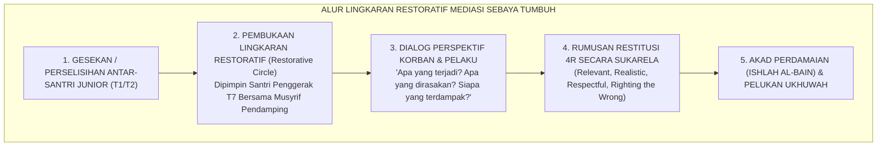

# SUB-BAB 5.4: MEDIASI RESTORATIF OLEH SANTRI PENGGERAK
## *Keterlibatan Aktif Santri Tahap 7 dalam Lingkaran Restoratif (Restorative Circles), Resolusi Damai, dan Ishlah al-Bain*

**Kode Klasifikasi**: `BOOK-02/BAB-05/SUB-04/MONOGRAF-MASTER-VIBRANT`  
**Disiplin Ilmu**: Keadilan Restoratif Komunitas (*Restorative Justice*), Mediasi Teman Sebaya (*Peer Mediation*), & Fiqih Perdamaian Islam (*Fiqh al-Ishlah*)  
**Penanggung Jawab Keilmuan**: Dewan Pakar Ekosistem TUMBUH (*Pakar Kuratif Restoratif & Pakar Psikologi Sosial Santri*)

---

### Ketika Santri Menyelesaikan Konfliknya Sendiri Secara Beradab

Salah satu indikator kematangan budaya di sebuah lembaga pendidikan adalah **bagaimana cara warganya menyelesaikan perselisihan ketika konflik meletus di antara mereka**:
* Di lingkungan konvensional usang, setiap konflik diselesaikan dengan pengadilan sepihak yang represif: santri yang berselisih langsung dibawa ke ruang keamanan, dibentak, dan dihukum tanpa didengarkan perasaannya.
* Di Ekosistem TUMBUH, perselisihan antarsantri junior (seperti salah paham pemakaian barang, ejekan lisan, atau rebutan fasilitas) diselesaikan melalui pendekatan **Mediasi Teman Sebaya Berbasis Keadilan Restoratif (*Peer Restorative Mediation*)**.

Santri Tahap 7 Penggerak dilatih secara khusus untuk menjadi **Fasilitator Lingkaran Damai (*Peace Circle Keepers*)** yang membantu adik-adik kelasnya menemukan jalan keluar secara mandiri, adil, dan penuh keikhlasan.

<b>Gambar 5.4.1:</b> Alur Operasional Lingkaran Restoratif Mediasi Sebaya Ekosistem TUMBUH.

Pakar keadilan restoratif internasional **Howard Zehr**[^1] dalam *The Little Book of Restorative Justice* menegaskan bahwa fokus utama keadilan bukanlah "hukum apa yang dilanggar dan bagaimana cara membalasnya", melainkan **"kerusakan relasi apa yang terjadi dan bagaimana cara memulihkan martabat serta hubungan antar-manusia secara utuh"**.

---

### Keutamaan Syar'i: Pahala Tertinggi Mendamaikan Dua Pihak yang Berselisih (*Ishlah al-Bain*)

Di dalam syariat Islam, peran sebagai pendamai konflik (*Mushlih*) adalah salah satu derajat amal jariyah paling mulia yang melebihi pahala puasa sunnah dan shalat malam.

Rasulullah SAW bersabda dalam hadits shahih yang diriwayatkan oleh **Imam Abu Dawud dan At-Tirmidzi**:
$$\text{أَلَا أُخْبِرُكُمْ بِأَفْضَلَ مِنْ دَرَجَةِ الصِّيَامِ وَالصَّلَاةِ وَالصَّدَقَةِ؟ قَالُوا: بَلَى يَا رَسُولَ اللَّهِ. قَالَ: إِصْلَاحُ ذَاتِ الْبَيْنِ، فَإِنَّ فَسَادَ ذَاتِ الْبَيْنِ هِيَ الْحَالِقَةُ؛ لَا أَقُولُ تَحْلِقُ الشَّعْرَ، وَلَكِنْ تَحْلِقُ الدِّينَ}$$
*"Maukah kalian aku kabarkan tentang suatu amalan yang derajatnya lebih utama daripada derajat puasa sunnah, shalat sunnah, dan sedekah? Para sahabat menjawab: 'Tentu, wahai Rasulullah!' Beliau bersabda: **Mendamaikan perselisihan di antara sesama manusia (*Ishlahu Dzatil Bain*)**; karena sesungguhnya rusaknya hubungan persaudaraan adalah pencukur; aku tidak mengatakan ia mencukur rambut, melainkan ia mencukur habis pahala agama!"* (HR. At-Tirmidzi no. 2509).

**Al-Hafizh Ibnu Hajar al-Asqalani** dalam *Fathul Bari Syarh Shahih al-Bukhari*[^2] menjelaskan bahwa Islam bahkan memberikan rukhshah (keringanan) bagi seorang juru damai untuk menyampaikan kata-kata yang baik yang menyejukkan kedua belah pihak demi meredakan amarah dan menyatukan kembali tali persaudaraan.

---

### Empat Pertanyaan Inti Restoratif dalam Sesi Mediasi

Pakar keadilan restoratif sekolah **Brenda Morrison**[^3] merumuskan **Empat Pertanyaan Restoratif Transformasional (*The Restorative Questions*)** yang digunakan oleh Santri Penggerak saat memediasi juniornya:

| Urutan Dialog Restoratif | Pertanyaan yang Diajukan oleh Santri Penggerak T7 | Tujuan Psikologis & Pembelajaran Adab |
| :--- | :--- | :--- |
| **1. Refleksi Fakta** | *"Bisa ceritakan apa yang sebenarnya terjadi dari sudut pandang antum masing-masing?"* | Menghadirkan kejujuran tanpa saling menyela atau memotong pembicaraan. |
| **2. Refleksi Batin** | *"Apa yang antum rasakan dan pikirkan saat kejadian itu berlangsung?"* | Mengaktifkan empati dan menamai emosi yang tersumbat (*emotional labeling*). |
| **3. Refleksi Dampak** | *"Siapa saja yang merasa tersakiti atau terganggu atas kejadian tersebut?"* | Menyadarkan bahwa tindakan melanggar adab berdampak pada ketenangan seluruh kamar. |
| **4. Komitmen Perbaikan** | *"Apa yang bisa antum lakukan saat ini untuk memperbaiki keadaan dan mengembalikan ukhuwah?"* | Mendorong inisiatif perbaikan sukarela (*Restitution 4R*) tanpa merasa dipaksa. |

---

### Solusi Sistemik TUMBUH: Dewan Perdamaian Kamar (*Majlis Ishlah*)

Di asrama TUMBUH, setiap perselisihan kecil diselesaikan di tingkat kamar melalui **Majlis Ishlah**:
1. Santri Penggerak mengajak kedua pihak duduk bersila melingkar di atas karpet bersih, diawali dengan membaca ta'awwudz dan shalawat nabi.
2. Tidak ada ancaman hukuman fisik atau penghakiman dosa; sesi difokuskan pada dialog saling mendengarkan dan saling memaafkan (*al-'Afwu wash-Shafh*).
3. Setelah kesepakatan perbaikan disetujui, kedua santri saling berjabat tangan, berpelukan erat, dan membaca doa penutup majlis bersama.

Melalui keterlibatan nyata ini, santri Tahap 7 Penggerak belajar menjadi **Diplomat Perdamaian (*Ambassadors of Peace*)**: mereka tidak hanya menguasai teori kitab fiqih, tetapi mampu mengamalkannya secara hidup untuk menyatukan hati-hati manusia di bawah naungan kasih sayang Allah SWT.

---

## 📌 Catatan Kaki & Rujukan Primer

[^1]: **Howard Zehr**, *The Little Book of Restorative Justice* (Intercourse: Good Books, 2002; Edisi Revisi, 2015), Bab 2: "Restorative Principles", hlm. 12–35.
[^2]: **Al-Hafizh Ahmad bin Ali Ibnu Hajar al-Asqalani**, *Fathul Bari bi Syarh Shahih al-Bukhari*, Tahqiq: Syaikh Abdul Aziz bin Abdullah bin Baz (Kairo & Beirut: Dar al-Ma'rifah, 1379 H), Jilid V: "Kitab ash-Shulh", hlm. 298–315.
[^3]: **Brenda Morrison**, *Restoring Safe School Communities: A Whole School Approach to Bullying, Pro-social Behaviour and Addressing Harm* (Sydney: The Federation Press, 2007), Bab 4: "Restorative Practice Framework in Schools", hlm. 85–118.
