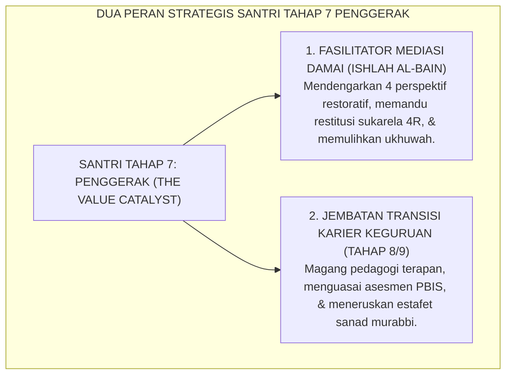

# SUB-BAB 5.4: MEDIASI RESTORATIF & TRANSISI KARIER PENDIDIK
## *Keterlibatan Santri Penggerak dalam Resolusi Damai (Ishlah al-Bain) dan Jembatan Regenerasi Pendidik Tahap 8/9*

**Kode Klasifikasi**: `BOOK-02/BAB-05/SUB-04/MONOGRAF-MASTER-VIBRANT`  
**Disiplin Ilmu**: Keadilan Restoratif Komunitas (*Restorative Justice*), Pengembangan Profesional Pendidik, & Teori Regenerasi Kepemimpinan  
**Penanggung Jawab Keilmuan**: Dewan Pakar Ekosistem TUMBUH (*Pakar Kuratif Restoratif & Pakar Pedagogi Guru*)

---

### Dua Dimensi Kematangan Santri Penggerak: Penegak Damai & Calon Murabbi

Puncak kematangan Santri Tahap 7 Penggerak termanifestasikan dalam dua kapasitas utama:
1. **Duta Mediasi Restoratif (*Restorative Circle Keepers*)**: Membantu musyrif memfasilitasi lingkaran perdamaian (*Majlis Ishlah*) saat terjadi perselisihan antarsantri junior dengan pendekatan keadilan restoratif.
2. **Kesiapan Transisi Menuju Pendidik Profesional**: Melanjutkan pengabdian menjadi Asatidz Pelaksana (Tahap 8) dan Murabbi Pembina (Tahap 9) dalam siklus regenerasi pesantren yang berkelanjutan.

<b>Gambar 5.4.1:</b> Dua Peran Strategis Santri Tahap 7 Penggerak Ekosistem TUMBUH.

Pakar keadilan restoratif **Howard Zehr & Brenda Morrison**[^1] menegaskan bahwa sekolah yang melibatkan murid senior dalam mediasi teman sebaya (*peer mediation*) mengalami penurunan angka konflik fisik hingga lebih dari 80%.

Pakar pendidikan **Lee S. Shulman**[^2] menegaskan pentingnya *Pedagogical Content Knowledge* (PCK) bagi calon guru agar mampu mengajarkan adab secara aplikatif dan kontekstual.

---

### Wawasan Turats: Kemuliaan Ishlah al-Bain & Tanggung Jawab Akhlak Ulama

Rasulullah SAW bersabda: *"Maukah kalian aku kabarkan tentang suatu amalan yang derajatnya lebih utama daripada derajat puasa sunnah, shalat sunnah, dan sedekah? Para sahabat menjawab: 'Tentu, wahai Rasulullah!' Beliau bersabda: **Mendamaikan perselisihan di antara sesama manusia (*Ishlahu Dzatil Bain*)**..."* (HR. At-Tirmidzi no. 2509).

**Al-Imam Abu Bakar al-Ajurri** dalam *Akhlaq al-'Ulama*[^3] menegaskan bahwa pendidik yang telah dianugerahi ilmu wajib mendidik generasi penerusnya dengan kelembutan (*ar-Rifq*), kesabaran (*al-Anah*), dan keikhlasan mutlak demi mencari ridha Allah SWT.

---

## 📌 Catatan Kaki & Rujukan Primer

[^1]: **Howard Zehr**, *The Little Book of Restorative Justice* (Intercourse: Good Books, 2002; Edisi Revisi, 2015), hlm. 12–35; serta **Brenda Morrison**, *Restoring Safe School Communities: A Whole School Approach to Bullying, Pro-social Behaviour and Addressing Harm* (Sydney: The Federation Press, 2007), hlm. 85–118.
[^2]: **Lee S. Shulman**, "Knowledge and teaching: Foundations of the new reform", *Harvard Educational Review*, Vol. 57, No. 1 (1987), hlm. 1–22.
[^3]: **Al-Imam Abu Bakar Muhammad bin al-Husain al-Ajurri**, *Akhlaq al-'Ulama*, Tahqiq: Dr. Faruq Hamadah (Riyadh: Dar Thayyibah, 1408 H / 1987 M), hlm. 48–75.
