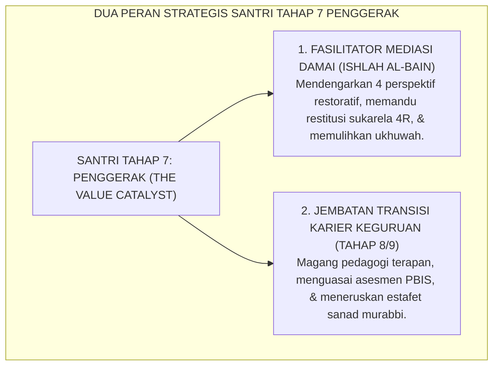
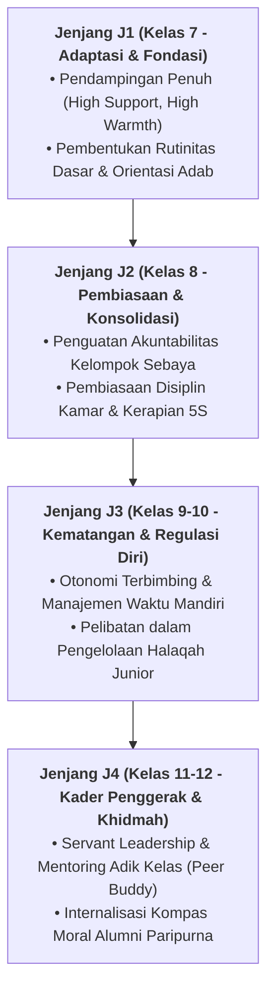

# MEDIASI RESTORATIF & TRANSISI KARIER PENDIDIK

---
### Dua Dimensi Kematangan Santri Penggerak: Penegak Damai & Calon Murabbi

Puncak kematangan Santri Tahap 7 Penggerak termanifestasikan dalam dua kapasitas utama:
1. **Duta Mediasi Restoratif (*Restorative Circle Keepers*)**: Membantu musyrif memfasilitasi lingkaran perdamaian (*Majlis Ishlah*) saat terjadi perselisihan antarsantri junior dengan pendekatan keadilan restoratif.
2. **Kesiapan Transisi Menuju Pendidik Profesional**: Melanjutkan pengabdian menjadi Asatidz Pelaksana (Tahap 8) dan Murabbi Pembina (Tahap 9) dalam siklus regenerasi pesantren yang berkelanjutan.

<b>Gambar 5.4.1:</b> Dua Peran Strategis Santri Tahap 7 Penggerak Ekosistem TUMBUH.

Pakar keadilan restoratif **Howard Zehr & Brenda Morrison**[^1] menegaskan bahwa sekolah yang melibatkan murid senior dalam mediasi teman sebaya (*peer mediation*) mengalami penurunan angka konflik fisik hingga lebih dari 80%.

Pakar pendidikan **Lee S. Shulman**[^2] menegaskan pentingnya *Pedagogical Content Knowledge* (PCK) bagi calon guru agar mampu mengajarkan adab secara aplikatif dan kontekstual.

---

### Wawasan Turats: Kemuliaan Ishlah al-Bain & Tanggung Jawab Akhlak Ulama

Rasulullah SAW bersabda: *"Maukah kalian aku kabarkan tentang suatu amalan yang derajatnya lebih utama daripada derajat puasa sunnah, shalat sunnah, dan sedekah? Para sahabat menjawab: 'Tentu, wahai Rasulullah!' Beliau bersabda: **Mendamaikan perselisihan di antara sesama manusia (*Ishlahu Dzatil Bain*)**..."* (HR. At-Tirmidzi no. 2509).

**Al-Imam Abu Bakar al-Ajurri** dalam *Akhlaq al-'Ulama*[^3] menegaskan bahwa pendidik yang telah dianugerahi ilmu wajib mendidik generasi penerusnya dengan kelembutan (*ar-Rifq*), kesabaran (*al-Anah*), dan keikhlasan mutlak demi mencari ridha Allah SWT.

---

## 📌 Catatan Kaki & Rujukan Primer

[^1]: **Howard Zehr**, *The Little Book of Restorative Justice* (Intercourse: Good Books, 2002; Edisi Revisi, 2015), hlm. 12–35; serta **Brenda Morrison**, *Restoring Safe School Communities: A Whole School Approach to Bullying, Pro-social Behaviour and Addressing Harm* (Sydney: The Federation Press, 2007), hlm. 85–118.
[^2]: **Lee S. Shulman**, "Knowledge and teaching: Foundations of the new reform", *Harvard Educational Review*, Vol. 57, No. 1 (1987), hlm. 1–22.
[^3]: **Al-Imam Abu Bakar Muhammad bin al-Husain al-Ajurri**, *Akhlaq al-'Ulama*, Tahqiq: Dr. Faruq Hamadah (Riyadh: Dar Thayyibah, 1408 H / 1987 M), hlm. 48–75.

---

### IV. Pembedahan Kapasitas Lanjutan & Trajektori Progresi Mediasi Restoratif & Transisi Karier Pendidik

Pengembangan kompetensi **MEDIASI RESTORATIF & TRANSISI KARIER PENDIDIK** pada santri memerlukan strategi diferensiasi yang selaras dengan tahapan usia perkembangan remaja (*Developmental Milestones*):

1. **Dekomposisi Indikator Kematangan Perilaku**:
   Untuk memastikan karakter **MEDIASI RESTORATIF & TRANSISI KARIER PENDIDIK** tertanam secara operasional, dewan asatidz dan musyrif memetakan indikator perilakunya ke dalam 3 ranah capaian:
   * **Ranah Kognitif-Reflektif (*Ma'rifah*)**: Santri memahami dalil syar'i, urgensi akhlak, dan konsekuensi logis dari setiap pilihannya.
   * **Ranah Afektif-Ruhiyyah (*Wijdan*)**: Tumbuhnya kepekaan nurani, rasa malu berbuat dosa (*Haya'*), dan kenikmatan dalam berbuat kebajikan.
   * **Ranah Psikomotorik-Habituasi (*'Amal*)**: Terwujudnya keterampilan bertindak nyata secara spontan, konsisten, dan mandiri tanpa perlu disuruh.

2. **Matriks Penahapan Lintas Jenjang Kemandirian (J1–J4)**:

3. **Rubrik Evaluasi Kualitatif & Indikator Pencapaian**:

| Level Kemandirian | Karakteristik Perilaku Teramati (*Behavioral Anchor*) | Pendekatan Bimbingan Musyrif |
| :--- | :--- | :--- |
| **Level 1 (Emerging)** | Memerlukan instruksi berulang dan pengawasan langsung musyrif. | *Direct Prompting* & pengingat visual harian. |
| **Level 2 (Developing)** | Mampu menjalankan adab saat diingatkan oleh teman sebaya. | Penguatan positif melalui pujian deskriptif. |
| **Level 3 (Proficient)** | Menjalankan adab secara mandiri dan konsisten tanpa diawasi. | Pemberian kepercayaan dan peran tanggung jawab kamar. |
| **Level 4 (Exemplary)** | Menjadi teladan (*Qudwah*) dan mampu membimbing kawan-kawannya. | Pelibatan aktif dalam struktur Dewan Santri & Mentor. |

---

### V. Panduan Praksis Pendampingan Musyrif di Asrama

Agar penanaman **MEDIASI RESTORATIF & TRANSISI KARIER PENDIDIK** berhasil maksimal di lapangan, musyrif disarankan menerapkan protokol pendampingan berikut:
* **Fokus pada Usaha (*Effort-Oriented Praise*)**: Berikan apresiasi atas proses perjuangan santri dalam memperbaiki diri, bukan semata-mata hasil akhir yang sempurna.
* **Dialog Sokratik Saat Santri Mengalami Kesulitan**: Ajukan pertanyaan reflektif seperti: *"Apa yang membuat antum merasa berat menjalankan adab ini hari ini? Bagaimana kita bisa mengatasinya bersama besok?"*
* **Menjaga Iklim Ukhuwah Bebas Perundungan**: Pastikan senioritas dimaknai sebagai amanah pengayoman dan perlindungan kepada yang lebih muda, bukan hak istimewa untuk memerintah.
