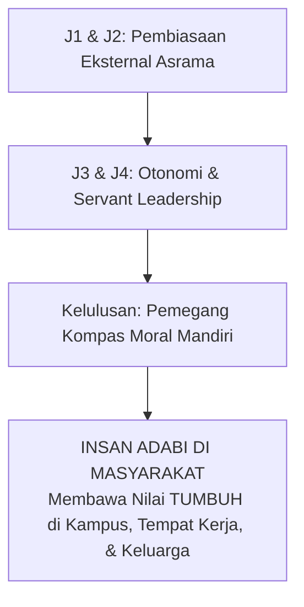

# TRANSISI KEPENGASUHAN & KEMANDIRIAN PASCA-PESANTREN

---
### Ujian Hakiki Adab Adalah di Luar Pagar Pesantren

Santri Tahap 7 Penggerak dibekali kemampuan navigasi moral independen: tetap menjaga shalat berjamaah, integritas muamalah, dan kerendahan hati saat berbaur di kampus sekuler maupun dunia profesional internasional.

#### A. Menjaga Nyala Adab di Luar Gerbang Pesantren
Ujian sejati pendidikan karakter di pesantren bukanlah saat santri berada di dalam lingkungan yang serba terkontrol, melainkan ketika mereka melangkah keluar ke dunia kampus, masyarakat, dan dunia digital:
1. **Transisi Bertahap Menuju Otonomi Penuh**: Pada kelas 12 (Jenjang J4), santri diberi kepercayaan mengelola jadwal belajar mandiri, memimpin kepanitiaan pondok, dan menjadi mentor bagi adik kelas tanpa pengawasan ketat musyrif.
2. **Internalisasi Kompas Moral Pribadi**: Memastikan motivasi beribadah dan menjaga pandangan telah bertransformasi dari faktor eksternal (takut musyrif) menjadi kesadaran batin (*Muraqabatullah*).
3. **Jejaring Ikatan Alumni Karakter**: Membangun forum mentoring berkala antara alumni senior yang sukses berkarier dengan santri yang baru lulus untuk menjaga bi'ah shalihah di bangku universitas.

#### B. Panduan Pengasuhan Menjelang Kelulusan
* Sediakan program pembekalan pra-kampus: literasi digital islami, manajemen finansial halal, dan mitigasi fitnah syubhat & syahwat.
* Berikan sertifikat Transkrip Karakter Naratif yang mengabadikan jam khidmah sosial dan rekam jejak kepemimpinan santri.
