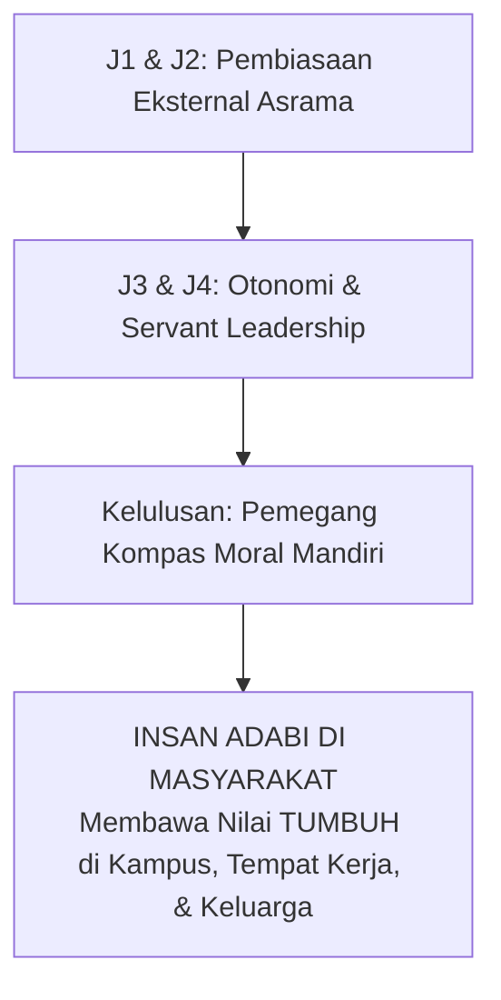
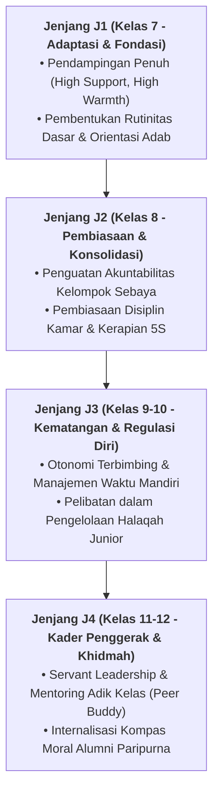

# TRANSISI KEPENGASUHAN & KEMANDIRIAN PASCA-PESANTREN

---
### Ujian Hakiki Adab Adalah di Luar Pagar Pesantren

Santri Tahap 7 Penggerak dibekali kemampuan navigasi moral independen: tetap menjaga shalat berjamaah, integritas muamalah, dan kerendahan hati saat berbaur di kampus sekuler maupun dunia profesional internasional.

#### A. Menjaga Nyala Adab di Luar Gerbang Pesantren
Ujian sejati pendidikan karakter di pesantren bukanlah saat santri berada di dalam lingkungan yang serba terkontrol, melainkan ketika mereka melangkah keluar ke dunia kampus, masyarakat, dan dunia digital:
1. **Transisi Bertahap Menuju Otonomi Penuh**: Pada kelas 12 (Jenjang J4), santri diberi kepercayaan mengelola jadwal belajar mandiri, memimpin kepanitiaan pondok, dan menjadi mentor bagi adik kelas tanpa pengawasan ketat musyrif.
2. **Internalisasi Kompas Moral Pribadi**: Memastikan motivasi beribadah dan menjaga pandangan telah bertransformasi dari faktor eksternal (takut musyrif) menjadi kesadaran batin (*Muraqabatullah*).
3. **Jejaring Ikatan Alumni Karakter**: Membangun forum mentoring berkala antara alumni senior yang sukses berkarier dengan santri yang baru lulus untuk menjaga bi'ah shalihah di bangku universitas.

#### B. Panduan Pengasuhan Menjelang Kelulusan
* Sediakan program pembekalan pra-kampus: literasi digital islami, manajemen finansial halal, dan mitigasi fitnah syubhat & syahwat.
* Berikan sertifikat Transkrip Karakter Naratif yang mengabadikan jam khidmah sosial dan rekam jejak kepemimpinan santri.

---

### IV. Pembedahan Kapasitas Lanjutan & Trajektori Progresi Transisi Kepengasuhan & Kemandirian Pasca-Pesantren

Pengembangan kompetensi **TRANSISI KEPENGASUHAN & KEMANDIRIAN PASCA-PESANTREN** pada santri memerlukan strategi diferensiasi yang selaras dengan tahapan usia perkembangan remaja (*Developmental Milestones*):

1. **Dekomposisi Indikator Kematangan Perilaku**:
   Untuk memastikan karakter **TRANSISI KEPENGASUHAN & KEMANDIRIAN PASCA-PESANTREN** tertanam secara operasional, dewan asatidz dan musyrif memetakan indikator perilakunya ke dalam 3 ranah capaian:
   * **Ranah Kognitif-Reflektif (*Ma'rifah*)**: Santri memahami dalil syar'i, urgensi akhlak, dan konsekuensi logis dari setiap pilihannya.
   * **Ranah Afektif-Ruhiyyah (*Wijdan*)**: Tumbuhnya kepekaan nurani, rasa malu berbuat dosa (*Haya'*), dan kenikmatan dalam berbuat kebajikan.
   * **Ranah Psikomotorik-Habituasi (*'Amal*)**: Terwujudnya keterampilan bertindak nyata secara spontan, konsisten, dan mandiri tanpa perlu disuruh.

2. **Matriks Penahapan Lintas Jenjang Kemandirian (J1–J4)**:

3. **Rubrik Evaluasi Kualitatif & Indikator Pencapaian**:

| Level Kemandirian | Karakteristik Perilaku Teramati (*Behavioral Anchor*) | Pendekatan Bimbingan Musyrif |
| :--- | :--- | :--- |
| **Level 1 (Emerging)** | Memerlukan instruksi berulang dan pengawasan langsung musyrif. | *Direct Prompting* & pengingat visual harian. |
| **Level 2 (Developing)** | Mampu menjalankan adab saat diingatkan oleh teman sebaya. | Penguatan positif melalui pujian deskriptif. |
| **Level 3 (Proficient)** | Menjalankan adab secara mandiri dan konsisten tanpa diawasi. | Pemberian kepercayaan dan peran tanggung jawab kamar. |
| **Level 4 (Exemplary)** | Menjadi teladan (*Qudwah*) dan mampu membimbing kawan-kawannya. | Pelibatan aktif dalam struktur Dewan Santri & Mentor. |

---

### V. Panduan Praksis Pendampingan Musyrif di Asrama

Agar penanaman **TRANSISI KEPENGASUHAN & KEMANDIRIAN PASCA-PESANTREN** berhasil maksimal di lapangan, musyrif disarankan menerapkan protokol pendampingan berikut:
* **Fokus pada Usaha (*Effort-Oriented Praise*)**: Berikan apresiasi atas proses perjuangan santri dalam memperbaiki diri, bukan semata-mata hasil akhir yang sempurna.
* **Dialog Sokratik Saat Santri Mengalami Kesulitan**: Ajukan pertanyaan reflektif seperti: *"Apa yang membuat antum merasa berat menjalankan adab ini hari ini? Bagaimana kita bisa mengatasinya bersama besok?"*
* **Menjaga Iklim Ukhuwah Bebas Perundungan**: Pastikan senioritas dimaknai sebagai amanah pengayoman dan perlindungan kepada yang lebih muda, bukan hak istimewa untuk memerintah.
