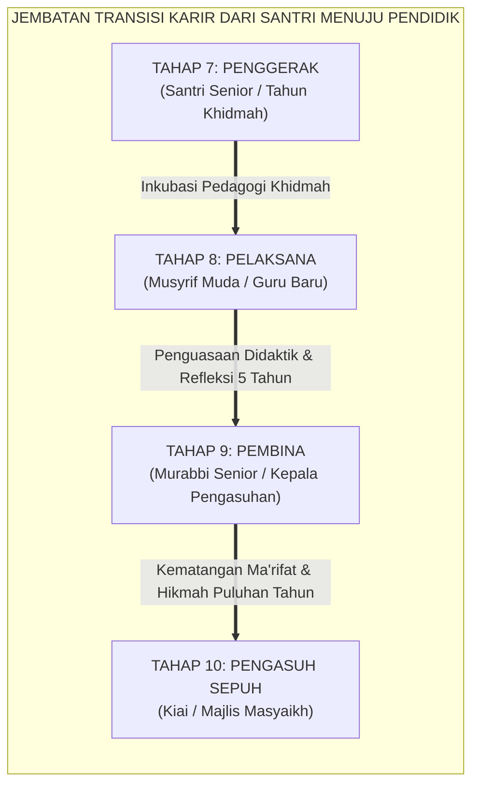

# SUB-BAB 5.5: TRANSISI MENUJU TAHAP 8 (PELAKSANA) & TAHAP 9 (PEMBINA)
## *Jembatan Karier Keguruan Santri: Dari Kepemimpinan Siswa Menuju Pendidik Profesional Berkarakter Murabbi Sejati*

**Kode Klasifikasi**: `BOOK-02/BAB-05/SUB-05/MONOGRAF-MASTER-VIBRANT`  
**Disiplin Ilmu**: Pengembangan Profesional Pendidik (*Teacher Professional Development*), Pedagogi Pengasuhan Pesantren, & Teori Regenerasi Kepemimpinan  
**Penanggung Jawab Keilmuan**: Dewan Pakar Ekosistem TUMBUH (*Pakar Pedagogi Guru & Pakar Tata Kelola Qudwah*)

---

### Kontinuum Pertumbuhan yang Tak Pernah Putus

Salah satu keunikan paling agung dari Ekosistem TUMBUH adalah **keberlanjutan kontinuum perkembangan karakter yang tidak berhenti ketika seorang santri lulus wisuda**.

Pertumbuhan karakter dipandang sebagai sebuah tangga estafet peradaban:
* **Tahap 1 s.d. 7 (Fase Santri)**: Dari Tahap 1 (Santri Baru / Adaptasi) hingga Tahap 7 (Santri Penggerak / Khidmah).
* **Tahap 8: PELAKSANA (Musyrif & Guru Muda)**: Santri yang memilih jalur karier pendidik melanjutkan pengabdiannya sebagai tenaga pendidik profesional muda.
* **Tahap 9: PEMBINA (Murabbi Senior & Pimpinan Satuan)**: Menjadi pakar pengasuhan yang mengader musyrif-musyrif baru dan mengawal mutu tata kelola lembaga.
* **Tahap 10: PENJAGA / PENGASUH SEPUH (Kiai & Majlis Masyaikh)**: Penjaga marwah sanad keilmuan dan arah filosofis tertinggi pesantren.

<b>Gambar 5.5.1:</b> Jembatan Transisi Karier dari Santri Penggerak Menuju Pendidik Master Ekosistem TUMBUH.

Pakar pendidikan internasional **Lee S. Shulman**[^1] menegaskan bahwa penguasaan konten keilmuan (*subject matter knowledge*) harus berpadu dengan pengetahuan pedagogi konten (*Pedagogical Content Knowledge / PCK*) agar seorang lulusan mampu mentransformasikan ilmu yang dimilikinya menjadi pemahaman yang hidup di hati para muridnya.

---

### Transformasi Kompetensi dari Tahap 7 Menuju Tahap 8 (Pelaksana)

Ketika seorang Santri Penggerak (Tahap 7) diangkat resmi menjadi Musyrif Muda atau Asatidz Pelaksana (Tahap 8), ia mengalami pergeseran paradigma tanggung jawab:

| Dimensi Peran | Tahap 7: Santri Penggerak (Siswa) | Tahap 8: Asatidz Pelaksana (Pendidik Profesional) |
| :--- | :--- | :--- |
| **1. Tanggung Jawab Hukum** | Menjalankan kepemimpinan siswa di bawah supervisi musyrif. | Memegang tanggung jawab hukum penuh atas keselamatan fisik dan psikologis santri (*Duty of Care*). |
| **2. Penguasaan Metodologi** | Praktik mentoring sebaya berbasis empati alami. | Menguasai metodologi asesmen PBIS, intervensi multi-tier, dan diagnosis FBA/BIP secara sistemik. |
| **3. Manajemen Emosi Kerja** | Menjaga stabilitas diri di sela-sela jadwal belajar. | Mengelola stres kerja pengasuhan (*workplace stress*) dan menerapkan strategi proteksi diri dari kelelahan mental (*burnout*). |
| **4. Kedudukan Otoritas** | Menjadi teladan kawan sebaya (*Peer Qudwah*). | Menjadi figur pengganti orang tua yang berwibawa (*In Loco Parentis*). |

---

### Mitigasi Burnout: Melindungi Musyrif Muda Melalui Model JD-R

Pakar psikologi kerja dan organisasi **Arnold B. Bakker & Evangelia Demerouti**[^2] dalam *Job Demands-Resources (JD-R) Model* membuktikan bahwa tingginya tuntutan kerja pengasuhan asrama 24 jam (*job demands*) hanya dapat diimbangi apabila lembaga menyediakan sumber daya pendukung (*job resources*) yang berlimpah: supervisi hangat dari atasan, fasilitas istirahat layak, dan apresiasi kompensasi yang adil.

Sistem TUMBUH melindungi para Musyrif Muda Tahap 8:
* Menetapkan rotasi jam kerja yang manusiawi (maksimal shift jaga aktif 8 jam berturut-turut).
* Menyediakan ruang konseling dan supervisi klinis mingguan bersama Guru Pembina Tahap 9.
* Mengharamkan tradisi membiarkan musyrif muda berjuang sendirian menangani kasus santri berat tanpa pendampingan tim.

---

### Wawasan Turats: Sanad Keguruan & Kemuliaan Akhlak Ulama

Karier keguruan pesantren adalah jalan menyambung rantai sanad kenabian (*Ittishal as-Sanad ila Rasulillah SAW*).

**Al-Imam Abu Bakar Muhammad bin al-Husain al-Ajurri** dalam kitab monumentalnya *Akhlaq al-'Ulama*[^3] melukiskan profil pendidik Islam sejati:

> [!NOTE]
> ### 📜 Pesan Imam Al-Ajurri tentang Karakter Pendidik Sejati:
> 
> $$\text{يَنْبَغِي لِمَنْ عَلَّمَهُ اللَّهُ الْعِلْمَ أَنْ يَتَوَاضَعَ لِمَنْ يُعَلِّمُهُ، وَأَنْ يَجْعَلَ هَمَّهُ نَجَاةَ مَنْ يُرَبِّيهِ، لَا يَطْلُبُ بِعِلْمِهِ رِئَاسَةً وَلَا فَخْرًا، بَلْ يَكُونُ كَالْأَبِ الرَّحِيمِ الَّذِي يُرَبِّي صِغَارَ أَوْلَادِهِ بِالرِّفْقِ وَالْأَنَاةِ}$$
> 
> **Artinya:**  
> *"Sepatutnya bagi orang yang telah dianugerahi ilmu oleh Allah untuk senantiasa bersikap rendah hati kepada murid yang ia ajar, dan hendaklah orientasi terbesarnya adalah menyelamatkan jiwa murid yang ia bimbing. Jangan sekali-kali ia mencari kedudukan dan kemegahan dengan ilmunya; melainkan hendaklah ia bersikap laksana seorang ayah yang penyayang yang mendidik anak-anaknya dengan penuh kelembutan (*ar-Rifq*) dan kesabaran mendalam (*al-Anah*)."*

**Hadhratusy Syaikh KH. M. Hasyim Asy'ari** dalam *Adab al-'Alim wal Muta'allim*[^4] menegaskan bahwa puncak kebahagiaan seorang guru adalah ketika ia melihat santri-santri yang dididiknya kelak bertumbuh menjadi manusia yang lebih alim, lebih shalih, dan lebih bermanfaat bagi umat dibanding dirinya sendiri.

---

### Solusi Sistemik TUMBUH: Akademi Pembina TUMBUH (*TUMBUH Murabbi Academy*)

Untuk menjamin kualitas transisi kepemimpinan ini, Ekosistem TUMBUH mendirikan **Akademi Pembina TUMBUH**:
1. **Program Induksi Musyrif Baru 6 Bulan**: Pendampingan intensif bagi Musyrif Tahap 8 oleh Mentor Senior Tahap 9 sebelum bertugas mandiri penuh.
2. **Klinik Refleksi Pedagogi Bulanan**: Forum bedah kasus pengasuhan (*Case Conference*) untuk mengasah keterampilan diagnosis masalah santri berbasis data objektif.
3. **Jenjang Karier Jelas & Terstandar**: Setiap pendidik memiliki peta pengembangan profesi yang terstruktur dari Pelaksana, Pembina Muda, Pembina Madya, hingga Murabbi Utama.

Dengan tuntasnya Bab 05 ini, siklus kaderisasi kepemimpinan santri dan pendidik telah terangkai sempurna, siap melangkah ke bab pamungkas **Bab 06: Matriks Kompetensi Lintas Jenjang & Diferensiasi Gender**.

---

## 📌 Catatan Kaki & Rujukan Primer

[^1]: **Lee S. Shulman**, "Knowledge and teaching: Foundations of the new reform", *Harvard Educational Review*, Vol. 57, No. 1 (1987), hlm. 1–22.
[^2]: **Arnold B. Bakker & Evangelia Demerouti**, "The Job Demands-Resources model: State of the art", *Journal of Managerial Psychology*, Vol. 22, No. 3 (2007), hlm. 309–328.
[^3]: **Al-Imam Abu Bakar Muhammad bin al-Husain al-Ajurri**, *Akhlaq al-'Ulama*, Tahqiq: Dr. Faruq Hamadah (Riyadh: Dar Thayyibah, 1408 H / 1987 M), hlm. 48–75.
[^4]: **Hadhratusy Syaikh KH. M. Hasyim Asy'ari**, *Adab al-'Alim wal Muta'allim fi ma Yahtaju Ilayhi al-Muta'allim fi Ahwal Ta'allumihi wa ma Yatawaqqafu 'alayhi al-Mu'allim fi Maqamat Ta'limihi* (Jombang: Maktabah at-Turats al-Islami, 1415 H), Bab 1: "Fi Adab al-Mu'allim", hlm. 16–25.
