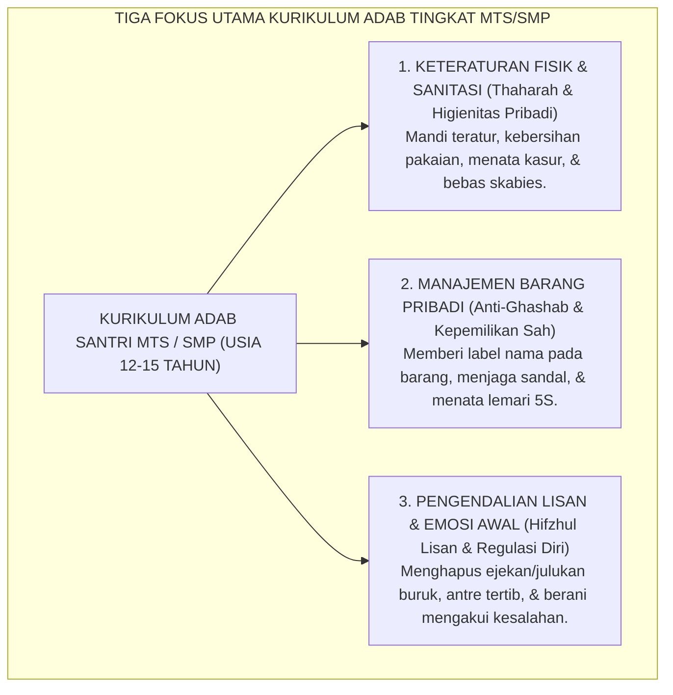

# PEMETAAN CAPAIAN TINGKAT MTS / SMP (KELAS 7, 8, 9)

---

### 🧭 PETA POSISI PANDUAN DALAM SISTEM TUMBUH (DARI HULU KE HILIR)
* **Posisi Arsitektur**: `BATANG EKOSISTEM I (Taksonomi 10 Muwashafat Adab & Tangga Kemandirian J1–J4)`
* **Peruntukan Pengguna**: Wali Kelas, Musyrif Kamar, Guru Pengampu Adab, & Mentor Santri
* **Fokus Panduan**: Memandu tahapan penanaman 10 Karakter Adab Nabawi dari fase Adaptasi (J1), Pembiasaan (J2), Kematangan (J3), hingga Kader Penggerak (J4/Tahap 7).
* **Hasil Akhir yang Dituju**: Terwujudnya santri berkarakter *Insan Adabi* yang mandiri, musyrif yang mengasuh dengan kasih sayang tanpa *burnout*, dan pesantren yang aman berbasis data (*Safe Boarding School*).

---

### 🎯 Mengapa Panduan Ini Ada & Masalah Nyata yang Dipecahkan
1. **Latar Masalah di Lapangan**: Sering kali pengasuhan di pesantren berjalan tanpa SOP yang jelas atau terjebak dalam pola reaktif—menunggu santri berbuat salah baru dihukum dengan emosional.
2. **Solusi Sistem TUMBUH**: Panduan ini memberikan langkah preventif dan terstruktur agar setiap pembiasaan adab berjalan terencana, konsisten, dan terukur.
3. **Sasaran Perubahan**: Memastikan nilai-nilai Islam menyatu dalam perilaku harian santri melalui keteladanan nyata (*Qudwah Hasanah*).

---
### 🎯 Tujuan & Manfaat Panduan
Panduan ini dirancang sebagai petunjuk operasional terapan agar pendidik dan musyrif dapat:
1. Menjalankan pembinaan adab santri dengan pendekatan kasih sayang (*Rahmah*) dan ketegasan yang mendidik (*Firm & Kind*).
2. Menghindari cara-cara kekerasan fisik, bentakan verbal, maupun hukuman yang mempermalukan santri.
3. Menciptakan suasana asrama dan kelas yang aman, tertib, dan menumbuhkan kesadaran diri (*Bi'ah Shalihah*).

---

### 💡 Intisari Cepat (3 Menit Memahami Esensi)
* **Kunci Pengasuhan**: Karakter santri tumbuh melalui keteladanan nyata (*Qudwah Hasanah*), komunikasi empatik, dan pembiasaan terstruktur 24 jam.
* **Tindakan Utama**: Terapkan panduan langkah demi langkah di bawah ini secara konsisten, pantau perkembangan santri secara objektif, dan berikan apresiasi atas setiap perbaikan diri yang mereka capai.
* **Prinsip Disiplin**: Fokus pada pemulihan hubungan dan tanggung jawab nyata (*Restoratif*), bukan sekadar melampiaskan amarah atau menghukum.

---

### 📖 Uraian Panduan & Langkah Aksi Lapangan

---

### Karakteristik Perkembangan Santri MTs / SMP (Usia 12–15 Tahun)

Jenjang Madrasah Tsanawiyah (MTs) atau Sekolah Menengah Pertama (SMP) adalah **fase fondasi pembentukan kepribadian santri**.

Santri pada rentang usia 12 hingga 15 tahun memiliki ciri khas perkembangan yang sangat spesifik:
* **Secara Fisik**: Sedang mengalami percepatan pertumbuhan biologis (*growth spurt*), sering merasa lapar, mudah lelah, dan memiliki koordinasi motorik yang masih beradaptasi.
* **Secara Kognitif**: Sedang bertransisi dari tahap berpikir operasional konkret menuju tahap operasional formal; masih membutuhkan aturan yang jelas, visual, dan terstruktur.
* **Secara Sosio-Emosional**: Sangat sensitif terhadap penerimaan teman sebaya, rentan mengalami kecemasan sosial, dan masih membutuhkan bimbingan intensif dalam mengelola barang-barang pribadinya.

<b>Gambar 6.1.1:</b> Tiga Fokus Utama Kurikulum Karakter Santri Tingkat MTs/SMP.

Pakar perkembangan manusia **Robert J. Havighurst**[^1] merumuskan bahwa tugas perkembangan utama pada masa remaja awal (*early adolescence*) adalah menerima kondisi fisik tubuhnya, belajar bergaul dengan teman sebaya dari berbagai latar belakang, dan mencapai kemandirian emosional dasar dari orang tua.

---

### Matriks Capaian Pembelajaran Adab Berjenjang MTs (Kelas 7, 8, dan 9)

Pakar diferensiasi kurikulum **Carol Ann Tomlinson**[^2] menekankan bahwa kurikulum yang efektif harus disesuaikan dengan kesiapan belajar (*readiness*), minat, dan profil belajar peserta didik. 

Tabel berikut menyajikan pemetaan capaian adab berjenjang pada tingkat MTs dalam sistem TUMBUH di pesantren:

| Jenjang Kelas | Target Jenjang Kemandirian TUMBUH (J1–J4) | Fokus Capaian Pembelajaran Karakter (Observable Behaviors) |
| :--- | :--- | :--- |
| **Kelas 7 MTs** *(Usia 12–13 Tahun)* | **Jenjang J1 (Adaptasi)** $\rightarrow$ **Awal Jenjang J2 (Habituasi)** | • Mengatasi kerinduan rumah (*homesickness*) secara sehat. • Hafal jadwal kegiatan harian asrama dan madrasah. • Menjaga kebersihan loker pribadi dan tidak meletakkan pakaian kotor sembarangan. • Mengenakan sandal sendiri dan tidak pernah mengambil sandal kawan tanpa izin. • Hadir di masjid tepat saat adzan berkumandang. |
| **Kelas 8 MTs** *(Usia 13–14 Tahun)* | **Jenjang J2 (Habituasi Penuh)** | • Melaksanakan tugas piket kamar dan lorong secara konsisten tanpa diperingatkan. • Menolak terlibat dalam perundungan verbal atau pemberian julukan buruk (*laqab pejoratif*). • Mampu mencuci dan melipat pakaian pribadi secara mandiri. • Mengelola uang saku mingguan dengan catatan pembukuan sederhana. • Menjaga keheningan saat muthala'ah malam di kamar. |
| **Kelas 9 MTs** *(Usia 14–15 Tahun)* | **Transisi Menuju Jenjang J3 (Internalisasi Awal)** | • Shalat berjamaah di shaf pertama atas kesadaran *muraqabatullah* mandiri. • Berani menolak ajakan kawan untuk melanggar aturan pondok (*peer resistance*). • Menyelesaikan perselisihan dengan kawan sekamar melalui dialog damai. • Menjadi teladan ketertiban bagi santri kelas 7 (memulai peran *junior buddy*). • Memiliki target hafalan Al-Qur'an dan muthala'ah kitab yang terencana mandiri. |

---

### Wawasan Turats: Tahapan Mendidik Anak Usia Dini Remaja

Pembagian target capaian usia 12–15 tahun ini sangat selaras dengan arahan para ulama pedagogi Islam klasik.

**Al-Imam Abu al-Hasan Ali bin Muhammad al-Qabisi** dalam *Ar-Risalah al-Mufashshilah*[^3] menegaskan bahwa pada masa pubertas awal, pendidik wajib fokus pada pembiasaan ibadah praktis, penataan disiplin harian, dan pemisahan tempat tidur (*tafriq fil madhaji'*), serta mengawasi pergaulan anak agar tidak terjerumus pada pengaruh buruk kawan sebayanya.

**Syekh Burhanuddin Al-Zarnuji** dalam *Ta'lim al-Muta'allim*[^4] menggarisbawahi bahwa santri pemula wajib dilatih untuk tidak makan secara berlebihan (*taqlil ath-tha'am*) dan tidak banyak tidur, karena keteraturan fisik adalah kunci terbukanya pintu kecerdasan akal dan kelembutan hati.

---

### Solusi Sistemik TUMBUH: Buku Panduan Logbook Adab MTs

Dalam sistem TUMBUH di pesantren, setiap santri MTs memegang **Buku Jurnal Adab Harian MTs (*My Daily Adab Log*)**:
* Berisi checklist 7 kebiasaan emas harian: Shalat 5 waktu berjamaah, tilawah 1 juz, loker rapi 5S, qobliyah-ba'diyah, piket kamar, kata-kata santun, dan tidur tepat pukul 22.00 WIB.
* Diperiksa secara berkala setiap sore oleh Musyrif Asrama dan diparaf oleh Wali Kelas Madrasah, mewujudkan sinergi pengasuhan yang utuh dan terukur.

Santri lulusan MTs TUMBUH bertumbuh menjadi remaja yang kokoh fondasi adabnya: mandiri merawat dirinya, santun tutur katanya, dan tertib dalam ritme ibadahnya, siap menapaki tangga kedewasaan pada tingkat Madrasah Aliyah.

---

## 📌 Catatan Kaki & Rujukan Primer

[^1]: **Robert J. Havighurst**, *Human Development and Education* (New York: Longmans, Green and Co., 1953), Bab 9: "Developmental Tasks of Early Adolescence", hlm. 111–158.
[^2]: **Carol Ann Tomlinson**, *The Differentiated Classroom: Responding to the Needs of All Learners* (Alexandria: Association for Supervision and Curriculum Development / ASCD, 1999; Edisi ke-2, 2014), Bab 2: "The Elements of Differentiation", hlm. 15–38.
[^3]: **Al-Imam Abu al-Hasan Ali bin Muhammad al-Qabisi**, *Ar-Risalah al-Mufashshilah li Ahwal al-Mu'allimin wa Ahkam al-Mu'allimin wal Muta'allimin*, Tahqiq: Ahmad Khalid Jam'ah (Damaskus: Dar al-Fikr, 1986), hlm. 68–95.
[^4]: **Al-Imam Burhanuddin al-Zarnuji**, *Ta'lim al-Muta'allim Thariq at-Ta'allum*, Tahqiq: Syaikh Mustafa Asyur (Kairo: Dar al-I'tisham, 1986), hlm. 35–48.
