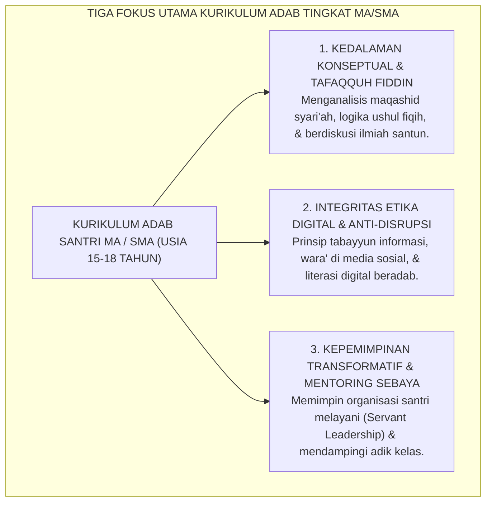

# PEMETAAN CAPAIAN TINGKAT MA / SMA (KELAS 10, 11, 12)

---

### 🧭 PETA POSISI PANDUAN DALAM SISTEM TUMBUH (DARI HULU KE HILIR)
* **Posisi Arsitektur**: `BATANG EKOSISTEM I (Taksonomi 10 Muwashafat Adab & Tangga Kemandirian J1–J4)`
* **Peruntukan Pengguna**: Wali Kelas, Musyrif Kamar, Guru Pengampu Adab, & Mentor Santri
* **Fokus Panduan**: Memandu tahapan penanaman 10 Karakter Adab Nabawi dari fase Adaptasi (J1), Pembiasaan (J2), Kematangan (J3), hingga Kader Penggerak (J4/Tahap 7).
* **Hasil Akhir yang Dituju**: Terwujudnya santri berkarakter *Insan Adabi* yang mandiri, musyrif yang mengasuh dengan kasih sayang tanpa *burnout*, dan pesantren yang aman berbasis data (*Safe Boarding School*).

---

### 🎯 Mengapa Panduan Ini Ada & Masalah Nyata yang Dipecahkan
1. **Latar Masalah di Lapangan**: Sering kali pengasuhan di pesantren berjalan tanpa SOP yang jelas atau terjebak dalam pola reaktif—menunggu santri berbuat salah baru dihukum dengan emosional.
2. **Solusi Sistem TUMBUH**: Panduan ini memberikan langkah preventif dan terstruktur agar setiap pembiasaan adab berjalan terencana, konsisten, dan terukur.
3. **Sasaran Perubahan**: Memastikan nilai-nilai Islam menyatu dalam perilaku harian santri melalui keteladanan nyata (*Qudwah Hasanah*).

---
### 🎯 Tujuan & Manfaat Panduan
Panduan ini dirancang sebagai petunjuk operasional terapan agar pendidik dan musyrif dapat:
1. Menjalankan pembinaan adab santri dengan pendekatan kasih sayang (*Rahmah*) dan ketegasan yang mendidik (*Firm & Kind*).
2. Menghindari cara-cara kekerasan fisik, bentakan verbal, maupun hukuman yang mempermalukan santri.
3. Menciptakan suasana asrama dan kelas yang aman, tertib, dan menumbuhkan kesadaran diri (*Bi'ah Shalihah*).

---

### 💡 Intisari Cepat (3 Menit Memahami Esensi)
* **Kunci Pengasuhan**: Karakter santri tumbuh melalui keteladanan nyata (*Qudwah Hasanah*), komunikasi empatik, dan pembiasaan terstruktur 24 jam.
* **Tindakan Utama**: Terapkan panduan langkah demi langkah di bawah ini secara konsisten, pantau perkembangan santri secara objektif, dan berikan apresiasi atas setiap perbaikan diri yang mereka capai.
* **Prinsip Disiplin**: Fokus pada pemulihan hubungan dan tanggung jawab nyata (*Restoratif*), bukan sekadar melampiaskan amarah atau menghukum.

---

---

### 💬 ILUSTRASI NYATA & ANALOGI SEDERHANA
Bayangkan sebuah skenario yang sering kita lihat sehari-hari di asrama:
* Ketika seorang santri baru melakukan kekeliruan (misalnya terlambat bangun Subuh atau kasurnya berantakan), respon pertama yang sering muncul adalah bentakan keras atau hukuman fisik (seperti push-up atau jemur di lapangan).
* **Hasilnya?** Santri tersebut mungkin tampak patuh seketika karena takut, tetapi di dalam hatinya tumbuh rasa dongkol, dendam tersembunyi, atau kebiasaan "bersandiwara"—hanya tertib ketika ada pengawas di dekatnya.

Dalam Sistem TUMBUH, kita menggunakan cara yang jauh lebih cerdas, sejuk, dan membumi:
1. **Analogi "Rem dan Pedal Gas Otak"**: Santri usia remaja (usia MTs dan Aliyah) memiliki bagian otak emosi (*Sistem Limbik*) yang sudah menyala sangat kuat seperti *pedal gas mobil sport*, namun otak pengendali logikanya (*Prefrontal Cortex*) masih dalam proses tumbuh seperti *sistem rem yang baru dipasang*. Tugas guru dan musyrif bukan memarahi mobilnya, melainkan menjadi **"Sopir Teladan & Sabuk Pengaman"** yang mendampingi santri belajar menginjak rem dengan bijak.
2. **Kekuatan Contoh Nyata (*Qudwah Hasanah*)**: Santri jauh lebih cepat meniru apa yang mereka **lihat** setiap hari daripada apa yang mereka **dengar** dari ribuan nasihat panjang. Jika musyrif datang tepat waktu, tersenyum ramah, dan kamarnya rapi, santri akan menirunya dengan sukarela.

---

### 🛠️ PANDUAN LANGKAH PRAKTIS LAPANGAN (BISA LANGSUNG DIPRAKTIKKAN HARI INI)

| Tahapan Aksi | Tindakan Nyata Musyrif / Guru di Lapangan | Hal yang Harus Diperhatikan |
| :--- | :--- | :--- |
| **1. Langkah Persiapan (Sebelum Kejadian)** | Sepakati aturan bersama santri di awal pekan dengan kalimat positif (contoh: *"Kamar rapi membuat istirahat kita berkah"*). | Buat poster visual sederhana yang mudah dibaca di dinding kamar. |
| **2. Langkah Respon (Saat Terjadi Masalah)** | Tarik napas, tenangkan diri, ajak santri berbicara empat mata tanpa mempermalukannya di depan teman-temannya. | Gunakan nada bicara yang tenang namun tegas (*Firm & Kind*). |
| **3. Langkah Perbaikan (Tanggung Jawab Nyata)** | Minta santri memperbaiki kesalahannya secara langsung (contoh: merapikan kembali barang yang berantakan atau meminta maaf). | Berikan apresiasi seketika santri telah menuntaskan perbaikannya. |

---

### 🗣️ CONTOH DIALOG LAPANGAN (YANG HARUS DIUCAPKAN VS DIHINDARI)

* ❌ **JANGAN UCAPKAN (Membuat Santri Menutup Diri & Dendam)**:
  > *"Kamu ini pemalas sekali ya, sudah dibilangi berkali-kali masih saja kasur berantakan! Push-up 50 kali sekarang!"*
* ✅ **UCAPKAN INI (Mendidik Tanggung Jawab & Kesadaran Diri)**:
  > *"Akhi, antum tahu kesepakatan kamar kita tentang kerapian tempat tidur setelah Subuh. Coba lihat kasur antum sekarang, apa yang perlu disempurnakan? Mari rapikan bersama sekarang agar kamar kita nyaman dan berkah."*

---

### 📋 3 POIN EMAS RANGKUMAN (UNTUK SANTRI SENIOR & MUSYRIF MUDA)
1. **Didik dengan Kasih Sayang, Tegakkan Batas dengan Adil**: Jangan pernah mencampuradukkan ketegasan aturan dengan pelampiasan amarah pribadi.
2. **Apresiasi 4x Lebih Banyak daripada Teguran (*Magic Ratio 4:1*)**: Jangan hanya bersuara ketika santri berbuat salah. Saat mereka berbuat baik (salat di shaf depan, menolong kawan, membaca Al-Qur'an), segera berikan pujian tulus.
3. **Fokus pada Perbaikan Hubungan (*Restoratif*)**: Masalah perilaku adalah peluang emas untuk mendidik santri menjadi pribadi yang lebih dewasa dan bertanggung jawab.

---

### 📖 Uraian Lengkap Landasan & Rujukan Sistem

---

### Karakteristik Perkembangan Santri MA / SMA (Usia 15–18 Tahun)

Memasuki jenjang Madrasah Aliyah (MA) atau Sekolah Menengah Atas (SMA), santri berada pada **fase kematangan remaja lanjut (*late adolescence*)**:
* **Secara Kognitif**: Kapasitas berpikir abstrak (*formal operational thought*), analisis kritis, dan penalaran moral telah berkembang pesat. Santri mulai mempertanyakan filosofi di balik aturan dan mencari relevansi ilmu dengan masa depannya.
* **Secara Psikososial**: Santri membutuhkan ruang aktualisasi kepemimpinan nyata, pencarian identitas karier, dan pengakuan martabat sebagai insan dewasa muda.
* **Tantangan Zaman**: Santri MA berhadapan langsung dengan tantangan disrupsi digital, godaan etika di ruang siber, dan tuntutan kesiapan berkontribusi di tengah masyarakat majemuk.

<b>Gambar 6.2.1:</b> Tiga Fokus Utama Kurikulum Karakter Santri Tingkat MA/SMA.

Pakar psikologi perkembangan **Erik H. Erikson**[^1] menegaskan bahwa keberhasilan pada fase remaja akhir ditentukan oleh kemampuan mengintegrasikan nilai-nilai moral ke dalam komitmen hidup nyata dan kesiapan mengemban tanggung jawab sosial di masyarakat.

---

### Matriks Capaian Pembelajaran Adab Berjenjang MA (Kelas 10, 11, dan 12)

Tabel berikut menyajikan matriks capaian adab berjenjang santri tingkat MA dalam Ekosistem TUMBUH:

| Jenjang Kelas | Target Jenjang Kemandirian TUMBUH (J1–J4) | Fokus Capaian Pembelajaran Karakter (Observable Behaviors) |
| :--- | :--- | :--- |
| **Kelas 10 MA** *(Usia 15–16 Tahun)* | **Jenjang J3 (Internalisasi Penuh)** | • Menjaga integritas ibadah dan adab kamar secara mandiri tanpa pengawasan ustadz. • Memahami argumen rasional dan dalil syar'i di balik setiap tata tertib pondok. • Mampu mengelola waktu belajar mandiri (*muthala'ah*) minimal 90 menit per hari. • Menerapkan prinsip *Tabayyun* dalam menerima informasi berita dan media sosial. • Memulai peran pendampingan adik asuh (*Junior Peer Mentor*). |
| **Kelas 11 MA** *(Usia 16–17 Tahun)* | **Awal Jenjang J4 (Transformasi)** | • Mengemban amanah kepengurusan Organisasi Santri dengan etos *Servant Leadership*. • Menolak keras segala bentuk tradisi perpeloncoan dan intimidasi fisik kepada adik kelas. • Mampu memediasi konflik antarteman menggunakan prinsip lingkaran restoratif damai. • Menginisiasi proyek khidmah sosial (perpustakaan asrama, bank sampah, kebun hijau). • Menulis karya ilmiah / esai refleksi adab berbasis kajian Turats dan sains modern. |
| **Kelas 12 MA** *(Usia 17–18 Tahun)* | **Puncak Jenjang J4 $\rightarrow$ Tahap 7 PENGGERAK** | • Menjadi figur teladan hidup (*Living Qudwah*) bagi seluruh santri asrama. • Memimpin majlis musyawarah santri dan mendampingi adik kelas T1 dalam masa adaptasi. • Memiliki kematangan visi hidup: merencanakan studi lanjut dan kiprah dakwah di masyarakat. • Menunjukkan adab tawadhu' dan khidmah tulus kepada para kiai, masyaikh, dan asatidz. • Siap secara mental, pedagogis, dan spiritual memasuki **Tahun Khidmah (Pengabdian)**. |

---

### Wawasan Turats: Hakikat *Tafaqquh Fiddin* & Adab Penuntut Ilmu Lanjut

Karakter santri tingkat atas berakar pada kematangan akal budi dan keluasan wawasan peradaban.

**Hujjatul Islam Imam Abu Hamid Al-Ghazali** dalam *Ihya' 'Ulumiddin* (Kitab *al-'Ilm*)[^2] menegaskan bahwa hakikat ilmu yang terpuji (*al-'Ilm an-Nafi'*) bukanlah sekadar kepandaian berdebat atau menumpuk hafalan lafadz, melainkan ilmu yang menumbuhkan rasa takut kepada Allah (*Khasy-yatullah*), menambah kesadaran akan aib diri sendiri, dan menjauhkan hati dari cinta kemegahan dunia.

**Hadhratusy Syaikh KH. M. Hasyim Asy'ari** dalam *Adab al-'Alim wal Muta'allim*[^3] mengingatkan para santri senior agar tidak terperangkap dalam sifat *Kibr* (sombong) dan ujub atas ilmunya:

> [!NOTE]
> ### 📜 Pesan Hadhratusy Syaikh KH. Hasyim Asy'ari kepada Santri Senior:
> 
> $$\text{كُلَّمَا ازْدَادَ طَالِبُ الْعِلْمِ رِفْعَةً فِي الدَّرَجَاتِ، وَجَبَ عَلَيْهِ أَنْ يَزْدَادَ تَوَاضُعًا وَشَفَقَةً عَلَى مَنْ هُوَ دُونَهُ، فَإِنَّ الْعِلْمَ كَالْمَطَرِ؛ لَا يَسْتَقِرُّ فِي رُؤُوسِ الْجِبَالِ الشَّامِخَةِ، وَإِنَّمَا يَسْتَقِرُّ فِي الْأَوْدِيَةِ الْمُنْخَفِضَةِ}$$
> 
> **Artinya:**  
> *"Setiap kali seorang penuntut ilmu bertambah tinggi tingkatan ilmunya, wajib baginya untuk semakin bertambah tawadhu' (rendah hati) dan semakin bertambah kasih sayangnya kepada orang-orang di bawahnya. Karena sesungguhnya ilmu itu laksana air hujan; ia tidak akan pernah mengendap di puncak gunung yang menjulang tinggi angkuh, melainkan ia akan mengalir dan menetap di lembah-lembah yang rendah."*

---

### Solusi Sistemik TUMBUH: Portofolio Karakter & Visi Hidup Santri Akhir

Sebagai syarat kelulusan tingkat MA dalam sistem TUMBUH di pesantren, setiap santri wajib menyusun:
1. **Portofolio Capaian Karakter (*Ipsative Adab Portfolio*)**: Rekam jejak pertumbuhan kepribadian santri selama 3 tahun di madrasah dan asrama.
2. **Karya Tulis Visi Hidup (*My 10-Year Life Vision & Khidmah Blueprint*)**: Naskah komprehensif tentang rencana kontribusi keilmuan, kepemimpinan, dan pengabdian sosial santri bagi umat manusia.

Santri lulusan MA TUMBUH bertumbuh menjadi sosok **Cendekiawan Muslim Transformatif (*The Transformative Scholar*)**: berakidah murni, berpikiran terbuka, berakhlak mulia, dan siap menggerakkan roda peradaban Islam di pentas global.

---

## 📌 Catatan Kaki & Rujukan Primer

[^1]: **Erik H. Erikson**, *Identity: Youth and Crisis* (New York: W. W. Norton & Company, 1968), Bab 3: "The Life Cycle: Epigenesis of Identity", hlm. 91–141.
[^2]: **Hujjatul Islam Imam Abu Hamid al-Ghazali**, *Ihya' 'Ulumiddin*, Kitab al-'Ilm (Kairo & Beirut: Dar al-Ma'rifah, t.th.), Jilid I, hlm. 12–38.
[^3]: **Hadhratusy Syaikh KH. M. Hasyim Asy'ari**, *Adab al-'Alim wal Muta'allim fi ma Yahtaju Ilayhi al-Muta'allim fi Ahwal Ta'allumihi wa ma Yatawaqqafu 'alayhi al-Mu'allim fi Maqamat Ta'limihi* (Jombang: Maktabah at-Turats al-Islami, 1415 H), Bab 2: "Fi Adab al-Muta'allim ma'a Syaikhihi", hlm. 26–38.
