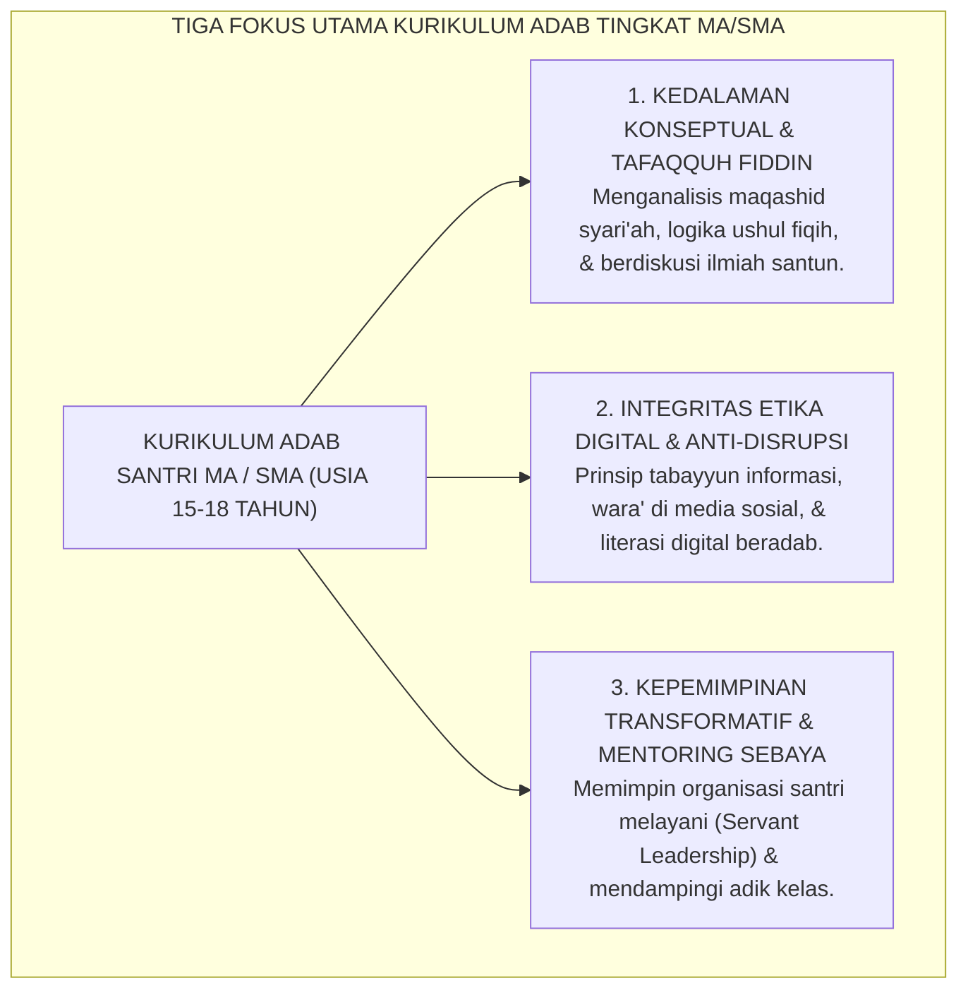
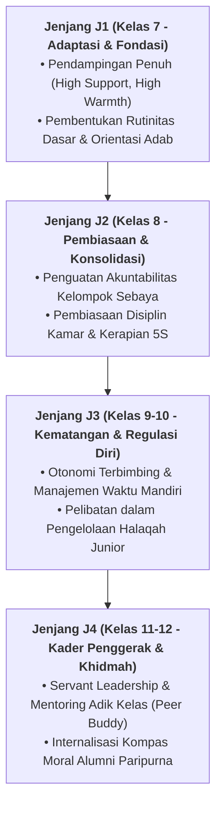

# PEMETAAN CAPAIAN TINGKAT MA / SMA (KELAS 10, 11, 12)

---
### Karakteristik Perkembangan Santri MA / SMA (Usia 15–18 Tahun)

Memasuki jenjang Madrasah Aliyah (MA) atau Sekolah Menengah Atas (SMA), santri berada pada **fase kematangan remaja lanjut (*late adolescence*)**:
* **Secara Kognitif**: Kapasitas berpikir abstrak (*formal operational thought*), analisis kritis, dan penalaran moral telah berkembang pesat. Santri mulai mempertanyakan filosofi di balik aturan dan mencari relevansi ilmu dengan masa depannya.
* **Secara Psikososial**: Santri membutuhkan ruang aktualisasi kepemimpinan nyata, pencarian identitas karier, dan pengakuan martabat sebagai insan dewasa muda.
* **Tantangan Zaman**: Santri MA berhadapan langsung dengan tantangan disrupsi digital, godaan etika di ruang siber, dan tuntutan kesiapan berkontribusi di tengah masyarakat majemuk.

<b>Gambar 6.2.1:</b> Tiga Fokus Utama Kurikulum Karakter Santri Tingkat MA/SMA.

Pakar psikologi perkembangan **Erik H. Erikson**[^1] menegaskan bahwa keberhasilan pada fase remaja akhir ditentukan oleh kemampuan mengintegrasikan nilai-nilai moral ke dalam komitmen hidup nyata dan kesiapan mengemban tanggung jawab sosial di masyarakat.

---

### Matriks Capaian Pembelajaran Adab Berjenjang MA (Kelas 10, 11, dan 12)

Tabel berikut menyajikan matriks capaian adab berjenjang santri tingkat MA dalam Ekosistem TUMBUH:

| Jenjang Kelas | Target Jenjang Kemandirian TUMBUH (J1–J4) | Fokus Capaian Pembelajaran Karakter (Observable Behaviors) |
| :--- | :--- | :--- |
| **Kelas 10 MA** *(Usia 15–16 Tahun)* | **Jenjang J3 (Internalisasi Penuh)** | • Menjaga integritas ibadah dan adab kamar secara mandiri tanpa pengawasan ustadz. • Memahami argumen rasional dan dalil syar'i di balik setiap tata tertib pondok. • Mampu mengelola waktu belajar mandiri (*muthala'ah*) minimal 90 menit per hari. • Menerapkan prinsip *Tabayyun* dalam menerima informasi berita dan media sosial. • Memulai peran pendampingan adik asuh (*Junior Peer Mentor*). |
| **Kelas 11 MA** *(Usia 16–17 Tahun)* | **Awal Jenjang J4 (Transformasi)** | • Mengemban amanah kepengurusan Organisasi Santri dengan etos *Servant Leadership*. • Menolak keras segala bentuk tradisi perpeloncoan dan intimidasi fisik kepada adik kelas. • Mampu memediasi konflik antarteman menggunakan prinsip lingkaran restoratif damai. • Menginisiasi proyek khidmah sosial (perpustakaan asrama, bank sampah, kebun hijau). • Menulis karya ilmiah / esai refleksi adab berbasis kajian Turats dan sains modern. |
| **Kelas 12 MA** *(Usia 17–18 Tahun)* | **Puncak Jenjang J4 $\rightarrow$ Tahap 7 PENGGERAK** | • Menjadi figur teladan hidup (*Living Qudwah*) bagi seluruh santri asrama. • Memimpin majlis musyawarah santri dan mendampingi adik kelas T1 dalam masa adaptasi. • Memiliki kematangan visi hidup: merencanakan studi lanjut dan kiprah dakwah di masyarakat. • Menunjukkan adab tawadhu' dan khidmah tulus kepada para kiai, masyaikh, dan asatidz. • Siap secara mental, pedagogis, dan spiritual memasuki **Tahun Khidmah (Pengabdian)**. |

---

### Wawasan Turats: Hakikat *Tafaqquh Fiddin* & Adab Penuntut Ilmu Lanjut

Karakter santri tingkat atas berakar pada kematangan akal budi dan keluasan wawasan peradaban.

**Hujjatul Islam Imam Abu Hamid Al-Ghazali** dalam *Ihya' 'Ulumiddin* (Kitab *al-'Ilm*)[^2] menegaskan bahwa hakikat ilmu yang terpuji (*al-'Ilm an-Nafi'*) bukanlah sekadar kepandaian berdebat atau menumpuk hafalan lafadz, melainkan ilmu yang menumbuhkan rasa takut kepada Allah (*Khasy-yatullah*), menambah kesadaran akan aib diri sendiri, dan menjauhkan hati dari cinta kemegahan dunia.

**Hadhratusy Syaikh KH. M. Hasyim Asy'ari** dalam *Adab al-'Alim wal Muta'allim*[^3] mengingatkan para santri senior agar tidak terperangkap dalam sifat *Kibr* (sombong) dan ujub atas ilmunya:

> [!NOTE]
> ### 📜 Pesan Hadhratusy Syaikh KH. Hasyim Asy'ari kepada Santri Senior:
> 
> $$\text{كُلَّمَا ازْدَادَ طَالِبُ الْعِلْمِ رِفْعَةً فِي الدَّرَجَاتِ، وَجَبَ عَلَيْهِ أَنْ يَزْدَادَ تَوَاضُعًا وَشَفَقَةً عَلَى مَنْ هُوَ دُونَهُ، فَإِنَّ الْعِلْمَ كَالْمَطَرِ؛ لَا يَسْتَقِرُّ فِي رُؤُوسِ الْجِبَالِ الشَّامِخَةِ، وَإِنَّمَا يَسْتَقِرُّ فِي الْأَوْدِيَةِ الْمُنْخَفِضَةِ}$$
> 
> **Artinya:**  
> *"Setiap kali seorang penuntut ilmu bertambah tinggi tingkatan ilmunya, wajib baginya untuk semakin bertambah tawadhu' (rendah hati) dan semakin bertambah kasih sayangnya kepada orang-orang di bawahnya. Karena sesungguhnya ilmu itu laksana air hujan; ia tidak akan pernah mengendap di puncak gunung yang menjulang tinggi angkuh, melainkan ia akan mengalir dan menetap di lembah-lembah yang rendah."*

---

### Solusi Sistemik TUMBUH: Portofolio Karakter & Visi Hidup Santri Akhir

Sebagai syarat kelulusan tingkat MA dalam sistem TUMBUH di pesantren, setiap santri wajib menyusun:
1. **Portofolio Capaian Karakter (*Ipsative Adab Portfolio*)**: Rekam jejak pertumbuhan kepribadian santri selama 3 tahun di madrasah dan asrama.
2. **Karya Tulis Visi Hidup (*My 10-Year Life Vision & Khidmah Blueprint*)**: Naskah komprehensif tentang rencana kontribusi keilmuan, kepemimpinan, dan pengabdian sosial santri bagi umat manusia.

Santri lulusan MA TUMBUH bertumbuh menjadi sosok **Cendekiawan Muslim Transformatif (*The Transformative Scholar*)**: berakidah murni, berpikiran terbuka, berakhlak mulia, dan siap menggerakkan roda peradaban Islam di pentas global.

---

## 📌 Catatan Kaki & Rujukan Primer

[^1]: **Erik H. Erikson**, *Identity: Youth and Crisis* (New York: W. W. Norton & Company, 1968), Bab 3: "The Life Cycle: Epigenesis of Identity", hlm. 91–141.
[^2]: **Hujjatul Islam Imam Abu Hamid al-Ghazali**, *Ihya' 'Ulumiddin*, Kitab al-'Ilm (Kairo & Beirut: Dar al-Ma'rifah, t.th.), Jilid I, hlm. 12–38.
[^3]: **Hadhratusy Syaikh KH. M. Hasyim Asy'ari**, *Adab al-'Alim wal Muta'allim fi ma Yahtaju Ilayhi al-Muta'allim fi Ahwal Ta'allumihi wa ma Yatawaqqafu 'alayhi al-Mu'allim fi Maqamat Ta'limihi* (Jombang: Maktabah at-Turats al-Islami, 1415 H), Bab 2: "Fi Adab al-Muta'allim ma'a Syaikhihi", hlm. 26–38.

---

### IV. Pembedahan Kapasitas Lanjutan & Trajektori Progresi Pemetaan Capaian Tingkat Ma / Sma (Kelas 10, 11, 12)

Pengembangan kompetensi **PEMETAAN CAPAIAN TINGKAT MA / SMA (KELAS 10, 11, 12)** pada santri memerlukan strategi diferensiasi yang selaras dengan tahapan usia perkembangan remaja (*Developmental Milestones*):

1. **Dekomposisi Indikator Kematangan Perilaku**:
   Untuk memastikan karakter **PEMETAAN CAPAIAN TINGKAT MA / SMA (KELAS 10, 11, 12)** tertanam secara operasional, dewan asatidz dan musyrif memetakan indikator perilakunya ke dalam 3 ranah capaian:
   * **Ranah Kognitif-Reflektif (*Ma'rifah*)**: Santri memahami dalil syar'i, urgensi akhlak, dan konsekuensi logis dari setiap pilihannya.
   * **Ranah Afektif-Ruhiyyah (*Wijdan*)**: Tumbuhnya kepekaan nurani, rasa malu berbuat dosa (*Haya'*), dan kenikmatan dalam berbuat kebajikan.
   * **Ranah Psikomotorik-Habituasi (*'Amal*)**: Terwujudnya keterampilan bertindak nyata secara spontan, konsisten, dan mandiri tanpa perlu disuruh.

2. **Matriks Penahapan Lintas Jenjang Kemandirian (J1–J4)**:

3. **Rubrik Evaluasi Kualitatif & Indikator Pencapaian**:

| Level Kemandirian | Karakteristik Perilaku Teramati (*Behavioral Anchor*) | Pendekatan Bimbingan Musyrif |
| :--- | :--- | :--- |
| **Level 1 (Emerging)** | Memerlukan instruksi berulang dan pengawasan langsung musyrif. | *Direct Prompting* & pengingat visual harian. |
| **Level 2 (Developing)** | Mampu menjalankan adab saat diingatkan oleh teman sebaya. | Penguatan positif melalui pujian deskriptif. |
| **Level 3 (Proficient)** | Menjalankan adab secara mandiri dan konsisten tanpa diawasi. | Pemberian kepercayaan dan peran tanggung jawab kamar. |
| **Level 4 (Exemplary)** | Menjadi teladan (*Qudwah*) dan mampu membimbing kawan-kawannya. | Pelibatan aktif dalam struktur Dewan Santri & Mentor. |

---

### V. Panduan Praksis Pendampingan Musyrif di Asrama

Agar penanaman **PEMETAAN CAPAIAN TINGKAT MA / SMA (KELAS 10, 11, 12)** berhasil maksimal di lapangan, musyrif disarankan menerapkan protokol pendampingan berikut:
* **Fokus pada Usaha (*Effort-Oriented Praise*)**: Berikan apresiasi atas proses perjuangan santri dalam memperbaiki diri, bukan semata-mata hasil akhir yang sempurna.
* **Dialog Sokratik Saat Santri Mengalami Kesulitan**: Ajukan pertanyaan reflektif seperti: *"Apa yang membuat antum merasa berat menjalankan adab ini hari ini? Bagaimana kita bisa mengatasinya bersama besok?"*
* **Menjaga Iklim Ukhuwah Bebas Perundungan**: Pastikan senioritas dimaknai sebagai amanah pengayoman dan perlindungan kepada yang lebih muda, bukan hak istimewa untuk memerintah.
