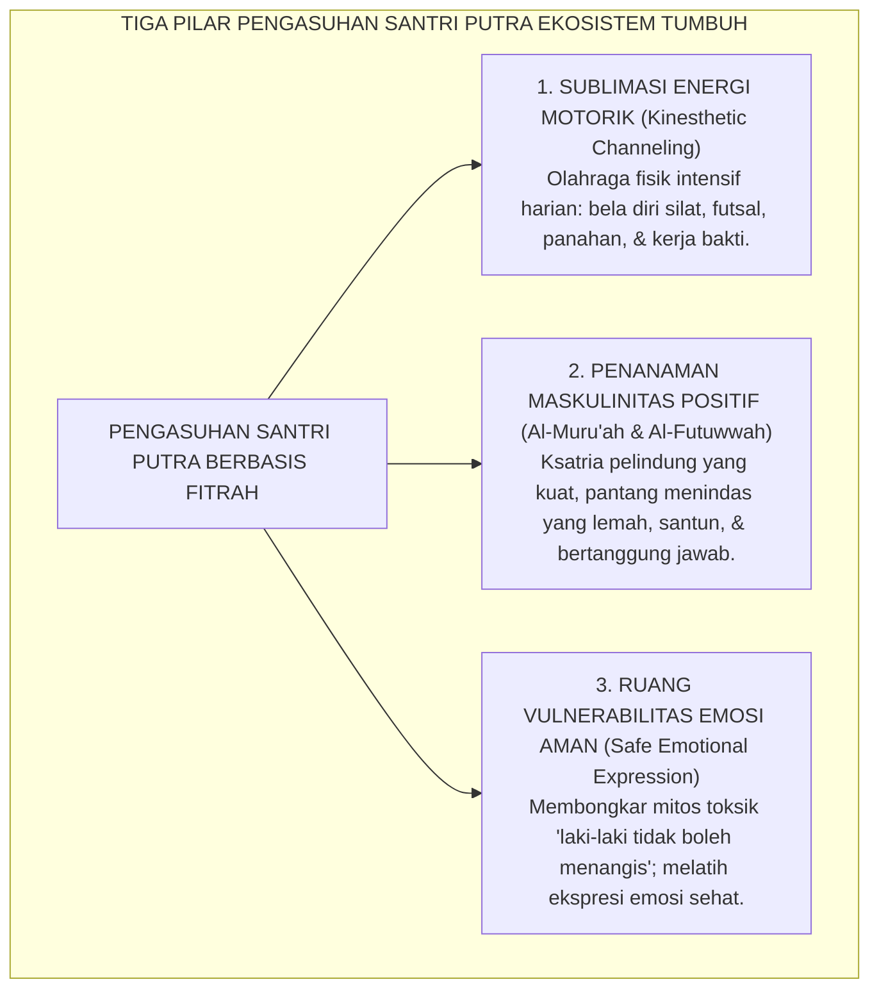
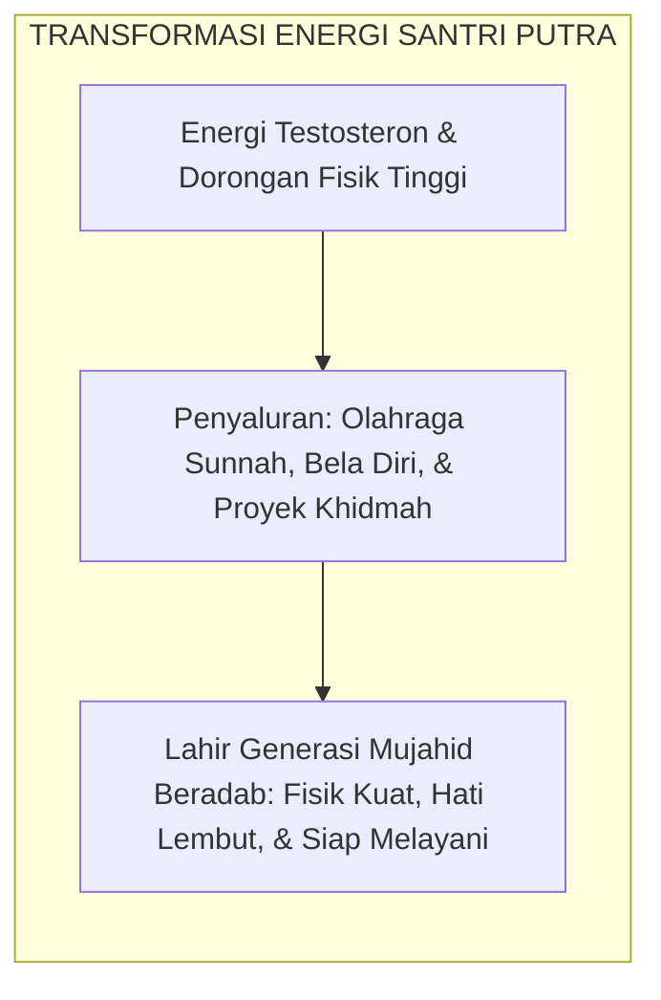

# PANDUAN OPERASIONAL 6.3: DIFERENSIASI PENGASUHAN SANTRI PUTRA

---

### 🧭 PETA POSISI PANDUAN DALAM SISTEM TUMBUH (DARI HULU KE HILIR)
* **Posisi Arsitektur**: `BATANG EKOSISTEM I (Taksonomi 10 Muwashafat Adab & Tangga Kemandirian J1–J4)`
* **Peruntukan Pengguna**: Wali Kelas, Musyrif Kamar, Guru Pengampu Adab, & Mentor Santri
* **Fokus Panduan**: Memandu tahapan penanaman 10 Karakter Adab Nabawi dari fase Adaptasi (J1), Pembiasaan (J2), Kematangan (J3), hingga Kader Penggerak (J4/Tahap 7).
* **Hasil Akhir yang Dituju**: Terwujudnya santri berkarakter *Insan Adabi* yang mandiri, musyrif yang mengasuh dengan kasih sayang tanpa *burnout*, dan pesantren yang aman berbasis data (*Safe Boarding School*).

---

### 🎯 Mengapa Panduan Ini Ada & Masalah Nyata yang Dipecahkan
1. **Latar Masalah di Lapangan**: Sering kali pengasuhan di pesantren berjalan tanpa SOP yang jelas atau terjebak dalam pola reaktif—menunggu santri berbuat salah baru dihukum dengan emosional.
2. **Solusi Sistem TUMBUH**: Panduan ini memberikan langkah preventif dan terstruktur agar setiap pembiasaan adab berjalan terencana, konsisten, dan terukur.
3. **Sasaran Perubahan**: Memastikan nilai-nilai Islam menyatu dalam perilaku harian santri melalui keteladanan nyata (*Qudwah Hasanah*).

---

---

### 🎯 Tujuan & Manfaat Panduan
Panduan ini dirancang sebagai petunjuk operasional terapan agar pendidik dan musyrif dapat:
1. Menjalankan pembinaan adab santri dengan pendekatan kasih sayang (*Rahmah*) dan ketegasan yang mendidik (*Firm & Kind*).
2. Menghindari cara-cara kekerasan fisik, bentakan verbal, maupun hukuman yang mempermalukan santri.
3. Menciptakan suasana asrama dan kelas yang aman, tertib, dan menumbuhkan kesadaran diri (*Bi'ah Shalihah*).

---

### 💡 Intisari Cepat (3 Menit Memahami Esensi)
* **Kunci Pengasuhan**: Karakter santri tumbuh melalui keteladanan nyata (*Qudwah Hasanah*), komunikasi empatik, dan pembiasaan terstruktur 24 jam.
* **Tindakan Utama**: Terapkan panduan langkah demi langkah di bawah ini secara konsisten, pantau perkembangan santri secara objektif, dan berikan apresiasi atas setiap perbaikan diri yang mereka capai.
* **Prinsip Disiplin**: Fokus pada pemulihan hubungan dan tanggung jawab nyata (*Restoratif*), bukan sekadar melampiaskan amarah atau menghukum.

---

### 📖 Uraian Panduan & Langkah Aksi Lapangan

---

### Keunikan Fitrah Biologis & Psikologis Santri Putra

Dalam perancangan sistem pembinaan adab pesantren, menyamaratakan pendekatan antara santri putra dan santri putri adalah sebuah kekeliruan metodologis yang fatal (*the fallacy of gender blindness*).

Secara neurobiologis dan psikologis, santri putra memiliki karakteristik khas:
* **Dominasi Spasial-Kinestetik**: Otak remaja laki-laki memproses stres dan emosi lebih banyak melalui aktivitas fisik motorik daripada kata-kata verbal.
* **Lonjakan Hormon Testosteron**: Mendorong tingginya dorongan kompetisi fisik, pencarian status kelompok (*hierarchical ranking*), dan keberanian mengambil risiko (*risk-taking behavior*).
* **Kebutuhan Ruang Bergerak**: Santri putra yang dipaksa duduk diam mendengarkan ceramah pasif selama berjam-jam akan mengalami penumpukan energi motorik yang berisiko meledak menjadi keonaran di asrama.

<b>Gambar 6.3.1:</b> Tiga Pilar Pendekatan Pengasuhan Santri Putra Ekosistem TUMBUH.

Pakar psikologi dan neurosains gender **Michael Gurian & Leonard Sax**[^1] membuktikan bahwa otak anak laki-laki memiliki aliran darah serebral yang berbeda dan memerlukan stimulasi kinestetik terarah agar fungsi regulasi diri (*inhibitory control*) di lobus frontal dapat bekerja optimal.

---

### Dekonstruksi Maskulinitas Toksik Menuju Konsep *Al-Futuwwah* Ksatria Islam

Di lingkungan asrama putra konvensional, kerap berkembang budaya maskulinitas toksik (*toxic masculinity*): anggapan bahwa "laki-laki sejati" harus berwajah garang, suka memukul, merokok sembunyi-sembunyi, dan tidak boleh menunjukkan kelembutan atau empati.

Sistem TUMBUH merekonstruksi konsep maskulinitas santri putra berakar pada konsep agung Turats Islam: **Al-Muru'ah** dan **Al-Futuwwah (Etika Ksatria Islam)**.

Ksatria sejati dalam Islam bukanlah pembuat onar yang menindas junior, melainkan sosok pemuda yang:
* Menggunakan kekuatan fisiknya untuk **melindungi yang lemah, memikul beban yang berat, dan membela kebenaran**.
* Memiliki kelembutan hati yang meneteskan air mata saat bersujud di keheningan malam (*Fursanun bin Nahar, Ruhbanun bil Lail*).

**Al-Imam Ibn al-Qayyim al-Jawziyyah** dalam karyanya *Al-Furusiyyah*[^2] menegaskan bahwa ketangkasan fisik dan keberanian ksatria (*asy-Saja'ah*) harus senantiasa dipandu oleh ketakwaan dan keadilan, agar tidak tergelincir menjadi kezaliman binatang buas.

---

### Mengelola Dinamika Hierarki Kelompok Santri Putra

Pakar psikologi evolusi **David C. Geary**[^3] menjelaskan bahwa kelompok laki-laki secara alamiah cenderung membentuk struktur hierarki (*dominance hierarchy*).

Di asrama santri putra TUMBUH, naluri hierarki alami ini disalurkan secara terstruktur:
1. **Pemberian Tanggung Jawab Fisik Komunal**: Santri putra dilibatkan dalam proyek-proyek fisik yang membanggakan (seperti merawat taman pondok, memindahkan logistik bantuan sosial, dan menjaga keamanan pintu gerbang).
2. **Turnamen Olahraga Beradab (*Adab Champions League*)**: Kompetisi olahraga antar-kamar yang mengedepankan sportivitas, jabat tangan persaudaraan sebelum bertanding, dan sujud syukur bersama di akhir laga.
3. **Pendampingan Musyrif Putra yang Tegas & Hangat (*Fatherly Mentorship*)**: Musyrif putra hadir sebagai figur ayah teladan (*role model*) yang menunjukkan bagaimana menjadi pria muslim yang tangguh, adil, penyayang, dan tidak gengsi meminta maaf.

<b>Gambar 6.3.2:</b> Alur Sublimasi Energi Motorik Santri Putra Menuju Karakter Ksatria Beradab.

---

### Solusi Sistemik TUMBUH: Halaqah Ksatria Subuh (*Futuwwah Circle*)

Santri putra TUMBUH mengikuti program pembinaan khusus:
* **Halaqah Kisah Kepahlawanan Sahabat (*Sirah Fursan*)**: Membedah keteladanan Sayyidina Ali bin Abi Thalib, Khalid bin Walid, Saad bin Abi Waqqas, dan Shalahuddin Al-Ayyubi: bagaimana keberanian fisik mereka berpadu dengan air mata kekhusyukan dan adab yang sangat mulia.
* **Protokol Tanggap Bencana & Pertolongan Pertama (PMR Santri)**: Melatih santri putra sigap membantu evakuasi dan pengobatan saat kawan mengalami cedera fisik.

Santri putra TUMBUH bertumbuh menjadi **Pilar Pelindung Umat (*Rijalun Qawwamun*)**: tegap langkahnya, tangguh raganya, mulia akhlaknya, dan siap menjadi benteng pertahanan peradaban Islam di masa depan.

---

## 📌 Catatan Kaki & Rujukan Primer

[^1]: **Michael Gurian**, *The Wonder of Boys: What Parents, Mentors and Educators Can Do to Shape Boys into Exceptional Men* (New York: Jeremy P. Tarcher / Putnam, 1996; Edisi Peringatan 20 Tahun, 2006), Bab 2: "The Biology of Boys", hlm. 15–48; serta **Leonard Sax**, *Boys Adrift: The Five Factors Driving the Growing Epidemic of Unmotivated Boys and Underachieving Young Men* (New York: Basic Books, 2007; Edisi Revisi, 2016), hlm. 25–65.
[^2]: **Al-Imam Syamsuddin Muhammad bin Abi Bakr Ibnu Qayyim al-Jawziyyah**, *Al-Furusiyyah al-Muhammadiyyah asy-Syar'iyyah*, Tahqiq: Syaikh Masyhur Hasan Salman (Riyadh: Dar al-Ashalah, 1414 H), hlm. 18–45.
[^3]: **David C. Geary**, *Male, Female: The Evolution of Human Sex Differences* (Washington: American Psychological Association / APA Books, 1998; Edisi ke-2, 2010), Bab 8: "Male and Female Social Relationships", hlm. 285–330.
