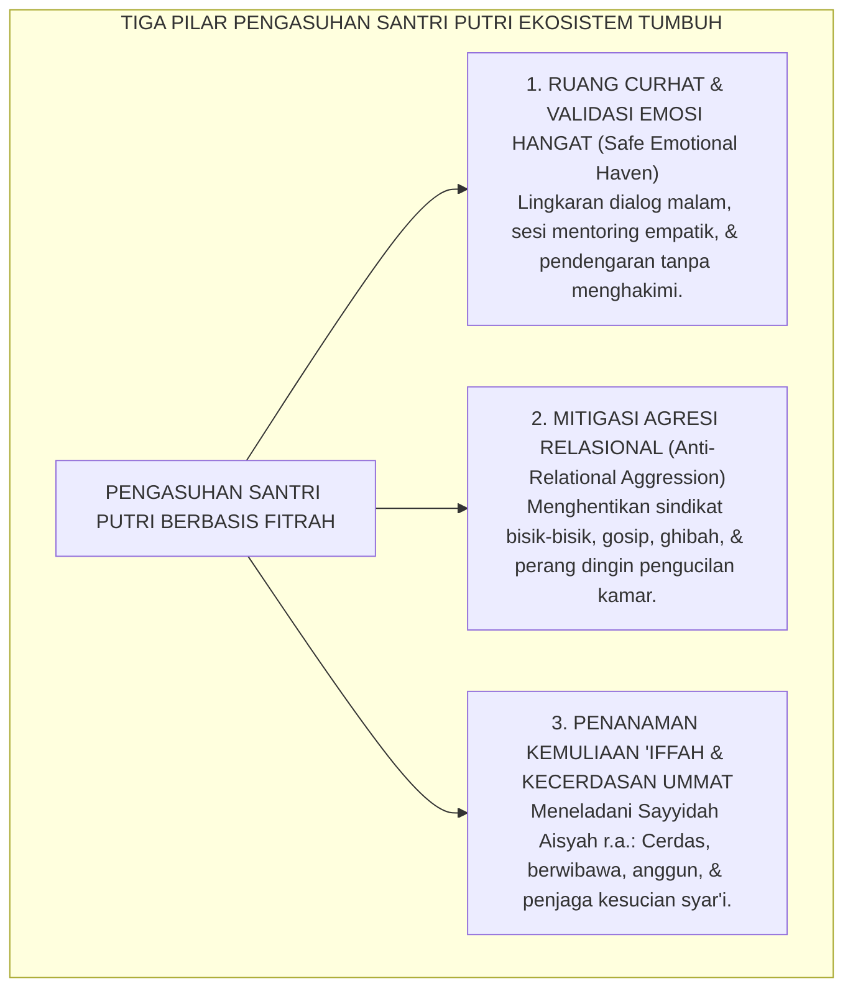
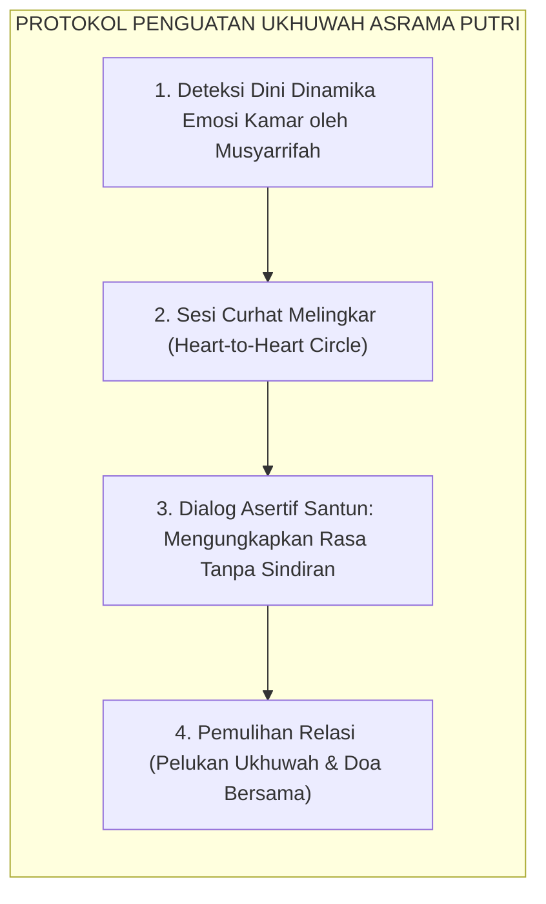
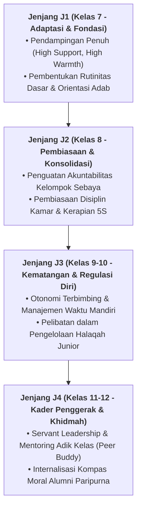

# DIFERENSIASI PENGASUHAN SANTRI PUTRI

---
### Keunikan Fitrah Biologis & Psikologis Santri Putri

Sebagaimana santri putra memiliki kekhasan perkembangan, santri putri di pondok pesantren memiliki lanskap psikologis dan neurobiologis yang sangat istimewa:
* **Kecerdasan Verbal & Relasional Tinggi**: Otak perempuan memiliki kepadatan sel neuron yang lebih tinggi pada pusat pemrosesan bahasa dan emosi di korteks serebral.
* **Kebutuhan Kelekatan Relasional (*Tend-and-Befriend Response*)**: Dalam kondisi tertekan (*stres*), respons neuroendokrin santri putri didorong oleh pelepasan hormon *oksitosin* dan *estrogen* yang memicu kebutuhan kuat untuk bercerita, terhubung secara intim, dan mencari dukungan kawan sebaya.
* **Kepekaan terhadap Bahasa Non-Verbal**: Santri putri sangat cepat menangkap perubahan nada suara, tatapan mata, dan isyarat penolakan halus di dalam kamar asrama.

<b>Gambar 6.4.1:</b> Tiga Pilar Pendekatan Pengasuhan Santri Putri Ekosistem TUMBUH.

Pakar neuropsikiatri **Louann Brizendine**[^1] dalam *The Female Brain* menjelaskan bahwa sirkuit komunikasi dan empati di otak perempuan membentuk fondasi relasi yang sangat kuat, sehingga pengalaman keterpisahan atau pengucilan sosial dirasakan sebagai ancaman eksistensial yang sangat menyakitkan.

Pakar psikologi sosial **Shelley E. Taylor**[^2] merumuskan teori *Tend-and-Befriend*: stres pada perempuan diatasi melalui pemeliharaan relasi sosial yang hangat (*nurturing social bonds*).

---

### Membedah Agresi Relasional: Luka Tak Kasat Mata di Asrama Putri

Jika konflik pada santri putra kerap meletus dalam bentuk adu fisik atau bentakan keras yang cepat selesai, maka konflik pada santri putri kerap termanifestasikan dalam bentuk **Agresi Relasional (*Relational Aggression*)**:
* Perang dingin di bilik asrama: saling mendiamkan (*the silent treatment*), melempar tatapan sinis, menyindir di status media, dan menyebarkan bisik-bisik gosip untuk menjatuhkan reputasi kawan.
* Membentuk geng kamar eksklusif yang sengaja mengucilkan satu orang anak hingga anak tersebut merasa terasing dan menangis sendirian di pojok kamar mandi.

Pakar psikologi pendidikan anak perempuan **Rachel Simmons**[^3] dalam karyanya *Odd Girl Out* membuktikan bahwa agresi relasional adalah bentuk perundungan terselubung yang sangat destruktif, yang dapat merusak kepercayaan diri dan memicu depresi berkepanjangan jika musyarrifah tidak memiliki kepekaan deteksi dini.

---

### Solusi Sistemik TUMBUH: Protokol Komunikasi Terbuka & Majlis Ukhuwah Putri

Ekosistem TUMBUH merancang intervensi spesifik di asrama santri putri:

<b>Gambar 6.4.2:</b> Alur Protokol Pemulihan Relasi Ukhuwah di Asrama Santri Putri.

1. **Halaqah Curhat Melingkar 15-Menit (*Heart-to-Heart Circle*)**: Setiap ba'da Isya, Musyarrifah asrama putri memfasilitasi sesi berbicara terbuka: setiap santri putri diberi ruang mengungkapkan isi hatinya tanpa rasa takut dihakimi.
2. **Kaidah Emas *Anti-Ghibah & Anti-Silent Treatment***: Santri putri dilatih etika *Tabayyun* langsung: dilarang saling mendiamkan lebih dari 24 jam; jika ada ganjalan hati, wajib disampaikan secara asertif dan lemah lembut.
3. **Pemberdayaan Keterampilan Kreatif & Keilmuan Terapan**: Menyediakan sarana ekspresi seni kaligrafi, tata boga halal, jurnalistik santriwati, dan kepenulisan sastra Islam.

---

### Wawasan Turats: Teladan Keagungan Sayyidah Aisyah & Shahabiyyat

Pembinaan santri putri TUMBUH berakar pada keteladanan agung Ummul Mukminin **Sayyidah Aisyah radhiyallahu 'anha**:
* Beliau adalah figur wanita paling cerdas dalam sejarah Islam: rujukan utama para sahabat dalam periwayatan hadits, ilmu fiqih mawaris, kedokteran, dan sastra Arab.
* Memadukan antara kecemerlangan intelektual (*Faqihah*), ketegasan prinsip, dan kesucian kehormatan diri (*Al-'Iffah wal Haya'*).

**Al-Imam Abu al-Hasan al-Qabisi** dalam *Ar-Risalah al-Mufashshilah*[^4] menegaskan bahwa pendidikan anak perempuan dalam Islam wajib menanamkan adab kesucian diri, penjagaan lisan dari perdebatan sia-sia, dan pembekalan ilmu agama yang mendalam agar kelak mampu menjadi madrasah pertama (*Madrasatul Ula*) bagi generasi masa depan umat.

Santri putri TUMBUH bertumbuh menjadi **Srikandi Peradaban Islam (*Nisa'un Shalihat*)**: anggun budi pekertinya, tajam wawasan ilmunya, lembut kasih sayangnya, dan kokoh menjaga marwah kehormatan Islam di tengah arus modernitas.

---

## 📌 Catatan Kaki & Rujukan Primer

[^1]: **Louann Brizendine**, *The Female Brain* (New York: Morgan Road Books / Broadway Books, 2006), Bab 1: "The Female Brain Structure", hlm. 11–34.
[^2]: **Shelley E. Taylor et al.**, "Biobehavioral responses to stress in females: Tend-and-befriend, not fight-or-flight", *Psychological Review*, Vol. 107, No. 3 (2000), hlm. 411–429.
[^3]: **Rachel Simmons**, *Odd Girl Out: The Hidden Culture of Aggression in Girls* (New York: Harcourt, 2002; Edisi Revisi, Mariner Books, 2011), Bab 1: "The Secret World of Girls' Bullying", hlm. 15–52.
[^4]: **Al-Imam Abu al-Hasan Ali bin Muhammad al-Qabisi**, *Ar-Risalah al-Mufashshilah li Ahwal al-Mu'allimin wa Ahkam al-Mu'allimin wal Muta'allimin*, Tahqiq: Ahmad Khalid Jam'ah (Damaskus: Dar al-Fikr, 1986), hlm. 102–125.

---

### IV. Pembedahan Kapasitas Lanjutan & Trajektori Progresi Diferensiasi Pengasuhan Santri Putri

Pengembangan kompetensi **DIFERENSIASI PENGASUHAN SANTRI PUTRI** pada santri memerlukan strategi diferensiasi yang selaras dengan tahapan usia perkembangan remaja (*Developmental Milestones*):

1. **Dekomposisi Indikator Kematangan Perilaku**:
   Untuk memastikan karakter **DIFERENSIASI PENGASUHAN SANTRI PUTRI** tertanam secara operasional, dewan asatidz dan musyrif memetakan indikator perilakunya ke dalam 3 ranah capaian:
   * **Ranah Kognitif-Reflektif (*Ma'rifah*)**: Santri memahami dalil syar'i, urgensi akhlak, dan konsekuensi logis dari setiap pilihannya.
   * **Ranah Afektif-Ruhiyyah (*Wijdan*)**: Tumbuhnya kepekaan nurani, rasa malu berbuat dosa (*Haya'*), dan kenikmatan dalam berbuat kebajikan.
   * **Ranah Psikomotorik-Habituasi (*'Amal*)**: Terwujudnya keterampilan bertindak nyata secara spontan, konsisten, dan mandiri tanpa perlu disuruh.

2. **Matriks Penahapan Lintas Jenjang Kemandirian (J1–J4)**:

3. **Rubrik Evaluasi Kualitatif & Indikator Pencapaian**:

| Level Kemandirian | Karakteristik Perilaku Teramati (*Behavioral Anchor*) | Pendekatan Bimbingan Musyrif |
| :--- | :--- | :--- |
| **Level 1 (Emerging)** | Memerlukan instruksi berulang dan pengawasan langsung musyrif. | *Direct Prompting* & pengingat visual harian. |
| **Level 2 (Developing)** | Mampu menjalankan adab saat diingatkan oleh teman sebaya. | Penguatan positif melalui pujian deskriptif. |
| **Level 3 (Proficient)** | Menjalankan adab secara mandiri dan konsisten tanpa diawasi. | Pemberian kepercayaan dan peran tanggung jawab kamar. |
| **Level 4 (Exemplary)** | Menjadi teladan (*Qudwah*) dan mampu membimbing kawan-kawannya. | Pelibatan aktif dalam struktur Dewan Santri & Mentor. |

---

### V. Panduan Praksis Pendampingan Musyrif di Asrama

Agar penanaman **DIFERENSIASI PENGASUHAN SANTRI PUTRI** berhasil maksimal di lapangan, musyrif disarankan menerapkan protokol pendampingan berikut:
* **Fokus pada Usaha (*Effort-Oriented Praise*)**: Berikan apresiasi atas proses perjuangan santri dalam memperbaiki diri, bukan semata-mata hasil akhir yang sempurna.
* **Dialog Sokratik Saat Santri Mengalami Kesulitan**: Ajukan pertanyaan reflektif seperti: *"Apa yang membuat antum merasa berat menjalankan adab ini hari ini? Bagaimana kita bisa mengatasinya bersama besok?"*
* **Menjaga Iklim Ukhuwah Bebas Perundungan**: Pastikan senioritas dimaknai sebagai amanah pengayoman dan perlindungan kepada yang lebih muda, bukan hak istimewa untuk memerintah.
