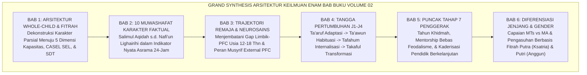

# PANDUAN OPERASIONAL 6.5: EPILOG VOLUME 02 — MENUJU PUNCAK ADAB KHIDMAH

---

### 🧭 PETA POSISI PANDUAN DALAM SISTEM TUMBUH (DARI HULU KE HILIR)
* **Posisi Arsitektur**: `BATANG EKOSISTEM I (Taksonomi 10 Muwashafat Adab & Tangga Kemandirian J1–J4)`
* **Peruntukan Pengguna**: Wali Kelas, Musyrif Kamar, Guru Pengampu Adab, & Mentor Santri
* **Fokus Panduan**: Memandu tahapan penanaman 10 Karakter Adab Nabawi dari fase Adaptasi (J1), Pembiasaan (J2), Kematangan (J3), hingga Kader Penggerak (J4/Tahap 7).
* **Hasil Akhir yang Dituju**: Terwujudnya santri berkarakter *Insan Adabi* yang mandiri, musyrif yang mengasuh dengan kasih sayang tanpa *burnout*, dan pesantren yang aman berbasis data (*Safe Boarding School*).

---

### 🎯 Mengapa Panduan Ini Ada & Masalah Nyata yang Dipecahkan
1. **Latar Masalah di Lapangan**: Sering kali pengasuhan di pesantren berjalan tanpa SOP yang jelas atau terjebak dalam pola reaktif—menunggu santri berbuat salah baru dihukum dengan emosional.
2. **Solusi Sistem TUMBUH**: Panduan ini memberikan langkah preventif dan terstruktur agar setiap pembiasaan adab berjalan terencana, konsisten, dan terukur.
3. **Sasaran Perubahan**: Memastikan nilai-nilai Islam menyatu dalam perilaku harian santri melalui keteladanan nyata (*Qudwah Hasanah*).

---

---

### 🎯 Tujuan & Manfaat Panduan
Panduan ini dirancang sebagai petunjuk operasional terapan agar pendidik dan musyrif dapat:
1. Menjalankan pembinaan adab santri dengan pendekatan kasih sayang (*Rahmah*) dan ketegasan yang mendidik (*Firm & Kind*).
2. Menghindari cara-cara kekerasan fisik, bentakan verbal, maupun hukuman yang mempermalukan santri.
3. Menciptakan suasana asrama dan kelas yang aman, tertib, dan menumbuhkan kesadaran diri (*Bi'ah Shalihah*).

---

### 💡 Intisari Cepat (3 Menit Memahami Esensi)
* **Kunci Pengasuhan**: Karakter santri tumbuh melalui keteladanan nyata (*Qudwah Hasanah*), komunikasi empatik, dan pembiasaan terstruktur 24 jam.
* **Tindakan Utama**: Terapkan panduan langkah demi langkah di bawah ini secara konsisten, pantau perkembangan santri secara objektif, dan berikan apresiasi atas setiap perbaikan diri yang mereka capai.
* **Prinsip Disiplin**: Fokus pada pemulihan hubungan dan tanggung jawab nyata (*Restoratif*), bukan sekadar melampiaskan amarah atau menghukum.

---

### 📖 Uraian Panduan & Langkah Aksi Lapangan

---

### Perjalanan Agung Penempaan Jiwa Santri: Sebuah Sintesis Paripurna

Buku Volume 02 ini telah menempuh sebuah perjalanan ilmiah dan spiritual yang sangat mendalam: **membongkar, merekonstruksi, dan menata ulang arsitektur taksonomi kapasitas karakter santri di bumi pesantren**.

Mari kita memandang kembali panorama keilmuan yang telah kita bangun bersama melintasi enam bab monograf ini:

<b>Gambar 6.5.1:</b> Grand Synthesis Arsitektur Enam Bab Monograf Buku Volume 02 Ekosistem TUMBUH.

Pakar psikologi positif dan kesejahteraan manusia **Martin E. P. Seligman**[^1] dalam *Flourish* merumuskan bahwa manusia mencapai puncak kebahagiaan dan keberfungsian tertingginya (*Human Flourishing*) ketika seluruh potensi emosi positif, keterlibatan bermakna, relasi hangat, dan pencapaian amal kebajikannya mekar secara harmonis.

Dalam perspektif filsafat pendidikan Islam, **Prof. Dr. Syed Muhammad Naquib al-Attas**[^2] menegaskan bahwa tujuan tertinggi dari pendidikan Islam (*Ta'dib*) adalah melahirkan **Manusia yang Beradab (*Insan Adabi*)**: manusia yang mengenali dan mengakui hakikat Tuhannya, menata nafsunya di bawah bimbingan akal dan wahyu, serta memperlakukan seluruh ciptaan Allah dengan keadilan dan kasih sayang yang proporsional.

---

### Melahirkan Generasi Baru Pesantren Bebas Kekerasan

Melalui penerapan taksonomi karakter dan tangga progresi J1–J4 ini, mimpi besar pembaruan pesantren bukan lagi sekadar utopia di atas kertas:
* **Tidak ada lagi santri baru yang menangis ketakutan di malam hari** karena dihantui ancaman pemukulan senior; mereka tidur dengan tenang di bawah naungan kasih sayang para musyrif dan kakak asuh yang berhati malaikat.
* **Tidak ada lagi ustadz yang kehilangan kesabaran dan melayangkan rotan**; para pendidik mendampingi anak dengan ketenangan nalar *External Prefrontal Cortex* dan kelembutan metode *Firm & Kind*.
* **Tidak ada lagi santri yang merasa menjadi anak buangan yang gagal**; setiap anak dipetakan keunikan fitrahnya, dihargai kemajuan pribadinya, dan dibimbing menaiki tangga kapasitasnya selangkah demi selangkah.

Tokoh pemikir bangsa dan pengasuh pesantren **KH. Abdurrahman Wahid (Gus Dur)**[^3] dalam *Menggerakkan Tradisi* menuliskan bahwa kekuatan sejati pesantren terletak pada kelenturan nilainya untuk terus memperbarui dirinya (*Ihya' at-Turats*) demi menjawab tantangan kemanusiaan tanpa kehilangan akar tradisi salafnya yang mulia.

---

### Wasiat Abadi Hujjatul Islam Imam Abu Hamid Al-Ghazali

Sebagai penutup yang menggetarkan kalbu, kita merenungkan kembali wasiat agung **Hujjatul Islam Imam Abu Hamid Al-Ghazali** dalam *Ihya' 'Ulumiddin* (Kitab *Riyadhatin Nafs*)[^4] sebagai berikut:

> [!NOTE]
> ### 📜 Wasiat Penutup Imam Al-Ghazali tentang Membimbing Jiwa Murid:
> 
> $$\text{الصِّبْيَانُ أَمَانَةٌ عِنْدَ وَالِدَيْهِمْ وَمُرَبِّيهِمْ، وَقُلُوبُهُمُ الطَّاهِرَةُ جَوَاهِرُ نَفِيسَةٌ سَاذَجَةٌ، خَالِيَةٌ عَنْ كُلِّ نَقْشٍ وَصُورَةٍ، وَهِيَ قَابِلَةٌ لِكُلِّ مَا نُقِشَ عَلَيْهَا، وَمَائِلَةٌ إِلَى كُلِّ مَا يُمَالُ بِهَا إِلَيْهِ؛ فَإِنْ عُوِّدَتِ الْخَيْرَ وَعُلِّمَتْهُ نَشَأَتْ عَلَيْهِ وَسَعِدَتْ فِي الدُّنْيَا وَالْآخِرَةِ، وَشَارَكَهُ فِي ثَوَابِهَا كُلُّ مُعَلِّمٍ لَهَا وَمُؤَدِّبٍ}$$
> 
> **Artinya:**  
> *"Anak-anak santri adalah amanah suci di tangan para orang tua dan para pendidiknya (*Murabbi*). Hati mereka yang masih suci laksana permata yang sangat berharga, bening berkilau, bersih dari segala ukiran dan gambar; ia siap menerima ukiran apa pun yang dipahatkan padanya, dan condong kepada ke mana pun ia diarahkan. Jika ia dibiasakan dengan kebaikan dan diajarkan adab mulia, niscaya ia akan tumbuh di atas kebaikan tersebut dan berbahagia di dunia serta akhirat; dan seluruh pendidik serta pengasuhnya akan mendapatkan bagian pahala jariyahnya yang tak terputus."*

---

### Gerbang Menuju Volume 03: Dari Taksonomi Menuju Sistem Asesmen Berbasis Data

Dengan tuntasnya perumusan Taksonomi Kapasitas dan Profil Karakter Santri pada Buku Volume 02 ini, sebuah pertanyaan besar selanjutnya menanti di hadapan kita:  
$$\text{"Bagaimana cara mengukur, mendiagnosis, dan memvalidasi perkembangan karakter multi-dimensi ini secara ilmiah, objektif, dan bebas dari bias subjektivitas?"}$$

Pertanyaan agung ini akan dibedah secara tuntas dan sistematis pada **Buku Volume 03: Sistem Asesmen Perkembangan & Evaluasi Berbasis Bukti Ekosistem TUMBUH Pesantren**.

---

## 📌 Catatan Kaki & Rujukan Primer

[^1]: **Martin E. P. Seligman**, *Flourish: A Visionary New Understanding of Happiness and Well-being* (New York: Free Press / Simon & Schuster, 2011), Bab 1: "What Is Well-Being?", hlm. 1–29.
[^2]: **Prof. Dr. Syed Muhammad Naquib al-Attas**, *The Concept of Education in Islam: A Framework for an Islamic Philosophy of Education* (Kuala Lumpur: International Institute of Islamic Thought and Civilization / ISTAC, 1980), hlm. 15–38.
[^3]: **K.H. Abdurrahman Wahid (Gus Dur)**, *Menggerakkan Tradisi: Esai-Esai Pesantren* (Yogyakarta: LKiS, 2001), Bab 1: "Pesantren sebagai Subkultur", hlm. 1–28.
[^4]: **Hujjatul Islam Imam Abu Hamid al-Ghazali**, *Ihya' 'Ulumiddin*, Kitab Riyadhatin Nafs wa Tahdzibil Akhlaq (Kairo & Beirut: Dar al-Ma'rifah, t.th.), Jilid III, hlm. 72–73.
