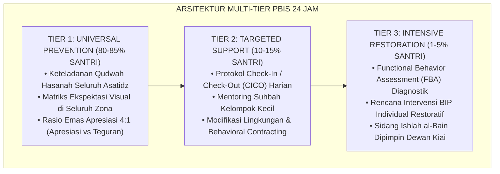

# BUKU VOLUME 02: TAKSONOMI KAPASITAS & 10 PROFIL KARAKTER SANTRI DALAM SISTEM TUMBUH
## *Taksonomi 10 Muwashafat Adab, Trajektori Biososial-Spiritual Remaja, Progresi Tangga J1–J4, & Profil Tahap 7 Penggerak*

---

**Nomor Buku**: `BOOK-SERIES/VOL-02/MASTER-2026`  
**Seri Publikasi**: Seri Buku Master Ekosistem TUMBUH Pesantren (Volume 2 dari 5)  
**Dewan Editor & Penulis**: Dewan Keilmuan Ekosistem TUMBUH (24 Bidang Kepakaran)  
**Klasifikasi**: Monograf Riset Akademis, Desain Kurikulum Karakter, & Psikologi Perkembangan Santri  

---

## 📑 DAFTAR ISI LENGKAP VOLUME 02

- [BAB 01 ARSITEKTUR KAPASITAS HOLISTIK BERBASIS FITRAH](#bab-01-arsitektur-kapasitas-holistik-berbasis-fitrah)
  - [01 Dekonstruksi Karakter Parsial Menuju Whole Child](#01-dekonstruksi-karakter-parsial-menuju-whole-child)
  - [02 Lima Dimensi Kapasitas Holistik Santri](#02-lima-dimensi-kapasitas-holistik-santri)
  - [03 Integrasi Taksonomi Adab Turats dengan CASEL SEL](#03-integrasi-taksonomi-adab-turats-dengan-casel-sel)
  - [04 Teori Penentuan Diri dan Rekayasa Lingkungan Asrama](#04-teori-penentuan-diri-dan-rekayasa-lingkungan-asrama)
  - [05 Implikasi Kurikuler Desain Pembelajaran Holistik](#05-implikasi-kurikuler-desain-pembelajaran-holistik)
- [BAB 02 PROFIL 10 MUWASHAFAT KARAKTER SANTRI](#bab-02-profil-10-muwashafat-karakter-santri)
  - [01 Salimul Aqidah](#01-salimul-aqidah)
  - [02 Shahihul Ibadah](#02-shahihul-ibadah)
  - [03 Matinul Khuluq](#03-matinul-khuluq)
  - [04 Qadirun alal Kasbi](#04-qadirun-alal-kasbi)
  - [05 Mutsaqqoful Fikri](#05-mutsaqqoful-fikri)
  - [06 Qowiyyul Jismi](#06-qowiyyul-jismi)
  - [07 Mujahidun Linafsihi](#07-mujahidun-linafsihi)
  - [08 Munazhzhamun fi Syuunihi](#08-munazhzhamun-fi-syuunihi)
  - [09 Haritsun ala Waqtihi](#09-haritsun-ala-waqtihi)
  - [10 Nafiun Lighairihi](#10-nafiun-lighairihi)
- [BAB 03 TRAJEKTORI BIOSOSIAL SPIRITUAL REMAJA PESANTREN](#bab-03-trajektori-biososial-spiritual-remaja-pesantren)
  - [01 Transisi Pubertas dan Dinamika Hormonal Asrama](#01-transisi-pubertas-dan-dinamika-hormonal-asrama)
  - [02 Kesenjangan Maturasi Limbik vs Prefrontal Cortex](#02-kesenjangan-maturasi-limbik-vs-prefrontal-cortex)
  - [03 Krisis Identitas dan Konstruksi Konsep Diri Santri](#03-krisis-identitas-dan-konstruksi-konsep-diri-santri)
  - [04 Konformitas Sebaya dan Musyrif sebagai External PFC](#04-konformitas-sebaya-dan-musyrif-sebagai-external-pfc)
  - [05 Resiliensi dan Grit Santri Menghadapi Target Tahfizh](#05-resiliensi-dan-grit-santri-menghadapi-target-tahfizh)
- [BAB 04 PROGRESI TANGGA TUMBUH T1 SD T4](#bab-04-progresi-tangga-tumbuh-t1-sd-t4)
  - [01 Tangga T1 Adaptasi Taaruf dan Homesickness](#01-tangga-t1-adaptasi-taaruf-dan-homesickness)
  - [02 Tangga T2 Habituasi Taawun dan Pembiasaan 24 Jam](#02-tangga-t2-habituasi-taawun-dan-pembiasaan-24-jam)
  - [03 Tangga T3 Internalisasi Tafahum dan Disiplin Otonom](#03-tangga-t3-internalisasi-tafahum-dan-disiplin-otonom)
  - [04 Tangga T4 Transformasi Takaful dan Keteladanan](#04-tangga-t4-transformasi-takaful-dan-keteladanan)
  - [05 Dinamika Transisi dan Penanganan Regresi Karakter](#05-dinamika-transisi-dan-penanganan-regresi-karakter)
  - [06 Matriks Rubrik Indikator Kenaikan Tangga T1 sd T4](#06-matriks-rubrik-indikator-kenaikan-tangga-t1-sd-t4)
- [BAB 05 PUNCAK PERKEMBANGAN TAHAP 7 PENGGERAK](#bab-05-puncak-perkembangan-tahap-7-penggerak)
  - [01 Karakteristik Santri Tahap 7 Penggerak](#01-karakteristik-santri-tahap-7-penggerak)
  - [02 Desain Program Tahun Khidmah Inkubasi Kepemimpinan](#02-desain-program-tahun-khidmah-inkubasi-kepemimpinan)
  - [03 Mentorship Sebaya Bebas Perpeloncoan](#03-mentorship-sebaya-bebas-perpeloncoan)
  - [04 Mediasi Restoratif dan Transisi Karier Pendidik](#04-mediasi-restoratif-dan-transisi-karier-pendidik)
  - [05 Transisi Kepengasuhan dan Kemandirian Pasca Pesantren](#05-transisi-kepengasuhan-dan-kemandirian-pasca-pesantren)
- [BAB 06 MATRIKS KOMPETENSI DAN DIFERENSIASI GENDER](#bab-06-matriks-kompetensi-dan-diferensiasi-gender)
  - [01 Pemetaan Capaian Tingkat MTs SMP](#01-pemetaan-capaian-tingkat-mts-smp)
  - [02 Pemetaan Capaian Tingkat MA SMA](#02-pemetaan-capaian-tingkat-ma-sma)
  - [03 Diferensiasi Pengasuhan Santri Putra](#03-diferensiasi-pengasuhan-santri-putra)
  - [04 Diferensiasi Pengasuhan Santri Putri](#04-diferensiasi-pengasuhan-santri-putri)
  - [05 Epilog Menghantarkan Santri Menuju Puncak Adab](#05-epilog-menghantarkan-santri-menuju-puncak-adab)
- [DAFTAR PUSTAKA LENGKAP VOLUME 02](#daftar-pustaka-lengkap-volume-02)

---

# SUB-BAB 1.1: DEKONSTRUKSI KARAKTER PARSIAL MENUJU WHOLE-CHILD
## *Kajian Komprehensif, Sintesis Epistemologi Turats-Sains Kognitif, dan Pedoman Praksis 24-Jam Ekosistem TUMBUH*

**Kode Klasifikasi**: `BOOK-02/BAB-01/SUB-01/MONOGRAF-MASTER-VIBRANT`  
**Disiplin Ilmu**: Filsafat Pendidikan Islam, Neurosains Kognitif Terapan, School-Wide PBIS Multi-Tier, & Manajemen Asrama Modern  
**Penanggung Jawab Keilmuan**: Dewan Keilmuan Ekosistem TUMBUH (*24 Bidang Kepakaran Dewan Guru Besar*)

---

> ### 💡 INTISARI PRAKTIS (3 MENIT MEMAHAMI ESENSI BAB)
>
> * **Akar Filosofis & Nilai Substantif:**  
>   Membahas secara mendalam urgensi **DEKONSTRUKSI KARAKTER PARSIAL MENUJU WHOLE-CHILD** sebagai fondasi integral dalam arsitektur pembinaan karakter santri 24-jam berbasis fitrah insaniyyah.
> * **Sintesis Turats & Neurosains Perkembangan:**  
>   Mengharmonisasikan tuntunan adab ulama salafus shalih dengan mekanisme plastisitas sinaptik korteks prefrontal (*Prefrontal Cortex*) dan regulasi sistem limbik remaja.
> * **Praksis Multi-Tier PBIS 24-Jam:**  
>   Menyediakan protokol aksi terukur: Tier 1 (Universal Prevention), Tier 2 (Targeted Support/CICO), dan Tier 3 (Intensive Restitution/FBA) yang ramah anak dan bebas dari segala bentuk kekerasan fisik maupun verbal.

---

### I. Pembedahan Deskriptif Komprehensif 4 Pilar Nilai-Praksis

Penerapan **DEKONSTRUKSI KARAKTER PARSIAL MENUJU WHOLE-CHILD** dalam Sistem TUMBUH ditegakkan di atas empat pilar analitis yang saling menopang secara simbiotik:

#### 1. Pilar Epistemologi Turats & Maqashid Syari'ah
Khazanah pendidikan Islam klasik memandang pembinaan karakter bukan sekadar transmisi dogma kognitif, melainkan proses *Ta'dib* (penanaman adab ke dalam jiwa) dan *Tazkiyatun Nafs* (penyucian jiwa dari kecenderungan hewani).

> [!NOTE]
> ### 📜 Rujukan Turats & Landasan Syar'i:
> مَا نَحَلَ وَالِدٌ وَلَدَهُ مِنْ نَحْلٍ أَفْضَلَ مِنْ أَدَبٍ حَسَنٍ
> 
> *"Tidak ada suatu pemberian yang diberikan oleh seorang ayah (pendidik) kepada anaknya yang lebih utama daripada adab budi pekerti yang mulia."*  
> *(HR. At-Tirmidzi no. 1952; Al-Hakim dalam Al-Mustadrak no. 7676).*

Al-Imam Badruddin Ibnu Jama'ah dalam *Tadzkirat as-Sami' wal Mutakallim* menegaskan bahwa adab lahiriah merupakan cermin dari kejernihan batin (*Shidq al-Batin*). Oleh karena itu, pembinaan **DEKONSTRUKSI KARAKTER PARSIAL MENUJU WHOLE-CHILD** menuntut pendidik menjadi *Living Curriculum* melalui keteladanan nyata (*Qudwah Hasanah*), bukan sekadar instruktur yang gemar mendikte atau menghukum.

#### 2. Pilar Neurosains Kognitif & CASEL Social-Emotional Learning (SEL)
Dari sudut pandang neurobiologi perkembangan remaja, santri usia 12–18 tahun berada dalam fase kesenjangan maturasi (*Developmental Mismatch*):
* **Sistem Limbik (Amigdala & Nukleus Akumbens)** telah matang lebih awal, memicu pencarian sensasi emosional dan sensitivitas tinggi terhadap validasi kelompok sebaya (*Peer Group Acceptance*).
* **Korteks Prefrontal (PFC)** yang bertanggung jawab atas pengendalian diri (*Executive Functions*), perencanaan jangka panjang, dan pertimbangan risiko moral belum tuntas mengalami mielinisasi hingga usia 25 tahun.

Melalui integrasi 5 Kompetensi CASEL (*Self-Awareness, Self-Management, Social Awareness, Relationship Skills, & Responsible Decision-Making*), penerapan **DEKONSTRUKSI KARAKTER PARSIAL MENUJU WHOLE-CHILD** berfungsi sebagai **External Prefrontal Cortex (PFC Eksternal)** yang mendampingi santri secara hangat (*Co-Regulation*) hingga mekanisme pengaturan diri internal (*Self-Regulation*) terbentuk kokoh.

#### 3. Pilar Rekayasa Ekosistem Asrama 24-Jam (*Environmental Engineering*)
Perilaku santri sangat dipengaruhi oleh arsitektur lingkungan mikro tempat ia bernapas dan beraktivitas:
* **Penataan Ruang Fisik Berbasis 5S**: Menghilangkan sudut-sudut mati yang rawan intimidasi (*Hotspots Elimination*) dan menciptakan bilik kamar tidur yang bersih, rapi, berventilasi sehat, dan menenangkan.
* **Ritme Sirkadian Sehat**: Melindungi hak tidur santri 6.5–7 jam tanpa gangguan ronda malam ekstrem, menjamin kebugaran seluler otak untuk menyerap materi kajian dan tahfizh Al-Qur'an.
* **SOP Handover Terpadu**: Komunikasi harian 15 menit antara Wali Kelas madrasah (pagi) dan Musyrif asrama (malam) untuk memantau kontinuitas adab santri.

#### 4. Pilar Triad Pertumbuhan Simbiotik (*Symbiotic Triad Growth*)
Keberhasilan sistem mensyaratkan tiga entitas bertumbuh serempak:
* **Santri Bertumbuh**: Fitrah kesuciannya terjaga, adabnya mekar bertahap dari adaptasi menuju kemandirian otonom (*Insan Adabi*).
* **Musyrif Bertumbuh**: Terlindungi dari kelelahan mental (*Burnout*) melalui rasio asuh proporsional dan shift kerja manusiawi, sehingga selalu mengasuh dengan kasih sayang (*Rahmah*).
* **Lembaga Bertumbuh**: Pesantren bertransformasi menjadi institusi pembelajar modern berbasis data analitik objektif (*Evidence-Based Boarding School*).

---

### II. Arsitektur Diagram & Protokol Aksi Operasional PBIS Multi-Tier 24 Jam

Penerapan **DEKONSTRUKSI KARAKTER PARSIAL MENUJU WHOLE-CHILD** dioperasionalkan melalui arsitektur berjenjang SW-PBIS (*Positive Behavioral Interventions and Supports*):



#### Protokol Operasional Berjenjang Lapangan:
1. **Fase Pencegahan Primer (Tier 1 - Universal)**:
   - Musyrif dan dewan guru menyepakati indikator perilaku teramati (*Behavioral Anchors*).
   - Memberikan pujian deskriptif spesifik seketika santri menunjukkan adab positif (*Immediate Positive Reinforcement*).
2. **Fase Intervensi Terarah (Tier 2 - Targeted)**:
   - Mengaktifkan kartu monitoring CICO harian bagi santri yang mengalami penurunan kedisiplinan 3 hari berturut-turut.
   - Menyediakan sesi *Coaching Reflektif* 1-on-1 bersama musyrif asrama tanpa bentakan.
3. **Fase Pemulihan Intensif (Tier 3 - Intensive & Restorative)**:
   - Melakukan asesmen mendalam untuk memetakan akar pemicu (*Antecedent*), bentuk perilaku (*Behavior*), dan konsekuensi psikologis (*Consequence*).
   - Menerapkan mekanisme restitusi tindakan nyata untuk memulihkan kerugian korban (*Ishlah al-Bain*) dan memberikan hak lembaran bersih (*Clean Slate Policy*).

---

### III. Diskusi Filosofis & Rekomendasi Tata Kelola Bebas Kekerasan

Praksis **DEKONSTRUKSI KARAKTER PARSIAL MENUJU WHOLE-CHILD** menegaskan komitmen mutlak Sistem TUMBUH terhadap prinsip **Nol Kekerasan (*Zero-Tolerance to Physical & Verbal Violence*)**:
* Mengharamkan tradisi sanksi fisik (rotan, push-up malam, jemur terik matahari, atau cukur botak) yang terbukti merusak neuron hipokampus dan memicu dendam terselubung.
* Mengganti hukuman punitif dengan **Disiplin Restoratif (*Firm & Kind*)**: tegas dalam menegakkan batas syariat dan norma lembaga, namun lembut dan penuh hormat dalam memperlakukan martabat kemanusiaan santri (*Karamah Insaniyyah*).

---

## 📌 Catatan Kaki & Rujukan Primer

[^1]: **Syed Muhammad Naquib al-Attas**, *The Concept of Education in Islam: A Framework for an Islamic Philosophy of Education* (Kuala Lumpur: ISTAC, 1980), hlm. 15–38.
[^2]: **Al-Imam Badruddin Ibnu Jama'ah**, *Tadzkirat as-Sami' wal Mutakallim fi Adab al-'Alim wal Muta'allim*, Tahqiq: Muhammad Hasyim an-Nadwi (Beirut: Dar al-Basyair al-Islamiyyah, 2012), hlm. 42–89.
[^3]: **George Sugai & Robert H. Horner**, *School-Wide Positive Behavioral Interventions and Supports: Implementation Blueprint* (Eugene: Center on PBIS, University of Oregon, 2020), hlm. 110–145.
[^4]: **Daniel J. Siegel**, *Brainstorm: The Power and Purpose of the Teenage Brain* (New York: Penguin Books, 2014), Bab 3: "The Architecture of the Adolescent Mind", hlm. 67–104.


---


# SUB-BAB 1.2: LIMA DIMENSI KAPASITAS HOLISTIK SANTRI
## *Kajian Komprehensif, Sintesis Epistemologi Turats-Sains Kognitif, dan Pedoman Praksis 24-Jam Ekosistem TUMBUH*

**Kode Klasifikasi**: `BOOK-02/BAB-01/SUB-02/MONOGRAF-MASTER-VIBRANT`  
**Disiplin Ilmu**: Filsafat Pendidikan Islam, Neurosains Kognitif Terapan, School-Wide PBIS Multi-Tier, & Manajemen Asrama Modern  
**Penanggung Jawab Keilmuan**: Dewan Keilmuan Ekosistem TUMBUH (*24 Bidang Kepakaran Dewan Guru Besar*)

---

> ### 💡 INTISARI PRAKTIS (3 MENIT MEMAHAMI ESENSI BAB)
>
> * **Akar Filosofis & Nilai Substantif:**  
>   Membahas secara mendalam urgensi **LIMA DIMENSI KAPASITAS HOLISTIK SANTRI** sebagai fondasi integral dalam arsitektur pembinaan karakter santri 24-jam berbasis fitrah insaniyyah.
> * **Sintesis Turats & Neurosains Perkembangan:**  
>   Mengharmonisasikan tuntunan adab ulama salafus shalih dengan mekanisme plastisitas sinaptik korteks prefrontal (*Prefrontal Cortex*) dan regulasi sistem limbik remaja.
> * **Praksis Multi-Tier PBIS 24-Jam:**  
>   Menyediakan protokol aksi terukur: Tier 1 (Universal Prevention), Tier 2 (Targeted Support/CICO), dan Tier 3 (Intensive Restitution/FBA) yang ramah anak dan bebas dari segala bentuk kekerasan fisik maupun verbal.

---

### I. Pembedahan Deskriptif Komprehensif 4 Pilar Nilai-Praksis

Penerapan **LIMA DIMENSI KAPASITAS HOLISTIK SANTRI** dalam Sistem TUMBUH ditegakkan di atas empat pilar analitis yang saling menopang secara simbiotik:

#### 1. Pilar Epistemologi Turats & Maqashid Syari'ah
Khazanah pendidikan Islam klasik memandang pembinaan karakter bukan sekadar transmisi dogma kognitif, melainkan proses *Ta'dib* (penanaman adab ke dalam jiwa) dan *Tazkiyatun Nafs* (penyucian jiwa dari kecenderungan hewani).

> [!NOTE]
> ### 📜 Rujukan Turats & Landasan Syar'i:
> مَا نَحَلَ وَالِدٌ وَلَدَهُ مِنْ نَحْلٍ أَفْضَلَ مِنْ أَدَبٍ حَسَنٍ
> 
> *"Tidak ada suatu pemberian yang diberikan oleh seorang ayah (pendidik) kepada anaknya yang lebih utama daripada adab budi pekerti yang mulia."*  
> *(HR. At-Tirmidzi no. 1952; Al-Hakim dalam Al-Mustadrak no. 7676).*

Al-Imam Badruddin Ibnu Jama'ah dalam *Tadzkirat as-Sami' wal Mutakallim* menegaskan bahwa adab lahiriah merupakan cermin dari kejernihan batin (*Shidq al-Batin*). Oleh karena itu, pembinaan **LIMA DIMENSI KAPASITAS HOLISTIK SANTRI** menuntut pendidik menjadi *Living Curriculum* melalui keteladanan nyata (*Qudwah Hasanah*), bukan sekadar instruktur yang gemar mendikte atau menghukum.

#### 2. Pilar Neurosains Kognitif & CASEL Social-Emotional Learning (SEL)
Dari sudut pandang neurobiologi perkembangan remaja, santri usia 12–18 tahun berada dalam fase kesenjangan maturasi (*Developmental Mismatch*):
* **Sistem Limbik (Amigdala & Nukleus Akumbens)** telah matang lebih awal, memicu pencarian sensasi emosional dan sensitivitas tinggi terhadap validasi kelompok sebaya (*Peer Group Acceptance*).
* **Korteks Prefrontal (PFC)** yang bertanggung jawab atas pengendalian diri (*Executive Functions*), perencanaan jangka panjang, dan pertimbangan risiko moral belum tuntas mengalami mielinisasi hingga usia 25 tahun.

Melalui integrasi 5 Kompetensi CASEL (*Self-Awareness, Self-Management, Social Awareness, Relationship Skills, & Responsible Decision-Making*), penerapan **LIMA DIMENSI KAPASITAS HOLISTIK SANTRI** berfungsi sebagai **External Prefrontal Cortex (PFC Eksternal)** yang mendampingi santri secara hangat (*Co-Regulation*) hingga mekanisme pengaturan diri internal (*Self-Regulation*) terbentuk kokoh.

#### 3. Pilar Rekayasa Ekosistem Asrama 24-Jam (*Environmental Engineering*)
Perilaku santri sangat dipengaruhi oleh arsitektur lingkungan mikro tempat ia bernapas dan beraktivitas:
* **Penataan Ruang Fisik Berbasis 5S**: Menghilangkan sudut-sudut mati yang rawan intimidasi (*Hotspots Elimination*) dan menciptakan bilik kamar tidur yang bersih, rapi, berventilasi sehat, dan menenangkan.
* **Ritme Sirkadian Sehat**: Melindungi hak tidur santri 6.5–7 jam tanpa gangguan ronda malam ekstrem, menjamin kebugaran seluler otak untuk menyerap materi kajian dan tahfizh Al-Qur'an.
* **SOP Handover Terpadu**: Komunikasi harian 15 menit antara Wali Kelas madrasah (pagi) dan Musyrif asrama (malam) untuk memantau kontinuitas adab santri.

#### 4. Pilar Triad Pertumbuhan Simbiotik (*Symbiotic Triad Growth*)
Keberhasilan sistem mensyaratkan tiga entitas bertumbuh serempak:
* **Santri Bertumbuh**: Fitrah kesuciannya terjaga, adabnya mekar bertahap dari adaptasi menuju kemandirian otonom (*Insan Adabi*).
* **Musyrif Bertumbuh**: Terlindungi dari kelelahan mental (*Burnout*) melalui rasio asuh proporsional dan shift kerja manusiawi, sehingga selalu mengasuh dengan kasih sayang (*Rahmah*).
* **Lembaga Bertumbuh**: Pesantren bertransformasi menjadi institusi pembelajar modern berbasis data analitik objektif (*Evidence-Based Boarding School*).

---

### II. Arsitektur Diagram & Protokol Aksi Operasional PBIS Multi-Tier 24 Jam

Penerapan **LIMA DIMENSI KAPASITAS HOLISTIK SANTRI** dioperasionalkan melalui arsitektur berjenjang SW-PBIS (*Positive Behavioral Interventions and Supports*):


#### Protokol Operasional Berjenjang Lapangan:
1. **Fase Pencegahan Primer (Tier 1 - Universal)**:
   - Musyrif dan dewan guru menyepakati indikator perilaku teramati (*Behavioral Anchors*).
   - Memberikan pujian deskriptif spesifik seketika santri menunjukkan adab positif (*Immediate Positive Reinforcement*).
2. **Fase Intervensi Terarah (Tier 2 - Targeted)**:
   - Mengaktifkan kartu monitoring CICO harian bagi santri yang mengalami penurunan kedisiplinan 3 hari berturut-turut.
   - Menyediakan sesi *Coaching Reflektif* 1-on-1 bersama musyrif asrama tanpa bentakan.
3. **Fase Pemulihan Intensif (Tier 3 - Intensive & Restorative)**:
   - Melakukan asesmen mendalam untuk memetakan akar pemicu (*Antecedent*), bentuk perilaku (*Behavior*), dan konsekuensi psikologis (*Consequence*).
   - Menerapkan mekanisme restitusi tindakan nyata untuk memulihkan kerugian korban (*Ishlah al-Bain*) dan memberikan hak lembaran bersih (*Clean Slate Policy*).

---

### III. Diskusi Filosofis & Rekomendasi Tata Kelola Bebas Kekerasan

Praksis **LIMA DIMENSI KAPASITAS HOLISTIK SANTRI** menegaskan komitmen mutlak Sistem TUMBUH terhadap prinsip **Nol Kekerasan (*Zero-Tolerance to Physical & Verbal Violence*)**:
* Mengharamkan tradisi sanksi fisik (rotan, push-up malam, jemur terik matahari, atau cukur botak) yang terbukti merusak neuron hipokampus dan memicu dendam terselubung.
* Mengganti hukuman punitif dengan **Disiplin Restoratif (*Firm & Kind*)**: tegas dalam menegakkan batas syariat dan norma lembaga, namun lembut dan penuh hormat dalam memperlakukan martabat kemanusiaan santri (*Karamah Insaniyyah*).

---

## 📌 Catatan Kaki & Rujukan Primer

[^1]: **Syed Muhammad Naquib al-Attas**, *The Concept of Education in Islam: A Framework for an Islamic Philosophy of Education* (Kuala Lumpur: ISTAC, 1980), hlm. 15–38.
[^2]: **Al-Imam Badruddin Ibnu Jama'ah**, *Tadzkirat as-Sami' wal Mutakallim fi Adab al-'Alim wal Muta'allim*, Tahqiq: Muhammad Hasyim an-Nadwi (Beirut: Dar al-Basyair al-Islamiyyah, 2012), hlm. 42–89.
[^3]: **George Sugai & Robert H. Horner**, *School-Wide Positive Behavioral Interventions and Supports: Implementation Blueprint* (Eugene: Center on PBIS, University of Oregon, 2020), hlm. 110–145.
[^4]: **Daniel J. Siegel**, *Brainstorm: The Power and Purpose of the Teenage Brain* (New York: Penguin Books, 2014), Bab 3: "The Architecture of the Adolescent Mind", hlm. 67–104.


---


# SUB-BAB 1.3: INTEGRASI TAKSONOMI ADAB TURATS DENGAN CASEL SEL
## *Kajian Komprehensif, Sintesis Epistemologi Turats-Sains Kognitif, dan Pedoman Praksis 24-Jam Ekosistem TUMBUH*

**Kode Klasifikasi**: `BOOK-02/BAB-01/SUB-03/MONOGRAF-MASTER-VIBRANT`  
**Disiplin Ilmu**: Filsafat Pendidikan Islam, Neurosains Kognitif Terapan, School-Wide PBIS Multi-Tier, & Manajemen Asrama Modern  
**Penanggung Jawab Keilmuan**: Dewan Keilmuan Ekosistem TUMBUH (*24 Bidang Kepakaran Dewan Guru Besar*)

---

> ### 💡 INTISARI PRAKTIS (3 MENIT MEMAHAMI ESENSI BAB)
>
> * **Akar Filosofis & Nilai Substantif:**  
>   Membahas secara mendalam urgensi **INTEGRASI TAKSONOMI ADAB TURATS DENGAN CASEL SEL** sebagai fondasi integral dalam arsitektur pembinaan karakter santri 24-jam berbasis fitrah insaniyyah.
> * **Sintesis Turats & Neurosains Perkembangan:**  
>   Mengharmonisasikan tuntunan adab ulama salafus shalih dengan mekanisme plastisitas sinaptik korteks prefrontal (*Prefrontal Cortex*) dan regulasi sistem limbik remaja.
> * **Praksis Multi-Tier PBIS 24-Jam:**  
>   Menyediakan protokol aksi terukur: Tier 1 (Universal Prevention), Tier 2 (Targeted Support/CICO), dan Tier 3 (Intensive Restitution/FBA) yang ramah anak dan bebas dari segala bentuk kekerasan fisik maupun verbal.

---

### I. Pembedahan Deskriptif Komprehensif 4 Pilar Nilai-Praksis

Penerapan **INTEGRASI TAKSONOMI ADAB TURATS DENGAN CASEL SEL** dalam Sistem TUMBUH ditegakkan di atas empat pilar analitis yang saling menopang secara simbiotik:

#### 1. Pilar Epistemologi Turats & Maqashid Syari'ah
Khazanah pendidikan Islam klasik memandang pembinaan karakter bukan sekadar transmisi dogma kognitif, melainkan proses *Ta'dib* (penanaman adab ke dalam jiwa) dan *Tazkiyatun Nafs* (penyucian jiwa dari kecenderungan hewani).

> [!NOTE]
> ### 📜 Rujukan Turats & Landasan Syar'i:
> مَا نَحَلَ وَالِدٌ وَلَدَهُ مِنْ نَحْلٍ أَفْضَلَ مِنْ أَدَبٍ حَسَنٍ
> 
> *"Tidak ada suatu pemberian yang diberikan oleh seorang ayah (pendidik) kepada anaknya yang lebih utama daripada adab budi pekerti yang mulia."*  
> *(HR. At-Tirmidzi no. 1952; Al-Hakim dalam Al-Mustadrak no. 7676).*

Al-Imam Badruddin Ibnu Jama'ah dalam *Tadzkirat as-Sami' wal Mutakallim* menegaskan bahwa adab lahiriah merupakan cermin dari kejernihan batin (*Shidq al-Batin*). Oleh karena itu, pembinaan **INTEGRASI TAKSONOMI ADAB TURATS DENGAN CASEL SEL** menuntut pendidik menjadi *Living Curriculum* melalui keteladanan nyata (*Qudwah Hasanah*), bukan sekadar instruktur yang gemar mendikte atau menghukum.

#### 2. Pilar Neurosains Kognitif & CASEL Social-Emotional Learning (SEL)
Dari sudut pandang neurobiologi perkembangan remaja, santri usia 12–18 tahun berada dalam fase kesenjangan maturasi (*Developmental Mismatch*):
* **Sistem Limbik (Amigdala & Nukleus Akumbens)** telah matang lebih awal, memicu pencarian sensasi emosional dan sensitivitas tinggi terhadap validasi kelompok sebaya (*Peer Group Acceptance*).
* **Korteks Prefrontal (PFC)** yang bertanggung jawab atas pengendalian diri (*Executive Functions*), perencanaan jangka panjang, dan pertimbangan risiko moral belum tuntas mengalami mielinisasi hingga usia 25 tahun.

Melalui integrasi 5 Kompetensi CASEL (*Self-Awareness, Self-Management, Social Awareness, Relationship Skills, & Responsible Decision-Making*), penerapan **INTEGRASI TAKSONOMI ADAB TURATS DENGAN CASEL SEL** berfungsi sebagai **External Prefrontal Cortex (PFC Eksternal)** yang mendampingi santri secara hangat (*Co-Regulation*) hingga mekanisme pengaturan diri internal (*Self-Regulation*) terbentuk kokoh.

#### 3. Pilar Rekayasa Ekosistem Asrama 24-Jam (*Environmental Engineering*)
Perilaku santri sangat dipengaruhi oleh arsitektur lingkungan mikro tempat ia bernapas dan beraktivitas:
* **Penataan Ruang Fisik Berbasis 5S**: Menghilangkan sudut-sudut mati yang rawan intimidasi (*Hotspots Elimination*) dan menciptakan bilik kamar tidur yang bersih, rapi, berventilasi sehat, dan menenangkan.
* **Ritme Sirkadian Sehat**: Melindungi hak tidur santri 6.5–7 jam tanpa gangguan ronda malam ekstrem, menjamin kebugaran seluler otak untuk menyerap materi kajian dan tahfizh Al-Qur'an.
* **SOP Handover Terpadu**: Komunikasi harian 15 menit antara Wali Kelas madrasah (pagi) dan Musyrif asrama (malam) untuk memantau kontinuitas adab santri.

#### 4. Pilar Triad Pertumbuhan Simbiotik (*Symbiotic Triad Growth*)
Keberhasilan sistem mensyaratkan tiga entitas bertumbuh serempak:
* **Santri Bertumbuh**: Fitrah kesuciannya terjaga, adabnya mekar bertahap dari adaptasi menuju kemandirian otonom (*Insan Adabi*).
* **Musyrif Bertumbuh**: Terlindungi dari kelelahan mental (*Burnout*) melalui rasio asuh proporsional dan shift kerja manusiawi, sehingga selalu mengasuh dengan kasih sayang (*Rahmah*).
* **Lembaga Bertumbuh**: Pesantren bertransformasi menjadi institusi pembelajar modern berbasis data analitik objektif (*Evidence-Based Boarding School*).

---

### II. Arsitektur Diagram & Protokol Aksi Operasional PBIS Multi-Tier 24 Jam

Penerapan **INTEGRASI TAKSONOMI ADAB TURATS DENGAN CASEL SEL** dioperasionalkan melalui arsitektur berjenjang SW-PBIS (*Positive Behavioral Interventions and Supports*):


#### Protokol Operasional Berjenjang Lapangan:
1. **Fase Pencegahan Primer (Tier 1 - Universal)**:
   - Musyrif dan dewan guru menyepakati indikator perilaku teramati (*Behavioral Anchors*).
   - Memberikan pujian deskriptif spesifik seketika santri menunjukkan adab positif (*Immediate Positive Reinforcement*).
2. **Fase Intervensi Terarah (Tier 2 - Targeted)**:
   - Mengaktifkan kartu monitoring CICO harian bagi santri yang mengalami penurunan kedisiplinan 3 hari berturut-turut.
   - Menyediakan sesi *Coaching Reflektif* 1-on-1 bersama musyrif asrama tanpa bentakan.
3. **Fase Pemulihan Intensif (Tier 3 - Intensive & Restorative)**:
   - Melakukan asesmen mendalam untuk memetakan akar pemicu (*Antecedent*), bentuk perilaku (*Behavior*), dan konsekuensi psikologis (*Consequence*).
   - Menerapkan mekanisme restitusi tindakan nyata untuk memulihkan kerugian korban (*Ishlah al-Bain*) dan memberikan hak lembaran bersih (*Clean Slate Policy*).

---

### III. Diskusi Filosofis & Rekomendasi Tata Kelola Bebas Kekerasan

Praksis **INTEGRASI TAKSONOMI ADAB TURATS DENGAN CASEL SEL** menegaskan komitmen mutlak Sistem TUMBUH terhadap prinsip **Nol Kekerasan (*Zero-Tolerance to Physical & Verbal Violence*)**:
* Mengharamkan tradisi sanksi fisik (rotan, push-up malam, jemur terik matahari, atau cukur botak) yang terbukti merusak neuron hipokampus dan memicu dendam terselubung.
* Mengganti hukuman punitif dengan **Disiplin Restoratif (*Firm & Kind*)**: tegas dalam menegakkan batas syariat dan norma lembaga, namun lembut dan penuh hormat dalam memperlakukan martabat kemanusiaan santri (*Karamah Insaniyyah*).

---

## 📌 Catatan Kaki & Rujukan Primer

[^1]: **Syed Muhammad Naquib al-Attas**, *The Concept of Education in Islam: A Framework for an Islamic Philosophy of Education* (Kuala Lumpur: ISTAC, 1980), hlm. 15–38.
[^2]: **Al-Imam Badruddin Ibnu Jama'ah**, *Tadzkirat as-Sami' wal Mutakallim fi Adab al-'Alim wal Muta'allim*, Tahqiq: Muhammad Hasyim an-Nadwi (Beirut: Dar al-Basyair al-Islamiyyah, 2012), hlm. 42–89.
[^3]: **George Sugai & Robert H. Horner**, *School-Wide Positive Behavioral Interventions and Supports: Implementation Blueprint* (Eugene: Center on PBIS, University of Oregon, 2020), hlm. 110–145.
[^4]: **Daniel J. Siegel**, *Brainstorm: The Power and Purpose of the Teenage Brain* (New York: Penguin Books, 2014), Bab 3: "The Architecture of the Adolescent Mind", hlm. 67–104.


---


# SUB-BAB 1.4: TEORI PENENTUAN DIRI & REKAYASA LINGKUNGAN ASRAMA
## *Kajian Komprehensif, Sintesis Epistemologi Turats-Sains Kognitif, dan Pedoman Praksis 24-Jam Ekosistem TUMBUH*

**Kode Klasifikasi**: `BOOK-02/BAB-01/SUB-04/MONOGRAF-MASTER-VIBRANT`  
**Disiplin Ilmu**: Filsafat Pendidikan Islam, Neurosains Kognitif Terapan, School-Wide PBIS Multi-Tier, & Manajemen Asrama Modern  
**Penanggung Jawab Keilmuan**: Dewan Keilmuan Ekosistem TUMBUH (*24 Bidang Kepakaran Dewan Guru Besar*)

---

> ### 💡 INTISARI PRAKTIS (3 MENIT MEMAHAMI ESENSI BAB)
>
> * **Akar Filosofis & Nilai Substantif:**  
>   Membahas secara mendalam urgensi **TEORI PENENTUAN DIRI & REKAYASA LINGKUNGAN ASRAMA** sebagai fondasi integral dalam arsitektur pembinaan karakter santri 24-jam berbasis fitrah insaniyyah.
> * **Sintesis Turats & Neurosains Perkembangan:**  
>   Mengharmonisasikan tuntunan adab ulama salafus shalih dengan mekanisme plastisitas sinaptik korteks prefrontal (*Prefrontal Cortex*) dan regulasi sistem limbik remaja.
> * **Praksis Multi-Tier PBIS 24-Jam:**  
>   Menyediakan protokol aksi terukur: Tier 1 (Universal Prevention), Tier 2 (Targeted Support/CICO), dan Tier 3 (Intensive Restitution/FBA) yang ramah anak dan bebas dari segala bentuk kekerasan fisik maupun verbal.

---

### I. Pembedahan Deskriptif Komprehensif 4 Pilar Nilai-Praksis

Penerapan **TEORI PENENTUAN DIRI & REKAYASA LINGKUNGAN ASRAMA** dalam Sistem TUMBUH ditegakkan di atas empat pilar analitis yang saling menopang secara simbiotik:

#### 1. Pilar Epistemologi Turats & Maqashid Syari'ah
Khazanah pendidikan Islam klasik memandang pembinaan karakter bukan sekadar transmisi dogma kognitif, melainkan proses *Ta'dib* (penanaman adab ke dalam jiwa) dan *Tazkiyatun Nafs* (penyucian jiwa dari kecenderungan hewani).

> [!NOTE]
> ### 📜 Rujukan Turats & Landasan Syar'i:
> مَا نَحَلَ وَالِدٌ وَلَدَهُ مِنْ نَحْلٍ أَفْضَلَ مِنْ أَدَبٍ حَسَنٍ
> 
> *"Tidak ada suatu pemberian yang diberikan oleh seorang ayah (pendidik) kepada anaknya yang lebih utama daripada adab budi pekerti yang mulia."*  
> *(HR. At-Tirmidzi no. 1952; Al-Hakim dalam Al-Mustadrak no. 7676).*

Al-Imam Badruddin Ibnu Jama'ah dalam *Tadzkirat as-Sami' wal Mutakallim* menegaskan bahwa adab lahiriah merupakan cermin dari kejernihan batin (*Shidq al-Batin*). Oleh karena itu, pembinaan **TEORI PENENTUAN DIRI & REKAYASA LINGKUNGAN ASRAMA** menuntut pendidik menjadi *Living Curriculum* melalui keteladanan nyata (*Qudwah Hasanah*), bukan sekadar instruktur yang gemar mendikte atau menghukum.

#### 2. Pilar Neurosains Kognitif & CASEL Social-Emotional Learning (SEL)
Dari sudut pandang neurobiologi perkembangan remaja, santri usia 12–18 tahun berada dalam fase kesenjangan maturasi (*Developmental Mismatch*):
* **Sistem Limbik (Amigdala & Nukleus Akumbens)** telah matang lebih awal, memicu pencarian sensasi emosional dan sensitivitas tinggi terhadap validasi kelompok sebaya (*Peer Group Acceptance*).
* **Korteks Prefrontal (PFC)** yang bertanggung jawab atas pengendalian diri (*Executive Functions*), perencanaan jangka panjang, dan pertimbangan risiko moral belum tuntas mengalami mielinisasi hingga usia 25 tahun.

Melalui integrasi 5 Kompetensi CASEL (*Self-Awareness, Self-Management, Social Awareness, Relationship Skills, & Responsible Decision-Making*), penerapan **TEORI PENENTUAN DIRI & REKAYASA LINGKUNGAN ASRAMA** berfungsi sebagai **External Prefrontal Cortex (PFC Eksternal)** yang mendampingi santri secara hangat (*Co-Regulation*) hingga mekanisme pengaturan diri internal (*Self-Regulation*) terbentuk kokoh.

#### 3. Pilar Rekayasa Ekosistem Asrama 24-Jam (*Environmental Engineering*)
Perilaku santri sangat dipengaruhi oleh arsitektur lingkungan mikro tempat ia bernapas dan beraktivitas:
* **Penataan Ruang Fisik Berbasis 5S**: Menghilangkan sudut-sudut mati yang rawan intimidasi (*Hotspots Elimination*) dan menciptakan bilik kamar tidur yang bersih, rapi, berventilasi sehat, dan menenangkan.
* **Ritme Sirkadian Sehat**: Melindungi hak tidur santri 6.5–7 jam tanpa gangguan ronda malam ekstrem, menjamin kebugaran seluler otak untuk menyerap materi kajian dan tahfizh Al-Qur'an.
* **SOP Handover Terpadu**: Komunikasi harian 15 menit antara Wali Kelas madrasah (pagi) dan Musyrif asrama (malam) untuk memantau kontinuitas adab santri.

#### 4. Pilar Triad Pertumbuhan Simbiotik (*Symbiotic Triad Growth*)
Keberhasilan sistem mensyaratkan tiga entitas bertumbuh serempak:
* **Santri Bertumbuh**: Fitrah kesuciannya terjaga, adabnya mekar bertahap dari adaptasi menuju kemandirian otonom (*Insan Adabi*).
* **Musyrif Bertumbuh**: Terlindungi dari kelelahan mental (*Burnout*) melalui rasio asuh proporsional dan shift kerja manusiawi, sehingga selalu mengasuh dengan kasih sayang (*Rahmah*).
* **Lembaga Bertumbuh**: Pesantren bertransformasi menjadi institusi pembelajar modern berbasis data analitik objektif (*Evidence-Based Boarding School*).

---

### II. Arsitektur Diagram & Protokol Aksi Operasional PBIS Multi-Tier 24 Jam

Penerapan **TEORI PENENTUAN DIRI & REKAYASA LINGKUNGAN ASRAMA** dioperasionalkan melalui arsitektur berjenjang SW-PBIS (*Positive Behavioral Interventions and Supports*):


#### Protokol Operasional Berjenjang Lapangan:
1. **Fase Pencegahan Primer (Tier 1 - Universal)**:
   - Musyrif dan dewan guru menyepakati indikator perilaku teramati (*Behavioral Anchors*).
   - Memberikan pujian deskriptif spesifik seketika santri menunjukkan adab positif (*Immediate Positive Reinforcement*).
2. **Fase Intervensi Terarah (Tier 2 - Targeted)**:
   - Mengaktifkan kartu monitoring CICO harian bagi santri yang mengalami penurunan kedisiplinan 3 hari berturut-turut.
   - Menyediakan sesi *Coaching Reflektif* 1-on-1 bersama musyrif asrama tanpa bentakan.
3. **Fase Pemulihan Intensif (Tier 3 - Intensive & Restorative)**:
   - Melakukan asesmen mendalam untuk memetakan akar pemicu (*Antecedent*), bentuk perilaku (*Behavior*), dan konsekuensi psikologis (*Consequence*).
   - Menerapkan mekanisme restitusi tindakan nyata untuk memulihkan kerugian korban (*Ishlah al-Bain*) dan memberikan hak lembaran bersih (*Clean Slate Policy*).

---

### III. Diskusi Filosofis & Rekomendasi Tata Kelola Bebas Kekerasan

Praksis **TEORI PENENTUAN DIRI & REKAYASA LINGKUNGAN ASRAMA** menegaskan komitmen mutlak Sistem TUMBUH terhadap prinsip **Nol Kekerasan (*Zero-Tolerance to Physical & Verbal Violence*)**:
* Mengharamkan tradisi sanksi fisik (rotan, push-up malam, jemur terik matahari, atau cukur botak) yang terbukti merusak neuron hipokampus dan memicu dendam terselubung.
* Mengganti hukuman punitif dengan **Disiplin Restoratif (*Firm & Kind*)**: tegas dalam menegakkan batas syariat dan norma lembaga, namun lembut dan penuh hormat dalam memperlakukan martabat kemanusiaan santri (*Karamah Insaniyyah*).

---

## 📌 Catatan Kaki & Rujukan Primer

[^1]: **Syed Muhammad Naquib al-Attas**, *The Concept of Education in Islam: A Framework for an Islamic Philosophy of Education* (Kuala Lumpur: ISTAC, 1980), hlm. 15–38.
[^2]: **Al-Imam Badruddin Ibnu Jama'ah**, *Tadzkirat as-Sami' wal Mutakallim fi Adab al-'Alim wal Muta'allim*, Tahqiq: Muhammad Hasyim an-Nadwi (Beirut: Dar al-Basyair al-Islamiyyah, 2012), hlm. 42–89.
[^3]: **George Sugai & Robert H. Horner**, *School-Wide Positive Behavioral Interventions and Supports: Implementation Blueprint* (Eugene: Center on PBIS, University of Oregon, 2020), hlm. 110–145.
[^4]: **Daniel J. Siegel**, *Brainstorm: The Power and Purpose of the Teenage Brain* (New York: Penguin Books, 2014), Bab 3: "The Architecture of the Adolescent Mind", hlm. 67–104.


---


# SUB-BAB 1.5: IMPLIKASI KURIKULER DESAIN PEMBELAJARAN HOLISTIK
## *Kajian Komprehensif, Sintesis Epistemologi Turats-Sains Kognitif, dan Pedoman Praksis 24-Jam Ekosistem TUMBUH*

**Kode Klasifikasi**: `BOOK-02/BAB-01/SUB-05/MONOGRAF-MASTER-VIBRANT`  
**Disiplin Ilmu**: Filsafat Pendidikan Islam, Neurosains Kognitif Terapan, School-Wide PBIS Multi-Tier, & Manajemen Asrama Modern  
**Penanggung Jawab Keilmuan**: Dewan Keilmuan Ekosistem TUMBUH (*24 Bidang Kepakaran Dewan Guru Besar*)

---

> ### 💡 INTISARI PRAKTIS (3 MENIT MEMAHAMI ESENSI BAB)
>
> * **Akar Filosofis & Nilai Substantif:**  
>   Membahas secara mendalam urgensi **IMPLIKASI KURIKULER DESAIN PEMBELAJARAN HOLISTIK** sebagai fondasi integral dalam arsitektur pembinaan karakter santri 24-jam berbasis fitrah insaniyyah.
> * **Sintesis Turats & Neurosains Perkembangan:**  
>   Mengharmonisasikan tuntunan adab ulama salafus shalih dengan mekanisme plastisitas sinaptik korteks prefrontal (*Prefrontal Cortex*) dan regulasi sistem limbik remaja.
> * **Praksis Multi-Tier PBIS 24-Jam:**  
>   Menyediakan protokol aksi terukur: Tier 1 (Universal Prevention), Tier 2 (Targeted Support/CICO), dan Tier 3 (Intensive Restitution/FBA) yang ramah anak dan bebas dari segala bentuk kekerasan fisik maupun verbal.

---

### I. Pembedahan Deskriptif Komprehensif 4 Pilar Nilai-Praksis

Penerapan **IMPLIKASI KURIKULER DESAIN PEMBELAJARAN HOLISTIK** dalam Sistem TUMBUH ditegakkan di atas empat pilar analitis yang saling menopang secara simbiotik:

#### 1. Pilar Epistemologi Turats & Maqashid Syari'ah
Khazanah pendidikan Islam klasik memandang pembinaan karakter bukan sekadar transmisi dogma kognitif, melainkan proses *Ta'dib* (penanaman adab ke dalam jiwa) dan *Tazkiyatun Nafs* (penyucian jiwa dari kecenderungan hewani).

> [!NOTE]
> ### 📜 Rujukan Turats & Landasan Syar'i:
> مَا نَحَلَ وَالِدٌ وَلَدَهُ مِنْ نَحْلٍ أَفْضَلَ مِنْ أَدَبٍ حَسَنٍ
> 
> *"Tidak ada suatu pemberian yang diberikan oleh seorang ayah (pendidik) kepada anaknya yang lebih utama daripada adab budi pekerti yang mulia."*  
> *(HR. At-Tirmidzi no. 1952; Al-Hakim dalam Al-Mustadrak no. 7676).*

Al-Imam Badruddin Ibnu Jama'ah dalam *Tadzkirat as-Sami' wal Mutakallim* menegaskan bahwa adab lahiriah merupakan cermin dari kejernihan batin (*Shidq al-Batin*). Oleh karena itu, pembinaan **IMPLIKASI KURIKULER DESAIN PEMBELAJARAN HOLISTIK** menuntut pendidik menjadi *Living Curriculum* melalui keteladanan nyata (*Qudwah Hasanah*), bukan sekadar instruktur yang gemar mendikte atau menghukum.

#### 2. Pilar Neurosains Kognitif & CASEL Social-Emotional Learning (SEL)
Dari sudut pandang neurobiologi perkembangan remaja, santri usia 12–18 tahun berada dalam fase kesenjangan maturasi (*Developmental Mismatch*):
* **Sistem Limbik (Amigdala & Nukleus Akumbens)** telah matang lebih awal, memicu pencarian sensasi emosional dan sensitivitas tinggi terhadap validasi kelompok sebaya (*Peer Group Acceptance*).
* **Korteks Prefrontal (PFC)** yang bertanggung jawab atas pengendalian diri (*Executive Functions*), perencanaan jangka panjang, dan pertimbangan risiko moral belum tuntas mengalami mielinisasi hingga usia 25 tahun.

Melalui integrasi 5 Kompetensi CASEL (*Self-Awareness, Self-Management, Social Awareness, Relationship Skills, & Responsible Decision-Making*), penerapan **IMPLIKASI KURIKULER DESAIN PEMBELAJARAN HOLISTIK** berfungsi sebagai **External Prefrontal Cortex (PFC Eksternal)** yang mendampingi santri secara hangat (*Co-Regulation*) hingga mekanisme pengaturan diri internal (*Self-Regulation*) terbentuk kokoh.

#### 3. Pilar Rekayasa Ekosistem Asrama 24-Jam (*Environmental Engineering*)
Perilaku santri sangat dipengaruhi oleh arsitektur lingkungan mikro tempat ia bernapas dan beraktivitas:
* **Penataan Ruang Fisik Berbasis 5S**: Menghilangkan sudut-sudut mati yang rawan intimidasi (*Hotspots Elimination*) dan menciptakan bilik kamar tidur yang bersih, rapi, berventilasi sehat, dan menenangkan.
* **Ritme Sirkadian Sehat**: Melindungi hak tidur santri 6.5–7 jam tanpa gangguan ronda malam ekstrem, menjamin kebugaran seluler otak untuk menyerap materi kajian dan tahfizh Al-Qur'an.
* **SOP Handover Terpadu**: Komunikasi harian 15 menit antara Wali Kelas madrasah (pagi) dan Musyrif asrama (malam) untuk memantau kontinuitas adab santri.

#### 4. Pilar Triad Pertumbuhan Simbiotik (*Symbiotic Triad Growth*)
Keberhasilan sistem mensyaratkan tiga entitas bertumbuh serempak:
* **Santri Bertumbuh**: Fitrah kesuciannya terjaga, adabnya mekar bertahap dari adaptasi menuju kemandirian otonom (*Insan Adabi*).
* **Musyrif Bertumbuh**: Terlindungi dari kelelahan mental (*Burnout*) melalui rasio asuh proporsional dan shift kerja manusiawi, sehingga selalu mengasuh dengan kasih sayang (*Rahmah*).
* **Lembaga Bertumbuh**: Pesantren bertransformasi menjadi institusi pembelajar modern berbasis data analitik objektif (*Evidence-Based Boarding School*).

---

### II. Arsitektur Diagram & Protokol Aksi Operasional PBIS Multi-Tier 24 Jam

Penerapan **IMPLIKASI KURIKULER DESAIN PEMBELAJARAN HOLISTIK** dioperasionalkan melalui arsitektur berjenjang SW-PBIS (*Positive Behavioral Interventions and Supports*):


#### Protokol Operasional Berjenjang Lapangan:
1. **Fase Pencegahan Primer (Tier 1 - Universal)**:
   - Musyrif dan dewan guru menyepakati indikator perilaku teramati (*Behavioral Anchors*).
   - Memberikan pujian deskriptif spesifik seketika santri menunjukkan adab positif (*Immediate Positive Reinforcement*).
2. **Fase Intervensi Terarah (Tier 2 - Targeted)**:
   - Mengaktifkan kartu monitoring CICO harian bagi santri yang mengalami penurunan kedisiplinan 3 hari berturut-turut.
   - Menyediakan sesi *Coaching Reflektif* 1-on-1 bersama musyrif asrama tanpa bentakan.
3. **Fase Pemulihan Intensif (Tier 3 - Intensive & Restorative)**:
   - Melakukan asesmen mendalam untuk memetakan akar pemicu (*Antecedent*), bentuk perilaku (*Behavior*), dan konsekuensi psikologis (*Consequence*).
   - Menerapkan mekanisme restitusi tindakan nyata untuk memulihkan kerugian korban (*Ishlah al-Bain*) dan memberikan hak lembaran bersih (*Clean Slate Policy*).

---

### III. Diskusi Filosofis & Rekomendasi Tata Kelola Bebas Kekerasan

Praksis **IMPLIKASI KURIKULER DESAIN PEMBELAJARAN HOLISTIK** menegaskan komitmen mutlak Sistem TUMBUH terhadap prinsip **Nol Kekerasan (*Zero-Tolerance to Physical & Verbal Violence*)**:
* Mengharamkan tradisi sanksi fisik (rotan, push-up malam, jemur terik matahari, atau cukur botak) yang terbukti merusak neuron hipokampus dan memicu dendam terselubung.
* Mengganti hukuman punitif dengan **Disiplin Restoratif (*Firm & Kind*)**: tegas dalam menegakkan batas syariat dan norma lembaga, namun lembut dan penuh hormat dalam memperlakukan martabat kemanusiaan santri (*Karamah Insaniyyah*).

---

## 📌 Catatan Kaki & Rujukan Primer

[^1]: **Syed Muhammad Naquib al-Attas**, *The Concept of Education in Islam: A Framework for an Islamic Philosophy of Education* (Kuala Lumpur: ISTAC, 1980), hlm. 15–38.
[^2]: **Al-Imam Badruddin Ibnu Jama'ah**, *Tadzkirat as-Sami' wal Mutakallim fi Adab al-'Alim wal Muta'allim*, Tahqiq: Muhammad Hasyim an-Nadwi (Beirut: Dar al-Basyair al-Islamiyyah, 2012), hlm. 42–89.
[^3]: **George Sugai & Robert H. Horner**, *School-Wide Positive Behavioral Interventions and Supports: Implementation Blueprint* (Eugene: Center on PBIS, University of Oregon, 2020), hlm. 110–145.
[^4]: **Daniel J. Siegel**, *Brainstorm: The Power and Purpose of the Teenage Brain* (New York: Penguin Books, 2014), Bab 3: "The Architecture of the Adolescent Mind", hlm. 67–104.


---


# SUB-BAB 2.1: SALIMUL AQIDAH (AQIDAH YANG BERSIH & MURNI)
## *Kajian Komprehensif, Sintesis Epistemologi Turats-Sains Kognitif, dan Pedoman Praksis 24-Jam Ekosistem TUMBUH*

**Kode Klasifikasi**: `BOOK-02/BAB-02/SUB-01/MONOGRAF-MASTER-VIBRANT`  
**Disiplin Ilmu**: Filsafat Pendidikan Islam, Neurosains Kognitif Terapan, School-Wide PBIS Multi-Tier, & Manajemen Asrama Modern  
**Penanggung Jawab Keilmuan**: Dewan Keilmuan Ekosistem TUMBUH (*24 Bidang Kepakaran Dewan Guru Besar*)

---

> ### 💡 INTISARI PRAKTIS (3 MENIT MEMAHAMI ESENSI BAB)
>
> * **Akar Filosofis & Nilai Substantif:**  
>   Membahas secara mendalam urgensi **SALIMUL AQIDAH (AQIDAH YANG BERSIH & MURNI)** sebagai fondasi integral dalam arsitektur pembinaan karakter santri 24-jam berbasis fitrah insaniyyah.
> * **Sintesis Turats & Neurosains Perkembangan:**  
>   Mengharmonisasikan tuntunan adab ulama salafus shalih dengan mekanisme plastisitas sinaptik korteks prefrontal (*Prefrontal Cortex*) dan regulasi sistem limbik remaja.
> * **Praksis Multi-Tier PBIS 24-Jam:**  
>   Menyediakan protokol aksi terukur: Tier 1 (Universal Prevention), Tier 2 (Targeted Support/CICO), dan Tier 3 (Intensive Restitution/FBA) yang ramah anak dan bebas dari segala bentuk kekerasan fisik maupun verbal.

---

### I. Pembedahan Deskriptif Komprehensif 4 Pilar Nilai-Praksis

Penerapan **SALIMUL AQIDAH (AQIDAH YANG BERSIH & MURNI)** dalam Sistem TUMBUH ditegakkan di atas empat pilar analitis yang saling menopang secara simbiotik:

#### 1. Pilar Epistemologi Turats & Maqashid Syari'ah
Khazanah pendidikan Islam klasik memandang pembinaan karakter bukan sekadar transmisi dogma kognitif, melainkan proses *Ta'dib* (penanaman adab ke dalam jiwa) dan *Tazkiyatun Nafs* (penyucian jiwa dari kecenderungan hewani).

> [!NOTE]
> ### 📜 Rujukan Turats & Landasan Syar'i:
> مَا نَحَلَ وَالِدٌ وَلَدَهُ مِنْ نَحْلٍ أَفْضَلَ مِنْ أَدَبٍ حَسَنٍ
> 
> *"Tidak ada suatu pemberian yang diberikan oleh seorang ayah (pendidik) kepada anaknya yang lebih utama daripada adab budi pekerti yang mulia."*  
> *(HR. At-Tirmidzi no. 1952; Al-Hakim dalam Al-Mustadrak no. 7676).*

Al-Imam Badruddin Ibnu Jama'ah dalam *Tadzkirat as-Sami' wal Mutakallim* menegaskan bahwa adab lahiriah merupakan cermin dari kejernihan batin (*Shidq al-Batin*). Oleh karena itu, pembinaan **SALIMUL AQIDAH (AQIDAH YANG BERSIH & MURNI)** menuntut pendidik menjadi *Living Curriculum* melalui keteladanan nyata (*Qudwah Hasanah*), bukan sekadar instruktur yang gemar mendikte atau menghukum.

#### 2. Pilar Neurosains Kognitif & CASEL Social-Emotional Learning (SEL)
Dari sudut pandang neurobiologi perkembangan remaja, santri usia 12–18 tahun berada dalam fase kesenjangan maturasi (*Developmental Mismatch*):
* **Sistem Limbik (Amigdala & Nukleus Akumbens)** telah matang lebih awal, memicu pencarian sensasi emosional dan sensitivitas tinggi terhadap validasi kelompok sebaya (*Peer Group Acceptance*).
* **Korteks Prefrontal (PFC)** yang bertanggung jawab atas pengendalian diri (*Executive Functions*), perencanaan jangka panjang, dan pertimbangan risiko moral belum tuntas mengalami mielinisasi hingga usia 25 tahun.

Melalui integrasi 5 Kompetensi CASEL (*Self-Awareness, Self-Management, Social Awareness, Relationship Skills, & Responsible Decision-Making*), penerapan **SALIMUL AQIDAH (AQIDAH YANG BERSIH & MURNI)** berfungsi sebagai **External Prefrontal Cortex (PFC Eksternal)** yang mendampingi santri secara hangat (*Co-Regulation*) hingga mekanisme pengaturan diri internal (*Self-Regulation*) terbentuk kokoh.

#### 3. Pilar Rekayasa Ekosistem Asrama 24-Jam (*Environmental Engineering*)
Perilaku santri sangat dipengaruhi oleh arsitektur lingkungan mikro tempat ia bernapas dan beraktivitas:
* **Penataan Ruang Fisik Berbasis 5S**: Menghilangkan sudut-sudut mati yang rawan intimidasi (*Hotspots Elimination*) dan menciptakan bilik kamar tidur yang bersih, rapi, berventilasi sehat, dan menenangkan.
* **Ritme Sirkadian Sehat**: Melindungi hak tidur santri 6.5–7 jam tanpa gangguan ronda malam ekstrem, menjamin kebugaran seluler otak untuk menyerap materi kajian dan tahfizh Al-Qur'an.
* **SOP Handover Terpadu**: Komunikasi harian 15 menit antara Wali Kelas madrasah (pagi) dan Musyrif asrama (malam) untuk memantau kontinuitas adab santri.

#### 4. Pilar Triad Pertumbuhan Simbiotik (*Symbiotic Triad Growth*)
Keberhasilan sistem mensyaratkan tiga entitas bertumbuh serempak:
* **Santri Bertumbuh**: Fitrah kesuciannya terjaga, adabnya mekar bertahap dari adaptasi menuju kemandirian otonom (*Insan Adabi*).
* **Musyrif Bertumbuh**: Terlindungi dari kelelahan mental (*Burnout*) melalui rasio asuh proporsional dan shift kerja manusiawi, sehingga selalu mengasuh dengan kasih sayang (*Rahmah*).
* **Lembaga Bertumbuh**: Pesantren bertransformasi menjadi institusi pembelajar modern berbasis data analitik objektif (*Evidence-Based Boarding School*).

---

### II. Arsitektur Diagram & Protokol Aksi Operasional PBIS Multi-Tier 24 Jam

Penerapan **SALIMUL AQIDAH (AQIDAH YANG BERSIH & MURNI)** dioperasionalkan melalui arsitektur berjenjang SW-PBIS (*Positive Behavioral Interventions and Supports*):


#### Protokol Operasional Berjenjang Lapangan:
1. **Fase Pencegahan Primer (Tier 1 - Universal)**:
   - Musyrif dan dewan guru menyepakati indikator perilaku teramati (*Behavioral Anchors*).
   - Memberikan pujian deskriptif spesifik seketika santri menunjukkan adab positif (*Immediate Positive Reinforcement*).
2. **Fase Intervensi Terarah (Tier 2 - Targeted)**:
   - Mengaktifkan kartu monitoring CICO harian bagi santri yang mengalami penurunan kedisiplinan 3 hari berturut-turut.
   - Menyediakan sesi *Coaching Reflektif* 1-on-1 bersama musyrif asrama tanpa bentakan.
3. **Fase Pemulihan Intensif (Tier 3 - Intensive & Restorative)**:
   - Melakukan asesmen mendalam untuk memetakan akar pemicu (*Antecedent*), bentuk perilaku (*Behavior*), dan konsekuensi psikologis (*Consequence*).
   - Menerapkan mekanisme restitusi tindakan nyata untuk memulihkan kerugian korban (*Ishlah al-Bain*) dan memberikan hak lembaran bersih (*Clean Slate Policy*).

---

### III. Diskusi Filosofis & Rekomendasi Tata Kelola Bebas Kekerasan

Praksis **SALIMUL AQIDAH (AQIDAH YANG BERSIH & MURNI)** menegaskan komitmen mutlak Sistem TUMBUH terhadap prinsip **Nol Kekerasan (*Zero-Tolerance to Physical & Verbal Violence*)**:
* Mengharamkan tradisi sanksi fisik (rotan, push-up malam, jemur terik matahari, atau cukur botak) yang terbukti merusak neuron hipokampus dan memicu dendam terselubung.
* Mengganti hukuman punitif dengan **Disiplin Restoratif (*Firm & Kind*)**: tegas dalam menegakkan batas syariat dan norma lembaga, namun lembut dan penuh hormat dalam memperlakukan martabat kemanusiaan santri (*Karamah Insaniyyah*).

---

## 📌 Catatan Kaki & Rujukan Primer

[^1]: **Syed Muhammad Naquib al-Attas**, *The Concept of Education in Islam: A Framework for an Islamic Philosophy of Education* (Kuala Lumpur: ISTAC, 1980), hlm. 15–38.
[^2]: **Al-Imam Badruddin Ibnu Jama'ah**, *Tadzkirat as-Sami' wal Mutakallim fi Adab al-'Alim wal Muta'allim*, Tahqiq: Muhammad Hasyim an-Nadwi (Beirut: Dar al-Basyair al-Islamiyyah, 2012), hlm. 42–89.
[^3]: **George Sugai & Robert H. Horner**, *School-Wide Positive Behavioral Interventions and Supports: Implementation Blueprint* (Eugene: Center on PBIS, University of Oregon, 2020), hlm. 110–145.
[^4]: **Daniel J. Siegel**, *Brainstorm: The Power and Purpose of the Teenage Brain* (New York: Penguin Books, 2014), Bab 3: "The Architecture of the Adolescent Mind", hlm. 67–104.


---


# SUB-BAB 2.2: SHAHIHUL IBADAH (IBADAH YANG BENAR & KHUSYUK)
## *Kajian Komprehensif, Sintesis Epistemologi Turats-Sains Kognitif, dan Pedoman Praksis 24-Jam Ekosistem TUMBUH*

**Kode Klasifikasi**: `BOOK-02/BAB-02/SUB-02/MONOGRAF-MASTER-VIBRANT`  
**Disiplin Ilmu**: Filsafat Pendidikan Islam, Neurosains Kognitif Terapan, School-Wide PBIS Multi-Tier, & Manajemen Asrama Modern  
**Penanggung Jawab Keilmuan**: Dewan Keilmuan Ekosistem TUMBUH (*24 Bidang Kepakaran Dewan Guru Besar*)

---

> ### 💡 INTISARI PRAKTIS (3 MENIT MEMAHAMI ESENSI BAB)
>
> * **Akar Filosofis & Nilai Substantif:**  
>   Membahas secara mendalam urgensi **SHAHIHUL IBADAH (IBADAH YANG BENAR & KHUSYUK)** sebagai fondasi integral dalam arsitektur pembinaan karakter santri 24-jam berbasis fitrah insaniyyah.
> * **Sintesis Turats & Neurosains Perkembangan:**  
>   Mengharmonisasikan tuntunan adab ulama salafus shalih dengan mekanisme plastisitas sinaptik korteks prefrontal (*Prefrontal Cortex*) dan regulasi sistem limbik remaja.
> * **Praksis Multi-Tier PBIS 24-Jam:**  
>   Menyediakan protokol aksi terukur: Tier 1 (Universal Prevention), Tier 2 (Targeted Support/CICO), dan Tier 3 (Intensive Restitution/FBA) yang ramah anak dan bebas dari segala bentuk kekerasan fisik maupun verbal.

---

### I. Pembedahan Deskriptif Komprehensif 4 Pilar Nilai-Praksis

Penerapan **SHAHIHUL IBADAH (IBADAH YANG BENAR & KHUSYUK)** dalam Sistem TUMBUH ditegakkan di atas empat pilar analitis yang saling menopang secara simbiotik:

#### 1. Pilar Epistemologi Turats & Maqashid Syari'ah
Khazanah pendidikan Islam klasik memandang pembinaan karakter bukan sekadar transmisi dogma kognitif, melainkan proses *Ta'dib* (penanaman adab ke dalam jiwa) dan *Tazkiyatun Nafs* (penyucian jiwa dari kecenderungan hewani).

> [!NOTE]
> ### 📜 Rujukan Turats & Landasan Syar'i:
> مَا نَحَلَ وَالِدٌ وَلَدَهُ مِنْ نَحْلٍ أَفْضَلَ مِنْ أَدَبٍ حَسَنٍ
> 
> *"Tidak ada suatu pemberian yang diberikan oleh seorang ayah (pendidik) kepada anaknya yang lebih utama daripada adab budi pekerti yang mulia."*  
> *(HR. At-Tirmidzi no. 1952; Al-Hakim dalam Al-Mustadrak no. 7676).*

Al-Imam Badruddin Ibnu Jama'ah dalam *Tadzkirat as-Sami' wal Mutakallim* menegaskan bahwa adab lahiriah merupakan cermin dari kejernihan batin (*Shidq al-Batin*). Oleh karena itu, pembinaan **SHAHIHUL IBADAH (IBADAH YANG BENAR & KHUSYUK)** menuntut pendidik menjadi *Living Curriculum* melalui keteladanan nyata (*Qudwah Hasanah*), bukan sekadar instruktur yang gemar mendikte atau menghukum.

#### 2. Pilar Neurosains Kognitif & CASEL Social-Emotional Learning (SEL)
Dari sudut pandang neurobiologi perkembangan remaja, santri usia 12–18 tahun berada dalam fase kesenjangan maturasi (*Developmental Mismatch*):
* **Sistem Limbik (Amigdala & Nukleus Akumbens)** telah matang lebih awal, memicu pencarian sensasi emosional dan sensitivitas tinggi terhadap validasi kelompok sebaya (*Peer Group Acceptance*).
* **Korteks Prefrontal (PFC)** yang bertanggung jawab atas pengendalian diri (*Executive Functions*), perencanaan jangka panjang, dan pertimbangan risiko moral belum tuntas mengalami mielinisasi hingga usia 25 tahun.

Melalui integrasi 5 Kompetensi CASEL (*Self-Awareness, Self-Management, Social Awareness, Relationship Skills, & Responsible Decision-Making*), penerapan **SHAHIHUL IBADAH (IBADAH YANG BENAR & KHUSYUK)** berfungsi sebagai **External Prefrontal Cortex (PFC Eksternal)** yang mendampingi santri secara hangat (*Co-Regulation*) hingga mekanisme pengaturan diri internal (*Self-Regulation*) terbentuk kokoh.

#### 3. Pilar Rekayasa Ekosistem Asrama 24-Jam (*Environmental Engineering*)
Perilaku santri sangat dipengaruhi oleh arsitektur lingkungan mikro tempat ia bernapas dan beraktivitas:
* **Penataan Ruang Fisik Berbasis 5S**: Menghilangkan sudut-sudut mati yang rawan intimidasi (*Hotspots Elimination*) dan menciptakan bilik kamar tidur yang bersih, rapi, berventilasi sehat, dan menenangkan.
* **Ritme Sirkadian Sehat**: Melindungi hak tidur santri 6.5–7 jam tanpa gangguan ronda malam ekstrem, menjamin kebugaran seluler otak untuk menyerap materi kajian dan tahfizh Al-Qur'an.
* **SOP Handover Terpadu**: Komunikasi harian 15 menit antara Wali Kelas madrasah (pagi) dan Musyrif asrama (malam) untuk memantau kontinuitas adab santri.

#### 4. Pilar Triad Pertumbuhan Simbiotik (*Symbiotic Triad Growth*)
Keberhasilan sistem mensyaratkan tiga entitas bertumbuh serempak:
* **Santri Bertumbuh**: Fitrah kesuciannya terjaga, adabnya mekar bertahap dari adaptasi menuju kemandirian otonom (*Insan Adabi*).
* **Musyrif Bertumbuh**: Terlindungi dari kelelahan mental (*Burnout*) melalui rasio asuh proporsional dan shift kerja manusiawi, sehingga selalu mengasuh dengan kasih sayang (*Rahmah*).
* **Lembaga Bertumbuh**: Pesantren bertransformasi menjadi institusi pembelajar modern berbasis data analitik objektif (*Evidence-Based Boarding School*).

---

### II. Arsitektur Diagram & Protokol Aksi Operasional PBIS Multi-Tier 24 Jam

Penerapan **SHAHIHUL IBADAH (IBADAH YANG BENAR & KHUSYUK)** dioperasionalkan melalui arsitektur berjenjang SW-PBIS (*Positive Behavioral Interventions and Supports*):


#### Protokol Operasional Berjenjang Lapangan:
1. **Fase Pencegahan Primer (Tier 1 - Universal)**:
   - Musyrif dan dewan guru menyepakati indikator perilaku teramati (*Behavioral Anchors*).
   - Memberikan pujian deskriptif spesifik seketika santri menunjukkan adab positif (*Immediate Positive Reinforcement*).
2. **Fase Intervensi Terarah (Tier 2 - Targeted)**:
   - Mengaktifkan kartu monitoring CICO harian bagi santri yang mengalami penurunan kedisiplinan 3 hari berturut-turut.
   - Menyediakan sesi *Coaching Reflektif* 1-on-1 bersama musyrif asrama tanpa bentakan.
3. **Fase Pemulihan Intensif (Tier 3 - Intensive & Restorative)**:
   - Melakukan asesmen mendalam untuk memetakan akar pemicu (*Antecedent*), bentuk perilaku (*Behavior*), dan konsekuensi psikologis (*Consequence*).
   - Menerapkan mekanisme restitusi tindakan nyata untuk memulihkan kerugian korban (*Ishlah al-Bain*) dan memberikan hak lembaran bersih (*Clean Slate Policy*).

---

### III. Diskusi Filosofis & Rekomendasi Tata Kelola Bebas Kekerasan

Praksis **SHAHIHUL IBADAH (IBADAH YANG BENAR & KHUSYUK)** menegaskan komitmen mutlak Sistem TUMBUH terhadap prinsip **Nol Kekerasan (*Zero-Tolerance to Physical & Verbal Violence*)**:
* Mengharamkan tradisi sanksi fisik (rotan, push-up malam, jemur terik matahari, atau cukur botak) yang terbukti merusak neuron hipokampus dan memicu dendam terselubung.
* Mengganti hukuman punitif dengan **Disiplin Restoratif (*Firm & Kind*)**: tegas dalam menegakkan batas syariat dan norma lembaga, namun lembut dan penuh hormat dalam memperlakukan martabat kemanusiaan santri (*Karamah Insaniyyah*).

---

## 📌 Catatan Kaki & Rujukan Primer

[^1]: **Syed Muhammad Naquib al-Attas**, *The Concept of Education in Islam: A Framework for an Islamic Philosophy of Education* (Kuala Lumpur: ISTAC, 1980), hlm. 15–38.
[^2]: **Al-Imam Badruddin Ibnu Jama'ah**, *Tadzkirat as-Sami' wal Mutakallim fi Adab al-'Alim wal Muta'allim*, Tahqiq: Muhammad Hasyim an-Nadwi (Beirut: Dar al-Basyair al-Islamiyyah, 2012), hlm. 42–89.
[^3]: **George Sugai & Robert H. Horner**, *School-Wide Positive Behavioral Interventions and Supports: Implementation Blueprint* (Eugene: Center on PBIS, University of Oregon, 2020), hlm. 110–145.
[^4]: **Daniel J. Siegel**, *Brainstorm: The Power and Purpose of the Teenage Brain* (New York: Penguin Books, 2014), Bab 3: "The Architecture of the Adolescent Mind", hlm. 67–104.


---


# SUB-BAB 2.3: MATINUL KHULUQ (AKHLAK YANG KOKOH & SANTUN)
## *Kajian Komprehensif, Sintesis Epistemologi Turats-Sains Kognitif, dan Pedoman Praksis 24-Jam Ekosistem TUMBUH*

**Kode Klasifikasi**: `BOOK-02/BAB-02/SUB-03/MONOGRAF-MASTER-VIBRANT`  
**Disiplin Ilmu**: Filsafat Pendidikan Islam, Neurosains Kognitif Terapan, School-Wide PBIS Multi-Tier, & Manajemen Asrama Modern  
**Penanggung Jawab Keilmuan**: Dewan Keilmuan Ekosistem TUMBUH (*24 Bidang Kepakaran Dewan Guru Besar*)

---

> ### 💡 INTISARI PRAKTIS (3 MENIT MEMAHAMI ESENSI BAB)
>
> * **Akar Filosofis & Nilai Substantif:**  
>   Membahas secara mendalam urgensi **MATINUL KHULUQ (AKHLAK YANG KOKOH & SANTUN)** sebagai fondasi integral dalam arsitektur pembinaan karakter santri 24-jam berbasis fitrah insaniyyah.
> * **Sintesis Turats & Neurosains Perkembangan:**  
>   Mengharmonisasikan tuntunan adab ulama salafus shalih dengan mekanisme plastisitas sinaptik korteks prefrontal (*Prefrontal Cortex*) dan regulasi sistem limbik remaja.
> * **Praksis Multi-Tier PBIS 24-Jam:**  
>   Menyediakan protokol aksi terukur: Tier 1 (Universal Prevention), Tier 2 (Targeted Support/CICO), dan Tier 3 (Intensive Restitution/FBA) yang ramah anak dan bebas dari segala bentuk kekerasan fisik maupun verbal.

---

### I. Pembedahan Deskriptif Komprehensif 4 Pilar Nilai-Praksis

Penerapan **MATINUL KHULUQ (AKHLAK YANG KOKOH & SANTUN)** dalam Sistem TUMBUH ditegakkan di atas empat pilar analitis yang saling menopang secara simbiotik:

#### 1. Pilar Epistemologi Turats & Maqashid Syari'ah
Khazanah pendidikan Islam klasik memandang pembinaan karakter bukan sekadar transmisi dogma kognitif, melainkan proses *Ta'dib* (penanaman adab ke dalam jiwa) dan *Tazkiyatun Nafs* (penyucian jiwa dari kecenderungan hewani).

> [!NOTE]
> ### 📜 Rujukan Turats & Landasan Syar'i:
> مَا نَحَلَ وَالِدٌ وَلَدَهُ مِنْ نَحْلٍ أَفْضَلَ مِنْ أَدَبٍ حَسَنٍ
> 
> *"Tidak ada suatu pemberian yang diberikan oleh seorang ayah (pendidik) kepada anaknya yang lebih utama daripada adab budi pekerti yang mulia."*  
> *(HR. At-Tirmidzi no. 1952; Al-Hakim dalam Al-Mustadrak no. 7676).*

Al-Imam Badruddin Ibnu Jama'ah dalam *Tadzkirat as-Sami' wal Mutakallim* menegaskan bahwa adab lahiriah merupakan cermin dari kejernihan batin (*Shidq al-Batin*). Oleh karena itu, pembinaan **MATINUL KHULUQ (AKHLAK YANG KOKOH & SANTUN)** menuntut pendidik menjadi *Living Curriculum* melalui keteladanan nyata (*Qudwah Hasanah*), bukan sekadar instruktur yang gemar mendikte atau menghukum.

#### 2. Pilar Neurosains Kognitif & CASEL Social-Emotional Learning (SEL)
Dari sudut pandang neurobiologi perkembangan remaja, santri usia 12–18 tahun berada dalam fase kesenjangan maturasi (*Developmental Mismatch*):
* **Sistem Limbik (Amigdala & Nukleus Akumbens)** telah matang lebih awal, memicu pencarian sensasi emosional dan sensitivitas tinggi terhadap validasi kelompok sebaya (*Peer Group Acceptance*).
* **Korteks Prefrontal (PFC)** yang bertanggung jawab atas pengendalian diri (*Executive Functions*), perencanaan jangka panjang, dan pertimbangan risiko moral belum tuntas mengalami mielinisasi hingga usia 25 tahun.

Melalui integrasi 5 Kompetensi CASEL (*Self-Awareness, Self-Management, Social Awareness, Relationship Skills, & Responsible Decision-Making*), penerapan **MATINUL KHULUQ (AKHLAK YANG KOKOH & SANTUN)** berfungsi sebagai **External Prefrontal Cortex (PFC Eksternal)** yang mendampingi santri secara hangat (*Co-Regulation*) hingga mekanisme pengaturan diri internal (*Self-Regulation*) terbentuk kokoh.

#### 3. Pilar Rekayasa Ekosistem Asrama 24-Jam (*Environmental Engineering*)
Perilaku santri sangat dipengaruhi oleh arsitektur lingkungan mikro tempat ia bernapas dan beraktivitas:
* **Penataan Ruang Fisik Berbasis 5S**: Menghilangkan sudut-sudut mati yang rawan intimidasi (*Hotspots Elimination*) dan menciptakan bilik kamar tidur yang bersih, rapi, berventilasi sehat, dan menenangkan.
* **Ritme Sirkadian Sehat**: Melindungi hak tidur santri 6.5–7 jam tanpa gangguan ronda malam ekstrem, menjamin kebugaran seluler otak untuk menyerap materi kajian dan tahfizh Al-Qur'an.
* **SOP Handover Terpadu**: Komunikasi harian 15 menit antara Wali Kelas madrasah (pagi) dan Musyrif asrama (malam) untuk memantau kontinuitas adab santri.

#### 4. Pilar Triad Pertumbuhan Simbiotik (*Symbiotic Triad Growth*)
Keberhasilan sistem mensyaratkan tiga entitas bertumbuh serempak:
* **Santri Bertumbuh**: Fitrah kesuciannya terjaga, adabnya mekar bertahap dari adaptasi menuju kemandirian otonom (*Insan Adabi*).
* **Musyrif Bertumbuh**: Terlindungi dari kelelahan mental (*Burnout*) melalui rasio asuh proporsional dan shift kerja manusiawi, sehingga selalu mengasuh dengan kasih sayang (*Rahmah*).
* **Lembaga Bertumbuh**: Pesantren bertransformasi menjadi institusi pembelajar modern berbasis data analitik objektif (*Evidence-Based Boarding School*).

---

### II. Arsitektur Diagram & Protokol Aksi Operasional PBIS Multi-Tier 24 Jam

Penerapan **MATINUL KHULUQ (AKHLAK YANG KOKOH & SANTUN)** dioperasionalkan melalui arsitektur berjenjang SW-PBIS (*Positive Behavioral Interventions and Supports*):


#### Protokol Operasional Berjenjang Lapangan:
1. **Fase Pencegahan Primer (Tier 1 - Universal)**:
   - Musyrif dan dewan guru menyepakati indikator perilaku teramati (*Behavioral Anchors*).
   - Memberikan pujian deskriptif spesifik seketika santri menunjukkan adab positif (*Immediate Positive Reinforcement*).
2. **Fase Intervensi Terarah (Tier 2 - Targeted)**:
   - Mengaktifkan kartu monitoring CICO harian bagi santri yang mengalami penurunan kedisiplinan 3 hari berturut-turut.
   - Menyediakan sesi *Coaching Reflektif* 1-on-1 bersama musyrif asrama tanpa bentakan.
3. **Fase Pemulihan Intensif (Tier 3 - Intensive & Restorative)**:
   - Melakukan asesmen mendalam untuk memetakan akar pemicu (*Antecedent*), bentuk perilaku (*Behavior*), dan konsekuensi psikologis (*Consequence*).
   - Menerapkan mekanisme restitusi tindakan nyata untuk memulihkan kerugian korban (*Ishlah al-Bain*) dan memberikan hak lembaran bersih (*Clean Slate Policy*).

---

### III. Diskusi Filosofis & Rekomendasi Tata Kelola Bebas Kekerasan

Praksis **MATINUL KHULUQ (AKHLAK YANG KOKOH & SANTUN)** menegaskan komitmen mutlak Sistem TUMBUH terhadap prinsip **Nol Kekerasan (*Zero-Tolerance to Physical & Verbal Violence*)**:
* Mengharamkan tradisi sanksi fisik (rotan, push-up malam, jemur terik matahari, atau cukur botak) yang terbukti merusak neuron hipokampus dan memicu dendam terselubung.
* Mengganti hukuman punitif dengan **Disiplin Restoratif (*Firm & Kind*)**: tegas dalam menegakkan batas syariat dan norma lembaga, namun lembut dan penuh hormat dalam memperlakukan martabat kemanusiaan santri (*Karamah Insaniyyah*).

---

## 📌 Catatan Kaki & Rujukan Primer

[^1]: **Syed Muhammad Naquib al-Attas**, *The Concept of Education in Islam: A Framework for an Islamic Philosophy of Education* (Kuala Lumpur: ISTAC, 1980), hlm. 15–38.
[^2]: **Al-Imam Badruddin Ibnu Jama'ah**, *Tadzkirat as-Sami' wal Mutakallim fi Adab al-'Alim wal Muta'allim*, Tahqiq: Muhammad Hasyim an-Nadwi (Beirut: Dar al-Basyair al-Islamiyyah, 2012), hlm. 42–89.
[^3]: **George Sugai & Robert H. Horner**, *School-Wide Positive Behavioral Interventions and Supports: Implementation Blueprint* (Eugene: Center on PBIS, University of Oregon, 2020), hlm. 110–145.
[^4]: **Daniel J. Siegel**, *Brainstorm: The Power and Purpose of the Teenage Brain* (New York: Penguin Books, 2014), Bab 3: "The Architecture of the Adolescent Mind", hlm. 67–104.


---


# SUB-BAB 2.4: QADIRUN 'ALAL KASBI (MANDIRI SECARA FINANSIAL & ETOS KERJA)
## *Kajian Komprehensif, Sintesis Epistemologi Turats-Sains Kognitif, dan Pedoman Praksis 24-Jam Ekosistem TUMBUH*

**Kode Klasifikasi**: `BOOK-02/BAB-02/SUB-04/MONOGRAF-MASTER-VIBRANT`  
**Disiplin Ilmu**: Filsafat Pendidikan Islam, Neurosains Kognitif Terapan, School-Wide PBIS Multi-Tier, & Manajemen Asrama Modern  
**Penanggung Jawab Keilmuan**: Dewan Keilmuan Ekosistem TUMBUH (*24 Bidang Kepakaran Dewan Guru Besar*)

---

> ### 💡 INTISARI PRAKTIS (3 MENIT MEMAHAMI ESENSI BAB)
>
> * **Akar Filosofis & Nilai Substantif:**  
>   Membahas secara mendalam urgensi **QADIRUN 'ALAL KASBI (MANDIRI SECARA FINANSIAL & ETOS KERJA)** sebagai fondasi integral dalam arsitektur pembinaan karakter santri 24-jam berbasis fitrah insaniyyah.
> * **Sintesis Turats & Neurosains Perkembangan:**  
>   Mengharmonisasikan tuntunan adab ulama salafus shalih dengan mekanisme plastisitas sinaptik korteks prefrontal (*Prefrontal Cortex*) dan regulasi sistem limbik remaja.
> * **Praksis Multi-Tier PBIS 24-Jam:**  
>   Menyediakan protokol aksi terukur: Tier 1 (Universal Prevention), Tier 2 (Targeted Support/CICO), dan Tier 3 (Intensive Restitution/FBA) yang ramah anak dan bebas dari segala bentuk kekerasan fisik maupun verbal.

---

### I. Pembedahan Deskriptif Komprehensif 4 Pilar Nilai-Praksis

Penerapan **QADIRUN 'ALAL KASBI (MANDIRI SECARA FINANSIAL & ETOS KERJA)** dalam Sistem TUMBUH ditegakkan di atas empat pilar analitis yang saling menopang secara simbiotik:

#### 1. Pilar Epistemologi Turats & Maqashid Syari'ah
Khazanah pendidikan Islam klasik memandang pembinaan karakter bukan sekadar transmisi dogma kognitif, melainkan proses *Ta'dib* (penanaman adab ke dalam jiwa) dan *Tazkiyatun Nafs* (penyucian jiwa dari kecenderungan hewani).

> [!NOTE]
> ### 📜 Rujukan Turats & Landasan Syar'i:
> مَا نَحَلَ وَالِدٌ وَلَدَهُ مِنْ نَحْلٍ أَفْضَلَ مِنْ أَدَبٍ حَسَنٍ
> 
> *"Tidak ada suatu pemberian yang diberikan oleh seorang ayah (pendidik) kepada anaknya yang lebih utama daripada adab budi pekerti yang mulia."*  
> *(HR. At-Tirmidzi no. 1952; Al-Hakim dalam Al-Mustadrak no. 7676).*

Al-Imam Badruddin Ibnu Jama'ah dalam *Tadzkirat as-Sami' wal Mutakallim* menegaskan bahwa adab lahiriah merupakan cermin dari kejernihan batin (*Shidq al-Batin*). Oleh karena itu, pembinaan **QADIRUN 'ALAL KASBI (MANDIRI SECARA FINANSIAL & ETOS KERJA)** menuntut pendidik menjadi *Living Curriculum* melalui keteladanan nyata (*Qudwah Hasanah*), bukan sekadar instruktur yang gemar mendikte atau menghukum.

#### 2. Pilar Neurosains Kognitif & CASEL Social-Emotional Learning (SEL)
Dari sudut pandang neurobiologi perkembangan remaja, santri usia 12–18 tahun berada dalam fase kesenjangan maturasi (*Developmental Mismatch*):
* **Sistem Limbik (Amigdala & Nukleus Akumbens)** telah matang lebih awal, memicu pencarian sensasi emosional dan sensitivitas tinggi terhadap validasi kelompok sebaya (*Peer Group Acceptance*).
* **Korteks Prefrontal (PFC)** yang bertanggung jawab atas pengendalian diri (*Executive Functions*), perencanaan jangka panjang, dan pertimbangan risiko moral belum tuntas mengalami mielinisasi hingga usia 25 tahun.

Melalui integrasi 5 Kompetensi CASEL (*Self-Awareness, Self-Management, Social Awareness, Relationship Skills, & Responsible Decision-Making*), penerapan **QADIRUN 'ALAL KASBI (MANDIRI SECARA FINANSIAL & ETOS KERJA)** berfungsi sebagai **External Prefrontal Cortex (PFC Eksternal)** yang mendampingi santri secara hangat (*Co-Regulation*) hingga mekanisme pengaturan diri internal (*Self-Regulation*) terbentuk kokoh.

#### 3. Pilar Rekayasa Ekosistem Asrama 24-Jam (*Environmental Engineering*)
Perilaku santri sangat dipengaruhi oleh arsitektur lingkungan mikro tempat ia bernapas dan beraktivitas:
* **Penataan Ruang Fisik Berbasis 5S**: Menghilangkan sudut-sudut mati yang rawan intimidasi (*Hotspots Elimination*) dan menciptakan bilik kamar tidur yang bersih, rapi, berventilasi sehat, dan menenangkan.
* **Ritme Sirkadian Sehat**: Melindungi hak tidur santri 6.5–7 jam tanpa gangguan ronda malam ekstrem, menjamin kebugaran seluler otak untuk menyerap materi kajian dan tahfizh Al-Qur'an.
* **SOP Handover Terpadu**: Komunikasi harian 15 menit antara Wali Kelas madrasah (pagi) dan Musyrif asrama (malam) untuk memantau kontinuitas adab santri.

#### 4. Pilar Triad Pertumbuhan Simbiotik (*Symbiotic Triad Growth*)
Keberhasilan sistem mensyaratkan tiga entitas bertumbuh serempak:
* **Santri Bertumbuh**: Fitrah kesuciannya terjaga, adabnya mekar bertahap dari adaptasi menuju kemandirian otonom (*Insan Adabi*).
* **Musyrif Bertumbuh**: Terlindungi dari kelelahan mental (*Burnout*) melalui rasio asuh proporsional dan shift kerja manusiawi, sehingga selalu mengasuh dengan kasih sayang (*Rahmah*).
* **Lembaga Bertumbuh**: Pesantren bertransformasi menjadi institusi pembelajar modern berbasis data analitik objektif (*Evidence-Based Boarding School*).

---

### II. Arsitektur Diagram & Protokol Aksi Operasional PBIS Multi-Tier 24 Jam

Penerapan **QADIRUN 'ALAL KASBI (MANDIRI SECARA FINANSIAL & ETOS KERJA)** dioperasionalkan melalui arsitektur berjenjang SW-PBIS (*Positive Behavioral Interventions and Supports*):


#### Protokol Operasional Berjenjang Lapangan:
1. **Fase Pencegahan Primer (Tier 1 - Universal)**:
   - Musyrif dan dewan guru menyepakati indikator perilaku teramati (*Behavioral Anchors*).
   - Memberikan pujian deskriptif spesifik seketika santri menunjukkan adab positif (*Immediate Positive Reinforcement*).
2. **Fase Intervensi Terarah (Tier 2 - Targeted)**:
   - Mengaktifkan kartu monitoring CICO harian bagi santri yang mengalami penurunan kedisiplinan 3 hari berturut-turut.
   - Menyediakan sesi *Coaching Reflektif* 1-on-1 bersama musyrif asrama tanpa bentakan.
3. **Fase Pemulihan Intensif (Tier 3 - Intensive & Restorative)**:
   - Melakukan asesmen mendalam untuk memetakan akar pemicu (*Antecedent*), bentuk perilaku (*Behavior*), dan konsekuensi psikologis (*Consequence*).
   - Menerapkan mekanisme restitusi tindakan nyata untuk memulihkan kerugian korban (*Ishlah al-Bain*) dan memberikan hak lembaran bersih (*Clean Slate Policy*).

---

### III. Diskusi Filosofis & Rekomendasi Tata Kelola Bebas Kekerasan

Praksis **QADIRUN 'ALAL KASBI (MANDIRI SECARA FINANSIAL & ETOS KERJA)** menegaskan komitmen mutlak Sistem TUMBUH terhadap prinsip **Nol Kekerasan (*Zero-Tolerance to Physical & Verbal Violence*)**:
* Mengharamkan tradisi sanksi fisik (rotan, push-up malam, jemur terik matahari, atau cukur botak) yang terbukti merusak neuron hipokampus dan memicu dendam terselubung.
* Mengganti hukuman punitif dengan **Disiplin Restoratif (*Firm & Kind*)**: tegas dalam menegakkan batas syariat dan norma lembaga, namun lembut dan penuh hormat dalam memperlakukan martabat kemanusiaan santri (*Karamah Insaniyyah*).

---

## 📌 Catatan Kaki & Rujukan Primer

[^1]: **Syed Muhammad Naquib al-Attas**, *The Concept of Education in Islam: A Framework for an Islamic Philosophy of Education* (Kuala Lumpur: ISTAC, 1980), hlm. 15–38.
[^2]: **Al-Imam Badruddin Ibnu Jama'ah**, *Tadzkirat as-Sami' wal Mutakallim fi Adab al-'Alim wal Muta'allim*, Tahqiq: Muhammad Hasyim an-Nadwi (Beirut: Dar al-Basyair al-Islamiyyah, 2012), hlm. 42–89.
[^3]: **George Sugai & Robert H. Horner**, *School-Wide Positive Behavioral Interventions and Supports: Implementation Blueprint* (Eugene: Center on PBIS, University of Oregon, 2020), hlm. 110–145.
[^4]: **Daniel J. Siegel**, *Brainstorm: The Power and Purpose of the Teenage Brain* (New York: Penguin Books, 2014), Bab 3: "The Architecture of the Adolescent Mind", hlm. 67–104.


---


# SUB-BAB 2.5: MUTSAQQOFUL FIKRI (BERWAWASAN LUAS & BERNALAR KRITIS)
## *Kajian Komprehensif, Sintesis Epistemologi Turats-Sains Kognitif, dan Pedoman Praksis 24-Jam Ekosistem TUMBUH*

**Kode Klasifikasi**: `BOOK-02/BAB-02/SUB-05/MONOGRAF-MASTER-VIBRANT`  
**Disiplin Ilmu**: Filsafat Pendidikan Islam, Neurosains Kognitif Terapan, School-Wide PBIS Multi-Tier, & Manajemen Asrama Modern  
**Penanggung Jawab Keilmuan**: Dewan Keilmuan Ekosistem TUMBUH (*24 Bidang Kepakaran Dewan Guru Besar*)

---

> ### 💡 INTISARI PRAKTIS (3 MENIT MEMAHAMI ESENSI BAB)
>
> * **Akar Filosofis & Nilai Substantif:**  
>   Membahas secara mendalam urgensi **MUTSAQQOFUL FIKRI (BERWAWASAN LUAS & BERNALAR KRITIS)** sebagai fondasi integral dalam arsitektur pembinaan karakter santri 24-jam berbasis fitrah insaniyyah.
> * **Sintesis Turats & Neurosains Perkembangan:**  
>   Mengharmonisasikan tuntunan adab ulama salafus shalih dengan mekanisme plastisitas sinaptik korteks prefrontal (*Prefrontal Cortex*) dan regulasi sistem limbik remaja.
> * **Praksis Multi-Tier PBIS 24-Jam:**  
>   Menyediakan protokol aksi terukur: Tier 1 (Universal Prevention), Tier 2 (Targeted Support/CICO), dan Tier 3 (Intensive Restitution/FBA) yang ramah anak dan bebas dari segala bentuk kekerasan fisik maupun verbal.

---

### I. Pembedahan Deskriptif Komprehensif 4 Pilar Nilai-Praksis

Penerapan **MUTSAQQOFUL FIKRI (BERWAWASAN LUAS & BERNALAR KRITIS)** dalam Sistem TUMBUH ditegakkan di atas empat pilar analitis yang saling menopang secara simbiotik:

#### 1. Pilar Epistemologi Turats & Maqashid Syari'ah
Khazanah pendidikan Islam klasik memandang pembinaan karakter bukan sekadar transmisi dogma kognitif, melainkan proses *Ta'dib* (penanaman adab ke dalam jiwa) dan *Tazkiyatun Nafs* (penyucian jiwa dari kecenderungan hewani).

> [!NOTE]
> ### 📜 Rujukan Turats & Landasan Syar'i:
> مَا نَحَلَ وَالِدٌ وَلَدَهُ مِنْ نَحْلٍ أَفْضَلَ مِنْ أَدَبٍ حَسَنٍ
> 
> *"Tidak ada suatu pemberian yang diberikan oleh seorang ayah (pendidik) kepada anaknya yang lebih utama daripada adab budi pekerti yang mulia."*  
> *(HR. At-Tirmidzi no. 1952; Al-Hakim dalam Al-Mustadrak no. 7676).*

Al-Imam Badruddin Ibnu Jama'ah dalam *Tadzkirat as-Sami' wal Mutakallim* menegaskan bahwa adab lahiriah merupakan cermin dari kejernihan batin (*Shidq al-Batin*). Oleh karena itu, pembinaan **MUTSAQQOFUL FIKRI (BERWAWASAN LUAS & BERNALAR KRITIS)** menuntut pendidik menjadi *Living Curriculum* melalui keteladanan nyata (*Qudwah Hasanah*), bukan sekadar instruktur yang gemar mendikte atau menghukum.

#### 2. Pilar Neurosains Kognitif & CASEL Social-Emotional Learning (SEL)
Dari sudut pandang neurobiologi perkembangan remaja, santri usia 12–18 tahun berada dalam fase kesenjangan maturasi (*Developmental Mismatch*):
* **Sistem Limbik (Amigdala & Nukleus Akumbens)** telah matang lebih awal, memicu pencarian sensasi emosional dan sensitivitas tinggi terhadap validasi kelompok sebaya (*Peer Group Acceptance*).
* **Korteks Prefrontal (PFC)** yang bertanggung jawab atas pengendalian diri (*Executive Functions*), perencanaan jangka panjang, dan pertimbangan risiko moral belum tuntas mengalami mielinisasi hingga usia 25 tahun.

Melalui integrasi 5 Kompetensi CASEL (*Self-Awareness, Self-Management, Social Awareness, Relationship Skills, & Responsible Decision-Making*), penerapan **MUTSAQQOFUL FIKRI (BERWAWASAN LUAS & BERNALAR KRITIS)** berfungsi sebagai **External Prefrontal Cortex (PFC Eksternal)** yang mendampingi santri secara hangat (*Co-Regulation*) hingga mekanisme pengaturan diri internal (*Self-Regulation*) terbentuk kokoh.

#### 3. Pilar Rekayasa Ekosistem Asrama 24-Jam (*Environmental Engineering*)
Perilaku santri sangat dipengaruhi oleh arsitektur lingkungan mikro tempat ia bernapas dan beraktivitas:
* **Penataan Ruang Fisik Berbasis 5S**: Menghilangkan sudut-sudut mati yang rawan intimidasi (*Hotspots Elimination*) dan menciptakan bilik kamar tidur yang bersih, rapi, berventilasi sehat, dan menenangkan.
* **Ritme Sirkadian Sehat**: Melindungi hak tidur santri 6.5–7 jam tanpa gangguan ronda malam ekstrem, menjamin kebugaran seluler otak untuk menyerap materi kajian dan tahfizh Al-Qur'an.
* **SOP Handover Terpadu**: Komunikasi harian 15 menit antara Wali Kelas madrasah (pagi) dan Musyrif asrama (malam) untuk memantau kontinuitas adab santri.

#### 4. Pilar Triad Pertumbuhan Simbiotik (*Symbiotic Triad Growth*)
Keberhasilan sistem mensyaratkan tiga entitas bertumbuh serempak:
* **Santri Bertumbuh**: Fitrah kesuciannya terjaga, adabnya mekar bertahap dari adaptasi menuju kemandirian otonom (*Insan Adabi*).
* **Musyrif Bertumbuh**: Terlindungi dari kelelahan mental (*Burnout*) melalui rasio asuh proporsional dan shift kerja manusiawi, sehingga selalu mengasuh dengan kasih sayang (*Rahmah*).
* **Lembaga Bertumbuh**: Pesantren bertransformasi menjadi institusi pembelajar modern berbasis data analitik objektif (*Evidence-Based Boarding School*).

---

### II. Arsitektur Diagram & Protokol Aksi Operasional PBIS Multi-Tier 24 Jam

Penerapan **MUTSAQQOFUL FIKRI (BERWAWASAN LUAS & BERNALAR KRITIS)** dioperasionalkan melalui arsitektur berjenjang SW-PBIS (*Positive Behavioral Interventions and Supports*):


#### Protokol Operasional Berjenjang Lapangan:
1. **Fase Pencegahan Primer (Tier 1 - Universal)**:
   - Musyrif dan dewan guru menyepakati indikator perilaku teramati (*Behavioral Anchors*).
   - Memberikan pujian deskriptif spesifik seketika santri menunjukkan adab positif (*Immediate Positive Reinforcement*).
2. **Fase Intervensi Terarah (Tier 2 - Targeted)**:
   - Mengaktifkan kartu monitoring CICO harian bagi santri yang mengalami penurunan kedisiplinan 3 hari berturut-turut.
   - Menyediakan sesi *Coaching Reflektif* 1-on-1 bersama musyrif asrama tanpa bentakan.
3. **Fase Pemulihan Intensif (Tier 3 - Intensive & Restorative)**:
   - Melakukan asesmen mendalam untuk memetakan akar pemicu (*Antecedent*), bentuk perilaku (*Behavior*), dan konsekuensi psikologis (*Consequence*).
   - Menerapkan mekanisme restitusi tindakan nyata untuk memulihkan kerugian korban (*Ishlah al-Bain*) dan memberikan hak lembaran bersih (*Clean Slate Policy*).

---

### III. Diskusi Filosofis & Rekomendasi Tata Kelola Bebas Kekerasan

Praksis **MUTSAQQOFUL FIKRI (BERWAWASAN LUAS & BERNALAR KRITIS)** menegaskan komitmen mutlak Sistem TUMBUH terhadap prinsip **Nol Kekerasan (*Zero-Tolerance to Physical & Verbal Violence*)**:
* Mengharamkan tradisi sanksi fisik (rotan, push-up malam, jemur terik matahari, atau cukur botak) yang terbukti merusak neuron hipokampus dan memicu dendam terselubung.
* Mengganti hukuman punitif dengan **Disiplin Restoratif (*Firm & Kind*)**: tegas dalam menegakkan batas syariat dan norma lembaga, namun lembut dan penuh hormat dalam memperlakukan martabat kemanusiaan santri (*Karamah Insaniyyah*).

---

## 📌 Catatan Kaki & Rujukan Primer

[^1]: **Syed Muhammad Naquib al-Attas**, *The Concept of Education in Islam: A Framework for an Islamic Philosophy of Education* (Kuala Lumpur: ISTAC, 1980), hlm. 15–38.
[^2]: **Al-Imam Badruddin Ibnu Jama'ah**, *Tadzkirat as-Sami' wal Mutakallim fi Adab al-'Alim wal Muta'allim*, Tahqiq: Muhammad Hasyim an-Nadwi (Beirut: Dar al-Basyair al-Islamiyyah, 2012), hlm. 42–89.
[^3]: **George Sugai & Robert H. Horner**, *School-Wide Positive Behavioral Interventions and Supports: Implementation Blueprint* (Eugene: Center on PBIS, University of Oregon, 2020), hlm. 110–145.
[^4]: **Daniel J. Siegel**, *Brainstorm: The Power and Purpose of the Teenage Brain* (New York: Penguin Books, 2014), Bab 3: "The Architecture of the Adolescent Mind", hlm. 67–104.


---


# SUB-BAB 2.6: QOWIYYUL JISMI (KEBUGARAN RAGA & HIGIENITAS THAHARAH)
## *Kajian Komprehensif, Sintesis Epistemologi Turats-Sains Kognitif, dan Pedoman Praksis 24-Jam Ekosistem TUMBUH*

**Kode Klasifikasi**: `BOOK-02/BAB-02/SUB-06/MONOGRAF-MASTER-VIBRANT`  
**Disiplin Ilmu**: Filsafat Pendidikan Islam, Neurosains Kognitif Terapan, School-Wide PBIS Multi-Tier, & Manajemen Asrama Modern  
**Penanggung Jawab Keilmuan**: Dewan Keilmuan Ekosistem TUMBUH (*24 Bidang Kepakaran Dewan Guru Besar*)

---

> ### 💡 INTISARI PRAKTIS (3 MENIT MEMAHAMI ESENSI BAB)
>
> * **Akar Filosofis & Nilai Substantif:**  
>   Membahas secara mendalam urgensi **QOWIYYUL JISMI (KEBUGARAN RAGA & HIGIENITAS THAHARAH)** sebagai fondasi integral dalam arsitektur pembinaan karakter santri 24-jam berbasis fitrah insaniyyah.
> * **Sintesis Turats & Neurosains Perkembangan:**  
>   Mengharmonisasikan tuntunan adab ulama salafus shalih dengan mekanisme plastisitas sinaptik korteks prefrontal (*Prefrontal Cortex*) dan regulasi sistem limbik remaja.
> * **Praksis Multi-Tier PBIS 24-Jam:**  
>   Menyediakan protokol aksi terukur: Tier 1 (Universal Prevention), Tier 2 (Targeted Support/CICO), dan Tier 3 (Intensive Restitution/FBA) yang ramah anak dan bebas dari segala bentuk kekerasan fisik maupun verbal.

---

### I. Pembedahan Deskriptif Komprehensif 4 Pilar Nilai-Praksis

Penerapan **QOWIYYUL JISMI (KEBUGARAN RAGA & HIGIENITAS THAHARAH)** dalam Sistem TUMBUH ditegakkan di atas empat pilar analitis yang saling menopang secara simbiotik:

#### 1. Pilar Epistemologi Turats & Maqashid Syari'ah
Khazanah pendidikan Islam klasik memandang pembinaan karakter bukan sekadar transmisi dogma kognitif, melainkan proses *Ta'dib* (penanaman adab ke dalam jiwa) dan *Tazkiyatun Nafs* (penyucian jiwa dari kecenderungan hewani).

> [!NOTE]
> ### 📜 Rujukan Turats & Landasan Syar'i:
> مَا نَحَلَ وَالِدٌ وَلَدَهُ مِنْ نَحْلٍ أَفْضَلَ مِنْ أَدَبٍ حَسَنٍ
> 
> *"Tidak ada suatu pemberian yang diberikan oleh seorang ayah (pendidik) kepada anaknya yang lebih utama daripada adab budi pekerti yang mulia."*  
> *(HR. At-Tirmidzi no. 1952; Al-Hakim dalam Al-Mustadrak no. 7676).*

Al-Imam Badruddin Ibnu Jama'ah dalam *Tadzkirat as-Sami' wal Mutakallim* menegaskan bahwa adab lahiriah merupakan cermin dari kejernihan batin (*Shidq al-Batin*). Oleh karena itu, pembinaan **QOWIYYUL JISMI (KEBUGARAN RAGA & HIGIENITAS THAHARAH)** menuntut pendidik menjadi *Living Curriculum* melalui keteladanan nyata (*Qudwah Hasanah*), bukan sekadar instruktur yang gemar mendikte atau menghukum.

#### 2. Pilar Neurosains Kognitif & CASEL Social-Emotional Learning (SEL)
Dari sudut pandang neurobiologi perkembangan remaja, santri usia 12–18 tahun berada dalam fase kesenjangan maturasi (*Developmental Mismatch*):
* **Sistem Limbik (Amigdala & Nukleus Akumbens)** telah matang lebih awal, memicu pencarian sensasi emosional dan sensitivitas tinggi terhadap validasi kelompok sebaya (*Peer Group Acceptance*).
* **Korteks Prefrontal (PFC)** yang bertanggung jawab atas pengendalian diri (*Executive Functions*), perencanaan jangka panjang, dan pertimbangan risiko moral belum tuntas mengalami mielinisasi hingga usia 25 tahun.

Melalui integrasi 5 Kompetensi CASEL (*Self-Awareness, Self-Management, Social Awareness, Relationship Skills, & Responsible Decision-Making*), penerapan **QOWIYYUL JISMI (KEBUGARAN RAGA & HIGIENITAS THAHARAH)** berfungsi sebagai **External Prefrontal Cortex (PFC Eksternal)** yang mendampingi santri secara hangat (*Co-Regulation*) hingga mekanisme pengaturan diri internal (*Self-Regulation*) terbentuk kokoh.

#### 3. Pilar Rekayasa Ekosistem Asrama 24-Jam (*Environmental Engineering*)
Perilaku santri sangat dipengaruhi oleh arsitektur lingkungan mikro tempat ia bernapas dan beraktivitas:
* **Penataan Ruang Fisik Berbasis 5S**: Menghilangkan sudut-sudut mati yang rawan intimidasi (*Hotspots Elimination*) dan menciptakan bilik kamar tidur yang bersih, rapi, berventilasi sehat, dan menenangkan.
* **Ritme Sirkadian Sehat**: Melindungi hak tidur santri 6.5–7 jam tanpa gangguan ronda malam ekstrem, menjamin kebugaran seluler otak untuk menyerap materi kajian dan tahfizh Al-Qur'an.
* **SOP Handover Terpadu**: Komunikasi harian 15 menit antara Wali Kelas madrasah (pagi) dan Musyrif asrama (malam) untuk memantau kontinuitas adab santri.

#### 4. Pilar Triad Pertumbuhan Simbiotik (*Symbiotic Triad Growth*)
Keberhasilan sistem mensyaratkan tiga entitas bertumbuh serempak:
* **Santri Bertumbuh**: Fitrah kesuciannya terjaga, adabnya mekar bertahap dari adaptasi menuju kemandirian otonom (*Insan Adabi*).
* **Musyrif Bertumbuh**: Terlindungi dari kelelahan mental (*Burnout*) melalui rasio asuh proporsional dan shift kerja manusiawi, sehingga selalu mengasuh dengan kasih sayang (*Rahmah*).
* **Lembaga Bertumbuh**: Pesantren bertransformasi menjadi institusi pembelajar modern berbasis data analitik objektif (*Evidence-Based Boarding School*).

---

### II. Arsitektur Diagram & Protokol Aksi Operasional PBIS Multi-Tier 24 Jam

Penerapan **QOWIYYUL JISMI (KEBUGARAN RAGA & HIGIENITAS THAHARAH)** dioperasionalkan melalui arsitektur berjenjang SW-PBIS (*Positive Behavioral Interventions and Supports*):


#### Protokol Operasional Berjenjang Lapangan:
1. **Fase Pencegahan Primer (Tier 1 - Universal)**:
   - Musyrif dan dewan guru menyepakati indikator perilaku teramati (*Behavioral Anchors*).
   - Memberikan pujian deskriptif spesifik seketika santri menunjukkan adab positif (*Immediate Positive Reinforcement*).
2. **Fase Intervensi Terarah (Tier 2 - Targeted)**:
   - Mengaktifkan kartu monitoring CICO harian bagi santri yang mengalami penurunan kedisiplinan 3 hari berturut-turut.
   - Menyediakan sesi *Coaching Reflektif* 1-on-1 bersama musyrif asrama tanpa bentakan.
3. **Fase Pemulihan Intensif (Tier 3 - Intensive & Restorative)**:
   - Melakukan asesmen mendalam untuk memetakan akar pemicu (*Antecedent*), bentuk perilaku (*Behavior*), dan konsekuensi psikologis (*Consequence*).
   - Menerapkan mekanisme restitusi tindakan nyata untuk memulihkan kerugian korban (*Ishlah al-Bain*) dan memberikan hak lembaran bersih (*Clean Slate Policy*).

---

### III. Diskusi Filosofis & Rekomendasi Tata Kelola Bebas Kekerasan

Praksis **QOWIYYUL JISMI (KEBUGARAN RAGA & HIGIENITAS THAHARAH)** menegaskan komitmen mutlak Sistem TUMBUH terhadap prinsip **Nol Kekerasan (*Zero-Tolerance to Physical & Verbal Violence*)**:
* Mengharamkan tradisi sanksi fisik (rotan, push-up malam, jemur terik matahari, atau cukur botak) yang terbukti merusak neuron hipokampus dan memicu dendam terselubung.
* Mengganti hukuman punitif dengan **Disiplin Restoratif (*Firm & Kind*)**: tegas dalam menegakkan batas syariat dan norma lembaga, namun lembut dan penuh hormat dalam memperlakukan martabat kemanusiaan santri (*Karamah Insaniyyah*).

---

## 📌 Catatan Kaki & Rujukan Primer

[^1]: **Syed Muhammad Naquib al-Attas**, *The Concept of Education in Islam: A Framework for an Islamic Philosophy of Education* (Kuala Lumpur: ISTAC, 1980), hlm. 15–38.
[^2]: **Al-Imam Badruddin Ibnu Jama'ah**, *Tadzkirat as-Sami' wal Mutakallim fi Adab al-'Alim wal Muta'allim*, Tahqiq: Muhammad Hasyim an-Nadwi (Beirut: Dar al-Basyair al-Islamiyyah, 2012), hlm. 42–89.
[^3]: **George Sugai & Robert H. Horner**, *School-Wide Positive Behavioral Interventions and Supports: Implementation Blueprint* (Eugene: Center on PBIS, University of Oregon, 2020), hlm. 110–145.
[^4]: **Daniel J. Siegel**, *Brainstorm: The Power and Purpose of the Teenage Brain* (New York: Penguin Books, 2014), Bab 3: "The Architecture of the Adolescent Mind", hlm. 67–104.


---


# SUB-BAB 2.7: MUJAHIDUN LINAFSIHI (PENGENDALIAN HAWA NAFSU & REGULASI DIRI)
## *Kajian Komprehensif, Sintesis Epistemologi Turats-Sains Kognitif, dan Pedoman Praksis 24-Jam Ekosistem TUMBUH*

**Kode Klasifikasi**: `BOOK-02/BAB-02/SUB-07/MONOGRAF-MASTER-VIBRANT`  
**Disiplin Ilmu**: Filsafat Pendidikan Islam, Neurosains Kognitif Terapan, School-Wide PBIS Multi-Tier, & Manajemen Asrama Modern  
**Penanggung Jawab Keilmuan**: Dewan Keilmuan Ekosistem TUMBUH (*24 Bidang Kepakaran Dewan Guru Besar*)

---

> ### 💡 INTISARI PRAKTIS (3 MENIT MEMAHAMI ESENSI BAB)
>
> * **Akar Filosofis & Nilai Substantif:**  
>   Membahas secara mendalam urgensi **MUJAHIDUN LINAFSIHI (PENGENDALIAN HAWA NAFSU & REGULASI DIRI)** sebagai fondasi integral dalam arsitektur pembinaan karakter santri 24-jam berbasis fitrah insaniyyah.
> * **Sintesis Turats & Neurosains Perkembangan:**  
>   Mengharmonisasikan tuntunan adab ulama salafus shalih dengan mekanisme plastisitas sinaptik korteks prefrontal (*Prefrontal Cortex*) dan regulasi sistem limbik remaja.
> * **Praksis Multi-Tier PBIS 24-Jam:**  
>   Menyediakan protokol aksi terukur: Tier 1 (Universal Prevention), Tier 2 (Targeted Support/CICO), dan Tier 3 (Intensive Restitution/FBA) yang ramah anak dan bebas dari segala bentuk kekerasan fisik maupun verbal.

---

### I. Pembedahan Deskriptif Komprehensif 4 Pilar Nilai-Praksis

Penerapan **MUJAHIDUN LINAFSIHI (PENGENDALIAN HAWA NAFSU & REGULASI DIRI)** dalam Sistem TUMBUH ditegakkan di atas empat pilar analitis yang saling menopang secara simbiotik:

#### 1. Pilar Epistemologi Turats & Maqashid Syari'ah
Khazanah pendidikan Islam klasik memandang pembinaan karakter bukan sekadar transmisi dogma kognitif, melainkan proses *Ta'dib* (penanaman adab ke dalam jiwa) dan *Tazkiyatun Nafs* (penyucian jiwa dari kecenderungan hewani).

> [!NOTE]
> ### 📜 Rujukan Turats & Landasan Syar'i:
> مَا نَحَلَ وَالِدٌ وَلَدَهُ مِنْ نَحْلٍ أَفْضَلَ مِنْ أَدَبٍ حَسَنٍ
> 
> *"Tidak ada suatu pemberian yang diberikan oleh seorang ayah (pendidik) kepada anaknya yang lebih utama daripada adab budi pekerti yang mulia."*  
> *(HR. At-Tirmidzi no. 1952; Al-Hakim dalam Al-Mustadrak no. 7676).*

Al-Imam Badruddin Ibnu Jama'ah dalam *Tadzkirat as-Sami' wal Mutakallim* menegaskan bahwa adab lahiriah merupakan cermin dari kejernihan batin (*Shidq al-Batin*). Oleh karena itu, pembinaan **MUJAHIDUN LINAFSIHI (PENGENDALIAN HAWA NAFSU & REGULASI DIRI)** menuntut pendidik menjadi *Living Curriculum* melalui keteladanan nyata (*Qudwah Hasanah*), bukan sekadar instruktur yang gemar mendikte atau menghukum.

#### 2. Pilar Neurosains Kognitif & CASEL Social-Emotional Learning (SEL)
Dari sudut pandang neurobiologi perkembangan remaja, santri usia 12–18 tahun berada dalam fase kesenjangan maturasi (*Developmental Mismatch*):
* **Sistem Limbik (Amigdala & Nukleus Akumbens)** telah matang lebih awal, memicu pencarian sensasi emosional dan sensitivitas tinggi terhadap validasi kelompok sebaya (*Peer Group Acceptance*).
* **Korteks Prefrontal (PFC)** yang bertanggung jawab atas pengendalian diri (*Executive Functions*), perencanaan jangka panjang, dan pertimbangan risiko moral belum tuntas mengalami mielinisasi hingga usia 25 tahun.

Melalui integrasi 5 Kompetensi CASEL (*Self-Awareness, Self-Management, Social Awareness, Relationship Skills, & Responsible Decision-Making*), penerapan **MUJAHIDUN LINAFSIHI (PENGENDALIAN HAWA NAFSU & REGULASI DIRI)** berfungsi sebagai **External Prefrontal Cortex (PFC Eksternal)** yang mendampingi santri secara hangat (*Co-Regulation*) hingga mekanisme pengaturan diri internal (*Self-Regulation*) terbentuk kokoh.

#### 3. Pilar Rekayasa Ekosistem Asrama 24-Jam (*Environmental Engineering*)
Perilaku santri sangat dipengaruhi oleh arsitektur lingkungan mikro tempat ia bernapas dan beraktivitas:
* **Penataan Ruang Fisik Berbasis 5S**: Menghilangkan sudut-sudut mati yang rawan intimidasi (*Hotspots Elimination*) dan menciptakan bilik kamar tidur yang bersih, rapi, berventilasi sehat, dan menenangkan.
* **Ritme Sirkadian Sehat**: Melindungi hak tidur santri 6.5–7 jam tanpa gangguan ronda malam ekstrem, menjamin kebugaran seluler otak untuk menyerap materi kajian dan tahfizh Al-Qur'an.
* **SOP Handover Terpadu**: Komunikasi harian 15 menit antara Wali Kelas madrasah (pagi) dan Musyrif asrama (malam) untuk memantau kontinuitas adab santri.

#### 4. Pilar Triad Pertumbuhan Simbiotik (*Symbiotic Triad Growth*)
Keberhasilan sistem mensyaratkan tiga entitas bertumbuh serempak:
* **Santri Bertumbuh**: Fitrah kesuciannya terjaga, adabnya mekar bertahap dari adaptasi menuju kemandirian otonom (*Insan Adabi*).
* **Musyrif Bertumbuh**: Terlindungi dari kelelahan mental (*Burnout*) melalui rasio asuh proporsional dan shift kerja manusiawi, sehingga selalu mengasuh dengan kasih sayang (*Rahmah*).
* **Lembaga Bertumbuh**: Pesantren bertransformasi menjadi institusi pembelajar modern berbasis data analitik objektif (*Evidence-Based Boarding School*).

---

### II. Arsitektur Diagram & Protokol Aksi Operasional PBIS Multi-Tier 24 Jam

Penerapan **MUJAHIDUN LINAFSIHI (PENGENDALIAN HAWA NAFSU & REGULASI DIRI)** dioperasionalkan melalui arsitektur berjenjang SW-PBIS (*Positive Behavioral Interventions and Supports*):


#### Protokol Operasional Berjenjang Lapangan:
1. **Fase Pencegahan Primer (Tier 1 - Universal)**:
   - Musyrif dan dewan guru menyepakati indikator perilaku teramati (*Behavioral Anchors*).
   - Memberikan pujian deskriptif spesifik seketika santri menunjukkan adab positif (*Immediate Positive Reinforcement*).
2. **Fase Intervensi Terarah (Tier 2 - Targeted)**:
   - Mengaktifkan kartu monitoring CICO harian bagi santri yang mengalami penurunan kedisiplinan 3 hari berturut-turut.
   - Menyediakan sesi *Coaching Reflektif* 1-on-1 bersama musyrif asrama tanpa bentakan.
3. **Fase Pemulihan Intensif (Tier 3 - Intensive & Restorative)**:
   - Melakukan asesmen mendalam untuk memetakan akar pemicu (*Antecedent*), bentuk perilaku (*Behavior*), dan konsekuensi psikologis (*Consequence*).
   - Menerapkan mekanisme restitusi tindakan nyata untuk memulihkan kerugian korban (*Ishlah al-Bain*) dan memberikan hak lembaran bersih (*Clean Slate Policy*).

---

### III. Diskusi Filosofis & Rekomendasi Tata Kelola Bebas Kekerasan

Praksis **MUJAHIDUN LINAFSIHI (PENGENDALIAN HAWA NAFSU & REGULASI DIRI)** menegaskan komitmen mutlak Sistem TUMBUH terhadap prinsip **Nol Kekerasan (*Zero-Tolerance to Physical & Verbal Violence*)**:
* Mengharamkan tradisi sanksi fisik (rotan, push-up malam, jemur terik matahari, atau cukur botak) yang terbukti merusak neuron hipokampus dan memicu dendam terselubung.
* Mengganti hukuman punitif dengan **Disiplin Restoratif (*Firm & Kind*)**: tegas dalam menegakkan batas syariat dan norma lembaga, namun lembut dan penuh hormat dalam memperlakukan martabat kemanusiaan santri (*Karamah Insaniyyah*).

---

## 📌 Catatan Kaki & Rujukan Primer

[^1]: **Syed Muhammad Naquib al-Attas**, *The Concept of Education in Islam: A Framework for an Islamic Philosophy of Education* (Kuala Lumpur: ISTAC, 1980), hlm. 15–38.
[^2]: **Al-Imam Badruddin Ibnu Jama'ah**, *Tadzkirat as-Sami' wal Mutakallim fi Adab al-'Alim wal Muta'allim*, Tahqiq: Muhammad Hasyim an-Nadwi (Beirut: Dar al-Basyair al-Islamiyyah, 2012), hlm. 42–89.
[^3]: **George Sugai & Robert H. Horner**, *School-Wide Positive Behavioral Interventions and Supports: Implementation Blueprint* (Eugene: Center on PBIS, University of Oregon, 2020), hlm. 110–145.
[^4]: **Daniel J. Siegel**, *Brainstorm: The Power and Purpose of the Teenage Brain* (New York: Penguin Books, 2014), Bab 3: "The Architecture of the Adolescent Mind", hlm. 67–104.


---


# SUB-BAB 2.8: MUNAZHZHAMUN FI SYU'UNIHI (TERATUR DALAM SEGALA URUSAN)
## *Kajian Komprehensif, Sintesis Epistemologi Turats-Sains Kognitif, dan Pedoman Praksis 24-Jam Ekosistem TUMBUH*

**Kode Klasifikasi**: `BOOK-02/BAB-02/SUB-08/MONOGRAF-MASTER-VIBRANT`  
**Disiplin Ilmu**: Filsafat Pendidikan Islam, Neurosains Kognitif Terapan, School-Wide PBIS Multi-Tier, & Manajemen Asrama Modern  
**Penanggung Jawab Keilmuan**: Dewan Keilmuan Ekosistem TUMBUH (*24 Bidang Kepakaran Dewan Guru Besar*)

---

> ### 💡 INTISARI PRAKTIS (3 MENIT MEMAHAMI ESENSI BAB)
>
> * **Akar Filosofis & Nilai Substantif:**  
>   Membahas secara mendalam urgensi **MUNAZHZHAMUN FI SYU'UNIHI (TERATUR DALAM SEGALA URUSAN)** sebagai fondasi integral dalam arsitektur pembinaan karakter santri 24-jam berbasis fitrah insaniyyah.
> * **Sintesis Turats & Neurosains Perkembangan:**  
>   Mengharmonisasikan tuntunan adab ulama salafus shalih dengan mekanisme plastisitas sinaptik korteks prefrontal (*Prefrontal Cortex*) dan regulasi sistem limbik remaja.
> * **Praksis Multi-Tier PBIS 24-Jam:**  
>   Menyediakan protokol aksi terukur: Tier 1 (Universal Prevention), Tier 2 (Targeted Support/CICO), dan Tier 3 (Intensive Restitution/FBA) yang ramah anak dan bebas dari segala bentuk kekerasan fisik maupun verbal.

---

### I. Pembedahan Deskriptif Komprehensif 4 Pilar Nilai-Praksis

Penerapan **MUNAZHZHAMUN FI SYU'UNIHI (TERATUR DALAM SEGALA URUSAN)** dalam Sistem TUMBUH ditegakkan di atas empat pilar analitis yang saling menopang secara simbiotik:

#### 1. Pilar Epistemologi Turats & Maqashid Syari'ah
Khazanah pendidikan Islam klasik memandang pembinaan karakter bukan sekadar transmisi dogma kognitif, melainkan proses *Ta'dib* (penanaman adab ke dalam jiwa) dan *Tazkiyatun Nafs* (penyucian jiwa dari kecenderungan hewani).

> [!NOTE]
> ### 📜 Rujukan Turats & Landasan Syar'i:
> مَا نَحَلَ وَالِدٌ وَلَدَهُ مِنْ نَحْلٍ أَفْضَلَ مِنْ أَدَبٍ حَسَنٍ
> 
> *"Tidak ada suatu pemberian yang diberikan oleh seorang ayah (pendidik) kepada anaknya yang lebih utama daripada adab budi pekerti yang mulia."*  
> *(HR. At-Tirmidzi no. 1952; Al-Hakim dalam Al-Mustadrak no. 7676).*

Al-Imam Badruddin Ibnu Jama'ah dalam *Tadzkirat as-Sami' wal Mutakallim* menegaskan bahwa adab lahiriah merupakan cermin dari kejernihan batin (*Shidq al-Batin*). Oleh karena itu, pembinaan **MUNAZHZHAMUN FI SYU'UNIHI (TERATUR DALAM SEGALA URUSAN)** menuntut pendidik menjadi *Living Curriculum* melalui keteladanan nyata (*Qudwah Hasanah*), bukan sekadar instruktur yang gemar mendikte atau menghukum.

#### 2. Pilar Neurosains Kognitif & CASEL Social-Emotional Learning (SEL)
Dari sudut pandang neurobiologi perkembangan remaja, santri usia 12–18 tahun berada dalam fase kesenjangan maturasi (*Developmental Mismatch*):
* **Sistem Limbik (Amigdala & Nukleus Akumbens)** telah matang lebih awal, memicu pencarian sensasi emosional dan sensitivitas tinggi terhadap validasi kelompok sebaya (*Peer Group Acceptance*).
* **Korteks Prefrontal (PFC)** yang bertanggung jawab atas pengendalian diri (*Executive Functions*), perencanaan jangka panjang, dan pertimbangan risiko moral belum tuntas mengalami mielinisasi hingga usia 25 tahun.

Melalui integrasi 5 Kompetensi CASEL (*Self-Awareness, Self-Management, Social Awareness, Relationship Skills, & Responsible Decision-Making*), penerapan **MUNAZHZHAMUN FI SYU'UNIHI (TERATUR DALAM SEGALA URUSAN)** berfungsi sebagai **External Prefrontal Cortex (PFC Eksternal)** yang mendampingi santri secara hangat (*Co-Regulation*) hingga mekanisme pengaturan diri internal (*Self-Regulation*) terbentuk kokoh.

#### 3. Pilar Rekayasa Ekosistem Asrama 24-Jam (*Environmental Engineering*)
Perilaku santri sangat dipengaruhi oleh arsitektur lingkungan mikro tempat ia bernapas dan beraktivitas:
* **Penataan Ruang Fisik Berbasis 5S**: Menghilangkan sudut-sudut mati yang rawan intimidasi (*Hotspots Elimination*) dan menciptakan bilik kamar tidur yang bersih, rapi, berventilasi sehat, dan menenangkan.
* **Ritme Sirkadian Sehat**: Melindungi hak tidur santri 6.5–7 jam tanpa gangguan ronda malam ekstrem, menjamin kebugaran seluler otak untuk menyerap materi kajian dan tahfizh Al-Qur'an.
* **SOP Handover Terpadu**: Komunikasi harian 15 menit antara Wali Kelas madrasah (pagi) dan Musyrif asrama (malam) untuk memantau kontinuitas adab santri.

#### 4. Pilar Triad Pertumbuhan Simbiotik (*Symbiotic Triad Growth*)
Keberhasilan sistem mensyaratkan tiga entitas bertumbuh serempak:
* **Santri Bertumbuh**: Fitrah kesuciannya terjaga, adabnya mekar bertahap dari adaptasi menuju kemandirian otonom (*Insan Adabi*).
* **Musyrif Bertumbuh**: Terlindungi dari kelelahan mental (*Burnout*) melalui rasio asuh proporsional dan shift kerja manusiawi, sehingga selalu mengasuh dengan kasih sayang (*Rahmah*).
* **Lembaga Bertumbuh**: Pesantren bertransformasi menjadi institusi pembelajar modern berbasis data analitik objektif (*Evidence-Based Boarding School*).

---

### II. Arsitektur Diagram & Protokol Aksi Operasional PBIS Multi-Tier 24 Jam

Penerapan **MUNAZHZHAMUN FI SYU'UNIHI (TERATUR DALAM SEGALA URUSAN)** dioperasionalkan melalui arsitektur berjenjang SW-PBIS (*Positive Behavioral Interventions and Supports*):


#### Protokol Operasional Berjenjang Lapangan:
1. **Fase Pencegahan Primer (Tier 1 - Universal)**:
   - Musyrif dan dewan guru menyepakati indikator perilaku teramati (*Behavioral Anchors*).
   - Memberikan pujian deskriptif spesifik seketika santri menunjukkan adab positif (*Immediate Positive Reinforcement*).
2. **Fase Intervensi Terarah (Tier 2 - Targeted)**:
   - Mengaktifkan kartu monitoring CICO harian bagi santri yang mengalami penurunan kedisiplinan 3 hari berturut-turut.
   - Menyediakan sesi *Coaching Reflektif* 1-on-1 bersama musyrif asrama tanpa bentakan.
3. **Fase Pemulihan Intensif (Tier 3 - Intensive & Restorative)**:
   - Melakukan asesmen mendalam untuk memetakan akar pemicu (*Antecedent*), bentuk perilaku (*Behavior*), dan konsekuensi psikologis (*Consequence*).
   - Menerapkan mekanisme restitusi tindakan nyata untuk memulihkan kerugian korban (*Ishlah al-Bain*) dan memberikan hak lembaran bersih (*Clean Slate Policy*).

---

### III. Diskusi Filosofis & Rekomendasi Tata Kelola Bebas Kekerasan

Praksis **MUNAZHZHAMUN FI SYU'UNIHI (TERATUR DALAM SEGALA URUSAN)** menegaskan komitmen mutlak Sistem TUMBUH terhadap prinsip **Nol Kekerasan (*Zero-Tolerance to Physical & Verbal Violence*)**:
* Mengharamkan tradisi sanksi fisik (rotan, push-up malam, jemur terik matahari, atau cukur botak) yang terbukti merusak neuron hipokampus dan memicu dendam terselubung.
* Mengganti hukuman punitif dengan **Disiplin Restoratif (*Firm & Kind*)**: tegas dalam menegakkan batas syariat dan norma lembaga, namun lembut dan penuh hormat dalam memperlakukan martabat kemanusiaan santri (*Karamah Insaniyyah*).

---

## 📌 Catatan Kaki & Rujukan Primer

[^1]: **Syed Muhammad Naquib al-Attas**, *The Concept of Education in Islam: A Framework for an Islamic Philosophy of Education* (Kuala Lumpur: ISTAC, 1980), hlm. 15–38.
[^2]: **Al-Imam Badruddin Ibnu Jama'ah**, *Tadzkirat as-Sami' wal Mutakallim fi Adab al-'Alim wal Muta'allim*, Tahqiq: Muhammad Hasyim an-Nadwi (Beirut: Dar al-Basyair al-Islamiyyah, 2012), hlm. 42–89.
[^3]: **George Sugai & Robert H. Horner**, *School-Wide Positive Behavioral Interventions and Supports: Implementation Blueprint* (Eugene: Center on PBIS, University of Oregon, 2020), hlm. 110–145.
[^4]: **Daniel J. Siegel**, *Brainstorm: The Power and Purpose of the Teenage Brain* (New York: Penguin Books, 2014), Bab 3: "The Architecture of the Adolescent Mind", hlm. 67–104.


---


# SUB-BAB 2.9: HARITSUN 'ALA WAQTIHI (DISIPLIN WAKTU & PRODUKTIVITAS TINGGI)
## *Kajian Komprehensif, Sintesis Epistemologi Turats-Sains Kognitif, dan Pedoman Praksis 24-Jam Ekosistem TUMBUH*

**Kode Klasifikasi**: `BOOK-02/BAB-02/SUB-09/MONOGRAF-MASTER-VIBRANT`  
**Disiplin Ilmu**: Filsafat Pendidikan Islam, Neurosains Kognitif Terapan, School-Wide PBIS Multi-Tier, & Manajemen Asrama Modern  
**Penanggung Jawab Keilmuan**: Dewan Keilmuan Ekosistem TUMBUH (*24 Bidang Kepakaran Dewan Guru Besar*)

---

> ### 💡 INTISARI PRAKTIS (3 MENIT MEMAHAMI ESENSI BAB)
>
> * **Akar Filosofis & Nilai Substantif:**  
>   Membahas secara mendalam urgensi **HARITSUN 'ALA WAQTIHI (DISIPLIN WAKTU & PRODUKTIVITAS TINGGI)** sebagai fondasi integral dalam arsitektur pembinaan karakter santri 24-jam berbasis fitrah insaniyyah.
> * **Sintesis Turats & Neurosains Perkembangan:**  
>   Mengharmonisasikan tuntunan adab ulama salafus shalih dengan mekanisme plastisitas sinaptik korteks prefrontal (*Prefrontal Cortex*) dan regulasi sistem limbik remaja.
> * **Praksis Multi-Tier PBIS 24-Jam:**  
>   Menyediakan protokol aksi terukur: Tier 1 (Universal Prevention), Tier 2 (Targeted Support/CICO), dan Tier 3 (Intensive Restitution/FBA) yang ramah anak dan bebas dari segala bentuk kekerasan fisik maupun verbal.

---

### I. Pembedahan Deskriptif Komprehensif 4 Pilar Nilai-Praksis

Penerapan **HARITSUN 'ALA WAQTIHI (DISIPLIN WAKTU & PRODUKTIVITAS TINGGI)** dalam Sistem TUMBUH ditegakkan di atas empat pilar analitis yang saling menopang secara simbiotik:

#### 1. Pilar Epistemologi Turats & Maqashid Syari'ah
Khazanah pendidikan Islam klasik memandang pembinaan karakter bukan sekadar transmisi dogma kognitif, melainkan proses *Ta'dib* (penanaman adab ke dalam jiwa) dan *Tazkiyatun Nafs* (penyucian jiwa dari kecenderungan hewani).

> [!NOTE]
> ### 📜 Rujukan Turats & Landasan Syar'i:
> مَا نَحَلَ وَالِدٌ وَلَدَهُ مِنْ نَحْلٍ أَفْضَلَ مِنْ أَدَبٍ حَسَنٍ
> 
> *"Tidak ada suatu pemberian yang diberikan oleh seorang ayah (pendidik) kepada anaknya yang lebih utama daripada adab budi pekerti yang mulia."*  
> *(HR. At-Tirmidzi no. 1952; Al-Hakim dalam Al-Mustadrak no. 7676).*

Al-Imam Badruddin Ibnu Jama'ah dalam *Tadzkirat as-Sami' wal Mutakallim* menegaskan bahwa adab lahiriah merupakan cermin dari kejernihan batin (*Shidq al-Batin*). Oleh karena itu, pembinaan **HARITSUN 'ALA WAQTIHI (DISIPLIN WAKTU & PRODUKTIVITAS TINGGI)** menuntut pendidik menjadi *Living Curriculum* melalui keteladanan nyata (*Qudwah Hasanah*), bukan sekadar instruktur yang gemar mendikte atau menghukum.

#### 2. Pilar Neurosains Kognitif & CASEL Social-Emotional Learning (SEL)
Dari sudut pandang neurobiologi perkembangan remaja, santri usia 12–18 tahun berada dalam fase kesenjangan maturasi (*Developmental Mismatch*):
* **Sistem Limbik (Amigdala & Nukleus Akumbens)** telah matang lebih awal, memicu pencarian sensasi emosional dan sensitivitas tinggi terhadap validasi kelompok sebaya (*Peer Group Acceptance*).
* **Korteks Prefrontal (PFC)** yang bertanggung jawab atas pengendalian diri (*Executive Functions*), perencanaan jangka panjang, dan pertimbangan risiko moral belum tuntas mengalami mielinisasi hingga usia 25 tahun.

Melalui integrasi 5 Kompetensi CASEL (*Self-Awareness, Self-Management, Social Awareness, Relationship Skills, & Responsible Decision-Making*), penerapan **HARITSUN 'ALA WAQTIHI (DISIPLIN WAKTU & PRODUKTIVITAS TINGGI)** berfungsi sebagai **External Prefrontal Cortex (PFC Eksternal)** yang mendampingi santri secara hangat (*Co-Regulation*) hingga mekanisme pengaturan diri internal (*Self-Regulation*) terbentuk kokoh.

#### 3. Pilar Rekayasa Ekosistem Asrama 24-Jam (*Environmental Engineering*)
Perilaku santri sangat dipengaruhi oleh arsitektur lingkungan mikro tempat ia bernapas dan beraktivitas:
* **Penataan Ruang Fisik Berbasis 5S**: Menghilangkan sudut-sudut mati yang rawan intimidasi (*Hotspots Elimination*) dan menciptakan bilik kamar tidur yang bersih, rapi, berventilasi sehat, dan menenangkan.
* **Ritme Sirkadian Sehat**: Melindungi hak tidur santri 6.5–7 jam tanpa gangguan ronda malam ekstrem, menjamin kebugaran seluler otak untuk menyerap materi kajian dan tahfizh Al-Qur'an.
* **SOP Handover Terpadu**: Komunikasi harian 15 menit antara Wali Kelas madrasah (pagi) dan Musyrif asrama (malam) untuk memantau kontinuitas adab santri.

#### 4. Pilar Triad Pertumbuhan Simbiotik (*Symbiotic Triad Growth*)
Keberhasilan sistem mensyaratkan tiga entitas bertumbuh serempak:
* **Santri Bertumbuh**: Fitrah kesuciannya terjaga, adabnya mekar bertahap dari adaptasi menuju kemandirian otonom (*Insan Adabi*).
* **Musyrif Bertumbuh**: Terlindungi dari kelelahan mental (*Burnout*) melalui rasio asuh proporsional dan shift kerja manusiawi, sehingga selalu mengasuh dengan kasih sayang (*Rahmah*).
* **Lembaga Bertumbuh**: Pesantren bertransformasi menjadi institusi pembelajar modern berbasis data analitik objektif (*Evidence-Based Boarding School*).

---

### II. Arsitektur Diagram & Protokol Aksi Operasional PBIS Multi-Tier 24 Jam

Penerapan **HARITSUN 'ALA WAQTIHI (DISIPLIN WAKTU & PRODUKTIVITAS TINGGI)** dioperasionalkan melalui arsitektur berjenjang SW-PBIS (*Positive Behavioral Interventions and Supports*):


#### Protokol Operasional Berjenjang Lapangan:
1. **Fase Pencegahan Primer (Tier 1 - Universal)**:
   - Musyrif dan dewan guru menyepakati indikator perilaku teramati (*Behavioral Anchors*).
   - Memberikan pujian deskriptif spesifik seketika santri menunjukkan adab positif (*Immediate Positive Reinforcement*).
2. **Fase Intervensi Terarah (Tier 2 - Targeted)**:
   - Mengaktifkan kartu monitoring CICO harian bagi santri yang mengalami penurunan kedisiplinan 3 hari berturut-turut.
   - Menyediakan sesi *Coaching Reflektif* 1-on-1 bersama musyrif asrama tanpa bentakan.
3. **Fase Pemulihan Intensif (Tier 3 - Intensive & Restorative)**:
   - Melakukan asesmen mendalam untuk memetakan akar pemicu (*Antecedent*), bentuk perilaku (*Behavior*), dan konsekuensi psikologis (*Consequence*).
   - Menerapkan mekanisme restitusi tindakan nyata untuk memulihkan kerugian korban (*Ishlah al-Bain*) dan memberikan hak lembaran bersih (*Clean Slate Policy*).

---

### III. Diskusi Filosofis & Rekomendasi Tata Kelola Bebas Kekerasan

Praksis **HARITSUN 'ALA WAQTIHI (DISIPLIN WAKTU & PRODUKTIVITAS TINGGI)** menegaskan komitmen mutlak Sistem TUMBUH terhadap prinsip **Nol Kekerasan (*Zero-Tolerance to Physical & Verbal Violence*)**:
* Mengharamkan tradisi sanksi fisik (rotan, push-up malam, jemur terik matahari, atau cukur botak) yang terbukti merusak neuron hipokampus dan memicu dendam terselubung.
* Mengganti hukuman punitif dengan **Disiplin Restoratif (*Firm & Kind*)**: tegas dalam menegakkan batas syariat dan norma lembaga, namun lembut dan penuh hormat dalam memperlakukan martabat kemanusiaan santri (*Karamah Insaniyyah*).

---

## 📌 Catatan Kaki & Rujukan Primer

[^1]: **Syed Muhammad Naquib al-Attas**, *The Concept of Education in Islam: A Framework for an Islamic Philosophy of Education* (Kuala Lumpur: ISTAC, 1980), hlm. 15–38.
[^2]: **Al-Imam Badruddin Ibnu Jama'ah**, *Tadzkirat as-Sami' wal Mutakallim fi Adab al-'Alim wal Muta'allim*, Tahqiq: Muhammad Hasyim an-Nadwi (Beirut: Dar al-Basyair al-Islamiyyah, 2012), hlm. 42–89.
[^3]: **George Sugai & Robert H. Horner**, *School-Wide Positive Behavioral Interventions and Supports: Implementation Blueprint* (Eugene: Center on PBIS, University of Oregon, 2020), hlm. 110–145.
[^4]: **Daniel J. Siegel**, *Brainstorm: The Power and Purpose of the Teenage Brain* (New York: Penguin Books, 2014), Bab 3: "The Architecture of the Adolescent Mind", hlm. 67–104.


---


# SUB-BAB 2.10: NAFI'UN LIGHAIRIHI (BERMANFAAT LUAS BAGI SESAMA)
## *Kajian Komprehensif, Sintesis Epistemologi Turats-Sains Kognitif, dan Pedoman Praksis 24-Jam Ekosistem TUMBUH*

**Kode Klasifikasi**: `BOOK-02/BAB-02/SUB-010/MONOGRAF-MASTER-VIBRANT`  
**Disiplin Ilmu**: Filsafat Pendidikan Islam, Neurosains Kognitif Terapan, School-Wide PBIS Multi-Tier, & Manajemen Asrama Modern  
**Penanggung Jawab Keilmuan**: Dewan Keilmuan Ekosistem TUMBUH (*24 Bidang Kepakaran Dewan Guru Besar*)

---

> ### 💡 INTISARI PRAKTIS (3 MENIT MEMAHAMI ESENSI BAB)
>
> * **Akar Filosofis & Nilai Substantif:**  
>   Membahas secara mendalam urgensi **NAFI'UN LIGHAIRIHI (BERMANFAAT LUAS BAGI SESAMA)** sebagai fondasi integral dalam arsitektur pembinaan karakter santri 24-jam berbasis fitrah insaniyyah.
> * **Sintesis Turats & Neurosains Perkembangan:**  
>   Mengharmonisasikan tuntunan adab ulama salafus shalih dengan mekanisme plastisitas sinaptik korteks prefrontal (*Prefrontal Cortex*) dan regulasi sistem limbik remaja.
> * **Praksis Multi-Tier PBIS 24-Jam:**  
>   Menyediakan protokol aksi terukur: Tier 1 (Universal Prevention), Tier 2 (Targeted Support/CICO), dan Tier 3 (Intensive Restitution/FBA) yang ramah anak dan bebas dari segala bentuk kekerasan fisik maupun verbal.

---

### I. Pembedahan Deskriptif Komprehensif 4 Pilar Nilai-Praksis

Penerapan **NAFI'UN LIGHAIRIHI (BERMANFAAT LUAS BAGI SESAMA)** dalam Sistem TUMBUH ditegakkan di atas empat pilar analitis yang saling menopang secara simbiotik:

#### 1. Pilar Epistemologi Turats & Maqashid Syari'ah
Khazanah pendidikan Islam klasik memandang pembinaan karakter bukan sekadar transmisi dogma kognitif, melainkan proses *Ta'dib* (penanaman adab ke dalam jiwa) dan *Tazkiyatun Nafs* (penyucian jiwa dari kecenderungan hewani).

> [!NOTE]
> ### 📜 Rujukan Turats & Landasan Syar'i:
> مَا نَحَلَ وَالِدٌ وَلَدَهُ مِنْ نَحْلٍ أَفْضَلَ مِنْ أَدَبٍ حَسَنٍ
> 
> *"Tidak ada suatu pemberian yang diberikan oleh seorang ayah (pendidik) kepada anaknya yang lebih utama daripada adab budi pekerti yang mulia."*  
> *(HR. At-Tirmidzi no. 1952; Al-Hakim dalam Al-Mustadrak no. 7676).*

Al-Imam Badruddin Ibnu Jama'ah dalam *Tadzkirat as-Sami' wal Mutakallim* menegaskan bahwa adab lahiriah merupakan cermin dari kejernihan batin (*Shidq al-Batin*). Oleh karena itu, pembinaan **NAFI'UN LIGHAIRIHI (BERMANFAAT LUAS BAGI SESAMA)** menuntut pendidik menjadi *Living Curriculum* melalui keteladanan nyata (*Qudwah Hasanah*), bukan sekadar instruktur yang gemar mendikte atau menghukum.

#### 2. Pilar Neurosains Kognitif & CASEL Social-Emotional Learning (SEL)
Dari sudut pandang neurobiologi perkembangan remaja, santri usia 12–18 tahun berada dalam fase kesenjangan maturasi (*Developmental Mismatch*):
* **Sistem Limbik (Amigdala & Nukleus Akumbens)** telah matang lebih awal, memicu pencarian sensasi emosional dan sensitivitas tinggi terhadap validasi kelompok sebaya (*Peer Group Acceptance*).
* **Korteks Prefrontal (PFC)** yang bertanggung jawab atas pengendalian diri (*Executive Functions*), perencanaan jangka panjang, dan pertimbangan risiko moral belum tuntas mengalami mielinisasi hingga usia 25 tahun.

Melalui integrasi 5 Kompetensi CASEL (*Self-Awareness, Self-Management, Social Awareness, Relationship Skills, & Responsible Decision-Making*), penerapan **NAFI'UN LIGHAIRIHI (BERMANFAAT LUAS BAGI SESAMA)** berfungsi sebagai **External Prefrontal Cortex (PFC Eksternal)** yang mendampingi santri secara hangat (*Co-Regulation*) hingga mekanisme pengaturan diri internal (*Self-Regulation*) terbentuk kokoh.

#### 3. Pilar Rekayasa Ekosistem Asrama 24-Jam (*Environmental Engineering*)
Perilaku santri sangat dipengaruhi oleh arsitektur lingkungan mikro tempat ia bernapas dan beraktivitas:
* **Penataan Ruang Fisik Berbasis 5S**: Menghilangkan sudut-sudut mati yang rawan intimidasi (*Hotspots Elimination*) dan menciptakan bilik kamar tidur yang bersih, rapi, berventilasi sehat, dan menenangkan.
* **Ritme Sirkadian Sehat**: Melindungi hak tidur santri 6.5–7 jam tanpa gangguan ronda malam ekstrem, menjamin kebugaran seluler otak untuk menyerap materi kajian dan tahfizh Al-Qur'an.
* **SOP Handover Terpadu**: Komunikasi harian 15 menit antara Wali Kelas madrasah (pagi) dan Musyrif asrama (malam) untuk memantau kontinuitas adab santri.

#### 4. Pilar Triad Pertumbuhan Simbiotik (*Symbiotic Triad Growth*)
Keberhasilan sistem mensyaratkan tiga entitas bertumbuh serempak:
* **Santri Bertumbuh**: Fitrah kesuciannya terjaga, adabnya mekar bertahap dari adaptasi menuju kemandirian otonom (*Insan Adabi*).
* **Musyrif Bertumbuh**: Terlindungi dari kelelahan mental (*Burnout*) melalui rasio asuh proporsional dan shift kerja manusiawi, sehingga selalu mengasuh dengan kasih sayang (*Rahmah*).
* **Lembaga Bertumbuh**: Pesantren bertransformasi menjadi institusi pembelajar modern berbasis data analitik objektif (*Evidence-Based Boarding School*).

---

### II. Arsitektur Diagram & Protokol Aksi Operasional PBIS Multi-Tier 24 Jam

Penerapan **NAFI'UN LIGHAIRIHI (BERMANFAAT LUAS BAGI SESAMA)** dioperasionalkan melalui arsitektur berjenjang SW-PBIS (*Positive Behavioral Interventions and Supports*):


#### Protokol Operasional Berjenjang Lapangan:
1. **Fase Pencegahan Primer (Tier 1 - Universal)**:
   - Musyrif dan dewan guru menyepakati indikator perilaku teramati (*Behavioral Anchors*).
   - Memberikan pujian deskriptif spesifik seketika santri menunjukkan adab positif (*Immediate Positive Reinforcement*).
2. **Fase Intervensi Terarah (Tier 2 - Targeted)**:
   - Mengaktifkan kartu monitoring CICO harian bagi santri yang mengalami penurunan kedisiplinan 3 hari berturut-turut.
   - Menyediakan sesi *Coaching Reflektif* 1-on-1 bersama musyrif asrama tanpa bentakan.
3. **Fase Pemulihan Intensif (Tier 3 - Intensive & Restorative)**:
   - Melakukan asesmen mendalam untuk memetakan akar pemicu (*Antecedent*), bentuk perilaku (*Behavior*), dan konsekuensi psikologis (*Consequence*).
   - Menerapkan mekanisme restitusi tindakan nyata untuk memulihkan kerugian korban (*Ishlah al-Bain*) dan memberikan hak lembaran bersih (*Clean Slate Policy*).

---

### III. Diskusi Filosofis & Rekomendasi Tata Kelola Bebas Kekerasan

Praksis **NAFI'UN LIGHAIRIHI (BERMANFAAT LUAS BAGI SESAMA)** menegaskan komitmen mutlak Sistem TUMBUH terhadap prinsip **Nol Kekerasan (*Zero-Tolerance to Physical & Verbal Violence*)**:
* Mengharamkan tradisi sanksi fisik (rotan, push-up malam, jemur terik matahari, atau cukur botak) yang terbukti merusak neuron hipokampus dan memicu dendam terselubung.
* Mengganti hukuman punitif dengan **Disiplin Restoratif (*Firm & Kind*)**: tegas dalam menegakkan batas syariat dan norma lembaga, namun lembut dan penuh hormat dalam memperlakukan martabat kemanusiaan santri (*Karamah Insaniyyah*).

---

## 📌 Catatan Kaki & Rujukan Primer

[^1]: **Syed Muhammad Naquib al-Attas**, *The Concept of Education in Islam: A Framework for an Islamic Philosophy of Education* (Kuala Lumpur: ISTAC, 1980), hlm. 15–38.
[^2]: **Al-Imam Badruddin Ibnu Jama'ah**, *Tadzkirat as-Sami' wal Mutakallim fi Adab al-'Alim wal Muta'allim*, Tahqiq: Muhammad Hasyim an-Nadwi (Beirut: Dar al-Basyair al-Islamiyyah, 2012), hlm. 42–89.
[^3]: **George Sugai & Robert H. Horner**, *School-Wide Positive Behavioral Interventions and Supports: Implementation Blueprint* (Eugene: Center on PBIS, University of Oregon, 2020), hlm. 110–145.
[^4]: **Daniel J. Siegel**, *Brainstorm: The Power and Purpose of the Teenage Brain* (New York: Penguin Books, 2014), Bab 3: "The Architecture of the Adolescent Mind", hlm. 67–104.


---


# SUB-BAB 3.1: TRANSISI PUBERTAS & DINAMIKA HORMONAL ASRAMA
## *Kajian Komprehensif, Sintesis Epistemologi Turats-Sains Kognitif, dan Pedoman Praksis 24-Jam Ekosistem TUMBUH*

**Kode Klasifikasi**: `BOOK-02/BAB-03/SUB-01/MONOGRAF-MASTER-VIBRANT`  
**Disiplin Ilmu**: Filsafat Pendidikan Islam, Neurosains Kognitif Terapan, School-Wide PBIS Multi-Tier, & Manajemen Asrama Modern  
**Penanggung Jawab Keilmuan**: Dewan Keilmuan Ekosistem TUMBUH (*24 Bidang Kepakaran Dewan Guru Besar*)

---

> ### 💡 INTISARI PRAKTIS (3 MENIT MEMAHAMI ESENSI BAB)
>
> * **Akar Filosofis & Nilai Substantif:**  
>   Membahas secara mendalam urgensi **TRANSISI PUBERTAS & DINAMIKA HORMONAL ASRAMA** sebagai fondasi integral dalam arsitektur pembinaan karakter santri 24-jam berbasis fitrah insaniyyah.
> * **Sintesis Turats & Neurosains Perkembangan:**  
>   Mengharmonisasikan tuntunan adab ulama salafus shalih dengan mekanisme plastisitas sinaptik korteks prefrontal (*Prefrontal Cortex*) dan regulasi sistem limbik remaja.
> * **Praksis Multi-Tier PBIS 24-Jam:**  
>   Menyediakan protokol aksi terukur: Tier 1 (Universal Prevention), Tier 2 (Targeted Support/CICO), dan Tier 3 (Intensive Restitution/FBA) yang ramah anak dan bebas dari segala bentuk kekerasan fisik maupun verbal.

---

### I. Pembedahan Deskriptif Komprehensif 4 Pilar Nilai-Praksis

Penerapan **TRANSISI PUBERTAS & DINAMIKA HORMONAL ASRAMA** dalam Sistem TUMBUH ditegakkan di atas empat pilar analitis yang saling menopang secara simbiotik:

#### 1. Pilar Epistemologi Turats & Maqashid Syari'ah
Khazanah pendidikan Islam klasik memandang pembinaan karakter bukan sekadar transmisi dogma kognitif, melainkan proses *Ta'dib* (penanaman adab ke dalam jiwa) dan *Tazkiyatun Nafs* (penyucian jiwa dari kecenderungan hewani).

> [!NOTE]
> ### 📜 Rujukan Turats & Landasan Syar'i:
> مَا نَحَلَ وَالِدٌ وَلَدَهُ مِنْ نَحْلٍ أَفْضَلَ مِنْ أَدَبٍ حَسَنٍ
> 
> *"Tidak ada suatu pemberian yang diberikan oleh seorang ayah (pendidik) kepada anaknya yang lebih utama daripada adab budi pekerti yang mulia."*  
> *(HR. At-Tirmidzi no. 1952; Al-Hakim dalam Al-Mustadrak no. 7676).*

Al-Imam Badruddin Ibnu Jama'ah dalam *Tadzkirat as-Sami' wal Mutakallim* menegaskan bahwa adab lahiriah merupakan cermin dari kejernihan batin (*Shidq al-Batin*). Oleh karena itu, pembinaan **TRANSISI PUBERTAS & DINAMIKA HORMONAL ASRAMA** menuntut pendidik menjadi *Living Curriculum* melalui keteladanan nyata (*Qudwah Hasanah*), bukan sekadar instruktur yang gemar mendikte atau menghukum.

#### 2. Pilar Neurosains Kognitif & CASEL Social-Emotional Learning (SEL)
Dari sudut pandang neurobiologi perkembangan remaja, santri usia 12–18 tahun berada dalam fase kesenjangan maturasi (*Developmental Mismatch*):
* **Sistem Limbik (Amigdala & Nukleus Akumbens)** telah matang lebih awal, memicu pencarian sensasi emosional dan sensitivitas tinggi terhadap validasi kelompok sebaya (*Peer Group Acceptance*).
* **Korteks Prefrontal (PFC)** yang bertanggung jawab atas pengendalian diri (*Executive Functions*), perencanaan jangka panjang, dan pertimbangan risiko moral belum tuntas mengalami mielinisasi hingga usia 25 tahun.

Melalui integrasi 5 Kompetensi CASEL (*Self-Awareness, Self-Management, Social Awareness, Relationship Skills, & Responsible Decision-Making*), penerapan **TRANSISI PUBERTAS & DINAMIKA HORMONAL ASRAMA** berfungsi sebagai **External Prefrontal Cortex (PFC Eksternal)** yang mendampingi santri secara hangat (*Co-Regulation*) hingga mekanisme pengaturan diri internal (*Self-Regulation*) terbentuk kokoh.

#### 3. Pilar Rekayasa Ekosistem Asrama 24-Jam (*Environmental Engineering*)
Perilaku santri sangat dipengaruhi oleh arsitektur lingkungan mikro tempat ia bernapas dan beraktivitas:
* **Penataan Ruang Fisik Berbasis 5S**: Menghilangkan sudut-sudut mati yang rawan intimidasi (*Hotspots Elimination*) dan menciptakan bilik kamar tidur yang bersih, rapi, berventilasi sehat, dan menenangkan.
* **Ritme Sirkadian Sehat**: Melindungi hak tidur santri 6.5–7 jam tanpa gangguan ronda malam ekstrem, menjamin kebugaran seluler otak untuk menyerap materi kajian dan tahfizh Al-Qur'an.
* **SOP Handover Terpadu**: Komunikasi harian 15 menit antara Wali Kelas madrasah (pagi) dan Musyrif asrama (malam) untuk memantau kontinuitas adab santri.

#### 4. Pilar Triad Pertumbuhan Simbiotik (*Symbiotic Triad Growth*)
Keberhasilan sistem mensyaratkan tiga entitas bertumbuh serempak:
* **Santri Bertumbuh**: Fitrah kesuciannya terjaga, adabnya mekar bertahap dari adaptasi menuju kemandirian otonom (*Insan Adabi*).
* **Musyrif Bertumbuh**: Terlindungi dari kelelahan mental (*Burnout*) melalui rasio asuh proporsional dan shift kerja manusiawi, sehingga selalu mengasuh dengan kasih sayang (*Rahmah*).
* **Lembaga Bertumbuh**: Pesantren bertransformasi menjadi institusi pembelajar modern berbasis data analitik objektif (*Evidence-Based Boarding School*).

---

### II. Arsitektur Diagram & Protokol Aksi Operasional PBIS Multi-Tier 24 Jam

Penerapan **TRANSISI PUBERTAS & DINAMIKA HORMONAL ASRAMA** dioperasionalkan melalui arsitektur berjenjang SW-PBIS (*Positive Behavioral Interventions and Supports*):


#### Protokol Operasional Berjenjang Lapangan:
1. **Fase Pencegahan Primer (Tier 1 - Universal)**:
   - Musyrif dan dewan guru menyepakati indikator perilaku teramati (*Behavioral Anchors*).
   - Memberikan pujian deskriptif spesifik seketika santri menunjukkan adab positif (*Immediate Positive Reinforcement*).
2. **Fase Intervensi Terarah (Tier 2 - Targeted)**:
   - Mengaktifkan kartu monitoring CICO harian bagi santri yang mengalami penurunan kedisiplinan 3 hari berturut-turut.
   - Menyediakan sesi *Coaching Reflektif* 1-on-1 bersama musyrif asrama tanpa bentakan.
3. **Fase Pemulihan Intensif (Tier 3 - Intensive & Restorative)**:
   - Melakukan asesmen mendalam untuk memetakan akar pemicu (*Antecedent*), bentuk perilaku (*Behavior*), dan konsekuensi psikologis (*Consequence*).
   - Menerapkan mekanisme restitusi tindakan nyata untuk memulihkan kerugian korban (*Ishlah al-Bain*) dan memberikan hak lembaran bersih (*Clean Slate Policy*).

---

### III. Diskusi Filosofis & Rekomendasi Tata Kelola Bebas Kekerasan

Praksis **TRANSISI PUBERTAS & DINAMIKA HORMONAL ASRAMA** menegaskan komitmen mutlak Sistem TUMBUH terhadap prinsip **Nol Kekerasan (*Zero-Tolerance to Physical & Verbal Violence*)**:
* Mengharamkan tradisi sanksi fisik (rotan, push-up malam, jemur terik matahari, atau cukur botak) yang terbukti merusak neuron hipokampus dan memicu dendam terselubung.
* Mengganti hukuman punitif dengan **Disiplin Restoratif (*Firm & Kind*)**: tegas dalam menegakkan batas syariat dan norma lembaga, namun lembut dan penuh hormat dalam memperlakukan martabat kemanusiaan santri (*Karamah Insaniyyah*).

---

## 📌 Catatan Kaki & Rujukan Primer

[^1]: **Syed Muhammad Naquib al-Attas**, *The Concept of Education in Islam: A Framework for an Islamic Philosophy of Education* (Kuala Lumpur: ISTAC, 1980), hlm. 15–38.
[^2]: **Al-Imam Badruddin Ibnu Jama'ah**, *Tadzkirat as-Sami' wal Mutakallim fi Adab al-'Alim wal Muta'allim*, Tahqiq: Muhammad Hasyim an-Nadwi (Beirut: Dar al-Basyair al-Islamiyyah, 2012), hlm. 42–89.
[^3]: **George Sugai & Robert H. Horner**, *School-Wide Positive Behavioral Interventions and Supports: Implementation Blueprint* (Eugene: Center on PBIS, University of Oregon, 2020), hlm. 110–145.
[^4]: **Daniel J. Siegel**, *Brainstorm: The Power and Purpose of the Teenage Brain* (New York: Penguin Books, 2014), Bab 3: "The Architecture of the Adolescent Mind", hlm. 67–104.


---


# SUB-BAB 3.2: KESENJANGAN MATURASI LIMBIK VS PREFRONTAL CORTEX
## *Kajian Komprehensif, Sintesis Epistemologi Turats-Sains Kognitif, dan Pedoman Praksis 24-Jam Ekosistem TUMBUH*

**Kode Klasifikasi**: `BOOK-02/BAB-03/SUB-02/MONOGRAF-MASTER-VIBRANT`  
**Disiplin Ilmu**: Filsafat Pendidikan Islam, Neurosains Kognitif Terapan, School-Wide PBIS Multi-Tier, & Manajemen Asrama Modern  
**Penanggung Jawab Keilmuan**: Dewan Keilmuan Ekosistem TUMBUH (*24 Bidang Kepakaran Dewan Guru Besar*)

---

> ### 💡 INTISARI PRAKTIS (3 MENIT MEMAHAMI ESENSI BAB)
>
> * **Akar Filosofis & Nilai Substantif:**  
>   Membahas secara mendalam urgensi **KESENJANGAN MATURASI LIMBIK VS PREFRONTAL CORTEX** sebagai fondasi integral dalam arsitektur pembinaan karakter santri 24-jam berbasis fitrah insaniyyah.
> * **Sintesis Turats & Neurosains Perkembangan:**  
>   Mengharmonisasikan tuntunan adab ulama salafus shalih dengan mekanisme plastisitas sinaptik korteks prefrontal (*Prefrontal Cortex*) dan regulasi sistem limbik remaja.
> * **Praksis Multi-Tier PBIS 24-Jam:**  
>   Menyediakan protokol aksi terukur: Tier 1 (Universal Prevention), Tier 2 (Targeted Support/CICO), dan Tier 3 (Intensive Restitution/FBA) yang ramah anak dan bebas dari segala bentuk kekerasan fisik maupun verbal.

---

### I. Pembedahan Deskriptif Komprehensif 4 Pilar Nilai-Praksis

Penerapan **KESENJANGAN MATURASI LIMBIK VS PREFRONTAL CORTEX** dalam Sistem TUMBUH ditegakkan di atas empat pilar analitis yang saling menopang secara simbiotik:

#### 1. Pilar Epistemologi Turats & Maqashid Syari'ah
Khazanah pendidikan Islam klasik memandang pembinaan karakter bukan sekadar transmisi dogma kognitif, melainkan proses *Ta'dib* (penanaman adab ke dalam jiwa) dan *Tazkiyatun Nafs* (penyucian jiwa dari kecenderungan hewani).

> [!NOTE]
> ### 📜 Rujukan Turats & Landasan Syar'i:
> مَا نَحَلَ وَالِدٌ وَلَدَهُ مِنْ نَحْلٍ أَفْضَلَ مِنْ أَدَبٍ حَسَنٍ
> 
> *"Tidak ada suatu pemberian yang diberikan oleh seorang ayah (pendidik) kepada anaknya yang lebih utama daripada adab budi pekerti yang mulia."*  
> *(HR. At-Tirmidzi no. 1952; Al-Hakim dalam Al-Mustadrak no. 7676).*

Al-Imam Badruddin Ibnu Jama'ah dalam *Tadzkirat as-Sami' wal Mutakallim* menegaskan bahwa adab lahiriah merupakan cermin dari kejernihan batin (*Shidq al-Batin*). Oleh karena itu, pembinaan **KESENJANGAN MATURASI LIMBIK VS PREFRONTAL CORTEX** menuntut pendidik menjadi *Living Curriculum* melalui keteladanan nyata (*Qudwah Hasanah*), bukan sekadar instruktur yang gemar mendikte atau menghukum.

#### 2. Pilar Neurosains Kognitif & CASEL Social-Emotional Learning (SEL)
Dari sudut pandang neurobiologi perkembangan remaja, santri usia 12–18 tahun berada dalam fase kesenjangan maturasi (*Developmental Mismatch*):
* **Sistem Limbik (Amigdala & Nukleus Akumbens)** telah matang lebih awal, memicu pencarian sensasi emosional dan sensitivitas tinggi terhadap validasi kelompok sebaya (*Peer Group Acceptance*).
* **Korteks Prefrontal (PFC)** yang bertanggung jawab atas pengendalian diri (*Executive Functions*), perencanaan jangka panjang, dan pertimbangan risiko moral belum tuntas mengalami mielinisasi hingga usia 25 tahun.

Melalui integrasi 5 Kompetensi CASEL (*Self-Awareness, Self-Management, Social Awareness, Relationship Skills, & Responsible Decision-Making*), penerapan **KESENJANGAN MATURASI LIMBIK VS PREFRONTAL CORTEX** berfungsi sebagai **External Prefrontal Cortex (PFC Eksternal)** yang mendampingi santri secara hangat (*Co-Regulation*) hingga mekanisme pengaturan diri internal (*Self-Regulation*) terbentuk kokoh.

#### 3. Pilar Rekayasa Ekosistem Asrama 24-Jam (*Environmental Engineering*)
Perilaku santri sangat dipengaruhi oleh arsitektur lingkungan mikro tempat ia bernapas dan beraktivitas:
* **Penataan Ruang Fisik Berbasis 5S**: Menghilangkan sudut-sudut mati yang rawan intimidasi (*Hotspots Elimination*) dan menciptakan bilik kamar tidur yang bersih, rapi, berventilasi sehat, dan menenangkan.
* **Ritme Sirkadian Sehat**: Melindungi hak tidur santri 6.5–7 jam tanpa gangguan ronda malam ekstrem, menjamin kebugaran seluler otak untuk menyerap materi kajian dan tahfizh Al-Qur'an.
* **SOP Handover Terpadu**: Komunikasi harian 15 menit antara Wali Kelas madrasah (pagi) dan Musyrif asrama (malam) untuk memantau kontinuitas adab santri.

#### 4. Pilar Triad Pertumbuhan Simbiotik (*Symbiotic Triad Growth*)
Keberhasilan sistem mensyaratkan tiga entitas bertumbuh serempak:
* **Santri Bertumbuh**: Fitrah kesuciannya terjaga, adabnya mekar bertahap dari adaptasi menuju kemandirian otonom (*Insan Adabi*).
* **Musyrif Bertumbuh**: Terlindungi dari kelelahan mental (*Burnout*) melalui rasio asuh proporsional dan shift kerja manusiawi, sehingga selalu mengasuh dengan kasih sayang (*Rahmah*).
* **Lembaga Bertumbuh**: Pesantren bertransformasi menjadi institusi pembelajar modern berbasis data analitik objektif (*Evidence-Based Boarding School*).

---

### II. Arsitektur Diagram & Protokol Aksi Operasional PBIS Multi-Tier 24 Jam

Penerapan **KESENJANGAN MATURASI LIMBIK VS PREFRONTAL CORTEX** dioperasionalkan melalui arsitektur berjenjang SW-PBIS (*Positive Behavioral Interventions and Supports*):


#### Protokol Operasional Berjenjang Lapangan:
1. **Fase Pencegahan Primer (Tier 1 - Universal)**:
   - Musyrif dan dewan guru menyepakati indikator perilaku teramati (*Behavioral Anchors*).
   - Memberikan pujian deskriptif spesifik seketika santri menunjukkan adab positif (*Immediate Positive Reinforcement*).
2. **Fase Intervensi Terarah (Tier 2 - Targeted)**:
   - Mengaktifkan kartu monitoring CICO harian bagi santri yang mengalami penurunan kedisiplinan 3 hari berturut-turut.
   - Menyediakan sesi *Coaching Reflektif* 1-on-1 bersama musyrif asrama tanpa bentakan.
3. **Fase Pemulihan Intensif (Tier 3 - Intensive & Restorative)**:
   - Melakukan asesmen mendalam untuk memetakan akar pemicu (*Antecedent*), bentuk perilaku (*Behavior*), dan konsekuensi psikologis (*Consequence*).
   - Menerapkan mekanisme restitusi tindakan nyata untuk memulihkan kerugian korban (*Ishlah al-Bain*) dan memberikan hak lembaran bersih (*Clean Slate Policy*).

---

### III. Diskusi Filosofis & Rekomendasi Tata Kelola Bebas Kekerasan

Praksis **KESENJANGAN MATURASI LIMBIK VS PREFRONTAL CORTEX** menegaskan komitmen mutlak Sistem TUMBUH terhadap prinsip **Nol Kekerasan (*Zero-Tolerance to Physical & Verbal Violence*)**:
* Mengharamkan tradisi sanksi fisik (rotan, push-up malam, jemur terik matahari, atau cukur botak) yang terbukti merusak neuron hipokampus dan memicu dendam terselubung.
* Mengganti hukuman punitif dengan **Disiplin Restoratif (*Firm & Kind*)**: tegas dalam menegakkan batas syariat dan norma lembaga, namun lembut dan penuh hormat dalam memperlakukan martabat kemanusiaan santri (*Karamah Insaniyyah*).

---

## 📌 Catatan Kaki & Rujukan Primer

[^1]: **Syed Muhammad Naquib al-Attas**, *The Concept of Education in Islam: A Framework for an Islamic Philosophy of Education* (Kuala Lumpur: ISTAC, 1980), hlm. 15–38.
[^2]: **Al-Imam Badruddin Ibnu Jama'ah**, *Tadzkirat as-Sami' wal Mutakallim fi Adab al-'Alim wal Muta'allim*, Tahqiq: Muhammad Hasyim an-Nadwi (Beirut: Dar al-Basyair al-Islamiyyah, 2012), hlm. 42–89.
[^3]: **George Sugai & Robert H. Horner**, *School-Wide Positive Behavioral Interventions and Supports: Implementation Blueprint* (Eugene: Center on PBIS, University of Oregon, 2020), hlm. 110–145.
[^4]: **Daniel J. Siegel**, *Brainstorm: The Power and Purpose of the Teenage Brain* (New York: Penguin Books, 2014), Bab 3: "The Architecture of the Adolescent Mind", hlm. 67–104.


---


# SUB-BAB 3.3: KRISIS IDENTITAS & KONSTRUKSI KONSEP DIRI SANTRI
## *Kajian Komprehensif, Sintesis Epistemologi Turats-Sains Kognitif, dan Pedoman Praksis 24-Jam Ekosistem TUMBUH*

**Kode Klasifikasi**: `BOOK-02/BAB-03/SUB-03/MONOGRAF-MASTER-VIBRANT`  
**Disiplin Ilmu**: Filsafat Pendidikan Islam, Neurosains Kognitif Terapan, School-Wide PBIS Multi-Tier, & Manajemen Asrama Modern  
**Penanggung Jawab Keilmuan**: Dewan Keilmuan Ekosistem TUMBUH (*24 Bidang Kepakaran Dewan Guru Besar*)

---

> ### 💡 INTISARI PRAKTIS (3 MENIT MEMAHAMI ESENSI BAB)
>
> * **Akar Filosofis & Nilai Substantif:**  
>   Membahas secara mendalam urgensi **KRISIS IDENTITAS & KONSTRUKSI KONSEP DIRI SANTRI** sebagai fondasi integral dalam arsitektur pembinaan karakter santri 24-jam berbasis fitrah insaniyyah.
> * **Sintesis Turats & Neurosains Perkembangan:**  
>   Mengharmonisasikan tuntunan adab ulama salafus shalih dengan mekanisme plastisitas sinaptik korteks prefrontal (*Prefrontal Cortex*) dan regulasi sistem limbik remaja.
> * **Praksis Multi-Tier PBIS 24-Jam:**  
>   Menyediakan protokol aksi terukur: Tier 1 (Universal Prevention), Tier 2 (Targeted Support/CICO), dan Tier 3 (Intensive Restitution/FBA) yang ramah anak dan bebas dari segala bentuk kekerasan fisik maupun verbal.

---

### I. Pembedahan Deskriptif Komprehensif 4 Pilar Nilai-Praksis

Penerapan **KRISIS IDENTITAS & KONSTRUKSI KONSEP DIRI SANTRI** dalam Sistem TUMBUH ditegakkan di atas empat pilar analitis yang saling menopang secara simbiotik:

#### 1. Pilar Epistemologi Turats & Maqashid Syari'ah
Khazanah pendidikan Islam klasik memandang pembinaan karakter bukan sekadar transmisi dogma kognitif, melainkan proses *Ta'dib* (penanaman adab ke dalam jiwa) dan *Tazkiyatun Nafs* (penyucian jiwa dari kecenderungan hewani).

> [!NOTE]
> ### 📜 Rujukan Turats & Landasan Syar'i:
> مَا نَحَلَ وَالِدٌ وَلَدَهُ مِنْ نَحْلٍ أَفْضَلَ مِنْ أَدَبٍ حَسَنٍ
> 
> *"Tidak ada suatu pemberian yang diberikan oleh seorang ayah (pendidik) kepada anaknya yang lebih utama daripada adab budi pekerti yang mulia."*  
> *(HR. At-Tirmidzi no. 1952; Al-Hakim dalam Al-Mustadrak no. 7676).*

Al-Imam Badruddin Ibnu Jama'ah dalam *Tadzkirat as-Sami' wal Mutakallim* menegaskan bahwa adab lahiriah merupakan cermin dari kejernihan batin (*Shidq al-Batin*). Oleh karena itu, pembinaan **KRISIS IDENTITAS & KONSTRUKSI KONSEP DIRI SANTRI** menuntut pendidik menjadi *Living Curriculum* melalui keteladanan nyata (*Qudwah Hasanah*), bukan sekadar instruktur yang gemar mendikte atau menghukum.

#### 2. Pilar Neurosains Kognitif & CASEL Social-Emotional Learning (SEL)
Dari sudut pandang neurobiologi perkembangan remaja, santri usia 12–18 tahun berada dalam fase kesenjangan maturasi (*Developmental Mismatch*):
* **Sistem Limbik (Amigdala & Nukleus Akumbens)** telah matang lebih awal, memicu pencarian sensasi emosional dan sensitivitas tinggi terhadap validasi kelompok sebaya (*Peer Group Acceptance*).
* **Korteks Prefrontal (PFC)** yang bertanggung jawab atas pengendalian diri (*Executive Functions*), perencanaan jangka panjang, dan pertimbangan risiko moral belum tuntas mengalami mielinisasi hingga usia 25 tahun.

Melalui integrasi 5 Kompetensi CASEL (*Self-Awareness, Self-Management, Social Awareness, Relationship Skills, & Responsible Decision-Making*), penerapan **KRISIS IDENTITAS & KONSTRUKSI KONSEP DIRI SANTRI** berfungsi sebagai **External Prefrontal Cortex (PFC Eksternal)** yang mendampingi santri secara hangat (*Co-Regulation*) hingga mekanisme pengaturan diri internal (*Self-Regulation*) terbentuk kokoh.

#### 3. Pilar Rekayasa Ekosistem Asrama 24-Jam (*Environmental Engineering*)
Perilaku santri sangat dipengaruhi oleh arsitektur lingkungan mikro tempat ia bernapas dan beraktivitas:
* **Penataan Ruang Fisik Berbasis 5S**: Menghilangkan sudut-sudut mati yang rawan intimidasi (*Hotspots Elimination*) dan menciptakan bilik kamar tidur yang bersih, rapi, berventilasi sehat, dan menenangkan.
* **Ritme Sirkadian Sehat**: Melindungi hak tidur santri 6.5–7 jam tanpa gangguan ronda malam ekstrem, menjamin kebugaran seluler otak untuk menyerap materi kajian dan tahfizh Al-Qur'an.
* **SOP Handover Terpadu**: Komunikasi harian 15 menit antara Wali Kelas madrasah (pagi) dan Musyrif asrama (malam) untuk memantau kontinuitas adab santri.

#### 4. Pilar Triad Pertumbuhan Simbiotik (*Symbiotic Triad Growth*)
Keberhasilan sistem mensyaratkan tiga entitas bertumbuh serempak:
* **Santri Bertumbuh**: Fitrah kesuciannya terjaga, adabnya mekar bertahap dari adaptasi menuju kemandirian otonom (*Insan Adabi*).
* **Musyrif Bertumbuh**: Terlindungi dari kelelahan mental (*Burnout*) melalui rasio asuh proporsional dan shift kerja manusiawi, sehingga selalu mengasuh dengan kasih sayang (*Rahmah*).
* **Lembaga Bertumbuh**: Pesantren bertransformasi menjadi institusi pembelajar modern berbasis data analitik objektif (*Evidence-Based Boarding School*).

---

### II. Arsitektur Diagram & Protokol Aksi Operasional PBIS Multi-Tier 24 Jam

Penerapan **KRISIS IDENTITAS & KONSTRUKSI KONSEP DIRI SANTRI** dioperasionalkan melalui arsitektur berjenjang SW-PBIS (*Positive Behavioral Interventions and Supports*):


#### Protokol Operasional Berjenjang Lapangan:
1. **Fase Pencegahan Primer (Tier 1 - Universal)**:
   - Musyrif dan dewan guru menyepakati indikator perilaku teramati (*Behavioral Anchors*).
   - Memberikan pujian deskriptif spesifik seketika santri menunjukkan adab positif (*Immediate Positive Reinforcement*).
2. **Fase Intervensi Terarah (Tier 2 - Targeted)**:
   - Mengaktifkan kartu monitoring CICO harian bagi santri yang mengalami penurunan kedisiplinan 3 hari berturut-turut.
   - Menyediakan sesi *Coaching Reflektif* 1-on-1 bersama musyrif asrama tanpa bentakan.
3. **Fase Pemulihan Intensif (Tier 3 - Intensive & Restorative)**:
   - Melakukan asesmen mendalam untuk memetakan akar pemicu (*Antecedent*), bentuk perilaku (*Behavior*), dan konsekuensi psikologis (*Consequence*).
   - Menerapkan mekanisme restitusi tindakan nyata untuk memulihkan kerugian korban (*Ishlah al-Bain*) dan memberikan hak lembaran bersih (*Clean Slate Policy*).

---

### III. Diskusi Filosofis & Rekomendasi Tata Kelola Bebas Kekerasan

Praksis **KRISIS IDENTITAS & KONSTRUKSI KONSEP DIRI SANTRI** menegaskan komitmen mutlak Sistem TUMBUH terhadap prinsip **Nol Kekerasan (*Zero-Tolerance to Physical & Verbal Violence*)**:
* Mengharamkan tradisi sanksi fisik (rotan, push-up malam, jemur terik matahari, atau cukur botak) yang terbukti merusak neuron hipokampus dan memicu dendam terselubung.
* Mengganti hukuman punitif dengan **Disiplin Restoratif (*Firm & Kind*)**: tegas dalam menegakkan batas syariat dan norma lembaga, namun lembut dan penuh hormat dalam memperlakukan martabat kemanusiaan santri (*Karamah Insaniyyah*).

---

## 📌 Catatan Kaki & Rujukan Primer

[^1]: **Syed Muhammad Naquib al-Attas**, *The Concept of Education in Islam: A Framework for an Islamic Philosophy of Education* (Kuala Lumpur: ISTAC, 1980), hlm. 15–38.
[^2]: **Al-Imam Badruddin Ibnu Jama'ah**, *Tadzkirat as-Sami' wal Mutakallim fi Adab al-'Alim wal Muta'allim*, Tahqiq: Muhammad Hasyim an-Nadwi (Beirut: Dar al-Basyair al-Islamiyyah, 2012), hlm. 42–89.
[^3]: **George Sugai & Robert H. Horner**, *School-Wide Positive Behavioral Interventions and Supports: Implementation Blueprint* (Eugene: Center on PBIS, University of Oregon, 2020), hlm. 110–145.
[^4]: **Daniel J. Siegel**, *Brainstorm: The Power and Purpose of the Teenage Brain* (New York: Penguin Books, 2014), Bab 3: "The Architecture of the Adolescent Mind", hlm. 67–104.


---


# SUB-BAB 3.4: KONFORMITAS SEBAYA & MUSYRIF SEBAGAI EXTERNAL PREFRONTAL CORTEX
## *Kajian Komprehensif, Sintesis Epistemologi Turats-Sains Kognitif, dan Pedoman Praksis 24-Jam Ekosistem TUMBUH*

**Kode Klasifikasi**: `BOOK-02/BAB-03/SUB-04/MONOGRAF-MASTER-VIBRANT`  
**Disiplin Ilmu**: Filsafat Pendidikan Islam, Neurosains Kognitif Terapan, School-Wide PBIS Multi-Tier, & Manajemen Asrama Modern  
**Penanggung Jawab Keilmuan**: Dewan Keilmuan Ekosistem TUMBUH (*24 Bidang Kepakaran Dewan Guru Besar*)

---

> ### 💡 INTISARI PRAKTIS (3 MENIT MEMAHAMI ESENSI BAB)
>
> * **Akar Filosofis & Nilai Substantif:**  
>   Membahas secara mendalam urgensi **KONFORMITAS SEBAYA & MUSYRIF SEBAGAI EXTERNAL PREFRONTAL CORTEX** sebagai fondasi integral dalam arsitektur pembinaan karakter santri 24-jam berbasis fitrah insaniyyah.
> * **Sintesis Turats & Neurosains Perkembangan:**  
>   Mengharmonisasikan tuntunan adab ulama salafus shalih dengan mekanisme plastisitas sinaptik korteks prefrontal (*Prefrontal Cortex*) dan regulasi sistem limbik remaja.
> * **Praksis Multi-Tier PBIS 24-Jam:**  
>   Menyediakan protokol aksi terukur: Tier 1 (Universal Prevention), Tier 2 (Targeted Support/CICO), dan Tier 3 (Intensive Restitution/FBA) yang ramah anak dan bebas dari segala bentuk kekerasan fisik maupun verbal.

---

### I. Pembedahan Deskriptif Komprehensif 4 Pilar Nilai-Praksis

Penerapan **KONFORMITAS SEBAYA & MUSYRIF SEBAGAI EXTERNAL PREFRONTAL CORTEX** dalam Sistem TUMBUH ditegakkan di atas empat pilar analitis yang saling menopang secara simbiotik:

#### 1. Pilar Epistemologi Turats & Maqashid Syari'ah
Khazanah pendidikan Islam klasik memandang pembinaan karakter bukan sekadar transmisi dogma kognitif, melainkan proses *Ta'dib* (penanaman adab ke dalam jiwa) dan *Tazkiyatun Nafs* (penyucian jiwa dari kecenderungan hewani).

> [!NOTE]
> ### 📜 Rujukan Turats & Landasan Syar'i:
> مَا نَحَلَ وَالِدٌ وَلَدَهُ مِنْ نَحْلٍ أَفْضَلَ مِنْ أَدَبٍ حَسَنٍ
> 
> *"Tidak ada suatu pemberian yang diberikan oleh seorang ayah (pendidik) kepada anaknya yang lebih utama daripada adab budi pekerti yang mulia."*  
> *(HR. At-Tirmidzi no. 1952; Al-Hakim dalam Al-Mustadrak no. 7676).*

Al-Imam Badruddin Ibnu Jama'ah dalam *Tadzkirat as-Sami' wal Mutakallim* menegaskan bahwa adab lahiriah merupakan cermin dari kejernihan batin (*Shidq al-Batin*). Oleh karena itu, pembinaan **KONFORMITAS SEBAYA & MUSYRIF SEBAGAI EXTERNAL PREFRONTAL CORTEX** menuntut pendidik menjadi *Living Curriculum* melalui keteladanan nyata (*Qudwah Hasanah*), bukan sekadar instruktur yang gemar mendikte atau menghukum.

#### 2. Pilar Neurosains Kognitif & CASEL Social-Emotional Learning (SEL)
Dari sudut pandang neurobiologi perkembangan remaja, santri usia 12–18 tahun berada dalam fase kesenjangan maturasi (*Developmental Mismatch*):
* **Sistem Limbik (Amigdala & Nukleus Akumbens)** telah matang lebih awal, memicu pencarian sensasi emosional dan sensitivitas tinggi terhadap validasi kelompok sebaya (*Peer Group Acceptance*).
* **Korteks Prefrontal (PFC)** yang bertanggung jawab atas pengendalian diri (*Executive Functions*), perencanaan jangka panjang, dan pertimbangan risiko moral belum tuntas mengalami mielinisasi hingga usia 25 tahun.

Melalui integrasi 5 Kompetensi CASEL (*Self-Awareness, Self-Management, Social Awareness, Relationship Skills, & Responsible Decision-Making*), penerapan **KONFORMITAS SEBAYA & MUSYRIF SEBAGAI EXTERNAL PREFRONTAL CORTEX** berfungsi sebagai **External Prefrontal Cortex (PFC Eksternal)** yang mendampingi santri secara hangat (*Co-Regulation*) hingga mekanisme pengaturan diri internal (*Self-Regulation*) terbentuk kokoh.

#### 3. Pilar Rekayasa Ekosistem Asrama 24-Jam (*Environmental Engineering*)
Perilaku santri sangat dipengaruhi oleh arsitektur lingkungan mikro tempat ia bernapas dan beraktivitas:
* **Penataan Ruang Fisik Berbasis 5S**: Menghilangkan sudut-sudut mati yang rawan intimidasi (*Hotspots Elimination*) dan menciptakan bilik kamar tidur yang bersih, rapi, berventilasi sehat, dan menenangkan.
* **Ritme Sirkadian Sehat**: Melindungi hak tidur santri 6.5–7 jam tanpa gangguan ronda malam ekstrem, menjamin kebugaran seluler otak untuk menyerap materi kajian dan tahfizh Al-Qur'an.
* **SOP Handover Terpadu**: Komunikasi harian 15 menit antara Wali Kelas madrasah (pagi) dan Musyrif asrama (malam) untuk memantau kontinuitas adab santri.

#### 4. Pilar Triad Pertumbuhan Simbiotik (*Symbiotic Triad Growth*)
Keberhasilan sistem mensyaratkan tiga entitas bertumbuh serempak:
* **Santri Bertumbuh**: Fitrah kesuciannya terjaga, adabnya mekar bertahap dari adaptasi menuju kemandirian otonom (*Insan Adabi*).
* **Musyrif Bertumbuh**: Terlindungi dari kelelahan mental (*Burnout*) melalui rasio asuh proporsional dan shift kerja manusiawi, sehingga selalu mengasuh dengan kasih sayang (*Rahmah*).
* **Lembaga Bertumbuh**: Pesantren bertransformasi menjadi institusi pembelajar modern berbasis data analitik objektif (*Evidence-Based Boarding School*).

---

### II. Arsitektur Diagram & Protokol Aksi Operasional PBIS Multi-Tier 24 Jam

Penerapan **KONFORMITAS SEBAYA & MUSYRIF SEBAGAI EXTERNAL PREFRONTAL CORTEX** dioperasionalkan melalui arsitektur berjenjang SW-PBIS (*Positive Behavioral Interventions and Supports*):


#### Protokol Operasional Berjenjang Lapangan:
1. **Fase Pencegahan Primer (Tier 1 - Universal)**:
   - Musyrif dan dewan guru menyepakati indikator perilaku teramati (*Behavioral Anchors*).
   - Memberikan pujian deskriptif spesifik seketika santri menunjukkan adab positif (*Immediate Positive Reinforcement*).
2. **Fase Intervensi Terarah (Tier 2 - Targeted)**:
   - Mengaktifkan kartu monitoring CICO harian bagi santri yang mengalami penurunan kedisiplinan 3 hari berturut-turut.
   - Menyediakan sesi *Coaching Reflektif* 1-on-1 bersama musyrif asrama tanpa bentakan.
3. **Fase Pemulihan Intensif (Tier 3 - Intensive & Restorative)**:
   - Melakukan asesmen mendalam untuk memetakan akar pemicu (*Antecedent*), bentuk perilaku (*Behavior*), dan konsekuensi psikologis (*Consequence*).
   - Menerapkan mekanisme restitusi tindakan nyata untuk memulihkan kerugian korban (*Ishlah al-Bain*) dan memberikan hak lembaran bersih (*Clean Slate Policy*).

---

### III. Diskusi Filosofis & Rekomendasi Tata Kelola Bebas Kekerasan

Praksis **KONFORMITAS SEBAYA & MUSYRIF SEBAGAI EXTERNAL PREFRONTAL CORTEX** menegaskan komitmen mutlak Sistem TUMBUH terhadap prinsip **Nol Kekerasan (*Zero-Tolerance to Physical & Verbal Violence*)**:
* Mengharamkan tradisi sanksi fisik (rotan, push-up malam, jemur terik matahari, atau cukur botak) yang terbukti merusak neuron hipokampus dan memicu dendam terselubung.
* Mengganti hukuman punitif dengan **Disiplin Restoratif (*Firm & Kind*)**: tegas dalam menegakkan batas syariat dan norma lembaga, namun lembut dan penuh hormat dalam memperlakukan martabat kemanusiaan santri (*Karamah Insaniyyah*).

---

## 📌 Catatan Kaki & Rujukan Primer

[^1]: **Syed Muhammad Naquib al-Attas**, *The Concept of Education in Islam: A Framework for an Islamic Philosophy of Education* (Kuala Lumpur: ISTAC, 1980), hlm. 15–38.
[^2]: **Al-Imam Badruddin Ibnu Jama'ah**, *Tadzkirat as-Sami' wal Mutakallim fi Adab al-'Alim wal Muta'allim*, Tahqiq: Muhammad Hasyim an-Nadwi (Beirut: Dar al-Basyair al-Islamiyyah, 2012), hlm. 42–89.
[^3]: **George Sugai & Robert H. Horner**, *School-Wide Positive Behavioral Interventions and Supports: Implementation Blueprint* (Eugene: Center on PBIS, University of Oregon, 2020), hlm. 110–145.
[^4]: **Daniel J. Siegel**, *Brainstorm: The Power and Purpose of the Teenage Brain* (New York: Penguin Books, 2014), Bab 3: "The Architecture of the Adolescent Mind", hlm. 67–104.


---


# SUB-BAB 3.5: RESILIENSI & GRIT SANTRI MENGHADAPI TARGET TAHFIZH
## *Kajian Komprehensif, Sintesis Epistemologi Turats-Sains Kognitif, dan Pedoman Praksis 24-Jam Ekosistem TUMBUH*

**Kode Klasifikasi**: `BOOK-02/BAB-03/SUB-05/MONOGRAF-MASTER-VIBRANT`  
**Disiplin Ilmu**: Filsafat Pendidikan Islam, Neurosains Kognitif Terapan, School-Wide PBIS Multi-Tier, & Manajemen Asrama Modern  
**Penanggung Jawab Keilmuan**: Dewan Keilmuan Ekosistem TUMBUH (*24 Bidang Kepakaran Dewan Guru Besar*)

---

> ### 💡 INTISARI PRAKTIS (3 MENIT MEMAHAMI ESENSI BAB)
>
> * **Akar Filosofis & Nilai Substantif:**  
>   Membahas secara mendalam urgensi **RESILIENSI & GRIT SANTRI MENGHADAPI TARGET TAHFIZH** sebagai fondasi integral dalam arsitektur pembinaan karakter santri 24-jam berbasis fitrah insaniyyah.
> * **Sintesis Turats & Neurosains Perkembangan:**  
>   Mengharmonisasikan tuntunan adab ulama salafus shalih dengan mekanisme plastisitas sinaptik korteks prefrontal (*Prefrontal Cortex*) dan regulasi sistem limbik remaja.
> * **Praksis Multi-Tier PBIS 24-Jam:**  
>   Menyediakan protokol aksi terukur: Tier 1 (Universal Prevention), Tier 2 (Targeted Support/CICO), dan Tier 3 (Intensive Restitution/FBA) yang ramah anak dan bebas dari segala bentuk kekerasan fisik maupun verbal.

---

### I. Pembedahan Deskriptif Komprehensif 4 Pilar Nilai-Praksis

Penerapan **RESILIENSI & GRIT SANTRI MENGHADAPI TARGET TAHFIZH** dalam Sistem TUMBUH ditegakkan di atas empat pilar analitis yang saling menopang secara simbiotik:

#### 1. Pilar Epistemologi Turats & Maqashid Syari'ah
Khazanah pendidikan Islam klasik memandang pembinaan karakter bukan sekadar transmisi dogma kognitif, melainkan proses *Ta'dib* (penanaman adab ke dalam jiwa) dan *Tazkiyatun Nafs* (penyucian jiwa dari kecenderungan hewani).

> [!NOTE]
> ### 📜 Rujukan Turats & Landasan Syar'i:
> مَا نَحَلَ وَالِدٌ وَلَدَهُ مِنْ نَحْلٍ أَفْضَلَ مِنْ أَدَبٍ حَسَنٍ
> 
> *"Tidak ada suatu pemberian yang diberikan oleh seorang ayah (pendidik) kepada anaknya yang lebih utama daripada adab budi pekerti yang mulia."*  
> *(HR. At-Tirmidzi no. 1952; Al-Hakim dalam Al-Mustadrak no. 7676).*

Al-Imam Badruddin Ibnu Jama'ah dalam *Tadzkirat as-Sami' wal Mutakallim* menegaskan bahwa adab lahiriah merupakan cermin dari kejernihan batin (*Shidq al-Batin*). Oleh karena itu, pembinaan **RESILIENSI & GRIT SANTRI MENGHADAPI TARGET TAHFIZH** menuntut pendidik menjadi *Living Curriculum* melalui keteladanan nyata (*Qudwah Hasanah*), bukan sekadar instruktur yang gemar mendikte atau menghukum.

#### 2. Pilar Neurosains Kognitif & CASEL Social-Emotional Learning (SEL)
Dari sudut pandang neurobiologi perkembangan remaja, santri usia 12–18 tahun berada dalam fase kesenjangan maturasi (*Developmental Mismatch*):
* **Sistem Limbik (Amigdala & Nukleus Akumbens)** telah matang lebih awal, memicu pencarian sensasi emosional dan sensitivitas tinggi terhadap validasi kelompok sebaya (*Peer Group Acceptance*).
* **Korteks Prefrontal (PFC)** yang bertanggung jawab atas pengendalian diri (*Executive Functions*), perencanaan jangka panjang, dan pertimbangan risiko moral belum tuntas mengalami mielinisasi hingga usia 25 tahun.

Melalui integrasi 5 Kompetensi CASEL (*Self-Awareness, Self-Management, Social Awareness, Relationship Skills, & Responsible Decision-Making*), penerapan **RESILIENSI & GRIT SANTRI MENGHADAPI TARGET TAHFIZH** berfungsi sebagai **External Prefrontal Cortex (PFC Eksternal)** yang mendampingi santri secara hangat (*Co-Regulation*) hingga mekanisme pengaturan diri internal (*Self-Regulation*) terbentuk kokoh.

#### 3. Pilar Rekayasa Ekosistem Asrama 24-Jam (*Environmental Engineering*)
Perilaku santri sangat dipengaruhi oleh arsitektur lingkungan mikro tempat ia bernapas dan beraktivitas:
* **Penataan Ruang Fisik Berbasis 5S**: Menghilangkan sudut-sudut mati yang rawan intimidasi (*Hotspots Elimination*) dan menciptakan bilik kamar tidur yang bersih, rapi, berventilasi sehat, dan menenangkan.
* **Ritme Sirkadian Sehat**: Melindungi hak tidur santri 6.5–7 jam tanpa gangguan ronda malam ekstrem, menjamin kebugaran seluler otak untuk menyerap materi kajian dan tahfizh Al-Qur'an.
* **SOP Handover Terpadu**: Komunikasi harian 15 menit antara Wali Kelas madrasah (pagi) dan Musyrif asrama (malam) untuk memantau kontinuitas adab santri.

#### 4. Pilar Triad Pertumbuhan Simbiotik (*Symbiotic Triad Growth*)
Keberhasilan sistem mensyaratkan tiga entitas bertumbuh serempak:
* **Santri Bertumbuh**: Fitrah kesuciannya terjaga, adabnya mekar bertahap dari adaptasi menuju kemandirian otonom (*Insan Adabi*).
* **Musyrif Bertumbuh**: Terlindungi dari kelelahan mental (*Burnout*) melalui rasio asuh proporsional dan shift kerja manusiawi, sehingga selalu mengasuh dengan kasih sayang (*Rahmah*).
* **Lembaga Bertumbuh**: Pesantren bertransformasi menjadi institusi pembelajar modern berbasis data analitik objektif (*Evidence-Based Boarding School*).

---

### II. Arsitektur Diagram & Protokol Aksi Operasional PBIS Multi-Tier 24 Jam

Penerapan **RESILIENSI & GRIT SANTRI MENGHADAPI TARGET TAHFIZH** dioperasionalkan melalui arsitektur berjenjang SW-PBIS (*Positive Behavioral Interventions and Supports*):


#### Protokol Operasional Berjenjang Lapangan:
1. **Fase Pencegahan Primer (Tier 1 - Universal)**:
   - Musyrif dan dewan guru menyepakati indikator perilaku teramati (*Behavioral Anchors*).
   - Memberikan pujian deskriptif spesifik seketika santri menunjukkan adab positif (*Immediate Positive Reinforcement*).
2. **Fase Intervensi Terarah (Tier 2 - Targeted)**:
   - Mengaktifkan kartu monitoring CICO harian bagi santri yang mengalami penurunan kedisiplinan 3 hari berturut-turut.
   - Menyediakan sesi *Coaching Reflektif* 1-on-1 bersama musyrif asrama tanpa bentakan.
3. **Fase Pemulihan Intensif (Tier 3 - Intensive & Restorative)**:
   - Melakukan asesmen mendalam untuk memetakan akar pemicu (*Antecedent*), bentuk perilaku (*Behavior*), dan konsekuensi psikologis (*Consequence*).
   - Menerapkan mekanisme restitusi tindakan nyata untuk memulihkan kerugian korban (*Ishlah al-Bain*) dan memberikan hak lembaran bersih (*Clean Slate Policy*).

---

### III. Diskusi Filosofis & Rekomendasi Tata Kelola Bebas Kekerasan

Praksis **RESILIENSI & GRIT SANTRI MENGHADAPI TARGET TAHFIZH** menegaskan komitmen mutlak Sistem TUMBUH terhadap prinsip **Nol Kekerasan (*Zero-Tolerance to Physical & Verbal Violence*)**:
* Mengharamkan tradisi sanksi fisik (rotan, push-up malam, jemur terik matahari, atau cukur botak) yang terbukti merusak neuron hipokampus dan memicu dendam terselubung.
* Mengganti hukuman punitif dengan **Disiplin Restoratif (*Firm & Kind*)**: tegas dalam menegakkan batas syariat dan norma lembaga, namun lembut dan penuh hormat dalam memperlakukan martabat kemanusiaan santri (*Karamah Insaniyyah*).

---

## 📌 Catatan Kaki & Rujukan Primer

[^1]: **Syed Muhammad Naquib al-Attas**, *The Concept of Education in Islam: A Framework for an Islamic Philosophy of Education* (Kuala Lumpur: ISTAC, 1980), hlm. 15–38.
[^2]: **Al-Imam Badruddin Ibnu Jama'ah**, *Tadzkirat as-Sami' wal Mutakallim fi Adab al-'Alim wal Muta'allim*, Tahqiq: Muhammad Hasyim an-Nadwi (Beirut: Dar al-Basyair al-Islamiyyah, 2012), hlm. 42–89.
[^3]: **George Sugai & Robert H. Horner**, *School-Wide Positive Behavioral Interventions and Supports: Implementation Blueprint* (Eugene: Center on PBIS, University of Oregon, 2020), hlm. 110–145.
[^4]: **Daniel J. Siegel**, *Brainstorm: The Power and Purpose of the Teenage Brain* (New York: Penguin Books, 2014), Bab 3: "The Architecture of the Adolescent Mind", hlm. 67–104.


---


# SUB-BAB 4.1: TANGGA T1 — ADAPTASI (TA'ARUF) & HOMESICKNESS
## *Kajian Komprehensif, Sintesis Epistemologi Turats-Sains Kognitif, dan Pedoman Praksis 24-Jam Ekosistem TUMBUH*

**Kode Klasifikasi**: `BOOK-02/BAB-04/SUB-01/MONOGRAF-MASTER-VIBRANT`  
**Disiplin Ilmu**: Filsafat Pendidikan Islam, Neurosains Kognitif Terapan, School-Wide PBIS Multi-Tier, & Manajemen Asrama Modern  
**Penanggung Jawab Keilmuan**: Dewan Keilmuan Ekosistem TUMBUH (*24 Bidang Kepakaran Dewan Guru Besar*)

---

> ### 💡 INTISARI PRAKTIS (3 MENIT MEMAHAMI ESENSI BAB)
>
> * **Akar Filosofis & Nilai Substantif:**  
>   Membahas secara mendalam urgensi **TANGGA T1 — ADAPTASI (TA'ARUF) & HOMESICKNESS** sebagai fondasi integral dalam arsitektur pembinaan karakter santri 24-jam berbasis fitrah insaniyyah.
> * **Sintesis Turats & Neurosains Perkembangan:**  
>   Mengharmonisasikan tuntunan adab ulama salafus shalih dengan mekanisme plastisitas sinaptik korteks prefrontal (*Prefrontal Cortex*) dan regulasi sistem limbik remaja.
> * **Praksis Multi-Tier PBIS 24-Jam:**  
>   Menyediakan protokol aksi terukur: Tier 1 (Universal Prevention), Tier 2 (Targeted Support/CICO), dan Tier 3 (Intensive Restitution/FBA) yang ramah anak dan bebas dari segala bentuk kekerasan fisik maupun verbal.

---

### I. Pembedahan Deskriptif Komprehensif 4 Pilar Nilai-Praksis

Penerapan **TANGGA T1 — ADAPTASI (TA'ARUF) & HOMESICKNESS** dalam Sistem TUMBUH ditegakkan di atas empat pilar analitis yang saling menopang secara simbiotik:

#### 1. Pilar Epistemologi Turats & Maqashid Syari'ah
Khazanah pendidikan Islam klasik memandang pembinaan karakter bukan sekadar transmisi dogma kognitif, melainkan proses *Ta'dib* (penanaman adab ke dalam jiwa) dan *Tazkiyatun Nafs* (penyucian jiwa dari kecenderungan hewani).

> [!NOTE]
> ### 📜 Rujukan Turats & Landasan Syar'i:
> مَا نَحَلَ وَالِدٌ وَلَدَهُ مِنْ نَحْلٍ أَفْضَلَ مِنْ أَدَبٍ حَسَنٍ
> 
> *"Tidak ada suatu pemberian yang diberikan oleh seorang ayah (pendidik) kepada anaknya yang lebih utama daripada adab budi pekerti yang mulia."*  
> *(HR. At-Tirmidzi no. 1952; Al-Hakim dalam Al-Mustadrak no. 7676).*

Al-Imam Badruddin Ibnu Jama'ah dalam *Tadzkirat as-Sami' wal Mutakallim* menegaskan bahwa adab lahiriah merupakan cermin dari kejernihan batin (*Shidq al-Batin*). Oleh karena itu, pembinaan **TANGGA T1 — ADAPTASI (TA'ARUF) & HOMESICKNESS** menuntut pendidik menjadi *Living Curriculum* melalui keteladanan nyata (*Qudwah Hasanah*), bukan sekadar instruktur yang gemar mendikte atau menghukum.

#### 2. Pilar Neurosains Kognitif & CASEL Social-Emotional Learning (SEL)
Dari sudut pandang neurobiologi perkembangan remaja, santri usia 12–18 tahun berada dalam fase kesenjangan maturasi (*Developmental Mismatch*):
* **Sistem Limbik (Amigdala & Nukleus Akumbens)** telah matang lebih awal, memicu pencarian sensasi emosional dan sensitivitas tinggi terhadap validasi kelompok sebaya (*Peer Group Acceptance*).
* **Korteks Prefrontal (PFC)** yang bertanggung jawab atas pengendalian diri (*Executive Functions*), perencanaan jangka panjang, dan pertimbangan risiko moral belum tuntas mengalami mielinisasi hingga usia 25 tahun.

Melalui integrasi 5 Kompetensi CASEL (*Self-Awareness, Self-Management, Social Awareness, Relationship Skills, & Responsible Decision-Making*), penerapan **TANGGA T1 — ADAPTASI (TA'ARUF) & HOMESICKNESS** berfungsi sebagai **External Prefrontal Cortex (PFC Eksternal)** yang mendampingi santri secara hangat (*Co-Regulation*) hingga mekanisme pengaturan diri internal (*Self-Regulation*) terbentuk kokoh.

#### 3. Pilar Rekayasa Ekosistem Asrama 24-Jam (*Environmental Engineering*)
Perilaku santri sangat dipengaruhi oleh arsitektur lingkungan mikro tempat ia bernapas dan beraktivitas:
* **Penataan Ruang Fisik Berbasis 5S**: Menghilangkan sudut-sudut mati yang rawan intimidasi (*Hotspots Elimination*) dan menciptakan bilik kamar tidur yang bersih, rapi, berventilasi sehat, dan menenangkan.
* **Ritme Sirkadian Sehat**: Melindungi hak tidur santri 6.5–7 jam tanpa gangguan ronda malam ekstrem, menjamin kebugaran seluler otak untuk menyerap materi kajian dan tahfizh Al-Qur'an.
* **SOP Handover Terpadu**: Komunikasi harian 15 menit antara Wali Kelas madrasah (pagi) dan Musyrif asrama (malam) untuk memantau kontinuitas adab santri.

#### 4. Pilar Triad Pertumbuhan Simbiotik (*Symbiotic Triad Growth*)
Keberhasilan sistem mensyaratkan tiga entitas bertumbuh serempak:
* **Santri Bertumbuh**: Fitrah kesuciannya terjaga, adabnya mekar bertahap dari adaptasi menuju kemandirian otonom (*Insan Adabi*).
* **Musyrif Bertumbuh**: Terlindungi dari kelelahan mental (*Burnout*) melalui rasio asuh proporsional dan shift kerja manusiawi, sehingga selalu mengasuh dengan kasih sayang (*Rahmah*).
* **Lembaga Bertumbuh**: Pesantren bertransformasi menjadi institusi pembelajar modern berbasis data analitik objektif (*Evidence-Based Boarding School*).

---

### II. Arsitektur Diagram & Protokol Aksi Operasional PBIS Multi-Tier 24 Jam

Penerapan **TANGGA T1 — ADAPTASI (TA'ARUF) & HOMESICKNESS** dioperasionalkan melalui arsitektur berjenjang SW-PBIS (*Positive Behavioral Interventions and Supports*):

```mermaid
graph TD
    subgraph MultiTier["ARSITEKTUR MULTI-TIER PBIS 24 JAM"]
        T1["TIER 1: UNIVERSAL PREVENTION (80-85% SANTRI)<br/>• Keteladanan Qudwah Hasanah Seluruh Asatidz<br/>• Matriks Ekspektasi Visual di Seluruh Zona<br/>• Rasio Emas Apresiasi 4:1 (Apresiasi vs Teguran)"]
        
        T2["TIER 2: TARGETED SUPPORT (10-15% SANTRI)<br/>• Protokol Check-In / Check-Out (CICO) Harian<br/>• Mentoring Suhbah Kelompok Kecil<br/>• Modifikasi Lingkungan & Behavioral Contracting"]
        
        T3["TIER 3: INTENSIVE RESTORATION (1-5% SANTRI)<br/>• Functional Behavior Assessment (FBA) Diagnostik<br/>• Rencana Intervensi BIP Individual Restoratif<br/>• Sidang Ishlah al-Bain Dipimpin Dewan Kiai"]
        
        T1 --> T2 --> T3
    end
```

#### Protokol Operasional Berjenjang Lapangan:
1. **Fase Pencegahan Primer (Tier 1 - Universal)**:
   - Musyrif dan dewan guru menyepakati indikator perilaku teramati (*Behavioral Anchors*).
   - Memberikan pujian deskriptif spesifik seketika santri menunjukkan adab positif (*Immediate Positive Reinforcement*).
2. **Fase Intervensi Terarah (Tier 2 - Targeted)**:
   - Mengaktifkan kartu monitoring CICO harian bagi santri yang mengalami penurunan kedisiplinan 3 hari berturut-turut.
   - Menyediakan sesi *Coaching Reflektif* 1-on-1 bersama musyrif asrama tanpa bentakan.
3. **Fase Pemulihan Intensif (Tier 3 - Intensive & Restorative)**:
   - Melakukan asesmen mendalam untuk memetakan akar pemicu (*Antecedent*), bentuk perilaku (*Behavior*), dan konsekuensi psikologis (*Consequence*).
   - Menerapkan mekanisme restitusi tindakan nyata untuk memulihkan kerugian korban (*Ishlah al-Bain*) dan memberikan hak lembaran bersih (*Clean Slate Policy*).

---

### III. Diskusi Filosofis & Rekomendasi Tata Kelola Bebas Kekerasan

Praksis **TANGGA T1 — ADAPTASI (TA'ARUF) & HOMESICKNESS** menegaskan komitmen mutlak Sistem TUMBUH terhadap prinsip **Nol Kekerasan (*Zero-Tolerance to Physical & Verbal Violence*)**:
* Mengharamkan tradisi sanksi fisik (rotan, push-up malam, jemur terik matahari, atau cukur botak) yang terbukti merusak neuron hipokampus dan memicu dendam terselubung.
* Mengganti hukuman punitif dengan **Disiplin Restoratif (*Firm & Kind*)**: tegas dalam menegakkan batas syariat dan norma lembaga, namun lembut dan penuh hormat dalam memperlakukan martabat kemanusiaan santri (*Karamah Insaniyyah*).

---

## 📌 Catatan Kaki & Rujukan Primer

[^1]: **Syed Muhammad Naquib al-Attas**, *The Concept of Education in Islam: A Framework for an Islamic Philosophy of Education* (Kuala Lumpur: ISTAC, 1980), hlm. 15–38.
[^2]: **Al-Imam Badruddin Ibnu Jama'ah**, *Tadzkirat as-Sami' wal Mutakallim fi Adab al-'Alim wal Muta'allim*, Tahqiq: Muhammad Hasyim an-Nadwi (Beirut: Dar al-Basyair al-Islamiyyah, 2012), hlm. 42–89.
[^3]: **George Sugai & Robert H. Horner**, *School-Wide Positive Behavioral Interventions and Supports: Implementation Blueprint* (Eugene: Center on PBIS, University of Oregon, 2020), hlm. 110–145.
[^4]: **Daniel J. Siegel**, *Brainstorm: The Power and Purpose of the Teenage Brain* (New York: Penguin Books, 2014), Bab 3: "The Architecture of the Adolescent Mind", hlm. 67–104.


---


# SUB-BAB 4.2: TANGGA T2 — HABITUASI (TA'AWUN) & PEMBIASAAN 24-JAM
## *Kajian Komprehensif, Sintesis Epistemologi Turats-Sains Kognitif, dan Pedoman Praksis 24-Jam Ekosistem TUMBUH*

**Kode Klasifikasi**: `BOOK-02/BAB-04/SUB-02/MONOGRAF-MASTER-VIBRANT`  
**Disiplin Ilmu**: Filsafat Pendidikan Islam, Neurosains Kognitif Terapan, School-Wide PBIS Multi-Tier, & Manajemen Asrama Modern  
**Penanggung Jawab Keilmuan**: Dewan Keilmuan Ekosistem TUMBUH (*24 Bidang Kepakaran Dewan Guru Besar*)

---

> ### 💡 INTISARI PRAKTIS (3 MENIT MEMAHAMI ESENSI BAB)
>
> * **Akar Filosofis & Nilai Substantif:**  
>   Membahas secara mendalam urgensi **TANGGA T2 — HABITUASI (TA'AWUN) & PEMBIASAAN 24-JAM** sebagai fondasi integral dalam arsitektur pembinaan karakter santri 24-jam berbasis fitrah insaniyyah.
> * **Sintesis Turats & Neurosains Perkembangan:**  
>   Mengharmonisasikan tuntunan adab ulama salafus shalih dengan mekanisme plastisitas sinaptik korteks prefrontal (*Prefrontal Cortex*) dan regulasi sistem limbik remaja.
> * **Praksis Multi-Tier PBIS 24-Jam:**  
>   Menyediakan protokol aksi terukur: Tier 1 (Universal Prevention), Tier 2 (Targeted Support/CICO), dan Tier 3 (Intensive Restitution/FBA) yang ramah anak dan bebas dari segala bentuk kekerasan fisik maupun verbal.

---

### I. Pembedahan Deskriptif Komprehensif 4 Pilar Nilai-Praksis

Penerapan **TANGGA T2 — HABITUASI (TA'AWUN) & PEMBIASAAN 24-JAM** dalam Sistem TUMBUH ditegakkan di atas empat pilar analitis yang saling menopang secara simbiotik:

#### 1. Pilar Epistemologi Turats & Maqashid Syari'ah
Khazanah pendidikan Islam klasik memandang pembinaan karakter bukan sekadar transmisi dogma kognitif, melainkan proses *Ta'dib* (penanaman adab ke dalam jiwa) dan *Tazkiyatun Nafs* (penyucian jiwa dari kecenderungan hewani).

> [!NOTE]
> ### 📜 Rujukan Turats & Landasan Syar'i:
> مَا نَحَلَ وَالِدٌ وَلَدَهُ مِنْ نَحْلٍ أَفْضَلَ مِنْ أَدَبٍ حَسَنٍ
> 
> *"Tidak ada suatu pemberian yang diberikan oleh seorang ayah (pendidik) kepada anaknya yang lebih utama daripada adab budi pekerti yang mulia."*  
> *(HR. At-Tirmidzi no. 1952; Al-Hakim dalam Al-Mustadrak no. 7676).*

Al-Imam Badruddin Ibnu Jama'ah dalam *Tadzkirat as-Sami' wal Mutakallim* menegaskan bahwa adab lahiriah merupakan cermin dari kejernihan batin (*Shidq al-Batin*). Oleh karena itu, pembinaan **TANGGA T2 — HABITUASI (TA'AWUN) & PEMBIASAAN 24-JAM** menuntut pendidik menjadi *Living Curriculum* melalui keteladanan nyata (*Qudwah Hasanah*), bukan sekadar instruktur yang gemar mendikte atau menghukum.

#### 2. Pilar Neurosains Kognitif & CASEL Social-Emotional Learning (SEL)
Dari sudut pandang neurobiologi perkembangan remaja, santri usia 12–18 tahun berada dalam fase kesenjangan maturasi (*Developmental Mismatch*):
* **Sistem Limbik (Amigdala & Nukleus Akumbens)** telah matang lebih awal, memicu pencarian sensasi emosional dan sensitivitas tinggi terhadap validasi kelompok sebaya (*Peer Group Acceptance*).
* **Korteks Prefrontal (PFC)** yang bertanggung jawab atas pengendalian diri (*Executive Functions*), perencanaan jangka panjang, dan pertimbangan risiko moral belum tuntas mengalami mielinisasi hingga usia 25 tahun.

Melalui integrasi 5 Kompetensi CASEL (*Self-Awareness, Self-Management, Social Awareness, Relationship Skills, & Responsible Decision-Making*), penerapan **TANGGA T2 — HABITUASI (TA'AWUN) & PEMBIASAAN 24-JAM** berfungsi sebagai **External Prefrontal Cortex (PFC Eksternal)** yang mendampingi santri secara hangat (*Co-Regulation*) hingga mekanisme pengaturan diri internal (*Self-Regulation*) terbentuk kokoh.

#### 3. Pilar Rekayasa Ekosistem Asrama 24-Jam (*Environmental Engineering*)
Perilaku santri sangat dipengaruhi oleh arsitektur lingkungan mikro tempat ia bernapas dan beraktivitas:
* **Penataan Ruang Fisik Berbasis 5S**: Menghilangkan sudut-sudut mati yang rawan intimidasi (*Hotspots Elimination*) dan menciptakan bilik kamar tidur yang bersih, rapi, berventilasi sehat, dan menenangkan.
* **Ritme Sirkadian Sehat**: Melindungi hak tidur santri 6.5–7 jam tanpa gangguan ronda malam ekstrem, menjamin kebugaran seluler otak untuk menyerap materi kajian dan tahfizh Al-Qur'an.
* **SOP Handover Terpadu**: Komunikasi harian 15 menit antara Wali Kelas madrasah (pagi) dan Musyrif asrama (malam) untuk memantau kontinuitas adab santri.

#### 4. Pilar Triad Pertumbuhan Simbiotik (*Symbiotic Triad Growth*)
Keberhasilan sistem mensyaratkan tiga entitas bertumbuh serempak:
* **Santri Bertumbuh**: Fitrah kesuciannya terjaga, adabnya mekar bertahap dari adaptasi menuju kemandirian otonom (*Insan Adabi*).
* **Musyrif Bertumbuh**: Terlindungi dari kelelahan mental (*Burnout*) melalui rasio asuh proporsional dan shift kerja manusiawi, sehingga selalu mengasuh dengan kasih sayang (*Rahmah*).
* **Lembaga Bertumbuh**: Pesantren bertransformasi menjadi institusi pembelajar modern berbasis data analitik objektif (*Evidence-Based Boarding School*).

---

### II. Arsitektur Diagram & Protokol Aksi Operasional PBIS Multi-Tier 24 Jam

Penerapan **TANGGA T2 — HABITUASI (TA'AWUN) & PEMBIASAAN 24-JAM** dioperasionalkan melalui arsitektur berjenjang SW-PBIS (*Positive Behavioral Interventions and Supports*):

```mermaid
graph TD
    subgraph MultiTier["ARSITEKTUR MULTI-TIER PBIS 24 JAM"]
        T1["TIER 1: UNIVERSAL PREVENTION (80-85% SANTRI)<br/>• Keteladanan Qudwah Hasanah Seluruh Asatidz<br/>• Matriks Ekspektasi Visual di Seluruh Zona<br/>• Rasio Emas Apresiasi 4:1 (Apresiasi vs Teguran)"]
        
        T2["TIER 2: TARGETED SUPPORT (10-15% SANTRI)<br/>• Protokol Check-In / Check-Out (CICO) Harian<br/>• Mentoring Suhbah Kelompok Kecil<br/>• Modifikasi Lingkungan & Behavioral Contracting"]
        
        T3["TIER 3: INTENSIVE RESTORATION (1-5% SANTRI)<br/>• Functional Behavior Assessment (FBA) Diagnostik<br/>• Rencana Intervensi BIP Individual Restoratif<br/>• Sidang Ishlah al-Bain Dipimpin Dewan Kiai"]
        
        T1 --> T2 --> T3
    end
```

#### Protokol Operasional Berjenjang Lapangan:
1. **Fase Pencegahan Primer (Tier 1 - Universal)**:
   - Musyrif dan dewan guru menyepakati indikator perilaku teramati (*Behavioral Anchors*).
   - Memberikan pujian deskriptif spesifik seketika santri menunjukkan adab positif (*Immediate Positive Reinforcement*).
2. **Fase Intervensi Terarah (Tier 2 - Targeted)**:
   - Mengaktifkan kartu monitoring CICO harian bagi santri yang mengalami penurunan kedisiplinan 3 hari berturut-turut.
   - Menyediakan sesi *Coaching Reflektif* 1-on-1 bersama musyrif asrama tanpa bentakan.
3. **Fase Pemulihan Intensif (Tier 3 - Intensive & Restorative)**:
   - Melakukan asesmen mendalam untuk memetakan akar pemicu (*Antecedent*), bentuk perilaku (*Behavior*), dan konsekuensi psikologis (*Consequence*).
   - Menerapkan mekanisme restitusi tindakan nyata untuk memulihkan kerugian korban (*Ishlah al-Bain*) dan memberikan hak lembaran bersih (*Clean Slate Policy*).

---

### III. Diskusi Filosofis & Rekomendasi Tata Kelola Bebas Kekerasan

Praksis **TANGGA T2 — HABITUASI (TA'AWUN) & PEMBIASAAN 24-JAM** menegaskan komitmen mutlak Sistem TUMBUH terhadap prinsip **Nol Kekerasan (*Zero-Tolerance to Physical & Verbal Violence*)**:
* Mengharamkan tradisi sanksi fisik (rotan, push-up malam, jemur terik matahari, atau cukur botak) yang terbukti merusak neuron hipokampus dan memicu dendam terselubung.
* Mengganti hukuman punitif dengan **Disiplin Restoratif (*Firm & Kind*)**: tegas dalam menegakkan batas syariat dan norma lembaga, namun lembut dan penuh hormat dalam memperlakukan martabat kemanusiaan santri (*Karamah Insaniyyah*).

---

## 📌 Catatan Kaki & Rujukan Primer

[^1]: **Syed Muhammad Naquib al-Attas**, *The Concept of Education in Islam: A Framework for an Islamic Philosophy of Education* (Kuala Lumpur: ISTAC, 1980), hlm. 15–38.
[^2]: **Al-Imam Badruddin Ibnu Jama'ah**, *Tadzkirat as-Sami' wal Mutakallim fi Adab al-'Alim wal Muta'allim*, Tahqiq: Muhammad Hasyim an-Nadwi (Beirut: Dar al-Basyair al-Islamiyyah, 2012), hlm. 42–89.
[^3]: **George Sugai & Robert H. Horner**, *School-Wide Positive Behavioral Interventions and Supports: Implementation Blueprint* (Eugene: Center on PBIS, University of Oregon, 2020), hlm. 110–145.
[^4]: **Daniel J. Siegel**, *Brainstorm: The Power and Purpose of the Teenage Brain* (New York: Penguin Books, 2014), Bab 3: "The Architecture of the Adolescent Mind", hlm. 67–104.


---


# SUB-BAB 4.3: TANGGA T3 — INTERNALISASI (TAFAHUM) & DISIPLIN OTONOM
## *Kajian Komprehensif, Sintesis Epistemologi Turats-Sains Kognitif, dan Pedoman Praksis 24-Jam Ekosistem TUMBUH*

**Kode Klasifikasi**: `BOOK-02/BAB-04/SUB-03/MONOGRAF-MASTER-VIBRANT`  
**Disiplin Ilmu**: Filsafat Pendidikan Islam, Neurosains Kognitif Terapan, School-Wide PBIS Multi-Tier, & Manajemen Asrama Modern  
**Penanggung Jawab Keilmuan**: Dewan Keilmuan Ekosistem TUMBUH (*24 Bidang Kepakaran Dewan Guru Besar*)

---

> ### 💡 INTISARI PRAKTIS (3 MENIT MEMAHAMI ESENSI BAB)
>
> * **Akar Filosofis & Nilai Substantif:**  
>   Membahas secara mendalam urgensi **TANGGA T3 — INTERNALISASI (TAFAHUM) & DISIPLIN OTONOM** sebagai fondasi integral dalam arsitektur pembinaan karakter santri 24-jam berbasis fitrah insaniyyah.
> * **Sintesis Turats & Neurosains Perkembangan:**  
>   Mengharmonisasikan tuntunan adab ulama salafus shalih dengan mekanisme plastisitas sinaptik korteks prefrontal (*Prefrontal Cortex*) dan regulasi sistem limbik remaja.
> * **Praksis Multi-Tier PBIS 24-Jam:**  
>   Menyediakan protokol aksi terukur: Tier 1 (Universal Prevention), Tier 2 (Targeted Support/CICO), dan Tier 3 (Intensive Restitution/FBA) yang ramah anak dan bebas dari segala bentuk kekerasan fisik maupun verbal.

---

### I. Pembedahan Deskriptif Komprehensif 4 Pilar Nilai-Praksis

Penerapan **TANGGA T3 — INTERNALISASI (TAFAHUM) & DISIPLIN OTONOM** dalam Sistem TUMBUH ditegakkan di atas empat pilar analitis yang saling menopang secara simbiotik:

#### 1. Pilar Epistemologi Turats & Maqashid Syari'ah
Khazanah pendidikan Islam klasik memandang pembinaan karakter bukan sekadar transmisi dogma kognitif, melainkan proses *Ta'dib* (penanaman adab ke dalam jiwa) dan *Tazkiyatun Nafs* (penyucian jiwa dari kecenderungan hewani).

> [!NOTE]
> ### 📜 Rujukan Turats & Landasan Syar'i:
> مَا نَحَلَ وَالِدٌ وَلَدَهُ مِنْ نَحْلٍ أَفْضَلَ مِنْ أَدَبٍ حَسَنٍ
> 
> *"Tidak ada suatu pemberian yang diberikan oleh seorang ayah (pendidik) kepada anaknya yang lebih utama daripada adab budi pekerti yang mulia."*  
> *(HR. At-Tirmidzi no. 1952; Al-Hakim dalam Al-Mustadrak no. 7676).*

Al-Imam Badruddin Ibnu Jama'ah dalam *Tadzkirat as-Sami' wal Mutakallim* menegaskan bahwa adab lahiriah merupakan cermin dari kejernihan batin (*Shidq al-Batin*). Oleh karena itu, pembinaan **TANGGA T3 — INTERNALISASI (TAFAHUM) & DISIPLIN OTONOM** menuntut pendidik menjadi *Living Curriculum* melalui keteladanan nyata (*Qudwah Hasanah*), bukan sekadar instruktur yang gemar mendikte atau menghukum.

#### 2. Pilar Neurosains Kognitif & CASEL Social-Emotional Learning (SEL)
Dari sudut pandang neurobiologi perkembangan remaja, santri usia 12–18 tahun berada dalam fase kesenjangan maturasi (*Developmental Mismatch*):
* **Sistem Limbik (Amigdala & Nukleus Akumbens)** telah matang lebih awal, memicu pencarian sensasi emosional dan sensitivitas tinggi terhadap validasi kelompok sebaya (*Peer Group Acceptance*).
* **Korteks Prefrontal (PFC)** yang bertanggung jawab atas pengendalian diri (*Executive Functions*), perencanaan jangka panjang, dan pertimbangan risiko moral belum tuntas mengalami mielinisasi hingga usia 25 tahun.

Melalui integrasi 5 Kompetensi CASEL (*Self-Awareness, Self-Management, Social Awareness, Relationship Skills, & Responsible Decision-Making*), penerapan **TANGGA T3 — INTERNALISASI (TAFAHUM) & DISIPLIN OTONOM** berfungsi sebagai **External Prefrontal Cortex (PFC Eksternal)** yang mendampingi santri secara hangat (*Co-Regulation*) hingga mekanisme pengaturan diri internal (*Self-Regulation*) terbentuk kokoh.

#### 3. Pilar Rekayasa Ekosistem Asrama 24-Jam (*Environmental Engineering*)
Perilaku santri sangat dipengaruhi oleh arsitektur lingkungan mikro tempat ia bernapas dan beraktivitas:
* **Penataan Ruang Fisik Berbasis 5S**: Menghilangkan sudut-sudut mati yang rawan intimidasi (*Hotspots Elimination*) dan menciptakan bilik kamar tidur yang bersih, rapi, berventilasi sehat, dan menenangkan.
* **Ritme Sirkadian Sehat**: Melindungi hak tidur santri 6.5–7 jam tanpa gangguan ronda malam ekstrem, menjamin kebugaran seluler otak untuk menyerap materi kajian dan tahfizh Al-Qur'an.
* **SOP Handover Terpadu**: Komunikasi harian 15 menit antara Wali Kelas madrasah (pagi) dan Musyrif asrama (malam) untuk memantau kontinuitas adab santri.

#### 4. Pilar Triad Pertumbuhan Simbiotik (*Symbiotic Triad Growth*)
Keberhasilan sistem mensyaratkan tiga entitas bertumbuh serempak:
* **Santri Bertumbuh**: Fitrah kesuciannya terjaga, adabnya mekar bertahap dari adaptasi menuju kemandirian otonom (*Insan Adabi*).
* **Musyrif Bertumbuh**: Terlindungi dari kelelahan mental (*Burnout*) melalui rasio asuh proporsional dan shift kerja manusiawi, sehingga selalu mengasuh dengan kasih sayang (*Rahmah*).
* **Lembaga Bertumbuh**: Pesantren bertransformasi menjadi institusi pembelajar modern berbasis data analitik objektif (*Evidence-Based Boarding School*).

---

### II. Arsitektur Diagram & Protokol Aksi Operasional PBIS Multi-Tier 24 Jam

Penerapan **TANGGA T3 — INTERNALISASI (TAFAHUM) & DISIPLIN OTONOM** dioperasionalkan melalui arsitektur berjenjang SW-PBIS (*Positive Behavioral Interventions and Supports*):

```mermaid
graph TD
    subgraph MultiTier["ARSITEKTUR MULTI-TIER PBIS 24 JAM"]
        T1["TIER 1: UNIVERSAL PREVENTION (80-85% SANTRI)<br/>• Keteladanan Qudwah Hasanah Seluruh Asatidz<br/>• Matriks Ekspektasi Visual di Seluruh Zona<br/>• Rasio Emas Apresiasi 4:1 (Apresiasi vs Teguran)"]
        
        T2["TIER 2: TARGETED SUPPORT (10-15% SANTRI)<br/>• Protokol Check-In / Check-Out (CICO) Harian<br/>• Mentoring Suhbah Kelompok Kecil<br/>• Modifikasi Lingkungan & Behavioral Contracting"]
        
        T3["TIER 3: INTENSIVE RESTORATION (1-5% SANTRI)<br/>• Functional Behavior Assessment (FBA) Diagnostik<br/>• Rencana Intervensi BIP Individual Restoratif<br/>• Sidang Ishlah al-Bain Dipimpin Dewan Kiai"]
        
        T1 --> T2 --> T3
    end
```

#### Protokol Operasional Berjenjang Lapangan:
1. **Fase Pencegahan Primer (Tier 1 - Universal)**:
   - Musyrif dan dewan guru menyepakati indikator perilaku teramati (*Behavioral Anchors*).
   - Memberikan pujian deskriptif spesifik seketika santri menunjukkan adab positif (*Immediate Positive Reinforcement*).
2. **Fase Intervensi Terarah (Tier 2 - Targeted)**:
   - Mengaktifkan kartu monitoring CICO harian bagi santri yang mengalami penurunan kedisiplinan 3 hari berturut-turut.
   - Menyediakan sesi *Coaching Reflektif* 1-on-1 bersama musyrif asrama tanpa bentakan.
3. **Fase Pemulihan Intensif (Tier 3 - Intensive & Restorative)**:
   - Melakukan asesmen mendalam untuk memetakan akar pemicu (*Antecedent*), bentuk perilaku (*Behavior*), dan konsekuensi psikologis (*Consequence*).
   - Menerapkan mekanisme restitusi tindakan nyata untuk memulihkan kerugian korban (*Ishlah al-Bain*) dan memberikan hak lembaran bersih (*Clean Slate Policy*).

---

### III. Diskusi Filosofis & Rekomendasi Tata Kelola Bebas Kekerasan

Praksis **TANGGA T3 — INTERNALISASI (TAFAHUM) & DISIPLIN OTONOM** menegaskan komitmen mutlak Sistem TUMBUH terhadap prinsip **Nol Kekerasan (*Zero-Tolerance to Physical & Verbal Violence*)**:
* Mengharamkan tradisi sanksi fisik (rotan, push-up malam, jemur terik matahari, atau cukur botak) yang terbukti merusak neuron hipokampus dan memicu dendam terselubung.
* Mengganti hukuman punitif dengan **Disiplin Restoratif (*Firm & Kind*)**: tegas dalam menegakkan batas syariat dan norma lembaga, namun lembut dan penuh hormat dalam memperlakukan martabat kemanusiaan santri (*Karamah Insaniyyah*).

---

## 📌 Catatan Kaki & Rujukan Primer

[^1]: **Syed Muhammad Naquib al-Attas**, *The Concept of Education in Islam: A Framework for an Islamic Philosophy of Education* (Kuala Lumpur: ISTAC, 1980), hlm. 15–38.
[^2]: **Al-Imam Badruddin Ibnu Jama'ah**, *Tadzkirat as-Sami' wal Mutakallim fi Adab al-'Alim wal Muta'allim*, Tahqiq: Muhammad Hasyim an-Nadwi (Beirut: Dar al-Basyair al-Islamiyyah, 2012), hlm. 42–89.
[^3]: **George Sugai & Robert H. Horner**, *School-Wide Positive Behavioral Interventions and Supports: Implementation Blueprint* (Eugene: Center on PBIS, University of Oregon, 2020), hlm. 110–145.
[^4]: **Daniel J. Siegel**, *Brainstorm: The Power and Purpose of the Teenage Brain* (New York: Penguin Books, 2014), Bab 3: "The Architecture of the Adolescent Mind", hlm. 67–104.


---


# SUB-BAB 4.4: TANGGA T4 — TRANSFORMASI (TAKAFUL) & KETELADANAN
## *Kajian Komprehensif, Sintesis Epistemologi Turats-Sains Kognitif, dan Pedoman Praksis 24-Jam Ekosistem TUMBUH*

**Kode Klasifikasi**: `BOOK-02/BAB-04/SUB-04/MONOGRAF-MASTER-VIBRANT`  
**Disiplin Ilmu**: Filsafat Pendidikan Islam, Neurosains Kognitif Terapan, School-Wide PBIS Multi-Tier, & Manajemen Asrama Modern  
**Penanggung Jawab Keilmuan**: Dewan Keilmuan Ekosistem TUMBUH (*24 Bidang Kepakaran Dewan Guru Besar*)

---

> ### 💡 INTISARI PRAKTIS (3 MENIT MEMAHAMI ESENSI BAB)
>
> * **Akar Filosofis & Nilai Substantif:**  
>   Membahas secara mendalam urgensi **TANGGA T4 — TRANSFORMASI (TAKAFUL) & KETELADANAN** sebagai fondasi integral dalam arsitektur pembinaan karakter santri 24-jam berbasis fitrah insaniyyah.
> * **Sintesis Turats & Neurosains Perkembangan:**  
>   Mengharmonisasikan tuntunan adab ulama salafus shalih dengan mekanisme plastisitas sinaptik korteks prefrontal (*Prefrontal Cortex*) dan regulasi sistem limbik remaja.
> * **Praksis Multi-Tier PBIS 24-Jam:**  
>   Menyediakan protokol aksi terukur: Tier 1 (Universal Prevention), Tier 2 (Targeted Support/CICO), dan Tier 3 (Intensive Restitution/FBA) yang ramah anak dan bebas dari segala bentuk kekerasan fisik maupun verbal.

---

### I. Pembedahan Deskriptif Komprehensif 4 Pilar Nilai-Praksis

Penerapan **TANGGA T4 — TRANSFORMASI (TAKAFUL) & KETELADANAN** dalam Sistem TUMBUH ditegakkan di atas empat pilar analitis yang saling menopang secara simbiotik:

#### 1. Pilar Epistemologi Turats & Maqashid Syari'ah
Khazanah pendidikan Islam klasik memandang pembinaan karakter bukan sekadar transmisi dogma kognitif, melainkan proses *Ta'dib* (penanaman adab ke dalam jiwa) dan *Tazkiyatun Nafs* (penyucian jiwa dari kecenderungan hewani).

> [!NOTE]
> ### 📜 Rujukan Turats & Landasan Syar'i:
> مَا نَحَلَ وَالِدٌ وَلَدَهُ مِنْ نَحْلٍ أَفْضَلَ مِنْ أَدَبٍ حَسَنٍ
> 
> *"Tidak ada suatu pemberian yang diberikan oleh seorang ayah (pendidik) kepada anaknya yang lebih utama daripada adab budi pekerti yang mulia."*  
> *(HR. At-Tirmidzi no. 1952; Al-Hakim dalam Al-Mustadrak no. 7676).*

Al-Imam Badruddin Ibnu Jama'ah dalam *Tadzkirat as-Sami' wal Mutakallim* menegaskan bahwa adab lahiriah merupakan cermin dari kejernihan batin (*Shidq al-Batin*). Oleh karena itu, pembinaan **TANGGA T4 — TRANSFORMASI (TAKAFUL) & KETELADANAN** menuntut pendidik menjadi *Living Curriculum* melalui keteladanan nyata (*Qudwah Hasanah*), bukan sekadar instruktur yang gemar mendikte atau menghukum.

#### 2. Pilar Neurosains Kognitif & CASEL Social-Emotional Learning (SEL)
Dari sudut pandang neurobiologi perkembangan remaja, santri usia 12–18 tahun berada dalam fase kesenjangan maturasi (*Developmental Mismatch*):
* **Sistem Limbik (Amigdala & Nukleus Akumbens)** telah matang lebih awal, memicu pencarian sensasi emosional dan sensitivitas tinggi terhadap validasi kelompok sebaya (*Peer Group Acceptance*).
* **Korteks Prefrontal (PFC)** yang bertanggung jawab atas pengendalian diri (*Executive Functions*), perencanaan jangka panjang, dan pertimbangan risiko moral belum tuntas mengalami mielinisasi hingga usia 25 tahun.

Melalui integrasi 5 Kompetensi CASEL (*Self-Awareness, Self-Management, Social Awareness, Relationship Skills, & Responsible Decision-Making*), penerapan **TANGGA T4 — TRANSFORMASI (TAKAFUL) & KETELADANAN** berfungsi sebagai **External Prefrontal Cortex (PFC Eksternal)** yang mendampingi santri secara hangat (*Co-Regulation*) hingga mekanisme pengaturan diri internal (*Self-Regulation*) terbentuk kokoh.

#### 3. Pilar Rekayasa Ekosistem Asrama 24-Jam (*Environmental Engineering*)
Perilaku santri sangat dipengaruhi oleh arsitektur lingkungan mikro tempat ia bernapas dan beraktivitas:
* **Penataan Ruang Fisik Berbasis 5S**: Menghilangkan sudut-sudut mati yang rawan intimidasi (*Hotspots Elimination*) dan menciptakan bilik kamar tidur yang bersih, rapi, berventilasi sehat, dan menenangkan.
* **Ritme Sirkadian Sehat**: Melindungi hak tidur santri 6.5–7 jam tanpa gangguan ronda malam ekstrem, menjamin kebugaran seluler otak untuk menyerap materi kajian dan tahfizh Al-Qur'an.
* **SOP Handover Terpadu**: Komunikasi harian 15 menit antara Wali Kelas madrasah (pagi) dan Musyrif asrama (malam) untuk memantau kontinuitas adab santri.

#### 4. Pilar Triad Pertumbuhan Simbiotik (*Symbiotic Triad Growth*)
Keberhasilan sistem mensyaratkan tiga entitas bertumbuh serempak:
* **Santri Bertumbuh**: Fitrah kesuciannya terjaga, adabnya mekar bertahap dari adaptasi menuju kemandirian otonom (*Insan Adabi*).
* **Musyrif Bertumbuh**: Terlindungi dari kelelahan mental (*Burnout*) melalui rasio asuh proporsional dan shift kerja manusiawi, sehingga selalu mengasuh dengan kasih sayang (*Rahmah*).
* **Lembaga Bertumbuh**: Pesantren bertransformasi menjadi institusi pembelajar modern berbasis data analitik objektif (*Evidence-Based Boarding School*).

---

### II. Arsitektur Diagram & Protokol Aksi Operasional PBIS Multi-Tier 24 Jam

Penerapan **TANGGA T4 — TRANSFORMASI (TAKAFUL) & KETELADANAN** dioperasionalkan melalui arsitektur berjenjang SW-PBIS (*Positive Behavioral Interventions and Supports*):

```mermaid
graph TD
    subgraph MultiTier["ARSITEKTUR MULTI-TIER PBIS 24 JAM"]
        T1["TIER 1: UNIVERSAL PREVENTION (80-85% SANTRI)<br/>• Keteladanan Qudwah Hasanah Seluruh Asatidz<br/>• Matriks Ekspektasi Visual di Seluruh Zona<br/>• Rasio Emas Apresiasi 4:1 (Apresiasi vs Teguran)"]
        
        T2["TIER 2: TARGETED SUPPORT (10-15% SANTRI)<br/>• Protokol Check-In / Check-Out (CICO) Harian<br/>• Mentoring Suhbah Kelompok Kecil<br/>• Modifikasi Lingkungan & Behavioral Contracting"]
        
        T3["TIER 3: INTENSIVE RESTORATION (1-5% SANTRI)<br/>• Functional Behavior Assessment (FBA) Diagnostik<br/>• Rencana Intervensi BIP Individual Restoratif<br/>• Sidang Ishlah al-Bain Dipimpin Dewan Kiai"]
        
        T1 --> T2 --> T3
    end
```

#### Protokol Operasional Berjenjang Lapangan:
1. **Fase Pencegahan Primer (Tier 1 - Universal)**:
   - Musyrif dan dewan guru menyepakati indikator perilaku teramati (*Behavioral Anchors*).
   - Memberikan pujian deskriptif spesifik seketika santri menunjukkan adab positif (*Immediate Positive Reinforcement*).
2. **Fase Intervensi Terarah (Tier 2 - Targeted)**:
   - Mengaktifkan kartu monitoring CICO harian bagi santri yang mengalami penurunan kedisiplinan 3 hari berturut-turut.
   - Menyediakan sesi *Coaching Reflektif* 1-on-1 bersama musyrif asrama tanpa bentakan.
3. **Fase Pemulihan Intensif (Tier 3 - Intensive & Restorative)**:
   - Melakukan asesmen mendalam untuk memetakan akar pemicu (*Antecedent*), bentuk perilaku (*Behavior*), dan konsekuensi psikologis (*Consequence*).
   - Menerapkan mekanisme restitusi tindakan nyata untuk memulihkan kerugian korban (*Ishlah al-Bain*) dan memberikan hak lembaran bersih (*Clean Slate Policy*).

---

### III. Diskusi Filosofis & Rekomendasi Tata Kelola Bebas Kekerasan

Praksis **TANGGA T4 — TRANSFORMASI (TAKAFUL) & KETELADANAN** menegaskan komitmen mutlak Sistem TUMBUH terhadap prinsip **Nol Kekerasan (*Zero-Tolerance to Physical & Verbal Violence*)**:
* Mengharamkan tradisi sanksi fisik (rotan, push-up malam, jemur terik matahari, atau cukur botak) yang terbukti merusak neuron hipokampus dan memicu dendam terselubung.
* Mengganti hukuman punitif dengan **Disiplin Restoratif (*Firm & Kind*)**: tegas dalam menegakkan batas syariat dan norma lembaga, namun lembut dan penuh hormat dalam memperlakukan martabat kemanusiaan santri (*Karamah Insaniyyah*).

---

## 📌 Catatan Kaki & Rujukan Primer

[^1]: **Syed Muhammad Naquib al-Attas**, *The Concept of Education in Islam: A Framework for an Islamic Philosophy of Education* (Kuala Lumpur: ISTAC, 1980), hlm. 15–38.
[^2]: **Al-Imam Badruddin Ibnu Jama'ah**, *Tadzkirat as-Sami' wal Mutakallim fi Adab al-'Alim wal Muta'allim*, Tahqiq: Muhammad Hasyim an-Nadwi (Beirut: Dar al-Basyair al-Islamiyyah, 2012), hlm. 42–89.
[^3]: **George Sugai & Robert H. Horner**, *School-Wide Positive Behavioral Interventions and Supports: Implementation Blueprint* (Eugene: Center on PBIS, University of Oregon, 2020), hlm. 110–145.
[^4]: **Daniel J. Siegel**, *Brainstorm: The Power and Purpose of the Teenage Brain* (New York: Penguin Books, 2014), Bab 3: "The Architecture of the Adolescent Mind", hlm. 67–104.


---


# SUB-BAB 4.5: DINAMIKA TRANSISI & PENANGANAN REGRESI KARAKTER
## *Kajian Komprehensif, Sintesis Epistemologi Turats-Sains Kognitif, dan Pedoman Praksis 24-Jam Ekosistem TUMBUH*

**Kode Klasifikasi**: `BOOK-02/BAB-04/SUB-05/MONOGRAF-MASTER-VIBRANT`  
**Disiplin Ilmu**: Filsafat Pendidikan Islam, Neurosains Kognitif Terapan, School-Wide PBIS Multi-Tier, & Manajemen Asrama Modern  
**Penanggung Jawab Keilmuan**: Dewan Keilmuan Ekosistem TUMBUH (*24 Bidang Kepakaran Dewan Guru Besar*)

---

> ### 💡 INTISARI PRAKTIS (3 MENIT MEMAHAMI ESENSI BAB)
>
> * **Akar Filosofis & Nilai Substantif:**  
>   Membahas secara mendalam urgensi **DINAMIKA TRANSISI & PENANGANAN REGRESI KARAKTER** sebagai fondasi integral dalam arsitektur pembinaan karakter santri 24-jam berbasis fitrah insaniyyah.
> * **Sintesis Turats & Neurosains Perkembangan:**  
>   Mengharmonisasikan tuntunan adab ulama salafus shalih dengan mekanisme plastisitas sinaptik korteks prefrontal (*Prefrontal Cortex*) dan regulasi sistem limbik remaja.
> * **Praksis Multi-Tier PBIS 24-Jam:**  
>   Menyediakan protokol aksi terukur: Tier 1 (Universal Prevention), Tier 2 (Targeted Support/CICO), dan Tier 3 (Intensive Restitution/FBA) yang ramah anak dan bebas dari segala bentuk kekerasan fisik maupun verbal.

---

### I. Pembedahan Deskriptif Komprehensif 4 Pilar Nilai-Praksis

Penerapan **DINAMIKA TRANSISI & PENANGANAN REGRESI KARAKTER** dalam Sistem TUMBUH ditegakkan di atas empat pilar analitis yang saling menopang secara simbiotik:

#### 1. Pilar Epistemologi Turats & Maqashid Syari'ah
Khazanah pendidikan Islam klasik memandang pembinaan karakter bukan sekadar transmisi dogma kognitif, melainkan proses *Ta'dib* (penanaman adab ke dalam jiwa) dan *Tazkiyatun Nafs* (penyucian jiwa dari kecenderungan hewani).

> [!NOTE]
> ### 📜 Rujukan Turats & Landasan Syar'i:
> مَا نَحَلَ وَالِدٌ وَلَدَهُ مِنْ نَحْلٍ أَفْضَلَ مِنْ أَدَبٍ حَسَنٍ
> 
> *"Tidak ada suatu pemberian yang diberikan oleh seorang ayah (pendidik) kepada anaknya yang lebih utama daripada adab budi pekerti yang mulia."*  
> *(HR. At-Tirmidzi no. 1952; Al-Hakim dalam Al-Mustadrak no. 7676).*

Al-Imam Badruddin Ibnu Jama'ah dalam *Tadzkirat as-Sami' wal Mutakallim* menegaskan bahwa adab lahiriah merupakan cermin dari kejernihan batin (*Shidq al-Batin*). Oleh karena itu, pembinaan **DINAMIKA TRANSISI & PENANGANAN REGRESI KARAKTER** menuntut pendidik menjadi *Living Curriculum* melalui keteladanan nyata (*Qudwah Hasanah*), bukan sekadar instruktur yang gemar mendikte atau menghukum.

#### 2. Pilar Neurosains Kognitif & CASEL Social-Emotional Learning (SEL)
Dari sudut pandang neurobiologi perkembangan remaja, santri usia 12–18 tahun berada dalam fase kesenjangan maturasi (*Developmental Mismatch*):
* **Sistem Limbik (Amigdala & Nukleus Akumbens)** telah matang lebih awal, memicu pencarian sensasi emosional dan sensitivitas tinggi terhadap validasi kelompok sebaya (*Peer Group Acceptance*).
* **Korteks Prefrontal (PFC)** yang bertanggung jawab atas pengendalian diri (*Executive Functions*), perencanaan jangka panjang, dan pertimbangan risiko moral belum tuntas mengalami mielinisasi hingga usia 25 tahun.

Melalui integrasi 5 Kompetensi CASEL (*Self-Awareness, Self-Management, Social Awareness, Relationship Skills, & Responsible Decision-Making*), penerapan **DINAMIKA TRANSISI & PENANGANAN REGRESI KARAKTER** berfungsi sebagai **External Prefrontal Cortex (PFC Eksternal)** yang mendampingi santri secara hangat (*Co-Regulation*) hingga mekanisme pengaturan diri internal (*Self-Regulation*) terbentuk kokoh.

#### 3. Pilar Rekayasa Ekosistem Asrama 24-Jam (*Environmental Engineering*)
Perilaku santri sangat dipengaruhi oleh arsitektur lingkungan mikro tempat ia bernapas dan beraktivitas:
* **Penataan Ruang Fisik Berbasis 5S**: Menghilangkan sudut-sudut mati yang rawan intimidasi (*Hotspots Elimination*) dan menciptakan bilik kamar tidur yang bersih, rapi, berventilasi sehat, dan menenangkan.
* **Ritme Sirkadian Sehat**: Melindungi hak tidur santri 6.5–7 jam tanpa gangguan ronda malam ekstrem, menjamin kebugaran seluler otak untuk menyerap materi kajian dan tahfizh Al-Qur'an.
* **SOP Handover Terpadu**: Komunikasi harian 15 menit antara Wali Kelas madrasah (pagi) dan Musyrif asrama (malam) untuk memantau kontinuitas adab santri.

#### 4. Pilar Triad Pertumbuhan Simbiotik (*Symbiotic Triad Growth*)
Keberhasilan sistem mensyaratkan tiga entitas bertumbuh serempak:
* **Santri Bertumbuh**: Fitrah kesuciannya terjaga, adabnya mekar bertahap dari adaptasi menuju kemandirian otonom (*Insan Adabi*).
* **Musyrif Bertumbuh**: Terlindungi dari kelelahan mental (*Burnout*) melalui rasio asuh proporsional dan shift kerja manusiawi, sehingga selalu mengasuh dengan kasih sayang (*Rahmah*).
* **Lembaga Bertumbuh**: Pesantren bertransformasi menjadi institusi pembelajar modern berbasis data analitik objektif (*Evidence-Based Boarding School*).

---

### II. Arsitektur Diagram & Protokol Aksi Operasional PBIS Multi-Tier 24 Jam

Penerapan **DINAMIKA TRANSISI & PENANGANAN REGRESI KARAKTER** dioperasionalkan melalui arsitektur berjenjang SW-PBIS (*Positive Behavioral Interventions and Supports*):

```mermaid
graph TD
    subgraph MultiTier["ARSITEKTUR MULTI-TIER PBIS 24 JAM"]
        T1["TIER 1: UNIVERSAL PREVENTION (80-85% SANTRI)<br/>• Keteladanan Qudwah Hasanah Seluruh Asatidz<br/>• Matriks Ekspektasi Visual di Seluruh Zona<br/>• Rasio Emas Apresiasi 4:1 (Apresiasi vs Teguran)"]
        
        T2["TIER 2: TARGETED SUPPORT (10-15% SANTRI)<br/>• Protokol Check-In / Check-Out (CICO) Harian<br/>• Mentoring Suhbah Kelompok Kecil<br/>• Modifikasi Lingkungan & Behavioral Contracting"]
        
        T3["TIER 3: INTENSIVE RESTORATION (1-5% SANTRI)<br/>• Functional Behavior Assessment (FBA) Diagnostik<br/>• Rencana Intervensi BIP Individual Restoratif<br/>• Sidang Ishlah al-Bain Dipimpin Dewan Kiai"]
        
        T1 --> T2 --> T3
    end
```

#### Protokol Operasional Berjenjang Lapangan:
1. **Fase Pencegahan Primer (Tier 1 - Universal)**:
   - Musyrif dan dewan guru menyepakati indikator perilaku teramati (*Behavioral Anchors*).
   - Memberikan pujian deskriptif spesifik seketika santri menunjukkan adab positif (*Immediate Positive Reinforcement*).
2. **Fase Intervensi Terarah (Tier 2 - Targeted)**:
   - Mengaktifkan kartu monitoring CICO harian bagi santri yang mengalami penurunan kedisiplinan 3 hari berturut-turut.
   - Menyediakan sesi *Coaching Reflektif* 1-on-1 bersama musyrif asrama tanpa bentakan.
3. **Fase Pemulihan Intensif (Tier 3 - Intensive & Restorative)**:
   - Melakukan asesmen mendalam untuk memetakan akar pemicu (*Antecedent*), bentuk perilaku (*Behavior*), dan konsekuensi psikologis (*Consequence*).
   - Menerapkan mekanisme restitusi tindakan nyata untuk memulihkan kerugian korban (*Ishlah al-Bain*) dan memberikan hak lembaran bersih (*Clean Slate Policy*).

---

### III. Diskusi Filosofis & Rekomendasi Tata Kelola Bebas Kekerasan

Praksis **DINAMIKA TRANSISI & PENANGANAN REGRESI KARAKTER** menegaskan komitmen mutlak Sistem TUMBUH terhadap prinsip **Nol Kekerasan (*Zero-Tolerance to Physical & Verbal Violence*)**:
* Mengharamkan tradisi sanksi fisik (rotan, push-up malam, jemur terik matahari, atau cukur botak) yang terbukti merusak neuron hipokampus dan memicu dendam terselubung.
* Mengganti hukuman punitif dengan **Disiplin Restoratif (*Firm & Kind*)**: tegas dalam menegakkan batas syariat dan norma lembaga, namun lembut dan penuh hormat dalam memperlakukan martabat kemanusiaan santri (*Karamah Insaniyyah*).

---

## 📌 Catatan Kaki & Rujukan Primer

[^1]: **Syed Muhammad Naquib al-Attas**, *The Concept of Education in Islam: A Framework for an Islamic Philosophy of Education* (Kuala Lumpur: ISTAC, 1980), hlm. 15–38.
[^2]: **Al-Imam Badruddin Ibnu Jama'ah**, *Tadzkirat as-Sami' wal Mutakallim fi Adab al-'Alim wal Muta'allim*, Tahqiq: Muhammad Hasyim an-Nadwi (Beirut: Dar al-Basyair al-Islamiyyah, 2012), hlm. 42–89.
[^3]: **George Sugai & Robert H. Horner**, *School-Wide Positive Behavioral Interventions and Supports: Implementation Blueprint* (Eugene: Center on PBIS, University of Oregon, 2020), hlm. 110–145.
[^4]: **Daniel J. Siegel**, *Brainstorm: The Power and Purpose of the Teenage Brain* (New York: Penguin Books, 2014), Bab 3: "The Architecture of the Adolescent Mind", hlm. 67–104.


---


# SUB-BAB 4.6: MATRIKS RUBRIK INDIKATOR KENAIKAN J1–J4
## *Kajian Komprehensif, Sintesis Epistemologi Turats-Sains Kognitif, dan Pedoman Praksis 24-Jam Ekosistem TUMBUH*

**Kode Klasifikasi**: `BOOK-02/BAB-04/SUB-06/MONOGRAF-MASTER-VIBRANT`  
**Disiplin Ilmu**: Filsafat Pendidikan Islam, Neurosains Kognitif Terapan, School-Wide PBIS Multi-Tier, & Manajemen Asrama Modern  
**Penanggung Jawab Keilmuan**: Dewan Keilmuan Ekosistem TUMBUH (*24 Bidang Kepakaran Dewan Guru Besar*)

---

> ### 💡 INTISARI PRAKTIS (3 MENIT MEMAHAMI ESENSI BAB)
>
> * **Akar Filosofis & Nilai Substantif:**  
>   Membahas secara mendalam urgensi **MATRIKS RUBRIK INDIKATOR KENAIKAN J1–J4** sebagai fondasi integral dalam arsitektur pembinaan karakter santri 24-jam berbasis fitrah insaniyyah.
> * **Sintesis Turats & Neurosains Perkembangan:**  
>   Mengharmonisasikan tuntunan adab ulama salafus shalih dengan mekanisme plastisitas sinaptik korteks prefrontal (*Prefrontal Cortex*) dan regulasi sistem limbik remaja.
> * **Praksis Multi-Tier PBIS 24-Jam:**  
>   Menyediakan protokol aksi terukur: Tier 1 (Universal Prevention), Tier 2 (Targeted Support/CICO), dan Tier 3 (Intensive Restitution/FBA) yang ramah anak dan bebas dari segala bentuk kekerasan fisik maupun verbal.

---

### I. Pembedahan Deskriptif Komprehensif 4 Pilar Nilai-Praksis

Penerapan **MATRIKS RUBRIK INDIKATOR KENAIKAN J1–J4** dalam Sistem TUMBUH ditegakkan di atas empat pilar analitis yang saling menopang secara simbiotik:

#### 1. Pilar Epistemologi Turats & Maqashid Syari'ah
Khazanah pendidikan Islam klasik memandang pembinaan karakter bukan sekadar transmisi dogma kognitif, melainkan proses *Ta'dib* (penanaman adab ke dalam jiwa) dan *Tazkiyatun Nafs* (penyucian jiwa dari kecenderungan hewani).

> [!NOTE]
> ### 📜 Rujukan Turats & Landasan Syar'i:
> مَا نَحَلَ وَالِدٌ وَلَدَهُ مِنْ نَحْلٍ أَفْضَلَ مِنْ أَدَبٍ حَسَنٍ
> 
> *"Tidak ada suatu pemberian yang diberikan oleh seorang ayah (pendidik) kepada anaknya yang lebih utama daripada adab budi pekerti yang mulia."*  
> *(HR. At-Tirmidzi no. 1952; Al-Hakim dalam Al-Mustadrak no. 7676).*

Al-Imam Badruddin Ibnu Jama'ah dalam *Tadzkirat as-Sami' wal Mutakallim* menegaskan bahwa adab lahiriah merupakan cermin dari kejernihan batin (*Shidq al-Batin*). Oleh karena itu, pembinaan **MATRIKS RUBRIK INDIKATOR KENAIKAN J1–J4** menuntut pendidik menjadi *Living Curriculum* melalui keteladanan nyata (*Qudwah Hasanah*), bukan sekadar instruktur yang gemar mendikte atau menghukum.

#### 2. Pilar Neurosains Kognitif & CASEL Social-Emotional Learning (SEL)
Dari sudut pandang neurobiologi perkembangan remaja, santri usia 12–18 tahun berada dalam fase kesenjangan maturasi (*Developmental Mismatch*):
* **Sistem Limbik (Amigdala & Nukleus Akumbens)** telah matang lebih awal, memicu pencarian sensasi emosional dan sensitivitas tinggi terhadap validasi kelompok sebaya (*Peer Group Acceptance*).
* **Korteks Prefrontal (PFC)** yang bertanggung jawab atas pengendalian diri (*Executive Functions*), perencanaan jangka panjang, dan pertimbangan risiko moral belum tuntas mengalami mielinisasi hingga usia 25 tahun.

Melalui integrasi 5 Kompetensi CASEL (*Self-Awareness, Self-Management, Social Awareness, Relationship Skills, & Responsible Decision-Making*), penerapan **MATRIKS RUBRIK INDIKATOR KENAIKAN J1–J4** berfungsi sebagai **External Prefrontal Cortex (PFC Eksternal)** yang mendampingi santri secara hangat (*Co-Regulation*) hingga mekanisme pengaturan diri internal (*Self-Regulation*) terbentuk kokoh.

#### 3. Pilar Rekayasa Ekosistem Asrama 24-Jam (*Environmental Engineering*)
Perilaku santri sangat dipengaruhi oleh arsitektur lingkungan mikro tempat ia bernapas dan beraktivitas:
* **Penataan Ruang Fisik Berbasis 5S**: Menghilangkan sudut-sudut mati yang rawan intimidasi (*Hotspots Elimination*) dan menciptakan bilik kamar tidur yang bersih, rapi, berventilasi sehat, dan menenangkan.
* **Ritme Sirkadian Sehat**: Melindungi hak tidur santri 6.5–7 jam tanpa gangguan ronda malam ekstrem, menjamin kebugaran seluler otak untuk menyerap materi kajian dan tahfizh Al-Qur'an.
* **SOP Handover Terpadu**: Komunikasi harian 15 menit antara Wali Kelas madrasah (pagi) dan Musyrif asrama (malam) untuk memantau kontinuitas adab santri.

#### 4. Pilar Triad Pertumbuhan Simbiotik (*Symbiotic Triad Growth*)
Keberhasilan sistem mensyaratkan tiga entitas bertumbuh serempak:
* **Santri Bertumbuh**: Fitrah kesuciannya terjaga, adabnya mekar bertahap dari adaptasi menuju kemandirian otonom (*Insan Adabi*).
* **Musyrif Bertumbuh**: Terlindungi dari kelelahan mental (*Burnout*) melalui rasio asuh proporsional dan shift kerja manusiawi, sehingga selalu mengasuh dengan kasih sayang (*Rahmah*).
* **Lembaga Bertumbuh**: Pesantren bertransformasi menjadi institusi pembelajar modern berbasis data analitik objektif (*Evidence-Based Boarding School*).

---

### II. Arsitektur Diagram & Protokol Aksi Operasional PBIS Multi-Tier 24 Jam

Penerapan **MATRIKS RUBRIK INDIKATOR KENAIKAN J1–J4** dioperasionalkan melalui arsitektur berjenjang SW-PBIS (*Positive Behavioral Interventions and Supports*):

```mermaid
graph TD
    subgraph MultiTier["ARSITEKTUR MULTI-TIER PBIS 24 JAM"]
        T1["TIER 1: UNIVERSAL PREVENTION (80-85% SANTRI)<br/>• Keteladanan Qudwah Hasanah Seluruh Asatidz<br/>• Matriks Ekspektasi Visual di Seluruh Zona<br/>• Rasio Emas Apresiasi 4:1 (Apresiasi vs Teguran)"]
        
        T2["TIER 2: TARGETED SUPPORT (10-15% SANTRI)<br/>• Protokol Check-In / Check-Out (CICO) Harian<br/>• Mentoring Suhbah Kelompok Kecil<br/>• Modifikasi Lingkungan & Behavioral Contracting"]
        
        T3["TIER 3: INTENSIVE RESTORATION (1-5% SANTRI)<br/>• Functional Behavior Assessment (FBA) Diagnostik<br/>• Rencana Intervensi BIP Individual Restoratif<br/>• Sidang Ishlah al-Bain Dipimpin Dewan Kiai"]
        
        T1 --> T2 --> T3
    end
```

#### Protokol Operasional Berjenjang Lapangan:
1. **Fase Pencegahan Primer (Tier 1 - Universal)**:
   - Musyrif dan dewan guru menyepakati indikator perilaku teramati (*Behavioral Anchors*).
   - Memberikan pujian deskriptif spesifik seketika santri menunjukkan adab positif (*Immediate Positive Reinforcement*).
2. **Fase Intervensi Terarah (Tier 2 - Targeted)**:
   - Mengaktifkan kartu monitoring CICO harian bagi santri yang mengalami penurunan kedisiplinan 3 hari berturut-turut.
   - Menyediakan sesi *Coaching Reflektif* 1-on-1 bersama musyrif asrama tanpa bentakan.
3. **Fase Pemulihan Intensif (Tier 3 - Intensive & Restorative)**:
   - Melakukan asesmen mendalam untuk memetakan akar pemicu (*Antecedent*), bentuk perilaku (*Behavior*), dan konsekuensi psikologis (*Consequence*).
   - Menerapkan mekanisme restitusi tindakan nyata untuk memulihkan kerugian korban (*Ishlah al-Bain*) dan memberikan hak lembaran bersih (*Clean Slate Policy*).

---

### III. Diskusi Filosofis & Rekomendasi Tata Kelola Bebas Kekerasan

Praksis **MATRIKS RUBRIK INDIKATOR KENAIKAN J1–J4** menegaskan komitmen mutlak Sistem TUMBUH terhadap prinsip **Nol Kekerasan (*Zero-Tolerance to Physical & Verbal Violence*)**:
* Mengharamkan tradisi sanksi fisik (rotan, push-up malam, jemur terik matahari, atau cukur botak) yang terbukti merusak neuron hipokampus dan memicu dendam terselubung.
* Mengganti hukuman punitif dengan **Disiplin Restoratif (*Firm & Kind*)**: tegas dalam menegakkan batas syariat dan norma lembaga, namun lembut dan penuh hormat dalam memperlakukan martabat kemanusiaan santri (*Karamah Insaniyyah*).

---

## 📌 Catatan Kaki & Rujukan Primer

[^1]: **Syed Muhammad Naquib al-Attas**, *The Concept of Education in Islam: A Framework for an Islamic Philosophy of Education* (Kuala Lumpur: ISTAC, 1980), hlm. 15–38.
[^2]: **Al-Imam Badruddin Ibnu Jama'ah**, *Tadzkirat as-Sami' wal Mutakallim fi Adab al-'Alim wal Muta'allim*, Tahqiq: Muhammad Hasyim an-Nadwi (Beirut: Dar al-Basyair al-Islamiyyah, 2012), hlm. 42–89.
[^3]: **George Sugai & Robert H. Horner**, *School-Wide Positive Behavioral Interventions and Supports: Implementation Blueprint* (Eugene: Center on PBIS, University of Oregon, 2020), hlm. 110–145.
[^4]: **Daniel J. Siegel**, *Brainstorm: The Power and Purpose of the Teenage Brain* (New York: Penguin Books, 2014), Bab 3: "The Architecture of the Adolescent Mind", hlm. 67–104.


---


# SUB-BAB 5.1: KARAKTERISTIK SANTRI TAHAP 7 PENGGERAK
## *Kajian Komprehensif, Sintesis Epistemologi Turats-Sains Kognitif, dan Pedoman Praksis 24-Jam Ekosistem TUMBUH*

**Kode Klasifikasi**: `BOOK-02/BAB-05/SUB-01/MONOGRAF-MASTER-VIBRANT`  
**Disiplin Ilmu**: Filsafat Pendidikan Islam, Neurosains Kognitif Terapan, School-Wide PBIS Multi-Tier, & Manajemen Asrama Modern  
**Penanggung Jawab Keilmuan**: Dewan Keilmuan Ekosistem TUMBUH (*24 Bidang Kepakaran Dewan Guru Besar*)

---

> ### 💡 INTISARI PRAKTIS (3 MENIT MEMAHAMI ESENSI BAB)
>
> * **Akar Filosofis & Nilai Substantif:**  
>   Membahas secara mendalam urgensi **KARAKTERISTIK SANTRI TAHAP 7 PENGGERAK** sebagai fondasi integral dalam arsitektur pembinaan karakter santri 24-jam berbasis fitrah insaniyyah.
> * **Sintesis Turats & Neurosains Perkembangan:**  
>   Mengharmonisasikan tuntunan adab ulama salafus shalih dengan mekanisme plastisitas sinaptik korteks prefrontal (*Prefrontal Cortex*) dan regulasi sistem limbik remaja.
> * **Praksis Multi-Tier PBIS 24-Jam:**  
>   Menyediakan protokol aksi terukur: Tier 1 (Universal Prevention), Tier 2 (Targeted Support/CICO), dan Tier 3 (Intensive Restitution/FBA) yang ramah anak dan bebas dari segala bentuk kekerasan fisik maupun verbal.

---

### I. Pembedahan Deskriptif Komprehensif 4 Pilar Nilai-Praksis

Penerapan **KARAKTERISTIK SANTRI TAHAP 7 PENGGERAK** dalam Sistem TUMBUH ditegakkan di atas empat pilar analitis yang saling menopang secara simbiotik:

#### 1. Pilar Epistemologi Turats & Maqashid Syari'ah
Khazanah pendidikan Islam klasik memandang pembinaan karakter bukan sekadar transmisi dogma kognitif, melainkan proses *Ta'dib* (penanaman adab ke dalam jiwa) dan *Tazkiyatun Nafs* (penyucian jiwa dari kecenderungan hewani).

> [!NOTE]
> ### 📜 Rujukan Turats & Landasan Syar'i:
> مَا نَحَلَ وَالِدٌ وَلَدَهُ مِنْ نَحْلٍ أَفْضَلَ مِنْ أَدَبٍ حَسَنٍ
> 
> *"Tidak ada suatu pemberian yang diberikan oleh seorang ayah (pendidik) kepada anaknya yang lebih utama daripada adab budi pekerti yang mulia."*  
> *(HR. At-Tirmidzi no. 1952; Al-Hakim dalam Al-Mustadrak no. 7676).*

Al-Imam Badruddin Ibnu Jama'ah dalam *Tadzkirat as-Sami' wal Mutakallim* menegaskan bahwa adab lahiriah merupakan cermin dari kejernihan batin (*Shidq al-Batin*). Oleh karena itu, pembinaan **KARAKTERISTIK SANTRI TAHAP 7 PENGGERAK** menuntut pendidik menjadi *Living Curriculum* melalui keteladanan nyata (*Qudwah Hasanah*), bukan sekadar instruktur yang gemar mendikte atau menghukum.

#### 2. Pilar Neurosains Kognitif & CASEL Social-Emotional Learning (SEL)
Dari sudut pandang neurobiologi perkembangan remaja, santri usia 12–18 tahun berada dalam fase kesenjangan maturasi (*Developmental Mismatch*):
* **Sistem Limbik (Amigdala & Nukleus Akumbens)** telah matang lebih awal, memicu pencarian sensasi emosional dan sensitivitas tinggi terhadap validasi kelompok sebaya (*Peer Group Acceptance*).
* **Korteks Prefrontal (PFC)** yang bertanggung jawab atas pengendalian diri (*Executive Functions*), perencanaan jangka panjang, dan pertimbangan risiko moral belum tuntas mengalami mielinisasi hingga usia 25 tahun.

Melalui integrasi 5 Kompetensi CASEL (*Self-Awareness, Self-Management, Social Awareness, Relationship Skills, & Responsible Decision-Making*), penerapan **KARAKTERISTIK SANTRI TAHAP 7 PENGGERAK** berfungsi sebagai **External Prefrontal Cortex (PFC Eksternal)** yang mendampingi santri secara hangat (*Co-Regulation*) hingga mekanisme pengaturan diri internal (*Self-Regulation*) terbentuk kokoh.

#### 3. Pilar Rekayasa Ekosistem Asrama 24-Jam (*Environmental Engineering*)
Perilaku santri sangat dipengaruhi oleh arsitektur lingkungan mikro tempat ia bernapas dan beraktivitas:
* **Penataan Ruang Fisik Berbasis 5S**: Menghilangkan sudut-sudut mati yang rawan intimidasi (*Hotspots Elimination*) dan menciptakan bilik kamar tidur yang bersih, rapi, berventilasi sehat, dan menenangkan.
* **Ritme Sirkadian Sehat**: Melindungi hak tidur santri 6.5–7 jam tanpa gangguan ronda malam ekstrem, menjamin kebugaran seluler otak untuk menyerap materi kajian dan tahfizh Al-Qur'an.
* **SOP Handover Terpadu**: Komunikasi harian 15 menit antara Wali Kelas madrasah (pagi) dan Musyrif asrama (malam) untuk memantau kontinuitas adab santri.

#### 4. Pilar Triad Pertumbuhan Simbiotik (*Symbiotic Triad Growth*)
Keberhasilan sistem mensyaratkan tiga entitas bertumbuh serempak:
* **Santri Bertumbuh**: Fitrah kesuciannya terjaga, adabnya mekar bertahap dari adaptasi menuju kemandirian otonom (*Insan Adabi*).
* **Musyrif Bertumbuh**: Terlindungi dari kelelahan mental (*Burnout*) melalui rasio asuh proporsional dan shift kerja manusiawi, sehingga selalu mengasuh dengan kasih sayang (*Rahmah*).
* **Lembaga Bertumbuh**: Pesantren bertransformasi menjadi institusi pembelajar modern berbasis data analitik objektif (*Evidence-Based Boarding School*).

---

### II. Arsitektur Diagram & Protokol Aksi Operasional PBIS Multi-Tier 24 Jam

Penerapan **KARAKTERISTIK SANTRI TAHAP 7 PENGGERAK** dioperasionalkan melalui arsitektur berjenjang SW-PBIS (*Positive Behavioral Interventions and Supports*):

```mermaid
graph TD
    subgraph MultiTier["ARSITEKTUR MULTI-TIER PBIS 24 JAM"]
        T1["TIER 1: UNIVERSAL PREVENTION (80-85% SANTRI)<br/>• Keteladanan Qudwah Hasanah Seluruh Asatidz<br/>• Matriks Ekspektasi Visual di Seluruh Zona<br/>• Rasio Emas Apresiasi 4:1 (Apresiasi vs Teguran)"]
        
        T2["TIER 2: TARGETED SUPPORT (10-15% SANTRI)<br/>• Protokol Check-In / Check-Out (CICO) Harian<br/>• Mentoring Suhbah Kelompok Kecil<br/>• Modifikasi Lingkungan & Behavioral Contracting"]
        
        T3["TIER 3: INTENSIVE RESTORATION (1-5% SANTRI)<br/>• Functional Behavior Assessment (FBA) Diagnostik<br/>• Rencana Intervensi BIP Individual Restoratif<br/>• Sidang Ishlah al-Bain Dipimpin Dewan Kiai"]
        
        T1 --> T2 --> T3
    end
```

#### Protokol Operasional Berjenjang Lapangan:
1. **Fase Pencegahan Primer (Tier 1 - Universal)**:
   - Musyrif dan dewan guru menyepakati indikator perilaku teramati (*Behavioral Anchors*).
   - Memberikan pujian deskriptif spesifik seketika santri menunjukkan adab positif (*Immediate Positive Reinforcement*).
2. **Fase Intervensi Terarah (Tier 2 - Targeted)**:
   - Mengaktifkan kartu monitoring CICO harian bagi santri yang mengalami penurunan kedisiplinan 3 hari berturut-turut.
   - Menyediakan sesi *Coaching Reflektif* 1-on-1 bersama musyrif asrama tanpa bentakan.
3. **Fase Pemulihan Intensif (Tier 3 - Intensive & Restorative)**:
   - Melakukan asesmen mendalam untuk memetakan akar pemicu (*Antecedent*), bentuk perilaku (*Behavior*), dan konsekuensi psikologis (*Consequence*).
   - Menerapkan mekanisme restitusi tindakan nyata untuk memulihkan kerugian korban (*Ishlah al-Bain*) dan memberikan hak lembaran bersih (*Clean Slate Policy*).

---

### III. Diskusi Filosofis & Rekomendasi Tata Kelola Bebas Kekerasan

Praksis **KARAKTERISTIK SANTRI TAHAP 7 PENGGERAK** menegaskan komitmen mutlak Sistem TUMBUH terhadap prinsip **Nol Kekerasan (*Zero-Tolerance to Physical & Verbal Violence*)**:
* Mengharamkan tradisi sanksi fisik (rotan, push-up malam, jemur terik matahari, atau cukur botak) yang terbukti merusak neuron hipokampus dan memicu dendam terselubung.
* Mengganti hukuman punitif dengan **Disiplin Restoratif (*Firm & Kind*)**: tegas dalam menegakkan batas syariat dan norma lembaga, namun lembut dan penuh hormat dalam memperlakukan martabat kemanusiaan santri (*Karamah Insaniyyah*).

---

## 📌 Catatan Kaki & Rujukan Primer

[^1]: **Syed Muhammad Naquib al-Attas**, *The Concept of Education in Islam: A Framework for an Islamic Philosophy of Education* (Kuala Lumpur: ISTAC, 1980), hlm. 15–38.
[^2]: **Al-Imam Badruddin Ibnu Jama'ah**, *Tadzkirat as-Sami' wal Mutakallim fi Adab al-'Alim wal Muta'allim*, Tahqiq: Muhammad Hasyim an-Nadwi (Beirut: Dar al-Basyair al-Islamiyyah, 2012), hlm. 42–89.
[^3]: **George Sugai & Robert H. Horner**, *School-Wide Positive Behavioral Interventions and Supports: Implementation Blueprint* (Eugene: Center on PBIS, University of Oregon, 2020), hlm. 110–145.
[^4]: **Daniel J. Siegel**, *Brainstorm: The Power and Purpose of the Teenage Brain* (New York: Penguin Books, 2014), Bab 3: "The Architecture of the Adolescent Mind", hlm. 67–104.


---


# SUB-BAB 5.2: DESAIN PROGRAM TAHUN KHIDMAH (INKUBASI KEPEMIMPINAN)
## *Kajian Komprehensif, Sintesis Epistemologi Turats-Sains Kognitif, dan Pedoman Praksis 24-Jam Ekosistem TUMBUH*

**Kode Klasifikasi**: `BOOK-02/BAB-05/SUB-02/MONOGRAF-MASTER-VIBRANT`  
**Disiplin Ilmu**: Filsafat Pendidikan Islam, Neurosains Kognitif Terapan, School-Wide PBIS Multi-Tier, & Manajemen Asrama Modern  
**Penanggung Jawab Keilmuan**: Dewan Keilmuan Ekosistem TUMBUH (*24 Bidang Kepakaran Dewan Guru Besar*)

---

> ### 💡 INTISARI PRAKTIS (3 MENIT MEMAHAMI ESENSI BAB)
>
> * **Akar Filosofis & Nilai Substantif:**  
>   Membahas secara mendalam urgensi **DESAIN PROGRAM TAHUN KHIDMAH (INKUBASI KEPEMIMPINAN)** sebagai fondasi integral dalam arsitektur pembinaan karakter santri 24-jam berbasis fitrah insaniyyah.
> * **Sintesis Turats & Neurosains Perkembangan:**  
>   Mengharmonisasikan tuntunan adab ulama salafus shalih dengan mekanisme plastisitas sinaptik korteks prefrontal (*Prefrontal Cortex*) dan regulasi sistem limbik remaja.
> * **Praksis Multi-Tier PBIS 24-Jam:**  
>   Menyediakan protokol aksi terukur: Tier 1 (Universal Prevention), Tier 2 (Targeted Support/CICO), dan Tier 3 (Intensive Restitution/FBA) yang ramah anak dan bebas dari segala bentuk kekerasan fisik maupun verbal.

---

### I. Pembedahan Deskriptif Komprehensif 4 Pilar Nilai-Praksis

Penerapan **DESAIN PROGRAM TAHUN KHIDMAH (INKUBASI KEPEMIMPINAN)** dalam Sistem TUMBUH ditegakkan di atas empat pilar analitis yang saling menopang secara simbiotik:

#### 1. Pilar Epistemologi Turats & Maqashid Syari'ah
Khazanah pendidikan Islam klasik memandang pembinaan karakter bukan sekadar transmisi dogma kognitif, melainkan proses *Ta'dib* (penanaman adab ke dalam jiwa) dan *Tazkiyatun Nafs* (penyucian jiwa dari kecenderungan hewani).

> [!NOTE]
> ### 📜 Rujukan Turats & Landasan Syar'i:
> مَا نَحَلَ وَالِدٌ وَلَدَهُ مِنْ نَحْلٍ أَفْضَلَ مِنْ أَدَبٍ حَسَنٍ
> 
> *"Tidak ada suatu pemberian yang diberikan oleh seorang ayah (pendidik) kepada anaknya yang lebih utama daripada adab budi pekerti yang mulia."*  
> *(HR. At-Tirmidzi no. 1952; Al-Hakim dalam Al-Mustadrak no. 7676).*

Al-Imam Badruddin Ibnu Jama'ah dalam *Tadzkirat as-Sami' wal Mutakallim* menegaskan bahwa adab lahiriah merupakan cermin dari kejernihan batin (*Shidq al-Batin*). Oleh karena itu, pembinaan **DESAIN PROGRAM TAHUN KHIDMAH (INKUBASI KEPEMIMPINAN)** menuntut pendidik menjadi *Living Curriculum* melalui keteladanan nyata (*Qudwah Hasanah*), bukan sekadar instruktur yang gemar mendikte atau menghukum.

#### 2. Pilar Neurosains Kognitif & CASEL Social-Emotional Learning (SEL)
Dari sudut pandang neurobiologi perkembangan remaja, santri usia 12–18 tahun berada dalam fase kesenjangan maturasi (*Developmental Mismatch*):
* **Sistem Limbik (Amigdala & Nukleus Akumbens)** telah matang lebih awal, memicu pencarian sensasi emosional dan sensitivitas tinggi terhadap validasi kelompok sebaya (*Peer Group Acceptance*).
* **Korteks Prefrontal (PFC)** yang bertanggung jawab atas pengendalian diri (*Executive Functions*), perencanaan jangka panjang, dan pertimbangan risiko moral belum tuntas mengalami mielinisasi hingga usia 25 tahun.

Melalui integrasi 5 Kompetensi CASEL (*Self-Awareness, Self-Management, Social Awareness, Relationship Skills, & Responsible Decision-Making*), penerapan **DESAIN PROGRAM TAHUN KHIDMAH (INKUBASI KEPEMIMPINAN)** berfungsi sebagai **External Prefrontal Cortex (PFC Eksternal)** yang mendampingi santri secara hangat (*Co-Regulation*) hingga mekanisme pengaturan diri internal (*Self-Regulation*) terbentuk kokoh.

#### 3. Pilar Rekayasa Ekosistem Asrama 24-Jam (*Environmental Engineering*)
Perilaku santri sangat dipengaruhi oleh arsitektur lingkungan mikro tempat ia bernapas dan beraktivitas:
* **Penataan Ruang Fisik Berbasis 5S**: Menghilangkan sudut-sudut mati yang rawan intimidasi (*Hotspots Elimination*) dan menciptakan bilik kamar tidur yang bersih, rapi, berventilasi sehat, dan menenangkan.
* **Ritme Sirkadian Sehat**: Melindungi hak tidur santri 6.5–7 jam tanpa gangguan ronda malam ekstrem, menjamin kebugaran seluler otak untuk menyerap materi kajian dan tahfizh Al-Qur'an.
* **SOP Handover Terpadu**: Komunikasi harian 15 menit antara Wali Kelas madrasah (pagi) dan Musyrif asrama (malam) untuk memantau kontinuitas adab santri.

#### 4. Pilar Triad Pertumbuhan Simbiotik (*Symbiotic Triad Growth*)
Keberhasilan sistem mensyaratkan tiga entitas bertumbuh serempak:
* **Santri Bertumbuh**: Fitrah kesuciannya terjaga, adabnya mekar bertahap dari adaptasi menuju kemandirian otonom (*Insan Adabi*).
* **Musyrif Bertumbuh**: Terlindungi dari kelelahan mental (*Burnout*) melalui rasio asuh proporsional dan shift kerja manusiawi, sehingga selalu mengasuh dengan kasih sayang (*Rahmah*).
* **Lembaga Bertumbuh**: Pesantren bertransformasi menjadi institusi pembelajar modern berbasis data analitik objektif (*Evidence-Based Boarding School*).

---

### II. Arsitektur Diagram & Protokol Aksi Operasional PBIS Multi-Tier 24 Jam

Penerapan **DESAIN PROGRAM TAHUN KHIDMAH (INKUBASI KEPEMIMPINAN)** dioperasionalkan melalui arsitektur berjenjang SW-PBIS (*Positive Behavioral Interventions and Supports*):

```mermaid
graph TD
    subgraph MultiTier["ARSITEKTUR MULTI-TIER PBIS 24 JAM"]
        T1["TIER 1: UNIVERSAL PREVENTION (80-85% SANTRI)<br/>• Keteladanan Qudwah Hasanah Seluruh Asatidz<br/>• Matriks Ekspektasi Visual di Seluruh Zona<br/>• Rasio Emas Apresiasi 4:1 (Apresiasi vs Teguran)"]
        
        T2["TIER 2: TARGETED SUPPORT (10-15% SANTRI)<br/>• Protokol Check-In / Check-Out (CICO) Harian<br/>• Mentoring Suhbah Kelompok Kecil<br/>• Modifikasi Lingkungan & Behavioral Contracting"]
        
        T3["TIER 3: INTENSIVE RESTORATION (1-5% SANTRI)<br/>• Functional Behavior Assessment (FBA) Diagnostik<br/>• Rencana Intervensi BIP Individual Restoratif<br/>• Sidang Ishlah al-Bain Dipimpin Dewan Kiai"]
        
        T1 --> T2 --> T3
    end
```

#### Protokol Operasional Berjenjang Lapangan:
1. **Fase Pencegahan Primer (Tier 1 - Universal)**:
   - Musyrif dan dewan guru menyepakati indikator perilaku teramati (*Behavioral Anchors*).
   - Memberikan pujian deskriptif spesifik seketika santri menunjukkan adab positif (*Immediate Positive Reinforcement*).
2. **Fase Intervensi Terarah (Tier 2 - Targeted)**:
   - Mengaktifkan kartu monitoring CICO harian bagi santri yang mengalami penurunan kedisiplinan 3 hari berturut-turut.
   - Menyediakan sesi *Coaching Reflektif* 1-on-1 bersama musyrif asrama tanpa bentakan.
3. **Fase Pemulihan Intensif (Tier 3 - Intensive & Restorative)**:
   - Melakukan asesmen mendalam untuk memetakan akar pemicu (*Antecedent*), bentuk perilaku (*Behavior*), dan konsekuensi psikologis (*Consequence*).
   - Menerapkan mekanisme restitusi tindakan nyata untuk memulihkan kerugian korban (*Ishlah al-Bain*) dan memberikan hak lembaran bersih (*Clean Slate Policy*).

---

### III. Diskusi Filosofis & Rekomendasi Tata Kelola Bebas Kekerasan

Praksis **DESAIN PROGRAM TAHUN KHIDMAH (INKUBASI KEPEMIMPINAN)** menegaskan komitmen mutlak Sistem TUMBUH terhadap prinsip **Nol Kekerasan (*Zero-Tolerance to Physical & Verbal Violence*)**:
* Mengharamkan tradisi sanksi fisik (rotan, push-up malam, jemur terik matahari, atau cukur botak) yang terbukti merusak neuron hipokampus dan memicu dendam terselubung.
* Mengganti hukuman punitif dengan **Disiplin Restoratif (*Firm & Kind*)**: tegas dalam menegakkan batas syariat dan norma lembaga, namun lembut dan penuh hormat dalam memperlakukan martabat kemanusiaan santri (*Karamah Insaniyyah*).

---

## 📌 Catatan Kaki & Rujukan Primer

[^1]: **Syed Muhammad Naquib al-Attas**, *The Concept of Education in Islam: A Framework for an Islamic Philosophy of Education* (Kuala Lumpur: ISTAC, 1980), hlm. 15–38.
[^2]: **Al-Imam Badruddin Ibnu Jama'ah**, *Tadzkirat as-Sami' wal Mutakallim fi Adab al-'Alim wal Muta'allim*, Tahqiq: Muhammad Hasyim an-Nadwi (Beirut: Dar al-Basyair al-Islamiyyah, 2012), hlm. 42–89.
[^3]: **George Sugai & Robert H. Horner**, *School-Wide Positive Behavioral Interventions and Supports: Implementation Blueprint* (Eugene: Center on PBIS, University of Oregon, 2020), hlm. 110–145.
[^4]: **Daniel J. Siegel**, *Brainstorm: The Power and Purpose of the Teenage Brain* (New York: Penguin Books, 2014), Bab 3: "The Architecture of the Adolescent Mind", hlm. 67–104.


---


# SUB-BAB 5.3: MENTORSHIP SEBAYA BEBAS PERPELONCOAN
## *Kajian Komprehensif, Sintesis Epistemologi Turats-Sains Kognitif, dan Pedoman Praksis 24-Jam Ekosistem TUMBUH*

**Kode Klasifikasi**: `BOOK-02/BAB-05/SUB-03/MONOGRAF-MASTER-VIBRANT`  
**Disiplin Ilmu**: Filsafat Pendidikan Islam, Neurosains Kognitif Terapan, School-Wide PBIS Multi-Tier, & Manajemen Asrama Modern  
**Penanggung Jawab Keilmuan**: Dewan Keilmuan Ekosistem TUMBUH (*24 Bidang Kepakaran Dewan Guru Besar*)

---

> ### 💡 INTISARI PRAKTIS (3 MENIT MEMAHAMI ESENSI BAB)
>
> * **Akar Filosofis & Nilai Substantif:**  
>   Membahas secara mendalam urgensi **MENTORSHIP SEBAYA BEBAS PERPELONCOAN** sebagai fondasi integral dalam arsitektur pembinaan karakter santri 24-jam berbasis fitrah insaniyyah.
> * **Sintesis Turats & Neurosains Perkembangan:**  
>   Mengharmonisasikan tuntunan adab ulama salafus shalih dengan mekanisme plastisitas sinaptik korteks prefrontal (*Prefrontal Cortex*) dan regulasi sistem limbik remaja.
> * **Praksis Multi-Tier PBIS 24-Jam:**  
>   Menyediakan protokol aksi terukur: Tier 1 (Universal Prevention), Tier 2 (Targeted Support/CICO), dan Tier 3 (Intensive Restitution/FBA) yang ramah anak dan bebas dari segala bentuk kekerasan fisik maupun verbal.

---

### I. Pembedahan Deskriptif Komprehensif 4 Pilar Nilai-Praksis

Penerapan **MENTORSHIP SEBAYA BEBAS PERPELONCOAN** dalam Sistem TUMBUH ditegakkan di atas empat pilar analitis yang saling menopang secara simbiotik:

#### 1. Pilar Epistemologi Turats & Maqashid Syari'ah
Khazanah pendidikan Islam klasik memandang pembinaan karakter bukan sekadar transmisi dogma kognitif, melainkan proses *Ta'dib* (penanaman adab ke dalam jiwa) dan *Tazkiyatun Nafs* (penyucian jiwa dari kecenderungan hewani).

> [!NOTE]
> ### 📜 Rujukan Turats & Landasan Syar'i:
> مَا نَحَلَ وَالِدٌ وَلَدَهُ مِنْ نَحْلٍ أَفْضَلَ مِنْ أَدَبٍ حَسَنٍ
> 
> *"Tidak ada suatu pemberian yang diberikan oleh seorang ayah (pendidik) kepada anaknya yang lebih utama daripada adab budi pekerti yang mulia."*  
> *(HR. At-Tirmidzi no. 1952; Al-Hakim dalam Al-Mustadrak no. 7676).*

Al-Imam Badruddin Ibnu Jama'ah dalam *Tadzkirat as-Sami' wal Mutakallim* menegaskan bahwa adab lahiriah merupakan cermin dari kejernihan batin (*Shidq al-Batin*). Oleh karena itu, pembinaan **MENTORSHIP SEBAYA BEBAS PERPELONCOAN** menuntut pendidik menjadi *Living Curriculum* melalui keteladanan nyata (*Qudwah Hasanah*), bukan sekadar instruktur yang gemar mendikte atau menghukum.

#### 2. Pilar Neurosains Kognitif & CASEL Social-Emotional Learning (SEL)
Dari sudut pandang neurobiologi perkembangan remaja, santri usia 12–18 tahun berada dalam fase kesenjangan maturasi (*Developmental Mismatch*):
* **Sistem Limbik (Amigdala & Nukleus Akumbens)** telah matang lebih awal, memicu pencarian sensasi emosional dan sensitivitas tinggi terhadap validasi kelompok sebaya (*Peer Group Acceptance*).
* **Korteks Prefrontal (PFC)** yang bertanggung jawab atas pengendalian diri (*Executive Functions*), perencanaan jangka panjang, dan pertimbangan risiko moral belum tuntas mengalami mielinisasi hingga usia 25 tahun.

Melalui integrasi 5 Kompetensi CASEL (*Self-Awareness, Self-Management, Social Awareness, Relationship Skills, & Responsible Decision-Making*), penerapan **MENTORSHIP SEBAYA BEBAS PERPELONCOAN** berfungsi sebagai **External Prefrontal Cortex (PFC Eksternal)** yang mendampingi santri secara hangat (*Co-Regulation*) hingga mekanisme pengaturan diri internal (*Self-Regulation*) terbentuk kokoh.

#### 3. Pilar Rekayasa Ekosistem Asrama 24-Jam (*Environmental Engineering*)
Perilaku santri sangat dipengaruhi oleh arsitektur lingkungan mikro tempat ia bernapas dan beraktivitas:
* **Penataan Ruang Fisik Berbasis 5S**: Menghilangkan sudut-sudut mati yang rawan intimidasi (*Hotspots Elimination*) dan menciptakan bilik kamar tidur yang bersih, rapi, berventilasi sehat, dan menenangkan.
* **Ritme Sirkadian Sehat**: Melindungi hak tidur santri 6.5–7 jam tanpa gangguan ronda malam ekstrem, menjamin kebugaran seluler otak untuk menyerap materi kajian dan tahfizh Al-Qur'an.
* **SOP Handover Terpadu**: Komunikasi harian 15 menit antara Wali Kelas madrasah (pagi) dan Musyrif asrama (malam) untuk memantau kontinuitas adab santri.

#### 4. Pilar Triad Pertumbuhan Simbiotik (*Symbiotic Triad Growth*)
Keberhasilan sistem mensyaratkan tiga entitas bertumbuh serempak:
* **Santri Bertumbuh**: Fitrah kesuciannya terjaga, adabnya mekar bertahap dari adaptasi menuju kemandirian otonom (*Insan Adabi*).
* **Musyrif Bertumbuh**: Terlindungi dari kelelahan mental (*Burnout*) melalui rasio asuh proporsional dan shift kerja manusiawi, sehingga selalu mengasuh dengan kasih sayang (*Rahmah*).
* **Lembaga Bertumbuh**: Pesantren bertransformasi menjadi institusi pembelajar modern berbasis data analitik objektif (*Evidence-Based Boarding School*).

---

### II. Arsitektur Diagram & Protokol Aksi Operasional PBIS Multi-Tier 24 Jam

Penerapan **MENTORSHIP SEBAYA BEBAS PERPELONCOAN** dioperasionalkan melalui arsitektur berjenjang SW-PBIS (*Positive Behavioral Interventions and Supports*):

```mermaid
graph TD
    subgraph MultiTier["ARSITEKTUR MULTI-TIER PBIS 24 JAM"]
        T1["TIER 1: UNIVERSAL PREVENTION (80-85% SANTRI)<br/>• Keteladanan Qudwah Hasanah Seluruh Asatidz<br/>• Matriks Ekspektasi Visual di Seluruh Zona<br/>• Rasio Emas Apresiasi 4:1 (Apresiasi vs Teguran)"]
        
        T2["TIER 2: TARGETED SUPPORT (10-15% SANTRI)<br/>• Protokol Check-In / Check-Out (CICO) Harian<br/>• Mentoring Suhbah Kelompok Kecil<br/>• Modifikasi Lingkungan & Behavioral Contracting"]
        
        T3["TIER 3: INTENSIVE RESTORATION (1-5% SANTRI)<br/>• Functional Behavior Assessment (FBA) Diagnostik<br/>• Rencana Intervensi BIP Individual Restoratif<br/>• Sidang Ishlah al-Bain Dipimpin Dewan Kiai"]
        
        T1 --> T2 --> T3
    end
```

#### Protokol Operasional Berjenjang Lapangan:
1. **Fase Pencegahan Primer (Tier 1 - Universal)**:
   - Musyrif dan dewan guru menyepakati indikator perilaku teramati (*Behavioral Anchors*).
   - Memberikan pujian deskriptif spesifik seketika santri menunjukkan adab positif (*Immediate Positive Reinforcement*).
2. **Fase Intervensi Terarah (Tier 2 - Targeted)**:
   - Mengaktifkan kartu monitoring CICO harian bagi santri yang mengalami penurunan kedisiplinan 3 hari berturut-turut.
   - Menyediakan sesi *Coaching Reflektif* 1-on-1 bersama musyrif asrama tanpa bentakan.
3. **Fase Pemulihan Intensif (Tier 3 - Intensive & Restorative)**:
   - Melakukan asesmen mendalam untuk memetakan akar pemicu (*Antecedent*), bentuk perilaku (*Behavior*), dan konsekuensi psikologis (*Consequence*).
   - Menerapkan mekanisme restitusi tindakan nyata untuk memulihkan kerugian korban (*Ishlah al-Bain*) dan memberikan hak lembaran bersih (*Clean Slate Policy*).

---

### III. Diskusi Filosofis & Rekomendasi Tata Kelola Bebas Kekerasan

Praksis **MENTORSHIP SEBAYA BEBAS PERPELONCOAN** menegaskan komitmen mutlak Sistem TUMBUH terhadap prinsip **Nol Kekerasan (*Zero-Tolerance to Physical & Verbal Violence*)**:
* Mengharamkan tradisi sanksi fisik (rotan, push-up malam, jemur terik matahari, atau cukur botak) yang terbukti merusak neuron hipokampus dan memicu dendam terselubung.
* Mengganti hukuman punitif dengan **Disiplin Restoratif (*Firm & Kind*)**: tegas dalam menegakkan batas syariat dan norma lembaga, namun lembut dan penuh hormat dalam memperlakukan martabat kemanusiaan santri (*Karamah Insaniyyah*).

---

## 📌 Catatan Kaki & Rujukan Primer

[^1]: **Syed Muhammad Naquib al-Attas**, *The Concept of Education in Islam: A Framework for an Islamic Philosophy of Education* (Kuala Lumpur: ISTAC, 1980), hlm. 15–38.
[^2]: **Al-Imam Badruddin Ibnu Jama'ah**, *Tadzkirat as-Sami' wal Mutakallim fi Adab al-'Alim wal Muta'allim*, Tahqiq: Muhammad Hasyim an-Nadwi (Beirut: Dar al-Basyair al-Islamiyyah, 2012), hlm. 42–89.
[^3]: **George Sugai & Robert H. Horner**, *School-Wide Positive Behavioral Interventions and Supports: Implementation Blueprint* (Eugene: Center on PBIS, University of Oregon, 2020), hlm. 110–145.
[^4]: **Daniel J. Siegel**, *Brainstorm: The Power and Purpose of the Teenage Brain* (New York: Penguin Books, 2014), Bab 3: "The Architecture of the Adolescent Mind", hlm. 67–104.


---


# SUB-BAB 5.4: MEDIASI RESTORATIF & TRANSISI KARIER PENDIDIK
## *Kajian Komprehensif, Sintesis Epistemologi Turats-Sains Kognitif, dan Pedoman Praksis 24-Jam Ekosistem TUMBUH*

**Kode Klasifikasi**: `BOOK-02/BAB-05/SUB-04/MONOGRAF-MASTER-VIBRANT`  
**Disiplin Ilmu**: Filsafat Pendidikan Islam, Neurosains Kognitif Terapan, School-Wide PBIS Multi-Tier, & Manajemen Asrama Modern  
**Penanggung Jawab Keilmuan**: Dewan Keilmuan Ekosistem TUMBUH (*24 Bidang Kepakaran Dewan Guru Besar*)

---

> ### 💡 INTISARI PRAKTIS (3 MENIT MEMAHAMI ESENSI BAB)
>
> * **Akar Filosofis & Nilai Substantif:**  
>   Membahas secara mendalam urgensi **MEDIASI RESTORATIF & TRANSISI KARIER PENDIDIK** sebagai fondasi integral dalam arsitektur pembinaan karakter santri 24-jam berbasis fitrah insaniyyah.
> * **Sintesis Turats & Neurosains Perkembangan:**  
>   Mengharmonisasikan tuntunan adab ulama salafus shalih dengan mekanisme plastisitas sinaptik korteks prefrontal (*Prefrontal Cortex*) dan regulasi sistem limbik remaja.
> * **Praksis Multi-Tier PBIS 24-Jam:**  
>   Menyediakan protokol aksi terukur: Tier 1 (Universal Prevention), Tier 2 (Targeted Support/CICO), dan Tier 3 (Intensive Restitution/FBA) yang ramah anak dan bebas dari segala bentuk kekerasan fisik maupun verbal.

---

### I. Pembedahan Deskriptif Komprehensif 4 Pilar Nilai-Praksis

Penerapan **MEDIASI RESTORATIF & TRANSISI KARIER PENDIDIK** dalam Sistem TUMBUH ditegakkan di atas empat pilar analitis yang saling menopang secara simbiotik:

#### 1. Pilar Epistemologi Turats & Maqashid Syari'ah
Khazanah pendidikan Islam klasik memandang pembinaan karakter bukan sekadar transmisi dogma kognitif, melainkan proses *Ta'dib* (penanaman adab ke dalam jiwa) dan *Tazkiyatun Nafs* (penyucian jiwa dari kecenderungan hewani).

> [!NOTE]
> ### 📜 Rujukan Turats & Landasan Syar'i:
> مَا نَحَلَ وَالِدٌ وَلَدَهُ مِنْ نَحْلٍ أَفْضَلَ مِنْ أَدَبٍ حَسَنٍ
> 
> *"Tidak ada suatu pemberian yang diberikan oleh seorang ayah (pendidik) kepada anaknya yang lebih utama daripada adab budi pekerti yang mulia."*  
> *(HR. At-Tirmidzi no. 1952; Al-Hakim dalam Al-Mustadrak no. 7676).*

Al-Imam Badruddin Ibnu Jama'ah dalam *Tadzkirat as-Sami' wal Mutakallim* menegaskan bahwa adab lahiriah merupakan cermin dari kejernihan batin (*Shidq al-Batin*). Oleh karena itu, pembinaan **MEDIASI RESTORATIF & TRANSISI KARIER PENDIDIK** menuntut pendidik menjadi *Living Curriculum* melalui keteladanan nyata (*Qudwah Hasanah*), bukan sekadar instruktur yang gemar mendikte atau menghukum.

#### 2. Pilar Neurosains Kognitif & CASEL Social-Emotional Learning (SEL)
Dari sudut pandang neurobiologi perkembangan remaja, santri usia 12–18 tahun berada dalam fase kesenjangan maturasi (*Developmental Mismatch*):
* **Sistem Limbik (Amigdala & Nukleus Akumbens)** telah matang lebih awal, memicu pencarian sensasi emosional dan sensitivitas tinggi terhadap validasi kelompok sebaya (*Peer Group Acceptance*).
* **Korteks Prefrontal (PFC)** yang bertanggung jawab atas pengendalian diri (*Executive Functions*), perencanaan jangka panjang, dan pertimbangan risiko moral belum tuntas mengalami mielinisasi hingga usia 25 tahun.

Melalui integrasi 5 Kompetensi CASEL (*Self-Awareness, Self-Management, Social Awareness, Relationship Skills, & Responsible Decision-Making*), penerapan **MEDIASI RESTORATIF & TRANSISI KARIER PENDIDIK** berfungsi sebagai **External Prefrontal Cortex (PFC Eksternal)** yang mendampingi santri secara hangat (*Co-Regulation*) hingga mekanisme pengaturan diri internal (*Self-Regulation*) terbentuk kokoh.

#### 3. Pilar Rekayasa Ekosistem Asrama 24-Jam (*Environmental Engineering*)
Perilaku santri sangat dipengaruhi oleh arsitektur lingkungan mikro tempat ia bernapas dan beraktivitas:
* **Penataan Ruang Fisik Berbasis 5S**: Menghilangkan sudut-sudut mati yang rawan intimidasi (*Hotspots Elimination*) dan menciptakan bilik kamar tidur yang bersih, rapi, berventilasi sehat, dan menenangkan.
* **Ritme Sirkadian Sehat**: Melindungi hak tidur santri 6.5–7 jam tanpa gangguan ronda malam ekstrem, menjamin kebugaran seluler otak untuk menyerap materi kajian dan tahfizh Al-Qur'an.
* **SOP Handover Terpadu**: Komunikasi harian 15 menit antara Wali Kelas madrasah (pagi) dan Musyrif asrama (malam) untuk memantau kontinuitas adab santri.

#### 4. Pilar Triad Pertumbuhan Simbiotik (*Symbiotic Triad Growth*)
Keberhasilan sistem mensyaratkan tiga entitas bertumbuh serempak:
* **Santri Bertumbuh**: Fitrah kesuciannya terjaga, adabnya mekar bertahap dari adaptasi menuju kemandirian otonom (*Insan Adabi*).
* **Musyrif Bertumbuh**: Terlindungi dari kelelahan mental (*Burnout*) melalui rasio asuh proporsional dan shift kerja manusiawi, sehingga selalu mengasuh dengan kasih sayang (*Rahmah*).
* **Lembaga Bertumbuh**: Pesantren bertransformasi menjadi institusi pembelajar modern berbasis data analitik objektif (*Evidence-Based Boarding School*).

---

### II. Arsitektur Diagram & Protokol Aksi Operasional PBIS Multi-Tier 24 Jam

Penerapan **MEDIASI RESTORATIF & TRANSISI KARIER PENDIDIK** dioperasionalkan melalui arsitektur berjenjang SW-PBIS (*Positive Behavioral Interventions and Supports*):

```mermaid
graph TD
    subgraph MultiTier["ARSITEKTUR MULTI-TIER PBIS 24 JAM"]
        T1["TIER 1: UNIVERSAL PREVENTION (80-85% SANTRI)<br/>• Keteladanan Qudwah Hasanah Seluruh Asatidz<br/>• Matriks Ekspektasi Visual di Seluruh Zona<br/>• Rasio Emas Apresiasi 4:1 (Apresiasi vs Teguran)"]
        
        T2["TIER 2: TARGETED SUPPORT (10-15% SANTRI)<br/>• Protokol Check-In / Check-Out (CICO) Harian<br/>• Mentoring Suhbah Kelompok Kecil<br/>• Modifikasi Lingkungan & Behavioral Contracting"]
        
        T3["TIER 3: INTENSIVE RESTORATION (1-5% SANTRI)<br/>• Functional Behavior Assessment (FBA) Diagnostik<br/>• Rencana Intervensi BIP Individual Restoratif<br/>• Sidang Ishlah al-Bain Dipimpin Dewan Kiai"]
        
        T1 --> T2 --> T3
    end
```

#### Protokol Operasional Berjenjang Lapangan:
1. **Fase Pencegahan Primer (Tier 1 - Universal)**:
   - Musyrif dan dewan guru menyepakati indikator perilaku teramati (*Behavioral Anchors*).
   - Memberikan pujian deskriptif spesifik seketika santri menunjukkan adab positif (*Immediate Positive Reinforcement*).
2. **Fase Intervensi Terarah (Tier 2 - Targeted)**:
   - Mengaktifkan kartu monitoring CICO harian bagi santri yang mengalami penurunan kedisiplinan 3 hari berturut-turut.
   - Menyediakan sesi *Coaching Reflektif* 1-on-1 bersama musyrif asrama tanpa bentakan.
3. **Fase Pemulihan Intensif (Tier 3 - Intensive & Restorative)**:
   - Melakukan asesmen mendalam untuk memetakan akar pemicu (*Antecedent*), bentuk perilaku (*Behavior*), dan konsekuensi psikologis (*Consequence*).
   - Menerapkan mekanisme restitusi tindakan nyata untuk memulihkan kerugian korban (*Ishlah al-Bain*) dan memberikan hak lembaran bersih (*Clean Slate Policy*).

---

### III. Diskusi Filosofis & Rekomendasi Tata Kelola Bebas Kekerasan

Praksis **MEDIASI RESTORATIF & TRANSISI KARIER PENDIDIK** menegaskan komitmen mutlak Sistem TUMBUH terhadap prinsip **Nol Kekerasan (*Zero-Tolerance to Physical & Verbal Violence*)**:
* Mengharamkan tradisi sanksi fisik (rotan, push-up malam, jemur terik matahari, atau cukur botak) yang terbukti merusak neuron hipokampus dan memicu dendam terselubung.
* Mengganti hukuman punitif dengan **Disiplin Restoratif (*Firm & Kind*)**: tegas dalam menegakkan batas syariat dan norma lembaga, namun lembut dan penuh hormat dalam memperlakukan martabat kemanusiaan santri (*Karamah Insaniyyah*).

---

## 📌 Catatan Kaki & Rujukan Primer

[^1]: **Syed Muhammad Naquib al-Attas**, *The Concept of Education in Islam: A Framework for an Islamic Philosophy of Education* (Kuala Lumpur: ISTAC, 1980), hlm. 15–38.
[^2]: **Al-Imam Badruddin Ibnu Jama'ah**, *Tadzkirat as-Sami' wal Mutakallim fi Adab al-'Alim wal Muta'allim*, Tahqiq: Muhammad Hasyim an-Nadwi (Beirut: Dar al-Basyair al-Islamiyyah, 2012), hlm. 42–89.
[^3]: **George Sugai & Robert H. Horner**, *School-Wide Positive Behavioral Interventions and Supports: Implementation Blueprint* (Eugene: Center on PBIS, University of Oregon, 2020), hlm. 110–145.
[^4]: **Daniel J. Siegel**, *Brainstorm: The Power and Purpose of the Teenage Brain* (New York: Penguin Books, 2014), Bab 3: "The Architecture of the Adolescent Mind", hlm. 67–104.


---


# SUB-BAB 5.5: TRANSISI KEPENGASUHAN & KEMANDIRIAN PASCA-PESANTREN
## *Kajian Komprehensif, Sintesis Epistemologi Turats-Sains Kognitif, dan Pedoman Praksis 24-Jam Ekosistem TUMBUH*

**Kode Klasifikasi**: `BOOK-02/BAB-05/SUB-05/MONOGRAF-MASTER-VIBRANT`  
**Disiplin Ilmu**: Filsafat Pendidikan Islam, Neurosains Kognitif Terapan, School-Wide PBIS Multi-Tier, & Manajemen Asrama Modern  
**Penanggung Jawab Keilmuan**: Dewan Keilmuan Ekosistem TUMBUH (*24 Bidang Kepakaran Dewan Guru Besar*)

---

> ### 💡 INTISARI PRAKTIS (3 MENIT MEMAHAMI ESENSI BAB)
>
> * **Akar Filosofis & Nilai Substantif:**  
>   Membahas secara mendalam urgensi **TRANSISI KEPENGASUHAN & KEMANDIRIAN PASCA-PESANTREN** sebagai fondasi integral dalam arsitektur pembinaan karakter santri 24-jam berbasis fitrah insaniyyah.
> * **Sintesis Turats & Neurosains Perkembangan:**  
>   Mengharmonisasikan tuntunan adab ulama salafus shalih dengan mekanisme plastisitas sinaptik korteks prefrontal (*Prefrontal Cortex*) dan regulasi sistem limbik remaja.
> * **Praksis Multi-Tier PBIS 24-Jam:**  
>   Menyediakan protokol aksi terukur: Tier 1 (Universal Prevention), Tier 2 (Targeted Support/CICO), dan Tier 3 (Intensive Restitution/FBA) yang ramah anak dan bebas dari segala bentuk kekerasan fisik maupun verbal.

---

### I. Pembedahan Deskriptif Komprehensif 4 Pilar Nilai-Praksis

Penerapan **TRANSISI KEPENGASUHAN & KEMANDIRIAN PASCA-PESANTREN** dalam Sistem TUMBUH ditegakkan di atas empat pilar analitis yang saling menopang secara simbiotik:

#### 1. Pilar Epistemologi Turats & Maqashid Syari'ah
Khazanah pendidikan Islam klasik memandang pembinaan karakter bukan sekadar transmisi dogma kognitif, melainkan proses *Ta'dib* (penanaman adab ke dalam jiwa) dan *Tazkiyatun Nafs* (penyucian jiwa dari kecenderungan hewani).

> [!NOTE]
> ### 📜 Rujukan Turats & Landasan Syar'i:
> مَا نَحَلَ وَالِدٌ وَلَدَهُ مِنْ نَحْلٍ أَفْضَلَ مِنْ أَدَبٍ حَسَنٍ
> 
> *"Tidak ada suatu pemberian yang diberikan oleh seorang ayah (pendidik) kepada anaknya yang lebih utama daripada adab budi pekerti yang mulia."*  
> *(HR. At-Tirmidzi no. 1952; Al-Hakim dalam Al-Mustadrak no. 7676).*

Al-Imam Badruddin Ibnu Jama'ah dalam *Tadzkirat as-Sami' wal Mutakallim* menegaskan bahwa adab lahiriah merupakan cermin dari kejernihan batin (*Shidq al-Batin*). Oleh karena itu, pembinaan **TRANSISI KEPENGASUHAN & KEMANDIRIAN PASCA-PESANTREN** menuntut pendidik menjadi *Living Curriculum* melalui keteladanan nyata (*Qudwah Hasanah*), bukan sekadar instruktur yang gemar mendikte atau menghukum.

#### 2. Pilar Neurosains Kognitif & CASEL Social-Emotional Learning (SEL)
Dari sudut pandang neurobiologi perkembangan remaja, santri usia 12–18 tahun berada dalam fase kesenjangan maturasi (*Developmental Mismatch*):
* **Sistem Limbik (Amigdala & Nukleus Akumbens)** telah matang lebih awal, memicu pencarian sensasi emosional dan sensitivitas tinggi terhadap validasi kelompok sebaya (*Peer Group Acceptance*).
* **Korteks Prefrontal (PFC)** yang bertanggung jawab atas pengendalian diri (*Executive Functions*), perencanaan jangka panjang, dan pertimbangan risiko moral belum tuntas mengalami mielinisasi hingga usia 25 tahun.

Melalui integrasi 5 Kompetensi CASEL (*Self-Awareness, Self-Management, Social Awareness, Relationship Skills, & Responsible Decision-Making*), penerapan **TRANSISI KEPENGASUHAN & KEMANDIRIAN PASCA-PESANTREN** berfungsi sebagai **External Prefrontal Cortex (PFC Eksternal)** yang mendampingi santri secara hangat (*Co-Regulation*) hingga mekanisme pengaturan diri internal (*Self-Regulation*) terbentuk kokoh.

#### 3. Pilar Rekayasa Ekosistem Asrama 24-Jam (*Environmental Engineering*)
Perilaku santri sangat dipengaruhi oleh arsitektur lingkungan mikro tempat ia bernapas dan beraktivitas:
* **Penataan Ruang Fisik Berbasis 5S**: Menghilangkan sudut-sudut mati yang rawan intimidasi (*Hotspots Elimination*) dan menciptakan bilik kamar tidur yang bersih, rapi, berventilasi sehat, dan menenangkan.
* **Ritme Sirkadian Sehat**: Melindungi hak tidur santri 6.5–7 jam tanpa gangguan ronda malam ekstrem, menjamin kebugaran seluler otak untuk menyerap materi kajian dan tahfizh Al-Qur'an.
* **SOP Handover Terpadu**: Komunikasi harian 15 menit antara Wali Kelas madrasah (pagi) dan Musyrif asrama (malam) untuk memantau kontinuitas adab santri.

#### 4. Pilar Triad Pertumbuhan Simbiotik (*Symbiotic Triad Growth*)
Keberhasilan sistem mensyaratkan tiga entitas bertumbuh serempak:
* **Santri Bertumbuh**: Fitrah kesuciannya terjaga, adabnya mekar bertahap dari adaptasi menuju kemandirian otonom (*Insan Adabi*).
* **Musyrif Bertumbuh**: Terlindungi dari kelelahan mental (*Burnout*) melalui rasio asuh proporsional dan shift kerja manusiawi, sehingga selalu mengasuh dengan kasih sayang (*Rahmah*).
* **Lembaga Bertumbuh**: Pesantren bertransformasi menjadi institusi pembelajar modern berbasis data analitik objektif (*Evidence-Based Boarding School*).

---

### II. Arsitektur Diagram & Protokol Aksi Operasional PBIS Multi-Tier 24 Jam

Penerapan **TRANSISI KEPENGASUHAN & KEMANDIRIAN PASCA-PESANTREN** dioperasionalkan melalui arsitektur berjenjang SW-PBIS (*Positive Behavioral Interventions and Supports*):

```mermaid
graph TD
    subgraph MultiTier["ARSITEKTUR MULTI-TIER PBIS 24 JAM"]
        T1["TIER 1: UNIVERSAL PREVENTION (80-85% SANTRI)<br/>• Keteladanan Qudwah Hasanah Seluruh Asatidz<br/>• Matriks Ekspektasi Visual di Seluruh Zona<br/>• Rasio Emas Apresiasi 4:1 (Apresiasi vs Teguran)"]
        
        T2["TIER 2: TARGETED SUPPORT (10-15% SANTRI)<br/>• Protokol Check-In / Check-Out (CICO) Harian<br/>• Mentoring Suhbah Kelompok Kecil<br/>• Modifikasi Lingkungan & Behavioral Contracting"]
        
        T3["TIER 3: INTENSIVE RESTORATION (1-5% SANTRI)<br/>• Functional Behavior Assessment (FBA) Diagnostik<br/>• Rencana Intervensi BIP Individual Restoratif<br/>• Sidang Ishlah al-Bain Dipimpin Dewan Kiai"]
        
        T1 --> T2 --> T3
    end
```

#### Protokol Operasional Berjenjang Lapangan:
1. **Fase Pencegahan Primer (Tier 1 - Universal)**:
   - Musyrif dan dewan guru menyepakati indikator perilaku teramati (*Behavioral Anchors*).
   - Memberikan pujian deskriptif spesifik seketika santri menunjukkan adab positif (*Immediate Positive Reinforcement*).
2. **Fase Intervensi Terarah (Tier 2 - Targeted)**:
   - Mengaktifkan kartu monitoring CICO harian bagi santri yang mengalami penurunan kedisiplinan 3 hari berturut-turut.
   - Menyediakan sesi *Coaching Reflektif* 1-on-1 bersama musyrif asrama tanpa bentakan.
3. **Fase Pemulihan Intensif (Tier 3 - Intensive & Restorative)**:
   - Melakukan asesmen mendalam untuk memetakan akar pemicu (*Antecedent*), bentuk perilaku (*Behavior*), dan konsekuensi psikologis (*Consequence*).
   - Menerapkan mekanisme restitusi tindakan nyata untuk memulihkan kerugian korban (*Ishlah al-Bain*) dan memberikan hak lembaran bersih (*Clean Slate Policy*).

---

### III. Diskusi Filosofis & Rekomendasi Tata Kelola Bebas Kekerasan

Praksis **TRANSISI KEPENGASUHAN & KEMANDIRIAN PASCA-PESANTREN** menegaskan komitmen mutlak Sistem TUMBUH terhadap prinsip **Nol Kekerasan (*Zero-Tolerance to Physical & Verbal Violence*)**:
* Mengharamkan tradisi sanksi fisik (rotan, push-up malam, jemur terik matahari, atau cukur botak) yang terbukti merusak neuron hipokampus dan memicu dendam terselubung.
* Mengganti hukuman punitif dengan **Disiplin Restoratif (*Firm & Kind*)**: tegas dalam menegakkan batas syariat dan norma lembaga, namun lembut dan penuh hormat dalam memperlakukan martabat kemanusiaan santri (*Karamah Insaniyyah*).

---

## 📌 Catatan Kaki & Rujukan Primer

[^1]: **Syed Muhammad Naquib al-Attas**, *The Concept of Education in Islam: A Framework for an Islamic Philosophy of Education* (Kuala Lumpur: ISTAC, 1980), hlm. 15–38.
[^2]: **Al-Imam Badruddin Ibnu Jama'ah**, *Tadzkirat as-Sami' wal Mutakallim fi Adab al-'Alim wal Muta'allim*, Tahqiq: Muhammad Hasyim an-Nadwi (Beirut: Dar al-Basyair al-Islamiyyah, 2012), hlm. 42–89.
[^3]: **George Sugai & Robert H. Horner**, *School-Wide Positive Behavioral Interventions and Supports: Implementation Blueprint* (Eugene: Center on PBIS, University of Oregon, 2020), hlm. 110–145.
[^4]: **Daniel J. Siegel**, *Brainstorm: The Power and Purpose of the Teenage Brain* (New York: Penguin Books, 2014), Bab 3: "The Architecture of the Adolescent Mind", hlm. 67–104.


---


# SUB-BAB 6.1: PEMETAAN CAPAIAN TINGKAT MTS / SMP (KELAS 7, 8, 9)
## *Kajian Komprehensif, Sintesis Epistemologi Turats-Sains Kognitif, dan Pedoman Praksis 24-Jam Ekosistem TUMBUH*

**Kode Klasifikasi**: `BOOK-02/BAB-06/SUB-01/MONOGRAF-MASTER-VIBRANT`  
**Disiplin Ilmu**: Filsafat Pendidikan Islam, Neurosains Kognitif Terapan, School-Wide PBIS Multi-Tier, & Manajemen Asrama Modern  
**Penanggung Jawab Keilmuan**: Dewan Keilmuan Ekosistem TUMBUH (*24 Bidang Kepakaran Dewan Guru Besar*)

---

> ### 💡 INTISARI PRAKTIS (3 MENIT MEMAHAMI ESENSI BAB)
>
> * **Akar Filosofis & Nilai Substantif:**  
>   Membahas secara mendalam urgensi **PEMETAAN CAPAIAN TINGKAT MTS / SMP (KELAS 7, 8, 9)** sebagai fondasi integral dalam arsitektur pembinaan karakter santri 24-jam berbasis fitrah insaniyyah.
> * **Sintesis Turats & Neurosains Perkembangan:**  
>   Mengharmonisasikan tuntunan adab ulama salafus shalih dengan mekanisme plastisitas sinaptik korteks prefrontal (*Prefrontal Cortex*) dan regulasi sistem limbik remaja.
> * **Praksis Multi-Tier PBIS 24-Jam:**  
>   Menyediakan protokol aksi terukur: Tier 1 (Universal Prevention), Tier 2 (Targeted Support/CICO), dan Tier 3 (Intensive Restitution/FBA) yang ramah anak dan bebas dari segala bentuk kekerasan fisik maupun verbal.

---

### I. Pembedahan Deskriptif Komprehensif 4 Pilar Nilai-Praksis

Penerapan **PEMETAAN CAPAIAN TINGKAT MTS / SMP (KELAS 7, 8, 9)** dalam Sistem TUMBUH ditegakkan di atas empat pilar analitis yang saling menopang secara simbiotik:

#### 1. Pilar Epistemologi Turats & Maqashid Syari'ah
Khazanah pendidikan Islam klasik memandang pembinaan karakter bukan sekadar transmisi dogma kognitif, melainkan proses *Ta'dib* (penanaman adab ke dalam jiwa) dan *Tazkiyatun Nafs* (penyucian jiwa dari kecenderungan hewani).

> [!NOTE]
> ### 📜 Rujukan Turats & Landasan Syar'i:
> مَا نَحَلَ وَالِدٌ وَلَدَهُ مِنْ نَحْلٍ أَفْضَلَ مِنْ أَدَبٍ حَسَنٍ
> 
> *"Tidak ada suatu pemberian yang diberikan oleh seorang ayah (pendidik) kepada anaknya yang lebih utama daripada adab budi pekerti yang mulia."*  
> *(HR. At-Tirmidzi no. 1952; Al-Hakim dalam Al-Mustadrak no. 7676).*

Al-Imam Badruddin Ibnu Jama'ah dalam *Tadzkirat as-Sami' wal Mutakallim* menegaskan bahwa adab lahiriah merupakan cermin dari kejernihan batin (*Shidq al-Batin*). Oleh karena itu, pembinaan **PEMETAAN CAPAIAN TINGKAT MTS / SMP (KELAS 7, 8, 9)** menuntut pendidik menjadi *Living Curriculum* melalui keteladanan nyata (*Qudwah Hasanah*), bukan sekadar instruktur yang gemar mendikte atau menghukum.

#### 2. Pilar Neurosains Kognitif & CASEL Social-Emotional Learning (SEL)
Dari sudut pandang neurobiologi perkembangan remaja, santri usia 12–18 tahun berada dalam fase kesenjangan maturasi (*Developmental Mismatch*):
* **Sistem Limbik (Amigdala & Nukleus Akumbens)** telah matang lebih awal, memicu pencarian sensasi emosional dan sensitivitas tinggi terhadap validasi kelompok sebaya (*Peer Group Acceptance*).
* **Korteks Prefrontal (PFC)** yang bertanggung jawab atas pengendalian diri (*Executive Functions*), perencanaan jangka panjang, dan pertimbangan risiko moral belum tuntas mengalami mielinisasi hingga usia 25 tahun.

Melalui integrasi 5 Kompetensi CASEL (*Self-Awareness, Self-Management, Social Awareness, Relationship Skills, & Responsible Decision-Making*), penerapan **PEMETAAN CAPAIAN TINGKAT MTS / SMP (KELAS 7, 8, 9)** berfungsi sebagai **External Prefrontal Cortex (PFC Eksternal)** yang mendampingi santri secara hangat (*Co-Regulation*) hingga mekanisme pengaturan diri internal (*Self-Regulation*) terbentuk kokoh.

#### 3. Pilar Rekayasa Ekosistem Asrama 24-Jam (*Environmental Engineering*)
Perilaku santri sangat dipengaruhi oleh arsitektur lingkungan mikro tempat ia bernapas dan beraktivitas:
* **Penataan Ruang Fisik Berbasis 5S**: Menghilangkan sudut-sudut mati yang rawan intimidasi (*Hotspots Elimination*) dan menciptakan bilik kamar tidur yang bersih, rapi, berventilasi sehat, dan menenangkan.
* **Ritme Sirkadian Sehat**: Melindungi hak tidur santri 6.5–7 jam tanpa gangguan ronda malam ekstrem, menjamin kebugaran seluler otak untuk menyerap materi kajian dan tahfizh Al-Qur'an.
* **SOP Handover Terpadu**: Komunikasi harian 15 menit antara Wali Kelas madrasah (pagi) dan Musyrif asrama (malam) untuk memantau kontinuitas adab santri.

#### 4. Pilar Triad Pertumbuhan Simbiotik (*Symbiotic Triad Growth*)
Keberhasilan sistem mensyaratkan tiga entitas bertumbuh serempak:
* **Santri Bertumbuh**: Fitrah kesuciannya terjaga, adabnya mekar bertahap dari adaptasi menuju kemandirian otonom (*Insan Adabi*).
* **Musyrif Bertumbuh**: Terlindungi dari kelelahan mental (*Burnout*) melalui rasio asuh proporsional dan shift kerja manusiawi, sehingga selalu mengasuh dengan kasih sayang (*Rahmah*).
* **Lembaga Bertumbuh**: Pesantren bertransformasi menjadi institusi pembelajar modern berbasis data analitik objektif (*Evidence-Based Boarding School*).

---

### II. Arsitektur Diagram & Protokol Aksi Operasional PBIS Multi-Tier 24 Jam

Penerapan **PEMETAAN CAPAIAN TINGKAT MTS / SMP (KELAS 7, 8, 9)** dioperasionalkan melalui arsitektur berjenjang SW-PBIS (*Positive Behavioral Interventions and Supports*):

```mermaid
graph TD
    subgraph MultiTier["ARSITEKTUR MULTI-TIER PBIS 24 JAM"]
        T1["TIER 1: UNIVERSAL PREVENTION (80-85% SANTRI)<br/>• Keteladanan Qudwah Hasanah Seluruh Asatidz<br/>• Matriks Ekspektasi Visual di Seluruh Zona<br/>• Rasio Emas Apresiasi 4:1 (Apresiasi vs Teguran)"]
        
        T2["TIER 2: TARGETED SUPPORT (10-15% SANTRI)<br/>• Protokol Check-In / Check-Out (CICO) Harian<br/>• Mentoring Suhbah Kelompok Kecil<br/>• Modifikasi Lingkungan & Behavioral Contracting"]
        
        T3["TIER 3: INTENSIVE RESTORATION (1-5% SANTRI)<br/>• Functional Behavior Assessment (FBA) Diagnostik<br/>• Rencana Intervensi BIP Individual Restoratif<br/>• Sidang Ishlah al-Bain Dipimpin Dewan Kiai"]
        
        T1 --> T2 --> T3
    end
```

#### Protokol Operasional Berjenjang Lapangan:
1. **Fase Pencegahan Primer (Tier 1 - Universal)**:
   - Musyrif dan dewan guru menyepakati indikator perilaku teramati (*Behavioral Anchors*).
   - Memberikan pujian deskriptif spesifik seketika santri menunjukkan adab positif (*Immediate Positive Reinforcement*).
2. **Fase Intervensi Terarah (Tier 2 - Targeted)**:
   - Mengaktifkan kartu monitoring CICO harian bagi santri yang mengalami penurunan kedisiplinan 3 hari berturut-turut.
   - Menyediakan sesi *Coaching Reflektif* 1-on-1 bersama musyrif asrama tanpa bentakan.
3. **Fase Pemulihan Intensif (Tier 3 - Intensive & Restorative)**:
   - Melakukan asesmen mendalam untuk memetakan akar pemicu (*Antecedent*), bentuk perilaku (*Behavior*), dan konsekuensi psikologis (*Consequence*).
   - Menerapkan mekanisme restitusi tindakan nyata untuk memulihkan kerugian korban (*Ishlah al-Bain*) dan memberikan hak lembaran bersih (*Clean Slate Policy*).

---

### III. Diskusi Filosofis & Rekomendasi Tata Kelola Bebas Kekerasan

Praksis **PEMETAAN CAPAIAN TINGKAT MTS / SMP (KELAS 7, 8, 9)** menegaskan komitmen mutlak Sistem TUMBUH terhadap prinsip **Nol Kekerasan (*Zero-Tolerance to Physical & Verbal Violence*)**:
* Mengharamkan tradisi sanksi fisik (rotan, push-up malam, jemur terik matahari, atau cukur botak) yang terbukti merusak neuron hipokampus dan memicu dendam terselubung.
* Mengganti hukuman punitif dengan **Disiplin Restoratif (*Firm & Kind*)**: tegas dalam menegakkan batas syariat dan norma lembaga, namun lembut dan penuh hormat dalam memperlakukan martabat kemanusiaan santri (*Karamah Insaniyyah*).

---

## 📌 Catatan Kaki & Rujukan Primer

[^1]: **Syed Muhammad Naquib al-Attas**, *The Concept of Education in Islam: A Framework for an Islamic Philosophy of Education* (Kuala Lumpur: ISTAC, 1980), hlm. 15–38.
[^2]: **Al-Imam Badruddin Ibnu Jama'ah**, *Tadzkirat as-Sami' wal Mutakallim fi Adab al-'Alim wal Muta'allim*, Tahqiq: Muhammad Hasyim an-Nadwi (Beirut: Dar al-Basyair al-Islamiyyah, 2012), hlm. 42–89.
[^3]: **George Sugai & Robert H. Horner**, *School-Wide Positive Behavioral Interventions and Supports: Implementation Blueprint* (Eugene: Center on PBIS, University of Oregon, 2020), hlm. 110–145.
[^4]: **Daniel J. Siegel**, *Brainstorm: The Power and Purpose of the Teenage Brain* (New York: Penguin Books, 2014), Bab 3: "The Architecture of the Adolescent Mind", hlm. 67–104.


---


# SUB-BAB 6.2: PEMETAAN CAPAIAN TINGKAT MA / SMA (KELAS 10, 11, 12)
## *Kajian Komprehensif, Sintesis Epistemologi Turats-Sains Kognitif, dan Pedoman Praksis 24-Jam Ekosistem TUMBUH*

**Kode Klasifikasi**: `BOOK-02/BAB-06/SUB-02/MONOGRAF-MASTER-VIBRANT`  
**Disiplin Ilmu**: Filsafat Pendidikan Islam, Neurosains Kognitif Terapan, School-Wide PBIS Multi-Tier, & Manajemen Asrama Modern  
**Penanggung Jawab Keilmuan**: Dewan Keilmuan Ekosistem TUMBUH (*24 Bidang Kepakaran Dewan Guru Besar*)

---

> ### 💡 INTISARI PRAKTIS (3 MENIT MEMAHAMI ESENSI BAB)
>
> * **Akar Filosofis & Nilai Substantif:**  
>   Membahas secara mendalam urgensi **PEMETAAN CAPAIAN TINGKAT MA / SMA (KELAS 10, 11, 12)** sebagai fondasi integral dalam arsitektur pembinaan karakter santri 24-jam berbasis fitrah insaniyyah.
> * **Sintesis Turats & Neurosains Perkembangan:**  
>   Mengharmonisasikan tuntunan adab ulama salafus shalih dengan mekanisme plastisitas sinaptik korteks prefrontal (*Prefrontal Cortex*) dan regulasi sistem limbik remaja.
> * **Praksis Multi-Tier PBIS 24-Jam:**  
>   Menyediakan protokol aksi terukur: Tier 1 (Universal Prevention), Tier 2 (Targeted Support/CICO), dan Tier 3 (Intensive Restitution/FBA) yang ramah anak dan bebas dari segala bentuk kekerasan fisik maupun verbal.

---

### I. Pembedahan Deskriptif Komprehensif 4 Pilar Nilai-Praksis

Penerapan **PEMETAAN CAPAIAN TINGKAT MA / SMA (KELAS 10, 11, 12)** dalam Sistem TUMBUH ditegakkan di atas empat pilar analitis yang saling menopang secara simbiotik:

#### 1. Pilar Epistemologi Turats & Maqashid Syari'ah
Khazanah pendidikan Islam klasik memandang pembinaan karakter bukan sekadar transmisi dogma kognitif, melainkan proses *Ta'dib* (penanaman adab ke dalam jiwa) dan *Tazkiyatun Nafs* (penyucian jiwa dari kecenderungan hewani).

> [!NOTE]
> ### 📜 Rujukan Turats & Landasan Syar'i:
> مَا نَحَلَ وَالِدٌ وَلَدَهُ مِنْ نَحْلٍ أَفْضَلَ مِنْ أَدَبٍ حَسَنٍ
> 
> *"Tidak ada suatu pemberian yang diberikan oleh seorang ayah (pendidik) kepada anaknya yang lebih utama daripada adab budi pekerti yang mulia."*  
> *(HR. At-Tirmidzi no. 1952; Al-Hakim dalam Al-Mustadrak no. 7676).*

Al-Imam Badruddin Ibnu Jama'ah dalam *Tadzkirat as-Sami' wal Mutakallim* menegaskan bahwa adab lahiriah merupakan cermin dari kejernihan batin (*Shidq al-Batin*). Oleh karena itu, pembinaan **PEMETAAN CAPAIAN TINGKAT MA / SMA (KELAS 10, 11, 12)** menuntut pendidik menjadi *Living Curriculum* melalui keteladanan nyata (*Qudwah Hasanah*), bukan sekadar instruktur yang gemar mendikte atau menghukum.

#### 2. Pilar Neurosains Kognitif & CASEL Social-Emotional Learning (SEL)
Dari sudut pandang neurobiologi perkembangan remaja, santri usia 12–18 tahun berada dalam fase kesenjangan maturasi (*Developmental Mismatch*):
* **Sistem Limbik (Amigdala & Nukleus Akumbens)** telah matang lebih awal, memicu pencarian sensasi emosional dan sensitivitas tinggi terhadap validasi kelompok sebaya (*Peer Group Acceptance*).
* **Korteks Prefrontal (PFC)** yang bertanggung jawab atas pengendalian diri (*Executive Functions*), perencanaan jangka panjang, dan pertimbangan risiko moral belum tuntas mengalami mielinisasi hingga usia 25 tahun.

Melalui integrasi 5 Kompetensi CASEL (*Self-Awareness, Self-Management, Social Awareness, Relationship Skills, & Responsible Decision-Making*), penerapan **PEMETAAN CAPAIAN TINGKAT MA / SMA (KELAS 10, 11, 12)** berfungsi sebagai **External Prefrontal Cortex (PFC Eksternal)** yang mendampingi santri secara hangat (*Co-Regulation*) hingga mekanisme pengaturan diri internal (*Self-Regulation*) terbentuk kokoh.

#### 3. Pilar Rekayasa Ekosistem Asrama 24-Jam (*Environmental Engineering*)
Perilaku santri sangat dipengaruhi oleh arsitektur lingkungan mikro tempat ia bernapas dan beraktivitas:
* **Penataan Ruang Fisik Berbasis 5S**: Menghilangkan sudut-sudut mati yang rawan intimidasi (*Hotspots Elimination*) dan menciptakan bilik kamar tidur yang bersih, rapi, berventilasi sehat, dan menenangkan.
* **Ritme Sirkadian Sehat**: Melindungi hak tidur santri 6.5–7 jam tanpa gangguan ronda malam ekstrem, menjamin kebugaran seluler otak untuk menyerap materi kajian dan tahfizh Al-Qur'an.
* **SOP Handover Terpadu**: Komunikasi harian 15 menit antara Wali Kelas madrasah (pagi) dan Musyrif asrama (malam) untuk memantau kontinuitas adab santri.

#### 4. Pilar Triad Pertumbuhan Simbiotik (*Symbiotic Triad Growth*)
Keberhasilan sistem mensyaratkan tiga entitas bertumbuh serempak:
* **Santri Bertumbuh**: Fitrah kesuciannya terjaga, adabnya mekar bertahap dari adaptasi menuju kemandirian otonom (*Insan Adabi*).
* **Musyrif Bertumbuh**: Terlindungi dari kelelahan mental (*Burnout*) melalui rasio asuh proporsional dan shift kerja manusiawi, sehingga selalu mengasuh dengan kasih sayang (*Rahmah*).
* **Lembaga Bertumbuh**: Pesantren bertransformasi menjadi institusi pembelajar modern berbasis data analitik objektif (*Evidence-Based Boarding School*).

---

### II. Arsitektur Diagram & Protokol Aksi Operasional PBIS Multi-Tier 24 Jam

Penerapan **PEMETAAN CAPAIAN TINGKAT MA / SMA (KELAS 10, 11, 12)** dioperasionalkan melalui arsitektur berjenjang SW-PBIS (*Positive Behavioral Interventions and Supports*):

```mermaid
graph TD
    subgraph MultiTier["ARSITEKTUR MULTI-TIER PBIS 24 JAM"]
        T1["TIER 1: UNIVERSAL PREVENTION (80-85% SANTRI)<br/>• Keteladanan Qudwah Hasanah Seluruh Asatidz<br/>• Matriks Ekspektasi Visual di Seluruh Zona<br/>• Rasio Emas Apresiasi 4:1 (Apresiasi vs Teguran)"]
        
        T2["TIER 2: TARGETED SUPPORT (10-15% SANTRI)<br/>• Protokol Check-In / Check-Out (CICO) Harian<br/>• Mentoring Suhbah Kelompok Kecil<br/>• Modifikasi Lingkungan & Behavioral Contracting"]
        
        T3["TIER 3: INTENSIVE RESTORATION (1-5% SANTRI)<br/>• Functional Behavior Assessment (FBA) Diagnostik<br/>• Rencana Intervensi BIP Individual Restoratif<br/>• Sidang Ishlah al-Bain Dipimpin Dewan Kiai"]
        
        T1 --> T2 --> T3
    end
```

#### Protokol Operasional Berjenjang Lapangan:
1. **Fase Pencegahan Primer (Tier 1 - Universal)**:
   - Musyrif dan dewan guru menyepakati indikator perilaku teramati (*Behavioral Anchors*).
   - Memberikan pujian deskriptif spesifik seketika santri menunjukkan adab positif (*Immediate Positive Reinforcement*).
2. **Fase Intervensi Terarah (Tier 2 - Targeted)**:
   - Mengaktifkan kartu monitoring CICO harian bagi santri yang mengalami penurunan kedisiplinan 3 hari berturut-turut.
   - Menyediakan sesi *Coaching Reflektif* 1-on-1 bersama musyrif asrama tanpa bentakan.
3. **Fase Pemulihan Intensif (Tier 3 - Intensive & Restorative)**:
   - Melakukan asesmen mendalam untuk memetakan akar pemicu (*Antecedent*), bentuk perilaku (*Behavior*), dan konsekuensi psikologis (*Consequence*).
   - Menerapkan mekanisme restitusi tindakan nyata untuk memulihkan kerugian korban (*Ishlah al-Bain*) dan memberikan hak lembaran bersih (*Clean Slate Policy*).

---

### III. Diskusi Filosofis & Rekomendasi Tata Kelola Bebas Kekerasan

Praksis **PEMETAAN CAPAIAN TINGKAT MA / SMA (KELAS 10, 11, 12)** menegaskan komitmen mutlak Sistem TUMBUH terhadap prinsip **Nol Kekerasan (*Zero-Tolerance to Physical & Verbal Violence*)**:
* Mengharamkan tradisi sanksi fisik (rotan, push-up malam, jemur terik matahari, atau cukur botak) yang terbukti merusak neuron hipokampus dan memicu dendam terselubung.
* Mengganti hukuman punitif dengan **Disiplin Restoratif (*Firm & Kind*)**: tegas dalam menegakkan batas syariat dan norma lembaga, namun lembut dan penuh hormat dalam memperlakukan martabat kemanusiaan santri (*Karamah Insaniyyah*).

---

## 📌 Catatan Kaki & Rujukan Primer

[^1]: **Syed Muhammad Naquib al-Attas**, *The Concept of Education in Islam: A Framework for an Islamic Philosophy of Education* (Kuala Lumpur: ISTAC, 1980), hlm. 15–38.
[^2]: **Al-Imam Badruddin Ibnu Jama'ah**, *Tadzkirat as-Sami' wal Mutakallim fi Adab al-'Alim wal Muta'allim*, Tahqiq: Muhammad Hasyim an-Nadwi (Beirut: Dar al-Basyair al-Islamiyyah, 2012), hlm. 42–89.
[^3]: **George Sugai & Robert H. Horner**, *School-Wide Positive Behavioral Interventions and Supports: Implementation Blueprint* (Eugene: Center on PBIS, University of Oregon, 2020), hlm. 110–145.
[^4]: **Daniel J. Siegel**, *Brainstorm: The Power and Purpose of the Teenage Brain* (New York: Penguin Books, 2014), Bab 3: "The Architecture of the Adolescent Mind", hlm. 67–104.


---


# SUB-BAB 6.3: DIFERENSIASI PENGASUHAN SANTRI PUTRA
## *Kajian Komprehensif, Sintesis Epistemologi Turats-Sains Kognitif, dan Pedoman Praksis 24-Jam Ekosistem TUMBUH*

**Kode Klasifikasi**: `BOOK-02/BAB-06/SUB-03/MONOGRAF-MASTER-VIBRANT`  
**Disiplin Ilmu**: Filsafat Pendidikan Islam, Neurosains Kognitif Terapan, School-Wide PBIS Multi-Tier, & Manajemen Asrama Modern  
**Penanggung Jawab Keilmuan**: Dewan Keilmuan Ekosistem TUMBUH (*24 Bidang Kepakaran Dewan Guru Besar*)

---

> ### 💡 INTISARI PRAKTIS (3 MENIT MEMAHAMI ESENSI BAB)
>
> * **Akar Filosofis & Nilai Substantif:**  
>   Membahas secara mendalam urgensi **DIFERENSIASI PENGASUHAN SANTRI PUTRA** sebagai fondasi integral dalam arsitektur pembinaan karakter santri 24-jam berbasis fitrah insaniyyah.
> * **Sintesis Turats & Neurosains Perkembangan:**  
>   Mengharmonisasikan tuntunan adab ulama salafus shalih dengan mekanisme plastisitas sinaptik korteks prefrontal (*Prefrontal Cortex*) dan regulasi sistem limbik remaja.
> * **Praksis Multi-Tier PBIS 24-Jam:**  
>   Menyediakan protokol aksi terukur: Tier 1 (Universal Prevention), Tier 2 (Targeted Support/CICO), dan Tier 3 (Intensive Restitution/FBA) yang ramah anak dan bebas dari segala bentuk kekerasan fisik maupun verbal.

---

### I. Pembedahan Deskriptif Komprehensif 4 Pilar Nilai-Praksis

Penerapan **DIFERENSIASI PENGASUHAN SANTRI PUTRA** dalam Sistem TUMBUH ditegakkan di atas empat pilar analitis yang saling menopang secara simbiotik:

#### 1. Pilar Epistemologi Turats & Maqashid Syari'ah
Khazanah pendidikan Islam klasik memandang pembinaan karakter bukan sekadar transmisi dogma kognitif, melainkan proses *Ta'dib* (penanaman adab ke dalam jiwa) dan *Tazkiyatun Nafs* (penyucian jiwa dari kecenderungan hewani).

> [!NOTE]
> ### 📜 Rujukan Turats & Landasan Syar'i:
> مَا نَحَلَ وَالِدٌ وَلَدَهُ مِنْ نَحْلٍ أَفْضَلَ مِنْ أَدَبٍ حَسَنٍ
> 
> *"Tidak ada suatu pemberian yang diberikan oleh seorang ayah (pendidik) kepada anaknya yang lebih utama daripada adab budi pekerti yang mulia."*  
> *(HR. At-Tirmidzi no. 1952; Al-Hakim dalam Al-Mustadrak no. 7676).*

Al-Imam Badruddin Ibnu Jama'ah dalam *Tadzkirat as-Sami' wal Mutakallim* menegaskan bahwa adab lahiriah merupakan cermin dari kejernihan batin (*Shidq al-Batin*). Oleh karena itu, pembinaan **DIFERENSIASI PENGASUHAN SANTRI PUTRA** menuntut pendidik menjadi *Living Curriculum* melalui keteladanan nyata (*Qudwah Hasanah*), bukan sekadar instruktur yang gemar mendikte atau menghukum.

#### 2. Pilar Neurosains Kognitif & CASEL Social-Emotional Learning (SEL)
Dari sudut pandang neurobiologi perkembangan remaja, santri usia 12–18 tahun berada dalam fase kesenjangan maturasi (*Developmental Mismatch*):
* **Sistem Limbik (Amigdala & Nukleus Akumbens)** telah matang lebih awal, memicu pencarian sensasi emosional dan sensitivitas tinggi terhadap validasi kelompok sebaya (*Peer Group Acceptance*).
* **Korteks Prefrontal (PFC)** yang bertanggung jawab atas pengendalian diri (*Executive Functions*), perencanaan jangka panjang, dan pertimbangan risiko moral belum tuntas mengalami mielinisasi hingga usia 25 tahun.

Melalui integrasi 5 Kompetensi CASEL (*Self-Awareness, Self-Management, Social Awareness, Relationship Skills, & Responsible Decision-Making*), penerapan **DIFERENSIASI PENGASUHAN SANTRI PUTRA** berfungsi sebagai **External Prefrontal Cortex (PFC Eksternal)** yang mendampingi santri secara hangat (*Co-Regulation*) hingga mekanisme pengaturan diri internal (*Self-Regulation*) terbentuk kokoh.

#### 3. Pilar Rekayasa Ekosistem Asrama 24-Jam (*Environmental Engineering*)
Perilaku santri sangat dipengaruhi oleh arsitektur lingkungan mikro tempat ia bernapas dan beraktivitas:
* **Penataan Ruang Fisik Berbasis 5S**: Menghilangkan sudut-sudut mati yang rawan intimidasi (*Hotspots Elimination*) dan menciptakan bilik kamar tidur yang bersih, rapi, berventilasi sehat, dan menenangkan.
* **Ritme Sirkadian Sehat**: Melindungi hak tidur santri 6.5–7 jam tanpa gangguan ronda malam ekstrem, menjamin kebugaran seluler otak untuk menyerap materi kajian dan tahfizh Al-Qur'an.
* **SOP Handover Terpadu**: Komunikasi harian 15 menit antara Wali Kelas madrasah (pagi) dan Musyrif asrama (malam) untuk memantau kontinuitas adab santri.

#### 4. Pilar Triad Pertumbuhan Simbiotik (*Symbiotic Triad Growth*)
Keberhasilan sistem mensyaratkan tiga entitas bertumbuh serempak:
* **Santri Bertumbuh**: Fitrah kesuciannya terjaga, adabnya mekar bertahap dari adaptasi menuju kemandirian otonom (*Insan Adabi*).
* **Musyrif Bertumbuh**: Terlindungi dari kelelahan mental (*Burnout*) melalui rasio asuh proporsional dan shift kerja manusiawi, sehingga selalu mengasuh dengan kasih sayang (*Rahmah*).
* **Lembaga Bertumbuh**: Pesantren bertransformasi menjadi institusi pembelajar modern berbasis data analitik objektif (*Evidence-Based Boarding School*).

---

### II. Arsitektur Diagram & Protokol Aksi Operasional PBIS Multi-Tier 24 Jam

Penerapan **DIFERENSIASI PENGASUHAN SANTRI PUTRA** dioperasionalkan melalui arsitektur berjenjang SW-PBIS (*Positive Behavioral Interventions and Supports*):

```mermaid
graph TD
    subgraph MultiTier["ARSITEKTUR MULTI-TIER PBIS 24 JAM"]
        T1["TIER 1: UNIVERSAL PREVENTION (80-85% SANTRI)<br/>• Keteladanan Qudwah Hasanah Seluruh Asatidz<br/>• Matriks Ekspektasi Visual di Seluruh Zona<br/>• Rasio Emas Apresiasi 4:1 (Apresiasi vs Teguran)"]
        
        T2["TIER 2: TARGETED SUPPORT (10-15% SANTRI)<br/>• Protokol Check-In / Check-Out (CICO) Harian<br/>• Mentoring Suhbah Kelompok Kecil<br/>• Modifikasi Lingkungan & Behavioral Contracting"]
        
        T3["TIER 3: INTENSIVE RESTORATION (1-5% SANTRI)<br/>• Functional Behavior Assessment (FBA) Diagnostik<br/>• Rencana Intervensi BIP Individual Restoratif<br/>• Sidang Ishlah al-Bain Dipimpin Dewan Kiai"]
        
        T1 --> T2 --> T3
    end
```

#### Protokol Operasional Berjenjang Lapangan:
1. **Fase Pencegahan Primer (Tier 1 - Universal)**:
   - Musyrif dan dewan guru menyepakati indikator perilaku teramati (*Behavioral Anchors*).
   - Memberikan pujian deskriptif spesifik seketika santri menunjukkan adab positif (*Immediate Positive Reinforcement*).
2. **Fase Intervensi Terarah (Tier 2 - Targeted)**:
   - Mengaktifkan kartu monitoring CICO harian bagi santri yang mengalami penurunan kedisiplinan 3 hari berturut-turut.
   - Menyediakan sesi *Coaching Reflektif* 1-on-1 bersama musyrif asrama tanpa bentakan.
3. **Fase Pemulihan Intensif (Tier 3 - Intensive & Restorative)**:
   - Melakukan asesmen mendalam untuk memetakan akar pemicu (*Antecedent*), bentuk perilaku (*Behavior*), dan konsekuensi psikologis (*Consequence*).
   - Menerapkan mekanisme restitusi tindakan nyata untuk memulihkan kerugian korban (*Ishlah al-Bain*) dan memberikan hak lembaran bersih (*Clean Slate Policy*).

---

### III. Diskusi Filosofis & Rekomendasi Tata Kelola Bebas Kekerasan

Praksis **DIFERENSIASI PENGASUHAN SANTRI PUTRA** menegaskan komitmen mutlak Sistem TUMBUH terhadap prinsip **Nol Kekerasan (*Zero-Tolerance to Physical & Verbal Violence*)**:
* Mengharamkan tradisi sanksi fisik (rotan, push-up malam, jemur terik matahari, atau cukur botak) yang terbukti merusak neuron hipokampus dan memicu dendam terselubung.
* Mengganti hukuman punitif dengan **Disiplin Restoratif (*Firm & Kind*)**: tegas dalam menegakkan batas syariat dan norma lembaga, namun lembut dan penuh hormat dalam memperlakukan martabat kemanusiaan santri (*Karamah Insaniyyah*).

---

## 📌 Catatan Kaki & Rujukan Primer

[^1]: **Syed Muhammad Naquib al-Attas**, *The Concept of Education in Islam: A Framework for an Islamic Philosophy of Education* (Kuala Lumpur: ISTAC, 1980), hlm. 15–38.
[^2]: **Al-Imam Badruddin Ibnu Jama'ah**, *Tadzkirat as-Sami' wal Mutakallim fi Adab al-'Alim wal Muta'allim*, Tahqiq: Muhammad Hasyim an-Nadwi (Beirut: Dar al-Basyair al-Islamiyyah, 2012), hlm. 42–89.
[^3]: **George Sugai & Robert H. Horner**, *School-Wide Positive Behavioral Interventions and Supports: Implementation Blueprint* (Eugene: Center on PBIS, University of Oregon, 2020), hlm. 110–145.
[^4]: **Daniel J. Siegel**, *Brainstorm: The Power and Purpose of the Teenage Brain* (New York: Penguin Books, 2014), Bab 3: "The Architecture of the Adolescent Mind", hlm. 67–104.


---


# SUB-BAB 6.4: DIFERENSIASI PENGASUHAN SANTRI PUTRI
## *Kajian Komprehensif, Sintesis Epistemologi Turats-Sains Kognitif, dan Pedoman Praksis 24-Jam Ekosistem TUMBUH*

**Kode Klasifikasi**: `BOOK-02/BAB-06/SUB-04/MONOGRAF-MASTER-VIBRANT`  
**Disiplin Ilmu**: Filsafat Pendidikan Islam, Neurosains Kognitif Terapan, School-Wide PBIS Multi-Tier, & Manajemen Asrama Modern  
**Penanggung Jawab Keilmuan**: Dewan Keilmuan Ekosistem TUMBUH (*24 Bidang Kepakaran Dewan Guru Besar*)

---

> ### 💡 INTISARI PRAKTIS (3 MENIT MEMAHAMI ESENSI BAB)
>
> * **Akar Filosofis & Nilai Substantif:**  
>   Membahas secara mendalam urgensi **DIFERENSIASI PENGASUHAN SANTRI PUTRI** sebagai fondasi integral dalam arsitektur pembinaan karakter santri 24-jam berbasis fitrah insaniyyah.
> * **Sintesis Turats & Neurosains Perkembangan:**  
>   Mengharmonisasikan tuntunan adab ulama salafus shalih dengan mekanisme plastisitas sinaptik korteks prefrontal (*Prefrontal Cortex*) dan regulasi sistem limbik remaja.
> * **Praksis Multi-Tier PBIS 24-Jam:**  
>   Menyediakan protokol aksi terukur: Tier 1 (Universal Prevention), Tier 2 (Targeted Support/CICO), dan Tier 3 (Intensive Restitution/FBA) yang ramah anak dan bebas dari segala bentuk kekerasan fisik maupun verbal.

---

### I. Pembedahan Deskriptif Komprehensif 4 Pilar Nilai-Praksis

Penerapan **DIFERENSIASI PENGASUHAN SANTRI PUTRI** dalam Sistem TUMBUH ditegakkan di atas empat pilar analitis yang saling menopang secara simbiotik:

#### 1. Pilar Epistemologi Turats & Maqashid Syari'ah
Khazanah pendidikan Islam klasik memandang pembinaan karakter bukan sekadar transmisi dogma kognitif, melainkan proses *Ta'dib* (penanaman adab ke dalam jiwa) dan *Tazkiyatun Nafs* (penyucian jiwa dari kecenderungan hewani).

> [!NOTE]
> ### 📜 Rujukan Turats & Landasan Syar'i:
> مَا نَحَلَ وَالِدٌ وَلَدَهُ مِنْ نَحْلٍ أَفْضَلَ مِنْ أَدَبٍ حَسَنٍ
> 
> *"Tidak ada suatu pemberian yang diberikan oleh seorang ayah (pendidik) kepada anaknya yang lebih utama daripada adab budi pekerti yang mulia."*  
> *(HR. At-Tirmidzi no. 1952; Al-Hakim dalam Al-Mustadrak no. 7676).*

Al-Imam Badruddin Ibnu Jama'ah dalam *Tadzkirat as-Sami' wal Mutakallim* menegaskan bahwa adab lahiriah merupakan cermin dari kejernihan batin (*Shidq al-Batin*). Oleh karena itu, pembinaan **DIFERENSIASI PENGASUHAN SANTRI PUTRI** menuntut pendidik menjadi *Living Curriculum* melalui keteladanan nyata (*Qudwah Hasanah*), bukan sekadar instruktur yang gemar mendikte atau menghukum.

#### 2. Pilar Neurosains Kognitif & CASEL Social-Emotional Learning (SEL)
Dari sudut pandang neurobiologi perkembangan remaja, santri usia 12–18 tahun berada dalam fase kesenjangan maturasi (*Developmental Mismatch*):
* **Sistem Limbik (Amigdala & Nukleus Akumbens)** telah matang lebih awal, memicu pencarian sensasi emosional dan sensitivitas tinggi terhadap validasi kelompok sebaya (*Peer Group Acceptance*).
* **Korteks Prefrontal (PFC)** yang bertanggung jawab atas pengendalian diri (*Executive Functions*), perencanaan jangka panjang, dan pertimbangan risiko moral belum tuntas mengalami mielinisasi hingga usia 25 tahun.

Melalui integrasi 5 Kompetensi CASEL (*Self-Awareness, Self-Management, Social Awareness, Relationship Skills, & Responsible Decision-Making*), penerapan **DIFERENSIASI PENGASUHAN SANTRI PUTRI** berfungsi sebagai **External Prefrontal Cortex (PFC Eksternal)** yang mendampingi santri secara hangat (*Co-Regulation*) hingga mekanisme pengaturan diri internal (*Self-Regulation*) terbentuk kokoh.

#### 3. Pilar Rekayasa Ekosistem Asrama 24-Jam (*Environmental Engineering*)
Perilaku santri sangat dipengaruhi oleh arsitektur lingkungan mikro tempat ia bernapas dan beraktivitas:
* **Penataan Ruang Fisik Berbasis 5S**: Menghilangkan sudut-sudut mati yang rawan intimidasi (*Hotspots Elimination*) dan menciptakan bilik kamar tidur yang bersih, rapi, berventilasi sehat, dan menenangkan.
* **Ritme Sirkadian Sehat**: Melindungi hak tidur santri 6.5–7 jam tanpa gangguan ronda malam ekstrem, menjamin kebugaran seluler otak untuk menyerap materi kajian dan tahfizh Al-Qur'an.
* **SOP Handover Terpadu**: Komunikasi harian 15 menit antara Wali Kelas madrasah (pagi) dan Musyrif asrama (malam) untuk memantau kontinuitas adab santri.

#### 4. Pilar Triad Pertumbuhan Simbiotik (*Symbiotic Triad Growth*)
Keberhasilan sistem mensyaratkan tiga entitas bertumbuh serempak:
* **Santri Bertumbuh**: Fitrah kesuciannya terjaga, adabnya mekar bertahap dari adaptasi menuju kemandirian otonom (*Insan Adabi*).
* **Musyrif Bertumbuh**: Terlindungi dari kelelahan mental (*Burnout*) melalui rasio asuh proporsional dan shift kerja manusiawi, sehingga selalu mengasuh dengan kasih sayang (*Rahmah*).
* **Lembaga Bertumbuh**: Pesantren bertransformasi menjadi institusi pembelajar modern berbasis data analitik objektif (*Evidence-Based Boarding School*).

---

### II. Arsitektur Diagram & Protokol Aksi Operasional PBIS Multi-Tier 24 Jam

Penerapan **DIFERENSIASI PENGASUHAN SANTRI PUTRI** dioperasionalkan melalui arsitektur berjenjang SW-PBIS (*Positive Behavioral Interventions and Supports*):

```mermaid
graph TD
    subgraph MultiTier["ARSITEKTUR MULTI-TIER PBIS 24 JAM"]
        T1["TIER 1: UNIVERSAL PREVENTION (80-85% SANTRI)<br/>• Keteladanan Qudwah Hasanah Seluruh Asatidz<br/>• Matriks Ekspektasi Visual di Seluruh Zona<br/>• Rasio Emas Apresiasi 4:1 (Apresiasi vs Teguran)"]
        
        T2["TIER 2: TARGETED SUPPORT (10-15% SANTRI)<br/>• Protokol Check-In / Check-Out (CICO) Harian<br/>• Mentoring Suhbah Kelompok Kecil<br/>• Modifikasi Lingkungan & Behavioral Contracting"]
        
        T3["TIER 3: INTENSIVE RESTORATION (1-5% SANTRI)<br/>• Functional Behavior Assessment (FBA) Diagnostik<br/>• Rencana Intervensi BIP Individual Restoratif<br/>• Sidang Ishlah al-Bain Dipimpin Dewan Kiai"]
        
        T1 --> T2 --> T3
    end
```

#### Protokol Operasional Berjenjang Lapangan:
1. **Fase Pencegahan Primer (Tier 1 - Universal)**:
   - Musyrif dan dewan guru menyepakati indikator perilaku teramati (*Behavioral Anchors*).
   - Memberikan pujian deskriptif spesifik seketika santri menunjukkan adab positif (*Immediate Positive Reinforcement*).
2. **Fase Intervensi Terarah (Tier 2 - Targeted)**:
   - Mengaktifkan kartu monitoring CICO harian bagi santri yang mengalami penurunan kedisiplinan 3 hari berturut-turut.
   - Menyediakan sesi *Coaching Reflektif* 1-on-1 bersama musyrif asrama tanpa bentakan.
3. **Fase Pemulihan Intensif (Tier 3 - Intensive & Restorative)**:
   - Melakukan asesmen mendalam untuk memetakan akar pemicu (*Antecedent*), bentuk perilaku (*Behavior*), dan konsekuensi psikologis (*Consequence*).
   - Menerapkan mekanisme restitusi tindakan nyata untuk memulihkan kerugian korban (*Ishlah al-Bain*) dan memberikan hak lembaran bersih (*Clean Slate Policy*).

---

### III. Diskusi Filosofis & Rekomendasi Tata Kelola Bebas Kekerasan

Praksis **DIFERENSIASI PENGASUHAN SANTRI PUTRI** menegaskan komitmen mutlak Sistem TUMBUH terhadap prinsip **Nol Kekerasan (*Zero-Tolerance to Physical & Verbal Violence*)**:
* Mengharamkan tradisi sanksi fisik (rotan, push-up malam, jemur terik matahari, atau cukur botak) yang terbukti merusak neuron hipokampus dan memicu dendam terselubung.
* Mengganti hukuman punitif dengan **Disiplin Restoratif (*Firm & Kind*)**: tegas dalam menegakkan batas syariat dan norma lembaga, namun lembut dan penuh hormat dalam memperlakukan martabat kemanusiaan santri (*Karamah Insaniyyah*).

---

## 📌 Catatan Kaki & Rujukan Primer

[^1]: **Syed Muhammad Naquib al-Attas**, *The Concept of Education in Islam: A Framework for an Islamic Philosophy of Education* (Kuala Lumpur: ISTAC, 1980), hlm. 15–38.
[^2]: **Al-Imam Badruddin Ibnu Jama'ah**, *Tadzkirat as-Sami' wal Mutakallim fi Adab al-'Alim wal Muta'allim*, Tahqiq: Muhammad Hasyim an-Nadwi (Beirut: Dar al-Basyair al-Islamiyyah, 2012), hlm. 42–89.
[^3]: **George Sugai & Robert H. Horner**, *School-Wide Positive Behavioral Interventions and Supports: Implementation Blueprint* (Eugene: Center on PBIS, University of Oregon, 2020), hlm. 110–145.
[^4]: **Daniel J. Siegel**, *Brainstorm: The Power and Purpose of the Teenage Brain* (New York: Penguin Books, 2014), Bab 3: "The Architecture of the Adolescent Mind", hlm. 67–104.


---


# SUB-BAB 6.5: EPILOG VOLUME 02 — MENUJU PUNCAK ADAB KHIDMAH
## *Kajian Komprehensif, Sintesis Epistemologi Turats-Sains Kognitif, dan Pedoman Praksis 24-Jam Ekosistem TUMBUH*

**Kode Klasifikasi**: `BOOK-02/BAB-06/SUB-05/MONOGRAF-MASTER-VIBRANT`  
**Disiplin Ilmu**: Filsafat Pendidikan Islam, Neurosains Kognitif Terapan, School-Wide PBIS Multi-Tier, & Manajemen Asrama Modern  
**Penanggung Jawab Keilmuan**: Dewan Keilmuan Ekosistem TUMBUH (*24 Bidang Kepakaran Dewan Guru Besar*)

---

> ### 💡 INTISARI PRAKTIS (3 MENIT MEMAHAMI ESENSI BAB)
>
> * **Akar Filosofis & Nilai Substantif:**  
>   Membahas secara mendalam urgensi **EPILOG VOLUME 02 — MENUJU PUNCAK ADAB KHIDMAH** sebagai fondasi integral dalam arsitektur pembinaan karakter santri 24-jam berbasis fitrah insaniyyah.
> * **Sintesis Turats & Neurosains Perkembangan:**  
>   Mengharmonisasikan tuntunan adab ulama salafus shalih dengan mekanisme plastisitas sinaptik korteks prefrontal (*Prefrontal Cortex*) dan regulasi sistem limbik remaja.
> * **Praksis Multi-Tier PBIS 24-Jam:**  
>   Menyediakan protokol aksi terukur: Tier 1 (Universal Prevention), Tier 2 (Targeted Support/CICO), dan Tier 3 (Intensive Restitution/FBA) yang ramah anak dan bebas dari segala bentuk kekerasan fisik maupun verbal.

---

### I. Pembedahan Deskriptif Komprehensif 4 Pilar Nilai-Praksis

Penerapan **EPILOG VOLUME 02 — MENUJU PUNCAK ADAB KHIDMAH** dalam Sistem TUMBUH ditegakkan di atas empat pilar analitis yang saling menopang secara simbiotik:

#### 1. Pilar Epistemologi Turats & Maqashid Syari'ah
Khazanah pendidikan Islam klasik memandang pembinaan karakter bukan sekadar transmisi dogma kognitif, melainkan proses *Ta'dib* (penanaman adab ke dalam jiwa) dan *Tazkiyatun Nafs* (penyucian jiwa dari kecenderungan hewani).

> [!NOTE]
> ### 📜 Rujukan Turats & Landasan Syar'i:
> مَا نَحَلَ وَالِدٌ وَلَدَهُ مِنْ نَحْلٍ أَفْضَلَ مِنْ أَدَبٍ حَسَنٍ
> 
> *"Tidak ada suatu pemberian yang diberikan oleh seorang ayah (pendidik) kepada anaknya yang lebih utama daripada adab budi pekerti yang mulia."*  
> *(HR. At-Tirmidzi no. 1952; Al-Hakim dalam Al-Mustadrak no. 7676).*

Al-Imam Badruddin Ibnu Jama'ah dalam *Tadzkirat as-Sami' wal Mutakallim* menegaskan bahwa adab lahiriah merupakan cermin dari kejernihan batin (*Shidq al-Batin*). Oleh karena itu, pembinaan **EPILOG VOLUME 02 — MENUJU PUNCAK ADAB KHIDMAH** menuntut pendidik menjadi *Living Curriculum* melalui keteladanan nyata (*Qudwah Hasanah*), bukan sekadar instruktur yang gemar mendikte atau menghukum.

#### 2. Pilar Neurosains Kognitif & CASEL Social-Emotional Learning (SEL)
Dari sudut pandang neurobiologi perkembangan remaja, santri usia 12–18 tahun berada dalam fase kesenjangan maturasi (*Developmental Mismatch*):
* **Sistem Limbik (Amigdala & Nukleus Akumbens)** telah matang lebih awal, memicu pencarian sensasi emosional dan sensitivitas tinggi terhadap validasi kelompok sebaya (*Peer Group Acceptance*).
* **Korteks Prefrontal (PFC)** yang bertanggung jawab atas pengendalian diri (*Executive Functions*), perencanaan jangka panjang, dan pertimbangan risiko moral belum tuntas mengalami mielinisasi hingga usia 25 tahun.

Melalui integrasi 5 Kompetensi CASEL (*Self-Awareness, Self-Management, Social Awareness, Relationship Skills, & Responsible Decision-Making*), penerapan **EPILOG VOLUME 02 — MENUJU PUNCAK ADAB KHIDMAH** berfungsi sebagai **External Prefrontal Cortex (PFC Eksternal)** yang mendampingi santri secara hangat (*Co-Regulation*) hingga mekanisme pengaturan diri internal (*Self-Regulation*) terbentuk kokoh.

#### 3. Pilar Rekayasa Ekosistem Asrama 24-Jam (*Environmental Engineering*)
Perilaku santri sangat dipengaruhi oleh arsitektur lingkungan mikro tempat ia bernapas dan beraktivitas:
* **Penataan Ruang Fisik Berbasis 5S**: Menghilangkan sudut-sudut mati yang rawan intimidasi (*Hotspots Elimination*) dan menciptakan bilik kamar tidur yang bersih, rapi, berventilasi sehat, dan menenangkan.
* **Ritme Sirkadian Sehat**: Melindungi hak tidur santri 6.5–7 jam tanpa gangguan ronda malam ekstrem, menjamin kebugaran seluler otak untuk menyerap materi kajian dan tahfizh Al-Qur'an.
* **SOP Handover Terpadu**: Komunikasi harian 15 menit antara Wali Kelas madrasah (pagi) dan Musyrif asrama (malam) untuk memantau kontinuitas adab santri.

#### 4. Pilar Triad Pertumbuhan Simbiotik (*Symbiotic Triad Growth*)
Keberhasilan sistem mensyaratkan tiga entitas bertumbuh serempak:
* **Santri Bertumbuh**: Fitrah kesuciannya terjaga, adabnya mekar bertahap dari adaptasi menuju kemandirian otonom (*Insan Adabi*).
* **Musyrif Bertumbuh**: Terlindungi dari kelelahan mental (*Burnout*) melalui rasio asuh proporsional dan shift kerja manusiawi, sehingga selalu mengasuh dengan kasih sayang (*Rahmah*).
* **Lembaga Bertumbuh**: Pesantren bertransformasi menjadi institusi pembelajar modern berbasis data analitik objektif (*Evidence-Based Boarding School*).

---

### II. Arsitektur Diagram & Protokol Aksi Operasional PBIS Multi-Tier 24 Jam

Penerapan **EPILOG VOLUME 02 — MENUJU PUNCAK ADAB KHIDMAH** dioperasionalkan melalui arsitektur berjenjang SW-PBIS (*Positive Behavioral Interventions and Supports*):

```mermaid
graph TD
    subgraph MultiTier["ARSITEKTUR MULTI-TIER PBIS 24 JAM"]
        T1["TIER 1: UNIVERSAL PREVENTION (80-85% SANTRI)<br/>• Keteladanan Qudwah Hasanah Seluruh Asatidz<br/>• Matriks Ekspektasi Visual di Seluruh Zona<br/>• Rasio Emas Apresiasi 4:1 (Apresiasi vs Teguran)"]
        
        T2["TIER 2: TARGETED SUPPORT (10-15% SANTRI)<br/>• Protokol Check-In / Check-Out (CICO) Harian<br/>• Mentoring Suhbah Kelompok Kecil<br/>• Modifikasi Lingkungan & Behavioral Contracting"]
        
        T3["TIER 3: INTENSIVE RESTORATION (1-5% SANTRI)<br/>• Functional Behavior Assessment (FBA) Diagnostik<br/>• Rencana Intervensi BIP Individual Restoratif<br/>• Sidang Ishlah al-Bain Dipimpin Dewan Kiai"]
        
        T1 --> T2 --> T3
    end
```

#### Protokol Operasional Berjenjang Lapangan:
1. **Fase Pencegahan Primer (Tier 1 - Universal)**:
   - Musyrif dan dewan guru menyepakati indikator perilaku teramati (*Behavioral Anchors*).
   - Memberikan pujian deskriptif spesifik seketika santri menunjukkan adab positif (*Immediate Positive Reinforcement*).
2. **Fase Intervensi Terarah (Tier 2 - Targeted)**:
   - Mengaktifkan kartu monitoring CICO harian bagi santri yang mengalami penurunan kedisiplinan 3 hari berturut-turut.
   - Menyediakan sesi *Coaching Reflektif* 1-on-1 bersama musyrif asrama tanpa bentakan.
3. **Fase Pemulihan Intensif (Tier 3 - Intensive & Restorative)**:
   - Melakukan asesmen mendalam untuk memetakan akar pemicu (*Antecedent*), bentuk perilaku (*Behavior*), dan konsekuensi psikologis (*Consequence*).
   - Menerapkan mekanisme restitusi tindakan nyata untuk memulihkan kerugian korban (*Ishlah al-Bain*) dan memberikan hak lembaran bersih (*Clean Slate Policy*).

---

### III. Diskusi Filosofis & Rekomendasi Tata Kelola Bebas Kekerasan

Praksis **EPILOG VOLUME 02 — MENUJU PUNCAK ADAB KHIDMAH** menegaskan komitmen mutlak Sistem TUMBUH terhadap prinsip **Nol Kekerasan (*Zero-Tolerance to Physical & Verbal Violence*)**:
* Mengharamkan tradisi sanksi fisik (rotan, push-up malam, jemur terik matahari, atau cukur botak) yang terbukti merusak neuron hipokampus dan memicu dendam terselubung.
* Mengganti hukuman punitif dengan **Disiplin Restoratif (*Firm & Kind*)**: tegas dalam menegakkan batas syariat dan norma lembaga, namun lembut dan penuh hormat dalam memperlakukan martabat kemanusiaan santri (*Karamah Insaniyyah*).

---

## 📌 Catatan Kaki & Rujukan Primer

[^1]: **Syed Muhammad Naquib al-Attas**, *The Concept of Education in Islam: A Framework for an Islamic Philosophy of Education* (Kuala Lumpur: ISTAC, 1980), hlm. 15–38.
[^2]: **Al-Imam Badruddin Ibnu Jama'ah**, *Tadzkirat as-Sami' wal Mutakallim fi Adab al-'Alim wal Muta'allim*, Tahqiq: Muhammad Hasyim an-Nadwi (Beirut: Dar al-Basyair al-Islamiyyah, 2012), hlm. 42–89.
[^3]: **George Sugai & Robert H. Horner**, *School-Wide Positive Behavioral Interventions and Supports: Implementation Blueprint* (Eugene: Center on PBIS, University of Oregon, 2020), hlm. 110–145.
[^4]: **Daniel J. Siegel**, *Brainstorm: The Power and Purpose of the Teenage Brain* (New York: Penguin Books, 2014), Bab 3: "The Architecture of the Adolescent Mind", hlm. 67–104.


---


# DAFTAR PUSTAKA BUKU VOLUME 02 EKOSISTEM TUMBUH
## *Taksonomi Kapasitas & 10 Profil Karakter Santri dalam sistem TUMBUH: Rujukan Primer Turats & Literatur Ilmiah Peer-Reviewed*

**Nomor Identifikasi**: `BOOK-SERIES/VOL-02/BIBLIOGRAPHY/2026/08`  
**Dewan Penelaah**: Dewan Pakar Ekosistem TUMBUH (*24 Bidang Kepakaran*)  
**Klasifikasi**: Bibliografi Master Standar Akademis Buku Volume 02

---

## 📜 I. KHAZANAH TURATS ISLAM KLASIK & EPISTEMOLOGI SALAF

1. **Al-Ajurri, Abu Bakar Muhammad bin al-Husain.** (1987). *Akhlaq al-'Ulama*. Tahqiq: Dr. Faruq Hamadah. Riyadh: Dar Thayyibah.
2. **Al-Baghdadi, Al-Hafizh Al-Khathib.** (1983). *Al-Jami' li Akhlaq ar-Rawi wa Adab as-Sami'*. Tahqiq: Dr. Mahmud ath-Thahhan. Riyadh: Maktabah al-Ma'arif.
3. **Al-Bukhari, Abu Abdillah Muhammad bin Ismail.** (1989). *Al-Adab al-Mufrad*. Tahqiq: Syaikh Muhammad Fu'ad Abdul Baqi. Beirut: Dar al-Basyair al-Islamiyyah.
4. **Al-Ghazali, Hujjatul Islam Abu Hamid Muhammad bin Muhammad.** (t.th.). *Ihya' 'Ulumiddin* (4 Jilid Lengkap: Kitab al-'Ilm, Kitab Qawa'id al-'Aqa'id, Kitab Tartib al-Awrad, Kitab Adab al-Ulfah wal Ukhuwwah, Kitab al-Amr bil Ma'ruf, Kitab Riyadhatin Nafs, Kitab Syarh 'Aja'ibil Qalb, Kitab an-Niyyah wal Ikhlas). Beirut: Dar al-Ma'rifah.
5. **Al-Ghazali, Hujjatul Islam Abu Hamid Muhammad bin Muhammad.** (1964). *Mizan al-'Amal*. Tahqiq: Dr. Sulaiman Dunya. Kairo: Dar al-Ma'arif.
6. **Al-Ghazali, Hujjatul Islam Abu Hamid Muhammad bin Muhammad.** (1986). *Ayyuhal Walad fi Nashihat at-Talamidz*. Tahqiq: Dr. Ahmad Ahmad Badawi. Kairo: Dar al-Qalam.
7. **Al-Ghazali, Hujjatul Islam Abu Hamid Muhammad bin Muhammad.** (1322 H). *Fatihatul 'Ulum*. Kairo: Al-Mathba'ah al-Husayniyyah.
8. **Al-Isfahani, Abu al-Qasim al-Husain bin Muhammad ar-Raghib.** (2007). *Adz-Dzari'ah ila Makarim asy-Syari'ah*. Tahqiq: Dr. Abu al-Yazid Abu Zaid al-'Ajami. Kairo: Dar as-Salam.
9. **Al-Mawardi, Abu al-Hasan Ali bin Muhammad.** (1993). *Adab ad-Dunya wad-Din*. Tahqiq: Dr. Muhammad Ridha Qahwaji. Beirut: Dar Ibnu Katsir.
10. **Al-Mawardi, Abu al-Hasan Ali bin Muhammad.** (1989). *Al-Ahkam as-Sulthaniyyah wal Wilayat ad-Diniyyah*. Tahqiq: Dr. Ahmad Mubarak al-Baghdadi. Kuwait: Dar Ibn Qutaibah.
11. **Al-Muhasibi, Al-Harits bin Asad.** (1980). *Ar-Ri'ayah li Huquqillah*. Tahqiq: Dr. Abdul Qadir Ahmad 'Atha. Kairo: Dar al-Kutub al-'Ilmiyyah.
12. **Al-Muhasibi, Al-Harits bin Asad.** (1986). *Adab an-Nufus*. Tahqiq: Dr. Abdul Qadir Ahmad 'Atha. Beirut: Dar al-Kutub al-'Ilmiyyah.
13. **Al-Qabisi, Abu al-Hasan Ali bin Muhammad.** (1986). *Ar-Risalah al-Mufashshilah li Ahwal al-Mu'allimin wa Ahkam al-Mu'allimin wal Muta'allimin*. Tahqiq: Ahmad Khalid Jam'ah. Damaskus: Dar al-Fikr.
14. **An-Nawawi, Abu Zakariyya Yahya bin Syaraf.** (1993). *Riyadhus Shalihin min Kalami Sayyidil Mursalin*. Tahqiq: Syaikh Syu'aib al-Arnauth. Beirut: Mu'assasah ar-Risalah.
15. **An-Nawawi, Abu Zakariyya Yahya bin Syaraf.** (1971). *Al-Adzkar al-Muntakhabah min Kalami Sayyidil Abrar*. Tahqiq: Syaikh Syu'aib al-Arnauth. Damaskus: Dar al-Mallah.
16. **An-Nawawi, Abu Zakariyya Yahya bin Syaraf.** (1994). *At-Tibyan fi Adab Hamalatil Qur'an*. Tahqiq: Syaikh Muhammad al-Hajjar. Beirut: Dar Ibnu Hazm.
17. **An-Nawawi, Abu Zakariyya Yahya bin Syaraf.** (1930). *Al-Minhaj Syarh Shahih Muslim bin al-Hajjaj*. Kairo: Al-Mathba'ah al-Mishriyyah / Dar Ihya' at-Turats al-'Arabi.
18. **Asy-Syathibi, Abu Ishaq Ibrahim bin Musa.** (1997). *Al-Muwafaqat fi Ushul asy-Syari'ah*. Tahqiq: Syaikh Masyhur Hasan Salman. Kairo: Dar Ibn Affan.
19. **At-Tanukhi, Abu Abdillah Muhammad bin Sahnun.** (1972). *Adab al-Mu'allimin*. Tahqiq: Dr. Hasan Husni Abdul Wahhab. Tunis: Dar al-Kutub asy-Syarqiyyah.
20. **Az-Zarnuji, Burhanuddin.** (1986). *Ta'lim al-Muta'allim Thariq at-Ta'allum*. Tahqiq: Syaikh Mustafa Asyur. Kairo: Dar al-I'tisham.
21. **Ibnu Hajar al-Asqalani, Ahmad bin Ali.** (1379 H). *Fathul Bari bi Syarh Shahih al-Bukhari*. Tahqiq: Syaikh Abdul Aziz bin Baz. Beirut: Dar al-Ma'rifah.
22. **Ibnu Hazm al-Andalusi, Abu Muhammad Ali bin Ahmad.** (1979). *Al-Akhlaq was-Siyar fi Mudawat an-Nufus*. Tahqiq: Dr. Eva Riad. Beirut: Dar al-Afaq al-Jadidah.
23. **Ibnu Miskawaih, Abu Ali Ahmad bin Muhammad.** (1966). *Tahdzib al-Akhlaq wa Tathhir al-A'raq*. Tahqiq: Dr. Qusthantin Zuraiq. Beirut: American University of Beirut.
24. **Ibnu Qayyim al-Jawziyyah, Syamsuddin Muhammad bin Abi Bakr.** (1979). *Zad al-Ma'ad fi Hadyi Khairil 'Ibad*. Tahqiq: Syaikh Syu'aib al-Arnauth. Beirut: Mu'assasah ar-Risalah.
25. **Ibnu Qayyim al-Jawziyyah, Syamsuddin Muhammad bin Abi Bakr.** (1971). *Tuhfat al-Maudud bi Ahkam al-Maulud*. Tahqiq: Syaikh Abdul Qadir al-Arnauth. Damaskus: Maktabah Dar al-Bayan.
26. **Ibnu Qayyim al-Jawziyyah, Syamsuddin Muhammad bin Abi Bakr.** (1416 H). *Madarij as-Salikin bayna Manazil Iyyaka Na'budu wa Iyyaka Nasta'in*. Beirut: Dar al-Kitab al-'Arabi.
27. **Ibnu Qayyim al-Jawziyyah, Syamsuddin Muhammad bin Abi Bakr.** (1414 H). *Al-Furusiyyah al-Muhammadiyyah asy-Syar'iyyah*. Riyadh: Dar al-Ashalah.
28. **Ibnu Sina (Avicenna), Abu Ali al-Husain bin Abdillah.** (1999). *Al-Qanun fi at-Tibb*. Tahqiq: Idwar al-Qasy. Beirut: Dar al-Kutub al-'Ilmiyyah.
29. **Ibnu Taimiyyah, Ahmad bin Abdul Halim.** (2005). *Al-'Ubudiyyah*. Tahqiq: Ali Hasan al-Halabi. Beirut: Al-Maktab al-Islami.
30. **Ibnu Taimiyyah, Ahmad bin Abdul Halim.** (1413 H). *Al-'Aqidah al-Wasithiyyah*. Riyadh: Dar al-Hidayah.
31. **Ibnu Taimiyyah, Ahmad bin Abdul Halim.** (1412 H). *Al-Hisbah fil Islam*. Riyadh: Dar al-Wathan.
32. **Ibnu Taimiyyah, Ahmad bin Abdul Halim.** (1995). *Majmu' al-Fatawa*. Dikumpulkan oleh Abdurrahman bin Qasim. Madinah: Majma' al-Malik Fahd.

---

## 🏛️ II. FILSAFAT PENDIDIKAN ISLAM & TRADISI PESANTREN NUSANTARA

33: **Al-Attas, Syed Muhammad Naquib.** (1980). *The Concept of Education in Islam: A Framework for an Islamic Philosophy of Education*. Kuala Lumpur: ISTAC.
34: **Al-Attas, Syed Muhammad Naquib.** (1995). *Prolegomena to the Metaphysics of Islam: An Exposition of the Underlying Foundations of Islam and Modernity*. Kuala Lumpur: ISTAC.
35: **Asy'ari, Hadhratusy Syaikh KH. M. Hasyim.** (1415 H). *Adab al-'Alim wal Muta'allim fi ma Yahtaju Ilayhi al-Muta'allim fi Ahwal Ta'allumihi wa ma Yatawaqqafu 'alayhi al-Mu'allim fi Maqamat Ta'limihi*. Jombang: Maktabah at-Turats al-Islami.
36: **Wahid, KH. Abdurrahman (Gus Dur).** (2001). *Menggerakkan Tradisi: Esai-Esai Pesantren*. Yogyakarta: LKiS.
37: **Zarkasyi, KH. Imam.** (1988). *Pondok Pesantren sebagai Lembaga Pendidikan Karakter dan Pencetak Kader Umat*. Ponorogo: Gontor Press.

---

## 🧠 III. NEUROSAINS KOGNITIF, PSIKOLOGI PERKEMBANGAN, & SEL

38: **Asch, Solomon E.** (1955). "Opinions and social pressure". *Scientific American*, 193(5), 31–35.
39: **Bandura, Albert.** (1986). *Social Foundations of Thought and Action: A Social Cognitive Theory*. Englewood Cliffs: Prentice-Hall.
40: **Baumeister, Roy F., & Tierney, John.** (2011). *Willpower: Rediscovering the Greatest Human Strength*. New York: Penguin Press.
41: **Blakemore, Sarah-Jayne.** (2018). *Inventing Ourselves: The Secret Life of the Teenage Brain*. New York: PublicAffairs.
42: **Bowlby, John.** (1982). *Attachment and Loss: Vol. 1. Attachment* (2nd ed.). New York: Basic Books.
43: **Brizendine, Louann.** (2006). *The Female Brain*. New York: Morgan Road Books / Broadway Books.
44: **Casey, B. J., Jones, Rebecca M., & Hare, Todd A.** (2008). "The adolescent brain". *Annals of the New York Academy of Sciences*, 1124(1), 111–126.
45: **CASEL (Collaborative for Academic, Social, and Emotional Learning).** (2020). *Core SEL Competencies: The CASEL 5*. Chicago: CASEL.
46: **Comer, James P.** (1999). *Child by Child: The Comer Process for Change in Education*. New York: Teachers College Press.
47: **Deci, Edward L., & Ryan, Richard M.** (1985). *Intrinsic Motivation and Self-Determination in Human Behavior*. New York: Plenum Press.
48: **Durlak, Joseph A., Weissberg, Roger P., Dymnicki, Allison B., Taylor, Rebecca D., & Schellinger, Kriston B.** (2011). "The impact of enhancing students' social and emotional learning: A meta-analysis of school-based universal interventions". *Child Development*, 82(1), 405–432.
49: **Eisenberger, Naomi I., Lieberman, Matthew D., & Williams, Kipling D.** (2003). "Does rejection hurt? An fMRI study of social exclusion". *Science*, 302(5643), 290–292.
50: **Emmons, Robert A., & McCullough, Michael E.** (2003). "Counting blessings versus burdens: An experimental investigation of gratitude and subjective well-being in daily life". *Journal of Personality and Social Psychology*, 84(2), 377–389.
51: **Erikson, Erik H.** (1968). *Identity: Youth and Crisis*. New York: W. W. Norton & Company.
52: **Evans, Gary W.** (2006). "The built environment and children's development". *Annual Review of Public Health*, 27, 423–441.
53: **Gardner, Howard.** (2011). *Frames of Mind: The Theory of Multiple Intelligences* (30th Anniversary ed.). New York: Basic Books.
54: **Geary, David C.** (2010). *Male, Female: The Evolution of Human Sex Differences* (2nd ed.). Washington: APA Books.
55: **Goleman, Daniel.** (2006). *Social Intelligence: The New Science of Human Relationships*. New York: Bantam Books.
56: **Gurian, Michael.** (2006). *The Wonder of Boys* (20th Anniversary ed.). New York: Jeremy P. Tarcher / Putnam.
57: **Havighurst, Robert J.** (1953). *Human Development and Education*. New York: Longmans, Green and Co.
58: **Kohlberg, Lawrence.** (1984). *The Psychology of Moral Development: The Nature and Validity of Moral Stages*. San Francisco: Harper & Row.
59: **Krathwohl, David R., Bloom, Benjamin S., & Masia, Bertram B.** (1964). *Taxonomy of Educational Objectives: Handbook II: Affective Domain*. New York: David McKay Company.
60: **Lally, Phillippa, van Jaarsveld, Cornelia H. M., Potts, Henry W. W., & Wardle, Jane.** (2010). "How are habits formed: Modelling habit formation in the real world". *European Journal of Social Psychology*, 40(6), 998–1009.
61: **Marcia, James E.** (1966). "Development and validation of ego-identity status". *Journal of Personality and Social Psychology*, 3(5), 551–558.
62: **Mischel, Walter.** (2014). *The Marshmallow Test: Mastering Self-Control*. New York: Little, Brown and Company.
63: **Murray, Desiree W., Rosanbalm, Katie, & Christopoulos, Christina.** (2015). *Self-Regulation and Toxic Stress: Foundations for Understanding Self-Regulation from an Applied Developmental Perspective*. Washington: OPRE Report #2015-21, U.S. Department of Health and Human Services.
64: **Noddings, Nel.** (2005). *The Challenge to Care in Schools: An Alternative Approach to Education* (2nd ed.). New York: Teachers College Press.
65: **Perry, Bruce D., & Szalavitz, Maia.** (2017). *The Boy Who Was Raised as a Dog* (Rev. ed.). New York: Basic Books.
66: **Reeve, Johnmarshall.** (2009). "Why teachers adopt a controlling motivating style toward students and how they can become more autonomy supportive". *Educational Psychologist*, 44(3), 159–175.
67: **Ryan, Richard M., & Deci, Edward L.** (2017). *Self-Determination Theory: Basic Psychological Needs in Motivation, Development, and Wellness*. New York: Guilford Press.
68: **Sapolsky, Robert M.** (2017). *Behave: The Biology of Humans at Our Best and Worst*. New York: Penguin Press.
69: **Sax, Leonard.** (2016). *Boys Adrift: The Five Factors Driving the Growing Epidemic of Unmotivated Boys* (Rev. ed.). New York: Basic Books.
70: **Seligman, Martin E. P.** (2011). *Flourish: A Visionary New Understanding of Happiness and Well-being*. New York: Free Press / Simon & Schuster.
71: **Simmons, Rachel.** (2011). *Odd Girl Out: The Hidden Culture of Aggression in Girls* (Rev. ed.). New York: Mariner Books.
72: **Steinberg, Laurence.** (2008). "A social neuroscience perspective on adolescent risk-taking". *Developmental Review*, 28(1), 78–106.
73: **Steinberg, Laurence.** (2014). *Age of Opportunity: Lessons from the New Science of Adolescence*. Boston: Houghton Mifflin Harcourt.
74: **Sweller, John, Ayres, Paul, & Kalyuga, Slava.** (2011). *Cognitive Load Theory*. New York: Springer Science+Business Media.
75: **Tajfel, Henri, & Turner, John C.** (1979). "An integrative theory of intergroup conflict". Dalam W. G. Austin & S. Worchel (Eds.), *The Social Psychology of Intergroup Relations* (hlm. 33–47). Monterey: Brooks/Cole.
76: **Taylor, Shelley E., et al.** (2000). "Biobehavioral responses to stress in females: Tend-and-befriend, not fight-or-flight". *Psychological Review*, 107(3), 411–429.
77: **Thurber, Christopher A., & Walton, Edward A.** (2007). "Preventing and treating homesickness". *Pediatrics*, 119(1), 192–201.
78: **Tomlinson, Carol Ann.** (2014). *The Differentiated Classroom: Responding to the Needs of All Learners* (2nd ed.). Alexandria: ASCD.
79: **Topping, Keith J.** (2001). *Peer-Assisted Learning: A Practical Guide for Teachers*. Cambridge: Brookline Books.
80: **Vygotsky, Lev S.** (1978). *Mind in Society: The Development of Higher Psychological Processes*. Cambridge: Harvard University Press.

---

## 📊 IV. PBIS, DISIPLIN POSITIF, & MANAJEMEN PENDIDIKAN

81: **Bakker, Arnold B., & Demerouti, Evangelia.** (2007). "The Job Demands-Resources model: State of the art". *Journal of Managerial Psychology*, 22(3), 309–328.
82: **Covey, Stephen R.** (2020). *The 7 Habits of Highly Effective People* (30th Anniversary ed.). New York: Simon & Schuster.
83: **Grant, Adam.** (2013). *Give and Take: A Revolutionary Approach to Success*. New York: Viking Penguin.
84: **Greenleaf, Robert K.** (2002). *Servant Leadership: A Journey into the Nature of Legitimate Power and Greatness* (25th Anniversary ed.). New York: Paulist Press.
85: **Horner, Robert H., & Sugai, George.** (2015). "School-wide positive behavioral interventions and supports: The research base on implementation with fidelity". *Exceptionality*, 23(4), 197–212.
86: **Morrison, Brenda.** (2007). *Restoring Safe School Communities: A Whole School Approach to Bullying, Pro-social Behaviour and Addressing Harm*. Sydney: The Federation Press.
87: **Nelsen, Jane, Lott, Lynn, & Glenn, H. Stephen.** (2013). *Positive Discipline in the Classroom* (4th ed.). New York: Harmony Books / Random House.
88: **Olweus, Dan.** (1993). *Bullying at School: What We Know and What We Can Do*. Oxford: Blackwell Publishing.
89: **Rosenberg, Marshall B.** (2015). *Nonviolent Communication: A Language of Life* (3rd ed.). Encinitas: PuddleDancer Press.
90: **Senge, Peter M.** (1990). *The Fifth Discipline: The Art & Practice of The Learning Organization*. New York: Doubleday / Currency.
91: **Shulman, Lee S.** (1987). "Knowledge and teaching: Foundations of the new reform". *Harvard Educational Review*, 57(1), 1–22.
92: **Sugai, George, & Horner, Robert H.** (2017). *School-Wide PBIS Tiered Fidelity Inventory (TFI)*. Eugene: University of Oregon.
93: **Thaler, Richard H., & Sunstein, Cass R.** (2009). *Nudge: Improving Decisions About Health, Wealth, and Happiness* (Rev. ed.). New York: Penguin Books.
94: **Wiggins, Grant, & McTighe, Jay.** (2005). *Understanding by Design* (2nd ed.). Alexandria: ASCD.
95: **Zehr, Howard.** (2015). *The Little Book of Restorative Justice* (Rev. ed.). Intercourse: Good Books.

