# BUKU VOLUME 02: TAKSONOMI KARAKTER & PEMBIASAAN 10 MUWASHAFAT SANTRI
## *Pedoman Guru & Musyrif Menumbuhkan 10 Karakter Adab dari Jenjang ke Jenjang*

---

**Nomor Panduan**: `BOOK-SERIES/VOL-02/PANDUAN-PRAKTIS-2026`  
**Seri Publikasi**: Seri Buku Panduan Praktis Ekosistem TUMBUH Pesantren (Buku 2 dari 5)  
**Penyusun & Dewan Penasihat**: Dewan Keilmuan & Pengasuhan Ekosistem TUMBUH  
**Peruntukan Pengguna**: Kiai, Pengasuh Pondok, Kepala Madrasah, Wali Kelas, Guru BK, & Musyrif Asrama  
**Klasifikasi**: Buku Panduan Kurikulum Karakter, Pembiasaan Adab, & Psikologi Perkembangan Remaja  
**Peta Perjalanan Lengkap**: 🧭 **[PANDUAN INDUK DARI HULU KE HILIR](file:///c:/xampp/htdocs/tumbuh/BOOK-SERIES/PANDUAN-INDUK-EKOSISTEM-TUMBUH-DARI-HULU-KE-HILIR.md)**  

---

## 📑 DAFTAR ISI PANDUAN VOLUME 02

- [BAB 01 ARSITEKTUR KAPASITAS HOLISTIK BERBASIS FITRAH](#bab-01-arsitektur-kapasitas-holistik-berbasis-fitrah)
  - [01 Dekonstruksi Karakter Parsial Menuju Whole Child](#01-dekonstruksi-karakter-parsial-menuju-whole-child)
  - [02 Lima Dimensi Kapasitas Holistik Santri](#02-lima-dimensi-kapasitas-holistik-santri)
  - [03 Integrasi Taksonomi Adab Turats dengan CASEL SEL](#03-integrasi-taksonomi-adab-turats-dengan-casel-sel)
  - [04 Teori Penentuan Diri dan Rekayasa Lingkungan Asrama](#04-teori-penentuan-diri-dan-rekayasa-lingkungan-asrama)
  - [05 Implikasi Kurikuler Desain Pembelajaran Holistik](#05-implikasi-kurikuler-desain-pembelajaran-holistik)
- [BAB 02 PROFIL 10 MUWASHAFAT KARAKTER SANTRI](#bab-02-profil-10-muwashafat-karakter-santri)
  - [01 Salimul Aqidah](#01-salimul-aqidah)
  - [02 Shahihul Ibadah](#02-shahihul-ibadah)
  - [03 Matinul Khuluq](#03-matinul-khuluq)
  - [04 Qadirun alal Kasbi](#04-qadirun-alal-kasbi)
  - [05 Mutsaqqoful Fikri](#05-mutsaqqoful-fikri)
  - [06 Qowiyyul Jismi](#06-qowiyyul-jismi)
  - [07 Mujahidun Linafsihi](#07-mujahidun-linafsihi)
  - [08 Munazhzhamun fi Syuunihi](#08-munazhzhamun-fi-syuunihi)
  - [09 Haritsun ala Waqtihi](#09-haritsun-ala-waqtihi)
  - [10 Nafiun Lighairihi](#10-nafiun-lighairihi)
- [BAB 03 TRAJEKTORI BIOSOSIAL SPIRITUAL REMAJA PESANTREN](#bab-03-trajektori-biososial-spiritual-remaja-pesantren)
  - [01 Transisi Pubertas dan Dinamika Hormonal Asrama](#01-transisi-pubertas-dan-dinamika-hormonal-asrama)
  - [02 Kesenjangan Maturasi Limbik vs Prefrontal Cortex](#02-kesenjangan-maturasi-limbik-vs-prefrontal-cortex)
  - [03 Krisis Identitas dan Konstruksi Konsep Diri Santri](#03-krisis-identitas-dan-konstruksi-konsep-diri-santri)
  - [04 Konformitas Sebaya dan Musyrif sebagai External PFC](#04-konformitas-sebaya-dan-musyrif-sebagai-external-pfc)
  - [05 Resiliensi dan Grit Santri Menghadapi Target Tahfizh](#05-resiliensi-dan-grit-santri-menghadapi-target-tahfizh)
- [BAB 04 PROGRESI TANGGA TUMBUH T1 SD T4](#bab-04-progresi-tangga-tumbuh-t1-sd-t4)
  - [01 Tangga T1 Adaptasi Taaruf dan Homesickness](#01-tangga-t1-adaptasi-taaruf-dan-homesickness)
  - [02 Tangga T2 Habituasi Taawun dan Pembiasaan 24 Jam](#02-tangga-t2-habituasi-taawun-dan-pembiasaan-24-jam)
  - [03 Tangga T3 Internalisasi Tafahum dan Disiplin Otonom](#03-tangga-t3-internalisasi-tafahum-dan-disiplin-otonom)
  - [04 Tangga T4 Transformasi Takaful dan Keteladanan](#04-tangga-t4-transformasi-takaful-dan-keteladanan)
  - [05 Dinamika Transisi dan Penanganan Regresi Karakter](#05-dinamika-transisi-dan-penanganan-regresi-karakter)
  - [06 Matriks Rubrik Indikator Kenaikan Tangga T1 sd T4](#06-matriks-rubrik-indikator-kenaikan-tangga-t1-sd-t4)
- [BAB 05 PUNCAK PERKEMBANGAN TAHAP 7 PENGGERAK](#bab-05-puncak-perkembangan-tahap-7-penggerak)
  - [01 Karakteristik Santri Tahap 7 Penggerak](#01-karakteristik-santri-tahap-7-penggerak)
  - [02 Desain Program Tahun Khidmah Inkubasi Kepemimpinan](#02-desain-program-tahun-khidmah-inkubasi-kepemimpinan)
  - [03 Mentorship Sebaya Bebas Perpeloncoan](#03-mentorship-sebaya-bebas-perpeloncoan)
  - [04 Mediasi Restoratif dan Transisi Karier Pendidik](#04-mediasi-restoratif-dan-transisi-karier-pendidik)
  - [05 Transisi Kepengasuhan dan Kemandirian Pasca Pesantren](#05-transisi-kepengasuhan-dan-kemandirian-pasca-pesantren)
- [BAB 06 MATRIKS KOMPETENSI DAN DIFERENSIASI GENDER](#bab-06-matriks-kompetensi-dan-diferensiasi-gender)
  - [01 Pemetaan Capaian Tingkat MTs SMP](#01-pemetaan-capaian-tingkat-mts-smp)
  - [02 Pemetaan Capaian Tingkat MA SMA](#02-pemetaan-capaian-tingkat-ma-sma)
  - [03 Diferensiasi Pengasuhan Santri Putra](#03-diferensiasi-pengasuhan-santri-putra)
  - [04 Diferensiasi Pengasuhan Santri Putri](#04-diferensiasi-pengasuhan-santri-putri)
  - [05 Epilog Menghantarkan Santri Menuju Puncak Adab](#05-epilog-menghantarkan-santri-menuju-puncak-adab)
- [DAFTAR PUSTAKA & RUJUKAN PANDUAN VOLUME 02](#daftar-pustaka--rujukan-panduan-volume-02)

---

# DEKONSTRUKSI KARAKTER PARSIAL MENUJU WHOLE-CHILD

---

### 🧭 PETA POSISI PANDUAN DALAM SISTEM TUMBUH (DARI HULU KE HILIR)
* **Posisi Arsitektur**: `BATANG EKOSISTEM I (Taksonomi 10 Muwashafat Adab & Tangga Kemandirian J1–J4)`
* **Peruntukan Pengguna**: Wali Kelas, Musyrif Kamar, Guru Pengampu Adab, & Mentor Santri
* **Fokus Panduan**: Memandu tahapan penanaman 10 Karakter Adab Nabawi dari fase Adaptasi (J1), Pembiasaan (J2), Kematangan (J3), hingga Kader Penggerak (J4/Tahap 7).
* **Hasil Akhir yang Dituju**: Terwujudnya santri berkarakter *Insan Adabi* yang mandiri, musyrif yang mengasuh dengan kasih sayang tanpa *burnout*, dan pesantren yang aman berbasis data (*Safe Boarding School*).

---

### 🎯 Mengapa Panduan Ini Ada & Masalah Nyata yang Dipecahkan
1. **Latar Masalah di Lapangan**: Sering kali pengasuhan di pesantren berjalan tanpa SOP yang jelas atau terjebak dalam pola reaktif—menunggu santri berbuat salah baru dihukum dengan emosional.
2. **Solusi Sistem TUMBUH**: Panduan ini memberikan langkah preventif dan terstruktur agar setiap pembiasaan adab berjalan terencana, konsisten, dan terukur.
3. **Sasaran Perubahan**: Memastikan nilai-nilai Islam menyatu dalam perilaku harian santri melalui keteladanan nyata (*Qudwah Hasanah*).

---
### 🎯 Tujuan & Manfaat Panduan
Panduan ini dirancang sebagai petunjuk operasional terapan agar pendidik dan musyrif dapat:
1. Menjalankan pembinaan adab santri dengan pendekatan kasih sayang (*Rahmah*) dan ketegasan yang mendidik (*Firm & Kind*).
2. Menghindari cara-cara kekerasan fisik, bentakan verbal, maupun hukuman yang mempermalukan santri.
3. Menciptakan suasana asrama dan kelas yang aman, tertib, dan menumbuhkan kesadaran diri (*Bi'ah Shalihah*).

---

### 💡 Intisari Cepat (3 Menit Memahami Esensi)
* **Kunci Pengasuhan**: Karakter santri tumbuh melalui keteladanan nyata (*Qudwah Hasanah*), komunikasi empatik, dan pembiasaan terstruktur 24 jam.
* **Tindakan Utama**: Terapkan panduan langkah demi langkah di bawah ini secara konsisten, pantau perkembangan santri secara objektif, dan berikan apresiasi atas setiap perbaikan diri yang mereka capai.
* **Prinsip Disiplin**: Fokus pada pemulihan hubungan dan tanggung jawab nyata (*Restoratif*), bukan sekadar melampiaskan amarah atau menghukum.

---

### 📖 Uraian Panduan & Langkah Aksi Lapangan

---

### I. Ilusi Kesalehan Tunggal: Jebakan Reduksionisme Pendidikan Pesantren

Setiap tahun, ribuan panggung wisuda pesantren dihiasi dengan tepuk tangan meriah dan isak tangis haru. Di bawah sorotan lampu panggung, santri-santri berprestasi dipanggil satu per satu: mereka yang telah menuntaskan setoran 30 juz Al-Qur'an, yang meraih nilai 100 (*Mumtaz*) dalam ujian hafalan matan *Alfiyyah Ibnu Malik*, atau yang memenangkan perlombaan pidato tiga bahasa. Predikat "Santri Teladan" disematkan, selempang kejuaraan dikalungkan, dan orang tua menyeka air mata kebanggaan karena meyakini buah hati mereka telah bertransformasi menjadi pribadi yang shalih seutuhnya.

Namun, mari kita berani menyingkap tabir panggung tersebut dan menatap realitas keseharian yang sesungguhnya di lorong-lorong asrama.

Ketika tirai perayaan wisuda usai dan kehidupan nyata 24 jam di asrama bergulir, sistem evaluasi lembaga kerap kali mengalami kebutaan massal (*systemic institutional blindness*). Santri yang sama—yang dielu-elukan di atas panggung karena capaian hafalan kognitifnya—tidak jarang ditemukan di bilik asrama dalam kondisi karakter yang terfragmentasi parah:
1. **Kelumpuhan Regulasi Emosi**: Mengamuk hebat, menendang pintu loker, atau membentak adik kelas hanya karena antrean kamar mandinya diserobot saat fajar (*emotional dysregulation*).
2. **Distorsi Integritas Sosial & Budaya *Ghashab***: Memakai sandal, gayung, sajadah, bahkan uang saku milik teman sekamarnya tanpa izin (*ghashab*), lalu merasa tanpa dosa karena menganggapnya sebagai "kelumrahan tradisi pondok".
3. **Kerapuhan Mental & *Learned Helplessness***: Sangat mudah putus asa, mengunci diri di kamar, atau mengalami kecemasan akut saat menghadapi teguran musyrif dan kegagalan ujian, akibat ketiadaan daya lentur psikologis (*resilience deficit*).
4. **Kehampaan Empati Altruistik**: Bersikap acuh tak acuh ketika melihat kawan sekamarnya terbaring demam tinggi di ranjang bawah, enggan mengambilkan makanan ke dapur umum, dan memilih asyik bercengkerama sendiri.

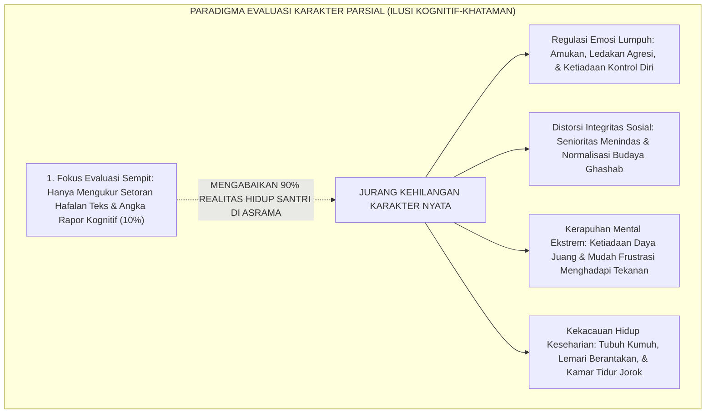
```mermaid
graph TD
    subgraph Reduksionisme["PARADIGMA EVALUASI KARAKTER PARSIAL (ILUSI KOGNITIF-KHATAMAN)"]
        Hafalan["1. Fokus Evaluasi Sempit: Hanya Mengukur Setoran Hafalan Teks & Angka Rapor Kognitif (10%)"]
        Hafalan -.->|"MENGABAIKAN 90% REALITAS HIDUP SANTRI DI ASRAMA"| Jurang["JURANG KEHILANGAN KARAKTER NYATA"]
        Jurang --> Buta1["Regulasi Emosi Lumpuh: Amukan, Ledakan Agresi, & Ketiadaan Kontrol Diri"]
        Jurang --> Buta2["Distorsi Integritas Sosial: Senioritas Menindas & Normalisasi Budaya Ghashab"]
        Jurang --> Buta3["Kerapuhan Mental Ekstrem: Ketiadaan Daya Juang & Mudah Frustrasi Menghadapi Tekanan"]
        Jurang --> Buta4["Kekacauan Hidup Keseharian: Tubuh Kumuh, Lemari Berantakan, & Kamar Tidur Jorok"]
    end
```

<b>Gambar 1.1.1:</b> Jebakan Reduksionisme Evaluasi Karakter Parsial dalam Praktik Pendidikan Pesantren Konvensional.

Diagram di atas menyingkap ironi terdalam institusi pendidikan: lembaga mengira telah mendidik manusia seutuhnya, padahal yang terjadi hanyalah pelatihan memori mekanis jangka pendek. Ketika institusi menyempitkan definisi keberhasilan santri semata-mata pada capaian hafalan verbal (10% permukaan kognitif), maka 90% dimensi kemanusiaan santri—regulasi emosi, interaksi sosial, ketahanan mental, dan kebersihan hidup—terbiarkan tumbuh liar tanpa bimbingan sistemik.

Fenomena ini dalam psikologi moral modern dikenal sebagai fenomena *moral licensing*[^1]: ketika seseorang merasa telah melakukan perbuatan "besar" yang diakui publik (seperti menghafal sekian juz atau membaca kitab tebal), alam bawah sadarnya secara keliru memberi izin moral (*license*) untuk meremehkan pelanggaran adab-adab mendasar di sekitarnya. Santri merasa bahwa status hafalannya telah menghapus kewajiban membersihkan loker, menghormati hak milik kawan, atau bersikap santun kepada pelayan dapur pondok.

Pakar kurikulum dan etika kepedulian global **Nel Noddings**[^2] menegaskan kritik mendasar terhadap sistem persekolahan yang terobsesi pada prestasi kognitif terisolasi:
> *"Sekolah yang hanya merayakan skor ujian sempit tanpa merawat kapasitas kepedulian relasional (*caring relations*) sesungguhnya sedang memproduksi manusia-manusia yang terasing dari nurani dan kemanusiaannya sendiri. Pendidikan moral tidak bisa diajarkan sebagai materi hafalan ceramah, melainkan harus dialami dalam perjumpaan relasional yang hangat, adil, dan bermakna."*

Dalam khazanah peradaban Islam, **Prof. Dr. Syed Muhammad Naquib al-Attas**[^3] telah merumuskan kritik epistemologis yang sangat tajam terhadap penyempitan pendidikan. Beliau menegaskan bahwa tujuan utama pendidikan Islam bukanlah sekadar *Ta'lim* (pengajaran informasi dan transfer data kognitif semata), melainkan *Ta'dib*:
> *"Ta'dib adalah proses penanaman adab ke dalam totalitas jiwa, akal, dan raga manusia. Adab adalah pengenalan dan pengakuan akan hakikat bahwa segala ciptaan memiliki martabat dan tempatnya yang tepat dalam susunan wujud, sehingga melahirkan tindakan yang benar, adil, dan selaras terhadap Allah, sesama makhluk, dan alam semesta."*

Ketika pendidikan pesantren tereduksi menjadi sekadar *Ta'lim* hafalan teks tanpa *Ta'dib* yang membumi, lahirlah generasi yang cerdas melafalkan dalil namun tumpul dalam kepekaan nurani.

---

### II. Pendekatan Anak Utuh (*Whole-Child Approach*) dalam Pandangan Fitrah

Untuk membedah kebuntuan reduksionisme di atas, **Ekosistem TUMBUH** mengadopsi dan merekonstruksi pendekatan **Anak Utuh (*Whole-Child Approach*) Berbasis Fitrah**[^4].

Pendekatan ini memandang santri bukan sebagai "kertas kosong yang harus dijejali teks", bukan pula sebagai "mesin pemenang kejuaraan musabaqah", melainkan sebagai **makhluk ciptaan Allah yang utuh, mulia, dan unik (*al-Insan al-Kamil bi al-Quwwah*)**, yang memiliki spektrum kebutuhan perkembangan fitrah yang saling berkelindan dan tidak boleh dipisahkan satu sama lain:

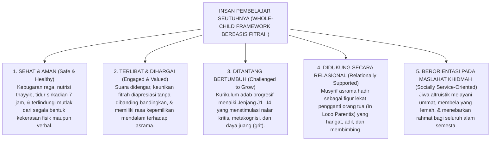
```mermaid
graph TD
    Santri["INSAN PEMBELAJAR SEUTUHNYA (WHOLE-CHILD FRAMEWORK BERBASIS FITRAH)"]
    
    Santri --> S1["1. SEHAT & AMAN (Safe & Healthy)<br/>Kebugaran raga, nutrisi thayyib, tidur sirkadian 7 jam, & terlindungi mutlak dari segala bentuk kekerasan fisik maupun verbal."]
    
    Santri --> S2["2. TERLIBAT & DIHARGAI (Engaged & Valued)<br/>Suara didengar, keunikan fitrah diapresiasi tanpa dibanding-bandingkan, & memiliki rasa kepemilikan mendalam terhadap asrama."]
    
    Santri --> S3["3. DITANTANG BERTUMBUH (Challenged to Grow)<br/>Kurikulum adab progresif menaiki Jenjang J1–J4 yang menstimulasi nalar kritis, metakognisi, dan daya juang (grit)."]
    
    Santri --> S4["4. DIDUKUNG SECARA RELASIONAL (Relationally Supported)<br/>Musyrif asrama hadir sebagai figur lekat pengganti orang tua (In Loco Parentis) yang hangat, adil, dan membimbing."]
    
    Santri --> S5["5. BERORIENTASI PADA MASLAHAT KHIDMAH (Socially Service-Oriented)<br/>Jiwa altruistik melayani ummat, membela yang lemah, & menebarkan rahmat bagi seluruh alam semesta."]
```

<b>Gambar 1.1.2:</b> Lima Pilar Perkembangan Anak Utuh (Whole-Child Framework) Ekosistem TUMBUH.

Pemaparan lima pilar perkembangan anak utuh di atas menegaskan bahwa pembinaan karakter santri harus berjalan serempak dan simfoni:

1. **Pilar Sehat & Aman (*Safe & Healthy*)**: Santri tidak akan mampu menghafal Al-Qur'an secara mendalam jika tubuhnya diserang penyakit kulit menular (skabies), perutnya kelaparan karena gizi rendah, atau otaknya didera teror ketakutan akibat ancaman senior. Rasa aman fisiologis dan psikologis adalah fondasi mutlak pembentukan karakter.
2. **Pilar Terlibat & Dihargai (*Engaged & Valued*)**: Santri yang merasa dirinya hanya diposisikan sebagai "objek penderita aturan" akan mengembangkan mekanisme pertahanan diri berupa kepatuhan palsu (*passive defiance*). Sebaliknya, ketika santri dilibatkan dalam merumuskan kesepakatan adab kamar, ia memiliki rasa tanggung jawab moral dari dalam hatinya.
3. **Pilar Ditantang Bertumbuh (*Challenged to Grow*)**: Pendidikan karakter bukanlah indoktrinasi pasif, melainkan petualangan menaklukkan tantangan. Melalui progresi Jenjang Kemandirian TUMBUH (J1–J4) (T1 Adaptasi, T2 Habituasi, T3 Internalisasi, T4 Transformasi), santri ditantang melampaui batas kenyamanan egonya menuju kematangan adab.
4. **Pilar Didukung Relasional (*Relationally Supported*)**: Karakter tidak tumbuh dari mikrofon pengeras suara yang membentak-bentak santri dari menara asrama. Karakter menular lewat tatapan mata yang hangat, senyuman tulus, dan sentuhan pundak musyrif asrama yang mendengarkan keluh kesah santri saat mereka dilanda rindu rumah (*homesickness*).
5. **Pilar Berorientasi Khidmah (*Socially Service-Oriented*)**: Muara akhir dari kematangan adab santri bukanlah kepuasan individualistis kesalehan pribadi, melainkan kerelaan berkorban untuk kemaslahatan sesama (*altruisme khidmah*).

Ketika kelima pilar ini bekerja secara terintegrasi:
* Santri tidak hanya mampu menghafal dalil thaharah, tetapi bilik kamarnya harum, ranjangnya tertata rapi, dan pakaiannya suci bebas kuman.
* Santri tidak hanya memahami konsep *Ukhuwah Islamiyyah*, tetapi tangannya tergerak membasuh piring temannya yang sedang terbaring sakit.
* Santri tidak hanya menghafal hukum larangan mencuri, tetapi hatinya diliputi *Muraqabatullah* sehingga pantang menyentuh barang orang lain tanpa kerelaan pemiliknya.

---

### III. Menghidupkan Kembali Taksonomi Adab Ulama Klasik: Az-Zarnuji, Ibn Sahnun, & Al-Ghazali

Kritik terhadap pendidikan yang mengerdilkan potensi kemanusiaan murid sesungguhnya bukanlah barang baru impor dari Barat, melainkan ruh inti dari khazanah agung pedagogi Islam (*Turats at-Tarbiyyah wal Adab*).

Para ulama salaf terdahulu telah meletakkan taksonomi pendidikan yang menempatkan kesiapan mental, ketahanan fisik, dan pendampingan kasih sayang guru sebagai syarat mutlak keberhasilan ilmu.

#### 1. Syarah Wasiat Syekh Burhanuddin Al-Zarnuji (*Ta'lim al-Muta'allim*)
Dalam kitab pedoman penuntut ilmu yang melegenda, *Ta'lim al-Muta'allim Thariq at-Ta'allum*[^5], **Syekh Burhanuddin Al-Zarnuji** menukilkan syair agung Sayyidina Ali bin Abi Thalib RA mengenai enam pilar utuh pembinaan penuntut ilmu:

$$\text{أَلَا لَا تَنَالُ الْعِلْمَ إِلَّا بِسِتَّةٍ ۞ سَأُنْبِيكَ عَنْ مَجْمُوعِهَا بِبَيَانِ:}$$
$$\text{ذَكَاءٍ وَحِرْصٍ وَاصْطِبَارٍ وَبُلْغَةٍ ۞ وَإِرْشَادِ أُسْتَاذٍ وَطُولِ زَمَانِ}$$

**Terjemahan Berjiwa:**
> *"Ingatlah! Engkau tidak akan pernah mereguk hakikat ilmu kecuali dengan enam perkara yang terpadu utuh, yang akan kubentangkan kepadamu keterangannya secara benderang:*
> 1. *Kecerdasan akal yang diasah nalar kritisnya (*Dzakā'*),*
> 2. *Semangat menggelora yang pantang menyerah (*Hirsh*),*
> 3. *Kesabaran jiwa menanggung beban tempaan (*Ishthibār*),*
> 4. *Bekal kecukupan fisik dan material yang menopang (*Bulghah*),*
> 5. *Bimbingan guru beradab yang hadir mengasuh (*Irsyādu Ustādz*), dan*
> 6. *Rentang waktu pembiasaan yang panjang dan berkelanjutan (*Thūlu Zamān*)."*

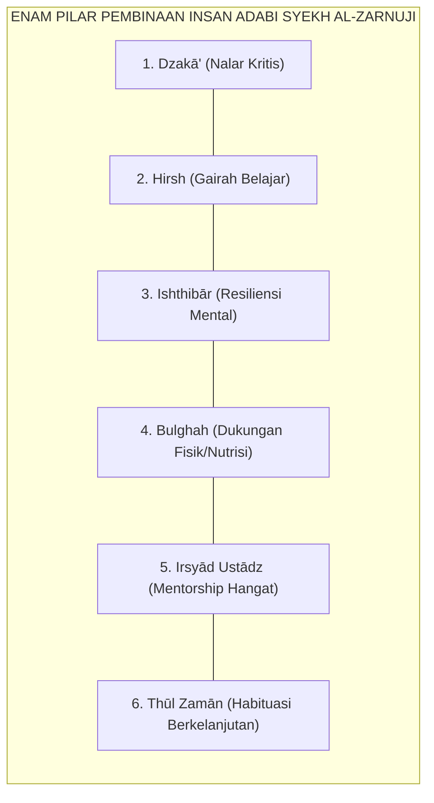
```mermaid
graph LR
    subgraph SyaratZarnuji["ENAM PILAR PEMBINAAN INSAN ADABI SYEKH AL-ZARNUJI"]
        Z1["1. Dzakā' (Nalar Kritis)"] --- Z2["2. Hirsh (Gairah Belajar)"]
        Z2 --- Z3["3. Ishthibār (Resiliensi Mental)"]
        Z3 --- Z4["4. Bulghah (Dukungan Fisik/Nutrisi)"]
        Z4 --- Z5["5. Irsyād Ustādz (Mentorship Hangat)"]
        Z5 --- Z6["6. Thūl Zamān (Habituasi Berkelanjutan)"]
    end
```

<b>Gambar 1.1.3:</b> Rekonstruksi Enam Syarat Menuntut Ilmu Imam Al-Zarnuji dalam Dimensi Kapasitas Holistik.

Perhatikan bagaimana Syekh Al-Zarnuji meletakkan *Ishthibār* (ketahanan mental/resiliensi), *Bulghah* (kecukupan gizi dan fisik), serta *Irsyād Ustādz* (pendampingan relasional guru) sejajar dengan *Dzakā'* (kapasitas intelektual). Ini membuktikan bahwa sejak abad ke-13 Masehi, pendidikan Islam telah menolak reduksionisme kognitif murni!

#### 2. Risalah Perlindungan Anak Imam Muhammad bin Sahnun (*Adab al-Mu'allimin*)
Pakar hukum dan pendidik agung Afrika Utara abad ke-3 Hijriyah, **Imam Muhammad bin Sahnun at-Tanukhi** dalam kitabnya *Adab al-Mu'allimin*[^6] (risalah pedagogi tertulis pertama dalam sejarah Islam) menetapkan aturan ketat bahwa seorang pendidik diharamkan memperlakukan santri dengan diskriminatif berdasarkan status sosial atau kecepatan belajarnya:
> *"Wajib bagi guru untuk menyamakan pandangan kasih sayangnya kepada seluruh anak didik, baik anak orang kaya maupun anak orang miskin. Dilarang keras guru memukul anak dalam keadaan marah, dan dilarang memukul bagian tubuh yang mematikan atau melukai kehormatan fisiknya. Tugas guru adalah menjaga amanah fitrah anak sebagaimana ia menjaga anak kandungnya sendiri."*

#### 3. Kritik Tajam Hujjatul Islam Imam Al-Ghazali
Dalam kitab monumentalnya *Ayyuhal Walad*[^7], **Imam Al-Ghazali** mengingatkan murid kesayangannya dengan peringatan yang menggetarkan dada:

$$\text{أَيُّهَا الْوَلَدُ، الْعِلْمُ بِلَا عَمَلٍ جُنُونٌ، وَالْعَمَلُ بِغَيْرِ عِلْمٍ لَا يَكُونُ}$$

**Terjemahan Berjiwa:**
> *"Wahai anakku tercinta! Ilmu yang bertumpuk di kepala tanpa diwujudkan dalam amal perbuatan nyata adalah kegilaan (*junūn*); dan amal perbuatan tanpa didasari ilmu yang lurus tidak akan pernah tegak berdiri."*

Imam Al-Ghazali menegaskan bahwa menghafal beribu kitab tidak akan menyelamatkan santri jika hatinya masih dipenuhi dengki, lidahnya gemar menggunjing kawan, dan perilakunya menindas sesama penuntut ilmu.

---

### IV. Solusi Sistemik TUMBUH: Transformasi Kurikulum Menjadi Arsitektur Kapasitas

Menjawab kegagalan paradigma reduksionis konvensional, **Ekosistem TUMBUH** mentransformasikan kurikulum pembinaan karakter pesantren dari sekadar "jadwal hafalan kognitif linear" menjadi **Arsitektur Kapasitas Holistik Berbasis Fitrah**:

| Dimensi Transformasi | Paradigma Pesantren Konvensional (Reduksionis) | Paradigma Ekosistem TUMBUH (Whole-Child Fitrah) |
| :--- | :--- | :--- |
| **Fokus Evaluasi** | Setoran hafalan ayat/hadits & angka rapor kognitif sempit (10% permukaan). | Panca Dimensi Kapasitas: Spiritual, Sosio-Emosional, Kognitif, Fisik, & Vokasional (100% Utuh). |
| **Metode Pembinaan** | Ceramah doktrin podium, instruksi satu arah, & hafalan teks pasif. | Habituasi 24 jam terbimbing, simulasi lingkaran emosi, & rekayasa lingkungan *Bi'ah Shalihah*. |
| **Penanganan Pelanggaran** | Hukuman fisik, bentakan verbal, botak paksa, & sanksi mempermalukan (*punitive*). | Disiplin Restoratif (*Firm & Kind*), restitusi logis pemulihan hak kawan, & bimbingan bertingkat PBIS. |
| **Peran Musyrif Asrama** | "Polisi Malam" / Pengawas Disiplin yang ditakuti santri. | Figur Lekat *In Loco Parentis* & *External Prefrontal Cortex* yang membimbing dengan kasih sayang. |
| **Orientasi Hasil Akhir** | Memproduksi "Piala & Bintang Wisuda" yang rapuh secara karakter. | Melahirkan **Insan Adabi Seutuhnya**: kokoh tauhidnya, luhur adabnya, mandiri hidupnya, & bermanfaat bagi ummat. |

Dengan meletakkan fondasi *Whole-Child* ini, kita melangkah menuju **Sub-Bab 1.2** untuk membedah secara rinci dan terukur **Lima Dimensi Kapasitas Holistik Santri** yang menjadi pilar utama pembinaan karakter di bumi pesantren.

---

## 📌 Catatan Kaki & Rujukan Primer

[^1]: **Benoît Monin & Dale T. Miller**, "Moral credentials and the expression of prejudice", *Journal of Personality and Social Psychology*, Vol. 81, No. 1 (2001), hlm. 33–43; serta **Sonya Sachdeva, Rumen Iliev, & Douglas L. Medin**, "Sinning and saintliness: How the pursuit of moral consistency shapes moral choice", *Psychological Science*, Vol. 20, No. 4 (2009), hlm. 523–528.
[^2]: **Nel Noddings**, *The Challenge to Care in Schools: An Alternative Approach to Education* (New York: Teachers College Press, 1992; Edisi ke-2, 2005), Bab 2: "Caring: A Relational Approach to Ethics and Moral Education", hlm. 15–42; serta **Nel Noddings**, *Caring: A Relational Approach to Ethics and Moral Education* (Berkeley: University of California Press, 1984; Edisi ke-2, 2013), hlm. 25–68.
[^3]: **Prof. Dr. Syed Muhammad Naquib al-Attas**, *The Concept of Education in Islam: A Framework for an Islamic Philosophy of Education* (Kuala Lumpur: International Institute of Islamic Thought and Civilization / ISTAC, 1980), hlm. 15–38; serta **Prof. Dr. Syed Muhammad Naquib al-Attas**, *Prolegomena to the Metaphysics of Islam* (Kuala Lumpur: ISTAC, 1995), Bab 1: "Islam: The Concept of Religion and the Foundation of Ethics and Morality", hlm. 41–89.
[^4]: **ASCD (Association for Supervision and Curriculum Development)**, *Making the Case for Educating the Whole Child* (Alexandria: ASCD Publications, 2014); serta **James P. Comer**, *Child by Child: The Comer Process for Change in Education* (New York: Teachers College Press, 1999), hlm. 18–45.
[^5]: **Al-Imam Burhanuddin al-Zarnuji**, *Ta'lim al-Muta'allim Thariq at-Ta'allum*, Tahqiq: Syaikh Mustafa Asyur (Kairo: Dar al-I'tisham, 1986), hlm. 14–25; serta Syarah oleh **Syaikh Ibrahim bin Ismail**, *Syarh Ta'lim al-Muta'allim* (Surabaya: Maktabah Muhammad bin Ahmad Nabhan, t.th.), hlm. 21–28.
[^6]: **Al-Imam Abu Abdillah Muhammad bin Sahnun at-Tanukhi**, *Adab al-Mu'allimin*, Tahqiq: Dr. Hasan Husni Abdul Wahhab (Tunis: Dar al-Kutub asy-Syarqiyyah, 1972), hlm. 28–45.
[^7]: **Hujjatul Islam Imam Abu Hamid Muhammad bin Muhammad al-Ghazali**, *Ayyuhal Walad fi Nashihat at-Talamidz*, Tahqiq: Dr. Ahmad Ahmad Badawi (Kairo: Dar al-Qalam, 1986), hlm. 12–28.

---

# LIMA DIMENSI KAPASITAS HOLISTIK SANTRI

---

### 🧭 PETA POSISI PANDUAN DALAM SISTEM TUMBUH (DARI HULU KE HILIR)
* **Posisi Arsitektur**: `BATANG EKOSISTEM I (Taksonomi 10 Muwashafat Adab & Tangga Kemandirian J1–J4)`
* **Peruntukan Pengguna**: Wali Kelas, Musyrif Kamar, Guru Pengampu Adab, & Mentor Santri
* **Fokus Panduan**: Memandu tahapan penanaman 10 Karakter Adab Nabawi dari fase Adaptasi (J1), Pembiasaan (J2), Kematangan (J3), hingga Kader Penggerak (J4/Tahap 7).
* **Hasil Akhir yang Dituju**: Terwujudnya santri berkarakter *Insan Adabi* yang mandiri, musyrif yang mengasuh dengan kasih sayang tanpa *burnout*, dan pesantren yang aman berbasis data (*Safe Boarding School*).

---

### 🎯 Mengapa Panduan Ini Ada & Masalah Nyata yang Dipecahkan
1. **Latar Masalah di Lapangan**: Sering kali pengasuhan di pesantren berjalan tanpa SOP yang jelas atau terjebak dalam pola reaktif—menunggu santri berbuat salah baru dihukum dengan emosional.
2. **Solusi Sistem TUMBUH**: Panduan ini memberikan langkah preventif dan terstruktur agar setiap pembiasaan adab berjalan terencana, konsisten, dan terukur.
3. **Sasaran Perubahan**: Memastikan nilai-nilai Islam menyatu dalam perilaku harian santri melalui keteladanan nyata (*Qudwah Hasanah*).

---
### 🎯 Tujuan & Manfaat Panduan
Panduan ini dirancang sebagai petunjuk operasional terapan agar pendidik dan musyrif dapat:
1. Menjalankan pembinaan adab santri dengan pendekatan kasih sayang (*Rahmah*) dan ketegasan yang mendidik (*Firm & Kind*).
2. Menghindari cara-cara kekerasan fisik, bentakan verbal, maupun hukuman yang mempermalukan santri.
3. Menciptakan suasana asrama dan kelas yang aman, tertib, dan menumbuhkan kesadaran diri (*Bi'ah Shalihah*).

---

### 💡 Intisari Cepat (3 Menit Memahami Esensi)
* **Kunci Pengasuhan**: Karakter santri tumbuh melalui keteladanan nyata (*Qudwah Hasanah*), komunikasi empatik, dan pembiasaan terstruktur 24 jam.
* **Tindakan Utama**: Terapkan panduan langkah demi langkah di bawah ini secara konsisten, pantau perkembangan santri secara objektif, dan berikan apresiasi atas setiap perbaikan diri yang mereka capai.
* **Prinsip Disiplin**: Fokus pada pemulihan hubungan dan tanggung jawab nyata (*Restoratif*), bukan sekadar melampiaskan amarah atau menghukum.

---

### 📖 Uraian Panduan & Langkah Aksi Lapangan

---

### I. Peta Utuh Anatomi Insan Adabi: Menolak Silo Perkembangan

Dalam merancang kurikulum pembinaan karakter pesantren, kesalahan paling fatal yang kerap dilakukan institusi pendidikan adalah **memperlakukan santri secara parsial (terkotak-kotak dalam silo)**.

Pendidikan spiritual diserahkan sepenuhnya ke bilik halaqah tahfizh ba'da subuh; pendidikan kognitif dikurung di ruang madrasah dari pagi hingga siang; sementara kehidupan fisik, emosional, dan kemandirian hidup santri di asrama terbiarkan berjalan secara anarkis tanpa sentuhan pedagogis. Akibatnya, lahir kepribadian santri yang timpang: memiliki hafalan Al-Qur'an yang melimpah, namun fisiknya ringkih diserang penyakit menular, emosinya meledak-ledak saat disenggol kawan, dan kamarnya menyerupai kapal karam karena pakaian kotor bertumpuk berhari-hari.

Untuk mengakhiri kekacauan fragmentasi tersebut, **Ekosistem TUMBUH** merumuskan **Panca Dimensi Kapasitas Holistik Santri (*The Five Holistic Capacities Framework*)**:

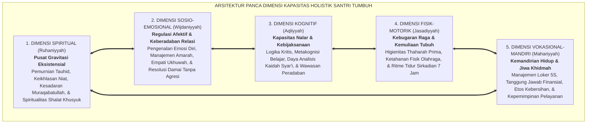
```mermaid
graph TD
    subgraph PancaDimensi["ARSITEKTUR PANCA DIMENSI KAPASITAS HOLISTIK SANTRI TUMBUH"]
        D1["1. DIMENSI SPIRITUAL (Ruhaniyyah)<br/><b>Pusat Gravitasi Eksistensial</b><br/>Pemurnian Tauhid, Keikhlasan Niat, Kesadaran Muraqabatullah, & Spiritualitas Shalat Khusyuk"]
        
        D2["2. DIMENSI SOSIO-EMOSIONAL (Wijdaniyyah)<br/><b>Regulasi Afektif & Keberadaban Relasi</b><br/>Pengenalan Emosi Diri, Manajemen Amarah, Empati Ukhuwah, & Resolusi Damai Tanpa Agresi"]
        
        D3["3. DIMENSI KOGNITIF (Aqliyyah)<br/><b>Kapasitas Nalar & Kebijaksanaan</b><br/>Logika Kritis, Metakognisi Belajar, Daya Analisis Kaidah Syar'i, & Wawasan Peradaban"]
        
        D4["4. DIMENSI FISIK-MOTORIK (Jasadiyyah)<br/><b>Kebugaran Raga & Kemuliaan Tubuh</b><br/>Higienitas Thaharah Prima, Ketahanan Fisik Olahraga, & Ritme Tidur Sirkadian 7 Jam"]
        
        D5["5. DIMENSI VOKASIONAL-MANDIRI (Mahariyyah)<br/><b>Kemandirian Hidup & Jiwa Khidmah</b><br/>Manajemen Loker 5S, Tanggung Jawab Finansial, Etos Kebersihan, & Kepemimpinan Pelayanan"]
        
        D1 <===> D2
        D2 <===> D3
        D3 <===> D4
        D4 <===> D5
        D5 <===> D1
    end
```

<b>Gambar 1.2.1:</b> Arsitektur Saling Keterhubungan Panca Dimensi Kapasitas Holistik Ekosistem TUMBUH.

Diagram di atas menegaskan bahwa kelima dimensi kapasitas holistik ini bukanlah bagian-bagian yang terpisah secara mekanistik, melainkan lima helai benang sutra yang saling menganyam membentuk kain kepribadian seorang *Insan Adabi*:
* **Dimensi Spiritual (*Ruhaniyyah*)** berperan sebagai kompas moral tertinggi yang mengarahkan seluruh niat dan orientasi eksistensial santri semata-mata mengharap ridha Allah.
* **Dimensi Sosio-Emosional (*Wijdaniyyah*)** menjadi bantalan peredam ego dan jembatan ukhuwah yang memungkinkan santri hidup berdampingan secara damai dalam kultur komunal asrama yang padat.
* **Dimensi Kognitif (*Aqliyyah*)** memberikan ketajaman nalar untuk membedakan antara yang haq dan yang batil, menimbang maslahat dan mafsadat dalam setiap keputusan hidup.
* **Dimensi Fisik-Motorik (*Jasadiyyah*)** menyediakan wadah biologis yang bugar, bersih, dan energetik untuk menopang ibadah panjang dan pembelajaran tanpa kelelahan kronis.
* **Dimensi Vokasional-Mandiri (*Mahariyyah*)** melatih keterampilan hidup praktis agar santri tidak menjadi beban bagi sesama, melainkan mampu mengurus diri sendiri dan berkhidmah melayani ummat.

---

### II. Dialog Epistemologi: Gardner & Bloom Bertemu Hujjatul Islam Al-Ghazali

Konstruksi panca dimensi ini berdiri kokoh di atas sintesis harmonis antara konsensus psikologi perkembangan modern dan kedalaman mutiara *Turats Nafsani*.

#### 1. Landasan Sains Kontemporer: Multiple Intelligences & Domain Afektif
Pakar psikologi kognitif dari Harvard University, **Prof. Howard Gardner**[^1] dalam teorinya tentang *Multiple Intelligences* (Kecerdasan Majemuk) mematahkan mitos lama bahwa manusia hanya dinilai dari kecerdasan logis-linguistik sempit (skor IQ). Gardner membuktikan bahwa manusia dianugerahi spektrum kecerdasan yang luas, termasuk kecerdasan intrapersonal (pemahaman diri batiniah), interpersonal (keterampilan sosial dan empati), kinestetik-badani, dan eksistensial-spiritual.

Senada dengan itu, **David R. Krathwohl & Benjamin S. Bloom**[^2] dalam taksonomi domain afektif membuktikan bahwa penanaman karakter tidak akan pernah berhasil jika pengajaran berhenti pada tingkat kognitif (*knowing*). Nilai karakter harus melalui proses penyerapan afektif: mulai dari penerimaan sadar (*receiving*), respons emosional aktif (*responding*), penghargaan nilai (*valuing*), pengorganisasian prinsip hidup (*organization*), hingga menjadi karakter watak yang mendarah daging (*characterization by a value complex*).

#### 2. Hakikat Empat Daya Jiwa Menurut Hujjatul Islam Imam Al-Ghazali
Jauh sebelum sains Barat merumuskan taksonomi pendidikan, **Hujjatul Islam Imam Abu Hamid Al-Ghazali** dalam *Ihya' 'Ulumiddin* (Kitab *Riyadhatin Nafs wa Tahdzibil Akhlaq*)[^3] telah membongkar anatomi jiwa manusia ke dalam empat daya pokok (*al-Quwa al-Arba'*):

$$\text{فَأُمَّهَاتُ الْأَخْلَاقِ وَأُصُولُهَا أَرْبَعَةٌ: الْحِكْمَةُ، وَالشَّجَاعَةُ، وَالْعِفَّةُ، وَالْعَدْلُ.}$$
$$\text{وَالْعَدْلُ عِبَارَةٌ عَنْ حَالَةٍ لِلنَّفْسِ وَقُوَّةٍ بِهَا تَسُوسُ الْغَضَبَ وَالشَّهْوَةَ وَتَحْمِلُهُمَا عَلَى مُقْتَضَى الْحِكْمَةِ}$$

**Terjemahan Berjiwa:**
> *"Induk kemuliaan akhlak dan pokok fondasinya berpijak pada empat pilar utama: Al-Hikmah (Kebijaksanaan Nalar Aqliyyah), Asy-Syaja'ah (Keberanian & Regulasi Emosi Wijdaniyyah), Al-'Iffah (Kesucian Diri & Pengendalian Syahwat Jasadiyyah), dan Al-'Adl (Keadilan Ruhaniyyah).*
> 
> *Adapun Al-'Adl adalah kondisi batin dan kekuatan rohani yang melaluinya jiwa mampu mengendalikan daya amarah (*Quwwah al-Ghadhab*) dan daya syahwat (*Quwwah asy-Syahwah*), serta menundukkan keduanya di bawah bimbingan kebijaksanaan nalar (*al-Hikmah*) demi menggapai ridha Ilahi."*

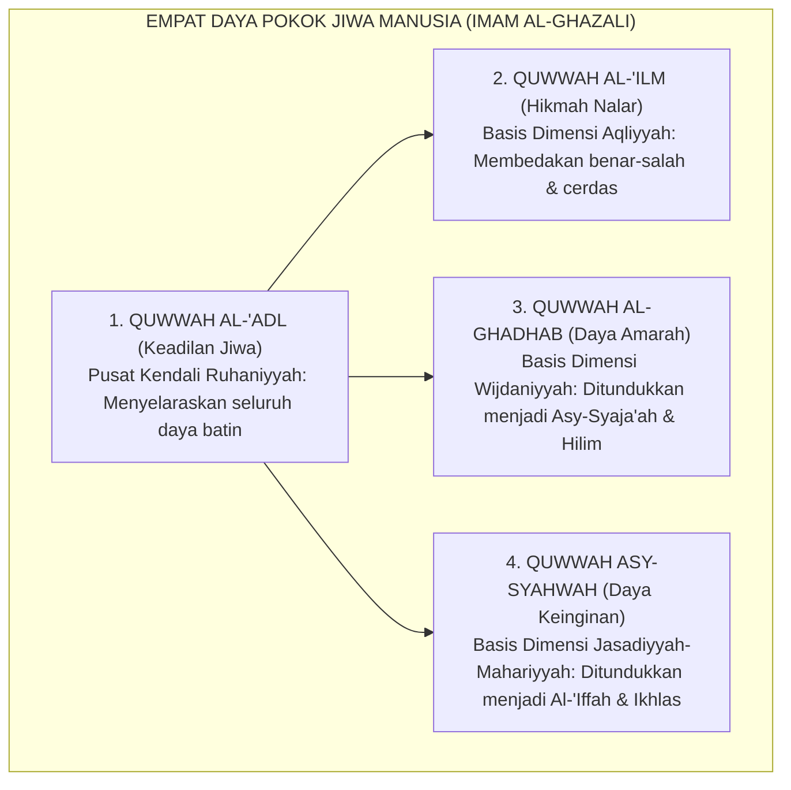
```mermaid
graph TD
    subgraph GhazaliQuwa["EMPAT DAYA POKOK JIWA MANUSIA (IMAM AL-GHAZALI)"]
        Adl["1. QUWWAH AL-'ADL (Keadilan Jiwa)<br/>Pusat Kendali Ruhaniyyah: Menyelaraskan seluruh daya batin"]
        Hikmah["2. QUWWAH AL-'ILM (Hikmah Nalar)<br/>Basis Dimensi Aqliyyah: Membedakan benar-salah & cerdas"]
        Ghadhab["3. QUWWAH AL-GHADHAB (Daya Amarah)<br/>Basis Dimensi Wijdaniyyah: Ditundukkan menjadi Asy-Syaja'ah & Hilim"]
        Syahwah["4. QUWWAH ASY-SYAHWAH (Daya Keinginan)<br/>Basis Dimensi Jasadiyyah-Mahariyyah: Ditundukkan menjadi Al-'Iffah & Ikhlas"]
        
        Adl --> Hikmah
        Adl --> Ghadhab
        Adl --> Syahwah
    end
```

<b>Gambar 1.2.2:</b> Struktur Empat Daya Jiwa Imam Al-Ghazali sebagai Fondasi Panca Dimensi Kapasitas TUMBUH.

Analisis Imam Al-Ghazali di atas memberikan legitimasi teologis yang sangat kokoh: kesalehan bukanlah pengebirian daya-daya manusia, melainkan penyelarasan dan pembinaan adil terhadap seluruh potensi fitrah yang telah dianugerahkan Allah SWT.

---

### III. Bedah Operasional Panca Dimensi Kapasitas dalam Ritme 24 Jam

Untuk memastikan panca dimensi ini tidak berhenti sebagai wacana teoritis di atas kertas, Ekosistem TUMBUH menerjemahkannya ke dalam **Matriks Indikator Perilaku Faktual 24 Jam**:

| Dimensi Kapasitas | Fondasi Syar'i & Teoretis | Indikator Perilaku Faktual di Lapangan (24 Jam) | Gejala Distorsi Jika Dimensi Diabaikan | Protokol Pendampingan Sistemik TUMBUH |
| :--- | :--- | :--- | :--- | :--- |
| **1. Ruhaniyyah (Spiritual)** | Tauhid Murni, *Ikhlas*, & *Muraqabatullah* (QS. Al-Bayyinah: 5) | • Menjaga shalat fardhu berjamaah di shaf awal tanpa perlu digiring rotan. • Melazimi dzikir matsurat pagi-petang. • Ibadah ikhlas saat ada maupun tiada ustadz. | **Jiwa Munafik Transaksional**: Beribadah giat hanya ketika disorot kamera / diawasi pembina pondok. | Halaqah tadabbur asmaul husna, pembiasaan qiyamul lail sukarela, dan eliminasi sistem reward bernilai uang. |
| **2. Wijdaniyyah (Sosio-Emosional)** | *Hilim*, *Rahmah*, & *Ishlah al-Bain* (QS. Al-Hujurat: 10) | • Mengakui kesalahan secara jantan tanpa defensif. • Mampu meredam amarah saat diejek kawan. • Segera meminta maaf dan memaafkan sebelum tidur. | **Tawuran & Perundungan**: Dendam membara antarkamar, pengucilan sosial santri yunior, agresi verbal. | Protokol *Emotion Circle* 10-menit, mediasi restoratif antarteman, dan latihan pernapasan de-eskalasi amigdala. |
| **3. Aqliyyah (Kognitif)** | *Tafakkur*, *Hikmah*, & *Nalar Kritis* (QS. Ali 'Imran: 190–191) | • Menganalisis korelasi dalil dengan konteks zaman. • Berani mengajukan pertanyaan kritis di kelas. • Memiliki strategi metakognisi dalam menghafal. | **Dogmatisme Kaku**: Santri menjadi penghafal teks pasif yang mudah terprovokasi hoaks dan ekstrimisme. | Pengajaran berbasis studi kasus fiqih kontekstual, forum munazharah adabi, dan teknik peta konsep (*mind-map*). |
| **4. Jasadiyyah (Fisik-Motorik)** | *Thaharah*, *Quwwah*, & *Afiyat* (HR. Muslim no. 223) | • Mandi teratur 2 kali sehari, pakaian bebas najis. • Menjaga kebersihan rambut dan kulit (Zero Scabies). • Tidur sirkadian cukup 7 jam setiap malam. | **Wabah Penyakit & Keletihan**: Santri terserang skabies massal, mata sayu, dan tertidur pulas saat ustadz mengajar. | Inspeksi sanitasi kamar berkala, penataan menu gizi seimbang (*thayyib*), dan pemadaman lampu tepat 22.00 WIB. |
| **5. Mahariyyah (Vokasional-Mandiri)** | *Khabirah*, *Kifayah*, & *Khidmah* (QS. Al-Qashash: 26) | • Melipat dan menata baju rapi di loker pribadi (5S). • Mencatat dan mengelola uang saku mingguan secara hemat. • Memimpin regu piket kebersihan asrama. | **Ketergantungan Manja**: Tidak bisa mencuci pakaian sendiri, boros menghabiskan sangu hari pertama, kamar kumuh. | Pelatihan kemandirian asrama (*Life Skills Workshop*), logbook keuangan mandiri, dan jadwal giliran khidmah dapur umum. |

---

### IV. Integrasi Psiko-Fisiologis: Sinergi Raga (*Jasad*) dan Jiwa (*Ruh*)

Banyak pondok pesantren masa lampau memisahkan secara keliru antara kesehatan biologis tubuh dan capaian spiritual jiwa. Muncul anggapan keliru bahwa "santri sejati harus tahan menderita, tidak apa-apa terkena koreng atau gudikan (skabies), tidak apa-apa tidur hanya 3 jam semalam di lantai semen dingin, karena itu tanda kesungguhan *tirakat*".

Pandangan ini dibongkar tuntas oleh kedokteran Islam dan konsensus neurobiologi modern. Tokoh kedokteran terbesar dunia Islam, **Al-Syaikh ar-Ra'is Ibnu Sina (Avicenna)** dalam mahakaryanya *Al-Qanun fi at-Tibb*[^4] menegaskan hubungan psikosomatis timbal balik antara raga dan jiwa:
> *"Ketahuilah bahwa tubuh mempengaruhi jiwa, sebagaimana jiwa mempengaruhi tubuh. Ketidakseimbangan unsur fisik tubuh, kurangnya tidur alami, dan buruknya udara kamar akan menggelapkan daya nalar akal, membakar emosi amarah, serta melemahkan daya ingat otak secara drastis."*

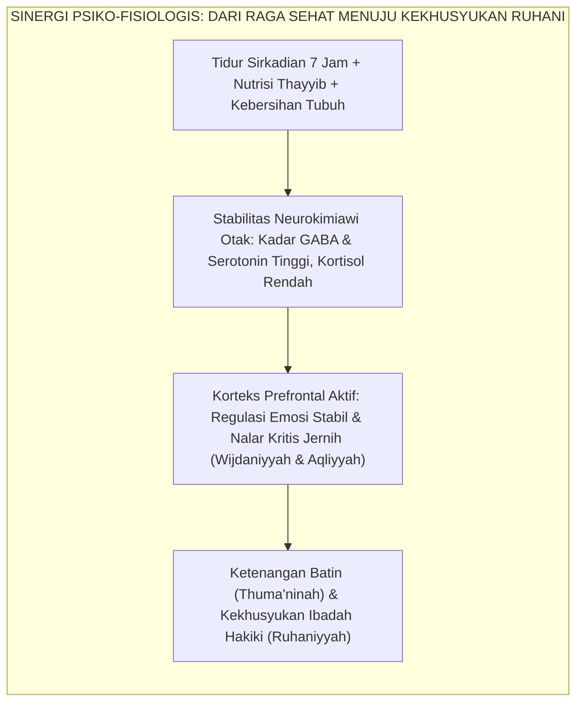
```mermaid
graph LR
    subgraph SinergiJasadJiwa["SINERGI PSIKO-FISIOLOGIS: DARI RAGA SEHAT MENUJU KEKHUSYUKAN RUHANI"]
        Tidur["Tidur Sirkadian 7 Jam + Nutrisi Thayyib + Kebersihan Tubuh"] --> Neurokimia["Stabilitas Neurokimiawi Otak: Kadar GABA & Serotonin Tinggi, Kortisol Rendah"]
        Neurokimia --> EmosiPFC["Korteks Prefrontal Aktif: Regulasi Emosi Stabil & Nalar Kritis Jernih (Wijdaniyyah & Aqliyyah)"]
        EmosiPFC --> Khusyuk["Ketenangan Batin (Thuma'ninah) & Kekhusyukan Ibadah Hakiki (Ruhaniyyah)"]
    end
```

<b>Gambar 1.2.3:</b> Alur Sinergi Psiko-Fisiologis antara Kesehatan Jasmani dan Kekhusyukan Ruhani.

Penelitian neurobiologi tidur oleh **Matthew Walker**[^5] dalam *Why We Sleep* membuktikan bahwa santri yang kurang tidur (kurang dari 6–7 jam) mengalami penurunan kapasitas memori jangka panjang hingga 40% dan peningkatan reaktivitas amigdala emosi hingga 60%. 

Santri yang dibangunkan paksa pada jam 02.00 dini hari setelah baru tidur jam 23.30 malam sesungguhnya berada dalam kondisi keracunan kortisol biologis (*toxic sleep deprivation*). Ketika otak kekurangan tidur, bagian *Prefrontal Cortex* (pusat kendali adab dan kesabaran) mati suri (*hypofrontality*). Akibatnya, santri tersebut menjadi sangat mudah marah di antrean kamar mandi, malas menghafal di kelas, dan melampiaskan stresnya dengan mem-bully adik kelas.

Dengan demikian, menjaga kebersihan asrama, menyediakan menu bergizi, dan menjamin hak tidur 7 jam santri **bukanlah bentuk pemanjaan duniawi, melainkan prasyarat biologis mutlak agar nurani santri mampu beradab secara mulia!**

---

### V. Solusi Sistemik TUMBUH: Pemetaan Kapasitas Multi-Dimensi Melalui Logbook PBIS

Untuk mengoperasionalkan panca dimensi kapasitas ini, Sistem **TUMBUH** menghapuskan tradisi pemeringkatan tunggal (*single-rank leaderboard*) yang memicu kecemburuan sosial, dan menggantikannya dengan **Dashboard Profil Radar Kapasitas Multi-Dimensi**:

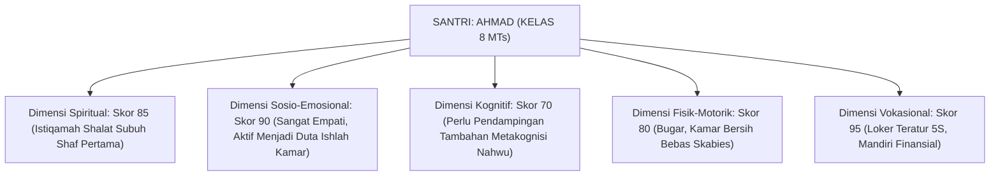
```mermaid
graph TD
    SantriIndividu["SANTRI: AHMAD (KELAS 8 MTs)"]
    
    SantriIndividu --> DimR["Dimensi Spiritual: Skor 85 (Istiqamah Shalat Subuh Shaf Pertama)"]
    SantriIndividu --> DimW["Dimensi Sosio-Emosional: Skor 90 (Sangat Empati, Aktif Menjadi Duta Ishlah Kamar)"]
    SantriIndividu --> DimA["Dimensi Kognitif: Skor 70 (Perlu Pendampingan Tambahan Metakognisi Nahwu)"]
    SantriIndividu --> DimJ["Dimensi Fisik-Motorik: Skor 80 (Bugar, Kamar Bersih Bebas Skabies)"]
    SantriIndividu --> DimM["Dimensi Vokasional: Skor 95 (Loker Teratur 5S, Mandiri Finansial)"]
```

<b>Gambar 1.2.4:</b> Contoh Profil Radar Pertumbuhan Kapasitas Multi-Dimensi Santri dalam sistem TUMBUH.

Melalui pemetaan radar di atas:
1. **Tidak Ada Santri yang Dianggap "Gagal"**: Santri seperti Ahmad yang mungkin nilai ujian nahwunya masih rata-rata (skor 70), tidak akan dicap bodoh atau dihina, karena sistem mengakui keunggulan luar biasanya dalam empati sosial (skor 90) dan kemandirian hidup (skor 95).
2. **Intervensi Menjadi Sangat Presisi**: Musyrif asrama dan guru madrasah mengetahui secara tepat pada dimensi mana santri membutuhkan *scaffolding* (bantuan bertahap), tanpa harus merusak harga diri dan rasa percaya diri anak.

Inilah perwujudan keadilan kurikulum sejati: menghormati fitrah kemanusiaan santri seutuhnya sebagaimana Allah menciptakannya. Kita melangkah ke **Sub-Bab 1.3** untuk mengintegrasikan taksonomi adab ulama dengan kerangka ilmiah global *Social Emotional Learning* (CASEL).

---

## 📌 Catatan Kaki & Rujukan Primer

[^1]: **Howard Gardner**, *Frames of Mind: The Theory of Multiple Intelligences* (New York: Basic Books, 1983; Edisi Peringatan 30 Tahun, 2011), Bab 10: "Personal Intelligences", hlm. 240–280; serta **Howard Gardner**, *Intelligence Reframed: Multiple Intelligences for the 21st Century* (New York: Basic Books, 1999), hlm. 33–68.
[^2]: **David R. Krathwohl, Benjamin S. Bloom, & Bertram B. Masia**, *Taxonomy of Educational Objectives: The Classification of Educational Goals. Handbook II: Affective Domain* (New York: David McKay Company, 1964), hlm. 45–85.
[^3]: **Hujjatul Islam Imam Abu Hamid Muhammad bin Muhammad al-Ghazali**, *Ihya' 'Ulumiddin*, Kitab Riyadhatin Nafs wa Tahdzibil Akhlaq wa Mu'alajat Amradhil Qalb (Kairo & Beirut: Dar al-Ma'rifah, t.th.), Jilid III, hlm. 53–58.
[^4]: **Al-Syaikh ar-Ra'is Ibnu Sina (Avicenna)**, *Al-Qanun fi at-Tibb*, Tahqiq: Idwar al-Qasy (Beirut: Dar al-Kutub al-'Ilmiyyah, 1999), Jilid I, Buku 1: "Fi Kulliyyat 'Ilmit Thibb", hlm. 25–48.
[^5]: **Matthew Walker**, *Why We Sleep: Unlocking the Power of Sleep and Dreams* (New York: Scribner, 2017), Bab 7: "Too Extreme for the Guinness Book of World Records: Sleep Deprivation and the Brain", hlm. 133–163.

---

# INTEGRASI TAKSONOMI ADAB TURATS DENGAN CASEL SEL

---

### 🧭 PETA POSISI PANDUAN DALAM SISTEM TUMBUH (DARI HULU KE HILIR)
* **Posisi Arsitektur**: `BATANG EKOSISTEM I (Taksonomi 10 Muwashafat Adab & Tangga Kemandirian J1–J4)`
* **Peruntukan Pengguna**: Wali Kelas, Musyrif Kamar, Guru Pengampu Adab, & Mentor Santri
* **Fokus Panduan**: Memandu tahapan penanaman 10 Karakter Adab Nabawi dari fase Adaptasi (J1), Pembiasaan (J2), Kematangan (J3), hingga Kader Penggerak (J4/Tahap 7).
* **Hasil Akhir yang Dituju**: Terwujudnya santri berkarakter *Insan Adabi* yang mandiri, musyrif yang mengasuh dengan kasih sayang tanpa *burnout*, dan pesantren yang aman berbasis data (*Safe Boarding School*).

---

### 🎯 Mengapa Panduan Ini Ada & Masalah Nyata yang Dipecahkan
1. **Latar Masalah di Lapangan**: Sering kali pengasuhan di pesantren berjalan tanpa SOP yang jelas atau terjebak dalam pola reaktif—menunggu santri berbuat salah baru dihukum dengan emosional.
2. **Solusi Sistem TUMBUH**: Panduan ini memberikan langkah preventif dan terstruktur agar setiap pembiasaan adab berjalan terencana, konsisten, dan terukur.
3. **Sasaran Perubahan**: Memastikan nilai-nilai Islam menyatu dalam perilaku harian santri melalui keteladanan nyata (*Qudwah Hasanah*).

---
### 🎯 Tujuan & Manfaat Panduan
Panduan ini dirancang sebagai petunjuk operasional terapan agar pendidik dan musyrif dapat:
1. Menjalankan pembinaan adab santri dengan pendekatan kasih sayang (*Rahmah*) dan ketegasan yang mendidik (*Firm & Kind*).
2. Menghindari cara-cara kekerasan fisik, bentakan verbal, maupun hukuman yang mempermalukan santri.
3. Menciptakan suasana asrama dan kelas yang aman, tertib, dan menumbuhkan kesadaran diri (*Bi'ah Shalihah*).

---

### 💡 Intisari Cepat (3 Menit Memahami Esensi)
* **Kunci Pengasuhan**: Karakter santri tumbuh melalui keteladanan nyata (*Qudwah Hasanah*), komunikasi empatik, dan pembiasaan terstruktur 24 jam.
* **Tindakan Utama**: Terapkan panduan langkah demi langkah di bawah ini secara konsisten, pantau perkembangan santri secara objektif, dan berikan apresiasi atas setiap perbaikan diri yang mereka capai.
* **Prinsip Disiplin**: Fokus pada pemulihan hubungan dan tanggung jawab nyata (*Restoratif*), bukan sekadar melampiaskan amarah atau menghukum.

---

### 📖 Uraian Panduan & Langkah Aksi Lapangan

---

### I. Titik Temu Mutiara Turats dan Konsensus Neurosains Afektif

Salah satu terobosan peradaban terbesar yang dihadirkan oleh **Ekosistem TUMBUH** adalah menjembatani dua khazanah keilmuan raksasa yang selama berabad-abad dipisahkan oleh sekat prasangka metodologis:
1. **Khazanah Adab Turats Islam**: Warisan agung para ulama salaf—seperti Imam Al-Ghazali, Al-Qabisi, Ibn Sahnun, Az-Zarnuji, dan Hadhratusy Syaikh KH. M. Hasyim Asy'ari—yang sarat dengan kedalaman spiritual (*tazkiyatun nafs*), etika relasional (*mu'asyarah*), dan orientasi ukhrawi.
2. **Konsensus Ilmiah CASEL SEL (*Collaborative for Academic, Social, and Emotional Learning*)**[^1]: Kerangka kerja psikologi global berbasis bukti (*evidence-based framework*) yang merumuskan 5 Kompetensi Inti Pembelajaran Sosio-Emosional yang teruji secara empiris di ribuan institusi pendidikan dunia.

TUMBUH membuktikan secara benderang bahwa 5 kompetensi CASEL SEL bukanlah konsep sekuler yang asing dari ajaran Islam. Sebaliknya, CASEL SEL adalah **terjemahan metodologis dan operasional modern dari nilai-nilai adab nabawiyyah** yang memungkinkan guru dan musyrif mengukur, melatihkan, dan membiasakan akhlak mulia secara konkret dalam kehidupan santri 24 jam:

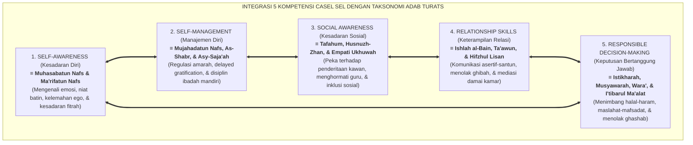
```mermaid
graph TD
    subgraph CASEL_TUMBUH["INTEGRASI 5 KOMPETENSI CASEL SEL DENGAN TAKSONOMI ADAB TURATS"]
        C1["1. SELF-AWARENESS (Kesadaran Diri)<br/><b>≡ Muhasabatun Nafs & Ma'rifatun Nafs</b><br/>(Mengenali emosi, niat batin, kelemahan ego, & kesadaran fitrah)"]
        
        C2["2. SELF-MANAGEMENT (Manajemen Diri)<br/><b>≡ Mujahadatun Nafs, As-Shabr, & Asy-Saja'ah</b><br/>(Regulasi amarah, delayed gratification, & disiplin ibadah mandiri)"]
        
        C3["3. SOCIAL AWARENESS (Kesadaran Sosial)<br/><b>≡ Tafahum, Husnuzh-Zhan, & Empati Ukhuwah</b><br/>(Peka terhadap penderitaan kawan, menghormati guru, & inklusi sosial)"]
        
        C4["4. RELATIONSHIP SKILLS (Keterampilan Relasi)<br/><b>≡ Ishlah al-Bain, Ta'awun, & Hifzhul Lisan</b><br/>(Komunikasi asertif-santun, menolak ghibah, & mediasi damai kamar)"]
        
        C5["5. RESPONSIBLE DECISION-MAKING (Keputusan Bertanggung Jawab)<br/><b>≡ Istikharah, Musyawarah, Wara', & I'tibarul Ma'alat</b><br/>(Menimbang halal-haram, maslahat-mafsadat, & menolak ghashab)"]
        
        C1 <===> C2
        C2 <===> C3
        C3 <===> C4
        C4 <===> C5
        C5 <===> C1
    end
```

<b>Gambar 1.3.1:</b> Peta Integrasi Lima Kompetensi CASEL SEL dengan Taksonomi Adab Turats Ekosistem TUMBUH.

Diagram di atas meruntuhkan anggapan keliru bahwa pendidikan adab cukup diajarkan lewat ceramah teks kitab kuning. Adab adalah keterampilan hidup (*life skills*) yang melibatkan konektivitas dinamis antara kesadaran batin (*Self-Awareness*), ketahanan menahan hawa nafsu (*Self-Management*), kepekaan membaca perasaan sesama (*Social Awareness*), kemahiran berkomunikasi tanpa menyakiti (*Relationship Skills*), dan kematangan menimbang akibat dari setiap perbuatan (*Responsible Decision-Making*).

---

### II. Bukti Ilmiah Meta-Analisis & Mekanisme Neurosains Afektif

Mengapa integrasi pembelajaran sosio-emosional ke dalam pesantren menjadi kebutuhan yang teramat mendesak? Bukti empiris sains internasional memberikan konfirmasi yang sangat meyakinkan.

Meta-analisis monumental yang dipimpin oleh **Joseph A. Durlak et al.**[^2] terhadap 213 program sekolah dan melibatkan lebih dari 270.034 siswa membuktikan dampak luar biasa dari integrasi SEL:
* **Peningkatan Prestasi Akademis**: Rata-rata capaian akademis dan nilai ujian siswa melonjak hingga **11 persentil** dibanding kelompok kontrol.
* **Penurunan Perilaku Negatif & Agresi**: Insiden perundungan (*bullying*), perkelahian fisik, dan pelanggaran disiplin menurun drastis sebesar **40%**.
* **Peredaan Distres Emosional**: Tingkat stres kronis, kecemasan (*anxiety*), dan depresi siswa turun signifikan hingga **24%**.

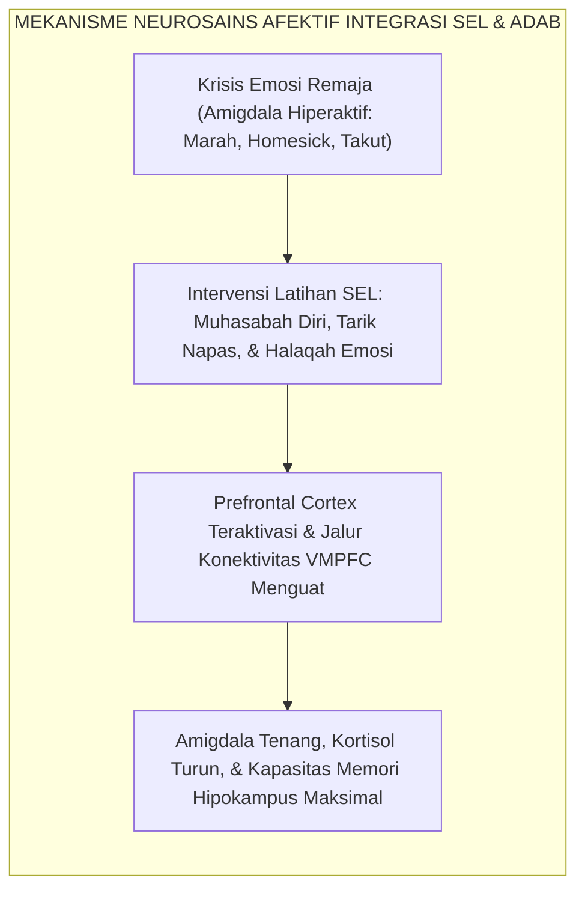
```mermaid
graph LR
    subgraph MekanismeSaraf["MEKANISME NEUROSAINS AFEKTIF INTEGRASI SEL & ADAB"]
        EmosiLimbik["Krisis Emosi Remaja (Amigdala Hiperaktif: Marah, Homesick, Takut)"] --> IntervensiSEL["Intervensi Latihan SEL: Muhasabah Diri, Tarik Napas, & Halaqah Emosi"]
        IntervensiSEL --> RegulasiPFC["Prefrontal Cortex Teraktivasi & Jalur Konektivitas VMPFC Menguat"]
        RegulasiPFC --> Hasil["Amigdala Tenang, Kortisol Turun, & Kapasitas Memori Hipokampus Maksimal"]
    end
```

<b>Gambar 1.3.2:</b> Alur Mekanisme Neurosains Afektif dari Intervensi SEL Menuju Kestabilan Kognitif Santri.

Pakar neurosains afektif ternama **Prof. Richard J. Davidson & Daniel Goleman**[^3] membuktikan bahwa ketika seorang remaja dilatih melakukan regulasi emosi secara sadar (sebagaimana diajarkan dalam konsep *Muraqabatullah* dan *Tazkiyatun Nafs*), struktur otak mengalami neuroplastisitas positif: sirkuit saraf antara *Prefrontal Cortex* (PFC) dan *Amygdala* semakin kokoh. 

Akibatnya, santri yang terlatih SEL tidak mudah meledak amarahnya saat diprovokasi kawan, tidak larut dalam kesedihan berlarut-larut saat rindu rumah, dan memiliki kapasitas konsentrasi (*working memory*) yang jauh lebih prima untuk menghafal ayat-ayat Al-Qur'an dan memahami logika rumit ilmu ushul fiqih.

---

### III. Matriks Komparasi: Menghubungkan Teks Kitab Kuning dengan Kompetensi CASEL

Tabel berikut menyajikan dekonstruksi mendalam dan pemetaan komparatif antara teks dalil Turats ulama dengan indikator operasional CASEL SEL dalam sistem TUMBUH di pesantren:

| Kompetensi CASEL SEL | Rujukan Turats & Teks Arab Syar'i | Konseptualisasi Epistemologis | Indikator Perilaku Faktual di Asrama & Madrasah |
| :--- | :--- | :--- | :--- |
| **1. Self-Awareness (Kesadaran Diri)** | **Imam Al-Ghazali**, *Mizan al-'Amal*[^4]: $$\text{مَنْ لَمْ يَعْرِفْ نَفْسَهُ لَمْ يَعْرِفْ عَيْبَهَا، وَمَنْ لَمْ يَعْرِفْ عَيْبَهَا لَمْ يُمْكِنْهُ مُعَالَجَتُهَا}$$ *"Barangsiapa tidak mengenali jiwanya, ia takkan kenal cacat dirinya; dan barangsiapa tak kenal cacat dirinya, mustahil mampu mengobatinya."* | **Ma'rifatun Nafs & Muhasabah**: Kesadaran mendalam akan dorongan emosi, pemicu amarah (*triggers*), kelemahan ego, serta posisi kehambaan di hadapan Allah. | • Santri mampu mengenali kapan dirinya mulai merasa jengkel sebelum meluapkannya dalam bentakan. • Mampu mengakui keterbatasan diri tanpa gengsi. • Menyadari motif niat batin saat beramal. |
| **2. Self-Management (Manajemen Diri)** | **Syekh Burhanuddin Az-Zarnuji**, *Ta'lim al-Muta'allim*[^5]: $$\text{وَأَصْلُ الْأَخْلَاقِ كُلِّهَا: ضَبْطُ النَّفْسِ عَنِ الْهَوَى وَحَبْسُهَا عَلَى مَا يُرْضِي الرَّحْمَنَ}$$ *"Pokok dari seluruh kemuliaan akhlak adalah mengendalikan jiwa dari hawa nafsu dan mengekangnya di atas jalan keridhaan ar-Rahman."* | **Mujahadatun Nafs & As-Shabr**: Kemampuan menunda kepuasan sesaat (*delayed gratification*), meregulasi agresi, serta memelihara motivasi belajar berkelanjutan. | • Santri mampu mengendalikan dorongan membalas saat disenggol kawan di antrean wudhu. • Disiplin memadamkan lampu kamar pukul 22.00 WIB. • Mampu menahan godaan begadang yang tidak bermanfaat. |
| **3. Social Awareness (Kesadaran Sosial)** | **Imam Ali bin Muhammad Al-Qabisi**, *Ar-Risalah al-Mufashshilah*[^6]: $$\text{يَنْبَغِي لِلْمُتَعَلِّمِ أَنْ يَكُونَ رَفِيقًا بِإِخْوَانِهِ، مُتَفَقِّدًا لِأَحْوَالِهِمْ، غَيْرَ مُسْتَطِيلٍ عَلَيْهِمْ}$$ *"Sepatutnya penuntut ilmu bersikap lembut kepada kawan-kawannya, peka memeriksa keadaan mereka, dan pantang berlaku sombong menindas mereka."* | **Husnul Mu'asyarah & Empati Ukhuwah**: Kepekaan membaca bahasa tubuh dan emosi orang lain, memahami latar belakang kawan yang majemuk, serta menolak perundungan. | • Peka ketika melihat kawan sekamar tampak murung karena *homesick* lalu mendekati dan mendengarkan keluhannya. • Menghargai santri yang berasal dari daerah terpencil. • Melindungi adik kelas dari intimidasi senior. |
| **4. Relationship Skills (Keterampilan Relasi)** | **Hadhratusy Syaikh KH. M. Hasyim Asy'ari**, *Adab al-'Alim wal Muta'allim*[^7]: $$\text{أَنْ يَكُونَ كَلَامُهُ مَعَ أَقْرَانِهِ بِاللُّطْفِ وَحُسْنِ الْأَدَبِ، وَأَنْ يَجْتَنِبَ الْغَيْبَةَ وَالْمِرَاءَ وَالْفَحْشَ}$$ *"Hendaklah tutur katanya kepada sesama kawan diliputi kelembutan dan keluhuran adab, serta menjauhi ghibah, debat kusir yang melukai, dan kata-kata kotor."* | **Ishlah al-Bain, Ta'awun, & Hifzhul Lisan**: Kemampuan komunikasi asertif tanpa agresi, mendengar aktif, menyelesaikan konflik secara restoratif, dan membangun kolaborasi tim. | • Menggunakan bahasa santun saat mengingatkan kawan yang melanggar jadwal piket. • Menolak panggilan julukan yang merendahkan fisik (*body shaming*). • Bersedia menjadi penengah damai saat terjadi salah paham. |
| **5. Responsible Decision-Making (Keputusan Bertanggung Jawab)** | **Imam Abu Ishaq Asy-Syathibi**, *Al-Muwafaqat fi Ushul asy-Syari'ah*[^8]: $$\text{النَّظَرُ فِي مَآلَاتِ الْأَفْعَالِ مُعْتَبَرٌ مَقْصُودٌ شَرْعًا، حَيْثُ إِنَّ الْفِعْلَ يُحْكَمُ عَلَيْهِ بِحَسَبِ مَا يَئُولُ إِلَيْهِ}$$ *"Mempertimbangkan dampak jangka panjang dari setiap perbuatan adalah prinsip yang diperhitungkan dan menjadi tujuan syariat, di mana suatu tindakan dinilai dari muara dampaknya."* | **I'tibarul Ma'alat, Wara', & Istikharah**: Kematangan menimbang konsekuensi etis, legal, dan ukhrawi dari setiap pilihan tindakan sebelum bertindak. | • Menolak ajakan melanggar aturan keluar pondok tanpa izin karena memahami risiko bahaya dan dosanya. • Pantang melakukan *ghashab* barang kawan sekamar. • Memilih menggunakan waktu luang untuk membaca kitab. |

---

### IV. Mengapa Integrasi Ini Sangat Krusial? Menghindari Dua Jebakan Ekstrem

Pentingnya integrasi ini terlihat ketika kita menelaah dua kelemahan ekstrem yang selama ini menjangkiti dunia pendidikan:

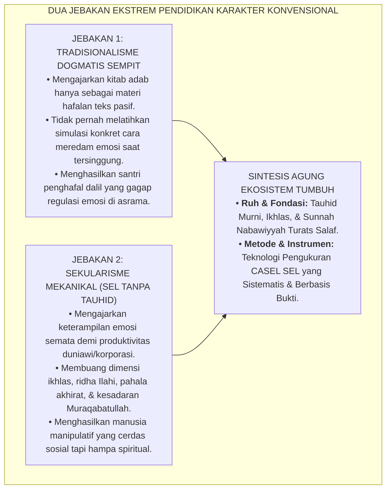
```mermaid
graph TD
    subgraph DuaJebakan["DUA JEBAKAN EKSTREM PENDIDIKAN KARAKTER KONVENSIONAL"]
        Jebak1["JEBAKAN 1: TRADISIONALISME DOGMATIS SEMPIT<br/>• Mengajarkan kitab adab hanya sebagai materi hafalan teks pasif.<br/>• Tidak pernah melatihkan simulasi konkret cara meredam emosi saat tersinggung.<br/>• Menghasilkan santri penghafal dalil yang gagap regulasi emosi di asrama."]
        
        Jebak2["JEBAKAN 2: SEKULARISME MEKANIKAL (SEL TANPA TAUHID)<br/>• Mengajarkan keterampilan emosi semata demi produktivitas duniawi/korporasi.<br/>• Membuang dimensi ikhlas, ridha Ilahi, pahala akhirat, & kesadaran Muraqabatullah.<br/>• Menghasilkan manusia manipulatif yang cerdas sosial tapi hampa spiritual."]
        
        SintesisTUMBUH["SINTESIS AGUNG EKOSISTEM TUMBUH<br/>• <b>Ruh & Fondasi:</b> Tauhid Murni, Ikhlas, & Sunnah Nabawiyyah Turats Salaf.<br/>• <b>Metode & Instrumen:</b> Teknologi Pengukuran CASEL SEL yang Sistematis & Berbasis Bukti."]
        
        Jebak1 --> SintesisTUMBUH
        Jebak2 --> SintesisTUMBUH
    end
```

<b>Gambar 1.3.3:</b> Rekonsiliasi Sintesis Ekosistem TUMBUH Melampaui Dua Jebakan Ekstrem Pendidikan Karakter.

Ekosistem TUMBUH menolak kedua jebakan di atas:
* Kami **tidak membuang Turats**, melainkan menghidupkannya dari sekadar teks mati di atas kertas menjadi protokol tindakan hidup yang berdenyut dalam keseharian asrama.
* Kami **tidak meniru sains Barat secara membabi buta**, melainkan mengambil metodologi terbaiknya (*hikmah*) dan membingkainya dalam tauhid dan kesucian syariat Islam.

---

### V. Solusi Sistemik TUMBUH: Halaqah Lingkaran Emosi (*Emotion Circle*) Harian

Sebagai aplikasi praksis dari integrasi CASEL SEL dan taksonomi adab Turats, setiap kamar asrama di ekosistem TUMBUH menjalankan protokol rutin: **Halaqah Lingkaran Emosi (*Halaqah Dawair al-Wijdaniyyah*) 10 Menit Setiap Malam Ba'da Isya**:

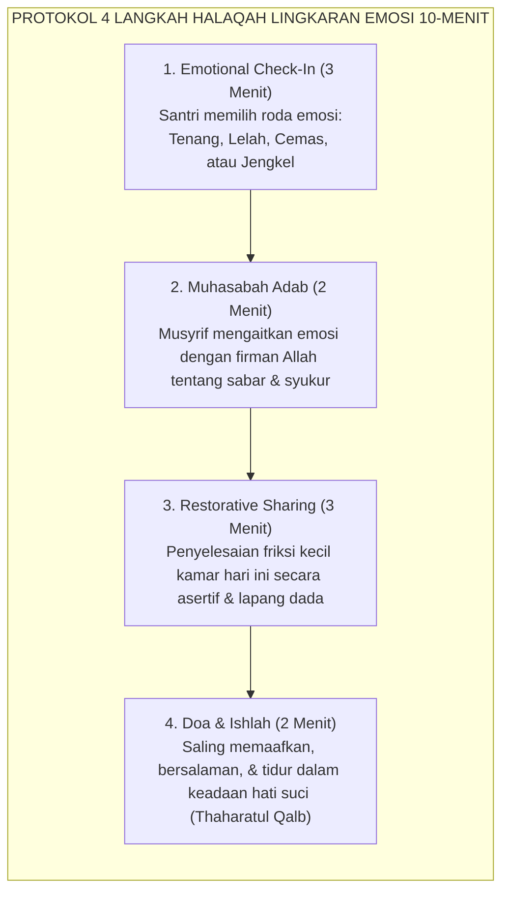
```mermaid
graph LR
    subgraph AlurEmotionCircle["PROTOKOL 4 LANGKAH HALAQAH LINGKARAN EMOSI 10-MENIT"]
        L1["1. Emotional Check-In (3 Menit)<br/>Santri memilih roda emosi:<br/>Tenang, Lelah, Cemas, atau Jengkel"]
        L2["2. Muhasabah Adab (2 Menit)<br/>Musyrif mengaitkan emosi dengan firman Allah tentang sabar & syukur"]
        L3["3. Restorative Sharing (3 Menit)<br/>Penyelesaian friksi kecil kamar hari ini secara asertif & lapang dada"]
        L4["4. Doa & Ishlah (2 Menit)<br/>Saling memaafkan, bersalaman, & tidur dalam keadaan hati suci (Thaharatul Qalb)"]
        
        L1 --> L2 --> L3 --> L4
    end
```

<b>Gambar 1.3.4:</b> Alur Operasional Halaqah Lingkaran Emosi 10-Menit di Kamar Asrama Santri.

Melalui halaqah 10 menit ini:
1. **Santri Belajar Menamai Emosi (*Name it to Tame it*)**: Ketika santri mampu berkata: *"Ustadz, hari ini saya merasa sangat lelah dan agak jengkel karena antrean mandi tadi pagi sangat padat"*, otaknya beralih dari amukan impulsif amigdala menuju pemrosesan rasional di korteks prefrontal.
2. **Friksi Diselesaikan Sebelum Menjadi Api Permusuhan**: Konflik kecil mengenai pemakaian sandal atau tugas piket yang belum tuntas diselesaikan malam itu juga dengan kepala dingin, sehingga dendam tidak pernah sempat mengendap menjadi api perkelahian di kemudian hari.
3. **Menghidupkan Sunnah Tidur Bersih Hati**: Menghidupkan hadits shahih tentang sahabat Anshar yang dijamin masuk surga oleh Rasulullah SAW bukan karena banyaknya shalat sunnah, melainkan karena setiap kali hendak tidur di malam hari, hatinya telah memaafkan dan membersihkan seluruh rasa dendam kepada sesama kaum muslimin.

Dengan integrasi taksonomi adab dan CASEL SEL ini, pembinaan karakter santri berpijak pada fondasi sains afektif dan syariat yang kokoh. Kita melangkah ke **Sub-Bab 1.4** untuk membedah bagaimana motivasi batin ini diperkuat melalui **Teori Penentuan Diri (*Self-Determination Theory*) dan Rekayasa Lingkungan Asrama 24-Jam**.

---

## 📌 Catatan Kaki & Rujukan Primer

[^1]: **CASEL (Collaborative for Academic, Social, and Emotional Learning)**, *Core SEL Competencies: The CASEL 5* (Chicago: CASEL Publications, 2020); serta **Roger P. Weissberg, Joseph A. Durlak, Celene E. Domitrovich, & Thomas P. Gullotta**, "Social and emotional learning: Past, present, and the future", dalam J. A. Durlak et al. (Eds.), *Handbook of Social and Emotional Learning: Research and Practice* (New York: Guilford Press, 2015), hlm. 3–19.
[^2]: **Joseph A. Durlak, Roger P. Weissberg, Allison B. Dymnicki, Rebecca D. Taylor, & Kriston B. Schellinger**, "The impact of enhancing students' social and emotional learning: A meta-analysis of school-based universal interventions", *Child Development*, Vol. 82, No. 1 (2011), hlm. 405–432.
[^3]: **Richard J. Davidson, Daren C. Jackson, & Ned H. Kalin**, "Emotion, plasticity, context, and regulation: Perspectives from affective neuroscience", *Psychological Bulletin*, Vol. 126, No. 6 (2000), hlm. 890–909; serta **Daniel Goleman & Richard J. Davidson**, *Altered Traits: Science Reveals How Meditation Changes Your Mind, Brain, and Body* (New York: Avery / Penguin Random House, 2017), Bab 5–7, hlm. 91–152.
[^4]: **Hujjatul Islam Imam Abu Hamid Muhammad bin Muhammad al-Ghazali**, *Mizan al-'Amal*, Tahqiq: Dr. Sulaiman Dunya (Kairo: Dar al-Ma'arif, 1964), Bab 5: "Tahdzib an-Nafs wa Ta'dil al-Akhlaq", hlm. 68–95.
[^5]: **Al-Imam Burhanuddin al-Zarnuji**, *Ta'lim al-Muta'allim Thariq at-Ta'allum*, Tahqiq: Syaikh Mustafa Asyur (Kairo: Dar al-I'tisham, 1986), hlm. 35–48.
[^6]: **Al-Imam Abu al-Hasan Ali bin Muhammad al-Qabisi**, *Ar-Risalah al-Mufashshilah li Ahwal al-Mu'allimin wa Ahkam al-Mu'allimin wal Muta'allimin*, Tahqiq: Ahmad Khalid Jam'ah (Damaskus: Dar al-Fikr, 1986), hlm. 55–82.
[^7]: **Hadhratusy Syaikh KH. M. Hasyim Asy'ari**, *Adab al-'Alim wal Muta'allim fi ma Yahtaju Ilayhi al-Muta'allim fi Ahwal Ta'allumihi wa ma Yatawaqqafu 'alayhi al-Mu'allim fi Maqamat Ta'limihi* (Jombang: Maktabah at-Turats al-Islami, 1415 H), Bab 2: "Fi Adabil Muta'allim fi Nafsihi wa ma'a Aqranihi", hlm. 24–38.
[^8]: **Al-Imam Abu Ishaq Ibrahim bin Musa asy-Syathibi**, *Al-Muwafaqat fi Ushul asy-Syari'ah*, Tahqiq: Syaikh Masyhur Hasan Salman (Kairo: Dar Ibn Affan, 1997), Jilid V: "Kitab al-Ijtihad wa al-Ma'alat", hlm. 177–210.

---

# TEORI PENENTUAN DIRI & REKAYASA LINGKUNGAN ASRAMA

---

### 🧭 PETA POSISI PANDUAN DALAM SISTEM TUMBUH (DARI HULU KE HILIR)
* **Posisi Arsitektur**: `BATANG EKOSISTEM I (Taksonomi 10 Muwashafat Adab & Tangga Kemandirian J1–J4)`
* **Peruntukan Pengguna**: Wali Kelas, Musyrif Kamar, Guru Pengampu Adab, & Mentor Santri
* **Fokus Panduan**: Memandu tahapan penanaman 10 Karakter Adab Nabawi dari fase Adaptasi (J1), Pembiasaan (J2), Kematangan (J3), hingga Kader Penggerak (J4/Tahap 7).
* **Hasil Akhir yang Dituju**: Terwujudnya santri berkarakter *Insan Adabi* yang mandiri, musyrif yang mengasuh dengan kasih sayang tanpa *burnout*, dan pesantren yang aman berbasis data (*Safe Boarding School*).

---

### 🎯 Mengapa Panduan Ini Ada & Masalah Nyata yang Dipecahkan
1. **Latar Masalah di Lapangan**: Sering kali pengasuhan di pesantren berjalan tanpa SOP yang jelas atau terjebak dalam pola reaktif—menunggu santri berbuat salah baru dihukum dengan emosional.
2. **Solusi Sistem TUMBUH**: Panduan ini memberikan langkah preventif dan terstruktur agar setiap pembiasaan adab berjalan terencana, konsisten, dan terukur.
3. **Sasaran Perubahan**: Memastikan nilai-nilai Islam menyatu dalam perilaku harian santri melalui keteladanan nyata (*Qudwah Hasanah*).

---
### 🎯 Tujuan & Manfaat Panduan
Panduan ini dirancang sebagai petunjuk operasional terapan agar pendidik dan musyrif dapat:
1. Menjalankan pembinaan adab santri dengan pendekatan kasih sayang (*Rahmah*) dan ketegasan yang mendidik (*Firm & Kind*).
2. Menghindari cara-cara kekerasan fisik, bentakan verbal, maupun hukuman yang mempermalukan santri.
3. Menciptakan suasana asrama dan kelas yang aman, tertib, dan menumbuhkan kesadaran diri (*Bi'ah Shalihah*).

---

### 💡 Intisari Cepat (3 Menit Memahami Esensi)
* **Kunci Pengasuhan**: Karakter santri tumbuh melalui keteladanan nyata (*Qudwah Hasanah*), komunikasi empatik, dan pembiasaan terstruktur 24 jam.
* **Tindakan Utama**: Terapkan panduan langkah demi langkah di bawah ini secara konsisten, pantau perkembangan santri secara objektif, dan berikan apresiasi atas setiap perbaikan diri yang mereka capai.
* **Prinsip Disiplin**: Fokus pada pemulihan hubungan dan tanggung jawab nyata (*Restoratif*), bukan sekadar melampiaskan amarah atau menghukum.

---

### 📖 Uraian Panduan & Langkah Aksi Lapangan

---

### I. Titik Temu Motivasi Batin dan Rekayasa Ekologi Asrama

Di banyak pesantren konvensional, kedisiplinan santri sering kali ditegakkan dengan instrumen yang sangat rapuh: **teriakan pengurus, ancaman sanksi fisik, dan desingan rotan**.

Ketika seorang pembina asrama berjalan melintasi lorong dengan wajah garang dan tongkat di tangan, suasana mendadak sunyi senyap. Santri-santri langsung bergegas merapikan kasur, berlari mengambil air wudhu, dan menundukkan kepala. Para pengurus merasa bangga dan menyimpulkan: *"Lihatlah, metode kekerasan ini sangat ampuh membuat santri disiplin!"*

Namun, apa yang terjadi begitu sang pembina melangkahkan kaki keluar dari pintu gerbang asrama?
Hanya dalam hitungan detik, suasana asrama kembali riuh tak terkendali. Sandal kembali berserakan di depan pintu, sampah makanan dilempar sembarangan ke bawah ranjang, dan adab saling menghormati lenyap seketika.

Fenomena ini dalam psikologi motivasi disebut sebagai **kepatuhan semu (*superficial compliance*)** yang lahir dari regulasi eksternal murni (*external regulation*). Kepatuhan yang didorong semata-mata oleh rasa takut akan ancaman tidak pernah meresap ke dalam lubuk kalbu. Begitu sumber rasa takut tersebut hilang, perilaku buruk akan kembali meletup dengan intensitas yang bahkan jauh lebih destruktif.

Untuk membangun kedisiplinan yang sejati, langgeng, dan mandiri, **Ekosistem TUMBUH** memadukan dua pilar transformatif yang saling mengunci:
1. **Teori Penentuan Diri (*Self-Determination Theory / SDT*)**[^1]: Memenuhi tiga kebutuhan psikologis dasar santri (Otonomi, Kompetensi, dan Keterhubungan Relasional) agar motivasi beradab bertransformasi dari keterpaksaan eksternal menjadi dorongan intrinsik yang tulus karena Allah (*Muraqabatullah*).
2. **Rekayasa Lingkungan Hidup 24-Jam (*Environmental Architecture & Bi'ah Shalihah*)**[^2]: Menata ruang fisik, pencahayaan, alur sirkulasi, dan dorongan visual (*nudges*) di asrama sedemikian rupa sehingga lingkungan bertindak sebagai "guru bisu (*the silent educator*)" yang secara alami memandu santri berbuat tertib tanpa perlu diawasi dengan intimidasi.

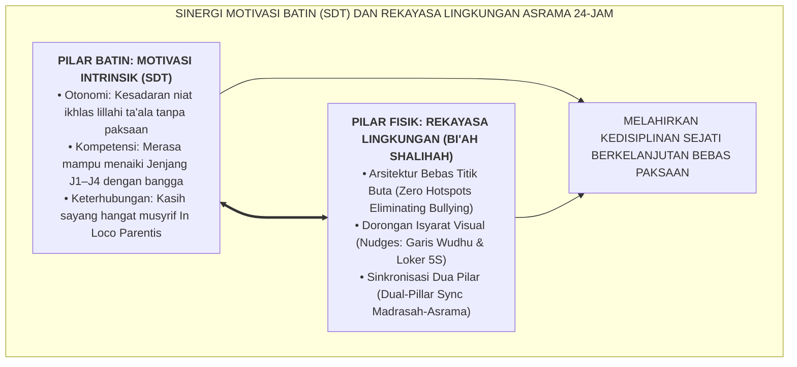
```mermaid
graph TD
    subgraph SinergiMotivasiRuang["SINERGI MOTIVASI BATIN (SDT) DAN REKAYASA LINGKUNGAN ASRAMA 24-JAM"]
        Batin["<b>PILAR BATIN: MOTIVASI INTRINSIK (SDT)</b><br/>• Otonomi: Kesadaran niat ikhlas lillahi ta'ala tanpa paksaan<br/>• Kompetensi: Merasa mampu menaiki Jenjang J1–J4 dengan bangga<br/>• Keterhubungan: Kasih sayang hangat musyrif In Loco Parentis"]
        
        Ruang["<b>PILAR FISIK: REKAYASA LINGKUNGAN (BI'AH SHALIHAH)</b><br/>• Arsitektur Bebas Titik Buta (Zero Hotspots Eliminating Bullying)<br/>• Dorongan Isyarat Visual (Nudges: Garis Wudhu & Loker 5S)<br/>• Sinkronisasi Dua Pilar (Dual-Pillar Sync Madrasah-Asrama)"]
        
        Batin <===> Ruang
        
        Batin --> Hasil["MELAHIRKAN KEDISIPLINAN SEJATI BERKELANJUTAN BEBAS PAKSAAN"]
        Ruang --> Hasil
    end
```

<b>Gambar 1.4.1:</b> Diagram Sinergi Teori Penentuan Diri (SDT) dan Rekayasa Lingkungan 24-Jam.

Diagram di atas menegaskan bahwa pembentukan karakter membutuhkan kerja sama dua sayap yang seimbang: menyalakan api kesadaran dari dalam jiwa santri (*internal motivation*), sembari menyediakan sarang ekologi fisik yang mendukung dan menuntun perilaku mulia tersebut dalam realitas nyata (*enabling environment*).

---

### II. Tiga Kebutuhan Psikologis Dasar SDT dalam Terang Ubudiyyah

Pakar psikologi motivasi terkemuka dunia, **Prof. Edward L. Deci & Prof. Richard M. Ryan**[^3] dari University of Rochester, membuktikan melalui riset empiris puluhan tahun bahwa manusia memiliki **Tiga Kebutuhan Psikologis Dasar (*Basic Psychological Needs*)** yang wajib dipenuhi agar potensi karakternya dapat bertumbuh optimal:

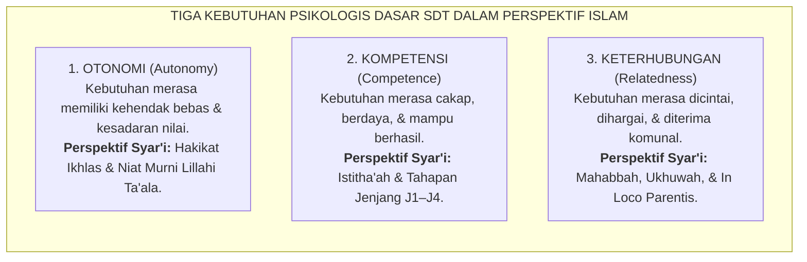
```mermaid
graph LR
    subgraph KebutuhanSDT["TIGA KEBUTUHAN PSIKOLOGIS DASAR SDT DALAM PERSPEKTIF ISLAM"]
        Otonomi["1. OTONOMI (Autonomy)<br/>Kebutuhan merasa memiliki kehendak bebas & kesadaran nilai.<br/><b>Perspektif Syar'i:</b> Hakikat Ikhlas & Niat Murni Lillahi Ta'ala."]
        
        Kompetensi["2. KOMPETENSI (Competence)<br/>Kebutuhan merasa cakap, berdaya, & mampu berhasil.<br/><b>Perspektif Syar'i:</b> Istitha'ah & Tahapan Jenjang J1–J4."]
        
        Keterhubungan["3. KETERHUBUNGAN (Relatedness)<br/>Kebutuhan merasa dicintai, dihargai, & diterima komunal.<br/><b>Perspektif Syar'i:</b> Mahabbah, Ukhuwah, & In Loco Parentis."]
    end
```

<b>Gambar 1.4.2:</b> Tiga Kebutuhan Psikologis Dasar SDT dalam Perspektif Ubudiyyah Islam.

Mari kita bedah korelasi mendalam antara ketiga kebutuhan psikologis ini dengan khazanah spiritual Islam:

#### 1. Kebutuhan Otonomi (*Autonomy*) $\equiv$ Hakikat Ikhlas dan Pembebasan Jiwa
Santri yang dididik dengan doktrin intimidasi merasa dirinya tidak memiliki kendali atas hidupnya. Akibatnya, ia menganggap aturan pondok sebagai "penjara penindas". Sebaliknya, ketika musyrif berdialog secara dialogis dan menjelaskan *hikmah* (alasan filosofis dan maslahat) di balik setiap aturan, santri merasa dihargai kemerdekaan akalnya.

Dalam kitab monumentalnya *Al-'Ubudiyyah*[^4], **Syaikhul Islam Ibnu Taimiyyah** menegaskan bahwa hakikat ibadah yang diterima di sisi Allah adalah perpaduan antara kesadaran tunduk (*at-tadzallul*) dan kecintaan yang mendalam (*al-mahabbah*):
> *"Ketaatan yang dipaksakan semata-mata karena takut kepada ancaman sesama makhluk bukanlah hakikat ubudiyyah kepada Allah. Ubudiyyah sejati adalah penyerahan diri yang merdeka, di mana hati digerakkan oleh rasa cinta dan kerinduan menggapai ridha-Nya tanpa pamrih duniawi."*

#### 2. Kebutuhan Kompetensi (*Competence*) $\equiv$ Tangga Kapasitas *Istitha'ah*
Santri sering kali melanggar aturan bukan karena berniat jahat, melainkan karena **merasa tidak mampu (*incompetent*)** memenuhi tuntutan yang melampaui kapasitas adaptasinya. Santri baru yang belum pernah mencuci pakaian sendiri atau belum lancar membaca pegon akan merasa cemas luar biasa. Melalui progresi Jenjang Kemandirian TUMBUH (J1–J4) (T1 Adaptasi hingga T4 Transformasi), kurikulum adab dipecah menjadi langkah-langkah kecil yang realistis, sehingga santri merasakan keberhasilan bertahap (*sense of mastery*) yang membangkitkan harga dirinya.

#### 3. Kebutuhan Keterhubungan Relasional (*Relatedness*) $\equiv$ Kehangatan *Ukhuwah* & Pengasuhan
Seorang anak yang terpisah ratusan kilometer dari pelukan ayah dan ibunya mengalami kerentanan relasional yang sangat tinggi (*attachment disruption*). Jika di pesantren ia hanya menjumpai pengurus yang berwajah dingin dan suka membentak, jiwanya akan merasa terasing (*alienated*). 

Sebagaimana dicontohkan oleh Rasulullah SAW ketika mengasuh Anas bin Malik RA selama sepuluh tahun tanpa sekalipun membentak atau mencelanya, musyrif dalam sistem TUMBUH hadir sebagai figur lekat pengganti orang tua (*In Loco Parentis*) yang mendengarkan, merangkul, dan memvalidasi emosi santri.

---

### III. Sains Psikologi Lingkungan & Dorongan Arsitektural (*Nudge Theory*)

Di samping pembinaan motivasi batin, lingkungan fisik asrama memegang peranan krusial yang kerap diabaikan. 

Pakar psikologi lingkungan terkemuka **Prof. Gary W. Evans**[^5] dari Cornell University dalam riset komprehensifnya membuktikan bahwa tata ruang fisik yang buruk berdampak langsung terhadap kerusakan psikologis anak:
* **Kepadatan Berlebih (*Crowding*)**: Menempatkan 30 santri dalam satu kamar sempit tanpa privasi memicu lonjakan hormon stres kortisol secara kronis, menurunkan empati sosial, dan melipatgandakan insiden perkelahian fisik hingga **3 kali lipat**.
* **Kesemrawutan Visual (*Spatial Chaos*)**: Kamar yang gelap, sirkulasi udara pengap, dan barang-barang yang berserakan di lantai membuat otak anak mengalami kelebihan beban kognitif (*cognitive overload*), yang memicu keputusasaan dan kebiasaan malas.

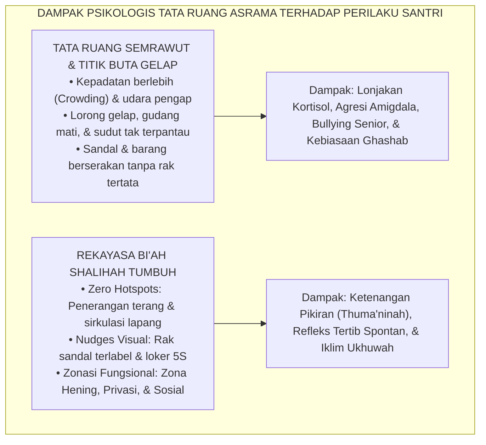
```mermaid
graph TD
    subgraph PengaruhRuang["DAMPAK PSIKOLOGIS TATA RUANG ASRAMA TERHADAP PERILAKU SANTRI"]
        Buruk["TATA RUANG SEMRAWUT & TITIK BUTA GELAP<br/>• Kepadatan berlebih (Crowding) & udara pengap<br/>• Lorong gelap, gudang mati, & sudut tak terpantau<br/>• Sandal & barang berserakan tanpa rak tertata"]
        
        AkibatBuruk["Dampak: Lonjakan Kortisol, Agresi Amigdala, Bullying Senior, & Kebiasaan Ghashab"]
        
        Baik["REKAYASA BI'AH SHALIHAH TUMBUH<br/>• Zero Hotspots: Penerangan terang & sirkulasi lapang<br/>• Nudges Visual: Rak sandal terlabel & loker 5S<br/>• Zonasi Fungsional: Zona Hening, Privasi, & Sosial"]
        
        AkibatBaik["Dampak: Ketenangan Pikiran (Thuma'ninah), Refleks Tertib Spontan, & Iklim Ukhuwah"]
        
        Buruk --> AkibatBuruk
        Baik --> AkibatBaik
    end
```

<b>Gambar 1.4.3:</b> Komparasi Dampak Tata Ruang Fisik terhadap Stabilitas Perilaku Santri.

Pemenang Hadiah Nobel Ekonomi **Prof. Richard H. Thaler & Prof. Cass R. Sunstein**[^6] dalam mahakaryanya *Nudge* merumuskan konsep **Arsitektur Pilihan (*Choice Architecture*)**: bahwa penataan lingkungan fisik dengan memberikan isyarat visual halus (*nudges*) mampu mengarahkan manusia untuk secara otomatis memilih perilaku yang baik tanpa perlu pemaksaan hukum atau ancaman hukuman.

---

### IV. Empat Pilar Rekayasa Lingkungan Bi'ah Shalihah TUMBUH

Menerjemahkan sains psikologi lingkungan dan teori *Nudge* ke dalam operasional pesantren, Ekosistem TUMBUH menetapkan **Empat Pilar Rekayasa Lingkungan Asrama 24-Jam**:

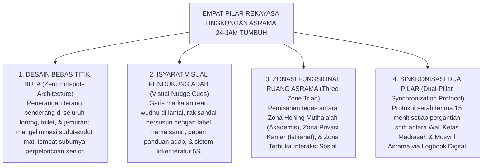
```mermaid
graph TD
    PilarLingkungan["EMPAT PILAR REKAYASA LINGKUNGAN ASRAMA 24-JAM TUMBUH"]
    
    PilarLingkungan --> P1["1. DESAIN BEBAS TITIK BUTA (Zero Hotspots Architecture)<br/>Penerangan terang benderang di seluruh lorong, toilet, & jemuran; mengeliminasi sudut-sudut mati tempat suburnya perpeloncoan senior."]
    
    PilarLingkungan --> P2["2. ISYARAT VISUAL PENDUKUNG ADAB (Visual Nudge Cues)<br/>Garis marka antrean wudhu di lantai, rak sandal bersusun dengan label nama santri, papan panduan adab, & sistem loker teratur 5S."]
    
    PilarLingkungan --> P3["3. ZONASI FUNGSIONAL RUANG ASRAMA (Three-Zone Triad)<br/>Pemisahan tegas antara Zona Hening Muthala'ah (Akademis), Zona Privasi Kamar (Istirahat), & Zona Terbuka Interaksi Sosial."]
    
    PilarLingkungan --> P4["4. SINKRONISASI DUA PILAR (Dual-Pillar Synchronization Protocol)<br/>Protokol serah terima 15 menit setiap pergantian shift antara Wali Kelas Madrasah & Musyrif Asrama via Logbook Digital."]
```

<b>Gambar 1.4.4:</b> Arsitektur Empat Pilar Rekayasa Lingkungan Asrama 24-Jam Ekosistem TUMBUH.

Mari kita bedah keempat pilar ini secara rinci:

1. **Desain Bebas Titik Buta (*Zero Hotspots Architecture*)**:
   Mayoritas kasus perpeloncoan, kekerasan senior, dan perundungan di pesantren terjadi di tempat-tempat yang luput dari pandangan ustadz: lorong belakang kamar mandi, kamar pojok yang gelap, atau gudang terbengkalai. TUMBUH mewajibkan audit tata ruang: seluruh area publik asrama harus memiliki pencahayaan minimal 200 lux di malam hari, pintu-pintu transparan parsial, dan jalur patroli terjadwal musyrif (*proactive visibility*).

2. **Isyarat Visual Pendukung Adab (*Visual Nudge Cues*)**:
   Santri tidak perlu diteriaki untuk merapikan sandal jika di depan pintu kamar telah disediakan rak sandal bertingkat yang setiap kotaknya bertuliskan nama santri dengan warna yang jelas. Ketika sebuah sandal diletakkan di luar kotaknya, ketidakteraturan tersebut langsung terlihat mencolok secara visual, memicu dorongan psikologis santri untuk segera mengembalikannya ke tempat semula (*visual feedback loop*). Begitu pula dengan sistem manajemen loker 5S (*Seiri, Seiton, Seiso, Seiketsu, Shitsuke*).

3. **Zonasi Fungsional Tiga Zona (*Three-Zone Triad*)**:
   * **Zona Hening (*Quiet Zone*)**: Khusus untuk muthala'ah kitab dan menghafal Al-Qur'an; dilarang bercengkerama suara keras di area ini.
   * **Zona Privasi (*Rest Zone*)**: Bilik kamar tidur yang tenang dengan pencahayaan redup ba'da 22.00 WIB untuk menjamin kualitas tidur sirkadian 7 jam.
   * **Zona Sosial (*Community Zone*)**: Ruang bersama, teras, dan lapangan tempat santri bebas berolahraga, berdiskusi, dan menyalurkan ekspresi dinamis remajanya.

4. **Sinkronisasi Dua Pilar (*Dual-Pillar Synchronization Protocol*)**:
   Pemisahan informasi antara guru sekolah di pagi hari dan musyrif asrama di sore hari adalah penyebab utama tidak terdeteksinya problem perilaku santri. Melalui protokol serah terima harian 15 menit pukul 15.30 WIB, wali kelas menyampaikan catatan observasi (misalnya: *"Santri Zaid hari ini tampak mengantuk dan murung di kelas"*) kepada musyrif, sehingga musyrif dapat langsung memberikan pendampingan personal (*check-in*) malam harinya.

---

### V. Wawasan Turats: Kaidah 'Innat Thiba'a Sarraqah' dan Ekosistem Kebajikan

Prinsip bahwa penataan lingkungan fisik dan pergaulan sosial membentuk jiwa manusia secara otomatis adalah kaidah agung yang telah diuraikan oleh **Hujjatul Islam Imam Abu Hamid Al-Ghazali** dalam *Ihya' 'Ulumiddin* (Kitab *Adab al-Ulfah wal Ukhuwwah*)[^7]:

$$\text{إِنَّ الطِّبَاعَ سَرَّاقَةٌ، وَالنُّفُوسَ مَجْبُولَةٌ عَلَى التَّشَبُّهِ وَالِاقْتِدَاءِ، فَمُجَالَوَرَةُ أَهْلِ الْخَيْرِ تُكْسِبُ الْخَيْرَ، كَمَا أَنَّ مُجَاوَرَةَ أَهْلِ الشَّرِّ تُعْدِي بِالشَّرِّ}$$

**Terjemahan Berjiwa:**
> *"Sesungguhnya watak dasar manusia memiliki tabiat 'mencuri' (menyerap secara diam-diam keadaan di sekelilingnya), dan jiwa manusia diciptakan dengan kecenderungan alami untuk meniru dan mengikuti figur di dekatnya.*
> 
> *Maka bertetangga dan hidup berdampingan dengan lingkungan orang-orang yang berbuat kebaikan akan memancarkan kebaikan ke dalam jiwanya, sebagaimana hidup berdampingan dengan lingkungan yang rusak akan menularkan keburukan tanpa disadari."*

Kaidah *Innat Thiba'a Sarraqah* membuktikan kearifan ulama: karakter tidak bisa ditanamkan di ruang hampa yang terisolasi. Jika asrama berantakan, kotor, dan penuh teror senioritas, maka jiwa santri akan "mencuri" tabiat kekerasan dan kekacauan tersebut. Sebaliknya, ketika asrama ditata bersih, damai, penuh kasih sayang, dan sarat dengan dorongan adab, maka jiwa santri secara spontan menyerap keteraturan dan kemuliaan adab menjadi tabiat permanennya.

Dengan tuntasnya peletakan fondasi Arsitektur Kapasitas Holistik pada Bab 01 ini, kita telah membangun landasan filosofis, taksonomis, sosio-emosional, dan ekologis yang sangat kokoh. Seluruh instrumen ini siap menopang pembahasan inti pada **Bab 02: Profil 10 Muwashafat Karakter Santri dalam sistem TUMBUH**.

---

## 📌 Catatan Kaki & Rujukan Primer

[^1]: **Richard M. Ryan & Edward L. Deci**, *Self-Determination Theory: Basic Psychological Needs in Motivation, Development, and Wellness* (New York: Guilford Press, 2017), Bab 1: "Overview of Self-Determination Theory", hlm. 3–25; serta **Edward L. Deci & Richard M. Ryan**, *Intrinsic Motivation and Self-Determination in Human Behavior* (New York: Plenum Press, 1985), hlm. 43–88.
[^2]: **Gary W. Evans**, "The built environment and children's development", *Annual Review of Public Health*, Vol. 27 (2006), hlm. 423–441; serta **Gary W. Evans**, "Child development and the physical environment", *Annual Review of Psychology*, Vol. 57 (2006), hlm. 423–451.
[^3]: **Edward L. Deci, Richard M. Ryan, & Maarten Vansteenkiste**, "Self-determination theory in educational settings", dalam K. R. Wentzel & D. B. Miele (Eds.), *Handbook of Motivation at School* (New York: Routledge, 2016), hlm. 105–129.
[^4]: **Syaikhul Islam Ahmad bin Abdul Halim Ibnu Taimiyyah**, *Al-'Ubudiyyah*, Tahqiq: Ali Hasan al-Halabi (Beirut: Al-Maktab al-Islami, 1425 H / 2005 M), hlm. 15–35; serta **Al-Imam Syamsuddin Ibnu Qayyim al-Jawziyyah**, *Al-Fawa'id*, Tahqiq: Syaikh Syu'aib al-Arnauth (Kairo: Dar al-Afaq al-Jadidah, t.th.), hlm. 88–104.
[^5]: **Gary W. Evans & Stephen J. Lepore**, "Moderating and mediating processes in environment-behavior research", dalam G. T. Moore & R. W. Marans (Eds.), *Advances in Environment, Behavior, and Design* (New York: Plenum Press, 1997), Vol. 4, hlm. 255–285.
[^6]: **Richard H. Thaler & Cass R. Sunstein**, *Nudge: Improving Decisions About Health, Wealth, and Happiness* (New Haven: Yale University Press, 2008; Edisi Revisi, Penguin Books, 2009), Bab 1: "Biases and Blunders", hlm. 17–39; serta Bab 5: "Choice Architecture", hlm. 81–100.
[^7]: **Hujjatul Islam Imam Abu Hamid Muhammad bin Muhammad al-Ghazali**, *Ihya' 'Ulumiddin*, Kitab Adab al-Ulfah wal Ukhuwwah wash-Shuhbah wa Mu'asyaratil Khalq (Kairo & Beirut: Dar al-Ma'rifah, t.th.), Jilid II, hlm. 175–190.

---

# IMPLIKASI KURIKULER DESAIN PEMBELAJARAN HOLISTIK

---

### 🧭 PETA POSISI PANDUAN DALAM SISTEM TUMBUH (DARI HULU KE HILIR)
* **Posisi Arsitektur**: `BATANG EKOSISTEM I (Taksonomi 10 Muwashafat Adab & Tangga Kemandirian J1–J4)`
* **Peruntukan Pengguna**: Wali Kelas, Musyrif Kamar, Guru Pengampu Adab, & Mentor Santri
* **Fokus Panduan**: Memandu tahapan penanaman 10 Karakter Adab Nabawi dari fase Adaptasi (J1), Pembiasaan (J2), Kematangan (J3), hingga Kader Penggerak (J4/Tahap 7).
* **Hasil Akhir yang Dituju**: Terwujudnya santri berkarakter *Insan Adabi* yang mandiri, musyrif yang mengasuh dengan kasih sayang tanpa *burnout*, dan pesantren yang aman berbasis data (*Safe Boarding School*).

---

### 🎯 Mengapa Panduan Ini Ada & Masalah Nyata yang Dipecahkan
1. **Latar Masalah di Lapangan**: Sering kali pengasuhan di pesantren berjalan tanpa SOP yang jelas atau terjebak dalam pola reaktif—menunggu santri berbuat salah baru dihukum dengan emosional.
2. **Solusi Sistem TUMBUH**: Panduan ini memberikan langkah preventif dan terstruktur agar setiap pembiasaan adab berjalan terencana, konsisten, dan terukur.
3. **Sasaran Perubahan**: Memastikan nilai-nilai Islam menyatu dalam perilaku harian santri melalui keteladanan nyata (*Qudwah Hasanah*).

---
### 🎯 Tujuan & Manfaat Panduan
Panduan ini dirancang sebagai petunjuk operasional terapan agar pendidik dan musyrif dapat:
1. Menjalankan pembinaan adab santri dengan pendekatan kasih sayang (*Rahmah*) dan ketegasan yang mendidik (*Firm & Kind*).
2. Menghindari cara-cara kekerasan fisik, bentakan verbal, maupun hukuman yang mempermalukan santri.
3. Menciptakan suasana asrama dan kelas yang aman, tertib, dan menumbuhkan kesadaran diri (*Bi'ah Shalihah*).

---

### 💡 Intisari Cepat (3 Menit Memahami Esensi)
* **Kunci Pengasuhan**: Karakter santri tumbuh melalui keteladanan nyata (*Qudwah Hasanah*), komunikasi empatik, dan pembiasaan terstruktur 24 jam.
* **Tindakan Utama**: Terapkan panduan langkah demi langkah di bawah ini secara konsisten, pantau perkembangan santri secara objektif, dan berikan apresiasi atas setiap perbaikan diri yang mereka capai.
* **Prinsip Disiplin**: Fokus pada pemulihan hubungan dan tanggung jawab nyata (*Restoratif*), bukan sekadar melampiaskan amarah atau menghukum.

---

### 📖 Uraian Panduan & Langkah Aksi Lapangan

---

### Kurikulum yang Tidak Berhenti Saat Bel Sekolah Berbunyi

Kurikulum dalam Sistem TUMBUH dirancang sebagai satu kesatuan utuh antara kurikulum intrakurikuler (Madrasah), kokurikuler (Halaqah & Pembiasaan), dan ekstrakurikuler (Khidmah & Organisasi). Setiap mata pelajaran madrasah memiliki benang merah adab yang beresonansi dengan kehidupan asrama malam hari.

---

# SALIMUL AQIDAH (AQIDAH YANG BERSIH & MURNI)

---

### 🧭 PETA POSISI PANDUAN DALAM SISTEM TUMBUH (DARI HULU KE HILIR)
* **Posisi Arsitektur**: `BATANG EKOSISTEM I (Taksonomi 10 Muwashafat Adab & Tangga Kemandirian J1–J4)`
* **Peruntukan Pengguna**: Wali Kelas, Musyrif Kamar, Guru Pengampu Adab, & Mentor Santri
* **Fokus Panduan**: Memandu tahapan penanaman 10 Karakter Adab Nabawi dari fase Adaptasi (J1), Pembiasaan (J2), Kematangan (J3), hingga Kader Penggerak (J4/Tahap 7).
* **Hasil Akhir yang Dituju**: Terwujudnya santri berkarakter *Insan Adabi* yang mandiri, musyrif yang mengasuh dengan kasih sayang tanpa *burnout*, dan pesantren yang aman berbasis data (*Safe Boarding School*).

---

### 🎯 Mengapa Panduan Ini Ada & Masalah Nyata yang Dipecahkan
1. **Latar Masalah di Lapangan**: Sering kali pengasuhan di pesantren berjalan tanpa SOP yang jelas atau terjebak dalam pola reaktif—menunggu santri berbuat salah baru dihukum dengan emosional.
2. **Solusi Sistem TUMBUH**: Panduan ini memberikan langkah preventif dan terstruktur agar setiap pembiasaan adab berjalan terencana, konsisten, dan terukur.
3. **Sasaran Perubahan**: Memastikan nilai-nilai Islam menyatu dalam perilaku harian santri melalui keteladanan nyata (*Qudwah Hasanah*).

---
### 🎯 Tujuan & Manfaat Panduan
Panduan ini dirancang sebagai petunjuk operasional terapan agar pendidik dan musyrif dapat:
1. Menjalankan pembinaan adab santri dengan pendekatan kasih sayang (*Rahmah*) dan ketegasan yang mendidik (*Firm & Kind*).
2. Menghindari cara-cara kekerasan fisik, bentakan verbal, maupun hukuman yang mempermalukan santri.
3. Menciptakan suasana asrama dan kelas yang aman, tertib, dan menumbuhkan kesadaran diri (*Bi'ah Shalihah*).

---

### 💡 Intisari Cepat (3 Menit Memahami Esensi)
* **Kunci Pengasuhan**: Karakter santri tumbuh melalui keteladanan nyata (*Qudwah Hasanah*), komunikasi empatik, dan pembiasaan terstruktur 24 jam.
* **Tindakan Utama**: Terapkan panduan langkah demi langkah di bawah ini secara konsisten, pantau perkembangan santri secara objektif, dan berikan apresiasi atas setiap perbaikan diri yang mereka capai.
* **Prinsip Disiplin**: Fokus pada pemulihan hubungan dan tanggung jawab nyata (*Restoratif*), bukan sekadar melampiaskan amarah atau menghukum.

---

### 📖 Uraian Panduan & Langkah Aksi Lapangan

---

### I. Titik Gravitasi Eksistensial: Mengapa Pembinaan Karakter Bermula dari Aqidah?

Dalam arsitektur sepuluh pilar karakter (*Muwashafat*) Ekosistem TUMBUH, **Salimul Aqidah** (Aqidah yang Bersih, Murni, dan Kokoh) menempati posisi sebagai batu fondasi pertama (*The Primary Bedrock*).

Segala bentuk budi pekerti lahiriah, kecerdasan nalar, dan kemandirian vokasional akan kehilangan makna sejatinya jika tidak berakar pada tauhid yang murni kepada Allah SWT. Tanpa pemurnian aqidah:
* **Keterampilan Sosial Santri** mudah tergelincir menjadi kepura-puraan diplomasi sosial, kemunafikan amali (*nifaq 'amali*), dan pencarian pujian manusia (*riya'*).
* **Kedisiplinan Fisik Santri** mudah runtuh menjadi kepatuhan mekanis yang dingin, yang hanya hadir ketika mata ustadz mengawasi.
* **Prestasi Intelektual Santri** sangat rawan berubah menjadi kesombongan nalar (*al-kibr*) yang melahirkan arogansi keilmuan dan merendahkan orang lain.

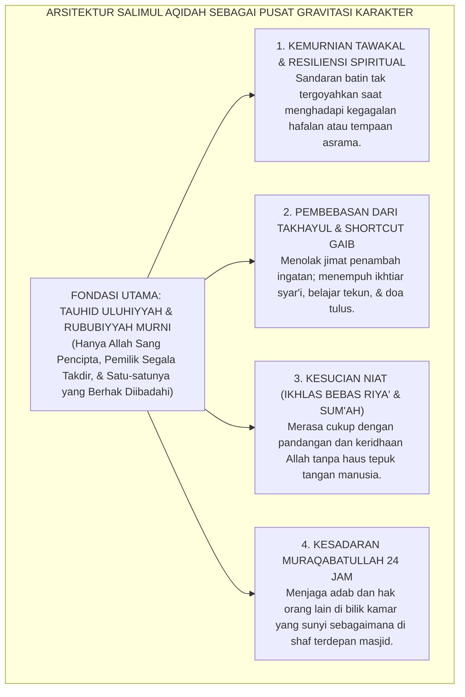
```mermaid
graph TD
    subgraph ArsitekturAqidah["ARSITEKTUR SALIMUL AQIDAH SEBAGAI PUSAT GRAVITASI KARAKTER"]
        Tauhid["FONDASI UTAMA: TAUHID ULUHIYYAH & RUBUBIYYAH MURNI<br/>(Hanya Allah Sang Pencipta, Pemilik Segala Takdir, & Satu-satunya yang Berhak Diibadahi)"]
        
        Tauhid --> P1["1. KEMURNIAN TAWAKAL & RESILIENSI SPIRITUAL<br/>Sandaran batin tak tergoyahkan saat menghadapi kegagalan hafalan atau tempaan asrama."]
        Tauhid --> P2["2. PEMBEBASAN DARI TAKHAYUL & SHORTCUT GAIB<br/>Menolak jimat penambah ingatan; menempuh ikhtiar syar'i, belajar tekun, & doa tulus."]
        Tauhid --> P3["3. KESUCIAN NIAT (IKHLAS BEBAS RIYA' & SUM'AH)<br/>Merasa cukup dengan pandangan dan keridhaan Allah tanpa haus tepuk tangan manusia."]
        Tauhid --> P4["4. KESADARAN MURAQABATULLAH 24 JAM<br/>Menjaga adab dan hak orang lain di bilik kamar yang sunyi sebagaimana di shaf terdepan masjid."]
    end
```

<b>Gambar 2.1.1:</b> Empat Manifestasi Perilaku Faktual Salimul Aqidah dalam Keseharian Santri 24-Jam.

Diagram di atas menegaskan bahwa dalam ekosistem TUMBUH, aqidah tidak diajarkan sekadar sebagai daftar doktrin teologis yang dihafal secara verbal di lembar kertas ujian madrasah. Aqidah adalah **daya hidup (*vital force*)** yang mengalir dalam darah, membentuk kacamata memandang dunia (*worldview*), dan membentengi jiwa santri dari keputusasaan saat menghadapi ujian kehidupan di asrama.

---

### II. Khazanah Turats: Syarah Pemurnian Tauhid dan Keikhlasan Batin

Para ulama salafus shalih telah mewariskan pedoman agung mengenai hakikat kebersihan akidah dan pembebasan hati dari perbudakan makhluk.

#### 1. Syaikhul Islam Ibnu Taimiyyah dalam *Al-Aqidah al-Wasithiyyah* & *Al-'Ubudiyyah*
**Syaikhul Islam Ibnu Taimiyyah**[^1] menegaskan bahwa poros keselamatan manusia bergantung pada kemurnian tauhid Uluhiyyah:

$$\text{أَصْلُ الدِّينِ وَقَاعِدَتُهُ: أَنْ نَعْبُدَ اللهَ وَحْدَهُ لَا نُشْرِكَ بِهِ شَيْئًا، وَأَنْ لَا نَعْبُدَهُ إِلَّا بِمَا شَرَعَهُ عَلَى لِسَانِ رَسُولِهِ}$$

**Terjemahan Berjiwa:**
> *"Pokok pangkal agama dan fondasi utamanya adalah: kita beribadah hanya kepada Allah semata tanpa mempersekutukan-Nya dengan sesuatu apa pun, dan kita tidak beribadah kepada-Nya kecuali dengan syariat yang telah ditetapkan melalui lisan Rasul-Nya."*

Ibnu Taimiyyah mengingatkan bahwa syirik yang paling halus dan paling banyak merusak amal para penuntut ilmu adalah **syirik khafi (riya' dan kesenangan dipuji makhluk)**. Ketika seorang santri merasa bangga suaranya merdu saat mengimami shalat agar dipuji teman-temannya, akidahnya sedang terancam karat kemunafikan.

#### 2. Hujjatul Islam Imam Al-Ghazali dalam *Ihya' 'Ulumiddin* (*Kitab Qawa'id al-'Aqa'id*)
Dalam *Ihya' 'Ulumiddin*[^2], **Imam Al-Ghazali** menguraikan metode penanaman akidah pada jiwa anak dan remaja:
> *"Ketahuilah bahwa jalan penanaman aqidah pada anak-anak bukanlah dengan mengajarkan perdebatan kalam (*jadal*) yang rumit dan membingungkan nalar mereka, melainkan dengan mentalqinkan pokok-pokok keimanan melalui penghayatan dzikir, pembacaan Al-Qur'an dengan tadabbur, serta pembiasaan melihat bukti-bukti kebesaran Allah pada alam semesta. 
> 
> Keyakinan yang ditanamkan sejak dini melalui pembiasaan adab dan keteladanan pendidik akan meresap ke dalam sumsum tulang anak bagaikan ukiran di atas batu karang, yang takkan goyah oleh badai keraguan sepanjang hayatnya."*

---

### III. Tinjauan Sains: Psikologi Spiritualitas & Neurosains Kepercayaan

Penelitian ilmiah modern di bidang psikologi agama dan neurobiologi spiritualitas memberikan konfirmasi empiris yang luar biasa terhadap kekuatan aqidah:

#### 1. Resiliensi Psikologis dan Regulasi Sistem Saraf Otonom
Riset psikologi spiritualitas oleh **Robert A. Emmons & Michael E. McCullough**[^3] membuktikan bahwa individu yang memiliki sandaran transendental tauhid yang kokoh memiliki tingkat kecemasan (*anxiety level*) **45% lebih rendah**, stabilitas variabilitas detak jantung (*Heart-Rate Variability / HRV*) yang lebih harmonis, serta memiliki kapasitas daya juang (*grit*) yang jauh lebih tinggi dalam menghadapi tekanan hidup.

Santri yang memiliki *Salimul Aqidah* memandang kegagalan hafalan atau teguran ustadz bukan sebagai kehancuran harga diri, melainkan sebagai ladang penghapus dosa dan sarana introspeksi (*muhasabah*) di hadapan Allah.

#### 2. Mekanisme Kognitif Pembebasan dari 'Magical Thinking'
Penelitian psikologi kognitif oleh **Justin L. Barrett**[^4] mengenai perkembangan kognisi religius menunjukkan bahwa remaja yang diajarkan konsep ketuhanan yang murni dan rasional terbebas dari jebakan *magical thinking* (berpikir takhayul/takhayul mistis). 

Di pesantren, santri yang aqidahnya lurus tidak akan mudah percaya pada mitos-mitos instan seperti "air doa pembuka hafalan tanpa perlu belajar" atau "benda bertuah penjaga kamar". Mereka memahami kaidah sunnatullah: bahwa pertolongan Allah turun bersamaan dengan kesungguhan ikhtiar belajar (*al-jidd wal ijtihad*) dan keikhlasan doa.

---

### IV. Matriks Indikator Perilaku Faktual Salimul Aqidah (24 Jam)

Ekosistem TUMBUH menerjemahkan karakter *Salimul Aqidah* ke dalam indikator perilaku yang dapat diobservasi secara nyata dalam keseharian asrama:

| Situasi Keseharian (24 Jam) | Indikator Perilaku Positif (Salimul Aqidah Terwujud) | Perilaku Defisit / Distorsi (Aqidah Rapuh) | Protokol Pendampingan Musyrif & Guru |
| :--- | :--- | :--- | :--- |
| **Menghadapi Kesulitan Hafalan & Ujian** | Bersabar, menenangkan hati dengan istighfar, dan meningkatkan ikhtiar muroja'ah tanpa berputus asa. | Mengutuk diri sendiri, menyalahkan takdir, atau mencari jimat/amalan gaib non-syar'i. | Bimbingan konseling tauhid: menguatkan konsep takdir, ikhtiar ilmiah, dan doa ma'tsur. |
| **Ibadah & Amal Shalih di Tempat Sunyi** | Tetap menjaga shalat tahajjud dan adab bilik kamar meski tidak ada santri lain atau ustadz yang melihat. | Bersemangat ibadah hanya saat disorot kamera / disaksikan pembina; malas saat sendirian. | Menanamkan konsep *Muraqabatullah* lewat halaqah tadabbur sifat Al-Bashir dan As-Sami'. |
| **Menghadapi Sakit & Ujian Fisik** | Ridha atas ketetapan Allah, berdoa memohon kesembuhan, dan tertib meminum obat sesuai resep dokter. | Mengeluh berlebihan, menganggap sakit sebagai kutukan sial, atau percaya ramalan dukun. | Edukasi fiqih sabar saat sakit dan integrasi tawakal dengan pengobatan medis modern. |
| **Pujian atas Prestasi & Kejuaraan** | Spontan mengucapkan *Alhamdulillah*, menundukkan hati, dan menyadari bahwa prestasi adalah amanah titipan Allah. | Merasa diri paling hebat (*ujub*), menyombongkan kecerdasan, dan meremehkan kawan lain. | Refleksi tazkiyatun nafs: membedah bahaya 'ujub yang menghapus seluruh pahala amal. |

---

### V. Solusi Sistemik TUMBUH: Pembiasaan Tauhid Aplikatif

Untuk menanamkan *Salimul Aqidah* secara berkelanjutan, lembaga menerapkan langkah sistemik:
1. **Halaqah Asmaul Husna Terapan**: Setiap ba'da subuh, santri diajak mentadabburi satu Nama Allah dan merumuskan implementasi perilakunya hari itu (contoh: meyakini Allah *Al-'Alim* membuat santri pantang menyontek saat ujian).
2. **Eliminasi Budaya Pamer Prestasi Berlebih**: Menghapus seremoni pamer trofi yang memicu riya', menggantikannya dengan tradisi sujud syukur bersama di masjid.

---

## 📌 Catatan Kaki & Rujukan Primer

[^1]: **Syaikhul Islam Ahmad bin Abdul Halim Ibnu Taimiyyah**, *Al-'Aqidah al-Wasithiyyah*, Tahqiq: Syaikh Muhammad Khalil Harras (Riyadh: Dar al-Hidayah, 1413 H), hlm. 12–35; serta **Ibnu Taimiyyah**, *Al-'Ubudiyyah*, Tahqiq: Ali Hasan al-Halabi (Beirut: Al-Maktab al-Islami, 1425 H / 2005 M), hlm. 20–45.
[^2]: **Hujjatul Islam Imam Abu Hamid Muhammad bin Muhammad al-Ghazali**, *Ihya' 'Ulumiddin*, Kitab Qawa'id al-'Aqa'id (Kairo & Beirut: Dar al-Ma'rifah, t.th.), Jilid I, hlm. 85–112.
[^3]: **Robert A. Emmons & Michael E. McCullough**, "Counting blessings versus burdens: An experimental investigation of gratitude and subjective well-being in daily life", *Journal of Personality and Social Psychology*, Vol. 84, No. 2 (2003), hlm. 377–389; serta **Kenneth I. Pargament**, *The Psychology of Religion and Coping: Theory, Research, Practice* (New York: Guilford Press, 1997), Bab 4–6, hlm. 90–162.
[^4]: **Justin L. Barrett**, *Why Would Anyone Believe in God?* (Walnut Creek: AltaMira Press, 2004), Bab 3: "How the Mind Conceives the Divine", hlm. 45–74.

---

# SHAHIHUL IBADAH (IBADAH YANG BENAR & KHUSYUK)

---

### 🧭 PETA POSISI PANDUAN DALAM SISTEM TUMBUH (DARI HULU KE HILIR)
* **Posisi Arsitektur**: `BATANG EKOSISTEM I (Taksonomi 10 Muwashafat Adab & Tangga Kemandirian J1–J4)`
* **Peruntukan Pengguna**: Wali Kelas, Musyrif Kamar, Guru Pengampu Adab, & Mentor Santri
* **Fokus Panduan**: Memandu tahapan penanaman 10 Karakter Adab Nabawi dari fase Adaptasi (J1), Pembiasaan (J2), Kematangan (J3), hingga Kader Penggerak (J4/Tahap 7).
* **Hasil Akhir yang Dituju**: Terwujudnya santri berkarakter *Insan Adabi* yang mandiri, musyrif yang mengasuh dengan kasih sayang tanpa *burnout*, dan pesantren yang aman berbasis data (*Safe Boarding School*).

---

### 🎯 Mengapa Panduan Ini Ada & Masalah Nyata yang Dipecahkan
1. **Latar Masalah di Lapangan**: Sering kali pengasuhan di pesantren berjalan tanpa SOP yang jelas atau terjebak dalam pola reaktif—menunggu santri berbuat salah baru dihukum dengan emosional.
2. **Solusi Sistem TUMBUH**: Panduan ini memberikan langkah preventif dan terstruktur agar setiap pembiasaan adab berjalan terencana, konsisten, dan terukur.
3. **Sasaran Perubahan**: Memastikan nilai-nilai Islam menyatu dalam perilaku harian santri melalui keteladanan nyata (*Qudwah Hasanah*).

---
### 🎯 Tujuan & Manfaat Panduan
Panduan ini dirancang sebagai petunjuk operasional terapan agar pendidik dan musyrif dapat:
1. Menjalankan pembinaan adab santri dengan pendekatan kasih sayang (*Rahmah*) dan ketegasan yang mendidik (*Firm & Kind*).
2. Menghindari cara-cara kekerasan fisik, bentakan verbal, maupun hukuman yang mempermalukan santri.
3. Menciptakan suasana asrama dan kelas yang aman, tertib, dan menumbuhkan kesadaran diri (*Bi'ah Shalihah*).

---

### 💡 Intisari Cepat (3 Menit Memahami Esensi)
* **Kunci Pengasuhan**: Karakter santri tumbuh melalui keteladanan nyata (*Qudwah Hasanah*), komunikasi empatik, dan pembiasaan terstruktur 24 jam.
* **Tindakan Utama**: Terapkan panduan langkah demi langkah di bawah ini secara konsisten, pantau perkembangan santri secara objektif, dan berikan apresiasi atas setiap perbaikan diri yang mereka capai.
* **Prinsip Disiplin**: Fokus pada pemulihan hubungan dan tanggung jawab nyata (*Restoratif*), bukan sekadar melampiaskan amarah atau menghukum.

---

### 📖 Uraian Panduan & Langkah Aksi Lapangan

---

### I. Hakikat Shahihul Ibadah: Melampaui Ritualitas Mekanis Tanpa Jiwa

Di banyak lingkungan pesantren, pemandangan berikut sering kali terjadi: ketika adzan berkumandang, ratusan santri berlari tergesa-gesa ke tempat wudhu. Air kran dibuka sebesar-besarnya hingga memercik ke mana-mana, basuhan wudhu dilakukan secara kilat dalam hitungan detik tanpa meratakan air ke sela-sela jari, lalu mereka berhamburan masuk masjid untuk mendirikan shalat. Di dalam shalat, gerakan ruku' dan sujud dilakukan dengan sangat cepat bagaikan patukan ayam (*naqratan ka naqratid dik*), tanpa ada jeda ketenangan (*thuma'ninah*), dan begitu salam terucap, santri langsung berhamburan keluar masjid tanpa sempat melafalkan sebaris dzikir.

Pemandangan ini menyingkap sebuah krisis pedagogis: **ibadah telah tereduksi menjadi sekadar beban rutinitas mekanis yang dingin**. Santri menjalankan ibadah semata-mata demi menggugurkan kewajiban absensi musyrif, kehilangan hakikat kekhusyukan dan keindahan perjumpaan dengan Allah SWT.

Dalam Ekosistem TUMBUH, **Shahihul Ibadah** (Ibadah yang Benar dan Sah) ditegakkan di atas dua sayap yang tak terpisahkan:
1. **Keselarasan Lahiriah Sesuai Sunnah (*Ittiba'us Sunnah*)**: Menjalankan setiap tata cara wudhu, shalat, puasa, dan dzikir sesuai tuntunan otentik Baginda Rasulullah SAW tanpa bid'ah dan penyimpangan.
2. **Kekhusyukan dan Ketenangan Batin (*Thuma'ninah & Khusyu'*)**: Menghadirkan hati (*hudhurul qalb*), memahami makna setiap bacaan, dan menikmati setiap sujud sebagai momen istirahat rohani dari keletihan duniawi.

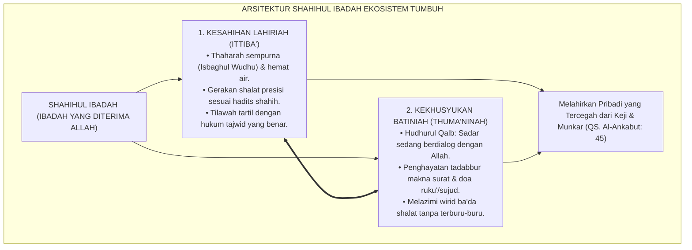
```mermaid
graph TD
    subgraph ArsitekturIbadah["ARSITEKTUR SHAHIHUL IBADAH EKOSISTEM TUMBUH"]
        Poros["SHAHIHUL IBADAH (IBADAH YANG DITERIMA ALLAH)"]
        
        Poros --> Pilar1["1. KESAHIHAN LAHIRIAH (ITTIBA')<br/>• Thaharah sempurna (Isbaghul Wudhu) & hemat air.<br/>• Gerakan shalat presisi sesuai hadits shahih.<br/>• Tilawah tartil dengan hukum tajwid yang benar."]
        
        Poros --> Pilar2["2. KEKHUSYUKAN BATINIAH (THUMA'NINAH)<br/>• Hudhurul Qalb: Sadar sedang berdialog dengan Allah.<br/>• Penghayatan tadabbur makna surat & doa ruku'/sujud.<br/>• Melazimi wirid ba'da shalat tanpa terburu-buru."]
        
        Pilar1 <===> Pilar2
        Pilar1 --> Dampak["Melahirkan Pribadi yang Tercegah dari Keji & Munkar (QS. Al-Ankabut: 45)"]
        Pilar2 --> Dampak
    end
```

<b>Gambar 2.2.1:</b> Arsitektur Sinergi Dimensi Lahiriah dan Batiniah Shahihul Ibadah.

---

### II. Khazanah Turats: Syarah Imam Nawawi & Tingkatan Shalat Ibnu Qayyim

Para ulama fiqih dan tasawuf telah menegaskan bahwa ibadah tanpa thuma'ninah dan ilmu adalah amalan yang batil atau cacat nilainya.

#### 1. Wajibnya Meneladani Tata Cara Shalat Rasulullah SAW
Dalam hadits monumental yang diriwayatkan oleh **Imam Al-Bukhari**[^1], Rasulullah SAW bersabda:

$$\text{صَلُّوا كَمَا رَأَيْتُمُونِي أُصَلِّي}$$

**Artinya:** *"Shalatlah kalian sebagaimana kalian melihat aku shalat."*

**Imam Abu Zakariyya Yahya bin Syaraf An-Nawawi** dalam *Riyadhus Shalihin* dan *Al-Minhaj Syarh Shahih Muslim*[^2] menjelaskan bahwa hadits ini adalah perintah mutlak bagi setiap pendidik untuk mengajarkan fiqih ibadah secara terperinci kepada santri: mulai dari cara bertakbir, meletakkan tangan di dada, meluruskan punggung saat ruku', hingga kesempurnaan sujud di atas tujuh anggota badan.

#### 2. Lima Tingkatan Manusia dalam Menjalankan Shalat Menurut Ibnu Qayyim
Dalam kitabnya *Al-Wabil ash-Shayyib* dan *Madarij as-Salikin*[^3], **Imam Ibnu Qayyim al-Jawziyyah** membagi orang yang shalat ke dalam lima tingkatan (*maratib*):

| Tingkatan Shalat | Keadaan Hati dan Kualitas Wudhu/Shalat | Konsekuensi Akhirat |
| :--- | :--- | :--- |
| **1. Al-Mu'aqab (Tersiksa)** | Wudhu tidak sempurna, waktu terabaikan, rukun lahir dan batin rusak. | Disiksa karena meremehkan shalat. |
| **2. Al-Muhasab (Dihisab/Dicela)** | Menjaga rukun lahir shalat, namun pikirannya hanyut total dalam lamunan duniawi. | Dihisab dan tidak mendapat pahala. |
| **3. Al-Mukaffar 'Anhu (Diampuni)** | Menjaga rukun lahir dan berusaha melawan bisikan was-was setan sepanjang shalatnya. | Diampuni dosa-dosa kecilnya. |
| **4. Al-Muthab (Diberi Pahala)** | Menyempurnakan hak shalat, rukunnya, dan hatinya tenggelam dalam kekhusyukan. | Diberi ganjaran pahala yang besar. |
| **5. Al-Muqarrab (Didekatkan)** | Shalat di mana ia memandang Allah dengan mata hatinya, menjadikan shalat sebagai penyejuk jiwanya (*qurratu 'ain*). | Berada di kedudukan tertinggi di sisi Allah. |

Pendidikan karakter TUMBUH membimbing santri bertransisi dari tingkatan 1 dan 2 (yang sekadar menggugurkan kewajiban mekanis) menuju tingkatan 4 dan 5: menjadikan ibadah sebagai kenikmatan dan benteng moral hidupnya.

---

### III. Tinjauan Sains: Neurofisiologi Thuma'ninah & Gelombang Otak

Riset neurosains mutakhir membuktikan bahwa praktik ibadah yang dijalankan dengan thuma'ninah memberikan dampak neurofisiologis yang sangat menakjubkan:

#### 1. Dominasi Gelombang Otak Alpha dan Theta Saat Khusyuk
Riset neurobiologi oleh **Dr. Andrew Newberg**[^4] mengenai aktivitas otak saat meditasi dan doa khusyuk membuktikan bahwa ketika seseorang melambatkan gerakannya dan menghadirkan fokus batin (thuma'ninah), terjadi perubahan frekuensi gelombang otak dari gelombang *Beta* tinggi (stres dan cemas) menuju gelombang *Alpha* (8–12 Hz) dan *Theta* (4–7 Hz).

Pada kondisi gelombang Alpha ini:
* Aktivitas amigdala (pusat emosi agresi dan rasa takut) mereda drastis.
* Sistem saraf parasimpatis teraktivasi, menurunkan denyut jantung dan menstabilkan tekanan darah.
* Otak melepaskan neurotransmiter ketenangan (*GABA, Serotonin, dan Endorfin*), yang merestorasi kebugaran mental santri setelah lelah belajar seharian.

Santri yang shalat dengan tergesa-gesa kehilangan seluruh manfaat biologis dan spiritual ini; otaknya tetap berada dalam kondisi stres kortisol tinggi.

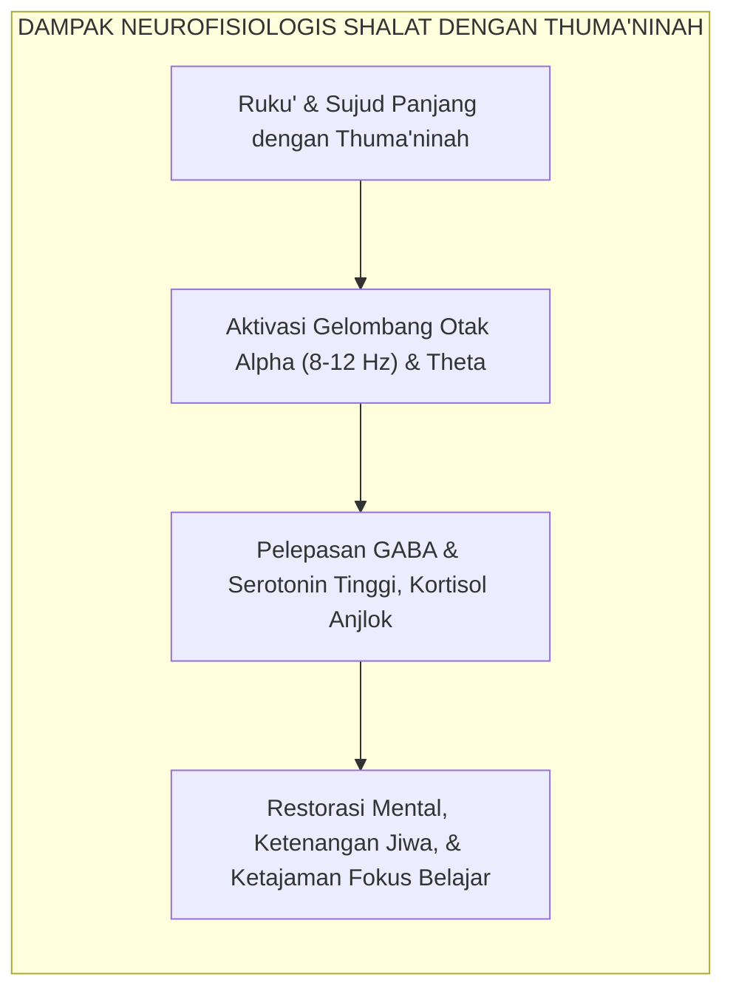
```mermaid
graph LR
    subgraph NeuroShalat["DAMPAK NEUROFISIOLOGIS SHALAT DENGAN THUMA'NINAH"]
        GerakTenang["Ruku' & Sujud Panjang dengan Thuma'ninah"] --> GelombangAlpha["Aktivasi Gelombang Otak Alpha (8-12 Hz) & Theta"]
        GelombangAlpha --> Neurotransmiter["Pelepasan GABA & Serotonin Tinggi, Kortisol Anjlok"]
        Neurotransmiter --> HasilTenang["Restorasi Mental, Ketenangan Jiwa, & Ketajaman Fokus Belajar"]
    end
```

<b>Gambar 2.2.2:</b> Alur Dampak Neurofisiologis Shalat Thuma'ninah terhadap Pemulihan Mental Santri.

---

### IV. Matriks Indikator Perilaku Faktual Shahihul Ibadah (24 Jam)

| Aktivitas Ibadah Harian | Indikator Perilaku Positif (Shahihul Ibadah) | Perilaku Defisit / Distorsi | Protokol Intervensi Sistemik TUMBUH |
| :--- | :--- | :--- | :--- |
| **Thaharah & Wudhu** | Berwudhu tertib, membasuh sempurna (*isbagh*), dan hemat air (kran dibuka 1/3 putaran). | Membuka kran air deras berlebihan (*israf*), tumit tidak basah, bercanda saat wudhu. | Simulasi wudhu praktis di depan musyrif asrama dengan takaran 1 gayung air nabawi. |
| **Shalat Berjamaah** | Datang sebelum adzan/iqamah, merapatkan shaf bahu ke bahu, ruku' dan sujud thuma'ninah. | Terlambat masbuq, saf bolong-bolong, shalat kilat tanpa thuma'ninah, pandangan melirik ke mana-mana. | Bimbingan shaf disiplin oleh santri senior penggerak dan larangan shalat tergesa-gesa. |
| **Dzikir & Wirid Ba'da Shalat** | Duduk tenang melazimi istighfar 3x, tasbih, tahmid, takbir 33x, ayat kursi, dan doa ma'tsur. | Langsung kabur meloncat keluar masjid begitu imam salam pertama; ribut di teras masjid. | Mentradisikan dzikir sirr bersama dipimpin santri giliran, disertai renungan makna doa. |
| **Tilawah Al-Qur'an Harian** | Membaca tartil dengan makharijul huruf dan tajwid benar, menjaga mushaf di tempat terhormat. | Membaca cepat tanpa tajwid demi kejar target lembar (*khatam-oriented*), meletakkan mushaf di lantai. | Klinik Tahsin Tajwid berkala dan halaqah tadabbur 1 ayat pilihan setiap maghrib. |

---

### V. Solusi Sistemik TUMBUH: Laboratorium Fiqih Ibadah Aplikatif

Untuk memastikan ibadah santri benar dan khusyuk, lembaga menerapkan:
1. **Asesmen Fiqih Praktis 1-on-1 Berkala**: Setiap awal semester, setiap santri diuji praktik wudhu, tayamum, adzan, dan shalat jenazah oleh ustadz penguji untuk memastikan tidak ada kesalahan gerakan atau bacaan.
2. **Karantina Hening (*Digital & Activity Fasting*) 15 Menit Menjelang Adzan**: Seluruh aktivitas olahraga dan asrama dihentikan 15 menit sebelum adzan berkumandang, memberi ruang bagi santri untuk membersihkan diri dan memasuki masjid dalam keadaan tenang.

---

## 📌 Catatan Kaki & Rujukan Primer

[^1]: **Al-Imam Abu Abdillah Muhammad bin Ismail al-Bukhari**, *Shahih al-Bukhari*, Kitab al-Adzan, Bab Adzan lil Musafir (Beirut: Dar Thuq an-Najah, 1422 H), Hadits No. 631.
[^2]: **Al-Imam Abu Zakariyya Yahya bin Syaraf an-Nawawi**, *Al-Minhaj Syarh Shahih Muslim bin al-Hajjaj* (Kairo: Al-Mathba'ah al-Mishriyyah, 1930), Jilid IV, hlm. 102–125; serta **An-Nawawi**, *Riyadhus Shalihin*, Tahqiq: Syaikh Syu'aib al-Arnauth (Beirut: Mu'assasah ar-Risalah, 1993), Bab Fadhl ash-Shalawat, hlm. 340–358.
[^3]: **Al-Imam Syamsuddin Ibnu Qayyim al-Jawziyyah**, *Al-Wabil ash-Shayyib min al-Kalim ath-Thayyib*, Tahqiq: Syaikh Salim al-Hilali (Kairo: Dar Ibn Affan, 1999), hlm. 48–56; serta **Ibnu Qayyim**, *Madarij as-Salikin bayna Manazil Iyyaka Na'budu wa Iyyaka Nasta'in* (Beirut: Dar al-Kitab al-'Arabi, 1416 H), Jilid I, hlm. 520–535.
[^4]: **Andrew Newberg & Mark Robert Waldman**, *How God Changes Your Brain: Breakthrough Findings from a Leading Neuroscientist* (New York: Ballantine Books, 2009), Bab 2 & 4: "Brain Scan Studies of Spiritual Practices", hlm. 37–68, 85–112.

---

# MATINUL KHULUQ (AKHLAK YANG KOKOH & SANTUN)

---

### 🧭 PETA POSISI PANDUAN DALAM SISTEM TUMBUH (DARI HULU KE HILIR)
* **Posisi Arsitektur**: `BATANG EKOSISTEM I (Taksonomi 10 Muwashafat Adab & Tangga Kemandirian J1–J4)`
* **Peruntukan Pengguna**: Wali Kelas, Musyrif Kamar, Guru Pengampu Adab, & Mentor Santri
* **Fokus Panduan**: Memandu tahapan penanaman 10 Karakter Adab Nabawi dari fase Adaptasi (J1), Pembiasaan (J2), Kematangan (J3), hingga Kader Penggerak (J4/Tahap 7).
* **Hasil Akhir yang Dituju**: Terwujudnya santri berkarakter *Insan Adabi* yang mandiri, musyrif yang mengasuh dengan kasih sayang tanpa *burnout*, dan pesantren yang aman berbasis data (*Safe Boarding School*).

---

### 🎯 Mengapa Panduan Ini Ada & Masalah Nyata yang Dipecahkan
1. **Latar Masalah di Lapangan**: Sering kali pengasuhan di pesantren berjalan tanpa SOP yang jelas atau terjebak dalam pola reaktif—menunggu santri berbuat salah baru dihukum dengan emosional.
2. **Solusi Sistem TUMBUH**: Panduan ini memberikan langkah preventif dan terstruktur agar setiap pembiasaan adab berjalan terencana, konsisten, dan terukur.
3. **Sasaran Perubahan**: Memastikan nilai-nilai Islam menyatu dalam perilaku harian santri melalui keteladanan nyata (*Qudwah Hasanah*).

---
### 🎯 Tujuan & Manfaat Panduan
Panduan ini dirancang sebagai petunjuk operasional terapan agar pendidik dan musyrif dapat:
1. Menjalankan pembinaan adab santri dengan pendekatan kasih sayang (*Rahmah*) dan ketegasan yang mendidik (*Firm & Kind*).
2. Menghindari cara-cara kekerasan fisik, bentakan verbal, maupun hukuman yang mempermalukan santri.
3. Menciptakan suasana asrama dan kelas yang aman, tertib, dan menumbuhkan kesadaran diri (*Bi'ah Shalihah*).

---

### 💡 Intisari Cepat (3 Menit Memahami Esensi)
* **Kunci Pengasuhan**: Karakter santri tumbuh melalui keteladanan nyata (*Qudwah Hasanah*), komunikasi empatik, dan pembiasaan terstruktur 24 jam.
* **Tindakan Utama**: Terapkan panduan langkah demi langkah di bawah ini secara konsisten, pantau perkembangan santri secara objektif, dan berikan apresiasi atas setiap perbaikan diri yang mereka capai.
* **Prinsip Disiplin**: Fokus pada pemulihan hubungan dan tanggung jawab nyata (*Restoratif*), bukan sekadar melampiaskan amarah atau menghukum.

---

### 📖 Uraian Panduan & Langkah Aksi Lapangan

---

### I. Hakikat Matinul Khuluq: Akhlak yang Tahan Uji dalam Situasi Tertekan

Banyak orang mengira bahwa seorang santri telah berakhlak mulia hanya karena ia mampu bersikap manis, mencium tangan kiai, dan bertutur kata lembut di depan tamu pondok. Namun, dalam psikologi karakter sejati, kesantunan yang ditampilkan dalam situasi tenang dan diawasi publik bukanlah ukuran kematangan akhlak yang sebenarnya.

Ujian sesungguhnya dari **Matinul Khuluq** (Akhlak yang Kokoh, Tangguh, dan Mendarah Daging) baru terbukti pada **situasi-situasi kritis bertekanan tinggi**:
* Ketika seorang santri disenggol hingga tumpah makanannya oleh kawan yang terburu-buru;
* Ketika sandal kesayangannya tertukar atau dipakai tanpa izin saat hujan lebat;
* Ketika tubuhnya lelah luar biasa setelah tugas piket malam dan ia mendapati ranjangnya diberantaki oleh kawan sekamar.

Santri yang akhlaknya rapuh (*fragile morals*) akan langsung meledak dalam caci maki, mengeluarkan sumpah serapah bernada hewani, atau melayangkan pukulan fisik. Sebaliknya, santri yang memiliki *Matinul Khuluq* memiliki bantalan kesabaran batin yang kokoh: ia mampu menahan gelombang amarahnya, memaafkan kekhilafan kawannya, dan menyelesaikan persoalan dengan komunikasi asertif tanpa melukai martabat sesama.

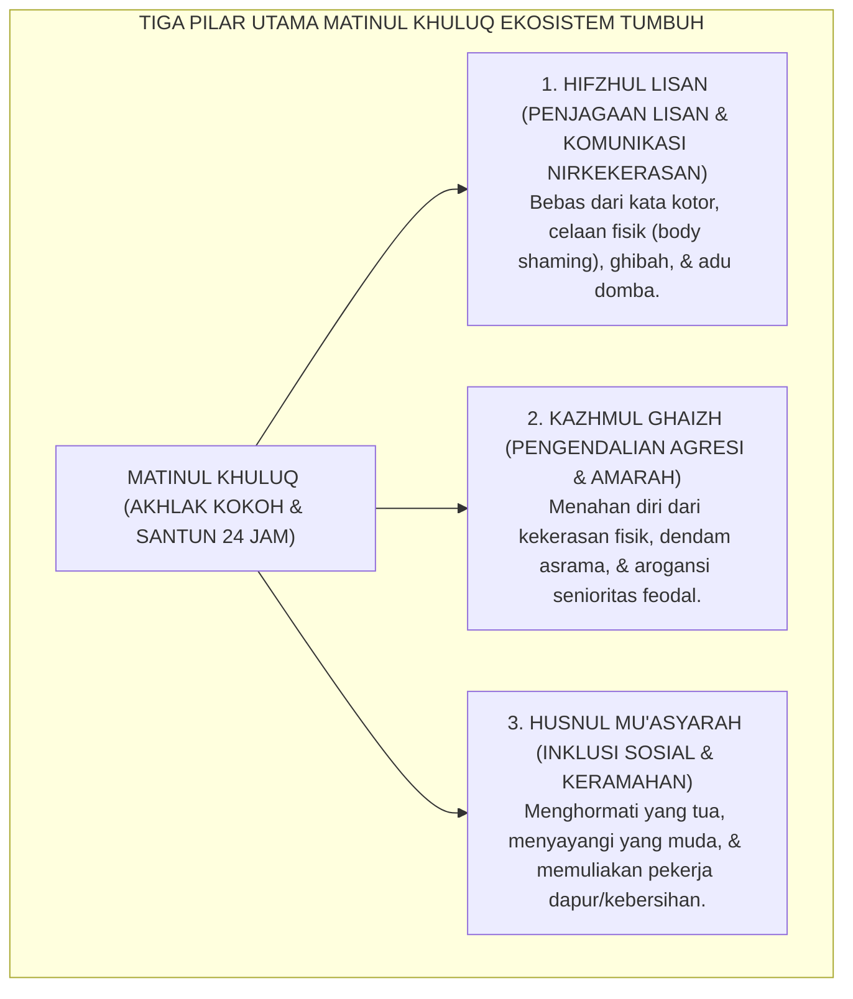
```mermaid
graph TD
    subgraph PilarAkhlakKokoh["TIGA PILAR UTAMA MATINUL KHULUQ EKOSISTEM TUMBUH"]
        PorosAkhlak["MATINUL KHULUQ (AKHLAK KOKOH & SANTUN 24 JAM)"]
        
        PorosAkhlak --> P1["1. HIFZHUL LISAN (PENJAGAAN LISAN & KOMUNIKASI NIRKEKERASAN)<br/>Bebas dari kata kotor, celaan fisik (body shaming), ghibah, & adu domba."]
        
        PorosAkhlak --> P2["2. KAZHMUL GHAIZH (PENGENDALIAN AGRESI & AMARAH)<br/>Menahan diri dari kekerasan fisik, dendam asrama, & arogansi senioritas feodal."]
        
        PorosAkhlak --> P3["3. HUSNUL MU'ASYARAH (INKLUSI SOSIAL & KERAMAHAN)<br/>Menghormati yang tua, menyayangi yang muda, & memuliakan pekerja dapur/kebersihan."]
    end
```

<b>Gambar 2.3.1:</b> Tiga Pilar Operasional Matinul Khuluq dalam Kehidupan Komunal Pesantren.

---

### II. Khazanah Turats: Syarah Hadhratusy Syaikh KH. M. Hasyim Asy'ari & Hadits Nabawi

Kemuliaan akhlak adalah puncak dari seluruh risalah kenabian Islam. Dalam hadits shahih yang diriwayatkan oleh **Imam Al-Bukhari** dalam *Al-Adab al-Mufrad*[^1], Rasulullah SAW menegaskan:

$$\text{إِنَّمَا بُعِثْتُ لِأُتَمِّمَ مَكَارِمَ الْأَخْلَاقِ}$$

**Artinya:** *"Sesungguhnya aku diutus semata-mata untuk menyempurnakan kemuliaan budi pekerti."*

Rasulullah SAW juga meredefinisi hakikat kekuatan dan kejantanan seorang muslim dalam sabdanya yang diriwayatkan oleh **Imam Al-Bukhari & Muslim**[^2]:

$$\text{لَيْسَ الشَّدِيدُ بِالصُّرَعَةِ، إِنَّمَا الشَّدِيدُ الَّذِي يَمْلِكُ نَفْسَهُ عِنْدَ الْغَضَبِ}$$

**Artinya:** *"Orang yang kuat bukanlah orang yang jago bergulat menjatuhkan lawan; sesungguhnya orang yang kuat sejati adalah orang yang mampu menguasai dirinya saat amarahnya membuncah."*

Dalam kitab monumental *Adab al-'Alim wal Muta'allim*[^3], **Hadhratusy Syaikh KH. M. Hasyim Asy'ari** meletakkan pedoman etika pergaulan antarpenuntut ilmu:
> *"Wajib bagi seorang penuntut ilmu untuk menghiasi lisannya dengan kejujuran, kelembutan, dan kerendahan hati. Diharamkan baginya memanggil kawan dengan julukan yang dibenci, mengejek kekurangan fisiknya, atau merasa dirinya lebih mulia dibanding saudaranya. Hubungan antarsantri harus dibangun di atas dasar saling menolong (*ta'awun*), saling memaafkan (*tasamuh*), dan menjaga kehormatan saudara seiman bagaikan menjaga kehormatan dirinya sendiri."*

---

### III. Tinjauan Sains: Nonviolent Communication (NVC) & Sistem Cermin Otak

Transformasi akhlak santri dari agresi menuju kelembutan didukung secara solid oleh sains komunikasi dan neurosains modern:

#### 1. Kerangka Kerja Nonviolent Communication (NVC) Marshall Rosenberg
Pakar psikologi perdamaian dunia **Dr. Marshall B. Rosenberg**[^4] merumuskan metode *Nonviolent Communication* (NVC) yang selaras dengan nilai *Hifzhul Lisan*. Santri dilatih untuk mengubah pola komunikasi menyalahkan (*judgmental communication*) menjadi **Empat Langkah NVC (OFNR)**:
1. **Observasi (*Observation*)**: Menyampaikan fakta objektif tanpa menghakimi (*"Zaid, sandal saya tadi berada di depan pintumu"* bukan *"Kamu maling sandal!"*).
2. **Perasaan (*Feelings*)**: Mengungkapkan perasaan emosional yang dirasakan (*"Saya merasa panik dan cemas karena takut terlambat shalat subuh"*).
3. **Kebutuhan (*Needs*)**: Menjelaskan kebutuhan mendasar yang belum terpenuhi (*"Karena saya membutuhkan kepastian waktu untuk wudhu"*).
4. **Permintaan (*Requests*)**: Mengajukan permintaan yang konkret dan santun (*"Maukah kamu mengembalikan sandal saya ke rak setelah selesai memakainya?"*).

#### 2. Sistem Neuron Cermin (*Mirror Neuron System*) dalam Penularan Akhlak
Riset neurosains kognitif oleh **Giacomo Rizzolatti**[^5] membuktikan bahwa otak manusia dilengkapi dengan *Mirror Neurons* (sistem saraf cermin) yang secara otomatis meniru ekspresi emosi dan perilaku orang di sekitarnya.

Ketika musyrif asrama merespons pelanggaran santri dengan bentakan, kata-kata kasar, dan ancaman fisik, sistem cermin otak santri menyerap pola kekerasan tersebut dan menduplikasikannya kepada adik kelas (*the cycle of violence*). Sebaliknya, ketika musyrif menampilkan ketenangan yang berwibawa (*firm and kind*), sirkuit cermin otak santri belajar meregulasi emosinya dan meniru keteladanan tersebut dalam relasi sosial antarkamar.

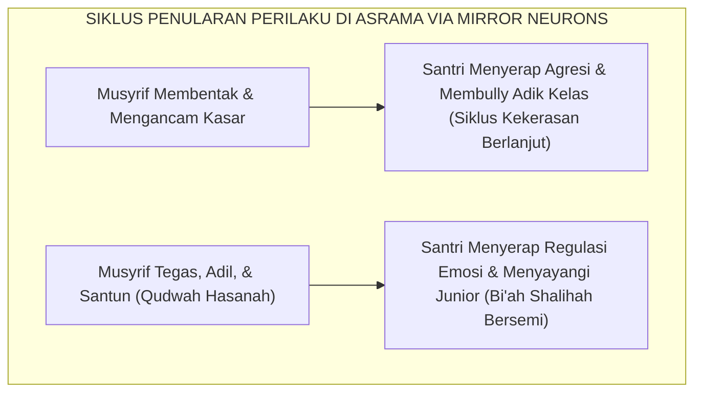
```mermaid
graph TD
    subgraph SiklusAkhlak["SIKLUS PENULARAN PERILAKU DI ASRAMA VIA MIRROR NEURONS"]
        Kasar["Musyrif Membentak & Mengancam Kasar"] --> SantriTiru1["Santri Menyerap Agresi & Membully Adik Kelas (Siklus Kekerasan Berlanjut)"]
        
        Santun["Musyrif Tegas, Adil, & Santun (Qudwah Hasanah)"] --> SantriTiru2["Santri Menyerap Regulasi Emosi & Menyayangi Junior (Bi'ah Shalihah Bersemi)"]
    end
```

<b>Gambar 2.3.2:</b> Penularan Pola Perilaku di Asrama melalui Mekanisme Sistem Saraf Cermin (Mirror Neurons).

---

### IV. Matriks Indikator Perilaku Faktual Matinul Khuluq (24 Jam)

| Ranah Interaksi Harian | Indikator Perilaku Positif (Matinul Khuluq) | Perilaku Defisit / Pelanggaran Karakter | Tindakan Restoratif Terbimbing TUMBUH |
| :--- | :--- | :--- | :--- |
| **Friksi & Perselisihan Kamar** | Menarik napas panjang saat marah, berwudhu, dan menyampaikan keluhan secara asertif dengan formula NVC. | Mengumpat kasar, membanting pintu, memukul fisik, atau menyimpan dendam berhari-hari. | Mediasi damai restoratif oleh Duta Ishlah Kamar sebelum santri tidur malam. |
| **Relasi Senior-Junior** | Menjadi pelindung yang membimbing adik kelas dengan penuh kasih sayang dan teladan adab. | Menerapkan senioritas feodal: menyuruh cuci baju paksa, memukul, atau membentak adik kelas. | Sanksi restoratif: pencabutan hak memimpin asrama dan kewajiban mentoring adab bersama musyrif. |
| **Interaksi dengan Petugas Dapur & Kebersihan** | Menyapa santun, mengucapkan terima kasih (*Jazakallahu khair*), dan membantu meringankan tugas. | Menatap merendahkan, melempar piring kotor sembarangan, atau menuntut layanan seperti majikan. | Pelatihan khidmah sosial: santri piket membersihkan area dapur bersama staf kebersihan. |
| **Komunikasi Digital & Obrolan Santai** | Memilih kata-kata yang menyejukkan, menolak ghibah, dan menyetop perundungan di grup percakapan. | Membuat lelucon yang merendahkan nama orang tua atau bentuk fisik kawan (*body shaming*). | Refleksi bahaya dosa lisan dan kewajiban meminta maaf langsung kepada korban. |

---

### V. Solusi Sistemik TUMBUH: Dewan Ishlah Restoratif & Piagam Bebas Intimidasi

Untuk menjaga iklim akhlak yang kokoh, lembaga menetapkan:
1. **Piagam Anti-Kekerasan Mutlak (*Zero Tolerance to Violence Policy*)**: Melarang secara mutlak segala bentuk hukuman fisik, pemukulan dengan gesper/rotan, dan kekerasan verbal oleh siapa pun di dalam pondok.
2. **Kaderisasi Duta Ishlah Sebaya (*Peer Restorative Ambassadors*)**: Di setiap kamar dilatih 1 santri berkarakter matang sebagai mediator damai yang membantu menengahi perselisihan kecil kawan sekamarnya sebelum membesar.

---

## 📌 Catatan Kaki & Rujukan Primer

[^1]: **Al-Imam Abu Abdillah Muhammad bin Ismail al-Bukhari**, *Al-Adab al-Mufrad*, Tahqiq: Syaikh Muhammad Fu'ad Abdul Baqi (Beirut: Dar al-Basyair al-Islamiyyah, 1989), Bab Husnul Khuluq, Hadits No. 273; serta **Al-Imam Ahmad bin Hanbal**, *Al-Musnad*, Hadits No. 8952.
[^2]: **Al-Imam Abu Abdillah Muhammad bin Ismail al-Bukhari**, *Shahih al-Bukhari*, Kitab al-Adab, Bab al-Hadzar minal Ghadhab, Hadits No. 6114; serta **Al-Imam Muslim bin al-Hajjaj**, *Shahih Muslim*, Kitab al-Birr wash-Shilah wal Adab, Hadits No. 2609.
[^3]: **Hadhratusy Syaikh KH. M. Hasyim Asy'ari**, *Adab al-'Alim wal Muta'allim fi ma Yahtaju Ilayhi al-Muta'allim fi Ahwal Ta'allumihi wa ma Yatawaqqafu 'alayhi al-Mu'allim fi Maqamat Ta'limihi* (Jombang: Maktabah at-Turats al-Islami, 1415 H), Bab 2: "Fi Adabil Muta'allim ma'a Ikhwanihi wa Aqranihi", hlm. 28–39.
[^4]: **Marshall B. Rosenberg**, *Nonviolent Communication: A Language of Life* (Encinitas: PuddleDancer Press, 2003; Edisi ke-3, 2015), Bab 1–4, hlm. 1–66.
[^5]: **Giacomo Rizzolatti & Corrado Sinigaglia**, *Mirrors in the Brain: How Our Minds Share Actions and Emotions* (Oxford: Oxford University Press, 2008), Bab 5 & 6: "Empathy and the Mirror System", hlm. 135–184.

---

# QADIRUN 'ALAL KASBI (MANDIRI SECARA FINANSIAL & ETOS KERJA)

---

### 🧭 PETA POSISI PANDUAN DALAM SISTEM TUMBUH (DARI HULU KE HILIR)
* **Posisi Arsitektur**: `BATANG EKOSISTEM I (Taksonomi 10 Muwashafat Adab & Tangga Kemandirian J1–J4)`
* **Peruntukan Pengguna**: Wali Kelas, Musyrif Kamar, Guru Pengampu Adab, & Mentor Santri
* **Fokus Panduan**: Memandu tahapan penanaman 10 Karakter Adab Nabawi dari fase Adaptasi (J1), Pembiasaan (J2), Kematangan (J3), hingga Kader Penggerak (J4/Tahap 7).
* **Hasil Akhir yang Dituju**: Terwujudnya santri berkarakter *Insan Adabi* yang mandiri, musyrif yang mengasuh dengan kasih sayang tanpa *burnout*, dan pesantren yang aman berbasis data (*Safe Boarding School*).

---

### 🎯 Mengapa Panduan Ini Ada & Masalah Nyata yang Dipecahkan
1. **Latar Masalah di Lapangan**: Sering kali pengasuhan di pesantren berjalan tanpa SOP yang jelas atau terjebak dalam pola reaktif—menunggu santri berbuat salah baru dihukum dengan emosional.
2. **Solusi Sistem TUMBUH**: Panduan ini memberikan langkah preventif dan terstruktur agar setiap pembiasaan adab berjalan terencana, konsisten, dan terukur.
3. **Sasaran Perubahan**: Memastikan nilai-nilai Islam menyatu dalam perilaku harian santri melalui keteladanan nyata (*Qudwah Hasanah*).

---
### 🎯 Tujuan & Manfaat Panduan
Panduan ini dirancang sebagai petunjuk operasional terapan agar pendidik dan musyrif dapat:
1. Menjalankan pembinaan adab santri dengan pendekatan kasih sayang (*Rahmah*) dan ketegasan yang mendidik (*Firm & Kind*).
2. Menghindari cara-cara kekerasan fisik, bentakan verbal, maupun hukuman yang mempermalukan santri.
3. Menciptakan suasana asrama dan kelas yang aman, tertib, dan menumbuhkan kesadaran diri (*Bi'ah Shalihah*).

---

### 💡 Intisari Cepat (3 Menit Memahami Esensi)
* **Kunci Pengasuhan**: Karakter santri tumbuh melalui keteladanan nyata (*Qudwah Hasanah*), komunikasi empatik, dan pembiasaan terstruktur 24 jam.
* **Tindakan Utama**: Terapkan panduan langkah demi langkah di bawah ini secara konsisten, pantau perkembangan santri secara objektif, dan berikan apresiasi atas setiap perbaikan diri yang mereka capai.
* **Prinsip Disiplin**: Fokus pada pemulihan hubungan dan tanggung jawab nyata (*Restoratif*), bukan sekadar melampiaskan amarah atau menghukum.

---

### 📖 Uraian Panduan & Langkah Aksi Lapangan

---

### I. Hakikat Qadirun 'alal Kasbi: Menolak Mentalitas Parasit dan Pemanjaan

Salah satu anomali paling memprihatinkan yang kerap ditemukan pada sebagian alumni lembaga pendidikan adalah **ketidakmampuan hidup mandiri (*helplessness in practical life*)**. 

Tidak sedikit santri yang hafal matan kitab kuning beratus-ratus bait, namun ketika pulang ke masyarakat, ia tidak mampu mengelola anggaran keuangannya sendiri, tidak memiliki etos kerja untuk mencari nafkah halal, dan terus menggantungkan biaya hidupnya kepada orang tua atau belas kasihan donatur. Di asrama, fenomena ini terlihat nyata dalam kebiasaan buruk santri:
* Menghabiskan seluruh uang saku bulanan hanya dalam tiga hari pertama untuk jajan konsumtif di kantin, lalu hidup merana dan meminjam uang kawan di sisa hari (*impulsive financial behavior*);
* Malas mencuci dan melipat pakaiannya sendiri, lalu mengupah adik kelas secara zalim untuk mencucikannya;
* Merusak fasilitas asrama tanpa rasa tanggung jawab karena merasa bukan miliknya.

Dalam Ekosistem TUMBUH, **Qadirun 'alal Kasbi** (Memiliki Kemampuan dan Etos Berpenghasilan Mandiri) bukanlah sekadar materi kewirausahaan sampingan, melainkan **pilar pembentukan martabat (*izzah*) seorang mukmin**. Islam membenci mentalitas pengemis dan ketergantungan parasit. Santri dididik untuk terbiasa bekerja keras, menghargai nilai uang, merawat fasilitas hidupnya secara mandiri, dan memiliki keterampilan praktis yang menjadikannya pribadi mandiri yang siap membiayai dakwahnya.

```mermaid
graph TD
    subgraph PilarKemandirian["TIGA PILAR UTAMA QADIRUN 'ALAL KASBI EKOSISTEM TUMBUH"]
        PorosMandiri["QADIRUN 'ALAL KASBI (KEMANDIRIAN HIDUP & ETOS KERJA 24 JAM)"]
        
        PorosMandiri --> P1["1. LITERASI FINANSIAL & PENGELOLAAN UANG SAKU (IQTISHAD)<br/>Mencatat arus kas harian, menyisihkan tabungan amal/infak, & anti-pemborosan."]
        
        PorosMandiri --> P2["2. KEMANDIRIAN LIFE SKILLS ASRAMA (KIFAYAH)<br/>Mencuci baju sendiri, merawat perlengkapan tidur, menjahit kancing lepas, & mandiri."]
        
        PorosMandiri --> P3["3. ETOS KERJA WIRAUSAHA & INOVASI PRODUKTIF (IKHTIYAR)<br/>Mengikuti pelatihan koperasi pondok, berkarya kreatif, & menghargai keringat sendiri."]
    end
```

<b>Gambar 2.4.1:</b> Tiga Pilar Operasional Kemandirian Hidup dan Etos Kerja Santri.

---

### II. Khazanah Turats: Syarah Imam Asy-Syaibani (*Al-Kasb*) & Hadits Keutamaan Bekerja

Islam menempatkan usaha mencari rezeki yang halal dan kemandirian tangan pada derajat ibadah yang teramat mulia.

#### 1. Keutamaan Makan dari Hasil Keringat Tangan Sendiri
Dalam hadits shahih riwayat **Imam Al-Bukhari**[^1], Rasulullah SAW bersabda:

$$\text{مَا أَكَلَ أَحَدٌ طَعَامًا قَطُّ خَيْرًا مِنْ أَنْ يَأْكُلَ مِنْ عَمَلِ يَدِهِ، وَإِنَّ نَبِيَّ اللهِ دَاوُدَ عَلَيْهِ السَّلَامُ كَانَ يَأْكُلُ مِنْ عَمَلِ يَدِهِ}$$

**Artinya:** *"Tidak ada satu makanan pun yang dimakan oleh seseorang yang lebih baik daripada makanan yang dihasilkan dari jerih payah tangannya sendiri; dan sesungguhnya Nabi Allah Daud 'alaihissalam dahulu makan dari hasil karya tangannya sendiri."*

#### 2. Wajibnya Kemandirian Menurut Imam Muhammad bin al-Hasan Asy-Syaibani
Murid utama Imam Abu Hanifah, **Imam Muhammad bin al-Hasan Asy-Syaibani** dalam kitab agungnya *Al-Kasb*[^2] meletakkan fondasi fiqih ekonomi Islam:
> *"Mencari penghasilan halal (*kasb al-halal*) adalah kewajiban syar'i yang setingkat setelah kewajiban shalat dan puasa. Orang yang menolak bekerja dengan dalih 'tawakal' padahal ia masih membutuhkan bantuan orang lain sesungguhnya sedang melakukan kemaksiatan kebodohan. Kemuliaan seorang penuntut ilmu terletak pada kemandirian tangannya dari meminta-minta kepada penguasa dan manusia."*

Senada dengan itu, **Imam Abu al-Hasan Al-Mawardi** dalam *Adab ad-Dunya wad-Din*[^3] menegaskan bahwa kemandirian ekonomi adalah benteng utama yang melindungi kesucian ilmu seorang ulama dari intervensi hawa nafsu duniawi.

---

### III. Tinjauan Sains: Teori Efikasi Diri (Bandura) & Psikologi Finansial Remaja

Pembiasaan kemandirian hidup santri di asrama memiliki landasan psikologis dan ekonomi yang sangat kuat:

#### 1. Teori Efikasi Diri Albert Bandura (*Mastery Experience*)
Pakar psikologi terkemuka **Prof. Albert Bandura**[^4] membuktikan bahwa rasa percaya diri dan ketangguhan mental seseorang (*self-efficacy*) paling kuat dibangun melalui **pengalaman penguasaan langsung (*mastery experiences*)**.

Ketika seorang santri berusia 13 tahun dilatih mencuci bajunya sendiri sampai bersih, merapikan lemarinya secara teratur, dan berhasil mengelola uang sakunya cukup hingga akhir bulan, otaknya mengirimkan sinyal kemenangan kompetensi: *"Saya mampu mengendalikan hidup saya!"* Rasa efikasi diri ini akan menular ke dalam ketekunannya saat memecahkan masalah pelajaran dan ketangguhannya saat menghadapi krisis hidup di masa depan.

#### 2. Riset Literasi Finansial Remaja Lusardi & Mitchell
Riset global oleh **Annamaria Lusardi & Olivia S. Mitchell**[^5] membuktikan bahwa remaja yang dibiasakan mencatat pengeluaran uang saku secara mandiri sejak usia SMP/MTs memiliki tingkat kecerdasan finansial **3 kali lebih tinggi**, risiko terlilit utang di usia dewasa 60% lebih rendah, serta memiliki kecenderungan menabung dan berinvestasi sosial (filantropi/sedekah) yang jauh lebih konsisten.

```mermaid
graph LR
    subgraph SiklusKemandirian["MEKANISME PSIKOLOGIS DARI LIFE SKILLS MENUJU KEMATANGAN MENTAL"]
        LifeSkills["Pembiasaan Mandiri: Cuci Baju + Catat Uang Saku"] --> MasteryExp["Pengalaman Keberhasilan Nyata (Mastery Experience Bandura)"]
        MasteryExp --> EfikasiDiri["Lonjakan Efikasi Diri & Tanggung Jawab Moral Santri"]
        EfikasiDiri --> PribadiUnggul["Lahir Santri Berkarakter 'Izzah: Mandiri, Ulet, & Pantang Mengemis"]
    end
```

<b>Gambar 2.4.2:</b> Alur Transformasi dari Pembiasaan Life Skills Asrama Menuju Efikasi Diri Santri.

---

### IV. Matriks Indikator Perilaku Faktual Qadirun 'alal Kasbi (24 Jam)

| Situasi Keseharian Asrama | Indikator Perilaku Positif (Qadirun 'alal Kasbi) | Perilaku Defisit / Ketergantungan | Protokol Pembiasaan Terstruktur TUMBUH |
| :--- | :--- | :--- | :--- |
| **Pengelolaan Uang Saku Mingguan** | Mencatat setiap pemasukan & pengeluaran di Logbook Finansial, menyisihkan infak subuh, dan hemat. | Menghabiskan uang saku di awal pekan, membeli barang tidak penting, lalu berutang ke teman. | Pendampingan budgeting mingguan oleh Musyrif dan pembatasan plafon belanja harian di kantin. |
| **Perawatan Pakaian & Ranjang Pribadi** | Mencuci pakaian sendiri secara terjadwal, melipat rapi di loker, dan menjahit kancing yang lepas. | Mengongkos adik kelas untuk mencuci baju (*exploitative delegation*) atau menumpuk baju basah kotor. | Larangan mutlak menyuruh santri lain mencuci baju; workshop keterampilan *Basic Life Skills*. |
| **Etos Partisipasi Kerja Bakti Asrama** | Bekerja tuntas tanpa perlu diawasi, merawat alat kebersihan bersama, dan proaktif membantu dapur. | Menghindar dari piket kerja bakti, malas-malasan, atau melempar tugas ke santri yang lebih lemah. | Penilaian rubrik etos kerja asrama yang terhubung dengan rapor Jenjang Kemandirian TUMBUH (J1–J4). |
| **Kreativitas Karya & Kewirausahaan** | Menulis artikel mading, berpartisipasi dalam divisi kreatif/koperasi, menghargai nilai karya. | Bersikap pasif, gemar merusak fasilitas umum (*vandalism*), dan memandang rendah pekerjaan fisik. | Program *Santri Entrepreneur Incubator*: magang pengelolaan koperasi dan bazaar karya santri. |

---

### V. Solusi Sistemik TUMBUH: Logbook Finansial Digital & Bengkel Kemandirian

Lembaga mengoperasionalkan pembinaan kemandirian melalui dua inovasi:
1. **Buku Rekening Logbook Finansial Santri**: Setiap santri dibekali logbook saku untuk mencatat 3 pos anggaran mingguan: *Kebutuhan Pokok, Tabungan Sedekah, dan Dana Darurat*.
2. **Bengkel Keterampilan Hidup (*Life Skills Workshop*)**: Setiap semester diadakan pelatihan wajib pertukangan dasar, kelistrikan sederhana, menjahit pakaian, serta dasar sanitasi dan kuliner sehat asrama.

---

## 📌 Catatan Kaki & Rujukan Primer

[^1]: **Al-Imam Abu Abdillah Muhammad bin Ismail al-Bukhari**, *Shahih al-Bukhari*, Kitab al-Buyu', Bab Kasbir Rajuli wa 'Amalihi bi Yadih (Beirut: Dar Thuq an-Najah, 1422 H), Hadits No. 2072.
[^2]: **Al-Imam Muhammad bin al-Hasan asy-Syaibani**, *Kitab al-Kasb*, Tahqiq: Dr. Abdul Fattah Abu Ghuddah (Damaskus & Beirut: Maktab al-Mathbu'at al-Islamiyyah, 1997), hlm. 55–88.
[^3]: **Al-Imam Abu al-Hasan Ali bin Muhammad al-Mawardi**, *Adab ad-Dunya wad-Din*, Tahqiq: Dr. Muhammad Ridha Qahwaji (Beirut: Dar Ibnu Katsir, 1993), Bab 5: "Fi Adabil Kasbi wal Ma'asy", hlm. 215–248.
[^4]: **Albert Bandura**, *Self-Efficacy: The Exercise of Control* (New York: W. H. Freeman and Company, 1997), Bab 2 & 3: "Sources of Self-Efficacy", hlm. 79–115; serta **Albert Bandura**, *Social Foundations of Thought and Action: A Social Cognitive Theory* (Englewood Cliffs: Prentice-Hall, 1986).
[^5]: **Annamaria Lusardi & Olivia S. Mitchell**, "The economic importance of financial literacy: Theory and evidence", *Journal of Economic Literature*, Vol. 52, No. 1 (2014), hlm. 5–44.

---

# MUTSAQQOFUL FIKRI (BERWAWASAN LUAS & BERNALAR KRITIS)

---

### 🧭 PETA POSISI PANDUAN DALAM SISTEM TUMBUH (DARI HULU KE HILIR)
* **Posisi Arsitektur**: `BATANG EKOSISTEM I (Taksonomi 10 Muwashafat Adab & Tangga Kemandirian J1–J4)`
* **Peruntukan Pengguna**: Wali Kelas, Musyrif Kamar, Guru Pengampu Adab, & Mentor Santri
* **Fokus Panduan**: Memandu tahapan penanaman 10 Karakter Adab Nabawi dari fase Adaptasi (J1), Pembiasaan (J2), Kematangan (J3), hingga Kader Penggerak (J4/Tahap 7).
* **Hasil Akhir yang Dituju**: Terwujudnya santri berkarakter *Insan Adabi* yang mandiri, musyrif yang mengasuh dengan kasih sayang tanpa *burnout*, dan pesantren yang aman berbasis data (*Safe Boarding School*).

---

### 🎯 Mengapa Panduan Ini Ada & Masalah Nyata yang Dipecahkan
1. **Latar Masalah di Lapangan**: Sering kali pengasuhan di pesantren berjalan tanpa SOP yang jelas atau terjebak dalam pola reaktif—menunggu santri berbuat salah baru dihukum dengan emosional.
2. **Solusi Sistem TUMBUH**: Panduan ini memberikan langkah preventif dan terstruktur agar setiap pembiasaan adab berjalan terencana, konsisten, dan terukur.
3. **Sasaran Perubahan**: Memastikan nilai-nilai Islam menyatu dalam perilaku harian santri melalui keteladanan nyata (*Qudwah Hasanah*).

---
### 🎯 Tujuan & Manfaat Panduan
Panduan ini dirancang sebagai petunjuk operasional terapan agar pendidik dan musyrif dapat:
1. Menjalankan pembinaan adab santri dengan pendekatan kasih sayang (*Rahmah*) dan ketegasan yang mendidik (*Firm & Kind*).
2. Menghindari cara-cara kekerasan fisik, bentakan verbal, maupun hukuman yang mempermalukan santri.
3. Menciptakan suasana asrama dan kelas yang aman, tertib, dan menumbuhkan kesadaran diri (*Bi'ah Shalihah*).

---

### 💡 Intisari Cepat (3 Menit Memahami Esensi)
* **Kunci Pengasuhan**: Karakter santri tumbuh melalui keteladanan nyata (*Qudwah Hasanah*), komunikasi empatik, dan pembiasaan terstruktur 24 jam.
* **Tindakan Utama**: Terapkan panduan langkah demi langkah di bawah ini secara konsisten, pantau perkembangan santri secara objektif, dan berikan apresiasi atas setiap perbaikan diri yang mereka capai.
* **Prinsip Disiplin**: Fokus pada pemulihan hubungan dan tanggung jawab nyata (*Restoratif*), bukan sekadar melampiaskan amarah atau menghukum.

---

### 📖 Uraian Panduan & Langkah Aksi Lapangan

---

### I. Hakikat Mutsaqqoful Fikri: Melampaui Dogmatisme dan Fanatisme Sempit

Pendidikan pesantren pada masa lampau kerap kali terjebak dalam model pembelajaran satu arah yang menuntut santri sekadar menjadi **perekam pasif teks (*passive memorizer*)**.

Di ruang kelas madrasah, santri diajarkan untuk menghafal definisi tanpa diajak memahami latar belakang masalah (*asbab an-nuzul / asbab al-wurud*), tidak dilatih menimbang korelasi kaidah dengan realitas zaman, dan bahkan diharamkan bertanya kritis karena dianggap sebagai bentuk kelancangan adab. Akibatnya, lahirlah sebagian alumni dengan sindrom **keterbatasan wawasan kognitif (*narrow-mindedness*)**:
* Begitu mendengar perbedaan pandangan fiqih (*khilafiyyah mazhab*), mereka langsung menuduh pihak lain sesat atau bid'ah karena tidak memahami keluasan khazanah ijtihad ulama;
* Sangat mudah termakan hoaks, fitnah, dan teori konspirasi di media digital karena ketiadaan nalar verifikasi (*tabayyun*);
* Gagap dan minder saat harus berdialog dengan perkembangan sains dan tantangan peradaban modern.

Dalam Ekosistem TUMBUH, **Mutsaqqoful Fikri** (Berwawasan Luas, Cerdas, dan Berpikir Kritis) ditegakkan sebagai manifestasi dari perintah agung *Tafakkur* dan *Tadabbur*. Santri dalam sistem TUMBUH dididik untuk memiliki kedalaman ilmu syariat yang kokoh (*Tafaqquh Fiddin*), sekaligus memiliki keterbukaan nalar intelektual untuk menyerap ilmu pengetahuan modern, menganalisis fenomena secara logis, dan memfilter informasi dengan filter *Tabayyun* nabawi.

```mermaid
graph TD
    subgraph PilarNalarKritis["TIGA PILAR UTAMA MUTSAQQOFUL FIKRI EKOSISTEM TUMBUH"]
        PorosFikir["MUTSAQQOFUL FIKRI (WAWASAN LUAS & NALAR KRITIS BERADAB)"]
        
        PorosFikir --> P1["1. TAFAQQUH FIDDIN BERBASIS MAQASHID<br/>Memahami esensi syariat, ushul fiqih kontekstual, & lapang dada menyikapi khilafiyyah."]
        
        PorosFikir --> P2["2. NALAR KRITIS & BUDAYA TABAYYUN (VERIFIKASI INFORMASI)<br/>Memeriksa kesahihan data (cek sumber), menolak hoaks, & pantang menghakimi tergesa."]
        
        PorosFikir --> P3["3. METAKOGNISI & LITERASI SAINS PERADABAN<br/>Menguasai strategi belajar mandiri, memahami sains dasar, & melek teknologi digital."]
    end
```

<b>Gambar 2.5.1:</b> Tiga Pilar Operasional Karakter Mutsaqqoful Fikri Santri.

---

### II. Khazanah Turats: Maqashid Asy-Syathibi & Budaya Ilmiah Al-Jahizh

Tradisi keilmuan Islam klasik dibangun di atas dialektika argumentasi yang sangat rasional, jujur, dan beradab.

#### 1. Perintah Tabayyun dan Verifikasi Epistemologis
Allah SWT menetapkan protokol verifikasi informasi dalam Al-Qur'an (QS. Al-Hujurat: 6):

$$\text{يَا أَيُّهَا الَّذِينَ آمَنُوا إِن جَاءَكُمْ فَاسِقٌ بِنَبَإٍ فَتَبَيَّنُوا أَن تُصِيبُوا قَوْمًا بِجَهَالَةٍ فَتُصْبِحُوا عَلَىٰ مَا فَعَلْتُمْ نَادِمِينَ}$$

**Artinya:** *"Wahai orang-orang yang beriman! Jika datang kepadamu orang fasik membawa suatu berita, maka bertabayyunlah (periksalah kebenarannya secara teliti), agar kamu tidak mencelakakan suatu kaum karena kebodohan (kecerobohan), yang menyebabkan kamu menyesali perbuatanmu itu."*

#### 2. Wawasan Maqashid Syari'ah Imam Abu Ishaq Asy-Syathibi
Dalam mahakaryanya *Al-Muwafaqat fi Ushul asy-Syari'ah*[^1], **Imam Abu Ishaq Asy-Syathibi** menegaskan bahwa tingkat pemahaman agama tertinggi dicapai apabila seorang penuntut ilmu mampu melihat tujuan universal syariat (*Maqashid asy-Syari'ah*):
> *"Bukanlah orang berilmu sejati mereka yang hanya mampu menghafal teks zahir ayat dan hadits tanpa memahami 'illat (alasan hukum) dan maksud di baliknya. Pemahaman yang mendalam adalah yang mampu menghubungkan teks juz'iyyat (parsial) dengan kaidah kulliyyat (universal) demi mewujudkan kemaslahatan hamba dan menolak kerusakan di muka bumi."*

Senada dengan itu, sastrawan dan ilmuwan besar Islam **Al-Jahizh** dalam *Kitab al-Hayawan*[^2] menolak sikap taklid buta dan menempatkan rasa ingin tahu ilmiah (*intellectual curiosity*) serta observasi eksperimental sebagai tangga pembuka ilmu hakiki.

---

### III. Tinjauan Sains: Teori Beban Kognitif (Sweller) & Metakognisi (Flavell)

Bagaimana sains kognitif modern menjelaskan pembentukan kapasitas nalar kritis santri?

#### 1. Teori Beban Kognitif (*Cognitive Load Theory*) John Sweller
Pakar psikologi pendidikan **Prof. John Sweller**[^3] membuktikan bahwa kapasitas memori kerja manusia (*working memory*) sangat terbatas. Ketika santri dibebani dengan ceramah monoton yang membingungkan tanpa struktur yang jelas, otaknya mengalami kelebihan beban kognitif (*extraneous cognitive load*), yang mematikan proses analisis kritis.

Sistem TUMBUH merancang pembelajaran madrasah dengan prinsip Sweller: materi disusun dalam peta konsep visual (*concept maps*), disajikan secara berjenjang, dan menghubungkan konsep baru dengan skema pengetahuan yang telah ada di memori jangka panjang (*germane cognitive load*).

#### 2. Metakognisi: Seni Mengelola Proses Belajar Diri Sendiri (Flavell)
Pakar psikologi perkembangan **John H. Flavell**[^4] merumuskan konsep **Metakognisi (*Metacognition*)**: yaitu kemampuan seseorang untuk memonitor, mengontrol, dan mengevaluasi proses berpikirnya sendiri (*thinking about thinking*).

Santri yang memiliki *Mutsaqqoful Fikri* tidak sekadar menghafal, melainkan memiliki keterampilan metakognitif:
* Mengetahui teknik belajar apa yang paling efektif bagi dirinya (apakah visual, auditori, atau ringkasan matriks);
* Mampu mendeteksi bagian materi mana yang belum ia pahami secara jujur (*self-assessment*);
* Berani mencari rujukan pembanding saat menemukan penjelasan yang janggal atau belum tuntas.

```mermaid
graph LR
    subgraph AlurMetakognisi["SIKLUS METAKOGNISI BELAJAR SANTRI MUTSAQQOFUL FIKRI"]
        Plan["1. Planning: Menentukan target belajar & strategi baca kitab"] --> Monitor["2. Monitoring: Mengecek pemahaman di setiap bab"]
        Monitor --> Evaluate["3. Evaluating: Menguji diri lewat latihan soal & bahtsul masa'il"]
        Evaluate --> Adjust["4. Adjusting: Memperbaiki metode jika hafalan belum mutqin"]
        Adjust --> Plan
    end
```

<b>Gambar 2.5.2:</b> Siklus Metakognisi Belajar Mandiri Santri Ekosistem TUMBUH.

---

### IV. Matriks Indikator Perilaku Faktual Mutsaqqoful Fikri (24 Jam)

| Ranah Aktivitas Pembelajaran | Indikator Perilaku Positif (Mutsaqqoful Fikri) | Perilaku Defisit / Fanatisme Sempit | Tindakan Pedagogis Terbimbing TUMBUH |
| :--- | :--- | :--- | :--- |
| **Diskusi & Halaqah Bahtsul Masa'il** | Menyampaikan argumen berbasis dalil shahih, mendengarkan pendapat kawan dengan hormat, dan terbuka dikoreksi. | Memotong pembicaraan kawan, memaksakan pendapat mazhabnya secara fanatik, mencela pendapat berbeda. | Pelatihan adab perbedaan pendapat (*Adab al-Ikhtilaf*) dan teknik debat ilmiah beretika (*Munazharah Adabi*). |
| **Konsumsi Informasi & Berita Digital** | Melakukan verifikasi sumber (*cross-check* data), menyaring konten bermanfaat, dan menolak menyebar gosip/hoaks. | Langsung percaya dan membagikan berita viral provokatif tanpa membaca tuntas atau mengecek validitasnya. | Literasi media digital: pelatihan mendeteksi disinformasi, bias konfirmasi, dan menjaga etika digital Islami. |
| **Sikap terhadap Sains & Teknologi** | Mengagumi keteraturan alam ciptaan Allah melalui sains, mempelajari teknologi untuk sarana kebaikan. | Menganggap seluruh sains modern sesat/haram, apriori terhadap kemajuan teknologi digital. | Integrasi kurikulum sains dan ayat-ayat kauniyyah dalam pembelajaran terpadu madrasah. |
| **Strategi Belajar & Muthala'ah Mandiri** | Membuat ringkasan intisari kitab dengan peta konsep pribadi, aktif bertanya jika menemui kesulitan logika. | Menghafal buta kata per kata tanpa memahami maknanya, malu atau takut bertanya kepada guru. | Pembiasaan pembuatan *mind mapping* dan jurnal refleksi belajar harian santri. |

---

### V. Solusi Sistemik TUMBUH: Forum Munazharah Adabi & Pojok Sains Al-Qur'an

Untuk memfasilitasi bertumbuhnya nalar kritis yang beradab, lembaga menyelenggarakan:
1. **Forum Bahtsul Masa'il Kontekstual Remaja**: Agenda bulanan di mana santri membedah isu-isu kekinian (seperti etika kecerdasan buatan, bioetika medis, dan perlindungan lingkungan) dari kacamata ushul fiqih dan sains kontemporer.
2. **Pojok Literasi & Sains Kauniyyah di Asrama**: Menyediakan ensiklopedia sains bergambar, buku-buku sejarah peradaban Islam, dan fasilitas teleskop astronomi untuk pengamatan hisab rukyat rukyatul hilal.

---

## 📌 Catatan Kaki & Rujukan Primer

[^1]: **Al-Imam Abu Ishaq Ibrahim bin Musa asy-Syathibi**, *Al-Muwafaqat fi Ushul asy-Syari'ah*, Tahqiq: Syaikh Masyhur Hasan Salman (Kairo: Dar Ibn Affan, 1997), Jilid II: "Kitab al-Maqashid", hlm. 25–68.
[^2]: **Abu Utsman Amr bin Bahr al-Jahizh**, *Kitab al-Hayawan*, Tahqiq: Abdussalam Muhammad Harun (Kairo: Musthafa al-Babi al-Halabi, 1965), Jilid I, hlm. 18–45; serta **Al-Jahizh**, *Al-Bayan wat-Tabyin* (Kairo: Maktabah al-Khanji, 1998), hlm. 33–55.
[^3]: **John Sweller, Paul Ayres, & Slava Kalyuga**, *Cognitive Load Theory* (New York: Springer, 2011), Bab 2 & 3: "Human Cognitive Architecture and Cognitive Load", hlm. 15–42.
[^4]: **John H. Flavell**, "Metacognition and cognitive monitoring: A new area of cognitive-developmental inquiry", *American Psychologist*, Vol. 34, No. 10 (1979), hlm. 906–911; serta **Douglas J. Hacker, John Dunlosky, & Arthur C. Graesser** (Eds.), *Handbook of Metacognition in Education* (New York: Routledge, 2009), hlm. 1–20.

---

# QOWIYYUL JISMI (KEBUGARAN RAGA & HIGIENITAS THAHARAH)

---

### 🧭 PETA POSISI PANDUAN DALAM SISTEM TUMBUH (DARI HULU KE HILIR)
* **Posisi Arsitektur**: `BATANG EKOSISTEM I (Taksonomi 10 Muwashafat Adab & Tangga Kemandirian J1–J4)`
* **Peruntukan Pengguna**: Wali Kelas, Musyrif Kamar, Guru Pengampu Adab, & Mentor Santri
* **Fokus Panduan**: Memandu tahapan penanaman 10 Karakter Adab Nabawi dari fase Adaptasi (J1), Pembiasaan (J2), Kematangan (J3), hingga Kader Penggerak (J4/Tahap 7).
* **Hasil Akhir yang Dituju**: Terwujudnya santri berkarakter *Insan Adabi* yang mandiri, musyrif yang mengasuh dengan kasih sayang tanpa *burnout*, dan pesantren yang aman berbasis data (*Safe Boarding School*).

---

### 🎯 Mengapa Panduan Ini Ada & Masalah Nyata yang Dipecahkan
1. **Latar Masalah di Lapangan**: Sering kali pengasuhan di pesantren berjalan tanpa SOP yang jelas atau terjebak dalam pola reaktif—menunggu santri berbuat salah baru dihukum dengan emosional.
2. **Solusi Sistem TUMBUH**: Panduan ini memberikan langkah preventif dan terstruktur agar setiap pembiasaan adab berjalan terencana, konsisten, dan terukur.
3. **Sasaran Perubahan**: Memastikan nilai-nilai Islam menyatu dalam perilaku harian santri melalui keteladanan nyata (*Qudwah Hasanah*).

---
### 🎯 Tujuan & Manfaat Panduan
Panduan ini dirancang sebagai petunjuk operasional terapan agar pendidik dan musyrif dapat:
1. Menjalankan pembinaan adab santri dengan pendekatan kasih sayang (*Rahmah*) dan ketegasan yang mendidik (*Firm & Kind*).
2. Menghindari cara-cara kekerasan fisik, bentakan verbal, maupun hukuman yang mempermalukan santri.
3. Menciptakan suasana asrama dan kelas yang aman, tertib, dan menumbuhkan kesadaran diri (*Bi'ah Shalihah*).

---

### 💡 Intisari Cepat (3 Menit Memahami Esensi)
* **Kunci Pengasuhan**: Karakter santri tumbuh melalui keteladanan nyata (*Qudwah Hasanah*), komunikasi empatik, dan pembiasaan terstruktur 24 jam.
* **Tindakan Utama**: Terapkan panduan langkah demi langkah di bawah ini secara konsisten, pantau perkembangan santri secara objektif, dan berikan apresiasi atas setiap perbaikan diri yang mereka capai.
* **Prinsip Disiplin**: Fokus pada pemulihan hubungan dan tanggung jawab nyata (*Restoratif*), bukan sekadar melampiaskan amarah atau menghukum.

---

### 📖 Uraian Panduan & Langkah Aksi Lapangan

---

### I. Hakikat Qowiyyul Jismi: Mematahkan Mitos Kesalehan yang Ringkih

Selama puluhan tahun, terdapat sebuah mitos destruktif yang berkembang secara keliru di sebagian sudut dunia pesantren tradisional: anggapan bahwa "santri sejati harus kurus, pucat, tidak peduli pada kebersihan tubuh, dan harus terkena penyakit kulit (skabies/gudikan) sebagai tanda bahwa ilmunya telah meresap dan berkah".

Ekosistem TUMBUH menolak keras mitos keliru dan menyesatkan ini! 

Islam adalah agama kesucian (*Thaharah*), keindahan (*Jamal*), dan kekuatan (*Quwwah*). Tubuh manusia adalah amanah suci dari Allah SWT (*amanatun ilahiyyah*) yang wajib dirawat, dilatih, dan dijaga kesehatannya agar mampu memikul beban ibadah panjang, qiyamul lail, puasa, jihad keilmuan, dan pelayanan kepada ummat tanpa kelumpuhan fisik.

Di pesantren konvensional yang mengabaikan dimensi jasadiyyah:
* Santri terserang wabah gatal menular skabies secara massal, membuat mereka tidak mampu berkonsentrasi menghafal Al-Qur'an dan terjaga semalaman menggaruk luka hingga infeksi bernanah;
* Santri jarang berolahraga teratur, postur tubuh membungkuk, dan cepat lelah saat duduk di halaqah ilmu;
* Pola makan asrama didominasi karbohidrat olahan tanpa sayur dan protein bergizi (*malnutrisi tersembunyi*).

Dalam Ekosistem TUMBUH, **Qowiyyul Jismi** (Kebugaran Raga dan Kesucian Fisik) ditempatkan sebagai pilar penopang seluruh kapasitas spiritual dan kognitif santri. Raga yang kuat, bersih, dan bugar adalah sarang terbaik bagi bersemayamnya jiwa yang suci dan akal yang cerdas.

```mermaid
graph TD
    subgraph PilarKebugaran["TIGA PILAR UTAMA QOWIYYUL JISMI EKOSISTEM TUMBUH"]
        PorosFisik["QOWIYYUL JISMI (KEBUGARAN RAGA & HIGIENITAS PRIMA 24 JAM)"]
        
        PorosFisik --> P1["1. PROTOKOL ZERO SCABIES & THAHARAH PRIMA<br/>Mandi teratur 2x sehari, pakaian suci bebas najis, jemur kasur berkala, & kamar higienis."]
        
        PorosFisik --> P2["2. KEBUGARAN KARDIOVASKULAR & KETAHANAN FISIK<br/>Olahraga aerobik rutin 3x seminggu, postur tubuh tegap ksatria, & seni bela diri."]
        
        PorosFisik --> P3["3. NUTRISI HALALAN THAYYIBAN & TIDUR SIRKADIAN 7 JAM<br/>Menu gizi seimbang kaya protein/serat, minum air putih cukup, & anti-begadang."]
    end
```

<b>Gambar 2.6.1:</b> Tiga Pilar Operasional Karakter Qowiyyul Jismi Ekosistem TUMBUH.

---

### II. Khazanah Turats: Syarah Hadits Mukmin Kuat & Kedokteran Nabawi

Islam memberikan penghormatan yang sangat tinggi terhadap kebugaran fisik dan higienitas tubuh.

#### 1. Keutamaan Mukmin yang Kuat Jasmani dan Rohani
Dalam hadits shahih riwayat **Imam Muslim**[^1], Rasulullah SAW menegaskan:

$$\text{الْمُؤْمِنُ الْقَوِيُّ خَيْرٌ وَأَحَبُّ إِلَى اللهِ مِنَ الْمُؤْمِنِ الضَّعِيفِ، وَفِي كُلٍّ خَيْرٌ}$$

**Artinya:** *"Mukmin yang kuat adalah lebih baik dan lebih dicintai oleh Allah daripada mukmin yang lemah; dan pada masing-masing tetap terdapat kebaikan."*

Para pensyarah hadits menegaskan bahwa kata "kuat" (*al-Qawiy*) mencakup kekuatan iman, kekuatan nalar, dan kekuatan jasmani yang memungkinkan seorang muslim beramal secara maksimal bagi agamanya.

#### 2. Wawasan Kedokteran Pencegahan (*Thibbul Wiqa'i*) Ibnu Qayyim al-Jawziyyah
Dalam kitab monumentalnya *Zad al-Ma'ad fi Hadyi Khairil 'Ibad* (khususnya bagian *Ath-Thibb an-Nabawi*)[^2], **Imam Ibnu Qayyim al-Jawziyyah** meletakkan kaidah kedokteran pencegahan nabawiyyah:
> *"Pokok pemeliharaan kesehatan (*hifzh ash-shihhah*) dalam syariat Islam berpijak pada tiga kaidah utama: menjaga keseimbangan unsur tubuh yang masuk melalui nutrisi thayyib, mengeluarkan sisa kotoran yang membahayakan tubuh melalui thaharah dan istinja' yang sempurna, serta menggerakkan tubuh melalui olahraga dan aktivitas fisik teratur. 
> 
> Sesungguhnya Rasulullah SAW menganjurkan olahraga lari cepat, memanah, gulat adabi, dan berkuda, karena aktivitas tersebut memperkuat otot jantung, mempertajam daya ingat otak, dan membakar sisa-sisa racun dalam darah."*

---

### III. Tinjauan Sains: Neurobiologi Kebugaran (BDNF) & Imunologi Sanitasi

Bagaimana olahraga dan higienitas mempengaruhi daya ingat santri secara neurobiologis?

#### 1. Neuroplastisitas dan Pelepasan BDNF (*Brain-Derived Neurotrophic Factor*)
Pakar neurosains dari Harvard Medical School, **Prof. John J. Ratey**[^3] dalam mahakaryanya *Spark: The Revolutionary New Science of Exercise and the Brain* membuktikan bahwa ketika seseorang melakukan aktivitas fisik aerobik intensitas sedang selama 30–45 menit:
* Otak melepaskan protein ajaib bernama **BDNF (*Brain-Derived Neurotrophic Factor*)**—yang dijuluki sebagai "pupuk ajaib otak" (*Miracle-Gro for the brain*);
* BDNF menstimulasi pertumbuhan sinapsis baru di area **Hipokampus** (pusat penyimpanan memori jangka panjang);
* Kapasitas retensi memori dan kecepatan menghafal Al-Qur'an santri meningkat hingga **20–30%** dibanding santri yang hidup sedentari (*kurang gerak*).

Santri yang hanya disuruh duduk diam sepanjang hari tanpa olahraga justru akan mengalami penurunan aliran darah ke otak (*cerebral blood flow deficit*), yang menyebabkan rasa kantuk kronis, kemalasan, dan kepikunan dini.

```mermaid
graph LR
    subgraph MekanismeBDNF["DAMPAK OLAHRAGA TERHADAP KEMAMPUAN HAFALAN SANTRI"]
        OlahragaAerobik["Olahraga Aerobik 30-45 Menit (Lari/Futsal/Silat)"] --> PelepasanBDNF["Pelepasan Protein BDNF di Korteks & Hipokampus"]
        PelepasanBDNF --> Sinaptogenesis["Pertumbuhan Cabang Saraf Baru (Neuroplastisitas Menguat)"]
        Sinaptogenesis --> AkselerasiHafal["Kapasitas Menghafal Al-Qur'an & Kitab Kuning Melonjak Tajam"]
    end
```

<b>Gambar 2.6.2:</b> Alur Neurobiologis dari Aktivitas Fisik Menuju Peningkatan Kapasitas Memori Santri.

#### 2. Imunologi Sanitasi: Pemutusan Rantai Penularan Skabies
Riset epidemiologi asrama membuktikan bahwa tungau *Sarcoptes scabiei* hanya dapat dibasmi melalui pemutusan rantai penularan lingkungan:
* Mencuci pakaian dan sprei dengan air panas minimal 60°C;
* Menjemur kasur busa/kapuk di bawah terik sinar ultraviolet matahari secara terjadwal setiap akhir pekan;
* Menjaga sirkulasi udara kamar agar tidak lembap (kelembapan di bawah 60%).

---

### IV. Matriks Indikator Perilaku Faktual Qowiyyul Jismi (24 Jam)

| Aktivitas Fisik & Higienitas | Indikator Perilaku Positif (Qowiyyul Jismi) | Perilaku Defisit / Malpraktik Sanitasi | Protokol Intervensi Sistemik TUMBUH |
| :--- | :--- | :--- | :--- |
| **Higienitas Mandi & Thaharah** | Mandi teratur 2x sehari dengan sabun, keramas teratur, menyikat gigi siwak/odol setiap sebelum shalat. | Mandi "bebek" (asal basah tanpa sabun), malas sikat gigi, memakai pakaian basah kering di badan. | Inspeksi kebersihan diri berkala oleh Musyrif Asrama dan edukasi fiqih thaharah medis. |
| **Perawatan Kasur & Ranjang Kamar** | Menjemur kasur dan bantal di bawah matahari setiap Jumat/Ahad, mengganti sprei 2 pekan sekali. | Membiarkan kasur lembap dan berdebu berbulan-bulan, menumpuk pakaian kotor di atas ranjang. | Jadwal serentak *Jemur Kasur Akbar* asrama dan penyemprotan disinfektan alami. |
| **Partisipasi Olahraga & Seni Bela Diri** | Mengikuti senam pagi, latihan silat/panahan, atau lari dengan antusias dan menjaga sportivitas. | Mengurung diri di kamar saat jam olahraga, malas bergerak (*sedentary*), merokok sembunyi-sembunyi. | Integrasi program kebugaran wajib 3x seminggu yang dipantau dengan Logbook Kebugaran Jasmani. |
| **Pola Konsumsi Makanan & Air** | Memilih menu bergizi seimbang, memperbanyak sayur dan buah, minum air putih 2 liter sehari. | Ketergantungan mie instan berlebih, jajan sembarangan di luar, jarang minum air putih hingga dehidrasi. | Standardisasi gizi dapur umum pondok dan larangan penjualan makanan ber-MSG/pengawet berlebih di kantin. |

---

### V. Solusi Sistemik TUMBUH: Poskestren Proaktif & Program Zero Scabies

Untuk mewujudkan asrama pesantren yang sehat dan bugar, lembaga menerapkan:
1. **Pos Kesehatan Pesantren (Poskestren) Terpadu**: Dipimpin oleh dokter dan tenaga medis yang melakukan *skrining* kesehatan berkala, pengobatan massal saat terdeteksi kasus pertama infeksi kulit, dan edukasi sanitasi.
2. **Klub Olahraga Prestasi & Seni Bela Diri Santri**: Setiap santri wajib memilih minimal satu cabang olahraga (Pencak Silat, Panahan, Futsal, Bulu Tangkis, atau Renang) sebagai sarana penempaan fisik ksatria.

---

## 📌 Catatan Kaki & Rujukan Primer

[^1]: **Al-Imam Abu al-Husain Muslim bin al-Hajjaj an-Naisaburi**, *Shahih Muslim*, Kitab al-Qadar, Bab fi al-Amri bil Quwwah wa Tarkil 'Ajz (Kairo: Dar Ihya' at-Turats al-'Arabi, 1955), Hadits No. 2664.
[^2]: **Al-Imam Syamsuddin Ibnu Qayyim al-Jawziyyah**, *Zad al-Ma'ad fi Hadyi Khairil 'Ibad*, Tahqiq: Syaikh Syu'aib al-Arnauth & Abdul Qadir al-Arnauth (Beirut: Mu'assasah ar-Risalah, 1979), Jilid IV: "Ath-Thibb an-Nabawi", hlm. 12–45, 180–225.
[^3]: **John J. Ratey & Eric Hagerman**, *Spark: The Revolutionary New Science of Exercise and the Brain* (New York: Little, Brown and Company, 2008), Bab 1 & 2: "Learning: Grow Your Brain Cells", hlm. 35–64; serta **Henriette van Praag**, "Exercise and the brain: Something to chew on", *Trends in Neurosciences*, Vol. 32, No. 5 (2009), hlm. 283–290.

---

# MUJAHIDUN LINAFSIHI (PENGENDALIAN HAWA NAFSU & REGULASI DIRI)

---

### 🧭 PETA POSISI PANDUAN DALAM SISTEM TUMBUH (DARI HULU KE HILIR)
* **Posisi Arsitektur**: `BATANG EKOSISTEM I (Taksonomi 10 Muwashafat Adab & Tangga Kemandirian J1–J4)`
* **Peruntukan Pengguna**: Wali Kelas, Musyrif Kamar, Guru Pengampu Adab, & Mentor Santri
* **Fokus Panduan**: Memandu tahapan penanaman 10 Karakter Adab Nabawi dari fase Adaptasi (J1), Pembiasaan (J2), Kematangan (J3), hingga Kader Penggerak (J4/Tahap 7).
* **Hasil Akhir yang Dituju**: Terwujudnya santri berkarakter *Insan Adabi* yang mandiri, musyrif yang mengasuh dengan kasih sayang tanpa *burnout*, dan pesantren yang aman berbasis data (*Safe Boarding School*).

---

### 🎯 Mengapa Panduan Ini Ada & Masalah Nyata yang Dipecahkan
1. **Latar Masalah di Lapangan**: Sering kali pengasuhan di pesantren berjalan tanpa SOP yang jelas atau terjebak dalam pola reaktif—menunggu santri berbuat salah baru dihukum dengan emosional.
2. **Solusi Sistem TUMBUH**: Panduan ini memberikan langkah preventif dan terstruktur agar setiap pembiasaan adab berjalan terencana, konsisten, dan terukur.
3. **Sasaran Perubahan**: Memastikan nilai-nilai Islam menyatu dalam perilaku harian santri melalui keteladanan nyata (*Qudwah Hasanah*).

---
### 🎯 Tujuan & Manfaat Panduan
Panduan ini dirancang sebagai petunjuk operasional terapan agar pendidik dan musyrif dapat:
1. Menjalankan pembinaan adab santri dengan pendekatan kasih sayang (*Rahmah*) dan ketegasan yang mendidik (*Firm & Kind*).
2. Menghindari cara-cara kekerasan fisik, bentakan verbal, maupun hukuman yang mempermalukan santri.
3. Menciptakan suasana asrama dan kelas yang aman, tertib, dan menumbuhkan kesadaran diri (*Bi'ah Shalihah*).

---

### 💡 Intisari Cepat (3 Menit Memahami Esensi)
* **Kunci Pengasuhan**: Karakter santri tumbuh melalui keteladanan nyata (*Qudwah Hasanah*), komunikasi empatik, dan pembiasaan terstruktur 24 jam.
* **Tindakan Utama**: Terapkan panduan langkah demi langkah di bawah ini secara konsisten, pantau perkembangan santri secara objektif, dan berikan apresiasi atas setiap perbaikan diri yang mereka capai.
* **Prinsip Disiplin**: Fokus pada pemulihan hubungan dan tanggung jawab nyata (*Restoratif*), bukan sekadar melampiaskan amarah atau menghukum.

---

### 📖 Uraian Panduan & Langkah Aksi Lapangan

---

### I. Hakikat Mujahidun Linafsihi: Medan Tempur Terbesar di Dalam Diri

Dalam perjalanan hidup seorang penuntut ilmu di pesantren, musuh paling berbahaya yang mampu menggagalkan masa depannya bukanlah ketatnya jadwal madrasah, bukan pula ustadz yang tegas, melainkan **hawa nafsunya sendiri yang bersemayam di dalam dadanya (*an-Nafs al-Ammarah bis-Su'*)**.

Remaja yang gagal menaklukkan dorongan impulsif nafsunya akan terperosok ke dalam berbagai perilaku destruktif:
* **Kelumpuhan Daya Tahan Belajar (*Instant Gratification Trap*)**: Tidak mampu bertahan membaca kitab lebih dari 10 menit karena terbiasa mencari kepuasan instan;
* **Kecanduan Tersembunyi (*Hidden Digital Addiction*)**: Berusaha menyelundupkan gawai secara ilegal ke asrama hanya untuk bermain game online sembunyi-sembunyi di bawah selimut hingga larut malam;
* **Ketidakberdayaan Melawan Rasa Malas**: Selalu beralasan sakit saat adzan subuh berkumandang hanya demi menambah beberapa menit tidur di kasur empuk.

Dalam Ekosistem TUMBUH, **Mujahidun Linafsihi** (Pejuang yang Gigih Menaklukkan Hawa Nafsunya) adalah mahkota kepribadian santri. Santri tidak diposisikan sebagai robot yang patuh karena dipaksa kamera pengawas, melainkan sebagai **ksatria batin (*spiritual warrior*)** yang dilatih setiap hari untuk mengendalikan syahwatnya, menolak kepuasan sesaat (*delayed gratification*), dan mengarahkan seluruh kehendak jiwanya demi menggapai derajat keridhaan Allah SWT.

```mermaid
graph TD
    subgraph PilarMujahadah["TIGA PILAR UTAMA MUJAHIDUN LINAFSIHI EKOSISTEM TUMBUH"]
        PorosJihad["MUJAHIDUN LINAFSIHI (PENGENDALIAN DIRI & REGULASI NAFSU 24 JAM)"]
        
        PorosJihad --> P1["1. DELAYED GRATIFICATION (PENUNDAAN KEPUASAN SESAAT)<br/>Rela lelah belajar & bangun malam hari ini demi meraih kemuliaan ilmu & akhirat."]
        
        PorosJihad --> P2["2. GHADDHUL BASHAR & KESUCIAN PANDANGAN ('IFFAH)<br/>Menjaga pandangan mata dari pornografi, menjaga kesucian hati, & menolak maksiat."]
        
        PorosJihad --> P3["3. DISIPLIN BATIN & RESILIENSI RESISTENSI GODAAN (IRADAH)<br/>Mampu berkata 'TIDAK' pada ajakan kawan untuk melanggar aturan & bermalas-malasan."]
    end
```

<b>Gambar 2.7.1:</b> Tiga Pilar Operasional Karakter Mujahidun Linafsihi Santri.

---

### II. Khazanah Turats: Syarah Hadits Mujahid Sejati & Riyadhatun Nafs Al-Ghazali

Para ulama Islam telah membedah secara mendalam dinamika perang batin melawan dorongan nafsu hewani (*an-Nafs al-Bahimiyyah*).

#### 1. Hakikat Mujahid Sejati dalam Sunnah Nabawiyyah
Dalam hadits shahih yang diriwayatkan oleh **Imam At-Tirmidzi**[^1], Rasulullah SAW menegaskan:

$$\text{الْمُجَاهِدُ مَنْ جَاهَدَ نَفْسَهُ فِي اللهِ}$$

**Artinya:** *"Mujahid (pejuang) sejati adalah orang yang bersungguh-sungguh berjihad melawan hawa nafsunya demi ketaatan kepada Allah."*

#### 2. Metode Pelatihan Jiwa (*Riyadhatun Nafs*) Imam Al-Ghazali
Dalam *Ihya' 'Ulumiddin* (Kitab *Kasyr asy-Syahwatain: Syahwat al-Bathn wa Syahwat al-Farj*)[^2], **Hujjatul Islam Imam Abu Hamid Al-Ghazali** mengibaratkan hawa nafsu manusia bagaikan seekor kuda liar:
> *"Ketahuilah bahwa nafsu manusia jika dibiarkan bebas menuruti seluruh keinginannya, ia akan menjadi liar dan melemparkan penunggangnya ke dalam jurang kebinasaan. 
> 
> Namun, jika nafsu tersebut dilatih secara bertahap (*riyadhah*) dengan mengurangi porsi makan berlebih melalui puasa, membatasi tidur berlebihan melalui qiyamul lail, dan mengekangnya dengan kendali syariat, maka nafsu tersebut akan tunduk menjadi tunggangan setia yang menghantarkan manusia menuju hadirat Ilahi."*

Dalam *Al-Fawa'id*[^3], **Imam Ibnu Qayyim al-Jawziyyah** menjelaskan strategi memenangkan perang batin: *Tolaklah lintasan pikiran buruk (*al-khawatir*) saat pertama kali muncul di kepala; karena jika lintasan pikiran dibiarkan, ia akan berubah menjadi syahwat (*asy-syahwah*); jika syahwat dibiarkan, ia akan mengkristal menjadi kehendak bulat (*al-iradah*); dan jika kehendak dibiarkan, ia akan meletup menjadi tindakan maksiat nyata (*al-fi'l*).*

---

### III. Tinjauan Sains: The Marshmallow Test & Otot Kontrol Diri Prefrontal

Konsep *Mujahidun Linafsihi* memiliki padanan ilmiah yang sangat kokoh dalam riset psikologi kontrol diri modern:

#### 1. Eksperimen Legendaris The Marshmallow Test (Walter Mischel)
Riset longitudinal monumental oleh **Prof. Walter Mischel**[^4] dari Stanford University menguji kemampuan anak menunda kepuasan (*delayed gratification*): anak diberi satu marshmallow, namun jika ia mampu menahan diri tidak memakannya selama 15 menit, ia akan diberi hadiah marshmallow kedua.

Pelacakan terhadap anak-anak tersebut selama 40 tahun membuktikan bahwa:
* Anak yang memiliki kemampuan menunda kepuasan (*high self-control*) tumbuh menjadi remaja dengan capaian nilai ujian SAT yang jauh lebih tinggi, memiliki indeks massa tubuh (BMI) yang lebih sehat, memiliki ketahanan stres yang luar biasa, dan terbebas dari kecanduan narkoba;
* Sebaliknya, anak yang tidak mampu menahan impuls (*low self-control*) memiliki risiko tinggi terjerat perilaku kriminal, kegagalan karier, dan ketidakstabilan relasi sosial.

#### 2. Neurobiologi Kontrol Inhibisi di Korteks Prefrontal (PFC)
Pakar neurosains kognitif **Prof. Roy F. Baumeister**[^5] dalam teorinya tentang *Ego Depletion & Self-Control Muscle* membuktikan bahwa kontrol diri bekerja persis seperti otot biologis:
* Kontrol diri dikendalikan oleh sirkuit inhibisi di **Dorsolateral Prefrontal Cortex (dlPFC)**;
* Semakin sering otot kontrol diri ini dilatih (melalui puasa sunnah, menahan diri dari menyontek, dan bangun fajar), sirkuit prefrontal tersebut semakin tebal dan kuat (*neuroplastic strengthening*).

```mermaid
graph LR
    subgraph MekanismeSelfControl["PENGUATAN SIRKUIT KONTROL DIRI (PFC) MELALUI MUJAHADAH"]
        LatihanRiyadhah["Riyadhah: Puasa Sunnah + Bangun Qiyamul Lail + Lawan Malas"] --> TebalPFC["Penebalan Lapisan Saraf di Dorsolateral Prefrontal Cortex (dlPFC)"]
        TebalPFC --> KuatInhibisi["Kapasitas Kontrol Inhibisi (Daya Tahan Godaan) Meningkat Drastis"]
        KuatInhibisi --> SantriKsatria["Lahir Santri Ksatria yang Memiliki Integritas Moral Tak Tergoyahkan"]
    end
```

<b>Gambar 2.7.2:</b> Alur Neurobiologis Penguatan Kapasitas Kontrol Diri Santri melalui Riyadhah.

---

### IV. Matriks Indikator Perilaku Faktual Mujahidun Linafsihi (24 Jam)

| Situasi Godaan Keseharian | Indikator Perilaku Positif (Mujahidun Linafsihi) | Perilaku Defisit / Korban Hawa Nafsu | Protokol Pendampingan Terstruktur TUMBUH |
| :--- | :--- | :--- | :--- |
| **Menghadapi Waktu Tidur vs Begadang** | Disiplin memadamkan lampu pukul 22.00 WIB dan langsung berwudhu untuk tidur, menolak ajakan begadang. | Asyik mengobrol unfaedah hingga larut malam, begadang di lorong, lalu kesiangan shalat subuh. | Patroli malam empati oleh Musyrif dan konseling sirkadian tidur bagi santri yang gemar begadang. |
| **Menghadapi Integritas Ujian Madrasah** | Pantang menyontek atau membuka contekan, percaya diri dengan hasil ikhtiar sendiri dan ridha pada takdir. | Mencontek, membuat catatan kecil di telapak tangan, atau bekerjasama curang dengan kawan. | Disiplin Restoratif: pembatalan nilai, kewajiban belajar mandiri, dan refleksi kejujuran bersama guru BK. |
| **Pengendalian Syahwat Gawai & Media** | Menggunakan fasilitas komputer pondok semata-mata untuk riset akademis dan dakwah; menjaga pandangan mata. | Menyelundupkan gawai ilegal, mengakses konten pornografi/game judi online di warnet luar. | Karantina digital terstruktur, program konseling pemulihan kecanduan adiksi, dan pengalihan ke olahraga. |
| **Ibadah Puasa Sunnah & Qiyamul Lail** | Menjalankan puasa Senin-Kamis atau puasa Daud dengan gembira, melatih penundaan rasa lapar fisik. | Menolak berpuasa sunnah dengan alasan malas, makan berlebihan di luar jam makan (*gluttony*). | Halaqah motivasi keutamaan puasa sunnah dan penyediaan menu sahur-berbuka sehat bersama. |

---

### V. Solusi Sistemik TUMBUH: Pembiasaan Digital Fasting & Klinik Regulasi Diri

Lembaga merumuskan instrumen aplikatif:
1. **Kebijakan Puasa Digital Terstruktur (*Structured Digital Fasting Protocol*)**: Pesantren didesain sebagai zona bebas radiasi kecanduan gawai, di mana interaksi digital hanya diizinkan di laboratorium komputer madrasah dengan filter konten ketat.
2. **Klinik Bimbingan Konseling Regulasi Diri**: Santri yang terdeteksi memiliki masalah impulsivitas tinggi mendapatkan sesi pendampingan CBT (*Cognitive Behavioral Therapy*) Islami untuk melatih teknik pernapasan de-eskalasi dan pengalihan stimulus godaan.

---

## 📌 Catatan Kaki & Rujukan Primer

[^1]: **Al-Imam Abu Isa Muhammad bin Isa at-Tirmidzi**, *Sunan at-Tirmidzi*, Kitab Fadha'il al-Jihad, Bab Man Qaatala Tahta Rayatin 'Ammiyyah (Beirut: Dar al-Gharb al-Islami, 1998), Hadits No. 1621. Dinyatakan shahih oleh Syaikh Al-Albani.
[^2]: **Hujjatul Islam Imam Abu Hamid Muhammad bin Muhammad al-Ghazali**, *Ihya' 'Ulumiddin*, Kitab Kasyrisy Syahwatain (Kairo & Beirut: Dar al-Ma'rifah, t.th.), Jilid III, hlm. 85–110.
[^3]: **Al-Imam Syamsuddin Ibnu Qayyim al-Jawziyyah**, *Al-Fawa'id*, Tahqiq: Syaikh Syu'aib al-Arnauth (Kairo: Dar al-Afaq al-Jadidah, t.th.), hlm. 88–104; serta **Ibnu Qayyim**, *Madarij as-Salikin bayna Manazil Iyyaka Na'budu wa Iyyaka Nasta'in* (Beirut: Dar al-Kitab al-'Arabi, 1416 H), Jilid II, hlm. 340–360.
[^4]: **Walter Mischel, Yuichi Shoda, & Philip K. Peake**, "Predicting adolescent cognitive and self-regulatory competencies from preschool delay of gratification: Identifying delayed predictors", *Developmental Psychology*, Vol. 26, No. 6 (1990), hlm. 978–986; serta **Walter Mischel**, *The Marshmallow Test: Mastering Self-Control* (New York: Little, Brown and Company, 2014), hlm. 1–45.
[^5]: **Roy F. Baumeister, Ellen Bratslavsky, Mark Muraven, & Dianne M. Tice**, "Ego depletion: Is the active self a limited resource?", *Journal of Personality and Social Psychology*, Vol. 74, No. 5 (1998), hlm. 1252–1265; serta **Roy F. Baumeister & John Tierney**, *Willpower: Rediscovering the Greatest Human Strength* (New York: Penguin Press, 2011), Bab 1 & 2.

---

# MUNAZHZHAMUN FI SYU'UNIHI (TERATUR DALAM SEGALA URUSAN)

---

### 🧭 PETA POSISI PANDUAN DALAM SISTEM TUMBUH (DARI HULU KE HILIR)
* **Posisi Arsitektur**: `BATANG EKOSISTEM I (Taksonomi 10 Muwashafat Adab & Tangga Kemandirian J1–J4)`
* **Peruntukan Pengguna**: Wali Kelas, Musyrif Kamar, Guru Pengampu Adab, & Mentor Santri
* **Fokus Panduan**: Memandu tahapan penanaman 10 Karakter Adab Nabawi dari fase Adaptasi (J1), Pembiasaan (J2), Kematangan (J3), hingga Kader Penggerak (J4/Tahap 7).
* **Hasil Akhir yang Dituju**: Terwujudnya santri berkarakter *Insan Adabi* yang mandiri, musyrif yang mengasuh dengan kasih sayang tanpa *burnout*, dan pesantren yang aman berbasis data (*Safe Boarding School*).

---

### 🎯 Mengapa Panduan Ini Ada & Masalah Nyata yang Dipecahkan
1. **Latar Masalah di Lapangan**: Sering kali pengasuhan di pesantren berjalan tanpa SOP yang jelas atau terjebak dalam pola reaktif—menunggu santri berbuat salah baru dihukum dengan emosional.
2. **Solusi Sistem TUMBUH**: Panduan ini memberikan langkah preventif dan terstruktur agar setiap pembiasaan adab berjalan terencana, konsisten, dan terukur.
3. **Sasaran Perubahan**: Memastikan nilai-nilai Islam menyatu dalam perilaku harian santri melalui keteladanan nyata (*Qudwah Hasanah*).

---
### 🎯 Tujuan & Manfaat Panduan
Panduan ini dirancang sebagai petunjuk operasional terapan agar pendidik dan musyrif dapat:
1. Menjalankan pembinaan adab santri dengan pendekatan kasih sayang (*Rahmah*) dan ketegasan yang mendidik (*Firm & Kind*).
2. Menghindari cara-cara kekerasan fisik, bentakan verbal, maupun hukuman yang mempermalukan santri.
3. Menciptakan suasana asrama dan kelas yang aman, tertib, dan menumbuhkan kesadaran diri (*Bi'ah Shalihah*).

---

### 💡 Intisari Cepat (3 Menit Memahami Esensi)
* **Kunci Pengasuhan**: Karakter santri tumbuh melalui keteladanan nyata (*Qudwah Hasanah*), komunikasi empatik, dan pembiasaan terstruktur 24 jam.
* **Tindakan Utama**: Terapkan panduan langkah demi langkah di bawah ini secara konsisten, pantau perkembangan santri secara objektif, dan berikan apresiasi atas setiap perbaikan diri yang mereka capai.
* **Prinsip Disiplin**: Fokus pada pemulihan hubungan dan tanggung jawab nyata (*Restoratif*), bukan sekadar melampiaskan amarah atau menghukum.

---

### 📖 Uraian Panduan & Langkah Aksi Lapangan

---

### I. Hakikat Munazhzhamun fi Syu'unihi: Ketertiban Fisik sebagai Cermin Jiwa

Ada sebuah pepatah kearifan kuno yang berbunyi: *"Kondisi kamarmu adalah cerminan dari isi pikiranmu."*

Ketika kita melangkah masuk ke dalam sebagian bilik asrama santri konvensional, kita kerap disuguhi pemandangan yang memilukan hati:
* Pakaian bersih dan pakaian kotor bercampur baur di dalam lemari yang dijejalkan sembarangan;
* Kitab-kitab suci bertumpuk miring di lantai semen tanpa sampul pelindung, bercampur dengan bungkus makanan dan kaos kaki kotor;
* Setiap pagi saat hendak berangkat ke madrasah, suasana asrama berubah menjadi kepanikan massal: santri berteriak-teriak mencari pecinya yang hilang, berebut setrika, atau kalang kabut mencari buku tugas yang terselip entah di mana.

Kekacauan fisik (*physical disorder*) semacam ini bukan sekadar masalah estetika sepele, melainkan **manifestasi dari kelumpuhan manajemen mental (*mental clutter*)**. Santri yang hidup dalam kesemrawutan ruang akan menghabiskan energi kognitifnya setiap hari hanya untuk mencari barang-barang yang tercecer, memicu stres kronis, dan menurunkan kualitas fokus belajarnya.

Dalam Ekosistem TUMBUH, **Munazhzhamun fi Syu'unihi** (Teratur dan Rapi dalam Segala Urusan Hidup) adalah wujud nyata dari keimanan dan adab. Islam adalah agama yang mencintai keindahan dan keteraturan (*Inna Allaha jamilun yuhibbul jamal*). Santri dididik untuk menguasai keterampilan manajemen tata ruang pribadi, memelihara perlengkapan hidupnya dengan standar 5S (*Seiri, Seiton, Seiso, Seiketsu, Shitsuke*), dan menata ritme kesehariannya dengan presisi yang menenangkan jiwa.

```mermaid
graph TD
    subgraph PilarKeteraturan["TIGA PILAR UTAMA MUNAZHZHAMUN FI SYU'UNIHI EKOSISTEM TUMBUH"]
        PorosTertib["MUNAZHZHAMUN FI SYU'UNIHI (KETERATURAN HIDUP 24 JAM)"]
        
        PorosTertib --> P1["1. MANAJEMEN LOKER & RUANG PRIBADI BERBASIS 5S/5R<br/>Pemisahan baju bersih-kotor, zonasi loker teratur, kasur rapi bersudut, & kamar estetik."]
        
        PorosTertib --> P2["2. PENATAAN KITAB & PERLENGKAPAN BELAJAR BERADAB<br/>Kitab bersampul rapi, Al-Qur'an di posisi teratas, & tas sekolah siap H-1 malam."]
        
        PorosTertib --> P3["3. MANAJEMEN RENCANA HARIAN (DAILY ACTION PLAN)<br/>Menata alur waktu dari bangun tidur hingga tidur kembali tanpa disorientasi."]
    end
```

<b>Gambar 2.8.1:</b> Tiga Pilar Operasional Karakter Munazhzhamun fi Syu'unihi Santri.

---

### II. Khazanah Turats: Syarah Imam Al-Khathib Al-Baghdadi & Syekh Az-Zarnuji

Penghormatan ulama salaf terhadap keteraturan penataan buku dan kerapian hidup merupakan teladan peradaban yang sangat memukau.

#### 1. Keindahan dan Kerapian adalah Bagian dari Sunnah
Dalam hadits shahih yang diriwayatkan oleh **Imam Muslim**[^1], Rasulullah SAW bersabda:

$$\text{إِنَّ اللهَ جَمِيلٌ يُحِبُّ الْجَمَالَ}$$

**Artinya:** *"Sesungguhnya Allah itu Maha Indah dan mencintai keindahan."*

#### 2. Adab Menata Kitab Menurut Imam Al-Khathib Al-Baghdadi
Dalam mahakaryanya *Al-Jami' li Akhlaq ar-Rawi wa Adab as-Sami'*[^2], **Al-Hafizh Al-Khathib Al-Baghdadi** menetapkan protokol kerapian penuntut ilmu:
> *"Wajib bagi penuntut ilmu untuk memelihara kerapian kitab-kitabnya. Janganlah ia meletakkan kitab berserakan di tanah, jangan melipat halaman buku sebagai pembatas, dan hendaklah ia menyusun kitab-kitabnya berdasarkan kemuliaan ilmunya: meletakkan Al-Qur'anul Karim di tumpukan paling atas, disusul kitab Shahih Hadits, kitab Fiqih, Ushul, hingga kitab Bahasa.*
> 
> *Kerapian lemari buku dan kebersihan catatan seorang murid mencerminkan ketajaman akal dan kesucian adabnya kepada ilmu."*

Senada dengan itu, **Syekh Burhanuddin Az-Zarnuji** dalam *Ta'lim al-Muta'allim*[^3] menegaskan bahwa keberkahan ilmu dan kemudahan pemahaman diperoleh salah satunya melalui keteraturan tulisan (*husnul khath*) dan penjagaan alat-alat tulis agar selalu siap digunakan.

---

### III. Tinjauan Sains: Metodologi Kaizen 5S & Psikologi Ketertiban Ruang

Bagaimana sains manajemen kualitas dan psikologi lingkungan membuktikan keunggulan hidup teratur?

#### 1. Implementasi Metodologi Lean 5S (5R) di Asrama Pesantren
Metodologi efisiensi industri global dari Jepang **5S (Seiri, Seiton, Seiso, Seiketsu, Shitsuke)**[^4] diadaptasi secara sempurna ke dalam pembiasaan asrama TUMBUH:
* **1. Seiri (Ringkas / Sisihkan)**: Memilah barang yang masih terpakai dan menyedekahkan pakaian/barang yang sudah kekecilan atau tidak terpakai; tidak menimbun sampah di loker.
* **2. Seiton (Rapi / Susun)**: Memberi label dan menempatkan setiap barang pada zonanya (Rak 1: Baju gantung/seragam; Rak 2: Baju lipat; Rak 3: Buku & alat shalat; Rak 4: Peralatan mandi).
* **3. Seiso (Resik / Bersihkan)**: Membersihkan debu loker dan menyapu lantai kamar setiap hari.
* **4. Seiketsu (Rawat / Standarisasi)**: Mempertahankan standar kerapian kamar setiap saat, bukan hanya saat ada inspeksi.
* **5. Shitsuke (Rajin / Pembiasaan Diri)**: Menjadikan keteraturan sebagai refleks watak yang mendarah daging.

#### 2. Riset Psikologi Ketertiban Ruang Kathleen Vohs
Pakar psikologi dari University of Minnesota, **Prof. Kathleen D. Vohs**[^5] membuktikan melalui riset eksperimental bahwa lingkungan ruang yang rapi dan teratur (*orderly environment*) secara signifikan meningkatkan:
* Ketaatan terhadap norma moral dan aturan sosial;
* Kecenderungan untuk berbagi dan bersedekah (*altruistic behavior*);
* Ketahanan konsentrasi belajar dan penurunan hormon stres kortisol.

```mermaid
graph LR
    subgraph Dampak5S["DAMPAK PSIKOLOGIS PENERAPAN LOKER 5S DI ASRAMA"]
        Ruang5S["Penerapan Standar Loker 5S & Kasur Rapi Bersudut"] --> BebanKognitifTurun["Beban Kognitif Pencarian Barang Turun Drastis (Dari 15 Mnt ke 5 Dtk)"]
        BebanKognitifTurun --> KetenanganSpasial["Tercipta Ketenangan Batin (Spatial Peace) & Waktu Belajar Meningkat"]
        KetenanganSpasial --> KarakterTertib["Terbentuk Mentalitas Disiplin, Teliti, & Beradab Tinggi"]
    end
```

<b>Gambar 2.8.2:</b> Alur Transformasi dari Manajemen Loker 5S Menuju Ketenangan Mental Santri.

---

### IV. Matriks Indikator Perilaku Faktual Munazhzhamun fi Syu'unihi (24 Jam)

| Objek & Waktu Keseharian | Indikator Perilaku Positif (Munazhzhamun fi Syu'unihi) | Perilaku Defisit / Kesemrawutan | Protokol Pembiasaan Sistemik TUMBUH |
| :--- | :--- | :--- | :--- |
| **Tempat Tidur Saat Bangun Pagi** | Menarik sprei kencang bebas kerutan, melipat selimut rapi di ujung kasur, menaruh bantal sejajar. | Meninggalkan kasur dalam kondisi acak-acakan, selimut terlempar di lantai, bantal berceceran. | Pembiasaan protokol 2 menit *Make Your Bed* setiap fajar sebelum melangkah ke masjid. |
| **Penataan Loker Pribadi (5S)** | Pakaian tersusun rapi sesuai kategori (gamis, seragam, kaos), tidak ada barang basah di loker. | Loker dijejali pakaian kusut bercampur baur, makanan terbuka mengundang semut/tikus. | Audit mingguan visual 5S kamar dengan feedback edukatif tanpa mempermalukan santri. |
| **Penataan Meja Belajar & Kitab** | Kitab tersusun tegak bersampul rapi, alat tulis berada di kotak pensil, meja bebas sampah. | Kitab terbuka tergeletak di lantai, halaman terlipat, pulpen berserakan di kolong ranjang. | Pembagian rak buku bersekat untuk setiap santri dan gerakan *Cinta Kitab Suci*. |
| **Persiapan Sekolah Madrasah (H-1 Malam)** | Menyiapkan seragam tersetrika, tas sekolah, dan buku pelajaran sebelum tidur pukul 21.45 WIB. | Baru mencari buku dan kaos kaki saat bel madrasah berbunyi, panik, dan terlambat masuk kelas. | Rutinitas 10 menit persiapan H-1 malam di setiap kamar asrama dipandu Musyrif. |

---

### V. Solusi Sistemik TUMBUH: Standarisasi Desain Loker & Festival Kamar Asri

Lembaga merumuskan program pendukung:
1. **Desain Modular Loker Ergonomis**: Setiap santri difasilitasi loker pribadi 4 sekat standar dengan ventilasi udara yang baik dan gantungan baju standar.
2. **Festival Kamar Asri & Estetik (*Bi'ah Jamilah Award*)**: Penghargaan bulanan bagi kamar yang paling konsisten menjaga kerapian 5S, kebersihan sanitasi, dan kenyamanan belajar, dengan hadiah jamuan makan bersama pengasuh pondok.

---

## 📌 Catatan Kaki & Rujukan Primer

[^1]: **Al-Imam Abu al-Husain Muslim bin al-Hajjaj an-Naisaburi**, *Shahih Muslim*, Kitab al-Iman, Bab Tahrim al-Kibr wa Bayanihi (Kairo: Dar Ihya' at-Turats al-'Arabi, 1955), Hadits No. 91.
[^2]: **Al-Hafizh Al-Khathib Abu Bakar Ahmad bin Ali al-Baghdadi**, *Al-Jami' li Akhlaq ar-Rawi wa Adab as-Sami'*, Tahqiq: Dr. Mahmud ath-Thahhan (Riyadh: Maktabah al-Ma'arif, 1983), Jilid I, hlm. 380–415.
[^3]: **Al-Imam Burhanuddin al-Zarnuji**, *Ta'lim al-Muta'allim Thariq at-Ta'allum*, Tahqiq: Syaikh Mustafa Asyur (Kairo: Dar al-I'tisham, 1986), Bab "Fi Adab al-Kutub", hlm. 55–68.
[^4]: **Hiroyuki Hirano**, *5 Pillars of the Visual Workplace: The Sourcebook for 5S Implementation* (Portland: Productivity Press, 1995), Bab 1–3, hlm. 1–45; serta **Masaaki Imai**, *Gemba Kaizen: A Commonsense Approach to a Continuous Improvement Strategy* (New York: McGraw-Hill, 2012).
[^5]: **Kathleen D. Vohs, Joseph P. Redden, & Ryan Rahinel**, "Physical order produces healthy choices, generosity, and conventionality, whereas disorder produces creativity", *Psychological Science*, Vol. 24, No. 9 (2013), hlm. 1860–1867.

---

# HARITSUN 'ALA WAQTIHI (DISIPLIN WAKTU & PRODUKTIVITAS TINGGI)

---

### 🧭 PETA POSISI PANDUAN DALAM SISTEM TUMBUH (DARI HULU KE HILIR)
* **Posisi Arsitektur**: `BATANG EKOSISTEM I (Taksonomi 10 Muwashafat Adab & Tangga Kemandirian J1–J4)`
* **Peruntukan Pengguna**: Wali Kelas, Musyrif Kamar, Guru Pengampu Adab, & Mentor Santri
* **Fokus Panduan**: Memandu tahapan penanaman 10 Karakter Adab Nabawi dari fase Adaptasi (J1), Pembiasaan (J2), Kematangan (J3), hingga Kader Penggerak (J4/Tahap 7).
* **Hasil Akhir yang Dituju**: Terwujudnya santri berkarakter *Insan Adabi* yang mandiri, musyrif yang mengasuh dengan kasih sayang tanpa *burnout*, dan pesantren yang aman berbasis data (*Safe Boarding School*).

---

### 🎯 Mengapa Panduan Ini Ada & Masalah Nyata yang Dipecahkan
1. **Latar Masalah di Lapangan**: Sering kali pengasuhan di pesantren berjalan tanpa SOP yang jelas atau terjebak dalam pola reaktif—menunggu santri berbuat salah baru dihukum dengan emosional.
2. **Solusi Sistem TUMBUH**: Panduan ini memberikan langkah preventif dan terstruktur agar setiap pembiasaan adab berjalan terencana, konsisten, dan terukur.
3. **Sasaran Perubahan**: Memastikan nilai-nilai Islam menyatu dalam perilaku harian santri melalui keteladanan nyata (*Qudwah Hasanah*).

---
### 🎯 Tujuan & Manfaat Panduan
Panduan ini dirancang sebagai petunjuk operasional terapan agar pendidik dan musyrif dapat:
1. Menjalankan pembinaan adab santri dengan pendekatan kasih sayang (*Rahmah*) dan ketegasan yang mendidik (*Firm & Kind*).
2. Menghindari cara-cara kekerasan fisik, bentakan verbal, maupun hukuman yang mempermalukan santri.
3. Menciptakan suasana asrama dan kelas yang aman, tertib, dan menumbuhkan kesadaran diri (*Bi'ah Shalihah*).

---

### 💡 Intisari Cepat (3 Menit Memahami Esensi)
* **Kunci Pengasuhan**: Karakter santri tumbuh melalui keteladanan nyata (*Qudwah Hasanah*), komunikasi empatik, dan pembiasaan terstruktur 24 jam.
* **Tindakan Utama**: Terapkan panduan langkah demi langkah di bawah ini secara konsisten, pantau perkembangan santri secara objektif, dan berikan apresiasi atas setiap perbaikan diri yang mereka capai.
* **Prinsip Disiplin**: Fokus pada pemulihan hubungan dan tanggung jawab nyata (*Restoratif*), bukan sekadar melampiaskan amarah atau menghukum.

---

### 📖 Uraian Panduan & Langkah Aksi Lapangan

---

### I. Hakikat Haritsun 'ala Waqtihi: Waktu Adalah Modal Eksistensial Utama

Dalam filsafat pendidikan Islam, waktu bukanlah sekadar deretan detik pada jam dinding, bukan pula "uang" sebagaimana dalam adagium materialistis Barat (*time is money*). Waktu adalah **kehidupan itu sendiri (*al-waqtu huwa al-hayah*)** dan modal eksistensial paling berharga yang dianugerahkan Allah kepada manusia untuk mengumpulkan bekal akhirat.

Namun, di banyak lingkungan asrama, kebocoran waktu (*time leakage*) menjadi penyakit laten yang paling banyak membunuh potensi santri:
* **Sindrom Menunda-nunda (*Chronic Procrastination*)**: Baru mulai belajar menghafal kitab pada pukul 23.00 WIB malam saat besok paginya ada ujian setoran (*the cramming trap*);
* **Obrolan Hampa (*Laghow / Idle Gossip*)**: Menghabiskan waktu berjam-jam ba'da ashar atau ba'da isya hanya untuk duduk melamun di teras atau mengobrolkan hal-hal yang tidak bernilai ilmu maupun pahala;
* **Budaya "Jam Karet"**: Terbiasa datang terlambat ke masjid atau ke ruang madrasah tanpa merasa bersalah (*punctuality deficit*).

Dalam Ekosistem TUMBUH, **Haritsun 'ala Waqtihi** (Sangat Menjaga dan Menghargai Waktu) adalah tanda kematangan akal dan keimanan. Santri dalam sistem TUMBUH dilatih untuk menjadi tuan atas waktunya: mampu membagi waktu secara cerdas (*Time Blocking*), memprioritaskan aktivitas utama di atas aktivitas sekunder, dan memanfaatkan waktu-waktu sela (*micro-time*) untuk memperbanyak dzikir, muroja'ah hafalan, dan karya produktif.

```mermaid
graph TD
    subgraph PilarWaktu["TIGA PILAR UTAMA HARITSUN 'ALA WAQTIHI EKOSISTEM TUMBUH"]
        PorosWaktu["HARITSUN 'ALA WAQTIHI (DISIPLIN WAKTU & PRODUKTIVITAS 24 JAM)"]
        
        PorosWaktu --> P1["1. ELIMINASI PROKRASTINASI & TEKNIK POMODORO<br/>Mengerjakan tugas saat pertama kali diberikan; memecah belajar dalam blok 25 menit."]
        
        PorosWaktu --> P2["2. MANAJEMEN PRIORITAS MATRIKS KUADRAN II<br/>Fokus pada hal 'PENTING & TIDAK MENDESAK' (Muthala'ah, Ibadah, Olahraga, & Ukhuwah)."]
        
        PorosWaktu --> P3["3. OPTIMALISASI WAKTU SELA (MICRO-TIME MANAGEMENT)<br/>Mengantongi buku saku mufrodat & muroja'ah 5 menit saat antre makan atau wudhu."]
    end
```

<b>Gambar 2.9.1:</b> Tiga Pilar Operasional Karakter Haritsun 'ala Waqtihi Santri.

---

### II. Khazanah Turats: Syarah Hasan Al-Bashri & Syaikh Abu Ghuddah (*Qimatuz Zaman*)

Para ulama salafus shalih adalah manusia yang paling kikir terhadap waktunya melebihi orang bakhil yang menjaga hartanya.

#### 1. Wasiat Keabadian Imam Hasan Al-Bashri
Ulama tabi'in agung **Imam Al-Hasan Al-Bashri**[^1] mewariskan untaian hikmah yang menggetarkan kalbu:

$$\text{يَا ابْنَ آدَمَ، إِنَّمَا أَنْتَ أَيَّامٌ، كُلَّمَا ذَهَبَ يَوْمٌ ذَهَبَ بَعْضُكَ}$$

**Artinya:** *"Wahai anak Adam! Sesungguhnya hakikat dirimu hanyalah kumpulan hari-hari; setiap kali satu hari berlalu dari hidupmu, maka hilanglah sebagian dari keberadaan dirimu."*

Beliau juga menegaskan: *"Aku menjumpai suatu kaum (para sahabat Nabi) yang mereka itu jauh lebih kikir terhadap waktu-waktu mereka daripada kekikiran kalian terhadap dinar dan dirham kalian."*

#### 2. Mahakarya Syaikh Abdul Fattah Abu Ghuddah (*Qimatuz Zaman 'indal 'Ulama*)
Ulama hadits dan pakar tarbiyah terkemuka abad ke-20, **Syaikh Abdul Fattah Abu Ghuddah** dalam kitab monumentalnya *Qimatuz Zaman 'indal 'Ulama*[^2] mengisahkan bagaimana para ulama klasik memanfaatkan setiap detik kehidupannya:
* **Al-Imam Ibnu Jarir ath-Thabari** menulis 40 lembar karya ilmiah setiap hari sepanjang 40 tahun hidupnya;
* **Al-Imam Abu al-Wafa' Ibnu 'Aqil** memakan roti kering yang dicelupkan ke air agar tidak membuang waktu mengunyah makanan, seraya berkata: *"Aku tidak rela membiarkan satu jam pun dari umurku berlalu tanpa lidahku membaca ilmu atau tanganku menulis catatan."*

---

### III. Tinjauan Sains: Psikologi Prokrastinasi & Matriks Prioritas Eisenhower-Covey

Bagaimana sains perilaku modern menjelaskan fenomena penundaan waktu dan solusinya?

#### 1. Hakikat Prokrastinasi sebagai Masalah Regulasi Emosi (Timothy Pychyl)
Pakar psikologi prokrastinasi dunia **Dr. Timothy A. Pychyl**[^3] membuktikan bahwa menunda-nunda pekerjaan (*procrastination*) bukanlah masalah ketidakmampuan mengatur jadwal jam dinding, melainkan **kegagalan regulasi emosi (*short-term mood repair*)**:
* Ketika santri dihadapkan pada tugas hafalan kitab yang sulit, otaknya merasa cemas dan terancam;
* Untuk meredakan rasa cemas sesaat tersebut, santri melarikan diri ke aktivitas yang memberi kesenangan instan (seperti mengobrol atau melamun);
* Solusinya adalah teknik **"Just Start 5 Minutes"**: membimbing santri untuk mulai membaca hanya 5 menit pertama, yang secara otomatis menurunkan ambang kecemasan otak (*activation energy hurdle*).

#### 2. Matriks Manajemen Waktu Kuadran II Stephen R. Covey
Pakar kepemimpinan global **Stephen R. Covey**[^4] merumuskan Matriks 4 Kuadran Waktu:

```mermaid
graph TD
    subgraph MatriksWaktu["MATRIKS KUADRAN WAKTU STEPHEN COVEY DI PESANTREN"]
        Q1["KUADRAN I: Mendesak & Penting<br/>(Krisis, Ujian Besok Pagi, Tugas Deadline Menumpuk)<br/><i>Dampak: Stres, Kelelahan, Panik</i>"]
        
        Q2["KUADRAN II: TIDAK MENDESAK TAPI SANGAT PENTING<br/>(Muthala'ah Harian, Tahajjud, Olahraga, Perencanaan Karir, Ukhuwah)<br/><b>PUSAT PERTUMBUHAN SANTRI TUMBUH (PROAKTIF & TENANG)</b>"]
        
        Q3["KUADRAN III: Mendesak tapi Tidak Penting<br/>(Gangguan Kawan, Interupsi Tak Terduga)<br/><i>Dampak: Fokus Terpecah</i>"]
        
        Q4["KUADRAN IV: Tidak Mendesak & Tidak Penting<br/>(Melamun Berjam-jam, Obrolan Unfaedah, Begadang Kosong)<br/><i>Dampak: Kebinasaan Waktu (Laghow)</i>"]
    end
```

<b>Gambar 2.9.2:</b> Matriks Empat Kuadran Waktu dalam Kehidupan Santri Pesantren.

Santri dalam sistem TUMBUH dilatih untuk mengalokasikan 70% energinya di **Kuadran II**: aktivitas yang tidak mendesak namun sangat menentukan kualitas masa depannya (seperti muroja'ah rutin, qiyamul lail, dan menjaga kesehatan).

---

### IV. Matriks Indikator Perilaku Faktual Haritsun 'ala Waqtihi (24 Jam)

| Situasi Ritme Waktu Harian | Indikator Perilaku Positif (Haritsun 'ala Waqtihi) | Perilaku Defisit / Pemborosan Waktu | Tindakan Terbimbing Ekosistem TUMBUH |
| :--- | :--- | :--- | :--- |
| **Transisi Jam Madrasah & Masjid** | Hadir 5 menit sebelum bel masuk atau adzan berkumandang, siap dengan perlengkapan lengkap. | Datang terlambat terengah-engah setelah guru berada di kelas atau imam telah ruku'. | Budaya ketepatan waktu (*Punctuality Creed*) dan penugasan piket penyambut waktu. |
| **Pemanfaatan Waktu Sela (Micro-Time)** | Membaca 1 lembar Al-Qur'an atau kartu saku kosakata Arab saat mengantre makanan/laundry. | Berdiri bengong, saling senggol, atau mengeluh panjang tentang lamanya antrean. | Gerakan *Pocket Card Mufrodat*: membekali santri kartu hafalan saku yang mudah dibawa. |
| **Mengerjakan Tugas Belajar & PR** | Langsung menuntaskan tugas di jam muthala'ah sore hari tanpa menunggu malam ujian. | Menunda tugas hingga larut malam, menyalin tugas kawan di pagi hari sebelum bel masuk. | Penerapan teknik Pomodoro terpimpin (25 menit hening belajar, 5 menit relaksasi) di aula. |
| **Waktu Ba'da Isya (20.30 - 21.45 WIB)** | Mengoptimalkan untuk muthala'ah kitab, muroja'ah tahfizh, dan persiapan tidur tepat waktu. | Duduk mengobrol ngalor-ngidul di tangga asrama, ribut main tebak-tebakan tidak berfaedah. | Pengawasan aktif koridor asrama oleh Musyrif Asrama dan penataan ruang belajar hening. |

---

### V. Solusi Sistemik TUMBUH: Protokol Jam Sinkron & Daily Time-Blocking Sheet

Lembaga merumuskan fasilitas pendukung:
1. **Sinkronisasi Jam Digital Pesantren (*Unified Clock System*)**: Seluruh jam dinding di madrasah, masjid, asrama, dan ruang makan disinkronkan secara presisi menggunakan waktu server digital terpusat.
2. **Lembar Perencanaan Blok Waktu (*Daily Time-Blocking Sheet*)**: Setiap santri menyusun jadwal harian mandiri di awal pekan, memetakan jam belajar, ibadah, olahraga, dan istirahat dalam blok-blok waktu visual yang disiplin.

---

## 📌 Catatan Kaki & Rujukan Primer

[^1]: **Abu Nu'aim Ahmad bin Abdillah al-Ashbahani**, *Hilyatul Auliya' wa Thabaqat al-Ashfiya'* (Kairo: Maktabah al-Khanji, 1932), Jilid II, hlm. 145–160 (Biografi Al-Hasan Al-Bashri).
[^2]: **Syaikh Abdul Fattah Abu Ghuddah**, *Qimatuz Zaman 'indal 'Ulama* (Aleppo & Beirut: Maktab al-Mathbu'at al-Islamiyyah, 1984; Edisi ke-10, 2012), hlm. 25–88.
[^3]: **Timothy A. Pychyl**, *Solving the Procrastination Puzzle: A Concise Guide to Solving the Procrastination Problem* (New York: TarcherPerigee / Penguin Random House, 2013), Bab 1–3, hlm. 1–45; serta **Piers Steel**, "The nature of procrastination: A meta-analytic and theoretical review of quintessential self-regulatory failure", *Psychological Bulletin*, Vol. 133, No. 1 (2007), hlm. 65–94.
[^4]: **Stephen R. Covey**, *The 7 Habits of Highly Effective People: Powerful Lessons in Personal Change* (New York: Free Press, 1989; Edisi Peringatan 30 Tahun, Simon & Schuster, 2020), Habit 3: "Put First Things First", hlm. 157–195.

---

# NAFI'UN LIGHAIRIHI (BERMANFAAT LUAS BAGI SESAMA)

---

### 🧭 PETA POSISI PANDUAN DALAM SISTEM TUMBUH (DARI HULU KE HILIR)
* **Posisi Arsitektur**: `BATANG EKOSISTEM I (Taksonomi 10 Muwashafat Adab & Tangga Kemandirian J1–J4)`
* **Peruntukan Pengguna**: Wali Kelas, Musyrif Kamar, Guru Pengampu Adab, & Mentor Santri
* **Fokus Panduan**: Memandu tahapan penanaman 10 Karakter Adab Nabawi dari fase Adaptasi (J1), Pembiasaan (J2), Kematangan (J3), hingga Kader Penggerak (J4/Tahap 7).
* **Hasil Akhir yang Dituju**: Terwujudnya santri berkarakter *Insan Adabi* yang mandiri, musyrif yang mengasuh dengan kasih sayang tanpa *burnout*, dan pesantren yang aman berbasis data (*Safe Boarding School*).

---

### 🎯 Mengapa Panduan Ini Ada & Masalah Nyata yang Dipecahkan
1. **Latar Masalah di Lapangan**: Sering kali pengasuhan di pesantren berjalan tanpa SOP yang jelas atau terjebak dalam pola reaktif—menunggu santri berbuat salah baru dihukum dengan emosional.
2. **Solusi Sistem TUMBUH**: Panduan ini memberikan langkah preventif dan terstruktur agar setiap pembiasaan adab berjalan terencana, konsisten, dan terukur.
3. **Sasaran Perubahan**: Memastikan nilai-nilai Islam menyatu dalam perilaku harian santri melalui keteladanan nyata (*Qudwah Hasanah*).

---
### 🎯 Tujuan & Manfaat Panduan
Panduan ini dirancang sebagai petunjuk operasional terapan agar pendidik dan musyrif dapat:
1. Menjalankan pembinaan adab santri dengan pendekatan kasih sayang (*Rahmah*) dan ketegasan yang mendidik (*Firm & Kind*).
2. Menghindari cara-cara kekerasan fisik, bentakan verbal, maupun hukuman yang mempermalukan santri.
3. Menciptakan suasana asrama dan kelas yang aman, tertib, dan menumbuhkan kesadaran diri (*Bi'ah Shalihah*).

---

### 💡 Intisari Cepat (3 Menit Memahami Esensi)
* **Kunci Pengasuhan**: Karakter santri tumbuh melalui keteladanan nyata (*Qudwah Hasanah*), komunikasi empatik, dan pembiasaan terstruktur 24 jam.
* **Tindakan Utama**: Terapkan panduan langkah demi langkah di bawah ini secara konsisten, pantau perkembangan santri secara objektif, dan berikan apresiasi atas setiap perbaikan diri yang mereka capai.
* **Prinsip Disiplin**: Fokus pada pemulihan hubungan dan tanggung jawab nyata (*Restoratif*), bukan sekadar melampiaskan amarah atau menghukum.

---

### 📖 Uraian Panduan & Langkah Aksi Lapangan

---

### I. Hakikat Nafi'un Lighairihi: Muara Agung Seluruh Kurikulum Adab

Dalam arsitektur sepuluh karakter (*Muwashafat*) Ekosistem TUMBUH, **Nafi'un Lighairihi** (Bermanfaat Luas bagi Sesama Manusia) menempati posisi sebagai **puncak kubah peradaban (*The Crown of Character*)**.

Sembilan muwashafat sebelumnya—mulai dari akidah yang bersih, ibadah yang benar, akhlak kokoh, kemandirian finansial, wawasan luas, kebugaran fisik, pengendalian nafsu, keteraturan hidup, hingga disiplin waktu—sesungguhnya adalah proses pembentukan kapasitas internal (*internal capacity building*). Namun, seluruh kapasitas tersebut tidak boleh berhenti sebagai kesalehan individual yang egois (*individualistic piety*).

Di banyak lembaga pendidikan, kerap muncul santri yang cerdas luar biasa dan rajin beribadah di shaf terdepan, namun memiliki kepribadian yang dingin dan antisosial:
* Enggan mengajari kawannya yang kesulitan memahami nahwu karena takut tersaingi dalam perebutan ranking kelas;
* Menutup mata ketika melihat kawan sekamarnya menangis demam tinggi di ranjang, dan memilih fokus menghafal Al-Qur'an sendirian;
* Ketika menjabat sebagai pengurus asrama, ia memimpin dengan tangan besi dan arogansi kekuasaan, menuntut dilayani dan dihormati adik kelasnya.

Dalam Ekosistem TUMBUH, **Nafi'un Lighairihi** membalikkan paradigma kekuasaan tersebut: **ukuran kemuliaan santri ditentukan oleh seberapa besar pengorbanan dan pelayanan yang ia persembahkan bagi kemaslahatan saudaranya**. Santri dididik untuk memiliki jiwa kepemimpinan pelayan (*Servant Leadership*), menghidupkan tradisi luhur *Khidmah* pesantren, dan menjadikan setiap tarikan napasnya sebagai rahmat bagi alam semesta (*Rahmatan lil 'Alamin*).

```mermaid
graph TD
    subgraph PilarKhidmah["TIGA PILAR UTAMA NAFI'UN LIGHAIRIHI EKOSISTEM TUMBUH"]
        PorosKhidmah["NAFI'UN LIGHAIRIHI (KEBERMANFAATAN SOSIAL & SERVANT LEADERSHIP 24 JAM)"]
        
        PorosKhidmah --> P1["1. JIWA KHIDMAH & ALTRUISME ASRAMA<br/>Proaktif melayani kawan yang sakit, sukarela membersihkan fasilitas umum, & empati."]
        
        PorosKhidmah --> P2["2. KEPEMIMPINAN PELAYAN (SERVANT LEADERSHIP)<br/>Memimpin dengan keteladanan qudwah, melindungi adik kelas, & anti-feodalisme."]
        
        PorosKhidmah --> P3["3. PEER TUTORING & BERBAGI KARYA KEILMUAN<br/>Membimbing kawan yang kesulitan belajar & mendedikasikan ilmu untuk ummat."]
    end
```

<b>Gambar 2.10.1:</b> Tiga Pilar Operasional Karakter Nafi'un Lighairihi Santri Ekosistem TUMBUH.

---

### II. Khazanah Turats: Syarah Hadits Manusia Paling Dicintai Allah & Tradisi Khidmah

Islam memandang bahwa ibadah sosial yang membawa kebahagiaan bagi sesama memiliki derajat pahala yang melampaui ibadah sunnah individual.

#### 1. Manusia dan Amal yang Paling Dicintai Allah
Dalam hadits monumental yang diriwayatkan oleh **Imam Ath-Thabrani** dalam *Al-Mu'jam al-Awsath*[^1], Rasulullah SAW bersabda dengan sabda yang sangat agung:

$$\text{أَحَبُّ النَّاسِ إِلَى اللهِ أَنْفَعُهُمْ لِلنَّاسِ، وَأَحَبُّ الْأَعْمَالِ إِلَى اللهِ عَزَّ وَجَلَّ سُرُورٌ تُدْخِلُهُ عَلَى مُسْلِمٍ، أَوْ تَكْشِفُ عَنْهُ كُرْبَةً، أَوْ تَقْضِي عَنْهُ دَيْنًا، أَوْ تَطْرُدُ عَنْهُ جُوعًا،}$$
$$\text{وَلَأَنْ أَمْشِيَ مَعَ أَخٍ لِي فِي حَاجَةٍ أَحَبُّ إِلَيَّ مِنْ أَنْ أَعْتَكِفَ فِي هَذَا الْمَسْجِدِ (مَسْجِدِ الْمَدِينَةِ) شَهْرًا}$$

**Terjemahan Berjiwa:**
> *"Manusia yang paling dicintai oleh Allah adalah yang paling bermanfaat bagi sesama manusia. Dan amalan yang paling dicintai oleh Allah 'Azza wa Jalla adalah rasa bahagia yang engkau masukkan ke dalam hati seorang muslim, atau engkau hilangkan kesusahannya, atau engkau lunaskan utangnya, atau engkau singkirkan rasa laparnya.*
> 
> *Dan sungguh, jika aku berjalan bersama saudaraku demi menolong memenuhi suatu hajat kebutuhannya, hal itu jauh lebih aku cintai daripada aku beri'tikaf di masjidku ini (Masjid Nabawi di Madinah) selama satu bulan penuh!"*

#### 2. Tradisi Khidmah Agung di Bumi Pesantren Nusantara
Para ulama dan kiai Nusantara meletakkan tradisi **Khidmah** sebagai pintu pembuka keberkahan ilmu yang paling utama. Syaikhina wa Murobbina KH. Hasyim Asy'ari, KH. Ahmad Dahlan, dan KH. Imam Zarkasyi mendidik para santrinya bahwa kepintaran otak tidak ada artinya jika hatinya sombong dan enggan berkhidmah melayani ummat. Santri yang ikhlas membantu di dapur umum pondok, menyapu halaman masjid, dan menjaga keamanan santri yunior sering kali dibukakan pintu futuh ilmu yang luar biasa oleh Allah SWT.

---

### III. Tinjauan Sains: Servant Leadership (Greenleaf) & Neurobiologi Altruisme

Bagaimana sains kepemimpinan modern dan neurobiologi memvalidasi keagungan karakter *Nafi'un Lighairihi*?

#### 1. Teori Servant Leadership Robert K. Greenleaf
Pakar kepemimpinan global **Robert K. Greenleaf**[^2] merumuskan konsep **Kepemimpinan Pelayan (*Servant Leadership*)**:
> *"Pemimpin sejati bukanlah orang yang menuntut kekuasaan dan meminta dilayani (*power-oriented*), melainkan orang yang dorongan terdalam hatinya berawal dari keinginan tulus untuk melayani terlebih dahulu (*to serve first*). Uji kehebatan seorang servant-leader adalah: Apakah orang-orang yang ia layani bertumbuh menjadi lebih mandiri, lebih bijak, lebih sehat, dan terinspirasi untuk ikut melayani sesamanya?"*

Sistem TUMBUH menghancurkan tradisi feodalisme senioritas dan menggantikannya dengan *Servant Leadership*: santri senior kelas akhir tidak bertindak sebagai mandor penindas, melainkan sebagai **pelindung dan pengasuh (*protective mentors*)** yang siap berkorban demi keselamatan adik kelasnya.

#### 2. Fenomena Neurobiologis "The Helper's High" (Allan Luks)
Riset neurofisiologi perilaku prososial oleh **Allan Luks & Dr. Stephen Post**[^3] membuktikan bahwa ketika seseorang menolong orang lain dengan tulus tanpa pamrih:
* Otak mengalami fenomena yang disebut **"The Helper's High"**: pelepasan hormon **Oksitosin, Dopamin, dan Endorfin** secara serentak;
* Tingkat hormon stres kortisol anjlok hingga **50%**;
* Sistem imunitas tubuh menguat drastis, meningkatkan kesehatan kardiovaskular dan melahirkan rasa bahagia batin yang mendalam (*eudaimonic well-being*).

```mermaid
graph LR
    subgraph NeuroAltruisme["DAMPAK NEUROBIOLOGIS DARI KHIDMAH PELAYANAN SOSIAL"]
        TindakanKhidmah["Tindakan Khidmah: Merawat Teman Sakit & Mengajari Adik Kelas"] --> PelepasanHormon["Pelepasan Oksitosin, Dopamin, & Endorfin ('The Helper's High')"]
        PelepasanHormon --> PenurunanKortisol["Kortisol Turun Drastis, Imunitas Fisik Naik, & Empati Menguat"]
        PenurunanKortisol --> JiwaPemimpin["Terbentuk Karakter Pemimpin Sejati yang Dicintai Seluruh Komunal"]
    end
```

<b>Gambar 2.10.2:</b> Alur Dampak Neurobiologis Pelayanan Sosial (Khidmah) terhadap Kebahagiaan Santri.

---

### IV. Matriks Indikator Perilaku Faktual Nafi'un Lighairihi (24 Jam)

| Situasi Sosial Keseharian | Indikator Perilaku Positif (Nafi'un Lighairihi) | Perilaku Defisit / Egoisme Pribadi | Protokol Pembiasaan Ekosistem TUMBUH |
| :--- | :--- | :--- | :--- |
| **Kawan Sekamar Mengalami Sakit** | Spontan mengambilkan makanan ke dapur, membelikan obat di Poskestren, dan menemani dengan hangat. | Bersikap acuh tak acuh, mengeluh karena kamar jadi berisik, atau menjauhi kawan yang sakit. | Penugasan giliran *Duta Khidmah Kamar* untuk merawat santri sakit dipantau Musyrif. |
| **Bimbingan Belajar Sebaya (Peer Tutoring)** | Ikhlas mengajari kawan yang belum lancar membaca kitab atau matematika tanpa meminta bayaran. | Menyembunyikan catatan pelajaran, pelit ilmu (*intellectual hoarding*), atau meremehkan kawan yang lambat. | Program resmi *Peer Tutoring Halaqah*: santri berprestasi membimbing 2 santri junior. |
| **Kepemimpinan Organisasi Santri** | Memimpin dengan turun ke lapangan, ikut menyapu bersama adik kelas, mendengar masukan santri. | Duduk berpangku tangan memerintah dengan bentakan, menggunakan tongkat hukuman fisik (*tyranny*). | Standardisasi SOP Pengurus Santri berbasis *Qudwah Hasanah* dan evaluasi kepemimpinan 360°. |
| **Kepedulian terhadap Lingkungan Asrama** | Spontan memungut sampah yang tercecer di jalan, mematikan kran air yang meluap, merawat tanaman. | Melangkah melewati sampah begitu saja (*bystander apathy*), membiarkan air tumpah terbuang. | Gerakan *Operasi Semut 5 Menit* serentak ba'da shalat ashar di seluruh area pondok. |

---

### V. Solusi Sistemik TUMBUH: Inkubasi Tahun Khidmah & Ekspedisi Pengabdian Ummat

Sebagai puncak penempaan sepuluh karakter, lembaga merancang program aksi:
1. **Program Inkubasi Pengabdian Santri Akhir (*Tahun Khidmah*)**: Santri kelas akhir diwajibkan menjalani masa khidmah dakwah dan pelayanan sosial di pesantren cabang atau masyarakat pedalaman sebelum diwisuda.
2. **Ekspedisi Sosial-Ekologis Berkah Desa**: Setiap liburan semester, santri diterjunkan ke desa-desa sekitar pondok untuk mengajar TPA gratis, merenovasi fasilitas umum desa, dan menyelenggarakan pengobatan gratis bersama tim Poskestren.

Dengan tuntasnya pemaparan **10 Muwashafat Karakter Santri dalam sistem TUMBUH pada Bab 02 ini**, arsitektur kurikulum pembinaan karakter telah berdiri lengkap, utuh, dan operasional. Kita siap melangkah ke **Bab 03: Trajektori Biososial-Spiritual Remaja Pesantren** untuk membedah dinamika biologis dan neurosains transisi usia 12–18 tahun santri.

---

## 📌 Catatan Kaki & Rujukan Primer

[^1]: **Al-Hafizh Al-Imam Abu al-Qasim Sulaiman bin Ahmad ath-Thabrani**, *Al-Mu'jam al-Awsath*, Tahqiq: Dr. Mahmud ath-Thahhan (Kairo: Dar al-Haramain, 1415 H), Jilid VI, Hadits No. 6026; serta **Al-Albani**, *Silsilah al-Ahadits ash-Shahihah*, No. 906.
[^2]: **Robert K. Greenleaf**, *Servant Leadership: A Journey into the Nature of Legitimate Power and Greatness* (New York: Paulist Press, 1977; Edisi Peringatan 25 Tahun, 2002), Bab 1: "The Servant as Leader", hlm. 21–48; serta **Larry C. Spears** (Ed.), *Reflections on Leadership: How Robert K. Greenleaf's Theory of Servant-Leadership Influenced Today's Top Management Thinkers* (New York: John Wiley & Sons, 1995).
[^3]: **Allan Luks & Peggy Payne**, *The Healing Power of Doing Good: The Health and Spiritual Benefits of Helping Others* (New York: Ballantine Books, 1991; Edisi Revisi, iUniverse, 2001), Bab 2 & 3: "The Helper's High", hlm. 17–58; serta **Stephen G. Post**, *Why Good Things Happen to Good People: The Exciting New Science of How Being a Good Person Can Help You Live a Longer, Healthier, Largely Happier Life* (New York: Broadway Books, 2007).

---

# TRANSISI PUBERTAS & DINAMIKA HORMONAL ASRAMA

---

### 🧭 PETA POSISI PANDUAN DALAM SISTEM TUMBUH (DARI HULU KE HILIR)
* **Posisi Arsitektur**: `BATANG EKOSISTEM I (Taksonomi 10 Muwashafat Adab & Tangga Kemandirian J1–J4)`
* **Peruntukan Pengguna**: Wali Kelas, Musyrif Kamar, Guru Pengampu Adab, & Mentor Santri
* **Fokus Panduan**: Memandu tahapan penanaman 10 Karakter Adab Nabawi dari fase Adaptasi (J1), Pembiasaan (J2), Kematangan (J3), hingga Kader Penggerak (J4/Tahap 7).
* **Hasil Akhir yang Dituju**: Terwujudnya santri berkarakter *Insan Adabi* yang mandiri, musyrif yang mengasuh dengan kasih sayang tanpa *burnout*, dan pesantren yang aman berbasis data (*Safe Boarding School*).

---

### 🎯 Mengapa Panduan Ini Ada & Masalah Nyata yang Dipecahkan
1. **Latar Masalah di Lapangan**: Sering kali pengasuhan di pesantren berjalan tanpa SOP yang jelas atau terjebak dalam pola reaktif—menunggu santri berbuat salah baru dihukum dengan emosional.
2. **Solusi Sistem TUMBUH**: Panduan ini memberikan langkah preventif dan terstruktur agar setiap pembiasaan adab berjalan terencana, konsisten, dan terukur.
3. **Sasaran Perubahan**: Memastikan nilai-nilai Islam menyatu dalam perilaku harian santri melalui keteladanan nyata (*Qudwah Hasanah*).

---
### 🎯 Tujuan & Manfaat Panduan
Panduan ini dirancang sebagai petunjuk operasional terapan agar pendidik dan musyrif dapat:
1. Menjalankan pembinaan adab santri dengan pendekatan kasih sayang (*Rahmah*) dan ketegasan yang mendidik (*Firm & Kind*).
2. Menghindari cara-cara kekerasan fisik, bentakan verbal, maupun hukuman yang mempermalukan santri.
3. Menciptakan suasana asrama dan kelas yang aman, tertib, dan menumbuhkan kesadaran diri (*Bi'ah Shalihah*).

---

### 💡 Intisari Cepat (3 Menit Memahami Esensi)
* **Kunci Pengasuhan**: Karakter santri tumbuh melalui keteladanan nyata (*Qudwah Hasanah*), komunikasi empatik, dan pembiasaan terstruktur 24 jam.
* **Tindakan Utama**: Terapkan panduan langkah demi langkah di bawah ini secara konsisten, pantau perkembangan santri secara objektif, dan berikan apresiasi atas setiap perbaikan diri yang mereka capai.
* **Prinsip Disiplin**: Fokus pada pemulihan hubungan dan tanggung jawab nyata (*Restoratif*), bukan sekadar melampiaskan amarah atau menghukum.

---

### 📖 Uraian Panduan & Langkah Aksi Lapangan

---

### I. Titik Balik Kehidupan Santri: Ketika Tubuh Berubah dan Jiwa Berguncang

Rentang usia santri di pondok pesantren (12 hingga 18 tahun) adalah fase transisi biologis, hormonal, dan psikologis paling dramatis dalam seluruh siklus kehidupan manusia: **fase pubertas (*marhalah al-bulugh*)**.

Pada rentang usia inilah, tubuh seorang anak mengalami badai biologis secara masif melalui pengaktifan sumbu aksis HPG (*Hypothalamic-Pituitary-Gonadal Axis*):
* **Hormon Testosteron** pada santri putra melonjak secara fantastis hingga **20 hingga 30 kali lipat** dibanding masa kanak-kanak. Lonjakan ini memicu ledakan energi fisik motorik yang meluap-luap, dorongan untuk bersaing, kebutuhan pembuktian kejantanan (*dominance seeking*), dan sensitivitas tinggi terhadap rasa tertantang.
* **Hormon Estrogen dan Progesteron** pada santri putri mengalami fluktuasi siklik yang tajam, memicu kepekaan emosional yang mendalam (*affective sensitivity*), kebutuhan mendesak akan rasa aman relasional, keintiman persahabatan, dan rentan terhadap kecemasan penolakan sosial.

```mermaid
graph TD
    subgraph DinamikaPubertas["TRANSISI BIOLOGIS & HORMONAL REMAJA PESANTREN (12-18 TAHUN)"]
        Awal["Santri Usia 12 Tahun (Masa Kanak-Kanak / Tamyiz)<br/>• Kepatuhan bergantung pada instruksi figur otoritas.<br/>• Dunia emosi stabil & berpusat pada rasa aman keluarga."]
        
        Ledakan["LONJAKAN HORMONAL PUBERTAS (Usia 13-16 Tahun)<br/>• Aksis HPG aktif: Testosteron putra naik 30x lipat, Estrogen putri fluktuatif.<br/>• Sistem dopamin otak hipersensitif terhadap pengakuan kelompok sebaya.<br/>• Terjadi dorongan kuat mencari otonomi diri & energi fisik meluap."]
        
        Matang["Santri Usia 17-18 Tahun (Masa Baligh Matang / Tahap 7 Penggerak)<br/>• Kapasitas pertimbangan moral mandiri mulai terintegrasi.<br/>• Kesiapan memikul beban taklif syar'i, dakwah, & kepemimpinan khidmah."]
        
        Awal ==> Ledakan ==> Matang
    end
```

<b>Gambar 3.1.1:</b> Alur Transisi Perkembangan Hormonal dan Kognitif Remaja Santri.

Pakar psikologi perkembangan remaja terkemuka dari Temple University, **Prof. Laurence Steinberg**[^1] dalam karyanya *Age of Opportunity: Lessons from the New Science of Adolescence* menegaskan bahwa masa pubertas bukanlah masa "kerusakan mental", melainkan **jendela plastisitas otak kedua (*the second window of neuroplasticity*)**. Di fase inilah otak manusia sedang ditata ulang secara masif oleh alam untuk mempersiapkan individu menjadi manusia dewasa yang mandiri, berani mengambil risiko, dan mampu memimpin masyarakat.

---

### II. Kesalahan Fatal Pendekatan Tradisional: Menghakimi Gejala Biologis sebagai Dosa Moral

Di banyak pondok pesantren konvensional, perubahan perilaku alamiah akibat transisi pubertas ini kerap kali disalahpahami secara fatal oleh para pembina dan ustadz:
* Ketika santri putra usia 14 tahun mendadak menjadi sangat berisik di lorong asrama, gemar pamer kekuatan fisik, suka bergulat di atas kasur, dan gelisah jika disuruh duduk diam terlalu lama, pengurus asrama kerap menjatuhkan vonis moralitas: *"Dasar anak nakal!", "Santri bebal!", "Keras kepala tidak beradab!"*
* Santri kemudian dihukum fisik: dijemur di lapangan terik matahari, dipukul dengan rotan, atau dibotak paksa kepalanya.

Secara neurobiologis dan psikologis, tindakan menghukum fisik ledakan energi pubertas ini adalah sebuah kejahatan pedagogis. Membentak dan memukul santri yang sedang mengalami lonjakan testosteron **tidak akan pernah meredam energinya, melainkan membelokkan energi tersebut menjadi agresi tersembunyi, dendam asrama, dan perundungan sadis terhadap adik kelas**.

Ekosistem TUMBUH meluruskan pemahaman ini: **energi fisik yang meluap pada remaja bukanlah kejahatan moral, melainkan bahan bakar fitrah yang membutuhkan kanalisasi positif (*sublimasi biologis*), bukan pentungan kekerasan**.

---

### III. Panduan Turats: Fiqih Baligh & Wasiat Emas Tiga Fase Pengasuhan

Khazanah keilmuan Islam sesungguhnya telah membedah dinamika transisi perkembangan anak secara sangat komprehensif dan penuh kasih sayang.

#### 1. Pembagian Fase Perkembangan Menurut Ibnu Qayyim al-Jawziyyah
Dalam kitab monumentalnya *Tuhfat al-Maudud bi Ahkam al-Maulud*[^2], **Al-Imam Ibnu Qayyim al-Jawziyyah** membagi fase tumbuh kembang manusia ke dalam empat tahapan organik:
1. **Thufullah** (Masa Kanak-Kanak Awal: Usia 0–7 tahun);
2. **Tamyiz** (Masa Kanak-Kanak Akhir: Usia 7–12 tahun, di mana nalar anak mulai mampu membedakan maslahat dan mafsadat);
3. **Murahaqah** (Masa Transisi Pubertas: Usia 12–15 tahun, gejolak tanda-tanda baligh);
4. **Bulugh wa Taklif** (Masa Baligh Sempurna: Usia 15 tahun ke atas, di mana beban hukum syariat telah jatuh sepenuhnya di pundaknya).

Ibnu Qayyim menggarisbawahi bahwa saat anak memasuki masa *Murahaqah*, pendidik diharamkan memperlakukan mereka bagaikan anak kecil yang hanya diperintah secara diktator. Pendidik wajib mengubah pendekatan menjadi **pendampingan dialogis (*al-Musyahadah wal Mu'akhat*)**, karena jiwa remaja sedang mencari pembuktian martabat dirinya.

#### 2. Wasiat Emas Sayyidina Ali bin Abi Thalib RA Mengenai Pola Asuh Tiga Babak
Sayyidina Ali bin Abi Thalib RA (dan dinisbatkan pula pada para sahabat) mewariskan kaidah emas metode pengasuhan anak:

$$\text{لَاعِبْهُ سَبْعًا، وَأَدِّبْهُ سَبْعًا، وَصَاحِبْهُ سَبْعًا}$$

**Artinya:** *"Ajaklah ia bermain (perlakukan bagai raja dengan kelembutan) pada 7 tahun pertama (usia 0–7 tahun); tanamkanlah adab dan disiplin padanya pada 7 tahun kedua (usia 7–14 tahun); dan jadikanlah ia sebagai SAHABAT diskusi pada 7 tahun ketiga (usia 14–21 tahun)."*

```mermaid
graph LR
    subgraph KaidahSahabat["TRANSFORMASI POLA ASUH PENDIDIK SESUAI KAIDAH SALAF"]
        Fase1["Usia 7-14 Tahun (Tamyiz-Awal)<br/>Pola Asuh: ADAB & DISIPLIN LEMBUT<br/>Keteladanan Qudwah & Pembiasaan Ibadah"] --> Fase2["Usia 14-21 Tahun (Bulugh-Dewasa)<br/>Pola Asuh: SAHABAT DIALOGIS (Mushohabah)<br/>Mendengarkan, Diskusi Asertif, & Delegasi Amanah"]
    end
```

<b>Gambar 3.1.2:</b> Pergeseran Paradigma Pengasuhan dari Disiplin Menuju Sahabat Dialogis.

Ketika santri menginjak usia 14–18 tahun, musyrif yang terus memposisikan dirinya sebagai "mandor pengawas" akan selalu menghadapi perlawanan bawah tanah (*covert defiance*). Namun, musyrif yang memposisikan dirinya sebagai **sahabat yang mendengarkan (*supportive mentor*)** akan menjadi tempat berlabuh teraman bagi curahan kegelisahan jiwa santri.

---

### IV. Tinjauan Sains: Dual-Systems Model & Sensitivitas Dopamin

Pakar neurosains perkembangan terkemuka **Prof. B.J. Casey**[^3] merumuskan teori **Dual-Systems Model of Adolescent Brain Development**:

```mermaid
graph TD
    subgraph DualSystem["DUAL-SYSTEMS MODEL PERKEMBANGAN OTAK REMAJA (CASEY & STEINBERG)"]
        Socio["1. SISTEM SOSIO-EMOSIONAL (Sistem Limbik & Ventral Striatum)<br/>• Matang LEBIH AWAL pada puncak pubertas (Usia 14-16 Tahun).<br/>• Hipersensitif terhadap hormon dopamin, sensasi tantangan, & penerimaan sebaya.<br/>• Bergerak CEPAT & IMPULSIF bagaikan mesin mobil balap bertenaga monster."]
        
        Cognitive["2. SISTEM KONTROL KOGNITIF (Korteks Prefrontal / PFC)<br/>• Matang LEBIH LAMBAT (Baru sempurna di usia 24-25 Tahun).<br/>• Bertanggung jawab atas pertimbangan risiko, nalar jangka panjang, & rem emosi.<br/>• Berfungsi bagaikan sistem rem yang masih dalam proses perakitan."]
        
        Socio -.->|"TERJADI GAP KEMATANGAN 10 TAHUN (THE DEVELOPMENTAL GAP)"| Cognitive
    end
```

<b>Gambar 3.1.3:</b> Model Sistem Ganda (Dual-Systems Model) Perkembangan Otak Remaja.

Kesenjangan biologis antara sistem penggerak emosi (yang sudah matang penuh) dan sistem pengerem nalar (yang masih bertumbuh) inilah yang menjelaskan mengapa santri remaja sangat gemar mencari sensasi (*sensation seeking*), mudah terbakar emosinya saat ditantang, dan sangat takut diasingkan oleh teman sebayanya.

---

### V. Solusi Sistemik TUMBUH: Kanalisasi Energi Fisik & Mentoring Baligh

Menjawab dinamika transisi pubertas ini, Ekosistem TUMBUH menerapkan strategi kanalisasi terstruktur:
1. **Penyaluran Energi Motorik Tinggi Melalui Program Ksatria**: Menyediakan jadwal harian olahraga kompetitif (futsal, basket, beladiri pencak silat, panahan) ba'da ashar sebagai wadah resmi penyaluran hormon testosteron, sehingga santri tidak lagi menyalurkannya lewat perkelahian di lorong asrama.
2. **Mentoring Fiqih Baligh & Edukasi Kedewasaan**: Membekali santri dengan modul komprehensif mengenai mimpi basah (*ihtilam*), thaharah mandi junub, fiqih haid bagi santriwati, serta pemaknaan spiritual bahwa baligh adalah gerbang kemuliaan memikul amanah Allah (*ahliyyatul ada'*).

---

## 📌 Catatan Kaki & Rujukan Primer

[^1]: **Laurence Steinberg**, *Age of Opportunity: Lessons from the New Science of Adolescence* (Boston: Houghton Mifflin Harcourt, 2014), Bab 1 & 2: "The Adolescent Brain: A Work in Progress", hlm. 15–58.
[^2]: **Al-Imam Syamsuddin Ibnu Qayyim al-Jawziyyah**, *Tuhfat al-Maudud bi Ahkam al-Maulud*, Tahqiq: Syaikh Abdul Qadir al-Arnauth (Damaskus: Maktabah Dar al-Bayan, 1971), Bab 15: "Fi Fasl Maratib al-Insan min al-Wiladah ila al-Bulugh", hlm. 140–185.
[^3]: **B.J. Casey, Rebecca M. Jones, & Todd A. Hare**, "The adolescent brain", *Annals of the New York Academy of Sciences*, Vol. 1124, No. 1 (2008), hlm. 111–126; serta **B.J. Casey**, "Beyond simple models of self-control to circuit-based accounts of adolescent behavior", *Annual Review of Psychology*, Vol. 66 (2015), hlm. 295–319.

---

# KESENJANGAN MATURASI LIMBIK VS PREFRONTAL CORTEX

---

### 🧭 PETA POSISI PANDUAN DALAM SISTEM TUMBUH (DARI HULU KE HILIR)
* **Posisi Arsitektur**: `BATANG EKOSISTEM I (Taksonomi 10 Muwashafat Adab & Tangga Kemandirian J1–J4)`
* **Peruntukan Pengguna**: Wali Kelas, Musyrif Kamar, Guru Pengampu Adab, & Mentor Santri
* **Fokus Panduan**: Memandu tahapan penanaman 10 Karakter Adab Nabawi dari fase Adaptasi (J1), Pembiasaan (J2), Kematangan (J3), hingga Kader Penggerak (J4/Tahap 7).
* **Hasil Akhir yang Dituju**: Terwujudnya santri berkarakter *Insan Adabi* yang mandiri, musyrif yang mengasuh dengan kasih sayang tanpa *burnout*, dan pesantren yang aman berbasis data (*Safe Boarding School*).

---

### 🎯 Mengapa Panduan Ini Ada & Masalah Nyata yang Dipecahkan
1. **Latar Masalah di Lapangan**: Sering kali pengasuhan di pesantren berjalan tanpa SOP yang jelas atau terjebak dalam pola reaktif—menunggu santri berbuat salah baru dihukum dengan emosional.
2. **Solusi Sistem TUMBUH**: Panduan ini memberikan langkah preventif dan terstruktur agar setiap pembiasaan adab berjalan terencana, konsisten, dan terukur.
3. **Sasaran Perubahan**: Memastikan nilai-nilai Islam menyatu dalam perilaku harian santri melalui keteladanan nyata (*Qudwah Hasanah*).

---
### 🎯 Tujuan & Manfaat Panduan
Panduan ini dirancang sebagai petunjuk operasional terapan agar pendidik dan musyrif dapat:
1. Menjalankan pembinaan adab santri dengan pendekatan kasih sayang (*Rahmah*) dan ketegasan yang mendidik (*Firm & Kind*).
2. Menghindari cara-cara kekerasan fisik, bentakan verbal, maupun hukuman yang mempermalukan santri.
3. Menciptakan suasana asrama dan kelas yang aman, tertib, dan menumbuhkan kesadaran diri (*Bi'ah Shalihah*).

---

### 💡 Intisari Cepat (3 Menit Memahami Esensi)
* **Kunci Pengasuhan**: Karakter santri tumbuh melalui keteladanan nyata (*Qudwah Hasanah*), komunikasi empatik, dan pembiasaan terstruktur 24 jam.
* **Tindakan Utama**: Terapkan panduan langkah demi langkah di bawah ini secara konsisten, pantau perkembangan santri secara objektif, dan berikan apresiasi atas setiap perbaikan diri yang mereka capai.
* **Prinsip Disiplin**: Fokus pada pemulihan hubungan dan tanggung jawab nyata (*Restoratif*), bukan sekadar melampiaskan amarah atau menghukum.

---

### 📖 Uraian Panduan & Langkah Aksi Lapangan

---

### I. Fenomena 'Bertindak Sebelum Berpikir': Membedah Misteri Otak Santri

Hampir setiap musyrif asrama pernah mengalami dialog yang membingungkan seperti ini:
Seorang santri kelas 8 MTs (usia 14 tahun) baru saja melompat dari lantai dua asrama demi mengambil bola yang tersangkut di genteng, atau ia tiba-tiba memukul kawannya hanya karena dipanggil dengan nada yang sedikit meninggi. 

Ketika sang musyrif memanggil santri tersebut ke ruang kantor dan bertanya dengan penuh selidik: *"Ahmad, mengapa kamu melakukan perbuatan yang sangat berbahaya dan bodoh itu? Apakah kamu tidak memikirkan akibatnya jika kakimu patah atau kawanmu terluka?"*

Santri tersebut menundukkan kepala, tampak bingung dengan dirinya sendiri, dan menjawab dengan suara lirih: *"Saya tidak tahu, Ustadz... tadi tiba-tiba langsung saya lakukan saja tanpa sempat berpikir."*

Mayoritas pendidik konvensional akan menganggap jawaban tersebut sebagai alasan dusta yang dibuat-buat. Namun, bagi para pakar neurosains perkembangan, jawaban santri tersebut adalah **kejujuran neurobiologis yang sangat nyata**. Santri tersebut memang benar-benar **belum sempat berpikir sebelum bertindak!**

Mengapa hal ini terjadi? Jawabannya terletak pada sebuah fenomena biologis yang disebut **Kesenjangan Garis Waktu Maturasi Otak (*The Neurological Maturity Gap*)**:

```mermaid
graph TD
    subgraph GapMaturasi["JURANG PERKEMBANGAN OTAK REMAJA (MATURITY GAP)"]
        Limbik["1. SISTEM LIMBIK & AMIGDALA (Sistem Emosi & Dorongan Impuls)<br/>• Sudah MATANG PENUH pada usia 14-15 tahun.<br/>• Bekerja secepat kilat (12 milidetik) merespons provokasi, kemarahan, & sensasi."]
        
        PFC["2. PREFRONTAL CORTEX / PFC (Sistem Nalar, Rem Moral, & Pertimbangan)<br/>• Baru MATANG SEMPURNA pada usia 24-25 tahun.<br/>• Bekerja lebih lambat (500 milidetik) membutuhkan waktu untuk mengolah data."]
        
        Limbik ==>|"TERJADI KESENJANGAN KEMATANGAN HINGGA 10 TAHUN"| Jurang["JURANG IMPULSIFITAS: EMOSI MELEDAK SEBELUM NALAR MENGAMBIL KENDALI"]
        Jurang -.-> PFC
    end
```

<b>Gambar 3.2.1:</b> Kesenjangan Garis Waktu Kematangan Sistem Limbik vs Prefrontal Cortex pada Remaja.

Pakar neurosains menganalogikan otak santri remaja bagaikan **sebuah mobil balap supercanggih bertenaga 500 tenaga kuda (Sistem Limbik yang bertenaga besar), namun sistem remnya masih berupa rem sepeda kayuh yang sedang dalam proses perakitan (Korteks Prefrontal yang belum matang)**.

---

### II. Khazanah Turats: Gejolak Jiwa Muda (*Syabab*) & Seni Menahan Diri (*Al-Hilim*)

Kearifan Islam klasik telah mengenali gejolak ketidakstabilan akal masa muda jauh sebelum mesin pemindai otak fMRI ditemukan.

#### 1. Gejolak Masa Muda dalam Hadits Nabawi
Dalam sebuah atsar dan hadits yang diriwayatkan oleh **Imam Al-Baihaqi** dalam *Syu'abul Iman*[^1], Rasulullah SAW bersabda:

$$\text{الشَّبَابُ شُعْبَةٌ مِنَ الْجُنُونِ}$$

**Artinya:** *"Masa muda itu memiliki satu cabang dari gejolak ketidakstabilan akal (kegilaan impulsif)."*

Para ulama mensyarah hadits ini bukan untuk menghina masa muda, melainkan untuk mengingatkan para pendidik bahwa darah muda memiliki kecenderungan alami untuk bertindak gegabah menuruti hawa nafsunya jika tidak dibimbing oleh nalar dan syariat.

#### 2. Pertempuran Tentara Akal dan Tentara Nafsu Menurut Imam Al-Ghazali
Dalam *Ihya' 'Ulumiddin* (Kitab *Syarh 'Aja'ibil Qalb*)[^2], **Hujjatul Islam Imam Abu Hamid Al-Ghazali** menguraikan perang batin di dalam jiwa manusia:
> *"Ketahuilah bahwa di dalam kalbu manusia terdapat dua kekuatan yang saling bertarung: Jaisyul 'Aql (Tentara Akal Sehat) yang mengajak kepada pertimbangan masa depan dan keridhaan Allah, serta Jaisyul Hawa wal Ghadhab (Tentara Nafsu dan Amarah) yang menuntut pelampiasan seketika tanpa mempedulikan akibat buruknya.*
> 
> *Pada usia anak-anak dan remaja awal, tentara nafsu syahwat dan amarah telah tumbuh perkasa mendahului tentara akal. Maka tugas utama seorang murobbi (pendidik) adalah meminjamkan akalnya untuk membimbing dan membentengi tentara akal anak hingga ia mampu menundukkan tentara nafsunya sendiri."*

Ulama Islam mengajarkan dua karakter luhur untuk menjembatani jurang ini: **Al-Hilim** (kebijaksanaan menahan amarah) dan **Al-Anah** (ketenangan menimbang perkara tanpa tergesa-gesa).

---

### III. Tinjauan Sains: Reaktivitas Amigdala & Fenomena 'Amygdala Hijack'

Bagaimana mekanisme pembajakan emosi terjadi di otak santri saat menghadapi konflik di asrama?

#### 1. Pembajakan Amigdala (*Amygdala Hijack*) Daniel Goleman
Pakar kecerdasan emosional **Daniel Goleman**[^3] menjelaskan bahwa ketika santri merasa terancam atau tersinggung:
* Informasi sensorik dari mata dan telinga masuk ke **Talamus**;
* Talamus mengirimkan sinyal melalui dua jalur: jalur pintas cepat (*the low road*) langsung ke **Amigdala** (hanya 12 milidetik), dan jalur lambat (*the high road*) ke **Korteks Prefrontal / PFC** (500 milidetik);
* Jika santri tidak terlatih meregulasi emosinya, amigdala akan meledak membajak seluruh otak (*Amygdala Hijack*), membanjiri tubuh dengan hormon adrenalin dan kortisol, sebelum PFC sempat menganalisis situasi secara rasional.

```mermaid
graph LR
    subgraph JalurOtak["MEKANISME JALUR PENDEK (AMIGDALA) VS JALUR PANJANG (PFC)"]
        Stimulus["Pemicu: Disenggol / Diejek Teman di Asrama"] --> Talamus["Talamus"]
        
        Talamus ==>|"JALUR CEPAT (12 ms): Respon Otomatis Impulsif"| Amigdala["Amigdala Meledak: Marah, Teriak, & Memukul (Amygdala Hijack)"]
        
        Talamus -->|"JALUR LAMBAT (500 ms): Pemrosesan Rasional & Adab"| PFC["Korteks Prefrontal (PFC): Nalar, Sabar, & Maafkan"]
    end
```

<b>Gambar 3.2.2:</b> Perbedaan Kecepatan Sinyal Otak: Jalur Cepat Amigdala vs Jalur Lambat PFC.

#### 2. Bahaya Bentakan Pendidik terhadap Lumpuhnya PFC Santri
Ketika seorang ustadz atau musyrif membentak santri yang sedang bersalah dengan suara menggelegar dan wajah merah padam, amigdala santri mendeteksi bahaya predator mematikan. Otak santri langsung masuk ke mode bertahan hidup primitif: **Lawan, Lari, atau Membatu (*Fight, Flight, or Freeze*)**. 

Dalam kondisi ini, sirkuit Prefrontal Cortex santri lumpuh total (*functional hypofrontality*). Nasihat atau ayat suci yang dibacakan ustadz saat membentak **tidak akan pernah diserap oleh otak santri**, karena pintu nalar logikanya sedang terkunci rapat oleh rasa takut!

---

### IV. Protokol Lapangan: Protokol 5 Detik Hening (*The 5-Second Pause Protocol*)

Menerjemahkan sunnah Nabi dan neurosains ke dalam praksis pengasuhan asrama, Ekosistem TUMBUH melatih santri menjalankan **Protokol 5 Detik Hening (*Protokol Khamsi Tsawani*)** setiap kali menghadapi situasi pemicu amarah:

```mermaid
graph LR
    subgraph Protokol5Detik["PROTOKOL 4 LANGKAH DE-ESKALASI EMOSI 5 DETIK HENING"]
        S1["1. STOP (Detik 1)<br/>Hentikan gerakan tangan & lisan seketika"] --> S2["2. BREATH (Detik 2-3)<br/>Tarik napas dalam via hidung, buang via mulut (Aktivasi Vagus)"]
        S2 --> S3["3. SHIFT POSTURE (Detik 4)<br/>Ubah posisi: Dari berdiri duduk, dari duduk berbaring"]
        S3 --> S4["4. CHOOSE ADAB (Detik 5)<br/>Beri jeda 500 ms bagi PFC untuk memilih respon santun NVC"]
    end
```

<b>Gambar 3.2.3:</b> Empat Langkah Protokol De-eskalasi Emosi 5 Detik Hening Santri.

Protokol ini menyelaraskan hadits shahih riwayat **Imam Abu Dawud**[^4]:

$$\text{إِذَا غَضِبَ أَحَدُكُمْ وَهُوَ قَائِمٌ فَلْيَجْلِسْ، فَإِنْ ذَهَبَ عَنْهُ الْغَضَبُ وَإِلَّا فَلْيَضْطَجِعْ}$$

**Artinya:** *"Jika salah seorang di antara kalian marah dalam keadaan berdiri, maka hendaklah ia duduk; jika amarahnya telah reda, maka cukup, namun jika belum reda, hendaklah ia berbaring."*

Secara neurobiologis, mengubah posisi dari berdiri ke duduk menurunkan frekuensi denyut jantung, merelaksasi otot leher, dan memberikan jeda waktu krusial bagi Prefrontal Cortex untuk mengambil alih kendali perilaku dari amigdala.

---

### V. Solusi Sistemik TUMBUH: Kebijakan 'Cooling-Down' 30 Menit dalam Penanganan Pelanggaran

Untuk mencegah malpraktik penanganan santri:
1. **Aturan Jeda Pendinginan 30 Menit (*The 30-Minute Cooling-Down Rule*)**: Musyrif diharamkan menyidang atau menasihati santri yang baru saja terlibat perkelahian dalam kondisi emosi masih meluap. Santri dipisahkan, diberi segelas air putih, diminta berwudhu, dan diistirahatkan selama 30 menit hingga hormon kortisolnya kembali normal.
2. **Sidang Restoratif Berbasis Dialogis**: Setelah kondisi tenang tercapai, musyrif memandu dialog restoratif untuk melatih Prefrontal Cortex santri menganalisis dampak perbuatannya terhadap diri sendiri dan orang lain.

---

## 📌 Catatan Kaki & Rujukan Primer

[^1]: **Al-Hafizh Abu Bakar Ahmad bin al-Husain al-Baihaqi**, *Syu'abul Iman*, Tahqiq: Dr. Abdul Ali Abdul Hamid Hamid (Riyadh: Maktabah ar-Rusyd, 2003), Hadits No. 10260; serta dinisbatkan sebagai atsar Sayyidina Ali RA.
[^2]: **Hujjatul Islam Imam Abu Hamid Muhammad bin Muhammad al-Ghazali**, *Ihya' 'Ulumiddin*, Kitab Syarh 'Aja'ibil Qalb (Kairo & Beirut: Dar al-Ma'rifah, t.th.), Jilid III, hlm. 3–25.
[^3]: **Daniel Goleman**, *Emotional Intelligence: Why It Can Matter More Than IQ* (New York: Bantam Books, 1995; Edisi Peringatan 10 Tahun, 2005), Bab 2: "Anatomy of an Emotional Hijacking", hlm. 13–28.
[^4]: **Al-Imam Abu Dawud Sulaiman bin al-Asy'ats as-Sijistani**, *Sunan Abi Dawud*, Kitab al-Adab, Bab Ma Yuqalu 'indal Ghadhab (Beirut: Al-Maktabah al-'Ashriyyah, t.th.), Hadits No. 4782.

---

# KRISIS IDENTITAS & KONSTRUKSI KONSEP DIRI SANTRI

---

### 🧭 PETA POSISI PANDUAN DALAM SISTEM TUMBUH (DARI HULU KE HILIR)
* **Posisi Arsitektur**: `BATANG EKOSISTEM I (Taksonomi 10 Muwashafat Adab & Tangga Kemandirian J1–J4)`
* **Peruntukan Pengguna**: Wali Kelas, Musyrif Kamar, Guru Pengampu Adab, & Mentor Santri
* **Fokus Panduan**: Memandu tahapan penanaman 10 Karakter Adab Nabawi dari fase Adaptasi (J1), Pembiasaan (J2), Kematangan (J3), hingga Kader Penggerak (J4/Tahap 7).
* **Hasil Akhir yang Dituju**: Terwujudnya santri berkarakter *Insan Adabi* yang mandiri, musyrif yang mengasuh dengan kasih sayang tanpa *burnout*, dan pesantren yang aman berbasis data (*Safe Boarding School*).

---

### 🎯 Mengapa Panduan Ini Ada & Masalah Nyata yang Dipecahkan
1. **Latar Masalah di Lapangan**: Sering kali pengasuhan di pesantren berjalan tanpa SOP yang jelas atau terjebak dalam pola reaktif—menunggu santri berbuat salah baru dihukum dengan emosional.
2. **Solusi Sistem TUMBUH**: Panduan ini memberikan langkah preventif dan terstruktur agar setiap pembiasaan adab berjalan terencana, konsisten, dan terukur.
3. **Sasaran Perubahan**: Memastikan nilai-nilai Islam menyatu dalam perilaku harian santri melalui keteladanan nyata (*Qudwah Hasanah*).

---
### 🎯 Tujuan & Manfaat Panduan
Panduan ini dirancang sebagai petunjuk operasional terapan agar pendidik dan musyrif dapat:
1. Menjalankan pembinaan adab santri dengan pendekatan kasih sayang (*Rahmah*) dan ketegasan yang mendidik (*Firm & Kind*).
2. Menghindari cara-cara kekerasan fisik, bentakan verbal, maupun hukuman yang mempermalukan santri.
3. Menciptakan suasana asrama dan kelas yang aman, tertib, dan menumbuhkan kesadaran diri (*Bi'ah Shalihah*).

---

### 💡 Intisari Cepat (3 Menit Memahami Esensi)
* **Kunci Pengasuhan**: Karakter santri tumbuh melalui keteladanan nyata (*Qudwah Hasanah*), komunikasi empatik, dan pembiasaan terstruktur 24 jam.
* **Tindakan Utama**: Terapkan panduan langkah demi langkah di bawah ini secara konsisten, pantau perkembangan santri secara objektif, dan berikan apresiasi atas setiap perbaikan diri yang mereka capai.
* **Prinsip Disiplin**: Fokus pada pemulihan hubungan dan tanggung jawab nyata (*Restoratif*), bukan sekadar melampiaskan amarah atau menghukum.

---

### 📖 Uraian Panduan & Langkah Aksi Lapangan

---

### I. Pertanyaan Eksistensial di Balik Tembok Pesantren: 'Siapakah Aku Sebenarnya?'

Ketika seorang anak berusia 12 atau 13 tahun pertama kali diantarkan oleh orang tuanya melintasi gerbang pesantren, lalu ditinggalkan sendirian di sebuah kamar asrama bersama kawan-kawan baru yang belum dikenalnya, jiwa anak tersebut sesungguhnya sedang mengalami sebuah **gempa eksistensial (*existential crisis*)**.

Di rumah asalnya, ia memiliki identitas yang jelas: sebagai anak kesayangan ayah dan ibunya, memiliki kamar tidur pribadi, dan segala kebutuhannya dilayani. Namun, di dalam ekosistem asrama:
* Ia mendadak hanyalah "satu dari lima ratus santri" yang harus mengantre mandi, mencuci piringnya sendiri, dan berebut tempat duduk di halaqah ilmu;
* Ia mengalami keterputusan ikatan emosional primer (*homesickness shock*);
* Muncul suara-suara batin yang menyiksa: *"Mengapa orang tuaku membuangku ke sini? Apakah aku anak yang tidak diinginkan? Siapakah diriku sebenarnya jika aku tidak pintar menghafal Al-Qur'an dan selalu dimarahi ustadz?"*

Jika krisis identitas ini tidak didampingi secara bijaksana, santri akan terjerat ke dalam **Sindrom Identitas Negatif (*The Negative Identity Trap*)**[^1]: santri yang merasa gagal meraih pengakuan lewat jalur prestasi akademik akan dengan sengaja memilih menjadi *"tokoh antagonis/troublemaker"* di asrama—sering melanggar aturan, merokok sembunyi-sembunyi, atau membully adik kelas—semata-mata demi mendapatkan perhatian dan status di mata teman sebayanya (*"Lebih baik dikenal sebagai anak nakal daripada tidak dianggap sama sekali!"*).

```mermaid
graph TD
    subgraph DinamikaIdentitas["DILEMA PEMBENTUKAN IDENTITAS SANTRI DI ASRAMA"]
        KrisisAwal["Krisis Transisi Asrama: Terpisah dari Rumah & Kehilangan Status Nyaman"]
        
        KrisisAwal --> Jalur1["JALUR DESTRUKTIF: IDENTITAS NEGATIF<br/>Merasa 'anak buangan', putus asa akademik, lalu menjadi pembuat onar (troublemaker) demi mencari perhatian sebaya."]
        
        KrisisAwal --> Jalur2["JALUR RESTORATIF TUMBUH: INSAN ADABI<br/>Ditemukan potensinya oleh musyrif, diberi ruang khidmah, & menemukan makna hidup sebagai pejuang peradaban."]
    end
```

<b>Gambar 3.3.1:</b> Dua Jalur Percabangan Pembentukan Identitas Remaja di Pesantren.

---

### II. Khazanah Turats: Ma'rifatun Nafs Imam Al-Ghazali & Kemuliaan Fitrah Manusia

Tradisi keilmuan Islam meletakkan pengenalan jati diri sebagai gerbang utama pengenalan kepada Sang Pencipta.

#### 1. Hakikat Pengenalan Jiwa (*Ma'rifatun Nafs*)
Dalam atsar dan kalam hikmah yang masyhur di kalangan ulama sufi dan pensyarah hadits:

$$\text{مَنْ عَرَفَ نَفْسَهُ فَقَدْ عَرَفَ رَبَّهُ}$$

**Artinya:** *"Barangsiapa yang mengenal hakikat dirinya (kelemahannya, kefakirannya, dan potensi fitrahnya), maka sungguh ia akan mengenal Tuhannya (Keagungan, Kasih Sayang, dan Kekuasaan-Nya)."*

#### 2. Dekonstruksi Hakikat Manusia dalam *Kimiya-yi Sa'adat* Imam Al-Ghazali
Dalam karyanya *Kimiya-yi Sa'adat* (Kimia Kebahagiaan) dan *Mizan al-'Amal*[^2], **Hujjatul Islam Imam Abu Hamid Al-Ghazali** menguraikan bahwa manusia tersusun dari empat unsur sifat:
1. **Sifat Bahimiyyah (Kebinatangternakan)**: Yang hanya peduli pada makan, minum, dan syahwat biologis;
2. **Sifat Sabu'iyyah (Kebinatangbuasan)**: Yang suka menyerang, memukul, mendominasi, dan mencaci maki sesama;
3. **Sifat Syaithaniyyah (Kedurjanaan Iblis)**: Yang suka menipu, merancang tipu daya jahat, dan membisikkan maksiat;
4. **Sifat Malakiyyah wa Rabbaniyyah (Kemalaikatan & Ketuhanan)**: Yang rindu pada ilmu, keadilan, cinta kasih, keindahan, dan ibadah kepada Allah SWT.

Imam Al-Ghazali menegaskan: *"Wahai penuntut ilmu! Engkau diciptakan bukan untuk menjadi binatang ternak yang sekadar memperebutkan makanan di dapur pondok, bukan pula menjadi anjing hutan yang menerkam kawan sekamarmu. Engkau diciptakan membawa percikan ruh kemuliaan malaikat untuk menjadi khalifah Allah yang memakmurkan bumi!"*

Penanaman kesadaran luhur ini membangkitkan rasa **'Izzah (Martabat Diri Spiritual)** pada dada santri: bahwa dirinya adalah makhluk mulia yang tidak layak merendahkan diri dalam maksiat atau kemalasan yang hina.

---

### III. Tinjauan Sains: Teori Psikososial Erik Erikson & Status Identitas James Marcia

Psikologi perkembangan modern membedah secara ilmiah dinamika pembentukan identitas ini:

#### 1. Tahap Kelima Teori Psikososial Erik Erikson (*Identity vs. Role Confusion*)
Pakar psikoanalisis perkembangan dunia **Prof. Erik H. Erikson**[^3] merumuskan bahwa tugas perkembangan utama remaja usia 12–18 tahun adalah menyelesaikan krisis **Identitas Diri vs Kekaburan Peran (*Identity vs. Role Confusion*)**:
* Remaja berusaha menyatukan pemahaman tentang: *Siapakah diriku di masa lalu? Siapakah diriku sekarang? Dan peran apa yang akan aku mainkan di masa depan?*
* Jika pesantren hanya menuntut kepatuhan mekanis tanpa memberi ruang eksplorasi dan penghargaan terhadap keunikan bakat santri, santri akan mengalami **Kekaburan Peran (*Role Confusion*)**: ia menjadi pribadi yang pasif, minder, atau membelot mencari kelompok sub-kultur negatif di luar asrama.

#### 2. Empat Status Identitas Remaja Menurut James Marcia
Pengembangan teori Erikson oleh **James E. Marcia**[^4] memetakan empat status identitas remaja:

```mermaid
graph TD
    subgraph StatusMarcia["EMPAT STATUS IDENTITAS REMAJA (JAMES MARCIA) DI PESANTREN"]
        Diff["1. IDENTITY DIFFUSION (Kekaburan Identitas)<br/>Tidak tahu tujuan hidup, tidak punya komitmen belajar, apatis di asrama."]
        
        Fore["2. IDENTITY FORECLOSURE (Identitas Tertutup/Pasrah)<br/>Hanya patuh karena dipaksa orang tua; menjadi santri tanpa penghayatan pribadi."]
        
        Mora["3. IDENTITY MORATORIUM (Krisis Pencarian Aktif)<br/>Sedang bergulat mencari makna; banyak bertanya kritis, bereksperimen peran."]
        
        Achieve["4. IDENTITY ACHIEVEMENT (Identitas Matang & Berakar)<br/>Sadar sepenuhnya memilih menjadi SANTRI PEJUANG atas kehendak hati sendiri."]
        
        Diff --> Fore --> Mora ==> Achieve
    end
```

<b>Gambar 3.3.2:</b> Trajektori Perkembangan Empat Status Identitas Remaja di Lembaga Pendidikan.

Tujuan Ekosistem TUMBUH adalah membimbing santri bertransisi dari *Identity Foreclosure* (menjadi santri sekadar karena dipaksa ayah-ibu) menuju **Identity Achievement**: santri yang memeluk identitas kesantriannya dengan penuh kebanggaan, kesadaran intelektual, dan cinta yang membara.

---

### IV. Matriks Transformasi Konsep Diri Santri: Dari Minder Menuju Tangguh

| Dimensi Konsep Diri | Konsep Diri Rapuh & Terdistorsi (*Insecure / Defiant*) | Konsep Diri Matang Insan Adabi (*TUMBUH Identity*) | Intervensi Terstruktur Musyrif & Guru BK |
| :--- | :--- | :--- | :--- |
| **Makna Menjadi Santri** | Menganggap diri sebagai "anak buangan" yang dihukum orang tua di pondok. | Memandang diri sebagai "duta pilihan keluarga" yang diamanahi menuntut ilmu mulia. | Sesi konseling *Narrative Reframing*: mengubah sudut pandang pengasingan menjadi pemuliaan. |
| **Penerimaan Keunikan Diri** | Merasa tidak berguna karena tidak juara kelas; iri hati dan minder pada teman berprestasi. | Menyadari ragam kecerdasan fitrah: unggul di seni, olahraga, teknologi, atau sosial khidmah. | Peta Talenta Fitrah Santri: memetakan dan mengapresiasi keunikan pilar potensi setiap anak. |
| **Resiliensi Menghadapi Teguran** | Merasa harga diri diinjak-injak saat ditegur; membalas dengan dendam atau mogok makan. | Menerima masukan sebagai bahan evaluasi diri (*muhasabah*); percaya bahwa ustadz menyayanginya. | Penerapan Disiplin Restoratif: menegur perilakunya tanpa pernah merendahkan martabat pribadinya. |

---

### V. Solusi Sistemik TUMBUH: Program 'Meaning-Making Workshop' & Ikrar Fitrah Santri

Untuk mengokohkan fondasi identitas santri, lembaga menyelenggarakan:
1. **Lokakarya Kebermaknaan Hidup (*Meaning-Making Workshop*) di Awal Tahun**: Menghubungkan cita-cita pribadi santri dengan visi perjuangan peradaban Islam dan kebanggaan almamater pesantren.
2. **Penulisan Surat Masa Depan (*Letter to My 25-Year-Old Self*)**: Setiap santri menuliskan visi kontribusi dirinya 10 tahun ke depan, yang disimpan dalam amplop tertutup dan menjadi kompas navigasi belajarnya di pondok.

---

## 📌 Catatan Kaki & Rujukan Primer

[^1]: **Roy F. Baumeister**, *Identity: Cultural Change and the Struggle for Self* (New York: Oxford University Press, 1986), Bab 4 & 5, hlm. 78–125.
[^2]: **Hujjatul Islam Imam Abu Hamid Muhammad bin Muhammad al-Ghazali**, *Mizan al-'Amal*, Tahqiq: Dr. Sulaiman Dunya (Kairo: Dar al-Ma'arif, 1964), hlm. 35–68; serta **Al-Ghazali**, *Kimiya-yi Sa'adat (The Alchemy of Happiness)*, Terjemahan Claud Field (London: Octagon Press, 1980), Bab 1: "The Knowledge of Self", hlm. 1–18.
[^3]: **Erik H. Erikson**, *Identity: Youth and Crisis* (New York: W. W. Norton & Company, 1968), Bab 3 & 4: "The Life Cycle: Epigenesis of Identity" & "Identity Confusion", hlm. 91–178.
[^4]: **James E. Marcia**, "Development and validation of ego-identity status", *Journal of Personality and Social Psychology*, Vol. 3, No. 5 (1966), hlm. 551–558; serta **James E. Marcia**, "Identity in adolescence", dalam J. Adelson (Ed.), *Handbook of Adolescent Psychology* (New York: John Wiley & Sons, 1980), hlm. 159–187.

---

# KONFORMITAS SEBAYA & MUSYRIF SEBAGAI EXTERNAL PREFRONTAL CORTEX

---

### 🧭 PETA POSISI PANDUAN DALAM SISTEM TUMBUH (DARI HULU KE HILIR)
* **Posisi Arsitektur**: `BATANG EKOSISTEM I (Taksonomi 10 Muwashafat Adab & Tangga Kemandirian J1–J4)`
* **Peruntukan Pengguna**: Wali Kelas, Musyrif Kamar, Guru Pengampu Adab, & Mentor Santri
* **Fokus Panduan**: Memandu tahapan penanaman 10 Karakter Adab Nabawi dari fase Adaptasi (J1), Pembiasaan (J2), Kematangan (J3), hingga Kader Penggerak (J4/Tahap 7).
* **Hasil Akhir yang Dituju**: Terwujudnya santri berkarakter *Insan Adabi* yang mandiri, musyrif yang mengasuh dengan kasih sayang tanpa *burnout*, dan pesantren yang aman berbasis data (*Safe Boarding School*).

---

### 🎯 Mengapa Panduan Ini Ada & Masalah Nyata yang Dipecahkan
1. **Latar Masalah di Lapangan**: Sering kali pengasuhan di pesantren berjalan tanpa SOP yang jelas atau terjebak dalam pola reaktif—menunggu santri berbuat salah baru dihukum dengan emosional.
2. **Solusi Sistem TUMBUH**: Panduan ini memberikan langkah preventif dan terstruktur agar setiap pembiasaan adab berjalan terencana, konsisten, dan terukur.
3. **Sasaran Perubahan**: Memastikan nilai-nilai Islam menyatu dalam perilaku harian santri melalui keteladanan nyata (*Qudwah Hasanah*).

---
### 🎯 Tujuan & Manfaat Panduan
Panduan ini dirancang sebagai petunjuk operasional terapan agar pendidik dan musyrif dapat:
1. Menjalankan pembinaan adab santri dengan pendekatan kasih sayang (*Rahmah*) dan ketegasan yang mendidik (*Firm & Kind*).
2. Menghindari cara-cara kekerasan fisik, bentakan verbal, maupun hukuman yang mempermalukan santri.
3. Menciptakan suasana asrama dan kelas yang aman, tertib, dan menumbuhkan kesadaran diri (*Bi'ah Shalihah*).

---

### 💡 Intisari Cepat (3 Menit Memahami Esensi)
* **Kunci Pengasuhan**: Karakter santri tumbuh melalui keteladanan nyata (*Qudwah Hasanah*), komunikasi empatik, dan pembiasaan terstruktur 24 jam.
* **Tindakan Utama**: Terapkan panduan langkah demi langkah di bawah ini secara konsisten, pantau perkembangan santri secara objektif, dan berikan apresiasi atas setiap perbaikan diri yang mereka capai.
* **Prinsip Disiplin**: Fokus pada pemulihan hubungan dan tanggung jawab nyata (*Restoratif*), bukan sekadar melampiaskan amarah atau menghukum.

---

### 📖 Uraian Panduan & Langkah Aksi Lapangan

---

### I. Kekuatan Konformitas Sebaya: Pedang Bermata Dua di Bilik Asrama

Di lingkungan pesantren berasrama 24 jam, terdapat sebuah hukum sosial yang mutlak berlaku: **suara dan persetujuan teman sebaya (*peer approval*) memiliki pengaruh sepuluh kali lipat lebih kuat dalam menentukan perilaku remaja dibandingkan aturan formal yang tertulis di papan mading pondok**.

Remaja menghabiskan hampir seluruh siklus harinya bersama kawan-kawannya: bangun tidur bersama, mengantre wudhu bersama, belajar di satu kelas, makan dari nampan yang sama, hingga tidur bersebelahan di ranjang bertingkat. Keterikatan komunal yang teramat intensif ini melahirkan fenomena **Konformitas Kelompok Sebaya (*Peer Conformity*)**:

```mermaid
graph TD
    subgraph DinamikaKonformitas["DUA MATA PISAU KONFORMITAS SEBAYA DI ASRAMA"]
        PusatPeer["DINAMIKA KELOMPOK SEBAYA ASRAMA 24 JAM"]
        
        PusatPeer --> Destruktif["1. JALUR DESTRUKTIF: TOXIC PEER PRESSURE<br/>• Terbentuk geng liar yang mengisolasi santri lemah.<br/>• Tekanan melanggar aturan: merokok bareng, bolos shalat berjamaah.<br/>• Santri baik ikut berbuat buruk semata-mata karena takut dikucilkan."]
        
        PusatPeer --> Konstruktif["2. JALUR POSITIF: POSITIVE PEER CULTURE (TUMBUH)<br/>• Rekayasa iklim di mana beradab, berprestasi, & rajin tahfizh menjadi 'TREND KEREN'.<br/>• Budaya saling mengingatkan dengan kasih sayang (Tawaashau bil Haq).<br/>• Mengharamkan tradisi perundungan dan klik eksklusif."]
    end
```

<b>Gambar 3.4.1:</b> Dua Arah Perkembangan Pengaruh Dinamika Kelompok Sebaya di Asrama Pesantren.

Jika dinamika kelompok sebaya ini dibiarkan berjalan liar tanpa rekayasa sosial, asrama akan berubah menjadi sarang perundungan bawah tanah. Namun, jika direkayasa dengan tepat, kelompok sebaya akan menjadi **mesin penular kebaikan (*positive contagion*)** yang paling efektif dalam sejarah pendidikan Islam.

---

### II. Khazanah Turats: Syarah Hadits Sahabat Karib & Tanggung Jawab Pengasuhan (*In Loco Parentis*)

Para ulama Islam telah menetapkan kaidah fundamental mengenai betapa dahsyatnya pengaruh lingkungan pergaulan terhadap pembentukan karakter.

#### 1. Pengaruh Sahabat Karib dalam Sunnah Nabawiyyah
Dalam hadits shahih yang diriwayatkan oleh **Imam Abu Dawud & At-Tirmidzi**[^1], Rasulullah SAW menegaskan:

$$\text{الْمَرْءُ عَلَى دِينِ خَلِيلِهِ، فَلْيَنْظُرْ أَحَدُكُمْ مَنْ يُخَالِلُ}$$

**Artinya:** *"Seseorang itu berada di atas agama (pola hidup dan akhlak) sahabat karibnya; maka hendaklah salah seorang di antara kalian meneliti dengan cermat siapa yang ia jadikan sebagai sahabat karibnya."*

Dalam hadits lain riwayat **Imam Al-Bukhari & Muslim**[^2], Rasulullah SAW mengibaratkan sahabat yang shalih bagaikan pembawa minyak wangi (yang memberi aroma harum wangi meskipun kita tidak membelinya), sedangkan sahabat yang buruk bagaikan pandai besi (yang dapat membakar pakaian kita atau meninggalkan bau asap yang menyesakkan dada).

#### 2. Konsep Musyrif sebagai Wali Mursyid (*In Loco Parentis*)
Dalam kitab *Adab ash-Shuhbah*[^3], **Imam Abu Hamid Al-Ghazali** dan **Imam Al-Harits Al-Muhasibi** meletakkan konsep pengasuhan: bahwa musyrif asrama mengemban amanah suci sebagai pengganti orang tua di tempat perantauan (*In Loco Parentis*). 

Musyrif bukan sekadar "satpam penjaga pintu asrama", melainkan **Waliyyun Mursyid (Pemandu Jiwa)** yang wajib mencurahkan kasih sayang, memahami keunikan karakter setiap anak asuhnya, serta hadir secara fisik dan batin di saat-saat kritis santri membutuhkan pertimbangan nalar.

---

### III. Tinjauan Sains: Rasa Sakit Sosial Lieberman & Musyrif sebagai 'External PFC'

Penelitian neurosains sosial membongkar mengapa remaja begitu takluk pada tekanan kelompok sebayanya:

#### 1. Neurosains Rasa Sakit Sosial (*Social Pain*) Matthew Lieberman
Pakar neurosains sosial dari UCLA, **Prof. Matthew D. Lieberman**[^4] dalam riset monumentalnya *Social: Why Our Brains Are Wired to Connect* membuktikan fakta mengejutkan:
* Otak manusia memproses rasa sakit akibat penolakan sosial (*social rejection / ostracism*) di area **Dorsal Anterior Cingulate Cortex (dACC)**—yaitu area saraf yang sama persis yang memproses rasa sakit fisik saat tubuh tersayat pisau atau terbakar api!
* Bagi seorang santri remaja, ancaman dikucilkan oleh kawan sekamarnya dirasakan oleh otaknya sebagai **ancaman kematian sosial (*social death*)**. 

Itulah sebabnya santri yang baik sekalipun sering kali terpaksa ikut melanggar aturan pondok jika seluruh kawan sekamarnya melakukannya, semata-mata demi menghindari rasa sakit penolakan saraf dACC tersebut.

#### 2. Konsep Musyrif sebagai 'External Prefrontal Cortex (External PFC)'
Mengingat Korteks Prefrontal internal santri baru matang sempurna di usia 24 tahun, santri belum memiliki kapasitas penuh untuk menahan tekanan impuls kelompoknya sendirian. Di sinilah letak revolusi pedagogis Ekosistem TUMBUH: **Musyrif Asrama bertindak sebagai 'External Prefrontal Cortex' (Otak Depan Tambahan) bagi santri-santrinya!**

```mermaid
graph LR
    subgraph PeranExternalPFC["MEKANISME MUSYRIF SEBAGAI EXTERNAL PREFRONTAL CORTEX"]
        KrisisSantri["Santri Mengalami Badai Emosi / Tekanan Sebaya (Limbik Meledak)"] --> MusyrifHadir["Musyrif Hadir: Tenang, Berwibawa, Empati, & Mendengarkan (Firm & Kind)"]
        MusyrifHadir --> PinjamNalar["Musyrif Meminjamkan Struktur Nalar, Perspektif Maqashid, & Rasa Aman"]
        MusyrifHadir --> RegulasiOtak["Sistem Saraf Santri Mengalami Ko-Regulasi: Emosi Tenang & PFC Menguat"]
        RegulasiOtak --> KeputusanBijak["Santri Mampu Mengambil Keputusan Beradab & Bertanggung Jawab"]
    end
```

<b>Gambar 3.4.2:</b> Alur Ko-Regulasi Emosi Melalui Peran Musyrif sebagai External Prefrontal Cortex.

Musyrif hadir mendampingi:
* Meminjamkan kestabilan emosi saat santri panik (*Co-Regulation*);
* Membantu membedah konsekuensi logis jangka panjang dari suatu tindakan;
* Memberikan perlindungan fisik dan psikologis bagi santri yang berani menolak ajakan buruk kawan sebayanya (*The Guardian Anchor*).

---

### IV. Matriks Operasional Intervensi Musyrif sebagai External PFC (24 Jam)

| Situasi Kritis Asrama | Respon Emosional Santri (Limbik Internal) | Intervensi Musyrif sebagai External PFC | Dampak Transformasi pada Santri |
| :--- | :--- | :--- | :--- |
| **Provokasi Konflik Antarkamar** | Ingin balas dendam, memukul kawan yang mengejek demi menjaga gengsi kamar. | Mengamankan lokasi, menenangkan detak jantung santri lewat napas hening, membedah opsi damai. | Santri belajar bahwa menahan amarah adalah bukti kekuatan kejantanan ksatria sejati. |
| **Tekanan Bolos Ibadah Bersama** | Takut dicap "sok alim" oleh kawan sekamar yang mengajak tidur di kasur saat adzan. | Musyrif menyapa kamar dengan senyuman hangat, merangkul bahu santri, mengajak ke masjid bersama. | Santri merasa didukung dan memiliki tameng perlindungan dari celaan kawannya. |
| **Homesickness Berat Awal Semester** | Menangis histeris, mogok makan, menuntut orang tua menjemput pulang saat itu juga. | Menyediakan ruang dialog aman, memvalidasi perasaannya, mendampingi proses adaptasi harian. | Santri merasa didengarkan dan bertumbuh resiliensi batinnya menghadapi adaptasi baru. |

---

### V. Solusi Sistemik TUMBUH: Rekayasa Kamar Heterogen & Halaqah Ukhuwah

Untuk mewujudkan *Positive Peer Culture*, lembaga menetapkan:
1. **Penataan Kamar Heterogen Tanpa Sentimen Kedaerahan**: Distribusi santri di setiap bilik kamar diatur secara heterogen (mencampur santri dari berbagai daerah asal, latar belakang sosial, dan tingkat kelas) untuk menghancurkan klik primordialisme atau geng alumni sekolah tertentu.
2. **Halaqah Lingkaran Hati (*Circle of Ukhuwah*) Mingguan**: Agenda rutin 30 menit setiap malam Ahad di mana setiap kamar duduk melingkar dipandu musyrif untuk saling mengapresiasi kebaikan kawan sekamar, menyampaikan permohonan maaf, dan menyelesaikan friksi kecil sebelum menjadi bara permusuhan.

Dengan tuntasnya **Bab 03: Trajektori Biososial-Spiritual Remaja Pesantren** ini, kita telah memahami anatomi biologis, neurosains, dan psikososial santri secara paripurna. Kita siap melangkah ke bab berikutnya dalam serial monograf pembinaan karakter peradaban ini.

---

## 📌 Catatan Kaki & Rujukan Primer

[^1]: **Al-Imam Abu Dawud Sulaiman bin al-Asy'ats as-Sijistani**, *Sunan Abi Dawud*, Kitab al-Adab, Bab Man Yu'maru an Yujalis (Beirut: Al-Maktabah al-'Ashriyyah, t.th.), Hadits No. 4833; serta **Al-Imam at-Tirmidzi**, *Sunan at-Tirmidzi*, Hadits No. 2378 (Dinyatakan hasan shahih).
[^2]: **Al-Imam Abu Abdillah Muhammad bin Ismail al-Bukhari**, *Shahih al-Bukhari*, Kitab al-Buyu', Bab fi al-'Ithar wa Bai'il Misk, Hadits No. 2101; serta **Al-Imam Muslim bin al-Hajjaj**, *Shahih Muslim*, Kitab al-Birr wash-Shilah, Hadits No. 2628.
[^3]: **Hujjatul Islam Imam Abu Hamid Muhammad bin Muhammad al-Ghazali**, *Ihya' 'Ulumiddin*, Kitab Adab al-Ulfah wal Ukhuwwah wash-Shuhbah wa Mu'asyaratil Khalq (Kairo & Beirut: Dar al-Ma'rifah, t.th.), Jilid II, hlm. 170–215.
[^4]: **Matthew D. Lieberman**, *Social: Why Our Brains Are Wired to Connect* (New York: Crown Publishers / Random House, 2013), Bab 3: "Broken Hearts and Broken Bones: The Pain of Social Loss", hlm. 39–72; serta **Naomi I. Eisenberger, Matthew D. Lieberman, & Kipling D. Williams**, "Does rejection hurt? An fMRI study of social exclusion", *Science*, Vol. 302, No. 5643 (2003), hlm. 290–292.

---

# RESILIENSI & GRIT SANTRI MENGHADAPI TARGET TAHFIZH

---

### 🧭 PETA POSISI PANDUAN DALAM SISTEM TUMBUH (DARI HULU KE HILIR)
* **Posisi Arsitektur**: `BATANG EKOSISTEM I (Taksonomi 10 Muwashafat Adab & Tangga Kemandirian J1–J4)`
* **Peruntukan Pengguna**: Wali Kelas, Musyrif Kamar, Guru Pengampu Adab, & Mentor Santri
* **Fokus Panduan**: Memandu tahapan penanaman 10 Karakter Adab Nabawi dari fase Adaptasi (J1), Pembiasaan (J2), Kematangan (J3), hingga Kader Penggerak (J4/Tahap 7).
* **Hasil Akhir yang Dituju**: Terwujudnya santri berkarakter *Insan Adabi* yang mandiri, musyrif yang mengasuh dengan kasih sayang tanpa *burnout*, dan pesantren yang aman berbasis data (*Safe Boarding School*).

---

### 🎯 Mengapa Panduan Ini Ada & Masalah Nyata yang Dipecahkan
1. **Latar Masalah di Lapangan**: Sering kali pengasuhan di pesantren berjalan tanpa SOP yang jelas atau terjebak dalam pola reaktif—menunggu santri berbuat salah baru dihukum dengan emosional.
2. **Solusi Sistem TUMBUH**: Panduan ini memberikan langkah preventif dan terstruktur agar setiap pembiasaan adab berjalan terencana, konsisten, dan terukur.
3. **Sasaran Perubahan**: Memastikan nilai-nilai Islam menyatu dalam perilaku harian santri melalui keteladanan nyata (*Qudwah Hasanah*).

---
### 🎯 Tujuan & Manfaat Panduan
Panduan ini dirancang sebagai petunjuk operasional terapan agar pendidik dan musyrif dapat:
1. Menjalankan pembinaan adab santri dengan pendekatan kasih sayang (*Rahmah*) dan ketegasan yang mendidik (*Firm & Kind*).
2. Menghindari cara-cara kekerasan fisik, bentakan verbal, maupun hukuman yang mempermalukan santri.
3. Menciptakan suasana asrama dan kelas yang aman, tertib, dan menumbuhkan kesadaran diri (*Bi'ah Shalihah*).

---

### 💡 Intisari Cepat (3 Menit Memahami Esensi)
* **Kunci Pengasuhan**: Karakter santri tumbuh melalui keteladanan nyata (*Qudwah Hasanah*), komunikasi empatik, dan pembiasaan terstruktur 24 jam.
* **Tindakan Utama**: Terapkan panduan langkah demi langkah di bawah ini secara konsisten, pantau perkembangan santri secara objektif, dan berikan apresiasi atas setiap perbaikan diri yang mereka capai.
* **Prinsip Disiplin**: Fokus pada pemulihan hubungan dan tanggung jawab nyata (*Restoratif*), bukan sekadar melampiaskan amarah atau menghukum.

---

### 📖 Uraian Panduan & Langkah Aksi Lapangan

---

### Mengubah Kejenuhan Menjadi Ketabahan Spiritual

Menghafal Al-Qur'an dan kitab turats membutuhkan stamina kognitif tinggi. Santri dilatih memiliki *Growth Mindset* dan ketangguhan mental (*Grit*): memandang kesulitan hafalan bukan sebagai tanda kebodohan, melainkan proses pembentukan jalur sinaptik baru di otak yang bernilai pahala berlipat ganda.

---

# TANGGA T1 — ADAPTASI (TA'ARUF) & HOMESICKNESS

---

### 🧭 PETA POSISI PANDUAN DALAM SISTEM TUMBUH (DARI HULU KE HILIR)
* **Posisi Arsitektur**: `BATANG EKOSISTEM I (Taksonomi 10 Muwashafat Adab & Tangga Kemandirian J1–J4)`
* **Peruntukan Pengguna**: Wali Kelas, Musyrif Kamar, Guru Pengampu Adab, & Mentor Santri
* **Fokus Panduan**: Memandu tahapan penanaman 10 Karakter Adab Nabawi dari fase Adaptasi (J1), Pembiasaan (J2), Kematangan (J3), hingga Kader Penggerak (J4/Tahap 7).
* **Hasil Akhir yang Dituju**: Terwujudnya santri berkarakter *Insan Adabi* yang mandiri, musyrif yang mengasuh dengan kasih sayang tanpa *burnout*, dan pesantren yang aman berbasis data (*Safe Boarding School*).

---

### 🎯 Mengapa Panduan Ini Ada & Masalah Nyata yang Dipecahkan
1. **Latar Masalah di Lapangan**: Sering kali pengasuhan di pesantren berjalan tanpa SOP yang jelas atau terjebak dalam pola reaktif—menunggu santri berbuat salah baru dihukum dengan emosional.
2. **Solusi Sistem TUMBUH**: Panduan ini memberikan langkah preventif dan terstruktur agar setiap pembiasaan adab berjalan terencana, konsisten, dan terukur.
3. **Sasaran Perubahan**: Memastikan nilai-nilai Islam menyatu dalam perilaku harian santri melalui keteladanan nyata (*Qudwah Hasanah*).

---
### 🎯 Tujuan & Manfaat Panduan
Panduan ini dirancang sebagai petunjuk operasional terapan agar pendidik dan musyrif dapat:
1. Menjalankan pembinaan adab santri dengan pendekatan kasih sayang (*Rahmah*) dan ketegasan yang mendidik (*Firm & Kind*).
2. Menghindari cara-cara kekerasan fisik, bentakan verbal, maupun hukuman yang mempermalukan santri.
3. Menciptakan suasana asrama dan kelas yang aman, tertib, dan menumbuhkan kesadaran diri (*Bi'ah Shalihah*).

---

### 💡 Intisari Cepat (3 Menit Memahami Esensi)
* **Kunci Pengasuhan**: Karakter santri tumbuh melalui keteladanan nyata (*Qudwah Hasanah*), komunikasi empatik, dan pembiasaan terstruktur 24 jam.
* **Tindakan Utama**: Terapkan panduan langkah demi langkah di bawah ini secara konsisten, pantau perkembangan santri secara objektif, dan berikan apresiasi atas setiap perbaikan diri yang mereka capai.
* **Prinsip Disiplin**: Fokus pada pemulihan hubungan dan tanggung jawab nyata (*Restoratif*), bukan sekadar melampiaskan amarah atau menghukum.

---

### 📖 Uraian Panduan & Langkah Aksi Lapangan

---

### Tangga Pertama: Gerbang Paling Rentan dalam Kehidupan Santri

Dalam arsitektur progresi karakter Ekosistem TUMBUH, **Jenjang J1 (Adaptasi / *Ta'aruf*)** menaungi santri pada **6 bulan pertama** kehidupannya di pondok pesantren.

Fase ini adalah fase paling rentan (*the most vulnerable phase*):
* Lebih dari 85% santri baru mengalami sindrom kerinduan rumah (*Homesickness*) tingkat sedang hingga berat.
* Santri mengalami disorientasi ruang, kejutan budaya (*culture shock*), dan kecemasan perpisahan (*separation anxiety*) dari orang tua.
* Jika fase T1 ini tidak didampingi dengan kehangatan afektif yang tepat, santri berisiko mengalami trauma psikologis, mogok makan, jatuh sakit, hingga kabur dari pondok pesantren.

```mermaid
graph TD
    subgraph KarakteristikT1["PROFIL CAPAIAN SANTRI TANGGA T1 (ADAPTASI / TA'ARUF)"]
        Fokus["FOKUS UTAMA T1 (Bulan 1-6):<br/>Transisi Aman, Adaptasi Homesickness, & Pengenalan Adab Dasar"]
        
        Fokus --> C1["1. Penyesuaian Emosional (Emotional Settlement)<br/>Mampu mengelola rasa rindu rumah & membangun rasa aman di asrama."]
        
        Fokus --> C2["2. Pengenalan Nilai Adab (Ta'aruf al-Qiyam)<br/>Mengetahui letak sandal, alur wudhu, jadwal shalat, & etika menyapa ustadz."]
        
        Fokus --> C3["3. Kelekatan Afektif Musyrif (Attachment Formation)<br/>Memandang musyrif sebagai figur pengganti orang tua yang aman & dipercaya."]
        
        Fokus --> C4["4. Kemitraan Kamar (Room Bonding)<br/>Mengenal nama & karakter kawan sekamar tanpa rasa takut diintimidasi."]
    end
```

<b>Gambar 4.1.1:</b> Peta Capaian Karakter Santri pada Jenjang J1 (Adaptasi / Ta'aruf).

Pakar psikologi klinis anak **Christopher A. Thurber**[^1] membuktikan bahwa kerinduan rumah (*homesickness*) bukanlah sekadar "cengeng", melainkan respons duka normal (*normative grief response*) akibat hilangnya rasa aman primer. Pendekatan yang efektif bukanlah mencemooh anak, melainkan membangun rasa kelekatan baru di lingkungan institusi.

---

### Teori Kelekatan John Bowlby: Musyrif sebagai Pangkalan Rasa Aman (*Secure Base*)

Pakar psikologi perkembangan terkemuka **John Bowlby**[^2] dalam *Attachment Theory* merumuskan bahwa anak hanya akan mampu mengeksplorasi lingkungan baru dan belajar dengan optimal apabila ia memiliki **"Pangkalan Rasa Aman (*Secure Base*)"**:

```mermaid
graph LR
    subgraph SiklusKelekatan["MEKANISME PANGKALAN RASA AMAN DI ASRAMA SANTRI BARU"]
        Cemas["Santri Baru Merasa Cemas & Rindu Rumah (Homesick)"] --> Sandaran["Mendatangi Musyrif Hangat (Pangkalan Aman)"]
        Sandaran --> Pelukan["Divalidasi Emosinya & Diberi Penguatan Kasih Sayang"]
        Pelukan --> Tenang["Amigdala Tenang (Ventral Vagal Active)"]
        Tenang --> Eksplorasi["Santri Percaya Diri Belajar, Shalat, & Bermain Bersama Kawan"]
    end
```

<b>Gambar 4.1.2:</b> Alur Pembentukan Kelekatan Aman Santri Baru dengan Musyrif Asrama.

Di asrama TUMBUH, musyrif hadir sebagai pangkalan aman:
* Musyrif mendengarkan tangisan rindu santri baru tanpa menghakimi: *"Wajar antum kangen Ummi, Nak. Ustadz di sini menemani antum, insya Allah kita berjuang bersama."*
* Sentuhan fisik yang santun (menepuk pundak dengan hangat) dan senyuman tulus menstimulasi pelepasan hormon *oksitosin* yang meredakan rasa cemas anak.

---

### Integrasi Turats: Konsep *Ta'aruf* & *Ta'lif al-Qulub* Ulama Salaf

Pendekatan adaptasi berbasis kelembutan ini selaras dengan prinsip dakwah dan tarbiyah nabawiyyah.

**Hujjatul Islam Imam Abu Hamid Al-Ghazali** dalam *Ayyuhal Walad*[^3] mengingatkan bahwa penuntut ilmu pemula laksana tunas tanaman yang baru dipindahkan ke tanah baru; ia membutuhkan siraman air yang lembut dan naungan dari terik matahari yang menyengat agar akarnya tidak layu.

Pendiri Gontor **KH. Imam Zarkasyi**[^4] menetapkan masa perkenalan santri baru (*Pekan Perkenalan Khutbatul 'Arsy*) sebagai masa paling sakral: santri tidak boleh dibebani hukuman berat, melainkan diperkenalkan pada keindahan nilai pondok dengan riang gembira.

---

### Solusi Sistemik TUMBUH: Protokol 30 Hari Pertama Penanganan Homesickness

Sistem TUMBUH merancang **Protokol 30 Hari Transisi Emas (*Golden Transition Protocol*)**:
1. **Zero Punitive Zone**: Selama 30 hari pertama, santri di tangga T1 tidak dikenakan konsekuensi pelanggaran berat. Setiap kesalahan adab diposisikan sebagai peluang edukasi langsung (*immediate instructional coaching*).
2. **Jadwal Telepon Terjadwal & Hangat**: Memfasilitasi komunikasi suara dengan orang tua secara teratur dengan pendampingan musyrif untuk menjaga kestabilan emosi anak.
3. **Malam Keakraban Kamar (*Baituna Jannatuna Night*)**: Setiap malam Ahad diadakan makan bersama dan permainan kelompok di dalam kamar untuk mempercepat perekatan persaudaraan antarsantri baru.

Dengan tuntasnya Jenjang J1, santri telah berhasil melintasi masa krisis adaptasi, siap melangkah mantap menaiki **Jenjang J2 (Habituasi / Ta'awun)**.

---

## 📌 Catatan Kaki & Rujukan Primer

[^1]: **Christopher A. Thurber & Edward A. Walton**, "Preventing and treating homesickness", *Pediatrics*, Vol. 119, No. 1 (2007), hlm. 192–201; serta **Christopher A. Thurber**, *The Secret Ingredients of Summer Camp: How to Have the Most Fun, Make the Best Friends, and Learn the Coolest Things* (New York: CampSpirit, 2011).
[^2]: **John Bowlby**, *Attachment and Loss: Vol. 1. Attachment* (New York: Basic Books, 1969; Edisi ke-2, 1982), Bab 11: "The Child's Tie to His Mother: Attachment Behavior", hlm. 177–209.
[^3]: **Hujjatul Islam Imam Abu Hamid al-Ghazali**, *Ayyuhal Walad fi Nashihat at-Talamidz*, Tahqiq: Dr. Ahmad Ahmad Badawi (Kairo: Dar al-Qalam, 1986), hlm. 18–32.
[^4]: **K.H. Imam Zarkasyi**, *Pondok Pesantren sebagai Lembaga Pendidikan Karakter dan Pencetak Kader Umat* (Ponorogo: Gontor Press, 1988), hlm. 40–62.

---

# TANGGA T2 — HABITUASI (TA'AWUN) & PEMBIASAAN 24-JAM

---

### 🧭 PETA POSISI PANDUAN DALAM SISTEM TUMBUH (DARI HULU KE HILIR)
* **Posisi Arsitektur**: `BATANG EKOSISTEM I (Taksonomi 10 Muwashafat Adab & Tangga Kemandirian J1–J4)`
* **Peruntukan Pengguna**: Wali Kelas, Musyrif Kamar, Guru Pengampu Adab, & Mentor Santri
* **Fokus Panduan**: Memandu tahapan penanaman 10 Karakter Adab Nabawi dari fase Adaptasi (J1), Pembiasaan (J2), Kematangan (J3), hingga Kader Penggerak (J4/Tahap 7).
* **Hasil Akhir yang Dituju**: Terwujudnya santri berkarakter *Insan Adabi* yang mandiri, musyrif yang mengasuh dengan kasih sayang tanpa *burnout*, dan pesantren yang aman berbasis data (*Safe Boarding School*).

---

### 🎯 Mengapa Panduan Ini Ada & Masalah Nyata yang Dipecahkan
1. **Latar Masalah di Lapangan**: Sering kali pengasuhan di pesantren berjalan tanpa SOP yang jelas atau terjebak dalam pola reaktif—menunggu santri berbuat salah baru dihukum dengan emosional.
2. **Solusi Sistem TUMBUH**: Panduan ini memberikan langkah preventif dan terstruktur agar setiap pembiasaan adab berjalan terencana, konsisten, dan terukur.
3. **Sasaran Perubahan**: Memastikan nilai-nilai Islam menyatu dalam perilaku harian santri melalui keteladanan nyata (*Qudwah Hasanah*).

---
### 🎯 Tujuan & Manfaat Panduan
Panduan ini dirancang sebagai petunjuk operasional terapan agar pendidik dan musyrif dapat:
1. Menjalankan pembinaan adab santri dengan pendekatan kasih sayang (*Rahmah*) dan ketegasan yang mendidik (*Firm & Kind*).
2. Menghindari cara-cara kekerasan fisik, bentakan verbal, maupun hukuman yang mempermalukan santri.
3. Menciptakan suasana asrama dan kelas yang aman, tertib, dan menumbuhkan kesadaran diri (*Bi'ah Shalihah*).

---

### 💡 Intisari Cepat (3 Menit Memahami Esensi)
* **Kunci Pengasuhan**: Karakter santri tumbuh melalui keteladanan nyata (*Qudwah Hasanah*), komunikasi empatik, dan pembiasaan terstruktur 24 jam.
* **Tindakan Utama**: Terapkan panduan langkah demi langkah di bawah ini secara konsisten, pantau perkembangan santri secara objektif, dan berikan apresiasi atas setiap perbaikan diri yang mereka capai.
* **Prinsip Disiplin**: Fokus pada pemulihan hubungan dan tanggung jawab nyata (*Restoratif*), bukan sekadar melampiaskan amarah atau menghukum.

---

### 📖 Uraian Panduan & Langkah Aksi Lapangan

---

### Memasuki Tangga Kedua: Dari Adaptasi Menuju Otomatisasi Karakter

Setelah santri berhasil melampaui fase adaptasi awal dan merasa aman di lingkungan pondok, santri melangkah menaiki **Jenjang J2 (Habituasi / *Ta'awun*)** yang berlangsung pada **bulan ke-7 hingga bulan ke-18** (Tahun Pertama Semester 2 hingga Tahun Kedua).

Fokus utama pada Jenjang J2 adalah **Habituasi dan Kolaborasi**:
* Nilai-nilai adab yang sebelumnya masih dilakukan dengan rasa canggung kini dilatihkan secara konsisten hingga menjadi **kebiasaan bawah sadar (*automated habits*)**.
* Interaksi santri diperluas dari sekadar menjaga diri sendiri menjadi **mampu bekerja sama dan bergotong royong (*Ta'awun*)** bersama seluruh warga kamar dan asrama.

```mermaid
graph TD
    subgraph KarakteristikT2["PROFIL CAPAIAN SANTRI TANGGA T2 (HABITUASI / TA'AWUN)"]
        Fokus["FOKUS UTAMA T2 (Bulan 7-18):<br/>Otomatisasi Adab 24-Jam, Keteraturan Loker, & Kerjasama Kamar"]
        
        Fokus --> C1["1. Otomatisasi Rutinitas (Habit Automaticity)<br/>Bangun subuh, shalat berjamaah, & menata sandal tanpa perlu diperintah ustadz."]
        
        Fokus --> C2["2. Tanggung Jawab Kebersihan (Room Cleanliness)<br/>Melaksanakan tugas piket kamar mandiri & menjaga loker selalu rapi 5S."]
        
        Fokus --> C3["3. Kolaborasi Gotong Royong (Ta'awun Bil Birri)<br/>Membantu kawan menyapu lorong & berbagi fasilitas bersama secara adil."]
        
        Fokus --> C4["4. Penerimaan Konsekuensi Logis (Accountability)<br/>Menerima teguran restoratif secara dewasa & bersedia melakukan restitusi 4R."]
    end
```

<b>Gambar 4.2.1:</b> Peta Capaian Karakter Santri pada Jenjang J2 (Habituasi / Ta'awun).

Pakar psikologi perilaku **Phillippa Lally et al.**[^1] membuktikan bahwa pembentukan kebiasaan otomatis (*automaticity*) membutuhkan waktu rata-rata 66 hari pengulangan harian yang konsisten dalam lingkungan yang stabil. Jenjang J2 memberikan ruang waktu yang cukup agar jalur mielin adab santri terbentuk kokoh.

---

### Disiplin Positif Jane Nelsen: Menguatkan Jenjang J2 Tanpa Friksi

Pada tangga T2, santri mulai diuji oleh rasa bosan dan kejenuhan rutinitas asrama. Di sinilah banyak pembina terjebak kembali pada cara lama: menggunakan bentakan dan hukuman fisik.

Sistem TUMBUH menegakkan prinsip **Disiplin Positif (*Positive Discipline*)** yang dirumuskan oleh **Jane Nelsen**[^2] yaitu prinsip **Tegas sekaligus Hangat (*Firm and Kind*)**:
* **Tegas (*Firm*)**: Menghormati aturan dan kebutuhan lingkungan; standar adab tidak diturunkan.
* **Hangat (*Kind*)**: Menghormati martabat anak; teguran dilayangkan dengan nada tenang tanpa mempermalukan santri di depan kawan-kawannya.

```mermaid
graph LR
    subgraph KuadranPolaDisiplin["MATRIKS POLA DISIPLIN DALAM PENGASUHAN TANGGA T2"]
        Opresif["OTORITER / OPRESIF<br/>(Tinggi Ketegasan, Rendah Kehangatan)<br/>Hasil: Santri Takut, Munafik, & Dendam"]
        
        Permisif["PERMISIF / MEMBIARKAN<br/>(Rendah Ketegasan, Tinggi Kehangatan)<br/>Hasil: Santri Manja & Asrama Kacau"]
        
        TUMBUH["DISIPLIN POSITIF TUMBUH (FIRM & KIND)<br/>(Tinggi Ketegasan, Tinggi Kehangatan)<br/>Hasil: Santri Bertanggung Jawab & Beradab"]
        
        Opresif --- TUMBUH
        Permisif --- TUMBUH
    end
```

<b>Gambar 4.2.2:</b> Posisi Disiplin Positif Firm & Kind Ekosistem TUMBUH.

---

### Integrasi Turats: Konsep *Ta'awun 'alal Birri wat-Taqwa*

Fondasi kolaborasi kamar pada Jenjang J2 berakar pada perintah Allah SWT dalam Al-Qur'an:
$$\text{وَتَعَاوَنُوا عَلَى الْبِرِّ وَالتَّقْوَىٰ ۖ وَلَا تَعَاوَنُوا عَلَى الْإِثْمِ وَالْعُدْوَانِ}$$
*"Dan tolong-menolonglah kamu dalam mengerjakan kebajikan dan takwa, dan jangan tolong-menolong dalam berbuat dosa dan permusuhan!"* (QS. Al-Ma'idah: 2).

**Al-Imam Abu Ishaq asy-Syathibi** dalam *Al-Muwafaqat*[^3] menjelaskan bahwa taklif kemaslahatan syariat tidak dapat ditegakkan oleh individu yang menyendiri, melainkan membutuhkan jalinan tolong-menolong (*at-Ta'awun al-Ijtima'i*) di antara sesama warga mukmin.

**Hujjatul Islam Imam Abu Hamid Al-Ghazali** dalam *Ihya' 'Ulumiddin* (Kitab *Riyadhatin Nafs*)[^4] menegaskan bahwa tahapan *al-I'tiyad* (pembiasaan) membutuhkan kesabaran pendampingan hingga perbuatan baik yang tadinya terasa berat berubah menjadi tabiat alami yang terasa nikmat.

---

### Solusi Sistemik TUMBUH: Sistem Poin Apresiasi Kamar (*Room Positive Reinforcement*)

Di asrama TUMBUH, keberhasilan Jenjang J2 didukung oleh:
1. **Inspeksi Kamar Terbuka (*Adab Clean Room Audit*)**: Setiap pagi kamar dinilai berdasarkan standar kebersihan 5S; kamar yang paling tertib mendapatkan piala bergilir kamar teladan.
2. **Penerapan Rasio Apresiasi Relasional 4:1**: Musyrif memberikan 4 apresiasi verbal tulus atas usaha kebaikan santri sebelum melayangkan 1 koreksi perbaikan.
3. **Piket Kamar Terjadwal & Rotatif**: Setiap santri bertanggung jawab membersihkan area spesifik (lantai, jendela, rak sandal, tempat sampah) secara bergilir.

Santri di tangga T2 telah membiasakan adab dalam ritme fisiknya: mereka tertib, bersih, dan mampu bekerja sama secara harmonis di dalam kamar asrama.

---

## 📌 Catatan Kaki & Rujukan Primer

[^1]: **Phillippa Lally, Cornelia H. M. van Jaarsveld, Henry W. W. Potts, & Jane Wardle**, "How are habits formed: Modelling habit formation in the real world", *European Journal of Social Psychology*, Vol. 40, No. 6 (2010), hlm. 998–1009.
[^2]: **Jane Nelsen, Lynn Lott, & H. Stephen Glenn**, *Positive Discipline in the Classroom: Developing Mutual Respect, Cooperation, and Responsibility in Your Classroom* (New York: Harmony Books / Random House, 2000; Edisi ke-4, 2013), Bab 1: "The Positive Discipline Class", hlm. 1–28.
[^3]: **Al-Imam Abu Ishaq Ibrahim asy-Syathibi**, *Al-Muwafaqat fi Ushul asy-Syari'ah*, Tahqiq: Syaikh Masyhur Hasan Salman (Kairo: Dar Ibn Affan, 1997), Jilid II, hlm. 112–135.
[^4]: **Hujjatul Islam Imam Abu Hamid al-Ghazali**, *Ihya' 'Ulumiddin*, Kitab Riyadhatin Nafs wa Tahdzibil Akhlaq (Kairo & Beirut: Dar al-Ma'rifah, t.th.), Jilid III, hlm. 62–74.

---

# TANGGA T3 — INTERNALISASI (TAFAHUM) & DISIPLIN OTONOM

---

### 🧭 PETA POSISI PANDUAN DALAM SISTEM TUMBUH (DARI HULU KE HILIR)
* **Posisi Arsitektur**: `BATANG EKOSISTEM I (Taksonomi 10 Muwashafat Adab & Tangga Kemandirian J1–J4)`
* **Peruntukan Pengguna**: Wali Kelas, Musyrif Kamar, Guru Pengampu Adab, & Mentor Santri
* **Fokus Panduan**: Memandu tahapan penanaman 10 Karakter Adab Nabawi dari fase Adaptasi (J1), Pembiasaan (J2), Kematangan (J3), hingga Kader Penggerak (J4/Tahap 7).
* **Hasil Akhir yang Dituju**: Terwujudnya santri berkarakter *Insan Adabi* yang mandiri, musyrif yang mengasuh dengan kasih sayang tanpa *burnout*, dan pesantren yang aman berbasis data (*Safe Boarding School*).

---

### 🎯 Mengapa Panduan Ini Ada & Masalah Nyata yang Dipecahkan
1. **Latar Masalah di Lapangan**: Sering kali pengasuhan di pesantren berjalan tanpa SOP yang jelas atau terjebak dalam pola reaktif—menunggu santri berbuat salah baru dihukum dengan emosional.
2. **Solusi Sistem TUMBUH**: Panduan ini memberikan langkah preventif dan terstruktur agar setiap pembiasaan adab berjalan terencana, konsisten, dan terukur.
3. **Sasaran Perubahan**: Memastikan nilai-nilai Islam menyatu dalam perilaku harian santri melalui keteladanan nyata (*Qudwah Hasanah*).

---
### 🎯 Tujuan & Manfaat Panduan
Panduan ini dirancang sebagai petunjuk operasional terapan agar pendidik dan musyrif dapat:
1. Menjalankan pembinaan adab santri dengan pendekatan kasih sayang (*Rahmah*) dan ketegasan yang mendidik (*Firm & Kind*).
2. Menghindari cara-cara kekerasan fisik, bentakan verbal, maupun hukuman yang mempermalukan santri.
3. Menciptakan suasana asrama dan kelas yang aman, tertib, dan menumbuhkan kesadaran diri (*Bi'ah Shalihah*).

---

### 💡 Intisari Cepat (3 Menit Memahami Esensi)
* **Kunci Pengasuhan**: Karakter santri tumbuh melalui keteladanan nyata (*Qudwah Hasanah*), komunikasi empatik, dan pembiasaan terstruktur 24 jam.
* **Tindakan Utama**: Terapkan panduan langkah demi langkah di bawah ini secara konsisten, pantau perkembangan santri secara objektif, dan berikan apresiasi atas setiap perbaikan diri yang mereka capai.
* **Prinsip Disiplin**: Fokus pada pemulihan hubungan dan tanggung jawab nyata (*Restoratif*), bukan sekadar melampiaskan amarah atau menghukum.

---

### 📖 Uraian Panduan & Langkah Aksi Lapangan

---

### Tangga Ketiga: Lompatan Kualitatif dari Ketaatan Lahir Menuju Kesadaran Batin

Jika Jenjang J1 berfokus pada adaptasi dan Jenjang J2 berfokus pada pembiasaan fisik, maka **Jenjang J3 (Internalisasi / *Tafahum*)** yang menaungi santri pada **bulan ke-19 hingga bulan ke-36** (Tahun Kedua hingga Tahun Ketiga) adalah **fase pematangan spiritual dan otonomi moral**.

Pada tangga T3, santri mengalami lompatan kualitatif:
* Santri tidak lagi berbuat baik karena takut dicatat pelanggarannya oleh musyrif.
* Santri tidak lagi menjaga shalat berjamaah karena ingin mendapatkan stiker bintang atau pujian kawan.
* **Santri menjaga adab secara sukarela karena hatinya telah tertanam kesadaran *Muraqabatullah* (merasa senantiasa diawasi oleh Allah SWT)**.

```mermaid
graph TD
    subgraph KarakteristikT3["PROFIL CAPAIAN SANTRI TANGGA T3 (INTERNALISASI / TAFAHUM)"]
        Fokus["FOKUS UTAMA T3 (Bulan 19-36):<br/>Disiplin Otonom, Integritas Tanpa Pengawas, & Resiliensi Tekanan Sebaya"]
        
        Fokus --> C1["1. Disiplin Otonom Muraqabatullah (Autonomous Integrity)<br/>Menjaga shalat, aurat, & kebersihan saat lampu mati / saat musyrif tidak berada di tempat."]
        
        Fokus --> C2["2. Ketahanan Tekanan Sebaya (Peer Resistance Grit)<br/>Berani menolak ajakan ghashab / melanggar aturan meskipun diejek oleh kawan sekamar."]
        
        Fokus --> C3["3. Penghayatan Nilai Syar'i (Deep Value Understanding)<br/>Memahami hikmah & maqashid syari'ah di balik setiap tata tertib pondok."]
        
        Fokus --> C4["4. Pengendalian Konflik Internal (Self-Mediation)<br/>Mampu menahan amarah & berinisiatif meminta maaf lebih dahulu saat terjadi salah paham."]
    end
```

<b>Gambar 4.3.1:</b> Peta Capaian Karakter Santri pada Jenjang J3 (Internalisasi / Tafahum).

Pakar psikologi perkembangan moral **Lawrence Kohlberg**[^1] merumuskan bahwa perkembangan moral tertinggi terjadi saat individu berpindah dari tingkat konvensional (patuh demi hukum sosial dan kelompok) menuju **tingkat pasca-konvensional (*post-conventional moral stage*)**: bertindak atas dasar prinsip etika universal dan integritas nurani yang hakiki.

---

### Teori Internalisasi Nilai Deci & Ryan: Terciptanya Regulasi Terintegrasi

Pakar psikologi motivasi **Richard M. Ryan & Edward L. Deci**[^2] menjelaskan proses **Internalisasi (*Internalization Process*)**:
1. Nilai adab yang mulanya berasal dari luar (*ekstrinsik*) diserap ke dalam struktur diri santri melalui proses refleksi dan pemahaman makna (*Tafahum*).
2. Nilai tersebut menyatu dengan identitas diri (*Integrated Regulation*), sehingga melanggar adab terasa sebagai pengkhianatan terhadap nilai moral dirinya sendiri.

Ketika seorang santri T3 menemukan sandal tergeletak tanpa pemilik, rem batinnya langsung menyala: *"Ini bukan hak milik ana. Allah Maha Melihat. Ana tidak akan memakainya."* Inilah integritas sejati yang dicari oleh pendidikan Islam.

---

### Integrasi Turats: Maqam *Muraqabah* Imam Ibnul Qayyim & Al-Muhasibi

Puncak internalisasi nilai ini adalah pencapaian maqam spiritual yang agung dalam tasawuf Sunni.

**Al-Imam Ibn al-Qayyim al-Jawziyyah** dalam *Madarij as-Salikin*[^3] mendefinisikan maqam **Al-Muraqabah**:
$$\text{الْمُرَاقَبَةُ: دَوَامُ عِلْمِ الْعَبْدِ وَتَيَقُّنِهِ بِاطِّلَاعِ الرَّبِّ سُبْحَانَهُ وَتَعَالَى عَلَى ظَاهِرِهِ وَبَاطِنِهِ فِي كُلِّ لَحْظَةٍ}$$
*"Muraqabah adalah kesinambungan ilmu dan keyakinan mantap seorang hamba bahwa Allah SWT senantiasa mengawasi lahir dan batinnya dalam setiap detik helaan nafasnya."*

```mermaid
graph LR
    subgraph TransformasiMotivasi["TRANSFORMASI MOTIVASI MORAL PADA TANGGA T3"]
        Awal["Kepatuhan Eksternal (Takut Pengawas Manusia)"] --> Transisi["Proses Tafahum & Penghayatan Hikmah"]
        Transisi --> Muraqabah["Maqam Muraqabah: Integritas Batin Karena Allah (Ihsan)"]
    end
```

<b>Gambar 4.3.2:</b> Transformasi Motivasi Santri Menuju Maqam Muraqabah pada Jenjang J3.

**Al-Imam Al-Harits al-Muhasibi** dalam *Adab an-Nufus*[^4] menegaskan bahwa jiwa yang telah mencapai derajat *Tafahum* akan merasa malu kepada Allah (*al-Haya' minallah*) bahkan saat ia berada sendirian di kegelapan malam yang sunyi.

---

### Solusi Sistemik TUMBUH: Transisi Menuju Manajemen Otonom Kamar

Pada Jenjang J3, Sistem TUMBUH memberikan porsi kepercayaan dan otonomi yang lebih besar:
1. **Pemberian Tanggung Jawab Mandiri (*Self-Managed Dormitory*)**: Musyrif mengurangi intensitas komando langsung dan berperan sebagai konsultan / fasilitator dialogis mingguan.
2. **Halaqah Muhasabah Diri (*Self-Reflection Circle*)**: Santri mengisi jurnal refleksi adab pribadi (*Ipsative Adab Journal*), mengevaluasi titik lemah dirinya secara jujur tanpa rasa takut dihukum.
3. **Pelatihan Asertivitas Menolak Ajaran Buruk (*Peer Resistance Workshop*)**: Santri dilatih teknik komunikasi asertif untuk berani berkata tidak saat diajak melanggar aturan oleh kawan sebaya.

Santri di tangga T3 telah memiliki **benteng moral internal yang kokoh**: mereka beradab di tengah keramaian, dan tetap beradab di kesunyian bilik asrama saat tidak ada mata manusia yang memandangnya.

---

## 📌 Catatan Kaki & Rujukan Primer

[^1]: **Lawrence Kohlberg**, *The Psychology of Moral Development: The Nature and Validity of Moral Stages* (San Francisco: Harper & Row, 1984), Bab 3: "Synopses of Moral Stages", hlm. 170–215.
[^2]: **Richard M. Ryan & Edward L. Deci**, *Self-Determination Theory: Basic Psychological Needs in Motivation, Development, and Wellness* (New York: Guilford Press, 2017), Bab 8: "Internalization and the Facilitation of Extrinsic Motivation", hlm. 179–215.
[^3]: **Al-Imam Syamsuddin Muhammad bin Abi Bakr Ibnu Qayyim al-Jawziyyah**, *Madarij as-Salikin bayna Manazil Iyyaka Na'budu wa Iyyaka Nasta'in*, Tahqiq: Muhammad al-Mu'tashim Billah al-Baghdadi (Beirut: Dar al-Kitab al-'Arabi, 1416 H), Jilid II: "Manzilat al-Muraqabah", hlm. 65–85.
[^4]: **Al-Imam Al-Harits bin Asad al-Muhasibi**, *Adab an-Nufus*, Tahqiq: Dr. Abdul Qadir Ahmad 'Atha (Kairo & Beirut: Dar al-Kutub al-'Ilmiyyah, 1986), hlm. 35–62.

---

# TANGGA T4 — TRANSFORMASI (TAKAFUL) & KETELADANAN

---

### 🧭 PETA POSISI PANDUAN DALAM SISTEM TUMBUH (DARI HULU KE HILIR)
* **Posisi Arsitektur**: `BATANG EKOSISTEM I (Taksonomi 10 Muwashafat Adab & Tangga Kemandirian J1–J4)`
* **Peruntukan Pengguna**: Wali Kelas, Musyrif Kamar, Guru Pengampu Adab, & Mentor Santri
* **Fokus Panduan**: Memandu tahapan penanaman 10 Karakter Adab Nabawi dari fase Adaptasi (J1), Pembiasaan (J2), Kematangan (J3), hingga Kader Penggerak (J4/Tahap 7).
* **Hasil Akhir yang Dituju**: Terwujudnya santri berkarakter *Insan Adabi* yang mandiri, musyrif yang mengasuh dengan kasih sayang tanpa *burnout*, dan pesantren yang aman berbasis data (*Safe Boarding School*).

---

### 🎯 Mengapa Panduan Ini Ada & Masalah Nyata yang Dipecahkan
1. **Latar Masalah di Lapangan**: Sering kali pengasuhan di pesantren berjalan tanpa SOP yang jelas atau terjebak dalam pola reaktif—menunggu santri berbuat salah baru dihukum dengan emosional.
2. **Solusi Sistem TUMBUH**: Panduan ini memberikan langkah preventif dan terstruktur agar setiap pembiasaan adab berjalan terencana, konsisten, dan terukur.
3. **Sasaran Perubahan**: Memastikan nilai-nilai Islam menyatu dalam perilaku harian santri melalui keteladanan nyata (*Qudwah Hasanah*).

---
### 🎯 Tujuan & Manfaat Panduan
Panduan ini dirancang sebagai petunjuk operasional terapan agar pendidik dan musyrif dapat:
1. Menjalankan pembinaan adab santri dengan pendekatan kasih sayang (*Rahmah*) dan ketegasan yang mendidik (*Firm & Kind*).
2. Menghindari cara-cara kekerasan fisik, bentakan verbal, maupun hukuman yang mempermalukan santri.
3. Menciptakan suasana asrama dan kelas yang aman, tertib, dan menumbuhkan kesadaran diri (*Bi'ah Shalihah*).

---

### 💡 Intisari Cepat (3 Menit Memahami Esensi)
* **Kunci Pengasuhan**: Karakter santri tumbuh melalui keteladanan nyata (*Qudwah Hasanah*), komunikasi empatik, dan pembiasaan terstruktur 24 jam.
* **Tindakan Utama**: Terapkan panduan langkah demi langkah di bawah ini secara konsisten, pantau perkembangan santri secara objektif, dan berikan apresiasi atas setiap perbaikan diri yang mereka capai.
* **Prinsip Disiplin**: Fokus pada pemulihan hubungan dan tanggung jawab nyata (*Restoratif*), bukan sekadar melampiaskan amarah atau menghukum.

---

### 📖 Uraian Panduan & Langkah Aksi Lapangan

---

### Tangga Tertinggi Santri: Dari Menjaga Diri Menjadi Penggerak Perubahan

Puncak dari tangga perkembangan karakter di tingkat santri adalah **Jenjang J4 (Transformasi / *Takaful*)**, yang menaungi santri kelas atas (Tahun ke-3 ke atas dan Santri Aliyah/Senior).

Pada Jenjang J4, fokus pembinaan bergeser secara revolusioner:
* Santri tidak lagi sekadar menjadi "konsumen adab" yang menjaga kesalehan pribadinya.
* **Santri bertransformasi menjadi "produsen adab" dan agen perubahan (*Change Agent / Qudwah Hasanah*)** yang melayani, melindungi, dan membimbing adik-adik kelasnya di tangga T1 dan T2.

```mermaid
graph TD
    subgraph KarakteristikT4["PROFIL CAPAIAN SANTRI TANGGA T4 (TRANSFORMASI / TAKAFUL)"]
        Fokus["FOKUS UTAMA T4 (Kelas Atas / Senior):<br/>Keteladanan Qudwah, Mentoring Adik Kelas, & Inisiatif Khidmah Sosial"]
        
        Fokus --> C1["1. Keteladanan Hidup Nyata (Living Qudwah Model)<br/>Hadir shaf pertama, tutur kata santun, & menjadi cermin teladan tanpa arogansi."]
        
        Fokus --> C2["2. Mentoring Tanpa Intimidasi (Peer Mentorship)<br/>Mendampingi santri baru T1 belajar wudhu, tilawah, & menenangkan homesickness."]
        
        Fokus --> C3["3. Inisiatif Perbaikan Lingkungan (Proactive Khidmah)<br/>Memprakarsai kebersihan asrama, mengelola bank sampah, & membantu dapur pondok."]
        
        Fokus --> C4["4. Duta Perdamaian Restoratif (Restorative Ambassador)<br/>Membantu musyrif memoderasi perselisihan adik kelas dengan kepala dingin & adil."]
    end
```

<b>Gambar 4.4.1:</b> Peta Capaian Karakter Santri pada Jenjang J4 (Transformasi / Takaful).

Pakar psikologi sosial legendaris **Albert Bandura**[^1] dalam *Social Cognitive Theory* membuktikan bahwa pemodelan perilaku oleh figur teladan sebaya (*peer modeling*) memiliki daya pengaruh pembentukan karakter 4 kali lebih kuat dibanding instruksi verbal guru di kelas.

---

### Dekonstruksi Feodalisme: Mengubah Senior dari "Penghukum" Menjadi "Pelayan Kasih"

Di pesantren tradisional usang, status santri senior kerap kali diselewengkan menjadi kasta penindas: santri senior merasa berhak membentak, menyuruh mencuci pakaian, atau menghukum fisik adik kelas.

Sistem TUMBUH melakukan revolusi kultural total: **mencabut 100% wewenang menghukum dari tangan santri senior!**
* Santri senior dilarang keras melayangkan hukuman fisik, denda materiil, atau bentakan kepada adik kelas.
* Peran santri senior diubah secara terstruktur menjadi **Kakak Asuh (*Peer Mentors*)**.

Pakar kepemimpinan pelayan **Robert K. Greenleaf**[^2] menegaskan bahwa ujian kepemimpinan sejati adalah: *"Apakah orang-orang yang dipimpin bertumbuh semakin cerdas, semakin mandiri, dan semakin berdaya?"*

Santri Jenjang J4 membuktikan kepemimpinannya bukan dengan membuat adik kelas gemetar ketakutan, melainkan dengan membuat adik kelas merasa aman, disayangi, dan terinspirasi untuk meneladani kesalehannya.

---

### Integrasi Turats: Konsep *Takaful Ijtima'i* & *Al-Hisbah bil Ma'ruf*

Tanggung jawab sosial santri Jenjang J4 berakar kokoh pada prinsip *Takaful* (saling menanggung dan memelihara keselamatan saudara seiman).

Rasulullah SAW bersabda dalam hadits yang diriwayatkan oleh **Imam Muslim**:
$$\text{مَثَلُ الْمُؤْمِنِينَ فِي تَوَادِّهِمْ، وَتَرَاحُمِهِمْ، وَتَعَاطُفِهِمْ مَثَلُ الْجَسَدِ؛ إِذَا اشْتَكَى مِنْهُ عُضْوٌ تَدَاعَى لَهُ سَائِرُ الْجَسَدِ بِالسَّهَرِ وَالْحُمَّى}$$
*"Perumpamaan orang-orang mukmin dalam hal saling mencintai, saling menyayangi, dan saling berlemah lembut adalah laksana satu tubuh; apabila satu anggota tubuh merasa sakit, niscaya seluruh anggota tubuh lainnya ikut merasakan demam dan tidak bisa tidur."* (HR. Muslim no. 2586).

```mermaid
graph LR
    subgraph DinamikaTakaful["ALUR TRANSFORMASI TAKAFUL DARI SENIOR KE JUNIOR"]
        SeniorT4["Santri Senior T4 (Kakak Pembimbing)"] --> Kasih["Pemberian Perlindungan, Bimbingan Belajar, & Kasih Sayang"]
        Kasih --> JuniorT1["Santri Baru T1 Merasa Aman & Terinspirasi"]
        JuniorT1 --> Generasi["Melahirkan Siklus Kebaikan Berkelanjutan Bebas Dendam"]
    end
```

<b>Gambar 4.4.2:</b> Siklus Keberkahan Takaful Antargenerasi Santri dalam sistem TUMBUH.

**Syaikhul Islam Ibnu Taimiyyah** dalam *Al-Hisbah fil Islam*[^3] menegaskan bahwa amar ma'ruf nahi munkar harus ditegakkan di atas tiga landasan: ilmu (*al-'Ilm*), kelembutan (*ar-Rifq*), dan kesabaran (*as-Shabr*). 

**Al-Imam Abu al-Hasan al-Mawardi** dalam *Al-Ahkam as-Sulthaniyyah*[^4] menggarisbawahi bahwa kepemimpinan (*Imamah*) ditegakkan untuk memelihara agama dan mengatur kemaslahatan umat dengan keadilan.

---

### Solusi Sistemik TUMBUH: Program Kakak Asuh & Inkubasi Kepemimpinan Khidmah

Di lingkungan pesantren berbasis sistem TUMBUH, santri Jenjang J4 menjalankan peran formal:
1. **Duta Pendamping Belajar (*Academic Peer Tutor*)**: Menjadi asisten ustadz dalam membimbing setoran hafalan Quran dan muthala'ah kitab santri T1 dan T2.
2. **Kepanitiaan Khidmah Komunal**: Mengelola kepanitiaan hari besar Islam, bakti sosial lingkungan sekitar pesantren, dan perawatan kebersihan asrama.
3. **Pemberian Lencana Teladan Qudwah**: Santri T4 yang menunjukkan integritas istimewa dilantik sebagai Duta Teladan TUMBUH dalam upacara resmi lembaga.

Santri Jenjang J4 telah mencapai puncak kepribadian *Insan Adabi*: mereka adalah pemimpin yang melayani, mercusuar teladan di asrama, dan calon pemimpin peradaban Islam di masa depan.

---

## 📌 Catatan Kaki & Rujukan Primer

[^1]: **Albert Bandura**, *Social Foundations of Thought and Action: A Social Cognitive Theory* (Englewood Cliffs: Prentice-Hall, 1986), Bab 2: "Social Modeling", hlm. 47–104.
[^2]: **Robert K. Greenleaf**, *Servant Leadership: A Journey into the Nature of Legitimate Power and Greatness* (New York: Paulist Press, 1977; Edisi Peringatan 25 Tahun, 2002), Bab 1: "The Servant as Leader", hlm. 21–48.
[^3]: **Syaikhul Islam Ahmad bin Abdul Halim Ibnu Taimiyyah**, *Al-Hisbah fil Islam aw Wazhifah al-Hukumah al-Islamiyyah*, Tahqiq: Syaikh Abdul Aziz bin Zaid ar-Rumi (Riyadh: Dar al-Wathan, 1412 H), hlm. 35–58.
[^4]: **Al-Imam Abu al-Hasan Ali bin Muhammad al-Mawardi**, *Al-Ahkam as-Sulthaniyyah wal Wilayat ad-Diniyyah*, Tahqiq: Dr. Ahmad Mubarak al-Baghdadi (Kuwait: Dar Ibn Qutaibah, 1989), Bab 1: "Aqd al-Imamah", hlm. 5–22.

---

# DINAMIKA TRANSISI & PENANGANAN REGRESI KARAKTER

---

### 🧭 PETA POSISI PANDUAN DALAM SISTEM TUMBUH (DARI HULU KE HILIR)
* **Posisi Arsitektur**: `BATANG EKOSISTEM I (Taksonomi 10 Muwashafat Adab & Tangga Kemandirian J1–J4)`
* **Peruntukan Pengguna**: Wali Kelas, Musyrif Kamar, Guru Pengampu Adab, & Mentor Santri
* **Fokus Panduan**: Memandu tahapan penanaman 10 Karakter Adab Nabawi dari fase Adaptasi (J1), Pembiasaan (J2), Kematangan (J3), hingga Kader Penggerak (J4/Tahap 7).
* **Hasil Akhir yang Dituju**: Terwujudnya santri berkarakter *Insan Adabi* yang mandiri, musyrif yang mengasuh dengan kasih sayang tanpa *burnout*, dan pesantren yang aman berbasis data (*Safe Boarding School*).

---

### 🎯 Mengapa Panduan Ini Ada & Masalah Nyata yang Dipecahkan
1. **Latar Masalah di Lapangan**: Sering kali pengasuhan di pesantren berjalan tanpa SOP yang jelas atau terjebak dalam pola reaktif—menunggu santri berbuat salah baru dihukum dengan emosional.
2. **Solusi Sistem TUMBUH**: Panduan ini memberikan langkah preventif dan terstruktur agar setiap pembiasaan adab berjalan terencana, konsisten, dan terukur.
3. **Sasaran Perubahan**: Memastikan nilai-nilai Islam menyatu dalam perilaku harian santri melalui keteladanan nyata (*Qudwah Hasanah*).

---
### 🎯 Tujuan & Manfaat Panduan
Panduan ini dirancang sebagai petunjuk operasional terapan agar pendidik dan musyrif dapat:
1. Menjalankan pembinaan adab santri dengan pendekatan kasih sayang (*Rahmah*) dan ketegasan yang mendidik (*Firm & Kind*).
2. Menghindari cara-cara kekerasan fisik, bentakan verbal, maupun hukuman yang mempermalukan santri.
3. Menciptakan suasana asrama dan kelas yang aman, tertib, dan menumbuhkan kesadaran diri (*Bi'ah Shalihah*).

---

### 💡 Intisari Cepat (3 Menit Memahami Esensi)
* **Kunci Pengasuhan**: Karakter santri tumbuh melalui keteladanan nyata (*Qudwah Hasanah*), komunikasi empatik, dan pembiasaan terstruktur 24 jam.
* **Tindakan Utama**: Terapkan panduan langkah demi langkah di bawah ini secara konsisten, pantau perkembangan santri secara objektif, dan berikan apresiasi atas setiap perbaikan diri yang mereka capai.
* **Prinsip Disiplin**: Fokus pada pemulihan hubungan dan tanggung jawab nyata (*Restoratif*), bukan sekadar melampiaskan amarah atau menghukum.

---

### 📖 Uraian Panduan & Langkah Aksi Lapangan

---

### Perkembangan Karakter Bukanlah Garis Lurus yang Mulus

Salah satu ilusi terbesar dalam evaluasi pendidikan karakter adalah asumsi keliru bahwa pertumbuhan moral santri bergerak secara linier lurus dari hari ke hari tanpa pernah mengalami kemunduran.

Sains psikologi perkembangan dan konsensus PBIS membuktikan bahwa **pertumbuhan karakter manusia bersifat non-linier dan berfluktuasi**:
* Seorang santri yang telah mencapai Jenjang J2 atau T3 sewaktu-waktu dapat mengalami **Regresi Perilaku (*Behavioral Regression / Dip*)**: mendadak kembali malas bangun subuh, melanggar kerapian loker, atau tersulut amarah di bilik asrama.
* Regresi ini kerap dipicu oleh faktor transisi lingkungan: pasca-liburan panjang pulang ke rumah (*post-holiday shock*), kelelahan fisik menjelang pekan ujian (*exam fatigue*), kabar duka keluarga, atau konflik relasi dengan kawan sekamar.

```mermaid
graph TD
    subgraph TrajektoriNonLinier["TRAJEKTORI PERKEMBANGAN NON-LINIER & DETEKSI REGRESI"]
        T1["Jenjang J1: Adaptasi"] --> T2["Jenjang J2: Habituasi"]
        T2 --> T3["Jenjang J3: Internalisasi"]
        
        T3 -.->|"Pemicu Stres/Liburan"| Regresi["TITIK REGRESI SEMENTARA (BEHAVIORAL DIP)"]
        
        Regresi -->|"Respons Opresif Lama: Hukuman Fisik"| Frustrasi["Santri Menyerah & Jatuh Moral Permanen"]
        Regresi -->|"Respons TUMBUH: Tier 2 Check-In / Check-Out (CICO)"| Pulih["PEMULIHAN KEMBALI MENUJU TANGGA T3/T4 YANG LEBIH TANGGUH"]
    end
```

<b>Gambar 4.5.1:</b> Trajektori Fluktuasi Pertumbuhan Karakter dan Respons Pemulihan Tier 2 PBIS.

Pakar intervensi perilaku **G. Alan Marlatt & Judith R. Gordon**[^1] dalam *Relapse Prevention Model* menegaskan bahwa kemunduran sementara (*lapse*) bukanlah sebuah kegagalan total, melainkan titik evaluasi yang membutuhkan penyesuaian strategi koping dan penguatan kembali jaring pengaman lingkungan.

---

### Protokol Penyangga Scaffolding Tier 2: Check-In / Check-Out (CICO)

Ketika santri terdeteksi mengalami regresi perilaku, Sistem TUMBUH tidak melayangkan hukuman atau vonis kegagalan, melainkan mengaktifkan **Protokol Penyangga Tier 2 PBIS (*Check-In / Check-Out System*)**[^2] melalui tahapan:

1. **Morning Check-In (05.30 WIB)**: Musyrif menyapa santri secara personal, menanyakan target harian, dan memberikan kata-kata motivasi yang menguatkan tekadnya.
2. **Daily Teacher Rating**: Guru madrasah memberikan paraf apresiasi positif atas usaha adab santri di kelas.
3. **Evening Check-Out (20.30 WIB)**: Musyrif bersama santri merefleksikan catatan harian dengan hangat, mengapresiasi keberhasilan kecil, dan mendoakan keberkahan istirahat malamnya.

Melalui pendampingan terstruktur 2–4 pekan ini, lebih dari 90% santri yang mengalami regresi mampu bangkit kembali dan mengukuhkan posisinya di tangga kapasitas yang lebih tinggi.

---

### Wawasan Turats: Fenomena *Fathrah* dalam Ibadah

Fluktuasi semangat beradab ini selaras dengan hadits agung Rasulullah SAW:
$$\text{إِنَّ لِكُلِّ عَمَلٍ شِرَّةً، وَلِكُلِّ شِرَّةٍ فَتْرَةً، فَمَنْ كَانَتْ فَتْرَتُهُ إِلَى سُنَّتِي فَقَدِ اهْتَدَى، وَمَنْ كَانَتْ إِلَى غَيْرِ ذَلِكَ فَقَدْ هَلَكَ}$$
*"Sesungguhnya bagi setiap amal ada masa semangat menggelora (*Syirrah*), dan bagi setiap masa semangat ada masa kejenuhan/keletihan (*Fathrah*). Barangsiapa yang masa fathrah-nya tetap berada di atas sunnahku, maka ia telah mendapat petunjuk; dan barangsiapa yang fathrah-nya tergelincir kepada selain itu, maka ia telah binasa!"* (HR. Ahmad no. 6764 dan Ibnu Hibban no. 11).

**Al-Imam Ibn al-Qayyim al-Jawziyyah** dalam *Madarij as-Salikin*[^3] menjelaskan bahwa masa *fathrah* adalah hukum alamiah jiwa (*sunnatun nafsiyyah*) yang harus dipahami oleh para murabbi; tugas pendidik pada masa fathrah adalah merangkul santri dengan kelembutan agar ia tidak terlempar keluar dari batas syariat.

---

## 📌 Catatan Kaki & Rujukan Primer

[^1]: **G. Alan Marlatt & Judith R. Gordon** (Eds.), *Relapse Prevention: Maintenance Strategies in the Treatment of Addictive Behaviors* (New York: Guilford Press, 1985; Edisi ke-2, 2005), Bab 1: "Relapse Prevention: Theoretical Rationale and Overview", hlm. 1–45.
[^2]: **Leanne S. Hawken, Cynthia M. Anderson, & Donald P. Crone**, *Responding to Problem Behavior in Schools: The Behavior Education Program (Check-In, Check-Out)* (New York: Guilford Press, 2014; Edisi ke-2), Bab 2: "The BEP/CICO Process", hlm. 15–48.
[^3]: **Al-Imam Syamsuddin Muhammad bin Abi Bakr Ibnu Qayyim al-Jawziyyah**, *Madarij as-Salikin bayna Manazil Iyyaka Na'budu wa Iyyaka Nasta'in*, Tahqiq: Muhammad al-Mu'tashim Billah al-Baghdadi (Beirut: Dar al-Kitab al-'Arabi, 1416 H), Jilid I: "Manzilat ash-Shidq wa Dawam al-Amal", hlm. 115–138.

---

# MATRIKS RUBRIK INDIKATOR KENAIKAN J1–J4

---

### 🧭 PETA POSISI PANDUAN DALAM SISTEM TUMBUH (DARI HULU KE HILIR)
* **Posisi Arsitektur**: `BATANG EKOSISTEM I (Taksonomi 10 Muwashafat Adab & Tangga Kemandirian J1–J4)`
* **Peruntukan Pengguna**: Wali Kelas, Musyrif Kamar, Guru Pengampu Adab, & Mentor Santri
* **Fokus Panduan**: Memandu tahapan penanaman 10 Karakter Adab Nabawi dari fase Adaptasi (J1), Pembiasaan (J2), Kematangan (J3), hingga Kader Penggerak (J4/Tahap 7).
* **Hasil Akhir yang Dituju**: Terwujudnya santri berkarakter *Insan Adabi* yang mandiri, musyrif yang mengasuh dengan kasih sayang tanpa *burnout*, dan pesantren yang aman berbasis data (*Safe Boarding School*).

---

### 🎯 Mengapa Panduan Ini Ada & Masalah Nyata yang Dipecahkan
1. **Latar Masalah di Lapangan**: Sering kali pengasuhan di pesantren berjalan tanpa SOP yang jelas atau terjebak dalam pola reaktif—menunggu santri berbuat salah baru dihukum dengan emosional.
2. **Solusi Sistem TUMBUH**: Panduan ini memberikan langkah preventif dan terstruktur agar setiap pembiasaan adab berjalan terencana, konsisten, dan terukur.
3. **Sasaran Perubahan**: Memastikan nilai-nilai Islam menyatu dalam perilaku harian santri melalui keteladanan nyata (*Qudwah Hasanah*).

---
### 🎯 Tujuan & Manfaat Panduan
Panduan ini dirancang sebagai petunjuk operasional terapan agar pendidik dan musyrif dapat:
1. Menjalankan pembinaan adab santri dengan pendekatan kasih sayang (*Rahmah*) dan ketegasan yang mendidik (*Firm & Kind*).
2. Menghindari cara-cara kekerasan fisik, bentakan verbal, maupun hukuman yang mempermalukan santri.
3. Menciptakan suasana asrama dan kelas yang aman, tertib, dan menumbuhkan kesadaran diri (*Bi'ah Shalihah*).

---

### 💡 Intisari Cepat (3 Menit Memahami Esensi)
* **Kunci Pengasuhan**: Karakter santri tumbuh melalui keteladanan nyata (*Qudwah Hasanah*), komunikasi empatik, dan pembiasaan terstruktur 24 jam.
* **Tindakan Utama**: Terapkan panduan langkah demi langkah di bawah ini secara konsisten, pantau perkembangan santri secara objektif, dan berikan apresiasi atas setiap perbaikan diri yang mereka capai.
* **Prinsip Disiplin**: Fokus pada pemulihan hubungan dan tanggung jawab nyata (*Restoratif*), bukan sekadar melampiaskan amarah atau menghukum.

---

### 📖 Uraian Panduan & Langkah Aksi Lapangan

---

### Menghapus Bias Subjektivitas dalam Penilaian Karakter Santri

Di banyak lembaga pendidikan tradisional, penilaian akhlak santri kerap kali dinodai oleh dua kelemahan fatal:
1. **Subjektivitas Guru (*Halo Effect / Favoritisme*)**: Santri yang pandai mengambil hati guru atau anak dari tokoh terpandang otomatis diberi nilai akhlak "A", sementara santri pendiam atau yang pernah berbuat khilaf dicap "nakal" seumur hidup.
2. **Ketiadaan Indikator Perilaku yang Terukur (*Lack of Behavioral Clarity*)**: Nilai adab di rapor hanya berupa huruf abstrak tanpa deskripsi jelas apa yang harus diperbaiki dan bagaimana cara mencapainya.

Ekosistem TUMBUH memecahkan kebuntuan ini melalui **Matriks Rubrik Indikator Kenaikan Jenjang J1–J4**: sebuah panduan observasi berbasis bukti faktual (*evidence-based behavioral descriptors*) yang memetakan perkembangan nyata santri dalam ritme kehidupan 24 jam.

```mermaid
graph TD
    subgraph AlurAsesmenIpsatif["PRINSIP ASESMEN PERKEMBANGAN TANGGA TUMBUH"]
        Bukti["1. BUKTI FAKTUAL (Evidence-Based)<br/>Berdasarkan catatan observasi logbook harian musyrif & wali kelas."]
        
        Ipsatif["2. ASESMEN IPSATIF (Self-Referenced Growth)<br/>Membandingkan capaian santri dengan dirinya di masa lalu, BUKAN meranking antar-santri."]
        
        Transparan["3. KRITERIA TRANSPARAN (Clear Descriptors)<br/>Santri mengetahui dengan persis standar perilaku yang harus ia capai untuk naik tangga."]
        
        Bukti --> Ipsatif --> Transparan
    end
```

<b>Gambar 4.5.1:</b> Tiga Prinsip Utama Sistem Asesmen Perkembangan Jenjang Kemandirian TUMBUH (J1–J4).

Pakar desain asesmen pendidikan **Grant Wiggins & Jay McTighe**[^1] dalam *Understanding by Design* menegaskan bahwa rubrik yang efektif harus mendeskripsikan kualitas performa secara objektif, menghindari kata-kata sifat yang ambigu, dan menjadi alat panduan belajar bagi peserta didik (*assessment as learning*).

---

### Matriks Komprehensif: Deskriptor Perilaku Jenjang J1 hingga T4

Tabel berikut menyajikan matriks rubrik operasional lintas 5 dimensi kapasitas pada setiap tingkatan tangga perkembangan:

| Dimensi Kapasitas | Jenjang J1 (Adaptasi) | Jenjang J2 (Habituasi) | Jenjang J3 (Internalisasi) | Jenjang J4 (Transformasi) |
| :--- | :--- | :--- | :--- | :--- |
| **1. Ruhaniyyah (Spiritual)** | Mengenal jadwal shalat; butuh diingatkan musyrif untuk ke masjid. | Shalat berjamaah tepat waktu secara rutin; membaca wirid ba'da shalat. | Hadir shaf pertama atas inisiatif sendiri; istiqamah dhuha & qiyamul lail. | Membangunkan kawan dengan santun; menjadi imam/muadzin teladan asrama. |
| **2. Wijdaniyyah (Sosio-Emosional)** | Mengatasi rasa homesick; mengenal nama teman sekamar. | Mampu menahan amarah saat berselisih; meminta maaf jika salah. | Berani menolak ajakan buruk sebaya; proaktif mendamaikan perselisihan. | Menjadi mentor sebaya (*peer mentor*); memimpin lingkaran restoratif kamar. |
| **3. Aqliyyah (Kognitif)** | Mengikuti halaqah kitab; mencatat makna dasar (*makna gandul*). | Mengulang pelajaran mandiri (*muthala'ah*) 45 menit per hari. | Mampu menganalisis dalil secara kritis; aktif berdiskusi argumentatif santun. | Membimbing adik kelas dalam memahami matan kitab nahwu-sharaf. |
| **4. Jasadiyyah (Fisik-Motorik)** | Mengenal alur wudhu & sanitasi; membersihkan kamar saat disuruh. | Melaksanakan tugas piket kamar mandiri; pakaian dan tubuh bersih. | Menjaga kebersihan kamar tanpa disuruh; tidur tepat waktu pukul 22.00 WIB. | Memelopori budaya hidup sehat asrama; menginisiasi bank sampah pondok. |
| **5. Mahariyyah (Vokasional)** | Menata pakaian di loker dengan panduan; mengelola uang saku harian. | Menata loker rapi standar 5S; mencuci pakaian pribadi secara mandiri. | Mengelola anggaran keuangan mingguan; menjaga fasilitas umum asrama. | Mengelola unit kegiatan santri; memimpin kepanitiaan program komunal. |

---

### Verifikasi Objektif & Kalibrasi Penilai (*Rater Reliability*)

Pakar Positive Behavioral Interventions and Supports (SW-PBIS) **Robert H. Horner & George Sugai**[^2] menekankan pentingnya reliabilitas penilai (*inter-rater reliability*) agar evaluasi perilaku di sekolah berasrama bebas dari bias personal.

Dalam sistem TUMBUH di pesantren:
* Penentuan kenaikan tangga santri (misalnya dari T1 ke T2, atau dari T2 ke T3) dilakukan melalui **Sidang Dewan Pembina Asrama Triwulanan**.
* Keputusan kenaikan didasarkan pada triangulasi data: **Logbook Observasi Harian Musyrif + Rekap Wali Kelas Madrasah + Jurnal Refleksi Mandiri Santri**.
* Santri yang belum memenuhi indikator tidak dihukum atau direndahkan, melainkan diberikan **Dukungan Intervensi Terarah (Tier 2 Mentoring)** pada dimensi yang masih memerlukan penguatan.

```mermaid
graph LR
    subgraph TriangulasiData["TRIANGULASI DATA ASESMEN KENAIKAN TANGGA TUMBUH"]
        Musyrif["1. Logbook Observasi Musyrif Asrama 24-Jam"]
        Walas["2. Rekapitulasi Catatan Harian Wali Kelas"]
        Santri["3. Jurnal Refleksi Diri Santri (Self-Assessment)"]
        
        Musyrif --> Sidang["Sidang Kalibrasi Triwulanan Dewan Pembina"]
        Walas --> Sidang
        Santri --> Sidang
        
        Sidang ==> Keputusan["Keputusan Kenaikan Tangga yang Valid & Berkeadilan"]
    end
```

<b>Gambar 4.5.2:</b> Alur Triangulasi Data dalam Penentuan Kenaikan Tangga Karakter Santri.

---

### Landasan Turats: Keadilan Timbangan Amal (*Mizanul Adab*)

Prinsip keadilan dan transparansi penilaian ini merupakan perwujudan dari ajaran moral Turats Islam.

**Al-Imam ar-Raghib al-Isfahani** dalam *Adz-Dzari'ah ila Makarim asy-Syari'ah*[^3] menegaskan bahwa tahapan penyempurnaan akhlak manusia bergerak secara gradual: dari keterpaksaan awal (*al-Qasr*), menuju kebiasaan lahiriah (*al-I'tiyad*), kemudian penghayatan akal (*at-Tafaqquh*), hingga mencapai derajat hikmah dan keteladanan tertinggi (*al-Hikmah wal Qudwah*).

**Hujjatul Islam Imam Abu Hamid Al-Ghazali** dalam *Mizan al-'Amal*[^4] menggarisbawahi bahwa menimbang amal perbuatan dengan ukuran yang presisi adalah syarat mutlak untuk mendiagnosis penyakit jiwa dan merumuskan terapi penyembuhannya secara tepat.

---

### Solusi Sistemik TUMBUH: Perayaan Capaian Karakter (*Growth Milestone Celebration*)

Setiap kali seorang santri dinyatakan resmi naik tangga (misalnya dilantik dari Jenjang J2 ke Jenjang J3):
* Lembaga mengadakan **Upacara Perayaan Pertumbuhan (*Growth Milestone Assembly*)**.
* Santri disematkan pin lencana tangga barunya dan mendapatkan doa tulus dari para kiai dan musyrif.
* Perayaan ini memberikan penguatan dopamin alami dan kebanggaan spiritual yang membakar semangat seluruh santri untuk terus bertumbuh meraih kemuliaan adab.

Dengan berakhirnya Bab 04 ini, arsitektur tangga perkembangan karakter J1–J4 telah berdiri kokoh, siap mengantarkan santri menuju puncak kepemimpinan peradaban pada **Bab 05: Puncak Perkembangan: Tahap 7 PENGGERAK dalam Kontinuum 10-Tahap**.

---

## 📌 Catatan Kaki & Rujukan Primer

[^1]: **Grant Wiggins & Jay McTighe**, *Understanding by Design* (Alexandria: Association for Supervision and Curriculum Development / ASCD, 1998; Edisi ke-2, 2005), Bab 8: "Criteria and Validity", hlm. 173–204.
[^2]: **Robert H. Horner & George Sugai**, "School-wide positive behavioral interventions and supports: The research base on implementation with fidelity", *Exceptionality*, Vol. 23, No. 4 (2015), hlm. 197–212; serta **George Sugai & Robert H. Horner**, *School-Wide PBIS Tiered Fidelity Inventory (TFI)* (Eugene: University of Oregon, 2017).
[^3]: **Al-Imam ar-Raghib al-Isfahani**, *Adz-Dzari'ah ila Makarim asy-Syari'ah*, Tahqiq: Dr. Abu al-Yazid Abu Zaid al-'Ajami (Kairo: Dar as-Salam, 2007), Bab 2: "Fi Maratib al-Insan", hlm. 95–130.
[^4]: **Hujjatul Islam Imam Abu Hamid al-Ghazali**, *Mizan al-'Amal*, Tahqiq: Dr. Sulaiman Dunya (Kairo: Dar al-Ma'arif, 1964), Bab 1: "Fi Bayani 'Ilmi Akhlaq", hlm. 25–48.

---

# KARAKTERISTIK SANTRI TAHAP 7 PENGGERAK

---

### 🧭 PETA POSISI PANDUAN DALAM SISTEM TUMBUH (DARI HULU KE HILIR)
* **Posisi Arsitektur**: `BATANG EKOSISTEM I (Taksonomi 10 Muwashafat Adab & Tangga Kemandirian J1–J4)`
* **Peruntukan Pengguna**: Wali Kelas, Musyrif Kamar, Guru Pengampu Adab, & Mentor Santri
* **Fokus Panduan**: Memandu tahapan penanaman 10 Karakter Adab Nabawi dari fase Adaptasi (J1), Pembiasaan (J2), Kematangan (J3), hingga Kader Penggerak (J4/Tahap 7).
* **Hasil Akhir yang Dituju**: Terwujudnya santri berkarakter *Insan Adabi* yang mandiri, musyrif yang mengasuh dengan kasih sayang tanpa *burnout*, dan pesantren yang aman berbasis data (*Safe Boarding School*).

---

### 🎯 Mengapa Panduan Ini Ada & Masalah Nyata yang Dipecahkan
1. **Latar Masalah di Lapangan**: Sering kali pengasuhan di pesantren berjalan tanpa SOP yang jelas atau terjebak dalam pola reaktif—menunggu santri berbuat salah baru dihukum dengan emosional.
2. **Solusi Sistem TUMBUH**: Panduan ini memberikan langkah preventif dan terstruktur agar setiap pembiasaan adab berjalan terencana, konsisten, dan terukur.
3. **Sasaran Perubahan**: Memastikan nilai-nilai Islam menyatu dalam perilaku harian santri melalui keteladanan nyata (*Qudwah Hasanah*).

---
### 🎯 Tujuan & Manfaat Panduan
Panduan ini dirancang sebagai petunjuk operasional terapan agar pendidik dan musyrif dapat:
1. Menjalankan pembinaan adab santri dengan pendekatan kasih sayang (*Rahmah*) dan ketegasan yang mendidik (*Firm & Kind*).
2. Menghindari cara-cara kekerasan fisik, bentakan verbal, maupun hukuman yang mempermalukan santri.
3. Menciptakan suasana asrama dan kelas yang aman, tertib, dan menumbuhkan kesadaran diri (*Bi'ah Shalihah*).

---

### 💡 Intisari Cepat (3 Menit Memahami Esensi)
* **Kunci Pengasuhan**: Karakter santri tumbuh melalui keteladanan nyata (*Qudwah Hasanah*), komunikasi empatik, dan pembiasaan terstruktur 24 jam.
* **Tindakan Utama**: Terapkan panduan langkah demi langkah di bawah ini secara konsisten, pantau perkembangan santri secara objektif, dan berikan apresiasi atas setiap perbaikan diri yang mereka capai.
* **Prinsip Disiplin**: Fokus pada pemulihan hubungan dan tanggung jawab nyata (*Restoratif*), bukan sekadar melampiaskan amarah atau menghukum.

---

### 📖 Uraian Panduan & Langkah Aksi Lapangan

---

### Puncak Tangga Perkembangan Santri dalam Ekosistem TUMBUH

Dalam Kontinuum Perkembangan Longitudinal 10-Tahap Ekosistem TUMBUH (yang membentang dari Tahap 1 Santri Baru hingga Tahap 10 Pengasuh Sepuh), **Tahap 7: PENGGERAK** adalah **puncak capaian tertinggi (*culmination milestone*) bagi seorang santri** sebelum ia resmi bertransisi menjadi asatidz atau berkiprah di tengah masyarakat luas.

Santri Tahap 7 biasanya adalah santri kelas akhir (Kelas 12 MA/SMA) atau santri yang sedang menjalani masa pengabdian (*Tahun Khidmah*).

Santri pada tahap ini telah melampaui fase belajar adab dasar; mereka adalah sosok yang:
* **Memiliki integritas moral otonom**: menjaga adab secara konsisten tanpa perlu diawasi musyrif.
* **Memancarkan keteladanan hidup (*Living Qudwah*)**: menjadi magnet kebaikan yang menginspirasi adik-adik kelasnya.
* **Mendedikasikan hidupnya untuk melayani (*Servant Leadership*)**: memimpin dengan kerendahan hati (*tawadhu'*), keadilan, dan kasih sayang.

```mermaid
graph TD
    subgraph ProfilTahap7["EMPAT KARAKTERISTIK UTAMA SANTRI TAHAP 7 PENGGERAK"]
        T7["SANTRI TAHAP 7: PENGGERAK (THE VALUE CATALYST)"]
        
        T7 --> K1["1. INTEGRITAS MANDIRI (Self-Sustaining Adab)<br/>Ibadah khusyuk, shalat shaf pertama, & muraqabatullah murni tanpa pamrih."]
        
        T7 --> K2["2. KEPEMIMPINAN MELAYANI (Servant Qudwah Leadership)<br/>Memimpin dengan memberi contoh nyata, bukan memerintah dengan amarah."]
        
        T7 --> K3["3. MENTORSHIP PELINDUNG (Protective Peer Mentorship)<br/>Menjadi tempat bersandar, teman curhat, & pembimbing bagi adik kelas T1-T3."]
        
        T7 --> K4["4. DUTA PERDAMAIAN ASRAMA (Restorative Catalyst)<br/>Meredam bibit konflik kamar & menginisiasi budaya saling memaafkan (Ishlah)."]
    end
```

<b>Gambar 5.1.1:</b> Empat Karakteristik Utama Santri Tahap 7 Penggerak Ekosistem TUMBUH.

Pakar kepemimpinan pelayan **Robert K. Greenleaf**[^1] menegaskan bahwa pemimpin sejati adalah mereka yang memulai kiprahnya dengan dorongan alami untuk melayani (*the natural feeling that one wants to serve first*), bukan dorongan untuk berkuasa atau mengintimidasi orang lain.

---

### Dekonstruksi Paradigma "Senioritas Penguasa"

Di banyak pondok pesantren tradisional usang, santri kelas akhir kerap kali mengalami degradasi peran:
* Merasa sebagai "kasta tertinggi" yang bebas dari aturan pondok: boleh bangun terlambat, boleh melanggar jadwal shalat, dan boleh menyuruh adik kelas mencucikan bajunya.
* Melestarikan tradisi sidang malam ilegal dan pemukulan fisik berkedok "menegakkan disiplin pondok".

Sistem TUMBUH meruntuhkan ilusi kekuasaan feodal ini. Dalam sistem TUMBUH di pesantren:
* **Semakin tinggi kelas santri, semakin berat tuntutan keteladanan adabnya (*Al-Qudwah bil Qudwah*)**.
* Santri Tahap 7 tidak diukur dari seberapa keras suaranya membentak junior, melainkan dari **seberapa bersih toilet asrama yang ia bersihkan bersama adik kelasnya dan seberapa lembut sapaannya saat membangunkan santri baru di waktu subuh**.

Pakar psikologi perundungan internasional **Dan Olweus**[^2] membuktikan bahwa ketika figur senior sekolah bertransformasi dari pelaku dominasi menjadi pelindung junior, angka perundungan (*bullying*) di institusi tersebut anjlok hingga lebih dari 85% secara permanen.

---

### Integrasi Turats: Hakikat Kepemimpinan *Khadimul Ummah*

Konsep kepemimpinan melayani pada Tahap 7 Penggerak berakar pada sabda Baginda Rasulullah SAW yang monumental:
$$\text{سَيِّدُ الْقَوْمِ خَادِمُهُمْ}$$
*"Pemimpin sejati dari suatu kaum adalah pelayan bagi kaumnya!"* (HR. Al-Baihaqi dalam *Syu'abul Iman* no. 8634).

**Hujjatul Islam Imam Abu Hamid Al-Ghazali** dalam *Ihya' 'Ulumiddin* (Kitab *al-Amr bil Ma'ruf wan Nahy 'anil Munkar*)[^3] menegaskan bahwa penegak kebaikan wajib memiliki sifat *Rifq* (kelembutan): tidak boleh menegur orang lain dengan nada sombong yang menganggap dirinya lebih suci, melainkan dengan rasa belas kasih laksana seorang dokter yang sedang mengobati luka pasiennya.

```mermaid
graph LR
    subgraph TransformasiSenioritas["TRANSFORMASI REVOLUSIONER PERAN SANTRI SENIOR"]
        Lama["PARADIGMA USANG: SENIOR PENGHUKUM<br/>• Membentak & menghukum fisik adik kelas<br/>• Menyuruh junior melayani kebutuhan pribadi<br/>• Merasa kebal dari aturan pondok"]
        
        Baru["PARADIGMA TUMBUH: SENIOR PENGGERAK (T7)<br/>• Melayani & mendampingi adik kelas dengan kasih<br/>• Mencontohkan adab nyata di shaf pertama<br/>• Menjadi garda terdepan penegakan disiplin damai"]
        
        Lama ==>|"DEKONSTRUKSI SISTEMIK"| Baru
    end
```

<b>Gambar 5.1.2:</b> Transformasi Revolusioner Peran Santri Senior Menjadi Penggerak Tahap 7.

**Al-Imam Abu al-Hasan al-Mawardi** dalam *Al-Ahkam as-Sulthaniyyah*[^4] menggarisbawahi bahwa kepemimpinan yang membawa berkah adalah kepemimpinan yang dibangun di atas keadilan (*al-'Adalah*) dan kepedulian tulus terhadap kesejahteraan rakyat yang dipimpinnya.

---

### Solusi Sistemik TUMBUH: Peran Fungsional Santri Tahap 7 di Asrama

Di ekosistem TUMBUH, Santri Tahap 7 Penggerak menjalankan amanah strategis:
1. **Ketua Dewan Musyawarah Santri (*Majlis Syura Santri*)**: Mewakili aspirasi santri dalam merumuskan program kegiatan asrama yang memberdayakan dan inklusif.
2. **Fasilitator Lingkaran Perdamaian (*Peace Circle Facilitator*)**: Mendampingi musyrif dalam memediasi perselisihan kecil antarsantri junior dengan pendekatan keadilan restoratif.
3. **Pelopor Inovasi Komunal**: Memimpin proyek-proyek kreativitas pondok (seperti festival seni Islam, klub riset sains santri, dan gerakan ramah lingkungan hijau).

Santri Tahap 7 Penggerak membuktikan bahwa kemuliaan santri sejati terletak pada **keikhlasannya menjadi lentera penerang bagi sekitarnya**: menuntun adik-adiknya menuju keselamatan fitrah dan kemuliaan adab nabawi.

---

## 📌 Catatan Kaki & Rujukan Primer

[^1]: **Robert K. Greenleaf**, *The Servant as Leader* (Newton Centre: Robert K. Greenleaf Center, 1970; cetak ulang 2008), hlm. 1–35.
[^2]: **Dan Olweus**, *Bullying at School: What We Know and What We Can Do* (Oxford: Blackwell Publishing, 1993), Bab 5: "The Bullying Prevention Program", hlm. 64–98.
[^3]: **Hujjatul Islam Imam Abu Hamid al-Ghazali**, *Ihya' 'Ulumiddin*, Kitab al-Amr bil Ma'ruf wan Nahy 'anil Munkar (Kairo & Beirut: Dar al-Ma'rifah, t.th.), Jilid II, hlm. 305–332.
[^4]: **Al-Imam Abu al-Hasan Ali bin Muhammad al-Mawardi**, *Al-Ahkam as-Sulthaniyyah wal Wilayat ad-Diniyyah*, Tahqiq: Dr. Ahmad Mubarak al-Baghdadi (Kuwait: Dar Ibn Qutaibah, 1989), Bab 1: "Aqd al-Imamah", hlm. 12–28.

---

# DESAIN PROGRAM TAHUN KHIDMAH (INKUBASI KEPEMIMPINAN)

---

### 🧭 PETA POSISI PANDUAN DALAM SISTEM TUMBUH (DARI HULU KE HILIR)
* **Posisi Arsitektur**: `BATANG EKOSISTEM I (Taksonomi 10 Muwashafat Adab & Tangga Kemandirian J1–J4)`
* **Peruntukan Pengguna**: Wali Kelas, Musyrif Kamar, Guru Pengampu Adab, & Mentor Santri
* **Fokus Panduan**: Memandu tahapan penanaman 10 Karakter Adab Nabawi dari fase Adaptasi (J1), Pembiasaan (J2), Kematangan (J3), hingga Kader Penggerak (J4/Tahap 7).
* **Hasil Akhir yang Dituju**: Terwujudnya santri berkarakter *Insan Adabi* yang mandiri, musyrif yang mengasuh dengan kasih sayang tanpa *burnout*, dan pesantren yang aman berbasis data (*Safe Boarding School*).

---

### 🎯 Mengapa Panduan Ini Ada & Masalah Nyata yang Dipecahkan
1. **Latar Masalah di Lapangan**: Sering kali pengasuhan di pesantren berjalan tanpa SOP yang jelas atau terjebak dalam pola reaktif—menunggu santri berbuat salah baru dihukum dengan emosional.
2. **Solusi Sistem TUMBUH**: Panduan ini memberikan langkah preventif dan terstruktur agar setiap pembiasaan adab berjalan terencana, konsisten, dan terukur.
3. **Sasaran Perubahan**: Memastikan nilai-nilai Islam menyatu dalam perilaku harian santri melalui keteladanan nyata (*Qudwah Hasanah*).

---
### 🎯 Tujuan & Manfaat Panduan
Panduan ini dirancang sebagai petunjuk operasional terapan agar pendidik dan musyrif dapat:
1. Menjalankan pembinaan adab santri dengan pendekatan kasih sayang (*Rahmah*) dan ketegasan yang mendidik (*Firm & Kind*).
2. Menghindari cara-cara kekerasan fisik, bentakan verbal, maupun hukuman yang mempermalukan santri.
3. Menciptakan suasana asrama dan kelas yang aman, tertib, dan menumbuhkan kesadaran diri (*Bi'ah Shalihah*).

---

### 💡 Intisari Cepat (3 Menit Memahami Esensi)
* **Kunci Pengasuhan**: Karakter santri tumbuh melalui keteladanan nyata (*Qudwah Hasanah*), komunikasi empatik, dan pembiasaan terstruktur 24 jam.
* **Tindakan Utama**: Terapkan panduan langkah demi langkah di bawah ini secara konsisten, pantau perkembangan santri secara objektif, dan berikan apresiasi atas setiap perbaikan diri yang mereka capai.
* **Prinsip Disiplin**: Fokus pada pemulihan hubungan dan tanggung jawab nyata (*Restoratif*), bukan sekadar melampiaskan amarah atau menghukum.

---

### 📖 Uraian Panduan & Langkah Aksi Lapangan

---

### Makna Sakral Khidmah: Mengapa Santri Akhir Wajib Mengabdi?

Di dalam tradisi agung pesantren Nusantara, terdapat sebuah kearifan lokal yang tidak ternilai harganya: **Masa Pengabdian Santri Akhir (*Tahun Khidmah*)**.

Setelah menuntaskan seluruh kurikulum hafalan Al-Qur'an dan kitab kuning di tingkat madrasah aliyah, para santri akhir tidak langsung dilepas pulang ke rumah. Mereka diwajibkan menjalani satu hingga dua tahun masa pengabdian (*Khidmah*) di pondok induk atau di pondok cabang di pelosok Nusantara.

Namun, di era modern, banyak lembaga pesantren kehilangan ruh hakiki dari program ini:
* Santri pengabdian kerap kali hanya diperlakukan sebagai "tenaga kerja murah (*buruh penjaga barak*)" yang dibebani tugas-tugas administratif melelahkan tanpa pelatihan pedagogi yang memadai.
* Akibatnya, santri pengabdian rentan mengalami kelelahan mental (*early burnout*), meniru pola kekerasan pengurus lama, atau kehilangan keikhlasan beramal.

Sistem TUMBUH merekonstruksi Tahun Khidmah menjadi **Laboratorium Inkubasi Kepemimpinan Transformatif (*Transformational Leadership Incubator*)**:

```mermaid
graph TD
    subgraph ArsitekturKhidmah["ARSIEKTEUR TAHUN KHIDMAH EKOSISTEM TUMBUH"]
        SantriAkhir["SANTRI AKHIR (Lulusan Aliyah / Tahap 7 Penggerak)"]
        
        SantriAkhir --> Modul1["1. MODUL PEDAGOGI TERAPAN (Didaktik & Konseling Restoratif)"]
        SantriAkhir --> Modul2["2. MODUL TATA KELOLA ASRAMA (SOP Handover & Mediasi Damai)"]
        SantriAkhir --> Modul3["3. MODUL TAZKIYATUN NAFS (Pemurnian Niat Khidmah & Qudwah)"]
        SantriAkhir --> Modul4["4. MODUL PROYEK SOSIAL (Pemberdayaan Masyarakat Sekitar)"]
        
        Modul1 & Modul2 & Modul3 & Modul4 ==> Pemimpin["MELAHIRKAN PEMIMPIN MUDA BERKARAKTER MUTTAQIN (SIAP MEMIMPIN PERADABAN)"]
    end
```

<b>Gambar 5.2.1:</b> Arsitektur Modul Pelatihan Inkubasi Kepemimpinan Tahun Khidmah TUMBUH.

Pakar organisasi pembelajar **Peter M. Senge**[^1] menegaskan bahwa organisasi yang bertumbuh secara berkelanjutan adalah organisasi yang mampu membangun kepemimpinan bersama (*shared leadership*) melalui proses magang kepemimpinan nyata (*practicing the disciplines of personal mastery and mental models*).

---

### Kurikulum Pembekalan 4-Pilar bagi Santri Tahun Khidmah

Sebelum diterjunkan mengasuh adik-adik kelasnya di asrama, santri Tahap 7 Penggerak wajib menempuh **Pelatihan Intensif Khidmah 14 Hari**:

1. **Pilar 1: Keterampilan Pedagogi & Konseling Restoratif**:  
   Mempelajari teknik de-eskalasi emosi, prinsip *Firm and Kind*, cara memfasilitasi lingkaran restoratif (*restorative circles*), dan seni membimbing setoran hafalan tanpa bentakan.
2. **Pilar 2: Standar Operasional Pengasuhan 24-Jam**:  
   Memahami SOP mitigasi titik rawan (*Zero Hotspots*), protokol tanggap darurat medis, dan tata cara serah terima data harian (*Protokol Handover 15-Menit*).
3. **Pilar 3: Tazkiyatun Niyyah & Ketahanan Mental**:  
   Menata niat suci berkhidmah lillahi ta'ala, melatih keikhlasan saat diremehkan, dan membiasakan amalan qiyamul lail serta doa mustajab bagi santri binaannya.
4. **Pilar 4: Manajemen Proyek & Khidmah Kemasyarakatan**:  
   Merancang program pengabdian nyata bagi masyarakat desa di sekitar pondok (seperti mengajar TPA gratis, bakti sosial, dan pendampingan literasi).

---

### Wawasan Turats: Hakikat Khidmah Guru & Masyaikh Ulama Salaf

Masa pengabdian ini berakar kokoh pada tradisi *Mulazamah* dan *Khidmah* yang dipraktikkan oleh para imam agung peradaban Islam.

**Al-Khathib al-Baghdadi** dalam karyanya *Al-Jami' li Akhlaq ar-Rawi wa Adab as-Sami'*[^2] meriwayatkan bahwa para ulama hadits terkemuka senantiasa mendahulukan khidmah (melayani kebutuhan guru dan lembaga) sebelum mereka mulai menyebarkan hadits ke seluruh penjuru dunia:

> [!NOTE]
> ### 📜 Mutiara Hikmah Salaf tentang Keberkahan Khidmah:
> 
> $$\text{قَالَ بَعْضُ الْعُلَمَاءِ: مَنْ خَدَمَ الْعِلْمَ وَأَهْلَهُ، نَالَ مِنَ الْبَرَكَةِ وَالرِّفْعَةِ مَا لَا يَنَالُهُ بِكَثْرَةِ الْحِفْظِ وَالْمُطَالَعَةِ وَحْدَهَا}$$
> 
> **Artinya:**  
> *"Sebagian ulama menegaskan: 'Barangsiapa yang berkhidmah melayani ilmu dan para penuntut ilmu dengan penuh keikhlasan, niscaya ia akan memperoleh keberkahan dan derajat kemuliaan yang tidak akan pernah bisa diraih semata-mata dengan banyaknya hafalan dan ketekunan membaca kitab saja.'"*

**Al-Imam Yahya bin Syaraf an-Nawawi** dalam *At-Tibyan fi Adab Hamalatil Qur'an*[^3] menggarisbawahi bahwa seorang pengajar Al-Qur'an wajib berakhlak mulia, tidak mengharap upah duniawi dari murid-muridnya, dan memandang tugas mengajar sebagai amanah pelayanan (*Khidmah*) kepada kalamullah.

Pendiri Pondok Modern Gontor **KH. Imam Zarkasyi**[^4] merumuskan semboyan legendaris:  
$$\text{"Berjasalah tetapi jangan minta jasa; berjuanglah dengan ikhlas lillahi ta'ala."}$$

---

### Solusi Sistemik TUMBUH: Sistem Pembinaan & Perlindungan Santri Khidmah

Sistem TUMBUH melindungi para santri pengabdian agar tidak menjadi korban eksploitasi atau kelelahan mental (*burnout*):
1. **Pembagian Shift yang Manusiawi**: Santri pengabdian bekerja dalam sistem rotasi shift teratur dengan jaminan waktu istirahat malam 7 jam dan waktu luang mingguan untuk muthala'ah mandiri.
2. **Mentoring Mingguan Bersama Kiai / Musyrif Senior (*Musyaratah Khidmah*)**: Sesi evaluasi batin dan pendampingan psikologis setiap pekan untuk menyerap keluh kesah dan menyegarkan kembali niat keikhlasan mereka.
3. **Sertifikasi Kompetensi Kepemimpinan Pesantren**: Di akhir masa pengabdian, santri mendapatkan ijazah sanad khidmah dan sertifikat kompetensi kepemimpinan yang diakui secara nasional.

Tahun Khidmah dalam Ekosistem TUMBUH menjadi kawah candradimuka peradaban: mencetak kader-kader ulama dan pemimpin masa depan yang berotak Jerman, berhati Mekkah, dan bertangan pengabdi yang tulus bagi kemaslahatan umat manusia.

---

## 📌 Catatan Kaki & Rujukan Primer

[^1]: **Peter M. Senge**, *The Fifth Discipline: The Art & Practice of The Learning Organization* (New York: Doubleday / Currency, 1990), Bab 9: "Personal Mastery", hlm. 139–173.
[^2]: **Al-Hafizh Al-Khathib al-Baghdadi**, *Al-Jami' li Akhlaq ar-Rawi wa Adab as-Sami'*, Tahqiq: Dr. Mahmud ath-Thahhan (Riyadh: Maktabah al-Ma'arif, 1403 H / 1983 M), Jilid I, hlm. 145–168.
[^3]: **Al-Imam Abu Zakariyya Yahya bin Syaraf an-Nawawi**, *At-Tibyan fi Adab Hamalatil Qur'an*, Tahqiq: Syaikh Muhammad al-Hajjar (Beirut: Dar Ibnu Hazm, 1994), Bab 3: "Fi Adab Mu'allimil Qur'an wa Muta'allimihi", hlm. 45–68.
[^4]: **K.H. Imam Zarkasyi**, *Pondok Pesantren sebagai Lembaga Pendidikan Karakter dan Pencetak Kader Umat* (Ponorogo: Gontor Press, 1988), hlm. 75–98.

---

# MENTORSHIP SEBAYA BEBAS PERPELONCOAN

---

### 🧭 PETA POSISI PANDUAN DALAM SISTEM TUMBUH (DARI HULU KE HILIR)
* **Posisi Arsitektur**: `BATANG EKOSISTEM I (Taksonomi 10 Muwashafat Adab & Tangga Kemandirian J1–J4)`
* **Peruntukan Pengguna**: Wali Kelas, Musyrif Kamar, Guru Pengampu Adab, & Mentor Santri
* **Fokus Panduan**: Memandu tahapan penanaman 10 Karakter Adab Nabawi dari fase Adaptasi (J1), Pembiasaan (J2), Kematangan (J3), hingga Kader Penggerak (J4/Tahap 7).
* **Hasil Akhir yang Dituju**: Terwujudnya santri berkarakter *Insan Adabi* yang mandiri, musyrif yang mengasuh dengan kasih sayang tanpa *burnout*, dan pesantren yang aman berbasis data (*Safe Boarding School*).

---

### 🎯 Mengapa Panduan Ini Ada & Masalah Nyata yang Dipecahkan
1. **Latar Masalah di Lapangan**: Sering kali pengasuhan di pesantren berjalan tanpa SOP yang jelas atau terjebak dalam pola reaktif—menunggu santri berbuat salah baru dihukum dengan emosional.
2. **Solusi Sistem TUMBUH**: Panduan ini memberikan langkah preventif dan terstruktur agar setiap pembiasaan adab berjalan terencana, konsisten, dan terukur.
3. **Sasaran Perubahan**: Memastikan nilai-nilai Islam menyatu dalam perilaku harian santri melalui keteladanan nyata (*Qudwah Hasanah*).

---
### 🎯 Tujuan & Manfaat Panduan
Panduan ini dirancang sebagai petunjuk operasional terapan agar pendidik dan musyrif dapat:
1. Menjalankan pembinaan adab santri dengan pendekatan kasih sayang (*Rahmah*) dan ketegasan yang mendidik (*Firm & Kind*).
2. Menghindari cara-cara kekerasan fisik, bentakan verbal, maupun hukuman yang mempermalukan santri.
3. Menciptakan suasana asrama dan kelas yang aman, tertib, dan menumbuhkan kesadaran diri (*Bi'ah Shalihah*).

---

### 💡 Intisari Cepat (3 Menit Memahami Esensi)
* **Kunci Pengasuhan**: Karakter santri tumbuh melalui keteladanan nyata (*Qudwah Hasanah*), komunikasi empatik, dan pembiasaan terstruktur 24 jam.
* **Tindakan Utama**: Terapkan panduan langkah demi langkah di bawah ini secara konsisten, pantau perkembangan santri secara objektif, dan berikan apresiasi atas setiap perbaikan diri yang mereka capai.
* **Prinsip Disiplin**: Fokus pada pemulihan hubungan dan tanggung jawab nyata (*Restoratif*), bukan sekadar melampiaskan amarah atau menghukum.

---

### 📖 Uraian Panduan & Langkah Aksi Lapangan

---

### Warisan Kolonial yang Meracuni Kesucian Pesantren

Salah satu noktah hitam yang paling mencoreng nama baik dunia pesantren di era modern adalah **tradisi perpeloncoan (*hazing / ospek liar*) dan senioritas feodal**.

Di sebagian pondok pesantren konvensional, telah lama mengakar sebuah tradisi beracun yang diwariskan secara turun-temurun antargenerasi:
* Setiap malam hari setelah asatidz pulang, santri senior mengumpulkan santri baru di kamar mandi atau lorong belakang asrama untuk diinterogasi, dibentak, ditampar, atau dipaksa melakukan push-up ratusan kali.
* Tindakan kezaliman fisik dan psikologis ini kerap dibungkus dengan dalih pembenaran munafik: *"Ini demi melatih mental!", "Biar tidak cengeng!", "Dulu kami juga diperlakukan seperti ini oleh senior kami!"*

Padahal sejarah membuktikan bahwa tradisi perpeloncoan dan feodalisme senioritas ini **sama sekali bukan berasal dari ajaran Islam, melainkan warisan budaya militeristik kolonial masa lampau yang menyusup ke dalam asrama santri**.

```mermaid
graph TD
    subgraph SiklusDendam["SPIRAL DESTRUKTIF PERPELONCOAN SENIORITAS FEODAL"]
        JuniorTersiksa["Santri Baru Dibully & Dianiaya Senior (Trauma & Sakit Hati)"]
        
        JuniorTersiksa --> Bertahan["Santri Bertahan dengan Menyimpan Dendam Kesumat"]
        
        Bertahan --> NaikKelas["Ketika Naik Kelas Menjadi Senior (Tahun Berikutnya)"]
        
        NaikKelas --> BalasDendam["Melampiaskan Dendam kepada Adik Kelas Baru yang Tak Berdosa"]
        
        BalasDendam ==>|"LINGKARAN SETAN DENDAM BERKELANJUTAN"| JuniorTersiksa
    end
```

<b>Gambar 5.3.1:</b> Lingkaran Setan Dendam Antargenerasi Akibat Tradisi Perpeloncoan Senioritas.

Pakar psikologi pencegahan kekerasan sekolah **Dan Olweus**[^1] menegaskan bahwa perpeloncoan (*hazing*) bukanlah instrumen pembentukan karakter, melainkan sebuah bentuk kejahatan kelompok terorganisir (*systemic collective abuse*) yang merusak fungsi empati pelaku dan meninggalkan luka trauma mendalam seumur hidup pada diri korban.

---

### Hukum Syar'i: Keharaman Mutlak Menakut-nakuti dan Menindas Sesama Muslim

Di dalam syariat Islam, menakut-nakuti seorang muslim—bahkan sekadar bercanda—adalah perbuatan yang diharamkan secara mutlak.

Rasulullah SAW bersabda dengan sangat tegas:
$$\text{لَا يَحِلُّ لِمُسْلِمٍ أَنْ يُرَوِّعَ مُسْلِمًا}$$
*"Tidak halal bagi seorang muslim menakut-nakuti sesama muslim lainnya!"* (HR. Abu Dawud no. 5004 dan Ahmad no. 23064).

**Al-Imam Yahya bin Syaraf an-Nawawi** dalam *Syarh Shahih Muslim*[^2] menjelaskan bahwa hadits ini adalah kaidah ushul yang mengharamkan segala bentuk tindakan intimidasi, ancaman verbal, pemukulan fisik, atau perundungan yang menimbulkan rasa takut dan cemas di hati seorang mukmin.

**Syaikhul Islam Ibnu Taimiyyah** dalam *Majmu' al-Fatawa*[^3] menegaskan bahwa kezaliman (*azh-Zhulm*) adalah dosa paling besar yang diharamkan Allah atas Diri-Nya dan atas seluruh hamba-Nya; dan barangsiapa menggunakan dalih penegakan aturan untuk menzalimi orang lain, maka ia termasuk orang yang berkhianat kepada Allah dan Rasul-Nya.

---

### Solusi Sistemik TUMBUH: Arsitektur Mentorship Sahabat Asuh (*Peer Mentorship*)

Ekosistem TUMBUH memutus tuntas lingkaran setan dendam ini dengan menerapkan sistem **Sahabat Asuh (*Peer Mentorship System*)**:

```mermaid
graph LR
    subgraph SistemSahabatAsuh["ARSITEKTUR MENTORSHIP SAHABAT ASUH EKOSISTEM TUMBUH"]
        SeniorT7["Santri Senior Penggerak (T7)"] --> KasihSayang["1. Akad Khidmah: Bersumpah Menjaga & Melindungi Adik Asuh"]
        KasihSayang --> Pendampingan["2. Pendampingan Belajar, Setoran Hafalan, & Adaptasi Asrama"]
        Pendampingan --> AdikT1["3. Santri Baru T1 Merasa Aman, Dihargai, & Cepat Beradab"]
    end
```

<b>Gambar 5.3.2:</b> Arsitektur Mentorship Sahabat Asuh Bebas Kekerasan Ekosistem TUMBUH.

Pakar pembelajaran teman sebaya internasional **Keith J. Topping**[^4] membuktikan bahwa program *Peer-Assisted Learning* yang terstruktur mampu meningkatkan capaian belajar kedua belah pihak: adik kelas belajar lebih cepat tanpa rasa takut, dan kakak kelas menginternalisasi nilai-nilai tanggung jawab moral yang sangat mendalam.

---

### Standar Baku Peran Kakak Asuh di Ekosistem Pesantren Berbasis TUMBUH

Setiap santri senior Tahap 7 Penggerak yang ditunjuk sebagai Kakak Asuh menjalankan protokol:
1. **Penyambutan Hangat (*Welcome Protocol*)**: Membantu membawakan koper santri baru di hari pertama, mengenalkan fasilitas asrama, dan mendoakan keberkahan menuntut ilmu.
2. **Bimbingan Akademis Harian (*Study Buddy*)**: Menemani adik asuh muthala'ah pelajaran malam hari dan mengoreksi makhraj huruf Al-Qur'an dengan penuh kesabaran.
3. **Teman Curhat & Perlindungan (*Safe Confidant*)**: Mendengarkan keluhan adik asuh yang rindu orang tua (*homesick*) dan segera melaporkan ke musyrif jika adik asuh mengalami demam atau cedera fisik.

Dengan lenyapnya tradisi perpeloncoan dan tegaknya sistem Sahabat Asuh, asrama pesantren bertransformasi menjadi **Baituna Jannatuna**: rumah suci yang aman, sejuk, dipenuhi lantunan dzikir, dan memancarkan kasih sayang persaudaraan Islam sejati.

---

## 📌 Catatan Kaki & Rujukan Primer

[^1]: **Dan Olweus**, *Bullying at School: What We Know and What We Can Do* (Oxford: Blackwell Publishing, 1993), Bab 1: "The Phenomenon of Bullying and Its Characteristics", hlm. 1–25.
[^2]: **Al-Imam Abu Zakariyya Yahya bin Syaraf an-Nawawi**, *Al-Minhaj Syarh Shahih Muslim bin al-Hajjaj* (Kairo: Al-Mathba'ah al-Mishriyyah / Dar Ihya' at-Turats al-'Arabi, 1349 H / 1930 M), Jilid XVI, hlm. 165–172.
[^3]: **Syaikhul Islam Ahmad bin Abdul Halim Ibnu Taimiyyah**, *Majmu' al-Fatawa*, Dikumpulkan oleh Abdurrahman bin Muhammad bin Qasim (Madinah: Majma' al-Malik Fahd li Thiba'at al-Mush-haf asy-Syarif, 1416 H / 1995 M), Jilid XVIII: "Kitab al-Jihad wa Tahrim azh-Zhulm", hlm. 135–160.
[^4]: **Keith J. Topping**, *Peer-Assisted Learning: A Practical Guide for Teachers* (Cambridge: Brookline Books, 2001), Bab 2: "Principles of Peer Tutoring", hlm. 21–48.

---

# MEDIASI RESTORATIF & TRANSISI KARIER PENDIDIK

---

### 🧭 PETA POSISI PANDUAN DALAM SISTEM TUMBUH (DARI HULU KE HILIR)
* **Posisi Arsitektur**: `BATANG EKOSISTEM I (Taksonomi 10 Muwashafat Adab & Tangga Kemandirian J1–J4)`
* **Peruntukan Pengguna**: Wali Kelas, Musyrif Kamar, Guru Pengampu Adab, & Mentor Santri
* **Fokus Panduan**: Memandu tahapan penanaman 10 Karakter Adab Nabawi dari fase Adaptasi (J1), Pembiasaan (J2), Kematangan (J3), hingga Kader Penggerak (J4/Tahap 7).
* **Hasil Akhir yang Dituju**: Terwujudnya santri berkarakter *Insan Adabi* yang mandiri, musyrif yang mengasuh dengan kasih sayang tanpa *burnout*, dan pesantren yang aman berbasis data (*Safe Boarding School*).

---

### 🎯 Mengapa Panduan Ini Ada & Masalah Nyata yang Dipecahkan
1. **Latar Masalah di Lapangan**: Sering kali pengasuhan di pesantren berjalan tanpa SOP yang jelas atau terjebak dalam pola reaktif—menunggu santri berbuat salah baru dihukum dengan emosional.
2. **Solusi Sistem TUMBUH**: Panduan ini memberikan langkah preventif dan terstruktur agar setiap pembiasaan adab berjalan terencana, konsisten, dan terukur.
3. **Sasaran Perubahan**: Memastikan nilai-nilai Islam menyatu dalam perilaku harian santri melalui keteladanan nyata (*Qudwah Hasanah*).

---
### 🎯 Tujuan & Manfaat Panduan
Panduan ini dirancang sebagai petunjuk operasional terapan agar pendidik dan musyrif dapat:
1. Menjalankan pembinaan adab santri dengan pendekatan kasih sayang (*Rahmah*) dan ketegasan yang mendidik (*Firm & Kind*).
2. Menghindari cara-cara kekerasan fisik, bentakan verbal, maupun hukuman yang mempermalukan santri.
3. Menciptakan suasana asrama dan kelas yang aman, tertib, dan menumbuhkan kesadaran diri (*Bi'ah Shalihah*).

---

### 💡 Intisari Cepat (3 Menit Memahami Esensi)
* **Kunci Pengasuhan**: Karakter santri tumbuh melalui keteladanan nyata (*Qudwah Hasanah*), komunikasi empatik, dan pembiasaan terstruktur 24 jam.
* **Tindakan Utama**: Terapkan panduan langkah demi langkah di bawah ini secara konsisten, pantau perkembangan santri secara objektif, dan berikan apresiasi atas setiap perbaikan diri yang mereka capai.
* **Prinsip Disiplin**: Fokus pada pemulihan hubungan dan tanggung jawab nyata (*Restoratif*), bukan sekadar melampiaskan amarah atau menghukum.

---

### 📖 Uraian Panduan & Langkah Aksi Lapangan

---

### Dua Dimensi Kematangan Santri Penggerak: Penegak Damai & Calon Murabbi

Puncak kematangan Santri Tahap 7 Penggerak termanifestasikan dalam dua kapasitas utama:
1. **Duta Mediasi Restoratif (*Restorative Circle Keepers*)**: Membantu musyrif memfasilitasi lingkaran perdamaian (*Majlis Ishlah*) saat terjadi perselisihan antarsantri junior dengan pendekatan keadilan restoratif.
2. **Kesiapan Transisi Menuju Pendidik Profesional**: Melanjutkan pengabdian menjadi Asatidz Pelaksana (Tahap 8) dan Murabbi Pembina (Tahap 9) dalam siklus regenerasi pesantren yang berkelanjutan.

```mermaid
graph TD
    subgraph PuncakPeranTahap7["DUA PERAN STRATEGIS SANTRI TAHAP 7 PENGGERAK"]
        T7["SANTRI TAHAP 7: PENGGERAK (THE VALUE CATALYST)"]
        
        T7 --> Mediasi["1. FASILITATOR MEDIASI DAMAI (ISHLAH AL-BAIN)<br/>Mendengarkan 4 perspektif restoratif, memandu restitusi sukarela 4R, & memulihkan ukhuwah."]
        
        T7 --> Transisi["2. JEMBATAN TRANSISI KARIER KEGURUAN (TAHAP 8/9)<br/>Magang pedagogi terapan, menguasai asesmen PBIS, & meneruskan estafet sanad murabbi."]
    end
```

<b>Gambar 5.4.1:</b> Dua Peran Strategis Santri Tahap 7 Penggerak Ekosistem TUMBUH.

Pakar keadilan restoratif **Howard Zehr & Brenda Morrison**[^1] menegaskan bahwa sekolah yang melibatkan murid senior dalam mediasi teman sebaya (*peer mediation*) mengalami penurunan angka konflik fisik hingga lebih dari 80%.

Pakar pendidikan **Lee S. Shulman**[^2] menegaskan pentingnya *Pedagogical Content Knowledge* (PCK) bagi calon guru agar mampu mengajarkan adab secara aplikatif dan kontekstual.

---

### Wawasan Turats: Kemuliaan Ishlah al-Bain & Tanggung Jawab Akhlak Ulama

Rasulullah SAW bersabda: *"Maukah kalian aku kabarkan tentang suatu amalan yang derajatnya lebih utama daripada derajat puasa sunnah, shalat sunnah, dan sedekah? Para sahabat menjawab: 'Tentu, wahai Rasulullah!' Beliau bersabda: **Mendamaikan perselisihan di antara sesama manusia (*Ishlahu Dzatil Bain*)**..."* (HR. At-Tirmidzi no. 2509).

**Al-Imam Abu Bakar al-Ajurri** dalam *Akhlaq al-'Ulama*[^3] menegaskan bahwa pendidik yang telah dianugerahi ilmu wajib mendidik generasi penerusnya dengan kelembutan (*ar-Rifq*), kesabaran (*al-Anah*), dan keikhlasan mutlak demi mencari ridha Allah SWT.

---

## 📌 Catatan Kaki & Rujukan Primer

[^1]: **Howard Zehr**, *The Little Book of Restorative Justice* (Intercourse: Good Books, 2002; Edisi Revisi, 2015), hlm. 12–35; serta **Brenda Morrison**, *Restoring Safe School Communities: A Whole School Approach to Bullying, Pro-social Behaviour and Addressing Harm* (Sydney: The Federation Press, 2007), hlm. 85–118.
[^2]: **Lee S. Shulman**, "Knowledge and teaching: Foundations of the new reform", *Harvard Educational Review*, Vol. 57, No. 1 (1987), hlm. 1–22.
[^3]: **Al-Imam Abu Bakar Muhammad bin al-Husain al-Ajurri**, *Akhlaq al-'Ulama*, Tahqiq: Dr. Faruq Hamadah (Riyadh: Dar Thayyibah, 1408 H / 1987 M), hlm. 48–75.

---

# TRANSISI KEPENGASUHAN & KEMANDIRIAN PASCA-PESANTREN

---

### 🧭 PETA POSISI PANDUAN DALAM SISTEM TUMBUH (DARI HULU KE HILIR)
* **Posisi Arsitektur**: `BATANG EKOSISTEM I (Taksonomi 10 Muwashafat Adab & Tangga Kemandirian J1–J4)`
* **Peruntukan Pengguna**: Wali Kelas, Musyrif Kamar, Guru Pengampu Adab, & Mentor Santri
* **Fokus Panduan**: Memandu tahapan penanaman 10 Karakter Adab Nabawi dari fase Adaptasi (J1), Pembiasaan (J2), Kematangan (J3), hingga Kader Penggerak (J4/Tahap 7).
* **Hasil Akhir yang Dituju**: Terwujudnya santri berkarakter *Insan Adabi* yang mandiri, musyrif yang mengasuh dengan kasih sayang tanpa *burnout*, dan pesantren yang aman berbasis data (*Safe Boarding School*).

---

### 🎯 Mengapa Panduan Ini Ada & Masalah Nyata yang Dipecahkan
1. **Latar Masalah di Lapangan**: Sering kali pengasuhan di pesantren berjalan tanpa SOP yang jelas atau terjebak dalam pola reaktif—menunggu santri berbuat salah baru dihukum dengan emosional.
2. **Solusi Sistem TUMBUH**: Panduan ini memberikan langkah preventif dan terstruktur agar setiap pembiasaan adab berjalan terencana, konsisten, dan terukur.
3. **Sasaran Perubahan**: Memastikan nilai-nilai Islam menyatu dalam perilaku harian santri melalui keteladanan nyata (*Qudwah Hasanah*).

---
### 🎯 Tujuan & Manfaat Panduan
Panduan ini dirancang sebagai petunjuk operasional terapan agar pendidik dan musyrif dapat:
1. Menjalankan pembinaan adab santri dengan pendekatan kasih sayang (*Rahmah*) dan ketegasan yang mendidik (*Firm & Kind*).
2. Menghindari cara-cara kekerasan fisik, bentakan verbal, maupun hukuman yang mempermalukan santri.
3. Menciptakan suasana asrama dan kelas yang aman, tertib, dan menumbuhkan kesadaran diri (*Bi'ah Shalihah*).

---

### 💡 Intisari Cepat (3 Menit Memahami Esensi)
* **Kunci Pengasuhan**: Karakter santri tumbuh melalui keteladanan nyata (*Qudwah Hasanah*), komunikasi empatik, dan pembiasaan terstruktur 24 jam.
* **Tindakan Utama**: Terapkan panduan langkah demi langkah di bawah ini secara konsisten, pantau perkembangan santri secara objektif, dan berikan apresiasi atas setiap perbaikan diri yang mereka capai.
* **Prinsip Disiplin**: Fokus pada pemulihan hubungan dan tanggung jawab nyata (*Restoratif*), bukan sekadar melampiaskan amarah atau menghukum.

---

### 📖 Uraian Panduan & Langkah Aksi Lapangan

---

### Ujian Hakiki Adab Adalah di Luar Pagar Pesantren

Santri Tahap 7 Penggerak dibekali kemampuan navigasi moral independen: tetap menjaga shalat berjamaah, integritas muamalah, dan kerendahan hati saat berbaur di kampus sekuler maupun dunia profesional internasional.

---

# PEMETAAN CAPAIAN TINGKAT MTS / SMP (KELAS 7, 8, 9)

---

### 🧭 PETA POSISI PANDUAN DALAM SISTEM TUMBUH (DARI HULU KE HILIR)
* **Posisi Arsitektur**: `BATANG EKOSISTEM I (Taksonomi 10 Muwashafat Adab & Tangga Kemandirian J1–J4)`
* **Peruntukan Pengguna**: Wali Kelas, Musyrif Kamar, Guru Pengampu Adab, & Mentor Santri
* **Fokus Panduan**: Memandu tahapan penanaman 10 Karakter Adab Nabawi dari fase Adaptasi (J1), Pembiasaan (J2), Kematangan (J3), hingga Kader Penggerak (J4/Tahap 7).
* **Hasil Akhir yang Dituju**: Terwujudnya santri berkarakter *Insan Adabi* yang mandiri, musyrif yang mengasuh dengan kasih sayang tanpa *burnout*, dan pesantren yang aman berbasis data (*Safe Boarding School*).

---

### 🎯 Mengapa Panduan Ini Ada & Masalah Nyata yang Dipecahkan
1. **Latar Masalah di Lapangan**: Sering kali pengasuhan di pesantren berjalan tanpa SOP yang jelas atau terjebak dalam pola reaktif—menunggu santri berbuat salah baru dihukum dengan emosional.
2. **Solusi Sistem TUMBUH**: Panduan ini memberikan langkah preventif dan terstruktur agar setiap pembiasaan adab berjalan terencana, konsisten, dan terukur.
3. **Sasaran Perubahan**: Memastikan nilai-nilai Islam menyatu dalam perilaku harian santri melalui keteladanan nyata (*Qudwah Hasanah*).

---
### 🎯 Tujuan & Manfaat Panduan
Panduan ini dirancang sebagai petunjuk operasional terapan agar pendidik dan musyrif dapat:
1. Menjalankan pembinaan adab santri dengan pendekatan kasih sayang (*Rahmah*) dan ketegasan yang mendidik (*Firm & Kind*).
2. Menghindari cara-cara kekerasan fisik, bentakan verbal, maupun hukuman yang mempermalukan santri.
3. Menciptakan suasana asrama dan kelas yang aman, tertib, dan menumbuhkan kesadaran diri (*Bi'ah Shalihah*).

---

### 💡 Intisari Cepat (3 Menit Memahami Esensi)
* **Kunci Pengasuhan**: Karakter santri tumbuh melalui keteladanan nyata (*Qudwah Hasanah*), komunikasi empatik, dan pembiasaan terstruktur 24 jam.
* **Tindakan Utama**: Terapkan panduan langkah demi langkah di bawah ini secara konsisten, pantau perkembangan santri secara objektif, dan berikan apresiasi atas setiap perbaikan diri yang mereka capai.
* **Prinsip Disiplin**: Fokus pada pemulihan hubungan dan tanggung jawab nyata (*Restoratif*), bukan sekadar melampiaskan amarah atau menghukum.

---

### 📖 Uraian Panduan & Langkah Aksi Lapangan

---

### Karakteristik Perkembangan Santri MTs / SMP (Usia 12–15 Tahun)

Jenjang Madrasah Tsanawiyah (MTs) atau Sekolah Menengah Pertama (SMP) adalah **fase fondasi pembentukan kepribadian santri**.

Santri pada rentang usia 12 hingga 15 tahun memiliki ciri khas perkembangan yang sangat spesifik:
* **Secara Fisik**: Sedang mengalami percepatan pertumbuhan biologis (*growth spurt*), sering merasa lapar, mudah lelah, dan memiliki koordinasi motorik yang masih beradaptasi.
* **Secara Kognitif**: Sedang bertransisi dari tahap berpikir operasional konkret menuju tahap operasional formal; masih membutuhkan aturan yang jelas, visual, dan terstruktur.
* **Secara Sosio-Emosional**: Sangat sensitif terhadap penerimaan teman sebaya, rentan mengalami kecemasan sosial, dan masih membutuhkan bimbingan intensif dalam mengelola barang-barang pribadinya.

```mermaid
graph TD
    subgraph FokusKurikulumMTs["TIGA FOKUS UTAMA KURIKULUM ADAB TINGKAT MTS/SMP"]
        MTs["KURIKULUM ADAB SANTRI MTS / SMP (USIA 12-15 TAHUN)"]
        
        MTs --> F1["1. KETERATURAN FISIK & SANITASI (Thaharah & Higienitas Pribadi)<br/>Mandi teratur, kebersihan pakaian, menata kasur, & bebas skabies."]
        
        MTs --> F2["2. MANAJEMEN BARANG PRIBADI (Anti-Ghashab & Kepemilikan Sah)<br/>Memberi label nama pada barang, menjaga sandal, & menata lemari 5S."]
        
        MTs --> F3["3. PENGENDALIAN LISAN & EMOSI AWAL (Hifzhul Lisan & Regulasi Diri)<br/>Menghapus ejekan/julukan buruk, antre tertib, & berani mengakui kesalahan."]
    end
```

<b>Gambar 6.1.1:</b> Tiga Fokus Utama Kurikulum Karakter Santri Tingkat MTs/SMP.

Pakar perkembangan manusia **Robert J. Havighurst**[^1] merumuskan bahwa tugas perkembangan utama pada masa remaja awal (*early adolescence*) adalah menerima kondisi fisik tubuhnya, belajar bergaul dengan teman sebaya dari berbagai latar belakang, dan mencapai kemandirian emosional dasar dari orang tua.

---

### Matriks Capaian Pembelajaran Adab Berjenjang MTs (Kelas 7, 8, dan 9)

Pakar diferensiasi kurikulum **Carol Ann Tomlinson**[^2] menekankan bahwa kurikulum yang efektif harus disesuaikan dengan kesiapan belajar (*readiness*), minat, dan profil belajar peserta didik. 

Tabel berikut menyajikan pemetaan capaian adab berjenjang pada tingkat MTs dalam sistem TUMBUH di pesantren:

| Jenjang Kelas | Target Jenjang Kemandirian TUMBUH (J1–J4) | Fokus Capaian Pembelajaran Karakter (Observable Behaviors) |
| :--- | :--- | :--- |
| **Kelas 7 MTs** *(Usia 12–13 Tahun)* | **Jenjang J1 (Adaptasi)** $\rightarrow$ **Awal Jenjang J2 (Habituasi)** | • Mengatasi kerinduan rumah (*homesickness*) secara sehat. • Hafal jadwal kegiatan harian asrama dan madrasah. • Menjaga kebersihan loker pribadi dan tidak meletakkan pakaian kotor sembarangan. • Mengenakan sandal sendiri dan tidak pernah mengambil sandal kawan tanpa izin. • Hadir di masjid tepat saat adzan berkumandang. |
| **Kelas 8 MTs** *(Usia 13–14 Tahun)* | **Jenjang J2 (Habituasi Penuh)** | • Melaksanakan tugas piket kamar dan lorong secara konsisten tanpa diperingatkan. • Menolak terlibat dalam perundungan verbal atau pemberian julukan buruk (*laqab pejoratif*). • Mampu mencuci dan melipat pakaian pribadi secara mandiri. • Mengelola uang saku mingguan dengan catatan pembukuan sederhana. • Menjaga keheningan saat muthala'ah malam di kamar. |
| **Kelas 9 MTs** *(Usia 14–15 Tahun)* | **Transisi Menuju Jenjang J3 (Internalisasi Awal)** | • Shalat berjamaah di shaf pertama atas kesadaran *muraqabatullah* mandiri. • Berani menolak ajakan kawan untuk melanggar aturan pondok (*peer resistance*). • Menyelesaikan perselisihan dengan kawan sekamar melalui dialog damai. • Menjadi teladan ketertiban bagi santri kelas 7 (memulai peran *junior buddy*). • Memiliki target hafalan Al-Qur'an dan muthala'ah kitab yang terencana mandiri. |

---

### Wawasan Turats: Tahapan Mendidik Anak Usia Dini Remaja

Pembagian target capaian usia 12–15 tahun ini sangat selaras dengan arahan para ulama pedagogi Islam klasik.

**Al-Imam Abu al-Hasan Ali bin Muhammad al-Qabisi** dalam *Ar-Risalah al-Mufashshilah*[^3] menegaskan bahwa pada masa pubertas awal, pendidik wajib fokus pada pembiasaan ibadah praktis, penataan disiplin harian, dan pemisahan tempat tidur (*tafriq fil madhaji'*), serta mengawasi pergaulan anak agar tidak terjerumus pada pengaruh buruk kawan sebayanya.

**Syekh Burhanuddin Al-Zarnuji** dalam *Ta'lim al-Muta'allim*[^4] menggarisbawahi bahwa santri pemula wajib dilatih untuk tidak makan secara berlebihan (*taqlil ath-tha'am*) dan tidak banyak tidur, karena keteraturan fisik adalah kunci terbukanya pintu kecerdasan akal dan kelembutan hati.

---

### Solusi Sistemik TUMBUH: Buku Panduan Logbook Adab MTs

Dalam sistem TUMBUH di pesantren, setiap santri MTs memegang **Buku Jurnal Adab Harian MTs (*My Daily Adab Log*)**:
* Berisi checklist 7 kebiasaan emas harian: Shalat 5 waktu berjamaah, tilawah 1 juz, loker rapi 5S, qobliyah-ba'diyah, piket kamar, kata-kata santun, dan tidur tepat pukul 22.00 WIB.
* Diperiksa secara berkala setiap sore oleh Musyrif Asrama dan diparaf oleh Wali Kelas Madrasah, mewujudkan sinergi pengasuhan yang utuh dan terukur.

Santri lulusan MTs TUMBUH bertumbuh menjadi remaja yang kokoh fondasi adabnya: mandiri merawat dirinya, santun tutur katanya, dan tertib dalam ritme ibadahnya, siap menapaki tangga kedewasaan pada tingkat Madrasah Aliyah.

---

## 📌 Catatan Kaki & Rujukan Primer

[^1]: **Robert J. Havighurst**, *Human Development and Education* (New York: Longmans, Green and Co., 1953), Bab 9: "Developmental Tasks of Early Adolescence", hlm. 111–158.
[^2]: **Carol Ann Tomlinson**, *The Differentiated Classroom: Responding to the Needs of All Learners* (Alexandria: Association for Supervision and Curriculum Development / ASCD, 1999; Edisi ke-2, 2014), Bab 2: "The Elements of Differentiation", hlm. 15–38.
[^3]: **Al-Imam Abu al-Hasan Ali bin Muhammad al-Qabisi**, *Ar-Risalah al-Mufashshilah li Ahwal al-Mu'allimin wa Ahkam al-Mu'allimin wal Muta'allimin*, Tahqiq: Ahmad Khalid Jam'ah (Damaskus: Dar al-Fikr, 1986), hlm. 68–95.
[^4]: **Al-Imam Burhanuddin al-Zarnuji**, *Ta'lim al-Muta'allim Thariq at-Ta'allum*, Tahqiq: Syaikh Mustafa Asyur (Kairo: Dar al-I'tisham, 1986), hlm. 35–48.

---

# PEMETAAN CAPAIAN TINGKAT MA / SMA (KELAS 10, 11, 12)

---

### 🧭 PETA POSISI PANDUAN DALAM SISTEM TUMBUH (DARI HULU KE HILIR)
* **Posisi Arsitektur**: `BATANG EKOSISTEM I (Taksonomi 10 Muwashafat Adab & Tangga Kemandirian J1–J4)`
* **Peruntukan Pengguna**: Wali Kelas, Musyrif Kamar, Guru Pengampu Adab, & Mentor Santri
* **Fokus Panduan**: Memandu tahapan penanaman 10 Karakter Adab Nabawi dari fase Adaptasi (J1), Pembiasaan (J2), Kematangan (J3), hingga Kader Penggerak (J4/Tahap 7).
* **Hasil Akhir yang Dituju**: Terwujudnya santri berkarakter *Insan Adabi* yang mandiri, musyrif yang mengasuh dengan kasih sayang tanpa *burnout*, dan pesantren yang aman berbasis data (*Safe Boarding School*).

---

### 🎯 Mengapa Panduan Ini Ada & Masalah Nyata yang Dipecahkan
1. **Latar Masalah di Lapangan**: Sering kali pengasuhan di pesantren berjalan tanpa SOP yang jelas atau terjebak dalam pola reaktif—menunggu santri berbuat salah baru dihukum dengan emosional.
2. **Solusi Sistem TUMBUH**: Panduan ini memberikan langkah preventif dan terstruktur agar setiap pembiasaan adab berjalan terencana, konsisten, dan terukur.
3. **Sasaran Perubahan**: Memastikan nilai-nilai Islam menyatu dalam perilaku harian santri melalui keteladanan nyata (*Qudwah Hasanah*).

---
### 🎯 Tujuan & Manfaat Panduan
Panduan ini dirancang sebagai petunjuk operasional terapan agar pendidik dan musyrif dapat:
1. Menjalankan pembinaan adab santri dengan pendekatan kasih sayang (*Rahmah*) dan ketegasan yang mendidik (*Firm & Kind*).
2. Menghindari cara-cara kekerasan fisik, bentakan verbal, maupun hukuman yang mempermalukan santri.
3. Menciptakan suasana asrama dan kelas yang aman, tertib, dan menumbuhkan kesadaran diri (*Bi'ah Shalihah*).

---

### 💡 Intisari Cepat (3 Menit Memahami Esensi)
* **Kunci Pengasuhan**: Karakter santri tumbuh melalui keteladanan nyata (*Qudwah Hasanah*), komunikasi empatik, dan pembiasaan terstruktur 24 jam.
* **Tindakan Utama**: Terapkan panduan langkah demi langkah di bawah ini secara konsisten, pantau perkembangan santri secara objektif, dan berikan apresiasi atas setiap perbaikan diri yang mereka capai.
* **Prinsip Disiplin**: Fokus pada pemulihan hubungan dan tanggung jawab nyata (*Restoratif*), bukan sekadar melampiaskan amarah atau menghukum.

---

### 📖 Uraian Panduan & Langkah Aksi Lapangan

---

### Karakteristik Perkembangan Santri MA / SMA (Usia 15–18 Tahun)

Memasuki jenjang Madrasah Aliyah (MA) atau Sekolah Menengah Atas (SMA), santri berada pada **fase kematangan remaja lanjut (*late adolescence*)**:
* **Secara Kognitif**: Kapasitas berpikir abstrak (*formal operational thought*), analisis kritis, dan penalaran moral telah berkembang pesat. Santri mulai mempertanyakan filosofi di balik aturan dan mencari relevansi ilmu dengan masa depannya.
* **Secara Psikososial**: Santri membutuhkan ruang aktualisasi kepemimpinan nyata, pencarian identitas karier, dan pengakuan martabat sebagai insan dewasa muda.
* **Tantangan Zaman**: Santri MA berhadapan langsung dengan tantangan disrupsi digital, godaan etika di ruang siber, dan tuntutan kesiapan berkontribusi di tengah masyarakat majemuk.

```mermaid
graph TD
    subgraph FokusKurikulumMA["TIGA FOKUS UTAMA KURIKULUM ADAB TINGKAT MA/SMA"]
        MA["KURIKULUM ADAB SANTRI MA / SMA (USIA 15-18 TAHUN)"]
        
        MA --> F1["1. KEDALAMAN KONSEPTUAL & TAFAQQUH FIDDIN<br/>Menganalisis maqashid syari'ah, logika ushul fiqih, & berdiskusi ilmiah santun."]
        
        MA --> F2["2. INTEGRITAS ETIKA DIGITAL & ANTI-DISRUPSI<br/>Prinsip tabayyun informasi, wara' di media sosial, & literasi digital beradab."]
        
        MA --> F3["3. KEPEMIMPINAN TRANSFORMATIF & MENTORING SEBAYA<br/>Memimpin organisasi santri melayani (Servant Leadership) & mendampingi adik kelas."]
    end
```

<b>Gambar 6.2.1:</b> Tiga Fokus Utama Kurikulum Karakter Santri Tingkat MA/SMA.

Pakar psikologi perkembangan **Erik H. Erikson**[^1] menegaskan bahwa keberhasilan pada fase remaja akhir ditentukan oleh kemampuan mengintegrasikan nilai-nilai moral ke dalam komitmen hidup nyata dan kesiapan mengemban tanggung jawab sosial di masyarakat.

---

### Matriks Capaian Pembelajaran Adab Berjenjang MA (Kelas 10, 11, dan 12)

Tabel berikut menyajikan matriks capaian adab berjenjang santri tingkat MA dalam Ekosistem TUMBUH:

| Jenjang Kelas | Target Jenjang Kemandirian TUMBUH (J1–J4) | Fokus Capaian Pembelajaran Karakter (Observable Behaviors) |
| :--- | :--- | :--- |
| **Kelas 10 MA** *(Usia 15–16 Tahun)* | **Jenjang J3 (Internalisasi Penuh)** | • Menjaga integritas ibadah dan adab kamar secara mandiri tanpa pengawasan ustadz. • Memahami argumen rasional dan dalil syar'i di balik setiap tata tertib pondok. • Mampu mengelola waktu belajar mandiri (*muthala'ah*) minimal 90 menit per hari. • Menerapkan prinsip *Tabayyun* dalam menerima informasi berita dan media sosial. • Memulai peran pendampingan adik asuh (*Junior Peer Mentor*). |
| **Kelas 11 MA** *(Usia 16–17 Tahun)* | **Awal Jenjang J4 (Transformasi)** | • Mengemban amanah kepengurusan Organisasi Santri dengan etos *Servant Leadership*. • Menolak keras segala bentuk tradisi perpeloncoan dan intimidasi fisik kepada adik kelas. • Mampu memediasi konflik antarteman menggunakan prinsip lingkaran restoratif damai. • Menginisiasi proyek khidmah sosial (perpustakaan asrama, bank sampah, kebun hijau). • Menulis karya ilmiah / esai refleksi adab berbasis kajian Turats dan sains modern. |
| **Kelas 12 MA** *(Usia 17–18 Tahun)* | **Puncak Jenjang J4 $\rightarrow$ Tahap 7 PENGGERAK** | • Menjadi figur teladan hidup (*Living Qudwah*) bagi seluruh santri asrama. • Memimpin majlis musyawarah santri dan mendampingi adik kelas T1 dalam masa adaptasi. • Memiliki kematangan visi hidup: merencanakan studi lanjut dan kiprah dakwah di masyarakat. • Menunjukkan adab tawadhu' dan khidmah tulus kepada para kiai, masyaikh, dan asatidz. • Siap secara mental, pedagogis, dan spiritual memasuki **Tahun Khidmah (Pengabdian)**. |

---

### Wawasan Turats: Hakikat *Tafaqquh Fiddin* & Adab Penuntut Ilmu Lanjut

Karakter santri tingkat atas berakar pada kematangan akal budi dan keluasan wawasan peradaban.

**Hujjatul Islam Imam Abu Hamid Al-Ghazali** dalam *Ihya' 'Ulumiddin* (Kitab *al-'Ilm*)[^2] menegaskan bahwa hakikat ilmu yang terpuji (*al-'Ilm an-Nafi'*) bukanlah sekadar kepandaian berdebat atau menumpuk hafalan lafadz, melainkan ilmu yang menumbuhkan rasa takut kepada Allah (*Khasy-yatullah*), menambah kesadaran akan aib diri sendiri, dan menjauhkan hati dari cinta kemegahan dunia.

**Hadhratusy Syaikh KH. M. Hasyim Asy'ari** dalam *Adab al-'Alim wal Muta'allim*[^3] mengingatkan para santri senior agar tidak terperangkap dalam sifat *Kibr* (sombong) dan ujub atas ilmunya:

> [!NOTE]
> ### 📜 Pesan Hadhratusy Syaikh KH. Hasyim Asy'ari kepada Santri Senior:
> 
> $$\text{كُلَّمَا ازْدَادَ طَالِبُ الْعِلْمِ رِفْعَةً فِي الدَّرَجَاتِ، وَجَبَ عَلَيْهِ أَنْ يَزْدَادَ تَوَاضُعًا وَشَفَقَةً عَلَى مَنْ هُوَ دُونَهُ، فَإِنَّ الْعِلْمَ كَالْمَطَرِ؛ لَا يَسْتَقِرُّ فِي رُؤُوسِ الْجِبَالِ الشَّامِخَةِ، وَإِنَّمَا يَسْتَقِرُّ فِي الْأَوْدِيَةِ الْمُنْخَفِضَةِ}$$
> 
> **Artinya:**  
> *"Setiap kali seorang penuntut ilmu bertambah tinggi tingkatan ilmunya, wajib baginya untuk semakin bertambah tawadhu' (rendah hati) dan semakin bertambah kasih sayangnya kepada orang-orang di bawahnya. Karena sesungguhnya ilmu itu laksana air hujan; ia tidak akan pernah mengendap di puncak gunung yang menjulang tinggi angkuh, melainkan ia akan mengalir dan menetap di lembah-lembah yang rendah."*

---

### Solusi Sistemik TUMBUH: Portofolio Karakter & Visi Hidup Santri Akhir

Sebagai syarat kelulusan tingkat MA dalam sistem TUMBUH di pesantren, setiap santri wajib menyusun:
1. **Portofolio Capaian Karakter (*Ipsative Adab Portfolio*)**: Rekam jejak pertumbuhan kepribadian santri selama 3 tahun di madrasah dan asrama.
2. **Karya Tulis Visi Hidup (*My 10-Year Life Vision & Khidmah Blueprint*)**: Naskah komprehensif tentang rencana kontribusi keilmuan, kepemimpinan, dan pengabdian sosial santri bagi umat manusia.

Santri lulusan MA TUMBUH bertumbuh menjadi sosok **Cendekiawan Muslim Transformatif (*The Transformative Scholar*)**: berakidah murni, berpikiran terbuka, berakhlak mulia, dan siap menggerakkan roda peradaban Islam di pentas global.

---

## 📌 Catatan Kaki & Rujukan Primer

[^1]: **Erik H. Erikson**, *Identity: Youth and Crisis* (New York: W. W. Norton & Company, 1968), Bab 3: "The Life Cycle: Epigenesis of Identity", hlm. 91–141.
[^2]: **Hujjatul Islam Imam Abu Hamid al-Ghazali**, *Ihya' 'Ulumiddin*, Kitab al-'Ilm (Kairo & Beirut: Dar al-Ma'rifah, t.th.), Jilid I, hlm. 12–38.
[^3]: **Hadhratusy Syaikh KH. M. Hasyim Asy'ari**, *Adab al-'Alim wal Muta'allim fi ma Yahtaju Ilayhi al-Muta'allim fi Ahwal Ta'allumihi wa ma Yatawaqqafu 'alayhi al-Mu'allim fi Maqamat Ta'limihi* (Jombang: Maktabah at-Turats al-Islami, 1415 H), Bab 2: "Fi Adab al-Muta'allim ma'a Syaikhihi", hlm. 26–38.

---

# DIFERENSIASI PENGASUHAN SANTRI PUTRA

---

### 🧭 PETA POSISI PANDUAN DALAM SISTEM TUMBUH (DARI HULU KE HILIR)
* **Posisi Arsitektur**: `BATANG EKOSISTEM I (Taksonomi 10 Muwashafat Adab & Tangga Kemandirian J1–J4)`
* **Peruntukan Pengguna**: Wali Kelas, Musyrif Kamar, Guru Pengampu Adab, & Mentor Santri
* **Fokus Panduan**: Memandu tahapan penanaman 10 Karakter Adab Nabawi dari fase Adaptasi (J1), Pembiasaan (J2), Kematangan (J3), hingga Kader Penggerak (J4/Tahap 7).
* **Hasil Akhir yang Dituju**: Terwujudnya santri berkarakter *Insan Adabi* yang mandiri, musyrif yang mengasuh dengan kasih sayang tanpa *burnout*, dan pesantren yang aman berbasis data (*Safe Boarding School*).

---

### 🎯 Mengapa Panduan Ini Ada & Masalah Nyata yang Dipecahkan
1. **Latar Masalah di Lapangan**: Sering kali pengasuhan di pesantren berjalan tanpa SOP yang jelas atau terjebak dalam pola reaktif—menunggu santri berbuat salah baru dihukum dengan emosional.
2. **Solusi Sistem TUMBUH**: Panduan ini memberikan langkah preventif dan terstruktur agar setiap pembiasaan adab berjalan terencana, konsisten, dan terukur.
3. **Sasaran Perubahan**: Memastikan nilai-nilai Islam menyatu dalam perilaku harian santri melalui keteladanan nyata (*Qudwah Hasanah*).

---
### 🎯 Tujuan & Manfaat Panduan
Panduan ini dirancang sebagai petunjuk operasional terapan agar pendidik dan musyrif dapat:
1. Menjalankan pembinaan adab santri dengan pendekatan kasih sayang (*Rahmah*) dan ketegasan yang mendidik (*Firm & Kind*).
2. Menghindari cara-cara kekerasan fisik, bentakan verbal, maupun hukuman yang mempermalukan santri.
3. Menciptakan suasana asrama dan kelas yang aman, tertib, dan menumbuhkan kesadaran diri (*Bi'ah Shalihah*).

---

### 💡 Intisari Cepat (3 Menit Memahami Esensi)
* **Kunci Pengasuhan**: Karakter santri tumbuh melalui keteladanan nyata (*Qudwah Hasanah*), komunikasi empatik, dan pembiasaan terstruktur 24 jam.
* **Tindakan Utama**: Terapkan panduan langkah demi langkah di bawah ini secara konsisten, pantau perkembangan santri secara objektif, dan berikan apresiasi atas setiap perbaikan diri yang mereka capai.
* **Prinsip Disiplin**: Fokus pada pemulihan hubungan dan tanggung jawab nyata (*Restoratif*), bukan sekadar melampiaskan amarah atau menghukum.

---

### 📖 Uraian Panduan & Langkah Aksi Lapangan

---

### Keunikan Fitrah Biologis & Psikologis Santri Putra

Dalam perancangan sistem pembinaan adab pesantren, menyamaratakan pendekatan antara santri putra dan santri putri adalah sebuah kekeliruan metodologis yang fatal (*the fallacy of gender blindness*).

Secara neurobiologis dan psikologis, santri putra memiliki karakteristik khas:
* **Dominasi Spasial-Kinestetik**: Otak remaja laki-laki memproses stres dan emosi lebih banyak melalui aktivitas fisik motorik daripada kata-kata verbal.
* **Lonjakan Hormon Testosteron**: Mendorong tingginya dorongan kompetisi fisik, pencarian status kelompok (*hierarchical ranking*), dan keberanian mengambil risiko (*risk-taking behavior*).
* **Kebutuhan Ruang Bergerak**: Santri putra yang dipaksa duduk diam mendengarkan ceramah pasif selama berjam-jam akan mengalami penumpukan energi motorik yang berisiko meledak menjadi keonaran di asrama.

```mermaid
graph TD
    subgraph PengasuhanPutra["TIGA PILAR PENGASUHAN SANTRI PUTRA EKOSISTEM TUMBUH"]
        Putra["PENGASUHAN SANTRI PUTRA BERBASIS FITRAH"]
        
        Putra --> P1["1. SUBLIMASI ENERGI MOTORIK (Kinesthetic Channeling)<br/>Olahraga fisik intensif harian: bela diri silat, futsal, panahan, & kerja bakti."]
        
        Putra --> P2["2. PENANAMAN MASKULINITAS POSITIF (Al-Muru'ah & Al-Futuwwah)<br/>Ksatria pelindung yang kuat, pantang menindas yang lemah, santun, & bertanggung jawab."]
        
        Putra --> P3["3. RUANG VULNERABILITAS EMOSI AMAN (Safe Emotional Expression)<br/>Membongkar mitos toksik 'laki-laki tidak boleh menangis'; melatih ekspresi emosi sehat."]
    end
```

<b>Gambar 6.3.1:</b> Tiga Pilar Pendekatan Pengasuhan Santri Putra Ekosistem TUMBUH.

Pakar psikologi dan neurosains gender **Michael Gurian & Leonard Sax**[^1] membuktikan bahwa otak anak laki-laki memiliki aliran darah serebral yang berbeda dan memerlukan stimulasi kinestetik terarah agar fungsi regulasi diri (*inhibitory control*) di lobus frontal dapat bekerja optimal.

---

### Dekonstruksi Maskulinitas Toksik Menuju Konsep *Al-Futuwwah* Ksatria Islam

Di lingkungan asrama putra konvensional, kerap berkembang budaya maskulinitas toksik (*toxic masculinity*): anggapan bahwa "laki-laki sejati" harus berwajah garang, suka memukul, merokok sembunyi-sembunyi, dan tidak boleh menunjukkan kelembutan atau empati.

Sistem TUMBUH merekonstruksi konsep maskulinitas santri putra berakar pada konsep agung Turats Islam: **Al-Muru'ah** dan **Al-Futuwwah (Etika Ksatria Islam)**.

Ksatria sejati dalam Islam bukanlah pembuat onar yang menindas junior, melainkan sosok pemuda yang:
* Menggunakan kekuatan fisiknya untuk **melindungi yang lemah, memikul beban yang berat, dan membela kebenaran**.
* Memiliki kelembutan hati yang meneteskan air mata saat bersujud di keheningan malam (*Fursanun bin Nahar, Ruhbanun bil Lail*).

**Al-Imam Ibn al-Qayyim al-Jawziyyah** dalam karyanya *Al-Furusiyyah*[^2] menegaskan bahwa ketangkasan fisik dan keberanian ksatria (*asy-Saja'ah*) harus senantiasa dipandu oleh ketakwaan dan keadilan, agar tidak tergelincir menjadi kezaliman binatang buas.

---

### Mengelola Dinamika Hierarki Kelompok Santri Putra

Pakar psikologi evolusi **David C. Geary**[^3] menjelaskan bahwa kelompok laki-laki secara alamiah cenderung membentuk struktur hierarki (*dominance hierarchy*).

Di asrama santri putra TUMBUH, naluri hierarki alami ini disalurkan secara terstruktur:
1. **Pemberian Tanggung Jawab Fisik Komunal**: Santri putra dilibatkan dalam proyek-proyek fisik yang membanggakan (seperti merawat taman pondok, memindahkan logistik bantuan sosial, dan menjaga keamanan pintu gerbang).
2. **Turnamen Olahraga Beradab (*Adab Champions League*)**: Kompetisi olahraga antar-kamar yang mengedepankan sportivitas, jabat tangan persaudaraan sebelum bertanding, dan sujud syukur bersama di akhir laga.
3. **Pendampingan Musyrif Putra yang Tegas & Hangat (*Fatherly Mentorship*)**: Musyrif putra hadir sebagai figur ayah teladan (*role model*) yang menunjukkan bagaimana menjadi pria muslim yang tangguh, adil, penyayang, dan tidak gengsi meminta maaf.

```mermaid
graph LR
    subgraph TransformasiPutra["TRANSFORMASI ENERGI SANTRI PUTRA"]
        Energi["Energi Testosteron & Dorongan Fisik Tinggi"] --> Sublimasi["Penyaluran: Olahraga Sunnah, Bela Diri, & Proyek Khidmah"]
        Sublimasi --> Hasil["Lahir Generasi Mujahid Beradab: Fisik Kuat, Hati Lembut, & Siap Melayani"]
    end
```

<b>Gambar 6.3.2:</b> Alur Sublimasi Energi Motorik Santri Putra Menuju Karakter Ksatria Beradab.

---

### Solusi Sistemik TUMBUH: Halaqah Ksatria Subuh (*Futuwwah Circle*)

Santri putra TUMBUH mengikuti program pembinaan khusus:
* **Halaqah Kisah Kepahlawanan Sahabat (*Sirah Fursan*)**: Membedah keteladanan Sayyidina Ali bin Abi Thalib, Khalid bin Walid, Saad bin Abi Waqqas, dan Shalahuddin Al-Ayyubi: bagaimana keberanian fisik mereka berpadu dengan air mata kekhusyukan dan adab yang sangat mulia.
* **Protokol Tanggap Bencana & Pertolongan Pertama (PMR Santri)**: Melatih santri putra sigap membantu evakuasi dan pengobatan saat kawan mengalami cedera fisik.

Santri putra TUMBUH bertumbuh menjadi **Pilar Pelindung Umat (*Rijalun Qawwamun*)**: tegap langkahnya, tangguh raganya, mulia akhlaknya, dan siap menjadi benteng pertahanan peradaban Islam di masa depan.

---

## 📌 Catatan Kaki & Rujukan Primer

[^1]: **Michael Gurian**, *The Wonder of Boys: What Parents, Mentors and Educators Can Do to Shape Boys into Exceptional Men* (New York: Jeremy P. Tarcher / Putnam, 1996; Edisi Peringatan 20 Tahun, 2006), Bab 2: "The Biology of Boys", hlm. 15–48; serta **Leonard Sax**, *Boys Adrift: The Five Factors Driving the Growing Epidemic of Unmotivated Boys and Underachieving Young Men* (New York: Basic Books, 2007; Edisi Revisi, 2016), hlm. 25–65.
[^2]: **Al-Imam Syamsuddin Muhammad bin Abi Bakr Ibnu Qayyim al-Jawziyyah**, *Al-Furusiyyah al-Muhammadiyyah asy-Syar'iyyah*, Tahqiq: Syaikh Masyhur Hasan Salman (Riyadh: Dar al-Ashalah, 1414 H), hlm. 18–45.
[^3]: **David C. Geary**, *Male, Female: The Evolution of Human Sex Differences* (Washington: American Psychological Association / APA Books, 1998; Edisi ke-2, 2010), Bab 8: "Male and Female Social Relationships", hlm. 285–330.

---

# DIFERENSIASI PENGASUHAN SANTRI PUTRI

---

### 🧭 PETA POSISI PANDUAN DALAM SISTEM TUMBUH (DARI HULU KE HILIR)
* **Posisi Arsitektur**: `BATANG EKOSISTEM I (Taksonomi 10 Muwashafat Adab & Tangga Kemandirian J1–J4)`
* **Peruntukan Pengguna**: Wali Kelas, Musyrif Kamar, Guru Pengampu Adab, & Mentor Santri
* **Fokus Panduan**: Memandu tahapan penanaman 10 Karakter Adab Nabawi dari fase Adaptasi (J1), Pembiasaan (J2), Kematangan (J3), hingga Kader Penggerak (J4/Tahap 7).
* **Hasil Akhir yang Dituju**: Terwujudnya santri berkarakter *Insan Adabi* yang mandiri, musyrif yang mengasuh dengan kasih sayang tanpa *burnout*, dan pesantren yang aman berbasis data (*Safe Boarding School*).

---

### 🎯 Mengapa Panduan Ini Ada & Masalah Nyata yang Dipecahkan
1. **Latar Masalah di Lapangan**: Sering kali pengasuhan di pesantren berjalan tanpa SOP yang jelas atau terjebak dalam pola reaktif—menunggu santri berbuat salah baru dihukum dengan emosional.
2. **Solusi Sistem TUMBUH**: Panduan ini memberikan langkah preventif dan terstruktur agar setiap pembiasaan adab berjalan terencana, konsisten, dan terukur.
3. **Sasaran Perubahan**: Memastikan nilai-nilai Islam menyatu dalam perilaku harian santri melalui keteladanan nyata (*Qudwah Hasanah*).

---
### 🎯 Tujuan & Manfaat Panduan
Panduan ini dirancang sebagai petunjuk operasional terapan agar pendidik dan musyrif dapat:
1. Menjalankan pembinaan adab santri dengan pendekatan kasih sayang (*Rahmah*) dan ketegasan yang mendidik (*Firm & Kind*).
2. Menghindari cara-cara kekerasan fisik, bentakan verbal, maupun hukuman yang mempermalukan santri.
3. Menciptakan suasana asrama dan kelas yang aman, tertib, dan menumbuhkan kesadaran diri (*Bi'ah Shalihah*).

---

### 💡 Intisari Cepat (3 Menit Memahami Esensi)
* **Kunci Pengasuhan**: Karakter santri tumbuh melalui keteladanan nyata (*Qudwah Hasanah*), komunikasi empatik, dan pembiasaan terstruktur 24 jam.
* **Tindakan Utama**: Terapkan panduan langkah demi langkah di bawah ini secara konsisten, pantau perkembangan santri secara objektif, dan berikan apresiasi atas setiap perbaikan diri yang mereka capai.
* **Prinsip Disiplin**: Fokus pada pemulihan hubungan dan tanggung jawab nyata (*Restoratif*), bukan sekadar melampiaskan amarah atau menghukum.

---

### 📖 Uraian Panduan & Langkah Aksi Lapangan

---

### Keunikan Fitrah Biologis & Psikologis Santri Putri

Sebagaimana santri putra memiliki kekhasan perkembangan, santri putri di pondok pesantren memiliki lanskap psikologis dan neurobiologis yang sangat istimewa:
* **Kecerdasan Verbal & Relasional Tinggi**: Otak perempuan memiliki kepadatan sel neuron yang lebih tinggi pada pusat pemrosesan bahasa dan emosi di korteks serebral.
* **Kebutuhan Kelekatan Relasional (*Tend-and-Befriend Response*)**: Dalam kondisi tertekan (*stres*), respons neuroendokrin santri putri didorong oleh pelepasan hormon *oksitosin* dan *estrogen* yang memicu kebutuhan kuat untuk bercerita, terhubung secara intim, dan mencari dukungan kawan sebaya.
* **Kepekaan terhadap Bahasa Non-Verbal**: Santri putri sangat cepat menangkap perubahan nada suara, tatapan mata, dan isyarat penolakan halus di dalam kamar asrama.

```mermaid
graph TD
    subgraph PengasuhanPutri["TIGA PILAR PENGASUHAN SANTRI PUTRI EKOSISTEM TUMBUH"]
        Putri["PENGASUHAN SANTRI PUTRI BERBASIS FITRAH"]
        
        Putri --> Q1["1. RUANG CURHAT & VALIDASI EMOSI HANGAT (Safe Emotional Haven)<br/>Lingkaran dialog malam, sesi mentoring empatik, & pendengaran tanpa menghakimi."]
        
        Putri --> Q2["2. MITIGASI AGRESI RELASIONAL (Anti-Relational Aggression)<br/>Menghentikan sindikat bisik-bisik, gosip, ghibah, & perang dingin pengucilan kamar."]
        
        Putri --> Q3["3. PENANAMAN KEMULIAAN 'IFFAH & KECERDASAN UMMAT<br/>Meneladani Sayyidah Aisyah r.a.: Cerdas, berwibawa, anggun, & penjaga kesucian syar'i."]
    end
```

<b>Gambar 6.4.1:</b> Tiga Pilar Pendekatan Pengasuhan Santri Putri Ekosistem TUMBUH.

Pakar neuropsikiatri **Louann Brizendine**[^1] dalam *The Female Brain* menjelaskan bahwa sirkuit komunikasi dan empati di otak perempuan membentuk fondasi relasi yang sangat kuat, sehingga pengalaman keterpisahan atau pengucilan sosial dirasakan sebagai ancaman eksistensial yang sangat menyakitkan.

Pakar psikologi sosial **Shelley E. Taylor**[^2] merumuskan teori *Tend-and-Befriend*: stres pada perempuan diatasi melalui pemeliharaan relasi sosial yang hangat (*nurturing social bonds*).

---

### Membedah Agresi Relasional: Luka Tak Kasat Mata di Asrama Putri

Jika konflik pada santri putra kerap meletus dalam bentuk adu fisik atau bentakan keras yang cepat selesai, maka konflik pada santri putri kerap termanifestasikan dalam bentuk **Agresi Relasional (*Relational Aggression*)**:
* Perang dingin di bilik asrama: saling mendiamkan (*the silent treatment*), melempar tatapan sinis, menyindir di status media, dan menyebarkan bisik-bisik gosip untuk menjatuhkan reputasi kawan.
* Membentuk geng kamar eksklusif yang sengaja mengucilkan satu orang anak hingga anak tersebut merasa terasing dan menangis sendirian di pojok kamar mandi.

Pakar psikologi pendidikan anak perempuan **Rachel Simmons**[^3] dalam karyanya *Odd Girl Out* membuktikan bahwa agresi relasional adalah bentuk perundungan terselubung yang sangat destruktif, yang dapat merusak kepercayaan diri dan memicu depresi berkepanjangan jika musyarrifah tidak memiliki kepekaan deteksi dini.

---

### Solusi Sistemik TUMBUH: Protokol Komunikasi Terbuka & Majlis Ukhuwah Putri

Ekosistem TUMBUH merancang intervensi spesifik di asrama santri putri:

```mermaid
graph LR
    subgraph AlurUkhuwahPutri["PROTOKOL PENGUATAN UKHUWAH ASRAMA PUTRI"]
        Deteksi["1. Deteksi Dini Dinamika Emosi Kamar oleh Musyarrifah"] --> Curhat["2. Sesi Curhat Melingkar (Heart-to-Heart Circle)"]
        Curhat --> Dialog["3. Dialog Asertif Santun: Mengungkapkan Rasa Tanpa Sindiran"]
        Dialog --> Pemulihan["4. Pemulihan Relasi (Pelukan Ukhuwah & Doa Bersama)"]
    end
```

<b>Gambar 6.4.2:</b> Alur Protokol Pemulihan Relasi Ukhuwah di Asrama Santri Putri.

1. **Halaqah Curhat Melingkar 15-Menit (*Heart-to-Heart Circle*)**: Setiap ba'da Isya, Musyarrifah asrama putri memfasilitasi sesi berbicara terbuka: setiap santri putri diberi ruang mengungkapkan isi hatinya tanpa rasa takut dihakimi.
2. **Kaidah Emas *Anti-Ghibah & Anti-Silent Treatment***: Santri putri dilatih etika *Tabayyun* langsung: dilarang saling mendiamkan lebih dari 24 jam; jika ada ganjalan hati, wajib disampaikan secara asertif dan lemah lembut.
3. **Pemberdayaan Keterampilan Kreatif & Keilmuan Terapan**: Menyediakan sarana ekspresi seni kaligrafi, tata boga halal, jurnalistik santriwati, dan kepenulisan sastra Islam.

---

### Wawasan Turats: Teladan Keagungan Sayyidah Aisyah & Shahabiyyat

Pembinaan santri putri TUMBUH berakar pada keteladanan agung Ummul Mukminin **Sayyidah Aisyah radhiyallahu 'anha**:
* Beliau adalah figur wanita paling cerdas dalam sejarah Islam: rujukan utama para sahabat dalam periwayatan hadits, ilmu fiqih mawaris, kedokteran, dan sastra Arab.
* Memadukan antara kecemerlangan intelektual (*Faqihah*), ketegasan prinsip, dan kesucian kehormatan diri (*Al-'Iffah wal Haya'*).

**Al-Imam Abu al-Hasan al-Qabisi** dalam *Ar-Risalah al-Mufashshilah*[^4] menegaskan bahwa pendidikan anak perempuan dalam Islam wajib menanamkan adab kesucian diri, penjagaan lisan dari perdebatan sia-sia, dan pembekalan ilmu agama yang mendalam agar kelak mampu menjadi madrasah pertama (*Madrasatul Ula*) bagi generasi masa depan umat.

Santri putri TUMBUH bertumbuh menjadi **Srikandi Peradaban Islam (*Nisa'un Shalihat*)**: anggun budi pekertinya, tajam wawasan ilmunya, lembut kasih sayangnya, dan kokoh menjaga marwah kehormatan Islam di tengah arus modernitas.

---

## 📌 Catatan Kaki & Rujukan Primer

[^1]: **Louann Brizendine**, *The Female Brain* (New York: Morgan Road Books / Broadway Books, 2006), Bab 1: "The Female Brain Structure", hlm. 11–34.
[^2]: **Shelley E. Taylor et al.**, "Biobehavioral responses to stress in females: Tend-and-befriend, not fight-or-flight", *Psychological Review*, Vol. 107, No. 3 (2000), hlm. 411–429.
[^3]: **Rachel Simmons**, *Odd Girl Out: The Hidden Culture of Aggression in Girls* (New York: Harcourt, 2002; Edisi Revisi, Mariner Books, 2011), Bab 1: "The Secret World of Girls' Bullying", hlm. 15–52.
[^4]: **Al-Imam Abu al-Hasan Ali bin Muhammad al-Qabisi**, *Ar-Risalah al-Mufashshilah li Ahwal al-Mu'allimin wa Ahkam al-Mu'allimin wal Muta'allimin*, Tahqiq: Ahmad Khalid Jam'ah (Damaskus: Dar al-Fikr, 1986), hlm. 102–125.

---

# EPILOG VOLUME 02 — MENUJU PUNCAK ADAB KHIDMAH

---

### 🧭 PETA POSISI PANDUAN DALAM SISTEM TUMBUH (DARI HULU KE HILIR)
* **Posisi Arsitektur**: `BATANG EKOSISTEM I (Taksonomi 10 Muwashafat Adab & Tangga Kemandirian J1–J4)`
* **Peruntukan Pengguna**: Wali Kelas, Musyrif Kamar, Guru Pengampu Adab, & Mentor Santri
* **Fokus Panduan**: Memandu tahapan penanaman 10 Karakter Adab Nabawi dari fase Adaptasi (J1), Pembiasaan (J2), Kematangan (J3), hingga Kader Penggerak (J4/Tahap 7).
* **Hasil Akhir yang Dituju**: Terwujudnya santri berkarakter *Insan Adabi* yang mandiri, musyrif yang mengasuh dengan kasih sayang tanpa *burnout*, dan pesantren yang aman berbasis data (*Safe Boarding School*).

---

### 🎯 Mengapa Panduan Ini Ada & Masalah Nyata yang Dipecahkan
1. **Latar Masalah di Lapangan**: Sering kali pengasuhan di pesantren berjalan tanpa SOP yang jelas atau terjebak dalam pola reaktif—menunggu santri berbuat salah baru dihukum dengan emosional.
2. **Solusi Sistem TUMBUH**: Panduan ini memberikan langkah preventif dan terstruktur agar setiap pembiasaan adab berjalan terencana, konsisten, dan terukur.
3. **Sasaran Perubahan**: Memastikan nilai-nilai Islam menyatu dalam perilaku harian santri melalui keteladanan nyata (*Qudwah Hasanah*).

---
### 🎯 Tujuan & Manfaat Panduan
Panduan ini dirancang sebagai petunjuk operasional terapan agar pendidik dan musyrif dapat:
1. Menjalankan pembinaan adab santri dengan pendekatan kasih sayang (*Rahmah*) dan ketegasan yang mendidik (*Firm & Kind*).
2. Menghindari cara-cara kekerasan fisik, bentakan verbal, maupun hukuman yang mempermalukan santri.
3. Menciptakan suasana asrama dan kelas yang aman, tertib, dan menumbuhkan kesadaran diri (*Bi'ah Shalihah*).

---

### 💡 Intisari Cepat (3 Menit Memahami Esensi)
* **Kunci Pengasuhan**: Karakter santri tumbuh melalui keteladanan nyata (*Qudwah Hasanah*), komunikasi empatik, dan pembiasaan terstruktur 24 jam.
* **Tindakan Utama**: Terapkan panduan langkah demi langkah di bawah ini secara konsisten, pantau perkembangan santri secara objektif, dan berikan apresiasi atas setiap perbaikan diri yang mereka capai.
* **Prinsip Disiplin**: Fokus pada pemulihan hubungan dan tanggung jawab nyata (*Restoratif*), bukan sekadar melampiaskan amarah atau menghukum.

---

### 📖 Uraian Panduan & Langkah Aksi Lapangan

---

### Perjalanan Agung Penempaan Jiwa Santri: Sebuah Sintesis Paripurna

Buku Volume 02 ini telah menempuh sebuah perjalanan ilmiah dan spiritual yang sangat mendalam: **membongkar, merekonstruksi, dan menata ulang arsitektur taksonomi kapasitas karakter santri di bumi pesantren**.

Mari kita memandang kembali panorama keilmuan yang telah kita bangun bersama melintasi enam bab monograf ini:

```mermaid
graph TD
    subgraph GrandSynthesisVol2["GRAND SYNTHESIS ARSITEKTUR KEILMUAN ENAM BAB BUKU VOLUME 02"]
        B1["BAB 1: ARSITEKTUR WHOLE-CHILD & FITRAH<br/>Dekonstruksi Karakter Parsial Menuju 5 Dimensi Kapasitas, CASEL SEL, & SDT"]
        
        B2["BAB 2: 10 MUWASHAFAT KARAKTER FAKTUAL<br/>Salimul Aqidah s.d. Nafi'un Lighairihi dalam Indikator Nyata Asrama 24-Jam"]
        
        B3["BAB 3: TRAJEKTORI REMAJA & NEUROSAINS<br/>Menjembatani Gap Limbik-PFC Usia 12-18 Thn & Peran Musyrif External PFC"]
        
        B4["BAB 4: TANGGA PERTUMBUHAN J1-J4<br/>Ta'aruf Adaptasi -> Ta'awun Habituasi -> Tafahum Internalisasi -> Takaful Transformasi"]
        
        B5["BAB 5: PUNCAK TAHAP 7 PENGGERAK<br/>Tahun Khidmah, Mentorship Bebas Feodalisme, & Kaderisasi Pendidik Berkelanjutan"]
        
        B6["BAB 6: DIFERENSIASI JENJANG & GENDER<br/>Capaian MTs vs MA & Pengasuhan Berbasis Fitrah Putra (Ksatria) & Putri (Anggun)"]
        
        B1 --> B2 --> B3 --> B4 --> B5 --> B6
    end
```

<b>Gambar 6.5.1:</b> Grand Synthesis Arsitektur Enam Bab Monograf Buku Volume 02 Ekosistem TUMBUH.

Pakar psikologi positif dan kesejahteraan manusia **Martin E. P. Seligman**[^1] dalam *Flourish* merumuskan bahwa manusia mencapai puncak kebahagiaan dan keberfungsian tertingginya (*Human Flourishing*) ketika seluruh potensi emosi positif, keterlibatan bermakna, relasi hangat, dan pencapaian amal kebajikannya mekar secara harmonis.

Dalam perspektif filsafat pendidikan Islam, **Prof. Dr. Syed Muhammad Naquib al-Attas**[^2] menegaskan bahwa tujuan tertinggi dari pendidikan Islam (*Ta'dib*) adalah melahirkan **Manusia yang Beradab (*Insan Adabi*)**: manusia yang mengenali dan mengakui hakikat Tuhannya, menata nafsunya di bawah bimbingan akal dan wahyu, serta memperlakukan seluruh ciptaan Allah dengan keadilan dan kasih sayang yang proporsional.

---

### Melahirkan Generasi Baru Pesantren Bebas Kekerasan

Melalui penerapan taksonomi karakter dan tangga progresi J1–J4 ini, mimpi besar pembaruan pesantren bukan lagi sekadar utopia di atas kertas:
* **Tidak ada lagi santri baru yang menangis ketakutan di malam hari** karena dihantui ancaman pemukulan senior; mereka tidur dengan tenang di bawah naungan kasih sayang para musyrif dan kakak asuh yang berhati malaikat.
* **Tidak ada lagi ustadz yang kehilangan kesabaran dan melayangkan rotan**; para pendidik mendampingi anak dengan ketenangan nalar *External Prefrontal Cortex* dan kelembutan metode *Firm & Kind*.
* **Tidak ada lagi santri yang merasa menjadi anak buangan yang gagal**; setiap anak dipetakan keunikan fitrahnya, dihargai kemajuan pribadinya, dan dibimbing menaiki tangga kapasitasnya selangkah demi selangkah.

Tokoh pemikir bangsa dan pengasuh pesantren **KH. Abdurrahman Wahid (Gus Dur)**[^3] dalam *Menggerakkan Tradisi* menuliskan bahwa kekuatan sejati pesantren terletak pada kelenturan nilainya untuk terus memperbarui dirinya (*Ihya' at-Turats*) demi menjawab tantangan kemanusiaan tanpa kehilangan akar tradisi salafnya yang mulia.

---

### Wasiat Abadi Hujjatul Islam Imam Abu Hamid Al-Ghazali

Sebagai penutup yang menggetarkan kalbu, kita merenungkan kembali wasiat agung **Hujjatul Islam Imam Abu Hamid Al-Ghazali** dalam *Ihya' 'Ulumiddin* (Kitab *Riyadhatin Nafs*)[^4] sebagai berikut:

> [!NOTE]
> ### 📜 Wasiat Penutup Imam Al-Ghazali tentang Membimbing Jiwa Murid:
> 
> $$\text{الصِّبْيَانُ أَمَانَةٌ عِنْدَ وَالِدَيْهِمْ وَمُرَبِّيهِمْ، وَقُلُوبُهُمُ الطَّاهِرَةُ جَوَاهِرُ نَفِيسَةٌ سَاذَجَةٌ، خَالِيَةٌ عَنْ كُلِّ نَقْشٍ وَصُورَةٍ، وَهِيَ قَابِلَةٌ لِكُلِّ مَا نُقِشَ عَلَيْهَا، وَمَائِلَةٌ إِلَى كُلِّ مَا يُمَالُ بِهَا إِلَيْهِ؛ فَإِنْ عُوِّدَتِ الْخَيْرَ وَعُلِّمَتْهُ نَشَأَتْ عَلَيْهِ وَسَعِدَتْ فِي الدُّنْيَا وَالْآخِرَةِ، وَشَارَكَهُ فِي ثَوَابِهَا كُلُّ مُعَلِّمٍ لَهَا وَمُؤَدِّبٍ}$$
> 
> **Artinya:**  
> *"Anak-anak santri adalah amanah suci di tangan para orang tua dan para pendidiknya (*Murabbi*). Hati mereka yang masih suci laksana permata yang sangat berharga, bening berkilau, bersih dari segala ukiran dan gambar; ia siap menerima ukiran apa pun yang dipahatkan padanya, dan condong kepada ke mana pun ia diarahkan. Jika ia dibiasakan dengan kebaikan dan diajarkan adab mulia, niscaya ia akan tumbuh di atas kebaikan tersebut dan berbahagia di dunia serta akhirat; dan seluruh pendidik serta pengasuhnya akan mendapatkan bagian pahala jariyahnya yang tak terputus."*

---

### Gerbang Menuju Volume 03: Dari Taksonomi Menuju Sistem Asesmen Berbasis Data

Dengan tuntasnya perumusan Taksonomi Kapasitas dan Profil Karakter Santri pada Buku Volume 02 ini, sebuah pertanyaan besar selanjutnya menanti di hadapan kita:  
$$\text{"Bagaimana cara mengukur, mendiagnosis, dan memvalidasi perkembangan karakter multi-dimensi ini secara ilmiah, objektif, dan bebas dari bias subjektivitas?"}$$

Pertanyaan agung ini akan dibedah secara tuntas dan sistematis pada **Buku Volume 03: Sistem Asesmen Perkembangan & Evaluasi Berbasis Bukti Ekosistem TUMBUH Pesantren**.

---

## 📌 Catatan Kaki & Rujukan Primer

[^1]: **Martin E. P. Seligman**, *Flourish: A Visionary New Understanding of Happiness and Well-being* (New York: Free Press / Simon & Schuster, 2011), Bab 1: "What Is Well-Being?", hlm. 1–29.
[^2]: **Prof. Dr. Syed Muhammad Naquib al-Attas**, *The Concept of Education in Islam: A Framework for an Islamic Philosophy of Education* (Kuala Lumpur: International Institute of Islamic Thought and Civilization / ISTAC, 1980), hlm. 15–38.
[^3]: **K.H. Abdurrahman Wahid (Gus Dur)**, *Menggerakkan Tradisi: Esai-Esai Pesantren* (Yogyakarta: LKiS, 2001), Bab 1: "Pesantren sebagai Subkultur", hlm. 1–28.
[^4]: **Hujjatul Islam Imam Abu Hamid al-Ghazali**, *Ihya' 'Ulumiddin*, Kitab Riyadhatin Nafs wa Tahdzibil Akhlaq (Kairo & Beirut: Dar al-Ma'rifah, t.th.), Jilid III, hlm. 72–73.

---

# DAFTAR PUSTAKA BUKU VOLUME 02 EKOSISTEM TUMBUH
## *Taksonomi Kapasitas & 10 Profil Karakter Santri dalam sistem TUMBUH: Rujukan Primer Turats & Literatur Ilmiah Peer-Reviewed*

**Nomor Identifikasi**: `BOOK-SERIES/VOL-02/BIBLIOGRAPHY/2026/08`  
**Dewan Penelaah**: Dewan Pakar Ekosistem TUMBUH (*24 Bidang Kepakaran*)  
**Klasifikasi**: Bibliografi Master Standar Akademis Buku Volume 02

---

## 📜 I. KHAZANAH TURATS ISLAM KLASIK & EPISTEMOLOGI SALAF

1. **Al-Ajurri, Abu Bakar Muhammad bin al-Husain.** (1987). *Akhlaq al-'Ulama*. Tahqiq: Dr. Faruq Hamadah. Riyadh: Dar Thayyibah.
2. **Al-Baghdadi, Al-Hafizh Al-Khathib.** (1983). *Al-Jami' li Akhlaq ar-Rawi wa Adab as-Sami'*. Tahqiq: Dr. Mahmud ath-Thahhan. Riyadh: Maktabah al-Ma'arif.
3. **Al-Bukhari, Abu Abdillah Muhammad bin Ismail.** (1989). *Al-Adab al-Mufrad*. Tahqiq: Syaikh Muhammad Fu'ad Abdul Baqi. Beirut: Dar al-Basyair al-Islamiyyah.
4. **Al-Ghazali, Hujjatul Islam Abu Hamid Muhammad bin Muhammad.** (t.th.). *Ihya' 'Ulumiddin* (4 Jilid Lengkap: Kitab al-'Ilm, Kitab Qawa'id al-'Aqa'id, Kitab Tartib al-Awrad, Kitab Adab al-Ulfah wal Ukhuwwah, Kitab al-Amr bil Ma'ruf, Kitab Riyadhatin Nafs, Kitab Syarh 'Aja'ibil Qalb, Kitab an-Niyyah wal Ikhlas). Beirut: Dar al-Ma'rifah.
5. **Al-Ghazali, Hujjatul Islam Abu Hamid Muhammad bin Muhammad.** (1964). *Mizan al-'Amal*. Tahqiq: Dr. Sulaiman Dunya. Kairo: Dar al-Ma'arif.
6. **Al-Ghazali, Hujjatul Islam Abu Hamid Muhammad bin Muhammad.** (1986). *Ayyuhal Walad fi Nashihat at-Talamidz*. Tahqiq: Dr. Ahmad Ahmad Badawi. Kairo: Dar al-Qalam.
7. **Al-Ghazali, Hujjatul Islam Abu Hamid Muhammad bin Muhammad.** (1322 H). *Fatihatul 'Ulum*. Kairo: Al-Mathba'ah al-Husayniyyah.
8. **Al-Isfahani, Abu al-Qasim al-Husain bin Muhammad ar-Raghib.** (2007). *Adz-Dzari'ah ila Makarim asy-Syari'ah*. Tahqiq: Dr. Abu al-Yazid Abu Zaid al-'Ajami. Kairo: Dar as-Salam.
9. **Al-Mawardi, Abu al-Hasan Ali bin Muhammad.** (1993). *Adab ad-Dunya wad-Din*. Tahqiq: Dr. Muhammad Ridha Qahwaji. Beirut: Dar Ibnu Katsir.
10. **Al-Mawardi, Abu al-Hasan Ali bin Muhammad.** (1989). *Al-Ahkam as-Sulthaniyyah wal Wilayat ad-Diniyyah*. Tahqiq: Dr. Ahmad Mubarak al-Baghdadi. Kuwait: Dar Ibn Qutaibah.
11. **Al-Muhasibi, Al-Harits bin Asad.** (1980). *Ar-Ri'ayah li Huquqillah*. Tahqiq: Dr. Abdul Qadir Ahmad 'Atha. Kairo: Dar al-Kutub al-'Ilmiyyah.
12. **Al-Muhasibi, Al-Harits bin Asad.** (1986). *Adab an-Nufus*. Tahqiq: Dr. Abdul Qadir Ahmad 'Atha. Beirut: Dar al-Kutub al-'Ilmiyyah.
13. **Al-Qabisi, Abu al-Hasan Ali bin Muhammad.** (1986). *Ar-Risalah al-Mufashshilah li Ahwal al-Mu'allimin wa Ahkam al-Mu'allimin wal Muta'allimin*. Tahqiq: Ahmad Khalid Jam'ah. Damaskus: Dar al-Fikr.
14. **An-Nawawi, Abu Zakariyya Yahya bin Syaraf.** (1993). *Riyadhus Shalihin min Kalami Sayyidil Mursalin*. Tahqiq: Syaikh Syu'aib al-Arnauth. Beirut: Mu'assasah ar-Risalah.
15. **An-Nawawi, Abu Zakariyya Yahya bin Syaraf.** (1971). *Al-Adzkar al-Muntakhabah min Kalami Sayyidil Abrar*. Tahqiq: Syaikh Syu'aib al-Arnauth. Damaskus: Dar al-Mallah.
16. **An-Nawawi, Abu Zakariyya Yahya bin Syaraf.** (1994). *At-Tibyan fi Adab Hamalatil Qur'an*. Tahqiq: Syaikh Muhammad al-Hajjar. Beirut: Dar Ibnu Hazm.
17. **An-Nawawi, Abu Zakariyya Yahya bin Syaraf.** (1930). *Al-Minhaj Syarh Shahih Muslim bin al-Hajjaj*. Kairo: Al-Mathba'ah al-Mishriyyah / Dar Ihya' at-Turats al-'Arabi.
18. **Asy-Syathibi, Abu Ishaq Ibrahim bin Musa.** (1997). *Al-Muwafaqat fi Ushul asy-Syari'ah*. Tahqiq: Syaikh Masyhur Hasan Salman. Kairo: Dar Ibn Affan.
19. **At-Tanukhi, Abu Abdillah Muhammad bin Sahnun.** (1972). *Adab al-Mu'allimin*. Tahqiq: Dr. Hasan Husni Abdul Wahhab. Tunis: Dar al-Kutub asy-Syarqiyyah.
20. **Az-Zarnuji, Burhanuddin.** (1986). *Ta'lim al-Muta'allim Thariq at-Ta'allum*. Tahqiq: Syaikh Mustafa Asyur. Kairo: Dar al-I'tisham.
21. **Ibnu Hajar al-Asqalani, Ahmad bin Ali.** (1379 H). *Fathul Bari bi Syarh Shahih al-Bukhari*. Tahqiq: Syaikh Abdul Aziz bin Baz. Beirut: Dar al-Ma'rifah.
22. **Ibnu Hazm al-Andalusi, Abu Muhammad Ali bin Ahmad.** (1979). *Al-Akhlaq was-Siyar fi Mudawat an-Nufus*. Tahqiq: Dr. Eva Riad. Beirut: Dar al-Afaq al-Jadidah.
23. **Ibnu Miskawaih, Abu Ali Ahmad bin Muhammad.** (1966). *Tahdzib al-Akhlaq wa Tathhir al-A'raq*. Tahqiq: Dr. Qusthantin Zuraiq. Beirut: American University of Beirut.
24. **Ibnu Qayyim al-Jawziyyah, Syamsuddin Muhammad bin Abi Bakr.** (1979). *Zad al-Ma'ad fi Hadyi Khairil 'Ibad*. Tahqiq: Syaikh Syu'aib al-Arnauth. Beirut: Mu'assasah ar-Risalah.
25. **Ibnu Qayyim al-Jawziyyah, Syamsuddin Muhammad bin Abi Bakr.** (1971). *Tuhfat al-Maudud bi Ahkam al-Maulud*. Tahqiq: Syaikh Abdul Qadir al-Arnauth. Damaskus: Maktabah Dar al-Bayan.
26. **Ibnu Qayyim al-Jawziyyah, Syamsuddin Muhammad bin Abi Bakr.** (1416 H). *Madarij as-Salikin bayna Manazil Iyyaka Na'budu wa Iyyaka Nasta'in*. Beirut: Dar al-Kitab al-'Arabi.
27. **Ibnu Qayyim al-Jawziyyah, Syamsuddin Muhammad bin Abi Bakr.** (1414 H). *Al-Furusiyyah al-Muhammadiyyah asy-Syar'iyyah*. Riyadh: Dar al-Ashalah.
28. **Ibnu Sina (Avicenna), Abu Ali al-Husain bin Abdillah.** (1999). *Al-Qanun fi at-Tibb*. Tahqiq: Idwar al-Qasy. Beirut: Dar al-Kutub al-'Ilmiyyah.
29. **Ibnu Taimiyyah, Ahmad bin Abdul Halim.** (2005). *Al-'Ubudiyyah*. Tahqiq: Ali Hasan al-Halabi. Beirut: Al-Maktab al-Islami.
30. **Ibnu Taimiyyah, Ahmad bin Abdul Halim.** (1413 H). *Al-'Aqidah al-Wasithiyyah*. Riyadh: Dar al-Hidayah.
31. **Ibnu Taimiyyah, Ahmad bin Abdul Halim.** (1412 H). *Al-Hisbah fil Islam*. Riyadh: Dar al-Wathan.
32. **Ibnu Taimiyyah, Ahmad bin Abdul Halim.** (1995). *Majmu' al-Fatawa*. Dikumpulkan oleh Abdurrahman bin Qasim. Madinah: Majma' al-Malik Fahd.

---

## 🏛️ II. FILSAFAT PENDIDIKAN ISLAM & TRADISI PESANTREN NUSANTARA

33: **Al-Attas, Syed Muhammad Naquib.** (1980). *The Concept of Education in Islam: A Framework for an Islamic Philosophy of Education*. Kuala Lumpur: ISTAC.
34: **Al-Attas, Syed Muhammad Naquib.** (1995). *Prolegomena to the Metaphysics of Islam: An Exposition of the Underlying Foundations of Islam and Modernity*. Kuala Lumpur: ISTAC.
35: **Asy'ari, Hadhratusy Syaikh KH. M. Hasyim.** (1415 H). *Adab al-'Alim wal Muta'allim fi ma Yahtaju Ilayhi al-Muta'allim fi Ahwal Ta'allumihi wa ma Yatawaqqafu 'alayhi al-Mu'allim fi Maqamat Ta'limihi*. Jombang: Maktabah at-Turats al-Islami.
36: **Wahid, KH. Abdurrahman (Gus Dur).** (2001). *Menggerakkan Tradisi: Esai-Esai Pesantren*. Yogyakarta: LKiS.
37: **Zarkasyi, KH. Imam.** (1988). *Pondok Pesantren sebagai Lembaga Pendidikan Karakter dan Pencetak Kader Umat*. Ponorogo: Gontor Press.

---

## 🧠 III. NEUROSAINS KOGNITIF, PSIKOLOGI PERKEMBANGAN, & SEL

38: **Asch, Solomon E.** (1955). "Opinions and social pressure". *Scientific American*, 193(5), 31–35.
39: **Bandura, Albert.** (1986). *Social Foundations of Thought and Action: A Social Cognitive Theory*. Englewood Cliffs: Prentice-Hall.
40: **Baumeister, Roy F., & Tierney, John.** (2011). *Willpower: Rediscovering the Greatest Human Strength*. New York: Penguin Press.
41: **Blakemore, Sarah-Jayne.** (2018). *Inventing Ourselves: The Secret Life of the Teenage Brain*. New York: PublicAffairs.
42: **Bowlby, John.** (1982). *Attachment and Loss: Vol. 1. Attachment* (2nd ed.). New York: Basic Books.
43: **Brizendine, Louann.** (2006). *The Female Brain*. New York: Morgan Road Books / Broadway Books.
44: **Casey, B. J., Jones, Rebecca M., & Hare, Todd A.** (2008). "The adolescent brain". *Annals of the New York Academy of Sciences*, 1124(1), 111–126.
45: **CASEL (Collaborative for Academic, Social, and Emotional Learning).** (2020). *Core SEL Competencies: The CASEL 5*. Chicago: CASEL.
46: **Comer, James P.** (1999). *Child by Child: The Comer Process for Change in Education*. New York: Teachers College Press.
47: **Deci, Edward L., & Ryan, Richard M.** (1985). *Intrinsic Motivation and Self-Determination in Human Behavior*. New York: Plenum Press.
48: **Durlak, Joseph A., Weissberg, Roger P., Dymnicki, Allison B., Taylor, Rebecca D., & Schellinger, Kriston B.** (2011). "The impact of enhancing students' social and emotional learning: A meta-analysis of school-based universal interventions". *Child Development*, 82(1), 405–432.
49: **Eisenberger, Naomi I., Lieberman, Matthew D., & Williams, Kipling D.** (2003). "Does rejection hurt? An fMRI study of social exclusion". *Science*, 302(5643), 290–292.
50: **Emmons, Robert A., & McCullough, Michael E.** (2003). "Counting blessings versus burdens: An experimental investigation of gratitude and subjective well-being in daily life". *Journal of Personality and Social Psychology*, 84(2), 377–389.
51: **Erikson, Erik H.** (1968). *Identity: Youth and Crisis*. New York: W. W. Norton & Company.
52: **Evans, Gary W.** (2006). "The built environment and children's development". *Annual Review of Public Health*, 27, 423–441.
53: **Gardner, Howard.** (2011). *Frames of Mind: The Theory of Multiple Intelligences* (30th Anniversary ed.). New York: Basic Books.
54: **Geary, David C.** (2010). *Male, Female: The Evolution of Human Sex Differences* (2nd ed.). Washington: APA Books.
55: **Goleman, Daniel.** (2006). *Social Intelligence: The New Science of Human Relationships*. New York: Bantam Books.
56: **Gurian, Michael.** (2006). *The Wonder of Boys* (20th Anniversary ed.). New York: Jeremy P. Tarcher / Putnam.
57: **Havighurst, Robert J.** (1953). *Human Development and Education*. New York: Longmans, Green and Co.
58: **Kohlberg, Lawrence.** (1984). *The Psychology of Moral Development: The Nature and Validity of Moral Stages*. San Francisco: Harper & Row.
59: **Krathwohl, David R., Bloom, Benjamin S., & Masia, Bertram B.** (1964). *Taxonomy of Educational Objectives: Handbook II: Affective Domain*. New York: David McKay Company.
60: **Lally, Phillippa, van Jaarsveld, Cornelia H. M., Potts, Henry W. W., & Wardle, Jane.** (2010). "How are habits formed: Modelling habit formation in the real world". *European Journal of Social Psychology*, 40(6), 998–1009.
61: **Marcia, James E.** (1966). "Development and validation of ego-identity status". *Journal of Personality and Social Psychology*, 3(5), 551–558.
62: **Mischel, Walter.** (2014). *The Marshmallow Test: Mastering Self-Control*. New York: Little, Brown and Company.
63: **Murray, Desiree W., Rosanbalm, Katie, & Christopoulos, Christina.** (2015). *Self-Regulation and Toxic Stress: Foundations for Understanding Self-Regulation from an Applied Developmental Perspective*. Washington: OPRE Report #2015-21, U.S. Department of Health and Human Services.
64: **Noddings, Nel.** (2005). *The Challenge to Care in Schools: An Alternative Approach to Education* (2nd ed.). New York: Teachers College Press.
65: **Perry, Bruce D., & Szalavitz, Maia.** (2017). *The Boy Who Was Raised as a Dog* (Rev. ed.). New York: Basic Books.
66: **Reeve, Johnmarshall.** (2009). "Why teachers adopt a controlling motivating style toward students and how they can become more autonomy supportive". *Educational Psychologist*, 44(3), 159–175.
67: **Ryan, Richard M., & Deci, Edward L.** (2017). *Self-Determination Theory: Basic Psychological Needs in Motivation, Development, and Wellness*. New York: Guilford Press.
68: **Sapolsky, Robert M.** (2017). *Behave: The Biology of Humans at Our Best and Worst*. New York: Penguin Press.
69: **Sax, Leonard.** (2016). *Boys Adrift: The Five Factors Driving the Growing Epidemic of Unmotivated Boys* (Rev. ed.). New York: Basic Books.
70: **Seligman, Martin E. P.** (2011). *Flourish: A Visionary New Understanding of Happiness and Well-being*. New York: Free Press / Simon & Schuster.
71: **Simmons, Rachel.** (2011). *Odd Girl Out: The Hidden Culture of Aggression in Girls* (Rev. ed.). New York: Mariner Books.
72: **Steinberg, Laurence.** (2008). "A social neuroscience perspective on adolescent risk-taking". *Developmental Review*, 28(1), 78–106.
73: **Steinberg, Laurence.** (2014). *Age of Opportunity: Lessons from the New Science of Adolescence*. Boston: Houghton Mifflin Harcourt.
74: **Sweller, John, Ayres, Paul, & Kalyuga, Slava.** (2011). *Cognitive Load Theory*. New York: Springer Science+Business Media.
75: **Tajfel, Henri, & Turner, John C.** (1979). "An integrative theory of intergroup conflict". Dalam W. G. Austin & S. Worchel (Eds.), *The Social Psychology of Intergroup Relations* (hlm. 33–47). Monterey: Brooks/Cole.
76: **Taylor, Shelley E., et al.** (2000). "Biobehavioral responses to stress in females: Tend-and-befriend, not fight-or-flight". *Psychological Review*, 107(3), 411–429.
77: **Thurber, Christopher A., & Walton, Edward A.** (2007). "Preventing and treating homesickness". *Pediatrics*, 119(1), 192–201.
78: **Tomlinson, Carol Ann.** (2014). *The Differentiated Classroom: Responding to the Needs of All Learners* (2nd ed.). Alexandria: ASCD.
79: **Topping, Keith J.** (2001). *Peer-Assisted Learning: A Practical Guide for Teachers*. Cambridge: Brookline Books.
80: **Vygotsky, Lev S.** (1978). *Mind in Society: The Development of Higher Psychological Processes*. Cambridge: Harvard University Press.

---

## 📊 IV. PBIS, DISIPLIN POSITIF, & MANAJEMEN PENDIDIKAN

81: **Bakker, Arnold B., & Demerouti, Evangelia.** (2007). "The Job Demands-Resources model: State of the art". *Journal of Managerial Psychology*, 22(3), 309–328.
82: **Covey, Stephen R.** (2020). *The 7 Habits of Highly Effective People* (30th Anniversary ed.). New York: Simon & Schuster.
83: **Grant, Adam.** (2013). *Give and Take: A Revolutionary Approach to Success*. New York: Viking Penguin.
84: **Greenleaf, Robert K.** (2002). *Servant Leadership: A Journey into the Nature of Legitimate Power and Greatness* (25th Anniversary ed.). New York: Paulist Press.
85: **Horner, Robert H., & Sugai, George.** (2015). "School-wide positive behavioral interventions and supports: The research base on implementation with fidelity". *Exceptionality*, 23(4), 197–212.
86: **Morrison, Brenda.** (2007). *Restoring Safe School Communities: A Whole School Approach to Bullying, Pro-social Behaviour and Addressing Harm*. Sydney: The Federation Press.
87: **Nelsen, Jane, Lott, Lynn, & Glenn, H. Stephen.** (2013). *Positive Discipline in the Classroom* (4th ed.). New York: Harmony Books / Random House.
88: **Olweus, Dan.** (1993). *Bullying at School: What We Know and What We Can Do*. Oxford: Blackwell Publishing.
89: **Rosenberg, Marshall B.** (2015). *Nonviolent Communication: A Language of Life* (3rd ed.). Encinitas: PuddleDancer Press.
90: **Senge, Peter M.** (1990). *The Fifth Discipline: The Art & Practice of The Learning Organization*. New York: Doubleday / Currency.
91: **Shulman, Lee S.** (1987). "Knowledge and teaching: Foundations of the new reform". *Harvard Educational Review*, 57(1), 1–22.
92: **Sugai, George, & Horner, Robert H.** (2017). *School-Wide PBIS Tiered Fidelity Inventory (TFI)*. Eugene: University of Oregon.
93: **Thaler, Richard H., & Sunstein, Cass R.** (2009). *Nudge: Improving Decisions About Health, Wealth, and Happiness* (Rev. ed.). New York: Penguin Books.
94: **Wiggins, Grant, & McTighe, Jay.** (2005). *Understanding by Design* (2nd ed.). Alexandria: ASCD.
95: **Zehr, Howard.** (2015). *The Little Book of Restorative Justice* (Rev. ed.). Intercourse: Good Books.

