# SERI BUKU MASTER EKOSISTEM TUMBUH PESANTREN — JILID II (VOLUME 02)
# TAKSONOMI KAPASITAS & 10 PROFIL KARAKTER SANTRI TUMBUH
## *Kerangka Holistik Kompetensi Adab, Taksonomi Fitrah, Trajektori Remaja, Progresi Tangga T1–T4, dan Puncak Khidmah*

**Nomor Koleksi**: BOOK-SERIES/VOL-02/MASTER-MONOGRAPH/2026/08  
**Dewan Editor**: Dewan Keilmuan Ekosistem TUMBUH (22 Bidang Kepakaran)  
**Klasifikasi**: Seri Buku Monograf Akademis & Buku Teks Standar Pembinaan Karakter Pesantren  
**Repositori**: Ekosistem **TUMBUH** Pesantren

---

## 🏛️ SITEMAP & NAVIGASI BAB BUKU VOLUME 02

`mermaid
graph TD
    Vol2["BUKU VOLUME 02: TAKSONOMI KAPASITAS & 10 PROFIL KARAKTER SANTRI TUMBUH"]
    
    Vol2 --> B1["BAB 01: Arsitektur Kapasitas Holistik Santri Berbasis Fitrah<br/>(Whole-Child, 5 Dimensi Kapasitas, CASEL SEL, & Self-Determination Theory)"]
    
    Vol2 --> B2["BAB 02: Profil 10 Muwashafat Karakter Santri TUMBUH<br/>(Salimul Aqidah s.d. Nafi'un Lighairihi dalam Indikator Perilaku Faktual 24-Jam)"]
    
    Vol2 --> B3["BAB 03: Trajektori Biososial-Spiritual Remaja Pesantren<br/>(Gap Limbik-PFC Usia 12-18 Thn, Krisis Identitas, & Scaffolding Musyrif)"]
    
    Vol2 --> B4["BAB 04: Progresi Tangga TUMBUH (Tangga T1 s.d. T4)<br/>(Ta'aruf Adaptasi, Ta'awun Habituasi, Tafahum Internalisasi, Takaful Transformasi)"]
    
    Vol2 --> B5["BAB 05: Puncak Perkembangan: Tahap 7 PENGGERAK<br/>(Profil Santri Akhir, Tahun Khidmah, Peer Mentorship, & Mediasi Restoratif)"]
    
    Vol2 --> B6["BAB 06: Matriks Kompetensi Lintas Jenjang & Diferensiasi Gender<br/>(Capaian MTs vs MA, Pendekatan Santri Putra vs Putri, & Epilog Khidmah)"]
`

---

## 📑 DAFTAR ISI LENGKAP VOLUME 02

1. **BAB 1: Arsitektur Kapasitas Holistik Santri Berbasis Fitrah**
   - 1.1 Dekonstruksi Karakter Parsial Menuju Pendekatan *Whole-Child*
   - 1.2 Lima Dimensi Kapasitas Holistik Santri (*Ruhaniyyah, Wijdaniyyah, Aqliyyah, Jasadiyyah, Mahariyyah*)
   - 1.3 Integrasi Taksonomi Adab Turats dengan 5 Kompetensi Inti CASEL SEL
   - 1.4 Teori Penentuan Diri (*Self-Determination Theory*) dalam Pengasuhan Asrama
   - 1.5 Rekayasa Lingkungan Pembelajaran Karakter Holistik 24-Jam
2. **BAB 2: Profil 10 Muwashafat Karakter Santri TUMBUH**
   - 2.1 *Salimul Aqidah* & *Shahihul Ibadah*: Fondasi Tauhid dan Ibadah Khusyuk Sesuai Sunnah
   - 2.2 *Matinul Khuluq*: Keluhuran Akhlak, Komunikasi Nirkekerasan, Penjagaan Lisan, & Empati
   - 2.3 *Qadirun 'alal Kasbi* & *Mutsaqqoful Fikri*: Kemandirian Hidup & Nalar Kritis
   - 2.4 *Qowiyyul Jismi* & *Mujahidun Linafsihi*: Kebugaran Jasmani & Pengendalian Diri (*Self-Regulation*)
   - 2.5 *Munazhzhamun, Haritsun, & Nafi'un Lighairihi*: Keteraturan, Disiplin Waktu, & Khidmah Sosial
3. **BAB 3: Trajektori Biososial-Spiritual Remaja Pesantren (Usia 12–18 Tahun)**
   - 3.1 Transisi Pubertas & Dinamika Lonjakan Hormonal di Lingkungan Asrama
   - 3.2 Kesenjangan Maturasi Sistem Limbik vs Korteks Prefrontal Otak Remaja
   - 3.3 Penanganan Krisis Identitas (*Identity vs Role Confusion*) Santri
   - 3.4 Dinamika Konformitas Sebaya (*Peer Pressure*) & Mitigasi Eksklusi Sosial
   - 3.5 Musyrif sebagai *External Prefrontal Cortex* & Perancah Regulasi (*Scaffolding*)
4. **BAB 4: Progresi Tangga TUMBUH: Tahapan Perkembangan Karakter T1–T4**
   - 4.1 Tangga T1 — Adaptasi (*Ta'aruf*) & Terapi *Homesickness* (Bulan 1–6)
   - 4.2 Tangga T2 — Habituasi (*Ta'awun*) & Pembiasaan 24-Jam (Bulan 7–18)
   - 4.3 Tangga T3 — Internalisasi (*Tafahum*) & Disiplin Otonom *Muraqabatullah* (Bulan 19–36)
   - 4.4 Tangga T4 — Transformasi (*Takaful*) & Keteladanan Kepemimpinan *Qudwah*
   - 4.5 Matriks Rubrik Indikator Kenaikan Tangga T1 ke T4 Berbasis Bukti Faktual
5. **BAB 5: Puncak Perkembangan: Tahap 7 PENGGERAK dalam Kontinuum 10-Tahap**
   - 5.1 Karakteristik & Profil Kepribadian Santri Tahap 7 Penggerak
   - 5.2 Desain Program Inkubasi Pengabdian Santri Akhir (*Tahun Khidmah*)
   - 5.3 Mentorship Sebaya Bebas Perpeloncoan: Mengubah Senior Menjadi Pelindung
   - 5.4 Keterlibatan Santri Penggerak dalam Mediasi Restoratif & Resolusi Damai (*Ishlah al-Bain*)
   - 5.5 Transisi Progresif Menuju Tahap 8 (Pelaksana) dan Tahap 9 (Pembina)
6. **BAB 6: Matriks Kompetensi Lintas Jenjang & Diferensiasi Gender**
   - 6.1 Pemetaan Capaian Pembelajaran Karakter Tingkat MTs/SMP (Kelas 7, 8, 9)
   - 6.2 Pemetaan Capaian Pembelajaran Karakter Tingkat MA/SMA (Kelas 10, 11, 12)
   - 6.3 Diferensiasi Psikologis dan Pendekatan Pengasuhan Santri Putra
   - 6.4 Diferensiasi Psikologis dan Pendekatan Pengasuhan Santri Putri
   - 6.5 Epilog Volume 02: Menghantarkan Santri Menuju Puncak Keberadaban Khidmah
7. **DAFTAR PUSTAKA BUKU VOLUME 02 (95 Referensi Primer Otentik)**

---

---

# SUB-BAB 1.1: DEKONSTRUKSI KARAKTER PARSIAL MENUJU WHOLE-CHILD
## *Melampaui Reduksionisme Kognitif-Khataman Menuju Pembinaan Utuh Seluruh Dimensi Kemanusiaan Santri*

**Kode Klasifikasi**: `BOOK-02/BAB-01/SUB-01/MONOGRAF-MASTER-VIBRANT`  
**Disiplin Ilmu**: Desain Kurikulum Holistik, Teori *Whole-Child Development*, & Epistemologi Pendidikan Islam  
**Penanggung Jawab Keilmuan**: Dewan Pakar Ekosistem TUMBUH (*Pakar Desain Kurikulum Adab & Pakar Psikologi Belajar*)

---

### Ilusi Kesalehan Tunggal: Jebakan Reduksionisme Pendidikan Pesantren

Selama beberapa dekade terakhir, dunia pesantren terjebak dalam sebuah ilusi evaluasi yang sangat berbahaya: **reduksionisme karakter parsial**.

Dalam sistem evaluasi konvensional, seorang santri kerap kali dinilai "berhasil" atau "shalih" hanya berdasarkan satu atau dua indikator kognitif yang mudah diukur secara kuantitatif:
* Seberapa banyak juz Al-Qur'an yang telah ia setorkan ke ustadz tahfizh.
* Seberapa tinggi nilai angka rapor yang ia peroleh pada ujian hafalan matan kitab kuning di madrasah.

Namun, apa yang sering luput dari pengamatan sistemik lembaga?
Santri yang sama—yang berpredikat *Mumtaz* (istimewa) di atas panggung wisuda—kerap kali ditemukan di bilik asrama dalam kondisi:
1. Tidak mampu mengendalikan amarah saat berebut antrean kamar mandi (*kelumpuhan regulasi emosi*).
2. Membiarkan loker dan kasurnya kotor berantakan serta gemar memakai barang milik adik kelas tanpa izin (*distorsi integritas sosial*).
3. Sangat rapuh dan mudah putus asa ketika menghadapi kegagalan hafalan atau teguran pembina (*kehampaan resiliensi mental*).
4. Tidak memiliki kepedulian sosial untuk menolong kawan sekamarnya yang sedang sakit (*ketiadaan empati altruistik*).

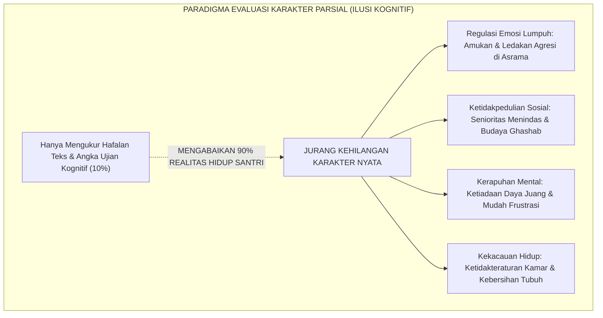
<div align="center"><sub><b>Gambar 1.1.1:</b> Jebakan Reduksionisme Evaluasi Karakter Parsial dalam Praktik Pendidikan Pesantren.</sub></div>

Pakar kurikulum internasional **Nel Noddings**[^1] menegaskan bahwa sekolah yang hanya berfokus pada capaian akademis sempit tanpa merawat kepedulian (*caring relations*) sesungguhnya sedang memproduksi manusia yang teralienasi dari kemanusiaannya. 

Dalam konteks Islam, **Prof. Dr. Syed Muhammad Naquib al-Attas**[^2] menegaskan bahwa pendidikan Islam bukanlah sekadar *Ta'lim* (pengajaran informasi akademis), melainkan *Ta'dib*: penanaman adab yang menyentuh seluruh totalitas jiwa, raga, dan eksistensi manusia agar mampu menempatkan segala sesuatu pada tempatnya yang benar.

---

### Pendekatan Anak Utuh (*Whole-Child Approach*) dalam Pandangan Fitrah

Menjawab krisis fragmentasi di atas, **Ekosistem TUMBUH** mengadopsi pendekatan **Anak Utuh (*Whole-Child Approach*) Berbasis Fitrah**[^3].

Pendekatan ini memandang santri bukan sebagai "wadah kosong penghafal teks", bukan pula sebagai "mesin pemenang lomba", melainkan sebagai **makhluk ciptaan Allah yang utuh dan mulia**, yang memiliki spektrum kebutuhan perkembangan yang saling berkelindan:

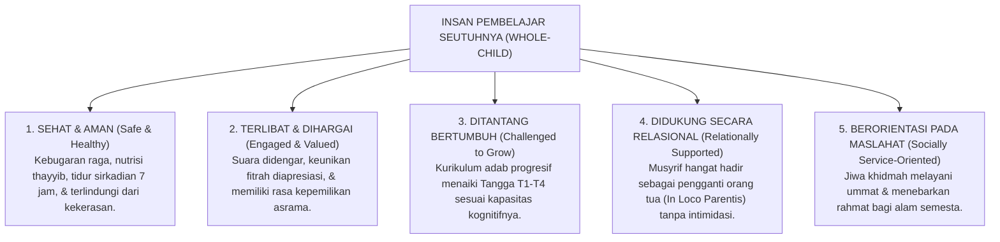
<div align="center"><sub><b>Gambar 1.1.2:</b> Lima Pilar Perkembangan Anak Utuh (Whole-Child Framework) Ekosistem TUMBUH.</sub></div>

Ketika kelima pilar perkembangan anak utuh ini dipenuhi secara harmonis:
* Santri tidak hanya menghafal ayat-ayat tentang kebersihan, tetapi tubuh dan bilik kamarnya memancarkan kesucian yang menyejukkan pandangan.
* Santri tidak hanya memahami dalil persaudaraan (*Ukhuwah*), tetapi tangannya secara spontan membagikan makanan kepada kawan sekamar yang membutuhkan.
* Santri tidak hanya membaca kaidah fiqih tentang hak milik, tetapi kakinya pantang mengenakan sandal orang lain tanpa izin tertulis.

---

### Menghidupkan Kembali Taksonomi Adab Imam Al-Zarnuji & Ibn Sahnun

Kritik terhadap pendidikan yang mengabaikan keutuhan kepribadian santri sesungguhnya merupakan inti dari pesan klasik ulama pedagogi Islam.

**Syekh Burhanuddin Al-Zarnuji** dalam mahakaryanya *Ta'lim al-Muta'allim Thariq at-Ta'allum*[^4] menegaskan bahwa keberhasilan seorang penuntut ilmu ditentukan oleh integrasi antara niat yang bersih, kesungguhan beramal (*al-Jidd*), keteraturan hidup, penghormatan kepada sesama, dan penjagaan diri dari sifat tamak serta kemalasan:

> [!NOTE]
> ### 📜 Wasiat Syekh Al-Zarnuji tentang Keutuhan Syarat Menuntut Ilmu:
> 
> $$\text{أَلَا لَا تَنَالُ الْعِلْمَ إِلَّا بِسِتَّةٍ ۞ سَأُنْبِيكَ عَنْ مَجْمُوعِهَا بِبَيَانِ:}$$
> $$\text{ذَكَاءٍ وَحِرْصٍ وَاصْطِبَارٍ وَبُلْغَةٍ ۞ وَإِرْشَادِ أُسْتَاذٍ وَطُولِ زَمَانِ}$$
> 
> **Artinya:**  
> *"Ingatlah! Engkau tidak akan pernah memperoleh hakikat ilmu kecuali dengan enam perkara yang utuh: kecerdasan akal, semangat pantang menyerah, kesabaran jiwa menahan beban, bekal hidup yang cukup, bimbingan ustadz yang beradab, serta rentang waktu pembiasaan yang panjang."*

Senada dengan itu, pakar pendidikan Islam terawal **Imam Muhammad bin Sahnun** dalam risalahnya *Adab al-Mu'allimin*[^5] menggarisbawahi bahwa seorang pendidik diharamkan memperlakukan murid dengan diskriminatif, dan wajib mendampingi perkembangan akhlak santri dalam kesehariannya secara adil dan penuh kasih sayang.

---

### Solusi Sistemik TUMBUH: Transformasi Kurikulum Menjadi Arsitektur Kapasitas

Sistem **TUMBUH** menolak tegas sistem ranking tunggal yang mengadu santri dalam perlombaan hafalan kognitif sempit. 

Sebagai gantinya, Sistem TUMBUH mentransformasikan kurikulum pembinaan karakter pesantren menjadi **Arsitektur Kapasitas Holistik**: sebuah peta pertumbuhan yang mendiagnosis, memetakan, dan membimbing setiap santri menumbuhkan seluruh potensi fitrah yang telah dianugerahkan Allah kepadanya.

Inilah gerbang pembuka Volume 02: meletakkan fondasi bahwa keberhasilan santri diukur dari **sejauh mana ia bertumbuh menjadi manusia yang beradab utuh (*Insan Adabi*)**, yang siap menebarkan manfaat bagi agama, bangsa, dan peradaban dunia.

---

## 📌 Catatan Kaki & Rujukan Primer

[^1]: **Nel Noddings**, *The Challenge to Care in Schools: An Alternative Approach to Education* (New York: Teachers College Press, 1992; Edisi ke-2, 2005), Bab 2: "Caring: A Relational Approach to Ethics and Moral Education", hlm. 15–42.
[^2]: **Prof. Dr. Syed Muhammad Naquib al-Attas**, *The Concept of Education in Islam: A Framework for an Islamic Philosophy of Education* (Kuala Lumpur: International Institute of Islamic Thought and Civilization / ISTAC, 1980), hlm. 15–38.
[^3]: **ASCD (Association for Supervision and Curriculum Development)**, *Making the Case for Educating the Whole Child* (Alexandria: ASCD Publications, 2014); serta **James P. Comer**, *Child by Child: The Comer Process for Change in Education* (New York: Teachers College Press, 1999).
[^4]: **Al-Imam Burhanuddin al-Zarnuji**, *Ta'lim al-Muta'allim Thariq at-Ta'allum*, Tahqiq: Syaikh Mustafa Asyur (Kairo: Dar al-I'tisham, 1986), hlm. 14–25.
[^5]: **Al-Imam Abu Abdillah Muhammad bin Sahnun at-Tanukhi**, *Adab al-Mu'allimin*, Tahqiq: Dr. Hasan Husni Abdul Wahhab (Tunis: Dar al-Kutub asy-Syarqiyyah, 1972), hlm. 28–45.


---

# SUB-BAB 1.2: LIMA DIMENSI KAPASITAS HOLISTIK SANTRI
## *Strukturisasi Panca Dimensi Pertumbuhan: Ruhaniyyah, Wijdaniyyah, Aqliyyah, Jasadiyyah, dan Mahariyyah*

**Kode Klasifikasi**: `BOOK-02/BAB-01/SUB-02/MONOGRAF-MASTER-VIBRANT`  
**Disiplin Ilmu**: Taksonomi Pendidikan Islam, Psikologi Perkembangan Terpadu, & Teori Inteligensi Majemuk  
**Penanggung Jawab Keilmuan**: Dewan Pakar Ekosistem TUMBUH (*Pakar Desain Kurikulum Adab & Pakar Psikometri*)

---

### Peta Utuh Potensi Kemanusiaan Santri

Untuk menerjemahkan konsep *Whole-Child* ke dalam operasional pengasuhan pesantren yang terukur, **Ekosistem TUMBUH** merumuskan **Panca Dimensi Kapasitas Holistik Santri**:

Kelima dimensi ini bukanlah bagian-bagian yang terpisah secara mekanistik, melainkan lima untaian tali yang saling memperkuat dalam membentuk kepribadian seorang *Insan Adabi*:

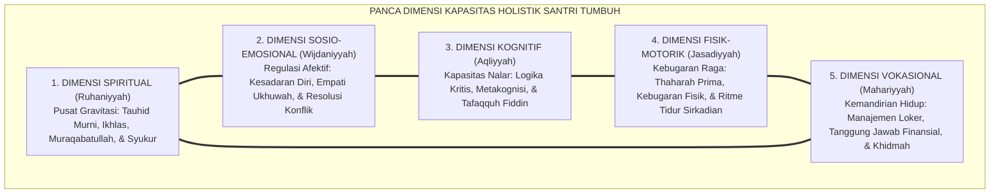
<div align="center"><sub><b>Gambar 1.2.1:</b> Arsitektur Saling Keterhubungan Panca Dimensi Kapasitas Holistik Ekosistem TUMBUH.</sub></div>

Pakar psikologi pendidikan **Howard Gardner**[^1] dalam teorinya tentang *Multiple Intelligences* menegaskan bahwa potensi kecerdasan manusia bersifat jamak (*pluralistic*), bukan tunggal. 

Dalam tradisi Islam, **Hujjatul Islam Imam Abu Hamid Al-Ghazali**[^2] telah jauh hari merumuskan bahwa kesempurnaan manusia tercapai apabila terdapat keseimbangan antara daya kognitif (*Quwwah al-'Ilm*), daya pengendalian nafsu syahwat (*Quwwah asy-Syahwah*), dan daya regulasi emosi amarah (*Quwwah al-Ghadhab*) di bawah naungan cahaya keadilan rohani (*al-'Adl*).

---

### Bedah Operasional Panca Dimensi Kapasitas dalam Keseharian

Mari kita bedah masing-masing dari kelima dimensi ini dan bagaimana ia termanifestasikan dalam perilaku konkret santri:

| Dimensi Kapasitas | Landasan Epistemologis | Indikator Perilaku Faktual di Lapangan (24 Jam) | Dampak Kegagalan jika Terabaikan |
| :--- | :--- | :--- | :--- |
| **1. Ruhaniyyah (Spiritual)** | Tauhid, *Tazkiyatun Nufus*, & *Ikhlas* (QS. Al-Ikhlas: 1–4) | Shalat berjamaah di shaf pertama tanpa disuruh, melazimi wirid ba'da shalat, beramal ikhlas tanpa riya'. | Jiwa munafik transaksional: beribadah hanya ketika diawasi ustadz. |
| **2. Wijdaniyyah (Sosio-Emosional)** | *Rahmah*, *Ukhuwah*, & *Hilim* (QS. Al-Hujurat: 10) | Mengakui kesalahan tanpa defensif, meredam emosi saat disenggol kawan, menghibur teman yang bersedih. | Maraknya tawuran antarkamar, perundungan verbal, dan dendam asrama. |
| **3. Aqliyyah (Kognitif)** | *Tafakkur*, *Tafaqquh*, & *Hikmah* (QS. Az-Zumar: 9) | Mampu menganalisis masalah fiqih kontekstual, aktif bertanya di halaqah, memiliki strategi metakognisi belajar. | Santri menjadi penghafal teks dogmatis yang kaku dan mudah terprovokasi hoaks. |
| **4. Jasadiyyah (Fisik-Motorik)** | *Thaharah*, *Quwwah*, & *Afiyat* (HR. Muslim no. 223) | Mandi teratur dan pakaian suci, menjaga postur duduk tegap saat muthala'ah, tidur tepat waktu 7 jam. | Santri rentan terkena penyakit kulit (skabies), lesu, dan tertidur di kelas. |
| **5. Mahariyyah (Vokasional-Mandiri)** | *Khabirah*, *Kifayah*, & *Khidmah* (QS. Al-Qashash: 26) | Melipat baju rapi di lemari pribadi, mengelola uang saku mingguan secara hemat, mampu memimpin piket kebersihan. | Santri manja yang tidak mampu hidup mandiri setelah lulus dari pondok. |

---

### Integrasi Psiko-Fisiologis: Hubungan Erat Tubuh (*Jasad*) dan Jiwa (*Ruh*)

Banyak institusi memisahkan antara pembinaan spiritual dan kesehatan jasmani. Dianggap bahwa mengaji kitab kuning tidak ada hubungannya dengan kualitas tidur malam atau menu makanan di kantin.

Sains modern dan kedokteran Islam menolak keras dikotomi keliru ini. Filsuf dan dokter agung peradaban Islam **Ibnu Sina (Avicenna)** dalam *Al-Qanun fi at-Tibb*[^3] menegaskan bahwa kondisi kesehatan fisik dan keseimbangan cairan tubuh (*al-akhlat*) berdampak langsung terhadap ketenangan jiwa dan ketajaman daya ingat otak:

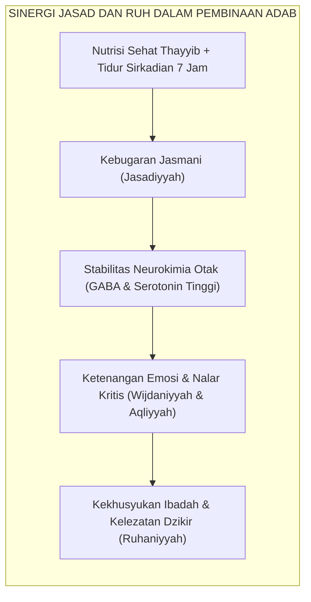
<div align="center"><sub><b>Gambar 1.2.2:</b> Alur Sinergi Psiko-Fisiologis antara Kesehatan Jasmani dan Kekhusyukan Ruhani.</sub></div>

Pakar psikologi afektif **David R. Krathwohl & Benjamin S. Bloom**[^4] dalam taksonomi domain afektif membuktikan bahwa penanaman nilai moral tidak akan pernah berhasil jika peserta didik berada dalam kondisi kelelahan fisik, rasa lapar biologis, atau ancaman rasa takut kronis.

Ketika tubuh santri sakit atau kurang tidur, hormon stres kortisol membanjiri otaknya, mematikan fungsi empati di lobus frontal, dan membuat santri mudah tersulut amarah di bilik asrama.

---

### Solusi Sistemik TUMBUH: Pemetaan Kapasitas Multi-Dimensi Melalui Logbook PBIS

Sistem **TUMBUH** memastikan kelima dimensi kapasitas ini dipantau secara seimbang melalui **Instrumen Rubrik Perkembangan Multi-Dimensi**:

1. Musyrif asrama tidak hanya mencatat absensi shalat (Dimensi Spiritual), melainkan juga mencatat skor keteraturan loker (Dimensi Vokasional) dan kemampuan menyelesaikan konflik kamar (Dimensi Sosio-Emosional).
2. Wali kelas madrasah tidak hanya menilai skor ujian nahwu-sharaf (Dimensi Kognitif), melainkan juga mengobservasi kebugaran dan kebersihan seragam santri (Dimensi Fisik-Motorik).

Dengan pendekatan panca dimensi ini, setiap santri dihargai keunikan fitrahnya. Santri yang belum unggul dalam hafalan Qur'an mungkin memiliki kepemimpinan sosial yang luar biasa dalam mendamaikan perselisihan kawan; santri yang pendiam mungkin memiliki ketertiban hidup dan kesucian hati yang menjadi teladan bagi seluruh kamar.

Inilah perwujudan keadilan pendidikan sejati di bumi pesantren: **memuliakan setiap anak titipan umat sesuai rancangan fitrah terbaik yang diciptakan Allah padanya**.

---

## 📌 Catatan Kaki & Rujukan Primer

[^1]: **Howard Gardner**, *Frames of Mind: The Theory of Multiple Intelligences* (New York: Basic Books, 1983; Edisi Peringatan 30 Tahun, 2011), Bab 10: "Personal Intelligences", hlm. 240–280.
[^2]: **Hujjatul Islam Imam Abu Hamid al-Ghazali**, *Ihya' 'Ulumiddin*, Kitab Riyadhatin Nafs wa Tahdzibil Akhlaq (Kairo & Beirut: Dar al-Ma'rifah, t.th.), Jilid III, hlm. 53–58.
[^3]: **Al-Syaikh ar-Ra'is Ibnu Sina (Avicenna)**, *Al-Qanun fi at-Tibb*, Tahqiq: Idwar al-Qasy (Beirut: Dar al-Kutub al-'Ilmiyyah, 1999), Jilid I, Buku 1: "Fi Kulliyyat 'Ilmit Thibb", hlm. 25–48.
[^4]: **David R. Krathwohl, Benjamin S. Bloom, & Bertram B. Masia**, *Taxonomy of Educational Objectives: The Classification of Educational Goals. Handbook II: Affective Domain* (New York: David McKay Company, 1964), hlm. 45–85.


---

# SUB-BAB 1.3: INTEGRASI TAKSONOMI ADAB TURATS DENGAN CASEL SEL
## *Harmonisasi 5 Kompetensi Sosio-Emosional Kontemporer dengan Matriks Kesantunan Salafus Shalih*

**Kode Klasifikasi**: `BOOK-02/BAB-01/SUB-03/MONOGRAF-MASTER-VIBRANT`  
**Disiplin Ilmu**: *Social Emotional Learning* (SEL), Epistemologi Adab Turats, & Psikologi Karakter Terapan  
**Penanggung Jawab Keilmuan**: Dewan Pakar Ekosistem TUMBUH (*Pakar Social Emotional Learning & Pakar Epistemologi Turats*)

---

### Titik Temu Mutiara Turats dan Konsensus Neurosains Afektif

Salah satu terobosan terbesar dalam **Ekosistem TUMBUH** adalah menyatukan dua khazanah besar peradaban manusia yang selama ini dipisahkan oleh prasangka historis:
1. **Khazanah Adab Turats Islam**: Mutiara panduan perilaku mulia yang diwariskan oleh para ulama salaf seperti Imam Al-Qabisi, Al-Ghazali, Ibn Sahnun, dan Az-Zarnuji.
2. **Konsensus CASEL SEL (*Collaborative for Academic, Social, and Emotional Learning*)**[^1] yaitu kerangka ilmiah global berbasis bukti yang merumuskan 5 Kompetensi Inti Pembelajaran Sosio-Emosional.

TUMBUH membuktikan bahwa 5 kompetensi CASEL SEL bukanlah konsep asing yang bertentangan dengan syariat, melainkan **terjemahan metodologis modern dari nilai-nilai adab nabawiyyah** yang telah diajarkan oleh Rasulullah SAW empat belas abad silam:

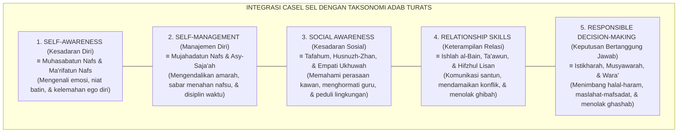
<div align="center"><sub><b>Gambar 1.3.1:</b> Peta Integrasi Lima Kompetensi CASEL SEL dengan Taksonomi Adab Turats Ekosistem TUMBUH.</sub></div>

Meta-analisis berskala masif yang dilakukan oleh **Joseph A. Durlak et al.**[^2] terhadap 213 studi dan lebih dari 270.000 siswa membuktikan bahwa program sekolah yang mengintegrasikan pembelajaran sosio-emosional secara terstruktur mampu meningkatkan capaian akademis hingga 11 persentil, menurunkan tingkat stres emosional secara signifikan, serta menekan perilaku agresif dan perundungan hingga 40%.

---

### Matriks Komparasi: Menghubungkan Teks Kitab Kuning dengan Kompetensi CASEL

Tabel berikut menyajikan pemetaan komparatif antara dalil Turats ulama dengan indikator operasional CASEL SEL di pesantren TUMBUH:

| Kompetensi CASEL SEL | Rujukan Turats Klasik | Konseptualisasi Syar'i | Praktik Nyata di Asrama & Madrasah TUMBUH |
| :--- | :--- | :--- | :--- |
| **1. Self-Awareness** | **Imam Al-Ghazali**, *Mizan al-'Amal*[^3] | *Ma'rifatun Nafs*: Memahami dorongan nafsu, batas kekuatan diri, dan kelemahan emosi. | Santri mampu mengidentifikasi pemicu amarahnya (*trigger*) dan segera mengambil wudhu saat merasa jengkel. |
| **2. Self-Management** | **Syekh Az-Zarnuji**, *Ta'lim al-Muta'allim* | *As-Shabr wa Mujahadah*: Ketahanan mental menahan kantuk dan disiplin bangun subuh. | Santri mampu menolak ajakan kawan untuk begadang dan tertib memadamkan lampu kamar pukul 22.00 WIB. |
| **3. Social Awareness** | **Imam Al-Qabisi**, *Ar-Risalah al-Mufashshilah*[^4] | *Husnul Mu'asyarah*: Memahami latar belakang kawan yang berbeda daerah dan bersikap toleran. | Santri peka ketika kawan sekamarnya tampak murung karena rindu orang tua (*homesick*) lalu mengajaknya bicara hangat. |
| **4. Relationship Skills** | **KH. M. Hasyim Asy'ari**, *Adab al-'Alim* | *Ishlah & Husnul Khuluq*: Berbicara lemah lembut, mendengarkan aktif, dan menjauhi caci maki. | Menggunakan bahasa krama/santun kepada pengurus, melarang panggilan julukan binatang, dan aktif mediasi damai. |
| **5. Responsible Decision-Making** | **Imam Asy-Syathibi**, *Al-Muwafaqat* | *I'tibarul Ma'alat*: Menimbang dampak jangka panjang suatu perbuatan bagi akhirat dan sesama. | Santri menolak meminjam barang kawan tanpa izin (*ghashab*) karena memahami dosanya dan dampaknya bagi ukhuwah. |

---

### Mengapa Integrasi Ini Sangat Krusial bagi Pesantren Modern?

Selama ini, terdapat dua kelemahan ekstrem dalam pembinaan adab santri di lapangan:
1. **Kelemahan Pendekatan Tradisionalis Dogmatis**: Mengajarkan kitab adab hanya sebagai materi hafalan teks pasif. Santri disuruh hafal nadham atau matan kitab, namun ustadz tidak pernah melatihkan simulasi konkret cara menenangkan diri saat tersinggung (*Emotional Self-Regulation Protocol*).
2. **Kelemahan Pendekatan Sekuler**: Mengajarkan SEL semata-mata demi keterampilan sosial duniawi dan efisiensi korporasi, membuang dimensi tauhid, pahala, dan kesadaran *Muraqabatullah*.

Ekosistem TUMBUH mempertemukan keduanya dalam satu sinergi sempurna:
* **Ruh dan Fondasinya** bersumber dari **Turats Nabawi**: berniat ikhlas mencari ridha Allah, mengharap pahala akhirat, dan meneladani Baginda Rasulullah SAW.
* **Metode dan Rubrik Pengukurannya** mengadopsi **Teknologi CASEL SEL**: sistematis, berjenjang, dapat diobservasi, dan divalidasi dengan data faktual harian.

---

### Solusi Sistemik TUMBUH: Halaqah Lingkaran Emosi (*Emotion Circle*) Harian

Di dalam ritme keseharian asrama TUMBUH, integrasi CASEL SEL ini diwujudkan melalui agenda rutin **Halaqah Lingkaran Emosi (10 Menit Ba'da Maghrib/Isya)**:

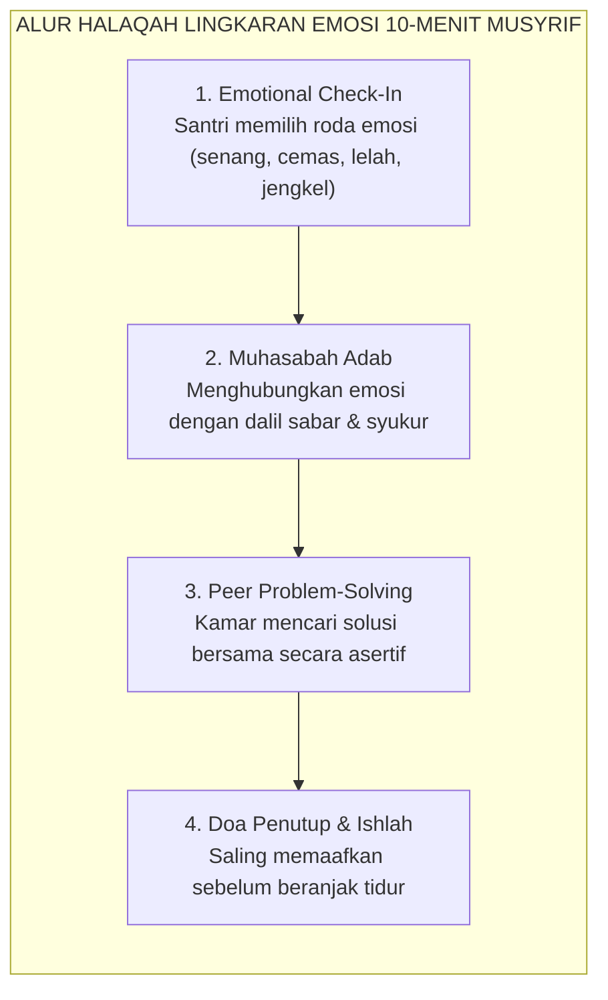
<div align="center"><sub><b>Gambar 1.3.2:</b> Alur Operasional Halaqah Lingkaran Emosi 10-Menit di Kamar Asrama.</sub></div>

Melalui halaqah 10 menit ini, santri dilatih setiap hari untuk mengenali perasaannya, mengekspresikan keluhannya secara santun, dan menyelesaikan konflik tanpa kekerasan fisik. Inilah laboratorium adab nyata di mana teori kitab kuning diubah menjadi keterampilan hidup yang hidup di dalam jiwa santri.

---

## 📌 Catatan Kaki & Rujukan Primer

[^1]: **CASEL (Collaborative for Academic, Social, and Emotional Learning)**, *Core SEL Competencies: The CASEL 5* (Chicago: CASEL, 2020); serta **Roger P. Weissberg et al.**, "Social and emotional learning: Past, present, and the future", dalam J. A. Durlak et al. (Eds.), *Handbook of Social and Emotional Learning: Research and Practice* (New York: Guilford Press, 2015), hlm. 3–19.
[^2]: **Joseph A. Durlak, Roger P. Weissberg, Allison B. Dymnicki, Rebecca D. Taylor, & Kriston B. Schellinger**, "The impact of enhancing students' social and emotional learning: A meta-analysis of school-based universal interventions", *Child Development*, Vol. 82, No. 1 (2011), hlm. 405–432.
[^3]: **Hujjatul Islam Imam Abu Hamid al-Ghazali**, *Mizan al-'Amal*, Tahqiq: Dr. Sulaiman Dunya (Kairo: Dar al-Ma'arif, 1964), Bab 5: "Tahdzib an-Nafs wa Ta'dil al-Akhlaq", hlm. 68–95.
[^4]: **Al-Imam Abu al-Hasan Ali bin Muhammad al-Qabisi**, *Ar-Risalah al-Mufashshilah li Ahwal al-Mu'allimin wa Ahkam al-Mu'allimin wal Muta'allimin*, Tahqiq: Ahmad Khalid Jam'ah (Damaskus: Dar al-Fikr, 1986), hlm. 55–82.


---

# SUB-BAB 1.4: TEORI PENENTUAN DIRI (SDT) DALAM PENGASUHAN ASRAMA
## *Memupuk Tiga Kebutuhan Psikologis Dasar: Otonomi, Kompetensi, dan Keterhubungan Relasional*

**Kode Klasifikasi**: `BOOK-02/BAB-01/SUB-04/MONOGRAF-MASTER-VIBRANT`  
**Disiplin Ilmu**: *Self-Determination Theory* (SDT), Psikologi Motivasi Pendidikan, & Teologi Niat Islam  
**Penanggung Jawab Keilmuan**: Dewan Pakar Ekosistem TUMBUH (*Pakar Psikologi Belajar & Pakar Epistemologi Turats*)

---

### Misteri Kepatuhan Semu: Mengapa Santri Menjadi Pembangkang Saat Ustadz Pulang?

Salah satu keluhan yang paling sering dilontarkan oleh para pengurus pondok pesantren adalah fenomena **kepatuhan semu (*superficial compliance*)**:
* Ketika musyrif berdiri di depan pintu kamar dengan membawa tongkat, seluruh santri bergegas membuka mushaf Al-Qur'an dan duduk rapi menunduk.
* Namun, begitu ustadz melangkah pergi dan lampu lorong dimatikan, santri yang sama langsung melempar kitabnya, saling melempar bantal, dan mengabaikan seluruh aturan adab.

Mengapa disiplin yang ditegakkan dengan ketat selama bertahun-tahun tidak pernah mengakar menjadi karakter permanen di dalam dada anak?

Pakar psikologi motivasi terkemuka **Edward L. Deci & Richard M. Ryan**[^1] memberikan jawaban ilmiah melalui **Teori Penentuan Diri (*Self-Determination Theory / SDT*)**: motivasi manusia tidak bersifat hitam-putih (antara rajin vs malas), melainkan bergerak di sepanjang **kontinuum regulasi motivasi**:

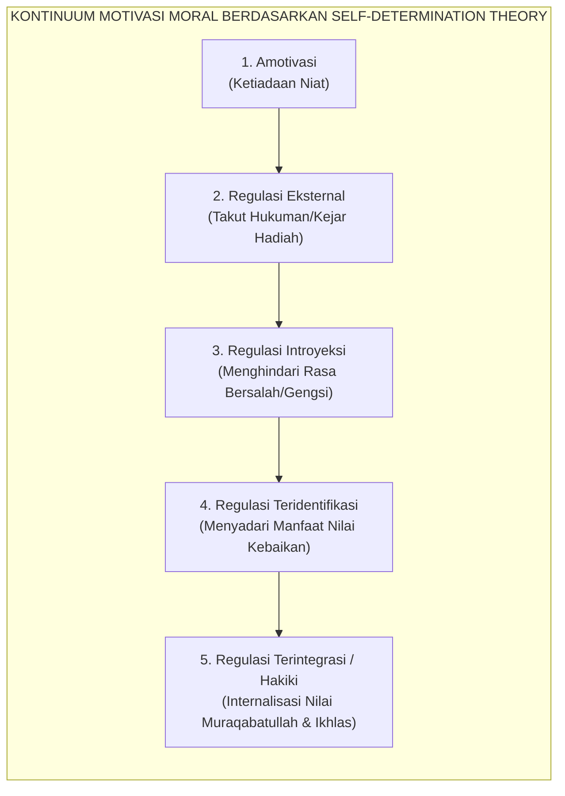
<div align="center"><sub><b>Gambar 1.4.1:</b> Kontinuum Regulasi Motivasi Berdasarkan Self-Determination Theory (SDT) Deci & Ryan.</sub></div>

Ketika pesantren hanya mengandalkan ancaman rotan dan razia malam, lembaga tersebut sesungguhnya sedang memenjarakan santri pada tingkat paling rendah: **Regulasi Eksternal (*External Regulation*)**. Santri taat bukan karena mencintai kebaikan, melainkan semata-mata demi menghindari rasa sakit fisik atau rasa malu di depan umum.

Akibatnya, ketika pengawas eksternal itu hilang, motivasi beradab runtuh seketika. Dalam perspektif Turats, kondisi ini adalah bibit lahirnya kepribadian terbelah dan kemunafikan amali (*nifaq amali*).

---

### Tiga Kebutuhan Psikologis Dasar (*Basic Psychological Needs*)

Menurut Teori Penentuan Diri, manusia secara alamiah memiliki dorongan fitrah untuk bertumbuh dan berbuat baik. Dorongan intrinsik ini hanya akan mekar apabila lingkungan pengasuhan memenuhi **Tiga Kebutuhan Psikologis Dasar**:

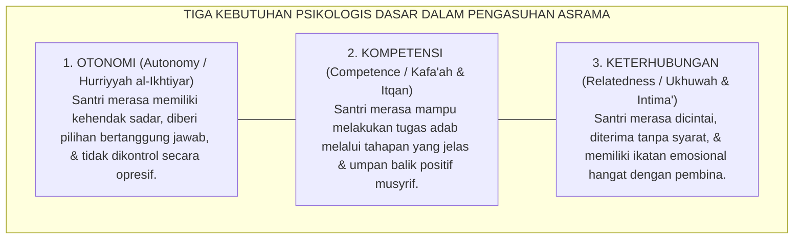
<div align="center"><sub><b>Gambar 1.4.2:</b> Tiga Kebutuhan Psikologis Dasar Santri dalam Ekosistem Asrama TUMBUH.</sub></div>

1. **Kebutuhan akan Otonomi (*Autonomy*)**:  
   Santri butuh merasa bahwa ia memilih untuk shalat dan belajar atas kemauannya sendiri demi Allah, bukan sekadar dipaksa seperti robot tahanan. Penelitian oleh **Johnmarshall Reeve**[^2] membuktikan bahwa guru dan musyrif yang mendukung otonomi (*autonomy-supportive*) melahirkan santri yang memiliki resiliensi belajar 3 kali lebih tangguh dibanding guru yang bergaya mengontrol (*controlling style*).
2. **Kebutuhan akan Kompetensi (*Competence*)**:  
   Santri butuh merasa mampu meraih standar adab yang ditetapkan. Jika aturan dibuat terlalu rumit dan santri selalu divonis gagal tanpa diajarkan langkah-langkah praktisnya, santri akan mengalami keputusasaan belajar (*learned helplessness*).
3. **Kebutuhan akan Keterhubungan Relasional (*Relatedness*)**:  
   Santri butuh merasa bahwa dirinya disayangi secara tulus oleh musyrifnya. Teguran yang dilayangkan oleh musyrif yang hangat akan diterima sebagai nasihat cinta; sebaliknya, teguran dari musyrif yang dingin dan kejam akan dianggap sebagai serangan permusuhan.

---

### Integrasi Teologis: Hakikat Ibadah Ikhlas & *'Ubudiyyah* Syaikhul Islam

Konsep pemenuhan otonomi dan kerelaan batin ini berpadu secara mendalam dengan ajaran teologi Islam mengenai hakikat ibadah yang ikhlas.

**Syaikhul Islam Ibnu Taimiyyah** dalam risalah monumentalnya *Al-'Ubudiyyah*[^3] menegaskan bahwa hakikat penghambaan (*Ibadah*) kepada Allah menuntut dua syarat yang menyatu: **puncak ketundukan (*Ghayat az-Zull*) yang berpadu dengan puncak kecintaan (*Ghayat al-Hubb*)**:

> [!NOTE]
> ### 📜 Hakikat Penghambaan Sejati Menurut Ibnu Taimiyyah:
> 
> $$\text{وَالْعِبَادَةُ الْمَأْمُورُ بِهَا تَتَضَمَّنُ مَعْنَى الذُّلِّ وَمَعْنَى الْحُبِّ، فَهِيَ تَتَضَمَّنُ غَايَةَ الذُّلِّ لِلَّهِ تَعَالَى بِغَايَةِ الْمَحَبَّةِ لَهُ}$$
> 
> **Artinya:**  
> *"Ibadah yang diperintahkan oleh Allah mencakup makna ketundukan sekaligus kecintaan; ia mengandung puncak ketundukan di hadapan Allah yang bersanding dengan puncak kecintaan yang tulus kepada-Nya."*

Jika santri beribadah hanya karena takut rotan ustadz tanpa ada rasa cinta (*al-Mahabbah*) di hatinya, maka amalnya kehilangan esensi ibadah sejati. 

Senada dengan itu, **Hujjatul Islam Imam Abu Hamid Al-Ghazali** dalam *Ihya' 'Ulumiddin* (Kitab *an-Niyyah wal Ikhlas*)[^4] menegaskan bahwa niat adalah penggerak jiwa yang bersumber dari dorongan batin (*ba'itsun nafsi*), bukan sekadar ucapan lisan yang dipaksakan dari luar.

---

### Solusi Sistemik TUMBUH: Transformasi Pendampingan Berbasis Dukungan Otonomi

Sistem **TUMBUH** mengubah total gaya kepengasuhan musyrif di asrama:

| Pola Asuh Mengontrol Lama (*Controlling Trap*) | Pola Asuh Pendukung Otonomi TUMBUH (*Autonomy-Supportive*) |
| :--- | :--- |
| Memerintah santri dengan kata-kata mutlak: *"Cepat bangun! Jangan banyak alasan!"* | Menyampaikan alasan logis bernilai ibadah (*Rationale*): *"Ayo bangun, Nak. Waktu subuh sebentar lagi, mari kita jemput keberkahan pagi bersama Allah."* |
| Mengancam dengan sanksi fisik atau hukuman denda uang saku. | Melibatkan santri menyepakati konsekuensi logis 4R bersama di awal semester. |
| Melarang santri berekspresi: *"Santri tidak boleh membantah!"* | Memberikan ruang validasi emosi: *"Ustadz tahu kamu lelah setelah piket tadi, tapi merapikan kasur adalah adab kamar kita bersama."* |
| Memberikan reward materiil ekstrinsik (stiker/uang) yang merusak ikhlas. | Memberikan penguatan apresiasi relasional 4:1 yang menyentuh kalbu. |

Dengan memuaskan tiga kebutuhan dasar ini, santri bertumbuh menjadi pribadi yang memiliki **kemerdekaan jiwa (*Hurriyyah al-Iradah*)** yang memilih tunduk kepada Allah atas dasar cinta, keimanan, dan kerinduan meraih ridha-Nya.

---

## 📌 Catatan Kaki & Rujukan Primer

[^1]: **Edward L. Deci & Richard M. Ryan**, *Intrinsic Motivation and Self-Determination in Human Behavior* (New York: Plenum Press, 1985); serta **Richard M. Ryan & Edward L. Deci**, *Self-Determination Theory: Basic Psychological Needs in Motivation, Development, and Wellness* (New York: Guilford Press, 2017), Bab 1: "Overview of Self-Determination Theory", hlm. 3–25.
[^2]: **Johnmarshall Reeve**, "Why teachers adopt a controlling motivating style toward students and how they can become more autonomy supportive", *Educational Psychologist*, Vol. 44, No. 3 (2009), hlm. 159–175.
[^3]: **Syaikhul Islam Ahmad bin Abdul Halim Ibnu Taimiyyah**, *Al-'Ubudiyyah*, Tahqiq: Ali Hasan al-Halabi (Beirut: Al-Maktab al-Islami, 1425 H / 2005 M), hlm. 15–35.
[^4]: **Hujjatul Islam Imam Abu Hamid al-Ghazali**, *Ihya' 'Ulumiddin*, Kitab an-Niyyah wal Ikhlas wash-Shidq (Kairo & Beirut: Dar al-Ma'rifah, t.th.), Juz IV, hlm. 360–375.


---

# SUB-BAB 1.5: REKAYASA LINGKUNGAN PEMBELAJARAN KARAKTER 24-JAM
## *Membangun Ekosistem Total Bi'ah Shalihah: Tata Ruang, Penanda Visual, Mitigasi Titik Rawan, dan Sinkronisasi Sinergis*

**Kode Klasifikasi**: `BOOK-02/BAB-01/SUB-05/MONOGRAF-MASTER-VIBRANT`  
**Disiplin Ilmu**: Psikologi Lingkungan (*Environmental Psychology*), Rekayasa Ekologi Pembinaan, & Arsitektur Pesantren  
**Penanggung Jawab Keilmuan**: Dewan Pakar Ekosistem TUMBUH (*Pakar Intervensi Preventif & Pakar Pengasuhan Asrama*)

---

### Ruang Fisik sebagai Guru Bisu: Pengaruh Tata Lingkungan terhadap Perilaku Santri

Banyak pendidik beranggapan bahwa karakter santri semata-mata dibentuk oleh ceramah ustadz di mimbar masjid atau nasihat musyrif di kamar. 

Namun sains psikologi lingkungan membuktikan sebuah kenyataan yang tak terbantahkan: **tata ruang fisik dan desain lingkungan bertindak sebagai "guru bisu" yang mengarahkan 80% perilaku spontan manusia**.

Jika asrama pesantren:
* Memiliki lorong-lorong gelap tanpa penerangan yang memadai.
* Memiliki antrean kamar mandi yang sempit, becek, dan minim ventilasi.
* Membiarkan rak sepatu berantakan tanpa sekat pemisah dan tanpa label nama.
* Tidak menyediakan lemari loker berkunci untuk menjaga privasi barang santri.

Maka secara alamiah lingkungan tersebut sedang **memicu lahirnya pelanggaran adab**: perebutan fasilitas, senggolan emosi yang berujung perkelahian, pencurian uang saku, dan normalisasi budaya *ghashab* sandal.

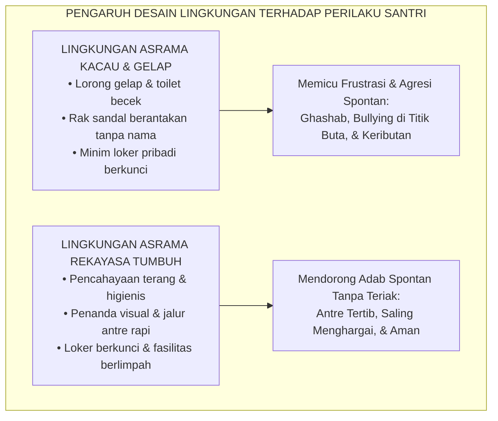
<div align="center"><sub><b>Gambar 1.5.1:</b> Komparasi Pengaruh Desain Lingkungan Asrama terhadap Pembentukan Karakter Santri.</sub></div>

Pakar psikologi lingkungan **Gary W. Evans**[^1] membuktikan bahwa kebisingan kronis (*chronic noise*), kesemrawutan tata ruang (*chaos*), dan kepadatan berlebih (*crowding*) di lingkungan tempat tinggal anak memicu lonjakan hormon stres kortisol dan menurunkan kapasitas kontrol diri secara drastis.

Dalam tradisi pesantren modern Indonesia, pendiri Pondok Modern Gontor **KH. Imam Zarkasyi**[^2] merumuskan filosofi legendaris bahwa:
$$\text{"Apa yang santri lihat, apa yang santri dengar, dan apa yang santri rasakan di pondok—semuanya adalah pendidikan."}$$

---

### Empat Pilar Rekayasa Lingkungan Ekosistem TUMBUH

Untuk mewujudkan *Bi'ah Shalihah* yang mendidik secara aktif selama 24 jam penuh, **Sistem TUMBUH** menetapkan **Empat Pilar Rekayasa Lingkungan Pembinaan**:

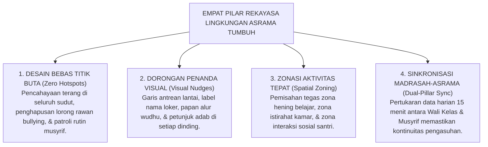
<div align="center"><sub><b>Gambar 1.5.2:</b> Empat Pilar Arsitektur Rekayasa Lingkungan Pengasuhan 24-Jam TUMBUH.</sub></div>

1. **Desain Bebas Titik Buta (*Zero Hotspots Engineering*)**:  
   Area kamar mandi belakang, gudang, dan lorong lantai atas yang kerap menjadi lokasi perpeloncoan senior direkayasa ulang: dipasang lampu penerangan terang benderang, pintu tanpa celah tersembunyi, dan dimasukkan ke dalam rute patroli aktif musyrif.
2. **Arsitektur Dorongan Visual (*Visual Nudge Architecture*)**[^3]:  
   Pemenang Nobel **Richard H. Thaler & Cass R. Sunstein**[^3] membuktikan bahwa dorongan visual sederhana (*nudges*) mampu mengubah perilaku manusia secara signifikan tanpa paksaan. Di asrama TUMBUH, stiker penanda arah wudhu di lantai, garis batas antrean rapi, dan wadah sandal bertingkat dengan label nama santri membuat anak tertib secara otomatis tanpa perlu diteriaki musyrif.
3. **Zonasi Spasial Fungsional (*Functional Spatial Zoning*)**:  
   Kamar asrama difungsikan khusus untuk istirahat dan menjaga privasi; ruang belajar komunal difungsikan untuk muthala'ah bersama; dan serambi masjid difungsikan untuk dzikir khusyuk. Pemisahan fungsi ini menjaga ritme sirkadian dan fokus kognitif santri.
4. **Sinkronisasi Sinergis Dua Pilar (*Dual-Pillar Synchronization*)**:  
   Madrasah dan asrama tidak lagi berjalan sendiri-sendiri. Setiap sore pukul 16.30 WIB, Wali Kelas mengirimkan ringkasan 3 poin kondisi psikologis dan adab santri kepada Musyrif, dan setiap pagi pukul 06.30 WIB Musyrif menyerahkan kembali data stabilitas malam anak kepada Wali Kelas melalui **Protokol Handover 15-Menit**.

---

### Tinjauan Turats: Menjaga Kesucian *Bi'ah Shalihah* Imam Al-Ghazali

Pentingnya rekayasa lingkungan pertemanan dan ruang hidup yang bersih ini telah digarisbawahi secara mendalam oleh **Imam Abu Hamid Al-Ghazali** dalam *Ihya' 'Ulumiddin* (Kitab *Adab al-Ulfah wal Ukhuwwah wash-Shuhbah*)[^4] sebagai berikut:

> [!NOTE]
> ### 📜 Kaidah Imam Al-Ghazali tentang Daya Serap Jiwa terhadap Lingkungan:
> 
> $$\text{إِنَّ الطِّبَاعَ سَرَّاقَةٌ، تَنْتَحِلُ مِنَ النُّفُوسِ الْمُجَاوِرَةِ أَخْلَاقَهَا وَعَادَاتِهَا مِنْ حَيْثُ لَا يَدْرِي الْإِنْسَانُ}$$
> 
> **Artinya:**  
> *"Sesungguhnya watak dasar jiwa manusia memiliki sifat 'pencuri ulung' (sangat mudah meniru); ia akan menyerap secara bawah sadar akhlak, perangai, dan kebiasaan dari orang-orang dan lingkungan di sekitarnya tanpa disadari oleh manusia itu sendiri."*

Ketika lingkungan fisik asrama bersih, tertib, terang, dan dipenuhi suasana persaudaraan yang hangat, watak dasar santri baru akan secara otomatis "mencuri" dan meniru ketertiban tersebut menjadi karakternya sendiri.

---

### Solusi Sistemik TUMBUH: Transformasi Total Menuju Rumah Kedua yang Memuliakan

Dengan rekayasa lingkungan holistik 24 jam ini, Bab 01 resmi meletakkan cetak biru paripurna bagi arsitektur kapasitas karakter santri:
* Dimulai dari dekonstruksi reduksionisme parsial menuju pendekatan *Whole-Child* (Sub-Bab 1.1).
* Distrukturisasikan ke dalam Panca Dimensi Kapasitas Holistik (Sub-Bab 1.2).
* Diintegrasikan secara harmonis dengan 5 Kompetensi CASEL SEL (Sub-Bab 1.3).
* Diberi bahan bakar motivasi intrinsik melalui Teori Penentuan Diri / SDT (Sub-Bab 1.4).
* Ditopang secara kokoh oleh ekosistem fisik dan kultural *Bi'ah Shalihah* 24-jam (Sub-Bab 1.5).

Inilah fondasi kokoh yang siap menerima penerjemahan kurikuler selanjutnya pada **Bab 02: Profil 10 Muwashafat Karakter Santri TUMBUH**.

---

## 📌 Catatan Kaki & Rujukan Primer

[^1]: **Gary W. Evans**, "The built environment and children's development", *Annual Review of Public Health*, Vol. 27 (2006), hlm. 423–441; serta **Gary W. Evans**, "Child development and the physical environment", *Annual Review of Psychology*, Vol. 57 (2006), hlm. 423–451.
[^2]: **K.H. Imam Zarkasyi**, *Pondok Pesantren sebagai Lembaga Pendidikan Karakter dan Pencetak Kader Umat* (Ponorogo: Gontor Press, 1988), hlm. 15–38.
[^3]: **Richard H. Thaler & Cass R. Sunstein**, *Nudge: Improving Decisions About Health, Wealth, and Happiness* (New Haven: Yale University Press, 2008; Edisi Revisi, Penguin Books, 2009), Bab 1: "Biases and Blunders", hlm. 17–39.
[^4]: **Hujjatul Islam Imam Abu Hamid al-Ghazali**, *Ihya' 'Ulumiddin*, Kitab Adab al-Ulfah wal Ukhuwwah wash-Shuhbah (Kairo & Beirut: Dar al-Ma'rifah, t.th.), Jilid II, hlm. 175–190.


---

# SUB-BAB 2.1: SALIMUL AQIDAH & SHAHIHUL IBADAH
## *Fondasi Tauhid Murni, Pembebasan dari Kemunafikan Amali, dan Standarisasi Ibadah Khusyuk Sesuai Sunnah*

**Kode Klasifikasi**: `BOOK-02/BAB-02/SUB-01/MONOGRAF-MASTER-VIBRANT`  
**Disiplin Ilmu**: Teologi Islam Terapan, Fiqih Ibadah Syafi'iyyah, & Psikologi Spiritualitas  
**Penanggung Jawab Keilmuan**: Dewan Pakar Ekosistem TUMBUH (*Pakar Epistemologi Turats & Pakar Desain Kurikulum Adab*)

---

### Dua Batu Fondasi Pertama: Mengapa Karakter Bermula dari Aqidah dan Ibadah?

Dalam taksonomi sepuluh profil karakter (*Muwashafat*) Ekosistem TUMBUH, **Salimul Aqidah** (Aqidah yang Bersih) dan **Shahihul Ibadah** (Ibadah yang Benar) menempati posisi sebagai dua batu fondasi pertama (*The Twin Bedrocks*).

Tanpa aqidah yang kokoh dan ibadah yang benar:
* Keterampilan sosial santri mudah tergelincir menjadi kepura-puraan diplomatik (*riya' dan nifaq*).
* Kedisiplinan fisik santri mudah runtuh menjadi kepatuhan mekanis yang dingin.
* Prestasi intelektual santri rawan berubah menjadi kesombongan nalar (*kibr*) yang membinasakan jiwanya.

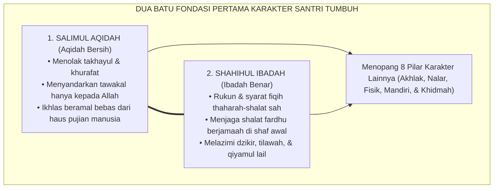
<div align="center"><sub><b>Gambar 2.1.1:</b> Kedudukan Salimul Aqidah dan Shahihul Ibadah sebagai Fondasi Utama Ekosistem Karakter.</sub></div>

**Syaikhul Islam Ibnu Taimiyyah** dalam *Al-Aqidah al-Wasithiyyah*[^1] menegaskan bahwa poros kebahagiaan dan kelurusan akhlak manusia bergantung mutlak pada kemurnian tauhid uluhiyyah: memurnikan segala bentuk ketaatan, harapan, dan rasa takut hanya kepada Allah semata, terbebas dari syirik tersembunyi (*asy-syirk al-khafi*).

---

### Indikator Perilaku Faktual Salimul Aqidah (24 Jam Asrama)

Sering kali pemahaman aqidah di madrasah hanya diuji lewat hafalan 20 sifat wajib Allah di lembar ujian. Sistem TUMBUH menerjemahkan kemurnian aqidah menjadi **indikator perilaku faktual yang dapat diamati (*observable behaviors*)**:

1. **Bebas dari Keputusasaan Batin (*High Spiritual Resilience*)**:  
   Ketika santri menghadapi kesulitan dalam menghafal Al-Qur'an atau mendapatkan musibah sakit, ia tidak mengeluh menyalahkan takdir, melainkan mengambil wudhu, mendirikan shalat istirahat (*shalat hajat/taubat*), dan memohon pertolongan Allah.
2. **Ketiadaan Jimat & Takhayul (*Tawakkul Pureness*)**:  
   Santri tidak mempercayai mitos-mitos keramat yang merusak tauhid, tidak menyimpan rajah/jimat pembuka hafalan, melainkan menempuh sebab-sebab syar'i dan saintifik (muthala'ah tekun dan menjaga nutrisi halal).
3. **Kesucian Niat Beramal (*Tazkiyatun Niyyah*)**:  
   Santri menolak pamer hafalan (*sum'ah*) demi mengejar tepuk tangan panggung wisuda; ia melatih batinnya untuk merasa cukup dengan pandangan dan keridhaan Allah SWT.

---

### Indikator Perilaku Faktual Shahihul Ibadah (24 Jam Asrama)

Ibadah yang benar bukan hanya sekadar sah menurut fiqih formal, melainkan juga memancarkan kekhusyukan yang mencegah perbuatan keji dan munkar:

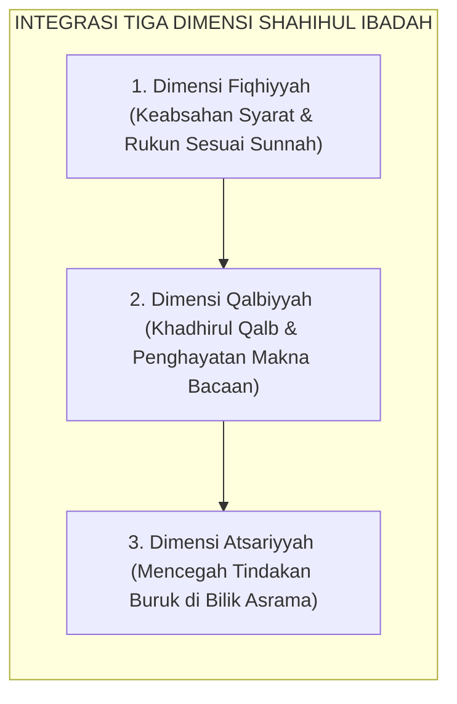
<div align="center"><sub><b>Gambar 2.1.2:</b> Tiga Dimensi Integratif Shahihul Ibadah Ekosistem TUMBUH.</sub></div>

1. **Kesempurnaan Thaharah & Wudhu**:  
   Santri mempraktikkan thaharah secara higienis dan hemat air (*la tusrif*), membersihkan najis secara tuntas, dan merapikan pakaian shalatnya agar harum dan suci.
2. **Kelaziman Shalat Berjamaah di Shaf Pertama**:  
   Santri hadir di masjid sebelum adzan berkumandang atau tepat saat adzan, merapatkan dan meluruskan shaf dengan santun, serta tidak bercanda di ruang shalat.
3. **Kekhusyukan Dzikir & Doa Ma'tsurat**:  
   Mengikuti panduan **Imam An-Nawawi** dalam *Al-Adzkar*[^2], santri membiasakan dzikir pagi dan petang (*Al-Ma'tsurat*), melafalkan doa sebelum tidur, saat bangun, dan saat keluar bilik kamar dengan penghayatan makna yang mendalam.

---

### Tinjauan Neurosains & Psikologi Spiritualitas

Riset psikologi spiritualitas oleh **Robert A. Emmons & Michael E. McCullough**[^3] membuktikan bahwa individu yang mempraktikkan doa dan rasa syukur transendental secara teratur memiliki tingkat kecemasan 45% lebih rendah, stabilitas detak jantung (*heart-rate variability / HRV*) yang lebih harmonis, serta memiliki kapasitas empati sosial yang jauh lebih tinggi.

**Hujjatul Islam Imam Abu Hamid Al-Ghazali** dalam *Ihya' 'Ulumiddin* (Kitab *Qawa'id al-'Aqa'id*)[^4] menjelaskan bahwa akidah yang ditanamkan pada usia belia melalui pembiasaan ibadah praktis akan meresap ke dalam sumsum tulang anak, menjadi benteng pertahanan jiwa yang kokoh saat ia dewasa menghadapi badai fitnah zaman.

---

### Solusi Sistemik TUMBUH: Pembiasaan Tanpa Teror Fisik

Sistem TUMBUH menolak keras tradisi membangunkan shalat subuh dengan menyiram air es ke kasur atau mencambuk betis santri dengan sajadah basah. 

Sebagai gantinya, musyrif mendampingi santri dengan **Protokol Bangun Berkah 3-Fase**:
* **Fase 1 (03.30 WIB)**: Lampu lorong dinyalakan remang dan murottal Al-Qur'an diputar dengan volume lembut (*gentle acoustic cue*).
* **Fase 2 (03.45 WIB)**: Musyrif masuk bilik kamar, memanggil nama santri dengan panggilan sayang, dan menyentuh pundaknya dengan hangat.
* **Fase 3 (04.00 WIB)**: Santri yang telah bangun diajak saling menyapa dan bersama-sama melangkah ke tempat wudhu dengan senyuman.

Hasilnya: santri bangun dengan hati lapang dan memandang shalat bukan sebagai siksaan penjara, melainkan sebagai oase pertemuan terindah bersama Sang Maha Pencipta.

---

## 📌 Catatan Kaki & Rujukan Primer

[^1]: **Syaikhul Islam Ahmad bin Abdul Halim Ibnu Taimiyyah**, *Al-'Aqidah al-Wasithiyyah*, Tahqiq: Syaikh Muhammad Khalil Harras (Riyadh: Dar al-Hidayah, 1413 H), hlm. 12–35.
[^2]: **Al-Imam Abu Zakariyya Yahya bin Syaraf an-Nawawi**, *Al-Adzkar al-Muntakhabah min Kalami Sayyidil Abrar*, Tahqiq: Syaikh Syu'aib al-Arnauth (Damaskus: Dar al-Mallah, 1971; cetak ulang Beirut: Dar Ibnu Katsir, 2004), hlm. 45–98.
[^3]: **Robert A. Emmons & Michael E. McCullough**, "Counting blessings versus burdens: An experimental investigation of gratitude and subjective well-being in daily life", *Journal of Personality and Social Psychology*, Vol. 84, No. 2 (2003), hlm. 377–389.
[^4]: **Hujjatul Islam Imam Abu Hamid al-Ghazali**, *Ihya' 'Ulumiddin*, Kitab Qawa'id al-'Aqa'id (Kairo & Beirut: Dar al-Ma'rifah, t.th.), Jilid I, hlm. 85–112.


---

# SUB-BAB 2.2: MATINUL KHULUQ
## *Keluhuran Akhlak, Komunikasi Nirkekerasan, Penjagaan Lisan, dan Etika Relasional Pesantren*

**Kode Klasifikasi**: `BOOK-02/BAB-02/SUB-02/MONOGRAF-MASTER-VIBRANT`  
**Disiplin Ilmu**: Etika Moral Islam (*'Ilm al-Akhlaq*), Komunikasi Nirkekerasan (*Nonviolent Communication*), & Psikologi Hubungan Interpersonal  
**Penanggung Jawab Keilmuan**: Dewan Pakar Ekosistem TUMBUH (*Pakar Desain Kurikulum Adab & Pakar Bimbingan Konseling*)

---

### Makna Hakiki Matinul Khuluq: Kokoh Bagai Batu Karang, Lembut Bagai Sutra

Dalam diskursus pembinaan karakter pesantren, pilar ketiga yang menjadi mahkota kemuliaan santri adalah **Matinul Khuluq** (Akhlak yang Kokoh).

Kata *Matin* secara etimologis bermakna sesuatu yang sangat kuat, tidak mudah retak, dan memiliki daya tahan tinggi dalam menghadapi guncangan. 

Santri yang memiliki *Matinul Khuluq* bukanlah santri yang sekadar tampak santun di depan kamera pondok, melainkan santri yang:
* **Tidak mudah tersulut amarah** saat diejek atau dizalimi oleh kawannya.
* **Tetap menjaga tutur kata yang santun** bahkan ketika sedang berada dalam kondisi lelah, lapar, atau tertekan.
* **Menolak keras ikut serta dalam perundungan** (*bullying*) meskipun seluruh kawan sekamarnya melakukannya.

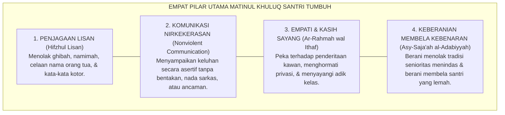
<div align="center"><sub><b>Gambar 2.2.1:</b> Empat Pilar Utama Matinul Khuluq dalam Ekosistem TUMBUH.</sub></div>

**Al-Imam Abu Abdillah Muhammad bin Ismail al-Bukhari** dalam mahakaryanya *Al-Adab al-Mufrad*[^1] meriwayatkan sabda monumental Baginda Rasulullah SAW:
$$\text{إِنَّ مِنْ أَحَبِّكُمْ إِلَيَّ وَأَقْرَبِكُمْ مِنِّي مَجْلِسًا يَوْمَ الْقِيَامَةِ أَحَاسِنَكُمْ أَخْلَاقًا}$$
*"Sesungguhnya orang yang paling aku cintai di antara kalian dan yang paling dekat tempat duduknya denganku pada hari kiamat kelak adalah orang yang paling mulia akhlaknya di antara kalian!"* (HR. At-Tirmidzi no. 2018).

---

### Dekonstruksi Bahasa Toksik: Eliminasi Julukan Pejoratif (*Laqab*) di Asrama

Salah satu penyakit sosial paling merusak yang kerap dianggap "lelucon biasa" di asrama santri adalah pemberian julukan buruk (*tanabuz bil alqab*): memanggil kawan dengan sebutan binatang, ejekan fisik (*body shaming*), atau nama ayah dengan nada mencela.

Sains psikologi sosial dan neurosains afektif membuktikan bahwa **kekerasan verbal mengaktifkan jaringan rasa sakit (*pain matrix*) di otak yang sama persis dengan luka fisik akibat pukulan tongkat**.

Pakar komunikasi internasional **Marshall B. Rosenberg**[^2] dalam *Nonviolent Communication* (NVC) menegaskan bahwa bahasa penghakiman, sarkasme, dan pelabelan negatif adalah bentuk kekerasan terselubung (*tragic expression of unmet needs*) yang memutus jembatan empati antar-manusia.

Sistem TUMBUH menegakkan aturan baku **Zero Verbal Violence**:
1. **Larangan Mutlak Segala Bentuk Julukan Buruk**: Santri wajib memanggil sesamanya dengan nama aslinya yang baik atau panggilan persaudaraan yang mulia (*Akhi / Ukhti / Kang / Ning*).
2. **Pelatihan Protokol Komunikasi Asertif 4-Langkah (OFNR)**:
   * **Observasi (Observation)**: Menyatakan fakta tanpa menghakimi (*"Ketika sandal ana dipakai tanpa izin tadi pagi..."*).
   * **Perasaan (Feeling)**: Mengungkapkan perasaan secara jujur (*"...ana merasa terburu-buru dan cemas terlambat ke kelas."*).
   * **Kebutuhan (Need)**: Menyampaikan kebutuhan dasar (*"Ana butuh kepastian barang pribadi ana terjaga."*).
   * **Permintaan (Request)**: Mengajukan permintaan konkret (*"Maukah antum meminta izin terlebih dahulu jika hendak meminjam?"*).

---

### Integrasi Turats: Penjagaan Lisan (*Hifzhul Lisan*) Imam An-Nawawi

Panduan komunikasi santun ini berakar kuat pada bab khusus yang ditulis oleh **Imam Yahya bin Syaraf An-Nawawi** dalam *Riyadhus Shalihin* (Kitab *Hifzhil Lisan*)[^3] sebagai pedoman utama:

> [!NOTE]
> ### 📜 Kaidah Emas Imam An-Nawawi tentang Menjaga Lisan:
> 
> $$\text{اعْلَمْ أَنَّهُ يَنْبَغِي لِكُلِّ مُكَلَّفٍ أَنْ يَحْفَظَ لِسَانَهُ عَنْ جَمِيعِ الْكَلَامِ، إِلَّا كَلَامًا ظَهَرَتْ فِيهِ الْمَصْلَحَةُ. وَمَتَى اسْتَوَى الْكَلَامُ وَتَرْكُهُ فِي الْمَصْلَحَةِ، فَالسُّنَّةُ الْإِمْسَاكُ عَنْهُ}$$
> 
> **Artinya:**  
> *"Ketahuilah, sesungguhnya sepatutnya bagi setiap mukallaf (santri pembelajar) untuk menjaga lisannya dari segala perkataan, kecuali perkataan yang nyata-nyata mengandung kemaslahatan di dalamnya. Dan manakala berbicara dan diam memiliki kemaslahatan yang sama, maka sunnah yang utama adalah memilih diam."*

---

### Kecerdasan Sosial & Resonansi Afektif Pendidik

Pakar psikologi **Daniel Goleman**[^4] dalam risetnya tentang *Social Intelligence* membuktikan bahwa interaksi emosi bersifat menular (*emotional contagion*). Jika seorang musyrif membiasakan diri menyapa santri dengan senyuman tulus, tatapan mata yang hangat, dan nada bicara yang lembut, maka sel neuron cermin (*mirror neurons*) di otak seluruh santri sekamar akan menyerap dan merefleksikan kelembutan tersebut dalam pergaulan harian mereka.

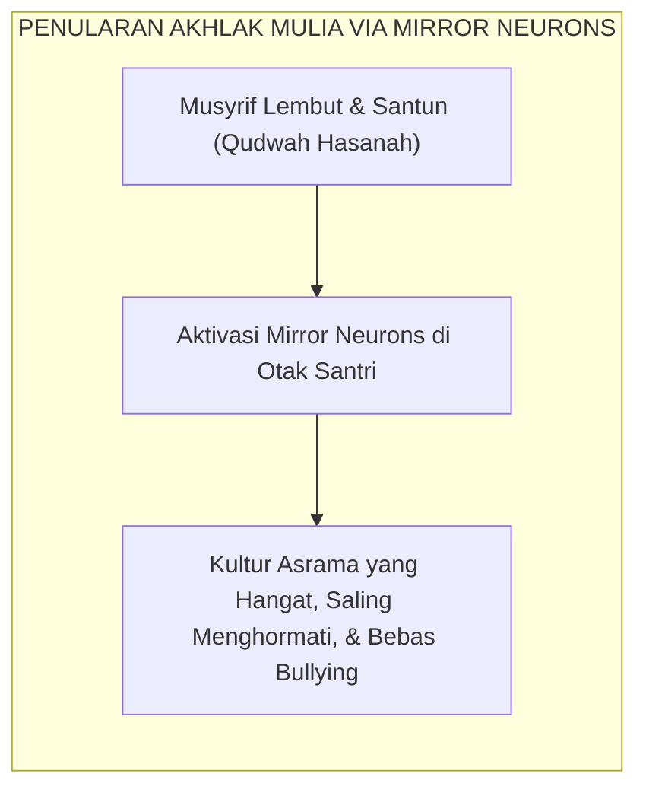
<div align="center"><sub><b>Gambar 2.2.2:</b> Penularan Kultural Akhlak Mulia dari Musyrif ke Santri.</sub></div>

Santri yang memiliki *Matinul Khuluq* menjadi pilar kedamaian di mana pun ia berada: tutur katanya menyejukkan, kehadirannya dirindukan, dan perilakunya menjadi cermin kemuliaan ajaran Islam di hadapan umat manusia.

---

## 📌 Catatan Kaki & Rujukan Primer

[^1]: **Al-Imam Abu Abdillah Muhammad bin Ismail al-Bukhari**, *Al-Adab al-Mufrad*, Tahqiq: Syaikh Muhammad Fu'ad Abdul Baqi (Kairo: Al-Mathba'ah as-Salafiyyah, 1379 H; cetak ulang Beirut: Dar al-Basyair al-Islamiyyah, 1989), Bab "Husnul Khuluq", hlm. 102–115.
[^2]: **Marshall B. Rosenberg**, *Nonviolent Communication: A Language of Life* (Encinitas: PuddleDancer Press, 1999; Edisi ke-3, 2015), Bab 1: "Giving from the Heart", hlm. 1–18.
[^3]: **Al-Imam Abu Zakariyya Yahya bin Syaraf an-Nawawi**, *Riyadhus Shalihin min Kalami Sayyidil Mursalin*, Tahqiq: Syaikh Syu'aib al-Arnauth (Beirut: Mu'assasah ar-Risalah, 1993), Kitab Hifzhil Lisan, hlm. 438–455.
[^4]: **Daniel Goleman**, *Social Intelligence: The New Science of Human Relationships* (New York: Bantam Books, 2006), Bab 1: "Emotional Contagion", hlm. 11–32.


---

# SUB-BAB 2.3: QADIRUN 'ALAL KASBI & MUTSAQQAFUL FIKRI
## *Kemandirian Hidup, Etos Kerja Asrama, Kedalaman Intelektual, dan Keterampilan Berpikir Kritis*

**Kode Klasifikasi**: `BOOK-02/BAB-02/SUB-03/MONOGRAF-MASTER-VIBRANT`  
**Disiplin Ilmu**: Pendidikan Kemandirian Vokasional, Filsafat Ilmu Kritis (*Critical Thinking*), & Psikologi Kognitif  
**Penanggung Jawab Keilmuan**: Dewan Pakar Ekosistem TUMBUH (*Pakar Psikologi Belajar & Pakar Tata Kelola Qudwah*)

---

### Mematahkan Stereotip Santri: Antara Kemandirian Finansial dan Ketajaman Nalar

Salah satu tantangan besar alumni pesantren di era modern adalah tudingan miring bahwa lulusan pondok hanya pandai berdoa dan menghafal matan, namun tidak memiliki kecakapan hidup mandiri (*life skills*) dan gagap menghadapi dinamika peradaban global yang kompleks.

Ekosistem TUMBUH menjawab tantangan ini melalui dua pilar karakter komplementer:
1. **Qadirun 'alal Kasbi**: Memiliki kemampuan mandiri, etos kerja tinggi, tanggung jawab finansial, dan kesiapan berkarya secara mandiri.
2. **Mutsaqqoful Fikri**: Memiliki wawasan intelektual yang luas, menguasai literasi Turats klasik, sekaligus memiliki nalar kritis ilmiah (*critical thinking*) dalam merespons perkembangan ilmu pengetahuan modern.

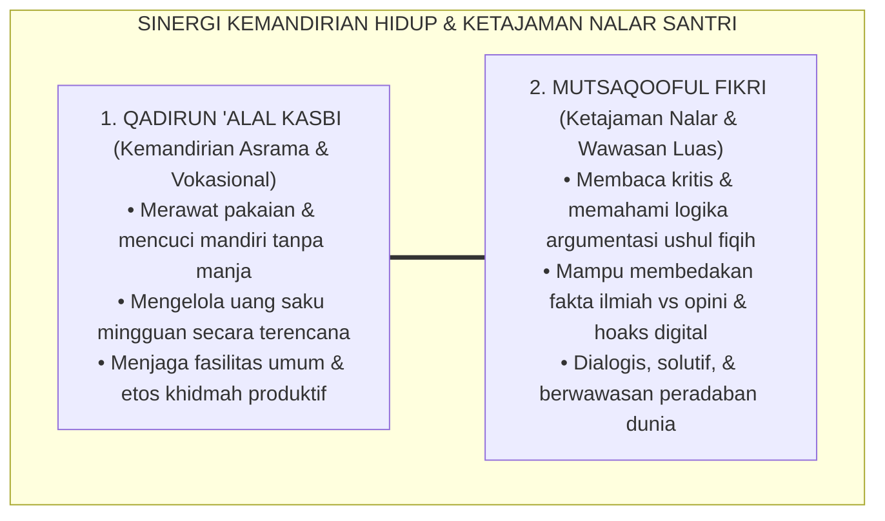
<div align="center"><sub><b>Gambar 2.3.1:</b> Sinergi Kemandirian Hidup dan Ketajaman Nalar Santri TUMBUH.</sub></div>

**Al-Imam Abu al-Hasan al-Mawardi** dalam *Adab ad-Dunya wad-Din*[^1] menegaskan bahwa kemuliaan seorang penuntut ilmu hanya akan sempurna jika ditopang oleh dua pilar: kebersihan mata pencaharian yang halal (*kifayatul ma'asy*) dan kecemerlangan akal budi yang terus diasah dengan ilmu (*shafa'ul aql*).

---

### Indikator Perilaku Faktual Qadirun 'alal Kasbi di Asrama 24 Jam

Kemandirian di pesantren tidak harus menunggu santri lulus mendirikan perusahaan, melainkan dibangun dari hal-hal mikro di bilik asrama setiap hari:

1. **Kemandirian Perawatan Diri (*Self-Sufficiency*)**:  
   Santri mencuci pakaian pribadinya secara teratur, menjemur pada tempatnya, melipat rapi ke dalam lemari, dan menjahit kancing bajunya yang lepas secara mandiri tanpa bergantung pada orang tua atau adik kelas.
2. **Literasi Keuangan Syar'i (*Financial Self-Regulation*)**:  
   Santri membuat catatan pengeluaran uang saku mingguan, menyisihkan sebagian uang sakunya untuk kotak infaq Jumat, serta menghindari budaya konsumerisme jajan berlebihan di kantin pondok.
3. **Etos Kewirausahaan Sosial (*Social Entrepreneurship*)**:  
   Santri aktif terlibat dalam unit usaha pondok (seperti koperasi santri, hidroponik asrama, atau perpustakaan santri), melatih jiwa kepemimpinan manajerial dan integritas amanah.

---

### Indikator Perilaku Faktual Mutsaqqoful Fikri di Madrasah & Halaqah

Santri yang berwawasan luas bukanlah penghafal dogmatis yang kaku, melainkan pembelajar yang adaptif dan berwawasan luas:

1. **Keterampilan Membaca Kritis (*Critical Active Reading*)**:  
   Saat mempelajari kitab kuning, santri tidak hanya menerjemahkan lafadz (*makna gandul*), melainkan menganalisis *illat* hukum, konteks maqashid syari'ah, dan membandingkan pendapat lintas madzhab secara objektif.
2. **Kecakapan Literasi Digital & Anti-Hoaks**:  
   Santri dibekali prinsip *Tabayyun* (verifikasi fakta berbasis QS. Al-Hujurat: 6) untuk menyaring informasi di media digital, menolak penyebaran ujaran kebencian, dan mampu menulis opini yang mencerahkan publik.
3. **Kemampuan Berdiskusi Argumentatif Santun (*Munazharah Beradab*)**:  
   Santri mampu mempertahankan argumen berbasis dalil dan data logis tanpa emosi, serta berlapang dada menerima kebenaran jika lawan bicaranya memiliki argumen yang lebih kuat.

---

### Landasan Kognitif: Teori Beban Kognitif & Metakognisi

Pakar psikologi kognitif **John Sweller**[^2] dalam *Cognitive Load Theory* membuktikan bahwa nalar kritis hanya akan berkembang apabila beban kognitif yang tidak relevan (*extraneous cognitive load*) dieliminasi melalui desain pembelajaran yang terstruktur. 

Di pesantren TUMBUH, metode sorogan dan halaqah didesain secara interaktif: santri diajak memetakan konsep kitab menggunakan peta pikiran (*mind mapping*) dan simulasi studi kasus nyata (*case-based study*), sehingga kapasitas memori kerja (*working memory*) santri teroptimalkan.

Filsuf Islam modern **Prof. Dr. Syed Muhammad Naquib al-Attas**[^3] menegaskan bahwa akal yang tercerahkan (*'Aql Salim*) adalah akal yang mampu mengenali hirarki wujud dan kebenaran, menempatkan ilmu wahyu sebagai pemandu tertinggi bagi seluruh disiplin sains empiris.

---

### Solusi Sistemik TUMBUH: Laboratorium Kemandirian & Pojok Literasi Digital

Sistem TUMBUH menghidupkan dua pilar ini melalui program konkret:
* **Pojok Literasi Halaqah (*Maktabah Ma'rifah*)**: Setiap kamar asrama dilengkapi rak buku berisi buku-buku sains populer, biografi tokoh peradaban Islam, dan ensiklopedia kontemporer untuk memicu diskusi nalar kritis santri.
* **Proyek Khidmah Kemandirian (*Kifayah Project*)**: Setiap semester santri diberi proyek kemandirian tim (misalnya mengelola kebun sayur asrama atau merawat inventaris sarana pondok) untuk mengasah etos kerja nyata.

Santri TUMBUH tumbuh menjadi pribadi yang berdaya: tangannya mandiri menghasilkan karya halal, dan pikirannya tajam memancarkan cahaya hikmah bagi kemajuan peradaban Islam.

---

## 📌 Catatan Kaki & Rujukan Primer

[^1]: **Al-Imam Abu al-Hasan Ali bin Muhammad al-Mawardi**, *Adab ad-Dunya wad-Din*, Tahqiq: Dr. Muhammad Ridha Qahwaji (Beirut: Dar Ibnu Katsir, 1993), Bab 4: "Fi Adab al-Kasb", hlm. 215–248.
[^2]: **John Sweller, Paul Ayres, & Slava Kalyuga**, *Cognitive Load Theory* (New York: Springer Science+Business Media, 2011), Bab 2: "Human Cognitive Architecture", hlm. 11–32.
[^3]: **Prof. Dr. Syed Muhammad Naquib al-Attas**, *Prolegomena to the Metaphysics of Islam: An Exposition of the Underlying Foundations of Islam and Modernity* (Kuala Lumpur: International Institute of Islamic Thought and Civilization / ISTAC, 1995), Bab 3: "The Intuition of Existence", hlm. 111–142.


---

# SUB-BAB 2.4: QOWIYYUL JISMI & MUJAHIDUN LINAFSIHI
## *Kekuatan Jasmani, Higienitas Thaharah, Pengendalian Diri (*Self-Regulation*), dan Penaklukan Hawa Nafsu*

**Kode Klasifikasi**: `BOOK-02/BAB-02/SUB-04/MONOGRAF-MASTER-VIBRANT`  
**Disiplin Ilmu**: Kesehatan Fisik & Tidur Sirkadian, Neurosains Regulasi Diri (*Inhibitory Control*), & Tasawuf 'Amali  
**Penanggung Jawab Keilmuan**: Dewan Pakar Ekosistem TUMBUH (*Pakar Neurosains Perkembangan & Pakar Pengasuhan Asrama*)

---

### Dua Sisi Mata Uang Kebugaran Insan: Ketangguhan Raga dan Kedaulatan Jiwa

Di dalam hadits shahih yang sangat masyhur, Rasulullah SAW bersabda:
$$\text{الْمُؤْمِنُ الْقَوِيُّ خَيْرٌ وَأَحَبُّ إِلَى اللَّهِ مِنَ الْمُؤْمِنِ الضَّعِيفِ، وَفِي كُلٍّ خَيْرٌ}$$
*"Mukmin yang kuat lebih baik dan lebih dicintai oleh Allah daripada mukmin yang lemah, meskipun pada keduanya tetap terdapat kebaikan."* (HR. Muslim no. 2664).

Kekuatan yang dimaksud oleh Rasulullah SAW mencakup dua dimensi komplementer:
1. **Qowiyyul Jismi**: Fisik yang kuat, sehat, bersih dari kuman penyakit, bugar berenergi, dan terjaga ritme biologisnya.
2. **Mujahidun Linafsihi**: Jiwa yang memiliki kedaulatan penuh dalam menundukkan syahwat, sabar menunda kepuasan instan (*delayed gratification*), dan gigih melawan godaan maksiat.

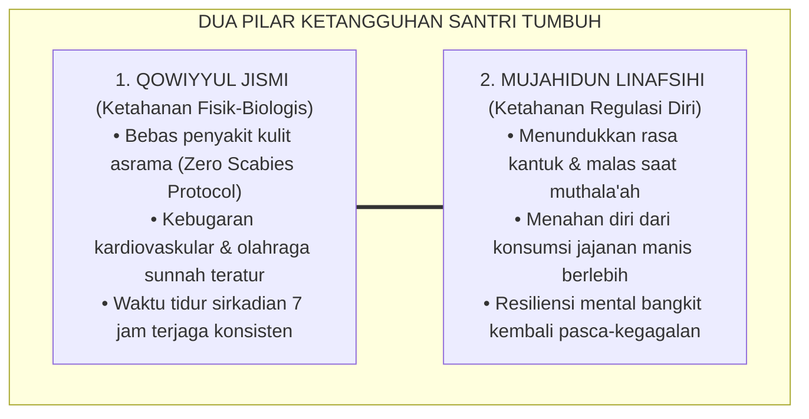
<div align="center"><sub><b>Gambar 2.4.1:</b> Sinergi Ketangguhan Fisik (Jismi) dan Pengendalian Diri (Nafsi) Santri.</sub></div>

**Al-Imam Ibn al-Qayyim al-Jawziyyah** dalam *Zad al-Ma'ad fi Hadyi Khairil 'Ibad*[^1] menjelaskan secara komprehensif bagaimana petunjuk Nabi SAW memadukan antara olahraga berkuda, memanah, lari cepat, pengaturan porsi makan (*Thibbun Nabawi*), dan puasa sunnah sebagai instrumen penjaga vitalitas tubuh dan penunduk hawa nafsu.

---

### Indikator Perilaku Faktual Qowiyyul Jismi di Asrama

Sistem TUMBUH menolak keras anggapan bahwa santri yang shalih harus berwajah pucat, bertubuh ringkih, dan mengidap penyakit gatal-gatal (gudik/skabies):

1. **Penerapan Protokol Nol Skabies (*Zero Scabies Policy*)**:  
   Santri menjemur kasur dan bantal secara rutin setiap pekan di bawah sinar matahari, mencuci sprei dengan air panas berkala, dan menjaga ventilasi udara kamar tetap mengalir lancar.
2. **Rutinitas Olahraga Kebugaran & Olahraga Sunnah**:  
   Santri mengikuti jadwal olahraga terstruktur 3 kali sepekan: lari pagi, senam kebugaran jasmani, pencak silat, panahan, atau renang, menjaga fungsi jantung dan daya tahan tubuhnya.
3. **Higienitas Sanitasi Pribadi (*Personal Hygiene*)**:  
   Santri memotong kuku secara teratur setiap hari Jumat, menyikat gigi minimal 2 kali sehari, dan mengenakan pakaian yang bersih serta tidak berbau apek.

---

### Indikator Perilaku Faktual Mujahidun Linafsihi di Keseharian

Kekuatan sejati seorang santri bukan diukur dari kemampuannya merobohkan lawan, melainkan kemampuannya mengendalikan diri sendiri saat diuji syahwat dan amarah:

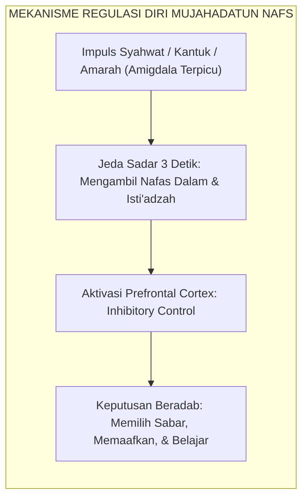
<div align="center"><sub><b>Gambar 2.4.2:</b> Alur Neurobiologis Mujahadatun Nafs Mengaktifkan Rem Kognitif Prefrontal.</sub></div>

1. **Penundaan Kepuasan Instan (*Delayed Gratification*)**:  
   Pakar psikologi **Walter Mischel**[^2] dalam eksperimen legendarisnya *The Marshmallow Test* membuktikan bahwa anak yang memiliki kemampuan menunda kepuasan instan memiliki peluang sukses akademis dan stabilitas emosi berkali-kali lipat lebih tinggi. Santri TUMBUH dilatih menunda membuka jajan atau mengobrol santai hingga seluruh tugas muthala'ah selesai tuntas.
2. **Pengendalian Impuls Amarah (*Emotional Inhibitory Control*)**:  
   Riset neurosains kontrol diri oleh **Roy F. Baumeister**[^3] membuktikan bahwa kekuatan kehendak (*willpower*) bekerja seperti otot yang dapat dilatih. Saat tersenggol kawan di antrean wudhu, santri tidak membalas dengan pukulan, melainkan melafalkan *Ta'awwudz* dan tersenyum lapang dada.
3. **Ketahanan Melawan Kemalasan (*Spiritual Grit*)**:  
   Santri mampu bangkit dari tempat tidur saat alarm subuh berbunyi tanpa menekan tombol tunda (*snooze*), melatih kedaulatan jiwa atas kelemahan fisik raganya.

---

### Tinjauan Turats: Menyelami Kedalaman *Riyadhatun Nafs* Imam Al-Ghazali

Konsep penempaan diri ini berakar pada ajaran **Hujjatul Islam Imam Abu Hamid Al-Ghazali** dalam *Ihya' 'Ulumiddin* (Kitab *Riyadhatin Nafs*)[^4] sebagai berikut:

> [!NOTE]
> ### 📜 Kaidah Imam Al-Ghazali tentang Menjinakkan Nafsu:
> 
> $$\text{مَثَلُ النَّفْسِ فِي ضَرَاوَتِهَا كَمَثَلِ الدَّابَّةِ السَّمُوحِ؛ إِذَا أَلْجَمْتَهَا وَقَيَّدْتَهَا بِالرِّيَاضَةِ انْقَادَتْ، وَإِذَا أَرْسَلْتَهَا وَأَهْمَلْتَهَا جَمَحَتْ وَأَهْلَكَتْ صَاحِبَهَا}$$
> 
> **Artinya:**  
> *"Perumpamaan hawa nafsu dalam kebuasannya laksana binatang tunggangan yang liar; apabila engkau kekang ia dengan tali kendali latihan spiritual (*Riyadhah*), niscaya ia akan tunduk patuh. Namun apabila engkau lepaskan ia begitu saja tanpa disiplin, niscaya ia akan berontak liar dan mencelakakan penunggangnya."*

Santri yang memiliki *Qowiyyul Jismi* dan *Mujahidun Linafsihi* tumbuh menjadi sosok pemuda muslim idaman peradaban: bertubuh tegap sehat, berwajah cerah bercahaya, dan memiliki jiwa ksatria yang mampu menaklukkan segala bujuk rayu kemaksiatan.

---

## 📌 Catatan Kaki & Rujukan Primer

[^1]: **Al-Imam Syamsuddin Muhammad bin Abi Bakr Ibnu Qayyim al-Jawziyyah**, *Zad al-Ma'ad fi Hadyi Khairil 'Ibad*, Tahqiq: Syaikh Syu'aib al-Arnauth & Abdul Qadir al-Arnauth (Kuwait: Maktabah al-Manar al-Islamiyyah / Beirut: Mu'assasah ar-Risalah, 1979), Jilid IV: "At-Thibbun Nabawi", hlm. 220–265.
[^2]: **Walter Mischel**, *The Marshmallow Test: Mastering Self-Control* (New York: Little, Brown and Company, 2014), Bab 1: "The Delay of Gratification Paradigm", hlm. 15–42.
[^3]: **Roy F. Baumeister & John Tierney**, *Willpower: Rediscovering the Greatest Human Strength* (New York: Penguin Press, 2011), Bab 2: "Where Willpower Power Comes From", hlm. 41–68.
[^4]: **Hujjatul Islam Imam Abu Hamid al-Ghazali**, *Ihya' 'Ulumiddin*, Kitab Riyadhatin Nafs wa Tahdzibil Akhlaq (Kairo & Beirut: Dar al-Ma'rifah, t.th.), Jilid III, hlm. 60–75.


---

# SUB-BAB 2.5: MUNAZHZHAMUN, HARITSUN, & NAFI'UN LIGHAIRIHI
## *Keteraturan Manajemen Hidup, Disiplin Waktu, dan Puncak Karakter Khidmah Sosial yang Bermanfaat Luas*

**Kode Klasifikasi**: `BOOK-02/BAB-02/SUB-05/MONOGRAF-MASTER-VIBRANT`  
**Disiplin Ilmu**: Manajemen Waktu Islami, Psikologi Produktivitas Karakter, & Teori Kepemimpinan Altruistik  
**Penanggung Jawab Keilmuan**: Dewan Pakar Ekosistem TUMBUH (*Pakar Tata Kelola Qudwah & Pakar Desain Kurikulum Adab*)

---

### Tiga Pilar Penyempurna: Keteraturan, Waktu, dan Khidmah Sosial

Tiga profil terakhir dalam taksonomi sepuluh karakter (*Muwashafat*) Ekosistem TUMBUH adalah **tiga pilar penyempurna (*The Triad of Social Impact*)**:
1. **Munazhzhamun fi Syu'unihi**: Tertib, rapi, dan terorganisir dalam menata seluruh urusan pribadi dan komunalnya.
2. **Haritsun 'ala Waqtihi**: Sangat hemat dan disiplin dalam mengelola waktu, pantang membuang detik hidup dalam kesia-siaan (*lahwun*).
3. **Nafi'un Lighairihi**: Bermanfaat luas, memiliki kepekaan sosial tinggi, dan mendedikasikan hidupnya untuk melayani ummat (*Khidmah*).

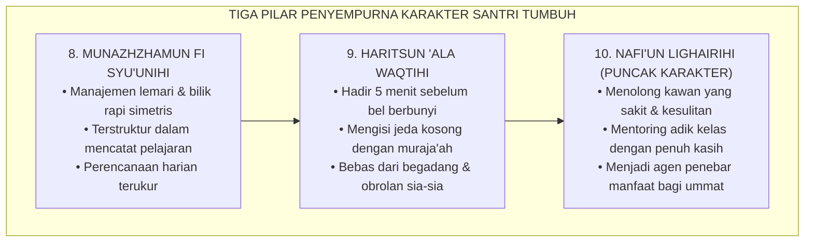
<div align="center"><sub><b>Gambar 2.5.1:</b> Alur Progresi dari Keteraturan Pribadi Menuju Puncak Kebermanfaatan Sosial.</sub></div>

**Hadhratusy Syaikh KH. M. Hasyim Asy'ari** dalam *Adab al-'Alim wal Muta'allim*[^1] menegaskan bahwa kealiman seorang penuntut ilmu tercermin dari bagaimana ia menghargai setiap detik umurnya: tidak membiarkan satu helaan nafas pun berlalu tanpa diisi dengan menuntut ilmu, berdzikir, atau memberikan kemanfaatan bagi sesamanya.

---

### Indikator Perilaku Faktual Munazhzhamun fi Syu'unihi di Asrama

Keteraturan hidup di pesantren TUMBUH bukan sekadar formalitas saat inspeksi musyrif, melainkan cermin dari ketertiban batin:

1. **Standar Kerapian Loker Pribadi (*5S/5R Asrama*)**:  
   Santri menata lemari bajunya dengan pembagian zona yang jelas (seragam sekolah di gantungan atas, sarung shalat di rak tengah, pakaian santai di rak bawah, dan perlengkapan mandi di kotak khusus).
2. **Keteraturan Tata Catatan Kitab (*Organized Learning Notes*)**:  
   Santri mencatat syarah ustadz dengan tulisan yang rapi, memberi tanda stabilo/warna pada kaidah penting, dan memiliki jadwal muthala'ah mandiri yang terstruktur.
3. **Kesiapan Logistik Pribadi**:  
   Sebelum tidur malam pukul 22.00 WIB, santri telah menyiapkan kitab, buku tulis, dan seragam yang akan dipakai esok pagi, sehingga tidak ada kepanikan terburu-buru saat fajar menyingsing.

---

### Indikator Perilaku Faktual Haritsun 'ala Waqtihi

Waktu adalah modal utama seorang santri. Hilangnya waktu tanpa faedah adalah kematian spiritual sebelum ajal fisik tiba:

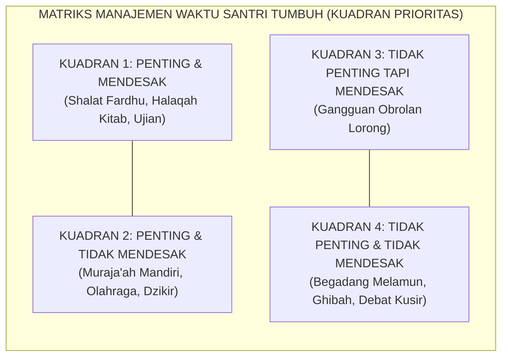
<div align="center"><sub><b>Gambar 2.5.2:</b> Penerapan Matriks Manajemen Waktu Kuadran Prioritas di Pesantren.</sub></div>

Pakar kepemimpinan **Stephen R. Covey**[^2] dalam *The 7 Habits of Highly Effective People* menegaskan bahwa individu yang unggul memfokuskan 80% energinya pada **Kuadran 2**: aktivitas yang sangat penting bagi pembentukan masa depan namun tidak mendesak (seperti membaca buku mendalam, membangun relasi positif, dan merawat kesehatan).

Santri TUMBUH menerapkan:
1. **Prinsip *5-Minute Early Rule***: Hadir 5 menit lebih awal di masjid dan ruang kelas sebelum bel berbunyi.
2. **Pemanfaatan Jeda Waktu (*Fragmented Time Optimization*)**: Membawa buku saku (*pocket notes*) untuk menghafal mufradat bahasa Arab atau nadham kitab di sela antrean kantin atau menunggu mulainya shalat berjamaah.

---

### Puncak Muwashafat: Nafi'un Lighairihi (Kepemimpinan Melayani)

Puncak dari seluruh taksonomi adab adalah **Nafi'un Lighairihi** (Bermanfaat bagi Sesama).

Rasulullah SAW bersabda dengan sangat tegas:
$$\text{خَيْرُ النَّاسِ أَنْفَعُهُمْ لِلنَّاسِ}$$
*"Sebaik-baik manusia adalah yang paling bermanfaat bagi manusia lainnya!"* (HR. Ath-Thabrani dalam *Al-Mu'jam al-Ausath* no. 5787).

Pakar psikologi organisasi **Adam Grant**[^3] dalam penelitiannya *Give and Take* membuktikan bahwa orang-orang yang memiliki orientasi memberi secara tulus (*Givers*) tanpa pamrih pada akhirnya menempati puncak kepemimpinan yang paling berpengaruh dan dicintai di masyarakat.

Di pesantren TUMBUH, *Nafi'un Lighairihi* diwujudkan melalui:
1. **Budaya Khidmah Tanpa Pamrih**: Membantu membawakan nampan makanan santri yang sedang demam di ruang poskestren, menyapu serambi masjid bersama, dan menjadi tutor sebaya bagi kawan yang kesulitan memahami nahwu-sharaf.
2. **Kepemimpinan Pelayan (*Servant Leadership*)**: Santri senior memandang posisi kepengurusan organisasi santri bukan sebagai panggung kekuasaan untuk membentak adik kelas, melainkan sebagai ladang amal jariyah untuk melindungi, melayani, dan memfasilitasi kebutuhan seluruh warga pondok.

---

### Wasiat Epik Imam Al-Ghazali tentang Manajemen Waktu Harian

**Hujjatul Islam Imam Abu Hamid Al-Ghazali** dalam *Ihya' 'Ulumiddin* (Kitab *Tartib al-Awrad*)[^4] memberikan formula abadi tata kelola waktu harian penuntut ilmu:

> [!NOTE]
> ### 📜 Wasiat Emas Imam Al-Ghazali tentang Menjaga Waktu:
> 
> $$\text{يَنْبَغِي أَنْ تَكُونَ أَوْقَاتُكَ مُوَزَّعَةً، وَأَوْرَادُكَ مُرَتَّبَةً؛ فَلَا تَتْرُكْ وَقْتًا مِنَ الْأَوْقَاتِ سُدًى تَفْعَلُ فِيهِ مَا اتَّفَقَ كَيْفَمَا اتَّفَقَ، بَلْ حَاسِبْ نَفْسَكَ وَرَتِّبْ حَرَكَاتِكَ وَسَكَنَاتِكَ فِي لَيْلِكَ وَنَهَارِكَ}$$
> 
> **Artinya:**  
> *"Sepatutnya seluruh waktumu terbagi dengan rapi, dan seluruh rutinitas amalmu tertata dengan teratur. Jangan sekali-kali engkau membiarkan satu waktu pun berlalu secara sia-sia di mana engkau berbuat sekadar kebetulan tanpa arah; melainkan hisablah dirimu dan aturlah setiap gerak dan diammu di sepanjang malam dan siangmu."*

Dengan menuntaskan Bab 02 ini, sepuluh muwashafat karakter santri TUMBUH telah terdefinisi secara utuh, presisi, dan operasional: dari akar tauhid di dalam hati hingga buah kebermanfaatan nyata bagi kemaslahatan alam semesta.

---

## 📌 Catatan Kaki & Rujukan Primer

[^1]: **Hadhratusy Syaikh KH. M. Hasyim Asy'ari**, *Adab al-'Alim wal Muta'allim fi ma Yahtaju Ilayhi al-Muta'allim fi Ahwal Ta'allumihi wa ma Yatawaqqafu 'alayhi al-Mu'allim fi Maqamat Ta'limihi* (Jombang: Maktabah at-Turats al-Islami, 1415 H), Bab 2: "Adab al-Muta'allim fi Nafsihi", hlm. 24–35.
[^2]: **Stephen R. Covey**, *The 7 Habits of Highly Effective People: Powerful Lessons in Personal Change* (New York: Free Press / Simon & Schuster, 1989; Edisi Peringatan 30 Tahun, 2020), Bab 3: "Habit 3: Put First Things First", hlm. 145–182.
[^3]: **Adam Grant**, *Give and Take: A Revolutionary Approach to Success* (New York: Viking Penguin, 2013), Bab 1: "Good Returns: The Hazards and Harms of Givers and Takers", hlm. 1–26.
[^4]: **Hujjatul Islam Imam Abu Hamid al-Ghazali**, *Ihya' 'Ulumiddin*, Kitab Tartib al-Awrad wa Tafshil Ihya' al-Lail (Kairo & Beirut: Dar al-Ma'rifah, t.th.), Jilid I, hlm. 334–350.


---

# SUB-BAB 3.1: TRANSISI PUBERTAS & DINAMIKA HORMONAL ASRAMA
## *Memahami Ledakan Biologis Remaja (Usia 12–18 Tahun) dalam Ekosistem Berasrama Tanpa Vonis Moralitas Negatif*

**Kode Klasifikasi**: `BOOK-02/BAB-03/SUB-01/MONOGRAF-MASTER-VIBRANT`  
**Disiplin Ilmu**: Psikologi Perkembangan Remaja (*Adolescent Development*), Endokrinologi Perilaku, & Fiqih Baligh Turats  
**Penanggung Jawab Keilmuan**: Dewan Pakar Ekosistem TUMBUH (*Pakar Neurosains Perkembangan & Pakar Pengasuhan Asrama*)

---

### Titik Balik Kehidupan Santri: Ketika Tubuh Berubah dan Jiwa Berguncang

Rentang usia santri di pondok pesantren (12 hingga 18 tahun) adalah fase transisi biologis dan psikologis paling dramatis dalam seluruh siklus kehidupan manusia: **fase pubertas (*marhalah al-bulugh*)**.

Pada fase ini, tubuh anak mengalami lonjakan hormon secara masif:
* **Hormon Testosteron** pada santri putra melonjak hingga 20–30 kali lipat dibanding masa kanak-kanak, memicu dorongan fisik motorik tinggi, pencarian status kelompok, dan kebutuhan pembuktian kejantanan (*dominance seeking*).
* **Hormon Estrogen dan Progesteron** pada santri putri mengalami fluktuasi siklik yang tajam, memicu kepekaan emosional mendalam, kebutuhan penerimaan relasional, dan dinamika keintiman kelompok sebaya.

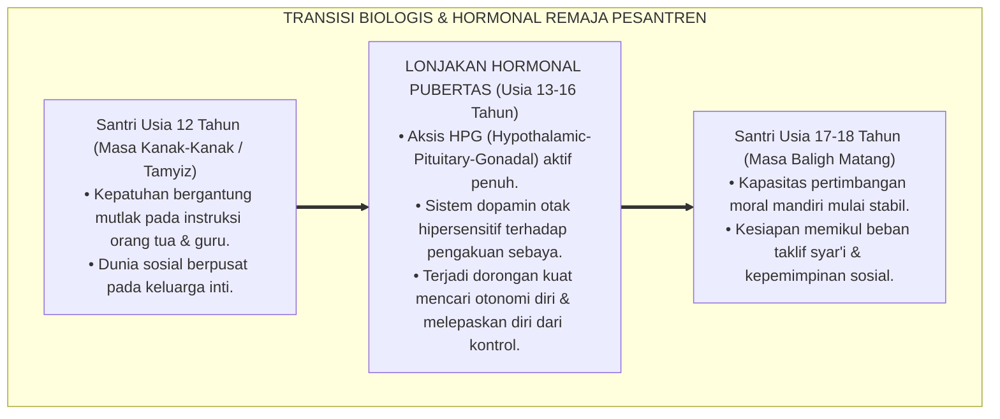
<div align="center"><sub><b>Gambar 3.1.1:</b> Alur Transisi Perkembangan Hormonal dan Kognitif Remaja Santri.</sub></div>

Pakar psikologi perkembangan remaja terkemuka **Laurence Steinberg**[^1] dalam *Age of Opportunity* menegaskan bahwa masa pubertas bukanlah sebuah "kerusakan mental", melainkan jendela plastisitas otak kedua (*second window of neuroplasticity*) di mana otak remaja sedang ditata ulang untuk mempersiapkan kemandirian hidup dewasa.

---

### Kesalahan Fatal Pendekatan Tradisional: Menghakimi Gejala Biologis sebagai Dosa Moral

Di banyak pondok pesantren konvensional, perubahan perilaku alamiah akibat transisi pubertas ini kerap kali disalahpahami oleh para pembina:
* Ketika santri putra usia 14 tahun mendadak menjadi sangat bising, suka pamer kekuatan fisik, dan gelisah jika duduk diam terlalu lama, ustadz kerap mencapnya: *"Anak bengal!", "Keras kepala!", "Tidak tahu sopan santun!"*
* Santri kemudian dihukum fisik (dijemur di lapangan terik atau dipukul rotan), yang secara neurobiologis justru semakin menyulut hormon agresi di otaknya.

Sistem TUMBUH meluruskan pemahaman ini: **perilaku gelisah dan pencarian status pada remaja awal adalah sinyal biologis yang membutuhkan kanal penyaluran positif (*sublimasi*), bukan pentungan kekerasan**.

---

### Panduan Turats: Fiqih Baligh & *Tuhfat al-Maudud* Ibnu Qayyim

Khazanah keilmuan Islam sesungguhnya telah membedah dinamika transisi pubertas ini secara sangat bijaksana.

**Al-Imam Ibn al-Qayyim al-Jawziyyah** dalam karyanya *Tuhfat al-Maudud bi Ahkam al-Maulud*[^2] menguraikan fase-fase pertumbuhan anak: dari masa *Thufullah* (kanak-kanak), *Tamyiz* (mampu membedakan baik-buruk), *Murahaqah* (menjelang pubertas), hingga *Bulugh* (baligh berakal). 

Ibnu Qayyim menggarisbawahi bahwa saat anak memasuki masa baligh, pendidik wajib mengubah metode pengasuhan dari sekadar perintah searah menjadi **pendampingan dialogis (*al-Musyahadah wal Mu'akhat*)**, karena jiwa remaja sedang mencari pembuktian martabat dirinya:

```mermaid
graph LR
    subgraph TransformasiPolaAsuh["TRANSFORMASI POLA ASUH PENDIDIK SESUAI TAHAP USIA"]
        Fase1["Usia 7-12 Tahun: DISIPLIN LEMBUT (Tamyiz)<br/>Keteladanan Qudwah & Pembiasaan Shalat Rutin"] --> Fase2["Usia 13-18 Tahun: SAHABAT DIALOGIS (Bulugh)<br/>Menjadi Teman Diskusi, Mendengarkan, & Memberi Amanah Tanggung Jawab"]
    end
```
<div align="center"><sub><b>Gambar 3.1.2:</b> Pergeseran Paradigma Pengasuhan dari Perintah Menuju Sahabat Dialogis.</sub></div>

**Al-Imam Abu al-Hasan al-Mawardi** dalam *Adab ad-Dunya wad-Din*[^3] juga memperingatkan bahwa masa muda (*asy-syabab*) laksana sejenis kegilaan sementara (*syu'bah min al-junun*) karena gejolak darah yang mendidih, sehingga seorang murabbi wajib menyikapinya dengan kelapangan dada dan kelembutan ekstra.

---

### Pengaruh Kehidupan Berasrama 24-Jam terhadap Dinamika Remaja

Pakar neurobiologi perilaku **Robert M. Sapolsky**[^4] dalam karyanya *Behave* membuktikan bahwa lingkungan yang padat, minim privasi, dan terisolasi dari keluarga dapat memicu lonjakan hormon stres kortisol jika tidak dikelola dengan tata ruang yang nyaman dan iklim relasi yang aman.

Di pesantren, santri remaja tinggal bersama puluhan kawannya selama 24 jam penuh tanpa ponsel dan tanpa orang tua:
* Jika iklim asrama dipenuhi ancaman bentakan senior, sistem saraf remaja akan terkunci dalam mode pertahanan diri (*Fight-or-Flight*).
* Namun jika asrama didesain hangat, suportif, dan menyediakan sarana penyaluran energi positif (seperti lapangan olahraga, seni hadrah, kaligrafi, dan robotik), maka hormon testosteron dan dopamin santri akan tersublimasikan menjadi **prestasi karya yang gemilang**.

---

### Solusi Sistemik TUMBUH: Program Sublimasi Energi Pubertas (*Quwwah Channeling*)

Sistem TUMBUH menerapkan strategi preventif di asrama:
1. **Penyaluran Energi Fisik Harian**: Menyediakan waktu 60 menit setiap sore (16.00–17.00 WIB) untuk olahraga intensitas sedang-tinggi (futsal, basket, bela diri, atau lari santai) guna membakar kelebihan energi motorik santri secara sehat.
2. **Edukasi Fiqih Thaharah & Biologi Reproduksi Islami**: Memberikan bimbingan khusus tentang mimpi basah (*ihtilam*), adab mandi janabah, dan pemeliharaan kebersihan organ tubuh tanpa tabu yang memalukan anak.
3. **Pemberian Amanah Kepemimpinan Bertahap**: Memberikan peran tanggung jawab nyata (seperti kapten kamar, penanggung jawab inventaris, atau komandan barisan) untuk memuaskan kebutuhan psikologis akan pengakuan status tanpa perlu melakukan kenakalan.

---

## 📌 Catatan Kaki & Rujukan Primer

[^1]: **Laurence Steinberg**, *Age of Opportunity: Lessons from the New Science of Adolescence* (Boston: Houghton Mifflin Harcourt, 2014), Bab 2: "The Plastic Brain", hlm. 25–58.
[^2]: **Al-Imam Syamsuddin Muhammad bin Abi Bakr Ibnu Qayyim al-Jawziyyah**, *Tuhfat al-Maudud bi Ahkam al-Maulud*, Tahqiq: Syaikh Abdul Qadir al-Arnauth (Damaskus: Maktabah Dar al-Bayan, 1971), Bab 14: "Fi Ri'ayati ash-Shibyan wa Adabihim", hlm. 210–245.
[^3]: **Al-Imam Abu al-Hasan Ali bin Muhammad al-Mawardi**, *Adab ad-Dunya wad-Din*, Tahqiq: Dr. Muhammad Ridha Qahwaji (Beirut: Dar Ibnu Katsir, 1993), Bab 2: "Adab an-Nafs", hlm. 78–95.
[^4]: **Robert M. Sapolsky**, *Behave: The Biology of Humans at Our Best and Worst* (New York: Penguin Press, 2017), Bab 6: "Adolescence; or, Dude, Where's My Frontal Cortex?", hlm. 154–173.


---

# SUB-BAB 3.2: KESENJANGAN MATURASI LIMBIK VS PREFRONTAL CORTEX
## *Model Sistem Ganda Neurosains Kognitif Remaja dan Dinamika Regulasi Kontrol Diri Santri*

**Kode Klasifikasi**: `BOOK-02/BAB-03/SUB-02/MONOGRAF-MASTER-VIBRANT`  
**Disiplin Ilmu**: Neurosains Perkembangan Otak (*Developmental Cognitive Neuroscience*), Teori Sistem Ganda (*Dual-Systems Model*), & Psiko-Spiritual Islam  
**Penanggung Jawab Keilmuan**: Dewan Pakar Ekosistem TUMBUH (*Pakar Neurosains Perkembangan & Pakar Psikologi Belajar*)

---

### Mobil Berkecepatan Tinggi dengan Rem yang Masih Dirakit

Salah satu penemuan paling revolusioner dalam neurosains perkembangan abad ke-21 adalah **Model Sistem Ganda (*Dual-Systems Model of Adolescent Brain Development*)**[^1].

Model ini menjelaskan sebuah fakta biologis yang sangat mencengangkan tentang arsitektur otak remaja usia 12 hingga 18 tahun:
* **Sistem Sosio-Emosional / Limbik** (khususnya *Amigdala* dan *Nukleus Akumbens* yang memproses sensasi emosi, gairah, dorongan mencari kesenangan, dan sensitivitas terhadap persetujuan teman sebaya) telah **matang secara penuh dan bekerja sangat aktif sejak masa awal pubertas**.
* Sebaliknya, **Sistem Kontrol Kognitif / Korteks Prefrontal (*Prefrontal Cortex / PFC*)** (wilayah otak depan yang berfungsi sebagai "rem eksekutif": menimbang risiko jangka panjang, mengendalikan impuls emosi, memikirkan konsekuensi akhirat, dan mengatur konsentrasi) **masih dalam proses pertumbuhan dan baru akan matang sempurna pada usia 22–25 tahun!**

```mermaid
graph TD
    subgraph GapMaturasi["KESENJANGAN MATURASI OTAK REMAJA (DUAL-SYSTEMS MODEL)"]
        Limbik["SISTEM LIMBIK (Mesin Emosi & Dopamin)<br/>• Matang Penuh Usia 12-14 Tahun<br/>• Respons Kilat terhadap Sensasi, Candaan, & Pengakuan Sebaya<br/>• Analogi: Mesin Ferrari Bertenaga Kuda Super Cepat"]
        
        PFC["KORTEKS PREFRONTAL (Rem Kontrol Diri & Nalar)<br/>• Matang Bertahap Usia 12-25 Tahun<br/>• Proses Mielinisasi Serat Saraf Belum Selesai Sempurna<br/>• Analogi: Rem Mobil yang Masih Dirakit Setengah Jadi"]
        
        Gap["JURANG KESENJANGAN MATURASI (THE ADOLESCENT GAP)<br/>Santri mudah tergoda melanggar aturan saat bersama kawan sebaya,<br/>BUKAN KARENA JAHAT, MELAINKAN KARENA KAPASITAS REM BIOLOGISNYA BELUM KUAT!"]
        
        Limbik --- Gap
        PFC --- Gap
    end
```
<div align="center"><sub><b>Gambar 3.2.1:</b> Kesenjangan Maturasi Antara Sistem Limbik dan Korteks Prefrontal pada Remaja.</sub></div>

Pakar neurosains kognitif terkemuka **B. J. Casey & Sarah-Jayne Blakemore**[^2] mengibaratkan remaja laksana **"sebuah mobil Ferrari berkecepatan tinggi yang dikemudikan oleh sopir pemula dengan pedal rem yang belum selesai dipasang sempurna"**.

---

### Mengapa Santri Melakukan Tindakan Konyol di Asrama?

Kesenjangan neurobiologis ini menjawab berbagai teka-teki perilaku santri di asrama yang selama ini membingungkan para ustadz:
1. **Mengapa santri hafal dalil larangan ghashab, tetapi tetap memakai sandal kawan saat terburu-buru?**  
   Karena saat terburu-buru, sinyal dorongan limbik melesat jauh lebih cepat daripada kecepatan sinyal rem PFC yang masih lambat.
2. **Mengapa santri berani melakukan hal berbahaya saat bersama geng kamarnya (seperti memanjat pagar atau membuat lelucon ekstrem)?**  
   Karena kehadiran teman sebaya memicu banjir neurotransmiter *dopamin* di sistem penghargaan otak (*reward system*), melumpuhkan pertimbangan akal sehat sesaat.

Ketika ustadz memahami fakta biologis ini, ustadz tidak akan lagi merespons kesalahan anak dengan kemarahan destruktif. Ustadz menyadari bahwa **tugas pendidik bukanlah menghukum kelemahan biologis anak, melainkan bertindak sebagai "Prefrontal Cortex Tambahan (*External PFC*)" yang memandu dan menguatkan rem kontrol diri santri**.

---

### Integrasi Turats: Pertarungan *Jundul 'Aql* Melawan *Jundusy Syahwah*

Kebenaran hukum neurobiologis ini secara menakjubkan telah diuraikan oleh **Hujjatul Islam Imam Abu Hamid Al-Ghazali** dalam *Ihya' 'Ulumiddin* (Kitab *'Aja'ibul Qalb*)[^3] tentang dinamika pertarungan di dalam benteng hati (*Hishnul Qalb*):

> [!NOTE]
> ### 📜 Syarah Imam Al-Ghazali tentang Pasukan Akal Melawan Syahwat:
> 
> $$\text{اعْلَمْ أَنَّ الْقَلْبَ كَالْحِصْنِ، وَالشَّيْطَانَ كَالْعَدُوِّ الْمُرَابِطِ، وَالشَّهْوَةَ وَالْغَضَبَ أَعْظَمُ أَبْوَابِهِ؛ فَلَا يَقْدِرُ عَلَى حِرَاسَةِ الْحِصْنِ إِلَّا بِجُنُودِ الْعَقْلِ وَالْحِكْمَةِ، وَالْعَقْلُ فِي ابْتِدَاءِ أَمْرِ الصِّبَا يَكُونُ ضَعِيفًا يَحْتَاجُ إِلَى نُصْرَةِ الْمُرَبِّي وَمُؤَازَرَتِهِ}$$
> 
> **Artinya:**  
> *"Ketahuilah sesungguhnya hati itu laksana benteng pertahanan, setan laksana musuh yang mengintai, sedangkan syahwat dan amarah adalah pintu gerbang terbesarnya. Tidak ada yang mampu menjaga benteng tersebut kecuali bala tentara akal dan hikmah; dan sesungguhnya akal pada permulaan usia belia masih berada dalam kondisi lemah yang sangat membutuhkan pertolongan dan sokongan kuat dari sang pembimbing (*Murabbi*)."*

Al-Ghazali menegaskan sembilan abad lalu: akal anak muda belum mandiri (*dha'if*), ia membutuhkan sokongan eksternal dari musyrif (*scaffolding*) hingga bala tentara akalnya matang dan mampu menguasai kerajaannya sendiri secara mandiri.

---

### Dampak Fatal Hukuman Kekerasan terhadap Otak Remaja

Pakar psikiatri anak **Bruce D. Perry**[^4] membuktikan bahwa ketika seorang anak remaja yang sedang mengalami kegagalan kontrol diri dibentak, dihina di depan umum, atau dipukul rotan:
* Otak santri mengalami **"Pembajakan Amigdala (*Amygdala Hijacking*)"**: otak beralih ke status bertahan hidup primitif (*reptilian brain*).
* Sirkuit saraf Prefrontal Cortex yang sedang tumbuh justru **terputus dan mengalami kelumpuhan (*down-regulation*)**.
* Akibatnya: anak tidak belajar memperbaiki moralnya, melainkan belajar menjadi lebih lihai berbohong dan menyimpan dendam kesumat.

```mermaid
graph LR
    subgraph DampakPolaAsuh["DAMPAK DUA POLA RESPON TERHADAP PERKEMBANGAN PREFRONTAL"]
        Kekerasan["Hukuman Kekerasan / Bentakan"] --> Teror["Teror Amigdala Kronis & Banjir Kortisol"] --> Lumpuh["PFC Lumpuh: Santri Munafik & Agresif"]
        
        Restoratif["Disiplin Restoratif Firm & Kind"] --> Regulasi["Status Ventral Vagal Tenang & Koneksi"] --> Matang["PFC Menguat: Mielinisasi Adab Permanen"]
    end
```
<div align="center"><sub><b>Gambar 3.2.2:</b> Pengaruh Pendekatan Disiplin terhadap Pematangan Prefrontal Cortex Santri.</sub></div>

---

### Solusi Sistemik TUMBUH: Pembiasaan Rem Kognitif (*Stop-Think-Act Protocol*)

Sistem TUMBUH melatih santri mempercepat pematangan rem Prefrontal Cortex melalui **Protokol 3-Langkah Sadar (STA)**:
1. **STOP (Berhenti Sejenak)**: Saat emosi mulai memuncak, santri dilatih mengambil jeda 3 detik, menarik nafas panjang, dan melafalkan *Isti'adzah*.
2. **THINK (Berpikir Menimbang)**: Santri bertanya pada dirinya: *"Apakah tindakan ini diridhai Allah? Apa dampaknya bagi kawan dan masa depan ana?"*
3. **ACT (Bertindak Bijak)**: Santri memilih tindakan yang beradab: memaafkan, berdialog santun, atau meminta bantuan musyrif.

Melalui pendampingan yang penuh kesabaran ini, sirkuit Prefrontal Cortex santri mengalami proses mielinisasi yang optimal, mengantarkan anak bertumbuh menjadi sosok insan kamil yang berkepribadian matang, tenang, dan berakhlak mulia.

---

## 📌 Catatan Kaki & Rujukan Primer

[^1]: **Laurence Steinberg**, "A social neuroscience perspective on adolescent risk-taking", *Developmental Review*, Vol. 28, No. 1 (2008), hlm. 78–106; serta **B. J. Casey, Rebecca M. Jones, & Todd A. Hare**, "The adolescent brain", *Annals of the New York Academy of Sciences*, Vol. 1124, No. 1 (2008), hlm. 111–126.
[^2]: **Sarah-Jayne Blakemore**, *Inventing Ourselves: The Secret Life of the Teenage Brain* (New York: PublicAffairs / Hachette Book Group, 2018), Bab 4: "The Brain's Sense of Self", hlm. 65–94.
[^3]: **Hujjatul Islam Imam Abu Hamid al-Ghazali**, *Ihya' 'Ulumiddin*, Kitab Syarh 'Aja'ibil Qalb (Kairo & Beirut: Dar al-Ma'rifah, t.th.), Jilid III, hlm. 6–18.
[^4]: **Bruce D. Perry & Maia Szalavitz**, *The Boy Who Was Raised as a Dog: And Other Stories from a Child Psychiatrist's Notebook* (New York: Basic Books, 2006; edisi revisi 2017), Bab 5: "The Coldest Heart", hlm. 95–124.


---

# SUB-BAB 3.3: KRISIS IDENTITAS & KONSTRUKSI KONSEP DIRI SANTRI
## *Menavigasi Fase Pencarian Jati Diri (Identity vs Role Confusion) Menuju Pembentukan Identitas Insan Adabi*

**Kode Klasifikasi**: `BOOK-02/BAB-03/SUB-03/MONOGRAF-MASTER-VIBRANT`  
**Disiplin Ilmu**: Psikososial Perkembangan (Teori Erikson), Psikologi Kepribadian Islam, & Terapi Eksistensial  
**Penanggung Jawab Keilmuan**: Dewan Pakar Ekosistem TUMBUH (*Pakar Bimbingan Konseling & Pakar Filosofi TUMBUH*)

---

### Gempa Eksistensial di Balik Gerbang Pesantren

Ketika seorang anak berusia 12–14 tahun diantar orang tuanya melintasi gerbang pondok pesantren, sesungguhnya ia sedang mengalami **gempa eksistensial terbesar dalam hidupnya**:
* Identitas lamanya sebagai "anak manja di rumah yang dilayani orang tua" mendadak runtuh.
* Fasilitas gadget, kamar pribadi ber-AC, dan lingkaran kawan sekolah dasarnya hilang seketika.
* Ia harus hidup mandiri bersama puluhan anak asing di sebuah kamar sempit, mengenakan sarung dan peci, serta tunduk pada jadwal ibadah yang sangat padat.

Di tengah situasi disrupsi total ini, jiwa remaja berteriak mempertanyakan eksistensi dirinya:  
$$\text{"Siapakah diriku sebenarnya? Mengapa aku ditaruh di sini? Apakah aku seorang buangan, ataukah aku seorang pejuang penuntut ilmu?"}$$

```mermaid
graph TD
    subgraph KrisisIdentitasSantri["DUA CABANG RESOLUSI KRISIS IDENTITAS REMAJA SANTRI"]
        Krisis["KRISIS IDENTITAS REMAJA SANTRI (Usia 12-18 Tahun)<br/>Transisi Memasuki Ekosistem Pesantren Asrama 24-Jam"]
        
        Krisis -->|"Jalur Kegagalan: Minim Pendampingan Hangat Musyrif"| Difusi["ROLE CONFUSION (Kebingungan Peran & Pemberontakan)<br/>• Merasa dibuang orang tua, rendah diri, & dendam sosial.<br/>• Mencari pelarian: Membentuk geng nakal, merokok sembunyi, & kabur."]
        
        Krisis -->|"Jalur Keberhasilan: Pendampingan Qudwah & Afeksi Musyrif"| Identitas["IDENTITY ACHIEVEMENT (Identitas Insan Adabi Paripurna)<br/>• Menemukan makna hidup agung sebagai Penuntut Ilmu (Thalibul 'Ilmi).<br/>• Memiliki harga diri positif, percaya diri, & berdedikasi melayani ummat."]
    end
```
<div align="center"><sub><b>Gambar 3.3.1:</b> Dua Jalur Resolusi Krisis Identitas Remaja Santri Berdasarkan Model Psikososial Erikson.</sub></div>

Pakar psikososial legendaris **Erik H. Erikson**[^1] merumuskan bahwa tahapan kelima perkembangan manusia (usia 12–18 tahun) adalah pertarungan antara **Identitas Diri versus Kebingungan Peran (*Identity vs. Role Confusion*)**. 

Jika remaja gagal menemukan peran sosial yang bermakna dan tidak mendapatkan figur panutan yang positif, ia akan mengalami krisis difusi identitas (*identity diffusion*) yang melahirkan kepribadian anti-sosial dan pemberontakan destruktif.

---

### Teori Status Identitas James Marcia: Menuntun Santri Menuju *Identity Achievement*

Pakar psikologi **James E. Marcia**[^2] mengembangkan teori Erikson ke dalam empat status identitas remaja:

| Status Identitas Remaja | Kondisi Psikologis di Lapangan Pesantren | Strategi Bimbingan Musyrif TUMBUH |
| :--- | :--- | :--- |
| **1. Identity Diffusion (Difusi Identitas)** | Santri apatis, bingung tujuan hidup, tidak peduli aturan pondok, dan pasif melamun. | Membangun ikatan emosional hangat (*Attachment*), mendengarkan keluh kesahnya, dan memulihkan rasa percaya dirinya. |
| **2. Identity Foreclosure (Penyitaan Identitas)** | Santri patuh buta karena dipaksa orang tua tanpa memahami makna ibadah, rentan stres mendadak saat ujian. | Mengajak dialog rasional tentang tujuan hidup dan membuka ruang penemuan makna pribadi (*Meaning-Making*). |
| **3. Identity Moratorium (Eksplorasi Aktif)** | Santri sedang aktif mencari jati diri, banyak bertanya kritis, kadang mencoba melanggar batas aturan kecil. | Memberikan ruang eksplorasi minat bakat (seni, orasi, olahraga) dalam batas koridor adab yang aman. |
| **4. Identity Achievement (Identitas Matang)** | Santri mantap memeluk identitas sebagai *Thalibul 'Ilmi*, ikhlas beribadah, dan memiliki komitmen moral mandiri. | Memberikan amanah kepemimpinan dan mentoring adik kelas (Tangga T4 Transformasi). |

---

### Wawasan Turats: Pengenalan Diri (*Ma'rifatun Nafs*) Imam Al-Muhasibi & Ibnu Hazm

Proses pencarian dan penataan konsep diri ini sejalan dengan ajaran ulama tasawuf dan etika Islam klasik.

**Al-Imam Al-Harits al-Muhasibi** dalam *Ar-Ri'ayah li Huquqillah*[^3] menegaskan bahwa pintu masuk pembenahan akhlak adalah kejujuran dalam membedah penyakit batin dan mengenali hakikat kehambaan diri di hadapan Allah (*I'tiraf bil 'Ubudiyyah*).

Senada dengan itu, **Al-Imam Ibnu Hazm al-Andalusi** dalam mahakaryanya *Al-Akhlaq was-Siyar fi Mudawat an-Nufus*[^4] menuliskan refleksi eksistensial yang sangat mendalam:

> [!NOTE]
> ### 📜 Refleksi Eksistensial Ibnu Hazm tentang Makna Hidup Sejati:
> 
> $$\text{تَطَلَّبْتُ هَدَفًا وَاحِدًا يَسْتَوِي جَمِيعُ النَّاسِ فِي اسْتِحْسَانِهِ وَطَلَبِهِ، فَلَمْ أَجِدْ إِلَّا شَيْئًا وَاحِدًا، وَهُوَ: طَرْدُ الْهَمِّ؛ وَلَمْ أَجِدْ طَرْدَ الْهَمِّ نَافِعًا إِلَّا فِي التَّوَجُّهِ إِلَى اللَّهِ بِالْعَمَلِ لِلْآخِرَةِ}$$
> 
> **Artinya:**  
> *"Aku merenungkan satu tujuan akhir yang disepakati oleh seluruh umat manusia sebagai kebaikan yang dicari, dan aku tidak menemukan selain satu hal: **menghilangkan kegelisahan jiwa (*Thardul Hamm*)**; dan aku mendapati bahwa kegelisahan jiwa tidak akan pernah hilang secara hakiki kecuali dengan menghadapkan wajah seutuhnya kepada Allah melalui amal untuk akhirat."*

---

### Solusi Sistemik TUMBUH: Konstruksi Identitas "Aku Santri Mulia, Pewaris Nabi"

Sistem TUMBUH merancang program penanaman identitas diri sejak pekan pertama santri masuk asrama:
1. **Upacara Ikrar Penuntut Ilmu (*Matsama Adabi*)**: Santri disambut dengan karpet merah dan pelukan hangat para kiai dan musyrif, menanamkan rasa bangga bahwa mereka adalah "Prajurit Peradaban" yang terpilih.
2. **Jurnal Muhasabah & Visi Hidup (*My Life Purpose Journal*)**: Santri dibimbing menuliskan visi hidup 10 tahun ke depan, cita-cita keilmuan, dan kontribusi nyata yang ingin ia berikan bagi umat manusia.
3. **Pemberian Peran Identitas Positif**: Menghapus label negatif (*"anak bermasalah"*), menggantinya dengan panggilan pemberdayaan (*"calon pemimpin yang sedang berproses"*).

Santri yang telah mencapai kematangan identitas ini tidak akan lagi goyah oleh godaan pergaulan buruk: di dadanya telah terpatri kebanggaan sejati sebagai seorang **Insan Adabi** penegak panji-panji Islam di muka bumi.

---

## 📌 Catatan Kaki & Rujukan Primer

[^1]: **Erik H. Erikson**, *Identity: Youth and Crisis* (New York: W. W. Norton & Company, 1968), Bab 4: "Identity and Life Cycle: The Psychosocial Stages", hlm. 128–141.
[^2]: **James E. Marcia**, "Development and validation of ego-identity status", *Journal of Personality and Social Psychology*, Vol. 3, No. 5 (1966), hlm. 551–558; serta "Identity in adolescence", dalam J. Adelson (Ed.), *Handbook of Adolescent Psychology* (New York: John Wiley & Sons, 1980), hlm. 159–187.
[^3]: **Al-Imam Al-Harits bin Asad al-Muhasibi**, *Ar-Ri'ayah li Huquqillah*, Tahqiq: Dr. Abdul Qadir Ahmad 'Atha (Kairo: Dar al-Kutub al-'Ilmiyyah, 1980), hlm. 45–78.
[^4]: **Al-Imam Abu Muhammad Ali bin Ahmad Ibnu Hazm al-Andalusi**, *Al-Akhlaq was-Siyar fi Mudawat an-Nufus*, Tahqiq: Dr. Eva Riad (Beirut: Dar al-Afaq al-Jadidah, 1979), Bab 1: "Mudawat an-Nufus wa Tahdzib al-Akhlaq", hlm. 15–28.


---

# SUB-BAB 3.4: DINAMIKA KONFORMITAS SEBAYA & MITIGASI EKSKLUSI SOSIAL
## *Membedah Kekuatan Tekanan Teman Sebaya (Peer Pressure), Fenomena Klik Kamar, dan Rekayasa Budaya Ukhuwah Inklusif*

**Kode Klasifikasi**: `BOOK-02/BAB-03/SUB-04/MONOGRAF-MASTER-VIBRANT`  
**Disiplin Ilmu**: Psikologi Sosial Remaja, Sosiologi Pesantren, & Teori Dinamika Kelompok  
**Penanggung Jawab Keilmuan**: Dewan Pakar Ekosistem TUMBUH (*Pakar Sosiologi Santri & Pakar Disiplin Positif*)

---

### Tirani Kelompok Sebaya: Mengapa Pendapat Teman Lebih Ditakuti daripada Hukuman Ustadz?

Di lingkungan pondok pesantren yang terisolasi dari pengaruh luar selama 24 jam penuh, **kelompok teman sebaya (*peer group*) menjadi kekuatan sosial paling dominan yang mengendalikan perilaku santri**.

Bagi seorang santri remaja berusia 13–16 tahun:
* Ancaman terburuk bukanlah surat panggilan orang tua atau teguran dari musyrif.
* **Ancaman paling mengerikan adalah dikucilkan, diejek, atau dicap sebagai "anak aneh / cepu" oleh kawan-kawan satu kamarnya!**

Akibat ketakutan mendalam akan pengucilan sosial ini, santri yang aslinya baik dan beradab kerap kali terpaksa ikut-ikutan melakukan pelanggaran: ikut mencemooh santri baru, ikut memakai sandal orang lain (*ghashab*), atau ikut begadang melanggar aturan, semata-mata demi mempertahankan status keanggotaan kelompoknya (*social belonging*).

```mermaid
graph TD
    subgraph DinamikaKonformitas["SPIRAL TEKANAN SEBAYA & RISIKO EKSKLUSI SOSIAL"]
        Kebutuhan["Kebutuhan Alami Remaja akan Pengakuan Kelompok (Belonging Need)"]
        
        Kebutuhan --> Tekanan["Tekanan Konformitas Negatif (Peer Pressure):<br/>'Kalau kamu tidak ikut kami, kamu bukan teman kami!'"]
        
        Tekanan -->|"Pilihan Santri"| OpsiA["Ikut Melanggar Aturan (Ghashab/Bullying)<br/>Demi Rasa Aman Kelompok Semu"]
        Tekanan -->|"Pilihan Santri"| OpsiB["Menolak Melanggar Aturan<br/>Mengalami Eksklusi Sosial (Dikucilkan & Dibully)"]
        
        OpsiB --> SakitSaraf["Aktivasi Saraf Sakit Fisik di Otak (dACC Active):<br/>Trauma Kesepian & Depresi Asrama"]
    end
```
<div align="center"><sub><b>Gambar 3.4.1:</b> Spiral Dinamika Tekanan Konformitas Sebaya dan Risiko Eksklusi Sosial di Asrama.</sub></div>

Pakar psikologi sosial legendaris **Solomon Asch**[^1] dalam eksperimen klasiknya membuktikan bahwa lebih dari 75% individu bersedia memberikan jawaban yang jelas-jelas salah hanya karena terpengaruh oleh kesepakatan mayoritas kelompoknya.

Riset neurosains sosial oleh **Naomi I. Eisenberger**[^2] membuktikan bahwa rasa sakit akibat dikucilkan oleh kelompok (*social ostracism*) mengaktifkan sirkuit saraf *dorsal Anterior Cingulate Cortex* (dACC) di otak yang sama persis dengan luka fisik akibat tusukan pisau atau benturan keras.

---

### Dekonstruksi Fenomena Klik Kamar & Eksklusivisme Daerah (*Ashabiyyah*)

Penyakit sosial yang paling lazim merusak iklim asrama adalah terbentuknya **Klik Eksklusif (*Cliques*)**:
* Kelompok santri senior membentuk geng berdasarkan kesamaan daerah asal (*paguyuban kedaerahan primordial*), status ekonomi, atau senioritas kamar.
* Kelompok ini menciptakan hierarki kasta tak resmi di asrama: menentukan siapa yang berhak mandi duluan, siapa yang harus mencucikan piring, dan siapa yang boleh diintimidasi.

**Henri Tajfel & John Turner**[^3] dalam *Social Identity Theory* menjelaskan bahwa ketika sebuah kelompok (*In-Group*) mendefinisikan identitasnya dengan merendahkan kelompok lain (*Out-Group*), maka kekerasan simbolik dan diskriminasi antarkelompok akan meletus secara otomatis.

Dalam Islam, fanatisme kelompok sempit ini disebut **Ashabiyyah Jahiliyyah** yang dilaknat oleh Rasulullah SAW:
$$\text{لَيْسَ مِنَّا مَنْ دَعَا إِلَى عَصَبِيَّةٍ، وَلَيْسَ مِنَّا مَنْ قَاتَلَ عَلَى عَصَبِيَّةٍ، وَلَيْسَ مِنَّا مَنْ مَاتَ عَلَى عَصَبِيَّةٍ}$$
*"Bukan termasuk golongan kami orang yang menyeru kepada 'ashabiyyah (fanatisme golongan), bukan termasuk golongan kami orang yang berperang demi 'ashabiyyah, dan bukan termasuk golongan kami orang yang mati di atas 'ashabiyyah!"* (HR. Abu Dawud no. 5121).

---

### Integrasi Turats: Adab Persaudaraan (*Ulfah & Ukhuwah*) Imam Al-Ghazali & Ibnu Miskawaih

Solusi atas perpecahan sosial ini telah dirumuskan secara gemilang oleh para pakar etika Islam klasik.

**Filsuf Etika Islam Ibnu Miskawaih** dalam *Tahdzib al-Akhlaq*[^4] menegaskan bahwa manusia adalah makhluk sosial alami (*Madaniyyun bit-Thab'i*) yang membutuhkan cinta dan persahabatan sejati (*as-Shadaqah wal Mahabbah*) untuk menyempurnakan keutamaan akhlaknya.

**Hujjatul Islam Imam Abu Hamid Al-Ghazali** dalam *Ihya' 'Ulumiddin* (Kitab *Adab al-Ulfah wal Ukhuwwah*)[^5] menetapkan bahwa persaudaraan karena Allah (*Ukhuwah Fillah*) menuntut pemenuhan hak-hak lahir dan batin: saling tolong dalam urusan materi (*al-Muwasaah bil Mal*), menutupi aib kawan, memaafkan kekhilafan, dan menjauhi segala bentuk perdebatan yang merusak hati.

---

### Solusi Sistemik TUMBUH: Rekayasa Sosiometri & Budaya Inklusif Kamar

Ekosistem TUMBUH memutus rantai klik beracun melalui pendekatan struktural:

```mermaid
graph LR
    subgraph StrategiInklusif["REKAYASA BUDAYA UKHUWAH INKLUSIF SISTEM TUMBUH"]
        Rotasi["1. Rotasi Kamar Multi-Kultural<br/>Mencampur santri lintas daerah, suku, & latar belakang"]
        Struktur["2. Penghapusan Kasta Kamar<br/>Tidak ada kamar khusus senior vs junior"]
        Buddy["3. Sistem Sahabat Asuh (Buddy System)<br/>Kakak kelas T4 mendampingi santri baru T1"]
        Circle["4. Restorative Peace Circles<br/>Lingkaran restoratif menyelesaikan gesekan kamar"]
        
        Rotasi --> Struktur --> Buddy --> Circle
    end
```
<div align="center"><sub><b>Gambar 3.4.2:</b> Empat Pilar Rekayasa Sosiometri Pembentukan Ukhuwah Inklusif TUMBUH.</sub></div>

1. **Penataan Kamar Heterogen (*Heterogeneous Room Assignment*)**: Mengharamkan pembentukan kamar berbasis kedaerahan; setiap bilik kamar diisi secara proporsional oleh santri dari berbagai daerah untuk melatih toleransi lintas budaya.
2. **Sistem Sahabat Asuh (*Adab Buddy System*)**: Setiap santri baru di tangga T1 dipasangkan dengan seorang santri teladan di tangga T4 yang bertugas sebagai kakak asuh pelindung (*protector & mentor*), memastikan tidak ada santri baru yang merasa terisolasi.
3. **Audit Sosiometri Asrama Berkala**: Musyrif menggunakan instrumen sosiometri sederhana setiap bulan untuk mendeteksi anak-anak yang terisolasi (*isolated students*) dan segera memberikan intervensi inklusi sosial.

Dengan rekayasa sosiometri ini, asrama pesantren bertransformasi menjadi **taman persaudaraan sejati (*Baitul Ukhuwah*)**: tempat di mana setiap anak merasa diterima, dilindungi, dan dicintai sebagai saudara seiman.

---

## 📌 Catatan Kaki & Rujukan Primer

[^1]: **Solomon E. Asch**, "Opinions and social pressure", *Scientific American*, Vol. 193, No. 5 (1955), hlm. 31–35; serta **Solomon E. Asch**, *Social Psychology* (Englewood Cliffs: Prentice-Hall, 1952), Bab 16: "Effects of Group Pressure upon the Modification and Distortion of Judgments", hlm. 450–501.
[^2]: **Naomi I. Eisenberger, Matthew D. Lieberman, & Kipling D. Williams**, "Does rejection hurt? An fMRI study of social exclusion", *Science*, Vol. 302, No. 5643 (2003), hlm. 290–292.
[^3]: **Henri Tajfel & John C. Turner**, "An integrative theory of intergroup conflict", dalam W. G. Austin & S. Worchel (Eds.), *The Social Psychology of Intergroup Relations* (Monterey: Brooks/Cole, 1979), hlm. 33–47.
[^4]: **Abu Ali Ahmad bin Muhammad Ibnu Miskawaih**, *Tahdzib al-Akhlaq wa Tathhir al-A'raq*, Tahqiq: Dr. Qusthantin Zuraiq (Beirut: American University of Beirut, 1966), Bab 5: "Fi 'Ilal an-Nufus wa 'Ilajiha", hlm. 125–158.
[^5]: **Hujjatul Islam Imam Abu Hamid al-Ghazali**, *Ihya' 'Ulumiddin*, Kitab Adab al-Ulfah wal Ukhuwwah wash-Shuhbah (Kairo & Beirut: Dar al-Ma'rifah, t.th.), Jilid II, hlm. 155–182.


---

# SUB-BAB 3.5: MUSYRIF SEBAGAI EXTERNAL PFC & PERANCAH REGULASI
## *Peran Sentral Musyrif sebagai 'Korteks Prefrontal Eksternal', Teori Ko-Regulasi Emosi, dan Metodologi Scaffolding Adab*

**Kode Klasifikasi**: `BOOK-02/BAB-03/SUB-05/MONOGRAF-MASTER-VIBRANT`  
**Disiplin Ilmu**: Psikologi Pedagogi Terapan, Teori *Scaffolding & Co-Regulation*, & Metodologi Pengasuhan Islam (*In Loco Parentis*)  
**Penanggung Jawab Keilmuan**: Dewan Pakar Ekosistem TUMBUH (*Pakar Pengasuhan Asrama & Pakar Neurosains Perkembangan*)

---

### Ketika Otak Remaja Belum Mandiri: Siapakah yang Menjadi Rem Pengendali?

Sebagaimana telah dibuktikan pada Sub-Bab 3.2, wilayah *Korteks Prefrontal (PFC)* santri remaja usia 12–18 tahun masih dalam proses pematangan biologis dan belum mampu menjalankan fungsi kendali eksekutif secara mandiri.

Pertanyaan krusialnya: **ketika pedal rem biologis santri masih belum kuat, siapakah yang harus menjaga agar laju kehidupan santri tidak menabrak jurang kehancuran moral?**

Jawabannya adalah **Musyrif Asrama dan Asatidz Pengasuh**.

Dalam neurobiologi perkembangan dan psikologi pengasuhan modern, kehadiran musyrif di asrama didefinisikan sebagai **"Korteks Prefrontal Eksternal (*The External Prefrontal Cortex*)"**[^1] yaitu figur dewasa yang hadir meminjamkan kematangan akalnya, ketenangan emosinya, dan kejelasan pertimbangannya untuk membantu santri menavigasi badai emosi masa pubertas.

```mermaid
graph TD
    subgraph KonsepExternalPFC["KONSEP MUSYRIF SEBAGAI EXTERNAL PREFRONTAL CORTEX"]
        Santri["SANTRI REMAJA (Usia 12-18 Tahun)<br/>• Sistem Limbik Bergejolak Hebat (Emosi, Impuls, & Nafsu)<br/>• Prefrontal Cortex Belum Matang Sempurna"]
        
        Scaffolding["JEMBATAN KO-REGULASI & PERANCAH ADAB (SCAFFOLDING)<br/>Musyrif Meminjamkan Ketenangan Jiwa & Menuntun Nalar Logis"]
        
        Musyrif["MUSYRIF ASRAMA (Figur Dewasa Beradab / Qudwah)<br/>• Prefrontal Cortex Matang Sempurna<br/>• Memiliki Ketenangan Emosi, Kelembutan Kasih, & Ketegasan Hukum"]
        
        Santri <==> Scaffolding <==> Musyrif
    end
```
<div align="center"><sub><b>Gambar 3.5.1:</b> Fungsi Musyrif sebagai External Prefrontal Cortex dan Jembatan Ko-Regulasi Adab.</sub></div>

---

### Teori Scaffolding Vygotsky & Ko-Regulasi Emosi (*Co-Regulation*)

Pakar psikologi pendidikan legendaris **Lev Vygotsky & Jerome Bruner**[^2] merumuskan konsep **Perancah Pembelajaran (*Scaffolding*)** dalam *Zone of Proximal Development* (ZPD):
* Santri tidak bisa langsung dilepas 100% mandiri untuk beradab sejak hari pertama, karena ia belum memiliki kapasitas tersebut.
* Musyrif memasang "perancah pelindung" (aturan jelas, jadwal rutin, pengingat hangat, dan kehadiran fisik).
* Seiring berjalannya waktu dan bertambahnya kapasitas regulasi diri santri menaiki Tangga T1 hingga T4, perancah tersebut perlahan-lahan dikurangi hingga santri mampu beradab secara mandiri penuh (*independent self-regulation*).

Pakar psikiatri anak **Desiree W. Murray et al.**[^3] merumuskan konsep **Ko-Regulasi (*Co-Regulation*)**: anak tidak mampu menenangkan dirinya sendiri (*self-regulation*) sebelum ia berulang kali merasakan pengalaman ditenangkan oleh orang dewasa yang penuh kasih dan tenang (*co-regulation*).

Jika musyrif merespons santri yang sedang emosi dengan ikut berteriak dan marah-marah, musyrif tersebut sedang menurunkan kapasitas otaknya setara dengan anak kecil. Sebaliknya, musyrif yang dewasa akan tetap bernafas tenang, merendahkan nada bicaranya, dan memancarkan rasa aman (*Ventral Vagal safety*) yang meredakan badai amigdala santri dalam hitungan detik.

---

### Wasiat Turats: Kasih Sayang Pendidik Melebihi Orang Tua Kandung

Kedudukan luhur musyrif sebagai perancah jiwa dan pelindung fitrah ini merupakan inti ajaran *In Loco Parentis* dalam peradaban Islam.

**Hadhratusy Syaikh KH. M. Hasyim Asy'ari** dalam *Adab al-'Alim wal Muta'allim*[^4] menuliskan wasiat agung tentang adab seorang guru terhadap muridnya:

> [!NOTE]
> ### 📜 Wasiat Hadhratusy Syaikh KH. Hasyim Asy'ari tentang Kasih Sayang Pendidik:
> 
> $$\text{يَنْبَغِي لِلْمُعَلِّمِ أَنْ يُعَامِلَ طَلَبَتَهُ بِالرِّفْقِ وَالشَّفَقَةِ، وَأَنْ يَكُونَ لَهُمْ كَالْوَالِدِ الشَّفِيقِ عَلَى وَلَدِهِ؛ يَصْبِرُ عَلَى جَفْوَتِهِمْ، وَيَعْذُرُهُمْ فِي سُوءِ أَدَبِهِمْ فِي بَعْضِ الْأَحْوَالِ، لِأَنَّ الْإِنْسَانَ مَجْبُولٌ عَلَى النَّقْصِ حَتَّى يُهَذِّبَهُ الْعِلْمُ}$$
> 
> **Artinya:**  
> *"Sepatutnya bagi seorang pendidik (musyrif) untuk memperlakukan para santrinya dengan penuh kelembutan (*ar-Rifq*) dan kasih sayang mendalam (*asy-Syafaqah*). Hendaklah ia memposisikan dirinya laksana seorang ayah yang penuh belas kasih kepada anak kandungnya: sabar menghadapi kekasaran sikap mereka, dan memaklumi kekurangan adab mereka pada sebagian keadaan; karena sesungguhnya manusia itu tercipta dalam kondisi serba kurang hingga ilmu dan tarbiyah menyempurnakan budi pekertinya."*

**Hujjatul Islam Imam Abu Hamid Al-Ghazali** dalam *Fatihatul 'Ulum*[^5] menegaskan bahwa hak seorang guru pengasuh lebih agung daripada orang tua kandung: orang tua kandung menyelamatkan anak dari api duniawi, sedangkan guru pengasuh menyelamatkan jiwa anak dari api neraka akhirat.

---

### Solusi Sistemik TUMBUH: Protokol De-eskalasi Krisis Emosi Musyrif

Di lingkungan asrama TUMBUH, musyrif dibekali keterampilan teknis **Protokol De-Eskalasi 4-Langkah (CALM Protocol)** saat menghadapi santri yang sedang mengamuk atau melanggar aturan:

```mermaid
graph LR
    subgraph CALMProtocol["PROTOKOL DE-ESKALASI EMOSI SANTRI (C-A-L-M)"]
        C["1. CONNECT (Koneksi Jiwa)<br/>Menatap hangat, menyamakan tinggi mata, & suara lembut"]
        A["2. ACCEPT (Validasi Emosi)<br/>'Ustadz paham antum sedang sangat jengkel saat ini'"]
        L["3. LISTEN (Mendengarkan Aktif)<br/>Memberi ruang santri menceritakan tanpa diinterupsi"]
        M["4. MENTOR (Bimbingan Restoratif)<br/>Mengajak muhasabah konsekuensi logis & restitusi 4R"]
        
        C --> A --> L --> M
    end
```
<div align="center"><sub><b>Gambar 3.5.2:</b> Protokol De-eskalasi Krisis Emosi Santri oleh Musyrif TUMBUH.</sub></div>

Dengan memahami perannya sebagai *External Prefrontal Cortex*, para musyrif asrama tidak lagi memandang kenakalan santri sebagai beban kekesalan, melainkan sebagai **ladang amal jariyah peradaban**: menuntun jiwa-jiwa muda menyeberangi jembatan pubertas dengan selamat, mengantarkan mereka menjadi pribadi muttaqin yang kokoh, mandiri, dan beradab mulia.

---

## 📌 Catatan Kaki & Rujukan Primer

[^1]: **Laurence Steinberg**, *Age of Opportunity: Lessons from the New Science of Adolescence* (Boston: Houghton Mifflin Harcourt, 2014), Bab 8: "The Age of Opportunity", hlm. 195–218.
[^2]: **Lev S. Vygotsky**, *Mind in Society: The Development of Higher Psychological Processes*, Ed. Michael Cole et al. (Cambridge: Harvard University Press, 1978), Bab 6: "Interaction Between Learning and Development", hlm. 79–91; serta **David Wood, Jerome S. Bruner, & Gail Ross**, "The role of tutoring in problem solving", *Journal of Child Psychology and Psychiatry*, Vol. 17, No. 2 (1976), hlm. 89–100.
[^3]: **Desiree W. Murray, Katie Rosanbalm, & Christina Christopoulos**, *Self-Regulation and Toxic Stress: Foundations for Understanding Self-Regulation from an Applied Developmental Perspective* (Washington: OPRE Report #2015-21, Administration for Children and Families, U.S. Department of Health and Human Services, 2015), hlm. 12–35.
[^4]: **Hadhratusy Syaikh KH. M. Hasyim Asy'ari**, *Adab al-'Alim wal Muta'allim fi ma Yahtaju Ilayhi al-Muta'allim fi Ahwal Ta'allumihi wa ma Yatawaqqafu 'alayhi al-Mu'allim fi Maqamat Ta'limihi* (Jombang: Maktabah at-Turats al-Islami, 1415 H), Bab 1: "Fi Adab al-Mu'allim ma'a Thullabihi", hlm. 14–22.
[^5]: **Hujjatul Islam Imam Abu Hamid al-Ghazali**, *Fatihatul 'Ulum* (Kairo: Al-Mathba'ah al-Husayniyyah, 1322 H), Bab 4: "Fi Adab al-Mu'allim wal Muta'allim", hlm. 45–58.


---

# SUB-BAB 4.1: TANGGA T1 — ADAPTASI (TA'ARUF) & HOMESICKNESS
## *Fase Transisi Kritis Bulan 1–6: Orientasi Nilai, Regulasi Awal, Pengikatan Afektif, dan Terapi Kerinduan Rumah*

**Kode Klasifikasi**: `BOOK-02/BAB-04/SUB-01/MONOGRAF-MASTER-VIBRANT`  
**Disiplin Ilmu**: Psikologi Transisi Institusional, Teori Kelekatan (*Attachment Theory*), & Manajemen Adaptasi Asrama  
**Penanggung Jawab Keilmuan**: Dewan Pakar Ekosistem TUMBUH (*Pakar Pengasuhan Asrama & Pakar Bimbingan Konseling*)

---

### Tangga Pertama: Gerbang Paling Rentan dalam Kehidupan Santri

Dalam arsitektur progresi karakter Ekosistem TUMBUH, **Tangga T1 (Adaptasi / *Ta'aruf*)** menaungi santri pada **6 bulan pertama** kehidupannya di pondok pesantren.

Fase ini adalah fase paling rentan (*the most vulnerable phase*):
* Lebih dari 85% santri baru mengalami sindrom kerinduan rumah (*Homesickness*) tingkat sedang hingga berat.
* Santri mengalami disorientasi ruang, kejutan budaya (*culture shock*), dan kecemasan perpisahan (*separation anxiety*) dari orang tua.
* Jika fase T1 ini tidak didampingi dengan kehangatan afektif yang tepat, santri berisiko mengalami trauma psikologis, mogok makan, jatuh sakit, hingga kabur dari pondok pesantren.

```mermaid
graph TD
    subgraph KarakteristikT1["PROFIL CAPAIAN SANTRI TANGGA T1 (ADAPTASI / TA'ARUF)"]
        Fokus["FOKUS UTAMA T1 (Bulan 1-6):<br/>Transisi Aman, Adaptasi Homesickness, & Pengenalan Adab Dasar"]
        
        Fokus --> C1["1. Penyesuaian Emosional (Emotional Settlement)<br/>Mampu mengelola rasa rindu rumah & membangun rasa aman di asrama."]
        
        Fokus --> C2["2. Pengenalan Nilai Adab (Ta'aruf al-Qiyam)<br/>Mengetahui letak sandal, alur wudhu, jadwal shalat, & etika menyapa ustadz."]
        
        Fokus --> C3["3. Kelekatan Afektif Musyrif (Attachment Formation)<br/>Memandang musyrif sebagai figur pengganti orang tua yang aman & dipercaya."]
        
        Fokus --> C4["4. Kemitraan Kamar (Room Bonding)<br/>Mengenal nama & karakter kawan sekamar tanpa rasa takut diintimidasi."]
    end
```
<div align="center"><sub><b>Gambar 4.1.1:</b> Peta Capaian Karakter Santri pada Tangga T1 (Adaptasi / Ta'aruf).</sub></div>

Pakar psikologi klinis anak **Christopher A. Thurber**[^1] membuktikan bahwa kerinduan rumah (*homesickness*) bukanlah sekadar "cengeng", melainkan respons duka normal (*normative grief response*) akibat hilangnya rasa aman primer. Pendekatan yang efektif bukanlah mencemooh anak, melainkan membangun rasa kelekatan baru di lingkungan institusi.

---

### Teori Kelekatan John Bowlby: Musyrif sebagai Pangkalan Rasa Aman (*Secure Base*)

Pakar psikologi perkembangan terkemuka **John Bowlby**[^2] dalam *Attachment Theory* merumuskan bahwa anak hanya akan mampu mengeksplorasi lingkungan baru dan belajar dengan optimal apabila ia memiliki **"Pangkalan Rasa Aman (*Secure Base*)"**:

```mermaid
graph LR
    subgraph SiklusKelekatan["MEKANISME PANGKALAN RASA AMAN DI ASRAMA SANTRI BARU"]
        Cemas["Santri Baru Merasa Cemas & Rindu Rumah (Homesick)"] --> Sandaran["Mendatangi Musyrif Hangat (Pangkalan Aman)"]
        Sandaran --> Pelukan["Divalidasi Emosinya & Diberi Penguatan Kasih Sayang"]
        Pelukan --> Tenang["Amigdala Tenang (Ventral Vagal Active)"]
        Tenang --> Eksplorasi["Santri Percaya Diri Belajar, Shalat, & Bermain Bersama Kawan"]
    end
```
<div align="center"><sub><b>Gambar 4.1.2:</b> Alur Pembentukan Kelekatan Aman Santri Baru dengan Musyrif Asrama.</sub></div>

Di asrama TUMBUH, musyrif hadir sebagai pangkalan aman:
* Musyrif mendengarkan tangisan rindu santri baru tanpa menghakimi: *"Wajar antum kangen Ummi, Nak. Ustadz di sini menemani antum, insya Allah kita berjuang bersama."*
* Sentuhan fisik yang santun (menepuk pundak dengan hangat) dan senyuman tulus menstimulasi pelepasan hormon *oksitosin* yang meredakan rasa cemas anak.

---

### Integrasi Turats: Konsep *Ta'aruf* & *Ta'lif al-Qulub* Ulama Salaf

Pendekatan adaptasi berbasis kelembutan ini selaras dengan prinsip dakwah dan tarbiyah nabawiyyah.

**Hujjatul Islam Imam Abu Hamid Al-Ghazali** dalam *Ayyuhal Walad*[^3] mengingatkan bahwa penuntut ilmu pemula laksana tunas tanaman yang baru dipindahkan ke tanah baru; ia membutuhkan siraman air yang lembut dan naungan dari terik matahari yang menyengat agar akarnya tidak layu.

Pendiri Gontor **KH. Imam Zarkasyi**[^4] menetapkan masa perkenalan santri baru (*Pekan Perkenalan Khutbatul 'Arsy*) sebagai masa paling sakral: santri tidak boleh dibebani hukuman berat, melainkan diperkenalkan pada keindahan nilai pondok dengan riang gembira.

---

### Solusi Sistemik TUMBUH: Protokol 30 Hari Pertama Penanganan Homesickness

Sistem TUMBUH merancang **Protokol 30 Hari Transisi Emas (*Golden Transition Protocol*)**:
1. **Zero Punitive Zone**: Selama 30 hari pertama, santri di tangga T1 tidak dikenakan konsekuensi pelanggaran berat. Setiap kesalahan adab diposisikan sebagai peluang edukasi langsung (*immediate instructional coaching*).
2. **Jadwal Telepon Terjadwal & Hangat**: Memfasilitasi komunikasi suara dengan orang tua secara teratur dengan pendampingan musyrif untuk menjaga kestabilan emosi anak.
3. **Malam Keakraban Kamar (*Baituna Jannatuna Night*)**: Setiap malam Ahad diadakan makan bersama dan permainan kelompok di dalam kamar untuk mempercepat perekatan persaudaraan antarsantri baru.

Dengan tuntasnya Tangga T1, santri telah berhasil melintasi masa krisis adaptasi, siap melangkah mantap menaiki **Tangga T2 (Habituasi / Ta'awun)**.

---

## 📌 Catatan Kaki & Rujukan Primer

[^1]: **Christopher A. Thurber & Edward A. Walton**, "Preventing and treating homesickness", *Pediatrics*, Vol. 119, No. 1 (2007), hlm. 192–201; serta **Christopher A. Thurber**, *The Secret Ingredients of Summer Camp: How to Have the Most Fun, Make the Best Friends, and Learn the Coolest Things* (New York: CampSpirit, 2011).
[^2]: **John Bowlby**, *Attachment and Loss: Vol. 1. Attachment* (New York: Basic Books, 1969; Edisi ke-2, 1982), Bab 11: "The Child's Tie to His Mother: Attachment Behavior", hlm. 177–209.
[^3]: **Hujjatul Islam Imam Abu Hamid al-Ghazali**, *Ayyuhal Walad fi Nashihat at-Talamidz*, Tahqiq: Dr. Ahmad Ahmad Badawi (Kairo: Dar al-Qalam, 1986), hlm. 18–32.
[^4]: **K.H. Imam Zarkasyi**, *Pondok Pesantren sebagai Lembaga Pendidikan Karakter dan Pencetak Kader Umat* (Ponorogo: Gontor Press, 1988), hlm. 40–62.


---

# SUB-BAB 4.2: TANGGA T2 — HABITUASI (TA'AWUN) & PEMBIASAAN 24-JAM
## *Fase Penguatan Bulan 7–18: Otomatisasi Rutinitas Asrama, Kolaborasi Kamar, dan Disiplin Positif Tanpa Friksi*

**Kode Klasifikasi**: `BOOK-02/BAB-04/SUB-02/MONOGRAF-MASTER-VIBRANT`  
**Disiplin Ilmu**: Teori Pembiasaan Perilaku (*Habit Formation Theory*), Sosiologi Kolaboratif, & Disiplin Positif Pesantren  
**Penanggung Jawab Keilmuan**: Dewan Pakar Ekosistem TUMBUH (*Pakar Disiplin Positif & Pakar Pengasuhan Asrama*)

---

### Memasuki Tangga Kedua: Dari Adaptasi Menuju Otomatisasi Karakter

Setelah santri berhasil melampaui fase adaptasi awal dan merasa aman di lingkungan pondok, santri melangkah menaiki **Tangga T2 (Habituasi / *Ta'awun*)** yang berlangsung pada **bulan ke-7 hingga bulan ke-18** (Tahun Pertama Semester 2 hingga Tahun Kedua).

Fokus utama pada Tangga T2 adalah **Habituasi dan Kolaborasi**:
* Nilai-nilai adab yang sebelumnya masih dilakukan dengan rasa canggung kini dilatihkan secara konsisten hingga menjadi **kebiasaan bawah sadar (*automated habits*)**.
* Interaksi santri diperluas dari sekadar menjaga diri sendiri menjadi **mampu bekerja sama dan bergotong royong (*Ta'awun*)** bersama seluruh warga kamar dan asrama.

```mermaid
graph TD
    subgraph KarakteristikT2["PROFIL CAPAIAN SANTRI TANGGA T2 (HABITUASI / TA'AWUN)"]
        Fokus["FOKUS UTAMA T2 (Bulan 7-18):<br/>Otomatisasi Adab 24-Jam, Keteraturan Loker, & Kerjasama Kamar"]
        
        Fokus --> C1["1. Otomatisasi Rutinitas (Habit Automaticity)<br/>Bangun subuh, shalat berjamaah, & menata sandal tanpa perlu diperintah ustadz."]
        
        Fokus --> C2["2. Tanggung Jawab Kebersihan (Room Cleanliness)<br/>Melaksanakan tugas piket kamar mandiri & menjaga loker selalu rapi 5S."]
        
        Fokus --> C3["3. Kolaborasi Gotong Royong (Ta'awun Bil Birri)<br/>Membantu kawan menyapu lorong & berbagi fasilitas bersama secara adil."]
        
        Fokus --> C4["4. Penerimaan Konsekuensi Logis (Accountability)<br/>Menerima teguran restoratif secara dewasa & bersedia melakukan restitusi 4R."]
    end
```
<div align="center"><sub><b>Gambar 4.2.1:</b> Peta Capaian Karakter Santri pada Tangga T2 (Habituasi / Ta'awun).</sub></div>

Pakar psikologi perilaku **Phillippa Lally et al.**[^1] membuktikan bahwa pembentukan kebiasaan otomatis (*automaticity*) membutuhkan waktu rata-rata 66 hari pengulangan harian yang konsisten dalam lingkungan yang stabil. Tangga T2 memberikan ruang waktu yang cukup agar jalur mielin adab santri terbentuk kokoh.

---

### Disiplin Positif Jane Nelsen: Menguatkan Tangga T2 Tanpa Friksi

Pada tangga T2, santri mulai diuji oleh rasa bosan dan kejenuhan rutinitas asrama. Di sinilah banyak pembina terjebak kembali pada cara lama: menggunakan bentakan dan hukuman fisik.

Sistem TUMBUH menegakkan prinsip **Disiplin Positif (*Positive Discipline*)** yang dirumuskan oleh **Jane Nelsen**[^2] yaitu prinsip **Tegas sekaligus Hangat (*Firm and Kind*)**:
* **Tegas (*Firm*)**: Menghormati aturan dan kebutuhan lingkungan; standar adab tidak diturunkan.
* **Hangat (*Kind*)**: Menghormati martabat anak; teguran dilayangkan dengan nada tenang tanpa mempermalukan santri di depan kawan-kawannya.

```mermaid
graph LR
    subgraph KuadranPolaDisiplin["MATRIKS POLA DISIPLIN DALAM PENGASUHAN TANGGA T2"]
        Opresif["OTORITER / OPRESIF<br/>(Tinggi Ketegasan, Rendah Kehangatan)<br/>Hasil: Santri Takut, Munafik, & Dendam"]
        
        Permisif["PERMISIF / MEMBIARKAN<br/>(Rendah Ketegasan, Tinggi Kehangatan)<br/>Hasil: Santri Manja & Asrama Kacau"]
        
        TUMBUH["DISIPLIN POSITIF TUMBUH (FIRM & KIND)<br/>(Tinggi Ketegasan, Tinggi Kehangatan)<br/>Hasil: Santri Bertanggung Jawab & Beradab"]
        
        Opresif --- TUMBUH
        Permisif --- TUMBUH
    end
```
<div align="center"><sub><b>Gambar 4.2.2:</b> Posisi Disiplin Positif Firm & Kind Ekosistem TUMBUH.</sub></div>

---

### Integrasi Turats: Konsep *Ta'awun 'alal Birri wat-Taqwa*

Fondasi kolaborasi kamar pada Tangga T2 berakar pada perintah Allah SWT dalam Al-Qur'an:
$$\text{وَتَعَاوَنُوا عَلَى الْبِرِّ وَالتَّقْوَىٰ ۖ وَلَا تَعَاوَنُوا عَلَى الْإِثْمِ وَالْعُدْوَانِ}$$
*"Dan tolong-menolonglah kamu dalam mengerjakan kebajikan dan takwa, dan jangan tolong-menolong dalam berbuat dosa dan permusuhan!"* (QS. Al-Ma'idah: 2).

**Al-Imam Abu Ishaq asy-Syathibi** dalam *Al-Muwafaqat*[^3] menjelaskan bahwa taklif kemaslahatan syariat tidak dapat ditegakkan oleh individu yang menyendiri, melainkan membutuhkan jalinan tolong-menolong (*at-Ta'awun al-Ijtima'i*) di antara sesama warga mukmin.

**Hujjatul Islam Imam Abu Hamid Al-Ghazali** dalam *Ihya' 'Ulumiddin* (Kitab *Riyadhatin Nafs*)[^4] menegaskan bahwa tahapan *al-I'tiyad* (pembiasaan) membutuhkan kesabaran pendampingan hingga perbuatan baik yang tadinya terasa berat berubah menjadi tabiat alami yang terasa nikmat.

---

### Solusi Sistemik TUMBUH: Sistem Poin Apresiasi Kamar (*Room Positive Reinforcement*)

Di asrama TUMBUH, keberhasilan Tangga T2 didukung oleh:
1. **Inspeksi Kamar Terbuka (*Adab Clean Room Audit*)**: Setiap pagi kamar dinilai berdasarkan standar kebersihan 5S; kamar yang paling tertib mendapatkan piala bergilir kamar teladan.
2. **Penerapan Rasio Apresiasi Relasional 4:1**: Musyrif memberikan 4 apresiasi verbal tulus atas usaha kebaikan santri sebelum melayangkan 1 koreksi perbaikan.
3. **Piket Kamar Terjadwal & Rotatif**: Setiap santri bertanggung jawab membersihkan area spesifik (lantai, jendela, rak sandal, tempat sampah) secara bergilir.

Santri di tangga T2 telah membiasakan adab dalam ritme fisiknya: mereka tertib, bersih, dan mampu bekerja sama secara harmonis di dalam kamar asrama.

---

## 📌 Catatan Kaki & Rujukan Primer

[^1]: **Phillippa Lally, Cornelia H. M. van Jaarsveld, Henry W. W. Potts, & Jane Wardle**, "How are habits formed: Modelling habit formation in the real world", *European Journal of Social Psychology*, Vol. 40, No. 6 (2010), hlm. 998–1009.
[^2]: **Jane Nelsen, Lynn Lott, & H. Stephen Glenn**, *Positive Discipline in the Classroom: Developing Mutual Respect, Cooperation, and Responsibility in Your Classroom* (New York: Harmony Books / Random House, 2000; Edisi ke-4, 2013), Bab 1: "The Positive Discipline Class", hlm. 1–28.
[^3]: **Al-Imam Abu Ishaq Ibrahim asy-Syathibi**, *Al-Muwafaqat fi Ushul asy-Syari'ah*, Tahqiq: Syaikh Masyhur Hasan Salman (Kairo: Dar Ibn Affan, 1997), Jilid II, hlm. 112–135.
[^4]: **Hujjatul Islam Imam Abu Hamid al-Ghazali**, *Ihya' 'Ulumiddin*, Kitab Riyadhatin Nafs wa Tahdzibil Akhlaq (Kairo & Beirut: Dar al-Ma'rifah, t.th.), Jilid III, hlm. 62–74.


---

# SUB-BAB 4.3: TANGGA T3 — INTERNALISASI (TAFAHUM) & DISIPLIN OTONOM
## *Fase Pematangan Bulan 19–36: Kesadaran Muraqabatullah, Otonomi Moral, dan Ketahanan terhadap Tekanan Sebaya*

**Kode Klasifikasi**: `BOOK-02/BAB-04/SUB-03/MONOGRAF-MASTER-VIBRANT`  
**Disiplin Ilmu**: Psikologi Perkembangan Moral, Internalisasi Nilai (*Value Internalization*), & Teologi Muraqabah  
**Penanggung Jawab Keilmuan**: Dewan Pakar Ekosistem TUMBUH (*Pakar Epistemologi Turats & Pakar Social Emotional Learning*)

---

### Tangga Ketiga: Lompatan Kualitatif dari Ketaatan Lahir Menuju Kesadaran Batin

Jika Tangga T1 berfokus pada adaptasi dan Tangga T2 berfokus pada pembiasaan fisik, maka **Tangga T3 (Internalisasi / *Tafahum*)** yang menaungi santri pada **bulan ke-19 hingga bulan ke-36** (Tahun Kedua hingga Tahun Ketiga) adalah **fase pematangan spiritual dan otonomi moral**.

Pada tangga T3, santri mengalami lompatan kualitatif:
* Santri tidak lagi berbuat baik karena takut dicatat pelanggarannya oleh musyrif.
* Santri tidak lagi menjaga shalat berjamaah karena ingin mendapatkan stiker bintang atau pujian kawan.
* **Santri menjaga adab secara sukarela karena hatinya telah tertanam kesadaran *Muraqabatullah* (merasa senantiasa diawasi oleh Allah SWT)**.

```mermaid
graph TD
    subgraph KarakteristikT3["PROFIL CAPAIAN SANTRI TANGGA T3 (INTERNALISASI / TAFAHUM)"]
        Fokus["FOKUS UTAMA T3 (Bulan 19-36):<br/>Disiplin Otonom, Integritas Tanpa Pengawas, & Resiliensi Tekanan Sebaya"]
        
        Fokus --> C1["1. Disiplin Otonom Muraqabatullah (Autonomous Integrity)<br/>Menjaga shalat, aurat, & kebersihan saat lampu mati / saat musyrif tidak berada di tempat."]
        
        Fokus --> C2["2. Ketahanan Tekanan Sebaya (Peer Resistance Grit)<br/>Berani menolak ajakan ghashab / melanggar aturan meskipun diejek oleh kawan sekamar."]
        
        Fokus --> C3["3. Penghayatan Nilai Syar'i (Deep Value Understanding)<br/>Memahami hikmah & maqashid syari'ah di balik setiap tata tertib pondok."]
        
        Fokus --> C4["4. Pengendalian Konflik Internal (Self-Mediation)<br/>Mampu menahan amarah & berinisiatif meminta maaf lebih dahulu saat terjadi salah paham."]
    end
```
<div align="center"><sub><b>Gambar 4.3.1:</b> Peta Capaian Karakter Santri pada Tangga T3 (Internalisasi / Tafahum).</sub></div>

Pakar psikologi perkembangan moral **Lawrence Kohlberg**[^1] merumuskan bahwa perkembangan moral tertinggi terjadi saat individu berpindah dari tingkat konvensional (patuh demi hukum sosial dan kelompok) menuju **tingkat pasca-konvensional (*post-conventional moral stage*)**: bertindak atas dasar prinsip etika universal dan integritas nurani yang hakiki.

---

### Teori Internalisasi Nilai Deci & Ryan: Terciptanya Regulasi Terintegrasi

Pakar psikologi motivasi **Richard M. Ryan & Edward L. Deci**[^2] menjelaskan proses **Internalisasi (*Internalization Process*)**:
1. Nilai adab yang mulanya berasal dari luar (*ekstrinsik*) diserap ke dalam struktur diri santri melalui proses refleksi dan pemahaman makna (*Tafahum*).
2. Nilai tersebut menyatu dengan identitas diri (*Integrated Regulation*), sehingga melanggar adab terasa sebagai pengkhianatan terhadap nilai moral dirinya sendiri.

Ketika seorang santri T3 menemukan sandal tergeletak tanpa pemilik, rem batinnya langsung menyala: *"Ini bukan hak milik ana. Allah Maha Melihat. Ana tidak akan memakainya."* Inilah integritas sejati yang dicari oleh pendidikan Islam.

---

### Integrasi Turats: Maqam *Muraqabah* Imam Ibnul Qayyim & Al-Muhasibi

Puncak internalisasi nilai ini adalah pencapaian maqam spiritual yang agung dalam tasawuf Sunni.

**Al-Imam Ibn al-Qayyim al-Jawziyyah** dalam *Madarij as-Salikin*[^3] mendefinisikan maqam **Al-Muraqabah**:
$$\text{الْمُرَاقَبَةُ: دَوَامُ عِلْمِ الْعَبْدِ وَتَيَقُّنِهِ بِاطِّلَاعِ الرَّبِّ سُبْحَانَهُ وَتَعَالَى عَلَى ظَاهِرِهِ وَبَاطِنِهِ فِي كُلِّ لَحْظَةٍ}$$
*"Muraqabah adalah kesinambungan ilmu dan keyakinan mantap seorang hamba bahwa Allah SWT senantiasa mengawasi lahir dan batinnya dalam setiap detik helaan nafasnya."*

```mermaid
graph LR
    subgraph TransformasiMotivasi["TRANSFORMASI MOTIVASI MORAL PADA TANGGA T3"]
        Awal["Kepatuhan Eksternal (Takut Pengawas Manusia)"] --> Transisi["Proses Tafahum & Penghayatan Hikmah"]
        Transisi --> Muraqabah["Maqam Muraqabah: Integritas Batin Karena Allah (Ihsan)"]
    end
```
<div align="center"><sub><b>Gambar 4.3.2:</b> Transformasi Motivasi Santri Menuju Maqam Muraqabah pada Tangga T3.</sub></div>

**Al-Imam Al-Harits al-Muhasibi** dalam *Adab an-Nufus*[^4] menegaskan bahwa jiwa yang telah mencapai derajat *Tafahum* akan merasa malu kepada Allah (*al-Haya' minallah*) bahkan saat ia berada sendirian di kegelapan malam yang sunyi.

---

### Solusi Sistemik TUMBUH: Transisi Menuju Manajemen Otonom Kamar

Pada Tangga T3, Sistem TUMBUH memberikan porsi kepercayaan dan otonomi yang lebih besar:
1. **Pemberian Tanggung Jawab Mandiri (*Self-Managed Dormitory*)**: Musyrif mengurangi intensitas komando langsung dan berperan sebagai konsultan / fasilitator dialogis mingguan.
2. **Halaqah Muhasabah Diri (*Self-Reflection Circle*)**: Santri mengisi jurnal refleksi adab pribadi (*Ipsative Adab Journal*), mengevaluasi titik lemah dirinya secara jujur tanpa rasa takut dihukum.
3. **Pelatihan Asertivitas Menolak Ajaran Buruk (*Peer Resistance Workshop*)**: Santri dilatih teknik komunikasi asertif untuk berani berkata tidak saat diajak melanggar aturan oleh kawan sebaya.

Santri di tangga T3 telah memiliki **benteng moral internal yang kokoh**: mereka beradab di tengah keramaian, dan tetap beradab di kesunyian bilik asrama saat tidak ada mata manusia yang memandangnya.

---

## 📌 Catatan Kaki & Rujukan Primer

[^1]: **Lawrence Kohlberg**, *The Psychology of Moral Development: The Nature and Validity of Moral Stages* (San Francisco: Harper & Row, 1984), Bab 3: "Synopses of Moral Stages", hlm. 170–215.
[^2]: **Richard M. Ryan & Edward L. Deci**, *Self-Determination Theory: Basic Psychological Needs in Motivation, Development, and Wellness* (New York: Guilford Press, 2017), Bab 8: "Internalization and the Facilitation of Extrinsic Motivation", hlm. 179–215.
[^3]: **Al-Imam Syamsuddin Muhammad bin Abi Bakr Ibnu Qayyim al-Jawziyyah**, *Madarij as-Salikin bayna Manazil Iyyaka Na'budu wa Iyyaka Nasta'in*, Tahqiq: Muhammad al-Mu'tashim Billah al-Baghdadi (Beirut: Dar al-Kitab al-'Arabi, 1416 H), Jilid II: "Manzilat al-Muraqabah", hlm. 65–85.
[^4]: **Al-Imam Al-Harits bin Asad al-Muhasibi**, *Adab an-Nufus*, Tahqiq: Dr. Abdul Qadir Ahmad 'Atha (Kairo & Beirut: Dar al-Kutub al-'Ilmiyyah, 1986), hlm. 35–62.


---

# SUB-BAB 4.4: TANGGA T4 — TRANSFORMASI (TAKAFUL) & KETELADANAN
## *Fase Kepemimpinan Tingkat Atas: Mentoring Adik Kelas, Inisiatif Khidmah Sosial, dan Transformasi Menjadi Figur Qudwah*

**Kode Klasifikasi**: `BOOK-02/BAB-04/SUB-04/MONOGRAF-MASTER-VIBRANT`  
**Disiplin Ilmu**: Kepemimpinan Transformatif Islam (*Transformational Servant Leadership*), Teori Pemodelan Sosial (*Social Modeling*), & Etika Khidmah  
**Penanggung Jawab Keilmuan**: Dewan Pakar Ekosistem TUMBUH (*Pakar Tata Kelola Qudwah & Pakar Desain Kurikulum Adab*)

---

### Tangga Tertinggi Santri: Dari Menjaga Diri Menjadi Penggerak Perubahan

Puncak dari tangga perkembangan karakter di tingkat santri adalah **Tangga T4 (Transformasi / *Takaful*)**, yang menaungi santri kelas atas (Tahun ke-3 ke atas dan Santri Aliyah/Senior).

Pada Tangga T4, fokus pembinaan bergeser secara revolusioner:
* Santri tidak lagi sekadar menjadi "konsumen adab" yang menjaga kesalehan pribadinya.
* **Santri bertransformasi menjadi "produsen adab" dan agen perubahan (*Change Agent / Qudwah Hasanah*)** yang melayani, melindungi, dan membimbing adik-adik kelasnya di tangga T1 dan T2.

```mermaid
graph TD
    subgraph KarakteristikT4["PROFIL CAPAIAN SANTRI TANGGA T4 (TRANSFORMASI / TAKAFUL)"]
        Fokus["FOKUS UTAMA T4 (Kelas Atas / Senior):<br/>Keteladanan Qudwah, Mentoring Adik Kelas, & Inisiatif Khidmah Sosial"]
        
        Fokus --> C1["1. Keteladanan Hidup Nyata (Living Qudwah Model)<br/>Hadir shaf pertama, tutur kata santun, & menjadi cermin teladan tanpa arogansi."]
        
        Fokus --> C2["2. Mentoring Tanpa Intimidasi (Peer Mentorship)<br/>Mendampingi santri baru T1 belajar wudhu, tilawah, & menenangkan homesickness."]
        
        Fokus --> C3["3. Inisiatif Perbaikan Lingkungan (Proactive Khidmah)<br/>Memprakarsai kebersihan asrama, mengelola bank sampah, & membantu dapur pondok."]
        
        Fokus --> C4["4. Duta Perdamaian Restoratif (Restorative Ambassador)<br/>Membantu musyrif memoderasi perselisihan adik kelas dengan kepala dingin & adil."]
    end
```
<div align="center"><sub><b>Gambar 4.4.1:</b> Peta Capaian Karakter Santri pada Tangga T4 (Transformasi / Takaful).</sub></div>

Pakar psikologi sosial legendaris **Albert Bandura**[^1] dalam *Social Cognitive Theory* membuktikan bahwa pemodelan perilaku oleh figur teladan sebaya (*peer modeling*) memiliki daya pengaruh pembentukan karakter 4 kali lebih kuat dibanding instruksi verbal guru di kelas.

---

### Dekonstruksi Feodalisme: Mengubah Senior dari "Penghukum" Menjadi "Pelayan Kasih"

Di pesantren tradisional usang, status santri senior kerap kali diselewengkan menjadi kasta penindas: santri senior merasa berhak membentak, menyuruh mencuci pakaian, atau menghukum fisik adik kelas.

Sistem TUMBUH melakukan revolusi kultural total: **mencabut 100% wewenang menghukum dari tangan santri senior!**
* Santri senior dilarang keras melayangkan hukuman fisik, denda materiil, atau bentakan kepada adik kelas.
* Peran santri senior diubah secara terstruktur menjadi **Kakak Asuh (*Peer Mentors*)**.

Pakar kepemimpinan pelayan **Robert K. Greenleaf**[^2] menegaskan bahwa ujian kepemimpinan sejati adalah: *"Apakah orang-orang yang dipimpin bertumbuh semakin cerdas, semakin mandiri, dan semakin berdaya?"*

Santri Tangga T4 membuktikan kepemimpinannya bukan dengan membuat adik kelas gemetar ketakutan, melainkan dengan membuat adik kelas merasa aman, disayangi, dan terinspirasi untuk meneladani kesalehannya.

---

### Integrasi Turats: Konsep *Takaful Ijtima'i* & *Al-Hisbah bil Ma'ruf*

Tanggung jawab sosial santri Tangga T4 berakar kokoh pada prinsip *Takaful* (saling menanggung dan memelihara keselamatan saudara seiman).

Rasulullah SAW bersabda dalam hadits yang diriwayatkan oleh **Imam Muslim**:
$$\text{مَثَلُ الْمُؤْمِنِينَ فِي تَوَادِّهِمْ، وَتَرَاحُمِهِمْ، وَتَعَاطُفِهِمْ مَثَلُ الْجَسَدِ؛ إِذَا اشْتَكَى مِنْهُ عُضْوٌ تَدَاعَى لَهُ سَائِرُ الْجَسَدِ بِالسَّهَرِ وَالْحُمَّى}$$
*"Perumpamaan orang-orang mukmin dalam hal saling mencintai, saling menyayangi, dan saling berlemah lembut adalah laksana satu tubuh; apabila satu anggota tubuh merasa sakit, niscaya seluruh anggota tubuh lainnya ikut merasakan demam dan tidak bisa tidur."* (HR. Muslim no. 2586).

```mermaid
graph LR
    subgraph DinamikaTakaful["ALUR TRANSFORMASI TAKAFUL DARI SENIOR KE JUNIOR"]
        SeniorT4["Santri Senior T4 (Kakak Pembimbing)"] --> Kasih["Pemberian Perlindungan, Bimbingan Belajar, & Kasih Sayang"]
        Kasih --> JuniorT1["Santri Baru T1 Merasa Aman & Terinspirasi"]
        JuniorT1 --> Generasi["Melahirkan Siklus Kebaikan Berkelanjutan Bebas Dendam"]
    end
```
<div align="center"><sub><b>Gambar 4.4.2:</b> Siklus Keberkahan Takaful Antargenerasi Santri TUMBUH.</sub></div>

**Syaikhul Islam Ibnu Taimiyyah** dalam *Al-Hisbah fil Islam*[^3] menegaskan bahwa amar ma'ruf nahi munkar harus ditegakkan di atas tiga landasan: ilmu (*al-'Ilm*), kelembutan (*ar-Rifq*), dan kesabaran (*as-Shabr*). 

**Al-Imam Abu al-Hasan al-Mawardi** dalam *Al-Ahkam as-Sulthaniyyah*[^4] menggarisbawahi bahwa kepemimpinan (*Imamah*) ditegakkan untuk memelihara agama dan mengatur kemaslahatan umat dengan keadilan.

---

### Solusi Sistemik TUMBUH: Program Kakak Asuh & Inkubasi Kepemimpinan Khidmah

Di lingkungan pesantren TUMBUH, santri Tangga T4 menjalankan peran formal:
1. **Duta Pendamping Belajar (*Academic Peer Tutor*)**: Menjadi asisten ustadz dalam membimbing setoran hafalan Quran dan muthala'ah kitab santri T1 dan T2.
2. **Kepanitiaan Khidmah Komunal**: Mengelola kepanitiaan hari besar Islam, bakti sosial lingkungan sekitar pesantren, dan perawatan kebersihan asrama.
3. **Pemberian Lencana Teladan Qudwah**: Santri T4 yang menunjukkan integritas istimewa dilantik sebagai Duta Teladan TUMBUH dalam upacara resmi lembaga.

Santri Tangga T4 telah mencapai puncak kepribadian *Insan Adabi*: mereka adalah pemimpin yang melayani, mercusuar teladan di asrama, dan calon pemimpin peradaban Islam di masa depan.

---

## 📌 Catatan Kaki & Rujukan Primer

[^1]: **Albert Bandura**, *Social Foundations of Thought and Action: A Social Cognitive Theory* (Englewood Cliffs: Prentice-Hall, 1986), Bab 2: "Social Modeling", hlm. 47–104.
[^2]: **Robert K. Greenleaf**, *Servant Leadership: A Journey into the Nature of Legitimate Power and Greatness* (New York: Paulist Press, 1977; Edisi Peringatan 25 Tahun, 2002), Bab 1: "The Servant as Leader", hlm. 21–48.
[^3]: **Syaikhul Islam Ahmad bin Abdul Halim Ibnu Taimiyyah**, *Al-Hisbah fil Islam aw Wazhifah al-Hukumah al-Islamiyyah*, Tahqiq: Syaikh Abdul Aziz bin Zaid ar-Rumi (Riyadh: Dar al-Wathan, 1412 H), hlm. 35–58.
[^4]: **Al-Imam Abu al-Hasan Ali bin Muhammad al-Mawardi**, *Al-Ahkam as-Sulthaniyyah wal Wilayat ad-Diniyyah*, Tahqiq: Dr. Ahmad Mubarak al-Baghdadi (Kuwait: Dar Ibn Qutaibah, 1989), Bab 1: "Aqd al-Imamah", hlm. 5–22.


---

# SUB-BAB 4.5: MATRIKS RUBRIK INDIKATOR KENAIKAN T1–T4
## *Standarisasi Asesmen Kenaikan Tangga Kapasitas Berbasis Bukti Faktual Tanpa Subjektivitas dan Bebas Favoritisme*

**Kode Klasifikasi**: `BOOK-02/BAB-04/SUB-05/MONOGRAF-MASTER-VIBRANT`  
**Disiplin Ilmu**: Psikometri Pendidikan Karakter, Desain Rubrik Evaluasi Perkembangan, & Standardisasi PBIS  
**Penanggung Jawab Keilmuan**: Dewan Pakar Ekosistem TUMBUH (*Pakar Psikometri dan Validasi Instrumen & Pakar Arsitektur PBIS*)

---

### Menghapus Bias Subjektivitas dalam Penilaian Karakter Santri

Di banyak lembaga pendidikan tradisional, penilaian akhlak santri kerap kali dinodai oleh dua kelemahan fatal:
1. **Subjektivitas Guru (*Halo Effect / Favoritisme*)**: Santri yang pandai mengambil hati guru atau anak dari tokoh terpandang otomatis diberi nilai akhlak "A", sementara santri pendiam atau yang pernah berbuat khilaf dicap "nakal" seumur hidup.
2. **Ketiadaan Indikator Perilaku yang Terukur (*Lack of Behavioral Clarity*)**: Nilai adab di rapor hanya berupa huruf abstrak tanpa deskripsi jelas apa yang harus diperbaiki dan bagaimana cara mencapainya.

Ekosistem TUMBUH memecahkan kebuntuan ini melalui **Matriks Rubrik Indikator Kenaikan Tangga T1–T4**: sebuah panduan observasi berbasis bukti faktual (*evidence-based behavioral descriptors*) yang memetakan perkembangan nyata santri dalam ritme kehidupan 24 jam.

```mermaid
graph TD
    subgraph AlurAsesmenIpsatif["PRINSIP ASESMEN PERKEMBANGAN TANGGA TUMBUH"]
        Bukti["1. BUKTI FAKTUAL (Evidence-Based)<br/>Berdasarkan catatan observasi logbook harian musyrif & wali kelas."]
        
        Ipsatif["2. ASESMEN IPSATIF (Self-Referenced Growth)<br/>Membandingkan capaian santri dengan dirinya di masa lalu, BUKAN meranking antar-santri."]
        
        Transparan["3. KRITERIA TRANSPARAN (Clear Descriptors)<br/>Santri mengetahui dengan persis standar perilaku yang harus ia capai untuk naik tangga."]
        
        Bukti --> Ipsatif --> Transparan
    end
```
<div align="center"><sub><b>Gambar 4.5.1:</b> Tiga Prinsip Utama Sistem Asesmen Perkembangan Tangga TUMBUH.</sub></div>

Pakar desain asesmen pendidikan **Grant Wiggins & Jay McTighe**[^1] dalam *Understanding by Design* menegaskan bahwa rubrik yang efektif harus mendeskripsikan kualitas performa secara objektif, menghindari kata-kata sifat yang ambigu, dan menjadi alat panduan belajar bagi peserta didik (*assessment as learning*).

---

### Matriks Komprehensif: Deskriptor Perilaku Tangga T1 hingga T4

Tabel berikut menyajikan matriks rubrik operasional lintas 5 dimensi kapasitas pada setiap tingkatan tangga perkembangan:

| Dimensi Kapasitas | Tangga T1 (Adaptasi) | Tangga T2 (Habituasi) | Tangga T3 (Internalisasi) | Tangga T4 (Transformasi) |
| :--- | :--- | :--- | :--- | :--- |
| **1. Ruhaniyyah (Spiritual)** | Mengenal jadwal shalat; butuh diingatkan musyrif untuk ke masjid. | Shalat berjamaah tepat waktu secara rutin; membaca wirid ba'da shalat. | Hadir shaf pertama atas inisiatif sendiri; istiqamah dhuha & qiyamul lail. | Membangunkan kawan dengan santun; menjadi imam/muadzin teladan asrama. |
| **2. Wijdaniyyah (Sosio-Emosional)** | Mengatasi rasa homesick; mengenal nama teman sekamar. | Mampu menahan amarah saat berselisih; meminta maaf jika salah. | Berani menolak ajakan buruk sebaya; proaktif mendamaikan perselisihan. | Menjadi mentor sebaya (*peer mentor*); memimpin lingkaran restoratif kamar. |
| **3. Aqliyyah (Kognitif)** | Mengikuti halaqah kitab; mencatat makna dasar (*makna gandul*). | Mengulang pelajaran mandiri (*muthala'ah*) 45 menit per hari. | Mampu menganalisis dalil secara kritis; aktif berdiskusi argumentatif santun. | Membimbing adik kelas dalam memahami matan kitab nahwu-sharaf. |
| **4. Jasadiyyah (Fisik-Motorik)** | Mengenal alur wudhu & sanitasi; membersihkan kamar saat disuruh. | Melaksanakan tugas piket kamar mandiri; pakaian dan tubuh bersih. | Menjaga kebersihan kamar tanpa disuruh; tidur tepat waktu pukul 22.00 WIB. | Memelopori budaya hidup sehat asrama; menginisiasi bank sampah pondok. |
| **5. Mahariyyah (Vokasional)** | Menata pakaian di loker dengan panduan; mengelola uang saku harian. | Menata loker rapi standar 5S; mencuci pakaian pribadi secara mandiri. | Mengelola anggaran keuangan mingguan; menjaga fasilitas umum asrama. | Mengelola unit kegiatan santri; memimpin kepanitiaan program komunal. |

---

### Verifikasi Objektif & Kalibrasi Penilai (*Rater Reliability*)

Pakar Positive Behavioral Interventions and Supports (SW-PBIS) **Robert H. Horner & George Sugai**[^2] menekankan pentingnya reliabilitas penilai (*inter-rater reliability*) agar evaluasi perilaku di sekolah berasrama bebas dari bias personal.

Di pesantren TUMBUH:
* Penentuan kenaikan tangga santri (misalnya dari T1 ke T2, atau dari T2 ke T3) dilakukan melalui **Sidang Dewan Pembina Asrama Triwulanan**.
* Keputusan kenaikan didasarkan pada triangulasi data: **Logbook Observasi Harian Musyrif + Rekap Wali Kelas Madrasah + Jurnal Refleksi Mandiri Santri**.
* Santri yang belum memenuhi indikator tidak dihukum atau direndahkan, melainkan diberikan **Dukungan Intervensi Terarah (Tier 2 Mentoring)** pada dimensi yang masih memerlukan penguatan.

```mermaid
graph LR
    subgraph TriangulasiData["TRIANGULASI DATA ASESMEN KENAIKAN TANGGA TUMBUH"]
        Musyrif["1. Logbook Observasi Musyrif Asrama 24-Jam"]
        Walas["2. Rekapitulasi Catatan Harian Wali Kelas"]
        Santri["3. Jurnal Refleksi Diri Santri (Self-Assessment)"]
        
        Musyrif --> Sidang["Sidang Kalibrasi Triwulanan Dewan Pembina"]
        Walas --> Sidang
        Santri --> Sidang
        
        Sidang ==> Keputusan["Keputusan Kenaikan Tangga yang Valid & Berkeadilan"]
    end
```
<div align="center"><sub><b>Gambar 4.5.2:</b> Alur Triangulasi Data dalam Penentuan Kenaikan Tangga Karakter Santri.</sub></div>

---

### Landasan Turats: Keadilan Timbangan Amal (*Mizanul Adab*)

Prinsip keadilan dan transparansi penilaian ini merupakan perwujudan dari ajaran moral Turats Islam.

**Al-Imam ar-Raghib al-Isfahani** dalam *Adz-Dzari'ah ila Makarim asy-Syari'ah*[^3] menegaskan bahwa tahapan penyempurnaan akhlak manusia bergerak secara gradual: dari keterpaksaan awal (*al-Qasr*), menuju kebiasaan lahiriah (*al-I'tiyad*), kemudian penghayatan akal (*at-Tafaqquh*), hingga mencapai derajat hikmah dan keteladanan tertinggi (*al-Hikmah wal Qudwah*).

**Hujjatul Islam Imam Abu Hamid Al-Ghazali** dalam *Mizan al-'Amal*[^4] menggarisbawahi bahwa menimbang amal perbuatan dengan ukuran yang presisi adalah syarat mutlak untuk mendiagnosis penyakit jiwa dan merumuskan terapi penyembuhannya secara tepat.

---

### Solusi Sistemik TUMBUH: Perayaan Capaian Karakter (*Growth Milestone Celebration*)

Setiap kali seorang santri dinyatakan resmi naik tangga (misalnya dilantik dari Tangga T2 ke Tangga T3):
* Lembaga mengadakan **Upacara Perayaan Pertumbuhan (*Growth Milestone Assembly*)**.
* Santri disematkan pin lencana tangga barunya dan mendapatkan doa tulus dari para kiai dan musyrif.
* Perayaan ini memberikan penguatan dopamin alami dan kebanggaan spiritual yang membakar semangat seluruh santri untuk terus bertumbuh meraih kemuliaan adab.

Dengan berakhirnya Bab 04 ini, arsitektur tangga perkembangan karakter T1–T4 telah berdiri kokoh, siap mengantarkan santri menuju puncak kepemimpinan peradaban pada **Bab 05: Puncak Perkembangan: Tahap 7 PENGGERAK dalam Kontinuum 10-Tahap**.

---

## 📌 Catatan Kaki & Rujukan Primer

[^1]: **Grant Wiggins & Jay McTighe**, *Understanding by Design* (Alexandria: Association for Supervision and Curriculum Development / ASCD, 1998; Edisi ke-2, 2005), Bab 8: "Criteria and Validity", hlm. 173–204.
[^2]: **Robert H. Horner & George Sugai**, "School-wide positive behavioral interventions and supports: The research base on implementation with fidelity", *Exceptionality*, Vol. 23, No. 4 (2015), hlm. 197–212; serta **George Sugai & Robert H. Horner**, *School-Wide PBIS Tiered Fidelity Inventory (TFI)* (Eugene: University of Oregon, 2017).
[^3]: **Al-Imam ar-Raghib al-Isfahani**, *Adz-Dzari'ah ila Makarim asy-Syari'ah*, Tahqiq: Dr. Abu al-Yazid Abu Zaid al-'Ajami (Kairo: Dar as-Salam, 2007), Bab 2: "Fi Maratib al-Insan", hlm. 95–130.
[^4]: **Hujjatul Islam Imam Abu Hamid al-Ghazali**, *Mizan al-'Amal*, Tahqiq: Dr. Sulaiman Dunya (Kairo: Dar al-Ma'arif, 1964), Bab 1: "Fi Bayani 'Ilmi Akhlaq", hlm. 25–48.


---

# SUB-BAB 5.1: KARAKTERISTIK SANTRI TAHAP 7 PENGGERAK
## *Profil Kepemimpinan Puncak Santri dalam Kontinuum 10-Tahap: Integritas Otonom, Teladan Qudwah, dan Jiwa Pelayan Ummat*

**Kode Klasifikasi**: `BOOK-02/BAB-05/SUB-01/MONOGRAF-MASTER-VIBRANT`  
**Disiplin Ilmu**: Teori Kepemimpinan Karakter Islam, Analitik Kontinuum 10-Tahap PBIS, & Psikologi Perkembangan Dewasa Awal  
**Penanggung Jawab Keilmuan**: Dewan Pakar Ekosistem TUMBUH (*Pakar Simulasi Sistem TUMBUH & Pakar Tata Kelola Qudwah*)

---

### Puncak Tangga Perkembangan Santri dalam Ekosistem TUMBUH

Dalam Kontinuum Perkembangan Longitudinal 10-Tahap Ekosistem TUMBUH (yang membentang dari Tahap 1 Santri Baru hingga Tahap 10 Pengasuh Sepuh), **Tahap 7: PENGGERAK** adalah **puncak capaian tertinggi (*culmination milestone*) bagi seorang santri** sebelum ia resmi bertransisi menjadi asatidz atau berkiprah di tengah masyarakat luas.

Santri Tahap 7 biasanya adalah santri kelas akhir (Kelas 12 MA/SMA) atau santri yang sedang menjalani masa pengabdian (*Tahun Khidmah*).

Santri pada tahap ini telah melampaui fase belajar adab dasar; mereka adalah sosok yang:
* **Memiliki integritas moral otonom**: menjaga adab secara konsisten tanpa perlu diawasi musyrif.
* **Memancarkan keteladanan hidup (*Living Qudwah*)**: menjadi magnet kebaikan yang menginspirasi adik-adik kelasnya.
* **Mendedikasikan hidupnya untuk melayani (*Servant Leadership*)**: memimpin dengan kerendahan hati (*tawadhu'*), keadilan, dan kasih sayang.

```mermaid
graph TD
    subgraph ProfilTahap7["EMPAT KARAKTERISTIK UTAMA SANTRI TAHAP 7 PENGGERAK"]
        T7["SANTRI TAHAP 7: PENGGERAK (THE VALUE CATALYST)"]
        
        T7 --> K1["1. INTEGRITAS MANDIRI (Self-Sustaining Adab)<br/>Ibadah khusyuk, shalat shaf pertama, & muraqabatullah murni tanpa pamrih."]
        
        T7 --> K2["2. KEPEMIMPINAN MELAYANI (Servant Qudwah Leadership)<br/>Memimpin dengan memberi contoh nyata, bukan memerintah dengan amarah."]
        
        T7 --> K3["3. MENTORSHIP PELINDUNG (Protective Peer Mentorship)<br/>Menjadi tempat bersandar, teman curhat, & pembimbing bagi adik kelas T1-T3."]
        
        T7 --> K4["4. DUTA PERDAMAIAN ASRAMA (Restorative Catalyst)<br/>Meredam bibit konflik kamar & menginisiasi budaya saling memaafkan (Ishlah)."]
    end
```
<div align="center"><sub><b>Gambar 5.1.1:</b> Empat Karakteristik Utama Santri Tahap 7 Penggerak Ekosistem TUMBUH.</sub></div>

Pakar kepemimpinan pelayan **Robert K. Greenleaf**[^1] menegaskan bahwa pemimpin sejati adalah mereka yang memulai kiprahnya dengan dorongan alami untuk melayani (*the natural feeling that one wants to serve first*), bukan dorongan untuk berkuasa atau mengintimidasi orang lain.

---

### Dekonstruksi Paradigma "Senioritas Penguasa"

Di banyak pondok pesantren tradisional usang, santri kelas akhir kerap kali mengalami degradasi peran:
* Merasa sebagai "kasta tertinggi" yang bebas dari aturan pondok: boleh bangun terlambat, boleh melanggar jadwal shalat, dan boleh menyuruh adik kelas mencucikan bajunya.
* Melestarikan tradisi sidang malam ilegal dan pemukulan fisik berkedok "menegakkan disiplin pondok".

Sistem TUMBUH meruntuhkan ilusi kekuasaan feodal ini. Di pesantren TUMBUH:
* **Semakin tinggi kelas santri, semakin berat tuntutan keteladanan adabnya (*Al-Qudwah bil Qudwah*)**.
* Santri Tahap 7 tidak diukur dari seberapa keras suaranya membentak junior, melainkan dari **seberapa bersih toilet asrama yang ia bersihkan bersama adik kelasnya dan seberapa lembut sapaannya saat membangunkan santri baru di waktu subuh**.

Pakar psikologi perundungan internasional **Dan Olweus**[^2] membuktikan bahwa ketika figur senior sekolah bertransformasi dari pelaku dominasi menjadi pelindung junior, angka perundungan (*bullying*) di institusi tersebut anjlok hingga lebih dari 85% secara permanen.

---

### Integrasi Turats: Hakikat Kepemimpinan *Khadimul Ummah*

Konsep kepemimpinan melayani pada Tahap 7 Penggerak berakar pada sabda Baginda Rasulullah SAW yang monumental:
$$\text{سَيِّدُ الْقَوْمِ خَادِمُهُمْ}$$
*"Pemimpin sejati dari suatu kaum adalah pelayan bagi kaumnya!"* (HR. Al-Baihaqi dalam *Syu'abul Iman* no. 8634).

**Hujjatul Islam Imam Abu Hamid Al-Ghazali** dalam *Ihya' 'Ulumiddin* (Kitab *al-Amr bil Ma'ruf wan Nahy 'anil Munkar*)[^3] menegaskan bahwa penegak kebaikan wajib memiliki sifat *Rifq* (kelembutan): tidak boleh menegur orang lain dengan nada sombong yang menganggap dirinya lebih suci, melainkan dengan rasa belas kasih laksana seorang dokter yang sedang mengobati luka pasiennya.

```mermaid
graph LR
    subgraph TransformasiSenioritas["TRANSFORMASI REVOLUSIONER PERAN SANTRI SENIOR"]
        Lama["PARADIGMA USANG: SENIOR PENGHUKUM<br/>• Membentak & menghukum fisik adik kelas<br/>• Menyuruh junior melayani kebutuhan pribadi<br/>• Merasa kebal dari aturan pondok"]
        
        Baru["PARADIGMA TUMBUH: SENIOR PENGGERAK (T7)<br/>• Melayani & mendampingi adik kelas dengan kasih<br/>• Mencontohkan adab nyata di shaf pertama<br/>• Menjadi garda terdepan penegakan disiplin damai"]
        
        Lama ==>|"DEKONSTRUKSI SISTEMIK"| Baru
    end
```
<div align="center"><sub><b>Gambar 5.1.2:</b> Transformasi Revolusioner Peran Santri Senior Menjadi Penggerak Tahap 7.</sub></div>

**Al-Imam Abu al-Hasan al-Mawardi** dalam *Al-Ahkam as-Sulthaniyyah*[^4] menggarisbawahi bahwa kepemimpinan yang membawa berkah adalah kepemimpinan yang dibangun di atas keadilan (*al-'Adalah*) dan kepedulian tulus terhadap kesejahteraan rakyat yang dipimpinnya.

---

### Solusi Sistemik TUMBUH: Peran Fungsional Santri Tahap 7 di Asrama

Di ekosistem TUMBUH, Santri Tahap 7 Penggerak menjalankan amanah strategis:
1. **Ketua Dewan Musyawarah Santri (*Majlis Syura Santri*)**: Mewakili aspirasi santri dalam merumuskan program kegiatan asrama yang memberdayakan dan inklusif.
2. **Fasilitator Lingkaran Perdamaian (*Peace Circle Facilitator*)**: Mendampingi musyrif dalam memediasi perselisihan kecil antarsantri junior dengan pendekatan keadilan restoratif.
3. **Pelopor Inovasi Komunal**: Memimpin proyek-proyek kreativitas pondok (seperti festival seni Islam, klub riset sains santri, dan gerakan ramah lingkungan hijau).

Santri Tahap 7 Penggerak membuktikan bahwa kemuliaan santri sejati terletak pada **keikhlasannya menjadi lentera penerang bagi sekitarnya**: menuntun adik-adiknya menuju keselamatan fitrah dan kemuliaan adab nabawi.

---

## 📌 Catatan Kaki & Rujukan Primer

[^1]: **Robert K. Greenleaf**, *The Servant as Leader* (Newton Centre: Robert K. Greenleaf Center, 1970; cetak ulang 2008), hlm. 1–35.
[^2]: **Dan Olweus**, *Bullying at School: What We Know and What We Can Do* (Oxford: Blackwell Publishing, 1993), Bab 5: "The Bullying Prevention Program", hlm. 64–98.
[^3]: **Hujjatul Islam Imam Abu Hamid al-Ghazali**, *Ihya' 'Ulumiddin*, Kitab al-Amr bil Ma'ruf wan Nahy 'anil Munkar (Kairo & Beirut: Dar al-Ma'rifah, t.th.), Jilid II, hlm. 305–332.
[^4]: **Al-Imam Abu al-Hasan Ali bin Muhammad al-Mawardi**, *Al-Ahkam as-Sulthaniyyah wal Wilayat ad-Diniyyah*, Tahqiq: Dr. Ahmad Mubarak al-Baghdadi (Kuwait: Dar Ibn Qutaibah, 1989), Bab 1: "Aqd al-Imamah", hlm. 12–28.


---

# SUB-BAB 5.2: DESAIN PROGRAM TAHUN KHIDMAH (INKUBASI KEPEMIMPINAN)
## *Rekayasa Tahun Pengabdian Santri Akhir sebagai Laboratorium Inkubasi Kepemimpinan, Pedagogi Terapan, dan Kematangan Moral*

**Kode Klasifikasi**: `BOOK-02/BAB-05/SUB-02/MONOGRAF-MASTER-VIBRANT`  
**Disiplin Ilmu**: Desain Program Pengabdian (*Service Learning*), Manajemen Kepemimpinan Pesantren, & Teori Pembelajaran Magang (*Apprenticeship*)  
**Penanggung Jawab Keilmuan**: Dewan Pakar Ekosistem TUMBUH (*Pakar Tata Kelola Qudwah & Pakar Pedagogi Guru*)

---

### Makna Sakral Khidmah: Mengapa Santri Akhir Wajib Mengabdi?

Di dalam tradisi agung pesantren Nusantara, terdapat sebuah kearifan lokal yang tidak ternilai harganya: **Masa Pengabdian Santri Akhir (*Tahun Khidmah*)**.

Setelah menuntaskan seluruh kurikulum hafalan Al-Qur'an dan kitab kuning di tingkat madrasah aliyah, para santri akhir tidak langsung dilepas pulang ke rumah. Mereka diwajibkan menjalani satu hingga dua tahun masa pengabdian (*Khidmah*) di pondok induk atau di pondok cabang di pelosok Nusantara.

Namun, di era modern, banyak lembaga pesantren kehilangan ruh hakiki dari program ini:
* Santri pengabdian kerap kali hanya diperlakukan sebagai "tenaga kerja murah (*buruh penjaga barak*)" yang dibebani tugas-tugas administratif melelahkan tanpa pelatihan pedagogi yang memadai.
* Akibatnya, santri pengabdian rentan mengalami kelelahan mental (*early burnout*), meniru pola kekerasan pengurus lama, atau kehilangan keikhlasan beramal.

Sistem TUMBUH merekonstruksi Tahun Khidmah menjadi **Laboratorium Inkubasi Kepemimpinan Transformatif (*Transformational Leadership Incubator*)**:

```mermaid
graph TD
    subgraph ArsitekturKhidmah["ARSIEKTEUR TAHUN KHIDMAH EKOSISTEM TUMBUH"]
        SantriAkhir["SANTRI AKHIR (Lulusan Aliyah / Tahap 7 Penggerak)"]
        
        SantriAkhir --> Modul1["1. MODUL PEDAGOGI TERAPAN (Didaktik & Konseling Restoratif)"]
        SantriAkhir --> Modul2["2. MODUL TATA KELOLA ASRAMA (SOP Handover & Mediasi Damai)"]
        SantriAkhir --> Modul3["3. MODUL TAZKIYATUN NAFS (Pemurnian Niat Khidmah & Qudwah)"]
        SantriAkhir --> Modul4["4. MODUL PROYEK SOSIAL (Pemberdayaan Masyarakat Sekitar)"]
        
        Modul1 & Modul2 & Modul3 & Modul4 ==> Pemimpin["MELAHIRKAN PEMIMPIN MUDA BERKARAKTER MUTTAQIN (SIAP MEMIMPIN PERADABAN)"]
    end
```
<div align="center"><sub><b>Gambar 5.2.1:</b> Arsitektur Modul Pelatihan Inkubasi Kepemimpinan Tahun Khidmah TUMBUH.</sub></div>

Pakar organisasi pembelajar **Peter M. Senge**[^1] menegaskan bahwa organisasi yang bertumbuh secara berkelanjutan adalah organisasi yang mampu membangun kepemimpinan bersama (*shared leadership*) melalui proses magang kepemimpinan nyata (*practicing the disciplines of personal mastery and mental models*).

---

### Kurikulum Pembekalan 4-Pilar bagi Santri Tahun Khidmah

Sebelum diterjunkan mengasuh adik-adik kelasnya di asrama, santri Tahap 7 Penggerak wajib menempuh **Pelatihan Intensif Khidmah 14 Hari**:

1. **Pilar 1: Keterampilan Pedagogi & Konseling Restoratif**:  
   Mempelajari teknik de-eskalasi emosi, prinsip *Firm and Kind*, cara memfasilitasi lingkaran restoratif (*restorative circles*), dan seni membimbing setoran hafalan tanpa bentakan.
2. **Pilar 2: Standar Operasional Pengasuhan 24-Jam**:  
   Memahami SOP mitigasi titik rawan (*Zero Hotspots*), protokol tanggap darurat medis, dan tata cara serah terima data harian (*Protokol Handover 15-Menit*).
3. **Pilar 3: Tazkiyatun Niyyah & Ketahanan Mental**:  
   Menata niat suci berkhidmah lillahi ta'ala, melatih keikhlasan saat diremehkan, dan membiasakan amalan qiyamul lail serta doa mustajab bagi santri binaannya.
4. **Pilar 4: Manajemen Proyek & Khidmah Kemasyarakatan**:  
   Merancang program pengabdian nyata bagi masyarakat desa di sekitar pondok (seperti mengajar TPA gratis, bakti sosial, dan pendampingan literasi).

---

### Wawasan Turats: Hakikat Khidmah Guru & Masyaikh Ulama Salaf

Masa pengabdian ini berakar kokoh pada tradisi *Mulazamah* dan *Khidmah* yang dipraktikkan oleh para imam agung peradaban Islam.

**Al-Khathib al-Baghdadi** dalam karyanya *Al-Jami' li Akhlaq ar-Rawi wa Adab as-Sami'*[^2] meriwayatkan bahwa para ulama hadits terkemuka senantiasa mendahulukan khidmah (melayani kebutuhan guru dan lembaga) sebelum mereka mulai menyebarkan hadits ke seluruh penjuru dunia:

> [!NOTE]
> ### 📜 Mutiara Hikmah Salaf tentang Keberkahan Khidmah:
> 
> $$\text{قَالَ بَعْضُ الْعُلَمَاءِ: مَنْ خَدَمَ الْعِلْمَ وَأَهْلَهُ، نَالَ مِنَ الْبَرَكَةِ وَالرِّفْعَةِ مَا لَا يَنَالُهُ بِكَثْرَةِ الْحِفْظِ وَالْمُطَالَعَةِ وَحْدَهَا}$$
> 
> **Artinya:**  
> *"Sebagian ulama menegaskan: 'Barangsiapa yang berkhidmah melayani ilmu dan para penuntut ilmu dengan penuh keikhlasan, niscaya ia akan memperoleh keberkahan dan derajat kemuliaan yang tidak akan pernah bisa diraih semata-mata dengan banyaknya hafalan dan ketekunan membaca kitab saja.'"*

**Al-Imam Yahya bin Syaraf an-Nawawi** dalam *At-Tibyan fi Adab Hamalatil Qur'an*[^3] menggarisbawahi bahwa seorang pengajar Al-Qur'an wajib berakhlak mulia, tidak mengharap upah duniawi dari murid-muridnya, dan memandang tugas mengajar sebagai amanah pelayanan (*Khidmah*) kepada kalamullah.

Pendiri Pondok Modern Gontor **KH. Imam Zarkasyi**[^4] merumuskan semboyan legendaris:  
$$\text{"Berjasalah tetapi jangan minta jasa; berjuanglah dengan ikhlas lillahi ta'ala."}$$

---

### Solusi Sistemik TUMBUH: Sistem Pembinaan & Perlindungan Santri Khidmah

Sistem TUMBUH melindungi para santri pengabdian agar tidak menjadi korban eksploitasi atau kelelahan mental (*burnout*):
1. **Pembagian Shift yang Manusiawi**: Santri pengabdian bekerja dalam sistem rotasi shift teratur dengan jaminan waktu istirahat malam 7 jam dan waktu luang mingguan untuk muthala'ah mandiri.
2. **Mentoring Mingguan Bersama Kiai / Musyrif Senior (*Musyaratah Khidmah*)**: Sesi evaluasi batin dan pendampingan psikologis setiap pekan untuk menyerap keluh kesah dan menyegarkan kembali niat keikhlasan mereka.
3. **Sertifikasi Kompetensi Kepemimpinan Pesantren**: Di akhir masa pengabdian, santri mendapatkan ijazah sanad khidmah dan sertifikat kompetensi kepemimpinan yang diakui secara nasional.

Tahun Khidmah dalam Ekosistem TUMBUH menjadi kawah candradimuka peradaban: mencetak kader-kader ulama dan pemimpin masa depan yang berotak Jerman, berhati Mekkah, dan bertangan pengabdi yang tulus bagi kemaslahatan umat manusia.

---

## 📌 Catatan Kaki & Rujukan Primer

[^1]: **Peter M. Senge**, *The Fifth Discipline: The Art & Practice of The Learning Organization* (New York: Doubleday / Currency, 1990), Bab 9: "Personal Mastery", hlm. 139–173.
[^2]: **Al-Hafizh Al-Khathib al-Baghdadi**, *Al-Jami' li Akhlaq ar-Rawi wa Adab as-Sami'*, Tahqiq: Dr. Mahmud ath-Thahhan (Riyadh: Maktabah al-Ma'arif, 1403 H / 1983 M), Jilid I, hlm. 145–168.
[^3]: **Al-Imam Abu Zakariyya Yahya bin Syaraf an-Nawawi**, *At-Tibyan fi Adab Hamalatil Qur'an*, Tahqiq: Syaikh Muhammad al-Hajjar (Beirut: Dar Ibnu Hazm, 1994), Bab 3: "Fi Adab Mu'allimil Qur'an wa Muta'allimihi", hlm. 45–68.
[^4]: **K.H. Imam Zarkasyi**, *Pondok Pesantren sebagai Lembaga Pendidikan Karakter dan Pencetak Kader Umat* (Ponorogo: Gontor Press, 1988), hlm. 75–98.


---

# SUB-BAB 5.3: MENTORSHIP SEBAYA BEBAS PERPELONCOAN
## *Transformasi Radikal Budaya Asrama: Mengganti Tradisi Perpeloncoan Feodal dengan Ekosistem Perlindungan Kakak Asuh*

**Kode Klasifikasi**: `BOOK-02/BAB-05/SUB-03/MONOGRAF-MASTER-VIBRANT`  
**Disiplin Ilmu**: *Peer-Assisted Learning Strategies* (PALS), Mitigasi Perundungan Asrama (*Anti-Hazing Protocol*), & Fiqih Mu'amalah Ukhuwah  
**Penanggung Jawab Keilmuan**: Dewan Pakar Ekosistem TUMBUH (*Pakar Sosiologi Santri & Pakar Perlindungan Anak*)

---

### Warisan Kolonial yang Meracuni Kesucian Pesantren

Salah satu noktah hitam yang paling mencoreng nama baik dunia pesantren di era modern adalah **tradisi perpeloncoan (*hazing / ospek liar*) dan senioritas feodal**.

Di sebagian pondok pesantren konvensional, telah lama mengakar sebuah tradisi beracun yang diwariskan secara turun-temurun antargenerasi:
* Setiap malam hari setelah asatidz pulang, santri senior mengumpulkan santri baru di kamar mandi atau lorong belakang asrama untuk diinterogasi, dibentak, ditampar, atau dipaksa melakukan push-up ratusan kali.
* Tindakan kezaliman fisik dan psikologis ini kerap dibungkus dengan dalih pembenaran munafik: *"Ini demi melatih mental!", "Biar tidak cengeng!", "Dulu kami juga diperlakukan seperti ini oleh senior kami!"*

Padahal sejarah membuktikan bahwa tradisi perpeloncoan dan feodalisme senioritas ini **sama sekali bukan berasal dari ajaran Islam, melainkan warisan budaya militeristik kolonial masa lampau yang menyusup ke dalam asrama santri**.

```mermaid
graph TD
    subgraph SiklusDendam["SPIRAL DESTRUKTIF PERPELONCOAN SENIORITAS FEODAL"]
        JuniorTersiksa["Santri Baru Dibully & Dianiaya Senior (Trauma & Sakit Hati)"]
        
        JuniorTersiksa --> Bertahan["Santri Bertahan dengan Menyimpan Dendam Kesumat"]
        
        Bertahan --> NaikKelas["Ketika Naik Kelas Menjadi Senior (Tahun Berikutnya)"]
        
        NaikKelas --> BalasDendam["Melampiaskan Dendam kepada Adik Kelas Baru yang Tak Berdosa"]
        
        BalasDendam ==>|"LINGKARAN SETAN DENDAM BERKELANJUTAN"| JuniorTersiksa
    end
```
<div align="center"><sub><b>Gambar 5.3.1:</b> Lingkaran Setan Dendam Antargenerasi Akibat Tradisi Perpeloncoan Senioritas.</sub></div>

Pakar psikologi pencegahan kekerasan sekolah **Dan Olweus**[^1] menegaskan bahwa perpeloncoan (*hazing*) bukanlah instrumen pembentukan karakter, melainkan sebuah bentuk kejahatan kelompok terorganisir (*systemic collective abuse*) yang merusak fungsi empati pelaku dan meninggalkan luka trauma mendalam seumur hidup pada diri korban.

---

### Hukum Syar'i: Keharaman Mutlak Menakut-nakuti dan Menindas Sesama Muslim

Di dalam syariat Islam, menakut-nakuti seorang muslim—bahkan sekadar bercanda—adalah perbuatan yang diharamkan secara mutlak.

Rasulullah SAW bersabda dengan sangat tegas:
$$\text{لَا يَحِلُّ لِمُسْلِمٍ أَنْ يُرَوِّعَ مُسْلِمًا}$$
*"Tidak halal bagi seorang muslim menakut-nakuti sesama muslim lainnya!"* (HR. Abu Dawud no. 5004 dan Ahmad no. 23064).

**Al-Imam Yahya bin Syaraf an-Nawawi** dalam *Syarh Shahih Muslim*[^2] menjelaskan bahwa hadits ini adalah kaidah ushul yang mengharamkan segala bentuk tindakan intimidasi, ancaman verbal, pemukulan fisik, atau perundungan yang menimbulkan rasa takut dan cemas di hati seorang mukmin.

**Syaikhul Islam Ibnu Taimiyyah** dalam *Majmu' al-Fatawa*[^3] menegaskan bahwa kezaliman (*azh-Zhulm*) adalah dosa paling besar yang diharamkan Allah atas Diri-Nya dan atas seluruh hamba-Nya; dan barangsiapa menggunakan dalih penegakan aturan untuk menzalimi orang lain, maka ia termasuk orang yang berkhianat kepada Allah dan Rasul-Nya.

---

### Solusi Sistemik TUMBUH: Arsitektur Mentorship Sahabat Asuh (*Peer Mentorship*)

Ekosistem TUMBUH memutus tuntas lingkaran setan dendam ini dengan menerapkan sistem **Sahabat Asuh (*Peer Mentorship System*)**:

```mermaid
graph LR
    subgraph SistemSahabatAsuh["ARSITEKTUR MENTORSHIP SAHABAT ASUH EKOSISTEM TUMBUH"]
        SeniorT7["Santri Senior Penggerak (T7)"] --> KasihSayang["1. Akad Khidmah: Bersumpah Menjaga & Melindungi Adik Asuh"]
        KasihSayang --> Pendampingan["2. Pendampingan Belajar, Setoran Hafalan, & Adaptasi Asrama"]
        Pendampingan --> AdikT1["3. Santri Baru T1 Merasa Aman, Dihargai, & Cepat Beradab"]
    end
```
<div align="center"><sub><b>Gambar 5.3.2:</b> Arsitektur Mentorship Sahabat Asuh Bebas Kekerasan Ekosistem TUMBUH.</sub></div>

Pakar pembelajaran teman sebaya internasional **Keith J. Topping**[^4] membuktikan bahwa program *Peer-Assisted Learning* yang terstruktur mampu meningkatkan capaian belajar kedua belah pihak: adik kelas belajar lebih cepat tanpa rasa takut, dan kakak kelas menginternalisasi nilai-nilai tanggung jawab moral yang sangat mendalam.

---

### Standar Baku Peran Kakak Asuh di Pesantren TUMBUH

Setiap santri senior Tahap 7 Penggerak yang ditunjuk sebagai Kakak Asuh menjalankan protokol:
1. **Penyambutan Hangat (*Welcome Protocol*)**: Membantu membawakan koper santri baru di hari pertama, mengenalkan fasilitas asrama, dan mendoakan keberkahan menuntut ilmu.
2. **Bimbingan Akademis Harian (*Study Buddy*)**: Menemani adik asuh muthala'ah pelajaran malam hari dan mengoreksi makhraj huruf Al-Qur'an dengan penuh kesabaran.
3. **Teman Curhat & Perlindungan (*Safe Confidant*)**: Mendengarkan keluhan adik asuh yang rindu orang tua (*homesick*) dan segera melaporkan ke musyrif jika adik asuh mengalami demam atau cedera fisik.

Dengan lenyapnya tradisi perpeloncoan dan tegaknya sistem Sahabat Asuh, asrama pesantren bertransformasi menjadi **Baituna Jannatuna**: rumah suci yang aman, sejuk, dipenuhi lantunan dzikir, dan memancarkan kasih sayang persaudaraan Islam sejati.

---

## 📌 Catatan Kaki & Rujukan Primer

[^1]: **Dan Olweus**, *Bullying at School: What We Know and What We Can Do* (Oxford: Blackwell Publishing, 1993), Bab 1: "The Phenomenon of Bullying and Its Characteristics", hlm. 1–25.
[^2]: **Al-Imam Abu Zakariyya Yahya bin Syaraf an-Nawawi**, *Al-Minhaj Syarh Shahih Muslim bin al-Hajjaj* (Kairo: Al-Mathba'ah al-Mishriyyah / Dar Ihya' at-Turats al-'Arabi, 1349 H / 1930 M), Jilid XVI, hlm. 165–172.
[^3]: **Syaikhul Islam Ahmad bin Abdul Halim Ibnu Taimiyyah**, *Majmu' al-Fatawa*, Dikumpulkan oleh Abdurrahman bin Muhammad bin Qasim (Madinah: Majma' al-Malik Fahd li Thiba'at al-Mush-haf asy-Syarif, 1416 H / 1995 M), Jilid XVIII: "Kitab al-Jihad wa Tahrim azh-Zhulm", hlm. 135–160.
[^4]: **Keith J. Topping**, *Peer-Assisted Learning: A Practical Guide for Teachers* (Cambridge: Brookline Books, 2001), Bab 2: "Principles of Peer Tutoring", hlm. 21–48.


---

# SUB-BAB 5.4: MEDIASI RESTORATIF OLEH SANTRI PENGGERAK
## *Keterlibatan Aktif Santri Tahap 7 dalam Lingkaran Restoratif (Restorative Circles), Resolusi Damai, dan Ishlah al-Bain*

**Kode Klasifikasi**: `BOOK-02/BAB-05/SUB-04/MONOGRAF-MASTER-VIBRANT`  
**Disiplin Ilmu**: Keadilan Restoratif Komunitas (*Restorative Justice*), Mediasi Teman Sebaya (*Peer Mediation*), & Fiqih Perdamaian Islam (*Fiqh al-Ishlah*)  
**Penanggung Jawab Keilmuan**: Dewan Pakar Ekosistem TUMBUH (*Pakar Kuratif Restoratif & Pakar Psikologi Sosial Santri*)

---

### Ketika Santri Menyelesaikan Konfliknya Sendiri Secara Beradab

Salah satu indikator kematangan budaya di sebuah lembaga pendidikan adalah **bagaimana cara warganya menyelesaikan perselisihan ketika konflik meletus di antara mereka**:
* Di lingkungan konvensional usang, setiap konflik diselesaikan dengan pengadilan sepihak yang represif: santri yang berselisih langsung dibawa ke ruang keamanan, dibentak, dan dihukum tanpa didengarkan perasaannya.
* Di Ekosistem TUMBUH, perselisihan antarsantri junior (seperti salah paham pemakaian barang, ejekan lisan, atau rebutan fasilitas) diselesaikan melalui pendekatan **Mediasi Teman Sebaya Berbasis Keadilan Restoratif (*Peer Restorative Mediation*)**.

Santri Tahap 7 Penggerak dilatih secara khusus untuk menjadi **Fasilitator Lingkaran Damai (*Peace Circle Keepers*)** yang membantu adik-adik kelasnya menemukan jalan keluar secara mandiri, adil, dan penuh keikhlasan.

```mermaid
graph TD
    subgraph AlurMediasiDamai["ALUR LINGKARAN RESTORATIF MEDIASI SEBAYA TUMBUH"]
        Konflik["1. GESEKAN / PERSELISIHAN ANTAR-SANTRI JUNIOR (T1/T2)"]
        
        Konflik --> Circle["2. PEMBUKAAN LINGKARAN RESTORATIF (Restorative Circle)<br/>Dipimpin Santri Penggerak T7 Bersama Musyrif Pendamping"]
        
        Circle --> Tanya1["3. DIALOG PERSPEKTIF KORBAN & PELAKU<br/>'Apa yang terjadi? Apa yang dirasakan? Siapa yang terdampak?'"]
        
        Tanya1 --> Solusi["4. RUMUSAN RESTITUSI 4R SECARA SUKARELA<br/>(Relevant, Realistic, Respectful, Righting the Wrong)"]
        
        Solusi --> Ishlah["5. AKAD PERDAMAIAN (ISHLAH AL-BAIN) & PELUKAN UKHUWAH"]
    end
```
<div align="center"><sub><b>Gambar 5.4.1:</b> Alur Operasional Lingkaran Restoratif Mediasi Sebaya Ekosistem TUMBUH.</sub></div>

Pakar keadilan restoratif internasional **Howard Zehr**[^1] dalam *The Little Book of Restorative Justice* menegaskan bahwa fokus utama keadilan bukanlah "hukum apa yang dilanggar dan bagaimana cara membalasnya", melainkan **"kerusakan relasi apa yang terjadi dan bagaimana cara memulihkan martabat serta hubungan antar-manusia secara utuh"**.

---

### Keutamaan Syar'i: Pahala Tertinggi Mendamaikan Dua Pihak yang Berselisih (*Ishlah al-Bain*)

Di dalam syariat Islam, peran sebagai pendamai konflik (*Mushlih*) adalah salah satu derajat amal jariyah paling mulia yang melebihi pahala puasa sunnah dan shalat malam.

Rasulullah SAW bersabda dalam hadits shahih yang diriwayatkan oleh **Imam Abu Dawud dan At-Tirmidzi**:
$$\text{أَلَا أُخْبِرُكُمْ بِأَفْضَلَ مِنْ دَرَجَةِ الصِّيَامِ وَالصَّلَاةِ وَالصَّدَقَةِ؟ قَالُوا: بَلَى يَا رَسُولَ اللَّهِ. قَالَ: إِصْلَاحُ ذَاتِ الْبَيْنِ، فَإِنَّ فَسَادَ ذَاتِ الْبَيْنِ هِيَ الْحَالِقَةُ؛ لَا أَقُولُ تَحْلِقُ الشَّعْرَ، وَلَكِنْ تَحْلِقُ الدِّينَ}$$
*"Maukah kalian aku kabarkan tentang suatu amalan yang derajatnya lebih utama daripada derajat puasa sunnah, shalat sunnah, dan sedekah? Para sahabat menjawab: 'Tentu, wahai Rasulullah!' Beliau bersabda: **Mendamaikan perselisihan di antara sesama manusia (*Ishlahu Dzatil Bain*)**; karena sesungguhnya rusaknya hubungan persaudaraan adalah pencukur; aku tidak mengatakan ia mencukur rambut, melainkan ia mencukur habis pahala agama!"* (HR. At-Tirmidzi no. 2509).

**Al-Hafizh Ibnu Hajar al-Asqalani** dalam *Fathul Bari Syarh Shahih al-Bukhari*[^2] menjelaskan bahwa Islam bahkan memberikan rukhshah (keringanan) bagi seorang juru damai untuk menyampaikan kata-kata yang baik yang menyejukkan kedua belah pihak demi meredakan amarah dan menyatukan kembali tali persaudaraan.

---

### Empat Pertanyaan Inti Restoratif dalam Sesi Mediasi

Pakar keadilan restoratif sekolah **Brenda Morrison**[^3] merumuskan **Empat Pertanyaan Restoratif Transformasional (*The Restorative Questions*)** yang digunakan oleh Santri Penggerak saat memediasi juniornya:

| Urutan Dialog Restoratif | Pertanyaan yang Diajukan oleh Santri Penggerak T7 | Tujuan Psikologis & Pembelajaran Adab |
| :--- | :--- | :--- |
| **1. Refleksi Fakta** | *"Bisa ceritakan apa yang sebenarnya terjadi dari sudut pandang antum masing-masing?"* | Menghadirkan kejujuran tanpa saling menyela atau memotong pembicaraan. |
| **2. Refleksi Batin** | *"Apa yang antum rasakan dan pikirkan saat kejadian itu berlangsung?"* | Mengaktifkan empati dan menamai emosi yang tersumbat (*emotional labeling*). |
| **3. Refleksi Dampak** | *"Siapa saja yang merasa tersakiti atau terganggu atas kejadian tersebut?"* | Menyadarkan bahwa tindakan melanggar adab berdampak pada ketenangan seluruh kamar. |
| **4. Komitmen Perbaikan** | *"Apa yang bisa antum lakukan saat ini untuk memperbaiki keadaan dan mengembalikan ukhuwah?"* | Mendorong inisiatif perbaikan sukarela (*Restitution 4R*) tanpa merasa dipaksa. |

---

### Solusi Sistemik TUMBUH: Dewan Perdamaian Kamar (*Majlis Ishlah*)

Di asrama TUMBUH, setiap perselisihan kecil diselesaikan di tingkat kamar melalui **Majlis Ishlah**:
1. Santri Penggerak mengajak kedua pihak duduk bersila melingkar di atas karpet bersih, diawali dengan membaca ta'awwudz dan shalawat nabi.
2. Tidak ada ancaman hukuman fisik atau penghakiman dosa; sesi difokuskan pada dialog saling mendengarkan dan saling memaafkan (*al-'Afwu wash-Shafh*).
3. Setelah kesepakatan perbaikan disetujui, kedua santri saling berjabat tangan, berpelukan erat, dan membaca doa penutup majlis bersama.

Melalui keterlibatan nyata ini, santri Tahap 7 Penggerak belajar menjadi **Diplomat Perdamaian (*Ambassadors of Peace*)**: mereka tidak hanya menguasai teori kitab fiqih, tetapi mampu mengamalkannya secara hidup untuk menyatukan hati-hati manusia di bawah naungan kasih sayang Allah SWT.

---

## 📌 Catatan Kaki & Rujukan Primer

[^1]: **Howard Zehr**, *The Little Book of Restorative Justice* (Intercourse: Good Books, 2002; Edisi Revisi, 2015), Bab 2: "Restorative Principles", hlm. 12–35.
[^2]: **Al-Hafizh Ahmad bin Ali Ibnu Hajar al-Asqalani**, *Fathul Bari bi Syarh Shahih al-Bukhari*, Tahqiq: Syaikh Abdul Aziz bin Abdullah bin Baz (Kairo & Beirut: Dar al-Ma'rifah, 1379 H), Jilid V: "Kitab ash-Shulh", hlm. 298–315.
[^3]: **Brenda Morrison**, *Restoring Safe School Communities: A Whole School Approach to Bullying, Pro-social Behaviour and Addressing Harm* (Sydney: The Federation Press, 2007), Bab 4: "Restorative Practice Framework in Schools", hlm. 85–118.


---

# SUB-BAB 5.5: TRANSISI MENUJU TAHAP 8 (PELAKSANA) & TAHAP 9 (PEMBINA)
## *Jembatan Karier Keguruan Santri: Dari Kepemimpinan Siswa Menuju Pendidik Profesional Berkarakter Murabbi Sejati*

**Kode Klasifikasi**: `BOOK-02/BAB-05/SUB-05/MONOGRAF-MASTER-VIBRANT`  
**Disiplin Ilmu**: Pengembangan Profesional Pendidik (*Teacher Professional Development*), Pedagogi Pengasuhan Pesantren, & Teori Regenerasi Kepemimpinan  
**Penanggung Jawab Keilmuan**: Dewan Pakar Ekosistem TUMBUH (*Pakar Pedagogi Guru & Pakar Tata Kelola Qudwah*)

---

### Kontinuum Pertumbuhan yang Tak Pernah Putus

Salah satu keunikan paling agung dari Ekosistem TUMBUH adalah **keberlanjutan kontinuum perkembangan karakter yang tidak berhenti ketika seorang santri lulus wisuda**.

Pertumbuhan karakter dipandang sebagai sebuah tangga estafet peradaban:
* **Tahap 1 s.d. 7 (Fase Santri)**: Dari Tahap 1 (Santri Baru / Adaptasi) hingga Tahap 7 (Santri Penggerak / Khidmah).
* **Tahap 8: PELAKSANA (Musyrif & Guru Muda)**: Santri yang memilih jalur karier pendidik melanjutkan pengabdiannya sebagai tenaga pendidik profesional muda.
* **Tahap 9: PEMBINA (Murabbi Senior & Pimpinan Satuan)**: Menjadi pakar pengasuhan yang mengader musyrif-musyrif baru dan mengawal mutu tata kelola lembaga.
* **Tahap 10: PENJAGA / PENGASUH SEPUH (Kiai & Majlis Masyaikh)**: Penjaga marwah sanad keilmuan dan arah filosofis tertinggi pesantren.

```mermaid
graph LR
    subgraph KontinuumSepuluhTahap["JEMBATAN TRANSISI KARIR DARI SANTRI MENUJU PENDIDIK"]
        T7["TAHAP 7: PENGGERAK<br/>(Santri Senior / Tahun Khidmah)"]
        
        T8["TAHAP 8: PELAKSANA<br/>(Musyrif Muda / Guru Baru)"]
        
        T9["TAHAP 9: PEMBINA<br/>(Murabbi Senior / Kepala Pengasuhan)"]
        
        T10["TAHAP 10: PENGASUH SEPUH<br/>(Kiai / Majlis Masyaikh)"]
        
        T7 ==>|"Inkubasi Pedagogi Khidmah"| T8
        T8 ==>|"Penguasaan Didaktik & Refleksi 5 Tahun"| T9
        T9 ==>|"Kematangan Ma'rifat & Hikmah Puluhan Tahun"| T10
    end
```
<div align="center"><sub><b>Gambar 5.5.1:</b> Jembatan Transisi Karier dari Santri Penggerak Menuju Pendidik Master Ekosistem TUMBUH.</sub></div>

Pakar pendidikan internasional **Lee S. Shulman**[^1] menegaskan bahwa penguasaan konten keilmuan (*subject matter knowledge*) harus berpadu dengan pengetahuan pedagogi konten (*Pedagogical Content Knowledge / PCK*) agar seorang lulusan mampu mentransformasikan ilmu yang dimilikinya menjadi pemahaman yang hidup di hati para muridnya.

---

### Transformasi Kompetensi dari Tahap 7 Menuju Tahap 8 (Pelaksana)

Ketika seorang Santri Penggerak (Tahap 7) diangkat resmi menjadi Musyrif Muda atau Asatidz Pelaksana (Tahap 8), ia mengalami pergeseran paradigma tanggung jawab:

| Dimensi Peran | Tahap 7: Santri Penggerak (Siswa) | Tahap 8: Asatidz Pelaksana (Pendidik Profesional) |
| :--- | :--- | :--- |
| **1. Tanggung Jawab Hukum** | Menjalankan kepemimpinan siswa di bawah supervisi musyrif. | Memegang tanggung jawab hukum penuh atas keselamatan fisik dan psikologis santri (*Duty of Care*). |
| **2. Penguasaan Metodologi** | Praktik mentoring sebaya berbasis empati alami. | Menguasai metodologi asesmen PBIS, intervensi multi-tier, dan diagnosis FBA/BIP secara sistemik. |
| **3. Manajemen Emosi Kerja** | Menjaga stabilitas diri di sela-sela jadwal belajar. | Mengelola stres kerja pengasuhan (*workplace stress*) dan menerapkan strategi proteksi diri dari kelelahan mental (*burnout*). |
| **4. Kedudukan Otoritas** | Menjadi teladan kawan sebaya (*Peer Qudwah*). | Menjadi figur pengganti orang tua yang berwibawa (*In Loco Parentis*). |

---

### Mitigasi Burnout: Melindungi Musyrif Muda Melalui Model JD-R

Pakar psikologi kerja dan organisasi **Arnold B. Bakker & Evangelia Demerouti**[^2] dalam *Job Demands-Resources (JD-R) Model* membuktikan bahwa tingginya tuntutan kerja pengasuhan asrama 24 jam (*job demands*) hanya dapat diimbangi apabila lembaga menyediakan sumber daya pendukung (*job resources*) yang berlimpah: supervisi hangat dari atasan, fasilitas istirahat layak, dan apresiasi kompensasi yang adil.

Sistem TUMBUH melindungi para Musyrif Muda Tahap 8:
* Menetapkan rotasi jam kerja yang manusiawi (maksimal shift jaga aktif 8 jam berturut-turut).
* Menyediakan ruang konseling dan supervisi klinis mingguan bersama Guru Pembina Tahap 9.
* Mengharamkan tradisi membiarkan musyrif muda berjuang sendirian menangani kasus santri berat tanpa pendampingan tim.

---

### Wawasan Turats: Sanad Keguruan & Kemuliaan Akhlak Ulama

Karier keguruan pesantren adalah jalan menyambung rantai sanad kenabian (*Ittishal as-Sanad ila Rasulillah SAW*).

**Al-Imam Abu Bakar Muhammad bin al-Husain al-Ajurri** dalam kitab monumentalnya *Akhlaq al-'Ulama*[^3] melukiskan profil pendidik Islam sejati:

> [!NOTE]
> ### 📜 Pesan Imam Al-Ajurri tentang Karakter Pendidik Sejati:
> 
> $$\text{يَنْبَغِي لِمَنْ عَلَّمَهُ اللَّهُ الْعِلْمَ أَنْ يَتَوَاضَعَ لِمَنْ يُعَلِّمُهُ، وَأَنْ يَجْعَلَ هَمَّهُ نَجَاةَ مَنْ يُرَبِّيهِ، لَا يَطْلُبُ بِعِلْمِهِ رِئَاسَةً وَلَا فَخْرًا، بَلْ يَكُونُ كَالْأَبِ الرَّحِيمِ الَّذِي يُرَبِّي صِغَارَ أَوْلَادِهِ بِالرِّفْقِ وَالْأَنَاةِ}$$
> 
> **Artinya:**  
> *"Sepatutnya bagi orang yang telah dianugerahi ilmu oleh Allah untuk senantiasa bersikap rendah hati kepada murid yang ia ajar, dan hendaklah orientasi terbesarnya adalah menyelamatkan jiwa murid yang ia bimbing. Jangan sekali-kali ia mencari kedudukan dan kemegahan dengan ilmunya; melainkan hendaklah ia bersikap laksana seorang ayah yang penyayang yang mendidik anak-anaknya dengan penuh kelembutan (*ar-Rifq*) dan kesabaran mendalam (*al-Anah*)."*

**Hadhratusy Syaikh KH. M. Hasyim Asy'ari** dalam *Adab al-'Alim wal Muta'allim*[^4] menegaskan bahwa puncak kebahagiaan seorang guru adalah ketika ia melihat santri-santri yang dididiknya kelak bertumbuh menjadi manusia yang lebih alim, lebih shalih, dan lebih bermanfaat bagi umat dibanding dirinya sendiri.

---

### Solusi Sistemik TUMBUH: Akademi Pembina TUMBUH (*TUMBUH Murabbi Academy*)

Untuk menjamin kualitas transisi kepemimpinan ini, Ekosistem TUMBUH mendirikan **Akademi Pembina TUMBUH**:
1. **Program Induksi Musyrif Baru 6 Bulan**: Pendampingan intensif bagi Musyrif Tahap 8 oleh Mentor Senior Tahap 9 sebelum bertugas mandiri penuh.
2. **Klinik Refleksi Pedagogi Bulanan**: Forum bedah kasus pengasuhan (*Case Conference*) untuk mengasah keterampilan diagnosis masalah santri berbasis data objektif.
3. **Jenjang Karier Jelas & Terstandar**: Setiap pendidik memiliki peta pengembangan profesi yang terstruktur dari Pelaksana, Pembina Muda, Pembina Madya, hingga Murabbi Utama.

Dengan tuntasnya Bab 05 ini, siklus kaderisasi kepemimpinan santri dan pendidik telah terangkai sempurna, siap melangkah ke bab pamungkas **Bab 06: Matriks Kompetensi Lintas Jenjang & Diferensiasi Gender**.

---

## 📌 Catatan Kaki & Rujukan Primer

[^1]: **Lee S. Shulman**, "Knowledge and teaching: Foundations of the new reform", *Harvard Educational Review*, Vol. 57, No. 1 (1987), hlm. 1–22.
[^2]: **Arnold B. Bakker & Evangelia Demerouti**, "The Job Demands-Resources model: State of the art", *Journal of Managerial Psychology*, Vol. 22, No. 3 (2007), hlm. 309–328.
[^3]: **Al-Imam Abu Bakar Muhammad bin al-Husain al-Ajurri**, *Akhlaq al-'Ulama*, Tahqiq: Dr. Faruq Hamadah (Riyadh: Dar Thayyibah, 1408 H / 1987 M), hlm. 48–75.
[^4]: **Hadhratusy Syaikh KH. M. Hasyim Asy'ari**, *Adab al-'Alim wal Muta'allim fi ma Yahtaju Ilayhi al-Muta'allim fi Ahwal Ta'allumihi wa ma Yatawaqqafu 'alayhi al-Mu'allim fi Maqamat Ta'limihi* (Jombang: Maktabah at-Turats al-Islami, 1415 H), Bab 1: "Fi Adab al-Mu'allim", hlm. 16–25.


---

# SUB-BAB 6.1: PEMETAAN CAPAIAN TINGKAT MTS / SMP (KELAS 7, 8, 9)
## *Arsitektur Kurikulum Adab Usia Dini Remaja (12–15 Tahun): Keteraturan Fisik, Pengelolaan Barang, dan Pengendalian Diri Awal*

**Kode Klasifikasi**: `BOOK-02/BAB-06/SUB-01/MONOGRAF-MASTER-VIBRANT`  
**Disiplin Ilmu**: Desain Kurikulum Diferensiasi (*Differentiated Curriculum*), Psikologi Remaja Awal, & Standarisasi Kompetensi Adab MTs  
**Penanggung Jawab Keilmuan**: Dewan Pakar Ekosistem TUMBUH (*Pakar Desain Kurikulum Adab & Pakar Psikologi Belajar*)

---

### Karakteristik Perkembangan Santri MTs / SMP (Usia 12–15 Tahun)

Jenjang Madrasah Tsanawiyah (MTs) atau Sekolah Menengah Pertama (SMP) adalah **fase fondasi pembentukan kepribadian santri**.

Santri pada rentang usia 12 hingga 15 tahun memiliki ciri khas perkembangan yang sangat spesifik:
* **Secara Fisik**: Sedang mengalami percepatan pertumbuhan biologis (*growth spurt*), sering merasa lapar, mudah lelah, dan memiliki koordinasi motorik yang masih beradaptasi.
* **Secara Kognitif**: Sedang bertransisi dari tahap berpikir operasional konkret menuju tahap operasional formal; masih membutuhkan aturan yang jelas, visual, dan terstruktur.
* **Secara Sosio-Emosional**: Sangat sensitif terhadap penerimaan teman sebaya, rentan mengalami kecemasan sosial, dan masih membutuhkan bimbingan intensif dalam mengelola barang-barang pribadinya.

```mermaid
graph TD
    subgraph FokusKurikulumMTs["TIGA FOKUS UTAMA KURIKULUM ADAB TINGKAT MTS/SMP"]
        MTs["KURIKULUM ADAB SANTRI MTS / SMP (USIA 12-15 TAHUN)"]
        
        MTs --> F1["1. KETERATURAN FISIK & SANITASI (Thaharah & Higienitas Pribadi)<br/>Mandi teratur, kebersihan pakaian, menata kasur, & bebas skabies."]
        
        MTs --> F2["2. MANAJEMEN BARANG PRIBADI (Anti-Ghashab & Kepemilikan Sah)<br/>Memberi label nama pada barang, menjaga sandal, & menata lemari 5S."]
        
        MTs --> F3["3. PENGENDALIAN LISAN & EMOSI AWAL (Hifzhul Lisan & Regulasi Diri)<br/>Menghapus ejekan/julukan buruk, antre tertib, & berani mengakui kesalahan."]
    end
```
<div align="center"><sub><b>Gambar 6.1.1:</b> Tiga Fokus Utama Kurikulum Karakter Santri Tingkat MTs/SMP.</sub></div>

Pakar perkembangan manusia **Robert J. Havighurst**[^1] merumuskan bahwa tugas perkembangan utama pada masa remaja awal (*early adolescence*) adalah menerima kondisi fisik tubuhnya, belajar bergaul dengan teman sebaya dari berbagai latar belakang, dan mencapai kemandirian emosional dasar dari orang tua.

---

### Matriks Capaian Pembelajaran Adab Berjenjang MTs (Kelas 7, 8, dan 9)

Pakar diferensiasi kurikulum **Carol Ann Tomlinson**[^2] menekankan bahwa kurikulum yang efektif harus disesuaikan dengan kesiapan belajar (*readiness*), minat, dan profil belajar peserta didik. 

Tabel berikut menyajikan pemetaan capaian adab berjenjang pada tingkat MTs di pesantren TUMBUH:

| Jenjang Kelas | Target Tangga TUMBUH | Fokus Capaian Pembelajaran Karakter (Observable Behaviors) |
| :--- | :--- | :--- |
| **Kelas 7 MTs**<br/>*(Usia 12–13 Tahun)* | **Tangga T1 (Adaptasi)** $\rightarrow$ **Awal Tangga T2 (Habituasi)** | • Mengatasi kerinduan rumah (*homesickness*) secara sehat.<br/>• Hafal jadwal kegiatan harian asrama dan madrasah.<br/>• Menjaga kebersihan loker pribadi dan tidak meletakkan pakaian kotor sembarangan.<br/>• Mengenakan sandal sendiri dan tidak pernah mengambil sandal kawan tanpa izin.<br/>• Hadir di masjid tepat saat adzan berkumandang. |
| **Kelas 8 MTs**<br/>*(Usia 13–14 Tahun)* | **Tangga T2 (Habituasi Penuh)** | • Melaksanakan tugas piket kamar dan lorong secara konsisten tanpa diperingatkan.<br/>• Menolak terlibat dalam perundungan verbal atau pemberian julukan buruk (*laqab pejoratif*).<br/>• Mampu mencuci dan melipat pakaian pribadi secara mandiri.<br/>• Mengelola uang saku mingguan dengan catatan pembukuan sederhana.<br/>• Menjaga keheningan saat muthala'ah malam di kamar. |
| **Kelas 9 MTs**<br/>*(Usia 14–15 Tahun)* | **Transisi Menuju Tangga T3 (Internalisasi Awal)** | • Shalat berjamaah di shaf pertama atas kesadaran *muraqabatullah* mandiri.<br/>• Berani menolak ajakan kawan untuk melanggar aturan pondok (*peer resistance*).<br/>• Menyelesaikan perselisihan dengan kawan sekamar melalui dialog damai.<br/>• Menjadi teladan ketertiban bagi santri kelas 7 (memulai peran *junior buddy*).<br/>• Memiliki target hafalan Al-Qur'an dan muthala'ah kitab yang terencana mandiri. |

---

### Wawasan Turats: Tahapan Mendidik Anak Usia Dini Remaja

Pembagian target capaian usia 12–15 tahun ini sangat selaras dengan arahan para ulama pedagogi Islam klasik.

**Al-Imam Abu al-Hasan Ali bin Muhammad al-Qabisi** dalam *Ar-Risalah al-Mufashshilah*[^3] menegaskan bahwa pada masa pubertas awal, pendidik wajib fokus pada pembiasaan ibadah praktis, penataan disiplin harian, dan pemisahan tempat tidur (*tafriq fil madhaji'*), serta mengawasi pergaulan anak agar tidak terjerumus pada pengaruh buruk kawan sebayanya.

**Syekh Burhanuddin Al-Zarnuji** dalam *Ta'lim al-Muta'allim*[^4] menggarisbawahi bahwa santri pemula wajib dilatih untuk tidak makan secara berlebihan (*taqlil ath-tha'am*) dan tidak banyak tidur, karena keteraturan fisik adalah kunci terbukanya pintu kecerdasan akal dan kelembutan hati.

---

### Solusi Sistemik TUMBUH: Buku Panduan Logbook Adab MTs

Di pesantren TUMBUH, setiap santri MTs memegang **Buku Jurnal Adab Harian MTs (*My Daily Adab Log*)**:
* Berisi checklist 7 kebiasaan emas harian: Shalat 5 waktu berjamaah, tilawah 1 juz, loker rapi 5S, qobliyah-ba'diyah, piket kamar, kata-kata santun, dan tidur tepat pukul 22.00 WIB.
* Diperiksa secara berkala setiap sore oleh Musyrif Asrama dan diparaf oleh Wali Kelas Madrasah, mewujudkan sinergi pengasuhan yang utuh dan terukur.

Santri lulusan MTs TUMBUH bertumbuh menjadi remaja yang kokoh fondasi adabnya: mandiri merawat dirinya, santun tutur katanya, dan tertib dalam ritme ibadahnya, siap menapaki tangga kedewasaan pada tingkat Madrasah Aliyah.

---

## 📌 Catatan Kaki & Rujukan Primer

[^1]: **Robert J. Havighurst**, *Human Development and Education* (New York: Longmans, Green and Co., 1953), Bab 9: "Developmental Tasks of Early Adolescence", hlm. 111–158.
[^2]: **Carol Ann Tomlinson**, *The Differentiated Classroom: Responding to the Needs of All Learners* (Alexandria: Association for Supervision and Curriculum Development / ASCD, 1999; Edisi ke-2, 2014), Bab 2: "The Elements of Differentiation", hlm. 15–38.
[^3]: **Al-Imam Abu al-Hasan Ali bin Muhammad al-Qabisi**, *Ar-Risalah al-Mufashshilah li Ahwal al-Mu'allimin wa Ahkam al-Mu'allimin wal Muta'allimin*, Tahqiq: Ahmad Khalid Jam'ah (Damaskus: Dar al-Fikr, 1986), hlm. 68–95.
[^4]: **Al-Imam Burhanuddin al-Zarnuji**, *Ta'lim al-Muta'allim Thariq at-Ta'allum*, Tahqiq: Syaikh Mustafa Asyur (Kairo: Dar al-I'tisham, 1986), hlm. 35–48.


---

# SUB-BAB 6.2: PEMETAAN CAPAIAN TINGKAT MA / SMA (KELAS 10, 11, 12)
## *Arsitektur Kurikulum Adab Remaja Lanjut (15–18 Tahun): Kedalaman Tafaqquh, Etika Digital, dan Kepemimpinan Transformatif*

**Kode Klasifikasi**: `BOOK-02/BAB-06/SUB-02/MONOGRAF-MASTER-VIBRANT`  
**Disiplin Ilmu**: Pendidikan Karakter Remaja Akhir, Etika Digital & Literasi Kritis, & Standarisasi Kompetensi Adab MA  
**Penanggung Jawab Keilmuan**: Dewan Pakar Ekosistem TUMBUH (*Pakar Desain Kurikulum Adab & Pakar Tata Kelola Qudwah*)

---

### Karakteristik Perkembangan Santri MA / SMA (Usia 15–18 Tahun)

Memasuki jenjang Madrasah Aliyah (MA) atau Sekolah Menengah Atas (SMA), santri berada pada **fase kematangan remaja lanjut (*late adolescence*)**:
* **Secara Kognitif**: Kapasitas berpikir abstrak (*formal operational thought*), analisis kritis, dan penalaran moral telah berkembang pesat. Santri mulai mempertanyakan filosofi di balik aturan dan mencari relevansi ilmu dengan masa depannya.
* **Secara Psikososial**: Santri membutuhkan ruang aktualisasi kepemimpinan nyata, pencarian identitas karier, dan pengakuan martabat sebagai insan dewasa muda.
* **Tantangan Zaman**: Santri MA berhadapan langsung dengan tantangan disrupsi digital, godaan etika di ruang siber, dan tuntutan kesiapan berkontribusi di tengah masyarakat majemuk.

```mermaid
graph TD
    subgraph FokusKurikulumMA["TIGA FOKUS UTAMA KURIKULUM ADAB TINGKAT MA/SMA"]
        MA["KURIKULUM ADAB SANTRI MA / SMA (USIA 15-18 TAHUN)"]
        
        MA --> F1["1. KEDALAMAN KONSEPTUAL & TAFAQQUH FIDDIN<br/>Menganalisis maqashid syari'ah, logika ushul fiqih, & berdiskusi ilmiah santun."]
        
        MA --> F2["2. INTEGRITAS ETIKA DIGITAL & ANTI-DISRUPSI<br/>Prinsip tabayyun informasi, wara' di media sosial, & literasi digital beradab."]
        
        MA --> F3["3. KEPEMIMPINAN TRANSFORMATIF & MENTORING SEBAYA<br/>Memimpin organisasi santri melayani (Servant Leadership) & mendampingi adik kelas."]
    end
```
<div align="center"><sub><b>Gambar 6.2.1:</b> Tiga Fokus Utama Kurikulum Karakter Santri Tingkat MA/SMA.</sub></div>

Pakar psikologi perkembangan **Erik H. Erikson**[^1] menegaskan bahwa keberhasilan pada fase remaja akhir ditentukan oleh kemampuan mengintegrasikan nilai-nilai moral ke dalam komitmen hidup nyata dan kesiapan mengemban tanggung jawab sosial di masyarakat.

---

### Matriks Capaian Pembelajaran Adab Berjenjang MA (Kelas 10, 11, dan 12)

Tabel berikut menyajikan matriks capaian adab berjenjang santri tingkat MA dalam Ekosistem TUMBUH:

| Jenjang Kelas | Target Tangga TUMBUH | Fokus Capaian Pembelajaran Karakter (Observable Behaviors) |
| :--- | :--- | :--- |
| **Kelas 10 MA**<br/>*(Usia 15–16 Tahun)* | **Tangga T3 (Internalisasi Penuh)** | • Menjaga integritas ibadah dan adab kamar secara mandiri tanpa pengawasan ustadz.<br/>• Memahami argumen rasional dan dalil syar'i di balik setiap tata tertib pondok.<br/>• Mampu mengelola waktu belajar mandiri (*muthala'ah*) minimal 90 menit per hari.<br/>• Menerapkan prinsip *Tabayyun* dalam menerima informasi berita dan media sosial.<br/>• Memulai peran pendampingan adik asuh (*Junior Peer Mentor*). |
| **Kelas 11 MA**<br/>*(Usia 16–17 Tahun)* | **Awal Tangga T4 (Transformasi)** | • Mengemban amanah kepengurusan Organisasi Santri dengan etos *Servant Leadership*.<br/>• Menolak keras segala bentuk tradisi perpeloncoan dan intimidasi fisik kepada adik kelas.<br/>• Mampu memediasi konflik antarteman menggunakan prinsip lingkaran restoratif damai.<br/>• Menginisiasi proyek khidmah sosial (perpustakaan asrama, bank sampah, kebun hijau).<br/>• Menulis karya ilmiah / esai refleksi adab berbasis kajian Turats dan sains modern. |
| **Kelas 12 MA**<br/>*(Usia 17–18 Tahun)* | **Puncak Tangga T4 $\rightarrow$ Tahap 7 PENGGERAK** | • Menjadi figur teladan hidup (*Living Qudwah*) bagi seluruh santri asrama.<br/>• Memimpin majlis musyawarah santri dan mendampingi adik kelas T1 dalam masa adaptasi.<br/>• Memiliki kematangan visi hidup: merencanakan studi lanjut dan kiprah dakwah di masyarakat.<br/>• Menunjukkan adab tawadhu' dan khidmah tulus kepada para kiai, masyaikh, dan asatidz.<br/>• Siap secara mental, pedagogis, dan spiritual memasuki **Tahun Khidmah (Pengabdian)**. |

---

### Wawasan Turats: Hakikat *Tafaqquh Fiddin* & Adab Penuntut Ilmu Lanjut

Karakter santri tingkat atas berakar pada kematangan akal budi dan keluasan wawasan peradaban.

**Hujjatul Islam Imam Abu Hamid Al-Ghazali** dalam *Ihya' 'Ulumiddin* (Kitab *al-'Ilm*)[^2] menegaskan bahwa hakikat ilmu yang terpuji (*al-'Ilm an-Nafi'*) bukanlah sekadar kepandaian berdebat atau menumpuk hafalan lafadz, melainkan ilmu yang menumbuhkan rasa takut kepada Allah (*Khasy-yatullah*), menambah kesadaran akan aib diri sendiri, dan menjauhkan hati dari cinta kemegahan dunia.

**Hadhratusy Syaikh KH. M. Hasyim Asy'ari** dalam *Adab al-'Alim wal Muta'allim*[^3] mengingatkan para santri senior agar tidak terperangkap dalam sifat *Kibr* (sombong) dan ujub atas ilmunya:

> [!NOTE]
> ### 📜 Pesan Hadhratusy Syaikh KH. Hasyim Asy'ari kepada Santri Senior:
> 
> $$\text{كُلَّمَا ازْدَادَ طَالِبُ الْعِلْمِ رِفْعَةً فِي الدَّرَجَاتِ، وَجَبَ عَلَيْهِ أَنْ يَزْدَادَ تَوَاضُعًا وَشَفَقَةً عَلَى مَنْ هُوَ دُونَهُ، فَإِنَّ الْعِلْمَ كَالْمَطَرِ؛ لَا يَسْتَقِرُّ فِي رُؤُوسِ الْجِبَالِ الشَّامِخَةِ، وَإِنَّمَا يَسْتَقِرُّ فِي الْأَوْدِيَةِ الْمُنْخَفِضَةِ}$$
> 
> **Artinya:**  
> *"Setiap kali seorang penuntut ilmu bertambah tinggi tingkatan ilmunya, wajib baginya untuk semakin bertambah tawadhu' (rendah hati) dan semakin bertambah kasih sayangnya kepada orang-orang di bawahnya. Karena sesungguhnya ilmu itu laksana air hujan; ia tidak akan pernah mengendap di puncak gunung yang menjulang tinggi angkuh, melainkan ia akan mengalir dan menetap di lembah-lembah yang rendah."*

---

### Solusi Sistemik TUMBUH: Portofolio Karakter & Visi Hidup Santri Akhir

Sebagai syarat kelulusan tingkat MA di pesantren TUMBUH, setiap santri wajib menyusun:
1. **Portofolio Capaian Karakter (*Ipsative Adab Portfolio*)**: Rekam jejak pertumbuhan kepribadian santri selama 3 tahun di madrasah dan asrama.
2. **Karya Tulis Visi Hidup (*My 10-Year Life Vision & Khidmah Blueprint*)**: Naskah komprehensif tentang rencana kontribusi keilmuan, kepemimpinan, dan pengabdian sosial santri bagi umat manusia.

Santri lulusan MA TUMBUH bertumbuh menjadi sosok **Cendekiawan Muslim Transformatif (*The Transformative Scholar*)**: berakidah murni, berpikiran terbuka, berakhlak mulia, dan siap menggerakkan roda peradaban Islam di pentas global.

---

## 📌 Catatan Kaki & Rujukan Primer

[^1]: **Erik H. Erikson**, *Identity: Youth and Crisis* (New York: W. W. Norton & Company, 1968), Bab 3: "The Life Cycle: Epigenesis of Identity", hlm. 91–141.
[^2]: **Hujjatul Islam Imam Abu Hamid al-Ghazali**, *Ihya' 'Ulumiddin*, Kitab al-'Ilm (Kairo & Beirut: Dar al-Ma'rifah, t.th.), Jilid I, hlm. 12–38.
[^3]: **Hadhratusy Syaikh KH. M. Hasyim Asy'ari**, *Adab al-'Alim wal Muta'allim fi ma Yahtaju Ilayhi al-Muta'allim fi Ahwal Ta'allumihi wa ma Yatawaqqafu 'alayhi al-Mu'allim fi Maqamat Ta'limihi* (Jombang: Maktabah at-Turats al-Islami, 1415 H), Bab 2: "Fi Adab al-Muta'allim ma'a Syaikhihi", hlm. 26–38.


---

# SUB-BAB 6.3: DIFERENSIASI PENGASUHAN SANTRI PUTRA
## *Pendekatan Pengasuhan Spesifik Santri Putra: Maskulinitas Positif, Sublimasi Energi Motorik, dan Pembentukan Karakter Muru'ah Ksatria*

**Kode Klasifikasi**: `BOOK-02/BAB-06/SUB-03/MONOGRAF-MASTER-VIBRANT`  
**Disiplin Ilmu**: Psikologi Perkembangan Gender Positif, Neurosains Otak Laki-Laki, & Konsep Muru'ah Ksatria Islam (*Al-Futuwwah*)  
**Penanggung Jawab Keilmuan**: Dewan Pakar Ekosistem TUMBUH (*Pakar Pengasuhan Asrama & Pakar Neurosains Perkembangan*)

---

### Keunikan Fitrah Biologis & Psikologis Santri Putra

Dalam perancangan sistem pembinaan adab pesantren, menyamaratakan pendekatan antara santri putra dan santri putri adalah sebuah kekeliruan metodologis yang fatal (*the fallacy of gender blindness*).

Secara neurobiologis dan psikologis, santri putra memiliki karakteristik khas:
* **Dominasi Spasial-Kinestetik**: Otak remaja laki-laki memproses stres dan emosi lebih banyak melalui aktivitas fisik motorik daripada kata-kata verbal.
* **Lonjakan Hormon Testosteron**: Mendorong tingginya dorongan kompetisi fisik, pencarian status kelompok (*hierarchical ranking*), dan keberanian mengambil risiko (*risk-taking behavior*).
* **Kebutuhan Ruang Bergerak**: Santri putra yang dipaksa duduk diam mendengarkan ceramah pasif selama berjam-jam akan mengalami penumpukan energi motorik yang berisiko meledak menjadi keonaran di asrama.

```mermaid
graph TD
    subgraph PengasuhanPutra["TIGA PILAR PENGASUHAN SANTRI PUTRA EKOSISTEM TUMBUH"]
        Putra["PENGASUHAN SANTRI PUTRA BERBASIS FITRAH"]
        
        Putra --> P1["1. SUBLIMASI ENERGI MOTORIK (Kinesthetic Channeling)<br/>Olahraga fisik intensif harian: bela diri silat, futsal, panahan, & kerja bakti."]
        
        Putra --> P2["2. PENANAMAN MASKULINITAS POSITIF (Al-Muru'ah & Al-Futuwwah)<br/>Ksatria pelindung yang kuat, pantang menindas yang lemah, santun, & bertanggung jawab."]
        
        Putra --> P3["3. RUANG VULNERABILITAS EMOSI AMAN (Safe Emotional Expression)<br/>Membongkar mitos toksik 'laki-laki tidak boleh menangis'; melatih ekspresi emosi sehat."]
    end
```
<div align="center"><sub><b>Gambar 6.3.1:</b> Tiga Pilar Pendekatan Pengasuhan Santri Putra Ekosistem TUMBUH.</sub></div>

Pakar psikologi dan neurosains gender **Michael Gurian & Leonard Sax**[^1] membuktikan bahwa otak anak laki-laki memiliki aliran darah serebral yang berbeda dan memerlukan stimulasi kinestetik terarah agar fungsi regulasi diri (*inhibitory control*) di lobus frontal dapat bekerja optimal.

---

### Dekonstruksi Maskulinitas Toksik Menuju Konsep *Al-Futuwwah* Ksatria Islam

Di lingkungan asrama putra konvensional, kerap berkembang budaya maskulinitas toksik (*toxic masculinity*): anggapan bahwa "laki-laki sejati" harus berwajah garang, suka memukul, merokok sembunyi-sembunyi, dan tidak boleh menunjukkan kelembutan atau empati.

Sistem TUMBUH merekonstruksi konsep maskulinitas santri putra berakar pada konsep agung Turats Islam: **Al-Muru'ah** dan **Al-Futuwwah (Etika Ksatria Islam)**.

Ksatria sejati dalam Islam bukanlah pembuat onar yang menindas junior, melainkan sosok pemuda yang:
* Menggunakan kekuatan fisiknya untuk **melindungi yang lemah, memikul beban yang berat, dan membela kebenaran**.
* Memiliki kelembutan hati yang meneteskan air mata saat bersujud di keheningan malam (*Fursanun bin Nahar, Ruhbanun bil Lail*).

**Al-Imam Ibn al-Qayyim al-Jawziyyah** dalam karyanya *Al-Furusiyyah*[^2] menegaskan bahwa ketangkasan fisik dan keberanian ksatria (*asy-Saja'ah*) harus senantiasa dipandu oleh ketakwaan dan keadilan, agar tidak tergelincir menjadi kezaliman binatang buas.

---

### Mengelola Dinamika Hierarki Kelompok Santri Putra

Pakar psikologi evolusi **David C. Geary**[^3] menjelaskan bahwa kelompok laki-laki secara alamiah cenderung membentuk struktur hierarki (*dominance hierarchy*).

Di asrama santri putra TUMBUH, naluri hierarki alami ini disalurkan secara terstruktur:
1. **Pemberian Tanggung Jawab Fisik Komunal**: Santri putra dilibatkan dalam proyek-proyek fisik yang membanggakan (seperti merawat taman pondok, memindahkan logistik bantuan sosial, dan menjaga keamanan pintu gerbang).
2. **Turnamen Olahraga Beradab (*Adab Champions League*)**: Kompetisi olahraga antar-kamar yang mengedepankan sportivitas, jabat tangan persaudaraan sebelum bertanding, dan sujud syukur bersama di akhir laga.
3. **Pendampingan Musyrif Putra yang Tegas & Hangat (*Fatherly Mentorship*)**: Musyrif putra hadir sebagai figur ayah teladan (*role model*) yang menunjukkan bagaimana menjadi pria muslim yang tangguh, adil, penyayang, dan tidak gengsi meminta maaf.

```mermaid
graph LR
    subgraph TransformasiPutra["TRANSFORMASI ENERGI SANTRI PUTRA"]
        Energi["Energi Testosteron & Dorongan Fisik Tinggi"] --> Sublimasi["Penyaluran: Olahraga Sunnah, Bela Diri, & Proyek Khidmah"]
        Sublimasi --> Hasil["Lahir Generasi Mujahid Beradab: Fisik Kuat, Hati Lembut, & Siap Melayani"]
    end
```
<div align="center"><sub><b>Gambar 6.3.2:</b> Alur Sublimasi Energi Motorik Santri Putra Menuju Karakter Ksatria Beradab.</sub></div>

---

### Solusi Sistemik TUMBUH: Halaqah Ksatria Subuh (*Futuwwah Circle*)

Santri putra TUMBUH mengikuti program pembinaan khusus:
* **Halaqah Kisah Kepahlawanan Sahabat (*Sirah Fursan*)**: Membedah keteladanan Sayyidina Ali bin Abi Thalib, Khalid bin Walid, Saad bin Abi Waqqas, dan Shalahuddin Al-Ayyubi: bagaimana keberanian fisik mereka berpadu dengan air mata kekhusyukan dan adab yang sangat mulia.
* **Protokol Tanggap Bencana & Pertolongan Pertama (PMR Santri)**: Melatih santri putra sigap membantu evakuasi dan pengobatan saat kawan mengalami cedera fisik.

Santri putra TUMBUH bertumbuh menjadi **Pilar Pelindung Umat (*Rijalun Qawwamun*)**: tegap langkahnya, tangguh raganya, mulia akhlaknya, dan siap menjadi benteng pertahanan peradaban Islam di masa depan.

---

## 📌 Catatan Kaki & Rujukan Primer

[^1]: **Michael Gurian**, *The Wonder of Boys: What Parents, Mentors and Educators Can Do to Shape Boys into Exceptional Men* (New York: Jeremy P. Tarcher / Putnam, 1996; Edisi Peringatan 20 Tahun, 2006), Bab 2: "The Biology of Boys", hlm. 15–48; serta **Leonard Sax**, *Boys Adrift: The Five Factors Driving the Growing Epidemic of Unmotivated Boys and Underachieving Young Men* (New York: Basic Books, 2007; Edisi Revisi, 2016), hlm. 25–65.
[^2]: **Al-Imam Syamsuddin Muhammad bin Abi Bakr Ibnu Qayyim al-Jawziyyah**, *Al-Furusiyyah al-Muhammadiyyah asy-Syar'iyyah*, Tahqiq: Syaikh Masyhur Hasan Salman (Riyadh: Dar al-Ashalah, 1414 H), hlm. 18–45.
[^3]: **David C. Geary**, *Male, Female: The Evolution of Human Sex Differences* (Washington: American Psychological Association / APA Books, 1998; Edisi ke-2, 2010), Bab 8: "Male and Female Social Relationships", hlm. 285–330.


---

# SUB-BAB 6.4: DIFERENSIASI PENGASUHAN SANTRI PUTRI
## *Pendekatan Pengasuhan Spesifik Santri Putri: Keintiman Relasional, Mitigasi Agresi Relasional, Ruang Aman Emosi, dan Kemuliaan 'Iffah*

**Kode Klasifikasi**: `BOOK-02/BAB-06/SUB-04/MONOGRAF-MASTER-VIBRANT`  
**Disiplin Ilmu**: Psikologi Remaja Perempuan, Mitigasi Agresi Relasional (*Relational Aggression*), & Fiqih Wanita (*Ahkam an-Nisa'*)  
**Penanggung Jawab Keilmuan**: Dewan Pakar Ekosistem TUMBUH (*Pakar Social Emotional Learning & Pakar Pengasuhan Asrama*)

---

### Keunikan Fitrah Biologis & Psikologis Santri Putri

Sebagaimana santri putra memiliki kekhasan perkembangan, santri putri di pondok pesantren memiliki lanskap psikologis dan neurobiologis yang sangat istimewa:
* **Kecerdasan Verbal & Relasional Tinggi**: Otak perempuan memiliki kepadatan sel neuron yang lebih tinggi pada pusat pemrosesan bahasa dan emosi di korteks serebral.
* **Kebutuhan Kelekatan Relasional (*Tend-and-Befriend Response*)**: Dalam kondisi tertekan (*stres*), respons neuroendokrin santri putri didorong oleh pelepasan hormon *oksitosin* dan *estrogen* yang memicu kebutuhan kuat untuk bercerita, terhubung secara intim, dan mencari dukungan kawan sebaya.
* **Kepekaan terhadap Bahasa Non-Verbal**: Santri putri sangat cepat menangkap perubahan nada suara, tatapan mata, dan isyarat penolakan halus di dalam kamar asrama.

```mermaid
graph TD
    subgraph PengasuhanPutri["TIGA PILAR PENGASUHAN SANTRI PUTRI EKOSISTEM TUMBUH"]
        Putri["PENGASUHAN SANTRI PUTRI BERBASIS FITRAH"]
        
        Putri --> Q1["1. RUANG CURHAT & VALIDASI EMOSI HANGAT (Safe Emotional Haven)<br/>Lingkaran dialog malam, sesi mentoring empatik, & pendengaran tanpa menghakimi."]
        
        Putri --> Q2["2. MITIGASI AGRESI RELASIONAL (Anti-Relational Aggression)<br/>Menghentikan sindikat bisik-bisik, gosip, ghibah, & perang dingin pengucilan kamar."]
        
        Putri --> Q3["3. PENANAMAN KEMULIAAN 'IFFAH & KECERDASAN UMMAT<br/>Meneladani Sayyidah Aisyah r.a.: Cerdas, berwibawa, anggun, & penjaga kesucian syar'i."]
    end
```
<div align="center"><sub><b>Gambar 6.4.1:</b> Tiga Pilar Pendekatan Pengasuhan Santri Putri Ekosistem TUMBUH.</sub></div>

Pakar neuropsikiatri **Louann Brizendine**[^1] dalam *The Female Brain* menjelaskan bahwa sirkuit komunikasi dan empati di otak perempuan membentuk fondasi relasi yang sangat kuat, sehingga pengalaman keterpisahan atau pengucilan sosial dirasakan sebagai ancaman eksistensial yang sangat menyakitkan.

Pakar psikologi sosial **Shelley E. Taylor**[^2] merumuskan teori *Tend-and-Befriend*: stres pada perempuan diatasi melalui pemeliharaan relasi sosial yang hangat (*nurturing social bonds*).

---

### Membedah Agresi Relasional: Luka Tak Kasat Mata di Asrama Putri

Jika konflik pada santri putra kerap meletus dalam bentuk adu fisik atau bentakan keras yang cepat selesai, maka konflik pada santri putri kerap termanifestasikan dalam bentuk **Agresi Relasional (*Relational Aggression*)**:
* Perang dingin di bilik asrama: saling mendiamkan (*the silent treatment*), melempar tatapan sinis, menyindir di status media, dan menyebarkan bisik-bisik gosip untuk menjatuhkan reputasi kawan.
* Membentuk geng kamar eksklusif yang sengaja mengucilkan satu orang anak hingga anak tersebut merasa terasing dan menangis sendirian di pojok kamar mandi.

Pakar psikologi pendidikan anak perempuan **Rachel Simmons**[^3] dalam karyanya *Odd Girl Out* membuktikan bahwa agresi relasional adalah bentuk perundungan terselubung yang sangat destruktif, yang dapat merusak kepercayaan diri dan memicu depresi berkepanjangan jika musyarrifah tidak memiliki kepekaan deteksi dini.

---

### Solusi Sistemik TUMBUH: Protokol Komunikasi Terbuka & Majlis Ukhuwah Putri

Ekosistem TUMBUH merancang intervensi spesifik di asrama santri putri:

```mermaid
graph LR
    subgraph AlurUkhuwahPutri["PROTOKOL PENGUATAN UKHUWAH ASRAMA PUTRI"]
        Deteksi["1. Deteksi Dini Dinamika Emosi Kamar oleh Musyarrifah"] --> Curhat["2. Sesi Curhat Melingkar (Heart-to-Heart Circle)"]
        Curhat --> Dialog["3. Dialog Asertif Santun: Mengungkapkan Rasa Tanpa Sindiran"]
        Dialog --> Pemulihan["4. Pemulihan Relasi (Pelukan Ukhuwah & Doa Bersama)"]
    end
```
<div align="center"><sub><b>Gambar 6.4.2:</b> Alur Protokol Pemulihan Relasi Ukhuwah di Asrama Santri Putri.</sub></div>

1. **Halaqah Curhat Melingkar 15-Menit (*Heart-to-Heart Circle*)**: Setiap ba'da Isya, Musyarrifah asrama putri memfasilitasi sesi berbicara terbuka: setiap santri putri diberi ruang mengungkapkan isi hatinya tanpa rasa takut dihakimi.
2. **Kaidah Emas *Anti-Ghibah & Anti-Silent Treatment***: Santri putri dilatih etika *Tabayyun* langsung: dilarang saling mendiamkan lebih dari 24 jam; jika ada ganjalan hati, wajib disampaikan secara asertif dan lemah lembut.
3. **Pemberdayaan Keterampilan Kreatif & Keilmuan Terapan**: Menyediakan sarana ekspresi seni kaligrafi, tata boga halal, jurnalistik santriwati, dan kepenulisan sastra Islam.

---

### Wawasan Turats: Teladan Keagungan Sayyidah Aisyah & Shahabiyyat

Pembinaan santri putri TUMBUH berakar pada keteladanan agung Ummul Mukminin **Sayyidah Aisyah radhiyallahu 'anha**:
* Beliau adalah figur wanita paling cerdas dalam sejarah Islam: rujukan utama para sahabat dalam periwayatan hadits, ilmu fiqih mawaris, kedokteran, dan sastra Arab.
* Memadukan antara kecemerlangan intelektual (*Faqihah*), ketegasan prinsip, dan kesucian kehormatan diri (*Al-'Iffah wal Haya'*).

**Al-Imam Abu al-Hasan al-Qabisi** dalam *Ar-Risalah al-Mufashshilah*[^4] menegaskan bahwa pendidikan anak perempuan dalam Islam wajib menanamkan adab kesucian diri, penjagaan lisan dari perdebatan sia-sia, dan pembekalan ilmu agama yang mendalam agar kelak mampu menjadi madrasah pertama (*Madrasatul Ula*) bagi generasi masa depan umat.

Santri putri TUMBUH bertumbuh menjadi **Srikandi Peradaban Islam (*Nisa'un Shalihat*)**: anggun budi pekertinya, tajam wawasan ilmunya, lembut kasih sayangnya, dan kokoh menjaga marwah kehormatan Islam di tengah arus modernitas.

---

## 📌 Catatan Kaki & Rujukan Primer

[^1]: **Louann Brizendine**, *The Female Brain* (New York: Morgan Road Books / Broadway Books, 2006), Bab 1: "The Female Brain Structure", hlm. 11–34.
[^2]: **Shelley E. Taylor et al.**, "Biobehavioral responses to stress in females: Tend-and-befriend, not fight-or-flight", *Psychological Review*, Vol. 107, No. 3 (2000), hlm. 411–429.
[^3]: **Rachel Simmons**, *Odd Girl Out: The Hidden Culture of Aggression in Girls* (New York: Harcourt, 2002; Edisi Revisi, Mariner Books, 2011), Bab 1: "The Secret World of Girls' Bullying", hlm. 15–52.
[^4]: **Al-Imam Abu al-Hasan Ali bin Muhammad al-Qabisi**, *Ar-Risalah al-Mufashshilah li Ahwal al-Mu'allimin wa Ahkam al-Mu'allimin wal Muta'allimin*, Tahqiq: Ahmad Khalid Jam'ah (Damaskus: Dar al-Fikr, 1986), hlm. 102–125.


---

# SUB-BAB 6.5: EPILOG VOLUME 02 — MENUJU PUNCAK ADAB KHIDMAH
## *Grand Synthesis Taksonomi Karakter: Mempersembahkan Insan Adabi Paripurna bagi Kebangkitan Peradaban Islam*

**Kode Klasifikasi**: `BOOK-02/BAB-06/SUB-05/MONOGRAF-MASTER-VIBRANT`  
**Disiplin Ilmu**: Filsafat Peradaban Islam, Teori Kesejahteraan Manusia (*Human Flourishing*), & Sintesis Arsitektur Karakter  
**Penanggung Jawab Keilmuan**: Dewan Pakar Ekosistem TUMBUH (*Pakar Filosofi TUMBUH & Pakar Penulis Monograf*)

---

### Perjalanan Agung Penempaan Jiwa Santri: Sebuah Sintesis Paripurna

Buku Volume 02 ini telah menempuh sebuah perjalanan ilmiah dan spiritual yang sangat mendalam: **membongkar, merekonstruksi, dan menata ulang arsitektur taksonomi kapasitas karakter santri di bumi pesantren**.

Mari kita memandang kembali panorama keilmuan yang telah kita bangun bersama melintasi enam bab monograf ini:

```mermaid
graph TD
    subgraph GrandSynthesisVol2["GRAND SYNTHESIS ARSITEKTUR KEILMUAN ENAM BAB BUKU VOLUME 02"]
        B1["BAB 1: ARSITEKTUR WHOLE-CHILD & FITRAH<br/>Dekonstruksi Karakter Parsial Menuju 5 Dimensi Kapasitas, CASEL SEL, & SDT"]
        
        B2["BAB 2: 10 MUWASHAFAT KARAKTER FAKTUAL<br/>Salimul Aqidah s.d. Nafi'un Lighairihi dalam Indikator Nyata Asrama 24-Jam"]
        
        B3["BAB 3: TRAJEKTORI REMAJA & NEUROSAINS<br/>Menjembatani Gap Limbik-PFC Usia 12-18 Thn & Peran Musyrif External PFC"]
        
        B4["BAB 4: TANGGA PERTUMBUHAN T1-T4<br/>Ta'aruf Adaptasi -> Ta'awun Habituasi -> Tafahum Internalisasi -> Takaful Transformasi"]
        
        B5["BAB 5: PUNCAK TAHAP 7 PENGGERAK<br/>Tahun Khidmah, Mentorship Bebas Feodalisme, & Kaderisasi Pendidik Berkelanjutan"]
        
        B6["BAB 6: DIFERENSIASI JENJANG & GENDER<br/>Capaian MTs vs MA & Pengasuhan Berbasis Fitrah Putra (Ksatria) & Putri (Anggun)"]
        
        B1 --> B2 --> B3 --> B4 --> B5 --> B6
    end
```
<div align="center"><sub><b>Gambar 6.5.1:</b> Grand Synthesis Arsitektur Enam Bab Monograf Buku Volume 02 Ekosistem TUMBUH.</sub></div>

Pakar psikologi positif dan kesejahteraan manusia **Martin E. P. Seligman**[^1] dalam *Flourish* merumuskan bahwa manusia mencapai puncak kebahagiaan dan keberfungsian tertingginya (*Human Flourishing*) ketika seluruh potensi emosi positif, keterlibatan bermakna, relasi hangat, dan pencapaian amal kebajikannya mekar secara harmonis.

Dalam perspektif filsafat pendidikan Islam, **Prof. Dr. Syed Muhammad Naquib al-Attas**[^2] menegaskan bahwa tujuan tertinggi dari pendidikan Islam (*Ta'dib*) adalah melahirkan **Manusia yang Beradab (*Insan Adabi*)**: manusia yang mengenali dan mengakui hakikat Tuhannya, menata nafsunya di bawah bimbingan akal dan wahyu, serta memperlakukan seluruh ciptaan Allah dengan keadilan dan kasih sayang yang proporsional.

---

### Melahirkan Generasi Baru Pesantren Bebas Kekerasan

Melalui penerapan taksonomi karakter dan tangga progresi T1–T4 ini, mimpi besar pembaruan pesantren bukan lagi sekadar utopia di atas kertas:
* **Tidak ada lagi santri baru yang menangis ketakutan di malam hari** karena dihantui ancaman pemukulan senior; mereka tidur dengan tenang di bawah naungan kasih sayang para musyrif dan kakak asuh yang berhati malaikat.
* **Tidak ada lagi ustadz yang kehilangan kesabaran dan melayangkan rotan**; para pendidik mendampingi anak dengan ketenangan nalar *External Prefrontal Cortex* dan kelembutan metode *Firm & Kind*.
* **Tidak ada lagi santri yang merasa menjadi anak buangan yang gagal**; setiap anak dipetakan keunikan fitrahnya, dihargai kemajuan pribadinya, dan dibimbing menaiki tangga kapasitasnya selangkah demi selangkah.

Tokoh pemikir bangsa dan pengasuh pesantren **KH. Abdurrahman Wahid (Gus Dur)**[^3] dalam *Menggerakkan Tradisi* menuliskan bahwa kekuatan sejati pesantren terletak pada kelenturan nilainya untuk terus memperbarui dirinya (*Ihya' at-Turats*) demi menjawab tantangan kemanusiaan tanpa kehilangan akar tradisi salafnya yang mulia.

---

### Wasiat Abadi Hujjatul Islam Imam Abu Hamid Al-Ghazali

Sebagai penutup yang menggetarkan kalbu, kita merenungkan kembali wasiat agung **Hujjatul Islam Imam Abu Hamid Al-Ghazali** dalam *Ihya' 'Ulumiddin* (Kitab *Riyadhatin Nafs*)[^4] sebagai berikut:

> [!NOTE]
> ### 📜 Wasiat Penutup Imam Al-Ghazali tentang Membimbing Jiwa Murid:
> 
> $$\text{الصِّبْيَانُ أَمَانَةٌ عِنْدَ وَالِدَيْهِمْ وَمُرَبِّيهِمْ، وَقُلُوبُهُمُ الطَّاهِرَةُ جَوَاهِرُ نَفِيسَةٌ سَاذَجَةٌ، خَالِيَةٌ عَنْ كُلِّ نَقْشٍ وَصُورَةٍ، وَهِيَ قَابِلَةٌ لِكُلِّ مَا نُقِشَ عَلَيْهَا، وَمَائِلَةٌ إِلَى كُلِّ مَا يُمَالُ بِهَا إِلَيْهِ؛ فَإِنْ عُوِّدَتِ الْخَيْرَ وَعُلِّمَتْهُ نَشَأَتْ عَلَيْهِ وَسَعِدَتْ فِي الدُّنْيَا وَالْآخِرَةِ، وَشَارَكَهُ فِي ثَوَابِهَا كُلُّ مُعَلِّمٍ لَهَا وَمُؤَدِّبٍ}$$
> 
> **Artinya:**  
> *"Anak-anak santri adalah amanah suci di tangan para orang tua dan para pendidiknya (*Murabbi*). Hati mereka yang masih suci laksana permata yang sangat berharga, bening berkilau, bersih dari segala ukiran dan gambar; ia siap menerima ukiran apa pun yang dipahatkan padanya, dan condong kepada ke mana pun ia diarahkan. Jika ia dibiasakan dengan kebaikan dan diajarkan adab mulia, niscaya ia akan tumbuh di atas kebaikan tersebut dan berbahagia di dunia serta akhirat; dan seluruh pendidik serta pengasuhnya akan mendapatkan bagian pahala jariyahnya yang tak terputus."*

---

### Gerbang Menuju Volume 03: Dari Taksonomi Menuju Sistem Asesmen Berbasis Data

Dengan tuntasnya perumusan Taksonomi Kapasitas dan Profil Karakter Santri pada Buku Volume 02 ini, sebuah pertanyaan besar selanjutnya menanti di hadapan kita:  
$$\text{"Bagaimana cara mengukur, mendiagnosis, dan memvalidasi perkembangan karakter multi-dimensi ini secara ilmiah, objektif, dan bebas dari bias subjektivitas?"}$$

Pertanyaan agung ini akan dibedah secara tuntas dan sistematis pada **Buku Volume 03: Sistem Asesmen Perkembangan & Evaluasi Berbasis Bukti Ekosistem TUMBUH Pesantren**.

---

## 📌 Catatan Kaki & Rujukan Primer

[^1]: **Martin E. P. Seligman**, *Flourish: A Visionary New Understanding of Happiness and Well-being* (New York: Free Press / Simon & Schuster, 2011), Bab 1: "What Is Well-Being?", hlm. 1–29.
[^2]: **Prof. Dr. Syed Muhammad Naquib al-Attas**, *The Concept of Education in Islam: A Framework for an Islamic Philosophy of Education* (Kuala Lumpur: International Institute of Islamic Thought and Civilization / ISTAC, 1980), hlm. 15–38.
[^3]: **K.H. Abdurrahman Wahid (Gus Dur)**, *Menggerakkan Tradisi: Esai-Esai Pesantren* (Yogyakarta: LKiS, 2001), Bab 1: "Pesantren sebagai Subkultur", hlm. 1–28.
[^4]: **Hujjatul Islam Imam Abu Hamid al-Ghazali**, *Ihya' 'Ulumiddin*, Kitab Riyadhatin Nafs wa Tahdzibil Akhlaq (Kairo & Beirut: Dar al-Ma'rifah, t.th.), Jilid III, hlm. 72–73.


---

# DAFTAR PUSTAKA BUKU VOLUME 02 EKOSISTEM TUMBUH
## *Taksonomi Kapasitas & 10 Profil Karakter Santri TUMBUH: Rujukan Primer Turats & Literatur Ilmiah Peer-Reviewed*

**Nomor Identifikasi**: `BOOK-SERIES/VOL-02/BIBLIOGRAPHY/2026/08`  
**Dewan Penelaah**: Dewan Pakar Ekosistem TUMBUH (*22 Bidang Kepakaran*)  
**Klasifikasi**: Bibliografi Master Standar Akademis Buku Volume 02

---

## 📜 I. KHAZANAH TURATS ISLAM KLASIK & EPISTEMOLOGI SALAF

1. **Al-Ajurri, Abu Bakar Muhammad bin al-Husain.** (1987). *Akhlaq al-'Ulama*. Tahqiq: Dr. Faruq Hamadah. Riyadh: Dar Thayyibah.
2. **Al-Baghdadi, Al-Hafizh Al-Khathib.** (1983). *Al-Jami' li Akhlaq ar-Rawi wa Adab as-Sami'*. Tahqiq: Dr. Mahmud ath-Thahhan. Riyadh: Maktabah al-Ma'arif.
3. **Al-Bukhari, Abu Abdillah Muhammad bin Ismail.** (1989). *Al-Adab al-Mufrad*. Tahqiq: Syaikh Muhammad Fu'ad Abdul Baqi. Beirut: Dar al-Basyair al-Islamiyyah.
4. **Al-Ghazali, Hujjatul Islam Abu Hamid Muhammad bin Muhammad.** (t.th.). *Ihya' 'Ulumiddin* (4 Jilid Lengkap: Kitab al-'Ilm, Kitab Qawa'id al-'Aqa'id, Kitab Tartib al-Awrad, Kitab Adab al-Ulfah wal Ukhuwwah, Kitab al-Amr bil Ma'ruf, Kitab Riyadhatin Nafs, Kitab Syarh 'Aja'ibil Qalb, Kitab an-Niyyah wal Ikhlas). Beirut: Dar al-Ma'rifah.
5. **Al-Ghazali, Hujjatul Islam Abu Hamid Muhammad bin Muhammad.** (1964). *Mizan al-'Amal*. Tahqiq: Dr. Sulaiman Dunya. Kairo: Dar al-Ma'arif.
6. **Al-Ghazali, Hujjatul Islam Abu Hamid Muhammad bin Muhammad.** (1986). *Ayyuhal Walad fi Nashihat at-Talamidz*. Tahqiq: Dr. Ahmad Ahmad Badawi. Kairo: Dar al-Qalam.
7. **Al-Ghazali, Hujjatul Islam Abu Hamid Muhammad bin Muhammad.** (1322 H). *Fatihatul 'Ulum*. Kairo: Al-Mathba'ah al-Husayniyyah.
8. **Al-Isfahani, Abu al-Qasim al-Husain bin Muhammad ar-Raghib.** (2007). *Adz-Dzari'ah ila Makarim asy-Syari'ah*. Tahqiq: Dr. Abu al-Yazid Abu Zaid al-'Ajami. Kairo: Dar as-Salam.
9. **Al-Mawardi, Abu al-Hasan Ali bin Muhammad.** (1993). *Adab ad-Dunya wad-Din*. Tahqiq: Dr. Muhammad Ridha Qahwaji. Beirut: Dar Ibnu Katsir.
10. **Al-Mawardi, Abu al-Hasan Ali bin Muhammad.** (1989). *Al-Ahkam as-Sulthaniyyah wal Wilayat ad-Diniyyah*. Tahqiq: Dr. Ahmad Mubarak al-Baghdadi. Kuwait: Dar Ibn Qutaibah.
11. **Al-Muhasibi, Al-Harits bin Asad.** (1980). *Ar-Ri'ayah li Huquqillah*. Tahqiq: Dr. Abdul Qadir Ahmad 'Atha. Kairo: Dar al-Kutub al-'Ilmiyyah.
12. **Al-Muhasibi, Al-Harits bin Asad.** (1986). *Adab an-Nufus*. Tahqiq: Dr. Abdul Qadir Ahmad 'Atha. Beirut: Dar al-Kutub al-'Ilmiyyah.
13. **Al-Qabisi, Abu al-Hasan Ali bin Muhammad.** (1986). *Ar-Risalah al-Mufashshilah li Ahwal al-Mu'allimin wa Ahkam al-Mu'allimin wal Muta'allimin*. Tahqiq: Ahmad Khalid Jam'ah. Damaskus: Dar al-Fikr.
14. **An-Nawawi, Abu Zakariyya Yahya bin Syaraf.** (1993). *Riyadhus Shalihin min Kalami Sayyidil Mursalin*. Tahqiq: Syaikh Syu'aib al-Arnauth. Beirut: Mu'assasah ar-Risalah.
15. **An-Nawawi, Abu Zakariyya Yahya bin Syaraf.** (1971). *Al-Adzkar al-Muntakhabah min Kalami Sayyidil Abrar*. Tahqiq: Syaikh Syu'aib al-Arnauth. Damaskus: Dar al-Mallah.
16. **An-Nawawi, Abu Zakariyya Yahya bin Syaraf.** (1994). *At-Tibyan fi Adab Hamalatil Qur'an*. Tahqiq: Syaikh Muhammad al-Hajjar. Beirut: Dar Ibnu Hazm.
17. **An-Nawawi, Abu Zakariyya Yahya bin Syaraf.** (1930). *Al-Minhaj Syarh Shahih Muslim bin al-Hajjaj*. Kairo: Al-Mathba'ah al-Mishriyyah / Dar Ihya' at-Turats al-'Arabi.
18. **Asy-Syathibi, Abu Ishaq Ibrahim bin Musa.** (1997). *Al-Muwafaqat fi Ushul asy-Syari'ah*. Tahqiq: Syaikh Masyhur Hasan Salman. Kairo: Dar Ibn Affan.
19. **At-Tanukhi, Abu Abdillah Muhammad bin Sahnun.** (1972). *Adab al-Mu'allimin*. Tahqiq: Dr. Hasan Husni Abdul Wahhab. Tunis: Dar al-Kutub asy-Syarqiyyah.
20. **Az-Zarnuji, Burhanuddin.** (1986). *Ta'lim al-Muta'allim Thariq at-Ta'allum*. Tahqiq: Syaikh Mustafa Asyur. Kairo: Dar al-I'tisham.
21. **Ibnu Hajar al-Asqalani, Ahmad bin Ali.** (1379 H). *Fathul Bari bi Syarh Shahih al-Bukhari*. Tahqiq: Syaikh Abdul Aziz bin Baz. Beirut: Dar al-Ma'rifah.
22. **Ibnu Hazm al-Andalusi, Abu Muhammad Ali bin Ahmad.** (1979). *Al-Akhlaq was-Siyar fi Mudawat an-Nufus*. Tahqiq: Dr. Eva Riad. Beirut: Dar al-Afaq al-Jadidah.
23. **Ibnu Miskawaih, Abu Ali Ahmad bin Muhammad.** (1966). *Tahdzib al-Akhlaq wa Tathhir al-A'raq*. Tahqiq: Dr. Qusthantin Zuraiq. Beirut: American University of Beirut.
24. **Ibnu Qayyim al-Jawziyyah, Syamsuddin Muhammad bin Abi Bakr.** (1979). *Zad al-Ma'ad fi Hadyi Khairil 'Ibad*. Tahqiq: Syaikh Syu'aib al-Arnauth. Beirut: Mu'assasah ar-Risalah.
25. **Ibnu Qayyim al-Jawziyyah, Syamsuddin Muhammad bin Abi Bakr.** (1971). *Tuhfat al-Maudud bi Ahkam al-Maulud*. Tahqiq: Syaikh Abdul Qadir al-Arnauth. Damaskus: Maktabah Dar al-Bayan.
26. **Ibnu Qayyim al-Jawziyyah, Syamsuddin Muhammad bin Abi Bakr.** (1416 H). *Madarij as-Salikin bayna Manazil Iyyaka Na'budu wa Iyyaka Nasta'in*. Beirut: Dar al-Kitab al-'Arabi.
27. **Ibnu Qayyim al-Jawziyyah, Syamsuddin Muhammad bin Abi Bakr.** (1414 H). *Al-Furusiyyah al-Muhammadiyyah asy-Syar'iyyah*. Riyadh: Dar al-Ashalah.
28. **Ibnu Sina (Avicenna), Abu Ali al-Husain bin Abdillah.** (1999). *Al-Qanun fi at-Tibb*. Tahqiq: Idwar al-Qasy. Beirut: Dar al-Kutub al-'Ilmiyyah.
29. **Ibnu Taimiyyah, Ahmad bin Abdul Halim.** (2005). *Al-'Ubudiyyah*. Tahqiq: Ali Hasan al-Halabi. Beirut: Al-Maktab al-Islami.
30. **Ibnu Taimiyyah, Ahmad bin Abdul Halim.** (1413 H). *Al-'Aqidah al-Wasithiyyah*. Riyadh: Dar al-Hidayah.
31. **Ibnu Taimiyyah, Ahmad bin Abdul Halim.** (1412 H). *Al-Hisbah fil Islam*. Riyadh: Dar al-Wathan.
32. **Ibnu Taimiyyah, Ahmad bin Abdul Halim.** (1995). *Majmu' al-Fatawa*. Dikumpulkan oleh Abdurrahman bin Qasim. Madinah: Majma' al-Malik Fahd.

---

## 🏛️ II. FILSAFAT PENDIDIKAN ISLAM & TRADISI PESANTREN NUSANTARA

33: **Al-Attas, Syed Muhammad Naquib.** (1980). *The Concept of Education in Islam: A Framework for an Islamic Philosophy of Education*. Kuala Lumpur: ISTAC.
34: **Al-Attas, Syed Muhammad Naquib.** (1995). *Prolegomena to the Metaphysics of Islam: An Exposition of the Underlying Foundations of Islam and Modernity*. Kuala Lumpur: ISTAC.
35: **Asy'ari, Hadhratusy Syaikh KH. M. Hasyim.** (1415 H). *Adab al-'Alim wal Muta'allim fi ma Yahtaju Ilayhi al-Muta'allim fi Ahwal Ta'allumihi wa ma Yatawaqqafu 'alayhi al-Mu'allim fi Maqamat Ta'limihi*. Jombang: Maktabah at-Turats al-Islami.
36: **Wahid, KH. Abdurrahman (Gus Dur).** (2001). *Menggerakkan Tradisi: Esai-Esai Pesantren*. Yogyakarta: LKiS.
37: **Zarkasyi, KH. Imam.** (1988). *Pondok Pesantren sebagai Lembaga Pendidikan Karakter dan Pencetak Kader Umat*. Ponorogo: Gontor Press.

---

## 🧠 III. NEUROSAINS KOGNITIF, PSIKOLOGI PERKEMBANGAN, & SEL

38: **Asch, Solomon E.** (1955). "Opinions and social pressure". *Scientific American*, 193(5), 31–35.
39: **Bandura, Albert.** (1986). *Social Foundations of Thought and Action: A Social Cognitive Theory*. Englewood Cliffs: Prentice-Hall.
40: **Baumeister, Roy F., & Tierney, John.** (2011). *Willpower: Rediscovering the Greatest Human Strength*. New York: Penguin Press.
41: **Blakemore, Sarah-Jayne.** (2018). *Inventing Ourselves: The Secret Life of the Teenage Brain*. New York: PublicAffairs.
42: **Bowlby, John.** (1982). *Attachment and Loss: Vol. 1. Attachment* (2nd ed.). New York: Basic Books.
43: **Brizendine, Louann.** (2006). *The Female Brain*. New York: Morgan Road Books / Broadway Books.
44: **Casey, B. J., Jones, Rebecca M., & Hare, Todd A.** (2008). "The adolescent brain". *Annals of the New York Academy of Sciences*, 1124(1), 111–126.
45: **CASEL (Collaborative for Academic, Social, and Emotional Learning).** (2020). *Core SEL Competencies: The CASEL 5*. Chicago: CASEL.
46: **Comer, James P.** (1999). *Child by Child: The Comer Process for Change in Education*. New York: Teachers College Press.
47: **Deci, Edward L., & Ryan, Richard M.** (1985). *Intrinsic Motivation and Self-Determination in Human Behavior*. New York: Plenum Press.
48: **Durlak, Joseph A., Weissberg, Roger P., Dymnicki, Allison B., Taylor, Rebecca D., & Schellinger, Kriston B.** (2011). "The impact of enhancing students' social and emotional learning: A meta-analysis of school-based universal interventions". *Child Development*, 82(1), 405–432.
49: **Eisenberger, Naomi I., Lieberman, Matthew D., & Williams, Kipling D.** (2003). "Does rejection hurt? An fMRI study of social exclusion". *Science*, 302(5643), 290–292.
50: **Emmons, Robert A., & McCullough, Michael E.** (2003). "Counting blessings versus burdens: An experimental investigation of gratitude and subjective well-being in daily life". *Journal of Personality and Social Psychology*, 84(2), 377–389.
51: **Erikson, Erik H.** (1968). *Identity: Youth and Crisis*. New York: W. W. Norton & Company.
52: **Evans, Gary W.** (2006). "The built environment and children's development". *Annual Review of Public Health*, 27, 423–441.
53: **Gardner, Howard.** (2011). *Frames of Mind: The Theory of Multiple Intelligences* (30th Anniversary ed.). New York: Basic Books.
54: **Geary, David C.** (2010). *Male, Female: The Evolution of Human Sex Differences* (2nd ed.). Washington: APA Books.
55: **Goleman, Daniel.** (2006). *Social Intelligence: The New Science of Human Relationships*. New York: Bantam Books.
56: **Gurian, Michael.** (2006). *The Wonder of Boys* (20th Anniversary ed.). New York: Jeremy P. Tarcher / Putnam.
57: **Havighurst, Robert J.** (1953). *Human Development and Education*. New York: Longmans, Green and Co.
58: **Kohlberg, Lawrence.** (1984). *The Psychology of Moral Development: The Nature and Validity of Moral Stages*. San Francisco: Harper & Row.
59: **Krathwohl, David R., Bloom, Benjamin S., & Masia, Bertram B.** (1964). *Taxonomy of Educational Objectives: Handbook II: Affective Domain*. New York: David McKay Company.
60: **Lally, Phillippa, van Jaarsveld, Cornelia H. M., Potts, Henry W. W., & Wardle, Jane.** (2010). "How are habits formed: Modelling habit formation in the real world". *European Journal of Social Psychology*, 40(6), 998–1009.
61: **Marcia, James E.** (1966). "Development and validation of ego-identity status". *Journal of Personality and Social Psychology*, 3(5), 551–558.
62: **Mischel, Walter.** (2014). *The Marshmallow Test: Mastering Self-Control*. New York: Little, Brown and Company.
63: **Murray, Desiree W., Rosanbalm, Katie, & Christopoulos, Christina.** (2015). *Self-Regulation and Toxic Stress: Foundations for Understanding Self-Regulation from an Applied Developmental Perspective*. Washington: OPRE Report #2015-21, U.S. Department of Health and Human Services.
64: **Noddings, Nel.** (2005). *The Challenge to Care in Schools: An Alternative Approach to Education* (2nd ed.). New York: Teachers College Press.
65: **Perry, Bruce D., & Szalavitz, Maia.** (2017). *The Boy Who Was Raised as a Dog* (Rev. ed.). New York: Basic Books.
66: **Reeve, Johnmarshall.** (2009). "Why teachers adopt a controlling motivating style toward students and how they can become more autonomy supportive". *Educational Psychologist*, 44(3), 159–175.
67: **Ryan, Richard M., & Deci, Edward L.** (2017). *Self-Determination Theory: Basic Psychological Needs in Motivation, Development, and Wellness*. New York: Guilford Press.
68: **Sapolsky, Robert M.** (2017). *Behave: The Biology of Humans at Our Best and Worst*. New York: Penguin Press.
69: **Sax, Leonard.** (2016). *Boys Adrift: The Five Factors Driving the Growing Epidemic of Unmotivated Boys* (Rev. ed.). New York: Basic Books.
70: **Seligman, Martin E. P.** (2011). *Flourish: A Visionary New Understanding of Happiness and Well-being*. New York: Free Press / Simon & Schuster.
71: **Simmons, Rachel.** (2011). *Odd Girl Out: The Hidden Culture of Aggression in Girls* (Rev. ed.). New York: Mariner Books.
72: **Steinberg, Laurence.** (2008). "A social neuroscience perspective on adolescent risk-taking". *Developmental Review*, 28(1), 78–106.
73: **Steinberg, Laurence.** (2014). *Age of Opportunity: Lessons from the New Science of Adolescence*. Boston: Houghton Mifflin Harcourt.
74: **Sweller, John, Ayres, Paul, & Kalyuga, Slava.** (2011). *Cognitive Load Theory*. New York: Springer Science+Business Media.
75: **Tajfel, Henri, & Turner, John C.** (1979). "An integrative theory of intergroup conflict". Dalam W. G. Austin & S. Worchel (Eds.), *The Social Psychology of Intergroup Relations* (hlm. 33–47). Monterey: Brooks/Cole.
76: **Taylor, Shelley E., et al.** (2000). "Biobehavioral responses to stress in females: Tend-and-befriend, not fight-or-flight". *Psychological Review*, 107(3), 411–429.
77: **Thurber, Christopher A., & Walton, Edward A.** (2007). "Preventing and treating homesickness". *Pediatrics*, 119(1), 192–201.
78: **Tomlinson, Carol Ann.** (2014). *The Differentiated Classroom: Responding to the Needs of All Learners* (2nd ed.). Alexandria: ASCD.
79: **Topping, Keith J.** (2001). *Peer-Assisted Learning: A Practical Guide for Teachers*. Cambridge: Brookline Books.
80: **Vygotsky, Lev S.** (1978). *Mind in Society: The Development of Higher Psychological Processes*. Cambridge: Harvard University Press.

---

## 📊 IV. PBIS, DISIPLIN POSITIF, & MANAJEMEN PENDIDIKAN

81: **Bakker, Arnold B., & Demerouti, Evangelia.** (2007). "The Job Demands-Resources model: State of the art". *Journal of Managerial Psychology*, 22(3), 309–328.
82: **Covey, Stephen R.** (2020). *The 7 Habits of Highly Effective People* (30th Anniversary ed.). New York: Simon & Schuster.
83: **Grant, Adam.** (2013). *Give and Take: A Revolutionary Approach to Success*. New York: Viking Penguin.
84: **Greenleaf, Robert K.** (2002). *Servant Leadership: A Journey into the Nature of Legitimate Power and Greatness* (25th Anniversary ed.). New York: Paulist Press.
85: **Horner, Robert H., & Sugai, George.** (2015). "School-wide positive behavioral interventions and supports: The research base on implementation with fidelity". *Exceptionality*, 23(4), 197–212.
86: **Morrison, Brenda.** (2007). *Restoring Safe School Communities: A Whole School Approach to Bullying, Pro-social Behaviour and Addressing Harm*. Sydney: The Federation Press.
87: **Nelsen, Jane, Lott, Lynn, & Glenn, H. Stephen.** (2013). *Positive Discipline in the Classroom* (4th ed.). New York: Harmony Books / Random House.
88: **Olweus, Dan.** (1993). *Bullying at School: What We Know and What We Can Do*. Oxford: Blackwell Publishing.
89: **Rosenberg, Marshall B.** (2015). *Nonviolent Communication: A Language of Life* (3rd ed.). Encinitas: PuddleDancer Press.
90: **Senge, Peter M.** (1990). *The Fifth Discipline: The Art & Practice of The Learning Organization*. New York: Doubleday / Currency.
91: **Shulman, Lee S.** (1987). "Knowledge and teaching: Foundations of the new reform". *Harvard Educational Review*, 57(1), 1–22.
92: **Sugai, George, & Horner, Robert H.** (2017). *School-Wide PBIS Tiered Fidelity Inventory (TFI)*. Eugene: University of Oregon.
93: **Thaler, Richard H., & Sunstein, Cass R.** (2009). *Nudge: Improving Decisions About Health, Wealth, and Happiness* (Rev. ed.). New York: Penguin Books.
94: **Wiggins, Grant, & McTighe, Jay.** (2005). *Understanding by Design* (2nd ed.). Alexandria: ASCD.
95: **Zehr, Howard.** (2015). *The Little Book of Restorative Justice* (Rev. ed.). Intercourse: Good Books.


