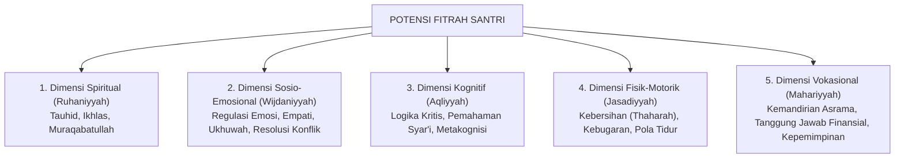
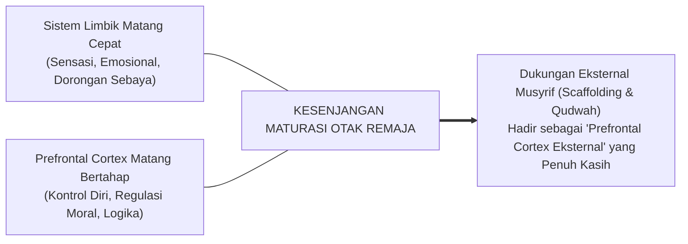
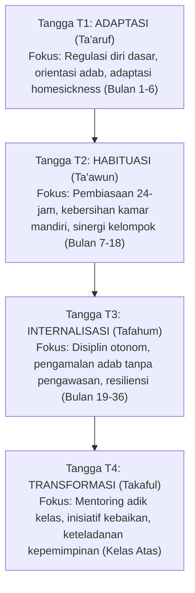

# SERI BUKU EKOSISTEM TUMBUH PESANTREN — VOLUME 02
# TAKSONOMI KAPASITAS & 10 PROFIL KARAKTER SANTRI TUMBUH
## *Kerangka Holistik Kompetensi Adab, Taksonomi Fitrah, Trajektori Remaja, dan Progresi Tangga T1–T4*

**Nomor Identifikasi**: `BOOK-SERIES/VOL-02/TAKSONOMI-KAPASITAS/2026`  
**Klasifikasi**: Monograf Riset Akademis & Buku Teks Desain Kurikulum Karakter Santri  
**Dewan Pakar Pengkaji**: `pakar-desain-kurikulum-adab`, `pakar-social-emotional-learning`, `pakar-psikologi-belajar`, `pakar-simulasi-sistem-tumbuh`

---

## 📑 DAFTAR ISI VOLUME 02

1. **BAB 1: Arsitektur Kapasitas Holistik Santri Berbasis Fitrah**
   - 1.1 Dekonstruksi Karakter Parsial Menuju Pendekatan Manusia Utuh (*Whole-Child Approach*)
   - 1.2 Lima Dimensi Kapasitas: Spiritual (*Ruhaniyyah*), Sosio-Emosional (*Wijdaniyyah*), Kognitif (*Aqliyyah*), Fisik-Motorik (*Jasadiyyah*), dan Vokasional (*Mahariyyah*)
   - 1.3 Integrasi Taksonomi Adab Turats dengan 5 Kompetensi Inti CASEL SEL
2. **BAB 2: Profil 10 Muwashafat Karakter Santri TUMBUH**
   - 2.1 *Salimul Aqidah* (Aqidah Bersih & Tauhid Murni)
   - 2.2 *Shahihul Ibadah* (Ibadah Benar Sesuai Sunnah & Penuh Khusyuk)
   - 2.3 *Matinul Khuluq* (Akhlak Kokoh, Santun, & Berempati)
   - 2.4 *Qadirun 'alal Kasbi* (Kemandirian Finansial, Etos Kerja, & Tanggung Jawab)
   - 2.5 *Mutsaqqoful Fikri* (Wawasan Intelektual Luas & Berpikir Kritis)
   - 2.6 *Qowiyyul Jismi* (Fisik Kuat, Bersih, Sehat, & Berenergi)
   - 2.7 *Mujahidun Linafsihi* (Gigih Menundukkan Hawa Nafsu & Regulasi Diri Tinggi)
   - 2.8 *Munazhzhamun fi Syu'unihi* (Tertib, Terorganisir, & Rapi dalam Segala Urusan)
   - 2.9 *Haritsun 'ala Waqtihi* (Disiplin Waktu & Produktif Tanpa Sia-sia)
   - 2.10 *Nafi'un Lighairihi* (Bermanfaat Luas, Berjiwa Sosial, & Pemimpin Melayani)
3. **BAB 3: Trajektori Biososial-Spiritual Remaja Pesantren (Usia 12–18 Tahun)**
   - 3.1 Transisi Pubertas & Dinamika Lonjakan Hormonal di Lingkungan Berasrama
   - 3.2 Kesenjangan Kematangan Sistem Limbik vs Korteks Prefrontal pada Remaja
   - 3.3 Penanganan Fase Krisis Identitas (*Identity vs Role Confusion*) Melalui Pendampingan Musyrif
4. **BAB 4: Progresi Tangga TUMBUH: Tahapan Perkembangan Karakter T1–T4**
   - 4.1 **Tangga T1 (Adaptasi / Ta'aruf)**: Orientasi Lingkungan, Regulasi Awal, dan Pengikatan Afektif
   - 4.2 **Tangga T2 (Habituasi / Ta'awun)**: Pembiasaan Rutinitas 24-Jam, Kolaborasi Kamar, dan Penguatan Disiplin Positif
   - 4.3 **Tangga T3 (Internalisasi / Tafahum)**: Kesadaran Otonom, Penghayatan Nilai, dan Ketahanan Tekanan Sebaya
   - 4.4 **Tangga T4 (Transformasi / Takaful)**: Mentoring Adik Kelas, Keteladanan Aktif, dan Inisiatif Sosial
5. **BAB 5: Puncak Perkembangan: Tahap 7 PENGGERAK dalam Kontinuum 10-Tahap**
   - 5.1 Karakteristik Santri Tahap 7: Integritas Mandiri, Penggerak Kebaikan Asrama, dan Pengabdi Ummat
   - 5.2 Desain Program Pengabdian Santri Akhir (*Tahun Khidmah*) sebagai Inkubasi Kepemimpinan
   - 5.3 Transisi Menuju Tahap 8 (Pelaksana) dan Tahap 9 (Pembina) bagi Calon Pendidik Pesantren
6. **BAB 6: Matriks Kompetensi dan Capaian Pembelajaran Lintas Usia & Kelas**
   - 6.1 Pemetaan Capaian Pembelajaran Karakter Tingkat Menengah Pertama (MTs/SMP: Kelas 7, 8, 9)
   - 6.2 Pemetaan Capaian Pembelajaran Karakter Tingkat Menengah Atas (MA/SMA: Kelas 10, 11, 12)
   - 6.3 Diferensiasi Pengasuhan Berdasarkan Gender (*Santri Putra vs Santri Putri*)

---

## 🏛️ IKHTISAR DAN TEKS MONOGRAF BAB PER BAB

### BAB 1: Arsitektur Kapasitas Holistik Santri Berbasis Fitrah

Pendidikan pesantren sering kali mengalami reduksi penilaian: santri dinilai "baik" semata-mata karena hafalan Qur'annya lancar atau nilai ujian kitabnya tinggi, sementara kematangan emosi, kemampuan mengelola konflik, dan kemandirian hidup asrama terabaikan. Ekosistem TUMBUH merumuskan **Arsitektur Kapasitas Holistik** yang mengintegrasikan seluruh dimensi kemanusiaan.

Sintesis ini mempertemukan taksonomi adab karya Imam Ibn Sahnun, Al-Qabisi, Al-Ghazali, dan Syekh Zarnuji dengan standar internasional **CASEL SEL** (5 kompetensi sosio-emosional: *Self-Awareness, Self-Management, Social Awareness, Relationship Skills, Responsible Decision-Making*), menghasilkan model pembinaan yang kokoh secara syar'i dan terukur secara psikologis.

### BAB 2: Profil 10 Muwashafat Karakter Santri TUMBUH

Sepuluh pilar karakter santri dioperasionalisasikan ke dalam indikator perilaku faktual (*observable behaviors*) yang dapat diobservasi dalam ritme 24 jam kehidupan pesantren:

1. **Salimul Aqidah**: Menolak takhayul, menyandarkan segala urusan hanya kepada Allah, ikhlas dalam beramal tanpa riya'.
2. **Shahihul Ibadah**: Menjaga shalat fardhu berjamaah di shaf awal, thaharah secara benar, melazimi dzikir dan tilawah harian.
3. **Matinul Khuluq**: Berbicara jujur, menjaga lisan dari ghibah/umpatan, bersikap santun kepada guru dan menyayangi adik kelas.
4. **Qadirun 'alal Kasbi**: Merawat barang pribadi, hemat dalam menggunakan uang jajan, menjaga fasilitas pondok, dan mandiri mencuci/merapikan pakaian.
5. **Mutsaqqoful Fikri**: Gemar membaca kitab dan buku referensi, tekun mencatat dalam halaqah, mampu berdiskusi secara argumentatif tanpa merendahkan orang lain.
6. **Qowiyyul Jismi**: Menjaga kebersihan tubuh dan kamar, aktif berolahraga sunnah (panahan, lari, renang, bela diri), serta menjaga pola makan halal-thayyib.
7. **Mujahidun Linafsihi**: Mampu menahan godaan tidur di waktu belajar, menolak ajakan melanggar aturan, dan cepat bangkit saat melakukan kesalahan.
8. **Munazhzhamun fi Syu'unihi**: Kamar dan lemari pakaian selalu rapi, jadwal harian tertata, seragam bersih dan siap pakai.
9. **Haritsun 'ala Waqtihi**: Hadir 5 menit sebelum bel berbunyi di masjid/kelas, mengisi waktu luang dengan muraja'ah, tidak membuang waktu dalam kesia-siaan (*lahwun*).
10. **Nafi'un Lighairihi**: Gemar menolong teman sekamar yang sakit, aktif membersihkan lingkungan bersama, dan menjadi pendamai saat terjadi perselisihan.

### BAB 3: Trajektori Biososial-Spiritual Remaja Pesantren

Rentang usia santri (12–18 tahun) adalah fase perkembangan paling kritis yang ditandai dengan **ketidakseimbangan maturasi otak**:
* **Sistem Limbik** (khususnya amigdala dan nukleus akumbens yang merespons emosi, pencarian sensasi, dan dorongan sosial sebaya) matang lebih awal.
* **Korteks Prefrontal** (wilayah eksekutif yang mengatur kontrol diri, perencanaan jangka panjang, dan estimasi risiko) belum matang sempurna hingga usia awal 20-an.

Oleh karena itu, penyimpangan adab ringan pada santri baru tidak boleh langsung dicap sebagai "kejahatan moral", melainkan gejala keterbatasan regulasi diri yang membutuhkan *scaffolding* (penyangga eksternal) dari musyrif yang penyabar dan tegas (*firm & kind*).

### BAB 4: Progresi Tangga TUMBUH: Tahapan Perkembangan Karakter T1–T4

Perkembangan karakter diorganisasikan ke dalam empat tangga capaian (*Growth Ladders*):

* **T1 (Adaptasi)**: Santri belajar melepaskan ketergantungan pada orang tua, mengatasi rindu rumah (*homesickness*), dan mengenal aturan bi'ah shalihah.
* **T2 (Habituasi)**: Rutinitas harian terbentuk menjadi otomatisasi perilaku (*habit loop*: pemicu $\rightarrow$ tindakan $\rightarrow$ kepuasan batin).
* **T3 (Internalisasi)**: Santri melakukan adab bukan karena takut hukuman atau mengharap pujian musyrif, melainkan karena kesadaran *muraqabatullah* (merasa diawasi Allah).
* **T4 (Transformasi)**: Santri menjadi agen perubahan (*role model*) yang mendampingi dan menguatkan santri-santri di tangga bawahnya.

### BAB 5: Puncak Perkembangan: Tahap 7 PENGGERAK dalam Kontinuum 10-Tahap

Dalam kontinuum 10-tahap ekosistem TUMBUH, puncak capaian santri adalah **Tahap 7: PENGGERAK** (santri kelas akhir / santri masa pengabdian). Santri Tahap 7 memiliki kematangan kepemimpinan:
1. Menjalankan fungsi mentor sebaya (*peer mentor*) tanpa arogansi atau perpeloncoan.
2. Membantu musyrif dalam memoderasi lingkaran restoratif (*restorative circles*) di asrama.
3. Menjadi teladan nyata dalam menjaga kebersihan lingkungan dan kelaziman shalat berjamaah.

Santri Penggerak membuktikan bahwa santri senior bukanlah "penguasa yang berhak menghukum", melainkan "kakak pembimbing yang wajib mengayomi dan melindungi adik-adiknya".

### BAB 6: Matriks Kompetensi Lintas Jenjang & Diferensiasi Gender

Kurikulum adab dirancang berjenjang dengan mempertimbangkan dinamika psikologis santri putra dan santri putri:
* **Santri MTs/SMP (12–15 Tahun)**: Penekanan pada keteraturan fisik, manajemen barang pribadi, pembentukan adab lisan, dan perlindungan dari pengaruh buruk kelompok sebaya.
* **Santri MA/SMA (15–18 Tahun)**: Penekanan pada kedalaman tafaqquh fiddin, kepemimpinan organisasi santri, integritas etika di ruang digital, dan kesiapan hidup mandiri di masyarakat.
* **Diferensiasi Pendekatan Pengasuhan**: Pengasuhan santri putra lebih banyak mengoptimalkan penyaluran energi motorik positif dan pembinaan resiliensi fisik-mental, sementara pengasuhan santri putri memberikan ruang penguatan komunikasi relasional, manajemen dinamika pertemanan emosional (*peer intimacy*), dan ruang ekspresi yang aman dan empatik.
