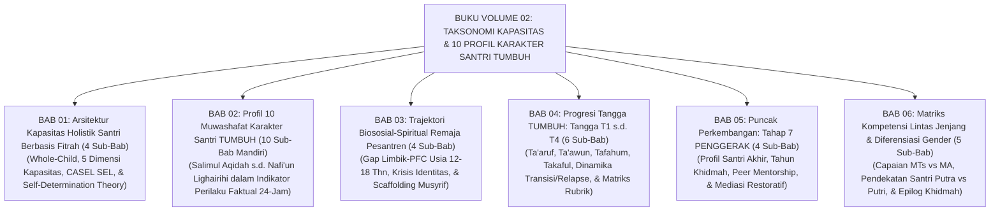

# BUKU VOLUME 02: TAKSONOMI KAPASITAS & 10 PROFIL KARAKTER SANTRI TUMBUH
## *Sitemap Induk & Navigasi Bab Monograf Riset Akademis (6 Bab & 33 Sub-Bab Organik)*

**Nomor Koleksi**: `BOOK-SERIES/VOL-02/INDEX/2026/08`  
**Klasifikasi**: Monograf Desain Kurikulum Karakter Santri, Taksonomi Fitrah, & Psikologi Perkembangan  
**Penanggung Jawab Keilmuan**: Dewan Pakar Desain Kurikulum Adab, Social Emotional Learning, & Neurosains Perkembangan

---

## 📑 SITEMAP & STRUKTUR BAB MODULAR VOLUME 02

| Bab | Judul Bab | Fokus Utama Kajian | Jumlah Sub-Bab | Berkas Bab & Sub-Bab |
| :---: | :--- | :--- | :---: | :---: |
| **00** | **Naskah Lengkap Monograf Volume 02** | Kompilasi Utuh Seluruh Bab Volume 02 (2.678 Baris) | 33 Sub-Bab | [Buka Naskah Lengkap](file:///c:/xampp/htdocs/tumbuh/BOOK-SERIES/Volume-02/Buku-Volume-02-Taksonomi-Kapasitas-dan-10-Profil-Karakter.md) |
| **01** | **Arsitektur Kapasitas Holistik Berbasis Fitrah** | Pendekatan *Whole-Child*, 5 dimensi kapasitas, integrasi CASEL SEL, & SDT. | **4 Sub-Bab** | [Buka Folder Bab 01](file:///c:/xampp/htdocs/tumbuh/BOOK-SERIES/Volume-02/Bab-01-Arsitektur-Kapasitas-Holistik-Berbasis-Fitrah/) |
| **02** | **Profil 10 Muwashafat Karakter Santri TUMBUH** | Indikator perilaku konkret *Salimul Aqidah* hingga *Nafi'un Lighairihi* (10 karakter mandiri). | **10 Sub-Bab** | [Buka Folder Bab 02](file:///c:/xampp/htdocs/tumbuh/BOOK-SERIES/Volume-02/Bab-02-Profil-10-Muwashafat-Karakter-Santri/) |
| **03** | **Trajektori Biososial-Spiritual Remaja Pesantren** | Gap maturasi sistem limbik vs PFC usia 12–18 tahun, krisis identitas, & *External PFC*. | **4 Sub-Bab** | [Buka Folder Bab 03](file:///c:/xampp/htdocs/tumbuh/BOOK-SERIES/Volume-02/Bab-03-Trajektori-Biososial-Spiritual-Remaja-Pesantren/) |
| **04** | **Progresi Tangga TUMBUH (Tangga T1 s/d T4)** | 4 tahap tangga capaian adab, dinamika transisi & penanganan regresi perilaku Tier 2. | **6 Sub-Bab** | [Buka Folder Bab 04](file:///c:/xampp/htdocs/tumbuh/BOOK-SERIES/Volume-02/Bab-04-Progresi-Tangga-TUMBUH-T1-sd-T4/) |
| **05** | **Puncak Perkembangan: Tahap 7 PENGGERAK** | Kepemimpinan santri khidmah, mentorship bebas perpeloncoan, mediasi restoratif, & regenerasi guru. | **4 Sub-Bab** | [Buka Folder Bab 05](file:///c:/xampp/htdocs/tumbuh/BOOK-SERIES/Volume-02/Bab-05-Puncak-Perkembangan-Tahap-7-Penggerak/) |
| **06** | **Matriks Kompetensi Lintas Jenjang & Diferensiasi Gender** | Pemetaan kurikulum MTs vs MA serta diferensiasi fitrah pengasuhan santri putra (ksatria) & putri (anggun). | **5 Sub-Bab** | [Buka Folder Bab 06](file:///c:/xampp/htdocs/tumbuh/BOOK-SERIES/Volume-02/Bab-06-Matriks-Kompetensi-dan-Diferensiasi-Gender/) |
| **REF** | **Daftar Pustaka Master Volume 02** | 95 Referensi Primer Otentik (Turats Klasik, Neurosains, Psikologi, PBIS, & Manajemen) | 1 Berkas Induk | [Buka Daftar Pustaka](file:///c:/xampp/htdocs/tumbuh/BOOK-SERIES/Volume-02/Daftar-Pustaka-Buku-Volume-02.md) |

---

## 🏛️ GRAND ARCHITECTURE DIAGRAM VOLUME 02

