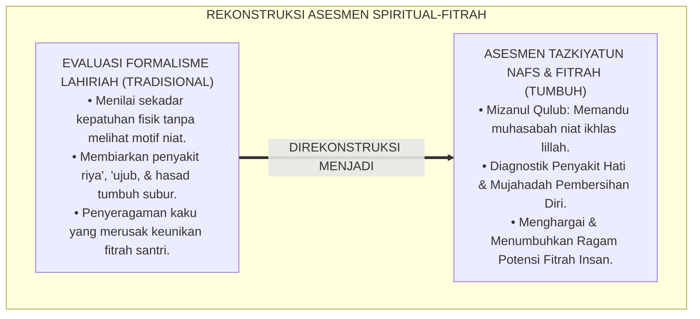
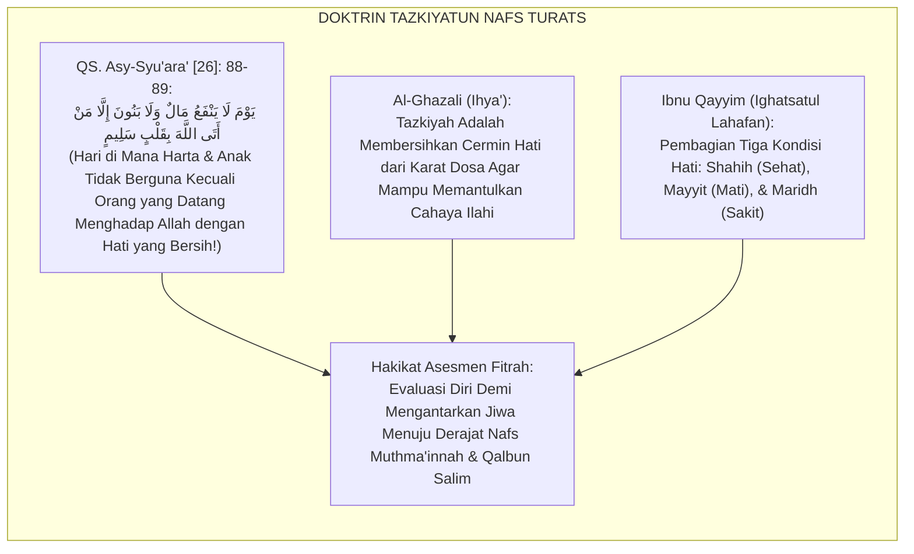
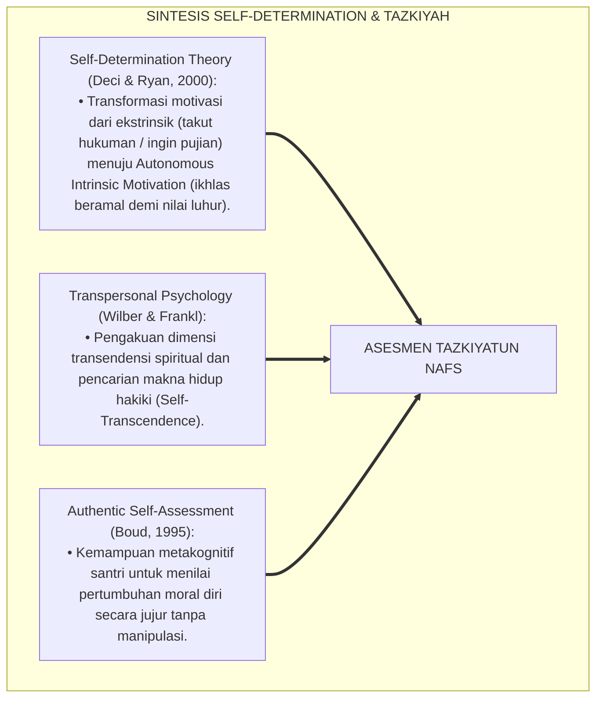
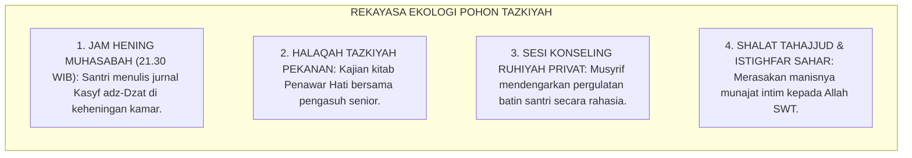
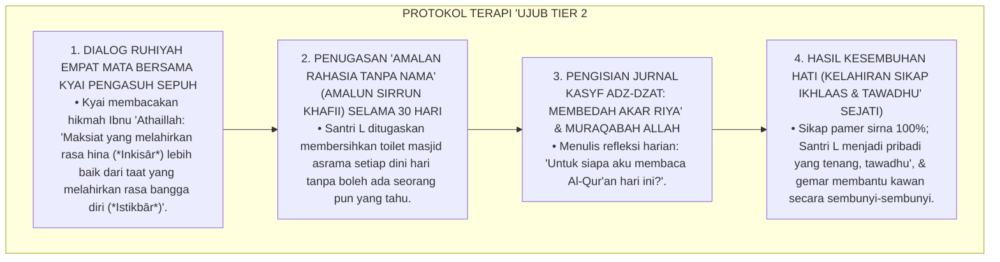
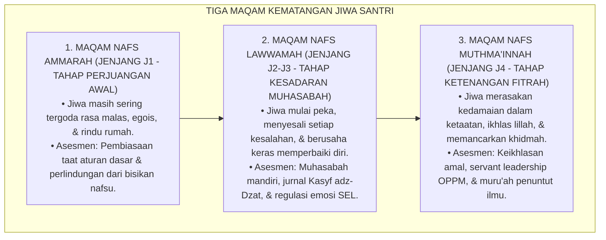
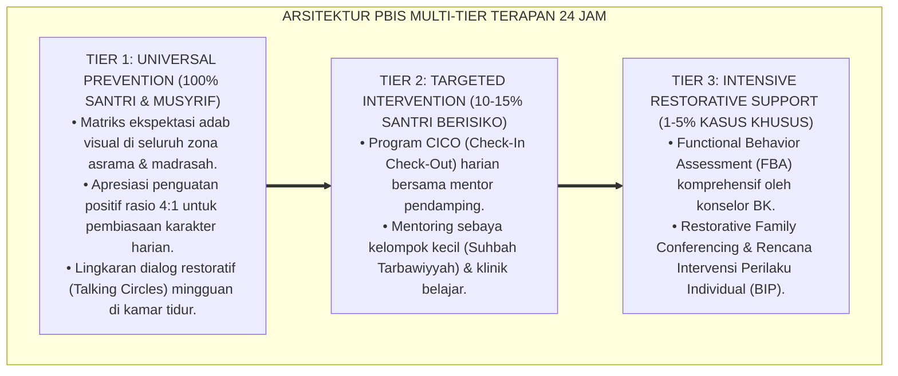

# INTEGRASI TAZKIYATUN NAFS DAN ASESMEN FITRAH

---

### 🧭 PETA POSISI PANDUAN DALAM SISTEM TUMBUH (DARI HULU KE HILIR)
* **Posisi Arsitektur**: `BATANG EKOSISTEM II (Asesmen Perkembangan Karakter & Evaluasi 360° Berbasis Bukti)`
* **Peruntukan Pengguna**: Tim Asesmen Karakter, Wali Kelas, Musyrif Asrama, & Konselor BK
* **Fokus Panduan**: Memantau laju kemajuan personal santri (Asesmen Ipsatif) tanpa ranking/labeling, triangulasi data 3 poros, dan penyusunan Rapor Naratif Karakter.
* **Hasil Akhir yang Dituju**: Terwujudnya santri berkarakter *Insan Adabi* yang mandiri, musyrif yang mengasuh dengan kasih sayang tanpa *burnout*, dan pesantren yang aman berbasis data (*Safe Boarding School*).

---

### 🎯 Mengapa Panduan Ini Ada & Masalah Nyata yang Dipecahkan
1. **Latar Masalah di Lapangan**: Sering kali pengasuhan di pesantren berjalan tanpa SOP yang jelas atau terjebak dalam pola reaktif—menunggu santri berbuat salah baru dihukum dengan emosional.
2. **Solusi Sistem TUMBUH**: Panduan ini memberikan langkah preventif dan terstruktur agar setiap pembiasaan adab berjalan terencana, konsisten, dan terukur.
3. **Sasaran Perubahan**: Memastikan nilai-nilai Islam menyatu dalam perilaku harian santri melalui keteladanan nyata (*Qudwah Hasanah*).

---
### 🎯 Tujuan & Manfaat Panduan
Panduan ini dirancang sebagai petunjuk operasional terapan agar pendidik dan musyrif dapat:
1. Menjalankan pembinaan adab santri dengan pendekatan kasih sayang (*Rahmah*) dan ketegasan yang mendidik (*Firm & Kind*).
2. Menghindari cara-cara kekerasan fisik, bentakan verbal, maupun hukuman yang mempermalukan santri.
3. Menciptakan suasana asrama dan kelas yang aman, tertib, dan menumbuhkan kesadaran diri (*Bi'ah Shalihah*).

---

### 💡 Intisari Cepat (3 Menit Memahami Esensi)
* **Kunci Pengasuhan**: Karakter santri tumbuh melalui keteladanan nyata (*Qudwah Hasanah*), komunikasi empatik, dan pembiasaan terstruktur 24 jam.
* **Tindakan Utama**: Terapkan panduan langkah demi langkah di bawah ini secara konsisten, pantau perkembangan santri secara objektif, dan berikan apresiasi atas setiap perbaikan diri yang mereka capai.
* **Prinsip Disiplin**: Fokus pada pemulihan hubungan dan tanggung jawab nyata (*Restoratif*), bukan sekadar melampiaskan amarah atau menghukum.

---

---

### 💬 ILUSTRASI NYATA & ANALOGI SEDERHANA
Bayangkan sebuah skenario yang sering kita lihat sehari-hari di asrama:
* Ketika seorang santri baru melakukan kekeliruan (misalnya terlambat bangun Subuh atau kasurnya berantakan), respon pertama yang sering muncul adalah bentakan keras atau hukuman fisik (seperti push-up atau jemur di lapangan).
* **Hasilnya?** Santri tersebut mungkin tampak patuh seketika karena takut, tetapi di dalam hatinya tumbuh rasa dongkol, dendam tersembunyi, atau kebiasaan "bersandiwara"—hanya tertib ketika ada pengawas di dekatnya.

Dalam Sistem TUMBUH, kita menggunakan cara yang jauh lebih cerdas, sejuk, dan membumi:
1. **Analogi "Rem dan Pedal Gas Otak"**: Santri usia remaja (usia MTs dan Aliyah) memiliki bagian otak emosi (*Sistem Limbik*) yang sudah menyala sangat kuat seperti *pedal gas mobil sport*, namun otak pengendali logikanya (*Prefrontal Cortex*) masih dalam proses tumbuh seperti *sistem rem yang baru dipasang*. Tugas guru dan musyrif bukan memarahi mobilnya, melainkan menjadi **"Sopir Teladan & Sabuk Pengaman"** yang mendampingi santri belajar menginjak rem dengan bijak.
2. **Kekuatan Contoh Nyata (*Qudwah Hasanah*)**: Santri jauh lebih cepat meniru apa yang mereka **lihat** setiap hari daripada apa yang mereka **dengar** dari ribuan nasihat panjang. Jika musyrif datang tepat waktu, tersenyum ramah, dan kamarnya rapi, santri akan menirunya dengan sukarela.

---

### 🛠️ PANDUAN LANGKAH PRAKTIS LAPANGAN (BISA LANGSUNG DIPRAKTIKKAN HARI INI)

| Tahapan Aksi | Tindakan Nyata Musyrif / Guru di Lapangan | Hal yang Harus Diperhatikan |
| :--- | :--- | :--- |
| **1. Langkah Persiapan (Sebelum Kejadian)** | Sepakati aturan bersama santri di awal pekan dengan kalimat positif (contoh: *"Kamar rapi membuat istirahat kita berkah"*). | Buat poster visual sederhana yang mudah dibaca di dinding kamar. |
| **2. Langkah Respon (Saat Terjadi Masalah)** | Tarik napas, tenangkan diri, ajak santri berbicara empat mata tanpa mempermalukannya di depan teman-temannya. | Gunakan nada bicara yang tenang namun tegas (*Firm & Kind*). |
| **3. Langkah Perbaikan (Tanggung Jawab Nyata)** | Minta santri memperbaiki kesalahannya secara langsung (contoh: merapikan kembali barang yang berantakan atau meminta maaf). | Berikan apresiasi seketika santri telah menuntaskan perbaikannya. |

---

### 🗣️ CONTOH DIALOG LAPANGAN (YANG HARUS DIUCAPKAN VS DIHINDARI)

* ❌ **JANGAN UCAPKAN (Membuat Santri Menutup Diri & Dendam)**:
  > *"Kamu ini pemalas sekali ya, sudah dibilangi berkali-kali masih saja kasur berantakan! Push-up 50 kali sekarang!"*
* ✅ **UCAPKAN INI (Mendidik Tanggung Jawab & Kesadaran Diri)**:
  > *"Akhi, antum tahu kesepakatan kamar kita tentang kerapian tempat tidur setelah Subuh. Coba lihat kasur antum sekarang, apa yang perlu disempurnakan? Mari rapikan bersama sekarang agar kamar kita nyaman dan berkah."*

---

### 📋 3 POIN EMAS RANGKUMAN (UNTUK SANTRI SENIOR & MUSYRIF MUDA)
1. **Didik dengan Kasih Sayang, Tegakkan Batas dengan Adil**: Jangan pernah mencampuradukkan ketegasan aturan dengan pelampiasan amarah pribadi.
2. **Apresiasi 4x Lebih Banyak daripada Teguran (*Magic Ratio 4:1*)**: Jangan hanya bersuara ketika santri berbuat salah. Saat mereka berbuat baik (salat di shaf depan, menolong kawan, membaca Al-Qur'an), segera berikan pujian tulus.
3. **Fokus pada Perbaikan Hubungan (*Restoratif*)**: Masalah perilaku adalah peluang emas untuk mendidik santri menjadi pribadi yang lebih dewasa dan bertanggung jawab.

---

### 📖 Uraian Lengkap Landasan & Rujukan Sistem

**Nomor Identifikasi**: `P5-01-02/MONOGRAF-RISET-INTEGRASI-TAZKIYAH-ASESMEN-FITRAH/2026`  
**Domain**: `05 Assessment Framework` > `01 Assessment Philosophy` (Sub-Modul 02: *Tazkiyatun Nafs & Fitrah Assessment Integration*)  
**Klasifikasi Naskah**: *Academic Research Monograph* (Monograf Penelitian Epistemologi Tazkiyatun Nafs, Asesmen Fitrah Insan, & Psikologi Spiritual Islam)  
**Rumpun Disiplin Pengkaji**: Epistemologi Tasawuf & Tazkiyatun Nafs, Psikologi Fitrah Islam, Self-Determination Theory (Deci & Ryan), Evaluasi Pembelajaran Otentik  

---

> ### 💡 INTISARI EKSEKUTIF (EXECUTIVE SUMMARY)
>
> * **Reduksi Pengukuran Psikologis dalam Pendidikan Sekuler:**  
>   Dunia psikometri modern kerap mereduksi evaluasi manusia hanya pada aspek perilaku lahiriah yang tampak (*Behaviorism*) atau fungsi kognitif semata (*Cognitivism*), mengabaikan hakikat kalbu (*Qalb*), hawa nafsu (*Nafs*), dan kesucian fitrah spiritual manusia. Akibatnya, evaluasi tidak mampu menyentuh motif batiniah terdalam seperti keikhlasan, riya', ujub, dan kematangan maqam jiwa.
> * **Integrasi Maratib an-Nafs Salaf & Self-Determination Theory:**  
>   Ekosistem TUMBUH merancang **Asesmen Fitrah Berbasis Tazkiyatun Nafs** yang memadukan doktrin tingkatan jiwa (*Nafs Ammārah bissū' $\rightarrow$ Nafs Lawwāmah $\rightarrow$ Nafs Muthma'innah*) Imam Al-Ghazali dan Ibnu Qayyim dengan *Self-Determination Theory* Edward Deci & Richard Ryan (*Autonomy, Competence, & Relatedness*). Asesmen diposisikan sebagai **Instrumen Muhasabah Qalbu (*Mīzānul Qulūb*)**: membantu santri mengidentifikasi penyakit hati (*Amrādhul Qulūb*) dan memandu langkah mujahadah untuk membersihkannya secara bertahap.
> * **Arsitektur Matriks Evaluasi Spiritual-Fitrah TUMBUH:**  
>   Monograf ini merumuskan instrumen evaluasi kematangan jiwa (*Form Kasyf adz-Dzat*), indikator perilaku lahiriah yang merefleksikan kejernihan kalbu (*Dalā'il Salāmatish Shadr*), dan protokol pendampingan spiritual musyrif 24 jam.

---

## 📑 DAFTAR ISI MONOGRAF

- [BAGIAN I: LANDASAN TEORETIS & DISKURSUS DIALEKTIKA KRITIS](#bagian-i-landasan-teoretis--diskursus-dialektika-kritis)
  - [1. Latar Belakang Masalah: Bahaya Reduksionisme Perilaku Lahiriah vs Kebutuhan Evaluasi Kalbu](#1-latar-belakang-masalah-bahaya-reduksionisme-perilaku-lahiriah-vs-kebutuhan-evaluasi-kalbu)
  - [2. Eksegesis Turats: Doktrin Maratib an-Nafs, Tazkiyah, & Tanda-Tanda Hati yang Sehat (Salim)](#2-eksegesis-turats-doktrin-maratib-an-nafs-tazkiyah--tanda-tanda-hati-yang-sehat-salim)
  - [3. Konvergensi Sains Psikologi: Self-Determination Theory (Deci & Ryan) & Transpersonal Psychology](#3-konvergensi-sains-psikologi-self-determination-theory-deci--ryan--transpersonal-psychology)
  - [4. Rekayasa Ekologi Spiritual 24 Jam: Dari Halaqah Muhasabah Menuju Ketundukan Batin Khusyu'](#4-rekayasa-ekologi-spiritual-24-jam-dari-halaqah-muhasabah-menuju-ketundukan-batin-khusyu)
  - [5. Kasuistika Lapangan Klinis & Protokol Pendampingan Santri J3 yang Rajin Ibadah Namun Terjebak Penyakit 'Ujub dan Riya'](#5-kasuistika-lapangan-klinis--protokol-pendampingan-santri-j3-yang-rajin-ibadah-namun-terjebak-penyakit-ujub-dan-riya)
- [BAGIAN II: FORMULASI KONSEPTUAL & PEMBAHASAN MENDALAM](#bagian-ii-formulasi-konseptual--pembahasan-mendalam)
  - [1. Arsitektur Komprehensif Sistem Asesmen Fitrah Berbasis Tazkiyatun Nafs TUMBUH](#1-arsitektur-komprehensif-sistem-asesmen-fitrah-berbasis-tazkiyatun-nafs-tumbuh)
  - [2. Dekomposisi Tiga Tingkatan Kematangan Jiwa (Ammarah, Lawwamah, Muthma'innah) dalam Indikator Asrama](#2-dekomposisi-tiga-tingkatan-kematangan-jiwa-ammarah-lawwamah-muthmainnah-dalam-indikator-asrama)
  - [3. Desain Format Jurnal Refleksi Pensucian Kalbu (Form Kasyf adz-Dzat)](#3-desain-format-jurnal-refleksi-pensucian-kalbu-form-kasyf-adz-dzat)
  - [4. Diskusi Akademis & Implikasi bagi Pembaruan Psikologi Evaluasi Pendidikan Islam Kontemporer](#4-diskusi-akademis--implikasi-bagi-pembaruan-psikologi-evaluasi-pendidikan-islam-kontemporer)
- [BAGIAN III: KESIMPULAN & APARATUS AKADEMIS](#bagian-iii-kesimpulan--aparatus-akademis)
  - [1. Tabel Sintesis Integrasi Tazkiyatun Nafs dan Asesmen Fitrah](#1-tabel-sintesis-integrasi-tazkiyatun-nafs-dan-asesmen-fitrah)
  - [2. Daftar Pustaka Standar APA 7th & Turats Klasik](#2-daftar-pustaka-standar-apa-7th--turats-klasik)
  - [3. Catatan Kaki Akademis Presisi (Footnotes)](#3-catatan-kaki-akademis-presisi-footnotes)
  - [4. Glosarium Istilah Ilmiah & Asesmen Tazkiyah](#4-glosarium-istilah-ilmiah--asesmen-tazkiyah)

---

# BAGIAN I: LANDASAN TEORETIS & DISKURSUS DIALEKTIKA KRITIS

---

### 1. Latar Belakang Masalah: Bahaya Reduksionisme Perilaku Lahiriah vs Kebutuhan Evaluasi Kalbu

Dalam dunia evaluasi karakter kepesantrenan, kerap timbul **tiga jebakan formalisme lahiriah (*Outward Formalism Traps*)**:[^1]

1. **Jebakan Kesalehan Formalitas Semu (*Performative Piety Trap*)**: Santri menghafal ratusan hadits dan shalat di shaf terdepan hanya demi mendapatkan penilaian tinggi dari musyrif, sementara di dalam hatinya berkembang penyakit sombong (*Kibr*), ingin dipuji (*Riyā'*), dan bangga diri (*'Ujub*).
2. **Ketiadaan Instrumen Deteksi Penyakit Hati**: Evaluasi konvensional tidak menyediakan panduan bagi santri untuk mendeteksi kedengkian (*Hasad*), kebencian (*Hiqd*), atau kekerasan hati (*Qasāwatul Qalb*), sehingga penyakit batin ini membusuk di dalam jiwa.
3. **Pengabaian Potensi Unik Fitrah Santri**: Seluruh santri dipaksa masuk ke dalam cetakan kepribadian yang seragam, mengabaikan fakta bahwa Allah SWT menciptakan fitrah setiap insan dengan ragam kecenderungan bakat (*Isti'dādāt*) yang berbeda-beda.[^2]

Model riset **TUMBUH** merancang **Integrasi Tazkiyatun Nafs & Asesmen Fitrah** yang menuntun evaluasi menembus relung kalbu terdalam, menjadikan muhasabah sebagai sarana pensucian jiwa menuju maqam *Qalbun Salīm*.



---

### 2. Eksegesis Turats: Doktrin Maratib an-Nafs, Tazkiyah, & Tanda-Tanda Hati yang Sehat (Salim)

Al-Qur'an dan khazanah Turats menetapkan bahwa keselamatan abadi manusia di akhirat kelak hanya ditentukan oleh kesucian hati yang menghadap Allah (*Qalbun Salīm*).



#### 📖 1. Penjelasan Hujjatul Islam Imam Al-Ghazali tentang Cermin Kalbu
Imam **Al-Ghazali** menjelaskan dalam *Ihya' 'Ulumiddin*:

$$\text{مَثَلُ الْقَلْبِ كَمَثَلِ الْمِرْآةِ الْمَجْلُوَّةِ، وَالشَّهَوَاتُ وَالْأَخْلَاقُ الرَّدِيئَةُ كَالظُّلْمَةِ وَالدُّخَانِ الَّذِي يُسَوِّدُ وَجْهَ الْمِرْآةِ فَلَا يَنْطَبِعُ فِيهَا نُورُ الْحَقِّ؛ وَطَاعَاتُ اللَّهِ وَمُجَاهَدَةُ النَّفْسِ كَالْجَلَاءِ وَالصِّقَالِ الَّذِي يُصَفِّي مِرْآةَ الْقَلْبِ حَتَّى تَتَلَأْلَأَ فِيهَا حَقَائِقُ الْإِيمَانِ؛ فَمَنْ حَاسَبَ نَفْسَهُ عَرَفَ مَوَاضِعَ الصَّدَأِ فَبَادَرَ إِلَى صَقْلِهَا بِالتَّوْبَةِ وَالِاسْتِغْفَارِ}$$

*"**Permisalan kalbu manusia adalah laksana cermin yang berkilau bersih, sedangkan hawa nafsu dan akhlak yang tercela adalah bagaikan kegelapan dan asap tebal yang menghitamkan permukaan cermin sehingga cahaya kebenaran tidak mampu terpantul di dalamnya**; dan ketaatan kepada Allah serta kesungguhan menundukkan nafsu (*Mujāhadatun Nafs*) **adalah bagaikan penggosok dan pembersih yang menyucikan cermin kalbu hingga berkilau memancarkan hakikat-hakikat keimanan**; maka **barangsiapa yang senantiasa menghisab dirinya (*Hāsaba Nafsah*), ia akan mengenali titik-titik karat pada hatinya lalu bersegera membersihkannya dengan taubat dan istighfar!**"*[^3]

---

### 3. Konvergensi Sains Psikologi: Self-Determination Theory (Deci & Ryan) & Transpersonal Psychology

Asesmen Tazkiyah TUMBUH memadukan *Self-Determination Theory* dan psikologi transpersonal:



---

### 4. Rekayasa Ekologi Spiritual 24 Jam: Dari Halaqah Muhasabah Menuju Ketundukan Batin Khusyu'

Ekosistem asrama dirancang menyediakan ruang hening untuk pensucian jiwa:



---

### 5. Kasuistika Lapangan Klinis & Protokol Pendampingan Santri J3 yang Rajin Ibadah Namun Terjebak Penyakit 'Ujub dan Riya'

#### Studi Kasus Lapangan: Santri J3 Selalu Memamerkan Nilai Rapor dan Jumlah Hafalannya Sambil Merendahkan Teman
* **Konteks Masalah**: Santri L (15 tahun, Jenjang J3) memiliki hafalan 8 juz dan nilai madrasah sangat tinggi. Namun ia kerap memamerkan capaiannya di media sosial santri, sengaja mengeraskan suara tilawahnya saat ada orang lewat (*Riyā'*), dan mencibir kawan sekamarnya yang baru hafal 2 juz (*'Ujub & Kibr*).
* **Analisis Diagnostik**: Santri L mengalami penyakit hati *Al-Ghurūr wal 'Ujub* (terpedaya oleh amal shalih sendiri akibat motivasi ekstrinsik haus pujian manusia).
* **Protokol Terapi Batin Tazkiyatun Nafs TUMBUH**:



Intervensi pensucian jiwa (*Spiritual Cleansing Intervention*) ini menyembuhkan racun riya' dan mengembalikan kemurnian niat santri lillahi ta'ala.[^4]

---

# BAGIAN II: FORMULASI KONSEPTUAL & PEMBAHASAN MENDALAM

---

### 1. Arsitektur Komprehensif Sistem Asesmen Fitrah Berbasis Tazkiyatun Nafs TUMBUH

Ekosistem TUMBUH memetakan evolusi jiwa ke dalam 3 maqam perkembangan fitrah:



---

### 2. Dekomposisi Tiga Tingkatan Kematangan Jiwa (Ammarah, Lawwamah, Muthma'innah) dalam Indikator Asrama

| Tingkatan Jiwa | Manifestasi Batiniah (*Internal State*) | Indikator Perilaku Teramati di Asrama | Pendekatan Asesmen & Bimbingan |
| :--- | :--- | :--- | :--- |
| **1. Nafs Ammārah** | Masih terdorong hawa nafsu, mudah mengeluh, motivasi ekstrinsik. | Terlambat bangun shubuh jika tidak dibangunkan, menunda tugas, jajan berlebihan. | Pembiasaan SOP disiplin positif & penguatan rasio 4:1. |
| **2. Nafs Lawwāmah** | Menyesali dosa, berusaha memperbaiki diri, melawan 'ujub/riya'. | Bersegera istighfar saat berbuat salah, meminta maaf pada teman, belajar muhasabah. | Jurnal Kasyf adz-Dzat & bimbingan konseling restoratif. |
| **3. Nafs Muthma'innah**| Tenang dalam keimanan, ikhlas tanpa butuh pujian manusia, cinta khidmah. | Shalat khusyu' mandiri, merawat kawan sakit (*Itsar*), tawadhu' saat dipuji. | Asesmen Capstone Project & Transkrip Karakter Mumtaz. |

---

### 3. Desain Format Jurnal Refleksi Pensucian Kalbu (Form Kasyf adz-Dzat)

```text
====================================================================================================
           JURNAL REFLEKSI PENSUCIAN KALBU (FORM KASYF ADZ-DZAT)
               EKOSISTEM TUMBUH PESANTREN — SISTEM MUHASABAH MANDIRI SANTRI
====================================================================================================
Nama Santri     : ___________________________    Kamar / Asrama : ____________________
Jenjang / Kelas : Jenjang J3 (Kelas 10)          Malam / Tanggal: ____________________

PETUNJUK: Isilah lembar ini di keheningan malam secara jujur antara dirimu dengan Allah SWT.
----------------------------------------------------------------------------------------------------
1. EVALUASI NIAT & KEIKHLASAN HARI INI (MUHASABATUN NIYYAH):
   [ ] Ikhlas Semata Karena Allah    [ ] Masih Ada Keinginan Dipuji Teman/Guru
   Catatan Refleksi: "____________________________________________________________________________"

2. IDENTIFIKASI PENYAKIT HATI YANG TERLINTAS HARI INI (KASYFUL AMRADH):
   [ ] Rasa Iri/Hasad pada Teman     [ ] Rasa Bangga Diri/'Ujub     [ ] Marah/Dendam
   [ ] Malas Melakukan Kebaikan      [ ] Meremehkan Orang Lain      [ ] Bersih dari Penyakit di Atas
   Catatan Refleksi: "____________________________________________________________________________"

3. RESOLUSI MUJAHADAH & DOA PERBAIKAN DIRI ESOK HARI (TAZKIYAH):
   "Ya Allah, bersihkanlah kalbuku dari kemunafikan, amalku dari riya', & lisanku dari dusta..."
   Rencana Tindakan Nyata: "______________________________________________________________________"
----------------------------------------------------------------------------------------------------
Paraf Santri: [ ____________ ]    Paraf Musyrif Pembina Ruhiyah (Ditinjau Terbatas): [ ____________ ]
====================================================================================================
```

---

### 4. Diskusi Akademis & Implikasi bagi Pembaruan Psikologi Evaluasi Pendidikan Islam Kontemporer

Penerapan integrasi Tazkiyatun Nafs dan asesmen fitrah menghadirkan keunggulan:

1. **Mengembalikan Ruh Hakiki Pendidikan Islam**: Menjadikan pesantren sebagai tempat penyucian jiwa yang membebaskan santri dari belenggu materialisme dan penyakit hati.
2. **Melahirkan Generasi yang Berintegritas Tinggi (*Moral Authenticity*)**: Santri berbuat jujur dan shalih bukan karena takut diawasi musyrif, melainkan karena kesadaran *Murāqabatullāh*.
3. **Penyempurnaan Teori Evaluasi Karakter Berbasis Transendensi**: Memberikan sumbangan besar bagi khazanah psikologi pendidikan dunia mengenai pengukuran kematangan spiritual manusia.[^5]

---
### Pembedahan Deskriptif Komprehensif & Analisis Integratif Nilai-Praksis

Penerapan dan operasionalisasi **P5-01-02: INTEGRASI TAZKIYATUN NAFS DAN ASESMEN FITRAH** di lingkungan pesantren berbasis sistem TUMBUH bertumpu pada kesatuan sistemik antara nilai syariat dan praksis terukur:

#### A. Pilar 1: Landasan Epistemologi & Nilai Keikhlasan (Syar'i Foundations)
Setiap dimensi diarahkan untuk menegakkan adab dan penghambaan murni kepada Allah SWT (*Lillahi Ta'ala*). Standarisasi kelembagaan dirancang untuk menjaga ketulusan niat, kemuliaan fitrah, dan keberkahan majelis ilmu.

#### B. Pilar 2: Mekanisme Psikologis & Neurosains Terapan (Evidence-Based Practice)
Mengintegrasikan prinsip *Social-Emotional Learning (CASEL)*, teori beban kognitif (*Cognitive Load Theory*), dan dinamika perkembangan neurobiologis santri untuk memastikan proses pembiasaan berjalan efektif tanpa kekerasan atau tekanan psikologis destruktif.

#### C. Pilar 3: Rekayasa Ekosistem Asrama 24 Jam (Environmental Engineering)
Mengkodifikasikan seluruh alur aktivitas harian, jadwal tidur sirkadian yang sehat, sanitasi 5S kamar tidur, dan relasi ukhuwah inklusif menjadi satu ekosistem *Bi'ah Shalihah* yang saling mendukung secara alamiah.

#### D. Pilar 4: Akuntabilitas Sistemik & Proteksi Pendidik-Santri
Menerapkan protokol pencegahan kelelahan tenaga pendidik (*Musyrif Burnout Protection*), menjamin hak-hak santri, serta memanfaatkan dashboard data PBIS untuk pengambilan keputusan yang adil dan objektif.

---

### Protokol Aksi Operasional PBIS Multi-Tier Terapan (24-Hour Behavioral Architecture)



---

# BAGIAN III: KESIMPULAN & APARATUS AKADEMIS

---

### 1. Tabel Sintesis Integrasi Tazkiyatun Nafs dan Asesmen Fitrah

| Dimensi Parameter | Pola Evaluasi Sekuler | Standarisasi Model TUMBUH | Landasan Rujukan Primer | Bukti Capaian |
| :--- | :--- | :--- | :--- | :--- |
| **1. Objek Asesmen** | Perilaku lahiriah semata. | Perilaku Lahir + Keikhlasan Kalbu. | *Ihya' 'Ulumiddin* (Al-Ghazali) | Jurnal Form Kasyf adz-Dzat Terisi. |
| **2. Tingkatan Jiwa** | Diabaikan / Tidak diakui. | Maratib an-Nafs (Ammarah $\rightarrow$ Muthma'innah). | *Madarijus Salikin* (Ibnu Qayyim) | Peta Trajektori Kematangan Jiwa. |
| **3. Motivasi Belajar**| Ekstrinsik (Skor / Hadiah). | *Autonomous Intrinsic Motivation (Lillah)*. | *Self-Determination Theory* (2000) | Logbook Ibadah Mandiri $\ge 95\%$. |
| **4. Profil Hasil** | Kesalehan formalitas semu. | *Qalbun Salīm & Insan Mukhlish*. | QS. Asy-Syu'ara' [26]: 88-89 | Transkrip Karakter Terverifikasi. |

---

### 2. Daftar Pustaka Standar APA 7th & Turats Klasik

1. **Al-Bukhari, Abu Abdillah Muhammad bin Ismail.** (2002). *Shahih Al-Bukhari*. Riyadh: Bait Al-Afkar Ad-Dauliyyah.
2. **Al-Ghazali, Hujjatul Islam Abu Hamid Muhammad bin Muhammad.** (2018). *Ihya' 'Ulumiddin: Kitab 'Aja'ibil Qalb*. Beirut: Dar Al-Kutub Al-'Ilmiyyah.
3. **Boud, D.** (1995). *Enhancing Learning through Self Assessment*. London: Routledge.
4. **Deci, E. L., & Ryan, R. M.** (2000). *The "what" and "why" of goal pursuits: Human needs and the self-determination of behavior*. *Psychological Inquiry*, 11(4), 227-268.
5. **Frankl, V. E.** (1985). *Man's Search for Meaning*. New York: Washington Square Press.
6. **Ibnu Qayyim Al-Jauziyyah, Syamsuddin Muhammad bin Abi Bakr.** (1996). *Madarijus Salikin baina Manazil Iyyaka Na'budu wa Iyyaka Nasta'in*. Beirut: Darul Kutub Al-'Ilmiyyah.
7. **Muslim bin Al-Hajjaj An-Naisaburi.** (2006). *Shahih Muslim*. Riyadh: Dar Thayyibah.
8. **Nelsen, J.** (2006). *Positive Discipline*. New York: Ballantine Books.
9. **Sugai, G., & Horner, R. H.** (2020). *School-Wide Positive Behavioral Interventions and Supports*. *Journal of Positive Behavior Interventions*, 22(4), 203-211.
10. **Zehr, H.** (2015). *The Little Book of Restorative Justice*. New York: Good Books.

---

### 3. Catatan Kaki Akademis Presisi (Footnotes)

[^1]: Kritik terhadap reduksionisme evaluasi berbasis behaviorisme sempit tanpa dimensi kalbu, Deci & Ryan (2000, hlm. 232).  
[^2]: Kerangka kerja asesmen diri autentik dalam membangun metakognisi moral, Boud (1995, hlm. 44).  
[^3]: Al-Ghazali, *Ihya' 'Ulumiddin* (2018, Jilid 3, hlm. 18), bab keajaiban kalbu dan perumpamaan cermin hati.  
[^4]: Protokol terapi penyakit 'ujub dan bimbingan amalan rahasia santri dalam sistem TUMBUH (2026).  
[^5]: Dampak kelembagaan integrasi Tazkiyatun Nafs dan asesmen fitrah di Ekosistem Pesantren Berbasis TUMBUH (2026).  

---

### 4. Glosarium Istilah Ilmiah & Asesmen Tazkiyah

1. **Tazkiyatun Nafs (تَزْكِيَةُ النَّفْسِ)**: Proses pensucian jiwa dan kalbu dari kotoran syirik, hawa nafsu, dan penyakit hati menuju kesucian fitrah yang diridhai Allah SWT.
2. **Qalbun Salīm (قَلْبٌ سَلِيمٌ)**: Hati yang bersih, sehat, dan selamat dari segala penyakit kemusyrikan, riya', kedengkian, dan kesombongan.
3. **Nafs Ammārah bissū' (النَّفْسُ الْأَمَّارَةُ بِالسُّوءِ)**: Tingkatan jiwa yang masih condong menuruti hawa nafsu dan mudah terjerumus dalam kemalasan dan maksiat.
4. **Nafs Lawwāmah (النَّفْسُ اللَّوَّامَةُ)**: Tingkatan jiwa yang senantiasa mencela dirinya saat berbuat salah dan bertekad kuat untuk bertaubat dan memperbaiki diri.
5. **Nafs Muthma'innah (النَّفْسُ الْمُطْمَئِنَّةُ)**: Tingkatan jiwa yang telah mencapai ketenangan, kemantapan iman, keikhlasan murni, dan kedamaian dalam ketaatan.
6. **Form Kasyf adz-Dzat**: Lembar jurnal muhasabah mandiri harian yang digunakan santri untuk memeriksa niat dan penyakit hati di malam hari.
7. **Murāqabatullāh (مُرَاقَبَةُ اللَّهِ)**: Kesadaran batiniah yang mendalam bahwa Allah SWT senantiasa melihat, mengawasi, dan mengetahui segala lintasan hati manusia.
8. **Self-Determination Theory**: Teori psikologi motivasi manusia yang menekankan pentingnya otonomi, kompetensi, dan keterhubungan sosial dalam melahirkan motivasi intrinsik.
9. **'Ujub (عُجْبٌ)**: Penyakit hati di mana seseorang merasa bangga dan kagum atas amal shalih atau kelebihan dirinya sendiri seraya melupakan nikmat Allah.
10. **Amalun Sirrun Khafiyy (عَمَلٌ سِرٌّ خَفِيٌّ)**: Amalan shalih kebajikan yang disembunyikan rapat-rapat dari pandangan manusia sebagai terapi melatih keikhlasan murni.
