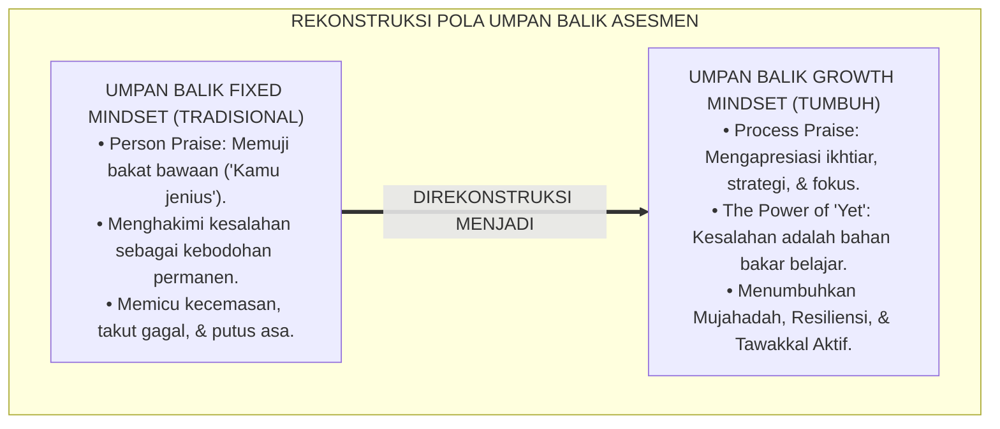
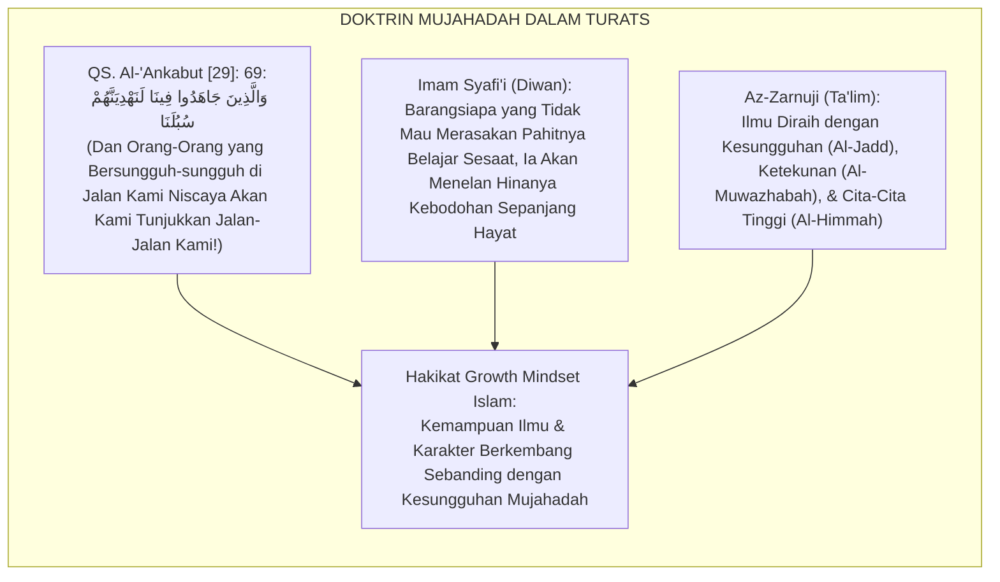
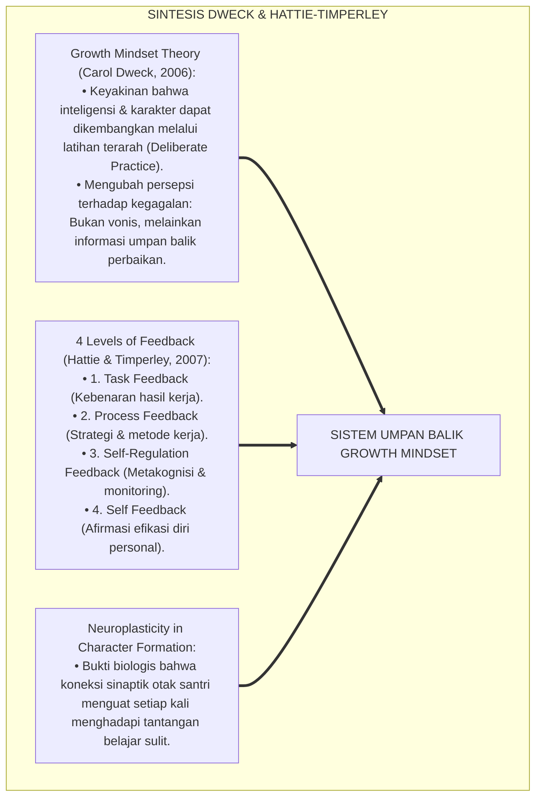
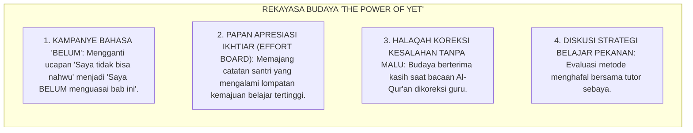
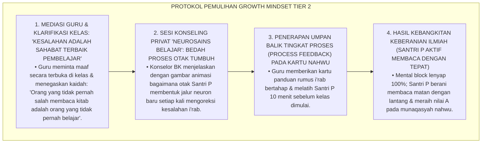
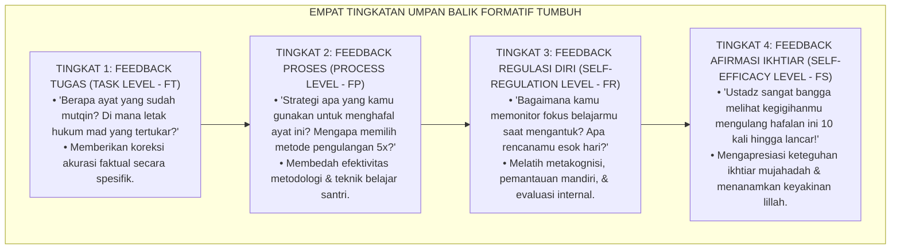
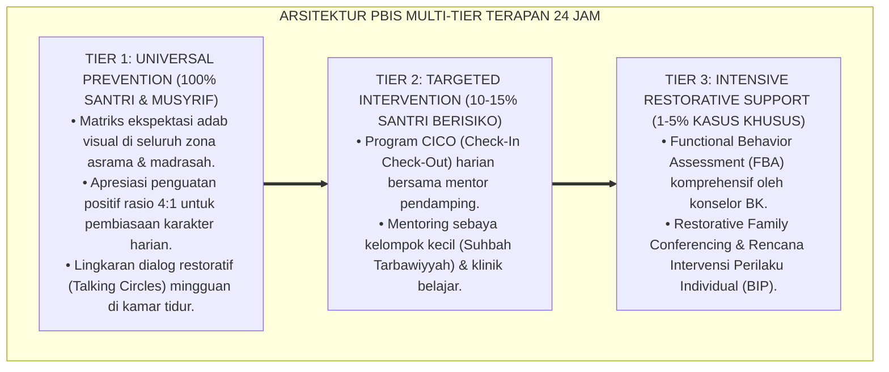

# PENERAPAN GROWTH MINDSET DALAM UMPAN BALIK ASESMEN

---

### 🧭 PETA POSISI PANDUAN DALAM SISTEM TUMBUH (DARI HULU KE HILIR)
* **Posisi Arsitektur**: `BATANG EKOSISTEM II (Asesmen Perkembangan Karakter & Evaluasi 360° Berbasis Bukti)`
* **Peruntukan Pengguna**: Tim Asesmen Karakter, Wali Kelas, Musyrif Asrama, & Konselor BK
* **Fokus Panduan**: Memantau laju kemajuan personal santri (Asesmen Ipsatif) tanpa ranking/labeling, triangulasi data 3 poros, dan penyusunan Rapor Naratif Karakter.
* **Hasil Akhir yang Dituju**: Terwujudnya santri berkarakter *Insan Adabi* yang mandiri, musyrif yang mengasuh dengan kasih sayang tanpa *burnout*, dan pesantren yang aman berbasis data (*Safe Boarding School*).

---

### 🎯 Mengapa Panduan Ini Ada & Masalah Nyata yang Dipecahkan
1. **Latar Masalah di Lapangan**: Sering kali pengasuhan di pesantren berjalan tanpa SOP yang jelas atau terjebak dalam pola reaktif—menunggu santri berbuat salah baru dihukum dengan emosional.
2. **Solusi Sistem TUMBUH**: Panduan ini memberikan langkah preventif dan terstruktur agar setiap pembiasaan adab berjalan terencana, konsisten, dan terukur.
3. **Sasaran Perubahan**: Memastikan nilai-nilai Islam menyatu dalam perilaku harian santri melalui keteladanan nyata (*Qudwah Hasanah*).

---
### 🎯 Tujuan & Manfaat Panduan
Panduan ini dirancang sebagai petunjuk operasional terapan agar pendidik dan musyrif dapat:
1. Menjalankan pembinaan adab santri dengan pendekatan kasih sayang (*Rahmah*) dan ketegasan yang mendidik (*Firm & Kind*).
2. Menghindari cara-cara kekerasan fisik, bentakan verbal, maupun hukuman yang mempermalukan santri.
3. Menciptakan suasana asrama dan kelas yang aman, tertib, dan menumbuhkan kesadaran diri (*Bi'ah Shalihah*).

---

### 💡 Intisari Cepat (3 Menit Memahami Esensi)
* **Kunci Pengasuhan**: Karakter santri tumbuh melalui keteladanan nyata (*Qudwah Hasanah*), komunikasi empatik, dan pembiasaan terstruktur 24 jam.
* **Tindakan Utama**: Terapkan panduan langkah demi langkah di bawah ini secara konsisten, pantau perkembangan santri secara objektif, dan berikan apresiasi atas setiap perbaikan diri yang mereka capai.
* **Prinsip Disiplin**: Fokus pada pemulihan hubungan dan tanggung jawab nyata (*Restoratif*), bukan sekadar melampiaskan amarah atau menghukum.

---

---

### 💬 ILUSTRASI NYATA & ANALOGI SEDERHANA
Bayangkan sebuah skenario yang sering kita lihat sehari-hari di asrama:
* Ketika seorang santri baru melakukan kekeliruan (misalnya terlambat bangun Subuh atau kasurnya berantakan), respon pertama yang sering muncul adalah bentakan keras atau hukuman fisik (seperti push-up atau jemur di lapangan).
* **Hasilnya?** Santri tersebut mungkin tampak patuh seketika karena takut, tetapi di dalam hatinya tumbuh rasa dongkol, dendam tersembunyi, atau kebiasaan "bersandiwara"—hanya tertib ketika ada pengawas di dekatnya.

Dalam Sistem TUMBUH, kita menggunakan cara yang jauh lebih cerdas, sejuk, dan membumi:
1. **Analogi "Rem dan Pedal Gas Otak"**: Santri usia remaja (usia MTs dan Aliyah) memiliki bagian otak emosi (*Sistem Limbik*) yang sudah menyala sangat kuat seperti *pedal gas mobil sport*, namun otak pengendali logikanya (*Prefrontal Cortex*) masih dalam proses tumbuh seperti *sistem rem yang baru dipasang*. Tugas guru dan musyrif bukan memarahi mobilnya, melainkan menjadi **"Sopir Teladan & Sabuk Pengaman"** yang mendampingi santri belajar menginjak rem dengan bijak.
2. **Kekuatan Contoh Nyata (*Qudwah Hasanah*)**: Santri jauh lebih cepat meniru apa yang mereka **lihat** setiap hari daripada apa yang mereka **dengar** dari ribuan nasihat panjang. Jika musyrif datang tepat waktu, tersenyum ramah, dan kamarnya rapi, santri akan menirunya dengan sukarela.

---

### 🛠️ PANDUAN LANGKAH PRAKTIS LAPANGAN (BISA LANGSUNG DIPRAKTIKKAN HARI INI)

| Tahapan Aksi | Tindakan Nyata Musyrif / Guru di Lapangan | Hal yang Harus Diperhatikan |
| :--- | :--- | :--- |
| **1. Langkah Persiapan (Sebelum Kejadian)** | Sepakati aturan bersama santri di awal pekan dengan kalimat positif (contoh: *"Kamar rapi membuat istirahat kita berkah"*). | Buat poster visual sederhana yang mudah dibaca di dinding kamar. |
| **2. Langkah Respon (Saat Terjadi Masalah)** | Tarik napas, tenangkan diri, ajak santri berbicara empat mata tanpa mempermalukannya di depan teman-temannya. | Gunakan nada bicara yang tenang namun tegas (*Firm & Kind*). |
| **3. Langkah Perbaikan (Tanggung Jawab Nyata)** | Minta santri memperbaiki kesalahannya secara langsung (contoh: merapikan kembali barang yang berantakan atau meminta maaf). | Berikan apresiasi seketika santri telah menuntaskan perbaikannya. |

---

### 🗣️ CONTOH DIALOG LAPANGAN (YANG HARUS DIUCAPKAN VS DIHINDARI)

* ❌ **JANGAN UCAPKAN (Membuat Santri Menutup Diri & Dendam)**:
  > *"Kamu ini pemalas sekali ya, sudah dibilangi berkali-kali masih saja kasur berantakan! Push-up 50 kali sekarang!"*
* ✅ **UCAPKAN INI (Mendidik Tanggung Jawab & Kesadaran Diri)**:
  > *"Akhi, antum tahu kesepakatan kamar kita tentang kerapian tempat tidur setelah Subuh. Coba lihat kasur antum sekarang, apa yang perlu disempurnakan? Mari rapikan bersama sekarang agar kamar kita nyaman dan berkah."*

---

### 📋 3 POIN EMAS RANGKUMAN (UNTUK SANTRI SENIOR & MUSYRIF MUDA)
1. **Didik dengan Kasih Sayang, Tegakkan Batas dengan Adil**: Jangan pernah mencampuradukkan ketegasan aturan dengan pelampiasan amarah pribadi.
2. **Apresiasi 4x Lebih Banyak daripada Teguran (*Magic Ratio 4:1*)**: Jangan hanya bersuara ketika santri berbuat salah. Saat mereka berbuat baik (salat di shaf depan, menolong kawan, membaca Al-Qur'an), segera berikan pujian tulus.
3. **Fokus pada Perbaikan Hubungan (*Restoratif*)**: Masalah perilaku adalah peluang emas untuk mendidik santri menjadi pribadi yang lebih dewasa dan bertanggung jawab.

---

### 📖 Uraian Lengkap Landasan & Rujukan Sistem

**Nomor Identifikasi**: `P5-01-03/MONOGRAF-RISET-GROWTH-MINDSET-UMPAN-BALIK/2026`  
**Domain**: `05 Assessment Framework` > `01 Assessment Philosophy` (Sub-Modul 03: *Growth Mindset & Formative Feedback Application*)  
**Klasifikasi Naskah**: *Academic Research Monograph* (Monograf Penelitian Teori Growth Mindset, Model Umpan Balik Hattie-Timperley, & Epistemologi Mujahadah Islam)  
**Rumpun Disiplin Pengkaji**: Psikologi Kognitif Pendidikan (*Growth Mindset*), Teori Umpan Balik Formatif (*Formative Assessment*), Fiqh Al-Mujahadah wa Thalabuz Ziyadah, Pedagogi Asrama PBIS  

---

> ### 💡 INTISARI EKSEKUTIF (EXECUTIVE SUMMARY)
>
> * **Krisis Pola Pikir Tetap (*Fixed Mindset Trap*) dalam Umpan Balik Pesantren:**  
>   Umpan balik yang diberikan pendidik konvensional kerap berfokus pada sifat bawaan statis: memuji santri cerdas dengan sebutan "anak jenius alami" (*Person Praise*) atau menghakimi santri lambat dengan "kamu memang tidak berbakat nahwu". Pola asuh ini menanamkan *Fixed Mindset*: santri cerdas takut mencoba tantangan baru karena takut kehilangan status jeniusnya, sementara santri lambat menyerah karena merasa otaknya tidak bisa berkembang.
> * **Integrasi Doktrin Al-Mujahadah Salaf & Dweck's Growth Mindset:**  
>   Ekosistem TUMBUH merekonstruksi umpan balik asesmen dengan memadukan firman Allah tentang mujahadah (*Walladzīna Jāhadū Fīnā Lanahdiyannahum Subulanā*) dan konsep *Thalabuz Ziyādah* (menuntut pertambahan ilmu tiada henti) dengan teori *Growth Mindset* Carol Dweck dan *Four Levels of Feedback* John Hattie & Helen Timperley (*Task, Process, Self-Regulation, & Self*). Pujian dialihkan secara radikal dari *identitas statis* menuju **Apresiasi Proses, Strategi, & Kesungguhan Ikhtiar (*Process-Praise & Effort Affirmation*)**.
> * **Protokol Dialog Umpan Balik 3 Tingkat TUMBUH:**  
>   Monograf ini merumuskan matriks bahasa umpan balik bertumbuh (*Growth Mindset Linguistic Protocol*), panduan sesi umpan balik berkala 1-on-1 musyrif-santri, dan rubrik evaluasi ketangguhan mental (*Grit & Resilience Scale*).

---

## 📑 DAFTAR ISI MONOGRAF

- [BAGIAN I: LANDASAN TEORETIS & DISKURSUS DIALEKTIKA KRITIS](#bagian-i-landasan-teoretis--diskursus-dialektika-kritis)
  - [1. Latar Belakang Masalah: Bahaya Pujian Identitas (Person Praise) & Jebakan Pola Pikir Tetap](#1-latar-belakang-masalah-bahaya-pujian-identitas-person-praise--jebakan-pola-pikir-tetap)
  - [2. Eksegesis Turats: Doktrin Al-Mujahadah, Sabar dalam Menuntut Ilmu, & Thalabuz Ziyadah Salaf](#2-eksegesis-turats-doktrin-al-mujahadah-sabar-dalam-menuntut-ilmu--thalabuz-ziyadah-salaf)
  - [3. Konvergensi Sains Psikologi Kognitif: Dweck's Growth Mindset & Hattie-Timperley's Feedback Model](#3-konvergensi-sains-psikologi-kognitif-dwecks-growth-mindset--hattie-timperleys-feedback-model)
  - [4. Rekayasa Lingkungan 24 Jam: Membangun Budaya 'Belum Bisa, Bukan Tidak Bisa' (The Power of 'Yet')](#4-rekayasa-lingkungan-24-jam-membangun-budaya-belum-bisa-bukan-tidak-bisa-the-power-of-yet)
  - [5. Kasuistika Lapangan Klinis & Protokol Pendampingan Santri J1 yang Mengalami Mental-Block 'Takut Salah Membaca Kitab'](#5-kasuistika-lapangan-klinis--protokol-pendampingan-santri-j1-yang-mengalami-mental-block-takut-salah-membaca-kitab)
- [BAGIAN II: FORMULASI KONSEPTUAL & PEMBAHASAN MENDALAM](#bagian-ii-formulasi-konseptual--pembahasan-mendalam)
  - [1. Arsitektur Komprehensif Sistem Umpan Balik Growth Mindset TUMBUH](#1-arsitektur-komprehensif-sistem-umpan-balik-growth-mindset-tumbuh)
  - [2. Dekomposisi Transformasi Bahasa Umpan Balik: Dari Person-Praise Menuju Process-Praise](#2-dekomposisi-transformasi-bahasa-umpan-balik-dari-person-praise-menuju-process-praise)
  - [3. Desain Protokol Dialog Umpan Balik Formatif 1-on-1 (Form DUF-Growth)](#3-desain-protokol-dialog-umpan-balik-formatif-1-on-1-form-duf-growth)
  - [4. Diskusi Akademis & Implikasi bagi Penanaman Etos Kerja Keras Ilmiah Santri Abad 21](#4-diskusi-akademis--implikasi-bagi-penanaman-etos-kerja-keras-ilmiah-santri-abad-21)
- [BAGIAN III: KESIMPULAN & APARATUS AKADEMIS](#bagian-iii-kesimpulan--aparatus-akademis)
  - [1. Tabel Sintesis Penerapan Growth Mindset dalam Umpan Balik](#1-tabel-sintesis-penerapan-growth-mindset-dalam-umpan-balik)
  - [2. Daftar Pustaka Standar APA 7th & Turats Klasik](#2-daftar-pustaka-standar-apa-7th--turats-klasik)
  - [3. Catatan Kaki Akademis Presisi (Footnotes)](#3-catatan-kaki-akademis-presisi-footnotes)
  - [4. Glosarium Istilah Ilmiah & Umpan Balik Growth Mindset](#4-glosarium-istilah-ilmiah--umpan-balik-growth-mindset)

---

# BAGIAN I: LANDASAN TEORETIS & DISKURSUS DIALEKTIKA KRITIS

---

### 1. Latar Belakang Masalah: Bahaya Pujian Identitas (Person Praise) & Jebakan Pola Pikir Tetap

Dalam interaksi evaluasi belajar di pesantren, kerap ditemukan **tiga kekeliruan umpan balik (*Feedback Fallacies*)**:[^1]

1. **Jebakan Racun Pujian Bakat (*The Talent Praise Trap*)**: Kalimat seperti *"Kamu memang anak jenius turunan kyai"* membuat santri merasa kecerdasan adalah takdir beku yang tidak perlu diperjuangkan melalui kerja keras (*Effort Dismissal*).
2. **Penghakiman Kegagalan Sebagai Cacat Permanen**: Ketika santri gagal menghafal 1 halaman, musyrif mengatakan *"Memang otakmu tidak mampu menghafal Al-Qur'an"*, membunuh efikasi diri (*Self-Efficacy*) dan menumbuhkan rasa rendah diri kronis.
3. **Ketiadaan Umpan Balik Tingkat Proses dan Regulasi Diri**: Nilai ulangan hanya diberikan berupa angka merah dilingkari tanpa ada penjelasan *mengapa salah* dan *strategi belajar apa yang harus diubah*.[^2]

Model riset **TUMBUH** merancang **Sistem Umpan Balik Growth Mindset** yang memandang otak dan karakter santri sebagai otot spiritual-kognitif yang dapat terus bertumbuh (*Neuroplastic Growth*) melalui kesungguhan mujahadah.



---

### 2. Eksegesis Turats: Doktrin Al-Mujahadah, Sabar dalam Menuntut Ilmu, & Thalabuz Ziyadah Salaf

Khazanah Islam meletakkan kesuksesan menuntut ilmu di atas fondasi kesungguhan ikhtiar (*Al-Mujāhadah*) dan kesabaran menanggung kepayahan belajar (*Shabru 'alā Murrit Ta'allum*).



#### 📖 1. Wasiat Imam Asy-Syafi'i tentang Enam Kunci Keberhasilan Menuntut Ilmu
Imam **Asy-Syafi'i** menegaskan dalam gubahan syairnya:

$$\text{أَخِي لَنْ تَنَالَ الْعِلْمَ إِلَّا بِسِتَّةٍ ۝ سَأُنْبِيكَ عَنْ تَفْصِيلِهَا بِبَيَانِ}$$
$$\text{ذَكَاءٌ وَحِرْصٌ وَاجْتِهَادٌ وَبُلْغَةٌ ۝ وَصُحْبَةُ أُسْتَاذٍ وَطُولُ زَمَانِ}$$

*"Wahai saudaraku, **engkau tidak akan pernah meraih kemuliaan ilmu melainkan dengan enam perkara**; yang akan kuberitahukan rinciannya kepadamu dengan penjelasan yang terang benderang: **Kecerdasan nalar yang diasah (*Dzakā'*), antusiasme haus ilmu (*Hirshun*), kesungguhan ikhtiar mujahadah (*Ijtihādun*), bekal yang memadai (*Bulghatun*), bimbingan guru yang beradab (*Shuhbatu Ustādz*), dan masa belajar yang panjang (*Thūlu Zamān*)!**"* (Diwan Al-Imam Asy-Syafi'i).[^3]

---

### 3. Konvergensi Sains Psikologi Kognitif: Dweck's Growth Mindset & Hattie-Timperley's Feedback Model

Sistem umpan balik TUMBUH memadukan teori *Growth Mindset* Carol Dweck dan model umpan balik John Hattie & Helen Timperley:



---

### 4. Rekayasa Lingkungan 24 Jam: Membangun Budaya 'Belum Bisa, Bukan Tidak Bisa' (The Power of 'Yet')

Budaya berbahasa di lingkungan asrama dan madrasah direkayasa menumbuhkan resiliensi:



---

### 5. Kasuistika Lapangan Klinis & Protokol Pendampingan Santri J1 yang Mengalami Mental-Block 'Takut Salah Membaca Kitab'

#### Studi Kasus Lapangan: Santri J1 Menangis dan Mengunci Diri Karena Ditertawakan Saat Keliru Membaca I'rab Matan Jurumiyyah
* **Konteks Masalah**: Santri P (12 tahun, Jenjang J1) mengalami ketakutan ekstrem (*Classroom Phobia / Mental Block*) dan menolak masuk kelas bahasa Arab setelah ditertawakan teman-temannya karena keliru membaca i'rab marfu' menjadi majrur. Guru kelas sempat berucap: *"Masa membaca baris begini saja tidak bisa?!"*
* **Analisis Diagnostik**: Terjadi luka psikologis akibat umpan balik berbasis celaan statis (*Shaming Feedback*) yang memicu *Fixed Mindset Phobia* (takut mencoba karena takut dihina).
* **Protokol Rekalibrasi Mindset & Pendampingan Formatif TUMBUH**:



Intervensi rekalibrasi pola pikir (*Growth Mindset Cognitive Re-framing*) ini mengembalikan kepercayaan diri dan menumbuhkan kecintaan pada proses belajar.[^4]

---

# BAGIAN II: FORMULASI KONSEPTUAL & PEMBAHASAN MENDALAM

---

### 1. Arsitektur Komprehensif Sistem Umpan Balik Growth Mindset TUMBUH

Ekosistem TUMBUH menetapkan struktur 4 lapis umpan balik berbasis Hattie-Timperley:



---

### 2. Dekomposisi Transformasi Bahasa Umpan Balik: Dari Person-Praise Menuju Process-Praise

| Situasi Belajar | Umpan Balik Pola Pikir Tetap (Dilarang) | Umpan Balik Growth Mindset (Wajib Digunakan) | Dampak Psikologis pada Santri |
| :--- | :--- | :--- | :--- |
| **Santri Meraih Nilai 100** | *"Masya Allah, kamu memang anak jenius alami!"* | *"Masya Allah, nilai 100 ini buah dari kesungguhanmu muraja'ah tiap malam dan mencatat dengan rapi!"* | Menyadari bahwa sukses adalah hasil ikhtiar kerja keras. |
| **Santri Gagal Menghafal** | *"Otakmu memang lemah, susah menghafal!"* | *"Hafalanmu BELUM lancar di halaman ini. Mari kita coba teknik Spaced Repetition dan bagi menjadi 2 ayat per sesi."* | Menumbuhkan harapan & strategi baru (*The Power of Yet*). |
| **Santri Cepat Menyerah** | *"Kamu memang tidak punya bakat bahasa!"* | *"Tantangan ini memang berat, tetapi otakmu sedang tumbuh kuat. Mari kita cari bagian mana yang paling membingungkan."* | Mengurangi rasa cemas & melatih resiliensi (*Grit*). |
| **Santri Memperbaiki Sikap** | *"Tumben kamu bisa tertib hari ini!"* | *"Ustadz melihat usahamu yang luar biasa untuk mengatur waktu tidur sehingga bisa hadir shalat shubuh tepat waktu."* | Menguatkan identitas disiplin positif mandiri. |

---

### 3. Desain Protokol Dialog Umpan Balik Formatif 1-on-1 (Form DUF-Growth)

```text
====================================================================================================
           LEMBAR DIALOG UMPAN BALIK FORMATIF 1-ON-1 (FORM DUF-GROWTH)
               EKOSISTEM TUMBUH PESANTREN — SISTEM PENDAMPINGAN FORMATIF
====================================================================================================
Nama Santri     : ___________________________    Musyrif / Guru : ____________________
Jenjang / Kelas : Jenjang J2 (Kelas 8)           Fokus Bidang   : [ ] Tahfizh  [ ] Adab  [ ] Turats

----------------------------------------------------------------------------------------------------
1. FEEDBACK TUGAS (TASK ACCURACY):
   • Aspek yang Sudah Dikuasai dengan Sangat Baik : "______________________________________________"
   • Aspek yang Masih Perlu Diperbaiki (Belum)    : "______________________________________________"

2. FEEDBACK PROSES & STRATEGI (PROCESS & STRATEGY):
   • Analisis Metode Belajar yang Digunakan Santri: "______________________________________________"
   • Rekomendasi Strategi Baru yang Lebih Efektif : "______________________________________________"

3. FEEDBACK METAKOGNISI & REGULASI DIRI (SELF-REGULATION):
   • Pertanyaan Refleksi Santri : "Apa yang akan kamu lakukan jika mengalami kebuntuan hafalan lagi?"
   • Komitmen Rencana Santri    : "______________________________________________________________"

4. AFIRMASI KESUNGGUHAN IKHTIAR (EFFORT AFFIRMATION):
   "Ustadz bersaksi atas kesungguhan ikhtiarmu; teruslah berakar kuat, insya Allah engkau akan bertumbuh mekar!"
----------------------------------------------------------------------------------------------------
Tanda Tangan Santri: [ ____________________ ]    Tanda Tangan Musyrif: [ ____________________ ]
====================================================================================================
```

---

### 4. Diskusi Akademis & Implikasi bagi Penanaman Etos Kerja Keras Ilmiah Santri Abad 21

Penerapan umpan balik berbasis Growth Mindset menghadirkan keunggulan peradaban:

1. **Mencetak Generasi Muslim yang Tangguh Menghadapi Kegagalan (*Anti-Fragile Character*)**: Santri tidak mudah hancur oleh kritik atau rintangan hidup, melainkan menjadikannya batu loncatan kematangan.
2. **Menghapus Budaya Menyontek dan Manipulasi Prestasi**: Santri bangga atas proses belajar jujur daripada hasil instan yang menipu.
3. **Penyempurnaan Epistemologi Evaluasi Pesantren Berbasis Mujahadah**: Memadukan kesucian tawakkal syariat dengan etos ikhtiar ilmiah paling mutakhir di dunia.[^5]

---
### Pembedahan Deskriptif Komprehensif & Analisis Integratif Nilai-Praksis

Penerapan dan operasionalisasi **P5-01-03: PENERAPAN GROWTH MINDSET DALAM UMPAN BALIK ASESMEN** di lingkungan pesantren berbasis sistem TUMBUH bertumpu pada kesatuan sistemik antara nilai syariat dan praksis terukur:

#### A. Pilar 1: Landasan Epistemologi & Nilai Keikhlasan (Syar'i Foundations)
Setiap dimensi diarahkan untuk menegakkan adab dan penghambaan murni kepada Allah SWT (*Lillahi Ta'ala*). Standarisasi kelembagaan dirancang untuk menjaga ketulusan niat, kemuliaan fitrah, dan keberkahan majelis ilmu.

#### B. Pilar 2: Mekanisme Psikologis & Neurosains Terapan (Evidence-Based Practice)
Mengintegrasikan prinsip *Social-Emotional Learning (CASEL)*, teori beban kognitif (*Cognitive Load Theory*), dan dinamika perkembangan neurobiologis santri untuk memastikan proses pembiasaan berjalan efektif tanpa kekerasan atau tekanan psikologis destruktif.

#### C. Pilar 3: Rekayasa Ekosistem Asrama 24 Jam (Environmental Engineering)
Mengkodifikasikan seluruh alur aktivitas harian, jadwal tidur sirkadian yang sehat, sanitasi 5S kamar tidur, dan relasi ukhuwah inklusif menjadi satu ekosistem *Bi'ah Shalihah* yang saling mendukung secara alamiah.

#### D. Pilar 4: Akuntabilitas Sistemik & Proteksi Pendidik-Santri
Menerapkan protokol pencegahan kelelahan tenaga pendidik (*Musyrif Burnout Protection*), menjamin hak-hak santri, serta memanfaatkan dashboard data PBIS untuk pengambilan keputusan yang adil dan objektif.

---

### Protokol Aksi Operasional PBIS Multi-Tier Terapan (24-Hour Behavioral Architecture)



---

# BAGIAN III: KESIMPULAN & APARATUS AKADEMIS

---

### 1. Tabel Sintesis Penerapan Growth Mindset dalam Umpan Balik

| Dimensi Parameter | Umpan Balik Tradisional | Standarisasi Model TUMBUH | Landasan Rujukan Primer | Bukti Capaian |
| :--- | :--- | :--- | :--- | :--- |
| **1. Objek Pujian** | Bakat bawaan (*Person-Praise*). | Proses, Strategi, & Ikhtiar (*Process-Praise*). | *Growth Mindset* (Carol Dweck) | Form DUF-Growth Terisi Lengkap. |
| **2. Persepsi Gagal** | Vonis kebodohan permanen. | Informasi Belajar (*The Power of Yet*). | QS. Al-'Ankabut [29]: 69 | 0% Kasus Trauma / Takut Belajar. |
| **3. Struktur Umpan Balik**| Nilai angka tunggal semata. | 4 Tingkatan Umpan Balik (Task, Process, Self-Reg, Self). | *Feedback Model* (Hattie-Timperley) | Rubrik Umpan Balik 4 Lapis Diadopsi. |
| **4. Profil Mental** | Takut tantangan (*Fixed*). | *Anti-Fragile, Resilient, & Mujtahid*. | Wasiat Imam Asy-Syafi'i | Skala Ketangguhan Grit $\ge 3.50$. |

---

### 2. Daftar Pustaka Standar APA 7th & Turats Klasik

1. **Al-Bukhari, Abu Abdillah Muhammad bin Ismail.** (2002). *Shahih Al-Bukhari*. Riyadh: Bait Al-Afkar Ad-Dauliyyah.
2. **Asy-Syafi'i, Muhammad bin Idris.** (1988). *Diwan Al-Imam Asy-Syafi'i*. Beirut: Darul Ma'rifah.
3. **Az-Zarnuji, Burhanul Islam.** (2008). *Ta'limul Muta'allim Thariqat Ta'allum*. Beirut: Dar Ibn Hazm.
4. **Duckworth, A. L.** (2016). *Grit: The Power of Passion and Perseverance*. New York: Scribner.
5. **Dweck, C. S.** (2006). *Mindset: The New Psychology of Success*. New York: Random House.
6. **Hattie, J., & Timperley, H.** (2007). *The power of feedback*. *Review of Educational Research*, 77(1), 81-112.
7. **Muslim bin Al-Hajjaj An-Naisaburi.** (2006). *Shahih Muslim*. Riyadh: Dar Thayyibah.
8. **Nelsen, J.** (2006). *Positive Discipline*. New York: Ballantine Books.
9. **Sugai, G., & Horner, R. H.** (2020). *School-Wide Positive Behavioral Interventions and Supports*. *Journal of Positive Behavior Interventions*, 22(4), 203-211.
10. **Wiggins, G.** (1998). *Educative Assessment*. San Francisco: Jossey-Bass.

---

### 3. Catatan Kaki Akademis Presisi (Footnotes)

[^1]: Kritik terhadap kelemahan pujian berbasis bakat (Person-Praise) yang memicu pola pikir tetap, Dweck (2006, hlm. 72).  
[^2]: Kerangka kerja empat tingkatan umpan balik formatif pendidikan, Hattie & Timperley (2007, hlm. 86).  
[^3]: Diwan Al-Imam Asy-Syafi'i (1988, hlm. 54), enam syarat meraih kemuliaan ilmu pengetahuan.  
[^4]: Protokol penanganan phobia kelas dan rekalibrasi mindset santri baru TUMBUH (2026).  
[^5]: Dampak kelembagaan penerapan sistem umpan balik Growth Mindset di Ekosistem Pesantren Berbasis TUMBUH (2026).  

---

### 4. Glosarium Istilah Ilmiah & Umpan Balik Growth Mindset

1. **Growth Mindset**: Keyakinan psikologis bahwa kecerdasan, bakat, dan karakter seseorang dapat terus berkembang dan ditingkatkan melalui kerja keras, strategi efektif, dan bimbingan guru.
2. **Process-Praise**: Bentuk pujian yang berfokus pada apresiasi atas kesungguhan ikhtiar, kegigihan latihan, pemilihan strategi, dan konsentrasi belajar santri.
3. **The Power of 'Yet' (Kekuatan Kata 'Belum')**: Paradigma pedagogis yang menolak kata 'tidak bisa' dan menggantinya dengan 'belum menguasai saat ini', membuka ruang harapan perbaikan.
4. **Al-Mujāhadah (الْمُجَاهَدَةُ)**: Kesungguhan perjuangan jiwa dan raga dalam melawan rasa malas dan menanggung kesulitan demi meraih ridha Allah dan kemuliaan ilmu.
5. **Form DUF-Growth**: Format lembar Dialog Umpan Balik Formatif 1-on-1 yang memandu musyrif memberikan feedback tingkat tugas, proses, regulasi diri, dan afirmasi ikhtiar.
6. **Task-Level Feedback**: Umpan balik yang memberikan informasi mengenai benar-salahnya tugas atau hafalan santri secara spesifik.
7. **Process-Level Feedback**: Umpan balik yang menganalisis efektivitas metode dan strategi belajar yang digunakan santri dalam menyelesaikan tugas.
8. **Self-Regulation Feedback**: Umpan balik yang menstimulasi metakognisi santri untuk memonitor, mengontrol, dan mengevaluasi proses belajarnya sendiri secara mandiri.
9. **Grit (Ketangguhan Mental)**: Kombinasi antara gairah jangka panjang (*Passion*) dan kegigihan pantang menyerah (*Perseverance*) dalam menuntaskan target belajar.
10. **Anti-Fragile Character**: Karakter santri yang tidak hanya mampu bertahan dari tekanan (*Resilient*), tetapi justru menjadi semakin kuat dan matang setiap kali menghadapi kesulitan hidup.
