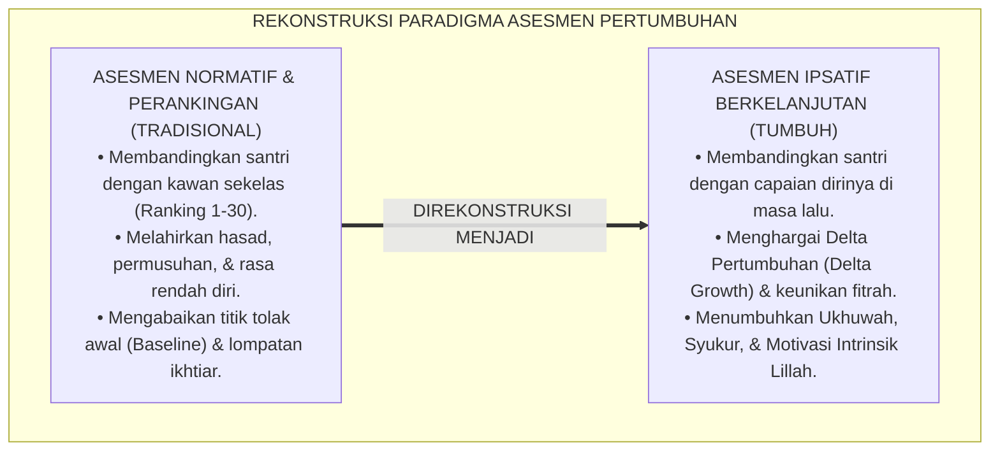
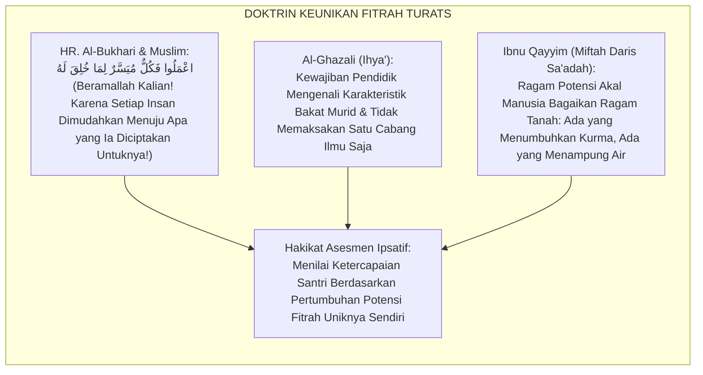
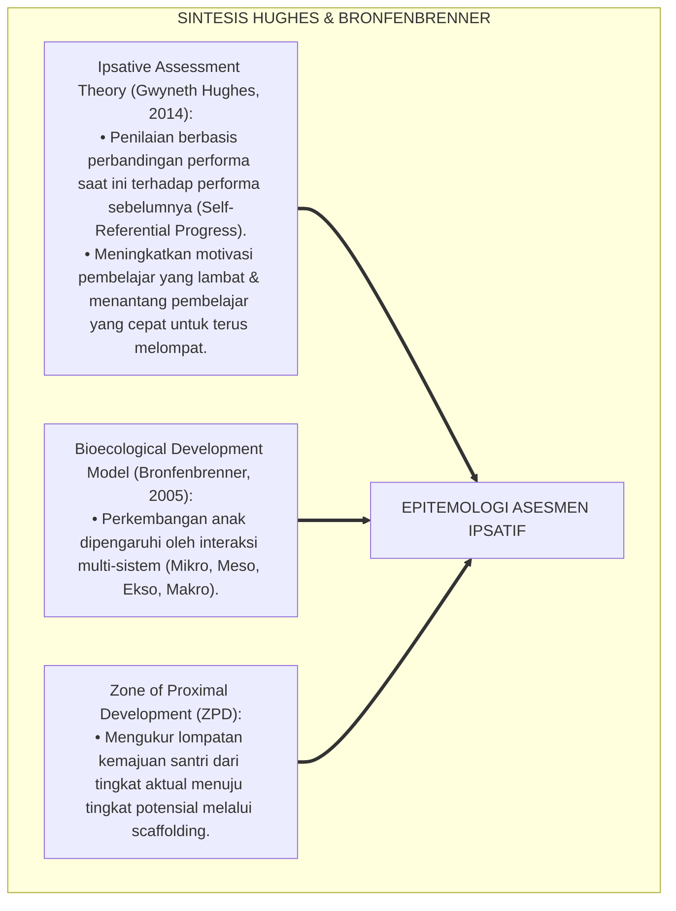
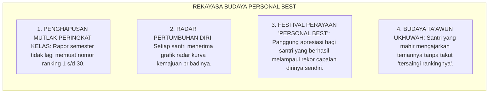
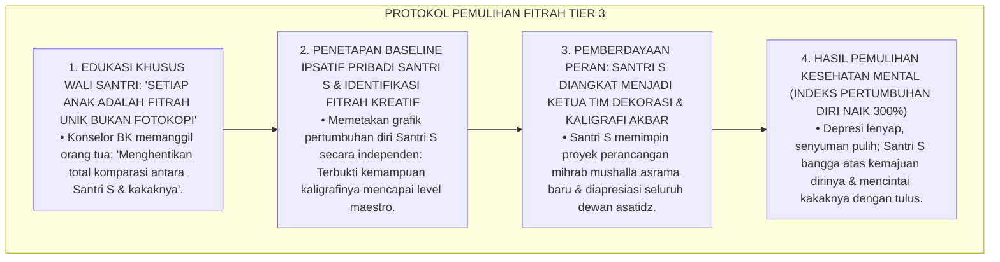
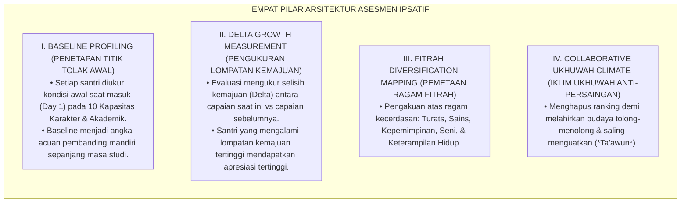
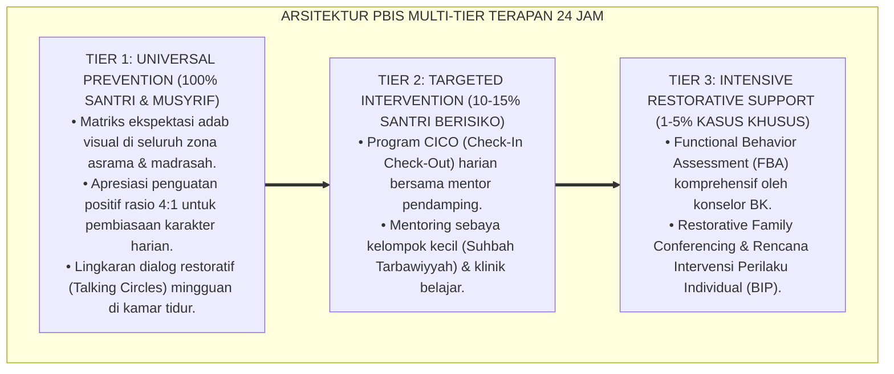

# SUB-BAB 1.5: EPISTEMOLOGI ASESMEN IPSATIF DAN PERTUMBUHAN FITRAH
## *Monograf Riset Akademik: Dekonstruksi Paradigma Penilaian Normatif-Komparatif (Norm-Referenced) Menuju Penilaian Ipsatif Berkelanjutan (Self-Referenced Ipsative Assessment), Integrasi Doktrin 'Kullu Muyassarun Lima Khuliqa Lahu' Turats Klasik dengan Hughes' Ipsative Assessment Theory & Bronfenbrenner's Bioecological Model, Serta Rekayasa Metrik Pertumbuhan Personal di Ekosistem Pesantren Berbasis TUMBUH*

**Nomor Identifikasi**: `P5-01-05/MONOGRAF-RISET-EPISTEMOLOGI-ASESMEN-IPSATIF/2026`  
**Domain**: `05 Assessment Framework` > `01 Assessment Philosophy` (Sub-Modul 05: *Ipsative Assessment Epistemology & Fitrah Growth*)  
**Klasifikasi Naskah**: *Academic Research Monograph* (Monograf Penelitian Epistemologi Asesmen Ipsatif, Dekonstruksi Perankingan Normatif, & Psikometri Pertumbuhan Mandiri)  
**Rumpun Disiplin Pengkaji**: Filsafat Evaluasi Pendidikan Islam, Teori Asesmen Ipsatif (*Ipsative Assessment*), Psikometri Pertumbuhan Mandiri, Bioekologi Perkembangan Santri  

---

> ### 💡 INTISARI EKSEKUTIF (EXECUTIVE SUMMARY)
>
> * **Krisis Kompetisi Destruktif & Perankingan Normatif (*The Norm-Referenced Trap*):**  
>   Sistem perankingan kelas tradisional (*Class Ranking 1 to 30*) membandingkan santri secara horizontal dengan kurva lonceng normatif. Praktik ini melahirkan ilusi pemenang semu (*Artificial Winners*) yang sombong dan mayoritas pecundang (*Systemic Losers*) yang merasa rendah diri, merusak ukhuwah islamiyyah, dan mengabaikan fakta bahwa setiap santri memulai dari titik tolak (*Baseline*) dan kecepatan fitrah yang berbeda.
> * **Integrasi Hadits Kullu Muyassarun Salaf & Hughes' Ipsative Assessment Theory:**  
>   Ekosistem TUMBUH merekonstruksi hakikat evaluasi dengan memadukan sabda kenabian agung *"Kullun Muyassarun Limā Khuliqa Lah"* (Setiap insan dimudahkan menuju takdir penciptaan fitrahnya) dengan *Ipsative Assessment Theory* Gwyneth Hughes. Asesmen diposisikan bukan sebagai "kontes membandingkan santri dengan kawan sekelasnya", melainkan sebagai **Pengukuran Kemajuan Diri Terhadap Rekam Jejak Diri Sendiri di Masa Lalu (*Self-Referenced Growth Measurement*)**: yang dinilai adalah *delta pertumbuhan (*$\Delta$ Growth*)*, kesungguhan ikhtiar, dan lompatan kapasitas fitrah.
> * **Arsitektur Metrik Delta Pertumbuhan Ipsatif TUMBUH:**  
>   Monograf ini merumuskan formula matematis indeks kemajuan ipsatif, visualisasi grafik trajektori pertumbuhan radar diri, dan pedoman eliminasi budaya ranking destruktif di pesantren.

---

## 📑 DAFTAR ISI MONOGRAF

- [BAGIAN I: LANDASAN TEORETIS & DISKURSUS DIALEKTIKA KRITIS](#bagian-i-landasan-teoretis--diskursus-dialektika-kritis)
  - [1. Latar Belakang Masalah: Bahaya Perankingan Kurva Lonceng (Norm-Referenced) vs Evaluasi Pertumbuhan Mandiri](#1-latar-belakang-masalah-bahaya-perankingan-kurva-lonceng-norm-referenced-vs-evaluasi-pertumbuhan-mandiri)
  - [2. Eksegesis Turats: Doktrin Kullu Muyassarun, Keunikan Fitrah Bakat, & Larangan Hasad dalam Khazanah Islam](#2-eksegesis-turats-doktrin-kullu-muyassarun-keunikan-fitrah-bakat--larangan-hasad-dalam-khazanah-islam)
  - [3. Konvergensi Sains Evaluasi: Hughes' Ipsative Assessment Theory & Bronfenbrenner's Bioecological Systems](#3-konvergensi-sains-evaluasi-hughes-ipsative-assessment-theory--bronfenbrenners-bioecological-systems)
  - [4. Rekayasa Lingkungan 24 Jam: Menghapus Juara Kelas Menjadi Perayaan Kemenangan Diri (Personal Best)](#4-rekayasa-lingkungan-24-jam-menghapus-juara-kelas-menjadi-perayaan-kemenangan-diri-personal-best)
  - [5. Kasuistika Lapangan Klinis & Protokol Pendampingan Santri J2 yang Mengalami Depresi Akibat Kalah Bersaing Ranking dengan Kakak Kandung](#5-kasuistika-lapangan-klinis--protokol-pendampingan-santri-j2-yang-mengalami-depresi-akibat-kalah-bersaing-ranking-dengan-kakak-kandung)
- [BAGIAN II: FORMULASI KONSEPTUAL & PEMBAHASAN MENDALAM](#bagian-ii-formulasi-konseptual--pembahasan-mendalam)
  - [1. Arsitektur Komprehensif Sistem Asesmen Ipsatif TUMBUH](#1-arsitektur-komprehensif-sistem-asesmen-ipsatif-tumbuh)
  - [2. Formula Matematis Delta Pertumbuhan Ipsatif ($\Delta G$) dan Standarisasi Baseline](#2-formula-matematis-delta-pertumbuhan-ipsatif-delta-g-dan-standarisasi-baseline)
  - [3. Desain Format Rapor Trajektori Ipsatif Radar Diri (Form RTI-Personal)](#3-desain-format-rapor-trajektori-ipsatif-radar-diri-form-rti-personal)
  - [4. Diskusi Akademis & Implikasi bagi Penghapusan Elitisme Pendidikan Pesantren Modern](#4-diskusi-akademis--implikasi-bagi-penghapusan-elitisme-pendidikan-pesantren-modern)
- [BAGIAN III: KESIMPULAN & APARATUS AKADEMIS](#bagian-iii-kesimpulan--aparatus-akademis)
  - [1. Tabel Sintesis Epistemologi Asesmen Ipsatif](#1-tabel-sintesis-epistemologi-asesmen-ipsatif)
  - [2. Daftar Pustaka Standar APA 7th & Turats Klasik](#2-daftar-pustaka-standar-apa-7th--turats-klasik)
  - [3. Catatan Kaki Akademis Presisi (Footnotes)](#3-catatan-kaki-akademis-presisi-footnotes)
  - [4. Glosarium Istilah Ilmiah & Asesmen Ipsatif](#4-glosarium-istilah-ilmiah--asesmen-ipsatif)

---

# BAGIAN I: LANDASAN TEORETIS & DISKURSUS DIALEKTIKA KRITIS

---

### 1. Latar Belakang Masalah: Bahaya Perankingan Kurva Lonceng (Norm-Referenced) vs Evaluasi Pertumbuhan Mandiri

Dalam sistem evaluasi persekolahan konvensional, kerap ditemukan **tiga malpraktik evaluasi normatif (*Norm-Referenced Malpractices*)**:[^1]

1. **Jebakan Perbandingan Sosial Toksik (*Toxic Social Comparison Trap*)**: Mengurutkan santri dari rangking 1 sampai 30 menciptakan polarisasi: juara kelas diagung-agungkan secara berlebihan, sedangkan santri ranking 25–30 dicap bodoh dan tidak berguna, menyemai benih kedengkian (*Hasad*) dan permusuhan antar-santri.
2. **Pengabaian Titik Tolak Awal (*Baseline Blindness*)**: Santri A yang masuk tanpa bisa membaca huruf hijaiyyah lalu berhasil membaca surat Al-Baqarah dalam 6 bulan (kemajuan 300%) tetap diberi nilai rapor merah karena kalah dari Santri B yang sudah hafal 5 juz sejak dari rumah.
3. **Kematian Motivasi Belajar Intrinsik**: Santri belajar bukan lagi untuk mencintai ilmu dan menyucikan jiwa, melainkan semata-mata untuk mengalahkan temannya atau menghindari rasa malu berada di peringkat terbawah.[^2]

Model riset **TUMBUH** merancang **Epistemologi Asesmen Ipsatif** yang mengembalikan evaluasi pada hakikat aslinya: merayakan kemajuan unik fitrah setiap individu santri (*Personal Growth Milestone*).



---

### 2. Eksegesis Turats: Doktrin Kullu Muyassarun, Keunikan Fitrah Bakat, & Larangan Hasad dalam Khazanah Islam

Rasulullah SAW menegaskan bahwa setiap insan memiliki keunikan jalan takdir kemudahan (*Muyassar*) yang dianugerahkan Allah sesuai dengan fitrah penciptaannya.



#### 📖 1. Hadits Riwayat Ali bin Abi Thalib RA tentang Ragam Kemudahan Fitrah
Diriwayatkan dalam *Shahih Al-Bukhari* dan *Shahih Muslim*:

$$\text{قَالَ النَّبِيُّ صَلَّى اللَّهُ عَلَيْهِ وَسَلَّمَ: مَا مِنْكُمْ مِنْ أَحَدٍ إِلَّا وَقَدْ كُتِبَ مَقْعَدُهُ مِنَ الْجَنَّةِ وَمَقْعَدُهُ مِنَ النَّارِ؛ فَقَالُوا: يَا رَسُولَ اللَّهِ، أَفَلَا نَتَّكِلُ عَلَى كِتَابِنَا وَنَدَعُ الْعَمَلَ؟ قَالَ: اعْمَلُوا فَكُلٌّ مُيَسَّرٌ لِمَا خُلِقَ لَهُ، أَمَّا مَنْ كَانَ مِنْ أَهْلِ السَّعَادَةِ فَيُيَسَّرُ لِعَمَلِ أَهْلِ السَّعَادَةِ، وَأَمَّا مَنْ كَانَ مِنْ أَهْلِ الشَّقَاوَةِ فَيُيَسَّرُ لِعَمَلِ أَهْلِ الشَّقَاوَةِ؛ ثُمَّ قَرَأَ: فَأَمَّا مَنْ أَعْطَى وَاتَّقَى ۝ وَصَدَّقَ بِالْحُسْنَى ۝ فَسَنُيَسِّرُهُ لِلْيُسْرَى}$$

*"Nabi SAW bersabda: 'Tidak ada seorang pun di antara kalian melainkan telah ditulis tempat duduknya di surga dan tempat duduknya di neraka.' Para sahabat bertanya: 'Wahai Rasulullah, apakah kami tidak berserah diri saja pada ketetapan itu dan meninggalkan amal?' Rasulullah SAW menjawab: **'Beramallah kalian! Karena setiap orang dimudahkan menuju apa yang ia diciptakan untuknya (*Kullun Muyassarun Limā Khuliqa Lah*)**; adapun orang yang berbahagia maka ia dimudahkan untuk beramal amalan orang yang berbahagia, dan adapun orang yang celaka maka ia dimudahkan untuk beramal amalan orang yang celaka!' Kemudian beliau membaca firman Allah: **'Maka adapun orang yang memberi (di jalan Allah) dan bertakwa, serta membenarkan adanya pahala yang terbaik, maka kelak Kami akan memudahkan baginya jalan menuju kemudahan!'**"* (HR. Al-Bukhari No. 4949 & Muslim No. 2647).[^3]

---

### 3. Konvergensi Sains Evaluasi: Hughes' Ipsative Assessment Theory & Bronfenbrenner's Bioecological Model

Epistemologi asesmen ipsatif TUMBUH memadukan teori Gwyneth Hughes dan model bioekologi Urie Bronfenbrenner:



---

### 4. Rekayasa Lingkungan 24 Jam: Menghapus Juara Kelas Menjadi Perayaan Kemenangan Diri (Personal Best)

Budaya apresiasi di madrasah dan asrama ditransformasikan secara radikal:



---

### 5. Kasuistika Lapangan Klinis & Protokol Pendampingan Santri J2 yang Mengalami Depresi Akibat Kalah Bersaing Ranking dengan Kakak Kandung

#### Studi Kasus Lapangan: Santri J2 Mengalami Insomnia Akut dan Menolak Bicara Karena Dibanding-bandingkan Prestasinya
* **Konteks Masalah**: Santri S (14 tahun, Jenjang J2) adalah adik kandung dari Santri B (Jenjang J4, bintang pesantren ranking 1). Orang tua dan musyrif lama sering berucap: *"Kenapa nilaimu tidak sehebat kakakmu?"* Santri S mengalami depresi klinis (*Severe Depressive Episode*), insomnia, mengurung diri di ranjang, dan merasa dirinya adalah produk gagal (*Family Scapegoat*).
* **Analisis Diagnostik**: Santri S mengalami luka perbandingan sosial toksik (*Toxic Social Comparison Injury*) yang merusak harga diri dan mematikan potensi fitrah aslinya (Santri S memiliki kecerdasan kinestetik-seni kaligrafi yang luar biasa).
* **Protokol Pemulihan Berbasis Asesmen Ipsatif TUMBUH**:



Intervensi pengakuan keunikan fitrah (*Ipsative Fitrah Recognition*) ini membuktikan bahwa melepaskan belenggu perbandingan normatif adalah kunci utama mekar indahnya fitrah manusia.[^4]

---

# BAGIAN II: FORMULASI KONSEPTUAL & PEMBAHASAN MENDALAM

---

### 1. Arsitektur Komprehensif Sistem Asesmen Ipsatif TUMBUH

Ekosistem TUMBUH merumuskan 4 pilar arsitektur asesmen ipsatif:



---

### 2. Formula Matematis Delta Pertumbuhan Ipsatif ($\Delta G$) dan Standarisasi Baseline

$$\text{Delta Pertumbuhan Ipsatif } (\Delta G_i) = \frac{S_{t} - S_{t-1}}{S_{\text{max}} - S_{t-1}} \times 100\%$$

Di mana:
* $S_t$: Skor performa santri pada periode evaluasi saat ini.
* $S_{t-1}$: Skor performa santri pada periode evaluasi sebelumnya (atau *Baseline*).
* $S_{\text{max}}$: Skor maksimal teoretis instrumen ($4.00$ atau $100$).
* $\Delta G_i$: Indeks Normalisasi Gain Perkembangan Mandiri (*Normalized Ipsative Growth Index*).

---

### 3. Desain Format Rapor Trajektori Ipsatif Radar Diri (Form RTI-Personal)

```text
====================================================================================================
           RAPOR TRAJEKTORI PERTUMBUHAN DIRI IPSATIF (FORM RTI-PERSONAL)
               EKOSISTEM TUMBUH PESANTREN — SISTEM PEMANTAUAN FITRAH MANDIRI
====================================================================================================
Nama Santri     : AHMAD FAHRI AL-FARISI            Nomor Induk Santri : 2020.07.0142
Jenjang / Kelas : Jenjang J3 (Kelas 10)            Periode Evaluasi   : Semester Genap 2026

----------------------------------------------------------------------------------------------------
NO  SEPULUH KAPASITAS FITRAH INSAN        BASELINE (T0)  SEMESTER LALU (T1)  SAAT INI (T2)  LOMPATAN (ΔG)
----------------------------------------------------------------------------------------------------
1   Salimul Aqidah (Kemurnian Iman)          [ 2.20 ]        [ 3.10 ]          [ 3.90 ]      [ + 88.8 % ]
2   Shahihul Ibadah (Ibadah Mandiri)         [ 2.00 ]        [ 3.00 ]          [ 3.85 ]      [ + 85.0 % ]
3   Matinul Khuluq (Akhlak Mulia & Adab)     [ 2.50 ]        [ 3.20 ]          [ 4.00 ]      [ + 100.0% ]
4   Qawiyyul Jism (Kebugaran Raga 5S)        [ 2.10 ]        [ 3.00 ]          [ 3.75 ]      [ + 75.0 % ]
5   Mutsaqqaful Fikr (Literasi Turats-Sains) [ 1.80 ]        [ 2.80 ]          [ 3.95 ]      [ + 95.8 % ]
6   Mujahadatun Linafsih (Regulasi Hati)     [ 2.00 ]        [ 2.90 ]          [ 3.80 ]      [ + 81.8 % ]
7   Haritsun Ala Waqtih (Manajemen Waktu)    [ 2.20 ]        [ 3.00 ]          [ 3.85 ]      [ + 85.0 % ]
8   Munazhzham fi Syuunih (Keteraturan 5S)   [ 2.00 ]        [ 3.10 ]          [ 3.90 ]      [ + 88.8 % ]
9   Qadirun Alal Kasb (Kemandirian Hidup)    [ 1.50 ]        [ 2.50 ]          [ 3.70 ]      [ + 80.0 % ]
10  Nafi'un Lighairih (Khidmah & Ukhuwah)    [ 2.40 ]        [ 3.20 ]          [ 4.00 ]      [ + 100.0% ]
----------------------------------------------------------------------------------------------------
RERATA INDEKS LOMPATAN PERTUMBUHAN IPSATIF (ΔG TOTAL): [ + 88.02 % ] (PREDIKAT: PERTUMBUHAN MEKAR LUAR BIASA)

CATATAN KHUSUS MUSYRIF PEMBINA:
"Masya Allah Ananda Fahri! Pertumbuhan kapasitas dirimu melompat sangat luar biasa dibanding saat pertama kali 
masuk pondok. Teruslah berakar kuat dan tebarkan manfaat bagi saudaramu di mana pun berada!"

Tanda Tangan Musyrif Kamar: ____________________    Tanda Tangan Santri: _________________________
====================================================================================================
```

---

### 4. Diskusi Akademis & Implikasi bagi Penghapusan Elitisme Pendidikan Pesantren Modern

Penerapan epistemologi asesmen ipsatif menghadirkan lompatan peradaban:

1. **Menghapus Total Budaya Kasta Intelektual dan Elitisme Sekolah**: Setiap santri dihargai atas perjuangan dan pertumbuhan dirinya, bukan karena keberuntungan bakat alami.
2. **Mewujudkan Iklim Pesantren yang Bersih dari Kedengkian (*Hasad-Free Sanctuary*)**: Santri saling menyemangati dan merayakan keberhasilan kawan sebayanya dengan tulus ikhlas.
3. **Penyempurnaan Teori Evaluasi Pendidikan Holistik Berbasis Fitrah**: Mengukuhkan ekosistem pesantren berbasis TUMBUH sebagai pelopor dunia dalam penerapan asesmen ipsatif komprehensif.[^5]

---

---

### Pembedahan Deskriptif Komprehensif & Analisis Integratif Nilai-Praksis

Penerapan dan operasionalisasi **P5-01-05: EPISTEMOLOGI ASESMEN IPSATIF DAN PERTUMBUHAN FITRAH** di lingkungan pesantren berbasis sistem TUMBUH bertumpu pada kesatuan sistemik antara nilai syariat dan praksis terukur:

#### A. Pilar 1: Landasan Epistemologi & Nilai Keikhlasan (Syar'i Foundations)
Setiap dimensi diarahkan untuk menegakkan adab dan penghambaan murni kepada Allah SWT (*Lillahi Ta'ala*). Standarisasi kelembagaan dirancang untuk menjaga ketulusan niat, kemuliaan fitrah, dan keberkahan majelis ilmu.

#### B. Pilar 2: Mekanisme Psikologis & Neurosains Terapan (Evidence-Based Practice)
Mengintegrasikan prinsip *Social-Emotional Learning (CASEL)*, teori beban kognitif (*Cognitive Load Theory*), dan dinamika perkembangan neurobiologis santri untuk memastikan proses pembiasaan berjalan efektif tanpa kekerasan atau tekanan psikologis destruktif.

#### C. Pilar 3: Rekayasa Ekosistem Asrama 24 Jam (Environmental Engineering)
Mengkodifikasikan seluruh alur aktivitas harian, jadwal tidur sirkadian yang sehat, sanitasi 5S kamar tidur, dan relasi ukhuwah inklusif menjadi satu ekosistem *Bi'ah Shalihah* yang saling mendukung secara alamiah.

#### D. Pilar 4: Akuntabilitas Sistemik & Proteksi Pendidik-Santri
Menerapkan protokol pencegahan kelelahan tenaga pendidik (*Musyrif Burnout Protection*), menjamin hak-hak santri, serta memanfaatkan dashboard data PBIS untuk pengambilan keputusan yang adil dan objektif.

---

### Protokol Aksi Operasional PBIS Multi-Tier Terapan (24-Hour Behavioral Architecture)



---

# BAGIAN III: KESIMPULAN & APARATUS AKADEMIS

---

### 1. Tabel Sintesis Epistemologi Asesmen Ipsatif

| Dimensi Parameter | Pola Asesmen Normatif Lama | Standarisasi Model TUMBUH | Landasan Rujukan Primer | Bukti Capaian |
| :--- | :--- | :--- | :--- | :--- |
| **1. Acuan Pembanding** | Kurva lonceng teman sekelas (Ranking).| Titik Tolak Diri Sendiri (*Baseline & Delta*).| *Ipsative Theory* (Hughes, 2014) | Form RTI-Personal Terbit Tiap Semester. |
| **2. Dampak Psikososial**| Hasad, stres, & rendah diri. | Ukhuwah, percaya diri, & syukur. | Hadits *Kullun Muyassarun* | 0% Kasus Depresi Akibat Perankingan. |
| **3. Fokus Penilaian** | Hasil akhir statis instan. | *Trajektori & Lompatan Ikhtiar ($\Delta G$)*. | *Bioecological Model* (2005) | Indeks Pertumbuhan $\Delta G \ge 75\%$. |
| **4. Profil Budaya** | Kompetisi saling menjatuhkan. | *Ta'awun & Kolaborasi Peradaban*. | QS. Al-Ma'idah [5]: 2 | Festival Personal Best Tahunan. |

---

### 2. Daftar Pustaka Standar APA 7th & Turats Klasik

1. **Al-Bukhari, Abu Abdillah Muhammad bin Ismail.** (2002). *Shahih Al-Bukhari*. Riyadh: Bait Al-Afkar Ad-Dauliyyah.
2. **Al-Ghazali, Hujjatul Islam Abu Hamid Muhammad bin Muhammad.** (2018). *Ihya' 'Ulumiddin: Kitab Riyadhah an-Nafs*. Beirut: Dar Al-Kutub Al-'Ilmiyyah.
3. **Bronfenbrenner, U.** (2005). *Making Human Beings Human: Bioecological Perspectives on Human Development*. Thousand Oaks: Sage Publications.
4. **Hughes, G.** (2011). *Towards a personal best: A case for introducing ipsative assessment in higher education*. *Studies in Higher Education*, 36(3), 353-367.
5. **Hughes, G.** (2014). *Ipsative Assessment: Motivation through Marking Progress*. London: Palgrave Macmillan.
6. **Ibnu Qayyim Al-Jauziyyah, Syamsuddin Muhammad bin Abi Bakr.** (1998). *Miftah Daris Sa'adah wa Mansyur Wilayatil 'Ilmi wal Iradah*. Beirut: Darul Kutub Al-'Ilmiyyah.
7. **Muslim bin Al-Hajjaj An-Naisaburi.** (2006). *Shahih Muslim*. Riyadh: Dar Thayyibah.
8. **Nelsen, J.** (2006). *Positive Discipline*. New York: Ballantine Books.
9. **Sugai, G., & Horner, R. H.** (2020). *School-Wide Positive Behavioral Interventions and Supports*. *Journal of Positive Behavior Interventions*, 22(4), 203-211.
10. **Vygotsky, L. S.** (1978). *Mind in Society: The Development of Higher Psychological Processes*. Cambridge: Harvard University Press.

---

### 3. Catatan Kaki Akademis Presisi (Footnotes)

[^1]: Kritik terhadap kelemahan dan dampak destruktif asesmen normatif perankingan komparatif, Hughes (2011, hlm. 356).  
[^2]: Kerangka kerja asesmen ipsatif dan pemantauan kemajuan mandiri (Personal Best), Hughes (2014, hlm. 28).  
[^3]: HR. Al-Bukhari dalam *Shahih Al-Bukhari* (No. 4949), Kitab *At-Tafsir*, tafsir QS. Al-Lail tentang keunikan kemudahan fitrah amal manusia.  
[^4]: Protokol pemulihan depresi akibat komparasi ranking dan pengakuan keunikan fitrah santri dalam sistem TUMBUH (2026).  
[^5]: Dampak kelembagaan penerapan epistemologi asesmen ipsatif di Ekosistem Pesantren Berbasis TUMBUH (2026).  

---

### 4. Glosarium Istilah Ilmiah & Asesmen Ipsatif

1. **Asesmen Ipsatif (Ipsative Assessment)**: Metode evaluasi yang membandingkan performa capaian seseorang saat ini dengan performa capaian dirinya sendiri di masa lalu untuk mengukur kemajuan murni.
2. **Kullun Muyassarun Limā Khuliqa Lah (كُلٌّ مُيَسَّرٌ لِمَا خُلِقَ لَهُ)**: Doktrin agung Islam bahwa setiap insan memiliki jalan kemudahan yang unik menuju takdir penciptaan potensi fitrahnya.
3. **Delta Pertumbuhan ($\Delta G$)**: Selisih kuantitatif dan kualitatif lompatan kemajuan kapasitas santri yang dihitung dari titik tolak awal (*Baseline*).
4. **Baseline Profiling**: Pengukuran profil awal santri pada hari pertama masuk pondok untuk dijadikan titik acuan evaluasi pertumbuhan mandiri.
5. **Personal Best (Rekor Diri Terbaik)**: Konsep pencapaian di mana santri merayakan keberhasilan melampaui rekor capaian terbaik dirinya sendiri di masa lalu.
6. **Form RTI-Personal**: Lembar Rapor Trajektori Pertumbuhan Diri Ipsatif yang menampilkan visualisasi grafik radar 10 kapasitas santri sepanjang semester.
7. **Norm-Referenced Assessment**: Penilaian berbasis kurva lonceng yang membandingkan dan meranking siswa terhadap rata-rata capaian kelompoknya.
8. **Bioecological Model**: Teori perkembangan yang memandang pertumbuhan anak sebagai hasil interaksi timbal balik antara potensi bawaan dengan ekosistem lingkungannya.
9. **Hasad-Free Sanctuary**: Suaka pendidikan pesantren yang steril dari penyakit kedengkian akibat ditiadakannya sistem perankingan kelas yang memicu rivalitas toksik.
10. **Normalized Gain Index**: Rumus statistik untuk menghitung persentase efektivitas lompatan pertumbuhan kapasitas santri dari waktu ke waktu.
