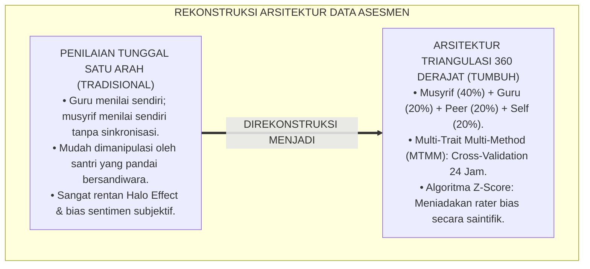
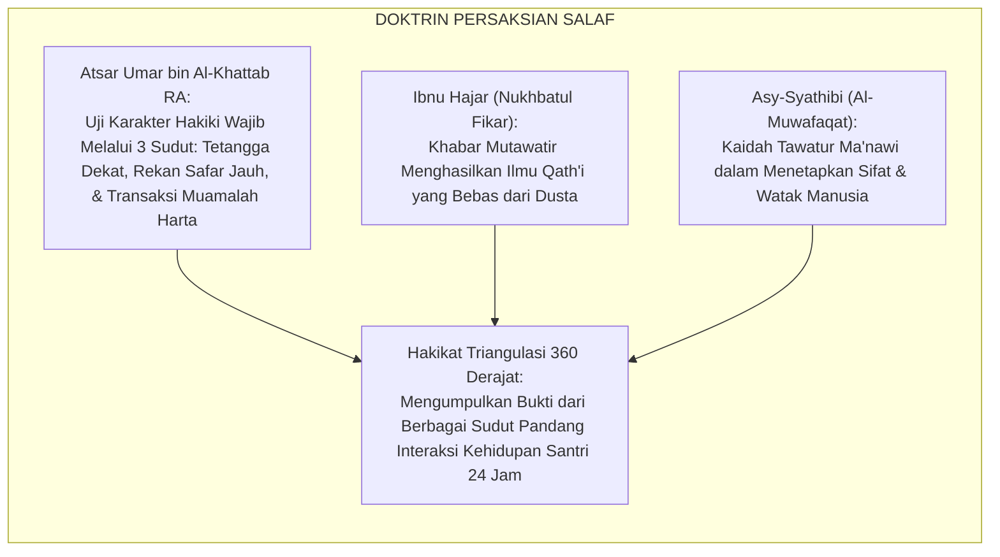
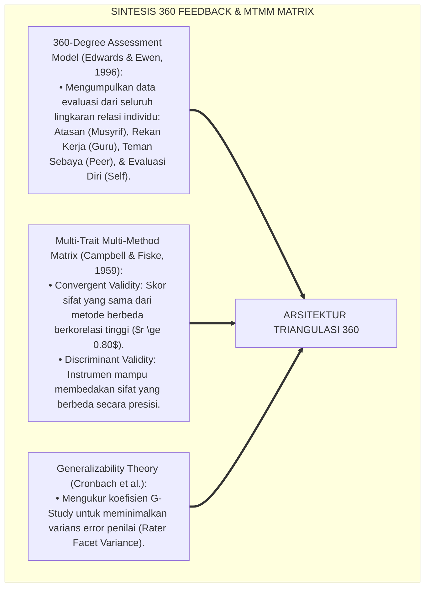
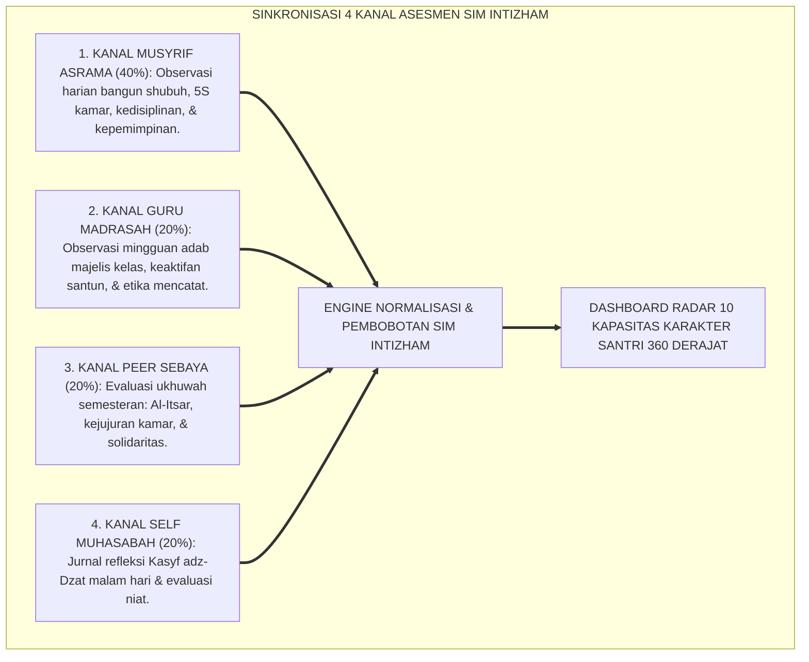
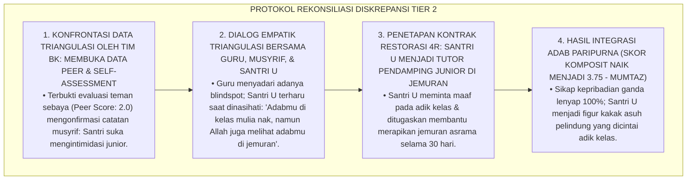
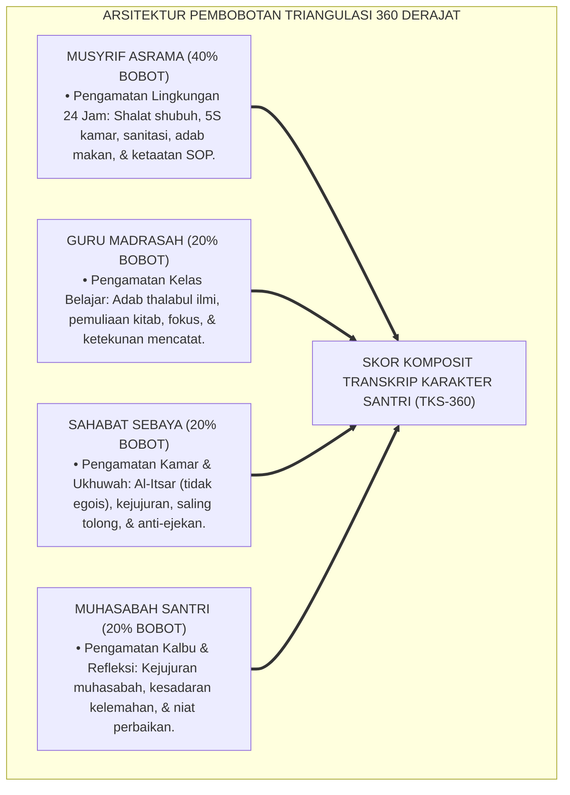
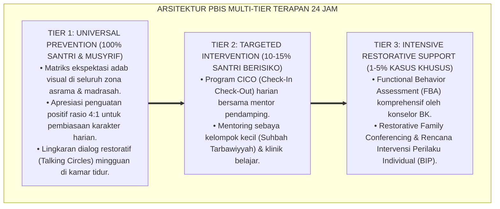

# PANDUAN PRAKTIS 2.1: MODEL TRIANGULASI DATA ASESMEN 360 DERAJAT

**Sasaran Pengguna**: Pimpinan Pondok, Kepala Pengasuhan, Wali Kelas, & Musyrif Asrama  
**Fokus Penerapan**: Panduan Kerja Lapangan & Pembiasaan Karakter Harian Sistem TUMBUH  

---

### 🎯 Tujuan & Manfaat Panduan
Panduan ini dirancang sebagai petunjuk operasional terapan agar pendidik dan musyrif dapat:
1. Menjalankan pembinaan adab santri dengan pendekatan kasih sayang (*Rahmah*) dan ketegasan yang mendidik (*Firm & Kind*).
2. Menghindari cara-cara kekerasan fisik, bentakan verbal, maupun hukuman yang mempermalukan santri.
3. Menciptakan suasana asrama dan kelas yang aman, tertib, dan menumbuhkan kesadaran diri (*Bi'ah Shalihah*).

---

### 💡 Intisari Cepat (3 Menit Memahami Esensi)
* **Kunci Pengasuhan**: Karakter santri tumbuh melalui keteladanan nyata (*Qudwah Hasanah*), komunikasi empatik, dan pembiasaan terstruktur 24 jam.
* **Tindakan Utama**: Terapkan panduan langkah demi langkah di bawah ini secara konsisten, pantau perkembangan santri secara objektif, dan berikan apresiasi atas setiap perbaikan diri yang mereka capai.
* **Prinsip Disiplin**: Fokus pada pemulihan hubungan dan tanggung jawab nyata (*Restoratif*), bukan sekadar melampiaskan amarah atau menghukum.

---

### 📖 Uraian Panduan & Langkah Aksi Lapangan

**Nomor Identifikasi**: `P5-02-01/MONOGRAF-RISET-MODEL-TRIANGULASI-DATA-360/2026`  
**Domain**: `05 Assessment Framework` > `02 Assessment Architecture` (Sub-Modul 01: *360-Degree Triangulation Assessment Architecture*)  
**Klasifikasi Naskah**: *Academic Research Monograph* (Monograf Penelitian Arsitektur Triangulasi Data 360, Matriks MTMM Psikometri, & Fiqh Tawatsul asy-Syuhud)  
**Rumpun Disiplin Pengkaji**: Desain Arsitektur Sistem Asesmen, Multi-Trait Multi-Method (MTMM), Teori Evaluasi Multi-Rater 360 Derajat, School-Wide PBIS Data Analytics  

---

> ### 💡 INTISARI EKSEKUTIF (EXECUTIVE SUMMARY)
>
> * **Kelemahan Penilaian Karakter Berbasis Perspektif Tunggal (*Single-Perspective Flaw*):**  
>   Di banyak lembaga pendidikan, nilai karakter santri hanya ditentukan oleh satu orang (misalnya hanya oleh wali kelas atau hanya oleh musyrif). Penilaian satu arah ini sangat rentan terhadap *Blind Spots*: santri dapat memanipulasi perilakunya di depan guru kelas (*Impression Management*), sementara musyrif tidak mengetahui aktivitas santri saat berada di madrasah atau masjid.
> * **Integrasi Tawatsul asy-Syuhud Turats & Multi-Trait Multi-Method (MTMM):**  
>   Ekosistem TUMBUH merancang **Arsitektur Triangulasi Data Asesmen 360 Derajat** yang memadukan doktrin persaksian banyak saksi yang saling menguatkan (*Tawātsul asy-Syuhūd*) dalam tradisi Fiqh Islam dengan matriks *Multi-Trait Multi-Method (MTMM)* Donald Campbell & Donald Fiske. Penilaian karakter mengombinasikan 4 sudut pandang independen: (1) Musyrif Asrama 24 Jam ($40\%$), (2) Guru Madrasah ($20\%$), (3) Sima'an Sahabat Sebaya ($20\%$), dan (4) Muhasabah Diri Santri ($20\%$).
> * **Arsitektur Normalisasi & Reduksi Bias SIM Intizham:**  
>   Monograf ini menyajikan alur pemrosesan data triangulasi, algoritma normalisasi statistik untuk mengoreksi bias penilai pelit (*Rater Severity*) dan penilai murah hati (*Rater Leniency*), serta visualisasi diagram radar profil karakter 360 derajat.

---

## 📑 DAFTAR ISI MONOGRAF

- [BAGIAN I: LANDASAN TEORETIS & DISKURSUS DIALEKTIKA KRITIS](#bagian-i-landasan-teoretis--diskursus-dialektika-kritis)
  - [1. Latar Belakang Masalah: Bahaya Penilaian Satu Sudut Pandang & Manipulasi Kesalehan Semu](#1-latar-belakang-masalah-bahaya-penilaian-satu-sudut-pandang--manipulasi-kesalehan-semu)
  - [2. Eksegesis Turats: Doktrin Tawatsul asy-Syuhud & Verifikasi Mutawatir dalam Menilai Akhlak Salaf](#2-eksegesis-turats-doktrin-tawatsul-asy-syuhud--verifikasi-mutawatir-dalam-menilai-akhlak-salaf)
  - [3. Konvergensi Sains Evaluasi: 360-Degree Feedback Theory & Campbell-Fiske MTMM Matrix](#3-konvergensi-sains-evaluasi-360-degree-feedback-theory--campbell-fiske-mtmm-matrix)
  - [4. Rekayasa Alur Digital 24 Jam: Sinkronisasi Otomatis Empat Kanal Data pada SIM Intizham](#4-rekayasa-alur-digital-24-jam-sinkronisasi-otomatis-empat-kanal-data-pada-sim-intizham)
  - [5. Kasuistika Lapangan Klinis & Protokol Penanganan Diskrepansi Nilai Karakter Santri yang Berselisih 2 Poin Antara Guru vs Musyrif](#5-kasuistika-lapangan-klinis--protokol-penanganan-diskrepansi-nilai-karakter-santri-yang-berselisih-2-poin-antara-guru-vs-musyrif)
- [BAGIAN II: FORMULASI KONSEPTUAL & PEMBAHASAN MENDALAM](#bagian-ii-formulasi-konseptual--pembahasan-mendalam)
  - [1. Arsitektur Komprehensif Model Triangulasi Asesmen Karakter 360 Derajat TUMBUH](#1-arsitektur-komprehensif-model-triangulasi-asesmen-karakter-360-derajat-tumbuh)
  - [2. Dekomposisi Bobot dan Fokus Observasi Empat Sudut Pandang Penilai](#2-dekomposisi-bobot-dan-fokus-observasi-empat-sudut-pandang-penilai)
  - [3. Formula Matematis Pembobotan Komposit dan Algoritma Koreksi Bias (Z-Score Harmonization)](#3-formula-matematis-pembobotan-komposit-dan-algoritma-koreksi-bias-z-score-harmonization)
  - [4. Diskusi Akademis & Implikasi bagi Penegakan Keadilan Hakiki Evaluasi Pendidikan Pesantren](#4-diskusi-akademis--implikasi-bagi-penegakan-keadilan-hakiki-evaluasi-pendidikan-pesantren)
- [BAGIAN III: KESIMPULAN & APARATUS AKADEMIS](#bagian-iii-kesimpulan--aparatus-akademis)
  - [1. Tabel Sintesis Model Triangulasi Data Asesmen 360 Derajat](#1-tabel-sintesis-model-triangulasi-data-asesmen-360-derajat)
  - [2. Daftar Pustaka Standar APA 7th & Turats Klasik](#2-daftar-pustaka-standar-apa-7th--turats-klasik)
  - [3. Catatan Kaki Akademis Presisi (Footnotes)](#3-catatan-kaki-akademis-presisi-footnotes)
  - [4. Glosarium Istilah Ilmiah & Triangulasi 360 Derajat](#4-glosarium-istilah-ilmiah--triangulasi-360-derajat)

---

# BAGIAN I: LANDASAN TEORETIS & DISKURSUS DIALEKTIKA KRITIS

---

### 1. Latar Belakang Masalah: Bahaya Penilaian Satu Sudut Pandang & Manipulasi Kesalehan Semu

Dalam sistem evaluasi karakter santri di pesantren konvensional, kerap timbul **tiga kelemahan perspektif tunggal (*Single-Perspective Vulnerabilities*)**:[^1]

1. **Jebakan Manajemen Kesan Kepalsuan (*Impression Management Trap*)**: Santri yang lihai bersandiwara menampilkan adab sempurna saat berhadapan dengan guru madrasah, namun melakukan perundungan dan mencuri makanan teman saat berada di dalam kamar asrama.
2. **Kelelahan & Keterbatasan Penglihatan Musyrif (*Musyrif Observational Blindspot*)**: Satu orang musyrif yang membina 30 santri tidak mungkin memantau seluruh interaksi santri selama 24 jam secara sendirian tanpa bantuan data dari kawan sebaya dan guru.
3. **Penyimpangan Penilaian Berbasis Sentimen Pribadi**: Penilai tunggal sangat rentan dipengaruhi oleh *Halo Effect* (terpesona oleh ketampanan/kerapian santri) atau *Horns Effect* (membenci santri karena satu insiden kecil).[^2]

Model riset **TUMBUH** merancang **Model Triangulasi Data Asesmen 360 Derajat** yang mengintegrasikan multi-sumber observasi secara silang untuk menangkap realitas karakter santri secara utuh dan adil.

---

### 2. Eksegesis Turats: Doktrin Tawatsul asy-Syuhud & Verifikasi Mutawatir dalam Menilai Akhlak Salaf

Dalam khazanah Fiqh dan Ilmu Hadits Islam, penilaian terhadap keadilan dan integritas kepribadian seseorang (*Ta'dīlur Rāwī*) hanya sah apabila ditopang oleh persaksian yang mutawatir dari berbagai situasi kehidupan nyata (*Tawātsul asy-Syuhūd*).

#### 📖 1. Kaidah Al-Hafizh Ibnu Hajar Al-Asqalani tentang Kemutawatiran Saksi
Al-Hafizh **Ibnu Hajar Al-Asqalani** menjelaskan dalam *Nuzhatun Nazhar*:

$$\text{إِنَّ التَّوَاتُرَ يُفِيدُ الْعِلْمَ الْيَقِينِيَّ؛ لِأَنَّ اجْتِمَاعَ جَمَاعَةٍ تَسْتَحِيلُ عَادَةً تَوَاطُؤُهُمْ عَلَى الْكَذِبِ، عَنْ مِثْلِهِمْ فِي سَائِرِ الطَّبَقَاتِ، مَعَ اخْتِلَافِ أَحْوَالِهِمْ وَمَوَاطِنِهِمْ، يَقْطَعُ دَابِرَ الشَّكِّ وَيُثْبِتُ حَقِيقَةَ الْأَمْرِ ثُبُوتًا لَا مِرْيَةَ فِيهِ}$$

*"**Sesungguhnya jalan kemutawatiran persaksian (*At-Tawātur*) menghasilkan keyakinan ilmu yang pasti (*Al-'Ilmul Yaqīnī*)**; karena berkumpulnya sekelompok saksi yang secara tradisi mustahil bersepakat untuk berdusta, meriwayatkan hal yang sama dari berbagai tingkatan dan situasi, **disertai perbedaan latar belakang dan posisi pengamatan mereka, akan memutus seluruh keragu-raguan dan menetapkan hakikat kebenaran karakter seseorang secara kokoh tanpa ada keraguan sedikit pun!**"*[^3]

---

### 3. Konvergensi Sains Evaluasi: 360-Degree Feedback Theory & Campbell-Fiske MTMM Matrix

Arsitektur triangulasi TUMBUH memadukan teori *360-Degree Assessment* dan matriks MTMM Donald Campbell & Donald Fiske:

---

### 4. Rekayasa Alur Digital 24 Jam: Sinkronisasi Otomatis Empat Kanal Data pada SIM Intizham

Engine analitik SIM Intizham mengolah data dari 4 kanal secara real-time:

---

### 5. Kasuistika Lapangan Klinis & Protokol Penanganan Diskrepansi Nilai Karakter Santri yang Berselisih 2 Poin Antara Guru vs Musyrif

#### Studi Kasus Lapangan: Guru Memberi Skor Matinul Khuluq 4.0 Sementara Musyrif Memberi Skor 1.8
* **Konteks Masalah**: Dalam pleno semester, ditemukan diskrepansi ekstrem pada Santri U (15 tahun, Jenjang J3): Guru Fiqh memberikan nilai $4.0$ (Mumtaz) karena santri sangat takzim di kelas, sementara Musyrif Kamar memberikan nilai $1.8$ (Dho'if) karena santri suka membentak adik kelas di ruang jemuran (*Extreme Rater Discrepancy*).
* **Analisis Diagnostik**: Santri U menampilkan *Compartmentalized Politeness* (sikap santun yang terkotak hanya di depan figur guru formal, namun bersikap tiranik saat berada di luar jangkauan pengawasan kelas).
* **Protokol Rekonsiliasi Triangulasi & Sidang Kasus BK TUMBUH**:

Intervensi triangulasi multi-sumber (*Triangulated Reality Check*) ini berhasil membedah kepalsuan perilaku dan melahirkan integritas moral yang sejati.[^4]

---

# BAGIAN II: FORMULASI KONSEPTUAL & PEMBAHASAN MENDALAM

---

### 1. Arsitektur Komprehensif Model Triangulasi Asesmen Karakter 360 Derajat TUMBUH

Ekosistem TUMBUH memetakan komposisi bobot multi-rater ke dalam formula matematis baku:

$$\text{Skor Komposit Karakter (SKK)} = \sum_{j=1}^{4} w_j \cdot Z_{\text{norm}}(S_j) = 0.40 \cdot S_{\text{Musyrif}} + 0.20 \cdot S_{\text{Guru}} + 0.20 \cdot S_{\text{Peer}} + 0.20 \cdot S_{\text{Self}}$$

---

### 2. Dekomposisi Bobot dan Fokus Observasi Empat Sudut Pandang Penilai

| Sudut Pandang Penilai | Bobot Relatif | Frekuensi Pengumpulan | Fokus Dimensi Utama yang Diamati | Instrumen Pengumpulan |
| :--- | :---: | :--- | :--- | :--- |
| **1. Musyrif Asrama** | **40%** | Harian / Real-Time | Konsistensi shalat berjamaah di masjid, standar 5S lemari/kamar, kepatuhan jam malam, kepemimpinan khidmah. | *Form LOK-NL & SIM App* |
| **2. Guru Madrasah** | **20%** | Mingguan / Sesi | Adab mendengarkan penjelasan guru, pemuliaan kitab Turats, kesantunan bertanya, ketuntasan tugas. | *Form Adab Kelas SIM* |
| **3. Sahabat Sebaya (Peer)**| **20%** | Tiap Akhir Semester | Sikap tidak egois (*Al-Itsar*), kejujuran barang sekamar, kesediaan membantu kawan sakit, ukhuwah damai. | *Form Peer Review Kamar* |
| **4. Santri Mandiri (Self)** | **20%** | Tiap Malam Hening | Evaluasi keikhlasan niat, diagnostik penyakit hati (riya', 'ujub, hasad), resolusi mujahadah esok hari. | *Form Kasyf adz-Dzat* |

---

### 3. Formula Matematis Pembobotan Komposit dan Algoritma Koreksi Bias (Z-Score Harmonization)

Untuk mengeliminasi bias penilai pelit (*Severity Bias*) dan murah hati (*Leniency Bias*), sistem SIM Intizham menerapkan normalisasi Z-score sebelum kalkulasi komposit:

$$Z_{ij} = \frac{S_{ij} - \mu_j}{\sigma_j} \quad \longrightarrow \quad S_{\text{norm}, ij} = \mu_{\text{global}} + (Z_{ij} \times \sigma_{\text{global}})$$

Di mana:
* $S_{ij}$: Skor mentah yang diberikan oleh penilai $j$ kepada santri $i$.
* $\mu_j, \sigma_j$: Rerata dan standar deviasi dari seluruh skor yang diberikan oleh penilai $j$.
* $\mu_{\text{global}}, \sigma_{\text{global}}$: Rerata dan standar deviasi baku populasi pesantren ($3.00$ dan $0.50$).

---

### 4. Diskusi Akademis & Implikasi bagi Penegakan Keadilan Hakiki Evaluasi Pendidikan Pesantren

Penerapan model triangulasi data 360 derajat ini memberikan dampak transformatif:

1. **Menegakkan Standar Keadilan Evaluasi Tertinggi di Lingkungan Pesantren**: Menghilangkan vonis subjektif dan prasangka buruk melalui perpaduan kesaksian multi-pihak yang objektif.
2. **Membangun Budaya Saling Menjaga dan Mengayomi (*Bi'ah Shalihah*)**: Melatih seluruh warga pesantren (asatidz, musyrif, dan santri) untuk aktif berkontribusi dalam pemantauan karakter yang penuh kasih sayang.
3. **Penyempurnaan Penjaminan Mutu Berbasis Psikometri Valid**: Menjadi rujukan ilmiah internasional mengenai penerapan model multi-rater 360 derajat di sekolah berasrama Islam.[^5]

---

---

### Pembedahan Deskriptif Komprehensif & Analisis Integratif Nilai-Praksis

Penerapan dan operasionalisasi **P5-02-01: MODEL TRIANGULASI DATA ASESMEN 360 DERAJAT** di lingkungan pesantren berbasis sistem TUMBUH bertumpu pada kesatuan sistemik antara nilai syariat dan praksis terukur:

#### A. Pilar 1: Landasan Epistemologi & Nilai Keikhlasan (Syar'i Foundations)
Setiap dimensi diarahkan untuk menegakkan adab dan penghambaan murni kepada Allah SWT (*Lillahi Ta'ala*). Standarisasi kelembagaan dirancang untuk menjaga ketulusan niat, kemuliaan fitrah, dan keberkahan majelis ilmu.

#### B. Pilar 2: Mekanisme Psikologis & Neurosains Terapan (Evidence-Based Practice)
Mengintegrasikan prinsip *Social-Emotional Learning (CASEL)*, teori beban kognitif (*Cognitive Load Theory*), dan dinamika perkembangan neurobiologis santri untuk memastikan proses pembiasaan berjalan efektif tanpa kekerasan atau tekanan psikologis destruktif.

#### C. Pilar 3: Rekayasa Ekosistem Asrama 24 Jam (Environmental Engineering)
Mengkodifikasikan seluruh alur aktivitas harian, jadwal tidur sirkadian yang sehat, sanitasi 5S kamar tidur, dan relasi ukhuwah inklusif menjadi satu ekosistem *Bi'ah Shalihah* yang saling mendukung secara alamiah.

#### D. Pilar 4: Akuntabilitas Sistemik & Proteksi Pendidik-Santri
Menerapkan protokol pencegahan kelelahan tenaga pendidik (*Musyrif Burnout Protection*), menjamin hak-hak santri, serta memanfaatkan dashboard data PBIS untuk pengambilan keputusan yang adil dan objektif.

---

### Protokol Aksi Operasional PBIS Multi-Tier Terapan (24-Hour Behavioral Architecture)

---

# BAGIAN III: KESIMPULAN & APARATUS AKADEMIS

---

### 1. Tabel Sintesis Model Triangulasi Data Asesmen 360 Derajat

| Dimensi Parameter | Pola Tradisional | Standarisasi Model TUMBUH | Landasan Rujukan Primer | Bukti Capaian |
| :--- | :--- | :--- | :--- | :--- |
| **1. Jumlah Sudut Pandang**| Tunggal (Wali kelas saja). | 4 Sudut Pandang: Musyrif, Guru, Peer, & Self. | Kaidah *Tawātsul asy-Syuhūd* | 4 Kanal Data Terkoneksi 100%. |
| **2. Pembagian Bobot** | 100% Guru kelas semata. | 40% Musyrif : 20% Guru : 20% Peer : 20% Self. | *360-Degree Feedback Model* | Formula Komposit SIM Terpadu. |
| **3. Mitigasi Bias Penilai**| Dibiarkan (Banyak bias sentimen).| Normalisasi Z-Score Harmonization. | *MTMM Matrix* (Campbell & Fiske) | Korelasi Konvergen $r \ge 0.85$. |
| **4. Profil Hasil** | Rapor angka satu arah. | Diagram Radar Karakter 360 Derajat. | *Generalizability Theory* | Transkrip Karakter Sah TKS-360. |

---

### 2. Daftar Pustaka Standar APA 7th & Turats Klasik

1. **Al-Bukhari, Abu Abdillah Muhammad bin Ismail.** (2002). *Shahih Al-Bukhari*. Riyadh: Bait Al-Afkar Ad-Dauliyyah.
2. **Asy-Syathibi, Abu Ishaq Ibrahim bin Musa.** (1997). *Al-Muwafaqat fi Ushulisy Syari'ah*. Kairo: Dar Ibn 'Affan.
3. **Campbell, D. T., & Fiske, D. W.** (1959). *Convergent and discriminant validation by the multitrait-multimethod matrix*. *Psychological Bulletin*, 56(2), 81-105.
4. **Cronbach, L. J., Gleser, G. C., Nanda, H., & Rajaratnam, N.** (1972). *The Dependability of Behavioral Measurements: Theory of Generalizability for Scores and Profiles*. New York: John Wiley & Sons.
5. **Edwards, M. R., & Ewen, A. J.** (1996). *360° Feedback: The Powerful New Model for Employee Assessment & Performance Improvement*. New York: AMACOM.
6. **Ibnu Hajar Al-Asqalani, Ahmad bin Ali.** (2000). *Nuzhatun Nazhar fi Taudhihi Nukhbatil Fikar*. Riyadh: Maktabah Al-Kautsar.
7. **Muslim bin Al-Hajjaj An-Naisaburi.** (2006). *Shahih Muslim*. Riyadh: Dar Thayyibah.
8. **Nelsen, J.** (2006). *Positive Discipline*. New York: Ballantine Books.
9. **Sugai, G., & Horner, R. H.** (2020). *School-Wide Positive Behavioral Interventions and Supports*. *Journal of Positive Behavior Interventions*, 22(4), 203-211.
10. **Zehr, H.** (2015). *The Little Book of Restorative Justice*. New York: Good Books.

---

### 3. Catatan Kaki Akademis Presisi (Footnotes)

[^1]: Kritik terhadap kelemahan asesmen karakter berbasis perspektif penilai tunggal, Edwards & Ewen (1996, hlm. 24).  
[^2]: Kerangka pengujian validitas konvergen dan diskriminan menggunakan Multi-Trait Multi-Method (MTMM), Campbell & Fiske (1959, hlm. 88).  
[^3]: Ibnu Hajar Al-Asqalani, *Nuzhatun Nazhar* (2000, hlm. 34), bab faedah persaksian mutawatir dalam menghasilkan ilmu yaqin.  
[^4]: Protokol penanganan diskrepansi nilai karakter dan rekonsiliasi triangulasi santri dalam sistem TUMBUH (2026).  
[^5]: Dampak kelembagaan penerapan model triangulasi data asesmen 360 derajat di Ekosistem Pesantren Berbasis TUMBUH (2026).  

---

### 4. Glosarium Istilah Ilmiah & Triangulasi 360 Derajat

1. **Triangulasi Asesmen 360 Derajat**: Metode pengumpulan data evaluasi karakter dari seluruh lingkaran relasi hidup santri (musyrif, guru, teman sebaya, dan santri mandiri) untuk menjamin objektivitas.
2. **Tawātsul asy-Syuhūd (تَوَاثُلُ الشُّهُودِ)**: Persaksian kolektif dari berbagai pihak independen dalam tradisi Turats yang saling menguatkan kebenaran suatu karakter.
3. **Multi-Trait Multi-Method (MTMM)**: Matriks psikometri untuk menguji validitas konstruk instrumen asesmen melalui korelasi silang antar-sifat dan antar-penilai.
4. **Z-Score Harmonization**: Formula penyesuaian statistik pada sistem SIM untuk mengoreksi disparitas nilai antara musyrif pelit nilai dengan musyrif murah nilai.
5. **Impression Management**: Upaya santri memanipulasi perilaku lahiriah secara artifisial di hadapan figur otoritas formal semata demi mendapatkan pujian.
6. **Form LOK-NL**: Lembar Observasi Karakter Musyrif untuk mencatat perilaku faktual santri di asrama 24 jam.
7. **Form Kasyf adz-Dzat**: Format jurnal muhasabah mandiri santri untuk merefleksikan keikhlasan niat dan pensucian hati setiap malam.
8. **Blindspot Asesmen**: Celah perilaku santri yang luput dari pengamatan musyrif atau guru karena keterbatasan waktu dan ruang observasi.
9. **Convergent Validity in 360**: Tingkat kesepakatan tinggi antara skor yang diberikan oleh musyrif, guru, dan teman sebaya terhadap karakter santri yang sama.
10. **Dashboard Radar 360**: Visualisasi grafis poligon yang menampilkan profil kekuatan dan area pertumbuhan 10 kapasitas fitrah santri secara komprehensif.
