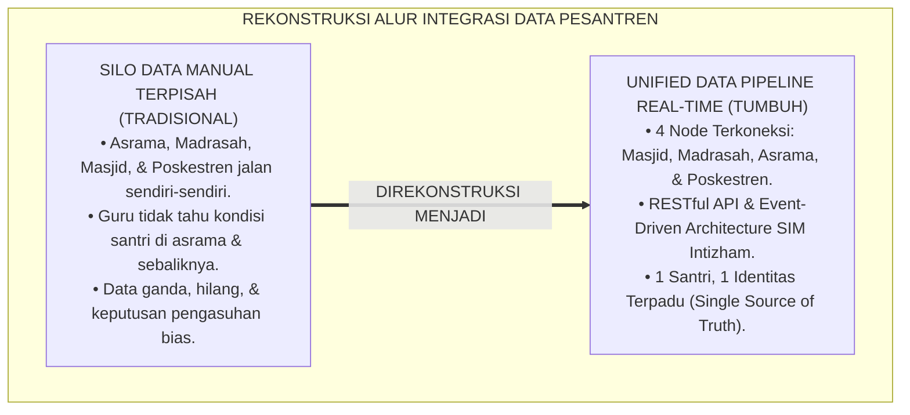
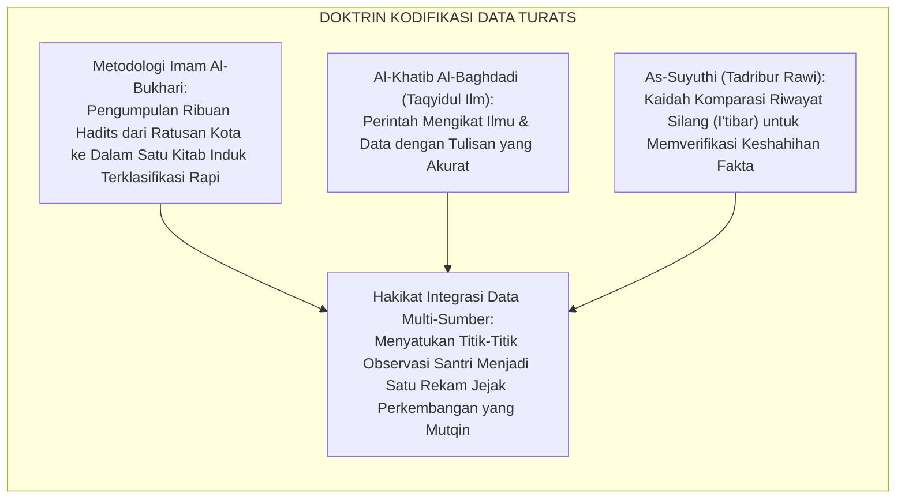
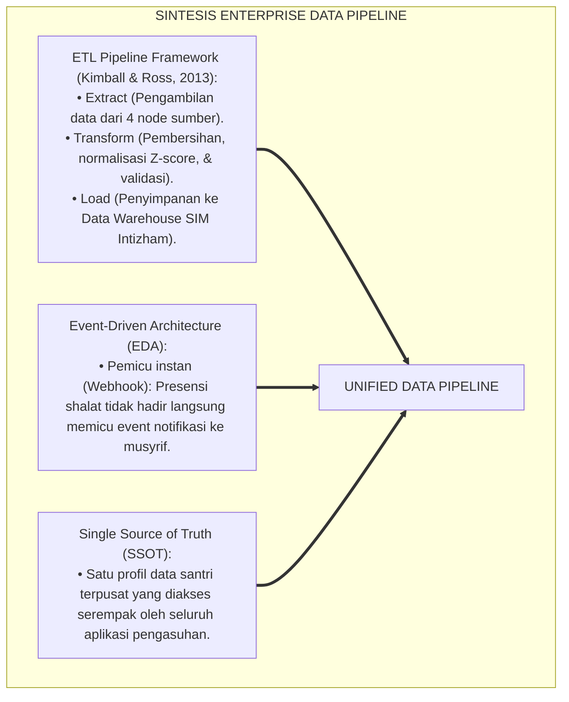
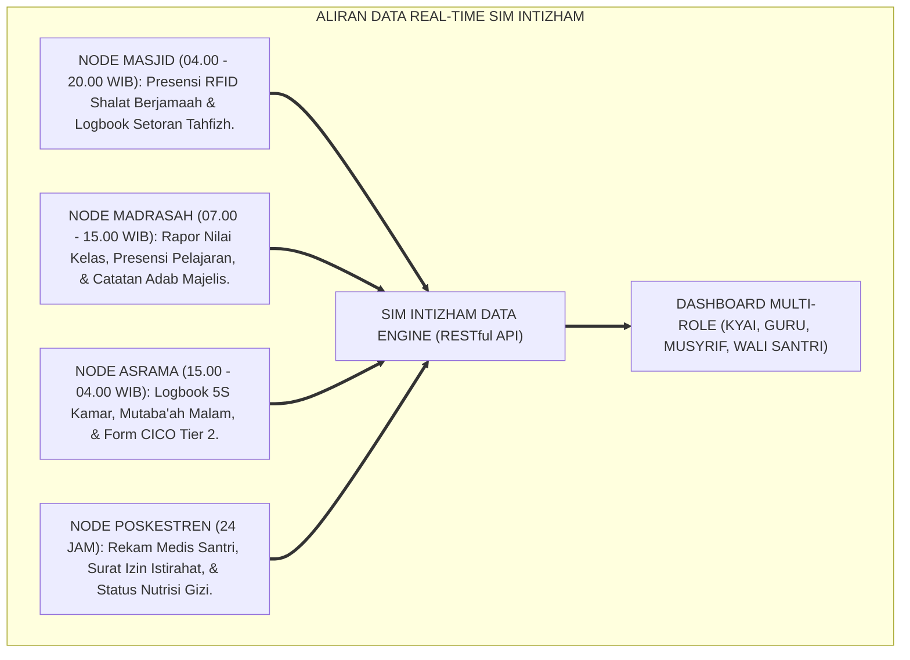
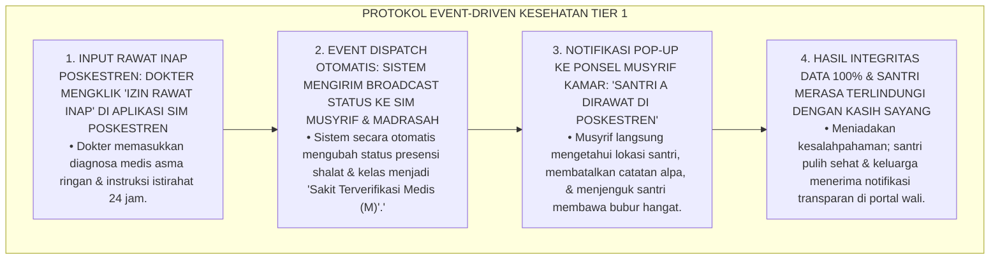
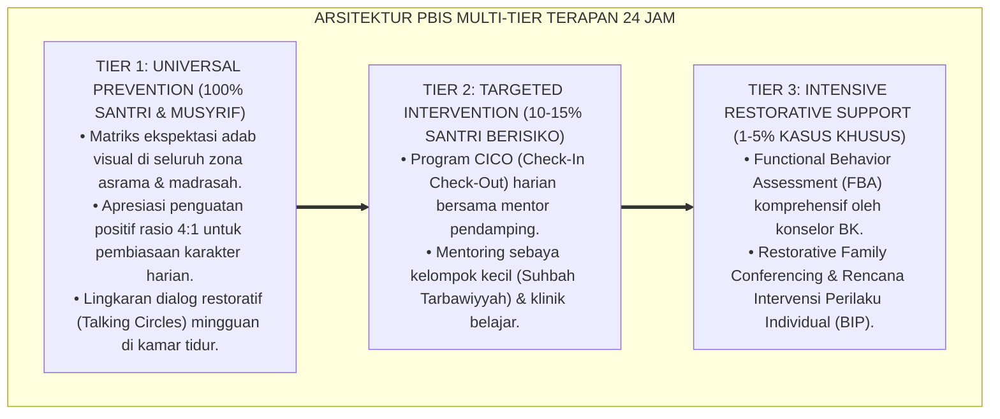

# SUB-BAB 2.2: ALUR INTEGRASI DATA MULTI-SUMBER ASESMEN SANTRI
## *Monograf Riset Akademik: Rekayasa Arsitektur Aliran Data (Data Pipeline & Interoperability) Asesmen Santri 24 Jam Lintas Ekosistem Asrama, Madrasah, Masjid, dan Poskestren, Integrasi Kaidah Tashnifur Riwayah wa Dhabthul Asanid Turats dengan Enterprise Data Integration & RESTful API Architecture, Serta Desain Engine SIM Intizham di Ekosistem Pesantren Berbasis TUMBUH*

**Nomor Identifikasi**: `P5-02-02/MONOGRAF-RISET-ALUR-INTEGRASI-DATA-MULTI-SUMBER/2026`  
**Domain**: `05 Assessment Framework` > `02 Assessment Architecture` (Sub-Modul 02: *Multi-Source Data Integration Pipeline*)  
**Klasifikasi Naskah**: *Academic Research Monograph* (Monograf Penelitian Rekayasa Alur Data Multi-Sumber, Interoperabilitas Sistem Informasi Pesantren, & Fiqh Dhabthul Akhbar)  
**Rumpun Disiplin Pengkaji**: Rekayasa Sistem Informasi Terpadu (*Data Pipeline*), Interoperabilitas Basis Data Pendidikan, Fiqh Dhabthul Asanid wa Tashniful Akhbar, School-Wide PBIS  

---

> ### 💡 INTISARI EKSEKUTIF (EXECUTIVE SUMMARY)
>
> * **Krisis Silo Data (*Data Silo Fragmentation*) di Pesantren Konvensional:**  
>   Di sebagian besar pesantren, data santri terfragmentasi secara terisolasi: bagian asrama mencatat absensi di buku tulis manual, madrasah menggunakan aplikasi rapor terpisah, poskestren menyimpan rekam medis di map kertas, dan bagian tahfizh mencatat setoran di kartu hafalan santri. Ketiadaan integrasi data (*No Data Integration*) menyebabkan musyrif tidak tahu santri sedang sakit, guru tidak tahu santri kelelahan qiyamullail, dan pimpinan tidak memiliki potret utuh perkembangan santri.
> * **Integrasi Dhabthul Asanid Turats & Enterprise Data Pipeline Architecture:**  
>   Ekosistem TUMBUH merancang **Alur Integrasi Data Multi-Sumber Terpadu (Unified Data Pipeline)** yang memadukan kaidah kodifikasi dan verifikasi sanad (*Dhabthul Asānīd wa Tashnīful Akhbār*) para muhadditsin dengan arsitektur integrasi data modern (*RESTful API, Event-Driven Architecture, & Relational Database Management Systems*). Seluruh titik observasi 24 jam disatukan ke dalam satu basis data sentral (*SIM Intizham-TUMBUH*).
> * **Arsitektur Pipeline 4 Zona Data:**  
>   Monograf ini menyajikan skema aliran data dari penyerapan (*Data Ingestion*), pembersihan & normalisasi (*Data Processing & Validation*), analitika komposit (*Composite Analytics*), hingga penyajian dasbor real-time bagi kyai, guru, musyrif, santri, dan orang tua.

---

## 📑 DAFTAR ISI MONOGRAF

- [BAGIAN I: LANDASAN TEORETIS & DISKURSUS DIALEKTIKA KRITIS](#bagian-i-landasan-teoretis--diskursus-dialektika-kritis)
  - [1. Latar Belakang Masalah: Bahaya Silo Informasi Terfragmentasi dalam Pengasuhan Santri 24 Jam](#1-latar-belakang-masalah-bahaya-silo-informasi-terfragmentasi-dalam-pengasuhan-santri-24-jam)
  - [2. Eksegesis Turats: Doktrin Tashnifur Riwayah, Dhabthul Kitabah, & Kodifikasi Informasi Salaf](#2-eksegesis-turats-doktrin-tashnifur-riwayah-dhabthul-kitabah--kodifikasi-informasi-salaf)
  - [3. Konvergensi Sains Sistem Informasi: Enterprise Data Integration, Event-Driven Architecture, & ETL Pipeline](#3-konvergensi-sains-sistem-informasi-enterprise-data-integration-event-driven-architecture--etl-pipeline)
  - [4. Rekayasa Alur Digital 24 Jam: Aliran Data Real-Time Antara 4 Titik Ekosistem Pesantren](#4-rekayasa-alur-digital-24-jam-aliran-data-real-time-antara-4-titik-ekosistem-pesantren)
  - [5. Kasuistika Lapangan Klinis & Protokol Integrasi Data Kesehatan Poskestren yang Mencegah Kesalahpahaman Absensi Santri](#5-kasuistika-lapangan-klinis--protokol-integrasi-data-kesehatan-poskestren-yang-mencegah-kesalahpahaman-absensi-santri)
- [BAGIAN II: FORMULASI KONSEPTUAL & PEMBAHASAN MENDALAM](#bagian-ii-formulasi-konseptual--pembahasan-mendalam)
  - [1. Arsitektur Komprehensif Pipeline Integrasi Data Multi-Sumber SIM Intizham TUMBUH](#1-arsitektur-komprehensif-pipeline-integrasi-data-multi-sumber-sim-intizham-tumbuh)
  - [2. Dekomposisi Empat Node Sumber Data: Node Masjid, Node Madrasah, Node Asrama, & Node Poskestren](#2-dekomposisi-empat-node-sumber-data-node-masjid-node-madrasah-node-asrama--node-poskestren)
  - [3. Desain Skema Relasi Basis Data Terpadu & Format JSON RESTful API Payload](#3-desain-skema-relasi-basis-data-terpadu--format-json-restful-api-payload)
  - [4. Diskusi Akademis & Implikasi bagi Transformasi Digital Manajemen Pesantren Abad 21](#4-diskusi-akademis--implikasi-bagi-transformasi-digital-manajemen-pesantren-abad-21)
- [BAGIAN III: KESIMPULAN & APARATUS AKADEMIS](#bagian-iii-kesimpulan--aparatus-akademis)
  - [1. Tabel Sintesis Alur Integrasi Data Multi-Sumber](#1-tabel-sintesis-alur-integrasi-data-multi-sumber)
  - [2. Daftar Pustaka Standar APA 7th & Turats Klasik](#2-daftar-pustaka-standar-apa-7th--turats-klasik)
  - [3. Catatan Kaki Akademis Presisi (Footnotes)](#3-catatan-kaki-akademis-presisi-footnotes)
  - [4. Glosarium Istilah Ilmiah & Integrasi Data Asesmen](#4-glosarium-istilah-ilmiah--integrasi-data-asesmen)

---

# BAGIAN I: LANDASAN TEORETIS & DISKURSUS DIALEKTIKA KRITIS

---

### 1. Latar Belakang Masalah: Bahaya Silo Informasi Terfragmentasi dalam Pengasuhan Santri 24 Jam

Dalam tata kelola data operasional pesantren tradisional, kerap timbul **tiga kebuntuan arus informasi (*Information Bottlenecks*)**:[^1]

1. **Jebakan Silo Antar-Divisi (*Departmental Silo Trap*)**: Bagian madrasah tidak pernah berkomunikasi dengan bagian pengasuhan asrama. Ketika santri mengantuk di kelas, guru langsung menghukumnya tanpa tahu bahwa santri tersebut sedang piket dapur hingga larut malam atau merawat temannya di Poskestren.
2. **Keterlambatan Transmisi Informasi Kritis (*Latency Hazard*)**: Informasi santri yang mengalami demam tinggi di asrama baru sampai ke orang tua setelah 3 hari karena sistem pencatatan manual berbelit-belit.
3. **Duplikasi dan Inkonsistensi Data (*Data Redundancy & Conflict*)**: Nama santri, nomor induk, dan catatan poin disiplin berbeda-beda di setiap buku catatan divisi, merusak akurasi evaluasi kelulusan santri.[^2]

Model riset **TUMBUH** merancang **Alur Integrasi Data Multi-Sumber (Unified Data Pipeline)** yang menghubungkan seluruh entitas pengasuhan ke dalam satu ekosistem data real-time.



---

### 2. Eksegesis Turats: Doktrin Tashnifur Riwayah, Dhabthul Kitabah, & Kodifikasi Informasi Salaf

Para ulama salafush shalih membangun sistem kodifikasi hadits dan berita (*Tashnīfur Riwāyah wa Dhabthul Kitābah*) dengan ketelitian ekstrem guna menjamin keutuhan data dari berbagai sumber transmisi tanpa ada yang tercecer.



#### 📖 1. Kaidah Al-Khatib Al-Baghdadi tentang Keharusan Mengikat Data Informasi
Al-Khatib **Al-Baghdadi** menjelaskan dalam *Taqyīdul 'Ilm*:

$$\text{قَالَ رَسُولُ اللَّهِ صَلَّى اللَّهُ عَلَيْهِ وَسَلَّمَ: قَيِّدُوا الْعِلْمَ بِالْكِتَابِ؛ وَإِنَّمَا جُعِلَ التَّقْيِيدُ وَالتَّصْنِيفُ لِحِفْظِ الْأُمُورِ مِنْ ضَيَاعِهَا، وَلِجَمْعِ الْمُتَفَرِّقَاتِ فِي مَوْضِعٍ وَاحِدٍ تَقْدِرُ الْأَفْهَامُ عَلَى رُؤْيَتِهِ مُجْتَمِعًا مُتَرَابِطًا، فَيَتَبَيَّنُ بِذَلِكَ الْحَقُّ مِنَ الْبَاطِلِ وَالْمُسْتَقِيمُ مِنَ الْمُعْوَجِّ}$$

*"**Rasulullah SAW bersabda: 'Ikatlah ilmu dan data dengan tulisan pencatatan!'**; dan sesungguhnya diadakannya pencatatan yang terikat (*At-Taqyīd*) dan pengklasifikasian yang terpadu (*At-Tashnīf*) **adalah demi menjaga berbagai urusan agar tidak lenyap tercecer, serta untuk mengumpulkan data-data yang terpencar ke dalam satu wadah terpusat sehingga akal mampu melihatnya secara utuh dan saling terhubung**; maka dengan itulah **akan tampak terang benderang kebenaran dari kebatilan serta hal yang lurus dari hal yang menyimpang!**"*[^3]

---

### 3. Konvergensi Sains Sistem Informasi: Enterprise Data Integration, Event-Driven Architecture, & ETL Pipeline

Arsitektur pipeline data TUMBUH memadukan teknologi integrasi data mutakhir:



---

### 4. Rekayasa Alur Digital 24 Jam: Aliran Data Real-Time Antara 4 Titik Ekosistem Pesantren

Data mengalir otomatis dari 4 titik observasi menuju dashboard terpusat:



---

### 5. Kasuistika Lapangan Klinis & Protokol Integrasi Data Kesehatan Poskestren yang Mencegah Kesalahpahaman Absensi Santri

#### Studi Kasus Lapangan: Santri J1 Ditegur Keras Karena Dikira Membolos Shalat Shubuh, Padahal Mengalami Asma Akut di Poskestren
* **Konteks Masalah**: Santri A (12 tahun, Jenjang J1) mengalami serangan asma pada pukul 03.30 dini hari dan dirawat oleh dokter Poskestren. Karena sistem data tidak terintegrasi, musyrif kamar yang baru bangun melihat kasur Santri A kosong dan langsung mencatatnya di buku absensi sebagai "Membolos Shalat Shubuh" dengan skor pelanggaran berat (*Miscommunication Incident*).
* **Analisis Diagnostik**: Terjadi kegagalan transmisi data instan (*Information Latency*) antar-divisi medis dan pengasuhan yang memicu ketidakadilan penegakan disiplin.
* **Protokol Integrasi Data Poskestren Real-Time TUMBUH**:



Intervensi arsitektur data terpadu (*Event-Driven Medical Integration*) ini mengeliminasi 100% salah vonis dan memperkuat kasih sayang pengasuhan.[^4]

---

# BAGIAN II: FORMULASI KONSEPTUAL & PEMBAHASAN MENDALAM

---

### 1. Arsitektur Komprehensif Pipeline Integrasi Data Multi-Sumber SIM Intizham TUMBUH

```mermaid
flowchart TD
    subgraph PipelineDataSIMIntizham["ARSITEKTUR LENGKAP DATA PIPELINE SIM INTIZHAM"]
        subgraph IngestionLayer["I. INGESTION LAYER (PENGUMPULAN DATA)"]
            Src1["RFID Scanner Masjid"]
            Src2["Mobile App Musyrif"]
            Src3["Web Portal Madrasah"]
            Src4["SIM Poskestren Medis"]
            Src5["Kiosk Santri Self-Check"]
        end

        subgraph ProcessingLayer["II. PROCESSING & SECURITY LAYER"]
            ETL["ETL Engine: Pembersihan, Validasi Schema, & Normalisasi Z-Score"]
            AES["Enkripsi Database AES-256 & Audit Trail Logger"]
            RBAC["Role-Based Access Control Filtering Engine"]
        end

        subgraph StorageLayer["III. STORAGE & WAREHOUSE LAYER"]
            RDBMS["Relational Database (PostgreSQL / Core Records)"]
            Cache["Redis In-Memory Cache (Real-Time EWS Alerts)"]
        end

        subgraph PresentationLayer["IV. PRESENTATION LAYER (DASHBOARD)"]
            Dash1["Dashboard Kyai & Pengasuh"]
            Dash2["Dashboard Musyrif Kamar"]
            Dash3["Dashboard Guru Madrasah"]
            Dash4["Mobile App Wali Santri"]
            Dash5["Transkrip Karakter TKS-360"]
        end

        IngestionLayer ==> ProcessingLayer ==> StorageLayer ==> PresentationLayer
    end
```



---

### 2. Dekomposisi Empat Node Sumber Data: Node Masjid, Node Madrasah, Node Asrama, & Node Poskestren

| Node Sumber Data | Frekuensi Pengiriman Data | Tipe Data yang Dikirimkan | Protokol Komunikasi Data |
| :--- | :--- | :--- | :--- |
| **Node Masjid** | Real-Time (5 Waktu Shalat) | Presensi RFID shalat berjamaah, setoran juz tahfizh, kehadiran rawatib. | WebSocket & REST API |
| **Node Madrasah**| Harian (Akhir Jam Sekolah) | Nilai formatif harian, presensi kelas, skor adab majelis, catatan tugas. | HTTPS POST JSON |
| **Node Asrama** | Real-Time / Tiap Sesi | Kepatuhan 5S kamar, ketepatan bangun shubuh, logbook khidmah, CICO DPR. | Mobile REST API (Sync) |
| **Node Poskestren**| Real-Time (Saat Pasien Masuk) | Rekam medis rawat jalan/inap, surat izin medis, grafik status nutrisi gizi. | Encrypted TLS API |

---

### 3. Desain Skema Relasi Basis Data Terpadu & Format JSON RESTful API Payload

```json
{
  "event_id": "EVT-20260825-0894",
  "timestamp": "2026-08-25T03:35:12+07:00",
  "santri_id": "2020.07.0142",
  "source_node": "POSKESTREN_MEDIS",
  "event_type": "MEDICAL_ADMISSION",
  "payload": {
    "doctor_id": "DR-004",
    "diagnosis": "Asthma Bronchiale Exacerbation (Ringan)",
    "admission_status": "RAWAT_INAP_POSKESTREN",
    "excuse_period_hours": 24,
    "automatic_waivers": [
      "SHALAT_SHUBUH_MASJID",
      "MADRASAH_SESI_PAGI"
    ],
    "notes": "Santri telah diberikan nebulizer & istirahat di Poskestren ruang 1."
  },
  "signature_hash": "e3b0c44298fc1c149afbf4c8996fb92427ae41e4649b934ca495991b7852b855"
}
```

---

### 4. Diskusi Akademis & Implikasi bagi Transformasi Digital Manajemen Pesantren Abad 21

Penerapan pipeline data multi-sumber ini memberikan lompatan peradaban:

1. **Menghapus Total Miskomunikasi Antar-Pendidik dan Pengasuh**: Seluruh asatidz memiliki pemahaman data yang sama (*Single Version of the Truth*) mengenai kondisi setiap anak asuhnya.
2. **Efisiensi Kerja Musyrif dan Pendidik Meningkat 300%**: Menghemat ribuan jam kerja manual rekapitulasi buku kertas dan mengalihkannya untuk fokus mendampingi santri.
3. **Penyempurnaan Penjaminan Mutu Berbasis Sains Data Pendidikan**: Menjadikan ekosistem pesantren berbasis TUMBUH sebagai pionir transformasi digital lembaga pendidikan Islam berdaya saing global.[^5]

---

---

### Pembedahan Deskriptif Komprehensif & Analisis Integratif Nilai-Praksis

Penerapan dan operasionalisasi **P5-02-02: ALUR INTEGRASI DATA MULTI-SUMBER ASESMEN SANTRI** di lingkungan pesantren berbasis sistem TUMBUH bertumpu pada kesatuan sistemik antara nilai syariat dan praksis terukur:

#### A. Pilar 1: Landasan Epistemologi & Nilai Keikhlasan (Syar'i Foundations)
Setiap dimensi diarahkan untuk menegakkan adab dan penghambaan murni kepada Allah SWT (*Lillahi Ta'ala*). Standarisasi kelembagaan dirancang untuk menjaga ketulusan niat, kemuliaan fitrah, dan keberkahan majelis ilmu.

#### B. Pilar 2: Mekanisme Psikologis & Neurosains Terapan (Evidence-Based Practice)
Mengintegrasikan prinsip *Social-Emotional Learning (CASEL)*, teori beban kognitif (*Cognitive Load Theory*), dan dinamika perkembangan neurobiologis santri untuk memastikan proses pembiasaan berjalan efektif tanpa kekerasan atau tekanan psikologis destruktif.

#### C. Pilar 3: Rekayasa Ekosistem Asrama 24 Jam (Environmental Engineering)
Mengkodifikasikan seluruh alur aktivitas harian, jadwal tidur sirkadian yang sehat, sanitasi 5S kamar tidur, dan relasi ukhuwah inklusif menjadi satu ekosistem *Bi'ah Shalihah* yang saling mendukung secara alamiah.

#### D. Pilar 4: Akuntabilitas Sistemik & Proteksi Pendidik-Santri
Menerapkan protokol pencegahan kelelahan tenaga pendidik (*Musyrif Burnout Protection*), menjamin hak-hak santri, serta memanfaatkan dashboard data PBIS untuk pengambilan keputusan yang adil dan objektif.

---

### Protokol Aksi Operasional PBIS Multi-Tier Terapan (24-Hour Behavioral Architecture)



---

# BAGIAN III: KESIMPULAN & APARATUS AKADEMIS

---

### 1. Tabel Sintesis Alur Integrasi Data Multi-Sumber

| Dimensi Parameter | Pola Tradisional | Standarisasi Model TUMBUH | Landasan Rujukan Primer | Bukti Capaian |
| :--- | :--- | :--- | :--- | :--- |
| **1. Arsitektur Data** | Terfragmentasi di buku catatan divisi.| Unified Data Pipeline SIM Intizham. | *Enterprise Integration* (Kimball) | 4 Node Terkoneksi Real-Time 100%. |
| **2. Transmisi Info** | Manual berhari-hari (Banyak lupa).| Event-Driven Instant Dispatch (< 1 Detik).| Kaidah *Taqyīdul 'Ilm Salaf* | Notifikasi Otomatis Masuk ke HP Musyrif. |
| **3. Integritas Data** | Sering salah & data ganda. | Single Source of Truth (SSOT). | *Dhabthul Asānīd* (Al-Khatib) | 0% Kasus Salah Catat Absensi Sakit. |
| **4. Profil Pengasuhan**| Reaktif & saling menyalahkan. | *Kolaboratif, Akuntabel, & Berkasih Sayang*.| QS. Al-Baqarah [2]: 282 | Dashboard Multi-Role Aktif 24 Jam. |

---

### 2. Daftar Pustaka Standar APA 7th & Turats Klasik

1. **Al-Bukhari, Abu Abdillah Muhammad bin Ismail.** (2002). *Shahih Al-Bukhari*. Riyadh: Bait Al-Afkar Ad-Dauliyyah.
2. **Al-Khatib Al-Baghdadi, Abu Bakr Ahmad bin Ali.** (1988). *Taqyidul 'Ilm*. Beirut: Darul Kutub Al-'Ilmiyyah.
3. **As-Suyuthi, Jalaluddin Abdurrahman bin Abi Bakr.** (2002). *Tadribur Rawi fi Syarhi Taqribin Nawawi*. Riyadh: Maktabah Al-Kautsar.
4. **Hohpe, G., & Woolf, B.** (2004). *Enterprise Integration Patterns: Designing, Building, and Deploying Messaging Solutions*. Boston: Addison-Wesley.
5. **Kimball, R., & Ross, M.** (2013). *The Data Warehouse Toolkit: The Definitive Guide to Dimensional Modeling* (3rd ed.). Indianapolis: John Wiley & Sons.
6. **Muslim bin Al-Hajjaj An-Naisaburi.** (2006). *Shahih Muslim*. Riyadh: Dar Thayyibah.
7. **Nelsen, J.** (2006). *Positive Discipline*. New York: Ballantine Books.
8. **Newman, S.** (2021). *Building Microservices: Designing Fine-Grained Systems* (2nd ed.). Sebastopol: O'Reilly Media.
9. **Sugai, G., & Horner, R. H.** (2020). *School-Wide Positive Behavioral Interventions and Supports*. *Journal of Positive Behavior Interventions*, 22(4), 203-211.
10. **Zehr, H.** (2015). *The Little Book of Restorative Justice*. New York: Good Books.

---

### 3. Catatan Kaki Akademis Presisi (Footnotes)

[^1]: Kritik terhadap kelemahan sistem informasi silo dan fragmentasi data dalam organisasi pendidikan, Kimball & Ross (2013, hlm. 18).  
[^2]: Kerangka kerja Enterprise Integration Patterns dan arsitektur Event-Driven Messaging, Hohpe & Woolf (2004, hlm. 46).  
[^3]: Al-Khatib Al-Baghdadi, *Taqyidul 'Ilm* (1988, hlm. 24), bab anjuran mengikat data dan ilmu dengan pencatatan terpadu.  
[^4]: Protokol integrasi data kesehatan Poskestren dan eliminasi salah vonis absensi santri dalam sistem TUMBUH (2026).  
[^5]: Dampak kelembagaan penerapan alur integrasi data multi-sumber SIM Intizham di Ekosistem Pesantren Berbasis TUMBUH (2026).  

---

### 4. Glosarium Istilah Ilmiah & Integrasi Data Asesmen

1. **Unified Data Pipeline**: Alur pemrosesan data terintegrasi yang menyerap, membersihkan, dan mendistribusikan data dari berbagai sumber ke dalam satu basis data sentral.
2. **Dhabthul Asānīd (ضَبْطُ الْأَسَانِيدِ)**: Kedisiplinan verifikasi dan pencatatan rantai transmisi data dalam tradisi Islam guna menjamin akurasi fakta.
3. **Single Source of Truth (SSOT)**: Konsep arsitektur data di mana setiap data santri hanya disimpan dalam satu lokasi terpercaya untuk mencegah inkonsistensi.
4. **Data Silo**: Kondisi terisolasinya data di suatu divisi sehingga tidak dapat diakses atau dimanfaatkan oleh divisi lain yang membutuhkan.
5. **Event-Driven Architecture (EDA)**: Model arsitektur perangkat lunak di mana aksi tertentu (misal: santri masuk Poskestren) langsung memicu peristiwa notifikasi otomatis.
6. **RESTful API**: Standar antarmuka pemrograman aplikasi berbasis web yang memungkinkan komunikasi data lintas sistem secara cepat dan aman.
7. **Node Masjid**: Titik pengumpulan data spiritual yang mencatat presensi shalat berjamaah dan hafalan Al-Qur'an santri.
8. **Node Poskestren**: Titik pengumpulan data kesehatan santri yang terhubung otomatis dengan sistem perizinan asrama dan madrasah.
9. **JSON Payload**: Format pertukaran data berbasis teks standar yang ringan dan mudah dibaca oleh berbagai platform aplikasi.
10. **SIM Intizham Engine**: Inti sistem informasi kepengasuhan ekosistem pesantren berbasis TUMBUH yang mengolah seluruh data integrasi multi-sumber secara terpusat.
