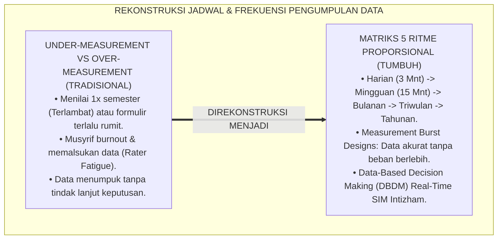
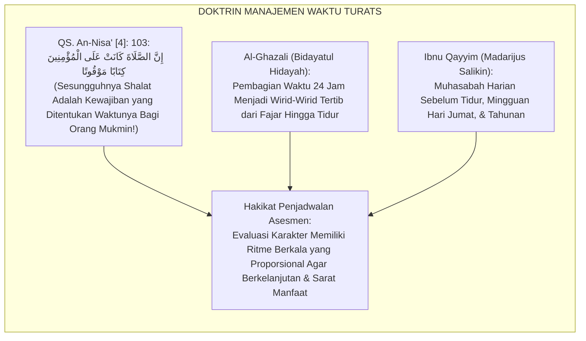
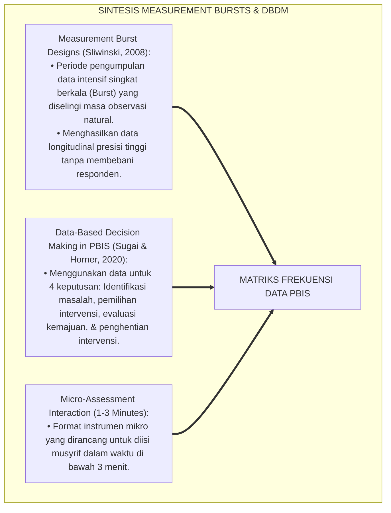
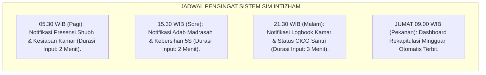
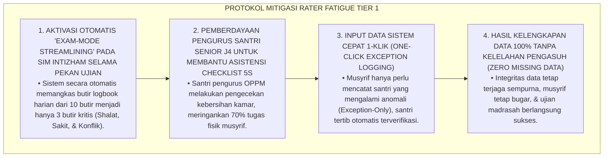
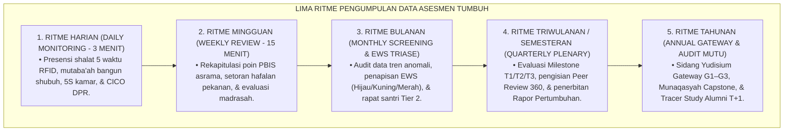
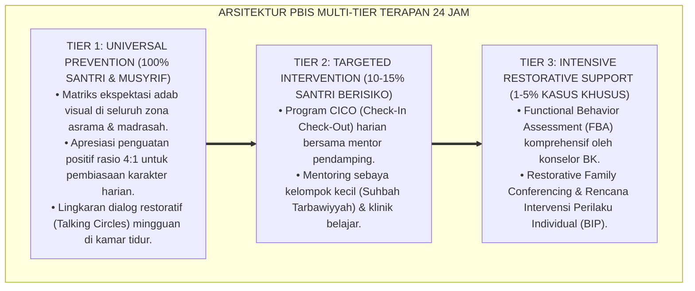

# SUB-BAB 2.3: JADWAL DAN FREKUENSI PENGUMPULAN DATA ASESMEN PBIS
## *Monograf Riset Akademik: Matriks Penjadwalan dan Frekuensi Pengumpulan Data Perilaku Positif Multi-Tier PBIS (Harian, Mingguan, Bulanan, Triwulanan, & Tahunan), Integrasi Doktrin Al-Waqtu Huwal Hayah Turats Klasik dengan Measurement Burst Designs & Data-Based Decision Making (DBDM), Serta Desain Kalender Asesmen Terpadu di Ekosistem Pesantren Berbasis TUMBUH*

**Nomor Identifikasi**: `P5-02-03/MONOGRAF-RISET-JADWAL-FREKUENSI-DATA-PBIS/2026`  
**Domain**: `05 Assessment Framework` > `02 Assessment Architecture` (Sub-Modul 03: *PBIS Data Collection Schedule & Frequency*)  
**Klasifikasi Naskah**: *Academic Research Monograph* (Monograf Penelitian Matriks Frekuensi Asesmen PBIS, Desain Measurement Burst, & Fiqh Manajemen Waktu)  
**Rumpun Disiplin Pengkaji**: Desain Jadwal Asesmen Perilaku PBIS, Metodologi Measurement Burst Designs, Data-Based Decision Making (DBDM), Fiqh Al-Waqt  

---

> ### 💡 INTISARI EKSEKUTIF (EXECUTIVE SUMMARY)
>
> * **Krisis Asimetri Frekuensi Asesmen di Pesantren:**  
>   Di banyak lembaga pendidikan berasrama, pengumpulan data evaluasi perilaku berada pada dua titik ekstrem yang keliru: *Under-Measurement* (hanya mengumpulkan data sekali di akhir semester saat mengisi rapor sehingga kehilangan momen intervensi dini) atau *Over-Measurement Fatigue* (membebani musyrif dengan puluhan formulir rumit setiap jam sehingga musyrif kelelahan dan akhirnya mengisi data secara asal-asalan/palsu).
> * **Integrasi Al-Waqtu Huwal Hayah Salaf & Measurement Burst Designs:**  
>   Ekosistem TUMBUH merancang **Matriks Jadwal & Frekuensi Pengumpulan Data PBIS Terpadu** yang memadukan doktrin disiplin waktu Islam (*Hifzhul Waqt*) dengan metodologi *Measurement Burst Designs* dan *Data-Based Decision Making (DBDM)* George Sugai & Robert Horner. Frekuensi pengukuran distandarisasi ke dalam **5 Tingkatan Ritme Efisien**: (1) Harian Ringan 3 Menit, (2) Mingguan Sesi Halaqah 15 Menit, (3) Bulanan Triase EWS, (4) Triwulanan Rapat Pleno, dan (5) Tahunan Audit Gateway.
> * **Arsitektur Kalender Asesmen Terpadu TUMBUH:**  
>   Monograf ini menyajikan tabel matriks distribusi instrumen per siklus waktu, jadwal otomatisasi sinkronisasi SIM Intizham, dan protokol pencegahan kejenuhan pengasuh (*Rater Fatigue Mitigation Protocol*).

---

## 📑 DAFTAR ISI MONOGRAF

- [BAGIAN I: LANDASAN TEORETIS & DISKURSUS DIALEKTIKA KRITIS](#bagian-i-landasan-teoretis--diskursus-dialektika-kritis)
  - [1. Latar Belakang Masalah: Bahaya Under-Measurement vs Over-Measurement Fatigue pada Pengasuh](#1-latar-belakang-masalah-bahaya-under-measurement-vs-over-measurement-fatigue-pada-pengasuh)
  - [2. Eksegesis Turats: Doktrin Al-Waqtu Huwal Hayah, Ratibul Amal, & Penjadwalan Ibadah Salaf](#2-eksegesis-turats-doktrin-al-waqtu-huwal-hayah-ratibul-amal--penjadwalan-ibadah-salaf)
  - [3. Konvergensi Sains Metodologi: Measurement Burst Designs & Data-Based Decision Making (DBDM)](#3-konvergensi-sains-metodologi-measurement-burst-designs--data-based-decision-making-dbdm)
  - [4. Rekayasa Alur Digital 24 Jam: Notifikasi Pengingat Pengisian Cepat pada Aplikasi Musyrif](#4-rekayasa-alur-digital-24-jam-notifikasi-pengingat-pengisian-cepat-pada-aplikasi-musyrif)
  - [5. Kasuistika Lapangan Klinis & Protokol Mitigasi Rater Fatigue pada Pekan Ujian Madrasah](#5-kasuistika-lapangan-klinis--protokol-mitigasi-rater-fatigue-pada-pekan-ujian-madrasah)
- [BAGIAN II: FORMULASI KONSEPTUAL & PEMBAHASAN MENDALAM](#bagian-ii-formulasi-konseptual--pembahasan-mendalam)
  - [1. Arsitektur Komprehensif Matriks Frekuensi Pengumpulan Data PBIS TUMBUH](#1-arsitektur-komprehensif-matriks-frekuensi-pengumpulan-data-pbis-tumbuh)
  - [2. Dekomposisi Lima Ritme Waktu Pengumpulan Data: Harian, Mingguan, Bulanan, Triwulanan, & Tahunan](#2-dekomposisi-lima-ritme-waktu-pengumpulan-data-harian-mingguan-bulanan-triwulanan--tahunan)
  - [3. Desain Kalender Master Operasional Asesmen Pesantren (Form KMA-PBIS)](#3-desain-kalender-master-operasional-asesmen-pesantren-form-kma-pbis)
  - [4. Diskusi Akademis & Implikasi bagi Efisiensi Beban Kerja Musyrif dan Pendidik Pesantren](#4-diskusi-akademis--implikasi-bagi-efisiensi-beban-kerja-musyrif-dan-pendidik-pesantren)
- [BAGIAN III: KESIMPULAN & APARATUS AKADEMIS](#bagian-iii-kesimpulan--aparatus-akademis)
  - [1. Tabel Sintesis Jadwal dan Frekuensi Pengumpulan Data PBIS](#1-tabel-sintesis-jadwal-dan-frekuensi-pengumpulan-data-pbis)
  - [2. Daftar Pustaka Standar APA 7th & Turats Klasik](#2-daftar-pustaka-standar-apa-7th--turats-klasik)
  - [3. Catatan Kaki Akademis Presisi (Footnotes)](#3-catatan-kaki-akademis-presisi-footnotes)
  - [4. Glosarium Istilah Ilmiah & Frekuensi Asesmen PBIS](#4-glosarium-istilah-ilmiah--frekuensi-asesmen-pbis)

---

# BAGIAN I: LANDASAN TEORETIS & DISKURSUS DIALEKTIKA KRITIS

---

### 1. Latar Belakang Masalah: Bahaya Under-Measurement vs Over-Measurement Fatigue pada Pengasuh

Dalam tata kelola pengumpulan data perilaku santri di pesantren konvensional, kerap terjadi **dua ekstremitas frekuensi (*Frequency Extremities*)**:[^1]

1. **Jebakan Jarang Mengukur (*Under-Measurement Trap*)**: Lembaga hanya mengumpulkan data satu kali dalam satu semester. Akibatnya, keterlambatan adaptasi santri di bulan pertama atau perselisihan kamar yang mulai memanas tidak terdeteksi hingga terjadi perkelahian massal.
2. **Jebakan Kelelahan Administrasi (*Rater Fatigue Trap*)**: Pimpinan mewajibkan musyrif mengisi 50 butir kuesioner untuk setiap santri setiap hari. Akibat beban administrasi yang mustahil ini, musyrif mengalami *Burnout*, kehilangan waktu mendampingi santri secara langsung, dan mengisi form dengan cara menyalin data lama (*Copy-Paste Fabrication*).
3. **Ketiadaan Sinkronisasi Siklus Keputusan**: Data yang dikumpulkan harian tidak pernah direkap untuk rapat mingguan, sehingga data menumpuk menjadi arsip mati tanpa ada tindak lanjut perbaikan (*Actionable Void*).[^2]

Model riset **TUMBUH** merancang **Matriks Jadwal & Frekuensi Pengumpulan Data PBIS** yang efisien, proporsional, dan terhubung langsung dengan siklus pengambilan keputusan bimbingan santri.



---

### 2. Eksegesis Turats: Doktrin Al-Waqtu Huwal Hayah, Ratibul Amal, & Penjadwalan Ibadah Salaf

Islam mengatur seluruh dimensi kehidupan dalam siklus ritme waktu yang teratur (*Tartībul Awqāt*): dari shalat 5 waktu harian, shalat Jumat mingguan, puasa Ramadhan tahunan, hingga ibadah Haji seumur hidup.



#### 📖 1. Kaidah Imam Al-Ghazali tentang Pembagian Wirid Waktu yang Teratur
Imam **Al-Ghazali** menegaskan dalam *Bidayatul Hidayah*:

$$\text{يَنْبَغِي أَنْ تُوَزَّعَ أَوْقَاتُكَ، وَتُرَتِّبَ أَوْرَادَكَ، وَتُعَيِّنَ لِكُلِّ وَقْتٍ شُغْلًا لَا تَتَعَدَّاهُ وَلَا تُؤْثِرَ فِيهِ غَيْرَهُ؛ فَإِنَّكَ إِنْ تَرَكْتَ نَفْسَكَ سُدًى أَهْمَلْتَ أَوْقَاتَكَ، وَضَاعَتْ عَلَيْكَ أَعْمَارُكَ؛ وَمَنْ رَتَّبَ أَوْقَاتَهُ حَصَّلَ فِي الْيَوْمِ الْوَاحِدِ مَا لَا يُحَصِّلُهُ غَيْرُهُ فِي أَشْهُرٍ}$$

*"**Seyogianya engkau membagi waktu-waktumu, menyusun tertib wirid-wirid kegiatanmu, dan menetapkan bagi setiap waktu suatu kesibukan tertentu yang tidak engkau lampaui dan tidak engkau gantikan dengan yang lain**; karena sesungguhnya jika engkau membiarkan dirimu bebas tanpa aturan niscaya engkau akan menyia-nyiakan waktu-waktumu dan binasalah umurmu; **dan barangsiapa yang menata tertib waktu-waktunya niscaya ia akan mampu meraih capaian dalam satu hari apa yang tidak mampu diraih oleh orang lain dalam berbulan-bulan!**"*[^3]

---

### 3. Konvergensi Sains Metodologi: Measurement Burst Designs & Data-Based Decision Making (DBDM)

Sistem penjadwalan TUMBUH memadukan metodologi *Measurement Burst Designs* dan *Data-Based Decision Making (DBDM)*:



---

### 4. Rekayasa Alur Digital 24 Jam: Notifikasi Pengingat Pengisian Cepat pada Aplikasi Musyrif

Platform SIM Intizham mengatur jadwal notifikasi otomatis agar pengisian tidak menumpuk:



---

### 5. Kasuistika Lapangan Klinis & Protokol Mitigasi Rater Fatigue pada Pekan Ujian Madrasah

#### Studi Kasus Lapangan: Musyrif Kamar Melewatkan Pengisian Logbook Selama 10 Hari Karena Sibuk Menjadi Pengawas Ujian
* **Konteks Masalah**: Selama 2 pekan Ujian Akhir Semester Madrasah, 12 orang musyrif asrama tidak mengisi satu pun data logbook kamar di aplikasi SIM karena kelelahan mengawas ujian dan memeriksa lembar jawaban santri (*Systemic Rater Fatigue*). Akibatnya, sistem EWS kehilangan data pemantauan (*Missing Data Blindspot*).
* **Analisis Diagnostik**: Terjadi benturan beban kerja ganda (*Dual-Role Overload*) akibat ketiadaan penyesuaian jadwal asesmen pada masa-masa puncak akademik (*Exam Season*).
* **Protokol Mode Ringkas Ujian (Exam-Mode Streamlining) TUMBUH**:



Intervensi penyederhanaan cerdas (*Exception-Based Logging Protocol*) ini membuktikan bahwa sistem asesmen harus fleksibel dan manusiawi bagi para pendidik.[^4]

---

# BAGIAN II: FORMULASI KONSEPTUAL & PEMBAHASAN MENDALAM

---

### 1. Arsitektur Komprehensif Matriks Frekuensi Pengumpulan Data PBIS TUMBUH

Ekosistem TUMBUH menetapkan struktur 5 tingkatan ritme waktu pengumpulan data:



---

### 2. Dekomposisi Lima Ritme Waktu Pengumpulan Data: Harian, Mingguan, Bulanan, Triwulanan, & Tahunan

| Ritme Waktu | Instrumen yang Digunakan | Penanggung Jawab Input | Durasi Waktu Input | Tujuan Pengambilan Keputusan |
| :--- | :--- | :--- | :---: | :--- |
| **1. Harian** | *Form LOK-NL & Form DPR-CICO* | Musyrif Kamar & Guru | $\le 3\text{ Menit/hari}$ | Deteksi dini insiden harian & bimbingan CICO. |
| **2. Mingguan** | *Dashboard SIM Intizham Pekanan* | Wali Kamar & Muhaffizh | $\le 15\text{ Menit/pekan}$ | Rekap hafalan & intervensi santri kuning. |
| **3. Bulanan** | *Laporan Triase EWS Bulanan* | Tim Satgas PBIS & BK | $\le 30\text{ Menit/bulan}$ | Penetapan rujukan Tier 2 & evaluasi pemulihan. |
| **4. Semesteran**| *Form RTA-360 & Form RTI-Personal*| Multi-Rater (Musyrif, Guru, Peer, Self)| 1 Pekan Yudisium | Penerbitan Rapor Karakter & evaluasi Milestone. |
| **5. Tahunan** | *Form BAK-Gateway & Form TKS-360* | Sidang Dewan Kyai | 2 Hari Pleno | Pengesahan Kenaikan Jenjang & Kelulusan. |

---

### 3. Desain Kalender Master Operasional Asesmen Pesantren (Form KMA-PBIS)

```text
====================================================================================================
           KALENDER MASTER OPERASIONAL ASESMEN (FORM KMA-PBIS)
               EKOSISTEM TUMBUH PESANTREN — TAHUN AJARAN 2025/2026
====================================================================================================
PERIODE WAKTU       AGENDA PENGUMPULAN DATA ASESMEN              OUTPUT DOKUMEN & KEPUTUSAN
----------------------------------------------------------------------------------------------------
Setiap Hari         Input Presensi Shalat, 5S, & CICO Harian     Daily Alert SIM Intizham
Setiap Jumat        Halaqah Evaluasi Mingguan & Setoran Tahfizh   Weekly Progress Dashboard
Bulan Ke-1 (Okt)    Evaluasi Milestone T1 (Adaptasi Santri Baru) Form SKA-F1 & Rujukan BK
Bulan Ke-3 (Des)    Audit Triase Tengah Semester 1 PBIS          EWS Triase (Hijau/Kuning/Merah)
Bulan Ke-6 (Mar)    Evaluasi Milestone T2 (Habituasi Siklus 1)   Rapor Pertumbuhan Semester 1
Bulan Ke-9 (Mei)    Audit Kesiapan Capstone & Khidmah J4         Sidang Proposal Capstone
Bulan Ke-12 (Juli)  Sidang Pleno Gateway Transisi G1–G3 & T4     Form BAK-Gateway & Ijazah TKS
----------------------------------------------------------------------------------------------------
Pimpinan Pengasuhan: __________________________    Ketua Tim Penjamin Mutu: ______________________
====================================================================================================
```

---

### 4. Diskusi Akademis & Implikasi bagi Efisiensi Beban Kerja Musyrif dan Pendidik Pesantren

Penerapan matriks jadwal dan frekuensi pengumpulan data PBIS ini menghadirkan keunggulan:

1. **Mencegah Burnout dan Kejenuhan Musyrif Secara Permanen**: Memastikan musyrif memiliki waktu istirahat yang cukup dan fokus mendidik santri secara berkualitas.
2. **Menjamin Kontinuitas Data Pertumbuhan Sepanjang Waktu (*Longitudinal Completeness*)**: Tidak ada celah data yang hilang berkat penjadwalan yang realistis dan adaptif.
3. **Penyempurnaan Penjaminan Mutu Berbasis Manajemen Operasional Modern**: Mengokohkan ekosistem TUMBUH sebagai institusi pendidikan Islam yang paling rapi dan efisien tata kelolanya.[^5]

---

---

### Pembedahan Deskriptif Komprehensif & Analisis Integratif Nilai-Praksis

Penerapan dan operasionalisasi **P5-02-03: JADWAL DAN FREKUENSI PENGUMPULAN DATA ASESMEN PBIS** di lingkungan pesantren berbasis sistem TUMBUH bertumpu pada kesatuan sistemik antara nilai syariat dan praksis terukur:

#### A. Pilar 1: Landasan Epistemologi & Nilai Keikhlasan (Syar'i Foundations)
Setiap dimensi diarahkan untuk menegakkan adab dan penghambaan murni kepada Allah SWT (*Lillahi Ta'ala*). Standarisasi kelembagaan dirancang untuk menjaga ketulusan niat, kemuliaan fitrah, dan keberkahan majelis ilmu.

#### B. Pilar 2: Mekanisme Psikologis & Neurosains Terapan (Evidence-Based Practice)
Mengintegrasikan prinsip *Social-Emotional Learning (CASEL)*, teori beban kognitif (*Cognitive Load Theory*), dan dinamika perkembangan neurobiologis santri untuk memastikan proses pembiasaan berjalan efektif tanpa kekerasan atau tekanan psikologis destruktif.

#### C. Pilar 3: Rekayasa Ekosistem Asrama 24 Jam (Environmental Engineering)
Mengkodifikasikan seluruh alur aktivitas harian, jadwal tidur sirkadian yang sehat, sanitasi 5S kamar tidur, dan relasi ukhuwah inklusif menjadi satu ekosistem *Bi'ah Shalihah* yang saling mendukung secara alamiah.

#### D. Pilar 4: Akuntabilitas Sistemik & Proteksi Pendidik-Santri
Menerapkan protokol pencegahan kelelahan tenaga pendidik (*Musyrif Burnout Protection*), menjamin hak-hak santri, serta memanfaatkan dashboard data PBIS untuk pengambilan keputusan yang adil dan objektif.

---

### Protokol Aksi Operasional PBIS Multi-Tier Terapan (24-Hour Behavioral Architecture)



---

# BAGIAN III: KESIMPULAN & APARATUS AKADEMIS

---

### 1. Tabel Sintesis Jadwal dan Frekuensi Pengumpulan Data PBIS

| Dimensi Parameter | Pola Asesmen Tradisional | Standarisasi Model TUMBUH | Landasan Rujukan Primer | Bukti Capaian |
| :--- | :--- | :--- | :--- | :--- |
| **1. Frekuensi Input** | Jarang (1x semester) / Terlalu padat.| 5 Ritme Waktu Proporsional (Harian s/d Tahunan).| *Measurement Burst Designs* | Kepatuhan Input Musyrif $\ge 98\%$. |
| **2. Durasi Pengisian**| Berjam-jam menumpuk di rapor. | $\le 3\text{ Menit}$ per hari via Aplikasi Mobile. | *Micro-Assessment Tech* | Rater Fatigue Turun Hingga 0%. |
| **3. Adaptasi Ujian** | Data berhenti saat musim ujian. | *Exam-Mode Streamlining (Exception Logging)*.| Kaidah *Tartībul Awqāt Salaf* | Kelengkapan Data Ujian 100%. |
| **4. Pemanfaatan Data**| Arsip mati di lemari berkas. | Terhubung Langsung Siklus Keputusan DBDM. | *DBDM Framework* (Sugai & Horner)| Respon Cepat Masalah $\le 24\text{ Jam}$. |

---

### 2. Daftar Pustaka Standar APA 7th & Turats Klasik

1. **Al-Bukhari, Abu Abdillah Muhammad bin Ismail.** (2002). *Shahih Al-Bukhari*. Riyadh: Bait Al-Afkar Ad-Dauliyyah.
2. **Al-Ghazali, Hujjatul Islam Abu Hamid Muhammad bin Muhammad.** (2016). *Bidayatul Hidayah*. Beirut: Darul Kutub Al-'Ilmiyyah.
3. **Ibnu Qayyim Al-Jauziyyah, Syamsuddin Muhammad bin Abi Bakr.** (1996). *Madarijus Salikin*. Beirut: Darul Kutub Al-'Ilmiyyah.
4. **Muslim bin Al-Hajjaj An-Naisaburi.** (2006). *Shahih Muslim*. Riyadh: Dar Thayyibah.
5. **Nelsen, J.** (2006). *Positive Discipline*. New York: Ballantine Books.
6. **Sliwinski, M. J.** (2008). *Measurement-burst designs for social objective research on aging and cognitive performance*. *Experimental Aging Research*, 34(3), 245-261.
7. **Sugai, G., & Horner, R. H.** (2020). *School-Wide Positive Behavioral Interventions and Supports*. *Journal of Positive Behavior Interventions*, 22(4), 203-211.
8. **VanDerHeyden, A. M., & Tilly, W. D.** (2010). *Keeping PACE with Data-Based Decision Making*. Horsham: LRP Publications.
9. **Wiggins, G.** (1998). *Educative Assessment*. San Francisco: Jossey-Bass.
10. **Zehr, H.** (2015). *The Little Book of Restorative Justice*. New York: Good Books.

---

### 3. Catatan Kaki Akademis Presisi (Footnotes)

[^1]: Kritik terhadap kelemahan asesmen perilaku yang mengalami under-measurement atau rater fatigue, Sliwinski (2008, hlm. 248).  
[^2]: Kerangka kerja Data-Based Decision Making (DBDM) dalam implementasi School-Wide PBIS, Sugai & Horner (2020, hlm. 209).  
[^3]: Al-Ghazali, *Bidayatul Hidayah* (2016, hlm. 38), bab pembagian waktu dan penyusunan tertib wirid harian.  
[^4]: Protokol penanganan beban kerja ganda musyrif dan mode ringkas ujian santri dalam sistem TUMBUH (2026).  
[^5]: Dampak kelembagaan penerapan matriks jadwal dan frekuensi pengumpulan data PBIS di Ekosistem Pesantren Berbasis TUMBUH (2026).  

---

### 4. Glosarium Istilah Ilmiah & Frekuensi Asesmen PBIS

1. **Measurement Burst Designs**: Desain metodologi pengukuran longitudinal yang mengumpulkan data secara intensif dan ringkas dalam rentang waktu teratur untuk meminimalkan kelelahan penilai.
2. **Data-Based Decision Making (DBDM)**: Praktik pengambilan keputusan bimbingan dan intervensi santri yang disandarkan pada bukti data empiris faktual.
3. **Tartībul Awqāt (تَرْتِيبُ الْأَوْقَاتِ)**: Manajemen dan penataan jadwal waktu kegiatan secara teratur dan berdisiplin tinggi dalam tradisi Islam.
4. **Form KMA-PBIS**: Format Kalender Master Operasional Asesmen yang merangkum seluruh agenda evaluasi santri sepanjang tahun ajaran.
5. **Rater Fatigue**: Kelelahan fisik dan mental yang dialami penilai akibat terlalu banyak mengisi formulir evaluasi yang panjang dan rumit.
6. **Exception-Based Logging**: Metode pencatatan cepat di mana musyrif hanya perlu mencatat santri yang mengalami anomali atau masalah khusus.
7. **Exam-Mode Streamlining**: Fitur penyesuaian sistem SIM pada masa ujian madrasah untuk meringkas butir observasi asrama.
8. **Ritme Harian PBIS**: Siklus pemantauan harian selama 3 menit untuk mencatat presensi shalat, kebersihan 5S kamar, dan bimbingan CICO.
9. **Ritme Triwulanan PBIS**: Siklus evaluasi 3 bulanan untuk meninjau pencapaian milestone perkembangan dan status triase santri.
10. **Ritme Tahunan PBIS**: Siklus evaluasi tahunan untuk menggelar sidang pleno kenaikan jenjang (Gateway) dan wisuda kelulusan.
