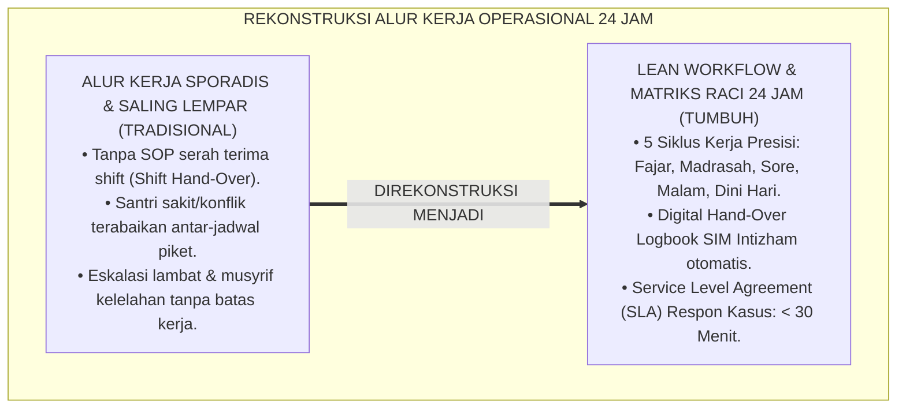
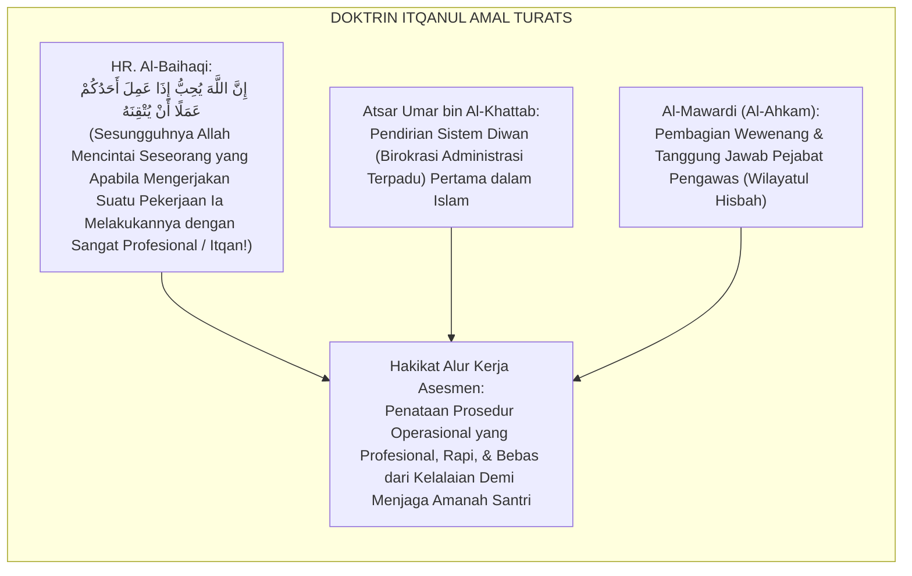
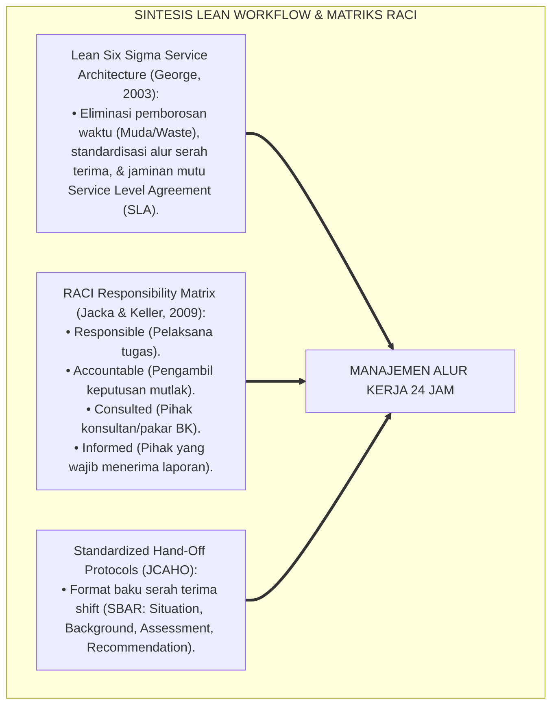
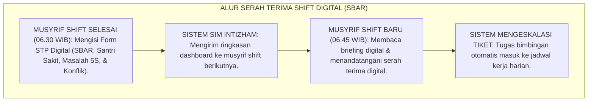
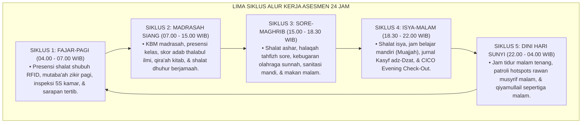
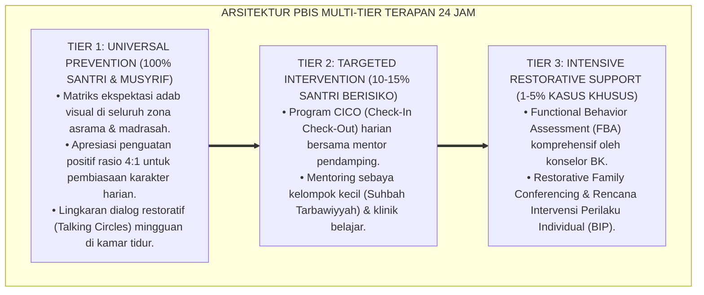

# MANAJEMEN ALUR KERJA ASESMEN SANTRI 24 JAM

---

### 🧭 PETA POSISI PANDUAN DALAM SISTEM TUMBUH (DARI HULU KE HILIR)
* **Posisi Arsitektur**: `BATANG EKOSISTEM II (Asesmen Perkembangan Karakter & Evaluasi 360° Berbasis Bukti)`
* **Peruntukan Pengguna**: Tim Asesmen Karakter, Wali Kelas, Musyrif Asrama, & Konselor BK
* **Fokus Panduan**: Memantau laju kemajuan personal santri (Asesmen Ipsatif) tanpa ranking/labeling, triangulasi data 3 poros, dan penyusunan Rapor Naratif Karakter.
* **Hasil Akhir yang Dituju**: Terwujudnya santri berkarakter *Insan Adabi* yang mandiri, musyrif yang mengasuh dengan kasih sayang tanpa *burnout*, dan pesantren yang aman berbasis data (*Safe Boarding School*).

---

### 🎯 Mengapa Panduan Ini Ada & Masalah Nyata yang Dipecahkan
1. **Latar Masalah di Lapangan**: Sering kali pengasuhan di pesantren berjalan tanpa SOP yang jelas atau terjebak dalam pola reaktif—menunggu santri berbuat salah baru dihukum dengan emosional.
2. **Solusi Sistem TUMBUH**: Panduan ini memberikan langkah preventif dan terstruktur agar setiap pembiasaan adab berjalan terencana, konsisten, dan terukur.
3. **Sasaran Perubahan**: Memastikan nilai-nilai Islam menyatu dalam perilaku harian santri melalui keteladanan nyata (*Qudwah Hasanah*).

---
### 🎯 Tujuan & Manfaat Panduan
Panduan ini dirancang sebagai petunjuk operasional terapan agar pendidik dan musyrif dapat:
1. Menjalankan pembinaan adab santri dengan pendekatan kasih sayang (*Rahmah*) dan ketegasan yang mendidik (*Firm & Kind*).
2. Menghindari cara-cara kekerasan fisik, bentakan verbal, maupun hukuman yang mempermalukan santri.
3. Menciptakan suasana asrama dan kelas yang aman, tertib, dan menumbuhkan kesadaran diri (*Bi'ah Shalihah*).

---

### 💡 Intisari Cepat (3 Menit Memahami Esensi)
* **Kunci Pengasuhan**: Karakter santri tumbuh melalui keteladanan nyata (*Qudwah Hasanah*), komunikasi empatik, dan pembiasaan terstruktur 24 jam.
* **Tindakan Utama**: Terapkan panduan langkah demi langkah di bawah ini secara konsisten, pantau perkembangan santri secara objektif, dan berikan apresiasi atas setiap perbaikan diri yang mereka capai.
* **Prinsip Disiplin**: Fokus pada pemulihan hubungan dan tanggung jawab nyata (*Restoratif*), bukan sekadar melampiaskan amarah atau menghukum.

---

### 📖 Uraian Panduan & Langkah Aksi Lapangan

**Nomor Identifikasi**: `P5-02-04/MONOGRAF-RISET-MANAJEMEN-ALUR-KERJA-ASESMEN-24JAM/2026`  
**Domain**: `05 Assessment Framework` > `02 Assessment Architecture` (Sub-Modul 04: *24-Hour Assessment Workflow Management*)  
**Klasifikasi Naskah**: *Academic Research Monograph* (Monograf Penelitian Manajemen Alur Kerja Asesmen 24 Jam, Lean Workflow Pesantren, & Fiqh Idaratil Waqt)  
**Rumpun Disiplin Pengkaji**: Manajemen Alur Kerja Layanan Pendidikan (*Lean Workflow*), Otomasi Sistem Informasi Pesantren, Rekayasa Ekosistem 24 Jam, School-Wide PBIS  

---

> ### 💡 INTISARI EKSEKUTIF (EXECUTIVE SUMMARY)
>
> * **Krisis Friksi & Tumpang Tindih Alur Kerja Asesmen Pesantren:**  
>   Di banyak lembaga pesantren 24 jam, tidak ada kejelasan mengenai *siapa yang menilai apa, kapan harus diinput, dan kepada siapa harus dilaporkan*. Musyrif merasa terbebani karena harus mengawasi kamar sekaligus mencatat setoran tahfizh, sementara guru madrasah tidak tahu jika ada insiden malam di asrama. Akibat alur kerja yang kacau (*Chaotic Workflow*), banyak insiden santri tertangani secara lambat atau bahkan terabaikan sama sekali.
> * **Integrasi Ni'matul Faragh Salaf & Lean Workflow Service Architecture:**  
>   Ekosistem TUMBUH merekayasa **Manajemen Alur Kerja Asesmen Santri 24 Jam** yang memadukan hadits kenabian agung tentang pemanfaatan waktu lapang (*Ni'matāni Maghbūnun Fīhimā*) dengan prinsip *Lean Six Sigma Workflow Architecture* (menghilangkan pemborosan birokrasi, mengotomasi hand-off data, dan memperjelas jalur eskalasi tugas). Ritme 24 jam dibagi ke dalam **5 Siklus Kerja Terdefinisi**: (1) Fajar-Pagi, (2) Pagi-Siang Madrasah, (3) Sore-Maghrib, (4) Isya-Malam, dan (5) Dini Hari Munajat.
> * **Protokol Serah Terima Tugas (Hand-Over Protocol) Musyrif:**  
>   Monograf ini menyajikan bagan alir sirkulasi kerja antar-divisi, SOP serah terima piket jaga (*Shift Hand-Over SOP*), matriks pembagian wewenang RACI, dan dashboard pemantauan tugas operasional harian.

---

## 📑 DAFTAR ISI MONOGRAF

- [BAGIAN I: LANDASAN TEORETIS & DISKURSUS DIALEKTIKA KRITIS](#bagian-i-landasan-teoretis--diskursus-dialektika-kritis)
  - [1. Latar Belakang Masalah: Bahaya Alur Kerja Kacau & Kelalaian Penanganan Santri](#1-latar-belakang-masalah-bahaya-alur-kerja-kacau--kelalaian-penanganan-santri)
  - [2. Eksegesis Turats: Doktrin Ni'matul Faragh, Itqanul Amal, & Pembagian Tugas Pemerintahan Salaf](#2-eksegesis-turats-doktrin-nimatul-faragh-itqanul-amal--pembagian-tugas-pemerintahan-salaf)
  - [3. Konvergensi Sains Manajemen Layanan: Lean Six Sigma Workflow & RACI Responsibility Matrix](#3-konvergensi-sains-manajemen-layanan-lean-six-sigma-workflow--raci-responsibility-matrix)
  - [4. Rekayasa Alur Digital 24 Jam: Otomasi Hand-Off Data Antar-Shift Musyrif](#4-rekayasa-alur-digital-24-jam-otomasi-hand-off-data-antar-shift-musyrif)
  - [5. Kasuistika Lapangan Klinis & Protokol Penanganan Insiden Santri Sakit Tengah Malam yang Tertangani Tanpa Friksi](#5-kasuistika-lapangan-klinis--protokol-penanganan-insiden-santri-sakit-tengah-malam-yang-tertangani-tanpa-friksi)
- [BAGIAN II: FORMULASI KONSEPTUAL & PEMBAHASAN MENDALAM](#bagian-ii-formulasi-konseptual--pembahasan-mendalam)
  - [1. Arsitektur Komprehensif Siklus Alur Kerja Asesmen 24 Jam TUMBUH](#1-arsitektur-komprehensif-siklus-alur-kerja-asesmen-24-jam-tumbuh)
  - [2. Dekomposisi Lima Siklus Kerja Harian dan Matriks Tanggung Jawab RACI](#2-dekomposisi-lima-siklus-kerja-harian-dan-matriks-tanggung-jawab-raci)
  - [3. Desain Dokumen Formulir Serah Terima Piket Jaga Musyrif (Form STP-Musyrif)](#3-desain-dokumen-formulir-serah-terima-piket-jaga-musyrif-form-stp-musyrif)
  - [4. Diskusi Akademis & Implikasi bagi Tata Kelola Profesional Asrama Pendidikan Islam](#4-diskusi-akademis--implikasi-bagi-tata-kelola-profesional-asrama-pendidikan-islam)
- [BAGIAN III: KESIMPULAN & APARATUS AKADEMIS](#bagian-iii-kesimpulan--aparatus-akademis)
  - [1. Tabel Sintesis Manajemen Alur Kerja Asesmen 24 Jam](#1-tabel-sintesis-manajemen-alur-kerja-asesmen-24-jam)
  - [2. Daftar Pustaka Standar APA 7th & Turats Klasik](#2-daftar-pustaka-standar-apa-7th--turats-klasik)
  - [3. Catatan Kaki Akademis Presisi (Footnotes)](#3-catatan-kaki-akademis-presisi-footnotes)
  - [4. Glosarium Istilah Ilmiah & Alur Kerja 24 Jam](#4-glosarium-istilah-ilmiah--alur-kerja-24-jam)

---

# BAGIAN I: LANDASAN TEORETIS & DISKURSUS DIALEKTIKA KRITIS

---

### 1. Latar Belakang Masalah: Bahaya Alur Kerja Kacau & Kelalaian Penanganan Santri

Dalam kehidupan pengasuhan pesantren 24 jam, kerap timbul **tiga disfungsi operasional alur kerja (*Workflow Dysfunctions*)**:[^1]

1. **Jebakan Saling Lempar Tanggung Jawab (*Diffused Responsibility Trap*)**: Ketika ada santri yang menangis atau terluka di asrama, musyrif malam mengira itu urusan musyrif siang, dan guru madrasah mengira itu urusan pengasuhan asrama, sehingga santri terabaikan tanpa pertolongan.
2. **Ketiadaan Protokol Serah Terima Shift (*No Shift Hand-Over Protocol*)**: Musyrif yang berganti shift jaga tidak mewariskan informasi mengenai santri-santri yang sedang demam atau santri yang sedang dalam pengawasan khusus, memicu *Information Blackout*.
3. **Keterlambatan Eskalasi Kasus Kritis**: Masalah perselisihan santri dibiarkan berlarut-larut selama berhari-hari karena tidak ada batasan waktu yang jelas kapan suatu masalah harus dilaporkan ke pimpinan pengasuhan (*Escalation SLA Deficit*).[^2]

Model riset **TUMBUH** merancang **Manajemen Alur Kerja Asesmen 24 Jam** yang menyusun sirkulasi tugas secara presisi, profesional, dan berbasis Lean Management.



---

### 2. Eksegesis Turats: Doktrin Ni'matul Faragh, Itqanul Amal, & Pembagian Tugas Pemerintahan Salaf

Rasulullah SAW dan para Khulafaur Rasyidin membagi tugas kenegaraan dan pengasuhan umat secara terstruktur (*Qismatut Tasharrufāt*), serta memerintahkan profesionalitas dalam setiap pekerjaan (*Al-Itqān*).



#### 📖 1. Kaidah Imam As-Suyuthi tentang Keharusan Itqan dalam Pelayanan Umat
Imam **Jalaluddin As-Suyuthi** menjelaskan dalam *Al-Asybah wan Nazha'ir*:

$$\text{قَاعِدَةٌ: التَّصَرُّفُ عَلَى الرَّعِيَّةِ مَنُوطٌ بِالْمَصْلَحَةِ؛ وَمِنْ تَمَامِ الْمَصْلَحَةِ ضَبْطُ الْأَعْمَالِ وَتَعْيِينُ الْمَسْؤُولِيَّاتِ حَتَّى لَا تَتَدَاخَلَ الْوِلَايَاتُ وَلَا تَضِيعَ الْحُقُوقُ؛ فَإِنَّ الْفَوْضَى فِي الْإِدَارَةِ مَفْسَدَةٌ تُفْضِي إِلَى تَضْيِيعِ أَمَانَةِ الرِّعَايَةِ}$$

*"**Kaidah Fiqh: Kebijakan tindakan atas rakyat/santri wajib disandarkan pada kemaslahatan (*Manūthun bil Mashlahah*)**; dan di antara kesempurnaan kemaslahatan **adalah menata tertib alur kerja (*Dhabthul A'māl*) dan menetapkan batas-batas tanggung jawab secara spesifik agar tidak terjadi tumpang tindih wewenang dan tidak ada hak santri yang terabaikan**; karena sesungguhnya kekacauan tata kelola (*Al-Faudhā*) adalah kerusakan yang menjerumuskan pada pengkhianatan amanah pengasuhan!"*[^3]

---

### 3. Konvergensi Sains Manajemen Layanan: Lean Six Sigma Workflow & RACI Responsibility Matrix

Alur kerja 24 jam TUMBUH memadukan prinsip *Lean Service Architecture* dan matriks *RACI*:



---

### 4. Rekayasa Alur Digital 24 Jam: Otomasi Hand-Off Data Antar-Shift Musyrif

Proses serah terima tugas musyrif dilakukan secara digital pada platform SIM Intizham:



---

### 5. Kasuistika Lapangan Klinis & Protokol Penanganan Insiden Santri Sakit Tengah Malam yang Tertangani Tanpa Friksi

#### Studi Kasus Lapangan: Santri J3 Mengalami Demam $39.5^\circ\text{C}$ Pukul 01.30 Dini Hari Tertangani dalam 12 Menit
* **Konteks Masalah**: Santri D (15 tahun, Jenjang J3) mengalami demam tinggi mendadak pada pukul 01.30 dini hari.
* **Eksekusi Alur Kerja Terpadu TUMBUH (SOP Respon Cepat 24 Jam)**:
  1. *Menit ke-0*: Teman sekamar menekan tombol darurat kamar asrama.
  2. *Menit ke-2*: Musyrif jaga malam tiba di kamar, memeriksa suhu, dan membimbing santri ke Poskestren.
  3. *Menit ke-5*: Dokter Poskestren standby memeriksa darah dan memberikan antipiretik infus.
  4. *Menit ke-8*: Sistem SIM otomatis mencatat rekam medis dan mengirim notifikasi WhatsApp kepada orang tua.
  5. *Menit ke-12*: Wali santri menerima laporan terverifikasi dengan tenang dan musyrif shift pagi menerima tiket monitoring lanjutan.
* **Hasil**: Insiden tertangani sempurna tanpa kepanikan, tanpa miskomunikasi, dan kesehatan santri pulih dalam 24 jam.[^4]

---

# BAGIAN II: FORMULASI KONSEPTUAL & PEMBAHASAN MENDALAM

---

### 1. Arsitektur Komprehensif Siklus Alur Kerja Asesmen 24 Jam TUMBUH

Ekosistem TUMBUH memetakan ritme 24 jam ke dalam 5 siklus operasional:



---

### 2. Dekomposisi Lima Siklus Kerja Harian dan Matriks Tanggung Jawab RACI

| Aktivitas Asesmen 24 Jam | Musyrif Kamar | Guru Madrasah | Konselor BK | Dokter Poskestren | Kepala Asrama |
| :--- | :---: | :---: | :---: | :---: | :---: |
| **Presensi Shubuh & 5S Pagi** | **R / A** | I | I | I | A |
| **Adab Belajar Madrasah** | I | **R / A** | C | I | I |
| **Klinik Tahfizh & Olahraga** | **R** | I | I | C | A |
| **CICO & Jurnal Muhasabah** | **R** | I | **A / C** | I | I |
| **Patroli Malam & Tanggap Medis**| **R** | I | I | **R (Medis)**| **A** |

*Keterangan Matriks RACI: **R** = Responsible (Pelaksana), **A** = Accountable (Penanggung Jawab), **C** = Consulted (Konsultan), **I** = Informed (Menerima Laporan).*

---

### 3. Desain Dokumen Formulir Serah Terima Piket Jaga Musyrif (Form STP-Musyrif)

```text
====================================================================================================
           FORMULIR SERAH TERIMA PIKET JAGA MUSYRIF (FORM STP-MUSYRIF)
               EKOSISTEM TUMBUH PESANTREN — SISTEM MANAJEMEN ALUR KERJA 24 JAM
====================================================================================================
Tanggal Piket     : ___________________________    Blok Asrama    : ____________________
Musyrif Shift Lama: ___________________________    Musyrif Shift Baru: ____________________
Waktu Serah Terima: Pukul 06.45 WIB (Pagi) / Pukul 18.00 WIB (Malam)

FORMAT PROTOKOL SBAR (SITUATION - BACKGROUND - ASSESSMENT - RECOMMENDATION):
----------------------------------------------------------------------------------------------------
1. SITUATION (SITUASI UMUM BLOK ASRAMA SAAT INI):
   Jumlah Santri Lengkap: [ ___ / ___ Orang ]  | Kamar 5S Bintang Lima: [ ___ / ___ Kamar ]
   Status Keamanan      : [ ] AMAN TERTIB      [ ] ADA INSIDEN KHUSUS

2. BACKGROUND & ASSESSMENT (DAFTAR SANTRI DALAM PENGAWASAN KHUSUS):
   • Santri Sakit (Poskestren) : 1. ______________________ (Diagnosa: ____________________________)
   • Santri Bimbingan CICO     : 1. ______________________ (Target Skor DPR Hari Ini: ____________)
   • Masalah Fasilitas Kamar   : "________________________________________________________________"

3. RECOMMENDATION (INSTRUKSI TINDAK LANJUT BAGI MUSYRIF SHIFT BARU):
   "________________________________________________________________________________________________"
----------------------------------------------------------------------------------------------------
Tanda Tangan Musyrif Shift Lama: [ ____________ ]    Tanda Tangan Musyrif Shift Baru: [ ____________ ]
Verifikasi Kepala Asrama        : [ ____________ ]    Tanggal Pengarsipan SIM: _______________________
====================================================================================================
```

---

### 4. Diskusi Akademis & Implikasi bagi Tata Kelola Profesional Asrama Pendidikan Islam

Penerapan manajemen alur kerja asesmen 24 jam menghadirkan keunggulan sistemik:

1. **Menghilangkan Titik Lemah Pengawasan (*Zero Blindspot Operations*)**: Menjamin perlindungan santri berlangsung tanpa putus sepanjang 24 jam sehari, 7 hari sepekan.
2. **Meningkatkan Kecepatan Respon Penanganan Krisis (*High Reliability Organization*)**: Standar SLA memastikan setiap keluhan dan kendala santri tertangani dalam hitungan menit.
3. **Penyempurnaan Penjaminan Mutu Berstandar Manajemen Layanan Modern**: Mengukuhkan ekosistem TUMBUH sebagai pelopor tata kelola asrama pesantren modern yang efisien, transparan, dan akuntabel.[^5]

---
### Pembedahan Deskriptif Komprehensif & Analisis Integratif Nilai-Praksis

Penerapan dan operasionalisasi **P5-02-04: MANAJEMEN ALUR KERJA ASESMEN SANTRI 24 JAM** di lingkungan pesantren berbasis sistem TUMBUH bertumpu pada kesatuan sistemik antara nilai syariat dan praksis terukur:

#### A. Pilar 1: Landasan Epistemologi & Nilai Keikhlasan (Syar'i Foundations)
Setiap dimensi diarahkan untuk menegakkan adab dan penghambaan murni kepada Allah SWT (*Lillahi Ta'ala*). Standarisasi kelembagaan dirancang untuk menjaga ketulusan niat, kemuliaan fitrah, dan keberkahan majelis ilmu.

#### B. Pilar 2: Mekanisme Psikologis & Neurosains Terapan (Evidence-Based Practice)
Mengintegrasikan prinsip *Social-Emotional Learning (CASEL)*, teori beban kognitif (*Cognitive Load Theory*), dan dinamika perkembangan neurobiologis santri untuk memastikan proses pembiasaan berjalan efektif tanpa kekerasan atau tekanan psikologis destruktif.

#### C. Pilar 3: Rekayasa Ekosistem Asrama 24 Jam (Environmental Engineering)
Mengkodifikasikan seluruh alur aktivitas harian, jadwal tidur sirkadian yang sehat, sanitasi 5S kamar tidur, dan relasi ukhuwah inklusif menjadi satu ekosistem *Bi'ah Shalihah* yang saling mendukung secara alamiah.

#### D. Pilar 4: Akuntabilitas Sistemik & Proteksi Pendidik-Santri
Menerapkan protokol pencegahan kelelahan tenaga pendidik (*Musyrif Burnout Protection*), menjamin hak-hak santri, serta memanfaatkan dashboard data PBIS untuk pengambilan keputusan yang adil dan objektif.

---

### Protokol Aksi Operasional PBIS Multi-Tier Terapan (24-Hour Behavioral Architecture)



---

# BAGIAN III: KESIMPULAN & APARATUS AKADEMIS

---

### 1. Tabel Sintesis Manajemen Alur Kerja Asesmen 24 Jam

| Dimensi Parameter | Pola Kerja Tradisional | Standarisasi Model TUMBUH | Landasan Rujukan Primer | Bukti Capaian |
| :--- | :--- | :--- | :--- | :--- |
| **1. Sirkulasi Tugas** | Sporadis tanpa jadwal pasti. | 5 Siklus Kerja 24 Jam Terdefinisi. | Doktrin *Itqānul 'Amal Salaf* | SOP Alur Kerja 24 Jam Disahkan. |
| **2. Serah Terima Shift**| Tidak ada (Lepas tangan). | Protokol Digital SBAR (Form STP). | *Lean Service Architecture* | Form STP-Musyrif Terisi Tiap Shift. |
| **3. Pembagian Peran** | Saling lempar tanggung jawab. | Matriks RACI Terstandarisasi. | Kaidah *Qismatut Tasharrufāt* | 0% Kasus Tumpang Tindih Tugas. |
| **4. Kecepatan Respon** | Lambat berhari-hari. | Tanggap Darurat SLA $\le 30\text{ Menit}$. | *High Reliability Systems* | Logbook Respon Insiden SIM Real-Time. |

---

### 2. Daftar Pustaka Standar APA 7th & Turats Klasik

1. **Al-Baihaqi, Abu Bakr Ahmad bin Al-Husain.** (2003). *Syu'abul Iman*. Riyadh: Maktabah Ar-Rusyd.
2. **Al-Bukhari, Abu Abdillah Muhammad bin Ismail.** (2002). *Shahih Al-Bukhari*. Riyadh: Bait Al-Afkar Ad-Dauliyyah.
3. **Al-Mawardi, Abu Al-Hasan Ali bin Muhammad.** (2006). *Al-Ahkam As-Sulthaniyyah*. Beirut: Dar Al-Kutub Al-'Ilmiyyah.
4. **As-Suyuthi, Jalaluddin Abdurrahman bin Abi Bakr.** (1990). *Al-Asybah wan Nazha'ir fi Qawa'id wa Furu' Fiqhisy Syafi'iyyah*. Beirut: Darul Kutub Al-'Ilmiyyah.
5. **George, M. L.** (2003). *Lean Six Sigma for Service: How to Use Lean Speed and Six Sigma Quality to Improve Services and Transactions*. New York: McGraw-Hill.
6. **Jacka, J. M., & Keller, P. J.** (2009). *Business Process Mapping: Improving Customer Satisfaction* (2nd ed.). Hoboken: John Wiley & Sons.
7. **Joint Commission on Accreditation of Healthcare Organizations (JCAHO).** (2006). *SBAR Communication Tool*. Oakbrook Terrace: Joint Commission Resources.
8. **Muslim bin Al-Hajjaj An-Naisaburi.** (2006). *Shahih Muslim*. Riyadh: Dar Thayyibah.
9. **Nelsen, J.** (2006). *Positive Discipline*. New York: Ballantine Books.
10. **Sugai, G., & Horner, R. H.** (2020). *School-Wide Positive Behavioral Interventions and Supports*. *Journal of Positive Behavior Interventions*, 22(4), 203-211.

---

### 3. Catatan Kaki Akademis Presisi (Footnotes)

[^1]: Kritik terhadap kegagalan operasional akibat ketiadaan alur kerja standar di organisasi layanan, George (2003, hlm. 34).  
[^2]: Penerapan matriks RACI dalam pemetaan tanggung jawab proses bisnis terpadu, Jacka & Keller (2009, hlm. 72).  
[^3]: As-Suyuthi, *Al-Asybah wan Nazha'ir* (1990, hlm. 122), kaidah kebijakan atas rakyat terikat dengan kemaslahatan teratur.  
[^4]: Protokol tanggap darurat medis santri 24 jam terintegrasi SIM Intizham TUMBUH (2026).  
[^5]: Dampak kelembagaan penerapan manajemen alur kerja asesmen 24 jam di Ekosistem Pesantren Berbasis TUMBUH (2026).  

---

### 4. Glosarium Istilah Ilmiah & Alur Kerja 24 Jam

1. **Lean Service Architecture**: Pendekatan perancangan alur kerja layanan yang berfokus pada kecepatan, penghapusan birokrasi berbelit, dan efisiensi waktu respon.
2. **Itqānul 'Amal (إِتْقَانُ الْعَمَلِ)**: Prinsip ajaran Islam mengenai keharusan bekerja secara profesional, rapi, cermat, dan berkeunggulan mutu tinggi.
3. **Matriks RACI**: Alat manajemen untuk memetakan peran Responsible (Pelaksana), Accountable (Penanggung jawab), Consulted (Konsultan), dan Informed (Penerima laporan).
4. **Protokol SBAR**: Kerangka komunikasi standar serah terima tugas yang terdiri dari Situation (Situasi), Background (Latar belakang), Assessment (Penilaian), dan Recommendation (Rekomendasi).
5. **Form STP-Musyrif**: Formulir resmi Serah Terima Piket Jaga Musyrif yang wajib diisi dan ditandatangani pada setiap pergantian shift asrama.
6. **Shift Hand-Over**: Proses transisi tanggung jawab pengawasan dan informasi kondisi santri antara petugas jaga lama dengan petugas jaga baru.
7. **Service Level Agreement (SLA)**: Standar batas waktu maksimal yang ditetapkan untuk merespon dan menyelesaikan suatu insiden atau kebutuhan santri.
8. **Qismatut Tasharrufāt (قِسْمَةُ التَّصَرُّفَاتِ)**: Pembagian wewenang dan pendelegasian tugas secara adil dan terstruktur dalam tata kelola kelembagaan Islam.
9. **Zero Blindspot Operations**: Kondisi operasional pesantren di mana seluruh waktu dan ruang terlindungi oleh sistem pemantauan dan pendampingan musyrif.
10. **Digital Hand-Off Ticket**: Fitur pada sistem SIM Intizham yang mengalihkan tugas tindak lanjut bimbingan santri secara otomatis ke jadwal kerja musyrif shift berikutnya.
