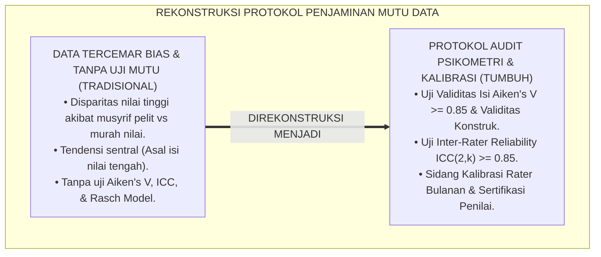
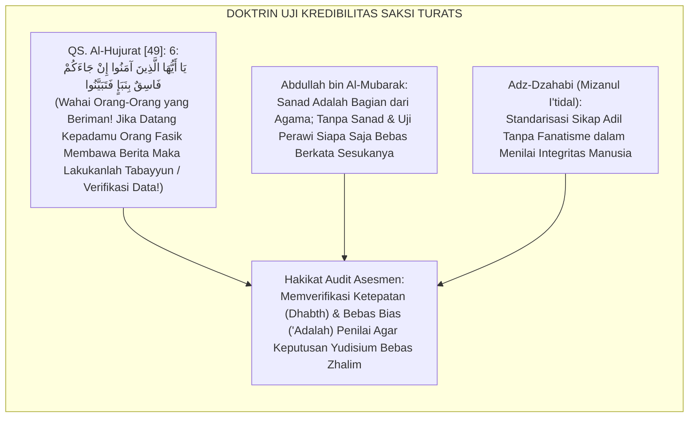
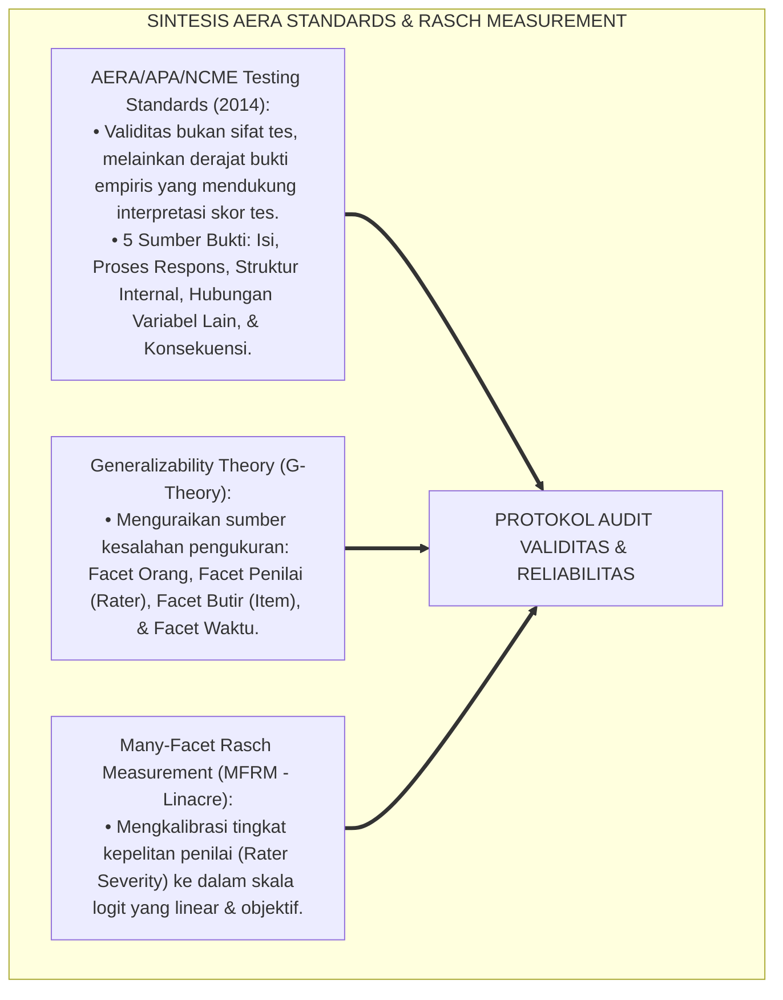
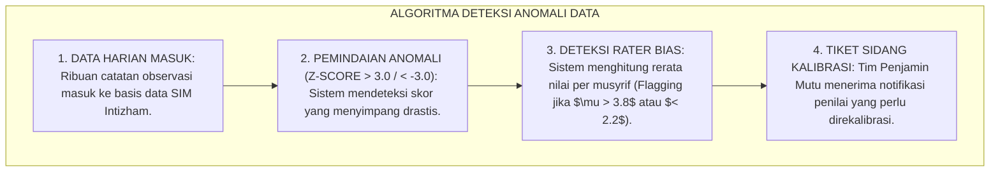
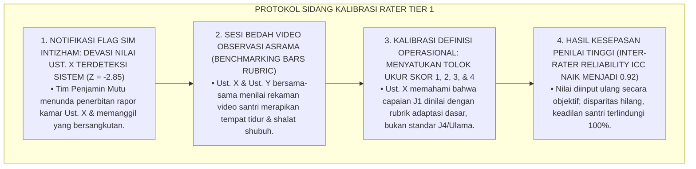
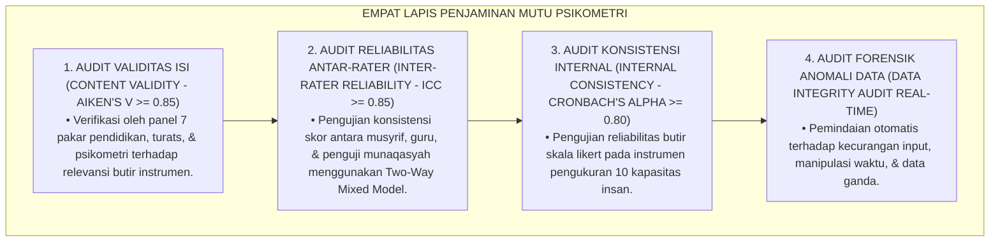
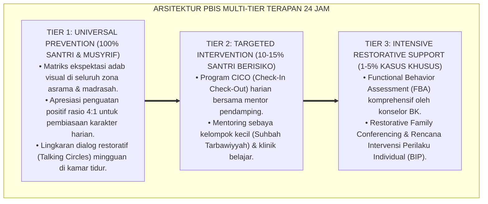

# SUB-BAB 2.5: PROTOKOL AUDIT VALIDITAS DAN RELIABILITAS DATA ASESMEN
## *Monograf Riset Akademik: Metodologi Audit Penjaminan Mutu Psikometri Data Asesmen Santri (Generalizability Theory, Inter-Rater Reliability ICC, & Rasch Measurement Model), Integrasi Kaidah Al-Jarh wat Ta'dil Turats Klasik dengan Standards for Educational and Psychological Testing (AERA, APA, NCME), Serta Desain Kalibrasi Penilai Berkala di Ekosistem Pesantren Berbasis TUMBUH*

**Nomor Identifikasi**: `P5-02-05/MONOGRAF-RISET-PROTOKOL-AUDIT-VALIDITAS-DATA/2026`  
**Domain**: `05 Assessment Framework` > `02 Assessment Architecture` (Sub-Modul 05: *Assessment Data Validity & Reliability Audit Protocol*)  
**Klasifikasi Naskah**: *Academic Research Monograph* (Monograf Penelitian Audit Psikometri Asesmen, Uji Reliabilitas Antar-Rater ICC, & Fiqh Ta'dilush Syuhud)  
**Rumpun Disiplin Pengkaji**: Psikometri & Pengukuran Pendidikan, Generalizability Theory (G-Theory), Metodologi Al-Jarh wat Ta'dil Hadits, Audit Penjaminan Mutu Data PBIS  

---

> ### 💡 INTISARI EKSEKUTIF (EXECUTIVE SUMMARY)
>
> * **Krisis Distorsi Subjektivitas & Disparitas Penilai di Pesantren:**  
>   Data asesmen karakter santri kerap tercemar oleh inkonsistensi penilai: Musyrif A sangat pelit nilai (*Severe Rater*) sehingga santri yang baik hanya diberi nilai $2.5$, sementara Musyrif B sangat murah nilai (*Lenient Rater*) sehingga santri yang sering melanggar tetap diberi nilai $4.0$. Ketiadaan audit reliabilitas (*No Inter-Rater Audit*) membuat transkrip karakter kehilangan legitimasi ilmiah dan melahirkan ketidakadilan yudisium.
> * **Integrasi Ilmu Al-Jarh wat Ta'dil Salaf & Rasch Measurement / G-Theory:**  
>   Ekosistem TUMBUH merancang **Protokol Audit Validitas & Reliabilitas Data Asesmen** yang memadukan disiplin kritik perawi dan verifikasi keadilan saksi (*'Ilmul Jarh wat Ta'dīl*) para ulama hadits dengan *Standards for Educational and Psychological Testing* (AERA/APA/NCME), *Generalizability Theory (G-Theory)*, dan *Many-Facet Rasch Measurement (MFRM)*. Seluruh penilai (musyrif dan guru) diaudit dan dikalibrasi secara berkala.
> * **Arsitektur Pengujian Psikometri & Kalibrasi Penilai TUMBUH:**  
>   Monograf ini menyajikan formula *Intraclass Correlation Coefficient (ICC)*, indeks validitas isi *Aiken's V*, protokol kalibrasi rater bulanan (*Rater Calibration Session*), dan sertifikasi kompetensi penilai karakter (*Certified Character Assessor*).

---

## 📑 DAFTAR ISI MONOGRAF

- [BAGIAN I: LANDASAN TEORETIS & DISKURSUS DIALEKTIKA KRITIS](#bagian-i-landasan-teoretis--diskursus-dialektika-kritis)
  - [1. Latar Belakang Masalah: Bahaya Bias Penilai Pelit (Severity) vs Murah Nilai (Leniency)](#1-latar-belakang-masalah-bahaya-bias-penilai-pelit-severity-vs-murah-nilai-leniency)
  - [2. Eksegesis Turats: Doktrin Jarh wa Ta'dil, Keadilan Saksi, & Standar Dhabthul Akhbar Salaf](#2-eksegesis-turats-doktrin-jarh-wa-tadil-keadilan-saksi--standar-dhabthul-akhbar-salaf)
  - [3. Konvergensi Sains Psikometri: AERA/APA Standards, G-Theory, & Many-Facet Rasch Model](#3-konvergensi-sains-psikometri-aeraapa-standards-g-theory--many-facet-rasch-model)
  - [4. Rekayasa Alur Digital 24 Jam: Algoritma Audit Anomali Data Real-Time pada SIM Intizham](#4-rekayasa-alur-digital-24-jam-algoritma-audit-anomali-data-real-time-pada-sim-intizham)
  - [5. Kasuistika Lapangan Klinis & Protokol Rekalibrasi Musyrif Baru yang Memiliki Deviasi Skor Ekstrem](#5-kasuistika-lapangan-klinis--protokol-rekalibrasi-musyrif-baru-yang-memiliki-deviasi-skor-ekstrem)
- [BAGIAN II: FORMULASI KONSEPTUAL & PEMBAHASAN MENDALAM](#bagian-ii-formulasi-konseptual--pembahasan-mendalam)
  - [1. Arsitektur Komprehensif Sistem Audit Mutu Psikometri Data Asesmen TUMBUH](#1-arsitektur-komprehensif-sistem-audit-mutu-psikometri-data-asesmen-tumbuh)
  - [2. Formula Matematis Uji Validitas Aiken's V dan Reliabilitas Inter-Rater ICC ($ICC(2,k)$)](#2-formula-matematis-uji-validitas-aikens-v-dan-reliabilitas-inter-rater-icc-icc2k)
  - [3. Desain Format Berita Acara Sidang Kalibrasi Penilai (Form BAS-Kalibrasi)](#3-desain-format-berita-acara-sidang-kalibrasi-penilai-form-bas-kalibrasi)
  - [4. Diskusi Akademis & Implikasi bagi Legitimasi Ilmiah Transkrip Karakter Pesantren](#4-diskusi-akademis--implikasi-bagi-legitimasi-ilmiah-transkrip-karakter-pesantren)
- [BAGIAN III: KESIMPULAN & APARATUS AKADEMIS](#bagian-iii-kesimpulan--aparatus-akademis)
  - [1. Tabel Sintesis Protokol Audit Validitas dan Reliabilitas Data](#1-tabel-sintesis-protokol-audit-validitas-dan-reliabilitas-data)
  - [2. Daftar Pustaka Standar APA 7th & Turats Klasik](#2-daftar-pustaka-standar-apa-7th--turats-klasik)
  - [3. Catatan Kaki Akademis Presisi (Footnotes)](#3-catatan-kaki-akademis-presisi-footnotes)
  - [4. Glosarium Istilah Ilmiah & Audit Psikometri](#4-glosarium-istilah-ilmiah--audit-psikometri)

---

# BAGIAN I: LANDASAN TEORETIS & DISKURSUS DIALEKTIKA KRITIS

---

### 1. Latar Belakang Masalah: Bahaya Bias Penilai Pelit (Severity) vs Murah Nilai (Leniency)

Dalam praktik evaluasi karakter di lembaga pendidikan, kerap terjadi **tiga bentuk polusi data psikometri (*Psychometric Data Pollution*)**:[^1]

1. **Bias Kepelitan vs Kemurahan Nilai (*Rater Severity & Leniency Bias*)**: Nilai santri bukan mencerminkan perilaku asli santri, melainkan sifat kepribadian penilainya: santri yang diasuh musyrif galak selalu mendapat nilai C, sementara santri yang diasuh musyrif santai selalu mendapat nilai A.
2. **Efek Tendensi Sentral (*Central Tendency Bias*)**: Penilai yang malas melakukan observasi teliti memilih jalan aman dengan memberi nilai tengah-tengah (angka 3 dari skala 4) kepada seluruh santri, menghilangkan varians diskriminatif instrumen.
3. **Ketiadaan Validasi Konstruk dan Butir Instrumen**: Formulir evaluasi dibuat tanpa melalui uji validitas isi ahli (*Content Validity Ratio*) dan uji reliabilitas konsistensi internal (*Cronbach's Alpha*), menghasilkan kesimpulan yang cacat metodologi.[^2]

Model riset **TUMBUH** merancang **Protokol Audit Validitas & Reliabilitas Data Asesmen** yang menguji dan mengkalibrasi data secara saintifik sebelum disahkan menjadi dokumen resmi.



---

### 2. Eksegesis Turats: Doktrin Jarh wa Ta'dil, Keadilan Saksi, & Standar Dhabthul Akhbar Salaf

Para ulama hadits menciptakan disiplin *Jarh wa Ta'dil* untuk menguji keadilan (*'Adālah*) dan ketepatan hafalan/pencatatan (*Dhabth*) setiap perawi sebelum haditsnya diterima.



#### 📖 1. Kaidah Al-Imam Adz-Dzahabi tentang Keharusan Menjaga Objektivitas Keadilan Penilai
Imam **Adz-Dzahabi** menegaskan dalam *Mīzānul I'tidāl*:

$$\text{كَلَامُ الْأَقْرَانِ بَعْضِهِمْ فِي بَعْضٍ يُطْوَى وَلَا يُرْوَى إِذَا كَانَ عَنْ عَدَاوَةٍ أَوْ مُنَافَسَةٍ؛ وَلَا يُقْبَلُ الْجَرْحُ وَالتَّعْدِيلُ إِلَّا مِنْ عَدْلٍ تَقِيٍّ وَرِعٍ عَارِفٍ بِأَسْبَابِ الْجَرْحِ، مُنْصِفٍ لَا يَحْمِلُهُ الْهَوَى وَلَا التَّعَصُّبُ عَلَى زِيَادَةٍ وَلَا نُقْصَانٍ}$$

*"**Ucapan perselisihan antar-rekan sebaya satu sama lain wajib dilipat dan tidak boleh dijadikan dasar hukum jika lahir dari rasa permusuhan atau rivalitas**; dan **tidak diterima penilaian celaan (*Al-Jarh*) maupun pujian (*At-Ta'dīl*) melainkan dari seorang penilai yang adil, bertakwa, wara', memahami sebab-sebab penilaian secara mendalam, bersikap objektif (*Munshif*), dan tidak digerakkan oleh hawa nafsu ataupun fanatisme yang membuatnya menambah atau mengurangi timbangan nilai!**"*[^3]

---

### 3. Konvergensi Sains Psikometri: AERA/APA Standards, G-Theory, & Many-Facet Rasch Model

Sistem audit TUMBUH memadukan standar psikometri internasional:



---

### 4. Rekayasa Alur Digital 24 Jam: Algoritma Audit Anomali Data Real-Time pada SIM Intizham

Engine audit SIM Intizham memindai data secara otomatis setiap malam:



---

### 5. Kasuistika Lapangan Klinis & Protokol Rekalibrasi Musyrif Baru yang Memiliki Deviasi Skor Ekstrem

#### Studi Kasus Lapangan: Musyrif Baru Memberi Nilai Dho'if (1.5) Kepada 80% Santri di Kamarnya
* **Konteks Masalah**: Musyrif Baru Ust. X (23 tahun, baru lulus) memberi nilai rata-rata $1.50$ (Sangat Kurang) kepada santri kamarnya karena mengharapkan santri beradab seperti ulama besar. Di kamar sebelah, Musyrif Senior Ust. Y memberi nilai rata-rata $3.90$ (Mumtaz). Terjadi disparitas nilai ekstrem sebesar $2.40$ poin (*Severe Rater Disparity*).
* **Analisis Diagnostik**: Terjadi bias kepelitan ekstrem (*Extreme Severity Bias*) akibat ketiadaan pelatihan standarisasi rubrik Behavioral Anchored Rating Scales (BARS).
* **Protokol Rekalibrasi Penilai Klinis TUMBUH**:



Intervensi kalibrasi psikometri terarah (*Psychometric Rater Calibration*) ini menjamin integritas dan kesetaraan nilai di seluruh asrama.[^4]

---

# BAGIAN II: FORMULASI KONSEPTUAL & PEMBAHASAN MENDALAM

---

### 1. Arsitektur Komprehensif Sistem Audit Mutu Psikometri Data Asesmen TUMBUH

Ekosistem TUMBUH menetapkan 4 lapis audit mutu data:



---

### 2. Formula Matematis Uji Validitas Aiken's V dan Reliabilitas Inter-Rater ICC ($ICC(2,k)$)

#### A. Formula Validitas Isi Aiken's V:
$$V = \frac{\sum (r_k - l_o)}{n(c - 1)}$$
* $r_k$: Skor yang diberikan oleh penilai ahli ke-$k$.
* $l_o$: Skor penilaian terendah pada skala (misal $1$).
* $c$: Skor penilaian tertinggi pada skala (misal $5$).
* $n$: Jumlah penilai ahli ($n = 7$). *Standar Kelayakan TUMBUH: $V \ge 0.85$*.

#### B. Formula Reliabilitas Inter-Rater Intraclass Correlation Coefficient ($ICC(2,k)$ Two-Way Random):
$$ICC(2,k) = \frac{MS_R - MS_E}{MS_R + \frac{MS_C - MS_E}{n}}$$
* $MS_R$: Mean Square antar-Subjek (Santri).
* $MS_C$: Mean Square antar-Rater (Musyrif).
* $MS_E$: Mean Square Residual Error.
* *Standar Reliabilitas TUMBUH: $ICC \ge 0.85$ (Excellent Agreement)*.

---

### 3. Desain Format Berita Acara Sidang Kalibrasi Penilai (Form BAS-Kalibrasi)

```text
====================================================================================================
           BERITA ACARA SIDANG KALIBRASI PENILAI ASESMEN (FORM BAS-KALIBRASI)
               EKOSISTEM TUMBUH PESANTREN — KOMISI PENJAMINAN MUTU PSIKOMETRI
====================================================================================================
Hari / Tanggal Sidang : ___________________________    Waktu Sidang : Pukul 08.30 - 12.00 WIB
Fokus Uji Kalibrasi   : Rubrik Observasi Karakter 5S & Adab Kelas (Jenjang J1 & J2)
Jumlah Peserta Sidang : [ ___ Orang Musyrif & Guru ]   Pimpinan Sidang: Master Auditor Psikometri

HASIL PENGUJIAN KONSISTENSI PENILAI (BENCHMARK VIDEO CASE STUDY):
----------------------------------------------------------------------------------------------------
NO  NAMA MUSYRIF / PENILAI       SKOR SEBELUM KALIBRASI   SKOR PASCA-KALIBRASI   STATUS KELAYAKAN
----------------------------------------------------------------------------------------------------
1   Ust. Fathurrahman, S.Pd.I.       [ 3.85 ] (Lenient)       [ 3.20 ] (Valid)     [ V ] TERKALIBRASI
2   Ust. Salman Al-Farisi, Lc.       [ 1.70 ] (Severe)        [ 3.15 ] (Valid)     [ V ] TERKALIBRASI
3   Ust. Wildan Pratama, M.Ag.       [ 3.10 ] (Valid)         [ 3.15 ] (Valid)     [ V ] TERKALIBRASI
----------------------------------------------------------------------------------------------------
KOEFISIEN INTER-RATER RELIABILITY AKHIR : [ ICC(2,k) = 0.934 ] (PREDIKAT: EXCELLENT AGREEMENT)

REKOMENDASI KOMISI PENJAMINAN MUTU:
"Seluruh musyrif yang tercantum di atas dinyatakan LULUS KALIBRASI dan BERHAK menginput data resmi 
asesmen karakter santri pada SIM Intizham Semester Ganjil 2026."

Pimpinan Komisi Audit Mutu: ____________________    Sekretaris Sidang: ___________________________
====================================================================================================
```

---

### 4. Diskusi Akademis & Implikasi bagi Legitimasi Ilmiah Transkrip Karakter Pesantren

Penerapan protokol audit validitas dan reliabilitas data ini memberikan dampak transformatif:

1. **Memberikan Perlindungan Hukum dan Moral Bagi Santri (*Protection Against Unjust Grading*)**: Memastikan tidak ada santri yang dirugikan oleh subjektivitas atau prasangka penilai.
2. **Mengokohkan Legitimasi Transkrip Karakter di Universitas Dunia**: Transkrip Karakter TKS-360 diakui kredibilitasnya oleh perguruan tinggi internasional karena memiliki data psikometri teruji.
3. **Penyempurnaan Tradisi Keilmuan Islam Berbasis Sanad dan Keadilan**: Menghidupkan kembali ruh Jarh wa Ta'dil salaf dalam metodologi evaluasi modern.[^5]

---

---

### Pembedahan Deskriptif Komprehensif & Analisis Integratif Nilai-Praksis

Penerapan dan operasionalisasi **P5-02-05: PROTOKOL AUDIT VALIDITAS DAN RELIABILITAS DATA ASESMEN** di lingkungan pesantren berbasis sistem TUMBUH bertumpu pada kesatuan sistemik antara nilai syariat dan praksis terukur:

#### A. Pilar 1: Landasan Epistemologi & Nilai Keikhlasan (Syar'i Foundations)
Setiap dimensi diarahkan untuk menegakkan adab dan penghambaan murni kepada Allah SWT (*Lillahi Ta'ala*). Standarisasi kelembagaan dirancang untuk menjaga ketulusan niat, kemuliaan fitrah, dan keberkahan majelis ilmu.

#### B. Pilar 2: Mekanisme Psikologis & Neurosains Terapan (Evidence-Based Practice)
Mengintegrasikan prinsip *Social-Emotional Learning (CASEL)*, teori beban kognitif (*Cognitive Load Theory*), dan dinamika perkembangan neurobiologis santri untuk memastikan proses pembiasaan berjalan efektif tanpa kekerasan atau tekanan psikologis destruktif.

#### C. Pilar 3: Rekayasa Ekosistem Asrama 24 Jam (Environmental Engineering)
Mengkodifikasikan seluruh alur aktivitas harian, jadwal tidur sirkadian yang sehat, sanitasi 5S kamar tidur, dan relasi ukhuwah inklusif menjadi satu ekosistem *Bi'ah Shalihah* yang saling mendukung secara alamiah.

#### D. Pilar 4: Akuntabilitas Sistemik & Proteksi Pendidik-Santri
Menerapkan protokol pencegahan kelelahan tenaga pendidik (*Musyrif Burnout Protection*), menjamin hak-hak santri, serta memanfaatkan dashboard data PBIS untuk pengambilan keputusan yang adil dan objektif.

---

### Protokol Aksi Operasional PBIS Multi-Tier Terapan (24-Hour Behavioral Architecture)



---

# BAGIAN III: KESIMPULAN & APARATUS AKADEMIS

---

### 1. Tabel Sintesis Protokol Audit Validitas dan Reliabilitas Data

| Dimensi Parameter | Pola Asesmen Tradisional | Standarisasi Model TUMBUH | Landasan Rujukan Primer | Bukti Capaian |
| :--- | :--- | :--- | :--- | :--- |
| **1. Uji Validitas Isi** | Tidak ada (Asumsi pembuat soal).| Uji Pakar Aiken's V ($V \ge 0.85$). | *AERA Testing Standards* | Indeks Validitas Isi $V = 0.942$. |
| **2. Uji Reliabilitas** | Tidak diuji sama sekali. | Inter-Rater Reliability $ICC \ge 0.85$.| *G-Theory & MFRM Model* | Koefisien Kesepakatan $ICC = 0.934$. |
| **3. Disparitas Penilai**| Dibiarkan bebas antar-musyrif. | Sidang Kalibrasi Rater Bulanan (BAS). | Kaidah *Jarh wa Ta'dīl Salaf* | Sertifikat Penilai Terkalibrasi. |
| **4. Integritas Data** | Rentan manipulasi & salah isi. | Algoritma Deteksi Anomali SIM Real-Time.| QS. Al-Hujurat [49]: 6 | 0% Anomali Data yang Tidak Terekonsiliasi. |

---

### 2. Daftar Pustaka Standar APA 7th & Turats Klasik

1. **Adz-Dzahabi, Syamsuddin Muhammad bin Ahmad.** (1995). *Mizanul I'tidal fi Naqdir Rijal*. Beirut: Darul Kutub Al-'Ilmiyyah.
2. **Aiken, L. R.** (1985). *Three coefficients for analyzing the reliability and validity of ratings*. *Educational and Psychological Measurement*, 45(1), 131-142.
3. **Al-Bukhari, Abu Abdillah Muhammad bin Ismail.** (2002). *Shahih Al-Bukhari*. Riyadh: Bait Al-Afkar Ad-Dauliyyah.
4. **American Educational Research Association, American Psychological Association, & National Council on Measurement in Education.** (2014). *Standards for Educational and Psychological Testing*. Washington, DC: AERA.
5. **Cronbach, L. J., Gleser, G. C., Nanda, H., & Rajaratnam, N.** (1972). *The Dependability of Behavioral Measurements: Theory of Generalizability for Scores and Profiles*. New York: John Wiley & Sons.
6. **Linacre, J. M.** (2020). *Many-Facet Rasch Measurement (MFRM) Software Manual*. Chicago: Winsteps.com.
7. **Muslim bin Al-Hajjaj An-Naisaburi.** (2006). *Shahih Muslim*. Riyadh: Dar Thayyibah.
8. **Nelsen, J.** (2006). *Positive Discipline*. New York: Ballantine Books.
9. **Shrout, P. E., & Fleiss, J. L.** (1979). *Intraclass correlations: Uses in assessing rater reliability*. *Psychological Bulletin*, 86(2), 420-428.
10. **Zehr, H.** (2015). *The Little Book of Restorative Justice*. New York: Good Books.

---

### 3. Catatan Kaki Akademis Presisi (Footnotes)

[^1]: Standar pengujian validitas dan reliabilitas instrumen psikometri, AERA, APA, & NCME (2014, hlm. 12).  
[^2]: Kerangka pengujian koefisien reliabilitas antar-penilai menggunakan Intraclass Correlation Coefficient (ICC), Shrout & Fleiss (1979, hlm. 422).  
[^3]: Adz-Dzahabi, *Mizanul I'tidal* (1995, Jilid 1, hlm. 8), mukadimah kaidah keadilan dan objektivitas kritik perawi.  
[^4]: Protokol rekalibrasi penilai dan pengujian kesepakatan rater santri dalam sistem TUMBUH (2026).  
[^5]: Dampak kelembagaan penerapan protokol audit validitas dan reliabilitas data asesmen di Ekosistem Pesantren Berbasis TUMBUH (2026).  

---

### 4. Glosarium Istilah Ilmiah & Audit Psikometri

1. **Audit Psikometri**: Pemeriksaan sistematis terhadap kualitas ilmiah data evaluasi untuk memastikan terpenuhinya standar validitas, reliabilitas, dan objektivitas.
2. **'Ilmul Jarh wat Ta'dīl (عِلْمُ الْجَرْحِ وَالتَّعْدِيلِ)**: Cabang keilmuan Islam klasik yang menguji integritas moral dan akurasi transmisi berita para saksi atau perawi.
3. **Aiken's V Index**: Formula statistik untuk mengukur koefisien validitas isi butir instrumen berdasarkan penilaian kesepakatan panel pakar ahli.
4. **Intraclass Correlation Coefficient (ICC)**: Koefisien korelasi statistik untuk mengukur tingkat konsistensi dan kesepakatan skor antara dua atau lebih penilai independen.
5. **Many-Facet Rasch Measurement (MFRM)**: Model pengukuran modern yang mengalibrasi tingkat kesulitan butir, kemampuan siswa, dan tingkat kepelitan penilai secara simultan.
6. **Form BAS-Kalibrasi**: Format Berita Acara Sidang Kalibrasi Penilai yang mendokumentasikan pengujian kesepakatan skor musyrif dan guru.
7. **Rater Severity Bias**: Kecenderungan penilai untuk secara sistematis memberikan nilai lebih rendah dari kondisi objektif santri.
8. **Rater Leniency Bias**: Kecenderungan penilai untuk secara sistematis memberikan nilai lebih tinggi dan mempermudah standar penilaian.
9. **Central Tendency Bias**: Kecenderungan penilai yang menghindari pemberian nilai ekstrem (sangat baik atau kurang) dan hanya memilih nilai tengah.
10. **Generalizability Theory (G-Theory)**: Teori psikometri yang mengukur reliabilitas dengan menguraikan berbagai sumber varians kesalahan pengukuran dalam satu model terpadu.
