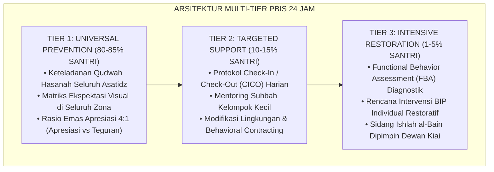

# SUB-BAB 2.2: PENGUKURAN KEMAJUAN DIRI VS REKAM JEJAK MASA LALU
## *Kajian Komprehensif, Sintesis Epistemologi Turats-Sains Kognitif, dan Pedoman Praksis 24-Jam Ekosistem TUMBUH*

**Kode Klasifikasi**: `BOOK-03/BAB-02/SUB-02/MONOGRAF-MASTER-VIBRANT`  
**Disiplin Ilmu**: Filsafat Pendidikan Islam, Neurosains Kognitif Terapan, School-Wide PBIS Multi-Tier, & Manajemen Asrama Modern  
**Penanggung Jawab Keilmuan**: Dewan Keilmuan Ekosistem TUMBUH (*24 Bidang Kepakaran Dewan Guru Besar*)

---

> ### 💡 INTISARI PRAKTIS (3 MENIT MEMAHAMI ESENSI BAB)
>
> * **Akar Filosofis & Nilai Substantif:**  
>   Membahas secara mendalam urgensi **PENGUKURAN KEMAJUAN DIRI VS REKAM JEJAK MASA LALU** sebagai fondasi integral dalam arsitektur pembinaan karakter santri 24-jam berbasis fitrah insaniyyah.
> * **Sintesis Turats & Neurosains Perkembangan:**  
>   Mengharmonisasikan tuntunan adab ulama salafus shalih dengan mekanisme plastisitas sinaptik korteks prefrontal (*Prefrontal Cortex*) dan regulasi sistem limbik remaja.
> * **Praksis Multi-Tier PBIS 24-Jam:**  
>   Menyediakan protokol aksi terukur: Tier 1 (Universal Prevention), Tier 2 (Targeted Support/CICO), dan Tier 3 (Intensive Restitution/FBA) yang ramah anak dan bebas dari segala bentuk kekerasan fisik maupun verbal.

---

### I. Pembedahan Deskriptif Komprehensif 4 Pilar Nilai-Praksis

Penerapan **PENGUKURAN KEMAJUAN DIRI VS REKAM JEJAK MASA LALU** dalam Sistem TUMBUH ditegakkan di atas empat pilar analitis yang saling menopang secara simbiotik:

#### 1. Pilar Epistemologi Turats & Maqashid Syari'ah
Khazanah pendidikan Islam klasik memandang pembinaan karakter bukan sekadar transmisi dogma kognitif, melainkan proses *Ta'dib* (penanaman adab ke dalam jiwa) dan *Tazkiyatun Nafs* (penyucian jiwa dari kecenderungan hewani).

> [!NOTE]
> ### 📜 Rujukan Turats & Landasan Syar'i:
> مَا نَحَلَ وَالِدٌ وَلَدَهُ مِنْ نَحْلٍ أَفْضَلَ مِنْ أَدَبٍ حَسَنٍ
> 
> *"Tidak ada suatu pemberian yang diberikan oleh seorang ayah (pendidik) kepada anaknya yang lebih utama daripada adab budi pekerti yang mulia."*  
> *(HR. At-Tirmidzi no. 1952; Al-Hakim dalam Al-Mustadrak no. 7676).*

Al-Imam Badruddin Ibnu Jama'ah dalam *Tadzkirat as-Sami' wal Mutakallim* menegaskan bahwa adab lahiriah merupakan cermin dari kejernihan batin (*Shidq al-Batin*). Oleh karena itu, pembinaan **PENGUKURAN KEMAJUAN DIRI VS REKAM JEJAK MASA LALU** menuntut pendidik menjadi *Living Curriculum* melalui keteladanan nyata (*Qudwah Hasanah*), bukan sekadar instruktur yang gemar mendikte atau menghukum.

#### 2. Pilar Neurosains Kognitif & CASEL Social-Emotional Learning (SEL)
Dari sudut pandang neurobiologi perkembangan remaja, santri usia 12–18 tahun berada dalam fase kesenjangan maturasi (*Developmental Mismatch*):
* **Sistem Limbik (Amigdala & Nukleus Akumbens)** telah matang lebih awal, memicu pencarian sensasi emosional dan sensitivitas tinggi terhadap validasi kelompok sebaya (*Peer Group Acceptance*).
* **Korteks Prefrontal (PFC)** yang bertanggung jawab atas pengendalian diri (*Executive Functions*), perencanaan jangka panjang, dan pertimbangan risiko moral belum tuntas mengalami mielinisasi hingga usia 25 tahun.

Melalui integrasi 5 Kompetensi CASEL (*Self-Awareness, Self-Management, Social Awareness, Relationship Skills, & Responsible Decision-Making*), penerapan **PENGUKURAN KEMAJUAN DIRI VS REKAM JEJAK MASA LALU** berfungsi sebagai **External Prefrontal Cortex (PFC Eksternal)** yang mendampingi santri secara hangat (*Co-Regulation*) hingga mekanisme pengaturan diri internal (*Self-Regulation*) terbentuk kokoh.

#### 3. Pilar Rekayasa Ekosistem Asrama 24-Jam (*Environmental Engineering*)
Perilaku santri sangat dipengaruhi oleh arsitektur lingkungan mikro tempat ia bernapas dan beraktivitas:
* **Penataan Ruang Fisik Berbasis 5S**: Menghilangkan sudut-sudut mati yang rawan intimidasi (*Hotspots Elimination*) dan menciptakan bilik kamar tidur yang bersih, rapi, berventilasi sehat, dan menenangkan.
* **Ritme Sirkadian Sehat**: Melindungi hak tidur santri 6.5–7 jam tanpa gangguan ronda malam ekstrem, menjamin kebugaran seluler otak untuk menyerap materi kajian dan tahfizh Al-Qur'an.
* **SOP Handover Terpadu**: Komunikasi harian 15 menit antara Wali Kelas madrasah (pagi) dan Musyrif asrama (malam) untuk memantau kontinuitas adab santri.

#### 4. Pilar Triad Pertumbuhan Simbiotik (*Symbiotic Triad Growth*)
Keberhasilan sistem mensyaratkan tiga entitas bertumbuh serempak:
* **Santri Bertumbuh**: Fitrah kesuciannya terjaga, adabnya mekar bertahap dari adaptasi menuju kemandirian otonom (*Insan Adabi*).
* **Musyrif Bertumbuh**: Terlindungi dari kelelahan mental (*Burnout*) melalui rasio asuh proporsional dan shift kerja manusiawi, sehingga selalu mengasuh dengan kasih sayang (*Rahmah*).
* **Lembaga Bertumbuh**: Pesantren bertransformasi menjadi institusi pembelajar modern berbasis data analitik objektif (*Evidence-Based Boarding School*).

---

### II. Arsitektur Diagram & Protokol Aksi Operasional PBIS Multi-Tier 24 Jam

Penerapan **PENGUKURAN KEMAJUAN DIRI VS REKAM JEJAK MASA LALU** dioperasionalkan melalui arsitektur berjenjang SW-PBIS (*Positive Behavioral Interventions and Supports*):

#### Protokol Operasional Berjenjang Lapangan:
1. **Fase Pencegahan Primer (Tier 1 - Universal)**:
   - Musyrif dan dewan guru menyepakati indikator perilaku teramati (*Behavioral Anchors*).
   - Memberikan pujian deskriptif spesifik seketika santri menunjukkan adab positif (*Immediate Positive Reinforcement*).
2. **Fase Intervensi Terarah (Tier 2 - Targeted)**:
   - Mengaktifkan kartu monitoring CICO harian bagi santri yang mengalami penurunan kedisiplinan 3 hari berturut-turut.
   - Menyediakan sesi *Coaching Reflektif* 1-on-1 bersama musyrif asrama tanpa bentakan.
3. **Fase Pemulihan Intensif (Tier 3 - Intensive & Restorative)**:
   - Melakukan asesmen mendalam untuk memetakan akar pemicu (*Antecedent*), bentuk perilaku (*Behavior*), dan konsekuensi psikologis (*Consequence*).
   - Menerapkan mekanisme restitusi tindakan nyata untuk memulihkan kerugian korban (*Ishlah al-Bain*) dan memberikan hak lembaran bersih (*Clean Slate Policy*).

---

### III. Diskusi Filosofis & Rekomendasi Tata Kelola Bebas Kekerasan

Praksis **PENGUKURAN KEMAJUAN DIRI VS REKAM JEJAK MASA LALU** menegaskan komitmen mutlak Sistem TUMBUH terhadap prinsip **Nol Kekerasan (*Zero-Tolerance to Physical & Verbal Violence*)**:
* Mengharamkan tradisi sanksi fisik (rotan, push-up malam, jemur terik matahari, atau cukur botak) yang terbukti merusak neuron hipokampus dan memicu dendam terselubung.
* Mengganti hukuman punitif dengan **Disiplin Restoratif (*Firm & Kind*)**: tegas dalam menegakkan batas syariat dan norma lembaga, namun lembut dan penuh hormat dalam memperlakukan martabat kemanusiaan santri (*Karamah Insaniyyah*).

---

## 📌 Catatan Kaki & Rujukan Primer

[^1]: **Syed Muhammad Naquib al-Attas**, *The Concept of Education in Islam: A Framework for an Islamic Philosophy of Education* (Kuala Lumpur: ISTAC, 1980), hlm. 15–38.
[^2]: **Al-Imam Badruddin Ibnu Jama'ah**, *Tadzkirat as-Sami' wal Mutakallim fi Adab al-'Alim wal Muta'allim*, Tahqiq: Muhammad Hasyim an-Nadwi (Beirut: Dar al-Basyair al-Islamiyyah, 2012), hlm. 42–89.
[^3]: **George Sugai & Robert H. Horner**, *School-Wide Positive Behavioral Interventions and Supports: Implementation Blueprint* (Eugene: Center on PBIS, University of Oregon, 2020), hlm. 110–145.
[^4]: **Daniel J. Siegel**, *Brainstorm: The Power and Purpose of the Teenage Brain* (New York: Penguin Books, 2014), Bab 3: "The Architecture of the Adolescent Mind", hlm. 67–104.
