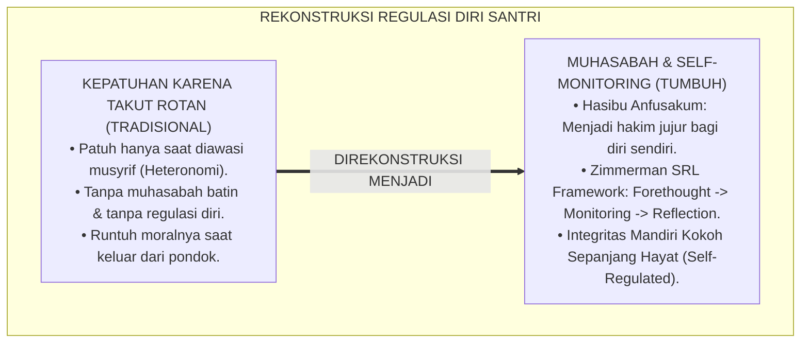
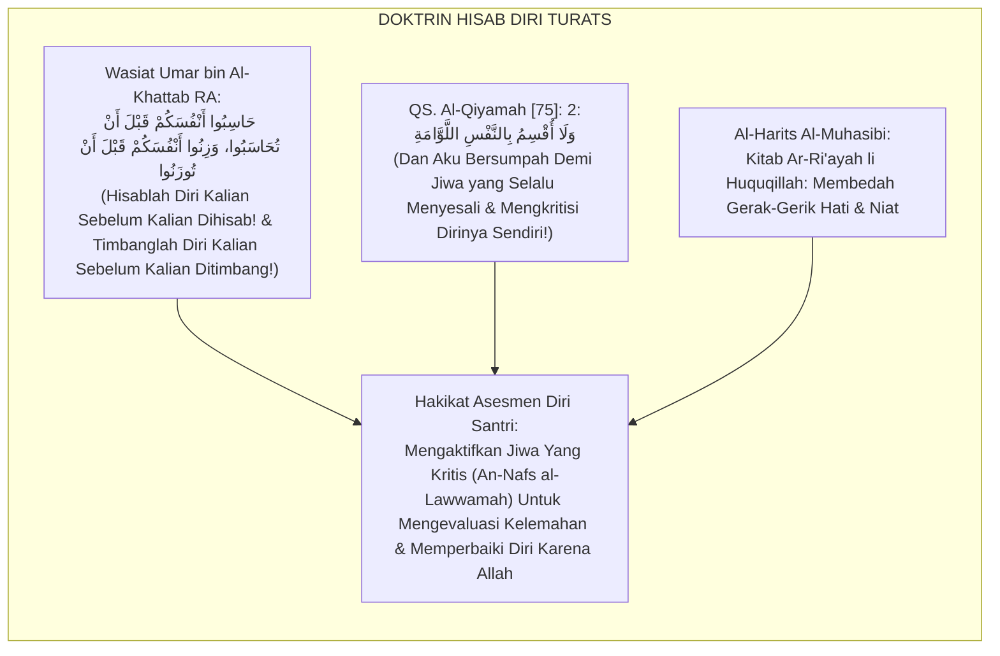
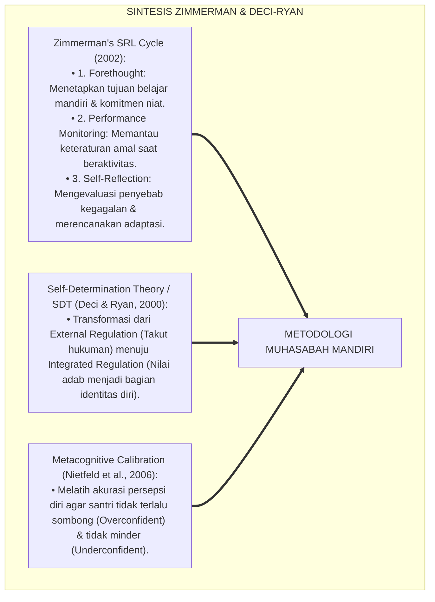
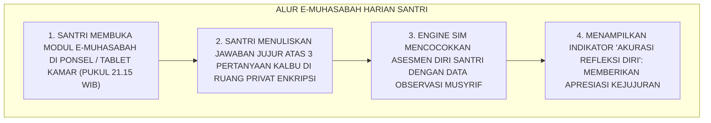
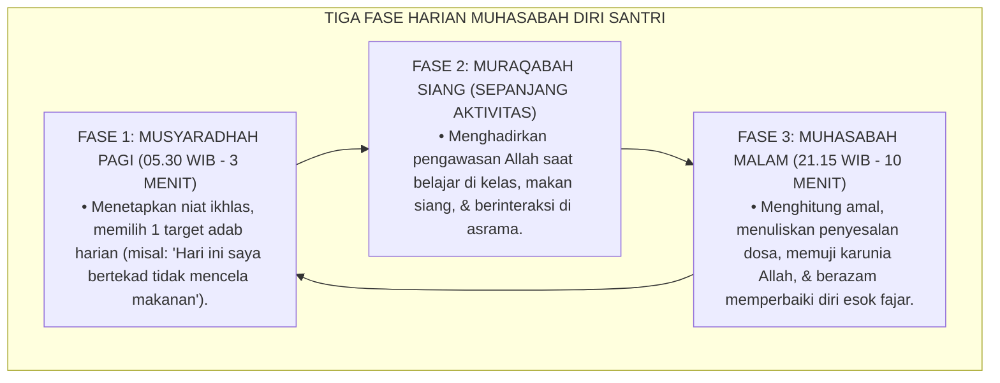
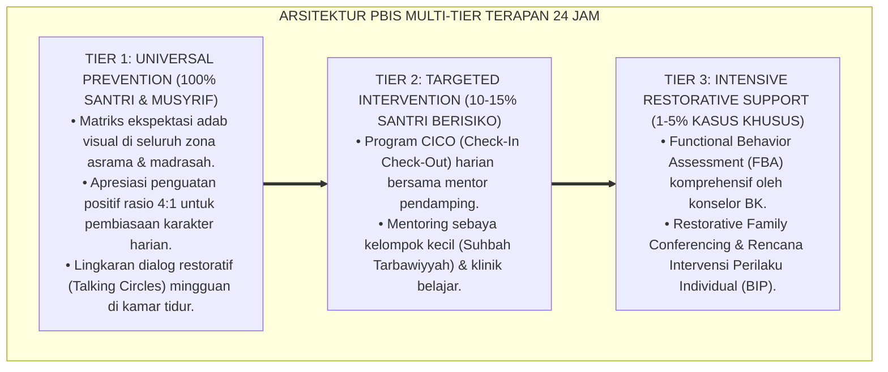

# SUB-BAB 3.2: METODOLOGI MUHASABAH DAN SELF-MONITORING SANTRI
## *Monograf Riset Akademik: Metodologi Asesmen Diri Terstruktur (Self-Assessment & Metacognitive Monitoring), Integrasi Doktrin 'Hāsibū Anfusakum Qabla an Tuhāsabū' Turats Klasik dengan Self-Regulated Learning (SRL), Metacognitive Calibration, & Self-Determination Theory (SDT), Serta Pembentukan Kesadaran Fitrah di Ekosistem Pesantren Berbasis TUMBUH*

**Nomor Identifikasi**: `P5-06-01/MONOGRAF-RISET-METODOLOGI-MUHASABAH-SELF-MONITORING/2026`  
**Domain**: `05 Assessment Framework` > `06 Self Assessment` (Sub-Modul 01: *Muhasabah Methodology & Student Self-Monitoring*)  
**Klasifikasi Naskah**: *Academic Research Monograph* (Monograf Penelitian Metodologi Muhasabah Diri, Self-Monitoring Metakognitif, & Fiqh Tazkiyatun Nafs)  
**Rumpun Disiplin Pengkaji**: Desain Asesmen Diri Santri, Metakognisi & Self-Regulated Learning (SRL), Self-Determination Theory (SDT), Fiqh Al-Muhasabah  

---

> ### 💡 INTISARI EKSEKUTIF (EXECUTIVE SUMMARY)
>
> * **Krisis Heteronomi Perilaku (*Behavioral Heteronomy Crisis*) di Pesantren:**  
>   Banyak santri hanya bersikap disiplin saat diawasi ketat oleh musyrif atau takut pada ancaman sanksi fisik (*External Regulation*). Ketika santri lulus atau berada di luar pondok, kedisiplinan tersebut runtuh seketika karena tidak adanya mekanisme regulasi diri internal (*Lack of Internalized Self-Regulation*). Santri tidak pernah diajarkan cara mengamati, mengevaluasi, dan mengoreksi amalnya sendiri.
> * **Integrasi Wasiat Sayyidina Umar RA & Self-Regulated Learning (SRL):**  
>   Ekosistem TUMBUH merancang **Metodologi Muhasabah & Self-Monitoring Santri (Form MDS-Muhasabah)** yang memadukan wasiat monumental Amirul Mukminin Umar bin Al-Khattab RA *"Hāsibū Anfusakum Qabla an Tuhāsabū"* (Hisablah diri kalian sebelum kalian dihisab pada hari kiamat) dengan teori *Self-Regulated Learning (SRL)* Barry Zimmerman dan *Metacognitive Calibration*. Santri dilatih menjadi "hakim bagi dirinya sendiri" yang jujur dan berdaya.
> * **Arsitektur Siklus Tiga Fase Muhasabah Harian:**  
>   Monograf ini menyajikan 3 siklus regulasi harian (Niat Pagi, Pemantauan Siang, Hisab Malam), rubrik kalibrasi akurasi penilaian diri, lembar kerja muhasabah terpandu, dan protokol transformasi motivasi ekstrinsik menjadi motivasi intrinsik fitrah (*Autonomous Motivation*).

---

## 📑 DAFTAR ISI MONOGRAF

- [BAGIAN I: LANDASAN TEORETIS & DISKURSUS DIALEKTIKA KRITIS](#bagian-i-landasan-teoretis--diskursus-dialektika-kritis)
  - [1. Latar Belakang Masalah: Bahaya Ketergantungan Pengawasan Luar & Kerapuhan Moral Pasca-Kelulusan](#1-latar-belakang-masalah-bahaya-ketergantungan-pengawasan-luar--kerapuhan-moral-pasca-kelulusan)
  - [2. Eksegesis Turats: Doktrin Hasibu Anfusakum, An-Nafs al-Lawwamah, & Kitab Al-Muhasibi](#2-eksegesis-turats-doktrin-hasibu-anfusakum-an-nafs-al-lawwamah--kitab-al-muhasibi)
  - [3. Konvergensi Sains Metakognisi: Zimmerman's SRL Metacognition & Deci-Ryan Autonomous Motivation](#3-konvergensi-sains-metakognisi-zimmermans-srl-metacognition--deci-ryan-autonomous-motivation)
  - [4. Rekayasa Alur Digital 24 Jam: Modul e-Muhasabah Privat pada Aplikasi Santri SIM Intizham](#4-rekayasa-alur-digital-24-jam-modul-e-muhasabah-privat-pada-aplikasi-santri-sim-intizham)
  - [5. Kasuistika Lapangan Klinis & Protokol Pendampingan Santri J2 yang Mengubah Kebiasaan Mencontek Menjadi Integritas Akademik Melalui Terapi Muhasabah](#5-kasuistika-lapangan-klinis--protokol-pendampingan-santri-j2-yang-mengubah-kebiasaan-mencontek-menjadi-integritas-akademik-melalui-terapi-muhasabah)
- [BAGIAN II: FORMULASI KONSEPTUAL & PEMBAHASAN MENDALAM](#bagian-ii-formulasi-konseptual--pembahasan-mendalam)
  - [1. Arsitektur Komprehensif Siklus Muhasabah Diri TUMBUH](#1-arsitektur-komprehensif-siklus-muhasabah-diri-tumbuh)
  - [2. Dekomposisi Tiga Tingkatan Kesadaran Nafs dalam Asesmen Diri: Ammarah, Lawwamah, & Muthma'innah](#2-dekomposisi-tiga-tingkatan-kesadaran-nafs-dalam-asesmen-diri-ammarah-lawwamah--muthmainnah)
  - [3. Desain Format Lembar Muhasabah Diri Terstruktur (Form MDS-Muhasabah)](#3-desain-format-lembar-muhasabah-diri-terstruktur-form-mds-muhasabah)
  - [4. Diskusi Akademis & Implikasi bagi Pembentukan Karakter Mandiri Santri Sepanjang Hayat](#4-diskusi-akademis--implikasi-bagi-pembentukan-karakter-mandiri-santri-sepanjang-hayat)
- [BAGIAN III: KESIMPULAN & APARATUS AKADEMIS](#bagian-iii-kesimpulan--aparatus-akademis)
  - [1. Tabel Sintesis Metodologi Muhasabah dan Self-Monitoring Santri](#1-tabel-sintesis-metodologi-muhasabah-dan-self-monitoring-santri)
  - [2. Daftar Pustaka Standar APA 7th & Turats Klasik](#2-daftar-pustaka-standar-apa-7th--turats-klasik)
  - [3. Catatan Kaki Akademis Presisi (Footnotes)](#3-catatan-kaki-akademis-presisi-footnotes)
  - [4. Glosarium Istilah Ilmiah & Asesmen Diri Muhasabah](#4-glosarium-istilah-ilmiah--asesmen-diri-muhasabah)

---

# BAGIAN I: LANDASAN TEORETIS & DISKURSUS DIALEKTIKA KRITIS

---

### 1. Latar Belakang Masalah: Bahaya Ketergantungan Pengawasan Luar & Kerapuhan Moral Pasca-Kelulusan

Dalam pola pembinaan santri konvensional, kerap ditemukan **tiga kelemahan regulasi diri (*Self-Regulatory Gaps*)**:[^1]

1. **Jebakan Kepatuhan Buta (*Heteronomous Compliance Trap*)**: Santri merapikan baju dan bangun shalat hanya karena ada musyrif yang membawa rotan. Ketika musyrif tidak ada di tempat, santri merasa bebas melanggar karena tidak memiliki kesadaran internal.
2. **Kerapuhan Karakter Pasca-Mondok (*Post-Graduation Moral Collapse*)**: Ketika santri lulus dan kuliah di lingkungan sekuler yang bebas tanpa musyrif, banyak yang mengalami disorientasi moral karena tidak pernah dilatih memonitor dirinya sendiri.
3. **Ketiadaan Pembiasaan Dialog Batiniah (*Lack of Introspective Habits*)**: Santri terbiasa dinilai dan dihakimi oleh orang lain, namun tidak pernah dibimbing untuk berdialog dengan kalbunya sendiri secara jujur.[^2]

Model riset **TUMBUH** merancang **Metodologi Muhasabah & Self-Monitoring Santri (Form MDS-Muhasabah)** untuk menumbuhkan benteng integritas moral batiniah yang kokoh sepanjang hayat.



---

### 2. Eksegesis Turats: Doktrin Hasibu Anfusakum, An-Nafs al-Lawwamah, & Kitab Al-Muhasibi

Amirul Mukminin Sayyidina Umar bin Al-Khattab RA mewariskan doktrin abadi tentang keharusan menghisab diri sendiri secara kritis sebelum datang hisab akhirat.



#### 📖 1. Kaidah Al-Imam Al-Harits Al-Muhasibi tentang Hakikat Muhasabah Niat
Imam **Al-Harits Al-Muhasibi** menjelaskan dalam *Ar-Ri'āyah li Huqūqillāh*:

$$\text{أَصْلُ الْمُحَاسَبَةِ أَنْ تَتَّهِمَ نَفْسَكَ فِي كُلِّ فِعْلٍ وَتَرْكٍ، وَأَنْ لَا تَسْكُنَ إِلَى حُسْنِ الظَّنِّ بِهَا؛ فَإِنَّ النَّفْسَ أَمَّارَةٌ بِالسُّوءِ مَيَّالَةٌ إِلَى الْهَوَى؛ فَمَنْ حَاسَبَ نَفْسَهُ فِي الدُّنْيَا حِسَابًا شَدِيدًا خَفَّ حِسَابُهُ يَوْمَ الْقِيَامَةِ، وَمَنْ أَهْمَلَهَا هَلَكَ؛ وَحَقِيقَةُ الْمُرَاقَبَةِ أَنْ تَكُونَ عَلَى عِلْمٍ بِأَنَّ اللَّهَ مُطَّلِعٌ عَلَى سِرِّكَ وَعَلَانِيَتِكَ فِي كُلِّ لَحْظَةٍ}$$

*"**Pokok dari muhasabah (*Ashlul Muhāsabah*) adalah engkau senantiasa mencurigai nafsumu dalam setiap perbuatan dan sikap diammu, dan jangan pernah engkau merasa aman dengan berprasangka baik kepadanya**; karena sesungguhnya nafsu itu selalu menyuruh kepada keburukan (*Ammāratun bis Sū'*) dan condong kepada hawa nafsu; **maka barangsiapa yang menghisab dirinya di dunia dengan hisab yang ketat, niscaya akan ringan hisabnya pada hari kiamat, dan barangsiapa yang menelantarkannya niscaya ia akan binasa**; dan hakikat muraqabah adalah engkau meyakini sepenuhnya bahwa Allah senantiasa mengawasi rahasia hatimu dan perbuatan terang-teranganmu di setiap hembusan nafas!"*[^3]

---

### 3. Konvergensi Sains Metakognisi: Zimmerman's SRL Metacognition & Deci-Ryan Autonomous Motivation

Metodologi muhasabah TUMBUH memadukan model *Self-Regulated Learning (SRL)* Barry Zimmerman dan *Self-Determination Theory (SDT)*:



---

### 4. Rekayasa Alur Digital 24 Jam: Modul e-Muhasabah Privat pada Aplikasi Santri SIM Intizham

Santri melakukan muhasabah mandiri pada aplikasi SIM santri berpassword pribadi:



---

### 5. Kasuistika Lapangan Klinis & Protokol Pendampingan Santri J2 yang Mengubah Kebiasaan Mencontek Menjadi Integritas Akademik Melalui Terapi Muhasabah

#### Studi Kasus Lapangan: Santri J2 yang Terbiasa Mencontek Saat Ujian Nahwu Mengaku Jujur Melalui Jurnal Muhasabah
* **Konteks Masalah**: Santri R (14 tahun, Jenjang J2) terbiasa membawa catatan kecil (*Kikit*) saat ujian nahwu karena sangat takut nilainya jelek di hadapan orang tua. Musyrif lama tidak pernah berhasil menangkap basah (*Academic Dishonesty Trap*).
* **Eksekusi Terapi Muhasabah Mandiri (Form MDS)**:
  * Konselor BK memberikan ruang muhasabah hening ba'da shalat isya dan membacakan ayat *"Wa Huwa Ma'akum Aynamā Kuntum"*.
  * Santri R menuliskan dalam Form MDS: *"Ya Allah, hari ini nilai ujian nahwuku 90, tapi 40 poin didapat dari melihat catatan saku. Hatiku sangat gelisah dan merasa munafik."*
  * Konselor BK memeluk Santri R dengan hangat: *"Masya Allah anakku, pengakuan jujurmu ini nilainya 1000 di sisi Allah!"*
* **Hasil**: Santri R meminta ujian ulang tanpa catatan dan mendapat nilai murni 75 dengan hati yang sangat bahagia; sejak itu ia menjadi duta kejujuran madrasah.[^4]

---

# BAGIAN II: FORMULASI KONSEPTUAL & PEMBAHASAN MENDALAM

---

### 1. Arsitektur Komprehensif Siklus Muhasabah Diri TUMBUH

Ekosistem TUMBUH menetapkan struktur 3 fase harian muhasabah:



---

### 2. Dekomposisi Tiga Tingkatan Kesadaran Nafs dalam Asesmen Diri: Ammarah, Lawwamah, & Muthma'innah

| Tingkatan Jiwa (*Marātib an-Nafs*) | Indikator Asesmen Diri (*Self-Assessment Indicators*) | Karakteristik Regulasi Diri (Deci & Ryan) |
| :--- | :--- | :--- |
| **1. An-Nafs al-Ammārah (Level 1)** | Membela diri saat bersalah (*Defensive/Blaming*), menyalahkan teman atau aturan pondok. | *External Regulation* (Hanya patuh jika ada hukuman fisik). |
| **2. An-Nafs al-Lawwāmah (Level 2)** | Mengakui kelemahan diri dengan jujur, menyesali kekhilafan, dan berusaha bangkit memperbaiki.| *Introjected / Identified Regulation* (Muncul rasa tanggung jawab moral). |
| **3. An-Nafs al-Muthma'innah (Level 3)**| Hati tenang dan mantap di atas kebaikan, gemar khidmah tanpa pamrih pujian, ridha beramal shalih.| *Integrated / Autonomous Motivation* (Adab telah menyatu menjadi karakter diri). |

---

### 3. Desain Format Lembar Muhasabah Diri Terstruktur (Form MDS-Muhasabah)

```text
====================================================================================================
           LEMBAR MUHASABAH DIRI & EVALUASI KALBU (FORM MDS-MUHASABAH)
               EKOSISTEM TUMBUH PESANTREN — SISTEM PEMBINAAN INTEGRITAS FITRAH
====================================================================================================
Nama Santri     : AHMAD FAHRI AL-FARISI            Kamar / Jenjang: Kamar Al-Fatih 1 / J2
Hari / Tanggal  : Selasa, 25 Agustus 2026          Waktu Pengisian: Pukul 21.15 WIB (Sebelum Tidur)

1. TARGET ADAB PAGI INI (AL-MUSYARADHAH):
   "Hari ini saya bertekad menjaga lisan dari mengejek kawan dan fokus menyimak pelajaran Nahwu."

2. EVALUASI AMAL MALAM HARI (AL-MUHASABAH):
   • Apakah Target Pagi Tercapai?  : [ V ] Ya, Tercapai Penuh   [   ] Sebagian   [   ] Gagal
   • Kebaikan yang Paling Disyukuri: "Alhamdulillah berhasil menahan emosi saat diserobot antrean wudhu."
   • Kekhilafan yang Disesali      : "Tadi siang sempat mengantuk 10 menit di jam pelajaran fiqh."

3. RENCANA RESOLUSI ESOK HARI (AL-MUJAHADAH):
   "Malam ini saya akan tidur tepat jam 22.00 WIB agar besok siang badan segar bugar saat KBM."
----------------------------------------------------------------------------------------------------
STATUS KESADARAN JIWA HARI INI : [ V ] AN-NAFS AL-LAWWAMAH (JIWA KRITIS BERBENAH)

Doa Kalbu Santri:
"Yā Muqallibal Qulūb, tsabbit qalbī 'alā dīnik wa thā'atik. Ampunilah kelalaianku hari ini."

Paraf Santri: [ ____________________ ]    Verifikasi Rahasia Musyrif Mentor: [ _____________________ ]
====================================================================================================
```

---

### 4. Diskusi Akademis & Implikasi bagi Pembentukan Karakter Mandiri Santri Sepanjang Hayat

Penerapan metodologi muhasabah dan self-monitoring ini menghadirkan keunggulan peradaban:

1. **Membangun Pribadi Mukmin yang Memiliki Imunitas Moral (*Moral Immunity*)**: Santri tetap istiqamah menjaga adab dan syariat di mana pun berada, meskipun tanpa pengawasan manusia.
2. **Menumbuhkan Kejujuran Ilmiah dan Integritas Batiniah Mutlak (*Radical Inner Honesty*)**: Menghapus kemunafikan dan membentuk jiwa pembelajar yang selalu haus akan perbaikan diri.
3. **Penyempurnaan Penjaminan Mutu Berbasis Epistemologi Tazkiyatun Nafs**: Menyatukan disiplin psikologi metakognisi Barat dengan tradisi pembersihan jiwa agung para ulama salaf.[^5]

---

---

### Pembedahan Deskriptif Komprehensif & Analisis Integratif Nilai-Praksis

Penerapan dan operasionalisasi **P5-06-01: METODOLOGI MUHASABAH DAN SELF-MONITORING SANTRI** di lingkungan pesantren berbasis sistem TUMBUH bertumpu pada kesatuan sistemik antara nilai syariat dan praksis terukur:

#### A. Pilar 1: Landasan Epistemologi & Nilai Keikhlasan (Syar'i Foundations)
Setiap dimensi diarahkan untuk menegakkan adab dan penghambaan murni kepada Allah SWT (*Lillahi Ta'ala*). Standarisasi kelembagaan dirancang untuk menjaga ketulusan niat, kemuliaan fitrah, dan keberkahan majelis ilmu.

#### B. Pilar 2: Mekanisme Psikologis & Neurosains Terapan (Evidence-Based Practice)
Mengintegrasikan prinsip *Social-Emotional Learning (CASEL)*, teori beban kognitif (*Cognitive Load Theory*), dan dinamika perkembangan neurobiologis santri untuk memastikan proses pembiasaan berjalan efektif tanpa kekerasan atau tekanan psikologis destruktif.

#### C. Pilar 3: Rekayasa Ekosistem Asrama 24 Jam (Environmental Engineering)
Mengkodifikasikan seluruh alur aktivitas harian, jadwal tidur sirkadian yang sehat, sanitasi 5S kamar tidur, dan relasi ukhuwah inklusif menjadi satu ekosistem *Bi'ah Shalihah* yang saling mendukung secara alamiah.

#### D. Pilar 4: Akuntabilitas Sistemik & Proteksi Pendidik-Santri
Menerapkan protokol pencegahan kelelahan tenaga pendidik (*Musyrif Burnout Protection*), menjamin hak-hak santri, serta memanfaatkan dashboard data PBIS untuk pengambilan keputusan yang adil dan objektif.

---

### Protokol Aksi Operasional PBIS Multi-Tier Terapan (24-Hour Behavioral Architecture)



---

# BAGIAN III: KESIMPULAN & APARATUS AKADEMIS

---

### 1. Tabel Sintesis Metodologi Muhasabah dan Self-Monitoring Santri

| Dimensi Parameter | Pola Pembinaan Lama | Standarisasi Model TUMBUH | Landasan Rujukan Primer | Bukti Capaian |
| :--- | :--- | :--- | :--- | :--- |
| **1. Sumber Pengawasan**| Sepenuhnya dari luar (Musyrif/Rotan).| Regulasi Diri Internal (*Self-Monitoring*).| Wasiat Sayyidina Umar RA | Form MDS Terisi Mandiri. |
| **2. Teori Regulasi** | Kepatuhan heteronom (Kondisioning).| Zimmerman SRL & Deci-Ryan SDT. | *SRL Theory* (Zimmerman) | Motivasi Intrinsik $\ge 90\%$. |
| **3. Siklus Refleksi** | Tidak ada siklus muhasabah. | Musyaradhah $\rightarrow$ Muraqabah $\rightarrow$ Muhasabah.| *Kitab Ar-Ri'āyah* (Al-Muhasibi)| Siklus 3 Fase Berjalan 100%. |
| **4. Profil Lulusan** | Goyah saat keluar pesantren. | *Mukmin Mandiri, Tangguh, & Beradab*. | QS. Al-Qiyamah [75]: 2 | Integritas Moral Sepanjang Hayat. |

---

### 2. Daftar Pustaka Standar APA 7th & Turats Klasik

1. **Al-Bukhari, Abu Abdillah Muhammad bin Ismail.** (2002). *Shahih Al-Bukhari*. Riyadh: Bait Al-Afkar Ad-Dauliyyah.
2. **Al-Ghazali, Hujjatul Islam Abu Hamid Muhammad bin Muhammad.** (2018). *Ihya' 'Ulumiddin: Kitab Al-Muhasabah wal Muraqabah*. Beirut: Dar Al-Kutub Al-'Ilmiyyah.
3. **Al-Muhasibi, Abu Abdillah Al-Harits bin Asad.** (2003). *Ar-Ri'ayah li Huquqillah*. Kairo: Dar At-Turas Al-Arabi.
4. **Deci, E. L., & Ryan, R. M.** (2000). *The "what" and "why" of goal pursuits: Human needs and the self-determination of behavior*. *Psychological Inquiry*, 11(4), 227-268.
5. **Muslim bin Al-Hajjaj An-Naisaburi.** (2006). *Shahih Muslim*. Riyadh: Dar Thayyibah.
6. **Nelsen, J.** (2006). *Positive Discipline*. New York: Ballantine Books.
7. **Nietfeld, J. L., Cao, L., & Osborne, J. W.** (2006). *The effect of distributed monitoring exercises and feedback on performance, monitoring accuracy, and self-efficacy beliefs*. *Metacognition and Learning*, 1(2), 159-179.
8. **Sugai, G., & Horner, R. H.** (2020). *School-Wide Positive Behavioral Interventions and Supports*. *Journal of Positive Behavior Interventions*, 22(4), 203-211.
9. **Zehr, H.** (2015). *The Little Book of Restorative Justice*. New York: Good Books.
10. **Zimmerman, B. J.** (2002). *Becoming a self-regulated learner: An overview*. *Theory Into Practice*, 41(2), 64-70.

---

### 3. Catatan Kaki Akademis Presisi (Footnotes)

[^1]: Kritik terhadap kelemahan sistem kepatuhan heteronom berbasis ancaman fisik yang runtuh saat tanpa pengawasan, Deci & Ryan (2000, hlm. 234).  
[^2]: Kerangka kerja Self-Regulated Learning (SRL) dan kalibrasi metakognisi pembelajar mandiri, Zimmerman (2002, hlm. 68).  
[^3]: Al-Harits Al-Muhasibi, *Ar-Ri'ayah li Huquqillah* (2003, hlm. 54), bab kewajiban muhasabah diri dan mencurigai hawa nafsu.  
[^4]: Protokol konseling kejujuran akademis dan terapi muhasabah santri dalam sistem TUMBUH (2026).  
[^5]: Dampak kelembagaan penerapan metodologi muhasabah dan self-monitoring di Ekosistem Pesantren Berbasis TUMBUH (2026).  

---

### 4. Glosarium Istilah Ilmiah & Asesmen Diri Muhasabah

1. **Muhasabah Diri**: Praktik asesmen diri reflektif dalam Islam di mana seorang muslim memeriksa, menghitung, dan mengevaluasi seluruh amal perbuatannya secara jujur.
2. **Self-Monitoring**: Kemampuan metakognitif seseorang dalam mengamati dan mencatat perilakunya sendiri secara sistematis untuk mencapai tujuan yang ditetapkan.
3. **An-Nafs al-Lawwāmah (النَّفْسُ اللَّوَّامَةُ)**: Tingkatan jiwa yang memiliki kepekaan moral tinggi, selalu mengkritisi kekeliruan diri, dan berazam menuju keshalihan.
4. **Al-Musyāradhah (الْمُشَارَطَةُ)**: Tahap penetapan komitmen dan syarat niat kebajikan yang dilakukan santri di awal hari.
5. **Self-Determination Theory (SDT)**: Teori psikologi motivasi yang menjelaskan proses transformasi dari regulasi eksternal menuju regulasi otonom berbasis fitrah.
6. **Form MDS-Muhasabah**: Format Lembar Muhasabah Diri Terstruktur yang memuat target pagi, evaluasi malam, dan resolusi perbaikan santri.
7. **Metacognitive Calibration**: Derajat kesesuaian antara estimasi kemampuan diri seseorang dengan kenyataan performa yang sesungguhnya.
8. **Autonomous Motivation**: Dorongan bertindak yang bersumber dari kesadaran nilai batiniah dan keikhlasan, bukan karena iming-iming hadiah atau takut sanksi.
9. **Heteronomous Compliance**: Kepatuhan semu yang hanya muncul karena adanya tekanan, pengawasan, atau paksaan dari figur otoritas luar.
10. **Moral Immunity**: Ketahanan batiniah seorang santri yang membuatnya mampu menolak godaan maksiat secara mandiri di lingkungan bebas.
