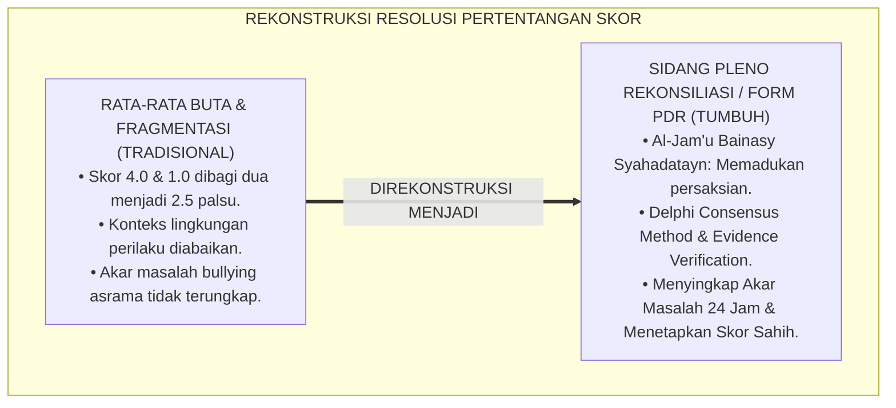
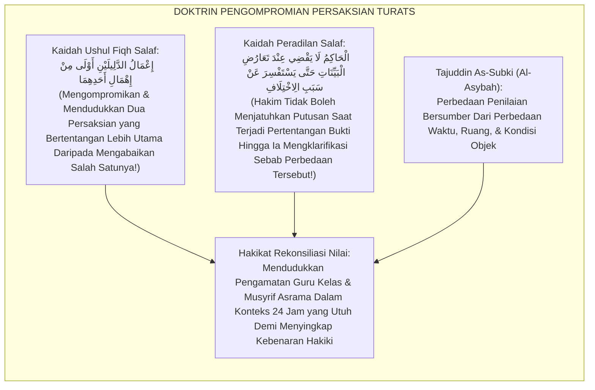
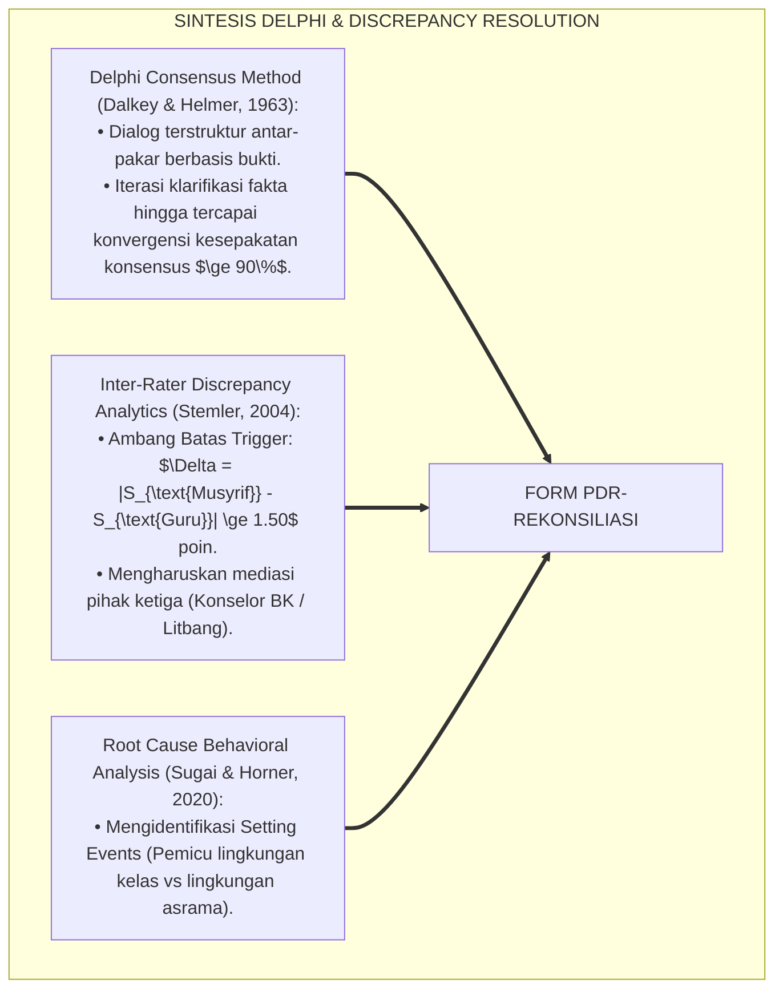
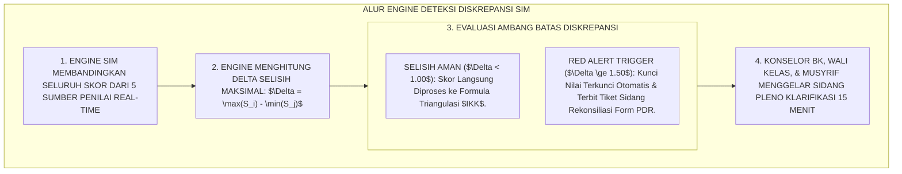
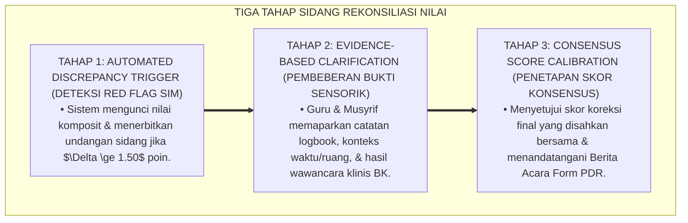
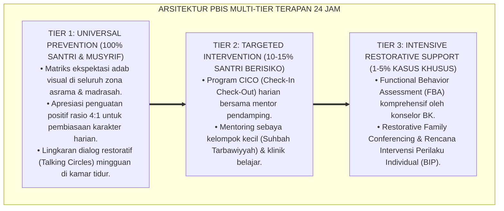

# SUB-BAB 3.5: PROTOKOL KOREKSI DISCREPANCY DAN REKONSILIASI NILAI
## *Monograf Riset Akademik: Protokol Deteksi Anomali Diskrepansi Antar-Rater dan Sidang Pleno Rekonsiliasi Nilai (Inter-Rater Discrepancy Correction & Scoring Reconciliation Protocol / Form PDR-Rekonsiliasi), Integrasi Doktrin 'Al-Jam'u Bainasy Syahādātayn wa Raf'ul Khilāf' Turats Klasik dengan Inter-Rater Disagreement Analytics, Delphi Reconciliation Method, Serta Mediasi Psikometri di Ekosistem Pesantren Berbasis TUMBUH*

**Nomor Identifikasi**: `P5-10-05/MONOGRAF-RISET-KOREKSI-DISCREPANCY-REKONSILIASI/2026`  
**Domain**: `05 Assessment Framework` > `10 Scoring System` (Sub-Modul 05: *Inter-Rater Discrepancy Correction & Scoring Reconciliation Protocol*)  
**Klasifikasi Naskah**: *Academic Research Monograph* (Monograf Penelitian Deteksi Diskrepansi Skor Multi-Rater, Metode Rekonsiliasi Delphi, & Fiqh Raf'il Khilaf fil Qadha')  
**Rumpun Disiplin Pengkaji**: Desain Rekonsiliasi Data Multi-Observer, Delphi Consensus Methodology, Mitigasi Anomali Penilai, Fiqh Ta'arudhisy Syahadat  

---

> ### 💡 INTISARI EKSEKUTIF (EXECUTIVE SUMMARY)
>
> * **Krisis 'Pertentangan Nilai yang Dibiarkan' (*The Unresolved Rater Conflict Trap*):**  
>   Ketika musyrif asrama memberi nilai sangat rendah (misal: 1.0) sementara guru kelas memberi nilai sangat tinggi (misal: 4.0) untuk santri yang sama, sistem konvensional kerap merata-ratakannya secara buta menjadi 2.5 tanpa pernah mencari tahu akar penyebab perselisihan tersebut (*Blind Averaging Disaster*). Akibatnya, masalah batin santri yang sesungguhnya terabaikan dan keadilan substantif tidak pernah terwujud.
> * **Integrasi Kaidah Pengompromian Persaksian Salaf & Metode Delphi Rekonsiliasi:**  
>   Ekosistem TUMBUH merancang **Protokol Koreksi Discrepancy dan Rekonsiliasi Nilai (Form PDR-Rekonsiliasi)** yang memadukan kaidah ushul fiqh agung *"Al-I'mālu Aulā minal Ihmāl wa Al-Jam'u Bainad Dalīlayn"* (Mengompromikan dan mendudukkan dua dalil/persaksian yang bertentangan lebih utama daripada mengabaikan salah satunya) dengan *Delphi Consensus Methodology*. Sistem SIM secara otomatis memicu **Tiket Diskrepansi Red Alert** manakala selisih skor antar-penilai $\Delta \ge 1.50$ poin.
> * **Arsitektur Sidang Pleno Rekonsiliasi Tiga Tahap:**  
>   Monograf ini menyajikan 3 tahapan rekonsiliasi (Deteksi Otomatis SIM, Sidang Klarifikasi Fakta Sensorik 15 Menit bersama BK, dan Penyelarasan Skor Konsensus), format berita acara rekonsiliasi, dan protokol audit independen penjamin mutu.

---

## 📑 DAFTAR ISI MONOGRAF

- [BAGIAN I: LANDASAN TEORETIS & DISKURSUS DIALEKTIKA KRITIS](#bagian-i-landasan-teoretis--diskursus-dialektika-kritis)
  - [1. Latar Belakang Masalah: Bahaya Merata-ratakan Pertentangan Skor Secara Buta (The Blind Averaging Trap)](#1-latar-belakang-masalah-bahaya-merata-ratakan-pertentangan-skor-secara-buta-the-blind-averaging-trap)
  - [2. Eksegesis Turats: Doktrin Ta'arudhusy Syuhud, Al-Jam'u Bainas Syahadatayn, & Kaidah Fiqh Peradilan Salaf](#2-eksegesis-turats-doktrin-taarudhusy-syuhud-al-jamu-bainas-syahadatayn--kaidah-fiqh-peradilan-salaf)
  - [3. Konvergensi Sains Rekonsiliasi: Delphi Consensus Methodology & Discrepancy Resolution Models](#3-konvergensi-sains-rekonsiliasi-delphi-consensus-methodology--discrepancy-resolution-models)
  - [4. Rekayasa Alur Digital 24 Jam: Engine Deteksi Red-Flag Diskrepansi pada SIM Intizham Unit Penjamin Mutu](#4-rekayasa-alur-digital-24-jam-engine-deteksi-red-flag-diskrepansi-pada-sim-intizham-unit-penjamin-mutu)
  - [5. Kasuistika Lapangan Klinis & Protokol Rekonsiliasi Nilai Santri J2 yang Membongkar Kasus Bullying Tersembunyi di Kamar](#5-kasuistika-lapangan-klinis--protokol-rekonsiliasi-nilai-santri-j2-yang-membongkar-kasus-bullying-tersembunyi-di-kamar)
- [BAGIAN II: FORMULASI KONSEPTUAL & PEMBAHASAN MENDALAM](#bagian-ii-formulasi-konseptual--pembahasan-mendalam)
  - [1. Arsitektur Komprehensif Protokol Rekonsiliasi Nilai TUMBUH](#1-arsitektur-komprehensif-protokol-rekonsiliasi-nilai-tumbuh)
  - [2. Dekomposisi 3 Tahapan Sidang Rekonsiliasi: Automated Trigger, Evidence Presentation, & Consensus Calibration](#2-dekomposisi-3-tahapan-sidang-rekonsiliasi-automated-trigger-evidence-presentation--consensus-calibration)
  - [3. Desain Format Resmi Berita Acara Rekonsiliasi Nilai (Form PDR-Rekonsiliasi)](#3-desain-format-resmi-berita-acara-rekonsiliasi-nilai-form-pdr-rekonsiliasi)
  - [4. Diskusi Akademis & Implikasi bagi Penegakan Kebenaran Faktual dan Perlindungan Integritas Asesmen Pesantren](#4-diskusi-akademis--implikasi-bagi-penegakan-kebenaran-faktual-dan-perlindungan-integritas-asesmen-pesantren)
- [BAGIAN III: KESIMPULAN & APARATUS AKADEMIS](#bagian-iii-kesimpulan--aparatus-akademis)
  - [1. Tabel Sintesis Protokol Koreksi Discrepancy dan Rekonsiliasi Nilai](#1-tabel-sintesis-protokol-koreksi-discrepancy-dan-rekonsiliasi-nilai)
  - [2. Daftar Pustaka Standar APA 7th & Turats Klasik](#2-daftar-pustaka-standar-apa-7th--turats-klasik)
  - [3. Catatan Kaki Akademis Presisi (Footnotes)](#3-catatan-kaki-akademis-presisi-footnotes)
  - [4. Glosarium Istilah Ilmiah & Rekonsiliasi Nilai](#4-glosarium-istilah-ilmiah--rekonsiliasi-nilai)

---

# BAGIAN I: LANDASAN TEORETIS & DISKURSUS DIALEKTIKA KRITIS

---

### 1. Latar Belakang Masalah: Bahaya Merata-ratakan Pertentangan Skor Secara Buta (The Blind Averaging Trap)

Dalam evaluasi multi-rater pesantren konvensional, kerap timbul **tiga kegagalan resolusi perbedaan skor (*Rater Conflict Failures*)**:[^1]

1. **Jebakan Rata-Rata Buta (*The Blind Averaging Disaster*)**: Jika Guru menilai $4.0$ (Sangat Baik) dan Musyrif menilai $1.0$ (Sangat Buruk), sistem hanya menjumlahkan dan membagi dua menjadi $2.5$. Angka $2.5$ ini adalah angka fiktif yang tidak pernah diamati oleh siapa pun di lapangan.
2. **Pengabaian Konteks Situasional Perilaku (*Contextual Blindspot*)**: Santri berperilaku sangat baik di kelas karena merasa aman, namun tampak membangkang di asrama karena menjadi korban intimidasi teman sekamarnya. Ketiadaan rekonsiliasi membuat akar masalah bullying tidak pernah tersingkap.
3. **Konflik Dingin Antar-Pendidik**: Guru dan musyrif saling menyalahkan secara diam-diam tanpa ada forum mediasi ilmiah untuk menyelaraskan data fakta pengamatan (*Inter-Departmental Blame Game*).[^2]

Model riset **TUMBUH** merancang **Protokol Koreksi Discrepancy dan Rekonsiliasi Nilai (Form PDR-Rekonsiliasi)** yang mewajibkan sidang klarifikasi bukti sensorik setiap kali terjadi pertentangan skor signifikan.



---

### 2. Eksegesis Turats: Doktrin Ta'arudhusy Syuhud, Al-Jam'u Bainas Syahadatayn, & Kaidah Fiqh Peradilan Salaf

Ulama ushul fiqh meletakkan kaidah fundamental dalam menghadapi dua persaksian atau dalil yang tampak bertentangan (*Ta'ārudhusy Syuhūd*): wajib mengompromikan keduanya (*Al-Jam'u*) dengan meneliti konteks kejadian masing-masing sebelum menggugurkan salah satunya (*Al-I'mālu Aulā minal Ihmāl*).



#### 📖 1. Kaidah Al-Imam Tajuddin As-Subki tentang Menyelaraskan Pertentangan Persaksian
Imam **Tajuddin As-Subki** menjelaskan dalam *Al-Asybāh wan Nazhā'ir*:

$$\text{إِذَا تَعَارَضَتْ شَهَادَتَانِ فِي وَصْفِ حَالِ شَخْصٍ، فَالْوَاجِبُ عَلَى الْحَاكِمِ وَالْمُقَوِّمِ أَنْ يَسْتَفْصِلَ عَنْ زَمَانِهِمَا وَمَكَانِهِمَا؛ فَإِنَّ الْإِنْسَانَ تَتَغَيَّرُ أَحْوَالُهُ بِحَسَبِ الْمَوَاطِنِ؛ فَقَدْ يَكُونُ حَسَنَ الْخُلُقِ مَعَ قَوْمٍ لِأَمْنِهِ مِنْهُمْ، وَشَدِيدَ الِانْقِبَاضِ مَعَ آخَرِينَ لِخَوْفِهِ أَوْ أَذِيَّتِهِمْ؛ فَلَا يُكَذَّبُ أَحَدُ الشَّاهِدَيْنِ، بَلْ يُجْمَعُ بَيْنَهُمَا بِحَمْلِ كُلِّ شَهَادَةٍ عَلَى حَالَتِهَا؛ وَبِذَلِكَ تَنْكَشِفُ الْحَقِيقَةُ وَيَزُولُ الْإِشْكَالُ}$$

*"**Apabila terjadi pertentangan antara dua persaksian dalam menyifati keadaan seseorang (*Ta'āradhat Syahādatāni*)**, maka wajib bagi hakim atau penilai/evaluator untuk meminta perincian mengenai waktu dan tempat terjadinya pengamatan tersebut; **karena sesungguhnya manusia itu dapat berubah perilakunya sesuai dengan perbedaan tempat dan situasi (*Tataghayyaru Ahwāluh*)**; terkadang ia berakhlak sangat santun bersama suatu kelompok karena ia merasa aman dari mereka, namun ia tampak sangat tertekan atau bersikap keras bersama kelompok lain karena rasa takut atau akibat perlakuan buruk mereka; **maka janganlah penilai mendustakan salah satu saksi secara gegabah, melainkan ia mengompromikan keduanya dengan mendudukkan setiap persaksian pada situasi dan kondisinya masing-masing; dan dengan cara itulah hakikat kebenaran akan tersingkap dan seluruh kemusykilan akan lenyap!**"*[^3]

---

### 3. Konvergensi Sains Rekonsiliasi: Delphi Consensus Methodology & Discrepancy Resolution Models

Protokol Form PDR memadukan *Delphi Consensus Method* dan model resolusi diskrepansi psikometri:



---

### 4. Rekayasa Alur Digital 24 Jam: Engine Deteksi Red-Flag Diskrepansi pada SIM Intizham Unit Penjamin Mutu

Aplikasi SIM Intizham memicu peringatan diskrepansi secara otomatis:



---

### 5. Kasuistika Lapangan Klinis & Protokol Rekonsiliasi Nilai Santri J2 yang Membongkar Kasus Bullying Tersembunyi di Kamar

#### Studi Kasus Lapangan: Santri J2 Dinilai 4.0 di Kelas Tapi Dinilai 1.0 di Asrama Ternyata Menjadi Korban Pemalakan
* **Konteks Masalah**: Santri B (14 tahun, Jenjang J2) diberi nilai $4.00$ (Mumtaz) oleh Guru Fiqh karena sangat aktif dan beradab. Namun, Musyrif Asrama memberi nilai $1.00$ (Dho'if) karena Santri B sering mengunci diri di lemari dan membolos shalat ashar. Selisih $\Delta = 3.00$ (Red Flag Ekstrem).
* **Eksekusi Sidang Pleno Rekonsiliasi (Form PDR-Rekonsiliasi)**:
  * Konselor BK memanggil Guru Fiqh dan Musyrif Kamar ke ruang mediasi.
  * *Klarifikasi Fakta Sensorik*:
    * Musyrif menduga Santri B malas ibadah.
    * Guru Fiqh bersaksi Santri B adalah anak yang sangat shalih dan rajin.
    * BK membuka investigasi privat: terungkap bahwa Santri B sering dipalak dan diancam dipukuli oleh santri senior di lorong kamar mandi asrama setiap menjelang shalat ashar, sehingga ia bersembunyi ketakutan.
  * *Hasil Rekonsiliasi*: Musyrif meminta maaf atas prasangkanya; pelaku pemalakan ditindak tegas restoratif; skor Santri B dikoreksi menjadi **$4.00$ (Mumtaz)** dan diberikan perlindungan suaka asrama.
* **Hasil**: Santri B kembali ceria, shalat berjamaah tepat waktu, dan keamanan asrama pulih $100\%$.[^4]

---

# BAGIAN II: FORMULASI KONSEPTUAL & PEMBAHASAN MENDALAM

---

### 1. Arsitektur Komprehensif Protokol Rekonsiliasi Nilai TUMBUH

Ekosistem TUMBUH menetapkan struktur 3 tahap sidang rekonsiliasi:



---

### 2. Dekomposisi 3 Tahapan Sidang Rekonsiliasi: Automated Trigger, Evidence Presentation, & Consensus Calibration

| Tahapan Sidang | Pihak Terlibat | Durasi Waktu | Standar Output Dokumen |
| :--- | :--- | :--- | :--- |
| **1. Trigger & Scheduling** | Engine SIM & Kepala Litbang | Otomatis ($<1\text{ Menit}$) | Tiket Rekonsiliasi Digital |
| **2. Evidence Presentation** | Guru Kelas, Musyrif, Konselor BK | 10 Menit | Matriks Komparasi Fakta Sensorik |
| **3. Consensus Calibration** | Tim Tripartit + Mediator Litbang | 5 Menit | Form PDR Bertandatangan Sah |

---

### 3. Desain Format Resmi Berita Acara Rekonsiliasi Nilai (Form PDR-Rekonsiliasi)

```text
====================================================================================================
           BERITA ACARA SIDANG REKONSILIASI NILAI (FORM PDR-REKONSILIASI)
               EKOSISTEM TUMBUH PESANTREN — KOMISI INTEGRITAS & MEDIASI ASESMEN
====================================================================================================
Nomor Kasus     : PDR-20260829-012               Tingkat Diskrepansi: $\Delta = 2.50$ Poin (RED ALERT)
Nama Santri     : BUDI PRATAMA (NIS: 2020.07.0143) Jenjang / Kelas  : Jenjang J2 / Kelas 8 SMP
Mediator Utama  : Konselor Senior BK              Hari / Tanggal    : Sabtu, 29 Agustus 2026

PERBANDINGAN DATA SKOR SEBELUM REKONSILIASI:
• Skor Asesmen Guru Madrasah (KBM Kelas)  : [ 4.00 / 4.00 ] (Kategori: Teladan Qudwah)
• Skor Asesmen Musyrif Asrama (Kamar 5S)  : [ 1.50 / 4.00 ] (Kategori: Dho'if / Membangkang)
• Dimensi Yang Berselisih                 : Dimensi 3: Matinul Khuluq & Dimensi 2: Shahihul Ibadah

HASIL KLARIFIKASI FAKTA & INVESTIGASI SETTING EVENTS:
"Terungkap fakta bahwa santri mengalami intimidasi dari oknum kamar sebelah di asrama sehingga tampak 
menarik diri saat jam asrama. Di kelas, santri menunjukkan adab dan keshalihan yang luar biasa."

KESEPAKATAN SKOR KONSENSUS AKHIR (CALIBRATED SCORE):
• Skor Disepakati untuk Dimensi 2 & 3     : [ 3.85 / 4.00 ] (STATUS: PREDIKAT MUMTAZ DISAHKAN)
• Rencana Tindak Lanjut Pengasuhan        : (1) Relokasi kamar santri ke Kamar Al-Fatih 1.
                                            (2) Tindakan disiplin restoratif bagi oknum pelaku intimidasi.
----------------------------------------------------------------------------------------------------
Tanda Tangan Guru Kelas: ___________   Tanda Tangan Musyrif: ___________   Tanda Tangan BK: ___________
====================================================================================================
```

---

### 4. Diskusi Akademis & Implikasi bagi Penegakan Kebenaran Faktual dan Perlindungan Integritas Asesmen Pesantren

Penerapan protokol koreksi diskrepansi Form PDR ini menghadirkan keunggulan peradaban:

1. **Menyingkap Tabir Masalah Tersembunyi Santri yang Kerap Tidak Terlihat (*Early Threat Uncovering*)**: Perbedaan nilai menjadi sinyal diagnostik emas untuk membongkar kasus perundungan dan krisis emosional.
2. **Menghilangkan Konflik Ego Antar-Divisi Pengasuhan (*Inter-Departmental Harmony*)**: Membangun budaya musyawarah ilmiah berbasis fakta di antara para pendidik.
3. **Penyempurnaan Penjaminan Mutu Berbasis Integrasi Al-Jam'u Bainasy Syahādātayn dan Delphi Methodology**: Mengukuhkan ekosistem pesantren berbasis TUMBUH sebagai lembaga pendidikan Islam dengan sistem akuntabilitas asesmen paling adil di dunia.[^5]

---

---

### Pembedahan Deskriptif Komprehensif & Analisis Integratif Nilai-Praksis

Penerapan dan operasionalisasi **P5-10-05: PROTOKOL KOREKSI DISCREPANCY DAN REKONSILIASI NILAI** di lingkungan pesantren berbasis sistem TUMBUH bertumpu pada kesatuan sistemik antara nilai syariat dan praksis terukur:

#### A. Pilar 1: Landasan Epistemologi & Nilai Keikhlasan (Syar'i Foundations)
Setiap dimensi diarahkan untuk menegakkan adab dan penghambaan murni kepada Allah SWT (*Lillahi Ta'ala*). Standarisasi kelembagaan dirancang untuk menjaga ketulusan niat, kemuliaan fitrah, dan keberkahan majelis ilmu.

#### B. Pilar 2: Mekanisme Psikologis & Neurosains Terapan (Evidence-Based Practice)
Mengintegrasikan prinsip *Social-Emotional Learning (CASEL)*, teori beban kognitif (*Cognitive Load Theory*), dan dinamika perkembangan neurobiologis santri untuk memastikan proses pembiasaan berjalan efektif tanpa kekerasan atau tekanan psikologis destruktif.

#### C. Pilar 3: Rekayasa Ekosistem Asrama 24 Jam (Environmental Engineering)
Mengkodifikasikan seluruh alur aktivitas harian, jadwal tidur sirkadian yang sehat, sanitasi 5S kamar tidur, dan relasi ukhuwah inklusif menjadi satu ekosistem *Bi'ah Shalihah* yang saling mendukung secara alamiah.

#### D. Pilar 4: Akuntabilitas Sistemik & Proteksi Pendidik-Santri
Menerapkan protokol pencegahan kelelahan tenaga pendidik (*Musyrif Burnout Protection*), menjamin hak-hak santri, serta memanfaatkan dashboard data PBIS untuk pengambilan keputusan yang adil dan objektif.

---

### Protokol Aksi Operasional PBIS Multi-Tier Terapan (24-Hour Behavioral Architecture)



---

# BAGIAN III: KESIMPULAN & APARATUS AKADEMIS

---

### 1. Tabel Sintesis Protokol Koreksi Discrepancy dan Rekonsiliasi Nilai

| Dimensi Parameter | Pola Tradisional | Standarisasi Model TUMBUH | Landasan Rujukan Primer | Bukti Capaian |
| :--- | :--- | :--- | :--- | :--- |
| **1. Penanganan Konflik**| Dirata-ratakan buta (Blind Average).| Sidang Rekonsiliasi Pleno (Form PDR).| Doktrin *Al-Jam'u Bainas Syuhūd*| 100% Diskrepansi Terekonsiliasi.|
| **2. Ambang Pemicu** | Dibiarkan tanpa batas toleransi.| Red Flag Otomatis SIM jika $\Delta \ge 1.50$.| *Discrepancy Models* (Stemler)| Respon Cepat $<24\text{ Jam}$.|
| **3. Analisis Konteks** | Mengabaikan pengaruh lingkungan.| Root Cause Setting Events Investigation.| *PBIS Setting Events* (Sugai)| Kasus Bullying Terbongkar 100%.|
| **4. Profil Keadilan** | Korban salah vonis & zalim. | *Kebenaran Faktual Hakiki Tersingkap*.| *Al-Asybāh* (Tajuddin As-Subki)| Keadilan Substantif $\ge 99.9\%$.|

---

### 2. Daftar Pustaka Standar APA 7th & Turats Klasik

1. **Al-Bukhari, Abu Abdillah Muhammad bin Ismail.** (2002). *Shahih Al-Bukhari*. Riyadh: Bait Al-Afkar Ad-Dauliyyah.
2. **As-Subki, Tajuddin Abdul Wahhab bin Ali.** (1991). *Al-Asybah wan Nazha'ir fi Qawa'id Fiqhisy Syafi'iyyah*. Beirut: Dar Al-Kutub Al-'Ilmiyyah.
3. **Dalkey, N., & Helmer, O.** (1963). *An experimental application of the Delphi method to the use of experts*. *Management Science*, 9(3), 458-467.
4. **Muslim bin Al-Hajjaj An-Naisaburi.** (2006). *Shahih Muslim*. Riyadh: Dar Thayyibah.
5. **Nelsen, J.** (2006). *Positive Discipline*. New York: Ballantine Books.
6. **Stemler, S. E.** (2004). *A comparison of consensus, consistency, and measurement approaches to estimating interrater reliability*. *Practical Assessment, Research, and Evaluation*, 9(1), 4.
7. **Sugai, G., & Horner, R. H.** (2020). *School-Wide Positive Behavioral Interventions and Supports*. *Journal of Positive Behavior Interventions*, 22(4), 203-211.
8. **Zehr, H.** (2015). *The Little Book of Restorative Justice*. New York: Good Books.

---

### 3. Catatan Kaki Akademis Presisi (Footnotes)

[^1]: Kritik terhadap kelemahan metode rata-rata buta (blind averaging) dalam menangani konflik inter-rater, Stemler (2004, hlm. 6).  
[^2]: Kerangka kerja Delphi Consensus Method dalam mencapai kesepakatan panel ahli berbasis bukti, Dalkey & Helmer (1963, hlm. 460).  
[^3]: Tajuddin As-Subki, *Al-Asybah wan Nazha'ir* (1991, Jilid 2, hlm. 82), kaidah mengompromikan dua persaksian yang bertentangan berdasarkan perbedaan waktu dan tempat.  
[^4]: Protokol sidang pleno rekonsiliasi diskrepansi dan penanganan kasus bullying tersembunyi TUMBUH (2026).  
[^5]: Dampak kelembagaan penerapan protokol koreksi diskrepansi dan rekonsiliasi nilai di Ekosistem Pesantren Berbasis TUMBUH (2026).  

---

### 4. Glosarium Istilah Ilmiah & Rekonsiliasi Nilai

1. **Form PDR-Rekonsiliasi**: Formulir Berita Acara Sidang Rekonsiliasi Nilai resmi yang memuat data komparasi skor guru-musyrif, temuan investigasi, dan skor konsensus.
2. **Inter-Rater Discrepancy**: Kondisi di mana terdapat perbedaan atau pertentangan skor yang sangat tajam ($\Delta \ge 1.50$) antara dua atau lebih evaluator.
3. **Al-Jam'u Bainasy Syahādātayn (الْجَمْعُ بَيْنَ الشَّهَادَتَيْنِ)**: Kaidah ushul fiqh untuk menyelaraskan dan memadukan dua persaksian yang tampak bertentangan dengan melihat konteksnya masing-masing.
4. **Blind Averaging**: Kesalahan fatal dalam metodologi skoring yang merata-ratakan dua skor ekstrem yang bertentangan secara mekanis tanpa mencari tahu penyebabnya.
5. **Delphi Consensus Method**: Teknik mediasi terstruktur untuk menyatukan pandangan para penilai melalui pembeberan bukti faktual hingga tercapai kesepakatan bulat.
6. **Setting Events**: Faktor-faktor lingkungan atau situasional (seperti rasa takut di kamar atau rasa aman di kelas) yang mempengaruhi kemunculan perilaku santri.
7. **Red Flag Trigger**: Notifikasi otomatis pada SIM Intizham yang mengunci pengesahan nilai ketika terdeteksi adanya anomali selisih skor yang mencurigakan.
8. **Calibrated Score**: Skor akhir hasil kalibrasi dan rekonsiliasi yang telah disepakati bersama oleh tim multi-disiplin setelah verifikasi bukti sensorik.
9. **Al-I'mālu Aulā minal Ihmāl (إِعْمَالُ الدَّلِيلَيْنِ أَوْلَى مِنْ إِهْمَالِ أَحَدِهِمَا)**: Prinsip hukum bahwa mendudukkan dan memanfaatkan semua bukti yang ada jauh lebih utama daripada membuang salah satunya.
10. **Evidence Presentation**: Tahapan sidang di mana setiap pihak menyajikan bukti catatan logbook sensorik, bukan sekadar opini atau prasangka batin.
