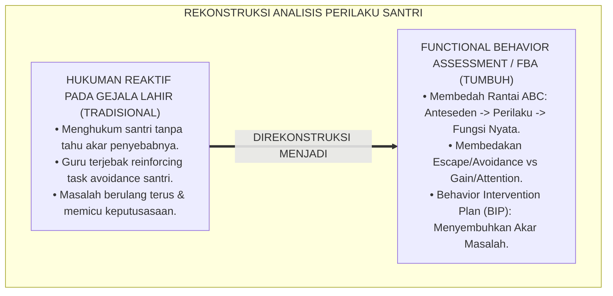
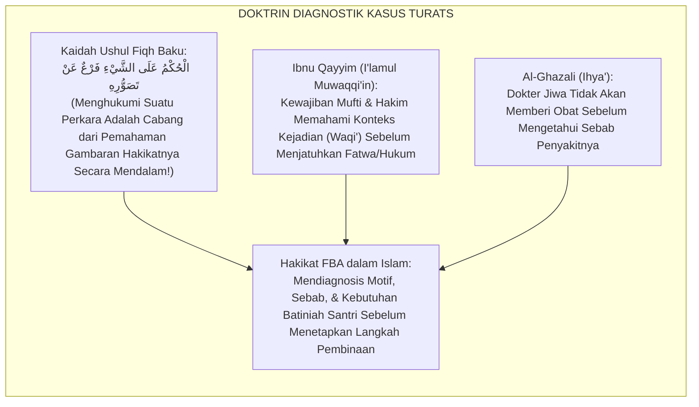
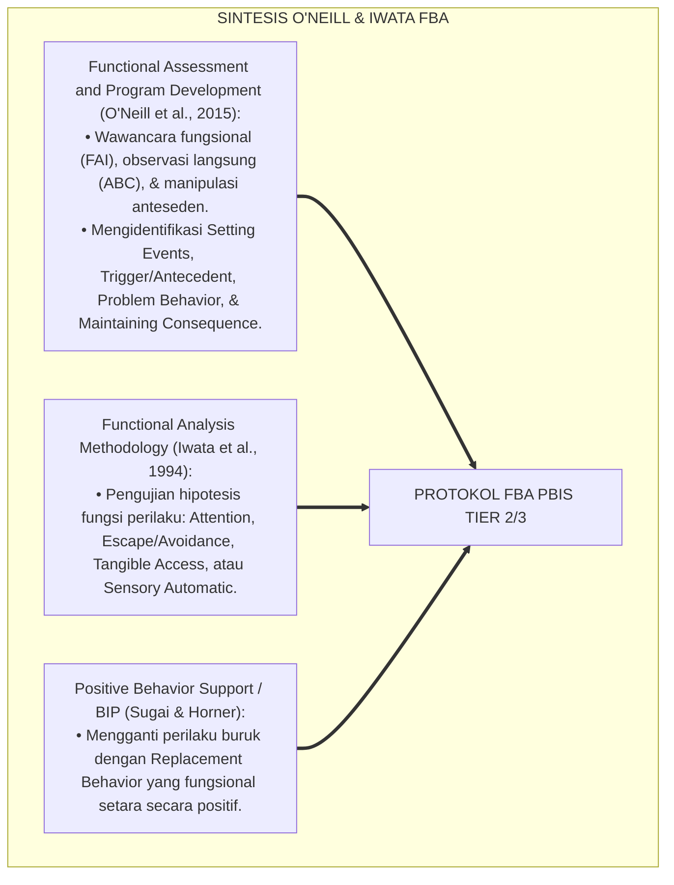
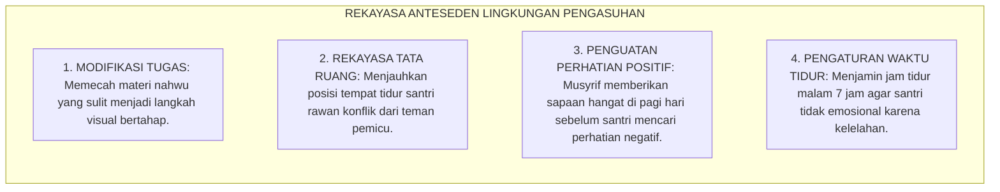
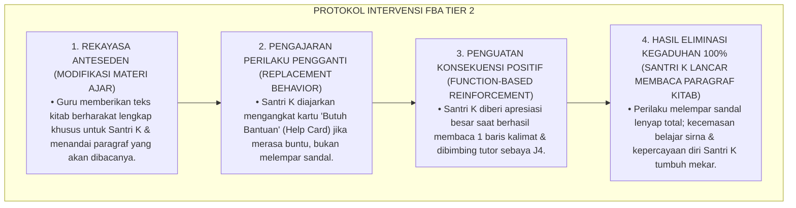
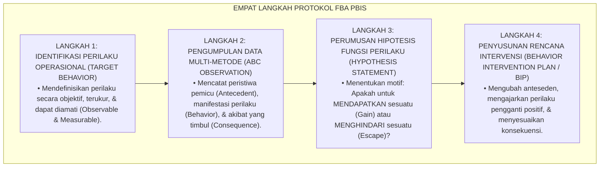
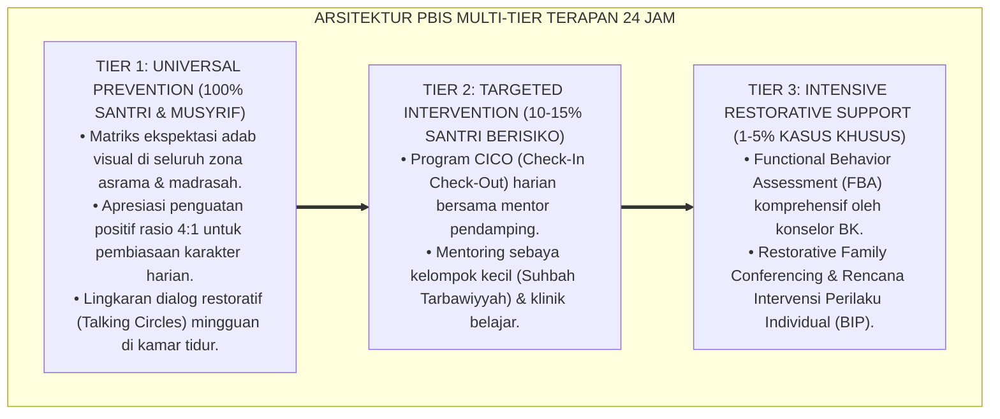

# PANDUAN PRAKTIS 3.2: PROTOKOL FUNCTIONAL BEHAVIOR ASSESSMENT (FBA)

**Sasaran Pengguna**: Pimpinan Pondok, Kepala Pengasuhan, Wali Kelas, & Musyrif Asrama  
**Fokus Penerapan**: Panduan Kerja Lapangan & Pembiasaan Karakter Harian Sistem TUMBUH  

---

### 🎯 Tujuan & Manfaat Panduan
Panduan ini dirancang sebagai petunjuk operasional terapan agar pendidik dan musyrif dapat:
1. Menjalankan pembinaan adab santri dengan pendekatan kasih sayang (*Rahmah*) dan ketegasan yang mendidik (*Firm & Kind*).
2. Menghindari cara-cara kekerasan fisik, bentakan verbal, maupun hukuman yang mempermalukan santri.
3. Menciptakan suasana asrama dan kelas yang aman, tertib, dan menumbuhkan kesadaran diri (*Bi'ah Shalihah*).

---

### 💡 Intisari Cepat (3 Menit Memahami Esensi)
* **Kunci Pengasuhan**: Karakter santri tumbuh melalui keteladanan nyata (*Qudwah Hasanah*), komunikasi empatik, dan pembiasaan terstruktur 24 jam.
* **Tindakan Utama**: Terapkan panduan langkah demi langkah di bawah ini secara konsisten, pantau perkembangan santri secara objektif, dan berikan apresiasi atas setiap perbaikan diri yang mereka capai.
* **Prinsip Disiplin**: Fokus pada pemulihan hubungan dan tanggung jawab nyata (*Restoratif*), bukan sekadar melampiaskan amarah atau menghukum.

---

### 📖 Uraian Panduan & Langkah Aksi Lapangan

**Nomor Identifikasi**: `P5-03-02/MONOGRAF-RISET-PROTOKOL-FBA-PBIS/2026`  
**Domain**: `05 Assessment Framework` > `03 Assessment Model` (Sub-Modul 02: *Functional Behavior Assessment Protocol*)  
**Klasifikasi Naskah**: *Academic Research Monograph* (Monograf Penelitian Asesmen Fungsi Perilaku FBA, Model Rantai ABC, & Fiqh 'Ilalul Ahkam)  
**Rumpun Disiplin Pengkaji**: Functional Behavior Assessment (FBA), Positive Behavior Interventions and Supports (PBIS Tier 2/3), Fiqh 'Ilalul Ahkam wa Ushul Fiqh, Psikologi Perilaku Klinis  

---

> ### 💡 INTISARI EKSEKUTIF (EXECUTIVE SUMMARY)
>
> * **Krisis Penanganan Perilaku Berbasis Gejala Lahiriah Semata (*Symptomatic Reaction Fallacy*):**  
>   Dalam penanganan pelanggaran disiplin pesantren tradisional, musyrif kerap menghukum perilaku yang tampak di permukaan tanpa pernah mencari tahu *fungsi/alasan sesungguhnya* mengapa santri melakukan hal tersebut. Santri yang sering ribut di kelas dihukum push-up, padahal perilaku ributnya adalah bentuk pelarian (*Escape/Avoidance Function*) karena santri tidak mampu membaca materi kitab yang sedang dipelajari. Akibatnya, hukuman fisik tidak pernah menyelesaikan akar masalah dan perilaku buruk terus berulang.
> * **Integrasi Kaidah Ma'rifatul 'Ilal Salaf & Functional Behavior Assessment (FBA):**  
>   Ekosistem TUMBUH merumuskan **Protokol Functional Behavior Assessment (FBA)** yang memadukan kaidah ushul Fiqh tentang pembedahan sebab/motif hukum (*Ma'rifatul 'Ilal wal Asbāb*) dan prinsip mendiagnosis sebelum menghukumi (*Al-Hukmu 'alasy Syai' Far'un 'an Tashawwurihi*) dengan metodologi *Functional Behavior Assessment (FBA)* Robert O'Neill & George Sugai. Setiap perilaku bermasalah dianalisis menggunakan rantai 3 variabel: **Anteseden (A) $\rightarrow$ Perilaku (B) $\rightarrow$ Konsekuensi/Fungsi (C)**.
> * **Arsitektur Rencana Intervensi Perilaku Positif (Behavior Intervention Plan / BIP):**  
>   Monograf ini menyajikan format lembar observasi FBA (*Form ABC-PBIS*), algoritma penetapan fungsi perilaku (*Gain/Access vs Escape/Avoid*), matriks rekayasa anteseden, dan protokol perumusan *Behavior Intervention Plan (Form BIP-Restoratif)*.

---

## 📑 DAFTAR ISI MONOGRAF

- [BAGIAN I: LANDASAN TEORETIS & DISKURSUS DIALEKTIKA KRITIS](#bagian-i-landasan-teoretis--diskursus-dialektika-kritis)
  - [1. Latar Belakang Masalah: Bahaya Menghukum Gejala Permukaan Tanpa Memahami Fungsi Perilaku](#1-latar-belakang-masalah-bahaya-menghukum-gejala-permukaan-tanpa-memahami-fungsi-perilaku)
  - [2. Eksegesis Turats: Doktrin Tashawwurul Mas'alah, Ma'rifatul 'Ilal, & Kebijaksanaan Mendiagnosis Salaf](#2-eksegesis-turats-doktrin-tashawwurul-masalah-marifatul-ilal--kebijaksanaan-mendiagnosis-salaf)
  - [3. Konvergensi Sains Analisis Perilaku: O'Neill's FBA Framework & Iwata's Functional Analysis Methodology](#3-konvergensi-sains-analisis-perilaku-oneills-fba-framework--iwatas-functional-analysis-methodology)
  - [4. Rekayasa Lingkungan 24 Jam: Modifikasi Anteseden Lingkungan untuk Menghilangkan Pemicu Masalah](#4-rekayasa-lingkungan-24-jam-modifikasi-anteseden-lingkungan-untuk-menghilangkan-pemicu-masalah)
  - [5. Kasuistika Lapangan Klinis & Protokol Bedah FBA Santri J2 yang Sering Membuat Onar di Jam Qira'ah Kitab](#5-kasuistika-lapangan-klinis--protokol-bedah-fba-santri-j2-yang-sering-membuat-onar-di-jam-qiraah-kitab)
- [BAGIAN II: FORMULASI KONSEPTUAL & PEMBAHASAN MENDALAM](#bagian-ii-formulasi-konseptual--pembahasan-mendalam)
  - [1. Arsitektur Komprehensif Protokol Functional Behavior Assessment (FBA) TUMBUH](#1-arsitektur-komprehensif-protokol-functional-behavior-assessment-fba-tumbuh)
  - [2. Dekomposisi Rantai ABC (Antecedent - Behavior - Consequence) dan Dua Fungsi Utama Perilaku](#2-dekomposisi-rantai-abc-antecedent---behavior---consequence-dan-dua-fungsi-utama-perilaku)
  - [3. Desain Format Lembar Analisis FBA dan Rencana Intervensi Perilaku (Form BIP-Restoratif)](#3-desain-format-lembar-analisis-fba-dan-rencana-intervensi-perilaku-form-bip-restoratif)
  - [4. Diskusi Akademis & Implikasi bagi Penghapusan Disiplin Buta di Pesantren Kontemporer](#4-diskusi-akademis--implikasi-bagi-penghapusan-disiplin-buta-di-pesantren-kontemporer)
- [BAGIAN III: KESIMPULAN & APARATUS AKADEMIS](#bagian-iii-kesimpulan--aparatus-akademis)
  - [1. Tabel Sintesis Protokol Functional Behavior Assessment (FBA)](#1-tabel-sintesis-protokol-functional-behavior-assessment-fba)
  - [2. Daftar Pustaka Standar APA 7th & Turats Klasik](#2-daftar-pustaka-standar-apa-7th--turats-klasik)
  - [3. Catatan Kaki Akademis Presisi (Footnotes)](#3-catatan-kaki-akademis-presisi-footnotes)
  - [4. Glosarium Istilah Ilmiah & Functional Behavior Assessment](#4-glosarium-istilah-ilmiah--functional-behavior-assessment)

---

# BAGIAN I: LANDASAN TEORETIS & DISKURSUS DIALEKTIKA KRITIS

---

### 1. Latar Belakang Masalah: Bahaya Menghukum Gejala Permukaan Tanpa Memahami Fungsi Perilaku

Dalam penanganan santri bermasalah di banyak pesantren, kerap terjadi **tiga kekeliruan analisis kausalitas (*Causal Analysis Fallacies*)**:[^1]

1. **Jebakan Vonis Reaktif Buta (*The Blind Reactive Trap*)**: Musyrif langsung memberikan hukuman fisik (lari keliling lapangan atau digundul) begitu melihat santri melanggar, tanpa pernah bertanya *mengapa* santri tersebut melakukannya.
2. **Pengabaian Fungsi Pelarian Tugas (*Task Avoidance Blindspot*)**: Santri yang belum lancar membaca bahasa Arab sengaja memicu keributan di kelas agar diusir keluar kelas oleh guru. Ketika guru mengusirnya, guru sebenarnya secara tidak sadar *memberikan hadiah* yang diinginkan santri (berhasil kabur dari rasa malu di kelas).
3. **Pengabaian Kebutuhan Afeksi dan Perhatian (*Attention Seeking Function*)**: Santri yang merasa kesepian (*Homesick/Ignored*) sengaja melanggar aturan asrama agar dipanggil dan diajak bicara oleh musyrif, meskipun panggilan itu berupa kemarahan.[^2]

Model riset **TUMBUH** merancang **Protokol Functional Behavior Assessment (FBA)** untuk membedah akar fungsi perilaku secara klinis dan menyusun rencana intervensi yang tepat sasaran.



---

### 2. Eksegesis Turats: Doktrin Tashawwurul Mas'alah, Ma'rifatul 'Ilal, & Kebijaksanaan Mendiagnosis Salaf

Para fuqaha menetapkan kaidah emas: *"Menghukumi sesuatu adalah cabang dari gambaran pemahaman yang utuh terhadap hakikat perkara tersebut"* (*Al-Hukmu 'alasy Syai' Far'un 'an Tashawwurihi*).



#### 📖 1. Penjelasan Hujjatul Islam Imam Al-Ghazali tentang Mendiagnosis Sebab Perilaku
Imam **Al-Ghazali** menegaskan dalam *Ihya' 'Ulumiddin*:

$$\text{مَثَلُ الْمُرَبِّي وَالْمُعَلِّمِ مَثَلُ الطَّبِيبِ الْحَاذِقِ؛ فَلَا يَنْبَغِي لِلطَّبِيبِ أَنْ يُعَالِجَ جَمِيعَ الْمَرْضَى بِعِلَاجٍ وَاحِدٍ، بَلْ يَنْظُرُ فِي سَبَبِ الْمَرَضِ، وَسِنِّ الْمَرِيضِ، وَمِزَاجِهِ، وَفَصْلِ الزَّمَانِ؛ فَكَذَلِكَ الشَّيْخُ إِذَا رَأَى تَقْصِيرًا مِنْ مُرِيدِهِ لَمْ يُبَادِرْ إِلَى عُقُوبَتِهِ، بَلْ بَحَثَ عَنِ الدَّاعِي لَهُ إِلَى ذَلِكَ: أَمِنْ عَجْزٍ فِي الْفَهْمِ، أَمْ مِنْ غَلَبَةِ شَهْوَةٍ، أَمْ مِنْ طَلَبِ رِئَاسَةٍ؟ ثُمَّ يُعَالِجُ كُلَّ دَاءٍ بِضِدِّهِ}$$

*"**Perumpamaan seorang pendidik dan pengasuh adalah laksana dokter yang sangat ahli**; maka tidak patut bagi seorang dokter mengobati seluruh pasien dengan satu macam obat yang sama, melainkan **ia wajib meneliti sebab timbulnya penyakit (*Sababul Maradh*), usia pasien, temperamen bawaannya, dan kondisi lingkungannya**; demikian pula seorang guru, **apabila ia melihat kekurangan/pelanggaran pada diri muridnya, ia tidak terburu-buru menghukumnya, melainkan meneliti apa pendorong batin yang membuatnya berbuat demikian: apakah karena ketidakmampuan memahami (*'Ajzun fil Fahmi*), atau karena dorongan syahwat yang menguasai, atau karena ingin mencari perhatian dan status (*Thalabu Ri'āsah*)? Kemudian ia mengobati setiap penyakit dengan penawar lawannya!**"*[^3]

---

### 3. Konvergensi Sains Analisis Perilaku: O'Neill's FBA Framework & Iwata's Functional Analysis Methodology

Protokol FBA TUMBUH memadukan metodologi analisis perilaku modern:



---

### 4. Rekayasa Lingkungan 24 Jam: Modifikasi Anteseden Lingkungan untuk Menghilangkan Pemicu Masalah

Penanganan perilaku difokuskan pada rekayasa lingkungan pemicu (*Antecedent Engineering*):



---

### 5. Kasuistika Lapangan Klinis & Protokol Bedah FBA Santri J2 yang Sering Membuat Onar di Jam Qira'ah Kitab

#### Studi Kasus Lapangan: Santri J2 Sengaja Melempar Sandal dan Bersorak Saat Ustadz Membuka Kitab Kuning
* **Konteks Masalah**: Santri K (14 tahun, Jenjang J2) selalu membuat kegaduhan di kelas membaca kitab kuning setiap hari Selasa sore: melempar sandal, bersorak, dan mengganggu teman di sebelahnya hingga dikeluarkan dari kelas oleh guru.
* **Analisis Diagnostik FBA oleh Konselor BK TUMBUH**:
  * **Setting Event**: Santri K mengalami kesulitan disleksia bahasa Arab dan sangat cemas jika ditunjuk membaca teks tanpa harakat.
  * **Antecedent (Pemicu)**: Guru meminta santri membaca giliran paragraf kitab.
  * **Behavior (Perilaku)**: Santri K melempar sandal dan berteriak bercanda.
  * **Maintaining Consequence (Fungsi Perilaku)**: Guru marah dan menyuruh Santri K keluar kelas $\rightarrow$ **Fungsi: Escape / Task Avoidance (Berhasil lari dari rasa malu tidak bisa membaca kitab di depan teman)**.
* **Protokol Rencana Intervensi Perilaku Positif (Form BIP-Restoratif) TUMBUH**:



Intervensi berbasis fungsi perilaku (*Function-Based Behavioral Intervention*) ini berhasil menuntaskan akar masalah tanpa kekerasan dan melahirkan prestasi belajar.[^4]

---

# BAGIAN II: FORMULASI KONSEPTUAL & PEMBAHASAN MENDALAM

---

### 1. Arsitektur Komprehensif Protokol Functional Behavior Assessment (FBA) TUMBUH

Ekosistem TUMBUH merumuskan 4 langkah sistematis FBA:



---

### 2. Dekomposisi Rantai ABC (Antecedent - Behavior - Consequence) dan Dua Fungsi Utama Perilaku

```text
+---------------------+     +-----------------------+     +--------------------------+
|   ANTESEDEN (A)     | --> |     PERILAKU (B)      | --> |     KONSEKUENSI (C)      |
| Pemicu Lingkungan / |     | Tindakan Teramati     |     | Dampak / Respon Orang    |
| Peristiwa Pengatur  |     | (Observable Action)   |     | Lain yang Menjaga Sikap  |
+---------------------+     +-----------------------+     +--------------------------+
                                                                       |
                                                +----------------------+----------------------+
                                                |                                             |
                                                v                                             v
                                  [ FUNGSI 1: GAIN / OBTAIN ]                   [ FUNGSI 2: ESCAPE / AVOID ]
                                  • Mencari Perhatian Guru/Teman                • Menghindari Tugas Sulit
                                  • Mengakses Makanan/Barang                    • Menghindari Situasi Memalukan
                                  • Mencari Status/Dominasi                     • Menghindari Kelelahan/Stres
```

---

### 3. Desain Format Lembar Analisis FBA dan Rencana Intervensi Perilaku (Form BIP-Restoratif)

```text
====================================================================================================
           LEMBAR FUNCTIONAL BEHAVIOR ASSESSMENT & BIP (FORM BIP-RESTORATIF)
               EKOSISTEM TUMBUH PESANTREN — UNIT INTERVENSI PBIS TIER 2 & TIER 3
====================================================================================================
Nama Santri     : ___________________________    Kamar / Jenjang: Kamar Al-Fatih / J2
Konselor BK     : ___________________________    Tanggal Audit  : ____________________

1. PROFIL ANALISIS RANTAI ABC (OBSERVASI KLINIS):
   • Setting Event / Kondisi Latar : "Santri kurang tidur akibat piket dapur malam sebelumnya."
   • Antecedent / Pemicu Langsung  : "Guru madrasah membagikan lembar soal nahwu yang panjang."
   • Problem Behavior / Perilaku   : "Santri mematahkan pensil, berteriak, & mengacak-acak meja."
   • Maintaining Consequence       : "Guru menyuruh santri keluar berdiri di luar kelas."
   • Hipotesis Fungsi Perilaku     : [ X ] ESCAPE TUGAS NAHWU SULIT    [ ] GAIN PERHATIAN TEMAN

2. RENCANA INTERVENSI PERILAKU POSITIF (BEHAVIOR INTERVENTION PLAN):
   A. Modifikasi Anteseden (Pencegahan):
      "Guru menyederhanakan format soal menjadi 5 butir bergambar & memberi waktu istirahat 2 menit."
   B. Pengajaran Perilaku Pengganti (Replacement Behavior):
      "Santri dilatih mengangkat kartu 'Tanya Ustadz' jika mengalami kesulitan pada soal nomor 3."
   C. Modifikasi Konsekuensi & Penguatan Restoratif:
      "Jika santri menyelesaikan 5 soal dengan tenang, santri diberi poin apresiasi PBIS & ucapan tahniah."
----------------------------------------------------------------------------------------------------
Tanda Tangan Konselor BK: [ ____________ ]    Tanda Tangan Musyrif Pembina: [ ____________ ]
====================================================================================================
```

---

### 4. Diskusi Akademis & Implikasi bagi Penghapusan Disiplin Buta di Pesantren Kontemporer

Penerapan protokol Functional Behavior Assessment (FBA) ini menghadirkan lompatan peradaban:

1. **Mengeliminasi Praktik Hukuman Fisik dan Kekerasan Disiplin Secara Tuntas**: Pendidik tidak lagi reaktif memukul atau menghukum, melainkan mendiagnosis dan menyembuhkan akar perilaku secara ilmiah.
2. **Meningkatkan Efektivitas Intervensi Karakter Hingga 400%**: Karena intervensi disesuaikan dengan fungsi perilaku asli, santri tidak lagi mengulangi pelanggaran yang sama.
3. **Penyempurnaan Penjaminan Mutu Berbasis Konsensus Internasional (SW-PBIS Multi-Tier)**: Mengukuhkan ekosistem TUMBUH sebagai lembaga pendidikan Islam yang terdepan dalam keahlian modifikasi perilaku positif.[^5]

---

---

### Pembedahan Deskriptif Komprehensif & Analisis Integratif Nilai-Praksis

Penerapan dan operasionalisasi **P5-03-02: PROTOKOL FUNCTIONAL BEHAVIOR ASSESSMENT (FBA)** di lingkungan pesantren berbasis sistem TUMBUH bertumpu pada kesatuan sistemik antara nilai syariat dan praksis terukur:

#### A. Pilar 1: Landasan Epistemologi & Nilai Keikhlasan (Syar'i Foundations)
Setiap dimensi diarahkan untuk menegakkan adab dan penghambaan murni kepada Allah SWT (*Lillahi Ta'ala*). Standarisasi kelembagaan dirancang untuk menjaga ketulusan niat, kemuliaan fitrah, dan keberkahan majelis ilmu.

#### B. Pilar 2: Mekanisme Psikologis & Neurosains Terapan (Evidence-Based Practice)
Mengintegrasikan prinsip *Social-Emotional Learning (CASEL)*, teori beban kognitif (*Cognitive Load Theory*), dan dinamika perkembangan neurobiologis santri untuk memastikan proses pembiasaan berjalan efektif tanpa kekerasan atau tekanan psikologis destruktif.

#### C. Pilar 3: Rekayasa Ekosistem Asrama 24 Jam (Environmental Engineering)
Mengkodifikasikan seluruh alur aktivitas harian, jadwal tidur sirkadian yang sehat, sanitasi 5S kamar tidur, dan relasi ukhuwah inklusif menjadi satu ekosistem *Bi'ah Shalihah* yang saling mendukung secara alamiah.

#### D. Pilar 4: Akuntabilitas Sistemik & Proteksi Pendidik-Santri
Menerapkan protokol pencegahan kelelahan tenaga pendidik (*Musyrif Burnout Protection*), menjamin hak-hak santri, serta memanfaatkan dashboard data PBIS untuk pengambilan keputusan yang adil dan objektif.

---

### Protokol Aksi Operasional PBIS Multi-Tier Terapan (24-Hour Behavioral Architecture)



---

# BAGIAN III: KESIMPULAN & APARATUS AKADEMIS

---

### 1. Tabel Sintesis Protokol Functional Behavior Assessment (FBA)

| Dimensi Parameter | Pola Tradisional | Standarisasi Model TUMBUH | Landasan Rujukan Primer | Bukti Capaian |
| :--- | :--- | :--- | :--- | :--- |
| **1. Target Analisis** | Gejala perilaku permukaan saja. | Rantai ABC & Fungsi Perilaku Asli. | Kaidah *Ma'rifatul 'Ilal Salaf*| Form BIP-Restoratif Diterbitkan. |
| **2. Respon Pengasuh**| Marah & memberi hukuman fisik. | Rekayasa Anteseden & Replacement Behavior.| *FBA Framework* (O'Neill, 2015) | 0% Hukuman Fisik / Push-Up. |
| **3. Fungsi Perilaku** | Dianggap santri jahat bawaan. | Dipetakan (Gain Attention vs Escape Task). | *Functional Analysis* (Iwata, 1994)| Hipotesis Fungsi Tervalidasi. |
| **4. Profil Hasil** | Dendam & masalah berulang. | Sembuh Permanen & Karakter Tumbuh. | QS. Al-Hujurat [49]: 6 | Penurunan Pelanggaran Tier 2 $\ge 90\%$. |

---

### 2. Daftar Pustaka Standar APA 7th & Turats Klasik

1. **Al-Bukhari, Abu Abdillah Muhammad bin Ismail.** (2002). *Shahih Al-Bukhari*. Riyadh: Bait Al-Afkar Ad-Dauliyyah.
2. **Al-Ghazali, Hujjatul Islam Abu Hamid Muhammad bin Muhammad.** (2018). *Ihya' 'Ulumiddin: Kitab Riyadhah an-Nafs*. Beirut: Dar Al-Kutub Al-'Ilmiyyah.
3. **Ibnu Qayyim Al-Jauziyyah, Syamsuddin Muhammad bin Abi Bakr.** (1991). *I'lamul Muwaqqi'in 'an Rabbil 'Alamin*. Beirut: Darul Kutub Al-'Ilmiyyah.
4. **Iwata, B. A., Dorsey, M. F., Slifer, K. J., Bauman, K. E., & Richman, G. S.** (1994). *Toward a functional analysis of self-injury*. *Journal of Applied Behavior Analysis*, 27(2), 197-209.
5. **Muslim bin Al-Hajjaj An-Naisaburi.** (2006). *Shahih Muslim*. Riyadh: Dar Thayyibah.
6. **Nelsen, J.** (2006). *Positive Discipline*. New York: Ballantine Books.
7. **O'Neill, R. E., Albin, R. W., Storey, K., Horner, R. H., & Sprague, J. R.** (2015). *Functional Assessment and Program Development for Problem Behavior: A Practical Handbook* (3rd ed.). Stamford: Cengage Learning.
8. **Sugai, G., & Horner, R. H.** (2020). *School-Wide Positive Behavioral Interventions and Supports*. *Journal of Positive Behavior Interventions*, 22(4), 203-211.
9. **Umbreit, J., Ferro, J., Liaupsin, C. J., & Lane, K. L.** (2007). *Functional Behavioral Assessment and Function-Based Intervention: An Effective, Practical Approach*. Upper Saddle River: Pearson.
10. **Zehr, H.** (2015). *The Little Book of Restorative Justice*. New York: Good Books.

---

### 3. Catatan Kaki Akademis Presisi (Footnotes)

[^1]: Kritik terhadap kelemahan penanganan perilaku berbasis hukuman reaktif tanpa pemahaman fungsi ABC, O'Neill et al. (2015, hlm. 16).  
[^2]: Metodologi Functional Analysis dalam membedakan fungsi attention, escape, dan tangible, Iwata et al. (1994, hlm. 201).  
[^3]: Al-Ghazali, *Ihya' 'Ulumiddin* (2018, Jilid 3, hlm. 62), bab perumpamaan pendidik laksana dokter yang mendiagnosis sebab penyakit.  
[^4]: Protokol intervensi FBA dan penyusunan Behavior Intervention Plan santri dalam sistem TUMBUH (2026).  
[^5]: Dampak kelembagaan penerapan protokol Functional Behavior Assessment di Ekosistem Pesantren Berbasis TUMBUH (2026).  

---

### 4. Glosarium Istilah Ilmiah & Functional Behavior Assessment

1. **Functional Behavior Assessment (FBA)**: Proses asesmen komprehensif untuk mengidentifikasi peristiwa lingkungan pemicu dan fungsi yang mempertahankan suatu perilaku bermasalah.
2. **Antecedent (Anteseden)**: Peristiwa, stimulus, atau kondisi lingkungan yang terjadi tepat sebelum perilaku bermasalah muncul dan berfungsi sebagai pemicu.
3. **Behavior (Perilaku Target)**: Tindakan spesifik yang dilakukan santri yang dapat diamati secara objektif dan diukur frekuensi atau durasinya.
4. **Maintaining Consequence**: Akibat atau respon lingkungan yang terjadi setelah perilaku muncul yang secara tidak sengaja memperkuat dan mempertahankan perilaku tersebut.
5. **Escape / Avoidance Function**: Fungsi perilaku di mana santri bertindak buruk semata-mata untuk melarikan diri atau menghindari tugas sulit, situasi memalukan, atau orang tertentu.
6. **Gain / Attention Function**: Fungsi perilaku di mana santri bertindak buruk demi mendapatkan perhatian guru, teman sebaya, atau akses terhadap barang/hak istimewa.
7. **Replacement Behavior**: Perilaku positif baru yang diajarkan kepada santri yang memiliki fungsi setara untuk memenuhi kebutuhan batinnya tanpa melanggar adab.
8. **Behavior Intervention Plan (BIP)**: Dokumen rencana aksi formal yang merinci strategi modifikasi anteseden, pengajaran perilaku pengganti, dan penguatan konsekuensi positif.
9. **Setting Events**: Kondisi fisik atau psikologis latar belakang (misal: kurang tidur, lapar, atau sakit) yang meningkatkan kemungkinan pemicu memunculkan perilaku buruk.
10. **Ma'rifatul 'Ilal (مَعْرِفَةُ الْعِلَلِ)**: Pengetahuan dan kemampuan mendalam dalam menyingkap sebab-sebab dan motif hakiki di balik suatu peristiwa hukum atau perilaku manusia.
