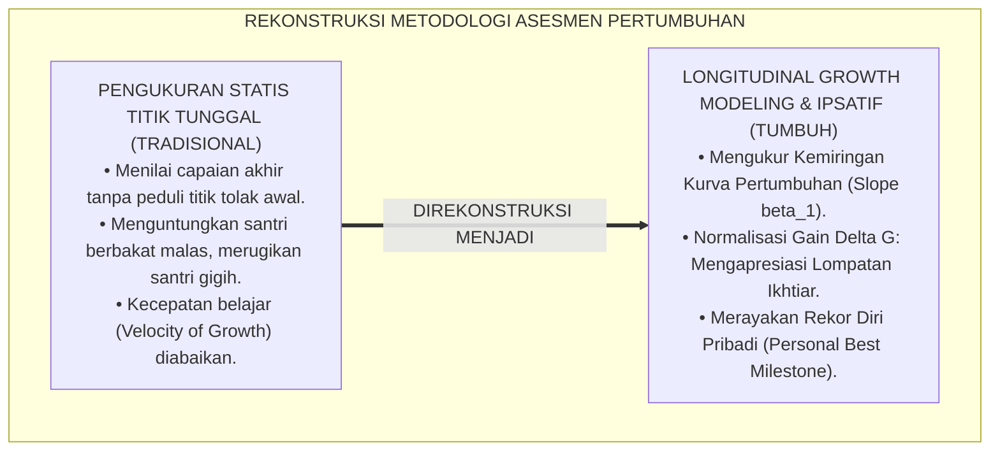
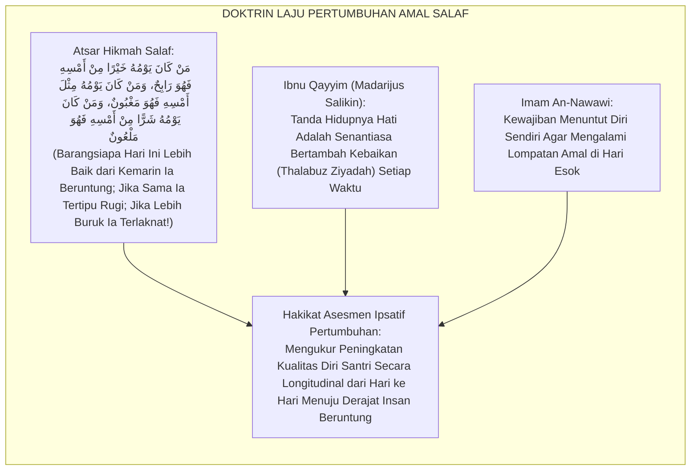
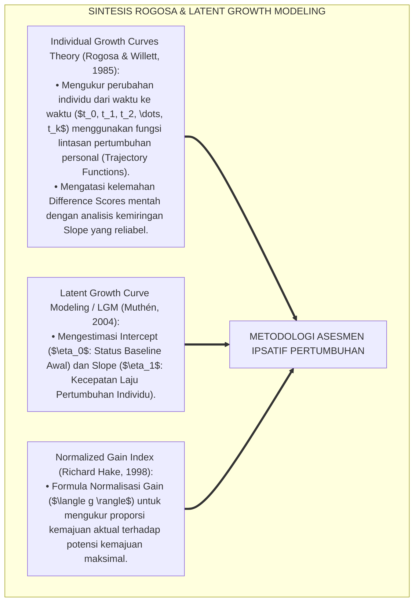
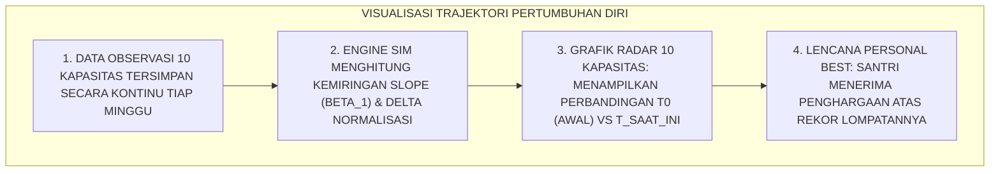
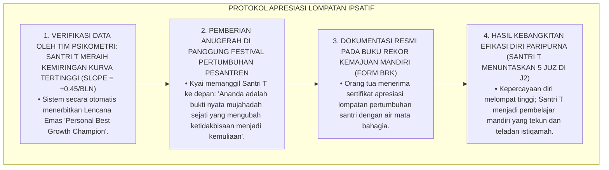
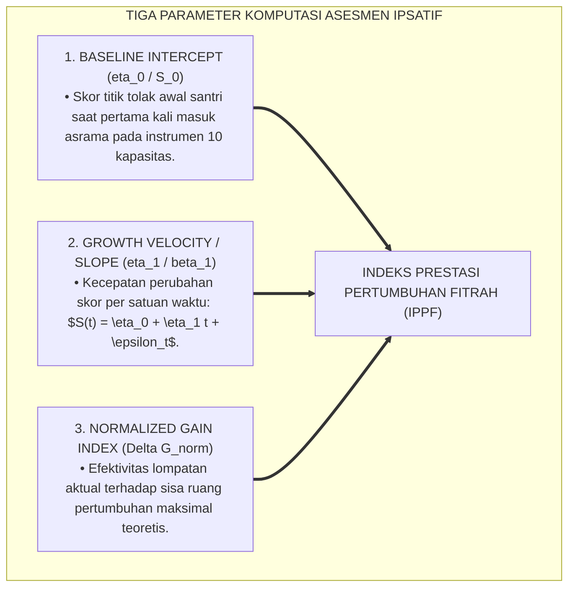
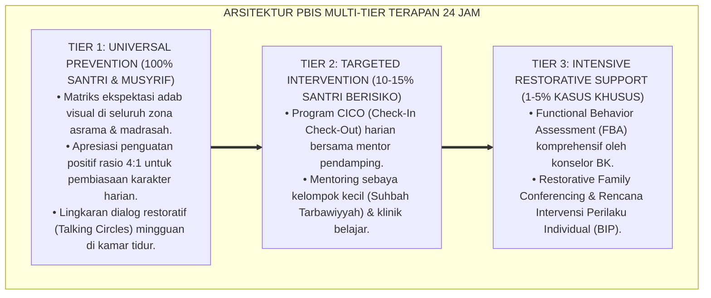

# PANDUAN OPERASIONAL 3.3: METODOLOGI ASESMEN IPSATIF LAJU PERTUMBUHAN DIRI

---

### 🧭 PETA POSISI PANDUAN DALAM SISTEM TUMBUH (DARI HULU KE HILIR)
* **Posisi Arsitektur**: `BATANG EKOSISTEM II (Asesmen Perkembangan Karakter & Evaluasi 360° Berbasis Bukti)`
* **Peruntukan Pengguna**: Tim Asesmen Karakter, Wali Kelas, Musyrif Asrama, & Konselor BK
* **Fokus Panduan**: Memantau laju kemajuan personal santri (Asesmen Ipsatif) tanpa ranking/labeling, triangulasi data 3 poros, dan penyusunan Rapor Naratif Karakter.
* **Hasil Akhir yang Dituju**: Terwujudnya santri berkarakter *Insan Adabi* yang mandiri, musyrif yang mengasuh dengan kasih sayang tanpa *burnout*, dan pesantren yang aman berbasis data (*Safe Boarding School*).

---

### 🎯 Mengapa Panduan Ini Ada & Masalah Nyata yang Dipecahkan
1. **Latar Masalah di Lapangan**: Sering kali pengasuhan di pesantren berjalan tanpa SOP yang jelas atau terjebak dalam pola reaktif—menunggu santri berbuat salah baru dihukum dengan emosional.
2. **Solusi Sistem TUMBUH**: Panduan ini memberikan langkah preventif dan terstruktur agar setiap pembiasaan adab berjalan terencana, konsisten, dan terukur.
3. **Sasaran Perubahan**: Memastikan nilai-nilai Islam menyatu dalam perilaku harian santri melalui keteladanan nyata (*Qudwah Hasanah*).

---

---

### 🎯 Tujuan & Manfaat Panduan
Panduan ini dirancang sebagai petunjuk operasional terapan agar pendidik dan musyrif dapat:
1. Menjalankan pembinaan adab santri dengan pendekatan kasih sayang (*Rahmah*) dan ketegasan yang mendidik (*Firm & Kind*).
2. Menghindari cara-cara kekerasan fisik, bentakan verbal, maupun hukuman yang mempermalukan santri.
3. Menciptakan suasana asrama dan kelas yang aman, tertib, dan menumbuhkan kesadaran diri (*Bi'ah Shalihah*).

---

### 💡 Intisari Cepat (3 Menit Memahami Esensi)
* **Kunci Pengasuhan**: Karakter santri tumbuh melalui keteladanan nyata (*Qudwah Hasanah*), komunikasi empatik, dan pembiasaan terstruktur 24 jam.
* **Tindakan Utama**: Terapkan panduan langkah demi langkah di bawah ini secara konsisten, pantau perkembangan santri secara objektif, dan berikan apresiasi atas setiap perbaikan diri yang mereka capai.
* **Prinsip Disiplin**: Fokus pada pemulihan hubungan dan tanggung jawab nyata (*Restoratif*), bukan sekadar melampiaskan amarah atau menghukum.

---

### 📖 Uraian Panduan & Langkah Aksi Lapangan

**Nomor Identifikasi**: `P5-03-03/MONOGRAF-RISET-METODOLOGI-ASESMEN-IPSATIF-PERTUMBUHAN/2026`  
**Domain**: `05 Assessment Framework` > `03 Assessment Model` (Sub-Modul 03: *Ipsative Self-Growth Rate Methodology*)  
**Klasifikasi Naskah**: *Academic Research Monograph* (Monograf Penelitian Psikometri Asesmen Ipsatif, Pemodelan Laju Pertumbuhan Longitudinal, & Fiqh Ziādatil Khair)  
**Rumpun Disiplin Pengkaji**: Psikometri Pertumbuhan Mandiri, Longitudinal Growth Modeling (LGM), Teori Evaluasi Ipsatif, Fiqh Muhasabatun Nafs wa Istitsmarul Umr  

---

> ### 💡 INTISARI EKSEKUTIF (EXECUTIVE SUMMARY)
>
> * **Kelemahan Model Pengukuran Statis Titik Tunggal (*Cross-Sectional Static Fallacy*):**  
>   Evaluasi konvensional hanya memotret skor santri pada satu titik waktu tertentu (*Cross-Sectional Snapshot*) tanpa memperhitungkan laju kecepatan pertumbuhannya (*Velocity of Growth*). Akibatnya, santri cerdas yang malas namun mempertahankan skor 85 dianggap sukses, sementara santri gigih yang melompat dari skor 40 menjadi 80 (pertumbuhan 100%) tidak diapresiasi secara layak.
> * **Integrasi Hadits Hari Ini Harus Lebih Baik & Longitudinal Growth Modeling (LGM):**  
>   Ekosistem TUMBUH merancang **Metodologi Asesmen Ipsatif Laju Pertumbuhan Diri** yang memadukan atsar salaf yang masyhur *"Man Kāna Yawmuhu Khayran min Amsihi fahuwa Rābihun"* (Barangsiapa yang hari ini lebih baik dari hari kemarin maka ia adalah orang yang beruntung) dengan *Longitudinal Growth Modeling (LGM)* dan *Individual Growth Curves* David Rogosa. Evaluasi difokuskan pada pengukuran **Kemiringan Kurva Pertumbuhan (*Slope of Growth $/ \beta_1$*)** dan akselerasi kapasitas fitrah santri.
> * **Arsitektur Algoritma Komputasi Delta Kemajuan SIM Intizham:**  
>   Monograf ini menyajikan formula diferensial laju pertumbuhan, matriks normalisasi baseline individu, visualisasi kurva trajektori longitudinal 10 kapasitas, dan format buku rekor kemajuan mandiri (*Personal Best Milestone Logbook*).

---

## 📑 DAFTAR ISI MONOGRAF

- [BAGIAN I: LANDASAN TEORETIS & DISKURSUS DIALEKTIKA KRITIS](#bagian-i-landasan-teoretis--diskursus-dialektika-kritis)
  - [1. Latar Belakang Masalah: Bahaya Pengukuran Statis Titik Tunggal vs Evaluasi Laju Kecepatan Pertumbuhan](#1-latar-belakang-masalah-bahaya-pengukuran-statis-titik-tunggal-vs-evaluasi-laju-kecepatan-pertumbuhan)
  - [2. Eksegesis Turats: Doktrin Hari Ini Lebih Baik Dari Kemarin, Thalabuz Ziyadah, & Fiqh Keberuntungan Salaf](#2-eksegesis-turats-doktrin-hari-ini-lebih-baik-dari-kemarin-thalabuz-ziyadah--fiqh-keberuntungan-salaf)
  - [3. Konvergensi Sains Psikometri: Rogosa's Individual Growth Curves & Longitudinal Latent Growth Modeling](#3-konvergensi-sains-psikometri-rogosas-individual-growth-curves--longitudinal-latent-growth-modeling)
  - [4. Rekayasa Alur Digital 24 Jam: Visualisasi Grafik Trajektori Kemajuan Diri pada Aplikasi Santri](#4-rekayasa-alur-digital-24-jam-visualisasi-grafik-trajektori-kemajuan-diri-pada-aplikasi-santri)
  - [5. Kasuistika Lapangan Klinis & Protokol Pendampingan Santri J1 Lambat yang Mengalami Lompatan Pertumbuhan Tertinggi](#5-kasuistika-lapangan-klinis--protokol-pendampingan-santri-j1-lambat-yang-mengalami-lompatan-pertumbuhan-tertinggi)
- [BAGIAN II: FORMULASI KONSEPTUAL & PEMBAHASAN MENDALAM](#bagian-ii-formulasi-konseptual--pembahasan-mendalam)
  - [1. Arsitektur Komprehensif Metodologi Komputasi Asesmen Ipsatif TUMBUH](#1-arsitektur-komprehensif-metodologi-komputasi-asesmen-ipsatif-tumbuh)
  - [2. Formula Matematis Pemodelan Laju Pertumbuhan Linear dan Non-Linear ($\beta_1$ Slope & $\Delta G_{\text{norm}}$)](#2-formula-matematis-pemodelan-laju-pertumbuhan-linear-dan-non-linear-beta_1-slope--delta-g_textnorm)
  - [3. Desain Format Buku Rekor Kemajuan Mandiri (Form BRK-Personal Best)](#3-desain-format-buku-rekor-kemajuan-mandiri-form-brk-personal-best)
  - [4. Diskusi Akademis & Implikasi bagi Penghapusan Mentalitas Menyerah Santri di Pesantren](#4-diskusi-akademis--implikasi-bagi-penghapusan-mentalitas-menyerah-santri-di-pesantren)
- [BAGIAN III: KESIMPULAN & APARATUS AKADEMIS](#bagian-iii-kesimpulan--aparatus-akademis)
  - [1. Tabel Sintesis Metodologi Asesmen Ipsatif Laju Pertumbuhan Diri](#1-tabel-sintesis-metodologi-asesmen-ipsatif-laju-pertumbuhan-diri)
  - [2. Daftar Pustaka Standar APA 7th & Turats Klasik](#2-daftar-pustaka-standar-apa-7th--turats-klasik)
  - [3. Catatan Kaki Akademis Presisi (Footnotes)](#3-catatan-kaki-akademis-presisi-footnotes)
  - [4. Glosarium Istilah Ilmiah & Asesmen Ipsatif Laju Pertumbuhan](#4-glosarium-istilah-ilmiah--asesmen-ipsatif-laju-pertumbuhan)

---

# BAGIAN I: LANDASAN TEORETIS & DISKURSUS DIALEKTIKA KRITIS

---

### 1. Latar Belakang Masalah: Bahaya Pengukuran Statis Titik Tunggal vs Evaluasi Laju Kecepatan Pertumbuhan

Dalam sistem evaluasi persekolahan konvensional, kerap timbul **tiga kelemahan pengukuran statis (*Static Cross-Sectional Flaws*)**:[^1]

1. **Jebakan Ketidakadilan Baseline (*The Baseline Injustice Trap*)**: Santri yang berasal dari keluarga ulama memulai sekolah dengan modal bahasa Arab tinggi (Skor 80) dan tidak belajar keras (akhir semester Skor 82, kemajuan $+2\%$), sementara santri dari pedalaman memulai dari nol (Skor 20) dan berjuang mati-matian hingga mencapai Skor 75 (kemajuan $+275\%$). Dalam sistem konvensional, santri pertama diberi predikat "Sangat Baik" sedangkan santri kedua dicap "Cukup/Kurang".
2. **Ketiadaan Informasi Kecepatan Belajar (*Velocity of Learning Blindspot*)**: Guru tidak mengetahui apakah santri sedang mengalami percepatan (*Acceleration*), kemandekan (*Plateau*), atau kemunduran (*Regression*), sehingga kehilangan momen bimbingan preventif.
3. **Matinya Kebanggaan Ikhtiar**: Santri yang lambat merasa usahanya yang luar biasa tidak dihargai oleh sistem karena nilai akhirnya tetap berada di bawah kawan-kawannya yang berbakat alami.[^2]

Model riset **TUMBUH** merancang **Metodologi Asesmen Ipsatif Laju Pertumbuhan Diri** yang menghargai setiap tetes keringat perjuangan dan laju kemajuan fitrah santri secara presisi.



---

### 2. Eksegesis Turats: Doktrin Hari Ini Lebih Baik Dari Kemarin, Thalabuz Ziyadah, & Fiqh Keberuntungan Salaf

Atsar masyhur dalam tradisi Islam mengklasifikasikan manusia ke dalam 3 golongan berdasarkan pertumbuhan amalnya dari hari ke hari: orang yang beruntung (*Rābih*), orang yang tertipu rugi (*Maghbūn*), dan orang yang terlaknat binasa (*Mal'ūn/Mahrūm*).



#### 📖 1. Kaidah Ibnu Qayyim Al-Jauziyyah tentang Keharusan Pertumbuhan Spiritual Berkelanjutan
Imam **Ibnu Qayyim Al-Jauziyyah** menegaskan dalam *Madārijus Sālikīn*:

$$\text{مَنْ لَمْ يَكُنْ فِي زِيَادَةٍ فَهُوَ فِي نُقْصَانٍ؛ وَالسَّائِرُ إِلَى اللَّهِ لَا يَقِفُ، فَإِنَّ الْوَقْفَةَ انْقِطَاعٌ، وَالِانْقِطَاعَ تَرَاجُعٌ؛ وَإِنَّمَا مِيزَانُ الرِّفْعَةِ عِنْدَ اللَّهِ هُوَ مِقْدَارُ مَا يَقْطَعُهُ الْعَبْدُ مِنْ مَنَازِلِ الْعُبُودِيَّةِ خُطْوَةً بَعْدَ خُطْوَةٍ، لَا بِمُجَرَّدِ حَالِهِ الْوَاقِفِ؛ فَكُلَّمَا جَاهَدَ نَفْسَهُ ارْتَفَعَتْ دَرَجَتُهُ}$$

*"**Barangsiapa yang amal kebajikannya tidak berada dalam kondisi bertambah (*Fī Ziyādah*), maka sesungguhnya ia sedang berada dalam kemerosotan (*Fī Nuqshān*)**; dan seorang penempuh jalan menuju Allah tidak pernah berhenti berjalan, karena sesungguhnya berhenti sesaat adalah keterputusan, dan keterputusan adalah kemunduran ke belakang; **dan sesungguhnya timbangan kemuliaan di sisi Allah adalah seberapa jauh seorang hamba melintasi maqam-maqam penghambaan langkah demi langkah secara bertumbuh (*Khuthwatan ba'da Khuthwah*)**, bukan sekadar keadaan dirinya yang diam membeku; **maka setiap kali ia bermujahadah menundukkan nafsunya niscaya meninggi derajat pertumbuhannya!**"*[^3]

---

### 3. Konvergensi Sains Psikometri: Rogosa's Individual Growth Curves & Longitudinal Latent Growth Modeling

Metodologi komputasi TUMBUH memadukan teori kurva pertumbuhan individual David Rogosa dan *Latent Growth Curve Modeling (LGM)*:



---

### 4. Rekayasa Alur Digital 24 Jam: Visualisasi Grafik Trajektori Kemajuan Diri pada Aplikasi Santri

Dashboard santri SIM Intizham menyajikan grafik trajektori pertumbuhan real-time:



---

### 5. Kasuistika Lapangan Klinis & Protokol Pendampingan Santri J1 Lambat yang Mengalami Lompatan Pertumbuhan Tertinggi

#### Studi Kasus Lapangan: Santri J1 Memulai Pondok Tanpa Bisa Membaca Hijaiyyah Meraih Lompatan Pertumbuhan $\Delta G = +92\%$
* **Konteks Masalah**: Santri T (12 tahun, Jenjang J1) masuk pesantren dengan kemampuan awal membaca Al-Qur'an sangat rendah (Skor $1.20$ dari $4.00$, belum hafal huruf sambung). Dalam ujian semester 1, Santri T meraih Skor $3.10$ (lancar membaca juz 30 dan hafal 1 juz mutqin).
* **Analisis Komparatif Sistem Evaluasi**:
  * *Sistem Normatif Lama*: Santri T berada di peringkat 24 dari 30 santri $\rightarrow$ Santri merasa gagal dan malu.
  * *Sistem Ipsatif TUMBUH*: Baseline $1.20 \rightarrow$ Capaian $3.10 \rightarrow$ **Delta Pertumbuhan Normalisasi $\Delta G = \frac{3.10 - 1.20}{4.00 - 1.20} \times 100\% = +67.8\%$ (Lompatan Tertinggi Se-Angkatan)**.
* **Protokol Perayaan Rekor Kemajuan Diri (Personal Best Ceremony) TUMBUH**:



Intervensi evaluasi ipsatif (*Ipsative Growth Recognition*) ini membuktikan bahwa menghargai laju kemajuan membangkitkan keajaiban potensi manusia.[^4]

---

# BAGIAN II: FORMULASI KONSEPTUAL & PEMBAHASAN MENDALAM

---

### 1. Arsitektur Komprehensif Metodologi Komputasi Asesmen Ipsatif TUMBUH

Ekosistem TUMBUH merumuskan 3 parameter komputasi laju pertumbuhan:



---

### 2. Formula Matematis Pemodelan Laju Pertumbuhan Linear dan Non-Linear ($\beta_1$ Slope & $\Delta G_{\text{norm}}$)

#### A. Model Lintasan Pertumbuhan Linear Individual (Individual Linear Trajectory):
$$S_{it} = \beta_{0i} + \beta_{1i} \cdot \text{Waktu}_t + e_{it}$$
* $S_{it}$: Skor kapasitas santri $i$ pada waktu pengukuran ke-$t$.
* $\beta_{0i}$: Tingkat kemampuan awal (*Baseline Intercept*) santri $i$.
* $\beta_{1i}$: Laju kecepatan pertumbuhan (*Growth Velocity Slope*) santri $i$.
* $e_{it}$: Varians kesalahan residual pengukuran.

#### B. Formula Normalisasi Gain Laju Kemajuan Diri ($\Delta G_{\text{norm}, i}$):
$$\Delta G_{\text{norm}, i} = \frac{S_{i,\text{akhir}} - S_{i,\text{awal}}}{S_{\text{maks}} - S_{i,\text{awal}}} \times 100\%$$
* *Klasifikasi Predikat Pertumbuhan TUMBUH*:
  * $\Delta G \ge 70\%$: **Pertumbuhan Mekar Luar Biasa (*Mumtāz Ziyādah*)**
  * $50\% \le \Delta G < 70\%$: **Pertumbuhan Subur Mantap (*Jayyid Jiddan*)**
  * $30\% \le \Delta G < 50\%$: **Pertumbuhan Bertunas Cukup (*Jayyid*)**
  * $\Delta G < 30\%$: **Pertumbuhan Tersendat Butuh Scaffolding Tier 2 (*Maqbūl / Need Support*)**

---

### 3. Desain Format Buku Rekor Kemajuan Mandiri (Form BRK-Personal Best)

```text
====================================================================================================
           BUKU REKOR KEMAJUAN MANDIRI SANTRI (FORM BRK-PERSONAL BEST)
               EKOSISTEM TUMBUH PESANTREN — SISTEM PEMANTAUAN TRAJEKTORI FITRAH
====================================================================================================
Nama Santri     : ___________________________    Nomor Induk Santri : ____________________
Jenjang / Kelas : Jenjang J1 (Kelas 7)            Tahun Masuk (T0)   : Juli 2025

CATATAN TRAJEKTORI PERTUMBUHAN 10 KAPASITAS INSAN:
----------------------------------------------------------------------------------------------------
NO  DIMENSI KAPASITAS FITRAH       BASELINE (T0)  SEM 1 (T1)  SEM 2 (T2)  SLOPE (β1)  LOMPATAN (ΔG)
----------------------------------------------------------------------------------------------------
1   Salimul Aqidah (Aqidah Lillah)     [ 2.00 ]     [ 3.00 ]    [ 3.80 ]   [ +0.90 ]   [ + 90.0 % ]
2   Shahihul Ibadah (Shalat Mandiri)   [ 1.80 ]     [ 2.80 ]    [ 3.75 ]   [ +0.97 ]   [ + 88.6 % ]
3   Matinul Khuluq (Adab & Akhlak)     [ 2.20 ]     [ 3.10 ]    [ 3.90 ]   [ +0.85 ]   [ + 94.4 % ]
4   Qawiyyul Jism (Kebugaran 5S)       [ 2.00 ]     [ 2.90 ]    [ 3.60 ]   [ +0.80 ]   [ + 80.0 % ]
5   Mutsaqqaful Fikr (Turats & Sains)  [ 1.20 ]     [ 2.40 ]    [ 3.50 ]   [ +1.15 ]   [ + 82.1 % ]
6   Mujahadatun Linafsih (Regulasi)    [ 1.90 ]     [ 2.80 ]    [ 3.70 ]   [ +0.90 ]   [ + 85.7 % ]
7   Haritsun Ala Waqtih (Waktu)        [ 2.00 ]     [ 3.00 ]    [ 3.80 ]   [ +0.90 ]   [ + 90.0 % ]
8   Munazhzham fi Syuunih (5S Kamar)   [ 1.70 ]     [ 2.90 ]    [ 3.75 ]   [ +1.02 ]   [ + 89.1 % ]
9   Qadirun Alal Kasb (Kemandirian)    [ 1.50 ]     [ 2.60 ]    [ 3.60 ]   [ +1.05 ]   [ + 84.0 % ]
10  Nafi'un Lighairih (Khidmah Ukhuwah)[ 2.30 ]     [ 3.20 ]    [ 3.95 ]   [ +0.82 ]   [ + 97.0 % ]
----------------------------------------------------------------------------------------------------
RERATA LAJU LOMPATAN PERTUMBUHAN TOTAL : [ ΔG = + 88.09 % ] (PREDIKAT: MUMTAZ ZIYADAH / MEKAR LUAR BIASA)

Tanda Tangan Musyrif Pembina: ____________________    Tanda Tangan Santri: _______________________
====================================================================================================
```

---

### 4. Diskusi Akademis & Implikasi bagi Penghapusan Mentalitas Menyerah Santri di Pesantren

Penerapan metodologi komputasi asesmen ipsatif ini menghadirkan keunggulan peradaban:

1. **Melenyapkan Fenomena Learned Helplessness (Keputusasaan Belajar)**: Santri yang memiliki modal awal rendah tidak pernah merasa bodoh, karena sistem membuktikan bahwa mereka bertumbuh pesat.
2. **Memicu Budaya Melampaui Batas Diri (*Self-Transcending Striving*)**: Santri cerdas terdorong untuk tidak berpuas diri dan terus memecahkan rekor capaian terbaiknya.
3. **Penyempurnaan Teori Evaluasi Pendidikan Islam Berbasis Keadilan Distributif**: Membuktikan bahwa syariat Islam mengajarkan penghargaan tertinggi terhadap kesungguhan ikhtiar manusia.[^5]

---
### Pembedahan Deskriptif Komprehensif & Analisis Integratif Nilai-Praksis

Penerapan dan operasionalisasi **P5-03-03: METODOLOGI ASESMEN IPSATIF LAJU PERTUMBUHAN DIRI** di lingkungan pesantren berbasis sistem TUMBUH bertumpu pada kesatuan sistemik antara nilai syariat dan praksis terukur:

#### A. Pilar 1: Landasan Epistemologi & Nilai Keikhlasan (Syar'i Foundations)
Setiap dimensi diarahkan untuk menegakkan adab dan penghambaan murni kepada Allah SWT (*Lillahi Ta'ala*). Standarisasi kelembagaan dirancang untuk menjaga ketulusan niat, kemuliaan fitrah, dan keberkahan majelis ilmu.

#### B. Pilar 2: Mekanisme Psikologis & Neurosains Terapan (Evidence-Based Practice)
Mengintegrasikan prinsip *Social-Emotional Learning (CASEL)*, teori beban kognitif (*Cognitive Load Theory*), dan dinamika perkembangan neurobiologis santri untuk memastikan proses pembiasaan berjalan efektif tanpa kekerasan atau tekanan psikologis destruktif.

#### C. Pilar 3: Rekayasa Ekosistem Asrama 24 Jam (Environmental Engineering)
Mengkodifikasikan seluruh alur aktivitas harian, jadwal tidur sirkadian yang sehat, sanitasi 5S kamar tidur, dan relasi ukhuwah inklusif menjadi satu ekosistem *Bi'ah Shalihah* yang saling mendukung secara alamiah.

#### D. Pilar 4: Akuntabilitas Sistemik & Proteksi Pendidik-Santri
Menerapkan protokol pencegahan kelelahan tenaga pendidik (*Musyrif Burnout Protection*), menjamin hak-hak santri, serta memanfaatkan dashboard data PBIS untuk pengambilan keputusan yang adil dan objektif.

---

### Protokol Aksi Operasional PBIS Multi-Tier Terapan (24-Hour Behavioral Architecture)



---

# BAGIAN III: KESIMPULAN & APARATUS AKADEMIS

---

### 1. Tabel Sintesis Metodologi Asesmen Ipsatif Laju Pertumbuhan Diri

| Dimensi Parameter | Pola Pengukuran Konvensional | Standarisasi Model TUMBUH | Landasan Rujukan Primer | Bukti Capaian |
| :--- | :--- | :--- | :--- | :--- |
| **1. Objek Evaluasi** | Skor statis titik tunggal (Rapor). | Laju Kecepatan Pertumbuhan (*Slope $\beta_1$*). | *LGM Modeling* (Rogosa) | Form BRK-Personal Best Terbit. |
| **2. Formula Kemajuan**| Selisih mentah tanpa normalisasi.| Normalisasi Gain ($\Delta G_{\text{norm}}$). | *Normalized Gain* (Hake, 1998) | Indeks Pertumbuhan $\Delta G \ge 80\%$. |
| **3. Acuan Pembanding**| Nilai rata-rata kawan sekelas. | Titik Tolak Baseline Awal Diri Sendiri. | Atsar *Man Kāna Yawmuhu Khayran* | 0% Santri Putus Asa / Rendah Diri. |
| **4. Profil Budaya** | Sombong atau minder. | *Syukur, Mujahadah, & Terus Bertumbuh*.| QS. An-Najm [53]: 39 | Festival Rekor Diri Semesteran. |

---

### 2. Daftar Pustaka Standar APA 7th & Turats Klasik

1. **Al-Bukhari, Abu Abdillah Muhammad bin Ismail.** (2002). *Shahih Al-Bukhari*. Riyadh: Bait Al-Afkar Ad-Dauliyyah.
2. **Hake, R. R.** (1998). *Interactive-engagement versus traditional methods: A six-thousand-student survey of mechanics test data for introductory physics courses*. *American Journal of Physics*, 66(1), 64-74.
3. **Hughes, G.** (2014). *Ipsative Assessment: Motivation through Marking Progress*. London: Palgrave Macmillan.
4. **Ibnu Qayyim Al-Jauziyyah, Syamsuddin Muhammad bin Abi Bakr.** (1996). *Madarijus Salikin*. Beirut: Darul Kutub Al-'Ilmiyyah.
5. **Muslim bin Al-Hajjaj An-Naisaburi.** (2006). *Shahih Muslim*. Riyadh: Dar Thayyibah.
6. **Muthén, B. O.** (2004). *Latent variable analysis: Growth mixture modeling and related techniques for longitudinal data*. In D. Kaplan (Ed.), *The SAGE Handbook of Quantitative Methodology for the Social Sciences* (pp. 345-368). Thousand Oaks: Sage Publications.
7. **Nelsen, J.** (2006). *Positive Discipline*. New York: Ballantine Books.
8. **Rogosa, D., & Willett, J. B.** (1985). *Understanding testing: How to analyze change in student performance*. *Journal of Educational Measurement*, 22(3), 203-228.
9. **Sugai, G., & Horner, R. H.** (2020). *School-Wide Positive Behavioral Interventions and Supports*. *Journal of Positive Behavior Interventions*, 22(4), 203-211.
10. **Zehr, H.** (2015). *The Little Book of Restorative Justice*. New York: Good Books.

---

### 3. Catatan Kaki Akademis Presisi (Footnotes)

[^1]: Kritik terhadap kelemahan pengukuran statis titik tunggal dalam memprediksi pertumbuhan pembelajar, Rogosa & Willett (1985, hlm. 206).  
[^2]: Kerangka kerja Longitudinal Latent Growth Modeling dalam evaluasi perkembangan psikometri, Muthén (2004, hlm. 348).  
[^3]: Ibnu Qayyim Al-Jauziyyah, *Madarijus Salikin* (1996, Jilid 2, hlm. 112), bab keharusan jiwa senantiasa bertambah amal kebajikan setiap hari.  
[^4]: Protokol perayaan rekor kemajuan mandiri dan pemantauan laju pertumbuhan santri dalam sistem TUMBUH (2026).  
[^5]: Dampak kelembagaan penerapan metodologi asesmen ipsatif laju pertumbuhan diri di Ekosistem Pesantren Berbasis TUMBUH (2026).  

---

### 4. Glosarium Istilah Ilmiah & Asesmen Ipsatif Laju Pertumbuhan

1. **Laju Pertumbuhan Diri (Growth Velocity)**: Kecepatan dan akselerasi peningkatan kapasitas santri dari satu titik waktu ke titik waktu berikutnya yang diukur melalui koefisien Slope ($\beta_1$).
2. **Man Kāna Yawmuhu Khayran (مَنْ كَانَ يَوْمُهُ خَيْرًا)**: Doktrin peradaban Islam bahwa ukuran keberuntungan hakiki seseorang adalah apabila amalan hari ini lebih unggul dibanding amalan hari kemarin.
3. **Normalized Gain ($\Delta G_{\text{norm}}$)**: Formula statistik untuk menghitung rasio perolehan kemajuan aktual terhadap ruang potensi kemajuan maksimal santri.
4. **Longitudinal Growth Modeling (LGM)**: Teknik analisis statistik tingkat lanjut untuk memodelkan kurva lintasan pertumbuhan individual sepanjang masa studi.
5. **Form BRK-Personal Best**: Buku Rekor Kemajuan Mandiri yang mendokumentasikan trajektori baseline, slope, dan capaian rekor terbaik santri.
6. **Baseline Intercept ($\beta_0$)**: Tingkat kapasitas awal santri saat memulai program pendidikan di pesantren yang menjadi titik nol evaluasi mandiri.
7. **Growth Slope ($\beta_1$)**: Kemiringan garis grafik yang menunjukkan seberapa curam dan cepat lompatan peningkatan kapasitas santri per bulan.
8. **Learned Helplessness**: Kondisi keputusasaan psikologis di mana seseorang merasa tidak mampu berhasil karena terus-menerus kalah dalam perbandingan sosial normatif.
9. **Personal Best Milestone**: Tonggak capaian istimewa saat santri berhasil melampaui rekor performa tertinggi dirinya sendiri di masa lalu.
10. **Mumtāz Ziyādah (مُمْتَاز زِيَادَة)**: Predikat kehormatan tertinggi bagi santri yang mencapai indeks laju pertumbuhan normalisasi $\Delta G \ge 70\%$.
