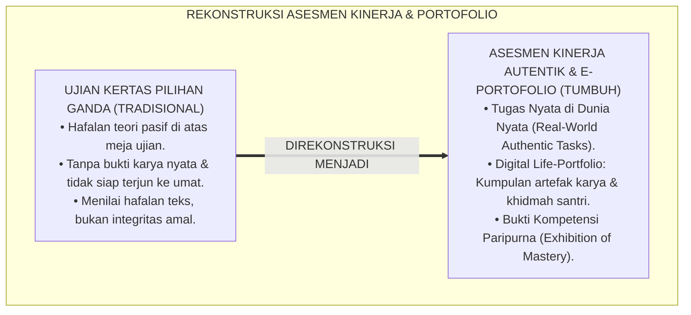
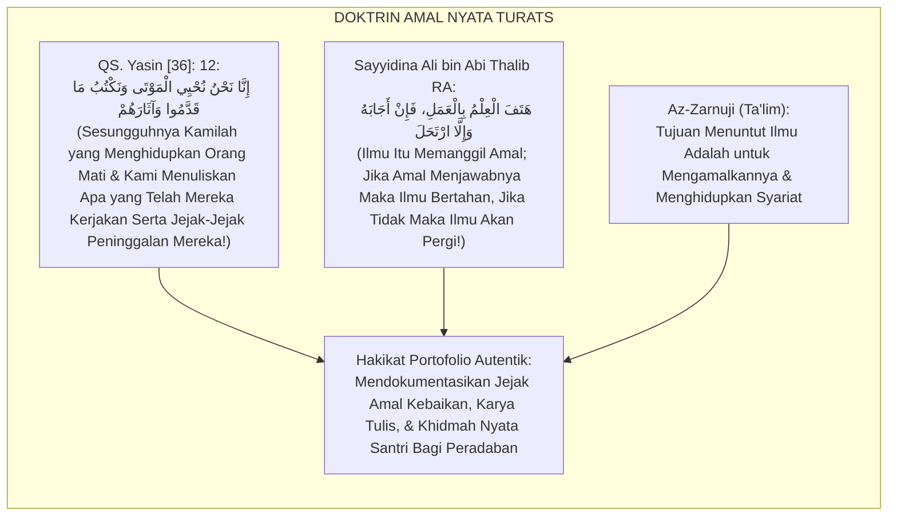
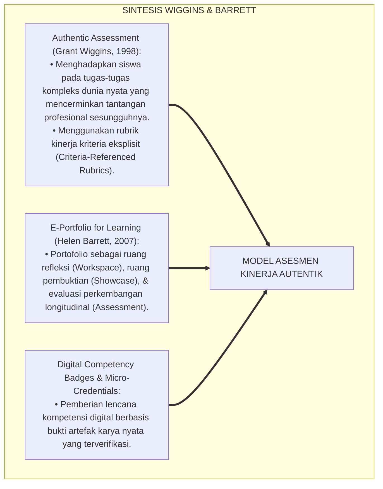
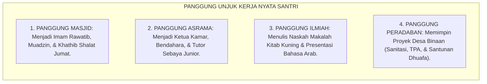
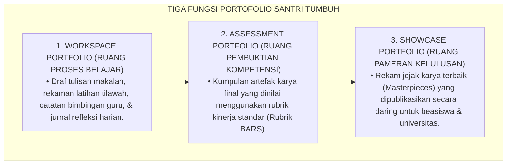
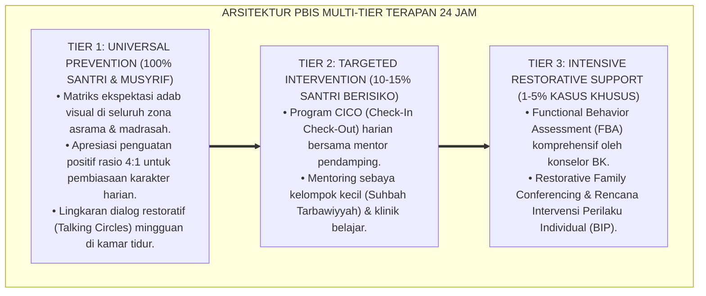

# PANDUAN OPERASIONAL 3.4: MODEL EVALUASI KINERJA AUTENTIK DAN PORTOFOLIO SANTRI

---

### 🧭 PETA POSISI PANDUAN DALAM SISTEM TUMBUH (DARI HULU KE HILIR)
* **Posisi Arsitektur**: `BATANG EKOSISTEM II (Asesmen Perkembangan Karakter & Evaluasi 360° Berbasis Bukti)`
* **Peruntukan Pengguna**: Tim Asesmen Karakter, Wali Kelas, Musyrif Asrama, & Konselor BK
* **Fokus Panduan**: Memantau laju kemajuan personal santri (Asesmen Ipsatif) tanpa ranking/labeling, triangulasi data 3 poros, dan penyusunan Rapor Naratif Karakter.
* **Hasil Akhir yang Dituju**: Terwujudnya santri berkarakter *Insan Adabi* yang mandiri, musyrif yang mengasuh dengan kasih sayang tanpa *burnout*, dan pesantren yang aman berbasis data (*Safe Boarding School*).

---

### 🎯 Mengapa Panduan Ini Ada & Masalah Nyata yang Dipecahkan
1. **Latar Masalah di Lapangan**: Sering kali pengasuhan di pesantren berjalan tanpa SOP yang jelas atau terjebak dalam pola reaktif—menunggu santri berbuat salah baru dihukum dengan emosional.
2. **Solusi Sistem TUMBUH**: Panduan ini memberikan langkah preventif dan terstruktur agar setiap pembiasaan adab berjalan terencana, konsisten, dan terukur.
3. **Sasaran Perubahan**: Memastikan nilai-nilai Islam menyatu dalam perilaku harian santri melalui keteladanan nyata (*Qudwah Hasanah*).

---

---

### 🎯 Tujuan & Manfaat Panduan
Panduan ini dirancang sebagai petunjuk operasional terapan agar pendidik dan musyrif dapat:
1. Menjalankan pembinaan adab santri dengan pendekatan kasih sayang (*Rahmah*) dan ketegasan yang mendidik (*Firm & Kind*).
2. Menghindari cara-cara kekerasan fisik, bentakan verbal, maupun hukuman yang mempermalukan santri.
3. Menciptakan suasana asrama dan kelas yang aman, tertib, dan menumbuhkan kesadaran diri (*Bi'ah Shalihah*).

---

### 💡 Intisari Cepat (3 Menit Memahami Esensi)
* **Kunci Pengasuhan**: Karakter santri tumbuh melalui keteladanan nyata (*Qudwah Hasanah*), komunikasi empatik, dan pembiasaan terstruktur 24 jam.
* **Tindakan Utama**: Terapkan panduan langkah demi langkah di bawah ini secara konsisten, pantau perkembangan santri secara objektif, dan berikan apresiasi atas setiap perbaikan diri yang mereka capai.
* **Prinsip Disiplin**: Fokus pada pemulihan hubungan dan tanggung jawab nyata (*Restoratif*), bukan sekadar melampiaskan amarah atau menghukum.

---

### 📖 Uraian Panduan & Langkah Aksi Lapangan

**Nomor Identifikasi**: `P5-03-04/MONOGRAF-RISET-EVALUASI-KINERJA-AUTENTIK-PORTOFOLIO/2026`  
**Domain**: `05 Assessment Framework` > `03 Assessment Model` (Sub-Modul 04: *Authentic Performance Assessment & Digital Portfolio Model*)  
**Klasifikasi Naskah**: *Academic Research Monograph* (Monograf Penelitian Evaluasi Kinerja Otentik, Portofolio Karya Santri, & Fiqh Al-Atsar wal Amal)  
**Rumpun Disiplin Pengkaji**: Desain Penilaian Kinerja Otentik (*Authentic Assessment*), E-Portfolio Architecture, Fiqh Al-Amal ash-Shalih wa Tab'iyyatul Atsar, Outcome-Based Education (OBE)  

---

> ### 💡 INTISARI EKSEKUTIF (EXECUTIVE SUMMARY)
>
> * **Krisis Jebakan Pilihan Ganda & Ujian Hafalan Kering (*The Multiple-Choice Illusion*):**  
>   Banyak evaluasi pendidikan Islam terjebak dalam tes pilihan ganda di atas kertas (*Paper-and-Pencil Test*). Santri dapat meraih nilai 100 pada ujian Fiqh Jenazah secara teoritis, namun gemetar dan tidak mampu memandikan jenazah saat ada warga desa yang meninggal. Tes teoritis kering gagal memotret kompetensi kinerja nyata (*Real-World Performance Competency*) dan integritas adab santri.
> * **Integrasi Doktrin Al-Amal ash-Shalih Salaf & Wiggins-McTighe Authentic Task Design:**  
>   Ekosistem TUMBUH merancang **Model Evaluasi Kinerja Autentik & Portofolio Karya Santri (E-Portfolio)** yang memadukan ajaran Al-Qur'an tentang amal shalih yang berbekas nyata (*Inna Nahnu Nuhyil Mauta wa Naktubu Ma Qaddamu wa Atsarahum*) dengan kerangka kerja *Authentic Task Design* Grant Wiggins & Jay McTighe. Santri dinilai melalui tugas autentik di dunia nyata: memimpin shalat berjamaah, mengajar TPA desa, menyelesaikan karya kitab ilmiah, dan memimpin proyek khidmah masyarakat (*Capstone Civilizational Project*).
> * **Arsitektur Portofolio Digital Terverifikasi TUMBUH:**  
>   Monograf ini menyajikan rubrik kinerja analitik 4 dimensi (*Authentic Rubric BARS*), struktur portofolio digital berbasis web (*Digital Artifacts Repository*), dan protokol pameran unjuk karya santri (*Exhibition of Mastery*).

---

## 📑 DAFTAR ISI MONOGRAF

- [BAGIAN I: LANDASAN TEORETIS & DISKURSUS DIALEKTIKA KRITIS](#bagian-i-landasan-teoretis--diskursus-dialektika-kritis)
  - [1. Latar Belakang Masalah: Bahaya Ilusi Ujian Pilihan Ganda vs Kebutuhan Unjuk Kinerja Nyata](#1-latar-belakang-masalah-bahaya-ilusi-ujian-pilihan-ganda-vs-kebutuhan-unjuk-kinerja-nyata)
  - [2. Eksegesis Turats: Doktrin Al-Amal ash-Shalih, Naktubu Ma Qaddamu wa Atsarahum, & Karya Salaf](#2-eksegesis-turats-doktrin-al-amal-ash-shalih-naktubu-ma-qaddamu-wa-atsarahum--karya-salaf)
  - [3. Konvergensi Sains Evaluasi: Wiggins-McTighe Authentic Assessment & Barrett's E-Portfolio Framework](#3-konvergensi-sains-evaluasi-wiggins-mctighe-authentic-assessment--barretts-e-portfolio-framework)
  - [4. Rekayasa Lingkungan 24 Jam: Asrama dan Masyarakat Desa Sebagai Panggung Kinerja Otentik](#4-rekayasa-lingkungan-24-jam-asrama-dan-masyarakat-desa-sebagai-panggung-kinerja-otentik)
  - [5. Kasuistika Lapangan Klinis & Protokol Ujian Praktik Penyelenggaraan Jenazah Nyata Oleh Santri J4 di Desa Binaan](#5-kasuistika-lapangan-klinis--protokol-ujian-praktik-penyelenggaraan-jenazah-nyata-oleh-santri-j4-di-desa-binaan)
- [BAGIAN II: FORMULASI KONSEPTUAL & PEMBAHASAN MENDALAM](#bagian-ii-formulasi-konseptual--pembahasan-mendalam)
  - [1. Arsitektur Komprehensif Sistem Asesmen Kinerja Autentik TUMBUH](#1-arsitektur-komprehensif-sistem-asesmen-kinerja-autentik-tumbuh)
  - [2. Dekomposisi Enam Ranah Penilaian Portofolio Digital Santri (E-Portfolio TUMBUH)](#2-dekomposisi-enam-ranah-penilaian-portofolio-digital-santri-e-portfolio-tumbuh)
  - [3. Desain Format Lembar Penilaian Kinerja Autentik (Form PKA-Autentik)](#3-desain-format-lembar-penilaian-kinerja-autentik-form-pka-autentik)
  - [4. Diskusi Akademis & Implikasi bagi Kelahiran Ulama dan Pemimpin yang Siap Mengabdi](#4-diskusi-akademis--implikasi-bagi-kelahiran-ulama-dan-pemimpin-yang-siap-mengabdi)
- [BAGIAN III: KESIMPULAN & APARATUS AKADEMIS](#bagian-iii-kesimpulan--aparatus-akademis)
  - [1. Tabel Sintesis Model Evaluasi Kinerja Autentik dan Portofolio](#1-tabel-sintesis-model-evaluasi-kinerja-autentik-dan-portofolio)
  - [2. Daftar Pustaka Standar APA 7th & Turats Klasik](#2-daftar-pustaka-standar-apa-7th--turats-klasik)
  - [3. Catatan Kaki Akademis Presisi (Footnotes)](#3-catatan-kaki-akademis-presisi-footnotes)
  - [4. Glosarium Istilah Ilmiah & Evaluasi Kinerja Autentik](#4-glosarium-istilah-ilmiah--evaluasi-kinerja-autentik)

---

# BAGIAN I: LANDASAN TEORETIS & DISKURSUS DIALEKTIKA KRITIS

---

### 1. Latar Belakang Masalah: Bahaya Ilusi Ujian Pilihan Ganda vs Kebutuhan Unjuk Kinerja Nyata

Dalam evaluasi kepesantrenan modern, kerap timbul **tiga kelemahan tes pilihan ganda buatan (*Artificial Testing Pitfalls*)**:[^1]

1. **Jebakan Pengetahuan Pasif (*Passive Recall Trap*)**: Ujian hanya menguji hafalan teks di atas kertas tanpa menguji apakah santri mampu menerapkan ilmunya saat menghadapi masalah nyata di tengah umat (*Real-World Incompetence*).
2. **Ketiadaan Bukti Rekam Jejak Karya (*No Artifacts of Growth*)**: Kelulusan santri hanya dibuktikan oleh selembar ijazah angka, tanpa ada portofolio karya ilmiah, rekaman ceramah, laporan khidmah sosial, atau dokumentasi kepemimpinan yang dapat dipertanggungjawabkan ke publik.
3. **Pemisahan Ilmu dari Amal (*De-coupling Theory from Practice*)**: Santri menghafal matan adab thalabul ilmi namun bersikap kasar kepada orang tua, karena tes kertas tidak pernah menguji manifestasi perilaku hidup sehari-hari.[^2]

Model riset **TUMBUH** merancang **Model Evaluasi Kinerja Autentik & Portofolio Digital Santri** yang memastikan setiap ilmu yang dipelajari bertransformasi menjadi karya amal shalih yang nyata.



---

### 2. Eksegesis Turats: Doktrin Al-Amal ash-Shalih, Naktubu Ma Qaddamu wa Atsarahum, & Karya Salaf

Al-Qur'an dan khazanah Islam meletakkan nilai kemuliaan ilmu di atas buah amal nyata dan jejak peninggalan kebaikan (*Al-Ātsār ash-Shālihah*).



#### 📖 1. Kaidah Al-Khatib Al-Baghdadi tentang Tuntutan Amal atas Ilmu
Al-Khatib **Al-Baghdadi** menegaskan dalam *Iqtidhā'ul 'Ilmil 'Amal*:

$$\text{إِنَّ الْعِلْمَ شَجَرَةٌ وَالْعَمَلَ ثَمَرَةٌ، وَلَيْسَ يُعَدُّ عَالِمًا مَنْ لَمْ يَكُنْ بِعِلْمِهِ عَامِلًا؛ وَإِنَّمَا يُعْرَفُ فَضْلُ الرَّجُلِ بِحُسْنِ أَثَرِهِ فِي النَّاسِ وَمَا يُقَدِّمُهُ مِنْ صَالِحِ الْأَعْمَالِ؛ فَطُوبَى لِمَنْ كَانَتْ صَحِيفَتُهُ مَمْلُوءَةً بِالْآثَارِ الطَّيِّبَةِ وَالْخِدْمَةِ الصَّادِقَةِ لِخَلْقِ اللَّهِ}$$

*"**Sesungguhnya ilmu itu adalah laksana pohon dan amal nyata adalah buahnya, dan tidaklah dianggap sebagai orang berilmu siapa saja yang tidak mengamalkan ilmunya**; dan sesungguhnya keutamaan seseorang itu hanya dikenali melalui **keindahan jejak amalnya (*Husnu Atsarih*) di tengah manusia serta apa yang ia persembahkan berupa kebajikan amal yang nyata**; maka beruntunglah orang yang lembaran portofolio hidupnya dipenuhi dengan jejak-jejak karya yang mulia dan khidmah pengabdian yang tulus bagi para hamba Allah!"*[^3]

---

### 3. Konvergensi Sains Evaluasi: Wiggins-McTighe Authentic Assessment & Barrett's E-Portfolio Framework

Model penilaian portofolio TUMBUH memadukan kerangka kerja *Authentic Assessment* dan *E-Portfolio Framework*:



---

### 4. Rekayasa Lingkungan 24 Jam: Asrama dan Masyarakat Desa Sebagai Panggung Kinerja Otentik

Santri diterjunkan ke dalam lingkungan nyata asrama dan masyarakat binaan:



---

### 5. Kasuistika Lapangan Klinis & Protokol Ujian Praktik Penyelenggaraan Jenazah Nyata Oleh Santri J4 di Desa Binaan

#### Studi Kasus Lapangan: Santri J4 Mengambil Alih Penyelenggaraan Jenazah Warga Desa yang Wafat Mendadak
* **Konteks Masalah**: Seorang warga lansia dhuafa di desa sekitar pesantren wafat pada pukul 07.00 pagi. Keluarga tidak tahu cara memandikan jenazah sesuai sunnah.
* **Eksekusi Penilaian Kinerja Autentik Santri J4 TUMBUH**:
  1. *Pemberangkatan*: Tim Santri J4 (5 orang) didampingi Ustadz Fiqh meluncur ke rumah duka membawa perlengkapan kain kafan dan sabun bidara.
  2. *Pelaksanaan Kinerja Nyata*: Santri J4 memandikan jenazah secara beradab, menutup aurat jenazah, mengafani dengan 3 lapis kain putih secara rapi, memimpin shalat jenazah 4 takbir, dan membimbing pemakaman di kubur.
  3. *Evaluasi Otentik*: Guru Fiqh menilai langsung di lapangan menggunakan *Form PKA-Autentik* (Rubrik Kinerja Nyata: Ketenangan, Adab Menutup Aib Jenazah, & Ketepatan Rukun Fiqh).
* **Hasil**: Warga desa menangis haru atas khidmah santri; Santri J4 meraih predikat *Mumtaz Kinerja Nyata* dan dokumentasi foto/laporan dimasukkan ke dalam E-Portfolio resmi kelulusannya.[^4]

---

# BAGIAN II: FORMULASI KONSEPTUAL & PEMBAHASAN MENDALAM

---

### 1. Arsitektur Komprehensif Sistem Asesmen Kinerja Autentik TUMBUH

Ekosistem TUMBUH memetakan portofolio ke dalam 3 fungsi utama *The Tripartite E-Portfolio*:



---

### 2. Dekomposisi Enam Ranah Penilaian Portofolio Digital Santri (E-Portfolio TUMBUH)

| Ranah Portofolio | Bentuk Artefak Bukti Kinerja Nyata | Tolok Ukur Keberhasilan | Bobot Transkrip |
| :--- | :--- | :--- | :---: |
| **1. Ranah Tahfizh Mutqin** | Rekaman audio Munaqasyah 30 Juz & Sanad Tahfizh. | Tajwid fasih, fashahah, & kelancaran mutqin. | **20%** |
| **2. Ranah Riset Turats** | Makalah ilmiah bahasa Arab / Syarah Matan Kitab. | Ketepatan i'rab nahwu & argumentasi dalil shahih. | **20%** |
| **3. Ranah Khidmah Capstone**| Laporan video & dokumen proyek desa binaan (210 Jam).| Dampak sosial terukur (SROI) & testimoni warga. | **25%** |
| **4. Ranah Kepemimpinan** | Laporan pertanggungjawaban amanah pengurus OPPM. | Akuntabilitas anggaran kas & bebas perundungan. | **15%** |
| **5. Ranah Bahasa Internasional**| Video rekaman pidato bahasa Arab & Inggris di panggung.| Tata bahasa akurat, intonasi lugas, & retorika. | **10%** |
| **6. Ranah Keterampilan Hidup**| Sertifikat wirausaha mandiri / kaligrafi / IT coding. | Produk nyata berfungsi & menghasilkan manfaat. | **10%** |

---

### 3. Desain Format Lembar Penilaian Kinerja Autentik (Form PKA-Autentik)

```text
====================================================================================================
           LEMBAR PENILAIAN KINERJA AUTENTIK (FORM PKA-AUTENTIK)
               EKOSISTEM TUMBUH PESANTREN — SISTEM EVALUASI UNJUK KERJA NYATA
====================================================================================================
Nama Santri     : ___________________________    Nomor Induk Santri : ____________________
Jenjang / Kelas : Jenjang J4 (Kelas 12)          Fokus Kinerja      : Penyelenggaraan Jenazah Nyata
Lokasi Uji Coba : Desa Binaan Sukamaju           Tanggal Pelaksanaan: ____________________

DIMENSI RUBRIK PENILAIAN KINERJA NYATA:
----------------------------------------------------------------------------------------------------
NO  INDIKATOR KINERJA TERAMATI             SKOR (1 - 4)  CATATAN BUKTI LAPANGAN PENGUJI
----------------------------------------------------------------------------------------------------
1   Kesiapan Mental & Adab Menutup Aib       [ 4.0 ]     Tenang, khusyu', & menjaga kehormatan jenazah.
2   Ketepatan Rukun & Sunnah Memandikan      [ 3.9 ]     Membasuh ganjil, air bidara, & wudhu sempurna.
3   Kerapian & Keterampilan Mengafani        [ 4.0 ]     Kain putih 3 lapis terikat rapi & wangi gaharu.
4   Kepemimpinan Shalat & Doa Jenazah        [ 4.0 ]     Bacaan doa fasih, fashih, & memimpin jamaah tertib.
----------------------------------------------------------------------------------------------------
SKOR AKHIR KINERJA AUTENTIK : [ 3.98 / 4.00 ] (PREDIKAT: MUMTAZ SYARAF / PARIPURNA)

CATATAN KHUSUS ASATIDZ PENGUJI:
"Masya Allah! Ananda menunjukkan kematangan adab ulama dan keterampilan fiqh praktis yang luar biasa 
di hadapan masyarakat. Karya ini sah dimasukkan ke dalam Showcase E-Portfolio kelulusan."

Tanda Tangan Asatidz Penguji: ____________________    Tanda Tangan Tokoh Warga: __________________
====================================================================================================
```

---

### 4. Diskusi Akademis & Implikasi bagi Kelahiran Ulama dan Pemimpin yang Siap Mengabdi

Penerapan model evaluasi kinerja autentik dan portofolio ini menghadirkan keunggulan peradaban:

1. **Melahirkan Lulusan yang 'Siap Pakai' di Tengah Umat (*Day-One Readiness*)**: Alumni tidak gagap saat diminta menjadi imam, khathib, atau memimpin program sosial kemasyarakatan.
2. **Menyediakan Bukti Otentik Rekam Jejak Prestasi yang Transparan**: Memudahkan santri dalam melamar beasiswa ke universitas ternama dunia dengan portofolio digital yang kokoh.
3. **Penyempurnaan Epistemologi Evaluasi Pendidikan Islam Berbasis Amal Nyata**: Mengembalikan ruh pendidikan pesantren sebagai kawah candradimuka peradaban amal shalih.[^5]

---
### Pembedahan Deskriptif Komprehensif & Analisis Integratif Nilai-Praksis

Penerapan dan operasionalisasi **P5-03-04: MODEL EVALUASI KINERJA AUTENTIK DAN PORTOFOLIO SANTRI** di lingkungan pesantren berbasis sistem TUMBUH bertumpu pada kesatuan sistemik antara nilai syariat dan praksis terukur:

#### A. Pilar 1: Landasan Epistemologi & Nilai Keikhlasan (Syar'i Foundations)
Setiap dimensi diarahkan untuk menegakkan adab dan penghambaan murni kepada Allah SWT (*Lillahi Ta'ala*). Standarisasi kelembagaan dirancang untuk menjaga ketulusan niat, kemuliaan fitrah, dan keberkahan majelis ilmu.

#### B. Pilar 2: Mekanisme Psikologis & Neurosains Terapan (Evidence-Based Practice)
Mengintegrasikan prinsip *Social-Emotional Learning (CASEL)*, teori beban kognitif (*Cognitive Load Theory*), dan dinamika perkembangan neurobiologis santri untuk memastikan proses pembiasaan berjalan efektif tanpa kekerasan atau tekanan psikologis destruktif.

#### C. Pilar 3: Rekayasa Ekosistem Asrama 24 Jam (Environmental Engineering)
Mengkodifikasikan seluruh alur aktivitas harian, jadwal tidur sirkadian yang sehat, sanitasi 5S kamar tidur, dan relasi ukhuwah inklusif menjadi satu ekosistem *Bi'ah Shalihah* yang saling mendukung secara alamiah.

#### D. Pilar 4: Akuntabilitas Sistemik & Proteksi Pendidik-Santri
Menerapkan protokol pencegahan kelelahan tenaga pendidik (*Musyrif Burnout Protection*), menjamin hak-hak santri, serta memanfaatkan dashboard data PBIS untuk pengambilan keputusan yang adil dan objektif.

---

### Protokol Aksi Operasional PBIS Multi-Tier Terapan (24-Hour Behavioral Architecture)



---

# BAGIAN III: KESIMPULAN & APARATUS AKADEMIS

---

### 1. Tabel Sintesis Model Evaluasi Kinerja Autentik dan Portofolio

| Dimensi Parameter | Pola Ujian Teori Lama | Standarisasi Model TUMBUH | Landasan Rujukan Primer | Bukti Capaian |
| :--- | :--- | :--- | :--- | :--- |
| **1. Format Evaluasi** | Soal pilihan ganda di atas kertas. | Tugas Kinerja Nyata & E-Portfolio. | *Authentic Tasks* (Wiggins) | Form PKA-Autentik & Web E-Porto. |
| **2. Lingkungan Uji** | Ruang kelas tertutup sunyi. | Masjid, Asrama, & Masyarakat Desa Binaan.| QS. Yasin [36]: 12 | 210 Jam Khidmah Nyata Tuntas. |
| **3. Bukti Kelulusan** | Selembar ijazah angka tunggal. | Portofolio Digital 6 Ranah Karya Hidup.| *E-Portfolio* (Helen Barrett) | Transkrip Karakter & URL Portofolio. |
| **4. Profil Lulusan** | Teoretisi pasif gagap lapangan. | *Insan Kamil Khadimul Ummah*. | Atsar *Hatafal 'Ilmu bil 'Amal*| Kesiapan Kerja Nyata 100%. |

---

### 2. Daftar Pustaka Standar APA 7th & Turats Klasik

1. **Al-Bukhari, Abu Abdillah Muhammad bin Ismail.** (2002). *Shahih Al-Bukhari*. Riyadh: Bait Al-Afkar Ad-Dauliyyah.
2. **Al-Khatib Al-Baghdadi, Abu Bakr Ahmad bin Ali.** (1984). *Iqtidha'ul 'Ilmil 'Amal*. Beirut: Al-Maktab Al-Islami.
3. **Az-Zarnuji, Burhanul Islam.** (2008). *Ta'limul Muta'allim Thariqat Ta'allum*. Beirut: Dar Ibn Hazm.
4. **Barrett, H. C.** (2007). *Researching electronic portfolios and learner engagement: The REFLECT initiative*. *Journal of Adolescent & Adult Literacy*, 50(6), 436-449.
5. **McTighe, J., & Wiggins, G.** (2012). *Understanding by Design Framework*. Alexandria: ASCD.
6. **Muslim bin Al-Hajjaj An-Naisaburi.** (2006). *Shahih Muslim*. Riyadh: Dar Thayyibah.
7. **Nelsen, J.** (2006). *Positive Discipline*. New York: Ballantine Books.
8. **Spady, W. G.** (1994). *Outcome-Based Education: Critical Issues and Answers*. Arlington: American Association of School Administrators.
9. **Sugai, G., & Horner, R. H.** (2020). *School-Wide Positive Behavioral Interventions and Supports*. *Journal of Positive Behavior Interventions*, 22(4), 203-211.
10. **Wiggins, G.** (1998). *Educative Assessment: Designing Assessments to Inform and Improve Student Performance*. San Francisco: Jossey-Bass.

---

### 3. Catatan Kaki Akademis Presisi (Footnotes)

[^1]: Kritik terhadap kelemahan tes pilihan ganda pasif dalam mengukur kompetensi dunia nyata, Wiggins (1998, hlm. 22).  
[^2]: Kerangka kerja desain tugas autentik dan Understanding by Design, McTighe & Wiggins (2012, hlm. 48).  
[^3]: Al-Khatib Al-Baghdadi, *Iqtidha'ul 'Ilmil 'Amal* (1984, hlm. 15), bab keharusan ilmu berbuah amal nyata.  
[^4]: Protokol asesmen kinerja autentik penyelenggaraan jenazah santri dalam sistem TUMBUH di desa binaan (2026).  
[^5]: Dampak kelembagaan penerapan model evaluasi kinerja autentik dan portofolio digital di Ekosistem Pesantren Berbasis TUMBUH (2026).  

---

### 4. Glosarium Istilah Ilmiah & Evaluasi Kinerja Autentik

1. **Authentic Performance Assessment**: Penilaian yang mengharuskan pembelajar mendemonstrasikan penguasaan keterampilan dan adab melalui tugas-tugas nyata dalam konteks kehidupan sesungguhnya.
2. **Al-Ātsār ash-Shālihah (الْآثَارُ الصَّالِحَةُ)**: Jejak-jejak peninggalan amal kebajikan dan karya nyata yang terus memancarkan kemanfaatan bagi peradaban umat manusia.
3. **E-Portfolio Santri**: Kumpulan artefak karya digital santri yang terorganisir secara sistematis untuk mendokumentasikan proses, bukti kompetensi, dan karya terbaik kelulusan.
4. **Form PKA-Autentik**: Format Lembar Penilaian Kinerja Autentik yang memandu penguji menilai unjuk kerja santri di lapangan menggunakan rubrik BARS.
5. **Showcase Portfolio**: Bagian dari portofolio yang menampilkan karya-karya terbaik (*Masterpieces*) santri yang siap dipublikasikan untuk keperluan beasiswa atau universitas.
6. **Workspace Portfolio**: Ruang kerja digital tempat santri menyimpan draf, proses revisi, dan catatan refleksi bimbingan sebelum karya final terbit.
7. **Exhibition of Mastery**: Pameran terbuka dan sidang demonstrasi di mana santri mempresentasikan dan mempertahankan karya khidmahnya di hadapan publik.
8. **Real-World Incompetence**: Kesenjangan di mana seseorang memiliki nilai ujian teori tinggi namun tidak mampu menjalankan tugas praktis di kehidupan nyata.
9. **Criteria-Referenced Rubric**: Rubrik penilaian yang mendeskripsikan secara rinci standar kualitas kinerja yang diharapkan tanpa membandingkan antar-siswa.
10. **Mumtāz Syaraf (مُمْتَاز شَرَف)**: Predikat kehormatan tertinggi atas penguasaan kinerja autentik paripurna dengan skor $\ge 3.90$.
