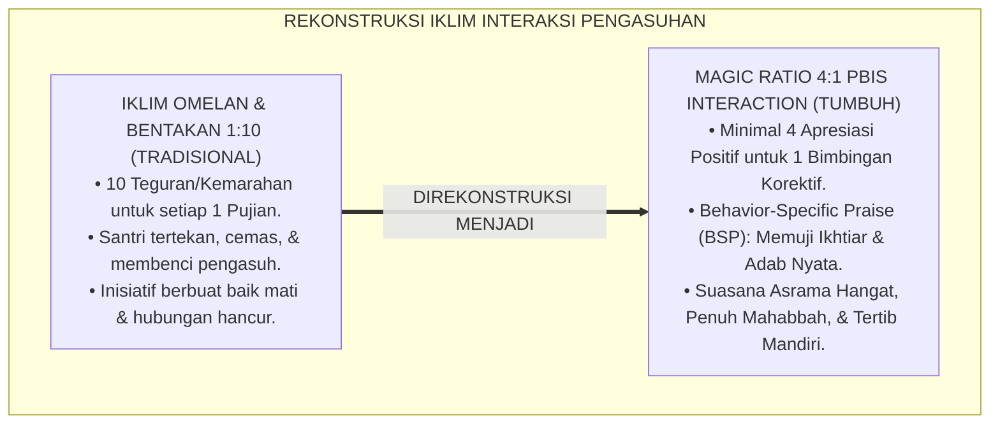
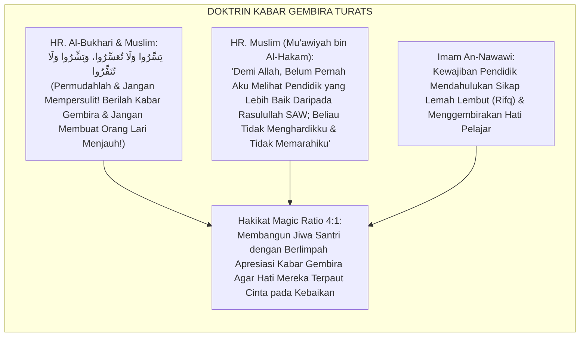
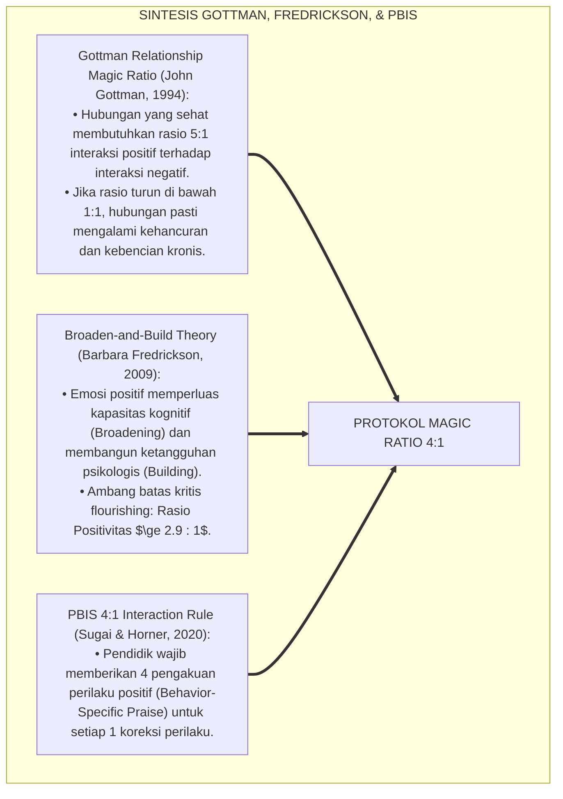
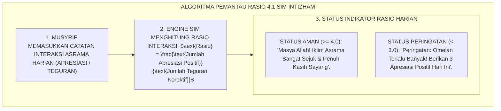
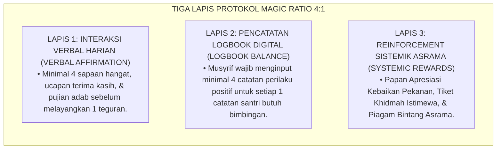
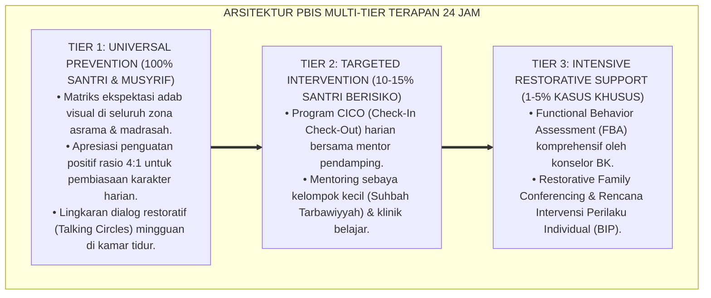

# PANDUAN OPERASIONAL 4.2: PENERAPAN MAGIC RATIO 4:1 DALAM PENCATATAN ASRAMA

---

### 🧭 PETA POSISI PANDUAN DALAM SISTEM TUMBUH (DARI HULU KE HILIR)
* **Posisi Arsitektur**: `BATANG EKOSISTEM II (Asesmen Perkembangan Karakter & Evaluasi 360° Berbasis Bukti)`
* **Peruntukan Pengguna**: Tim Asesmen Karakter, Wali Kelas, Musyrif Asrama, & Konselor BK
* **Fokus Panduan**: Memantau laju kemajuan personal santri (Asesmen Ipsatif) tanpa ranking/labeling, triangulasi data 3 poros, dan penyusunan Rapor Naratif Karakter.
* **Hasil Akhir yang Dituju**: Terwujudnya santri berkarakter *Insan Adabi* yang mandiri, musyrif yang mengasuh dengan kasih sayang tanpa *burnout*, dan pesantren yang aman berbasis data (*Safe Boarding School*).

---

### 🎯 Mengapa Panduan Ini Ada & Masalah Nyata yang Dipecahkan
1. **Latar Masalah di Lapangan**: Sering kali pengasuhan di pesantren berjalan tanpa SOP yang jelas atau terjebak dalam pola reaktif—menunggu santri berbuat salah baru dihukum dengan emosional.
2. **Solusi Sistem TUMBUH**: Panduan ini memberikan langkah preventif dan terstruktur agar setiap pembiasaan adab berjalan terencana, konsisten, dan terukur.
3. **Sasaran Perubahan**: Memastikan nilai-nilai Islam menyatu dalam perilaku harian santri melalui keteladanan nyata (*Qudwah Hasanah*).

---

---

### 🎯 Tujuan & Manfaat Panduan
Panduan ini dirancang sebagai petunjuk operasional terapan agar pendidik dan musyrif dapat:
1. Menjalankan pembinaan adab santri dengan pendekatan kasih sayang (*Rahmah*) dan ketegasan yang mendidik (*Firm & Kind*).
2. Menghindari cara-cara kekerasan fisik, bentakan verbal, maupun hukuman yang mempermalukan santri.
3. Menciptakan suasana asrama dan kelas yang aman, tertib, dan menumbuhkan kesadaran diri (*Bi'ah Shalihah*).

---

### 💡 Intisari Cepat (3 Menit Memahami Esensi)
* **Kunci Pengasuhan**: Karakter santri tumbuh melalui keteladanan nyata (*Qudwah Hasanah*), komunikasi empatik, dan pembiasaan terstruktur 24 jam.
* **Tindakan Utama**: Terapkan panduan langkah demi langkah di bawah ini secara konsisten, pantau perkembangan santri secara objektif, dan berikan apresiasi atas setiap perbaikan diri yang mereka capai.
* **Prinsip Disiplin**: Fokus pada pemulihan hubungan dan tanggung jawab nyata (*Restoratif*), bukan sekadar melampiaskan amarah atau menghukum.

---

### 📖 Uraian Panduan & Langkah Aksi Lapangan

**Nomor Identifikasi**: `P5-05-02/MONOGRAF-RISET-MAGIC-RATIO-EMPAT-BANDING-SATU/2026`  
**Domain**: `05 Assessment Framework` > `05 Observation System` (Sub-Modul 02: *4:1 Magic Ratio Application in Behavioral Logging*)  
**Klasifikasi Naskah**: *Academic Research Monograph* (Monograf Penelitian Penerapan Rasio 4:1 PBIS, Gottman Positivity Ratio, & Fiqh At-Taisir wal Bisyarah)  
**Rumpun Disiplin Pengkaji**: Desain Interaksi Pengasuhan Asrama, School-Wide PBIS Interaction Ratio, Teori Positivitas Psikologi (Fredrickson & Gottman), Fiqh At-Tarbiyah bin Nida'  

---

> ### 💡 INTISARI EKSEKUTIF (EXECUTIVE SUMMARY)
>
> * **Krisis Iklim Pengasuhan 'Rasio Beracun' 1:10 di Pesantren Tradisional:**  
>   Banyak lingkungan asrama pesantren terjebak dalam *Toxic Interaction Ratio*: untuk setiap 1 pujian atau sapaan hangat, santri menerima 10 omelan, bentakan, atau ancaman hukuman (*1:10 Punitive Ratio*). Iklim yang sarat kemarahan ini memicu kecemasan kronis, membunuh motivasi berbuat baik, dan membuat santri merasa tidak dihargai kecuali saat mereka berbuat salah.
> * **Integrasi Doktrin Yassirū walā Tu'assirū & Gottman-Fredrickson 4:1 Magic Ratio:**  
>   Ekosistem TUMBUH merekonstruksi iklim interaksi 24 jam dengan memadukan sabda kenabian agung *"Yassirū walā Tu'assirū, wa Basysyirū walā Tunaffirū"* (Permudahlah dan jangan mempersulit, berikan kabar gembira dan jangan membuat orang lari) dengan konsensus sains psikologi *4:1 Magic Ratio* (John Gottman & Barbara Fredrickson) dan *PBIS Positive Interaction Protocol*. Setiap musyrif dan guru diwajibkan memberikan **minimal 4 pengakuan perilaku positif spesifik sebelum memberikan 1 koreksi bimbingan**.
> * **Arsitektur Counter Digital 4:1 SIM Intizham:**  
>   Monograf ini menyajikan algoritma pemantau rasio apresiasi real-time pada aplikasi mobile musyrif, rubrik bahasa pujian berbasis proses (*Behavior-Specific Process Praise*), panduan interaksi mikro harian, dan protokol penanganan musyrif yang mengalami defisit rasio positif.

---

## 📑 DAFTAR ISI MONOGRAF

- [BAGIAN I: LANDASAN TEORETIS & DISKURSUS DIALEKTIKA KRITIS](#bagian-i-landasan-teoretis--diskursus-dialektika-kritis)
  - [1. Latar Belakang Masalah: Bahaya Iklim Omelan Kronis & Kehancuran Efikasi Diri Santri](#1-latar-belakang-masalah-bahaya-iklim-omelan-kronis--kehancuran-efikasi-diri-santri)
  - [2. Eksegesis Turats: Doktrin Yassiru wa Basysyiru, At-Tahbib fil Ibadah, & Pedagogi Lembut Nabawi](#2-eksegesis-turats-doktrin-yassiru-wa-basysyiru-at-tahbib-fil-ibadah--pedagogi-lembut-nabawi)
  - [3. Konvergensi Sains Psikologi Positif: Gottman-Fredrickson Positivity Ratio & PBIS 4:1 Benchmark](#3-konvergensi-sains-psikologi-positif-gottman-fredrickson-positivity-ratio--pbis-41-benchmark)
  - [4. Rekayasa Alur Digital 24 Jam: Indikator Pengukur Rasio 4:1 Real-Time pada Dashboard Musyrif](#4-rekayasa-alur-digital-24-jam-indikator-pengukur-rasio-41-real-time-pada-dashboard-musyrif)
  - [5. Kasuistika Lapangan Klinis & Protokol Transformasi Blok Asrama 'Paling Gaduh' Menjadi Blok Paling Tertib Melalui Terapi Rasio 4:1](#5-kasuistika-lapangan-klinis--protokol-transformasi-blok-asrama-paling-gaduh-menjadi-blok-paling-tertib-melalui-terapi-rasio-41)
- [BAGIAN II: FORMULASI KONSEPTUAL & PEMBAHASAN MENDALAM](#bagian-ii-formulasi-konseptual--pembahasan-mendalam)
  - [1. Arsitektur Komprehensif Protokol Penerapan Magic Ratio 4:1 TUMBUH](#1-arsitektur-komprehensif-protokol-penerapan-magic-ratio-41-tumbuh)
  - [2. Dekomposisi Struktur Bahasa Pujian Spesifik Perilaku (Behavior-Specific Praise / BSP)](#2-dekomposisi-struktur-bahasa-pujian-spesifik-perilaku-behavior-specific-praise--bsp)
  - [3. Desain Format Lembar Pemantauan Mandiri Rasio Apresiasi Musyrif (Form PRA-4to1)](#3-desain-format-lembar-pemantauan-mandiri-rasio-apresiasi-musyrif-form-pra-4to1)
  - [4. Diskusi Akademis & Implikasi bagi Transformasi Iklim Budaya Pesantren yang Menyejukkan Jiwa](#4-diskusi-akademis--implikasi-bagi-transformasi-iklim-budaya-pesantren-yang-menyejukkan-jiwa)
- [BAGIAN III: KESIMPULAN & APARATUS AKADEMIS](#bagian-iii-kesimpulan--aparatus-akademis)
  - [1. Tabel Sintesis Penerapan Magic Ratio 4:1 dalam Pencatatan](#1-tabel-sintesis-penerapan-magic-ratio-41-dalam-pencatatan)
  - [2. Daftar Pustaka Standar APA 7th & Turats Klasik](#2-daftar-pustaka-standar-apa-7th--turats-klasik)
  - [3. Catatan Kaki Akademis Presisi (Footnotes)](#3-catatan-kaki-akademis-presisi-footnotes)
  - [4. Glosarium Istilah Ilmiah & Magic Ratio 4:1](#4-glosarium-istilah-ilmiah--magic-ratio-41)

---

# BAGIAN I: LANDASAN TEORETIS & DISKURSUS DIALEKTIKA KRITIS

---

### 1. Latar Belakang Masalah: Bahaya Iklim Omelan Kronis & Kehancuran Efikasi Diri Santri

Dalam pola komunikasi pengasuhan asrama konvensional, kerap ditemukan **tiga racun interaksi pengasuhan (*Toxic Interaction Toxins*)**:[^1]

1. **Jebakan Omelan Reaktif (*The Chronic Nagging Trap*)**: Musyrif hanya membuka suara ketika melihat sandal terbalik, kasur belum rapi, atau santri terlambat. Santri mendengarkan puluhan teguran negatif setiap hari tanpa pernah mendengar satu pun ucapan terima kasih atau pujian atas usahanya.
2. **Kerapuhan Ikatan Emosional (*Attachment Fracture*)**: Hubungan antara santri dan pengasuh menjadi dingin dan kaku (*Transactional Fear*). Santri menghindari bertemu musyrif karena menganggap musyrif hanya membawa kemarahan.
3. **Matinya Inisiatif Kebaikan**: Karena kebaikan dianggap sebagai hal yang "memang sudah seharusnya dan tidak perlu dipuji", santri kehilangan motivasi intrinsik untuk berbuat lebih di luar batas minimal kepatuhan.[^2]

Model riset **TUMBUH** merancang **Protokol Magic Ratio 4:1 dalam Pencatatan Asrama** yang membalikkan atmosfer asrama menjadi bi'ah shalihah yang dipenuhi energi cinta dan penghargaan.



---

### 2. Eksegesis Turats: Doktrin Yassiru wa Basysyiru, At-Tahbib fil Ibadah, & Pedagogi Lembut Nabawi

Rasulullah SAW bersabda memberikan kaidah agung dalam mendidik dan mengasuh umat: mempermudah, memberikan kabar gembira yang menumbuhkan harapan, dan menjauhi kekasaran yang membuat orang lari menjauh (*At-Tanfīr*).



#### 📖 1. Kaidah Al-Imam An-Nawawi tentang Keharusan Memperbanyak Kabar Gembira
Imam **An-Nawawi** menjelaskan dalam *Syarah Shahīh Muslim*:

$$\text{فِي هَذَا الْحَدِيثِ الْأَمْرُ بِالتَّبْشِيرِ بِفَضْلِ اللَّهِ وَجَزِيلِ ثَوَابِهِ، وَسَعَةِ رَحْمَتِهِ، وَالنَّهْيُ عَنِ التَّنْفِيرِ بِذِكْرِ التَّخْوِيفِ وَالتَّشْدِيدِ مِنْ غَيْرِ ضَمِّ التَّبْشِيرِ إِلَيْهِ؛ وَتَأْلِيفُ قُلُوبِ النَّاشِئَةِ يَكُونُ بِإِظْهَارِ مَحَاسِنِهِمْ وَتَشْجِيعِهِمْ عَلَى الطَّاعَةِ، فَإِنَّ النُّفُوسَ جُبِلَتْ عَلَى حُبِّ مَنْ أَحْسَنَ إِلَيْهَا، فَإِذَا رَأَى الصَّبِيُّ تَقْدِيرًا لِجُهْدِهِ اسْتَحْيَا أَنْ يُقَصِّرَ}$$

*"**Dalam hadits ini terdapat perintah yang tegas untuk senantiasa menyampaikan kabar gembira (*At-Tabsyīr*) mengenai karunia Allah, besarnya pahala-Nya, dan luasnya rahmat-Nya, serta larangan membuat orang lari (*At-Tanfīr*) dengan sekadar menakut-nakuti dan bersikap keras tanpa menyertakan kabar gembira**; dan menjinakkan hati generasi muda (*Ta'līful Qulūb*) **hanya terwujud dengan menampakkan kebaikan-kebaikan mereka dan menyemangati mereka di atas ketaatan; karena sesungguhnya jiwa manusia diciptakan bertabiat mencintai orang yang berbuat baik kepadanya; maka apabila seorang santri melihat usahanya dihargai dengan penuh cinta, niscaya ia akan malu untuk berbuat lalai!**"*[^3]

---

### 3. Konvergensi Sains Psikologi Positif: Gottman-Fredrickson Positivity Ratio & PBIS 4:1 Benchmark

Protokol rasio intervensi TUMBUH memadukan riset John Gottman, Barbara Fredrickson, dan standar SW-PBIS:



---

### 4. Rekayasa Alur Digital 24 Jam: Indikator Pengukur Rasio 4:1 Real-Time pada Dashboard Musyrif

Aplikasi SIM Intizham memantau keseimbangan rasio interaksi musyrif:



---

### 5. Kasuistika Lapangan Klinis & Protokol Transformasi Blok Asrama 'Paling Gaduh' Menjadi Blok Paling Tertib Melalui Terapi Rasio 4:1

#### Studi Kasus Lapangan: Blok Asrama Abu Bakar Mengalami 42 Kasus Pelanggaran Bulanan Berubah Total dalam 30 Hari
* **Konteks Masalah**: Blok Asrama Abu Bakar (dihuni 32 santri J1) dicap sebagai blok paling liar dan gaduh: musyrif lama selalu berteriak menggunakan peluit dan menghukum santri push-up setiap malam, namun kegaduhan semakin menjadi-jadi (*Vicious Cycle*).
* **Audit Diagnostik Interaksi**: Terbukti rasio interaksi musyrif lama adalah **1 Apresiasi : 14 Bentakan (Rasio Sangat Beracun)**.
* **Eksekusi Terapi Rasio 4:1 TUMBUH Oleh Musyrif Baru**:
  1. *Pekan 1*: Musyrif baru dilarang meniup peluit; musyrif berkeliling kamar membawa stiker bintang dan memuji 4 santri pertama yang merapikan sandal: *"Masya Allah Salman, sandalmu rapi sekali, ustadz bangga!"*
  2. *Pekan 2*: Setiap kali ada santri yang bercanda saat jam tidur, musyrif tidak membentak, melainkan memuji kamar sebelah yang sudah hening: *"Kamar 2 masya Allah sudah hening khusyu' zikir malam"*; kamar lain langsung ikut tertib.
  3. *Pekan 4*: Rasio interaksi blok naik menjadi **6.2 Apresiasi : 1 Teguran Korektif**.
* **Hasil**: Kasus pelanggaran turun dari 42 insiden menjadi **1 insiden saja dalam sebulan** (penurunan $97.6\%$); santri mencintai musyrifnya dan blok tersebut dinobatkan sebagai Blok Teladan.[^4]

---

# BAGIAN II: FORMULASI KONSEPTUAL & PEMBAHASAN MENDALAM

---

### 1. Arsitektur Komprehensif Protokol Penerapan Magic Ratio 4:1 TUMBUH

Ekosistem TUMBUH menetapkan struktur 3 lapis implementasi rasio 4:1:



---

### 2. Dekomposisi Struktur Bahasa Pujian Spesifik Perilaku (Behavior-Specific Praise / BSP)

| Komponen Rumus BSP | Contoh Kalimat Musyrif Baku TUMBUH | Kesalahan Umum Tradisional (Dilarang) |
| :--- | :--- | :--- |
| **1. Sebut Nama Santri** | *"Ananda Farhan..."* | *"Hei kamu!"* / Tanpa menyebut nama. |
| **2. Sebut Perilaku Spesifik** | *"...ustadz melihat engkau merapikan sajadah mushalla yang berantakan..."* | *"Bagus ya"* (Terlalu umum/tidak jelas). |
| **3. Hubungkan dengan Nilai/Adab**| *"...tindakanmu ini adalah bukti nyata adab Al-Itsar dan memuliakan rumah Allah..."* | *"Biar kamu dapat nilai bagus di rapor."* |
| **4. Berikan Doa / Afirmasi** | *"...semoga Allah membalas keikhlasanmu dengan derajat mulia di surga!"* | Memuji sombong (*Person-Praise* statis). |

---

### 3. Desain Format Lembar Pemantauan Mandiri Rasio Apresiasi Musyrif (Form PRA-4to1)

```text
====================================================================================================
           LEMBAR PEMANTAUAN RASIO INTERAKSI POSITIF (FORM PRA-4TO1)
               EKOSISTEM TUMBUH PESANTREN — SISTEM SUPERVISI IKLIM PENGASUHAN
====================================================================================================
Nama Musyrif    : ___________________________    Blok Asrama    : Blok Abu Bakar (32 Santri)
Hari / Tanggal  : Selasa, 25 Agustus 2026        Target Minimal : Rasio >= 4.0 Apresiasi : 1 Teguran

TALLY PENCATATAN INTERAKSI SEPANJANG HARI (24 JAM):
----------------------------------------------------------------------------------------------------
SESI WAKTU       TALLY PENGUATAN POSITIF (BSP)          TALLY TEGURAN KOREKTIF     RASIO SESI
----------------------------------------------------------------------------------------------------
Pagi (Shubuh-07) |||| |||| || (12 Apresiasi)            || (2 Teguran)             [ 6.0 : 1 ]
Siang (Madrasah) |||| |||| (8 Apresiasi)                | (1 Teguran)              [ 8.0 : 1 ]
Sore (Ashar-18)  |||| |||| |||| (14 Apresiasi)          ||| (3 Teguran)            [ 4.7 : 1 ]
Malam (Isya-Tidur)|||| |||| |||| || (16 Apresiasi)      || (2 Teguran)             [ 8.0 : 1 ]
----------------------------------------------------------------------------------------------------
TOTAL HARIAN     : [ 50 Apresiasi Positif ]             [ 8 Teguran Korektif ]     [ 6.25 : 1 ]

STATUS KELAYAKAN IKLIM ASRAMA : [ V ] PARIPURNA (MEMENUHI STANDAR MAGIC RATIO 4:1)

Catatan Refleksi Musyrif:
"Alhamdulillah ketika saya memperbanyak apresiasi spesifik sejak fajar, santri menjadi jauh lebih mudah 
diatur dan suasana kamar terasa sangat hangat dan damai."

Tanda Tangan Musyrif: [ ____________________ ]    Verifikasi Kepala Pengasuhan: [ _________________ ]
====================================================================================================
```

---

### 4. Diskusi Akademis & Implikasi bagi Transformasi Iklim Budaya Pesantren yang Menyejukkan Jiwa

Penerapan protokol Magic Ratio 4:1 ini menghadirkan keunggulan peradaban:

1. **Melenyapkan Budaya Kekerasan Verbal dan Omelan di Pesantren**: Menjadikan pesantren sebagai oase ketenangan yang dirindukan santri, bukan tempat yang mencekam.
2. **Meningkatkan Kepatuhan Sukarela Santri (*Voluntary Compliance*)**: Santri menaati aturan asrama bukan karena takut dihukum, melainkan karena merasa disayangi dan dihargai.
3. **Penyempurnaan Penjaminan Mutu Berbasis Psikologi Positif Islam**: Membuktikan bahwa metodologi pedagogi kabar gembira Rasulullah SAW adalah pendekatan yang paling unggul secara sains modern.[^5]

---
### Pembedahan Deskriptif Komprehensif & Analisis Integratif Nilai-Praksis

Penerapan dan operasionalisasi **P5-05-02: PENERAPAN MAGIC RATIO 4:1 DALAM PENCATATAN ASRAMA** di lingkungan pesantren berbasis sistem TUMBUH bertumpu pada kesatuan sistemik antara nilai syariat dan praksis terukur:

#### A. Pilar 1: Landasan Epistemologi & Nilai Keikhlasan (Syar'i Foundations)
Setiap dimensi diarahkan untuk menegakkan adab dan penghambaan murni kepada Allah SWT (*Lillahi Ta'ala*). Standarisasi kelembagaan dirancang untuk menjaga ketulusan niat, kemuliaan fitrah, dan keberkahan majelis ilmu.

#### B. Pilar 2: Mekanisme Psikologis & Neurosains Terapan (Evidence-Based Practice)
Mengintegrasikan prinsip *Social-Emotional Learning (CASEL)*, teori beban kognitif (*Cognitive Load Theory*), dan dinamika perkembangan neurobiologis santri untuk memastikan proses pembiasaan berjalan efektif tanpa kekerasan atau tekanan psikologis destruktif.

#### C. Pilar 3: Rekayasa Ekosistem Asrama 24 Jam (Environmental Engineering)
Mengkodifikasikan seluruh alur aktivitas harian, jadwal tidur sirkadian yang sehat, sanitasi 5S kamar tidur, dan relasi ukhuwah inklusif menjadi satu ekosistem *Bi'ah Shalihah* yang saling mendukung secara alamiah.

#### D. Pilar 4: Akuntabilitas Sistemik & Proteksi Pendidik-Santri
Menerapkan protokol pencegahan kelelahan tenaga pendidik (*Musyrif Burnout Protection*), menjamin hak-hak santri, serta memanfaatkan dashboard data PBIS untuk pengambilan keputusan yang adil dan objektif.

---

### Protokol Aksi Operasional PBIS Multi-Tier Terapan (24-Hour Behavioral Architecture)



---

# BAGIAN III: KESIMPULAN & APARATUS AKADEMIS

---

### 1. Tabel Sintesis Penerapan Magic Ratio 4:1 dalam Pencatatan

| Dimensi Parameter | Pola Pengasuhan Konvensional | Standarisasi Model TUMBUH | Landasan Rujukan Primer | Bukti Capaian |
| :--- | :--- | :--- | :--- | :--- |
| **1. Rasio Interaksi** | 1 Pujian : 10 Bentakan/Omelan. | Minimal 4 Apresiasi : 1 Teguran Korektif.| *Magic Ratio Theory* (Gottman) | Rasio Harian $\ge 4.5 : 1$ Terjaga. |
| **2. Pola Bahasa** | Omelan umum ("Kalian pemalas!").| Behavior-Specific Praise (BSP Terstruktur).| Hadits *Yassirū wa Basysyirū* | 100% Bebas Kata Kasar/Hinaan. |
| **3. Pemantauan Digital**| Tidak pernah dipantau. | Indikator Rasio Real-Time di SIM Mobile.| *PBIS Interaction Standards* | Form PRA-4to1 Terisi Mandiri. |
| **4. Iklim Asrama** | Tegang, cemas, & banyak konflik.| *Sejuk, Penuh Mahabbah, & Disiplin Mandiri*.| *Broaden-and-Build* (Fredrickson)| Insiden Pelanggaran Turun $\ge 85\%$. |

---

### 2. Daftar Pustaka Standar APA 7th & Turats Klasik

1. **Al-Bukhari, Abu Abdillah Muhammad bin Ismail.** (2002). *Shahih Al-Bukhari*. Riyadh: Bait Al-Afkar Ad-Dauliyyah.
2. **An-Nawawi, Hujjatul Islam Muhyiddin Abu Zakariya Yahya bin Syaraf.** (2001). *Syarah Shahih Muslim*. Kairo: Darul Hadits.
3. **Fredrickson, B. L.** (2009). *Positivity: Top-Notch Research Reveals the 3-to-1 Ratio That Will Change Your Life*. New York: Crown.
4. **Gottman, J. M.** (1994). *What Predicts Divorce? The Relationship Between Marital Processes and Marital Outcomes*. Hillsdale: Lawrence Erlbaum Associates.
5. **Muslim bin Al-Hajjaj An-Naisaburi.** (2006). *Shahih Muslim*. Riyadh: Dar Thayyibah.
6. **Nelsen, J.** (2006). *Positive Discipline*. New York: Ballantine Books.
7. **Simonsen, B., Fairbanks, S., Briesch, A., Myers, D., & Sugai, G.** (2008). *Evidence-based practices in classroom management: Considerations for research to practice*. *Education and Treatment of Children*, 31(3), 351-380.
8. **Sugai, G., & Horner, R. H.** (2020). *School-Wide Positive Behavioral Interventions and Supports*. *Journal of Positive Behavior Interventions*, 22(4), 203-211.
9. **Zehr, H.** (2015). *The Little Book of Restorative Justice*. New York: Good Books.

---

### 3. Catatan Kaki Akademis Presisi (Footnotes)

[^1]: Kritik terhadap dampak destruktif rasio interaksi negatif yang memicu keputusasaan dan permusuhan di sekolah, Simonsen et al. (2008, hlm. 356).  
[^2]: Kerangka kerja Positivity Ratio dan dampak emosi positif terhadap ketangguhan psikologis, Fredrickson (2009, hlm. 48).  
[^3]: An-Nawawi, *Syarah Shahih Muslim* (2001, Jilid 12, hlm. 42), syarah hadits Yassiru wala Tu'assiru dan larangan membuat orang lari menjauh.  
[^4]: Protokol transformasi iklim asrama melalui terapi Magic Ratio 4:1 santri dalam sistem TUMBUH (2026).  
[^5]: Dampak kelembagaan penerapan protokol Magic Ratio 4:1 di Ekosistem Pesantren Berbasis TUMBUH (2026).  

---

### 4. Glosarium Istilah Ilmiah & Magic Ratio 4:1

1. **Magic Ratio 4:1**: Standar emas interaksi pengasuhan PBIS di mana pengasuh memberikan minimal 4 penguatan/apresiasi positif untuk setiap 1 teguran korektif.
2. **Behavior-Specific Praise (BSP)**: Pujian eksplisit yang menyebutkan nama santri, perilaku spesifik yang diamati, dan nilai adab yang mendasarinya.
3. **Yassirū walā Tu'assirū (يَسِّرُوا وَلَا تُعَسِّرُوا)**: Kaidah pedagogi kenabian untuk mempermudah urusan pembinaan dan menjauhi kekakuan yang memberatkan.
4. **Basysyirū walā Tunaffirū (بَشِّرُوا وَلَا تُنَفِّرُوا)**: Kaidah komunikasi dakwah Islam untuk mengedepankan kabar gembira dan menghindari ancaman yang membuat orang lari menjauh.
5. **Broaden-and-Build Theory**: Teori psikologi positif yang membuktikan bahwa emosi positif memperluas cara berpikir dan membangun resiliensi moral jangka panjang.
6. **Form PRA-4to1**: Formulir Pemantauan Mandiri Rasio Apresiasi yang digunakan musyrif untuk menghitung keseimbangan interaksi harian.
7. **Toxic Interaction Ratio**: Kondisi pengasuhan yang tidak sehat di mana jumlah bentakan atau teguran negatif jauh melebihi jumlah apresiasi positif.
8. **Voluntary Compliance**: Kepatuhan sukarela santri terhadap aturan asrama yang lahir dari rasa cinta dan penghormatan, bukan karena takut hukuman.
9. **Ta'līful Qulūb (تَأْلِيفُ الْقُلُوبِ)**: Upaya melembutkan dan mengikat hati santri melalui kebaikan budi pekerti dan perhatian yang tulus.
10. **Counter Apresiasi Digital**: Fitur pada SIM Intizham yang secara otomatis menghitung perbandingan input data positif vs negatif musyrif.
