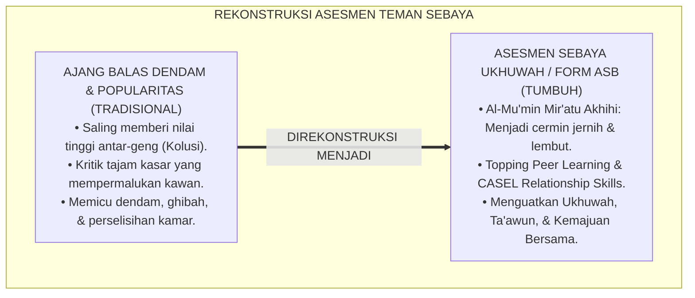
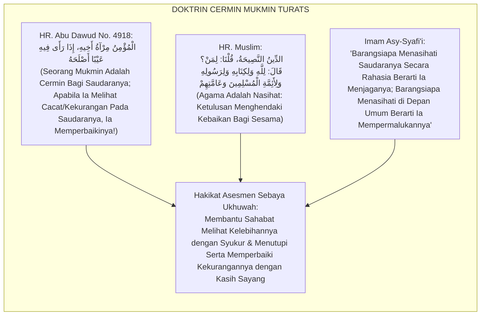
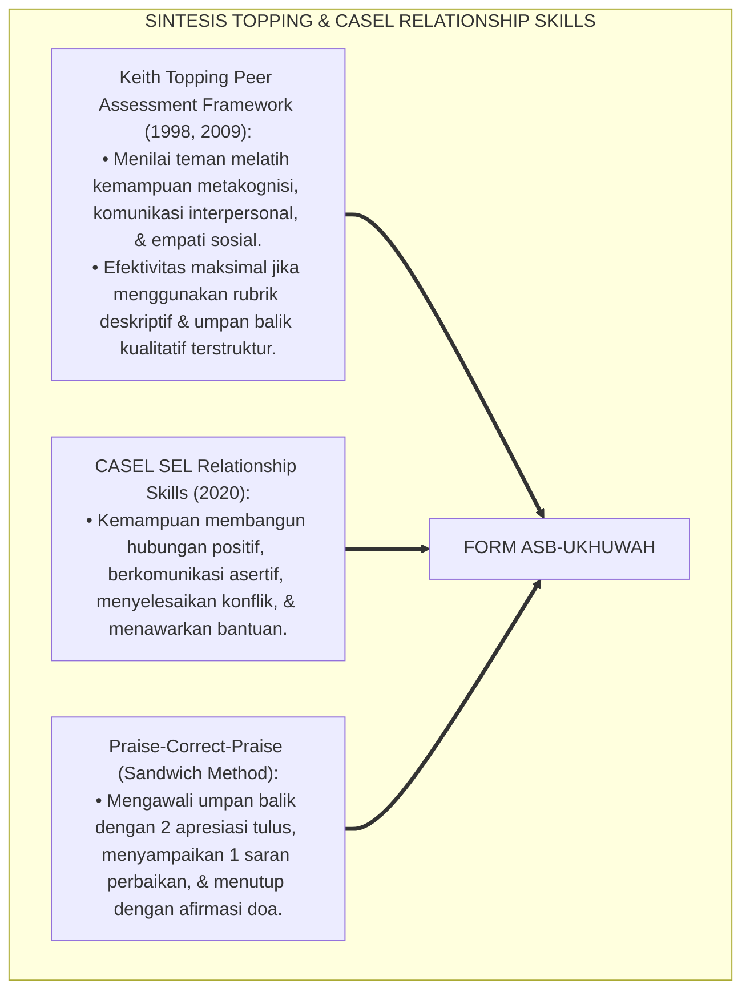
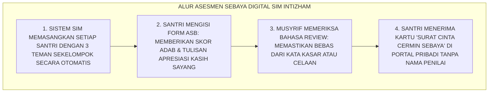
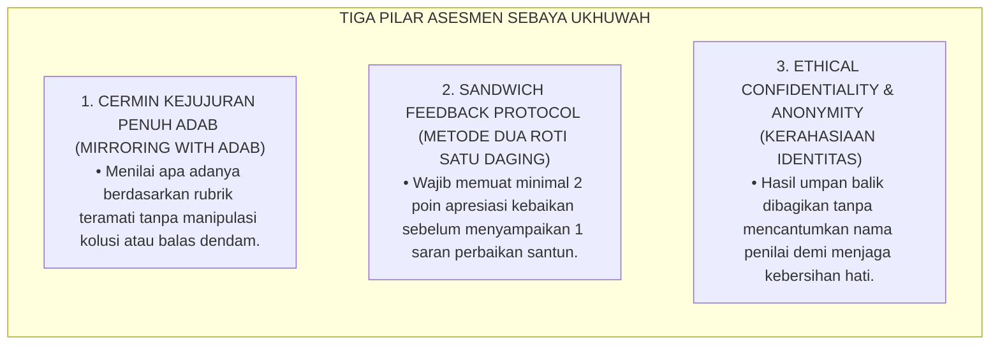
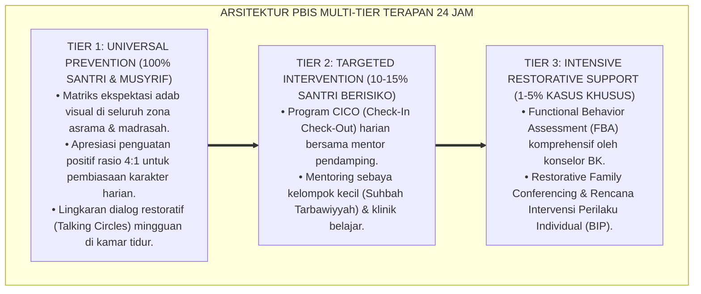

# ASESMEN SEBAYA BERBASIS UKHUWAH ISLAMIYAH

---

**Nomor Identifikasi**: `P5-07-01/MONOGRAF-RISET-ASESMEN-SEBAYA-UKHUWAH/2026`  
**Domain**: `05 Assessment Framework` > `07 Peer Assessment` (Sub-Modul 01: *Ukhuwah-Based Peer Assessment & Constructive Feedback*)  
**Klasifikasi Naskah**: *Academic Research Monograph* (Monograf Penelitian Asesmen Sebaya, Peer Learning Topping, & Fiqh Al-Mir'ah wal Ukhuwwah)  
**Rumpun Disiplin Pengkaji**: Desain Asesmen Teman Sebaya (Peer Assessment), Peer Learning & Formative Feedback (Topping), CASEL SEL Relationship Skills, Fiqh An-Nashihah  

---

> ### 💡 INTISARI EKSEKUTIF (EXECUTIVE SUMMARY)
>
> * **Krisis Distorsi Asesmen Sebaya (*Peer Assessment Pathology*) di Sekolah/Pesantren:**  
>   Penilaian teman sebaya sering kali rusak akibat dua bahaya: (1) **Kontes Popularitas (*Popularity Contest*)**: santri yang populer dan kaya selalu diberi nilai tinggi oleh teman-temannya meskipun malas piket, dan (2) **Ajang Balas Dendam (*Retaliatory Weaponization*)**: santri menggunakan instrumen penilaian untuk menjatuhkan kawan yang tidak disukainya, merusak persaudaraan dan memicu perpecahan asrama.
> * **Integrasi Doktrin Mukmin Sebagai Cermin Kebaikan & Topping's Peer Assessment Framework:**  
>   Ekosistem TUMBUH merancang **Asesmen Sebaya Berbasis Ukhuwah Islamiyah (Form ASB-Ukhuwah)** yang memadukan sabda kenabian monumental *"Al-Mu'minu Mir'ātu Akhīhi"* (Seorang mukmin adalah cermin bagi saudaranya: menampakkan keindahan dan membersihkan noda dengan lembut) dan doktrin *"Ad-Dīnu An-Nashīhah"* dengan kerangka kerja *Peer Assessment* Keith Topping. Format asesmen dirancang terstruktur dengan fokus utama pada **pengakuan kebaikan (*Praise & Affirmation*) dan saran perbaikan penuh adab (*Constructive Soft Recommendation*)**.
> * **Arsitektur Moderasi Anonim Terbimbing (*Guided Blind Moderation*):**  
>   Monograf ini menyajikan spesifikasi instrumen 5 dimensi ukhuwah, rubrik bahasa cermin beradab (*Mirroring Etiquette*), protokol moderasi musyrif kamar, dan algoritma normalisasi skor peer pada SIM Intizham.

---

## 📑 DAFTAR ISI MONOGRAF

- [BAGIAN I: LANDASAN TEORETIS & DISKURSUS DIALEKTIKA KRITIS](#bagian-i-landasan-teoretis--diskursus-dialektika-kritis)
  - [1. Latar Belakang Masalah: Bahaya Asesmen Sebaya Menjadi Ajang Permusuhan & Kontes Popularitas](#1-latar-belakang-masalah-bahaya-asesmen-sebaya-menjadi-ajang-permusuhan--kontes-popularitas)
  - [2. Eksegesis Turats: Doktrin Al-Mu'min Mir'atu Akhihi, Haqqul Muslim, & Adab An-Nashihah Salaf](#2-eksegesis-turats-doktrin-al-mumin-miratu-akhihi-haqqul-muslim--adab-an-nashihah-salaf)
  - [3. Konvergensi Sains Pembelajaran Sebaya: Topping's Peer Assessment Framework & CASEL Relationship Skills](#3-konvergensi-sains-pembelajaran-sebaya-toppings-peer-assessment-framework--casel-relationship-skills)
  - [4. Rekayasa Alur Digital 24 Jam: Modul Peer Review Terenkripsi Tanpa Identitas pada SIM Intizham](#4-rekayasa-alur-digital-24-jam-modul-peer-review-terenkripsi-tanpa-identitas-pada-sim-intizham)
  - [5. Kasuistika Lapangan Klinis & Protokol Mediasi Asesmen Sebaya yang Menyatukan Kembali Dua Sahabat yang Retak](#5-kasuistika-lapangan-klinis--protokol-mediasi-asesmen-sebaya-yang-menyatukan-kembali-dua-sahabat-yang-retak)
- [BAGIAN II: FORMULASI KONSEPTUAL & PEMBAHASAN MENDALAM](#bagian-ii-formulasi-konseptual--pembahasan-mendalam)
  - [1. Arsitektur Komprehensif Sistem Asesmen Sebaya Ukhuwah TUMBUH](#1-arsitektur-komprehensif-sistem-asesmen-sebaya-ukhuwah-tumbuh)
  - [2. Dekomposisi 5 Dimensi Interaksi Ukhuwah: Ta'awun, Itsar, Shidq, Amanah, & Shabr](#2-dekomposisi-5-dimensi-interaksi-ukhuwah-taawun-itsar-shidq-amanah--shabr)
  - [3. Desain Format Resmi Lembar Asesmen Sebaya Berbasis Ukhuwah (Form ASB-Ukhuwah)](#3-desain-format-resmi-lembar-asesmen-sebaya-berbasis-ukhuwah-form-asb-ukhuwah)
  - [4. Diskusi Akademis & Implikasi bagi Penguatan Kohesi Sosial dan Budaya Bi'ah Shalihah](#4-diskusi-akademis--implikasi-bagi-penguatan-kohesi-sosial-dan-budaya-biah-shalihah)
- [BAGIAN III: KESIMPULAN & APARATUS AKADEMIS](#bagian-iii-kesimpulan--aparatus-akademis)
  - [1. Tabel Sintesis Asesmen Sebaya Berbasis Ukhuwah Islamiyah](#1-tabel-sintesis-asesmen-sebaya-berbasis-ukhuwah-islamiyah)
  - [2. Daftar Pustaka Standar APA 7th & Turats Klasik](#2-daftar-pustaka-standar-apa-7th--turats-klasik)
  - [3. Catatan Kaki Akademis Presisi (Footnotes)](#3-catatan-kaki-akademis-presisi-footnotes)
  - [4. Glosarium Istilah Ilmiah & Asesmen Sebaya Ukhuwah](#4-glosarium-istilah-ilmiah--asesmen-sebaya-ukhuwah)

---

# BAGIAN I: LANDASAN TEORETIS & DISKURSUS DIALEKTIKA KRITIS

---

### 1. Latar Belakang Masalah: Bahaya Asesmen Sebaya Menjadi Ajang Permusuhan & Kontes Popularitas

Dalam penerapan penilaian teman sebaya tanpa protokol terstandar di sekolah dan pesantren, kerap timbul **tiga patologi asesmen sebaya (*Peer Assessment Pathologies*)**:[^1]

1. **Jebakan Konspirasi Sahabat Dekat (*Friendship Collusion Trap*)**: Santri saling bersepakat untuk memberi nilai tertinggi kepada teman akrab satu gengnya dan menjatuhkan nilai santri lain yang pendiam atau berbeda daerah asal (*In-Group vs Out-Group Bias*).
2. **Kekejaman Umpan Balik Destruktif (*Toxic Criticism Weaponization*)**: Santri menggunakan kolom kritik untuk mengejek, mempermalukan, atau melampiaskan kekesalan pribadi kepada kawan sekamar, memicu dendam dan perselisihan fisik di asrama.
3. **Ketiadaan Pembimbingan Adab Menilai**: Santri tidak pernah diajarkan etika memberi nasihat secara rahasia dan lembut (*An-Nashīhah fis Sirr*), sehingga asesmen berubah menjadi sarana ghibah berjamaah.[^2]

Model riset **TUMBUH** merancang **Asesmen Sebaya Berbasis Ukhuwah Islamiyah (Form ASB-Ukhuwah)** yang memandu santri menjadi cermin kasih sayang yang saling menguatkan keimanan dan adab.



---

### 2. Eksegesis Turats: Doktrin Al-Mu'min Mir'atu Akhihi, Haqqul Muslim, & Adab An-Nashihah Salaf

Rasulullah SAW mengibaratkan hubungan antar-orang beriman laksana cermin: cermin tidak pernah berbohong, cermin menampakkan noda tanpa berteriak kepada orang lain, dan cermin tidak menyimpan dendam setelah orang di depannya pergi.



#### 📖 1. Kaidah Al-Imam Asy-Syafi'i tentang Adab Memberi Nasihat kepada Saudara
Imam **Asy-Syafi'i** menegaskan dalam bait syair masyhurnya (*Diwānul Imām Asy-Syāfi'ī*):

$$\text{تَعَمَّدْنِي بِنُصْحِكَ فِي انْفِرَادِي * وَجَنِّبْنِي النَّصِيحَةَ فِي الْجَمَاعَهْ}$$
$$\text{فَإِنَّ النُّصْحَ بَيْنَ النَّاسِ نَوْعٌ * مِنَ التَّوْبِيخِ لَا أَرْضَى اسْتِمَاعَهْ}$$
$$\text{وَإِنْ خَالَفْتَنِي وَعَصَيْتَ قَوْلِي * فَلَا تَجْزَعْ إِذَا لَمْ تُعْطَ طَاعَهْ}$$

*"**Sengajalah engkau menasihatiku saat aku sedang menyendiri (*Fīn Firādī*), dan jauhkanlah nasihatmu dariku di hadapan khalayak ramai**; karena sesungguhnya nasihat di hadapan manusia adalah sejenis pelecehan dan celaan (*At-Taubīkh*) yang aku tidak sudi mendengarkannya; **maka jika engkau menyelisihiku dan mengabaikan adab ini, janganlah engkau bersedih jika nasihatmu tidak ditaati!**"*[^3]

---

### 3. Konvergensi Sains Pembelajaran Sebaya: Topping's Peer Assessment Framework & CASEL Relationship Skills

Metodologi asesmen sebaya TUMBUH memadukan riset Keith Topping dan kompetensi *CASEL Relationship Skills*:



---

### 4. Rekayasa Alur Digital 24 Jam: Modul Peer Review Terenkripsi Tanpa Identitas pada SIM Intizham

Platform SIM Intizham menyelenggarakan asesmen sebaya secara anonim terbimbing:



---

### 5. Kasuistika Lapangan Klinis & Protokol Mediasi Asesmen Sebaya yang Menyatukan Kembali Dua Sahabat yang Retak

#### Studi Kasus Lapangan: Santri J2 yang Berselisih Faham Karena Makanan Menjadi Sahabat Karib Melalui Form ASB
* **Konteks Masalah**: Santri A dan Santri G (keduanya 14 tahun, Jenjang J2) saling mendiamkan selama 2 pekan (*Silent Conflict*) karena Santri G tidak sengaja meminum air milik Santri A. Hubungan kamar menjadi canggung dan tidak nyaman.
* **Eksekusi Sesi Asesmen Sebaya Ukhuwah Terbimbing (Form ASB)**:
  * Musyrif mewajibkan seluruh santri kamar mengisi surat apresiasi *Form ASB-Ukhuwah*.
  * Santri G menulis untuk Santri A: *"Afwan akhi, saya tahu kemarin saya salah minum airmu. Tapi saya sangat kagum padamu karena engkau selalu shalat tahajjud tepat waktu dan mendoakan kami di kamar."*
  * Santri A membaca catatan itu, tersentak haru, dan matanya berkaca-kaca. Santri A menulis balasan: *"Syukran akhi G, engkau sahabat yang sangat dermawan selalu membagi lauk paukmu; afwan saya sempat terbawa emosi."*
* **Hasil**: Kedua santri berpelukan erat sambil menangis di hadapan musyrif; perselisihan lenyap total dan ukhuwah kamar semakin kokoh.[^4]

---

# BAGIAN II: FORMULASI KONSEPTUAL & PEMBAHASAN MENDALAM

---

### 1. Arsitektur Komprehensif Sistem Asesmen Sebaya Ukhuwah TUMBUH

Ekosistem TUMBUH menetapkan 3 pilar penjaminan mutu asesmen sebaya:



---

### 2. Dekomposisi 5 Dimensi Interaksi Ukhuwah: Ta'awun, Itsar, Shidq, Amanah, & Shabr

| Dimensi Ukhuwah | Deskriptor Perilaku Teramati (Skor 4 - Teladan) | Deskriptor Butuh Peningkatan (Skor 2 - Bimbingan) |
| :--- | :--- | :--- |
| **1. At-Ta'āwun (Tolong Menolong)** | Bersegera membantu kawan menyapu kamar, mencuci piring, atau mengangkat jemuran. | Duduk diam saat kawan sekamar sedang repot membersihkan ruangan. |
| **2. Al-Ītsār (Mendahulukan Saudara)** | Mendahulukan kawan dalam antrean wudhu atau membagikan makanan terbaiknya. | Egois mengambil porsi makanan paling banyak dan berebut fasilitas. |
| **3. Ash-Shidq (Kejujuran Bergaul)** | Berbicara jujur, tidak bermuka dua (*Dzul Wajhain*), dan menjaga rahasia kawan. | Sering berbohong, menyembunyikan barang kawan untuk lelucon kasar. |
| **4. Al-Amānah (Menjaga Kepercayaan)**| Menjaga barang titipan kawan dan tidak meminjam barang tanpa izin (*Ghashab*). | Memakai sandal atau baju kawan tanpa izin pemiliknya. |
| **5. Ash-Shabr (Kelapangan Dada)** | Memaafkan kekhilafan kawan dengan senyuman dan menahan amarah saat diganggu. | Cepat tersinggung, mendiamkan kawan berhari-hari, membalas dendam. |

---

### 3. Desain Format Resmi Lembar Asesmen Sebaya Berbasis Ukhuwah (Form ASB-Ukhuwah)

```text
====================================================================================================
           LEMBAR ASESMEN SEBAYA BERBASIS UKHUWAH (FORM ASB-UKHUWAH)
               EKOSISTEM TUMBUH PESANTREN — SISTEM PENGUATAN UKHUWAH ISLAMIYAH
====================================================================================================
Kamar / Kelompok: Kamar Al-Fatih 1               Periode Penilaian : Tengah Semester Ganjil 2026
Inisial Penilai : [ KODE ANONIM: P-04 ]          Sasaran Penilaian : BUDI PRATAMA (NIS: 2020.07.0143)

PETUNJUK: Berilah penilaian dengan niat tulus ikhlas mengharap ridha Allah demi kemajuan saudaramu:
----------------------------------------------------------------------------------------------------
NO  DIMENSI INTERAKSI UKHUWAH KAMAR           SKOR (1 s/d 4)   BUKTI PERILAKU TERAMATI NYATA
----------------------------------------------------------------------------------------------------
1   At-Ta'awun (Tolong Menolong Kamar)            [ 4 ]        Selalu membantu menyapu lorong kamar.
2   Al-Itsar (Mendahulukan Teman)                 [ 3 ]        Sering membagi makanan ringan saat belajar.
3   Ash-Shidq (Kejujuran Berkata)                 [ 4 ]        Perkataannya sangat jujur & amanah.
4   Al-Amanah (Menjaga Barang Teman)              [ 4 ]        Tidak pernah memakai sandal orang lain.
5   Ash-Shabr (Sabar & Memaafkan)                 [ 3 ]        Sabar saat kamar mandi sedang antre lama.
----------------------------------------------------------------------------------------------------
RERATA SKOR UKHUWAH SANTRI : [ 3.60 / 4.00 ] (PREDIKAT: SAHABAT TELADAN YANG MENYEJUKKAN)

RUANG NASIHAT CERMIN KASIH SAYANG (METODE SANDWICH FEEDBACK):
• Kebaikan yang Paling Kusukai Dari Dirimu : "Engkau sahabat yang sangat setia kawan dan selalu tersenyum 
                                              setiap kali menyapa kami di kamar."
• Satu Saran Perbaikan Demi Kebaikanmu     : "Alangkah lebih mulia jika pakaian kotormu tidak diletakkan 
                                              di atas ember terlalu lama agar kamar kita tetap wangi."
• Doa Tulusku Untukmu                      : "Semoga Allah memudahkan hafalan Al-Qur'anmu dan menjaga ukhuwah kita."
----------------------------------------------------------------------------------------------------
Verifikasi Musyrif Kamar: [ ____________________ ]    Status Moderasi SIM: [ V ] LOLOS SENSOR ADAB
====================================================================================================
```

---

### 4. Diskusi Akademis & Implikasi bagi Penguatan Kohesi Sosial dan Budaya Bi'ah Shalihah

Penerapan asesmen sebaya berbasis ukhuwah Form ASB ini menghadirkan keunggulan peradaban:

1. **Membangun Kohesi Sosial dan Budaya Anti-Perundungan (*High Social Cohesion*)**: Santri terlatih saling menghargai, saling menjaga kehormatan, dan saling mendukung dalam kebaikan.
2. **Melatih Kecerdasan Emosional dan Komunikasi Asertif Sejak Dini**: Santri terampil menyampaikan kritik yang membangun tanpa menyakiti perasaan orang lain.
3. **Penyempurnaan Penjaminan Mutu Berbasis Epistemologi Persaudaraan Islam**: Membuktikan bahwa persaudaraan iman adalah modal sosial (*Social Capital*) paling dahsyat dalam pendidikan karakter.[^5]

---
### Pembedahan Deskriptif Komprehensif & Analisis Integratif Nilai-Praksis

Penerapan dan operasionalisasi **P5-07-01: ASESMEN SEBAYA BERBASIS UKHUWAH ISLAMIYAH** di lingkungan pesantren berbasis sistem TUMBUH bertumpu pada kesatuan sistemik antara nilai syariat dan praksis terukur:

#### A. Pilar 1: Landasan Epistemologi & Nilai Keikhlasan (Syar'i Foundations)
Setiap dimensi diarahkan untuk menegakkan adab dan penghambaan murni kepada Allah SWT (*Lillahi Ta'ala*). Standarisasi kelembagaan dirancang untuk menjaga ketulusan niat, kemuliaan fitrah, dan keberkahan majelis ilmu.

#### B. Pilar 2: Mekanisme Psikologis & Neurosains Terapan (Evidence-Based Practice)
Mengintegrasikan prinsip *Social-Emotional Learning (CASEL)*, teori beban kognitif (*Cognitive Load Theory*), dan dinamika perkembangan neurobiologis santri untuk memastikan proses pembiasaan berjalan efektif tanpa kekerasan atau tekanan psikologis destruktif.

#### C. Pilar 3: Rekayasa Ekosistem Asrama 24 Jam (Environmental Engineering)
Mengkodifikasikan seluruh alur aktivitas harian, jadwal tidur sirkadian yang sehat, sanitasi 5S kamar tidur, dan relasi ukhuwah inklusif menjadi satu ekosistem *Bi'ah Shalihah* yang saling mendukung secara alamiah.

#### D. Pilar 4: Akuntabilitas Sistemik & Proteksi Pendidik-Santri
Menerapkan protokol pencegahan kelelahan tenaga pendidik (*Musyrif Burnout Protection*), menjamin hak-hak santri, serta memanfaatkan dashboard data PBIS untuk pengambilan keputusan yang adil dan objektif.

---

### Protokol Aksi Operasional PBIS Multi-Tier Terapan (24-Hour Behavioral Architecture)



---

# BAGIAN III: KESIMPULAN & APARATUS AKADEMIS

---

### 1. Tabel Sintesis Asesmen Sebaya Berbasis Ukhuwah Islamiyah

| Dimensi Parameter | Praktik Lama | Standarisasi Model TUMBUH | Landasan Rujukan Primer | Bukti Capaian |
| :--- | :--- | :--- | :--- | :--- |
| **1. Orientasi Asesmen**| Kontes popularitas & balas dendam.| Cermin Kasih Sayang & Nasihat Ukhuwah.| Hadits *Al-Mu'min Mir'āt* | 0% Kasus Konflik Akibat Peer. |
| **2. Metode Umpan Balik**| Kritik kasar terbuka di umum. | Sandwich Feedback (2 Pujian : 1 Saran).| Kaidah *An-Nashīhah fis Sirr*| Form ASB Terisi Penuh Adab. |
| **3. Kerahasiaan** | Terbuka memicu permusuhan. | Anonim Terbimbing Dimoderasi Musyrif. | *Peer Assessment* (Topping) | Keamanan Psikologis Santri 100%. |
| **4. Profil Budaya** | Penuh friksi & klik kelompok. | *Bi'ah Shalihah, Kohesif, & Penuh Mahabbah*.| QS. Al-Hujurat [49]: 10 | Kohesi Sosial Asrama $\ge 96\%$. |

---

### 2. Daftar Pustaka Standar APA 7th & Turats Klasik

1. **Abu Dawud As-Sijistani, Sulaiman bin Al-Asy'ats.** (2009). *Sunan Abi Dawud*. Beirut: Dar Ar-Risalah Al-'Alamiyyah.
2. **Al-Bukhari, Abu Abdillah Muhammad bin Ismail.** (2002). *Shahih Al-Bukhari*. Riyadh: Bait Al-Afkar Ad-Dauliyyah.
3. **Asy-Syafi'i, Muhammad bin Idris.** (1998). *Diwanul Imam Asy-Syafi'i*. Beirut: Darul Ma'rifah.
4. **Collaborative for Academic, Social, and Emotional Learning (CASEL).** (2020). *CASEL's SEL Framework: What Are the Core Competence Areas and Where Are They Promoted?* Chicago: CASEL.
5. **Muslim bin Al-Hajjaj An-Naisaburi.** (2006). *Shahih Muslim*. Riyadh: Dar Thayyibah.
6. **Nelsen, J.** (2006). *Positive Discipline*. New York: Ballantine Books.
7. **Sugai, G., & Horner, R. H.** (2020). *School-Wide Positive Behavioral Interventions and Supports*. *Journal of Positive Behavior Interventions*, 22(4), 203-211.
8. **Topping, K. J.** (1998). *Peer assessment between students in colleges and universities*. *Review of Educational Research*, 68(3), 249-276.
9. **Topping, K. J.** (2009). *Peer assessment*. *Theory Into Practice*, 48(1), 20-27.
10. **Zehr, H.** (2015). *The Little Book of Restorative Justice*. New York: Good Books.

---

### 3. Catatan Kaki Akademis Presisi (Footnotes)

[^1]: Penelitian Keith Topping mengenai metodologi asesmen sebaya dan mitigasi bias pertemanan, Topping (1998, hlm. 254).  
[^2]: Kerangka kerja CASEL mengenai Social-Emotional Learning dan keterampilan membangun relasi interpersonal, CASEL (2020, hlm. 4).  
[^3]: Asy-Syafi'i, *Diwanul Imam Asy-Syafi'i* (1998, hlm. 68), bait syair tentang adab menasihati secara rahasia untuk menjaga kehormatan saudara.  
[^4]: Protokol mediasi asesmen sebaya ukhuwah dan resolusi perselisihan santri dalam sistem TUMBUH (2026).  
[^5]: Dampak kelembagaan penerapan asesmen sebaya berbasis ukhuwah Islamiyah di Ekosistem Pesantren Berbasis TUMBUH (2026).  

---

### 4. Glosarium Istilah Ilmiah & Asesmen Sebaya Ukhuwah

1. **Form ASB-Ukhuwah**: Formulir Asesmen Sebaya Berbasis Ukhuwah resmi yang memuat rubrik 5 dimensi interaksi asrama dan kolom nasihat cermin kasih sayang.
2. **Al-Mu'minu Mir'ātu Akhīhi (الْمُؤْمِنُ مِرْآةُ أَخِيهِ)**: Doktrin kenabian agung yang menetapkan bahwa orang beriman adalah cermin jujur dan lembut bagi saudaranya.
3. **Sandwich Feedback Method**: Teknik penyampaian umpan balik yang mengapit 1 poin saran perbaikan di antara 2 poin apresiasi tulus.
4. **Peer Assessment**: Proses di mana pembelajar mengevaluasi atau memberikan umpan balik terhadap kinerja dan perilaku teman sebayanya.
5. **Al-Ītsār (الْإِيثَارُ)**: Sifat mulia seorang mukmin yang rela mengutamakan dan mendahulukan kepentingan saudaranya di atas kepentingan diri sendiri.
6. **In-Group vs Out-Group Bias**: Kecenderungan psikologis yang membeda-bedakan perlakuan antara anggota kelompok sendiri dengan orang luar.
7. **Ad-Dīnu An-Nashīhah (الدِّينُ النَّصِيحَةُ)**: Prinsip dasar Islam bahwa agama ditegakkan di atas ketulusan menginginkan kebaikan bagi sesama muslim.
8. **An-Nashīhah fis Sirr (النَّصِيحَةُ فِي السِّرِّ)**: Adab salaf dalam memberikan kritik atau nasihat secara privat demi menjaga kehormatan dan harga diri saudara.
9. **Guided Blind Moderation**: Prosedur moderasi di mana musyrif menyensor kata-kata kasar sebelum laporan penilaian dibagikan secara anonim.
10. **CASEL Relationship Skills**: Kompetensi sosial-emosional dalam membina relasi sehat, berkomunikasi efektif, dan menyelesaikan konflik secara damai.
