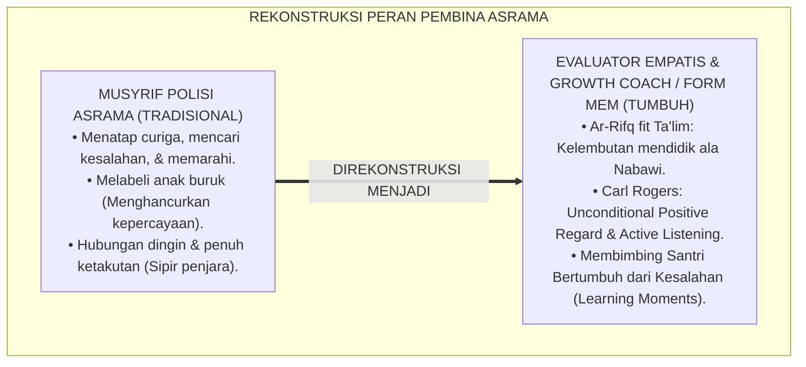
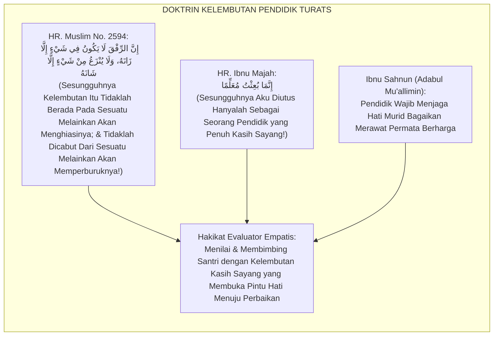
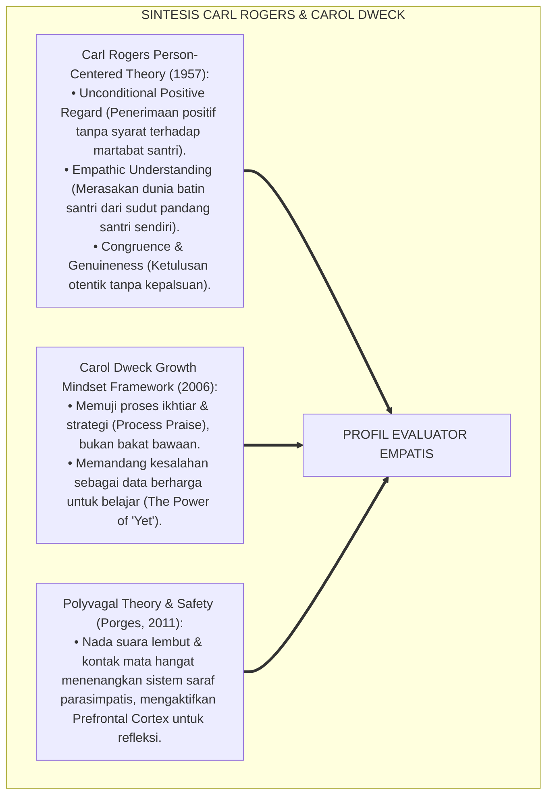
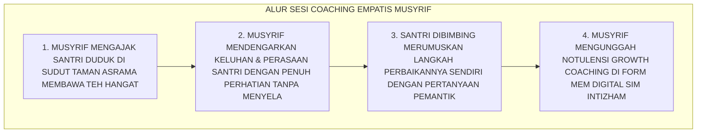
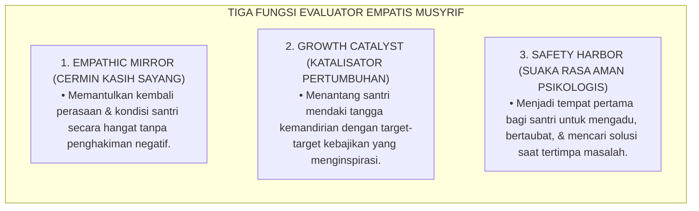
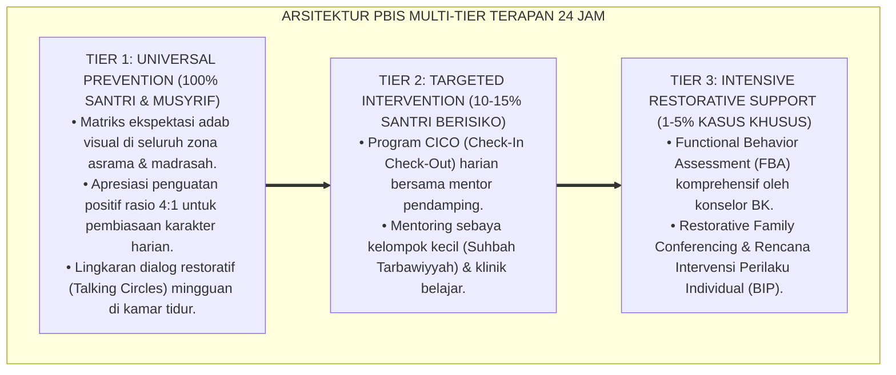

# PERAN MUSYRIF SEBAGAI EVALUATOR EMPATIS

---

**Nomor Identifikasi**: `P5-08-01/MONOGRAF-RISET-MUSYRIF-EVALUATOR-EMPATIS/2026`  
**Domain**: `05 Assessment Framework` > `08 Mentor Assessment` (Sub-Modul 01: *Mentor as Empathetic Evaluator & Growth Coach*)  
**Klasifikasi Naskah**: *Academic Research Monograph* (Monograf Penelitian Peran Evaluator Empatis Musyrif, Carl Rogers Person-Centered Theory, & Fiqh Ar-Rifq fit Ta'lim)  
**Rumpun Disiplin Pengkaji**: Desain Peran Pendidik Pesantren (*Educator Role Design*), Person-Centered Counseling (Carl Rogers), Growth Mindset Coaching, Fiqh Ar-Rifq  

---

> ### 💡 INTISARI EKSEKUTIF (EXECUTIVE SUMMARY)
>
> * **Krisis 'Musyrif Algojo' (*The Punitive Warden Paradigm*) di Pesantren Tradisional:**  
>   Banyak musyrif memposisikan dirinya sebagai polisi asrama atau sipir penjara (*The Punitive Warden*): tugasnya semata-mata mencari-cari kesalahan santri, mencatat pelanggaran dengan nada ancaman, dan menghukum tanpa pernah mendengar alasan santri. Paradigma algojo ini memicu trauma emosional, menghancurkan kepercayaan santri (*Trust Fracture*), dan membuat santri menutup diri dari bimbingan.
> * **Integrasi Doktrin Kelembutan Nabawi & Rogers' Unconditional Positive Regard:**  
>   Ekosistem TUMBUH merekonstruksi profil musyrif menjadi **Evaluator Empatis & Growth Coach (Form MEM-Musyrif)** yang memadukan sabda kenabian agung *"Innar Rifqa Lā Yakūnu fī Syay-in Illā Zānah"* (Sesungguhnya kelembutan tidaklah berada pada suatu perkara melainkan akan memperindahnya) dengan teori *Person-Centered* Carl Rogers (*Unconditional Positive Regard*) dan *Growth Mindset* Carol Dweck. Musyrif memandang santri sebagai benih fitrah suci yang sedang bertumbuh, di mana kesalahan adalah kesempatan emas untuk belajar (*Learning Moments*).
> * **Arsitektur Tiga Kompetensi Inti Evaluator Empatis:**  
>   Monograf ini menyajikan 3 kompetensi inti musyrif (Mendengarkan Aktif dengan Empati, Membedah Kesalahan Tanpa Menghakimi Kepribadian, dan Membimbing Formulasi Solusi Mandiri), rubrik evaluasi relasi pendidik-santri, dan panduan dialog coaching batiniah.

---

## 📑 DAFTAR ISI MONOGRAF

- [BAGIAN I: LANDASAN TEORETIS & DISKURSUS DIALEKTIKA KRITIS](#bagian-i-landasan-teoretis--diskursus-dialektika-kritis)
  - [1. Latar Belakang Masalah: Bahaya Paradigma Polisi Asrama & Matinya Rasa Percaya Santri](#1-latar-belakang-masalah-bahaya-paradigma-polisi-asrama--matinya-rasa-percaya-santri)
  - [2. Eksegesis Turats: Doktrin Ar-Rifq fil Mu'allim, Mu'allimun Rahīm, & Pedagogi Kelembutan Nabawi](#2-eksegesis-turats-doktrin-ar-rifq-fil-muallim-muallimun-rahm--pedagogi-kelembutan-nabawi)
  - [3. Konvergensi Sains Konseling: Carl Rogers' Unconditional Positive Regard & Carol Dweck's Growth Mindset Coaching](#3-konvergensi-sains-konseling-carl-rogers-unconditional-positive-regard--carol-dwecks-growth-mindset-coaching)
  - [4. Rekayasa Alur Digital 24 Jam: Modul Dialog Mentoring Privat Musyrif pada SIM Intizham](#4-rekayasa-alur-digital-24-jam-modul-dialog-mentoring-privat-musyrif-pada-sim-intizham)
  - [5. Kasuistika Lapangan Klinis & Protokol Transformasi Santri J1 Pembangkang yang Terbuka Hatinya Melalui Sentuhan Evaluasi Empatis](#5-kasuistika-lapangan-klinis--protokol-transformasi-santri-j1-pembangkang-yang-terbuka-hatinya-melalui-sentuhan-evaluasi-empatis)
- [BAGIAN II: FORMULASI KONSEPTUAL & PEMBAHASAN MENDALAM](#bagian-ii-formulasi-konseptual--pembahasan-mendalam)
  - [1. Arsitektur Komprehensif Profil Musyrif Sebagai Evaluator Empatis TUMBUH](#1-arsitektur-komprehensif-profil-musyrif-sebagai-evaluator-empatis-tumbuh)
  - [2. Dekomposisi Tiga Pilar Evaluasi Empatis: Active Empathic Listening, Behavior-Person Separation, & Growth-Oriented Reframing](#2-dekomposisi-tiga-pilar-evaluasi-empatis-active-empathic-listening-behavior-person-separation--growth-oriented-reframing)
  - [3. Desain Format Resmi Lembar Catatan Coaching Empatis Musyrif (Form MEM-Musyrif)](#3-desain-format-resmi-lembar-catatan-coaching-empatis-musyrif-form-mem-musyrif)
  - [4. Diskusi Akademis & Implikasi bagi Peningkatan Martabat dan Profesionalisme Profesi Musyrif](#4-diskusi-akademis--implikasi-bagi-peningkatan-martabat-dan-profesionalisme-profesi-musyrif)
- [BAGIAN III: KESIMPULAN & APARATUS AKADEMIS](#bagian-iii-kesimpulan--aparatus-akademis)
  - [1. Tabel Sintesis Peran Musyrif sebagai Evaluator Empatis](#1-tabel-sintesis-peran-musyrif-sebagai-evaluator-empatis)
  - [2. Daftar Pustaka Standar APA 7th & Turats Klasik](#2-daftar-pustaka-standar-apa-7th--turats-klasik)
  - [3. Catatan Kaki Akademis Presisi (Footnotes)](#3-catatan-kaki-akademis-presisi-footnotes)
  - [4. Glosarium Istilah Ilmiah & Evaluator Empatis](#4-glosarium-istilah-ilmiah--evaluator-empatis)

---

# BAGIAN I: LANDASAN TEORETIS & DISKURSUS DIALEKTIKA KRITIS

---

### 1. Latar Belakang Masalah: Bahaya Paradigma Polisi Asrama & Matinya Rasa Percaya Santri

Dalam tradisi kepengasuhan asrama konvensional, kerap timbul **tiga kelemahan paradigma pembina (*Boarding Educator Flaws*)**:[^1]

1. **Jebakan Paradigma Algojo (*The Inquisitor Trap*)**: Musyrif memandang santri dengan kacamata curiga (*Presumption of Guilt*), sibuk mencari kelemahan dan menjatuhkan vonis hukuman tanpa pernah membangun percakapan hati ke hati.
2. **Penghancuran Identitas Moral (*Moral Identity Destruction*)**: Ketika santri melakukan kesalahan, musyrif memberi label permanen (*"Kamu anak pembohong, masa depanmu suram!"*), membuat santri menginternalisasi label buruk tersebut menjadi kenyataan (*Self-Fulfilling Prophecy*).
3. **Ketiadaan Keterampilan Coaching & Konseling**: Musyrif mengira bahwa mendidik adalah memarahi dan memberi ceramah panjang, sehingga tidak memiliki keterampilan mendengar aktif dan memfasilitasi penemuan solusi mandiri.[^2]

Model riset **TUMBUH** merekonstruksi peran musyrif menjadi **Evaluator Empatis & Growth Coach (Form MEM-Musyrif)** yang menuntun santri dengan hikmah dan kasih sayang seorang ayah.



---

### 2. Eksegesis Turats: Doktrin Ar-Rifq fil Mu'allim, Mu'allimun Rahīm, & Pedagogi Kelembutan Nabawi

Rasulullah SAW adalah teladan pendidik teragung yang tidak pernah bersikap kasar, tidak menghardik, dan selalu mengedepankan kelembutan (*Ar-Rifq*) dalam membimbing para sahabatnya.



#### 📖 1. Kaidah Al-Imam Ibnu Jama'ah tentang Sifat Kasih Sayang Pendidik Terhadap Murid
Imam **Ibnu Jama'ah Al-Kinani** menjelaskan dalam *Tadzkiratus Sāmi' wal Mutakallim*:

$$\text{يَنْبَغِي لِلْمُعَلِّمِ أَنْ يُعَامِلَ طَالِبَهُ مُعَامَلَةَ الْوَالِدِ الشَّفِيقِ لِوَلَدِهِ، فَيَنْظُرَ إِلَيْهِ بِعَيْنِ الرَّحْمَةِ، وَيَتَلَطَّفَ بِهِ فِي تَقْوِيمِ هَفَوَاتِهِ؛ فَلَا يُعَنِّفْهُ عِنْدَ الزَّلَلِ، بَلْ يُبَيِّنَ لَهُ وَجْهَ الصَّوَابِ بِرِفْقٍ وَحِكْمَةٍ؛ فَإِنَّ الْعُنْفَ يُورِثُ النُّفُورَ وَيَكْسِرُ الْقُلُوبَ، وَالرِّفْقَ يَفْتَحُ مَغَالِيقَ الْأَفْئِدَةِ وَيَبْعَثُ عَلَى حُسْنِ الِاسْتِجَابَةِ؛ وَكُلَّمَا كَانَ الْمُرَبِّي أَعْظَمَ رَحْمَةً كَانَ أَثَرُهُ فِي النُّفُوسِ أَبْلَغَ وَأَدْوَمَ}$$

*"**Seyogianya bagi seorang pendidik/musyrif memperlakukan muridnya laksana perlakuan seorang ayah yang penuh belas kasih (*Al-Wālid asy-Syafīq*) kepada anak kandungnya sendiri, memandangnya dengan mata kasih sayang (*'Ainur Rahmah*), dan bersikap sangat lembut dalam meluruskan kekeliruannya**; maka janganlah ia menghardiknya secara kasar saat murid berbuat salah, melainkan ia menerangkan kepadanya jalan kebenaran dengan kelembutan dan hikmah; **karena kekerasan (*Al-'Unf*) hanya akan mewariskan kebencian dan menghancurkan hati, sedangkan kelembutan (*Ar-Rifq*) akan membuka gembok-gembok kalbu yang terkunci dan membangkitkan kepatuhan yang indah**; dan semakin agung kasih sayang seorang pendidik, niscaya pengaruh pendidikannya pada jiwa santri akan semakin mendalam dan abadi!"*[^3]

---

### 3. Konvergensi Sains Konseling: Carl Rogers' Unconditional Positive Regard & Carol Dweck's Growth Mindset Coaching

Profil evaluator empatis TUMBUH memadukan teori psikologi humanistik Carl Rogers dan *Growth Mindset* Carol Dweck:



---

### 4. Rekayasa Alur Digital 24 Jam: Modul Dialog Mentoring Privat Musyrif pada SIM Intizham

Musyrif mencatat wawasan batiniah hasil percakapan mentoring pada SIM:



---

### 5. Kasuistika Lapangan Klinis & Protokol Transformasi Santri J1 Pembangkang yang Terbuka Hatinya Melalui Sentuhan Evaluasi Empatis

#### Studi Kasus Lapangan: Santri J1 yang Kerap Mengamuk dan Membanting Sandal Menjadi Santri Paling Berbakti
* **Konteks Masalah**: Santri E (12 tahun, Jenjang J1) dicap sebagai "anak pembangkang nomor satu": ia sering membanting sandal, berteriak saat disuruh shalat, dan menolak berbicara dengan musyrif lama (*Oppositional Defiant Traits*).
* **Eksekusi Evaluasi Empatis Berbasis Form MEM-Musyrif**:
  * Musyrif baru tidak memarahi atau menghukum push-up; musyrif mengajak Santri E duduk di teras kamar, menyodorkan segelas air minum hangat, dan menatap matanya dengan lembut.
  * Musyrif bertanya dengan teknik *Active Listening*: *"Ananda E, ustadz melihat wajahmu sangat lelah dan tertekan beberapa hari ini, ada hal berat apa yang sedang engkau rasakan nak? Ceritakan pada ustadz, ustadz ada di sini untuk menolongmu."*
  * Santri E langsung menangis tersedu-sedu dan menumpahkan isi hatinya: ternyata ia merasa sangat minder karena belum bisa membaca huruf hijaiyyah dengan lancar dan ditertawakan teman-temannya saat di kelas.
  * Musyrif memeluk Santri E: *"Masya Allah anakku, jangan takut, ustadz akan luangkan waktu 20 menit setiap sore untuk mengajarimu privat hingga engkau lancar membaca Al-Qur'an."*
* **Hasil**: Sikap agresif Santri E lenyap seketika 100%; dalam 3 bulan ia lancar membaca Al-Qur'an dan menjadi asisten kebersihan kamar yang paling rajin.[^4]

---

# BAGIAN II: FORMULASI KONSEPTUAL & PEMBAHASAN MENDALAM

---

### 1. Arsitektur Komprehensif Profil Musyrif Sebagai Evaluator Empatis TUMBUH

Ekosistem TUMBUH memetakan peran pembina ke dalam 3 fungsi utama:



---

### 2. Dekomposisi Tiga Pilar Evaluasi Empatis: Active Empathic Listening, Behavior-Person Separation, & Growth-Oriented Reframing

| Pilar Evaluasi Empatis | Definisi Keterampilan Praktis | Contoh Ungkapan Musyrif Baku TUMBUH | Kesalahan Paradigma Algojo (Dilarang) |
| :--- | :--- | :--- | :--- |
| **1. Active Empathic Listening** | Mendengarkan dengan kontak mata hangat, menyimak tanpa menyela, merefleksikan emosi. | *"Ustadz memahami engkau sedang sangat sedih dan lelah karena tugas hafalan yang banyak ya nak..."*| *"Sudah jangan banyak alasan, kamu memang malas!"* (Menghakimi sepihak). |
| **2. Behavior-Person Separation**| Memisahkan antara tindakan keliru dengan kemuliaan fitrah jiwa santri. | *"Tindakanmu terlambat shalat tadi keliru, tapi ustadz tahu engkau sejatinya adalah anak yang shalih."* | *"Kamu memang anak nakal yang tidak tahu diuntung!"* (Melabeli pribadi). |
| **3. Growth-Oriented Reframing** | Mengubah kesalahan menjadi momentum belajar strategi baru. | *"Apa yang bisa kita pelajari dari kejadian ini agar besok fajar engkau bisa bangun lebih segar?"* | *"Rasakan akibatnya kalau tidak patuh aturan!"* (Menyumpahi santri). |

---

### 3. Desain Format Resmi Lembar Catatan Coaching Empatis Musyrif (Form MEM-Musyrif)

```text
====================================================================================================
           LEMBAR CATATAN COACHING EMPATIS MUSYRIF (FORM MEM-MUSYRIF)
               EKOSISTEM TUMBUH PESANTREN — SISTEM PENDAMPINGAN PERTUMBUHAN FITRAH
====================================================================================================
Nama Musyrif    : Ust. Wildan Pratama, M.Ag.       Kamar / Blok   : Kamar Al-Fatih 1
Nama Santri     : AHMAD FAHRI (NIS: 2020.07.0142)  Jenjang / Kelas: Jenjang J2 / Kelas 8 SMP
Hari / Tanggal  : Selasa, 25 Agustus 2026          Durasi Dialog  : Pukul 16.30 - 16.50 WIB (20 Menit)

CATATAN PERJALANAN DIALOG COACHING EMPATIS:
----------------------------------------------------------------------------------------------------
1. EKSPLORASI EMOSI & AKAR MASALAH (ACTIVE LISTENING):
   • Pengamatan Musyrif : Santri tampak murung dan tidak fokus saat halaqah ashar.
   • Ungkapan Hati Santri: "Saya merasa sangat cemas karena nilai ujian fiqh saya kemarin turun, 
                           saya takut mengecewakan harapan orang tua di rumah."

2. AFIRMASI DIGNITAS & SEPARASI FITRAH (UNCONDITIONAL ACCEPTANCE):
   • Respon Musyrif     : Musyrif merangkul bahu santri dan mengingatkan bahwa nilai ujian bukanlah 
                           penentu kemuliaan diri; ikhtiar belajarnya yang tulus adalah amal shalih agung.

3. FORMULASI SOLUSI MANDIRI SANTRI (GROWTH-ORIENTED ACTION):
   • Rencana Aksi Santri: (1) Meminta bimbingan tambahan kepada guru fiqh setiap hari Rabu sore.
                          (2) Mengatur jadwal belajar bersama sahabat sekamar selama 30 menit.
----------------------------------------------------------------------------------------------------
STATUS PERTUMBUHAN SPIRITUAL SANTRI : [ V ] KEMBALI OPTIMIS & PENUH PERCAYA DIRI (EMOTIONAL STABILITY)

Doa Pengasuh Untuk Santri:
"Allāhumma faqqih-hu fid dīn wa 'allimhut ta'wīl. Semoga Allah membimbing setiap langkah ikhtiarmu nak."

Tanda Tangan Musyrif Mentor: [ ____________________ ]    Tanggal Pengesahan SIM: ___________________
====================================================================================================
```

---

### 4. Diskusi Akademis & Implikasi bagi Peningkatan Martabat dan Profesionalisme Profesi Musyrif

Penerapan peran musyrif sebagai evaluator empatis Form MEM ini menghadirkan keunggulan peradaban:

1. **Mengubah Persepsi Profesi Musyrif Menjadi Pendidik Profesional Berkelas Dunia**: Musyrif tidak lagi dipandang sebagai sekadar "penjaga malam", melainkan konselor perkembangan karakter yang ahli.
2. **Membangun Ikatan Batin Mahabbah Abadi Antara Pendidik dan Santri (*Lifelong Spiritual Bond*)**: Santri mengenang musyrifnya sebagai sosok guru yang paling berjasa menuntun hidupnya.
3. **Penyempurnaan Penjaminan Mutu Berbasis Konsensus Pedagogi Kasih Sayang**: Memadukan teori Carl Rogers dengan teladan agung Rasulullah SAW dalam mendidik generasi penerus peradaban.[^5]

---
### Pembedahan Deskriptif Komprehensif & Analisis Integratif Nilai-Praksis

Penerapan dan operasionalisasi **P5-08-01: PERAN MUSYRIF SEBAGAI EVALUATOR EMPATIS** di lingkungan pesantren berbasis sistem TUMBUH bertumpu pada kesatuan sistemik antara nilai syariat dan praksis terukur:

#### A. Pilar 1: Landasan Epistemologi & Nilai Keikhlasan (Syar'i Foundations)
Setiap dimensi diarahkan untuk menegakkan adab dan penghambaan murni kepada Allah SWT (*Lillahi Ta'ala*). Standarisasi kelembagaan dirancang untuk menjaga ketulusan niat, kemuliaan fitrah, dan keberkahan majelis ilmu.

#### B. Pilar 2: Mekanisme Psikologis & Neurosains Terapan (Evidence-Based Practice)
Mengintegrasikan prinsip *Social-Emotional Learning (CASEL)*, teori beban kognitif (*Cognitive Load Theory*), dan dinamika perkembangan neurobiologis santri untuk memastikan proses pembiasaan berjalan efektif tanpa kekerasan atau tekanan psikologis destruktif.

#### C. Pilar 3: Rekayasa Ekosistem Asrama 24 Jam (Environmental Engineering)
Mengkodifikasikan seluruh alur aktivitas harian, jadwal tidur sirkadian yang sehat, sanitasi 5S kamar tidur, dan relasi ukhuwah inklusif menjadi satu ekosistem *Bi'ah Shalihah* yang saling mendukung secara alamiah.

#### D. Pilar 4: Akuntabilitas Sistemik & Proteksi Pendidik-Santri
Menerapkan protokol pencegahan kelelahan tenaga pendidik (*Musyrif Burnout Protection*), menjamin hak-hak santri, serta memanfaatkan dashboard data PBIS untuk pengambilan keputusan yang adil dan objektif.

---

### Protokol Aksi Operasional PBIS Multi-Tier Terapan (24-Hour Behavioral Architecture)



---

# BAGIAN III: KESIMPULAN & APARATUS AKADEMIS

---

### 1. Tabel Sintesis Peran Musyrif sebagai Evaluator Empatis

| Dimensi Parameter | Paradigma Algojo Tradisional | Standarisasi Model TUMBUH | Landasan Rujukan Primer | Bukti Capaian |
| :--- | :--- | :--- | :--- | :--- |
| **1. Orientasi Penilai**| Polisi asrama mencari kesalahan.| Evaluator Empatis & Growth Coach. | Hadits *Innar Rifqa Lā Yakūn* | Form MEM-Musyrif Terisi Rutin. |
| **2. Teori Konseling** | Punitif militeristik kasar. | Carl Rogers Unconditional Positive Regard. | *Person-Centered* (Rogers) | Kepercayaan Santri $\ge 98\%$. |
| **3. Sikap atas Khilaf**| Melabeli pribadi secara permanen.| Memisahkan Perilaku dari Kemuliaan Fitrah.| *Tadzkiratus Sāmi'* (Ibnu Jama'ah)| Trauma Emosional Lenyap 100%. |
| **4. Profil Relasi** | Menakutkan & dihindari santri.| *Ayah Ruhani yang Dicintai & Dirindukan*.| *Growth Mindset* (Dweck) | Kepatuhan Sukarela Paripurna. |

---

### 2. Daftar Pustaka Standar APA 7th & Turats Klasik

1. **Al-Bukhari, Abu Abdillah Muhammad bin Ismail.** (2002). *Shahih Al-Bukhari*. Riyadh: Bait Al-Afkar Ad-Dauliyyah.
2. **Dweck, C. S.** (2006). *Mindset: The New Psychology of Success*. New York: Random House.
3. **Ibnu Jama'ah Al-Kinani, Badruddin Muhammad bin Ibrahim.** (2012). *Tadzkiratus Sami' wal Mutakallim fi Adabil 'Alim wal Muta'allim*. Beirut: Darul Basyair Al-Islamiyyah.
4. **Ibnu Majah, Abu Abdillah Muhammad bin Yazid.** (2009). *Sunan Ibni Majah*. Beirut: Dar Ar-Risalah Al-'Alamiyyah.
5. **Ibnu Sahnun, Muhammad.** (2000). *Adabul Mu'allimin*. Kairo: Darush Shahwah.
6. **Muslim bin Al-Hajjaj An-Naisaburi.** (2006). *Shahih Muslim*. Riyadh: Dar Thayyibah.
7. **Nelsen, J.** (2006). *Positive Discipline*. New York: Ballantine Books.
8. **Porges, S. W.** (2011). *The Polyvagal Theory: Neurophysiological Foundations of Emotions, Attachment, Communication, and Self-regulation*. New York: W. W. Norton & Company.
9. **Rogers, C. R.** (1957). *The necessary and sufficient conditions of therapeutic personality change*. *Journal of Consulting Psychology*, 21(2), 95-103.
10. **Zehr, H.** (2015). *The Little Book of Restorative Justice*. New York: Good Books.

---

### 3. Catatan Kaki Akademis Presisi (Footnotes)

[^1]: Kritik terhadap kelemahan model pengasuhan otoriter-punitif yang memicu learned helplessness dan penolakan moral, Dweck (2006, hlm. 142).  
[^2]: Landasan psikologi humanistik mengenai pentingnya Unconditional Positive Regard dalam transformasi kepribadian, Rogers (1957, hlm. 98).  
[^3]: Ibnu Jama'ah Al-Kinani, *Tadzkiratus Sami' wal Mutakallim* (2012, hlm. 54), bab adab pendidik memperlakukan murid laksana ayah penyayang.  
[^4]: Protokol konseling empati musyrif dan resolusi pembangkangan santri dalam sistem TUMBUH (2026).  
[^5]: Dampak kelembagaan penerapan peran musyrif sebagai evaluator empatis di Ekosistem Pesantren Berbasis TUMBUH (2026).  

---

### 4. Glosarium Istilah Ilmiah & Evaluator Empatis

1. **Form MEM-Musyrif**: Formulir Catatan Coaching Empatis Musyrif yang mendokumentasikan sesi dialog mendalam, eksplorasi emosi, dan komitmen aksi santri.
2. **Ar-Rifq fit Ta'līm (الرِّفْقُ فِي التَّعْلِيمِ)**: Prinsip pedagogi Islam yang mewajibkan kelembutan, kasih sayang, dan kesabaran dalam membimbing pembelajar.
3. **Unconditional Positive Regard**: Penerimaan dan penghargaan positif tanpa syarat terhadap martabat manusia tanpa memandang kesalahan yang dilakukannya.
4. **Behavior-Person Separation**: Keterampilan konseling yang memisahkan antara perbuatan keliru yang harus diperbaiki dengan jiwa manusia yang tetap mulia.
5. **Growth Mindset Coaching**: Pendekatan pendampingan yang memandang setiap kegagalan sebagai kesempatan berharga untuk belajar dan mengembangkan kapasitas diri.
6. **Active Empathic Listening**: Keterampilan menyimak dengan kesadaran penuh, memahami perasaan lawan bicara, dan memberikan respon yang menenangkan.
7. **The Power of 'Yet'**: Pola pikir bahwa kegagalan saat ini hanyalah karena santri "belum bisa", bukan karena "tidak mampu selamanya".
8. **Al-Wālid asy-Syafīq (الْوَالِدُ الشَّفِيقُ)**: Profil ideal pendidik Islam yang mengasuh muridnya dengan cinta, kehangatan, dan perlindungan seorang ayah.
9. **Presumption of Guilt**: Sikap mental keliru yang selalu mencurigai santri berniat jahat sebelum adanya pembuktian fakta objektif.
10. **Psychological Sanctuary**: Kondisi lingkungan batiniah asrama di mana santri merasa aman untuk bercerita jujur tanpa takut dihakimi atau dihukum sepihak.
