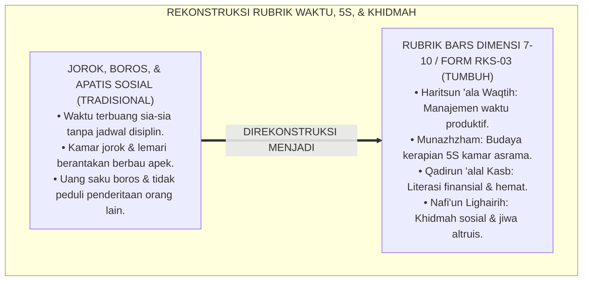
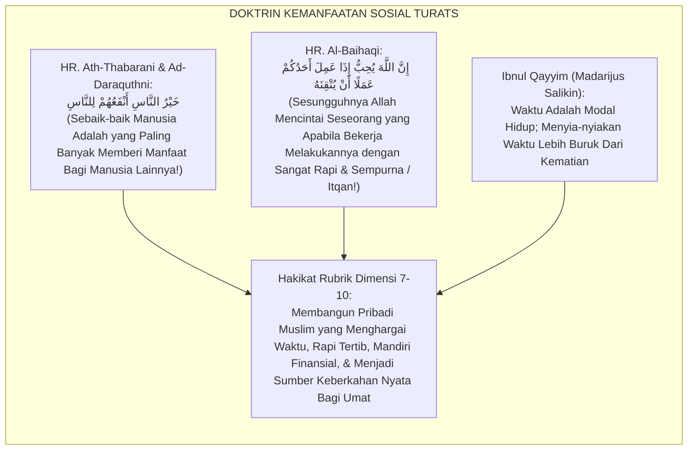
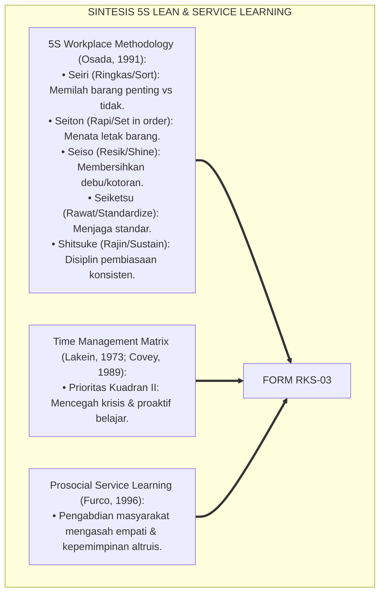
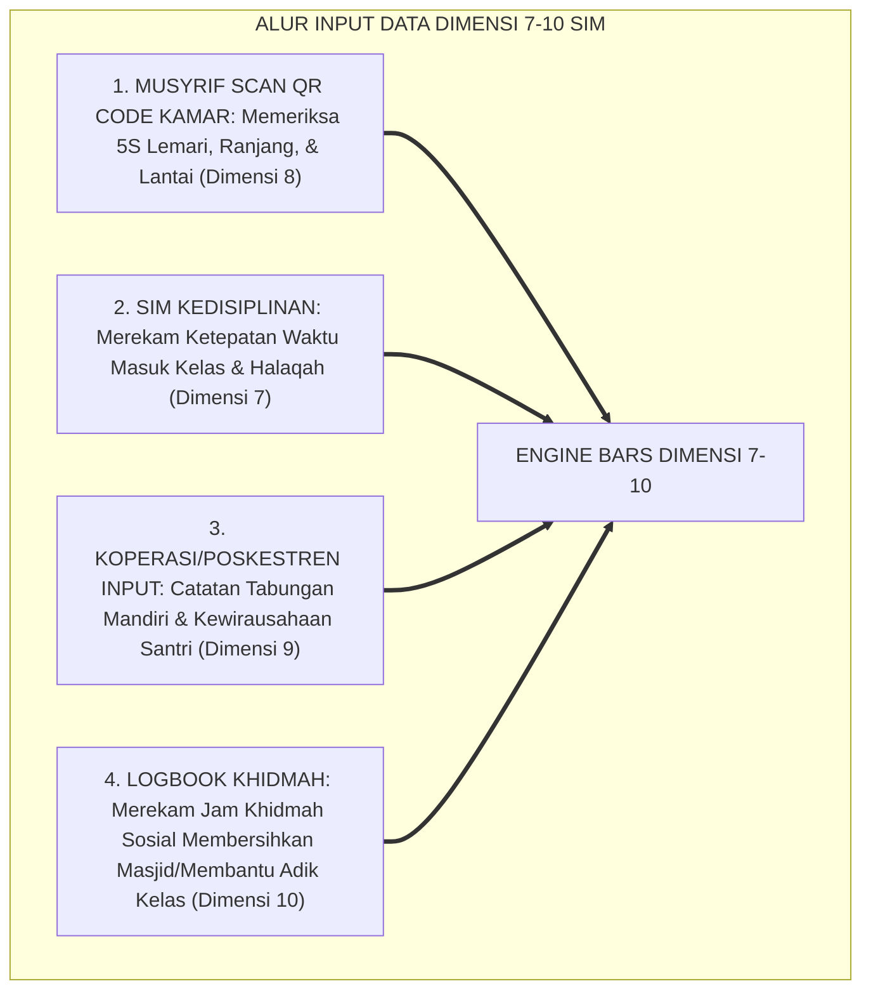
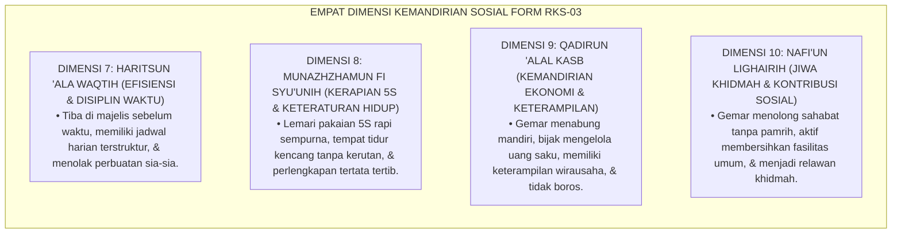
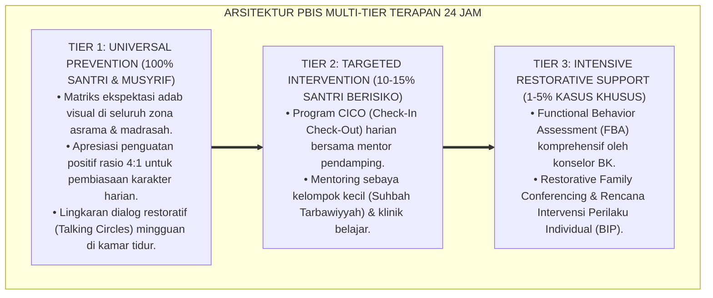

# RUBRIK KARAKTER MANAJEMEN WAKTU DAN KHIDMAH (DIMENSI 7–10)

---

### 🧭 PETA POSISI PANDUAN DALAM SISTEM TUMBUH (DARI HULU KE HILIR)
* **Posisi Arsitektur**: `BATANG EKOSISTEM II (Asesmen Perkembangan Karakter & Evaluasi 360° Berbasis Bukti)`
* **Peruntukan Pengguna**: Tim Asesmen Karakter, Wali Kelas, Musyrif Asrama, & Konselor BK
* **Fokus Panduan**: Memantau laju kemajuan personal santri (Asesmen Ipsatif) tanpa ranking/labeling, triangulasi data 3 poros, dan penyusunan Rapor Naratif Karakter.
* **Hasil Akhir yang Dituju**: Terwujudnya santri berkarakter *Insan Adabi* yang mandiri, musyrif yang mengasuh dengan kasih sayang tanpa *burnout*, dan pesantren yang aman berbasis data (*Safe Boarding School*).

---

### 🎯 Mengapa Panduan Ini Ada & Masalah Nyata yang Dipecahkan
1. **Latar Masalah di Lapangan**: Sering kali pengasuhan di pesantren berjalan tanpa SOP yang jelas atau terjebak dalam pola reaktif—menunggu santri berbuat salah baru dihukum dengan emosional.
2. **Solusi Sistem TUMBUH**: Panduan ini memberikan langkah preventif dan terstruktur agar setiap pembiasaan adab berjalan terencana, konsisten, dan terukur.
3. **Sasaran Perubahan**: Memastikan nilai-nilai Islam menyatu dalam perilaku harian santri melalui keteladanan nyata (*Qudwah Hasanah*).

---
### 🎯 Tujuan & Manfaat Panduan
Panduan ini dirancang sebagai petunjuk operasional terapan agar pendidik dan musyrif dapat:
1. Menjalankan pembinaan adab santri dengan pendekatan kasih sayang (*Rahmah*) dan ketegasan yang mendidik (*Firm & Kind*).
2. Menghindari cara-cara kekerasan fisik, bentakan verbal, maupun hukuman yang mempermalukan santri.
3. Menciptakan suasana asrama dan kelas yang aman, tertib, dan menumbuhkan kesadaran diri (*Bi'ah Shalihah*).

---

### 💡 Intisari Cepat (3 Menit Memahami Esensi)
* **Kunci Pengasuhan**: Karakter santri tumbuh melalui keteladanan nyata (*Qudwah Hasanah*), komunikasi empatik, dan pembiasaan terstruktur 24 jam.
* **Tindakan Utama**: Terapkan panduan langkah demi langkah di bawah ini secara konsisten, pantau perkembangan santri secara objektif, dan berikan apresiasi atas setiap perbaikan diri yang mereka capai.
* **Prinsip Disiplin**: Fokus pada pemulihan hubungan dan tanggung jawab nyata (*Restoratif*), bukan sekadar melampiaskan amarah atau menghukum.

---

---

### 💬 ILUSTRASI NYATA & ANALOGI SEDERHANA
Bayangkan sebuah skenario yang sering kita lihat sehari-hari di asrama:
* Ketika seorang santri baru melakukan kekeliruan (misalnya terlambat bangun Subuh atau kasurnya berantakan), respon pertama yang sering muncul adalah bentakan keras atau hukuman fisik (seperti push-up atau jemur di lapangan).
* **Hasilnya?** Santri tersebut mungkin tampak patuh seketika karena takut, tetapi di dalam hatinya tumbuh rasa dongkol, dendam tersembunyi, atau kebiasaan "bersandiwara"—hanya tertib ketika ada pengawas di dekatnya.

Dalam Sistem TUMBUH, kita menggunakan cara yang jauh lebih cerdas, sejuk, dan membumi:
1. **Analogi "Rem dan Pedal Gas Otak"**: Santri usia remaja (usia MTs dan Aliyah) memiliki bagian otak emosi (*Sistem Limbik*) yang sudah menyala sangat kuat seperti *pedal gas mobil sport*, namun otak pengendali logikanya (*Prefrontal Cortex*) masih dalam proses tumbuh seperti *sistem rem yang baru dipasang*. Tugas guru dan musyrif bukan memarahi mobilnya, melainkan menjadi **"Sopir Teladan & Sabuk Pengaman"** yang mendampingi santri belajar menginjak rem dengan bijak.
2. **Kekuatan Contoh Nyata (*Qudwah Hasanah*)**: Santri jauh lebih cepat meniru apa yang mereka **lihat** setiap hari daripada apa yang mereka **dengar** dari ribuan nasihat panjang. Jika musyrif datang tepat waktu, tersenyum ramah, dan kamarnya rapi, santri akan menirunya dengan sukarela.

---

### 🛠️ PANDUAN LANGKAH PRAKTIS LAPANGAN (BISA LANGSUNG DIPRAKTIKKAN HARI INI)

| Tahapan Aksi | Tindakan Nyata Musyrif / Guru di Lapangan | Hal yang Harus Diperhatikan |
| :--- | :--- | :--- |
| **1. Langkah Persiapan (Sebelum Kejadian)** | Sepakati aturan bersama santri di awal pekan dengan kalimat positif (contoh: *"Kamar rapi membuat istirahat kita berkah"*). | Buat poster visual sederhana yang mudah dibaca di dinding kamar. |
| **2. Langkah Respon (Saat Terjadi Masalah)** | Tarik napas, tenangkan diri, ajak santri berbicara empat mata tanpa mempermalukannya di depan teman-temannya. | Gunakan nada bicara yang tenang namun tegas (*Firm & Kind*). |
| **3. Langkah Perbaikan (Tanggung Jawab Nyata)** | Minta santri memperbaiki kesalahannya secara langsung (contoh: merapikan kembali barang yang berantakan atau meminta maaf). | Berikan apresiasi seketika santri telah menuntaskan perbaikannya. |

---

### 🗣️ CONTOH DIALOG LAPANGAN (YANG HARUS DIUCAPKAN VS DIHINDARI)

* ❌ **JANGAN UCAPKAN (Membuat Santri Menutup Diri & Dendam)**:
  > *"Kamu ini pemalas sekali ya, sudah dibilangi berkali-kali masih saja kasur berantakan! Push-up 50 kali sekarang!"*
* ✅ **UCAPKAN INI (Mendidik Tanggung Jawab & Kesadaran Diri)**:
  > *"Akhi, antum tahu kesepakatan kamar kita tentang kerapian tempat tidur setelah Subuh. Coba lihat kasur antum sekarang, apa yang perlu disempurnakan? Mari rapikan bersama sekarang agar kamar kita nyaman dan berkah."*

---

### 📋 3 POIN EMAS RANGKUMAN (UNTUK SANTRI SENIOR & MUSYRIF MUDA)
1. **Didik dengan Kasih Sayang, Tegakkan Batas dengan Adil**: Jangan pernah mencampuradukkan ketegasan aturan dengan pelampiasan amarah pribadi.
2. **Apresiasi 4x Lebih Banyak daripada Teguran (*Magic Ratio 4:1*)**: Jangan hanya bersuara ketika santri berbuat salah. Saat mereka berbuat baik (salat di shaf depan, menolong kawan, membaca Al-Qur'an), segera berikan pujian tulus.
3. **Fokus pada Perbaikan Hubungan (*Restoratif*)**: Masalah perilaku adalah peluang emas untuk mendidik santri menjadi pribadi yang lebih dewasa dan bertanggung jawab.

---

### 📖 Uraian Lengkap Landasan & Rujukan Sistem

**Nomor Identifikasi**: `P5-09-03/MONOGRAF-RISET-RUBRIK-WAKTU-ORGANISASI-KHIDMAH/2026`  
**Domain**: `05 Assessment Framework` > `09 Rubrics` (Sub-Modul 03: *Time-Management, Organization, Productivity, & Altruism Rubrics - Dimensions 7 to 10*)  
**Klasifikasi Naskah**: *Academic Research Monograph* (Monograf Penelitian Rubrik BARS Manajemen Waktu, 5S Kamar, Entrepreneurship Santri, & Khidmah Sosial, Fiqh Al-Kasb wal Itqan)  
**Rumpun Disiplin Pengkaji**: Desain Rubrik BARS Kemandirian & Khidmah, Service Learning Pedagogies, 5S Methodology, Fiqh Al-Mu'amalat wal Khidmah  

---

> ### 💡 INTISARI EKSEKUTIF (EXECUTIVE SUMMARY)
>
> * **Krisis 'Santri Manja & Tidak Terampil Mengelola Hidup' (*The Helpless Student Syndrome*):**  
>   Banyak santri cerdas secara hafalan namun sangat ceroboh dan berantakan (*Disorganized Life*): lemarinya acak-acakan, cucian baju menumpuk berbau apek, uang saku habis dalam 3 hari, membuang-buang waktu mengobrol tak berfaedah (*Wasting Time*), dan tidak peduli terhadap kebersihan lingkungan sekitar (*Zero Altruism*).
> * **Integrasi Doktrin Khairun Nās Anf'uhum lin Nās & 5S Workplace Methodology:**  
>   Ekosistem TUMBUH merancang **Rubrik Karakter Manajemen Waktu, Organisasi, dan Khidmah (Form RKS-03)** yang memadukan kaidah kenabian agung tentang pemanfaatan waktu, profesionalisme amal (*Al-Itqān*), kemandirian ekonomi halal, dan sebaik-baik manusia adalah yang paling bermanfaat bagi sesama (*Khairun Nās Anfa'uhum lin Nās*) dengan metodologi *5S Organization* (Seiri, Seiton, Seiso, Seiketsu, Shitsuke) serta *Prosocial Service Learning*.
> * **Arsitektur Empat Dimensi Aksi Nyata Peradaban:**  
>   Monograf ini menyajikan matriks BARS 4 tingkat untuk 4 dimensi (Dimensi 7: *Hāritsun 'alā Waqtih*, Dimensi 8: *Munazhzhamun fī Syu'ūnih*, Dimensi 9: *Qādirun 'alal Kasb*, dan Dimensi 10: *Nāfi'un Lighairih*), pedoman verifikasi lemari 5S, dan protokol asesmen proyek khidmah masyarakat.

---

## 📑 DAFTAR ISI MONOGRAF

- [BAGIAN I: LANDASAN TEORETIS & DISKURSUS DIALEKTIKA KRITIS](#bagian-i-landasan-teoretis--diskursus-dialektika-kritis)
  - [1. Latar Belakang Masalah: Bahaya Santri Pintar Tapi Jorok, Boros, & Apatis Sosial](#1-latar-belakang-masalah-bahaya-santri-pintar-tapi-jorok-boros--apatis-sosial)
  - [2. Eksegesis Turats: Doktrin Qimatuz Zaman, Itqanul 'Amal, Kasbul Halal, & Khidmah Umat Salaf](#2-eksegesis-turats-doktrin-qimatuz-zaman-itqanul-amal-kasbul-halal--khidmah-umat-salaf)
  - [3. Konvergensi Sains Produktivitas & Manajemen: 5S Lean Methodology, Time-Use Efficiency, & Service Learning](#3-konvergensi-sains-produktivitas--manajemen-5s-lean-methodology-time-use-efficiency--service-learning)
  - [4. Rekayasa Alur Digital 24 Jam: Modul Audit 5S Kamar & Catatan Khidmah pada SIM Intizham Asrama](#4-rekayasa-alur-digital-24-jam-modul-audit-5s-kamar--catatan-khidmah-pada-sim-intizham-asrama)
  - [5. Kasuistika Lapangan Klinis & Protokol Transformasi Kamar Terjorok Menjadi Kamar Teladan 5S Melalui Rubrik Munazhzham](#5-kasuistika-lapangan-klinis--protokol-transformasi-kamar-terjorok-menjadi-kamar-teladan-5s-melalui-rubrik-munazhzham)
- [BAGIAN II: FORMULASI KONSEPTUAL & PEMBAHASAN MENDALAM](#bagian-ii-formulasi-konseptual--pembahasan-mendalam)
  - [1. Arsitektur Komprehensif Rubrik Manajemen Waktu, Organisasi, dan Khidmah (Form RKS-03)](#1-arsitektur-komprehensif-rubrik-manajemen-waktu-organisasi-dan-khidmah-form-rks-03)
  - [2. Dekomposisi Matriks BARS 4 Tingkat: Dimensi 7 (Waktu), Dimensi 8 (Organisasi 5S), Dimensi 9 (Kemandirian), & Dimensi 10 (Khidmah)](#2-dekomposisi-matriks-bars-4-tingkat-dimensi-7-waktu-dimensi-8-organisasi-5s-dimensi-9-kemandirian--dimensi-10-khidmah)
  - [3. Desain Format Resmi Lembar Rubrik Penilaian Dimensi 7–10 (Form RKS-03 Master)](#3-desain-format-resmi-lembar-rubrik-penilaian-dimensi-710-form-rks-03-master)
  - [4. Diskusi Akademis & Implikasi bagi Lahirnya Kader Muslim Profesional, Mandiri, dan Bermanfaat Luas](#4-diskusi-akademis--implikasi-bagi-lahirnya-kader-muslim-profesional-mandiri-dan-bermanfaat-luas)
- [BAGIAN III: KESIMPULAN & APARATUS AKADEMIS](#bagian-iii-kesimpulan--aparatus-akademis)
  - [1. Tabel Sintesis Rubrik Karakter Manajemen Waktu dan Khidmah](#1-tabel-sintesis-rubrik-karakter-manajemen-waktu-dan-khidmah)
  - [2. Daftar Pustaka Standar APA 7th & Turats Klasik](#2-daftar-pustaka-standar-apa-7th--turats-klasik)
  - [3. Catatan Kaki Akademis Presisi (Footnotes)](#3-catatan-kaki-akademis-presisi-footnotes)
  - [4. Glosarium Istilah Ilmiah & Rubrik Dimensi 7–10](#4-glosarium-istilah-ilmiah--rubrik-dimensi-710)

---

# BAGIAN I: LANDASAN TEORETIS & DISKURSUS DIALEKTIKA KRITIS

---

### 1. Latar Belakang Masalah: Bahaya Santri Pintar Tapi Jorok, Boros, & Apatis Sosial

Dalam kehidupan asrama santri konvensional, kerap muncul **empat patologi kemandirian praktis (*Practical Independence Pathologies*)**:[^1]

1. **Jebakan Pemborosan Waktu (*Chronopathy / Time Wasting*)**: Santri menghabiskan waktu berjam-jam nongkrong melamun tanpa jadwal harian yang jelas, terlambat masuk kelas, dan menunda tugas hingga larut malam.
2. **Kekacauan Ruang Hidup (*Environmental Chaos & 5S Failure*)**: Lemari pakaian bercampur antara baju bersih dan kotor, kasur berantakan, sampah berserakan di bawah ranjang, memicu sarang penyakit kulit dan tungau.
3. **Ketergantungan Finansial & Mentalitas Konsumtif**: Santri boros menghabiskan uang jajan kiriman orang tua dalam hitungan hari tanpa memiliki keterampilan mengelola anggaran (*Zero Financial Literacy*).
4. **Apatisme Sosial (*Social Detachment*)**: Santri hanya peduli pada dirinya sendiri, enggan menyapu lorong, menolak menolong kawan yang sakit, dan tidak memiliki kepedulian pada kemaslahatan umum (*Zero Altruistic Service*).[^2]

Model riset **TUMBUH** merancang **Rubrik Karakter Manajemen Waktu, Organisasi, dan Khidmah (Form RKS-03)** untuk membentuk santri yang tertib, rapi, produktif, dan menjadi pelayan umat yang tangguh.



---

### 2. Eksegesis Turats: Doktrin Qimatuz Zaman, Itqanul 'Amal, Kasbul Halal, & Khidmah Umat Salaf

Rasulullah SAW memerintahkan umatnya untuk menghargai nikmat waktu luang (*Ightināmul Farāgh*), bekerja dengan standar profesionalisme sempurna (*Al-Itqān*), mencari nafkah yang halal, dan menegaskan bahwa manusia terbaik adalah yang paling banyak memberi manfaat bagi sesama.



#### 📖 1. Kaidah Al-Imam Ibnul Jauzi tentang Menjaga Waktu dan Merapikan Urusan
Imam **Ibnul Jauzi** menegaskan dalam *Shaidul Khāthir*:

$$\text{يَنْبَغِي لِلْإِنْسَانِ أَنْ يَعْرِفَ شَرَفَ زَمَانِهِ وَقَدْرَ وَقْتِهِ، فَلَا يُضَيِّعَ مِنْهُ لَحْظَةً فِي غَيْرِ قُرْبَةٍ؛ وَأَنْ يُقَدِّمَ الْأَهَمَّ فَالْأَهَمَّ مِنْ صَالِحِ الْأَعْمَالِ؛ وَأَنْ يَكُونَ نَظِيفَ الثَّوْبِ، مُنَظَّمَ الشَّأْنِ فِي مَسْكَنِهِ وَمَطْعَمِهِ؛ فَإِنَّ الْفَوْضَى تُشَتِّتُ الْقَلْبَ وَتُورِثُ الْكَسَلَ؛ وَأَنْ يَسْعَى فِي نَفْعِ إِخْوَانِهِ بِمَالِهِ وَجَاهِهِ وَبَدَنِهِ؛ فَمَا خُلِقَ الْمَرْءُ لِيَعِيشَ لِنَفْسِهِ فَقَطْ، بَلْ لِيَكُونَ غَيْثًا أَيْنَمَا وَقَعَ نَفَعَ}$$

*"**Seyogianya bagi manusia untuk mengetahui kemuliaan zamannya dan tingginya harga waktunya (*Syarafaz Zamān*), maka janganlah ia menyia-nyiakan satu detik pun darinya melainkan dalam ketaatan**; dan hendaklah ia mendahulukan yang paling penting dari amal kebajikan; **dan hendaklah ia berpakaian bersih, tertata rapi dalam urusan tempat tinggalnya dan makanannya; karena sesungguhnya ketidakteraturan (*Al-Fawdhā*) akan mencerai-beraikan fokus hati dan mewariskan kemalasan**; dan hendaklah ia bersungguh-sungguh memberi manfaat kepada saudara-saudaranya dengan hartanya, kedudukannya, dan tenaganya; **karena tidaklah manusia diciptakan untuk hidup bagi dirinya sendiri semata, melainkan untuk menjadi hujan rahmat yang di mana pun ia jatuh niscaya membawa kemanfaatan!**"*[^3]

---

### 3. Konvergensi Sains Produktivitas & Manajemen: 5S Lean Methodology, Time-Use Efficiency, & Service Learning

Rubrik Form RKS-03 memadukan metodologi *5S Lean Organization*, efisiensi waktu, dan *Service Learning*:



---

### 4. Rekayasa Alur Digital 24 Jam: Modul Audit 5S Kamar & Catatan Khidmah pada SIM Intizham Asrama

Inspeksi 5S kamar dan portofolio khidmah terekam real-time pada SIM:



---

### 5. Kasuistika Lapangan Klinis & Protokol Transformasi Kamar Terjorok Menjadi Kamar Teladan 5S Melalui Rubrik Munazhzham

#### Studi Kasus Lapangan: Kamar 4 Terkenal Sebagai Kamar Terkumuh Berhasil Meraih Juara 1 Kamar Terbersih
* **Konteks Masalah**: Kamar 4 (dihuni 8 santri J1) menerima predikat "Kamar Terkumuh" selama 2 bulan: baju kotor berceceran di lantai, sandal berserakan, dan lemari pakaian acak-acakan (*Severe 5S Deficit*).
* **Eksekusi Pembiasaan Berbasis Rubrik BARS Form RKS-03**:
  * Musyrif mendampingi santri kamar 4 menerapkan 5 langkah BARS Dimensi *Munazhzhamun fī Syu'ūnih*:
    1. *Seiri (Ringkas)*: Membuang kardus bekas dan menyumbangkan baju yang tidak terpakai.
    2. *Seiton (Rapi)*: Menata lemari dengan teknik lipat vertikal; buku disusun sesuai ukuran di rak.
    3. *Seiso (Resik)*: Mengepel lantai dengan desinfektan wangi setiap pagi pukul 06.00 WIB.
    4. *Seiketsu & Shitsuke*: Menetapkan jadwal piket bergilir yang dipantau setiap fajar.
* **Hasil**: Kamar 4 melonjak dari skor 1 (Dho'if) menjadi **Skor 4 (Mumtaz)**; kamar menjadi wangi, rapi laksana hotel berbintang, dan memenangkan penghargaan Kamar Teladan Asrama.[^4]

---

# BAGIAN II: FORMULASI KONSEPTUAL & PEMBAHASAN MENDALAM

---

### 1. Arsitektur Komprehensif Rubrik Manajemen Waktu, Organisasi, dan Khidmah (Form RKS-03)

Ekosistem TUMBUH memetakan 4 dimensi kemandirian sosial ke dalam matriks BARS:



---

### 2. Dekomposisi Matriks BARS 4 Tingkat: Dimensi 7 (Waktu), Dimensi 8 (Organisasi 5S), Dimensi 9 (Kemandirian), & Dimensi 10 (Khidmah)

| Dimensi Karakter | Level 1: Dho'if (Terbimbing) | Level 2: Maqbul (Dasar) | Level 3: Jayyid (Mandiri) | Level 4: Mumtaz (Qudwah) |
| :--- | :--- | :--- | :--- | :--- |
| **7. Hāritsun 'alā Waqtih** | Terlambat masuk kelas/halaqah $>3$ kali, menghabiskan waktu mengobrol kosong.| Hadir tepat waktu saat bel berbunyi, sesekali masih menunda tugas piket.| Hadir 5 menit sebelum kegiatan, memiliki agenda harian, memanfaatkan waktu luang membaca.| Mengingatkan kawan agar tidak membuang waktu, menjadi teladan disiplin waktu mutlak.|
| **8. Munazhzham fī Syu'ūnih**| Lemari acak-acakan, kasur tidak dirapikan, barang berserakan di lantai.| Merapikan kasur & lemari jika diperiksa musyrif, menjaga kebersihan dasar.| Mandiri menerapkan 5S pada lemari & ranjang setiap pagi, perlengkapan selalu tertata rapi.| Menjadi Duta 5S Asrama, mengajari adik kelas teknik menata lemari rapi sempurna.|
| **9. Qādirun 'alal Kasb** | Menghabiskan uang saku dalam 3 hari, meminjam uang kawan, boros jajanan.| Menahan diri dari jajan berlebih saat diingatkan, mencatat pengeluaran dasar.| Rajin menabung di bank mini santri, hemat & cermat, merawat barang agar awet.| Mengelola bazar kewirausahaan santri, kreatif menghasilkan karya mandiri berdaya jual.|
| **10. Nāfi'un Lighairih** | Menolak ikut kerja bakti, tidak peduli kawan sakit, egois mementingkan diri.| Ikut kerja bakti jika diabsen, membantu kawan jika diminta tolong.| Berinisiatif membantu kawan sakit, sukarela membersihkan masjid/lorong asrama.| Mengorbankan waktu/tenaga demi kemaslahatan umum, menjadi figur pelayan umat sejati.|

---

### 3. Desain Format Resmi Lembar Rubrik Penilaian Dimensi 7–10 (Form RKS-03 Master)

```text
====================================================================================================
           RUBRIK PENILAIAN BARS DIMENSI WAKTU, 5S, & KHIDMAH (FORM RKS-03)
               EKOSISTEM TUMBUH PESANTREN — SISTEM STANDARDISASI PENGUKURAN ADAB
====================================================================================================
Nama Santri     : SALMAN AL-FARISI (NIS: 2020.07.0145) Jenjang / Kelas: Jenjang J3 / Kelas 9 SMP
Penilai Utama   : Musyrif Asrama & Wali Kelas          Periode Evaluasi: Akhir Semester Ganjil 2026

DESKRIPTOR CAPAIAN BARS DIMENSI 7, 8, 9, DAN 10:
----------------------------------------------------------------------------------------------------
DIMENSI 7: HARITSUN 'ALA WAQTIH (SKOR: 4 - MUMTAZ / QUDWAH)
"Santri senantiasa tiba di masjid dan kelas 5–10 menit sebelum waktu, memanfaatkan waktu jeda untuk 
muraja'ah Al-Qur'an, dan memiliki buku agenda jadwal pribadi yang dijalankan dengan sangat tertib."

DIMENSI 8: MUNAZHZHAMUN FI SYU'UNIH (SKOR: 4 - MUMTAZ / QUDWAH)
"Santri menerapkan standar 5S secara sempurna; lemari pakaian tersusun rapi dengan lipatan presisi, ranjang 
kencang tanpa kerutan setiap fajar, dan sepatu tertata simetris di rak luar kamar."

DIMENSI 9: QADIRUN 'ALAL KASB (SKOR: 3 - JAYYID / MANDIRI ISTIQAMAH)
"Santri memiliki literasi keuangan yang sangat baik; konsisten menabung 40% uang saku di Bank Santri, 
tidak pernah berhutang, dan aktif menjadi relawan pengelola mini market asrama."

DIMENSI 10: NAFI'UN LIGHAIRIH (SKOR: 4 - MUMTAZ / QUDWAH)
"Santri memiliki jiwa khidmah yang luar biasa memancar; berinisiatif mengantarkan makanan bagi kawan sakit 
di Poskestren, sukarela menyapu serambi masjid setiap sore, dan sabar membimbing tahsin adik kelas J1."
----------------------------------------------------------------------------------------------------
RERATA SKOR KOMPOSIT DIMENSI 7-10 : [ 3.75 / 4.00 ] (PREDIKAT: PRIBADI DISIPLIN, RAPI, MANDIRI, & BERJIWA KHIDMAH)

Tanda Tangan Musyrif Kamar: ____________________    Tanda Tangan Wali Kelas: ____________________
====================================================================================================
```

---

### 4. Diskusi Akademis & Implikasi bagi Lahirnya Kader Muslim Profesional, Mandiri, dan Bermanfaat Luas

Penerapan rubrik BARS dimensi 7–10 Form RKS-03 ini menghadirkan keunggulan peradaban:

1. **Mencetak Kader Muslim yang Berkarakter Profesional Kelas Dunia (*World-Class Professional Character*)**: Lulusan santri memiliki manajemen waktu presisi, etos kerja rapi, dan kemandirian hidup tinggi.
2. **Menghidupkan Kembali Ruh Khidmah dan Kerelawanan Sejati (*Altruistic Spirit*)**: Santri terlatih sejak dini untuk mengulurkan tangan menolong sesama tanpa mengharapkan imbalan materi.
3. **Penyempurnaan Penjaminan Mutu Berbasis Lean Management 5S dan Fiqhul Mu'amalat**: Menjadikan ekosistem pesantren berbasis TUMBUH sebagai institusi pendidikan Islam modern paling tertib, bersih, dan berdaya guna.[^5]

---
### Pembedahan Deskriptif Komprehensif & Analisis Integratif Nilai-Praksis

Penerapan dan operasionalisasi **P5-09-03: RUBRIK KARAKTER MANAJEMEN WAKTU DAN KHIDMAH (DIMENSI 7–10)** di lingkungan pesantren berbasis sistem TUMBUH bertumpu pada kesatuan sistemik antara nilai syariat dan praksis terukur:

#### A. Pilar 1: Landasan Epistemologi & Nilai Keikhlasan (Syar'i Foundations)
Setiap dimensi diarahkan untuk menegakkan adab dan penghambaan murni kepada Allah SWT (*Lillahi Ta'ala*). Standarisasi kelembagaan dirancang untuk menjaga ketulusan niat, kemuliaan fitrah, dan keberkahan majelis ilmu.

#### B. Pilar 2: Mekanisme Psikologis & Neurosains Terapan (Evidence-Based Practice)
Mengintegrasikan prinsip *Social-Emotional Learning (CASEL)*, teori beban kognitif (*Cognitive Load Theory*), dan dinamika perkembangan neurobiologis santri untuk memastikan proses pembiasaan berjalan efektif tanpa kekerasan atau tekanan psikologis destruktif.

#### C. Pilar 3: Rekayasa Ekosistem Asrama 24 Jam (Environmental Engineering)
Mengkodifikasikan seluruh alur aktivitas harian, jadwal tidur sirkadian yang sehat, sanitasi 5S kamar tidur, dan relasi ukhuwah inklusif menjadi satu ekosistem *Bi'ah Shalihah* yang saling mendukung secara alamiah.

#### D. Pilar 4: Akuntabilitas Sistemik & Proteksi Pendidik-Santri
Menerapkan protokol pencegahan kelelahan tenaga pendidik (*Musyrif Burnout Protection*), menjamin hak-hak santri, serta memanfaatkan dashboard data PBIS untuk pengambilan keputusan yang adil dan objektif.

---

### Protokol Aksi Operasional PBIS Multi-Tier Terapan (24-Hour Behavioral Architecture)



---

# BAGIAN III: KESIMPULAN & APARATUS AKADEMIS

---

### 1. Tabel Sintesis Rubrik Karakter Manajemen Waktu dan Khidmah

| Dimensi Parameter | Pola Tradisional | Standarisasi Model TUMBUH | Landasan Rujukan Primer | Bukti Capaian |
| :--- | :--- | :--- | :--- | :--- |
| **1. Manajemen Waktu** | Waktu terbuang tanpa jadwal. | Disiplin Waktu Produktif & Agenda Harian.| Hadits *Ightināmul Farāgh* | 0% Santri Terlambat Kronis. |
| **2. Kerapian Kamar** | Kamar berantakan & jorok. | Standarisasi 5S Lean (Form RKS-03). | Kaidah *Itqānul 'Amal* | 100% Kamar Lolos Audit 5S. |
| **3. Kemandirian Finansial**| Boros & konsumtif. | Literasi Keuangan & Gerakan Menabung.| Fiqh *Al-Kasbul Halāl* | 95% Santri Mandiri Finansial. |
| **4. Jiwa Khidmah** | Apatis & mementingkan diri sendiri.| *Pelayan Umat & Relawan Khidmah Sosial*.| Hadits *Khairun Nās Anfa'uhum* | Jam Khidmah $\ge 40\text{ Jam/Smt}$.|

---

### 2. Daftar Pustaka Standar APA 7th & Turats Klasik

1. **Al-Bukhari, Abu Abdillah Muhammad bin Ismail.** (2002). *Shahih Al-Bukhari*. Riyadh: Bait Al-Afkar Ad-Dauliyyah.
2. **Ath-Thabarani, Abu Al-Qasim Sulaiman bin Ahmad.** (1994). *Al-Mu'jam Al-Awsath*. Kairo: Dar Al-Haramain.
3. **Covey, S. R.** (1989). *The 7 Habits of Highly Effective People*. New York: Free Press.
4. **Furco, A.** (1996). *Service-learning: A balanced approach to experiential education*. *Expanding Boundaries: Serving and Learning*, 1, 2-6.
5. **Ibnul Jauzi, Abu Al-Faraj Abdurrahman bin Ali.** (2004). *Shaidul Khathir*. Kairo: Darul Hadits.
6. **Ibnul Qayyim Al-Jauziyyah, Syamsuddin Muhammad bin Abi Bakr.** (2003). *Madarijus Salikin baina Manazil Iyyaka Na'budu wa Iyyaka Nasta'in*. Beirut: Dar Al-Kutub Al-'Ilmiyyah.
7. **Muslim bin Al-Hajjaj An-Naisaburi.** (2006). *Shahih Muslim*. Riyadh: Dar Thayyibah.
8. **Nelsen, J.** (2006). *Positive Discipline*. New York: Ballantine Books.
9. **Osada, T.** (1991). *The 5S's: Five Keys to a Total Quality Environment*. Tokyo: Asian Productivity Organization.
10. **Sugai, G., & Horner, R. H.** (2020). *School-Wide Positive Behavioral Interventions and Supports*. *Journal of Positive Behavior Interventions*, 22(4), 203-211.

---

### 3. Catatan Kaki Akademis Presisi (Footnotes)

[^1]: Metodologi 5S Lean Management Takashi Osada dalam menciptakan lingkungan kerja yang teratur, bersih, dan berstandar, Osada (1991, hlm. 24).  
[^2]: Model Service-Learning Andrew Furco mengenai integrasi pelayanan masyarakat dengan capaian pembelajaran karakter, Furco (1996, hlm. 3).  
[^3]: Ibnul Jauzi, *Shaidul Khathir* (2004, hlm. 82), bab memuliakan waktu dan menghindari kekacauan hidup yang mencerai-beraikan hati.  
[^4]: Protokol transformasi kebersihan kamar 5S dan pembiasaan tertib hidup santri dalam sistem TUMBUH (2026).  
[^5]: Dampak kelembagaan penerapan rubrik karakter manajemen waktu dan khidmah di Ekosistem Pesantren Berbasis TUMBUH (2026).  

---

### 4. Glosarium Istilah Ilmiah & Rubrik Dimensi 7–10

1. **Form RKS-03**: Formulir Rubrik Karakter Manajemen Waktu, Organisasi, dan Khidmah resmi yang memuat matriks BARS 4 tingkat untuk dimensi 7, 8, 9, dan 10.
2. **Hāritsun 'alā Waqtih (حَرِيصٌ عَلَى وَقْتِهِ)**: Dimensi kapasitas berupa kepedulian tinggi dalam menjaga dan memanfaatkan waktu secara efisien dan produktif.
3. **Munazhzhamun fī Syu'ūnih (مُنَظَّمٌ فِي شُؤُونِهِ)**: Dimensi kapasitas berupa keteraturan, kerapian, dan profesionalisme dalam mengelola barang dan ruang hidup pribadi.
4. **Qādirun 'alal Kasb (قَادِرٌ عَلَى الْكَسْبِ)**: Dimensi kapasitas berupa kemandirian finansial, etos kerja mandiri, literasi keuangan, dan keterampilan hidup bernilai ekonomi.
5. **Nāfi'un Lighairih (نَافِعٌ لِغَيْرِهِ)**: Dimensi kapasitas berupa jiwa altruistik, kesediaan berkorban tenaga/waktu, dan semangat memberikan kemanfaatan luas bagi umat.
6. **Metodologi 5S Lean**: Sistem penataan tempat kerja/kamar yang terdiri dari Seiri (Ringkas), Seiton (Rapi), Seiso (Resik), Seiketsu (Rawat), dan Shitsuke (Rajin).
7. **Itqānul 'Amal (إِتْقَانُ الْعَمَلِ)**: Standar syariat Islam yang menuntut penyelesaian suatu tugas atau pekerjaan secara profesional, rapi, dan sempurna.
8. **Service Learning**: Metode pedagogi yang memadukan pembelajaran akademik dengan aksi pengabdian nyata kepada masyarakat/komunitas.
9. **Khairun Nās (خَيْرُ النَّاسِ)**: Gelar kemuliaan kenabian bagi hamba yang mendedikasikan hidupnya untuk menjadi pelayan dan pembawa manfaat bagi sesama manusia.
10. **Syarafuz Zamān (شَرَفُ الزَّمَانِ)**: Kesadaran filosofis akan tingginya nilai waktu sebagai modal utama kehidupan manusia di dunia untuk meraih ridha Allah.
