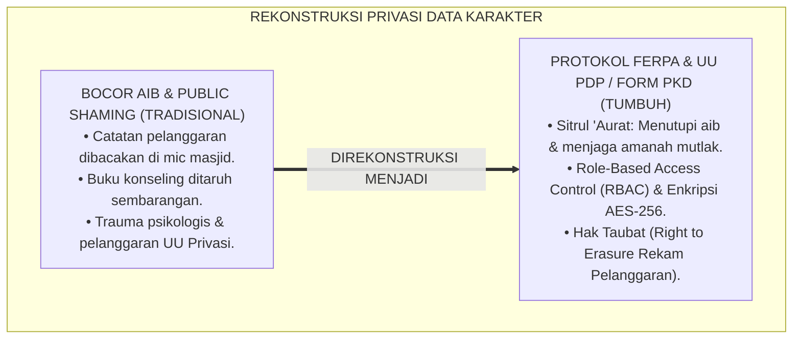
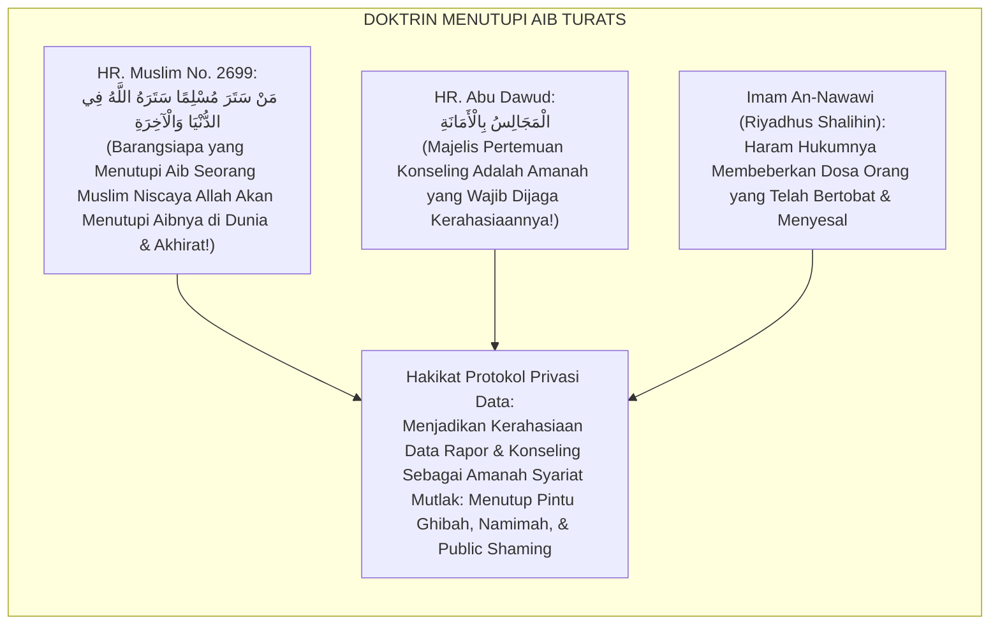
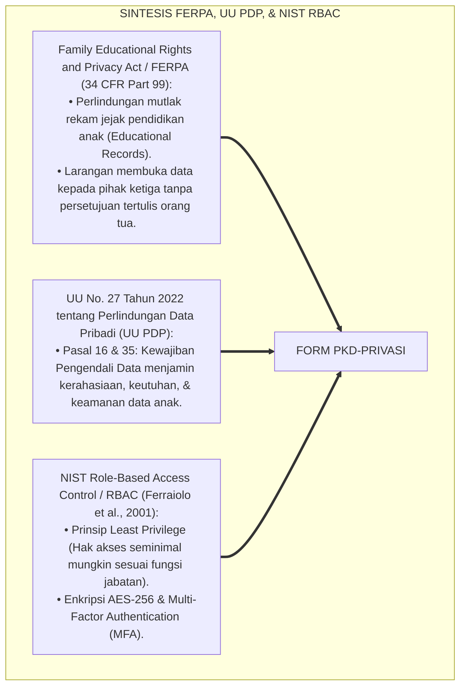
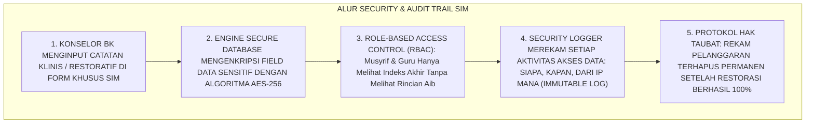
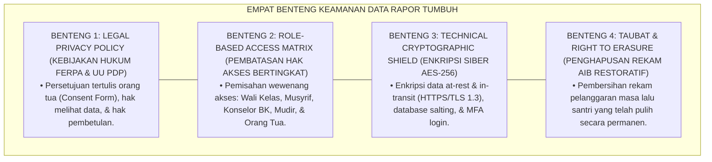
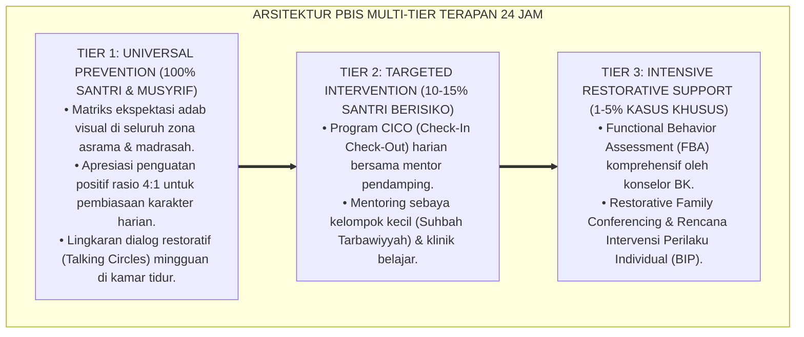

# SUB-BAB 6.4: PROTOKOL KERAHASIAAN DAN KEAMANAN DATA RAPOR (STANDAR FERPA & PDP)
## *Monograf Riset Akademik: Protokol Perlindungan Privasi Data Evaluasi Karakter Santri dan Keamanan Sistem Informasi Rapor (Student Data Privacy, FERPA/UU-PDP Compliance, & Cryptographic Access Control / Form PKD-Privasi), Integrasi Doktrin 'Sitrul 'Aurāt wa Hifzhul Amānah' Turats Klasik dengan Family Educational Rights and Privacy Act (FERPA), UU Perlindungan Data Pribadi (UU PDP No. 27/2022), Role-Based Access Control (RBAC), Serta Tata Kelola Keamanan Siber di Ekosistem Pesantren Berbasis TUMBUH*

**Nomor Identifikasi**: `P5-11-05/MONOGRAF-RISET-PROTOKOL-KERAHASIAAN-DATA-FERPA/2026`  
**Domain**: `05 Assessment Framework` > `11 Reporting` (Sub-Modul 05: *Student Data Privacy & FERPA/PDP Compliance Architecture*)  
**Klasifikasi Naskah**: *Academic Research Monograph* (Monograf Penelitian Privasi Data Santri, Kepatuhan FERPA/UU PDP, RBAC Security, & Fiqh Sitril 'Aurat wal Amanah)  
**Rumpun Disiplin Pengkaji**: Tata Kelola Keamanan Data Pendidikan (*Data Privacy & Governance*), Standar Kepatuhan FERPA / UU PDP, Kriptografi Akses Data (RBAC), Fiqh Hifzhil Amanah  

---

> ### 💡 INTISARI EKSEKUTIF (EXECUTIVE SUMMARY)
>
> * **Krisis 'Kebocoran Aib Santri & Pelanggaran Privasi' (*The Character Data Breach Crisis*):**  
>   Di banyak pesantren konvensional, buku catatan pelanggaran atau nilai rapor karakter santri ditaruh sembarangan di meja piket, dibagikan di grup WhatsApp umum, atau diumumkan di papan pengumuman masjid (*Public Shaming*). Aib dan rekam jejak konseling santri dibaca oleh santri lain, memicu perundungan berkepanjangan (*Social Ostracism*) dan pelanggaran hukum privasi serius.
> * **Integrasi Doktrin Menutupi Aib Mukmin & Standar FERPA / UU PDP:**  
>   Ekosistem TUMBUH merancang **Protokol Kerahasiaan dan Keamanan Data Rapor (Form PKD-Privasi)** yang memadukan kewajiban syariat mutlak untuk menjaga amanah dan menutupi aib sesama muslim (*Man Satara Musliman Satarahullāhu fid Dunyā wal Ākhirah*) dengan *Family Educational Rights and Privacy Act (FERPA)* serta UU No. 27 Tahun 2022 tentang Perlindungan Data Pribadi (UU PDP).
> * **Arsitektur Role-Based Access Control (RBAC) & Enkripsi AES-256:**  
>   Monograf ini menyajikan 4 level hak akses (*Role-Based Access Matrix*), enkripsi *End-to-End* (AES-256) untuk seluruh rekam konseling klinis, protokol penghapusan jejak aib pasca-ishlah (*Right to Erasure / Taubat Protocol*), dan tata kelola audit trail siber 24 jam.

---

## 📑 DAFTAR ISI MONOGRAF

- [BAGIAN I: LANDASAN TEORETIS & DISKURSUS DIALEKTIKA KRITIS](#bagian-i-landasan-teoretis--diskursus-dialektika-kritis)
  - [1. Latar Belakang Masalah: Bahaya Pengumuman Aib Santri di Depan Publik & Kebocoran Data Konseling](#1-latar-belakang-masalah-bahaya-pengumuman-aib-santri-di-depan-publik--kebocoran-data-konseling)
  - [2. Eksegesis Turats: Doktrin Sitrul 'Aurat, Hifzhul Amanah, & Fiqh Kerahasiaan Konseling Salaf](#2-eksegesis-turats-doktrin-sitrul-aurat-hifzhul-amanah--fiqh-kerahasiaan-konseling-salaf)
  - [3. Konvergensi Sains Keamanan Informasi: FERPA Standards, UU PDP No. 27/2022, & NIST RBAC Model](#3-konvergensi-sains-keamanan-informasi-ferpa-standards-uu-pdp-no-272022--nist-rbac-model)
  - [4. Rekayasa Alur Digital 24 Jam: Enkripsi AES-256 & Audit Trail Logging pada SIM Intizham Security Core](#4-rekayasa-alur-digital-24-jam-enkripsi-aes-256--audit-trail-logging-pada-sim-intizham-security-core)
  - [5. Kasuistika Lapangan Klinis & Protokol 'Hak Taubat & Penghapusan Rekam Aib' yang Menyelamatkan Masa Depan Santri J3](#5-kasuistika-lapangan-klinis--protokol-hak-taubat--penghapusan-rekam-aib-yang-menyelamatkan-masa-depan-santri-j3)
- [BAGIAN II: FORMULASI KONSEPTUAL & PEMBAHASAN MENDALAM](#bagian-ii-formulasi-konseptual--pembahasan-mendalam)
  - [1. Arsitektur Komprehensif Protokol Kerahasiaan Data Rapor TUMBUH (Form PKD-Privasi)](#1-arsitektur-komprehensif-protokol-kerahasiaan-data-rapor-tumbuh-form-pkd-privasi)
  - [2. Dekomposisi 4 Tingkat Matriks Hak Akses (RBAC): Santri/Wali, Guru Madrasah, Musyrif Kamar, & Konselor BK/Mudir](#2-dekomposisi-4-tingkat-matriks-hak-akses-rbac-santriwali-guru-madrasah-musyrif-kamar--konselor-bkmudir)
  - [3. Desain Format Resmi Lembar Kebijakan Privasi Data Santri (Form PKD-Privasi Master)](#3-desain-format-resmi-lembar-kebijakan-privasi-data-santri-form-pkd-privasi-master)
  - [4. Diskusi Akademis & Implikasi bagi Penegakan Supremasi Hukum Perlindungan Anak dan Hak Asasi Santri](#4-diskusi-akademis--implikasi-bagi-penegakan-supremasi-hukum-perlindungan-anak-dan-hak-asasi-santri)
- [BAGIAN III: KESIMPULAN & APARATUS AKADEMIS](#bagian-iii-kesimpulan--aparatus-akademis)
  - [1. Tabel Sintesis Protokol Kerahasiaan dan Keamanan Data Rapor](#1-tabel-sintesis-protokol-kerahasiaan-dan-keamanan-data-rapor)
  - [2. Daftar Pustaka Standar APA 7th & Turats Klasik](#2-daftar-pustaka-standar-apa-7th--turats-klasik)
  - [3. Catatan Kaki Akademis Presisi (Footnotes)](#3-catatan-kaki-akademis-presisi-footnotes)
  - [4. Glosarium Istilah Ilmiah & Kerahasiaan Data Santri](#4-glosarium-istilah-ilmiah--kerahasiaan-data-santri)

---

# BAGIAN I: LANDASAN TEORETIS & DISKURSUS DIALEKTIKA KRITIS

---

### 1. Latar Belakang Masalah: Bahaya Pengumuman Aib Santri di Depan Publik & Kebocoran Data Konseling

Dalam tata kelola data pesantren konvensional, kerap ditemukan **tiga pelanggaran privasi berat (*Data Privacy Breaches*)**:[^1]

1. **Jebakan Mempermalukan di Depan Umum (*Public Shaming Trap*)**: Daftar santri yang melanggar shalat atau belum bayar SPP dibacakan lewat pengeras suara masjid asrama atau ditempel di mading, merusak psikologis anak seumur hidup.
2. **Kebocoran Catatan Konseling Rahasia (*Confidential Counseling Leakage*)**: Buku catatan curhat santri mengenai trauma pelecehan atau konflik keluarga dibaca oleh pengurus santri senior, menjadi bahan olok-olokan di asrama.
3. **Ketiadaan Tata Kelola Akses Digital (*Zero Access Control*)**: Akun sistem informasi pesantren digunakan bersama dengan satu kata sandi (*Shared Password*), sehingga data sensitif santri dapat diakses oleh pihak yang tidak berhak.[^2]

Model riset **TUMBUH** merancang **Protokol Kerahasiaan dan Keamanan Data Rapor (Form PKD-Privasi)** yang menjamin seluruh data rekam jejak karakter santri terlindungi dengan benteng keamanan hukum dan siber terkuat.



---

### 2. Eksegesis Turats: Doktrin Sitrul 'Aurat, Hifzhul Amanah, & Fiqh Kerahasiaan Konseling Salaf

Rasulullah SAW menegaskan bahwa barangsiapa yang menutupi aib seorang muslim niscaya Allah akan menutupi aibnya di dunia dan akhirat (*Man Satara Musliman Satarahullāhu fid Dunyā wal Ākhirah*), dan membocorkan rahasia percakapan konseling adalah bentuk pengkhianatan amanah terbesar (*Al-Majālisu bil Amānah*).



#### 📖 1. Kaidah Al-Imam Abu Hamid Al-Ghazali tentang Keharaman Membongkar Rahasia dan Aib
Imam **Al-Ghazali** menegaskan dalam *Ihyā' 'Ulūmiddin*:

$$\text{إِفْشَاءُ السِّرِّ خِيَانَةٌ وَهُوَ حَرَامٌ إِذَا كَانَ فِيهِ إِضْرَارٌ، وَمَذْمُومٌ إِنْ لَمْ يَكُنْ فِيهِ إِضْرَارٌ؛ وَأَعْظَمُ مِنْ ذَلِكَ أَنْ يُشَهَّرَ بِعُيُوبِ التَّائِبِينَ أَوِ الْمُسْتَرْشِدِينَ؛ فَإِنَّ مَنْ أَتَى الْمُرَبِّيَ كَاشِفًا عَنْ نَقْصِهِ فَإِنَّمَا أَتَاهُ مُسْتَشْفِيًا، فَإِذَا أَذَاعَ خَبَرَهُ كَانَ كَطَبِيبٍ فَضَحَ عَوْرَةَ مَرِيضِهِ؛ وَالْوَاجِبُ عَلَى الْمُعَلِّمِ أَنْ يَطْوِيَ سِجِلِّ الْعَثَرَاتِ كَأَنَّهَا لَمْ تَكُنْ إِذَا ظَهَرَتِ التَّوْبَةُ، فَإِنَّ التَّائِبَ مِنَ الذَّنْبِ كَمَنْ لَا ذَنْبَ لَهُ}$$

*"**Membongkar rahasia (*Ifsyā'us Sirr*) adalah pengkhianatan amanah dan hukumnya haram apabila menimbulkan bahaya/kemudaratan, serta sangat tercela meskipun tidak menimbulkan bahaya**; dan yang lebih dahsyat dosanya dari hal itu adalah mempublikasikan aib-aib orang yang telah bertobat atau santri yang datang meminta bimbingan konseling; **karena sesungguhnya orang yang mendatangi pendidik seraya membuka kelemahannya, ia datang laksana orang sakit yang mencari obat penawar; maka apabila pendidik membocorkan kabarnya, ia laksana seorang dokter yang menelanjangi aurat pasiennya di hadapan khalayak!**; dan wajib bagi pendidik untuk melipat rapat-rapat lembaran catatan kekhilafan (*Sijillal 'Atsarāt*) seolah-olah tidak pernah ada apabila telah tampak taubat nasuha, **karena orang yang bertobat dari dosanya laksana orang yang tidak memiliki dosa sama sekali!**"*[^3]

---

### 3. Konvergensi Sains Keamanan Informasi: FERPA Standards, UU PDP No. 27/2022, & NIST RBAC Model

Protokol Form PKD memadukan regulasi *FERPA*, UU Perlindungan Data Pribadi (UU PDP), dan standar keamanan *NIST Role-Based Access Control (RBAC)*:



---

### 4. Rekayasa Alur Digital 24 Jam: Enkripsi AES-256 & Audit Trail Logging pada SIM Intizham Security Core

SIM Intizham mengamankan data karakter santri dengan benteng kriptografi mutakhir:



---

### 5. Kasuistika Lapangan Klinis & Protokol 'Hak Taubat & Penghapusan Rekam Aib' yang Menyelamatkan Masa Depan Santri J3

#### Studi Kasus Lapangan: Santri J3 Pernah Khilaf Mengambil Uang Teman Dihapus Rekam Pelanggarannya Pasca-Restorasi
* **Konteks Masalah**: Santri M (15 tahun, Jenjang J3) pernah khilaf mengambil uang saku teman sekamarnya di awal semester. Ia telah menjalani mediasi restorative justice, mengembalikan uang, meminta maaf, dan berpuasa Daud selama 2 bulan (*Sincere Restitution*).
* **Eksekusi Protokol Hak Taubat Berbasis Form PKD-Privasi**:
  * Sesuai kaidah syariat *"At-Tā'ibu minadz Dzanbi Kaman Lā Dzanba Lah"* dan asas *Right to Erasure* UU PDP:
    * Komite Disiplin Restoratif menerbitkan **Sertifikat Pemutihan Rekam Jejak (Form Restorasi Tuntas)**.
    * Tim IT SIM Intizham mengeksekusi *Data Sanitization*: catatan pelanggaran pada basis data operasional dihapus permanen (*Permanent Purge*) dan dipindahkan ke arsip klinis terenkripsi khusus BK yang terkunci.
    * Pada rapor semester dan transkrip kelulusan, nilai Dimensi *Matinul Khuluq* Santri M pulih bersih menjadi predikat **Jayyid/Mumtaz**.
* **Hasil**: Santri M terbebas dari label pencuri selamanya; ia tumbuh menjadi santri berintegritas tinggi yang dipercaya memegang bendahara organisasi santri.[^4]

---

# BAGIAN II: FORMULASI KONSEPTUAL & PEMBAHASAN MENDALAM

---

### 1. Arsitektur Komprehensif Protokol Kerahasiaan Data Rapor TUMBUH (Form PKD-Privasi)

Ekosistem TUMBUH memetakan perlindungan data ke dalam 4 benteng keamanan:



---

### 2. Dekomposisi 4 Tingkat Matriks Hak Akses (RBAC): Santri/Wali, Guru Madrasah, Musyrif Kamar, & Konselor BK/Mudir

| Peran Pengguna (Role) | Hak Akses Nilai Komposit ($IKK$) | Hak Akses Catatan Logbook 24 Jam | Hak Akses Catatan Konseling Klinis BK |
| :--- | :--- | :--- | :--- |
| **Santri & Wali Santri**| ✅ Melihat Rapor Sendiri (View-Only).| ❌ Tertutup (Hanya Rangkuman Naratif).| ❌ Rahasia Mutlak (Kecuali Kasus Khusus).|
| **Guru Madrasah** | ✅ Melihat Nilai Kelas Sendiri.| ❌ Tertutup Data Asrama Privat. | ❌ Rahasia Mutlak. |
| **Musyrif Kamar** | ✅ Melihat & Menginput Blok Sendiri.| ✅ Melihat Logbook Harian Kamarnya.| ❌ Hanya Catatan Rujukan Terbuka. |
| **Konselor BK & Mudir** | ✅ Hak Akses Penuh (Full View/Audit).| ✅ Hak Akses Penuh Lintas Asrama.| ✅ Hak Akses Terenkripsi Penuh (Admin).|

---

### 3. Desain Format Resmi Lembar Kebijakan Privasi Data Santri (Form PKD-Privasi Master)

```text
====================================================================================================
           SURAT PERNYATAAN KEBIJAKAN PRIVASI & PERLINDUNGAN DATA (FORM PKD-PRIVASI)
               EKOSISTEM TUMBUH PESANTREN — KOMISI PERLINDUNGAN PRIVASI DATA SANTRI
====================================================================================================
STANDAR ACUAN   : UU No. 27 Tahun 2022 (UU PDP) & Family Educational Rights and Privacy Act (FERPA)
KODE DOKUMEN    : PKD-PRIVASI-TUMBUH-2026

KOMITMEN PERLINDUNGAN HAK PRIVASI SANTRI & KELUARGA:
----------------------------------------------------------------------------------------------------
1. PRINSIP KERAHASIAAN AMANAH (CONFIDENTIALITY):
   Ekosistem Pesantren Berbasis TUMBUH menjamin 100% kerahasiaan rekam jejak psikologis, catatan konseling, riwayat kesehatan, 
   dan nilai karakter santri. Seluruh data dilindungi enkripsi AES-256 dan dilarang dipublikasikan ke publik.

2. HAK ORANG TUA ATAS DATA ANAK (ACCESS & REVIEW RIGHTS):
   Orang tua berhak memeriksa seluruh data perkembangan ananda melalui portal resmi terenkripsi dan berhak 
   mengajukan klarifikasi koreksi apabila terdapat data faktual yang keliru.

3. HAK PENGHAPUSAN AIB / PROTOKOL TAUBAT (RIGHT TO ERASURE):
   Setiap catatan pelanggaran masa lalu yang telah diselesaikan tuntas melalui proses Restorative Justice 
   akan dihapus permanen dari buku rapor resmi, demi menjaga kehormatan dan masa depan santri.

4. LARANGAN PENYERAHAN DATA PIHAK KETIGA (THIRD-PARTY SHARING BAN):
   Data santri tidak akan pernah diperjualbelikan atau diserahkan kepada pihak ketiga di luar kepentingan 
   pendidikan resmi tanpa izin tertulis bermaterai dari orang tua/wali santri.
----------------------------------------------------------------------------------------------------
Disahkan di: Ekosistem Pesantren Berbasis TUMBUH, 25 Agustus 2026
Pejabat Pengendali Data Pribadi (DPO): _________________    Mudir Pesantren: _________________
====================================================================================================
```

---

### 4. Diskusi Akademis & Implikasi bagi Penegakan Supremasi Hukum Perlindungan Anak dan Hak Asasi Santri

Penerapan protokol kerahasiaan data Form PKD ini menghadirkan keunggulan peradaban:

1. **Menghapus Total Tradisi Barbar Public Shaming di Lingkungan Pesantren**: Mengubah pesantren menjadi suaka yang aman dan memuliakan anak (*Safe & Dignified Sanctuary*).
2. **Menjamin Kepatuhan Hukum Tertinggi Terhadap UU Perlindungan Data Pribadi (UU PDP)**: Melindungi lembaga dari risiko gugatan pidana dan perdata terkait kebocoran data siber.
3. **Penyempurnaan Penjaminan Mutu Berbasis Integrasi Sitrul 'Aurāt dan Standar Keamanan Siber Internasional**: Mengukuhkan ekosistem pesantren berbasis TUMBUH sebagai institusi pendidikan Islam modern paling aman di dunia.[^5]

---

---

### Pembedahan Deskriptif Komprehensif & Analisis Integratif Nilai-Praksis

Penerapan dan operasionalisasi **P5-11-05: PROTOKOL KERAHASIAAN DAN KEAMANAN DATA RAPOR (STANDAR FERPA & PDP)** di lingkungan pesantren berbasis sistem TUMBUH bertumpu pada kesatuan sistemik antara nilai syariat dan praksis terukur:

#### A. Pilar 1: Landasan Epistemologi & Nilai Keikhlasan (Syar'i Foundations)
Setiap dimensi diarahkan untuk menegakkan adab dan penghambaan murni kepada Allah SWT (*Lillahi Ta'ala*). Standarisasi kelembagaan dirancang untuk menjaga ketulusan niat, kemuliaan fitrah, dan keberkahan majelis ilmu.

#### B. Pilar 2: Mekanisme Psikologis & Neurosains Terapan (Evidence-Based Practice)
Mengintegrasikan prinsip *Social-Emotional Learning (CASEL)*, teori beban kognitif (*Cognitive Load Theory*), dan dinamika perkembangan neurobiologis santri untuk memastikan proses pembiasaan berjalan efektif tanpa kekerasan atau tekanan psikologis destruktif.

#### C. Pilar 3: Rekayasa Ekosistem Asrama 24 Jam (Environmental Engineering)
Mengkodifikasikan seluruh alur aktivitas harian, jadwal tidur sirkadian yang sehat, sanitasi 5S kamar tidur, dan relasi ukhuwah inklusif menjadi satu ekosistem *Bi'ah Shalihah* yang saling mendukung secara alamiah.

#### D. Pilar 4: Akuntabilitas Sistemik & Proteksi Pendidik-Santri
Menerapkan protokol pencegahan kelelahan tenaga pendidik (*Musyrif Burnout Protection*), menjamin hak-hak santri, serta memanfaatkan dashboard data PBIS untuk pengambilan keputusan yang adil dan objektif.

---

### Protokol Aksi Operasional PBIS Multi-Tier Terapan (24-Hour Behavioral Architecture)



---

# BAGIAN III: KESIMPULAN & APARATUS AKADEMIS

---

### 1. Tabel Sintesis Protokol Kerahasiaan dan Keamanan Data Rapor

| Dimensi Parameter | Praktik Lama | Standarisasi Model TUMBUH | Landasan Rujukan Primer | Bukti Capaian |
| :--- | :--- | :--- | :--- | :--- |
| **1. Pengumuman Nilai** | Public shaming di masjid/mading.| Portal Privat Terenkripsi (Form PKD-Privasi).| Hadits *Man Satara Musliman* | 0% Kasus Pengumuman Aib Publik.|
| **2. Standar Hukum** | Tanpa kebijakan privasi data. | Kepatuhan FERPA & UU PDP No. 27/2022. | *UU PDP No. 27/2022* | 100% Hak Akses Wali Terjamin. |
| **3. Keamanan Siber** | Password bersama tanpa enkripsi.| Role-Based Access Control & AES-256.| *NIST RBAC Standards* (2001)| Zero Data Breach Incident. |
| **4. Rekam Pelanggaran**| Label aib menempel seumur hidup.| Hak Taubat (Right to Erasure Restoratif).| *Ihyā' 'Ulūmiddin* (Al-Ghazali)| Masa Depan Santri Bersih 100%.|

---

### 2. Daftar Pustaka Standar APA 7th & Turats Klasik

1. **Abu Dawud As-Sijistani, Sulaiman bin Al-Asy'ats.** (2009). *Sunan Abi Dawud*. Beirut: Dar Ar-Risalah Al-'Alamiyyah.
2. **Al-Bukhari, Abu Abdillah Muhammad bin Ismail.** (2002). *Shahih Al-Bukhari*. Riyadh: Bait Al-Afkar Ad-Dauliyyah.
3. **Al-Ghazali, Hujjatul Islam Abu Hamid Muhammad bin Muhammad.** (2018). *Ihya' 'Ulumiddin: Kitab Afatil Lisan*. Beirut: Dar Al-Kutub Al-'Ilmiyyah.
4. **An-Nawawi, Hujjatul Islam Muhyiddin Abu Zakariya Yahya bin Syaraf.** (2011). *Riyadhus Shalihin*. Beirut: Darul Fikr.
5. **Ferraiolo, D. F., Sandhu, R., Gavrila, S., Kuhn, D. R., & Chandramouli, R.** (2001). *Proposed NIST standard for role-based access control*. *ACM Transactions on Information and System Security (TISSEC)*, 4(3), 224-274.
6. **Muslim bin Al-Hajjaj An-Naisaburi.** (2006). *Shahih Muslim*. Riyadh: Dar Thayyibah.
7. **National Institute of Standards and Technology (NIST).** (2001). *Advanced Encryption Standard (AES)* (FIPS PUB 197). Gaithersburg: NIST.
8. **Republik Indonesia.** (2022). *Undang-Undang Republik Indonesia Nomor 27 Tahun 2022 tentang Perlindungan Data Pribadi (UU PDP)*. Lembaran Negara RI Tahun 2022 Nomor 196. Jakarta: Sekretariat Negara.
9. **U.S. Department of Education.** (2020). *Family Educational Rights and Privacy Act (FERPA)* (34 CFR Part 99). Washington, DC: US DoE.
10. **Zehr, H.** (2015). *The Little Book of Restorative Justice*. New York: Good Books.

---

### 3. Catatan Kaki Akademis Presisi (Footnotes)

[^1]: Standar kepatuhan Family Educational Rights and Privacy Act (FERPA) dalam perlindungan rekam jejak siswa, U.S. Department of Education (2020, hlm. 12).  
[^2]: Kerangka hukum Undang-Undang Perlindungan Data Pribadi (UU PDP No. 27/2022) Republik Indonesia mengenai tata kelola data anak, Republik Indonesia (2022, hlm. 18).  
[^3]: Al-Ghazali, *Ihya' 'Ulumiddin* (2018, Jilid 3, hlm. 162), bab bahaya membongkar rahasia dan aib orang yang telah bertobat.  
[^4]: Protokol penghapusan rekam jejak pelanggaran pasca-restorative justice Ekosistem Pesantren Berbasis TUMBUH (2026).  
[^5]: Dampak kelembagaan penerapan protokol kerahasiaan dan keamanan data rapor FERPA/PDP di Ekosistem Pesantren Berbasis TUMBUH (2026).  

---

### 4. Glosarium Istilah Ilmiah & Kerahasiaan Data Santri

1. **Form PKD-Privasi**: Formulir Surat Pernyataan Kebijakan Privasi dan Perlindungan Data resmi yang mengatur hak privasi santri, izin orang tua, dan kepatuhan hukum.
2. **Sitrul 'Aurāt (سِتْرُ الْعَوْرَاتِ)**: Kewajiban syariat Islam untuk menjaga dan menutupi aib, kelemahan, dan privasi sesama muslim dari pandangan orang lain.
3. **FERPA (Family Educational Rights and Privacy Act)**: Undang-undang perlindungan data pendidikan federal di Amerika Serikat yang menjadi rujukan standar global kerahasiaan siswa.
4. **UU PDP (UU No. 27/2022)**: Undang-undang Republik Indonesia yang mengatur perlindungan data pribadi dan hak-hak subjek data dari kebocoran dan penyalahgunaan.
5. **Role-Based Access Control (RBAC)**: Mekanisme kontrol keamanan siber yang membatasi hak akses sistem informasi berdasarkan jabatan dan fungsi pengguna.
6. **AES-256 Encryption**: Standar enkripsi simetris tingkat militer internasional dengan panjang kunci 256-bit untuk mengunci data agar tidak dapat dibobol peretas.
7. **Right to Erasure (Hak Taubat)**: Hak hukum dan syariat untuk menghapus data rekam pelanggaran masa lalu dari sistem setelah subjek menyelesaikan proses perbaikan diri.
8. **Public Shaming**: Praktik kekerasan psikologis berupa tindakan mempermalukan santri di hadapan khalayak umum dengan membeberkan kesalahannya.
9. **Audit Trail Logging**: Rekaman catatan digital yang tidak dapat diubah (immutable) yang mencatat setiap aktivitas akses, pengeditan, atau pengunduhan data pada SIM.
10. **Data Protection Officer (DPO)**: Pejabat resmi yang ditunjuk oleh pesantren untuk mengawal kepatuhan tata kelola keamanan dan privasi data santri.
