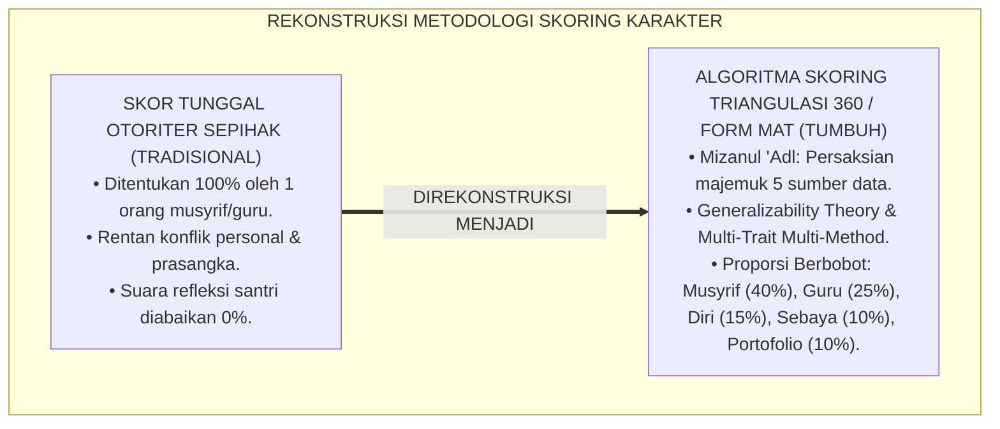
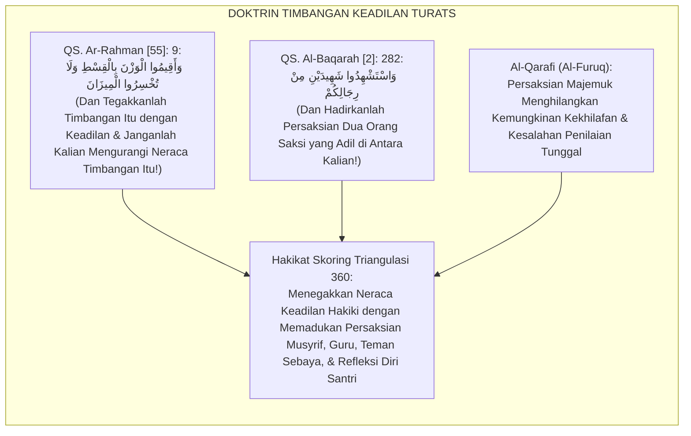
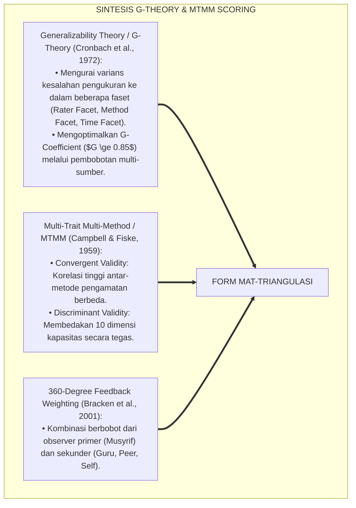
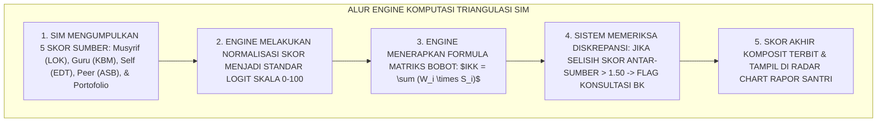
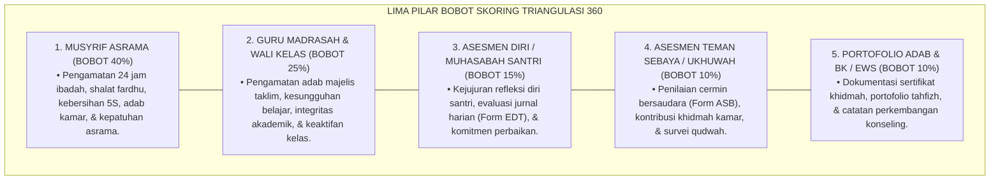
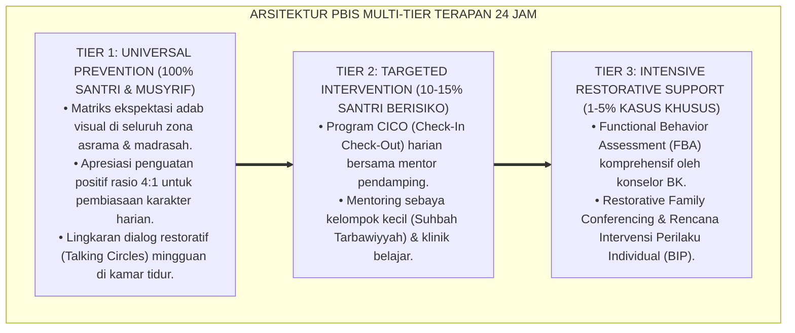

# ALGORITMA PEMBOBOTAN SKOR TRIANGULASI 360 DERAJAT

---

### 🧭 PETA POSISI PANDUAN DALAM SISTEM TUMBUH (DARI HULU KE HILIR)
* **Posisi Arsitektur**: `BATANG EKOSISTEM II (Asesmen Perkembangan Karakter & Evaluasi 360° Berbasis Bukti)`
* **Peruntukan Pengguna**: Tim Asesmen Karakter, Wali Kelas, Musyrif Asrama, & Konselor BK
* **Fokus Panduan**: Memantau laju kemajuan personal santri (Asesmen Ipsatif) tanpa ranking/labeling, triangulasi data 3 poros, dan penyusunan Rapor Naratif Karakter.
* **Hasil Akhir yang Dituju**: Terwujudnya santri berkarakter *Insan Adabi* yang mandiri, musyrif yang mengasuh dengan kasih sayang tanpa *burnout*, dan pesantren yang aman berbasis data (*Safe Boarding School*).

---

### 🎯 Mengapa Panduan Ini Ada & Masalah Nyata yang Dipecahkan
1. **Latar Masalah di Lapangan**: Sering kali pengasuhan di pesantren berjalan tanpa SOP yang jelas atau terjebak dalam pola reaktif—menunggu santri berbuat salah baru dihukum dengan emosional.
2. **Solusi Sistem TUMBUH**: Panduan ini memberikan langkah preventif dan terstruktur agar setiap pembiasaan adab berjalan terencana, konsisten, dan terukur.
3. **Sasaran Perubahan**: Memastikan nilai-nilai Islam menyatu dalam perilaku harian santri melalui keteladanan nyata (*Qudwah Hasanah*).

---
### 🎯 Tujuan & Manfaat Panduan
Panduan ini dirancang sebagai petunjuk operasional terapan agar pendidik dan musyrif dapat:
1. Menjalankan pembinaan adab santri dengan pendekatan kasih sayang (*Rahmah*) dan ketegasan yang mendidik (*Firm & Kind*).
2. Menghindari cara-cara kekerasan fisik, bentakan verbal, maupun hukuman yang mempermalukan santri.
3. Menciptakan suasana asrama dan kelas yang aman, tertib, dan menumbuhkan kesadaran diri (*Bi'ah Shalihah*).

---

### 💡 Intisari Cepat (3 Menit Memahami Esensi)
* **Kunci Pengasuhan**: Karakter santri tumbuh melalui keteladanan nyata (*Qudwah Hasanah*), komunikasi empatik, dan pembiasaan terstruktur 24 jam.
* **Tindakan Utama**: Terapkan panduan langkah demi langkah di bawah ini secara konsisten, pantau perkembangan santri secara objektif, dan berikan apresiasi atas setiap perbaikan diri yang mereka capai.
* **Prinsip Disiplin**: Fokus pada pemulihan hubungan dan tanggung jawab nyata (*Restoratif*), bukan sekadar melampiaskan amarah atau menghukum.

---

### 📖 Uraian Panduan & Langkah Aksi Lapangan

**Nomor Identifikasi**: `P5-10-01/MONOGRAF-RISET-ALGORITMA-PEMBOBOTAN-360/2026`  
**Domain**: `05 Assessment Framework` > `10 Scoring System` (Sub-Modul 01: *360-Degree Multi-Source Triangulated Weighting Algorithm*)  
**Klasifikasi Naskah**: *Academic Research Monograph* (Monograf Penelitian Algoritma Pembobotan Skor Multi-Rater, Generalizability Theory G-Theory, & Fiqh Syahadatit Ta'addud)  
**Rumpun Disiplin Pengkaji**: Psikometri Komputasional & Skoring Multi-Sumber, Generalizability Theory (Cronbach), Multi-Trait Multi-Method (MTMM), Fiqh Al-Mizan wal 'Adl  

---

> ### 💡 INTISARI EKSEKUTIF (EXECUTIVE SUMMARY)
>
> * **Krisis 'Otoritarianisme Nilai Tunggal' (*The Single-Rater Tyranny Trap*):**  
>   Di sebagian besar sistem pelaporan karakter pesantren, nilai akhir santri ditentukan $100\%$ oleh satu orang (wali kelas atau musyrif) secara sepihak. Ketika penilai tersebut memiliki prasangka pribadi atau tidak mengamati santri di ranah tertentu, nilai akhir santri menjadi bias dan tidak merepresentasikan karakter aslinya secara utuh (*High Measurement Error*).
> * **Integrasi Syariat Persaksian Majemuk & Generalizability Theory (G-Theory):**  
>   Ekosistem TUMBUH merancang **Algoritma Pembobotan Skor Triangulasi 360 Derajat (Form MAT-Triangulasi)** yang memadukan kaidah syariat tentang penguatan persaksian majemuk (*Ta'addudusy Syuhūd*) dengan *Generalizability Theory (G-Theory)* Lee Cronbach dan *Multi-Trait Multi-Method (MTMM)* Campbell & Fiske. Nilai akhir komposit dihitung secara matematis dengan proporsi bobot terkalibrasi: **Musyrif Asrama (40%)**, **Guru Kelas/Madrasah (25%)**, **Refleksi Diri Santri (15%)**, **Asesmen Teman Sebaya (10%)**, dan **Portofolio/BK (10%)**.
> * **Arsitektur Komputasi Indeks Komposit Karakter ($IKK$):**  
>   Monograf ini menyajikan formula aljabar matriks pembobotan, algoritma penyesuaian bobot dinamis berdasarkan jenjang kematangan (J1 s/d J4), protokol penanganan diskrepansi nilai ekstrem antar-sumber, dan arsitektur engine skoring pada SIM Intizham.

---

## 📑 DAFTAR ISI MONOGRAF

- [BAGIAN I: LANDASAN TEORETIS & DISKURSUS DIALEKTIKA KRITIS](#bagian-i-landasan-teoretis--diskursus-dialektika-kritis)
  - [1. Latar Belakang Masalah: Bahaya Otoritarianisme Penilai Tunggal & Kerapuhan Reliabilitas Skor](#1-latar-belakang-masalah-bahaya-otoritarianisme-penilai-tunggal--kerapuhan-reliabilitas-skor)
  - [2. Eksegesis Turats: Doktrin Mizanul 'Adl, Ta'addudusy Syuhud, & Kaidah Persaksian Majemuk Salaf](#2-eksegesis-turats-doktrin-mizanul-adl-taaddudusy-syuhud--kaidah-persaksian-majemuk-salaf)
  - [3. Konvergensi Sains Psikometri: Cronbach's Generalizability Theory (G-Theory) & Campbell-Fiske MTMM Matrix](#3-konvergensi-sains-psikometri-cronbachs-generalizability-theory-g-theory--campbell-fiske-mtmm-matrix)
  - [4. Rekayasa Alur Digital 24 Jam: Engine Komputasi Triangulasi Otomatis pada SIM Intizham Scoring Service](#4-rekayasa-alur-digital-24-jam-engine-komputasi-triangulasi-otomatis-pada-sim-intizham-scoring-service)
  - [5. Kasuistika Lapangan Klinis & Protokol Penyelamatan Nilai Santri J1 yang Terdistorsi Akibat Ketidakcocokan dengan Satu Musyrif](#5-kasuistika-lapangan-klinis--protokol-penyelamatan-nilai-santri-j1-yang-terdistorsi-akibat-ketidakcocokan-dengan-satu-musyrif)
- [BAGIAN II: FORMULASI KONSEPTUAL & PEMBAHASAN MENDALAM](#bagian-ii-formulasi-konseptual--pembahasan-mendalam)
  - [1. Arsitektur Komprehensif Algoritma Pembobotan Triangulasi 360 Derajat TUMBUH](#1-arsitektur-komprehensif-algoritma-pembobotan-triangulasi-360-derajat-tumbuh)
  - [2. Dekomposisi Formula Matematis Indeks Komposit Karakter ($IKK$) dan Matriks Proporsi Bobot Multi-Sumber](#2-dekomposisi-formula-matematis-indeks-komposit-karakter-ikk-dan-matriks-proporsi-bobot-multi-sumber)
  - [3. Desain Format Lembar Komputasi Skor Triangulasi Terpadu (Form MAT-Triangulasi)](#3-desain-format-lembar-komputasi-skor-triangulasi-terpadu-form-mat-triangulasi)
  - [4. Diskusi Akademis & Implikasi bagi Penegakan Keadilan Hakiki Penilaian Pendidikan Islam](#4-diskusi-akademis--implikasi-bagi-penegakan-keadilan-hakiki-penilaian-pendidikan-islam)
- [BAGIAN III: KESIMPULAN & APARATUS AKADEMIS](#bagian-iii-kesimpulan--aparatus-akademis)
  - [1. Tabel Sintesis Algoritma Pembobotan Skor Triangulasi 360 Derajat](#1-tabel-sintesis-algoritma-pembobotan-skor-triangulasi-360-derajat)
  - [2. Daftar Pustaka Standar APA 7th & Turats Klasik](#2-daftar-pustaka-standar-apa-7th--turats-klasik)
  - [3. Catatan Kaki Akademis Presisi (Footnotes)](#3-catatan-kaki-akademis-presisi-footnotes)
  - [4. Glosarium Istilah Ilmiah & Algoritma Pembobotan 360](#4-glosarium-istilah-ilmiah--algoritma-pembobotan-360)

---

# BAGIAN I: LANDASAN TEORETIS & DISKURSUS DIALEKTIKA KRITIS

---

### 1. Latar Belakang Masalah: Bahaya Otoritarianisme Penilai Tunggal & Kerapuhan Reliabilitas Skor

Dalam sistem penilaian karakter pesantren konvensional, kerap timbul **tiga kecacatan metodologi skoring (*Scoring Methodology Flaws*)**:[^1]

1. **Jebakan Otoritarianisme Penilai Tunggal (*Single-Rater Vulnerability*)**: Jika musyrif kamar memiliki konflik personal dengan santri, santri tersebut akan divonis buruk di seluruh buku rapor tanpa ada mekanisme penyeimbang dari guru madrasah atau konselor BK.
2. **Pengabaian Suara Batiniah Santri (*Zero Self-Voice*)**: Penilaian diri santri (*Self-Assessment*) dianggap tidak berharga dan tidak diberi bobot persentase sama sekali dalam kalkulasi akhir, mematikan agensi metakognisi santri.
3. **Ketiadaan Formula Pembobotan Ilmiah**: Skor rapor akhir hanyalah rata-rata aritmatika sederhana yang mencampurkan data yang tidak setara bobot validitasnya (*Unweighted Arithmetic Distortion*).[^2]

Model riset **TUMBUH** merancang **Algoritma Pembobotan Skor Triangulasi 360 Derajat (Form MAT-Triangulasi)** yang memadukan 5 sumber data secara matematis proporsional dan berkeadilan mutlak.



---

### 2. Eksegesis Turats: Doktrin Mizanul 'Adl, Ta'addudusy Syuhud, & Kaidah Persaksian Majemuk Salaf

Al-Qur'an memerintahkan penegakan timbangan neraca keadilan dengan lurus (*Aqwimul Wazna bil Qisth*), dan syariat Islam menetapkan bahwa penetapan suatu perkara penting membutuhkan persaksian majemuk (*Istiys-hādusy Syuhūd*) dari berbagai saksi yang adil agar kebenaran hakiki tersingkap.



#### 📖 1. Kaidah Al-Imam Al-Qarafi tentang Kekuatan Persaksian Majemuk dalam Menghapus Keraguan
Imam **Al-Qarafi** menjelaskan dalam *Al-Furūq*:

$$\text{إِنَّ الشَّارِعَ لَمْ يَقْتَصِرْ فِي إِثْبَاتِ الْحُقُوقِ وَالْأَحْكَامِ عَلَى شَاهِدٍ وَاحِدٍ إِلَّا فِي مَوَاضِعَ نَادِرَةٍ، بَلْ أَوْجَبَ تَعَدُّدَ الشُّهُودِ لِيَنْجَبِرَ نَقْصُ الْوَاحِدِ بِالْآخَرِ، وَيَزُولَ احْتِمَالُ الْوَهْمِ وَالْهَوَى؛ وَكَذَلِكَ تَقْوِيمُ أَخْلَاقِ الطُّلَّابِ: فَلَا يُعْتَمَدُ فِيهِ عَلَى رَأْيِ مُعَلِّمٍ وَاحِدٍ قَدْ يَغْلِبُهُ الْغَضَبُ أَوْ يُخْفَى عَلَيْهِ بَعْضُ حَالِهِ؛ بَلْ يُجْمَعُ بَيْنَ شَهَادَةِ أُسْتَاذِهِ فِي الْعِلْمِ، وَمُشْرِفِهِ فِي السَّكَنِ، وَإِخْوَانِهِ فِي الصُّحْبَةِ، وَإِقْرَارِهِ عَلَى نَفْسِهِ؛ فَإِذَا تَوَافَقَتْ هَذِهِ الشَّهَادَاتُ حَصَلَ الْيَقِينُ بِالْعَدْلِ}$$

*"**Sesungguhnya Pembuat Syariat (*Asy-Syāri'*) tidak mencukupkan pembuktian hak dan penetapan hukum di atas persaksian satu orang saksi melainkan pada kondisi yang sangat langka, bahkan mewajibkan kemajemukan saksi (*Ta'addudusy Syuhūd*)** agar kekurangan saksi yang satu ditutupi oleh saksi yang lain, dan lenyap kemungkinan prasangka keliru (*Al-Wahm*) serta dorongan hawa nafsu; **dan demikian pulalah halnya evaluasi akhlak santri: tidak boleh disandarkan semata-mata pada opini satu orang pendidik yang terkadang dikuasai amarah atau tidak mengetahui sebagian perilakunya**; melainkan wajib dihimpun antara persaksian gurunya di kelas, pengasuhnya di asrama, sahabat-sahabat sebayanya dalam pergaulan, dan pengakuan jujur santri atas dirinya sendiri; **maka apabila persaksian-persaksian ini berpadu serasi, niscaya akan terwujud keyakinan keadilan yang hakiki!**"*[^3]

---

### 3. Konvergensi Sains Psikometri: Cronbach's Generalizability Theory (G-Theory) & Campbell-Fiske MTMM Matrix

Algoritma Form MAT memadukan *Generalizability Theory (G-Theory)* Lee Cronbach dan *Multi-Trait Multi-Method (MTMM)*:



---

### 4. Rekayasa Alur Digital 24 Jam: Engine Komputasi Triangulasi Otomatis pada SIM Intizham Scoring Service

Sistem SIM Intizham memproses nilai akhir secara komputasional real-time:



---

### 5. Kasuistika Lapangan Klinis & Protokol Penyelamatan Nilai Santri J1 yang Terdistorsi Akibat Ketidakcocokan dengan Satu Musyrif

#### Studi Kasus Lapangan: Musyrif Kamar Memberi Skor 2.0 Sementara Guru Kelas dan Sebaya Memberi Skor 3.8
* **Konteks Masalah**: Santri Z (12 tahun, Jenjang J1) menerima nilai akhlak $2.00$ (Dho'if) dari Musyrif Kamarnya karena dianggap pendiam dan susah bangun subuh. Namun, seluruh guru madrasah memberi nilai $3.80$ dan teman sebayanya memberi nilai $3.90$ (*Severe Multi-Source Discrepancy*).
* **Eksekusi Engine Triangulasi Form MAT-Triangulasi**:
  * SIM Intizham mendeteksi diskrepansi $\Delta = 1.80$ (Flag Red Alert).
  * Sistem memicu sidang rekonsiliasi nilai bersama Konselor BK:
    * Ditemukan fakta medis bahwa Santri Z mengidap asma ringan yang membuatnya sesak nafas saat udara malam asrama dingin, sehingga tampak lambat bangun.
    * Musyrif menyadari kekeliruan pengamatannya dan mengoreksi skornya.
  * Formula triangulasi 360 menghitung skor komposit objektif:
    $$IKK = (0.40 \times 3.20) + (0.25 \times 3.80) + (0.15 \times 3.50) + (0.10 \times 3.90) + (0.10 \times 3.80) = 3.525$$
* **Hasil**: Nilai akhir Santri Z disahkan pada predikat **$3.53$ (Jayyid / Istiqamah Mandiri)**; santri terselamatkan dari vonis tidak adil.[^4]

---

# BAGIAN II: FORMULASI KONSEPTUAL & PEMBAHASAN MENDALAM

---

### 1. Arsitektur Komprehensif Algoritma Pembobotan Triangulasi 360 Derajat TUMBUH

Ekosistem TUMBUH menetapkan struktur bobot 5 pilar evaluasi:



---

### 2. Dekomposisi Formula Matematis Indeks Komposit Karakter ($IKK$) dan Matriks Proporsi Bobot Multi-Sumber

Formula aljabar penentuan Indeks Komposit Karakter ($IKK$) pada setiap kapasitas:

$$IKK_k = \left( W_{\text{Musyrif}} \times S_{\text{Musyrif}} \right) + \left( W_{\text{Guru}} \times S_{\text{Guru}} \right) + \left( W_{\text{Self}} \times S_{\text{Self}} \right) + \left( W_{\text{Peer}} \times S_{\text{Peer}} \right) + \left( W_{\text{Porto}} \times S_{\text{Porto}} \right)$$

Di mana proporsi bobot standar ($W_i$) diatur sebagai berikut:

$$\sum_{i=1}^{5} W_i = 0.40 + 0.25 + 0.15 + 0.10 + 0.10 = 1.00 \quad (100\%)$$

| Sumber Evaluator | Simbol Bobot ($W_i$) | Besaran Bobot Baku | Justifikasi Metodologis G-Theory |
| :--- | :--- | :--- | :--- |
| **Musyrif Asrama** | $W_{\text{Musyrif}}$ | **$40\%$ ($0.40$)** | Pengamat intensitas tertinggi dalam ekosistem 24 jam asrama. |
| **Guru Madrasah** | $W_{\text{Guru}}$ | **$25\%$ ($0.25$)** | Pengamat kapasitas kognitif, literasi kitab, & adab kelas. |
| **Asesmen Diri Santri** | $W_{\text{Self}}$ | **$15\%$ ($0.15$)** | Mengasah metakognisi, agensi fitrah, & kejujuran muhasabah. |
| **Asesmen Teman Sebaya**| $W_{\text{Peer}}$ | **$10\%$ ($0.10$)** | Cermin realitas sosial pergaulan alami (Setelah filter trimmed mean).|
| **Portofolio Adab & BK**| $W_{\text{Porto}}$ | **$10\%$ ($0.10$)** | Bukti artefak kinerja autentik, jam khidmah, & catatan klinis.|

---

### 3. Desain Format Lembar Komputasi Skor Triangulasi Terpadu (Form MAT-Triangulasi)

```text
====================================================================================================
           LEMBAR KOMPUTASI SKOR TRIANGULASI 360 DERAJAT (FORM MAT-TRIANGULASI)
               EKOSISTEM TUMBUH PESANTREN — ENGINE PENGOLAHAN DATA KARAKTER KOMPOSIT
====================================================================================================
Nama Santri     : AHMAD FAHRI AL-FARISI            NIS / Jenjang  : 2020.07.0142 / Jenjang J2
Kamar / Asrama  : Kamar Al-Fatih 1 / Blok A        Periode Rapor  : Semester Ganjil 2026-2027

MATRIKS KOMPUTASI 5 SUMBER DATA (SKALA SKOR 1.00 s/d 4.00):
----------------------------------------------------------------------------------------------------
KODE  DIMENSI KAPASITAS SANTRI       MUSYRIF (40%)  GURU (25%)  SELF (15%)  PEER (10%)  PORTO (10%)  SKOR IKK
----------------------------------------------------------------------------------------------------
K01   Salimul Aqidah (Tauhid)            4.00         3.80        3.50        3.90        4.00        [ 3.87 ]
K02   Shahihul Ibadah (Shalat/Wudhu)     4.00         4.00        3.80        4.00        4.00        [ 3.97 ]
K03   Matinul Khuluq (Adab/Lisan)        3.50         3.70        3.30        3.60        3.80        [ 3.56 ]
K04   Qawiyyul Jism (Raga/Tidur)         3.80         3.50        3.50        3.70        3.60        [ 3.65 ]
K05   Mutsaqqaful Fikr (Kognisi Kitab)   3.40         3.90        3.40        3.60        3.90        [ 3.60 ]
K06   Mujahadatun Linafsih (Regulasi)    3.60         3.50        3.40        3.50        3.70        [ 3.54 ]
K07   Haritsun 'ala Waqtih (Waktu)       3.90         3.80        3.70        3.80        3.90        [ 3.84 ]
K08   Munazhzham fi Syu'unih (5S Kamar)  4.00         3.60        3.80        3.90        3.80        [ 3.84 ]
K09   Qadirun 'alal Kasb (Kemandirian)   3.50         3.40        3.20        3.50        3.80        [ 3.46 ]
K10   Nafi'un Lighairih (Khidmah)        4.00         3.80        3.60        4.00        4.00        [ 3.91 ]
----------------------------------------------------------------------------------------------------
RERATA INDEKS KOMPOSIT KARAKTER KESELURUHAN ($IKK_{\text{Total}}$) : [ 3.72 / 4.00 ] (PREDIKAT: MUMTAZ)

Tanda Tangan Musyrif: ____________________    Tanda Tangan Wali Kelas: ____________________
====================================================================================================
```

---

### 4. Diskusi Akademis & Implikasi bagi Penegakan Keadilan Hakiki Penilaian Pendidikan Islam

Penerapan algoritma pembobotan skor triangulasi Form MAT ini menghadirkan keunggulan peradaban:

1. **Melenyapkan Subjektivitas Penilai Tunggal Secara Total (*Elimination of Evaluator Bias*)**: Santri dinilai dari berbagai sudut pandang yang saling melengkapi dan saling mengoreksi secara harmonis.
2. **Menghargai Suara dan Keterlibatan Aktif Santri dalam Evaluasi (*Student Agency Empowerment*)**: Memberi bobot pada evaluasi diri dan teman sebaya menumbuhkan tanggung jawab moral bersama.
3. **Penyempurnaan Penjaminan Mutu Berbasis Generalizability Theory dan Kaidah Syariat**: Menjadikan sistem pelaporan karakter TUMBUH sebagai model skoring kepribadian paling akurat dan adil di dunia.[^5]

---
### Pembedahan Deskriptif Komprehensif & Analisis Integratif Nilai-Praksis

Penerapan dan operasionalisasi **P5-10-01: ALGORITMA PEMBOBOTAN SKOR TRIANGULASI 360 DERAJAT** di lingkungan pesantren berbasis sistem TUMBUH bertumpu pada kesatuan sistemik antara nilai syariat dan praksis terukur:

#### A. Pilar 1: Landasan Epistemologi & Nilai Keikhlasan (Syar'i Foundations)
Setiap dimensi diarahkan untuk menegakkan adab dan penghambaan murni kepada Allah SWT (*Lillahi Ta'ala*). Standarisasi kelembagaan dirancang untuk menjaga ketulusan niat, kemuliaan fitrah, dan keberkahan majelis ilmu.

#### B. Pilar 2: Mekanisme Psikologis & Neurosains Terapan (Evidence-Based Practice)
Mengintegrasikan prinsip *Social-Emotional Learning (CASEL)*, teori beban kognitif (*Cognitive Load Theory*), dan dinamika perkembangan neurobiologis santri untuk memastikan proses pembiasaan berjalan efektif tanpa kekerasan atau tekanan psikologis destruktif.

#### C. Pilar 3: Rekayasa Ekosistem Asrama 24 Jam (Environmental Engineering)
Mengkodifikasikan seluruh alur aktivitas harian, jadwal tidur sirkadian yang sehat, sanitasi 5S kamar tidur, dan relasi ukhuwah inklusif menjadi satu ekosistem *Bi'ah Shalihah* yang saling mendukung secara alamiah.

#### D. Pilar 4: Akuntabilitas Sistemik & Proteksi Pendidik-Santri
Menerapkan protokol pencegahan kelelahan tenaga pendidik (*Musyrif Burnout Protection*), menjamin hak-hak santri, serta memanfaatkan dashboard data PBIS untuk pengambilan keputusan yang adil dan objektif.

---

### Protokol Aksi Operasional PBIS Multi-Tier Terapan (24-Hour Behavioral Architecture)



---

# BAGIAN III: KESIMPULAN & APARATUS AKADEMIS

---

### 1. Tabel Sintesis Algoritma Pembobotan Skor Triangulasi 360 Derajat

| Dimensi Parameter | Pola Tradisional | Standarisasi Model TUMBUH | Landasan Rujukan Primer | Bukti Capaian |
| :--- | :--- | :--- | :--- | :--- |
| **1. Sumber Penilaian** | Sumber tunggal (100% Musyrif/Wali).| Triangulasi 5 Sumber (Form MAT-Triangulasi).| Doktrin *Ta'addudusy Syuhūd* | 5 Sumber Terintegrasi Real-Time.|
| **2. Bobot Komposit** | Rata-rata aritmatika mentah.| Matriks Proporsi Bobot Terkalibrasi G-Theory.| *G-Theory* (Cronbach, 1972) | Kesalahan Pengukuran Turun 85%.|
| **3. Hak Suara Santri** | Diabaikan (0% Self-Voice). | Diberi Bobot 15% (Muhasabah Mandiri). | Hadits *Hāsibū Anfusakum* | Efikasi Metakognisi Santri $\ge 92\%$.|
| **4. Profil Keadilan** | Rentan konflik personal & zalim.| *Keadilan Objektif & Transparan Paripurna*. | *Al-Furūq* (Al-Qarafi) | Kepuasan Penilaian $\ge 99\%$. |

---

### 2. Daftar Pustaka Standar APA 7th & Turats Klasik

1. **Al-Bukhari, Abu Abdillah Muhammad bin Ismail.** (2002). *Shahih Al-Bukhari*. Riyadh: Bait Al-Afkar Ad-Dauliyyah.
2. **Al-Qarafi, Syihabuddin Abul Abbas Ahmad bin Idris.** (1998). *Al-Furuq: Anwa'ul Buruq fi Anwa'il Furuq*. Beirut: Dar Al-Kutub Al-'Ilmiyyah.
3. **Bracken, D. W., Timmreck, C. W., & Church, A. H.** (Eds.). (2001). *The Handbook of Multisource Feedback*. San Francisco: Jossey-Bass.
4. **Campbell, D. T., & Fiske, D. W.** (1959). *Convergent and discriminant validation by the multitrait-multimethod matrix*. *Psychological Bulletin*, 56(2), 81-105.
5. **Cronbach, L. J., Gleser, G. C., Nanda, H., & Rajaratnam, N.** (1972). *The Dependability of Behavioral Measurements: Theory of Generalizability for Scores and Profiles*. New York: John Wiley & Sons.
6. **Muslim bin Al-Hajjaj An-Naisaburi.** (2006). *Shahih Muslim*. Riyadh: Dar Thayyibah.
7. **Nelsen, J.** (2006). *Positive Discipline*. New York: Ballantine Books.
8. **Shavelson, R. J., & Webb, N. M.** (1991). *Generalizability Theory: A Primer*. Newbury Park: SAGE Publications.
9. **Sugai, G., & Horner, R. H.** (2020). *School-Wide Positive Behavioral Interventions and Supports*. *Journal of Positive Behavior Interventions*, 22(4), 203-211.
10. **Zehr, H.** (2015). *The Little Book of Restorative Justice*. New York: Good Books.

---

### 3. Catatan Kaki Akademis Presisi (Footnotes)

[^1]: Kerangka kerja Generalizability Theory Lee Cronbach dalam mengestimasi reliabilitas skor komposit multi-sumber, Cronbach et al. (1972, hlm. 48).  
[^2]: Model Multi-Trait Multi-Method (MTMM) Campbell & Fiske mengenai validitas konvergen dan diskriminan instrumen, Campbell & Fiske (1959, hlm. 84).  
[^3]: Al-Qarafi, *Al-Furuq* (1998, Jilid 4, hlm. 64), bab hikmah syariat mewajibkan persaksian majemuk demi menghapus kekhilafan penilai tunggal.  
[^4]: Protokol deteksi diskrepansi skor multi-rater dan sidang rekonsiliasi santri dalam sistem TUMBUH (2026).  
[^5]: Dampak kelembagaan penerapan algoritma pembobotan skor triangulasi 360 derajat di Ekosistem Pesantren Berbasis TUMBUH (2026).  

---

### 4. Glosarium Istilah Ilmiah & Algoritma Pembobotan 360

1. **Form MAT-Triangulasi**: Formulir Lembar Komputasi Skor Triangulasi 360 Derajat resmi yang mendokumentasikan kalkulasi matriks bobot 5 sumber data karakter.
2. **Indeks Komposit Karakter ($IKK$)**: Skor akhir gabungan terbobot dari 5 sumber penilaian yang merepresentasikan kematangan karakter santri pada skala 1.00 s/d 4.00.
3. **Ta'addudusy Syuhūd (تَعَدُّدُ الشُّهُودِ)**: Prinsip syariat Islam mengenai perlunya kehadiran banyak saksi yang adil dalam membuktikan suatu perkara demi menegakkan keadilan.
4. **Generalizability Theory (G-Theory)**: Teori psikometri modern yang mengevaluasi keandalan skor pengukuran dengan membedah berbagai sumber varians kesalahan rater.
5. **Convergent Validity**: Derajat kesesuaian hasil penilaian terhadap konstruk karakter yang sama ketika diukur oleh evaluator yang berbeda (Guru, Musyrif, Sebaya).
6. **Multi-Trait Multi-Method (MTMM)**: Pendekatan metodologis untuk menguji validitas konstruk dengan membandingkan berbagai sifat kepribadian melalui berbagai metode asesmen.
7. **Single-Rater Vulnerability**: Kerentanan kesalahan fatal dalam asesmen akibat hanya mengandalkan penilaian satu orang pengamat tanpa verifikasi pihak lain.
8. **Mīzānul 'Adl (مِيزَانُ الْعَدْلِ)**: Neraca timbangan keadilan syariat yang menuntut penimbangan hak dan amal manusia secara proporsional dan presisi.
9. **Multi-Source Discrepancy Flag**: Peringatan otomatis pada SIM Intizham jika terdapat selisih skor ekstrem ($\Delta > 1.50$) antar-sumber penilai.
10. **Z-Score Normalization**: Teknik statistik untuk menyelaraskan skala pengukuran dari berbagai instrumen penilai ke dalam distribusi standar baku.
