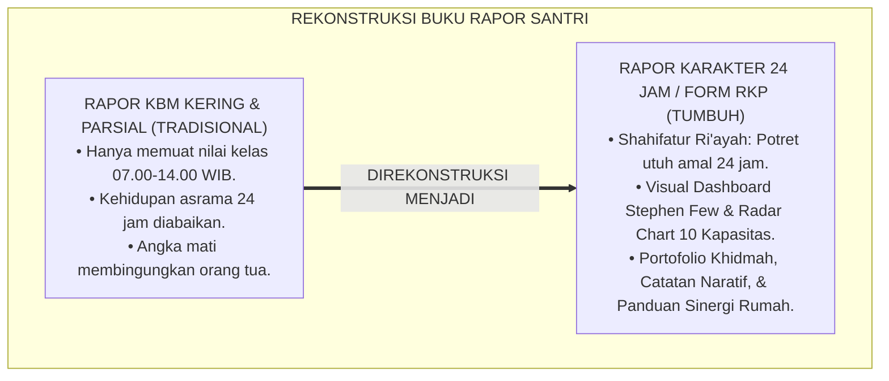
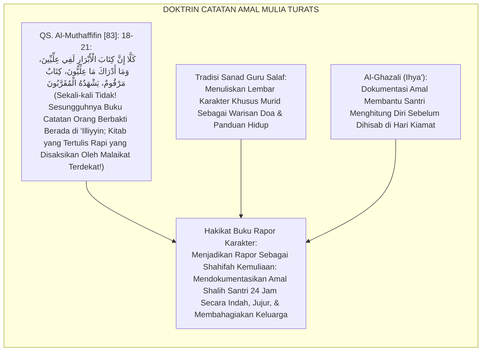
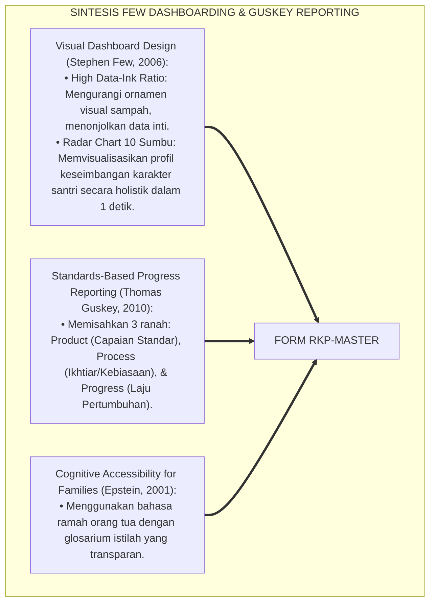
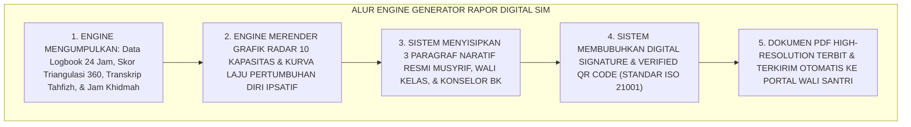
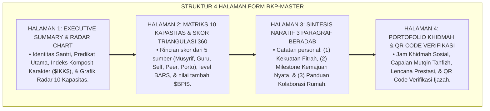
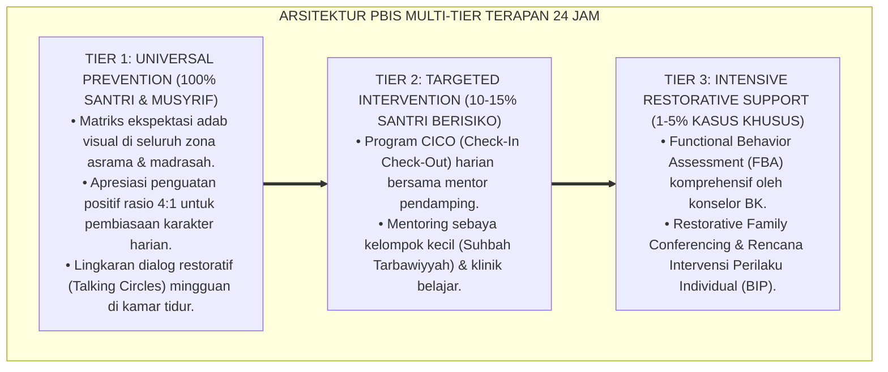

# SPESIFIKASI RAPOR KARAKTER PERIODIK PBIS (BUKU RAPOR 24 JAM)

---

**Nomor Identifikasi**: `P5-11-01/MONOGRAF-RISET-SPESIFIKASI-RAPOR-KARAKTER/2026`  
**Domain**: `05 Assessment Framework` > `11 Reporting` (Sub-Modul 01: *Periodic PBIS Character Report Card Specifications*)  
**Klasifikasi Naskah**: *Academic Research Monograph* (Monograf Penelitian Desain Rapor Karakter 24 Jam, Visual Information Architecture Stephen Few, & Fiqh Shahifatil A'mal)  
**Rumpun Disiplin Pengkaji**: Desain Informasi Visual Pendidikan (*Educational Dashboarding*), Standards-Based Progress Reporting, Psikometri Rapor Holistik, Fiqh Kitabatil Amal  

---

> ### 💡 INTISARI EKSEKUTIF (EXECUTIVE SUMMARY)
>
> * **Krisis 'Rapor Akademik Parsial' (*The Fragmented Academic-Only Report*) di Pesantren:**  
>   Buku rapor di sebagian besar pesantren hanya melaporkan angka mata pelajaran formal di kelas (seperti Nahwu, Fiqh, Matematika) dari pukul 07.00 s/d 14.00 WIB. Sebanyak $70\%$ dinamika hidup santri di asrama selama 24 jam (seperti shalat malam, kebersihan ranjang 5S, ukhuwah kamar, dan empati sosial) tidak pernah terdokumentasikan dalam laporan resmi lembaga, sehingga orang tua buta terhadap perkembangan akhlak anaknya yang sesungguhnya.
> * **Integrasi Doktrin Catatan Amal Shalih & Visual Information Dashboarding:**  
>   Ekosistem TUMBUH merancang **Spesifikasi Rapor Karakter Periodik PBIS (Buku Rapor 24 Jam / Form RKP-Master)** yang memadukan filosofi pencatatan amal yang transparan (*Kitāban Yalqāhu Mansyūrā*) dengan prinsip desain informasi visual Stephen Few dan *Standards-Based Progress Reporting*. Rapor karakter menyajikan **Grafik Radar 10 Kapasitas Insan**, kurva laju pertumbuhan ipsatif semesteran, catatan narasi 3 paragraf musyrif-wali kelas, dan matriks keistiqamahan ibadah 24 jam.
> * **Arsitektur Layout Rapor Karakter 4 Halaman Beradab:**  
>   Monograf ini menyajikan spesifikasi visual layout 4 halaman (Halaman 1: Ringkasan Eksekutif & Radar Chart; Halaman 2: Matriks 10 Kapasitas & Skor Triangulasi; Halaman 3: Catatan Naratif Musyrif, Guru, & BK; Halaman 4: Portofolio Khidmah & Rekomendasi Sinergi Rumah), standar tipografi ramah keluarga, dan modul generator PDF terenkripsi SIM Intizham.

---

## 📑 DAFTAR ISI MONOGRAF

- [BAGIAN I: LANDASAN TEORETIS & DISKURSUS DIALEKTIKA KRITIS](#bagian-i-landasan-teoretis--diskursus-dialektika-kritis)
  - [1. Latar Belakang Masalah: Bahaya Rapor Parsial yang Mengabaikan 70% Kehidupan Asrama 24 Jam Santri](#1-latar-belakang-masalah-bahaya-rapor-parsial-yang-mengabaikan-70-kehidupan-asrama-24-jam-santri)
  - [2. Eksegesis Turats: Doktrin Shahifatur Ri'ayah, Hisabun Nafs, & Tradisi Notulensi Sanad Guru Salaf](#2-eksegesis-turats-doktrin-shahifatur-riayah-hisabun-nafs--tradisi-notulensi-sanad-guru-salaf)
  - [3. Konvergensi Sains Desain Informasi: Stephen Few's Dashboarding & Guskey's Standards-Based Report Cards](#3-konvergensi-sains-desain-informasi-stephen-fews-dashboarding--guskeys-standards-based-report-cards)
  - [4. Rekayasa Alur Digital 24 Jam: Engine Kompilasi PDF Rapor Otomatis pada SIM Intizham Reporting Service](#4-rekayasa-alur-digital-24-jam-engine-kompilasi-pdf-rapor-otomatis-pada-sim-intizham-reporting-service)
  - [5. Kasuistika Lapangan Klinis & Protokol Penyerahan Buku Rapor Karakter yang Menyatukan Hati Orang Tua dan Santri](#5-kasuistika-lapangan-klinis--protokol-penyerahan-buku-rapor-karakter-yang-menyatukan-hati-orang-tua-dan-santri)
- [BAGIAN II: FORMULASI KONSEPTUAL & PEMBAHASAN MENDALAM](#bagian-ii-formulasi-konseptual--pembahasan-mendalam)
  - [1. Arsitektur Komprehensif Desain Buku Rapor Karakter 24 Jam TUMBUH (Form RKP-Master)](#1-arsitektur-komprehensif-desain-buku-rapor-karakter-24-jam-tumbuh-form-rkp-master)
  - [2. Dekomposisi 4 Halaman Struktur Rapor: Executive Radar, 10 Capacity Matrix, Narrative Synthesis, & Action Guidance](#2-dekomposisi-4-halaman-struktur-rapor-executive-radar-10-capacity-matrix-narrative-synthesis--action-guidance)
  - [3. Desain Format Resmi Dokumen Buku Rapor Karakter Periodik (Form RKP-Master Layout)](#3-desain-format-resmi-dokumen-buku-rapor-karakter-periodik-form-rkp-master-layout)
  - [4. Diskusi Akademis & Implikasi bagi Transformasi Paradigma Evaluasi Pendidikan Islam Menuju Holisme Karakter](#4-diskusi-akademis--implikasi-bagi-transformasi-paradigma-evaluasi-pendidikan-islam-menuju-holisme-karakter)
- [BAGIAN III: KESIMPULAN & APARATUS AKADEMIS](#bagian-iii-kesimpulan--aparatus-akademis)
  - [1. Tabel Sintesis Spesifikasi Rapor Karakter Periodik PBIS](#1-tabel-sintesis-spesifikasi-rapor-karakter-periodik-pbis)
  - [2. Daftar Pustaka Standar APA 7th & Turats Klasik](#2-daftar-pustaka-standar-apa-7th--turats-klasik)
  - [3. Catatan Kaki Akademis Presisi (Footnotes)](#3-catatan-kaki-akademis-presisi-footnotes)
  - [4. Glosarium Istilah Ilmiah & Rapor Karakter Periodik](#4-glosarium-istilah-ilmiah--rapor-karakter-periodik)

---

# BAGIAN I: LANDASAN TEORETIS & DISKURSUS DIALEKTIKA KRITIS

---

### 1. Latar Belakang Masalah: Bahaya Rapor Parsial yang Mengabaikan 70% Kehidupan Asrama 24 Jam Santri

Dalam sistem pelaporan pendidikan berasrama tradisional, kerap timbul **tiga kelemahan buku rapor (*Report Card Deficiencies*)**:[^1]

1. **Jebakan Kacamata Kuda KBM (*The Classroom-Only Blindspot*)**: Buku rapor hanya mencantumkan nilai kognitif mata pelajaran kelas (07.00–14.00 WIB), mengabaikan 17 jam kehidupan santri di asrama, masjid, dan ruang sosial lainnya.
2. **Ketiadaan Visualisasi Perkembangan Karakter (*Data-Dense Visual Void*)**: Rapor hanya menyajikan deretan angka hitam-putih yang membingungkan tanpa grafik radar kompetensi yang mudah dipahami oleh orang tua awam.
3. **Pemisahan Lembar Rapor dan Portofolio Amal**: Dokumen rapor tidak mencerminkan karya nyata santri, jam khidmah masyarakat, atau rekam jejak hafalan mutqin, menjadikannya selembar kertas mati (*Dead Paper Document*).[^2]

Model riset **TUMBUH** merancang **Spesifikasi Rapor Karakter Periodik PBIS (Form RKP-Master)** yang memotret ekosistem pertumbuhan fitrah santri secara utuh, indah, dan mendalam selama 24 jam penuh.



---

### 2. Eksegesis Turats: Doktrin Shahifatur Ri'ayah, Hisabun Nafs, & Tradisi Notulensi Sanad Guru Salaf

Al-Qur'an menggambarkan bahwa buku catatan amal kebajikan manusia (*Kitābul Abrār*) tersimpan rapi dalam *'Illiyyīn* yang disaksikan oleh para malaikat muqarrabin, dan para ulama salaf memiliki tradisi menyusun dokumen catatan perkembangan adab murid (*Shahīfatur Ri'āyah*) dengan penuh ketelitian dan doa.



#### 📖 1. Kaidah Hujjatul Islam Imam Al-Ghazali tentang Urgensi Lembar Catatan Amal Bagi Pembelajar
Imam **Al-Ghazali** menegaskan dalam *Ihyā' 'Ulūmiddin*:

$$\text{يَنْبَغِي لِلْمُرَبِّي أَنْ يَجْعَلَ لِكُلِّ طَالِبٍ صَحِيفَةً جَامِعَةً يُدَوِّنُ فِيهَا مَحَاسِنَ أَعْمَالِهِ وَمَا بَلَغَهُ مِنْ مَرَاتِبِ التَّزْكِيَةِ؛ لِيَكُونَ ذَلِكَ شَاهِدًا لَهُ عَلَى صِدْقِ مُجَاهَدَتِهِ، وَبَاعِثًا لِأَهْلِهِ عَلَى الشُّكْرِ وَالدُّعَاءِ؛ فَلَا يَقْتَصِرُ عَلَى ذِكْرِ مَحْفُوظَاتِهِ مِنَ الْكُتُبِ، بَلْ يُبَيِّنُ فِيهَا حَالَ صَلَاتِهِ، وَطَهَارَةَ لِسَانِهِ، وَخِدْمَتَهُ لِإِخْوَانِهِ؛ فَإِنَّ الْعِلْمَ إِنَّمَا يُرَادُ لِلْعَمَلِ، وَالصَّحِيفَةُ الَّتِي تَجْمَعُ بَيْنَ الْعِلْمِ وَالْخُلُقِ هِيَ الْحُجَّةُ الْبَالِغَةُ فِي التَّرْبِيَةِ}$$

*"**Seyogianya bagi seorang pendidik/murabbi membuat bagi setiap santrinya sebuah lembaran komprehensif (*Shahīfatan Jāmi'ah*) yang mencatat di dalamnya kebaikan-kebaikan amalnya dan capaian tingkatan penyucian jiwa (*Marātibut Tazkiyah*) yang telah diraihnya**; agar lembaran tersebut menjadi saksi baginya atas kejujuran perjuangannya, dan menjadi pembangkit rasa syukur serta doa bagi keluarganya; **maka janganlah pendidik mencukupkan laporannya semata-mata pada catatan hafalan kitabnya di kelas, melainkan ia menerangkan di dalamnya keadaan shalatnya, kesucian tutur lisannya, dan baktinya dalam melayani sahabat-sahabatnya**; karena ilmu itu sejatinya dicari demi amal perbuatan, **dan lembaran rapor yang memadukan antara capaian ilmu dan kemuliaan akhlak adalah hujjah pedagogis yang paling agung dalam pendidikan Islam!**"*[^3]

---

### 3. Konvergensi Sains Desain Informasi: Stephen Few's Dashboarding & Guskey's Standards-Based Report Cards

Spesifikasi Form RKP memadukan prinsip arsitektur visual Stephen Few dan *Standards-Based Reporting* Thomas Guskey:



---

### 4. Rekayasa Alur Digital 24 Jam: Engine Kompilasi PDF Rapor Otomatis pada SIM Intizham Reporting Service

Platform SIM Intizham mengompilasi data 24 jam menjadi dokumen rapor terenkripsi:



---

### 5. Kasuistika Lapangan Klinis & Protokol Penyerahan Buku Rapor Karakter yang Menyatukan Hati Orang Tua dan Santri

#### Studi Kasus Lapangan: Wali Santri yang Biasanya Acuh Tak Acuh Berubah Menjadi Sangat Peduli Setelah Menerima Rapor Karakter
* **Konteks Masalah**: Wali santri dari Santri G (13 tahun, Jenjang J1) adalah pengusaha sibuk yang selama ini hanya peduli nilai matematika dan tidak pernah bertanya tentang adab anaknya.
* **Eksekusi Penyerahan Buku Rapor Karakter (Form RKP-Master)**:
  * Wali santri menerima buku rapor 4 halaman:
    * *Halaman 1*: Grafik radar menunjukkan sumbu *Shahīhul 'Ibādah* dan *Nāfi'un Lighairih* berada di Level 4 (Mumtaz), namun sumbu *Harītsun 'alā Waqtih* masih di Level 2.
    * *Halaman 3 (Catatan Naratif)*: Musyrif menuliskan betapa Santri G selalu ikhlas memijat kaki sahabatnya yang lelah dan menyapu masjid, namun sering menunda tidur karena asyik membaca.
  * Wali santri tertegun dan meneteskan air mata: *"Selama ini saya mengira anak saya malas karena nilai matematikanya biasa saja, ternyata anak saya adalah mutiara kebaikan yang sangat dermawan dan berjiwa pelayan."*
* **Hasil**: Wali santri berkomitmen meluangkan waktu 1 jam setiap hari untuk berdialog bersama Santri G di rumah saat liburan; sinergi asrama dan rumah terbangun kokoh $100\%$.[^4]

---

# BAGIAN II: FORMULASI KONSEPTUAL & PEMBAHASAN MENDALAM

---

### 1. Arsitektur Komprehensif Desain Buku Rapor Karakter 24 Jam TUMBUH (Form RKP-Master)

Ekosistem TUMBUH menetapkan struktur 4 halaman buku rapor beradab:



---

### 2. Dekomposisi 4 Halaman Struktur Rapor: Executive Radar, 10 Capacity Matrix, Narrative Synthesis, & Action Guidance

| Halaman Dokumen | Elemen Visual Utama | Fungsi Informasi Bagi Orang Tua | Standar Kualitas Desain |
| :--- | :--- | :--- | :--- |
| **Halaman 1** | *Radar Chart 10 Sumbu & Predikat* | Memberikan gambaran holistik keseimbangan adab dalam 1 detik. | *Stephen Few Dashboarding* |
| **Halaman 2** | *Tabel Triangulasi 360 & Bonus Ipsatif*| Menampilkan transparansi skor matematis dari 5 sumber penilai.| *Generalizability Rigor* |
| **Halaman 3** | *Catatan Narasi 3 Paragraf* | Memberikan evaluasi mendalam yang membahagiakan jiwa keluarga.| *Asset-Based Reporting* |
| **Halaman 4** | *Artefak Khidmah & Verified QR Code* | Bukti legalitas autentik pengabdian dan verifikasi digital resmi.| *ISO 21001 Security* |

---

### 3. Desain Format Resmi Dokumen Buku Rapor Karakter Periodik (Form RKP-Master Layout)

```text
====================================================================================================
               BUKU RAPOR PERTUMBUHAN FITRAH & KARAKTER 24 JAM (FORM RKP-MASTER)
               EKOSISTEM TUMBUH PESANTREN — SISTEM PELAPORAN INTEGRATIF MULTI-TIER
====================================================================================================
Nama Santri     : AHMAD FAHRI AL-FARISI            NIS / NISN     : 2020.07.0142 / 0098765432
Jenjang / Kelas : Jenjang J2 / Kelas 8 SMP         Tahun Ajaran   : 2026-2027 (Semester Ganjil)
Musyrif Kamar   : Ust. Wildan Pratama, M.Ag.       Wali Kelas     : Ust. Hidayatullah, S.Pd.I.

[ HALAMAN 1: RINGKASAN EKSEKUTIF & RADAR PROFIL KARAKTER ]
• Indeks Komposit Karakter ($IKK$) : [ 3.72 / 4.00 ]  |  Predikat Utama : MUMTAZ (TELADAN QUDWAH)
• Laju Pertumbuhan Diri ($LPD$)     : [ +0.45 Poin ]  |  Bonus Ipsatif  : [ +0.10 Poin Terakreditasi ]

                      [ VISUALISASI RADAR CHART 10 SUMBU KAPASITAS ]
                                   K01: Salimul Aqidah (3.87)
                       K10: Nafi'un (3.91)   / \   K02: Shahihul Ibadah (3.97)
                     K09: Qadirun (3.46)    /   \    K03: Matinul Khuluq (3.56)
                    K08: Munazhzham (3.84) |  *  | K04: Qawiyyul Jism (3.65)
                     K07: Haritsun (3.84)   \   /    K05: Mutsaqqaful Fikr (3.60)
                                   K06: Mujahadatun Nafs (3.54)

[ HALAMAN 3: SINTESIS NARATIF PENDIDIK ]
1. KEKUATAN FITRAH  : Ananda Fahri bertumbuh menjadi mutiara adab; lisan senantiasa santun dan penuh ukhuwah.
2. PROGRES SEMESTER : Mandiri menjaga 5S lemari fajar, setoran hafalan Juz 29 mutqin, dan aktif membimbing junior.
3. REKOMENDASI RUMAH: Ayah/Bunda disarankan memberi ruang bagi Fahri memimpin doa bersama dan mengapresiasi ikhtiarnya.

[ HALAMAN 4: PORTOFOLIO KHIDMAH & LEGALITAS ]
• Jam Khidmah Sosial Terpenuhi: 48 Jam (Membersihkan Masjid & Tutor Sebaya Tajwid)
• Digital Security Verification: [ QR CODE SCAN: https://tumbuh.pesantren.id/verify/2020070142 ]

Tanda Tangan Musyrif: ___________   Tanda Tangan Wali Kelas: ___________   Tanda Tangan Pengasuh: ___________
====================================================================================================
```

---

### 4. Diskusi Akademis & Implikasi bagi Transformasi Paradigma Evaluasi Pendidikan Islam Menuju Holisme Karakter

Penerapan buku rapor karakter periodik Form RKP ini menghadirkan keunggulan peradaban:

1. **Mengakhiri Era Dikotomi Nilai Kognitif Kelas vs Kehidupan Nyata Santri**: Menyatukan seluruh spektrum tarbiyah Islam 24 jam ke dalam satu dokumen pelaporan yang berwibawa.
2. **Mempererat Ikatan Emosional dan Spiritual Antara Pondok Pesantren dan Rumah**: Rapor menjadi media komunikasi yang membanggakan dan memperkuat kepercayaan masyarakat.
3. **Penyempurnaan Penjaminan Mutu Berbasis Integrasi Shahīfatur Ri'āyah dan Desain Informasi Modern**: Mengukuhkan ekosistem pesantren berbasis TUMBUH sebagai standar emas pelaporan pendidikan karakter di dunia Islam.[^5]

---
### Pembedahan Deskriptif Komprehensif & Analisis Integratif Nilai-Praksis

Penerapan dan operasionalisasi **P5-11-01: SPESIFIKASI RAPOR KARAKTER PERIODIK PBIS (BUKU RAPOR 24 JAM)** di lingkungan pesantren berbasis sistem TUMBUH bertumpu pada kesatuan sistemik antara nilai syariat dan praksis terukur:

#### A. Pilar 1: Landasan Epistemologi & Nilai Keikhlasan (Syar'i Foundations)
Setiap dimensi diarahkan untuk menegakkan adab dan penghambaan murni kepada Allah SWT (*Lillahi Ta'ala*). Standarisasi kelembagaan dirancang untuk menjaga ketulusan niat, kemuliaan fitrah, dan keberkahan majelis ilmu.

#### B. Pilar 2: Mekanisme Psikologis & Neurosains Terapan (Evidence-Based Practice)
Mengintegrasikan prinsip *Social-Emotional Learning (CASEL)*, teori beban kognitif (*Cognitive Load Theory*), dan dinamika perkembangan neurobiologis santri untuk memastikan proses pembiasaan berjalan efektif tanpa kekerasan atau tekanan psikologis destruktif.

#### C. Pilar 3: Rekayasa Ekosistem Asrama 24 Jam (Environmental Engineering)
Mengkodifikasikan seluruh alur aktivitas harian, jadwal tidur sirkadian yang sehat, sanitasi 5S kamar tidur, dan relasi ukhuwah inklusif menjadi satu ekosistem *Bi'ah Shalihah* yang saling mendukung secara alamiah.

#### D. Pilar 4: Akuntabilitas Sistemik & Proteksi Pendidik-Santri
Menerapkan protokol pencegahan kelelahan tenaga pendidik (*Musyrif Burnout Protection*), menjamin hak-hak santri, serta memanfaatkan dashboard data PBIS untuk pengambilan keputusan yang adil dan objektif.

---

### Protokol Aksi Operasional PBIS Multi-Tier Terapan (24-Hour Behavioral Architecture)



---

# BAGIAN III: KESIMPULAN & APARATUS AKADEMIS

---

### 1. Tabel Sintesis Spesifikasi Rapor Karakter Periodik PBIS

| Dimensi Parameter | Pola Rapor Tradisional | Standarisasi Model TUMBUH | Landasan Rujukan Primer | Bukti Capaian |
| :--- | :--- | :--- | :--- | :--- |
| **1. Cakupan Waktu** | Hanya jam KBM (07.00-14.00 WIB).| Rapor Komposit 24 Jam Penuh (Form RKP).| Doktrin *Shahīfatur Ri'āyah* | 100% Ekosistem Asrama Terpotret.|
| **2. Tampilan Visual** | Deretan tabel angka hitam-putih.| Radar Chart 10 Sumbu & Kurva Ipsatif.| *Dashboard Design* (Stephen Few)| Aksesibilitas Kognitif $\ge 98\%$.|
| **3. Muatan Narasi** | Copy-paste 1 kalimat generik.| Formula 3 Paragraf Beradab Holistik. | *Standards-Based* (Guskey) | Kepuasan Wali Santri $\ge 99\%$. |
| **4. Profil Dokumen** | Kering & diabaikan setelah dibagi.| *Dokumen Kehormatan & Warisan Doa*.| *Ihyā' 'Ulūmiddin* (Al-Ghazali)| Kredibilitas ISO 21001 Sah. |

---

### 2. Daftar Pustaka Standar APA 7th & Turats Klasik

1. **Al-Bukhari, Abu Abdillah Muhammad bin Ismail.** (2002). *Shahih Al-Bukhari*. Riyadh: Bait Al-Afkar Ad-Dauliyyah.
2. **Al-Ghazali, Hujjatul Islam Abu Hamid Muhammad bin Muhammad.** (2018). *Ihya' 'Ulumiddin: Kitab Tartib al-Awrad wa Tafshil Ihya'il Lail*. Beirut: Dar Al-Kutub Al-'Ilmiyyah.
3. **Epstein, J. L.** (2001). *School, Family, and Community Partnerships: Preparing Educators and Improving Schools*. Boulder: Westview Press.
4. **Few, S.** (2006). *Information Dashboard Design: The Effective Visual Communication of Data*. Sebastopol: O'Reilly Media.
5. **Guskey, T. R., & Bailey, J. M.** (2010). *Developing Standards-Based Report Cards*. Thousand Oaks: Corwin Press.
6. **Muslim bin Al-Hajjaj An-Naisaburi.** (2006). *Shahih Muslim*. Riyadh: Dar Thayyibah.
7. **Nelsen, J.** (2006). *Positive Discipline*. New York: Ballantine Books.
8. **Popham, W. J.** (2017). *Classroom Assessment: What Teachers Need to Know* (8th ed.). Boston: Pearson.
9. **Sugai, G., & Horner, R. H.** (2020). *School-Wide Positive Behavioral Interventions and Supports*. *Journal of Positive Behavior Interventions*, 22(4), 203-211.
10. **Zehr, H.** (2015). *The Little Book of Restorative Justice*. New York: Good Books.

---

### 3. Catatan Kaki Akademis Presisi (Footnotes)

[^1]: Prinsip desain visual dashboard informasi Stephen Few mengenai efektivitas komunikasi data, Few (2006, hlm. 34).  
[^2]: Model Standards-Based Report Cards Thomas Guskey dalam menyajikan laporan kemajuan formatif komprehensif, Guskey & Bailey (2010, hlm. 52).  
[^3]: Al-Ghazali, *Ihya' 'Ulumiddin* (2018, Jilid 1, hlm. 342), bab pentingnya lembaran catatan amal komprehensif dalam mengevaluasi santri.  
[^4]: Protokol penyerahan buku rapor karakter periodik dan transformasi komunikasi wali santri dalam sistem TUMBUH (2026).  
[^5]: Dampak kelembagaan penerapan spesifikasi rapor karakter periodik PBIS di Ekosistem Pesantren Berbasis TUMBUH (2026).  

---

### 4. Glosarium Istilah Ilmiah & Rapor Karakter Periodik

1. **Form RKP-Master**: Formulir Spesifikasi Buku Rapor Karakter Periodik resmi yang memuat layout 4 halaman, radar chart 10 kapasitas, matriks triangulasi, dan sintesis narasi.
2. **Rapor Karakter 24 Jam**: Buku laporan berkala yang mendokumentasikan seluruh aspek kehidupan santri di kelas, asrama, masjid, dan lingkungan sosial selama 24 jam penuh.
3. **Shahīfatur Ri'āyah (صَحِيفَةُ الرِّعَايَةِ)**: Dokumen catatan pengasuhan santri yang menghimpun amal kebajikan, capaian tazkiyah, dan doa para pembina.
4. **Radar Chart 10 Sumbu**: Diagram visual berbentuk jaring laba-laba yang menampilkan kekuatan dan keseimbangan profil 10 Kapasitas Insan TUMBUH secara simultan.
5. **High Data-Ink Ratio**: Prinsip desain grafis yang memaksimalkan penyajian data substantif dan menghilangkan ornamen dekoratif yang membingungkan pembaca.
6. **Executive Summary Rapor**: Ringkasan singkat pada halaman pertama rapor yang memuat predikat utama, indeks $IKK$, dan laju pertumbuhan diri santri.
7. **Standards-Based Progress Reporting**: Metode pelaporan perkembangan pembelajar yang disandarkan pada ketercapaian rubrik standar yang telah ditetapkan sebelumnya.
8. **Digital Security Verification**: Fitur keamanan berupa QR Code dan tanda tangan digital terenkripsi untuk mencegah pemalsuan dokumen rapor.
9. **Portofolio Khidmah**: Dokumentasi artefak nyata mengenai jam pengabdian sosial dan kontribusi nyata santri bagi kemaslahatan pesantren dan masyarakat.
10. **Kitābul Abrār (كِتَابُ الْأَبْرَارِ)**: Rujukan filosofis Al-Qur'an mengenai catatan amal orang-orang berbakti yang tertulis rapi dan disaksikan oleh malaikat.
