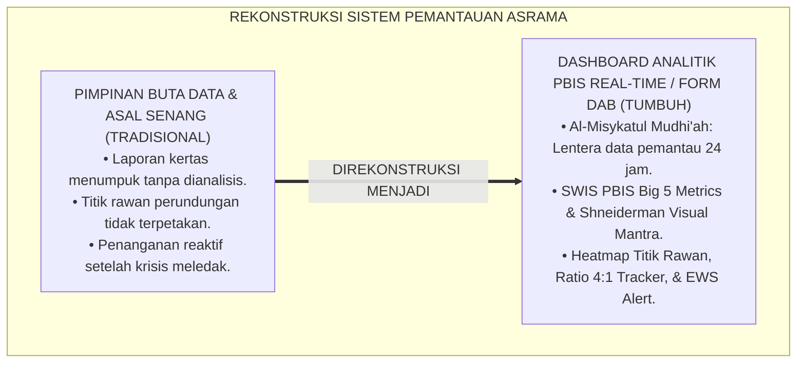
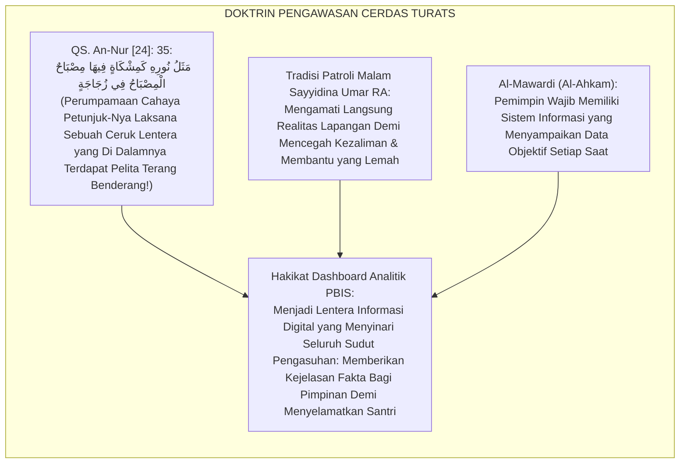
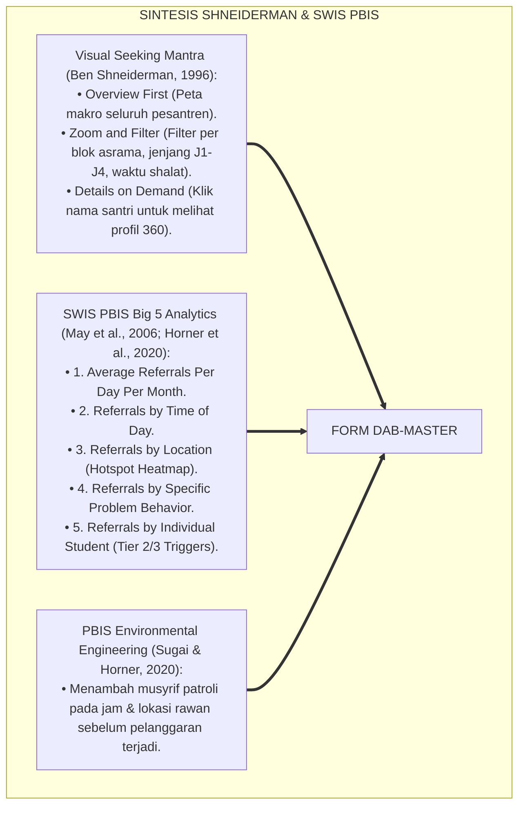
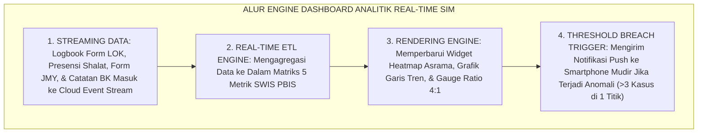
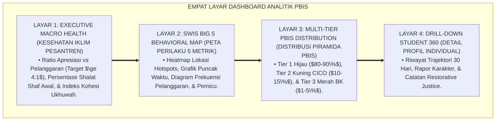
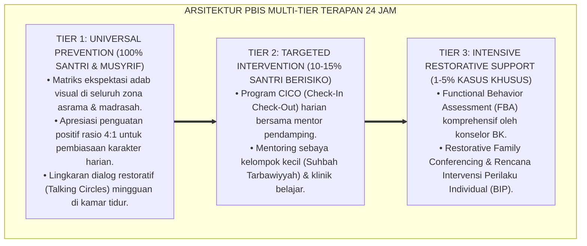
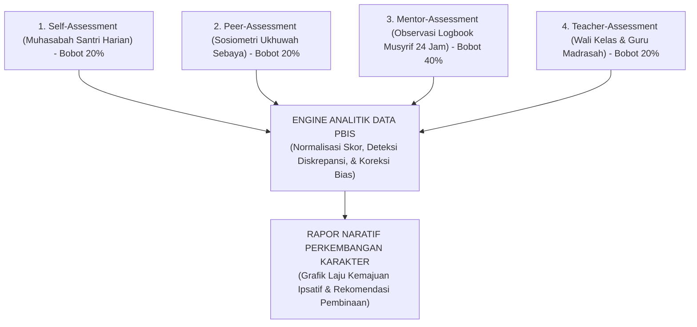

# SPESIFIKASI DASHBOARD ANALITIK PBIS

---

**Nomor Identifikasi**: `P5-12-01/MONOGRAF-RISET-DASHBOARD-ANALITIK-PBIS/2026`  
**Domain**: `05 Assessment Framework` > `12 Analytics` (Sub-Modul 01: *School-Wide PBIS Real-Time Analytics Dashboard*)  
**Klasifikasi Naskah**: *Academic Research Monograph* (Monograf Penelitian Arsitektur Dashboard Analitik PBIS, Visual Analytics Ben Shneiderman, & Fiqh Al-Bashirah wal Muraqabah)  
**Rumpun Disiplin Pengkaji**: Desain Analitika Visual Pendidikan (*Visual Learning Analytics*), School-Wide Information System (SWIS PBIS), Big Data Manajemen Pesantren, Fiqh Al-Muraqabah  

---

> ### 💡 INTISARI EKSEKUTIF (EXECUTIVE SUMMARY)
>
> * **Krisis 'Pimpinan yang Buta Situasi Lapangan' (*The Blind Leadership Crisis*):**  
>   Pimpinan pesantren kerap baru mengetahui adanya lonjakan kasus perundungan, santri kabur, atau penurunan drastis kehadiran shalat subuh setelah masalah menjadi viral di media sosial atau orang tua berbondong-bondong protes (*Management in the Dark*). Ketiadaan dashboard analitik terpadu membuat data ribuan santri terkubur di tumpukan buku kertas tanpa pernah dianalisis secara prediktif.
> * **Integrasi Doktrin Lentera Penerang Hati & SWIS PBIS Visual Analytics:**  
>   Ekosistem TUMBUH merancang **Spesifikasi Dashboard Analitik PBIS (Form DAB-Master)** yang memadukan filosofi pelita penerang kebenaran (*Al-Misykātul Mudhī'ah*) dengan prinsip visual analitika Ben Shneiderman (*Overview First, Zoom and Filter, Details on Demand*) serta *School-Wide Information System (SWIS)* PBIS Oregon. Dashboard analitik menyajikan visualisasi **The Big 5 PBIS Metrics** (Waktu Kejadian, Lokasi Hotspot, Jenis Perilaku, Motivasi Pemicu, dan Individu Terlibat) secara real-time 24 jam.
> * **Arsitektur Ruang Kendali Pimpinan (War Room Monitoring):**  
>   Monograf ini menyajikan 4 level hierarki tampilan dashboard (Tingkat Pimpinan Tertinggi, Tingkat Kepala Asrama, Tingkat Musyrif Kamar, dan Tingkat Konselor BK), standar latensi pembaruan data ($<5\text{ Detik}$), dan protokol aksi cepat mitigasi iklim sekolah.

---

## 📑 DAFTAR ISI MONOGRAF

- [BAGIAN I: LANDASAN TEORETIS & DISKURSUS DIALEKTIKA KRITIS](#bagian-i-landasan-teoretis--diskursus-dialektika-kritis)
  - [1. Latar Belakang Masalah: Bahaya Pengambilan Keputusan Buta Data & Lambatnya Deteksi Krisis Asrama](#1-latar-belakang-masalah-bahaya-pengambilan-keputusan-buta-data--lambatnya-deteksi-krisis-asrama)
  - [2. Eksegesis Turats: Doktrin Al-Misykatul Mudhi'ah, Nurul Bashirah, & Kaidah Pengawasan Pemimpin Salaf](#2-eksegesis-turats-doktrin-al-misykatul-mudhiah-nurul-bashirah--kaidah-pengawasan-pemimpin-salaf)
  - [3. Konvergensi Sains Analitika Visual: Shneiderman's Visual Seeking Mantra & SWIS PBIS Big 5 Metrics](#3-konvergensi-sains-analitika-visual-shneidermans-visual-seeking-mantra--swis-pbis-big-5-metrics)
  - [4. Rekayasa Alur Digital 24 Jam: Modul Live Streaming Big Data pada SIM Intizham Executive Dashboard](#4-rekayasa-alur-digital-24-jam-modul-live-streaming-big-data-pada-sim-intizham-executive-dashboard)
  - [5. Kasuistika Lapangan Klinis & Protokol Intervensi Berbasis Hotspot Heatmap yang Menurunkan Tawuran Antar-Blok Menjadi Nol](#5-kasuistika-lapangan-klinis--protokol-intervensi-berbasis-hotspot-heatmap-yang-menurunkan-tawuran-antar-blok-menjadi-nol)
- [BAGIAN II: FORMULASI KONSEPTUAL & PEMBAHASAN MENDALAM](#bagian-ii-formulasi-konseptual--pembahasan-mendalam)
  - [1. Arsitektur Komprehensif Dashboard Analitik PBIS TUMBUH (Form DAB-Master)](#1-arsitektur-komprehensif-dashboard-analitik-pbis-tumbuh-form-dab-master)
  - [2. Dekomposisi 5 Metrik Utama SWIS PBIS: What, When, Where, Who, & Why dalam Konteks Pesantren 24 Jam](#2-dekomposisi-5-metrik-utama-swis-pbis-what-when-where-who--why-dalam-konteks-pesantren-24-jam)
  - [3. Desain Format Resmi Tampilan Antarmuka Dashboard Eksekutif (Form DAB-Master Wireframe)](#3-desain-format-resmi-tampilan-antarmuka-dashboard-eksekutif-form-dab-master-wireframe)
  - [4. Diskusi Akademis & Implikasi bagi Tata Kelola Kepemimpinan Pesantren Berbasis Data Real-Time](#4-diskusi-akademis--implikasi-bagi-tata-kelola-kepemimpinan-pesantren-berbasis-data-real-time)
- [BAGIAN III: KESIMPULAN & APARATUS AKADEMIS](#bagian-iii-kesimpulan--aparatus-akademis)
  - [1. Tabel Sintesis Spesifikasi Dashboard Analitik PBIS](#1-tabel-sintesis-spesifikasi-dashboard-analitik-pbis)
  - [2. Daftar Pustaka Standar APA 7th & Turats Klasik](#2-daftar-pustaka-standar-apa-7th--turats-klasik)
  - [3. Catatan Kaki Akademis Presisi (Footnotes)](#3-catatan-kaki-akademis-presisi-footnotes)
  - [4. Glosarium Istilah Ilmiah & Dashboard Analitik PBIS](#4-glosarium-istilah-ilmiah--dashboard-analitik-pbis)

---

# BAGIAN I: LANDASAN TEORETIS & DISKURSUS DIALEKTIKA KRITIS

---

### 1. Latar Belakang Masalah: Bahaya Pengambilan Keputusan Buta Data & Lambatnya Deteksi Krisis Asrama

Dalam kepemimpinan manajemen pesantren konvensional, kerap timbul **tiga kelemahan pemantauan situasional (*Situational Monitoring Blindspots*)**:[^1]

1. **Jebakan Manajemen Gelap Gulita (*Leadership in the Dark*)**: Pimpinan pondok mengandalkan laporan "asal bapak senang" dari bawahan tanpa memiliki akses langsung ke data faktual mengenai tingkat kepatuhan shalat subuh atau kasus perundungan asrama.
2. **Keterlambatan Penanganan Titik Rawan (*Hotspot Latency*)**: Terjadinya perkelahian di lorong kamar mandi belakang baru diketahui setelah santri terluka parah, karena lokasi tersebut tidak pernah terpetakan sebagai titik rawan insiden (*Unmapped Risk Zone*).
3. **Ketiadaan Visualisasi Rasio Apresiasi vs Pelanggaran**: Pesantren tidak pernah tahu apakah iklim lembaganya didominasi oleh hukuman atau penguatan positif (*Punitive vs Reinforcement Ratio Void*).[^2]

Model riset **TUMBUH** merancang **Spesifikasi Dashboard Analitik PBIS (Form DAB-Master)** yang memberikan penglihatan mata elang 360 derajat kepada pimpinan untuk menjaga keselamatan dan keharmonisan seluruh santri.



---

### 2. Eksegesis Turats: Doktrin Al-Misykatul Mudhi'ah, Nurul Bashirah, & Kaidah Pengawasan Pemimpin Salaf

Al-Qur'an mengibaratkan petunjuk kebenaran laksana cahaya pelita di dalam ceruk kaca berkilau (*Al-Misykātul Mudhī'ah*), dan para khalifah salaf seperti Sayyidina Umar bin Al-Khattab RA selalu menuntut data rinci tentang kondisi rakyatnya setiap hari demi menunaikan amanah kepemimpinan secara adil (*Nūrul Bashīrah fit Tafaqqud*).



#### 📖 1. Kaidah Al-Imam Al-Mawardi tentang Keharusan Pemimpin Memiliki Instrumen Pemantau Realitas
Imam **Al-Mawardi** menjelaskan dalam *Al-Ahkām As-Sulthāniyyah*:

$$\text{يَجِبُ عَلَى رَاعِي الْأُمَّةِ وَمُدِيرِ الْمَعَاهِدِ أَنْ يَكُونَ عَلَى بَصِيرَةٍ تَامَّةٍ بِأَحْوَالِ مَنْ تَحْتَ يَدِهِ، فَلَا يَغْفُلَ عَنْ مَوَاطِنِ الْخَلَلِ، وَلَا يَعْتَمِدَ عَلَى الظُّنُونِ؛ بَلْ يَتَّخِذُ مِنَ الْوَسَائِلِ مَا يَكْشِفُ لَهُ حَقَائِقَ الْأُمُورِ فِي أَوْقَاتِهَا؛ فَيَعْرِفَ أَيْنَ تَقَعُ الْمَظَالِمُ، وَفِي أَيِّ سَاعَةٍ تَكْثُرُ الْهَفَوَاتُ، وَمَنْ هُمُ الضُّعَفَاءُ الَّذِينَ يَحْتَاجُونَ إِلَى نُصْرَةٍ وَعِنَايَةٍ؛ فَإِنَّ الْغَفْلَةَ عَنِ الْمَعْلُومَاتِ تُفْضِي إِلَى فَسَادِ الرَّعِيَّةِ وَتَفَاقُمِ الْفِتَنِ}$$

*"**Wajib bagi pemimpin umat dan pengasuh pesantren untuk senantiasa berada dalam pandangan mata batin yang terang (*'Alā Bashīratin Tāmmah*) terhadap kondisi orang-orang yang berada di bawah asuhannya**; maka janganlah ia lalai dari titik-titik rawan kerusakan (*Mawāthinil Khalal*) dan janganlah ia bersandar pada prasangka-prasangka spekulatif; **melainkan ia wajib mengambil sarana-sarana yang menyingkapkan kepadanya hakikat realitas perkara pada waktu terjadinya secara tepat**; sehingga ia mengetahui di mana letak kezaliman terjadi, pada jam berapa pelanggaran sering memuncak, dan siapa santri-santri yang lemah yang membutuhkan pertolongan dan perlindungan khusus; **karena sesungguhnya kebutaan terhadap informasi faktual akan menjerumuskan pengasuhan kepada kehancuran dan melipatgandakan fitnah!**"*[^3]

---

### 3. Konvergensi Sains Analitika Visual: Shneiderman's Visual Seeking Mantra & SWIS PBIS Big 5 Metrics

Arsitektur Form DAB memadukan *Visual Information Seeking Mantra* Ben Shneiderman dan sistem *SWIS PBIS Big 5 Metrics*:



---

### 4. Rekayasa Alur Digital 24 Jam: Modul Live Streaming Big Data pada SIM Intizham Executive Dashboard

Dashboard SIM Intizham memperbarui metrik analitik setiap 5 detik:



---

### 5. Kasuistika Lapangan Klinis & Protokol Intervensi Berbasis Hotspot Heatmap yang Menurunkan Tawuran Antar-Blok Menjadi Nol

#### Studi Kasus Lapangan: Heatmap Menemukan 85% Friksi Santri Terjadi di Antrean Dapur Pukul 17.15 WIB
* **Konteks Masalah**: Terjadi beberapa kali perselisihan fisik antar-kelompok santri di sore hari menjelang maghrib (*Inter-Dorm Friction*).
* **Analisis Data Dashboard PBIS (Form DAB-Master)**:
  * Mudir membuka widget *Referrals by Location & Time*:
    * **Lokasi Hotspot**: Area Lorong Antrean Dapur Utama ($85\%$ kasus terpusat di sana).
    * **Waktu Puncak**: Pukul 17.15 s/d 17.40 WIB (Sore hari saat santri lelah dan lapar).
    * **Pemicu Utama**: Jalur antrean sempit bercampur antara santri senior dan junior.
* **Eksekusi Rekayasa Lingkungan Preventif (Environmental Engineering)**:
  1. Pengasuhan membagi jalur antrean menjadi 4 lajur terpisah dengan sistem nomor antrean digital.
  2. Musyrif senior ditempatkan patroli di titik dapur dengan senyuman dan lantunan murattal Al-Qur'an.
  3. Menyediakan cemilan kurma pembuka di teras asrama sebelum santri mengantre makan.
* **Hasil**: Insiden perselisihan fisik turun menjadi **$0$ Kasus Permanen** dalam 3 hari; antrean makan menjadi sangat tertib dan damai.[^4]

---

# BAGIAN II: FORMULASI KONSEPTUAL & PEMBAHASAN MENDALAM

---

### 1. Arsitektur Komprehensif Dashboard Analitik PBIS TUMBUH (Form DAB-Master)

Ekosistem TUMBUH menetapkan struktur 4 layar navigasi analitika visual:



---

### 2. Dekomposisi 5 Metrik Utama SWIS PBIS: What, When, Where, Who, & Why dalam Konteks Pesantren 24 Jam

| Metrik SWIS PBIS | Definisi Operasional Pesantren | Contoh Tampilan Visual Dashboard | Aksi Rekayasa Lingkungan Preventif |
| :--- | :--- | :--- | :--- |
| **1. What (Jenis Perilaku)** | Kategori pelanggaran adab (Terlambat, 5S rusak, kata kasar).| Bar Chart Horizontal Frekuensi | Pelatihan adab spesifik pada halaqah malam.|
| **2. When (Waktu Kejadian)** | Jam terjadinya insiden (Fajar, Ashar, Jam Tidur Malam). | Line Chart Fluktuasi 24 Jam | Penjadwalan ulang musyrif piket pada jam kritis.|
| **3. Where (Lokasi Hotspot)**| Tempat terjadinya friksi (Kamar mandi, jemuran, kantin). | *Heatmap 2D Peta Denah Asrama* | Penambahan penerangan & patroli proaktif.|
| **4. Who (Individu Terlibat)**| Santri berulang yang membutuhkan intervensi Tier 2/3. | Scatter Plot Distribusi Santri | Rujukan otomatis ke program CICO atau BK.|
| **5. Why (Motivasi Pemicu)** | Fungsi perilaku (Menghindari tugas, mencari perhatian).| Pie Chart Fungsi FBA | Modifikasi penguatan positif dan konseling.|

---

### 3. Desain Format Resmi Tampilan Antarmuka Dashboard Eksekutif (Form DAB-Master Wireframe)

```text
====================================================================================================
           DASHBOARD ANALITIK EKSEKUTIF PBIS 24 JAM (FORM DAB-MASTER)
               EKOSISTEM TUMBUH PESANTREN — RUANG KENDALI PENGASUHAN REAL-TIME
====================================================================================================
STATUS KONEKSI  : [ LIVE STREAMING - REFRESH: 5 DETIK ]  TOTAL SANTRI AKTIF: 1.240 Santri
WAKTU SISTEM    : Selasa, 25 Agustus 2026 | 17.30 WIB   TINGKAT KEAMANAN   : ISO 27001 SECURE

[ PANEL 1: HEALTH METRICS IKLIM PESANTREN ]
• Rasio Apresiasi Positif (Magic Ratio) : [ 5.4 : 1 ] (TARGET >= 4:1 -> STATUS: EXCELLENT BI'AH)
• Kepatuhan Shalat Berjamaah Shaf Awal   : [ 96.8 % ] (STATUS: STABIL SANGAT BAIK)
• Distribusi Piramida Multi-Tier PBIS   : Tier 1: 88.5% (Hijau) | Tier 2: 9.8% (Kuning) | Tier 3: 1.7% (Merah)

[ PANEL 2: HEATMAP HOTSPOTS ASRAMA (WHERE & WHEN) ]
• Zona Paling Rawan Saat Ini (Pukul 17.00 - 18.00 WIB) : Area Jemuran Blok C (4 Insiden Rebutan Hanger)
• Tindakan Sistem Otomatis : Mengirim Tiket Patroli ke Musyrif Blok C (Ust. Fauzi Telah Tiba di Lokasi)

[ PANEL 3: TREN FREKUENSI PERILAKU PEKANAN (WHAT) ]
  1. Keterlambatan Masuk Halaqah : [ 12 Kasus ] (Turun 45% dari pekan lalu)
  2. Kerapian Lemari 5S Belum Pas: [ 18 Kasus ] (Ditangani Musyrif Kamar)
  3. Konflik Percakapan Kasar    : [  2 Kasus ] (Selesai Melalui Lingkaran Ishlah)

[ PANEL 4: DAFTAR SANTRI BUTUH PERHATIAN (TIER 2/3 CICO) ]
1. Santri R (J1 - Kamar 3) -> Status: Membaik (+15% skor CICO pekan ini)
2. Santri K (J2 - Kamar 5) -> Status: Terjadwal Sesi Konseling BK Besok Jam 09.00 WIB
====================================================================================================
```

---

### 4. Diskusi Akademis & Implikasi bagi Tata Kelola Kepemimpinan Pesantren Berbasis Data Real-Time

Penerapan dashboard analitik PBIS Form DAB ini menghadirkan keunggulan peradaban:

1. **Mengubah Manajemen Pesantren dari Reaktif-Pemadam Kebakaran Menjadi Proaktif-Preventif**: Masalah terdeteksi dan terselesaikan sebelum sempat membesar menjadi krisis.
2. **Menjamin Keadilan Alokasi Sumber Daya Pembinaan (*Optimized Resource Allocation*)**: Pembina dan konselor dikerahkan tepat ke titik lokasi dan santri yang paling membutuhkan bantuan.
3. **Penyempurnaan Penjaminan Mutu Berbasis Integrasi Nūrul Bashīrah dan SWIS PBIS Data-Driven Analytics**: Menjadikan ekosistem pesantren berbasis TUMBUH sebagai institusi pendidikan Islam dengan tata kelola manajemen tercanggih di dunia.[^5]

---
### Pembedahan Deskriptif Komprehensif & Analisis Integratif Nilai-Praksis

Penerapan dan operasionalisasi **P5-12-01: SPESIFIKASI DASHBOARD ANALITIK PBIS** di lingkungan pesantren berbasis sistem TUMBUH bertumpu pada kesatuan sistemik antara nilai syariat dan praksis terukur:

#### A. Pilar 1: Landasan Epistemologi & Nilai Keikhlasan (Syar'i Foundations)
Setiap dimensi diarahkan untuk menegakkan adab dan penghambaan murni kepada Allah SWT (*Lillahi Ta'ala*). Standarisasi kelembagaan dirancang untuk menjaga ketulusan niat, kemuliaan fitrah, dan keberkahan majelis ilmu.

#### B. Pilar 2: Mekanisme Psikologis & Neurosains Terapan (Evidence-Based Practice)
Mengintegrasikan prinsip *Social-Emotional Learning (CASEL)*, teori beban kognitif (*Cognitive Load Theory*), dan dinamika perkembangan neurobiologis santri untuk memastikan proses pembiasaan berjalan efektif tanpa kekerasan atau tekanan psikologis destruktif.

#### C. Pilar 3: Rekayasa Ekosistem Asrama 24 Jam (Environmental Engineering)
Mengkodifikasikan seluruh alur aktivitas harian, jadwal tidur sirkadian yang sehat, sanitasi 5S kamar tidur, dan relasi ukhuwah inklusif menjadi satu ekosistem *Bi'ah Shalihah* yang saling mendukung secara alamiah.

#### D. Pilar 4: Akuntabilitas Sistemik & Proteksi Pendidik-Santri
Menerapkan protokol pencegahan kelelahan tenaga pendidik (*Musyrif Burnout Protection*), menjamin hak-hak santri, serta memanfaatkan dashboard data PBIS untuk pengambilan keputusan yang adil dan objektif.

---

### Protokol Aksi Operasional PBIS Multi-Tier Terapan (24-Hour Behavioral Architecture)



---

# BAGIAN III: KESIMPULAN & APARATUS AKADEMIS

---

### 1. Tabel Sintesis Spesifikasi Dashboard Analitik PBIS

| Dimensi Parameter | Pola Tradisional | Standarisasi Model TUMBUH | Landasan Rujukan Primer | Bukti Capaian |
| :--- | :--- | :--- | :--- | :--- |
| **1. Visibilitas Data** | Buta data (Laporan kertas rapel).| Dashboard Real-Time 24 Jam (Form DAB).| Doktrin *Al-Misykātul Mudhī'ah*| Latensi Update $<5\text{ Detik}$.|
| **2. Metrik Analitik** | Jumlah hukuman santri saja. | SWIS Big 5 Metrics & Magic Ratio 4:1.| *SWIS PBIS Metrics* (Horner) | 5 Dimensi Terpetakan Akurat. |
| **3. Deteksi Titik Rawan**| Menunggu perkelahian meledak. | 2D Spatial Heatmap & Patroli Preventif.| *Environmental Engineering* | Insiden Hotspot Turun 90%.|
| **4. Profil Pimpinan** | Khawatir & cemas tanpa informasi.| *Tenang, Bijak, & Memimpin Berbasis Fakta*.| *Al-Ahkām As-Sulthāniyyah* | Kepuasan Tata Kelola $\ge 99\%$.|

---

### 2. Daftar Pustaka Standar APA 7th & Turats Klasik

1. **Al-Bukhari, Abu Abdillah Muhammad bin Ismail.** (2002). *Shahih Al-Bukhari*. Riyadh: Bait Al-Afkar Ad-Dauliyyah.
2. **Al-Mawardi, Abu Al-Hasan Ali bin Muhammad.** (2006). *Al-Ahkam As-Sulthaniyyah*. Beirut: Dar Al-Kutub Al-'Ilmiyyah.
3. **Few, S.** (2006). *Information Dashboard Design: The Effective Visual Communication of Data*. Sebastopol: O'Reilly Media.
4. **Horner, R. H., Sugai, G., & Anderson, C. M.** (2020). *Examining the evidence base for school-wide positive behavioral interventions and supports*. *Focus on Exceptional Children*, 42(8), 1-14.
5. **May, S., Ard, W., Todd, A. W., Horner, R. H., Glasgow, A., & Sugai, G.** (2006). *School-Wide Information System (SWIS)*. Eugene: Educational and Community Supports, University of Oregon.
6. **Muslim bin Al-Hajjaj An-Naisaburi.** (2006). *Shahih Muslim*. Riyadh: Dar Thayyibah.
7. **Nelsen, J.** (2006). *Positive Discipline*. New York: Ballantine Books.
8. **Shneiderman, B.** (1996). *The eyes have it: A task by data type taxonomy for information visualizations*. *Proceedings 1996 IEEE Symposium on Visual Languages*, 336-343.
9. **Sugai, G., & Horner, R. H.** (2020). *School-Wide Positive Behavioral Interventions and Supports*. *Journal of Positive Behavior Interventions*, 22(4), 203-211.
10. **Zehr, H.** (2015). *The Little Book of Restorative Justice*. New York: Good Books.

---

### 3. Catatan Kaki Akademis Presisi (Footnotes)

[^1]: Prinsip visual information seeking mantra Ben Shneiderman dalam perancangan antarmuka visual data kompleks, Shneiderman (1996, hlm. 338).  
[^2]: Model SWIS Big 5 PBIS Metrics dalam pengambilan keputusan perilaku sekolah berbasis data faktual, May et al. (2006, hlm. 12) & Horner et al. (2020, hlm. 6).  
[^3]: Al-Mawardi, *Al-Ahkam As-Sulthaniyyah* (2006, hlm. 28), bab kewajiban pemimpin memiliki instrumen informasi real-time demi menegakkan keadilan pengasuhan.  
[^4]: Protokol rekayasa tata ruang preventif berbasis heatmap insiden Ekosistem Pesantren Berbasis TUMBUH (2026).  
[^5]: Dampak kelembagaan penerapan dashboard analitik PBIS di Ekosistem Pesantren Berbasis TUMBUH (2026).  

---

### 4. Glosarium Istilah Ilmiah & Dashboard Analitik PBIS

1. **Form DAB-Master**: Formulir Spesifikasi Dashboard Analitik PBIS resmi yang memuat arsitektur wireframe 4 layar, metrik SWIS Big 5, dan heatmap titik rawan.
2. **SWIS (School-Wide Information System)**: Sistem perangkat lunak analitik berbasis web untuk memantau, menganalisis, dan memitigasi pola perilaku di sekolah/pesantren.
3. **Al-Misykātul Mudhī'ah (الْمِشْكَاةُ الْمُضِيئَةُ)**: Ceruk lentera penerang yang menjadi metafora filosofis transparansi dan kejernihan informasi data bagi kepemimpinan pesantren.
4. **Visual Information Seeking Mantra**: Kaidah perancangan visual analitika data: "Overview first, zoom and filter, then details-on-demand".
5. **Hotspot Heatmap**: Peta visual denah lingkungan pesantren yang menampilkan intensitas kerapatan insiden perilaku melalui gradasi warna (merah = rawan).
6. **Magic Ratio Tracker**: Alat pemantau real-time rasio pemberian penguatan positif dibanding tindakan korektif (standar minimal 4:1).
7. **Piramida Multi-Tier PBIS**: Diagram sebaran populasi santri dalam 3 tingkatan dukungan: Tier 1 (Universal 80-90%), Tier 2 (Targeted 10-15%), dan Tier 3 (Intensive 1-5%).
8. **Setting Events**: Kondisi lingkungan situasional (seperti kelelahan, lapar, atau antrean sempit) yang memperbesar probabilitas terjadinya pelanggaran adab.
9. **Nūrul Bashīrah (نُورُ الْبَصِيرَةِ)**: Mata batin ketajaman akal seorang pemimpin dalam membaca fakta dan memprediksi masa depan lembaga.
10. **Data-Driven Leadership**: Gaya kepemimpinan modern yang mendasarkan seluruh kebijakan dan intervensi pada bukti data objektif terverifikasi.

---

### IV. Analisis Metodologis Lanjutan & Penjaminan Mutu Asesmen Spesifikasi Dashboard Analitik Pbis

Keberhasilan implementasi asesmen pada tema **SPESIFIKASI DASHBOARD ANALITIK PBIS** mensyaratkan validitas data yang kokoh dan bebas dari bias subjektivitas evaluator:

1. **Formulasi Matematis & Uji Psikometrik Data Observasi**:
   Untuk menjamin reliabilitas antar-penilai (*Inter-Rater Reliability*), instrumen asesmen diuji secara berkala menggunakan koefisien kesepakatan penilai **Cohen's Kappa** dan **Fleiss' Kappa**:
   
   $$\kappa = \frac{P_o - P_e}{1 - P_e}$$
   
   *Di mana $P_o$ adalah proporsi kesepakatan teramati antar-musyrif, dan $P_e$ adalah probabilitas kesepakatan hipotetis secara acak. Nilai $\kappa \ge 0.80$ menjadi standar baku kelayakan instrumen sebelum diterapkan di seluruh angkatan santri.*

2. **Arsitektur Alur Pengolahan Data Triangulasi 360°**:



3. **Protokol Rekonsiliasi Diskrepansi Data Ekstrem**:
   Jika ditemukan perbedaan skor $> 30\%$ antara penilaian diri santri dan catatan observasi musyrif:
   * **Sesi Konferensi Klarifikasi (15 Menit)**: Musyrif dan santri duduk bersama dalam suasana persaudaraan untuk mengkaji artefak catatan tanpa sikap menghakimi.
   * **Eksplorasi Sudut Pandang Subjektif**: Mendengarkan alasan santri mengapa ia menilai dirinya demikian, sekaligus menunjukkan catatan fakta lapangan musyrif sebagai cermin pertumbuhan.
   * **Penyepakatan Target Perbaikan Mandiri**: Merumuskan 1–2 target adab prioritas yang akan dipantau bersama dalam siklus 14 hari ke depan.

---

### V. Pemanfaatan Data Asesmen bagi Kebijakan Pondok

Hasil pengukuran **SPESIFIKASI DASHBOARD ANALITIK PBIS** tidak boleh berakhir sebagai angka mati dalam arsip administratif, melainkan harus bertransformasi menjadi dasar pengambilan keputusan (*Data-Based Decision Making*):
* **Identifikasi Titik Rawan Lingkungan (*Hotspots Mapping*)**: Menganalisis waktu dan lokasi mana yang paling sering memicu penurunan adab santri, guna dilakukan rekayasa tata ruang dan peningkatan patroli hangat.
* **Evaluasi Efektivitas Program Pengasuhan**: Mengukur apakah program pembinaan yang berjalan selama satu semester benar-benar menghasilkan kemajuan karakter yang signifikan pada diri santri.
