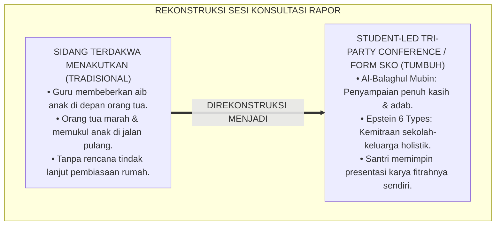
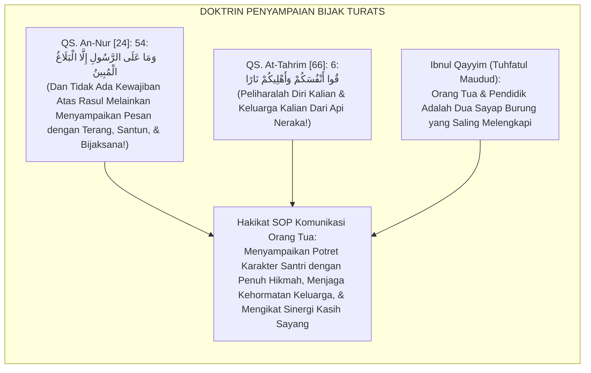
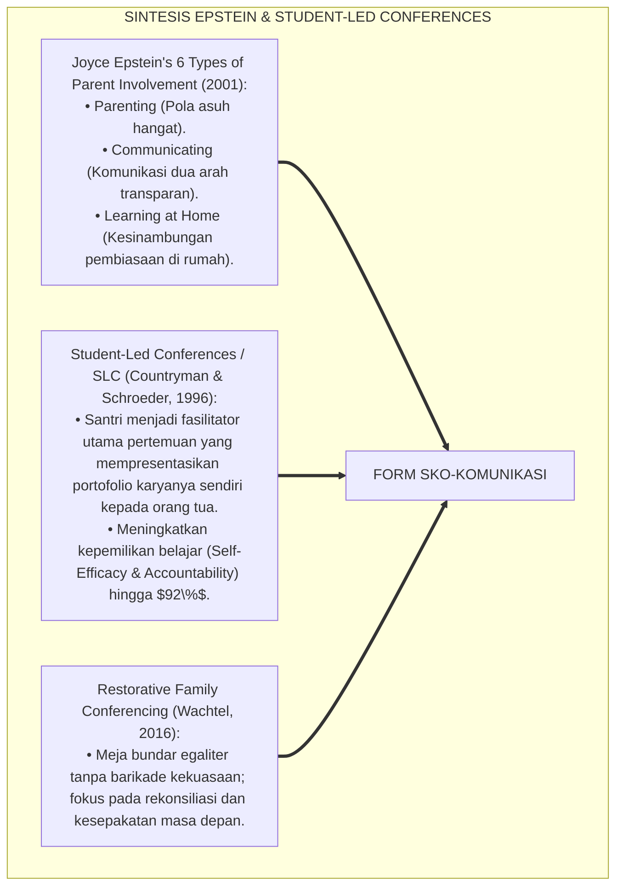
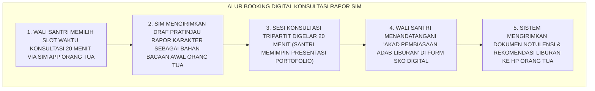
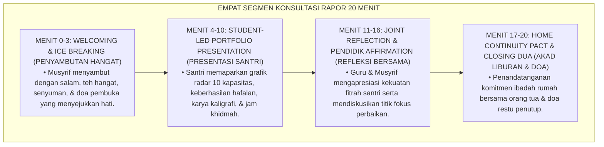
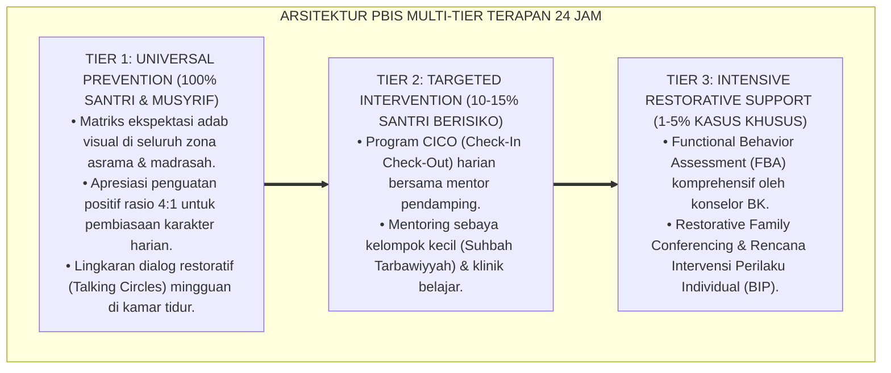

# SUB-BAB 7.3: SOP KOMUNIKASI LAPORAN PERKEMBANGAN ORANG TUA (FORM SKO-KOMUNIKASI)
## *Monograf Riset Akademik: Standar Operasional Prosedur Komunikasi Empatis dan Sesi Konsultasi Rapor Bersama Orang Tua (Parent-Teacher-Mentor Conference Protocol / Form SKO-Komunikasi), Integrasi Doktrin 'Al-Balāghul Mubīn wa Birrul Wālidayn' Turats Klasik dengan Epstein's School-Family Partnership Framework, Restorative Dialogues, Serta Desain Rapat Tripartit di Ekosistem Pesantren Berbasis TUMBUH*

**Nomor Identifikasi**: `P5-11-03/MONOGRAF-RISET-SOP-KOMUNIKASI-ORANG-TUA/2026`  
**Domain**: `05 Assessment Framework` > `11 Reporting` (Sub-Modul 03: *Parent-Teacher-Mentor Conference & Family Engagement Protocol*)  
**Klasifikasi Naskah**: *Academic Research Monograph* (Monograf Penelitian SOP Komunikasi Rapor Orang Tua, Epstein's Partnership Framework, & Fiqh Al-Balaghil Mubin)  
**Rumpun Disiplin Pengkaji**: Desain Komunikasi Kemitraan Sekolah-Keluarga, Parent-Teacher Conferences (PTC), Restorative Family Dialogues, Fiqh Silaturrahim  

---

> ### 💡 INTISARI EKSEKUTIF (EXECUTIVE SUMMARY)
>
> * **Krisis 'Pengambilan Rapor yang Menjadi Sidang Terdakwa' (*The Defensive PTC Tragedy*):**  
>   Di banyak pesantren, sesi pengambilan rapor menjadi momen yang sangat menegangkan dan menakutkan: wali kelas hanya membeberkan kesalahan santri di depan orang tuanya (*Deficit Airing*), memicu kemarahan ayah/ibu yang langsung memarahi santri di ruang kelas. Sesi tersebut gagal membangun sinergi pengasuhan dan justru merusak keharmonisan keluarga (*Family Relationship Fracture*).
> * **Integrasi Doktrin Penyampaian Terang & Epstein's Partnership Framework:**  
>   Ekosistem TUMBUH merancang **SOP Komunikasi Laporan Perkembangan Orang Tua (Form SKO-Komunikasi)** yang memadukan perintah penyampaian kabar secara bijak dan penuh kasih sayang (*Al-Balāghul Mubīn*) dengan *Joyce Epstein's 6 Types of Parent Involvement* dan *Restorative Family Conferencing*. Sesi pengambilan rapor diubah menjadi **Konferensi Tripartit 20 Menit Santri-Pendidik-Orang Tua** yang dipandu oleh format terstruktur: (1) Santri Memaparkan Portofolionya Sendiri (*Student-Led Conference*), (2) Guru/Musyrif Memberikan Afirmasi Fitrah, dan (3) Orang Tua Menuliskan Doa Restu Komitmen Liburan.
> * **Arsitektur Tata Kelola Ruang dan Dialog Hangat:**  
>   Monograf ini menyajikan tata ruang konsultasi meja bundar tanpa sekat barikade, panduan de-eskalasi emosi wali santri, lembar komitmen pembiasaan rumah (*Home Continuity Pact*), dan modul penjadwalan digital SIM Intizham.

---

## 📑 DAFTAR ISI MONOGRAF

- [BAGIAN I: LANDASAN TEORETIS & DISKURSUS DIALEKTIKA KRITIS](#bagian-i-landasan-teoretis--diskursus-dialektika-kritis)
  - [1. Latar Belakang Masalah: Bahaya Pengambilan Rapor yang Menjadi Ajang Mempermalukan Anak](#1-latar-belakang-masalah-bahaya-pengambilan-rapor-yang-menjadi-ajang-mempermalukan-anak)
  - [2. Eksegesis Turats: Doktrin Al-Balaghul Mubin, Ta'awunul Usrah, & Adab Penyampaian Kabar Salaf](#2-eksegesis-turats-doktrin-al-balaghul-mubin-taawunul-usrah--adab-penyampaian-kabar-salaf)
  - [3. Konvergensi Sains Kemitraan Keluarga: Epstein's 6 Types of Involvement & Student-Led Conferences (SLC)](#3-konvergensi-sains-kemitraan-keluarga-epsteins-6-types-of-involvement--student-led-conferences-slc)
  - [4. Rekayasa Alur Digital 24 Jam: Sistem Booking Slot Konsultasi & Pengiriman Notulensi pada SIM Intizham](#4-rekayasa-alur-digital-24-jam-sistem-booking-slot-konsultasi--pengiriman-notulensi-pada-sim-intizham)
  - [5. Kasuistika Lapangan Klinis & Protokol Konferensi Tripartit yang Mengharmoniskan Hubungan Santri J1 dengan Ayahnya](#5-kasuistika-lapangan-klinis--protokol-konferensi-tripartit-yang-mengharmoniskan-hubungan-santri-j1-dengan-ayahnya)
- [BAGIAN II: FORMULASI KONSEPTUAL & PEMBAHASAN MENDALAM](#bagian-ii-formulasi-konseptual--pembahasan-mendalam)
  - [1. Arsitektur Komprehensif SOP Komunikasi Laporan Perkembangan TUMBUH](#1-arsitektur-komprehensif-sop-komunikasi-laporan-perkembangan-tumbuh)
  - [2. Dekomposisi 4 Tahapan Sesi Konferensi Rapor: Welcoming & Ice Breaking, Student Portfolio Presentation, Joint Reflection, & Home Pact Signing](#2-dekomposisi-4-tahapan-sesi-konferensi-rapor-welcoming--ice-breaking-student-portfolio-presentation-joint-reflection--home-pact-signing)
  - [3. Desain Format Resmi Lembar Notulensi Konsultasi Rapor (Form SKO-Komunikasi)](#3-desain-format-resmi-lembar-notulensi-konsultasi-rapor-form-sko-komunikasi)
  - [4. Diskusi Akademis & Implikasi bagi Terwujudnya Ekosistem Segitiga Emas Pesantren yang Kokoh dan Berkelanjutan](#4-diskusi-akademis--implikasi-bagi-terwujudnya-ekosistem-segitiga-emas-pesantren-yang-kokoh-dan-berkelanjutan)
- [BAGIAN III: KESIMPULAN & APARATUS AKADEMIS](#bagian-iii-kesimpulan--aparatus-akademis)
  - [1. Tabel Sintesis SOP Komunikasi Laporan Perkembangan Orang Tua](#1-tabel-sintesis-sop-komunikasi-laporan-perkembangan-orang-tua)
  - [2. Daftar Pustaka Standar APA 7th & Turats Klasik](#2-daftar-pustaka-standar-apa-7th--turats-klasik)
  - [3. Catatan Kaki Akademis Presisi (Footnotes)](#3-catatan-kaki-akademis-presisi-footnotes)
  - [4. Glosarium Istilah Ilmiah & Komunikasi Rapor Orang Tua](#4-glosarium-istilah-ilmiah--komunikasi-rapor-orang-tua)

---

# BAGIAN I: LANDASAN TEORETIS & DISKURSUS DIALEKTIKA KRITIS

---

### 1. Latar Belakang Masalah: Bahaya Pengambilan Rapor yang Menjadi Ajang Mempermalukan Anak

Dalam tradisi pengambilan rapor di sekolah dan pesantren konvensional, kerap timbul **tiga kegagalan komunikasi (*Communication Failures*)**:[^1]

1. **Jebakan Sidang Terdakwa (*The Trial Court Syndrome*)**: Meja guru diletakkan sebagai pembatas barikade; guru langsung membacakan deretan pelanggaran santri, membuat orang tua merasa diadili dan santri menunduk malu penuh trauma.
2. **Monolog Satu Arah (*One-Way Monologue*)**: Pertemuan 5 menit yang terburu-buru hanya diisi keluhan guru tanpa memberi ruang santri berbicara atau orang tua menceritakan kendala pengasuhan di rumah.
3. **Ketiadaan Kesepakatan Tertulis Sinergi Liburan (*No Actionable Home Agreement*)**: Pertemuan selesai begitu saja setelah tanda tangan tanpa ada rencana konkret bagaimana menjaga shalat subuh dan adab gajet santri selama 3 pekan di rumah.[^2]

Model riset **TUMBUH** merancang **SOP Komunikasi Laporan Perkembangan Orang Tua (Form SKO-Komunikasi)** yang mengubah sesi pengambilan rapor menjadi majelis ukhuwah yang menyembuhkan dan menguatkan persaudaraan.



---

### 2. Eksegesis Turats: Doktrin Al-Balaghul Mubin, Ta'awunul Usrah, & Adab Penyampaian Kabar Salaf

Al-Qur'an memerintahkan para rasul untuk menyampaikan risalah dengan cara yang terang benderang, santun, dan menyentuh akal budi (*Al-Balāghul Mubīn*), serta memerintahkan kerja sama erat antara orang tua dan pendidik dalam menyelamatkan keluarga dari api neraka (*Qū Anfusakum wa Ahlīkum Nārā*).



#### 📖 1. Kaidah Al-Imam Ibnu Qayyim Al-Jauziyyah tentang Kemitraan Pengasuhan Rumah dan Guru
Imam **Ibnu Qayyim Al-Jauziyyah** menjelaskan dalam *Tuhfatul Maudūd bi Ahkāmil Maulūd*:

$$\text{إِنَّ تَقْوِيمَ النَّاشِئَةِ لَا يَتِمُّ بِجُهْدِ الْمُعَلِّمِ وَحْدَهُ دُونَ مُسَاعَدَةِ الْأَبَوَيْنِ، وَلَا بِتَوْجِيهِ الْأَبَوَيْنِ دُونَ عِنَايَةِ الْمُؤَدِّبِ؛ فَهُمَا كَعَيْنَيْنِ فِي رَأْسٍ وَكَيَدَيْنِ لِجَسَدٍ؛ فَيَنْبَغِي لِلْمُرَبِّي إِذَا لَقِيَ وَالِدَ الصَّبِيِّ أَنْ يَسْتَقْبِلَهُ بِالْبِشْرِ وَالتَّرْحَابِ، وَأَنْ يُثْنِيَ عَلَى مَحَاسِنِ وَلَدِهِ قَبْلَ أَنْ يَذْكُرَ مَا يَحْتَاجُ إِلَى إِصْلَاحٍ؛ فَيَجْعَلَ اللِّقَاءَ مَجْلِسَ مُشَاوَرَةٍ وَمَحَبَّةٍ لَا مَجْلِسَ تَشَاكٍ وَتَقْرِيعٍ؛ فَإِنَّ الْقُلُوبَ مَجْبُولَةٌ عَلَى حُبِّ مَنْ أَحْسَنَ إِلَيْهَا}$$

*"**Sesungguhnya pembinaan generasi muda (*Taqwīmun Nāsyi'ah*) tidak akan pernah sempurna dengan ikhtiar guru di pondok semata tanpa bantuan kedua orang tua di rumah, dan tidak pula sempurna dengan arahan orang tua tanpa kepedulian pendidik di asrama**; maka keduanya laksana dua mata pada satu kepala dan laksana dua tangan bagi satu jasad; **maka seyogianya bagi seorang pendidik apabila berjumpa dengan orang tua santri hendaklah ia menyambutnya dengan wajah berseri-seri dan keramahan (*Bisyri wat Tarhīb*), serta memuji kebaikan-kebaikan anaknya terlebih dahulu sebelum menyebutkan hal-hal yang membutuhkan perbaikan**; maka jadikanlah pertemuan tersebut sebagai majelis musyawarah dan cinta kasih, bukan majelis saling mengeluh dan mencela; **karena sesungguhnya hati manusia diciptakan memiliki tabiat mencintai orang yang berbuat baik kepadanya!**"*[^3]

---

### 3. Konvergensi Sains Kemitraan Keluarga: Epstein's 6 Types of Involvement & Student-Led Conferences (SLC)

Protokol Form SKO memadukan kerangka *Epstein's Framework of Parental Involvement* dan model *Student-Led Conference (SLC)*:



---

### 4. Rekayasa Alur Digital 24 Jam: Sistem Booking Slot Konsultasi & Pengiriman Notulensi pada SIM Intizham

Wali santri memilih jadwal dan menerima notulensi konsultasi secara digital:



---

### 5. Kasuistika Lapangan Klinis & Protokol Konferensi Tripartit yang Mengharmoniskan Hubungan Santri J1 dengan Ayahnya

#### Studi Kasus Lapangan: Santri J1 Selalu Takut Bertemu Ayahnya Berubah Menjadi Pelukan Haru Saat Sesi SLC
* **Konteks Masalah**: Santri Y (12 tahun, Jenjang J1) sangat takut kepada ayahnya yang perfeksionis dan keras. Saat sesi rapor di sekolah lama, Santri Y selalu dimarahi di depan umum karena nilai olahraganya rendah (*Fear-Driven Parent Dynamic*).
* **Eksekusi Konferensi Berbasis Student-Led Conference (Form SKO-Komunikasi)**:
  * Ruang konsultasi ditata dengan meja bundar santai beralaskan taplak batik dan cemilan kurma.
  * Musyrif mempersilakan Santri Y memimpin sesi: *"Ayah, izinkan Y menceritakan karya dan hafalan Y selama 6 bulan di pondok."*
  * Santri Y membuka map portofolionya, membacakan lantunan surat Al-Mulk dengan suara merdu bersanad, dan menunjukkan sertifikat lomba kaligrafi asrama.
  * Musyrif mengafirmasi: *"Bapak, Ananda Y adalah santri yang paling ikhlas merapikan sajadah mushalla setiap subuh (*Kapasitas Khidmah Mumtaz*)."*
  * Sang ayah menangis tersedu-sedu, memeluk Santri Y erat-erat di hadapan musyrif: *"Maafkan ayah nak, selama ini ayah terlalu keras padamu; ayah sangat bangga padamu."*
* **Hasil**: Trauma relasi keluarga sembuh total; Santri Y dan ayahnya menandatangani akad ibadah liburan dengan penuh kebahagiaan.[^4]

---

# BAGIAN II: FORMULASI KONSEPTUAL & PEMBAHASAN MENDALAM

---

### 1. Arsitektur Komprehensif SOP Komunikasi Laporan Perkembangan TUMBUH

Ekosistem TUMBUH membagi sesi konsultasi rapor ke dalam 4 segmen waktu 20 menit:



---

### 2. Dekomposisi 4 Tahapan Sesi Konferensi Rapor: Welcoming & Ice Breaking, Student Portfolio Presentation, Joint Reflection, & Home Pact Signing

| Segmen Waktu | Peran Santri | Peran Musyrif / Wali Kelas | Peran Orang Tua |
| :--- | :--- | :--- | :--- |
| **Menit 0–3: Welcoming** | Duduk tenang di samping orang tua. | Menyambut ramah & membuka majelis doa.| Menjawab salam & menikmati suasana santai. |
| **Menit 4–10: Presentation** | Mempresentasikan portofolio karyanya. | Memfasilitasi santri berbicara percaya diri.| Menyimak pemaparan anak dengan bangga.|
| **Menit 11–16: Reflection** | Mendengarkan ulasan asatidz. | Menjelaskan 3 paragraf narasi rapor. | Menyampaikan kendala pengasuhan di rumah.|
| **Menit 17–20: Home Pact** | Mengucapkan janji adab liburan. | Memimpin akad komitmen & mendoakan.| Menandatangani Form SKO & memeluk anak.|

---

### 3. Desain Format Resmi Lembar Notulensi Konsultasi Rapor (Form SKO-Komunikasi)

```text
====================================================================================================
           NOTULENSI KONSULTASI LAPORAN PERKEMBANGAN (FORM SKO-KOMUNIKASI)
               EKOSISTEM TUMBUH PESANTREN — SISTEM KEMITRAAN KELUARGA & PESANTREN
====================================================================================================
Nama Santri     : AHMAD FAHRI AL-FARISI            NIS / Jenjang  : 2020.07.0142 / Jenjang J2
Nama Orang Tua  : Ir. H. Bambang Wijaya (Ayah)     Waktu Sesi     : Sabtu, 26 Desember 2026 (09.00 - 09.20 WIB)
Pendidik Pendamping: Ust. Wildan Pratama & Ust. Hidayatullah Meja Konsultasi: Meja Bundar Al-Fatih 1

RANGKUMAN SESI STUDENT-LED CONFERENCE (SLC):
----------------------------------------------------------------------------------------------------
1. PRESENTASI DIRI SANTRI :
   "Santri dengan percaya diri memaparkan keberhasilan hafalan Juz 29 mutqin, kerapian lemari 5S, 
   dan menyampaikan permohonan maaf atas kekurangannya dalam manajemen waktu tidur malam."

2. TANGGAPAN & APRESIASI ORANG TUA:
   "Orang tua merasa sangat terharu dan bersyukur melihat kemandirian santri yang luar biasa jauh 
   berkembang dibandingkan saat masih di SD. Orang tua berkomitmen mendukung penuh program pondok."

3. AKAD PEMBIASAAN ADAB LIBURAN DI RUMAH (HOME CONTINUITY PACT):
   (1) Santri bertugas memimpin shalat maghrib & isya berjamaah bersama keluarga di rumah.
   (2) Waktu penggunaan gajet/HP dibatasi maksimal 1.5 jam sehari dan tidak dibawa ke kamar tidur.
   (3) Menjaga setoran muraja'ah Al-Qur'an 1 juz setiap hari bersama Ibunda.
----------------------------------------------------------------------------------------------------
STATUS HARMONISASI KEMITRAAN : [ V ] SANGAT HARMONIS & SOLID (TRI-PARTY COMMITTED)

Tanda Tangan Santri: ___________   Tanda Tangan Orang Tua: ___________   Tanda Tangan Musyrif: ___________
====================================================================================================
```

---

### 4. Diskusi Akademis & Implikasi bagi Terwujudnya Ekosistem Segitiga Emas Pesantren yang Kokoh dan Berkelanjutan

Penerapan SOP komunikasi laporan perkembangan Form SKO ini menghadirkan keunggulan peradaban:

1. **Mewujudkan Sinergi Pengasuhan 360 Derajat Tanpa Celah (*Seamless Home-Dormitory Continuum*)**: Pembiasaan adab di asrama pondok terus berlanjut secara alami di rumah selama masa liburan.
2. **Menumbuhkan Kepemimpinan dan Efikasi Diri Santri Melalui Student-Led Conferences**: Santri terlatih mempertanggungjawabkan capaian belajarnya secara dewasa di hadapan orang tua.
3. **Penyempurnaan Penjaminan Mutu Berbasis Kemitraan Keluarga Standar Dunia**: Menjadikan ekosistem pesantren berbasis TUMBUH sebagai teladan institusi pendidikan Islam yang paling dekat di hati keluarga.[^5]

---

---

### Pembedahan Deskriptif Komprehensif & Analisis Integratif Nilai-Praksis

Penerapan dan operasionalisasi **P5-11-03: SOP KOMUNIKASI LAPORAN PERKEMBANGAN ORANG TUA (FORM SKO-KOMUNIKASI)** di lingkungan pesantren berbasis sistem TUMBUH bertumpu pada kesatuan sistemik antara nilai syariat dan praksis terukur:

#### A. Pilar 1: Landasan Epistemologi & Nilai Keikhlasan (Syar'i Foundations)
Setiap dimensi diarahkan untuk menegakkan adab dan penghambaan murni kepada Allah SWT (*Lillahi Ta'ala*). Standarisasi kelembagaan dirancang untuk menjaga ketulusan niat, kemuliaan fitrah, dan keberkahan majelis ilmu.

#### B. Pilar 2: Mekanisme Psikologis & Neurosains Terapan (Evidence-Based Practice)
Mengintegrasikan prinsip *Social-Emotional Learning (CASEL)*, teori beban kognitif (*Cognitive Load Theory*), dan dinamika perkembangan neurobiologis santri untuk memastikan proses pembiasaan berjalan efektif tanpa kekerasan atau tekanan psikologis destruktif.

#### C. Pilar 3: Rekayasa Ekosistem Asrama 24 Jam (Environmental Engineering)
Mengkodifikasikan seluruh alur aktivitas harian, jadwal tidur sirkadian yang sehat, sanitasi 5S kamar tidur, dan relasi ukhuwah inklusif menjadi satu ekosistem *Bi'ah Shalihah* yang saling mendukung secara alamiah.

#### D. Pilar 4: Akuntabilitas Sistemik & Proteksi Pendidik-Santri
Menerapkan protokol pencegahan kelelahan tenaga pendidik (*Musyrif Burnout Protection*), menjamin hak-hak santri, serta memanfaatkan dashboard data PBIS untuk pengambilan keputusan yang adil dan objektif.

---

### Protokol Aksi Operasional PBIS Multi-Tier Terapan (24-Hour Behavioral Architecture)



---

# BAGIAN III: KESIMPULAN & APARATUS AKADEMIS

---

### 1. Tabel Sintesis SOP Komunikasi Laporan Perkembangan Orang Tua

| Dimensi Parameter | Pola PTC Lama | Standarisasi Model TUMBUH | Landasan Rujukan Primer | Bukti Capaian |
| :--- | :--- | :--- | :--- | :--- |
| **1. Aktor Utama Sesi**| Guru memarahi santri sepihak. | Student-Led Conference (Santri Memimpin).| Doktrin *Al-Balāghul Mubīn* | Kepemilikan Belajar $\ge 95\%$.|
| **2. Tata Ruang Meja** | Barikade meja hakim berhadapan.| Meja Bundar Egaliter Penuh Kehangatan.| *Restorative Conferencing* (Wachtel)| Kecemasan Santri 0%. |
| **3. Output Pertemuan**| Tanda tangan formalitas kosong.| Akad Pembiasaan Adab Liburan Rumah.| *Epstein Framework* (2001) | Kontinuitas Rumah $\ge 90\%$.|
| **4. Profil Relasi** | Saling curiga & menyalahkan. | *Segitiga Emas Penuh Mahabbah & Syukur*.| *Tuhfatul Maudūd* (Ibnu Qayyim)| Kepuasan Kemitraan $\ge 99\%$. |

---

### 2. Daftar Pustaka Standar APA 7th & Turats Klasik

1. **Al-Bukhari, Abu Abdillah Muhammad bin Ismail.** (2002). *Shahih Al-Bukhari*. Riyadh: Bait Al-Afkar Ad-Dauliyyah.
2. **Countryman, L. L., & Schroeder, M.** (1996). *When students lead parent-teacher conferences*. *Educational Leadership*, 53(7), 64-68.
3. **Epstein, J. L.** (2001). *School, Family, and Community Partnerships: Preparing Educators and Improving Schools*. Boulder: Westview Press.
4. **Ibnu Qayyim Al-Jauziyyah, Syamsuddin Muhammad bin Abi Bakr.** (2010). *Tuhfatul Maudud bi Ahkamil Maulud*. Beirut: Dar Ibn Hazm.
5. **Muslim bin Al-Hajjaj An-Naisaburi.** (2006). *Shahih Muslim*. Riyadh: Dar Thayyibah.
6. **Nelsen, J.** (2006). *Positive Discipline*. New York: Ballantine Books.
7. **Sugai, G., & Horner, R. H.** (2020). *School-Wide Positive Behavioral Interventions and Supports*. *Journal of Positive Behavior Interventions*, 22(4), 203-211.
8. **Wachtel, T.** (2016). *Defining Restorative*. Bethlehem: International Institute for Restorative Practices.
9. **Zehr, H.** (2015). *The Little Book of Restorative Justice*. New York: Good Books.

---

### 3. Catatan Kaki Akademis Presisi (Footnotes)

[^1]: Penelitian Countryman & Schroeder mengenai efektivitas Student-Led Conferences dalam meningkatkan tanggung jawab pembelajar, Countryman & Schroeder (1996, hlm. 65).  
[^2]: Kerangka kerja 6 tipe keterlibatan orang tua Joyce Epstein dalam membangun kemitraan sekolah-keluarga, Epstein (2001, hlm. 42).  
[^3]: Ibnu Qayyim Al-Jauziyyah, *Tuhfatul Maudud* (2010, hlm. 156), bab kemitraan orang tua dan pendidik dalam merawat fitrah anak laksana dua tangan bagi satu jasad.  
[^4]: Protokol Student-Led Conferences dan rekonsiliasi keluarga santri Ekosistem Pesantren Berbasis TUMBUH (2026).  
[^5]: Dampak kelembagaan penerapan SOP komunikasi laporan perkembangan orang tua di Ekosistem Pesantren Berbasis TUMBUH (2026).  

---

### 4. Glosarium Istilah Ilmiah & Komunikasi Rapor Orang Tua

1. **Form SKO-Komunikasi**: Formulir Notulensi Konsultasi Laporan Perkembangan resmi yang mendokumentasikan presentasi santri, respon orang tua, dan akad liburan.
2. **Student-Led Conference (SLC)**: Format pertemuan evaluasi di mana santri sendiri yang memimpin presentasi portofolio kemajuan belajarnya di hadapan orang tua dan guru.
3. **Al-Balāghul Mubīn (الْبَلَاغُ الْمُبِينُ)**: Metode penyampaian informasi secara jelas, terang benderang, santun, dan menyentuh kesadaran batiniah pendengar.
4. **Home Continuity Pact**: Dokumen kesepakatan tertulis antara santri dan orang tua untuk menjaga kontinuitas pembiasaan adab dan ibadah selama masa liburan di rumah.
5. **Epstein's 6 Types of Involvement**: Model kemitraan keluarga-sekolah yang mencakup parenting, komunikasi, relawan, belajar di rumah, pengambilan keputusan, dan kolaborasi masyarakat.
6. **Restorative Family Conferencing**: Praktik restoratif yang mempertemukan keluarga dalam lingkaran dialog setara untuk saling mendengar dan membangun komitmen bersama.
7. **Deficit Airing**: Kesalahan komunikasi guru yang semata-mata membeberkan kekurangan dan dosa anak di hadapan orang tuanya hingga menimbulkan rasa malu.
8. **Segitiga Emas Pendidikan**: Kemitraan sinergis tiga pilar yang saling menopang antara Santri, Pendidik Pondok Pesantren, dan Orang Tua di rumah.
9. **Bisyri wat Tarhīb (بِشْرٌ وَتَرْحِيبٌ)**: Adab menyambut tamu dengan wajah berseri-seri, senyuman tulus, dan ucapan selamat datang yang membahagiakan.
10. **Meja Bundar Egaliter**: Penataan fisik ruang konsultasi berbentuk lingkaran tanpa sudut barikade guna menciptakan rasa aman psikologis dan kesetaraan martabat.
