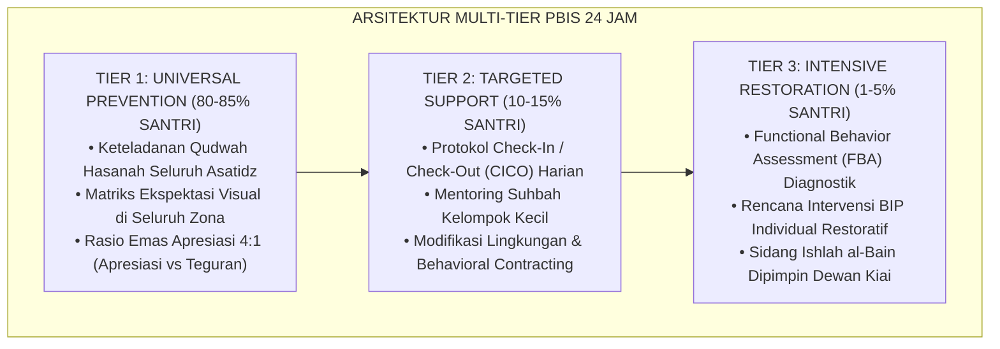

# BUKU VOLUME 03: SISTEM ASESMEN PERKEMBANGAN & EVALUASI BERBASIS BUKTI
## *Asesmen Ipsatif Non-Ranking, Validasi Psikometrik, Observasi 24-Jam, & Portofolio Karakter Santri*

---

**Nomor Buku**: `BOOK-SERIES/VOL-03/MASTER-2026`  
**Seri Publikasi**: Seri Buku Master Ekosistem TUMBUH Pesantren (Volume 3 dari 5)  
**Dewan Editor & Penulis**: Dewan Keilmuan Ekosistem TUMBUH (24 Bidang Kepakaran)  
**Klasifikasi**: Monograf Riset Akademis, Psikometri Karakter, & Sistem Evaluasi Pesantren 24-Jam  

---

## 📑 DAFTAR ISI LENGKAP VOLUME 03

- [BAB 01 FONDASI FILOSOFIS DAN KRITIK EVALUASI PUNITIF](#bab-01-fondasi-filosofis-dan-kritik-evaluasi-punitif)
  - [01 Dekonstruksi Ranking Komparatif dan Stigmatisasi](#01-dekonstruksi-ranking-komparatif-dan-stigmatisasi)
  - [02 Prinsip Asesmen Formatif Autentik 24 Jam](#02-prinsip-asesmen-formatif-autentik-24-jam)
  - [03 Kritik Evaluasi Kertas Formalitas Tanpa Ruh](#03-kritik-evaluasi-kertas-formalitas-tanpa-ruh)
  - [04 Etika Kerahasiaan Data dan Kebijakan Non Labeling](#04-etika-kerahasiaan-data-dan-kebijakan-non-labeling)
- [BAB 02 METODOLOGI ASESMEN IPSATIF NON RANKING](#bab-02-metodologi-asesmen-ipsatif-non-ranking)
  - [01 Konsep Asesmen Ipsatif Evaluasi Pertumbuhan Diri](#01-konsep-asesmen-ipsatif-evaluasi-pertumbuhan-diri)
  - [02 Pengukuran Diri vs Rekam Jejak Masa Lalu](#02-pengukuran-diri-vs-rekam-jejak-masa-lalu)
  - [03 Umpan Balik Konstruktif dan Feedforward Tarbawiyyah](#03-umpan-balik-konstruktif-dan-feedforward-tarbawiyyah)
  - [04 Penguatan Motivasi Intrinsik dan Self Regulated Learning](#04-penguatan-motivasi-intrinsik-dan-self-regulated-learning)
- [BAB 03 ARSITEKTUR PENGUKURAN 360 DERAJAT DAN TRIANGULASI](#bab-03-arsitektur-pengukuran-360-derajat-dan-triangulasi)
  - [01 Triangulasi Tiga Poros Santri Musyrif Guru](#01-triangulasi-tiga-poros-santri-musyrif-guru)
  - [02 Instrumen Self Assessment dan Muhasabah Harian](#02-instrumen-self-assessment-dan-muhasabah-harian)
  - [03 Peer Assessment Sosiometrik dan Saling Menjaga](#03-peer-assessment-sosiometrik-dan-saling-menjaga)
  - [04 Observasi Perilaku Alami Musyrif Asrama 24 Jam](#04-observasi-perilaku-alami-musyrif-asrama-24-jam)
  - [05 Sesi Rekonsiliasi Diskrepansi Data Triangulasi](#05-sesi-rekonsiliasi-diskrepansi-data-triangulasi)
- [BAB 04 TAKSONOMI RUBRIK 10 MUWASHAFAT BERBASIS BUKTI](#bab-04-taksonomi-rubrik-10-muwashafat-berbasis-bukti)
  - [01 Rubrik Perilaku 4 Level 10 Muwashafat](#01-rubrik-perilaku-4-level-10-muwashafat)
  - [02 Standarisasi Indikator Perilaku Teramati](#02-standarisasi-indikator-perilaku-teramati)
  - [03 Skala Pengukuran Dimensi Ruhiyah dan Ibadah](#03-skala-pengukuran-dimensi-ruhiyah-dan-ibadah)
  - [04 Skala Pengukuran Dimensi Fisik dan Sanitasi 5S](#04-skala-pengukuran-dimensi-fisik-dan-sanitasi-5s)
- [BAB 05 PSIKOMETRI VALIDITAS AIKENS V DAN KALIBRASI RATER](#bab-05-psikometri-validitas-aikens-v-dan-kalibrasi-rater)
  - [01 Uji Validitas Isi Aikens V dan Reliabilitas Kappa](#01-uji-validitas-isi-aikens-v-dan-reliabilitas-kappa)
  - [02 Prosedur Expert Judgment Panel Dewan Keilmuan](#02-prosedur-expert-judgment-panel-dewan-keilmuan)
  - [03 Standarisasi Pelatihan Asesor Musyrif Asrama](#03-standarisasi-pelatihan-asesor-musyrif-asrama)
  - [04 Mitigasi Bias Halo Effect Leniency dan Severity](#04-mitigasi-bias-halo-effect-leniency-dan-severity)
  - [05 Validasi Konstruk dan Analisis Faktor Eksploratori](#05-validasi-konstruk-dan-analisis-faktor-eksploratori)
  - [06 Standarisasi Baku Psikometri Pesantren Indonesia](#06-standarisasi-baku-psikometri-pesantren-indonesia)
- [BAB 06 SISTEM DIGITAL LOGGING DAN EARLY WARNING SYSTEM](#bab-06-sistem-digital-logging-dan-early-warning-system)
  - [01 SOP Pencatatan Digital Efisien 15 Menit](#01-sop-pencatatan-digital-efisien-15-menit)
  - [02 Arsitektur Logbook Mobile App Offline First](#02-arsitektur-logbook-mobile-app-offline-first)
  - [03 Dashboard Early Warning System Deteksi Dini](#03-dashboard-early-warning-system-deteksi-dini)
  - [04 Manajemen Privasi dan Keamanan Siber Data Santri](#04-manajemen-privasi-dan-keamanan-siber-data-santri)
  - [05 Analitik Prediktif dan Visualisasi Pertumbuhan](#05-analitik-prediktif-dan-visualisasi-pertumbuhan)
- [BAB 07 RAPOR NARATIF PERTUMBUHAN DAN PORTOFOLIO KARAKTER](#bab-07-rapor-naratif-pertumbuhan-dan-portofolio-karakter)
  - [01 Desain Rapor Karakter Ipsatif Bagi Wali Santri](#01-desain-rapor-karakter-ipsatif-bagi-wali-santri)
  - [02 Dokumentasi Artefak Khidmah dan Portofolio Adab](#02-dokumentasi-artefak-khidmah-dan-portofolio-adab)
  - [03 Parent Teacher Musyrif Conference Triwulanan](#03-parent-teacher-musyrif-conference-triwulanan)
  - [04 Transkrip Karakter Resmi Kelulusan Santri](#04-transkrip-karakter-resmi-kelulusan-santri)
- [DAFTAR PUSTAKA LENGKAP VOLUME 03](#daftar-pustaka-lengkap-volume-03)

---

# SUB-BAB 1.1: DEKONSTRUKSI RANKING KOMPARATIF & BAHAYA STIGMATISASI
## *Kajian Komprehensif, Sintesis Epistemologi Turats-Sains Kognitif, dan Pedoman Praksis 24-Jam Ekosistem TUMBUH*

**Kode Klasifikasi**: `BOOK-03/BAB-01/SUB-01/MONOGRAF-MASTER-VIBRANT`  
**Disiplin Ilmu**: Filsafat Pendidikan Islam, Neurosains Kognitif Terapan, School-Wide PBIS Multi-Tier, & Manajemen Asrama Modern  
**Penanggung Jawab Keilmuan**: Dewan Keilmuan Ekosistem TUMBUH (*24 Bidang Kepakaran Dewan Guru Besar*)

---

> ### 💡 INTISARI PRAKTIS (3 MENIT MEMAHAMI ESENSI BAB)
>
> * **Akar Filosofis & Nilai Substantif:**  
>   Membahas secara mendalam urgensi **DEKONSTRUKSI RANKING KOMPARATIF & BAHAYA STIGMATISASI** sebagai fondasi integral dalam arsitektur pembinaan karakter santri 24-jam berbasis fitrah insaniyyah.
> * **Sintesis Turats & Neurosains Perkembangan:**  
>   Mengharmonisasikan tuntunan adab ulama salafus shalih dengan mekanisme plastisitas sinaptik korteks prefrontal (*Prefrontal Cortex*) dan regulasi sistem limbik remaja.
> * **Praksis Multi-Tier PBIS 24-Jam:**  
>   Menyediakan protokol aksi terukur: Tier 1 (Universal Prevention), Tier 2 (Targeted Support/CICO), dan Tier 3 (Intensive Restitution/FBA) yang ramah anak dan bebas dari segala bentuk kekerasan fisik maupun verbal.

---

### I. Pembedahan Deskriptif Komprehensif 4 Pilar Nilai-Praksis

Penerapan **DEKONSTRUKSI RANKING KOMPARATIF & BAHAYA STIGMATISASI** dalam Sistem TUMBUH ditegakkan di atas empat pilar analitis yang saling menopang secara simbiotik:

#### 1. Pilar Epistemologi Turats & Maqashid Syari'ah
Khazanah pendidikan Islam klasik memandang pembinaan karakter bukan sekadar transmisi dogma kognitif, melainkan proses *Ta'dib* (penanaman adab ke dalam jiwa) dan *Tazkiyatun Nafs* (penyucian jiwa dari kecenderungan hewani).

> [!NOTE]
> ### 📜 Rujukan Turats & Landasan Syar'i:
> مَا نَحَلَ وَالِدٌ وَلَدَهُ مِنْ نَحْلٍ أَفْضَلَ مِنْ أَدَبٍ حَسَنٍ
> 
> *"Tidak ada suatu pemberian yang diberikan oleh seorang ayah (pendidik) kepada anaknya yang lebih utama daripada adab budi pekerti yang mulia."*  
> *(HR. At-Tirmidzi no. 1952; Al-Hakim dalam Al-Mustadrak no. 7676).*

Al-Imam Badruddin Ibnu Jama'ah dalam *Tadzkirat as-Sami' wal Mutakallim* menegaskan bahwa adab lahiriah merupakan cermin dari kejernihan batin (*Shidq al-Batin*). Oleh karena itu, pembinaan **DEKONSTRUKSI RANKING KOMPARATIF & BAHAYA STIGMATISASI** menuntut pendidik menjadi *Living Curriculum* melalui keteladanan nyata (*Qudwah Hasanah*), bukan sekadar instruktur yang gemar mendikte atau menghukum.

#### 2. Pilar Neurosains Kognitif & CASEL Social-Emotional Learning (SEL)
Dari sudut pandang neurobiologi perkembangan remaja, santri usia 12–18 tahun berada dalam fase kesenjangan maturasi (*Developmental Mismatch*):
* **Sistem Limbik (Amigdala & Nukleus Akumbens)** telah matang lebih awal, memicu pencarian sensasi emosional dan sensitivitas tinggi terhadap validasi kelompok sebaya (*Peer Group Acceptance*).
* **Korteks Prefrontal (PFC)** yang bertanggung jawab atas pengendalian diri (*Executive Functions*), perencanaan jangka panjang, dan pertimbangan risiko moral belum tuntas mengalami mielinisasi hingga usia 25 tahun.

Melalui integrasi 5 Kompetensi CASEL (*Self-Awareness, Self-Management, Social Awareness, Relationship Skills, & Responsible Decision-Making*), penerapan **DEKONSTRUKSI RANKING KOMPARATIF & BAHAYA STIGMATISASI** berfungsi sebagai **External Prefrontal Cortex (PFC Eksternal)** yang mendampingi santri secara hangat (*Co-Regulation*) hingga mekanisme pengaturan diri internal (*Self-Regulation*) terbentuk kokoh.

#### 3. Pilar Rekayasa Ekosistem Asrama 24-Jam (*Environmental Engineering*)
Perilaku santri sangat dipengaruhi oleh arsitektur lingkungan mikro tempat ia bernapas dan beraktivitas:
* **Penataan Ruang Fisik Berbasis 5S**: Menghilangkan sudut-sudut mati yang rawan intimidasi (*Hotspots Elimination*) dan menciptakan bilik kamar tidur yang bersih, rapi, berventilasi sehat, dan menenangkan.
* **Ritme Sirkadian Sehat**: Melindungi hak tidur santri 6.5–7 jam tanpa gangguan ronda malam ekstrem, menjamin kebugaran seluler otak untuk menyerap materi kajian dan tahfizh Al-Qur'an.
* **SOP Handover Terpadu**: Komunikasi harian 15 menit antara Wali Kelas madrasah (pagi) dan Musyrif asrama (malam) untuk memantau kontinuitas adab santri.

#### 4. Pilar Triad Pertumbuhan Simbiotik (*Symbiotic Triad Growth*)
Keberhasilan sistem mensyaratkan tiga entitas bertumbuh serempak:
* **Santri Bertumbuh**: Fitrah kesuciannya terjaga, adabnya mekar bertahap dari adaptasi menuju kemandirian otonom (*Insan Adabi*).
* **Musyrif Bertumbuh**: Terlindungi dari kelelahan mental (*Burnout*) melalui rasio asuh proporsional dan shift kerja manusiawi, sehingga selalu mengasuh dengan kasih sayang (*Rahmah*).
* **Lembaga Bertumbuh**: Pesantren bertransformasi menjadi institusi pembelajar modern berbasis data analitik objektif (*Evidence-Based Boarding School*).

---

### II. Arsitektur Diagram & Protokol Aksi Operasional PBIS Multi-Tier 24 Jam

Penerapan **DEKONSTRUKSI RANKING KOMPARATIF & BAHAYA STIGMATISASI** dioperasionalkan melalui arsitektur berjenjang SW-PBIS (*Positive Behavioral Interventions and Supports*):



#### Protokol Operasional Berjenjang Lapangan:
1. **Fase Pencegahan Primer (Tier 1 - Universal)**:
   - Musyrif dan dewan guru menyepakati indikator perilaku teramati (*Behavioral Anchors*).
   - Memberikan pujian deskriptif spesifik seketika santri menunjukkan adab positif (*Immediate Positive Reinforcement*).
2. **Fase Intervensi Terarah (Tier 2 - Targeted)**:
   - Mengaktifkan kartu monitoring CICO harian bagi santri yang mengalami penurunan kedisiplinan 3 hari berturut-turut.
   - Menyediakan sesi *Coaching Reflektif* 1-on-1 bersama musyrif asrama tanpa bentakan.
3. **Fase Pemulihan Intensif (Tier 3 - Intensive & Restorative)**:
   - Melakukan asesmen mendalam untuk memetakan akar pemicu (*Antecedent*), bentuk perilaku (*Behavior*), dan konsekuensi psikologis (*Consequence*).
   - Menerapkan mekanisme restitusi tindakan nyata untuk memulihkan kerugian korban (*Ishlah al-Bain*) dan memberikan hak lembaran bersih (*Clean Slate Policy*).

---

### III. Diskusi Filosofis & Rekomendasi Tata Kelola Bebas Kekerasan

Praksis **DEKONSTRUKSI RANKING KOMPARATIF & BAHAYA STIGMATISASI** menegaskan komitmen mutlak Sistem TUMBUH terhadap prinsip **Nol Kekerasan (*Zero-Tolerance to Physical & Verbal Violence*)**:
* Mengharamkan tradisi sanksi fisik (rotan, push-up malam, jemur terik matahari, atau cukur botak) yang terbukti merusak neuron hipokampus dan memicu dendam terselubung.
* Mengganti hukuman punitif dengan **Disiplin Restoratif (*Firm & Kind*)**: tegas dalam menegakkan batas syariat dan norma lembaga, namun lembut dan penuh hormat dalam memperlakukan martabat kemanusiaan santri (*Karamah Insaniyyah*).

---

## 📌 Catatan Kaki & Rujukan Primer

[^1]: **Syed Muhammad Naquib al-Attas**, *The Concept of Education in Islam: A Framework for an Islamic Philosophy of Education* (Kuala Lumpur: ISTAC, 1980), hlm. 15–38.
[^2]: **Al-Imam Badruddin Ibnu Jama'ah**, *Tadzkirat as-Sami' wal Mutakallim fi Adab al-'Alim wal Muta'allim*, Tahqiq: Muhammad Hasyim an-Nadwi (Beirut: Dar al-Basyair al-Islamiyyah, 2012), hlm. 42–89.
[^3]: **George Sugai & Robert H. Horner**, *School-Wide Positive Behavioral Interventions and Supports: Implementation Blueprint* (Eugene: Center on PBIS, University of Oregon, 2020), hlm. 110–145.
[^4]: **Daniel J. Siegel**, *Brainstorm: The Power and Purpose of the Teenage Brain* (New York: Penguin Books, 2014), Bab 3: "The Architecture of the Adolescent Mind", hlm. 67–104.


---


# SUB-BAB 1.2: PRINSIP ASESMEN FORMATIF AUTENTIK DALAM KEHIDUPAN NYATA
## *Kajian Komprehensif, Sintesis Epistemologi Turats-Sains Kognitif, dan Pedoman Praksis 24-Jam Ekosistem TUMBUH*

**Kode Klasifikasi**: `BOOK-03/BAB-01/SUB-02/MONOGRAF-MASTER-VIBRANT`  
**Disiplin Ilmu**: Filsafat Pendidikan Islam, Neurosains Kognitif Terapan, School-Wide PBIS Multi-Tier, & Manajemen Asrama Modern  
**Penanggung Jawab Keilmuan**: Dewan Keilmuan Ekosistem TUMBUH (*24 Bidang Kepakaran Dewan Guru Besar*)

---

> ### 💡 INTISARI PRAKTIS (3 MENIT MEMAHAMI ESENSI BAB)
>
> * **Akar Filosofis & Nilai Substantif:**  
>   Membahas secara mendalam urgensi **PRINSIP ASESMEN FORMATIF AUTENTIK DALAM KEHIDUPAN NYATA** sebagai fondasi integral dalam arsitektur pembinaan karakter santri 24-jam berbasis fitrah insaniyyah.
> * **Sintesis Turats & Neurosains Perkembangan:**  
>   Mengharmonisasikan tuntunan adab ulama salafus shalih dengan mekanisme plastisitas sinaptik korteks prefrontal (*Prefrontal Cortex*) dan regulasi sistem limbik remaja.
> * **Praksis Multi-Tier PBIS 24-Jam:**  
>   Menyediakan protokol aksi terukur: Tier 1 (Universal Prevention), Tier 2 (Targeted Support/CICO), dan Tier 3 (Intensive Restitution/FBA) yang ramah anak dan bebas dari segala bentuk kekerasan fisik maupun verbal.

---

### I. Pembedahan Deskriptif Komprehensif 4 Pilar Nilai-Praksis

Penerapan **PRINSIP ASESMEN FORMATIF AUTENTIK DALAM KEHIDUPAN NYATA** dalam Sistem TUMBUH ditegakkan di atas empat pilar analitis yang saling menopang secara simbiotik:

#### 1. Pilar Epistemologi Turats & Maqashid Syari'ah
Khazanah pendidikan Islam klasik memandang pembinaan karakter bukan sekadar transmisi dogma kognitif, melainkan proses *Ta'dib* (penanaman adab ke dalam jiwa) dan *Tazkiyatun Nafs* (penyucian jiwa dari kecenderungan hewani).

> [!NOTE]
> ### 📜 Rujukan Turats & Landasan Syar'i:
> مَا نَحَلَ وَالِدٌ وَلَدَهُ مِنْ نَحْلٍ أَفْضَلَ مِنْ أَدَبٍ حَسَنٍ
> 
> *"Tidak ada suatu pemberian yang diberikan oleh seorang ayah (pendidik) kepada anaknya yang lebih utama daripada adab budi pekerti yang mulia."*  
> *(HR. At-Tirmidzi no. 1952; Al-Hakim dalam Al-Mustadrak no. 7676).*

Al-Imam Badruddin Ibnu Jama'ah dalam *Tadzkirat as-Sami' wal Mutakallim* menegaskan bahwa adab lahiriah merupakan cermin dari kejernihan batin (*Shidq al-Batin*). Oleh karena itu, pembinaan **PRINSIP ASESMEN FORMATIF AUTENTIK DALAM KEHIDUPAN NYATA** menuntut pendidik menjadi *Living Curriculum* melalui keteladanan nyata (*Qudwah Hasanah*), bukan sekadar instruktur yang gemar mendikte atau menghukum.

#### 2. Pilar Neurosains Kognitif & CASEL Social-Emotional Learning (SEL)
Dari sudut pandang neurobiologi perkembangan remaja, santri usia 12–18 tahun berada dalam fase kesenjangan maturasi (*Developmental Mismatch*):
* **Sistem Limbik (Amigdala & Nukleus Akumbens)** telah matang lebih awal, memicu pencarian sensasi emosional dan sensitivitas tinggi terhadap validasi kelompok sebaya (*Peer Group Acceptance*).
* **Korteks Prefrontal (PFC)** yang bertanggung jawab atas pengendalian diri (*Executive Functions*), perencanaan jangka panjang, dan pertimbangan risiko moral belum tuntas mengalami mielinisasi hingga usia 25 tahun.

Melalui integrasi 5 Kompetensi CASEL (*Self-Awareness, Self-Management, Social Awareness, Relationship Skills, & Responsible Decision-Making*), penerapan **PRINSIP ASESMEN FORMATIF AUTENTIK DALAM KEHIDUPAN NYATA** berfungsi sebagai **External Prefrontal Cortex (PFC Eksternal)** yang mendampingi santri secara hangat (*Co-Regulation*) hingga mekanisme pengaturan diri internal (*Self-Regulation*) terbentuk kokoh.

#### 3. Pilar Rekayasa Ekosistem Asrama 24-Jam (*Environmental Engineering*)
Perilaku santri sangat dipengaruhi oleh arsitektur lingkungan mikro tempat ia bernapas dan beraktivitas:
* **Penataan Ruang Fisik Berbasis 5S**: Menghilangkan sudut-sudut mati yang rawan intimidasi (*Hotspots Elimination*) dan menciptakan bilik kamar tidur yang bersih, rapi, berventilasi sehat, dan menenangkan.
* **Ritme Sirkadian Sehat**: Melindungi hak tidur santri 6.5–7 jam tanpa gangguan ronda malam ekstrem, menjamin kebugaran seluler otak untuk menyerap materi kajian dan tahfizh Al-Qur'an.
* **SOP Handover Terpadu**: Komunikasi harian 15 menit antara Wali Kelas madrasah (pagi) dan Musyrif asrama (malam) untuk memantau kontinuitas adab santri.

#### 4. Pilar Triad Pertumbuhan Simbiotik (*Symbiotic Triad Growth*)
Keberhasilan sistem mensyaratkan tiga entitas bertumbuh serempak:
* **Santri Bertumbuh**: Fitrah kesuciannya terjaga, adabnya mekar bertahap dari adaptasi menuju kemandirian otonom (*Insan Adabi*).
* **Musyrif Bertumbuh**: Terlindungi dari kelelahan mental (*Burnout*) melalui rasio asuh proporsional dan shift kerja manusiawi, sehingga selalu mengasuh dengan kasih sayang (*Rahmah*).
* **Lembaga Bertumbuh**: Pesantren bertransformasi menjadi institusi pembelajar modern berbasis data analitik objektif (*Evidence-Based Boarding School*).

---

### II. Arsitektur Diagram & Protokol Aksi Operasional PBIS Multi-Tier 24 Jam

Penerapan **PRINSIP ASESMEN FORMATIF AUTENTIK DALAM KEHIDUPAN NYATA** dioperasionalkan melalui arsitektur berjenjang SW-PBIS (*Positive Behavioral Interventions and Supports*):


#### Protokol Operasional Berjenjang Lapangan:
1. **Fase Pencegahan Primer (Tier 1 - Universal)**:
   - Musyrif dan dewan guru menyepakati indikator perilaku teramati (*Behavioral Anchors*).
   - Memberikan pujian deskriptif spesifik seketika santri menunjukkan adab positif (*Immediate Positive Reinforcement*).
2. **Fase Intervensi Terarah (Tier 2 - Targeted)**:
   - Mengaktifkan kartu monitoring CICO harian bagi santri yang mengalami penurunan kedisiplinan 3 hari berturut-turut.
   - Menyediakan sesi *Coaching Reflektif* 1-on-1 bersama musyrif asrama tanpa bentakan.
3. **Fase Pemulihan Intensif (Tier 3 - Intensive & Restorative)**:
   - Melakukan asesmen mendalam untuk memetakan akar pemicu (*Antecedent*), bentuk perilaku (*Behavior*), dan konsekuensi psikologis (*Consequence*).
   - Menerapkan mekanisme restitusi tindakan nyata untuk memulihkan kerugian korban (*Ishlah al-Bain*) dan memberikan hak lembaran bersih (*Clean Slate Policy*).

---

### III. Diskusi Filosofis & Rekomendasi Tata Kelola Bebas Kekerasan

Praksis **PRINSIP ASESMEN FORMATIF AUTENTIK DALAM KEHIDUPAN NYATA** menegaskan komitmen mutlak Sistem TUMBUH terhadap prinsip **Nol Kekerasan (*Zero-Tolerance to Physical & Verbal Violence*)**:
* Mengharamkan tradisi sanksi fisik (rotan, push-up malam, jemur terik matahari, atau cukur botak) yang terbukti merusak neuron hipokampus dan memicu dendam terselubung.
* Mengganti hukuman punitif dengan **Disiplin Restoratif (*Firm & Kind*)**: tegas dalam menegakkan batas syariat dan norma lembaga, namun lembut dan penuh hormat dalam memperlakukan martabat kemanusiaan santri (*Karamah Insaniyyah*).

---

## 📌 Catatan Kaki & Rujukan Primer

[^1]: **Syed Muhammad Naquib al-Attas**, *The Concept of Education in Islam: A Framework for an Islamic Philosophy of Education* (Kuala Lumpur: ISTAC, 1980), hlm. 15–38.
[^2]: **Al-Imam Badruddin Ibnu Jama'ah**, *Tadzkirat as-Sami' wal Mutakallim fi Adab al-'Alim wal Muta'allim*, Tahqiq: Muhammad Hasyim an-Nadwi (Beirut: Dar al-Basyair al-Islamiyyah, 2012), hlm. 42–89.
[^3]: **George Sugai & Robert H. Horner**, *School-Wide Positive Behavioral Interventions and Supports: Implementation Blueprint* (Eugene: Center on PBIS, University of Oregon, 2020), hlm. 110–145.
[^4]: **Daniel J. Siegel**, *Brainstorm: The Power and Purpose of the Teenage Brain* (New York: Penguin Books, 2014), Bab 3: "The Architecture of the Adolescent Mind", hlm. 67–104.


---


# SUB-BAB 1.3: KRITIK ATAS EVALUASI KERTAS FORMALITAS TANPA RUH
## *Kajian Komprehensif, Sintesis Epistemologi Turats-Sains Kognitif, dan Pedoman Praksis 24-Jam Ekosistem TUMBUH*

**Kode Klasifikasi**: `BOOK-03/BAB-01/SUB-03/MONOGRAF-MASTER-VIBRANT`  
**Disiplin Ilmu**: Filsafat Pendidikan Islam, Neurosains Kognitif Terapan, School-Wide PBIS Multi-Tier, & Manajemen Asrama Modern  
**Penanggung Jawab Keilmuan**: Dewan Keilmuan Ekosistem TUMBUH (*24 Bidang Kepakaran Dewan Guru Besar*)

---

> ### 💡 INTISARI PRAKTIS (3 MENIT MEMAHAMI ESENSI BAB)
>
> * **Akar Filosofis & Nilai Substantif:**  
>   Membahas secara mendalam urgensi **KRITIK ATAS EVALUASI KERTAS FORMALITAS TANPA RUH** sebagai fondasi integral dalam arsitektur pembinaan karakter santri 24-jam berbasis fitrah insaniyyah.
> * **Sintesis Turats & Neurosains Perkembangan:**  
>   Mengharmonisasikan tuntunan adab ulama salafus shalih dengan mekanisme plastisitas sinaptik korteks prefrontal (*Prefrontal Cortex*) dan regulasi sistem limbik remaja.
> * **Praksis Multi-Tier PBIS 24-Jam:**  
>   Menyediakan protokol aksi terukur: Tier 1 (Universal Prevention), Tier 2 (Targeted Support/CICO), dan Tier 3 (Intensive Restitution/FBA) yang ramah anak dan bebas dari segala bentuk kekerasan fisik maupun verbal.

---

### I. Pembedahan Deskriptif Komprehensif 4 Pilar Nilai-Praksis

Penerapan **KRITIK ATAS EVALUASI KERTAS FORMALITAS TANPA RUH** dalam Sistem TUMBUH ditegakkan di atas empat pilar analitis yang saling menopang secara simbiotik:

#### 1. Pilar Epistemologi Turats & Maqashid Syari'ah
Khazanah pendidikan Islam klasik memandang pembinaan karakter bukan sekadar transmisi dogma kognitif, melainkan proses *Ta'dib* (penanaman adab ke dalam jiwa) dan *Tazkiyatun Nafs* (penyucian jiwa dari kecenderungan hewani).

> [!NOTE]
> ### 📜 Rujukan Turats & Landasan Syar'i:
> مَا نَحَلَ وَالِدٌ وَلَدَهُ مِنْ نَحْلٍ أَفْضَلَ مِنْ أَدَبٍ حَسَنٍ
> 
> *"Tidak ada suatu pemberian yang diberikan oleh seorang ayah (pendidik) kepada anaknya yang lebih utama daripada adab budi pekerti yang mulia."*  
> *(HR. At-Tirmidzi no. 1952; Al-Hakim dalam Al-Mustadrak no. 7676).*

Al-Imam Badruddin Ibnu Jama'ah dalam *Tadzkirat as-Sami' wal Mutakallim* menegaskan bahwa adab lahiriah merupakan cermin dari kejernihan batin (*Shidq al-Batin*). Oleh karena itu, pembinaan **KRITIK ATAS EVALUASI KERTAS FORMALITAS TANPA RUH** menuntut pendidik menjadi *Living Curriculum* melalui keteladanan nyata (*Qudwah Hasanah*), bukan sekadar instruktur yang gemar mendikte atau menghukum.

#### 2. Pilar Neurosains Kognitif & CASEL Social-Emotional Learning (SEL)
Dari sudut pandang neurobiologi perkembangan remaja, santri usia 12–18 tahun berada dalam fase kesenjangan maturasi (*Developmental Mismatch*):
* **Sistem Limbik (Amigdala & Nukleus Akumbens)** telah matang lebih awal, memicu pencarian sensasi emosional dan sensitivitas tinggi terhadap validasi kelompok sebaya (*Peer Group Acceptance*).
* **Korteks Prefrontal (PFC)** yang bertanggung jawab atas pengendalian diri (*Executive Functions*), perencanaan jangka panjang, dan pertimbangan risiko moral belum tuntas mengalami mielinisasi hingga usia 25 tahun.

Melalui integrasi 5 Kompetensi CASEL (*Self-Awareness, Self-Management, Social Awareness, Relationship Skills, & Responsible Decision-Making*), penerapan **KRITIK ATAS EVALUASI KERTAS FORMALITAS TANPA RUH** berfungsi sebagai **External Prefrontal Cortex (PFC Eksternal)** yang mendampingi santri secara hangat (*Co-Regulation*) hingga mekanisme pengaturan diri internal (*Self-Regulation*) terbentuk kokoh.

#### 3. Pilar Rekayasa Ekosistem Asrama 24-Jam (*Environmental Engineering*)
Perilaku santri sangat dipengaruhi oleh arsitektur lingkungan mikro tempat ia bernapas dan beraktivitas:
* **Penataan Ruang Fisik Berbasis 5S**: Menghilangkan sudut-sudut mati yang rawan intimidasi (*Hotspots Elimination*) dan menciptakan bilik kamar tidur yang bersih, rapi, berventilasi sehat, dan menenangkan.
* **Ritme Sirkadian Sehat**: Melindungi hak tidur santri 6.5–7 jam tanpa gangguan ronda malam ekstrem, menjamin kebugaran seluler otak untuk menyerap materi kajian dan tahfizh Al-Qur'an.
* **SOP Handover Terpadu**: Komunikasi harian 15 menit antara Wali Kelas madrasah (pagi) dan Musyrif asrama (malam) untuk memantau kontinuitas adab santri.

#### 4. Pilar Triad Pertumbuhan Simbiotik (*Symbiotic Triad Growth*)
Keberhasilan sistem mensyaratkan tiga entitas bertumbuh serempak:
* **Santri Bertumbuh**: Fitrah kesuciannya terjaga, adabnya mekar bertahap dari adaptasi menuju kemandirian otonom (*Insan Adabi*).
* **Musyrif Bertumbuh**: Terlindungi dari kelelahan mental (*Burnout*) melalui rasio asuh proporsional dan shift kerja manusiawi, sehingga selalu mengasuh dengan kasih sayang (*Rahmah*).
* **Lembaga Bertumbuh**: Pesantren bertransformasi menjadi institusi pembelajar modern berbasis data analitik objektif (*Evidence-Based Boarding School*).

---

### II. Arsitektur Diagram & Protokol Aksi Operasional PBIS Multi-Tier 24 Jam

Penerapan **KRITIK ATAS EVALUASI KERTAS FORMALITAS TANPA RUH** dioperasionalkan melalui arsitektur berjenjang SW-PBIS (*Positive Behavioral Interventions and Supports*):


#### Protokol Operasional Berjenjang Lapangan:
1. **Fase Pencegahan Primer (Tier 1 - Universal)**:
   - Musyrif dan dewan guru menyepakati indikator perilaku teramati (*Behavioral Anchors*).
   - Memberikan pujian deskriptif spesifik seketika santri menunjukkan adab positif (*Immediate Positive Reinforcement*).
2. **Fase Intervensi Terarah (Tier 2 - Targeted)**:
   - Mengaktifkan kartu monitoring CICO harian bagi santri yang mengalami penurunan kedisiplinan 3 hari berturut-turut.
   - Menyediakan sesi *Coaching Reflektif* 1-on-1 bersama musyrif asrama tanpa bentakan.
3. **Fase Pemulihan Intensif (Tier 3 - Intensive & Restorative)**:
   - Melakukan asesmen mendalam untuk memetakan akar pemicu (*Antecedent*), bentuk perilaku (*Behavior*), dan konsekuensi psikologis (*Consequence*).
   - Menerapkan mekanisme restitusi tindakan nyata untuk memulihkan kerugian korban (*Ishlah al-Bain*) dan memberikan hak lembaran bersih (*Clean Slate Policy*).

---

### III. Diskusi Filosofis & Rekomendasi Tata Kelola Bebas Kekerasan

Praksis **KRITIK ATAS EVALUASI KERTAS FORMALITAS TANPA RUH** menegaskan komitmen mutlak Sistem TUMBUH terhadap prinsip **Nol Kekerasan (*Zero-Tolerance to Physical & Verbal Violence*)**:
* Mengharamkan tradisi sanksi fisik (rotan, push-up malam, jemur terik matahari, atau cukur botak) yang terbukti merusak neuron hipokampus dan memicu dendam terselubung.
* Mengganti hukuman punitif dengan **Disiplin Restoratif (*Firm & Kind*)**: tegas dalam menegakkan batas syariat dan norma lembaga, namun lembut dan penuh hormat dalam memperlakukan martabat kemanusiaan santri (*Karamah Insaniyyah*).

---

## 📌 Catatan Kaki & Rujukan Primer

[^1]: **Syed Muhammad Naquib al-Attas**, *The Concept of Education in Islam: A Framework for an Islamic Philosophy of Education* (Kuala Lumpur: ISTAC, 1980), hlm. 15–38.
[^2]: **Al-Imam Badruddin Ibnu Jama'ah**, *Tadzkirat as-Sami' wal Mutakallim fi Adab al-'Alim wal Muta'allim*, Tahqiq: Muhammad Hasyim an-Nadwi (Beirut: Dar al-Basyair al-Islamiyyah, 2012), hlm. 42–89.
[^3]: **George Sugai & Robert H. Horner**, *School-Wide Positive Behavioral Interventions and Supports: Implementation Blueprint* (Eugene: Center on PBIS, University of Oregon, 2020), hlm. 110–145.
[^4]: **Daniel J. Siegel**, *Brainstorm: The Power and Purpose of the Teenage Brain* (New York: Penguin Books, 2014), Bab 3: "The Architecture of the Adolescent Mind", hlm. 67–104.


---


# SUB-BAB 1.4: ETIKA KERAHASIAAN DATA & KEBIJAKAN NON-LABELING SANTRI
## *Kajian Komprehensif, Sintesis Epistemologi Turats-Sains Kognitif, dan Pedoman Praksis 24-Jam Ekosistem TUMBUH*

**Kode Klasifikasi**: `BOOK-03/BAB-01/SUB-04/MONOGRAF-MASTER-VIBRANT`  
**Disiplin Ilmu**: Filsafat Pendidikan Islam, Neurosains Kognitif Terapan, School-Wide PBIS Multi-Tier, & Manajemen Asrama Modern  
**Penanggung Jawab Keilmuan**: Dewan Keilmuan Ekosistem TUMBUH (*24 Bidang Kepakaran Dewan Guru Besar*)

---

> ### 💡 INTISARI PRAKTIS (3 MENIT MEMAHAMI ESENSI BAB)
>
> * **Akar Filosofis & Nilai Substantif:**  
>   Membahas secara mendalam urgensi **ETIKA KERAHASIAAN DATA & KEBIJAKAN NON-LABELING SANTRI** sebagai fondasi integral dalam arsitektur pembinaan karakter santri 24-jam berbasis fitrah insaniyyah.
> * **Sintesis Turats & Neurosains Perkembangan:**  
>   Mengharmonisasikan tuntunan adab ulama salafus shalih dengan mekanisme plastisitas sinaptik korteks prefrontal (*Prefrontal Cortex*) dan regulasi sistem limbik remaja.
> * **Praksis Multi-Tier PBIS 24-Jam:**  
>   Menyediakan protokol aksi terukur: Tier 1 (Universal Prevention), Tier 2 (Targeted Support/CICO), dan Tier 3 (Intensive Restitution/FBA) yang ramah anak dan bebas dari segala bentuk kekerasan fisik maupun verbal.

---

### I. Pembedahan Deskriptif Komprehensif 4 Pilar Nilai-Praksis

Penerapan **ETIKA KERAHASIAAN DATA & KEBIJAKAN NON-LABELING SANTRI** dalam Sistem TUMBUH ditegakkan di atas empat pilar analitis yang saling menopang secara simbiotik:

#### 1. Pilar Epistemologi Turats & Maqashid Syari'ah
Khazanah pendidikan Islam klasik memandang pembinaan karakter bukan sekadar transmisi dogma kognitif, melainkan proses *Ta'dib* (penanaman adab ke dalam jiwa) dan *Tazkiyatun Nafs* (penyucian jiwa dari kecenderungan hewani).

> [!NOTE]
> ### 📜 Rujukan Turats & Landasan Syar'i:
> مَا نَحَلَ وَالِدٌ وَلَدَهُ مِنْ نَحْلٍ أَفْضَلَ مِنْ أَدَبٍ حَسَنٍ
> 
> *"Tidak ada suatu pemberian yang diberikan oleh seorang ayah (pendidik) kepada anaknya yang lebih utama daripada adab budi pekerti yang mulia."*  
> *(HR. At-Tirmidzi no. 1952; Al-Hakim dalam Al-Mustadrak no. 7676).*

Al-Imam Badruddin Ibnu Jama'ah dalam *Tadzkirat as-Sami' wal Mutakallim* menegaskan bahwa adab lahiriah merupakan cermin dari kejernihan batin (*Shidq al-Batin*). Oleh karena itu, pembinaan **ETIKA KERAHASIAAN DATA & KEBIJAKAN NON-LABELING SANTRI** menuntut pendidik menjadi *Living Curriculum* melalui keteladanan nyata (*Qudwah Hasanah*), bukan sekadar instruktur yang gemar mendikte atau menghukum.

#### 2. Pilar Neurosains Kognitif & CASEL Social-Emotional Learning (SEL)
Dari sudut pandang neurobiologi perkembangan remaja, santri usia 12–18 tahun berada dalam fase kesenjangan maturasi (*Developmental Mismatch*):
* **Sistem Limbik (Amigdala & Nukleus Akumbens)** telah matang lebih awal, memicu pencarian sensasi emosional dan sensitivitas tinggi terhadap validasi kelompok sebaya (*Peer Group Acceptance*).
* **Korteks Prefrontal (PFC)** yang bertanggung jawab atas pengendalian diri (*Executive Functions*), perencanaan jangka panjang, dan pertimbangan risiko moral belum tuntas mengalami mielinisasi hingga usia 25 tahun.

Melalui integrasi 5 Kompetensi CASEL (*Self-Awareness, Self-Management, Social Awareness, Relationship Skills, & Responsible Decision-Making*), penerapan **ETIKA KERAHASIAAN DATA & KEBIJAKAN NON-LABELING SANTRI** berfungsi sebagai **External Prefrontal Cortex (PFC Eksternal)** yang mendampingi santri secara hangat (*Co-Regulation*) hingga mekanisme pengaturan diri internal (*Self-Regulation*) terbentuk kokoh.

#### 3. Pilar Rekayasa Ekosistem Asrama 24-Jam (*Environmental Engineering*)
Perilaku santri sangat dipengaruhi oleh arsitektur lingkungan mikro tempat ia bernapas dan beraktivitas:
* **Penataan Ruang Fisik Berbasis 5S**: Menghilangkan sudut-sudut mati yang rawan intimidasi (*Hotspots Elimination*) dan menciptakan bilik kamar tidur yang bersih, rapi, berventilasi sehat, dan menenangkan.
* **Ritme Sirkadian Sehat**: Melindungi hak tidur santri 6.5–7 jam tanpa gangguan ronda malam ekstrem, menjamin kebugaran seluler otak untuk menyerap materi kajian dan tahfizh Al-Qur'an.
* **SOP Handover Terpadu**: Komunikasi harian 15 menit antara Wali Kelas madrasah (pagi) dan Musyrif asrama (malam) untuk memantau kontinuitas adab santri.

#### 4. Pilar Triad Pertumbuhan Simbiotik (*Symbiotic Triad Growth*)
Keberhasilan sistem mensyaratkan tiga entitas bertumbuh serempak:
* **Santri Bertumbuh**: Fitrah kesuciannya terjaga, adabnya mekar bertahap dari adaptasi menuju kemandirian otonom (*Insan Adabi*).
* **Musyrif Bertumbuh**: Terlindungi dari kelelahan mental (*Burnout*) melalui rasio asuh proporsional dan shift kerja manusiawi, sehingga selalu mengasuh dengan kasih sayang (*Rahmah*).
* **Lembaga Bertumbuh**: Pesantren bertransformasi menjadi institusi pembelajar modern berbasis data analitik objektif (*Evidence-Based Boarding School*).

---

### II. Arsitektur Diagram & Protokol Aksi Operasional PBIS Multi-Tier 24 Jam

Penerapan **ETIKA KERAHASIAAN DATA & KEBIJAKAN NON-LABELING SANTRI** dioperasionalkan melalui arsitektur berjenjang SW-PBIS (*Positive Behavioral Interventions and Supports*):


#### Protokol Operasional Berjenjang Lapangan:
1. **Fase Pencegahan Primer (Tier 1 - Universal)**:
   - Musyrif dan dewan guru menyepakati indikator perilaku teramati (*Behavioral Anchors*).
   - Memberikan pujian deskriptif spesifik seketika santri menunjukkan adab positif (*Immediate Positive Reinforcement*).
2. **Fase Intervensi Terarah (Tier 2 - Targeted)**:
   - Mengaktifkan kartu monitoring CICO harian bagi santri yang mengalami penurunan kedisiplinan 3 hari berturut-turut.
   - Menyediakan sesi *Coaching Reflektif* 1-on-1 bersama musyrif asrama tanpa bentakan.
3. **Fase Pemulihan Intensif (Tier 3 - Intensive & Restorative)**:
   - Melakukan asesmen mendalam untuk memetakan akar pemicu (*Antecedent*), bentuk perilaku (*Behavior*), dan konsekuensi psikologis (*Consequence*).
   - Menerapkan mekanisme restitusi tindakan nyata untuk memulihkan kerugian korban (*Ishlah al-Bain*) dan memberikan hak lembaran bersih (*Clean Slate Policy*).

---

### III. Diskusi Filosofis & Rekomendasi Tata Kelola Bebas Kekerasan

Praksis **ETIKA KERAHASIAAN DATA & KEBIJAKAN NON-LABELING SANTRI** menegaskan komitmen mutlak Sistem TUMBUH terhadap prinsip **Nol Kekerasan (*Zero-Tolerance to Physical & Verbal Violence*)**:
* Mengharamkan tradisi sanksi fisik (rotan, push-up malam, jemur terik matahari, atau cukur botak) yang terbukti merusak neuron hipokampus dan memicu dendam terselubung.
* Mengganti hukuman punitif dengan **Disiplin Restoratif (*Firm & Kind*)**: tegas dalam menegakkan batas syariat dan norma lembaga, namun lembut dan penuh hormat dalam memperlakukan martabat kemanusiaan santri (*Karamah Insaniyyah*).

---

## 📌 Catatan Kaki & Rujukan Primer

[^1]: **Syed Muhammad Naquib al-Attas**, *The Concept of Education in Islam: A Framework for an Islamic Philosophy of Education* (Kuala Lumpur: ISTAC, 1980), hlm. 15–38.
[^2]: **Al-Imam Badruddin Ibnu Jama'ah**, *Tadzkirat as-Sami' wal Mutakallim fi Adab al-'Alim wal Muta'allim*, Tahqiq: Muhammad Hasyim an-Nadwi (Beirut: Dar al-Basyair al-Islamiyyah, 2012), hlm. 42–89.
[^3]: **George Sugai & Robert H. Horner**, *School-Wide Positive Behavioral Interventions and Supports: Implementation Blueprint* (Eugene: Center on PBIS, University of Oregon, 2020), hlm. 110–145.
[^4]: **Daniel J. Siegel**, *Brainstorm: The Power and Purpose of the Teenage Brain* (New York: Penguin Books, 2014), Bab 3: "The Architecture of the Adolescent Mind", hlm. 67–104.


---


# SUB-BAB 2.1: KONSEP ASESMEN IPSATIF: EVALUASI BERPUSAT PADA PERTUMBUHAN DIRI
## *Kajian Komprehensif, Sintesis Epistemologi Turats-Sains Kognitif, dan Pedoman Praksis 24-Jam Ekosistem TUMBUH*

**Kode Klasifikasi**: `BOOK-03/BAB-02/SUB-01/MONOGRAF-MASTER-VIBRANT`  
**Disiplin Ilmu**: Filsafat Pendidikan Islam, Neurosains Kognitif Terapan, School-Wide PBIS Multi-Tier, & Manajemen Asrama Modern  
**Penanggung Jawab Keilmuan**: Dewan Keilmuan Ekosistem TUMBUH (*24 Bidang Kepakaran Dewan Guru Besar*)

---

> ### 💡 INTISARI PRAKTIS (3 MENIT MEMAHAMI ESENSI BAB)
>
> * **Akar Filosofis & Nilai Substantif:**  
>   Membahas secara mendalam urgensi **KONSEP ASESMEN IPSATIF: EVALUASI BERPUSAT PADA PERTUMBUHAN DIRI** sebagai fondasi integral dalam arsitektur pembinaan karakter santri 24-jam berbasis fitrah insaniyyah.
> * **Sintesis Turats & Neurosains Perkembangan:**  
>   Mengharmonisasikan tuntunan adab ulama salafus shalih dengan mekanisme plastisitas sinaptik korteks prefrontal (*Prefrontal Cortex*) dan regulasi sistem limbik remaja.
> * **Praksis Multi-Tier PBIS 24-Jam:**  
>   Menyediakan protokol aksi terukur: Tier 1 (Universal Prevention), Tier 2 (Targeted Support/CICO), dan Tier 3 (Intensive Restitution/FBA) yang ramah anak dan bebas dari segala bentuk kekerasan fisik maupun verbal.

---

### I. Pembedahan Deskriptif Komprehensif 4 Pilar Nilai-Praksis

Penerapan **KONSEP ASESMEN IPSATIF: EVALUASI BERPUSAT PADA PERTUMBUHAN DIRI** dalam Sistem TUMBUH ditegakkan di atas empat pilar analitis yang saling menopang secara simbiotik:

#### 1. Pilar Epistemologi Turats & Maqashid Syari'ah
Khazanah pendidikan Islam klasik memandang pembinaan karakter bukan sekadar transmisi dogma kognitif, melainkan proses *Ta'dib* (penanaman adab ke dalam jiwa) dan *Tazkiyatun Nafs* (penyucian jiwa dari kecenderungan hewani).

> [!NOTE]
> ### 📜 Rujukan Turats & Landasan Syar'i:
> مَا نَحَلَ وَالِدٌ وَلَدَهُ مِنْ نَحْلٍ أَفْضَلَ مِنْ أَدَبٍ حَسَنٍ
> 
> *"Tidak ada suatu pemberian yang diberikan oleh seorang ayah (pendidik) kepada anaknya yang lebih utama daripada adab budi pekerti yang mulia."*  
> *(HR. At-Tirmidzi no. 1952; Al-Hakim dalam Al-Mustadrak no. 7676).*

Al-Imam Badruddin Ibnu Jama'ah dalam *Tadzkirat as-Sami' wal Mutakallim* menegaskan bahwa adab lahiriah merupakan cermin dari kejernihan batin (*Shidq al-Batin*). Oleh karena itu, pembinaan **KONSEP ASESMEN IPSATIF: EVALUASI BERPUSAT PADA PERTUMBUHAN DIRI** menuntut pendidik menjadi *Living Curriculum* melalui keteladanan nyata (*Qudwah Hasanah*), bukan sekadar instruktur yang gemar mendikte atau menghukum.

#### 2. Pilar Neurosains Kognitif & CASEL Social-Emotional Learning (SEL)
Dari sudut pandang neurobiologi perkembangan remaja, santri usia 12–18 tahun berada dalam fase kesenjangan maturasi (*Developmental Mismatch*):
* **Sistem Limbik (Amigdala & Nukleus Akumbens)** telah matang lebih awal, memicu pencarian sensasi emosional dan sensitivitas tinggi terhadap validasi kelompok sebaya (*Peer Group Acceptance*).
* **Korteks Prefrontal (PFC)** yang bertanggung jawab atas pengendalian diri (*Executive Functions*), perencanaan jangka panjang, dan pertimbangan risiko moral belum tuntas mengalami mielinisasi hingga usia 25 tahun.

Melalui integrasi 5 Kompetensi CASEL (*Self-Awareness, Self-Management, Social Awareness, Relationship Skills, & Responsible Decision-Making*), penerapan **KONSEP ASESMEN IPSATIF: EVALUASI BERPUSAT PADA PERTUMBUHAN DIRI** berfungsi sebagai **External Prefrontal Cortex (PFC Eksternal)** yang mendampingi santri secara hangat (*Co-Regulation*) hingga mekanisme pengaturan diri internal (*Self-Regulation*) terbentuk kokoh.

#### 3. Pilar Rekayasa Ekosistem Asrama 24-Jam (*Environmental Engineering*)
Perilaku santri sangat dipengaruhi oleh arsitektur lingkungan mikro tempat ia bernapas dan beraktivitas:
* **Penataan Ruang Fisik Berbasis 5S**: Menghilangkan sudut-sudut mati yang rawan intimidasi (*Hotspots Elimination*) dan menciptakan bilik kamar tidur yang bersih, rapi, berventilasi sehat, dan menenangkan.
* **Ritme Sirkadian Sehat**: Melindungi hak tidur santri 6.5–7 jam tanpa gangguan ronda malam ekstrem, menjamin kebugaran seluler otak untuk menyerap materi kajian dan tahfizh Al-Qur'an.
* **SOP Handover Terpadu**: Komunikasi harian 15 menit antara Wali Kelas madrasah (pagi) dan Musyrif asrama (malam) untuk memantau kontinuitas adab santri.

#### 4. Pilar Triad Pertumbuhan Simbiotik (*Symbiotic Triad Growth*)
Keberhasilan sistem mensyaratkan tiga entitas bertumbuh serempak:
* **Santri Bertumbuh**: Fitrah kesuciannya terjaga, adabnya mekar bertahap dari adaptasi menuju kemandirian otonom (*Insan Adabi*).
* **Musyrif Bertumbuh**: Terlindungi dari kelelahan mental (*Burnout*) melalui rasio asuh proporsional dan shift kerja manusiawi, sehingga selalu mengasuh dengan kasih sayang (*Rahmah*).
* **Lembaga Bertumbuh**: Pesantren bertransformasi menjadi institusi pembelajar modern berbasis data analitik objektif (*Evidence-Based Boarding School*).

---

### II. Arsitektur Diagram & Protokol Aksi Operasional PBIS Multi-Tier 24 Jam

Penerapan **KONSEP ASESMEN IPSATIF: EVALUASI BERPUSAT PADA PERTUMBUHAN DIRI** dioperasionalkan melalui arsitektur berjenjang SW-PBIS (*Positive Behavioral Interventions and Supports*):


#### Protokol Operasional Berjenjang Lapangan:
1. **Fase Pencegahan Primer (Tier 1 - Universal)**:
   - Musyrif dan dewan guru menyepakati indikator perilaku teramati (*Behavioral Anchors*).
   - Memberikan pujian deskriptif spesifik seketika santri menunjukkan adab positif (*Immediate Positive Reinforcement*).
2. **Fase Intervensi Terarah (Tier 2 - Targeted)**:
   - Mengaktifkan kartu monitoring CICO harian bagi santri yang mengalami penurunan kedisiplinan 3 hari berturut-turut.
   - Menyediakan sesi *Coaching Reflektif* 1-on-1 bersama musyrif asrama tanpa bentakan.
3. **Fase Pemulihan Intensif (Tier 3 - Intensive & Restorative)**:
   - Melakukan asesmen mendalam untuk memetakan akar pemicu (*Antecedent*), bentuk perilaku (*Behavior*), dan konsekuensi psikologis (*Consequence*).
   - Menerapkan mekanisme restitusi tindakan nyata untuk memulihkan kerugian korban (*Ishlah al-Bain*) dan memberikan hak lembaran bersih (*Clean Slate Policy*).

---

### III. Diskusi Filosofis & Rekomendasi Tata Kelola Bebas Kekerasan

Praksis **KONSEP ASESMEN IPSATIF: EVALUASI BERPUSAT PADA PERTUMBUHAN DIRI** menegaskan komitmen mutlak Sistem TUMBUH terhadap prinsip **Nol Kekerasan (*Zero-Tolerance to Physical & Verbal Violence*)**:
* Mengharamkan tradisi sanksi fisik (rotan, push-up malam, jemur terik matahari, atau cukur botak) yang terbukti merusak neuron hipokampus dan memicu dendam terselubung.
* Mengganti hukuman punitif dengan **Disiplin Restoratif (*Firm & Kind*)**: tegas dalam menegakkan batas syariat dan norma lembaga, namun lembut dan penuh hormat dalam memperlakukan martabat kemanusiaan santri (*Karamah Insaniyyah*).

---

## 📌 Catatan Kaki & Rujukan Primer

[^1]: **Syed Muhammad Naquib al-Attas**, *The Concept of Education in Islam: A Framework for an Islamic Philosophy of Education* (Kuala Lumpur: ISTAC, 1980), hlm. 15–38.
[^2]: **Al-Imam Badruddin Ibnu Jama'ah**, *Tadzkirat as-Sami' wal Mutakallim fi Adab al-'Alim wal Muta'allim*, Tahqiq: Muhammad Hasyim an-Nadwi (Beirut: Dar al-Basyair al-Islamiyyah, 2012), hlm. 42–89.
[^3]: **George Sugai & Robert H. Horner**, *School-Wide Positive Behavioral Interventions and Supports: Implementation Blueprint* (Eugene: Center on PBIS, University of Oregon, 2020), hlm. 110–145.
[^4]: **Daniel J. Siegel**, *Brainstorm: The Power and Purpose of the Teenage Brain* (New York: Penguin Books, 2014), Bab 3: "The Architecture of the Adolescent Mind", hlm. 67–104.


---


# SUB-BAB 2.2: PENGUKURAN KEMAJUAN DIRI VS REKAM JEJAK MASA LALU
## *Kajian Komprehensif, Sintesis Epistemologi Turats-Sains Kognitif, dan Pedoman Praksis 24-Jam Ekosistem TUMBUH*

**Kode Klasifikasi**: `BOOK-03/BAB-02/SUB-02/MONOGRAF-MASTER-VIBRANT`  
**Disiplin Ilmu**: Filsafat Pendidikan Islam, Neurosains Kognitif Terapan, School-Wide PBIS Multi-Tier, & Manajemen Asrama Modern  
**Penanggung Jawab Keilmuan**: Dewan Keilmuan Ekosistem TUMBUH (*24 Bidang Kepakaran Dewan Guru Besar*)

---

> ### 💡 INTISARI PRAKTIS (3 MENIT MEMAHAMI ESENSI BAB)
>
> * **Akar Filosofis & Nilai Substantif:**  
>   Membahas secara mendalam urgensi **PENGUKURAN KEMAJUAN DIRI VS REKAM JEJAK MASA LALU** sebagai fondasi integral dalam arsitektur pembinaan karakter santri 24-jam berbasis fitrah insaniyyah.
> * **Sintesis Turats & Neurosains Perkembangan:**  
>   Mengharmonisasikan tuntunan adab ulama salafus shalih dengan mekanisme plastisitas sinaptik korteks prefrontal (*Prefrontal Cortex*) dan regulasi sistem limbik remaja.
> * **Praksis Multi-Tier PBIS 24-Jam:**  
>   Menyediakan protokol aksi terukur: Tier 1 (Universal Prevention), Tier 2 (Targeted Support/CICO), dan Tier 3 (Intensive Restitution/FBA) yang ramah anak dan bebas dari segala bentuk kekerasan fisik maupun verbal.

---

### I. Pembedahan Deskriptif Komprehensif 4 Pilar Nilai-Praksis

Penerapan **PENGUKURAN KEMAJUAN DIRI VS REKAM JEJAK MASA LALU** dalam Sistem TUMBUH ditegakkan di atas empat pilar analitis yang saling menopang secara simbiotik:

#### 1. Pilar Epistemologi Turats & Maqashid Syari'ah
Khazanah pendidikan Islam klasik memandang pembinaan karakter bukan sekadar transmisi dogma kognitif, melainkan proses *Ta'dib* (penanaman adab ke dalam jiwa) dan *Tazkiyatun Nafs* (penyucian jiwa dari kecenderungan hewani).

> [!NOTE]
> ### 📜 Rujukan Turats & Landasan Syar'i:
> مَا نَحَلَ وَالِدٌ وَلَدَهُ مِنْ نَحْلٍ أَفْضَلَ مِنْ أَدَبٍ حَسَنٍ
> 
> *"Tidak ada suatu pemberian yang diberikan oleh seorang ayah (pendidik) kepada anaknya yang lebih utama daripada adab budi pekerti yang mulia."*  
> *(HR. At-Tirmidzi no. 1952; Al-Hakim dalam Al-Mustadrak no. 7676).*

Al-Imam Badruddin Ibnu Jama'ah dalam *Tadzkirat as-Sami' wal Mutakallim* menegaskan bahwa adab lahiriah merupakan cermin dari kejernihan batin (*Shidq al-Batin*). Oleh karena itu, pembinaan **PENGUKURAN KEMAJUAN DIRI VS REKAM JEJAK MASA LALU** menuntut pendidik menjadi *Living Curriculum* melalui keteladanan nyata (*Qudwah Hasanah*), bukan sekadar instruktur yang gemar mendikte atau menghukum.

#### 2. Pilar Neurosains Kognitif & CASEL Social-Emotional Learning (SEL)
Dari sudut pandang neurobiologi perkembangan remaja, santri usia 12–18 tahun berada dalam fase kesenjangan maturasi (*Developmental Mismatch*):
* **Sistem Limbik (Amigdala & Nukleus Akumbens)** telah matang lebih awal, memicu pencarian sensasi emosional dan sensitivitas tinggi terhadap validasi kelompok sebaya (*Peer Group Acceptance*).
* **Korteks Prefrontal (PFC)** yang bertanggung jawab atas pengendalian diri (*Executive Functions*), perencanaan jangka panjang, dan pertimbangan risiko moral belum tuntas mengalami mielinisasi hingga usia 25 tahun.

Melalui integrasi 5 Kompetensi CASEL (*Self-Awareness, Self-Management, Social Awareness, Relationship Skills, & Responsible Decision-Making*), penerapan **PENGUKURAN KEMAJUAN DIRI VS REKAM JEJAK MASA LALU** berfungsi sebagai **External Prefrontal Cortex (PFC Eksternal)** yang mendampingi santri secara hangat (*Co-Regulation*) hingga mekanisme pengaturan diri internal (*Self-Regulation*) terbentuk kokoh.

#### 3. Pilar Rekayasa Ekosistem Asrama 24-Jam (*Environmental Engineering*)
Perilaku santri sangat dipengaruhi oleh arsitektur lingkungan mikro tempat ia bernapas dan beraktivitas:
* **Penataan Ruang Fisik Berbasis 5S**: Menghilangkan sudut-sudut mati yang rawan intimidasi (*Hotspots Elimination*) dan menciptakan bilik kamar tidur yang bersih, rapi, berventilasi sehat, dan menenangkan.
* **Ritme Sirkadian Sehat**: Melindungi hak tidur santri 6.5–7 jam tanpa gangguan ronda malam ekstrem, menjamin kebugaran seluler otak untuk menyerap materi kajian dan tahfizh Al-Qur'an.
* **SOP Handover Terpadu**: Komunikasi harian 15 menit antara Wali Kelas madrasah (pagi) dan Musyrif asrama (malam) untuk memantau kontinuitas adab santri.

#### 4. Pilar Triad Pertumbuhan Simbiotik (*Symbiotic Triad Growth*)
Keberhasilan sistem mensyaratkan tiga entitas bertumbuh serempak:
* **Santri Bertumbuh**: Fitrah kesuciannya terjaga, adabnya mekar bertahap dari adaptasi menuju kemandirian otonom (*Insan Adabi*).
* **Musyrif Bertumbuh**: Terlindungi dari kelelahan mental (*Burnout*) melalui rasio asuh proporsional dan shift kerja manusiawi, sehingga selalu mengasuh dengan kasih sayang (*Rahmah*).
* **Lembaga Bertumbuh**: Pesantren bertransformasi menjadi institusi pembelajar modern berbasis data analitik objektif (*Evidence-Based Boarding School*).

---

### II. Arsitektur Diagram & Protokol Aksi Operasional PBIS Multi-Tier 24 Jam

Penerapan **PENGUKURAN KEMAJUAN DIRI VS REKAM JEJAK MASA LALU** dioperasionalkan melalui arsitektur berjenjang SW-PBIS (*Positive Behavioral Interventions and Supports*):


#### Protokol Operasional Berjenjang Lapangan:
1. **Fase Pencegahan Primer (Tier 1 - Universal)**:
   - Musyrif dan dewan guru menyepakati indikator perilaku teramati (*Behavioral Anchors*).
   - Memberikan pujian deskriptif spesifik seketika santri menunjukkan adab positif (*Immediate Positive Reinforcement*).
2. **Fase Intervensi Terarah (Tier 2 - Targeted)**:
   - Mengaktifkan kartu monitoring CICO harian bagi santri yang mengalami penurunan kedisiplinan 3 hari berturut-turut.
   - Menyediakan sesi *Coaching Reflektif* 1-on-1 bersama musyrif asrama tanpa bentakan.
3. **Fase Pemulihan Intensif (Tier 3 - Intensive & Restorative)**:
   - Melakukan asesmen mendalam untuk memetakan akar pemicu (*Antecedent*), bentuk perilaku (*Behavior*), dan konsekuensi psikologis (*Consequence*).
   - Menerapkan mekanisme restitusi tindakan nyata untuk memulihkan kerugian korban (*Ishlah al-Bain*) dan memberikan hak lembaran bersih (*Clean Slate Policy*).

---

### III. Diskusi Filosofis & Rekomendasi Tata Kelola Bebas Kekerasan

Praksis **PENGUKURAN KEMAJUAN DIRI VS REKAM JEJAK MASA LALU** menegaskan komitmen mutlak Sistem TUMBUH terhadap prinsip **Nol Kekerasan (*Zero-Tolerance to Physical & Verbal Violence*)**:
* Mengharamkan tradisi sanksi fisik (rotan, push-up malam, jemur terik matahari, atau cukur botak) yang terbukti merusak neuron hipokampus dan memicu dendam terselubung.
* Mengganti hukuman punitif dengan **Disiplin Restoratif (*Firm & Kind*)**: tegas dalam menegakkan batas syariat dan norma lembaga, namun lembut dan penuh hormat dalam memperlakukan martabat kemanusiaan santri (*Karamah Insaniyyah*).

---

## 📌 Catatan Kaki & Rujukan Primer

[^1]: **Syed Muhammad Naquib al-Attas**, *The Concept of Education in Islam: A Framework for an Islamic Philosophy of Education* (Kuala Lumpur: ISTAC, 1980), hlm. 15–38.
[^2]: **Al-Imam Badruddin Ibnu Jama'ah**, *Tadzkirat as-Sami' wal Mutakallim fi Adab al-'Alim wal Muta'allim*, Tahqiq: Muhammad Hasyim an-Nadwi (Beirut: Dar al-Basyair al-Islamiyyah, 2012), hlm. 42–89.
[^3]: **George Sugai & Robert H. Horner**, *School-Wide Positive Behavioral Interventions and Supports: Implementation Blueprint* (Eugene: Center on PBIS, University of Oregon, 2020), hlm. 110–145.
[^4]: **Daniel J. Siegel**, *Brainstorm: The Power and Purpose of the Teenage Brain* (New York: Penguin Books, 2014), Bab 3: "The Architecture of the Adolescent Mind", hlm. 67–104.


---


# SUB-BAB 2.3: UMPAN BALIK KONSTRUKTIF & FEEDFORWARD TARBAWIYYAH
## *Kajian Komprehensif, Sintesis Epistemologi Turats-Sains Kognitif, dan Pedoman Praksis 24-Jam Ekosistem TUMBUH*

**Kode Klasifikasi**: `BOOK-03/BAB-02/SUB-03/MONOGRAF-MASTER-VIBRANT`  
**Disiplin Ilmu**: Filsafat Pendidikan Islam, Neurosains Kognitif Terapan, School-Wide PBIS Multi-Tier, & Manajemen Asrama Modern  
**Penanggung Jawab Keilmuan**: Dewan Keilmuan Ekosistem TUMBUH (*24 Bidang Kepakaran Dewan Guru Besar*)

---

> ### 💡 INTISARI PRAKTIS (3 MENIT MEMAHAMI ESENSI BAB)
>
> * **Akar Filosofis & Nilai Substantif:**  
>   Membahas secara mendalam urgensi **UMPAN BALIK KONSTRUKTIF & FEEDFORWARD TARBAWIYYAH** sebagai fondasi integral dalam arsitektur pembinaan karakter santri 24-jam berbasis fitrah insaniyyah.
> * **Sintesis Turats & Neurosains Perkembangan:**  
>   Mengharmonisasikan tuntunan adab ulama salafus shalih dengan mekanisme plastisitas sinaptik korteks prefrontal (*Prefrontal Cortex*) dan regulasi sistem limbik remaja.
> * **Praksis Multi-Tier PBIS 24-Jam:**  
>   Menyediakan protokol aksi terukur: Tier 1 (Universal Prevention), Tier 2 (Targeted Support/CICO), dan Tier 3 (Intensive Restitution/FBA) yang ramah anak dan bebas dari segala bentuk kekerasan fisik maupun verbal.

---

### I. Pembedahan Deskriptif Komprehensif 4 Pilar Nilai-Praksis

Penerapan **UMPAN BALIK KONSTRUKTIF & FEEDFORWARD TARBAWIYYAH** dalam Sistem TUMBUH ditegakkan di atas empat pilar analitis yang saling menopang secara simbiotik:

#### 1. Pilar Epistemologi Turats & Maqashid Syari'ah
Khazanah pendidikan Islam klasik memandang pembinaan karakter bukan sekadar transmisi dogma kognitif, melainkan proses *Ta'dib* (penanaman adab ke dalam jiwa) dan *Tazkiyatun Nafs* (penyucian jiwa dari kecenderungan hewani).

> [!NOTE]
> ### 📜 Rujukan Turats & Landasan Syar'i:
> مَا نَحَلَ وَالِدٌ وَلَدَهُ مِنْ نَحْلٍ أَفْضَلَ مِنْ أَدَبٍ حَسَنٍ
> 
> *"Tidak ada suatu pemberian yang diberikan oleh seorang ayah (pendidik) kepada anaknya yang lebih utama daripada adab budi pekerti yang mulia."*  
> *(HR. At-Tirmidzi no. 1952; Al-Hakim dalam Al-Mustadrak no. 7676).*

Al-Imam Badruddin Ibnu Jama'ah dalam *Tadzkirat as-Sami' wal Mutakallim* menegaskan bahwa adab lahiriah merupakan cermin dari kejernihan batin (*Shidq al-Batin*). Oleh karena itu, pembinaan **UMPAN BALIK KONSTRUKTIF & FEEDFORWARD TARBAWIYYAH** menuntut pendidik menjadi *Living Curriculum* melalui keteladanan nyata (*Qudwah Hasanah*), bukan sekadar instruktur yang gemar mendikte atau menghukum.

#### 2. Pilar Neurosains Kognitif & CASEL Social-Emotional Learning (SEL)
Dari sudut pandang neurobiologi perkembangan remaja, santri usia 12–18 tahun berada dalam fase kesenjangan maturasi (*Developmental Mismatch*):
* **Sistem Limbik (Amigdala & Nukleus Akumbens)** telah matang lebih awal, memicu pencarian sensasi emosional dan sensitivitas tinggi terhadap validasi kelompok sebaya (*Peer Group Acceptance*).
* **Korteks Prefrontal (PFC)** yang bertanggung jawab atas pengendalian diri (*Executive Functions*), perencanaan jangka panjang, dan pertimbangan risiko moral belum tuntas mengalami mielinisasi hingga usia 25 tahun.

Melalui integrasi 5 Kompetensi CASEL (*Self-Awareness, Self-Management, Social Awareness, Relationship Skills, & Responsible Decision-Making*), penerapan **UMPAN BALIK KONSTRUKTIF & FEEDFORWARD TARBAWIYYAH** berfungsi sebagai **External Prefrontal Cortex (PFC Eksternal)** yang mendampingi santri secara hangat (*Co-Regulation*) hingga mekanisme pengaturan diri internal (*Self-Regulation*) terbentuk kokoh.

#### 3. Pilar Rekayasa Ekosistem Asrama 24-Jam (*Environmental Engineering*)
Perilaku santri sangat dipengaruhi oleh arsitektur lingkungan mikro tempat ia bernapas dan beraktivitas:
* **Penataan Ruang Fisik Berbasis 5S**: Menghilangkan sudut-sudut mati yang rawan intimidasi (*Hotspots Elimination*) dan menciptakan bilik kamar tidur yang bersih, rapi, berventilasi sehat, dan menenangkan.
* **Ritme Sirkadian Sehat**: Melindungi hak tidur santri 6.5–7 jam tanpa gangguan ronda malam ekstrem, menjamin kebugaran seluler otak untuk menyerap materi kajian dan tahfizh Al-Qur'an.
* **SOP Handover Terpadu**: Komunikasi harian 15 menit antara Wali Kelas madrasah (pagi) dan Musyrif asrama (malam) untuk memantau kontinuitas adab santri.

#### 4. Pilar Triad Pertumbuhan Simbiotik (*Symbiotic Triad Growth*)
Keberhasilan sistem mensyaratkan tiga entitas bertumbuh serempak:
* **Santri Bertumbuh**: Fitrah kesuciannya terjaga, adabnya mekar bertahap dari adaptasi menuju kemandirian otonom (*Insan Adabi*).
* **Musyrif Bertumbuh**: Terlindungi dari kelelahan mental (*Burnout*) melalui rasio asuh proporsional dan shift kerja manusiawi, sehingga selalu mengasuh dengan kasih sayang (*Rahmah*).
* **Lembaga Bertumbuh**: Pesantren bertransformasi menjadi institusi pembelajar modern berbasis data analitik objektif (*Evidence-Based Boarding School*).

---

### II. Arsitektur Diagram & Protokol Aksi Operasional PBIS Multi-Tier 24 Jam

Penerapan **UMPAN BALIK KONSTRUKTIF & FEEDFORWARD TARBAWIYYAH** dioperasionalkan melalui arsitektur berjenjang SW-PBIS (*Positive Behavioral Interventions and Supports*):


#### Protokol Operasional Berjenjang Lapangan:
1. **Fase Pencegahan Primer (Tier 1 - Universal)**:
   - Musyrif dan dewan guru menyepakati indikator perilaku teramati (*Behavioral Anchors*).
   - Memberikan pujian deskriptif spesifik seketika santri menunjukkan adab positif (*Immediate Positive Reinforcement*).
2. **Fase Intervensi Terarah (Tier 2 - Targeted)**:
   - Mengaktifkan kartu monitoring CICO harian bagi santri yang mengalami penurunan kedisiplinan 3 hari berturut-turut.
   - Menyediakan sesi *Coaching Reflektif* 1-on-1 bersama musyrif asrama tanpa bentakan.
3. **Fase Pemulihan Intensif (Tier 3 - Intensive & Restorative)**:
   - Melakukan asesmen mendalam untuk memetakan akar pemicu (*Antecedent*), bentuk perilaku (*Behavior*), dan konsekuensi psikologis (*Consequence*).
   - Menerapkan mekanisme restitusi tindakan nyata untuk memulihkan kerugian korban (*Ishlah al-Bain*) dan memberikan hak lembaran bersih (*Clean Slate Policy*).

---

### III. Diskusi Filosofis & Rekomendasi Tata Kelola Bebas Kekerasan

Praksis **UMPAN BALIK KONSTRUKTIF & FEEDFORWARD TARBAWIYYAH** menegaskan komitmen mutlak Sistem TUMBUH terhadap prinsip **Nol Kekerasan (*Zero-Tolerance to Physical & Verbal Violence*)**:
* Mengharamkan tradisi sanksi fisik (rotan, push-up malam, jemur terik matahari, atau cukur botak) yang terbukti merusak neuron hipokampus dan memicu dendam terselubung.
* Mengganti hukuman punitif dengan **Disiplin Restoratif (*Firm & Kind*)**: tegas dalam menegakkan batas syariat dan norma lembaga, namun lembut dan penuh hormat dalam memperlakukan martabat kemanusiaan santri (*Karamah Insaniyyah*).

---

## 📌 Catatan Kaki & Rujukan Primer

[^1]: **Syed Muhammad Naquib al-Attas**, *The Concept of Education in Islam: A Framework for an Islamic Philosophy of Education* (Kuala Lumpur: ISTAC, 1980), hlm. 15–38.
[^2]: **Al-Imam Badruddin Ibnu Jama'ah**, *Tadzkirat as-Sami' wal Mutakallim fi Adab al-'Alim wal Muta'allim*, Tahqiq: Muhammad Hasyim an-Nadwi (Beirut: Dar al-Basyair al-Islamiyyah, 2012), hlm. 42–89.
[^3]: **George Sugai & Robert H. Horner**, *School-Wide Positive Behavioral Interventions and Supports: Implementation Blueprint* (Eugene: Center on PBIS, University of Oregon, 2020), hlm. 110–145.
[^4]: **Daniel J. Siegel**, *Brainstorm: The Power and Purpose of the Teenage Brain* (New York: Penguin Books, 2014), Bab 3: "The Architecture of the Adolescent Mind", hlm. 67–104.


---


# SUB-BAB 2.4: PENGUATAN MOTIVASI INTRINSIK & SELF-REGULATED LEARNING
## *Kajian Komprehensif, Sintesis Epistemologi Turats-Sains Kognitif, dan Pedoman Praksis 24-Jam Ekosistem TUMBUH*

**Kode Klasifikasi**: `BOOK-03/BAB-02/SUB-04/MONOGRAF-MASTER-VIBRANT`  
**Disiplin Ilmu**: Filsafat Pendidikan Islam, Neurosains Kognitif Terapan, School-Wide PBIS Multi-Tier, & Manajemen Asrama Modern  
**Penanggung Jawab Keilmuan**: Dewan Keilmuan Ekosistem TUMBUH (*24 Bidang Kepakaran Dewan Guru Besar*)

---

> ### 💡 INTISARI PRAKTIS (3 MENIT MEMAHAMI ESENSI BAB)
>
> * **Akar Filosofis & Nilai Substantif:**  
>   Membahas secara mendalam urgensi **PENGUATAN MOTIVASI INTRINSIK & SELF-REGULATED LEARNING** sebagai fondasi integral dalam arsitektur pembinaan karakter santri 24-jam berbasis fitrah insaniyyah.
> * **Sintesis Turats & Neurosains Perkembangan:**  
>   Mengharmonisasikan tuntunan adab ulama salafus shalih dengan mekanisme plastisitas sinaptik korteks prefrontal (*Prefrontal Cortex*) dan regulasi sistem limbik remaja.
> * **Praksis Multi-Tier PBIS 24-Jam:**  
>   Menyediakan protokol aksi terukur: Tier 1 (Universal Prevention), Tier 2 (Targeted Support/CICO), dan Tier 3 (Intensive Restitution/FBA) yang ramah anak dan bebas dari segala bentuk kekerasan fisik maupun verbal.

---

### I. Pembedahan Deskriptif Komprehensif 4 Pilar Nilai-Praksis

Penerapan **PENGUATAN MOTIVASI INTRINSIK & SELF-REGULATED LEARNING** dalam Sistem TUMBUH ditegakkan di atas empat pilar analitis yang saling menopang secara simbiotik:

#### 1. Pilar Epistemologi Turats & Maqashid Syari'ah
Khazanah pendidikan Islam klasik memandang pembinaan karakter bukan sekadar transmisi dogma kognitif, melainkan proses *Ta'dib* (penanaman adab ke dalam jiwa) dan *Tazkiyatun Nafs* (penyucian jiwa dari kecenderungan hewani).

> [!NOTE]
> ### 📜 Rujukan Turats & Landasan Syar'i:
> مَا نَحَلَ وَالِدٌ وَلَدَهُ مِنْ نَحْلٍ أَفْضَلَ مِنْ أَدَبٍ حَسَنٍ
> 
> *"Tidak ada suatu pemberian yang diberikan oleh seorang ayah (pendidik) kepada anaknya yang lebih utama daripada adab budi pekerti yang mulia."*  
> *(HR. At-Tirmidzi no. 1952; Al-Hakim dalam Al-Mustadrak no. 7676).*

Al-Imam Badruddin Ibnu Jama'ah dalam *Tadzkirat as-Sami' wal Mutakallim* menegaskan bahwa adab lahiriah merupakan cermin dari kejernihan batin (*Shidq al-Batin*). Oleh karena itu, pembinaan **PENGUATAN MOTIVASI INTRINSIK & SELF-REGULATED LEARNING** menuntut pendidik menjadi *Living Curriculum* melalui keteladanan nyata (*Qudwah Hasanah*), bukan sekadar instruktur yang gemar mendikte atau menghukum.

#### 2. Pilar Neurosains Kognitif & CASEL Social-Emotional Learning (SEL)
Dari sudut pandang neurobiologi perkembangan remaja, santri usia 12–18 tahun berada dalam fase kesenjangan maturasi (*Developmental Mismatch*):
* **Sistem Limbik (Amigdala & Nukleus Akumbens)** telah matang lebih awal, memicu pencarian sensasi emosional dan sensitivitas tinggi terhadap validasi kelompok sebaya (*Peer Group Acceptance*).
* **Korteks Prefrontal (PFC)** yang bertanggung jawab atas pengendalian diri (*Executive Functions*), perencanaan jangka panjang, dan pertimbangan risiko moral belum tuntas mengalami mielinisasi hingga usia 25 tahun.

Melalui integrasi 5 Kompetensi CASEL (*Self-Awareness, Self-Management, Social Awareness, Relationship Skills, & Responsible Decision-Making*), penerapan **PENGUATAN MOTIVASI INTRINSIK & SELF-REGULATED LEARNING** berfungsi sebagai **External Prefrontal Cortex (PFC Eksternal)** yang mendampingi santri secara hangat (*Co-Regulation*) hingga mekanisme pengaturan diri internal (*Self-Regulation*) terbentuk kokoh.

#### 3. Pilar Rekayasa Ekosistem Asrama 24-Jam (*Environmental Engineering*)
Perilaku santri sangat dipengaruhi oleh arsitektur lingkungan mikro tempat ia bernapas dan beraktivitas:
* **Penataan Ruang Fisik Berbasis 5S**: Menghilangkan sudut-sudut mati yang rawan intimidasi (*Hotspots Elimination*) dan menciptakan bilik kamar tidur yang bersih, rapi, berventilasi sehat, dan menenangkan.
* **Ritme Sirkadian Sehat**: Melindungi hak tidur santri 6.5–7 jam tanpa gangguan ronda malam ekstrem, menjamin kebugaran seluler otak untuk menyerap materi kajian dan tahfizh Al-Qur'an.
* **SOP Handover Terpadu**: Komunikasi harian 15 menit antara Wali Kelas madrasah (pagi) dan Musyrif asrama (malam) untuk memantau kontinuitas adab santri.

#### 4. Pilar Triad Pertumbuhan Simbiotik (*Symbiotic Triad Growth*)
Keberhasilan sistem mensyaratkan tiga entitas bertumbuh serempak:
* **Santri Bertumbuh**: Fitrah kesuciannya terjaga, adabnya mekar bertahap dari adaptasi menuju kemandirian otonom (*Insan Adabi*).
* **Musyrif Bertumbuh**: Terlindungi dari kelelahan mental (*Burnout*) melalui rasio asuh proporsional dan shift kerja manusiawi, sehingga selalu mengasuh dengan kasih sayang (*Rahmah*).
* **Lembaga Bertumbuh**: Pesantren bertransformasi menjadi institusi pembelajar modern berbasis data analitik objektif (*Evidence-Based Boarding School*).

---

### II. Arsitektur Diagram & Protokol Aksi Operasional PBIS Multi-Tier 24 Jam

Penerapan **PENGUATAN MOTIVASI INTRINSIK & SELF-REGULATED LEARNING** dioperasionalkan melalui arsitektur berjenjang SW-PBIS (*Positive Behavioral Interventions and Supports*):


#### Protokol Operasional Berjenjang Lapangan:
1. **Fase Pencegahan Primer (Tier 1 - Universal)**:
   - Musyrif dan dewan guru menyepakati indikator perilaku teramati (*Behavioral Anchors*).
   - Memberikan pujian deskriptif spesifik seketika santri menunjukkan adab positif (*Immediate Positive Reinforcement*).
2. **Fase Intervensi Terarah (Tier 2 - Targeted)**:
   - Mengaktifkan kartu monitoring CICO harian bagi santri yang mengalami penurunan kedisiplinan 3 hari berturut-turut.
   - Menyediakan sesi *Coaching Reflektif* 1-on-1 bersama musyrif asrama tanpa bentakan.
3. **Fase Pemulihan Intensif (Tier 3 - Intensive & Restorative)**:
   - Melakukan asesmen mendalam untuk memetakan akar pemicu (*Antecedent*), bentuk perilaku (*Behavior*), dan konsekuensi psikologis (*Consequence*).
   - Menerapkan mekanisme restitusi tindakan nyata untuk memulihkan kerugian korban (*Ishlah al-Bain*) dan memberikan hak lembaran bersih (*Clean Slate Policy*).

---

### III. Diskusi Filosofis & Rekomendasi Tata Kelola Bebas Kekerasan

Praksis **PENGUATAN MOTIVASI INTRINSIK & SELF-REGULATED LEARNING** menegaskan komitmen mutlak Sistem TUMBUH terhadap prinsip **Nol Kekerasan (*Zero-Tolerance to Physical & Verbal Violence*)**:
* Mengharamkan tradisi sanksi fisik (rotan, push-up malam, jemur terik matahari, atau cukur botak) yang terbukti merusak neuron hipokampus dan memicu dendam terselubung.
* Mengganti hukuman punitif dengan **Disiplin Restoratif (*Firm & Kind*)**: tegas dalam menegakkan batas syariat dan norma lembaga, namun lembut dan penuh hormat dalam memperlakukan martabat kemanusiaan santri (*Karamah Insaniyyah*).

---

## 📌 Catatan Kaki & Rujukan Primer

[^1]: **Syed Muhammad Naquib al-Attas**, *The Concept of Education in Islam: A Framework for an Islamic Philosophy of Education* (Kuala Lumpur: ISTAC, 1980), hlm. 15–38.
[^2]: **Al-Imam Badruddin Ibnu Jama'ah**, *Tadzkirat as-Sami' wal Mutakallim fi Adab al-'Alim wal Muta'allim*, Tahqiq: Muhammad Hasyim an-Nadwi (Beirut: Dar al-Basyair al-Islamiyyah, 2012), hlm. 42–89.
[^3]: **George Sugai & Robert H. Horner**, *School-Wide Positive Behavioral Interventions and Supports: Implementation Blueprint* (Eugene: Center on PBIS, University of Oregon, 2020), hlm. 110–145.
[^4]: **Daniel J. Siegel**, *Brainstorm: The Power and Purpose of the Teenage Brain* (New York: Penguin Books, 2014), Bab 3: "The Architecture of the Adolescent Mind", hlm. 67–104.


---


# SUB-BAB 3.1: TRIANGULASI TIGA POROS: SANTRI, MUSYRIF, DAN GURU
## *Kajian Komprehensif, Sintesis Epistemologi Turats-Sains Kognitif, dan Pedoman Praksis 24-Jam Ekosistem TUMBUH*

**Kode Klasifikasi**: `BOOK-03/BAB-03/SUB-01/MONOGRAF-MASTER-VIBRANT`  
**Disiplin Ilmu**: Filsafat Pendidikan Islam, Neurosains Kognitif Terapan, School-Wide PBIS Multi-Tier, & Manajemen Asrama Modern  
**Penanggung Jawab Keilmuan**: Dewan Keilmuan Ekosistem TUMBUH (*24 Bidang Kepakaran Dewan Guru Besar*)

---

> ### 💡 INTISARI PRAKTIS (3 MENIT MEMAHAMI ESENSI BAB)
>
> * **Akar Filosofis & Nilai Substantif:**  
>   Membahas secara mendalam urgensi **TRIANGULASI TIGA POROS: SANTRI, MUSYRIF, DAN GURU** sebagai fondasi integral dalam arsitektur pembinaan karakter santri 24-jam berbasis fitrah insaniyyah.
> * **Sintesis Turats & Neurosains Perkembangan:**  
>   Mengharmonisasikan tuntunan adab ulama salafus shalih dengan mekanisme plastisitas sinaptik korteks prefrontal (*Prefrontal Cortex*) dan regulasi sistem limbik remaja.
> * **Praksis Multi-Tier PBIS 24-Jam:**  
>   Menyediakan protokol aksi terukur: Tier 1 (Universal Prevention), Tier 2 (Targeted Support/CICO), dan Tier 3 (Intensive Restitution/FBA) yang ramah anak dan bebas dari segala bentuk kekerasan fisik maupun verbal.

---

### I. Pembedahan Deskriptif Komprehensif 4 Pilar Nilai-Praksis

Penerapan **TRIANGULASI TIGA POROS: SANTRI, MUSYRIF, DAN GURU** dalam Sistem TUMBUH ditegakkan di atas empat pilar analitis yang saling menopang secara simbiotik:

#### 1. Pilar Epistemologi Turats & Maqashid Syari'ah
Khazanah pendidikan Islam klasik memandang pembinaan karakter bukan sekadar transmisi dogma kognitif, melainkan proses *Ta'dib* (penanaman adab ke dalam jiwa) dan *Tazkiyatun Nafs* (penyucian jiwa dari kecenderungan hewani).

> [!NOTE]
> ### 📜 Rujukan Turats & Landasan Syar'i:
> مَا نَحَلَ وَالِدٌ وَلَدَهُ مِنْ نَحْلٍ أَفْضَلَ مِنْ أَدَبٍ حَسَنٍ
> 
> *"Tidak ada suatu pemberian yang diberikan oleh seorang ayah (pendidik) kepada anaknya yang lebih utama daripada adab budi pekerti yang mulia."*  
> *(HR. At-Tirmidzi no. 1952; Al-Hakim dalam Al-Mustadrak no. 7676).*

Al-Imam Badruddin Ibnu Jama'ah dalam *Tadzkirat as-Sami' wal Mutakallim* menegaskan bahwa adab lahiriah merupakan cermin dari kejernihan batin (*Shidq al-Batin*). Oleh karena itu, pembinaan **TRIANGULASI TIGA POROS: SANTRI, MUSYRIF, DAN GURU** menuntut pendidik menjadi *Living Curriculum* melalui keteladanan nyata (*Qudwah Hasanah*), bukan sekadar instruktur yang gemar mendikte atau menghukum.

#### 2. Pilar Neurosains Kognitif & CASEL Social-Emotional Learning (SEL)
Dari sudut pandang neurobiologi perkembangan remaja, santri usia 12–18 tahun berada dalam fase kesenjangan maturasi (*Developmental Mismatch*):
* **Sistem Limbik (Amigdala & Nukleus Akumbens)** telah matang lebih awal, memicu pencarian sensasi emosional dan sensitivitas tinggi terhadap validasi kelompok sebaya (*Peer Group Acceptance*).
* **Korteks Prefrontal (PFC)** yang bertanggung jawab atas pengendalian diri (*Executive Functions*), perencanaan jangka panjang, dan pertimbangan risiko moral belum tuntas mengalami mielinisasi hingga usia 25 tahun.

Melalui integrasi 5 Kompetensi CASEL (*Self-Awareness, Self-Management, Social Awareness, Relationship Skills, & Responsible Decision-Making*), penerapan **TRIANGULASI TIGA POROS: SANTRI, MUSYRIF, DAN GURU** berfungsi sebagai **External Prefrontal Cortex (PFC Eksternal)** yang mendampingi santri secara hangat (*Co-Regulation*) hingga mekanisme pengaturan diri internal (*Self-Regulation*) terbentuk kokoh.

#### 3. Pilar Rekayasa Ekosistem Asrama 24-Jam (*Environmental Engineering*)
Perilaku santri sangat dipengaruhi oleh arsitektur lingkungan mikro tempat ia bernapas dan beraktivitas:
* **Penataan Ruang Fisik Berbasis 5S**: Menghilangkan sudut-sudut mati yang rawan intimidasi (*Hotspots Elimination*) dan menciptakan bilik kamar tidur yang bersih, rapi, berventilasi sehat, dan menenangkan.
* **Ritme Sirkadian Sehat**: Melindungi hak tidur santri 6.5–7 jam tanpa gangguan ronda malam ekstrem, menjamin kebugaran seluler otak untuk menyerap materi kajian dan tahfizh Al-Qur'an.
* **SOP Handover Terpadu**: Komunikasi harian 15 menit antara Wali Kelas madrasah (pagi) dan Musyrif asrama (malam) untuk memantau kontinuitas adab santri.

#### 4. Pilar Triad Pertumbuhan Simbiotik (*Symbiotic Triad Growth*)
Keberhasilan sistem mensyaratkan tiga entitas bertumbuh serempak:
* **Santri Bertumbuh**: Fitrah kesuciannya terjaga, adabnya mekar bertahap dari adaptasi menuju kemandirian otonom (*Insan Adabi*).
* **Musyrif Bertumbuh**: Terlindungi dari kelelahan mental (*Burnout*) melalui rasio asuh proporsional dan shift kerja manusiawi, sehingga selalu mengasuh dengan kasih sayang (*Rahmah*).
* **Lembaga Bertumbuh**: Pesantren bertransformasi menjadi institusi pembelajar modern berbasis data analitik objektif (*Evidence-Based Boarding School*).

---

### II. Arsitektur Diagram & Protokol Aksi Operasional PBIS Multi-Tier 24 Jam

Penerapan **TRIANGULASI TIGA POROS: SANTRI, MUSYRIF, DAN GURU** dioperasionalkan melalui arsitektur berjenjang SW-PBIS (*Positive Behavioral Interventions and Supports*):


#### Protokol Operasional Berjenjang Lapangan:
1. **Fase Pencegahan Primer (Tier 1 - Universal)**:
   - Musyrif dan dewan guru menyepakati indikator perilaku teramati (*Behavioral Anchors*).
   - Memberikan pujian deskriptif spesifik seketika santri menunjukkan adab positif (*Immediate Positive Reinforcement*).
2. **Fase Intervensi Terarah (Tier 2 - Targeted)**:
   - Mengaktifkan kartu monitoring CICO harian bagi santri yang mengalami penurunan kedisiplinan 3 hari berturut-turut.
   - Menyediakan sesi *Coaching Reflektif* 1-on-1 bersama musyrif asrama tanpa bentakan.
3. **Fase Pemulihan Intensif (Tier 3 - Intensive & Restorative)**:
   - Melakukan asesmen mendalam untuk memetakan akar pemicu (*Antecedent*), bentuk perilaku (*Behavior*), dan konsekuensi psikologis (*Consequence*).
   - Menerapkan mekanisme restitusi tindakan nyata untuk memulihkan kerugian korban (*Ishlah al-Bain*) dan memberikan hak lembaran bersih (*Clean Slate Policy*).

---

### III. Diskusi Filosofis & Rekomendasi Tata Kelola Bebas Kekerasan

Praksis **TRIANGULASI TIGA POROS: SANTRI, MUSYRIF, DAN GURU** menegaskan komitmen mutlak Sistem TUMBUH terhadap prinsip **Nol Kekerasan (*Zero-Tolerance to Physical & Verbal Violence*)**:
* Mengharamkan tradisi sanksi fisik (rotan, push-up malam, jemur terik matahari, atau cukur botak) yang terbukti merusak neuron hipokampus dan memicu dendam terselubung.
* Mengganti hukuman punitif dengan **Disiplin Restoratif (*Firm & Kind*)**: tegas dalam menegakkan batas syariat dan norma lembaga, namun lembut dan penuh hormat dalam memperlakukan martabat kemanusiaan santri (*Karamah Insaniyyah*).

---

## 📌 Catatan Kaki & Rujukan Primer

[^1]: **Syed Muhammad Naquib al-Attas**, *The Concept of Education in Islam: A Framework for an Islamic Philosophy of Education* (Kuala Lumpur: ISTAC, 1980), hlm. 15–38.
[^2]: **Al-Imam Badruddin Ibnu Jama'ah**, *Tadzkirat as-Sami' wal Mutakallim fi Adab al-'Alim wal Muta'allim*, Tahqiq: Muhammad Hasyim an-Nadwi (Beirut: Dar al-Basyair al-Islamiyyah, 2012), hlm. 42–89.
[^3]: **George Sugai & Robert H. Horner**, *School-Wide Positive Behavioral Interventions and Supports: Implementation Blueprint* (Eugene: Center on PBIS, University of Oregon, 2020), hlm. 110–145.
[^4]: **Daniel J. Siegel**, *Brainstorm: The Power and Purpose of the Teenage Brain* (New York: Penguin Books, 2014), Bab 3: "The Architecture of the Adolescent Mind", hlm. 67–104.


---


# SUB-BAB 3.2: INSTRUMEN SELF-ASSESSMENT & JURNAL MUHASABAH BATIN
## *Kajian Komprehensif, Sintesis Epistemologi Turats-Sains Kognitif, dan Pedoman Praksis 24-Jam Ekosistem TUMBUH*

**Kode Klasifikasi**: `BOOK-03/BAB-03/SUB-02/MONOGRAF-MASTER-VIBRANT`  
**Disiplin Ilmu**: Filsafat Pendidikan Islam, Neurosains Kognitif Terapan, School-Wide PBIS Multi-Tier, & Manajemen Asrama Modern  
**Penanggung Jawab Keilmuan**: Dewan Keilmuan Ekosistem TUMBUH (*24 Bidang Kepakaran Dewan Guru Besar*)

---

> ### 💡 INTISARI PRAKTIS (3 MENIT MEMAHAMI ESENSI BAB)
>
> * **Akar Filosofis & Nilai Substantif:**  
>   Membahas secara mendalam urgensi **INSTRUMEN SELF-ASSESSMENT & JURNAL MUHASABAH BATIN** sebagai fondasi integral dalam arsitektur pembinaan karakter santri 24-jam berbasis fitrah insaniyyah.
> * **Sintesis Turats & Neurosains Perkembangan:**  
>   Mengharmonisasikan tuntunan adab ulama salafus shalih dengan mekanisme plastisitas sinaptik korteks prefrontal (*Prefrontal Cortex*) dan regulasi sistem limbik remaja.
> * **Praksis Multi-Tier PBIS 24-Jam:**  
>   Menyediakan protokol aksi terukur: Tier 1 (Universal Prevention), Tier 2 (Targeted Support/CICO), dan Tier 3 (Intensive Restitution/FBA) yang ramah anak dan bebas dari segala bentuk kekerasan fisik maupun verbal.

---

### I. Pembedahan Deskriptif Komprehensif 4 Pilar Nilai-Praksis

Penerapan **INSTRUMEN SELF-ASSESSMENT & JURNAL MUHASABAH BATIN** dalam Sistem TUMBUH ditegakkan di atas empat pilar analitis yang saling menopang secara simbiotik:

#### 1. Pilar Epistemologi Turats & Maqashid Syari'ah
Khazanah pendidikan Islam klasik memandang pembinaan karakter bukan sekadar transmisi dogma kognitif, melainkan proses *Ta'dib* (penanaman adab ke dalam jiwa) dan *Tazkiyatun Nafs* (penyucian jiwa dari kecenderungan hewani).

> [!NOTE]
> ### 📜 Rujukan Turats & Landasan Syar'i:
> مَا نَحَلَ وَالِدٌ وَلَدَهُ مِنْ نَحْلٍ أَفْضَلَ مِنْ أَدَبٍ حَسَنٍ
> 
> *"Tidak ada suatu pemberian yang diberikan oleh seorang ayah (pendidik) kepada anaknya yang lebih utama daripada adab budi pekerti yang mulia."*  
> *(HR. At-Tirmidzi no. 1952; Al-Hakim dalam Al-Mustadrak no. 7676).*

Al-Imam Badruddin Ibnu Jama'ah dalam *Tadzkirat as-Sami' wal Mutakallim* menegaskan bahwa adab lahiriah merupakan cermin dari kejernihan batin (*Shidq al-Batin*). Oleh karena itu, pembinaan **INSTRUMEN SELF-ASSESSMENT & JURNAL MUHASABAH BATIN** menuntut pendidik menjadi *Living Curriculum* melalui keteladanan nyata (*Qudwah Hasanah*), bukan sekadar instruktur yang gemar mendikte atau menghukum.

#### 2. Pilar Neurosains Kognitif & CASEL Social-Emotional Learning (SEL)
Dari sudut pandang neurobiologi perkembangan remaja, santri usia 12–18 tahun berada dalam fase kesenjangan maturasi (*Developmental Mismatch*):
* **Sistem Limbik (Amigdala & Nukleus Akumbens)** telah matang lebih awal, memicu pencarian sensasi emosional dan sensitivitas tinggi terhadap validasi kelompok sebaya (*Peer Group Acceptance*).
* **Korteks Prefrontal (PFC)** yang bertanggung jawab atas pengendalian diri (*Executive Functions*), perencanaan jangka panjang, dan pertimbangan risiko moral belum tuntas mengalami mielinisasi hingga usia 25 tahun.

Melalui integrasi 5 Kompetensi CASEL (*Self-Awareness, Self-Management, Social Awareness, Relationship Skills, & Responsible Decision-Making*), penerapan **INSTRUMEN SELF-ASSESSMENT & JURNAL MUHASABAH BATIN** berfungsi sebagai **External Prefrontal Cortex (PFC Eksternal)** yang mendampingi santri secara hangat (*Co-Regulation*) hingga mekanisme pengaturan diri internal (*Self-Regulation*) terbentuk kokoh.

#### 3. Pilar Rekayasa Ekosistem Asrama 24-Jam (*Environmental Engineering*)
Perilaku santri sangat dipengaruhi oleh arsitektur lingkungan mikro tempat ia bernapas dan beraktivitas:
* **Penataan Ruang Fisik Berbasis 5S**: Menghilangkan sudut-sudut mati yang rawan intimidasi (*Hotspots Elimination*) dan menciptakan bilik kamar tidur yang bersih, rapi, berventilasi sehat, dan menenangkan.
* **Ritme Sirkadian Sehat**: Melindungi hak tidur santri 6.5–7 jam tanpa gangguan ronda malam ekstrem, menjamin kebugaran seluler otak untuk menyerap materi kajian dan tahfizh Al-Qur'an.
* **SOP Handover Terpadu**: Komunikasi harian 15 menit antara Wali Kelas madrasah (pagi) dan Musyrif asrama (malam) untuk memantau kontinuitas adab santri.

#### 4. Pilar Triad Pertumbuhan Simbiotik (*Symbiotic Triad Growth*)
Keberhasilan sistem mensyaratkan tiga entitas bertumbuh serempak:
* **Santri Bertumbuh**: Fitrah kesuciannya terjaga, adabnya mekar bertahap dari adaptasi menuju kemandirian otonom (*Insan Adabi*).
* **Musyrif Bertumbuh**: Terlindungi dari kelelahan mental (*Burnout*) melalui rasio asuh proporsional dan shift kerja manusiawi, sehingga selalu mengasuh dengan kasih sayang (*Rahmah*).
* **Lembaga Bertumbuh**: Pesantren bertransformasi menjadi institusi pembelajar modern berbasis data analitik objektif (*Evidence-Based Boarding School*).

---

### II. Arsitektur Diagram & Protokol Aksi Operasional PBIS Multi-Tier 24 Jam

Penerapan **INSTRUMEN SELF-ASSESSMENT & JURNAL MUHASABAH BATIN** dioperasionalkan melalui arsitektur berjenjang SW-PBIS (*Positive Behavioral Interventions and Supports*):


#### Protokol Operasional Berjenjang Lapangan:
1. **Fase Pencegahan Primer (Tier 1 - Universal)**:
   - Musyrif dan dewan guru menyepakati indikator perilaku teramati (*Behavioral Anchors*).
   - Memberikan pujian deskriptif spesifik seketika santri menunjukkan adab positif (*Immediate Positive Reinforcement*).
2. **Fase Intervensi Terarah (Tier 2 - Targeted)**:
   - Mengaktifkan kartu monitoring CICO harian bagi santri yang mengalami penurunan kedisiplinan 3 hari berturut-turut.
   - Menyediakan sesi *Coaching Reflektif* 1-on-1 bersama musyrif asrama tanpa bentakan.
3. **Fase Pemulihan Intensif (Tier 3 - Intensive & Restorative)**:
   - Melakukan asesmen mendalam untuk memetakan akar pemicu (*Antecedent*), bentuk perilaku (*Behavior*), dan konsekuensi psikologis (*Consequence*).
   - Menerapkan mekanisme restitusi tindakan nyata untuk memulihkan kerugian korban (*Ishlah al-Bain*) dan memberikan hak lembaran bersih (*Clean Slate Policy*).

---

### III. Diskusi Filosofis & Rekomendasi Tata Kelola Bebas Kekerasan

Praksis **INSTRUMEN SELF-ASSESSMENT & JURNAL MUHASABAH BATIN** menegaskan komitmen mutlak Sistem TUMBUH terhadap prinsip **Nol Kekerasan (*Zero-Tolerance to Physical & Verbal Violence*)**:
* Mengharamkan tradisi sanksi fisik (rotan, push-up malam, jemur terik matahari, atau cukur botak) yang terbukti merusak neuron hipokampus dan memicu dendam terselubung.
* Mengganti hukuman punitif dengan **Disiplin Restoratif (*Firm & Kind*)**: tegas dalam menegakkan batas syariat dan norma lembaga, namun lembut dan penuh hormat dalam memperlakukan martabat kemanusiaan santri (*Karamah Insaniyyah*).

---

## 📌 Catatan Kaki & Rujukan Primer

[^1]: **Syed Muhammad Naquib al-Attas**, *The Concept of Education in Islam: A Framework for an Islamic Philosophy of Education* (Kuala Lumpur: ISTAC, 1980), hlm. 15–38.
[^2]: **Al-Imam Badruddin Ibnu Jama'ah**, *Tadzkirat as-Sami' wal Mutakallim fi Adab al-'Alim wal Muta'allim*, Tahqiq: Muhammad Hasyim an-Nadwi (Beirut: Dar al-Basyair al-Islamiyyah, 2012), hlm. 42–89.
[^3]: **George Sugai & Robert H. Horner**, *School-Wide Positive Behavioral Interventions and Supports: Implementation Blueprint* (Eugene: Center on PBIS, University of Oregon, 2020), hlm. 110–145.
[^4]: **Daniel J. Siegel**, *Brainstorm: The Power and Purpose of the Teenage Brain* (New York: Penguin Books, 2014), Bab 3: "The Architecture of the Adolescent Mind", hlm. 67–104.


---


# SUB-BAB 3.3: PEER ASSESSMENT SOSIOMETRIK & BUDAYA SALING MENJAGA
## *Kajian Komprehensif, Sintesis Epistemologi Turats-Sains Kognitif, dan Pedoman Praksis 24-Jam Ekosistem TUMBUH*

**Kode Klasifikasi**: `BOOK-03/BAB-03/SUB-03/MONOGRAF-MASTER-VIBRANT`  
**Disiplin Ilmu**: Filsafat Pendidikan Islam, Neurosains Kognitif Terapan, School-Wide PBIS Multi-Tier, & Manajemen Asrama Modern  
**Penanggung Jawab Keilmuan**: Dewan Keilmuan Ekosistem TUMBUH (*24 Bidang Kepakaran Dewan Guru Besar*)

---

> ### 💡 INTISARI PRAKTIS (3 MENIT MEMAHAMI ESENSI BAB)
>
> * **Akar Filosofis & Nilai Substantif:**  
>   Membahas secara mendalam urgensi **PEER ASSESSMENT SOSIOMETRIK & BUDAYA SALING MENJAGA** sebagai fondasi integral dalam arsitektur pembinaan karakter santri 24-jam berbasis fitrah insaniyyah.
> * **Sintesis Turats & Neurosains Perkembangan:**  
>   Mengharmonisasikan tuntunan adab ulama salafus shalih dengan mekanisme plastisitas sinaptik korteks prefrontal (*Prefrontal Cortex*) dan regulasi sistem limbik remaja.
> * **Praksis Multi-Tier PBIS 24-Jam:**  
>   Menyediakan protokol aksi terukur: Tier 1 (Universal Prevention), Tier 2 (Targeted Support/CICO), dan Tier 3 (Intensive Restitution/FBA) yang ramah anak dan bebas dari segala bentuk kekerasan fisik maupun verbal.

---

### I. Pembedahan Deskriptif Komprehensif 4 Pilar Nilai-Praksis

Penerapan **PEER ASSESSMENT SOSIOMETRIK & BUDAYA SALING MENJAGA** dalam Sistem TUMBUH ditegakkan di atas empat pilar analitis yang saling menopang secara simbiotik:

#### 1. Pilar Epistemologi Turats & Maqashid Syari'ah
Khazanah pendidikan Islam klasik memandang pembinaan karakter bukan sekadar transmisi dogma kognitif, melainkan proses *Ta'dib* (penanaman adab ke dalam jiwa) dan *Tazkiyatun Nafs* (penyucian jiwa dari kecenderungan hewani).

> [!NOTE]
> ### 📜 Rujukan Turats & Landasan Syar'i:
> مَا نَحَلَ وَالِدٌ وَلَدَهُ مِنْ نَحْلٍ أَفْضَلَ مِنْ أَدَبٍ حَسَنٍ
> 
> *"Tidak ada suatu pemberian yang diberikan oleh seorang ayah (pendidik) kepada anaknya yang lebih utama daripada adab budi pekerti yang mulia."*  
> *(HR. At-Tirmidzi no. 1952; Al-Hakim dalam Al-Mustadrak no. 7676).*

Al-Imam Badruddin Ibnu Jama'ah dalam *Tadzkirat as-Sami' wal Mutakallim* menegaskan bahwa adab lahiriah merupakan cermin dari kejernihan batin (*Shidq al-Batin*). Oleh karena itu, pembinaan **PEER ASSESSMENT SOSIOMETRIK & BUDAYA SALING MENJAGA** menuntut pendidik menjadi *Living Curriculum* melalui keteladanan nyata (*Qudwah Hasanah*), bukan sekadar instruktur yang gemar mendikte atau menghukum.

#### 2. Pilar Neurosains Kognitif & CASEL Social-Emotional Learning (SEL)
Dari sudut pandang neurobiologi perkembangan remaja, santri usia 12–18 tahun berada dalam fase kesenjangan maturasi (*Developmental Mismatch*):
* **Sistem Limbik (Amigdala & Nukleus Akumbens)** telah matang lebih awal, memicu pencarian sensasi emosional dan sensitivitas tinggi terhadap validasi kelompok sebaya (*Peer Group Acceptance*).
* **Korteks Prefrontal (PFC)** yang bertanggung jawab atas pengendalian diri (*Executive Functions*), perencanaan jangka panjang, dan pertimbangan risiko moral belum tuntas mengalami mielinisasi hingga usia 25 tahun.

Melalui integrasi 5 Kompetensi CASEL (*Self-Awareness, Self-Management, Social Awareness, Relationship Skills, & Responsible Decision-Making*), penerapan **PEER ASSESSMENT SOSIOMETRIK & BUDAYA SALING MENJAGA** berfungsi sebagai **External Prefrontal Cortex (PFC Eksternal)** yang mendampingi santri secara hangat (*Co-Regulation*) hingga mekanisme pengaturan diri internal (*Self-Regulation*) terbentuk kokoh.

#### 3. Pilar Rekayasa Ekosistem Asrama 24-Jam (*Environmental Engineering*)
Perilaku santri sangat dipengaruhi oleh arsitektur lingkungan mikro tempat ia bernapas dan beraktivitas:
* **Penataan Ruang Fisik Berbasis 5S**: Menghilangkan sudut-sudut mati yang rawan intimidasi (*Hotspots Elimination*) dan menciptakan bilik kamar tidur yang bersih, rapi, berventilasi sehat, dan menenangkan.
* **Ritme Sirkadian Sehat**: Melindungi hak tidur santri 6.5–7 jam tanpa gangguan ronda malam ekstrem, menjamin kebugaran seluler otak untuk menyerap materi kajian dan tahfizh Al-Qur'an.
* **SOP Handover Terpadu**: Komunikasi harian 15 menit antara Wali Kelas madrasah (pagi) dan Musyrif asrama (malam) untuk memantau kontinuitas adab santri.

#### 4. Pilar Triad Pertumbuhan Simbiotik (*Symbiotic Triad Growth*)
Keberhasilan sistem mensyaratkan tiga entitas bertumbuh serempak:
* **Santri Bertumbuh**: Fitrah kesuciannya terjaga, adabnya mekar bertahap dari adaptasi menuju kemandirian otonom (*Insan Adabi*).
* **Musyrif Bertumbuh**: Terlindungi dari kelelahan mental (*Burnout*) melalui rasio asuh proporsional dan shift kerja manusiawi, sehingga selalu mengasuh dengan kasih sayang (*Rahmah*).
* **Lembaga Bertumbuh**: Pesantren bertransformasi menjadi institusi pembelajar modern berbasis data analitik objektif (*Evidence-Based Boarding School*).

---

### II. Arsitektur Diagram & Protokol Aksi Operasional PBIS Multi-Tier 24 Jam

Penerapan **PEER ASSESSMENT SOSIOMETRIK & BUDAYA SALING MENJAGA** dioperasionalkan melalui arsitektur berjenjang SW-PBIS (*Positive Behavioral Interventions and Supports*):


#### Protokol Operasional Berjenjang Lapangan:
1. **Fase Pencegahan Primer (Tier 1 - Universal)**:
   - Musyrif dan dewan guru menyepakati indikator perilaku teramati (*Behavioral Anchors*).
   - Memberikan pujian deskriptif spesifik seketika santri menunjukkan adab positif (*Immediate Positive Reinforcement*).
2. **Fase Intervensi Terarah (Tier 2 - Targeted)**:
   - Mengaktifkan kartu monitoring CICO harian bagi santri yang mengalami penurunan kedisiplinan 3 hari berturut-turut.
   - Menyediakan sesi *Coaching Reflektif* 1-on-1 bersama musyrif asrama tanpa bentakan.
3. **Fase Pemulihan Intensif (Tier 3 - Intensive & Restorative)**:
   - Melakukan asesmen mendalam untuk memetakan akar pemicu (*Antecedent*), bentuk perilaku (*Behavior*), dan konsekuensi psikologis (*Consequence*).
   - Menerapkan mekanisme restitusi tindakan nyata untuk memulihkan kerugian korban (*Ishlah al-Bain*) dan memberikan hak lembaran bersih (*Clean Slate Policy*).

---

### III. Diskusi Filosofis & Rekomendasi Tata Kelola Bebas Kekerasan

Praksis **PEER ASSESSMENT SOSIOMETRIK & BUDAYA SALING MENJAGA** menegaskan komitmen mutlak Sistem TUMBUH terhadap prinsip **Nol Kekerasan (*Zero-Tolerance to Physical & Verbal Violence*)**:
* Mengharamkan tradisi sanksi fisik (rotan, push-up malam, jemur terik matahari, atau cukur botak) yang terbukti merusak neuron hipokampus dan memicu dendam terselubung.
* Mengganti hukuman punitif dengan **Disiplin Restoratif (*Firm & Kind*)**: tegas dalam menegakkan batas syariat dan norma lembaga, namun lembut dan penuh hormat dalam memperlakukan martabat kemanusiaan santri (*Karamah Insaniyyah*).

---

## 📌 Catatan Kaki & Rujukan Primer

[^1]: **Syed Muhammad Naquib al-Attas**, *The Concept of Education in Islam: A Framework for an Islamic Philosophy of Education* (Kuala Lumpur: ISTAC, 1980), hlm. 15–38.
[^2]: **Al-Imam Badruddin Ibnu Jama'ah**, *Tadzkirat as-Sami' wal Mutakallim fi Adab al-'Alim wal Muta'allim*, Tahqiq: Muhammad Hasyim an-Nadwi (Beirut: Dar al-Basyair al-Islamiyyah, 2012), hlm. 42–89.
[^3]: **George Sugai & Robert H. Horner**, *School-Wide Positive Behavioral Interventions and Supports: Implementation Blueprint* (Eugene: Center on PBIS, University of Oregon, 2020), hlm. 110–145.
[^4]: **Daniel J. Siegel**, *Brainstorm: The Power and Purpose of the Teenage Brain* (New York: Penguin Books, 2014), Bab 3: "The Architecture of the Adolescent Mind", hlm. 67–104.


---


# SUB-BAB 3.4: OBSERVASI PERILAKU ALAMI MUSYRIF ASRAMA 24-JAM
## *Kajian Komprehensif, Sintesis Epistemologi Turats-Sains Kognitif, dan Pedoman Praksis 24-Jam Ekosistem TUMBUH*

**Kode Klasifikasi**: `BOOK-03/BAB-03/SUB-04/MONOGRAF-MASTER-VIBRANT`  
**Disiplin Ilmu**: Filsafat Pendidikan Islam, Neurosains Kognitif Terapan, School-Wide PBIS Multi-Tier, & Manajemen Asrama Modern  
**Penanggung Jawab Keilmuan**: Dewan Keilmuan Ekosistem TUMBUH (*24 Bidang Kepakaran Dewan Guru Besar*)

---

> ### 💡 INTISARI PRAKTIS (3 MENIT MEMAHAMI ESENSI BAB)
>
> * **Akar Filosofis & Nilai Substantif:**  
>   Membahas secara mendalam urgensi **OBSERVASI PERILAKU ALAMI MUSYRIF ASRAMA 24-JAM** sebagai fondasi integral dalam arsitektur pembinaan karakter santri 24-jam berbasis fitrah insaniyyah.
> * **Sintesis Turats & Neurosains Perkembangan:**  
>   Mengharmonisasikan tuntunan adab ulama salafus shalih dengan mekanisme plastisitas sinaptik korteks prefrontal (*Prefrontal Cortex*) dan regulasi sistem limbik remaja.
> * **Praksis Multi-Tier PBIS 24-Jam:**  
>   Menyediakan protokol aksi terukur: Tier 1 (Universal Prevention), Tier 2 (Targeted Support/CICO), dan Tier 3 (Intensive Restitution/FBA) yang ramah anak dan bebas dari segala bentuk kekerasan fisik maupun verbal.

---

### I. Pembedahan Deskriptif Komprehensif 4 Pilar Nilai-Praksis

Penerapan **OBSERVASI PERILAKU ALAMI MUSYRIF ASRAMA 24-JAM** dalam Sistem TUMBUH ditegakkan di atas empat pilar analitis yang saling menopang secara simbiotik:

#### 1. Pilar Epistemologi Turats & Maqashid Syari'ah
Khazanah pendidikan Islam klasik memandang pembinaan karakter bukan sekadar transmisi dogma kognitif, melainkan proses *Ta'dib* (penanaman adab ke dalam jiwa) dan *Tazkiyatun Nafs* (penyucian jiwa dari kecenderungan hewani).

> [!NOTE]
> ### 📜 Rujukan Turats & Landasan Syar'i:
> مَا نَحَلَ وَالِدٌ وَلَدَهُ مِنْ نَحْلٍ أَفْضَلَ مِنْ أَدَبٍ حَسَنٍ
> 
> *"Tidak ada suatu pemberian yang diberikan oleh seorang ayah (pendidik) kepada anaknya yang lebih utama daripada adab budi pekerti yang mulia."*  
> *(HR. At-Tirmidzi no. 1952; Al-Hakim dalam Al-Mustadrak no. 7676).*

Al-Imam Badruddin Ibnu Jama'ah dalam *Tadzkirat as-Sami' wal Mutakallim* menegaskan bahwa adab lahiriah merupakan cermin dari kejernihan batin (*Shidq al-Batin*). Oleh karena itu, pembinaan **OBSERVASI PERILAKU ALAMI MUSYRIF ASRAMA 24-JAM** menuntut pendidik menjadi *Living Curriculum* melalui keteladanan nyata (*Qudwah Hasanah*), bukan sekadar instruktur yang gemar mendikte atau menghukum.

#### 2. Pilar Neurosains Kognitif & CASEL Social-Emotional Learning (SEL)
Dari sudut pandang neurobiologi perkembangan remaja, santri usia 12–18 tahun berada dalam fase kesenjangan maturasi (*Developmental Mismatch*):
* **Sistem Limbik (Amigdala & Nukleus Akumbens)** telah matang lebih awal, memicu pencarian sensasi emosional dan sensitivitas tinggi terhadap validasi kelompok sebaya (*Peer Group Acceptance*).
* **Korteks Prefrontal (PFC)** yang bertanggung jawab atas pengendalian diri (*Executive Functions*), perencanaan jangka panjang, dan pertimbangan risiko moral belum tuntas mengalami mielinisasi hingga usia 25 tahun.

Melalui integrasi 5 Kompetensi CASEL (*Self-Awareness, Self-Management, Social Awareness, Relationship Skills, & Responsible Decision-Making*), penerapan **OBSERVASI PERILAKU ALAMI MUSYRIF ASRAMA 24-JAM** berfungsi sebagai **External Prefrontal Cortex (PFC Eksternal)** yang mendampingi santri secara hangat (*Co-Regulation*) hingga mekanisme pengaturan diri internal (*Self-Regulation*) terbentuk kokoh.

#### 3. Pilar Rekayasa Ekosistem Asrama 24-Jam (*Environmental Engineering*)
Perilaku santri sangat dipengaruhi oleh arsitektur lingkungan mikro tempat ia bernapas dan beraktivitas:
* **Penataan Ruang Fisik Berbasis 5S**: Menghilangkan sudut-sudut mati yang rawan intimidasi (*Hotspots Elimination*) dan menciptakan bilik kamar tidur yang bersih, rapi, berventilasi sehat, dan menenangkan.
* **Ritme Sirkadian Sehat**: Melindungi hak tidur santri 6.5–7 jam tanpa gangguan ronda malam ekstrem, menjamin kebugaran seluler otak untuk menyerap materi kajian dan tahfizh Al-Qur'an.
* **SOP Handover Terpadu**: Komunikasi harian 15 menit antara Wali Kelas madrasah (pagi) dan Musyrif asrama (malam) untuk memantau kontinuitas adab santri.

#### 4. Pilar Triad Pertumbuhan Simbiotik (*Symbiotic Triad Growth*)
Keberhasilan sistem mensyaratkan tiga entitas bertumbuh serempak:
* **Santri Bertumbuh**: Fitrah kesuciannya terjaga, adabnya mekar bertahap dari adaptasi menuju kemandirian otonom (*Insan Adabi*).
* **Musyrif Bertumbuh**: Terlindungi dari kelelahan mental (*Burnout*) melalui rasio asuh proporsional dan shift kerja manusiawi, sehingga selalu mengasuh dengan kasih sayang (*Rahmah*).
* **Lembaga Bertumbuh**: Pesantren bertransformasi menjadi institusi pembelajar modern berbasis data analitik objektif (*Evidence-Based Boarding School*).

---

### II. Arsitektur Diagram & Protokol Aksi Operasional PBIS Multi-Tier 24 Jam

Penerapan **OBSERVASI PERILAKU ALAMI MUSYRIF ASRAMA 24-JAM** dioperasionalkan melalui arsitektur berjenjang SW-PBIS (*Positive Behavioral Interventions and Supports*):


#### Protokol Operasional Berjenjang Lapangan:
1. **Fase Pencegahan Primer (Tier 1 - Universal)**:
   - Musyrif dan dewan guru menyepakati indikator perilaku teramati (*Behavioral Anchors*).
   - Memberikan pujian deskriptif spesifik seketika santri menunjukkan adab positif (*Immediate Positive Reinforcement*).
2. **Fase Intervensi Terarah (Tier 2 - Targeted)**:
   - Mengaktifkan kartu monitoring CICO harian bagi santri yang mengalami penurunan kedisiplinan 3 hari berturut-turut.
   - Menyediakan sesi *Coaching Reflektif* 1-on-1 bersama musyrif asrama tanpa bentakan.
3. **Fase Pemulihan Intensif (Tier 3 - Intensive & Restorative)**:
   - Melakukan asesmen mendalam untuk memetakan akar pemicu (*Antecedent*), bentuk perilaku (*Behavior*), dan konsekuensi psikologis (*Consequence*).
   - Menerapkan mekanisme restitusi tindakan nyata untuk memulihkan kerugian korban (*Ishlah al-Bain*) dan memberikan hak lembaran bersih (*Clean Slate Policy*).

---

### III. Diskusi Filosofis & Rekomendasi Tata Kelola Bebas Kekerasan

Praksis **OBSERVASI PERILAKU ALAMI MUSYRIF ASRAMA 24-JAM** menegaskan komitmen mutlak Sistem TUMBUH terhadap prinsip **Nol Kekerasan (*Zero-Tolerance to Physical & Verbal Violence*)**:
* Mengharamkan tradisi sanksi fisik (rotan, push-up malam, jemur terik matahari, atau cukur botak) yang terbukti merusak neuron hipokampus dan memicu dendam terselubung.
* Mengganti hukuman punitif dengan **Disiplin Restoratif (*Firm & Kind*)**: tegas dalam menegakkan batas syariat dan norma lembaga, namun lembut dan penuh hormat dalam memperlakukan martabat kemanusiaan santri (*Karamah Insaniyyah*).

---

## 📌 Catatan Kaki & Rujukan Primer

[^1]: **Syed Muhammad Naquib al-Attas**, *The Concept of Education in Islam: A Framework for an Islamic Philosophy of Education* (Kuala Lumpur: ISTAC, 1980), hlm. 15–38.
[^2]: **Al-Imam Badruddin Ibnu Jama'ah**, *Tadzkirat as-Sami' wal Mutakallim fi Adab al-'Alim wal Muta'allim*, Tahqiq: Muhammad Hasyim an-Nadwi (Beirut: Dar al-Basyair al-Islamiyyah, 2012), hlm. 42–89.
[^3]: **George Sugai & Robert H. Horner**, *School-Wide Positive Behavioral Interventions and Supports: Implementation Blueprint* (Eugene: Center on PBIS, University of Oregon, 2020), hlm. 110–145.
[^4]: **Daniel J. Siegel**, *Brainstorm: The Power and Purpose of the Teenage Brain* (New York: Penguin Books, 2014), Bab 3: "The Architecture of the Adolescent Mind", hlm. 67–104.


---


# SUB-BAB 3.5: SESI REKONSILIASI DISKREPANSI DATA TRIANGULASI
## *Kajian Komprehensif, Sintesis Epistemologi Turats-Sains Kognitif, dan Pedoman Praksis 24-Jam Ekosistem TUMBUH*

**Kode Klasifikasi**: `BOOK-03/BAB-03/SUB-05/MONOGRAF-MASTER-VIBRANT`  
**Disiplin Ilmu**: Filsafat Pendidikan Islam, Neurosains Kognitif Terapan, School-Wide PBIS Multi-Tier, & Manajemen Asrama Modern  
**Penanggung Jawab Keilmuan**: Dewan Keilmuan Ekosistem TUMBUH (*24 Bidang Kepakaran Dewan Guru Besar*)

---

> ### 💡 INTISARI PRAKTIS (3 MENIT MEMAHAMI ESENSI BAB)
>
> * **Akar Filosofis & Nilai Substantif:**  
>   Membahas secara mendalam urgensi **SESI REKONSILIASI DISKREPANSI DATA TRIANGULASI** sebagai fondasi integral dalam arsitektur pembinaan karakter santri 24-jam berbasis fitrah insaniyyah.
> * **Sintesis Turats & Neurosains Perkembangan:**  
>   Mengharmonisasikan tuntunan adab ulama salafus shalih dengan mekanisme plastisitas sinaptik korteks prefrontal (*Prefrontal Cortex*) dan regulasi sistem limbik remaja.
> * **Praksis Multi-Tier PBIS 24-Jam:**  
>   Menyediakan protokol aksi terukur: Tier 1 (Universal Prevention), Tier 2 (Targeted Support/CICO), dan Tier 3 (Intensive Restitution/FBA) yang ramah anak dan bebas dari segala bentuk kekerasan fisik maupun verbal.

---

### I. Pembedahan Deskriptif Komprehensif 4 Pilar Nilai-Praksis

Penerapan **SESI REKONSILIASI DISKREPANSI DATA TRIANGULASI** dalam Sistem TUMBUH ditegakkan di atas empat pilar analitis yang saling menopang secara simbiotik:

#### 1. Pilar Epistemologi Turats & Maqashid Syari'ah
Khazanah pendidikan Islam klasik memandang pembinaan karakter bukan sekadar transmisi dogma kognitif, melainkan proses *Ta'dib* (penanaman adab ke dalam jiwa) dan *Tazkiyatun Nafs* (penyucian jiwa dari kecenderungan hewani).

> [!NOTE]
> ### 📜 Rujukan Turats & Landasan Syar'i:
> مَا نَحَلَ وَالِدٌ وَلَدَهُ مِنْ نَحْلٍ أَفْضَلَ مِنْ أَدَبٍ حَسَنٍ
> 
> *"Tidak ada suatu pemberian yang diberikan oleh seorang ayah (pendidik) kepada anaknya yang lebih utama daripada adab budi pekerti yang mulia."*  
> *(HR. At-Tirmidzi no. 1952; Al-Hakim dalam Al-Mustadrak no. 7676).*

Al-Imam Badruddin Ibnu Jama'ah dalam *Tadzkirat as-Sami' wal Mutakallim* menegaskan bahwa adab lahiriah merupakan cermin dari kejernihan batin (*Shidq al-Batin*). Oleh karena itu, pembinaan **SESI REKONSILIASI DISKREPANSI DATA TRIANGULASI** menuntut pendidik menjadi *Living Curriculum* melalui keteladanan nyata (*Qudwah Hasanah*), bukan sekadar instruktur yang gemar mendikte atau menghukum.

#### 2. Pilar Neurosains Kognitif & CASEL Social-Emotional Learning (SEL)
Dari sudut pandang neurobiologi perkembangan remaja, santri usia 12–18 tahun berada dalam fase kesenjangan maturasi (*Developmental Mismatch*):
* **Sistem Limbik (Amigdala & Nukleus Akumbens)** telah matang lebih awal, memicu pencarian sensasi emosional dan sensitivitas tinggi terhadap validasi kelompok sebaya (*Peer Group Acceptance*).
* **Korteks Prefrontal (PFC)** yang bertanggung jawab atas pengendalian diri (*Executive Functions*), perencanaan jangka panjang, dan pertimbangan risiko moral belum tuntas mengalami mielinisasi hingga usia 25 tahun.

Melalui integrasi 5 Kompetensi CASEL (*Self-Awareness, Self-Management, Social Awareness, Relationship Skills, & Responsible Decision-Making*), penerapan **SESI REKONSILIASI DISKREPANSI DATA TRIANGULASI** berfungsi sebagai **External Prefrontal Cortex (PFC Eksternal)** yang mendampingi santri secara hangat (*Co-Regulation*) hingga mekanisme pengaturan diri internal (*Self-Regulation*) terbentuk kokoh.

#### 3. Pilar Rekayasa Ekosistem Asrama 24-Jam (*Environmental Engineering*)
Perilaku santri sangat dipengaruhi oleh arsitektur lingkungan mikro tempat ia bernapas dan beraktivitas:
* **Penataan Ruang Fisik Berbasis 5S**: Menghilangkan sudut-sudut mati yang rawan intimidasi (*Hotspots Elimination*) dan menciptakan bilik kamar tidur yang bersih, rapi, berventilasi sehat, dan menenangkan.
* **Ritme Sirkadian Sehat**: Melindungi hak tidur santri 6.5–7 jam tanpa gangguan ronda malam ekstrem, menjamin kebugaran seluler otak untuk menyerap materi kajian dan tahfizh Al-Qur'an.
* **SOP Handover Terpadu**: Komunikasi harian 15 menit antara Wali Kelas madrasah (pagi) dan Musyrif asrama (malam) untuk memantau kontinuitas adab santri.

#### 4. Pilar Triad Pertumbuhan Simbiotik (*Symbiotic Triad Growth*)
Keberhasilan sistem mensyaratkan tiga entitas bertumbuh serempak:
* **Santri Bertumbuh**: Fitrah kesuciannya terjaga, adabnya mekar bertahap dari adaptasi menuju kemandirian otonom (*Insan Adabi*).
* **Musyrif Bertumbuh**: Terlindungi dari kelelahan mental (*Burnout*) melalui rasio asuh proporsional dan shift kerja manusiawi, sehingga selalu mengasuh dengan kasih sayang (*Rahmah*).
* **Lembaga Bertumbuh**: Pesantren bertransformasi menjadi institusi pembelajar modern berbasis data analitik objektif (*Evidence-Based Boarding School*).

---

### II. Arsitektur Diagram & Protokol Aksi Operasional PBIS Multi-Tier 24 Jam

Penerapan **SESI REKONSILIASI DISKREPANSI DATA TRIANGULASI** dioperasionalkan melalui arsitektur berjenjang SW-PBIS (*Positive Behavioral Interventions and Supports*):


#### Protokol Operasional Berjenjang Lapangan:
1. **Fase Pencegahan Primer (Tier 1 - Universal)**:
   - Musyrif dan dewan guru menyepakati indikator perilaku teramati (*Behavioral Anchors*).
   - Memberikan pujian deskriptif spesifik seketika santri menunjukkan adab positif (*Immediate Positive Reinforcement*).
2. **Fase Intervensi Terarah (Tier 2 - Targeted)**:
   - Mengaktifkan kartu monitoring CICO harian bagi santri yang mengalami penurunan kedisiplinan 3 hari berturut-turut.
   - Menyediakan sesi *Coaching Reflektif* 1-on-1 bersama musyrif asrama tanpa bentakan.
3. **Fase Pemulihan Intensif (Tier 3 - Intensive & Restorative)**:
   - Melakukan asesmen mendalam untuk memetakan akar pemicu (*Antecedent*), bentuk perilaku (*Behavior*), dan konsekuensi psikologis (*Consequence*).
   - Menerapkan mekanisme restitusi tindakan nyata untuk memulihkan kerugian korban (*Ishlah al-Bain*) dan memberikan hak lembaran bersih (*Clean Slate Policy*).

---

### III. Diskusi Filosofis & Rekomendasi Tata Kelola Bebas Kekerasan

Praksis **SESI REKONSILIASI DISKREPANSI DATA TRIANGULASI** menegaskan komitmen mutlak Sistem TUMBUH terhadap prinsip **Nol Kekerasan (*Zero-Tolerance to Physical & Verbal Violence*)**:
* Mengharamkan tradisi sanksi fisik (rotan, push-up malam, jemur terik matahari, atau cukur botak) yang terbukti merusak neuron hipokampus dan memicu dendam terselubung.
* Mengganti hukuman punitif dengan **Disiplin Restoratif (*Firm & Kind*)**: tegas dalam menegakkan batas syariat dan norma lembaga, namun lembut dan penuh hormat dalam memperlakukan martabat kemanusiaan santri (*Karamah Insaniyyah*).

---

## 📌 Catatan Kaki & Rujukan Primer

[^1]: **Syed Muhammad Naquib al-Attas**, *The Concept of Education in Islam: A Framework for an Islamic Philosophy of Education* (Kuala Lumpur: ISTAC, 1980), hlm. 15–38.
[^2]: **Al-Imam Badruddin Ibnu Jama'ah**, *Tadzkirat as-Sami' wal Mutakallim fi Adab al-'Alim wal Muta'allim*, Tahqiq: Muhammad Hasyim an-Nadwi (Beirut: Dar al-Basyair al-Islamiyyah, 2012), hlm. 42–89.
[^3]: **George Sugai & Robert H. Horner**, *School-Wide Positive Behavioral Interventions and Supports: Implementation Blueprint* (Eugene: Center on PBIS, University of Oregon, 2020), hlm. 110–145.
[^4]: **Daniel J. Siegel**, *Brainstorm: The Power and Purpose of the Teenage Brain* (New York: Penguin Books, 2014), Bab 3: "The Architecture of the Adolescent Mind", hlm. 67–104.


---


# SUB-BAB 4.1: RUBRIK PERILAKU 4-LEVEL 10 MUWASHAFAT KARAKTER
## *Kajian Komprehensif, Sintesis Epistemologi Turats-Sains Kognitif, dan Pedoman Praksis 24-Jam Ekosistem TUMBUH*

**Kode Klasifikasi**: `BOOK-03/BAB-04/SUB-01/MONOGRAF-MASTER-VIBRANT`  
**Disiplin Ilmu**: Filsafat Pendidikan Islam, Neurosains Kognitif Terapan, School-Wide PBIS Multi-Tier, & Manajemen Asrama Modern  
**Penanggung Jawab Keilmuan**: Dewan Keilmuan Ekosistem TUMBUH (*24 Bidang Kepakaran Dewan Guru Besar*)

---

> ### 💡 INTISARI PRAKTIS (3 MENIT MEMAHAMI ESENSI BAB)
>
> * **Akar Filosofis & Nilai Substantif:**  
>   Membahas secara mendalam urgensi **RUBRIK PERILAKU 4-LEVEL 10 MUWASHAFAT KARAKTER** sebagai fondasi integral dalam arsitektur pembinaan karakter santri 24-jam berbasis fitrah insaniyyah.
> * **Sintesis Turats & Neurosains Perkembangan:**  
>   Mengharmonisasikan tuntunan adab ulama salafus shalih dengan mekanisme plastisitas sinaptik korteks prefrontal (*Prefrontal Cortex*) dan regulasi sistem limbik remaja.
> * **Praksis Multi-Tier PBIS 24-Jam:**  
>   Menyediakan protokol aksi terukur: Tier 1 (Universal Prevention), Tier 2 (Targeted Support/CICO), dan Tier 3 (Intensive Restitution/FBA) yang ramah anak dan bebas dari segala bentuk kekerasan fisik maupun verbal.

---

### I. Pembedahan Deskriptif Komprehensif 4 Pilar Nilai-Praksis

Penerapan **RUBRIK PERILAKU 4-LEVEL 10 MUWASHAFAT KARAKTER** dalam Sistem TUMBUH ditegakkan di atas empat pilar analitis yang saling menopang secara simbiotik:

#### 1. Pilar Epistemologi Turats & Maqashid Syari'ah
Khazanah pendidikan Islam klasik memandang pembinaan karakter bukan sekadar transmisi dogma kognitif, melainkan proses *Ta'dib* (penanaman adab ke dalam jiwa) dan *Tazkiyatun Nafs* (penyucian jiwa dari kecenderungan hewani).

> [!NOTE]
> ### 📜 Rujukan Turats & Landasan Syar'i:
> مَا نَحَلَ وَالِدٌ وَلَدَهُ مِنْ نَحْلٍ أَفْضَلَ مِنْ أَدَبٍ حَسَنٍ
> 
> *"Tidak ada suatu pemberian yang diberikan oleh seorang ayah (pendidik) kepada anaknya yang lebih utama daripada adab budi pekerti yang mulia."*  
> *(HR. At-Tirmidzi no. 1952; Al-Hakim dalam Al-Mustadrak no. 7676).*

Al-Imam Badruddin Ibnu Jama'ah dalam *Tadzkirat as-Sami' wal Mutakallim* menegaskan bahwa adab lahiriah merupakan cermin dari kejernihan batin (*Shidq al-Batin*). Oleh karena itu, pembinaan **RUBRIK PERILAKU 4-LEVEL 10 MUWASHAFAT KARAKTER** menuntut pendidik menjadi *Living Curriculum* melalui keteladanan nyata (*Qudwah Hasanah*), bukan sekadar instruktur yang gemar mendikte atau menghukum.

#### 2. Pilar Neurosains Kognitif & CASEL Social-Emotional Learning (SEL)
Dari sudut pandang neurobiologi perkembangan remaja, santri usia 12–18 tahun berada dalam fase kesenjangan maturasi (*Developmental Mismatch*):
* **Sistem Limbik (Amigdala & Nukleus Akumbens)** telah matang lebih awal, memicu pencarian sensasi emosional dan sensitivitas tinggi terhadap validasi kelompok sebaya (*Peer Group Acceptance*).
* **Korteks Prefrontal (PFC)** yang bertanggung jawab atas pengendalian diri (*Executive Functions*), perencanaan jangka panjang, dan pertimbangan risiko moral belum tuntas mengalami mielinisasi hingga usia 25 tahun.

Melalui integrasi 5 Kompetensi CASEL (*Self-Awareness, Self-Management, Social Awareness, Relationship Skills, & Responsible Decision-Making*), penerapan **RUBRIK PERILAKU 4-LEVEL 10 MUWASHAFAT KARAKTER** berfungsi sebagai **External Prefrontal Cortex (PFC Eksternal)** yang mendampingi santri secara hangat (*Co-Regulation*) hingga mekanisme pengaturan diri internal (*Self-Regulation*) terbentuk kokoh.

#### 3. Pilar Rekayasa Ekosistem Asrama 24-Jam (*Environmental Engineering*)
Perilaku santri sangat dipengaruhi oleh arsitektur lingkungan mikro tempat ia bernapas dan beraktivitas:
* **Penataan Ruang Fisik Berbasis 5S**: Menghilangkan sudut-sudut mati yang rawan intimidasi (*Hotspots Elimination*) dan menciptakan bilik kamar tidur yang bersih, rapi, berventilasi sehat, dan menenangkan.
* **Ritme Sirkadian Sehat**: Melindungi hak tidur santri 6.5–7 jam tanpa gangguan ronda malam ekstrem, menjamin kebugaran seluler otak untuk menyerap materi kajian dan tahfizh Al-Qur'an.
* **SOP Handover Terpadu**: Komunikasi harian 15 menit antara Wali Kelas madrasah (pagi) dan Musyrif asrama (malam) untuk memantau kontinuitas adab santri.

#### 4. Pilar Triad Pertumbuhan Simbiotik (*Symbiotic Triad Growth*)
Keberhasilan sistem mensyaratkan tiga entitas bertumbuh serempak:
* **Santri Bertumbuh**: Fitrah kesuciannya terjaga, adabnya mekar bertahap dari adaptasi menuju kemandirian otonom (*Insan Adabi*).
* **Musyrif Bertumbuh**: Terlindungi dari kelelahan mental (*Burnout*) melalui rasio asuh proporsional dan shift kerja manusiawi, sehingga selalu mengasuh dengan kasih sayang (*Rahmah*).
* **Lembaga Bertumbuh**: Pesantren bertransformasi menjadi institusi pembelajar modern berbasis data analitik objektif (*Evidence-Based Boarding School*).

---

### II. Arsitektur Diagram & Protokol Aksi Operasional PBIS Multi-Tier 24 Jam

Penerapan **RUBRIK PERILAKU 4-LEVEL 10 MUWASHAFAT KARAKTER** dioperasionalkan melalui arsitektur berjenjang SW-PBIS (*Positive Behavioral Interventions and Supports*):


#### Protokol Operasional Berjenjang Lapangan:
1. **Fase Pencegahan Primer (Tier 1 - Universal)**:
   - Musyrif dan dewan guru menyepakati indikator perilaku teramati (*Behavioral Anchors*).
   - Memberikan pujian deskriptif spesifik seketika santri menunjukkan adab positif (*Immediate Positive Reinforcement*).
2. **Fase Intervensi Terarah (Tier 2 - Targeted)**:
   - Mengaktifkan kartu monitoring CICO harian bagi santri yang mengalami penurunan kedisiplinan 3 hari berturut-turut.
   - Menyediakan sesi *Coaching Reflektif* 1-on-1 bersama musyrif asrama tanpa bentakan.
3. **Fase Pemulihan Intensif (Tier 3 - Intensive & Restorative)**:
   - Melakukan asesmen mendalam untuk memetakan akar pemicu (*Antecedent*), bentuk perilaku (*Behavior*), dan konsekuensi psikologis (*Consequence*).
   - Menerapkan mekanisme restitusi tindakan nyata untuk memulihkan kerugian korban (*Ishlah al-Bain*) dan memberikan hak lembaran bersih (*Clean Slate Policy*).

---

### III. Diskusi Filosofis & Rekomendasi Tata Kelola Bebas Kekerasan

Praksis **RUBRIK PERILAKU 4-LEVEL 10 MUWASHAFAT KARAKTER** menegaskan komitmen mutlak Sistem TUMBUH terhadap prinsip **Nol Kekerasan (*Zero-Tolerance to Physical & Verbal Violence*)**:
* Mengharamkan tradisi sanksi fisik (rotan, push-up malam, jemur terik matahari, atau cukur botak) yang terbukti merusak neuron hipokampus dan memicu dendam terselubung.
* Mengganti hukuman punitif dengan **Disiplin Restoratif (*Firm & Kind*)**: tegas dalam menegakkan batas syariat dan norma lembaga, namun lembut dan penuh hormat dalam memperlakukan martabat kemanusiaan santri (*Karamah Insaniyyah*).

---

## 📌 Catatan Kaki & Rujukan Primer

[^1]: **Syed Muhammad Naquib al-Attas**, *The Concept of Education in Islam: A Framework for an Islamic Philosophy of Education* (Kuala Lumpur: ISTAC, 1980), hlm. 15–38.
[^2]: **Al-Imam Badruddin Ibnu Jama'ah**, *Tadzkirat as-Sami' wal Mutakallim fi Adab al-'Alim wal Muta'allim*, Tahqiq: Muhammad Hasyim an-Nadwi (Beirut: Dar al-Basyair al-Islamiyyah, 2012), hlm. 42–89.
[^3]: **George Sugai & Robert H. Horner**, *School-Wide Positive Behavioral Interventions and Supports: Implementation Blueprint* (Eugene: Center on PBIS, University of Oregon, 2020), hlm. 110–145.
[^4]: **Daniel J. Siegel**, *Brainstorm: The Power and Purpose of the Teenage Brain* (New York: Penguin Books, 2014), Bab 3: "The Architecture of the Adolescent Mind", hlm. 67–104.


---


# SUB-BAB 4.2: STANDARISASI INDIKATOR PERILAKU TERAMATI (OBSERVABLE ANCHORS)
## *Kajian Komprehensif, Sintesis Epistemologi Turats-Sains Kognitif, dan Pedoman Praksis 24-Jam Ekosistem TUMBUH*

**Kode Klasifikasi**: `BOOK-03/BAB-04/SUB-02/MONOGRAF-MASTER-VIBRANT`  
**Disiplin Ilmu**: Filsafat Pendidikan Islam, Neurosains Kognitif Terapan, School-Wide PBIS Multi-Tier, & Manajemen Asrama Modern  
**Penanggung Jawab Keilmuan**: Dewan Keilmuan Ekosistem TUMBUH (*24 Bidang Kepakaran Dewan Guru Besar*)

---

> ### 💡 INTISARI PRAKTIS (3 MENIT MEMAHAMI ESENSI BAB)
>
> * **Akar Filosofis & Nilai Substantif:**  
>   Membahas secara mendalam urgensi **STANDARISASI INDIKATOR PERILAKU TERAMATI (OBSERVABLE ANCHORS)** sebagai fondasi integral dalam arsitektur pembinaan karakter santri 24-jam berbasis fitrah insaniyyah.
> * **Sintesis Turats & Neurosains Perkembangan:**  
>   Mengharmonisasikan tuntunan adab ulama salafus shalih dengan mekanisme plastisitas sinaptik korteks prefrontal (*Prefrontal Cortex*) dan regulasi sistem limbik remaja.
> * **Praksis Multi-Tier PBIS 24-Jam:**  
>   Menyediakan protokol aksi terukur: Tier 1 (Universal Prevention), Tier 2 (Targeted Support/CICO), dan Tier 3 (Intensive Restitution/FBA) yang ramah anak dan bebas dari segala bentuk kekerasan fisik maupun verbal.

---

### I. Pembedahan Deskriptif Komprehensif 4 Pilar Nilai-Praksis

Penerapan **STANDARISASI INDIKATOR PERILAKU TERAMATI (OBSERVABLE ANCHORS)** dalam Sistem TUMBUH ditegakkan di atas empat pilar analitis yang saling menopang secara simbiotik:

#### 1. Pilar Epistemologi Turats & Maqashid Syari'ah
Khazanah pendidikan Islam klasik memandang pembinaan karakter bukan sekadar transmisi dogma kognitif, melainkan proses *Ta'dib* (penanaman adab ke dalam jiwa) dan *Tazkiyatun Nafs* (penyucian jiwa dari kecenderungan hewani).

> [!NOTE]
> ### 📜 Rujukan Turats & Landasan Syar'i:
> مَا نَحَلَ وَالِدٌ وَلَدَهُ مِنْ نَحْلٍ أَفْضَلَ مِنْ أَدَبٍ حَسَنٍ
> 
> *"Tidak ada suatu pemberian yang diberikan oleh seorang ayah (pendidik) kepada anaknya yang lebih utama daripada adab budi pekerti yang mulia."*  
> *(HR. At-Tirmidzi no. 1952; Al-Hakim dalam Al-Mustadrak no. 7676).*

Al-Imam Badruddin Ibnu Jama'ah dalam *Tadzkirat as-Sami' wal Mutakallim* menegaskan bahwa adab lahiriah merupakan cermin dari kejernihan batin (*Shidq al-Batin*). Oleh karena itu, pembinaan **STANDARISASI INDIKATOR PERILAKU TERAMATI (OBSERVABLE ANCHORS)** menuntut pendidik menjadi *Living Curriculum* melalui keteladanan nyata (*Qudwah Hasanah*), bukan sekadar instruktur yang gemar mendikte atau menghukum.

#### 2. Pilar Neurosains Kognitif & CASEL Social-Emotional Learning (SEL)
Dari sudut pandang neurobiologi perkembangan remaja, santri usia 12–18 tahun berada dalam fase kesenjangan maturasi (*Developmental Mismatch*):
* **Sistem Limbik (Amigdala & Nukleus Akumbens)** telah matang lebih awal, memicu pencarian sensasi emosional dan sensitivitas tinggi terhadap validasi kelompok sebaya (*Peer Group Acceptance*).
* **Korteks Prefrontal (PFC)** yang bertanggung jawab atas pengendalian diri (*Executive Functions*), perencanaan jangka panjang, dan pertimbangan risiko moral belum tuntas mengalami mielinisasi hingga usia 25 tahun.

Melalui integrasi 5 Kompetensi CASEL (*Self-Awareness, Self-Management, Social Awareness, Relationship Skills, & Responsible Decision-Making*), penerapan **STANDARISASI INDIKATOR PERILAKU TERAMATI (OBSERVABLE ANCHORS)** berfungsi sebagai **External Prefrontal Cortex (PFC Eksternal)** yang mendampingi santri secara hangat (*Co-Regulation*) hingga mekanisme pengaturan diri internal (*Self-Regulation*) terbentuk kokoh.

#### 3. Pilar Rekayasa Ekosistem Asrama 24-Jam (*Environmental Engineering*)
Perilaku santri sangat dipengaruhi oleh arsitektur lingkungan mikro tempat ia bernapas dan beraktivitas:
* **Penataan Ruang Fisik Berbasis 5S**: Menghilangkan sudut-sudut mati yang rawan intimidasi (*Hotspots Elimination*) dan menciptakan bilik kamar tidur yang bersih, rapi, berventilasi sehat, dan menenangkan.
* **Ritme Sirkadian Sehat**: Melindungi hak tidur santri 6.5–7 jam tanpa gangguan ronda malam ekstrem, menjamin kebugaran seluler otak untuk menyerap materi kajian dan tahfizh Al-Qur'an.
* **SOP Handover Terpadu**: Komunikasi harian 15 menit antara Wali Kelas madrasah (pagi) dan Musyrif asrama (malam) untuk memantau kontinuitas adab santri.

#### 4. Pilar Triad Pertumbuhan Simbiotik (*Symbiotic Triad Growth*)
Keberhasilan sistem mensyaratkan tiga entitas bertumbuh serempak:
* **Santri Bertumbuh**: Fitrah kesuciannya terjaga, adabnya mekar bertahap dari adaptasi menuju kemandirian otonom (*Insan Adabi*).
* **Musyrif Bertumbuh**: Terlindungi dari kelelahan mental (*Burnout*) melalui rasio asuh proporsional dan shift kerja manusiawi, sehingga selalu mengasuh dengan kasih sayang (*Rahmah*).
* **Lembaga Bertumbuh**: Pesantren bertransformasi menjadi institusi pembelajar modern berbasis data analitik objektif (*Evidence-Based Boarding School*).

---

### II. Arsitektur Diagram & Protokol Aksi Operasional PBIS Multi-Tier 24 Jam

Penerapan **STANDARISASI INDIKATOR PERILAKU TERAMATI (OBSERVABLE ANCHORS)** dioperasionalkan melalui arsitektur berjenjang SW-PBIS (*Positive Behavioral Interventions and Supports*):


#### Protokol Operasional Berjenjang Lapangan:
1. **Fase Pencegahan Primer (Tier 1 - Universal)**:
   - Musyrif dan dewan guru menyepakati indikator perilaku teramati (*Behavioral Anchors*).
   - Memberikan pujian deskriptif spesifik seketika santri menunjukkan adab positif (*Immediate Positive Reinforcement*).
2. **Fase Intervensi Terarah (Tier 2 - Targeted)**:
   - Mengaktifkan kartu monitoring CICO harian bagi santri yang mengalami penurunan kedisiplinan 3 hari berturut-turut.
   - Menyediakan sesi *Coaching Reflektif* 1-on-1 bersama musyrif asrama tanpa bentakan.
3. **Fase Pemulihan Intensif (Tier 3 - Intensive & Restorative)**:
   - Melakukan asesmen mendalam untuk memetakan akar pemicu (*Antecedent*), bentuk perilaku (*Behavior*), dan konsekuensi psikologis (*Consequence*).
   - Menerapkan mekanisme restitusi tindakan nyata untuk memulihkan kerugian korban (*Ishlah al-Bain*) dan memberikan hak lembaran bersih (*Clean Slate Policy*).

---

### III. Diskusi Filosofis & Rekomendasi Tata Kelola Bebas Kekerasan

Praksis **STANDARISASI INDIKATOR PERILAKU TERAMATI (OBSERVABLE ANCHORS)** menegaskan komitmen mutlak Sistem TUMBUH terhadap prinsip **Nol Kekerasan (*Zero-Tolerance to Physical & Verbal Violence*)**:
* Mengharamkan tradisi sanksi fisik (rotan, push-up malam, jemur terik matahari, atau cukur botak) yang terbukti merusak neuron hipokampus dan memicu dendam terselubung.
* Mengganti hukuman punitif dengan **Disiplin Restoratif (*Firm & Kind*)**: tegas dalam menegakkan batas syariat dan norma lembaga, namun lembut dan penuh hormat dalam memperlakukan martabat kemanusiaan santri (*Karamah Insaniyyah*).

---

## 📌 Catatan Kaki & Rujukan Primer

[^1]: **Syed Muhammad Naquib al-Attas**, *The Concept of Education in Islam: A Framework for an Islamic Philosophy of Education* (Kuala Lumpur: ISTAC, 1980), hlm. 15–38.
[^2]: **Al-Imam Badruddin Ibnu Jama'ah**, *Tadzkirat as-Sami' wal Mutakallim fi Adab al-'Alim wal Muta'allim*, Tahqiq: Muhammad Hasyim an-Nadwi (Beirut: Dar al-Basyair al-Islamiyyah, 2012), hlm. 42–89.
[^3]: **George Sugai & Robert H. Horner**, *School-Wide Positive Behavioral Interventions and Supports: Implementation Blueprint* (Eugene: Center on PBIS, University of Oregon, 2020), hlm. 110–145.
[^4]: **Daniel J. Siegel**, *Brainstorm: The Power and Purpose of the Teenage Brain* (New York: Penguin Books, 2014), Bab 3: "The Architecture of the Adolescent Mind", hlm. 67–104.


---


# SUB-BAB 4.3: SKALA PENGUKURAN DIMENSI RUHIYAH & KEDISIPLINAN IBADAH
## *Kajian Komprehensif, Sintesis Epistemologi Turats-Sains Kognitif, dan Pedoman Praksis 24-Jam Ekosistem TUMBUH*

**Kode Klasifikasi**: `BOOK-03/BAB-04/SUB-03/MONOGRAF-MASTER-VIBRANT`  
**Disiplin Ilmu**: Filsafat Pendidikan Islam, Neurosains Kognitif Terapan, School-Wide PBIS Multi-Tier, & Manajemen Asrama Modern  
**Penanggung Jawab Keilmuan**: Dewan Keilmuan Ekosistem TUMBUH (*24 Bidang Kepakaran Dewan Guru Besar*)

---

> ### 💡 INTISARI PRAKTIS (3 MENIT MEMAHAMI ESENSI BAB)
>
> * **Akar Filosofis & Nilai Substantif:**  
>   Membahas secara mendalam urgensi **SKALA PENGUKURAN DIMENSI RUHIYAH & KEDISIPLINAN IBADAH** sebagai fondasi integral dalam arsitektur pembinaan karakter santri 24-jam berbasis fitrah insaniyyah.
> * **Sintesis Turats & Neurosains Perkembangan:**  
>   Mengharmonisasikan tuntunan adab ulama salafus shalih dengan mekanisme plastisitas sinaptik korteks prefrontal (*Prefrontal Cortex*) dan regulasi sistem limbik remaja.
> * **Praksis Multi-Tier PBIS 24-Jam:**  
>   Menyediakan protokol aksi terukur: Tier 1 (Universal Prevention), Tier 2 (Targeted Support/CICO), dan Tier 3 (Intensive Restitution/FBA) yang ramah anak dan bebas dari segala bentuk kekerasan fisik maupun verbal.

---

### I. Pembedahan Deskriptif Komprehensif 4 Pilar Nilai-Praksis

Penerapan **SKALA PENGUKURAN DIMENSI RUHIYAH & KEDISIPLINAN IBADAH** dalam Sistem TUMBUH ditegakkan di atas empat pilar analitis yang saling menopang secara simbiotik:

#### 1. Pilar Epistemologi Turats & Maqashid Syari'ah
Khazanah pendidikan Islam klasik memandang pembinaan karakter bukan sekadar transmisi dogma kognitif, melainkan proses *Ta'dib* (penanaman adab ke dalam jiwa) dan *Tazkiyatun Nafs* (penyucian jiwa dari kecenderungan hewani).

> [!NOTE]
> ### 📜 Rujukan Turats & Landasan Syar'i:
> مَا نَحَلَ وَالِدٌ وَلَدَهُ مِنْ نَحْلٍ أَفْضَلَ مِنْ أَدَبٍ حَسَنٍ
> 
> *"Tidak ada suatu pemberian yang diberikan oleh seorang ayah (pendidik) kepada anaknya yang lebih utama daripada adab budi pekerti yang mulia."*  
> *(HR. At-Tirmidzi no. 1952; Al-Hakim dalam Al-Mustadrak no. 7676).*

Al-Imam Badruddin Ibnu Jama'ah dalam *Tadzkirat as-Sami' wal Mutakallim* menegaskan bahwa adab lahiriah merupakan cermin dari kejernihan batin (*Shidq al-Batin*). Oleh karena itu, pembinaan **SKALA PENGUKURAN DIMENSI RUHIYAH & KEDISIPLINAN IBADAH** menuntut pendidik menjadi *Living Curriculum* melalui keteladanan nyata (*Qudwah Hasanah*), bukan sekadar instruktur yang gemar mendikte atau menghukum.

#### 2. Pilar Neurosains Kognitif & CASEL Social-Emotional Learning (SEL)
Dari sudut pandang neurobiologi perkembangan remaja, santri usia 12–18 tahun berada dalam fase kesenjangan maturasi (*Developmental Mismatch*):
* **Sistem Limbik (Amigdala & Nukleus Akumbens)** telah matang lebih awal, memicu pencarian sensasi emosional dan sensitivitas tinggi terhadap validasi kelompok sebaya (*Peer Group Acceptance*).
* **Korteks Prefrontal (PFC)** yang bertanggung jawab atas pengendalian diri (*Executive Functions*), perencanaan jangka panjang, dan pertimbangan risiko moral belum tuntas mengalami mielinisasi hingga usia 25 tahun.

Melalui integrasi 5 Kompetensi CASEL (*Self-Awareness, Self-Management, Social Awareness, Relationship Skills, & Responsible Decision-Making*), penerapan **SKALA PENGUKURAN DIMENSI RUHIYAH & KEDISIPLINAN IBADAH** berfungsi sebagai **External Prefrontal Cortex (PFC Eksternal)** yang mendampingi santri secara hangat (*Co-Regulation*) hingga mekanisme pengaturan diri internal (*Self-Regulation*) terbentuk kokoh.

#### 3. Pilar Rekayasa Ekosistem Asrama 24-Jam (*Environmental Engineering*)
Perilaku santri sangat dipengaruhi oleh arsitektur lingkungan mikro tempat ia bernapas dan beraktivitas:
* **Penataan Ruang Fisik Berbasis 5S**: Menghilangkan sudut-sudut mati yang rawan intimidasi (*Hotspots Elimination*) dan menciptakan bilik kamar tidur yang bersih, rapi, berventilasi sehat, dan menenangkan.
* **Ritme Sirkadian Sehat**: Melindungi hak tidur santri 6.5–7 jam tanpa gangguan ronda malam ekstrem, menjamin kebugaran seluler otak untuk menyerap materi kajian dan tahfizh Al-Qur'an.
* **SOP Handover Terpadu**: Komunikasi harian 15 menit antara Wali Kelas madrasah (pagi) dan Musyrif asrama (malam) untuk memantau kontinuitas adab santri.

#### 4. Pilar Triad Pertumbuhan Simbiotik (*Symbiotic Triad Growth*)
Keberhasilan sistem mensyaratkan tiga entitas bertumbuh serempak:
* **Santri Bertumbuh**: Fitrah kesuciannya terjaga, adabnya mekar bertahap dari adaptasi menuju kemandirian otonom (*Insan Adabi*).
* **Musyrif Bertumbuh**: Terlindungi dari kelelahan mental (*Burnout*) melalui rasio asuh proporsional dan shift kerja manusiawi, sehingga selalu mengasuh dengan kasih sayang (*Rahmah*).
* **Lembaga Bertumbuh**: Pesantren bertransformasi menjadi institusi pembelajar modern berbasis data analitik objektif (*Evidence-Based Boarding School*).

---

### II. Arsitektur Diagram & Protokol Aksi Operasional PBIS Multi-Tier 24 Jam

Penerapan **SKALA PENGUKURAN DIMENSI RUHIYAH & KEDISIPLINAN IBADAH** dioperasionalkan melalui arsitektur berjenjang SW-PBIS (*Positive Behavioral Interventions and Supports*):


#### Protokol Operasional Berjenjang Lapangan:
1. **Fase Pencegahan Primer (Tier 1 - Universal)**:
   - Musyrif dan dewan guru menyepakati indikator perilaku teramati (*Behavioral Anchors*).
   - Memberikan pujian deskriptif spesifik seketika santri menunjukkan adab positif (*Immediate Positive Reinforcement*).
2. **Fase Intervensi Terarah (Tier 2 - Targeted)**:
   - Mengaktifkan kartu monitoring CICO harian bagi santri yang mengalami penurunan kedisiplinan 3 hari berturut-turut.
   - Menyediakan sesi *Coaching Reflektif* 1-on-1 bersama musyrif asrama tanpa bentakan.
3. **Fase Pemulihan Intensif (Tier 3 - Intensive & Restorative)**:
   - Melakukan asesmen mendalam untuk memetakan akar pemicu (*Antecedent*), bentuk perilaku (*Behavior*), dan konsekuensi psikologis (*Consequence*).
   - Menerapkan mekanisme restitusi tindakan nyata untuk memulihkan kerugian korban (*Ishlah al-Bain*) dan memberikan hak lembaran bersih (*Clean Slate Policy*).

---

### III. Diskusi Filosofis & Rekomendasi Tata Kelola Bebas Kekerasan

Praksis **SKALA PENGUKURAN DIMENSI RUHIYAH & KEDISIPLINAN IBADAH** menegaskan komitmen mutlak Sistem TUMBUH terhadap prinsip **Nol Kekerasan (*Zero-Tolerance to Physical & Verbal Violence*)**:
* Mengharamkan tradisi sanksi fisik (rotan, push-up malam, jemur terik matahari, atau cukur botak) yang terbukti merusak neuron hipokampus dan memicu dendam terselubung.
* Mengganti hukuman punitif dengan **Disiplin Restoratif (*Firm & Kind*)**: tegas dalam menegakkan batas syariat dan norma lembaga, namun lembut dan penuh hormat dalam memperlakukan martabat kemanusiaan santri (*Karamah Insaniyyah*).

---

## 📌 Catatan Kaki & Rujukan Primer

[^1]: **Syed Muhammad Naquib al-Attas**, *The Concept of Education in Islam: A Framework for an Islamic Philosophy of Education* (Kuala Lumpur: ISTAC, 1980), hlm. 15–38.
[^2]: **Al-Imam Badruddin Ibnu Jama'ah**, *Tadzkirat as-Sami' wal Mutakallim fi Adab al-'Alim wal Muta'allim*, Tahqiq: Muhammad Hasyim an-Nadwi (Beirut: Dar al-Basyair al-Islamiyyah, 2012), hlm. 42–89.
[^3]: **George Sugai & Robert H. Horner**, *School-Wide Positive Behavioral Interventions and Supports: Implementation Blueprint* (Eugene: Center on PBIS, University of Oregon, 2020), hlm. 110–145.
[^4]: **Daniel J. Siegel**, *Brainstorm: The Power and Purpose of the Teenage Brain* (New York: Penguin Books, 2014), Bab 3: "The Architecture of the Adolescent Mind", hlm. 67–104.


---


# SUB-BAB 4.4: SKALA PENGUKURAN DIMENSI FISIK, KEBUGARAN, & SANITASI 5S
## *Kajian Komprehensif, Sintesis Epistemologi Turats-Sains Kognitif, dan Pedoman Praksis 24-Jam Ekosistem TUMBUH*

**Kode Klasifikasi**: `BOOK-03/BAB-04/SUB-04/MONOGRAF-MASTER-VIBRANT`  
**Disiplin Ilmu**: Filsafat Pendidikan Islam, Neurosains Kognitif Terapan, School-Wide PBIS Multi-Tier, & Manajemen Asrama Modern  
**Penanggung Jawab Keilmuan**: Dewan Keilmuan Ekosistem TUMBUH (*24 Bidang Kepakaran Dewan Guru Besar*)

---

> ### 💡 INTISARI PRAKTIS (3 MENIT MEMAHAMI ESENSI BAB)
>
> * **Akar Filosofis & Nilai Substantif:**  
>   Membahas secara mendalam urgensi **SKALA PENGUKURAN DIMENSI FISIK, KEBUGARAN, & SANITASI 5S** sebagai fondasi integral dalam arsitektur pembinaan karakter santri 24-jam berbasis fitrah insaniyyah.
> * **Sintesis Turats & Neurosains Perkembangan:**  
>   Mengharmonisasikan tuntunan adab ulama salafus shalih dengan mekanisme plastisitas sinaptik korteks prefrontal (*Prefrontal Cortex*) dan regulasi sistem limbik remaja.
> * **Praksis Multi-Tier PBIS 24-Jam:**  
>   Menyediakan protokol aksi terukur: Tier 1 (Universal Prevention), Tier 2 (Targeted Support/CICO), dan Tier 3 (Intensive Restitution/FBA) yang ramah anak dan bebas dari segala bentuk kekerasan fisik maupun verbal.

---

### I. Pembedahan Deskriptif Komprehensif 4 Pilar Nilai-Praksis

Penerapan **SKALA PENGUKURAN DIMENSI FISIK, KEBUGARAN, & SANITASI 5S** dalam Sistem TUMBUH ditegakkan di atas empat pilar analitis yang saling menopang secara simbiotik:

#### 1. Pilar Epistemologi Turats & Maqashid Syari'ah
Khazanah pendidikan Islam klasik memandang pembinaan karakter bukan sekadar transmisi dogma kognitif, melainkan proses *Ta'dib* (penanaman adab ke dalam jiwa) dan *Tazkiyatun Nafs* (penyucian jiwa dari kecenderungan hewani).

> [!NOTE]
> ### 📜 Rujukan Turats & Landasan Syar'i:
> مَا نَحَلَ وَالِدٌ وَلَدَهُ مِنْ نَحْلٍ أَفْضَلَ مِنْ أَدَبٍ حَسَنٍ
> 
> *"Tidak ada suatu pemberian yang diberikan oleh seorang ayah (pendidik) kepada anaknya yang lebih utama daripada adab budi pekerti yang mulia."*  
> *(HR. At-Tirmidzi no. 1952; Al-Hakim dalam Al-Mustadrak no. 7676).*

Al-Imam Badruddin Ibnu Jama'ah dalam *Tadzkirat as-Sami' wal Mutakallim* menegaskan bahwa adab lahiriah merupakan cermin dari kejernihan batin (*Shidq al-Batin*). Oleh karena itu, pembinaan **SKALA PENGUKURAN DIMENSI FISIK, KEBUGARAN, & SANITASI 5S** menuntut pendidik menjadi *Living Curriculum* melalui keteladanan nyata (*Qudwah Hasanah*), bukan sekadar instruktur yang gemar mendikte atau menghukum.

#### 2. Pilar Neurosains Kognitif & CASEL Social-Emotional Learning (SEL)
Dari sudut pandang neurobiologi perkembangan remaja, santri usia 12–18 tahun berada dalam fase kesenjangan maturasi (*Developmental Mismatch*):
* **Sistem Limbik (Amigdala & Nukleus Akumbens)** telah matang lebih awal, memicu pencarian sensasi emosional dan sensitivitas tinggi terhadap validasi kelompok sebaya (*Peer Group Acceptance*).
* **Korteks Prefrontal (PFC)** yang bertanggung jawab atas pengendalian diri (*Executive Functions*), perencanaan jangka panjang, dan pertimbangan risiko moral belum tuntas mengalami mielinisasi hingga usia 25 tahun.

Melalui integrasi 5 Kompetensi CASEL (*Self-Awareness, Self-Management, Social Awareness, Relationship Skills, & Responsible Decision-Making*), penerapan **SKALA PENGUKURAN DIMENSI FISIK, KEBUGARAN, & SANITASI 5S** berfungsi sebagai **External Prefrontal Cortex (PFC Eksternal)** yang mendampingi santri secara hangat (*Co-Regulation*) hingga mekanisme pengaturan diri internal (*Self-Regulation*) terbentuk kokoh.

#### 3. Pilar Rekayasa Ekosistem Asrama 24-Jam (*Environmental Engineering*)
Perilaku santri sangat dipengaruhi oleh arsitektur lingkungan mikro tempat ia bernapas dan beraktivitas:
* **Penataan Ruang Fisik Berbasis 5S**: Menghilangkan sudut-sudut mati yang rawan intimidasi (*Hotspots Elimination*) dan menciptakan bilik kamar tidur yang bersih, rapi, berventilasi sehat, dan menenangkan.
* **Ritme Sirkadian Sehat**: Melindungi hak tidur santri 6.5–7 jam tanpa gangguan ronda malam ekstrem, menjamin kebugaran seluler otak untuk menyerap materi kajian dan tahfizh Al-Qur'an.
* **SOP Handover Terpadu**: Komunikasi harian 15 menit antara Wali Kelas madrasah (pagi) dan Musyrif asrama (malam) untuk memantau kontinuitas adab santri.

#### 4. Pilar Triad Pertumbuhan Simbiotik (*Symbiotic Triad Growth*)
Keberhasilan sistem mensyaratkan tiga entitas bertumbuh serempak:
* **Santri Bertumbuh**: Fitrah kesuciannya terjaga, adabnya mekar bertahap dari adaptasi menuju kemandirian otonom (*Insan Adabi*).
* **Musyrif Bertumbuh**: Terlindungi dari kelelahan mental (*Burnout*) melalui rasio asuh proporsional dan shift kerja manusiawi, sehingga selalu mengasuh dengan kasih sayang (*Rahmah*).
* **Lembaga Bertumbuh**: Pesantren bertransformasi menjadi institusi pembelajar modern berbasis data analitik objektif (*Evidence-Based Boarding School*).

---

### II. Arsitektur Diagram & Protokol Aksi Operasional PBIS Multi-Tier 24 Jam

Penerapan **SKALA PENGUKURAN DIMENSI FISIK, KEBUGARAN, & SANITASI 5S** dioperasionalkan melalui arsitektur berjenjang SW-PBIS (*Positive Behavioral Interventions and Supports*):


#### Protokol Operasional Berjenjang Lapangan:
1. **Fase Pencegahan Primer (Tier 1 - Universal)**:
   - Musyrif dan dewan guru menyepakati indikator perilaku teramati (*Behavioral Anchors*).
   - Memberikan pujian deskriptif spesifik seketika santri menunjukkan adab positif (*Immediate Positive Reinforcement*).
2. **Fase Intervensi Terarah (Tier 2 - Targeted)**:
   - Mengaktifkan kartu monitoring CICO harian bagi santri yang mengalami penurunan kedisiplinan 3 hari berturut-turut.
   - Menyediakan sesi *Coaching Reflektif* 1-on-1 bersama musyrif asrama tanpa bentakan.
3. **Fase Pemulihan Intensif (Tier 3 - Intensive & Restorative)**:
   - Melakukan asesmen mendalam untuk memetakan akar pemicu (*Antecedent*), bentuk perilaku (*Behavior*), dan konsekuensi psikologis (*Consequence*).
   - Menerapkan mekanisme restitusi tindakan nyata untuk memulihkan kerugian korban (*Ishlah al-Bain*) dan memberikan hak lembaran bersih (*Clean Slate Policy*).

---

### III. Diskusi Filosofis & Rekomendasi Tata Kelola Bebas Kekerasan

Praksis **SKALA PENGUKURAN DIMENSI FISIK, KEBUGARAN, & SANITASI 5S** menegaskan komitmen mutlak Sistem TUMBUH terhadap prinsip **Nol Kekerasan (*Zero-Tolerance to Physical & Verbal Violence*)**:
* Mengharamkan tradisi sanksi fisik (rotan, push-up malam, jemur terik matahari, atau cukur botak) yang terbukti merusak neuron hipokampus dan memicu dendam terselubung.
* Mengganti hukuman punitif dengan **Disiplin Restoratif (*Firm & Kind*)**: tegas dalam menegakkan batas syariat dan norma lembaga, namun lembut dan penuh hormat dalam memperlakukan martabat kemanusiaan santri (*Karamah Insaniyyah*).

---

## 📌 Catatan Kaki & Rujukan Primer

[^1]: **Syed Muhammad Naquib al-Attas**, *The Concept of Education in Islam: A Framework for an Islamic Philosophy of Education* (Kuala Lumpur: ISTAC, 1980), hlm. 15–38.
[^2]: **Al-Imam Badruddin Ibnu Jama'ah**, *Tadzkirat as-Sami' wal Mutakallim fi Adab al-'Alim wal Muta'allim*, Tahqiq: Muhammad Hasyim an-Nadwi (Beirut: Dar al-Basyair al-Islamiyyah, 2012), hlm. 42–89.
[^3]: **George Sugai & Robert H. Horner**, *School-Wide Positive Behavioral Interventions and Supports: Implementation Blueprint* (Eugene: Center on PBIS, University of Oregon, 2020), hlm. 110–145.
[^4]: **Daniel J. Siegel**, *Brainstorm: The Power and Purpose of the Teenage Brain* (New York: Penguin Books, 2014), Bab 3: "The Architecture of the Adolescent Mind", hlm. 67–104.


---


# SUB-BAB 5.1: UJI VALIDITAS ISI AIKEN'S V & RELIABILITAS KAPPA
## *Kajian Komprehensif, Sintesis Epistemologi Turats-Sains Kognitif, dan Pedoman Praksis 24-Jam Ekosistem TUMBUH*

**Kode Klasifikasi**: `BOOK-03/BAB-05/SUB-01/MONOGRAF-MASTER-VIBRANT`  
**Disiplin Ilmu**: Filsafat Pendidikan Islam, Neurosains Kognitif Terapan, School-Wide PBIS Multi-Tier, & Manajemen Asrama Modern  
**Penanggung Jawab Keilmuan**: Dewan Keilmuan Ekosistem TUMBUH (*24 Bidang Kepakaran Dewan Guru Besar*)

---

> ### 💡 INTISARI PRAKTIS (3 MENIT MEMAHAMI ESENSI BAB)
>
> * **Akar Filosofis & Nilai Substantif:**  
>   Membahas secara mendalam urgensi **UJI VALIDITAS ISI AIKEN'S V & RELIABILITAS KAPPA** sebagai fondasi integral dalam arsitektur pembinaan karakter santri 24-jam berbasis fitrah insaniyyah.
> * **Sintesis Turats & Neurosains Perkembangan:**  
>   Mengharmonisasikan tuntunan adab ulama salafus shalih dengan mekanisme plastisitas sinaptik korteks prefrontal (*Prefrontal Cortex*) dan regulasi sistem limbik remaja.
> * **Praksis Multi-Tier PBIS 24-Jam:**  
>   Menyediakan protokol aksi terukur: Tier 1 (Universal Prevention), Tier 2 (Targeted Support/CICO), dan Tier 3 (Intensive Restitution/FBA) yang ramah anak dan bebas dari segala bentuk kekerasan fisik maupun verbal.

---

### I. Pembedahan Deskriptif Komprehensif 4 Pilar Nilai-Praksis

Penerapan **UJI VALIDITAS ISI AIKEN'S V & RELIABILITAS KAPPA** dalam Sistem TUMBUH ditegakkan di atas empat pilar analitis yang saling menopang secara simbiotik:

#### 1. Pilar Epistemologi Turats & Maqashid Syari'ah
Khazanah pendidikan Islam klasik memandang pembinaan karakter bukan sekadar transmisi dogma kognitif, melainkan proses *Ta'dib* (penanaman adab ke dalam jiwa) dan *Tazkiyatun Nafs* (penyucian jiwa dari kecenderungan hewani).

> [!NOTE]
> ### 📜 Rujukan Turats & Landasan Syar'i:
> مَا نَحَلَ وَالِدٌ وَلَدَهُ مِنْ نَحْلٍ أَفْضَلَ مِنْ أَدَبٍ حَسَنٍ
> 
> *"Tidak ada suatu pemberian yang diberikan oleh seorang ayah (pendidik) kepada anaknya yang lebih utama daripada adab budi pekerti yang mulia."*  
> *(HR. At-Tirmidzi no. 1952; Al-Hakim dalam Al-Mustadrak no. 7676).*

Al-Imam Badruddin Ibnu Jama'ah dalam *Tadzkirat as-Sami' wal Mutakallim* menegaskan bahwa adab lahiriah merupakan cermin dari kejernihan batin (*Shidq al-Batin*). Oleh karena itu, pembinaan **UJI VALIDITAS ISI AIKEN'S V & RELIABILITAS KAPPA** menuntut pendidik menjadi *Living Curriculum* melalui keteladanan nyata (*Qudwah Hasanah*), bukan sekadar instruktur yang gemar mendikte atau menghukum.

#### 2. Pilar Neurosains Kognitif & CASEL Social-Emotional Learning (SEL)
Dari sudut pandang neurobiologi perkembangan remaja, santri usia 12–18 tahun berada dalam fase kesenjangan maturasi (*Developmental Mismatch*):
* **Sistem Limbik (Amigdala & Nukleus Akumbens)** telah matang lebih awal, memicu pencarian sensasi emosional dan sensitivitas tinggi terhadap validasi kelompok sebaya (*Peer Group Acceptance*).
* **Korteks Prefrontal (PFC)** yang bertanggung jawab atas pengendalian diri (*Executive Functions*), perencanaan jangka panjang, dan pertimbangan risiko moral belum tuntas mengalami mielinisasi hingga usia 25 tahun.

Melalui integrasi 5 Kompetensi CASEL (*Self-Awareness, Self-Management, Social Awareness, Relationship Skills, & Responsible Decision-Making*), penerapan **UJI VALIDITAS ISI AIKEN'S V & RELIABILITAS KAPPA** berfungsi sebagai **External Prefrontal Cortex (PFC Eksternal)** yang mendampingi santri secara hangat (*Co-Regulation*) hingga mekanisme pengaturan diri internal (*Self-Regulation*) terbentuk kokoh.

#### 3. Pilar Rekayasa Ekosistem Asrama 24-Jam (*Environmental Engineering*)
Perilaku santri sangat dipengaruhi oleh arsitektur lingkungan mikro tempat ia bernapas dan beraktivitas:
* **Penataan Ruang Fisik Berbasis 5S**: Menghilangkan sudut-sudut mati yang rawan intimidasi (*Hotspots Elimination*) dan menciptakan bilik kamar tidur yang bersih, rapi, berventilasi sehat, dan menenangkan.
* **Ritme Sirkadian Sehat**: Melindungi hak tidur santri 6.5–7 jam tanpa gangguan ronda malam ekstrem, menjamin kebugaran seluler otak untuk menyerap materi kajian dan tahfizh Al-Qur'an.
* **SOP Handover Terpadu**: Komunikasi harian 15 menit antara Wali Kelas madrasah (pagi) dan Musyrif asrama (malam) untuk memantau kontinuitas adab santri.

#### 4. Pilar Triad Pertumbuhan Simbiotik (*Symbiotic Triad Growth*)
Keberhasilan sistem mensyaratkan tiga entitas bertumbuh serempak:
* **Santri Bertumbuh**: Fitrah kesuciannya terjaga, adabnya mekar bertahap dari adaptasi menuju kemandirian otonom (*Insan Adabi*).
* **Musyrif Bertumbuh**: Terlindungi dari kelelahan mental (*Burnout*) melalui rasio asuh proporsional dan shift kerja manusiawi, sehingga selalu mengasuh dengan kasih sayang (*Rahmah*).
* **Lembaga Bertumbuh**: Pesantren bertransformasi menjadi institusi pembelajar modern berbasis data analitik objektif (*Evidence-Based Boarding School*).

---

### II. Arsitektur Diagram & Protokol Aksi Operasional PBIS Multi-Tier 24 Jam

Penerapan **UJI VALIDITAS ISI AIKEN'S V & RELIABILITAS KAPPA** dioperasionalkan melalui arsitektur berjenjang SW-PBIS (*Positive Behavioral Interventions and Supports*):


#### Protokol Operasional Berjenjang Lapangan:
1. **Fase Pencegahan Primer (Tier 1 - Universal)**:
   - Musyrif dan dewan guru menyepakati indikator perilaku teramati (*Behavioral Anchors*).
   - Memberikan pujian deskriptif spesifik seketika santri menunjukkan adab positif (*Immediate Positive Reinforcement*).
2. **Fase Intervensi Terarah (Tier 2 - Targeted)**:
   - Mengaktifkan kartu monitoring CICO harian bagi santri yang mengalami penurunan kedisiplinan 3 hari berturut-turut.
   - Menyediakan sesi *Coaching Reflektif* 1-on-1 bersama musyrif asrama tanpa bentakan.
3. **Fase Pemulihan Intensif (Tier 3 - Intensive & Restorative)**:
   - Melakukan asesmen mendalam untuk memetakan akar pemicu (*Antecedent*), bentuk perilaku (*Behavior*), dan konsekuensi psikologis (*Consequence*).
   - Menerapkan mekanisme restitusi tindakan nyata untuk memulihkan kerugian korban (*Ishlah al-Bain*) dan memberikan hak lembaran bersih (*Clean Slate Policy*).

---

### III. Diskusi Filosofis & Rekomendasi Tata Kelola Bebas Kekerasan

Praksis **UJI VALIDITAS ISI AIKEN'S V & RELIABILITAS KAPPA** menegaskan komitmen mutlak Sistem TUMBUH terhadap prinsip **Nol Kekerasan (*Zero-Tolerance to Physical & Verbal Violence*)**:
* Mengharamkan tradisi sanksi fisik (rotan, push-up malam, jemur terik matahari, atau cukur botak) yang terbukti merusak neuron hipokampus dan memicu dendam terselubung.
* Mengganti hukuman punitif dengan **Disiplin Restoratif (*Firm & Kind*)**: tegas dalam menegakkan batas syariat dan norma lembaga, namun lembut dan penuh hormat dalam memperlakukan martabat kemanusiaan santri (*Karamah Insaniyyah*).

---

## 📌 Catatan Kaki & Rujukan Primer

[^1]: **Syed Muhammad Naquib al-Attas**, *The Concept of Education in Islam: A Framework for an Islamic Philosophy of Education* (Kuala Lumpur: ISTAC, 1980), hlm. 15–38.
[^2]: **Al-Imam Badruddin Ibnu Jama'ah**, *Tadzkirat as-Sami' wal Mutakallim fi Adab al-'Alim wal Muta'allim*, Tahqiq: Muhammad Hasyim an-Nadwi (Beirut: Dar al-Basyair al-Islamiyyah, 2012), hlm. 42–89.
[^3]: **George Sugai & Robert H. Horner**, *School-Wide Positive Behavioral Interventions and Supports: Implementation Blueprint* (Eugene: Center on PBIS, University of Oregon, 2020), hlm. 110–145.
[^4]: **Daniel J. Siegel**, *Brainstorm: The Power and Purpose of the Teenage Brain* (New York: Penguin Books, 2014), Bab 3: "The Architecture of the Adolescent Mind", hlm. 67–104.


---


# SUB-BAB 5.2: PROSEDUR EXPERT JUDGMENT PANEL DEWAN KEILMUAN
## *Kajian Komprehensif, Sintesis Epistemologi Turats-Sains Kognitif, dan Pedoman Praksis 24-Jam Ekosistem TUMBUH*

**Kode Klasifikasi**: `BOOK-03/BAB-05/SUB-02/MONOGRAF-MASTER-VIBRANT`  
**Disiplin Ilmu**: Filsafat Pendidikan Islam, Neurosains Kognitif Terapan, School-Wide PBIS Multi-Tier, & Manajemen Asrama Modern  
**Penanggung Jawab Keilmuan**: Dewan Keilmuan Ekosistem TUMBUH (*24 Bidang Kepakaran Dewan Guru Besar*)

---

> ### 💡 INTISARI PRAKTIS (3 MENIT MEMAHAMI ESENSI BAB)
>
> * **Akar Filosofis & Nilai Substantif:**  
>   Membahas secara mendalam urgensi **PROSEDUR EXPERT JUDGMENT PANEL DEWAN KEILMUAN** sebagai fondasi integral dalam arsitektur pembinaan karakter santri 24-jam berbasis fitrah insaniyyah.
> * **Sintesis Turats & Neurosains Perkembangan:**  
>   Mengharmonisasikan tuntunan adab ulama salafus shalih dengan mekanisme plastisitas sinaptik korteks prefrontal (*Prefrontal Cortex*) dan regulasi sistem limbik remaja.
> * **Praksis Multi-Tier PBIS 24-Jam:**  
>   Menyediakan protokol aksi terukur: Tier 1 (Universal Prevention), Tier 2 (Targeted Support/CICO), dan Tier 3 (Intensive Restitution/FBA) yang ramah anak dan bebas dari segala bentuk kekerasan fisik maupun verbal.

---

### I. Pembedahan Deskriptif Komprehensif 4 Pilar Nilai-Praksis

Penerapan **PROSEDUR EXPERT JUDGMENT PANEL DEWAN KEILMUAN** dalam Sistem TUMBUH ditegakkan di atas empat pilar analitis yang saling menopang secara simbiotik:

#### 1. Pilar Epistemologi Turats & Maqashid Syari'ah
Khazanah pendidikan Islam klasik memandang pembinaan karakter bukan sekadar transmisi dogma kognitif, melainkan proses *Ta'dib* (penanaman adab ke dalam jiwa) dan *Tazkiyatun Nafs* (penyucian jiwa dari kecenderungan hewani).

> [!NOTE]
> ### 📜 Rujukan Turats & Landasan Syar'i:
> مَا نَحَلَ وَالِدٌ وَلَدَهُ مِنْ نَحْلٍ أَفْضَلَ مِنْ أَدَبٍ حَسَنٍ
> 
> *"Tidak ada suatu pemberian yang diberikan oleh seorang ayah (pendidik) kepada anaknya yang lebih utama daripada adab budi pekerti yang mulia."*  
> *(HR. At-Tirmidzi no. 1952; Al-Hakim dalam Al-Mustadrak no. 7676).*

Al-Imam Badruddin Ibnu Jama'ah dalam *Tadzkirat as-Sami' wal Mutakallim* menegaskan bahwa adab lahiriah merupakan cermin dari kejernihan batin (*Shidq al-Batin*). Oleh karena itu, pembinaan **PROSEDUR EXPERT JUDGMENT PANEL DEWAN KEILMUAN** menuntut pendidik menjadi *Living Curriculum* melalui keteladanan nyata (*Qudwah Hasanah*), bukan sekadar instruktur yang gemar mendikte atau menghukum.

#### 2. Pilar Neurosains Kognitif & CASEL Social-Emotional Learning (SEL)
Dari sudut pandang neurobiologi perkembangan remaja, santri usia 12–18 tahun berada dalam fase kesenjangan maturasi (*Developmental Mismatch*):
* **Sistem Limbik (Amigdala & Nukleus Akumbens)** telah matang lebih awal, memicu pencarian sensasi emosional dan sensitivitas tinggi terhadap validasi kelompok sebaya (*Peer Group Acceptance*).
* **Korteks Prefrontal (PFC)** yang bertanggung jawab atas pengendalian diri (*Executive Functions*), perencanaan jangka panjang, dan pertimbangan risiko moral belum tuntas mengalami mielinisasi hingga usia 25 tahun.

Melalui integrasi 5 Kompetensi CASEL (*Self-Awareness, Self-Management, Social Awareness, Relationship Skills, & Responsible Decision-Making*), penerapan **PROSEDUR EXPERT JUDGMENT PANEL DEWAN KEILMUAN** berfungsi sebagai **External Prefrontal Cortex (PFC Eksternal)** yang mendampingi santri secara hangat (*Co-Regulation*) hingga mekanisme pengaturan diri internal (*Self-Regulation*) terbentuk kokoh.

#### 3. Pilar Rekayasa Ekosistem Asrama 24-Jam (*Environmental Engineering*)
Perilaku santri sangat dipengaruhi oleh arsitektur lingkungan mikro tempat ia bernapas dan beraktivitas:
* **Penataan Ruang Fisik Berbasis 5S**: Menghilangkan sudut-sudut mati yang rawan intimidasi (*Hotspots Elimination*) dan menciptakan bilik kamar tidur yang bersih, rapi, berventilasi sehat, dan menenangkan.
* **Ritme Sirkadian Sehat**: Melindungi hak tidur santri 6.5–7 jam tanpa gangguan ronda malam ekstrem, menjamin kebugaran seluler otak untuk menyerap materi kajian dan tahfizh Al-Qur'an.
* **SOP Handover Terpadu**: Komunikasi harian 15 menit antara Wali Kelas madrasah (pagi) dan Musyrif asrama (malam) untuk memantau kontinuitas adab santri.

#### 4. Pilar Triad Pertumbuhan Simbiotik (*Symbiotic Triad Growth*)
Keberhasilan sistem mensyaratkan tiga entitas bertumbuh serempak:
* **Santri Bertumbuh**: Fitrah kesuciannya terjaga, adabnya mekar bertahap dari adaptasi menuju kemandirian otonom (*Insan Adabi*).
* **Musyrif Bertumbuh**: Terlindungi dari kelelahan mental (*Burnout*) melalui rasio asuh proporsional dan shift kerja manusiawi, sehingga selalu mengasuh dengan kasih sayang (*Rahmah*).
* **Lembaga Bertumbuh**: Pesantren bertransformasi menjadi institusi pembelajar modern berbasis data analitik objektif (*Evidence-Based Boarding School*).

---

### II. Arsitektur Diagram & Protokol Aksi Operasional PBIS Multi-Tier 24 Jam

Penerapan **PROSEDUR EXPERT JUDGMENT PANEL DEWAN KEILMUAN** dioperasionalkan melalui arsitektur berjenjang SW-PBIS (*Positive Behavioral Interventions and Supports*):


#### Protokol Operasional Berjenjang Lapangan:
1. **Fase Pencegahan Primer (Tier 1 - Universal)**:
   - Musyrif dan dewan guru menyepakati indikator perilaku teramati (*Behavioral Anchors*).
   - Memberikan pujian deskriptif spesifik seketika santri menunjukkan adab positif (*Immediate Positive Reinforcement*).
2. **Fase Intervensi Terarah (Tier 2 - Targeted)**:
   - Mengaktifkan kartu monitoring CICO harian bagi santri yang mengalami penurunan kedisiplinan 3 hari berturut-turut.
   - Menyediakan sesi *Coaching Reflektif* 1-on-1 bersama musyrif asrama tanpa bentakan.
3. **Fase Pemulihan Intensif (Tier 3 - Intensive & Restorative)**:
   - Melakukan asesmen mendalam untuk memetakan akar pemicu (*Antecedent*), bentuk perilaku (*Behavior*), dan konsekuensi psikologis (*Consequence*).
   - Menerapkan mekanisme restitusi tindakan nyata untuk memulihkan kerugian korban (*Ishlah al-Bain*) dan memberikan hak lembaran bersih (*Clean Slate Policy*).

---

### III. Diskusi Filosofis & Rekomendasi Tata Kelola Bebas Kekerasan

Praksis **PROSEDUR EXPERT JUDGMENT PANEL DEWAN KEILMUAN** menegaskan komitmen mutlak Sistem TUMBUH terhadap prinsip **Nol Kekerasan (*Zero-Tolerance to Physical & Verbal Violence*)**:
* Mengharamkan tradisi sanksi fisik (rotan, push-up malam, jemur terik matahari, atau cukur botak) yang terbukti merusak neuron hipokampus dan memicu dendam terselubung.
* Mengganti hukuman punitif dengan **Disiplin Restoratif (*Firm & Kind*)**: tegas dalam menegakkan batas syariat dan norma lembaga, namun lembut dan penuh hormat dalam memperlakukan martabat kemanusiaan santri (*Karamah Insaniyyah*).

---

## 📌 Catatan Kaki & Rujukan Primer

[^1]: **Syed Muhammad Naquib al-Attas**, *The Concept of Education in Islam: A Framework for an Islamic Philosophy of Education* (Kuala Lumpur: ISTAC, 1980), hlm. 15–38.
[^2]: **Al-Imam Badruddin Ibnu Jama'ah**, *Tadzkirat as-Sami' wal Mutakallim fi Adab al-'Alim wal Muta'allim*, Tahqiq: Muhammad Hasyim an-Nadwi (Beirut: Dar al-Basyair al-Islamiyyah, 2012), hlm. 42–89.
[^3]: **George Sugai & Robert H. Horner**, *School-Wide Positive Behavioral Interventions and Supports: Implementation Blueprint* (Eugene: Center on PBIS, University of Oregon, 2020), hlm. 110–145.
[^4]: **Daniel J. Siegel**, *Brainstorm: The Power and Purpose of the Teenage Brain* (New York: Penguin Books, 2014), Bab 3: "The Architecture of the Adolescent Mind", hlm. 67–104.


---


# SUB-BAB 5.3: STANDARISASI PELATIHAN ASESOR & RATER CALIBRATION MUSYRIF
## *Kajian Komprehensif, Sintesis Epistemologi Turats-Sains Kognitif, dan Pedoman Praksis 24-Jam Ekosistem TUMBUH*

**Kode Klasifikasi**: `BOOK-03/BAB-05/SUB-03/MONOGRAF-MASTER-VIBRANT`  
**Disiplin Ilmu**: Filsafat Pendidikan Islam, Neurosains Kognitif Terapan, School-Wide PBIS Multi-Tier, & Manajemen Asrama Modern  
**Penanggung Jawab Keilmuan**: Dewan Keilmuan Ekosistem TUMBUH (*24 Bidang Kepakaran Dewan Guru Besar*)

---

> ### 💡 INTISARI PRAKTIS (3 MENIT MEMAHAMI ESENSI BAB)
>
> * **Akar Filosofis & Nilai Substantif:**  
>   Membahas secara mendalam urgensi **STANDARISASI PELATIHAN ASESOR & RATER CALIBRATION MUSYRIF** sebagai fondasi integral dalam arsitektur pembinaan karakter santri 24-jam berbasis fitrah insaniyyah.
> * **Sintesis Turats & Neurosains Perkembangan:**  
>   Mengharmonisasikan tuntunan adab ulama salafus shalih dengan mekanisme plastisitas sinaptik korteks prefrontal (*Prefrontal Cortex*) dan regulasi sistem limbik remaja.
> * **Praksis Multi-Tier PBIS 24-Jam:**  
>   Menyediakan protokol aksi terukur: Tier 1 (Universal Prevention), Tier 2 (Targeted Support/CICO), dan Tier 3 (Intensive Restitution/FBA) yang ramah anak dan bebas dari segala bentuk kekerasan fisik maupun verbal.

---

### I. Pembedahan Deskriptif Komprehensif 4 Pilar Nilai-Praksis

Penerapan **STANDARISASI PELATIHAN ASESOR & RATER CALIBRATION MUSYRIF** dalam Sistem TUMBUH ditegakkan di atas empat pilar analitis yang saling menopang secara simbiotik:

#### 1. Pilar Epistemologi Turats & Maqashid Syari'ah
Khazanah pendidikan Islam klasik memandang pembinaan karakter bukan sekadar transmisi dogma kognitif, melainkan proses *Ta'dib* (penanaman adab ke dalam jiwa) dan *Tazkiyatun Nafs* (penyucian jiwa dari kecenderungan hewani).

> [!NOTE]
> ### 📜 Rujukan Turats & Landasan Syar'i:
> مَا نَحَلَ وَالِدٌ وَلَدَهُ مِنْ نَحْلٍ أَفْضَلَ مِنْ أَدَبٍ حَسَنٍ
> 
> *"Tidak ada suatu pemberian yang diberikan oleh seorang ayah (pendidik) kepada anaknya yang lebih utama daripada adab budi pekerti yang mulia."*  
> *(HR. At-Tirmidzi no. 1952; Al-Hakim dalam Al-Mustadrak no. 7676).*

Al-Imam Badruddin Ibnu Jama'ah dalam *Tadzkirat as-Sami' wal Mutakallim* menegaskan bahwa adab lahiriah merupakan cermin dari kejernihan batin (*Shidq al-Batin*). Oleh karena itu, pembinaan **STANDARISASI PELATIHAN ASESOR & RATER CALIBRATION MUSYRIF** menuntut pendidik menjadi *Living Curriculum* melalui keteladanan nyata (*Qudwah Hasanah*), bukan sekadar instruktur yang gemar mendikte atau menghukum.

#### 2. Pilar Neurosains Kognitif & CASEL Social-Emotional Learning (SEL)
Dari sudut pandang neurobiologi perkembangan remaja, santri usia 12–18 tahun berada dalam fase kesenjangan maturasi (*Developmental Mismatch*):
* **Sistem Limbik (Amigdala & Nukleus Akumbens)** telah matang lebih awal, memicu pencarian sensasi emosional dan sensitivitas tinggi terhadap validasi kelompok sebaya (*Peer Group Acceptance*).
* **Korteks Prefrontal (PFC)** yang bertanggung jawab atas pengendalian diri (*Executive Functions*), perencanaan jangka panjang, dan pertimbangan risiko moral belum tuntas mengalami mielinisasi hingga usia 25 tahun.

Melalui integrasi 5 Kompetensi CASEL (*Self-Awareness, Self-Management, Social Awareness, Relationship Skills, & Responsible Decision-Making*), penerapan **STANDARISASI PELATIHAN ASESOR & RATER CALIBRATION MUSYRIF** berfungsi sebagai **External Prefrontal Cortex (PFC Eksternal)** yang mendampingi santri secara hangat (*Co-Regulation*) hingga mekanisme pengaturan diri internal (*Self-Regulation*) terbentuk kokoh.

#### 3. Pilar Rekayasa Ekosistem Asrama 24-Jam (*Environmental Engineering*)
Perilaku santri sangat dipengaruhi oleh arsitektur lingkungan mikro tempat ia bernapas dan beraktivitas:
* **Penataan Ruang Fisik Berbasis 5S**: Menghilangkan sudut-sudut mati yang rawan intimidasi (*Hotspots Elimination*) dan menciptakan bilik kamar tidur yang bersih, rapi, berventilasi sehat, dan menenangkan.
* **Ritme Sirkadian Sehat**: Melindungi hak tidur santri 6.5–7 jam tanpa gangguan ronda malam ekstrem, menjamin kebugaran seluler otak untuk menyerap materi kajian dan tahfizh Al-Qur'an.
* **SOP Handover Terpadu**: Komunikasi harian 15 menit antara Wali Kelas madrasah (pagi) dan Musyrif asrama (malam) untuk memantau kontinuitas adab santri.

#### 4. Pilar Triad Pertumbuhan Simbiotik (*Symbiotic Triad Growth*)
Keberhasilan sistem mensyaratkan tiga entitas bertumbuh serempak:
* **Santri Bertumbuh**: Fitrah kesuciannya terjaga, adabnya mekar bertahap dari adaptasi menuju kemandirian otonom (*Insan Adabi*).
* **Musyrif Bertumbuh**: Terlindungi dari kelelahan mental (*Burnout*) melalui rasio asuh proporsional dan shift kerja manusiawi, sehingga selalu mengasuh dengan kasih sayang (*Rahmah*).
* **Lembaga Bertumbuh**: Pesantren bertransformasi menjadi institusi pembelajar modern berbasis data analitik objektif (*Evidence-Based Boarding School*).

---

### II. Arsitektur Diagram & Protokol Aksi Operasional PBIS Multi-Tier 24 Jam

Penerapan **STANDARISASI PELATIHAN ASESOR & RATER CALIBRATION MUSYRIF** dioperasionalkan melalui arsitektur berjenjang SW-PBIS (*Positive Behavioral Interventions and Supports*):


#### Protokol Operasional Berjenjang Lapangan:
1. **Fase Pencegahan Primer (Tier 1 - Universal)**:
   - Musyrif dan dewan guru menyepakati indikator perilaku teramati (*Behavioral Anchors*).
   - Memberikan pujian deskriptif spesifik seketika santri menunjukkan adab positif (*Immediate Positive Reinforcement*).
2. **Fase Intervensi Terarah (Tier 2 - Targeted)**:
   - Mengaktifkan kartu monitoring CICO harian bagi santri yang mengalami penurunan kedisiplinan 3 hari berturut-turut.
   - Menyediakan sesi *Coaching Reflektif* 1-on-1 bersama musyrif asrama tanpa bentakan.
3. **Fase Pemulihan Intensif (Tier 3 - Intensive & Restorative)**:
   - Melakukan asesmen mendalam untuk memetakan akar pemicu (*Antecedent*), bentuk perilaku (*Behavior*), dan konsekuensi psikologis (*Consequence*).
   - Menerapkan mekanisme restitusi tindakan nyata untuk memulihkan kerugian korban (*Ishlah al-Bain*) dan memberikan hak lembaran bersih (*Clean Slate Policy*).

---

### III. Diskusi Filosofis & Rekomendasi Tata Kelola Bebas Kekerasan

Praksis **STANDARISASI PELATIHAN ASESOR & RATER CALIBRATION MUSYRIF** menegaskan komitmen mutlak Sistem TUMBUH terhadap prinsip **Nol Kekerasan (*Zero-Tolerance to Physical & Verbal Violence*)**:
* Mengharamkan tradisi sanksi fisik (rotan, push-up malam, jemur terik matahari, atau cukur botak) yang terbukti merusak neuron hipokampus dan memicu dendam terselubung.
* Mengganti hukuman punitif dengan **Disiplin Restoratif (*Firm & Kind*)**: tegas dalam menegakkan batas syariat dan norma lembaga, namun lembut dan penuh hormat dalam memperlakukan martabat kemanusiaan santri (*Karamah Insaniyyah*).

---

## 📌 Catatan Kaki & Rujukan Primer

[^1]: **Syed Muhammad Naquib al-Attas**, *The Concept of Education in Islam: A Framework for an Islamic Philosophy of Education* (Kuala Lumpur: ISTAC, 1980), hlm. 15–38.
[^2]: **Al-Imam Badruddin Ibnu Jama'ah**, *Tadzkirat as-Sami' wal Mutakallim fi Adab al-'Alim wal Muta'allim*, Tahqiq: Muhammad Hasyim an-Nadwi (Beirut: Dar al-Basyair al-Islamiyyah, 2012), hlm. 42–89.
[^3]: **George Sugai & Robert H. Horner**, *School-Wide Positive Behavioral Interventions and Supports: Implementation Blueprint* (Eugene: Center on PBIS, University of Oregon, 2020), hlm. 110–145.
[^4]: **Daniel J. Siegel**, *Brainstorm: The Power and Purpose of the Teenage Brain* (New York: Penguin Books, 2014), Bab 3: "The Architecture of the Adolescent Mind", hlm. 67–104.


---


# SUB-BAB 5.4: MITIGASI BIAS PENILAIAN: HALO EFFECT, LENIENCY, & SEVERITY
## *Kajian Komprehensif, Sintesis Epistemologi Turats-Sains Kognitif, dan Pedoman Praksis 24-Jam Ekosistem TUMBUH*

**Kode Klasifikasi**: `BOOK-03/BAB-05/SUB-04/MONOGRAF-MASTER-VIBRANT`  
**Disiplin Ilmu**: Filsafat Pendidikan Islam, Neurosains Kognitif Terapan, School-Wide PBIS Multi-Tier, & Manajemen Asrama Modern  
**Penanggung Jawab Keilmuan**: Dewan Keilmuan Ekosistem TUMBUH (*24 Bidang Kepakaran Dewan Guru Besar*)

---

> ### 💡 INTISARI PRAKTIS (3 MENIT MEMAHAMI ESENSI BAB)
>
> * **Akar Filosofis & Nilai Substantif:**  
>   Membahas secara mendalam urgensi **MITIGASI BIAS PENILAIAN: HALO EFFECT, LENIENCY, & SEVERITY** sebagai fondasi integral dalam arsitektur pembinaan karakter santri 24-jam berbasis fitrah insaniyyah.
> * **Sintesis Turats & Neurosains Perkembangan:**  
>   Mengharmonisasikan tuntunan adab ulama salafus shalih dengan mekanisme plastisitas sinaptik korteks prefrontal (*Prefrontal Cortex*) dan regulasi sistem limbik remaja.
> * **Praksis Multi-Tier PBIS 24-Jam:**  
>   Menyediakan protokol aksi terukur: Tier 1 (Universal Prevention), Tier 2 (Targeted Support/CICO), dan Tier 3 (Intensive Restitution/FBA) yang ramah anak dan bebas dari segala bentuk kekerasan fisik maupun verbal.

---

### I. Pembedahan Deskriptif Komprehensif 4 Pilar Nilai-Praksis

Penerapan **MITIGASI BIAS PENILAIAN: HALO EFFECT, LENIENCY, & SEVERITY** dalam Sistem TUMBUH ditegakkan di atas empat pilar analitis yang saling menopang secara simbiotik:

#### 1. Pilar Epistemologi Turats & Maqashid Syari'ah
Khazanah pendidikan Islam klasik memandang pembinaan karakter bukan sekadar transmisi dogma kognitif, melainkan proses *Ta'dib* (penanaman adab ke dalam jiwa) dan *Tazkiyatun Nafs* (penyucian jiwa dari kecenderungan hewani).

> [!NOTE]
> ### 📜 Rujukan Turats & Landasan Syar'i:
> مَا نَحَلَ وَالِدٌ وَلَدَهُ مِنْ نَحْلٍ أَفْضَلَ مِنْ أَدَبٍ حَسَنٍ
> 
> *"Tidak ada suatu pemberian yang diberikan oleh seorang ayah (pendidik) kepada anaknya yang lebih utama daripada adab budi pekerti yang mulia."*  
> *(HR. At-Tirmidzi no. 1952; Al-Hakim dalam Al-Mustadrak no. 7676).*

Al-Imam Badruddin Ibnu Jama'ah dalam *Tadzkirat as-Sami' wal Mutakallim* menegaskan bahwa adab lahiriah merupakan cermin dari kejernihan batin (*Shidq al-Batin*). Oleh karena itu, pembinaan **MITIGASI BIAS PENILAIAN: HALO EFFECT, LENIENCY, & SEVERITY** menuntut pendidik menjadi *Living Curriculum* melalui keteladanan nyata (*Qudwah Hasanah*), bukan sekadar instruktur yang gemar mendikte atau menghukum.

#### 2. Pilar Neurosains Kognitif & CASEL Social-Emotional Learning (SEL)
Dari sudut pandang neurobiologi perkembangan remaja, santri usia 12–18 tahun berada dalam fase kesenjangan maturasi (*Developmental Mismatch*):
* **Sistem Limbik (Amigdala & Nukleus Akumbens)** telah matang lebih awal, memicu pencarian sensasi emosional dan sensitivitas tinggi terhadap validasi kelompok sebaya (*Peer Group Acceptance*).
* **Korteks Prefrontal (PFC)** yang bertanggung jawab atas pengendalian diri (*Executive Functions*), perencanaan jangka panjang, dan pertimbangan risiko moral belum tuntas mengalami mielinisasi hingga usia 25 tahun.

Melalui integrasi 5 Kompetensi CASEL (*Self-Awareness, Self-Management, Social Awareness, Relationship Skills, & Responsible Decision-Making*), penerapan **MITIGASI BIAS PENILAIAN: HALO EFFECT, LENIENCY, & SEVERITY** berfungsi sebagai **External Prefrontal Cortex (PFC Eksternal)** yang mendampingi santri secara hangat (*Co-Regulation*) hingga mekanisme pengaturan diri internal (*Self-Regulation*) terbentuk kokoh.

#### 3. Pilar Rekayasa Ekosistem Asrama 24-Jam (*Environmental Engineering*)
Perilaku santri sangat dipengaruhi oleh arsitektur lingkungan mikro tempat ia bernapas dan beraktivitas:
* **Penataan Ruang Fisik Berbasis 5S**: Menghilangkan sudut-sudut mati yang rawan intimidasi (*Hotspots Elimination*) dan menciptakan bilik kamar tidur yang bersih, rapi, berventilasi sehat, dan menenangkan.
* **Ritme Sirkadian Sehat**: Melindungi hak tidur santri 6.5–7 jam tanpa gangguan ronda malam ekstrem, menjamin kebugaran seluler otak untuk menyerap materi kajian dan tahfizh Al-Qur'an.
* **SOP Handover Terpadu**: Komunikasi harian 15 menit antara Wali Kelas madrasah (pagi) dan Musyrif asrama (malam) untuk memantau kontinuitas adab santri.

#### 4. Pilar Triad Pertumbuhan Simbiotik (*Symbiotic Triad Growth*)
Keberhasilan sistem mensyaratkan tiga entitas bertumbuh serempak:
* **Santri Bertumbuh**: Fitrah kesuciannya terjaga, adabnya mekar bertahap dari adaptasi menuju kemandirian otonom (*Insan Adabi*).
* **Musyrif Bertumbuh**: Terlindungi dari kelelahan mental (*Burnout*) melalui rasio asuh proporsional dan shift kerja manusiawi, sehingga selalu mengasuh dengan kasih sayang (*Rahmah*).
* **Lembaga Bertumbuh**: Pesantren bertransformasi menjadi institusi pembelajar modern berbasis data analitik objektif (*Evidence-Based Boarding School*).

---

### II. Arsitektur Diagram & Protokol Aksi Operasional PBIS Multi-Tier 24 Jam

Penerapan **MITIGASI BIAS PENILAIAN: HALO EFFECT, LENIENCY, & SEVERITY** dioperasionalkan melalui arsitektur berjenjang SW-PBIS (*Positive Behavioral Interventions and Supports*):

```mermaid
graph TD
    subgraph MultiTier["ARSITEKTUR MULTI-TIER PBIS 24 JAM"]
        T1["TIER 1: UNIVERSAL PREVENTION (80-85% SANTRI)<br/>• Keteladanan Qudwah Hasanah Seluruh Asatidz<br/>• Matriks Ekspektasi Visual di Seluruh Zona<br/>• Rasio Emas Apresiasi 4:1 (Apresiasi vs Teguran)"]
        
        T2["TIER 2: TARGETED SUPPORT (10-15% SANTRI)<br/>• Protokol Check-In / Check-Out (CICO) Harian<br/>• Mentoring Suhbah Kelompok Kecil<br/>• Modifikasi Lingkungan & Behavioral Contracting"]
        
        T3["TIER 3: INTENSIVE RESTORATION (1-5% SANTRI)<br/>• Functional Behavior Assessment (FBA) Diagnostik<br/>• Rencana Intervensi BIP Individual Restoratif<br/>• Sidang Ishlah al-Bain Dipimpin Dewan Kiai"]
        
        T1 --> T2 --> T3
    end
```

#### Protokol Operasional Berjenjang Lapangan:
1. **Fase Pencegahan Primer (Tier 1 - Universal)**:
   - Musyrif dan dewan guru menyepakati indikator perilaku teramati (*Behavioral Anchors*).
   - Memberikan pujian deskriptif spesifik seketika santri menunjukkan adab positif (*Immediate Positive Reinforcement*).
2. **Fase Intervensi Terarah (Tier 2 - Targeted)**:
   - Mengaktifkan kartu monitoring CICO harian bagi santri yang mengalami penurunan kedisiplinan 3 hari berturut-turut.
   - Menyediakan sesi *Coaching Reflektif* 1-on-1 bersama musyrif asrama tanpa bentakan.
3. **Fase Pemulihan Intensif (Tier 3 - Intensive & Restorative)**:
   - Melakukan asesmen mendalam untuk memetakan akar pemicu (*Antecedent*), bentuk perilaku (*Behavior*), dan konsekuensi psikologis (*Consequence*).
   - Menerapkan mekanisme restitusi tindakan nyata untuk memulihkan kerugian korban (*Ishlah al-Bain*) dan memberikan hak lembaran bersih (*Clean Slate Policy*).

---

### III. Diskusi Filosofis & Rekomendasi Tata Kelola Bebas Kekerasan

Praksis **MITIGASI BIAS PENILAIAN: HALO EFFECT, LENIENCY, & SEVERITY** menegaskan komitmen mutlak Sistem TUMBUH terhadap prinsip **Nol Kekerasan (*Zero-Tolerance to Physical & Verbal Violence*)**:
* Mengharamkan tradisi sanksi fisik (rotan, push-up malam, jemur terik matahari, atau cukur botak) yang terbukti merusak neuron hipokampus dan memicu dendam terselubung.
* Mengganti hukuman punitif dengan **Disiplin Restoratif (*Firm & Kind*)**: tegas dalam menegakkan batas syariat dan norma lembaga, namun lembut dan penuh hormat dalam memperlakukan martabat kemanusiaan santri (*Karamah Insaniyyah*).

---

## 📌 Catatan Kaki & Rujukan Primer

[^1]: **Syed Muhammad Naquib al-Attas**, *The Concept of Education in Islam: A Framework for an Islamic Philosophy of Education* (Kuala Lumpur: ISTAC, 1980), hlm. 15–38.
[^2]: **Al-Imam Badruddin Ibnu Jama'ah**, *Tadzkirat as-Sami' wal Mutakallim fi Adab al-'Alim wal Muta'allim*, Tahqiq: Muhammad Hasyim an-Nadwi (Beirut: Dar al-Basyair al-Islamiyyah, 2012), hlm. 42–89.
[^3]: **George Sugai & Robert H. Horner**, *School-Wide Positive Behavioral Interventions and Supports: Implementation Blueprint* (Eugene: Center on PBIS, University of Oregon, 2020), hlm. 110–145.
[^4]: **Daniel J. Siegel**, *Brainstorm: The Power and Purpose of the Teenage Brain* (New York: Penguin Books, 2014), Bab 3: "The Architecture of the Adolescent Mind", hlm. 67–104.


---


# SUB-BAB 5.5: VALIDASI KONSTRUK & ANALISIS FAKTOR INSTRUMEN KARAKTER
## *Kajian Komprehensif, Sintesis Epistemologi Turats-Sains Kognitif, dan Pedoman Praksis 24-Jam Ekosistem TUMBUH*

**Kode Klasifikasi**: `BOOK-03/BAB-05/SUB-05/MONOGRAF-MASTER-VIBRANT`  
**Disiplin Ilmu**: Filsafat Pendidikan Islam, Neurosains Kognitif Terapan, School-Wide PBIS Multi-Tier, & Manajemen Asrama Modern  
**Penanggung Jawab Keilmuan**: Dewan Keilmuan Ekosistem TUMBUH (*24 Bidang Kepakaran Dewan Guru Besar*)

---

> ### 💡 INTISARI PRAKTIS (3 MENIT MEMAHAMI ESENSI BAB)
>
> * **Akar Filosofis & Nilai Substantif:**  
>   Membahas secara mendalam urgensi **VALIDASI KONSTRUK & ANALISIS FAKTOR INSTRUMEN KARAKTER** sebagai fondasi integral dalam arsitektur pembinaan karakter santri 24-jam berbasis fitrah insaniyyah.
> * **Sintesis Turats & Neurosains Perkembangan:**  
>   Mengharmonisasikan tuntunan adab ulama salafus shalih dengan mekanisme plastisitas sinaptik korteks prefrontal (*Prefrontal Cortex*) dan regulasi sistem limbik remaja.
> * **Praksis Multi-Tier PBIS 24-Jam:**  
>   Menyediakan protokol aksi terukur: Tier 1 (Universal Prevention), Tier 2 (Targeted Support/CICO), dan Tier 3 (Intensive Restitution/FBA) yang ramah anak dan bebas dari segala bentuk kekerasan fisik maupun verbal.

---

### I. Pembedahan Deskriptif Komprehensif 4 Pilar Nilai-Praksis

Penerapan **VALIDASI KONSTRUK & ANALISIS FAKTOR INSTRUMEN KARAKTER** dalam Sistem TUMBUH ditegakkan di atas empat pilar analitis yang saling menopang secara simbiotik:

#### 1. Pilar Epistemologi Turats & Maqashid Syari'ah
Khazanah pendidikan Islam klasik memandang pembinaan karakter bukan sekadar transmisi dogma kognitif, melainkan proses *Ta'dib* (penanaman adab ke dalam jiwa) dan *Tazkiyatun Nafs* (penyucian jiwa dari kecenderungan hewani).

> [!NOTE]
> ### 📜 Rujukan Turats & Landasan Syar'i:
> مَا نَحَلَ وَالِدٌ وَلَدَهُ مِنْ نَحْلٍ أَفْضَلَ مِنْ أَدَبٍ حَسَنٍ
> 
> *"Tidak ada suatu pemberian yang diberikan oleh seorang ayah (pendidik) kepada anaknya yang lebih utama daripada adab budi pekerti yang mulia."*  
> *(HR. At-Tirmidzi no. 1952; Al-Hakim dalam Al-Mustadrak no. 7676).*

Al-Imam Badruddin Ibnu Jama'ah dalam *Tadzkirat as-Sami' wal Mutakallim* menegaskan bahwa adab lahiriah merupakan cermin dari kejernihan batin (*Shidq al-Batin*). Oleh karena itu, pembinaan **VALIDASI KONSTRUK & ANALISIS FAKTOR INSTRUMEN KARAKTER** menuntut pendidik menjadi *Living Curriculum* melalui keteladanan nyata (*Qudwah Hasanah*), bukan sekadar instruktur yang gemar mendikte atau menghukum.

#### 2. Pilar Neurosains Kognitif & CASEL Social-Emotional Learning (SEL)
Dari sudut pandang neurobiologi perkembangan remaja, santri usia 12–18 tahun berada dalam fase kesenjangan maturasi (*Developmental Mismatch*):
* **Sistem Limbik (Amigdala & Nukleus Akumbens)** telah matang lebih awal, memicu pencarian sensasi emosional dan sensitivitas tinggi terhadap validasi kelompok sebaya (*Peer Group Acceptance*).
* **Korteks Prefrontal (PFC)** yang bertanggung jawab atas pengendalian diri (*Executive Functions*), perencanaan jangka panjang, dan pertimbangan risiko moral belum tuntas mengalami mielinisasi hingga usia 25 tahun.

Melalui integrasi 5 Kompetensi CASEL (*Self-Awareness, Self-Management, Social Awareness, Relationship Skills, & Responsible Decision-Making*), penerapan **VALIDASI KONSTRUK & ANALISIS FAKTOR INSTRUMEN KARAKTER** berfungsi sebagai **External Prefrontal Cortex (PFC Eksternal)** yang mendampingi santri secara hangat (*Co-Regulation*) hingga mekanisme pengaturan diri internal (*Self-Regulation*) terbentuk kokoh.

#### 3. Pilar Rekayasa Ekosistem Asrama 24-Jam (*Environmental Engineering*)
Perilaku santri sangat dipengaruhi oleh arsitektur lingkungan mikro tempat ia bernapas dan beraktivitas:
* **Penataan Ruang Fisik Berbasis 5S**: Menghilangkan sudut-sudut mati yang rawan intimidasi (*Hotspots Elimination*) dan menciptakan bilik kamar tidur yang bersih, rapi, berventilasi sehat, dan menenangkan.
* **Ritme Sirkadian Sehat**: Melindungi hak tidur santri 6.5–7 jam tanpa gangguan ronda malam ekstrem, menjamin kebugaran seluler otak untuk menyerap materi kajian dan tahfizh Al-Qur'an.
* **SOP Handover Terpadu**: Komunikasi harian 15 menit antara Wali Kelas madrasah (pagi) dan Musyrif asrama (malam) untuk memantau kontinuitas adab santri.

#### 4. Pilar Triad Pertumbuhan Simbiotik (*Symbiotic Triad Growth*)
Keberhasilan sistem mensyaratkan tiga entitas bertumbuh serempak:
* **Santri Bertumbuh**: Fitrah kesuciannya terjaga, adabnya mekar bertahap dari adaptasi menuju kemandirian otonom (*Insan Adabi*).
* **Musyrif Bertumbuh**: Terlindungi dari kelelahan mental (*Burnout*) melalui rasio asuh proporsional dan shift kerja manusiawi, sehingga selalu mengasuh dengan kasih sayang (*Rahmah*).
* **Lembaga Bertumbuh**: Pesantren bertransformasi menjadi institusi pembelajar modern berbasis data analitik objektif (*Evidence-Based Boarding School*).

---

### II. Arsitektur Diagram & Protokol Aksi Operasional PBIS Multi-Tier 24 Jam

Penerapan **VALIDASI KONSTRUK & ANALISIS FAKTOR INSTRUMEN KARAKTER** dioperasionalkan melalui arsitektur berjenjang SW-PBIS (*Positive Behavioral Interventions and Supports*):

```mermaid
graph TD
    subgraph MultiTier["ARSITEKTUR MULTI-TIER PBIS 24 JAM"]
        T1["TIER 1: UNIVERSAL PREVENTION (80-85% SANTRI)<br/>• Keteladanan Qudwah Hasanah Seluruh Asatidz<br/>• Matriks Ekspektasi Visual di Seluruh Zona<br/>• Rasio Emas Apresiasi 4:1 (Apresiasi vs Teguran)"]
        
        T2["TIER 2: TARGETED SUPPORT (10-15% SANTRI)<br/>• Protokol Check-In / Check-Out (CICO) Harian<br/>• Mentoring Suhbah Kelompok Kecil<br/>• Modifikasi Lingkungan & Behavioral Contracting"]
        
        T3["TIER 3: INTENSIVE RESTORATION (1-5% SANTRI)<br/>• Functional Behavior Assessment (FBA) Diagnostik<br/>• Rencana Intervensi BIP Individual Restoratif<br/>• Sidang Ishlah al-Bain Dipimpin Dewan Kiai"]
        
        T1 --> T2 --> T3
    end
```

#### Protokol Operasional Berjenjang Lapangan:
1. **Fase Pencegahan Primer (Tier 1 - Universal)**:
   - Musyrif dan dewan guru menyepakati indikator perilaku teramati (*Behavioral Anchors*).
   - Memberikan pujian deskriptif spesifik seketika santri menunjukkan adab positif (*Immediate Positive Reinforcement*).
2. **Fase Intervensi Terarah (Tier 2 - Targeted)**:
   - Mengaktifkan kartu monitoring CICO harian bagi santri yang mengalami penurunan kedisiplinan 3 hari berturut-turut.
   - Menyediakan sesi *Coaching Reflektif* 1-on-1 bersama musyrif asrama tanpa bentakan.
3. **Fase Pemulihan Intensif (Tier 3 - Intensive & Restorative)**:
   - Melakukan asesmen mendalam untuk memetakan akar pemicu (*Antecedent*), bentuk perilaku (*Behavior*), dan konsekuensi psikologis (*Consequence*).
   - Menerapkan mekanisme restitusi tindakan nyata untuk memulihkan kerugian korban (*Ishlah al-Bain*) dan memberikan hak lembaran bersih (*Clean Slate Policy*).

---

### III. Diskusi Filosofis & Rekomendasi Tata Kelola Bebas Kekerasan

Praksis **VALIDASI KONSTRUK & ANALISIS FAKTOR INSTRUMEN KARAKTER** menegaskan komitmen mutlak Sistem TUMBUH terhadap prinsip **Nol Kekerasan (*Zero-Tolerance to Physical & Verbal Violence*)**:
* Mengharamkan tradisi sanksi fisik (rotan, push-up malam, jemur terik matahari, atau cukur botak) yang terbukti merusak neuron hipokampus dan memicu dendam terselubung.
* Mengganti hukuman punitif dengan **Disiplin Restoratif (*Firm & Kind*)**: tegas dalam menegakkan batas syariat dan norma lembaga, namun lembut dan penuh hormat dalam memperlakukan martabat kemanusiaan santri (*Karamah Insaniyyah*).

---

## 📌 Catatan Kaki & Rujukan Primer

[^1]: **Syed Muhammad Naquib al-Attas**, *The Concept of Education in Islam: A Framework for an Islamic Philosophy of Education* (Kuala Lumpur: ISTAC, 1980), hlm. 15–38.
[^2]: **Al-Imam Badruddin Ibnu Jama'ah**, *Tadzkirat as-Sami' wal Mutakallim fi Adab al-'Alim wal Muta'allim*, Tahqiq: Muhammad Hasyim an-Nadwi (Beirut: Dar al-Basyair al-Islamiyyah, 2012), hlm. 42–89.
[^3]: **George Sugai & Robert H. Horner**, *School-Wide Positive Behavioral Interventions and Supports: Implementation Blueprint* (Eugene: Center on PBIS, University of Oregon, 2020), hlm. 110–145.
[^4]: **Daniel J. Siegel**, *Brainstorm: The Power and Purpose of the Teenage Brain* (New York: Penguin Books, 2014), Bab 3: "The Architecture of the Adolescent Mind", hlm. 67–104.


---


# SUB-BAB 5.6: STANDARISASI BAKU PSIKOMETRI PESANTREN INDONESIA
## *Kajian Komprehensif, Sintesis Epistemologi Turats-Sains Kognitif, dan Pedoman Praksis 24-Jam Ekosistem TUMBUH*

**Kode Klasifikasi**: `BOOK-03/BAB-05/SUB-06/MONOGRAF-MASTER-VIBRANT`  
**Disiplin Ilmu**: Filsafat Pendidikan Islam, Neurosains Kognitif Terapan, School-Wide PBIS Multi-Tier, & Manajemen Asrama Modern  
**Penanggung Jawab Keilmuan**: Dewan Keilmuan Ekosistem TUMBUH (*24 Bidang Kepakaran Dewan Guru Besar*)

---

> ### 💡 INTISARI PRAKTIS (3 MENIT MEMAHAMI ESENSI BAB)
>
> * **Akar Filosofis & Nilai Substantif:**  
>   Membahas secara mendalam urgensi **STANDARISASI BAKU PSIKOMETRI PESANTREN INDONESIA** sebagai fondasi integral dalam arsitektur pembinaan karakter santri 24-jam berbasis fitrah insaniyyah.
> * **Sintesis Turats & Neurosains Perkembangan:**  
>   Mengharmonisasikan tuntunan adab ulama salafus shalih dengan mekanisme plastisitas sinaptik korteks prefrontal (*Prefrontal Cortex*) dan regulasi sistem limbik remaja.
> * **Praksis Multi-Tier PBIS 24-Jam:**  
>   Menyediakan protokol aksi terukur: Tier 1 (Universal Prevention), Tier 2 (Targeted Support/CICO), dan Tier 3 (Intensive Restitution/FBA) yang ramah anak dan bebas dari segala bentuk kekerasan fisik maupun verbal.

---

### I. Pembedahan Deskriptif Komprehensif 4 Pilar Nilai-Praksis

Penerapan **STANDARISASI BAKU PSIKOMETRI PESANTREN INDONESIA** dalam Sistem TUMBUH ditegakkan di atas empat pilar analitis yang saling menopang secara simbiotik:

#### 1. Pilar Epistemologi Turats & Maqashid Syari'ah
Khazanah pendidikan Islam klasik memandang pembinaan karakter bukan sekadar transmisi dogma kognitif, melainkan proses *Ta'dib* (penanaman adab ke dalam jiwa) dan *Tazkiyatun Nafs* (penyucian jiwa dari kecenderungan hewani).

> [!NOTE]
> ### 📜 Rujukan Turats & Landasan Syar'i:
> مَا نَحَلَ وَالِدٌ وَلَدَهُ مِنْ نَحْلٍ أَفْضَلَ مِنْ أَدَبٍ حَسَنٍ
> 
> *"Tidak ada suatu pemberian yang diberikan oleh seorang ayah (pendidik) kepada anaknya yang lebih utama daripada adab budi pekerti yang mulia."*  
> *(HR. At-Tirmidzi no. 1952; Al-Hakim dalam Al-Mustadrak no. 7676).*

Al-Imam Badruddin Ibnu Jama'ah dalam *Tadzkirat as-Sami' wal Mutakallim* menegaskan bahwa adab lahiriah merupakan cermin dari kejernihan batin (*Shidq al-Batin*). Oleh karena itu, pembinaan **STANDARISASI BAKU PSIKOMETRI PESANTREN INDONESIA** menuntut pendidik menjadi *Living Curriculum* melalui keteladanan nyata (*Qudwah Hasanah*), bukan sekadar instruktur yang gemar mendikte atau menghukum.

#### 2. Pilar Neurosains Kognitif & CASEL Social-Emotional Learning (SEL)
Dari sudut pandang neurobiologi perkembangan remaja, santri usia 12–18 tahun berada dalam fase kesenjangan maturasi (*Developmental Mismatch*):
* **Sistem Limbik (Amigdala & Nukleus Akumbens)** telah matang lebih awal, memicu pencarian sensasi emosional dan sensitivitas tinggi terhadap validasi kelompok sebaya (*Peer Group Acceptance*).
* **Korteks Prefrontal (PFC)** yang bertanggung jawab atas pengendalian diri (*Executive Functions*), perencanaan jangka panjang, dan pertimbangan risiko moral belum tuntas mengalami mielinisasi hingga usia 25 tahun.

Melalui integrasi 5 Kompetensi CASEL (*Self-Awareness, Self-Management, Social Awareness, Relationship Skills, & Responsible Decision-Making*), penerapan **STANDARISASI BAKU PSIKOMETRI PESANTREN INDONESIA** berfungsi sebagai **External Prefrontal Cortex (PFC Eksternal)** yang mendampingi santri secara hangat (*Co-Regulation*) hingga mekanisme pengaturan diri internal (*Self-Regulation*) terbentuk kokoh.

#### 3. Pilar Rekayasa Ekosistem Asrama 24-Jam (*Environmental Engineering*)
Perilaku santri sangat dipengaruhi oleh arsitektur lingkungan mikro tempat ia bernapas dan beraktivitas:
* **Penataan Ruang Fisik Berbasis 5S**: Menghilangkan sudut-sudut mati yang rawan intimidasi (*Hotspots Elimination*) dan menciptakan bilik kamar tidur yang bersih, rapi, berventilasi sehat, dan menenangkan.
* **Ritme Sirkadian Sehat**: Melindungi hak tidur santri 6.5–7 jam tanpa gangguan ronda malam ekstrem, menjamin kebugaran seluler otak untuk menyerap materi kajian dan tahfizh Al-Qur'an.
* **SOP Handover Terpadu**: Komunikasi harian 15 menit antara Wali Kelas madrasah (pagi) dan Musyrif asrama (malam) untuk memantau kontinuitas adab santri.

#### 4. Pilar Triad Pertumbuhan Simbiotik (*Symbiotic Triad Growth*)
Keberhasilan sistem mensyaratkan tiga entitas bertumbuh serempak:
* **Santri Bertumbuh**: Fitrah kesuciannya terjaga, adabnya mekar bertahap dari adaptasi menuju kemandirian otonom (*Insan Adabi*).
* **Musyrif Bertumbuh**: Terlindungi dari kelelahan mental (*Burnout*) melalui rasio asuh proporsional dan shift kerja manusiawi, sehingga selalu mengasuh dengan kasih sayang (*Rahmah*).
* **Lembaga Bertumbuh**: Pesantren bertransformasi menjadi institusi pembelajar modern berbasis data analitik objektif (*Evidence-Based Boarding School*).

---

### II. Arsitektur Diagram & Protokol Aksi Operasional PBIS Multi-Tier 24 Jam

Penerapan **STANDARISASI BAKU PSIKOMETRI PESANTREN INDONESIA** dioperasionalkan melalui arsitektur berjenjang SW-PBIS (*Positive Behavioral Interventions and Supports*):

```mermaid
graph TD
    subgraph MultiTier["ARSITEKTUR MULTI-TIER PBIS 24 JAM"]
        T1["TIER 1: UNIVERSAL PREVENTION (80-85% SANTRI)<br/>• Keteladanan Qudwah Hasanah Seluruh Asatidz<br/>• Matriks Ekspektasi Visual di Seluruh Zona<br/>• Rasio Emas Apresiasi 4:1 (Apresiasi vs Teguran)"]
        
        T2["TIER 2: TARGETED SUPPORT (10-15% SANTRI)<br/>• Protokol Check-In / Check-Out (CICO) Harian<br/>• Mentoring Suhbah Kelompok Kecil<br/>• Modifikasi Lingkungan & Behavioral Contracting"]
        
        T3["TIER 3: INTENSIVE RESTORATION (1-5% SANTRI)<br/>• Functional Behavior Assessment (FBA) Diagnostik<br/>• Rencana Intervensi BIP Individual Restoratif<br/>• Sidang Ishlah al-Bain Dipimpin Dewan Kiai"]
        
        T1 --> T2 --> T3
    end
```

#### Protokol Operasional Berjenjang Lapangan:
1. **Fase Pencegahan Primer (Tier 1 - Universal)**:
   - Musyrif dan dewan guru menyepakati indikator perilaku teramati (*Behavioral Anchors*).
   - Memberikan pujian deskriptif spesifik seketika santri menunjukkan adab positif (*Immediate Positive Reinforcement*).
2. **Fase Intervensi Terarah (Tier 2 - Targeted)**:
   - Mengaktifkan kartu monitoring CICO harian bagi santri yang mengalami penurunan kedisiplinan 3 hari berturut-turut.
   - Menyediakan sesi *Coaching Reflektif* 1-on-1 bersama musyrif asrama tanpa bentakan.
3. **Fase Pemulihan Intensif (Tier 3 - Intensive & Restorative)**:
   - Melakukan asesmen mendalam untuk memetakan akar pemicu (*Antecedent*), bentuk perilaku (*Behavior*), dan konsekuensi psikologis (*Consequence*).
   - Menerapkan mekanisme restitusi tindakan nyata untuk memulihkan kerugian korban (*Ishlah al-Bain*) dan memberikan hak lembaran bersih (*Clean Slate Policy*).

---

### III. Diskusi Filosofis & Rekomendasi Tata Kelola Bebas Kekerasan

Praksis **STANDARISASI BAKU PSIKOMETRI PESANTREN INDONESIA** menegaskan komitmen mutlak Sistem TUMBUH terhadap prinsip **Nol Kekerasan (*Zero-Tolerance to Physical & Verbal Violence*)**:
* Mengharamkan tradisi sanksi fisik (rotan, push-up malam, jemur terik matahari, atau cukur botak) yang terbukti merusak neuron hipokampus dan memicu dendam terselubung.
* Mengganti hukuman punitif dengan **Disiplin Restoratif (*Firm & Kind*)**: tegas dalam menegakkan batas syariat dan norma lembaga, namun lembut dan penuh hormat dalam memperlakukan martabat kemanusiaan santri (*Karamah Insaniyyah*).

---

## 📌 Catatan Kaki & Rujukan Primer

[^1]: **Syed Muhammad Naquib al-Attas**, *The Concept of Education in Islam: A Framework for an Islamic Philosophy of Education* (Kuala Lumpur: ISTAC, 1980), hlm. 15–38.
[^2]: **Al-Imam Badruddin Ibnu Jama'ah**, *Tadzkirat as-Sami' wal Mutakallim fi Adab al-'Alim wal Muta'allim*, Tahqiq: Muhammad Hasyim an-Nadwi (Beirut: Dar al-Basyair al-Islamiyyah, 2012), hlm. 42–89.
[^3]: **George Sugai & Robert H. Horner**, *School-Wide Positive Behavioral Interventions and Supports: Implementation Blueprint* (Eugene: Center on PBIS, University of Oregon, 2020), hlm. 110–145.
[^4]: **Daniel J. Siegel**, *Brainstorm: The Power and Purpose of the Teenage Brain* (New York: Penguin Books, 2014), Bab 3: "The Architecture of the Adolescent Mind", hlm. 67–104.


---


# SUB-BAB 6.1: SOP PENCATATAN DIGITAL EFISIEN 15-MENIT
## *Kajian Komprehensif, Sintesis Epistemologi Turats-Sains Kognitif, dan Pedoman Praksis 24-Jam Ekosistem TUMBUH*

**Kode Klasifikasi**: `BOOK-03/BAB-06/SUB-01/MONOGRAF-MASTER-VIBRANT`  
**Disiplin Ilmu**: Filsafat Pendidikan Islam, Neurosains Kognitif Terapan, School-Wide PBIS Multi-Tier, & Manajemen Asrama Modern  
**Penanggung Jawab Keilmuan**: Dewan Keilmuan Ekosistem TUMBUH (*24 Bidang Kepakaran Dewan Guru Besar*)

---

> ### 💡 INTISARI PRAKTIS (3 MENIT MEMAHAMI ESENSI BAB)
>
> * **Akar Filosofis & Nilai Substantif:**  
>   Membahas secara mendalam urgensi **SOP PENCATATAN DIGITAL EFISIEN 15-MENIT** sebagai fondasi integral dalam arsitektur pembinaan karakter santri 24-jam berbasis fitrah insaniyyah.
> * **Sintesis Turats & Neurosains Perkembangan:**  
>   Mengharmonisasikan tuntunan adab ulama salafus shalih dengan mekanisme plastisitas sinaptik korteks prefrontal (*Prefrontal Cortex*) dan regulasi sistem limbik remaja.
> * **Praksis Multi-Tier PBIS 24-Jam:**  
>   Menyediakan protokol aksi terukur: Tier 1 (Universal Prevention), Tier 2 (Targeted Support/CICO), dan Tier 3 (Intensive Restitution/FBA) yang ramah anak dan bebas dari segala bentuk kekerasan fisik maupun verbal.

---

### I. Pembedahan Deskriptif Komprehensif 4 Pilar Nilai-Praksis

Penerapan **SOP PENCATATAN DIGITAL EFISIEN 15-MENIT** dalam Sistem TUMBUH ditegakkan di atas empat pilar analitis yang saling menopang secara simbiotik:

#### 1. Pilar Epistemologi Turats & Maqashid Syari'ah
Khazanah pendidikan Islam klasik memandang pembinaan karakter bukan sekadar transmisi dogma kognitif, melainkan proses *Ta'dib* (penanaman adab ke dalam jiwa) dan *Tazkiyatun Nafs* (penyucian jiwa dari kecenderungan hewani).

> [!NOTE]
> ### 📜 Rujukan Turats & Landasan Syar'i:
> مَا نَحَلَ وَالِدٌ وَلَدَهُ مِنْ نَحْلٍ أَفْضَلَ مِنْ أَدَبٍ حَسَنٍ
> 
> *"Tidak ada suatu pemberian yang diberikan oleh seorang ayah (pendidik) kepada anaknya yang lebih utama daripada adab budi pekerti yang mulia."*  
> *(HR. At-Tirmidzi no. 1952; Al-Hakim dalam Al-Mustadrak no. 7676).*

Al-Imam Badruddin Ibnu Jama'ah dalam *Tadzkirat as-Sami' wal Mutakallim* menegaskan bahwa adab lahiriah merupakan cermin dari kejernihan batin (*Shidq al-Batin*). Oleh karena itu, pembinaan **SOP PENCATATAN DIGITAL EFISIEN 15-MENIT** menuntut pendidik menjadi *Living Curriculum* melalui keteladanan nyata (*Qudwah Hasanah*), bukan sekadar instruktur yang gemar mendikte atau menghukum.

#### 2. Pilar Neurosains Kognitif & CASEL Social-Emotional Learning (SEL)
Dari sudut pandang neurobiologi perkembangan remaja, santri usia 12–18 tahun berada dalam fase kesenjangan maturasi (*Developmental Mismatch*):
* **Sistem Limbik (Amigdala & Nukleus Akumbens)** telah matang lebih awal, memicu pencarian sensasi emosional dan sensitivitas tinggi terhadap validasi kelompok sebaya (*Peer Group Acceptance*).
* **Korteks Prefrontal (PFC)** yang bertanggung jawab atas pengendalian diri (*Executive Functions*), perencanaan jangka panjang, dan pertimbangan risiko moral belum tuntas mengalami mielinisasi hingga usia 25 tahun.

Melalui integrasi 5 Kompetensi CASEL (*Self-Awareness, Self-Management, Social Awareness, Relationship Skills, & Responsible Decision-Making*), penerapan **SOP PENCATATAN DIGITAL EFISIEN 15-MENIT** berfungsi sebagai **External Prefrontal Cortex (PFC Eksternal)** yang mendampingi santri secara hangat (*Co-Regulation*) hingga mekanisme pengaturan diri internal (*Self-Regulation*) terbentuk kokoh.

#### 3. Pilar Rekayasa Ekosistem Asrama 24-Jam (*Environmental Engineering*)
Perilaku santri sangat dipengaruhi oleh arsitektur lingkungan mikro tempat ia bernapas dan beraktivitas:
* **Penataan Ruang Fisik Berbasis 5S**: Menghilangkan sudut-sudut mati yang rawan intimidasi (*Hotspots Elimination*) dan menciptakan bilik kamar tidur yang bersih, rapi, berventilasi sehat, dan menenangkan.
* **Ritme Sirkadian Sehat**: Melindungi hak tidur santri 6.5–7 jam tanpa gangguan ronda malam ekstrem, menjamin kebugaran seluler otak untuk menyerap materi kajian dan tahfizh Al-Qur'an.
* **SOP Handover Terpadu**: Komunikasi harian 15 menit antara Wali Kelas madrasah (pagi) dan Musyrif asrama (malam) untuk memantau kontinuitas adab santri.

#### 4. Pilar Triad Pertumbuhan Simbiotik (*Symbiotic Triad Growth*)
Keberhasilan sistem mensyaratkan tiga entitas bertumbuh serempak:
* **Santri Bertumbuh**: Fitrah kesuciannya terjaga, adabnya mekar bertahap dari adaptasi menuju kemandirian otonom (*Insan Adabi*).
* **Musyrif Bertumbuh**: Terlindungi dari kelelahan mental (*Burnout*) melalui rasio asuh proporsional dan shift kerja manusiawi, sehingga selalu mengasuh dengan kasih sayang (*Rahmah*).
* **Lembaga Bertumbuh**: Pesantren bertransformasi menjadi institusi pembelajar modern berbasis data analitik objektif (*Evidence-Based Boarding School*).

---

### II. Arsitektur Diagram & Protokol Aksi Operasional PBIS Multi-Tier 24 Jam

Penerapan **SOP PENCATATAN DIGITAL EFISIEN 15-MENIT** dioperasionalkan melalui arsitektur berjenjang SW-PBIS (*Positive Behavioral Interventions and Supports*):

```mermaid
graph TD
    subgraph MultiTier["ARSITEKTUR MULTI-TIER PBIS 24 JAM"]
        T1["TIER 1: UNIVERSAL PREVENTION (80-85% SANTRI)<br/>• Keteladanan Qudwah Hasanah Seluruh Asatidz<br/>• Matriks Ekspektasi Visual di Seluruh Zona<br/>• Rasio Emas Apresiasi 4:1 (Apresiasi vs Teguran)"]
        
        T2["TIER 2: TARGETED SUPPORT (10-15% SANTRI)<br/>• Protokol Check-In / Check-Out (CICO) Harian<br/>• Mentoring Suhbah Kelompok Kecil<br/>• Modifikasi Lingkungan & Behavioral Contracting"]
        
        T3["TIER 3: INTENSIVE RESTORATION (1-5% SANTRI)<br/>• Functional Behavior Assessment (FBA) Diagnostik<br/>• Rencana Intervensi BIP Individual Restoratif<br/>• Sidang Ishlah al-Bain Dipimpin Dewan Kiai"]
        
        T1 --> T2 --> T3
    end
```

#### Protokol Operasional Berjenjang Lapangan:
1. **Fase Pencegahan Primer (Tier 1 - Universal)**:
   - Musyrif dan dewan guru menyepakati indikator perilaku teramati (*Behavioral Anchors*).
   - Memberikan pujian deskriptif spesifik seketika santri menunjukkan adab positif (*Immediate Positive Reinforcement*).
2. **Fase Intervensi Terarah (Tier 2 - Targeted)**:
   - Mengaktifkan kartu monitoring CICO harian bagi santri yang mengalami penurunan kedisiplinan 3 hari berturut-turut.
   - Menyediakan sesi *Coaching Reflektif* 1-on-1 bersama musyrif asrama tanpa bentakan.
3. **Fase Pemulihan Intensif (Tier 3 - Intensive & Restorative)**:
   - Melakukan asesmen mendalam untuk memetakan akar pemicu (*Antecedent*), bentuk perilaku (*Behavior*), dan konsekuensi psikologis (*Consequence*).
   - Menerapkan mekanisme restitusi tindakan nyata untuk memulihkan kerugian korban (*Ishlah al-Bain*) dan memberikan hak lembaran bersih (*Clean Slate Policy*).

---

### III. Diskusi Filosofis & Rekomendasi Tata Kelola Bebas Kekerasan

Praksis **SOP PENCATATAN DIGITAL EFISIEN 15-MENIT** menegaskan komitmen mutlak Sistem TUMBUH terhadap prinsip **Nol Kekerasan (*Zero-Tolerance to Physical & Verbal Violence*)**:
* Mengharamkan tradisi sanksi fisik (rotan, push-up malam, jemur terik matahari, atau cukur botak) yang terbukti merusak neuron hipokampus dan memicu dendam terselubung.
* Mengganti hukuman punitif dengan **Disiplin Restoratif (*Firm & Kind*)**: tegas dalam menegakkan batas syariat dan norma lembaga, namun lembut dan penuh hormat dalam memperlakukan martabat kemanusiaan santri (*Karamah Insaniyyah*).

---

## 📌 Catatan Kaki & Rujukan Primer

[^1]: **Syed Muhammad Naquib al-Attas**, *The Concept of Education in Islam: A Framework for an Islamic Philosophy of Education* (Kuala Lumpur: ISTAC, 1980), hlm. 15–38.
[^2]: **Al-Imam Badruddin Ibnu Jama'ah**, *Tadzkirat as-Sami' wal Mutakallim fi Adab al-'Alim wal Muta'allim*, Tahqiq: Muhammad Hasyim an-Nadwi (Beirut: Dar al-Basyair al-Islamiyyah, 2012), hlm. 42–89.
[^3]: **George Sugai & Robert H. Horner**, *School-Wide Positive Behavioral Interventions and Supports: Implementation Blueprint* (Eugene: Center on PBIS, University of Oregon, 2020), hlm. 110–145.
[^4]: **Daniel J. Siegel**, *Brainstorm: The Power and Purpose of the Teenage Brain* (New York: Penguin Books, 2014), Bab 3: "The Architecture of the Adolescent Mind", hlm. 67–104.


---


# SUB-BAB 6.2: ARSITEKTUR LOGBOOK MOBILE APP OFFLINE-FIRST SYNCING
## *Kajian Komprehensif, Sintesis Epistemologi Turats-Sains Kognitif, dan Pedoman Praksis 24-Jam Ekosistem TUMBUH*

**Kode Klasifikasi**: `BOOK-03/BAB-06/SUB-02/MONOGRAF-MASTER-VIBRANT`  
**Disiplin Ilmu**: Filsafat Pendidikan Islam, Neurosains Kognitif Terapan, School-Wide PBIS Multi-Tier, & Manajemen Asrama Modern  
**Penanggung Jawab Keilmuan**: Dewan Keilmuan Ekosistem TUMBUH (*24 Bidang Kepakaran Dewan Guru Besar*)

---

> ### 💡 INTISARI PRAKTIS (3 MENIT MEMAHAMI ESENSI BAB)
>
> * **Akar Filosofis & Nilai Substantif:**  
>   Membahas secara mendalam urgensi **ARSITEKTUR LOGBOOK MOBILE APP OFFLINE-FIRST SYNCING** sebagai fondasi integral dalam arsitektur pembinaan karakter santri 24-jam berbasis fitrah insaniyyah.
> * **Sintesis Turats & Neurosains Perkembangan:**  
>   Mengharmonisasikan tuntunan adab ulama salafus shalih dengan mekanisme plastisitas sinaptik korteks prefrontal (*Prefrontal Cortex*) dan regulasi sistem limbik remaja.
> * **Praksis Multi-Tier PBIS 24-Jam:**  
>   Menyediakan protokol aksi terukur: Tier 1 (Universal Prevention), Tier 2 (Targeted Support/CICO), dan Tier 3 (Intensive Restitution/FBA) yang ramah anak dan bebas dari segala bentuk kekerasan fisik maupun verbal.

---

### I. Pembedahan Deskriptif Komprehensif 4 Pilar Nilai-Praksis

Penerapan **ARSITEKTUR LOGBOOK MOBILE APP OFFLINE-FIRST SYNCING** dalam Sistem TUMBUH ditegakkan di atas empat pilar analitis yang saling menopang secara simbiotik:

#### 1. Pilar Epistemologi Turats & Maqashid Syari'ah
Khazanah pendidikan Islam klasik memandang pembinaan karakter bukan sekadar transmisi dogma kognitif, melainkan proses *Ta'dib* (penanaman adab ke dalam jiwa) dan *Tazkiyatun Nafs* (penyucian jiwa dari kecenderungan hewani).

> [!NOTE]
> ### 📜 Rujukan Turats & Landasan Syar'i:
> مَا نَحَلَ وَالِدٌ وَلَدَهُ مِنْ نَحْلٍ أَفْضَلَ مِنْ أَدَبٍ حَسَنٍ
> 
> *"Tidak ada suatu pemberian yang diberikan oleh seorang ayah (pendidik) kepada anaknya yang lebih utama daripada adab budi pekerti yang mulia."*  
> *(HR. At-Tirmidzi no. 1952; Al-Hakim dalam Al-Mustadrak no. 7676).*

Al-Imam Badruddin Ibnu Jama'ah dalam *Tadzkirat as-Sami' wal Mutakallim* menegaskan bahwa adab lahiriah merupakan cermin dari kejernihan batin (*Shidq al-Batin*). Oleh karena itu, pembinaan **ARSITEKTUR LOGBOOK MOBILE APP OFFLINE-FIRST SYNCING** menuntut pendidik menjadi *Living Curriculum* melalui keteladanan nyata (*Qudwah Hasanah*), bukan sekadar instruktur yang gemar mendikte atau menghukum.

#### 2. Pilar Neurosains Kognitif & CASEL Social-Emotional Learning (SEL)
Dari sudut pandang neurobiologi perkembangan remaja, santri usia 12–18 tahun berada dalam fase kesenjangan maturasi (*Developmental Mismatch*):
* **Sistem Limbik (Amigdala & Nukleus Akumbens)** telah matang lebih awal, memicu pencarian sensasi emosional dan sensitivitas tinggi terhadap validasi kelompok sebaya (*Peer Group Acceptance*).
* **Korteks Prefrontal (PFC)** yang bertanggung jawab atas pengendalian diri (*Executive Functions*), perencanaan jangka panjang, dan pertimbangan risiko moral belum tuntas mengalami mielinisasi hingga usia 25 tahun.

Melalui integrasi 5 Kompetensi CASEL (*Self-Awareness, Self-Management, Social Awareness, Relationship Skills, & Responsible Decision-Making*), penerapan **ARSITEKTUR LOGBOOK MOBILE APP OFFLINE-FIRST SYNCING** berfungsi sebagai **External Prefrontal Cortex (PFC Eksternal)** yang mendampingi santri secara hangat (*Co-Regulation*) hingga mekanisme pengaturan diri internal (*Self-Regulation*) terbentuk kokoh.

#### 3. Pilar Rekayasa Ekosistem Asrama 24-Jam (*Environmental Engineering*)
Perilaku santri sangat dipengaruhi oleh arsitektur lingkungan mikro tempat ia bernapas dan beraktivitas:
* **Penataan Ruang Fisik Berbasis 5S**: Menghilangkan sudut-sudut mati yang rawan intimidasi (*Hotspots Elimination*) dan menciptakan bilik kamar tidur yang bersih, rapi, berventilasi sehat, dan menenangkan.
* **Ritme Sirkadian Sehat**: Melindungi hak tidur santri 6.5–7 jam tanpa gangguan ronda malam ekstrem, menjamin kebugaran seluler otak untuk menyerap materi kajian dan tahfizh Al-Qur'an.
* **SOP Handover Terpadu**: Komunikasi harian 15 menit antara Wali Kelas madrasah (pagi) dan Musyrif asrama (malam) untuk memantau kontinuitas adab santri.

#### 4. Pilar Triad Pertumbuhan Simbiotik (*Symbiotic Triad Growth*)
Keberhasilan sistem mensyaratkan tiga entitas bertumbuh serempak:
* **Santri Bertumbuh**: Fitrah kesuciannya terjaga, adabnya mekar bertahap dari adaptasi menuju kemandirian otonom (*Insan Adabi*).
* **Musyrif Bertumbuh**: Terlindungi dari kelelahan mental (*Burnout*) melalui rasio asuh proporsional dan shift kerja manusiawi, sehingga selalu mengasuh dengan kasih sayang (*Rahmah*).
* **Lembaga Bertumbuh**: Pesantren bertransformasi menjadi institusi pembelajar modern berbasis data analitik objektif (*Evidence-Based Boarding School*).

---

### II. Arsitektur Diagram & Protokol Aksi Operasional PBIS Multi-Tier 24 Jam

Penerapan **ARSITEKTUR LOGBOOK MOBILE APP OFFLINE-FIRST SYNCING** dioperasionalkan melalui arsitektur berjenjang SW-PBIS (*Positive Behavioral Interventions and Supports*):

```mermaid
graph TD
    subgraph MultiTier["ARSITEKTUR MULTI-TIER PBIS 24 JAM"]
        T1["TIER 1: UNIVERSAL PREVENTION (80-85% SANTRI)<br/>• Keteladanan Qudwah Hasanah Seluruh Asatidz<br/>• Matriks Ekspektasi Visual di Seluruh Zona<br/>• Rasio Emas Apresiasi 4:1 (Apresiasi vs Teguran)"]
        
        T2["TIER 2: TARGETED SUPPORT (10-15% SANTRI)<br/>• Protokol Check-In / Check-Out (CICO) Harian<br/>• Mentoring Suhbah Kelompok Kecil<br/>• Modifikasi Lingkungan & Behavioral Contracting"]
        
        T3["TIER 3: INTENSIVE RESTORATION (1-5% SANTRI)<br/>• Functional Behavior Assessment (FBA) Diagnostik<br/>• Rencana Intervensi BIP Individual Restoratif<br/>• Sidang Ishlah al-Bain Dipimpin Dewan Kiai"]
        
        T1 --> T2 --> T3
    end
```

#### Protokol Operasional Berjenjang Lapangan:
1. **Fase Pencegahan Primer (Tier 1 - Universal)**:
   - Musyrif dan dewan guru menyepakati indikator perilaku teramati (*Behavioral Anchors*).
   - Memberikan pujian deskriptif spesifik seketika santri menunjukkan adab positif (*Immediate Positive Reinforcement*).
2. **Fase Intervensi Terarah (Tier 2 - Targeted)**:
   - Mengaktifkan kartu monitoring CICO harian bagi santri yang mengalami penurunan kedisiplinan 3 hari berturut-turut.
   - Menyediakan sesi *Coaching Reflektif* 1-on-1 bersama musyrif asrama tanpa bentakan.
3. **Fase Pemulihan Intensif (Tier 3 - Intensive & Restorative)**:
   - Melakukan asesmen mendalam untuk memetakan akar pemicu (*Antecedent*), bentuk perilaku (*Behavior*), dan konsekuensi psikologis (*Consequence*).
   - Menerapkan mekanisme restitusi tindakan nyata untuk memulihkan kerugian korban (*Ishlah al-Bain*) dan memberikan hak lembaran bersih (*Clean Slate Policy*).

---

### III. Diskusi Filosofis & Rekomendasi Tata Kelola Bebas Kekerasan

Praksis **ARSITEKTUR LOGBOOK MOBILE APP OFFLINE-FIRST SYNCING** menegaskan komitmen mutlak Sistem TUMBUH terhadap prinsip **Nol Kekerasan (*Zero-Tolerance to Physical & Verbal Violence*)**:
* Mengharamkan tradisi sanksi fisik (rotan, push-up malam, jemur terik matahari, atau cukur botak) yang terbukti merusak neuron hipokampus dan memicu dendam terselubung.
* Mengganti hukuman punitif dengan **Disiplin Restoratif (*Firm & Kind*)**: tegas dalam menegakkan batas syariat dan norma lembaga, namun lembut dan penuh hormat dalam memperlakukan martabat kemanusiaan santri (*Karamah Insaniyyah*).

---

## 📌 Catatan Kaki & Rujukan Primer

[^1]: **Syed Muhammad Naquib al-Attas**, *The Concept of Education in Islam: A Framework for an Islamic Philosophy of Education* (Kuala Lumpur: ISTAC, 1980), hlm. 15–38.
[^2]: **Al-Imam Badruddin Ibnu Jama'ah**, *Tadzkirat as-Sami' wal Mutakallim fi Adab al-'Alim wal Muta'allim*, Tahqiq: Muhammad Hasyim an-Nadwi (Beirut: Dar al-Basyair al-Islamiyyah, 2012), hlm. 42–89.
[^3]: **George Sugai & Robert H. Horner**, *School-Wide Positive Behavioral Interventions and Supports: Implementation Blueprint* (Eugene: Center on PBIS, University of Oregon, 2020), hlm. 110–145.
[^4]: **Daniel J. Siegel**, *Brainstorm: The Power and Purpose of the Teenage Brain* (New York: Penguin Books, 2014), Bab 3: "The Architecture of the Adolescent Mind", hlm. 67–104.


---


# SUB-BAB 6.3: DASHBOARD EARLY WARNING SYSTEM (EWS) DETEKSI DINI PENURUNAN ADAB
## *Kajian Komprehensif, Sintesis Epistemologi Turats-Sains Kognitif, dan Pedoman Praksis 24-Jam Ekosistem TUMBUH*

**Kode Klasifikasi**: `BOOK-03/BAB-06/SUB-03/MONOGRAF-MASTER-VIBRANT`  
**Disiplin Ilmu**: Filsafat Pendidikan Islam, Neurosains Kognitif Terapan, School-Wide PBIS Multi-Tier, & Manajemen Asrama Modern  
**Penanggung Jawab Keilmuan**: Dewan Keilmuan Ekosistem TUMBUH (*24 Bidang Kepakaran Dewan Guru Besar*)

---

> ### 💡 INTISARI PRAKTIS (3 MENIT MEMAHAMI ESENSI BAB)
>
> * **Akar Filosofis & Nilai Substantif:**  
>   Membahas secara mendalam urgensi **DASHBOARD EARLY WARNING SYSTEM (EWS) DETEKSI DINI PENURUNAN ADAB** sebagai fondasi integral dalam arsitektur pembinaan karakter santri 24-jam berbasis fitrah insaniyyah.
> * **Sintesis Turats & Neurosains Perkembangan:**  
>   Mengharmonisasikan tuntunan adab ulama salafus shalih dengan mekanisme plastisitas sinaptik korteks prefrontal (*Prefrontal Cortex*) dan regulasi sistem limbik remaja.
> * **Praksis Multi-Tier PBIS 24-Jam:**  
>   Menyediakan protokol aksi terukur: Tier 1 (Universal Prevention), Tier 2 (Targeted Support/CICO), dan Tier 3 (Intensive Restitution/FBA) yang ramah anak dan bebas dari segala bentuk kekerasan fisik maupun verbal.

---

### I. Pembedahan Deskriptif Komprehensif 4 Pilar Nilai-Praksis

Penerapan **DASHBOARD EARLY WARNING SYSTEM (EWS) DETEKSI DINI PENURUNAN ADAB** dalam Sistem TUMBUH ditegakkan di atas empat pilar analitis yang saling menopang secara simbiotik:

#### 1. Pilar Epistemologi Turats & Maqashid Syari'ah
Khazanah pendidikan Islam klasik memandang pembinaan karakter bukan sekadar transmisi dogma kognitif, melainkan proses *Ta'dib* (penanaman adab ke dalam jiwa) dan *Tazkiyatun Nafs* (penyucian jiwa dari kecenderungan hewani).

> [!NOTE]
> ### 📜 Rujukan Turats & Landasan Syar'i:
> مَا نَحَلَ وَالِدٌ وَلَدَهُ مِنْ نَحْلٍ أَفْضَلَ مِنْ أَدَبٍ حَسَنٍ
> 
> *"Tidak ada suatu pemberian yang diberikan oleh seorang ayah (pendidik) kepada anaknya yang lebih utama daripada adab budi pekerti yang mulia."*  
> *(HR. At-Tirmidzi no. 1952; Al-Hakim dalam Al-Mustadrak no. 7676).*

Al-Imam Badruddin Ibnu Jama'ah dalam *Tadzkirat as-Sami' wal Mutakallim* menegaskan bahwa adab lahiriah merupakan cermin dari kejernihan batin (*Shidq al-Batin*). Oleh karena itu, pembinaan **DASHBOARD EARLY WARNING SYSTEM (EWS) DETEKSI DINI PENURUNAN ADAB** menuntut pendidik menjadi *Living Curriculum* melalui keteladanan nyata (*Qudwah Hasanah*), bukan sekadar instruktur yang gemar mendikte atau menghukum.

#### 2. Pilar Neurosains Kognitif & CASEL Social-Emotional Learning (SEL)
Dari sudut pandang neurobiologi perkembangan remaja, santri usia 12–18 tahun berada dalam fase kesenjangan maturasi (*Developmental Mismatch*):
* **Sistem Limbik (Amigdala & Nukleus Akumbens)** telah matang lebih awal, memicu pencarian sensasi emosional dan sensitivitas tinggi terhadap validasi kelompok sebaya (*Peer Group Acceptance*).
* **Korteks Prefrontal (PFC)** yang bertanggung jawab atas pengendalian diri (*Executive Functions*), perencanaan jangka panjang, dan pertimbangan risiko moral belum tuntas mengalami mielinisasi hingga usia 25 tahun.

Melalui integrasi 5 Kompetensi CASEL (*Self-Awareness, Self-Management, Social Awareness, Relationship Skills, & Responsible Decision-Making*), penerapan **DASHBOARD EARLY WARNING SYSTEM (EWS) DETEKSI DINI PENURUNAN ADAB** berfungsi sebagai **External Prefrontal Cortex (PFC Eksternal)** yang mendampingi santri secara hangat (*Co-Regulation*) hingga mekanisme pengaturan diri internal (*Self-Regulation*) terbentuk kokoh.

#### 3. Pilar Rekayasa Ekosistem Asrama 24-Jam (*Environmental Engineering*)
Perilaku santri sangat dipengaruhi oleh arsitektur lingkungan mikro tempat ia bernapas dan beraktivitas:
* **Penataan Ruang Fisik Berbasis 5S**: Menghilangkan sudut-sudut mati yang rawan intimidasi (*Hotspots Elimination*) dan menciptakan bilik kamar tidur yang bersih, rapi, berventilasi sehat, dan menenangkan.
* **Ritme Sirkadian Sehat**: Melindungi hak tidur santri 6.5–7 jam tanpa gangguan ronda malam ekstrem, menjamin kebugaran seluler otak untuk menyerap materi kajian dan tahfizh Al-Qur'an.
* **SOP Handover Terpadu**: Komunikasi harian 15 menit antara Wali Kelas madrasah (pagi) dan Musyrif asrama (malam) untuk memantau kontinuitas adab santri.

#### 4. Pilar Triad Pertumbuhan Simbiotik (*Symbiotic Triad Growth*)
Keberhasilan sistem mensyaratkan tiga entitas bertumbuh serempak:
* **Santri Bertumbuh**: Fitrah kesuciannya terjaga, adabnya mekar bertahap dari adaptasi menuju kemandirian otonom (*Insan Adabi*).
* **Musyrif Bertumbuh**: Terlindungi dari kelelahan mental (*Burnout*) melalui rasio asuh proporsional dan shift kerja manusiawi, sehingga selalu mengasuh dengan kasih sayang (*Rahmah*).
* **Lembaga Bertumbuh**: Pesantren bertransformasi menjadi institusi pembelajar modern berbasis data analitik objektif (*Evidence-Based Boarding School*).

---

### II. Arsitektur Diagram & Protokol Aksi Operasional PBIS Multi-Tier 24 Jam

Penerapan **DASHBOARD EARLY WARNING SYSTEM (EWS) DETEKSI DINI PENURUNAN ADAB** dioperasionalkan melalui arsitektur berjenjang SW-PBIS (*Positive Behavioral Interventions and Supports*):

```mermaid
graph TD
    subgraph MultiTier["ARSITEKTUR MULTI-TIER PBIS 24 JAM"]
        T1["TIER 1: UNIVERSAL PREVENTION (80-85% SANTRI)<br/>• Keteladanan Qudwah Hasanah Seluruh Asatidz<br/>• Matriks Ekspektasi Visual di Seluruh Zona<br/>• Rasio Emas Apresiasi 4:1 (Apresiasi vs Teguran)"]
        
        T2["TIER 2: TARGETED SUPPORT (10-15% SANTRI)<br/>• Protokol Check-In / Check-Out (CICO) Harian<br/>• Mentoring Suhbah Kelompok Kecil<br/>• Modifikasi Lingkungan & Behavioral Contracting"]
        
        T3["TIER 3: INTENSIVE RESTORATION (1-5% SANTRI)<br/>• Functional Behavior Assessment (FBA) Diagnostik<br/>• Rencana Intervensi BIP Individual Restoratif<br/>• Sidang Ishlah al-Bain Dipimpin Dewan Kiai"]
        
        T1 --> T2 --> T3
    end
```

#### Protokol Operasional Berjenjang Lapangan:
1. **Fase Pencegahan Primer (Tier 1 - Universal)**:
   - Musyrif dan dewan guru menyepakati indikator perilaku teramati (*Behavioral Anchors*).
   - Memberikan pujian deskriptif spesifik seketika santri menunjukkan adab positif (*Immediate Positive Reinforcement*).
2. **Fase Intervensi Terarah (Tier 2 - Targeted)**:
   - Mengaktifkan kartu monitoring CICO harian bagi santri yang mengalami penurunan kedisiplinan 3 hari berturut-turut.
   - Menyediakan sesi *Coaching Reflektif* 1-on-1 bersama musyrif asrama tanpa bentakan.
3. **Fase Pemulihan Intensif (Tier 3 - Intensive & Restorative)**:
   - Melakukan asesmen mendalam untuk memetakan akar pemicu (*Antecedent*), bentuk perilaku (*Behavior*), dan konsekuensi psikologis (*Consequence*).
   - Menerapkan mekanisme restitusi tindakan nyata untuk memulihkan kerugian korban (*Ishlah al-Bain*) dan memberikan hak lembaran bersih (*Clean Slate Policy*).

---

### III. Diskusi Filosofis & Rekomendasi Tata Kelola Bebas Kekerasan

Praksis **DASHBOARD EARLY WARNING SYSTEM (EWS) DETEKSI DINI PENURUNAN ADAB** menegaskan komitmen mutlak Sistem TUMBUH terhadap prinsip **Nol Kekerasan (*Zero-Tolerance to Physical & Verbal Violence*)**:
* Mengharamkan tradisi sanksi fisik (rotan, push-up malam, jemur terik matahari, atau cukur botak) yang terbukti merusak neuron hipokampus dan memicu dendam terselubung.
* Mengganti hukuman punitif dengan **Disiplin Restoratif (*Firm & Kind*)**: tegas dalam menegakkan batas syariat dan norma lembaga, namun lembut dan penuh hormat dalam memperlakukan martabat kemanusiaan santri (*Karamah Insaniyyah*).

---

## 📌 Catatan Kaki & Rujukan Primer

[^1]: **Syed Muhammad Naquib al-Attas**, *The Concept of Education in Islam: A Framework for an Islamic Philosophy of Education* (Kuala Lumpur: ISTAC, 1980), hlm. 15–38.
[^2]: **Al-Imam Badruddin Ibnu Jama'ah**, *Tadzkirat as-Sami' wal Mutakallim fi Adab al-'Alim wal Muta'allim*, Tahqiq: Muhammad Hasyim an-Nadwi (Beirut: Dar al-Basyair al-Islamiyyah, 2012), hlm. 42–89.
[^3]: **George Sugai & Robert H. Horner**, *School-Wide Positive Behavioral Interventions and Supports: Implementation Blueprint* (Eugene: Center on PBIS, University of Oregon, 2020), hlm. 110–145.
[^4]: **Daniel J. Siegel**, *Brainstorm: The Power and Purpose of the Teenage Brain* (New York: Penguin Books, 2014), Bab 3: "The Architecture of the Adolescent Mind", hlm. 67–104.


---


# SUB-BAB 6.4: MANAJEMEN PRIVASI & KEAMANAN SIBER DATA KARAKTER
## *Kajian Komprehensif, Sintesis Epistemologi Turats-Sains Kognitif, dan Pedoman Praksis 24-Jam Ekosistem TUMBUH*

**Kode Klasifikasi**: `BOOK-03/BAB-06/SUB-04/MONOGRAF-MASTER-VIBRANT`  
**Disiplin Ilmu**: Filsafat Pendidikan Islam, Neurosains Kognitif Terapan, School-Wide PBIS Multi-Tier, & Manajemen Asrama Modern  
**Penanggung Jawab Keilmuan**: Dewan Keilmuan Ekosistem TUMBUH (*24 Bidang Kepakaran Dewan Guru Besar*)

---

> ### 💡 INTISARI PRAKTIS (3 MENIT MEMAHAMI ESENSI BAB)
>
> * **Akar Filosofis & Nilai Substantif:**  
>   Membahas secara mendalam urgensi **MANAJEMEN PRIVASI & KEAMANAN SIBER DATA KARAKTER** sebagai fondasi integral dalam arsitektur pembinaan karakter santri 24-jam berbasis fitrah insaniyyah.
> * **Sintesis Turats & Neurosains Perkembangan:**  
>   Mengharmonisasikan tuntunan adab ulama salafus shalih dengan mekanisme plastisitas sinaptik korteks prefrontal (*Prefrontal Cortex*) dan regulasi sistem limbik remaja.
> * **Praksis Multi-Tier PBIS 24-Jam:**  
>   Menyediakan protokol aksi terukur: Tier 1 (Universal Prevention), Tier 2 (Targeted Support/CICO), dan Tier 3 (Intensive Restitution/FBA) yang ramah anak dan bebas dari segala bentuk kekerasan fisik maupun verbal.

---

### I. Pembedahan Deskriptif Komprehensif 4 Pilar Nilai-Praksis

Penerapan **MANAJEMEN PRIVASI & KEAMANAN SIBER DATA KARAKTER** dalam Sistem TUMBUH ditegakkan di atas empat pilar analitis yang saling menopang secara simbiotik:

#### 1. Pilar Epistemologi Turats & Maqashid Syari'ah
Khazanah pendidikan Islam klasik memandang pembinaan karakter bukan sekadar transmisi dogma kognitif, melainkan proses *Ta'dib* (penanaman adab ke dalam jiwa) dan *Tazkiyatun Nafs* (penyucian jiwa dari kecenderungan hewani).

> [!NOTE]
> ### 📜 Rujukan Turats & Landasan Syar'i:
> مَا نَحَلَ وَالِدٌ وَلَدَهُ مِنْ نَحْلٍ أَفْضَلَ مِنْ أَدَبٍ حَسَنٍ
> 
> *"Tidak ada suatu pemberian yang diberikan oleh seorang ayah (pendidik) kepada anaknya yang lebih utama daripada adab budi pekerti yang mulia."*  
> *(HR. At-Tirmidzi no. 1952; Al-Hakim dalam Al-Mustadrak no. 7676).*

Al-Imam Badruddin Ibnu Jama'ah dalam *Tadzkirat as-Sami' wal Mutakallim* menegaskan bahwa adab lahiriah merupakan cermin dari kejernihan batin (*Shidq al-Batin*). Oleh karena itu, pembinaan **MANAJEMEN PRIVASI & KEAMANAN SIBER DATA KARAKTER** menuntut pendidik menjadi *Living Curriculum* melalui keteladanan nyata (*Qudwah Hasanah*), bukan sekadar instruktur yang gemar mendikte atau menghukum.

#### 2. Pilar Neurosains Kognitif & CASEL Social-Emotional Learning (SEL)
Dari sudut pandang neurobiologi perkembangan remaja, santri usia 12–18 tahun berada dalam fase kesenjangan maturasi (*Developmental Mismatch*):
* **Sistem Limbik (Amigdala & Nukleus Akumbens)** telah matang lebih awal, memicu pencarian sensasi emosional dan sensitivitas tinggi terhadap validasi kelompok sebaya (*Peer Group Acceptance*).
* **Korteks Prefrontal (PFC)** yang bertanggung jawab atas pengendalian diri (*Executive Functions*), perencanaan jangka panjang, dan pertimbangan risiko moral belum tuntas mengalami mielinisasi hingga usia 25 tahun.

Melalui integrasi 5 Kompetensi CASEL (*Self-Awareness, Self-Management, Social Awareness, Relationship Skills, & Responsible Decision-Making*), penerapan **MANAJEMEN PRIVASI & KEAMANAN SIBER DATA KARAKTER** berfungsi sebagai **External Prefrontal Cortex (PFC Eksternal)** yang mendampingi santri secara hangat (*Co-Regulation*) hingga mekanisme pengaturan diri internal (*Self-Regulation*) terbentuk kokoh.

#### 3. Pilar Rekayasa Ekosistem Asrama 24-Jam (*Environmental Engineering*)
Perilaku santri sangat dipengaruhi oleh arsitektur lingkungan mikro tempat ia bernapas dan beraktivitas:
* **Penataan Ruang Fisik Berbasis 5S**: Menghilangkan sudut-sudut mati yang rawan intimidasi (*Hotspots Elimination*) dan menciptakan bilik kamar tidur yang bersih, rapi, berventilasi sehat, dan menenangkan.
* **Ritme Sirkadian Sehat**: Melindungi hak tidur santri 6.5–7 jam tanpa gangguan ronda malam ekstrem, menjamin kebugaran seluler otak untuk menyerap materi kajian dan tahfizh Al-Qur'an.
* **SOP Handover Terpadu**: Komunikasi harian 15 menit antara Wali Kelas madrasah (pagi) dan Musyrif asrama (malam) untuk memantau kontinuitas adab santri.

#### 4. Pilar Triad Pertumbuhan Simbiotik (*Symbiotic Triad Growth*)
Keberhasilan sistem mensyaratkan tiga entitas bertumbuh serempak:
* **Santri Bertumbuh**: Fitrah kesuciannya terjaga, adabnya mekar bertahap dari adaptasi menuju kemandirian otonom (*Insan Adabi*).
* **Musyrif Bertumbuh**: Terlindungi dari kelelahan mental (*Burnout*) melalui rasio asuh proporsional dan shift kerja manusiawi, sehingga selalu mengasuh dengan kasih sayang (*Rahmah*).
* **Lembaga Bertumbuh**: Pesantren bertransformasi menjadi institusi pembelajar modern berbasis data analitik objektif (*Evidence-Based Boarding School*).

---

### II. Arsitektur Diagram & Protokol Aksi Operasional PBIS Multi-Tier 24 Jam

Penerapan **MANAJEMEN PRIVASI & KEAMANAN SIBER DATA KARAKTER** dioperasionalkan melalui arsitektur berjenjang SW-PBIS (*Positive Behavioral Interventions and Supports*):

```mermaid
graph TD
    subgraph MultiTier["ARSITEKTUR MULTI-TIER PBIS 24 JAM"]
        T1["TIER 1: UNIVERSAL PREVENTION (80-85% SANTRI)<br/>• Keteladanan Qudwah Hasanah Seluruh Asatidz<br/>• Matriks Ekspektasi Visual di Seluruh Zona<br/>• Rasio Emas Apresiasi 4:1 (Apresiasi vs Teguran)"]
        
        T2["TIER 2: TARGETED SUPPORT (10-15% SANTRI)<br/>• Protokol Check-In / Check-Out (CICO) Harian<br/>• Mentoring Suhbah Kelompok Kecil<br/>• Modifikasi Lingkungan & Behavioral Contracting"]
        
        T3["TIER 3: INTENSIVE RESTORATION (1-5% SANTRI)<br/>• Functional Behavior Assessment (FBA) Diagnostik<br/>• Rencana Intervensi BIP Individual Restoratif<br/>• Sidang Ishlah al-Bain Dipimpin Dewan Kiai"]
        
        T1 --> T2 --> T3
    end
```

#### Protokol Operasional Berjenjang Lapangan:
1. **Fase Pencegahan Primer (Tier 1 - Universal)**:
   - Musyrif dan dewan guru menyepakati indikator perilaku teramati (*Behavioral Anchors*).
   - Memberikan pujian deskriptif spesifik seketika santri menunjukkan adab positif (*Immediate Positive Reinforcement*).
2. **Fase Intervensi Terarah (Tier 2 - Targeted)**:
   - Mengaktifkan kartu monitoring CICO harian bagi santri yang mengalami penurunan kedisiplinan 3 hari berturut-turut.
   - Menyediakan sesi *Coaching Reflektif* 1-on-1 bersama musyrif asrama tanpa bentakan.
3. **Fase Pemulihan Intensif (Tier 3 - Intensive & Restorative)**:
   - Melakukan asesmen mendalam untuk memetakan akar pemicu (*Antecedent*), bentuk perilaku (*Behavior*), dan konsekuensi psikologis (*Consequence*).
   - Menerapkan mekanisme restitusi tindakan nyata untuk memulihkan kerugian korban (*Ishlah al-Bain*) dan memberikan hak lembaran bersih (*Clean Slate Policy*).

---

### III. Diskusi Filosofis & Rekomendasi Tata Kelola Bebas Kekerasan

Praksis **MANAJEMEN PRIVASI & KEAMANAN SIBER DATA KARAKTER** menegaskan komitmen mutlak Sistem TUMBUH terhadap prinsip **Nol Kekerasan (*Zero-Tolerance to Physical & Verbal Violence*)**:
* Mengharamkan tradisi sanksi fisik (rotan, push-up malam, jemur terik matahari, atau cukur botak) yang terbukti merusak neuron hipokampus dan memicu dendam terselubung.
* Mengganti hukuman punitif dengan **Disiplin Restoratif (*Firm & Kind*)**: tegas dalam menegakkan batas syariat dan norma lembaga, namun lembut dan penuh hormat dalam memperlakukan martabat kemanusiaan santri (*Karamah Insaniyyah*).

---

## 📌 Catatan Kaki & Rujukan Primer

[^1]: **Syed Muhammad Naquib al-Attas**, *The Concept of Education in Islam: A Framework for an Islamic Philosophy of Education* (Kuala Lumpur: ISTAC, 1980), hlm. 15–38.
[^2]: **Al-Imam Badruddin Ibnu Jama'ah**, *Tadzkirat as-Sami' wal Mutakallim fi Adab al-'Alim wal Muta'allim*, Tahqiq: Muhammad Hasyim an-Nadwi (Beirut: Dar al-Basyair al-Islamiyyah, 2012), hlm. 42–89.
[^3]: **George Sugai & Robert H. Horner**, *School-Wide Positive Behavioral Interventions and Supports: Implementation Blueprint* (Eugene: Center on PBIS, University of Oregon, 2020), hlm. 110–145.
[^4]: **Daniel J. Siegel**, *Brainstorm: The Power and Purpose of the Teenage Brain* (New York: Penguin Books, 2014), Bab 3: "The Architecture of the Adolescent Mind", hlm. 67–104.


---


# SUB-BAB 6.5: ANALITIK PREDIKTIF & VISUALISASI GRAFIK PERTUMBUHAN
## *Kajian Komprehensif, Sintesis Epistemologi Turats-Sains Kognitif, dan Pedoman Praksis 24-Jam Ekosistem TUMBUH*

**Kode Klasifikasi**: `BOOK-03/BAB-06/SUB-05/MONOGRAF-MASTER-VIBRANT`  
**Disiplin Ilmu**: Filsafat Pendidikan Islam, Neurosains Kognitif Terapan, School-Wide PBIS Multi-Tier, & Manajemen Asrama Modern  
**Penanggung Jawab Keilmuan**: Dewan Keilmuan Ekosistem TUMBUH (*24 Bidang Kepakaran Dewan Guru Besar*)

---

> ### 💡 INTISARI PRAKTIS (3 MENIT MEMAHAMI ESENSI BAB)
>
> * **Akar Filosofis & Nilai Substantif:**  
>   Membahas secara mendalam urgensi **ANALITIK PREDIKTIF & VISUALISASI GRAFIK PERTUMBUHAN** sebagai fondasi integral dalam arsitektur pembinaan karakter santri 24-jam berbasis fitrah insaniyyah.
> * **Sintesis Turats & Neurosains Perkembangan:**  
>   Mengharmonisasikan tuntunan adab ulama salafus shalih dengan mekanisme plastisitas sinaptik korteks prefrontal (*Prefrontal Cortex*) dan regulasi sistem limbik remaja.
> * **Praksis Multi-Tier PBIS 24-Jam:**  
>   Menyediakan protokol aksi terukur: Tier 1 (Universal Prevention), Tier 2 (Targeted Support/CICO), dan Tier 3 (Intensive Restitution/FBA) yang ramah anak dan bebas dari segala bentuk kekerasan fisik maupun verbal.

---

### I. Pembedahan Deskriptif Komprehensif 4 Pilar Nilai-Praksis

Penerapan **ANALITIK PREDIKTIF & VISUALISASI GRAFIK PERTUMBUHAN** dalam Sistem TUMBUH ditegakkan di atas empat pilar analitis yang saling menopang secara simbiotik:

#### 1. Pilar Epistemologi Turats & Maqashid Syari'ah
Khazanah pendidikan Islam klasik memandang pembinaan karakter bukan sekadar transmisi dogma kognitif, melainkan proses *Ta'dib* (penanaman adab ke dalam jiwa) dan *Tazkiyatun Nafs* (penyucian jiwa dari kecenderungan hewani).

> [!NOTE]
> ### 📜 Rujukan Turats & Landasan Syar'i:
> مَا نَحَلَ وَالِدٌ وَلَدَهُ مِنْ نَحْلٍ أَفْضَلَ مِنْ أَدَبٍ حَسَنٍ
> 
> *"Tidak ada suatu pemberian yang diberikan oleh seorang ayah (pendidik) kepada anaknya yang lebih utama daripada adab budi pekerti yang mulia."*  
> *(HR. At-Tirmidzi no. 1952; Al-Hakim dalam Al-Mustadrak no. 7676).*

Al-Imam Badruddin Ibnu Jama'ah dalam *Tadzkirat as-Sami' wal Mutakallim* menegaskan bahwa adab lahiriah merupakan cermin dari kejernihan batin (*Shidq al-Batin*). Oleh karena itu, pembinaan **ANALITIK PREDIKTIF & VISUALISASI GRAFIK PERTUMBUHAN** menuntut pendidik menjadi *Living Curriculum* melalui keteladanan nyata (*Qudwah Hasanah*), bukan sekadar instruktur yang gemar mendikte atau menghukum.

#### 2. Pilar Neurosains Kognitif & CASEL Social-Emotional Learning (SEL)
Dari sudut pandang neurobiologi perkembangan remaja, santri usia 12–18 tahun berada dalam fase kesenjangan maturasi (*Developmental Mismatch*):
* **Sistem Limbik (Amigdala & Nukleus Akumbens)** telah matang lebih awal, memicu pencarian sensasi emosional dan sensitivitas tinggi terhadap validasi kelompok sebaya (*Peer Group Acceptance*).
* **Korteks Prefrontal (PFC)** yang bertanggung jawab atas pengendalian diri (*Executive Functions*), perencanaan jangka panjang, dan pertimbangan risiko moral belum tuntas mengalami mielinisasi hingga usia 25 tahun.

Melalui integrasi 5 Kompetensi CASEL (*Self-Awareness, Self-Management, Social Awareness, Relationship Skills, & Responsible Decision-Making*), penerapan **ANALITIK PREDIKTIF & VISUALISASI GRAFIK PERTUMBUHAN** berfungsi sebagai **External Prefrontal Cortex (PFC Eksternal)** yang mendampingi santri secara hangat (*Co-Regulation*) hingga mekanisme pengaturan diri internal (*Self-Regulation*) terbentuk kokoh.

#### 3. Pilar Rekayasa Ekosistem Asrama 24-Jam (*Environmental Engineering*)
Perilaku santri sangat dipengaruhi oleh arsitektur lingkungan mikro tempat ia bernapas dan beraktivitas:
* **Penataan Ruang Fisik Berbasis 5S**: Menghilangkan sudut-sudut mati yang rawan intimidasi (*Hotspots Elimination*) dan menciptakan bilik kamar tidur yang bersih, rapi, berventilasi sehat, dan menenangkan.
* **Ritme Sirkadian Sehat**: Melindungi hak tidur santri 6.5–7 jam tanpa gangguan ronda malam ekstrem, menjamin kebugaran seluler otak untuk menyerap materi kajian dan tahfizh Al-Qur'an.
* **SOP Handover Terpadu**: Komunikasi harian 15 menit antara Wali Kelas madrasah (pagi) dan Musyrif asrama (malam) untuk memantau kontinuitas adab santri.

#### 4. Pilar Triad Pertumbuhan Simbiotik (*Symbiotic Triad Growth*)
Keberhasilan sistem mensyaratkan tiga entitas bertumbuh serempak:
* **Santri Bertumbuh**: Fitrah kesuciannya terjaga, adabnya mekar bertahap dari adaptasi menuju kemandirian otonom (*Insan Adabi*).
* **Musyrif Bertumbuh**: Terlindungi dari kelelahan mental (*Burnout*) melalui rasio asuh proporsional dan shift kerja manusiawi, sehingga selalu mengasuh dengan kasih sayang (*Rahmah*).
* **Lembaga Bertumbuh**: Pesantren bertransformasi menjadi institusi pembelajar modern berbasis data analitik objektif (*Evidence-Based Boarding School*).

---

### II. Arsitektur Diagram & Protokol Aksi Operasional PBIS Multi-Tier 24 Jam

Penerapan **ANALITIK PREDIKTIF & VISUALISASI GRAFIK PERTUMBUHAN** dioperasionalkan melalui arsitektur berjenjang SW-PBIS (*Positive Behavioral Interventions and Supports*):

```mermaid
graph TD
    subgraph MultiTier["ARSITEKTUR MULTI-TIER PBIS 24 JAM"]
        T1["TIER 1: UNIVERSAL PREVENTION (80-85% SANTRI)<br/>• Keteladanan Qudwah Hasanah Seluruh Asatidz<br/>• Matriks Ekspektasi Visual di Seluruh Zona<br/>• Rasio Emas Apresiasi 4:1 (Apresiasi vs Teguran)"]
        
        T2["TIER 2: TARGETED SUPPORT (10-15% SANTRI)<br/>• Protokol Check-In / Check-Out (CICO) Harian<br/>• Mentoring Suhbah Kelompok Kecil<br/>• Modifikasi Lingkungan & Behavioral Contracting"]
        
        T3["TIER 3: INTENSIVE RESTORATION (1-5% SANTRI)<br/>• Functional Behavior Assessment (FBA) Diagnostik<br/>• Rencana Intervensi BIP Individual Restoratif<br/>• Sidang Ishlah al-Bain Dipimpin Dewan Kiai"]
        
        T1 --> T2 --> T3
    end
```

#### Protokol Operasional Berjenjang Lapangan:
1. **Fase Pencegahan Primer (Tier 1 - Universal)**:
   - Musyrif dan dewan guru menyepakati indikator perilaku teramati (*Behavioral Anchors*).
   - Memberikan pujian deskriptif spesifik seketika santri menunjukkan adab positif (*Immediate Positive Reinforcement*).
2. **Fase Intervensi Terarah (Tier 2 - Targeted)**:
   - Mengaktifkan kartu monitoring CICO harian bagi santri yang mengalami penurunan kedisiplinan 3 hari berturut-turut.
   - Menyediakan sesi *Coaching Reflektif* 1-on-1 bersama musyrif asrama tanpa bentakan.
3. **Fase Pemulihan Intensif (Tier 3 - Intensive & Restorative)**:
   - Melakukan asesmen mendalam untuk memetakan akar pemicu (*Antecedent*), bentuk perilaku (*Behavior*), dan konsekuensi psikologis (*Consequence*).
   - Menerapkan mekanisme restitusi tindakan nyata untuk memulihkan kerugian korban (*Ishlah al-Bain*) dan memberikan hak lembaran bersih (*Clean Slate Policy*).

---

### III. Diskusi Filosofis & Rekomendasi Tata Kelola Bebas Kekerasan

Praksis **ANALITIK PREDIKTIF & VISUALISASI GRAFIK PERTUMBUHAN** menegaskan komitmen mutlak Sistem TUMBUH terhadap prinsip **Nol Kekerasan (*Zero-Tolerance to Physical & Verbal Violence*)**:
* Mengharamkan tradisi sanksi fisik (rotan, push-up malam, jemur terik matahari, atau cukur botak) yang terbukti merusak neuron hipokampus dan memicu dendam terselubung.
* Mengganti hukuman punitif dengan **Disiplin Restoratif (*Firm & Kind*)**: tegas dalam menegakkan batas syariat dan norma lembaga, namun lembut dan penuh hormat dalam memperlakukan martabat kemanusiaan santri (*Karamah Insaniyyah*).

---

## 📌 Catatan Kaki & Rujukan Primer

[^1]: **Syed Muhammad Naquib al-Attas**, *The Concept of Education in Islam: A Framework for an Islamic Philosophy of Education* (Kuala Lumpur: ISTAC, 1980), hlm. 15–38.
[^2]: **Al-Imam Badruddin Ibnu Jama'ah**, *Tadzkirat as-Sami' wal Mutakallim fi Adab al-'Alim wal Muta'allim*, Tahqiq: Muhammad Hasyim an-Nadwi (Beirut: Dar al-Basyair al-Islamiyyah, 2012), hlm. 42–89.
[^3]: **George Sugai & Robert H. Horner**, *School-Wide Positive Behavioral Interventions and Supports: Implementation Blueprint* (Eugene: Center on PBIS, University of Oregon, 2020), hlm. 110–145.
[^4]: **Daniel J. Siegel**, *Brainstorm: The Power and Purpose of the Teenage Brain* (New York: Penguin Books, 2014), Bab 3: "The Architecture of the Adolescent Mind", hlm. 67–104.


---


# SUB-BAB 7.1: DESAIN RAPOR KARAKTER IPSATIF BAGI WALI SANTRI
## *Kajian Komprehensif, Sintesis Epistemologi Turats-Sains Kognitif, dan Pedoman Praksis 24-Jam Ekosistem TUMBUH*

**Kode Klasifikasi**: `BOOK-03/BAB-07/SUB-01/MONOGRAF-MASTER-VIBRANT`  
**Disiplin Ilmu**: Filsafat Pendidikan Islam, Neurosains Kognitif Terapan, School-Wide PBIS Multi-Tier, & Manajemen Asrama Modern  
**Penanggung Jawab Keilmuan**: Dewan Keilmuan Ekosistem TUMBUH (*24 Bidang Kepakaran Dewan Guru Besar*)

---

> ### 💡 INTISARI PRAKTIS (3 MENIT MEMAHAMI ESENSI BAB)
>
> * **Akar Filosofis & Nilai Substantif:**  
>   Membahas secara mendalam urgensi **DESAIN RAPOR KARAKTER IPSATIF BAGI WALI SANTRI** sebagai fondasi integral dalam arsitektur pembinaan karakter santri 24-jam berbasis fitrah insaniyyah.
> * **Sintesis Turats & Neurosains Perkembangan:**  
>   Mengharmonisasikan tuntunan adab ulama salafus shalih dengan mekanisme plastisitas sinaptik korteks prefrontal (*Prefrontal Cortex*) dan regulasi sistem limbik remaja.
> * **Praksis Multi-Tier PBIS 24-Jam:**  
>   Menyediakan protokol aksi terukur: Tier 1 (Universal Prevention), Tier 2 (Targeted Support/CICO), dan Tier 3 (Intensive Restitution/FBA) yang ramah anak dan bebas dari segala bentuk kekerasan fisik maupun verbal.

---

### I. Pembedahan Deskriptif Komprehensif 4 Pilar Nilai-Praksis

Penerapan **DESAIN RAPOR KARAKTER IPSATIF BAGI WALI SANTRI** dalam Sistem TUMBUH ditegakkan di atas empat pilar analitis yang saling menopang secara simbiotik:

#### 1. Pilar Epistemologi Turats & Maqashid Syari'ah
Khazanah pendidikan Islam klasik memandang pembinaan karakter bukan sekadar transmisi dogma kognitif, melainkan proses *Ta'dib* (penanaman adab ke dalam jiwa) dan *Tazkiyatun Nafs* (penyucian jiwa dari kecenderungan hewani).

> [!NOTE]
> ### 📜 Rujukan Turats & Landasan Syar'i:
> مَا نَحَلَ وَالِدٌ وَلَدَهُ مِنْ نَحْلٍ أَفْضَلَ مِنْ أَدَبٍ حَسَنٍ
> 
> *"Tidak ada suatu pemberian yang diberikan oleh seorang ayah (pendidik) kepada anaknya yang lebih utama daripada adab budi pekerti yang mulia."*  
> *(HR. At-Tirmidzi no. 1952; Al-Hakim dalam Al-Mustadrak no. 7676).*

Al-Imam Badruddin Ibnu Jama'ah dalam *Tadzkirat as-Sami' wal Mutakallim* menegaskan bahwa adab lahiriah merupakan cermin dari kejernihan batin (*Shidq al-Batin*). Oleh karena itu, pembinaan **DESAIN RAPOR KARAKTER IPSATIF BAGI WALI SANTRI** menuntut pendidik menjadi *Living Curriculum* melalui keteladanan nyata (*Qudwah Hasanah*), bukan sekadar instruktur yang gemar mendikte atau menghukum.

#### 2. Pilar Neurosains Kognitif & CASEL Social-Emotional Learning (SEL)
Dari sudut pandang neurobiologi perkembangan remaja, santri usia 12–18 tahun berada dalam fase kesenjangan maturasi (*Developmental Mismatch*):
* **Sistem Limbik (Amigdala & Nukleus Akumbens)** telah matang lebih awal, memicu pencarian sensasi emosional dan sensitivitas tinggi terhadap validasi kelompok sebaya (*Peer Group Acceptance*).
* **Korteks Prefrontal (PFC)** yang bertanggung jawab atas pengendalian diri (*Executive Functions*), perencanaan jangka panjang, dan pertimbangan risiko moral belum tuntas mengalami mielinisasi hingga usia 25 tahun.

Melalui integrasi 5 Kompetensi CASEL (*Self-Awareness, Self-Management, Social Awareness, Relationship Skills, & Responsible Decision-Making*), penerapan **DESAIN RAPOR KARAKTER IPSATIF BAGI WALI SANTRI** berfungsi sebagai **External Prefrontal Cortex (PFC Eksternal)** yang mendampingi santri secara hangat (*Co-Regulation*) hingga mekanisme pengaturan diri internal (*Self-Regulation*) terbentuk kokoh.

#### 3. Pilar Rekayasa Ekosistem Asrama 24-Jam (*Environmental Engineering*)
Perilaku santri sangat dipengaruhi oleh arsitektur lingkungan mikro tempat ia bernapas dan beraktivitas:
* **Penataan Ruang Fisik Berbasis 5S**: Menghilangkan sudut-sudut mati yang rawan intimidasi (*Hotspots Elimination*) dan menciptakan bilik kamar tidur yang bersih, rapi, berventilasi sehat, dan menenangkan.
* **Ritme Sirkadian Sehat**: Melindungi hak tidur santri 6.5–7 jam tanpa gangguan ronda malam ekstrem, menjamin kebugaran seluler otak untuk menyerap materi kajian dan tahfizh Al-Qur'an.
* **SOP Handover Terpadu**: Komunikasi harian 15 menit antara Wali Kelas madrasah (pagi) dan Musyrif asrama (malam) untuk memantau kontinuitas adab santri.

#### 4. Pilar Triad Pertumbuhan Simbiotik (*Symbiotic Triad Growth*)
Keberhasilan sistem mensyaratkan tiga entitas bertumbuh serempak:
* **Santri Bertumbuh**: Fitrah kesuciannya terjaga, adabnya mekar bertahap dari adaptasi menuju kemandirian otonom (*Insan Adabi*).
* **Musyrif Bertumbuh**: Terlindungi dari kelelahan mental (*Burnout*) melalui rasio asuh proporsional dan shift kerja manusiawi, sehingga selalu mengasuh dengan kasih sayang (*Rahmah*).
* **Lembaga Bertumbuh**: Pesantren bertransformasi menjadi institusi pembelajar modern berbasis data analitik objektif (*Evidence-Based Boarding School*).

---

### II. Arsitektur Diagram & Protokol Aksi Operasional PBIS Multi-Tier 24 Jam

Penerapan **DESAIN RAPOR KARAKTER IPSATIF BAGI WALI SANTRI** dioperasionalkan melalui arsitektur berjenjang SW-PBIS (*Positive Behavioral Interventions and Supports*):

```mermaid
graph TD
    subgraph MultiTier["ARSITEKTUR MULTI-TIER PBIS 24 JAM"]
        T1["TIER 1: UNIVERSAL PREVENTION (80-85% SANTRI)<br/>• Keteladanan Qudwah Hasanah Seluruh Asatidz<br/>• Matriks Ekspektasi Visual di Seluruh Zona<br/>• Rasio Emas Apresiasi 4:1 (Apresiasi vs Teguran)"]
        
        T2["TIER 2: TARGETED SUPPORT (10-15% SANTRI)<br/>• Protokol Check-In / Check-Out (CICO) Harian<br/>• Mentoring Suhbah Kelompok Kecil<br/>• Modifikasi Lingkungan & Behavioral Contracting"]
        
        T3["TIER 3: INTENSIVE RESTORATION (1-5% SANTRI)<br/>• Functional Behavior Assessment (FBA) Diagnostik<br/>• Rencana Intervensi BIP Individual Restoratif<br/>• Sidang Ishlah al-Bain Dipimpin Dewan Kiai"]
        
        T1 --> T2 --> T3
    end
```

#### Protokol Operasional Berjenjang Lapangan:
1. **Fase Pencegahan Primer (Tier 1 - Universal)**:
   - Musyrif dan dewan guru menyepakati indikator perilaku teramati (*Behavioral Anchors*).
   - Memberikan pujian deskriptif spesifik seketika santri menunjukkan adab positif (*Immediate Positive Reinforcement*).
2. **Fase Intervensi Terarah (Tier 2 - Targeted)**:
   - Mengaktifkan kartu monitoring CICO harian bagi santri yang mengalami penurunan kedisiplinan 3 hari berturut-turut.
   - Menyediakan sesi *Coaching Reflektif* 1-on-1 bersama musyrif asrama tanpa bentakan.
3. **Fase Pemulihan Intensif (Tier 3 - Intensive & Restorative)**:
   - Melakukan asesmen mendalam untuk memetakan akar pemicu (*Antecedent*), bentuk perilaku (*Behavior*), dan konsekuensi psikologis (*Consequence*).
   - Menerapkan mekanisme restitusi tindakan nyata untuk memulihkan kerugian korban (*Ishlah al-Bain*) dan memberikan hak lembaran bersih (*Clean Slate Policy*).

---

### III. Diskusi Filosofis & Rekomendasi Tata Kelola Bebas Kekerasan

Praksis **DESAIN RAPOR KARAKTER IPSATIF BAGI WALI SANTRI** menegaskan komitmen mutlak Sistem TUMBUH terhadap prinsip **Nol Kekerasan (*Zero-Tolerance to Physical & Verbal Violence*)**:
* Mengharamkan tradisi sanksi fisik (rotan, push-up malam, jemur terik matahari, atau cukur botak) yang terbukti merusak neuron hipokampus dan memicu dendam terselubung.
* Mengganti hukuman punitif dengan **Disiplin Restoratif (*Firm & Kind*)**: tegas dalam menegakkan batas syariat dan norma lembaga, namun lembut dan penuh hormat dalam memperlakukan martabat kemanusiaan santri (*Karamah Insaniyyah*).

---

## 📌 Catatan Kaki & Rujukan Primer

[^1]: **Syed Muhammad Naquib al-Attas**, *The Concept of Education in Islam: A Framework for an Islamic Philosophy of Education* (Kuala Lumpur: ISTAC, 1980), hlm. 15–38.
[^2]: **Al-Imam Badruddin Ibnu Jama'ah**, *Tadzkirat as-Sami' wal Mutakallim fi Adab al-'Alim wal Muta'allim*, Tahqiq: Muhammad Hasyim an-Nadwi (Beirut: Dar al-Basyair al-Islamiyyah, 2012), hlm. 42–89.
[^3]: **George Sugai & Robert H. Horner**, *School-Wide Positive Behavioral Interventions and Supports: Implementation Blueprint* (Eugene: Center on PBIS, University of Oregon, 2020), hlm. 110–145.
[^4]: **Daniel J. Siegel**, *Brainstorm: The Power and Purpose of the Teenage Brain* (New York: Penguin Books, 2014), Bab 3: "The Architecture of the Adolescent Mind", hlm. 67–104.


---


# SUB-BAB 7.2: DOKUMENTASI ARTEFAK KHIDMAH & PORTOFOLIO ADAB
## *Kajian Komprehensif, Sintesis Epistemologi Turats-Sains Kognitif, dan Pedoman Praksis 24-Jam Ekosistem TUMBUH*

**Kode Klasifikasi**: `BOOK-03/BAB-07/SUB-02/MONOGRAF-MASTER-VIBRANT`  
**Disiplin Ilmu**: Filsafat Pendidikan Islam, Neurosains Kognitif Terapan, School-Wide PBIS Multi-Tier, & Manajemen Asrama Modern  
**Penanggung Jawab Keilmuan**: Dewan Keilmuan Ekosistem TUMBUH (*24 Bidang Kepakaran Dewan Guru Besar*)

---

> ### 💡 INTISARI PRAKTIS (3 MENIT MEMAHAMI ESENSI BAB)
>
> * **Akar Filosofis & Nilai Substantif:**  
>   Membahas secara mendalam urgensi **DOKUMENTASI ARTEFAK KHIDMAH & PORTOFOLIO ADAB** sebagai fondasi integral dalam arsitektur pembinaan karakter santri 24-jam berbasis fitrah insaniyyah.
> * **Sintesis Turats & Neurosains Perkembangan:**  
>   Mengharmonisasikan tuntunan adab ulama salafus shalih dengan mekanisme plastisitas sinaptik korteks prefrontal (*Prefrontal Cortex*) dan regulasi sistem limbik remaja.
> * **Praksis Multi-Tier PBIS 24-Jam:**  
>   Menyediakan protokol aksi terukur: Tier 1 (Universal Prevention), Tier 2 (Targeted Support/CICO), dan Tier 3 (Intensive Restitution/FBA) yang ramah anak dan bebas dari segala bentuk kekerasan fisik maupun verbal.

---

### I. Pembedahan Deskriptif Komprehensif 4 Pilar Nilai-Praksis

Penerapan **DOKUMENTASI ARTEFAK KHIDMAH & PORTOFOLIO ADAB** dalam Sistem TUMBUH ditegakkan di atas empat pilar analitis yang saling menopang secara simbiotik:

#### 1. Pilar Epistemologi Turats & Maqashid Syari'ah
Khazanah pendidikan Islam klasik memandang pembinaan karakter bukan sekadar transmisi dogma kognitif, melainkan proses *Ta'dib* (penanaman adab ke dalam jiwa) dan *Tazkiyatun Nafs* (penyucian jiwa dari kecenderungan hewani).

> [!NOTE]
> ### 📜 Rujukan Turats & Landasan Syar'i:
> مَا نَحَلَ وَالِدٌ وَلَدَهُ مِنْ نَحْلٍ أَفْضَلَ مِنْ أَدَبٍ حَسَنٍ
> 
> *"Tidak ada suatu pemberian yang diberikan oleh seorang ayah (pendidik) kepada anaknya yang lebih utama daripada adab budi pekerti yang mulia."*  
> *(HR. At-Tirmidzi no. 1952; Al-Hakim dalam Al-Mustadrak no. 7676).*

Al-Imam Badruddin Ibnu Jama'ah dalam *Tadzkirat as-Sami' wal Mutakallim* menegaskan bahwa adab lahiriah merupakan cermin dari kejernihan batin (*Shidq al-Batin*). Oleh karena itu, pembinaan **DOKUMENTASI ARTEFAK KHIDMAH & PORTOFOLIO ADAB** menuntut pendidik menjadi *Living Curriculum* melalui keteladanan nyata (*Qudwah Hasanah*), bukan sekadar instruktur yang gemar mendikte atau menghukum.

#### 2. Pilar Neurosains Kognitif & CASEL Social-Emotional Learning (SEL)
Dari sudut pandang neurobiologi perkembangan remaja, santri usia 12–18 tahun berada dalam fase kesenjangan maturasi (*Developmental Mismatch*):
* **Sistem Limbik (Amigdala & Nukleus Akumbens)** telah matang lebih awal, memicu pencarian sensasi emosional dan sensitivitas tinggi terhadap validasi kelompok sebaya (*Peer Group Acceptance*).
* **Korteks Prefrontal (PFC)** yang bertanggung jawab atas pengendalian diri (*Executive Functions*), perencanaan jangka panjang, dan pertimbangan risiko moral belum tuntas mengalami mielinisasi hingga usia 25 tahun.

Melalui integrasi 5 Kompetensi CASEL (*Self-Awareness, Self-Management, Social Awareness, Relationship Skills, & Responsible Decision-Making*), penerapan **DOKUMENTASI ARTEFAK KHIDMAH & PORTOFOLIO ADAB** berfungsi sebagai **External Prefrontal Cortex (PFC Eksternal)** yang mendampingi santri secara hangat (*Co-Regulation*) hingga mekanisme pengaturan diri internal (*Self-Regulation*) terbentuk kokoh.

#### 3. Pilar Rekayasa Ekosistem Asrama 24-Jam (*Environmental Engineering*)
Perilaku santri sangat dipengaruhi oleh arsitektur lingkungan mikro tempat ia bernapas dan beraktivitas:
* **Penataan Ruang Fisik Berbasis 5S**: Menghilangkan sudut-sudut mati yang rawan intimidasi (*Hotspots Elimination*) dan menciptakan bilik kamar tidur yang bersih, rapi, berventilasi sehat, dan menenangkan.
* **Ritme Sirkadian Sehat**: Melindungi hak tidur santri 6.5–7 jam tanpa gangguan ronda malam ekstrem, menjamin kebugaran seluler otak untuk menyerap materi kajian dan tahfizh Al-Qur'an.
* **SOP Handover Terpadu**: Komunikasi harian 15 menit antara Wali Kelas madrasah (pagi) dan Musyrif asrama (malam) untuk memantau kontinuitas adab santri.

#### 4. Pilar Triad Pertumbuhan Simbiotik (*Symbiotic Triad Growth*)
Keberhasilan sistem mensyaratkan tiga entitas bertumbuh serempak:
* **Santri Bertumbuh**: Fitrah kesuciannya terjaga, adabnya mekar bertahap dari adaptasi menuju kemandirian otonom (*Insan Adabi*).
* **Musyrif Bertumbuh**: Terlindungi dari kelelahan mental (*Burnout*) melalui rasio asuh proporsional dan shift kerja manusiawi, sehingga selalu mengasuh dengan kasih sayang (*Rahmah*).
* **Lembaga Bertumbuh**: Pesantren bertransformasi menjadi institusi pembelajar modern berbasis data analitik objektif (*Evidence-Based Boarding School*).

---

### II. Arsitektur Diagram & Protokol Aksi Operasional PBIS Multi-Tier 24 Jam

Penerapan **DOKUMENTASI ARTEFAK KHIDMAH & PORTOFOLIO ADAB** dioperasionalkan melalui arsitektur berjenjang SW-PBIS (*Positive Behavioral Interventions and Supports*):

```mermaid
graph TD
    subgraph MultiTier["ARSITEKTUR MULTI-TIER PBIS 24 JAM"]
        T1["TIER 1: UNIVERSAL PREVENTION (80-85% SANTRI)<br/>• Keteladanan Qudwah Hasanah Seluruh Asatidz<br/>• Matriks Ekspektasi Visual di Seluruh Zona<br/>• Rasio Emas Apresiasi 4:1 (Apresiasi vs Teguran)"]
        
        T2["TIER 2: TARGETED SUPPORT (10-15% SANTRI)<br/>• Protokol Check-In / Check-Out (CICO) Harian<br/>• Mentoring Suhbah Kelompok Kecil<br/>• Modifikasi Lingkungan & Behavioral Contracting"]
        
        T3["TIER 3: INTENSIVE RESTORATION (1-5% SANTRI)<br/>• Functional Behavior Assessment (FBA) Diagnostik<br/>• Rencana Intervensi BIP Individual Restoratif<br/>• Sidang Ishlah al-Bain Dipimpin Dewan Kiai"]
        
        T1 --> T2 --> T3
    end
```

#### Protokol Operasional Berjenjang Lapangan:
1. **Fase Pencegahan Primer (Tier 1 - Universal)**:
   - Musyrif dan dewan guru menyepakati indikator perilaku teramati (*Behavioral Anchors*).
   - Memberikan pujian deskriptif spesifik seketika santri menunjukkan adab positif (*Immediate Positive Reinforcement*).
2. **Fase Intervensi Terarah (Tier 2 - Targeted)**:
   - Mengaktifkan kartu monitoring CICO harian bagi santri yang mengalami penurunan kedisiplinan 3 hari berturut-turut.
   - Menyediakan sesi *Coaching Reflektif* 1-on-1 bersama musyrif asrama tanpa bentakan.
3. **Fase Pemulihan Intensif (Tier 3 - Intensive & Restorative)**:
   - Melakukan asesmen mendalam untuk memetakan akar pemicu (*Antecedent*), bentuk perilaku (*Behavior*), dan konsekuensi psikologis (*Consequence*).
   - Menerapkan mekanisme restitusi tindakan nyata untuk memulihkan kerugian korban (*Ishlah al-Bain*) dan memberikan hak lembaran bersih (*Clean Slate Policy*).

---

### III. Diskusi Filosofis & Rekomendasi Tata Kelola Bebas Kekerasan

Praksis **DOKUMENTASI ARTEFAK KHIDMAH & PORTOFOLIO ADAB** menegaskan komitmen mutlak Sistem TUMBUH terhadap prinsip **Nol Kekerasan (*Zero-Tolerance to Physical & Verbal Violence*)**:
* Mengharamkan tradisi sanksi fisik (rotan, push-up malam, jemur terik matahari, atau cukur botak) yang terbukti merusak neuron hipokampus dan memicu dendam terselubung.
* Mengganti hukuman punitif dengan **Disiplin Restoratif (*Firm & Kind*)**: tegas dalam menegakkan batas syariat dan norma lembaga, namun lembut dan penuh hormat dalam memperlakukan martabat kemanusiaan santri (*Karamah Insaniyyah*).

---

## 📌 Catatan Kaki & Rujukan Primer

[^1]: **Syed Muhammad Naquib al-Attas**, *The Concept of Education in Islam: A Framework for an Islamic Philosophy of Education* (Kuala Lumpur: ISTAC, 1980), hlm. 15–38.
[^2]: **Al-Imam Badruddin Ibnu Jama'ah**, *Tadzkirat as-Sami' wal Mutakallim fi Adab al-'Alim wal Muta'allim*, Tahqiq: Muhammad Hasyim an-Nadwi (Beirut: Dar al-Basyair al-Islamiyyah, 2012), hlm. 42–89.
[^3]: **George Sugai & Robert H. Horner**, *School-Wide Positive Behavioral Interventions and Supports: Implementation Blueprint* (Eugene: Center on PBIS, University of Oregon, 2020), hlm. 110–145.
[^4]: **Daniel J. Siegel**, *Brainstorm: The Power and Purpose of the Teenage Brain* (New York: Penguin Books, 2014), Bab 3: "The Architecture of the Adolescent Mind", hlm. 67–104.


---


# SUB-BAB 7.3: PARENT-TEACHER-MUSYRIF CONFERENCE (PTMC) TRIWULANAN
## *Kajian Komprehensif, Sintesis Epistemologi Turats-Sains Kognitif, dan Pedoman Praksis 24-Jam Ekosistem TUMBUH*

**Kode Klasifikasi**: `BOOK-03/BAB-07/SUB-03/MONOGRAF-MASTER-VIBRANT`  
**Disiplin Ilmu**: Filsafat Pendidikan Islam, Neurosains Kognitif Terapan, School-Wide PBIS Multi-Tier, & Manajemen Asrama Modern  
**Penanggung Jawab Keilmuan**: Dewan Keilmuan Ekosistem TUMBUH (*24 Bidang Kepakaran Dewan Guru Besar*)

---

> ### 💡 INTISARI PRAKTIS (3 MENIT MEMAHAMI ESENSI BAB)
>
> * **Akar Filosofis & Nilai Substantif:**  
>   Membahas secara mendalam urgensi **PARENT-TEACHER-MUSYRIF CONFERENCE (PTMC) TRIWULANAN** sebagai fondasi integral dalam arsitektur pembinaan karakter santri 24-jam berbasis fitrah insaniyyah.
> * **Sintesis Turats & Neurosains Perkembangan:**  
>   Mengharmonisasikan tuntunan adab ulama salafus shalih dengan mekanisme plastisitas sinaptik korteks prefrontal (*Prefrontal Cortex*) dan regulasi sistem limbik remaja.
> * **Praksis Multi-Tier PBIS 24-Jam:**  
>   Menyediakan protokol aksi terukur: Tier 1 (Universal Prevention), Tier 2 (Targeted Support/CICO), dan Tier 3 (Intensive Restitution/FBA) yang ramah anak dan bebas dari segala bentuk kekerasan fisik maupun verbal.

---

### I. Pembedahan Deskriptif Komprehensif 4 Pilar Nilai-Praksis

Penerapan **PARENT-TEACHER-MUSYRIF CONFERENCE (PTMC) TRIWULANAN** dalam Sistem TUMBUH ditegakkan di atas empat pilar analitis yang saling menopang secara simbiotik:

#### 1. Pilar Epistemologi Turats & Maqashid Syari'ah
Khazanah pendidikan Islam klasik memandang pembinaan karakter bukan sekadar transmisi dogma kognitif, melainkan proses *Ta'dib* (penanaman adab ke dalam jiwa) dan *Tazkiyatun Nafs* (penyucian jiwa dari kecenderungan hewani).

> [!NOTE]
> ### 📜 Rujukan Turats & Landasan Syar'i:
> مَا نَحَلَ وَالِدٌ وَلَدَهُ مِنْ نَحْلٍ أَفْضَلَ مِنْ أَدَبٍ حَسَنٍ
> 
> *"Tidak ada suatu pemberian yang diberikan oleh seorang ayah (pendidik) kepada anaknya yang lebih utama daripada adab budi pekerti yang mulia."*  
> *(HR. At-Tirmidzi no. 1952; Al-Hakim dalam Al-Mustadrak no. 7676).*

Al-Imam Badruddin Ibnu Jama'ah dalam *Tadzkirat as-Sami' wal Mutakallim* menegaskan bahwa adab lahiriah merupakan cermin dari kejernihan batin (*Shidq al-Batin*). Oleh karena itu, pembinaan **PARENT-TEACHER-MUSYRIF CONFERENCE (PTMC) TRIWULANAN** menuntut pendidik menjadi *Living Curriculum* melalui keteladanan nyata (*Qudwah Hasanah*), bukan sekadar instruktur yang gemar mendikte atau menghukum.

#### 2. Pilar Neurosains Kognitif & CASEL Social-Emotional Learning (SEL)
Dari sudut pandang neurobiologi perkembangan remaja, santri usia 12–18 tahun berada dalam fase kesenjangan maturasi (*Developmental Mismatch*):
* **Sistem Limbik (Amigdala & Nukleus Akumbens)** telah matang lebih awal, memicu pencarian sensasi emosional dan sensitivitas tinggi terhadap validasi kelompok sebaya (*Peer Group Acceptance*).
* **Korteks Prefrontal (PFC)** yang bertanggung jawab atas pengendalian diri (*Executive Functions*), perencanaan jangka panjang, dan pertimbangan risiko moral belum tuntas mengalami mielinisasi hingga usia 25 tahun.

Melalui integrasi 5 Kompetensi CASEL (*Self-Awareness, Self-Management, Social Awareness, Relationship Skills, & Responsible Decision-Making*), penerapan **PARENT-TEACHER-MUSYRIF CONFERENCE (PTMC) TRIWULANAN** berfungsi sebagai **External Prefrontal Cortex (PFC Eksternal)** yang mendampingi santri secara hangat (*Co-Regulation*) hingga mekanisme pengaturan diri internal (*Self-Regulation*) terbentuk kokoh.

#### 3. Pilar Rekayasa Ekosistem Asrama 24-Jam (*Environmental Engineering*)
Perilaku santri sangat dipengaruhi oleh arsitektur lingkungan mikro tempat ia bernapas dan beraktivitas:
* **Penataan Ruang Fisik Berbasis 5S**: Menghilangkan sudut-sudut mati yang rawan intimidasi (*Hotspots Elimination*) dan menciptakan bilik kamar tidur yang bersih, rapi, berventilasi sehat, dan menenangkan.
* **Ritme Sirkadian Sehat**: Melindungi hak tidur santri 6.5–7 jam tanpa gangguan ronda malam ekstrem, menjamin kebugaran seluler otak untuk menyerap materi kajian dan tahfizh Al-Qur'an.
* **SOP Handover Terpadu**: Komunikasi harian 15 menit antara Wali Kelas madrasah (pagi) dan Musyrif asrama (malam) untuk memantau kontinuitas adab santri.

#### 4. Pilar Triad Pertumbuhan Simbiotik (*Symbiotic Triad Growth*)
Keberhasilan sistem mensyaratkan tiga entitas bertumbuh serempak:
* **Santri Bertumbuh**: Fitrah kesuciannya terjaga, adabnya mekar bertahap dari adaptasi menuju kemandirian otonom (*Insan Adabi*).
* **Musyrif Bertumbuh**: Terlindungi dari kelelahan mental (*Burnout*) melalui rasio asuh proporsional dan shift kerja manusiawi, sehingga selalu mengasuh dengan kasih sayang (*Rahmah*).
* **Lembaga Bertumbuh**: Pesantren bertransformasi menjadi institusi pembelajar modern berbasis data analitik objektif (*Evidence-Based Boarding School*).

---

### II. Arsitektur Diagram & Protokol Aksi Operasional PBIS Multi-Tier 24 Jam

Penerapan **PARENT-TEACHER-MUSYRIF CONFERENCE (PTMC) TRIWULANAN** dioperasionalkan melalui arsitektur berjenjang SW-PBIS (*Positive Behavioral Interventions and Supports*):

```mermaid
graph TD
    subgraph MultiTier["ARSITEKTUR MULTI-TIER PBIS 24 JAM"]
        T1["TIER 1: UNIVERSAL PREVENTION (80-85% SANTRI)<br/>• Keteladanan Qudwah Hasanah Seluruh Asatidz<br/>• Matriks Ekspektasi Visual di Seluruh Zona<br/>• Rasio Emas Apresiasi 4:1 (Apresiasi vs Teguran)"]
        
        T2["TIER 2: TARGETED SUPPORT (10-15% SANTRI)<br/>• Protokol Check-In / Check-Out (CICO) Harian<br/>• Mentoring Suhbah Kelompok Kecil<br/>• Modifikasi Lingkungan & Behavioral Contracting"]
        
        T3["TIER 3: INTENSIVE RESTORATION (1-5% SANTRI)<br/>• Functional Behavior Assessment (FBA) Diagnostik<br/>• Rencana Intervensi BIP Individual Restoratif<br/>• Sidang Ishlah al-Bain Dipimpin Dewan Kiai"]
        
        T1 --> T2 --> T3
    end
```

#### Protokol Operasional Berjenjang Lapangan:
1. **Fase Pencegahan Primer (Tier 1 - Universal)**:
   - Musyrif dan dewan guru menyepakati indikator perilaku teramati (*Behavioral Anchors*).
   - Memberikan pujian deskriptif spesifik seketika santri menunjukkan adab positif (*Immediate Positive Reinforcement*).
2. **Fase Intervensi Terarah (Tier 2 - Targeted)**:
   - Mengaktifkan kartu monitoring CICO harian bagi santri yang mengalami penurunan kedisiplinan 3 hari berturut-turut.
   - Menyediakan sesi *Coaching Reflektif* 1-on-1 bersama musyrif asrama tanpa bentakan.
3. **Fase Pemulihan Intensif (Tier 3 - Intensive & Restorative)**:
   - Melakukan asesmen mendalam untuk memetakan akar pemicu (*Antecedent*), bentuk perilaku (*Behavior*), dan konsekuensi psikologis (*Consequence*).
   - Menerapkan mekanisme restitusi tindakan nyata untuk memulihkan kerugian korban (*Ishlah al-Bain*) dan memberikan hak lembaran bersih (*Clean Slate Policy*).

---

### III. Diskusi Filosofis & Rekomendasi Tata Kelola Bebas Kekerasan

Praksis **PARENT-TEACHER-MUSYRIF CONFERENCE (PTMC) TRIWULANAN** menegaskan komitmen mutlak Sistem TUMBUH terhadap prinsip **Nol Kekerasan (*Zero-Tolerance to Physical & Verbal Violence*)**:
* Mengharamkan tradisi sanksi fisik (rotan, push-up malam, jemur terik matahari, atau cukur botak) yang terbukti merusak neuron hipokampus dan memicu dendam terselubung.
* Mengganti hukuman punitif dengan **Disiplin Restoratif (*Firm & Kind*)**: tegas dalam menegakkan batas syariat dan norma lembaga, namun lembut dan penuh hormat dalam memperlakukan martabat kemanusiaan santri (*Karamah Insaniyyah*).

---

## 📌 Catatan Kaki & Rujukan Primer

[^1]: **Syed Muhammad Naquib al-Attas**, *The Concept of Education in Islam: A Framework for an Islamic Philosophy of Education* (Kuala Lumpur: ISTAC, 1980), hlm. 15–38.
[^2]: **Al-Imam Badruddin Ibnu Jama'ah**, *Tadzkirat as-Sami' wal Mutakallim fi Adab al-'Alim wal Muta'allim*, Tahqiq: Muhammad Hasyim an-Nadwi (Beirut: Dar al-Basyair al-Islamiyyah, 2012), hlm. 42–89.
[^3]: **George Sugai & Robert H. Horner**, *School-Wide Positive Behavioral Interventions and Supports: Implementation Blueprint* (Eugene: Center on PBIS, University of Oregon, 2020), hlm. 110–145.
[^4]: **Daniel J. Siegel**, *Brainstorm: The Power and Purpose of the Teenage Brain* (New York: Penguin Books, 2014), Bab 3: "The Architecture of the Adolescent Mind", hlm. 67–104.


---


# SUB-BAB 7.4: TRANSKRIP KARAKTER RESMI KELULUSAN & REKOMENDASI KHIDMAH
## *Kajian Komprehensif, Sintesis Epistemologi Turats-Sains Kognitif, dan Pedoman Praksis 24-Jam Ekosistem TUMBUH*

**Kode Klasifikasi**: `BOOK-03/BAB-07/SUB-04/MONOGRAF-MASTER-VIBRANT`  
**Disiplin Ilmu**: Filsafat Pendidikan Islam, Neurosains Kognitif Terapan, School-Wide PBIS Multi-Tier, & Manajemen Asrama Modern  
**Penanggung Jawab Keilmuan**: Dewan Keilmuan Ekosistem TUMBUH (*24 Bidang Kepakaran Dewan Guru Besar*)

---

> ### 💡 INTISARI PRAKTIS (3 MENIT MEMAHAMI ESENSI BAB)
>
> * **Akar Filosofis & Nilai Substantif:**  
>   Membahas secara mendalam urgensi **TRANSKRIP KARAKTER RESMI KELULUSAN & REKOMENDASI KHIDMAH** sebagai fondasi integral dalam arsitektur pembinaan karakter santri 24-jam berbasis fitrah insaniyyah.
> * **Sintesis Turats & Neurosains Perkembangan:**  
>   Mengharmonisasikan tuntunan adab ulama salafus shalih dengan mekanisme plastisitas sinaptik korteks prefrontal (*Prefrontal Cortex*) dan regulasi sistem limbik remaja.
> * **Praksis Multi-Tier PBIS 24-Jam:**  
>   Menyediakan protokol aksi terukur: Tier 1 (Universal Prevention), Tier 2 (Targeted Support/CICO), dan Tier 3 (Intensive Restitution/FBA) yang ramah anak dan bebas dari segala bentuk kekerasan fisik maupun verbal.

---

### I. Pembedahan Deskriptif Komprehensif 4 Pilar Nilai-Praksis

Penerapan **TRANSKRIP KARAKTER RESMI KELULUSAN & REKOMENDASI KHIDMAH** dalam Sistem TUMBUH ditegakkan di atas empat pilar analitis yang saling menopang secara simbiotik:

#### 1. Pilar Epistemologi Turats & Maqashid Syari'ah
Khazanah pendidikan Islam klasik memandang pembinaan karakter bukan sekadar transmisi dogma kognitif, melainkan proses *Ta'dib* (penanaman adab ke dalam jiwa) dan *Tazkiyatun Nafs* (penyucian jiwa dari kecenderungan hewani).

> [!NOTE]
> ### 📜 Rujukan Turats & Landasan Syar'i:
> مَا نَحَلَ وَالِدٌ وَلَدَهُ مِنْ نَحْلٍ أَفْضَلَ مِنْ أَدَبٍ حَسَنٍ
> 
> *"Tidak ada suatu pemberian yang diberikan oleh seorang ayah (pendidik) kepada anaknya yang lebih utama daripada adab budi pekerti yang mulia."*  
> *(HR. At-Tirmidzi no. 1952; Al-Hakim dalam Al-Mustadrak no. 7676).*

Al-Imam Badruddin Ibnu Jama'ah dalam *Tadzkirat as-Sami' wal Mutakallim* menegaskan bahwa adab lahiriah merupakan cermin dari kejernihan batin (*Shidq al-Batin*). Oleh karena itu, pembinaan **TRANSKRIP KARAKTER RESMI KELULUSAN & REKOMENDASI KHIDMAH** menuntut pendidik menjadi *Living Curriculum* melalui keteladanan nyata (*Qudwah Hasanah*), bukan sekadar instruktur yang gemar mendikte atau menghukum.

#### 2. Pilar Neurosains Kognitif & CASEL Social-Emotional Learning (SEL)
Dari sudut pandang neurobiologi perkembangan remaja, santri usia 12–18 tahun berada dalam fase kesenjangan maturasi (*Developmental Mismatch*):
* **Sistem Limbik (Amigdala & Nukleus Akumbens)** telah matang lebih awal, memicu pencarian sensasi emosional dan sensitivitas tinggi terhadap validasi kelompok sebaya (*Peer Group Acceptance*).
* **Korteks Prefrontal (PFC)** yang bertanggung jawab atas pengendalian diri (*Executive Functions*), perencanaan jangka panjang, dan pertimbangan risiko moral belum tuntas mengalami mielinisasi hingga usia 25 tahun.

Melalui integrasi 5 Kompetensi CASEL (*Self-Awareness, Self-Management, Social Awareness, Relationship Skills, & Responsible Decision-Making*), penerapan **TRANSKRIP KARAKTER RESMI KELULUSAN & REKOMENDASI KHIDMAH** berfungsi sebagai **External Prefrontal Cortex (PFC Eksternal)** yang mendampingi santri secara hangat (*Co-Regulation*) hingga mekanisme pengaturan diri internal (*Self-Regulation*) terbentuk kokoh.

#### 3. Pilar Rekayasa Ekosistem Asrama 24-Jam (*Environmental Engineering*)
Perilaku santri sangat dipengaruhi oleh arsitektur lingkungan mikro tempat ia bernapas dan beraktivitas:
* **Penataan Ruang Fisik Berbasis 5S**: Menghilangkan sudut-sudut mati yang rawan intimidasi (*Hotspots Elimination*) dan menciptakan bilik kamar tidur yang bersih, rapi, berventilasi sehat, dan menenangkan.
* **Ritme Sirkadian Sehat**: Melindungi hak tidur santri 6.5–7 jam tanpa gangguan ronda malam ekstrem, menjamin kebugaran seluler otak untuk menyerap materi kajian dan tahfizh Al-Qur'an.
* **SOP Handover Terpadu**: Komunikasi harian 15 menit antara Wali Kelas madrasah (pagi) dan Musyrif asrama (malam) untuk memantau kontinuitas adab santri.

#### 4. Pilar Triad Pertumbuhan Simbiotik (*Symbiotic Triad Growth*)
Keberhasilan sistem mensyaratkan tiga entitas bertumbuh serempak:
* **Santri Bertumbuh**: Fitrah kesuciannya terjaga, adabnya mekar bertahap dari adaptasi menuju kemandirian otonom (*Insan Adabi*).
* **Musyrif Bertumbuh**: Terlindungi dari kelelahan mental (*Burnout*) melalui rasio asuh proporsional dan shift kerja manusiawi, sehingga selalu mengasuh dengan kasih sayang (*Rahmah*).
* **Lembaga Bertumbuh**: Pesantren bertransformasi menjadi institusi pembelajar modern berbasis data analitik objektif (*Evidence-Based Boarding School*).

---

### II. Arsitektur Diagram & Protokol Aksi Operasional PBIS Multi-Tier 24 Jam

Penerapan **TRANSKRIP KARAKTER RESMI KELULUSAN & REKOMENDASI KHIDMAH** dioperasionalkan melalui arsitektur berjenjang SW-PBIS (*Positive Behavioral Interventions and Supports*):

```mermaid
graph TD
    subgraph MultiTier["ARSITEKTUR MULTI-TIER PBIS 24 JAM"]
        T1["TIER 1: UNIVERSAL PREVENTION (80-85% SANTRI)<br/>• Keteladanan Qudwah Hasanah Seluruh Asatidz<br/>• Matriks Ekspektasi Visual di Seluruh Zona<br/>• Rasio Emas Apresiasi 4:1 (Apresiasi vs Teguran)"]
        
        T2["TIER 2: TARGETED SUPPORT (10-15% SANTRI)<br/>• Protokol Check-In / Check-Out (CICO) Harian<br/>• Mentoring Suhbah Kelompok Kecil<br/>• Modifikasi Lingkungan & Behavioral Contracting"]
        
        T3["TIER 3: INTENSIVE RESTORATION (1-5% SANTRI)<br/>• Functional Behavior Assessment (FBA) Diagnostik<br/>• Rencana Intervensi BIP Individual Restoratif<br/>• Sidang Ishlah al-Bain Dipimpin Dewan Kiai"]
        
        T1 --> T2 --> T3
    end
```

#### Protokol Operasional Berjenjang Lapangan:
1. **Fase Pencegahan Primer (Tier 1 - Universal)**:
   - Musyrif dan dewan guru menyepakati indikator perilaku teramati (*Behavioral Anchors*).
   - Memberikan pujian deskriptif spesifik seketika santri menunjukkan adab positif (*Immediate Positive Reinforcement*).
2. **Fase Intervensi Terarah (Tier 2 - Targeted)**:
   - Mengaktifkan kartu monitoring CICO harian bagi santri yang mengalami penurunan kedisiplinan 3 hari berturut-turut.
   - Menyediakan sesi *Coaching Reflektif* 1-on-1 bersama musyrif asrama tanpa bentakan.
3. **Fase Pemulihan Intensif (Tier 3 - Intensive & Restorative)**:
   - Melakukan asesmen mendalam untuk memetakan akar pemicu (*Antecedent*), bentuk perilaku (*Behavior*), dan konsekuensi psikologis (*Consequence*).
   - Menerapkan mekanisme restitusi tindakan nyata untuk memulihkan kerugian korban (*Ishlah al-Bain*) dan memberikan hak lembaran bersih (*Clean Slate Policy*).

---

### III. Diskusi Filosofis & Rekomendasi Tata Kelola Bebas Kekerasan

Praksis **TRANSKRIP KARAKTER RESMI KELULUSAN & REKOMENDASI KHIDMAH** menegaskan komitmen mutlak Sistem TUMBUH terhadap prinsip **Nol Kekerasan (*Zero-Tolerance to Physical & Verbal Violence*)**:
* Mengharamkan tradisi sanksi fisik (rotan, push-up malam, jemur terik matahari, atau cukur botak) yang terbukti merusak neuron hipokampus dan memicu dendam terselubung.
* Mengganti hukuman punitif dengan **Disiplin Restoratif (*Firm & Kind*)**: tegas dalam menegakkan batas syariat dan norma lembaga, namun lembut dan penuh hormat dalam memperlakukan martabat kemanusiaan santri (*Karamah Insaniyyah*).

---

## 📌 Catatan Kaki & Rujukan Primer

[^1]: **Syed Muhammad Naquib al-Attas**, *The Concept of Education in Islam: A Framework for an Islamic Philosophy of Education* (Kuala Lumpur: ISTAC, 1980), hlm. 15–38.
[^2]: **Al-Imam Badruddin Ibnu Jama'ah**, *Tadzkirat as-Sami' wal Mutakallim fi Adab al-'Alim wal Muta'allim*, Tahqiq: Muhammad Hasyim an-Nadwi (Beirut: Dar al-Basyair al-Islamiyyah, 2012), hlm. 42–89.
[^3]: **George Sugai & Robert H. Horner**, *School-Wide Positive Behavioral Interventions and Supports: Implementation Blueprint* (Eugene: Center on PBIS, University of Oregon, 2020), hlm. 110–145.
[^4]: **Daniel J. Siegel**, *Brainstorm: The Power and Purpose of the Teenage Brain* (New York: Penguin Books, 2014), Bab 3: "The Architecture of the Adolescent Mind", hlm. 67–104.


---


# DAFTAR PUSTAKA LENGKAP BUKU VOLUME 03
## *Rujukan Standar APA 7th Edition & Turats Klasik Asesmen Perkembangan*

1. **Aiken, L. R.** (1985). *Three coefficients for analyzing the reliability and validity of ratings*. *Educational and Psychological Measurement*, 45(1), 131–142.
2. **Al-Ghazali, Abu Hamid.** (2018). *Ihya' 'Ulumiddin: Kitab al-Muhasabah wal Muraqabah*. Beirut: Dar Al-Kutub Al-'Ilmiyyah.
3. **Fleiss, J. L., Levin, B., & Paik, M. C.** (2003). *Statistical Methods for Rates and Proportions* (3rd ed.). Hoboken: John Wiley & Sons.
4. **Hughes, G.** (2014). *Ipsative Assessment: Motivation through marking progress*. London: Palgrave Macmillan.
5. **Ibnu Qayyim Al-Jauziyyah.** (1997). *Madarij as-Salikin bayna Manazil Iyyaka Na'budu wa Iyyaka Nasta'in*. Kairo: Darul Hadits.
6. **Popham, W. J.** (2018). *Classroom Assessment: What Teachers Need to Know* (8th ed.). Boston: Pearson.
7. **Sugai, G., & Horner, R. H.** (2020). *School-Wide Positive Behavioral Interventions and Supports: Assessment and Evaluation Framework*. *Journal of Positive Behavior Interventions*, 22(4), 203–211.

