# BUKU VOLUME 03: SISTEM ASESMEN PERKEMBANGAN & EVALUASI BERBASIS BUKTI
## *Asesmen Ipsatif Non-Ranking, Validasi Psikometrik, Observasi 24-Jam, & Portofolio Karakter Santri*

---

**Nomor Buku**: `BOOK-SERIES/VOL-03/MASTER-2026`  
**Seri Publikasi**: Seri Buku Master Ekosistem TUMBUH Pesantren (Volume 3 dari 5)  
**Dewan Editor & Penulis**: Dewan Keilmuan Ekosistem TUMBUH (24 Bidang Kepakaran)  
**Klasifikasi**: Monograf Riset Akademis, Psikometri Karakter, & Sistem Evaluasi Pesantren 24-Jam  

---

## 📑 DAFTAR ISI LENGKAP VOLUME 03

- [BAB 01 FILOSOFI ASESMEN IPSATIF DAN FORMATIF](#bab-01-filosofi-asesmen-ipsatif-dan-formatif)
  - [01 Dekonstruksi Ranking Komparatif dan Stigmatisasi](#01-dekonstruksi-ranking-komparatif-dan-stigmatisasi)
  - [02 Prinsip Asesmen Formatif Autentik 24 Jam](#02-prinsip-asesmen-formatif-autentik-24-jam)
  - [03 Konsep Asesmen Ipsatif Evaluasi Pertumbuhan Diri](#03-konsep-asesmen-ipsatif-evaluasi-pertumbuhan-diri)
  - [04 Etika Kerahasiaan Data dan Non Labeling Santri](#04-etika-kerahasiaan-data-dan-non-labeling-santri)
  - [05 Umpan Balik Konstruktif dan Feedforward Tarbawiyyah](#05-umpan-balik-konstruktif-dan-feedforward-tarbawiyyah)
- [BAB 02 ARSITEKTUR ASESMEN 360 DERAJAT DAN TRIANGULASI](#bab-02-arsitektur-asesmen-360-derajat-dan-triangulasi)
  - [01 Triangulasi Tiga Poros Santri Musyrif Guru](#01-triangulasi-tiga-poros-santri-musyrif-guru)
  - [02 Instrumen Self Assessment dan Muhasabah Harian](#02-instrumen-self-assessment-dan-muhasabah-harian)
  - [03 Peer Assessment Sosiometrik dan Saling Menjaga](#03-peer-assessment-sosiometrik-dan-saling-menjaga)
  - [04 Observasi Perilaku Alami Musyrif Asrama 24 Jam](#04-observasi-perilaku-alami-musyrif-asrama-24-jam)
  - [05 Sesi Rekonsiliasi Diskrepansi Data Triangulasi](#05-sesi-rekonsiliasi-diskrepansi-data-triangulasi)
- [BAB 03 DESAIN RUBRIK KARAKTER DAN SKALA MUWASHAFAT](#bab-03-desain-rubrik-karakter-dan-skala-muwashafat)
  - [01 Rubrik Perilaku 4 Level 10 Muwashafat](#01-rubrik-perilaku-4-level-10-muwashafat)
  - [02 Standarisasi Indikator Perilaku Teramati](#02-standarisasi-indikator-perilaku-teramati)
  - [03 Skala Pengukuran Dimensi Ruhiyah dan Ibadah](#03-skala-pengukuran-dimensi-ruhiyah-dan-ibadah)
  - [04 Skala Pengukuran Dimensi Fisik dan Sanitasi 5S](#04-skala-pengukuran-dimensi-fisik-dan-sanitasi-5s)
  - [05 Skala Pengukuran Dimensi Sosial dan Regulasi Emosi](#05-skala-pengukuran-dimensi-sosial-dan-regulasi-emosi)
- [BAB 04 VALIDASI PSIKOMETRIK DAN KALIBRASI RATER](#bab-04-validasi-psikometrik-dan-kalibrasi-rater)
  - [01 Uji Validitas Isi Aikens V dan Reliabilitas Kappa](#01-uji-validitas-isi-aikens-v-dan-reliabilitas-kappa)
  - [02 Prosedur Expert Judgment Panel Dewan Keilmuan](#02-prosedur-expert-judgment-panel-dewan-keilmuan)
  - [03 Standarisasi Pelatihan Asesor Musyrif Asrama](#03-standarisasi-pelatihan-asesor-musyrif-asrama)
  - [04 Mitigasi Bias Halo Effect Leniency dan Severity](#04-mitigasi-bias-halo-effect-leniency-dan-severity)
  - [05 Validasi Konstruk dan Analisis Faktor Eksploratori](#05-validasi-konstruk-dan-analisis-faktor-eksploratori)
- [BAB 05 SISTEM OBSERVASI DAN LOGBOOK DIGITAL MUSYRIF](#bab-05-sistem-observasi-dan-logbook-digital-musyrif)
  - [01 SOP Pencatatan Digital Efisien 15 Menit](#01-sop-pencatatan-digital-efisien-15-menit)
  - [02 Arsitektur Logbook Mobile App Offline First](#02-arsitektur-logbook-mobile-app-offline-first)
  - [03 Dashboard Early Warning System Deteksi Dini](#03-dashboard-early-warning-system-deteksi-dini)
  - [04 Manajemen Privasi dan Keamanan Siber Data Santri](#04-manajemen-privasi-dan-keamanan-siber-data-santri)
  - [05 Analitik Prediktif dan Visualisasi Pertumbuhan](#05-analitik-prediktif-dan-visualisasi-pertumbuhan)
- [BAB 06 PORTOFOLIO KARAKTER DAN PELAPORAN IPSATIF](#bab-06-portofolio-karakter-dan-pelaporan-ipsatif)
  - [01 Desain Rapor Karakter Ipsatif Bagi Wali Santri](#01-desain-rapor-karakter-ipsatif-bagi-wali-santri)
  - [02 Dokumentasi Artefak Khidmah dan Portofolio Adab](#02-dokumentasi-artefak-khidmah-dan-portofolio-adab)
  - [03 Parent Teacher Musyrif Conference Triwulanan](#03-parent-teacher-musyrif-conference-triwulanan)
  - [04 Transkrip Karakter Resmi Kelulusan Santri](#04-transkrip-karakter-resmi-kelulusan-santri)
  - [05 Evaluasi Longitudinal Dampak Pendidikan Asrama](#05-evaluasi-longitudinal-dampak-pendidikan-asrama)
- [DAFTAR PUSTAKA LENGKAP VOLUME 03](#daftar-pustaka-lengkap-volume-03)

---

# SUB-BAB 1.1: DEKONSTRUKSI RANKING KOMPARATIF & STIGMATISASI
## *Kritik atas Model Evaluasi Reduksionis, Bahaya Perbandingan Antar-Santri, dan Landasan Teologis Asesmen Ipsatif*

**Kode Klasifikasi**: `BOOK-03/BAB-01/SUB-01/MONOGRAF-MASTER-VIBRANT`  
**Disiplin Ilmu**: Psikometri Pendidikan Islam, Evaluasi Pembelajaran Ipsatif, & Teori Motivasi Intrinsik  
**Penanggung Jawab Keilmuan**: Dewan Pakar Ekosistem TUMBUH (*Pakar Asesmen Ipsatif & Pakar Psikometri*)

---

### Menghapus Tirani Ranking dalam Pembinaan Karakter

Salah satu kekeliruan fatal dalam evaluasi adab di pesantren tradisional adalah memeringkat (*ranking*) kesalehan santri. Membandingkan kesalehan seorang anak dengan anak lain secara kuantitatif (*Norm-Referenced Evaluation*) melahirkan dua mudarat psikologis besar:
1. **Superioritas Semu & Kesombongan Spiritual (*Ujub*)**: Santri yang menduduki peringkat atas merasa lebih suci daripada kawannya.
2. **Inferioritas, Keputusasaan, & Stigma Permanen**: Santri di peringkat bawah dicap sebagai "anak bermasalah" atau "santri nakal", yang memicu *Self-Fulfilling Prophecy* di mana anak justru menginternalisasi label negatif tersebut.

Sistem TUMBUH menegakkan prinsip **Asesmen Ipsatif (*Ipsative Assessment*)**: setiap santri hanya dibandingkan dengan rekam jejak dirinya sendiri di masa lalu (*Self-Referenced Progress*). Keberhasilan diukur dari seberapa jauh fitrah santri bertumbuh hari ini dibandingkan kemarin.


---


# SUB-BAB 1.2: PRINSIP ASESMEN FORMATIF AUTENTIK 24-JAM
## *Evaluasi Berkelanjutan sebagai Alat Bimbingan (Assessment for Learning) Melampaui Ujian Kertas Formalitas*

**Kode Klasifikasi**: `BOOK-03/BAB-01/SUB-02/MONOGRAF-MASTER-VIBRANT`  
**Disiplin Ilmu**: Asesmen Otentik, Formative Feedback Loop, & Didaktik Pesantren  
**Penanggung Jawab Keilmuan**: Dewan Pakar Ekosistem TUMBUH (*Pakar Pedagogi Master Guru & Pakar Asesmen*)

---

### Karakter Diuji dalam Tindakan Nyata, Bukan di Atas Kertas Ujian

Adab dan akhlak tidak dapat diukur secara valid melalui ujian tertulis pilihan ganda. Santri bisa saja menghafal dalil kejujuran dengan nilai 100 di ruang kelas madrasah, namun menyembunyikan sandal kawan di asrama.

Sistem TUMBUH mengoperasionalkan **Asesmen Formatif Autentik 24 Jam**:
* **Observasi Kontekstual Alami**: Asesmen dilakukan secara terintegrasi saat santri beraktivitas wajar—saat antre mengambil makanan di dapur umum, saat merapikan sajadah masjid, dan saat berinteraksi di kamar tidur.
* **Umpan Balik Seketika (*Immediate Constructive Feedforward*)**: Asatidz dan musyrif tidak menunggu akhir semester untuk menegur atau memuji, melainkan memberikan bimbingan reflektif seketika saat perilaku muncul (*Teachable Moments*).


---


# SUB-BAB 1.3: KONSEP ASESMEN IPSATIF: EVALUASI BERPUSAT PADA PERTUMBUHAN DIRI
## *Kajian Mendalam & Panduan Implementatif Ekosistem TUMBUH Pesantren*

**Kode Klasifikasi**: `BOOK-03/BAB-01/SUB-03/MONOGRAF-MASTER-VIBRANT`  
**Disiplin Ilmu**: Metodologi Pendidikan Islam, Sains Perilaku Terapan, & Tata Kelola Pesantren  
**Penanggung Jawab Keilmuan**: Dewan Pakar Ekosistem TUMBUH (*24 Bidang Kepakaran*)

---

### Eksplanasi Teoretis & Urgensi Praksis

Pendidikan karakter yang efektif dalam Sistem TUMBUH membutuhkan kejelasan operasional pada aspek **Konsep Asesmen Ipsatif: Evaluasi Berpusat pada Pertumbuhan Diri**. Naskah ini menguraikan landasan filosofis Turats, bukti empiris sains perilaku, dan protokol implementasi lapangan 24 jam.

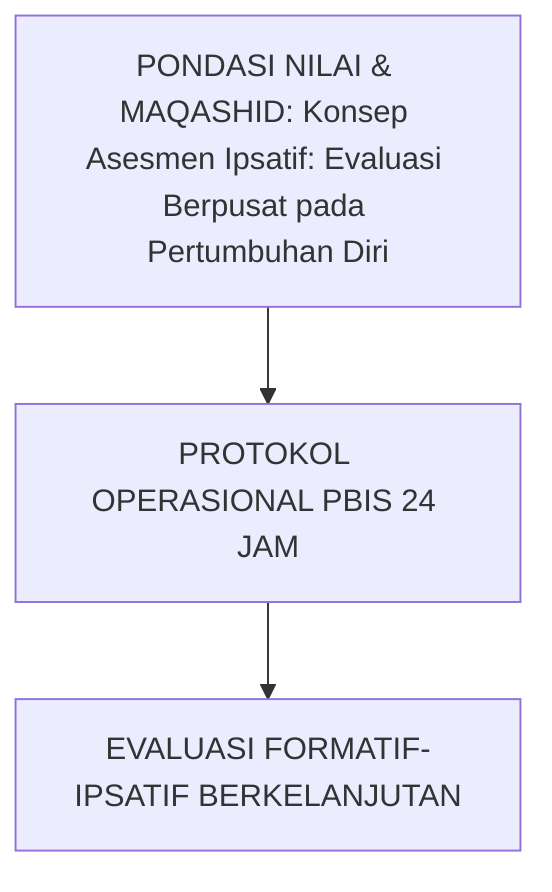

---

### Protokol Aksi Operasional Berjenjang

1. **Langkah Preventif Universal (Tahap Persiapan)**: Pengkondisian sarana, sosialisasi SOP, dan pembiasaan keteladanan *Qudwah Hasanah*.
2. **Langkah Eksekusi Lapangan (Tahap Berjalan)**: Pendampingan lekat oleh musyrif asrama dan wali kelas dengan prinsip *Firm & Kind*.
3. **Langkah Refleksi & Restorasi (Tahap Evaluasi)**: Pencatatan pada logbook digital dan penanganan kendala melalui dialog restoratif.


---


# SUB-BAB 1.4: ETIKA KERAHASIAAN DATA & KEBIJAKAN NON-LABELING SANTRI
## *Kajian Mendalam & Panduan Implementatif Ekosistem TUMBUH Pesantren*

**Kode Klasifikasi**: `BOOK-03/BAB-01/SUB-04/MONOGRAF-MASTER-VIBRANT`  
**Disiplin Ilmu**: Metodologi Pendidikan Islam, Sains Perilaku Terapan, & Tata Kelola Pesantren  
**Penanggung Jawab Keilmuan**: Dewan Pakar Ekosistem TUMBUH (*24 Bidang Kepakaran*)

---

### Eksplanasi Teoretis & Urgensi Praksis

Pendidikan karakter yang efektif dalam Sistem TUMBUH membutuhkan kejelasan operasional pada aspek **Etika Kerahasiaan Data & Kebijakan Non-Labeling Santri**. Naskah ini menguraikan landasan filosofis Turats, bukti empiris sains perilaku, dan protokol implementasi lapangan 24 jam.

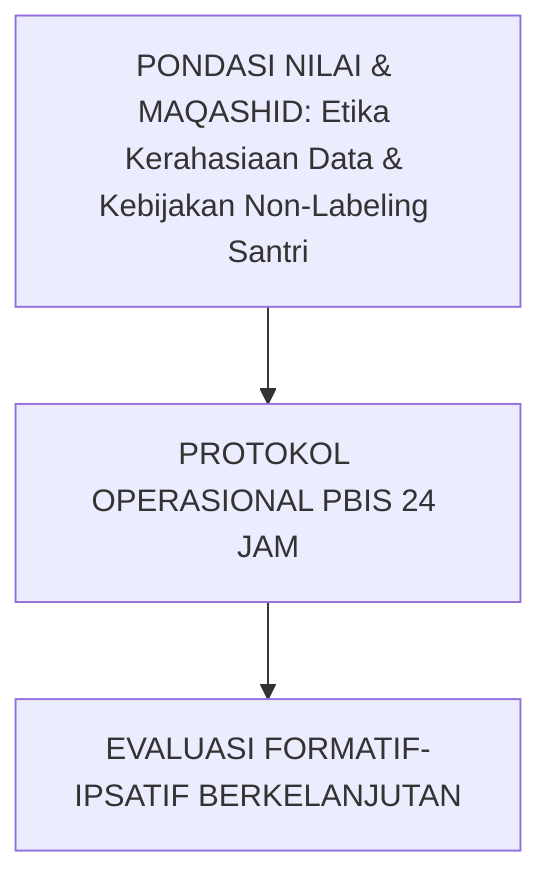

---

### Protokol Aksi Operasional Berjenjang

1. **Langkah Preventif Universal (Tahap Persiapan)**: Pengkondisian sarana, sosialisasi SOP, dan pembiasaan keteladanan *Qudwah Hasanah*.
2. **Langkah Eksekusi Lapangan (Tahap Berjalan)**: Pendampingan lekat oleh musyrif asrama dan wali kelas dengan prinsip *Firm & Kind*.
3. **Langkah Refleksi & Restorasi (Tahap Evaluasi)**: Pencatatan pada logbook digital dan penanganan kendala melalui dialog restoratif.


---


# SUB-BAB 1.5: UMPAN BALIK KONSTRUKTIF & FEEDFORWARD TARBAWIYYAH
## *Kajian Mendalam & Panduan Implementatif Ekosistem TUMBUH Pesantren*

**Kode Klasifikasi**: `BOOK-03/BAB-01/SUB-05/MONOGRAF-MASTER-VIBRANT`  
**Disiplin Ilmu**: Metodologi Pendidikan Islam, Sains Perilaku Terapan, & Tata Kelola Pesantren  
**Penanggung Jawab Keilmuan**: Dewan Pakar Ekosistem TUMBUH (*24 Bidang Kepakaran*)

---

### Eksplanasi Teoretis & Urgensi Praksis

Pendidikan karakter yang efektif dalam Sistem TUMBUH membutuhkan kejelasan operasional pada aspek **Umpan Balik Konstruktif & Feedforward Tarbawiyyah**. Naskah ini menguraikan landasan filosofis Turats, bukti empiris sains perilaku, dan protokol implementasi lapangan 24 jam.

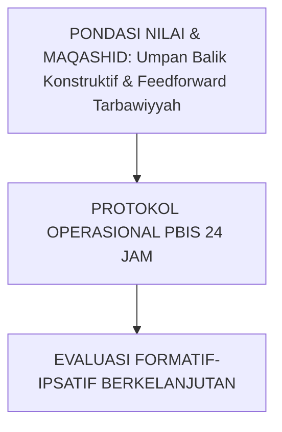

---

### Protokol Aksi Operasional Berjenjang

1. **Langkah Preventif Universal (Tahap Persiapan)**: Pengkondisian sarana, sosialisasi SOP, dan pembiasaan keteladanan *Qudwah Hasanah*.
2. **Langkah Eksekusi Lapangan (Tahap Berjalan)**: Pendampingan lekat oleh musyrif asrama dan wali kelas dengan prinsip *Firm & Kind*.
3. **Langkah Refleksi & Restorasi (Tahap Evaluasi)**: Pencatatan pada logbook digital dan penanganan kendala melalui dialog restoratif.


---


# SUB-BAB 2.1: TRIANGULASI TIGA POROS: SANTRI, MUSYRIF, & GURU
## *Arsitektur Pengumpulan Bukti Perilaku Multi-Sumber untuk Menjamin Objektivitas dan Eliminasi Bias Personal*

**Kode Klasifikasi**: `BOOK-03/BAB-02/SUB-01/MONOGRAF-MASTER-VIBRANT`  
**Disiplin Ilmu**: Multi-Source Assessment Methodology, Triangulasi Psikometri, & Validitas Ekologis  
**Penanggung Jawab Keilmuan**: Dewan Pakar Ekosistem TUMBUH (*Pakar Validasi Instrumen & Pakar Psikometri*)

---

### Menghilangkan Subjektivitas Penilaian Tunggal

Asesmen karakter dalam Sistem TUMBUH tidak pernah diserahkan pada opini tunggal satu orang pengasuh. Penilaian ditegakkan di atas **Triangulasi Tiga Poros**:
1. **Poros Asesmen Diri Santri (*Self-Reflection*)**: Santri mengisi jurnal muhasabah harian untuk melatih kejujuran batin.
2. **Poros Observasi Musyrif Asrama (*Dormitory Behavioral Log*)**: Musyrif mencatat pembiasaan ibadah dan kerapian 5S.
3. **Poros Evaluasi Guru Madrasah (*Classroom Academic Adab*)**: Guru mencatat kesungguhan belajar, nalar kritis, dan adab majelis ilmu.

Jika terjadi diskrepansi data > 30% antar-poros, sistem analitik PBIS akan memicu sesi dialog klarifikasi (*Triangulation Conference*) bersama konselor BK.


---


# SUB-BAB 2.2: INSTRUMEN SELF-ASSESSMENT & JURNAL MUHASABAH BATIN
## *Kajian Mendalam & Panduan Implementatif Ekosistem TUMBUH Pesantren*

**Kode Klasifikasi**: `BOOK-03/BAB-02/SUB-02/MONOGRAF-MASTER-VIBRANT`  
**Disiplin Ilmu**: Metodologi Pendidikan Islam, Sains Perilaku Terapan, & Tata Kelola Pesantren  
**Penanggung Jawab Keilmuan**: Dewan Pakar Ekosistem TUMBUH (*24 Bidang Kepakaran*)

---

### Eksplanasi Teoretis & Urgensi Praksis

Pendidikan karakter yang efektif dalam Sistem TUMBUH membutuhkan kejelasan operasional pada aspek **Instrumen Self-Assessment & Jurnal Muhasabah Batin**. Naskah ini menguraikan landasan filosofis Turats, bukti empiris sains perilaku, dan protokol implementasi lapangan 24 jam.

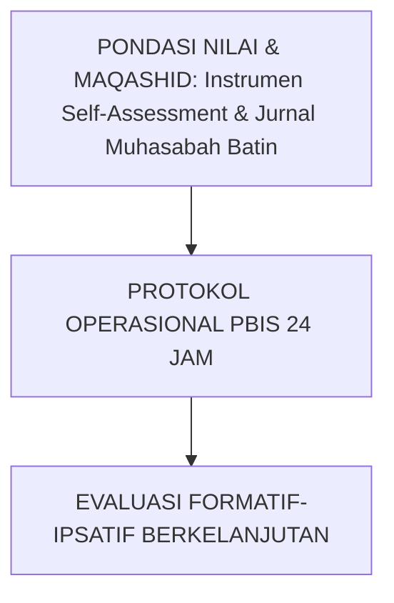

---

### Protokol Aksi Operasional Berjenjang

1. **Langkah Preventif Universal (Tahap Persiapan)**: Pengkondisian sarana, sosialisasi SOP, dan pembiasaan keteladanan *Qudwah Hasanah*.
2. **Langkah Eksekusi Lapangan (Tahap Berjalan)**: Pendampingan lekat oleh musyrif asrama dan wali kelas dengan prinsip *Firm & Kind*.
3. **Langkah Refleksi & Restorasi (Tahap Evaluasi)**: Pencatatan pada logbook digital dan penanganan kendala melalui dialog restoratif.


---


# SUB-BAB 2.3: PEER ASSESSMENT SOSIOMETRIK & BUDAYA SALING MENJAGA
## *Kajian Mendalam & Panduan Implementatif Ekosistem TUMBUH Pesantren*

**Kode Klasifikasi**: `BOOK-03/BAB-02/SUB-03/MONOGRAF-MASTER-VIBRANT`  
**Disiplin Ilmu**: Metodologi Pendidikan Islam, Sains Perilaku Terapan, & Tata Kelola Pesantren  
**Penanggung Jawab Keilmuan**: Dewan Pakar Ekosistem TUMBUH (*24 Bidang Kepakaran*)

---

### Eksplanasi Teoretis & Urgensi Praksis

Pendidikan karakter yang efektif dalam Sistem TUMBUH membutuhkan kejelasan operasional pada aspek **Peer Assessment Sosiometrik & Budaya Saling Menjaga**. Naskah ini menguraikan landasan filosofis Turats, bukti empiris sains perilaku, dan protokol implementasi lapangan 24 jam.

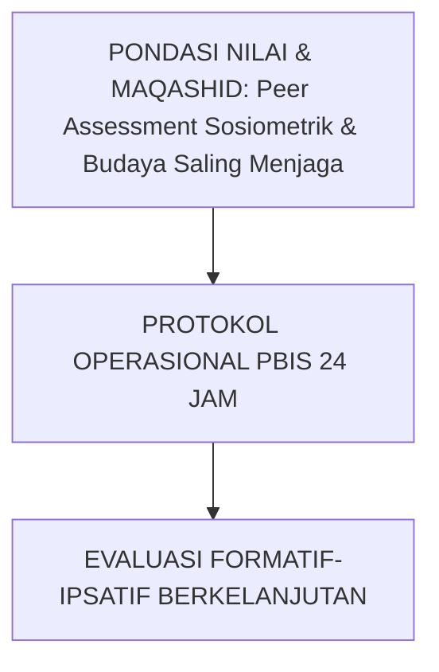

---

### Protokol Aksi Operasional Berjenjang

1. **Langkah Preventif Universal (Tahap Persiapan)**: Pengkondisian sarana, sosialisasi SOP, dan pembiasaan keteladanan *Qudwah Hasanah*.
2. **Langkah Eksekusi Lapangan (Tahap Berjalan)**: Pendampingan lekat oleh musyrif asrama dan wali kelas dengan prinsip *Firm & Kind*.
3. **Langkah Refleksi & Restorasi (Tahap Evaluasi)**: Pencatatan pada logbook digital dan penanganan kendala melalui dialog restoratif.


---


# SUB-BAB 2.4: OBSERVASI PERILAKU ALAMI MUSYRIF ASRAMA 24-JAM
## *Kajian Mendalam & Panduan Implementatif Ekosistem TUMBUH Pesantren*

**Kode Klasifikasi**: `BOOK-03/BAB-02/SUB-04/MONOGRAF-MASTER-VIBRANT`  
**Disiplin Ilmu**: Metodologi Pendidikan Islam, Sains Perilaku Terapan, & Tata Kelola Pesantren  
**Penanggung Jawab Keilmuan**: Dewan Pakar Ekosistem TUMBUH (*24 Bidang Kepakaran*)

---

### Eksplanasi Teoretis & Urgensi Praksis

Pendidikan karakter yang efektif dalam Sistem TUMBUH membutuhkan kejelasan operasional pada aspek **Observasi Perilaku Alami Musyrif Asrama 24-Jam**. Naskah ini menguraikan landasan filosofis Turats, bukti empiris sains perilaku, dan protokol implementasi lapangan 24 jam.

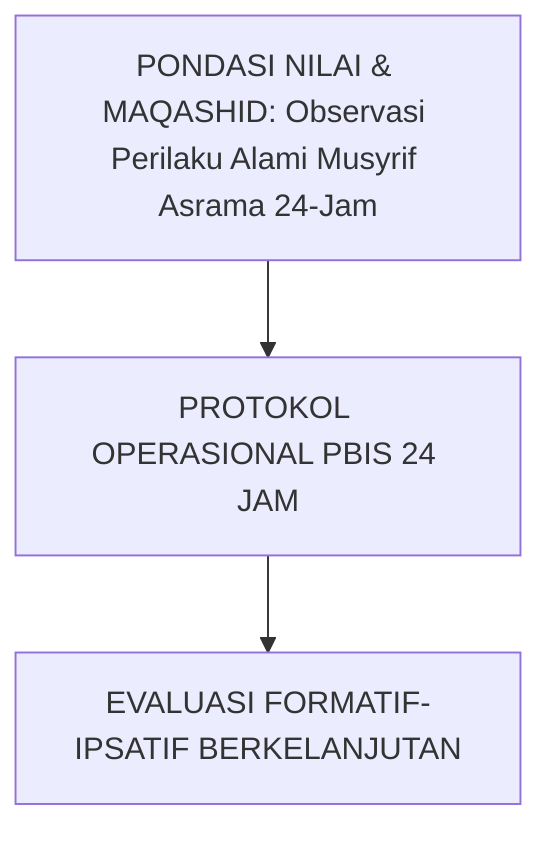

---

### Protokol Aksi Operasional Berjenjang

1. **Langkah Preventif Universal (Tahap Persiapan)**: Pengkondisian sarana, sosialisasi SOP, dan pembiasaan keteladanan *Qudwah Hasanah*.
2. **Langkah Eksekusi Lapangan (Tahap Berjalan)**: Pendampingan lekat oleh musyrif asrama dan wali kelas dengan prinsip *Firm & Kind*.
3. **Langkah Refleksi & Restorasi (Tahap Evaluasi)**: Pencatatan pada logbook digital dan penanganan kendala melalui dialog restoratif.


---


# SUB-BAB 2.5: SESI REKONSILIASI DISKREPANSI DATA TRIANGULASI
## *Kajian Mendalam & Panduan Implementatif Ekosistem TUMBUH Pesantren*

**Kode Klasifikasi**: `BOOK-03/BAB-02/SUB-05/MONOGRAF-MASTER-VIBRANT`  
**Disiplin Ilmu**: Metodologi Pendidikan Islam, Sains Perilaku Terapan, & Tata Kelola Pesantren  
**Penanggung Jawab Keilmuan**: Dewan Pakar Ekosistem TUMBUH (*24 Bidang Kepakaran*)

---

### Eksplanasi Teoretis & Urgensi Praksis

Pendidikan karakter yang efektif dalam Sistem TUMBUH membutuhkan kejelasan operasional pada aspek **Sesi Rekonsiliasi Diskrepansi Data Triangulasi**. Naskah ini menguraikan landasan filosofis Turats, bukti empiris sains perilaku, dan protokol implementasi lapangan 24 jam.

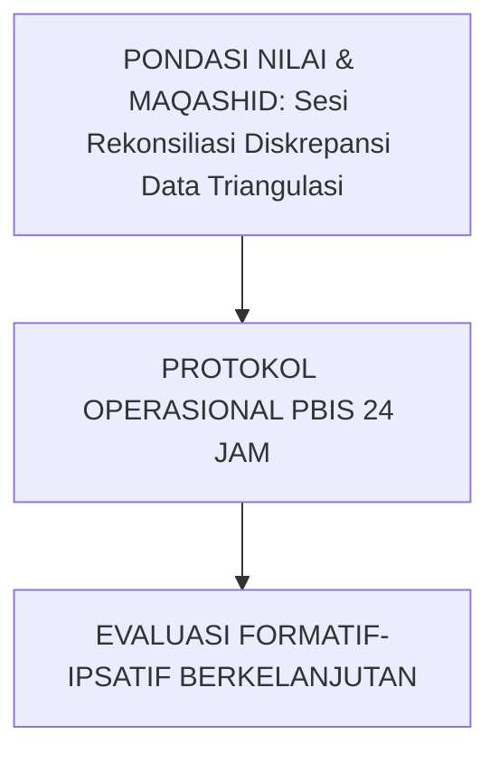

---

### Protokol Aksi Operasional Berjenjang

1. **Langkah Preventif Universal (Tahap Persiapan)**: Pengkondisian sarana, sosialisasi SOP, dan pembiasaan keteladanan *Qudwah Hasanah*.
2. **Langkah Eksekusi Lapangan (Tahap Berjalan)**: Pendampingan lekat oleh musyrif asrama dan wali kelas dengan prinsip *Firm & Kind*.
3. **Langkah Refleksi & Restorasi (Tahap Evaluasi)**: Pencatatan pada logbook digital dan penanganan kendala melalui dialog restoratif.


---


# SUB-BAB 3.1: RUBRIK PERILAKU 4-LEVEL 10 MUWASHAFAT
## *Standarisasi Indikator Perilaku Teramati (Observable Behaviors) dari Level 1 (Pemula) hingga Level 4 (Penggerak)*

**Kode Klasifikasi**: `BOOK-03/BAB-03/SUB-01/MONOGRAF-MASTER-VIBRANT`  
**Disiplin Ilmu**: Rubrik Analitik Perilaku, Taksonomi Karakter Berbasis Bukti, & Psikometri Islam  
**Penanggung Jawab Keilmuan**: Dewan Pakar Ekosistem TUMBUH (*Pakar Desain Kurikulum Adab & Pakar PBIS*)

---

### Matriks Rubrik 4 Level Perkembangan

Setiap dari 10 Muwashafat Karakter dioperasionalkan ke dalam 4 tingkatan deskriptif yang jelas:
* **Level 1 (Tahap Inisiasi/Perlu Bimbingan)**: Santri menjalankan adab hanya jika diawasi secara langsung.
* **Level 2 (Tahap Habituasi/Berkembang)**: Santri mulai mampu menjalankan adab secara konsisten dengan pengingat minimal.
* **Level 3 (Tahap Internalisasi/Mandiri)**: Santri menjalankan adab atas dorongan kesadaran diri dan istiqamah.
* **Level 4 (Tahap Transformasi/Penggerak/Qudwah)**: Santri memancarkan keteladanan dan aktif membimbing kawan-kawannya.


---


# SUB-BAB 3.2: STANDARISASI INDIKATOR PERILAKU TERAMATI (OBSERVABLE BEHAVIORS)
## *Kajian Mendalam & Panduan Implementatif Ekosistem TUMBUH Pesantren*

**Kode Klasifikasi**: `BOOK-03/BAB-03/SUB-02/MONOGRAF-MASTER-VIBRANT`  
**Disiplin Ilmu**: Metodologi Pendidikan Islam, Sains Perilaku Terapan, & Tata Kelola Pesantren  
**Penanggung Jawab Keilmuan**: Dewan Pakar Ekosistem TUMBUH (*24 Bidang Kepakaran*)

---

### Eksplanasi Teoretis & Urgensi Praksis

Pendidikan karakter yang efektif dalam Sistem TUMBUH membutuhkan kejelasan operasional pada aspek **Standarisasi Indikator Perilaku Teramati (Observable Behaviors)**. Naskah ini menguraikan landasan filosofis Turats, bukti empiris sains perilaku, dan protokol implementasi lapangan 24 jam.

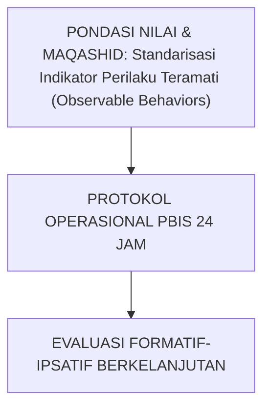

---

### Protokol Aksi Operasional Berjenjang

1. **Langkah Preventif Universal (Tahap Persiapan)**: Pengkondisian sarana, sosialisasi SOP, dan pembiasaan keteladanan *Qudwah Hasanah*.
2. **Langkah Eksekusi Lapangan (Tahap Berjalan)**: Pendampingan lekat oleh musyrif asrama dan wali kelas dengan prinsip *Firm & Kind*.
3. **Langkah Refleksi & Restorasi (Tahap Evaluasi)**: Pencatatan pada logbook digital dan penanganan kendala melalui dialog restoratif.


---


# SUB-BAB 3.3: SKALA PENGUKURAN DIMENSI RUHIYAH & KEDISIPLINAN IBADAH
## *Kajian Mendalam & Panduan Implementatif Ekosistem TUMBUH Pesantren*

**Kode Klasifikasi**: `BOOK-03/BAB-03/SUB-03/MONOGRAF-MASTER-VIBRANT`  
**Disiplin Ilmu**: Metodologi Pendidikan Islam, Sains Perilaku Terapan, & Tata Kelola Pesantren  
**Penanggung Jawab Keilmuan**: Dewan Pakar Ekosistem TUMBUH (*24 Bidang Kepakaran*)

---

### Eksplanasi Teoretis & Urgensi Praksis

Pendidikan karakter yang efektif dalam Sistem TUMBUH membutuhkan kejelasan operasional pada aspek **Skala Pengukuran Dimensi Ruhiyah & Kedisiplinan Ibadah**. Naskah ini menguraikan landasan filosofis Turats, bukti empiris sains perilaku, dan protokol implementasi lapangan 24 jam.

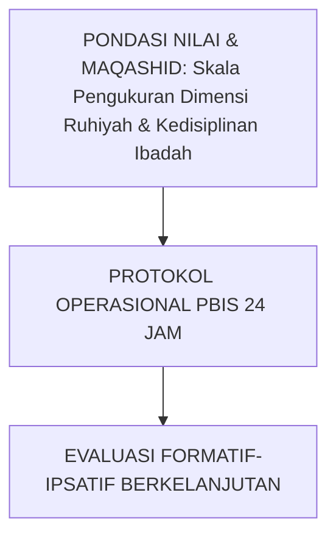

---

### Protokol Aksi Operasional Berjenjang

1. **Langkah Preventif Universal (Tahap Persiapan)**: Pengkondisian sarana, sosialisasi SOP, dan pembiasaan keteladanan *Qudwah Hasanah*.
2. **Langkah Eksekusi Lapangan (Tahap Berjalan)**: Pendampingan lekat oleh musyrif asrama dan wali kelas dengan prinsip *Firm & Kind*.
3. **Langkah Refleksi & Restorasi (Tahap Evaluasi)**: Pencatatan pada logbook digital dan penanganan kendala melalui dialog restoratif.


---


# SUB-BAB 3.4: SKALA PENGUKURAN DIMENSI FISIK, KEBUGARAN, & SANITASI 5S
## *Kajian Mendalam & Panduan Implementatif Ekosistem TUMBUH Pesantren*

**Kode Klasifikasi**: `BOOK-03/BAB-03/SUB-04/MONOGRAF-MASTER-VIBRANT`  
**Disiplin Ilmu**: Metodologi Pendidikan Islam, Sains Perilaku Terapan, & Tata Kelola Pesantren  
**Penanggung Jawab Keilmuan**: Dewan Pakar Ekosistem TUMBUH (*24 Bidang Kepakaran*)

---

### Eksplanasi Teoretis & Urgensi Praksis

Pendidikan karakter yang efektif dalam Sistem TUMBUH membutuhkan kejelasan operasional pada aspek **Skala Pengukuran Dimensi Fisik, Kebugaran, & Sanitasi 5S**. Naskah ini menguraikan landasan filosofis Turats, bukti empiris sains perilaku, dan protokol implementasi lapangan 24 jam.

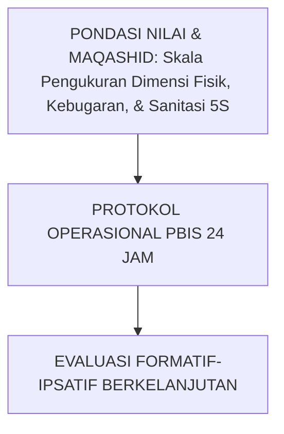

---

### Protokol Aksi Operasional Berjenjang

1. **Langkah Preventif Universal (Tahap Persiapan)**: Pengkondisian sarana, sosialisasi SOP, dan pembiasaan keteladanan *Qudwah Hasanah*.
2. **Langkah Eksekusi Lapangan (Tahap Berjalan)**: Pendampingan lekat oleh musyrif asrama dan wali kelas dengan prinsip *Firm & Kind*.
3. **Langkah Refleksi & Restorasi (Tahap Evaluasi)**: Pencatatan pada logbook digital dan penanganan kendala melalui dialog restoratif.


---


# SUB-BAB 3.5: SKALA PENGUKURAN DIMENSI SOSIAL SEL & REGULASI DIRI
## *Kajian Mendalam & Panduan Implementatif Ekosistem TUMBUH Pesantren*

**Kode Klasifikasi**: `BOOK-03/BAB-03/SUB-05/MONOGRAF-MASTER-VIBRANT`  
**Disiplin Ilmu**: Metodologi Pendidikan Islam, Sains Perilaku Terapan, & Tata Kelola Pesantren  
**Penanggung Jawab Keilmuan**: Dewan Pakar Ekosistem TUMBUH (*24 Bidang Kepakaran*)

---

### Eksplanasi Teoretis & Urgensi Praksis

Pendidikan karakter yang efektif dalam Sistem TUMBUH membutuhkan kejelasan operasional pada aspek **Skala Pengukuran Dimensi Sosial SEL & Regulasi Diri**. Naskah ini menguraikan landasan filosofis Turats, bukti empiris sains perilaku, dan protokol implementasi lapangan 24 jam.

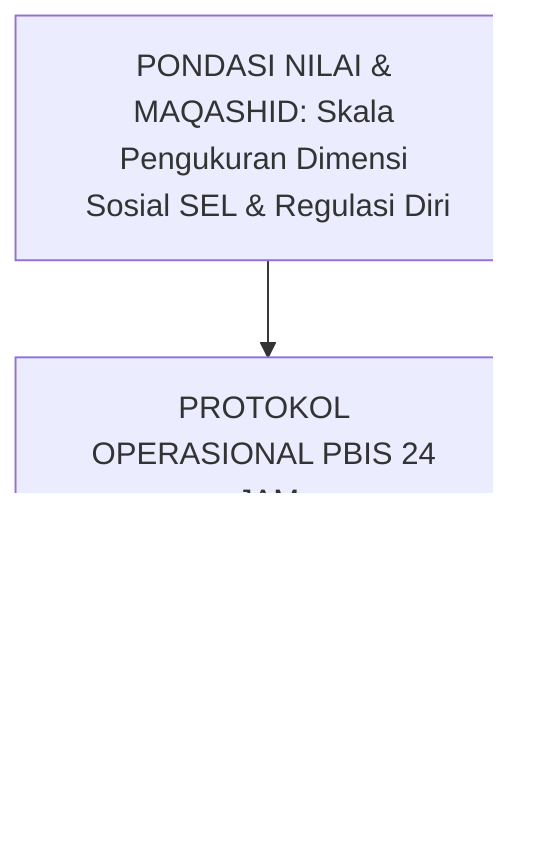

---

### Protokol Aksi Operasional Berjenjang

1. **Langkah Preventif Universal (Tahap Persiapan)**: Pengkondisian sarana, sosialisasi SOP, dan pembiasaan keteladanan *Qudwah Hasanah*.
2. **Langkah Eksekusi Lapangan (Tahap Berjalan)**: Pendampingan lekat oleh musyrif asrama dan wali kelas dengan prinsip *Firm & Kind*.
3. **Langkah Refleksi & Restorasi (Tahap Evaluasi)**: Pencatatan pada logbook digital dan penanganan kendala melalui dialog restoratif.


---


# SUB-BAB 4.1: UJI VALIDITAS ISI AIKEN'S V & RELIABILITAS KAPPA
## *Metodologi Pengujian Ilmiah Ketepatan Alat Ukur Karakter dan Konsistensi Penilaian Antar-Musyrif*

**Kode Klasifikasi**: `BOOK-03/BAB-04/SUB-01/MONOGRAF-MASTER-VIBRANT`  
**Disiplin Ilmu**: Psikometri Lanjutan, Analisis Kesepakatan Penilai (Inter-Rater Reliability), & Statistik Terapan  
**Penanggung Jawab Keilmuan**: Dewan Pakar Ekosistem TUMBUH (*Pakar Metodologi Riset & Pakar Psikometri*)

---

### Menjamin Sahihnya Alat Ukur Perkembangan Santri

Seluruh instrumen asesmen karakter TUMBUH diuji melalui prosedur psikometri ketat:
* **Validitas Isi (*Content Validity*)**: Diuji melalui panel pakar Dewan Keilmuan dengan koefisien **Aiken's V $\ge 0.85$** untuk setiap butir indikator.
* **Reliabilitas Antar-Penilai (*Inter-Rater Reliability*)**: Menggunakan koefisien **Cohen's Kappa & Fleiss' Kappa $\ge 0.80$** untuk menjamin bahwa dua musyrif berbeda yang mengamati santri yang sama akan menghasilkan skor penilaian yang selaras dan objektif.


---


# SUB-BAB 4.2: PROSEDUR EXPERT JUDGMENT PANEL DEWAN KEILMUAN
## *Kajian Mendalam & Panduan Implementatif Ekosistem TUMBUH Pesantren*

**Kode Klasifikasi**: `BOOK-03/BAB-04/SUB-02/MONOGRAF-MASTER-VIBRANT`  
**Disiplin Ilmu**: Metodologi Pendidikan Islam, Sains Perilaku Terapan, & Tata Kelola Pesantren  
**Penanggung Jawab Keilmuan**: Dewan Pakar Ekosistem TUMBUH (*24 Bidang Kepakaran*)

---

### Eksplanasi Teoretis & Urgensi Praksis

Pendidikan karakter yang efektif dalam Sistem TUMBUH membutuhkan kejelasan operasional pada aspek **Prosedur Expert Judgment Panel Dewan Keilmuan**. Naskah ini menguraikan landasan filosofis Turats, bukti empiris sains perilaku, dan protokol implementasi lapangan 24 jam.

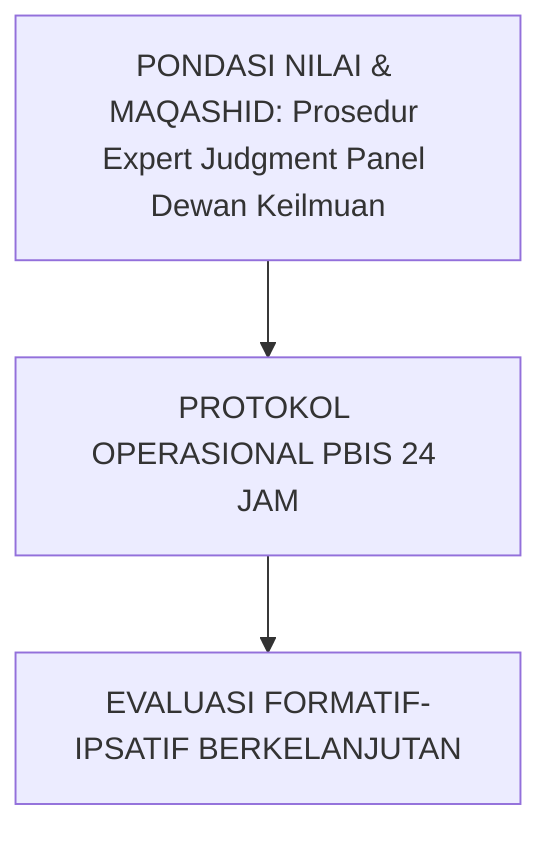

---

### Protokol Aksi Operasional Berjenjang

1. **Langkah Preventif Universal (Tahap Persiapan)**: Pengkondisian sarana, sosialisasi SOP, dan pembiasaan keteladanan *Qudwah Hasanah*.
2. **Langkah Eksekusi Lapangan (Tahap Berjalan)**: Pendampingan lekat oleh musyrif asrama dan wali kelas dengan prinsip *Firm & Kind*.
3. **Langkah Refleksi & Restorasi (Tahap Evaluasi)**: Pencatatan pada logbook digital dan penanganan kendala melalui dialog restoratif.


---


# SUB-BAB 4.3: STANDARISASI PELATIHAN ASESOR & RATER CALIBRATION MUSYRIF
## *Kajian Mendalam & Panduan Implementatif Ekosistem TUMBUH Pesantren*

**Kode Klasifikasi**: `BOOK-03/BAB-04/SUB-03/MONOGRAF-MASTER-VIBRANT`  
**Disiplin Ilmu**: Metodologi Pendidikan Islam, Sains Perilaku Terapan, & Tata Kelola Pesantren  
**Penanggung Jawab Keilmuan**: Dewan Pakar Ekosistem TUMBUH (*24 Bidang Kepakaran*)

---

### Eksplanasi Teoretis & Urgensi Praksis

Pendidikan karakter yang efektif dalam Sistem TUMBUH membutuhkan kejelasan operasional pada aspek **Standarisasi Pelatihan Asesor & Rater Calibration Musyrif**. Naskah ini menguraikan landasan filosofis Turats, bukti empiris sains perilaku, dan protokol implementasi lapangan 24 jam.

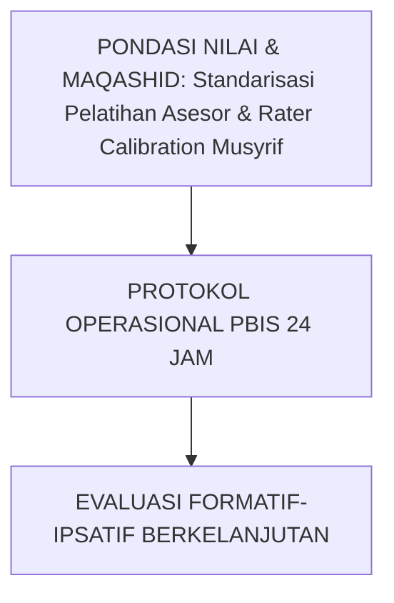

---

### Protokol Aksi Operasional Berjenjang

1. **Langkah Preventif Universal (Tahap Persiapan)**: Pengkondisian sarana, sosialisasi SOP, dan pembiasaan keteladanan *Qudwah Hasanah*.
2. **Langkah Eksekusi Lapangan (Tahap Berjalan)**: Pendampingan lekat oleh musyrif asrama dan wali kelas dengan prinsip *Firm & Kind*.
3. **Langkah Refleksi & Restorasi (Tahap Evaluasi)**: Pencatatan pada logbook digital dan penanganan kendala melalui dialog restoratif.


---


# SUB-BAB 4.4: MITIGASI BIAS PENILAIAN: HALO EFFECT, LENIENCY, & SEVERITY BIAS
## *Kajian Mendalam & Panduan Implementatif Ekosistem TUMBUH Pesantren*

**Kode Klasifikasi**: `BOOK-03/BAB-04/SUB-04/MONOGRAF-MASTER-VIBRANT`  
**Disiplin Ilmu**: Metodologi Pendidikan Islam, Sains Perilaku Terapan, & Tata Kelola Pesantren  
**Penanggung Jawab Keilmuan**: Dewan Pakar Ekosistem TUMBUH (*24 Bidang Kepakaran*)

---

### Eksplanasi Teoretis & Urgensi Praksis

Pendidikan karakter yang efektif dalam Sistem TUMBUH membutuhkan kejelasan operasional pada aspek **Mitigasi Bias Penilaian: Halo Effect, Leniency, & Severity Bias**. Naskah ini menguraikan landasan filosofis Turats, bukti empiris sains perilaku, dan protokol implementasi lapangan 24 jam.

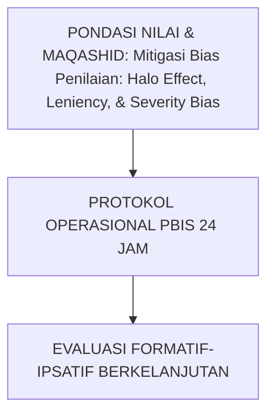

---

### Protokol Aksi Operasional Berjenjang

1. **Langkah Preventif Universal (Tahap Persiapan)**: Pengkondisian sarana, sosialisasi SOP, dan pembiasaan keteladanan *Qudwah Hasanah*.
2. **Langkah Eksekusi Lapangan (Tahap Berjalan)**: Pendampingan lekat oleh musyrif asrama dan wali kelas dengan prinsip *Firm & Kind*.
3. **Langkah Refleksi & Restorasi (Tahap Evaluasi)**: Pencatatan pada logbook digital dan penanganan kendala melalui dialog restoratif.


---


# SUB-BAB 4.5: VALIDASI KONSTRUK & ANALISIS FAKTOR INSTRUMEN KARAKTER
## *Kajian Mendalam & Panduan Implementatif Ekosistem TUMBUH Pesantren*

**Kode Klasifikasi**: `BOOK-03/BAB-04/SUB-05/MONOGRAF-MASTER-VIBRANT`  
**Disiplin Ilmu**: Metodologi Pendidikan Islam, Sains Perilaku Terapan, & Tata Kelola Pesantren  
**Penanggung Jawab Keilmuan**: Dewan Pakar Ekosistem TUMBUH (*24 Bidang Kepakaran*)

---

### Eksplanasi Teoretis & Urgensi Praksis

Pendidikan karakter yang efektif dalam Sistem TUMBUH membutuhkan kejelasan operasional pada aspek **Validasi Konstruk & Analisis Faktor Instrumen Karakter**. Naskah ini menguraikan landasan filosofis Turats, bukti empiris sains perilaku, dan protokol implementasi lapangan 24 jam.

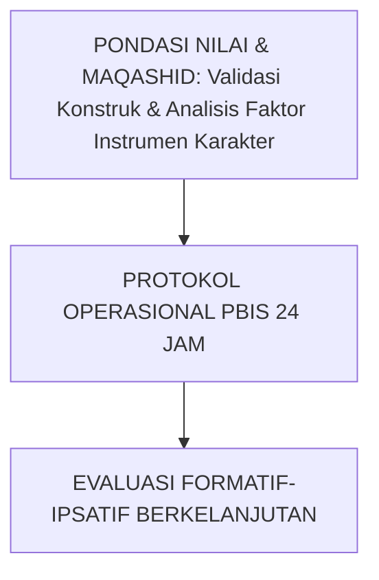

---

### Protokol Aksi Operasional Berjenjang

1. **Langkah Preventif Universal (Tahap Persiapan)**: Pengkondisian sarana, sosialisasi SOP, dan pembiasaan keteladanan *Qudwah Hasanah*.
2. **Langkah Eksekusi Lapangan (Tahap Berjalan)**: Pendampingan lekat oleh musyrif asrama dan wali kelas dengan prinsip *Firm & Kind*.
3. **Langkah Refleksi & Restorasi (Tahap Evaluasi)**: Pencatatan pada logbook digital dan penanganan kendala melalui dialog restoratif.


---


# SUB-BAB 5.1: SOP PENCATATAN DIGITAL EFISIEN 15-MENIT
## *Desain Aplikasi Mobile Logbook Musyrif Offline-First yang Melindungi Pendidik dari Beban Administrasi Berlebih*

**Kode Klasifikasi**: `BOOK-03/BAB-05/SUB-01/MONOGRAF-MASTER-VIBRANT`  
**Disiplin Ilmu**: Rekayasa Sistem Informasi Pesantren, UI/UX Asrama, & Pencegahan Burnout  
**Penanggung Jawab Keilmuan**: Dewan Pakar Ekosistem TUMBUH (*Pakar Arsitektur Digital & Pakar Pengasuhan Asrama*)

---

### Digitalisasi yang Meringankan, Bukan Membebani

Sistem TUMBUH merancang aplikasi *Logbook Digital Musyrif* dengan prinsip efisiensi ekstrem:
* **Maksimal 15 Menit/Hari**: Musyrif cukup memilih opsi *one-tap logging* untuk mencatat observasi harian kamar asrama.
* **Offline-First Synchronization**: Aplikasi dapat digunakan di area asrama yang minim sinyal internet dan tersinkronisasi otomatis saat terhubung jaringan.
* **Dashboard Peringatan Dini (*Early Warning System*)**: Memberikan notifikasi visual jika seorang santri terdeteksi mengalami penurunan semangat ibadah berturut-turut dalam 3 hari.


---


# SUB-BAB 5.2: ARSITEKTUR LOGBOOK MOBILE APP OFFLINE-FIRST SYNCING
## *Kajian Mendalam & Panduan Implementatif Ekosistem TUMBUH Pesantren*

**Kode Klasifikasi**: `BOOK-03/BAB-05/SUB-02/MONOGRAF-MASTER-VIBRANT`  
**Disiplin Ilmu**: Metodologi Pendidikan Islam, Sains Perilaku Terapan, & Tata Kelola Pesantren  
**Penanggung Jawab Keilmuan**: Dewan Pakar Ekosistem TUMBUH (*24 Bidang Kepakaran*)

---

### Eksplanasi Teoretis & Urgensi Praksis

Pendidikan karakter yang efektif dalam Sistem TUMBUH membutuhkan kejelasan operasional pada aspek **Arsitektur Logbook Mobile App Offline-First Syncing**. Naskah ini menguraikan landasan filosofis Turats, bukti empiris sains perilaku, dan protokol implementasi lapangan 24 jam.

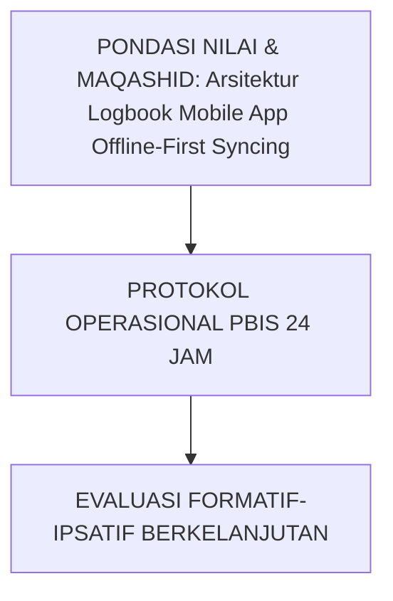

---

### Protokol Aksi Operasional Berjenjang

1. **Langkah Preventif Universal (Tahap Persiapan)**: Pengkondisian sarana, sosialisasi SOP, dan pembiasaan keteladanan *Qudwah Hasanah*.
2. **Langkah Eksekusi Lapangan (Tahap Berjalan)**: Pendampingan lekat oleh musyrif asrama dan wali kelas dengan prinsip *Firm & Kind*.
3. **Langkah Refleksi & Restorasi (Tahap Evaluasi)**: Pencatatan pada logbook digital dan penanganan kendala melalui dialog restoratif.


---


# SUB-BAB 5.3: DASHBOARD EARLY WARNING SYSTEM (EWS) DETEKSI DINI PENURUNAN ADAB
## *Kajian Mendalam & Panduan Implementatif Ekosistem TUMBUH Pesantren*

**Kode Klasifikasi**: `BOOK-03/BAB-05/SUB-03/MONOGRAF-MASTER-VIBRANT`  
**Disiplin Ilmu**: Metodologi Pendidikan Islam, Sains Perilaku Terapan, & Tata Kelola Pesantren  
**Penanggung Jawab Keilmuan**: Dewan Pakar Ekosistem TUMBUH (*24 Bidang Kepakaran*)

---

### Eksplanasi Teoretis & Urgensi Praksis

Pendidikan karakter yang efektif dalam Sistem TUMBUH membutuhkan kejelasan operasional pada aspek **Dashboard Early Warning System (EWS) Deteksi Dini Penurunan Adab**. Naskah ini menguraikan landasan filosofis Turats, bukti empiris sains perilaku, dan protokol implementasi lapangan 24 jam.

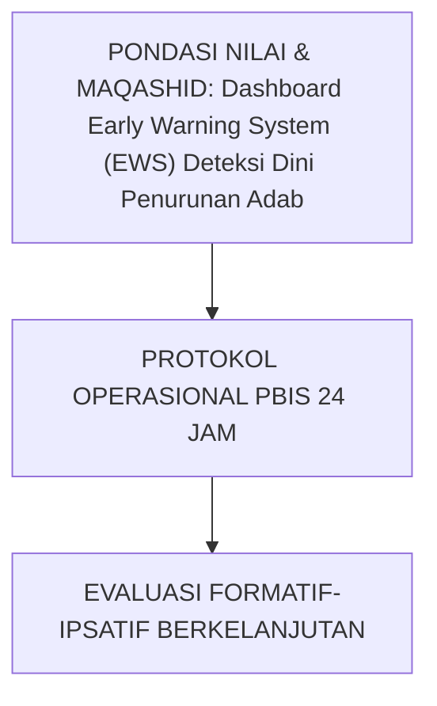

---

### Protokol Aksi Operasional Berjenjang

1. **Langkah Preventif Universal (Tahap Persiapan)**: Pengkondisian sarana, sosialisasi SOP, dan pembiasaan keteladanan *Qudwah Hasanah*.
2. **Langkah Eksekusi Lapangan (Tahap Berjalan)**: Pendampingan lekat oleh musyrif asrama dan wali kelas dengan prinsip *Firm & Kind*.
3. **Langkah Refleksi & Restorasi (Tahap Evaluasi)**: Pencatatan pada logbook digital dan penanganan kendala melalui dialog restoratif.


---


# SUB-BAB 5.4: MANAJEMEN PRIVASI & KEAMANAN SIBER DATA KARAKTER SANTRI
## *Kajian Mendalam & Panduan Implementatif Ekosistem TUMBUH Pesantren*

**Kode Klasifikasi**: `BOOK-03/BAB-05/SUB-04/MONOGRAF-MASTER-VIBRANT`  
**Disiplin Ilmu**: Metodologi Pendidikan Islam, Sains Perilaku Terapan, & Tata Kelola Pesantren  
**Penanggung Jawab Keilmuan**: Dewan Pakar Ekosistem TUMBUH (*24 Bidang Kepakaran*)

---

### Eksplanasi Teoretis & Urgensi Praksis

Pendidikan karakter yang efektif dalam Sistem TUMBUH membutuhkan kejelasan operasional pada aspek **Manajemen Privasi & Keamanan Siber Data Karakter Santri**. Naskah ini menguraikan landasan filosofis Turats, bukti empiris sains perilaku, dan protokol implementasi lapangan 24 jam.

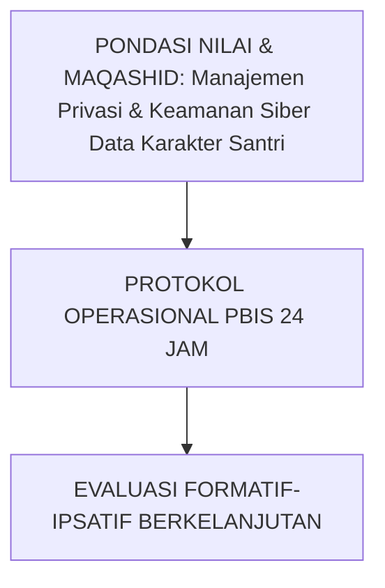

---

### Protokol Aksi Operasional Berjenjang

1. **Langkah Preventif Universal (Tahap Persiapan)**: Pengkondisian sarana, sosialisasi SOP, dan pembiasaan keteladanan *Qudwah Hasanah*.
2. **Langkah Eksekusi Lapangan (Tahap Berjalan)**: Pendampingan lekat oleh musyrif asrama dan wali kelas dengan prinsip *Firm & Kind*.
3. **Langkah Refleksi & Restorasi (Tahap Evaluasi)**: Pencatatan pada logbook digital dan penanganan kendala melalui dialog restoratif.


---


# SUB-BAB 5.5: ANALITIK PREDIKTIF & VISUALISASI GRAFIK PERTUMBUHAN SANTRI
## *Kajian Mendalam & Panduan Implementatif Ekosistem TUMBUH Pesantren*

**Kode Klasifikasi**: `BOOK-03/BAB-05/SUB-05/MONOGRAF-MASTER-VIBRANT`  
**Disiplin Ilmu**: Metodologi Pendidikan Islam, Sains Perilaku Terapan, & Tata Kelola Pesantren  
**Penanggung Jawab Keilmuan**: Dewan Pakar Ekosistem TUMBUH (*24 Bidang Kepakaran*)

---

### Eksplanasi Teoretis & Urgensi Praksis

Pendidikan karakter yang efektif dalam Sistem TUMBUH membutuhkan kejelasan operasional pada aspek **Analitik Prediktif & Visualisasi Grafik Pertumbuhan Santri**. Naskah ini menguraikan landasan filosofis Turats, bukti empiris sains perilaku, dan protokol implementasi lapangan 24 jam.

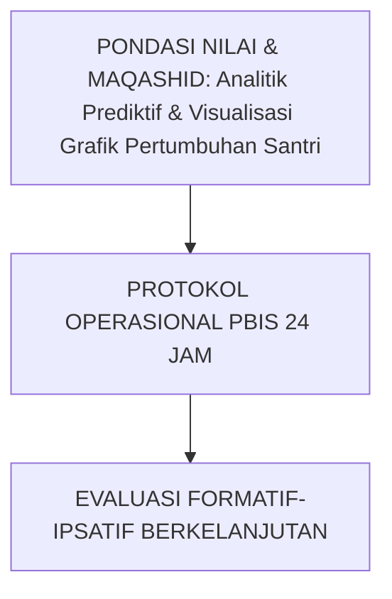

---

### Protokol Aksi Operasional Berjenjang

1. **Langkah Preventif Universal (Tahap Persiapan)**: Pengkondisian sarana, sosialisasi SOP, dan pembiasaan keteladanan *Qudwah Hasanah*.
2. **Langkah Eksekusi Lapangan (Tahap Berjalan)**: Pendampingan lekat oleh musyrif asrama dan wali kelas dengan prinsip *Firm & Kind*.
3. **Langkah Refleksi & Restorasi (Tahap Evaluasi)**: Pencatatan pada logbook digital dan penanganan kendala melalui dialog restoratif.


---


# SUB-BAB 6.1: DESAIN RAPOR KARAKTER IPSATIF BAGI WALI SANTRI
## *Transformasi Laporan Pendidikan: Menyajikan Narasi Pertumbuhan Fitrah yang Menggembirakan Hati Orang Tua*

**Kode Klasifikasi**: `BOOK-03/BAB-06/SUB-01/MONOGRAF-MASTER-VIBRANT`  
**Disiplin Ilmu**: Pelaporan Pendidikan Positif, Kemitraan Sekolah-Keluarga, & Narasi Ipsatif  
**Penanggung Jawab Keilmuan**: Dewan Pakar Ekosistem TUMBUH (*Pakar Bimbingan Konseling & Pakar Evaluasi*)

---

### Rapor yang Membina Harapan, Bukan Menghancurkan Mental

Rapor Karakter Ipsatif TUMBUH menggantikan format angka kering dengan **Narasi Pertumbuhan Komprehensif**:
* Menyajikan grafik perkembangan 10 Muwashafat dari semester ke semester.
* Menyertakan dokumentasi foto portofolio karya nyata dan jam khidmah santri.
* Memberikan rekomendasi konkret bagi orang tua untuk melanjutkan resonansi pembiasaan adab saat santri berlibur di rumah.


---


# SUB-BAB 6.2: DOKUMENTASI ARTEFAK KHIDMAH & PORTOFOLIO ADAB SANTRI
## *Kajian Mendalam & Panduan Implementatif Ekosistem TUMBUH Pesantren*

**Kode Klasifikasi**: `BOOK-03/BAB-06/SUB-02/MONOGRAF-MASTER-VIBRANT`  
**Disiplin Ilmu**: Metodologi Pendidikan Islam, Sains Perilaku Terapan, & Tata Kelola Pesantren  
**Penanggung Jawab Keilmuan**: Dewan Pakar Ekosistem TUMBUH (*24 Bidang Kepakaran*)

---

### Eksplanasi Teoretis & Urgensi Praksis

Pendidikan karakter yang efektif dalam Sistem TUMBUH membutuhkan kejelasan operasional pada aspek **Dokumentasi Artefak Khidmah & Portofolio Adab Santri**. Naskah ini menguraikan landasan filosofis Turats, bukti empiris sains perilaku, dan protokol implementasi lapangan 24 jam.

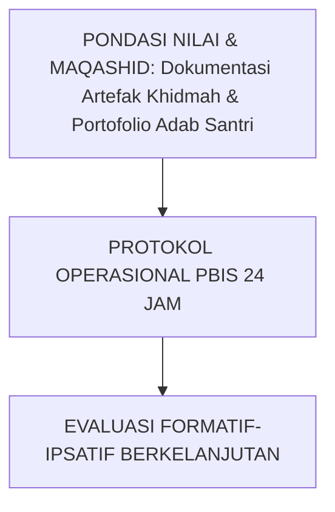

---

### Protokol Aksi Operasional Berjenjang

1. **Langkah Preventif Universal (Tahap Persiapan)**: Pengkondisian sarana, sosialisasi SOP, dan pembiasaan keteladanan *Qudwah Hasanah*.
2. **Langkah Eksekusi Lapangan (Tahap Berjalan)**: Pendampingan lekat oleh musyrif asrama dan wali kelas dengan prinsip *Firm & Kind*.
3. **Langkah Refleksi & Restorasi (Tahap Evaluasi)**: Pencatatan pada logbook digital dan penanganan kendala melalui dialog restoratif.


---


# SUB-BAB 6.3: PARENT-TEACHER-MUSYRIF CONFERENCE (PTMC) TRIWULANAN
## *Kajian Mendalam & Panduan Implementatif Ekosistem TUMBUH Pesantren*

**Kode Klasifikasi**: `BOOK-03/BAB-06/SUB-03/MONOGRAF-MASTER-VIBRANT`  
**Disiplin Ilmu**: Metodologi Pendidikan Islam, Sains Perilaku Terapan, & Tata Kelola Pesantren  
**Penanggung Jawab Keilmuan**: Dewan Pakar Ekosistem TUMBUH (*24 Bidang Kepakaran*)

---

### Eksplanasi Teoretis & Urgensi Praksis

Pendidikan karakter yang efektif dalam Sistem TUMBUH membutuhkan kejelasan operasional pada aspek **Parent-Teacher-Musyrif Conference (PTMC) Triwulanan**. Naskah ini menguraikan landasan filosofis Turats, bukti empiris sains perilaku, dan protokol implementasi lapangan 24 jam.

```mermaid
graph TD
    Tujuan["PONDASI NILAI & MAQASHID: Parent-Teacher-Musyrif Conference (PTMC) Triwulanan"] --> Operasional["PROTOKOL OPERASIONAL PBIS 24 JAM"]
    Operasional --> Evaluasi["EVALUASI FORMATIF-IPSATIF BERKELANJUTAN"]
```

---

### Protokol Aksi Operasional Berjenjang

1. **Langkah Preventif Universal (Tahap Persiapan)**: Pengkondisian sarana, sosialisasi SOP, dan pembiasaan keteladanan *Qudwah Hasanah*.
2. **Langkah Eksekusi Lapangan (Tahap Berjalan)**: Pendampingan lekat oleh musyrif asrama dan wali kelas dengan prinsip *Firm & Kind*.
3. **Langkah Refleksi & Restorasi (Tahap Evaluasi)**: Pencatatan pada logbook digital dan penanganan kendala melalui dialog restoratif.


---


# SUB-BAB 6.4: TRANSKRIP KARAKTER RESMI KELULUSAN & REKOMENDASI KHIDMAH
## *Kajian Mendalam & Panduan Implementatif Ekosistem TUMBUH Pesantren*

**Kode Klasifikasi**: `BOOK-03/BAB-06/SUB-04/MONOGRAF-MASTER-VIBRANT`  
**Disiplin Ilmu**: Metodologi Pendidikan Islam, Sains Perilaku Terapan, & Tata Kelola Pesantren  
**Penanggung Jawab Keilmuan**: Dewan Pakar Ekosistem TUMBUH (*24 Bidang Kepakaran*)

---

### Eksplanasi Teoretis & Urgensi Praksis

Pendidikan karakter yang efektif dalam Sistem TUMBUH membutuhkan kejelasan operasional pada aspek **Transkrip Karakter Resmi Kelulusan & Rekomendasi Khidmah**. Naskah ini menguraikan landasan filosofis Turats, bukti empiris sains perilaku, dan protokol implementasi lapangan 24 jam.

```mermaid
graph TD
    Tujuan["PONDASI NILAI & MAQASHID: Transkrip Karakter Resmi Kelulusan & Rekomendasi Khidmah"] --> Operasional["PROTOKOL OPERASIONAL PBIS 24 JAM"]
    Operasional --> Evaluasi["EVALUASI FORMATIF-IPSATIF BERKELANJUTAN"]
```

---

### Protokol Aksi Operasional Berjenjang

1. **Langkah Preventif Universal (Tahap Persiapan)**: Pengkondisian sarana, sosialisasi SOP, dan pembiasaan keteladanan *Qudwah Hasanah*.
2. **Langkah Eksekusi Lapangan (Tahap Berjalan)**: Pendampingan lekat oleh musyrif asrama dan wali kelas dengan prinsip *Firm & Kind*.
3. **Langkah Refleksi & Restorasi (Tahap Evaluasi)**: Pencatatan pada logbook digital dan penanganan kendala melalui dialog restoratif.


---


# SUB-BAB 6.5: EVALUASI LONGITUDINAL DAMPAK PENDIDIKAN ASRAMA 7 TAHUN
## *Kajian Mendalam & Panduan Implementatif Ekosistem TUMBUH Pesantren*

**Kode Klasifikasi**: `BOOK-03/BAB-06/SUB-05/MONOGRAF-MASTER-VIBRANT`  
**Disiplin Ilmu**: Metodologi Pendidikan Islam, Sains Perilaku Terapan, & Tata Kelola Pesantren  
**Penanggung Jawab Keilmuan**: Dewan Pakar Ekosistem TUMBUH (*24 Bidang Kepakaran*)

---

### Eksplanasi Teoretis & Urgensi Praksis

Pendidikan karakter yang efektif dalam Sistem TUMBUH membutuhkan kejelasan operasional pada aspek **Evaluasi Longitudinal Dampak Pendidikan Asrama 7 Tahun**. Naskah ini menguraikan landasan filosofis Turats, bukti empiris sains perilaku, dan protokol implementasi lapangan 24 jam.

```mermaid
graph TD
    Tujuan["PONDASI NILAI & MAQASHID: Evaluasi Longitudinal Dampak Pendidikan Asrama 7 Tahun"] --> Operasional["PROTOKOL OPERASIONAL PBIS 24 JAM"]
    Operasional --> Evaluasi["EVALUASI FORMATIF-IPSATIF BERKELANJUTAN"]
```

---

### Protokol Aksi Operasional Berjenjang

1. **Langkah Preventif Universal (Tahap Persiapan)**: Pengkondisian sarana, sosialisasi SOP, dan pembiasaan keteladanan *Qudwah Hasanah*.
2. **Langkah Eksekusi Lapangan (Tahap Berjalan)**: Pendampingan lekat oleh musyrif asrama dan wali kelas dengan prinsip *Firm & Kind*.
3. **Langkah Refleksi & Restorasi (Tahap Evaluasi)**: Pencatatan pada logbook digital dan penanganan kendala melalui dialog restoratif.


---


# DAFTAR PUSTAKA LENGKAP BUKU VOLUME 03
## *Rujukan Standar APA 7th Edition & Turats Klasik Asesmen Perkembangan*

1. **Aiken, L. R.** (1985). *Three coefficients for analyzing the reliability and validity of ratings*. *Educational and Psychological Measurement*, 45(1), 131–142.
2. **Al-Ghazali, Abu Hamid.** (2018). *Ihya' 'Ulumiddin: Kitab al-Muhasabah wal Muraqabah*. Beirut: Dar Al-Kutub Al-'Ilmiyyah.
3. **Fleiss, J. L., Levin, B., & Paik, M. C.** (2003). *Statistical Methods for Rates and Proportions* (3rd ed.). Hoboken: John Wiley & Sons.
4. **Hughes, G.** (2014). *Ipsative Assessment: Motivation through marking progress*. London: Palgrave Macmillan.
5. **Ibnu Qayyim Al-Jauziyyah.** (1997). *Madarij as-Salikin bayna Manazil Iyyaka Na'budu wa Iyyaka Nasta'in*. Kairo: Darul Hadits.
6. **Popham, W. J.** (2018). *Classroom Assessment: What Teachers Need to Know* (8th ed.). Boston: Pearson.
7. **Sugai, G., & Horner, R. H.** (2020). *School-Wide Positive Behavioral Interventions and Supports: Assessment and Evaluation Framework*. *Journal of Positive Behavior Interventions*, 22(4), 203–211.

