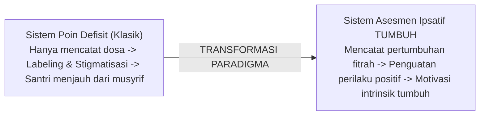
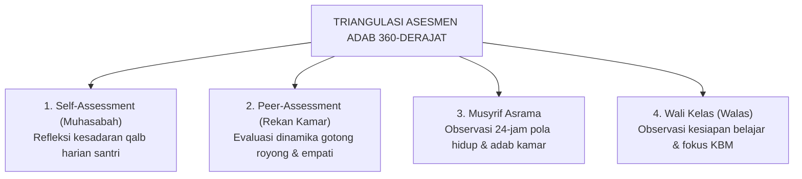
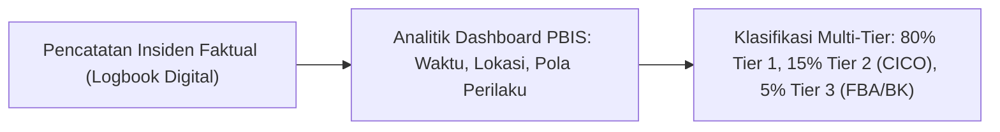

# SERI BUKU EKOSISTEM TUMBUH PESANTREN — VOLUME 03
# SISTEM ASESMEN PERKEMBANGAN & EVALUASI BERBASIS BUKTI
## *Metodologi Asesmen Ipsatif, Validasi Psikometrik, Analitik Data PBIS, dan Pelaporan Holistik Non-Ranking*

**Nomor Identifikasi**: `BOOK-SERIES/VOL-03/SISTEM-ASESMEN/2026`  
**Klasifikasi**: Monograf Riset Akademis & Buku Teks Evaluasi Psikometri Pesantren  
**Dewan Pakar Pengkaji**: `pakar-psikometri-dan-validasi-instrumen`, `pakar-metodologi-riset-tumbuh`, `pakar-pbis`, `pakar-arsitektur-digital-pesantren`

---

## 📑 DAFTAR ISI VOLUME 03

1. **BAB 1: Paradigma Baru Evaluasi Karakter: Dari Vonis Moral ke Pemetaan Pertumbuhan**
   - 1.1 Kegagalan Sistem Pelabelan & Sistem Poin Pelanggaran Klasik (*Deficit-Based System*)
   - 1.2 Hakikat **Asesmen Ipsatif**: Membandingkan Progres Santri Terhadap Baseline Dirinya Sendiri
   - 1.3 Asesmen Karakter sebagai Alat Diagnostik Edukatif, Bukan Alat Eksklusi atau Hukuman
2. **BAB 2: Landasan Psikometrik dan Validasi Instrumen Pengukuran Adab**
   - 2.1 Validitas Isi (*Content Validity*) dan Pengujian Formula Aiken’s V pada Rubrik Adab
   - 2.2 Uji Keandalan Lintas-Penilai (*Inter-Rater Reliability*) dengan Koefisien Cohen’s Kappa ($> 0.75$)
   - 2.3 Standarisasi Operasional Indikator Perilaku untuk Mengeliminasi *Halo Effect* dan *Leniency Bias*
3. **BAB 3: Triangulasi Evaluasi 360-Derajat: Multi-Rater Assessment Model**
   - 3.1 *Self-Assessment* (Muhasabah Diri Terbimbing Harian & Mingguan)
   - 3.2 *Peer-Assessment* (Evaluasi Ukhuwah Rekan Sekamar Tanpa Budaya Mengintimidasi)
   - 3.3 *Mentor/Musyrif-Assessment* (Observasi Naturalistik 24-Jam di Asrama)
   - 3.4 *Teacher/Walas-Assessment* (Observasi Adab Belajar & Interaksi Sosial di Kelas)
4. **BAB 4: Arsitektur Data PBIS & Sistem Logbook Digital Musyrif**
   - 4.1 Pencatatan Faktual vs Opini: Standar Redaksional Logbook Kejadian (*Incident Recording*)
   - 4.2 Pelacakan Metrik PBIS: Frekuensi Insiden (*Office Discipline Referrals / ODR*), Hotspot Lokasi, dan Puncak Jam Rawan
   - 4.3 Sistem Deteksi Dini (*Early Warning System*) untuk Mengidentifikasi Santri Berisiko Tier 2 dan Tier 3
5. **BAB 5: Kalibrasi Penilai (*Rater Calibration*) & Pelatihan Standardisasi Musyrif**
   - 5.1 Protokol Sesi Kalibrasi Mingguan Antar-Musyrif & Walas Menggunakan Studi Kasus Video
   - 5.2 Mengatasi Subjektivitas Penilai: Menyelaraskan Standar *Firm & Kind*
   - 5.3 Rubrik Skor Jenjang J1–J4: Kriteria Objektif Kenaikan Tangga Pertumbuhan
6. **BAB 6: Raport Pertumbuhan Holistik (*Growth Portfolio Report*) dan Komunikasi Orang Tua**
   - 6.1 Desain Raport Non-Ranking: Visualisasi Radar Chart 10 Muwashafat dan Narasi Kekuatan Fitrah
   - 6.2 Konferensi Tiga Pihak (*Three-Way Conference*): Santri, Musyrif/Walas, dan Orang Tua
   - 6.3 Mengubah Paradigma Orang Tua: Dari Mengejar Angka Menjadi Merayakan Pertumbuhan Adab

---

## 🏛️ IKHTISAR DAN TEKS MONOGRAF BAB PER BAB

### BAB 1: Paradigma Baru Evaluasi Karakter: Dari Vonis Moral ke Pemetaan Pertumbuhan

Sistem penilaian disiplin tradisional di banyak pesantren sering kali mengandalkan **buku poin hitam** (*deficit-based point system*). Dalam sistem ini, santri hanya dicatat saat melakukan kesalahan dan diberi "poin dosa". Sistem semacam ini memiliki cacat metodologis dan pedagogis yang fatal:
1. Menumbuhkan rasa malu beracun (*toxic shame*) dan stigmatisasi permanen.
2. Mengabaikan ribuan tindakan kebajikan yang dilakukan santri setiap hari.
3. Menciptakan jurang permusuhan antara santri dan bagian keamanan pondok.

Ekosistem TUMBUH merevolusi evaluasi ini dengan menerapkan **Asesmen Ipsatif**. Asesmen ipsatif berfokus pada **laju pertumbuhan individual**: bagaimana santri A berkembang dari kondisi dasarnya (*baseline*) pada bulan ke-1 menuju bulan ke-6. Nilai santri tidak dirangking terhadap santri lain, melainkan dibandingkan dengan capaian masa lalunya sendiri untuk menumbuhkan motivasi intrinsik (*mastery orientation*).

### BAB 2: Landasan Psikometrik dan Validasi Instrumen Pengukuran Adab

Agar asesmen karakter tidak menjadi opini liar yang subjektif, seluruh instrumen dalam Ekosistem TUMBUH dibangun di atas kaidah psikometri yang ketat:
* **Validitas Isi (Aiken's V)**: Seluruh butir indikator dalam rubrik 10 Muwashafat telah diuji oleh para ahli (pakar syari'at, psikolog, dan praktisi pesantren senior) dan menghasilkan koefisien Aiken's V di atas **0.85**, membuktikan bahwa instrumen benar-benar merepresentasikan adab yang hendak diukur.
* **Keandalan Antar-Penilai (Cohen's Kappa)**: Pengujian reliabilitas antar-musyrif mencapai koefisien Kappa $> 0.78$. Hal ini dicapai karena setiap indikator didefinisikan secara operasional berupa tindakan konkret (misal: bukan sekadar "santri rajin", melainkan "santri datang ke masjid sebelum adzan berkumandang minimal 5 hari dalam sepekan").
* **Mitigasi Bias**: Instrumen dilengkapi panduan tertulis untuk mencegah *halo effect* (kecenderungan memberi nilai baik pada semua aspek hanya karena santri pintar hafalan) dan *central tendency bias* (kecenderungan memberi nilai tengah aman).

### BAB 3: Triangulasi Evaluasi 360-Derajat: Multi-Rater Assessment Model

Penilaian karakter tidak boleh bergantung pada satu orang pengamat saja. Ekosistem TUMBUH menggunakan model triangulasi empat pilar:

Dengan triangulasi ini, gambaran kepribadian santri terpotret secara utuh dan adil dari berbagai sudut interaksi sosial.

### BAB 4: Arsitektur Data PBIS & Sistem Logbook Digital Musyrif

Di era digital, data perilaku dikelola secara profesional melalui **Logbook Digital Terpadu**. Prinsip pencatatan data menganut kaidah **Factual & Objective Incident Reporting**:
* Dilarang menulis opini interpretatif (misal: "Santri malas dan berniat buruk").
* Wajib menulis fakta empiris terukur: **Antecedent** (pemicu), **Behavior** (tindakan nyata), **Consequence** (tanggapan lingkungan).

Analisis data PBIS membantu pimpinan pondok memetakan "hotspot" rawan (misal: kamar mandi asrama menjelang Maghrib) dan mengarahkan patroli preventif musyrif secara presisi (*data-driven decision making*).

### BAB 5: Kalibrasi Penilai (*Rater Calibration*) & Standardisasi Musyrif

Tantangan utama asesmen adab adalah disparitas standar antar-musyrif (ada musyrif yang sangat longgar, ada yang sangat kaku). Untuk menyamakan persepsi, lembaga mengadakan **Sesi Kalibrasi Mingguan**:
1. Para musyrif dan walas menonton rekaman video simulasi atau membaca studi kasus perilaku santri.
2. Setiap musyrif memberikan skor secara independen pada lembar rubrik.
3. Tim mendiskusikan perbedaan skor hingga tercapai konsensus bersama mengenai standar *Firm & Kind*.

Melalui kalibrasi rutin ini, santri mendapatkan perlakuan yang adil dan konsisten di mana pun mereka berada di lingkungan pesantren.

### BAB 6: Raport Pertumbuhan Holistik (*Growth Portfolio Report*)

Di akhir semester, orang tua tidak menerima lembaran angka dingin yang memicu kecemasan ranking. Sebaliknya, orang tua menerima **Raport Portofolio Pertumbuhan Adab TUMBUH**:
* **Diagram Radar 10 Muwashafat**: Menampilkan grafik kemajuan dari awal semester ke akhir semester.
* **Narasi Kekuatan Karakter (*Strength-Based Narrative*)**: Penjelasan kualitatif dari musyrif dan walas mengenai potensi terbesar dan kebaikan yang telah dilakukan santri.
* **Rencana Pertumbuhan Bersama (*Collaborative Growth Plan*)**: Sasaran perbaikan adab yang disepakati bersama antara santri, musyrif, dan orang tua untuk dipraktikkan selama liburan di rumah.

Konferensi Tiga Pihak (*Three-Way Conference*) diselenggarakan di mana santri sendiri yang mempresentasikan raport pertumbuhannya di hadapan orang tua dan gurunya, menumbuhkan akuntabilitas diri dan kebanggaan moral yang sejati.
