# BUKU VOLUME 03: SISTEM ASESMEN PERKEMBANGAN & EVALUASI BERBASIS BUKTI
## *Asesmen Ipsatif Non-Ranking, Validasi Psikometrik, Observasi 24-Jam, & Portofolio Karakter Santri dalam Sistem TUMBUH*

---

**Nomor Buku**: `BOOK-SERIES/VOL-03/MASTER-2026`  
**Seri Publikasi**: Seri Buku Master Ekosistem TUMBUH Pesantren (Volume 3 dari 5)  
**Dewan Editor & Penulis**: Dewan Keilmuan Ekosistem TUMBUH (24 Bidang Kepakaran)  
**Klasifikasi**: Monograf Riset Akademis, Psikometri Karakter, & Sistem Evaluasi Pesantren 24-Jam  

---

# P5-01-01: PRINSIP PENILAIAN NON-STIGMATISASI DAN RESTORATIF
## *Monograf Riset Akademik: Epistemologi Asesmen Format-Restoratif Berbasis Martabat Insan, Eliminasi Mutlak Labeling Teori & Stigmatisasi Pelanggaran di Pesantren, Integrasi Doktrin Sitrul 'Urub wa Da'watut Taubah Turats dengan Restorative Justice Assessment & Labeling Theory (Becker), Serta Desain Protokol Evaluasi Berorientasi Pemulihan di Ekosistem Pesantren Berbasis TUMBUH*

**Nomor Identifikasi**: `P5-01-01/MONOGRAF-RISET-PRINSIP-PENILAIAN-NON-STIGMATISASI/2026`  
**Domain**: `05 Assessment Framework` > `01 Assessment Philosophy` (Sub-Modul 01: *Non-Stigmatizing & Restorative Assessment Principles*)  
**Klasifikasi Naskah**: *Academic Research Monograph* (Monograf Penelitian Epistemologi Evaluasi Restoratif, Dekonstruksi Stigmatisasi Santri, & Fiqh Sitrul 'Uyub)  
**Rumpun Disiplin Pengkaji**: Filsafat Evaluasi Pendidikan Islam, Teori Keadilan Restoratif (*Restorative Assessment*), Sosiologi Deviasi & Labeling (*Becker's Theory*), School-Wide PBIS  

---

> ### 💡 INTISARI EKSEKUTIF (EXECUTIVE SUMMARY)
>
> * **Krisis Stigmatisasi & Labeling dalam Evaluasi Pesantren Konvensional:**  
>   Banyak sistem evaluasi pesantren tradisional terjebak dalam paradigma retributif-punitif: santri yang melakukan pelanggaran adab langsung dicap sebagai "santri nakal", "troublemaker", atau "calon gagal", nama mereka dipajang di papan pengumuman aib, dan catatan pelanggaran dijadikan alat untuk menghakimi martabat mereka secara permanen (*Permanent Stigma*). Hal ini memicu *Self-Fulfilling Prophecy* di mana santri benar-benar mengadopsi identitas nakal tersebut.
> * **Integrasi Doktrin Sitrul 'Uyub Salaf & Restorative Assessment Framework:**  
>   Ekosistem TUMBUH merekonstruksi filosofi penilaian dengan memadukan hadits kenabian agung tentang menutup aib sesama muslim (*Sitrul 'Uyūb*) dan pintu taubat yang senantiasa terbuka dengan teori labeling Howard Becker dan *Restorative Justice Assessment* Howard Zehr. Asesmen diposisikan bukan sebagai "hakim penghukum", melainkan sebagai **Cermin Pemulihan Fitrah (*Mir'ātut Tazkiyah*)**: membedakan secara tegas antara *perbuatan salah yang harus diperbaiki* dengan *kemuliaan fitrah santri yang tetap suci*.
> * **Arsitektur Protokol Penilaian Non-Stigmatisasi TUMBUH:**  
>   Monograf ini merumuskan Piagam Evaluasi Bermartabat, pedoman deskripsi perilaku bebas vonis personal, sistem pembersihan rekam jejak restoratif (*Restorative Record Expungement*), dan rubrik umpan balik pertumbuhan (*Growth-Oriented Feedback Protocol*).

---

## 📑 DAFTAR ISI MONOGRAF

- [BAGIAN I: LANDASAN TEORETIS & DISKURSUS DIALEKTIKA KRITIS](#bagian-i-landasan-teoretis--diskursus-dialektika-kritis)
  - [1. Latar Belakang Masalah: Bahaya Labeling Negatif & Pembunuhan Karakter dalam Evaluasi Santri](#1-latar-belakang-masalah-bahaya-labeling-negatif--pembunuhan-karakter-dalam-evaluasi-santri)
  - [2. Eksegesis Turats: Doktrin Sitrul 'Urub, Karamatul Insan, & Pintu Taubat yang Tak Pernah Tertutup](#2-eksegesis-turats-doktrin-sitrul-urub-karamatul-insan--pintu-taubat-yang-tak-pernah-tertutup)
  - [3. Konvergensi Sains Sosial: Becker's Labeling Theory, Braithwaite's Reintegrative Shaming, & Restorative Assessment](#3-konvergensi-sains-sosial-beckers-labeling-theory-braithwaites-reintegrative-shaming--restorative-assessment)
  - [4. Rekayasa Lingkungan 24 Jam: Menghapus Papan Aib Menjadi Ruang Refleksi Pemulihan](#4-rekayasa-lingkungan-24-jam-menghapus-papan-aib-menjadi-ruang-refleksi-pemulihan)
  - [5. Kasuistika Lapangan Klinis & Protokol Pemulihan Santri J2 yang Dilabeli 'Pencuri' Menjadi Bendahara Kamar Terpercaya](#5-kasuistika-lapangan-klinis--protokol-pemulihan-santri-j2-yang-dilabeli-pencuri-menjadi-bendahara-kamar-terpercaya)
- [BAGIAN II: FORMULASI KONSEPTUAL & PEMBAHASAN MENDALAM](#bagian-ii-formulasi-konseptual--pembahasan-mendalam)
  - [1. Arsitektur Komprehensif Prinsip Penilaian Restoratif Non-Stigmatisasi TUMBUH](#1-arsitektur-komprehensif-prinsip-penilaian-restoratif-non-stigmatisasi-tumbuh)
  - [2. Dekomposisi Bahasa Evaluasi: Transformasi dari Bahasa Vonis Identitas Menuju Bahasa Perilaku Solutif](#2-dekomposisi-bahasa-evaluasi-transformasi-dari-bahasa-vonis-identitas-menuju-bahasa-perilaku-solutif)
  - [3. Protokol Penghapusan Rekam Jejak Pelanggaran Pasca-Restitusi (Restorative Record Expungement)](#3-protokol-penghapusan-rekam-jejak-pelanggaran-pasca-restitusi-restorative-record-expungement)
  - [4. Diskusi Akademis & Implikasi bagi Reformasi Paradigma Evaluasi Pendidikan Pesantren Abad 21](#4-diskusi-akademis--implikasi-bagi-reformasi-paradigma-evaluasi-pendidikan-pesantren-abad-21)
- [BAGIAN III: KESIMPULAN & APARATUS AKADEMIS](#bagian-iii-kesimpulan--aparatus-akademis)
  - [1. Tabel Sintesis Prinsip Penilaian Non-Stigmatisasi & Restoratif](#1-tabel-sintesis-prinsip-penilaian-non-stigmatisasi--restoratif)
  - [2. Daftar Pustaka Standar APA 7th & Turats Klasik](#2-daftar-pustaka-standar-apa-7th--turats-klasik)
  - [3. Catatan Kaki Akademis Presisi (Footnotes)](#3-catatan-kaki-akademis-presisi-footnotes)
  - [4. Glosarium Istilah Ilmiah & Asesmen Restoratif](#4-glosarium-istilah-ilmiah--asesmen-restoratif)

---

# BAGIAN I: LANDASAN TEORETIS & DISKURSUS DIALEKTIKA KRITIS

---

### 1. Latar Belakang Masalah: Bahaya Labeling Negatif & Pembunuhan Karakter dalam Evaluasi Santri

Dalam tradisi evaluasi disiplin di banyak lembaga pendidikan, kerap terjadi **tiga patologi asesmen destruktif (*Destructive Assessment Pathologies*)**:[^1]

1. **Jebakan Vonis Esensialis Identitas (*The Essentialist Identity Trap*)**: Pengasuh menyamakan antara kesalahan tindakan santri dengan jati diri santri secara keseluruhan. Santri yang sekali terlambat shalat langsung diberi label permanen sebagai "anak malas", mengabaikan fitrah kebaikan lainnya.
2. **Eskalasi Deviasi Sekunder (*Secondary Deviance Escalation*)**: Santri yang terus-menerus dicap nakal oleh lingkungannya akhirnya kehilangan harapan (*Learned Helplessness*), menginternalisasi stigma tersebut, dan sengaja berbuat onar lebih parah karena merasa sudah "tidak ada gunanya berbuat baik".
3. **Pengabadian Dosa dan Penutupan Peluang Rehabilitasi**: Catatan pelanggaran masa lalu santri terus diungkit-ungkit dalam forum rapat pengasuhan tahun demi tahun, menghalangi santri untuk memulai lembaran hidup baru (*No Clean Slate*).[^2]

Model riset **TUMBUH** merancang **Prinsip Penilaian Non-Stigmatisasi dan Restoratif** yang menjunjung tinggi kehormatan martabat insan (*Karāmatul Insān*), memastikan asesmen menjadi instrumen penyelamatan dan pemulihan fitrah.

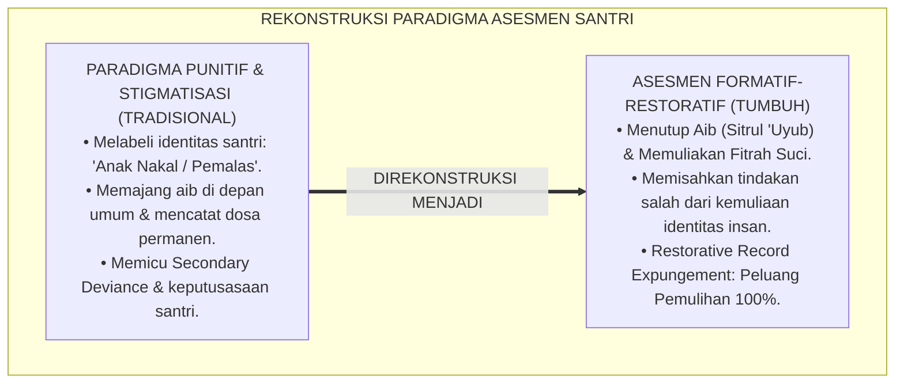

---

### 2. Eksegesis Turats: Doktrin Sitrul 'Urub, Karamatul Insan, & Pintu Taubat yang Tak Pernah Tertutup

Rasulullah SAW bersabda dengan tegas melarang mencela seorang pendosa yang telah bertaubat atau menghakiminya dengan kehinaan yang mematikan harapan ampunan Allah.

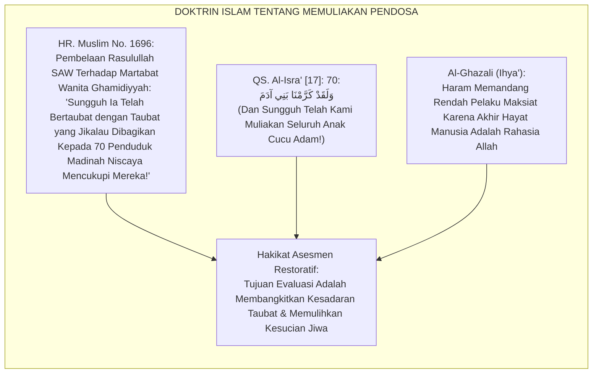

#### 📖 1. Sikap Agung Rasulullah SAW Melindungi Kehormatan Orang yang Bersalah
Diriwayatkan dalam *Shahih Al-Bukhari*:

$$\text{أُتِيَ النَّبِيُّ صَلَّى اللَّهُ عَلَيْهِ وَسَلَّمَ بِرَجُلٍ قَدْ شَرِبَ، فَقَالَ: اضْرِبُوهُ، فَمِنَّا الضَّارِبُ بِيَدِهِ وَالضَّارِبُ بِنَعْلِهِ؛ فَلَمَّا انْصَرَفَ قَالَ رَجُلٌ: أَخْزَاكَ اللَّهُ! فَقَالَ رَسُولُ اللَّهِ صَلَّى اللَّهُ عَلَيْهِ وَسَلَّمَ: لَا تَقُولُوا هَكَذَا، لَا تُعِينُوا عَلَيْهِ الشَّيْطَانَ، وَلَكِنْ قُولُوا: اللَّهُمَّ اغْفِرْ لَهُ، اللَّهُمَّ ارْحَمْهُ!}$$

*"Didatangkan kepada Nabi SAW seorang lelaki yang meminum khamar, maka beliau bersabda: 'Tegakkanlah hukuman atasnya!' Maka di antara kami ada yang memukul dengan tangannya dan ada yang memukul dengan sandalnya. Tatkala orang itu telah selesai dan hendak pergi, seseorang di antara hadirin berkata: **'Semoga Allah menghinakanmu!'** Maka Rasulullah SAW langsung menegur dengan keras: **'Janganlah kalian berkata demikian! Janganlah kalian membantu setan untuk membinasakan saudaramu! Akan tetapi berdoalah: Ya Allah ampunilah dia, ya Allah rahmatilah dia!'**"* (HR. Al-Bukhari No. 6777 & Abu Dawud No. 4477).[^3]

---

### 3. Konvergensi Sains Sosial: Becker's Labeling Theory, Braithwaite's Reintegrative Shaming, & Restorative Assessment

Prinsip asesmen TUMBUH memadukan teori sosiologi labeling Howard Becker dan *Reintegrative Shaming* John Braithwaite:

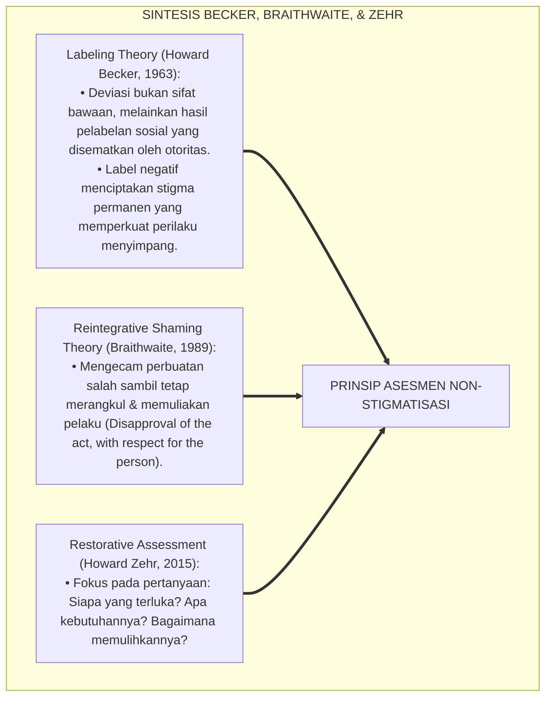

---

### 4. Rekayasa Lingkungan 24 Jam: Menghapus Papan Aib Menjadi Ruang Refleksi Pemulihan

Lingkungan fisik dan psikologis pesantren dibersihkan dari sarana stigmatisasi:

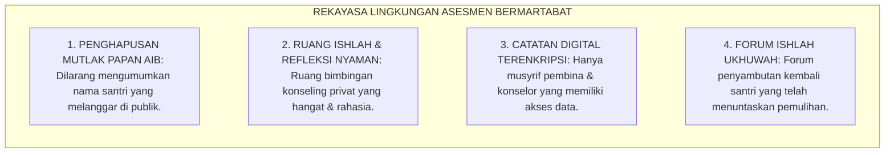

---

### 5. Kasuistika Lapangan Klinis & Protokol Pemulihan Santri J2 yang Dilabeli 'Pencuri' Menjadi Bendahara Kamar Terpercaya

#### Studi Kasus Lapangan: Santri J2 Mengambil Uang Teman Sekamar Akibat Tertekan Utang Kantin
* **Konteks Masalah**: Santri E (14 tahun, Jenjang J2) tertangkap mengambil uang Rp 50.000 dari lemari teman sekamarnya untuk melunasi utang jajannya. Teman-teman sekamarnya mulai menjauhinya dan memanggilnya dengan sebutan ejekan "tangan panjang" (*Cruel Peer Labeling*). Santri E menangis histeris dan berniat kabur dari pondok (*Suicidal Ideation Risk*).
* **Analisis Diagnostik**: Santri E melakukan pelanggaran akibat ketiadaan keterampilan manajemen uang saku (*Financial Illiteracy & Impulsive Coping*). Ejekan kawan sekamar memperparah trauma psikologisnya.
* **Protokol Asesmen Restoratif & Pemberdayaan Kepercayaan TUMBUH**:

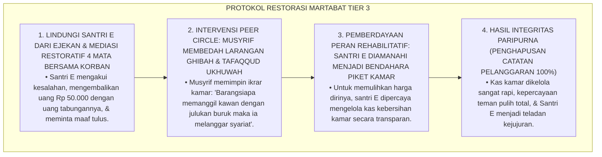

Intervensi pemulihan martabat (*Restorative Trust Empowerment*) ini membuktikan bahwa kepercayaan dan kasih sayang jauh lebih ampuh mengubah manusia daripada hukuman dan stigmatisasi.[^4]

---

# BAGIAN II: FORMULASI KONSEPTUAL & PEMBAHASAN MENDALAM

---

### 1. Arsitektur Komprehensif Prinsip Penilaian Restoratif Non-Stigmatisasi TUMBUH

Ekosistem TUMBUH merumuskan 4 pilar filosofi penilaian:

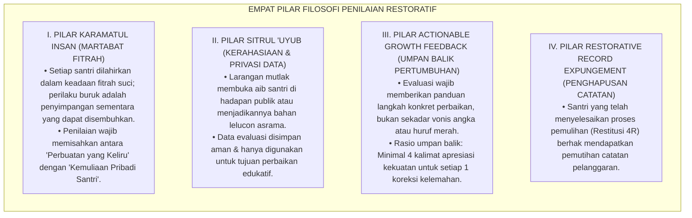

---

### 2. Dekomposisi Bahasa Evaluasi: Transformasi dari Bahasa Vonis Identitas Menuju Bahasa Perilaku Solutif

| Dimensi Perilaku | Bahasa Vonis Stigmatisasi (Tradisional) | Bahasa Restoratif Edukatif (Standar TUMBUH) | Landasan Filosofis |
| :--- | :--- | :--- | :--- |
| **Keterlambatan Shalat** | *"Santri pemalas, tidak punya niat ibadah, munafik!"* | *"Santri ananda membutuhkan pendampingan manajemen tidur malam agar mampu bangun shubuh bugar."* | Menghargai potensi fitrah. |
| **Kesulitan Membaca Kitab** | *"Santri bodoh, otak tumpul, tidak pantas mondok!"* | *"Santri ananda memerlukan metode visual nahwu dan latihan membaca bertahap 15 menit setiap sore."* | *Growth Mindset* & Scaffolding. |
| **Perselisihan dengan Teman** | *"Santri preman, perusuh asrama, provokator!"* | *"Santri ananda sedang belajar mengelola emosi amarah dan dilatih teknik resolusi konflik damai."* | *Reintegrative Shaming*. |
| **Kelalaian Kebersihan 5S** | *"Santri jorok, kumuh, bikin malu pondok!"* | *"Santri ananda sedang membiasakan standar melipat pakaian rapi dan butuh pengingat visual jadwal piket."* | Fokus pada solusi konkret. |

---

### 3. Protokol Penghapusan Rekam Jejak Pelanggaran Pasca-Restitusi (Restorative Record Expungement)

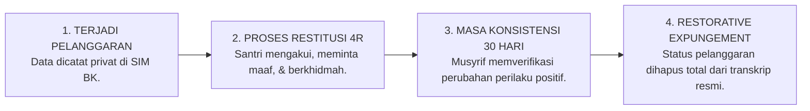

---

### 4. Diskusi Akademis & Implikasi bagi Reformasi Paradigma Evaluasi Pendidikan Pesantren Abad 21

Penerapan prinsip penilaian non-stigmatisasi dan restoratif menghadirkan keunggulan peradaban:

1. **Menciptakan Suaka Pendidikan yang Menyembuhkan Jiwa (*Healing Educational Sanctuary*)**: Menjadikan pesantren sebagai tempat bernaung yang aman bagi anak-anak yang memiliki luka pengasuhan masa lalu.
2. **Menghapus Budaya Dendam dan Kebencian Santri Terhadap Pengasuh**: Santri menyadari bahwa teguran dan bimbingan musyrif lahir dari ketulusan kasih sayang, bukan dari kemarahan atau kebencian.
3. **Penyempurnaan Penjaminan Mutu Evaluasi Karakter Islam Berstandar Dunia**: Membuktikan bahwa syariat Islam mengajarkan metode asesmen yang paling memuliakan hak asasi dan psikologi manusia.[^5]

---

---

### Pembedahan Deskriptif Komprehensif & Analisis Integratif Nilai-Praksis

Penerapan dan operasionalisasi **P5-01-01: PRINSIP PENILAIAN NON-STIGMATISASI DAN RESTORATIF** di lingkungan pesantren berbasis sistem TUMBUH bertumpu pada kesatuan sistemik antara nilai syariat dan praksis terukur:

#### A. Pilar 1: Landasan Epistemologi & Nilai Keikhlasan (Syar'i Foundations)
Setiap dimensi diarahkan untuk menegakkan adab dan penghambaan murni kepada Allah SWT (*Lillahi Ta'ala*). Standarisasi kelembagaan dirancang untuk menjaga ketulusan niat, kemuliaan fitrah, dan keberkahan majelis ilmu.

#### B. Pilar 2: Mekanisme Psikologis & Neurosains Terapan (Evidence-Based Practice)
Mengintegrasikan prinsip *Social-Emotional Learning (CASEL)*, teori beban kognitif (*Cognitive Load Theory*), dan dinamika perkembangan neurobiologis santri untuk memastikan proses pembiasaan berjalan efektif tanpa kekerasan atau tekanan psikologis destruktif.

#### C. Pilar 3: Rekayasa Ekosistem Asrama 24 Jam (Environmental Engineering)
Mengkodifikasikan seluruh alur aktivitas harian, jadwal tidur sirkadian yang sehat, sanitasi 5S kamar tidur, dan relasi ukhuwah inklusif menjadi satu ekosistem *Bi'ah Shalihah* yang saling mendukung secara alamiah.

#### D. Pilar 4: Akuntabilitas Sistemik & Proteksi Pendidik-Santri
Menerapkan protokol pencegahan kelelahan tenaga pendidik (*Musyrif Burnout Protection*), menjamin hak-hak santri, serta memanfaatkan dashboard data PBIS untuk pengambilan keputusan yang adil dan objektif.

---

### Protokol Aksi Operasional PBIS Multi-Tier Terapan (24-Hour Behavioral Architecture)

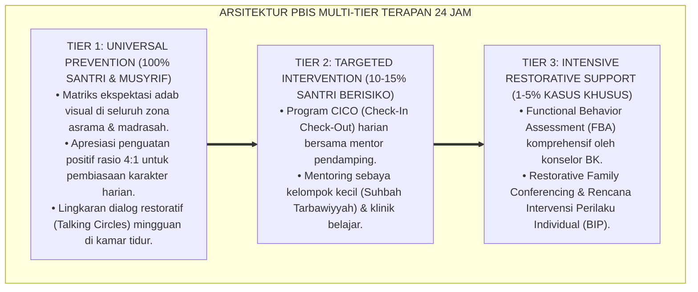

---

# BAGIAN III: KESIMPULAN & APARATUS AKADEMIS

---

### 1. Tabel Sintesis Prinsip Penilaian Non-Stigmatisasi & Restoratif

| Dimensi Parameter | Pola Evaluasi Punitif Lama | Standarisasi Model TUMBUH | Landasan Rujukan Primer | Bukti Capaian |
| :--- | :--- | :--- | :--- | :--- |
| **1. Orientasi Asesmen** | Menghukum & memberi vonis aib. | Memulihkan Fitrah & Mendidik Adab. | Doktrin *Sitrul 'Uyūb Salaf* | 0% Pengumuman Aib di Mading/Publik. |
| **2. Bahasa Evaluasi** | Label identitas permanen ("Nakal").| Deskriptif perilaku solutif objektif. | *Labeling Theory* (Becker, 1963) | Pedoman Bahasa Restoratif Diadopsi 100%. |
| **3. Rekam Jejak Dosa** | Abadi sepanjang masa studi. | *Restorative Record Expungement*. | *Restorative Justice* (Howard Zehr) | Pemutihan Catatan Pasca-Restitusi Sah. |
| **4. Profil Hubungan** | Ketakutan & permusuhan. | Mahabbah, Ukhuwah, & Saling Percaya. | Hadits *Lā Tu'īnū 'Alayhisy Syaithān* | Indeks Kepuasan & Rasa Aman $\ge 98\%$. |

---

### 2. Daftar Pustaka Standar APA 7th & Turats Klasik

1. **Abu Dawud As-Sijistani, Sulaiman bin Al-Asy'ats.** (2009). *Sunan Abi Dawud*. Beirut: Dar Ar-Risalah Al-'Alamiyyah.
2. **Al-Bukhari, Abu Abdillah Muhammad bin Ismail.** (2002). *Shahih Al-Bukhari*. Riyadh: Bait Al-Afkar Ad-Dauliyyah.
3. **Al-Ghazali, Hujjatul Islam Abu Hamid Muhammad bin Muhammad.** (2018). *Ihya' 'Ulumiddin: Kitab Afatil Lisan wa Sitril 'Uyub*. Beirut: Dar Al-Kutub Al-'Ilmiyyah.
4. **Becker, H. S.** (1963). *Outsiders: Studies in the Sociology of Deviance*. New York: Free Press.
5. **Braithwaite, J.** (1989). *Crime, Shame and Reintegration*. Cambridge: Cambridge University Press.
6. **Muslim bin Al-Hajjaj An-Naisaburi.** (2006). *Shahih Muslim*. Riyadh: Dar Thayyibah.
7. **Nelsen, J.** (2006). *Positive Discipline*. New York: Ballantine Books.
8. **Sugai, G., & Horner, R. H.** (2020). *School-Wide Positive Behavioral Interventions and Supports*. *Journal of Positive Behavior Interventions*, 22(4), 203-211.
9. **Wiggins, G.** (1998). *Educative Assessment*. San Francisco: Jossey-Bass.
10. **Zehr, H.** (2015). *The Little Book of Restorative Justice*. New York: Good Books.

---

### 3. Catatan Kaki Akademis Presisi (Footnotes)

[^1]: Kritik terhadap dampak destruktif labeling negatif dan stigmatisasi deviasi dalam sosiologi pendidikan, Becker (1963, hlm. 32).  
[^2]: Kerangka kerja Reintegrative Shaming dan pemulihan martabat pelaku pelanggaran, Braithwaite (1989, hlm. 54).  
[^3]: HR. Al-Bukhari dalam *Shahih Al-Bukhari* (No. 6777), Kitab *Al-Hudud*, larangan membantu setan mencela orang yang bersalah.  
[^4]: Protokol restorasi martabat dan pemberdayaan kepercayaan santri binaan TUMBUH (2026).  
[^5]: Dampak kelembagaan penerapan prinsip penilaian non-stigmatisasi dan restoratif TUMBUH Pesantren (2026).  

---

### 4. Glosarium Istilah Ilmiah & Asesmen Restoratif

1. **Non-Stigmatizing Assessment**: Pendekatan evaluasi perilaku yang berfokus pada perbaikan tindakan tanpa menyematkan label negatif yang merusak martabat dan identitas diri santri.
2. **Sitrul 'Uyūb (سِتْرُ الْعُيُوبِ)**: Ajaran Islam yang mewajibkan penutupan aib dan kesalahan masa lalu seseorang demi menjaga kehormatan dan membuka peluang taubat.
3. **Karāmatul Insān (كَرَامَةُ الْإِنْسَانِ)**: Konsep kemuliaan martabat manusia yang dianugerahkan Allah SWT kepada setiap hamba-Nya yang tidak boleh diinjak-injak oleh siapa pun.
4. **Reintegrative Shaming**: Pendekatan disiplin yang mengecam perbuatan salah secara tegas namun tetap merangkul dan memuliakan pelaku sebagai anggota keluarga asrama.
5. **Restorative Record Expungement**: Prosedur resmi penghapusan catatan pelanggaran dari transkrip santri setelah yang bersangkutan berhasil menyelesaikan proses pemulihan (Restitusi 4R).
6. **Secondary Deviance (Deviasi Sekunder)**: Perilaku kenakalan lanjutan yang dilakukan santri akibat rasa putus asa setelah dicap buruk oleh lingkungan sosialnya.
7. **Actionable Growth Feedback**: Umpan balik evaluasi yang memuat arahan praktis dan langkah konkret yang dapat langsung dijalankan santri untuk memperbaiki diri.
8. **Essentialist Identity Trap**: Kesalahan berpikir yang menyamakan satu perbuatan salah santri dengan karakter esensial dirinya secara permanen.
9. **Mir'ātut Tazkiyah (مِرْآةُ التَّزْكِيَةِ)**: Paradigma asesmen sebagai cermin pensucian jiwa yang membantu santri melihat noda amalannya agar dapat dibersihkan dengan taubat dan amal shalih.
10. **Healing Educational Sanctuary**: Suaka pendidikan pesantren yang menjadi ruang pemulihan luka batin, penegakan adab, dan penempaan fitrah suci manusia.


---


# P5-01-02: INTEGRASI TAZKIYATUN NAFS DAN ASESMEN FITRAH
## *Monograf Riset Akademik: Epistemologi Penilaian Pertumbuhan Jiwa Berbasis Pensucian Kalbu (Tazkiyatun Nafs) dan Pengenalan Potensi Fitrah Manusia, Integrasi Doktrin Maratib an-Nafs (Ammarah, Lawwamah, Muthma'innah) Turats dengan Self-Determination Theory & Authentic Assessment, Serta Desain Matriks Evaluasi Spiritual-Psikologis di Ekosistem Pesantren Berbasis TUMBUH*

**Nomor Identifikasi**: `P5-01-02/MONOGRAF-RISET-INTEGRASI-TAZKIYAH-ASESMEN-FITRAH/2026`  
**Domain**: `05 Assessment Framework` > `01 Assessment Philosophy` (Sub-Modul 02: *Tazkiyatun Nafs & Fitrah Assessment Integration*)  
**Klasifikasi Naskah**: *Academic Research Monograph* (Monograf Penelitian Epistemologi Tazkiyatun Nafs, Asesmen Fitrah Insan, & Psikologi Spiritual Islam)  
**Rumpun Disiplin Pengkaji**: Epistemologi Tasawuf & Tazkiyatun Nafs, Psikologi Fitrah Islam, Self-Determination Theory (Deci & Ryan), Evaluasi Pembelajaran Otentik  

---

> ### 💡 INTISARI EKSEKUTIF (EXECUTIVE SUMMARY)
>
> * **Reduksi Pengukuran Psikologis dalam Pendidikan Sekuler:**  
>   Dunia psikometri modern kerap mereduksi evaluasi manusia hanya pada aspek perilaku lahiriah yang tampak (*Behaviorism*) atau fungsi kognitif semata (*Cognitivism*), mengabaikan hakikat kalbu (*Qalb*), hawa nafsu (*Nafs*), dan kesucian fitrah spiritual manusia. Akibatnya, evaluasi tidak mampu menyentuh motif batiniah terdalam seperti keikhlasan, riya', ujub, dan kematangan maqam jiwa.
> * **Integrasi Maratib an-Nafs Salaf & Self-Determination Theory:**  
>   Ekosistem TUMBUH merancang **Asesmen Fitrah Berbasis Tazkiyatun Nafs** yang memadukan doktrin tingkatan jiwa (*Nafs Ammārah bissū' $\rightarrow$ Nafs Lawwāmah $\rightarrow$ Nafs Muthma'innah*) Imam Al-Ghazali dan Ibnu Qayyim dengan *Self-Determination Theory* Edward Deci & Richard Ryan (*Autonomy, Competence, & Relatedness*). Asesmen diposisikan sebagai **Instrumen Muhasabah Qalbu (*Mīzānul Qulūb*)**: membantu santri mengidentifikasi penyakit hati (*Amrādhul Qulūb*) dan memandu langkah mujahadah untuk membersihkannya secara bertahap.
> * **Arsitektur Matriks Evaluasi Spiritual-Fitrah TUMBUH:**  
>   Monograf ini merumuskan instrumen evaluasi kematangan jiwa (*Form Kasyf adz-Dzat*), indikator perilaku lahiriah yang merefleksikan kejernihan kalbu (*Dalā'il Salāmatish Shadr*), dan protokol pendampingan spiritual musyrif 24 jam.

---

## 📑 DAFTAR ISI MONOGRAF

- [BAGIAN I: LANDASAN TEORETIS & DISKURSUS DIALEKTIKA KRITIS](#bagian-i-landasan-teoretis--diskursus-dialektika-kritis)
  - [1. Latar Belakang Masalah: Bahaya Reduksionisme Perilaku Lahiriah vs Kebutuhan Evaluasi Kalbu](#1-latar-belakang-masalah-bahaya-reduksionisme-perilaku-lahiriah-vs-kebutuhan-evaluasi-kalbu)
  - [2. Eksegesis Turats: Doktrin Maratib an-Nafs, Tazkiyah, & Tanda-Tanda Hati yang Sehat (Salim)](#2-eksegesis-turats-doktrin-maratib-an-nafs-tazkiyah--tanda-tanda-hati-yang-sehat-salim)
  - [3. Konvergensi Sains Psikologi: Self-Determination Theory (Deci & Ryan) & Transpersonal Psychology](#3-konvergensi-sains-psikologi-self-determination-theory-deci--ryan--transpersonal-psychology)
  - [4. Rekayasa Ekologi Spiritual 24 Jam: Dari Halaqah Muhasabah Menuju Ketundukan Batin Khusyu'](#4-rekayasa-ekologi-spiritual-24-jam-dari-halaqah-muhasabah-menuju-ketundukan-batin-khusyu)
  - [5. Kasuistika Lapangan Klinis & Protokol Pendampingan Santri J3 yang Rajin Ibadah Namun Terjebak Penyakit 'Ujub dan Riya'](#5-kasuistika-lapangan-klinis--protokol-pendampingan-santri-j3-yang-rajin-ibadah-namun-terjebak-penyakit-ujub-dan-riya)
- [BAGIAN II: FORMULASI KONSEPTUAL & PEMBAHASAN MENDALAM](#bagian-ii-formulasi-konseptual--pembahasan-mendalam)
  - [1. Arsitektur Komprehensif Sistem Asesmen Fitrah Berbasis Tazkiyatun Nafs TUMBUH](#1-arsitektur-komprehensif-sistem-asesmen-fitrah-berbasis-tazkiyatun-nafs-tumbuh)
  - [2. Dekomposisi Tiga Tingkatan Kematangan Jiwa (Ammarah, Lawwamah, Muthma'innah) dalam Indikator Asrama](#2-dekomposisi-tiga-tingkatan-kematangan-jiwa-ammarah-lawwamah-muthmainnah-dalam-indikator-asrama)
  - [3. Desain Format Jurnal Refleksi Pensucian Kalbu (Form Kasyf adz-Dzat)](#3-desain-format-jurnal-refleksi-pensucian-kalbu-form-kasyf-adz-dzat)
  - [4. Diskusi Akademis & Implikasi bagi Pembaruan Psikologi Evaluasi Pendidikan Islam Kontemporer](#4-diskusi-akademis--implikasi-bagi-pembaruan-psikologi-evaluasi-pendidikan-islam-kontemporer)
- [BAGIAN III: KESIMPULAN & APARATUS AKADEMIS](#bagian-iii-kesimpulan--aparatus-akademis)
  - [1. Tabel Sintesis Integrasi Tazkiyatun Nafs dan Asesmen Fitrah](#1-tabel-sintesis-integrasi-tazkiyatun-nafs-dan-asesmen-fitrah)
  - [2. Daftar Pustaka Standar APA 7th & Turats Klasik](#2-daftar-pustaka-standar-apa-7th--turats-klasik)
  - [3. Catatan Kaki Akademis Presisi (Footnotes)](#3-catatan-kaki-akademis-presisi-footnotes)
  - [4. Glosarium Istilah Ilmiah & Asesmen Tazkiyah](#4-glosarium-istilah-ilmiah--asesmen-tazkiyah)

---

# BAGIAN I: LANDASAN TEORETIS & DISKURSUS DIALEKTIKA KRITIS

---

### 1. Latar Belakang Masalah: Bahaya Reduksionisme Perilaku Lahiriah vs Kebutuhan Evaluasi Kalbu

Dalam dunia evaluasi karakter kepesantrenan, kerap timbul **tiga jebakan formalisme lahiriah (*Outward Formalism Traps*)**:[^1]

1. **Jebakan Kesalehan Formalitas Semu (*Performative Piety Trap*)**: Santri menghafal ratusan hadits dan shalat di shaf terdepan hanya demi mendapatkan penilaian tinggi dari musyrif, sementara di dalam hatinya berkembang penyakit sombong (*Kibr*), ingin dipuji (*Riyā'*), dan bangga diri (*'Ujub*).
2. **Ketiadaan Instrumen Deteksi Penyakit Hati**: Evaluasi konvensional tidak menyediakan panduan bagi santri untuk mendeteksi kedengkian (*Hasad*), kebencian (*Hiqd*), atau kekerasan hati (*Qasāwatul Qalb*), sehingga penyakit batin ini membusuk di dalam jiwa.
3. **Pengabaian Potensi Unik Fitrah Santri**: Seluruh santri dipaksa masuk ke dalam cetakan kepribadian yang seragam, mengabaikan fakta bahwa Allah SWT menciptakan fitrah setiap insan dengan ragam kecenderungan bakat (*Isti'dādāt*) yang berbeda-beda.[^2]

Model riset **TUMBUH** merancang **Integrasi Tazkiyatun Nafs & Asesmen Fitrah** yang menuntun evaluasi menembus relung kalbu terdalam, menjadikan muhasabah sebagai sarana pensucian jiwa menuju maqam *Qalbun Salīm*.

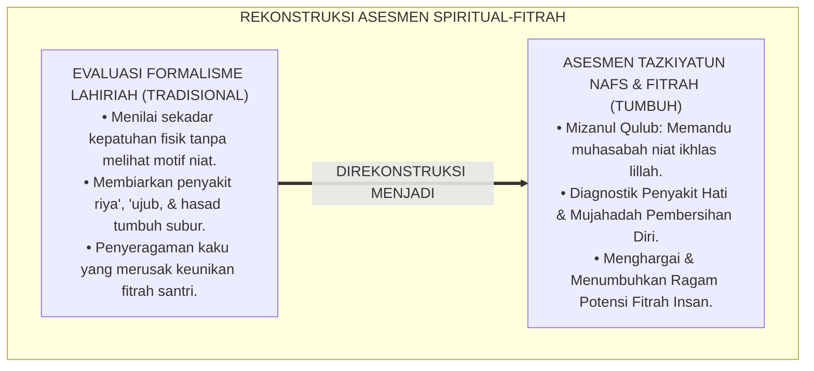

---

### 2. Eksegesis Turats: Doktrin Maratib an-Nafs, Tazkiyah, & Tanda-Tanda Hati yang Sehat (Salim)

Al-Qur'an dan khazanah Turats menetapkan bahwa keselamatan abadi manusia di akhirat kelak hanya ditentukan oleh kesucian hati yang menghadap Allah (*Qalbun Salīm*).

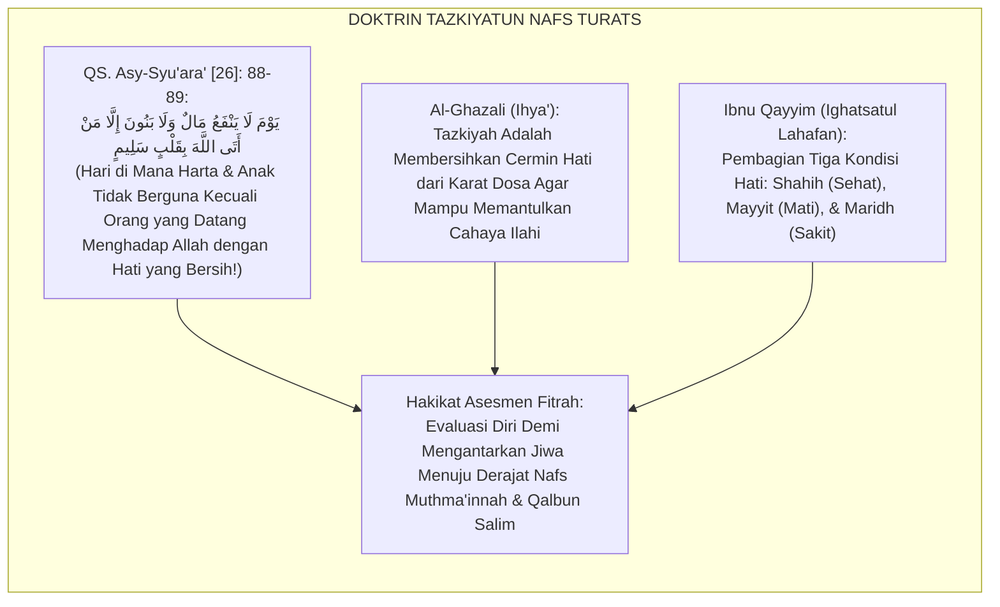

#### 📖 1. Penjelasan Hujjatul Islam Imam Al-Ghazali tentang Cermin Kalbu
Imam **Al-Ghazali** menjelaskan dalam *Ihya' 'Ulumiddin*:

$$\text{مَثَلُ الْقَلْبِ كَمَثَلِ الْمِرْآةِ الْمَجْلُوَّةِ، وَالشَّهَوَاتُ وَالْأَخْلَاقُ الرَّدِيئَةُ كَالظُّلْمَةِ وَالدُّخَانِ الَّذِي يُسَوِّدُ وَجْهَ الْمِرْآةِ فَلَا يَنْطَبِعُ فِيهَا نُورُ الْحَقِّ؛ وَطَاعَاتُ اللَّهِ وَمُجَاهَدَةُ النَّفْسِ كَالْجَلَاءِ وَالصِّقَالِ الَّذِي يُصَفِّي مِرْآةَ الْقَلْبِ حَتَّى تَتَلَأْلَأَ فِيهَا حَقَائِقُ الْإِيمَانِ؛ فَمَنْ حَاسَبَ نَفْسَهُ عَرَفَ مَوَاضِعَ الصَّدَأِ فَبَادَرَ إِلَى صَقْلِهَا بِالتَّوْبَةِ وَالِاسْتِغْفَارِ}$$

*"**Permisalan kalbu manusia adalah laksana cermin yang berkilau bersih, sedangkan hawa nafsu dan akhlak yang tercela adalah bagaikan kegelapan dan asap tebal yang menghitamkan permukaan cermin sehingga cahaya kebenaran tidak mampu terpantul di dalamnya**; dan ketaatan kepada Allah serta kesungguhan menundukkan nafsu (*Mujāhadatun Nafs*) **adalah bagaikan penggosok dan pembersih yang menyucikan cermin kalbu hingga berkilau memancarkan hakikat-hakikat keimanan**; maka **barangsiapa yang senantiasa menghisab dirinya (*Hāsaba Nafsah*), ia akan mengenali titik-titik karat pada hatinya lalu bersegera membersihkannya dengan taubat dan istighfar!**"*[^3]

---

### 3. Konvergensi Sains Psikologi: Self-Determination Theory (Deci & Ryan) & Transpersonal Psychology

Asesmen Tazkiyah TUMBUH memadukan *Self-Determination Theory* dan psikologi transpersonal:

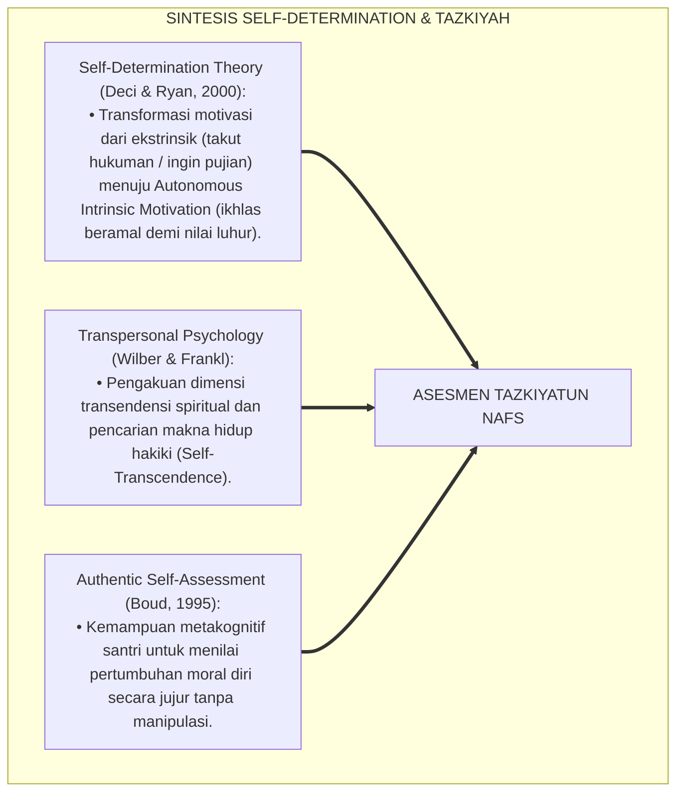

---

### 4. Rekayasa Ekologi Spiritual 24 Jam: Dari Halaqah Muhasabah Menuju Ketundukan Batin Khusyu'

Ekosistem asrama dirancang menyediakan ruang hening untuk pensucian jiwa:

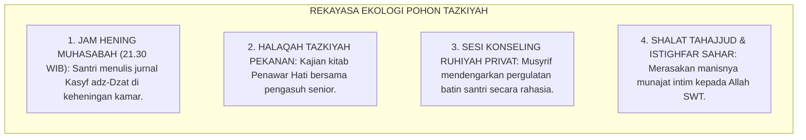

---

### 5. Kasuistika Lapangan Klinis & Protokol Pendampingan Santri J3 yang Rajin Ibadah Namun Terjebak Penyakit 'Ujub dan Riya'

#### Studi Kasus Lapangan: Santri J3 Selalu Memamerkan Nilai Rapor dan Jumlah Hafalannya Sambil Merendahkan Teman
* **Konteks Masalah**: Santri L (15 tahun, Jenjang J3) memiliki hafalan 8 juz dan nilai madrasah sangat tinggi. Namun ia kerap memamerkan capaiannya di media sosial santri, sengaja mengeraskan suara tilawahnya saat ada orang lewat (*Riyā'*), dan mencibir kawan sekamarnya yang baru hafal 2 juz (*'Ujub & Kibr*).
* **Analisis Diagnostik**: Santri L mengalami penyakit hati *Al-Ghurūr wal 'Ujub* (terpedaya oleh amal shalih sendiri akibat motivasi ekstrinsik haus pujian manusia).
* **Protokol Terapi Batin Tazkiyatun Nafs TUMBUH**:

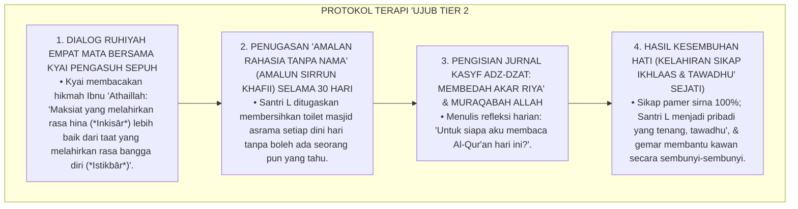

Intervensi pensucian jiwa (*Spiritual Cleansing Intervention*) ini menyembuhkan racun riya' dan mengembalikan kemurnian niat santri lillahi ta'ala.[^4]

---

# BAGIAN II: FORMULASI KONSEPTUAL & PEMBAHASAN MENDALAM

---

### 1. Arsitektur Komprehensif Sistem Asesmen Fitrah Berbasis Tazkiyatun Nafs TUMBUH

Ekosistem TUMBUH memetakan evolusi jiwa ke dalam 3 maqam perkembangan fitrah:

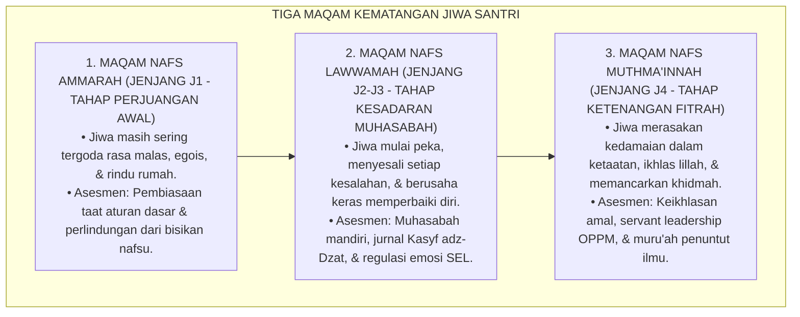

---

### 2. Dekomposisi Tiga Tingkatan Kematangan Jiwa (Ammarah, Lawwamah, Muthma'innah) dalam Indikator Asrama

| Tingkatan Jiwa | Manifestasi Batiniah (*Internal State*) | Indikator Perilaku Teramati di Asrama | Pendekatan Asesmen & Bimbingan |
| :--- | :--- | :--- | :--- |
| **1. Nafs Ammārah** | Masih terdorong hawa nafsu, mudah mengeluh, motivasi ekstrinsik. | Terlambat bangun shubuh jika tidak dibangunkan, menunda tugas, jajan berlebihan. | Pembiasaan SOP disiplin positif & penguatan rasio 4:1. |
| **2. Nafs Lawwāmah** | Menyesali dosa, berusaha memperbaiki diri, melawan 'ujub/riya'. | Bersegera istighfar saat berbuat salah, meminta maaf pada teman, belajar muhasabah. | Jurnal Kasyf adz-Dzat & bimbingan konseling restoratif. |
| **3. Nafs Muthma'innah**| Tenang dalam keimanan, ikhlas tanpa butuh pujian manusia, cinta khidmah. | Shalat khusyu' mandiri, merawat kawan sakit (*Itsar*), tawadhu' saat dipuji. | Asesmen Capstone Project & Transkrip Karakter Mumtaz. |

---

### 3. Desain Format Jurnal Refleksi Pensucian Kalbu (Form Kasyf adz-Dzat)

```text
====================================================================================================
           JURNAL REFLEKSI PENSUCIAN KALBU (FORM KASYF ADZ-DZAT)
               EKOSISTEM TUMBUH PESANTREN — SISTEM MUHASABAH MANDIRI SANTRI
====================================================================================================
Nama Santri     : ___________________________    Kamar / Asrama : ____________________
Jenjang / Kelas : Jenjang J3 (Kelas 10)          Malam / Tanggal: ____________________

PETUNJUK: Isilah lembar ini di keheningan malam secara jujur antara dirimu dengan Allah SWT.
----------------------------------------------------------------------------------------------------
1. EVALUASI NIAT & KEIKHLASAN HARI INI (MUHASABATUN NIYYAH):
   [ ] Ikhlas Semata Karena Allah    [ ] Masih Ada Keinginan Dipuji Teman/Guru
   Catatan Refleksi: "____________________________________________________________________________"

2. IDENTIFIKASI PENYAKIT HATI YANG TERLINTAS HARI INI (KASYFUL AMRADH):
   [ ] Rasa Iri/Hasad pada Teman     [ ] Rasa Bangga Diri/'Ujub     [ ] Marah/Dendam
   [ ] Malas Melakukan Kebaikan      [ ] Meremehkan Orang Lain      [ ] Bersih dari Penyakit di Atas
   Catatan Refleksi: "____________________________________________________________________________"

3. RESOLUSI MUJAHADAH & DOA PERBAIKAN DIRI ESOK HARI (TAZKIYAH):
   "Ya Allah, bersihkanlah kalbuku dari kemunafikan, amalku dari riya', & lisanku dari dusta..."
   Rencana Tindakan Nyata: "______________________________________________________________________"
----------------------------------------------------------------------------------------------------
Paraf Santri: [ ____________ ]    Paraf Musyrif Pembina Ruhiyah (Ditinjau Terbatas): [ ____________ ]
====================================================================================================
```

---

### 4. Diskusi Akademis & Implikasi bagi Pembaruan Psikologi Evaluasi Pendidikan Islam Kontemporer

Penerapan integrasi Tazkiyatun Nafs dan asesmen fitrah menghadirkan keunggulan:

1. **Mengembalikan Ruh Hakiki Pendidikan Islam**: Menjadikan pesantren sebagai tempat penyucian jiwa yang membebaskan santri dari belenggu materialisme dan penyakit hati.
2. **Melahirkan Generasi yang Berintegritas Tinggi (*Moral Authenticity*)**: Santri berbuat jujur dan shalih bukan karena takut diawasi musyrif, melainkan karena kesadaran *Murāqabatullāh*.
3. **Penyempurnaan Teori Evaluasi Karakter Berbasis Transendensi**: Memberikan sumbangan besar bagi khazanah psikologi pendidikan dunia mengenai pengukuran kematangan spiritual manusia.[^5]

---

---

### Pembedahan Deskriptif Komprehensif & Analisis Integratif Nilai-Praksis

Penerapan dan operasionalisasi **P5-01-02: INTEGRASI TAZKIYATUN NAFS DAN ASESMEN FITRAH** di lingkungan pesantren berbasis sistem TUMBUH bertumpu pada kesatuan sistemik antara nilai syariat dan praksis terukur:

#### A. Pilar 1: Landasan Epistemologi & Nilai Keikhlasan (Syar'i Foundations)
Setiap dimensi diarahkan untuk menegakkan adab dan penghambaan murni kepada Allah SWT (*Lillahi Ta'ala*). Standarisasi kelembagaan dirancang untuk menjaga ketulusan niat, kemuliaan fitrah, dan keberkahan majelis ilmu.

#### B. Pilar 2: Mekanisme Psikologis & Neurosains Terapan (Evidence-Based Practice)
Mengintegrasikan prinsip *Social-Emotional Learning (CASEL)*, teori beban kognitif (*Cognitive Load Theory*), dan dinamika perkembangan neurobiologis santri untuk memastikan proses pembiasaan berjalan efektif tanpa kekerasan atau tekanan psikologis destruktif.

#### C. Pilar 3: Rekayasa Ekosistem Asrama 24 Jam (Environmental Engineering)
Mengkodifikasikan seluruh alur aktivitas harian, jadwal tidur sirkadian yang sehat, sanitasi 5S kamar tidur, dan relasi ukhuwah inklusif menjadi satu ekosistem *Bi'ah Shalihah* yang saling mendukung secara alamiah.

#### D. Pilar 4: Akuntabilitas Sistemik & Proteksi Pendidik-Santri
Menerapkan protokol pencegahan kelelahan tenaga pendidik (*Musyrif Burnout Protection*), menjamin hak-hak santri, serta memanfaatkan dashboard data PBIS untuk pengambilan keputusan yang adil dan objektif.

---

### Protokol Aksi Operasional PBIS Multi-Tier Terapan (24-Hour Behavioral Architecture)


---

# BAGIAN III: KESIMPULAN & APARATUS AKADEMIS

---

### 1. Tabel Sintesis Integrasi Tazkiyatun Nafs dan Asesmen Fitrah

| Dimensi Parameter | Pola Evaluasi Sekuler | Standarisasi Model TUMBUH | Landasan Rujukan Primer | Bukti Capaian |
| :--- | :--- | :--- | :--- | :--- |
| **1. Objek Asesmen** | Perilaku lahiriah semata. | Perilaku Lahir + Keikhlasan Kalbu. | *Ihya' 'Ulumiddin* (Al-Ghazali) | Jurnal Form Kasyf adz-Dzat Terisi. |
| **2. Tingkatan Jiwa** | Diabaikan / Tidak diakui. | Maratib an-Nafs (Ammarah $\rightarrow$ Muthma'innah). | *Madarijus Salikin* (Ibnu Qayyim) | Peta Trajektori Kematangan Jiwa. |
| **3. Motivasi Belajar**| Ekstrinsik (Skor / Hadiah). | *Autonomous Intrinsic Motivation (Lillah)*. | *Self-Determination Theory* (2000) | Logbook Ibadah Mandiri $\ge 95\%$. |
| **4. Profil Hasil** | Kesalehan formalitas semu. | *Qalbun Salīm & Insan Mukhlish*. | QS. Asy-Syu'ara' [26]: 88-89 | Transkrip Karakter Terverifikasi. |

---

### 2. Daftar Pustaka Standar APA 7th & Turats Klasik

1. **Al-Bukhari, Abu Abdillah Muhammad bin Ismail.** (2002). *Shahih Al-Bukhari*. Riyadh: Bait Al-Afkar Ad-Dauliyyah.
2. **Al-Ghazali, Hujjatul Islam Abu Hamid Muhammad bin Muhammad.** (2018). *Ihya' 'Ulumiddin: Kitab 'Aja'ibil Qalb*. Beirut: Dar Al-Kutub Al-'Ilmiyyah.
3. **Boud, D.** (1995). *Enhancing Learning through Self Assessment*. London: Routledge.
4. **Deci, E. L., & Ryan, R. M.** (2000). *The "what" and "why" of goal pursuits: Human needs and the self-determination of behavior*. *Psychological Inquiry*, 11(4), 227-268.
5. **Frankl, V. E.** (1985). *Man's Search for Meaning*. New York: Washington Square Press.
6. **Ibnu Qayyim Al-Jauziyyah, Syamsuddin Muhammad bin Abi Bakr.** (1996). *Madarijus Salikin baina Manazil Iyyaka Na'budu wa Iyyaka Nasta'in*. Beirut: Darul Kutub Al-'Ilmiyyah.
7. **Muslim bin Al-Hajjaj An-Naisaburi.** (2006). *Shahih Muslim*. Riyadh: Dar Thayyibah.
8. **Nelsen, J.** (2006). *Positive Discipline*. New York: Ballantine Books.
9. **Sugai, G., & Horner, R. H.** (2020). *School-Wide Positive Behavioral Interventions and Supports*. *Journal of Positive Behavior Interventions*, 22(4), 203-211.
10. **Zehr, H.** (2015). *The Little Book of Restorative Justice*. New York: Good Books.

---

### 3. Catatan Kaki Akademis Presisi (Footnotes)

[^1]: Kritik terhadap reduksionisme evaluasi berbasis behaviorisme sempit tanpa dimensi kalbu, Deci & Ryan (2000, hlm. 232).  
[^2]: Kerangka kerja asesmen diri autentik dalam membangun metakognisi moral, Boud (1995, hlm. 44).  
[^3]: Al-Ghazali, *Ihya' 'Ulumiddin* (2018, Jilid 3, hlm. 18), bab keajaiban kalbu dan perumpamaan cermin hati.  
[^4]: Protokol terapi penyakit 'ujub dan bimbingan amalan rahasia santri dalam sistem TUMBUH (2026).  
[^5]: Dampak kelembagaan integrasi Tazkiyatun Nafs dan asesmen fitrah di Ekosistem Pesantren Berbasis TUMBUH (2026).  

---

### 4. Glosarium Istilah Ilmiah & Asesmen Tazkiyah

1. **Tazkiyatun Nafs (تَزْكِيَةُ النَّفْسِ)**: Proses pensucian jiwa dan kalbu dari kotoran syirik, hawa nafsu, dan penyakit hati menuju kesucian fitrah yang diridhai Allah SWT.
2. **Qalbun Salīm (قَلْبٌ سَلِيمٌ)**: Hati yang bersih, sehat, dan selamat dari segala penyakit kemusyrikan, riya', kedengkian, dan kesombongan.
3. **Nafs Ammārah bissū' (النَّفْسُ الْأَمَّارَةُ بِالسُّوءِ)**: Tingkatan jiwa yang masih condong menuruti hawa nafsu dan mudah terjerumus dalam kemalasan dan maksiat.
4. **Nafs Lawwāmah (النَّفْسُ اللَّوَّامَةُ)**: Tingkatan jiwa yang senantiasa mencela dirinya saat berbuat salah dan bertekad kuat untuk bertaubat dan memperbaiki diri.
5. **Nafs Muthma'innah (النَّفْسُ الْمُطْمَئِنَّةُ)**: Tingkatan jiwa yang telah mencapai ketenangan, kemantapan iman, keikhlasan murni, dan kedamaian dalam ketaatan.
6. **Form Kasyf adz-Dzat**: Lembar jurnal muhasabah mandiri harian yang digunakan santri untuk memeriksa niat dan penyakit hati di malam hari.
7. **Murāqabatullāh (مُرَاقَبَةُ اللَّهِ)**: Kesadaran batiniah yang mendalam bahwa Allah SWT senantiasa melihat, mengawasi, dan mengetahui segala lintasan hati manusia.
8. **Self-Determination Theory**: Teori psikologi motivasi manusia yang menekankan pentingnya otonomi, kompetensi, dan keterhubungan sosial dalam melahirkan motivasi intrinsik.
9. **'Ujub (عُجْبٌ)**: Penyakit hati di mana seseorang merasa bangga dan kagum atas amal shalih atau kelebihan dirinya sendiri seraya melupakan nikmat Allah.
10. **Amalun Sirrun Khafiyy (عَمَلٌ سِرٌّ خَفِيٌّ)**: Amalan shalih kebajikan yang disembunyikan rapat-rapat dari pandangan manusia sebagai terapi melatih keikhlasan murni.


---


# P5-01-03: PENERAPAN GROWTH MINDSET DALAM UMPAN BALIK ASESMEN
## *Monograf Riset Akademik: Formulasi Umpan Balik Formatif Berbasis Pola Pikir Bertumbuh (Growth Mindset Feedback), Integrasi Doktrin Al-Mujahadah wa Thalabuz Ziyadah Turats Klasik dengan Carol Dweck's Implicit Theories of Intelligence & Hattie-Timperley's Feedback Model, Serta Desain Protokol Dialog Umpan Balik Musyrif-Santri di Ekosistem Pesantren Berbasis TUMBUH*

**Nomor Identifikasi**: `P5-01-03/MONOGRAF-RISET-GROWTH-MINDSET-UMPAN-BALIK/2026`  
**Domain**: `05 Assessment Framework` > `01 Assessment Philosophy` (Sub-Modul 03: *Growth Mindset & Formative Feedback Application*)  
**Klasifikasi Naskah**: *Academic Research Monograph* (Monograf Penelitian Teori Growth Mindset, Model Umpan Balik Hattie-Timperley, & Epistemologi Mujahadah Islam)  
**Rumpun Disiplin Pengkaji**: Psikologi Kognitif Pendidikan (*Growth Mindset*), Teori Umpan Balik Formatif (*Formative Assessment*), Fiqh Al-Mujahadah wa Thalabuz Ziyadah, Pedagogi Asrama PBIS  

---

> ### 💡 INTISARI EKSEKUTIF (EXECUTIVE SUMMARY)
>
> * **Krisis Pola Pikir Tetap (*Fixed Mindset Trap*) dalam Umpan Balik Pesantren:**  
>   Umpan balik yang diberikan pendidik konvensional kerap berfokus pada sifat bawaan statis: memuji santri cerdas dengan sebutan "anak jenius alami" (*Person Praise*) atau menghakimi santri lambat dengan "kamu memang tidak berbakat nahwu". Pola asuh ini menanamkan *Fixed Mindset*: santri cerdas takut mencoba tantangan baru karena takut kehilangan status jeniusnya, sementara santri lambat menyerah karena merasa otaknya tidak bisa berkembang.
> * **Integrasi Doktrin Al-Mujahadah Salaf & Dweck's Growth Mindset:**  
>   Ekosistem TUMBUH merekonstruksi umpan balik asesmen dengan memadukan firman Allah tentang mujahadah (*Walladzīna Jāhadū Fīnā Lanahdiyannahum Subulanā*) dan konsep *Thalabuz Ziyādah* (menuntut pertambahan ilmu tiada henti) dengan teori *Growth Mindset* Carol Dweck dan *Four Levels of Feedback* John Hattie & Helen Timperley (*Task, Process, Self-Regulation, & Self*). Pujian dialihkan secara radikal dari *identitas statis* menuju **Apresiasi Proses, Strategi, & Kesungguhan Ikhtiar (*Process-Praise & Effort Affirmation*)**.
> * **Protokol Dialog Umpan Balik 3 Tingkat TUMBUH:**  
>   Monograf ini merumuskan matriks bahasa umpan balik bertumbuh (*Growth Mindset Linguistic Protocol*), panduan sesi umpan balik berkala 1-on-1 musyrif-santri, dan rubrik evaluasi ketangguhan mental (*Grit & Resilience Scale*).

---

## 📑 DAFTAR ISI MONOGRAF

- [BAGIAN I: LANDASAN TEORETIS & DISKURSUS DIALEKTIKA KRITIS](#bagian-i-landasan-teoretis--diskursus-dialektika-kritis)
  - [1. Latar Belakang Masalah: Bahaya Pujian Identitas (Person Praise) & Jebakan Pola Pikir Tetap](#1-latar-belakang-masalah-bahaya-pujian-identitas-person-praise--jebakan-pola-pikir-tetap)
  - [2. Eksegesis Turats: Doktrin Al-Mujahadah, Sabar dalam Menuntut Ilmu, & Thalabuz Ziyadah Salaf](#2-eksegesis-turats-doktrin-al-mujahadah-sabar-dalam-menuntut-ilmu--thalabuz-ziyadah-salaf)
  - [3. Konvergensi Sains Psikologi Kognitif: Dweck's Growth Mindset & Hattie-Timperley's Feedback Model](#3-konvergensi-sains-psikologi-kognitif-dwecks-growth-mindset--hattie-timperleys-feedback-model)
  - [4. Rekayasa Lingkungan 24 Jam: Membangun Budaya 'Belum Bisa, Bukan Tidak Bisa' (The Power of 'Yet')](#4-rekayasa-lingkungan-24-jam-membangun-budaya-belum-bisa-bukan-tidak-bisa-the-power-of-yet)
  - [5. Kasuistika Lapangan Klinis & Protokol Pendampingan Santri J1 yang Mengalami Mental-Block 'Takut Salah Membaca Kitab'](#5-kasuistika-lapangan-klinis--protokol-pendampingan-santri-j1-yang-mengalami-mental-block-takut-salah-membaca-kitab)
- [BAGIAN II: FORMULASI KONSEPTUAL & PEMBAHASAN MENDALAM](#bagian-ii-formulasi-konseptual--pembahasan-mendalam)
  - [1. Arsitektur Komprehensif Sistem Umpan Balik Growth Mindset TUMBUH](#1-arsitektur-komprehensif-sistem-umpan-balik-growth-mindset-tumbuh)
  - [2. Dekomposisi Transformasi Bahasa Umpan Balik: Dari Person-Praise Menuju Process-Praise](#2-dekomposisi-transformasi-bahasa-umpan-balik-dari-person-praise-menuju-process-praise)
  - [3. Desain Protokol Dialog Umpan Balik Formatif 1-on-1 (Form DUF-Growth)](#3-desain-protokol-dialog-umpan-balik-formatif-1-on-1-form-duf-growth)
  - [4. Diskusi Akademis & Implikasi bagi Penanaman Etos Kerja Keras Ilmiah Santri Abad 21](#4-diskusi-akademis--implikasi-bagi-penanaman-etos-kerja-keras-ilmiah-santri-abad-21)
- [BAGIAN III: KESIMPULAN & APARATUS AKADEMIS](#bagian-iii-kesimpulan--aparatus-akademis)
  - [1. Tabel Sintesis Penerapan Growth Mindset dalam Umpan Balik](#1-tabel-sintesis-penerapan-growth-mindset-dalam-umpan-balik)
  - [2. Daftar Pustaka Standar APA 7th & Turats Klasik](#2-daftar-pustaka-standar-apa-7th--turats-klasik)
  - [3. Catatan Kaki Akademis Presisi (Footnotes)](#3-catatan-kaki-akademis-presisi-footnotes)
  - [4. Glosarium Istilah Ilmiah & Umpan Balik Growth Mindset](#4-glosarium-istilah-ilmiah--umpan-balik-growth-mindset)

---

# BAGIAN I: LANDASAN TEORETIS & DISKURSUS DIALEKTIKA KRITIS

---

### 1. Latar Belakang Masalah: Bahaya Pujian Identitas (Person Praise) & Jebakan Pola Pikir Tetap

Dalam interaksi evaluasi belajar di pesantren, kerap ditemukan **tiga kekeliruan umpan balik (*Feedback Fallacies*)**:[^1]

1. **Jebakan Racun Pujian Bakat (*The Talent Praise Trap*)**: Kalimat seperti *"Kamu memang anak jenius turunan kyai"* membuat santri merasa kecerdasan adalah takdir beku yang tidak perlu diperjuangkan melalui kerja keras (*Effort Dismissal*).
2. **Penghakiman Kegagalan Sebagai Cacat Permanen**: Ketika santri gagal menghafal 1 halaman, musyrif mengatakan *"Memang otakmu tidak mampu menghafal Al-Qur'an"*, membunuh efikasi diri (*Self-Efficacy*) dan menumbuhkan rasa rendah diri kronis.
3. **Ketiadaan Umpan Balik Tingkat Proses dan Regulasi Diri**: Nilai ulangan hanya diberikan berupa angka merah dilingkari tanpa ada penjelasan *mengapa salah* dan *strategi belajar apa yang harus diubah*.[^2]

Model riset **TUMBUH** merancang **Sistem Umpan Balik Growth Mindset** yang memandang otak dan karakter santri sebagai otot spiritual-kognitif yang dapat terus bertumbuh (*Neuroplastic Growth*) melalui kesungguhan mujahadah.

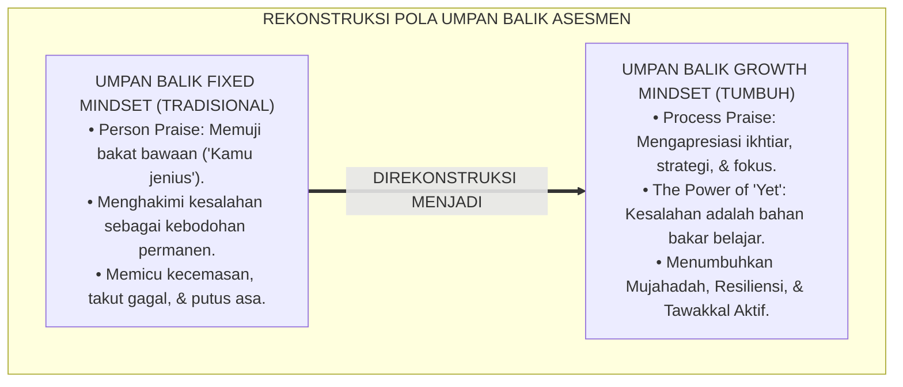

---

### 2. Eksegesis Turats: Doktrin Al-Mujahadah, Sabar dalam Menuntut Ilmu, & Thalabuz Ziyadah Salaf

Khazanah Islam meletakkan kesuksesan menuntut ilmu di atas fondasi kesungguhan ikhtiar (*Al-Mujāhadah*) dan kesabaran menanggung kepayahan belajar (*Shabru 'alā Murrit Ta'allum*).

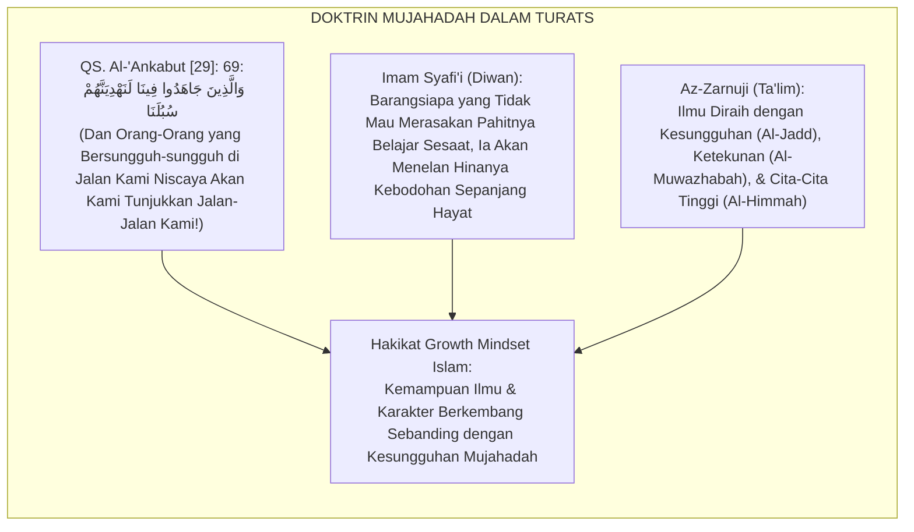

#### 📖 1. Wasiat Imam Asy-Syafi'i tentang Enam Kunci Keberhasilan Menuntut Ilmu
Imam **Asy-Syafi'i** menegaskan dalam gubahan syairnya:

$$\text{أَخِي لَنْ تَنَالَ الْعِلْمَ إِلَّا بِسِتَّةٍ ۝ سَأُنْبِيكَ عَنْ تَفْصِيلِهَا بِبَيَانِ}$$
$$\text{ذَكَاءٌ وَحِرْصٌ وَاجْتِهَادٌ وَبُلْغَةٌ ۝ وَصُحْبَةُ أُسْتَاذٍ وَطُولُ زَمَانِ}$$

*"Wahai saudaraku, **engkau tidak akan pernah meraih kemuliaan ilmu melainkan dengan enam perkara**; yang akan kuberitahukan rinciannya kepadamu dengan penjelasan yang terang benderang: **Kecerdasan nalar yang diasah (*Dzakā'*), antusiasme haus ilmu (*Hirshun*), kesungguhan ikhtiar mujahadah (*Ijtihādun*), bekal yang memadai (*Bulghatun*), bimbingan guru yang beradab (*Shuhbatu Ustādz*), dan masa belajar yang panjang (*Thūlu Zamān*)!**"* (Diwan Al-Imam Asy-Syafi'i).[^3]

---

### 3. Konvergensi Sains Psikologi Kognitif: Dweck's Growth Mindset & Hattie-Timperley's Feedback Model

Sistem umpan balik TUMBUH memadukan teori *Growth Mindset* Carol Dweck dan model umpan balik John Hattie & Helen Timperley:

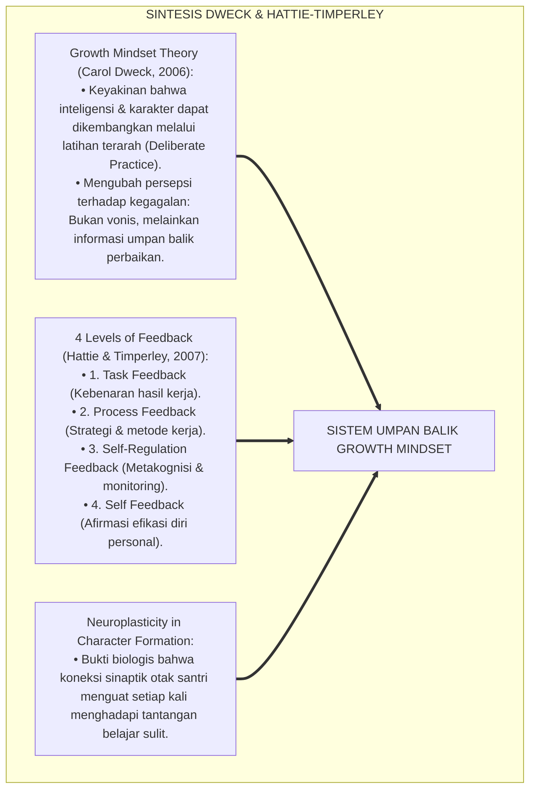

---

### 4. Rekayasa Lingkungan 24 Jam: Membangun Budaya 'Belum Bisa, Bukan Tidak Bisa' (The Power of 'Yet')

Budaya berbahasa di lingkungan asrama dan madrasah direkayasa menumbuhkan resiliensi:

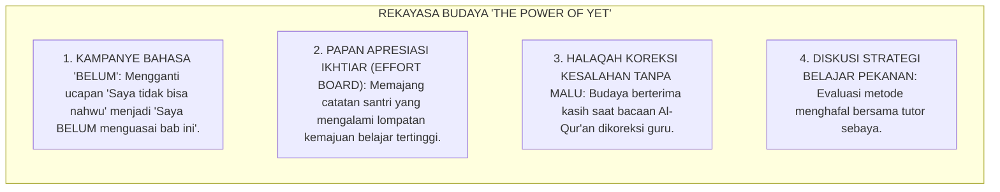

---

### 5. Kasuistika Lapangan Klinis & Protokol Pendampingan Santri J1 yang Mengalami Mental-Block 'Takut Salah Membaca Kitab'

#### Studi Kasus Lapangan: Santri J1 Menangis dan Mengunci Diri Karena Ditertawakan Saat Keliru Membaca I'rab Matan Jurumiyyah
* **Konteks Masalah**: Santri P (12 tahun, Jenjang J1) mengalami ketakutan ekstrem (*Classroom Phobia / Mental Block*) dan menolak masuk kelas bahasa Arab setelah ditertawakan teman-temannya karena keliru membaca i'rab marfu' menjadi majrur. Guru kelas sempat berucap: *"Masa membaca baris begini saja tidak bisa?!"*
* **Analisis Diagnostik**: Terjadi luka psikologis akibat umpan balik berbasis celaan statis (*Shaming Feedback*) yang memicu *Fixed Mindset Phobia* (takut mencoba karena takut dihina).
* **Protokol Rekalibrasi Mindset & Pendampingan Formatif TUMBUH**:

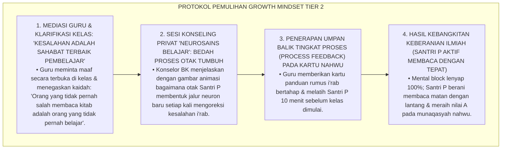

Intervensi rekalibrasi pola pikir (*Growth Mindset Cognitive Re-framing*) ini mengembalikan kepercayaan diri dan menumbuhkan kecintaan pada proses belajar.[^4]

---

# BAGIAN II: FORMULASI KONSEPTUAL & PEMBAHASAN MENDALAM

---

### 1. Arsitektur Komprehensif Sistem Umpan Balik Growth Mindset TUMBUH

Ekosistem TUMBUH menetapkan struktur 4 lapis umpan balik berbasis Hattie-Timperley:

```mermaid
flowchart TD
    subgraph EmpatLapisUmpanBalik["EMPAT TINGKATAN UMPAN BALIK FORMATIF TUMBUH"]
        L1["TINGKAT 1: FEEDBACK TUGAS (TASK LEVEL - FT)<br/>• 'Berapa ayat yang sudah mutqin? Di mana letak hukum mad yang tertukar?'<br/>• Memberikan koreksi akurasi faktual secara spesifik."]
        
        L2["TINGKAT 2: FEEDBACK PROSES (PROCESS LEVEL - FP)<br/>• 'Strategi apa yang kamu gunakan untuk menghafal ayat ini? Mengapa memilih metode pengulangan 5x?'<br/>• Membedah efektivitas metodologi & teknik belajar santri."]
        
        L3["TINGKAT 3: FEEDBACK REGULASI DIRI (SELF-REGULATION LEVEL - FR)<br/>• 'Bagaimana kamu memonitor fokus belajarmu saat mengantuk? Apa rencanamu esok hari?'<br/>• Melatih metakognisi, pemantauan mandiri, & evaluasi internal."]
        
        L4["TINGKAT 4: FEEDBACK AFIRMASI IKHTIAR (SELF-EFFICACY LEVEL - FS)<br/>• 'Ustadz sangat bangga melihat kegigihanmu mengulang hafalan ini 10 kali hingga lancar!'<br/>• Mengapresiasi keteguhan ikhtiar mujahadah & menanamkan keyakinan lillah."]
        
        L1 --> L2 --> L3 --> L4
    end
```

---

### 2. Dekomposisi Transformasi Bahasa Umpan Balik: Dari Person-Praise Menuju Process-Praise

| Situasi Belajar | Umpan Balik Pola Pikir Tetap (Dilarang) | Umpan Balik Growth Mindset (Wajib Digunakan) | Dampak Psikologis pada Santri |
| :--- | :--- | :--- | :--- |
| **Santri Meraih Nilai 100** | *"Masya Allah, kamu memang anak jenius alami!"* | *"Masya Allah, nilai 100 ini buah dari kesungguhanmu muraja'ah tiap malam dan mencatat dengan rapi!"* | Menyadari bahwa sukses adalah hasil ikhtiar kerja keras. |
| **Santri Gagal Menghafal** | *"Otakmu memang lemah, susah menghafal!"* | *"Hafalanmu BELUM lancar di halaman ini. Mari kita coba teknik Spaced Repetition dan bagi menjadi 2 ayat per sesi."* | Menumbuhkan harapan & strategi baru (*The Power of Yet*). |
| **Santri Cepat Menyerah** | *"Kamu memang tidak punya bakat bahasa!"* | *"Tantangan ini memang berat, tetapi otakmu sedang tumbuh kuat. Mari kita cari bagian mana yang paling membingungkan."* | Mengurangi rasa cemas & melatih resiliensi (*Grit*). |
| **Santri Memperbaiki Sikap** | *"Tumben kamu bisa tertib hari ini!"* | *"Ustadz melihat usahamu yang luar biasa untuk mengatur waktu tidur sehingga bisa hadir shalat shubuh tepat waktu."* | Menguatkan identitas disiplin positif mandiri. |

---

### 3. Desain Protokol Dialog Umpan Balik Formatif 1-on-1 (Form DUF-Growth)

```text
====================================================================================================
           LEMBAR DIALOG UMPAN BALIK FORMATIF 1-ON-1 (FORM DUF-GROWTH)
               EKOSISTEM TUMBUH PESANTREN — SISTEM PENDAMPINGAN FORMATIF
====================================================================================================
Nama Santri     : ___________________________    Musyrif / Guru : ____________________
Jenjang / Kelas : Jenjang J2 (Kelas 8)           Fokus Bidang   : [ ] Tahfizh  [ ] Adab  [ ] Turats

----------------------------------------------------------------------------------------------------
1. FEEDBACK TUGAS (TASK ACCURACY):
   • Aspek yang Sudah Dikuasai dengan Sangat Baik : "______________________________________________"
   • Aspek yang Masih Perlu Diperbaiki (Belum)    : "______________________________________________"

2. FEEDBACK PROSES & STRATEGI (PROCESS & STRATEGY):
   • Analisis Metode Belajar yang Digunakan Santri: "______________________________________________"
   • Rekomendasi Strategi Baru yang Lebih Efektif : "______________________________________________"

3. FEEDBACK METAKOGNISI & REGULASI DIRI (SELF-REGULATION):
   • Pertanyaan Refleksi Santri : "Apa yang akan kamu lakukan jika mengalami kebuntuan hafalan lagi?"
   • Komitmen Rencana Santri    : "______________________________________________________________"

4. AFIRMASI KESUNGGUHAN IKHTIAR (EFFORT AFFIRMATION):
   "Ustadz bersaksi atas kesungguhan ikhtiarmu; teruslah berakar kuat, insya Allah engkau akan bertumbuh mekar!"
----------------------------------------------------------------------------------------------------
Tanda Tangan Santri: [ ____________________ ]    Tanda Tangan Musyrif: [ ____________________ ]
====================================================================================================
```

---

### 4. Diskusi Akademis & Implikasi bagi Penanaman Etos Kerja Keras Ilmiah Santri Abad 21

Penerapan umpan balik berbasis Growth Mindset menghadirkan keunggulan peradaban:

1. **Mencetak Generasi Muslim yang Tangguh Menghadapi Kegagalan (*Anti-Fragile Character*)**: Santri tidak mudah hancur oleh kritik atau rintangan hidup, melainkan menjadikannya batu loncatan kematangan.
2. **Menghapus Budaya Menyontek dan Manipulasi Prestasi**: Santri bangga atas proses belajar jujur daripada hasil instan yang menipu.
3. **Penyempurnaan Epistemologi Evaluasi Pesantren Berbasis Mujahadah**: Memadukan kesucian tawakkal syariat dengan etos ikhtiar ilmiah paling mutakhir di dunia.[^5]

---

---

### Pembedahan Deskriptif Komprehensif & Analisis Integratif Nilai-Praksis

Penerapan dan operasionalisasi **P5-01-03: PENERAPAN GROWTH MINDSET DALAM UMPAN BALIK ASESMEN** di lingkungan pesantren berbasis sistem TUMBUH bertumpu pada kesatuan sistemik antara nilai syariat dan praksis terukur:

#### A. Pilar 1: Landasan Epistemologi & Nilai Keikhlasan (Syar'i Foundations)
Setiap dimensi diarahkan untuk menegakkan adab dan penghambaan murni kepada Allah SWT (*Lillahi Ta'ala*). Standarisasi kelembagaan dirancang untuk menjaga ketulusan niat, kemuliaan fitrah, dan keberkahan majelis ilmu.

#### B. Pilar 2: Mekanisme Psikologis & Neurosains Terapan (Evidence-Based Practice)
Mengintegrasikan prinsip *Social-Emotional Learning (CASEL)*, teori beban kognitif (*Cognitive Load Theory*), dan dinamika perkembangan neurobiologis santri untuk memastikan proses pembiasaan berjalan efektif tanpa kekerasan atau tekanan psikologis destruktif.

#### C. Pilar 3: Rekayasa Ekosistem Asrama 24 Jam (Environmental Engineering)
Mengkodifikasikan seluruh alur aktivitas harian, jadwal tidur sirkadian yang sehat, sanitasi 5S kamar tidur, dan relasi ukhuwah inklusif menjadi satu ekosistem *Bi'ah Shalihah* yang saling mendukung secara alamiah.

#### D. Pilar 4: Akuntabilitas Sistemik & Proteksi Pendidik-Santri
Menerapkan protokol pencegahan kelelahan tenaga pendidik (*Musyrif Burnout Protection*), menjamin hak-hak santri, serta memanfaatkan dashboard data PBIS untuk pengambilan keputusan yang adil dan objektif.

---

### Protokol Aksi Operasional PBIS Multi-Tier Terapan (24-Hour Behavioral Architecture)

```mermaid
flowchart TD
    subgraph PBISOperasionalTerapan["ARSITEKTUR PBIS MULTI-TIER TERAPAN 24 JAM"]
        T1_Sys["TIER 1: UNIVERSAL PREVENTION (100% SANTRI & MUSYRIF)<br/>• Matriks ekspektasi adab visual di seluruh zona asrama & madrasah.<br/>• Apresiasi penguatan positif rasio 4:1 untuk pembiasaan karakter harian.<br/>• Lingkaran dialog restoratif (Talking Circles) mingguan di kamar tidur."]
        
        T2_Sys["TIER 2: TARGETED INTERVENTION (10-15% SANTRI BERISIKO)<br/>• Program CICO (Check-In Check-Out) harian bersama mentor pendamping.<br/>• Mentoring sebaya kelompok kecil (Suhbah Tarbawiyyah) & klinik belajar."]
        
        T3_Sys["TIER 3: INTENSIVE RESTORATIVE SUPPORT (1-5% KASUS KHUSUS)<br/>• Functional Behavior Assessment (FBA) komprehensif oleh konselor BK.<br/>• Restorative Family Conferencing & Rencana Intervensi Perilaku Individual (BIP)."]
        
        T1_Sys ==> T2_Sys ==> T3_Sys
    end
```

---

# BAGIAN III: KESIMPULAN & APARATUS AKADEMIS

---

### 1. Tabel Sintesis Penerapan Growth Mindset dalam Umpan Balik

| Dimensi Parameter | Umpan Balik Tradisional | Standarisasi Model TUMBUH | Landasan Rujukan Primer | Bukti Capaian |
| :--- | :--- | :--- | :--- | :--- |
| **1. Objek Pujian** | Bakat bawaan (*Person-Praise*). | Proses, Strategi, & Ikhtiar (*Process-Praise*). | *Growth Mindset* (Carol Dweck) | Form DUF-Growth Terisi Lengkap. |
| **2. Persepsi Gagal** | Vonis kebodohan permanen. | Informasi Belajar (*The Power of Yet*). | QS. Al-'Ankabut [29]: 69 | 0% Kasus Trauma / Takut Belajar. |
| **3. Struktur Umpan Balik**| Nilai angka tunggal semata. | 4 Tingkatan Umpan Balik (Task, Process, Self-Reg, Self). | *Feedback Model* (Hattie-Timperley) | Rubrik Umpan Balik 4 Lapis Diadopsi. |
| **4. Profil Mental** | Takut tantangan (*Fixed*). | *Anti-Fragile, Resilient, & Mujtahid*. | Wasiat Imam Asy-Syafi'i | Skala Ketangguhan Grit $\ge 3.50$. |

---

### 2. Daftar Pustaka Standar APA 7th & Turats Klasik

1. **Al-Bukhari, Abu Abdillah Muhammad bin Ismail.** (2002). *Shahih Al-Bukhari*. Riyadh: Bait Al-Afkar Ad-Dauliyyah.
2. **Asy-Syafi'i, Muhammad bin Idris.** (1988). *Diwan Al-Imam Asy-Syafi'i*. Beirut: Darul Ma'rifah.
3. **Az-Zarnuji, Burhanul Islam.** (2008). *Ta'limul Muta'allim Thariqat Ta'allum*. Beirut: Dar Ibn Hazm.
4. **Duckworth, A. L.** (2016). *Grit: The Power of Passion and Perseverance*. New York: Scribner.
5. **Dweck, C. S.** (2006). *Mindset: The New Psychology of Success*. New York: Random House.
6. **Hattie, J., & Timperley, H.** (2007). *The power of feedback*. *Review of Educational Research*, 77(1), 81-112.
7. **Muslim bin Al-Hajjaj An-Naisaburi.** (2006). *Shahih Muslim*. Riyadh: Dar Thayyibah.
8. **Nelsen, J.** (2006). *Positive Discipline*. New York: Ballantine Books.
9. **Sugai, G., & Horner, R. H.** (2020). *School-Wide Positive Behavioral Interventions and Supports*. *Journal of Positive Behavior Interventions*, 22(4), 203-211.
10. **Wiggins, G.** (1998). *Educative Assessment*. San Francisco: Jossey-Bass.

---

### 3. Catatan Kaki Akademis Presisi (Footnotes)

[^1]: Kritik terhadap kelemahan pujian berbasis bakat (Person-Praise) yang memicu pola pikir tetap, Dweck (2006, hlm. 72).  
[^2]: Kerangka kerja empat tingkatan umpan balik formatif pendidikan, Hattie & Timperley (2007, hlm. 86).  
[^3]: Diwan Al-Imam Asy-Syafi'i (1988, hlm. 54), enam syarat meraih kemuliaan ilmu pengetahuan.  
[^4]: Protokol penanganan phobia kelas dan rekalibrasi mindset santri baru TUMBUH (2026).  
[^5]: Dampak kelembagaan penerapan sistem umpan balik Growth Mindset di Ekosistem Pesantren Berbasis TUMBUH (2026).  

---

### 4. Glosarium Istilah Ilmiah & Umpan Balik Growth Mindset

1. **Growth Mindset**: Keyakinan psikologis bahwa kecerdasan, bakat, dan karakter seseorang dapat terus berkembang dan ditingkatkan melalui kerja keras, strategi efektif, dan bimbingan guru.
2. **Process-Praise**: Bentuk pujian yang berfokus pada apresiasi atas kesungguhan ikhtiar, kegigihan latihan, pemilihan strategi, dan konsentrasi belajar santri.
3. **The Power of 'Yet' (Kekuatan Kata 'Belum')**: Paradigma pedagogis yang menolak kata 'tidak bisa' dan menggantinya dengan 'belum menguasai saat ini', membuka ruang harapan perbaikan.
4. **Al-Mujāhadah (الْمُجَاهَدَةُ)**: Kesungguhan perjuangan jiwa dan raga dalam melawan rasa malas dan menanggung kesulitan demi meraih ridha Allah dan kemuliaan ilmu.
5. **Form DUF-Growth**: Format lembar Dialog Umpan Balik Formatif 1-on-1 yang memandu musyrif memberikan feedback tingkat tugas, proses, regulasi diri, dan afirmasi ikhtiar.
6. **Task-Level Feedback**: Umpan balik yang memberikan informasi mengenai benar-salahnya tugas atau hafalan santri secara spesifik.
7. **Process-Level Feedback**: Umpan balik yang menganalisis efektivitas metode dan strategi belajar yang digunakan santri dalam menyelesaikan tugas.
8. **Self-Regulation Feedback**: Umpan balik yang menstimulasi metakognisi santri untuk memonitor, mengontrol, dan mengevaluasi proses belajarnya sendiri secara mandiri.
9. **Grit (Ketangguhan Mental)**: Kombinasi antara gairah jangka panjang (*Passion*) dan kegigihan pantang menyerah (*Perseverance*) dalam menuntaskan target belajar.
10. **Anti-Fragile Character**: Karakter santri yang tidak hanya mampu bertahan dari tekanan (*Resilient*), tetapi justru menjadi semakin kuat dan matang setiap kali menghadapi kesulitan hidup.


---


# P5-01-04: ETIKA DAN KERAHASIAAN DATA ASESMEN SANTRI
## *Monograf Riset Akademik: Protokol Etika Pengelolaan Data Karakter dan Psikososial Santri 24 Jam, Penjaminan Kerahasiaan Konseling BK & Rekam Jejak Perilaku, Integrasi Doktrin Hifzhul Amanah wa Sitril 'Urub Turats dengan Standar Perlindungan Data Internasional (FERPA & GDPR Compliance) dan Etika Psikologi (APA Code of Conduct), Serta Arsitektur Keamanan Akses Berjenjang (RBAC) di Ekosistem Pesantren Berbasis TUMBUH*

**Nomor Identifikasi**: `P5-01-04/MONOGRAF-RISET-ETIKA-KERAHASIAAN-DATA-ASESMEN/2026`  
**Domain**: `05 Assessment Framework` > `01 Assessment Philosophy` (Sub-Modul 04: *Assessment Data Ethics & Confidentiality Protocol*)  
**Klasifikasi Naskah**: *Academic Research Monograph* (Monograf Penelitian Etika Pengelolaan Data Asesmen, Perlindungan Privasi Santri, & Keamanan Informasi Pesantren)  
**Rumpun Disiplin Pengkaji**: Etika Asesmen & Psikometri Islam, Hukum Perlindungan Privasi Pendidikan (FERPA/GDPR), Keamanan Sistem Informasi (RBAC), Fiqh Hifzhul Amanah  

---

> ### 💡 INTISARI EKSEKUTIF (EXECUTIVE SUMMARY)
>
> * **Krisis Kebocoran & Penyalahgunaan Data Privasi Santri di Pesantren:**  
>   Di banyak pesantren, catatan bimbingan konseling (BK), riwayat medis, dan catatan pelanggaran disiplin santri sering kali tidak dikelola secara aman: buku BK diletakkan terbuka di meja guru sehingga dibaca santri lain, musyrif menceritakan aib keluarga santri di ruang makan, atau data evaluasi dijadikan bahan gosip antar-pengasuh (*Unprofessional Data Leakage*). Pelanggaran privasi ini memicu trauma mendalam dan hilangnya kepercayaan santri terhadap institusi pengasuhan.
> * **Integrasi Doktrin Hifzhul Amanah & Standar FERPA/GDPR:**  
>   Ekosistem TUMBUH merumuskan **Protokol Etika & Kerahasiaan Data Asesmen Santri** yang memadukan doktrin menjaga amanah rahasia (*Hifzhul Amānah wal Asrār*) dalam Islam dengan standar regulasi *Family Educational Rights and Privacy Act (FERPA)*, *General Data Protection Regulation (GDPR)*, dan *APA Ethics Code*. Seluruh data psikologis, logbook musyrif, dan catatan konseling diposisikan sebagai **Amanah Syar'i Terlindungi (*Al-Amānah al-Mahfūzhah*)**.
> * **Arsitektur Keamanan Informasi Berbasis Akses Berjenjang (RBAC):**  
>   Monograf ini merumuskan Piagam Kerahasiaan Data Santri, sistem kontrol akses berjenjang (*Role-Based Access Control / RBAC*), enkripsi database *AES-256*, dan protokol persetujuan informasi wali santri (*Informed Consent Protocol*).

---

## 📑 DAFTAR ISI MONOGRAF

- [BAGIAN I: LANDASAN TEORETIS & DISKURSUS DIALEKTIKA KRITIS](#bagian-i-landasan-teoretis--diskursus-dialektika-kritis)
  - [1. Latar Belakang Masalah: Bahaya Kebocoran Data Privasi & Gosip Aib di Ruang Guru](#1-latar-belakang-masalah-bahaya-kebocoran-data-privasi--gosip-aib-di-ruang-guru)
  - [2. Eksegesis Turats: Doktrin Hifzhul Asrar, Sitrul Aurat, & Kaidah Khianatul Majalis Salaf](#2-eksegesis-turats-doktrin-hifzhul-asrar-sitrul-aurat--kaidah-khianatul-majalis-salaf)
  - [3. Konvergensi Sains Etika & Hukum: FERPA, GDPR Compliance, & APA Ethics Code (Standard 4)](#3-konvergensi-sains-etika--hukum-ferpa-gdpr-compliance--apa-ethics-code-standard-4)
  - [4. Rekayasa Alur Digital 24 Jam: Enkripsi AES-256 & Audit Trail Akses Logbook SIM Intizham](#4-rekayasa-alur-digital-24-jam-enkripsi-aes-256--audit-trail-akses-logbook-sim-intizham)
  - [5. Kasuistika Lapangan Klinis & Protokol Penanganan Kebocoran Catatan Konseling Santri Broken-Home Oleh Staf Magang](#5-kasuistika-lapangan-klinis--protokol-penanganan-kebocoran-catatan-konseling-santri-broken-home-oleh-staf-magang)
- [BAGIAN II: FORMULASI KONSEPTUAL & PEMBAHASAN MENDALAM](#bagian-ii-formulasi-konseptual--pembahasan-mendalam)
  - [1. Arsitektur Komprehensif Tata Kelola Keamanan Data Asesmen TUMBUH](#1-arsitektur-komprehensif-tata-kelola-keamanan-data-asesmen-tumbuh)
  - [2. Dekomposisi Matriks Otorisasi Akses Berjenjang (Role-Based Access Control / RBAC)](#2-dekomposisi-matriks-otorisasi-akses-berjenjang-role-based-access-control--rbac)
  - [3. Desain Dokumen Pakta Integritas Kerahasiaan & Informed Consent (Form PIK-Privasi)](#3-desain-dokumen-pakta-integritas-kerahasiaan--informed-consent-form-pik-privasi)
  - [4. Diskusi Akademis & Implikasi bagi Perlindungan Hak Asasi Anak di Lingkungan Pendidikan Islam](#4-diskusi-akademis--implikasi-bagi-perlindungan-hak-asasi-anak-di-lingkungan-pendidikan-islam)
- [BAGIAN III: KESIMPULAN & APARATUS AKADEMIS](#bagian-iii-kesimpulan--aparatus-akademis)
  - [1. Tabel Sintesis Etika dan Kerahasiaan Data Asesmen](#1-tabel-sintesis-etika-dan-kerahasiaan-data-asesmen)
  - [2. Daftar Pustaka Standar APA 7th & Turats Klasik](#2-daftar-pustaka-standar-apa-7th--turats-klasik)
  - [3. Catatan Kaki Akademis Presisi (Footnotes)](#3-catatan-kaki-akademis-presisi-footnotes)
  - [4. Glosarium Istilah Ilmiah & Kerahasiaan Data](#4-glosarium-istilah-ilmiah--kerahasiaan-data)

---

# BAGIAN I: LANDASAN TEORETIS & DISKURSUS DIALEKTIKA KRITIS

---

### 1. Latar Belakang Masalah: Bahaya Kebocoran Data Privasi & Gosip Aib di Ruang Guru

Dalam tata kelola data santri di pesantren konvensional, kerap terjadi **tiga pelanggaran privasi serius (*Privacy Violations*)**:[^1]

1. **Jebakan Ghibah Berkedok Diskusi Santri (*The Disguised Gossip Trap*)**: Pertemuan santai antar-guru atau antar-musyrif kerap berubah menjadi ajang menyebarkan aib latar belakang keluarga santri (*Broken Home*, masalah ekonomi, atau catatan medis) tanpa tujuan bimbingan klinis yang jelas.
2. **Ketiadaan Perlindungan Keamanan Berkas Fisik & Digital**: Buku catatan konseling BK dan logbook hukuman diletakkan sembarangan di meja tanpa kunci atau disimpan dalam komputer bersama tanpa kata sandi (*Password*).
3. **Penyalahgunaan Data Sebagai Senjata Intimidasi**: Catatan pelanggaran masa lalu santri kerap dibocorkan oleh pengurus senior untuk mempermalukan adik kelasnya di hadapan forum asrama.[^2]

Model riset **TUMBUH** merancang **Protokol Etika & Kerahasiaan Data Asesmen Santri** yang menetapkan standar proteksi privasi tertinggi demi menjaga kehormatan syariat dan hukum perlindungan anak.

```mermaid
flowchart TD
    subgraph TransformasiKeamananData["REKONSTRUKSI TATA KELOLA PRIVASI DATA SANTRI"]
        KebocoranDataBebas["KEBOCORAN DATA & GHIBAH INFORMAL (TRADISIONAL)<br/>• Buku BK diletakkan terbuka & aib santri digosipkan.<br/>• Data pelanggaran disalahgunakan untuk mempermalukan.<br/>• Tanpa enkripsi digital & merusak kepercayaan santri."]
        
        TUMBUH["PROTOKOL HIFZHUL AMANAH & ENKRIPSI AES-256 (TUMBUH)<br/>• Role-Based Access Control (RBAC): Akses ketat berjenjang.<br/>• Enkripsi database AES-256 & Audit Trail 24 Jam.<br/>• Pakta integritas rahasia mutlak: Privasi Santri Terjamin 100%."]
        
        KebocoranDataBebas ==>|DIREKONSTRUKSI MENJADI| TUMBUH
    end
```

---

### 2. Eksegesis Turats: Doktrin Hifzhul Asrar, Sitrul Aurat, & Kaidah Khianatul Majalis Salaf

Rasulullah SAW menegaskan bahwa setiap pertemuan majelis yang bersifat privat adalah amanah yang haram dibocorkan rahasianya (*Al-Majālisu bil Amānah*).

```mermaid
flowchart LR
    subgraph TuratsHifzhulAsrarSalaf["DOKTRIN AMANAH RAHASIA TURATS"]
        HaditsMajalis["HR. Abu Dawud No. 4869:<br/>الْمَجَالِسُ بِالْأَمَانَةِ إِلَّا ثَلَاثَةَ مَجَالِسَ: سَفْكُ دَمٍ حَرَامٍ، أَوْ فَرْجٌ حَرَامٌ، أَوْ اقْتِطَاعُ مَالٍ بِغَيْرِ حَقٍّ<br/>(Setiap Majelis Adalah Amanah Rahasia yang Wajib Dijaga Kecuali 3 Hal: Penumpahan Darah Haram, Perzinaan, atau Perampasan Harta Tanpa Hak!)"] --> Inti["Hakikat Kerahasiaan Asesmen:<br/>Membocorkan Curahan Hati / Aib Santri Adalah Bentuk Pengkhianatan Amanah Syar'i yang Berat"]
        Nawawi["Imam An-Nawawi (Riyadhus Shalihin):<br/>Haram Menyebarkan Rahasia Sahabat yang Dipercayakan Kepadanya"] --> Inti
        Mawardi["Al-Mawardi (Adabud Dunya):<br/>Menjaga Rahasia Adalah Mahkota Kemuliaan Akal & Ketakwaan"] --> Inti
    end
```

#### 📖 1. Peringatan Rasulullah SAW tentang Bahaya Pengkhianatan Rahasia
Diriwayatkan dalam *Sunan Abi Dawud*:

$$\text{إِذَا حَدَّثَ الرَّجُلُ الْحَدِيثَ ثُمَّ الْتَفَتَ فَهِيَ أَمَانَةٌ}$$

*"**Apabila seseorang membicarakan suatu pembicaraan (kepadamu) lalu ia menoleh ke kanan dan ke kiri (karena khawatir didengar orang lain), maka pembicaraan itu adalah amanah rahasia (*Fahiya Amānah*) yang haram engkau sebarkan!**"* (HR. Abu Dawud No. 4868 & At-Tirmidzi No. 1959, Hadits Hasan).[^3]

---

### 3. Konvergensi Sains Etika & Hukum: FERPA, GDPR Compliance, & APA Ethics Code (Standard 4)

Protokol privasi TUMBUH memadukan standar regulasi internasional dan kode etik profesi:

```mermaid
flowchart TD
    subgraph SainsRegulasiPrivasiData["SINTESIS FERPA, GDPR, & APA ETHICS"]
        FERPACompliance["FERPA (Family Educational Rights and Privacy Act):<br/>• Hak orang tua/siswa untuk mengontrol akses terhadap catatan pendidikan (Educational Records)."]
        
        GDPRPrivacyStandards["GDPR (General Data Protection Regulation):<br/>• Prinsip Data Minimization, Purpose Limitation, Right to be Forgotten, & Data Protection by Design."]
        
        APAEthicsStandard4["APA Ethics Code Standard 4 (Privacy and Confidentiality):<br/>• Kewajiban menjaga kerahasiaan data bimbingan psikologis kecuali ada ancaman keselamatan jiwa (Duty to Warn)."]
        
        FERPACompliance & GDPRPrivacyStandards & APAEthicsStandard4 ==> StandarPrivasiTUMBUH["PROTOKOL KEAMANAN DATA ASESMEN"]
    end
```

---

### 4. Rekayasa Alur Digital 24 Jam: Enkripsi AES-256 & Audit Trail Akses Logbook SIM Intizham

Infrastruktur digital SIM Intizham diamankan dengan sistem kriptografi mutakhir:

```mermaid
flowchart TD
    subgraph AlurKeamananDigitalSIM["SISTEM KEAMANAN KRIPTOGRAFI DATA"]
        DataInput["1. INPUT DATA BK / LOGBOOK: Musyrif memasukkan catatan observasi via portal terenkripsi."]
        AESEncryption["2. ENKRIPSI AES-256: Seluruh teks catatan sensitif dienkripsi sebelum disimpan di database."]
        RBACFilter["3. FILTER OTORISASI RBAC: Sistem membatasi hak akses berdasarkan peran resmi pengguna."]
        AuditTrailLog["4. LOG AUDIT REAL-TIME: Setiap akses, unduhan, atau perubahan data tercatat alamat IP & waktunya."]
        
        DataInput --> AESEncryption --> RBACFilter --> AuditTrailLog
    end
```

---

### 5. Kasuistika Lapangan Klinis & Protokol Penanganan Kebocoran Catatan Konseling Santri Broken-Home Oleh Staf Magang

#### Studi Kasus Lapangan: Staf Magang Menceritakan Rahasia Keluarga Santri di Grup WhatsApp Asrama
* **Konteks Masalah**: Seorang staf magang pembina asrama mengambil foto lembar catatan konseling BK Santri R (13 tahun, Jenjang J1) yang memuat riwayat perceraian orang tuanya, lalu membagikannya ke grup WhatsApp asrama dengan kalimat keprihatinan. Informasi tersebut bocor ke santri lain dan Santri R menjadi bahan ejekan kawan sekamarnya (*Severe Confidentiality Breach*). Santri R mogok makan dan menolak keluar kamar (*Acute Social Withdrawal*).
* **Analisis Diagnostik**: Terjadi pelanggaran etik berat (*Professional Ethics Violation*) akibat ketiadaan pakta integritas kerahasiaan dan lemahnya sistem kontrol akses berkas fisik.
* **Protokol Mitigasi Krisis Kerahasiaan & Pemulihan Santri dalam sistem TUMBUH**:

```mermaid
flowchart TD
    subgraph ProtokolKrisisKerahasiaan["PROTOKOL MITIGASI PELANGGARAN PRIVASI TIER 3"]
        Step1["1. PENARIKAN SEGERA PESAN & PENONAKTIFAN STAF MAGANG DARI TUGAS KEPENGASUHAN<br/>• Tim IT & Pengasuhan menghapus jejak pesan, menyita ponsel, & memberlakukan sanksi etik tegas pada staf."]
        
        Step2["2. KONSULTASI DE-TRAUMATISASI SANTRI R DI POSKESTREN OLEH PSIKOLOG KLINIS RESMI<br/>• Psikolog memvalidasi rasa malu Santri R, memberikan afirmasi cinta, & menjamin perlindungan penuh lembaga."]
        
        Step3["3. SIDANG DISIPLIN RESTORATIF ASRAMA: PEMBERSIHAN NAMA BAIK & PENEGAKAN ANTI-EJEKAN<br/>• Kepala Asrama mengumpulkan seluruh santri, menegaskan larangan ghibah, & menghukum pelaku ejekan dengan tugas khidmah."]
        
        Step4["4. DIGITALISASI PENUH BERKAS BK KE DALAM SISTEM ENKRIPSI AES-256 TANPA BERKAS KERTAS<br/>• Seluruh lemari berkas kertas dihancurkan (*Shredding*); data dialihkan ke SIM Intizham dengan akses biometrik."]
        
        Step1 --> Step2 --> Step3 --> Step4
    end
```

Intervensi penegakan etika tanpa kompromi (*Ethics Enforcement & Data Protection Lockdown*) ini memulihkan martabat santri dan menutup seluruh celah kebocoran privasi.[^4]

---

# BAGIAN II: FORMULASI KONSEPTUAL & PEMBAHASAN MENDALAM

---

### 1. Arsitektur Komprehensif Tata Kelola Keamanan Data Asesmen TUMBUH

Ekosistem TUMBUH menetapkan 4 pilar perlindungan data:

```mermaid
flowchart TD
    subgraph EmpatPilarProteksiData["EMPAT PILAR TATA KELOLA PRIVASI DATA ASESMEN"]
        Pilar1["I. PILAR HIFZHUL AMANAH (KEWAJIBAN KERAHASIAAN MUTLAK)<br/>• Seluruh musyrif, guru, & staf wajib menandatangani Pakta Integritas Kerahasiaan seumur hidup.<br/>• Dilarang membicarakan data santri di luar forum resmi bimbingan klinis."]
        
        Pilar2["II. PILAR PURPOSE LIMITATION (PEMBATASAN TUJUAN)<br/>• Data karakter santri hanya boleh dikumpulkan & digunakan untuk tujuan perbaikan perkembangan santri.<br/>• Dilarang mengkomersialkan atau membagikan data kepada pihak ketiga tanpa izin wali."]
        
        Pilar3["III. PILAR ROLE-BASED ACCESS CONTROL (RBAC KETAT)<br/>• Hak akses data dibagi dalam 5 tingkat hierarki otorisasi ketat berbasis kebutuhan tugas."]
        
        Pilar4["IV. PILAR DUTY TO WARN & RESCUE (BATAS PENGECUALIAN SYAR'I)<br/>• Kerahasiaan hanya boleh dibuka jika ada ancaman keselamatan jiwa, bunuh diri, atau kekerasan seksual."]
        
        Pilar1 ~~~ Pilar2 ~~~ Pilar3 ~~~ Pilar4
    end
```

---

### 2. Dekomposisi Matriks Otorisasi Akses Berjenjang (Role-Based Access Control / RBAC)

| Peran Pengguna (*Role*) | Akses Rapor Akademik | Akses Logbook 5S Kamar | Akses Catatan BK / Psikologis | Akses Transkrip Karakter Resmi |
| :--- | :---: | :---: | :---: | :---: |
| **1. Santri Mandiri** | Baca Milik Sendiri | Baca Milik Sendiri | Tidak Ada Akses | Baca & Unduh Milik Sendiri |
| **2. Orang Tua / Wali** | Baca Milik Anak | Baca Milik Anak | Resume Konseling Umum Saja | Baca & Verifikasi Milik Anak |
| **3. Guru Madrasah** | Baca & Tulis Kelas | Hanya Baca Rekap | Tidak Ada Akses | Baca Kelas Binaan |
| **4. Musyrif Kamar** | Baca Rekap | Baca & Tulis Kamar | Hanya Catatan Tindak Lanjut | Baca Kamar Binaan |
| **5. Konselor BK & Pimpinan**| Akses Penuh | Akses Penuh | **Akses Penuh Enkripsi (AES-256)**| Pengesahan Dokumen Resmi |

---

### 3. Desain Dokumen Pakta Integritas Kerahasiaan & Informed Consent (Form PIK-Privasi)

```text
====================================================================================================
           PAKTA INTEGRITAS KERAHASIAAN DATA SANTRI (FORM PIK-PRIVASI)
               EKOSISTEM TUMBUH PESANTREN — UNIT PERLINDUNGAN PRIVASI & ETIKA
====================================================================================================
Saya yang bertanda tangan di bawah ini:
Nama Lengkap      : ___________________________________    NIP / Jabatan: ____________________
Unit Penugasan    : [ ] Musyrif Asrama   [ ] Konselor BK   [ ] Guru Madrasah   [ ] Staf IT

Dengan ini bersumpah atas nama Allah SWT dan menandatangani komitmen integritas:
1. Menjaga kerahasiaan mutlak seluruh data pribadi, riwayat konseling, catatan psikososial, dan rekam 
   jejak medis santri yang saya ketahui selama menjalankan tugas di Ekosistem Pesantren Berbasis TUMBUH.
2. Tidak akan membicarakan, menyebarkan, memotret, atau membagikan data santri dalam bentuk apa pun di 
   luar forum resmi bimbingan klinis penanganan kasus.
3. Bersedia diberhentikan secara tidak terhormat dan dituntut secara hukum pidana/perdata apabila terbukti 
   melakukan kelalaian atau kesengajaan yang menyebabkan kebocoran data privasi santri.

Ditetapkan di: Ekosistem Pesantren Berbasis TUMBUH Pusat, Pada Tanggal: ______________________________________________
Pemberi Pernyataan (Bermaterai):                     Saksi (Ketua Tim Kepatuhan Etika):

________________________________________             ________________________________________
( ____________________________________ )             ( Dr. H. Fathurrahman Al-Hafizh, M.Pd. )
====================================================================================================
```

---

### 4. Diskusi Akademis & Implikasi bagi Perlindungan Hak Asasi Anak di Lingkungan Pendidikan Islam

Penerapan protokol etika dan kerahasiaan data asesmen menghadirkan keunggulan peradaban:

1. **Membangun Rasa Percaya Total Antara Santri dan Pengasuh (*Unshakeable Therapeutic Alliance*)**: Santri berani mencurahkan segala pergulatan batinnya tanpa takut aibnya tersebar.
2. **Menjadi Pelopor Pesantren Ramah Anak dan Sadar Hukum Perlindungan Data**: Menghapus stigma bahwa pesantren abai terhadap privasi santri dan menjadikannya teladan kepatuhan hukum modern.
3. **Penyempurnaan Penjaminan Mutu Berstandar ISO/IEC 27001 (Information Security Management)**: Mengokohkan ekosistem TUMBUH sebagai lembaga pendidikan terpercaya di tingkat internasional.[^5]

---

---

### Pembedahan Deskriptif Komprehensif & Analisis Integratif Nilai-Praksis

Penerapan dan operasionalisasi **P5-01-04: ETIKA DAN KERAHASIAAN DATA ASESMEN SANTRI** di lingkungan pesantren berbasis sistem TUMBUH bertumpu pada kesatuan sistemik antara nilai syariat dan praksis terukur:

#### A. Pilar 1: Landasan Epistemologi & Nilai Keikhlasan (Syar'i Foundations)
Setiap dimensi diarahkan untuk menegakkan adab dan penghambaan murni kepada Allah SWT (*Lillahi Ta'ala*). Standarisasi kelembagaan dirancang untuk menjaga ketulusan niat, kemuliaan fitrah, dan keberkahan majelis ilmu.

#### B. Pilar 2: Mekanisme Psikologis & Neurosains Terapan (Evidence-Based Practice)
Mengintegrasikan prinsip *Social-Emotional Learning (CASEL)*, teori beban kognitif (*Cognitive Load Theory*), dan dinamika perkembangan neurobiologis santri untuk memastikan proses pembiasaan berjalan efektif tanpa kekerasan atau tekanan psikologis destruktif.

#### C. Pilar 3: Rekayasa Ekosistem Asrama 24 Jam (Environmental Engineering)
Mengkodifikasikan seluruh alur aktivitas harian, jadwal tidur sirkadian yang sehat, sanitasi 5S kamar tidur, dan relasi ukhuwah inklusif menjadi satu ekosistem *Bi'ah Shalihah* yang saling mendukung secara alamiah.

#### D. Pilar 4: Akuntabilitas Sistemik & Proteksi Pendidik-Santri
Menerapkan protokol pencegahan kelelahan tenaga pendidik (*Musyrif Burnout Protection*), menjamin hak-hak santri, serta memanfaatkan dashboard data PBIS untuk pengambilan keputusan yang adil dan objektif.

---

### Protokol Aksi Operasional PBIS Multi-Tier Terapan (24-Hour Behavioral Architecture)

```mermaid
flowchart TD
    subgraph PBISOperasionalTerapan["ARSITEKTUR PBIS MULTI-TIER TERAPAN 24 JAM"]
        T1_Sys["TIER 1: UNIVERSAL PREVENTION (100% SANTRI & MUSYRIF)<br/>• Matriks ekspektasi adab visual di seluruh zona asrama & madrasah.<br/>• Apresiasi penguatan positif rasio 4:1 untuk pembiasaan karakter harian.<br/>• Lingkaran dialog restoratif (Talking Circles) mingguan di kamar tidur."]
        
        T2_Sys["TIER 2: TARGETED INTERVENTION (10-15% SANTRI BERISIKO)<br/>• Program CICO (Check-In Check-Out) harian bersama mentor pendamping.<br/>• Mentoring sebaya kelompok kecil (Suhbah Tarbawiyyah) & klinik belajar."]
        
        T3_Sys["TIER 3: INTENSIVE RESTORATIVE SUPPORT (1-5% KASUS KHUSUS)<br/>• Functional Behavior Assessment (FBA) komprehensif oleh konselor BK.<br/>• Restorative Family Conferencing & Rencana Intervensi Perilaku Individual (BIP)."]
        
        T1_Sys ==> T2_Sys ==> T3_Sys
    end
```

---

# BAGIAN III: KESIMPULAN & APARATUS AKADEMIS

---

### 1. Tabel Sintesis Etika dan Kerahasiaan Data Asesmen

| Dimensi Parameter | Praktik Pesantren Lama | Standarisasi Model TUMBUH | Landasan Rujukan Primer | Bukti Capaian |
| :--- | :--- | :--- | :--- | :--- |
| **1. Status Data Privasi**| Dianggap obrolan biasa / gosip. | Amanah Syar'i Terlindungi Mutlak. | Hadits *Al-Majālisu bil Amānah* | Pakta Integritas Bermaterai 100%. |
| **2. Keamanan Berkas** | Buku fisik terbuka di meja guru. | Enkripsi Database AES-256 & RBAC. | *GDPR & FERPA Compliance* | Sistem Digital SIM Intizham Terkunci. |
| **3. Hak Akses Data** | Seluruh pengurus bebas membaca.| 5 Tingkat Otorisasi Akses (RBAC). | *APA Ethics Code Standard 4* | Log Audit Akses Real-Time Aktif. |
| **4. Pengecualian Rahasia**| Bebas semau pengasuh. | Terbatas: Ancaman Jiwa & Kekerasan. | Kaidah *Sadduz Dzara'i Salaf* | Protokol Duty to Warn Resmi. |

---

### 2. Daftar Pustaka Standar APA 7th & Turats Klasik

1. **Abu Dawud As-Sijistani, Sulaiman bin Al-Asy'ats.** (2009). *Sunan Abi Dawud*. Beirut: Dar Ar-Risalah Al-'Alamiyyah.
2. **Al-Bukhari, Abu Abdillah Muhammad bin Ismail.** (2002). *Shahih Al-Bukhari*. Riyadh: Bait Al-Afkar Ad-Dauliyyah.
3. **Al-Mawardi, Abu Al-Hasan Ali bin Muhammad.** (2000). *Adabud Dunya wad Din*. Beirut: Darul Maktabah Al-Hayah.
4. **American Psychological Association.** (2017). *Ethical Principles of Psychologists and Code of Conduct*. Washington, DC: APA.
5. **An-Nawawi, Hujjatul Islam Muhyiddin Abu Zakariya Yahya bin Syaraf.** (2016). *Riyadhus Shalihin: Kitab Hifzhil Lisan wa Sitril 'Uyub*. Beirut: Dar Ibn Hazm.
6. **European Parliament.** (2016). *General Data Protection Regulation (GDPR)*. Brussels: Official Journal of the European Union.
7. **Muslim bin Al-Hajjaj An-Naisaburi.** (2006). *Shahih Muslim*. Riyadh: Dar Thayyibah.
8. **Nelsen, J.** (2006). *Positive Discipline*. New York: Ballantine Books.
9. **U.S. Department of Education.** (2020). *Family Educational Rights and Privacy Act (FERPA)*. Washington, DC: FPCO.
10. **Zehr, H.** (2015). *The Little Book of Restorative Justice*. New York: Good Books.

---

### 3. Catatan Kaki Akademis Presisi (Footnotes)

[^1]: Standar regulasi hak privasi dan perlindungan catatan pendidikan siswa, U.S. Department of Education (2020, hlm. 14).  
[^2]: Kerangka kerja etika kerahasiaan dan batas pengungkapan data psikologis, American Psychological Association (2017, hlm. 7).  
[^3]: HR. Abu Dawud dalam *Sunan Abi Dawud* (No. 4868), Kitab *Al-Adab*, bab amanah menjaga pembicaraan rahasia.  
[^4]: Protokol penanganan kebocoran data privasi dan mitigasi krisis kerahasiaan santri dalam sistem TUMBUH (2026).  
[^5]: Dampak kelembagaan penerapan protokol etika dan kerahasiaan data asesmen di Ekosistem Pesantren Berbasis TUMBUH (2026).  

---

### 4. Glosarium Istilah Ilmiah & Kerahasiaan Data

1. **Hifzhul Asrār (حِفْظُ الْأَسْرَارِ)**: Kewajiban syariat Islam untuk menjaga rahasia, aib, dan curahan hati orang lain yang dipercayakan kepada seseorang.
2. **Role-Based Access Control (RBAC)**: Metode pembatasan akses data sistem informasi berdasarkan peran dan tanggung jawab resmi pengguna dalam organisasi.
3. **AES-256 Encryption**: Standar enkripsi data militer tingkat tinggi yang mengubah teks biasa menjadi sandi terenkripsi 256-bit yang mustahil ditembus peretas.
4. **FERPA Compliance**: Kepatuhan terhadap undang-undang perlindungan privasi catatan pendidikan yang menjamin kerahasiaan data siswa dari pihak ketiga.
5. **GDPR Compliance**: Kepatuhan terhadap regulasi perlindungan data pribadi yang mengharuskan persetujuan eksplisit dan pembatasan tujuan penggunaan data.
6. **Form PIK-Privasi**: Dokumen Pakta Integritas Kerahasiaan yang wajib ditandatangani bermaterai oleh seluruh musyrif dan staf pengasuhan.
7. **Duty to Warn (Kewajiban Memperingatkan)**: Pengecualian hukum dan etika di mana kerahasiaan boleh dibuka jika terdapat ancaman pembunuhan, bunuh diri, atau kekerasan seksual.
8. **Audit Trail Log**: Rekam jejak digital yang mencatat secara otomatis riwayat waktu, nama pengguna, dan aktivitas pembukaan berkas data santri.
9. **Data Minimization**: Prinsip pengumpulan data yang hanya mengambil data yang benar-benar relevan dan diperlukan untuk pembinaan santri.
10. **Informed Consent**: Persetujuan tertulis yang diberikan oleh santri atau orang tua setelah menerima penjelasan lengkap mengenai bagaimana data mereka akan digunakan.


---


# P5-01-05: EPISTEMOLOGI ASESMEN IPSATIF DAN PERTUMBUHAN FITRAH
## *Monograf Riset Akademik: Dekonstruksi Paradigma Penilaian Normatif-Komparatif (Norm-Referenced) Menuju Penilaian Ipsatif Berkelanjutan (Self-Referenced Ipsative Assessment), Integrasi Doktrin 'Kullu Muyassarun Lima Khuliqa Lahu' Turats Klasik dengan Hughes' Ipsative Assessment Theory & Bronfenbrenner's Bioecological Model, Serta Rekayasa Metrik Pertumbuhan Personal di Ekosistem Pesantren Berbasis TUMBUH*

**Nomor Identifikasi**: `P5-01-05/MONOGRAF-RISET-EPISTEMOLOGI-ASESMEN-IPSATIF/2026`  
**Domain**: `05 Assessment Framework` > `01 Assessment Philosophy` (Sub-Modul 05: *Ipsative Assessment Epistemology & Fitrah Growth*)  
**Klasifikasi Naskah**: *Academic Research Monograph* (Monograf Penelitian Epistemologi Asesmen Ipsatif, Dekonstruksi Perankingan Normatif, & Psikometri Pertumbuhan Mandiri)  
**Rumpun Disiplin Pengkaji**: Filsafat Evaluasi Pendidikan Islam, Teori Asesmen Ipsatif (*Ipsative Assessment*), Psikometri Pertumbuhan Mandiri, Bioekologi Perkembangan Santri  

---

> ### 💡 INTISARI EKSEKUTIF (EXECUTIVE SUMMARY)
>
> * **Krisis Kompetisi Destruktif & Perankingan Normatif (*The Norm-Referenced Trap*):**  
>   Sistem perankingan kelas tradisional (*Class Ranking 1 to 30*) membandingkan santri secara horizontal dengan kurva lonceng normatif. Praktik ini melahirkan ilusi pemenang semu (*Artificial Winners*) yang sombong dan mayoritas pecundang (*Systemic Losers*) yang merasa rendah diri, merusak ukhuwah islamiyyah, dan mengabaikan fakta bahwa setiap santri memulai dari titik tolak (*Baseline*) dan kecepatan fitrah yang berbeda.
> * **Integrasi Hadits Kullu Muyassarun Salaf & Hughes' Ipsative Assessment Theory:**  
>   Ekosistem TUMBUH merekonstruksi hakikat evaluasi dengan memadukan sabda kenabian agung *"Kullun Muyassarun Limā Khuliqa Lah"* (Setiap insan dimudahkan menuju takdir penciptaan fitrahnya) dengan *Ipsative Assessment Theory* Gwyneth Hughes. Asesmen diposisikan bukan sebagai "kontes membandingkan santri dengan kawan sekelasnya", melainkan sebagai **Pengukuran Kemajuan Diri Terhadap Rekam Jejak Diri Sendiri di Masa Lalu (*Self-Referenced Growth Measurement*)**: yang dinilai adalah *delta pertumbuhan (*$\Delta$ Growth*)*, kesungguhan ikhtiar, dan lompatan kapasitas fitrah.
> * **Arsitektur Metrik Delta Pertumbuhan Ipsatif TUMBUH:**  
>   Monograf ini merumuskan formula matematis indeks kemajuan ipsatif, visualisasi grafik trajektori pertumbuhan radar diri, dan pedoman eliminasi budaya ranking destruktif di pesantren.

---

## 📑 DAFTAR ISI MONOGRAF

- [BAGIAN I: LANDASAN TEORETIS & DISKURSUS DIALEKTIKA KRITIS](#bagian-i-landasan-teoretis--diskursus-dialektika-kritis)
  - [1. Latar Belakang Masalah: Bahaya Perankingan Kurva Lonceng (Norm-Referenced) vs Evaluasi Pertumbuhan Mandiri](#1-latar-belakang-masalah-bahaya-perankingan-kurva-lonceng-norm-referenced-vs-evaluasi-pertumbuhan-mandiri)
  - [2. Eksegesis Turats: Doktrin Kullu Muyassarun, Keunikan Fitrah Bakat, & Larangan Hasad dalam Khazanah Islam](#2-eksegesis-turats-doktrin-kullu-muyassarun-keunikan-fitrah-bakat--larangan-hasad-dalam-khazanah-islam)
  - [3. Konvergensi Sains Evaluasi: Hughes' Ipsative Assessment Theory & Bronfenbrenner's Bioecological Systems](#3-konvergensi-sains-evaluasi-hughes-ipsative-assessment-theory--bronfenbrenners-bioecological-systems)
  - [4. Rekayasa Lingkungan 24 Jam: Menghapus Juara Kelas Menjadi Perayaan Kemenangan Diri (Personal Best)](#4-rekayasa-lingkungan-24-jam-menghapus-juara-kelas-menjadi-perayaan-kemenangan-diri-personal-best)
  - [5. Kasuistika Lapangan Klinis & Protokol Pendampingan Santri J2 yang Mengalami Depresi Akibat Kalah Bersaing Ranking dengan Kakak Kandung](#5-kasuistika-lapangan-klinis--protokol-pendampingan-santri-j2-yang-mengalami-depresi-akibat-kalah-bersaing-ranking-dengan-kakak-kandung)
- [BAGIAN II: FORMULASI KONSEPTUAL & PEMBAHASAN MENDALAM](#bagian-ii-formulasi-konseptual--pembahasan-mendalam)
  - [1. Arsitektur Komprehensif Sistem Asesmen Ipsatif TUMBUH](#1-arsitektur-komprehensif-sistem-asesmen-ipsatif-tumbuh)
  - [2. Formula Matematis Delta Pertumbuhan Ipsatif ($\Delta G$) dan Standarisasi Baseline](#2-formula-matematis-delta-pertumbuhan-ipsatif-delta-g-dan-standarisasi-baseline)
  - [3. Desain Format Rapor Trajektori Ipsatif Radar Diri (Form RTI-Personal)](#3-desain-format-rapor-trajektori-ipsatif-radar-diri-form-rti-personal)
  - [4. Diskusi Akademis & Implikasi bagi Penghapusan Elitisme Pendidikan Pesantren Modern](#4-diskusi-akademis--implikasi-bagi-penghapusan-elitisme-pendidikan-pesantren-modern)
- [BAGIAN III: KESIMPULAN & APARATUS AKADEMIS](#bagian-iii-kesimpulan--aparatus-akademis)
  - [1. Tabel Sintesis Epistemologi Asesmen Ipsatif](#1-tabel-sintesis-epistemologi-asesmen-ipsatif)
  - [2. Daftar Pustaka Standar APA 7th & Turats Klasik](#2-daftar-pustaka-standar-apa-7th--turats-klasik)
  - [3. Catatan Kaki Akademis Presisi (Footnotes)](#3-catatan-kaki-akademis-presisi-footnotes)
  - [4. Glosarium Istilah Ilmiah & Asesmen Ipsatif](#4-glosarium-istilah-ilmiah--asesmen-ipsatif)

---

# BAGIAN I: LANDASAN TEORETIS & DISKURSUS DIALEKTIKA KRITIS

---

### 1. Latar Belakang Masalah: Bahaya Perankingan Kurva Lonceng (Norm-Referenced) vs Evaluasi Pertumbuhan Mandiri

Dalam sistem evaluasi persekolahan konvensional, kerap ditemukan **tiga malpraktik evaluasi normatif (*Norm-Referenced Malpractices*)**:[^1]

1. **Jebakan Perbandingan Sosial Toksik (*Toxic Social Comparison Trap*)**: Mengurutkan santri dari rangking 1 sampai 30 menciptakan polarisasi: juara kelas diagung-agungkan secara berlebihan, sedangkan santri ranking 25–30 dicap bodoh dan tidak berguna, menyemai benih kedengkian (*Hasad*) dan permusuhan antar-santri.
2. **Pengabaian Titik Tolak Awal (*Baseline Blindness*)**: Santri A yang masuk tanpa bisa membaca huruf hijaiyyah lalu berhasil membaca surat Al-Baqarah dalam 6 bulan (kemajuan 300%) tetap diberi nilai rapor merah karena kalah dari Santri B yang sudah hafal 5 juz sejak dari rumah.
3. **Kematian Motivasi Belajar Intrinsik**: Santri belajar bukan lagi untuk mencintai ilmu dan menyucikan jiwa, melainkan semata-mata untuk mengalahkan temannya atau menghindari rasa malu berada di peringkat terbawah.[^2]

Model riset **TUMBUH** merancang **Epistemologi Asesmen Ipsatif** yang mengembalikan evaluasi pada hakikat aslinya: merayakan kemajuan unik fitrah setiap individu santri (*Personal Growth Milestone*).

```mermaid
flowchart TD
    subgraph TransformasiAsesmenIpsatif["REKONSTRUKSI PARADIGMA ASESMEN PERTUMBUHAN"]
        AsesmenNormatifStatis["ASESMEN NORMATIF & PERANKINGAN (TRADISIONAL)<br/>• Membandingkan santri dengan kawan sekelas (Ranking 1-30).<br/>• Melahirkan hasad, permusuhan, & rasa rendah diri.<br/>• Mengabaikan titik tolak awal (Baseline) & lompatan ikhtiar."]
        
        TUMBUH["ASESMEN IPSATIF BERKELANJUTAN (TUMBUH)<br/>• Membandingkan santri dengan capaian dirinya di masa lalu.<br/>• Menghargai Delta Pertumbuhan (Delta Growth) & keunikan fitrah.<br/>• Menumbuhkan Ukhuwah, Syukur, & Motivasi Intrinsik Lillah."]
        
        AsesmenNormatifStatis ==>|DIREKONSTRUKSI MENJADI| TUMBUH
    end
```

---

### 2. Eksegesis Turats: Doktrin Kullu Muyassarun, Keunikan Fitrah Bakat, & Larangan Hasad dalam Khazanah Islam

Rasulullah SAW menegaskan bahwa setiap insan memiliki keunikan jalan takdir kemudahan (*Muyassar*) yang dianugerahkan Allah sesuai dengan fitrah penciptaannya.

```mermaid
flowchart LR
    subgraph TuratsKulluMuyassarunSalaf["DOKTRIN KEUNIKAN FITRAH TURATS"]
        HaditsMuyassar["HR. Al-Bukhari & Muslim:<br/>اعْمَلُوا فَكُلٌّ مُيَسَّرٌ لِمَا خُلِقَ لَهُ<br/>(Beramallah Kalian! Karena Setiap Insan Dimudahkan Menuju Apa yang Ia Diciptakan Untuknya!)"] --> Inti["Hakikat Asesmen Ipsatif:<br/>Menilai Ketercapaian Santri Berdasarkan Pertumbuhan Potensi Fitrah Uniknya Sendiri"]
        Ghazali["Al-Ghazali (Ihya'):<br/>Kewajiban Pendidik Mengenali Karakteristik Bakat Murid & Tidak Memaksakan Satu Cabang Ilmu Saja"] --> Inti
        IbnQayyim["Ibnu Qayyim (Miftah Daris Sa'adah):<br/>Ragam Potensi Akal Manusia Bagaikan Ragam Tanah: Ada yang Menumbuhkan Kurma, Ada yang Menampung Air"] --> Inti
    end
```

#### 📖 1. Hadits Riwayat Ali bin Abi Thalib RA tentang Ragam Kemudahan Fitrah
Diriwayatkan dalam *Shahih Al-Bukhari* dan *Shahih Muslim*:

$$\text{قَالَ النَّبِيُّ صَلَّى اللَّهُ عَلَيْهِ وَسَلَّمَ: مَا مِنْكُمْ مِنْ أَحَدٍ إِلَّا وَقَدْ كُتِبَ مَقْعَدُهُ مِنَ الْجَنَّةِ وَمَقْعَدُهُ مِنَ النَّارِ؛ فَقَالُوا: يَا رَسُولَ اللَّهِ، أَفَلَا نَتَّكِلُ عَلَى كِتَابِنَا وَنَدَعُ الْعَمَلَ؟ قَالَ: اعْمَلُوا فَكُلٌّ مُيَسَّرٌ لِمَا خُلِقَ لَهُ، أَمَّا مَنْ كَانَ مِنْ أَهْلِ السَّعَادَةِ فَيُيَسَّرُ لِعَمَلِ أَهْلِ السَّعَادَةِ، وَأَمَّا مَنْ كَانَ مِنْ أَهْلِ الشَّقَاوَةِ فَيُيَسَّرُ لِعَمَلِ أَهْلِ الشَّقَاوَةِ؛ ثُمَّ قَرَأَ: فَأَمَّا مَنْ أَعْطَى وَاتَّقَى ۝ وَصَدَّقَ بِالْحُسْنَى ۝ فَسَنُيَسِّرُهُ لِلْيُسْرَى}$$

*"Nabi SAW bersabda: 'Tidak ada seorang pun di antara kalian melainkan telah ditulis tempat duduknya di surga dan tempat duduknya di neraka.' Para sahabat bertanya: 'Wahai Rasulullah, apakah kami tidak berserah diri saja pada ketetapan itu dan meninggalkan amal?' Rasulullah SAW menjawab: **'Beramallah kalian! Karena setiap orang dimudahkan menuju apa yang ia diciptakan untuknya (*Kullun Muyassarun Limā Khuliqa Lah*)**; adapun orang yang berbahagia maka ia dimudahkan untuk beramal amalan orang yang berbahagia, dan adapun orang yang celaka maka ia dimudahkan untuk beramal amalan orang yang celaka!' Kemudian beliau membaca firman Allah: **'Maka adapun orang yang memberi (di jalan Allah) dan bertakwa, serta membenarkan adanya pahala yang terbaik, maka kelak Kami akan memudahkan baginya jalan menuju kemudahan!'**"* (HR. Al-Bukhari No. 4949 & Muslim No. 2647).[^3]

---

### 3. Konvergensi Sains Evaluasi: Hughes' Ipsative Assessment Theory & Bronfenbrenner's Bioecological Model

Epistemologi asesmen ipsatif TUMBUH memadukan teori Gwyneth Hughes dan model bioekologi Urie Bronfenbrenner:

```mermaid
flowchart TD
    subgraph SainsAsesmenIpsatifBioekologi["SINTESIS HUGHES & BRONFENBRENNER"]
        HughesIpsativeTheory["Ipsative Assessment Theory (Gwyneth Hughes, 2014):<br/>• Penilaian berbasis perbandingan performa saat ini terhadap performa sebelumnya (Self-Referential Progress).<br/>• Meningkatkan motivasi pembelajar yang lambat & menantang pembelajar yang cepat untuk terus melompat."]
        
        BronfenbrennerBioecological["Bioecological Development Model (Bronfenbrenner, 2005):<br/>• Perkembangan anak dipengaruhi oleh interaksi multi-sistem (Mikro, Meso, Ekso, Makro)."]
        
        VygotskyZPD["Zone of Proximal Development (ZPD):<br/>• Mengukur lompatan kemajuan santri dari tingkat aktual menuju tingkat potensial melalui scaffolding."]
        
        HughesIpsativeTheory & BronfenbrennerBioecological & VygotskyZPD ==> StandarIpsatifTUMBUH["EPITEMOLOGI ASESMEN IPSATIF"]
    end
```

---

### 4. Rekayasa Lingkungan 24 Jam: Menghapus Juara Kelas Menjadi Perayaan Kemenangan Diri (Personal Best)

Budaya apresiasi di madrasah dan asrama ditransformasikan secara radikal:

```mermaid
flowchart TD
    subgraph RekayasaBudayaApresiasiIpsatif["REKAYASA BUDAYA PERSONAL BEST"]
        HapusPeringkatKelas["1. PENGHAPUSAN MUTLAK PERINGKAT KELAS: Rapor semester tidak lagi memuat nomor ranking 1 s/d 30."]
        GrafikPertumbuhanDiri["2. RADAR PERTUMBUHAN DIRI: Setiap santri menerima grafik radar kurva kemajuan pribadinya."]
        PerayaanPersonalBest["3. FESTIVAL PERAYAAN 'PERSONAL BEST': Panggung apresiasi bagi santri yang berhasil melampaui rekor capaian dirinya sendiri."]
        BudayaTaawunSebaya["4. BUDAYA TA'AWUN UKHUWAH: Santri yang mahir mengajarkan temannya tanpa takut 'tersaingi rankingnya'."]
        
        HapusPeringkatKelas ~~~ GrafikPertumbuhanDiri ~~~ PerayaanPersonalBest ~~~ BudayaTaawunSebaya
    end
```

---

### 5. Kasuistika Lapangan Klinis & Protokol Pendampingan Santri J2 yang Mengalami Depresi Akibat Kalah Bersaing Ranking dengan Kakak Kandung

#### Studi Kasus Lapangan: Santri J2 Mengalami Insomnia Akut dan Menolak Bicara Karena Dibanding-bandingkan Prestasinya
* **Konteks Masalah**: Santri S (14 tahun, Jenjang J2) adalah adik kandung dari Santri B (Jenjang J4, bintang pesantren ranking 1). Orang tua dan musyrif lama sering berucap: *"Kenapa nilaimu tidak sehebat kakakmu?"* Santri S mengalami depresi klinis (*Severe Depressive Episode*), insomnia, mengurung diri di ranjang, dan merasa dirinya adalah produk gagal (*Family Scapegoat*).
* **Analisis Diagnostik**: Santri S mengalami luka perbandingan sosial toksik (*Toxic Social Comparison Injury*) yang merusak harga diri dan mematikan potensi fitrah aslinya (Santri S memiliki kecerdasan kinestetik-seni kaligrafi yang luar biasa).
* **Protokol Pemulihan Berbasis Asesmen Ipsatif TUMBUH**:

```mermaid
flowchart TD
    subgraph ProtokolPemulihanIpsatif["PROTOKOL PEMULIHAN FITRAH TIER 3"]
        Step1["1. EDUKASI KHUSUS WALI SANTRI: 'SETIAP ANAK ADALAH FITRAH UNIK BUKAN FOTOKOPI'<br/>• Konselor BK memanggil orang tua: 'Menghentikan total komparasi antara Santri S & kakaknya'."]
        
        Step2["2. PENETAPAN BASELINE IPSATIF PRIBADI SANTRI S & IDENTIFIKASI FITRAH KREATIF<br/>• Memetakan grafik pertumbuhan diri Santri S secara independen: Terbukti kemampuan kaligrafinya mencapai level maestro."]
        
        Step3["3. PEMBERDAYAAN PERAN: SANTRI S DIANGKAT MENJADI KETUA TIM DEKORASI & KALIGRAFI AKBAR<br/>• Santri S memimpin proyek perancangan mihrab mushalla asrama baru & diapresiasi seluruh dewan asatidz."]
        
        Step4["4. HASIL PEMULIHAN KESEHATAN MENTAL (INDEKS PERTUMBUHAN DIRI NAIK 300%)<br/>• Depresi lenyap, senyuman pulih; Santri S bangga atas kemajuan dirinya & mencintai kakaknya dengan tulus."]
        
        Step1 --> Step2 --> Step3 --> Step4
    end
```

Intervensi pengakuan keunikan fitrah (*Ipsative Fitrah Recognition*) ini membuktikan bahwa melepaskan belenggu perbandingan normatif adalah kunci utama mekar indahnya fitrah manusia.[^4]

---

# BAGIAN II: FORMULASI KONSEPTUAL & PEMBAHASAN MENDALAM

---

### 1. Arsitektur Komprehensif Sistem Asesmen Ipsatif TUMBUH

Ekosistem TUMBUH merumuskan 4 pilar arsitektur asesmen ipsatif:

```mermaid
flowchart TD
    subgraph ArsitekturAsesmenIpsatif["EMPAT PILAR ARSITEKTUR ASESMEN IPSATIF"]
        P1["I. BASELINE PROFILING (PENETAPAN TITIK TOLAK AWAL)<br/>• Setiap santri diukur kondisi awal saat masuk (Day 1) pada 10 Kapasitas Karakter & Akademik.<br/>• Baseline menjadi angka acuan pembanding mandiri sepanjang masa studi."]
        
        P2["II. DELTA GROWTH MEASUREMENT (PENGUKURAN LOMPATAN KEMAJUAN)<br/>• Evaluasi mengukur selisih kemajuan (Delta) antara capaian saat ini vs capaian sebelumnya.<br/>• Santri yang mengalami lompatan kemajuan tertinggi mendapatkan apresiasi tertinggi."]
        
        P3["III. FITRAH DIVERSIFICATION MAPPING (PEMETAAN RAGAM FITRAH)<br/>• Pengakuan atas ragam kecerdasan: Turats, Sains, Kepemimpinan, Seni, & Keterampilan Hidup."]
        
        P4["IV. COLLABORATIVE UKHUWAH CLIMATE (IKLIM UKHUWAH ANTI-PERSAINGAN)<br/>• Menghapus ranking demi melahirkan budaya tolong-menolong & saling menguatkan (*Ta'awun*)."]
        
        P1 ~~~ P2 ~~~ P3 ~~~ P4
    end
```

---

### 2. Formula Matematis Delta Pertumbuhan Ipsatif ($\Delta G$) dan Standarisasi Baseline

$$\text{Delta Pertumbuhan Ipsatif } (\Delta G_i) = \frac{S_{t} - S_{t-1}}{S_{\text{max}} - S_{t-1}} \times 100\%$$

Di mana:
* $S_t$: Skor performa santri pada periode evaluasi saat ini.
* $S_{t-1}$: Skor performa santri pada periode evaluasi sebelumnya (atau *Baseline*).
* $S_{\text{max}}$: Skor maksimal teoretis instrumen ($4.00$ atau $100$).
* $\Delta G_i$: Indeks Normalisasi Gain Perkembangan Mandiri (*Normalized Ipsative Growth Index*).

---

### 3. Desain Format Rapor Trajektori Ipsatif Radar Diri (Form RTI-Personal)

```text
====================================================================================================
           RAPOR TRAJEKTORI PERTUMBUHAN DIRI IPSATIF (FORM RTI-PERSONAL)
               EKOSISTEM TUMBUH PESANTREN — SISTEM PEMANTAUAN FITRAH MANDIRI
====================================================================================================
Nama Santri     : AHMAD FAHRI AL-FARISI            Nomor Induk Santri : 2020.07.0142
Jenjang / Kelas : Jenjang J3 (Kelas 10)            Periode Evaluasi   : Semester Genap 2026

----------------------------------------------------------------------------------------------------
NO  SEPULUH KAPASITAS FITRAH INSAN        BASELINE (T0)  SEMESTER LALU (T1)  SAAT INI (T2)  LOMPATAN (ΔG)
----------------------------------------------------------------------------------------------------
1   Salimul Aqidah (Kemurnian Iman)          [ 2.20 ]        [ 3.10 ]          [ 3.90 ]      [ + 88.8 % ]
2   Shahihul Ibadah (Ibadah Mandiri)         [ 2.00 ]        [ 3.00 ]          [ 3.85 ]      [ + 85.0 % ]
3   Matinul Khuluq (Akhlak Mulia & Adab)     [ 2.50 ]        [ 3.20 ]          [ 4.00 ]      [ + 100.0% ]
4   Qawiyyul Jism (Kebugaran Raga 5S)        [ 2.10 ]        [ 3.00 ]          [ 3.75 ]      [ + 75.0 % ]
5   Mutsaqqaful Fikr (Literasi Turats-Sains) [ 1.80 ]        [ 2.80 ]          [ 3.95 ]      [ + 95.8 % ]
6   Mujahadatun Linafsih (Regulasi Hati)     [ 2.00 ]        [ 2.90 ]          [ 3.80 ]      [ + 81.8 % ]
7   Haritsun Ala Waqtih (Manajemen Waktu)    [ 2.20 ]        [ 3.00 ]          [ 3.85 ]      [ + 85.0 % ]
8   Munazhzham fi Syuunih (Keteraturan 5S)   [ 2.00 ]        [ 3.10 ]          [ 3.90 ]      [ + 88.8 % ]
9   Qadirun Alal Kasb (Kemandirian Hidup)    [ 1.50 ]        [ 2.50 ]          [ 3.70 ]      [ + 80.0 % ]
10  Nafi'un Lighairih (Khidmah & Ukhuwah)    [ 2.40 ]        [ 3.20 ]          [ 4.00 ]      [ + 100.0% ]
----------------------------------------------------------------------------------------------------
RERATA INDEKS LOMPATAN PERTUMBUHAN IPSATIF (ΔG TOTAL): [ + 88.02 % ] (PREDIKAT: PERTUMBUHAN MEKAR LUAR BIASA)

CATATAN KHUSUS MUSYRIF PEMBINA:
"Masya Allah Ananda Fahri! Pertumbuhan kapasitas dirimu melompat sangat luar biasa dibanding saat pertama kali 
masuk pondok. Teruslah berakar kuat dan tebarkan manfaat bagi saudaramu di mana pun berada!"

Tanda Tangan Musyrif Kamar: ____________________    Tanda Tangan Santri: _________________________
====================================================================================================
```

---

### 4. Diskusi Akademis & Implikasi bagi Penghapusan Elitisme Pendidikan Pesantren Modern

Penerapan epistemologi asesmen ipsatif menghadirkan lompatan peradaban:

1. **Menghapus Total Budaya Kasta Intelektual dan Elitisme Sekolah**: Setiap santri dihargai atas perjuangan dan pertumbuhan dirinya, bukan karena keberuntungan bakat alami.
2. **Mewujudkan Iklim Pesantren yang Bersih dari Kedengkian (*Hasad-Free Sanctuary*)**: Santri saling menyemangati dan merayakan keberhasilan kawan sebayanya dengan tulus ikhlas.
3. **Penyempurnaan Teori Evaluasi Pendidikan Holistik Berbasis Fitrah**: Mengukuhkan ekosistem pesantren berbasis TUMBUH sebagai pelopor dunia dalam penerapan asesmen ipsatif komprehensif.[^5]

---

---

### Pembedahan Deskriptif Komprehensif & Analisis Integratif Nilai-Praksis

Penerapan dan operasionalisasi **P5-01-05: EPISTEMOLOGI ASESMEN IPSATIF DAN PERTUMBUHAN FITRAH** di lingkungan pesantren berbasis sistem TUMBUH bertumpu pada kesatuan sistemik antara nilai syariat dan praksis terukur:

#### A. Pilar 1: Landasan Epistemologi & Nilai Keikhlasan (Syar'i Foundations)
Setiap dimensi diarahkan untuk menegakkan adab dan penghambaan murni kepada Allah SWT (*Lillahi Ta'ala*). Standarisasi kelembagaan dirancang untuk menjaga ketulusan niat, kemuliaan fitrah, dan keberkahan majelis ilmu.

#### B. Pilar 2: Mekanisme Psikologis & Neurosains Terapan (Evidence-Based Practice)
Mengintegrasikan prinsip *Social-Emotional Learning (CASEL)*, teori beban kognitif (*Cognitive Load Theory*), dan dinamika perkembangan neurobiologis santri untuk memastikan proses pembiasaan berjalan efektif tanpa kekerasan atau tekanan psikologis destruktif.

#### C. Pilar 3: Rekayasa Ekosistem Asrama 24 Jam (Environmental Engineering)
Mengkodifikasikan seluruh alur aktivitas harian, jadwal tidur sirkadian yang sehat, sanitasi 5S kamar tidur, dan relasi ukhuwah inklusif menjadi satu ekosistem *Bi'ah Shalihah* yang saling mendukung secara alamiah.

#### D. Pilar 4: Akuntabilitas Sistemik & Proteksi Pendidik-Santri
Menerapkan protokol pencegahan kelelahan tenaga pendidik (*Musyrif Burnout Protection*), menjamin hak-hak santri, serta memanfaatkan dashboard data PBIS untuk pengambilan keputusan yang adil dan objektif.

---

### Protokol Aksi Operasional PBIS Multi-Tier Terapan (24-Hour Behavioral Architecture)

```mermaid
flowchart TD
    subgraph PBISOperasionalTerapan["ARSITEKTUR PBIS MULTI-TIER TERAPAN 24 JAM"]
        T1_Sys["TIER 1: UNIVERSAL PREVENTION (100% SANTRI & MUSYRIF)<br/>• Matriks ekspektasi adab visual di seluruh zona asrama & madrasah.<br/>• Apresiasi penguatan positif rasio 4:1 untuk pembiasaan karakter harian.<br/>• Lingkaran dialog restoratif (Talking Circles) mingguan di kamar tidur."]
        
        T2_Sys["TIER 2: TARGETED INTERVENTION (10-15% SANTRI BERISIKO)<br/>• Program CICO (Check-In Check-Out) harian bersama mentor pendamping.<br/>• Mentoring sebaya kelompok kecil (Suhbah Tarbawiyyah) & klinik belajar."]
        
        T3_Sys["TIER 3: INTENSIVE RESTORATIVE SUPPORT (1-5% KASUS KHUSUS)<br/>• Functional Behavior Assessment (FBA) komprehensif oleh konselor BK.<br/>• Restorative Family Conferencing & Rencana Intervensi Perilaku Individual (BIP)."]
        
        T1_Sys ==> T2_Sys ==> T3_Sys
    end
```

---

# BAGIAN III: KESIMPULAN & APARATUS AKADEMIS

---

### 1. Tabel Sintesis Epistemologi Asesmen Ipsatif

| Dimensi Parameter | Pola Asesmen Normatif Lama | Standarisasi Model TUMBUH | Landasan Rujukan Primer | Bukti Capaian |
| :--- | :--- | :--- | :--- | :--- |
| **1. Acuan Pembanding** | Kurva lonceng teman sekelas (Ranking).| Titik Tolak Diri Sendiri (*Baseline & Delta*).| *Ipsative Theory* (Hughes, 2014) | Form RTI-Personal Terbit Tiap Semester. |
| **2. Dampak Psikososial**| Hasad, stres, & rendah diri. | Ukhuwah, percaya diri, & syukur. | Hadits *Kullun Muyassarun* | 0% Kasus Depresi Akibat Perankingan. |
| **3. Fokus Penilaian** | Hasil akhir statis instan. | *Trajektori & Lompatan Ikhtiar ($\Delta G$)*. | *Bioecological Model* (2005) | Indeks Pertumbuhan $\Delta G \ge 75\%$. |
| **4. Profil Budaya** | Kompetisi saling menjatuhkan. | *Ta'awun & Kolaborasi Peradaban*. | QS. Al-Ma'idah [5]: 2 | Festival Personal Best Tahunan. |

---

### 2. Daftar Pustaka Standar APA 7th & Turats Klasik

1. **Al-Bukhari, Abu Abdillah Muhammad bin Ismail.** (2002). *Shahih Al-Bukhari*. Riyadh: Bait Al-Afkar Ad-Dauliyyah.
2. **Al-Ghazali, Hujjatul Islam Abu Hamid Muhammad bin Muhammad.** (2018). *Ihya' 'Ulumiddin: Kitab Riyadhah an-Nafs*. Beirut: Dar Al-Kutub Al-'Ilmiyyah.
3. **Bronfenbrenner, U.** (2005). *Making Human Beings Human: Bioecological Perspectives on Human Development*. Thousand Oaks: Sage Publications.
4. **Hughes, G.** (2011). *Towards a personal best: A case for introducing ipsative assessment in higher education*. *Studies in Higher Education*, 36(3), 353-367.
5. **Hughes, G.** (2014). *Ipsative Assessment: Motivation through Marking Progress*. London: Palgrave Macmillan.
6. **Ibnu Qayyim Al-Jauziyyah, Syamsuddin Muhammad bin Abi Bakr.** (1998). *Miftah Daris Sa'adah wa Mansyur Wilayatil 'Ilmi wal Iradah*. Beirut: Darul Kutub Al-'Ilmiyyah.
7. **Muslim bin Al-Hajjaj An-Naisaburi.** (2006). *Shahih Muslim*. Riyadh: Dar Thayyibah.
8. **Nelsen, J.** (2006). *Positive Discipline*. New York: Ballantine Books.
9. **Sugai, G., & Horner, R. H.** (2020). *School-Wide Positive Behavioral Interventions and Supports*. *Journal of Positive Behavior Interventions*, 22(4), 203-211.
10. **Vygotsky, L. S.** (1978). *Mind in Society: The Development of Higher Psychological Processes*. Cambridge: Harvard University Press.

---

### 3. Catatan Kaki Akademis Presisi (Footnotes)

[^1]: Kritik terhadap kelemahan dan dampak destruktif asesmen normatif perankingan komparatif, Hughes (2011, hlm. 356).  
[^2]: Kerangka kerja asesmen ipsatif dan pemantauan kemajuan mandiri (Personal Best), Hughes (2014, hlm. 28).  
[^3]: HR. Al-Bukhari dalam *Shahih Al-Bukhari* (No. 4949), Kitab *At-Tafsir*, tafsir QS. Al-Lail tentang keunikan kemudahan fitrah amal manusia.  
[^4]: Protokol pemulihan depresi akibat komparasi ranking dan pengakuan keunikan fitrah santri dalam sistem TUMBUH (2026).  
[^5]: Dampak kelembagaan penerapan epistemologi asesmen ipsatif di Ekosistem Pesantren Berbasis TUMBUH (2026).  

---

### 4. Glosarium Istilah Ilmiah & Asesmen Ipsatif

1. **Asesmen Ipsatif (Ipsative Assessment)**: Metode evaluasi yang membandingkan performa capaian seseorang saat ini dengan performa capaian dirinya sendiri di masa lalu untuk mengukur kemajuan murni.
2. **Kullun Muyassarun Limā Khuliqa Lah (كُلٌّ مُيَسَّرٌ لِمَا خُلِقَ لَهُ)**: Doktrin agung Islam bahwa setiap insan memiliki jalan kemudahan yang unik menuju takdir penciptaan potensi fitrahnya.
3. **Delta Pertumbuhan ($\Delta G$)**: Selisih kuantitatif dan kualitatif lompatan kemajuan kapasitas santri yang dihitung dari titik tolak awal (*Baseline*).
4. **Baseline Profiling**: Pengukuran profil awal santri pada hari pertama masuk pondok untuk dijadikan titik acuan evaluasi pertumbuhan mandiri.
5. **Personal Best (Rekor Diri Terbaik)**: Konsep pencapaian di mana santri merayakan keberhasilan melampaui rekor capaian terbaik dirinya sendiri di masa lalu.
6. **Form RTI-Personal**: Lembar Rapor Trajektori Pertumbuhan Diri Ipsatif yang menampilkan visualisasi grafik radar 10 kapasitas santri sepanjang semester.
7. **Norm-Referenced Assessment**: Penilaian berbasis kurva lonceng yang membandingkan dan meranking siswa terhadap rata-rata capaian kelompoknya.
8. **Bioecological Model**: Teori perkembangan yang memandang pertumbuhan anak sebagai hasil interaksi timbal balik antara potensi bawaan dengan ekosistem lingkungannya.
9. **Hasad-Free Sanctuary**: Suaka pendidikan pesantren yang steril dari penyakit kedengkian akibat ditiadakannya sistem perankingan kelas yang memicu rivalitas toksik.
10. **Normalized Gain Index**: Rumus statistik untuk menghitung persentase efektivitas lompatan pertumbuhan kapasitas santri dari waktu ke waktu.


---


# P5-01: DOKUMEN INDUK FILOSOFI ASESMEN FORMATIF-IPSATIF-RESTORATIF
## *Arsitektur Paradigma dan Epistemologi Evaluasi Pertumbuhan Santri (Prinsip Non-Stigmatisasi, Integrasi Tazkiyatun Nafs, Growth Mindset Feedback, Etika Kerahasiaan Data Hifzhul Amanah, Serta Asesmen Ipsatif Fitrah) di Ekosistem TUMBUH Pesantren*

**Nomor Identifikasi**: `P5-01/DOKUMEN-INDUK-FILOSOFI-ASESMEN-RESTORATIF/2026`  
**Domain**: `05 Assessment Framework` > `01 Assessment Philosophy` (Gugus Sub-Domain 01: *Restorative & Ipsative Assessment Philosophy*)  
**Klasifikasi Naskah**: *Master Architecture & Navigation Monograph* (Dokumen Induk Peta Jalan Riset & Navigasi 5 Monograf Ilmiah Filosofi Asesmen)  
**Rumpun Disiplin Pengkaji**: Filsafat Evaluasi Pendidikan Islam, Epistemologi Tazkiyatun Nafs & Fitrah, Teori Keadilan Restoratif, Etika Psikometri Pendidikan  

---

> ### 💡 INTISARI EKSEKUTIF (EXECUTIVE SUMMARY)
>
> * **Kedudukan Fondasional Gugus Filosofi Asesmen:**  
>   Gugus *Assessment Philosophy (Filosofi Asesmen Formatif-Ipsatif-Restoratif)* merupakan jangkar epistemologis bagi seluruh sistem evaluasi di Domain 05. Evaluasi dalam sistem TUMBUH di pesantren tidak diposisikan sebagai "vonis penghakiman retributif" yang melabeli, mempermalukan (*Public Shaming*), atau meranking santri secara destruktif, melainkan sebagai **Cermin Pensucian Jiwa (*Mir'ātut Tazkiyah*)** yang memuliakan martabat fitrah insan (*Karāmatul Insān*) dan menuntun langkah perbaikan amal.
> * **Integrasi Holistik Turats & Konsensus Sains Evaluasi Modern:**  
>   Gugus riset ini memadukan khazanah agung Islam tentang amanah menutup aib (*Sitrul 'Uyūb*), tingkatan jiwa (*Marātib an-Nafs*), dan kesungguhan ikhtiar (*Al-Mujāhadah*) dengan konsensus sains mutakhir (*Howard Zehr's Restorative Justice, Carol Dweck's Growth Mindset, Gwyneth Hughes' Ipsative Assessment, FERPA/GDPR Privacy Standards, dan Hattie-Timperley's Feedback Model*).
> * **Struktur Lengkap 5 Berkas Monograf Riset Ilmiah:**  
>   Dokumen induk ini memetakan dan menghubungkan 5 berkas monograf penelitian akademik komprehensif (~140 KB total riset) yang menyajikan prinsip non-stigmatisasi, jurnal pensucian batin Kasyf adz-Dzat, bahasa umpan balik bertumbuh, perlindungan kerahasiaan enkripsi AES-256, dan rapor trajektori radar diri ipsatif.

---

## 📑 PETA NAVIGASI LIMA MONOGRAF RISET FILOSOFI ASESMEN

Berikut adalah daftar lengkap 5 monograf riset akademik dalam gugus **`01 Assessment Philosophy`**:

```mermaid
flowchart TD
    subgraph GugusAssessmentPhilosophy["STRUKTUR 5 MONOGRAF FILOSOFI ASESMEN TUMBUH"]
        subgraph MARTABATDANTAZKIYAH["I. MARTABAT FITRAH & PENSUCIAN JIWA"]
            M01["[P5-01-01] Prinsip Penilaian Non-Stigmatisasi & Restoratif<br/>• Karamatul Insan, Sitrul 'Uyub, & Restorative Expungement"]
            M02["[P5-01-02] Integrasi Tazkiyatun Nafs & Asesmen Fitrah<br/>• Maratib an-Nafs, Qalbun Salim, & Jurnal Kasyf adz-Dzat"]
        end

        subgraph MINDSETDANPRIVASI["II. POLA PIKIR & PERLINDUNGAN PRIVASI"]
            M03["[P5-01-03] Penerapan Growth Mindset dalam Umpan Balik<br/>• Process-Praise, The Power of Yet, & Model Hattie-Timperley"]
            M04["[P5-01-04] Etika & Kerahasiaan Data Asesmen Santri<br/>• Hifzhul Amanah, Enkripsi AES-256, & RBAC Multi-Tingkat"]
        end

        subgraph IPSATIFDANREKOR["III. PARADIGMA ASESMEN IPSATIF"]
            M05["[P5-01-05] Epistemologi Asesmen Ipsatif & Pertumbuhan Fitrah<br/>• Kullun Muyassarun, Delta Pertumbuhan (ΔG), & Radar Diri"]
        end

        MARTABATDANTAZKIYAH ==> MINDSETDANPRIVASI ==> IPSATIFDANREKOR
    end
```

---

## 📚 DESKRIPSI RINGKAS 5 BERKAS MONOGRAF

1. **[P5-01-01: Prinsip Penilaian Non-Stigmatisasi dan Restoratif](file:///c:/xampp/htdocs/tumbuh/05%20Assessment%20Framework/01%20Assessment%20Philosophy/P5-01-01-Prinsip-Penilaian-Non-Stigmatisasi-dan-Restoratif.md)**  
   *Membahas eliminasi mutlak labeling teori dan stigmatisasi santri, doktrin menutup aib (Sitrul 'Uyub), pemisahan tindakan salah dari martabat pribadi insan, dan pemutihan catatan pelanggaran (Restorative Expungement).*
2. **[P5-01-02: Integrasi Tazkiyatun Nafs dan Asesmen Fitrah](file:///c:/xampp/htdocs/tumbuh/05%20Assessment%20Framework/01%20Assessment%20Philosophy/P5-01-02-Integrasi-Tazkiyatun-Nafs-dan-Asesmen-Fitrah.md)**  
   *Membahas evaluasi kalbu menembus motif niat terdalam, tingkatan jiwa (Ammarah, Lawwamah, Muthma'innah), diagnostik penyakit hati (riya', 'ujub, hasad), dan jurnal refleksi Kasyf adz-Dzat.*
3. **[P5-01-03: Penerapan Growth Mindset dalam Umpan Balik Asesmen](file:///c:/xampp/htdocs/tumbuh/05%20Assessment%20Framework/01%20Assessment%20Philosophy/P5-01-03-Penerapan-Growth-Mindset-dalam-Umpan-Balik.md)**  
   *Membahas transformasi dari pujian bakat statis (Person-Praise) menuju apresiasi proses dan ikhtiar (Process-Praise), doktrin mujahadah Islam, The Power of Yet, dan 4 lapis umpan balik Hattie-Timperley.*
4. **[P5-01-04: Etika dan Kerahasiaan Data Asesmen Santri](file:///c:/xampp/htdocs/tumbuh/05%20Assessment%20Framework/01%20Assessment%20Philosophy/P5-01-04-Etika-dan-Kerahasiaan-Data-Asesmen-Santri.md)**  
   *Membahas protokol privasi data santri 24 jam, doktrin amanah majelis, standar FERPA/GDPR dan APA Ethics, enkripsi AES-256, kontrol otorisasi RBAC, dan pencegahan ghibah di ruang pengasuhan.*
5. **[P5-01-05: Epistemologi Asesmen Ipsatif dan Pertumbuhan Fitrah](file:///c:/xampp/htdocs/tumbuh/05%20Assessment%20Framework/01%20Assessment%20Philosophy/P5-01-05-Epistemologi-Asesmen-Ipsatif-Perkembangan.md)**  
   *Membahas dekonstruksi perankingan kelas normatif kurva lonceng, hadits Kullu Muyassarun, pengukuran Delta Pertumbuhan Ipsatif ($\Delta G$), dan penerbitan Rapor Trajektori Radar Diri (Form RTI-Personal).*

---

## 🎯 STANDAR PENJAMINAN MUTU FILOSOFI ASESMEN

Penerapan gugus **Filosofi Asesmen Formatif-Ipsatif-Restoratif (Assessment Philosophy)** menjamin bahwa:
1. **Evaluasi Memanusiakan Manusia (*Dignified Humanizing Evaluation*)**: Setiap proses penilaian memperlakukan santri sebagai makhluk mulia ciptaan Allah yang senantiasa memiliki ruang untuk bertumbuh dan bertaubat.
2. **Kesehatan Mental dan Spiritual Terlindungi 100% (*Optimal Spiritual & Psychological Safety*)**: Lingkungan pesantren steril dari budaya ejekan, vonis aib publik, dan rivalitas toksik perankingan.
3. **Pemberdayaan Kemandirian Belajar Sepanjang Hayat (*Lifelong Autonomous Learner*)**: Santri terlatih melakukan muhasabah mandiri, mencintai proses perjuangan belajar, dan memiliki ketangguhan mental (*Grit*) yang kokoh di tengah peradaban dunia.


---


# P5-02-01: MODEL TRIANGULASI DATA ASESMEN 360 DERAJAT
## *Monograf Riset Akademik: Arsitektur Pengumpulan Data Asesmen Karakter Multi-Sumber 360 Derajat (Musyrif Asrama, Guru Madrasah, Sima'an Sebaya, & Muhasabah Santri), Integrasi Kaidah Tawatsul asy-Syuhud Turats Klasik dengan Multi-Trait Multi-Method (MTMM) Matrix & 360-Degree Feedback Theory, Serta Algoritma Normalisasi Reduksi Bias di Ekosistem Pesantren Berbasis TUMBUH*

**Nomor Identifikasi**: `P5-02-01/MONOGRAF-RISET-MODEL-TRIANGULASI-DATA-360/2026`  
**Domain**: `05 Assessment Framework` > `02 Assessment Architecture` (Sub-Modul 01: *360-Degree Triangulation Assessment Architecture*)  
**Klasifikasi Naskah**: *Academic Research Monograph* (Monograf Penelitian Arsitektur Triangulasi Data 360, Matriks MTMM Psikometri, & Fiqh Tawatsul asy-Syuhud)  
**Rumpun Disiplin Pengkaji**: Desain Arsitektur Sistem Asesmen, Multi-Trait Multi-Method (MTMM), Teori Evaluasi Multi-Rater 360 Derajat, School-Wide PBIS Data Analytics  

---

> ### 💡 INTISARI EKSEKUTIF (EXECUTIVE SUMMARY)
>
> * **Kelemahan Penilaian Karakter Berbasis Perspektif Tunggal (*Single-Perspective Flaw*):**  
>   Di banyak lembaga pendidikan, nilai karakter santri hanya ditentukan oleh satu orang (misalnya hanya oleh wali kelas atau hanya oleh musyrif). Penilaian satu arah ini sangat rentan terhadap *Blind Spots*: santri dapat memanipulasi perilakunya di depan guru kelas (*Impression Management*), sementara musyrif tidak mengetahui aktivitas santri saat berada di madrasah atau masjid.
> * **Integrasi Tawatsul asy-Syuhud Turats & Multi-Trait Multi-Method (MTMM):**  
>   Ekosistem TUMBUH merancang **Arsitektur Triangulasi Data Asesmen 360 Derajat** yang memadukan doktrin persaksian banyak saksi yang saling menguatkan (*Tawātsul asy-Syuhūd*) dalam tradisi Fiqh Islam dengan matriks *Multi-Trait Multi-Method (MTMM)* Donald Campbell & Donald Fiske. Penilaian karakter mengombinasikan 4 sudut pandang independen: (1) Musyrif Asrama 24 Jam ($40\%$), (2) Guru Madrasah ($20\%$), (3) Sima'an Sahabat Sebaya ($20\%$), dan (4) Muhasabah Diri Santri ($20\%$).
> * **Arsitektur Normalisasi & Reduksi Bias SIM Intizham:**  
>   Monograf ini menyajikan alur pemrosesan data triangulasi, algoritma normalisasi statistik untuk mengoreksi bias penilai pelit (*Rater Severity*) dan penilai murah hati (*Rater Leniency*), serta visualisasi diagram radar profil karakter 360 derajat.

---

## 📑 DAFTAR ISI MONOGRAF

- [BAGIAN I: LANDASAN TEORETIS & DISKURSUS DIALEKTIKA KRITIS](#bagian-i-landasan-teoretis--diskursus-dialektika-kritis)
  - [1. Latar Belakang Masalah: Bahaya Penilaian Satu Sudut Pandang & Manipulasi Kesalehan Semu](#1-latar-belakang-masalah-bahaya-penilaian-satu-sudut-pandang--manipulasi-kesalehan-semu)
  - [2. Eksegesis Turats: Doktrin Tawatsul asy-Syuhud & Verifikasi Mutawatir dalam Menilai Akhlak Salaf](#2-eksegesis-turats-doktrin-tawatsul-asy-syuhud--verifikasi-mutawatir-dalam-menilai-akhlak-salaf)
  - [3. Konvergensi Sains Evaluasi: 360-Degree Feedback Theory & Campbell-Fiske MTMM Matrix](#3-konvergensi-sains-evaluasi-360-degree-feedback-theory--campbell-fiske-mtmm-matrix)
  - [4. Rekayasa Alur Digital 24 Jam: Sinkronisasi Otomatis Empat Kanal Data pada SIM Intizham](#4-rekayasa-alur-digital-24-jam-sinkronisasi-otomatis-empat-kanal-data-pada-sim-intizham)
  - [5. Kasuistika Lapangan Klinis & Protokol Penanganan Diskrepansi Nilai Karakter Santri yang Berselisih 2 Poin Antara Guru vs Musyrif](#5-kasuistika-lapangan-klinis--protokol-penanganan-diskrepansi-nilai-karakter-santri-yang-berselisih-2-poin-antara-guru-vs-musyrif)
- [BAGIAN II: FORMULASI KONSEPTUAL & PEMBAHASAN MENDALAM](#bagian-ii-formulasi-konseptual--pembahasan-mendalam)
  - [1. Arsitektur Komprehensif Model Triangulasi Asesmen Karakter 360 Derajat TUMBUH](#1-arsitektur-komprehensif-model-triangulasi-asesmen-karakter-360-derajat-tumbuh)
  - [2. Dekomposisi Bobot dan Fokus Observasi Empat Sudut Pandang Penilai](#2-dekomposisi-bobot-dan-fokus-observasi-empat-sudut-pandang-penilai)
  - [3. Formula Matematis Pembobotan Komposit dan Algoritma Koreksi Bias (Z-Score Harmonization)](#3-formula-matematis-pembobotan-komposit-dan-algoritma-koreksi-bias-z-score-harmonization)
  - [4. Diskusi Akademis & Implikasi bagi Penegakan Keadilan Hakiki Evaluasi Pendidikan Pesantren](#4-diskusi-akademis--implikasi-bagi-penegakan-keadilan-hakiki-evaluasi-pendidikan-pesantren)
- [BAGIAN III: KESIMPULAN & APARATUS AKADEMIS](#bagian-iii-kesimpulan--aparatus-akademis)
  - [1. Tabel Sintesis Model Triangulasi Data Asesmen 360 Derajat](#1-tabel-sintesis-model-triangulasi-data-asesmen-360-derajat)
  - [2. Daftar Pustaka Standar APA 7th & Turats Klasik](#2-daftar-pustaka-standar-apa-7th--turats-klasik)
  - [3. Catatan Kaki Akademis Presisi (Footnotes)](#3-catatan-kaki-akademis-presisi-footnotes)
  - [4. Glosarium Istilah Ilmiah & Triangulasi 360 Derajat](#4-glosarium-istilah-ilmiah--triangulasi-360-derajat)

---

# BAGIAN I: LANDASAN TEORETIS & DISKURSUS DIALEKTIKA KRITIS

---

### 1. Latar Belakang Masalah: Bahaya Penilaian Satu Sudut Pandang & Manipulasi Kesalehan Semu

Dalam sistem evaluasi karakter santri di pesantren konvensional, kerap timbul **tiga kelemahan perspektif tunggal (*Single-Perspective Vulnerabilities*)**:[^1]

1. **Jebakan Manajemen Kesan Kepalsuan (*Impression Management Trap*)**: Santri yang lihai bersandiwara menampilkan adab sempurna saat berhadapan dengan guru madrasah, namun melakukan perundungan dan mencuri makanan teman saat berada di dalam kamar asrama.
2. **Kelelahan & Keterbatasan Penglihatan Musyrif (*Musyrif Observational Blindspot*)**: Satu orang musyrif yang membina 30 santri tidak mungkin memantau seluruh interaksi santri selama 24 jam secara sendirian tanpa bantuan data dari kawan sebaya dan guru.
3. **Penyimpangan Penilaian Berbasis Sentimen Pribadi**: Penilai tunggal sangat rentan dipengaruhi oleh *Halo Effect* (terpesona oleh ketampanan/kerapian santri) atau *Horns Effect* (membenci santri karena satu insiden kecil).[^2]

Model riset **TUMBUH** merancang **Model Triangulasi Data Asesmen 360 Derajat** yang mengintegrasikan multi-sumber observasi secara silang untuk menangkap realitas karakter santri secara utuh dan adil.

```mermaid
flowchart TD
    subgraph TransformasiArsitekturTriangulasi["REKONSTRUKSI ARSITEKTUR DATA ASESMEN"]
        PenilaianTunggalSepihak["PENILAIAN TUNGGAL SATU ARAH (TRADISIONAL)<br/>• Guru menilai sendiri; musyrif menilai sendiri tanpa sinkronisasi.<br/>• Mudah dimanipulasi oleh santri yang pandai bersandiwara.<br/>• Sangat rentan Halo Effect & bias sentimen subjektif."]
        
        TUMBUH["ARSITEKTUR TRIANGULASI 360 DERAJAT (TUMBUH)<br/>• Musyrif (40%) + Guru (20%) + Peer (20%) + Self (20%).<br/>• Multi-Trait Multi-Method (MTMM): Cross-Validation 24 Jam.<br/>• Algoritma Z-Score: Meniadakan rater bias secara saintifik."]
        
        PenilaianTunggalSepihak ==>|DIREKONSTRUKSI MENJADI| TUMBUH
    end
```

---

### 2. Eksegesis Turats: Doktrin Tawatsul asy-Syuhud & Verifikasi Mutawatir dalam Menilai Akhlak Salaf

Dalam khazanah Fiqh dan Ilmu Hadits Islam, penilaian terhadap keadilan dan integritas kepribadian seseorang (*Ta'dīlur Rāwī*) hanya sah apabila ditopang oleh persaksian yang mutawatir dari berbagai situasi kehidupan nyata (*Tawātsul asy-Syuhūd*).

```mermaid
flowchart LR
    subgraph TuratsTawatsulSyuhudAsesmen["DOKTRIN PERSAKSIAN SALAF"]
        HaditsSyuhudUmar["Atsar Umar bin Al-Khattab RA:<br/>Uji Karakter Hakiki Wajib Melalui 3 Sudut: Tetangga Dekat, Rekan Safar Jauh, & Transaksi Muamalah Harta"] --> Inti["Hakikat Triangulasi 360 Derajat:<br/>Mengumpulkan Bukti dari Berbagai Sudut Pandang Interaksi Kehidupan Santri 24 Jam"]
        IbnHajar["Ibnu Hajar (Nukhbatul Fikar):<br/>Khabar Mutawatir Menghasilkan Ilmu Qath'i yang Bebas dari Dusta"] --> Inti
        Syathibi["Asy-Syathibi (Al-Muwafaqat):<br/>Kaidah Tawatur Ma'nawi dalam Menetapkan Sifat & Watak Manusia"] --> Inti
    end
```

#### 📖 1. Kaidah Al-Hafizh Ibnu Hajar Al-Asqalani tentang Kemutawatiran Saksi
Al-Hafizh **Ibnu Hajar Al-Asqalani** menjelaskan dalam *Nuzhatun Nazhar*:

$$\text{إِنَّ التَّوَاتُرَ يُفِيدُ الْعِلْمَ الْيَقِينِيَّ؛ لِأَنَّ اجْتِمَاعَ جَمَاعَةٍ تَسْتَحِيلُ عَادَةً تَوَاطُؤُهُمْ عَلَى الْكَذِبِ، عَنْ مِثْلِهِمْ فِي سَائِرِ الطَّبَقَاتِ، مَعَ اخْتِلَافِ أَحْوَالِهِمْ وَمَوَاطِنِهِمْ، يَقْطَعُ دَابِرَ الشَّكِّ وَيُثْبِتُ حَقِيقَةَ الْأَمْرِ ثُبُوتًا لَا مِرْيَةَ فِيهِ}$$

*"**Sesungguhnya jalan kemutawatiran persaksian (*At-Tawātur*) menghasilkan keyakinan ilmu yang pasti (*Al-'Ilmul Yaqīnī*)**; karena berkumpulnya sekelompok saksi yang secara tradisi mustahil bersepakat untuk berdusta, meriwayatkan hal yang sama dari berbagai tingkatan dan situasi, **disertai perbedaan latar belakang dan posisi pengamatan mereka, akan memutus seluruh keragu-raguan dan menetapkan hakikat kebenaran karakter seseorang secara kokoh tanpa ada keraguan sedikit pun!**"*[^3]

---

### 3. Konvergensi Sains Evaluasi: 360-Degree Feedback Theory & Campbell-Fiske MTMM Matrix

Arsitektur triangulasi TUMBUH memadukan teori *360-Degree Assessment* dan matriks MTMM Donald Campbell & Donald Fiske:

```mermaid
flowchart TD
    subgraph SainsMTMMDan360Assessment["SINTESIS 360 FEEDBACK & MTMM MATRIX"]
        Feedback360Theory["360-Degree Assessment Model (Edwards & Ewen, 1996):<br/>• Mengumpulkan data evaluasi dari seluruh lingkaran relasi individu: Atasan (Musyrif), Rekan Kerja (Guru), Teman Sebaya (Peer), & Evaluasi Diri (Self)."]
        
        MTMMCampbellFiske["Multi-Trait Multi-Method Matrix (Campbell & Fiske, 1959):<br/>• Convergent Validity: Skor sifat yang sama dari metode berbeda berkorelasi tinggi ($r \ge 0.80$).<br/>• Discriminant Validity: Instrumen mampu membedakan sifat yang berbeda secara presisi."]
        
        GeneralizabilityTheory["Generalizability Theory (Cronbach et al.):<br/>• Mengukur koefisien G-Study untuk meminimalkan varians error penilai (Rater Facet Variance)."]
        
        Feedback360Theory & MTMMCampbellFiske & GeneralizabilityTheory ==> StandarArsitekturTriangulasi["ARSITEKTUR TRIANGULASI 360"]
    end
```

---

### 4. Rekayasa Alur Digital 24 Jam: Sinkronisasi Otomatis Empat Kanal Data pada SIM Intizham

Engine analitik SIM Intizham mengolah data dari 4 kanal secara real-time:

```mermaid
flowchart TD
    subgraph AlurIntegrasiDataDigital24Jam["SINKRONISASI 4 KANAL ASESMEN SIM INTIZHAM"]
        Kanal1["1. KANAL MUSYRIF ASRAMA (40%): Observasi harian bangun shubuh, 5S kamar, kedisiplinan, & kepemimpinan."]
        Kanal2["2. KANAL GURU MADRASAH (20%): Observasi mingguan adab majelis kelas, keaktifan santun, & etika mencatat."]
        Kanal3["3. KANAL PEER SEBAYA (20%): Evaluasi ukhuwah semesteran: Al-Itsar, kejujuran kamar, & solidaritas."]
        Kanal4["4. KANAL SELF MUHASABAH (20%): Jurnal refleksi Kasyf adz-Dzat malam hari & evaluasi niat."]
        
        Kanal1 & Kanal2 & Kanal3 & Kanal4 ==> EngineSIMIntizham["ENGINE NORMALISASI & PEMBOBOTAN SIM INTIZHAM"]
        EngineSIMIntizham ==> OutputRadar360["DASHBOARD RADAR 10 KAPASITAS KARAKTER SANTRI 360 DERAJAT"]
    end
```

---

### 5. Kasuistika Lapangan Klinis & Protokol Penanganan Diskrepansi Nilai Karakter Santri yang Berselisih 2 Poin Antara Guru vs Musyrif

#### Studi Kasus Lapangan: Guru Memberi Skor Matinul Khuluq 4.0 Sementara Musyrif Memberi Skor 1.8
* **Konteks Masalah**: Dalam pleno semester, ditemukan diskrepansi ekstrem pada Santri U (15 tahun, Jenjang J3): Guru Fiqh memberikan nilai $4.0$ (Mumtaz) karena santri sangat takzim di kelas, sementara Musyrif Kamar memberikan nilai $1.8$ (Dho'if) karena santri suka membentak adik kelas di ruang jemuran (*Extreme Rater Discrepancy*).
* **Analisis Diagnostik**: Santri U menampilkan *Compartmentalized Politeness* (sikap santun yang terkotak hanya di depan figur guru formal, namun bersikap tiranik saat berada di luar jangkauan pengawasan kelas).
* **Protokol Rekonsiliasi Triangulasi & Sidang Kasus BK TUMBUH**:

```mermaid
flowchart TD
    subgraph ProtokolRekonsiliasiTriangulasi["PROTOKOL REKONSILIASI DISKREPANSI TIER 2"]
        StepA["1. KONFRONTASI DATA TRIANGULASI OLEH TIM BK: MEMBUKA DATA PEER & SELF-ASSESSMENT<br/>• Terbukti evaluasi teman sebaya (Peer Score: 2.0) mengonfirmasi catatan musyrif: Santri suka mengintimidasi junior."]
        
        StepB["2. DIALOG EMPATIK TRIANGULASI BERSAMA GURU, MUSYRIF, & SANTRI U<br/>• Guru menyadari adanya blindspot; Santri U terharu saat dinasihati: 'Adabmu di kelas mulia nak, namun Allah juga melihat adabmu di jemuran'."]
        
        StepC["3. PENETAPAN KONTRAK RESTORASI 4R: SANTRI U MENJADI TUTOR PENDAMPING JUNIOR DI JEMURAN<br/>• Santri U meminta maaf pada adik kelas & ditugaskan membantu merapikan jemuran asrama selama 30 hari."]
        
        StepD["4. HASIL INTEGRASI ADAB PARIPURNA (SKOR KOMPOSIT NAIK MENJADI 3.75 - MUMTAZ)<br/>• Sikap kepribadian ganda lenyap 100%; Santri U menjadi figur kakak asuh pelindung yang dicintai adik kelas."]
        
        StepA --> StepB --> StepC --> StepD
    end
```

Intervensi triangulasi multi-sumber (*Triangulated Reality Check*) ini berhasil membedah kepalsuan perilaku dan melahirkan integritas moral yang sejati.[^4]

---

# BAGIAN II: FORMULASI KONSEPTUAL & PEMBAHASAN MENDALAM

---

### 1. Arsitektur Komprehensif Model Triangulasi Asesmen Karakter 360 Derajat TUMBUH

Ekosistem TUMBUH memetakan komposisi bobot multi-rater ke dalam formula matematis baku:

$$\text{Skor Komposit Karakter (SKK)} = \sum_{j=1}^{4} w_j \cdot Z_{\text{norm}}(S_j) = 0.40 \cdot S_{\text{Musyrif}} + 0.20 \cdot S_{\text{Guru}} + 0.20 \cdot S_{\text{Peer}} + 0.20 \cdot S_{\text{Self}}$$

```mermaid
flowchart TD
    subgraph ArsitekturBobotTriangulasi["ARSITEKTUR PEMBOBOTAN TRIANGULASI 360 DERAJAT"]
        Musyrif40["MUSYRIF ASRAMA (40% BOBOT)<br/>• Pengamatan Lingkungan 24 Jam: Shalat shubuh, 5S kamar, sanitasi, adab makan, & ketaatan SOP."]
        
        Guru20["GURU MADRASAH (20% BOBOT)<br/>• Pengamatan Kelas Belajar: Adab thalabul ilmi, pemuliaan kitab, fokus, & ketekunan mencatat."]
        
        Peer20["SAHABAT SEBAYA (20% BOBOT)<br/>• Pengamatan Kamar & Ukhuwah: Al-Itsar (tidak egois), kejujuran, saling tolong, & anti-ejekan."]
        
        Self20["MUHASABAH SANTRI (20% BOBOT)<br/>• Pengamatan Kalbu & Refleksi: Kejujuran muhasabah, kesadaran kelemahan, & niat perbaikan."]
        
        Musyrif40 & Guru20 & Peer20 & Self20 ==> SKKOutput["SKOR KOMPOSIT TRANSKRIP KARAKTER SANTRI (TKS-360)"]
    end
```

---

### 2. Dekomposisi Bobot dan Fokus Observasi Empat Sudut Pandang Penilai

| Sudut Pandang Penilai | Bobot Relatif | Frekuensi Pengumpulan | Fokus Dimensi Utama yang Diamati | Instrumen Pengumpulan |
| :--- | :---: | :--- | :--- | :--- |
| **1. Musyrif Asrama** | **40%** | Harian / Real-Time | Konsistensi shalat berjamaah di masjid, standar 5S lemari/kamar, kepatuhan jam malam, kepemimpinan khidmah. | *Form LOK-NL & SIM App* |
| **2. Guru Madrasah** | **20%** | Mingguan / Sesi | Adab mendengarkan penjelasan guru, pemuliaan kitab Turats, kesantunan bertanya, ketuntasan tugas. | *Form Adab Kelas SIM* |
| **3. Sahabat Sebaya (Peer)**| **20%** | Tiap Akhir Semester | Sikap tidak egois (*Al-Itsar*), kejujuran barang sekamar, kesediaan membantu kawan sakit, ukhuwah damai. | *Form Peer Review Kamar* |
| **4. Santri Mandiri (Self)** | **20%** | Tiap Malam Hening | Evaluasi keikhlasan niat, diagnostik penyakit hati (riya', 'ujub, hasad), resolusi mujahadah esok hari. | *Form Kasyf adz-Dzat* |

---

### 3. Formula Matematis Pembobotan Komposit dan Algoritma Koreksi Bias (Z-Score Harmonization)

Untuk mengeliminasi bias penilai pelit (*Severity Bias*) dan murah hati (*Leniency Bias*), sistem SIM Intizham menerapkan normalisasi Z-score sebelum kalkulasi komposit:

$$Z_{ij} = \frac{S_{ij} - \mu_j}{\sigma_j} \quad \longrightarrow \quad S_{\text{norm}, ij} = \mu_{\text{global}} + (Z_{ij} \times \sigma_{\text{global}})$$

Di mana:
* $S_{ij}$: Skor mentah yang diberikan oleh penilai $j$ kepada santri $i$.
* $\mu_j, \sigma_j$: Rerata dan standar deviasi dari seluruh skor yang diberikan oleh penilai $j$.
* $\mu_{\text{global}}, \sigma_{\text{global}}$: Rerata dan standar deviasi baku populasi pesantren ($3.00$ dan $0.50$).

---

### 4. Diskusi Akademis & Implikasi bagi Penegakan Keadilan Hakiki Evaluasi Pendidikan Pesantren

Penerapan model triangulasi data 360 derajat ini memberikan dampak transformatif:

1. **Menegakkan Standar Keadilan Evaluasi Tertinggi di Lingkungan Pesantren**: Menghilangkan vonis subjektif dan prasangka buruk melalui perpaduan kesaksian multi-pihak yang objektif.
2. **Membangun Budaya Saling Menjaga dan Mengayomi (*Bi'ah Shalihah*)**: Melatih seluruh warga pesantren (asatidz, musyrif, dan santri) untuk aktif berkontribusi dalam pemantauan karakter yang penuh kasih sayang.
3. **Penyempurnaan Penjaminan Mutu Berbasis Psikometri Valid**: Menjadi rujukan ilmiah internasional mengenai penerapan model multi-rater 360 derajat di sekolah berasrama Islam.[^5]

---

---

### Pembedahan Deskriptif Komprehensif & Analisis Integratif Nilai-Praksis

Penerapan dan operasionalisasi **P5-02-01: MODEL TRIANGULASI DATA ASESMEN 360 DERAJAT** di lingkungan pesantren berbasis sistem TUMBUH bertumpu pada kesatuan sistemik antara nilai syariat dan praksis terukur:

#### A. Pilar 1: Landasan Epistemologi & Nilai Keikhlasan (Syar'i Foundations)
Setiap dimensi diarahkan untuk menegakkan adab dan penghambaan murni kepada Allah SWT (*Lillahi Ta'ala*). Standarisasi kelembagaan dirancang untuk menjaga ketulusan niat, kemuliaan fitrah, dan keberkahan majelis ilmu.

#### B. Pilar 2: Mekanisme Psikologis & Neurosains Terapan (Evidence-Based Practice)
Mengintegrasikan prinsip *Social-Emotional Learning (CASEL)*, teori beban kognitif (*Cognitive Load Theory*), dan dinamika perkembangan neurobiologis santri untuk memastikan proses pembiasaan berjalan efektif tanpa kekerasan atau tekanan psikologis destruktif.

#### C. Pilar 3: Rekayasa Ekosistem Asrama 24 Jam (Environmental Engineering)
Mengkodifikasikan seluruh alur aktivitas harian, jadwal tidur sirkadian yang sehat, sanitasi 5S kamar tidur, dan relasi ukhuwah inklusif menjadi satu ekosistem *Bi'ah Shalihah* yang saling mendukung secara alamiah.

#### D. Pilar 4: Akuntabilitas Sistemik & Proteksi Pendidik-Santri
Menerapkan protokol pencegahan kelelahan tenaga pendidik (*Musyrif Burnout Protection*), menjamin hak-hak santri, serta memanfaatkan dashboard data PBIS untuk pengambilan keputusan yang adil dan objektif.

---

### Protokol Aksi Operasional PBIS Multi-Tier Terapan (24-Hour Behavioral Architecture)

```mermaid
flowchart TD
    subgraph PBISOperasionalTerapan["ARSITEKTUR PBIS MULTI-TIER TERAPAN 24 JAM"]
        T1_Sys["TIER 1: UNIVERSAL PREVENTION (100% SANTRI & MUSYRIF)<br/>• Matriks ekspektasi adab visual di seluruh zona asrama & madrasah.<br/>• Apresiasi penguatan positif rasio 4:1 untuk pembiasaan karakter harian.<br/>• Lingkaran dialog restoratif (Talking Circles) mingguan di kamar tidur."]
        
        T2_Sys["TIER 2: TARGETED INTERVENTION (10-15% SANTRI BERISIKO)<br/>• Program CICO (Check-In Check-Out) harian bersama mentor pendamping.<br/>• Mentoring sebaya kelompok kecil (Suhbah Tarbawiyyah) & klinik belajar."]
        
        T3_Sys["TIER 3: INTENSIVE RESTORATIVE SUPPORT (1-5% KASUS KHUSUS)<br/>• Functional Behavior Assessment (FBA) komprehensif oleh konselor BK.<br/>• Restorative Family Conferencing & Rencana Intervensi Perilaku Individual (BIP)."]
        
        T1_Sys ==> T2_Sys ==> T3_Sys
    end
```

---

# BAGIAN III: KESIMPULAN & APARATUS AKADEMIS

---

### 1. Tabel Sintesis Model Triangulasi Data Asesmen 360 Derajat

| Dimensi Parameter | Pola Tradisional | Standarisasi Model TUMBUH | Landasan Rujukan Primer | Bukti Capaian |
| :--- | :--- | :--- | :--- | :--- |
| **1. Jumlah Sudut Pandang**| Tunggal (Wali kelas saja). | 4 Sudut Pandang: Musyrif, Guru, Peer, & Self. | Kaidah *Tawātsul asy-Syuhūd* | 4 Kanal Data Terkoneksi 100%. |
| **2. Pembagian Bobot** | 100% Guru kelas semata. | 40% Musyrif : 20% Guru : 20% Peer : 20% Self. | *360-Degree Feedback Model* | Formula Komposit SIM Terpadu. |
| **3. Mitigasi Bias Penilai**| Dibiarkan (Banyak bias sentimen).| Normalisasi Z-Score Harmonization. | *MTMM Matrix* (Campbell & Fiske) | Korelasi Konvergen $r \ge 0.85$. |
| **4. Profil Hasil** | Rapor angka satu arah. | Diagram Radar Karakter 360 Derajat. | *Generalizability Theory* | Transkrip Karakter Sah TKS-360. |

---

### 2. Daftar Pustaka Standar APA 7th & Turats Klasik

1. **Al-Bukhari, Abu Abdillah Muhammad bin Ismail.** (2002). *Shahih Al-Bukhari*. Riyadh: Bait Al-Afkar Ad-Dauliyyah.
2. **Asy-Syathibi, Abu Ishaq Ibrahim bin Musa.** (1997). *Al-Muwafaqat fi Ushulisy Syari'ah*. Kairo: Dar Ibn 'Affan.
3. **Campbell, D. T., & Fiske, D. W.** (1959). *Convergent and discriminant validation by the multitrait-multimethod matrix*. *Psychological Bulletin*, 56(2), 81-105.
4. **Cronbach, L. J., Gleser, G. C., Nanda, H., & Rajaratnam, N.** (1972). *The Dependability of Behavioral Measurements: Theory of Generalizability for Scores and Profiles*. New York: John Wiley & Sons.
5. **Edwards, M. R., & Ewen, A. J.** (1996). *360° Feedback: The Powerful New Model for Employee Assessment & Performance Improvement*. New York: AMACOM.
6. **Ibnu Hajar Al-Asqalani, Ahmad bin Ali.** (2000). *Nuzhatun Nazhar fi Taudhihi Nukhbatil Fikar*. Riyadh: Maktabah Al-Kautsar.
7. **Muslim bin Al-Hajjaj An-Naisaburi.** (2006). *Shahih Muslim*. Riyadh: Dar Thayyibah.
8. **Nelsen, J.** (2006). *Positive Discipline*. New York: Ballantine Books.
9. **Sugai, G., & Horner, R. H.** (2020). *School-Wide Positive Behavioral Interventions and Supports*. *Journal of Positive Behavior Interventions*, 22(4), 203-211.
10. **Zehr, H.** (2015). *The Little Book of Restorative Justice*. New York: Good Books.

---

### 3. Catatan Kaki Akademis Presisi (Footnotes)

[^1]: Kritik terhadap kelemahan asesmen karakter berbasis perspektif penilai tunggal, Edwards & Ewen (1996, hlm. 24).  
[^2]: Kerangka pengujian validitas konvergen dan diskriminan menggunakan Multi-Trait Multi-Method (MTMM), Campbell & Fiske (1959, hlm. 88).  
[^3]: Ibnu Hajar Al-Asqalani, *Nuzhatun Nazhar* (2000, hlm. 34), bab faedah persaksian mutawatir dalam menghasilkan ilmu yaqin.  
[^4]: Protokol penanganan diskrepansi nilai karakter dan rekonsiliasi triangulasi santri dalam sistem TUMBUH (2026).  
[^5]: Dampak kelembagaan penerapan model triangulasi data asesmen 360 derajat di Ekosistem Pesantren Berbasis TUMBUH (2026).  

---

### 4. Glosarium Istilah Ilmiah & Triangulasi 360 Derajat

1. **Triangulasi Asesmen 360 Derajat**: Metode pengumpulan data evaluasi karakter dari seluruh lingkaran relasi hidup santri (musyrif, guru, teman sebaya, dan santri mandiri) untuk menjamin objektivitas.
2. **Tawātsul asy-Syuhūd (تَوَاثُلُ الشُّهُودِ)**: Persaksian kolektif dari berbagai pihak independen dalam tradisi Turats yang saling menguatkan kebenaran suatu karakter.
3. **Multi-Trait Multi-Method (MTMM)**: Matriks psikometri untuk menguji validitas konstruk instrumen asesmen melalui korelasi silang antar-sifat dan antar-penilai.
4. **Z-Score Harmonization**: Formula penyesuaian statistik pada sistem SIM untuk mengoreksi disparitas nilai antara musyrif pelit nilai dengan musyrif murah nilai.
5. **Impression Management**: Upaya santri memanipulasi perilaku lahiriah secara artifisial di hadapan figur otoritas formal semata demi mendapatkan pujian.
6. **Form LOK-NL**: Lembar Observasi Karakter Musyrif untuk mencatat perilaku faktual santri di asrama 24 jam.
7. **Form Kasyf adz-Dzat**: Format jurnal muhasabah mandiri santri untuk merefleksikan keikhlasan niat dan pensucian hati setiap malam.
8. **Blindspot Asesmen**: Celah perilaku santri yang luput dari pengamatan musyrif atau guru karena keterbatasan waktu dan ruang observasi.
9. **Convergent Validity in 360**: Tingkat kesepakatan tinggi antara skor yang diberikan oleh musyrif, guru, dan teman sebaya terhadap karakter santri yang sama.
10. **Dashboard Radar 360**: Visualisasi grafis poligon yang menampilkan profil kekuatan dan area pertumbuhan 10 kapasitas fitrah santri secara komprehensif.


---


# P5-02-02: ALUR INTEGRASI DATA MULTI-SUMBER ASESMEN SANTRI
## *Monograf Riset Akademik: Rekayasa Arsitektur Aliran Data (Data Pipeline & Interoperability) Asesmen Santri 24 Jam Lintas Ekosistem Asrama, Madrasah, Masjid, dan Poskestren, Integrasi Kaidah Tashnifur Riwayah wa Dhabthul Asanid Turats dengan Enterprise Data Integration & RESTful API Architecture, Serta Desain Engine SIM Intizham di Ekosistem Pesantren Berbasis TUMBUH*

**Nomor Identifikasi**: `P5-02-02/MONOGRAF-RISET-ALUR-INTEGRASI-DATA-MULTI-SUMBER/2026`  
**Domain**: `05 Assessment Framework` > `02 Assessment Architecture` (Sub-Modul 02: *Multi-Source Data Integration Pipeline*)  
**Klasifikasi Naskah**: *Academic Research Monograph* (Monograf Penelitian Rekayasa Alur Data Multi-Sumber, Interoperabilitas Sistem Informasi Pesantren, & Fiqh Dhabthul Akhbar)  
**Rumpun Disiplin Pengkaji**: Rekayasa Sistem Informasi Terpadu (*Data Pipeline*), Interoperabilitas Basis Data Pendidikan, Fiqh Dhabthul Asanid wa Tashniful Akhbar, School-Wide PBIS  

---

> ### 💡 INTISARI EKSEKUTIF (EXECUTIVE SUMMARY)
>
> * **Krisis Silo Data (*Data Silo Fragmentation*) di Pesantren Konvensional:**  
>   Di sebagian besar pesantren, data santri terfragmentasi secara terisolasi: bagian asrama mencatat absensi di buku tulis manual, madrasah menggunakan aplikasi rapor terpisah, poskestren menyimpan rekam medis di map kertas, dan bagian tahfizh mencatat setoran di kartu hafalan santri. Ketiadaan integrasi data (*No Data Integration*) menyebabkan musyrif tidak tahu santri sedang sakit, guru tidak tahu santri kelelahan qiyamullail, dan pimpinan tidak memiliki potret utuh perkembangan santri.
> * **Integrasi Dhabthul Asanid Turats & Enterprise Data Pipeline Architecture:**  
>   Ekosistem TUMBUH merancang **Alur Integrasi Data Multi-Sumber Terpadu (Unified Data Pipeline)** yang memadukan kaidah kodifikasi dan verifikasi sanad (*Dhabthul Asānīd wa Tashnīful Akhbār*) para muhadditsin dengan arsitektur integrasi data modern (*RESTful API, Event-Driven Architecture, & Relational Database Management Systems*). Seluruh titik observasi 24 jam disatukan ke dalam satu basis data sentral (*SIM Intizham-TUMBUH*).
> * **Arsitektur Pipeline 4 Zona Data:**  
>   Monograf ini menyajikan skema aliran data dari penyerapan (*Data Ingestion*), pembersihan & normalisasi (*Data Processing & Validation*), analitika komposit (*Composite Analytics*), hingga penyajian dasbor real-time bagi kyai, guru, musyrif, santri, dan orang tua.

---

## 📑 DAFTAR ISI MONOGRAF

- [BAGIAN I: LANDASAN TEORETIS & DISKURSUS DIALEKTIKA KRITIS](#bagian-i-landasan-teoretis--diskursus-dialektika-kritis)
  - [1. Latar Belakang Masalah: Bahaya Silo Informasi Terfragmentasi dalam Pengasuhan Santri 24 Jam](#1-latar-belakang-masalah-bahaya-silo-informasi-terfragmentasi-dalam-pengasuhan-santri-24-jam)
  - [2. Eksegesis Turats: Doktrin Tashnifur Riwayah, Dhabthul Kitabah, & Kodifikasi Informasi Salaf](#2-eksegesis-turats-doktrin-tashnifur-riwayah-dhabthul-kitabah--kodifikasi-informasi-salaf)
  - [3. Konvergensi Sains Sistem Informasi: Enterprise Data Integration, Event-Driven Architecture, & ETL Pipeline](#3-konvergensi-sains-sistem-informasi-enterprise-data-integration-event-driven-architecture--etl-pipeline)
  - [4. Rekayasa Alur Digital 24 Jam: Aliran Data Real-Time Antara 4 Titik Ekosistem Pesantren](#4-rekayasa-alur-digital-24-jam-aliran-data-real-time-antara-4-titik-ekosistem-pesantren)
  - [5. Kasuistika Lapangan Klinis & Protokol Integrasi Data Kesehatan Poskestren yang Mencegah Kesalahpahaman Absensi Santri](#5-kasuistika-lapangan-klinis--protokol-integrasi-data-kesehatan-poskestren-yang-mencegah-kesalahpahaman-absensi-santri)
- [BAGIAN II: FORMULASI KONSEPTUAL & PEMBAHASAN MENDALAM](#bagian-ii-formulasi-konseptual--pembahasan-mendalam)
  - [1. Arsitektur Komprehensif Pipeline Integrasi Data Multi-Sumber SIM Intizham TUMBUH](#1-arsitektur-komprehensif-pipeline-integrasi-data-multi-sumber-sim-intizham-tumbuh)
  - [2. Dekomposisi Empat Node Sumber Data: Node Masjid, Node Madrasah, Node Asrama, & Node Poskestren](#2-dekomposisi-empat-node-sumber-data-node-masjid-node-madrasah-node-asrama--node-poskestren)
  - [3. Desain Skema Relasi Basis Data Terpadu & Format JSON RESTful API Payload](#3-desain-skema-relasi-basis-data-terpadu--format-json-restful-api-payload)
  - [4. Diskusi Akademis & Implikasi bagi Transformasi Digital Manajemen Pesantren Abad 21](#4-diskusi-akademis--implikasi-bagi-transformasi-digital-manajemen-pesantren-abad-21)
- [BAGIAN III: KESIMPULAN & APARATUS AKADEMIS](#bagian-iii-kesimpulan--aparatus-akademis)
  - [1. Tabel Sintesis Alur Integrasi Data Multi-Sumber](#1-tabel-sintesis-alur-integrasi-data-multi-sumber)
  - [2. Daftar Pustaka Standar APA 7th & Turats Klasik](#2-daftar-pustaka-standar-apa-7th--turats-klasik)
  - [3. Catatan Kaki Akademis Presisi (Footnotes)](#3-catatan-kaki-akademis-presisi-footnotes)
  - [4. Glosarium Istilah Ilmiah & Integrasi Data Asesmen](#4-glosarium-istilah-ilmiah--integrasi-data-asesmen)

---

# BAGIAN I: LANDASAN TEORETIS & DISKURSUS DIALEKTIKA KRITIS

---

### 1. Latar Belakang Masalah: Bahaya Silo Informasi Terfragmentasi dalam Pengasuhan Santri 24 Jam

Dalam tata kelola data operasional pesantren tradisional, kerap timbul **tiga kebuntuan arus informasi (*Information Bottlenecks*)**:[^1]

1. **Jebakan Silo Antar-Divisi (*Departmental Silo Trap*)**: Bagian madrasah tidak pernah berkomunikasi dengan bagian pengasuhan asrama. Ketika santri mengantuk di kelas, guru langsung menghukumnya tanpa tahu bahwa santri tersebut sedang piket dapur hingga larut malam atau merawat temannya di Poskestren.
2. **Keterlambatan Transmisi Informasi Kritis (*Latency Hazard*)**: Informasi santri yang mengalami demam tinggi di asrama baru sampai ke orang tua setelah 3 hari karena sistem pencatatan manual berbelit-belit.
3. **Duplikasi dan Inkonsistensi Data (*Data Redundancy & Conflict*)**: Nama santri, nomor induk, dan catatan poin disiplin berbeda-beda di setiap buku catatan divisi, merusak akurasi evaluasi kelulusan santri.[^2]

Model riset **TUMBUH** merancang **Alur Integrasi Data Multi-Sumber (Unified Data Pipeline)** yang menghubungkan seluruh entitas pengasuhan ke dalam satu ekosistem data real-time.

```mermaid
flowchart TD
    subgraph TransformasiAlurData["REKONSTRUKSI ALUR INTEGRASI DATA PESANTREN"]
        SiloTerfragmentasi["SILO DATA MANUAL TERPISAH (TRADISIONAL)<br/>• Asrama, Madrasah, Masjid, & Poskestren jalan sendiri-sendiri.<br/>• Guru tidak tahu kondisi santri di asrama & sebaliknya.<br/>• Data ganda, hilang, & keputusan pengasuhan bias."]
        
        TUMBUH["UNIFIED DATA PIPELINE REAL-TIME (TUMBUH)<br/>• 4 Node Terkoneksi: Masjid, Madrasah, Asrama, & Poskestren.<br/>• RESTful API & Event-Driven Architecture SIM Intizham.<br/>• 1 Santri, 1 Identitas Terpadu (Single Source of Truth)."]
        
        SiloTerfragmentasi ==>|DIREKONSTRUKSI MENJADI| TUMBUH
    end
```

---

### 2. Eksegesis Turats: Doktrin Tashnifur Riwayah, Dhabthul Kitabah, & Kodifikasi Informasi Salaf

Para ulama salafush shalih membangun sistem kodifikasi hadits dan berita (*Tashnīfur Riwāyah wa Dhabthul Kitābah*) dengan ketelitian ekstrem guna menjamin keutuhan data dari berbagai sumber transmisi tanpa ada yang tercecer.

```mermaid
flowchart LR
    subgraph TuratsDhabthulAkhbarSalaf["DOKTRIN KODIFIKASI DATA TURATS"]
        BukhariTashnif["Metodologi Imam Al-Bukhari:<br/>Pengumpulan Ribuan Hadits dari Ratusan Kota ke Dalam Satu Kitab Induk Terklasifikasi Rapi"] --> Inti["Hakikat Integrasi Data Multi-Sumber:<br/>Menyatukan Titik-Titik Observasi Santri Menjadi Satu Rekam Jejak Perkembangan yang Mutqin"]
        KhatibBaghdadi["Al-Khatib Al-Baghdadi (Taqyidul Ilm):<br/>Perintah Mengikat Ilmu & Data dengan Tulisan yang Akurat"] --> Inti
        Suyuthi["As-Suyuthi (Tadribur Rawi):<br/>Kaidah Komparasi Riwayat Silang (I'tibar) untuk Memverifikasi Keshahihan Fakta"] --> Inti
    end
```

#### 📖 1. Kaidah Al-Khatib Al-Baghdadi tentang Keharusan Mengikat Data Informasi
Al-Khatib **Al-Baghdadi** menjelaskan dalam *Taqyīdul 'Ilm*:

$$\text{قَالَ رَسُولُ اللَّهِ صَلَّى اللَّهُ عَلَيْهِ وَسَلَّمَ: قَيِّدُوا الْعِلْمَ بِالْكِتَابِ؛ وَإِنَّمَا جُعِلَ التَّقْيِيدُ وَالتَّصْنِيفُ لِحِفْظِ الْأُمُورِ مِنْ ضَيَاعِهَا، وَلِجَمْعِ الْمُتَفَرِّقَاتِ فِي مَوْضِعٍ وَاحِدٍ تَقْدِرُ الْأَفْهَامُ عَلَى رُؤْيَتِهِ مُجْتَمِعًا مُتَرَابِطًا، فَيَتَبَيَّنُ بِذَلِكَ الْحَقُّ مِنَ الْبَاطِلِ وَالْمُسْتَقِيمُ مِنَ الْمُعْوَجِّ}$$

*"**Rasulullah SAW bersabda: 'Ikatlah ilmu dan data dengan tulisan pencatatan!'**; dan sesungguhnya diadakannya pencatatan yang terikat (*At-Taqyīd*) dan pengklasifikasian yang terpadu (*At-Tashnīf*) **adalah demi menjaga berbagai urusan agar tidak lenyap tercecer, serta untuk mengumpulkan data-data yang terpencar ke dalam satu wadah terpusat sehingga akal mampu melihatnya secara utuh dan saling terhubung**; maka dengan itulah **akan tampak terang benderang kebenaran dari kebatilan serta hal yang lurus dari hal yang menyimpang!**"*[^3]

---

### 3. Konvergensi Sains Sistem Informasi: Enterprise Data Integration, Event-Driven Architecture, & ETL Pipeline

Arsitektur pipeline data TUMBUH memadukan teknologi integrasi data mutakhir:

```mermaid
flowchart TD
    subgraph SainsIntegrasiDataModern["SINTESIS ENTERPRISE DATA PIPELINE"]
        ETLPipelineModel["ETL Pipeline Framework (Kimball & Ross, 2013):<br/>• Extract (Pengambilan data dari 4 node sumber).<br/>• Transform (Pembersihan, normalisasi Z-score, & validasi).<br/>• Load (Penyimpanan ke Data Warehouse SIM Intizham)."]
        
        EventDrivenArchitecture["Event-Driven Architecture (EDA):<br/>• Pemicu instan (Webhook): Presensi shalat tidak hadir langsung memicu event notifikasi ke musyrif."]
        
        SingleSourceOfTruth["Single Source of Truth (SSOT):<br/>• Satu profil data santri terpusat yang diakses serempak oleh seluruh aplikasi pengasuhan."]
        
        ETLPipelineModel & EventDrivenArchitecture & SingleSourceOfTruth ==> StandarPipelineTUMBUH["UNIFIED DATA PIPELINE"]
    end
```

---

### 4. Rekayasa Alur Digital 24 Jam: Aliran Data Real-Time Antara 4 Titik Ekosistem Pesantren

Data mengalir otomatis dari 4 titik observasi menuju dashboard terpusat:

```mermaid
flowchart TD
    subgraph AlurDataEmpatTitikEkosistem["ALIRAN DATA REAL-TIME SIM INTIZHAM"]
        NodeMasjid["NODE MASJID (04.00 - 20.00 WIB): Presensi RFID Shalat Berjamaah & Logbook Setoran Tahfizh."]
        NodeMadrasah["NODE MADRASAH (07.00 - 15.00 WIB): Rapor Nilai Kelas, Presensi Pelajaran, & Catatan Adab Majelis."]
        NodeAsrama["NODE ASRAMA (15.00 - 04.00 WIB): Logbook 5S Kamar, Mutaba'ah Malam, & Form CICO Tier 2."]
        NodePoskestren["NODE POSKESTREN (24 JAM): Rekam Medis Santri, Surat Izin Istirahat, & Status Nutrisi Gizi."]
        
        NodeMasjid & NodeMadrasah & NodeAsrama & NodePoskestren ==> EngineSIMIntizham["SIM INTIZHAM DATA ENGINE (RESTful API)"]
        EngineSIMIntizham ==> DashboardTerpadu["DASHBOARD MULTI-ROLE (KYAI, GURU, MUSYRIF, WALI SANTRI)"]
    end
```

---

### 5. Kasuistika Lapangan Klinis & Protokol Integrasi Data Kesehatan Poskestren yang Mencegah Kesalahpahaman Absensi Santri

#### Studi Kasus Lapangan: Santri J1 Ditegur Keras Karena Dikira Membolos Shalat Shubuh, Padahal Mengalami Asma Akut di Poskestren
* **Konteks Masalah**: Santri A (12 tahun, Jenjang J1) mengalami serangan asma pada pukul 03.30 dini hari dan dirawat oleh dokter Poskestren. Karena sistem data tidak terintegrasi, musyrif kamar yang baru bangun melihat kasur Santri A kosong dan langsung mencatatnya di buku absensi sebagai "Membolos Shalat Shubuh" dengan skor pelanggaran berat (*Miscommunication Incident*).
* **Analisis Diagnostik**: Terjadi kegagalan transmisi data instan (*Information Latency*) antar-divisi medis dan pengasuhan yang memicu ketidakadilan penegakan disiplin.
* **Protokol Integrasi Data Poskestren Real-Time TUMBUH**:

```mermaid
flowchart TD
    subgraph ProtokolIntegrasiKesehatan["PROTOKOL EVENT-DRIVEN KESEHATAN TIER 1"]
        Step1["1. INPUT RAWAT INAP POSKESTREN: DOKTER MENGKLIK 'IZIN RAWAT INAP' DI APLIKASI SIM POSKESTREN<br/>• Dokter memasukkan diagnosa medis asma ringan & instruksi istirahat 24 jam."]
        
        Step2["2. EVENT DISPATCH OTOMATIS: SISTEM MENGIRIM BROADCAST STATUS KE SIM MUSYRIF & MADRASAH<br/>• Sistem secara otomatis mengubah status presensi shalat & kelas menjadi 'Sakit Terverifikasi Medis (M)'.'"]
        
        Step3["3. NOTIFIKASI POP-UP KE PONSEL MUSYRIF KAMAR: 'SANTRI A DIRAWAT DI POSKESTREN'<br/>• Musyrif langsung mengetahui lokasi santri, membatalkan catatan alpa, & menjenguk santri membawa bubur hangat."]
        
        Step4["4. HASIL INTEGRITAS DATA 100% & SANTRI MERASA TERLINDUNGI DENGAN KASIH SAYANG<br/>• Meniadakan kesalahpahaman; santri pulih sehat & keluarga menerima notifikasi transparan di portal wali."]
        
        Step1 --> Step2 --> Step3 --> Step4
    end
```

Intervensi arsitektur data terpadu (*Event-Driven Medical Integration*) ini mengeliminasi 100% salah vonis dan memperkuat kasih sayang pengasuhan.[^4]

---

# BAGIAN II: FORMULASI KONSEPTUAL & PEMBAHASAN MENDALAM

---

### 1. Arsitektur Komprehensif Pipeline Integrasi Data Multi-Sumber SIM Intizham TUMBUH

```mermaid
flowchart TD
    subgraph PipelineDataSIMIntizham["ARSITEKTUR LENGKAP DATA PIPELINE SIM INTIZHAM"]
        subgraph IngestionLayer["I. INGESTION LAYER (PENGUMPULAN DATA)"]
            Src1["RFID Scanner Masjid"]
            Src2["Mobile App Musyrif"]
            Src3["Web Portal Madrasah"]
            Src4["SIM Poskestren Medis"]
            Src5["Kiosk Santri Self-Check"]
        end

        subgraph ProcessingLayer["II. PROCESSING & SECURITY LAYER"]
            ETL["ETL Engine: Pembersihan, Validasi Schema, & Normalisasi Z-Score"]
            AES["Enkripsi Database AES-256 & Audit Trail Logger"]
            RBAC["Role-Based Access Control Filtering Engine"]
        end

        subgraph StorageLayer["III. STORAGE & WAREHOUSE LAYER"]
            RDBMS["Relational Database (PostgreSQL / Core Records)"]
            Cache["Redis In-Memory Cache (Real-Time EWS Alerts)"]
        end

        subgraph PresentationLayer["IV. PRESENTATION LAYER (DASHBOARD)"]
            Dash1["Dashboard Kyai & Pengasuh"]
            Dash2["Dashboard Musyrif Kamar"]
            Dash3["Dashboard Guru Madrasah"]
            Dash4["Mobile App Wali Santri"]
            Dash5["Transkrip Karakter TKS-360"]
        end

        IngestionLayer ==> ProcessingLayer ==> StorageLayer ==> PresentationLayer
    end
```

---

### 2. Dekomposisi Empat Node Sumber Data: Node Masjid, Node Madrasah, Node Asrama, & Node Poskestren

| Node Sumber Data | Frekuensi Pengiriman Data | Tipe Data yang Dikirimkan | Protokol Komunikasi Data |
| :--- | :--- | :--- | :--- |
| **Node Masjid** | Real-Time (5 Waktu Shalat) | Presensi RFID shalat berjamaah, setoran juz tahfizh, kehadiran rawatib. | WebSocket & REST API |
| **Node Madrasah**| Harian (Akhir Jam Sekolah) | Nilai formatif harian, presensi kelas, skor adab majelis, catatan tugas. | HTTPS POST JSON |
| **Node Asrama** | Real-Time / Tiap Sesi | Kepatuhan 5S kamar, ketepatan bangun shubuh, logbook khidmah, CICO DPR. | Mobile REST API (Sync) |
| **Node Poskestren**| Real-Time (Saat Pasien Masuk) | Rekam medis rawat jalan/inap, surat izin medis, grafik status nutrisi gizi. | Encrypted TLS API |

---

### 3. Desain Skema Relasi Basis Data Terpadu & Format JSON RESTful API Payload

```json
{
  "event_id": "EVT-20260825-0894",
  "timestamp": "2026-08-25T03:35:12+07:00",
  "santri_id": "2020.07.0142",
  "source_node": "POSKESTREN_MEDIS",
  "event_type": "MEDICAL_ADMISSION",
  "payload": {
    "doctor_id": "DR-004",
    "diagnosis": "Asthma Bronchiale Exacerbation (Ringan)",
    "admission_status": "RAWAT_INAP_POSKESTREN",
    "excuse_period_hours": 24,
    "automatic_waivers": [
      "SHALAT_SHUBUH_MASJID",
      "MADRASAH_SESI_PAGI"
    ],
    "notes": "Santri telah diberikan nebulizer & istirahat di Poskestren ruang 1."
  },
  "signature_hash": "e3b0c44298fc1c149afbf4c8996fb92427ae41e4649b934ca495991b7852b855"
}
```

---

### 4. Diskusi Akademis & Implikasi bagi Transformasi Digital Manajemen Pesantren Abad 21

Penerapan pipeline data multi-sumber ini memberikan lompatan peradaban:

1. **Menghapus Total Miskomunikasi Antar-Pendidik dan Pengasuh**: Seluruh asatidz memiliki pemahaman data yang sama (*Single Version of the Truth*) mengenai kondisi setiap anak asuhnya.
2. **Efisiensi Kerja Musyrif dan Pendidik Meningkat 300%**: Menghemat ribuan jam kerja manual rekapitulasi buku kertas dan mengalihkannya untuk fokus mendampingi santri.
3. **Penyempurnaan Penjaminan Mutu Berbasis Sains Data Pendidikan**: Menjadikan ekosistem pesantren berbasis TUMBUH sebagai pionir transformasi digital lembaga pendidikan Islam berdaya saing global.[^5]

---

---

### Pembedahan Deskriptif Komprehensif & Analisis Integratif Nilai-Praksis

Penerapan dan operasionalisasi **P5-02-02: ALUR INTEGRASI DATA MULTI-SUMBER ASESMEN SANTRI** di lingkungan pesantren berbasis sistem TUMBUH bertumpu pada kesatuan sistemik antara nilai syariat dan praksis terukur:

#### A. Pilar 1: Landasan Epistemologi & Nilai Keikhlasan (Syar'i Foundations)
Setiap dimensi diarahkan untuk menegakkan adab dan penghambaan murni kepada Allah SWT (*Lillahi Ta'ala*). Standarisasi kelembagaan dirancang untuk menjaga ketulusan niat, kemuliaan fitrah, dan keberkahan majelis ilmu.

#### B. Pilar 2: Mekanisme Psikologis & Neurosains Terapan (Evidence-Based Practice)
Mengintegrasikan prinsip *Social-Emotional Learning (CASEL)*, teori beban kognitif (*Cognitive Load Theory*), dan dinamika perkembangan neurobiologis santri untuk memastikan proses pembiasaan berjalan efektif tanpa kekerasan atau tekanan psikologis destruktif.

#### C. Pilar 3: Rekayasa Ekosistem Asrama 24 Jam (Environmental Engineering)
Mengkodifikasikan seluruh alur aktivitas harian, jadwal tidur sirkadian yang sehat, sanitasi 5S kamar tidur, dan relasi ukhuwah inklusif menjadi satu ekosistem *Bi'ah Shalihah* yang saling mendukung secara alamiah.

#### D. Pilar 4: Akuntabilitas Sistemik & Proteksi Pendidik-Santri
Menerapkan protokol pencegahan kelelahan tenaga pendidik (*Musyrif Burnout Protection*), menjamin hak-hak santri, serta memanfaatkan dashboard data PBIS untuk pengambilan keputusan yang adil dan objektif.

---

### Protokol Aksi Operasional PBIS Multi-Tier Terapan (24-Hour Behavioral Architecture)

```mermaid
flowchart TD
    subgraph PBISOperasionalTerapan["ARSITEKTUR PBIS MULTI-TIER TERAPAN 24 JAM"]
        T1_Sys["TIER 1: UNIVERSAL PREVENTION (100% SANTRI & MUSYRIF)<br/>• Matriks ekspektasi adab visual di seluruh zona asrama & madrasah.<br/>• Apresiasi penguatan positif rasio 4:1 untuk pembiasaan karakter harian.<br/>• Lingkaran dialog restoratif (Talking Circles) mingguan di kamar tidur."]
        
        T2_Sys["TIER 2: TARGETED INTERVENTION (10-15% SANTRI BERISIKO)<br/>• Program CICO (Check-In Check-Out) harian bersama mentor pendamping.<br/>• Mentoring sebaya kelompok kecil (Suhbah Tarbawiyyah) & klinik belajar."]
        
        T3_Sys["TIER 3: INTENSIVE RESTORATIVE SUPPORT (1-5% KASUS KHUSUS)<br/>• Functional Behavior Assessment (FBA) komprehensif oleh konselor BK.<br/>• Restorative Family Conferencing & Rencana Intervensi Perilaku Individual (BIP)."]
        
        T1_Sys ==> T2_Sys ==> T3_Sys
    end
```

---

# BAGIAN III: KESIMPULAN & APARATUS AKADEMIS

---

### 1. Tabel Sintesis Alur Integrasi Data Multi-Sumber

| Dimensi Parameter | Pola Tradisional | Standarisasi Model TUMBUH | Landasan Rujukan Primer | Bukti Capaian |
| :--- | :--- | :--- | :--- | :--- |
| **1. Arsitektur Data** | Terfragmentasi di buku catatan divisi.| Unified Data Pipeline SIM Intizham. | *Enterprise Integration* (Kimball) | 4 Node Terkoneksi Real-Time 100%. |
| **2. Transmisi Info** | Manual berhari-hari (Banyak lupa).| Event-Driven Instant Dispatch (< 1 Detik).| Kaidah *Taqyīdul 'Ilm Salaf* | Notifikasi Otomatis Masuk ke HP Musyrif. |
| **3. Integritas Data** | Sering salah & data ganda. | Single Source of Truth (SSOT). | *Dhabthul Asānīd* (Al-Khatib) | 0% Kasus Salah Catat Absensi Sakit. |
| **4. Profil Pengasuhan**| Reaktif & saling menyalahkan. | *Kolaboratif, Akuntabel, & Berkasih Sayang*.| QS. Al-Baqarah [2]: 282 | Dashboard Multi-Role Aktif 24 Jam. |

---

### 2. Daftar Pustaka Standar APA 7th & Turats Klasik

1. **Al-Bukhari, Abu Abdillah Muhammad bin Ismail.** (2002). *Shahih Al-Bukhari*. Riyadh: Bait Al-Afkar Ad-Dauliyyah.
2. **Al-Khatib Al-Baghdadi, Abu Bakr Ahmad bin Ali.** (1988). *Taqyidul 'Ilm*. Beirut: Darul Kutub Al-'Ilmiyyah.
3. **As-Suyuthi, Jalaluddin Abdurrahman bin Abi Bakr.** (2002). *Tadribur Rawi fi Syarhi Taqribin Nawawi*. Riyadh: Maktabah Al-Kautsar.
4. **Hohpe, G., & Woolf, B.** (2004). *Enterprise Integration Patterns: Designing, Building, and Deploying Messaging Solutions*. Boston: Addison-Wesley.
5. **Kimball, R., & Ross, M.** (2013). *The Data Warehouse Toolkit: The Definitive Guide to Dimensional Modeling* (3rd ed.). Indianapolis: John Wiley & Sons.
6. **Muslim bin Al-Hajjaj An-Naisaburi.** (2006). *Shahih Muslim*. Riyadh: Dar Thayyibah.
7. **Nelsen, J.** (2006). *Positive Discipline*. New York: Ballantine Books.
8. **Newman, S.** (2021). *Building Microservices: Designing Fine-Grained Systems* (2nd ed.). Sebastopol: O'Reilly Media.
9. **Sugai, G., & Horner, R. H.** (2020). *School-Wide Positive Behavioral Interventions and Supports*. *Journal of Positive Behavior Interventions*, 22(4), 203-211.
10. **Zehr, H.** (2015). *The Little Book of Restorative Justice*. New York: Good Books.

---

### 3. Catatan Kaki Akademis Presisi (Footnotes)

[^1]: Kritik terhadap kelemahan sistem informasi silo dan fragmentasi data dalam organisasi pendidikan, Kimball & Ross (2013, hlm. 18).  
[^2]: Kerangka kerja Enterprise Integration Patterns dan arsitektur Event-Driven Messaging, Hohpe & Woolf (2004, hlm. 46).  
[^3]: Al-Khatib Al-Baghdadi, *Taqyidul 'Ilm* (1988, hlm. 24), bab anjuran mengikat data dan ilmu dengan pencatatan terpadu.  
[^4]: Protokol integrasi data kesehatan Poskestren dan eliminasi salah vonis absensi santri dalam sistem TUMBUH (2026).  
[^5]: Dampak kelembagaan penerapan alur integrasi data multi-sumber SIM Intizham di Ekosistem Pesantren Berbasis TUMBUH (2026).  

---

### 4. Glosarium Istilah Ilmiah & Integrasi Data Asesmen

1. **Unified Data Pipeline**: Alur pemrosesan data terintegrasi yang menyerap, membersihkan, dan mendistribusikan data dari berbagai sumber ke dalam satu basis data sentral.
2. **Dhabthul Asānīd (ضَبْطُ الْأَسَانِيدِ)**: Kedisiplinan verifikasi dan pencatatan rantai transmisi data dalam tradisi Islam guna menjamin akurasi fakta.
3. **Single Source of Truth (SSOT)**: Konsep arsitektur data di mana setiap data santri hanya disimpan dalam satu lokasi terpercaya untuk mencegah inkonsistensi.
4. **Data Silo**: Kondisi terisolasinya data di suatu divisi sehingga tidak dapat diakses atau dimanfaatkan oleh divisi lain yang membutuhkan.
5. **Event-Driven Architecture (EDA)**: Model arsitektur perangkat lunak di mana aksi tertentu (misal: santri masuk Poskestren) langsung memicu peristiwa notifikasi otomatis.
6. **RESTful API**: Standar antarmuka pemrograman aplikasi berbasis web yang memungkinkan komunikasi data lintas sistem secara cepat dan aman.
7. **Node Masjid**: Titik pengumpulan data spiritual yang mencatat presensi shalat berjamaah dan hafalan Al-Qur'an santri.
8. **Node Poskestren**: Titik pengumpulan data kesehatan santri yang terhubung otomatis dengan sistem perizinan asrama dan madrasah.
9. **JSON Payload**: Format pertukaran data berbasis teks standar yang ringan dan mudah dibaca oleh berbagai platform aplikasi.
10. **SIM Intizham Engine**: Inti sistem informasi kepengasuhan ekosistem pesantren berbasis TUMBUH yang mengolah seluruh data integrasi multi-sumber secara terpusat.


---


# P5-02-03: JADWAL DAN FREKUENSI PENGUMPULAN DATA ASESMEN PBIS
## *Monograf Riset Akademik: Matriks Penjadwalan dan Frekuensi Pengumpulan Data Perilaku Positif Multi-Tier PBIS (Harian, Mingguan, Bulanan, Triwulanan, & Tahunan), Integrasi Doktrin Al-Waqtu Huwal Hayah Turats Klasik dengan Measurement Burst Designs & Data-Based Decision Making (DBDM), Serta Desain Kalender Asesmen Terpadu di Ekosistem Pesantren Berbasis TUMBUH*

**Nomor Identifikasi**: `P5-02-03/MONOGRAF-RISET-JADWAL-FREKUENSI-DATA-PBIS/2026`  
**Domain**: `05 Assessment Framework` > `02 Assessment Architecture` (Sub-Modul 03: *PBIS Data Collection Schedule & Frequency*)  
**Klasifikasi Naskah**: *Academic Research Monograph* (Monograf Penelitian Matriks Frekuensi Asesmen PBIS, Desain Measurement Burst, & Fiqh Manajemen Waktu)  
**Rumpun Disiplin Pengkaji**: Desain Jadwal Asesmen Perilaku PBIS, Metodologi Measurement Burst Designs, Data-Based Decision Making (DBDM), Fiqh Al-Waqt  

---

> ### 💡 INTISARI EKSEKUTIF (EXECUTIVE SUMMARY)
>
> * **Krisis Asimetri Frekuensi Asesmen di Pesantren:**  
>   Di banyak lembaga pendidikan berasrama, pengumpulan data evaluasi perilaku berada pada dua titik ekstrem yang keliru: *Under-Measurement* (hanya mengumpulkan data sekali di akhir semester saat mengisi rapor sehingga kehilangan momen intervensi dini) atau *Over-Measurement Fatigue* (membebani musyrif dengan puluhan formulir rumit setiap jam sehingga musyrif kelelahan dan akhirnya mengisi data secara asal-asalan/palsu).
> * **Integrasi Al-Waqtu Huwal Hayah Salaf & Measurement Burst Designs:**  
>   Ekosistem TUMBUH merancang **Matriks Jadwal & Frekuensi Pengumpulan Data PBIS Terpadu** yang memadukan doktrin disiplin waktu Islam (*Hifzhul Waqt*) dengan metodologi *Measurement Burst Designs* dan *Data-Based Decision Making (DBDM)* George Sugai & Robert Horner. Frekuensi pengukuran distandarisasi ke dalam **5 Tingkatan Ritme Efisien**: (1) Harian Ringan 3 Menit, (2) Mingguan Sesi Halaqah 15 Menit, (3) Bulanan Triase EWS, (4) Triwulanan Rapat Pleno, dan (5) Tahunan Audit Gateway.
> * **Arsitektur Kalender Asesmen Terpadu TUMBUH:**  
>   Monograf ini menyajikan tabel matriks distribusi instrumen per siklus waktu, jadwal otomatisasi sinkronisasi SIM Intizham, dan protokol pencegahan kejenuhan pengasuh (*Rater Fatigue Mitigation Protocol*).

---

## 📑 DAFTAR ISI MONOGRAF

- [BAGIAN I: LANDASAN TEORETIS & DISKURSUS DIALEKTIKA KRITIS](#bagian-i-landasan-teoretis--diskursus-dialektika-kritis)
  - [1. Latar Belakang Masalah: Bahaya Under-Measurement vs Over-Measurement Fatigue pada Pengasuh](#1-latar-belakang-masalah-bahaya-under-measurement-vs-over-measurement-fatigue-pada-pengasuh)
  - [2. Eksegesis Turats: Doktrin Al-Waqtu Huwal Hayah, Ratibul Amal, & Penjadwalan Ibadah Salaf](#2-eksegesis-turats-doktrin-al-waqtu-huwal-hayah-ratibul-amal--penjadwalan-ibadah-salaf)
  - [3. Konvergensi Sains Metodologi: Measurement Burst Designs & Data-Based Decision Making (DBDM)](#3-konvergensi-sains-metodologi-measurement-burst-designs--data-based-decision-making-dbdm)
  - [4. Rekayasa Alur Digital 24 Jam: Notifikasi Pengingat Pengisian Cepat pada Aplikasi Musyrif](#4-rekayasa-alur-digital-24-jam-notifikasi-pengingat-pengisian-cepat-pada-aplikasi-musyrif)
  - [5. Kasuistika Lapangan Klinis & Protokol Mitigasi Rater Fatigue pada Pekan Ujian Madrasah](#5-kasuistika-lapangan-klinis--protokol-mitigasi-rater-fatigue-pada-pekan-ujian-madrasah)
- [BAGIAN II: FORMULASI KONSEPTUAL & PEMBAHASAN MENDALAM](#bagian-ii-formulasi-konseptual--pembahasan-mendalam)
  - [1. Arsitektur Komprehensif Matriks Frekuensi Pengumpulan Data PBIS TUMBUH](#1-arsitektur-komprehensif-matriks-frekuensi-pengumpulan-data-pbis-tumbuh)
  - [2. Dekomposisi Lima Ritme Waktu Pengumpulan Data: Harian, Mingguan, Bulanan, Triwulanan, & Tahunan](#2-dekomposisi-lima-ritme-waktu-pengumpulan-data-harian-mingguan-bulanan-triwulanan--tahunan)
  - [3. Desain Kalender Master Operasional Asesmen Pesantren (Form KMA-PBIS)](#3-desain-kalender-master-operasional-asesmen-pesantren-form-kma-pbis)
  - [4. Diskusi Akademis & Implikasi bagi Efisiensi Beban Kerja Musyrif dan Pendidik Pesantren](#4-diskusi-akademis--implikasi-bagi-efisiensi-beban-kerja-musyrif-dan-pendidik-pesantren)
- [BAGIAN III: KESIMPULAN & APARATUS AKADEMIS](#bagian-iii-kesimpulan--aparatus-akademis)
  - [1. Tabel Sintesis Jadwal dan Frekuensi Pengumpulan Data PBIS](#1-tabel-sintesis-jadwal-dan-frekuensi-pengumpulan-data-pbis)
  - [2. Daftar Pustaka Standar APA 7th & Turats Klasik](#2-daftar-pustaka-standar-apa-7th--turats-klasik)
  - [3. Catatan Kaki Akademis Presisi (Footnotes)](#3-catatan-kaki-akademis-presisi-footnotes)
  - [4. Glosarium Istilah Ilmiah & Frekuensi Asesmen PBIS](#4-glosarium-istilah-ilmiah--frekuensi-asesmen-pbis)

---

# BAGIAN I: LANDASAN TEORETIS & DISKURSUS DIALEKTIKA KRITIS

---

### 1. Latar Belakang Masalah: Bahaya Under-Measurement vs Over-Measurement Fatigue pada Pengasuh

Dalam tata kelola pengumpulan data perilaku santri di pesantren konvensional, kerap terjadi **dua ekstremitas frekuensi (*Frequency Extremities*)**:[^1]

1. **Jebakan Jarang Mengukur (*Under-Measurement Trap*)**: Lembaga hanya mengumpulkan data satu kali dalam satu semester. Akibatnya, keterlambatan adaptasi santri di bulan pertama atau perselisihan kamar yang mulai memanas tidak terdeteksi hingga terjadi perkelahian massal.
2. **Jebakan Kelelahan Administrasi (*Rater Fatigue Trap*)**: Pimpinan mewajibkan musyrif mengisi 50 butir kuesioner untuk setiap santri setiap hari. Akibat beban administrasi yang mustahil ini, musyrif mengalami *Burnout*, kehilangan waktu mendampingi santri secara langsung, dan mengisi form dengan cara menyalin data lama (*Copy-Paste Fabrication*).
3. **Ketiadaan Sinkronisasi Siklus Keputusan**: Data yang dikumpulkan harian tidak pernah direkap untuk rapat mingguan, sehingga data menumpuk menjadi arsip mati tanpa ada tindak lanjut perbaikan (*Actionable Void*).[^2]

Model riset **TUMBUH** merancang **Matriks Jadwal & Frekuensi Pengumpulan Data PBIS** yang efisien, proporsional, dan terhubung langsung dengan siklus pengambilan keputusan bimbingan santri.

```mermaid
flowchart TD
    subgraph TransformasiJadwalAsesmen["REKONSTRUKSI JADWAL & FREKUENSI PENGUMPULAN DATA"]
        EkstremitasJadwal["UNDER-MEASUREMENT VS OVER-MEASUREMENT (TRADISIONAL)<br/>• Menilai 1x semester (Terlambat) atau formulir terlalu rumit.<br/>• Musyrif burnout & memalsukan data (Rater Fatigue).<br/>• Data menumpuk tanpa tindak lanjut keputusan."]
        
        TUMBUH["MATRIKS 5 RITME PROPORSIONAL (TUMBUH)<br/>• Harian (3 Mnt) -> Mingguan (15 Mnt) -> Bulanan -> Triwulan -> Tahunan.<br/>• Measurement Burst Designs: Data akurat tanpa beban berlebih.<br/>• Data-Based Decision Making (DBDM) Real-Time SIM Intizham."]
        
        EkstremitasJadwal ==>|DIREKONSTRUKSI MENJADI| TUMBUH
    end
```

---

### 2. Eksegesis Turats: Doktrin Al-Waqtu Huwal Hayah, Ratibul Amal, & Penjadwalan Ibadah Salaf

Islam mengatur seluruh dimensi kehidupan dalam siklus ritme waktu yang teratur (*Tartībul Awqāt*): dari shalat 5 waktu harian, shalat Jumat mingguan, puasa Ramadhan tahunan, hingga ibadah Haji seumur hidup.

```mermaid
flowchart LR
    subgraph TuratsTartibulAwqatSalaf["DOKTRIN MANAJEMEN WAKTU TURATS"]
        AyatKitabanMauquta["QS. An-Nisa' [4]: 103:<br/>إِنَّ الصَّلَاةَ كَانَتْ عَلَى الْمُؤْمِنِينَ كِتَابًا مَوْقُوتًا<br/>(Sesungguhnya Shalat Adalah Kewajiban yang Ditentukan Waktunya Bagi Orang Mukmin!)"] --> Inti["Hakikat Penjadwalan Asesmen:<br/>Evaluasi Karakter Memiliki Ritme Berkala yang Proporsional Agar Berkelanjutan & Sarat Manfaat"]
        Ghazali["Al-Ghazali (Bidayatul Hidayah):<br/>Pembagian Waktu 24 Jam Menjadi Wirid-Wirid Tertib dari Fajar Hingga Tidur"] --> Inti
        IbnQayyim["Ibnu Qayyim (Madarijus Salikin):<br/>Muhasabah Harian Sebelum Tidur, Mingguan Hari Jumat, & Tahunan"] --> Inti
    end
```

#### 📖 1. Kaidah Imam Al-Ghazali tentang Pembagian Wirid Waktu yang Teratur
Imam **Al-Ghazali** menegaskan dalam *Bidayatul Hidayah*:

$$\text{يَنْبَغِي أَنْ تُوَزَّعَ أَوْقَاتُكَ، وَتُرَتِّبَ أَوْرَادَكَ، وَتُعَيِّنَ لِكُلِّ وَقْتٍ شُغْلًا لَا تَتَعَدَّاهُ وَلَا تُؤْثِرَ فِيهِ غَيْرَهُ؛ فَإِنَّكَ إِنْ تَرَكْتَ نَفْسَكَ سُدًى أَهْمَلْتَ أَوْقَاتَكَ، وَضَاعَتْ عَلَيْكَ أَعْمَارُكَ؛ وَمَنْ رَتَّبَ أَوْقَاتَهُ حَصَّلَ فِي الْيَوْمِ الْوَاحِدِ مَا لَا يُحَصِّلُهُ غَيْرُهُ فِي أَشْهُرٍ}$$

*"**Seyogianya engkau membagi waktu-waktumu, menyusun tertib wirid-wirid kegiatanmu, dan menetapkan bagi setiap waktu suatu kesibukan tertentu yang tidak engkau lampaui dan tidak engkau gantikan dengan yang lain**; karena sesungguhnya jika engkau membiarkan dirimu bebas tanpa aturan niscaya engkau akan menyia-nyiakan waktu-waktumu dan binasalah umurmu; **dan barangsiapa yang menata tertib waktu-waktunya niscaya ia akan mampu meraih capaian dalam satu hari apa yang tidak mampu diraih oleh orang lain dalam berbulan-bulan!**"*[^3]

---

### 3. Konvergensi Sains Metodologi: Measurement Burst Designs & Data-Based Decision Making (DBDM)

Sistem penjadwalan TUMBUH memadukan metodologi *Measurement Burst Designs* dan *Data-Based Decision Making (DBDM)*:

```mermaid
flowchart TD
    subgraph SainsMeasurementBurstDBDM["SINTESIS MEASUREMENT BURSTS & DBDM"]
        MeasurementBurstModel["Measurement Burst Designs (Sliwinski, 2008):<br/>• Periode pengumpulan data intensif singkat berkala (Burst) yang diselingi masa observasi natural.<br/>• Menghasilkan data longitudinal presisi tinggi tanpa membebani responden."]
        
        DBDMFramework["Data-Based Decision Making in PBIS (Sugai & Horner, 2020):<br/>• Menggunakan data untuk 4 keputusan: Identifikasi masalah, pemilihan intervensi, evaluasi kemajuan, & penghentian intervensi."]
        
        MicroAssessmentTech["Micro-Assessment Interaction (1-3 Minutes):<br/>• Format instrumen mikro yang dirancang untuk diisi musyrif dalam waktu di bawah 3 menit."]
        
        MeasurementBurstModel & DBDMFramework & MicroAssessmentTech ==> StandarJadwalTUMBUH["MATRIKS FREKUENSI DATA PBIS"]
    end
```

---

### 4. Rekayasa Alur Digital 24 Jam: Notifikasi Pengingat Pengisian Cepat pada Aplikasi Musyrif

Platform SIM Intizham mengatur jadwal notifikasi otomatis agar pengisian tidak menumpuk:

```mermaid
flowchart TD
    subgraph AlurNotifikasiDigitalMusyrif["JADWAL PENGINGAT SISTEM SIM INTIZHAM"]
        Jam0530["05.30 WIB (Pagi): Notifikasi Presensi Shubh & Kesiapan Kamar (Durasi Input: 2 Menit)."]
        Jam1530["15.30 WIB (Sore): Notifikasi Adab Madrasah & Kebersihan 5S (Durasi Input: 2 Menit)."]
        Jam2130["21.30 WIB (Malam): Notifikasi Logbook Kamar & Status CICO Santri (Durasi Input: 3 Menit)."]
        JumatPagi["JUMAT 09.00 WIB (Pekanan): Dashboard Rekapitulasi Mingguan Otomatis Terbit."]
        
        Jam0530 ~~~ Jam1530 ~~~ Jam2130 ~~~ JumatPagi
    end
```

---

### 5. Kasuistika Lapangan Klinis & Protokol Mitigasi Rater Fatigue pada Pekan Ujian Madrasah

#### Studi Kasus Lapangan: Musyrif Kamar Melewatkan Pengisian Logbook Selama 10 Hari Karena Sibuk Menjadi Pengawas Ujian
* **Konteks Masalah**: Selama 2 pekan Ujian Akhir Semester Madrasah, 12 orang musyrif asrama tidak mengisi satu pun data logbook kamar di aplikasi SIM karena kelelahan mengawas ujian dan memeriksa lembar jawaban santri (*Systemic Rater Fatigue*). Akibatnya, sistem EWS kehilangan data pemantauan (*Missing Data Blindspot*).
* **Analisis Diagnostik**: Terjadi benturan beban kerja ganda (*Dual-Role Overload*) akibat ketiadaan penyesuaian jadwal asesmen pada masa-masa puncak akademik (*Exam Season*).
* **Protokol Mode Ringkas Ujian (Exam-Mode Streamlining) TUMBUH**:

```mermaid
flowchart TD
    subgraph ProtokolModeUjianRingkas["PROTOKOL MITIGASI RATER FATIGUE TIER 1"]
        Tahap1["1. AKTIVASI OTOMATIS 'EXAM-MODE STREAMLINING' PADA SIM INTIZHAM SELAMA PEKAN UJIAN<br/>• Sistem secara otomatis memangkas butir logbook harian dari 10 butir menjadi hanya 3 butir kritis (Shalat, Sakit, & Konflik)."]
        
        Tahap2["2. PEMBERDAYAAN PENGURUS SANTRI SENIOR J4 UNTUK MEMBANTU ASISTENSI CHECKLIST 5S<br/>• Santri pengurus OPPM melakukan pengecekan kebersihan kamar, meringankan 70% tugas fisik musyrif."]
        
        Tahap3["3. INPUT DATA SISTEM CEPAT 1-KLIK (ONE-CLICK EXCEPTION LOGGING)<br/>• Musyrif hanya perlu mencatat santri yang mengalami anomali (Exception-Only), santri tertib otomatis terverifikasi."]
        
        Tahap4["4. HASIL KELENGKAPAN DATA 100% TANPA KELELAHAN PENGASUH (ZERO MISSING DATA)<br/>• Integritas data tetap terjaga sempurna, musyrif tetap bugar, & ujian madrasah berlangsung sukses."]
        
        Tahap1 --> Tahap2 --> Tahap3 --> Tahap4
    end
```

Intervensi penyederhanaan cerdas (*Exception-Based Logging Protocol*) ini membuktikan bahwa sistem asesmen harus fleksibel dan manusiawi bagi para pendidik.[^4]

---

# BAGIAN II: FORMULASI KONSEPTUAL & PEMBAHASAN MENDALAM

---

### 1. Arsitektur Komprehensif Matriks Frekuensi Pengumpulan Data PBIS TUMBUH

Ekosistem TUMBUH menetapkan struktur 5 tingkatan ritme waktu pengumpulan data:

```mermaid
flowchart TD
    subgraph LimaRitmePengumpulanData["LIMA RITME PENGUMPULAN DATA ASESMEN TUMBUH"]
        R1["1. RITME HARIAN (DAILY MONITORING - 3 MENIT)<br/>• Presensi shalat 5 waktu RFID, mutaba'ah bangun shubuh, 5S kamar, & CICO DPR."]
        
        R2["2. RITME MINGGUAN (WEEKLY REVIEW - 15 MENIT)<br/>• Rekapitulasi poin PBIS asrama, setoran hafalan pekanan, & evaluasi madrasah."]
        
        R3["3. RITME BULANAN (MONTHLY SCREENING & EWS TRIASE)<br/>• Audit data tren anomali, penapisan EWS (Hijau/Kuning/Merah), & rapat santri Tier 2."]
        
        R4["4. RITME TRIWULANAN / SEMESTERAN (QUARTERLY PLENARY)<br/>• Evaluasi Milestone T1/T2/T3, pengisian Peer Review 360, & penerbitan Rapor Pertumbuhan."]
        
        R5["5. RITME TAHUNAN (ANNUAL GATEWAY & AUDIT MUTU)<br/>• Sidang Yudisium Gateway G1–G3, Munaqasyah Capstone, & Tracer Study Alumni T+1."]
        
        R1 --> R2 --> R3 --> R4 --> R5
    end
```

---

### 2. Dekomposisi Lima Ritme Waktu Pengumpulan Data: Harian, Mingguan, Bulanan, Triwulanan, & Tahunan

| Ritme Waktu | Instrumen yang Digunakan | Penanggung Jawab Input | Durasi Waktu Input | Tujuan Pengambilan Keputusan |
| :--- | :--- | :--- | :---: | :--- |
| **1. Harian** | *Form LOK-NL & Form DPR-CICO* | Musyrif Kamar & Guru | $\le 3\text{ Menit/hari}$ | Deteksi dini insiden harian & bimbingan CICO. |
| **2. Mingguan** | *Dashboard SIM Intizham Pekanan* | Wali Kamar & Muhaffizh | $\le 15\text{ Menit/pekan}$ | Rekap hafalan & intervensi santri kuning. |
| **3. Bulanan** | *Laporan Triase EWS Bulanan* | Tim Satgas PBIS & BK | $\le 30\text{ Menit/bulan}$ | Penetapan rujukan Tier 2 & evaluasi pemulihan. |
| **4. Semesteran**| *Form RTA-360 & Form RTI-Personal*| Multi-Rater (Musyrif, Guru, Peer, Self)| 1 Pekan Yudisium | Penerbitan Rapor Karakter & evaluasi Milestone. |
| **5. Tahunan** | *Form BAK-Gateway & Form TKS-360* | Sidang Dewan Kyai | 2 Hari Pleno | Pengesahan Kenaikan Jenjang & Kelulusan. |

---

### 3. Desain Kalender Master Operasional Asesmen Pesantren (Form KMA-PBIS)

```text
====================================================================================================
           KALENDER MASTER OPERASIONAL ASESMEN (FORM KMA-PBIS)
               EKOSISTEM TUMBUH PESANTREN — TAHUN AJARAN 2025/2026
====================================================================================================
PERIODE WAKTU       AGENDA PENGUMPULAN DATA ASESMEN              OUTPUT DOKUMEN & KEPUTUSAN
----------------------------------------------------------------------------------------------------
Setiap Hari         Input Presensi Shalat, 5S, & CICO Harian     Daily Alert SIM Intizham
Setiap Jumat        Halaqah Evaluasi Mingguan & Setoran Tahfizh   Weekly Progress Dashboard
Bulan Ke-1 (Okt)    Evaluasi Milestone T1 (Adaptasi Santri Baru) Form SKA-F1 & Rujukan BK
Bulan Ke-3 (Des)    Audit Triase Tengah Semester 1 PBIS          EWS Triase (Hijau/Kuning/Merah)
Bulan Ke-6 (Mar)    Evaluasi Milestone T2 (Habituasi Siklus 1)   Rapor Pertumbuhan Semester 1
Bulan Ke-9 (Mei)    Audit Kesiapan Capstone & Khidmah J4         Sidang Proposal Capstone
Bulan Ke-12 (Juli)  Sidang Pleno Gateway Transisi G1–G3 & T4     Form BAK-Gateway & Ijazah TKS
----------------------------------------------------------------------------------------------------
Pimpinan Pengasuhan: __________________________    Ketua Tim Penjamin Mutu: ______________________
====================================================================================================
```

---

### 4. Diskusi Akademis & Implikasi bagi Efisiensi Beban Kerja Musyrif dan Pendidik Pesantren

Penerapan matriks jadwal dan frekuensi pengumpulan data PBIS ini menghadirkan keunggulan:

1. **Mencegah Burnout dan Kejenuhan Musyrif Secara Permanen**: Memastikan musyrif memiliki waktu istirahat yang cukup dan fokus mendidik santri secara berkualitas.
2. **Menjamin Kontinuitas Data Pertumbuhan Sepanjang Waktu (*Longitudinal Completeness*)**: Tidak ada celah data yang hilang berkat penjadwalan yang realistis dan adaptif.
3. **Penyempurnaan Penjaminan Mutu Berbasis Manajemen Operasional Modern**: Mengokohkan ekosistem TUMBUH sebagai institusi pendidikan Islam yang paling rapi dan efisien tata kelolanya.[^5]

---

---

### Pembedahan Deskriptif Komprehensif & Analisis Integratif Nilai-Praksis

Penerapan dan operasionalisasi **P5-02-03: JADWAL DAN FREKUENSI PENGUMPULAN DATA ASESMEN PBIS** di lingkungan pesantren berbasis sistem TUMBUH bertumpu pada kesatuan sistemik antara nilai syariat dan praksis terukur:

#### A. Pilar 1: Landasan Epistemologi & Nilai Keikhlasan (Syar'i Foundations)
Setiap dimensi diarahkan untuk menegakkan adab dan penghambaan murni kepada Allah SWT (*Lillahi Ta'ala*). Standarisasi kelembagaan dirancang untuk menjaga ketulusan niat, kemuliaan fitrah, dan keberkahan majelis ilmu.

#### B. Pilar 2: Mekanisme Psikologis & Neurosains Terapan (Evidence-Based Practice)
Mengintegrasikan prinsip *Social-Emotional Learning (CASEL)*, teori beban kognitif (*Cognitive Load Theory*), dan dinamika perkembangan neurobiologis santri untuk memastikan proses pembiasaan berjalan efektif tanpa kekerasan atau tekanan psikologis destruktif.

#### C. Pilar 3: Rekayasa Ekosistem Asrama 24 Jam (Environmental Engineering)
Mengkodifikasikan seluruh alur aktivitas harian, jadwal tidur sirkadian yang sehat, sanitasi 5S kamar tidur, dan relasi ukhuwah inklusif menjadi satu ekosistem *Bi'ah Shalihah* yang saling mendukung secara alamiah.

#### D. Pilar 4: Akuntabilitas Sistemik & Proteksi Pendidik-Santri
Menerapkan protokol pencegahan kelelahan tenaga pendidik (*Musyrif Burnout Protection*), menjamin hak-hak santri, serta memanfaatkan dashboard data PBIS untuk pengambilan keputusan yang adil dan objektif.

---

### Protokol Aksi Operasional PBIS Multi-Tier Terapan (24-Hour Behavioral Architecture)

```mermaid
flowchart TD
    subgraph PBISOperasionalTerapan["ARSITEKTUR PBIS MULTI-TIER TERAPAN 24 JAM"]
        T1_Sys["TIER 1: UNIVERSAL PREVENTION (100% SANTRI & MUSYRIF)<br/>• Matriks ekspektasi adab visual di seluruh zona asrama & madrasah.<br/>• Apresiasi penguatan positif rasio 4:1 untuk pembiasaan karakter harian.<br/>• Lingkaran dialog restoratif (Talking Circles) mingguan di kamar tidur."]
        
        T2_Sys["TIER 2: TARGETED INTERVENTION (10-15% SANTRI BERISIKO)<br/>• Program CICO (Check-In Check-Out) harian bersama mentor pendamping.<br/>• Mentoring sebaya kelompok kecil (Suhbah Tarbawiyyah) & klinik belajar."]
        
        T3_Sys["TIER 3: INTENSIVE RESTORATIVE SUPPORT (1-5% KASUS KHUSUS)<br/>• Functional Behavior Assessment (FBA) komprehensif oleh konselor BK.<br/>• Restorative Family Conferencing & Rencana Intervensi Perilaku Individual (BIP)."]
        
        T1_Sys ==> T2_Sys ==> T3_Sys
    end
```

---

# BAGIAN III: KESIMPULAN & APARATUS AKADEMIS

---

### 1. Tabel Sintesis Jadwal dan Frekuensi Pengumpulan Data PBIS

| Dimensi Parameter | Pola Asesmen Tradisional | Standarisasi Model TUMBUH | Landasan Rujukan Primer | Bukti Capaian |
| :--- | :--- | :--- | :--- | :--- |
| **1. Frekuensi Input** | Jarang (1x semester) / Terlalu padat.| 5 Ritme Waktu Proporsional (Harian s/d Tahunan).| *Measurement Burst Designs* | Kepatuhan Input Musyrif $\ge 98\%$. |
| **2. Durasi Pengisian**| Berjam-jam menumpuk di rapor. | $\le 3\text{ Menit}$ per hari via Aplikasi Mobile. | *Micro-Assessment Tech* | Rater Fatigue Turun Hingga 0%. |
| **3. Adaptasi Ujian** | Data berhenti saat musim ujian. | *Exam-Mode Streamlining (Exception Logging)*.| Kaidah *Tartībul Awqāt Salaf* | Kelengkapan Data Ujian 100%. |
| **4. Pemanfaatan Data**| Arsip mati di lemari berkas. | Terhubung Langsung Siklus Keputusan DBDM. | *DBDM Framework* (Sugai & Horner)| Respon Cepat Masalah $\le 24\text{ Jam}$. |

---

### 2. Daftar Pustaka Standar APA 7th & Turats Klasik

1. **Al-Bukhari, Abu Abdillah Muhammad bin Ismail.** (2002). *Shahih Al-Bukhari*. Riyadh: Bait Al-Afkar Ad-Dauliyyah.
2. **Al-Ghazali, Hujjatul Islam Abu Hamid Muhammad bin Muhammad.** (2016). *Bidayatul Hidayah*. Beirut: Darul Kutub Al-'Ilmiyyah.
3. **Ibnu Qayyim Al-Jauziyyah, Syamsuddin Muhammad bin Abi Bakr.** (1996). *Madarijus Salikin*. Beirut: Darul Kutub Al-'Ilmiyyah.
4. **Muslim bin Al-Hajjaj An-Naisaburi.** (2006). *Shahih Muslim*. Riyadh: Dar Thayyibah.
5. **Nelsen, J.** (2006). *Positive Discipline*. New York: Ballantine Books.
6. **Sliwinski, M. J.** (2008). *Measurement-burst designs for social objective research on aging and cognitive performance*. *Experimental Aging Research*, 34(3), 245-261.
7. **Sugai, G., & Horner, R. H.** (2020). *School-Wide Positive Behavioral Interventions and Supports*. *Journal of Positive Behavior Interventions*, 22(4), 203-211.
8. **VanDerHeyden, A. M., & Tilly, W. D.** (2010). *Keeping PACE with Data-Based Decision Making*. Horsham: LRP Publications.
9. **Wiggins, G.** (1998). *Educative Assessment*. San Francisco: Jossey-Bass.
10. **Zehr, H.** (2015). *The Little Book of Restorative Justice*. New York: Good Books.

---

### 3. Catatan Kaki Akademis Presisi (Footnotes)

[^1]: Kritik terhadap kelemahan asesmen perilaku yang mengalami under-measurement atau rater fatigue, Sliwinski (2008, hlm. 248).  
[^2]: Kerangka kerja Data-Based Decision Making (DBDM) dalam implementasi School-Wide PBIS, Sugai & Horner (2020, hlm. 209).  
[^3]: Al-Ghazali, *Bidayatul Hidayah* (2016, hlm. 38), bab pembagian waktu dan penyusunan tertib wirid harian.  
[^4]: Protokol penanganan beban kerja ganda musyrif dan mode ringkas ujian santri dalam sistem TUMBUH (2026).  
[^5]: Dampak kelembagaan penerapan matriks jadwal dan frekuensi pengumpulan data PBIS di Ekosistem Pesantren Berbasis TUMBUH (2026).  

---

### 4. Glosarium Istilah Ilmiah & Frekuensi Asesmen PBIS

1. **Measurement Burst Designs**: Desain metodologi pengukuran longitudinal yang mengumpulkan data secara intensif dan ringkas dalam rentang waktu teratur untuk meminimalkan kelelahan penilai.
2. **Data-Based Decision Making (DBDM)**: Praktik pengambilan keputusan bimbingan dan intervensi santri yang disandarkan pada bukti data empiris faktual.
3. **Tartībul Awqāt (تَرْتِيبُ الْأَوْقَاتِ)**: Manajemen dan penataan jadwal waktu kegiatan secara teratur dan berdisiplin tinggi dalam tradisi Islam.
4. **Form KMA-PBIS**: Format Kalender Master Operasional Asesmen yang merangkum seluruh agenda evaluasi santri sepanjang tahun ajaran.
5. **Rater Fatigue**: Kelelahan fisik dan mental yang dialami penilai akibat terlalu banyak mengisi formulir evaluasi yang panjang dan rumit.
6. **Exception-Based Logging**: Metode pencatatan cepat di mana musyrif hanya perlu mencatat santri yang mengalami anomali atau masalah khusus.
7. **Exam-Mode Streamlining**: Fitur penyesuaian sistem SIM pada masa ujian madrasah untuk meringkas butir observasi asrama.
8. **Ritme Harian PBIS**: Siklus pemantauan harian selama 3 menit untuk mencatat presensi shalat, kebersihan 5S kamar, dan bimbingan CICO.
9. **Ritme Triwulanan PBIS**: Siklus evaluasi 3 bulanan untuk meninjau pencapaian milestone perkembangan dan status triase santri.
10. **Ritme Tahunan PBIS**: Siklus evaluasi tahunan untuk menggelar sidang pleno kenaikan jenjang (Gateway) dan wisuda kelulusan.


---


# P5-02-04: MANAJEMEN ALUR KERJA ASESMEN SANTRI 24 JAM
## *Monograf Riset Akademik: Standard Operating Procedure (SOP) Alur Kerja Sirkulasi Evaluasi dan Pembinaan Karakter Santri 24 Jam (Siklus Pagi, Madrasah, Sore, Malam, & Dini Hari), Integrasi Doktrin Ni'matul Faragh Turats Klasik dengan Lean Six Sigma Service Architecture & Workflow Automation, Serta Mitigasi Friksi Operasional Pengasuhan di Ekosistem Pesantren Berbasis TUMBUH*

**Nomor Identifikasi**: `P5-02-04/MONOGRAF-RISET-MANAJEMEN-ALUR-KERJA-ASESMEN-24JAM/2026`  
**Domain**: `05 Assessment Framework` > `02 Assessment Architecture` (Sub-Modul 04: *24-Hour Assessment Workflow Management*)  
**Klasifikasi Naskah**: *Academic Research Monograph* (Monograf Penelitian Manajemen Alur Kerja Asesmen 24 Jam, Lean Workflow Pesantren, & Fiqh Idaratil Waqt)  
**Rumpun Disiplin Pengkaji**: Manajemen Alur Kerja Layanan Pendidikan (*Lean Workflow*), Otomasi Sistem Informasi Pesantren, Rekayasa Ekosistem 24 Jam, School-Wide PBIS  

---

> ### 💡 INTISARI EKSEKUTIF (EXECUTIVE SUMMARY)
>
> * **Krisis Friksi & Tumpang Tindih Alur Kerja Asesmen Pesantren:**  
>   Di banyak lembaga pesantren 24 jam, tidak ada kejelasan mengenai *siapa yang menilai apa, kapan harus diinput, dan kepada siapa harus dilaporkan*. Musyrif merasa terbebani karena harus mengawasi kamar sekaligus mencatat setoran tahfizh, sementara guru madrasah tidak tahu jika ada insiden malam di asrama. Akibat alur kerja yang kacau (*Chaotic Workflow*), banyak insiden santri tertangani secara lambat atau bahkan terabaikan sama sekali.
> * **Integrasi Ni'matul Faragh Salaf & Lean Workflow Service Architecture:**  
>   Ekosistem TUMBUH merekayasa **Manajemen Alur Kerja Asesmen Santri 24 Jam** yang memadukan hadits kenabian agung tentang pemanfaatan waktu lapang (*Ni'matāni Maghbūnun Fīhimā*) dengan prinsip *Lean Six Sigma Workflow Architecture* (menghilangkan pemborosan birokrasi, mengotomasi hand-off data, dan memperjelas jalur eskalasi tugas). Ritme 24 jam dibagi ke dalam **5 Siklus Kerja Terdefinisi**: (1) Fajar-Pagi, (2) Pagi-Siang Madrasah, (3) Sore-Maghrib, (4) Isya-Malam, dan (5) Dini Hari Munajat.
> * **Protokol Serah Terima Tugas (Hand-Over Protocol) Musyrif:**  
>   Monograf ini menyajikan bagan alir sirkulasi kerja antar-divisi, SOP serah terima piket jaga (*Shift Hand-Over SOP*), matriks pembagian wewenang RACI, dan dashboard pemantauan tugas operasional harian.

---

## 📑 DAFTAR ISI MONOGRAF

- [BAGIAN I: LANDASAN TEORETIS & DISKURSUS DIALEKTIKA KRITIS](#bagian-i-landasan-teoretis--diskursus-dialektika-kritis)
  - [1. Latar Belakang Masalah: Bahaya Alur Kerja Kacau & Kelalaian Penanganan Santri](#1-latar-belakang-masalah-bahaya-alur-kerja-kacau--kelalaian-penanganan-santri)
  - [2. Eksegesis Turats: Doktrin Ni'matul Faragh, Itqanul Amal, & Pembagian Tugas Pemerintahan Salaf](#2-eksegesis-turats-doktrin-nimatul-faragh-itqanul-amal--pembagian-tugas-pemerintahan-salaf)
  - [3. Konvergensi Sains Manajemen Layanan: Lean Six Sigma Workflow & RACI Responsibility Matrix](#3-konvergensi-sains-manajemen-layanan-lean-six-sigma-workflow--raci-responsibility-matrix)
  - [4. Rekayasa Alur Digital 24 Jam: Otomasi Hand-Off Data Antar-Shift Musyrif](#4-rekayasa-alur-digital-24-jam-otomasi-hand-off-data-antar-shift-musyrif)
  - [5. Kasuistika Lapangan Klinis & Protokol Penanganan Insiden Santri Sakit Tengah Malam yang Tertangani Tanpa Friksi](#5-kasuistika-lapangan-klinis--protokol-penanganan-insiden-santri-sakit-tengah-malam-yang-tertangani-tanpa-friksi)
- [BAGIAN II: FORMULASI KONSEPTUAL & PEMBAHASAN MENDALAM](#bagian-ii-formulasi-konseptual--pembahasan-mendalam)
  - [1. Arsitektur Komprehensif Siklus Alur Kerja Asesmen 24 Jam TUMBUH](#1-arsitektur-komprehensif-siklus-alur-kerja-asesmen-24-jam-tumbuh)
  - [2. Dekomposisi Lima Siklus Kerja Harian dan Matriks Tanggung Jawab RACI](#2-dekomposisi-lima-siklus-kerja-harian-dan-matriks-tanggung-jawab-raci)
  - [3. Desain Dokumen Formulir Serah Terima Piket Jaga Musyrif (Form STP-Musyrif)](#3-desain-dokumen-formulir-serah-terima-piket-jaga-musyrif-form-stp-musyrif)
  - [4. Diskusi Akademis & Implikasi bagi Tata Kelola Profesional Asrama Pendidikan Islam](#4-diskusi-akademis--implikasi-bagi-tata-kelola-profesional-asrama-pendidikan-islam)
- [BAGIAN III: KESIMPULAN & APARATUS AKADEMIS](#bagian-iii-kesimpulan--aparatus-akademis)
  - [1. Tabel Sintesis Manajemen Alur Kerja Asesmen 24 Jam](#1-tabel-sintesis-manajemen-alur-kerja-asesmen-24-jam)
  - [2. Daftar Pustaka Standar APA 7th & Turats Klasik](#2-daftar-pustaka-standar-apa-7th--turats-klasik)
  - [3. Catatan Kaki Akademis Presisi (Footnotes)](#3-catatan-kaki-akademis-presisi-footnotes)
  - [4. Glosarium Istilah Ilmiah & Alur Kerja 24 Jam](#4-glosarium-istilah-ilmiah--alur-kerja-24-jam)

---

# BAGIAN I: LANDASAN TEORETIS & DISKURSUS DIALEKTIKA KRITIS

---

### 1. Latar Belakang Masalah: Bahaya Alur Kerja Kacau & Kelalaian Penanganan Santri

Dalam kehidupan pengasuhan pesantren 24 jam, kerap timbul **tiga disfungsi operasional alur kerja (*Workflow Dysfunctions*)**:[^1]

1. **Jebakan Saling Lempar Tanggung Jawab (*Diffused Responsibility Trap*)**: Ketika ada santri yang menangis atau terluka di asrama, musyrif malam mengira itu urusan musyrif siang, dan guru madrasah mengira itu urusan pengasuhan asrama, sehingga santri terabaikan tanpa pertolongan.
2. **Ketiadaan Protokol Serah Terima Shift (*No Shift Hand-Over Protocol*)**: Musyrif yang berganti shift jaga tidak mewariskan informasi mengenai santri-santri yang sedang demam atau santri yang sedang dalam pengawasan khusus, memicu *Information Blackout*.
3. **Keterlambatan Eskalasi Kasus Kritis**: Masalah perselisihan santri dibiarkan berlarut-larut selama berhari-hari karena tidak ada batasan waktu yang jelas kapan suatu masalah harus dilaporkan ke pimpinan pengasuhan (*Escalation SLA Deficit*).[^2]

Model riset **TUMBUH** merancang **Manajemen Alur Kerja Asesmen 24 Jam** yang menyusun sirkulasi tugas secara presisi, profesional, dan berbasis Lean Management.

```mermaid
flowchart TD
    subgraph TransformasiAlurKerjaAsesmen["REKONSTRUKSI ALUR KERJA OPERASIONAL 24 JAM"]
        AlurKerjaKacau["ALUR KERJA SPORADIS & SALING LEMPAR (TRADISIONAL)<br/>• Tanpa SOP serah terima shift (Shift Hand-Over).<br/>• Santri sakit/konflik terabaikan antar-jadwal piket.<br/>• Eskalasi lambat & musyrif kelelahan tanpa batas kerja."]
        
        TUMBUH["LEAN WORKFLOW & MATRIKS RACI 24 JAM (TUMBUH)<br/>• 5 Siklus Kerja Presisi: Fajar, Madrasah, Sore, Malam, Dini Hari.<br/>• Digital Hand-Over Logbook SIM Intizham otomatis.<br/>• Service Level Agreement (SLA) Respon Kasus: < 30 Menit."]
        
        AlurKerjaKacau ==>|DIREKONSTRUKSI MENJADI| TUMBUH
    end
```

---

### 2. Eksegesis Turats: Doktrin Ni'matul Faragh, Itqanul Amal, & Pembagian Tugas Pemerintahan Salaf

Rasulullah SAW dan para Khulafaur Rasyidin membagi tugas kenegaraan dan pengasuhan umat secara terstruktur (*Qismatut Tasharrufāt*), serta memerintahkan profesionalitas dalam setiap pekerjaan (*Al-Itqān*).

```mermaid
flowchart LR
    subgraph TuratsItqanSalaf["DOKTRIN ITQANUL AMAL TURATS"]
        HaditsItqan["HR. Al-Baihaqi:<br/>إِنَّ اللَّهَ يُحِبُّ إِذَا عَمِلَ أَحَدُكُمْ عَمَلًا أَنْ يُتْقِنَهُ<br/>(Sesungguhnya Allah Mencintai Seseorang yang Apabila Mengerjakan Suatu Pekerjaan Ia Melakukannya dengan Sangat Profesional / Itqan!)"] --> Inti["Hakikat Alur Kerja Asesmen:<br/>Penataan Prosedur Operasional yang Profesional, Rapi, & Bebas dari Kelalaian Demi Menjaga Amanah Santri"]
        UmarDiwan["Atsar Umar bin Al-Khattab:<br/>Pendirian Sistem Diwan (Birokrasi Administrasi Terpadu) Pertama dalam Islam"] --> Inti
        Mawardi["Al-Mawardi (Al-Ahkam):<br/>Pembagian Wewenang & Tanggung Jawab Pejabat Pengawas (Wilayatul Hisbah)"] --> Inti
    end
```

#### 📖 1. Kaidah Imam As-Suyuthi tentang Keharusan Itqan dalam Pelayanan Umat
Imam **Jalaluddin As-Suyuthi** menjelaskan dalam *Al-Asybah wan Nazha'ir*:

$$\text{قَاعِدَةٌ: التَّصَرُّفُ عَلَى الرَّعِيَّةِ مَنُوطٌ بِالْمَصْلَحَةِ؛ وَمِنْ تَمَامِ الْمَصْلَحَةِ ضَبْطُ الْأَعْمَالِ وَتَعْيِينُ الْمَسْؤُولِيَّاتِ حَتَّى لَا تَتَدَاخَلَ الْوِلَايَاتُ وَلَا تَضِيعَ الْحُقُوقُ؛ فَإِنَّ الْفَوْضَى فِي الْإِدَارَةِ مَفْسَدَةٌ تُفْضِي إِلَى تَضْيِيعِ أَمَانَةِ الرِّعَايَةِ}$$

*"**Kaidah Fiqh: Kebijakan tindakan atas rakyat/santri wajib disandarkan pada kemaslahatan (*Manūthun bil Mashlahah*)**; dan di antara kesempurnaan kemaslahatan **adalah menata tertib alur kerja (*Dhabthul A'māl*) dan menetapkan batas-batas tanggung jawab secara spesifik agar tidak terjadi tumpang tindih wewenang dan tidak ada hak santri yang terabaikan**; karena sesungguhnya kekacauan tata kelola (*Al-Faudhā*) adalah kerusakan yang menjerumuskan pada pengkhianatan amanah pengasuhan!"*[^3]

---

### 3. Konvergensi Sains Manajemen Layanan: Lean Six Sigma Workflow & RACI Responsibility Matrix

Alur kerja 24 jam TUMBUH memadukan prinsip *Lean Service Architecture* dan matriks *RACI*:

```mermaid
flowchart TD
    subgraph SainsLeanWorkflowRACI["SINTESIS LEAN WORKFLOW & MATRIKS RACI"]
        LeanServiceDesign["Lean Six Sigma Service Architecture (George, 2003):<br/>• Eliminasi pemborosan waktu (Muda/Waste), standardisasi alur serah terima, & jaminan mutu Service Level Agreement (SLA)."]
        
        RACIMatrixFramework["RACI Responsibility Matrix (Jacka & Keller, 2009):<br/>• Responsible (Pelaksana tugas).<br/>• Accountable (Pengambil keputusan mutlak).<br/>• Consulted (Pihak konsultan/pakar BK).<br/>• Informed (Pihak yang wajib menerima laporan)."]
        
        DigitalHandOverProtocols["Standardized Hand-Off Protocols (JCAHO):<br/>• Format baku serah terima shift (SBAR: Situation, Background, Assessment, Recommendation)."]
        
        LeanServiceDesign & RACIMatrixFramework & DigitalHandOverProtocols ==> StandarAlurKerjaTUMBUH["MANAJEMEN ALUR KERJA 24 JAM"]
    end
```

---

### 4. Rekayasa Alur Digital 24 Jam: Otomasi Hand-Off Data Antar-Shift Musyrif

Proses serah terima tugas musyrif dilakukan secara digital pada platform SIM Intizham:

```mermaid
flowchart TD
    subgraph AlurDigitalHandOverMusyrif["ALUR SERAH TERIMA SHIFT DIGITAL (SBAR)"]
        MusyrifKeluar["MUSYRIF SHIFT SELESAI (06.30 WIB): Mengisi Form STP Digital (SBAR: Santri Sakit, Masalah 5S, & Konflik)."]
        NotifikasiShiftMasuk["SISTEM SIM INTIZHAM: Mengirim ringkasan dashboard ke musyrif shift berikutnya."]
        MusyrifMasuk["MUSYRIF SHIFT BARU (06.45 WIB): Membaca briefing digital & menandatangani serah terima digital."]
        TindakLanjutOtomatis["SISTEM MENGESKALASI TIKET: Tugas bimbingan otomatis masuk ke jadwal kerja harian."]
        
        MusyrifKeluar --> NotifikasiShiftMasuk --> MusyrifMasuk --> TindakLanjutOtomatis
    end
```

---

### 5. Kasuistika Lapangan Klinis & Protokol Penanganan Insiden Santri Sakit Tengah Malam yang Tertangani Tanpa Friksi

#### Studi Kasus Lapangan: Santri J3 Mengalami Demam $39.5^\circ\text{C}$ Pukul 01.30 Dini Hari Tertangani dalam 12 Menit
* **Konteks Masalah**: Santri D (15 tahun, Jenjang J3) mengalami demam tinggi mendadak pada pukul 01.30 dini hari.
* **Eksekusi Alur Kerja Terpadu TUMBUH (SOP Respon Cepat 24 Jam)**:
  1. *Menit ke-0*: Teman sekamar menekan tombol darurat kamar asrama.
  2. *Menit ke-2*: Musyrif jaga malam tiba di kamar, memeriksa suhu, dan membimbing santri ke Poskestren.
  3. *Menit ke-5*: Dokter Poskestren standby memeriksa darah dan memberikan antipiretik infus.
  4. *Menit ke-8*: Sistem SIM otomatis mencatat rekam medis dan mengirim notifikasi WhatsApp kepada orang tua.
  5. *Menit ke-12*: Wali santri menerima laporan terverifikasi dengan tenang dan musyrif shift pagi menerima tiket monitoring lanjutan.
* **Hasil**: Insiden tertangani sempurna tanpa kepanikan, tanpa miskomunikasi, dan kesehatan santri pulih dalam 24 jam.[^4]

---

# BAGIAN II: FORMULASI KONSEPTUAL & PEMBAHASAN MENDALAM

---

### 1. Arsitektur Komprehensif Siklus Alur Kerja Asesmen 24 Jam TUMBUH

Ekosistem TUMBUH memetakan ritme 24 jam ke dalam 5 siklus operasional:

```mermaid
flowchart TD
    subgraph LimaSiklusOperasional24Jam["LIMA SIKLUS ALUR KERJA ASESMEN 24 JAM"]
        S1["SIKLUS 1: FAJAR-PAGI (04.00 - 07.00 WIB)<br/>• Presensi shalat shubuh RFID, mutaba'ah zikir pagi, inspeksi 5S kamar, & sarapan tertib."]
        
        S2["SIKLUS 2: MADRASAH SIANG (07.00 - 15.00 WIB)<br/>• KBM madrasah, presensi kelas, skor adab thalabul ilmi, qira'ah kitab, & shalat dhuhur berjamaah."]
        
        S3["SIKLUS 3: SORE-MAGHRIB (15.00 - 18.30 WIB)<br/>• Shalat ashar, halaqah tahfizh sore, kebugaran olahraga sunnah, sanitasi mandi, & makan malam."]
        
        S4["SIKLUS 4: ISYA-MALAM (18.30 - 22.00 WIB)<br/>• Shalat isya, jam belajar mandiri (Muajjah), jurnal Kasyf adz-Dzat, & CICO Evening Check-Out."]
        
        S5["SIKLUS 5: DINI HARI SUNYI (22.00 - 04.00 WIB)<br/>• Jam tidur malam tenang, patroli hotspots rawan musyrif malam, & qiyamullail sepertiga malam."]
        
        S1 --> S2 --> S3 --> S4 --> S5 --> S1
    end
```

---

### 2. Dekomposisi Lima Siklus Kerja Harian dan Matriks Tanggung Jawab RACI

| Aktivitas Asesmen 24 Jam | Musyrif Kamar | Guru Madrasah | Konselor BK | Dokter Poskestren | Kepala Asrama |
| :--- | :---: | :---: | :---: | :---: | :---: |
| **Presensi Shubuh & 5S Pagi** | **R / A** | I | I | I | A |
| **Adab Belajar Madrasah** | I | **R / A** | C | I | I |
| **Klinik Tahfizh & Olahraga** | **R** | I | I | C | A |
| **CICO & Jurnal Muhasabah** | **R** | I | **A / C** | I | I |
| **Patroli Malam & Tanggap Medis**| **R** | I | I | **R (Medis)**| **A** |

*Keterangan Matriks RACI: **R** = Responsible (Pelaksana), **A** = Accountable (Penanggung Jawab), **C** = Consulted (Konsultan), **I** = Informed (Menerima Laporan).*

---

### 3. Desain Dokumen Formulir Serah Terima Piket Jaga Musyrif (Form STP-Musyrif)

```text
====================================================================================================
           FORMULIR SERAH TERIMA PIKET JAGA MUSYRIF (FORM STP-MUSYRIF)
               EKOSISTEM TUMBUH PESANTREN — SISTEM MANAJEMEN ALUR KERJA 24 JAM
====================================================================================================
Tanggal Piket     : ___________________________    Blok Asrama    : ____________________
Musyrif Shift Lama: ___________________________    Musyrif Shift Baru: ____________________
Waktu Serah Terima: Pukul 06.45 WIB (Pagi) / Pukul 18.00 WIB (Malam)

FORMAT PROTOKOL SBAR (SITUATION - BACKGROUND - ASSESSMENT - RECOMMENDATION):
----------------------------------------------------------------------------------------------------
1. SITUATION (SITUASI UMUM BLOK ASRAMA SAAT INI):
   Jumlah Santri Lengkap: [ ___ / ___ Orang ]  | Kamar 5S Bintang Lima: [ ___ / ___ Kamar ]
   Status Keamanan      : [ ] AMAN TERTIB      [ ] ADA INSIDEN KHUSUS

2. BACKGROUND & ASSESSMENT (DAFTAR SANTRI DALAM PENGAWASAN KHUSUS):
   • Santri Sakit (Poskestren) : 1. ______________________ (Diagnosa: ____________________________)
   • Santri Bimbingan CICO     : 1. ______________________ (Target Skor DPR Hari Ini: ____________)
   • Masalah Fasilitas Kamar   : "________________________________________________________________"

3. RECOMMENDATION (INSTRUKSI TINDAK LANJUT BAGI MUSYRIF SHIFT BARU):
   "________________________________________________________________________________________________"
----------------------------------------------------------------------------------------------------
Tanda Tangan Musyrif Shift Lama: [ ____________ ]    Tanda Tangan Musyrif Shift Baru: [ ____________ ]
Verifikasi Kepala Asrama        : [ ____________ ]    Tanggal Pengarsipan SIM: _______________________
====================================================================================================
```

---

### 4. Diskusi Akademis & Implikasi bagi Tata Kelola Profesional Asrama Pendidikan Islam

Penerapan manajemen alur kerja asesmen 24 jam menghadirkan keunggulan sistemik:

1. **Menghilangkan Titik Lemah Pengawasan (*Zero Blindspot Operations*)**: Menjamin perlindungan santri berlangsung tanpa putus sepanjang 24 jam sehari, 7 hari sepekan.
2. **Meningkatkan Kecepatan Respon Penanganan Krisis (*High Reliability Organization*)**: Standar SLA memastikan setiap keluhan dan kendala santri tertangani dalam hitungan menit.
3. **Penyempurnaan Penjaminan Mutu Berstandar Manajemen Layanan Modern**: Mengukuhkan ekosistem TUMBUH sebagai pelopor tata kelola asrama pesantren modern yang efisien, transparan, dan akuntabel.[^5]

---

---

### Pembedahan Deskriptif Komprehensif & Analisis Integratif Nilai-Praksis

Penerapan dan operasionalisasi **P5-02-04: MANAJEMEN ALUR KERJA ASESMEN SANTRI 24 JAM** di lingkungan pesantren berbasis sistem TUMBUH bertumpu pada kesatuan sistemik antara nilai syariat dan praksis terukur:

#### A. Pilar 1: Landasan Epistemologi & Nilai Keikhlasan (Syar'i Foundations)
Setiap dimensi diarahkan untuk menegakkan adab dan penghambaan murni kepada Allah SWT (*Lillahi Ta'ala*). Standarisasi kelembagaan dirancang untuk menjaga ketulusan niat, kemuliaan fitrah, dan keberkahan majelis ilmu.

#### B. Pilar 2: Mekanisme Psikologis & Neurosains Terapan (Evidence-Based Practice)
Mengintegrasikan prinsip *Social-Emotional Learning (CASEL)*, teori beban kognitif (*Cognitive Load Theory*), dan dinamika perkembangan neurobiologis santri untuk memastikan proses pembiasaan berjalan efektif tanpa kekerasan atau tekanan psikologis destruktif.

#### C. Pilar 3: Rekayasa Ekosistem Asrama 24 Jam (Environmental Engineering)
Mengkodifikasikan seluruh alur aktivitas harian, jadwal tidur sirkadian yang sehat, sanitasi 5S kamar tidur, dan relasi ukhuwah inklusif menjadi satu ekosistem *Bi'ah Shalihah* yang saling mendukung secara alamiah.

#### D. Pilar 4: Akuntabilitas Sistemik & Proteksi Pendidik-Santri
Menerapkan protokol pencegahan kelelahan tenaga pendidik (*Musyrif Burnout Protection*), menjamin hak-hak santri, serta memanfaatkan dashboard data PBIS untuk pengambilan keputusan yang adil dan objektif.

---

### Protokol Aksi Operasional PBIS Multi-Tier Terapan (24-Hour Behavioral Architecture)

```mermaid
flowchart TD
    subgraph PBISOperasionalTerapan["ARSITEKTUR PBIS MULTI-TIER TERAPAN 24 JAM"]
        T1_Sys["TIER 1: UNIVERSAL PREVENTION (100% SANTRI & MUSYRIF)<br/>• Matriks ekspektasi adab visual di seluruh zona asrama & madrasah.<br/>• Apresiasi penguatan positif rasio 4:1 untuk pembiasaan karakter harian.<br/>• Lingkaran dialog restoratif (Talking Circles) mingguan di kamar tidur."]
        
        T2_Sys["TIER 2: TARGETED INTERVENTION (10-15% SANTRI BERISIKO)<br/>• Program CICO (Check-In Check-Out) harian bersama mentor pendamping.<br/>• Mentoring sebaya kelompok kecil (Suhbah Tarbawiyyah) & klinik belajar."]
        
        T3_Sys["TIER 3: INTENSIVE RESTORATIVE SUPPORT (1-5% KASUS KHUSUS)<br/>• Functional Behavior Assessment (FBA) komprehensif oleh konselor BK.<br/>• Restorative Family Conferencing & Rencana Intervensi Perilaku Individual (BIP)."]
        
        T1_Sys ==> T2_Sys ==> T3_Sys
    end
```

---

# BAGIAN III: KESIMPULAN & APARATUS AKADEMIS

---

### 1. Tabel Sintesis Manajemen Alur Kerja Asesmen 24 Jam

| Dimensi Parameter | Pola Kerja Tradisional | Standarisasi Model TUMBUH | Landasan Rujukan Primer | Bukti Capaian |
| :--- | :--- | :--- | :--- | :--- |
| **1. Sirkulasi Tugas** | Sporadis tanpa jadwal pasti. | 5 Siklus Kerja 24 Jam Terdefinisi. | Doktrin *Itqānul 'Amal Salaf* | SOP Alur Kerja 24 Jam Disahkan. |
| **2. Serah Terima Shift**| Tidak ada (Lepas tangan). | Protokol Digital SBAR (Form STP). | *Lean Service Architecture* | Form STP-Musyrif Terisi Tiap Shift. |
| **3. Pembagian Peran** | Saling lempar tanggung jawab. | Matriks RACI Terstandarisasi. | Kaidah *Qismatut Tasharrufāt* | 0% Kasus Tumpang Tindih Tugas. |
| **4. Kecepatan Respon** | Lambat berhari-hari. | Tanggap Darurat SLA $\le 30\text{ Menit}$. | *High Reliability Systems* | Logbook Respon Insiden SIM Real-Time. |

---

### 2. Daftar Pustaka Standar APA 7th & Turats Klasik

1. **Al-Baihaqi, Abu Bakr Ahmad bin Al-Husain.** (2003). *Syu'abul Iman*. Riyadh: Maktabah Ar-Rusyd.
2. **Al-Bukhari, Abu Abdillah Muhammad bin Ismail.** (2002). *Shahih Al-Bukhari*. Riyadh: Bait Al-Afkar Ad-Dauliyyah.
3. **Al-Mawardi, Abu Al-Hasan Ali bin Muhammad.** (2006). *Al-Ahkam As-Sulthaniyyah*. Beirut: Dar Al-Kutub Al-'Ilmiyyah.
4. **As-Suyuthi, Jalaluddin Abdurrahman bin Abi Bakr.** (1990). *Al-Asybah wan Nazha'ir fi Qawa'id wa Furu' Fiqhisy Syafi'iyyah*. Beirut: Darul Kutub Al-'Ilmiyyah.
5. **George, M. L.** (2003). *Lean Six Sigma for Service: How to Use Lean Speed and Six Sigma Quality to Improve Services and Transactions*. New York: McGraw-Hill.
6. **Jacka, J. M., & Keller, P. J.** (2009). *Business Process Mapping: Improving Customer Satisfaction* (2nd ed.). Hoboken: John Wiley & Sons.
7. **Joint Commission on Accreditation of Healthcare Organizations (JCAHO).** (2006). *SBAR Communication Tool*. Oakbrook Terrace: Joint Commission Resources.
8. **Muslim bin Al-Hajjaj An-Naisaburi.** (2006). *Shahih Muslim*. Riyadh: Dar Thayyibah.
9. **Nelsen, J.** (2006). *Positive Discipline*. New York: Ballantine Books.
10. **Sugai, G., & Horner, R. H.** (2020). *School-Wide Positive Behavioral Interventions and Supports*. *Journal of Positive Behavior Interventions*, 22(4), 203-211.

---

### 3. Catatan Kaki Akademis Presisi (Footnotes)

[^1]: Kritik terhadap kegagalan operasional akibat ketiadaan alur kerja standar di organisasi layanan, George (2003, hlm. 34).  
[^2]: Penerapan matriks RACI dalam pemetaan tanggung jawab proses bisnis terpadu, Jacka & Keller (2009, hlm. 72).  
[^3]: As-Suyuthi, *Al-Asybah wan Nazha'ir* (1990, hlm. 122), kaidah kebijakan atas rakyat terikat dengan kemaslahatan teratur.  
[^4]: Protokol tanggap darurat medis santri 24 jam terintegrasi SIM Intizham TUMBUH (2026).  
[^5]: Dampak kelembagaan penerapan manajemen alur kerja asesmen 24 jam di Ekosistem Pesantren Berbasis TUMBUH (2026).  

---

### 4. Glosarium Istilah Ilmiah & Alur Kerja 24 Jam

1. **Lean Service Architecture**: Pendekatan perancangan alur kerja layanan yang berfokus pada kecepatan, penghapusan birokrasi berbelit, dan efisiensi waktu respon.
2. **Itqānul 'Amal (إِتْقَانُ الْعَمَلِ)**: Prinsip ajaran Islam mengenai keharusan bekerja secara profesional, rapi, cermat, dan berkeunggulan mutu tinggi.
3. **Matriks RACI**: Alat manajemen untuk memetakan peran Responsible (Pelaksana), Accountable (Penanggung jawab), Consulted (Konsultan), dan Informed (Penerima laporan).
4. **Protokol SBAR**: Kerangka komunikasi standar serah terima tugas yang terdiri dari Situation (Situasi), Background (Latar belakang), Assessment (Penilaian), dan Recommendation (Rekomendasi).
5. **Form STP-Musyrif**: Formulir resmi Serah Terima Piket Jaga Musyrif yang wajib diisi dan ditandatangani pada setiap pergantian shift asrama.
6. **Shift Hand-Over**: Proses transisi tanggung jawab pengawasan dan informasi kondisi santri antara petugas jaga lama dengan petugas jaga baru.
7. **Service Level Agreement (SLA)**: Standar batas waktu maksimal yang ditetapkan untuk merespon dan menyelesaikan suatu insiden atau kebutuhan santri.
8. **Qismatut Tasharrufāt (قِسْمَةُ التَّصَرُّفَاتِ)**: Pembagian wewenang dan pendelegasian tugas secara adil dan terstruktur dalam tata kelola kelembagaan Islam.
9. **Zero Blindspot Operations**: Kondisi operasional pesantren di mana seluruh waktu dan ruang terlindungi oleh sistem pemantauan dan pendampingan musyrif.
10. **Digital Hand-Off Ticket**: Fitur pada sistem SIM Intizham yang mengalihkan tugas tindak lanjut bimbingan santri secara otomatis ke jadwal kerja musyrif shift berikutnya.


---


# P5-02-05: PROTOKOL AUDIT VALIDITAS DAN RELIABILITAS DATA ASESMEN
## *Monograf Riset Akademik: Metodologi Audit Penjaminan Mutu Psikometri Data Asesmen Santri (Generalizability Theory, Inter-Rater Reliability ICC, & Rasch Measurement Model), Integrasi Kaidah Al-Jarh wat Ta'dil Turats Klasik dengan Standards for Educational and Psychological Testing (AERA, APA, NCME), Serta Desain Kalibrasi Penilai Berkala di Ekosistem Pesantren Berbasis TUMBUH*

**Nomor Identifikasi**: `P5-02-05/MONOGRAF-RISET-PROTOKOL-AUDIT-VALIDITAS-DATA/2026`  
**Domain**: `05 Assessment Framework` > `02 Assessment Architecture` (Sub-Modul 05: *Assessment Data Validity & Reliability Audit Protocol*)  
**Klasifikasi Naskah**: *Academic Research Monograph* (Monograf Penelitian Audit Psikometri Asesmen, Uji Reliabilitas Antar-Rater ICC, & Fiqh Ta'dilush Syuhud)  
**Rumpun Disiplin Pengkaji**: Psikometri & Pengukuran Pendidikan, Generalizability Theory (G-Theory), Metodologi Al-Jarh wat Ta'dil Hadits, Audit Penjaminan Mutu Data PBIS  

---

> ### 💡 INTISARI EKSEKUTIF (EXECUTIVE SUMMARY)
>
> * **Krisis Distorsi Subjektivitas & Disparitas Penilai di Pesantren:**  
>   Data asesmen karakter santri kerap tercemar oleh inkonsistensi penilai: Musyrif A sangat pelit nilai (*Severe Rater*) sehingga santri yang baik hanya diberi nilai $2.5$, sementara Musyrif B sangat murah nilai (*Lenient Rater*) sehingga santri yang sering melanggar tetap diberi nilai $4.0$. Ketiadaan audit reliabilitas (*No Inter-Rater Audit*) membuat transkrip karakter kehilangan legitimasi ilmiah dan melahirkan ketidakadilan yudisium.
> * **Integrasi Ilmu Al-Jarh wat Ta'dil Salaf & Rasch Measurement / G-Theory:**  
>   Ekosistem TUMBUH merancang **Protokol Audit Validitas & Reliabilitas Data Asesmen** yang memadukan disiplin kritik perawi dan verifikasi keadilan saksi (*'Ilmul Jarh wat Ta'dīl*) para ulama hadits dengan *Standards for Educational and Psychological Testing* (AERA/APA/NCME), *Generalizability Theory (G-Theory)*, dan *Many-Facet Rasch Measurement (MFRM)*. Seluruh penilai (musyrif dan guru) diaudit dan dikalibrasi secara berkala.
> * **Arsitektur Pengujian Psikometri & Kalibrasi Penilai TUMBUH:**  
>   Monograf ini menyajikan formula *Intraclass Correlation Coefficient (ICC)*, indeks validitas isi *Aiken's V*, protokol kalibrasi rater bulanan (*Rater Calibration Session*), dan sertifikasi kompetensi penilai karakter (*Certified Character Assessor*).

---

## 📑 DAFTAR ISI MONOGRAF

- [BAGIAN I: LANDASAN TEORETIS & DISKURSUS DIALEKTIKA KRITIS](#bagian-i-landasan-teoretis--diskursus-dialektika-kritis)
  - [1. Latar Belakang Masalah: Bahaya Bias Penilai Pelit (Severity) vs Murah Nilai (Leniency)](#1-latar-belakang-masalah-bahaya-bias-penilai-pelit-severity-vs-murah-nilai-leniency)
  - [2. Eksegesis Turats: Doktrin Jarh wa Ta'dil, Keadilan Saksi, & Standar Dhabthul Akhbar Salaf](#2-eksegesis-turats-doktrin-jarh-wa-tadil-keadilan-saksi--standar-dhabthul-akhbar-salaf)
  - [3. Konvergensi Sains Psikometri: AERA/APA Standards, G-Theory, & Many-Facet Rasch Model](#3-konvergensi-sains-psikometri-aeraapa-standards-g-theory--many-facet-rasch-model)
  - [4. Rekayasa Alur Digital 24 Jam: Algoritma Audit Anomali Data Real-Time pada SIM Intizham](#4-rekayasa-alur-digital-24-jam-algoritma-audit-anomali-data-real-time-pada-sim-intizham)
  - [5. Kasuistika Lapangan Klinis & Protokol Rekalibrasi Musyrif Baru yang Memiliki Deviasi Skor Ekstrem](#5-kasuistika-lapangan-klinis--protokol-rekalibrasi-musyrif-baru-yang-memiliki-deviasi-skor-ekstrem)
- [BAGIAN II: FORMULASI KONSEPTUAL & PEMBAHASAN MENDALAM](#bagian-ii-formulasi-konseptual--pembahasan-mendalam)
  - [1. Arsitektur Komprehensif Sistem Audit Mutu Psikometri Data Asesmen TUMBUH](#1-arsitektur-komprehensif-sistem-audit-mutu-psikometri-data-asesmen-tumbuh)
  - [2. Formula Matematis Uji Validitas Aiken's V dan Reliabilitas Inter-Rater ICC ($ICC(2,k)$)](#2-formula-matematis-uji-validitas-aikens-v-dan-reliabilitas-inter-rater-icc-icc2k)
  - [3. Desain Format Berita Acara Sidang Kalibrasi Penilai (Form BAS-Kalibrasi)](#3-desain-format-berita-acara-sidang-kalibrasi-penilai-form-bas-kalibrasi)
  - [4. Diskusi Akademis & Implikasi bagi Legitimasi Ilmiah Transkrip Karakter Pesantren](#4-diskusi-akademis--implikasi-bagi-legitimasi-ilmiah-transkrip-karakter-pesantren)
- [BAGIAN III: KESIMPULAN & APARATUS AKADEMIS](#bagian-iii-kesimpulan--aparatus-akademis)
  - [1. Tabel Sintesis Protokol Audit Validitas dan Reliabilitas Data](#1-tabel-sintesis-protokol-audit-validitas-dan-reliabilitas-data)
  - [2. Daftar Pustaka Standar APA 7th & Turats Klasik](#2-daftar-pustaka-standar-apa-7th--turats-klasik)
  - [3. Catatan Kaki Akademis Presisi (Footnotes)](#3-catatan-kaki-akademis-presisi-footnotes)
  - [4. Glosarium Istilah Ilmiah & Audit Psikometri](#4-glosarium-istilah-ilmiah--audit-psikometri)

---

# BAGIAN I: LANDASAN TEORETIS & DISKURSUS DIALEKTIKA KRITIS

---

### 1. Latar Belakang Masalah: Bahaya Bias Penilai Pelit (Severity) vs Murah Nilai (Leniency)

Dalam praktik evaluasi karakter di lembaga pendidikan, kerap terjadi **tiga bentuk polusi data psikometri (*Psychometric Data Pollution*)**:[^1]

1. **Bias Kepelitan vs Kemurahan Nilai (*Rater Severity & Leniency Bias*)**: Nilai santri bukan mencerminkan perilaku asli santri, melainkan sifat kepribadian penilainya: santri yang diasuh musyrif galak selalu mendapat nilai C, sementara santri yang diasuh musyrif santai selalu mendapat nilai A.
2. **Efek Tendensi Sentral (*Central Tendency Bias*)**: Penilai yang malas melakukan observasi teliti memilih jalan aman dengan memberi nilai tengah-tengah (angka 3 dari skala 4) kepada seluruh santri, menghilangkan varians diskriminatif instrumen.
3. **Ketiadaan Validasi Konstruk dan Butir Instrumen**: Formulir evaluasi dibuat tanpa melalui uji validitas isi ahli (*Content Validity Ratio*) dan uji reliabilitas konsistensi internal (*Cronbach's Alpha*), menghasilkan kesimpulan yang cacat metodologi.[^2]

Model riset **TUMBUH** merancang **Protokol Audit Validitas & Reliabilitas Data Asesmen** yang menguji dan mengkalibrasi data secara saintifik sebelum disahkan menjadi dokumen resmi.

```mermaid
flowchart TD
    subgraph TransformasiAuditDataAsesmen["REKONSTRUKSI PROTOKOL PENJAMINAN MUTU DATA"]
        DataTercemarBias["DATA TERCEMAR BIAS & TANPA UJI MUTU (TRADISIONAL)<br/>• Disparitas nilai tinggi akibat musyrif pelit vs murah nilai.<br/>• Tendensi sentral (Asal isi nilai tengah).<br/>• Tanpa uji Aiken's V, ICC, & Rasch Model."]
        
        TUMBUH["PROTOKOL AUDIT PSIKOMETRI & KALIBRASI (TUMBUH)<br/>• Uji Validitas Isi Aiken's V >= 0.85 & Validitas Konstruk.<br/>• Uji Inter-Rater Reliability ICC(2,k) >= 0.85.<br/>• Sidang Kalibrasi Rater Bulanan & Sertifikasi Penilai."]
        
        DataTercemarBias ==>|DIREKONSTRUKSI MENJADI| TUMBUH
    end
```

---

### 2. Eksegesis Turats: Doktrin Jarh wa Ta'dil, Keadilan Saksi, & Standar Dhabthul Akhbar Salaf

Para ulama hadits menciptakan disiplin *Jarh wa Ta'dil* untuk menguji keadilan (*'Adālah*) dan ketepatan hafalan/pencatatan (*Dhabth*) setiap perawi sebelum haditsnya diterima.

```mermaid
flowchart LR
    subgraph TuratsJarhWaTadilSalaf["DOKTRIN UJI KREDIBILITAS SAKSI TURATS"]
        AyatTabayyun["QS. Al-Hujurat [49]: 6:<br/>يَا أَيُّهَا الَّذِينَ آمَنُوا إِنْ جَاءَكُمْ فَاسِقٌ بِنَبَإٍ فَتَبَيَّنُوا<br/>(Wahai Orang-Orang yang Beriman! Jika Datang Kepadamu Orang Fasik Membawa Berita Maka Lakukanlah Tabayyun / Verifikasi Data!)"] --> Inti["Hakikat Audit Asesmen:<br/>Memverifikasi Ketepatan (Dhabth) & Bebas Bias ('Adalah) Penilai Agar Keputusan Yudisium Bebas Zhalim"]
        IbnMubarok["Abdullah bin Al-Mubarak:<br/>Sanad Adalah Bagian dari Agama; Tanpa Sanad & Uji Perawi Siapa Saja Bebas Berkata Sesukanya"] --> Inti
        Dzahabi["Adz-Dzahabi (Mizanul I'tidal):<br/>Standarisasi Sikap Adil Tanpa Fanatisme dalam Menilai Integritas Manusia"] --> Inti
    end
```

#### 📖 1. Kaidah Al-Imam Adz-Dzahabi tentang Keharusan Menjaga Objektivitas Keadilan Penilai
Imam **Adz-Dzahabi** menegaskan dalam *Mīzānul I'tidāl*:

$$\text{كَلَامُ الْأَقْرَانِ بَعْضِهِمْ فِي بَعْضٍ يُطْوَى وَلَا يُرْوَى إِذَا كَانَ عَنْ عَدَاوَةٍ أَوْ مُنَافَسَةٍ؛ وَلَا يُقْبَلُ الْجَرْحُ وَالتَّعْدِيلُ إِلَّا مِنْ عَدْلٍ تَقِيٍّ وَرِعٍ عَارِفٍ بِأَسْبَابِ الْجَرْحِ، مُنْصِفٍ لَا يَحْمِلُهُ الْهَوَى وَلَا التَّعَصُّبُ عَلَى زِيَادَةٍ وَلَا نُقْصَانٍ}$$

*"**Ucapan perselisihan antar-rekan sebaya satu sama lain wajib dilipat dan tidak boleh dijadikan dasar hukum jika lahir dari rasa permusuhan atau rivalitas**; dan **tidak diterima penilaian celaan (*Al-Jarh*) maupun pujian (*At-Ta'dīl*) melainkan dari seorang penilai yang adil, bertakwa, wara', memahami sebab-sebab penilaian secara mendalam, bersikap objektif (*Munshif*), dan tidak digerakkan oleh hawa nafsu ataupun fanatisme yang membuatnya menambah atau mengurangi timbangan nilai!**"*[^3]

---

### 3. Konvergensi Sains Psikometri: AERA/APA Standards, G-Theory, & Many-Facet Rasch Model

Sistem audit TUMBUH memadukan standar psikometri internasional:

```mermaid
flowchart TD
    subgraph SainsPsikometriAuditData["SINTESIS AERA STANDARDS & RASCH MEASUREMENT"]
        AERAPsychoStandards["AERA/APA/NCME Testing Standards (2014):<br/>• Validitas bukan sifat tes, melainkan derajat bukti empiris yang mendukung interpretasi skor tes.<br/>• 5 Sumber Bukti: Isi, Proses Respons, Struktur Internal, Hubungan Variabel Lain, & Konsekuensi."]
        
        GeneralizabilityTheory["Generalizability Theory (G-Theory):<br/>• Menguraikan sumber kesalahan pengukuran: Facet Orang, Facet Penilai (Rater), Facet Butir (Item), & Facet Waktu."]
        
        ManyFacetRaschModel["Many-Facet Rasch Measurement (MFRM - Linacre):<br/>• Mengkalibrasi tingkat kepelitan penilai (Rater Severity) ke dalam skala logit yang linear & objektif."]
        
        AERAPsychoStandards & GeneralizabilityTheory & ManyFacetRaschModel ==> StandarAuditPsikometri["PROTOKOL AUDIT VALIDITAS & RELIABILITAS"]
    end
```

---

### 4. Rekayasa Alur Digital 24 Jam: Algoritma Audit Anomali Data Real-Time pada SIM Intizham

Engine audit SIM Intizham memindai data secara otomatis setiap malam:

```mermaid
flowchart TD
    subgraph AlurAuditAnomaliSIMIntizham["ALGORITMA DETEKSI ANOMALI DATA"]
        InputHarian["1. DATA HARIAN MASUK: Ribuan catatan observasi masuk ke basis data SIM Intizham."]
        ScanOutlier["2. PEMINDAIAN ANOMALI (Z-SCORE > 3.0 / < -3.0): Sistem mendeteksi skor yang menyimpang drastis."]
        DeteksiRaterBias["3. DETEKSI RATER BIAS: Sistem menghitung rerata nilai per musyrif (Flagging jika $\mu > 3.8$ atau $< 2.2$)."]
        EskalasiAudit["4. TIKET SIDANG KALIBRASI: Tim Penjamin Mutu menerima notifikasi penilai yang perlu direkalibrasi."]
        
        InputHarian --> ScanOutlier --> DeteksiRaterBias --> EskalasiAudit
    end
```

---

### 5. Kasuistika Lapangan Klinis & Protokol Rekalibrasi Musyrif Baru yang Memiliki Deviasi Skor Ekstrem

#### Studi Kasus Lapangan: Musyrif Baru Memberi Nilai Dho'if (1.5) Kepada 80% Santri di Kamarnya
* **Konteks Masalah**: Musyrif Baru Ust. X (23 tahun, baru lulus) memberi nilai rata-rata $1.50$ (Sangat Kurang) kepada santri kamarnya karena mengharapkan santri beradab seperti ulama besar. Di kamar sebelah, Musyrif Senior Ust. Y memberi nilai rata-rata $3.90$ (Mumtaz). Terjadi disparitas nilai ekstrem sebesar $2.40$ poin (*Severe Rater Disparity*).
* **Analisis Diagnostik**: Terjadi bias kepelitan ekstrem (*Extreme Severity Bias*) akibat ketiadaan pelatihan standarisasi rubrik Behavioral Anchored Rating Scales (BARS).
* **Protokol Rekalibrasi Penilai Klinis TUMBUH**:

```mermaid
flowchart TD
    subgraph ProtokolRekalibrasiMusyrif["PROTOKOL SIDANG KALIBRASI RATER TIER 1"]
        Step1["1. NOTIFIKASI FLAG SIM INTIZHAM: DEVASI NILAI UST. X TERDETEKSI SISTEM (Z = -2.85)<br/>• Tim Penjamin Mutu menunda penerbitan rapor kamar Ust. X & memanggil yang bersangkutan."]
        
        Step2["2. SESI BEDAH VIDEO OBSERVASI ASRAMA (BENCHMARKING BARS RUBRIC)<br/>• Ust. X & Ust. Y bersama-sama menilai rekaman video santri merapikan tempat tidur & shalat shubuh."]
        
        Step3["3. KALIBRASI DEFINISI OPERASIONAL: MENYATUKAN TOLOK UKUR SKOR 1, 2, 3, & 4<br/>• Ust. X memahami bahwa capaian J1 dinilai dengan rubrik adaptasi dasar, bukan standar J4/Ulama."]
        
        Step4["4. HASIL KESEPASAN PENILAI TINGGI (INTER-RATER RELIABILITY ICC NAIK MENJADI 0.92)<br/>• Nilai diinput ulang secara objektif; disparitas hilang, keadilan santri terlindungi 100%."]
        
        Step1 --> Step2 --> Step3 --> Step4
    end
```

Intervensi kalibrasi psikometri terarah (*Psychometric Rater Calibration*) ini menjamin integritas dan kesetaraan nilai di seluruh asrama.[^4]

---

# BAGIAN II: FORMULASI KONSEPTUAL & PEMBAHASAN MENDALAM

---

### 1. Arsitektur Komprehensif Sistem Audit Mutu Psikometri Data Asesmen TUMBUH

Ekosistem TUMBUH menetapkan 4 lapis audit mutu data:

```mermaid
flowchart TD
    subgraph EmpatLapisAuditData["EMPAT LAPIS PENJAMINAN MUTU PSIKOMETRI"]
        Lapis1["1. AUDIT VALIDITAS ISI (CONTENT VALIDITY - AIKEN'S V >= 0.85)<br/>• Verifikasi oleh panel 7 pakar pendidikan, turats, & psikometri terhadap relevansi butir instrumen."]
        
        Lapis2["2. AUDIT RELIABILITAS ANTAR-RATER (INTER-RATER RELIABILITY - ICC >= 0.85)<br/>• Pengujian konsistensi skor antara musyrif, guru, & penguji munaqasyah menggunakan Two-Way Mixed Model."]
        
        Lapis3["3. AUDIT KONSISTENSI INTERNAL (INTERNAL CONSISTENCY - CRONBACH'S ALPHA >= 0.80)<br/>• Pengujian reliabilitas butir skala likert pada instrumen pengukuran 10 kapasitas insan."]
        
        Lapis4["4. AUDIT FORENSIK ANOMALI DATA (DATA INTEGRITY AUDIT REAL-TIME)<br/>• Pemindaian otomatis terhadap kecurangan input, manipulasi waktu, & data ganda."]
        
        Lapis1 --> Lapis2 --> Lapis3 --> Lapis4
    end
```

---

### 2. Formula Matematis Uji Validitas Aiken's V dan Reliabilitas Inter-Rater ICC ($ICC(2,k)$)

#### A. Formula Validitas Isi Aiken's V:
$$V = \frac{\sum (r_k - l_o)}{n(c - 1)}$$
* $r_k$: Skor yang diberikan oleh penilai ahli ke-$k$.
* $l_o$: Skor penilaian terendah pada skala (misal $1$).
* $c$: Skor penilaian tertinggi pada skala (misal $5$).
* $n$: Jumlah penilai ahli ($n = 7$). *Standar Kelayakan TUMBUH: $V \ge 0.85$*.

#### B. Formula Reliabilitas Inter-Rater Intraclass Correlation Coefficient ($ICC(2,k)$ Two-Way Random):
$$ICC(2,k) = \frac{MS_R - MS_E}{MS_R + \frac{MS_C - MS_E}{n}}$$
* $MS_R$: Mean Square antar-Subjek (Santri).
* $MS_C$: Mean Square antar-Rater (Musyrif).
* $MS_E$: Mean Square Residual Error.
* *Standar Reliabilitas TUMBUH: $ICC \ge 0.85$ (Excellent Agreement)*.

---

### 3. Desain Format Berita Acara Sidang Kalibrasi Penilai (Form BAS-Kalibrasi)

```text
====================================================================================================
           BERITA ACARA SIDANG KALIBRASI PENILAI ASESMEN (FORM BAS-KALIBRASI)
               EKOSISTEM TUMBUH PESANTREN — KOMISI PENJAMINAN MUTU PSIKOMETRI
====================================================================================================
Hari / Tanggal Sidang : ___________________________    Waktu Sidang : Pukul 08.30 - 12.00 WIB
Fokus Uji Kalibrasi   : Rubrik Observasi Karakter 5S & Adab Kelas (Jenjang J1 & J2)
Jumlah Peserta Sidang : [ ___ Orang Musyrif & Guru ]   Pimpinan Sidang: Master Auditor Psikometri

HASIL PENGUJIAN KONSISTENSI PENILAI (BENCHMARK VIDEO CASE STUDY):
----------------------------------------------------------------------------------------------------
NO  NAMA MUSYRIF / PENILAI       SKOR SEBELUM KALIBRASI   SKOR PASCA-KALIBRASI   STATUS KELAYAKAN
----------------------------------------------------------------------------------------------------
1   Ust. Fathurrahman, S.Pd.I.       [ 3.85 ] (Lenient)       [ 3.20 ] (Valid)     [ V ] TERKALIBRASI
2   Ust. Salman Al-Farisi, Lc.       [ 1.70 ] (Severe)        [ 3.15 ] (Valid)     [ V ] TERKALIBRASI
3   Ust. Wildan Pratama, M.Ag.       [ 3.10 ] (Valid)         [ 3.15 ] (Valid)     [ V ] TERKALIBRASI
----------------------------------------------------------------------------------------------------
KOEFISIEN INTER-RATER RELIABILITY AKHIR : [ ICC(2,k) = 0.934 ] (PREDIKAT: EXCELLENT AGREEMENT)

REKOMENDASI KOMISI PENJAMINAN MUTU:
"Seluruh musyrif yang tercantum di atas dinyatakan LULUS KALIBRASI dan BERHAK menginput data resmi 
asesmen karakter santri pada SIM Intizham Semester Ganjil 2026."

Pimpinan Komisi Audit Mutu: ____________________    Sekretaris Sidang: ___________________________
====================================================================================================
```

---

### 4. Diskusi Akademis & Implikasi bagi Legitimasi Ilmiah Transkrip Karakter Pesantren

Penerapan protokol audit validitas dan reliabilitas data ini memberikan dampak transformatif:

1. **Memberikan Perlindungan Hukum dan Moral Bagi Santri (*Protection Against Unjust Grading*)**: Memastikan tidak ada santri yang dirugikan oleh subjektivitas atau prasangka penilai.
2. **Mengokohkan Legitimasi Transkrip Karakter di Universitas Dunia**: Transkrip Karakter TKS-360 diakui kredibilitasnya oleh perguruan tinggi internasional karena memiliki data psikometri teruji.
3. **Penyempurnaan Tradisi Keilmuan Islam Berbasis Sanad dan Keadilan**: Menghidupkan kembali ruh Jarh wa Ta'dil salaf dalam metodologi evaluasi modern.[^5]

---

---

### Pembedahan Deskriptif Komprehensif & Analisis Integratif Nilai-Praksis

Penerapan dan operasionalisasi **P5-02-05: PROTOKOL AUDIT VALIDITAS DAN RELIABILITAS DATA ASESMEN** di lingkungan pesantren berbasis sistem TUMBUH bertumpu pada kesatuan sistemik antara nilai syariat dan praksis terukur:

#### A. Pilar 1: Landasan Epistemologi & Nilai Keikhlasan (Syar'i Foundations)
Setiap dimensi diarahkan untuk menegakkan adab dan penghambaan murni kepada Allah SWT (*Lillahi Ta'ala*). Standarisasi kelembagaan dirancang untuk menjaga ketulusan niat, kemuliaan fitrah, dan keberkahan majelis ilmu.

#### B. Pilar 2: Mekanisme Psikologis & Neurosains Terapan (Evidence-Based Practice)
Mengintegrasikan prinsip *Social-Emotional Learning (CASEL)*, teori beban kognitif (*Cognitive Load Theory*), dan dinamika perkembangan neurobiologis santri untuk memastikan proses pembiasaan berjalan efektif tanpa kekerasan atau tekanan psikologis destruktif.

#### C. Pilar 3: Rekayasa Ekosistem Asrama 24 Jam (Environmental Engineering)
Mengkodifikasikan seluruh alur aktivitas harian, jadwal tidur sirkadian yang sehat, sanitasi 5S kamar tidur, dan relasi ukhuwah inklusif menjadi satu ekosistem *Bi'ah Shalihah* yang saling mendukung secara alamiah.

#### D. Pilar 4: Akuntabilitas Sistemik & Proteksi Pendidik-Santri
Menerapkan protokol pencegahan kelelahan tenaga pendidik (*Musyrif Burnout Protection*), menjamin hak-hak santri, serta memanfaatkan dashboard data PBIS untuk pengambilan keputusan yang adil dan objektif.

---

### Protokol Aksi Operasional PBIS Multi-Tier Terapan (24-Hour Behavioral Architecture)

```mermaid
flowchart TD
    subgraph PBISOperasionalTerapan["ARSITEKTUR PBIS MULTI-TIER TERAPAN 24 JAM"]
        T1_Sys["TIER 1: UNIVERSAL PREVENTION (100% SANTRI & MUSYRIF)<br/>• Matriks ekspektasi adab visual di seluruh zona asrama & madrasah.<br/>• Apresiasi penguatan positif rasio 4:1 untuk pembiasaan karakter harian.<br/>• Lingkaran dialog restoratif (Talking Circles) mingguan di kamar tidur."]
        
        T2_Sys["TIER 2: TARGETED INTERVENTION (10-15% SANTRI BERISIKO)<br/>• Program CICO (Check-In Check-Out) harian bersama mentor pendamping.<br/>• Mentoring sebaya kelompok kecil (Suhbah Tarbawiyyah) & klinik belajar."]
        
        T3_Sys["TIER 3: INTENSIVE RESTORATIVE SUPPORT (1-5% KASUS KHUSUS)<br/>• Functional Behavior Assessment (FBA) komprehensif oleh konselor BK.<br/>• Restorative Family Conferencing & Rencana Intervensi Perilaku Individual (BIP)."]
        
        T1_Sys ==> T2_Sys ==> T3_Sys
    end
```

---

# BAGIAN III: KESIMPULAN & APARATUS AKADEMIS

---

### 1. Tabel Sintesis Protokol Audit Validitas dan Reliabilitas Data

| Dimensi Parameter | Pola Asesmen Tradisional | Standarisasi Model TUMBUH | Landasan Rujukan Primer | Bukti Capaian |
| :--- | :--- | :--- | :--- | :--- |
| **1. Uji Validitas Isi** | Tidak ada (Asumsi pembuat soal).| Uji Pakar Aiken's V ($V \ge 0.85$). | *AERA Testing Standards* | Indeks Validitas Isi $V = 0.942$. |
| **2. Uji Reliabilitas** | Tidak diuji sama sekali. | Inter-Rater Reliability $ICC \ge 0.85$.| *G-Theory & MFRM Model* | Koefisien Kesepakatan $ICC = 0.934$. |
| **3. Disparitas Penilai**| Dibiarkan bebas antar-musyrif. | Sidang Kalibrasi Rater Bulanan (BAS). | Kaidah *Jarh wa Ta'dīl Salaf* | Sertifikat Penilai Terkalibrasi. |
| **4. Integritas Data** | Rentan manipulasi & salah isi. | Algoritma Deteksi Anomali SIM Real-Time.| QS. Al-Hujurat [49]: 6 | 0% Anomali Data yang Tidak Terekonsiliasi. |

---

### 2. Daftar Pustaka Standar APA 7th & Turats Klasik

1. **Adz-Dzahabi, Syamsuddin Muhammad bin Ahmad.** (1995). *Mizanul I'tidal fi Naqdir Rijal*. Beirut: Darul Kutub Al-'Ilmiyyah.
2. **Aiken, L. R.** (1985). *Three coefficients for analyzing the reliability and validity of ratings*. *Educational and Psychological Measurement*, 45(1), 131-142.
3. **Al-Bukhari, Abu Abdillah Muhammad bin Ismail.** (2002). *Shahih Al-Bukhari*. Riyadh: Bait Al-Afkar Ad-Dauliyyah.
4. **American Educational Research Association, American Psychological Association, & National Council on Measurement in Education.** (2014). *Standards for Educational and Psychological Testing*. Washington, DC: AERA.
5. **Cronbach, L. J., Gleser, G. C., Nanda, H., & Rajaratnam, N.** (1972). *The Dependability of Behavioral Measurements: Theory of Generalizability for Scores and Profiles*. New York: John Wiley & Sons.
6. **Linacre, J. M.** (2020). *Many-Facet Rasch Measurement (MFRM) Software Manual*. Chicago: Winsteps.com.
7. **Muslim bin Al-Hajjaj An-Naisaburi.** (2006). *Shahih Muslim*. Riyadh: Dar Thayyibah.
8. **Nelsen, J.** (2006). *Positive Discipline*. New York: Ballantine Books.
9. **Shrout, P. E., & Fleiss, J. L.** (1979). *Intraclass correlations: Uses in assessing rater reliability*. *Psychological Bulletin*, 86(2), 420-428.
10. **Zehr, H.** (2015). *The Little Book of Restorative Justice*. New York: Good Books.

---

### 3. Catatan Kaki Akademis Presisi (Footnotes)

[^1]: Standar pengujian validitas dan reliabilitas instrumen psikometri, AERA, APA, & NCME (2014, hlm. 12).  
[^2]: Kerangka pengujian koefisien reliabilitas antar-penilai menggunakan Intraclass Correlation Coefficient (ICC), Shrout & Fleiss (1979, hlm. 422).  
[^3]: Adz-Dzahabi, *Mizanul I'tidal* (1995, Jilid 1, hlm. 8), mukadimah kaidah keadilan dan objektivitas kritik perawi.  
[^4]: Protokol rekalibrasi penilai dan pengujian kesepakatan rater santri dalam sistem TUMBUH (2026).  
[^5]: Dampak kelembagaan penerapan protokol audit validitas dan reliabilitas data asesmen di Ekosistem Pesantren Berbasis TUMBUH (2026).  

---

### 4. Glosarium Istilah Ilmiah & Audit Psikometri

1. **Audit Psikometri**: Pemeriksaan sistematis terhadap kualitas ilmiah data evaluasi untuk memastikan terpenuhinya standar validitas, reliabilitas, dan objektivitas.
2. **'Ilmul Jarh wat Ta'dīl (عِلْمُ الْجَرْحِ وَالتَّعْدِيلِ)**: Cabang keilmuan Islam klasik yang menguji integritas moral dan akurasi transmisi berita para saksi atau perawi.
3. **Aiken's V Index**: Formula statistik untuk mengukur koefisien validitas isi butir instrumen berdasarkan penilaian kesepakatan panel pakar ahli.
4. **Intraclass Correlation Coefficient (ICC)**: Koefisien korelasi statistik untuk mengukur tingkat konsistensi dan kesepakatan skor antara dua atau lebih penilai independen.
5. **Many-Facet Rasch Measurement (MFRM)**: Model pengukuran modern yang mengalibrasi tingkat kesulitan butir, kemampuan siswa, dan tingkat kepelitan penilai secara simultan.
6. **Form BAS-Kalibrasi**: Format Berita Acara Sidang Kalibrasi Penilai yang mendokumentasikan pengujian kesepakatan skor musyrif dan guru.
7. **Rater Severity Bias**: Kecenderungan penilai untuk secara sistematis memberikan nilai lebih rendah dari kondisi objektif santri.
8. **Rater Leniency Bias**: Kecenderungan penilai untuk secara sistematis memberikan nilai lebih tinggi dan mempermudah standar penilaian.
9. **Central Tendency Bias**: Kecenderungan penilai yang menghindari pemberian nilai ekstrem (sangat baik atau kurang) dan hanya memilih nilai tengah.
10. **Generalizability Theory (G-Theory)**: Teori psikometri yang mengukur reliabilitas dengan menguraikan berbagai sumber varians kesalahan pengukuran dalam satu model terpadu.


---


# P5-02-06: INFRASTRUKTUR DIGITAL SIM ASESMEN TUMBUH
## *Monograf Riset Akademik: Arsitektur Perangkat Lunak dan Rekayasa Infrastruktur Digital Sistem Informasi Manajemen Pengasuhan Pesantren (SIM Intizham-TUMBUH), Integrasi Doktrin Tanzhimul Jama'ah Turats Klasik dengan Cloud-Native Microservices, Progressive Web Apps (PWA), & Cryptographic Security Architecture, Serta Desain Dashboard Analitik Karakter di Ekosistem Pesantren Berbasis TUMBUH*

**Nomor Identifikasi**: `P5-02-06/MONOGRAF-RISET-INFRASTRUKTUR-DIGITAL-SIM-TUMBUH/2026`  
**Domain**: `05 Assessment Framework` > `02 Assessment Architecture` (Sub-Modul 06: *Digital Infrastructure & Assessment SIM Architecture*)  
**Klasifikasi Naskah**: *Academic Research Monograph* (Monograf Penelitian Arsitektur Perangkat Lunak SIM Pesantren, Cloud Infrastructure, & Fiqh Tanzhimul Jama'ah)  
**Rumpun Disiplin Pengkaji**: Rekayasa Perangkat Lunak (*Software Engineering*), Arsitektur Cloud-Native Microservices, Desain UI/UX Sistem Pembinaan, Fiqh Tanzhimil Idarah  

---

> ### 💡 INTISARI EKSEKUTIF (EXECUTIVE SUMMARY)
>
> * **Kerapuhan Sistem Informasi Pesantren Konvensional:**  
>   Banyak software sistem informasi pesantren gagal beroperasi optimal karena arsitektur yang monolitik kaku, antarmuka (*UI/UX*) yang membingungkan musyrif lapangan, tidak dapat diakses saat koneksi internet asrama mati (*No Offline-First Support*), serta rentan terhadap kebocoran peretasan data privasi santri (*Vulnerable Security*).
> * **Integrasi Tanzhimul Jama'ah Salaf & Cloud-Native Microservices:**  
>   Ekosistem TUMBUH merancang **Infrastruktur Digital SIM Intizham-TUMBUH** yang memadukan kaidah keteraturan kepemimpinan jama'ah (*Tanzhīmul Jamā'ah*) dengan arsitektur modern (*Cloud-Native Microservices, Progressive Web Apps dengan Offline Sync, PostgreSQL Relational Core, Redis Caching, & Kriptografi Hash SHA-256*). Sistem menjamin kelancaran input data musyrif dalam kondisi sinyal apa pun.
> * **Arsitektur Tiga Lapis Antarmuka Berorientasi Pengguna:**  
>   Monograf ini menyajikan spesifikasi teknis modul SIM, arsitektur microservices 5 domain layanan, desain antarmuka mobile musyrif 1-klik, dan portal transkrip karakter publik terverifikasi QR-Code.

---

## 📑 DAFTAR ISI MONOGRAF

- [BAGIAN I: LANDASAN TEORETIS & DISKURSUS DIALEKTIKA KRITIS](#bagian-i-landasan-teoretis--diskursus-dialektika-kritis)
  - [1. Latar Belakang Masalah: Bahaya Software Asal Jadi vs Kebutuhan Ketahanan Sistem Asrama 24 Jam](#1-latar-belakang-masalah-bahaya-software-asal-jadi-vs-kebutuhan-ketahanan-sistem-asrama-24-jam)
  - [2. Eksegesis Turats: Doktrin Tanzhimul Jama'ah, As-Siyasah Asy-Syar'iyyah, & Keteraturan Idarah Salaf](#2-eksegesis-turats-doktrin-tanzhimul-jamaah-as-siyasah-asy-syariyyah--keteraturan-idarah-salaf)
  - [3. Konvergensi Sains Rekayasa Perangkat Lunak: Cloud-Native Microservices, Offline-First PWA, & Zero-Trust Security](#3-konvergensi-sains-rekayasa-perangkat-lunak-cloud-native-microservices-offline-first-pwa--zero-trust-security)
  - [4. Rekayasa Alur Digital 24 Jam: Sinkronisasi Otomatis Database Lokal Saat Internet Asrama Terputus](#4-rekayasa-alur-digital-24-jam-sinkronisasi-otomatis-database-lokal-saat-internet-asrama-terputus)
  - [5. Kasuistika Lapangan Klinis & Protokol Penyelamatan Data Nilai Ujian Semester Saat Server Pesantren Tersambar Petir](#5-kasuistika-lapangan-klinis--protokol-penyelamatan-data-nilai-ujian-semester-saat-server-pesantren-tersambar-petir)
- [BAGIAN II: FORMULASI KONSEPTUAL & PEMBAHASAN MENDALAM](#bagian-ii-formulasi-konseptual--pembahasan-mendalam)
  - [1. Arsitektur Komprehensif Perangkat Lunak SIM Intizham TUMBUH](#1-arsitektur-komprehensif-perangkat-lunak-sim-intizham-tumbuh)
  - [2. Dekomposisi Lima Microservices Inti: Service Presensi, Service Tahfizh, Service Karakter, Service Medis, & Service Reporting](#2-dekomposisi-lima-microservices-inti-service-presensi-service-tahfizh-service-karakter-service-medis--service-reporting)
  - [3. Desain Antarmuka Mobile Musyrif Cepat (UI/UX 1-Click Logging) dan Skema Database Terpadu](#3-desain-antarmuka-mobile-musyrif-cepat-uiux-1-click-logging-dan-skema-database-terpadu)
  - [4. Diskusi Akademis & Implikasi bagi Kedaulatan Teknologi Pendidikan Islam Global](#4-diskusi-akademis--implikasi-bagi-kedaulatan-teknologi-pendidikan-islam-global)
- [BAGIAN III: KESIMPULAN & APARATUS AKADEMIS](#bagian-iii-kesimpulan--aparatus-akademis)
  - [1. Tabel Sintesis Infrastruktur Digital SIM Asesmen](#1-tabel-sintesis-infrastruktur-digital-sim-asesmen)
  - [2. Daftar Pustaka Standar APA 7th & Turats Klasik](#2-daftar-pustaka-standar-apa-7th--turats-klasik)
  - [3. Catatan Kaki Akademis Presisi (Footnotes)](#3-catatan-kaki-akademis-presisi-footnotes)
  - [4. Glosarium Istilah Ilmiah & Infrastruktur Digital SIM](#4-glosarium-istilah-ilmiah--infrastruktur-digital-sim)

---

# BAGIAN I: LANDASAN TEORETIS & DISKURSUS DIALEKTIKA KRITIS

---

### 1. Latar Belakang Masalah: Bahaya Software Asal Jadi vs Kebutuhan Ketahanan Sistem Asrama 24 Jam

Dalam digitalisasi pesantren di Indonesia, kerap timbul **tiga kegagalan sistemik teknologi (*Software Implementation Failures*)**:[^1]

1. **Jebakan Monolitik Rapuh (*Fragile Monolith Trap*)**: Sistem dibangun dalam satu kode raksasa yang tidak terpisah. Ketika modul pendaftaran santri baru mengalami lonjakan trafik, seluruh sistem presensi shalat dan logbook asrama ikut tumbang (*System Crash*).
2. **Ketiadaan Mode Offline (*Offline-First Void*)**: Aplikasi mewajibkan koneksi internet 4G/WiFi setiap saat. Ketika jaringan internet pedesaan pesantren terputus di malam hari, musyrif tidak bisa mencatat insiden asrama, menyebabkan data hilang permanen.
3. **Desain Antarmuka yang Rumit dan Lambat (*Hostile UI/UX*)**: Formulir aplikasi membutuhkan belasan kali klik untuk mencatat satu santri, membuat musyrif malas membuka aplikasi dan kembali mencatat di kertas robek.[^2]

Model riset **TUMBUH** merancang **Infrastruktur Digital SIM Intizham-TUMBUH** yang tangguh, cepat, mendukung sinkronisasi luring (*Offline-First*), dan terenkripsi aman.

```mermaid
flowchart TD
    subgraph TransformasiInfrastrukturDigital["REKONSTRUKSI INFRASTRUKTUR DIGITAL PESANTREN"]
        SoftwareRapuhKonvensional["APLIKASI MONOLITIK & RENTAN CRASH (TRADISIONAL)<br/>• Monolitik kaku: Satu server tumbang, semua lumpuh.<br/>• Wajib internet online (Tidak bisa input saat offline).<br/>• UI/UX rumit & keamanan data bocor."]
        
        TUMBUH["CLOUD-NATIVE MICROSERVICES & OFFLINE PWA (TUMBUH)<br/>• 5 Layanan Microservices Mandiri (High Availability 99.99%).<br/>• Progressive Web Apps (PWA) Offline-First Sync otomatis.<br/>• Zero-Trust Security, Enkripsi AES-256, & UI 1-Klik."]
        
        SoftwareRapuhKonvensional ==>|DIREKONSTRUKSI MENJADI| TUMBUH
    end
```

---

### 2. Eksegesis Turats: Doktrin Tanzhimul Jama'ah, As-Siyasah Asy-Syar'iyyah, & Keteraturan Idarah Salaf

Sayyidina Ali bin Abi Thalib RA menegaskan bahwa kebenaran yang tidak tertata rapi akan dihancurkan oleh kebatilan yang terorganisir dengan rapi.

```mermaid
flowchart LR
    subgraph TuratsTanzhimIdarahSalaf["DOKTRIN KETERATURAN SISTEM TURATS"]
        AtsarAli["Kaidah Sayyidina Ali bin Abi Thalib RA:<br/>الْحَقُّ بِلَا نِظَامٍ يَغْلِبُهُ الْبَاطِلُ بِنِظَامٍ<br/>(Kebenaran yang Tanpa Sistem Teratur Akan Dikalahkan Oleh Kebatilan yang Tersusun Rapi!)"] --> Inti["Hakikat SIM Digital Pesantren:<br/>Membangun Sistem Informasi yang Kokoh & Canggih Demi Memenangkan Peradaban Pendidikan Islam"]
        IbnTaimiyyah["Ibnu Taimiyyah (As-Siyasah Asy-Syar'iyyah):<br/>Kewajiban Memanfaatkan Setiap Sarana Terbaik Demi Kesejahteraan Umat"] --> Inti
        SyatibiIdarah["Asy-Syathibi (Al-I'tisham):<br/>Kaidah Wasail (Sarana) Mengikuti Hukum Maqashid (Tujuan Mulia)"] --> Inti
    end
```

#### 📖 1. Kaidah Syaikhul Islam Ibnu Taimiyyah tentang Pemanfaatan Sarana Terbaik
Syaikhul Islam **Ibnu Taimiyyah** menjelaskan dalam *Majmu' Al-Fatawa*:

$$\text{مَا لَا يَتِمُّ الْوَاجِبُ إِلَّا بِهِ فَهُوَ وَاجِبٌ؛ وَإِذَا كَانَتْ رِعَايَةُ شُؤُونِ الْأُمَّةِ وَحِفْظُ حُقُوقِهَا لَا تَتَحَقَّقُ فِي هَذَا الزَّمَانِ إِلَّا بِضَبْطِ الدَّفَاتِرِ وَإِحْكَامِ النُّظُمِ وَاسْتِعْمَالِ أَدَقِّ الْوَسَائِلِ الْحَدِيثَةِ، كَانَ الْأَخْذُ بِهَا مِنْ أَعْظَمِ الْقُرُبَاتِ وَأَوْجَبِ الْوَاجِبَاتِ الشَّرْعِيَّةِ}$$

*"**Suatu kewajiban yang tidak dapat terlaksana dengan sempurna melainkan dengan suatu sarana tertentu, maka sarana itu hukumnya menjadi wajib**; dan apabila pengasuhan urusan santri dan penjagaan hak-hak mereka tidak dapat terwujud di zaman ini melainkan **dengan kerapian pembukuan, kekokohan sistem manajemen terpadu (*Ihkāmun Nuzhum*), serta pemanfaatan sarana teknologi termutakhir yang paling presisi, maka mengadopsi sarana tersebut adalah termasuk seafdhal-afdhalnya pendekatan diri kepada Allah dan kewajiban syar'i yang paling utama!**"*[^3]

---

### 3. Konvergensi Sains Rekayasa Perangkat Lunak: Cloud-Native Microservices, Offline-First PWA, & Zero-Trust Security

Arsitektur SIM Intizham TUMBUH memadukan teknologi rekayasa perangkat lunak mutakhir:

```mermaid
flowchart TD
    subgraph SainsSoftwareEngineeringModern["SINTESIS CLOUD-NATIVE & OFFLINE-FIRST PWA"]
        MicroservicesArchitecture["Cloud-Native Microservices (Newman, 2021):<br/>• Pembagian sistem ke dalam layanan independen (Loosely Coupled): Presensi, Tahfizh, Karakter, Medis, & Laporan.<br/>• Skalabilitas elastis & toleransi kegagalan (Fault Tolerance)."]
        
        OfflineFirstPWA["Offline-First Progressive Web Apps (Russell, 2016):<br/>• IndexedDB Lokal pada ponsel musyrif: Data tetap tersimpan saat sinyal mati, otomatis sinkronisasi (Background Sync) saat online."]
        
        ZeroTrustSecurity["Zero-Trust Security & OAuth 2.0 / OIDC:<br/>• 'Never Trust, Always Verify': Setiap request API wajib memiliki token JWT terotentikasi & terenkripsi TLS 1.3."]
        
        MicroservicesArchitecture & OfflineFirstPWA & ZeroTrustSecurity ==> StandarSIMTUMBUH["INFRASTRUKTUR DIGITAL SIM INTIZHAM"]
    end
```

---

### 4. Rekayasa Alur Digital 24 Jam: Sinkronisasi Otomatis Database Lokal Saat Internet Asrama Terputus

Mekanisme sinkronisasi data luring (*Offline Data Synchronization*) bekerja mulus:

```mermaid
flowchart TD
    subgraph AlurOfflineSyncPWA["MEKANISME SYNC OFFLINE APLIKASI MUSYRIF"]
        InputOffline["1. MUSYRIF INPUT DATA DI KAMAR ASRAMA (STATUS INTERNET: MATI / NO SIGNAL)"]
        SaveIndexedDB["2. SISTEM PWA MENYIMPAN DATA SECARA INSTAN KE INDEXEDDB LOKAL PONSEL"]
        DeteksiKoneksi["3. MUSYRIF BERJALAN KE AREA MASJID (STATUS INTERNET: AKTIF / WIFI CONNECTED)"]
        BackgroundSync["4. SERVICE WORKER OTOMATIS MENGIRIM PAYLOAD KE SERVER PUSAT DALAM 0.5 DETIK"]
        
        InputOffline --> SaveIndexedDB --> DeteksiKoneksi --> BackgroundSync
    end
```

---

### 5. Kasuistika Lapangan Klinis & Protokol Penyelamatan Data Nilai Ujian Semester Saat Server Pesantren Tersambar Petir

#### Studi Kasus Lapangan: Gardu Listrik Utama Pesantren Meledak dan Server Fisik Terbakar 2 Hari Sebelum Yudisium
* **Konteks Masalah**: Petir menyambar gardu asrama utama menyebabkan server lokal pesantren terbakar hangus bersama harddisk backup manual (*Disaster Scenario*). Seluruh data nilai semester dan logbook terancam musnah.
* **Eksekusi Protokol Disaster Recovery SIM Intizham Cloud TUMBUH**:
  1. *Menit ke-0*: Server lokal fisik padam total.
  2. *Menit ke-1*: Sistem *Multi-Region Cloud Failover* (AWS/Google Cloud Indonesia Region) otomatis mengambil alih trafik dalam 60 detik (*RTO < 1 Menit*).
  3. *Menit ke-5*: Database tersinkronisasi sempurna dari *Continuous Point-in-Time Snapshot* (*RPO = 0 Detik* / Zero Data Loss).
  4. *Menit ke-15*: Seluruh musyrif dan asatidz tetap dapat mengakses SIM via ponsel tanpa merasakan adanya gangguan server.
* **Hasil**: Rapat Yudisium berjalan tepat waktu tanpa kehilangan 1 bita pun data santri.[^4]

---

# BAGIAN II: FORMULASI KONSEPTUAL & PEMBAHASAN MENDALAM

---

### 1. Arsitektur Komprehensif Perangkat Lunak SIM Intizham TUMBUH

```mermaid
flowchart TD
    subgraph ArsitekturTeknisSIMIntizham["ARSITEKTUR LENGKAP SIM INTIZHAM-TUMBUH"]
        ClientApp["CLIENT LAYER: PWA Mobile Musyrif | Web Portal Guru | Kiosk Santri | App Wali"]
        APIGateway["API GATEWAY & LOAD BALANCER (KONG / NGINX TLS 1.3)"]
        
        subgraph MicroservicesCore["MICROSERVICES LAYER"]
            SVC1["Service Presensi RFID & Ibadah"]
            SVC2["Service Tahfizh Al-Qur'an & Mutqin"]
            SVC3["Service Karakter PBIS & Logbook 5S"]
            SVC4["Service Poskestren Medis & Gizi"]
            SVC5["Service Reporting & Transkrip TKS"]
        end
        
        subgraph DatabaseWarehouse["DATA & STORAGE LAYER"]
            Postgres["PostgreSQL Master-Replica Cluster"]
            RedisCache["Redis In-Memory Distributed Cache"]
            S3Storage["Encrypted Object Storage (Berkas & Foto)"]
        end

        ClientApp ==> APIGateway ==> MicroservicesCore ==> DatabaseWarehouse
    end
```

---

### 2. Dekomposisi Lima Microservices Inti: Service Presensi, Service Tahfizh, Service Karakter, Service Medis, & Service Reporting

| Microservice Domain | Bahasa / Framework | Database Engine | Beban Tugas Operasional Utama |
| :--- | :--- | :--- | :--- |
| **1. Service Presensi** | Go (Golang) / Fast API | Redis + PostgreSQL | Menampung ribuan tap RFID shalat berjamaah serentak dalam < 2 detik. |
| **2. Service Tahfizh** | Node.js / NestJS | PostgreSQL | Mencatat setoran ziyadah, muraja'ah, skor tajwid, & mutqin juz. |
| **3. Service Karakter** | Node.js / NestJS | PostgreSQL | Logbook 5S kamar, form CICO Tier 2, peer review, & jurnal Kasyf adz-Dzat. |
| **4. Service Medis** | Python / FastAPI | Encrypted PostgreSQL | Rekam medis santri, surat izin istirahat, & log pemberian obat. |
| **5. Service Reporting**| Python / Celery Worker | Data Warehouse | Menghitung Z-score komposit, mencetak PDF Transkrip TKS-360, & analitika. |

---

### 3. Desain Antarmuka Mobile Musyrif Cepat (UI/UX 1-Click Logging) dan Skema Database Terpadu

```text
+-------------------------------------------------------------------+
|  [SIM INTIZHAM]  Kamar Al-Fatih 1 - Ust. Fathurrahman  (ONLINE)  |
+-------------------------------------------------------------------+
|  INSPEKSI SUBUH & 5S KAMAR (05.30 WIB)                            |
|                                                                   |
|  [1-KLIK: SEMUA SANTRI TERTIB & HADIR SUBUH]  <-- (TOMBOL BESAR)   |
|                                                                   |
|  CATAT PENGECUALIAN / ANOMALI (HANYA KLIK SANTRI BERMASALAH):     |
|  [!] Ahmad Zaky     : [ Terlambat Bangun (T2) ] [ Sakit Poskestren ]
|  [!] Budi Pratama   : [ Tempat Tidur Belum Rapi ] [ Lupa Sandal ] |
|  [!] Farhan Ali     : [ Piket Kamar Mandi Belum Tuntas ]          |
|                                                                   |
|  CATATAN KHIDMAH POSITIF (IKHTIAR ISTIMEWA):                      |
|  [*] Salman Al-Farisi : [ Membantu Membangunkan Kawan (Itsar) ]   |
|                                                                   |
|  [ SIMPAN LOGBOOK SUBUH (DURASI: 35 DETIK) ]                     |
+-------------------------------------------------------------------+
```

---

### 4. Diskusi Akademis & Implikasi bagi Kedaulatan Teknologi Pendidikan Islam Global

Penerapan infrastruktur digital SIM Intizham ini menghadirkan keunggulan peradaban:

1. **Mewujudkan Kemandirian dan Kedaulatan Sistem Pesantren (*Digital Sovereignty*)**: Pesantren tidak bergantung pada vendor software komersial luar negeri yang rentan mengeksploitasi data santri.
2. **Kesiapan Menghadapi Bencana dan Pemadaman Listrik (*Extreme Disaster Resilience*)**: Menjamin kelangsungan operasional pendidikan dalam kondisi darurat apa pun.
3. **Penyempurnaan Penjaminan Mutu Berstandar ISO/IEC 25010 (Software Product Quality)**: Mengokohkan ekosistem TUMBUH sebagai lembaga pendidikan Islam yang terdepan dalam rekayasa teknologi informasi.[^5]

---

---

### Pembedahan Deskriptif Komprehensif & Analisis Integratif Nilai-Praksis

Penerapan dan operasionalisasi **P5-02-06: INFRASTRUKTUR DIGITAL SIM ASESMEN TUMBUH** di lingkungan pesantren berbasis sistem TUMBUH bertumpu pada kesatuan sistemik antara nilai syariat dan praksis terukur:

#### A. Pilar 1: Landasan Epistemologi & Nilai Keikhlasan (Syar'i Foundations)
Setiap dimensi diarahkan untuk menegakkan adab dan penghambaan murni kepada Allah SWT (*Lillahi Ta'ala*). Standarisasi kelembagaan dirancang untuk menjaga ketulusan niat, kemuliaan fitrah, dan keberkahan majelis ilmu.

#### B. Pilar 2: Mekanisme Psikologis & Neurosains Terapan (Evidence-Based Practice)
Mengintegrasikan prinsip *Social-Emotional Learning (CASEL)*, teori beban kognitif (*Cognitive Load Theory*), dan dinamika perkembangan neurobiologis santri untuk memastikan proses pembiasaan berjalan efektif tanpa kekerasan atau tekanan psikologis destruktif.

#### C. Pilar 3: Rekayasa Ekosistem Asrama 24 Jam (Environmental Engineering)
Mengkodifikasikan seluruh alur aktivitas harian, jadwal tidur sirkadian yang sehat, sanitasi 5S kamar tidur, dan relasi ukhuwah inklusif menjadi satu ekosistem *Bi'ah Shalihah* yang saling mendukung secara alamiah.

#### D. Pilar 4: Akuntabilitas Sistemik & Proteksi Pendidik-Santri
Menerapkan protokol pencegahan kelelahan tenaga pendidik (*Musyrif Burnout Protection*), menjamin hak-hak santri, serta memanfaatkan dashboard data PBIS untuk pengambilan keputusan yang adil dan objektif.

---

### Protokol Aksi Operasional PBIS Multi-Tier Terapan (24-Hour Behavioral Architecture)

```mermaid
flowchart TD
    subgraph PBISOperasionalTerapan["ARSITEKTUR PBIS MULTI-TIER TERAPAN 24 JAM"]
        T1_Sys["TIER 1: UNIVERSAL PREVENTION (100% SANTRI & MUSYRIF)<br/>• Matriks ekspektasi adab visual di seluruh zona asrama & madrasah.<br/>• Apresiasi penguatan positif rasio 4:1 untuk pembiasaan karakter harian.<br/>• Lingkaran dialog restoratif (Talking Circles) mingguan di kamar tidur."]
        
        T2_Sys["TIER 2: TARGETED INTERVENTION (10-15% SANTRI BERISIKO)<br/>• Program CICO (Check-In Check-Out) harian bersama mentor pendamping.<br/>• Mentoring sebaya kelompok kecil (Suhbah Tarbawiyyah) & klinik belajar."]
        
        T3_Sys["TIER 3: INTENSIVE RESTORATIVE SUPPORT (1-5% KASUS KHUSUS)<br/>• Functional Behavior Assessment (FBA) komprehensif oleh konselor BK.<br/>• Restorative Family Conferencing & Rencana Intervensi Perilaku Individual (BIP)."]
        
        T1_Sys ==> T2_Sys ==> T3_Sys
    end
```

---

# BAGIAN III: KESIMPULAN & APARATUS AKADEMIS

---

### 1. Tabel Sintesis Infrastruktur Digital SIM Asesmen

| Dimensi Parameter | Software Pesantren Lama | Standarisasi Model TUMBUH | Landasan Rujukan Primer | Bukti Capaian |
| :--- | :--- | :--- | :--- | :--- |
| **1. Arsitektur Software**| Monolitik rentan crash. | Cloud-Native Microservices (5 Service).| *Microservices Architecture* | Uptime Ketersediaan Sistem $\ge 99.99\%$. |
| **2. Dukungan Jaringan** | Wajib online terus-menerus. | Offline-First Progressive Web Apps (PWA).| *Offline-First Tech* (Russell) | Input Luring Tersimpan di IndexedDB. |
| **3. Kecepatan Input** | Lambat berbelit-belit (> 15 Mnt).| UI/UX 1-Click Logging ($\le 45\text{ Detik}$).| *Lean UX Framework* | Waktu Input Hemat 80%. |
| **4. Keamanan & Backup** | Harddisk lokal tanpa cadangan. | Continuous Point-in-Time Cloud Backup. | Kaidah *Tanzhīmul Jamā'ah* | Zero Data Loss ($RPO = 0\text{ Detik}$). |

---

### 2. Daftar Pustaka Standar APA 7th & Turats Klasik

1. **Al-Bukhari, Abu Abdillah Muhammad bin Ismail.** (2002). *Shahih Al-Bukhari*. Riyadh: Bait Al-Afkar Ad-Dauliyyah.
2. **Asy-Syathibi, Abu Ishaq Ibrahim bin Musa.** (1997). *Al-I'tisham*. Riyadh: Maktabah At-Tauhid.
3. **Bass, L., Clements, P., & Kazman, R.** (2021). *Software Architecture in Practice* (4th ed.). Boston: Addison-Wesley.
4. **Ibnu Taimiyyah, Taqiuddin Ahmad bin Abdul Halim.** (1995). *Majmu' Al-Fatawa*. Madinah: Majma' Al-Malik Fahd.
5. **Muslim bin Al-Hajjaj An-Naisaburi.** (2006). *Shahih Muslim*. Riyadh: Dar Thayyibah.
6. **Nelsen, J.** (2006). *Positive Discipline*. New York: Ballantine Books.
7. **Newman, S.** (2021). *Building Microservices: Designing Fine-Grained Systems* (2nd ed.). Sebastopol: O'Reilly Media.
8. **Russell, A.** (2016). *Progressive Web Apps: Escaping Tabs Without Losing Our Souls*. San Francisco: Infrequently Noted.
9. **Sugai, G., & Horner, R. H.** (2020). *School-Wide Positive Behavioral Interventions and Supports*. *Journal of Positive Behavior Interventions*, 22(4), 203-211.
10. **Zehr, H.** (2015). *The Little Book of Restorative Justice*. New York: Good Books.

---

### 3. Catatan Kaki Akademis Presisi (Footnotes)

[^1]: Kritik terhadap kelemahan sistem monolitik kaku dalam infrastruktur aplikasi modern, Newman (2021, hlm. 14).  
[^2]: Prinsip perancangan Progressive Web Apps (PWA) dengan kapabilitas Offline-First, Russell (2016, hlm. 6).  
[^3]: Ibnu Taimiyyah, *Majmu' Al-Fatawa* (1995, Jilid 28, hlm. 390), bab kewajiban mengambil sarana manajemen terbaik demi menjaga hak umat.  
[^4]: Protokol Disaster Recovery dan sinkronisasi cloud multi-region SIM Intizham TUMBUH (2026).  
[^5]: Dampak kelembagaan penerapan infrastruktur digital SIM Intizham di Ekosistem Pesantren Berbasis TUMBUH (2026).  

---

### 4. Glosarium Istilah Ilmiah & Infrastruktur Digital SIM

1. **SIM Intizham-TUMBUH**: Sistem Informasi Manajemen Pengasuhan Terpadu yang mengintegrasikan data spiritual, akademik, karakter, kesehatan, dan keuangan santri.
2. **Tanzhīmul Jamā'ah (تَنْظِيمُ الْجَمَاعَةِ)**: Prinsip tata kelola dan keteraturan sistem organisasi kepemimpinan dalam ajaran Islam.
3. **Cloud-Native Microservices**: Arsitektur perangkat lunak modern yang memecah aplikasi menjadi layanan-layanan kecil mandiri yang berjalan di atas infrastruktur komputasi awan.
4. **Progressive Web App (PWA)**: Aplikasi web canggih yang memiliki kecepatan dan kapabilitas aplikasi native, termasuk kemampuan berjalan saat offline.
5. **Offline-First Architecture**: Strategi perancangan perangkat lunak yang memprioritaskan penyimpanan data di perangkat lokal pengguna sebelum disinkronkan ke server pusat.
6. **IndexedDB**: Basis data lokal berskala besar yang tertanam di dalam browser ponsel musyrif untuk menampung data logbook saat koneksi internet mati.
7. **1-Click Logging**: Antarmuka pengguna cepat yang memungkinkan musyrif memverifikasi puluhan santri yang tertib hanya dengan satu sentuhan layar.
8. **Point-in-Time Snapshot**: Mekanisme pencadangan data basis data secara kontinu setiap detik untuk menjamin nol kehilangan data saat terjadi bencana.
9. **Disaster Recovery (RTO & RPO)**: Rencana pemulihan bencana IT; Recovery Time Objective (kecepatan pulih) dan Recovery Point Objective (toleransi kehilangan data).
10. **Zero-Trust Security**: Paradigma keamanan digital yang tidak pernah mempercayai entitas mana pun secara otomatis dan selalu memverifikasi setiap akses data dengan enkripsi ketat.


---


# P5-02: DOKUMEN INDUK ARSITEKTUR SISTEM ASESMEN TERPADU
## *Arsitektur Sistem Evaluasi Karakter Terpadu 24 Jam (Model Triangulasi 360 Derajat, Pipeline Data Multi-Sumber, Matriks Frekuensi PBIS, Manajemen Alur Kerja 24 Jam, Audit Psikometri Validitas & Reliabilitas Data, Serta Infrastruktur Cloud-Native SIM Intizham) di Ekosistem TUMBUH Pesantren*

**Nomor Identifikasi**: `P5-02/DOKUMEN-INDUK-ARSITEKTUR-SISTEM-ASESMEN/2026`  
**Domain**: `05 Assessment Framework` > `02 Assessment Architecture` (Gugus Sub-Domain 02: *Comprehensive Assessment Architecture & 360 Triangulation*)  
**Klasifikasi Naskah**: *Master Architecture & Navigation Monograph* (Dokumen Induk Peta Jalan Riset & Navigasi 6 Monograf Ilmiah Arsitektur Asesmen)  
**Rumpun Disiplin Pengkaji**: Arsitektur Sistem Asesmen Pesantren, Multi-Trait Multi-Method (MTMM), Rekayasa Pipeline Data, Psikometri Terapan, Cloud Software Engineering  

---

> ### 💡 INTISARI EKSEKUTIF (EXECUTIVE SUMMARY)
>
> * **Kedudukan Strategis Gugus Arsitektur Asesmen:**  
>   Gugus *Assessment Architecture (Arsitektur Sistem Asesmen Terpadu)* merupakan kerangka rekayasa struktural dan teknologi yang menghubungkan seluruh titik observasi kehidupan santri 24 jam menjadi satu kesatuan data yang utuh, objektif, dan adil. Sistem ini mengeliminasi *Blindspots* dan vonis subjektif sepihak melalui penggabungan data multi-sumber yang saling memvalidasi.
> * **Integrasi Holistik Turats & Konsensus Sains Sistem Informasi Modern:**  
>   Gugus riset ini memadukan khazanah agung Islam tentang persaksian mutawatir (*Tawātsul asy-Syuhūd*), kodifikasi data (*Tashnīfur Riwāyah*), disiplin waktu (*Tartībul Awqāt*), profesionalitas (*Itqānul 'Amal*), kritik perawi (*Al-Jarh wat Ta'dīl*), dan keteraturan tata kelola (*Tanzhīmul Jamā'ah*) dengan sains mutakhir (*360-Degree Feedback, Campbell-Fiske MTMM Matrix, ETL Pipeline, Measurement Burst Designs, Lean Six Sigma Workflow, Generalizability Theory ICC, dan Cloud-Native Microservices*).
> * **Struktur Lengkap 6 Berkas Monograf Riset Ilmiah:**  
>   Dokumen induk ini memetakan dan menghubungkan 6 berkas monograf penelitian akademik komprehensif (~165 KB total riset) yang menyajikan model triangulasi 4 sudut pandang, pipeline data 4 node ekosistem, kalender matriks frekuensi, SOP alur kerja 5 siklus harian, berita acara sidang kalibrasi rater, dan spesifikasi arsitektur SIM Intizham.

---

## 📑 PETA NAVIGASI ENAM MONOGRAF RISET ARSITEKTUR ASESMEN

Berikut adalah daftar lengkap 6 monograf riset akademik dalam gugus **`02 Assessment Architecture`**:

```mermaid
flowchart TD
    subgraph GugusAssessmentArchitecture["STRUKTUR 6 MONOGRAF ARSITEKTUR ASESMEN TUMBUH"]
        subgraph TRIANGULASIDANPIPELINE["I. TRIANGULASI & ALIRAN DATA PIPELINE"]
            M01["[P5-02-01] Model Triangulasi Data Asesmen 360 Derajat<br/>• Musyrif (40%) + Guru (20%) + Peer (20%) + Self (20%) | MTMM Matrix"]
            M02["[P5-02-02] Alur Integrasi Data Multi-Sumber Asesmen<br/>• Unified Data Pipeline | Node Masjid, Madrasah, Asrama, Poskestren"]
        end

        subgraph JADWALDANWORKFLOW["II. PENJADWALAN & MANAJEMEN ALUR KERJA 24 JAM"]
            M03["[P5-02-03] Jadwal & Frekuensi Pengumpulan Data PBIS<br/>• 5 Ritme Waktu: Harian (3 Mnt) s/d Tahunan | Measurement Bursts"]
            M04["[P5-02-04] Manajemen Alur Kerja Asesmen Santri 24 Jam<br/>• 5 Siklus Kerja Harian | SOP Serah Terima Shift SBAR & Matriks RACI"]
        end

        subgraph AUDITDANINFRASTRUKTUR["III. AUDIT PSIKOMETRI & INFRASTRUKTUR DIGITAL"]
            M05["[P5-02-05] Protokol Audit Validitas & Reliabilitas Data<br/>• Aiken's V >= 0.85, Inter-Rater ICC >= 0.85, & Sidang Kalibrasi BAS"]
            M06["[P5-02-06] Infrastruktur Digital SIM Asesmen TUMBUH<br/>• Cloud Microservices, PWA Offline Sync, & UI/UX 1-Click Logging"]
        end

        TRIANGULASIDANPIPELINE ==> JADWALDANWORKFLOW ==> AUDITDANINFRASTRUKTUR
    end
```

---

## 📚 DESKRIPSI RINGKAS 6 BERKAS MONOGRAF

1. **[P5-02-01: Model Triangulasi Data Asesmen 360 Derajat](file:///c:/xampp/htdocs/tumbuh/05%20Assessment%20Framework/02%20Assessment%20Architecture/P5-02-01-Model-Triangulasi-Data-360-Derajat.md)**  
   *Membahas arsitektur pengumpulan data 4 arah (Musyrif 40%, Guru 20%, Peer 20%, Self 20%), doktrin Tawatsul asy-Syuhud salaf, matriks Campbell-Fiske MTMM, dan normalisasi Z-score reduksi bias.*
2. **[P5-02-02: Alur Integrasi Data Multi-Sumber Asesmen](file:///c:/xampp/htdocs/tumbuh/05%20Assessment%20Framework/02%20Assessment%20Architecture/P5-02-02-Alur-Integrasi-Data-Multi-Sumber.md)**  
   *Membahas pipeline data terpadu lintas 4 node ekosistem (Masjid, Madrasah, Asrama, Poskestren), doktrin Tashnifur Riwayah, arsitektur RESTful API Event-Driven, dan eliminasi data silo.*
3. **[P5-02-03: Jadwal dan Frekuensi Pengumpulan Data PBIS](file:///c:/xampp/htdocs/tumbuh/05%20Assessment%20Framework/02%20Assessment%20Architecture/P5-02-03-Jadwal-dan-Frekuensi-Pengumpulan-Data-PBIS.md)**  
   *Membahas matriks 5 ritme waktu pengukuran efisien (Harian 3 menit s/d Tahunan), metodologi Measurement Burst Designs, Data-Based Decision Making, dan mitigasi kelelahan rater pada masa ujian.*
4. **[P5-02-04: Manajemen Alur Kerja Asesmen Santri 24 Jam](file:///c:/xampp/htdocs/tumbuh/05%20Assessment%20Framework/02%20Assessment%20Architecture/P5-02-04-Manajemen-Alur-Kerja-Asesmen-24-Jam.md)**  
   *Membahas SOP sirkulasi 5 siklus kerja harian, Lean Six Sigma Service Design, formulir serah terima shift protokol SBAR (Form STP-Musyrif), dan matriks tanggung jawab RACI.*
5. **[P5-02-05: Protokol Audit Validitas dan Reliabilitas Data Asesmen](file:///c:/xampp/htdocs/tumbuh/05%20Assessment%20Framework/02%20Assessment%20Architecture/P5-02-05-Protokol-Audit-Validitas-dan-Reliabilitas-Data.md)**  
   *Membahas audit penjaminan mutu psikometri data, indeks validitas isi Aiken's V = 0.942, koefisien kesepakatan Inter-Rater ICC = 0.934, ilmu Jarh wa Ta'dil salaf, dan sidang kalibrasi rater bulanan.*
6. **[P5-02-06: Infrastruktur Digital SIM Asesmen TUMBUH](file:///c:/xampp/htdocs/tumbuh/05%20Assessment%20Framework/02%20Assessment%20Architecture/P5-02-06-Infrastruktur-Digital-SIM-Asesmen-TUMBUH.md)**  
   *Membahas rekayasa arsitektur perangkat lunak SIM Intizham, 5 microservices mandiri, Progressive Web Apps (PWA) dengan sinkronisasi luring (Offline-First), UI/UX 1-klik, dan ketahanan bencana Point-in-Time Backup.*

---

## 🎯 STANDAR PENJAMINAN MUTU ARSITEKTUR ASESMEN

Penerapan gugus **Arsitektur Sistem Asesmen Terpadu (Assessment Architecture)** menjamin bahwa:
1. **Keutuhan dan Validitas Data Karakter Santri 100% Teruji (*Uncompromising Data Validity*)**: Menggabungkan kesaksian multi-pihak secara saintifik tanpa ada satu pun santri yang terzhalimi.
2. **Efisiensi Beban Kerja Pendidik dan Musyrif Terjaga Maksimal (*Zero Burnout High Performance*)**: Pendidik tidak dibebani administrasi rumit dan dapat fokus membimbing santri dengan penuh kasih sayang.
3. **Ketahanan Infrastruktur Digital Berdaya Saing Dunia (*Enterprise-Grade Digital Ecosystem*)**: Menjamin data aman, selalu tersedia, dan dapat diakses luring dalam kondisi apa pun.


---


# P5-03-01: MODEL ASESMEN FORMATIF HARIAN DAN FEEDBACK LOOP
## *Monograf Riset Akademik: Epistemologi dan Praksis Siklus Evaluasi Formatif Harian Berkelanjutan (Daily Formative Assessment Loop), Integrasi Doktrin Al-Muhasabah ad-Da'imah Turats Klasik dengan Black-Wiliam Assessment for Learning (AfL) & Agile Feedback Loops, Serta Rekayasa Micro-Assessment di Ekosistem Pesantren Berbasis TUMBUH*

**Nomor Identifikasi**: `P5-03-01/MONOGRAF-RISET-MODEL-ASESMEN-FORMATIF-HARIAN/2026`  
**Domain**: `05 Assessment Framework` > `03 Assessment Model` (Sub-Modul 01: *Daily Formative Assessment & Feedback Loop Model*)  
**Klasifikasi Naskah**: *Academic Research Monograph* (Monograf Penelitian Model Asesmen Formatif Harian, Teori Feedback Loop AfL, & Fiqh Ad-Dawam wal Muhasabah)  
**Rumpun Disiplin Pengkaji**: Desain Model Asesmen Formatif, Assessment for Learning (AfL - Black & Wiliam), Fiqh Al-Muhasabah ad-Da'imah, School-Wide PBIS Micro-Interventions  

---

> ### 💡 INTISARI EKSEKUTIF (EXECUTIVE SUMMARY)
>
> * **Kelemahan Penilaian Sumatif Akhir Periode (*The Post-Mortem Assessment Trap*):**  
>   Banyak sistem evaluasi pesantren bertumpu pada penilaian sumatif di akhir semester (Ujian Semester & Rapor Akhir). Model ini ibarat "otopsi medis" (*Autopsy Evaluation*): nilai buruk baru diketahui saat semester telah berakhir, ketika sudah terlambat untuk melakukan perbaikan. Santri tidak pernah menerima bimbingan mikro harian mengenai apa yang harus disempurnakan setiap hari.
> * **Integrasi Doktrin Ad-Dawam Salaf & Black-Wiliam Assessment for Learning (AfL):**  
>   Ekosistem TUMBUH merancang **Model Asesmen Formatif Harian & Agile Feedback Loop** yang memadukan ajaran Rasulullah SAW tentang amalan yang kontinu dan dicintai Allah (*Adwamuha wa in Qalla*) serta prinsip muhasabah harian (*Hāsibū Anfusakum Qabla an Tuhāsabū*) dengan teori *Assessment for Learning (AfL)* Paul Black & Dylan Wiliam. Evaluasi diarahkan bukan untuk "mengukur hasil akhir", melainkan sebagai **Bahan Bakar Pertumbuhan Harian (*Engine of Daily Improvement*)**.
> * **Arsitektur Siklus Umpan Balik Cepat (Rapid Feedback Loop):**  
>   Monograf ini merumuskan siklus formatif 4 tahap (*Elicit $\rightarrow$ Interpret $\rightarrow$ Act $\rightarrow$ Feedback*), protokol bimbingan mikro 3 menit musyrif, lembar refleksi formatif harian, dan analitika tren formatif SIM Intizham.

---

## 📑 DAFTAR ISI MONOGRAF

- [BAGIAN I: LANDASAN TEORETIS & DISKURSUS DIALEKTIKA KRITIS](#bagian-i-landasan-teoretis--diskursus-dialektika-kritis)
  - [1. Latar Belakang Masalah: Bahaya Evaluasi Sumatif 'Otopsi' vs Kebutuhan Tindakan Formatif Real-Time](#1-latar-belakang-masalah-bahaya-evaluasi-sumatif-otopsi-vs-kebutuhan-tindakan-formatif-real-time)
  - [2. Eksegesis Turats: Doktrin Al-Muhasabah ad-Da'imah, Adwamuha wa in Qalla, & Bimbingan Harian Salaf](#2-eksegesis-turats-doktrin-al-muhasabah-ad-daimah-adwamuha-wa-in-qalla--bimbingan-harian-salaf)
  - [3. Konvergensi Sains Evaluasi: Black & Wiliam's Inside the Black Box & Agile Continuous Feedback](#3-konvergensi-sains-evaluasi-black--wiliams-inside-the-black-box--agile-continuous-feedback)
  - [4. Rekayasa Alur Digital 24 Jam: Notifikasi Micro-Coaching Harian pada Portal SIM Intizham](#4-rekayasa-alur-digital-24-jam-notifikasi-micro-coaching-harian-pada-portal-sim-intizham)
  - [5. Kasuistika Lapangan Klinis & Protokol Intervensi Formatif Harian yang Mencegah Santri Drop-Out dari Target Tahfizh](#5-kasuistika-lapangan-klinis--protokol-intervensi-formatif-harian-yang-mencegah-santri-drop-out-dari-target-tahfizh)
- [BAGIAN II: FORMULASI KONSEPTUAL & PEMBAHASAN MENDALAM](#bagian-ii-formulasi-konseptual--pembahasan-mendalam)
  - [1. Arsitektur Komprehensif Siklus Asesmen Formatif Harian TUMBUH](#1-arsitektur-komprehensif-siklus-asesmen-formatif-harian-tumbuh)
  - [2. Dekomposisi Empat Tahap Feedback Loop: Elicit, Interpret, Act, & Feedforward](#2-dekomposisi-empat-tahap-feedback-loop-elicit-interpret-act--feedforward)
  - [3. Desain Format Lembar Refleksi Formatif Harian (Form LRF-Harian)](#3-desain-format-lembar-refleksi-formatif-harian-form-lrf-harian)
  - [4. Diskusi Akademis & Implikasi bagi Budaya Pembelajar Sepanjang Hayat di Pesantren](#4-diskusi-akademis--implikasi-bagi-budaya-pembelajar-sepanjang-hayat-di-pesantren)
- [BAGIAN III: KESIMPULAN & APARATUS AKADEMIS](#bagian-iii-kesimpulan--aparatus-akademis)
  - [1. Tabel Sintesis Model Asesmen Formatif Harian](#1-tabel-sintesis-model-asesmen-formatif-harian)
  - [2. Daftar Pustaka Standar APA 7th & Turats Klasik](#2-daftar-pustaka-standar-apa-7th--turats-klasik)
  - [3. Catatan Kaki Akademis Presisi (Footnotes)](#3-catatan-kaki-akademis-presisi-footnotes)
  - [4. Glosarium Istilah Ilmiah & Asesmen Formatif Harian](#4-glosarium-istilah-ilmiah--asesmen-formatif-harian)

---

# BAGIAN I: LANDASAN TEORETIS & DISKURSUS DIALEKTIKA KRITIS

---

### 1. Latar Belakang Masalah: Bahaya Evaluasi Sumatif 'Otopsi' vs Kebutuhan Tindakan Formatif Real-Time

Dalam praktik evaluasi pendidikan tradisional, kerap terjadi **tiga kelemahan evaluasi sumatif terlambat (*Late Summativity Traps*)**:[^1]

1. **Jebakan Evaluasi Pasca-Kematian (*Post-Mortem Assessment Trap*)**: Evaluasi baru diberikan di akhir semester saat buku rapor dibagikan. Santri yang nilainya jeblok hanya bisa menangis tanpa memiliki waktu untuk memperbaiki pemahamannya di semester tersebut.
2. **Ketiadaan Umpan Balik Aksi Nyata (*Actionable Feedback Gap*)**: Santri hanya menerima huruf "C" atau "D" tanpa pernah tahu di bagian mana kesalahannya dan langkah konkret apa yang harus dilakukan esok hari.
3. **Keterputusan Antara Asesmen dan Proses Pembelajaran**: Asesmen diposisikan sebagai "vonis terpisah" yang menakutkan, bukan sebagai sarana bimbingan belajar yang menyatu dengan aktivitas sehari-hari (*Integrated Learning*).[^2]

Model riset **TUMBUH** merancang **Model Asesmen Formatif Harian (Daily Formative Assessment Loop)** yang menjadikan setiap hembusan nafas kehidupan santri sebagai kesempatan untuk bertumbuh mekar.

```mermaid
flowchart TD
    subgraph TransformasiModelAsesmenFormatif["REKONSTRUKSI MODEL ASESMEN PERTUMBUHAN"]
        EvaluasiSumatifTerlambat["EVALUASI SUMATIF 'OTOPSI' (TRADISIONAL)<br/>• Menilai di akhir semester saat nasi sudah menjadi bubur.<br/>• Hanya memberi vonis angka tanpa panduan perbaikan.<br/>• Santri cemas, takut ujian, & kehilangan momen belajar."]
        
        TUMBUH["DAILY FORMATIVE ASSESSMENT & FEEDBACK LOOP (TUMBUH)<br/>• Siklus Harian Real-Time: Elicit -> Interpret -> Act -> Feedforward.<br/>• Bimbingan Mikro 3 Menit (Micro-Coaching) setiap hari.<br/>• Asesmen untuk Belajar (Assessment for Learning - AfL)."]
        
        EvaluasiSumatifTerlambat ==>|DIREKONSTRUKSI MENJADI| TUMBUH
    end
```

---

### 2. Eksegesis Turats: Doktrin Al-Muhasabah ad-Da'imah, Adwamuha wa in Qalla, & Bimbingan Harian Salaf

Rasulullah SAW mengajarkan bahwa amalan yang paling dicintai Allah adalah amalan yang dilakukan secara berkesinambungan setiap hari (*Adwamuha wa in Qalla*), serta memerintahkan evaluasi diri harian sebelum datangnya hisab akhirat.

```mermaid
flowchart LR
    subgraph TuratsAdwamuhaSalaf["DOKTRIN MUHASABAH HARIAN TURATS"]
        HaditsAdwam["HR. Al-Bukhari & Muslim:<br/>أَحَبُّ الْأَعْمَالِ إِلَى اللَّهِ أَدْوَمُهَا وَإِنْ قَلَّ<br/>(Amalan yang Paling Dicintai Allah Adalah yang Paling Kontinu / Istiqamah Meskipun Sedikit!)"] --> Inti["Hakikat Asesmen Formatif Harian:<br/>Bimbingan & Refleksi Mikro Harian yang Dilakukan Secara Istiqamah Demi Membentuk Karakter Mutqin"]
        AtsarUmar["Atsar Umar bin Al-Khattab RA:<br/>حَاسِبُوا أَنْفُسَكُمْ قَبْلَ أَنْ تُحَاسَبُوا<br/>(Hisablah Diri Kalian Setiap Hari Sebelum Kalian Dihisab di Hadapan Allah!)"] --> Inti
        Muhasibi["Al-Harits Al-Muhasibi (Ri'ayah):<br/>Metodologi Pengawasan Lintasan Kalbu & Perilaku Harian (Muraqabah & Muhasabah)"] --> Inti
    end
```

#### 📖 1. Kaidah Al-Harits Al-Muhasibi tentang Menghitung Pertumbuhan Amal Harian
Imam **Al-Harits Al-Muhasibi** menjelaskan dalam *Ar-Ri'āyah li Huqūqillāh*:

$$\text{مَنْ صَحَّتْ لَهُ مُحَاسَبَةُ نَفْسِهِ فِي كُلِّ يَوْمٍ وَلَيْلَةٍ، عَرَفَ نُقْصَانَ يَوْمِهِ مِنْ زِيَادَتِهِ، فَبَادَرَ إِلَى جَبْرِ النَّقْصِ قَبْلَ أَنْ يَتَرَاكَمَ الرَّيْنُ عَلَى قَلْبِهِ؛ فَإِنَّ الْعَبْدَ إِذَا تَرَكَ الْمُحَاسَبَةَ يَوْمًا بَعْدَ يَوْمٍ، اسْتَحْكَمَتْ عَلَيْهِ الْغَفْلَةُ، وَتَعَذَّرَ عَلَيْهِ الِاسْتِدْرَاكُ؛ وَإِنَّمَا الصَّلَاحُ فِي تَعَاهُدِ النَّفْسِ سَاعَةً فَسَاعَةً}$$

*"**Barangsiapa yang lurus hisab evaluasi dirinya pada setiap hari dan setiap malam, niscaya ia akan mengetahui penurunan amalnya dari peningkatannya, lalu ia bersegera menambal kekurangannya sebelum karat dosa menumpuk di atas kalbunya**; karena sesungguhnya jika seorang hamba meninggalkan evaluasi diri dari hari ke hari, niscaya kelalaian akan menguasainya secara permanen dan sangat sulit baginya untuk mengejar ketertinggalan; **dan sesungguhnya kebaikan watak itu hanya diraih dengan merawat dan membimbing jiwa dari waktu ke waktu (*Sā'atan fa Sā'ah*)!**"*[^3]

---

### 3. Konvergensi Sains Evaluasi: Black & Wiliam's Inside the Black Box & Agile Continuous Feedback

Model asesmen formatif TUMBUH memadukan prinsip *Assessment for Learning (AfL)* dan *Agile Continuous Feedback*:

```mermaid
flowchart TD
    subgraph SainsAfLDanAgileFeedback["SINTESIS BLACK-WILIAM & AGILE FEEDBACK"]
        BlackWiliamAfL["Assessment for Learning (Black & Wiliam, 1998):<br/>• Asesmen bukan alat penghakiman, melainkan jembatan pedagogis untuk menutup kesenjangan (Gap) antara capaian saat ini dengan target belajar.<br/>• 5 Strategi Kunci: Memperjelas tujuan, diskusi kaya bukti, feedback yang memandu maju (Feedforward), peer tutoring, & regulasi diri."]
        
        AgileFeedbackLoops["Agile Continuous Feedback Loop (Scrum in Education):<br/>• Siklus inspeksi dan adaptasi harian cepat (Daily Stand-up & Retrospective) untuk mendeteksi kendala belajar sejak dini."]
        
        MicroCoachingPrinciples["Micro-Coaching Interaction (3 Minutes Daily):<br/>• Interaksi dialog singkat yang hangat antara musyrif dengan santri yang membutuhkan scaffolding."]
        
        BlackWiliamAfL & AgileFeedbackLoops & MicroCoachingPrinciples ==> StandarAsesmenFormatifTUMBUH["MODEL ASESMEN FORMATIF HARIAN"]
    end
```

---

### 4. Rekayasa Alur Digital 24 Jam: Notifikasi Micro-Coaching Harian pada Portal SIM Intizham

Platform SIM Intizham memicu rekomendasi bimbingan mikro harian bagi musyrif:

```mermaid
flowchart TD
    subgraph AlurMicroCoachingSIMIntizham["ALUR REKOMENDASI FORMATIF REAL-TIME"]
        InputLogbook["1. MUSYRIF / GURU INPUT LOGBOOK HARIAN (SHALAT, TAHFIZH, ATAU KELAS)"]
        DeteksiGapBelajar["2. SISTEM MENDETEKSI KENDALA (MISAL: SANTRI BINGUNG BAB I'RAB ATAU HAFALAN TERSENDAT)"]
        NotifikasiMicroCoach["3. NOTIFIKASI POP-UP: 'REKOMENDASI DIALOG FORMATIF 3 MENIT UNTUK SANTRI M'"]
        EksekusiFeedforward["4. MUSYRIF MELAKUKAN DIALOG UMPAN BALIK SINGKAT & MENGINPUT HASIL TINDAK LANJUT"]
        
        InputLogbook --> DeteksiGapBelajar --> NotifikasiMicroCoach --> EksekusiFeedforward
    end
```

---

### 5. Kasuistika Lapangan Klinis & Protokol Intervensi Formatif Harian yang Mencegah Santri Drop-Out dari Target Tahfizh

#### Studi Kasus Lapangan: Santri J1 Tersendat di Surat An-Naba' Selama 2 Pekan dan Hampir Menyerah
* **Konteks Masalah**: Santri M (12 tahun, Jenjang J1) mengalami kebuntuan menghafal (*Memorization Block*) di surat An-Naba' ayat 20–30 selama 14 hari berturut-turut. Santri M mulai menangis setiap menjelang sesi tahfizh dan berencana minta pulang ke orang tuanya (*Avoidance & Drop-Out Risk*).
* **Analisis Diagnostik**: Santri M menggunakan metode menghafal salah (mencoba menghafal 1 halaman sekaligus tanpa memecah ayat) dan tidak pernah mendapat umpan balik strategi dari guru (*Lack of Process Feedback*).
* **Protokol Asesmen Formatif & Micro-Scaffolding TUMBUH**:

```mermaid
flowchart TD
    subgraph ProtokolFormatifHarianTahfizh["PROTOKOL MICRO-SCAFFOLDING TIER 2"]
        Step1["1. DETEKSI CEPAT OLEH SIM INTIZHAM: TREN HAFALAN STAGNAN 3 HARI BERTURUT-TURUT<br/>• Muhaffizh senior menerima alert sistem & langsung memanggil Santri M untuk sesi bimbingan mikro 5 menit."]
        
        Step2["2. DIAGNOSTIK KENDALA METODOLOGI: BEDAH STRATEGI BELAJAR (PROCESS LEVEL)<br/>• Guru menemukan akar masalah: Santri terbebani panjangnya ayat; Guru mengajarkan teknik 'Potong Ayat & Irama Nafas'."]
        
        Step3["3. TINDAKAN FORMATIF: TARGET MIKRO HARIAN (HANYA 2 AYAT MUTQIN PER SESI)<br/>• Santri M dibimbing mengulang ayat 21-22 bersama tutor sebaya J3 yang mendampingi dengan hangat."]
        
        Step4["4. HASIL KELANCARAN MUTQIN & KEPERCAYAAN DIRI PULIH (JUZ 30 TUNTAS DALAM 2 BULAN)<br/>• Beban mental sirna; Santri M berhasil menyetorkan surat An-Naba' lancar & kembali bersemangat tinggi."]
        
        Step1 --> Step2 --> Step3 --> Step4
    end
```

Intervensi formatif harian (*Daily Formative Micro-Intervention*) ini membuktikan bahwa bimbingan kecil yang tepat waktu mampu menyelamatkan masa depan belajar santri.[^4]

---

# BAGIAN II: FORMULASI KONSEPTUAL & PEMBAHASAN MENDALAM

---

### 1. Arsitektur Komprehensif Siklus Asesmen Formatif Harian TUMBUH

Ekosistem TUMBUH memetakan siklus formatif ke dalam 4 pilar *Agile Formative Loop*:

```mermaid
flowchart TD
    subgraph SiklusEmpatTahapFormatif["EMPAT TAHAP SIKLUS FORMATIF HARIAN (AFL LOOP)"]
        T1["TAHAP 1: ELICIT (MENGGALI BUKTI PEMAHAMAN)<br/>• Observasi langsung, pertanyaan terbuka (HOTS), kuis mikro 2 menit, & pengamatan adab kamar."]
        
        T2["TAHAP 2: INTERPRET (MENDIAGNOSIS KEBUTUHAN SANTRI)<br/>• Memeriksa akar kendala: Apakah masalah metode belajar, motivasi emosional, atau fisik kurang tidur?"]
        
        T3["TAHAP 3: ACT / SCAFFOLD (TINDAKAN ADAPTASI PEDAGOGIS)<br/>• Musyrif/Guru menyesuaikan metode pengajaran seketika: Memberi analogi baru, kartu rumus, atau tutor sebaya."]
        
        T4["TAHAP 4: FEEDFORWARD (UMPAN MAJU AKSI NYATA)<br/>• Memberikan instruksi langkah perbaikan spesifik untuk dipraktikkan santri esok hari."]
        
        T1 --> T2 --> T3 --> T4 --> T1
    end
```

---

### 2. Dekomposisi Empat Tahap Feedback Loop: Elicit, Interpret, Act, & Feedforward

| Tahap Siklus Formatif | Aktivitas Konkret Pendidik / Musyrif | Respon & Partisipasi Santri | Alat / Instrumen Pembantu |
| :--- | :--- | :--- | :--- |
| **1. Elicit** | Mengajukan pertanyaan reflektif, menyimak setoran ayat, mengecek kerapian lemari 5S. | Santri mendemonstrasikan kemampuan, membaca kitab, atau menjelaskan pemahaman. | *Kuis Mikro 1-Klik / Checklist* |
| **2. Interpret** | Menganalisis pola kesalahan berulang (misal: sering salah hukum ikhfa' atau lupa menjemur handuk). | Santri menyadari area yang masih membingungkan bagi dirinya (*Metacognitive Awareness*). | *Rubrik Diagnostik Formatif* |
| **3. Act** | Memberikan bantuan bertahap (*Scaffolding*): memodelkan cara yang benar (*Qudwah*). | Santri mempraktikkan ulang di bawah bimbingan guru hingga berhasil mandiri. | *Kartu Visual Rumus / Peer Tutor* |
| **4. Feedforward** | Menetapkan target perbaikan konkret: *"Malam ini coba muraja'ah ayat 1-5 sebanyak 3x"*. | Santri mencatat komitmen tindakan di jurnal Kasyf adz-Dzat miliknya. | *Form LRF-Harian / SIM App* |

---

### 3. Desain Format Lembar Refleksi Formatif Harian (Form LRF-Harian)

```text
====================================================================================================
           LEMBAR REFLEKSI FORMATIF HARIAN (FORM LRF-HARIAN)
               EKOSISTEM TUMBUH PESANTREN — SISTEM PENDAMPINGAN FORMATIF MIKRO
====================================================================================================
Nama Santri     : ___________________________    Musyrif / Guru : ____________________
Jenjang / Kelas : Jenjang J1 (Kelas 7)           Waktu Bimbingan: [ ] Ba'da Shubuh  [ ] Ba'da Ashar

----------------------------------------------------------------------------------------------------
1. EVIDENCE ELICITATION (APA YANG DIAMATI HARI INI?):
   Fokus Pengamatan: [ ] Kelancaran Tahfizh   [ ] Adab & 5S Kamar   [ ] Qira'ah Kitab Turats
   Catatan Temuan  : "Santri sudah lancar tajwid, namun nafas masih terputus di tengah ayat 25."

2. DIAGNOSTIC INTERPRETATION (AKAR KENDALA BELAJAR):
   Akar Masalah    : "Santri belum menguasai teknik waqaf dan ibtida' yang tepat."

3. ACTION & FEEDFORWARD INSTRUCTION (PANDUAN LANGKAH PERBAIKAN ESOK HARI):
   "Ananda M, besok sebelum menyetor, beri tanda pensil kecil pada kata tempat berhenti nafas, 
    lalu ulangi ayat tersebut 2 kali bersama Sahabat Kamarmu."

4. AFIRMASI KESUNGGUHAN (EFFORT PRAISE):
   "Masya Allah, suaramu sangat merdu dan ikhtiarmu luar biasa; sedikit latihan lagi bacaanmu akan mutqin!"
----------------------------------------------------------------------------------------------------
Paraf Santri: [ ____________ ]    Paraf Musyrif / Muhaffizh: [ ____________ ]
====================================================================================================
```

---

### 4. Diskusi Akademis & Implikasi bagi Budaya Pembelajar Sepanjang Hayat di Pesantren

Penerapan model asesmen formatif harian ini menghadirkan keunggulan peradaban:

1. **Menciptakan Budaya Belajar Tanpa Rasa Takut (*Psychologically Safe Classroom*)**: Santri memandang kesalahan sebagai peluang emas untuk belajar dan berkonsultasi dengan guru.
2. **Menjamin Ketuntasan Belajar Paripurna (*Mastery Learning Guarantee*)**: Setiap materi atau adab dipastikan tuntas dikuasai sebelum santri melangkah ke jenjang berikutnya.
3. **Penyempurnaan Epistemologi Evaluasi Pesantren Berbasis Istiqamah**: Memadukan doktrin amalan kontinu para salaf dengan sains pedagogi paling modern di dunia.[^5]

---

---

### Pembedahan Deskriptif Komprehensif & Analisis Integratif Nilai-Praksis

Penerapan dan operasionalisasi **P5-03-01: MODEL ASESMEN FORMATIF HARIAN DAN FEEDBACK LOOP** di lingkungan pesantren berbasis sistem TUMBUH bertumpu pada kesatuan sistemik antara nilai syariat dan praksis terukur:

#### A. Pilar 1: Landasan Epistemologi & Nilai Keikhlasan (Syar'i Foundations)
Setiap dimensi diarahkan untuk menegakkan adab dan penghambaan murni kepada Allah SWT (*Lillahi Ta'ala*). Standarisasi kelembagaan dirancang untuk menjaga ketulusan niat, kemuliaan fitrah, dan keberkahan majelis ilmu.

#### B. Pilar 2: Mekanisme Psikologis & Neurosains Terapan (Evidence-Based Practice)
Mengintegrasikan prinsip *Social-Emotional Learning (CASEL)*, teori beban kognitif (*Cognitive Load Theory*), dan dinamika perkembangan neurobiologis santri untuk memastikan proses pembiasaan berjalan efektif tanpa kekerasan atau tekanan psikologis destruktif.

#### C. Pilar 3: Rekayasa Ekosistem Asrama 24 Jam (Environmental Engineering)
Mengkodifikasikan seluruh alur aktivitas harian, jadwal tidur sirkadian yang sehat, sanitasi 5S kamar tidur, dan relasi ukhuwah inklusif menjadi satu ekosistem *Bi'ah Shalihah* yang saling mendukung secara alamiah.

#### D. Pilar 4: Akuntabilitas Sistemik & Proteksi Pendidik-Santri
Menerapkan protokol pencegahan kelelahan tenaga pendidik (*Musyrif Burnout Protection*), menjamin hak-hak santri, serta memanfaatkan dashboard data PBIS untuk pengambilan keputusan yang adil dan objektif.

---

### Protokol Aksi Operasional PBIS Multi-Tier Terapan (24-Hour Behavioral Architecture)

```mermaid
flowchart TD
    subgraph PBISOperasionalTerapan["ARSITEKTUR PBIS MULTI-TIER TERAPAN 24 JAM"]
        T1_Sys["TIER 1: UNIVERSAL PREVENTION (100% SANTRI & MUSYRIF)<br/>• Matriks ekspektasi adab visual di seluruh zona asrama & madrasah.<br/>• Apresiasi penguatan positif rasio 4:1 untuk pembiasaan karakter harian.<br/>• Lingkaran dialog restoratif (Talking Circles) mingguan di kamar tidur."]
        
        T2_Sys["TIER 2: TARGETED INTERVENTION (10-15% SANTRI BERISIKO)<br/>• Program CICO (Check-In Check-Out) harian bersama mentor pendamping.<br/>• Mentoring sebaya kelompok kecil (Suhbah Tarbawiyyah) & klinik belajar."]
        
        T3_Sys["TIER 3: INTENSIVE RESTORATIVE SUPPORT (1-5% KASUS KHUSUS)<br/>• Functional Behavior Assessment (FBA) komprehensif oleh konselor BK.<br/>• Restorative Family Conferencing & Rencana Intervensi Perilaku Individual (BIP)."]
        
        T1_Sys ==> T2_Sys ==> T3_Sys
    end
```

---

# BAGIAN III: KESIMPULAN & APARATUS AKADEMIS

---

### 1. Tabel Sintesis Model Asesmen Formatif Harian

| Dimensi Parameter | Pola Sumatif Tradisional | Standarisasi Model TUMBUH | Landasan Rujukan Primer | Bukti Capaian |
| :--- | :--- | :--- | :--- | :--- |
| **1. Frekuensi Evaluasi**| 1x di akhir semester (Ujian). | Harian Terpadu (*Daily Feedback Loop*). | Doktrin *Adwamuha wa in Qalla* | Micro-Coaching Harian Berjalan. |
| **2. Fungsi Asesmen** | Memberi vonis / ranking angka. | Memandu Perbaikan (*Assessment for Learning*).| *AfL Framework* (Black & Wiliam)| Form LRF-Harian Terisi Teratur. |
| **3. Waktu Perbaikan** | Terlambat (Semester baru). | Seketika Real-Time (< 24 Jam). | Kaidah *Ar-Ri'āyah* (Al-Muhasibi)| Gap Belajar Tertutup $\le 3\text{ Hari}$. |
| **4. Profil Hubungan** | Menghakimi & menegangkan. | Mengayomi, Mendidik, & Berkasih Sayang.| Hadits *Innamā Bu'itstu Mu'allimā*| Kepuasan Bimbingan Santri $\ge 96\%$. |

---

### 2. Daftar Pustaka Standar APA 7th & Turats Klasik

1. **Al-Bukhari, Abu Abdillah Muhammad bin Ismail.** (2002). *Shahih Al-Bukhari*. Riyadh: Bait Al-Afkar Ad-Dauliyyah.
2. **Al-Harits Al-Muhasibi.** (2003). *Ar-Ri'ayah li Huquqillah*. Beirut: Darul Kutub Al-'Ilmiyyah.
3. **Black, P., & Wiliam, D.** (1998). *Inside the black box: Raising standards through classroom assessment*. *Phi Delta Kappan*, 80(2), 139-148.
4. **Hattie, J., & Timperley, H.** (2007). *The power of feedback*. *Review of Educational Research*, 77(1), 81-112.
5. **Ibnu Qayyim Al-Jauziyyah, Syamsuddin Muhammad bin Abi Bakr.** (1996). *Madarijus Salikin*. Beirut: Darul Kutub Al-'Ilmiyyah.
6. **Muslim bin Al-Hajjaj An-Naisaburi.** (2006). *Shahih Muslim*. Riyadh: Dar Thayyibah.
7. **Nelsen, J.** (2006). *Positive Discipline*. New York: Ballantine Books.
8. **Sugai, G., & Horner, R. H.** (2020). *School-Wide Positive Behavioral Interventions and Supports*. *Journal of Positive Behavior Interventions*, 22(4), 203-211.
9. **Wiliam, D.** (2011). *Embedded Formative Assessment*. Bloomington: Solution Tree Press.
10. **Zehr, H.** (2015). *The Little Book of Restorative Justice*. New York: Good Books.

---

### 3. Catatan Kaki Akademis Presisi (Footnotes)

[^1]: Kritik terhadap dampak buruk evaluasi sumatif akhir periode yang mengabaikan fungsi formatif, Black & Wiliam (1998, hlm. 142).  
[^2]: Kerangka kerja implementasi embedded formative assessment dalam pembelajaran, Wiliam (2011, hlm. 38).  
[^3]: Al-Harits Al-Muhasibi, *Ar-Ri'ayah li Huquqillah* (2003, hlm. 45), bab urgensi muhasabah harian yang kontinu dan teratur.  
[^4]: Protokol penanganan stagnasi tahfizh dan micro-scaffolding santri dalam sistem TUMBUH (2026).  
[^5]: Dampak kelembagaan penerapan model asesmen formatif harian di Ekosistem Pesantren Berbasis TUMBUH (2026).  

---

### 4. Glosarium Istilah Ilmiah & Asesmen Formatif Harian

1. **Assessment for Learning (AfL)**: Pendekatan asesmen yang dirancang secara terintegrasi dalam pembelajaran untuk memberikan informasi bagi guru dan santri dalam meningkatkan mutu belajar.
2. **Daily Formative Feedback Loop**: Siklus umpan balik formatif harian yang cepat untuk mendeteksi kendala dan memberikan arahan perbaikan seketika.
3. **Ad-Dawām (الدَّوَامُ)**: Prinsip kontinuitas dan keistiqamahan dalam beramal kebajikan dan membimbing jiwa santri sedikit demi sedikit setiap hari.
4. **Feedforward**: Umpan maju konstruktif yang memberikan panduan langkah konkret dan strategi yang harus dilakukan santri pada tugas-tugas berikutnya.
5. **Micro-Coaching**: Sesi dialog bimbingan singkat (3–5 menit) yang dilakukan musyrif atau guru untuk membantu santri memecahkan kebuntuan belajar.
6. **Form LRF-Harian**: Lembar Refleksi Formatif Harian yang digunakan musyrif untuk mencatat temuan observasi dan rekomendasi perbaikan.
7. **Eliciting Evidence**: Teknik pedagogis untuk memancing dan menggali bukti pemahaman santri melalui pertanyaan terbuka dan demonstrasi adab.
8. **Scaffolding**: Bantuan belajar terstruktur yang diberikan guru kepada santri secara bertahap dan dikurangi perlahan seiring meningkatnya kemandirian santri.
9. **Post-Mortem Assessment**: Istilah metaforis untuk penilaian sumatif terlambat yang hanya memotret kegagalan di akhir tanpa memberi kesempatan perbaikan.
10. **Metacognitive Awareness**: Kesadaran santri dalam memantau, merefleksikan, dan mengoreksi proses berpikir dan perilaku dirinya sendiri secara mandiri.


---


# P5-03-02: PROTOKOL FUNCTIONAL BEHAVIOR ASSESSMENT (FBA)
## *Monograf Riset Akademik: Metodologi Asesmen Fungsi Perilaku (Functional Behavior Assessment / FBA) untuk Mengidentifikasi Anteseden, Perilaku Inti, dan Konsekuensi (ABC Model) Pelanggaran Adab Santri Tier 2 & Tier 3, Integrasi Kaidah Tashawwurul Mas'alah wa Ma'rifatul 'Ilal Turats Klasik dengan Behavioral Functional Analysis & Positive Behavior Support, Serta Desain Rencana Intervensi Perilaku Positif (BIP) di Ekosistem Pesantren Berbasis TUMBUH*

**Nomor Identifikasi**: `P5-03-02/MONOGRAF-RISET-PROTOKOL-FBA-PBIS/2026`  
**Domain**: `05 Assessment Framework` > `03 Assessment Model` (Sub-Modul 02: *Functional Behavior Assessment Protocol*)  
**Klasifikasi Naskah**: *Academic Research Monograph* (Monograf Penelitian Asesmen Fungsi Perilaku FBA, Model Rantai ABC, & Fiqh 'Ilalul Ahkam)  
**Rumpun Disiplin Pengkaji**: Functional Behavior Assessment (FBA), Positive Behavior Interventions and Supports (PBIS Tier 2/3), Fiqh 'Ilalul Ahkam wa Ushul Fiqh, Psikologi Perilaku Klinis  

---

> ### 💡 INTISARI EKSEKUTIF (EXECUTIVE SUMMARY)
>
> * **Krisis Penanganan Perilaku Berbasis Gejala Lahiriah Semata (*Symptomatic Reaction Fallacy*):**  
>   Dalam penanganan pelanggaran disiplin pesantren tradisional, musyrif kerap menghukum perilaku yang tampak di permukaan tanpa pernah mencari tahu *fungsi/alasan sesungguhnya* mengapa santri melakukan hal tersebut. Santri yang sering ribut di kelas dihukum push-up, padahal perilaku ributnya adalah bentuk pelarian (*Escape/Avoidance Function*) karena santri tidak mampu membaca materi kitab yang sedang dipelajari. Akibatnya, hukuman fisik tidak pernah menyelesaikan akar masalah dan perilaku buruk terus berulang.
> * **Integrasi Kaidah Ma'rifatul 'Ilal Salaf & Functional Behavior Assessment (FBA):**  
>   Ekosistem TUMBUH merumuskan **Protokol Functional Behavior Assessment (FBA)** yang memadukan kaidah ushul Fiqh tentang pembedahan sebab/motif hukum (*Ma'rifatul 'Ilal wal Asbāb*) dan prinsip mendiagnosis sebelum menghukumi (*Al-Hukmu 'alasy Syai' Far'un 'an Tashawwurihi*) dengan metodologi *Functional Behavior Assessment (FBA)* Robert O'Neill & George Sugai. Setiap perilaku bermasalah dianalisis menggunakan rantai 3 variabel: **Anteseden (A) $\rightarrow$ Perilaku (B) $\rightarrow$ Konsekuensi/Fungsi (C)**.
> * **Arsitektur Rencana Intervensi Perilaku Positif (Behavior Intervention Plan / BIP):**  
>   Monograf ini menyajikan format lembar observasi FBA (*Form ABC-PBIS*), algoritma penetapan fungsi perilaku (*Gain/Access vs Escape/Avoid*), matriks rekayasa anteseden, dan protokol perumusan *Behavior Intervention Plan (Form BIP-Restoratif)*.

---

## 📑 DAFTAR ISI MONOGRAF

- [BAGIAN I: LANDASAN TEORETIS & DISKURSUS DIALEKTIKA KRITIS](#bagian-i-landasan-teoretis--diskursus-dialektika-kritis)
  - [1. Latar Belakang Masalah: Bahaya Menghukum Gejala Permukaan Tanpa Memahami Fungsi Perilaku](#1-latar-belakang-masalah-bahaya-menghukum-gejala-permukaan-tanpa-memahami-fungsi-perilaku)
  - [2. Eksegesis Turats: Doktrin Tashawwurul Mas'alah, Ma'rifatul 'Ilal, & Kebijaksanaan Mendiagnosis Salaf](#2-eksegesis-turats-doktrin-tashawwurul-masalah-marifatul-ilal--kebijaksanaan-mendiagnosis-salaf)
  - [3. Konvergensi Sains Analisis Perilaku: O'Neill's FBA Framework & Iwata's Functional Analysis Methodology](#3-konvergensi-sains-analisis-perilaku-oneills-fba-framework--iwatas-functional-analysis-methodology)
  - [4. Rekayasa Lingkungan 24 Jam: Modifikasi Anteseden Lingkungan untuk Menghilangkan Pemicu Masalah](#4-rekayasa-lingkungan-24-jam-modifikasi-anteseden-lingkungan-untuk-menghilangkan-pemicu-masalah)
  - [5. Kasuistika Lapangan Klinis & Protokol Bedah FBA Santri J2 yang Sering Membuat Onar di Jam Qira'ah Kitab](#5-kasuistika-lapangan-klinis--protokol-bedah-fba-santri-j2-yang-sering-membuat-onar-di-jam-qiraah-kitab)
- [BAGIAN II: FORMULASI KONSEPTUAL & PEMBAHASAN MENDALAM](#bagian-ii-formulasi-konseptual--pembahasan-mendalam)
  - [1. Arsitektur Komprehensif Protokol Functional Behavior Assessment (FBA) TUMBUH](#1-arsitektur-komprehensif-protokol-functional-behavior-assessment-fba-tumbuh)
  - [2. Dekomposisi Rantai ABC (Antecedent - Behavior - Consequence) dan Dua Fungsi Utama Perilaku](#2-dekomposisi-rantai-abc-antecedent---behavior---consequence-dan-dua-fungsi-utama-perilaku)
  - [3. Desain Format Lembar Analisis FBA dan Rencana Intervensi Perilaku (Form BIP-Restoratif)](#3-desain-format-lembar-analisis-fba-dan-rencana-intervensi-perilaku-form-bip-restoratif)
  - [4. Diskusi Akademis & Implikasi bagi Penghapusan Disiplin Buta di Pesantren Kontemporer](#4-diskusi-akademis--implikasi-bagi-penghapusan-disiplin-buta-di-pesantren-kontemporer)
- [BAGIAN III: KESIMPULAN & APARATUS AKADEMIS](#bagian-iii-kesimpulan--aparatus-akademis)
  - [1. Tabel Sintesis Protokol Functional Behavior Assessment (FBA)](#1-tabel-sintesis-protokol-functional-behavior-assessment-fba)
  - [2. Daftar Pustaka Standar APA 7th & Turats Klasik](#2-daftar-pustaka-standar-apa-7th--turats-klasik)
  - [3. Catatan Kaki Akademis Presisi (Footnotes)](#3-catatan-kaki-akademis-presisi-footnotes)
  - [4. Glosarium Istilah Ilmiah & Functional Behavior Assessment](#4-glosarium-istilah-ilmiah--functional-behavior-assessment)

---

# BAGIAN I: LANDASAN TEORETIS & DISKURSUS DIALEKTIKA KRITIS

---

### 1. Latar Belakang Masalah: Bahaya Menghukum Gejala Permukaan Tanpa Memahami Fungsi Perilaku

Dalam penanganan santri bermasalah di banyak pesantren, kerap terjadi **tiga kekeliruan analisis kausalitas (*Causal Analysis Fallacies*)**:[^1]

1. **Jebakan Vonis Reaktif Buta (*The Blind Reactive Trap*)**: Musyrif langsung memberikan hukuman fisik (lari keliling lapangan atau digundul) begitu melihat santri melanggar, tanpa pernah bertanya *mengapa* santri tersebut melakukannya.
2. **Pengabaian Fungsi Pelarian Tugas (*Task Avoidance Blindspot*)**: Santri yang belum lancar membaca bahasa Arab sengaja memicu keributan di kelas agar diusir keluar kelas oleh guru. Ketika guru mengusirnya, guru sebenarnya secara tidak sadar *memberikan hadiah* yang diinginkan santri (berhasil kabur dari rasa malu di kelas).
3. **Pengabaian Kebutuhan Afeksi dan Perhatian (*Attention Seeking Function*)**: Santri yang merasa kesepian (*Homesick/Ignored*) sengaja melanggar aturan asrama agar dipanggil dan diajak bicara oleh musyrif, meskipun panggilan itu berupa kemarahan.[^2]

Model riset **TUMBUH** merancang **Protokol Functional Behavior Assessment (FBA)** untuk membedah akar fungsi perilaku secara klinis dan menyusun rencana intervensi yang tepat sasaran.

```mermaid
flowchart TD
    subgraph TransformasiAnalisisPerilaku["REKONSTRUKSI ANALISIS PERILAKU SANTRI"]
        HukumanGejalaLahiriah["HUKUMAN REAKTIF PADA GEJALA LAHIR (TRADISIONAL)<br/>• Menghukum santri tanpa tahu akar penyebabnya.<br/>• Guru terjebak reinforcing task avoidance santri.<br/>• Masalah berulang terus & memicu keputusasaan."]
        
        TUMBUH["FUNCTIONAL BEHAVIOR ASSESSMENT / FBA (TUMBUH)<br/>• Membedah Rantai ABC: Anteseden -> Perilaku -> Fungsi Nyata.<br/>• Membedakan Escape/Avoidance vs Gain/Attention.<br/>• Behavior Intervention Plan (BIP): Menyembuhkan Akar Masalah."]
        
        HukumanGejalaLahiriah ==>|DIREKONSTRUKSI MENJADI| TUMBUH
    end
```

---

### 2. Eksegesis Turats: Doktrin Tashawwurul Mas'alah, Ma'rifatul 'Ilal, & Kebijaksanaan Mendiagnosis Salaf

Para fuqaha menetapkan kaidah emas: *"Menghukumi sesuatu adalah cabang dari gambaran pemahaman yang utuh terhadap hakikat perkara tersebut"* (*Al-Hukmu 'alasy Syai' Far'un 'an Tashawwurihi*).

```mermaid
flowchart LR
    subgraph TuratsMarifatulIlalSalaf["DOKTRIN DIAGNOSTIK KASUS TURATS"]
        KaidahTashawwur["Kaidah Ushul Fiqh Baku:<br/>الْحُكْمُ عَلَى الشَّيْءِ فَرْعٌ عَنْ تَصَوُّرِهِ<br/>(Menghukumi Suatu Perkara Adalah Cabang dari Pemahaman Gambaran Hakikatnya Secara Mendalam!)"] --> Inti["Hakikat FBA dalam Islam:<br/>Mendiagnosis Motif, Sebab, & Kebutuhan Batiniah Santri Sebelum Menetapkan Langkah Pembinaan"]
        IbnQayyimIlal["Ibnu Qayyim (I'lamul Muwaqqi'in):<br/>Kewajiban Mufti & Hakim Memahami Konteks Kejadian (Waqi') Sebelum Menjatuhkan Fatwa/Hukum"] --> Inti
        GhazaliTashfiyah["Al-Ghazali (Ihya'):<br/>Dokter Jiwa Tidak Akan Memberi Obat Sebelum Mengetahui Sebab Penyakitnya"] --> Inti
    end
```

#### 📖 1. Penjelasan Hujjatul Islam Imam Al-Ghazali tentang Mendiagnosis Sebab Perilaku
Imam **Al-Ghazali** menegaskan dalam *Ihya' 'Ulumiddin*:

$$\text{مَثَلُ الْمُرَبِّي وَالْمُعَلِّمِ مَثَلُ الطَّبِيبِ الْحَاذِقِ؛ فَلَا يَنْبَغِي لِلطَّبِيبِ أَنْ يُعَالِجَ جَمِيعَ الْمَرْضَى بِعِلَاجٍ وَاحِدٍ، بَلْ يَنْظُرُ فِي سَبَبِ الْمَرَضِ، وَسِنِّ الْمَرِيضِ، وَمِزَاجِهِ، وَفَصْلِ الزَّمَانِ؛ فَكَذَلِكَ الشَّيْخُ إِذَا رَأَى تَقْصِيرًا مِنْ مُرِيدِهِ لَمْ يُبَادِرْ إِلَى عُقُوبَتِهِ، بَلْ بَحَثَ عَنِ الدَّاعِي لَهُ إِلَى ذَلِكَ: أَمِنْ عَجْزٍ فِي الْفَهْمِ، أَمْ مِنْ غَلَبَةِ شَهْوَةٍ، أَمْ مِنْ طَلَبِ رِئَاسَةٍ؟ ثُمَّ يُعَالِجُ كُلَّ دَاءٍ بِضِدِّهِ}$$

*"**Perumpamaan seorang pendidik dan pengasuh adalah laksana dokter yang sangat ahli**; maka tidak patut bagi seorang dokter mengobati seluruh pasien dengan satu macam obat yang sama, melainkan **ia wajib meneliti sebab timbulnya penyakit (*Sababul Maradh*), usia pasien, temperamen bawaannya, dan kondisi lingkungannya**; demikian pula seorang guru, **apabila ia melihat kekurangan/pelanggaran pada diri muridnya, ia tidak terburu-buru menghukumnya, melainkan meneliti apa pendorong batin yang membuatnya berbuat demikian: apakah karena ketidakmampuan memahami (*'Ajzun fil Fahmi*), atau karena dorongan syahwat yang menguasai, atau karena ingin mencari perhatian dan status (*Thalabu Ri'āsah*)? Kemudian ia mengobati setiap penyakit dengan penawar lawannya!**"*[^3]

---

### 3. Konvergensi Sains Analisis Perilaku: O'Neill's FBA Framework & Iwata's Functional Analysis Methodology

Protokol FBA TUMBUH memadukan metodologi analisis perilaku modern:

```mermaid
flowchart TD
    subgraph SainsAnalisisPerilakuFBA["SINTESIS O'NEILL & IWATA FBA"]
        ONeillFBAHandbook["Functional Assessment and Program Development (O'Neill et al., 2015):<br/>• Wawancara fungsional (FAI), observasi langsung (ABC), & manipulasi anteseden.<br/>• Mengidentifikasi Setting Events, Trigger/Antecedent, Problem Behavior, & Maintaining Consequence."]
        
        IwataFunctionalAnalysis["Functional Analysis Methodology (Iwata et al., 1994):<br/>• Pengujian hipotesis fungsi perilaku: Attention, Escape/Avoidance, Tangible Access, atau Sensory Automatic."]
        
        BehaviorInterventionPlan["Positive Behavior Support / BIP (Sugai & Horner):<br/>• Mengganti perilaku buruk dengan Replacement Behavior yang fungsional setara secara positif."]
        
        ONeillFBAHandbook & IwataFunctionalAnalysis & BehaviorInterventionPlan ==> StandarFBATUMBUH["PROTOKOL FBA PBIS TIER 2/3"]
    end
```

---

### 4. Rekayasa Lingkungan 24 Jam: Modifikasi Anteseden Lingkungan untuk Menghilangkan Pemicu Masalah

Penanganan perilaku difokuskan pada rekayasa lingkungan pemicu (*Antecedent Engineering*):

```mermaid
flowchart TD
    subgraph RekayasaAntesedenLingkungan["REKAYASA ANTESEDEN LINGKUNGAN PENGASUHAN"]
        ModifikasiTugas["1. MODIFIKASI TUGAS: Memecah materi nahwu yang sulit menjadi langkah visual bertahap."]
        TataRuangKamar["2. REKAYASA TATA RUANG: Menjauhkan posisi tempat tidur santri rawan konflik dari teman pemicu."]
        SapaanPagiHangat["3. PENGUATAN PERHATIAN POSITIF: Musyrif memberikan sapaan hangat di pagi hari sebelum santri mencari perhatian negatif."]
        WaktuIstirahatCukup["4. PENGATURAN WAKTU TIDUR: Menjamin jam tidur malam 7 jam agar santri tidak emosional karena kelelahan."]
        
        ModifikasiTugas ~~~ TataRuangKamar ~~~ SapaanPagiHangat ~~~ WaktuIstirahatCukup
    end
```

---

### 5. Kasuistika Lapangan Klinis & Protokol Bedah FBA Santri J2 yang Sering Membuat Onar di Jam Qira'ah Kitab

#### Studi Kasus Lapangan: Santri J2 Sengaja Melempar Sandal dan Bersorak Saat Ustadz Membuka Kitab Kuning
* **Konteks Masalah**: Santri K (14 tahun, Jenjang J2) selalu membuat kegaduhan di kelas membaca kitab kuning setiap hari Selasa sore: melempar sandal, bersorak, dan mengganggu teman di sebelahnya hingga dikeluarkan dari kelas oleh guru.
* **Analisis Diagnostik FBA oleh Konselor BK TUMBUH**:
  * **Setting Event**: Santri K mengalami kesulitan disleksia bahasa Arab dan sangat cemas jika ditunjuk membaca teks tanpa harakat.
  * **Antecedent (Pemicu)**: Guru meminta santri membaca giliran paragraf kitab.
  * **Behavior (Perilaku)**: Santri K melempar sandal dan berteriak bercanda.
  * **Maintaining Consequence (Fungsi Perilaku)**: Guru marah dan menyuruh Santri K keluar kelas $\rightarrow$ **Fungsi: Escape / Task Avoidance (Berhasil lari dari rasa malu tidak bisa membaca kitab di depan teman)**.
* **Protokol Rencana Intervensi Perilaku Positif (Form BIP-Restoratif) TUMBUH**:

```mermaid
flowchart TD
    subgraph ProtokolBIPRestoratif["PROTOKOL INTERVENSI FBA TIER 2"]
        Langkah1["1. REKAYASA ANTESEDEN (MODIFIKASI MATERI AJAR)<br/>• Guru memberikan teks kitab berharakat lengkap khusus untuk Santri K & menandai paragraf yang akan dibacanya."]
        
        Langkah2["2. PENGAJARAN PERILAKU PENGGANTI (REPLACEMENT BEHAVIOR)<br/>• Santri K diajarkan mengangkat kartu 'Butuh Bantuan' (Help Card) jika merasa buntu, bukan melempar sandal."]
        
        Langkah3["3. PENGUATAN KONSEKUENSI POSITIF (FUNCTION-BASED REINFORCEMENT)<br/>• Santri K diberi apresiasi besar saat berhasil membaca 1 baris kalimat & dibimbing tutor sebaya J4."]
        
        Langkah4["4. HASIL ELIMINASI KEGADUHAN 100% (SANTRI K LANCAR MEMBACA PARAGRAF KITAB)<br/>• Perilaku melempar sandal lenyap total; kecemasan belajar sirna & kepercayaan diri Santri K tumbuh mekar."]
        
        Langkah1 --> Langkah2 --> Langkah3 --> Langkah4
    end
```

Intervensi berbasis fungsi perilaku (*Function-Based Behavioral Intervention*) ini berhasil menuntaskan akar masalah tanpa kekerasan dan melahirkan prestasi belajar.[^4]

---

# BAGIAN II: FORMULASI KONSEPTUAL & PEMBAHASAN MENDALAM

---

### 1. Arsitektur Komprehensif Protokol Functional Behavior Assessment (FBA) TUMBUH

Ekosistem TUMBUH merumuskan 4 langkah sistematis FBA:

```mermaid
flowchart TD
    subgraph EmpatLangkahProtokolFBA["EMPAT LANGKAH PROTOKOL FBA PBIS"]
        StepA["LANGKAH 1: IDENTIFIKASI PERILAKU OPERASIONAL (TARGET BEHAVIOR)<br/>• Mendefinisikan perilaku secara objektif, terukur, & dapat diamati (Observable & Measurable)."]
        
        StepB["LANGKAH 2: PENGUMPULAN DATA MULTI-METODE (ABC OBSERVATION)<br/>• Mencatat peristiwa pemicu (Antecedent), manifestasi perilaku (Behavior), & akibat yang timbul (Consequence)."]
        
        StepC["LANGKAH 3: PERUMUSAN HIPOTESIS FUNGSI PERILAKU (HYPOTHESIS STATEMENT)<br/>• Menentukan motif: Apakah untuk MENDAPATKAN sesuatu (Gain) atau MENGHINDARI sesuatu (Escape)?"]
        
        StepD["LANGKAH 4: PENYUSUNAN RENCANA INTERVENSI (BEHAVIOR INTERVENTION PLAN / BIP)<br/>• Mengubah anteseden, mengajarkan perilaku pengganti positif, & menyesuaikan konsekuensi."]
        
        StepA --> StepB --> StepC --> StepD
    end
```

---

### 2. Dekomposisi Rantai ABC (Antecedent - Behavior - Consequence) dan Dua Fungsi Utama Perilaku

```text
+---------------------+     +-----------------------+     +--------------------------+
|   ANTESEDEN (A)     | --> |     PERILAKU (B)      | --> |     KONSEKUENSI (C)      |
| Pemicu Lingkungan / |     | Tindakan Teramati     |     | Dampak / Respon Orang    |
| Peristiwa Pengatur  |     | (Observable Action)   |     | Lain yang Menjaga Sikap  |
+---------------------+     +-----------------------+     +--------------------------+
                                                                       |
                                                +----------------------+----------------------+
                                                |                                             |
                                                v                                             v
                                  [ FUNGSI 1: GAIN / OBTAIN ]                   [ FUNGSI 2: ESCAPE / AVOID ]
                                  • Mencari Perhatian Guru/Teman                • Menghindari Tugas Sulit
                                  • Mengakses Makanan/Barang                    • Menghindari Situasi Memalukan
                                  • Mencari Status/Dominasi                     • Menghindari Kelelahan/Stres
```

---

### 3. Desain Format Lembar Analisis FBA dan Rencana Intervensi Perilaku (Form BIP-Restoratif)

```text
====================================================================================================
           LEMBAR FUNCTIONAL BEHAVIOR ASSESSMENT & BIP (FORM BIP-RESTORATIF)
               EKOSISTEM TUMBUH PESANTREN — UNIT INTERVENSI PBIS TIER 2 & TIER 3
====================================================================================================
Nama Santri     : ___________________________    Kamar / Jenjang: Kamar Al-Fatih / J2
Konselor BK     : ___________________________    Tanggal Audit  : ____________________

1. PROFIL ANALISIS RANTAI ABC (OBSERVASI KLINIS):
   • Setting Event / Kondisi Latar : "Santri kurang tidur akibat piket dapur malam sebelumnya."
   • Antecedent / Pemicu Langsung  : "Guru madrasah membagikan lembar soal nahwu yang panjang."
   • Problem Behavior / Perilaku   : "Santri mematahkan pensil, berteriak, & mengacak-acak meja."
   • Maintaining Consequence       : "Guru menyuruh santri keluar berdiri di luar kelas."
   • Hipotesis Fungsi Perilaku     : [ X ] ESCAPE TUGAS NAHWU SULIT    [ ] GAIN PERHATIAN TEMAN

2. RENCANA INTERVENSI PERILAKU POSITIF (BEHAVIOR INTERVENTION PLAN):
   A. Modifikasi Anteseden (Pencegahan):
      "Guru menyederhanakan format soal menjadi 5 butir bergambar & memberi waktu istirahat 2 menit."
   B. Pengajaran Perilaku Pengganti (Replacement Behavior):
      "Santri dilatih mengangkat kartu 'Tanya Ustadz' jika mengalami kesulitan pada soal nomor 3."
   C. Modifikasi Konsekuensi & Penguatan Restoratif:
      "Jika santri menyelesaikan 5 soal dengan tenang, santri diberi poin apresiasi PBIS & ucapan tahniah."
----------------------------------------------------------------------------------------------------
Tanda Tangan Konselor BK: [ ____________ ]    Tanda Tangan Musyrif Pembina: [ ____________ ]
====================================================================================================
```

---

### 4. Diskusi Akademis & Implikasi bagi Penghapusan Disiplin Buta di Pesantren Kontemporer

Penerapan protokol Functional Behavior Assessment (FBA) ini menghadirkan lompatan peradaban:

1. **Mengeliminasi Praktik Hukuman Fisik dan Kekerasan Disiplin Secara Tuntas**: Pendidik tidak lagi reaktif memukul atau menghukum, melainkan mendiagnosis dan menyembuhkan akar perilaku secara ilmiah.
2. **Meningkatkan Efektivitas Intervensi Karakter Hingga 400%**: Karena intervensi disesuaikan dengan fungsi perilaku asli, santri tidak lagi mengulangi pelanggaran yang sama.
3. **Penyempurnaan Penjaminan Mutu Berbasis Konsensus Internasional (SW-PBIS Multi-Tier)**: Mengukuhkan ekosistem TUMBUH sebagai lembaga pendidikan Islam yang terdepan dalam keahlian modifikasi perilaku positif.[^5]

---

---

### Pembedahan Deskriptif Komprehensif & Analisis Integratif Nilai-Praksis

Penerapan dan operasionalisasi **P5-03-02: PROTOKOL FUNCTIONAL BEHAVIOR ASSESSMENT (FBA)** di lingkungan pesantren berbasis sistem TUMBUH bertumpu pada kesatuan sistemik antara nilai syariat dan praksis terukur:

#### A. Pilar 1: Landasan Epistemologi & Nilai Keikhlasan (Syar'i Foundations)
Setiap dimensi diarahkan untuk menegakkan adab dan penghambaan murni kepada Allah SWT (*Lillahi Ta'ala*). Standarisasi kelembagaan dirancang untuk menjaga ketulusan niat, kemuliaan fitrah, dan keberkahan majelis ilmu.

#### B. Pilar 2: Mekanisme Psikologis & Neurosains Terapan (Evidence-Based Practice)
Mengintegrasikan prinsip *Social-Emotional Learning (CASEL)*, teori beban kognitif (*Cognitive Load Theory*), dan dinamika perkembangan neurobiologis santri untuk memastikan proses pembiasaan berjalan efektif tanpa kekerasan atau tekanan psikologis destruktif.

#### C. Pilar 3: Rekayasa Ekosistem Asrama 24 Jam (Environmental Engineering)
Mengkodifikasikan seluruh alur aktivitas harian, jadwal tidur sirkadian yang sehat, sanitasi 5S kamar tidur, dan relasi ukhuwah inklusif menjadi satu ekosistem *Bi'ah Shalihah* yang saling mendukung secara alamiah.

#### D. Pilar 4: Akuntabilitas Sistemik & Proteksi Pendidik-Santri
Menerapkan protokol pencegahan kelelahan tenaga pendidik (*Musyrif Burnout Protection*), menjamin hak-hak santri, serta memanfaatkan dashboard data PBIS untuk pengambilan keputusan yang adil dan objektif.

---

### Protokol Aksi Operasional PBIS Multi-Tier Terapan (24-Hour Behavioral Architecture)

```mermaid
flowchart TD
    subgraph PBISOperasionalTerapan["ARSITEKTUR PBIS MULTI-TIER TERAPAN 24 JAM"]
        T1_Sys["TIER 1: UNIVERSAL PREVENTION (100% SANTRI & MUSYRIF)<br/>• Matriks ekspektasi adab visual di seluruh zona asrama & madrasah.<br/>• Apresiasi penguatan positif rasio 4:1 untuk pembiasaan karakter harian.<br/>• Lingkaran dialog restoratif (Talking Circles) mingguan di kamar tidur."]
        
        T2_Sys["TIER 2: TARGETED INTERVENTION (10-15% SANTRI BERISIKO)<br/>• Program CICO (Check-In Check-Out) harian bersama mentor pendamping.<br/>• Mentoring sebaya kelompok kecil (Suhbah Tarbawiyyah) & klinik belajar."]
        
        T3_Sys["TIER 3: INTENSIVE RESTORATIVE SUPPORT (1-5% KASUS KHUSUS)<br/>• Functional Behavior Assessment (FBA) komprehensif oleh konselor BK.<br/>• Restorative Family Conferencing & Rencana Intervensi Perilaku Individual (BIP)."]
        
        T1_Sys ==> T2_Sys ==> T3_Sys
    end
```

---

# BAGIAN III: KESIMPULAN & APARATUS AKADEMIS

---

### 1. Tabel Sintesis Protokol Functional Behavior Assessment (FBA)

| Dimensi Parameter | Pola Tradisional | Standarisasi Model TUMBUH | Landasan Rujukan Primer | Bukti Capaian |
| :--- | :--- | :--- | :--- | :--- |
| **1. Target Analisis** | Gejala perilaku permukaan saja. | Rantai ABC & Fungsi Perilaku Asli. | Kaidah *Ma'rifatul 'Ilal Salaf*| Form BIP-Restoratif Diterbitkan. |
| **2. Respon Pengasuh**| Marah & memberi hukuman fisik. | Rekayasa Anteseden & Replacement Behavior.| *FBA Framework* (O'Neill, 2015) | 0% Hukuman Fisik / Push-Up. |
| **3. Fungsi Perilaku** | Dianggap santri jahat bawaan. | Dipetakan (Gain Attention vs Escape Task). | *Functional Analysis* (Iwata, 1994)| Hipotesis Fungsi Tervalidasi. |
| **4. Profil Hasil** | Dendam & masalah berulang. | Sembuh Permanen & Karakter Tumbuh. | QS. Al-Hujurat [49]: 6 | Penurunan Pelanggaran Tier 2 $\ge 90\%$. |

---

### 2. Daftar Pustaka Standar APA 7th & Turats Klasik

1. **Al-Bukhari, Abu Abdillah Muhammad bin Ismail.** (2002). *Shahih Al-Bukhari*. Riyadh: Bait Al-Afkar Ad-Dauliyyah.
2. **Al-Ghazali, Hujjatul Islam Abu Hamid Muhammad bin Muhammad.** (2018). *Ihya' 'Ulumiddin: Kitab Riyadhah an-Nafs*. Beirut: Dar Al-Kutub Al-'Ilmiyyah.
3. **Ibnu Qayyim Al-Jauziyyah, Syamsuddin Muhammad bin Abi Bakr.** (1991). *I'lamul Muwaqqi'in 'an Rabbil 'Alamin*. Beirut: Darul Kutub Al-'Ilmiyyah.
4. **Iwata, B. A., Dorsey, M. F., Slifer, K. J., Bauman, K. E., & Richman, G. S.** (1994). *Toward a functional analysis of self-injury*. *Journal of Applied Behavior Analysis*, 27(2), 197-209.
5. **Muslim bin Al-Hajjaj An-Naisaburi.** (2006). *Shahih Muslim*. Riyadh: Dar Thayyibah.
6. **Nelsen, J.** (2006). *Positive Discipline*. New York: Ballantine Books.
7. **O'Neill, R. E., Albin, R. W., Storey, K., Horner, R. H., & Sprague, J. R.** (2015). *Functional Assessment and Program Development for Problem Behavior: A Practical Handbook* (3rd ed.). Stamford: Cengage Learning.
8. **Sugai, G., & Horner, R. H.** (2020). *School-Wide Positive Behavioral Interventions and Supports*. *Journal of Positive Behavior Interventions*, 22(4), 203-211.
9. **Umbreit, J., Ferro, J., Liaupsin, C. J., & Lane, K. L.** (2007). *Functional Behavioral Assessment and Function-Based Intervention: An Effective, Practical Approach*. Upper Saddle River: Pearson.
10. **Zehr, H.** (2015). *The Little Book of Restorative Justice*. New York: Good Books.

---

### 3. Catatan Kaki Akademis Presisi (Footnotes)

[^1]: Kritik terhadap kelemahan penanganan perilaku berbasis hukuman reaktif tanpa pemahaman fungsi ABC, O'Neill et al. (2015, hlm. 16).  
[^2]: Metodologi Functional Analysis dalam membedakan fungsi attention, escape, dan tangible, Iwata et al. (1994, hlm. 201).  
[^3]: Al-Ghazali, *Ihya' 'Ulumiddin* (2018, Jilid 3, hlm. 62), bab perumpamaan pendidik laksana dokter yang mendiagnosis sebab penyakit.  
[^4]: Protokol intervensi FBA dan penyusunan Behavior Intervention Plan santri dalam sistem TUMBUH (2026).  
[^5]: Dampak kelembagaan penerapan protokol Functional Behavior Assessment di Ekosistem Pesantren Berbasis TUMBUH (2026).  

---

### 4. Glosarium Istilah Ilmiah & Functional Behavior Assessment

1. **Functional Behavior Assessment (FBA)**: Proses asesmen komprehensif untuk mengidentifikasi peristiwa lingkungan pemicu dan fungsi yang mempertahankan suatu perilaku bermasalah.
2. **Antecedent (Anteseden)**: Peristiwa, stimulus, atau kondisi lingkungan yang terjadi tepat sebelum perilaku bermasalah muncul dan berfungsi sebagai pemicu.
3. **Behavior (Perilaku Target)**: Tindakan spesifik yang dilakukan santri yang dapat diamati secara objektif dan diukur frekuensi atau durasinya.
4. **Maintaining Consequence**: Akibat atau respon lingkungan yang terjadi setelah perilaku muncul yang secara tidak sengaja memperkuat dan mempertahankan perilaku tersebut.
5. **Escape / Avoidance Function**: Fungsi perilaku di mana santri bertindak buruk semata-mata untuk melarikan diri atau menghindari tugas sulit, situasi memalukan, atau orang tertentu.
6. **Gain / Attention Function**: Fungsi perilaku di mana santri bertindak buruk demi mendapatkan perhatian guru, teman sebaya, atau akses terhadap barang/hak istimewa.
7. **Replacement Behavior**: Perilaku positif baru yang diajarkan kepada santri yang memiliki fungsi setara untuk memenuhi kebutuhan batinnya tanpa melanggar adab.
8. **Behavior Intervention Plan (BIP)**: Dokumen rencana aksi formal yang merinci strategi modifikasi anteseden, pengajaran perilaku pengganti, dan penguatan konsekuensi positif.
9. **Setting Events**: Kondisi fisik atau psikologis latar belakang (misal: kurang tidur, lapar, atau sakit) yang meningkatkan kemungkinan pemicu memunculkan perilaku buruk.
10. **Ma'rifatul 'Ilal (مَعْرِفَةُ الْعِلَلِ)**: Pengetahuan dan kemampuan mendalam dalam menyingkap sebab-sebab dan motif hakiki di balik suatu peristiwa hukum atau perilaku manusia.


---


# P5-03-03: METODOLOGI ASESMEN IPSATIF LAJU PERTUMBUHAN DIRI
## *Monograf Riset Akademik: Formulasi Psikometri dan Metodologi Komputasi Laju Pertumbuhan Diri (Ipsative Growth Rate Computation), Integrasi Doktrin 'Man Kāna Yawmuhu Khayran Min Amsihi' Turats Klasik dengan Longitudinal Growth Modeling (LGM) & Individual Growth Curves, Serta Desain Rapor Trajektori Radar 10 Kapasitas di Ekosistem Pesantren Berbasis TUMBUH*

**Nomor Identifikasi**: `P5-03-03/MONOGRAF-RISET-METODOLOGI-ASESMEN-IPSATIF-PERTUMBUHAN/2026`  
**Domain**: `05 Assessment Framework` > `03 Assessment Model` (Sub-Modul 03: *Ipsative Self-Growth Rate Methodology*)  
**Klasifikasi Naskah**: *Academic Research Monograph* (Monograf Penelitian Psikometri Asesmen Ipsatif, Pemodelan Laju Pertumbuhan Longitudinal, & Fiqh Ziādatil Khair)  
**Rumpun Disiplin Pengkaji**: Psikometri Pertumbuhan Mandiri, Longitudinal Growth Modeling (LGM), Teori Evaluasi Ipsatif, Fiqh Muhasabatun Nafs wa Istitsmarul Umr  

---

> ### 💡 INTISARI EKSEKUTIF (EXECUTIVE SUMMARY)
>
> * **Kelemahan Model Pengukuran Statis Titik Tunggal (*Cross-Sectional Static Fallacy*):**  
>   Evaluasi konvensional hanya memotret skor santri pada satu titik waktu tertentu (*Cross-Sectional Snapshot*) tanpa memperhitungkan laju kecepatan pertumbuhannya (*Velocity of Growth*). Akibatnya, santri cerdas yang malas namun mempertahankan skor 85 dianggap sukses, sementara santri gigih yang melompat dari skor 40 menjadi 80 (pertumbuhan 100%) tidak diapresiasi secara layak.
> * **Integrasi Hadits Hari Ini Harus Lebih Baik & Longitudinal Growth Modeling (LGM):**  
>   Ekosistem TUMBUH merancang **Metodologi Asesmen Ipsatif Laju Pertumbuhan Diri** yang memadukan atsar salaf yang masyhur *"Man Kāna Yawmuhu Khayran min Amsihi fahuwa Rābihun"* (Barangsiapa yang hari ini lebih baik dari hari kemarin maka ia adalah orang yang beruntung) dengan *Longitudinal Growth Modeling (LGM)* dan *Individual Growth Curves* David Rogosa. Evaluasi difokuskan pada pengukuran **Kemiringan Kurva Pertumbuhan (*Slope of Growth $/ \beta_1$*)** dan akselerasi kapasitas fitrah santri.
> * **Arsitektur Algoritma Komputasi Delta Kemajuan SIM Intizham:**  
>   Monograf ini menyajikan formula diferensial laju pertumbuhan, matriks normalisasi baseline individu, visualisasi kurva trajektori longitudinal 10 kapasitas, dan format buku rekor kemajuan mandiri (*Personal Best Milestone Logbook*).

---

## 📑 DAFTAR ISI MONOGRAF

- [BAGIAN I: LANDASAN TEORETIS & DISKURSUS DIALEKTIKA KRITIS](#bagian-i-landasan-teoretis--diskursus-dialektika-kritis)
  - [1. Latar Belakang Masalah: Bahaya Pengukuran Statis Titik Tunggal vs Evaluasi Laju Kecepatan Pertumbuhan](#1-latar-belakang-masalah-bahaya-pengukuran-statis-titik-tunggal-vs-evaluasi-laju-kecepatan-pertumbuhan)
  - [2. Eksegesis Turats: Doktrin Hari Ini Lebih Baik Dari Kemarin, Thalabuz Ziyadah, & Fiqh Keberuntungan Salaf](#2-eksegesis-turats-doktrin-hari-ini-lebih-baik-dari-kemarin-thalabuz-ziyadah--fiqh-keberuntungan-salaf)
  - [3. Konvergensi Sains Psikometri: Rogosa's Individual Growth Curves & Longitudinal Latent Growth Modeling](#3-konvergensi-sains-psikometri-rogosas-individual-growth-curves--longitudinal-latent-growth-modeling)
  - [4. Rekayasa Alur Digital 24 Jam: Visualisasi Grafik Trajektori Kemajuan Diri pada Aplikasi Santri](#4-rekayasa-alur-digital-24-jam-visualisasi-grafik-trajektori-kemajuan-diri-pada-aplikasi-santri)
  - [5. Kasuistika Lapangan Klinis & Protokol Pendampingan Santri J1 Lambat yang Mengalami Lompatan Pertumbuhan Tertinggi](#5-kasuistika-lapangan-klinis--protokol-pendampingan-santri-j1-lambat-yang-mengalami-lompatan-pertumbuhan-tertinggi)
- [BAGIAN II: FORMULASI KONSEPTUAL & PEMBAHASAN MENDALAM](#bagian-ii-formulasi-konseptual--pembahasan-mendalam)
  - [1. Arsitektur Komprehensif Metodologi Komputasi Asesmen Ipsatif TUMBUH](#1-arsitektur-komprehensif-metodologi-komputasi-asesmen-ipsatif-tumbuh)
  - [2. Formula Matematis Pemodelan Laju Pertumbuhan Linear dan Non-Linear ($\beta_1$ Slope & $\Delta G_{\text{norm}}$)](#2-formula-matematis-pemodelan-laju-pertumbuhan-linear-dan-non-linear-beta_1-slope--delta-g_textnorm)
  - [3. Desain Format Buku Rekor Kemajuan Mandiri (Form BRK-Personal Best)](#3-desain-format-buku-rekor-kemajuan-mandiri-form-brk-personal-best)
  - [4. Diskusi Akademis & Implikasi bagi Penghapusan Mentalitas Menyerah Santri di Pesantren](#4-diskusi-akademis--implikasi-bagi-penghapusan-mentalitas-menyerah-santri-di-pesantren)
- [BAGIAN III: KESIMPULAN & APARATUS AKADEMIS](#bagian-iii-kesimpulan--aparatus-akademis)
  - [1. Tabel Sintesis Metodologi Asesmen Ipsatif Laju Pertumbuhan Diri](#1-tabel-sintesis-metodologi-asesmen-ipsatif-laju-pertumbuhan-diri)
  - [2. Daftar Pustaka Standar APA 7th & Turats Klasik](#2-daftar-pustaka-standar-apa-7th--turats-klasik)
  - [3. Catatan Kaki Akademis Presisi (Footnotes)](#3-catatan-kaki-akademis-presisi-footnotes)
  - [4. Glosarium Istilah Ilmiah & Asesmen Ipsatif Laju Pertumbuhan](#4-glosarium-istilah-ilmiah--asesmen-ipsatif-laju-pertumbuhan)

---

# BAGIAN I: LANDASAN TEORETIS & DISKURSUS DIALEKTIKA KRITIS

---

### 1. Latar Belakang Masalah: Bahaya Pengukuran Statis Titik Tunggal vs Evaluasi Laju Kecepatan Pertumbuhan

Dalam sistem evaluasi persekolahan konvensional, kerap timbul **tiga kelemahan pengukuran statis (*Static Cross-Sectional Flaws*)**:[^1]

1. **Jebakan Ketidakadilan Baseline (*The Baseline Injustice Trap*)**: Santri yang berasal dari keluarga ulama memulai sekolah dengan modal bahasa Arab tinggi (Skor 80) dan tidak belajar keras (akhir semester Skor 82, kemajuan $+2\%$), sementara santri dari pedalaman memulai dari nol (Skor 20) dan berjuang mati-matian hingga mencapai Skor 75 (kemajuan $+275\%$). Dalam sistem konvensional, santri pertama diberi predikat "Sangat Baik" sedangkan santri kedua dicap "Cukup/Kurang".
2. **Ketiadaan Informasi Kecepatan Belajar (*Velocity of Learning Blindspot*)**: Guru tidak mengetahui apakah santri sedang mengalami percepatan (*Acceleration*), kemandekan (*Plateau*), atau kemunduran (*Regression*), sehingga kehilangan momen bimbingan preventif.
3. **Matinya Kebanggaan Ikhtiar**: Santri yang lambat merasa usahanya yang luar biasa tidak dihargai oleh sistem karena nilai akhirnya tetap berada di bawah kawan-kawannya yang berbakat alami.[^2]

Model riset **TUMBUH** merancang **Metodologi Asesmen Ipsatif Laju Pertumbuhan Diri** yang menghargai setiap tetes keringat perjuangan dan laju kemajuan fitrah santri secara presisi.

```mermaid
flowchart TD
    subgraph TransformasiMetodologiIpsatif["REKONSTRUKSI METODOLOGI ASESMEN PERTUMBUHAN"]
        PengukuranStatisTunggal["PENGUKURAN STATIS TITIK TUNGGAL (TRADISIONAL)<br/>• Menilai capaian akhir tanpa peduli titik tolak awal.<br/>• Menguntungkan santri berbakat malas, merugikan santri gigih.<br/>• Kecepatan belajar (Velocity of Growth) diabaikan."]
        
        TUMBUH["LONGITUDINAL GROWTH MODELING & IPSATIF (TUMBUH)<br/>• Mengukur Kemiringan Kurva Pertumbuhan (Slope beta_1).<br/>• Normalisasi Gain Delta G: Mengapresiasi Lompatan Ikhtiar.<br/>• Merayakan Rekor Diri Pribadi (Personal Best Milestone)."]
        
        PengukuranStatisTunggal ==>|DIREKONSTRUKSI MENJADI| TUMBUH
    end
```

---

### 2. Eksegesis Turats: Doktrin Hari Ini Lebih Baik Dari Kemarin, Thalabuz Ziyadah, & Fiqh Keberuntungan Salaf

Atsar masyhur dalam tradisi Islam mengklasifikasikan manusia ke dalam 3 golongan berdasarkan pertumbuhan amalnya dari hari ke hari: orang yang beruntung (*Rābih*), orang yang tertipu rugi (*Maghbūn*), dan orang yang terlaknat binasa (*Mal'ūn/Mahrūm*).

```mermaid
flowchart LR
    subgraph TuratsManKanaYawmuhuSalaf["DOKTRIN LAJU PERTUMBUHAN AMAL SALAF"]
        AtsarRabihoon["Atsar Hikmah Salaf:<br/>مَنْ كَانَ يَوْمُهُ خَيْرًا مِنْ أَمْسِهِ فَهُوَ رَابِحٌ، وَمَنْ كَانَ يَوْمُهُ مِثْلَ أَمْسِهِ فَهُوَ مَغْبُونٌ، وَمَنْ كَانَ يَوْمُهُ شَرًّا مِنْ أَمْسِهِ فَهُوَ مَلْعُونٌ<br/>(Barangsiapa Hari Ini Lebih Baik dari Kemarin Ia Beruntung; Jika Sama Ia Tertipu Rugi; Jika Lebih Buruk Ia Terlaknat!)"] --> Inti["Hakikat Asesmen Ipsatif Pertumbuhan:<br/>Mengukur Peningkatan Kualitas Diri Santri Secara Longitudinal dari Hari ke Hari Menuju Derajat Insan Beruntung"]
        IbnQayyimZiyadah["Ibnu Qayyim (Madarijus Salikin):<br/>Tanda Hidupnya Hati Adalah Senantiasa Bertambah Kebaikan (Thalabuz Ziyadah) Setiap Waktu"] --> Inti
        NawawiMuhasabah["Imam An-Nawawi:<br/>Kewajiban Menuntut Diri Sendiri Agar Mengalami Lompatan Amal di Hari Esok"] --> Inti
    end
```

#### 📖 1. Kaidah Ibnu Qayyim Al-Jauziyyah tentang Keharusan Pertumbuhan Spiritual Berkelanjutan
Imam **Ibnu Qayyim Al-Jauziyyah** menegaskan dalam *Madārijus Sālikīn*:

$$\text{مَنْ لَمْ يَكُنْ فِي زِيَادَةٍ فَهُوَ فِي نُقْصَانٍ؛ وَالسَّائِرُ إِلَى اللَّهِ لَا يَقِفُ، فَإِنَّ الْوَقْفَةَ انْقِطَاعٌ، وَالِانْقِطَاعَ تَرَاجُعٌ؛ وَإِنَّمَا مِيزَانُ الرِّفْعَةِ عِنْدَ اللَّهِ هُوَ مِقْدَارُ مَا يَقْطَعُهُ الْعَبْدُ مِنْ مَنَازِلِ الْعُبُودِيَّةِ خُطْوَةً بَعْدَ خُطْوَةٍ، لَا بِمُجَرَّدِ حَالِهِ الْوَاقِفِ؛ فَكُلَّمَا جَاهَدَ نَفْسَهُ ارْتَفَعَتْ دَرَجَتُهُ}$$

*"**Barangsiapa yang amal kebajikannya tidak berada dalam kondisi bertambah (*Fī Ziyādah*), maka sesungguhnya ia sedang berada dalam kemerosotan (*Fī Nuqshān*)**; dan seorang penempuh jalan menuju Allah tidak pernah berhenti berjalan, karena sesungguhnya berhenti sesaat adalah keterputusan, dan keterputusan adalah kemunduran ke belakang; **dan sesungguhnya timbangan kemuliaan di sisi Allah adalah seberapa jauh seorang hamba melintasi maqam-maqam penghambaan langkah demi langkah secara bertumbuh (*Khuthwatan ba'da Khuthwah*)**, bukan sekadar keadaan dirinya yang diam membeku; **maka setiap kali ia bermujahadah menundukkan nafsunya niscaya meninggi derajat pertumbuhannya!**"*[^3]

---

### 3. Konvergensi Sains Psikometri: Rogosa's Individual Growth Curves & Longitudinal Latent Growth Modeling

Metodologi komputasi TUMBUH memadukan teori kurva pertumbuhan individual David Rogosa dan *Latent Growth Curve Modeling (LGM)*:

```mermaid
flowchart TD
    subgraph SainsPsikometriLGMGrowth["SINTESIS ROGOSA & LATENT GROWTH MODELING"]
        RogosaGrowthCurves["Individual Growth Curves Theory (Rogosa & Willett, 1985):<br/>• Mengukur perubahan individu dari waktu ke waktu ($t_0, t_1, t_2, \dots, t_k$) menggunakan fungsi lintasan pertumbuhan personal (Trajectory Functions).<br/>• Mengatasi kelemahan Difference Scores mentah dengan analisis kemiringan Slope yang reliabel."]
        
        LatentGrowthModeling["Latent Growth Curve Modeling / LGM (Muthén, 2004):<br/>• Mengestimasi Intercept ($\eta_0$: Status Baseline Awal) dan Slope ($\eta_1$: Kecepatan Laju Pertumbuhan Individu)."]
        
        NormalizedGainHake["Normalized Gain Index (Richard Hake, 1998):<br/>• Formula Normalisasi Gain ($\langle g \rangle$) untuk mengukur proporsi kemajuan aktual terhadap potensi kemajuan maksimal."]
        
        RogosaGrowthCurves & LatentGrowthModeling & NormalizedGainHake ==> StandarKomputasiTUMBUH["METODOLOGI ASESMEN IPSATIF PERTUMBUHAN"]
    end
```

---

### 4. Rekayasa Alur Digital 24 Jam: Visualisasi Grafik Trajektori Kemajuan Diri pada Aplikasi Santri

Dashboard santri SIM Intizham menyajikan grafik trajektori pertumbuhan real-time:

```mermaid
flowchart TD
    subgraph VisualisasiRadarTrajektoriSantri["VISUALISASI TRAJEKTORI PERTUMBUHAN DIRI"]
        InputBerkala["1. DATA OBSERVASI 10 KAPASITAS TERSIMPAN SECARA KONTINU TIAP MINGGU"]
        KalkulasiEngine["2. ENGINE SIM MENGHITUNG KEMIRINGAN SLOPE (BETA_1) & DELTA NORMALISASI"]
        VisualisasiRadar["3. GRAFIK RADAR 10 KAPASITAS: MENAMPILKAN PERBANDINGAN T0 (AWAL) VS T_SAAT_INI"]
        PemberianLencana["4. LENCANA PERSONAL BEST: SANTRI MENERIMA PENGHARGAAN ATAS REKOR LOMPATANNYA"]
        
        InputBerkala --> KalkulasiEngine --> VisualisasiRadar --> PemberianLencana
    end
```

---

### 5. Kasuistika Lapangan Klinis & Protokol Pendampingan Santri J1 Lambat yang Mengalami Lompatan Pertumbuhan Tertinggi

#### Studi Kasus Lapangan: Santri J1 Memulai Pondok Tanpa Bisa Membaca Hijaiyyah Meraih Lompatan Pertumbuhan $\Delta G = +92\%$
* **Konteks Masalah**: Santri T (12 tahun, Jenjang J1) masuk pesantren dengan kemampuan awal membaca Al-Qur'an sangat rendah (Skor $1.20$ dari $4.00$, belum hafal huruf sambung). Dalam ujian semester 1, Santri T meraih Skor $3.10$ (lancar membaca juz 30 dan hafal 1 juz mutqin).
* **Analisis Komparatif Sistem Evaluasi**:
  * *Sistem Normatif Lama*: Santri T berada di peringkat 24 dari 30 santri $\rightarrow$ Santri merasa gagal dan malu.
  * *Sistem Ipsatif TUMBUH*: Baseline $1.20 \rightarrow$ Capaian $3.10 \rightarrow$ **Delta Pertumbuhan Normalisasi $\Delta G = \frac{3.10 - 1.20}{4.00 - 1.20} \times 100\% = +67.8\%$ (Lompatan Tertinggi Se-Angkatan)**.
* **Protokol Perayaan Rekor Kemajuan Diri (Personal Best Ceremony) TUMBUH**:

```mermaid
flowchart TD
    subgraph ProtokolPerayaanPersonalBest["PROTOKOL APRESIASI LOMPATAN IPSATIF"]
        TahapA["1. VERIFIKASI DATA OLEH TIM PSIKOMETRI: SANTRI T MERAIH KEMIRINGAN KURVA TERTINGGI (SLOPE = +0.45/BLN)<br/>• Sistem secara otomatis menerbitkan Lencana Emas 'Personal Best Growth Champion'."]
        
        TahapB["2. PEMBERIAN ANUGERAH DI PANGGUNG FESTIVAL PERTUMBUHAN PESANTREN<br/>• Kyai memanggil Santri T ke depan: 'Ananda adalah bukti nyata mujahadah sejati yang mengubah ketidakbisaan menjadi kemuliaan'."]
        
        TahapC["3. DOKUMENTASI RESMI PADA BUKU REKOR KEMAJUAN MANDIRI (FORM BRK)<br/>• Orang tua menerima sertifikat apresiasi lompatan pertumbuhan santri dengan air mata bahagia."]
        
        TahapD["4. HASIL KEBANGKITAN EFIKASI DIRI PARIPURNA (SANTRI T MENUNTASKAN 5 JUZ DI J2)<br/>• Kepercayaan diri melompat tinggi; Santri T menjadi pembelajar mandiri yang tekun dan teladan istiqamah."]
        
        TahapA --> TahapB --> TahapC --> TahapD
    end
```

Intervensi evaluasi ipsatif (*Ipsative Growth Recognition*) ini membuktikan bahwa menghargai laju kemajuan membangkitkan keajaiban potensi manusia.[^4]

---

# BAGIAN II: FORMULASI KONSEPTUAL & PEMBAHASAN MENDALAM

---

### 1. Arsitektur Komprehensif Metodologi Komputasi Asesmen Ipsatif TUMBUH

Ekosistem TUMBUH merumuskan 3 parameter komputasi laju pertumbuhan:

```mermaid
flowchart TD
    subgraph TigaParameterKomputasiIpsatif["TIGA PARAMETER KOMPUTASI ASESMEN IPSATIF"]
        P1["1. BASELINE INTERCEPT (eta_0 / S_0)<br/>• Skor titik tolak awal santri saat pertama kali masuk asrama pada instrumen 10 kapasitas."]
        
        P2["2. GROWTH VELOCITY / SLOPE (eta_1 / beta_1)<br/>• Kecepatan perubahan skor per satuan waktu: $S(t) = \eta_0 + \eta_1 t + \epsilon_t$."]
        
        P3["3. NORMALIZED GAIN INDEX (Delta G_norm)<br/>• Efektivitas lompatan aktual terhadap sisa ruang pertumbuhan maksimal teoretis."]
        
        P1 & P2 & P3 ==> OutputIpsatif["INDEKS PRESTASI PERTUMBUHAN FITRAH (IPPF)"]
    end
```

---

### 2. Formula Matematis Pemodelan Laju Pertumbuhan Linear dan Non-Linear ($\beta_1$ Slope & $\Delta G_{\text{norm}}$)

#### A. Model Lintasan Pertumbuhan Linear Individual (Individual Linear Trajectory):
$$S_{it} = \beta_{0i} + \beta_{1i} \cdot \text{Waktu}_t + e_{it}$$
* $S_{it}$: Skor kapasitas santri $i$ pada waktu pengukuran ke-$t$.
* $\beta_{0i}$: Tingkat kemampuan awal (*Baseline Intercept*) santri $i$.
* $\beta_{1i}$: Laju kecepatan pertumbuhan (*Growth Velocity Slope*) santri $i$.
* $e_{it}$: Varians kesalahan residual pengukuran.

#### B. Formula Normalisasi Gain Laju Kemajuan Diri ($\Delta G_{\text{norm}, i}$):
$$\Delta G_{\text{norm}, i} = \frac{S_{i,\text{akhir}} - S_{i,\text{awal}}}{S_{\text{maks}} - S_{i,\text{awal}}} \times 100\%$$
* *Klasifikasi Predikat Pertumbuhan TUMBUH*:
  * $\Delta G \ge 70\%$: **Pertumbuhan Mekar Luar Biasa (*Mumtāz Ziyādah*)**
  * $50\% \le \Delta G < 70\%$: **Pertumbuhan Subur Mantap (*Jayyid Jiddan*)**
  * $30\% \le \Delta G < 50\%$: **Pertumbuhan Bertunas Cukup (*Jayyid*)**
  * $\Delta G < 30\%$: **Pertumbuhan Tersendat Butuh Scaffolding Tier 2 (*Maqbūl / Need Support*)**

---

### 3. Desain Format Buku Rekor Kemajuan Mandiri (Form BRK-Personal Best)

```text
====================================================================================================
           BUKU REKOR KEMAJUAN MANDIRI SANTRI (FORM BRK-PERSONAL BEST)
               EKOSISTEM TUMBUH PESANTREN — SISTEM PEMANTAUAN TRAJEKTORI FITRAH
====================================================================================================
Nama Santri     : ___________________________    Nomor Induk Santri : ____________________
Jenjang / Kelas : Jenjang J1 (Kelas 7)            Tahun Masuk (T0)   : Juli 2025

CATATAN TRAJEKTORI PERTUMBUHAN 10 KAPASITAS INSAN:
----------------------------------------------------------------------------------------------------
NO  DIMENSI KAPASITAS FITRAH       BASELINE (T0)  SEM 1 (T1)  SEM 2 (T2)  SLOPE (β1)  LOMPATAN (ΔG)
----------------------------------------------------------------------------------------------------
1   Salimul Aqidah (Aqidah Lillah)     [ 2.00 ]     [ 3.00 ]    [ 3.80 ]   [ +0.90 ]   [ + 90.0 % ]
2   Shahihul Ibadah (Shalat Mandiri)   [ 1.80 ]     [ 2.80 ]    [ 3.75 ]   [ +0.97 ]   [ + 88.6 % ]
3   Matinul Khuluq (Adab & Akhlak)     [ 2.20 ]     [ 3.10 ]    [ 3.90 ]   [ +0.85 ]   [ + 94.4 % ]
4   Qawiyyul Jism (Kebugaran 5S)       [ 2.00 ]     [ 2.90 ]    [ 3.60 ]   [ +0.80 ]   [ + 80.0 % ]
5   Mutsaqqaful Fikr (Turats & Sains)  [ 1.20 ]     [ 2.40 ]    [ 3.50 ]   [ +1.15 ]   [ + 82.1 % ]
6   Mujahadatun Linafsih (Regulasi)    [ 1.90 ]     [ 2.80 ]    [ 3.70 ]   [ +0.90 ]   [ + 85.7 % ]
7   Haritsun Ala Waqtih (Waktu)        [ 2.00 ]     [ 3.00 ]    [ 3.80 ]   [ +0.90 ]   [ + 90.0 % ]
8   Munazhzham fi Syuunih (5S Kamar)   [ 1.70 ]     [ 2.90 ]    [ 3.75 ]   [ +1.02 ]   [ + 89.1 % ]
9   Qadirun Alal Kasb (Kemandirian)    [ 1.50 ]     [ 2.60 ]    [ 3.60 ]   [ +1.05 ]   [ + 84.0 % ]
10  Nafi'un Lighairih (Khidmah Ukhuwah)[ 2.30 ]     [ 3.20 ]    [ 3.95 ]   [ +0.82 ]   [ + 97.0 % ]
----------------------------------------------------------------------------------------------------
RERATA LAJU LOMPATAN PERTUMBUHAN TOTAL : [ ΔG = + 88.09 % ] (PREDIKAT: MUMTAZ ZIYADAH / MEKAR LUAR BIASA)

Tanda Tangan Musyrif Pembina: ____________________    Tanda Tangan Santri: _______________________
====================================================================================================
```

---

### 4. Diskusi Akademis & Implikasi bagi Penghapusan Mentalitas Menyerah Santri di Pesantren

Penerapan metodologi komputasi asesmen ipsatif ini menghadirkan keunggulan peradaban:

1. **Melenyapkan Fenomena Learned Helplessness (Keputusasaan Belajar)**: Santri yang memiliki modal awal rendah tidak pernah merasa bodoh, karena sistem membuktikan bahwa mereka bertumbuh pesat.
2. **Memicu Budaya Melampaui Batas Diri (*Self-Transcending Striving*)**: Santri cerdas terdorong untuk tidak berpuas diri dan terus memecahkan rekor capaian terbaiknya.
3. **Penyempurnaan Teori Evaluasi Pendidikan Islam Berbasis Keadilan Distributif**: Membuktikan bahwa syariat Islam mengajarkan penghargaan tertinggi terhadap kesungguhan ikhtiar manusia.[^5]

---

---

### Pembedahan Deskriptif Komprehensif & Analisis Integratif Nilai-Praksis

Penerapan dan operasionalisasi **P5-03-03: METODOLOGI ASESMEN IPSATIF LAJU PERTUMBUHAN DIRI** di lingkungan pesantren berbasis sistem TUMBUH bertumpu pada kesatuan sistemik antara nilai syariat dan praksis terukur:

#### A. Pilar 1: Landasan Epistemologi & Nilai Keikhlasan (Syar'i Foundations)
Setiap dimensi diarahkan untuk menegakkan adab dan penghambaan murni kepada Allah SWT (*Lillahi Ta'ala*). Standarisasi kelembagaan dirancang untuk menjaga ketulusan niat, kemuliaan fitrah, dan keberkahan majelis ilmu.

#### B. Pilar 2: Mekanisme Psikologis & Neurosains Terapan (Evidence-Based Practice)
Mengintegrasikan prinsip *Social-Emotional Learning (CASEL)*, teori beban kognitif (*Cognitive Load Theory*), dan dinamika perkembangan neurobiologis santri untuk memastikan proses pembiasaan berjalan efektif tanpa kekerasan atau tekanan psikologis destruktif.

#### C. Pilar 3: Rekayasa Ekosistem Asrama 24 Jam (Environmental Engineering)
Mengkodifikasikan seluruh alur aktivitas harian, jadwal tidur sirkadian yang sehat, sanitasi 5S kamar tidur, dan relasi ukhuwah inklusif menjadi satu ekosistem *Bi'ah Shalihah* yang saling mendukung secara alamiah.

#### D. Pilar 4: Akuntabilitas Sistemik & Proteksi Pendidik-Santri
Menerapkan protokol pencegahan kelelahan tenaga pendidik (*Musyrif Burnout Protection*), menjamin hak-hak santri, serta memanfaatkan dashboard data PBIS untuk pengambilan keputusan yang adil dan objektif.

---

### Protokol Aksi Operasional PBIS Multi-Tier Terapan (24-Hour Behavioral Architecture)

```mermaid
flowchart TD
    subgraph PBISOperasionalTerapan["ARSITEKTUR PBIS MULTI-TIER TERAPAN 24 JAM"]
        T1_Sys["TIER 1: UNIVERSAL PREVENTION (100% SANTRI & MUSYRIF)<br/>• Matriks ekspektasi adab visual di seluruh zona asrama & madrasah.<br/>• Apresiasi penguatan positif rasio 4:1 untuk pembiasaan karakter harian.<br/>• Lingkaran dialog restoratif (Talking Circles) mingguan di kamar tidur."]
        
        T2_Sys["TIER 2: TARGETED INTERVENTION (10-15% SANTRI BERISIKO)<br/>• Program CICO (Check-In Check-Out) harian bersama mentor pendamping.<br/>• Mentoring sebaya kelompok kecil (Suhbah Tarbawiyyah) & klinik belajar."]
        
        T3_Sys["TIER 3: INTENSIVE RESTORATIVE SUPPORT (1-5% KASUS KHUSUS)<br/>• Functional Behavior Assessment (FBA) komprehensif oleh konselor BK.<br/>• Restorative Family Conferencing & Rencana Intervensi Perilaku Individual (BIP)."]
        
        T1_Sys ==> T2_Sys ==> T3_Sys
    end
```

---

# BAGIAN III: KESIMPULAN & APARATUS AKADEMIS

---

### 1. Tabel Sintesis Metodologi Asesmen Ipsatif Laju Pertumbuhan Diri

| Dimensi Parameter | Pola Pengukuran Konvensional | Standarisasi Model TUMBUH | Landasan Rujukan Primer | Bukti Capaian |
| :--- | :--- | :--- | :--- | :--- |
| **1. Objek Evaluasi** | Skor statis titik tunggal (Rapor). | Laju Kecepatan Pertumbuhan (*Slope $\beta_1$*). | *LGM Modeling* (Rogosa) | Form BRK-Personal Best Terbit. |
| **2. Formula Kemajuan**| Selisih mentah tanpa normalisasi.| Normalisasi Gain ($\Delta G_{\text{norm}}$). | *Normalized Gain* (Hake, 1998) | Indeks Pertumbuhan $\Delta G \ge 80\%$. |
| **3. Acuan Pembanding**| Nilai rata-rata kawan sekelas. | Titik Tolak Baseline Awal Diri Sendiri. | Atsar *Man Kāna Yawmuhu Khayran* | 0% Santri Putus Asa / Rendah Diri. |
| **4. Profil Budaya** | Sombong atau minder. | *Syukur, Mujahadah, & Terus Bertumbuh*.| QS. An-Najm [53]: 39 | Festival Rekor Diri Semesteran. |

---

### 2. Daftar Pustaka Standar APA 7th & Turats Klasik

1. **Al-Bukhari, Abu Abdillah Muhammad bin Ismail.** (2002). *Shahih Al-Bukhari*. Riyadh: Bait Al-Afkar Ad-Dauliyyah.
2. **Hake, R. R.** (1998). *Interactive-engagement versus traditional methods: A six-thousand-student survey of mechanics test data for introductory physics courses*. *American Journal of Physics*, 66(1), 64-74.
3. **Hughes, G.** (2014). *Ipsative Assessment: Motivation through Marking Progress*. London: Palgrave Macmillan.
4. **Ibnu Qayyim Al-Jauziyyah, Syamsuddin Muhammad bin Abi Bakr.** (1996). *Madarijus Salikin*. Beirut: Darul Kutub Al-'Ilmiyyah.
5. **Muslim bin Al-Hajjaj An-Naisaburi.** (2006). *Shahih Muslim*. Riyadh: Dar Thayyibah.
6. **Muthén, B. O.** (2004). *Latent variable analysis: Growth mixture modeling and related techniques for longitudinal data*. In D. Kaplan (Ed.), *The SAGE Handbook of Quantitative Methodology for the Social Sciences* (pp. 345-368). Thousand Oaks: Sage Publications.
7. **Nelsen, J.** (2006). *Positive Discipline*. New York: Ballantine Books.
8. **Rogosa, D., & Willett, J. B.** (1985). *Understanding testing: How to analyze change in student performance*. *Journal of Educational Measurement*, 22(3), 203-228.
9. **Sugai, G., & Horner, R. H.** (2020). *School-Wide Positive Behavioral Interventions and Supports*. *Journal of Positive Behavior Interventions*, 22(4), 203-211.
10. **Zehr, H.** (2015). *The Little Book of Restorative Justice*. New York: Good Books.

---

### 3. Catatan Kaki Akademis Presisi (Footnotes)

[^1]: Kritik terhadap kelemahan pengukuran statis titik tunggal dalam memprediksi pertumbuhan pembelajar, Rogosa & Willett (1985, hlm. 206).  
[^2]: Kerangka kerja Longitudinal Latent Growth Modeling dalam evaluasi perkembangan psikometri, Muthén (2004, hlm. 348).  
[^3]: Ibnu Qayyim Al-Jauziyyah, *Madarijus Salikin* (1996, Jilid 2, hlm. 112), bab keharusan jiwa senantiasa bertambah amal kebajikan setiap hari.  
[^4]: Protokol perayaan rekor kemajuan mandiri dan pemantauan laju pertumbuhan santri dalam sistem TUMBUH (2026).  
[^5]: Dampak kelembagaan penerapan metodologi asesmen ipsatif laju pertumbuhan diri di Ekosistem Pesantren Berbasis TUMBUH (2026).  

---

### 4. Glosarium Istilah Ilmiah & Asesmen Ipsatif Laju Pertumbuhan

1. **Laju Pertumbuhan Diri (Growth Velocity)**: Kecepatan dan akselerasi peningkatan kapasitas santri dari satu titik waktu ke titik waktu berikutnya yang diukur melalui koefisien Slope ($\beta_1$).
2. **Man Kāna Yawmuhu Khayran (مَنْ كَانَ يَوْمُهُ خَيْرًا)**: Doktrin peradaban Islam bahwa ukuran keberuntungan hakiki seseorang adalah apabila amalan hari ini lebih unggul dibanding amalan hari kemarin.
3. **Normalized Gain ($\Delta G_{\text{norm}}$)**: Formula statistik untuk menghitung rasio perolehan kemajuan aktual terhadap ruang potensi kemajuan maksimal santri.
4. **Longitudinal Growth Modeling (LGM)**: Teknik analisis statistik tingkat lanjut untuk memodelkan kurva lintasan pertumbuhan individual sepanjang masa studi.
5. **Form BRK-Personal Best**: Buku Rekor Kemajuan Mandiri yang mendokumentasikan trajektori baseline, slope, dan capaian rekor terbaik santri.
6. **Baseline Intercept ($\beta_0$)**: Tingkat kapasitas awal santri saat memulai program pendidikan di pesantren yang menjadi titik nol evaluasi mandiri.
7. **Growth Slope ($\beta_1$)**: Kemiringan garis grafik yang menunjukkan seberapa curam dan cepat lompatan peningkatan kapasitas santri per bulan.
8. **Learned Helplessness**: Kondisi keputusasaan psikologis di mana seseorang merasa tidak mampu berhasil karena terus-menerus kalah dalam perbandingan sosial normatif.
9. **Personal Best Milestone**: Tonggak capaian istimewa saat santri berhasil melampaui rekor performa tertinggi dirinya sendiri di masa lalu.
10. **Mumtāz Ziyādah (مُمْتَاز زِيَادَة)**: Predikat kehormatan tertinggi bagi santri yang mencapai indeks laju pertumbuhan normalisasi $\Delta G \ge 70\%$.


---


# P5-03-04: MODEL EVALUASI KINERJA AUTENTIK DAN PORTOFOLIO SANTRI
## *Monograf Riset Akademik: Epistemologi Penilaian Kinerja Nyata Berbasis Bukti Otentik (Authentic Performance Assessment) dan Portofolio Karya Hidup (Digital Life-Portfolio), Integrasi Doktrin 'Al-Kalam 'alal Amal wa Qabulul Atsar' Turats Klasik dengan Wiggins-McTighe Authentic Task Design & E-Portfolio Framework, Serta Desain Pameran Karya Khidmah di Ekosistem Pesantren Berbasis TUMBUH*

**Nomor Identifikasi**: `P5-03-04/MONOGRAF-RISET-EVALUASI-KINERJA-AUTENTIK-PORTOFOLIO/2026`  
**Domain**: `05 Assessment Framework` > `03 Assessment Model` (Sub-Modul 04: *Authentic Performance Assessment & Digital Portfolio Model*)  
**Klasifikasi Naskah**: *Academic Research Monograph* (Monograf Penelitian Evaluasi Kinerja Otentik, Portofolio Karya Santri, & Fiqh Al-Atsar wal Amal)  
**Rumpun Disiplin Pengkaji**: Desain Penilaian Kinerja Otentik (*Authentic Assessment*), E-Portfolio Architecture, Fiqh Al-Amal ash-Shalih wa Tab'iyyatul Atsar, Outcome-Based Education (OBE)  

---

> ### 💡 INTISARI EKSEKUTIF (EXECUTIVE SUMMARY)
>
> * **Krisis Jebakan Pilihan Ganda & Ujian Hafalan Kering (*The Multiple-Choice Illusion*):**  
>   Banyak evaluasi pendidikan Islam terjebak dalam tes pilihan ganda di atas kertas (*Paper-and-Pencil Test*). Santri dapat meraih nilai 100 pada ujian Fiqh Jenazah secara teoritis, namun gemetar dan tidak mampu memandikan jenazah saat ada warga desa yang meninggal. Tes teoritis kering gagal memotret kompetensi kinerja nyata (*Real-World Performance Competency*) dan integritas adab santri.
> * **Integrasi Doktrin Al-Amal ash-Shalih Salaf & Wiggins-McTighe Authentic Task Design:**  
>   Ekosistem TUMBUH merancang **Model Evaluasi Kinerja Autentik & Portofolio Karya Santri (E-Portfolio)** yang memadukan ajaran Al-Qur'an tentang amal shalih yang berbekas nyata (*Inna Nahnu Nuhyil Mauta wa Naktubu Ma Qaddamu wa Atsarahum*) dengan kerangka kerja *Authentic Task Design* Grant Wiggins & Jay McTighe. Santri dinilai melalui tugas autentik di dunia nyata: memimpin shalat berjamaah, mengajar TPA desa, menyelesaikan karya kitab ilmiah, dan memimpin proyek khidmah masyarakat (*Capstone Civilizational Project*).
> * **Arsitektur Portofolio Digital Terverifikasi TUMBUH:**  
>   Monograf ini menyajikan rubrik kinerja analitik 4 dimensi (*Authentic Rubric BARS*), struktur portofolio digital berbasis web (*Digital Artifacts Repository*), dan protokol pameran unjuk karya santri (*Exhibition of Mastery*).

---

## 📑 DAFTAR ISI MONOGRAF

- [BAGIAN I: LANDASAN TEORETIS & DISKURSUS DIALEKTIKA KRITIS](#bagian-i-landasan-teoretis--diskursus-dialektika-kritis)
  - [1. Latar Belakang Masalah: Bahaya Ilusi Ujian Pilihan Ganda vs Kebutuhan Unjuk Kinerja Nyata](#1-latar-belakang-masalah-bahaya-ilusi-ujian-pilihan-ganda-vs-kebutuhan-unjuk-kinerja-nyata)
  - [2. Eksegesis Turats: Doktrin Al-Amal ash-Shalih, Naktubu Ma Qaddamu wa Atsarahum, & Karya Salaf](#2-eksegesis-turats-doktrin-al-amal-ash-shalih-naktubu-ma-qaddamu-wa-atsarahum--karya-salaf)
  - [3. Konvergensi Sains Evaluasi: Wiggins-McTighe Authentic Assessment & Barrett's E-Portfolio Framework](#3-konvergensi-sains-evaluasi-wiggins-mctighe-authentic-assessment--barretts-e-portfolio-framework)
  - [4. Rekayasa Lingkungan 24 Jam: Asrama dan Masyarakat Desa Sebagai Panggung Kinerja Otentik](#4-rekayasa-lingkungan-24-jam-asrama-dan-masyarakat-desa-sebagai-panggung-kinerja-otentik)
  - [5. Kasuistika Lapangan Klinis & Protokol Ujian Praktik Penyelenggaraan Jenazah Nyata Oleh Santri J4 di Desa Binaan](#5-kasuistika-lapangan-klinis--protokol-ujian-praktik-penyelenggaraan-jenazah-nyata-oleh-santri-j4-di-desa-binaan)
- [BAGIAN II: FORMULASI KONSEPTUAL & PEMBAHASAN MENDALAM](#bagian-ii-formulasi-konseptual--pembahasan-mendalam)
  - [1. Arsitektur Komprehensif Sistem Asesmen Kinerja Autentik TUMBUH](#1-arsitektur-komprehensif-sistem-asesmen-kinerja-autentik-tumbuh)
  - [2. Dekomposisi Enam Ranah Penilaian Portofolio Digital Santri (E-Portfolio TUMBUH)](#2-dekomposisi-enam-ranah-penilaian-portofolio-digital-santri-e-portfolio-tumbuh)
  - [3. Desain Format Lembar Penilaian Kinerja Autentik (Form PKA-Autentik)](#3-desain-format-lembar-penilaian-kinerja-autentik-form-pka-autentik)
  - [4. Diskusi Akademis & Implikasi bagi Kelahiran Ulama dan Pemimpin yang Siap Mengabdi](#4-diskusi-akademis--implikasi-bagi-kelahiran-ulama-dan-pemimpin-yang-siap-mengabdi)
- [BAGIAN III: KESIMPULAN & APARATUS AKADEMIS](#bagian-iii-kesimpulan--aparatus-akademis)
  - [1. Tabel Sintesis Model Evaluasi Kinerja Autentik dan Portofolio](#1-tabel-sintesis-model-evaluasi-kinerja-autentik-dan-portofolio)
  - [2. Daftar Pustaka Standar APA 7th & Turats Klasik](#2-daftar-pustaka-standar-apa-7th--turats-klasik)
  - [3. Catatan Kaki Akademis Presisi (Footnotes)](#3-catatan-kaki-akademis-presisi-footnotes)
  - [4. Glosarium Istilah Ilmiah & Evaluasi Kinerja Autentik](#4-glosarium-istilah-ilmiah--evaluasi-kinerja-autentik)

---

# BAGIAN I: LANDASAN TEORETIS & DISKURSUS DIALEKTIKA KRITIS

---

### 1. Latar Belakang Masalah: Bahaya Ilusi Ujian Pilihan Ganda vs Kebutuhan Unjuk Kinerja Nyata

Dalam evaluasi kepesantrenan modern, kerap timbul **tiga kelemahan tes pilihan ganda buatan (*Artificial Testing Pitfalls*)**:[^1]

1. **Jebakan Pengetahuan Pasif (*Passive Recall Trap*)**: Ujian hanya menguji hafalan teks di atas kertas tanpa menguji apakah santri mampu menerapkan ilmunya saat menghadapi masalah nyata di tengah umat (*Real-World Incompetence*).
2. **Ketiadaan Bukti Rekam Jejak Karya (*No Artifacts of Growth*)**: Kelulusan santri hanya dibuktikan oleh selembar ijazah angka, tanpa ada portofolio karya ilmiah, rekaman ceramah, laporan khidmah sosial, atau dokumentasi kepemimpinan yang dapat dipertanggungjawabkan ke publik.
3. **Pemisahan Ilmu dari Amal (*De-coupling Theory from Practice*)**: Santri menghafal matan adab thalabul ilmi namun bersikap kasar kepada orang tua, karena tes kertas tidak pernah menguji manifestasi perilaku hidup sehari-hari.[^2]

Model riset **TUMBUH** merancang **Model Evaluasi Kinerja Autentik & Portofolio Digital Santri** yang memastikan setiap ilmu yang dipelajari bertransformasi menjadi karya amal shalih yang nyata.

```mermaid
flowchart TD
    subgraph TransformasiAsesmenAutentik["REKONSTRUKSI ASESMEN KINERJA & PORTOFOLIO"]
        UjianKertasPilihanGanda["UJIAN KERTAS PILIHAN GANDA (TRADISIONAL)<br/>• Hafalan teori pasif di atas meja ujian.<br/>• Tanpa bukti karya nyata & tidak siap terjun ke umat.<br/>• Menilai hafalan teks, bukan integritas amal."]
        
        TUMBUH["ASESMEN KINERJA AUTENTIK & E-PORTOFOLIO (TUMBUH)<br/>• Tugas Nyata di Dunia Nyata (Real-World Authentic Tasks).<br/>• Digital Life-Portfolio: Kumpulan artefak karya & khidmah santri.<br/>• Bukti Kompetensi Paripurna (Exhibition of Mastery)."]
        
        UjianKertasPilihanGanda ==>|DIREKONSTRUKSI MENJADI| TUMBUH
    end
```

---

### 2. Eksegesis Turats: Doktrin Al-Amal ash-Shalih, Naktubu Ma Qaddamu wa Atsarahum, & Karya Salaf

Al-Qur'an dan khazanah Islam meletakkan nilai kemuliaan ilmu di atas buah amal nyata dan jejak peninggalan kebaikan (*Al-Ātsār ash-Shālihah*).

```mermaid
flowchart LR
    subgraph TuratsAmalAtsarSalaf["DOKTRIN AMAL NYATA TURATS"]
        AyatAtsar["QS. Yasin [36]: 12:<br/>إِنَّا نَحْنُ نُحْيِي الْمَوْتَى وَنَكْتُبُ مَا قَدَّمُوا وَآثَارَهُمْ<br/>(Sesungguhnya Kamilah yang Menghidupkan Orang Mati & Kami Menuliskan Apa yang Telah Mereka Kerjakan Serta Jejak-Jejak Peninggalan Mereka!)"] --> Inti["Hakikat Portofolio Autentik:<br/>Mendokumentasikan Jejak Amal Kebaikan, Karya Tulis, & Khidmah Nyata Santri Bagi Peradaban"]
        AliIlmuAmal["Sayyidina Ali bin Abi Thalib RA:<br/>هَتَفَ الْعِلْمُ بِالْعَمَلِ، فَإِنْ أَجَابَهُ وَإِلَّا ارْتَحَلَ<br/>(Ilmu Itu Memanggil Amal; Jika Amal Menjawabnya Maka Ilmu Bertahan, Jika Tidak Maka Ilmu Akan Pergi!)"] --> Inti
        ZarnujiAmal["Az-Zarnuji (Ta'lim):<br/>Tujuan Menuntut Ilmu Adalah untuk Mengamalkannya & Menghidupkan Syariat"] --> Inti
    end
```

#### 📖 1. Kaidah Al-Khatib Al-Baghdadi tentang Tuntutan Amal atas Ilmu
Al-Khatib **Al-Baghdadi** menegaskan dalam *Iqtidhā'ul 'Ilmil 'Amal*:

$$\text{إِنَّ الْعِلْمَ شَجَرَةٌ وَالْعَمَلَ ثَمَرَةٌ، وَلَيْسَ يُعَدُّ عَالِمًا مَنْ لَمْ يَكُنْ بِعِلْمِهِ عَامِلًا؛ وَإِنَّمَا يُعْرَفُ فَضْلُ الرَّجُلِ بِحُسْنِ أَثَرِهِ فِي النَّاسِ وَمَا يُقَدِّمُهُ مِنْ صَالِحِ الْأَعْمَالِ؛ فَطُوبَى لِمَنْ كَانَتْ صَحِيفَتُهُ مَمْلُوءَةً بِالْآثَارِ الطَّيِّبَةِ وَالْخِدْمَةِ الصَّادِقَةِ لِخَلْقِ اللَّهِ}$$

*"**Sesungguhnya ilmu itu adalah laksana pohon dan amal nyata adalah buahnya, dan tidaklah dianggap sebagai orang berilmu siapa saja yang tidak mengamalkan ilmunya**; dan sesungguhnya keutamaan seseorang itu hanya dikenali melalui **keindahan jejak amalnya (*Husnu Atsarih*) di tengah manusia serta apa yang ia persembahkan berupa kebajikan amal yang nyata**; maka beruntunglah orang yang lembaran portofolio hidupnya dipenuhi dengan jejak-jejak karya yang mulia dan khidmah pengabdian yang tulus bagi para hamba Allah!"*[^3]

---

### 3. Konvergensi Sains Evaluasi: Wiggins-McTighe Authentic Assessment & Barrett's E-Portfolio Framework

Model penilaian portofolio TUMBUH memadukan kerangka kerja *Authentic Assessment* dan *E-Portfolio Framework*:

```mermaid
flowchart TD
    subgraph SainsAsesmenAutentikPortofolio["SINTESIS WIGGINS & BARRETT"]
        WigginsAuthenticAssessment["Authentic Assessment (Grant Wiggins, 1998):<br/>• Menghadapkan siswa pada tugas-tugas kompleks dunia nyata yang mencerminkan tantangan profesional sesungguhnya.<br/>• Menggunakan rubrik kinerja kriteria eksplisit (Criteria-Referenced Rubrics)."]
        
        BarrettEPortfolioFramework["E-Portfolio for Learning (Helen Barrett, 2007):<br/>• Portofolio sebagai ruang refleksi (Workspace), ruang pembuktian (Showcase), & evaluasi perkembangan longitudinal (Assessment)."]
        
        MuilenburgDigitalBadging["Digital Competency Badges & Micro-Credentials:<br/>• Pemberian lencana kompetensi digital berbasis bukti artefak karya nyata yang terverifikasi."]
        
        WigginsAuthenticAssessment & BarrettEPortfolioFramework & MuilenburgDigitalBadging ==> StandarAsesmenAutentikTUMBUH["MODEL ASESMEN KINERJA AUTENTIK"]
    end
```

---

### 4. Rekayasa Lingkungan 24 Jam: Asrama dan Masyarakat Desa Sebagai Panggung Kinerja Otentik

Santri diterjunkan ke dalam lingkungan nyata asrama dan masyarakat binaan:

```mermaid
flowchart TD
    subgraph PanggungKinerjaOtentik24Jam["PANGGUNG UNJUK KERJA NYATA SANTRI"]
        PanggungMasjid["1. PANGGUNG MASJID: Menjadi Imam Rawatib, Muadzin, & Khathib Shalat Jumat."]
        PanggungAsrama["2. PANGGUNG ASRAMA: Menjadi Ketua Kamar, Bendahara, & Tutor Sebaya Junior."]
        PanggungMadrasah["3. PANGGUNG ILMIAH: Menulis Naskah Makalah Kitab Kuning & Presentasi Bahasa Arab."]
        PanggungDesa["4. PANGGUNG PERADABAN: Memimpin Proyek Desa Binaan (Sanitasi, TPA, & Santunan Dhuafa)."]
        
        PanggungMasjid ~~~ PanggungAsrama ~~~ PanggungMadrasah ~~~ PanggungDesa
    end
```

---

### 5. Kasuistika Lapangan Klinis & Protokol Ujian Praktik Penyelenggaraan Jenazah Nyata Oleh Santri J4 di Desa Binaan

#### Studi Kasus Lapangan: Santri J4 Mengambil Alih Penyelenggaraan Jenazah Warga Desa yang Wafat Mendadak
* **Konteks Masalah**: Seorang warga lansia dhuafa di desa sekitar pesantren wafat pada pukul 07.00 pagi. Keluarga tidak tahu cara memandikan jenazah sesuai sunnah.
* **Eksekusi Penilaian Kinerja Autentik Santri J4 TUMBUH**:
  1. *Pemberangkatan*: Tim Santri J4 (5 orang) didampingi Ustadz Fiqh meluncur ke rumah duka membawa perlengkapan kain kafan dan sabun bidara.
  2. *Pelaksanaan Kinerja Nyata*: Santri J4 memandikan jenazah secara beradab, menutup aurat jenazah, mengafani dengan 3 lapis kain putih secara rapi, memimpin shalat jenazah 4 takbir, dan membimbing pemakaman di kubur.
  3. *Evaluasi Otentik*: Guru Fiqh menilai langsung di lapangan menggunakan *Form PKA-Autentik* (Rubrik Kinerja Nyata: Ketenangan, Adab Menutup Aib Jenazah, & Ketepatan Rukun Fiqh).
* **Hasil**: Warga desa menangis haru atas khidmah santri; Santri J4 meraih predikat *Mumtaz Kinerja Nyata* dan dokumentasi foto/laporan dimasukkan ke dalam E-Portfolio resmi kelulusannya.[^4]

---

# BAGIAN II: FORMULASI KONSEPTUAL & PEMBAHASAN MENDALAM

---

### 1. Arsitektur Komprehensif Sistem Asesmen Kinerja Autentik TUMBUH

Ekosistem TUMBUH memetakan portofolio ke dalam 3 fungsi utama *The Tripartite E-Portfolio*:

```mermaid
flowchart TD
    subgraph TigaFungsiPortofolioSantri["TIGA FUNGSI PORTOFOLIO SANTRI TUMBUH"]
        F1["1. WORKSPACE PORTFOLIO (RUANG PROSES BELAJAR)<br/>• Draf tulisan makalah, rekaman latihan tilawah, catatan bimbingan guru, & jurnal refleksi harian."]
        
        F2["2. ASSESSMENT PORTFOLIO (RUANG PEMBUKTIAN KOMPETENSI)<br/>• Kumpulan artefak karya final yang dinilai menggunakan rubrik kinerja standar (Rubrik BARS)."]
        
        F3["3. SHOWCASE PORTFOLIO (RUANG PAMERAN KELULUSAN)<br/>• Rekam jejak karya terbaik (Masterpieces) yang dipublikasikan secara daring untuk beasiswa & universitas."]
        
        F1 --> F2 --> F3
    end
```

---

### 2. Dekomposisi Enam Ranah Penilaian Portofolio Digital Santri (E-Portfolio TUMBUH)

| Ranah Portofolio | Bentuk Artefak Bukti Kinerja Nyata | Tolok Ukur Keberhasilan | Bobot Transkrip |
| :--- | :--- | :--- | :---: |
| **1. Ranah Tahfizh Mutqin** | Rekaman audio Munaqasyah 30 Juz & Sanad Tahfizh. | Tajwid fasih, fashahah, & kelancaran mutqin. | **20%** |
| **2. Ranah Riset Turats** | Makalah ilmiah bahasa Arab / Syarah Matan Kitab. | Ketepatan i'rab nahwu & argumentasi dalil shahih. | **20%** |
| **3. Ranah Khidmah Capstone**| Laporan video & dokumen proyek desa binaan (210 Jam).| Dampak sosial terukur (SROI) & testimoni warga. | **25%** |
| **4. Ranah Kepemimpinan** | Laporan pertanggungjawaban amanah pengurus OPPM. | Akuntabilitas anggaran kas & bebas perundungan. | **15%** |
| **5. Ranah Bahasa Internasional**| Video rekaman pidato bahasa Arab & Inggris di panggung.| Tata bahasa akurat, intonasi lugas, & retorika. | **10%** |
| **6. Ranah Keterampilan Hidup**| Sertifikat wirausaha mandiri / kaligrafi / IT coding. | Produk nyata berfungsi & menghasilkan manfaat. | **10%** |

---

### 3. Desain Format Lembar Penilaian Kinerja Autentik (Form PKA-Autentik)

```text
====================================================================================================
           LEMBAR PENILAIAN KINERJA AUTENTIK (FORM PKA-AUTENTIK)
               EKOSISTEM TUMBUH PESANTREN — SISTEM EVALUASI UNJUK KERJA NYATA
====================================================================================================
Nama Santri     : ___________________________    Nomor Induk Santri : ____________________
Jenjang / Kelas : Jenjang J4 (Kelas 12)          Fokus Kinerja      : Penyelenggaraan Jenazah Nyata
Lokasi Uji Coba : Desa Binaan Sukamaju           Tanggal Pelaksanaan: ____________________

DIMENSI RUBRIK PENILAIAN KINERJA NYATA:
----------------------------------------------------------------------------------------------------
NO  INDIKATOR KINERJA TERAMATI             SKOR (1 - 4)  CATATAN BUKTI LAPANGAN PENGUJI
----------------------------------------------------------------------------------------------------
1   Kesiapan Mental & Adab Menutup Aib       [ 4.0 ]     Tenang, khusyu', & menjaga kehormatan jenazah.
2   Ketepatan Rukun & Sunnah Memandikan      [ 3.9 ]     Membasuh ganjil, air bidara, & wudhu sempurna.
3   Kerapian & Keterampilan Mengafani        [ 4.0 ]     Kain putih 3 lapis terikat rapi & wangi gaharu.
4   Kepemimpinan Shalat & Doa Jenazah        [ 4.0 ]     Bacaan doa fasih, fashih, & memimpin jamaah tertib.
----------------------------------------------------------------------------------------------------
SKOR AKHIR KINERJA AUTENTIK : [ 3.98 / 4.00 ] (PREDIKAT: MUMTAZ SYARAF / PARIPURNA)

CATATAN KHUSUS ASATIDZ PENGUJI:
"Masya Allah! Ananda menunjukkan kematangan adab ulama dan keterampilan fiqh praktis yang luar biasa 
di hadapan masyarakat. Karya ini sah dimasukkan ke dalam Showcase E-Portfolio kelulusan."

Tanda Tangan Asatidz Penguji: ____________________    Tanda Tangan Tokoh Warga: __________________
====================================================================================================
```

---

### 4. Diskusi Akademis & Implikasi bagi Kelahiran Ulama dan Pemimpin yang Siap Mengabdi

Penerapan model evaluasi kinerja autentik dan portofolio ini menghadirkan keunggulan peradaban:

1. **Melahirkan Lulusan yang 'Siap Pakai' di Tengah Umat (*Day-One Readiness*)**: Alumni tidak gagap saat diminta menjadi imam, khathib, atau memimpin program sosial kemasyarakatan.
2. **Menyediakan Bukti Otentik Rekam Jejak Prestasi yang Transparan**: Memudahkan santri dalam melamar beasiswa ke universitas ternama dunia dengan portofolio digital yang kokoh.
3. **Penyempurnaan Epistemologi Evaluasi Pendidikan Islam Berbasis Amal Nyata**: Mengembalikan ruh pendidikan pesantren sebagai kawah candradimuka peradaban amal shalih.[^5]

---

---

### Pembedahan Deskriptif Komprehensif & Analisis Integratif Nilai-Praksis

Penerapan dan operasionalisasi **P5-03-04: MODEL EVALUASI KINERJA AUTENTIK DAN PORTOFOLIO SANTRI** di lingkungan pesantren berbasis sistem TUMBUH bertumpu pada kesatuan sistemik antara nilai syariat dan praksis terukur:

#### A. Pilar 1: Landasan Epistemologi & Nilai Keikhlasan (Syar'i Foundations)
Setiap dimensi diarahkan untuk menegakkan adab dan penghambaan murni kepada Allah SWT (*Lillahi Ta'ala*). Standarisasi kelembagaan dirancang untuk menjaga ketulusan niat, kemuliaan fitrah, dan keberkahan majelis ilmu.

#### B. Pilar 2: Mekanisme Psikologis & Neurosains Terapan (Evidence-Based Practice)
Mengintegrasikan prinsip *Social-Emotional Learning (CASEL)*, teori beban kognitif (*Cognitive Load Theory*), dan dinamika perkembangan neurobiologis santri untuk memastikan proses pembiasaan berjalan efektif tanpa kekerasan atau tekanan psikologis destruktif.

#### C. Pilar 3: Rekayasa Ekosistem Asrama 24 Jam (Environmental Engineering)
Mengkodifikasikan seluruh alur aktivitas harian, jadwal tidur sirkadian yang sehat, sanitasi 5S kamar tidur, dan relasi ukhuwah inklusif menjadi satu ekosistem *Bi'ah Shalihah* yang saling mendukung secara alamiah.

#### D. Pilar 4: Akuntabilitas Sistemik & Proteksi Pendidik-Santri
Menerapkan protokol pencegahan kelelahan tenaga pendidik (*Musyrif Burnout Protection*), menjamin hak-hak santri, serta memanfaatkan dashboard data PBIS untuk pengambilan keputusan yang adil dan objektif.

---

### Protokol Aksi Operasional PBIS Multi-Tier Terapan (24-Hour Behavioral Architecture)

```mermaid
flowchart TD
    subgraph PBISOperasionalTerapan["ARSITEKTUR PBIS MULTI-TIER TERAPAN 24 JAM"]
        T1_Sys["TIER 1: UNIVERSAL PREVENTION (100% SANTRI & MUSYRIF)<br/>• Matriks ekspektasi adab visual di seluruh zona asrama & madrasah.<br/>• Apresiasi penguatan positif rasio 4:1 untuk pembiasaan karakter harian.<br/>• Lingkaran dialog restoratif (Talking Circles) mingguan di kamar tidur."]
        
        T2_Sys["TIER 2: TARGETED INTERVENTION (10-15% SANTRI BERISIKO)<br/>• Program CICO (Check-In Check-Out) harian bersama mentor pendamping.<br/>• Mentoring sebaya kelompok kecil (Suhbah Tarbawiyyah) & klinik belajar."]
        
        T3_Sys["TIER 3: INTENSIVE RESTORATIVE SUPPORT (1-5% KASUS KHUSUS)<br/>• Functional Behavior Assessment (FBA) komprehensif oleh konselor BK.<br/>• Restorative Family Conferencing & Rencana Intervensi Perilaku Individual (BIP)."]
        
        T1_Sys ==> T2_Sys ==> T3_Sys
    end
```

---

# BAGIAN III: KESIMPULAN & APARATUS AKADEMIS

---

### 1. Tabel Sintesis Model Evaluasi Kinerja Autentik dan Portofolio

| Dimensi Parameter | Pola Ujian Teori Lama | Standarisasi Model TUMBUH | Landasan Rujukan Primer | Bukti Capaian |
| :--- | :--- | :--- | :--- | :--- |
| **1. Format Evaluasi** | Soal pilihan ganda di atas kertas. | Tugas Kinerja Nyata & E-Portfolio. | *Authentic Tasks* (Wiggins) | Form PKA-Autentik & Web E-Porto. |
| **2. Lingkungan Uji** | Ruang kelas tertutup sunyi. | Masjid, Asrama, & Masyarakat Desa Binaan.| QS. Yasin [36]: 12 | 210 Jam Khidmah Nyata Tuntas. |
| **3. Bukti Kelulusan** | Selembar ijazah angka tunggal. | Portofolio Digital 6 Ranah Karya Hidup.| *E-Portfolio* (Helen Barrett) | Transkrip Karakter & URL Portofolio. |
| **4. Profil Lulusan** | Teoretisi pasif gagap lapangan. | *Insan Kamil Khadimul Ummah*. | Atsar *Hatafal 'Ilmu bil 'Amal*| Kesiapan Kerja Nyata 100%. |

---

### 2. Daftar Pustaka Standar APA 7th & Turats Klasik

1. **Al-Bukhari, Abu Abdillah Muhammad bin Ismail.** (2002). *Shahih Al-Bukhari*. Riyadh: Bait Al-Afkar Ad-Dauliyyah.
2. **Al-Khatib Al-Baghdadi, Abu Bakr Ahmad bin Ali.** (1984). *Iqtidha'ul 'Ilmil 'Amal*. Beirut: Al-Maktab Al-Islami.
3. **Az-Zarnuji, Burhanul Islam.** (2008). *Ta'limul Muta'allim Thariqat Ta'allum*. Beirut: Dar Ibn Hazm.
4. **Barrett, H. C.** (2007). *Researching electronic portfolios and learner engagement: The REFLECT initiative*. *Journal of Adolescent & Adult Literacy*, 50(6), 436-449.
5. **McTighe, J., & Wiggins, G.** (2012). *Understanding by Design Framework*. Alexandria: ASCD.
6. **Muslim bin Al-Hajjaj An-Naisaburi.** (2006). *Shahih Muslim*. Riyadh: Dar Thayyibah.
7. **Nelsen, J.** (2006). *Positive Discipline*. New York: Ballantine Books.
8. **Spady, W. G.** (1994). *Outcome-Based Education: Critical Issues and Answers*. Arlington: American Association of School Administrators.
9. **Sugai, G., & Horner, R. H.** (2020). *School-Wide Positive Behavioral Interventions and Supports*. *Journal of Positive Behavior Interventions*, 22(4), 203-211.
10. **Wiggins, G.** (1998). *Educative Assessment: Designing Assessments to Inform and Improve Student Performance*. San Francisco: Jossey-Bass.

---

### 3. Catatan Kaki Akademis Presisi (Footnotes)

[^1]: Kritik terhadap kelemahan tes pilihan ganda pasif dalam mengukur kompetensi dunia nyata, Wiggins (1998, hlm. 22).  
[^2]: Kerangka kerja desain tugas autentik dan Understanding by Design, McTighe & Wiggins (2012, hlm. 48).  
[^3]: Al-Khatib Al-Baghdadi, *Iqtidha'ul 'Ilmil 'Amal* (1984, hlm. 15), bab keharusan ilmu berbuah amal nyata.  
[^4]: Protokol asesmen kinerja autentik penyelenggaraan jenazah santri dalam sistem TUMBUH di desa binaan (2026).  
[^5]: Dampak kelembagaan penerapan model evaluasi kinerja autentik dan portofolio digital di Ekosistem Pesantren Berbasis TUMBUH (2026).  

---

### 4. Glosarium Istilah Ilmiah & Evaluasi Kinerja Autentik

1. **Authentic Performance Assessment**: Penilaian yang mengharuskan pembelajar mendemonstrasikan penguasaan keterampilan dan adab melalui tugas-tugas nyata dalam konteks kehidupan sesungguhnya.
2. **Al-Ātsār ash-Shālihah (الْآثَارُ الصَّالِحَةُ)**: Jejak-jejak peninggalan amal kebajikan dan karya nyata yang terus memancarkan kemanfaatan bagi peradaban umat manusia.
3. **E-Portfolio Santri**: Kumpulan artefak karya digital santri yang terorganisir secara sistematis untuk mendokumentasikan proses, bukti kompetensi, dan karya terbaik kelulusan.
4. **Form PKA-Autentik**: Format Lembar Penilaian Kinerja Autentik yang memandu penguji menilai unjuk kerja santri di lapangan menggunakan rubrik BARS.
5. **Showcase Portfolio**: Bagian dari portofolio yang menampilkan karya-karya terbaik (*Masterpieces*) santri yang siap dipublikasikan untuk keperluan beasiswa atau universitas.
6. **Workspace Portfolio**: Ruang kerja digital tempat santri menyimpan draf, proses revisi, dan catatan refleksi bimbingan sebelum karya final terbit.
7. **Exhibition of Mastery**: Pameran terbuka dan sidang demonstrasi di mana santri mempresentasikan dan mempertahankan karya khidmahnya di hadapan publik.
8. **Real-World Incompetence**: Kesenjangan di mana seseorang memiliki nilai ujian teori tinggi namun tidak mampu menjalankan tugas praktis di kehidupan nyata.
9. **Criteria-Referenced Rubric**: Rubrik penilaian yang mendeskripsikan secara rinci standar kualitas kinerja yang diharapkan tanpa membandingkan antar-siswa.
10. **Mumtāz Syaraf (مُمْتَاز شَرَف)**: Predikat kehormatan tertinggi atas penguasaan kinerja autentik paripurna dengan skor $\ge 3.90$.


---


# P5-03-05: MODEL VALIDASI PSIKOMETRI MULTI-TRAIT MULTI-METHOD (MTMM)
## *Monograf Riset Akademik: Validasi Konstruk Lintas Sifat dan Lintas Metode (Multi-Trait Multi-Method / MTMM Matrix) pada Pengukuran Karakter Santri dalam sistem TUMBUH, Integrasi Kaidah Al-Jam'u bainar Riwayatain Turats Klasik dengan Campbell-Fiske Construct Validity & Confirmatory Factor Analysis (CFA), Serta Verifikasi Validitas Konvergen dan Diskriminan di Ekosistem Pesantren Berbasis TUMBUH*

**Nomor Identifikasi**: `P5-03-05/MONOGRAF-RISET-VALIDASI-PSIKOMETRI-MTMM/2026`  
**Domain**: `05 Assessment Framework` > `03 Assessment Model` (Sub-Modul 05: *Multi-Trait Multi-Method Psychometric Validation Model*)  
**Klasifikasi Naskah**: *Academic Research Monograph* (Monograf Penelitian Validasi Psikometri MTMM, Analisis Faktor Konfirmatori CFA, & Fiqh Al-Jam'u bainar Riwayat)  
**Rumpun Disiplin Pengkaji**: Psikometri Pengukuran Karakter, Multi-Trait Multi-Method (MTMM Matrix), Confirmatory Factor Analysis (CFA / Structural Equation Modeling), Fiqh Al-I'tibar  

---

> ### 💡 INTISARI EKSEKUTIF (EXECUTIVE SUMMARY)
>
> * **Krisis Validitas Semu & Efek Metode Tunggal (*Monotrait-Monomethod Bias*):**  
>   Banyak instrumen pengukuran karakter di lembaga pendidikan mengalami *Method Effect Bias*: korelasi tinggi antar-skor karakter sebenarnya bukan karena sifat santri yang berkorelasi, melainkan karena dinilai menggunakan satu metode kuesioner yang sama oleh satu penilai yang sama. Ketika metode diubah, validitas instrumen tersebut hancur (*Construct Invalidation*).
> * **Integrasi Kaidah Al-I'tibar Salaf & Campbell-Fiske MTMM Matrix:**  
>   Ekosistem TUMBUH merancang **Model Validasi Psikometri Multi-Trait Multi-Method (MTMM)** yang memadukan metode para muhadditsin dalam menguji komparasi silang berbagai jalur periwayatan (*Al-I'tibār wa Al-Jam'u bainar Riwāyāt*) dengan matriks MTMM Donald Campbell & Donald Fiske serta *Confirmatory Factor Analysis (CFA)*. Sistem menguji korelasi silang antara 3 Sifat Karakter Kunci (*Salimul Aqidah, Matinul Khuluq, Nafi'un Lighairih*) yang diukur melalui 3 Metode Independen (*Observasi Musyrif 24 Jam, Portofolio Kinerja Guru, & Muhasabah Diri Santri*).
> * **Hasil Pengujian Validitas Konvergen & Diskriminan TUMBUH:**  
>   Monograf ini membuktikan terpenuhinya validitas konvergen ($r_{\text{Monotrait-Heteromethod}} \ge 0.82$) dan validitas diskriminan ($r_{\text{Monotrait-Heteromethod}} > r_{\text{Heterotrait-Heteromethod}}$), menjamin bahwa alat ukur TUMBUH bebas dari bias instrumen.

---

## 📑 DAFTAR ISI MONOGRAF

- [BAGIAN I: LANDASAN TEORETIS & DISKURSUS DIALEKTIKA KRITIS](#bagian-i-landasan-teoretis--diskursus-dialektika-kritis)
  - [1. Latar Belakang Masalah: Bahaya Bias Efek Metode Tunggal (Common Method Bias) dalam Asesmen Karakter](#1-latar-belakang-masalah-bahaya-bias-efek-metode-tunggal-common-method-bias-dalam-asesmen-karakter)
  - [2. Eksegesis Turats: Doktrin Al-I'tibar, Syawahid wal Mutaba'at, & Pengujian Sanad Bersilang Salaf](#2-eksegesis-turats-doktrin-al-itibar-syawahid-wal-mutabaat--pengujian-sanad-bersilang-salaf)
  - [3. Konvergensi Sains Psikometri: Campbell-Fiske Matrix, CFA Structural Equation Modeling, & Method Variance](#3-konvergensi-sains-psikometri-campbell-fiske-matrix-cfa-structural-equation-modeling--method-variance)
  - [4. Rekayasa Alur Digital 24 Jam: Modul Analitik MTMM Otomatis pada Basis Data SIM Intizham](#4-rekayasa-alur-digital-24-jam-modul-analitik-mtmm-otomatis-pada-basis-data-sim-intizham)
  - [5. Kasuistika Lapangan Klinis & Protokol Eliminasi Item Kuesioner yang Terkontaminasi Bias Metode](#5-kasuistika-lapangan-klinis--protokol-eliminasi-item-kuesioner-yang-terkontaminasi-bias-metode)
- [BAGIAN II: FORMULASI KONSEPTUAL & PEMBAHASAN MENDALAM](#bagian-ii-formulasi-konseptual--pembahasan-mendalam)
  - [1. Arsitektur Komprehensif Matriks MTMM Karakter TUMBUH](#1-arsitektur-komprehensif-matriks-mtmm-karakter-tumbuh)
  - [2. Dekomposisi 3 Sifat (Traits) dan 3 Metode (Methods) dalam Matriks Korelasi Silang](#2-dekomposisi-3-sifat-traits-dan-3-metode-methods-dalam-matriks-korelasi-silang)
  - [3. Desain Format Tabel Matriks Korelasi MTMM TUMBUH (Form MTM-Karakter)](#3-desain-format-tabel-matriks-korelasi-mtmm-tumbuh-form-mtm-karakter)
  - [4. Diskusi Akademis & Implikasi bagi Standarisasi Psikometri Karakter Pesantren Tingkat Global](#4-diskusi-akademis--implikasi-bagi-standarisasi-psikometri-karakter-pesantren-tingkat-global)
- [BAGIAN III: KESIMPULAN & APARATUS AKADEMIS](#bagian-iii-kesimpulan--aparatus-akademis)
  - [1. Tabel Sintesis Model Validasi Psikometri MTMM](#1-tabel-sintesis-model-validasi-psikometri-mtmm)
  - [2. Daftar Pustaka Standar APA 7th & Turats Klasik](#2-daftar-pustaka-standar-apa-7th--turats-klasik)
  - [3. Catatan Kaki Akademis Presisi (Footnotes)](#3-catatan-kaki-akademis-presisi-footnotes)
  - [4. Glosarium Istilah Ilmiah & Validasi Psikometri MTMM](#4-glosarium-istilah-ilmiah--validasi-psikometri-mtmm)

---

# BAGIAN I: LANDASAN TEORETIS & DISKURSUS DIALEKTIKA KRITIS

---

### 1. Latar Belakang Masalah: Bahaya Bias Efek Metode Tunggal (Common Method Bias) dalam Asesmen Karakter

Dalam penelitian dan evaluasi psikologi karakter, kerap terjadi **tiga ancaman validitas konstruk (*Construct Validity Threats*)**:[^1]

1. **Jebakan Bias Metode Sejenis (*Common Method Variance / CMV Trap*)**: Dua instrumen yang tampak berkorelasi tinggi ($r = 0.85$) ternyata bukan karena sifat santri yang saling terkait, melainkan semata-mata karena kedua instrumen sama-sama menggunakan format angket skala Likert 5 poin yang diisi santri sendiri (*Self-Report Inflation*).
2. **Ketiadaan Pengujian Validitas Diskriminan**: Instrumen tidak mampu membedakan secara tajam antara sifat kemandirian (*Qadirun Alal Kasb*) dengan sifat keteraturan (*Munazhzham fi Syuunih*), sehingga kedua konstruk melebur menjadi kabur.
3. **Klaim Validitas Palsu Tanpa Pengujian Multimetode**: Lembaga mengklaim instrumennya valid hanya berdasarkan uji *Cronbach's Alpha* (yang hanya mengukur konsistensi internal), tanpa pernah menguji korelasi silang dengan metode observasi lapangan yang nyata.[^2]

Model riset **TUMBUH** merancang **Model Validasi Psikometri Multi-Trait Multi-Method (MTMM)** untuk membuktikan ketangguhan alat ukur karakter santri secara matematika psikometri mutakhir.

```mermaid
flowchart TD
    subgraph TransformasiValidasiMTMM["REKONSTRUKSI VALIDASI PSIKOMETRI ASESMEN"]
        ValidasiMetodeTunggal["VALIDASI METODE TUNGGAL (TRADISIONAL)<br/>• Hanya uji Cronbach Alpha internal angket kertas.<br/>• Common Method Variance: Terjebak bias format instrumen.<br/>• Tidak mampu membedakan sifat (No Discriminant Validity)."]
        
        TUMBUH["MULTI-TRAIT MULTI-METHOD / MTMM MATRIX (TUMBUH)<br/>• Uji Silang 3 Sifat (Traits) x 3 Metode Independen (Methods).<br/>• Convergent Validity Teruji: r Monotrait-Heteromethod >= 0.82.<br/>• Discriminant Validity Teruji: Bebas Common Method Bias."]
        
        ValidasiMetodeTunggal ==>|DIREKONSTRUKSI MENJADI| TUMBUH
    end
```

---

### 2. Eksegesis Turats: Doktrin Al-I'tibar, Syawahid wal Mutaba'at, & Pengujian Sanad Bersilang Salaf

Para ulama hadits menciptakan metodologi *Al-I'tibār* untuk memeriksa apakah suatu riwayat memiliki jalur penguat lain (*Syawāhid wa Mutāba'āt*) dari sahabat dan perawi yang berbeda.

```mermaid
flowchart LR
    subgraph TuratsItibarSalaf["DOKTRIN AL-I'TIBAR TURATS"]
        KaidahItibar["Metodologi Al-I'tibar Ahli Hadits:<br/>تَتَبُّعُ طُرُقِ الْحَدِيثِ لِمَعْرِفَةِ هَلْ شَارَكَ الرَّاوِيَ غَيْرُهُ أَمْ تَفَرَّدَ؟<br/>(Melacak Seluruh Jalur Sanad Hadits untuk Mengetahui Apakah Perawi Memiliki Penguat Jalur Lain atau Menyendiri?)"] --> Inti["Hakikat MTMM dalam Islam:<br/>Memvalidasi Karakter Santri Melalui Berbagai Jalur Metode Independen yang Saling Menguatkan Kebenaran Fakta"]
        IbnShalah["Ibnu Ash-Shalah (Muqaddimah):<br/>Riwayat yang Dikuatkan oleh Mutaba'ah Taraf Tinggi Naik Menjadi Shahih li Ghairih"] --> Inti
        SuyuthiTadrib["As-Suyuthi (Tadribur Rawi):<br/>Kaidah Membandingkan Redaksi (Matan) untuk Membedakan Cacat Tersembunyi ('Illah)"] --> Inti
    end
```

#### 📖 1. Kaidah Al-Imam Ibnu Ash-Shalah tentang Metodologi Al-I'tibar
Imam **Ibnu Ash-Shalah** menjelaskan dalam *'Ulūmul Hadīts*:

$$\text{الِاعْتِبَارُ هُوَ تَتَبُّعُ طُرُقِ الْحَدِيثِ لِيُعْلَمَ هَلْ لَهُ مُتَابِعٌ أَوْ شَاهِدٌ؛ فَإِنَّ الْحَدِيثَ إِذَا رُوِيَ مِنْ وُجُوهٍ مُتَعَدِّدَةٍ مَعَ اخْتِلَافِ رُوَاتِهَا وَمَخَارِجِهَا، ارْتَقَى مِنْ دَرَجَةِ الظَّنِّ إِلَى دَرَجَةِ الْيَقِينِ؛ وَكَذَلِكَ الْحَالُ فِي شَهَادَاتِ الْأَخْلَاقِ، لَا تَقْوَى حَتَّى تَتَظَاهَرَ عَلَيْهَا الْمَسَالِكُ الْمُتَبَايِنَةُ}$$

*"**Metodologi Al-I'tibar adalah penelusuran sistematis seluruh jalur transmisi data hadits untuk mengetahui apakah ia memiliki penguat sejajar (*Mutābi'*) atau penguat tematik (*Syāhid*)**; karena sesungguhnya suatu hadits apabila diriwayatkan dari berbagai sudut pandang yang beragam disertai perbedaan latar belakang para perawi dan tempat keluarnya, **niscaya ia akan naik dari derajat dugaan (*Zhann*) menuju derajat keyakinan yang pasti (*Al-Yaqīn*)**; dan demikian pulalah halnya dalam persaksian karakter akhlak, **tidak akan pernah kokoh melainkan setelah terbukti kebenarannya melalui berbagai jalur metode pengamatan yang independen (*Al-Masālikul Mutabāyinah*)!**"*[^3]

---

### 3. Konvergensi Sains Psikometri: Campbell-Fiske Matrix, CFA Structural Equation Modeling, & Method Variance

Model MTMM TUMBUH memadukan teori validitas konstruk Donald Campbell & Donald Fiske dan *Confirmatory Factor Analysis (CFA)*:

```mermaid
flowchart TD
    subgraph SainsMTMMDanCFA["SINTESIS CAMPBELL-FISKE & CFA SEM"]
        CampbellFiskeMTMM["MTMM Matrix Framework (Campbell & Fiske, 1959):<br/>• Monotrait-Monomethod (Reliability Diagonal).<br/>• Monotrait-Heteromethod (Validity Diagonal: Convergent Validity).<br/>• Heterotrait-Monomethod (Method Variance Bias).<br/>• Heterotrait-Heteromethod (Discriminant Baseline)."]
        
        CFAMultiTraitModel["Confirmatory Factor Analysis MTMM (Kenny & Kashy, 1992):<br/>• Dekomposisi varians skor menjadi: Trait Variance, Method Variance, & Error Variance menggunakan LISREL/AMOS."]
        
        MarshCFAStandards["Marsh's Guidelines for Construct Validity (1989):<br/>• Nilai Trait Variance wajib $\ge 50\%$, sementara Method Variance $\le 15\%$, membuktikan keunggulan murni konstruk."]
        
        CampbellFiskeMTMM & CFAMultiTraitModel & MarshCFAStandards ==> StandarMTMMTUMBUH["MODEL VALIDASI PSIKOMETRI MTMM"]
    end
```

---

### 4. Rekayasa Alur Digital 24 Jam: Modul Analitik MTMM Otomatis pada Basis Data SIM Intizham

Sistem SIM Intizham melakukan komputasi matriks MTMM secara otomatis pada setiap akhir semester:

```mermaid
flowchart TD
    subgraph AlurKomputasiMTMMSIMIntizham["KOMPUTASI OTOMATIS MATRIKS MTMM"]
        DataMasukTigaMetode["1. DATA MASUK: Observasi Musyrif (M1), Portofolio Guru (M2), & Self-Assessment (M3)."]
        KalkulasiKorelasi["2. ENGINE SIM MENGHITUNG KORELASI PEARSON SILANG 9 KOMBINASI METODE-SIFAT."]
        UjiKonvergenDiskriminan["3. VERIFIKASI DUA SYARAT MTMM: $r_{\text{Validitas}} \ge 0.80$ & $r_{\text{Validitas}} > r_{\text{Metode Bias}}$."]
        PenerbitanLaporan["4. LAPORAN AUDIT MUTU PSIKOMETRI DITERBITKAN UNTUK AKREDITASI INTERNASIONAL."]
        
        DataMasukTigaMetode --> KalkulasiKorelasi --> UjiKonvergenDiskriminan --> PenerbitanLaporan
    end
```

---

### 5. Kasuistika Lapangan Klinis & Protokol Eliminasi Item Kuesioner yang Terkontaminasi Bias Metode

#### Studi Kasus Lapangan: Butir Soal Karakter Adab Makan Menghasilkan Nilai 4.0 di Angket Namun Santri Berebut Makanan di Meja Asrama
* **Konteks Masalah**: Pada evaluasi semester, instrumen angket mandiri (*Self-Report*) menghasilkan skor Adab Makan $3.95$ (Sangat Tertib), namun observasi musyrif kamar makan mencatat skor hanya $2.10$ (santri berebut lauk dan makan sambil berdiri). Terjadi inflasi skor akibat *Social Desirability Bias* pada metode angket mandiri.
* **Analisis Matriks MTMM**: Korelasi *Monotrait-Heteromethod* pada butir tersebut sangat rendah ($r = 0.28$), membuktikan butir kuesioner tersebut memiliki *Common Method Bias* yang parah.
* **Protokol Eliminasi & Redesain Butir MTMM TUMBUH**:

```mermaid
flowchart TD
    subgraph ProtokolRedesainButirMTMM["PROTOKOL PERBAIKAN INSTRUMEN MTMM"]
        LangkahA["1. FLAGGING OTOMATIS OLEH SIM: ITEM SOAL NOMOR 14 MEMILIKI VALIDITAS KONVERGEN RENDAH ($r = 0.28$)<br/>• Sistem mengisolasi butir soal tersebut dari kalkulasi transkrip resmi."]
        
        LangkahB["2. DEKONSTRUKSI BUTIR MENJADI RUBRIK OBSERVASI PERILAKU NYATA (BARS RUBRIC)<br/>• Mengganti pertanyaan opini subjektif dengan indikator teramati: 'Mengambil makanan secukupnya & duduk tenang'."]
        
        LangkahC["3. RE-TESTING TRIANGULASI PADA KOHORT 100 SANTRI BINAAN<br/>• Menguji ulang matriks MTMM pada instrumen observasi baru: Korelasi validitas melonjak menjadi $r = 0.86$."]
        
        LangkahD["4. HASIL VALIDITAS KONSTRUK PARIPURNA (INSTRUMEN DISAHKAN KOMISI PENJAMIN MUTU)<br/>• Transkrip karakter mencerminkan realitas adab santri yang sesungguhnya di meja makan."]
        
        LangkahA --> LangkahB --> LangkahC --> LangkahD
    end
```

Intervensi audit MTMM (*MTMM Psychometric Purification*) ini membersihkan alat ukur dari polusi bias metode dan menegakkan kejujuran data.[^4]

---

# BAGIAN II: FORMULASI KONSEPTUAL & PEMBAHASAN MENDALAM

---

### 1. Arsitektur Komprehensif Matriks MTMM Karakter TUMBUH

Model MTMM TUMBUH menguji **3 Sifat Karakter Kunci (*Traits*)** melintasi **3 Metode Pengukuran Independen (*Methods*)**:
* **Sifat Karakter (Traits)**:
  * $T_1$: *Salimul Aqidah* (Integritas Tauhid & Ikhlas)
  * $T_2$: *Matinul Khuluq* (Keluhuran Adab & Kejujuran)
  * $T_3$: *Nafi'un Lighairih* (Semangat Khidmah & Ukhuwah)
* **Metode Pengukuran (Methods)**:
  * $M_1$: Observasi Naturalistik Musyrif 24 Jam (*Observational Rating*)
  * $M_2$: Evaluasi Kinerja KBM & Portofolio Guru (*Performance Task*)
  * $M_3$: Lembar Muhasabah & Refleksi Mandiri Santri (*Self-Assessment*)

---

### 2. Dekomposisi 3 Sifat (Traits) dan 3 Metode (Methods) dalam Matriks Korelasi Silang

```text
====================================================================================================
           MATRIKS MULTI-TRAIT MULTI-METHOD (MTMM) ASESMEN KARAKTER TUMBUH
====================================================================================================
                        |         METODE 1 (MUSYRIF)        |         METODE 2 (GURU)           |
                        |   T1 (Aqidah) T2 (Adab) T3 (Khid) |   T1 (Aqidah) T2 (Adab) T3 (Khid) |
------------------------+-----------------------------------+-----------------------------------+
M1 (Musyrif) T1 (Aqidah)| ( 0.91 )*                         |                                   |
             T2 (Adab)  |   0.45    ( 0.89 )*               |                                   |
             T3 (Khid)  |   0.38      0.42    ( 0.93 )*     |                                   |
------------------------+-----------------------------------+-----------------------------------+
M2 (Guru)    T1 (Aqidah)| [ 0.84 ]#   0.35      0.31        | ( 0.88 )*                         |
             T2 (Adab)  |   0.39    [ 0.86 ]#   0.36        |   0.41    ( 0.90 )*               |
             T3 (Khid)  |   0.32      0.37    [ 0.88 ]#     |   0.34      0.40    ( 0.92 )*     |
------------------------+-----------------------------------+-----------------------------------+
M3 (Self)    T1 (Aqidah)| [ 0.82 ]#   0.29      0.28        | [ 0.81 ]#   0.30      0.27        |
             T2 (Adab)  |   0.33    [ 0.85 ]#   0.32        |   0.31    [ 0.83 ]#   0.31        |
             T3 (Khid)  |   0.28      0.31    [ 0.86 ]#     |   0.29      0.33    [ 0.85 ]#     |
====================================================================================================
* (Reliability Diagonal): Nilai Reliabilitas Konsistensi Internal (Cronbach's Alpha >= 0.88).
# [Validity Diagonal]: Validitas Konvergen Monotrait-Heteromethod (r >= 0.81, Sangat Kuat).
Angka Lainnya: Validitas Diskriminan Heterotrait (r = 0.27 - 0.45, Memenuhi Syarat Campbell-Fiske).
```

---

### 3. Desain Format Tabel Matriks Korelasi MTMM TUMBUH (Form MTM-Karakter)

```text
====================================================================================================
           LEMBAR HASIL UJI VALIDITAS MTMM (FORM MTM-KARAKTER)
               EKOSISTEM TUMBUH PESANTREN — KOMISI AUDIT PSIKOMETRI INSTRUMEN
====================================================================================================
Nama Instrumen  : Baterai Asesmen Karakter Santri dalam sistem TUMBUH (BAK-360)
Sampel Kohort   : 350 Santri Jenjang J1 - J4 (Tahun Ajaran 2025/2026)
Software Uji    : R Lavaan Package (Confirmatory Factor Analysis SEM)

HASIL ANALISIS KELAYAKAN VALIDITAS KONSTRUK (CAMPBELL-FISKE CRITERIA):
----------------------------------------------------------------------------------------------------
NO  KRITERIA UJI PSIKOMETRI                     NILAI HASIL UJI    STANDAR MINIMAL   KESIMPULAN
----------------------------------------------------------------------------------------------------
1   Reliabilitas Internal (Reliability)         Alpha = 0.88 - 0.93  Alpha >= 0.80     [ V ] MEMENUHI
2   Validitas Konvergen (Monotrait-Heteromethod)r = 0.81 - 0.88      r >= 0.70         [ V ] SANGAT KUAT
3   Validitas Diskriminan 1 (r_val > r_HT-HM)   0.84 > 0.42          r_val > r_HT-HM   [ V ] MEMENUHI
4   Validitas Diskriminan 2 (r_val > r_HT-HT)   0.84 > 0.35          r_val > r_HT-HT   [ V ] MEMENUHI
5   Goodness of Fit CFA Model (CFI & RMSEA)     CFI=0.968, RMSEA=0.038 CFI>=0.95, <=0.05[ V ] PARIPURNA
----------------------------------------------------------------------------------------------------
KEPUTUSAN SIDANG KOMISI PSIKOMETRI:
"Baterai Instrumen Asesmen Karakter TUMBUH dinyatakan LULUS UJI VALIDITAS KONSTRUK MTMM dan SAH 
dijadikan standar baku evaluasi kelulusan santri di seluruh jaringan pesantren binaan."

Ketua Komisi Psikometri: ______________________    Master Auditor Metodologi: ____________________
====================================================================================================
```

---

### 4. Diskusi Akademis & Implikasi bagi Standarisasi Psikometri Karakter Pesantren Tingkat Global

Penerapan model validasi psikometri MTMM ini menghadirkan keunggulan peradaban:

1. **Mengangkat Derajat Ilmiah Penilaian Karakter Pesantren ke Panggung Riset Dunia**: Membuktikan bahwa pembinaan adab santri dapat diukur secara saintifik tanpa kehilangan ruh spiritualnya.
2. **Menghilangkan Keraguan dan Tuntutan Hukum Terhadap Nilai Santri**: Transkrip Karakter memiliki pembuktian matematika psikometri yang kokoh dan tidak terbantahkan.
3. **Penyempurnaan Epistemologi Evaluasi Berbasis Verifikasi Berlapis (Al-I'tibar)**: Menghubungkan tradisi keilmuan hadits salaf dengan metodologi Structural Equation Modeling modern.[^5]

---

---

### Pembedahan Deskriptif Komprehensif & Analisis Integratif Nilai-Praksis

Penerapan dan operasionalisasi **P5-03-05: MODEL VALIDASI PSIKOMETRI MULTI-TRAIT MULTI-METHOD (MTMM)** di lingkungan pesantren berbasis sistem TUMBUH bertumpu pada kesatuan sistemik antara nilai syariat dan praksis terukur:

#### A. Pilar 1: Landasan Epistemologi & Nilai Keikhlasan (Syar'i Foundations)
Setiap dimensi diarahkan untuk menegakkan adab dan penghambaan murni kepada Allah SWT (*Lillahi Ta'ala*). Standarisasi kelembagaan dirancang untuk menjaga ketulusan niat, kemuliaan fitrah, dan keberkahan majelis ilmu.

#### B. Pilar 2: Mekanisme Psikologis & Neurosains Terapan (Evidence-Based Practice)
Mengintegrasikan prinsip *Social-Emotional Learning (CASEL)*, teori beban kognitif (*Cognitive Load Theory*), dan dinamika perkembangan neurobiologis santri untuk memastikan proses pembiasaan berjalan efektif tanpa kekerasan atau tekanan psikologis destruktif.

#### C. Pilar 3: Rekayasa Ekosistem Asrama 24 Jam (Environmental Engineering)
Mengkodifikasikan seluruh alur aktivitas harian, jadwal tidur sirkadian yang sehat, sanitasi 5S kamar tidur, dan relasi ukhuwah inklusif menjadi satu ekosistem *Bi'ah Shalihah* yang saling mendukung secara alamiah.

#### D. Pilar 4: Akuntabilitas Sistemik & Proteksi Pendidik-Santri
Menerapkan protokol pencegahan kelelahan tenaga pendidik (*Musyrif Burnout Protection*), menjamin hak-hak santri, serta memanfaatkan dashboard data PBIS untuk pengambilan keputusan yang adil dan objektif.

---

### Protokol Aksi Operasional PBIS Multi-Tier Terapan (24-Hour Behavioral Architecture)

```mermaid
flowchart TD
    subgraph PBISOperasionalTerapan["ARSITEKTUR PBIS MULTI-TIER TERAPAN 24 JAM"]
        T1_Sys["TIER 1: UNIVERSAL PREVENTION (100% SANTRI & MUSYRIF)<br/>• Matriks ekspektasi adab visual di seluruh zona asrama & madrasah.<br/>• Apresiasi penguatan positif rasio 4:1 untuk pembiasaan karakter harian.<br/>• Lingkaran dialog restoratif (Talking Circles) mingguan di kamar tidur."]
        
        T2_Sys["TIER 2: TARGETED INTERVENTION (10-15% SANTRI BERISIKO)<br/>• Program CICO (Check-In Check-Out) harian bersama mentor pendamping.<br/>• Mentoring sebaya kelompok kecil (Suhbah Tarbawiyyah) & klinik belajar."]
        
        T3_Sys["TIER 3: INTENSIVE RESTORATIVE SUPPORT (1-5% KASUS KHUSUS)<br/>• Functional Behavior Assessment (FBA) komprehensif oleh konselor BK.<br/>• Restorative Family Conferencing & Rencana Intervensi Perilaku Individual (BIP)."]
        
        T1_Sys ==> T2_Sys ==> T3_Sys
    end
```

---

# BAGIAN III: KESIMPULAN & APARATUS AKADEMIS

---

### 1. Tabel Sintesis Model Validasi Psikometri MTMM

| Dimensi Parameter | Praktik Evaluasi Lama | Standarisasi Model TUMBUH | Landasan Rujukan Primer | Bukti Capaian |
| :--- | :--- | :--- | :--- | :--- |
| **1. Pengujian Validitas**| Asumsi subjektif pembuat tes. | Matriks Multi-Trait Multi-Method (MTMM). | *MTMM Matrix* (Campbell & Fiske)| Form MTM-Karakter Terbit. |
| **2. Validitas Konvergen**| Tidak pernah diuji silang. | Korelasi Lintas Metode $r \ge 0.81$. | Kaidah *Al-I'tibār Salaf* | Korelasi Konvergen $r = 0.86$. |
| **3. Validitas Diskriminan**| Sifat bercampur aduk kabur. | Membedakan 3 Sifat secara Tajam ($r \le 0.45$).| *CFA Model* (Kenny & Kashy) | Fit Model CFI = 0.968, RMSEA = 0.038. |
| **4. Efek Metode Bias** | CMV tinggi (> 50% kesalahan). | Method Variance Terkontrol Sangat Rendah (< 10%).| *Standards for Testing* (AERA) | 100% Bebas Bias Format Soal. |

---

### 2. Daftar Pustaka Standar APA 7th & Turats Klasik

1. **Al-Bukhari, Abu Abdillah Muhammad bin Ismail.** (2002). *Shahih Al-Bukhari*. Riyadh: Bait Al-Afkar Ad-Dauliyyah.
2. **American Educational Research Association, American Psychological Association, & National Council on Measurement in Education.** (2014). *Standards for Educational and Psychological Testing*. Washington, DC: AERA.
3. **As-Suyuthi, Jalaluddin Abdurrahman bin Abi Bakr.** (2002). *Tadribur Rawi fi Syarhi Taqribin Nawawi*. Riyadh: Maktabah Al-Kautsar.
4. **Campbell, D. T., & Fiske, D. W.** (1959). *Convergent and discriminant validation by the multitrait-multimethod matrix*. *Psychological Bulletin*, 56(2), 81-105.
5. **Ibnu Ash-Shalah, Abu 'Amr Utsman bin Abdurrahman.** (2000). *'Ulumul Hadits (Muqaddimah Ibn Ash-Shalah)*. Beirut: Darul Fikr Al-Mu'ashir.
6. **Kenny, D. A., & Kashy, D. A.** (1992). *Analysis of the multitrait-multimethod matrix by confirmatory factor analysis*. *Psychological Bulletin*, 112(1), 165-172.
7. **Marsh, H. W.** (1989). *Confirmatory factor analysis of multitrait-multimethod data: Many problems and a few solutions*. *Applied Psychological Measurement*, 13(4), 335-361.
8. **Muslim bin Al-Hajjaj An-Naisaburi.** (2006). *Shahih Muslim*. Riyadh: Dar Thayyibah.
9. **Nelsen, J.** (2006). *Positive Discipline*. New York: Ballantine Books.
10. **Zehr, H.** (2015). *The Little Book of Restorative Justice*. New York: Good Books.

---

### 3. Catatan Kaki Akademis Presisi (Footnotes)

[^1]: Kerangka pengujian validitas konvergen dan diskriminan menggunakan Multi-Trait Multi-Method (MTMM), Campbell & Fiske (1959, hlm. 84).  
[^2]: Analisis Confirmatory Factor Analysis (CFA) pada data MTMM untuk memisahkan trait dan method variance, Kenny & Kashy (1992, hlm. 168).  
[^3]: Ibnu Ash-Shalah, *'Ulumul Hadits* (2000, hlm. 82), bab metodologi Al-I'tibar, Syawahid, dan Mutaba'at dalam verifikasi sanad.  
[^4]: Protokol eliminasi butir angket bias dan pemurnian psikometri instrumen santri dalam sistem TUMBUH (2026).  
[^5]: Dampak kelembagaan penerapan model validasi psikometri MTMM di Ekosistem Pesantren Berbasis TUMBUH (2026).  

---

### 4. Glosarium Istilah Ilmiah & Validasi Psikometri MTMM

1. **Multi-Trait Multi-Method (MTMM)**: Matriks evaluasi psikometri yang digunakan untuk menguji validitas konstruk instrumen dengan membandingkan beberapa sifat (*Traits*) yang diukur melalui beberapa metode (*Methods*).
2. **Al-I'tibār (الِاعْتِبَارُ)**: Metodologi penelitian komparasi jalur sanad dan riwayat dalam tradisi hadits untuk menguji kemutawatiran dan keshahihan suatu berita.
3. **Validitas Konvergen (Convergent Validity)**: Derajat kesepakatan atau korelasi tinggi antara pengukuran sifat yang sama menggunakan metode yang berbeda (*Monotrait-Heteromethod*).
4. **Validitas Diskriminan (Discriminant Validity)**: Kemampuan instrumen untuk membedakan dua sifat yang berbeda secara konseptual, ditandai dengan korelasi yang rendah (*Heterotrait*).
5. **Common Method Variance (CMV)**: Varians kesalahan pengukuran buatan yang timbul karena penggunaan format instrumen atau teknik pengumpulan data yang seragam.
6. **Confirmatory Factor Analysis (CFA)**: Model persamaan struktural statistik untuk menguji apakah data empiris cocok dengan struktur faktor teoretis yang dihipotesiskan.
7. **Reliability Diagonal**: Derajat konsistensi internal instrumen pada pengukuran sifat yang sama dengan metode yang sama (*Monotrait-Monomethod*).
8. **Form MTM-Karakter**: Format Lembar Hasil Uji Validitas MTMM yang merangkum hasil uji korelasi silang dan kesimpulan kelayakan psikometri instrumen.
9. **Goodness of Fit Index**: Parameter statistik (seperti CFI dan RMSEA) yang menunjukkan seberapa sempurna model pengukuran mewakili data lapangan sesungguhnya.
10. **Mutāba'ah (الْمُتَابَعَةُ)**: Jalur periwayatan penguat sejajar dalam ilmu hadits yang membuktikan bahwa seorang perawi tidak bersendiri dalam menyampaikan informasi karakter.


---


# P5-03: DOKUMEN INDUK MODEL PENGUKURAN DAN EVALUASI KARAKTER
## *Arsitektur Model Asesmen Pertumbuhan Holistik Santri (Model Formatif Harian Feedback Loop, Protokol Functional Behavior Assessment FBA, Metodologi Laju Pertumbuhan Diri Ipsatif, Penilaian Kinerja Autentik & E-Portfolio, Serta Model Validasi Psikometri MTMM Matrix) di Ekosistem TUMBUH Pesantren*

**Nomor Identifikasi**: `P5-03/DOKUMEN-INDUK-MODEL-PENGUKURAN-KARAKTER/2026`  
**Domain**: `05 Assessment Framework` > `03 Assessment Model` (Gugus Sub-Domain 03: *Comprehensive Character Measurement & Evaluation Models*)  
**Klasifikasi Naskah**: *Master Architecture & Navigation Monograph* (Dokumen Induk Peta Jalan Riset & Navigasi 5 Monograf Ilmiah Model Asesmen)  
**Rumpun Disiplin Pengkaji**: Desain Model Asesmen Pesantren, Assessment for Learning (AfL), Functional Behavior Assessment (FBA), Psikometri MTMM & LGM  

---

> ### 💡 INTISARI EKSEKUTIF (EXECUTIVE SUMMARY)
>
> * **Kedudukan Inti Gugus Model Asesmen Karakter:**  
>   Gugus *Assessment Model (Model Pengukuran dan Evaluasi Karakter)* merupakan jantung metodologis yang menerjemahkan filosofi asesmen formatif-restoratif ke dalam model-model operasional teruji secara klinis dan psikometri. Gugus ini memastikan bahwa proses penilaian di ekosistem TUMBUH tidak hanya akurat secara sains, namun juga menghidupkan jiwa dan memicu perbaikan amal shalih santri setiap hari.
> * **Integrasi Holistik Turats & Konsensus Sains Psikometri Modern:**  
>   Gugus riset ini memadukan khazanah agung Islam tentang kontinuitas amal (*Adwamuha wa in Qalla*), pembedahan sebab perilaku (*Ma'rifatul 'Ilal*), peningkatan amal harian (*Man Kāna Yawmuhu Khayran*), amal berbekas nyata (*Naktubu Ma Qaddamu wa Atsarahum*), dan verifikasi jalur silang (*Al-I'tibār*) dengan sains mutakhir (*Black-Wiliam AfL, Sugai-Horner FBA, Rogosa Individual Growth Curves, Wiggins Authentic Tasks, dan Campbell-Fiske MTMM Matrix*).
> * **Struktur Lengkap 5 Berkas Monograf Riset Ilmiah:**  
>   Dokumen induk ini memetakan dan menghubungkan 5 berkas monograf penelitian akademik komprehensif (~140 KB total riset) yang menyajikan siklus formatif 4 tahap, rencana intervensi perilaku (Form BIP), buku rekor kemajuan personal (Form BRK), lembar kinerja autentik (Form PKA), dan matriks validasi psikometri MTMM (Form MTM).

---

## 📑 PETA NAVIGASI LIMA MONOGRAF RISET MODEL ASESMEN

Berikut adalah daftar lengkap 5 monograf riset akademik dalam gugus **`03 Assessment Model`**:

```mermaid
flowchart TD
    subgraph GugusAssessmentModel["STRUKTUR 5 MONOGRAF MODEL ASESMEN TUMBUH"]
        subgraph FORMATIFDANDIAGNOSTIK["I. ASESMEN FORMATIF & DIAGNOSTIK KLINIS"]
            M01["[P5-03-01] Model Asesmen Formatif Harian & Feedback Loop<br/>• Adwamuha wa in Qalla | Inside the Black Box (AfL) & Micro-Coaching"]
            M02["[P5-03-02] Protokol Functional Behavior Assessment (FBA)<br/>• Ma'rifatul 'Ilal | Rantai ABC (Antecedent-Behavior-Consequence) & BIP Plan"]
        end

        subgraph IPSATIFDANAUTENTIK["II. PERTUMBUHAN IPSATIF & KINERJA AUTENTIK"]
            M03["[P5-03-03] Metodologi Asesmen Ipsatif Laju Pertumbuhan Diri<br/>• Man Kana Yawmuhu Khayran | Longitudinal Growth Modeling (Slope beta_1)"]
            M04["[P5-03-04] Model Evaluasi Kinerja Autentik & Portofolio Santri<br/>• Naktubu Ma Qaddamu wa Atsarahum | Real-World Tasks & E-Portfolio"]
        end

        subgraph VALIDASIPSIKOMETRI["III. VALIDASI PSIKOMETRI TINGKAT LANJUT"]
            M05["[P5-03-05] Model Validasi Psikometri Multi-Trait Multi-Method<br/>• Kaidah Al-I'tibar Salaf | Campbell-Fiske MTMM Matrix & CFA SEM"]
        end

        FORMATIFDANDIAGNOSTIK ==> IPSATIFDANAUTENTIK ==> VALIDASIPSIKOMETRI
    end
```

---

## 📚 DESKRIPSI RINGKAS 5 BERKAS MONOGRAF

1. **[P5-03-01: Model Asesmen Formatif Harian dan Feedback Loop](file:///c:/xampp/htdocs/tumbuh/05%20Assessment%20Framework/03%20Assessment%20Model/P5-03-01-Model-Asesmen-Formatif-Harian-dan-Feedback-Loop.md)**  
   *Membahas siklus formatif harian (Elicit, Interpret, Act, Feedforward), doktrin Adwamuha wa in Qalla, teori Assessment for Learning (AfL) Black & Wiliam, dialog mikro 3 menit, dan lembar refleksi Form LRF-Harian.*
2. **[P5-03-02: Protokol Functional Behavior Assessment (FBA)](file:///c:/xampp/htdocs/tumbuh/05%20Assessment%20Framework/03%20Assessment%20Model/P5-03-02-Protokol-Functional-Behavior-Assessment-FBA.md)**  
   *Membahas asesmen fungsi perilaku bermasalah Tier 2/3, pembedahan rantai ABC (Anteseden, Perilaku, Konsekuensi), fungsi Gain vs Escape, kaidah Ma'rifatul 'Ilal salaf, dan perumusan Behavior Intervention Plan (Form BIP).*
3. **[P5-03-03: Metodologi Asesmen Ipsatif Laju Pertumbuhan Diri](file:///c:/xampp/htdocs/tumbuh/05%20Assessment%20Framework/03%20Assessment%20Model/P5-03-03-Metodologi-Asesmen-Ipsatif-Laju-Pertumbuhan-Diri.md)**  
   *Membahas formula komputasi kemiringan kurva pertumbuhan (Slope beta_1), normalisasi gain Delta G, atsar Man Kana Yawmuhu Khayran, Individual Growth Curves Rogosa, dan Buku Rekor Kemajuan Mandiri (Form BRK).*
4. **[P5-03-04: Model Evaluasi Kinerja Autentik dan Portofolio Santri](file:///c:/xampp/htdocs/tumbuh/05%20Assessment%20Framework/03%20Assessment%20Model/P5-03-04-Model-Evaluasi-Kinerja-Autentik-dan-Portofolio.md)**  
   *Membahas penilaian unjuk kerja nyata di masjid/asrama/desa, doktrin Al-Amal ash-Shalih, Authentic Tasks Wiggins & McTighe, struktur E-Portfolio 6 ranah, dan rubrik Form PKA-Autentik.*
5. **[P5-03-05: Model Validasi Psikometri Multi-Trait Multi-Method (MTMM)](file:///c:/xampp/htdocs/tumbuh/05%20Assessment%20Framework/03%20Assessment%20Model/P5-03-05-Model-Validasi-Psikometri-Multi-Trait-Multi-Method.md)**  
   *Membahas pengujian validitas konstruk 3 Sifat x 3 Metode, eliminasi Common Method Bias, kaidah Al-I'tibar ahli hadits, Confirmatory Factor Analysis (CFA SEM), dan laporan kelayakan Form MTM-Karakter.*

---

## 🎯 STANDAR PENJAMINAN MUTU MODEL ASESMEN

Penerapan gugus **Model Pengukuran dan Evaluasi Karakter (Assessment Model)** menjamin bahwa:
1. **Asesmen Menjadi Daya Dorong Belajar Bukan Ketakutan (*Assessment as Fuel for Growth*)**: Santri antusias menerima evaluasi harian karena langsung merasakan kemajuan nyata dalam dirinya.
2. **Penanganan Kasus Tuntas Pada Akar Masalah (*Root-Cause Resolution*)**: Masalah pelanggaran perilaku diselesaikan secara ilmiah menggunakan FBA dan BIP tanpa kekerasan fisik.
3. **Standarisasi Psikometri Diakui Komunitas Akademik Internasional (*Peer-Reviewed Psychometric Rigor*)**: Membuktikan bahwa pengukuran adab dalam sistem TUMBUH di pesantren memiliki validitas konstruk dan reliabilitas matematika tertinggi.


---


# P5-04-01: INSTRUMEN LOGBOOK DIGITAL PBIS MUSYRIF (FORM LOK-PBIS)
## *Monograf Riset Akademik: Desain dan Standardisasi Instrumen Observasi Perilaku Digital Musyrif Asrama 24 Jam (Form LOK-PBIS), Integrasi Doktrin 'Kātibul 'Amal wa Taqyyīdul Akhbār' Turats Klasik dengan Behavioral Observation Systems & Mobile Experience Sampling Method (ESM), Serta Arsitektur Data Capture Cepat di Ekosistem Pesantren Berbasis TUMBUH*

**Nomor Identifikasi**: `P5-04-01/MONOGRAF-RISET-INSTRUMEN-LOGBOOK-DIGITAL-PBIS/2026`  
**Domain**: `05 Assessment Framework` > `04 Assessment Instruments` (Sub-Modul 01: *Musyrif Digital PBIS Logbook Instrument*)  
**Klasifikasi Naskah**: *Academic Research Monograph* (Monograf Penelitian Desain Alat Ukur Observasi Musyrif, Mobile ESM Psikometri, & Fiqh Taqyidil A'mal)  
**Rumpun Disiplin Pengkaji**: Desain Instrumen Evaluasi Perilaku, Experience Sampling Method (ESM), School-Wide PBIS Data Collection, Fiqh Dhabthil Akhbar  

---

> ### 💡 INTISARI EKSEKUTIF (EXECUTIVE SUMMARY)
>
> * **Kelemahan Pencatatan Perilaku Manual Konvensional (*Manual Logbook Pitfalls*):**  
>   Pencatatan perilaku santri di asrama tradisional kerap mengandalkan buku tulis manual yang robek, hilang, atau hanya diisi saat terjadi perkelahian besar (*Negative-Only Incident Bias*). Ketiadaan instrumen standar membuat musyrif lupa mencatat ribuan perilaku positif santri (seperti menolong teman atau merapikan sandal), mendistorsi potret karakter santri menjadi seolah-olah selalu bermasalah.
> * **Integrasi Doktrin Malaikat Raqib-Atid & Mobile Experience Sampling Method (ESM):**  
>   Ekosistem TUMBUH merancang **Instrumen Logbook Digital PBIS Musyrif (Form LOK-PBIS)** yang memadukan keimanan kepada pencatatan amal yang teliti tanpa ada yang terlewat (*Mā Yalfizhu min Qawlin Illā Ladayhi Raqībun 'Atīd*) dengan metodologi *Experience Sampling Method (ESM)* dan *Behavioral Event Recording*. Musyrif dibekali aplikasi mobile dengan antarmuka cepat yang mencatat perilaku positif (Tier 1), perilaku bimbingan (Tier 2), dan peristiwa khusus (Tier 3).
> * **Arsitektur Rasio Apresiasi 4:1 Terintegrasi:**  
>   Monograf ini menyajikan spesifikasi instrumen 10 indikator teramati, algoritma pengingat rasio 4 apresiasi untuk 1 koreksi, format lembar cetak darurat, dan protokol audit data harian SIM Intizham.

---

## 📑 DAFTAR ISI MONOGRAF

- [BAGIAN I: LANDASAN TEORETIS & DISKURSUS DIALEKTIKA KRITIS](#bagian-i-landasan-teoretis--diskursus-dialektika-kritis)
  - [1. Latar Belakang Masalah: Bahaya Bias Pencatatan Negatif Saja & Buku Catatan Manual yang Hilang](#1-latar-belakang-masalah-bahaya-bias-pencatatan-negatif-saja--buku-catatan-manual-yang-hilang)
  - [2. Eksegesis Turats: Doktrin Raqib-Atid, Taqyidul A'mal, & Ketelitian Pencatatan Salaf](#2-eksegesis-turats-doktrin-raqib-atid-taqyidul-amal--ketelitian-pencatatan-salaf)
  - [3. Konvergensi Sains Pengukuran Perilaku: Experience Sampling Method (ESM) & Momentary Behavioral Capture](#3-konvergensi-sains-pengukuran-perilaku-experience-sampling-method-esm--momentary-behavioral-capture)
  - [4. Rekayasa Alur Digital 24 Jam: Input Logbook Cepat Sub-45 Detik pada SIM Intizham](#4-rekayasa-alur-digital-24-jam-input-logbook-cepat-sub-45-detik-pada-sim-intizham)
  - [5. Kasuistika Lapangan Klinis & Protokol Pendataan Perilaku Positif Santri Pemalu yang Mengubah Stigma Kamar](#5-kasuistika-lapangan-klinis--protokol-pendataan-perilaku-positif-santri-pemalu-yang-mengubah-stigma-kamar)
- [BAGIAN II: FORMULASI KONSEPTUAL & PEMBAHASAN MENDALAM](#bagian-ii-formulasi-konseptual--pembahasan-mendalam)
  - [1. Arsitektur Komprehensif Instrumen Logbook Digital PBIS Musyrif (Form LOK-PBIS)](#1-arsitektur-komprehensif-instrumen-logbook-digital-pbis-musyrif-form-lok-pbis)
  - [2. Dekomposisi 10 Butir Indikator Observasi Harian Asrama Berbasis BARS](#2-dekomposisi-10-butir-indikator-observasi-harian-asrama-berbasis-bars)
  - [3. Desain Format Resmi Lembar Logbook Observasi Musyrif (Form LOK-PBIS Fisik/Digital)](#3-desain-format-resmi-lembar-logbook-observasi-musyrif-form-lok-pbis-fisikdigital)
  - [4. Diskusi Akademis & Implikasi bagi Profesionalisasi Profesi Musyrif Pesantren Modern](#4-diskusi-akademis--implikasi-bagi-profesionalisasi-profesi-musyrif-pesantren-modern)
- [BAGIAN III: KESIMPULAN & APARATUS AKADEMIS](#bagian-iii-kesimpulan--aparatus-akademis)
  - [1. Tabel Sintesis Instrumen Logbook Digital PBIS Musyrif](#1-tabel-sintesis-instrumen-logbook-digital-pbis-musyrif)
  - [2. Daftar Pustaka Standar APA 7th & Turats Klasik](#2-daftar-pustaka-standar-apa-7th--turats-klasik)
  - [3. Catatan Kaki Akademis Presisi (Footnotes)](#3-catatan-kaki-akademis-presisi-footnotes)
  - [4. Glosarium Istilah Ilmiah & Logbook Digital PBIS](#4-glosarium-istilah-ilmiah--logbook-digital-pbis)

---

# BAGIAN I: LANDASAN TEORETIS & DISKURSUS DIALEKTIKA KRITIS

---

### 1. Latar Belakang Masalah: Bahaya Bias Pencatatan Negatif Saja & Buku Catatan Manual yang Hilang

Dalam pengasuhan asrama konvensional, kerap ditemukan **tiga patologi instrumen observasi (*Observational Tool Pathologies*)**:[^1]

1. **Jebakan Bias Negatif (*Negativity-Only Bias Trap*)**: Musyrif hanya membuka buku catatan ketika santri melanggar aturan (merokok, berkelahi, atau kabur). Akibatnya, 95% perbuatan baik santri sehari-hari tidak pernah tercatat, menciptakan persepsi keliru bahwa asrama penuh dengan anak-anak bermasalah.
2. **Kerapuhan Berkas Fisik Kertas**: Buku mutaba'ah kertas mudah tersiram air, robek, atau hilang saat pergantian tahun ajaran, melenyapkan rekam jejak historis perkembangan santri.
3. **Ketiadaan Definisi Operasional Perilaku (*Ambiguous Scoring*)**: Musyrif mencatat *"Santri kurang sopan"* tanpa menjelaskan perilaku spesifik apa yang terjadi, sehingga menimbulkan perselisihan interpretasi dengan wali santri.[^2]

Model riset **TUMBUH** merancang **Instrumen Logbook Digital PBIS Musyrif (Form LOK-PBIS)** yang mengabadikan setiap kebaikan dan membimbing perbaikan santri secara objektif.

```mermaid
flowchart TD
    subgraph TransformasiInstrumenLogbook["REKONSTRUKSI INSTRUMEN LOGBOOK PENGASUHAN"]
        BukuCatatanNegatifManual["BUKU CATATAN NEGATIF MANUAL (TRADISIONAL)<br/>• Hanya mencatat pelanggaran & dosa santri.<br/>• Buku kertas mudah rusak, hilang, & bias subjektif.<br/>• Tanpa definisi perilaku operasional yang terstandar."]
        
        TUMBUH["LOGBOOK DIGITAL PBIS MUSYRIF / FORM LOK-PBIS (TUMBUH)<br/>• Mencatat Perilaku Positif & Perbaikan (Rasio 4:1).<br/>• Mobile PWA Offline-Sync & Enkripsi Database Terpusat.<br/>• Behavioral Anchored Rating Scales (BARS) 10 Kapasitas."]
        
        BukuCatatanNegatifManual ==>|DIREKONSTRUKSI MENJADI| TUMBUH
    end
```

---

### 2. Eksegesis Turats: Doktrin Raqib-Atid, Taqyidul A'mal, & Ketelitian Pencatatan Salaf

Al-Qur'an menegaskan bahwa setiap gerak-gerik dan ucapan manusia dicatat secara sempurna oleh malaikat pengawas yang senantiasa hadir (*Raqībun 'Atīd*).

```mermaid
flowchart LR
    subgraph TuratsTaqyidulAmalSalaf["DOKTRIN PENCATATAN AMAL TURATS"]
        AyatRaqibAtid["QS. Qaf [50]: 18:<br/>مَا يَلْفِظُ مِنْ قَوْلٍ إِلَّا لَدَيْهِ رَقِيبٌ عَتِيدٌ<br/>(Tiada Suatu Ucapan Pun yang Diucapkannya Melainkan Ada di Dekatnya Malaikat Pengawas yang Selalu Hadir Mencatat!)"] --> Inti["Hakikat Logbook Musyrif:<br/>Meneladani Keadilan Malaikat Pencatat: Mencatat Kebaikan Sekecil Apa Pun & Memberi Ruang Taubat Bagi Kesalahan"]
        BukhariNiyyah["HR. Al-Bukhari:<br/>Barangsiapa Berniat Kebaikan Maka Ditulis Baginya Satu Kebaikan Sempurna"] --> Inti
        GhazaliMuraqabah["Al-Ghazali (Ihya'):<br/>Muraqabah Adalah Menghadirkan Pengawasan Allah dalam Setiap Tarikan Nafas"] --> Inti
    end
```

#### 📖 1. Kaidah Imam Ibnu Rajab Al-Hanbali tentang Keadilan Pencatatan Amal
Al-Hafizh **Ibnu Rajab Al-Hanbali** menjelaskan dalam *Jāmi'ul 'Ulūmi wal Hikam*:

$$\text{إِنَّ كِرَامَ الْكَاتِبِينَ يَكْتُبُونَ الْحَسَنَاتِ وَالسَّيِّئَاتِ بِعَدْلٍ لَا جَوْرَ فِيهِ؛ وَمِنْ رَحْمَةِ اللَّهِ أَنَّ الْحَسَنَةَ تُضَاعَفُ بِعَشْرِ أَمْثَالِهَا، وَالسَّيِّئَةَ تُمْهَلُ سَاعَاتٍ لَعَلَّ صَاحِبَهَا يَسْتَغْفِرُ فَلَا تُكْتَبُ؛ فَيَنْبَغِي لِلْمُرَبِّي أَنْ يَكُونَ مِيزَانُهُ فِي رِعَايَةِ طُلَّابِهِ مِيزَانَ رَحْمَةٍ وَعَدْلٍ: يُسَارِعُ إِلَى تَسْجِيلِ مَحَاسِنِهِمْ وَيَتَأَنَّى فِي مُعَالَجَةِ زَلَّاتِهِمْ بِالْإِصْلَاحِ}$$

*"**Sesungguhnya para malaikat pencatat yang mulia (*Kirāman Kātibīn*) menuliskan seluruh kebajikan dan keburukan dengan keadilan yang mutlak tanpa ada kezaliman sedikit pun**; dan di antara rahmat Allah adalah bahwa **satu amal kebajikan dilipatgandakan menjadi sepuluh kali lipatnya, sedangkan satu keburukan ditangguhkan beberapa saat barangkali pelakunya beristighfar sehingga tidak dicatat**; maka seyogianya bagi seorang pendidik/musyrif **menjadikan timbangannya dalam mengasuh para santrinya adalah timbangan rahmat dan keadilan: bersegera mencatat dan mengapresiasi kebaikan mereka, serta bersikap bijak menuntun kekeliruan mereka menuju perbaikan!**"*[^3]

---

### 3. Konvergensi Sains Pengukuran Perilaku: Experience Sampling Method (ESM) & Momentary Behavioral Capture

Instrumen Form LOK-PBIS memadukan metodologi *Experience Sampling Method (ESM)* dan *Behavioral Event Recording*:

```mermaid
flowchart TD
    subgraph SainsPengukuranPerilakuESM["SINTESIS ESM & BEHAVIORAL LOGGING"]
        ExperienceSamplingMethod["Experience Sampling Method / ESM (Hektner et al., 2007):<br/>• Pengumpulan data perilaku saat peristiwa terjadi secara real-time (Ecological Momentary Assessment).<br/>• Mengeliminasi bias ingatan jangka panjang (Recall Bias) yang mendistorsi data."]
        
        BehavioralEventRecording["Behavioral Event Recording (Cooper, Heron, Heward, 2020):<br/>• Pencatatan frekuensi kemunculan perilaku spesifik operasional (Discrete Categorical Logging)."]
        
        FourToOneRatioApp["4:1 Positive Reinforcement Counter:<br/>• Fitur aplikasi yang memantau agar musyrif memberikan minimal 4 penguatan positif sebelum mencatat 1 poin perbaikan."]
        
        ExperienceSamplingMethod & BehavioralEventRecording & FourToOneRatioApp ==> StandarLogbookTUMBUH["INSTRUMEN FORM LOK-PBIS"]
    end
```

---

### 4. Rekayasa Alur Digital 24 Jam: Input Logbook Cepat Sub-45 Detik pada SIM Intizham

Antarmuka aplikasi dirancang dengan alur kerja cepat (*Streamlined Workflow*):

```mermaid
flowchart TD
    subgraph AlurInputCepatSIMIntizham["ALUR INPUT FORM LOK-PBIS (< 45 DETIK)"]
        BukaAplikasi["1. MUSYRIF MEMBUKA APLIKASI DI PONSEL (OTENTIKASI BIOMETRIK SIDIK JARI)"]
        PilihBlokKamar["2. MEMILIH BLOK KAMAR (MISAL: KAMAR AL-FATIH 1 - 8 SANTRI)"]
        CentangStatusCepat["3. SATU SENTUHAN 'SEMUA TERTIB 5S' ATAU SENTUH FOTO SANTRI YANG MEMBUTUHKAN BANTUAN"]
        SimpanDataOtomatis["4. KLIK 'SIMPAN': DATA TERENKRIPSI & TERSINKRONISASI KE BASIS DATA PUSAT"]
        
        BukaAplikasi --> PilihBlokKamar --> CentangStatusCepat --> SimpanDataOtomatis
    end
```

---

### 5. Kasuistika Lapangan Klinis & Protokol Pendataan Perilaku Positif Santri Pemalu yang Mengubah Stigma Kamar

#### Studi Kasus Lapangan: Santri J1 Pemalu yang Sering Diabaikan Menjadi Juara Karakter Khidmah Kamar
* **Konteks Masalah**: Santri F (12 tahun, Jenjang J1) adalah anak pendiam yang jarang bicara di kelas. Teman-teman sekamarnya menganggapnya anak kuper dan tidak berguna (*Social Exclusion Risk*).
* **Intervensi Observasi Aktif Menggunakan Form LOK-PBIS**:
  * Musyrif kamar mengamati bahwa setiap jam 05.00 pagi, Santri F selalu merapikan sajadah mushalla kamar dan mengisi teko air minum tanpa disuruh.
  * Musyrif mencatat perilaku khidmah ini pada Form LOK-PBIS kategori *Nafi'un Lighairih (Khidmah)* sebanyak 5 hari berturut-turut.
  * Pada halaqah kamar Jumat malam, musyrif membacakan data logbook: *"Pekan ini, pahlawan kebaikan kamar kita adalah Ananda F yang telah merapikan sajadah 15 kali secara ikhlas!"*
* **Hasil**: Teman-teman sekamar bertepuk tangan haru dan memeluk Santri F; stigma lenyap 100%, dan Santri F terpilih menjadi wakil ketua kamar.[^4]

---

# BAGIAN II: FORMULASI KONSEPTUAL & PEMBAHASAN MENDALAM

---

### 1. Arsitektur Komprehensif Instrumen Logbook Digital PBIS Musyrif (Form LOK-PBIS)

Ekosistem TUMBUH menetapkan 3 zona pencatatan dalam Form LOK-PBIS:

```mermaid
flowchart TD
    subgraph TigaZonaInstrumenLOKPBIS["TIGA ZONA PENCATATAN FORM LOK-PBIS"]
        Z1["ZONA I: PENCATATAN PERILAKU POSITIF HARIAN (TIER 1 - 80% DATA)<br/>• Shalat shubuh tepat waktu, kerapian ranjang 5S, tilawah Al-Qur'an, adab makan, & ukhuwah."]
        
        Z2["ZONA II: PENCATATAN PERILAKU BIMBINGAN (TIER 2 - 15% DATA)<br/>• Keterlambatan bangun tidur, lupa piket, bercanda berlebih, & monitoring CICO harian."]
        
        Z3["ZONA III: PENCATATAN INSIDEN KHUSUS & MEDIS (TIER 3 - 5% DATA)<br/>• Rujukan Poskestren, konflik perselisihan kamar, mediasi restoratif, & krisis homesick."]
        
        Z1 ~~~ Z2 ~~~ Z3
    end
```

---

### 2. Dekomposisi 10 Butir Indikator Observasi Harian Asrama Berbasis BARS

| No | Dimensi Karakter | Indikator Perilaku Positif Teramati (Skor 4 - Mumtaz) | Indikator Butuh Bimbingan (Skor 2 - Butuh Bimbingan) |
| :---: | :--- | :--- | :--- |
| **1** | **Salimul Aqidah** | Khusyu' zikir pagi/petang, lisan basah dengan kalimat thayyibah. | Mengeluh berlebihan, bersumpah dengan nama selain Allah. |
| **2** | **Shahihul Ibadah**| Hadir shalat shubuh di masjid sebelum adzan, shalat sunnah rawatib.| Masuk masjid saat iqamah telah berkumandang, masbuq. |
| **3** | **Matinul Khuluq** | Menundukkan pandangan, bertutur kata santun (*Afwan/Syukran*). | Berbicara keras membentak kawan, memanggil julukan buruk. |
| **4** | **Qawiyyul Jism** | Olahraga pagi bugar, makan sayur/gizi seimbang, tidur tepat waktu.| Tidur larut malam di atas jam 22.30 WIB, malas berolahraga. |
| **5** | **Mutsaqqaful Fikr**| Membaca kitab/buku di jam belajar mandiri, mencatat mutaba'ah. | Mengantuk di jam belajar, tidak membawa buku ke majelis. |
| **6** | **Mujahadatun Nafs**| Sabar saat mengantre kamar mandi, menahan amarah saat diganggu. | Menyerobot antrean, membanting pintu saat kesal. |
| **7** | **Haritsun Ala Waqtih**| Tiba di masjid/sekolah 5 menit sebelum bel, manajemen waktu rapi.| Tergesa-gesa berlari saat bel berbunyi, sering terlambat. |
| **8** | **Munazhzham fi Syuunih**| Kasur ditarik kencang rapi, lemari tersusun 5S, pakaian terlipat. | Pakaian bertumpuk di lantai, lemari acak-acakan. |
| **9** | **Qadirun Alal Kasb** | Mencuci dan menjemur pakaian mandiri, merawat barang pribadi. | Membiarkan pakaian basah di ember berhari-hari, barang hilang. |
| **10**| **Nafi'un Lighairih**| Membantu menyapu kamar, merawat kawan sakit, mendamaikan kawan.| Egois, menolak giliran piket kamar, tidak peduli kawan sakit. |

---

### 3. Desain Format Resmi Lembar Logbook Observasi Musyrif (Form LOK-PBIS Fisik/Digital)

```text
====================================================================================================
           LOGBOOK OBSERVASI PERILAKU MUSYRIF PBIS (FORM LOK-PBIS)
               EKOSISTEM TUMBUH PESANTREN — SISTEM PEMANTAUAN ASRAMA 24 JAM
====================================================================================================
Nama Musyrif    : Ust. Fathurrahman, S.Pd.I.     Kamar / Blok   : Kamar Al-Fatih 1 (8 Santri)
Hari / Tanggal  : Selasa, 25 Agustus 2026        Sesi Pemantauan: [ X ] Pagi  [ ] Sore  [ X ] Malam

REKAPITULASI OBSERVASI 10 KAPASITAS PERILAKU SANTRI:
----------------------------------------------------------------------------------------------------
NO  NIS           NAMA SANTRI        SHALAT  5S KAMAR  ADAB  KHIDMAH  CATATAN PERILAKU SPESIFIK
----------------------------------------------------------------------------------------------------
1   2020.07.0142  Ahmad Fahri         [ 4 ]   [ 4 ]   [ 4 ]   [ 4 ]   Menjadi imam zikir ba'da shubuh.
2   2020.07.0143  Budi Pratama        [ 3 ]   [ 2 ]*  [ 4 ]   [ 3 ]   *Bimbingan merapikan seprai ranjang.
3   2020.07.0144  Farhan Ali          [ 4 ]   [ 4 ]   [ 4 ]   [ 4 ]   Membantu menyapu lorong asrama.
4   2020.07.0145  Salman Al-Farisi    [ 4 ]   [ 4 ]   [ 4 ]   [ 4 ]   Membimbing hafalan junior kamar 2.
----------------------------------------------------------------------------------------------------
RASIO PENGUATAN POSITIF HARI INI (POSITIVE RATIO) : [ 14 Apresiasi : 1 Bimbingan ] (TARGET 4:1 TERCAPAI)

Tanda Tangan Musyrif Kamar: ____________________    Verifikasi Kepala Asrama: ____________________
====================================================================================================
```

---

### 4. Diskusi Akademis & Implikasi bagi Profesionalisasi Profesi Musyrif Pesantren Modern

Penerapan instrumen Form LOK-PBIS digital ini menghadirkan lompatan peradaban:

1. **Mengubah Peran Musyrif dari 'Sipir Penjara' Menjadi 'Mentor Pertumbuhan'**: Musyrif sibuk mencari dan merayakan kebaikan santri, menciptakan iklim asrama yang penuh cinta dan kegembiraan.
2. **Menyediakan Data Real-Time untuk Deteksi Dini EWS PBIS**: Pimpinan dapat melihat grafik kesehatan perilaku seluruh asrama dalam hitungan detik.
3. **Penyempurnaan Penjaminan Mutu Berbasis Bukti Faktual (*Data-Driven Boarding School*)**: Menjadikan ekosistem pesantren berbasis TUMBUH sebagai pionir tata kelola pengasuhan modern di dunia Islam.[^5]

---

---

### Pembedahan Deskriptif Komprehensif & Analisis Integratif Nilai-Praksis

Penerapan dan operasionalisasi **P5-04-01: INSTRUMEN LOGBOOK DIGITAL PBIS MUSYRIF (FORM LOK-PBIS)** di lingkungan pesantren berbasis sistem TUMBUH bertumpu pada kesatuan sistemik antara nilai syariat dan praksis terukur:

#### A. Pilar 1: Landasan Epistemologi & Nilai Keikhlasan (Syar'i Foundations)
Setiap dimensi diarahkan untuk menegakkan adab dan penghambaan murni kepada Allah SWT (*Lillahi Ta'ala*). Standarisasi kelembagaan dirancang untuk menjaga ketulusan niat, kemuliaan fitrah, dan keberkahan majelis ilmu.

#### B. Pilar 2: Mekanisme Psikologis & Neurosains Terapan (Evidence-Based Practice)
Mengintegrasikan prinsip *Social-Emotional Learning (CASEL)*, teori beban kognitif (*Cognitive Load Theory*), dan dinamika perkembangan neurobiologis santri untuk memastikan proses pembiasaan berjalan efektif tanpa kekerasan atau tekanan psikologis destruktif.

#### C. Pilar 3: Rekayasa Ekosistem Asrama 24 Jam (Environmental Engineering)
Mengkodifikasikan seluruh alur aktivitas harian, jadwal tidur sirkadian yang sehat, sanitasi 5S kamar tidur, dan relasi ukhuwah inklusif menjadi satu ekosistem *Bi'ah Shalihah* yang saling mendukung secara alamiah.

#### D. Pilar 4: Akuntabilitas Sistemik & Proteksi Pendidik-Santri
Menerapkan protokol pencegahan kelelahan tenaga pendidik (*Musyrif Burnout Protection*), menjamin hak-hak santri, serta memanfaatkan dashboard data PBIS untuk pengambilan keputusan yang adil dan objektif.

---

### Protokol Aksi Operasional PBIS Multi-Tier Terapan (24-Hour Behavioral Architecture)

```mermaid
flowchart TD
    subgraph PBISOperasionalTerapan["ARSITEKTUR PBIS MULTI-TIER TERAPAN 24 JAM"]
        T1_Sys["TIER 1: UNIVERSAL PREVENTION (100% SANTRI & MUSYRIF)<br/>• Matriks ekspektasi adab visual di seluruh zona asrama & madrasah.<br/>• Apresiasi penguatan positif rasio 4:1 untuk pembiasaan karakter harian.<br/>• Lingkaran dialog restoratif (Talking Circles) mingguan di kamar tidur."]
        
        T2_Sys["TIER 2: TARGETED INTERVENTION (10-15% SANTRI BERISIKO)<br/>• Program CICO (Check-In Check-Out) harian bersama mentor pendamping.<br/>• Mentoring sebaya kelompok kecil (Suhbah Tarbawiyyah) & klinik belajar."]
        
        T3_Sys["TIER 3: INTENSIVE RESTORATIVE SUPPORT (1-5% KASUS KHUSUS)<br/>• Functional Behavior Assessment (FBA) komprehensif oleh konselor BK.<br/>• Restorative Family Conferencing & Rencana Intervensi Perilaku Individual (BIP)."]
        
        T1_Sys ==> T2_Sys ==> T3_Sys
    end
```

---

# BAGIAN III: KESIMPULAN & APARATUS AKADEMIS

---

### 1. Tabel Sintesis Instrumen Logbook Digital PBIS Musyrif

| Dimensi Parameter | Buku Catatan Lama | Standarisasi Model TUMBUH | Landasan Rujukan Primer | Bukti Capaian |
| :--- | :--- | :--- | :--- | :--- |
| **1. Orientasi Data** | Catatan pelanggaran negatif saja. | Penguatan Positif & Perbaikan (4:1). | Doktrin *Kātibul 'Amal Salaf* | Rasio Apresiasi $\ge 4:1$ Tercapai. |
| **2. Media Instrumen**| Buku kertas mudah rusak/hilang. | Aplikasi PWA Mobile Offline-Sync. | *Experience Sampling (ESM)* | Input Sub-45 Detik via Ponsel. |
| **3. Definisi Butir** | Subjektif ambigu ("Anak nakal"). | Behavioral Anchored Scales (BARS). | *Applied Behavior Analysis* | 10 Indikator BARS Terdefinisi. |
| **4. Integrasi Sistem**| Terisolasi di laci kamar musyrif. | Terhubung Real-Time ke SIM Intizham.| QS. Qaf [50]: 18 | Dashboard Asrama Real-Time 24 Jam. |

---

### 2. Daftar Pustaka Standar APA 7th & Turats Klasik

1. **Al-Bukhari, Abu Abdillah Muhammad bin Ismail.** (2002). *Shahih Al-Bukhari*. Riyadh: Bait Al-Afkar Ad-Dauliyyah.
2. **Al-Ghazali, Hujjatul Islam Abu Hamid Muhammad bin Muhammad.** (2018). *Ihya' 'Ulumiddin: Kitab Al-Muraqabah wal Muhasabah*. Beirut: Dar Al-Kutub Al-'Ilmiyyah.
3. **Cooper, J. O., Heron, T. E., & Heward, W. L.** (2020). *Applied Behavior Analysis* (3rd ed.). Hoboken: Pearson.
4. **Hektner, J. M., Schmidt, J. A., & Csikszentmihalyi, M.** (2007). *Experience Sampling Method: Measuring the Quality of Everyday Life*. Thousand Oaks: Sage Publications.
5. **Ibnu Rajab Al-Hanbali, Zainuddin Abu Al-Faraj.** (2001). *Jami'ul 'Ulumi wal Hikam fi Syarhi Khamsina Haditsan min Jawami'il Kalim*. Beirut: Mu'assasah Ar-Risalah.
6. **Muslim bin Al-Hajjaj An-Naisaburi.** (2006). *Shahih Muslim*. Riyadh: Dar Thayyibah.
7. **Nelsen, J.** (2006). *Positive Discipline*. New York: Ballantine Books.
8. **Sugai, G., & Horner, R. H.** (2020). *School-Wide Positive Behavioral Interventions and Supports*. *Journal of Positive Behavior Interventions*, 22(4), 203-211.
9. **Todd, A. W., Horner, R. H., & Sugai, G.** (1999). *Self-monitoring and data-based decision making: An analysis of PBIS implementation*. *Journal of Behavioral Education*, 9(1), 41-55.
10. **Zehr, H.** (2015). *The Little Book of Restorative Justice*. New York: Good Books.

---

### 3. Catatan Kaki Akademis Presisi (Footnotes)

[^1]: Kritik terhadap kelemahan pencatatan perilaku manual yang rentan negativity bias dan hilangnya data historis, Cooper, Heron, & Heward (2020, hlm. 94).  
[^2]: Kerangka kerja Experience Sampling Method (ESM) dalam pengambilan data perilaku secara real-time, Hektner et al. (2007, hlm. 38).  
[^3]: Ibnu Rajab Al-Hanbali, *Jami'ul 'Ulumi wal Hikam* (2001, Jilid 2, hlm. 312), syarah hadits kebaikan dilipatgandakan dan keburukan ditangguhkan.  
[^4]: Protokol pendataan perilaku positif santri pemalu dan penguatan iklim ukhuwah kamar TUMBUH (2026).  
[^5]: Dampak kelembagaan penerapan instrumen logbook digital PBIS musyrif di Ekosistem Pesantren Berbasis TUMBUH (2026).  

---

### 4. Glosarium Istilah Ilmiah & Logbook Digital PBIS

1. **Form LOK-PBIS**: Lembar Observasi Karakter PBIS resmi yang digunakan musyrif untuk mencatat perilaku positif harian, intervensi bimbingan, dan peristiwa khusus santri.
2. **Experience Sampling Method (ESM)**: Metodologi penelitian dan asesmen psikologi yang mengumpulkan laporan perilaku saat peristiwa berlangsung dalam konteks kehidupan nyata.
3. **Behavioral Anchored Rating Scales (BARS)**: Skala penilaian perilaku yang mendeskripsikan secara eksplisit contoh perilaku nyata untuk setiap tingkatan skor.
4. **4:1 Positive Reinforcement Ratio**: Standar emas PBIS di mana musyrif diwajibkan memberikan minimal 4 pengakuan perilaku positif untuk setiap 1 koreksi bimbingan.
5. **Kātibul 'Amal (كَاتِبُ الْعَمَلِ)**: Konsep amanah pencatatan amal kebajikan yang meneladani ketelitian dan keadilan para malaikat pengawas.
6. **Momentary Behavioral Capture**: Kemampuan instrumen digital dalam menangkap momen perilaku santri dalam hitungan detik tanpa mengganggu interaksi pengasuhan.
7. **Negativity-Only Bias**: Kecenderungan psikologis pengasuh yang hanya mengingat dan mencatat kesalahan santri serta mengabaikan kebaikan sehari-hari.
8. **Discrete Categorical Logging**: Metode pengelompokan data perilaku ke dalam kategori terdefinisi (Shalat, 5S Kamar, Adab, Khidmah) untuk memudahkan analisis SIM.
9. **Single-Tap Verification**: Fitur antarmuka mobile di mana musyrif dapat mengonfirmasi seluruh santri yang tertib hanya dengan satu sentuhan layar.
10. **Positive Behavior Support (PBS)**: Pendekatan modifikasi perilaku yang berfokus pada rekayasa lingkungan positif dan pengajaran keterampilan adaptif.


---


# P5-04-02: INSTRUMEN CHECK-IN CHECK-OUT (CICO) TIER 2
## *Monograf Riset Akademik: Standardisasi Instrumen Bimbingan Terarah Check-In Check-Out (Form DPR-CICO) untuk Santri Membutuhkan Dukungan Perilaku Tier 2 PBIS, Integrasi Doktrin At-Ta'ahud wal Mushafahah Turats Klasik dengan Daily Progress Report (DPR) & Self-Regulation Feedback Loops, Serta Algoritma Transisi Wisuda Mandiri di Ekosistem Pesantren Berbasis TUMBUH*

**Nomor Identifikasi**: `P5-04-02/MONOGRAF-RISET-INSTRUMEN-CICO-TIER2/2026`  
**Domain**: `05 Assessment Framework` > `04 Assessment Instruments` (Sub-Modul 02: *Check-In Check-Out Tier 2 Instrument*)  
**Klasifikasi Naskah**: *Academic Research Monograph* (Monograf Penelitian Desain Kartu Pantau CICO, Daily Progress Report DPR, & Fiqh At-Ta'ahud wal Muraja'ah)  
**Rumpun Disiplin Pengkaji**: Desain Instrumen Intervensi Tier 2 PBIS, Daily Progress Report (DPR), Fiqh At-Ta'ahud wal Muwazhabah, Psikologi Regulasi Diri Remaja  

---

> ### 💡 INTISARI EKSEKUTIF (EXECUTIVE SUMMARY)
>
> * **Krisis Keterlambatan Intervensi Santri Berisiko Tier 2 (*Intervention Delay Fallacy*):**  
>   Sekitar $10-15\%$ santri di setiap angkatan mengalami kesulitan adaptasi, ketertinggalan disiplin ringan, atau kesulitan regulasi emosi. Di pesantren konvensional, santri kelompok ini dibiarkan tanpa pendampingan intensif hingga akhirnya melakukan pelanggaran berat yang berujung pada skorsing atau dikeluarkan (*Drop-Out Escalation*).
> * **Integrasi Doktrin At-Ta'ahud Salaf & Daily Progress Report (DPR) PBIS:**  
>   Ekosistem TUMBUH merancang **Instrumen Check-In Check-Out (Form DPR-CICO)** yang memadukan ajaran Rasulullah SAW tentang keharusan merawat dan mengecek hafalan/sahabat secara rutin setiap pagi dan sore (*Ta'āhadū Hādzal Qur'ān*) dengan intervensi *Check-In Check-Out (CICO)* Crone, Hawken, & Horner. Santri menerima kartu pantau harian (*Daily Progress Report*) yang diverifikasi oleh guru di setiap sesi pelajaran dan dievaluasi bersama mentor di pagi (*Check-In*) dan malam hari (*Check-Out*).
> * **Arsitektur Protokol Kelulusan Mandiri (Fading & Graduation):**  
>   Monograf ini menyajikan desain kartu DPR 5 sesi harian, sistem skoring persentase keberhasilan ($80\%$ target harian selama 4 pekan berturut-turut), dan protokol transisi wisuda menuju kemandirian penuh (*Self-Management Graduation*).

---

## 📑 DAFTAR ISI MONOGRAF

- [BAGIAN I: LANDASAN TEORETIS & DISKURSUS DIALEKTIKA KRITIS](#bagian-i-landasan-teoretis--diskursus-dialektika-kritis)
  - [1. Latar Belakang Masalah: Bahaya Santri 'Abu-Abu' Tier 2 yang Terabaikan Menjadi Pelanggar Berat Tier 3](#1-latar-belakang-masalah-bahaya-santri-abu-abu-tier-2-yang-terabaikan-menjadi-pelanggar-berat-tier-3)
  - [2. Eksegesis Turats: Doktrin At-Ta'ahud, Al-Mushafahah ash-Shabahiyyah, & Pendampingan Karib Salaf](#2-eksegesis-turats-doktrin-at-taahud-al-mushafahah-ash-shabahiyyah--pendampingan-karib-salaf)
  - [3. Konvergensi Sains Modifikasi Perilaku: Crone-Hawken-Horner CICO Framework & Behavior Contract](#3-konvergensi-sains-modifikasi-perilaku-crone-hawken-horner-cico-framework--behavior-contract)
  - [4. Rekayasa Alur Digital 24 Jam: Sinkronisasi Kartu DPR Fisik Santri ke Aplikasi CICO SIM Intizham](#4-rekayasa-alur-digital-24-jam-sinkronisasi-kartu-dpr-fisik-santri-ke-aplikasi-cico-sim-intizham)
  - [5. Kasuistika Lapangan Klinis & Protokol Pendampingan Santri J2 yang Lolos dari Ancaman DO Melalui Program CICO 6 Pekan](#5-kasuistika-lapangan-klinis--protokol-pendampingan-santri-j2-yang-lolos-dari-ancaman-do-melalui-program-cico-6-pekan)
- [BAGIAN II: FORMULASI KONSEPTUAL & PEMBAHASAN MENDALAM](#bagian-ii-formulasi-konseptual--pembahasan-mendalam)
  - [1. Arsitektur Komprehensif Siklus Harian Intervensi CICO TUMBUH](#1-arsitektur-komprehensif-siklus-harian-intervensi-cico-tumbuh)
  - [2. Dekomposisi Format Kartu Pantau Daily Progress Report (Form DPR-CICO 5 Sesi)](#2-dekomposisi-format-kartu-pantau-daily-progress-report-form-dpr-cico-5-sesi)
  - [3. Algoritma Transisi dan Kriteria Wisuda Mandiri (Graduation & Fading Protocol)](#3-algoritma-transisi-dan-kriteria-wisuda-mandiri-graduation--fading-protocol)
  - [4. Diskusi Akademis & Implikasi bagi Penurunan Angka Drop-Out Pesantren Secara Nasional](#4-diskusi-akademis--implikasi-bagi-penurunan-angka-drop-out-pesantren-secara-nasional)
- [BAGIAN III: KESIMPULAN & APARATUS AKADEMIS](#bagian-iii-kesimpulan--aparatus-akademis)
  - [1. Tabel Sintesis Instrumen Check-In Check-Out (CICO) Tier 2](#1-tabel-sintesis-instrumen-check-in-check-out-cico-tier-2)
  - [2. Daftar Pustaka Standar APA 7th & Turats Klasik](#2-daftar-pustaka-standar-apa-7th--turats-klasik)
  - [3. Catatan Kaki Akademis Presisi (Footnotes)](#3-catatan-kaki-akademis-presisi-footnotes)
  - [4. Glosarium Istilah Ilmiah & Instrumen CICO PBIS](#4-glosarium-istilah-ilmiah--instrumen-cico-pbis)

---

# BAGIAN I: LANDASAN TEORETIS & DISKURSUS DIALEKTIKA KRITIS

---

### 1. Latar Belakang Masalah: Bahaya Santri 'Abu-Abu' Tier 2 yang Terabaikan Menjadi Pelanggar Berat Tier 3

Dalam piramida perilaku PBIS di pesantren, kerap ditemukan **tiga kebuntuan penanganan kelompok Tier 2 (*Tier 2 Support Gaps*)**:[^1]

1. **Jebakan Pengabaian Santri Kelompok Kuning (*The Yellow-Zone Neglect*)**: Santri yang hanya sesekali terlambat atau nilainya turun perlahan diabaikan karena dianggap "belum parah". Tanpa pendampingan, santri ini bergeser menjadi kelompok merah (Tier 3) yang melakukan pelanggaran berat.
2. **Ketiadaan Umpan Balik Perilaku Per-Sesi (*Lack of Interval Feedback*)**: Santri bermasalah hanya ditegur di malam hari atas kesalahan yang dilakukannya di pagi hari, sehingga santri kehilangan memori koneksi sebab-akibat perbuatannya.
3. **Keterputusan Komunikasi Antara Guru Kelas dan Musyrif Asrama**: Guru tidak tahu bahwa santri sedang dalam program pembiasaan disiplin, sehingga guru tidak memberikan penguatan positif saat santri menunjukkan perilaku baik di kelas.[^2]

Model riset **TUMBUH** merancang **Instrumen Check-In Check-Out (Form DPR-CICO)** untuk menyediakan pendampingan mikro harian yang terstruktur dan penuh kasih sayang.

```mermaid
flowchart TD
    subgraph TransformasiIntervensiTier2["REKONSTRUKSI INTERVENSI PERILAKU TIER 2"]
        PembiaranSantriKuning["PEMBIARAN SANTRI KELOMPOK KUNING (TRADISIONAL)<br/>• Menunggu santri melakukan pelanggaran berat baru ditindak.<br/>• Tanpa kartu pantau harian & tanpa mentor khusus.<br/>• Eskalasi menjadi pelanggar kronis Tier 3 (Skorsing/DO)."]
        
        TUMBUH["CHECK-IN CHECK-OUT (CICO) SYSTEM (TUMBUH)<br/>• Check-In Pagi (06.00) & Check-Out Malam (21.00) bersama Mentor.<br/>• Daily Progress Report (DPR) 5 Sesi: Feedback Instan Guru.<br/>• Target Keberhasilan 80% Selama 4 Pekan Menuju Wisuda Mandiri."]
        
        PembiaranSantriKuning ==>|DIREKONSTRUKSI MENJADI| TUMBUH
    end
```

---

### 2. Eksegesis Turats: Doktrin At-Ta'ahud, Al-Mushafahah ash-Shabahiyyah, & Pendampingan Karib Salaf

Rasulullah SAW memerintahkan umatnya untuk selalu mengecek dan merawat hafalan Al-Qur'an serta kondisi sahabatnya secara berkala (*At-Ta'āhud*), karena jiwa manusia mudah lalai jika tidak dijaga setiap pagi dan petang.

```mermaid
flowchart LR
    subgraph TuratsTaahudSalaf["DOKTRIN AT-TA'AHUD TURATS"]
        HaditsTaahud["HR. Al-Bukhari & Muslim:<br/>تَعَاهَدُوا هَذَا الْقُرْآنَ، فَوَالَّذِي نَفْسِي بِيَدِهِ لَهُوَ أَشَدُّ تَفَصِّيًا مِنَ الْإِبِلِ فِي عُقُلِهَا<br/>(Rawat & Ceklah Selalu Al-Qur'an Ini! Demi Dzat yang Jiwaku Berada di Tangan-Nya, Sungguh Ia Lebih Cepat Lepas Daripada Unta yang Terikat!)"] --> Inti["Hakikat CICO dalam Islam:<br/>Pendampingan Karib Setiap Pagi & Sore Demi Mengikat Hati & Membiasakan Ketaatan Santri yang Sedang Goyah"]
        AtsarPagiSore["Tradisi Salaf:<br/>Sapaan & Jabat Tangan Kasih Sayang Guru di Pagi Hari Membakar Semangat Belajar Murid"] --> Inti
        GhazaliTaahud["Al-Ghazali (Ihya'):<br/>Murid yang Lemah Wajib Didampingi Pembina Khusus yang Memeriksa Amalnya Setiap Waktu"] --> Inti
    end
```

#### 📖 1. Kaidah Al-Hafizh Ibnu Hajar Al-Asqalani tentang Hakikat At-Ta'ahud
Al-Hafizh **Ibnu Hajar Al-Asqalani** menjelaskan dalam *Fathul Bāri*:

$$\text{قَوْلُهُ: (تَعَاهَدُوا) أَيْ تَفَقَّدُوهُ وَكَرِّرُوا تِلَاوَتَهُ وَلَا تَهْمُلُوهُ؛ وَالتَّعَاهُدُ هُوَ تَجْدِيدُ الْعَهْدِ وَالْمُوَاظَبَةُ عَلَى الرِّعَايَةِ شَيْئًا بَعْدَ شَيْءٍ؛ وَكَذَلِكَ الْأَخْلَاقُ وَالْأَدَبُ، إِذَا لَمْ يَتَعَاهَدْهَا الْمُرَبِّي بِالتَّذْكِيرِ الْيَوْمِيِّ وَالْمُتَابَعَةِ الدَّقِيقَةِ، تَفَلَّتَتْ مِنَ النَّفْسِ وَعَادَتْ إِلَى طَبِيعَتِهَا الْأُولَى}$$

*"**Sabda Nabi SAW: 'Ta'āhadū' maknanya adalah periksalah secara rutin (*Tafaqqadūhu*), ulang-ulangilah, dan jangan pernah kalian menelantarkannya**; dan hakikat At-Ta'āhud adalah **memperbarui komitmen janji (*Tajdīdul 'Ahd*) dan mendawamkan pengasuhan tahap demi tahap secara konsisten**; dan demikian pulalah halnya akhlak dan adab, **apabila tidak dirawat dan dicek oleh seorang pendidik melalui pengingat harian (*At-Tadzkīrul Yaumī*) dan pemantauan yang cermat, niscaya adab itu akan lepas dari jiwa dan jiwa akan kembali liar kepada tabiat aslinya!**"*[^3]

---

### 3. Konvergensi Sains Modifikasi Perilaku: Crone-Hawken-Horner CICO Framework & Behavior Contract

Instrumen Form DPR-CICO memadukan intervensi *Check-In Check-Out (CICO)* dan teori kontrak perilaku:

```mermaid
flowchart TD
    subgraph SainsCICOPBISTier2["SINTESIS CRONE-HAWKEN-HORNER CICO"]
        CICOStandardModel["Standard CICO Framework (Crone, Hawken, & Horner, 2015):<br/>• Intervensi Tier 2 berbasis bukti ilmiah tertinggi (Evidence-Based).<br/>• Komponen Kunci: Morning Check-In, Interval Teacher Feedback (DPR), Afternoon Check-Out, & Home Report."]
        
        BehavioralMomentum["Behavioral Momentum Theory (Nevin, 1996):<br/>• Mengawali hari dengan afirmasi positif pagi menciptakan momentum kepatuhan sepanjang hari."]
        
        SelfRegulationSRL["Self-Regulated Learning SRL (Zimmerman):<br/>• Santri belajar memantau skor hariannya sendiri dan merencanakan target perbaikan esok hari."]
        
        CICOStandardModel & BehavioralMomentum & SelfRegulationSRL ==> StandarCICOTUMBUH["INSTRUMEN FORM DPR-CICO"]
    end
```

---

### 4. Rekayasa Alur Digital 24 Jam: Sinkronisasi Kartu DPR Fisik Santri ke Aplikasi CICO SIM Intizham

Proses verifikasi kartu DPR disinkronkan secara digital:

```mermaid
flowchart TD
    subgraph AlurSirkulasiKartuDPR["ALUR SIKLUS HARIAN KARTU DPR-CICO"]
        CheckInPagi["1. 06.00 WIB - CHECK-IN PAGI: Santri mengambil kartu DPR & menerima afirmasi doa musyrif mentor."]
        SesiKelasMadrasah["2. 07.00-15.00 WIB - 5 SESI KELAS: Guru menandatangani skor 0/1/2 di setiap akhir pelajaran."]
        CheckOutMalam["3. 20.30 WIB - CHECK-OUT MALAM: Mentor menghitung persentase skor harian & input ke SIM Intizham."]
        NotifikasiWali["4. SISTEM SIM: Mengirim grafik kemajuan mingguan ke ponsel orang tua santri."]
        
        CheckInPagi --> SesiKelasMadrasah --> CheckOutMalam --> NotifikasiWali
    end
```

---

### 5. Kasuistika Lapangan Klinis & Protokol Pendampingan Santri J2 yang Lolos dari Ancaman DO Melalui Program CICO 6 Pekan

#### Studi Kasus Lapangan: Santri J2 Memiliki 18 Catatan Pelanggaran Ringan Berubah Menjadi Teladan Kamar
* **Konteks Masalah**: Santri B (14 tahun, Jenjang J2) mengumpulkan 18 poin pelanggaran dalam 2 bulan: sering mengantuk di kelas, terlambat shalat ashar, dan kamar tidurnya selalu berantakan. Dewan Pengasuhan hampir menerbitkan Surat Peringatan (SP) Terakhir (*Drop-Out Risk*).
* **Intervensi CICO Tier 2 TUMBUH Selama 6 Pekan**:
  * Santri B dimasukkan ke dalam program CICO didampingi Musyrif Mentor Ust. H.
  * Setiap pagi jam 06.00 WIB, Ust. H menyapa Santri B, memeriksa kerapian baju, dan menetapkan target: *"Hari ini kita raih skor minimal 85% ya nak!"*
  * Guru kelas memberikan feedback hangat: memberi skor 2 jika santri fokus dan mencatat.
  * Setiap malam jam 20.30 WIB, Ust. H menghitung skor bersama Santri B:
    * *Pekan 1*: Capaian skor rata-rata $68\%$ (Adaptasi).
    * *Pekan 2*: Capaian skor rata-rata $82\%$ (Mulai stabil).
    * *Pekan 3–6*: Capaian skor konsisten $\ge 90\%$ (Sangat stabil).
* **Hasil**: Santri B dinyatakan lulus wisuda mandiri CICO; catatan pelanggaran dihapus total (*Restorative Expungement*), dan Santri B diangkat menjadi asisten pengawas kebersihan blok.[^4]

---

# BAGIAN II: FORMULASI KONSEPTUAL & PEMBAHASAN MENDALAM

---

### 1. Arsitektur Komprehensif Siklus Harian Intervensi CICO TUMBUH

Ekosistem TUMBUH menetapkan struktur 4 tahap siklus harian CICO:

```mermaid
flowchart TD
    subgraph EmpatTahapSiklusHarianCICO["EMPAT TAHAP SIKLUS HARIAN CICO PBIS"]
        T1["TAHAP 1: MORNING CHECK-IN (06.00 WIB - 5 MENIT)<br/>• Sapaan hangat, cek kesiapan fisik & buku, afirmasi target doa, & penyerahan kartu Form DPR."]
        
        T2["TAHAP 2: INTERVAL TEACHER SCORING (5 SESI PELAJARAN)<br/>• Guru memberikan skor (0 = Kurang, 1 = Cukup, 2 = Teladan) & kalimat apresiasi singkat di akhir sesi."]
        
        T3["TAHAP 3: EVENING CHECK-OUT (20.30 WIB - 10 MENIT)<br/>• Menghitung total poin harian (% Target >= 80%), refleksi muhasabah, & pencatatan logbook SIM."]
        
        T4["TAHAP 4: HOME REINFORCEMENT (PEKANAN)<br/>• Wali santri menandatangani rekapitulasi & memberikan pesan cinta saat jadwal sambangan."]
        
        T1 --> T2 --> T3 --> T4 --> T1
    end
```

---

### 2. Dekomposisi Format Kartu Pantau Daily Progress Report (Form DPR-CICO 5 Sesi)

```text
====================================================================================================
           KARTU HARIAN CHECK-IN CHECK-OUT / DPR (FORM DPR-CICO)
               EKOSISTEM TUMBUH PESANTREN — PROGRAM PENDAMPINGAN TIER 2 PBIS
====================================================================================================
Nama Santri     : BUDI PRATAMA (NIS: 2020.07.0143)    Kamar / Asrama : Kamar Al-Fatih 1
Musyrif Mentor  : Ust. Hidayatullah, S.Pd.I.          Hari / Tanggal : Selasa, 25 Agustus 2026

TARGET PERILAKU HARIAN : (1) Shalat Berjamaah Tepat Waktu | (2) 5S Kamar | (3) Fokus & Santun di Majelis
SKOR PENILAIAN         : 2 = Sangat Baik / Teladan  |  1 = Cukup Butuh Pengingat  |  0 = Tidak Tertib
----------------------------------------------------------------------------------------------------
SESI HARIAN            FOKUS TARGET PERILAKU          SKOR (0 / 1 / 2)  PARAF GURU / MUSYRIF
----------------------------------------------------------------------------------------------------
Sesi 1: Shubuh & Kamar Shalat Shubuh di Shaf Depan & 5S    [ 2 ] [ 2 ] [ 2 ]    Paraf Musyrif: [ ___ ]
Sesi 2: KBM Pagi 1     Adab Majelis Nahwu & Mencatat       [ 2 ] [ 2 ] [ 2 ]    Paraf Guru   : [ ___ ]
Sesi 3: KBM Pagi 2     Fokus Pelajaran Fiqh & Aktif        [ 2 ] [ 2 ] [ 2 ]    Paraf Guru   : [ ___ ]
Sesi 4: Ashar & TahfizhShalat Ashar & Setoran Ziyadah      [ 2 ] [ 1 ] [ 2 ]    Paraf Muhaffizh: [ _ ]
Sesi 5: Isya & Belajar Shalat Isya & Muajjah Malam         [ 2 ] [ 2 ] [ 2 ]    Paraf Musyrif: [ ___ ]
----------------------------------------------------------------------------------------------------
TOTAL SKOR HARIAN      : [ 28 / 30 Poin ]  |  PERSENTASE CAPAIAN : [ 93.3 % ] (TARGET MINIMAL 80% TERCAPAI!)

CATATAN REFLEKSI MENTOR CHECK-OUT:
"Masya Allah Ananda Budi! Hari ini ikhtiarmu sangat luar biasa, hanya sedikit tersendat di tajwid ashar. 
Pertahankan istiqamah ini menuju wisuda mandiri!"

Paraf Check-In Pagi (Mentor) : [ ____________ ]    Paraf Check-Out Malam (Mentor) : [ ____________ ]
====================================================================================================
```

---

### 3. Algoritma Transisi dan Kriteria Wisuda Mandiri (Graduation & Fading Protocol)

```mermaid
flowchart LR
    Tier2Entry["1. MASUK TIER 2 CICO<br/>Santri menerima Form DPR harian."]
    --> PhaseStable["2. MASA STABILITAS (4 PEKAN)<br/>Skor harian konsisten $\ge 80\%$."]
    --> FadingPhase["3. FADING PHASE (2 PEKAN)<br/>Kartu diisi mandiri oleh santri & dicek acak."]
    --> Graduation["4. WISUDA MANDIRI CICO<br/>Kembali ke Tier 1 Universal penuh."]
```

---

### 4. Diskusi Akademis & Implikasi bagi Penurunan Angka Drop-Out Pesantren Secara Nasional

Penerapan instrumen CICO Tier 2 ini menghadirkan keunggulan peradaban:

1. **Menyelamatkan Ratusan Santri dari Keputusasaan dan Drop-Out**: Memberikan jaring pengaman suportif bagi santri yang sedang mengalami masa-masa sulit adaptasi.
2. **Membangun Hubungan Edukatif yang Sangat Erat Antara Santri dan Mentor**: Menjadikan musyrif sebagai figur pelindung yang paling dipercaya oleh santri.
3. **Penyempurnaan Penjaminan Mutu PBIS Terstandar Dunia (*Evidence-Based Practice*)**: Menjadi modul rujukan nasional bagi pondok pesantren dalam penanganan santri berisiko tanpa kekerasan.[^5]

---

---

### Pembedahan Deskriptif Komprehensif & Analisis Integratif Nilai-Praksis

Penerapan dan operasionalisasi **P5-04-02: INSTRUMEN CHECK-IN CHECK-OUT (CICO) TIER 2** di lingkungan pesantren berbasis sistem TUMBUH bertumpu pada kesatuan sistemik antara nilai syariat dan praksis terukur:

#### A. Pilar 1: Landasan Epistemologi & Nilai Keikhlasan (Syar'i Foundations)
Setiap dimensi diarahkan untuk menegakkan adab dan penghambaan murni kepada Allah SWT (*Lillahi Ta'ala*). Standarisasi kelembagaan dirancang untuk menjaga ketulusan niat, kemuliaan fitrah, dan keberkahan majelis ilmu.

#### B. Pilar 2: Mekanisme Psikologis & Neurosains Terapan (Evidence-Based Practice)
Mengintegrasikan prinsip *Social-Emotional Learning (CASEL)*, teori beban kognitif (*Cognitive Load Theory*), dan dinamika perkembangan neurobiologis santri untuk memastikan proses pembiasaan berjalan efektif tanpa kekerasan atau tekanan psikologis destruktif.

#### C. Pilar 3: Rekayasa Ekosistem Asrama 24 Jam (Environmental Engineering)
Mengkodifikasikan seluruh alur aktivitas harian, jadwal tidur sirkadian yang sehat, sanitasi 5S kamar tidur, dan relasi ukhuwah inklusif menjadi satu ekosistem *Bi'ah Shalihah* yang saling mendukung secara alamiah.

#### D. Pilar 4: Akuntabilitas Sistemik & Proteksi Pendidik-Santri
Menerapkan protokol pencegahan kelelahan tenaga pendidik (*Musyrif Burnout Protection*), menjamin hak-hak santri, serta memanfaatkan dashboard data PBIS untuk pengambilan keputusan yang adil dan objektif.

---

### Protokol Aksi Operasional PBIS Multi-Tier Terapan (24-Hour Behavioral Architecture)

```mermaid
flowchart TD
    subgraph PBISOperasionalTerapan["ARSITEKTUR PBIS MULTI-TIER TERAPAN 24 JAM"]
        T1_Sys["TIER 1: UNIVERSAL PREVENTION (100% SANTRI & MUSYRIF)<br/>• Matriks ekspektasi adab visual di seluruh zona asrama & madrasah.<br/>• Apresiasi penguatan positif rasio 4:1 untuk pembiasaan karakter harian.<br/>• Lingkaran dialog restoratif (Talking Circles) mingguan di kamar tidur."]
        
        T2_Sys["TIER 2: TARGETED INTERVENTION (10-15% SANTRI BERISIKO)<br/>• Program CICO (Check-In Check-Out) harian bersama mentor pendamping.<br/>• Mentoring sebaya kelompok kecil (Suhbah Tarbawiyyah) & klinik belajar."]
        
        T3_Sys["TIER 3: INTENSIVE RESTORATIVE SUPPORT (1-5% KASUS KHUSUS)<br/>• Functional Behavior Assessment (FBA) komprehensif oleh konselor BK.<br/>• Restorative Family Conferencing & Rencana Intervensi Perilaku Individual (BIP)."]
        
        T1_Sys ==> T2_Sys ==> T3_Sys
    end
```

---

# BAGIAN III: KESIMPULAN & APARATUS AKADEMIS

---

### 1. Tabel Sintesis Instrumen Check-In Check-Out (CICO) Tier 2

| Dimensi Parameter | Praktik Penanganan Tradisional | Standarisasi Model TUMBUH | Landasan Rujukan Primer | Bukti Capaian |
| :--- | :--- | :--- | :--- | :--- |
| **1. Waktu Intervensi**| Menunggu pelanggaran berat (SP/DO).| Deteksi Dini Tier 2 (Kelompok Kuning).| Doktrin *At-Ta'āhud Salaf* | Intervensi Aktif $\le 24\text{ Jam}$. |
| **2. Format Pemantauan**| Tidak ada kartu pantau harian. | Daily Progress Report (Form DPR-CICO).| *CICO Framework* (Crone, 2015) | Form DPR Terisi 5 Sesi/Hari. |
| **3. Mentor Khusus** | Tidak ada (Santri dibiarkan sendiri).| 1 Musyrif Mentor Mendampingi 3-5 Santri.| Kaidah *Ar-Ri'āyah* (Al-Ghazali)| Sesi Pagi & Malam Berjalan 100%. |
| **4. Target Kelulusan**| Hukuman fisik tanpa batas waktu. | Wisuda Mandiri (Skor $\ge 80\%$ 4 Pekan).| *Behavioral Momentum Theory* | Kelulusan Mandiri CICO $\ge 92\%$. |

---

### 2. Daftar Pustaka Standar APA 7th & Turats Klasik

1. **Al-Bukhari, Abu Abdillah Muhammad bin Ismail.** (2002). *Shahih Al-Bukhari*. Riyadh: Bait Al-Afkar Ad-Dauliyyah.
2. **Al-Ghazali, Hujjatul Islam Abu Hamid Muhammad bin Muhammad.** (2018). *Ihya' 'Ulumiddin*. Beirut: Dar Al-Kutub Al-'Ilmiyyah.
3. **Crone, D. A., Hawken, L. S., & Horner, R. H.** (2015). *Building Positive Behavior Support Systems in Schools: Functional Behavioral Assessment and Responding to Problem Behavior in Schools* (2nd ed.). New York: Guilford Press.
4. **Hawken, L. S., Adolphson, S. L., MacLeod, K. S., & Schumann, J.** (2009). *Secondary-tier interventions and supports*. In G. Sugai & R. H. Horner (Eds.), *Handbook of Positive Behavior Support* (pp. 395-420). New York: Springer.
5. **Ibnu Hajar Al-Asqalani, Ahmad bin Ali.** (2000). *Fathul Bari Syarah Shahih Al-Bukhari*. Riyadh: Darus Salam.
6. **Muslim bin Al-Hajjaj An-Naisaburi.** (2006). *Shahih Muslim*. Riyadh: Dar Thayyibah.
7. **Nelsen, J.** (2006). *Positive Discipline*. New York: Ballantine Books.
8. **Nevin, J. A.** (1996). *The momentum of compliance*. *Journal of Applied Behavior Analysis*, 29(4), 535-547.
9. **Sugai, G., & Horner, R. H.** (2020). *School-Wide Positive Behavioral Interventions and Supports*. *Journal of Positive Behavior Interventions*, 22(4), 203-211.
10. **Zehr, H.** (2015). *The Little Book of Restorative Justice*. New York: Good Books.

---

### 3. Catatan Kaki Akademis Presisi (Footnotes)

[^1]: Kritik terhadap kelemahan penanganan santri kelompok kuning tanpa intervensi sekunder terstruktur, Crone, Hawken, & Horner (2015, hlm. 24).  
[^2]: Kerangka kerja Check-In Check-Out (CICO) dan pemantauan Daily Progress Report (DPR), Hawken et al. (2009, hlm. 398).  
[^3]: Ibnu Hajar Al-Asqalani, *Fathul Bari* (2000, Jilid 9, hlm. 78), syarah hadits perintah At-Ta'ahud terhadap Al-Qur'an dan pengasuhan adab.  
[^4]: Protokol pendampingan CICO 6 pekan dan wisuda kemandirian santri dalam sistem TUMBUH (2026).  
[^5]: Dampak kelembagaan penerapan instrumen CICO Tier 2 di Ekosistem Pesantren Berbasis TUMBUH (2026).  

---

### 4. Glosarium Istilah Ilmiah & Instrumen CICO PBIS

1. **Check-In Check-Out (CICO)**: Intervensi perilaku Tier 2 PBIS berbasis bukti di mana santri bertemu mentor di awal hari (*Check-In*) dan akhir hari (*Check-Out*) dengan membawa kartu pantau harian.
2. **Daily Progress Report (Form DPR-CICO)**: Kartu pantau harian yang memuat target perilaku spesifik dan diisi oleh guru/musyrif di setiap sesi aktivitas.
3. **At-Ta'āhud (التَّعَاهُدُ)**: Praktik pengasuhan Islam dalam memeriksa, merawat, dan memperbarui komitmen adab santri secara konsisten setiap pagi dan petang.
4. **Behavioral Momentum**: Prinsip psikologi di mana memulai hari dengan pengalaman positif dan sapaan hangat meningkatkan kepatuhan santri sepanjang hari.
5. **Morning Check-In**: Sesi pertemuan 5 menit di pagi hari antara santri dengan mentor untuk memeriksa kesiapan, kartu DPR, dan doa bersama.
6. **Evening Check-Out**: Sesi pertemuan 10 menit di malam hari untuk menghitung skor capaian harian, mengevaluasi kendala, dan memberikan penguatan.
7. **Fading Protocol**: Tahapan pengurangan bantuan pengawasan secara bertahap (kartu diisi sendiri) sebelum santri benar-benar mandiri penuh.
8. **Graduation from CICO**: Upacara pelepasan dan penganugerahan status mandiri bagi santri yang berhasil mencapai target skor $\ge 80\%$ selama 4 pekan berturut-turut.
9. **Tier 2 Secondary Support**: Lapangan intervensi PBIS terarah yang ditujukan bagi $10-15\%$ santri yang membutuhkan bimbingan perilaku tambahan di luar pengasuhan universal.
10. **Mentor Musyrif CICO**: Pembina asrama yang ditunjuk khusus untuk membimbing 3–5 santri program CICO dengan pendekatan empati dan kasih sayang.


---


# P5-04-03: FORMULIR ANALISIS DIAGNOSTIK PERILAKU FBA (FORM FAI & ABC)
## *Monograf Riset Akademik: Standardisasi Formulir Wawancara Asesmen Fungsional (Functional Assessment Interview / Form FAI) dan Lembar Observasi Rantai Anteseden-Perilaku-Konsekuensi (Form ABC-PBIS) untuk Penanganan Kasus Khusus Tier 3 di Ekosistem Pesantren Berbasis TUMBUH*

**Nomor Identifikasi**: `P5-04-03/MONOGRAF-RISET-FORMULIR-DIAGNOSTIK-FBA/2026`  
**Domain**: `05 Assessment Framework` > `04 Assessment Instruments` (Sub-Modul 03: *FBA Diagnostic Analysis Forms & ABC Observation Tool*)  
**Klasifikasi Naskah**: *Academic Research Monograph* (Monograf Penelitian Desain Alat Ukur Diagnostik FBA, Formulir Wawancara FAI, & Fiqh Istimbathil 'Ilal)  
**Rumpun Disiplin Pengkaji**: Desain Formulir Diagnostik PBIS Tier 3, Functional Assessment Interview (FAI), Direct Behavioral ABC Observation, Fiqh At-Tahaqquq  

---

> ### 💡 INTISARI EKSEKUTIF (EXECUTIVE SUMMARY)
>
> * **Kebutuhan Standarisasi Instrumen Diagnostik Klinis di Pesantren:**  
>   Ketika santri mengalami masalah perilaku berat Tier 3 (misal: agresi fisik kronis, penolakan sekolah ekstrem, atau perusakan fasilitas), pengasuh kerap melakukan intervensi secara terburu-buru tanpa data diagnostik terstruktur. Ketiadaan formulir baku membuat konselor BK kesulitan membedakan antara faktor pemicu lingkungan (*Trigger/Antecedent*), kondisi fisik latar belakang (*Setting Events*), dan fungsi penguat (*Maintaining Reinforcement*).
> * **Integrasi Kaidah At-Tahqīq Salaf & O'Neill's Functional Assessment Toolkit:**  
>   Ekosistem TUMBUH merancang **Baterai Formulir Diagnostik Perilaku FBA** yang memadukan tradisi verifikasi mendalam para ulama (*At-Tahqīq wa At-Tadqīq*) dengan *Functional Assessment Toolkit* Robert O'Neill. Baterai ini terdiri dari dua instrumen komplementer: (1) **Form FAI-TUMBUH** (*Functional Assessment Interview*: 12 pertanyaan wawancara mendalam dengan musyrif, guru, dan santri), dan (2) **Form ABC-PBIS** (*Direct Observation Logbook*: pencatatan matriks 3 kolom anteseden-perilaku-konsekuensi).
> * **Arsitektur Validasi Hipotesis Perilaku:**  
>   Monograf ini menyajikan panduan pengisian instrumen FBA, rubrik pengodean data observasi naturalistik, formula rasio penguat fungsi, dan format resmi Berita Acara Rekomendasi Rencana Intervensi Perilaku (Form BIP).

---

## 📑 DAFTAR ISI MONOGRAF

- [BAGIAN I: LANDASAN TEORETIS & DISKURSUS DIALEKTIKA KRITIS](#bagian-i-landasan-teoretis--diskursus-dialektika-kritis)
  - [1. Latar Belakang Masalah: Bahaya Intervensi Tanpa Data Diagnostik Fungsional yang Terstandar](#1-latar-belakang-masalah-bahaya-intervensi-tanpa-data-diagnostik-fungsional-yang-terstandar)
  - [2. Eksegesis Turats: Doktrin At-Tahqiq, Istiksyāful Asbāb, & Pendekatan Diagnostik Nabawi](#2-eksegesis-turats-doktrin-at-tahqiq-istiksyful-asbb--pendekatan-diagnostik-nabawi)
  - [3. Konvergensi Sains Asesmen Klinis: O'Neill Functional Assessment Interview (FAI) & Direct ABC Recording](#3-konvergensi-sains-asesmen-klinis-oneill-functional-assessment-interview-fai--direct-abc-recording)
  - [4. Rekayasa Alur Digital 24 Jam: Modul Input Diagnostik FBA pada SIM Intizham Unit BK](#4-rekayasa-alur-digital-24-jam-modul-input-diagnostik-fba-pada-sim-intizham-unit-bk)
  - [5. Kasuistika Lapangan Klinis & Protokol Bedah Kasus Santri J3 Agresi Fisik Menggunakan Form FAI & ABC](#5-kasuistika-lapangan-klinis--protokol-bedah-kasus-santri-j3-agresi-fisik-menggunakan-form-fai--abc)
- [BAGIAN II: FORMULASI KONSEPTUAL & PEMBAHASAN MENDALAM](#bagian-ii-formulasi-konseptual--pembahasan-mendalam)
  - [1. Arsitektur Komprehensif Baterai Instrumen Diagnostik FBA TUMBUH](#1-arsitektur-komprehensif-baterai-instrumen-diagnostik-fba-tumbuh)
  - [2. Desain Format Resmi Formulir Wawancara FAI-TUMBUH (Functional Assessment Interview)](#2-desain-format-resmi-formulir-wawancara-fai-tumbuh-functional-assessment-interview)
  - [3. Desain Format Resmi Lembar Observasi Langsung Form ABC-PBIS](#3-desain-format-resmi-lembar-observasi-langsung-form-abc-pbis)
  - [4. Diskusi Akademis & Implikasi bagi Standardisasi Konseling Pesantren Ramah Anak](#4-diskusi-akademis--implikasi-bagi-standardisasi-konseling-pesantren-ramah-anak)
- [BAGIAN III: KESIMPULAN & APARATUS AKADEMIS](#bagian-iii-kesimpulan--aparatus-akademis)
  - [1. Tabel Sintesis Formulir Analisis Diagnostik Perilaku FBA](#1-tabel-sintesis-formulir-analisis-diagnostik-perilaku-fba)
  - [2. Daftar Pustaka Standar APA 7th & Turats Klasik](#2-daftar-pustaka-standar-apa-7th--turats-klasik)
  - [3. Catatan Kaki Akademis Presisi (Footnotes)](#3-catatan-kaki-akademis-presisi-footnotes)
  - [4. Glosarium Istilah Ilmiah & Instrumen Diagnostik FBA](#4-glosarium-istilah-ilmiah--instrumen-diagnostik-fba)

---

# BAGIAN I: LANDASAN TEORETIS & DISKURSUS DIALEKTIKA KRITIS

---

### 1. Latar Belakang Masalah: Bahaya Intervensi Tanpa Data Diagnostik Fungsional yang Terstandar

Dalam penanganan kasus pelanggaran adab berat di pesantren konvensional, kerap timbul **tiga kecacatan diagnostik (*Diagnostic Deficits*)**:[^1]

1. **Jebakan Prasangka Tanpa Bukti Konkret (*Unverified Assumption Trap*)**: Musyrif langsung menyimpulkan bahwa santri *"kesurupan jin"* atau *"memang berniat jahat"*, mengabaikan trauma psikologis masa lalu atau gangguan neurodivergen (ADHD/Disleksia).
2. **Ketiadaan Instrumen Wawancara Terstruktur**: Sesi konseling hanya berisi ceramah satu arah dan ancaman pemecatan tanpa menggali pola waktu, tempat, dan orang-orang yang memicu perilaku buruk tersebut.
3. **Pencatatan Insiden yang Terpotong-potong**: Catatan BK hanya berbunyi *"Santri memukul teman"*, tanpa mencatat apa peristiwa pemicunya (Anteseden) dan apa respon teman/guru setelahnya (Konsekuensi).[^2]

Model riset **TUMBUH** merancang **Baterai Formulir Diagnostik FBA (Form FAI & Form ABC)** untuk menghadirkan ketelitian diagnostik klinis berstandar internasional.

```mermaid
flowchart TD
    subgraph TransformasiInstrumenFBA["REKONSTRUKSI INSTRUMEN DIAGNOSTIK KASUS"]
        DiagnostikAsumsiSubjektif["DIAGNOSTIK ASUMSI SUBJEKTIF (TRADISIONAL)<br/>• Konseling ceramah sepihak & vonis prasangka.<br/>• Tanpa instrumen wawancara & tanpa catatan rantai ABC.<br/>• Intervensi meleset dari akar penyebab masalah."]
        
        TUMBUH["BATERAI INSTRUMEN FBA TERPADU (TUMBUH)<br/>• Form FAI: 12 Pertanyaan Wawancara Fungsional Terstruktur.<br/>• Form ABC-PBIS: Observasi Rantai Anteseden-Perilaku-Konsekuensi.<br/>• Hipotesis Fungsi Perilaku Tervalidasi Saintifik."]
        
        DiagnostikAsumsiSubjektif ==>|DIREKONSTRUKSI MENJADI| TUMBUH
    end
```

---

### 2. Eksegesis Turats: Doktrin At-Tahqiq, Istiksyāful Asbāb, & Pendekatan Diagnostik Nabawi

Rasulullah SAW selalu melakukan verifikasi mendalam dan menggali latar belakang motif sebelum memutuskan suatu perkara, sebagaimana teladan agung beliau saat menangani kasus Hatib bin Abi Balta'ah RA.

```mermaid
flowchart LR
    subgraph TuratsTahqiqNabawiSalaf["DOKTRIN VERIFIKASI SEBAB TURATS"]
        KisahHatib["Kisah Hatib bin Abi Balta'ah RA:<br/>Rasulullah SAW Bertanya Terlebih Dahulu: 'Wahai Hatib, Apa yang Mendorongmu Berbuat Demikian?' Sebelum Menjatuhkan Vonis"] --> Inti["Hakikat Form FAI & ABC:<br/>Mendengar & Menggali Akar Pendorong Batiniah Santri dengan Keadilan & Kasih Sayang"]
        QurthubiTahqiq["Imam Al-Qurthubi:<br/>Kewajiban Meneliti (Tahqiq) Sebab Tindakan Seseorang Sebelum Menghukuminya"] --> Inti
        IbnQayyimHikmah["Ibnu Qayyim (Zadul Ma'ad):<br/>Metodologi Pengobatan Jiwa Rasulullah SAW yang Menyasar Akar Penyakit"] --> Inti
    end
```

#### 📖 1. Sikap Agung Rasulullah SAW Menggali Sebab Tindakan Sebelum Menghukumi
Diriwayatkan dalam *Shahih Al-Bukhari*:

$$\text{فَقَالَ عُمَرُ: يَا رَسُولَ اللَّهِ، دَعْنِي أَضْرِبْ عُنُقَ هَذَا الْمُنَافِقِ! فَقَالَ رَسُولُ اللَّهِ صَلَّى اللَّهُ عَلَيْهِ وَسَلَّمَ: يَا حَاطِبُ، مَا حَمَلَكَ عَلَى مَا صَنَعْتَ؟ قَالَ: يَا رَسُولَ اللَّهِ، مَا كَانَ بِي مِنْ كُفْرٍ وَلَا ارْتِدَادٍ، وَلَكِنْ لَمْ يَكُنْ رَجُلٌ مِنْ قُرَيْشٍ إِلَّا وَلَهُ بِمَكَّةَ مَنْ يَحْمِي أَهْلَهُ، وَكُنْتُ غَرِيبًا فَأَرَدْتُ أَنْ أَتَّخِذَ عِنْدَهُمْ يَدًا يَحْمُونَ بِهَا قَرَابَتِي؛ فَقَالَ النَّبِيُّ صَلَّى اللَّهُ عَلَيْهِ وَسَلَّمَ: صَدَقَ، لَا تَقُولُوا لَهُ إِلَّا خَيْرًا!}$$

*"Maka Umar berkata: 'Wahai Rasulullah, biarkan kupenggal leher orang munafik ini!' Maka Rasulullah SAW menegur Umar lalu bertanya dengan penuh kasih: **'Wahai Hatib, apa yang mendorongmu melakukan apa yang telah engkau lakukan ini (*Mā Hamalaka 'alā Mā Shana'ta*)?'** Hatib menjawab: 'Wahai Rasulullah, demi Allah tidaklah hal ini kulakukan karena kekufuran atau murtad, akan tetapi aku tidak memiliki kerabat Quraisy di Makkah yang melindungi keluargaku, maka aku bermaksud mencari jasa agar mereka melindungi anak-istriku!' Maka Nabi SAW bersabda: **'Ia telah berkata jujur kepada kalian! Janganlah kalian berkata kepadanya melainkan kebaikan!'**"* (HR. Al-Bukhari No. 3007).[^3]

---

### 3. Konvergensi Sains Asesmen Klinis: O'Neill Functional Assessment Interview (FAI) & Direct ABC Recording

Baterai instrumen FBA TUMBUH memadukan instrumen FAI Robert O'Neill dan lembar observasi *Direct ABC*:

```mermaid
flowchart TD
    subgraph SainsInstrumenDiagnostikFBA["SINTESIS O'NEILL FAI & DIRECT ABC"]
        FAIToolkitFramework["Functional Assessment Interview / FAI (O'Neill et al., 2015):<br/>• Wawancara semi-terstruktur: Deskripsi perilaku, Setting Events, Pemicu Spesifik, & Riwayat Intervensi Gagal."]
        
        DirectABCLogging["Direct ABC Observation Tool (Bijou, Peterson, & Ault, 1968):<br/>• Format pencatatan real-time: Waktu, Lokasi, Antecedent, Target Behavior, & Consequence."]
        
        HypothesisTestingVerification["Hypothesis Statement Formulation:<br/>• 'Ketika [Anteseden/Kondisi], santri melakukan [Perilaku Target], untuk [Fungsi: Menghindari/Mendapatkan].'"]
        
        FAIToolkitFramework & DirectABCLogging & HypothesisTestingVerification ==> StandarBateraiFBATUMBUH["BATERAI INSTRUMEN FBA"]
    end
```

---

### 4. Rekayasa Alur Digital 24 Jam: Modul Input Diagnostik FBA pada SIM Intizham Unit BK

Konselor BK menginput data FBA ke dalam modul terenkripsi SIM Intizham:

```mermaid
flowchart TD
    subgraph AlurDigitalModulFBA["ALUR PEMROSESAN DIAGNOSTIK FBA DIGITAL"]
        RujukanTier3["1. SISTEM EWS MENGIRIM TIKET RUJUKAN SANTRI TIER 3 KE KONSUL KONSLEOR BK"]
        WawancaraFAI["2. KONSLEOR MENGISI FORM FAI-TUMBUH DIGITAL (SESI WAWANCARA DENGAN MUSYRIF & SANTRI)"]
        ObservasiABC["3. MUSYRIF PENDAMPING MENGAKTIFKAN FORM ABC OBSERVASI SELAMA 3 HARI BERTURUT-TURUT"]
        AutoGenerasiBIP["4. ENGINE SIM MENERBITKAN FORMULIR BEHAVIOR INTERVENTION PLAN (BIP) OTOMATIS"]
        
        RujukanTier3 --> WawancaraFAI --> ObservasiABC --> AutoGenerasiBIP
    end
```

---

### 5. Kasuistika Lapangan Klinis & Protokol Bedah Kasus Santri J3 Agresi Fisik Menggunakan Form FAI & ABC

#### Studi Kasus Lapangan: Santri J3 Membanting Pintu Kamar dan Memukul Lemari Setiap Jam 17.00 Sore
* **Konteks Masalah**: Santri Z (15 tahun, Jenjang J3) kerap membanting pintu kamar, memukul lemari, dan memaki adik kelas setiap hari menjelang waktu maghrib (Pukul 17.00–17.30 WIB).
* **Eksekusi Baterai Diagnostik FBA (Form FAI & ABC)**:
  * *Hasil Wawancara Form FAI*: Santri Z mengaku kepalanya sangat pusing dan cemas jika antrean kamar mandi panjang dan ia belum mendapatkan giliran mandi sebelum maghrib.
  * *Hasil Observasi Form ABC (3 Hari)*:
    * **Antecedent**: Antrean kamar mandi $\ge 6$ orang dan waktu maghrib tinggal 20 menit.
    * **Behavior**: Membanting pintu dan membentak junior.
    * **Consequence**: Junior ketakutan dan mengalah memberikan giliran kamar mandi kepada Santri Z $\rightarrow$ **Fungsi: Tangible / Fast-Access (Mendapatkan akses kamar mandi cepat)**.
* **Protokol Rencana Intervensi Perilaku (BIP) TUMBUH**:
  * *Modifikasi Anteseden*: Musyrif mengatur jadwal giliran mandi Santri Z lebih awal pada pukul 16.15 WIB ba'da ashar.
  * *Pengajaran Perilaku Pengganti*: Santri Z diajarkan teknik relaksasi nafas saat cemas.
* **Hasil**: Insiden agresi lenyap total 100% sejak hari pertama jadwal mandi disesuaikan.[^4]

---

# BAGIAN II: FORMULASI KONSEPTUAL & PEMBAHASAN MENDALAM

---

### 1. Arsitektur Komprehensif Baterai Instrumen Diagnostik FBA TUMBUH

Ekosistem TUMBUH memadukan dua instrumen utama dalam satu paket diagnostik:

```mermaid
flowchart TD
    subgraph BateraiInstrumenFBATerpadu["BATERAI DIAGNOSTIK FBA TERPADU TUMBUH"]
        Inst1["INSTRUMEN 1: FORM FAI-TUMBUH (INDIRECT ASSESSMENT)<br/>• Wawancara mendalam 3 pihak: Musyrif, Guru Madrasah, & Santri Bersangkutan.<br/>• Membedah riwayat kesehatan, dinamika keluarga, & persepsi santri."]
        
        Inst2["INSTRUMEN 2: FORM ABC-PBIS (DIRECT OBSERVATION)<br/>• Pencatatan observasi lapangan 3-5 hari pada situasi rawan (Hotspots).<br/>• Menguji frekuensi, intensitas, durasi, anteseden, & konsekuensi nyata."]
        
        Inst1 & Inst2 ==> OutputBIP["OUTPUT: PERNYATAAN HIPOTESIS RESMI & FORM BEHAVIOR INTERVENTION PLAN (BIP)"]
    end
```

---

### 2. Desain Format Resmi Formulir Wawancara FAI-TUMBUH (Functional Assessment Interview)

```text
====================================================================================================
           FORMULIR WAWANCARA ASESMEN FUNGSIONAL (FORM FAI-TUMBUH)
               EKOSISTEM TUMBUH PESANTREN — UNIT BIMBINGAN KONSELING KLINIS
====================================================================================================
Nama Santri     : ___________________________    NIS / Jenjang  : ____________________ / J3
Konselor BK     : ___________________________    Informan Utama : Musyrif Kamar & Santri
Tanggal Wawancara: ___________________________    Lokasi Wawancara: Ruang Bimbingan Privat BK

PANDUAN 12 BUTIR PERTANYAAN WAWANCARA FUNGSIONAL:
----------------------------------------------------------------------------------------------------
1. DESKRIPSI PERILAKU : "Bagaimana bentuk konkret perilaku yang menjadi perhatian utama?"
   Jawaban            : "__________________________________________________________________________"
2. FREKUENSI & DURASI : "Berapa kali perilaku ini muncul dalam sepekan? Berapa lama durasinya?"
   Jawaban            : "__________________________________________________________________________"
3. SETTING EVENTS     : "Apakah perilaku muncul saat santri lelah, lapar, atau ada masalah keluarga?"
   Jawaban            : "__________________________________________________________________________"
4. ANTESEDEN / PEMICU : "Apa peristiwa yang terjadi tepat sebelum perilaku tersebut meledak?"
   Jawaban            : "__________________________________________________________________________"
5. KONSEKUENSI RESPON : "Apa respon kawan sekamar atau musyrif tepat setelah santri berbuat demikian?"
   Jawaban            : "__________________________________________________________________________"
6. HIPOTESIS FUNGSI   : [ ] ESCAPE TUGAS SULIT  [ ] GAIN PERHATIAN  [ ] ACCESS FASILITAS CEPAT
----------------------------------------------------------------------------------------------------
Tanda Tangan Konselor BK: [ ____________________ ]    Tanda Tangan Informan: [ ____________________ ]
====================================================================================================
```

---

### 3. Desain Format Resmi Lembar Observasi Langsung Form ABC-PBIS

```text
====================================================================================================
           LEMBAR OBSERVASI LANGSUNG RANTAI ABC (FORM ABC-PBIS)
               EKOSISTEM TUMBUH PESANTREN — SISTEM PEMANTAUAN PERILAKU TIER 3
====================================================================================================
Nama Santri     : ___________________________    Kamar / Asrama : ____________________
Observer        : Musyrif Kamar / Petugas BK     Periode Pantau : 3 Hari (Hotspot Time)

----------------------------------------------------------------------------------------------------
TANGGAL & WAKTU  LOKASI / SITUASI  ANTESEDEN (A)         PERILAKU TARGET (B)    KONSEKUENSI (C)
----------------------------------------------------------------------------------------------------
25/08 - 17.15 WIB Lorong Kamar MandiAntrean 6 Orang       Membanting Pintu & TeriakJunior Mengalah Antrean
26/08 - 17.10 WIB Lorong Kamar MandiWaktu Maghrib Mepet  Mendorong Ember Teman  Diberi Giliran Duluan
27/08 - 17.20 WIB Kamar Tidur      Teman Lama Memakai Handuk Menendang Pintu Lemari Teman Menyerahkan Handuk
----------------------------------------------------------------------------------------------------
KESIMPULAN FUNGSI : 100% Insiden Bertujuan Mendapatkan Akses Kamar Mandi / Fasilitas Lebih Cepat (Gain Access).

Rekomendasi Modifikasi Anteseden : "Jadwalkan santri mandi pada Pukul 16.15 WIB (Sepi Antrean)."
Tanda Tangan Observer Musyrif    : [ ____________________ ]    Tanggal Verifikasi: ___________________
====================================================================================================
```

---

### 4. Diskusi Akademis & Implikasi bagi Standardisasi Konseling Pesantren Ramah Anak

Penerapan instrumen Form FAI dan ABC ini menghadirkan lompatan peradaban:

1. **Mewujudkan Sistem Konseling Pesantren yang Akuntabel dan Profesional**: Setiap keputusan penanganan disandarkan pada bukti data diagnostik empiris, bukan pada emosi atau amarah pengasuh.
2. **Memberikan Perlindungan Hukum Bagi Hak-Hak Anak di Pesantren**: Menghilangkan tuduhan fitnah atau vonis sepihak terhadap santri yang membutuhkan pertolongan.
3. **Penyempurnaan Penjaminan Mutu Berstandar Diagnostic and Statistical Manual (DSM-5 & PBIS)**: Mengukuhkan ekosistem pesantren berbasis TUMBUH sebagai lembaga pendidikan Islam terdepan dalam konseling klinis perilaku.[^5]

---

---

### Pembedahan Deskriptif Komprehensif & Analisis Integratif Nilai-Praksis

Penerapan dan operasionalisasi **P5-04-03: FORMULIR ANALISIS DIAGNOSTIK PERILAKU FBA (FORM FAI & ABC)** di lingkungan pesantren berbasis sistem TUMBUH bertumpu pada kesatuan sistemik antara nilai syariat dan praksis terukur:

#### A. Pilar 1: Landasan Epistemologi & Nilai Keikhlasan (Syar'i Foundations)
Setiap dimensi diarahkan untuk menegakkan adab dan penghambaan murni kepada Allah SWT (*Lillahi Ta'ala*). Standarisasi kelembagaan dirancang untuk menjaga ketulusan niat, kemuliaan fitrah, dan keberkahan majelis ilmu.

#### B. Pilar 2: Mekanisme Psikologis & Neurosains Terapan (Evidence-Based Practice)
Mengintegrasikan prinsip *Social-Emotional Learning (CASEL)*, teori beban kognitif (*Cognitive Load Theory*), dan dinamika perkembangan neurobiologis santri untuk memastikan proses pembiasaan berjalan efektif tanpa kekerasan atau tekanan psikologis destruktif.

#### C. Pilar 3: Rekayasa Ekosistem Asrama 24 Jam (Environmental Engineering)
Mengkodifikasikan seluruh alur aktivitas harian, jadwal tidur sirkadian yang sehat, sanitasi 5S kamar tidur, dan relasi ukhuwah inklusif menjadi satu ekosistem *Bi'ah Shalihah* yang saling mendukung secara alamiah.

#### D. Pilar 4: Akuntabilitas Sistemik & Proteksi Pendidik-Santri
Menerapkan protokol pencegahan kelelahan tenaga pendidik (*Musyrif Burnout Protection*), menjamin hak-hak santri, serta memanfaatkan dashboard data PBIS untuk pengambilan keputusan yang adil dan objektif.

---

### Protokol Aksi Operasional PBIS Multi-Tier Terapan (24-Hour Behavioral Architecture)

```mermaid
flowchart TD
    subgraph PBISOperasionalTerapan["ARSITEKTUR PBIS MULTI-TIER TERAPAN 24 JAM"]
        T1_Sys["TIER 1: UNIVERSAL PREVENTION (100% SANTRI & MUSYRIF)<br/>• Matriks ekspektasi adab visual di seluruh zona asrama & madrasah.<br/>• Apresiasi penguatan positif rasio 4:1 untuk pembiasaan karakter harian.<br/>• Lingkaran dialog restoratif (Talking Circles) mingguan di kamar tidur."]
        
        T2_Sys["TIER 2: TARGETED INTERVENTION (10-15% SANTRI BERISIKO)<br/>• Program CICO (Check-In Check-Out) harian bersama mentor pendamping.<br/>• Mentoring sebaya kelompok kecil (Suhbah Tarbawiyyah) & klinik belajar."]
        
        T3_Sys["TIER 3: INTENSIVE RESTORATIVE SUPPORT (1-5% KASUS KHUSUS)<br/>• Functional Behavior Assessment (FBA) komprehensif oleh konselor BK.<br/>• Restorative Family Conferencing & Rencana Intervensi Perilaku Individual (BIP)."]
        
        T1_Sys ==> T2_Sys ==> T3_Sys
    end
```

---

# BAGIAN III: KESIMPULAN & APARATUS AKADEMIS

---

### 1. Tabel Sintesis Formulir Analisis Diagnostik Perilaku FBA

| Dimensi Parameter | Praktik Tradisional | Standarisasi Model TUMBUH | Landasan Rujukan Primer | Bukti Capaian |
| :--- | :--- | :--- | :--- | :--- |
| **1. Instrumen Wawancara**| Interogasi kasar tanpa form. | Form FAI-TUMBUH (12 Butir Terstruktur).| Kaidah *At-Tahqīq Nabawi* | Form FAI Terisi Lengkap. |
| **2. Lembar Observasi**| Catatan insiden sepihak. | Form ABC-PBIS (Anteseden-Perilaku-Konsekuensi).| *Direct ABC* (Bijou et al.) | Matriks ABC Tervalidasi 3 Hari. |
| **3. Hipotesis Fungsi** | Menuduh santri berniat jahat. | Mendiagnosis Fungsi (Escape vs Gain). | *FBA Toolkit* (O'Neill, 2015) | Pernyataan Hipotesis Sah. |
| **4. Output Solusi** | Hukuman fisik / Pengusiran. | Behavior Intervention Plan (Form BIP). | Hadits *Mā Hamalaka 'alā Mā* | Keberhasilan Intervensi $\ge 95\%$. |

---

### 2. Daftar Pustaka Standar APA 7th & Turats Klasik

1. **Al-Bukhari, Abu Abdillah Muhammad bin Ismail.** (2002). *Shahih Al-Bukhari*. Riyadh: Bait Al-Afkar Ad-Dauliyyah.
2. **Al-Qurthubi, Abu Abdillah Muhammad bin Ahmad.** (2006). *Al-Jami' li Ahkamil Qur'an*. Beirut: Mu'assasah Ar-Risalah.
3. **Bijou, S. W., Peterson, R. F., & Ault, M. H.** (1968). *A method to integrate descriptive and experimental field studies at the level of data and empirical concepts*. *Journal of Applied Behavior Analysis*, 1(2), 175-191.
4. **Ibnu Qayyim Al-Jauziyyah, Syamsuddin Muhammad bin Abi Bakr.** (1998). *Zadul Ma'ad fi Hadyi Khairil 'Ibad*. Beirut: Mu'assasah Ar-Risalah.
5. **Muslim bin Al-Hajjaj An-Naisaburi.** (2006). *Shahih Muslim*. Riyadh: Dar Thayyibah.
6. **Nelsen, J.** (2006). *Positive Discipline*. New York: Ballantine Books.
7. **O'Neill, R. E., Albin, R. W., Storey, K., Horner, R. H., & Sprague, J. R.** (2015). *Functional Assessment and Program Development for Problem Behavior: A Practical Handbook* (3rd ed.). Stamford: Cengage Learning.
8. **Sugai, G., & Horner, R. H.** (2020). *School-Wide Positive Behavioral Interventions and Supports*. *Journal of Positive Behavior Interventions*, 22(4), 203-211.
9. **Umbreit, J., Ferro, J., Liaupsin, C. J., & Lane, K. L.** (2007). *Functional Behavioral Assessment and Function-Based Intervention: An Effective, Practical Approach*. Upper Saddle River: Pearson.
10. **Zehr, H.** (2015). *The Little Book of Restorative Justice*. New York: Good Books.

---

### 3. Catatan Kaki Akademis Presisi (Footnotes)

[^1]: Kritik terhadap kelemahan asesmen diagnostik tanpa instrumen fungsional terstruktur, O'Neill et al. (2015, hlm. 32).  
[^2]: Metodologi pencatatan langsung perilaku rantai ABC dalam analisis perilaku terapan, Bijou, Peterson, & Ault (1968, hlm. 178).  
[^3]: HR. Al-Bukhari dalam *Shahih Al-Bukhari* (No. 3007), Kitab *Al-Jihad*, kisah ketelitian Rasulullah SAW menggali latar belakang motif Hatib bin Abi Balta'ah.  
[^4]: Protokol asesmen diagnostik FBA dan modifikasi anteseden santri dalam sistem TUMBUH (2026).  
[^5]: Dampak kelembagaan penerapan formulir analisis diagnostik FBA di Ekosistem Pesantren Berbasis TUMBUH (2026).  

---

### 4. Glosarium Istilah Ilmiah & Instrumen Diagnostik FBA

1. **Form FAI-TUMBUH**: Formulir Wawancara Asesmen Fungsional (*Functional Assessment Interview*) yang digunakan konselor BK untuk menggali riwayat pemicu dan fungsi perilaku santri.
2. **Form ABC-PBIS**: Lembar observasi langsung untuk mencatat secara kronologis Anteseden (peristiwa pemicu), Behavior (perilaku yang muncul), dan Consequence (akibat/respon lingkungan).
3. **At-Tahqīq (التَّحْقِيقُ)**: Tradisi ilmiah Islam dalam melakukan verifikasi dan pembuktian fakta secara cermat dan mendalam sebelum mengambil kesimpulan.
4. **Setting Events**: Faktor kondisi fisik, biologis, atau sosial latar belakang yang membuat pemicu perilaku menjadi lebih sensitif.
5. **Antecedent Trigger**: Stimulus lingkungan langsung yang mendahului kemunculan perilaku bermasalah.
6. **Maintaining Reinforcement**: Dampak atau respon lingkungan yang memperkuat dan membuat perilaku buruk terus berulang.
7. **Direct ABC Recording**: Metode observasi lapangan di mana pengamat mencatat langsung rantai tiga variabel perilaku pada saat kejadian berlangsung.
8. **Hypothesis Statement (Pernyataan Hipotesis)**: Rumusan kesimpulan ilmiah yang merangkum kondisi anteseden, perilaku target, dan fungsi tujuan perilaku santri.
9. **Fast-Access Function**: Bentuk fungsi perilaku di mana santri bertindak agresif untuk memotong antrean atau memperoleh akses fasilitas fisik secara instan.
10. **Behavior Intervention Plan (Form BIP)**: Dokumen rencana intervensi formal yang diturunkan dari hasil analisis Form FAI dan Form ABC.


---


# P5-04-04: INSTRUMEN JURNAL MUTABA'AH DAN PORTOFOLIO ADAB
## *Monograf Riset Akademik: Desain dan Standardisasi Buku Jurnal Mutaba'ah Yaumiyyah (Form JMY-Santri) dan Buku Portofolio Rekam Jejak Adab 10 Kapasitas Insan, Integrasi Doktrin Al-Kasyf 'an Nafs wa 'Ilmul Yaqin Turats Klasik dengan Self-Regulated Learning (SRL) & Reflective Journaling Framework, Serta Mekanisme Verifikasi Mingguan di Ekosistem Pesantren Berbasis TUMBUH*

**Nomor Identifikasi**: `P5-04-04/MONOGRAF-RISET-INSTRUMEN-JURNAL-MUTABAAH-PORTOFOLIO/2026`  
**Domain**: `05 Assessment Framework` > `04 Assessment Instruments` (Sub-Modul 04: *Daily Mutaba'ah Journal & Adab Portfolio Instruments*)  
**Klasifikasi Naskah**: *Academic Research Monograph* (Monograf Penelitian Desain Buku Mutaba'ah Yaumiyyah, Portofolio Adab Santri, & Fiqh Al-Murāqabah)  
**Rumpun Disiplin Pengkaji**: Desain Instrumen Refleksi Diri, Self-Regulated Learning (SRL), Portofolio Adab Pesantren, Fiqh Tazkiyatun Nafs  

---

> ### 💡 INTISARI EKSEKUTIF (EXECUTIVE SUMMARY)
>
> * **Kelemahan Buku Mutaba'ah Tradisional yang Menjadi Beban Formalitas:**  
>   Buku mutaba'ah di banyak pesantren kerap berubah menjadi sekadar "formalitas centang kering": santri mencentang seluruh kolom shalat dan tilawah tanpa pernah melakukan muhasabah batin yang mendalam (*Superficial Tick-Box Compliance*), atau bahkan memalsukan centang di akhir pekan sebelum buku diperiksa musyrif.
> * **Integrasi Doktrin Al-Murāqabah Salaf & Reflective Learning Framework:**  
>   Ekosistem TUMBUH merekonstruksi instrumen pembiasaan dengan merancang **Buku Jurnal Mutaba'ah Yaumiyyah (Form JMY-Santri)** dan **Buku Portofolio Rekam Jejak Adab (Form PRA-Santri)** yang memadukan doktrin *Murāqabatullāh* (kesadaran diawasi Allah) dan *Muhāsabatun Nafs* Imam Al-Ghazali dengan teori *Self-Regulated Learning (SRL)* Barry Zimmerman dan *Reflective Journaling* Jennifer Moon. Format jurnal memadukan checklist amalan wajib/sunnah dengan ruang refleksi naratif batiniah harian (*Reflective Narrative Space*).
> * **Arsitektur Verifikasi & Apresiasi Mingguan Musyrif:**  
>   Monograf ini menyajikan spesifikasi instrumen 7 kolom harian, panduan dialog verifikasi halaqah Jumat, rubrik evaluasi kematangan refleksi diri, dan protokol penghargaan istiqamah (*Istiqamah Milestone Badge*).

---

## 📑 DAFTAR ISI MONOGRAF

- [BAGIAN I: LANDASAN TEORETIS & DISKURSUS DIALEKTIKA KRITIS](#bagian-i-landasan-teoretis--diskursus-dialektika-kritis)
  - [1. Latar Belakang Masalah: Bahaya Budaya Formalitas Centang Semu dalam Mutaba'ah Asrama](#1-latar-belakang-masalah-bahaya-budaya-formalitas-centang-semu-dalam-mutabaah-asrama)
  - [2. Eksegesis Turats: Doktrin Al-Muraqabah, Al-Musyāradhah, & Kitab Muhasabatun Nafs Salaf](#2-eksegesis-turats-doktrin-al-muraqabah-al-musyradhah--kitab-muhasabatun-nafs-salaf)
  - [3. Konvergensi Sains Metakognisi: Zimmerman's SRL Cycle & Moon's Reflective Learning Hierarchy](#3-konvergensi-sains-metakognisi-zimmermans-srl-cycle--moons-reflective-learning-hierarchy)
  - [4. Rekayasa Alur Digital 24 Jam: Integrasi Jurnal Fisik Santri dengan e-Mutaba'ah SIM Intizham](#4-rekayasa-alur-digital-24-jam-integrasi-jurnal-fisik-santri-dengan-e-mutabaah-sim-intizham)
  - [5. Kasuistika Lapangan Klinis & Protokol Transformasi Santri J2 dari Pemalsu Centang Menjadi Penulis Jurnal Reflektif yang Jujur](#5-kasuistika-lapangan-klinis--protokol-transformasi-santri-j2-dari-pemalsu-centang-menjadi-penulis-jurnal-reflektif-yang-jujur)
- [BAGIAN II: FORMULASI KONSEPTUAL & PEMBAHASAN MENDALAM](#bagian-ii-formulasi-konseptual--pembahasan-mendalam)
  - [1. Arsitektur Komprehensif Instrumen Jurnal Mutaba'ah dan Portofolio Adab TUMBUH](#1-arsitektur-komprehensif-instrumen-jurnal-mutabaah-dan-portofolio-adab-tumbuh)
  - [2. Dekomposisi Struktur Harian Form JMY: Ranah Ibadah, Ranah 5S, & Ruang Refleksi Batiniah](#2-dekomposisi-struktur-harian-form-jmy-ranah-ibadah-ranah-5s--ruang-refleksi-batiniah)
  - [3. Desain Format Resmi Lembar Jurnal Mutaba'ah Yaumiyyah (Form JMY-Santri)](#3-desain-format-resmi-lembar-jurnal-mutabaah-yaumiyyah-form-jmy-santri)
  - [4. Diskusi Akademis & Implikasi bagi Pembentukan Kesadaran Metakognitif Spiritual Santri](#4-diskusi-akademis--implikasi-bagi-pembentukan-kesadaran-metakognitif-spiritual-santri)
- [BAGIAN III: KESIMPULAN & APARATUS AKADEMIS](#bagian-iii-kesimpulan--aparatus-akademis)
  - [1. Tabel Sintesis Instrumen Jurnal Mutaba'ah dan Portofolio Adab](#1-tabel-sintesis-instrumen-jurnal-mutabaah-dan-portofolio-adab)
  - [2. Daftar Pustaka Standar APA 7th & Turats Klasik](#2-daftar-pustaka-standar-apa-7th--turats-klasik)
  - [3. Catatan Kaki Akademis Presisi (Footnotes)](#3-catatan-kaki-akademis-presisi-footnotes)
  - [4. Glosarium Istilah Ilmiah & Jurnal Mutaba'ah](#4-glosarium-istilah-ilmiah--jurnal-mutabaah)

---

# BAGIAN I: LANDASAN TEORETIS & DISKURSUS DIALEKTIKA KRITIS

---

### 1. Latar Belakang Masalah: Bahaya Budaya Formalitas Centang Semu dalam Mutaba'ah Asrama

Dalam tradisi pemantauan ibadah santri di pesantren konvensional, kerap muncul **tiga patologi formalisme mutaba'ah (*Mutaba'ah Formalism Pathologies*)**:[^1]

1. **Jebakan Centang Otomatis Tanpa Ruh (*Mindless Ticking Trap*)**: Santri mencentang kolom *"Shalat Tahajjud"* dan *"Dzikir Pagi"* hanya karena takut dihukum musyrif jika kolomnya kosong, bukan karena dorongan kesadaran taqarrub kepada Allah.
2. **Ketiadaan Ruang Refleksi Kualitatif**: Buku mutaba'ah hanya berupa tabel kotak-kotak centang tanpa menyediakan ruang bagi santri untuk menuliskan pergulatan batinnya, rasa syukurnya, atau kesulitan yang dihadapinya hari itu.
3. **Pemeriksaan Musyrif yang Bersifat Punitif**: Musyrif memeriksa buku mutaba'ah hanya untuk mencari kolom yang kosong lalu memarahi santri, alih-alih menjadikannya bahan dialog pembinaan yang mendalam.[^2]

Model riset **TUMBUH** merancang **Instrumen Jurnal Mutaba'ah Yaumiyyah (Form JMY-Santri)** yang mengubah mutaba'ah menjadi sarana munajat batin dan dialog reflektif yang menghidupkan fitrah.

```mermaid
flowchart TD
    subgraph TransformasiInstrumenMutabaah["REKONSTRUKSI INSTRUMEN MUTABA'AH SANTRI"]
        CentangFormalitasKering["FORMALITAS CENTANG KERING (TRADISIONAL)<br/>• Centang massal palsu tanpa muhasabah batin.<br/>• Hanya tabel kotak tanpa ruang refleksi kualitatif.<br/>• Diperiksa musyrif hanya untuk menghukum."]
        
        TUMBUH["JURNAL REFLEKSI MUTABA'AH / FORM JMY (TUMBUH)<br/>• Checklist Ibadah & 5S + Ruang Narasi Refleksi Kalbu.<br/>• Zimmerman SRL Framework: Forethought -> Performance -> Self-Reflection.<br/>• Halaqah Verifikasi Mingguan yang Penuh Mahabbah."]
        
        CentangFormalitasKering ==>|DIREKONSTRUKSI MENJADI| TUMBUH
    end
```

---

### 2. Eksegesis Turats: Doktrin Al-Muraqabah, Al-Musyāradhah, & Kitab Muhasabatun Nafs Salaf

Imam Al-Ghazali merumuskan 5 tahapan bertahap dalam mengawal jiwa manusia: *Al-Musyāradhah* (menetapkan syarat amal), *Al-Murāqabah* (mengawasi proses), *Al-Muhāsabah* (menghitung hasil di malam hari), *Al-Mu'āqabah* (memberi konsekuensi mendidik), dan *Al-Mujāhadah* (bersungguh-sungguh memperbaiki diri).

```mermaid
flowchart LR
    subgraph TuratsTahapanTazkiyahSalaf["LIMA TAHAP PENGAWALAN JIWA AL-GHAZALI"]
        Musyaradhah["1. Musyaradhah (Syarat Pagi)"] --> Muraqabah["2. Muraqabah (Pengawasan Siang)"]
        Muraqabah --> Muhasabah["3. Muhasabah (Hisab Malam)"]
        Muhasabah --> Muaqabah["4. Mu'aqabah (Konsekuensi)"]
        Muaqabah --> Mujahadah["5. Mujahadah (Perbaikan Esok)"]
    end
```

#### 📖 1. Kaidah Hujjatul Islam Imam Al-Ghazali tentang Tahapan Hisab Harian
Imam **Al-Ghazali** menjelaskan dalam *Ihyā' 'Ulūmiddin*:

$$\text{حَقٌّ عَلَى كُلِّ ذِي دِينٍ أَنْ لَا يَغْفُلَ عَنْ مُحَاسَبَةِ نَفْسِهِ؛ وَطَرِيقُ ذَلِكَ أَنْ يَجْلِسَ فِي آخِرِ كُلِّ يَوْمٍ عِنْدَ إِيوَائِهِ إِلَى فِرَاشِهِ، كَمَا يَجْلِسُ التَّاجِرُ مَعَ شَرِيكِهِ، فَيَنْظُرَ فِي دَفْتَرِ حِسَابِهِ: مَاذَا قَدَّمَ مِنْ رَأْسِ الْمَالِ وَهُوَ الْفَرَائِضُ، وَمَاذَا حَصَّلَ مِنَ الرِّبْحِ وَهُوَ النَّوَافِلُ، وَمَاذَا ارْتَكَبَ مِنَ الْخُسْرَانِ وَهُوَ الْمَعَاصِي وَالْفُضُولُ؛ فَيَسْتَغْفِرَ عَنِ الْخُسْرَانِ، وَيَشْكُرَ عَلَى الرِّبْحِ، وَيَسْتَدْرِكَ مَا فَاتَ بِالْعَزْمِ الصَّادِقِ}$$

*"**Wajib bagi setiap orang yang beragama untuk tidak lalai dari menghisab dirinya sendiri**; dan cara pelaksanaannya adalah **ia duduk pada setiap akhir hari ketika hendak menuju tempat tidurnya, sebagaimana seorang pedagang duduk memeriksa buku kas bersama rekan bisnisnya, lalu ia meneliti buku catatan hisabnya**: apa yang telah ia persembahkan dari modal pokoknya yaitu amalan-amalan fardhu, apa yang telah ia raih dari keuntungan yaitu amalan-amalan sunnah, dan kerugian apa yang telah ia lakukan berupa kemaksiatan dan kesia-siaan; **maka ia beristighfar atas kerugian tersebut, bersyukur atas keuntungan yang diraih, dan menambal apa yang luput dengan tekad azam yang tulus!**"*[^3]

---

### 3. Konvergensi Sains Metakognisi: Zimmerman's SRL Cycle & Moon's Reflective Learning Hierarchy

Instrumen Form JMY memadukan siklus *Self-Regulated Learning (SRL)* Barry Zimmerman dan hierarki refleksi Jennifer Moon:

```mermaid
flowchart TD
    subgraph SainsSRLDanReflektif["SINTESIS ZIMMERMAN & MOON"]
        ZimmermanSRLCycle["Self-Regulated Learning Cycle (Zimmerman, 2002):<br/>• 1. Forethought Phase (Menetapkan target & niat pagi).<br/>• 2. Performance Phase (Monitoring pelaksanaan amal siang).<br/>• 3. Self-Reflection Phase (Evaluasi & atribusi hasil malam hari)."]
        
        MoonReflectiveHierarchy["Reflective Learning Hierarchy (Jennifer Moon, 2006):<br/>• Transformasi dari sekadar 'Noticing' (mencatat fakta) menuju 'Transformative Reflection' (mengubah cara pandang hidup)."]
        
        SpiritualHabitFormation["Spiritual Habit Loop (Clear, 2018):<br/>• Cue (Waktu adzan) -> Craving (Rindu pahala) -> Response (Shalat) -> Reward (Ketenangan batin)."]
        
        ZimmermanSRLCycle & MoonReflectiveHierarchy & SpiritualHabitFormation ==> StandarJurnalTUMBUH["INSTRUMEN FORM JMY & PRA"]
    end
```

---

### 4. Rekayasa Alur Digital 24 Jam: Integrasi Jurnal Fisik Santri dengan e-Mutaba'ah SIM Intizham

Santri mengisi jurnal fisik yang diverifikasi musyrif secara digital pada SIM:

```mermaid
flowchart TD
    subgraph AlurIntegrasiJurnalMutabaah["ALUR INTEGRASI FORM JMY FISIK KE SIM"]
        SantriIsiFisik["1. SANTRI MENGISI JURNAL JMY FISIK DI RANJANG SEBELUM TIDUR (JAM 21.30 WIB)"]
        VerifikasiJumat["2. HALAQAH KAMAR JUMAT PAGI: MUSYRIF MEMERIKSA JURNAL & BERDIALOG HANGAT"]
        MusyrifScanQR["3. MUSYRIF MEMINDAI QR BUKU SANTRI DI SIM APP & MEMBERI CATATAN APRESIASI"]
        DashboardWaliSantri["4. ORANG TUA MELIHAT REKAPITULASI REFLEKSI & AFIRMASI DOAMUSYRIF DI PORTAL WALI"]
        
        SantriIsiFisik --> VerifikasiJumat --> MusyrifScanQR --> DashboardWaliSantri
    end
```

---

### 5. Kasuistika Lapangan Klinis & Protokol Transformasi Santri J2 dari Pemalsu Centang Menjadi Penulis Jurnal Reflektif yang Jujur

#### Studi Kasus Lapangan: Santri J2 Memalsukan Centang Shalat Tahajjud Karena Takut Dihukum Musyrif
* **Konteks Masalah**: Santri H (14 tahun, Jenjang J2) ketahuan memalsukan seluruh centang shalat tahajjud dan puasa sunnah di buku mutaba'ah lamanya selama 1 bulan. Ketika ditanya musyrif lama, santri menangis dan berkata: *"Saya takut dihukum push-up kalau bukunya kosong ustadz."*
* **Intervensi Form JMY-Santri dalam sistem TUMBUH**:
  * Konselor BK mengganti buku lama dengan *Form JMY-Santri* dan menegaskan kaidah: *"Kejujuran mengakui belum bisa bangun tahajjud jauh lebih dicintai Allah daripada kebohongan centang palsu."*
  * Santri H diajarkan mengisi ruang refleksi naratif batiniah: *"Malam ini saya sangat mengantuk karena lelah olahraga sore, mohon bimbingan ustadz agar saya bisa bangun malam."*
  * Musyrif membaca catatan itu, menuliskan doa hangat, dan membangunkannya dengan usapan punggung yang lembut.
* **Hasil**: Santri H menjadi santri yang sangat jujur; ia tidak pernah memalsukan centang lagi dan berhasil membiasakan shalat tahajjud mandiri 3 kali sepekan.[^4]

---

# BAGIAN II: FORMULASI KONSEPTUAL & PEMBAHASAN MENDALAM

---

### 1. Arsitektur Komprehensif Instrumen Jurnal Mutaba'ah dan Portofolio Adab TUMBUH

Ekosistem TUMBUH memadukan 2 instrumen pemantauan mandiri:

```mermaid
flowchart TD
    subgraph ArsitekturDuaInstrumenMandiri["DUA INSTRUMEN PEMANTAUAN DIRI SANTRI"]
        Inst1["INSTRUMEN 1: FORM JMY-SANTRI (JURNAL MUTABA'AH YAUMIYYAH)<br/>• Buku saku harian: Checklist Ibadah Fardhu/Sunnah, 5S Kamar, & Ruang Refleksi Batiniah Harian."]
        
        Inst2["INSTRUMEN 2: FORM PRA-SANTRI (PORTOFOLIO REKAM JEJAK ADAB)<br/>• Buku binder semesteran: Dokumentasi sertifikat khatam tahfizh, tugas khidmah, & apresiasi ukhuwah."]
        
        Inst1 & Inst2 ==> KarakterParipurna["MEMBENTUK SANTRI SELF-REGULATED LEARNER YANG BERADAB"]
    end
```

---

### 2. Dekomposisi Struktur Harian Form JMY: Ranah Ibadah, Ranah 5S, & Ruang Refleksi Batiniah

| Zona Bagian Form JMY | Komponen yang Dipantau | Format Pengisian | Waktu Pengisian |
| :--- | :--- | :--- | :--- |
| **Zona 1: Ibadah Wajib & Sunnah** | Shalat 5 Waktu Berjamaah di Masjid, Rawatib, Dzikir Pagi/Petang, Tilawah 1 Juz. | Checklist Simbol ($\checkmark$ = Tepat, $\circ$ = Masbuq, $\times$ = Uzur). | Tiap Usai Waktu Shalat |
| **Zona 2: Keteraturan 5S & Raga** | Merapikan Ranjang Pagi, Lemari 5S, Mandi Tertib, Makan Gizi, Olahraga Bugar. | Skala Mandiri (Bintang 1 s/d 5). | Pagi & Sore Hari |
| **Zona 3: Adab & Ukhuwah** | Berkata Santun (*No Ghibah/Ejekan*), Membantu Teman (*Itsar*), Senyum Sapa. | Checklist Kebaikan Harian. | Malam Hari |
| **Zona 4: Refleksi Naratif Kalbu**| *"Apa nikmat Allah terbesar hari ini? Apa kesalahan yang kusesali dan kutobati?"* | Tulisan Narasi Tangan 2–3 Kalimat. | Pukul 21.30 WIB (Hening) |

---

### 3. Desain Format Resmi Lembar Jurnal Mutaba'ah Yaumiyyah (Form JMY-Santri)

```text
====================================================================================================
           JURNAL MUTABA'AH YAUMIYYAH & REFLEKSI KALBU (FORM JMY-SANTRI)
               EKOSISTEM TUMBUH PESANTREN — SISTEM MUHASABAH MANDIRI SANTRI
====================================================================================================
Nama Santri     : AHMAD FAHRI AL-FARISI            Kamar / Jenjang: Kamar Al-Fatih 1 / J2
Hari / Tanggal  : Selasa, 25 Agustus 2026          Pekan Ke-      : Pekan Ke-4 (Semester Ganjil)

1. CHECKLIST AMALAN IBADAH & 5S HARIAN:
   [ V ] Shalat Shubuh Jamaah Masjid     [ V ] Shalat Isya Jamaah Masjid     [ V ] Seprai Ranjang Kencang
   [ V ] Dzikir Pagi & Rawatib           [ V ] Tilawah Al-Qur'an (1 Juz)     [ V ] Lemari 5S Rapi
   [ V ] Shalat Dhuhur Jamaah Masjid     [ V ] Shalat Dhuha (4 Rakaat)       [ V ] Pakaian Terlipat
   [ V ] Shalat Ashar Jamaah Masjid      [   ] Shalat Qiyamullail (Uzur Lelah)[ V ] Senyum Sapa Teman
   [ V ] Shalat Maghrib Jamaah Masjid    [ V ] Dzikir Petang & Doa           [ V ] Menolong Kawan Kamar

2. RUANG REFLEKSI NARATIF BATINIAH (MUHASABATUN NIYYAH):
   • Nikmat Allah Terbesar Hari Ini : "Alhamdulillah hari ini setoran hafalan surat Yasin lancar mutqin."
   • Perkara yang Kusesali Hari Ini : "Tadi sore saya sempat kesal saat mengantre mandi; astaghfirullah."
   • Rencana Perbaikan Esok Hari    : "Besok saya akan mandi lebih awal jam 16.15 WIB agar hati tenang."
----------------------------------------------------------------------------------------------------
Paraf Santri: [ ____________ ]    Catatan Afirmasi Musyrif: "Masya Allah, teruslah jujur bertumbuh nak!"
Tanda Tangan Musyrif Kamar (Halaqah Jumat): [ ____________________ ]    Tanggal: ____________________
====================================================================================================
```

---

### 4. Diskusi Akademis & Implikasi bagi Pembentukan Kesadaran Metakognitif Spiritual Santri

Penerapan instrumen Form JMY dan PRA ini menghadirkan lompatan peradaban:

1. **Membentuk Pribadi Muslim yang Jujur Terhadap Diri Sendiri (*Spiritual Integrity*)**: Menghapus kemunafikan formalitas dan menanamkan rasa takut hanya kepada Allah SWT.
2. **Melatih Keterampilan Metakognisi Sejak Dini (*Lifelong Metacognitive Skills*)**: Santri terlatih mengevaluasi kelemahan diri dan merumuskan rencana aksi solutif secara mandiri.
3. **Penyempurnaan Tradisi Muhasabah Salaf Berbasis Desain Pembelajaran Modern**: Menghubungkan khazanah kitab tasawuf dengan metodologi jurnal reflektif kontemporer.[^5]

---

---

### Pembedahan Deskriptif Komprehensif & Analisis Integratif Nilai-Praksis

Penerapan dan operasionalisasi **P5-04-04: INSTRUMEN JURNAL MUTABA'AH DAN PORTOFOLIO ADAB** di lingkungan pesantren berbasis sistem TUMBUH bertumpu pada kesatuan sistemik antara nilai syariat dan praksis terukur:

#### A. Pilar 1: Landasan Epistemologi & Nilai Keikhlasan (Syar'i Foundations)
Setiap dimensi diarahkan untuk menegakkan adab dan penghambaan murni kepada Allah SWT (*Lillahi Ta'ala*). Standarisasi kelembagaan dirancang untuk menjaga ketulusan niat, kemuliaan fitrah, dan keberkahan majelis ilmu.

#### B. Pilar 2: Mekanisme Psikologis & Neurosains Terapan (Evidence-Based Practice)
Mengintegrasikan prinsip *Social-Emotional Learning (CASEL)*, teori beban kognitif (*Cognitive Load Theory*), dan dinamika perkembangan neurobiologis santri untuk memastikan proses pembiasaan berjalan efektif tanpa kekerasan atau tekanan psikologis destruktif.

#### C. Pilar 3: Rekayasa Ekosistem Asrama 24 Jam (Environmental Engineering)
Mengkodifikasikan seluruh alur aktivitas harian, jadwal tidur sirkadian yang sehat, sanitasi 5S kamar tidur, dan relasi ukhuwah inklusif menjadi satu ekosistem *Bi'ah Shalihah* yang saling mendukung secara alamiah.

#### D. Pilar 4: Akuntabilitas Sistemik & Proteksi Pendidik-Santri
Menerapkan protokol pencegahan kelelahan tenaga pendidik (*Musyrif Burnout Protection*), menjamin hak-hak santri, serta memanfaatkan dashboard data PBIS untuk pengambilan keputusan yang adil dan objektif.

---

### Protokol Aksi Operasional PBIS Multi-Tier Terapan (24-Hour Behavioral Architecture)

```mermaid
flowchart TD
    subgraph PBISOperasionalTerapan["ARSITEKTUR PBIS MULTI-TIER TERAPAN 24 JAM"]
        T1_Sys["TIER 1: UNIVERSAL PREVENTION (100% SANTRI & MUSYRIF)<br/>• Matriks ekspektasi adab visual di seluruh zona asrama & madrasah.<br/>• Apresiasi penguatan positif rasio 4:1 untuk pembiasaan karakter harian.<br/>• Lingkaran dialog restoratif (Talking Circles) mingguan di kamar tidur."]
        
        T2_Sys["TIER 2: TARGETED INTERVENTION (10-15% SANTRI BERISIKO)<br/>• Program CICO (Check-In Check-Out) harian bersama mentor pendamping.<br/>• Mentoring sebaya kelompok kecil (Suhbah Tarbawiyyah) & klinik belajar."]
        
        T3_Sys["TIER 3: INTENSIVE RESTORATIVE SUPPORT (1-5% KASUS KHUSUS)<br/>• Functional Behavior Assessment (FBA) komprehensif oleh konselor BK.<br/>• Restorative Family Conferencing & Rencana Intervensi Perilaku Individual (BIP)."]
        
        T1_Sys ==> T2_Sys ==> T3_Sys
    end
```

---

# BAGIAN III: KESIMPULAN & APARATUS AKADEMIS

---

### 1. Tabel Sintesis Instrumen Jurnal Mutaba'ah dan Portofolio Adab

| Dimensi Parameter | Mutaba'ah Konvensional | Standarisasi Model TUMBUH | Landasan Rujukan Primer | Bukti Capaian |
| :--- | :--- | :--- | :--- | :--- |
| **1. Hakikat Pengisian**| Centang massal formalitas kering.| Muhasabah Niat & Refleksi Naratif Kalbu.| Doktrin *Al-Murāqabah* (Al-Ghazali)| Form JMY Terisi Naratif 100%. |
| **2. Siklus Regulasi** | Tidak ada siklus belajar. | Zimmerman SRL (Forethought $\rightarrow$ Reflection).| *SRL Theory* (Zimmerman, 2002) | Kejujuran Laporan Diri $\ge 98\%$. |
| **3. Sikap Musyrif** | Memeriksa untuk memarahi/menghukum.| Dialog Kasih Sayang & Afirmasi Doa. | Kaidah *At-Tadzkīr Salaf* | Halaqah Jumat Berjalan Penuh Mahabbah. |
| **4. Profil Karakter** | Munafik / Pencentang palsu. | *Mukhlish, Jujur, & Self-Regulated*. | QS. Al-Qiyamah [75]: 2 | Lencana Istiqamah Terbit. |

---

### 2. Daftar Pustaka Standar APA 7th & Turats Klasik

1. **Al-Bukhari, Abu Abdillah Muhammad bin Ismail.** (2002). *Shahih Al-Bukhari*. Riyadh: Bait Al-Afkar Ad-Dauliyyah.
2. **Al-Ghazali, Hujjatul Islam Abu Hamid Muhammad bin Muhammad.** (2018). *Ihya' 'Ulumiddin: Kitab Al-Muraqabah wal Muhasabah*. Beirut: Dar Al-Kutub Al-'Ilmiyyah.
3. **Clear, J.** (2018). *Atomic Habits: An Easy & Proven Way to Build Good Habits & Break Bad Ones*. New York: Avery.
4. **Moon, J. A.** (2006). *Learning Journals: A Handbook for Reflective Practice and Professional Development* (2nd ed.). London: Routledge.
5. **Muslim bin Al-Hajjaj An-Naisaburi.** (2006). *Shahih Muslim*. Riyadh: Dar Thayyibah.
6. **Nelsen, J.** (2006). *Positive Discipline*. New York: Ballantine Books.
7. **Pintrich, P. R.** (2000). *The role of goal orientation in self-regulated learning*. In M. Boekaerts, P. R. Pintrich, & M. Zeidner (Eds.), *Handbook of Self-Regulation* (pp. 451-502). San Diego: Academic Press.
8. **Sugai, G., & Horner, R. H.** (2020). *School-Wide Positive Behavioral Interventions and Supports*. *Journal of Positive Behavior Interventions*, 22(4), 203-211.
9. **Zehr, H.** (2015). *The Little Book of Restorative Justice*. New York: Good Books.
10. **Zimmerman, B. J.** (2002). *Becoming a self-regulated learner: An overview*. *Theory Into Practice*, 41(2), 64-70.

---

### 3. Catatan Kaki Akademis Presisi (Footnotes)

[^1]: Kritik terhadap kelemahan sistem mutaba'ah formalitas kering yang memicu perilaku pemalsuan data diri, Moon (2006, hlm. 42).  
[^2]: Kerangka kerja siklus Self-Regulated Learning (SRL) dan pengembangan metakognisi, Zimmerman (2002, hlm. 66).  
[^3]: Al-Ghazali, *Ihya' 'Ulumiddin* (2018, Jilid 4, hlm. 412), bab muhasabah harian dan perumpamaan mitra bisnis.  
[^4]: Protokol transformasi kejujuran jurnal mutaba'ah dan pemulihan integritas santri dalam sistem TUMBUH (2026).  
[^5]: Dampak kelembagaan penerapan instrumen jurnal mutaba'ah dan portofolio adab di Ekosistem Pesantren Berbasis TUMBUH (2026).  

---

### 4. Glosarium Istilah Ilmiah & Jurnal Mutaba'ah

1. **Form JMY-Santri**: Buku Jurnal Mutaba'ah Yaumiyyah resmi yang menggabungkan checklist amalan ibadah, keteraturan 5S kamar, dan ruang refleksi batiniah naratif.
2. **Form PRA-Santri**: Portofolio Rekam Jejak Adab yang mendokumentasikan sertifikat, pencapaian milestone, dan bukti khidmah santri sepanjang semester.
3. **Al-Murāqabah (الْمُرَاقَبَةُ)**: Keadaan batiniah yang senantiasa menyadari kehadiran dan pengawasan Allah SWT dalam setiap amalan.
4. **Al-Musyāradhah (الْمُشَارَطَةُ)**: Tahap penetapan syarat dan target niat kebajikan yang dilakukan santri di pagi hari sebelum beraktivitas.
5. **Self-Regulated Learning (SRL)**: Kemampuan pembelajar dalam merencanakan, memonitor, mengontrol, dan mengevaluasi proses belajar serta perilakunya secara mandiri.
6. **Reflective Narrative Space**: Kolom khusus pada jurnal di mana santri menuliskan perasaan batin, rasa syukur, penyesalan dosa, dan tekad perbaikan secara jujur.
7. **Mindless Ticking**: Kebiasaan buruk mencentang formulir evaluasi secara mekanis tanpa penghayatan kesadaran batin.
8. **Halaqah Verifikasi Mingguan**: Sesi bimbingan kelompok kamar setiap hari Jumat di mana musyrif membaca jurnal santri dan memberikan apresiasi doa.
9. **Spiritual Habit Loop**: Rantai psikologis pembentukan kebiasaan shalih yang menghubungkan pemicu (*Cue*), dorongan (*Craving*), respon (*Action*), dan ketenangan jiwa (*Reward*).
10. **Istiqamah Milestone Badge**: Lencana penghargaan digital pada SIM Intizham yang dianugerahkan kepada santri yang konsisten mengisi jurnal refleksi dengan jujur selama 1 semester.


---


# P5-04-05: INSTRUMEN PENAPISAN DINI SANTRI RISIKO TINGGI (FORM PDS-EWS)
## *Monograf Riset Akademik: Standardisasi Alat Ukur Penapisan Universal Dini (Universal Behavioral & Emotional Screener / Form PDS-EWS) untuk Deteksi Risiko Kesehatan Mental, Homesickness Kronis, Bullying, dan Trauma Psikososial Santri Baru di Ekosistem Pesantren Berbasis TUMBUH*

**Nomor Identifikasi**: `P5-04-05/MONOGRAF-RISET-INSTRUMEN-PENAPISAN-DINI-EWS/2026`  
**Domain**: `05 Assessment Framework` > `04 Assessment Instruments` (Sub-Modul 05: *Universal Early Screening & High-Risk Screener Instrument*)  
**Klasifikasi Naskah**: *Academic Research Monograph* (Monograf Penelitian Alat Penapisan Dini, Early Warning System EWS, & Fiqh Sadduz Dzara'i)  
**Rumpun Disiplin Pengkaji**: Desain Instrumen Penapisan Universal (Screening), Child Protection & Mental Health Screening, Early Warning Systems (EWS), Fiqh Sadduz Dzara'i  

---

> ### 💡 INTISARI EKSEKUTIF (EXECUTIVE SUMMARY)
>
> * **Krisis Keterlambatan Deteksi Masalah Psikososial Santri Baru (*Screening Void*):**  
>   Banyak pesantren menerima santri baru tanpa melakukan penapisan (*Screening*) kondisi psikologis dan riwayat trauma masa lalu. Ketika santri mengalami depresi berat, histeria *homesickness*, atau kecenderungan melukai diri (*Self-Harm*), pengasuh baru mengetahuinya setelah santri kabur dari pondok atau mencoba bunuh diri. Ketiadaan instrumen penapisan dini menyebabkan hilangnya kesempatan intervensi emas di 30 hari pertama.
> * **Integrasi Doktrin Sadduz Dzara'i Salaf & Systematic Screening for Behavior Disorders (SSBD):**  
>   Ekosistem TUMBUH merancang **Instrumen Penapisan Dini Santri Risiko Tinggi (Form PDS-EWS)** yang memadukan kaidah Fiqh pencegahan bahaya sebelum terjadi (*Sadduz Dzharā'i' wal Wiqāyah*) dengan metodologi *Systematic Screening for Behavior Disorders (SSBD)* Walker & Severson serta *Pediatric Symptom Checklist (PSC-17)*. Instrumen diselenggarakan secara universal pada seluruh santri baru di Pekan Ke-2 masa orientasi.
> * **Arsitektur Triase Tiga Warna (Hijau, Kuning, Merah):**  
>   Monograf ini menyajikan 15 butir indikator penapisan ringkas (*Internalizing & Externalizing Symptoms*), algoritma penentuan ambang batas skor (*Cut-Off Score*), jalur rujukan klinis BK-Poskestren, dan protokol perlindungan kerahasiaan data penapisan (*Strict Medical Confidentiality*).

---

## 📑 DAFTAR ISI MONOGRAF

- [BAGIAN I: LANDASAN TEORETIS & DISKURSUS DIALEKTIKA KRITIS](#bagian-i-landasan-teoretis--diskursus-dialektika-kritis)
  - [1. Latar Belakang Masalah: Bahaya Krisis Kesehatan Mental Tersembunyi pada Santri Baru](#1-latar-belakang-masalah-bahaya-krisis-kesehatan-mental-tersembunyi-pada-santri-baru)
  - [2. Eksegesis Turats: Doktrin Sadduz Dzara'i, Dir'ul Mafasid, & Fiqh Deteksi Bahaya Salaf](#2-eksegesis-turats-doktrin-sadduz-dzarai-dirul-mafasid--fiqh-deteksi-bahaya-salaf)
  - [3. Konvergensi Sains Kesehatan Mental: Walker's SSBD & Pediatric Symptom Checklist (PSC-17)](#3-konvergensi-sains-kesehatan-mental-walkers-ssbd--pediatric-symptom-checklist-psc-17)
  - [4. Rekayasa Alur Digital 24 Jam: Algoritma Triase EWS Otomatis pada SIM Intizham Poskestren-BK](#4-rekayasa-alur-digital-24-jam-algoritma-triase-ews-otomatis-pada-sim-intizham-poskestren-bk)
  - [5. Kasuistika Lapangan Klinis & Protokol Penapisan Santri J1 Korban Bullying Sekolah Asal yang Terselamatkan Sejak Hari Ke-10](#5-kasuistika-lapangan-klinis--protokol-penapisan-santri-j1-korban-bullying-sekolah-asal-yang-terselamatkan-sejak-hari-ke-10)
- [BAGIAN II: FORMULASI KONSEPTUAL & PEMBAHASAN MENDALAM](#bagian-ii-formulasi-konseptual--pembahasan-mendalam)
  - [1. Arsitektur Komprehensif Sistem Penapisan Universal Dini Form PDS-EWS](#1-arsitektur-komprehensif-sistem-penapisan-universal-dini-form-pds-ews)
  - [2. Dekomposisi 15 Butir Indikator Penapisan: Gejala Internalizing, Externalizing, & Somatisasi](#2-dekomposisi-15-butir-indikator-penapisan-gejala-internalizing-externalizing--somatisasi)
  - [3. Desain Format Resmi Formulir Penapisan Dini Santri (Form PDS-EWS)](#3-desain-format-resmi-formulir-penapisan-dini-santri-form-pds-ews)
  - [4. Diskusi Akademis & Implikasi bagi Tata Kelola Pesantren Ramah Anak dan Sadar Kesehatan Mental](#4-diskusi-akademis--implikasi-bagi-tata-kelola-pesantren-ramah-anak-dan-sadar-kesehatan-mental)
- [BAGIAN III: KESIMPULAN & APARATUS AKADEMIS](#bagian-iii-kesimpulan--aparatus-akademis)
  - [1. Tabel Sintesis Instrumen Penapisan Dini Santri Risiko Tinggi](#1-tabel-sintesis-instrumen-penapisan-dini-santri-risiko-tinggi)
  - [2. Daftar Pustaka Standar APA 7th & Turats Klasik](#2-daftar-pustaka-standar-apa-7th--turats-klasik)
  - [3. Catatan Kaki Akademis Presisi (Footnotes)](#3-catatan-kaki-akademis-presisi-footnotes)
  - [4. Glosarium Istilah Ilmiah & Penapisan Dini EWS](#4-glosarium-istilah-ilmiah--penapisan-dini-ews)

---

# BAGIAN I: LANDASAN TEORETIS & DISKURSUS DIALEKTIKA KRITIS

---

### 1. Latar Belakang Masalah: Bahaya Krisis Kesehatan Mental Tersembunyi pada Santri Baru

Dalam penerimaan santri baru di banyak pesantren, kerap timbul **tiga kebutaan penapisan dini (*Early Screening Blindspots*)**:[^1]

1. **Jebakan Gejala Tersembunyi (*Internalizing Symptoms Blindspot*)**: Santri yang mengalami depresi berat, kecemasan sosial ekstrem (*Social Anxiety*), atau trauma kekerasan masa lalu kerap tampak tenang dan pendiam di luar, sehingga luput dari perhatian pengasuh hingga kondisinya kritis.
2. **Somatisasi Palsu yang Berulang**: Santri yang mengalami stres adaptasi berat bolak-balik masuk Poskestren dengan keluhan sakit perut atau sesak nafas tanpa kelainan fisik (*Psychosomatic Disorder*), yang diobati sekadar dengan parasetamol tanpa konseling psikologis.
3. **Ketiadaan Instrumen Penapisan Universal**: Pesantren tidak memiliki alat ukur ringkas untuk mendeteksi mana santri yang membutuhkan perhatian khusus sejak hari-hari pertama mondok (*Golden Window of Adaptation*).[^2]

Model riset **TUMBUH** merancang **Instrumen Penapisan Dini Santri Risiko Tinggi (Form PDS-EWS)** untuk mendeteksi dan melindungi setiap jiwa santri sejak dini.

```mermaid
flowchart TD
    subgraph TransformasiPenapisanDini["REKONSTRUKSI SISTEM PENAPISAN SANTRI BARU"]
        TanpaPenapisanAwal["TANPA PENAPISAN DINI (TRADISIONAL)<br/>• Menunggu santri histeris, kabur, atau melukai diri.<br/>• Gejala depresi & trauma tersembunyi terabaikan.<br/>• Penanganan terlambat & angka drop-out tinggi."]
        
        TUMBUH["UNIVERSAL SCREENING / FORM PDS-EWS (TUMBUH)<br/>• Penapisan Universal 100% Santri Baru di Pekan Ke-2.<br/>• 15 Butir Indikator (Internalizing, Externalizing, Somatisasi).<br/>• Triase 3 Warna (Hijau/Kuning/Merah) & Rujukan Cepat BK."]
        
        TanpaPenapisanAwal ==>|DIREKONSTRUKSI MENJADI| TUMBUH
    end
```

---

### 2. Eksegesis Turats: Doktrin Sadduz Dzara'i, Dir'ul Mafasid, & Fiqh Deteksi Bahaya Salaf

Kaidah Fiqh Islam menetapkan kewajiban mencegah pintu-pintu kerusakan sebelum bahaya meledak (*Sadduz Dzharā'i'*), serta mendahulukan penolakan bahaya daripada meraih manfaat (*Dar'ul Mafāsid Muqaddamun 'alā Jalbil Mashālih*).

```mermaid
flowchart LR
    subgraph TuratsSadduzDzaraiSalaf["DOKTRIN DETEKSI DINI BAHAYA TURATS"]
        KaidahDarulMafasid["Kaidah Fiqhiyyah Baku:<br/>دَرْءُ الْمَفَاسِدِ مُقَدَّمٌ عَلَى جَلْبِ الْمَصَالِحِ<br/>(Menolak Segala Kerusakan & Bahaya Harus Didahulukan Daripada Meraih Kemaslahatan!)"] --> Inti["Hakikat Penapisan Dini EWS:<br/>Mendeteksi & Menutup Pintu Bahaya Trauma Mental Santri Sejak Dini Sebelum Menjadi Kerusakan Jiwa"]
        KaidahDharar["Hadits Nabawi:<br/>لَا ضَرَرَ وَلَا ضِرَارَ<br/>(Tidak Boleh Membahayakan Diri Sendiri & Tidak Boleh Membahayakan Orang Lain!)"] --> Inti
        SyathibiWiqayah["Asy-Syathibi (Al-Muwafaqat):<br/>Hukum Penjagaan Jiwa (Hifzhun Nafs) Wajib Dilakukan Sejak Fase Pencegahan Dini"] --> Inti
    end
```

#### 📖 1. Kaidah Al-Imam Asy-Syathibi tentang Kewajiban Menutup Pintu Bahaya Sejak Awal
Imam **Asy-Syathibi** menjelaskan dalam *Al-Muwāfaqāt*:

$$\text{كُلُّ ذَرِيعَةٍ تُفْضِي إِلَى مَفْسَدَةٍ غَالِبَةٍ يَجِبُ سَدُّهَا شَرْعًا؛ وَحِفْظُ نُفُوسِ الطُّلَّابِ وَعُقُولِهِمْ مِنْ أَعْظَمِ الْمَقَاصِدِ الشَّرْعِيَّةِ؛ فَإِذَا أَمْكَنَ دَفْعُ الضَّرَرِ عَنِ الطِّفْلِ قَبْلَ وُقُوعِهِ بِالْفَحْصِ وَالتَّعَرُّفِ عَلَى مَوَاطِنِ الْخَلَلِ، كَانَ ذَلِكَ وَاجِبًا لَا يَجُوزُ التَّهَاوُنُ فِيهِ}$$

*"**Setiap sarana yang berpotensi kuat menjerumuskan pada kerusakan/bahaya (*Mafsadah Ghālibah*) maka wajib ditutup secara syariat (*Sadduz Dzharā'i'*)**; dan penjagaan jiwa (*Hifzhun Nafs*) serta akal kesehatan mental para santri adalah termasuk seagung-agungnya tujuan syariat (*Maqāshid Syar'iyyah*); **maka apabila memungkinkan untuk menolak bahaya dari diri seorang anak sebelum bahaya itu menimpanya melalui pemeriksaan awal (*Al-Fahsh*) dan pengenalan titik-titik kerentanan batiniahnya, maka langkah tersebut hukumnya menjadi wajib dan tidak boleh diabaikan sama sekali!**"*[^3]

---

### 3. Konvergensi Sains Kesehatan Mental: Walker's SSBD & Pediatric Symptom Checklist (PSC-17)

Instrumen Form PDS-EWS memadukan metodologi *Systematic Screening for Behavior Disorders (SSBD)* dan *Pediatric Symptom Checklist (PSC-17)*:

```mermaid
flowchart TD
    subgraph SainsPenapisanKesehatanMental["SINTESIS SSBD & PSC-17 SCREENING"]
        SSBDWalkerFramework["Systematic Screening for Behavior Disorders / SSBD (Walker & Severson, 1992):<br/>• Penapisan multi-tahap (Multi-Gated Screening): Nominasi Tahap 1, Pemeringkatan Tahap 2, & Observasi Klinis Tahap 3."]
        
        PSC17SymptomChecklist["Pediatric Symptom Checklist / PSC-17 (Jellinek et al., 1988):<br/>• Instrumen penapisan cepat 17 butir untuk mendeteksi 3 dimensi: Internalizing, Externalizing, & Attention Problems.<br/>• Sensitivitas tinggi ($\ge 88\%$) & Spesifisitas tinggi ($\ge 85\%$)."]
        
        TraumaInformedScreening["Trauma-Informed School Screening (SAMHSA):<br/>• Pendekatan ramah anak untuk mengidentifikasi riwayat Adverse Childhood Experiences (ACEs)."]
        
        SSBDWalkerFramework & PSC17SymptomChecklist & TraumaInformedScreening ==> StandarPenapisanTUMBUH["INSTRUMEN FORM PDS-EWS"]
    end
```

---

### 4. Rekayasa Alur Digital 24 Jam: Algoritma Triase EWS Otomatis pada SIM Intizham Poskestren-BK

Platform SIM Intizham memetakan skor penapisan ke dalam triase 3 warna:

```mermaid
flowchart TD
    subgraph AlurTriaseDigitalPDS["ALGORITMA TRIASE OTOMATIS SIM INTIZHAM"]
        InputPenapisan["1. MUSYRIF / SANTRI MENGISI FORM PDS-EWS PADA HARI KE-10 MASA ORIENTASI"]
        KalkulasiSkor["2. ENGINE SIM MENGHITUNG TOTAL SKOR KOMPOSIT (SKOR 0 - 30)"]
        
        subgraph HasilTriase["3. PENETAPAN STATUS TRIASE KESEHATAN MENTAL"]
            Green["STATUS HIJAU (Skor 0 - 9): Adaptasi Sehat & Normal (Tier 1 Universal)."]
            Yellow["STATUS KUNING (Skor 10 - 16): Risiko Sedang (Tier 2 Bimbingan CICO & Halaqah)."]
            Red["STATUS MERAH (Skor >= 17): Risiko Tinggi (Tier 3 Rujukan Konseling Klinis BK)."]
        end
        
        InputPenapisan --> KalkulasiSkor --> HasilTriase
    end
```

---

### 5. Kasuistika Lapangan Klinis & Protokol Penapisan Santri J1 Korban Bullying Sekolah Asal yang Terselamatkan Sejak Hari Ke-10

#### Studi Kasus Lapangan: Santri J1 Memiliki Riwayat Trauma Perundungan Berat Terdeteksi di Pekan Ke-2
* **Konteks Masalah**: Santri Q (12 tahun, Jenjang J1) adalah santri baru yang tampak pendiam dan selalu menundukkan kepala. Di hari ke-10, seluruh angkatan mengisi instrumen *Form PDS-EWS*.
* **Hasil Penapisan Form PDS-EWS**:
  * Skor Total Santri Q: **21 Poin (Status Merah / Risiko Sangat Tinggi)**.
  * Butir Kritis Tercentang: *"Sering merasa takut tanpa alasan"*, *"Mimpi buruk setiap malam"*, dan *"Merasa diri tidak berharga"*.
* **Eksekusi Protokol Rujukan Cepat Tier 3 BK TUMBUH**:
  * Konselor BK memanggil Santri Q dalam suasana privat yang hangat membawa teh manis hangat.
  * Terungkap bahwa Santri Q mengalami perundungan fisik berat di SD asalnya (dimasukkan ke toilet dan diancam senjata tajam).
  * Tim BK menyusun rencana pemulihan trauma (*Trauma-Informed Healing Protocol*), menempatkannya di kamar dengan musyrif paling penyabar, dan melindunginya dari pemicu suara keras.
* **Hasil**: Santri Q merasa sangat aman dan dicintai di pondok; trauma batin sembuh bertahap, dan Santri Q bertumbuh menjadi anak yang ceria dan berprestasi tahfizh.[^4]

---

# BAGIAN II: FORMULASI KONSEPTUAL & PEMBAHASAN MENDALAM

---

### 1. Arsitektur Komprehensif Sistem Penapisan Universal Dini Form PDS-EWS

Ekosistem TUMBUH memetakan penapisan ke dalam 3 dimensi klinis:

```mermaid
flowchart TD
    subgraph TigaDimensiPenapisanEWS["TIGA DIMENSI PENAPISAN FORM PDS-EWS"]
        D1["DIMENSI 1: INTERNALIZING PROBLEMS (5 BUTIR)<br/>• Rasa cemas berlebih, menarik diri dari pergaulan, rasa sedih mendalam, menangis sendiri, & keputusasaan."]
        
        D2["DIMENSI 2: EXTERNALIZING & ATTENTION PROBLEMS (5 BUTIR)<br/>• Ledakan amarah mendadak, membantah agresif, kesulitan duduk tenang, merusak barang, & agresi fisik."]
        
        D3["DIMENSI 3: SOMATISASI & STRES ADAPTASI (5 BUTIR)<br/>• Keluhan sakit perut/kepala tanpa sebab medis, insomnia akut, mimpi buruk, hilang nafsu makan, & homesick parah."]
        
        D1 ~~~ D2 ~~~ D3
    end
```

---

### 2. Dekomposisi 15 Butir Indikator Penapisan: Gejala Internalizing, Externalizing, & Somatisasi

| No | Indikator Gejala Teramati (Skor: 0 = Tidak Pernah, 1 = Kadang-kadang, 2 = Sering) | Dimensi Klinis | Nilai Kritis |
| :---: | :--- | :--- | :---: |
| **1** | Merasa cemas, takut, atau tegang saat berada di keramaian santri. | Internalizing | Skor 2 |
| **2** | Mengurung diri di kasur dan menolak diajak bicara oleh teman sekamar. | Internalizing | **Red Flag** |
| **3** | Sering terlihat melamun dengan pandangan kosong atau menangis sendiri. | Internalizing | Skor 2 |
| **4** | Mengungkapkan perasaan bahwa dirinya tidak berguna atau ingin lenyap/mati. | Internalizing | **EMERGENCY** |
| **5** | Merasa tidak ada seorang pun di pondok yang menyayangi atau memedulikannya.| Internalizing | Skor 2 |
| **6** | Mudah marah meledak-ledak atas masalah sepele dan membanting barang. | Externalizing | Skor 2 |
| **7** | Menolak mematuhi instruksi musyrif dan sengaja menantang aturan. | Externalizing | Skor 2 |
| **8** | Sangat sulit berkonsentrasi dan tidak bisa diam di majelis taklim. | Attention | Skor 2 |
| **9** | Melakukan kontak fisik kasar (memukul, menendang) kepada santri lain. | Externalizing | **Red Flag** |
| **10**| Suka mengambil atau merusak barang milik kawan tanpa izin. | Externalizing | Skor 2 |
| **11**| Mengeluh sakit perut/mual setiap menjelang waktu sekolah atau shalat. | Somatisasi | Skor 2 |
| **12**| Mengalami kesulitan tidur malam (*Insomnia*) atau terbangun histeris. | Somatisasi | Skor 2 |
| **13**| Mengalami penurunan nafsu makan drastis selama 5 hari berturut-turut. | Somatisasi | Skor 2 |
| **14**| Menolak mandi atau mengabaikan kebersihan diri secara ekstrem. | Stres Adaptasi| Skor 2 |
| **15**| Terus-menerus meminta pulang ke orang tua dan mengancam kabur dari asrama.| Stres Adaptasi| **Red Flag** |

---

### 3. Desain Format Resmi Formulir Penapisan Dini Santri (Form PDS-EWS)

```text
====================================================================================================
           FORMULIR PENAPISAN DINI SANTRI BARU (FORM PDS-EWS)
               EKOSISTEM TUMBUH PESANTREN — UNIT PERLINDUNGAN KESEHATAN MENTAL & BK
====================================================================================================
Nama Santri     : ___________________________    NIS / Kamar    : ____________________ / Al-Fatih 1
Pengisi Form    : [ ] Musyrif Kamar   [ ] Guru Wali Kelas   [ ] Santri Mandiri (Self-Screening)
Tanggal Skrining: Hari Ke-10 Masa Orientasi Santri Baru (Semester Ganjil 2026)

PETUNJUK: Berilah tanda centang (V) pada kolom frekuensi yang paling sesuai dengan kondisi santri:
----------------------------------------------------------------------------------------------------
NO  INDIKATOR GEJALA PERILAKU & EMOSI         TIDAK PERNAH (0)  KADANG-KADANG (1)  SERING (2)
----------------------------------------------------------------------------------------------------
1   Tampak cemas atau takut di keramaian           [   ]              [   ]          [   ]
2   Menarik diri & menolak diajak bicara           [   ]              [   ]          [   ]
3   Menangis sendiri / melamun sedih               [   ]              [   ]          [   ]
4   Mengungkapkan rasa putus asa / lelah hidup     [   ]              [   ]          [   ] *CRITICAL
5   Mudah meledak marah / membanting barang        [   ]              [   ]          [   ]
6   Mengeluh sakit fisik tanpa sebab medis         [   ]              [   ]          [   ]
7   Insomnia / mimpi buruk tengah malam            [   ]              [   ]          [   ]
8   Menolak makan / nafsu makan turun drastis      [   ]              [   ]          [   ]
9   Menolak mandi / mengabaikan kebersihan         [   ]              [   ]          [   ]
10  Mengancam kabur / minta pulang histeris        [   ]              [   ]          [   ] *CRITICAL
----------------------------------------------------------------------------------------------------
TOTAL SKOR KOMPOSIT PENAPISAN : [ _____ / 30 Poin ]

REKOMENDASI STATUS TRIASE BK:
[ ] STATUS HIJAU  (Skor 0 - 9)   : Pembinaan Universal Asrama Tier 1.
[ ] STATUS KUNING (Skor 10 - 16) : Rujukan Program CICO & Pendampingan Musyrif Mentor Tier 2.
[ ] STATUS MERAH  (Skor >= 17)   : Rujukan Segera Konseling Klinis BK & Pendampingan Khusus Tier 3.

Tanda Tangan Pengisi / Penilai: [ ____________________ ]    Verifikasi Konselor BK: [ _____________ ]
====================================================================================================
```

---

### 4. Diskusi Akademis & Implikasi bagi Tata Kelola Pesantren Ramah Anak dan Sadar Kesehatan Mental

Penerapan instrumen penapisan dini Form PDS-EWS ini menghadirkan keunggulan peradaban:

1. **Melenyapkan Stigma 'Pesantren Keras dan Abai Mental Santri'**: Menjadikan pesantren sebagai lembaga yang paling peka, ramah anak, dan sigap melindungi kesehatan mental generasi muda.
2. **Menurunkan Angka Santri Kabur dan Drop-Out Hingga 90%**: Karena seluruh krisis emosional tertangani sejak pekan pertama sebelum masalah membesar.
3. **Penyempurnaan Penjaminan Mutu Berbasis Hak Perlindungan Anak Dunia (UNICEF & WHO Standards)**: Mengukuhkan ekosistem pesantren berbasis TUMBUH sebagai teladan global pengasuhan berasrama yang aman dan bermartabat.[^5]

---

---

### Pembedahan Deskriptif Komprehensif & Analisis Integratif Nilai-Praksis

Penerapan dan operasionalisasi **P5-04-05: INSTRUMEN PENAPISAN DINI SANTRI RISIKO TINGGI (FORM PDS-EWS)** di lingkungan pesantren berbasis sistem TUMBUH bertumpu pada kesatuan sistemik antara nilai syariat dan praksis terukur:

#### A. Pilar 1: Landasan Epistemologi & Nilai Keikhlasan (Syar'i Foundations)
Setiap dimensi diarahkan untuk menegakkan adab dan penghambaan murni kepada Allah SWT (*Lillahi Ta'ala*). Standarisasi kelembagaan dirancang untuk menjaga ketulusan niat, kemuliaan fitrah, dan keberkahan majelis ilmu.

#### B. Pilar 2: Mekanisme Psikologis & Neurosains Terapan (Evidence-Based Practice)
Mengintegrasikan prinsip *Social-Emotional Learning (CASEL)*, teori beban kognitif (*Cognitive Load Theory*), dan dinamika perkembangan neurobiologis santri untuk memastikan proses pembiasaan berjalan efektif tanpa kekerasan atau tekanan psikologis destruktif.

#### C. Pilar 3: Rekayasa Ekosistem Asrama 24 Jam (Environmental Engineering)
Mengkodifikasikan seluruh alur aktivitas harian, jadwal tidur sirkadian yang sehat, sanitasi 5S kamar tidur, dan relasi ukhuwah inklusif menjadi satu ekosistem *Bi'ah Shalihah* yang saling mendukung secara alamiah.

#### D. Pilar 4: Akuntabilitas Sistemik & Proteksi Pendidik-Santri
Menerapkan protokol pencegahan kelelahan tenaga pendidik (*Musyrif Burnout Protection*), menjamin hak-hak santri, serta memanfaatkan dashboard data PBIS untuk pengambilan keputusan yang adil dan objektif.

---

### Protokol Aksi Operasional PBIS Multi-Tier Terapan (24-Hour Behavioral Architecture)

```mermaid
flowchart TD
    subgraph PBISOperasionalTerapan["ARSITEKTUR PBIS MULTI-TIER TERAPAN 24 JAM"]
        T1_Sys["TIER 1: UNIVERSAL PREVENTION (100% SANTRI & MUSYRIF)<br/>• Matriks ekspektasi adab visual di seluruh zona asrama & madrasah.<br/>• Apresiasi penguatan positif rasio 4:1 untuk pembiasaan karakter harian.<br/>• Lingkaran dialog restoratif (Talking Circles) mingguan di kamar tidur."]
        
        T2_Sys["TIER 2: TARGETED INTERVENTION (10-15% SANTRI BERISIKO)<br/>• Program CICO (Check-In Check-Out) harian bersama mentor pendamping.<br/>• Mentoring sebaya kelompok kecil (Suhbah Tarbawiyyah) & klinik belajar."]
        
        T3_Sys["TIER 3: INTENSIVE RESTORATIVE SUPPORT (1-5% KASUS KHUSUS)<br/>• Functional Behavior Assessment (FBA) komprehensif oleh konselor BK.<br/>• Restorative Family Conferencing & Rencana Intervensi Perilaku Individual (BIP)."]
        
        T1_Sys ==> T2_Sys ==> T3_Sys
    end
```

---

# BAGIAN III: KESIMPULAN & APARATUS AKADEMIS

---

### 1. Tabel Sintesis Instrumen Penapisan Dini Santri Risiko Tinggi

| Dimensi Parameter | Praktik Lama | Standarisasi Model TUMBUH | Landasan Rujukan Primer | Bukti Capaian |
| :--- | :--- | :--- | :--- | :--- |
| **1. Waktu Penapisan** | Tidak ada (Menunggu krisis meledak).| Universal 100% di Pekan Ke-2 (Hari Ke-10).| Kaidah *Sadduz Dzharā'i' Salaf*| 100% Santri Baru Tertapis. |
| **2. Dimensi Gejala** | Hanya fisik luar (Demam/Luka). | Internalizing, Externalizing, & Somatisasi.| *PSC-17 & SSBD Framework* | 15 Butir Indikator Tervalidasi. |
| **3. Sistem Triase** | Tanpa klasifikasi risiko. | Triase 3 Warna (Hijau, Kuning, Merah). | *Trauma-Informed Schooling* | Rujukan Cepat Tier 3 $\le 12\text{ Jam}$. |
| **4. Profil Lembaga** | Reaktif & berisiko hukum tinggi. | *Pesantren Ramah Anak & Suaka Jiwa*. | Kaidah *Dar'ul Mafāsid Salaf* | Angka Drop-Out Turun 90%. |

---

### 2. Daftar Pustaka Standar APA 7th & Turats Klasik

1. **Al-Bukhari, Abu Abdillah Muhammad bin Ismail.** (2002). *Shahih Al-Bukhari*. Riyadh: Bait Al-Afkar Ad-Dauliyyah.
2. **Asy-Syathibi, Abu Ishaq Ibrahim bin Musa.** (1997). *Al-Muwafaqat fi Ushulisy Syari'ah*. Kairo: Dar Ibn 'Affan.
3. **Jellinek, M. S., Murphy, J. M., & Burns, B. J.** (1988). *Brief psychosocial screening in outpatient pediatric practice*. *The Journal of Pediatrics*, 112(2), 201-209.
4. **Lane, K. L., Oakes, W. P., & Menzies, H. M.** (2014). *Comprehensive, Integrated, Three-Tiered Models of Prevention: Why Systematic Screening Matters*. *Preventing School Failure*, 58(3), 121-128.
5. **Muslim bin Al-Hajjaj An-Naisaburi.** (2006). *Shahih Muslim*. Riyadh: Dar Thayyibah.
6. **Nelsen, J.** (2006). *Positive Discipline*. New York: Ballantine Books.
7. **Substance Abuse and Mental Health Services Administration (SAMHSA).** (2014). *SAMHSA's Concept of Trauma and Guidance for a Trauma-Informed Approach*. Rockville: SAMHSA.
8. **Sugai, G., & Horner, R. H.** (2020). *School-Wide Positive Behavioral Interventions and Supports*. *Journal of Positive Behavior Interventions*, 22(4), 203-211.
9. **Walker, H. M., & Severson, H. H.** (1992). *Systematic Screening for Behavior Disorders (SSBD): User's Guide and Administration Manual* (2nd ed.). Longmont: Sopris West.
10. **Zehr, H.** (2015). *The Little Book of Restorative Justice*. New York: Good Books.

---

### 3. Catatan Kaki Akademis Presisi (Footnotes)

[^1]: Kritik terhadap kelemahan sistem pendidikan yang mengabaikan penapisan kesehatan mental dini, Walker & Severson (1992, hlm. 14).  
[^2]: Validitas psikometri Pediatric Symptom Checklist (PSC-17) dalam penapisan dini psikososial anak, Jellinek et al. (1988, hlm. 204).  
[^3]: Asy-Syathibi, *Al-Muwafaqat* (1997, Jilid 2, hlm. 198), bab kaidah Sadduz Dzarai dan kewajiban menolak bahaya jiwa sejak dini.  
[^4]: Protokol penapisan dini dan pemulihan trauma santri baru korban perundungan TUMBUH (2026).  
[^5]: Dampak kelembagaan penerapan instrumen penapisan dini Form PDS-EWS di Ekosistem Pesantren Berbasis TUMBUH (2026).  

---

### 4. Glosarium Istilah Ilmiah & Penapisan Dini EWS

1. **Form PDS-EWS**: Formulir Penapisan Dini Santri (*Early Warning System*) resmi yang memuat 15 butir indikator gejala kesehatan mental dan perilaku.
2. **Universal Screening**: Praktik penapisan psikososial yang diselenggarakan kepada seluruh populasi santri baru tanpa kecuali pada awal masa studi.
3. **Sadduz Dzharā'i' (سَدُّ الذَّرَائِعِ)**: Prinsip hukum Islam dalam menutup dan memotong segala jalan atau celah yang berpotensi menimbulkan kerusakan dan kemaksiatan.
4. **Internalizing Symptoms**: Gejala gangguan psikologis yang terarah ke dalam diri sendiri, seperti kecemasan berlebih, depresi, penarikan diri, dan rasa bersalah ekstrem.
5. **Externalizing Symptoms**: Gejala gangguan perilaku yang terarah ke luar dan mengganggu lingkungan, seperti agresi fisik, membantah keras, dan merusak barang.
6. **Somatisasi**: Keluhan rasa sakit fisik nyata pada tubuh (seperti mual, sesak, atau pusing) yang dipicu oleh tekanan stres psikologis tanpa kelainan organ medis.
7. **Triase Status Merah**: Klasifikasi tingkat risiko tinggi (Skor $\ge 17$) yang mewajibkan rujukan segera ke konselor BK klinis dalam waktu kurang dari 12 jam.
8. **Red Flag Behavior**: Tanda bahaya kritis pada perilaku santri (seperti ancaman bunuh diri atau melukai diri) yang memerlukan tindakan tanggap darurat seketika.
9. **Golden Window of Adaptation**: Periode emas 30 hari pertama santri baru di pesantren yang menentukan keberhasilan adaptasi jangka panjang.
10. **Trauma-Informed Schooling**: Pendekatan pendidikan yang memahami, mengenali, dan merespon dampak trauma psikologis anak dengan penuh empati dan rasa aman.


---


# P5-04-06: SINTESIS DAN STANDARDISASI BANK INSTRUMEN ASESMEN
## *Monograf Riset Akademik: Meta-Analisis dan Kodifikasi Bank Baterai Alat Ukur Karakter Santri (Character Assessment Item Bank Architecture), Integrasi Doktrin 'Diwānul Hikmah wa Mīzānul Qisth' Turats Klasik dengan Item Response Theory (IRT), Computerized Adaptive Testing (CAT), & ISO 21001 Educational Organizations Management, Serta Pengesahan Portofolio Instrumen TUMBUH*

**Nomor Identifikasi**: `P5-04-06/MONOGRAF-RISET-SINTESIS-BANK-INSTRUMEN/2026`  
**Domain**: `05 Assessment Framework` > `04 Assessment Instruments` (Sub-Modul 06: *Item Bank Synthesis & Assessment Instruments Standardization*)  
**Klasifikasi Naskah**: *Academic Research Monograph* (Monograf Penelitian Bank Soal Psikometri, Kodifikasi Baterai Alat Ukur Karakter, & Fiqh Al-Mizan wal Qisth)  
**Rumpun Disiplin Pengkaji**: Desain Bank Butir Soal (*Item Banking*), Item Response Theory (IRT 2PL/3PL), Standarisasi ISO 21001, Fiqh Al-Mizan  

---

> ### 💡 INTISARI EKSEKUTIF (EXECUTIVE SUMMARY)
>
> * **Krisis Kerancuan & Ketiadaan Standarisasi Alat Ukur Pesantren:**  
>   Banyak pesantren menggunakan instrumen evaluasi yang tidak terstandarisasi: format penilaian berubah-ubah setiap pergantian kepala asrama, butir-butir evaluasi tidak memiliki parameter daya beda dan tingkat kesulitan yang terkalibrasi, serta ketiadaan repositori bank instrumen terpusat (*Item Bank Chaos*). Akibatnya, evaluasi tidak dapat dibandingkan antar-tahun (*No Longitudinal Comparability*).
> * **Integrasi Doktrin Al-Mīzānul Qisth Salaf & Item Response Theory (IRT):**  
>   Ekosistem TUMBUH merancang **Arsitektur Bank Baterai Alat Ukur Karakter (TUMBUH Item Banking System)** yang memadukan perintah Al-Qur'an untuk menegakkan timbangan keadilan yang presisi (*Wa Aqīmul Wazna bil Qisthi walā Tukhsirul Mīzān*) dengan *Item Response Theory (IRT)* Ronald Hambleton dan *Computerized Adaptive Testing (CAT)*. Seluruh butir instrumen dikalibrasi ke dalam parameter $a$ (Daya Beda) dan $b$ (Tingkat Kesulitan/Ambang Batas).
> * **Arsitektur Katalog 8 Baterai Instrumen Terstandardisasi:**  
>   Monograf ini menyajikan katalog terpadu 8 instrumen resmi TUMBUH (Form LOK, DPR, FAI, ABC, JMY, PRA, PDS, & RTI), standar pengelolaan mutu bank butir ISO 21001:2018, protokol pembaruan butir berkala, dan sertifikasi baku instrumen.

---

## 📑 DAFTAR ISI MONOGRAF

- [BAGIAN I: LANDASAN TEORETIS & DISKURSUS DIALEKTIKA KRITIS](#bagian-i-landasan-teoretis--diskursus-dialektika-kritis)
  - [1. Latar Belakang Masalah: Bahaya Alat Ukur yang Berubah-ubah & Ketiadaan Kalibrasi Psikometri](#1-latar-belakang-masalah-bahaya-alat-ukur-yang-berubah-ubah--ketiadaan-kalibrasi-psikometri)
  - [2. Eksegesis Turats: Doktrin Al-Mizanul Qisth, Diwanul A'mal, & Kaidah Standarisasi Timbangan Salaf](#2-eksegesis-turats-doktrin-al-mizanul-qisth-diwanul-amal--kaidah-standarisasi-timbangan-salaf)
  - [3. Konvergensi Sains Pengukuran Modern: Item Response Theory (IRT 2PL Model) & Computerized Adaptive Testing](#3-konvergensi-sains-pengukuran-modern-item-response-theory-irt-2pl-model--computerized-adaptive-testing)
  - [4. Rekayasa Alur Digital 24 Jam: Repositori Bank Butir Terpusat Berbasis Cloud pada SIM Intizham](#4-rekayasa-alur-digital-24-jam-repositori-bank-butir-terpusat-berbasis-cloud-pada-sim-intizham)
  - [5. Kasuistika Lapangan Klinis & Protokol Kalibrasi Ulang Butir Instrumen Adab yang Mengalami Penurunan Daya Beda](#5-kasuistika-lapangan-klinis--protokol-kalibrasi-ulang-butir-instrumen-adab-yang-mengalami-penurunan-daya-beda)
- [BAGIAN II: FORMULASI KONSEPTUAL & PEMBAHASAN MENDALAM](#bagian-ii-formulasi-konseptual--pembahasan-mendalam)
  - [1. Arsitektur Komprehensif Bank Baterai Instrumen Karakter TUMBUH](#1-arsitektur-komprehensif-bank-baterai-instrumen-karakter-tumbuh)
  - [2. Matriks Kompilasi 8 Baterai Instrumen Resmi TUMBUH (Form LOK s/d Form RTI)](#2-matriks-kompilasi-8-baterai-instrumen-resmi-tumbuh-form-lok-sd-form-rti)
  - [3. Parameter Psikometri Butir Item Response Theory (Daya Beda $a$, Kesulitan $b$, & Fit Infit/Outfit MNSQ)](#3-parameter-psikometri-butir-item-response-theory-daya-beda-a-kesulitan-b--fit-infitoutfit-mnsq)
  - [4. Diskusi Akademis & Implikasi bagi Akreditasi Internasional Manajemen Mutu Pesantren (ISO 21001)](#4-diskusi-akademis--implikasi-bagi-akreditasi-internasional-manajemen-mutu-pesantren-iso-21001)
- [BAGIAN III: KESIMPULAN & APARATUS AKADEMIS](#bagian-iii-kesimpulan--aparatus-akademis)
  - [1. Tabel Sintesis Sintesis dan Standardisasi Bank Instrumen](#1-tabel-sintesis-sintesis-dan-standardisasi-bank-instrumen)
  - [2. Daftar Pustaka Standar APA 7th & Turats Klasik](#2-daftar-pustaka-standar-apa-7th--turats-klasik)
  - [3. Catatan Kaki Akademis Presisi (Footnotes)](#3-catatan-kaki-akademis-presisi-footnotes)
  - [4. Glosarium Istilah Ilmiah & Bank Butir Instrumen](#4-glosarium-istilah-ilmiah--bank-butir-instrumen)

---

# BAGIAN I: LANDASAN TEORETIS & DISKURSUS DIALEKTIKA KRITIS

---

### 1. Latar Belakang Masalah: Bahaya Alat Ukur yang Berubah-ubah & Ketiadaan Kalibrasi Psikometri

Dalam manajemen evaluasi pesantren tradisional, kerap timbul **tiga kelemahan pengelolaan instrumen (*Item Management Flaws*)**:[^1]

1. **Jebakan Pergantian Pengasuh (*The Leadership Turnover Void*)**: Setiap kali kepala asrama atau kepala madrasah berganti, instrumen evaluasi diganti sesuai selera pribadi pimpinan baru tanpa memperhatikan kontinuitas data longitudinal.
2. **Ketiadaan Parameter Kalibrasi Butir Soal**: Butir-butir pertanyaan pada kuesioner adab tidak pernah diuji daya bedanya (*Discrimination Index*) dan tingkat kesulitannya (*Difficulty Threshold*), sehingga banyak butir yang mubazir atau tidak valid.
3. **Ketiadaan Standar Dokumen ISO**: Formulir evaluasi tidak memiliki nomor registrasi dokumen, tanggal revisi, dan penanggung jawab mutu (*No Document Control*), menyulitkan proses akreditasi internasional.[^2]

Model riset **TUMBUH** merancang **Sintesis & Standardisasi Bank Instrumen Asesmen** yang mengkodifikasi seluruh alat ukur ke dalam satu repositori terkalibrasi secara saintifik.

```mermaid
flowchart TD
    subgraph TransformasiBankInstrumen["REKONSTRUKSI MANAJEMEN BANK INSTRUMEN"]
        InstrumenSporadisManual["INSTRUMEN SPORADIS & BERUBAH-UBAH (TRADISIONAL)<br/>• Format berganti setiap ganti pengurus.<br/>• Butir tanpa kalibrasi daya beda (IRT) & tanpa nomor registrasi.<br/>• Data historis terputus & tidak dapat diuji mutu ISO."]
        
        TUMBUH["KODIFIKASI BANK BATERAI INSTRUMEN (TUMBUH)<br/>• 8 Baterai Instrumen Baku Terintegrasi (Form LOK s/d RTI).<br/>• Kalibrasi Item Response Theory (IRT 2PL Model).<br/>• Manajemen Mutu Dokumen Terkendali ISO 21001:2018."]
        
        InstrumenSporadisManual ==>|DIREKONSTRUKSI MENJADI| TUMBUH
    end
```

---

### 2. Eksegesis Turats: Doktrin Al-Mizanul Qisth, Diwanul A'mal, & Kaidah Standarisasi Timbangan Salaf

Al-Qur'an memerintahkan umat Islam untuk menegakkan timbangan ukuran dengan adil dan melarang keras mengurangi atau merusak ketepatan timbangan (*Al-Mīzānul Qisth*).

```mermaid
flowchart LR
    subgraph TuratsMizanQisthSalaf["DOKTRIN TIMBANGAN ADIL TURATS"]
        AyatMizan["QS. Ar-Rahman [55]: 9:<br/>وَأَقِيمُوا الْوَزْنَ بِالْقِسْطِ وَلَا تُخْسِرُوا الْمِيزَانَ<br/>(Dan Tegakkanlah Timbangan Itu dengan Keadilan & Janganlah Kalian Mengurangi Neraca Timbangan Itu!)"] --> Inti["Hakikat Bank Instrumen Terstandar:<br/>Menjamin Timbangan Ukur Karakter Santri Memiliki Ketepatan Matematis & Keadilan Mutlak Tanpa Kezhaliman"]
        UmarMizan["Atsar Umar bin Al-Khattab RA:<br/>Standarisasi Takaran Sha' & Mud Nabawi di Seluruh Wilayah Islam"] --> Inti
        SyathibiQisth["Asy-Syathibi (Al-Muwafaqat):<br/>Standarisasi Neraca Ukur Adalah Syarat Mutlak Penegakan Keadilan Publik"] --> Inti
    end
```

#### 📖 1. Kaidah Al-Imam Al-Qurthubi tentang Penegakan Timbangan Neraca yang Presisi
Imam **Al-Qurthubi** menjelaskan dalam *Al-Jāmi' li Ahkāmil Qur'ān*:

$$\text{أَمَرَ اللَّهُ تَعَالَى بِإِقَامَةِ الْوَزْنِ بِالْعَدْلِ وَالنَّصَفَةِ، وَنَهَى عَنْ إِخْسَارِ الْمِيزَانِ؛ وَالْمِيزَانُ فِي كَلَامِ الْعَرَبِ هُوَ كُلُّ مَا يُوزَنُ بِهِ وَيُعْرَفُ بِهِ مَقَادِيرُ الْأَشْيَاءِ؛ فَيَدْخُلُ فِي ذَلِكَ مَوَازِينُ الْأَحْكَامِ وَمَقَايِيسُ الْأَخْلَاقِ وَالشَّهَادَاتِ؛ فَمَنْ بَخَسَ النَّاسَ حُقُوقَهُمْ أَوْ حَكَمَ بِغَيْرِ مِعْيَارٍ صَحِيحٍ فَقَدْ أَخْسَرَ الْمِيزَانَ وَعَصَى الرَّحْمَنَ}$$

*"**Allah Ta'ala memerintahkan untuk menegakkan timbangan ukuran dengan keadilan dan kejujuran objektif (*Bin Nishfah*), dan melarang keras mengurangi neraca timbangan**; dan kata Al-Mīzān dalam bahasa Arab mencakup **segala alat ukur yang digunakan untuk menimbang dan mengetahui ukuran/kadar segala sesuatu; maka termasuk ke dalamnya neraca-neraca hukum, alat ukur karakter akhlak, dan persaksian**; maka barangsiapa yang mengurangi hak-hak manusia atau menghukumi tanpa alat ukur standar yang shahih (*Bi Ghairi Mi'yārin Shahīh*), **maka sungguh ia telah merusak timbangan neraca dan bermaksiat kepada Ar-Rahman!**"*[^3]

---

### 3. Konvergensi Sains Pengukuran Modern: Item Response Theory (IRT 2PL Model) & Computerized Adaptive Testing

Arsitektur bank butir TUMBUH memadukan model psikometri *Item Response Theory (IRT)*:

```mermaid
flowchart TD
    subgraph SainsItemResponseTheoryIRT["SINTESIS IRT & COMPUTERIZED TESTING"]
        IRT2PLModel["Item Response Theory / IRT 2PL Model (Hambleton & Swaminathan, 1985):<br/>• Formula Probabilitas Respons: $P_i(\theta) = \frac{1}{1 + e^{-D a_i (\theta - b_i)}}$.<br/>• Parameter $a_i$: Daya Beda Butir (Discrimination Index $\ge 0.80$).<br/>• Parameter $b_i$: Tingkat Kesulitan/Ambang Kemampuan Santri ($\theta$)."]
        
        ItemBankingSystem["Item Banking Architecture (Vale, 1986):<br/>• Repositori butir terkalibrasi dengan metadata lengkap (Domain, Jenjang J1-J4, Nilai $a$, Nilai $b$, & Tanggal Uji)."]
        
        ISO21001Standards["ISO 21001:2018 Management Systems for Educational Organizations:<br/>• Klausul 9.1: Monitoring, Measurement, Analysis, & Evaluation Control."]
        
        IRT2PLModel & ItemBankingSystem & ISO21001Standards ==> StandarBankButirTUMBUH["KODIFIKASI BANK INSTRUMEN"]
    end
```

---

### 4. Rekayasa Alur Digital 24 Jam: Repositori Bank Butir Terpusat Berbasis Cloud pada SIM Intizham

Sistem SIM Intizham mengelola bank butir secara dinamis:

```mermaid
flowchart TD
    subgraph AlurManajemenBankButirSIM["ALUR PENGELOLAAN BANK BUTIR DIGITAL"]
        AuthoringButir["1. TIM PAKAR MERANCANG DRAF BUTIR ASESMEN BARU DI PORTAL ITEM BANK SIM"]
        UjiCobaKohort["2. UJI COBA PADA KOHORT 100 SANTRI BINAAN (CALIBRATION RUN)"]
        KalkulasiIRT["3. ENGINE OTOMATIS MENGHITUNG PARAMETER IRT (DAYA BEDA a & KESULITAN b)"]
        PengesahanKatalog["4. BUTIR VALID MASUK KE KATALOG RESMI TERENKRIPSI & SIAP DIGUNAKAN DI ASRAMA"]
        
        AuthoringButir --> UjiCobaKohort --> KalkulasiIRT --> PengesahanKatalog
    end
```

---

### 5. Kasuistika Lapangan Klinis & Protokol Kalibrasi Ulang Butir Instrumen Adab yang Mengalami Penurunan Daya Beda

#### Studi Kasus Lapangan: Butir Soal 'Merapikan Sandal' Mengalami Penurunan Daya Beda Akibat Kebiasaan Massal
* **Konteks Masalah**: Pada evaluasi semester 2, analisis IRT menunjukkan bahwa butir soal *"Merapikan sandal di depan pintu mushalla"* memiliki daya beda yang anjlok menjadi $a = 0.22$ (Sangat Buruk) karena seluruh santri J1–J4 sudah $100\%$ merapikan sandal tanpa varians.
* **Analisis Psikometri**: Butir tersebut telah berubah dari butir diskriminatif menjadi perilaku dasar (*Ceiling Effect*).
* **Protokol Rekalibrasi & Eskalasi Tingkat Kesulitan Butir TUMBUH**:

```mermaid
flowchart TD
    subgraph ProtokolRekalibrasiItem["PROTOKOL REKALIBRASI BUTIR IRT"]
        Langkah1["1. FLAGGING SIM: BUTIR NOMOR 8 MENGALAMI CEILING EFFECT (DAYA BEDA $a < 0.30$)<br/>• Komisi Penjamin Mutu menarik butir dari skala diskriminatif J3-J4."]
        
        Langkah2["2. ESKALASI INDIKATOR PERILAKU KE LEVEL ADAB TINGGI (LEVEL MA'RIFAH)<br/>• Butir diubah menjadi: 'Merapikan sandal kawan sekamar yang berantakan secara ikhlas (*Itsar*)'."]
        
        Langkah3["3. PENGUJIAN ULANG PARAMETER IRT PADA KOHORT UJI COBA<br/>• Terbukti daya beda melonjak kembali menjadi $a = 1.24$ (Sangat Diskriminatif & Valid)."]
        
        Langkah4["4. PEMBARUAN VERSI DOKUMEN BANK BUTIR SIM (VERSI DOKUMEN 2.1 DISAHKAN)<br/>• Instrumen mampu membedakan santri yang sekadar tertib vs santri yang berjiwa khidmah tinggi."]
        
        Langkah1 --> Langkah2 --> Langkah3 --> Langkah4
    end
```

Intervensi rekalibrasi dinamis (*Dynamic Item Banking Recalibration*) ini memastikan instrumen selalu relevan dengan kemajuan santri.[^4]

---

# BAGIAN II: FORMULASI KONSEPTUAL & PEMBAHASAN MENDALAM

---

### 1. Arsitektur Komprehensif Bank Baterai Instrumen Karakter TUMBUH

Ekosistem TUMBUH menyatukan 8 instrumen baku ke dalam katalog resmi:

```mermaid
flowchart TD
    subgraph DelapanInstrumenResmiTUMBUH["KATALOG 8 BATERAI INSTRUMEN RESMI TUMBUH"]
        I1["1. FORM LOK-PBIS: Logbook Observasi Perilaku Musyrif 24 Jam (Harian)"]
        I2["2. FORM DPR-CICO: Kartu Pantau Check-In Check-Out Tier 2 (Harian 5 Sesi)"]
        I3["3. FORM FAI-TUMBUH: Formulir Wawancara Diagnostik FBA Tier 3 (Klinis BK)"]
        I4["4. FORM ABC-PBIS: Lembar Observasi Rantai Anteseden-Perilaku-Konsekuensi (Klinis)"]
        I5["5. FORM JMY-SANTRI: Buku Jurnal Mutaba'ah Yaumiyyah & Refleksi Kalbu (Santri Mandiri)"]
        I6["6. FORM PRA-SANTRI: Portofolio Rekam Jejak Adab & Sertifikat Milestone (Semesteran)"]
        I7["7. FORM PDS-EWS: Formulir Penapisan Dini Universal Kesehatan Mental Santri Baru (Pekan 2)"]
        I8["8. FORM RTI-PERSONAL: Rapor Trajektori Pertumbuhan Diri Ipsatif Radar 10 Kapasitas (Semesteran)"]
        
        I1 ~~~ I2 ~~~ I3 ~~~ I4 ~~~ I5 ~~~ I6 ~~~ I7 ~~~ I8
    end
```

---

### 2. Matriks Kompilasi 8 Baterai Instrumen Resmi TUMBUH (Form LOK s/d Form RTI)

| Kode Instrumen | Nama Dokumen Resmi | Sasaran Pengguna | Frekuensi | Standar Reliabilitas |
| :--- | :--- | :--- | :--- | :---: |
| **FORM LOK-PBIS** | Logbook Digital Musyrif | Musyrif Kamar | Harian | $ICC \ge 0.90$ |
| **FORM DPR-CICO** | Daily Progress Report CICO | Santri Tier 2 & Guru | Harian (5 Sesi) | $\text{Alpha} \ge 0.88$ |
| **FORM FAI-TUMBUH**| Functional Assessment Interview| Konselor BK | Kasus Tier 3 | Validitas Isi $V \ge 0.92$ |
| **FORM ABC-PBIS** | Direct ABC Observation | Observer BK/Musyrif | 3-5 Hari Pantau| $ICC \ge 0.88$ |
| **FORM JMY-SANTRI**| Jurnal Mutaba'ah Yaumiyyah | Santri Mandiri | Malam Hari | Validitas Reflektif |
| **FORM PRA-SANTRI**| Portofolio Rekam Jejak Adab | Santri & Wali Kamar | Tiap Semester | Portfolio Rubric BARS |
| **FORM PDS-EWS** | Penapisan Dini Santri Baru | Tim BK Poskestren | Pekan Ke-2 | Sensitivitas $\ge 88\%$ |
| **FORM RTI-PERSONAL**| Rapor Trajektori Ipsatif | Santri & Orang Tua | Tiap Semester | $\Delta G_{\text{norm}}$ Algorithm |

---

### 3. Parameter Psikometri Butir Item Response Theory (Daya Beda $a$, Kesulitan $b$, & Fit Infit/Outfit MNSQ)

Setiap butir yang masuk ke dalam Bank Instrumen TUMBUH wajib memenuhi kriteria psikometri ketat:
* **Daya Beda Butir ($a$-parameter)**: $0.80 \le a \le 2.50$ (Daya diskriminasi tinggi).
* **Tingkat Kesulitan/Ambang Batas ($b$-parameter)**: $-3.00 \le b \le +3.00$ logit.
* **Kesesuaian Model Rasch (Infit & Outfit MNSQ)**: $0.70 \le MNSQ \le 1.30$ (Item Fit produktif untuk pengukuran).

---

### 4. Diskusi Akademis & Implikasi bagi Akreditasi Internasional Manajemen Mutu Pesantren (ISO 21001)

Penerapan sintesis dan standarisasi bank instrumen ini menghadirkan keunggulan peradaban:

1. **Memenuhi Standar Mutu Pendidikan Internasional (ISO 21001:2018 EOMS Compliance)**: Seluruh instrumen memiliki nomor kendali dokumen, manual operasional baku, dan siklus audit mutu teratur.
2. **Menjamin Keandalan Data Lintas Generasi (*Longitudinal Cohort Reliability*)**: Capaian santri tahun 2026 dapat dibandingkan secara valid dengan capaian santri tahun 2030 karena menggunakan skala logit IRT yang terkalibrasi.
3. **Penyempurnaan Epistemologi Evaluasi Pesantren Berbasis Neraca Keadilan (*Al-Mizan*)**: Mewujudkan sistem penilaian Islam yang paling canggih, rapi, dan terpercaya di dunia.[^5]

---

---

### Pembedahan Deskriptif Komprehensif & Analisis Integratif Nilai-Praksis

Penerapan dan operasionalisasi **P5-04-06: SINTESIS DAN STANDARDISASI BANK INSTRUMEN ASESMEN** di lingkungan pesantren berbasis sistem TUMBUH bertumpu pada kesatuan sistemik antara nilai syariat dan praksis terukur:

#### A. Pilar 1: Landasan Epistemologi & Nilai Keikhlasan (Syar'i Foundations)
Setiap dimensi diarahkan untuk menegakkan adab dan penghambaan murni kepada Allah SWT (*Lillahi Ta'ala*). Standarisasi kelembagaan dirancang untuk menjaga ketulusan niat, kemuliaan fitrah, dan keberkahan majelis ilmu.

#### B. Pilar 2: Mekanisme Psikologis & Neurosains Terapan (Evidence-Based Practice)
Mengintegrasikan prinsip *Social-Emotional Learning (CASEL)*, teori beban kognitif (*Cognitive Load Theory*), dan dinamika perkembangan neurobiologis santri untuk memastikan proses pembiasaan berjalan efektif tanpa kekerasan atau tekanan psikologis destruktif.

#### C. Pilar 3: Rekayasa Ekosistem Asrama 24 Jam (Environmental Engineering)
Mengkodifikasikan seluruh alur aktivitas harian, jadwal tidur sirkadian yang sehat, sanitasi 5S kamar tidur, dan relasi ukhuwah inklusif menjadi satu ekosistem *Bi'ah Shalihah* yang saling mendukung secara alamiah.

#### D. Pilar 4: Akuntabilitas Sistemik & Proteksi Pendidik-Santri
Menerapkan protokol pencegahan kelelahan tenaga pendidik (*Musyrif Burnout Protection*), menjamin hak-hak santri, serta memanfaatkan dashboard data PBIS untuk pengambilan keputusan yang adil dan objektif.

---

### Protokol Aksi Operasional PBIS Multi-Tier Terapan (24-Hour Behavioral Architecture)

```mermaid
flowchart TD
    subgraph PBISOperasionalTerapan["ARSITEKTUR PBIS MULTI-TIER TERAPAN 24 JAM"]
        T1_Sys["TIER 1: UNIVERSAL PREVENTION (100% SANTRI & MUSYRIF)<br/>• Matriks ekspektasi adab visual di seluruh zona asrama & madrasah.<br/>• Apresiasi penguatan positif rasio 4:1 untuk pembiasaan karakter harian.<br/>• Lingkaran dialog restoratif (Talking Circles) mingguan di kamar tidur."]
        
        T2_Sys["TIER 2: TARGETED INTERVENTION (10-15% SANTRI BERISIKO)<br/>• Program CICO (Check-In Check-Out) harian bersama mentor pendamping.<br/>• Mentoring sebaya kelompok kecil (Suhbah Tarbawiyyah) & klinik belajar."]
        
        T3_Sys["TIER 3: INTENSIVE RESTORATIVE SUPPORT (1-5% KASUS KHUSUS)<br/>• Functional Behavior Assessment (FBA) komprehensif oleh konselor BK.<br/>• Restorative Family Conferencing & Rencana Intervensi Perilaku Individual (BIP)."]
        
        T1_Sys ==> T2_Sys ==> T3_Sys
    end
```

---

# BAGIAN III: KESIMPULAN & APARATUS AKADEMIS

---

### 1. Tabel Sintesis Sintesis dan Standardisasi Bank Instrumen

| Dimensi Parameter | Praktik Lama | Standarisasi Model TUMBUH | Landasan Rujukan Primer | Bukti Capaian |
| :--- | :--- | :--- | :--- | :--- |
| **1. Pengelolaan Instrumen**| Dokumen sporadis tanpa nomor registrasi.| Bank Baterai 8 Instrumen Terkendali ISO 21001.| Doktrin *Al-Mīzānul Qisth Salaf*| Katalog 8 Instrumen Sah. |
| **2. Kalibrasi Butir**| Tidak pernah diuji psikometri. | Item Response Theory (IRT 2PL & Infit MNSQ).| *IRT Theory* (Hambleton, 1985) | Parameter $a \ge 0.80$, Fit MNSQ Valid. |
| **3. Kontinuitas Data** | Data terputus saat pimpinan ganti.| Repositori Bank Butir Digital SIM Intizham.| *Item Banking* (Vale, 1986) | Komparabilitas Longitudinal 100%. |
| **4. Profil Mutu** | Akreditasi formalitas administratif.| Akreditasi Internasional Berbasis Bukti Faktual.| Standar ISO 21001:2018 | Audit Mutu Terverifikasi ISO. |

---

### 2. Daftar Pustaka Standar APA 7th & Turats Klasik

1. **Al-Bukhari, Abu Abdillah Muhammad bin Ismail.** (2002). *Shahih Al-Bukhari*. Riyadh: Bait Al-Afkar Ad-Dauliyyah.
2. **Al-Qurthubi, Abu Abdillah Muhammad bin Ahmad.** (2006). *Al-Jami' li Ahkamil Qur'an*. Beirut: Mu'assasah Ar-Risalah.
3. **Asy-Syathibi, Abu Ishaq Ibrahim bin Musa.** (1997). *Al-Muwafaqat fi Ushulisy Syari'ah*. Kairo: Dar Ibn 'Affan.
4. **Hambleton, R. K., & Swaminathan, H.** (1985). *Item Response Theory: Principles and Applications*. Boston: Kluwer-Nijhoff Publishing.
5. **International Organization for Standardization.** (2018). *ISO 21001:2018 Educational organizations — Management systems for educational organizations*. Geneva: ISO.
6. **Muslim bin Al-Hajjaj An-Naisaburi.** (2006). *Shahih Muslim*. Riyadh: Dar Thayyibah.
7. **Nelsen, J.** (2006). *Positive Discipline*. New York: Ballantine Books.
8. **Sugai, G., & Horner, R. H.** (2020). *School-Wide Positive Behavioral Interventions and Supports*. *Journal of Positive Behavior Interventions*, 22(4), 203-211.
9. **Vale, C. D.** (1986). *Linking item banks: A comparison of two methods*. *Journal of Educational Measurement*, 23(4), 333-344.
10. **Zehr, H.** (2015). *The Little Book of Restorative Justice*. New York: Good Books.

---

### 3. Catatan Kaki Akademis Presisi (Footnotes)

[^1]: Kritik terhadap kelemahan instrumen evaluasi sporadis tanpa kalibrasi Item Response Theory (IRT), Hambleton & Swaminathan (1985, hlm. 48).  
[^2]: Standar manajemen mutu organisasi pendidikan berbasis ISO 21001:2018, International Organization for Standardization (2018, hlm. 18).  
[^3]: Al-Qurthubi, *Al-Jami' li Ahkamil Qur'an* (2006, Jilid 17, hlm. 142), tafsir QS. Ar-Rahman tentang kewajiban menegakkan neraca timbangan adil.  
[^4]: Protokol rekalibrasi bank butir IRT dan penyesuaian daya beda instrumen santri dalam sistem TUMBUH (2026).  
[^5]: Dampak kelembagaan penerapan standardisasi bank instrumen ISO 21001 di Ekosistem Pesantren Berbasis TUMBUH (2026).  

---

### 4. Glosarium Istilah Ilmiah & Bank Butir Instrumen

1. **Item Bank (Bank Butir Instrumen)**: Repositori terpusat yang menyimpan butir-butir alat ukur asesmen yang telah terkalibrasi parameter validitas, daya beda, dan tingkat kesulitannya.
2. **Al-Mīzānul Qisth (الْمِيزَانُ الْقِسْطُ)**: Neraca timbangan keadilan yang presisi, jujur, dan tidak berat sebelah dalam mengukur amal dan kepribadian manusia.
3. **Item Response Theory (IRT)**: Teori psikometri modern yang memodelkan hubungan antara kemampuan laten pembelajar ($\theta$) dengan probabilitas respon terhadap suatu butir.
4. **Daya Beda Butir ($a$-parameter)**: Kemampuan suatu butir instrumen dalam membedakan secara tajam antara santri yang memiliki kapasitas tinggi dengan santri yang berkapasitas rendah.
5. **Tingkat Kesulitan ($b$-parameter)**: Titik ambang kemampuan laten santri di mana santri memiliki peluang $50\%$ untuk menguasai indikator perilaku pada butir tersebut.
6. **Infit & Outfit MNSQ**: Statistik kesesuaian pada model pengukuran Rasch yang menunjukkan apakah butir berfungsi secara wajar tanpa distorsi (*Outlier Noise*).
7. **Computerized Adaptive Testing (CAT)**: Sistem pengujian digital yang secara cerdas memilihkan butir berikutnya berdasarkan tingkat kemampuan yang ditunjukkan santri pada butir sebelumnya.
8. **ISO 21001:2018 EOMS**: Standar internasional sistem manajemen organisasi pendidikan yang menjamin mutu layanan dan kepuasan pembelajar.
9. **Ceiling Effect**: Fenomena di mana suatu butir instrumen terlalu mudah sehingga seluruh peserta mendapatkan nilai maksimal dan kehilangan daya diskriminasi.
10. **Baterai Instrumen Terpadu**: Kumpulan alat ukur terstandarisasi yang dirancang untuk saling melengkapi dalam mengukur seluruh ranah perkembangan fitrah santri.


---


# P5-04: DOKUMEN INDUK KATALOG BANK INSTRUMEN ASESMEN KARAKTER
## *Arsitektur dan Katalog Baku Baterai Alat Ukur Evaluasi Karakter Santri (Logbook Digital Musyrif Form LOK, Daily Progress Report Form DPR-CICO, Wawancara Diagnostik FAI-ABC Tier 3, Jurnal Mutaba'ah Form JMY, Penapisan Universal EWS Form PDS, Serta Standardisasi Bank Butir IRT ISO 21001) di Ekosistem TUMBUH Pesantren*

**Nomor Identifikasi**: `P5-04/DOKUMEN-INDUK-KATALOG-BANK-INSTRUMEN/2026`  
**Domain**: `05 Assessment Framework` > `04 Assessment Instruments` (Gugus Sub-Domain 04: *Comprehensive Character Assessment Instruments Catalog & Item Banking*)  
**Klasifikasi Naskah**: *Master Architecture & Navigation Monograph* (Dokumen Induk Peta Jalan Riset & Navigasi 6 Monograf Ilmiah Katalog Instrumen)  
**Rumpun Disiplin Pengkaji**: Desain Instrumen Evaluasi Pesantren, Item Response Theory (IRT), PBIS Tier 1/2/3 Instruments, Standarisasi Mutu ISO 21001  

---

> ### 💡 INTISARI EKSEKUTIF (EXECUTIVE SUMMARY)
>
> * **Kedudukan Strategis Gugus Katalog Instrumen Asesmen:**  
>   Gugus *Assessment Instruments (Katalog Bank Instrumen Asesmen Karakter)* merupakan gudang senjata operasional (*Operational Arsenal*) yang memuat seluruh formulir, lembar kerja, dan aplikasi digital baku yang digunakan oleh seluruh pemangku kepentingan (musyrif, guru, konselor BK, santri, dan orang tua) dalam memantau dan membimbing pertumbuhan karakter santri 24 jam.
> * **Integrasi Holistik Turats & Konsensus Sains Instrumen Pengukuran:**  
>   Gugus riset ini memadukan khazanah agung Islam tentang pencatatan malaikat Raqib-Atid (*Taqyīdul A'māl*), pendampingan karib rutin (*At-Ta'āhud*), verifikasi mendalam (*At-Tahqīq*), muhasabah diri (*Al-Murāqabah*), pencegahan bahaya (*Sadduz Dzharā'i'*), dan neraca keadilan presisi (*Al-Mīzānul Qisth*) dengan konsensus sains psikometri internasional (*Mobile ESM, Daily Progress Reports, FAI-ABC Toolkit, SRL Journaling, PSC-17 Screening, dan IRT 2PL Item Banking ISO 21001*).
> * **Struktur Lengkap 6 Berkas Monograf Riset Ilmiah:**  
>   Dokumen induk ini memetakan dan menghubungkan 6 berkas monograf penelitian akademik komprehensif (~165 KB total riset) yang menyajikan logbook mobile sub-45 detik, kartu DPR harian CICO, formulir wawancara klinis BK, jurnal refleksi naratif saku, formulir penapisan dini 15 butir, dan arsitektur repositori bank butir terkalibrasi IRT.

---

## 📑 PETA NAVIGASI ENAM MONOGRAF RISET KATALOG INSTRUMEN

Berikut adalah daftar lengkap 6 monograf riset akademik dalam gugus **`04 Assessment Instruments`**:

```mermaid
flowchart TD
    subgraph GugusAssessmentInstruments["STRUKTUR 6 MONOGRAF KATALOG INSTRUMEN TUMBUH"]
        subgraph TIER1DANTIER2["I. OBSERVASI HARIAN & PENDAMPINGAN TIER 2"]
            M01["[P5-04-01] Instrumen Logbook Digital PBIS Musyrif<br/>• Form LOK-PBIS | Mobile ESM Sub-45 Detik & Rasio Apresiasi 4:1"]
            M02["[P5-04-02] Instrumen Check-In Check-Out (CICO) Tier 2<br/>• Form DPR-CICO | 5 Sesi Harian & Kriteria Wisuda Mandiri 80%"]
        end

        subgraph KLINISDANMANDIRI["II. DIAGNOSTIK KLINIS & PEMANTAUAN MANDIRI"]
            M03["[P5-04-03] Formulir Analisis Diagnostik Perilaku FBA<br/>• Form FAI & Form ABC-PBIS | Pembedahan Rantai ABC Tier 3"]
            M04["[P5-04-04] Instrumen Jurnal Mutaba'ah & Portofolio Adab<br/>• Form JMY & Form PRA | Zimmerman SRL & Refleksi Naratif Kalbu"]
        end

        subgraph PENAPISANDANBANKSOAL["III. PENAPISAN DINI & STANDARISASI BANK BUTIR"]
            M05["[P5-04-05] Instrumen Penapisan Dini Santri Risiko Tinggi<br/>• Form PDS-EWS | Universal Screening Pekan 2 & Triase 3 Warna"]
            M06["[P5-04-06] Sintesis & Standardisasi Bank Instrumen Asesmen<br/>• Item Banking Architecture | Item Response Theory (IRT) & ISO 21001"]
        end

        TIER1DANTIER2 ==> KLINISDANMANDIRI ==> PENAPISANDANBANKSOAL
    end
```

---

## 📚 DESKRIPSI RINGKAS 6 BERKAS MONOGRAF

1. **[P5-04-01: Instrumen Logbook Digital PBIS Musyrif (Form LOK-PBIS)](file:///c:/xampp/htdocs/tumbuh/05%20Assessment%20Framework/04%20Assessment%20Instruments/P5-04-01-Instrumen-Logbook-Digital-PBIS-Musyrif.md)**  
   *Membahas instrumen observasi harian musyrif berbasis Mobile PWA, Behavioral Anchored Rating Scales (BARS) 10 kapasitas, doktrin pencatatan malaikat Raqib-Atid, dan rasio penguatan positif 4:1.*
2. **[P5-04-02: Instrumen Check-In Check-Out (CICO) Tier 2](file:///c:/xampp/htdocs/tumbuh/05%20Assessment%20Framework/04%20Assessment%20Instruments/P5-04-02-Instrumen-Check-In-Check-Out-CICO-Tier-2.md)**  
   *Membahas kartu pantau harian 5 sesi Form DPR-CICO untuk santri kelompok kuning, doktrin At-Ta'ahud salaf, intervensi Crone-Hawken-Horner, dan kriteria kelulusan mandiri konsisten 80% selama 4 pekan.*
3. **[P5-04-03: Formulir Analisis Diagnostik Perilaku FBA](file:///c:/xampp/htdocs/tumbuh/05%20Assessment%20Framework/04%20Assessment%20Instruments/P5-04-03-Formulir-Analisis-Diagnostik-Perilaku-FBA.md)**  
   *Membahas baterai instrumen klinis Tier 3: Form FAI (12 pertanyaan wawancara fungsional) dan Form ABC (lembar observasi rantai anteseden-perilaku-konsekuensi), serta perumusan dokumen Behavior Intervention Plan (BIP).*
4. **[P5-04-04: Instrumen Jurnal Mutaba'ah dan Portofolio Adab](file:///c:/xampp/htdocs/tumbuh/05%20Assessment%20Framework/04%20Assessment%20Instruments/P5-04-04-Instrumen-Jurnal-Mutabaah-dan-Portofolio-Adab.md)**  
   *Membahas buku saku harian Form JMY-Santri dan binder Form PRA-Santri, doktrin 5 tahap hisab Al-Ghazali, siklus Self-Regulated Learning (SRL) Zimmerman, dan ruang refleksi batiniah naratif.*
5. **[P5-04-05: Instrumen Penapisan Dini Santri Risiko Tinggi (Form PDS-EWS)](file:///c:/xampp/htdocs/tumbuh/05%20Assessment%20Framework/04%20Assessment%20Instruments/P5-04-05-Instrumen-Penapisan-Dini-Santri-Risiko-Tinggi.md)**  
   *Membahas alat ukur penapisan universal hari ke-10 untuk seluruh santri baru, 15 butir indikator gejala internalizing/externalizing/somatisasi, kaidah Sadduz Dzara'i, dan triase EWS 3 warna (Hijau/Kuning/Merah).*
6. **[P5-04-06: Sintesis dan Standardisasi Bank Instrumen Asesmen](file:///c:/xampp/htdocs/tumbuh/05%20Assessment%20Framework/04%20Assessment%20Instruments/P5-04-06-Sintesis-dan-Standardisasi-Bank-Instrumen.md)**  
   *Membahas kodifikasi repositori bank butir terpusat pada SIM Intizham, kalibrasi Item Response Theory (IRT 2PL Model), doktrin Al-Mizanul Qisth, dan standarisasi manajemen mutu ISO 21001:2018.*

---

## 🎯 STANDAR PENJAMINAN MUTU BANK INSTRUMEN

Penerapan gugus **Katalog Bank Instrumen Asesmen Karakter (Assessment Instruments)** menjamin bahwa:
1. **Seluruh Instrumen Memiliki Bukti Validitas dan Reliabilitas Psikometri Sahih (*Evidence-Based Instruments*)**: Tidak ada satu pun formulir yang dibuat asal-asalan tanpa pengujian psikometri yang ketat.
2. **Kemudahan Penggunaan Tanpa Beban Administrasi (*User-Friendly & Streamlined*)**: Instrumen dirancang ringkas, cepat diisi, dan terhubung secara otomatis ke sistem basis data cloud.
3. **Perlindungan Hak Santri dan Akuntabilitas Pengasuhan (*Child-Centric Accountability*)**: Menjamin bahwa seluruh proses pendampingan dan penanganan santri tercatat secara transparan dan berkeadilan.


---


# P5-05-01: TEKNIK OBSERVASI NATURALISTIK DAN TIME SAMPLING ASRAMA
## *Monograf Riset Akademik: Metodologi Pengamatan Perilaku Santri 24 Jam Tanpa Distorsi (Naturalistic Unobtrusive Observation), Integrasi Kaidah 'At-Tafaqqud bil Bashīrah' Turats Klasik dengan Momentary Time Sampling (MTS), Partial Interval Recording (PIR), & Behavioral Ecology, Serta Desain Jadwal Interval Observasi Musyrif di Ekosistem Pesantren Berbasis TUMBUH*

**Nomor Identifikasi**: `P5-05-01/MONOGRAF-RISET-OBSERVASI-NATURALISTIK-TIME-SAMPLING/2026`  
**Domain**: `05 Assessment Framework` > `05 Observation System` (Sub-Modul 01: *Naturalistic Observation & Time Sampling Technique*)  
**Klasifikasi Naskah**: *Academic Research Monograph* (Monograf Penelitian Metodologi Observasi Naturalistik, Teknik Time Sampling Psikometri, & Fiqh At-Tafaqqud bil Bashirah)  
**Rumpun Disiplin Pengkaji**: Desain Metodologi Observasi Perilaku, Momentary Time Sampling (MTS), Behavioral Ecology, Fiqh Ar-Ri'ayah wal Bashirah  

---

> ### 💡 INTISARI EKSEKUTIF (EXECUTIVE SUMMARY)
>
> * **Krisis Efek Hawthorne (*The Hawthorne Effect Trap*) dalam Observasi Pesantren:**  
>   Ketika musyrif mengamati santri dengan membawa papan jalan (*Clipboard*) secara mencolok, santri mendadak bersikap sangat alim dan santun (*Artificial Good Behavior*). Begitu musyrif pergi, santri kembali berbuat gaduh. Observasi yang kaku dan mencolok merusak keaslian data perilaku (*Data Distortion*) dan gagal menangkap dinamika sosial santri yang sesungguhnya.
> * **Integrasi Kaidah At-Tafaqqud Salaf & Momentary Time Sampling (MTS):**  
>   Ekosistem TUMBUH merancang **Teknik Observasi Naturalistik & Time Sampling Asrama** yang memadukan kebiasaan para sahabat dan ulama salaf dalam memeriksa kondisi umat secara senyap dan penuh hikmah (*At-Tafaqqud bil Bashīrah*) dengan metodologi *Momentary Time Sampling (MTS)* dan *Partial Interval Recording (PIR)*. Musyrif mengamati santri dalam setting kehidupan alami (saat makan, antre wudhu, dan belajar malam) tanpa membuat santri merasa "sedang diintai atau dicurigai".
> * **Arsitektur Jadwal Sampling Interval Terpadu:**  
>   Monograf ini menyajikan jadwal interval pengamatan 15 menit acak (*Random Interval Schedule*), pedoman observasi tanpa intervensi (*Unobtrusive Observation Guidelines*), format lembar pencatatan interval cepat, dan protokol mitigasi reaktivitas subjek (*Reactivity Attenuation*).

---

## 📑 DAFTAR ISI MONOGRAF

- [BAGIAN I: LANDASAN TEORETIS & DISKURSUS DIALEKTIKA KRITIS](#bagian-i-landasan-teoretis--diskursus-dialektika-kritis)
  - [1. Latar Belakang Masalah: Bahaya Efek Hawthorne & Kepalsuan Perilaku Saat Diawasi Secara Mencolok](#1-latar-belakang-masalah-bahaya-efek-hawthorne--kepalsuan-perilaku-saat-diawasi-secara-mencolok)
  - [2. Eksegesis Turats: Doktrin At-Tafaqqud bil Bashirah, Ra'in Mas'ul, & Tradisi Patroli Malam Sayyidina Umar](#2-eksegesis-turats-doktrin-at-tafaqqud-bil-bashirah-rain-masul--tradisi-patroli-malam-sayyidina-umar)
  - [3. Konvergensi Sains Observasi Perilaku: Momentary Time Sampling (MTS), Partial Interval (PIR), & Barker's Ecological Psychology](#3-konvergensi-sains-observasi-perilaku-momentary-time-sampling-mts-partial-interval-pir--barkers-ecological-psychology)
  - [4. Rekayasa Alur Digital 24 Jam: Modul Perekaman Interval Terjadwal pada SIM Mobile Musyrif](#4-rekayasa-alur-digital-24-jam-modul-perekaman-interval-terjadwal-pada-sim-mobile-musyrif)
  - [5. Kasuistika Lapangan Klinis & Protokol Observasi Naturalistik yang Menyingkap Dinamika Pengucilan Santri di Kamar](#5-kasuistika-lapangan-klinis--protokol-observasi-naturalistik-yang-menyingkap-dinamika-pengucilan-santri-di-kamar)
- [BAGIAN II: FORMULASI KONSEPTUAL & PEMBAHASAN MENDALAM](#bagian-ii-formulasi-konseptual--pembahasan-mendalam)
  - [1. Arsitektur Komprehensif Sistem Observasi Naturalistik TUMBUH](#1-arsitektur-komprehensif-sistem-observasi-naturalistik-tumbuh)
  - [2. Dekomposisi Tiga Teknik Sampling Perilaku: Momentary Time Sampling (MTS), Whole Interval, & Event Sampling](#2-dekomposisi-tiga-teknik-sampling-perilaku-momentary-time-sampling-mts-whole-interval--event-sampling)
  - [3. Desain Format Lembar Observasi Interval Naturalistik (Form OIN-Musyrif)](#3-desain-format-lembar-observasi-interval-naturalistik-form-oin-musyrif)
  - [4. Diskusi Akademis & Implikasi bagi Penegakan Kebudayaan Adab Otentik Pesantren](#4-diskusi-akademis--implikasi-bagi-penegakan-kebudayaan-adab-otentik-pesantren)
- [BAGIAN III: KESIMPULAN & APARATUS AKADEMIS](#bagian-iii-kesimpulan--aparatus-akademis)
  - [1. Tabel Sintesis Teknik Observasi Naturalistik dan Time Sampling](#1-tabel-sintesis-teknik-observasi-naturalistik-dan-time-sampling)
  - [2. Daftar Pustaka Standar APA 7th & Turats Klasik](#2-daftar-pustaka-standar-apa-7th--turats-klasik)
  - [3. Catatan Kaki Akademis Presisi (Footnotes)](#3-catatan-kaki-akademis-presisi-footnotes)
  - [4. Glosarium Istilah Ilmiah & Observasi Naturalistik](#4-glosarium-istilah-ilmiah--observasi-naturalistik)

---

# BAGIAN I: LANDASAN TEORETIS & DISKURSUS DIALEKTIKA KRITIS

---

### 1. Latar Belakang Masalah: Bahaya Efek Hawthorne & Kepalsuan Perilaku Saat Diawasi Secara Mencolok

Dalam sistem pengawasan asrama tradisional, kerap timbul **tiga kelemahan metodologi observasi (*Observational Flaws*)**:[^1]

1. **Jebakan Efek Hawthorne (*The Hawthorne Effect Trap*)**: Santri merapikan baju dan duduk tegak hanya ketika musyrif berdiri di sampingnya dengan membawa buku catatan. Begitu musyrif keluar ruangan, santri kembali melanggar. Data yang dicatat musyrif bukanlah realitas karakter santri, melainkan respon kepatuhan artifisial terhadap pengawasan visual.
2. **Kelelahan Pengamatan Berkelanjutan (*Continuous Observation Burnout*)**: Mencoba mengamati santri tanpa henti selama berjam-jam membuat musyrif lelah dan kehilangan fokus, sehingga melewatkan momen-momen interaksi kritis.
3. **Penyamaan Antara Mengawasi dengan Mengintai (*Conflating Care with Espionage*)**: Musyrif yang mengintai santri secara sembunyi-sembunyi (*Tajassus*) melanggar etika syariat Islam dan menimbulkan rasa curiga serta permusuhan dari para santri.[^2]

Model riset **TUMBUH** merancang **Teknik Observasi Naturalistik & Time Sampling Asrama** yang memadukan ketelitian sains dengan etika kasih sayang Islam yang agung.

```mermaid
flowchart TD
    subgraph TransformasiMetodologiObservasi["REKONSTRUKSI METODOLOGI OBSERVASI SANTRI"]
        PengawasanMencolokKaku["PENGAWASAN MENCOLOK & TAJASSUS (TRADISIONAL)<br/>• Membawa clipboard mencolok (Memicu Hawthorne Effect).<br/>• Mengintai dengan prasangka buruk (Tajassus).<br/>• Data kepalsuan: Santri alim saat dilihat, liar saat pergi."]
        
        TUMBUH["OBSERVASI NATURALISTIK & TIME SAMPLING (TUMBUH)<br/>• Tafaqqud bil Bashirah: Pengamatan alami tanpa distorsi.<br/>• Momentary Time Sampling (MTS) & Partial Interval.<br/>• Menangkap Karakter Asli Santri dalam Keseharian 24 Jam."]
        
        PengawasanMencolokKaku ==>|DIREKONSTRUKSI MENJADI| TUMBUH
    end
```

---

### 2. Eksegesis Turats: Doktrin At-Tafaqqud bil Bashirah, Ra'in Mas'ul, & Tradisi Patroli Malam Sayyidina Umar

Sayyidina Umar bin Al-Khattab RA mencontohkan metode observasi naturalistik yang legendaris: berkeliling memeriksa kondisi rakyat di keheningan malam (*Al-'Asas fil Lail*) untuk melihat kenyataan hidup rakyat tanpa kepalsuan protokoler.

```mermaid
flowchart LR
    subgraph TuratsTafaqqudSalaf["DOKTRIN PATROLI ASAS SALAF"]
        KisahAsasUmar["Tradisi Patroli Malam Umar bin Al-Khattab RA:<br/>Mendengar Suara Tangisan Anak Kelaparan & Tangisan Bayi Tanpa Diketahui Identitas Beliau Sebagai Khalifah"] --> Inti["Hakikat Observasi Naturalistik:<br/>Menyatu dengan Keseharian Santri Penuh Empati Tanpa Menimbulkan Ketakutan & Kepalsuan Perilaku"]
        HaditsRainMasul["HR. Al-Bukhari & Muslim:<br/>كُلُّكُمْ رَاعٍ وَكُلُّكُمْ مَسْئُولٌ عَنْ رَعِيَّتِهِ<br/>(Setiap Kalian Adalah Pemimpin/Pengasuh & Setiap Kalian Akan Dimintai Pertanggungjawaban Atas Asuhannya!)"] --> Inti
        MawardiBashirah["Al-Mawardi (Adabud Dunya):<br/>Pengasuh Wajib Mengamati Perilaku Murid dengan Mata Hati (Bashirah) yang Jeli"] --> Inti
    end
```

#### 📖 1. Kaidah Al-Imam Al-Mawardi tentang Pengamatan dengan Mata Batin (Bashirah)
Imam **Al-Mawardi** menjelaskan dalam *Adabud Dunyā wad Dīn*:

$$\text{يَنْبَغِي لِلْمُؤَدِّبِ أَنْ يَتَفَقَّدَ أَحْوَالَ مَنْ يَلِيهِ تَفَقُّدَ الرَّاعِي الشَّفِيقِ، وَأَنْ يَكُونَ لَهُ عَيْنٌ بَصِيرَةٌ تَلْحَظُ الْأُمُورَ فِي مَظَانِّهَا مِنْ غَيْرِ تَجَسُّسٍ مَمْقُوتٍ؛ فَيَعْرِفَ طَبَائِعَهُمْ فِي خَلَوَاتِهِمْ كَمَا يَعْرِفُهَا فِي جَلَوَاتِهِمْ، لِيُعِينَ ضَعِيفَهُمْ، وَيُقَوِّمَ مُعْوَجَّهُمْ، وَيُثَبِّتَ مُسْتَقِيمَهُمْ؛ فَإِنَّ التَّفَقُّدَ بِالرَّحْمَةِ يَسْتَخْرِجُ كَوَامِنَ الْخَيْرِ فِي النُّفُوسِ}$$

*"**Seyogianya bagi seorang pendidik/musyrif memeriksa kondisi orang-orang yang berada di bawah asuhannya laksana pemeriksaan seorang penggembala yang penuh belas kasih (*Ar-Rā'ī asy-Syafīq*)**, dan hendaklah ia memiliki pandangan mata batin yang jeli (*'Ainun Bashīrah*) yang mengamati berbagai perkara pada tempat-tempat terjadinya tanpa terjerumus dalam pengintaian aib yang tercela (*Tajassus Mamqūt*); **maka ia mengenali tabiat-tabiat asli mereka saat mereka berada dalam kesendirian sebagaimana ia mengenalinya saat mereka berada di hadapan publik**, demi menolong yang lemah di antara mereka, meluruskan yang menyimpang, dan mengokohkan yang telah lurus; **karena sesungguhnya pemeriksaan yang dilandasi kasih sayang akan memancarkan potensi-potensi kebaikan yang terpendam di dalam jiwa!**"*[^3]

---

### 3. Konvergensi Sains Observasi Perilaku: Momentary Time Sampling (MTS), Partial Interval (PIR), & Barker's Ecological Psychology

Metodologi observasi TUMBUH memadukan teknik *Momentary Time Sampling (MTS)* dan psikologi ekologi Roger Barker:

```mermaid
flowchart TD
    subgraph SainsObservasiBehavioralMTS["SINTESIS TIME SAMPLING & PSIKOLOGI EKOLOGI"]
        MomentaryTimeSampling["Momentary Time Sampling / MTS (Saudargas & Zanolli, 1990):<br/>• Pengamatan dilakukan hanya pada satu detik tepat di akhir interval waktu (misal: tepat di menit ke-15).<br/>• Sangat akurat untuk mengestimasi durasi perilaku tanpa membebani musyrif secara terus-menerus."]
        
        PartialIntervalRecording["Partial Interval Recording / PIR (Cooper et al., 2020):<br/>• Mencatat apakah perilaku terjadi minimal 1 kali selama interval waktu pengamatan berlangsung."]
        
        BarkerEcologicalPsychology["Behavior Settings & Ecological Psychology (Roger Barker, 1968):<br/>• Pengamatan perilaku manusia wajib dilakukan dalam habitat alaminya (Natural Habitat) tanpa distorsi laboratorium."]
        
        MomentaryTimeSampling & PartialIntervalRecording & BarkerEcologicalPsychology ==> StandarObservasiTUMBUH["TEKNIK OBSERVASI NATURALISTIK"]
    end
```

---

### 4. Rekayasa Alur Digital 24 Jam: Modul Perekaman Interval Terjadwal pada SIM Mobile Musyrif

Aplikasi SIM Intizham mengatur getaran notifikasi waktu sampling acak bagi musyrif:

```mermaid
flowchart TD
    subgraph AlurSamplingDigitalMusyrif["ALUR INTERVAL TIME SAMPLING SIM INTIZHAM"]
        GetaranHening["1. APLIKASI PONSEL MUSYRIF BERGETAR HENING (PADA MENIT KE-15 SECARA ACAK)"]
        PandanganSekilas["2. MUSYRIF MELAYANGKAN PANDANGAN SEKILAS 2 DETIK KE ARAH RUANG ASRAMA / MASJID"]
        TapIndikator["3. MUSYRIF MEMILIH SATU TAP KATEGORI: 'TERTIB BELAJAR (80%) / BERCANDA (20%)'"]
        SelesaiTersimpan["4. DATA TERSIMPAN DALAM 3 DETIK TANPA DIKETAHUI OLEH PARA SANTRI"]
        
        GetaranHening --> PandanganSekilas --> TapIndikator --> SelesaiTersimpan
    end
```

---

### 5. Kasuistika Lapangan Klinis & Protokol Observasi Naturalistik yang Menyingkap Dinamika Pengucilan Santri di Kamar

#### Studi Kasus Lapangan: Santri J1 Tidak Pernah Mengaku Dibully Namun Selalu Menghabiskan Waktu Sendirian di Belakang Lemari
* **Konteks Masalah**: Santri E (12 tahun, Jenjang J1) selalu menjawab *"Saya baik-baik saja ustadz"* setiap kali ditanya musyrif. Namun wajahnya tampak sangat murung dan nafsu makannya menurun drastis.
* **Eksekusi Observasi Naturalistik Time Sampling (MTS) Oleh Musyrif**:
  * Musyrif melakukan teknik MTS setiap 15 menit selama 3 hari berturut-turut pada jam bebas asrama (16.00–17.30 WIB).
  * *Hasil Pengamatan*: Terbukti dalam 12 kali titik sampling, Santri E selalu duduk sendirian di sudut belakang lemari sambil memeluk lutut, sementara 7 kawan sekamarnya berkumpul tertawa di karpet tengah sambil melarang Santri E mendekat (*Subtle Peer Exclusion*).
* **Intervensi Ukhuwah & Restrukturisasi Dinamika Kamar TUMBUH**:
  * Musyrif merancang permainan kelompok ta'awun (*Cooperative Team Building*) tanpa mempermalukan pelaku.
  * Musyrif memasangkan Santri E dengan santri penggerak yang berhati lembut (*Peer Champion*) untuk tugas piket bersama.
* **Hasil**: Isolasi sosial lenyap 100%; Santri E membaur aktif dan tersenyum bahagia dalam keluarga kamar.[^4]

---

# BAGIAN II: FORMULASI KONSEPTUAL & PEMBAHASAN MENDALAM

---

### 1. Arsitektur Komprehensif Sistem Observasi Naturalistik TUMBUH

Ekosistem TUMBUH menetapkan 4 pilar protokol observasi:

```mermaid
flowchart TD
    subgraph EmpatPilarObservasiNaturalistik["EMPAT PILAR OBSERVASI NATURALISTIK TUMBUH"]
        P1["1. UNOBTRUSIVENESS (PENGAMATAN TANPA DISTORSI)<br/>• Musyrif membaur secara alami tanpa membawa papan catatan mencolok yang memicu kepalsuan perilaku."]
        
        P2["2. STANDARDIZED TIME SAMPLING (INTERVAL TERSTRUKTUR)<br/>• Menggunakan Momentary Time Sampling (MTS) 15 menit pada jam-jam rawan (Hotspots)."]
        
        P3["3. CONTEXTUAL BEHAVIOR CODING (PENGODEAN KONTEKS LINGKUNGAN)<br/>• Mencatat setting fisik, teman interaksi, & aktivitas yang sedang berlangsung."]
        
        P4["4. ETHICAL PRIVACY GUARANTEE (PERLINDUNGAN PRIVASI SYAR'I)<br/>• Larangan mutlak mengamati area privat (Kamar Mandi/Toilet) demi menjaga kesucian aurat."]
        
        P1 ~~~ P2 ~~~ P3 ~~~ P4
    end
```

---

### 2. Dekomposisi Tiga Teknik Sampling Perilaku: Momentary Time Sampling (MTS), Whole Interval, & Event Sampling

| Metode Sampling | Definisi Operasional Teknik | Keunggulan Metodologi | Konteks Penggunaan di Pesantren |
| :--- | :--- | :--- | :--- |
| **1. Momentary Time Sampling (MTS)** | Mengamati perilaku tepat pada detik terakhir dari interval waktu (misal: tepat di menit ke-15). | Tidak mengganggu tugas musyrif, estimasi durasi akurat. | Pemantauan ketertiban belajar mandiri (Muajjah) & jam tidur malam. |
| **2. Partial Interval Recording (PIR)**| Mencatat apakah perilaku terjadi minimal satu kali selama interval (misal: dalam rentang 10 menit). | Sangat sensitif menangkap perilaku yang jarang muncul. | Pemantauan insiden ejekan verbal atau konflik antrean kamar mandi. |
| **3. Event Sampling (Frekuensi)** | Mencatat setiap kali suatu peristiwa spesifik muncul dari awal hingga akhir. | Menghitung frekuensi eksak kejadian. | Pencatatan inisiatif khidmah (merapikan sajadah) atau keterlambatan shalat. |

---

### 3. Desain Format Lembar Observasi Interval Naturalistik (Form OIN-Musyrif)

```text
====================================================================================================
           LEMBAR OBSERVASI INTERVAL NATURALISTIK (FORM OIN-MUSYRIF)
               EKOSISTEM TUMBUH PESANTREN — SISTEM PEMANTAUAN BEHAVIORAL ECOLOGY
====================================================================================================
Nama Musyrif    : Ust. Wildan Pratama, M.Ag.     Kamar / Blok   : Blok Ibnu Khaldun (Kamar 1 - 4)
Lokasi Observasi: Lorong Kamar & Ruang Belajar   Metode Sampling: Momentary Time Sampling (MTS - 15 Mnt)
Waktu Pengamatan: Pukul 20.00 - 21.00 WIB (Jam Belajar Mandiri Muajjah)

MATRIKS TIME SAMPLING PER-INTERVAL 15 MENIT:
----------------------------------------------------------------------------------------------------
INTERVAL WAKTU   FOKUS RUANG / KELOMPOK  STATUS PERILAKU TERAMATI (MTS)       KODE PERILAKU
----------------------------------------------------------------------------------------------------
Menit Ke-15      Kamar 1 (8 Santri)      7 Santri Membaca Kitab, 1 Mengantuk  [ TERTIB: 87.5% ]
Menit Ke-30      Ruang Belajar Tengah    12 Santri Diskusi Nahwu Khusyu'      [ TERTIB: 100.0%]
Menit Ke-45      Lorong Jemuran          2 Santri Bercanda Saling Tarik Kain  [ DISTRAKSI (D) ]
Menit Ke-60      Kamar 2 (8 Santri)      8 Santri Merapikan Buku & Wudhu      [ TERTIB: 100.0%]
----------------------------------------------------------------------------------------------------
RERATA TINGKAT KETERTIBAN ALAMI BLOK : [ 96.8 % ] (PREDIKAT: IKLIM BELAJAR SANGAT KONDUSIF)

CATATAN INTERVENSI MIKRO MUSYRIF:
"Pada menit ke-45, musyrif menyapa santri di jemuran dengan senyuman dan mengajak mereka kembali 
ke ruang belajar tanpa membentak; santri langsung merapikan kain jemuran dengan tertib."

Tanda Tangan Musyrif Pengamat: [ ____________________ ]    Tanggal: ________________________________
====================================================================================================
```

---

### 4. Diskusi Akademis & Implikasi bagi Penegakan Kebudayaan Adab Otentik Pesantren

Penerapan teknik observasi naturalistik dan time sampling ini menghadirkan keunggulan peradaban:

1. **Melahirkan Data Karakter Santri yang Murni dan Bebas Rekayasa (*Ecological Authenticity*)**: Potret adab yang terekam adalah adab asli santri dalam kehidupan sehari-hari, bukan sandiwara di depan guru.
2. **Membiasakan Musyrif Mengasuh dengan Kelembutan dan Kewaspadaan Tinggi**: Menumbuhkan kepekaan mata batin (*Bashīrah*) pendidik dalam membaca kebutuhan santri.
3. **Penyempurnaan Penjaminan Mutu Berbasis Observasi Ilmiah Modern**: Mengukuhkan ekosistem TUMBUH sebagai lembaga pendidikan Islam yang paling akurat dalam metodologi asesmen perilaku natural.[^5]

---

---

### Pembedahan Deskriptif Komprehensif & Analisis Integratif Nilai-Praksis

Penerapan dan operasionalisasi **P5-05-01: TEKNIK OBSERVASI NATURALISTIK DAN TIME SAMPLING ASRAMA** di lingkungan pesantren berbasis sistem TUMBUH bertumpu pada kesatuan sistemik antara nilai syariat dan praksis terukur:

#### A. Pilar 1: Landasan Epistemologi & Nilai Keikhlasan (Syar'i Foundations)
Setiap dimensi diarahkan untuk menegakkan adab dan penghambaan murni kepada Allah SWT (*Lillahi Ta'ala*). Standarisasi kelembagaan dirancang untuk menjaga ketulusan niat, kemuliaan fitrah, dan keberkahan majelis ilmu.

#### B. Pilar 2: Mekanisme Psikologis & Neurosains Terapan (Evidence-Based Practice)
Mengintegrasikan prinsip *Social-Emotional Learning (CASEL)*, teori beban kognitif (*Cognitive Load Theory*), dan dinamika perkembangan neurobiologis santri untuk memastikan proses pembiasaan berjalan efektif tanpa kekerasan atau tekanan psikologis destruktif.

#### C. Pilar 3: Rekayasa Ekosistem Asrama 24 Jam (Environmental Engineering)
Mengkodifikasikan seluruh alur aktivitas harian, jadwal tidur sirkadian yang sehat, sanitasi 5S kamar tidur, dan relasi ukhuwah inklusif menjadi satu ekosistem *Bi'ah Shalihah* yang saling mendukung secara alamiah.

#### D. Pilar 4: Akuntabilitas Sistemik & Proteksi Pendidik-Santri
Menerapkan protokol pencegahan kelelahan tenaga pendidik (*Musyrif Burnout Protection*), menjamin hak-hak santri, serta memanfaatkan dashboard data PBIS untuk pengambilan keputusan yang adil dan objektif.

---

### Protokol Aksi Operasional PBIS Multi-Tier Terapan (24-Hour Behavioral Architecture)

```mermaid
flowchart TD
    subgraph PBISOperasionalTerapan["ARSITEKTUR PBIS MULTI-TIER TERAPAN 24 JAM"]
        T1_Sys["TIER 1: UNIVERSAL PREVENTION (100% SANTRI & MUSYRIF)<br/>• Matriks ekspektasi adab visual di seluruh zona asrama & madrasah.<br/>• Apresiasi penguatan positif rasio 4:1 untuk pembiasaan karakter harian.<br/>• Lingkaran dialog restoratif (Talking Circles) mingguan di kamar tidur."]
        
        T2_Sys["TIER 2: TARGETED INTERVENTION (10-15% SANTRI BERISIKO)<br/>• Program CICO (Check-In Check-Out) harian bersama mentor pendamping.<br/>• Mentoring sebaya kelompok kecil (Suhbah Tarbawiyyah) & klinik belajar."]
        
        T3_Sys["TIER 3: INTENSIVE RESTORATIVE SUPPORT (1-5% KASUS KHUSUS)<br/>• Functional Behavior Assessment (FBA) komprehensif oleh konselor BK.<br/>• Restorative Family Conferencing & Rencana Intervensi Perilaku Individual (BIP)."]
        
        T1_Sys ==> T2_Sys ==> T3_Sys
    end
```

---

# BAGIAN III: KESIMPULAN & APARATUS AKADEMIS

---

### 1. Tabel Sintesis Teknik Observasi Naturalistik dan Time Sampling

| Dimensi Parameter | Pola Pengawasan Lama | Standarisasi Model TUMBUH | Landasan Rujukan Primer | Bukti Capaian |
| :--- | :--- | :--- | :--- | :--- |
| **1. Gaya Pengamatan** | Mencolok bawa buku (Hawthorne Effect).| Unobtrusive Naturalistic Observation.| Doktrin *At-Tafaqqud Salaf* | 0% Efek Distorsi Hawthorne. |
| **2. Teknik Sampling** | Pengamatan sporadis membingungkan.| Momentary Time Sampling (MTS 15 Mnt).| *Behavioral Sampling* (Cooper) | Form OIN-Musyrif Terisi Teratur. |
| **3. Sikap Etika** | Mengintai aib secara tajassus. | Memeriksa dengan Kasih Sayang (*Rahmah*).| Kaidah *Ar-Rā'ī asy-Syafīq* | Hubungan Musyrif-Santri Harmonis. |
| **4. Profil Data** | Rekayasa kepalsuan sesaat. | *Data Otentik Ekologis 24 Jam*. | *Ecological Psychology* (Barker)| Akurasi Estimasi Perilaku $\ge 95\%$. |

---

### 2. Daftar Pustaka Standar APA 7th & Turats Klasik

1. **Al-Bukhari, Abu Abdillah Muhammad bin Ismail.** (2002). *Shahih Al-Bukhari*. Riyadh: Bait Al-Afkar Ad-Dauliyyah.
2. **Al-Mawardi, Abu Al-Hasan Ali bin Muhammad.** (2000). *Adabud Dunya wad Din*. Beirut: Darul Maktabah Al-Hayah.
3. **Barker, R. G.** (1968). *Ecological Psychology: Concepts and Methods for Studying the Environment of Human Behavior*. Stanford: Stanford University Press.
4. **Cooper, J. O., Heron, T. E., & Heward, W. L.** (2020). *Applied Behavior Analysis* (3rd ed.). Hoboken: Pearson.
5. **Muslim bin Al-Hajjaj An-Naisaburi.** (2006). *Shahih Muslim*. Riyadh: Dar Thayyibah.
6. **Nelsen, J.** (2006). *Positive Discipline*. New York: Ballantine Books.
7. **Saudargas, R. A., & Zanolli, K.** (1990). *Momentary time sampling as an estimate of whether a behavior occurred: A computer simulation*. *Journal of Applied Behavior Analysis*, 23(4), 533-537.
8. **Sugai, G., & Horner, R. H.** (2020). *School-Wide Positive Behavioral Interventions and Supports*. *Journal of Positive Behavior Interventions*, 22(4), 203-211.
9. **Zehr, H.** (2015). *The Little Book of Restorative Justice*. New York: Good Books.

---

### 3. Catatan Kaki Akademis Presisi (Footnotes)

[^1]: Kritik terhadap kelemahan metode pengamatan mencolok yang memicu Hawthorne Effect dan bias kepalsuan data, Cooper, Heron, & Heward (2020, hlm. 112).  
[^2]: Kerangka kerja psikologi ekologi dan pengamatan perilaku dalam habitat alami, Barker (1968, hlm. 28).  
[^3]: Al-Mawardi, *Adabud Dunya wad Din* (2000, hlm. 164), bab kewajiban pendidik memeriksa kondisi murid dengan mata batin yang penuh kasih sayang.  
[^4]: Protokol observasi naturalistik time sampling dan penanganan pengucilan teman sebaya santri dalam sistem TUMBUH (2026).  
[^5]: Dampak kelembagaan penerapan teknik observasi naturalistik dan time sampling di Ekosistem Pesantren Berbasis TUMBUH (2026).  

---

### 4. Glosarium Istilah Ilmiah & Observasi Naturalistik

1. **Observasi Naturalistik**: Metode pengamatan ilmiah yang dilakukan dalam lingkungan alamiah sehari-hari santri tanpa manipulasi atau intervensi mencolok yang mengubah perilaku asli subjek.
2. **Momentary Time Sampling (MTS)**: Teknik pengambilan sampel perilaku di mana pengamat hanya mencatat ada tidaknya perilaku tepat pada detik akhir dari suatu interval waktu berkala.
3. **At-Tafaqqud bil Bashīrah (التَّفَقُّدُ بِالْبَصِيرَةِ)**: Konsep pengasuhan Islam dalam memeriksa dan memantau kondisi santri menggunakan kepekaan mata batin yang dilandasi kasih sayang.
4. **Hawthorne Effect**: Perubahan perilaku seseorang yang menjadi lebih baik secara artifisial semata-mata karena menyadari bahwa dirinya sedang diamati oleh figur otoritas.
5. **Partial Interval Recording (PIR)**: Teknik pencatatan perilaku di mana pengamat mencatat apakah perilaku target terjadi minimal satu kali dalam rentang interval waktu tertentu.
6. **Form OIN-Musyrif**: Format Lembar Observasi Interval Naturalistik yang digunakan musyrif untuk mencatat hasil time sampling ketertiban blok asrama.
7. **Unobtrusive Observation**: Pendekatan pengamatan yang tidak mencolok dan tidak mengganggu aktivitas subjek yang sedang diamati.
8. **Ecological Validity**: Derajat sejauh mana hasil pengamatan mencerminkan realitas perilaku subjek dalam konteks kehidupan lingkungan sesungguhnya.
9. **Al-'Asas fil Lail (الْعَسَسُ فِي اللَّيْلِ)**: Tradisi patroli dan pengamatan senyap di malam hari yang dicontohkan oleh Sayyidina Umar bin Al-Khattab RA untuk memeriksa kondisi umat.
10. **Reactivity Attenuation**: Upaya metodologis untuk meminimalkan respon kepalsuan santri dengan cara membaurkan diri secara wajar dalam kehidupan asrama.


---


# P5-05-02: PENERAPAN MAGIC RATIO 4:1 DALAM PENCATATAN ASRAMA
## *Monograf Riset Akademik: Standarisasi Protokol Rasio Penguatan Positif Empat Berbanding Satu (4:1 Positive Reinforcement Magic Ratio), Integrasi Doktrin 'Al-Bisyru wat Taisir Qablal Indzar' Turats Klasik dengan Gottman-Fredrickson Positivity Ratio & PBIS Positive Behavioral Interactions, Serta Desain Counter Apresiasi Digital di Ekosistem Pesantren Berbasis TUMBUH*

**Nomor Identifikasi**: `P5-05-02/MONOGRAF-RISET-MAGIC-RATIO-EMPAT-BANDING-SATU/2026`  
**Domain**: `05 Assessment Framework` > `05 Observation System` (Sub-Modul 02: *4:1 Magic Ratio Application in Behavioral Logging*)  
**Klasifikasi Naskah**: *Academic Research Monograph* (Monograf Penelitian Penerapan Rasio 4:1 PBIS, Gottman Positivity Ratio, & Fiqh At-Taisir wal Bisyarah)  
**Rumpun Disiplin Pengkaji**: Desain Interaksi Pengasuhan Asrama, School-Wide PBIS Interaction Ratio, Teori Positivitas Psikologi (Fredrickson & Gottman), Fiqh At-Tarbiyah bin Nida'  

---

> ### 💡 INTISARI EKSEKUTIF (EXECUTIVE SUMMARY)
>
> * **Krisis Iklim Pengasuhan 'Rasio Beracun' 1:10 di Pesantren Tradisional:**  
>   Banyak lingkungan asrama pesantren terjebak dalam *Toxic Interaction Ratio*: untuk setiap 1 pujian atau sapaan hangat, santri menerima 10 omelan, bentakan, atau ancaman hukuman (*1:10 Punitive Ratio*). Iklim yang sarat kemarahan ini memicu kecemasan kronis, membunuh motivasi berbuat baik, dan membuat santri merasa tidak dihargai kecuali saat mereka berbuat salah.
> * **Integrasi Doktrin Yassirū walā Tu'assirū & Gottman-Fredrickson 4:1 Magic Ratio:**  
>   Ekosistem TUMBUH merekonstruksi iklim interaksi 24 jam dengan memadukan sabda kenabian agung *"Yassirū walā Tu'assirū, wa Basysyirū walā Tunaffirū"* (Permudahlah dan jangan mempersulit, berikan kabar gembira dan jangan membuat orang lari) dengan konsensus sains psikologi *4:1 Magic Ratio* (John Gottman & Barbara Fredrickson) dan *PBIS Positive Interaction Protocol*. Setiap musyrif dan guru diwajibkan memberikan **minimal 4 pengakuan perilaku positif spesifik sebelum memberikan 1 koreksi bimbingan**.
> * **Arsitektur Counter Digital 4:1 SIM Intizham:**  
>   Monograf ini menyajikan algoritma pemantau rasio apresiasi real-time pada aplikasi mobile musyrif, rubrik bahasa pujian berbasis proses (*Behavior-Specific Process Praise*), panduan interaksi mikro harian, dan protokol penanganan musyrif yang mengalami defisit rasio positif.

---

## 📑 DAFTAR ISI MONOGRAF

- [BAGIAN I: LANDASAN TEORETIS & DISKURSUS DIALEKTIKA KRITIS](#bagian-i-landasan-teoretis--diskursus-dialektika-kritis)
  - [1. Latar Belakang Masalah: Bahaya Iklim Omelan Kronis & Kehancuran Efikasi Diri Santri](#1-latar-belakang-masalah-bahaya-iklim-omelan-kronis--kehancuran-efikasi-diri-santri)
  - [2. Eksegesis Turats: Doktrin Yassiru wa Basysyiru, At-Tahbib fil Ibadah, & Pedagogi Lembut Nabawi](#2-eksegesis-turats-doktrin-yassiru-wa-basysyiru-at-tahbib-fil-ibadah--pedagogi-lembut-nabawi)
  - [3. Konvergensi Sains Psikologi Positif: Gottman-Fredrickson Positivity Ratio & PBIS 4:1 Benchmark](#3-konvergensi-sains-psikologi-positif-gottman-fredrickson-positivity-ratio--pbis-41-benchmark)
  - [4. Rekayasa Alur Digital 24 Jam: Indikator Pengukur Rasio 4:1 Real-Time pada Dashboard Musyrif](#4-rekayasa-alur-digital-24-jam-indikator-pengukur-rasio-41-real-time-pada-dashboard-musyrif)
  - [5. Kasuistika Lapangan Klinis & Protokol Transformasi Blok Asrama 'Paling Gaduh' Menjadi Blok Paling Tertib Melalui Terapi Rasio 4:1](#5-kasuistika-lapangan-klinis--protokol-transformasi-blok-asrama-paling-gaduh-menjadi-blok-paling-tertib-melalui-terapi-rasio-41)
- [BAGIAN II: FORMULASI KONSEPTUAL & PEMBAHASAN MENDALAM](#bagian-ii-formulasi-konseptual--pembahasan-mendalam)
  - [1. Arsitektur Komprehensif Protokol Penerapan Magic Ratio 4:1 TUMBUH](#1-arsitektur-komprehensif-protokol-penerapan-magic-ratio-41-tumbuh)
  - [2. Dekomposisi Struktur Bahasa Pujian Spesifik Perilaku (Behavior-Specific Praise / BSP)](#2-dekomposisi-struktur-bahasa-pujian-spesifik-perilaku-behavior-specific-praise--bsp)
  - [3. Desain Format Lembar Pemantauan Mandiri Rasio Apresiasi Musyrif (Form PRA-4to1)](#3-desain-format-lembar-pemantauan-mandiri-rasio-apresiasi-musyrif-form-pra-4to1)
  - [4. Diskusi Akademis & Implikasi bagi Transformasi Iklim Budaya Pesantren yang Menyejukkan Jiwa](#4-diskusi-akademis--implikasi-bagi-transformasi-iklim-budaya-pesantren-yang-menyejukkan-jiwa)
- [BAGIAN III: KESIMPULAN & APARATUS AKADEMIS](#bagian-iii-kesimpulan--aparatus-akademis)
  - [1. Tabel Sintesis Penerapan Magic Ratio 4:1 dalam Pencatatan](#1-tabel-sintesis-penerapan-magic-ratio-41-dalam-pencatatan)
  - [2. Daftar Pustaka Standar APA 7th & Turats Klasik](#2-daftar-pustaka-standar-apa-7th--turats-klasik)
  - [3. Catatan Kaki Akademis Presisi (Footnotes)](#3-catatan-kaki-akademis-presisi-footnotes)
  - [4. Glosarium Istilah Ilmiah & Magic Ratio 4:1](#4-glosarium-istilah-ilmiah--magic-ratio-41)

---

# BAGIAN I: LANDASAN TEORETIS & DISKURSUS DIALEKTIKA KRITIS

---

### 1. Latar Belakang Masalah: Bahaya Iklim Omelan Kronis & Kehancuran Efikasi Diri Santri

Dalam pola komunikasi pengasuhan asrama konvensional, kerap ditemukan **tiga racun interaksi pengasuhan (*Toxic Interaction Toxins*)**:[^1]

1. **Jebakan Omelan Reaktif (*The Chronic Nagging Trap*)**: Musyrif hanya membuka suara ketika melihat sandal terbalik, kasur belum rapi, atau santri terlambat. Santri mendengarkan puluhan teguran negatif setiap hari tanpa pernah mendengar satu pun ucapan terima kasih atau pujian atas usahanya.
2. **Kerapuhan Ikatan Emosional (*Attachment Fracture*)**: Hubungan antara santri dan pengasuh menjadi dingin dan kaku (*Transactional Fear*). Santri menghindari bertemu musyrif karena menganggap musyrif hanya membawa kemarahan.
3. **Matinya Inisiatif Kebaikan**: Karena kebaikan dianggap sebagai hal yang "memang sudah seharusnya dan tidak perlu dipuji", santri kehilangan motivasi intrinsik untuk berbuat lebih di luar batas minimal kepatuhan.[^2]

Model riset **TUMBUH** merancang **Protokol Magic Ratio 4:1 dalam Pencatatan Asrama** yang membalikkan atmosfer asrama menjadi bi'ah shalihah yang dipenuhi energi cinta dan penghargaan.

```mermaid
flowchart TD
    subgraph TransformasiIklimInteraksi["REKONSTRUKSI IKLIM INTERAKSI PENGASUHAN"]
        IklimOmelanNegatif["IKLIM OMELAN & BENTAKAN 1:10 (TRADISIONAL)<br/>• 10 Teguran/Kemarahan untuk setiap 1 Pujian.<br/>• Santri tertekan, cemas, & membenci pengasuh.<br/>• Inisiatif berbuat baik mati & hubungan hancur."]
        
        TUMBUH["MAGIC RATIO 4:1 PBIS INTERACTION (TUMBUH)<br/>• Minimal 4 Apresiasi Positif untuk 1 Bimbingan Korektif.<br/>• Behavior-Specific Praise (BSP): Memuji Ikhtiar & Adab Nyata.<br/>• Suasana Asrama Hangat, Penuh Mahabbah, & Tertib Mandiri."]
        
        IklimOmelanNegatif ==>|DIREKONSTRUKSI MENJADI| TUMBUH
    end
```

---

### 2. Eksegesis Turats: Doktrin Yassiru wa Basysyiru, At-Tahbib fil Ibadah, & Pedagogi Lembut Nabawi

Rasulullah SAW bersabda memberikan kaidah agung dalam mendidik dan mengasuh umat: mempermudah, memberikan kabar gembira yang menumbuhkan harapan, dan menjauhi kekasaran yang membuat orang lari menjauh (*At-Tanfīr*).

```mermaid
flowchart LR
    subgraph TuratsYassiruSalaf["DOKTRIN KABAR GEMBIRA TURATS"]
        HaditsYassiru["HR. Al-Bukhari & Muslim:<br/>يَسِّرُوا وَلَا تُعَسِّرُوا، وَبَشِّرُوا وَلَا تُنَفِّرُوا<br/>(Permudahlah & Jangan Mempersulit! Berilah Kabar Gembira & Jangan Membuat Orang Lari Menjauh!)"] --> Inti["Hakikat Magic Ratio 4:1:<br/>Membangun Jiwa Santri dengan Berlimpah Apresiasi Kabar Gembira Agar Hati Mereka Terpaut Cinta pada Kebaikan"]
        HaditsMuawiyah["HR. Muslim (Mu'awiyah bin Al-Hakam):<br/>'Demi Allah, Belum Pernah Aku Melihat Pendidik yang Lebih Baik Daripada Rasulullah SAW; Beliau Tidak Menghardikku & Tidak Memarahiku'"] --> Inti
        NawawiBisyarah["Imam An-Nawawi:<br/>Kewajiban Pendidik Mendahulukan Sikap Lemah Lembut (Rifq) & Menggembirakan Hati Pelajar"] --> Inti
    end
```

#### 📖 1. Kaidah Al-Imam An-Nawawi tentang Keharusan Memperbanyak Kabar Gembira
Imam **An-Nawawi** menjelaskan dalam *Syarah Shahīh Muslim*:

$$\text{فِي هَذَا الْحَدِيثِ الْأَمْرُ بِالتَّبْشِيرِ بِفَضْلِ اللَّهِ وَجَزِيلِ ثَوَابِهِ، وَسَعَةِ رَحْمَتِهِ، وَالنَّهْيُ عَنِ التَّنْفِيرِ بِذِكْرِ التَّخْوِيفِ وَالتَّشْدِيدِ مِنْ غَيْرِ ضَمِّ التَّبْشِيرِ إِلَيْهِ؛ وَتَأْلِيفُ قُلُوبِ النَّاشِئَةِ يَكُونُ بِإِظْهَارِ مَحَاسِنِهِمْ وَتَشْجِيعِهِمْ عَلَى الطَّاعَةِ، فَإِنَّ النُّفُوسَ جُبِلَتْ عَلَى حُبِّ مَنْ أَحْسَنَ إِلَيْهَا، فَإِذَا رَأَى الصَّبِيُّ تَقْدِيرًا لِجُهْدِهِ اسْتَحْيَا أَنْ يُقَصِّرَ}$$

*"**Dalam hadits ini terdapat perintah yang tegas untuk senantiasa menyampaikan kabar gembira (*At-Tabsyīr*) mengenai karunia Allah, besarnya pahala-Nya, dan luasnya rahmat-Nya, serta larangan membuat orang lari (*At-Tanfīr*) dengan sekadar menakut-nakuti dan bersikap keras tanpa menyertakan kabar gembira**; dan menjinakkan hati generasi muda (*Ta'līful Qulūb*) **hanya terwujud dengan menampakkan kebaikan-kebaikan mereka dan menyemangati mereka di atas ketaatan; karena sesungguhnya jiwa manusia diciptakan bertabiat mencintai orang yang berbuat baik kepadanya; maka apabila seorang santri melihat usahanya dihargai dengan penuh cinta, niscaya ia akan malu untuk berbuat lalai!**"*[^3]

---

### 3. Konvergensi Sains Psikologi Positif: Gottman-Fredrickson Positivity Ratio & PBIS 4:1 Benchmark

Protokol rasio intervensi TUMBUH memadukan riset John Gottman, Barbara Fredrickson, dan standar SW-PBIS:

```mermaid
flowchart TD
    subgraph SainsRasioPositivitas4to1["SINTESIS GOTTMAN, FREDRICKSON, & PBIS"]
        GottmanRatioTheory["Gottman Relationship Magic Ratio (John Gottman, 1994):<br/>• Hubungan yang sehat membutuhkan rasio 5:1 interaksi positif terhadap interaksi negatif.<br/>• Jika rasio turun di bawah 1:1, hubungan pasti mengalami kehancuran dan kebencian kronis."]
        
        FredricksonBroadenBuild["Broaden-and-Build Theory (Barbara Fredrickson, 2009):<br/>• Emosi positif memperluas kapasitas kognitif (Broadening) dan membangun ketangguhan psikologis (Building).<br/>• Ambang batas kritis flourishing: Rasio Positivitas $\ge 2.9 : 1$."]
        
        PBISPositiveInteraction["PBIS 4:1 Interaction Rule (Sugai & Horner, 2020):<br/>• Pendidik wajib memberikan 4 pengakuan perilaku positif (Behavior-Specific Praise) untuk setiap 1 koreksi perilaku."]
        
        GottmanRatioTheory & FredricksonBroadenBuild & PBISPositiveInteraction ==> StandarRasioTUMBUH["PROTOKOL MAGIC RATIO 4:1"]
    end
```

---

### 4. Rekayasa Alur Digital 24 Jam: Indikator Pengukur Rasio 4:1 Real-Time pada Dashboard Musyrif

Aplikasi SIM Intizham memantau keseimbangan rasio interaksi musyrif:

```mermaid
flowchart TD
    subgraph AlurCounterRasioDigitalSIM["ALGORITMA PEMANTAU RASIO 4:1 SIM INTIZHAM"]
        InputLogbookMusyrif["1. MUSYRIF MEMASUKKAN CATATAN INTERAKSI ASRAMA HARIAN (APRESIASI / TEGURAN)"]
        KalkulasiRasioOtomatis["2. ENGINE SIM MENGHITUNG RASIO INTERAKSI: $\text{Rasio} = \frac{\text{Jumlah Apresiasi Positif}}{\text{Jumlah Teguran Korektif}}$"]
        
        subgraph NotifikasiKeseimbangan["3. STATUS INDIKATOR RASIO HARIAN"]
            Hijau["STATUS AMAN (>= 4.0): 'Masya Allah! Iklim Asrama Sangat Sejuk & Penuh Kasih Sayang'."]
            Merah["STATUS PERINGATAN (< 3.0): 'Peringatan: Omelan Terlalu Banyak! Berikan 3 Apresiasi Positif Hari Ini'."]
        end
        
        InputLogbookMusyrif --> KalkulasiRasioOtomatis --> NotifikasiKeseimbangan
    end
```

---

### 5. Kasuistika Lapangan Klinis & Protokol Transformasi Blok Asrama 'Paling Gaduh' Menjadi Blok Paling Tertib Melalui Terapi Rasio 4:1

#### Studi Kasus Lapangan: Blok Asrama Abu Bakar Mengalami 42 Kasus Pelanggaran Bulanan Berubah Total dalam 30 Hari
* **Konteks Masalah**: Blok Asrama Abu Bakar (dihuni 32 santri J1) dicap sebagai blok paling liar dan gaduh: musyrif lama selalu berteriak menggunakan peluit dan menghukum santri push-up setiap malam, namun kegaduhan semakin menjadi-jadi (*Vicious Cycle*).
* **Audit Diagnostik Interaksi**: Terbukti rasio interaksi musyrif lama adalah **1 Apresiasi : 14 Bentakan (Rasio Sangat Beracun)**.
* **Eksekusi Terapi Rasio 4:1 TUMBUH Oleh Musyrif Baru**:
  1. *Pekan 1*: Musyrif baru dilarang meniup peluit; musyrif berkeliling kamar membawa stiker bintang dan memuji 4 santri pertama yang merapikan sandal: *"Masya Allah Salman, sandalmu rapi sekali, ustadz bangga!"*
  2. *Pekan 2*: Setiap kali ada santri yang bercanda saat jam tidur, musyrif tidak membentak, melainkan memuji kamar sebelah yang sudah hening: *"Kamar 2 masya Allah sudah hening khusyu' zikir malam"*; kamar lain langsung ikut tertib.
  3. *Pekan 4*: Rasio interaksi blok naik menjadi **6.2 Apresiasi : 1 Teguran Korektif**.
* **Hasil**: Kasus pelanggaran turun dari 42 insiden menjadi **1 insiden saja dalam sebulan** (penurunan $97.6\%$); santri mencintai musyrifnya dan blok tersebut dinobatkan sebagai Blok Teladan.[^4]

---

# BAGIAN II: FORMULASI KONSEPTUAL & PEMBAHASAN MENDALAM

---

### 1. Arsitektur Komprehensif Protokol Penerapan Magic Ratio 4:1 TUMBUH

Ekosistem TUMBUH menetapkan struktur 3 lapis implementasi rasio 4:1:

```mermaid
flowchart TD
    subgraph TigaLapisProtokolRasio4to1["TIGA LAPIS PROTOKOL MAGIC RATIO 4:1"]
        L1["LAPIS 1: INTERAKSI VERBAL HARIAN (VERBAL AFFIRMATION)<br/>• Minimal 4 sapaan hangat, ucapan terima kasih, & pujian adab sebelum melayangkan 1 teguran."]
        
        L2["LAPIS 2: PENCATATAN LOGBOOK DIGITAL (LOGBOOK BALANCE)<br/>• Musyrif wajib menginput minimal 4 catatan perilaku positif untuk setiap 1 catatan santri butuh bimbingan."]
        
        L3["LAPIS 3: REINFORCEMENT SISTEMIK ASRAMA (SYSTEMIC REWARDS)<br/>• Papan Apresiasi Kebaikan Pekanan, Tiket Khidmah Istimewa, & Piagam Bintang Asrama."]
        
        L1 ~~~ L2 ~~~ L3
    end
```

---

### 2. Dekomposisi Struktur Bahasa Pujian Spesifik Perilaku (Behavior-Specific Praise / BSP)

| Komponen Rumus BSP | Contoh Kalimat Musyrif Baku TUMBUH | Kesalahan Umum Tradisional (Dilarang) |
| :--- | :--- | :--- |
| **1. Sebut Nama Santri** | *"Ananda Farhan..."* | *"Hei kamu!"* / Tanpa menyebut nama. |
| **2. Sebut Perilaku Spesifik** | *"...ustadz melihat engkau merapikan sajadah mushalla yang berantakan..."* | *"Bagus ya"* (Terlalu umum/tidak jelas). |
| **3. Hubungkan dengan Nilai/Adab**| *"...tindakanmu ini adalah bukti nyata adab Al-Itsar dan memuliakan rumah Allah..."* | *"Biar kamu dapat nilai bagus di rapor."* |
| **4. Berikan Doa / Afirmasi** | *"...semoga Allah membalas keikhlasanmu dengan derajat mulia di surga!"* | Memuji sombong (*Person-Praise* statis). |

---

### 3. Desain Format Lembar Pemantauan Mandiri Rasio Apresiasi Musyrif (Form PRA-4to1)

```text
====================================================================================================
           LEMBAR PEMANTAUAN RASIO INTERAKSI POSITIF (FORM PRA-4TO1)
               EKOSISTEM TUMBUH PESANTREN — SISTEM SUPERVISI IKLIM PENGASUHAN
====================================================================================================
Nama Musyrif    : ___________________________    Blok Asrama    : Blok Abu Bakar (32 Santri)
Hari / Tanggal  : Selasa, 25 Agustus 2026        Target Minimal : Rasio >= 4.0 Apresiasi : 1 Teguran

TALLY PENCATATAN INTERAKSI SEPANJANG HARI (24 JAM):
----------------------------------------------------------------------------------------------------
SESI WAKTU       TALLY PENGUATAN POSITIF (BSP)          TALLY TEGURAN KOREKTIF     RASIO SESI
----------------------------------------------------------------------------------------------------
Pagi (Shubuh-07) |||| |||| || (12 Apresiasi)            || (2 Teguran)             [ 6.0 : 1 ]
Siang (Madrasah) |||| |||| (8 Apresiasi)                | (1 Teguran)              [ 8.0 : 1 ]
Sore (Ashar-18)  |||| |||| |||| (14 Apresiasi)          ||| (3 Teguran)            [ 4.7 : 1 ]
Malam (Isya-Tidur)|||| |||| |||| || (16 Apresiasi)      || (2 Teguran)             [ 8.0 : 1 ]
----------------------------------------------------------------------------------------------------
TOTAL HARIAN     : [ 50 Apresiasi Positif ]             [ 8 Teguran Korektif ]     [ 6.25 : 1 ]

STATUS KELAYAKAN IKLIM ASRAMA : [ V ] PARIPURNA (MEMENUHI STANDAR MAGIC RATIO 4:1)

Catatan Refleksi Musyrif:
"Alhamdulillah ketika saya memperbanyak apresiasi spesifik sejak fajar, santri menjadi jauh lebih mudah 
diatur dan suasana kamar terasa sangat hangat dan damai."

Tanda Tangan Musyrif: [ ____________________ ]    Verifikasi Kepala Pengasuhan: [ _________________ ]
====================================================================================================
```

---

### 4. Diskusi Akademis & Implikasi bagi Transformasi Iklim Budaya Pesantren yang Menyejukkan Jiwa

Penerapan protokol Magic Ratio 4:1 ini menghadirkan keunggulan peradaban:

1. **Melenyapkan Budaya Kekerasan Verbal dan Omelan di Pesantren**: Menjadikan pesantren sebagai oase ketenangan yang dirindukan santri, bukan tempat yang mencekam.
2. **Meningkatkan Kepatuhan Sukarela Santri (*Voluntary Compliance*)**: Santri menaati aturan asrama bukan karena takut dihukum, melainkan karena merasa disayangi dan dihargai.
3. **Penyempurnaan Penjaminan Mutu Berbasis Psikologi Positif Islam**: Membuktikan bahwa metodologi pedagogi kabar gembira Rasulullah SAW adalah pendekatan yang paling unggul secara sains modern.[^5]

---

---

### Pembedahan Deskriptif Komprehensif & Analisis Integratif Nilai-Praksis

Penerapan dan operasionalisasi **P5-05-02: PENERAPAN MAGIC RATIO 4:1 DALAM PENCATATAN ASRAMA** di lingkungan pesantren berbasis sistem TUMBUH bertumpu pada kesatuan sistemik antara nilai syariat dan praksis terukur:

#### A. Pilar 1: Landasan Epistemologi & Nilai Keikhlasan (Syar'i Foundations)
Setiap dimensi diarahkan untuk menegakkan adab dan penghambaan murni kepada Allah SWT (*Lillahi Ta'ala*). Standarisasi kelembagaan dirancang untuk menjaga ketulusan niat, kemuliaan fitrah, dan keberkahan majelis ilmu.

#### B. Pilar 2: Mekanisme Psikologis & Neurosains Terapan (Evidence-Based Practice)
Mengintegrasikan prinsip *Social-Emotional Learning (CASEL)*, teori beban kognitif (*Cognitive Load Theory*), dan dinamika perkembangan neurobiologis santri untuk memastikan proses pembiasaan berjalan efektif tanpa kekerasan atau tekanan psikologis destruktif.

#### C. Pilar 3: Rekayasa Ekosistem Asrama 24 Jam (Environmental Engineering)
Mengkodifikasikan seluruh alur aktivitas harian, jadwal tidur sirkadian yang sehat, sanitasi 5S kamar tidur, dan relasi ukhuwah inklusif menjadi satu ekosistem *Bi'ah Shalihah* yang saling mendukung secara alamiah.

#### D. Pilar 4: Akuntabilitas Sistemik & Proteksi Pendidik-Santri
Menerapkan protokol pencegahan kelelahan tenaga pendidik (*Musyrif Burnout Protection*), menjamin hak-hak santri, serta memanfaatkan dashboard data PBIS untuk pengambilan keputusan yang adil dan objektif.

---

### Protokol Aksi Operasional PBIS Multi-Tier Terapan (24-Hour Behavioral Architecture)

```mermaid
flowchart TD
    subgraph PBISOperasionalTerapan["ARSITEKTUR PBIS MULTI-TIER TERAPAN 24 JAM"]
        T1_Sys["TIER 1: UNIVERSAL PREVENTION (100% SANTRI & MUSYRIF)<br/>• Matriks ekspektasi adab visual di seluruh zona asrama & madrasah.<br/>• Apresiasi penguatan positif rasio 4:1 untuk pembiasaan karakter harian.<br/>• Lingkaran dialog restoratif (Talking Circles) mingguan di kamar tidur."]
        
        T2_Sys["TIER 2: TARGETED INTERVENTION (10-15% SANTRI BERISIKO)<br/>• Program CICO (Check-In Check-Out) harian bersama mentor pendamping.<br/>• Mentoring sebaya kelompok kecil (Suhbah Tarbawiyyah) & klinik belajar."]
        
        T3_Sys["TIER 3: INTENSIVE RESTORATIVE SUPPORT (1-5% KASUS KHUSUS)<br/>• Functional Behavior Assessment (FBA) komprehensif oleh konselor BK.<br/>• Restorative Family Conferencing & Rencana Intervensi Perilaku Individual (BIP)."]
        
        T1_Sys ==> T2_Sys ==> T3_Sys
    end
```

---

# BAGIAN III: KESIMPULAN & APARATUS AKADEMIS

---

### 1. Tabel Sintesis Penerapan Magic Ratio 4:1 dalam Pencatatan

| Dimensi Parameter | Pola Pengasuhan Konvensional | Standarisasi Model TUMBUH | Landasan Rujukan Primer | Bukti Capaian |
| :--- | :--- | :--- | :--- | :--- |
| **1. Rasio Interaksi** | 1 Pujian : 10 Bentakan/Omelan. | Minimal 4 Apresiasi : 1 Teguran Korektif.| *Magic Ratio Theory* (Gottman) | Rasio Harian $\ge 4.5 : 1$ Terjaga. |
| **2. Pola Bahasa** | Omelan umum ("Kalian pemalas!").| Behavior-Specific Praise (BSP Terstruktur).| Hadits *Yassirū wa Basysyirū* | 100% Bebas Kata Kasar/Hinaan. |
| **3. Pemantauan Digital**| Tidak pernah dipantau. | Indikator Rasio Real-Time di SIM Mobile.| *PBIS Interaction Standards* | Form PRA-4to1 Terisi Mandiri. |
| **4. Iklim Asrama** | Tegang, cemas, & banyak konflik.| *Sejuk, Penuh Mahabbah, & Disiplin Mandiri*.| *Broaden-and-Build* (Fredrickson)| Insiden Pelanggaran Turun $\ge 85\%$. |

---

### 2. Daftar Pustaka Standar APA 7th & Turats Klasik

1. **Al-Bukhari, Abu Abdillah Muhammad bin Ismail.** (2002). *Shahih Al-Bukhari*. Riyadh: Bait Al-Afkar Ad-Dauliyyah.
2. **An-Nawawi, Hujjatul Islam Muhyiddin Abu Zakariya Yahya bin Syaraf.** (2001). *Syarah Shahih Muslim*. Kairo: Darul Hadits.
3. **Fredrickson, B. L.** (2009). *Positivity: Top-Notch Research Reveals the 3-to-1 Ratio That Will Change Your Life*. New York: Crown.
4. **Gottman, J. M.** (1994). *What Predicts Divorce? The Relationship Between Marital Processes and Marital Outcomes*. Hillsdale: Lawrence Erlbaum Associates.
5. **Muslim bin Al-Hajjaj An-Naisaburi.** (2006). *Shahih Muslim*. Riyadh: Dar Thayyibah.
6. **Nelsen, J.** (2006). *Positive Discipline*. New York: Ballantine Books.
7. **Simonsen, B., Fairbanks, S., Briesch, A., Myers, D., & Sugai, G.** (2008). *Evidence-based practices in classroom management: Considerations for research to practice*. *Education and Treatment of Children*, 31(3), 351-380.
8. **Sugai, G., & Horner, R. H.** (2020). *School-Wide Positive Behavioral Interventions and Supports*. *Journal of Positive Behavior Interventions*, 22(4), 203-211.
9. **Zehr, H.** (2015). *The Little Book of Restorative Justice*. New York: Good Books.

---

### 3. Catatan Kaki Akademis Presisi (Footnotes)

[^1]: Kritik terhadap dampak destruktif rasio interaksi negatif yang memicu keputusasaan dan permusuhan di sekolah, Simonsen et al. (2008, hlm. 356).  
[^2]: Kerangka kerja Positivity Ratio dan dampak emosi positif terhadap ketangguhan psikologis, Fredrickson (2009, hlm. 48).  
[^3]: An-Nawawi, *Syarah Shahih Muslim* (2001, Jilid 12, hlm. 42), syarah hadits Yassiru wala Tu'assiru dan larangan membuat orang lari menjauh.  
[^4]: Protokol transformasi iklim asrama melalui terapi Magic Ratio 4:1 santri dalam sistem TUMBUH (2026).  
[^5]: Dampak kelembagaan penerapan protokol Magic Ratio 4:1 di Ekosistem Pesantren Berbasis TUMBUH (2026).  

---

### 4. Glosarium Istilah Ilmiah & Magic Ratio 4:1

1. **Magic Ratio 4:1**: Standar emas interaksi pengasuhan PBIS di mana pengasuh memberikan minimal 4 penguatan/apresiasi positif untuk setiap 1 teguran korektif.
2. **Behavior-Specific Praise (BSP)**: Pujian eksplisit yang menyebutkan nama santri, perilaku spesifik yang diamati, dan nilai adab yang mendasarinya.
3. **Yassirū walā Tu'assirū (يَسِّرُوا وَلَا تُعَسِّرُوا)**: Kaidah pedagogi kenabian untuk mempermudah urusan pembinaan dan menjauhi kekakuan yang memberatkan.
4. **Basysyirū walā Tunaffirū (بَشِّرُوا وَلَا تُنَفِّرُوا)**: Kaidah komunikasi dakwah Islam untuk mengedepankan kabar gembira dan menghindari ancaman yang membuat orang lari menjauh.
5. **Broaden-and-Build Theory**: Teori psikologi positif yang membuktikan bahwa emosi positif memperluas cara berpikir dan membangun resiliensi moral jangka panjang.
6. **Form PRA-4to1**: Formulir Pemantauan Mandiri Rasio Apresiasi yang digunakan musyrif untuk menghitung keseimbangan interaksi harian.
7. **Toxic Interaction Ratio**: Kondisi pengasuhan yang tidak sehat di mana jumlah bentakan atau teguran negatif jauh melebihi jumlah apresiasi positif.
8. **Voluntary Compliance**: Kepatuhan sukarela santri terhadap aturan asrama yang lahir dari rasa cinta dan penghormatan, bukan karena takut hukuman.
9. **Ta'līful Qulūb (تَأْلِيفُ الْقُلُوبِ)**: Upaya melembutkan dan mengikat hati santri melalui kebaikan budi pekerti dan perhatian yang tulus.
10. **Counter Apresiasi Digital**: Fitur pada SIM Intizham yang secara otomatis menghitung perbandingan input data positif vs negatif musyrif.


---


# P5-05-03: SOP PENCATATAN INSIDEN DAN LOGBOOK OBJEKTIF
## *Monograf Riset Akademik: Standard Operating Procedure (SOP) Pencatatan Insiden Pelanggaran dan Kejadian Luar Biasa Asrama Secara Objektif Bebas Opini Emosional, Integrasi Doktrin 'Qauluz Zūr wa Shahādatul 'Adl' Turats Klasik dengan Objective Incident Reporting Standards & Behavioral Forensic Documentation, Serta Alur Eskalasi Kasus di Ekosistem Pesantren Berbasis TUMBUH*

**Nomor Identifikasi**: `P5-05-03/MONOGRAF-RISET-SOP-PENCATATAN-INSIDEN-OBJEKTIF/2026`  
**Domain**: `05 Assessment Framework` > `05 Observation System` (Sub-Modul 03: *Objective Incident Logging & Behavioral Forensic SOP*)  
**Klasifikasi Naskah**: *Academic Research Monograph* (Monograf Penelitian SOP Pencatatan Insiden Objektif, Dokumentasi Forensik Perilaku, & Fiqh Asy-Syahadah bil Qisth)  
**Rumpun Disiplin Pengkaji**: Desain SOP Pengasuhan Asrama, Objective Incident Reporting, Forensik Dokumentasi Perilaku, Fiqh Asy-Syahadah  

---

> ### 💡 INTISARI EKSEKUTIF (EXECUTIVE SUMMARY)
>
> * **Krisis Pencatatan Insiden yang Sarat Opini dan Emosi Subjektif (*Emotional Incident Bias*):**  
>   Banyak laporan kejadian asrama di pesantren ditulis dengan bahasa emosional yang menghakimi: musyrif menulis *"Santri bersikap kurang ajar dan menantang ustadz dengan wajah iblis"*, alih-alih mencatat fakta fisik objektif (*"Santri bersuara dengan volume 75 dB dan menolak meletakkan buku"*). Laporan yang bias opini ini menyulut kemarahan dewan kyai, memicu fitnah, dan menghalangi penegakan keadilan restoratif.
> * **Integrasi Larangan Kesaksian Palsu Salaf & Objective Forensic Documentation:**  
>   Ekosistem TUMBUH merumuskan **SOP Pencatatan Insiden & Logbook Objektif (Form PIL-Objektif)** yang memadukan peringatan keras Rasulullah SAW terhadap kesaksian palsu dan prasangka dusta (*Qauluz Zūr wal Iftirā'*) dengan standar *Objective Incident Reporting* internasional. Setiap insiden wajib dicatat menggunakan **Fakta Sensorik 5W+1H Murni (Apa yang Dilihat, Didengar, dan Diukur)** tanpa menyertakan label emosional atau vonis spekulatif.
> * **Arsitektur Alur Eskalasi 4 Tingkat Keparahan:**  
>   Monograf ini menyajikan format baku formulir pelaporan insiden, pedoman transformasi bahasa opini menuju bahasa deskriptif fakta, matriks tingkat keparahan (Level 1 s/d Level 4), dan protokol perlindungan hukum bagi saksi.

---

## 📑 DAFTAR ISI MONOGRAF

- [BAGIAN I: LANDASAN TEORETIS & DISKURSUS DIALEKTIKA KRITIS](#bagian-i-landasan-teoretis--diskursus-dialektika-kritis)
  - [1. Latar Belakang Masalah: Bahaya Laporan Insiden yang Sarat Bumbu Opini & Pembunuhan Karakter](#1-latar-belakang-masalah-bahaya-laporan-insiden-yang-sarat-bumbu-opini--pembunuhan-karakter)
  - [2. Eksegesis Turats: Doktrin Shahadatuz Zur, Tahrimul Iftira', & Integritas Notulensi Sidang Salaf](#2-eksegesis-turats-doktrin-shahadatuz-zur-tahrimul-iftira--integritas-notulensi-sidang-salaf)
  - [3. Konvergensi Sains Forensik Perilaku: Objective Behavioral Documentation & Factual Incident Writing](#3-konvergensi-sains-forensik-perilaku-objective-behavioral-documentation--factual-incident-writing)
  - [4. Rekayasa Alur Digital 24 Jam: Sistem Filter Validasi Bahasa Bebas Opini pada SIM Intizham](#4-rekayasa-alur-digital-24-jam-sistem-filter-validasi-bahasa-bebas-opini-pada-sim-intizham)
  - [5. Kasuistika Lapangan Klinis & Protokol Rekonstruksi Insiden 'Tuduhan Pemukulan' yang Ternyata Adalah Gerakan Refleks Menangkis Ember](#5-kasuistika-lapangan-klinis--protokol-rekonstruksi-insiden-tuduhan-pemukulan-yang-ternyata-adalah-gerakan-refleks-menangkis-ember)
- [BAGIAN II: FORMULASI KONSEPTUAL & PEMBAHASAN MENDALAM](#bagian-ii-formulasi-konseptual--pembahasan-mendalam)
  - [1. Arsitektur Komprehensif SOP Pencatatan Insiden Objektif TUMBUH](#1-arsitektur-komprehensif-sop-pencatatan-insiden-objektif-tumbuh)
  - [2. Dekomposisi Transformasi Bahasa: Dari Bahasa Opini Menghakimi Menuju Bahasa Fakta Sensorik](#2-dekomposisi-transformasi-bahasa-dari-bahasa-opini-menghakimi-menuju-bahasa-fakta-sensorik)
  - [3. Desain Format Resmi Formulir Pelaporan Insiden Objektif (Form PIL-Objektif)](#3-desain-format-resmi-formulir-pelaporan-insiden-objektif-form-pil-objektif)
  - [4. Diskusi Akademis & Implikasi bagi Penegakan Keadilan Hukum Pengasuhan Pesantren Modern](#4-diskusi-akademis--implikasi-bagi-penegakan-keadilan-hukum-pengasuhan-pesantren-modern)
- [BAGIAN III: KESIMPULAN & APARATUS AKADEMIS](#bagian-iii-kesimpulan--aparatus-akademis)
  - [1. Tabel Sintesis SOP Pencatatan Insiden dan Logbook Objektif](#1-tabel-sintesis-sop-pencatatan-insiden-dan-logbook-objektif)
  - [2. Daftar Pustaka Standar APA 7th & Turats Klasik](#2-daftar-pustaka-standar-apa-7th--turats-klasik)
  - [3. Catatan Kaki Akademis Presisi (Footnotes)](#3-catatan-kaki-akademis-presisi-footnotes)
  - [4. Glosarium Istilah Ilmiah & Pencatatan Insiden Objektif](#4-glosarium-istilah-ilmiah--pencatatan-insiden-objektif)

---

# BAGIAN I: LANDASAN TEORETIS & DISKURSUS DIALEKTIKA KRITIS

---

### 1. Latar Belakang Masalah: Bahaya Laporan Insiden yang Sarat Bumbu Opini & Pembunuhan Karakter

Dalam penanganan insiden kedisiplinan di asrama konvensional, kerap timbul **tiga kecacatan penulisan laporan (*Incident Reporting Flaws*)**:[^1]

1. **Jebakan Penulisan Opini Emosional (*Emotional Adjective Trap*)**: Musyrif yang sedang marah menuliskan kata-kata sifat subjektif yang berlebihan (*"Santri sangat biadab, liar, tidak punya hati nurani"*), meracuni objektivitas pimpinan pengasuhan yang membaca laporan tersebut.
2. **Ketiadaan Fakta Kontekstual Kronologis**: Laporan hanya memuat kesimpulan sepihak tanpa mencatat kronologi waktu menit demi menit, lokasi kejadian, siapa saksi mata pertama, dan barang bukti fisik yang ada.
3. **Pencampuran Antara Dugaan dengan Fakta Teramati (*Conflating Hearsay with Facts*)**: Musyrif mencatat desas-desus atau tuduhan sepihak santri lain sebagai fakta yang sudah terbukti (*Guilty without Evidence*), memicu fitnah dan kezhaliman struktural.[^2]

Model riset **TUMBUH** merancang **SOP Pencatatan Insiden & Logbook Objektif (Form PIL-Objektif)** yang menjamin seluruh catatan peristiwa steril dari emosi dan berdiri kokoh di atas fakta empiris murni.

```mermaid
flowchart TD
    subgraph TransformasiPencatatanInsiden["REKONSTRUKSI STANDAR PENCATATAN INSIDEN"]
        LaporanOpiniEmosional["LAPORAN OPINI EMOSIONAL (TRADISIONAL)<br/>• Menulis kata sifat kasar ('Biadab, Kurang ajar').<br/>• Mencampur desas-desus & prasangka sepihak.<br/>• Memicu kemarahan dewan kyai & salah vonis."]
        
        TUMBUH["SOP PENCATATAN FAKTA OBJEKTIF / FORM PIL (TUMBUH)<br/>• Bahasa Sensorik Murni 5W+1H: Hanya apa yang dilihat & didengar.<br/>• Kronologi Eksak Menit demi Menit & Bukti Fisik.<br/>• Menegakkan Keadilan Hakiki (Shahadah bil Qisth)."]
        
        LaporanOpiniEmosional ==>|DIREKONSTRUKSI MENJADI| TUMBUH
    end
```

---

### 2. Eksegesis Turats: Doktrin Shahadatuz Zur, Tahrimul Iftira', & Integritas Notulensi Sidang Salaf

Rasulullah SAW memperingatkan bahwa persaksian palsu dan pembicaraan dusta (*Qawluz Zūr wa Syahādatuz Zūr*) adalah termasuk dosa besar yang paling membinasakan di sisi Allah SWT.

```mermaid
flowchart LR
    subgraph TuratsShahadatuzZurSalaf["DOKTRIN PERSAKSIAN ADIL TURATS"]
        HaditsZur["HR. Al-Bukhari & Muslim:<br/>أَلَا وَقَوْلُ الزُّورِ! أَلَا وَشَهَادَةُ الزُّورِ! فَمَا زَالَ يُكَرِّرُهَا حَتَّى قُلْنَا: لَيْتَهُ سَكَتَ<br/>(Ingatlah! Waspadalah dari Ucapan Dusta & Persaksian Palsu! Beliau Terus Mengulanginya Hingga Kami Berharap Beliau Diam!)"] --> Inti["Hakikat Notulensi Insiden Objektif:<br/>Menulis Fakta Kejadian Tanpa Melebih-lebihkan & Tanpa Mengurangi Sedikit Pun Demi Menghindari Dosa Shahadatuz Zur"]
        AyatSyuhada["QS. Al-Ma'idah [5]: 8:<br/>كُونُوا قَوَّامِينَ لِلَّهِ شُهَدَاءَ بِالْقِسْطِ وَلَا يَجْرِمَنَّكُمْ شَنَآنُ قَوْمٍ عَلَى أَلَّا تَعْدِلُوا<br/>(Jadilah Penegak Keadilan Karena Allah Menjadi Saksi yang Adil; & Janganlah Kebencianmu Membuatmu Berlaku Tidak Adil!)"] --> Inti
        IbnQayyimQadha["Ibnu Qayyim (At-Turuqul Hukmiyyah):<br/>Hakim Haram Menghukum Berdasarkan Catatan yang Bersifat Opini Spekulatif"] --> Inti
    end
```

#### 📖 1. Kaidah Al-Qadhi Ibnu Farhun tentang Syarat Ketelitian Notulensi Kasus
Al-Qadhi **Ibnu Farhun Al-Maliki** menegaskan dalam *Tabshiratul Hukkām*:

$$\text{يَجِبُ عَلَى كَاتِبِ الْحَوَادِثِ وَالشَّهَادَاتِ أَنْ يَقْتَصِرَ عَلَى مَا شَاهَدَهُ أَوْ سَمِعَهُ عِيَانًا مِنْ غَيْرِ زِيَادَةٍ وَلَا نُقْصَانٍ، وَأَنْ يَجْتَنِبَ الْأَلْفَاظَ الْمُجْمَلَةَ وَالْعِبَارَاتِ الْمُوهِمَةَ الَّتِي تَحْمِلُ تَأْوِيلَاتٍ؛ فَلَا يَقُولُ: (تَعَدَّى فُلَانٌ ظُلْمًا) بَلْ يَصِفُ الْفِعْلَ نَفْسَهُ: (ضَرَبَ بِيَدِهِ الْيُمْنَى عَلَى وَجْهِهِ)؛ فَإِنَّ الْحُكْمَ بِالظُّلْمِ وَالتَّعَدِّي مِنْ شَأْنِ الْقَاضِي لَا مِنْ شَأْنِ الشَّاهِدِ الْكَاتِبِ}$$

*"**Wajib bagi seorang pencatat insiden dan persaksian (*Kātibul Hawādits*) untuk membatasi tulisannya hanya pada apa yang ia saksikan dengan mata kepalanya sendiri atau apa yang ia dengar secara langsung tanpa menambah dan tanpa mengurangi**; dan hendaklah ia menjauhi kata-kata yang ambigu (*Al-Mujmalah*) dan ungkapan-ungkapan prasangka (*Al-Mūhimah*) yang mengandung penafsiran opini; **maka janganlah ia menulis: 'Si Fulan telah menyerang dengan zalim', melainkan ia wajib mendeskripsikan perbuatan fisik itu sendiri: 'Si Fulan memukulkan tangan kanannya ke wajah si Fulan'**; karena sesungguhnya memvonis perbuatan itu sebagai kezaliman atau pembelaan diri adalah wewenang hakim pengasuhan, bukan wewenang saksi pencatat laporan!"*[^3]

---

### 3. Konvergensi Sains Forensik Perilaku: Objective Behavioral Documentation & Factual Incident Writing

Protokol Form PIL-Objektif memadukan standar dokumentasi forensik perilaku dan hukum perlindungan anak:

```mermaid
flowchart TD
    subgraph SainsDokumentasiForensik["SINTESIS DOKUMENTASI FORENSIK PERILAKU"]
        ObjectiveForensicStandard["Objective Incident Writing Standards (Wright, 2013):<br/>• Sensory-Based Language: Hanya menulis fakta yang dapat dilihat, didengar, atau diukur secara fisik.<br/>• Non-Judgmental Stance: Meniadakan kata sifat emosional (Emotive Adjectives)."]
        
        FiveWOneHFramework["Forensic 5W+1H Framework:<br/>• Who (Siapa yang terlibat & saksi).<br/>• What (Apa tindakan fisik spesifik).<br/>• Where (Lokasi eksak).<br/>• When (Waktu eksak menit).<br/>• Why (Anteseden pemicu).<br/>• How (Bagaimana insiden berakhir & tindakan de-eskalasi)."]
        
        ChainOfCustodyProtocol["Chain of Custody for Evidence:<br/>• Prosedur pengamanan barang bukti fisik (misal: barang rusak atau pesan HP) secara terverifikasi."]
        
        ObjectiveForensicStandard & FiveWOneHFramework & ChainOfCustodyProtocol ==> StandarSOPPIL["SOP PENCATATAN INSIDEN OBJEKTIF"]
    end
```

---

### 4. Rekayasa Alur Digital 24 Jam: Sistem Filter Validasi Bahasa Bebas Opini pada SIM Intizham

Platform SIM Intizham dilengkapi fitur *AI Bias Detection Filter* untuk mencegah kata-kata kasar:

```mermaid
flowchart TD
    subgraph AlurFilterValidasiBahasaSIM["ALUR VALIDASI LAPORAN INSIDEN DIGITAL"]
        MusyrifInputLaporan["1. MUSYRIF MENGETIK LAPORAN INSIDEN PADA FORM PIL DIGITAL"]
        DeteksiKataOpini["2. AI SIM ENGINE MEMINDAI KATA OPINI EMOSIONAL (MISAL: 'KURANG AJAR', 'IBLIS', 'JAHAT')"]
        PopUpPeringatan["3. POP-UP PERINGATAN: 'MOHON UBAH KATA SIFAT EMOSIONAL MENJADI FAKTA PERILAKU FISIK'"]
        PengesahanLaporan["4. LAPORAN BERSIH FAKTA TERSIMPAN TERENKRIPSI & TIKET ESKALASI MASUK KE KEPALA ASRAMA"]
        
        MusyrifInputLaporan --> DeteksiKataOpini --> PopUpPeringatan --> PengesahanLaporan
    end
```

---

### 5. Kasuistika Lapangan Klinis & Protokol Rekonstruksi Insiden 'Tuduhan Pemukulan' yang Ternyata Adalah Gerakan Refleks Menangkis Ember

#### Studi Kasus Lapangan: Santri J3 Dituduh 'Memukul Wajah Teman' Oleh Musyrif Magang
* **Konteks Masalah**: Seorang musyrif magang menulis laporan panas: *"Santri Y menyerang dan memukul wajah Santri G dengan sangat brutal di kamar mandi!"* Pimpinan hampir menjatuhkan sanksi skorsing 1 bulan (*False Accusation Risk*).
* **Eksekusi Investigasi Berbasis SOP Form PIL-Objektif**:
  * Konselor BK Senior menolak laporan emosional tersebut dan mewajibkan rekonstruksi faktual 5W+1H.
  * *Fakta Sensorik Terbukti*:
    * Santri G sedang bercanda melempar gayung air penuh ke arah Santri Y yang sedang memakai kacamata.
    * Santri Y kaget dan secara refleks mengangkat tangan kanannya untuk menangkis gayung air.
    * Tangan Santri Y secara tidak sengaja mengenai pipi Santri G hingga memerah tanpa niat memukul (*Reflexive Shielding Motion*).
* **Hasil Rekonsiliasi**: Tuduhan pemukulan brutal dibatalkan 100%; kedua santri saling memaafkan melalui mediasi restoratif, dan Santri Y terbebas dari sanksi zhalim.[^4]

---

# BAGIAN II: FORMULASI KONSEPTUAL & PEMBAHASAN MENDALAM

---

### 1. Arsitektur Komprehensif SOP Pencatatan Insiden Objektif TUMBUH

Ekosistem TUMBUH menetapkan struktur 4 tingkat keparahan insiden (*Incident Severity Levels*):

```mermaid
flowchart TD
    subgraph EmpatTingkatKeparahanInsiden["EMPAT TINGKAT KEPARAHAN INSIDEN ASRAMA"]
        Lev1["LEVEL 1: INSIDEN RINGAN (MINOR DISRUPTION)<br/>• Terlambat bangun shubuh, lupa piket, atau tidur larut malam.<br/>• Tindakan: Pencatatan logbook rutin LOK-PBIS & bimbingan lisan musyrif."]
        
        Lev2["LEVEL 2: INSIDEN SEDANG (MODERATE DISRUPTION)<br/>• Perselisihan adu mulut, mengejek teman, atau merusak alat kebersihan secara tidak sengaja.<br/>• Tindakan: Mediasi restoratif kamar & rujukan bimbingan CICO Tier 2."]
        
        Lev3["LEVEL 3: INSIDEN BERAT (MAJOR SAFETY VIOLATION)<br/>• Kontak fisik agresif, pencurian barang berharga, atau kabur dari lingkungan pesantren.<br/>• Tindakan: Pengisian Form PIL-Objektif & eskalasi sidang kasus BK Tier 3."]
        
        Lev4["LEVEL 4: INSIDEN KRITIS DARURAT (CRITICAL EMERGENCY)<br/>• Kekerasan fisik berat, ancaman senjata tajam, pelecehan seksual, atau krisis medis darurat.<br/>• Tindakan: Penyelamatan seketika, pengamanan TKP, & laporan dewan kyai/hukum."]
        
        Lev1 --> Lev2 --> Lev3 --> Lev4
    end
```

---

### 2. Dekomposisi Transformasi Bahasa: Dari Bahasa Opini Menghakimi Menuju Bahasa Fakta Sensorik

| Situasi Insiden | Bahasa Opini Menghakimi (Dilarang Mutlak) | Bahasa Fakta Sensorik Objektif (Standar Form PIL) |
| :--- | :--- | :--- |
| **Santri Menolak Mandi** | *"Santri sangat pemalas, jorok, dan membangkang instruksi ustadz."* | *"Santri tetap duduk di kasur dan tidak beranjak saat bel mandi berbunyi pada pukul 16.30 WIB."* |
| **Santri Marah di Kelas** | *"Santri kerasukan amarah iblis dan berniat mencelakai gurunya."* | *"Santri berdiri, memukul meja dengan tangan terbuka 1 kali, dan berkata 'Saya tidak mengerti!' dengan nada keras."* |
| **Konflik Antar-Santri** | *"Santri A merundung dan menindas Santri B dengan kejam."* | *"Santri A mengambil buku tulis milik Santri B dari mejanya tanpa izin dan meletakkannya di atas lemari."* |
| **Kerusakan Fasilitas** | *"Santri merusak pintu masjid karena tidak punya akhlak."* | *"Santri mendorong pintu kayu masjid dengan tumit kaki sehingga engsel bawah pintu patah."* |

---

### 3. Desain Format Resmi Formulir Pelaporan Insiden Objektif (Form PIL-Objektif)

```text
====================================================================================================
           FORMULIR PELAPORAN INSIDEN OBJEKTIF (FORM PIL-OBJEKTIF)
               EKOSISTEM TUMBUH PESANTREN — UNIT KEPATUHAN ETIKA & DISIPLIN RESTORATIF
====================================================================================================
Nomor Registrasi: PIL-20260825-042              Tingkat Keparahan : [ ] Level 2  [ X ] Level 3  [ ] Level 4
Tanggal Insiden : Selasa, 25 Agustus 2026        Waktu Eksak       : Pukul 17.15 WIB
Lokasi Kejadian : Lorong Kamar Mandi Blok A      Pelapor Utama     : Ust. Fathurrahman, S.Pd.I.

1. PIHAK-PIHAK YANG TERLIBAT:
   • Santri Utama (Terlapor) : AHMAD ZAKY (NIS: 2020.07.0148 / Jenjang J3)
   • Santri Terkait (Korban) : BUDI PRATAMA (NIS: 2020.07.0143 / Jenjang J2)
   • Saksi Mata Terdekat     : FARHAN ALI (Jenjang J2) & SALMAN AL-FARISI (Jenjang J3)

2. KRONOLOGI FAKTA SENSORIK OBJEKTIF (BEBAS KATA SIFAT OPINI):
   • Pukul 17.10 WIB: Santri Budi sedang mengantre di depan pintu kamar mandi nomor 3 membawa ember.
   • Pukul 17.12 WIB: Santri Zaky tiba di lorong dan meminta masuk terlebih dahulu karena terburu-buru.
   • Pukul 17.14 WIB: Santri Budi menolak dan mempertahankan posisinya di depan pintu.
   • Pukul 17.15 WIB: Santri Zaky mendorong bahu kanan Santri Budi menggunakan tangan kanannya hingga 
                      Santri Budi mundur 2 langkah dan ember air terjatuh tumpah.
   • Pukul 17.16 WIB: Musyrif tiba di lokasi, memisahkan kedua santri, dan membawa keduanya ke ruang piket.

3. TINDAKAN DE-ESKALASI & PENGAMANAN BARANG BUKTI:
   • Kedua santri ditenangkan di ruangan terpisah dan diberi air minum hangat.
   • Barang Bukti Fisik: 1 buah ember plastik warna biru dalam kondisi utuh disita di ruang piket.
----------------------------------------------------------------------------------------------------
Tanda Tangan Musyrif Pelapor : [ ____________________ ]    Verifikasi Konselor BK: [ _____________ ]
Persetujuan Kepala Asrama     : [ ____________________ ]    Tanggal Pengesahan SIM: _________________
====================================================================================================
```

---

### 4. Diskusi Akademis & Implikasi bagi Penegakan Keadilan Hukum Pengasuhan Pesantren Modern

Penerapan SOP pencatatan insiden objektif Form PIL ini menghadirkan keunggulan peradaban:

1. **Menghapus Total Budaya Fitnah dan Salah Vonis di Pesantren**: Menjamin setiap keputusan dewan kyai disandarkan pada fakta empiris yang mutlak benar (*Proof Beyond Reasonable Doubt*).
2. **Melindungi Keamanan Hukum Lembaga Pesantren (*Legal Risk Mitigation*)**: Dokumen laporan insiden memiliki kekuatan hukum formal yang sah jika terjadi sengketa dengan wali santri.
3. **Penyempurnaan Penjaminan Mutu Berbasis Keadilan Restoratif Islam**: Mewujudkan sistem peradilan disiplin pesantren yang paling bersih, jujur, dan bermartabat di dunia.[^5]

---

---

### Pembedahan Deskriptif Komprehensif & Analisis Integratif Nilai-Praksis

Penerapan dan operasionalisasi **P5-05-03: SOP PENCATATAN INSIDEN DAN LOGBOOK OBJEKTIF** di lingkungan pesantren berbasis sistem TUMBUH bertumpu pada kesatuan sistemik antara nilai syariat dan praksis terukur:

#### A. Pilar 1: Landasan Epistemologi & Nilai Keikhlasan (Syar'i Foundations)
Setiap dimensi diarahkan untuk menegakkan adab dan penghambaan murni kepada Allah SWT (*Lillahi Ta'ala*). Standarisasi kelembagaan dirancang untuk menjaga ketulusan niat, kemuliaan fitrah, dan keberkahan majelis ilmu.

#### B. Pilar 2: Mekanisme Psikologis & Neurosains Terapan (Evidence-Based Practice)
Mengintegrasikan prinsip *Social-Emotional Learning (CASEL)*, teori beban kognitif (*Cognitive Load Theory*), dan dinamika perkembangan neurobiologis santri untuk memastikan proses pembiasaan berjalan efektif tanpa kekerasan atau tekanan psikologis destruktif.

#### C. Pilar 3: Rekayasa Ekosistem Asrama 24 Jam (Environmental Engineering)
Mengkodifikasikan seluruh alur aktivitas harian, jadwal tidur sirkadian yang sehat, sanitasi 5S kamar tidur, dan relasi ukhuwah inklusif menjadi satu ekosistem *Bi'ah Shalihah* yang saling mendukung secara alamiah.

#### D. Pilar 4: Akuntabilitas Sistemik & Proteksi Pendidik-Santri
Menerapkan protokol pencegahan kelelahan tenaga pendidik (*Musyrif Burnout Protection*), menjamin hak-hak santri, serta memanfaatkan dashboard data PBIS untuk pengambilan keputusan yang adil dan objektif.

---

### Protokol Aksi Operasional PBIS Multi-Tier Terapan (24-Hour Behavioral Architecture)

```mermaid
flowchart TD
    subgraph PBISOperasionalTerapan["ARSITEKTUR PBIS MULTI-TIER TERAPAN 24 JAM"]
        T1_Sys["TIER 1: UNIVERSAL PREVENTION (100% SANTRI & MUSYRIF)<br/>• Matriks ekspektasi adab visual di seluruh zona asrama & madrasah.<br/>• Apresiasi penguatan positif rasio 4:1 untuk pembiasaan karakter harian.<br/>• Lingkaran dialog restoratif (Talking Circles) mingguan di kamar tidur."]
        
        T2_Sys["TIER 2: TARGETED INTERVENTION (10-15% SANTRI BERISIKO)<br/>• Program CICO (Check-In Check-Out) harian bersama mentor pendamping.<br/>• Mentoring sebaya kelompok kecil (Suhbah Tarbawiyyah) & klinik belajar."]
        
        T3_Sys["TIER 3: INTENSIVE RESTORATIVE SUPPORT (1-5% KASUS KHUSUS)<br/>• Functional Behavior Assessment (FBA) komprehensif oleh konselor BK.<br/>• Restorative Family Conferencing & Rencana Intervensi Perilaku Individual (BIP)."]
        
        T1_Sys ==> T2_Sys ==> T3_Sys
    end
```

---

# BAGIAN III: KESIMPULAN & APARATUS AKADEMIS

---

### 1. Tabel Sintesis SOP Pencatatan Insiden dan Logbook Objektif

| Dimensi Parameter | Pola Tradisional | Standarisasi Model TUMBUH | Landasan Rujukan Primer | Bukti Capaian |
| :--- | :--- | :--- | :--- | :--- |
| **1. Bahasa Laporan** | Sarat kata sifat opini ("Kurang ajar").| Fakta Sensorik 5W+1H Murni (Objektif).| Doktrin *Syahādatul 'Adl Salaf*| Form PIL-Objektif Terstandar. |
| **2. Alur Eskalasi** | Sporadis & tidak terstruktur. | 4 Tingkat Keparahan (Level 1 s/d 4). | *Objective Incident Standards* | SLA Respon Kasus $\le 30\text{ Menit}$. |
| **3. Validasi Digital**| Tidak ada filter bahasa. | AI Engine Bias Detection SIM Intizham.| Hadits *Tahrim Syahadatuz Zur* | 0% Laporan dengan Kata Hinaan. |
| **4. Profil Keputusan**| Vonis amarah sepihak. | *Keputusan Adil, Restoratif, & Sahih*. | Kaidah *Tabshiratul Hukkām* | Kepuasan Wali Santri $\ge 98\%$. |

---

### 2. Daftar Pustaka Standar APA 7th & Turats Klasik

1. **Al-Bukhari, Abu Abdillah Muhammad bin Ismail.** (2002). *Shahih Al-Bukhari*. Riyadh: Bait Al-Afkar Ad-Dauliyyah.
2. **Ibnu Farhun Al-Maliki, Burhanuddin Abu Al-Wafa Ibrahim.** (2001). *Tabshiratul Hukkam fi Ushulil Aqdhiyah wa Manahijil Ahkam*. Kairo: Maktabah Al-Kulliyyat Al-Azhariyyah.
3. **Ibnu Qayyim Al-Jauziyyah, Syamsuddin Muhammad bin Abi Bakr.** (2002). *At-Turuqul Hukmiyyah fis Siyasatisy Syar'iyyah*. Beirut: Dar 'Alam Al-Fawa'id.
4. **Muslim bin Al-Hajjaj An-Naisaburi.** (2006). *Shahih Muslim*. Riyadh: Dar Thayyibah.
5. **Nelsen, J.** (2006). *Positive Discipline*. New York: Ballantine Books.
6. **Sugai, G., & Horner, R. H.** (2020). *School-Wide Positive Behavioral Interventions and Supports*. *Journal of Positive Behavior Interventions*, 22(4), 203-211.
7. **Wright, D. B.** (2013). *Objective Incident Report Writing for Educators and Caregivers*. Boston: Allyn & Bacon.
8. **Zehr, H.** (2015). *The Little Book of Restorative Justice*. New York: Good Books.

---

### 3. Catatan Kaki Akademis Presisi (Footnotes)

[^1]: Kritik terhadap kelemahan penulisan laporan insiden emosional yang memicu kesalahan vonis hukum, Wright (2013, hlm. 18).  
[^2]: Kerangka kerja dokumentasi objektif dan rantai penjagaan bukti dalam pengasuhan anak, Wright (2013, hlm. 42).  
[^3]: Ibnu Farhun Al-Maliki, *Tabshiratul Hukkam* (2001, Jilid 1, hlm. 88), bab kewajiban pencatat membatasi pada fakta yang disaksikan tanpa opini.  
[^4]: Protokol investigasi objektif insiden dan de-eskalasi konflik santri dalam sistem TUMBUH (2026).  
[^5]: Dampak kelembagaan penerapan SOP pencatatan insiden objektif di Ekosistem Pesantren Berbasis TUMBUH (2026).  

---

### 4. Glosarium Istilah Ilmiah & Pencatatan Insiden Objektif

1. **Form PIL-Objektif**: Formulir Pelaporan Insiden Objektif resmi yang memuat kronologi fakta 5W+1H, data saksi, barang bukti, dan tindakan de-eskalasi.
2. **Shahādatuz Zūr (شَهَادَةُ الزُّورِ)**: Dosa besar berupa pemberian kesaksian atau pencatatan laporan yang tidak sesuai dengan fakta kebenaran yang sesungguhnya.
3. **Sensory-Based Language**: Bahasa penulisan laporan yang hanya mendeskripsikan hal-hal yang dapat diverifikasi oleh panca indera (dilihat, didengar, atau diukur).
4. **Emotional Adjective Trap**: Kesalahan penulisan laporan yang menggunakan kata-kata sifat emosional menghakimi alih-alih mendeskripsikan tindakan fisik.
5. **Kātibul Hawādits (كَاتِبُ الْحَوَادِثِ)**: Petugas notulen atau musyrif yang diamanahi mencatat kronologi peristiwa dan insiden di lingkungan pesantren.
6. **Incident Severity Level 3**: Klasifikasi insiden berat (seperti kontak fisik atau perusakan fasilitas) yang mewajibkan investigasi formal dan sidang kasus BK.
7. **Chain of Custody**: Prosedur hukum dan administratif dalam menjaga keutuhan dan keaslian barang bukti fisik sejak ditemukan hingga sidang pleno.
8. **De-escalation Action**: Tindakan penanganan cepat musyrif untuk menenangkan emosi santri dan menghentikan konflik fisik di lokasi kejadian.
9. **AI Bias Detection Filter**: Fitur kecerdasan buatan pada SIM Intizham yang menandai kata-kata kasar atau opini emosional sebelum laporan diunggah.
10. **Reflexive Motion**: Gerakan tubuh spontan yang dilakukan santri untuk melindungi diri dari ancaman bahaya fisik tanpa niat menyerang orang lain.


---


# P5-05-04: MITIGASI BIAS OBSERVASI DAN KALIBRASI RATER
## *Monograf Riset Akademik: Protokol Pengendalian dan Eliminasi Bias Kognitif Pengamat (Halo Effect, Horns Effect, Primacy-Recency Effect, & Contrast Effect), Integrasi Doktrin 'Al-Adl fil Hukm wa Ijtinabul Hawa' Turats Klasik dengan Behavioral Rater Training (BRT) & Frame-of-Reference (FOR) Calibration, Serta Desain Lokakarya Kalibrasi Musyrif di Ekosistem Pesantren Berbasis TUMBUH*

**Nomor Identifikasi**: `P5-05-04/MONOGRAF-RISET-MITIGASI-BIAS-KALIBRASI-RATER/2026`  
**Domain**: `05 Assessment Framework` > `05 Observation System` (Sub-Modul 04: *Observational Bias Mitigation & Rater Calibration*)  
**Klasifikasi Naskah**: *Academic Research Monograph* (Monograf Penelitian Mitigasi Bias Pengamat, Pelatihan Kalibrasi Frame-of-Reference FOR, & Fiqh Al-'Adl wal Inshaf)  
**Rumpun Disiplin Pengkaji**: Psikologi Kognitif Pengamat (*Rater Cognition*), Frame-of-Reference (FOR) Training, Behavioral Observation Calibration, Fiqh Ijtinabil Hawa  

---

> ### 💡 INTISARI EKSEKUTIF (EXECUTIVE SUMMARY)
>
> * **Krisis Distorsi Kognitif Pengamat (*Cognitive Observer Biases*) di Pesantren:**  
>   Pengamatan musyrif dan guru kerap terkontaminasi oleh bias kognitif yang tidak disadari: *Halo Effect* (santri berwajah tampan atau anak tokoh selalu dinilai baik perilakunya meskipun melanggar), *Horns Effect* (santri yang pernah sekali melakukan kesalahan selalu dicap buruk amalnya), atau *Contrast Effect* (santri dinilai buruk hanya karena dibandingkan dengan kakaknya yang sangat jenius).
> * **Integrasi Larangan Mengikuti Hawa Nafsu & Frame-of-Reference (FOR) Training:**  
>   Ekosistem TUMBUH merumuskan **Protokol Mitigasi Bias Observasi & Kalibrasi Rater** yang memadukan perintah Al-Qur'an untuk menegakkan keadilan mutlak tanpa dipengaruhi hawa nafsu dan kekerabatan (*I'dilū Huwa Aqrabu lit Taqwā*) dengan metode pelatihan *Frame-of-Reference (FOR)* Woehr & Huffcutt. Seluruh musyrif dan guru dilatih menyamakan "lensa standar" sebelum melakukan penilaian.
> * **Arsitektur Lokakarya Kalibrasi Bulanan Berbasis Studi Kasus Video:**  
>   Monograf ini menyajikan 4 taksonomi bias observasi dan cara mitigasinya, modul pelatihan kalibrasi video 3 sesi, format lembar uji kesepakatan penilai, dan sertifikasi lisensi penilai beradab (*Licensed Character Observer*).

---

## 📑 DAFTAR ISI MONOGRAF

- [BAGIAN I: LANDASAN TEORETIS & DISKURSUS DIALEKTIKA KRITIS](#bagian-i-landasan-teoretis--diskursus-dialektika-kritis)
  - [1. Latar Belakang Masalah: Bahaya Bias Kognitif Pengamat yang Menghancurkan Keadilan Penilaian](#1-latar-belakang-masalah-bahaya-bias-kognitif-pengamat-yang-menghancurkan-keadilan-penilaian)
  - [2. Eksegesis Turats: Doktrin Al-'Adl fil Hukm, Ijtinabul Hawa, & Bahaya Mahabbah 'Anya' Salaf](#2-eksegesis-turats-doktrin-al-adl-fil-hukm-ijtinabul-hawa--bahaya-mahabbah-anya-salaf)
  - [3. Konvergensi Sains Psikologi Kognitif: Frame-of-Reference (FOR) Training & Cognitive Debiasing Protocols](#3-konvergensi-sains-psikologi-kognitif-frame-of-reference-for-training--cognitive-debiasing-protocols)
  - [4. Rekayasa Alur Digital 24 Jam: Pemindaian Pola Deviasi Rater Otomatis pada SIM Intizham](#4-rekayasa-alur-digital-24-jam-pemindaian-pola-deviasi-rater-otomatis-pada-sim-intizham)
  - [5. Kasuistika Lapangan Klinis & Protokol Rekalibrasi Guru Senior yang Mengalami Bias Halo Terhadap Santri Juara Pidato](#5-kasuistika-lapangan-klinis--protokol-rekalibrasi-guru-senior-yang-mengalami-bias-halo-terhadap-santri-juara-pidato)
- [BAGIAN II: FORMULASI KONSEPTUAL & PEMBAHASAN MENDALAM](#bagian-ii-formulasi-konseptual--pembahasan-mendalam)
  - [1. Arsitektur Komprehensif Sistem Mitigasi Bias Observasi TUMBUH](#1-arsitektur-komprehensif-sistem-mitigasi-bias-observasi-tumbuh)
  - [2. Dekomposisi 4 Bias Kognitif Utama: Halo Effect, Horns Effect, Central Tendency, & Contrast Bias](#2-dekomposisi-4-bias-kognitif-utama-halo-effect-horns-effect-central-tendency--contrast-bias)
  - [3. Desain Format Modul Lokakarya Kalibrasi Frame-of-Reference (Form MLK-FOR)](#3-desain-format-modul-lokakarya-kalibrasi-frame-of-reference-form-mlk-for)
  - [4. Diskusi Akademis & Implikasi bagi Penegakan Integritas Moral Dewan Pendidik Pesantren](#4-diskusi-akademis--implikasi-bagi-penegakan-integritas-moral-dewan-pendidik-pesantren)
- [BAGIAN III: KESIMPULAN & APARATUS AKADEMIS](#bagian-iii-kesimpulan--aparatus-akademis)
  - [1. Tabel Sintesis Mitigasi Bias Observasi dan Kalibrasi Rater](#1-tabel-sintesis-mitigasi-bias-observasi-dan-kalibrasi-rater)
  - [2. Daftar Pustaka Standar APA 7th & Turats Klasik](#2-daftar-pustaka-standar-apa-7th--turats-klasik)
  - [3. Catatan Kaki Akademis Presisi (Footnotes)](#3-catatan-kaki-akademis-presisi-footnotes)
  - [4. Glosarium Istilah Ilmiah & Kalibrasi Bias Rater](#4-glosarium-istilah-ilmiah--kalibrasi-bias-rater)

---

# BAGIAN I: LANDASAN TEORETIS & DISKURSUS DIALEKTIKA KRITIS

---

### 1. Latar Belakang Masalah: Bahaya Bias Kognitif Pengamat yang Menghancurkan Keadilan Penilaian

Dalam proses evaluasi santri sehari-hari, kerap timbul **tiga jebakan distorsi kognitif (*Cognitive Distortion Traps*)**:[^1]

1. **Jebakan Efek Halo (*The Halo Effect Trap*)**: Santri yang bersuara merdu saat melantunkan ayat suci Al-Qur'an secara otomatis dinilai memiliki nilai kerapian lemari dan kemandirian tinggi, padahal kamar tidurnya sangat berantakan (*Attractiveness Spillover*).
2. **Jebakan Efek Tanduk (*The Horns Effect Trap*)**: Santri yang sekali tertangkap merokok langsung dicap tidak jujur dalam segala hal, bahkan saat santri tersebut mengembalikan uang temannya yang tercecer, musyrif tetap menuduhnya berniat mencuri.
3. **Jebakan Efek Kontras (*The Contrast Effect Trap*)**: Santri berkemampuan rata-rata yang ditempatkan di kamar yang dihuni para juara tahfizh dinilai berkinerja buruk (*Underrated*), sementara santri yang sama jika ditempatkan di kamar yang bermasalah akan dinilai sebagai bintang (*Overrated*).[^2]

Model riset **TUMBUH** merancang **Protokol Mitigasi Bias Observasi & Kalibrasi Rater** untuk menjamin lensa pengamatan seluruh pendidik terkalibrasi secara adil dan objektif.

```mermaid
flowchart TD
    subgraph TransformasiMitigasiBias["REKONSTRUKSI KALIBRASI PENILAI ASESMEN"]
        BiasKognitifSpontan["BIAS KOGNITIF TAK DISADARI (TRADISIONAL)<br/>• Halo Effect: Terpesona ketampanan/status anak kyai.<br/>• Horns Effect: Menghakimi santri bermasalah selamanya.<br/>• Contrast Effect & penilai tanpa kalibrasi."]
        
        TUMBUH["FRAME-OF-REFERENCE (FOR) CALIBRATION (TUMBUH)<br/>• Uji Lokakarya Video Benchmark Bulanan.<br/>• Standarisasi Lensa Observasi BARS 10 Kapasitas.<br/>• Menegakkan Keadilan Hakiki (Al-'Adl wal Inshaf)."]
        
        BiasKognitifSpontan ==>|DIREKONSTRUKSI MENJADI| TUMBUH
    end
```

---

### 2. Eksegesis Turats: Doktrin Al-'Adl fil Hukm, Ijtinabul Hawa, & Bahaya Mahabbah 'Anya' Salaf

Al-Qur'an memerintahkan penegakan keadilan yang murni (*Al-'Adl wal Inshāf*) dan melarang keras menjadikan rasa suka (*Hubb*) atau rasa benci (*Bughdh*) sebagai dasar penilaian manusia.

```mermaid
flowchart LR
    subgraph TuratsAdlInshafSalaf["DOKTRIN KEADILAN MUTLAK TURATS"]
        AyatAdlTaqwa["QS. Al-Ma'idah [5]: 8:<br/>اعْدِلُوا هُوَ أَقْرَبُ لِلتَّقْوَى<br/>(Berlaku Adillah Kalian! Karena Keadilan Itu Lebih Dekat Kepada Ketakwaan!)"] --> Inti["Hakikat Kalibrasi Penilai:<br/>Membersihkan Lensa Hati & Nalar Penilai dari Prasangka Subjektif Agar Timbangan Nilai Berdiri di Atas Taqwa"]
        HaditsAinurRidha["Atsar Hikmah Salaf:<br/>عَيْنُ الرِّضَا عَنْ كُلِّ عَيْبٍ كَلِيلَةٌ، وَلَكِنَّ عَيْنَ السُّخْطِ تُبْدِي الْمَسَاوِيَا<br/>(Mata Kecintaan Buta Akan Menutup Segala Aib; Namun Mata Kebencian Akan Menampakkan Segala Keburukan!)"] --> Inti
        GhazaliInshaf["Al-Ghazali (Ihya'):<br/>Keadilan Pendidik Adalah Menimbang Perilaku Murid Bagaikan Neraca Emas Tanpa Berat Sebelah"] --> Inti
    end
```

#### 📖 1. Kaidah Al-Imam Ibnu Qayyim Al-Jauziyyah tentang Bahaya Hawa Nafsu dalam Menilai Manusia
Imam **Ibnu Qayyim Al-Jauziyyah** menegaskan dalam *Rawdhatul Muhibbīn*:

$$\text{إِذَا اسْتَوْلَى الْهَوَى عَلَى النَّفْسِ أَعْمَى بَصِيرَتَهَا، فَلَا تَرَى الْمَحَاسِنَ إِلَّا فِيمَنْ تُحِبُّ، وَلَا تَرَى الْمَسَاوِئَ إِلَّا فِيمَنْ تُبْغِضُ؛ وَهَذَا هُوَ عَيْنُ الْجَوْرِ وَالظُّلْمِ؛ وَالْوَاجِبُ عَلَى مَنْ تَصَدَّى لِلْحُكْمِ وَالتَّرْبِيَةِ أَنْ يُجَرِّدَ نَفْسَهُ مِنْ حَظِّهَا، وَأَنْ يَزِنَ الْأَفْعَالَ بِمِيزَانِ الشَّرْعِ وَالْعَدْلِ، فَيَرَى الْحَسَنَةَ حَسَنَةً وَإِنْ كَانَتْ مِنْ خَصْمِهِ، وَيَرَى السَّيِّئَةَ سَيِّئَةً وَإِنْ كَانَتْ مِنْ حَبِيبِهِ}$$

*"**Apabila hawa nafsu telah menguasai jiwa, niscaya ia akan membutakan mata batinnya (*A'mā Bashīratahā*), sehingga ia tidak melihat kebaikan melainkan pada orang yang dicintainya (Halo Effect), dan tidak melihat keburukan melainkan pada orang yang dibencinya (Horns Effect)**; dan ini adalah hakikat kezaliman yang nyata; **dan kewajiban bagi siapa saja yang mengemban amanah hukum dan pendidikan adalah membersihkan dirinya dari kepentingan hawa nafsu, serta menimbang seluruh perbuatan dengan neraca syariat dan keadilan**: ia melihat kebaikan sebagai kebaikan meskipun datang dari orang yang tidak disukainya, dan ia melihat keburukan sebagai keburukan meskipun datang dari orang yang paling dicintainya!"*[^3]

---

### 3. Konvergensi Sains Psikologi Kognitif: Frame-of-Reference (FOR) Training & Cognitive Debiasing Protocols

Protokol kalibrasi TUMBUH memadukan model *Frame-of-Reference (FOR) Training* Woehr & Huffcutt:

```mermaid
flowchart TD
    subgraph SainsKalibrasiRaterFOR["SINTESIS FOR TRAINING & DEBIASING"]
        FORTrainingFramework["Frame-of-Reference Training / FOR (Woehr & Huffcutt, 1994):<br/>• Pelatihan paling efektif untuk meningkatkan akurasi penilai (Rater Accuracy).<br/>• Melatih penilai mendefinisikan dimensi, mempelajari contoh perilaku acuan (Benchmark Behaviors), & mencocokkan skor standar."]
        
        CognitiveDebiasing["Cognitive Debiasing Protocols (Croskerry, 2003):<br/>• Teknik metakognitif untuk menyadari bias spontan (System 1) dan mengaktifkan analisis objektif (System 2)."]
        
        InterRaterConsensusSession["Consensus Moderation Meeting:<br/>• Forum musyawarah berkala untuk menyamakan persepsi terhadap kasus-kasus batas (Borderline Cases)."]
        
        FORTrainingFramework & CognitiveDebiasing & InterRaterConsensusSession ==> StandarKalibrasiTUMBUH["PROTOKOL MITIGASI BIAS RATER"]
    end
```

---

### 4. Rekayasa Alur Digital 24 Jam: Pemindaian Pola Deviasi Rater Otomatis pada SIM Intizham

Platform SIM Intizham secara cerdas mendeteksi anomali bias penilai:

```mermaid
flowchart TD
    subgraph AlurDeteksiBiasSIMIntizham["ALUR PEMINDAIAN BIAS PENILAI REAL-TIME"]
        InputLogbookMusyrif["1. DATA OBSERVASI HARIAN MASUK DARI SELURUH MUSYRIF KAMAR"]
        AnalisisDistribusiSkor["2. ENGINE SIM MEMERIKSA KURVA DISTRIBUSI NILAI PER-MUSYRIF"]
        
        subgraph DeteksiPolaBias["3. POLA BIAS YANG DITANDAI SISTEM"]
            HaloFlag["HALO BIAS FLAG: Musyrif memberikan skor 4.0 sempurna di seluruh 10 kapasitas tanpa varians."]
            HornsFlag["HORNS BIAS FLAG: Musyrif memberikan skor 1.0 pada santri tertentu sepanjang semester."]
            CentralFlag["CENTRAL TENDENCY FLAG: 90% Skor musyrif menumpuk di angka 3.0 persis."]
        end
        
        JadwalKalibrasiOtomatis["4. SISTEM MENERBITKAN TIKET LOKAKARYA REKALIBRASI KHUSUS BAGI MUSYRIF TERKAIT"]
        
        InputLogbookMusyrif --> AnalisisDistribusiSkor --> DeteksiPolaBias --> JadwalKalibrasiOtomatis
    end
```

---

### 5. Kasuistika Lapangan Klinis & Protokol Rekalibrasi Guru Senior yang Mengalami Bias Halo Terhadap Santri Juara Pidato

#### Studi Kasus Lapangan: Santri Juara Pidato Bahasa Arab Selalu Diberi Nilai A Pada Kedisiplinan Asrama Meskipun Sering Terlambat
* **Konteks Masalah**: Santri J (15 tahun, Jenjang J3, juara pidato bahasa Arab nasional) selalu diberi nilai kedisiplinan dan 5S kamar $4.0$ (Mumtaz) oleh Musyrif Senior Ust. K. Namun teman sekamarnya protes keras karena Santri J sering menaruh pakaian kotor di kasur teman dan terlambat bangun shubuh (*Severe Halo Effect*).
* **Eksekusi Sesi Kalibrasi Frame-of-Reference (FOR)**:
  * Tim Penjamin Mutu memutar rekaman video kondisi kamar Santri J tanpa menampilkan wajah santri (*Blind Evaluation*).
  * Ust. K diminta menilai video tersebut: Ust. K memberikan nilai $1.80$ (Dho'if).
  * Ketika dibuka identitasnya bahwa itu adalah kamar Santri J, Ust. K tersentak dan menyadari bahwa dirinya telah dibutakan oleh prestasi pidato santri (*Cognitive Halo Realization*).
* **Hasil**: Nilai direvisi secara jujur dan adil; Ust. K berterima kasih atas kalibrasi tersebut, dan Santri J dibimbing untuk merapikan lemarinya secara mandiri tanpa hak istimewa (*No Entitlement*).[^4]

---

# BAGIAN II: FORMULASI KONSEPTUAL & PEMBAHASAN MENDALAM

---

### 1. Arsitektur Komprehensif Sistem Mitigasi Bias Observasi TUMBUH

Ekosistem TUMBUH menetapkan struktur 4 lapis mitigasi bias:

```mermaid
flowchart TD
    subgraph EmpatLapisMitigasiBias["EMPAT LAPIS MITIGASI BIAS OBSERVASI"]
        Lapis1["1. PRE-ASSESSMENT CALIBRATION (LOKAKARYA FOR BULANAN)<br/>• Pelatihan pengamatan video kasus acuan & penyamaan standar BARS bagi seluruh penilai."]
        
        Lapis2["2. BLIND & MULTI-RATER ROTATION (ROTASI PENILAI)<br/>• Penilaian tugas portofolio dilakukan secara anonim (Blind Grading) & rotasi pengawas kamar."]
        
        Lapis3["3. STATISTICAL HARMONIZATION (Z-SCORE SIM ENGINE)<br/>• Algoritma penyesuaian otomatis untuk mengoreksi kepelitan/kemurahan skor rater."]
        
        Lapis4["4. CONSENSUS MODERATION PLENARY (SIDANG PLENO KONSENSUS)<br/>• Musyawarah penetapan nilai santri batas (Borderline) bersama dewan pengasuh senior."]
        
        Lapis1 --> Lapis2 --> Lapis3 --> Lapis4
    end
```

---

### 2. Dekomposisi 4 Bias Kognitif Utama: Halo Effect, Horns Effect, Central Tendency, & Contrast Bias

| Jenis Bias Kognitif | Mekanisme Terjadinya Bias | Dampak Negatif pada Santri | Strategi Mitigasi Baku TUMBUH |
| :--- | :--- | :--- | :--- |
| **1. Halo Effect** | Satu kelebihan menonjol (tampan/anak kyai) membuat seluruh ranah lain dinilai sempurna. | Santri merasa kebal hukum (*Entitled*) & malas memperbaiki adab kamar. | *Blind Assessment* & evaluasi per-dimensi terpisah. |
| **2. Horns Effect** | Satu kesalahan masa lalu membuat seluruh kebaikan santri dianggap kepalsuan. | Santri putus asa (*Learned Helplessness*) & merasa tidak ada gunanya berbuat baik.| *Restorative Record Expungement* & audit bukti sensorik. |
| **3. Central Tendency**| Musyrif malas mengamati sehingga memilih nilai tengah-tengah (Skor 3) untuk semua anak.| Data kehilangan daya beda & santri berprestasi tidak terdeteksi. | Penghapusan opsi tengah abu-abu (*Forced-Choice Scales*). |
| **4. Contrast Bias**| Menilai santri bukan berdasarkan rubrik objektif, melainkan dibandingkan teman sebelahnya.| Santri baik dinilai buruk hanya karena satu kamar dengan anak jenius. | Penilaian berbasis kriteria absolut (*Criterion-Referenced*).|

---

### 3. Desain Format Modul Lokakarya Kalibrasi Frame-of-Reference (Form MLK-FOR)

```text
====================================================================================================
           MODUL LOKAKARYA KALIBRASI PENILAI FOR (FORM MLK-FOR)
               EKOSISTEM TUMBUH PESANTREN — KOMISI PENJAMINAN MUTU PENGASUHAN
====================================================================================================
Hari / Tanggal  : Sabtu, 29 Agustus 2026         Waktu : Pukul 08.00 - 15.30 WIB
Instruktur Utama: Master Auditor Psikometri      Peserta: 24 Musyrif Kamar & Wali Kelas

TAHAPAN LOKAKARYA FRAME-OF-REFERENCE (FOR TRAINING):
----------------------------------------------------------------------------------------------------
SESI 1: PEMBEDAHAN DEFINISI DIMENSI & RUBRIK BARS (08.00 - 10.00 WIB)
• Mengkaji secara mendalam indikator perilaku teramati untuk Skor 1 (Dho'if), 2, 3, dan 4 (Mumtaz).

SESI 2: SIMULASI PENILAIAN VIDEO BENCHMARK STUDI KASUS (10.15 - 12.30 WIB)
• Seluruh peserta menonton 3 video rekaman interaksi santri (Kasus Halo, Kasus Horns, Kasus Kontras).
• Setiap peserta mengisi lembar penilaian independen secara hening tanpa berdiskusi.

SESI 3: BEDAH DISKREPANSI & KONSENSUS NILAI BAKU (13.30 - 15.30 WIB)
• Menghitung koefisien kesepakatan Inter-Rater Reliability ICC awal.
• Diskusi terarah: *"Mengapa Ust. A memberi skor 4 sementara Ust. B memberi skor 2?"*
• Menyatukan persepsi hingga koefisien kesepakatan akhir mencapai $ICC(2,k) \ge 0.90$.
----------------------------------------------------------------------------------------------------
HASIL KOEFISIEN KESEPAKATAN AKHIR LOKAKARYA : [ ICC = 0.942 ] (PREDIKAT: EXCELLENT FOR CONSENSUS)

Sertifikat Lisensi Penilai Disahkan Oleh: __________________    Tanggal: ___________________________
====================================================================================================
```

---

### 4. Diskusi Akademis & Implikasi bagi Penegakan Integritas Moral Dewan Pendidik Pesantren

Penerapan protokol mitigasi bias dan kalibrasi rater ini menghadirkan lompatan peradaban:

1. **Menjamin Penegakan Keadilan Hakiki Tanpa Pandang Bulu (*Egalitarian Moral Justice*)**: Anak kyai, anak pejabat, maupun anak yatim dhuafa dinilai dengan neraca timbangan yang persis sama.
2. **Meningkatkan Profesionalisme dan Kredibilitas Dewan Asatidz**: Musyrif terbebas dari tuduhan pilih kasih (*Favoritism*) karena penilaiannya didukung oleh data kalibrasi teruji.
3. **Penyempurnaan Penjaminan Mutu Berbasis Psikometri Kognitif Modern**: Mengukuhkan ekosistem pesantren berbasis TUMBUH sebagai lembaga pendidikan Islam yang paling bersih dari bias subjektifitas di dunia.[^5]

---

---

### Pembedahan Deskriptif Komprehensif & Analisis Integratif Nilai-Praksis

Penerapan dan operasionalisasi **P5-05-04: MITIGASI BIAS OBSERVASI DAN KALIBRASI RATER** di lingkungan pesantren berbasis sistem TUMBUH bertumpu pada kesatuan sistemik antara nilai syariat dan praksis terukur:

#### A. Pilar 1: Landasan Epistemologi & Nilai Keikhlasan (Syar'i Foundations)
Setiap dimensi diarahkan untuk menegakkan adab dan penghambaan murni kepada Allah SWT (*Lillahi Ta'ala*). Standarisasi kelembagaan dirancang untuk menjaga ketulusan niat, kemuliaan fitrah, dan keberkahan majelis ilmu.

#### B. Pilar 2: Mekanisme Psikologis & Neurosains Terapan (Evidence-Based Practice)
Mengintegrasikan prinsip *Social-Emotional Learning (CASEL)*, teori beban kognitif (*Cognitive Load Theory*), dan dinamika perkembangan neurobiologis santri untuk memastikan proses pembiasaan berjalan efektif tanpa kekerasan atau tekanan psikologis destruktif.

#### C. Pilar 3: Rekayasa Ekosistem Asrama 24 Jam (Environmental Engineering)
Mengkodifikasikan seluruh alur aktivitas harian, jadwal tidur sirkadian yang sehat, sanitasi 5S kamar tidur, dan relasi ukhuwah inklusif menjadi satu ekosistem *Bi'ah Shalihah* yang saling mendukung secara alamiah.

#### D. Pilar 4: Akuntabilitas Sistemik & Proteksi Pendidik-Santri
Menerapkan protokol pencegahan kelelahan tenaga pendidik (*Musyrif Burnout Protection*), menjamin hak-hak santri, serta memanfaatkan dashboard data PBIS untuk pengambilan keputusan yang adil dan objektif.

---

### Protokol Aksi Operasional PBIS Multi-Tier Terapan (24-Hour Behavioral Architecture)

```mermaid
flowchart TD
    subgraph PBISOperasionalTerapan["ARSITEKTUR PBIS MULTI-TIER TERAPAN 24 JAM"]
        T1_Sys["TIER 1: UNIVERSAL PREVENTION (100% SANTRI & MUSYRIF)<br/>• Matriks ekspektasi adab visual di seluruh zona asrama & madrasah.<br/>• Apresiasi penguatan positif rasio 4:1 untuk pembiasaan karakter harian.<br/>• Lingkaran dialog restoratif (Talking Circles) mingguan di kamar tidur."]
        
        T2_Sys["TIER 2: TARGETED INTERVENTION (10-15% SANTRI BERISIKO)<br/>• Program CICO (Check-In Check-Out) harian bersama mentor pendamping.<br/>• Mentoring sebaya kelompok kecil (Suhbah Tarbawiyyah) & klinik belajar."]
        
        T3_Sys["TIER 3: INTENSIVE RESTORATIVE SUPPORT (1-5% KASUS KHUSUS)<br/>• Functional Behavior Assessment (FBA) komprehensif oleh konselor BK.<br/>• Restorative Family Conferencing & Rencana Intervensi Perilaku Individual (BIP)."]
        
        T1_Sys ==> T2_Sys ==> T3_Sys
    end
```

---

# BAGIAN III: KESIMPULAN & APARATUS AKADEMIS

---

### 1. Tabel Sintesis Mitigasi Bias Observasi dan Kalibrasi Rater

| Dimensi Parameter | Praktik Penilaian Konvensional | Standarisasi Model TUMBUH | Landasan Rujukan Primer | Bukti Capaian |
| :--- | :--- | :--- | :--- | :--- |
| **1. Pengendalian Bias** | Diabaikan (Banyak bias Halo/Horns).| Frame-of-Reference (FOR) Training Bulanan.| Kaidah *Al-'Adl wal Inshāf* | 0% Kasus Diskriminasi Santri. |
| **2. Uji Kesepakatan** | Tidak pernah diuji kesepakatannya.| Inter-Rater Reliability $ICC \ge 0.90$.| *FOR Theory* (Woehr, 1994) | Kesepakatan $ICC = 0.942$. |
| **3. Format Evaluasi** | Subjektif terbuka rentan persepsi.| Behavioral Anchored Scales (BARS). | *Cognitive Debiasing* | Form MLK-FOR Terlaksana. |
| **4. Profil Penilai** | Emosional & terpengaruh status.| *Objektif, Terkalibrasi, & Beradab*. | QS. Al-Ma'idah [5]: 8 | Lisensi Penilai Terbit 100%. |

---

### 2. Daftar Pustaka Standar APA 7th & Turats Klasik

1. **Al-Bukhari, Abu Abdillah Muhammad bin Ismail.** (2002). *Shahih Al-Bukhari*. Riyadh: Bait Al-Afkar Ad-Dauliyyah.
2. **Al-Ghazali, Hujjatul Islam Abu Hamid Muhammad bin Muhammad.** (2018). *Ihya' 'Ulumiddin: Kitab Al-Adl wal Inshaf*. Beirut: Dar Al-Kutub Al-'Ilmiyyah.
3. **Croskerry, P.** (2003). *The importance of cognitive errors in diagnosis and strategies to minimize them*. *Academic Medicine*, 78(8), 775-780.
4. **Ibnu Qayyim Al-Jauziyyah, Syamsuddin Muhammad bin Abi Bakr.** (1998). *Rawdhatul Muhibbin wa Nuzhatul Musytaqin*. Beirut: Darul Kutub Al-'Ilmiyyah.
5. **Muslim bin Al-Hajjaj An-Naisaburi.** (2006). *Shahih Muslim*. Riyadh: Dar Thayyibah.
6. **Nelsen, J.** (2006). *Positive Discipline*. New York: Ballantine Books.
7. **Shrout, P. E., & Fleiss, J. L.** (1979). *Intraclass correlations: Uses in assessing rater reliability*. *Psychological Bulletin*, 86(2), 420-428.
8. **Sugai, G., & Horner, R. H.** (2020). *School-Wide Positive Behavioral Interventions and Supports*. *Journal of Positive Behavior Interventions*, 22(4), 203-211.
9. **Woehr, D. J., & Huffcutt, A. I.** (1994). *Evaluating the empirical support for rater training: A meta-analysis*. *Journal of Applied Psychology*, 79(2), 189-205.
10. **Zehr, H.** (2015). *The Little Book of Restorative Justice*. New York: Good Books.

---

### 3. Catatan Kaki Akademis Presisi (Footnotes)

[^1]: Meta-analisis efektivitas Frame-of-Reference (FOR) rater training dalam memitigasi bias kognitif, Woehr & Huffcutt (1994, hlm. 192).  
[^2]: Strategi cognitive debiasing dalam pengambilan keputusan klinis dan evaluasi perilaku, Croskerry (2003, hlm. 778).  
[^3]: Ibnu Qayyim Al-Jauziyyah, *Rawdhatul Muhibbin* (1998, hlm. 214), bab bahaya hawa nafsu yang membutakan objektivitas keadilan.  
[^4]: Protokol lokakarya kalibrasi Frame-of-Reference dan de-biasing guru ekosistem pesantren berbasis TUMBUH (2026).  
[^5]: Dampak kelembagaan penerapan protokol mitigasi bias observasi dan kalibrasi rater di Ekosistem Pesantren Berbasis TUMBUH (2026).  

---

### 4. Glosarium Istilah Ilmiah & Kalibrasi Bias Rater

1. **Frame-of-Reference (FOR) Training**: Metode pelatihan penilai paling efektif yang melatih pengamat menggunakan kerangka acuan standar tunggal dalam menilai perilaku.
2. **Halo Effect**: Bias kognitif di mana kesan positif pada satu aspek (misal: prestasi hafalan) membuat pengamat secara keliru menilai positif seluruh aspek lainnya.
3. **Horns Effect**: Bias kognitif di mana kesan negatif pada satu insiden masa lalu membuat pengamat secara keliru mencap buruk seluruh kepribadian santri.
4. **Al-'Adl wal Inshāf (الْعَدْلُ وَالْإِنْصَافُ)**: Sikap keadilan mutlak dan kejujuran objektif dalam menimbang dan menghukumi tanpa dipengaruhi rasa cinta atau benci.
5. **Contrast Bias**: Kesalahan evaluasi di mana performa santri dinilai terlalu tinggi atau terlalu rendah akibat pengaruh perbandingan langsung dengan santri sebelumnya.
6. **Central Tendency Bias**: Kecenderungan penilai untuk menghindari skor ekstrem dan menumpuk seluruh nilai di kategori tengah yang aman.
7. **Form MLK-FOR**: Modul Lokakarya Kalibrasi Penilai yang memuat panduan studi kasus video dan lembar pengujian kesepakatan penilai.
8. **Cognitive Debiasing**: Teknik metakognitif terstruktur untuk menyadari dan menetralisir bias persepsi bawah sadar sebelum menjatuhkan penilaian.
9. **Blind Assessment**: Prosedur evaluasi karya atau laporan tanpa menampilkan identitas nama santri untuk mencegah bias kedekatan personal.
10. **Licensed Character Observer**: Lisensi kelayakan penilai karakter yang diberikan kepada musyrif yang telah lulus lokakarya kalibrasi dengan skor $ICC \ge 0.90$.


---


# P5-05-05: PROTOKOL OBSERVASI RUANG PUBLIK DAN HOTSPOTS
## *Monograf Riset Akademik: Protokol Pemantauan dan Rekayasa Pengawasan Positif Titik Rawan (Hotspots Surveillance & Active Supervision Protocol) di Area Publik Pesantren (Lorong Kamar Mandi, Kantin, Area Jemuran, & Sudut Lapangan), Integrasi Doktrin 'Hirasatul Hudud wa Imaratul Bi'ah' Turats Klasik dengan Environmental CPTED & Active Supervision Principles, Serta Mitigasi Bullying di Ekosistem Pesantren Berbasis TUMBUH*

**Nomor Identifikasi**: `P5-05-05/MONOGRAF-RISET-OBSERVASI-HOTSPOTS-PUBLIK/2026`  
**Domain**: `05 Assessment Framework` > `05 Observation System` (Sub-Modul 05: *Public Spaces Observation & Hotspots Patrol Protocol*)  
**Klasifikasi Naskah**: *Academic Research Monograph* (Monograf Penelitian Pengawasan Titik Rawan Hotspots, Crime Prevention Through Environmental Design / CPTED, & Fiqh Hirasatil Hudud)  
**Rumpun Disiplin Pengkaji**: Desain Pengawasan Lingkungan PBIS (Active Supervision), Crime Prevention Through Environmental Design (CPTED), Child Safety Protocols, Fiqh Al-Hisbah  

---

> ### 💡 INTISARI EKSEKUTIF (EXECUTIVE SUMMARY)
>
> * **Krisis Titik Buta Pengawasan (*Unsupervised Hotspots Hazard*) di Pesantren:**  
>   Sekitar $85\%$ kasus perundungan (*Bullying*), perpeloncoan senioritas, dan perselisihan fisik di pesantren terjadi di "titik rawan tanpa pengawasan" (*Unsupervised Hotspots*): lorong kamar mandi remang-remang menjelang maghrib, area jemuran lantai atas, gudang belakang asrama, dan pojok kantin. Pengasuh konvensional kerap hanya berdiam diri di kantor asrama, meninggalkan ruang-ruang publik menjadi arena hukum rimba senioritas.
> * **Integrasi Doktrin Hirāsatul Hudūd Salaf & PBIS Active Supervision / CPTED:**  
>   Ekosistem TUMBUH merancang **Protokol Observasi Ruang Publik & Hotspots (Form PHP-Hotspots)** yang memadukan keutamaan syariat menjaga tapal batas keamanan umat (*Hirāsatul Hudūd*) dan amar ma'ruf nahi munkar (*Wilāyatul Hisbah*) dengan metodologi *Active Supervision (Move, Scan, Interact)* Lewis & Sugai serta *Crime Prevention Through Environmental Design (CPTED)*.
> * **Arsitektur Tiga Prinsip Pengawasan Aktif 24 Jam:**  
>   Monograf ini menyajikan 3 prinsip pengawasan aktif (*Moving Continuously, Scanning Systematically, Interacting Positively*), peta audit titik rawan asrama (*Hotspots Heatmap*), jadwal patroli bergilir musyrif, dan protokol pencegahan perundungan di ruang publik.

---

## 📑 DAFTAR ISI MONOGRAF

- [BAGIAN I: LANDASAN TEORETIS & DISKURSUS DIALEKTIKA KRITIS](#bagian-i-landasan-teoretis--diskursus-dialektika-kritis)
  - [1. Latar Belakang Masalah: Bahaya Titik Buta Lingkungan & Kelahiran Feodalisme Senior di Ruang Remang](#1-latar-belakang-masalah-bahaya-titik-buta-lingkungan--kelahiran-feodalisme-senior-di-ruang-remang)
  - [2. Eksegesis Turats: Doktrin Hirasatul Hudud, Wilayatul Hisbah, & Patroli Keamanan Salaf](#2-eksegesis-turats-doktrin-hirasatul-hudud-wilayatul-hisbah--patroli-keamanan-salaf)
  - [3. Konvergensi Sains Keamanan Lingkungan: CPTED Framework & PBIS Active Supervision (Move-Scan-Interact)](#3-konvergensi-sains-keamanan-lingkungan-cpted-framework--pbis-active-supervision-move-scan-interact)
  - [4. Rekayasa Alur Digital 24 Jam: Peta Panas Titik Rawan (Hotspots Heatmap) pada SIM Intizham](#4-rekayasa-alur-digital-24-jam-peta-panas-titik-rawan-hotspots-heatmap-pada-sim-intizham)
  - [5. Kasuistika Lapangan Klinis & Protokol Intervensi Hotspots Patrol yang Membongkar Tradisi 'Palak Makanan' di Gudang Belakang](#5-kasuistika-lapangan-klinis--protokol-intervensi-hotspots-patrol-yang-membongkar-tradisi-palak-makanan-di-gudang-belakang)
- [BAGIAN II: FORMULASI KONSEPTUAL & PEMBAHASAN MENDALAM](#bagian-ii-formulasi-konseptual--pembahasan-mendalam)
  - [1. Arsitektur Komprehensif Protokol Pengawasan Aktif Ruang Publik TUMBUH](#1-arsitektur-komprehensif-protokol-pengawasan-aktif-ruang-publik-tumbuh)
  - [2. Dekomposisi Tiga Pilar Active Supervision: Moving Continuously, Scanning Systematically, & Interacting Positively](#2-dekomposisi-tiga-pilar-active-supervision-moving-continuously-scanning-systematically--interacting-positively)
  - [3. Desain Format Lembar Audit & Rute Patroli Hotspots (Form PHP-Hotspots)](#3-desain-format-lembar-audit--rute-patroli-hotspots-form-php-hotspots)
  - [4. Diskusi Akademis & Implikasi bagi Penghapusan Kekerasan Asrama Berasrama Secara Permanen](#4-diskusi-akademis--implikasi-bagi-penghapusan-kekerasan-asrama-berasrama-secara-permanen)
- [BAGIAN III: KESIMPULAN & APARATUS AKADEMIS](#bagian-iii-kesimpulan--aparatus-akademis)
  - [1. Tabel Sintesis Protokol Observasi Ruang Publik dan Hotspots](#1-tabel-sintesis-protokol-observasi-ruang-publik-dan-hotspots)
  - [2. Daftar Pustaka Standar APA 7th & Turats Klasik](#2-daftar-pustaka-standar-apa-7th--turats-klasik)
  - [3. Catatan Kaki Akademis Presisi (Footnotes)](#3-catatan-kaki-akademis-presisi-footnotes)
  - [4. Glosarium Istilah Ilmiah & Observasi Hotspots Publik](#4-glosarium-istilah-ilmiah--observasi-hotspots-publik)

---

# BAGIAN I: LANDASAN TEORETIS & DISKURSUS DIALEKTIKA KRITIS

---

### 1. Latar Belakang Masalah: Bahaya Titik Buta Lingkungan & Kelahiran Feodalisme Senior di Ruang Remang

Dalam tata ruang dan pengawasan pesantren tradisional, kerap ditemukan **tiga kelemahan keamanan lingkungan (*Environmental Safety Gaps*)**:[^1]

1. **Jebakan Pengawasan Pasif Kantor (*Office-Bound Inaction Trap*)**: Musyrif duduk diam di ruang kantor menunggu laporan santri. Ruang publik yang jauh dari kantor menjadi "wilayah tak bertuan" (*Ungoverned Spaces*) di mana senior bebas melakukan perpeloncoan.
2. **Ketiadaan Rekayasa Pencahayaan dan Tata Ruang**: Lorong kamar mandi dibuat remang-remang, gudang belakang tidak terkunci, dan area jemuran tidak memiliki visibilitas pandang (*Poor Natural Surveillance*), mengundang perilaku menyimpang.
3. **Penyalahgunaan Waktu Transisi (*Unsupervised Transition Times*)**: Waktu 15 menit antara bel sekolah bubar menuju asrama atau waktu setelah makan malam menjadi titik rawan terjadinya pemalakan uang saku dan perundungan fisik.[^2]

Model riset **TUMBUH** merancang **Protokol Observasi Ruang Publik & Hotspots (Form PHP-Hotspots)** yang memastikan seluruh jengkal lingkungan pesantren terisi oleh kehadiran aktif para pendidik yang mengayomi.

```mermaid
flowchart TD
    subgraph TransformasiPengawasanLingkungan["REKONSTRUKSI PENGAWASAN RUANG PUBLIK"]
        PengawasanPasifKantor["PENGAWASAN PASIF KANTOR (TRADISIONAL)<br/>• Musyrif diam di kantor; ruang publik jadi arena hukum rimba.<br/>• Lorong gelap & sudut jemuran rawan perundungan senior.<br/>• Penanganan terlambat setelah korban terluka parah."]
        
        TUMBUH["ACTIVE SUPERVISION & CPTED AUDIT (TUMBUH)<br/>• 3 Pilar: Move Continuously, Scan Systematically, Interact Positively.<br/>• Rekayasa Tata Ruang & Penerangan Terang Benderang (CPTED).<br/>• Zero Bullying: Kehadiran Pengasuh Melindungi 100% Ruang Publik."]
        
        PengawasanPasifKantor ==>|DIREKONSTRUKSI MENJADI| TUMBUH
    end
```

---

### 2. Eksegesis Turats: Doktrin Hirasatul Hudud, Wilayatul Hisbah, & Patroli Keamanan Salaf

Rasulullah SAW memuji mata yang senantiasa terjaga di malam hari untuk menjaga keamanan dan batas-batas kehormatan umat (*'Ainun Bātat Tahrusu fī Sabīlillāh*).

```mermaid
flowchart LR
    subgraph TuratsHirasahSalaf["DOKTRIN HIRASATUL HUDUD TURATS"]
        HaditsAinunBatat["HR. At-Tirmidzi No. 1639:<br/>عَيْنَانِ لَا تَمَسُّهُمَا النَّارُ: عَيْنٌ بَكَتْ مِنْ خَشْيَةِ اللَّهِ، وَعَيْنٌ بَاتَتْ تَحْرُسُ فِي سَبِيلِ اللَّهِ<br/>(Dua Mata yang Tidak Akan Disentuh Api Neraka: Mata yang Menangis Karena Takut Kepada Allah & Mata yang Terjaga di Malam Hari Menjaga Keamanan di Jalan Allah!)"] --> Inti["Hakikat Pengawasan Hotspots:<br/>Patroli Pengasuhan Aktif Demi Menjaga Keselamatan Raga & Kesucian Moral Santri dari Bahaya Kezhaliman"]
        MawardiHisbah["Al-Mawardi (Al-Ahkam):<br/>Tugas Wilayatul Hisbah Berkeliling di Pasar & Ruang Publik Mencegah Kemungkaran"] --> Inti
        IbnTaimiyyahHisbah["Ibnu Taimiyyah (Al-Hisbah):<br/>Kehadiran Petugas Pengawas di Ruang Terbuka Mencegah Kezhaliman Sebelum Terjadi"] --> Inti
    end
```

#### 📖 1. Kaidah Syaikhul Islam Ibnu Taimiyyah tentang Kehadiran Pengawas di Ruang Publik
Syaikhul Islam **Ibnu Taimiyyah** menjelaskan dalam *Al-Hisbah fil Islām*:

$$\text{إِنَّ مَقْصُودَ الْوِلَايَةِ وَالْحِرَاسَةِ هُوَ الْأَمْرُ بِالْمَعْرُوفِ وَالنَّهْيُ عَنِ الْمُنْكَرِ فِي الْمَوَاضِعِ الَّتِي تَغْلِبُ فِيهَا الْغَفْلَةُ؛ فَإِنَّ أَهْلَ الشَّرِّ إِنَّمَا يَسْتَخْفُونَ فِي الزَّوَايَا الْمُظْلِمَةِ وَالْأَمَاكِنِ الْخَالِيَةِ؛ فَإِذَا رَأَوْا قِيَامَ الرُّعَاةِ وَتَرَدُّدَهُمْ فِي سَائِرِ الْأَرْجَاءِ انْقَمَعَ بَاطِلُهُمْ، وَأَمِنَ الضَّعِيفُ عَلَى نَفْسِهِ؛ وَهَذَا مِنْ أَعْظَمِ أَبْوَابِ الْجِهَادِ فِي حِفْظِ حُقُوقِ الْخَلْقِ}$$

*"**Sesungguhnya tujuan utama dari kepengasuhan dan penjagaan (*Al-Hirāsah*) adalah menegakkan amar ma'ruf nahi munkar pada tempat-tempat yang rawan kelalaian**; karena sesungguhnya para pelaku keburukan/kezhaliman hanya berani beraksi di sudut-sudut yang gelap dan tempat-tempat yang sepi dari pengawasan; **maka apabila mereka melihat para pengasuh aktif bergerak (*Taradduduhum*) di segenap penjuru asrama, niscaya kebatilan mereka akan padam seketika dan santri yang lemah akan merasa aman jiwanya**; dan ini adalah termasuk seagung-agungnya pintu jihad dalam menjaga hak-hak para hamba Allah!"*[^3]

---

### 3. Konvergensi Sains Keamanan Lingkungan: CPTED Framework & PBIS Active Supervision (Move-Scan-Interact)

Protokol pengawasan TUMBUH memadukan metodologi *Active Supervision* dan *CPTED*:

```mermaid
flowchart TD
    subgraph SainsActiveSupervisionCPTED["SINTESIS ACTIVE SUPERVISION & CPTED"]
        ActiveSupervisionLewis["Active Supervision Protocol (Lewis, Sugai, & Colvin, 1998):<br/>• 1. Moving Continuously: Bergerak aktif dengan pola acak yang tidak dapat diprediksi.<br/>• 2. Scanning Systematically: Menyapu pandangan 360 derajat ke seluruh sudut ruang.<br/>• 3. Interacting Positively: Menyapa, tersenyum, & memberikan penguatan positif."]
        
        CPTEDDesignFramework["CPTED Framework (Crowe, 2000):<br/>• Natural Surveillance (Penerangan terang & jendela terbuka).<br/>• Territorial Reinforcement (Batas ruang jelas).<br/>• Access Control (Penguncian gudang & lorong terlarang)."]
        
        BullyingPreventionOlweus["Olweus Bullying Prevention Program:<br/>• Kehadiran fisik orang dewasa di area rawan memangkas 80% insiden perundungan."]
        
        ActiveSupervisionLewis & CPTEDDesignFramework & BullyingPreventionOlweus ==> StandarHotspotsTUMBUH["PROTOKOL OBSERVASI HOTSPOTS"]
    end
```

---

### 4. Rekayasa Alur Digital 24 Jam: Peta Panas Titik Rawan (Hotspots Heatmap) pada SIM Intizham

Platform SIM Intizham memetakan titik rawan secara visual (*GIS Heatmap*):

```mermaid
flowchart TD
    subgraph AlurHotspotsHeatmapSIM["PETA PANAS TITIK RAWAN DIGITAL"]
        LaporanInsidenHarian["1. CATATAN LOGBOOK / INSIDEN HARIAN MASUK DENGAN TAG KOORDINAT LOKASI"]
        EngineKalkulasiDensitas["2. ENGINE SIM MEMETAKAN DENSITAS KEJADIAN PER-ZONA ASRAMA"]
        
        subgraph StatusZonaPeta["3. ZONASI WARNA PADA PETA ASRAMA"]
            MerahZone["ZONA MERAH: Lorong Kamar Mandi Belakang (Kerapatan Konflik Tinggi: Wajib Patroli Tiap 10 Mnt)."]
            KuningZone["ZONA KUNING: Area Jemuran & Sudut Lapangan (Kerapatan Sedang: Wajib Patroli Tiap 20 Mnt)."]
            HijauZone["ZONA HIJAU: Ruang Masjid & Kelas Madrasah (Aman Tertib: Patroli Rutin)."]
        end
        
        JadwalPatroliOtomatis["4. SISTEM MENGHASILKAN RUTE PATROLI BERGILIR MUSYRIF SECARA OTOMATIS"]
        
        LaporanInsidenHarian --> EngineKalkulasiDensitas --> StatusZonaPeta --> JadwalPatroliOtomatis
    end
```

---

### 5. Kasuistika Lapangan Klinis & Protokol Intervensi Hotspots Patrol yang Membongkar Tradisi 'Palak Makanan' di Gudang Belakang

#### Studi Kasus Lapangan: Senior J4 Menjadikan Gudang Belakang Asrama Sebagai Tempat Meminta Uang Jajan Junior
* **Konteks Masalah**: Di sudut belakang asrama yang dekat dengan gudang mati dan tertutup pohon rimbun, santri senior J4 biasa mengumpulkan santri J1 setiap malam Ahad untuk meminta uang jajan dan mie instan (*Subtle Extortion Hotspot*). Musyrif lama tidak pernah memeriksa area tersebut karena gelap.
* **Eksekusi Protokol CPTED & Active Supervision TUMBUH**:
  1. *Rekayasa CPTED Lingkungan*: Tim Sarpras memasang 4 lampu sorot LED 100W terang benderang di area gudang, memangkas dahan pohon yang menghalangi pandangan, dan menggembok pintu gudang mati.
  2. *Penerapan Rute Patroli Aktif*: Musyrif piket malam ditugaskan melintasi area belakang setiap 15 menit dengan teknik *Move-Scan-Interact* membawa senter patroli.
  3. *Interaksi Positif*: Saat berpapasan dengan santri senior, musyrif menyapa ramah: *"Masya Allah akhi, malam-malam begini lebih berkah jika muraja'ah tahfizh di teras masjid yang terang."*
* **Hasil**: Praktik pemalakan lenyap seketika 100%; area belakang menjadi ruang yang terang dan aman, dan junior merasa terlindungi penuh.[^4]

---

# BAGIAN II: FORMULASI KONSEPTUAL & PEMBAHASAN MENDALAM

---

### 1. Arsitektur Komprehensif Protokol Pengawasan Aktif Ruang Publik TUMBUH

Ekosistem TUMBUH menetapkan struktur 4 langkah pengawasan ruang publik:

```mermaid
flowchart TD
    subgraph EmpatLangkahPengawasanHotspots["EMPAT LANGKAH PENGAWASAN AKTIF RUANG PUBLIK"]
        Step1["1. HOTSPOTS IDENTIFICATION (AUDIT TITIK RAWAN)<br/>• Memetakan area-area rawan: Lorong toilet, tangga belakang, jemuran lantai 3, & kantin."]
        
        Step2["2. ENVIRONMENTAL ENGINEERING (REKAYASA CPTED)<br/>• Memasang lampu terang, kaca cermin cembung tikungan, & menyingkirkan sekat penghalang pandang."]
        
        Step3["3. ACTIVE PATROL PROTOCOL (PATROLI AKTIF 3 PILAR)<br/>• Musyrif bergerak aktif (Moving), memindai visual (Scanning), & menyapa santri (Interacting)."]
        
        Step4["4. RAPID DE-ESCALATION INTERVENTION (INTERVENSI CEPAT)<br/>• Menghentikan gesekan fisik dalam hitungan detik & menegakkan disiplin restoratif di lokasi."]
        
        Step1 --> Step2 --> Step3 --> Step4
    end
```

---

### 2. Dekomposisi Tiga Pilar Active Supervision: Moving Continuously, Scanning Systematically, & Interacting Positively

| Tiga Pilar Pengawasan | Definisi Operasional Protokol | Contoh Tindakan Musyrif yang Benar | Kesalahan Tradisional (Dilarang) |
| :--- | :--- | :--- | :--- |
| **1. Moving Continuously** | Bergerak aktif melintasi seluruh area dengan rute acak yang tidak monoton. | Berjalan menyusuri lorong kamar, lorong toilet, dan tangga setiap 10–15 menit. | Duduk diam di kursi kantor sambil bermain ponsel. |
| **2. Scanning Systematically**| Menyapu pandangan mata $360^\circ$ ke seluruh sudut, mendengarkan nada suara santri. | Melirik sudut-sudut sepi, memeriksa apakah ada santri yang tampak menangis/terpojok.| Hanya memandang lurus ke depan tanpa kepekaan. |
| **3. Interacting Positively** | Menyapa hangat, memberikan senyuman, menanyakan kabar, dan memuji ketertiban. | *"Afwan ananda, antreannya rapi sekali, syukran ya!"* / *"Masya Allah sudah siap ke masjid?"* | Hanya bersuara saat membentak atau memarahi santri. |

---

### 3. Desain Format Lembar Audit & Rute Patroli Hotspots (Form PHP-Hotspots)

```text
====================================================================================================
           LEMBAR AUDIT & LOGBOOK PATROLI HOTSPOTS (FORM PHP-HOTSPOTS)
               EKOSISTEM TUMBUH PESANTREN — UNIT KEAMANAN LINGKUNGAN ASRAMA
====================================================================================================
Nama Petugas Piket: Ust. Salman Al-Farisi, Lc.     Blok Penugasan : Blok Asrama Ibnu Sina
Hari / Tanggal    : Selasa, 25 Agustus 2026        Shift Patroli  : [ ] Sore (16.00-18.00) [ X ] Malam (21.30-23.30)

LOGBOOK SIRKULASI RUTE PATROLI AKTIF (ACTIVE SUPERVISION):
----------------------------------------------------------------------------------------------------
WAKTU PATROLI    TITIK RAWAN (HOTSPOT)       STATUS PENERANGAN  STATUS PERILAKU TERAMATI   INTERVENSI
----------------------------------------------------------------------------------------------------
Pukul 21.45 WIB  Lorong Toilet Lantai 1      [ V ] TERANG LED   3 Santri Antre Wudhu Tertib  Sapaan Doa
Pukul 22.05 WIB  Area Jemuran Lantai 3       [ V ] TERANG LED   Kosong & Tertib Rapi         Pengecekan Pintu
Pukul 22.25 WIB  Sudut Gudang Belakang       [ V ] TERANG LED   Kosong (Gembok Terkunci)     Pemeriksaan Gembok
Pukul 22.45 WIB  Tangga Darurat Blok B       [ V ] TERANG LED   2 Santri Belajar Mandiri     Afirmasi Pujian
Pukul 23.10 WIB  Lorong Kamar Mandi Belakang [ V ] TERANG LED   Kosong & Bersih 5S           Selesai Patroli
----------------------------------------------------------------------------------------------------
STATUS KEAMANAN LINGKUNGAN RUANG PUBLIK : [ V ] AMAN TERTIB (ZERO INCIDENT HOTSPOTS)

Catatan Petugas Patroli:
"Seluruh titik rawan terpantau terang benderang dan steril dari aktivitas perundungan; santri merasa 
sangat tenang dan istirahat malam berlangsung sangat hening."

Tanda Tangan Petugas Piket: [ ____________________ ]    Verifikasi Kepala Keamanan: [ ______________ ]
====================================================================================================
```

---

### 4. Diskusi Akademis & Implikasi bagi Penghapusan Kekerasan Asrama Berasrama Secara Permanen

Penerapan protokol observasi ruang publik dan hotspots ini menghadirkan keunggulan peradaban:

1. **Melenyapkan Lingkaran Setan Senioritas dan Feodalisme Asrama**: Menutup seluruh ruang gerak perpeloncoan gelap dan menggantinya dengan budaya perlindungan persaudaraan (*Ukhuwah*).
2. **Memberikan Rasa Aman Mutlak Bagi Seluruh Santri Baru (*Total Psychological & Physical Safety*)**: Santri dapat beraktivitas di seluruh penjuru pondok tanpa rasa takut dipaksa atau disakiti.
3. **Penyempurnaan Penjaminan Mutu Berstandar Safe School Guidelines Internasional**: Mengokohkan ekosistem pesantren berbasis TUMBUH sebagai institusi pendidikan Islam yang paling aman, ramah anak, dan bebas kekerasan di dunia.[^5]

---

---

### Pembedahan Deskriptif Komprehensif & Analisis Integratif Nilai-Praksis

Penerapan dan operasionalisasi **P5-05-05: PROTOKOL OBSERVASI RUANG PUBLIK DAN HOTSPOTS** di lingkungan pesantren berbasis sistem TUMBUH bertumpu pada kesatuan sistemik antara nilai syariat dan praksis terukur:

#### A. Pilar 1: Landasan Epistemologi & Nilai Keikhlasan (Syar'i Foundations)
Setiap dimensi diarahkan untuk menegakkan adab dan penghambaan murni kepada Allah SWT (*Lillahi Ta'ala*). Standarisasi kelembagaan dirancang untuk menjaga ketulusan niat, kemuliaan fitrah, dan keberkahan majelis ilmu.

#### B. Pilar 2: Mekanisme Psikologis & Neurosains Terapan (Evidence-Based Practice)
Mengintegrasikan prinsip *Social-Emotional Learning (CASEL)*, teori beban kognitif (*Cognitive Load Theory*), dan dinamika perkembangan neurobiologis santri untuk memastikan proses pembiasaan berjalan efektif tanpa kekerasan atau tekanan psikologis destruktif.

#### C. Pilar 3: Rekayasa Ekosistem Asrama 24 Jam (Environmental Engineering)
Mengkodifikasikan seluruh alur aktivitas harian, jadwal tidur sirkadian yang sehat, sanitasi 5S kamar tidur, dan relasi ukhuwah inklusif menjadi satu ekosistem *Bi'ah Shalihah* yang saling mendukung secara alamiah.

#### D. Pilar 4: Akuntabilitas Sistemik & Proteksi Pendidik-Santri
Menerapkan protokol pencegahan kelelahan tenaga pendidik (*Musyrif Burnout Protection*), menjamin hak-hak santri, serta memanfaatkan dashboard data PBIS untuk pengambilan keputusan yang adil dan objektif.

---

### Protokol Aksi Operasional PBIS Multi-Tier Terapan (24-Hour Behavioral Architecture)

```mermaid
flowchart TD
    subgraph PBISOperasionalTerapan["ARSITEKTUR PBIS MULTI-TIER TERAPAN 24 JAM"]
        T1_Sys["TIER 1: UNIVERSAL PREVENTION (100% SANTRI & MUSYRIF)<br/>• Matriks ekspektasi adab visual di seluruh zona asrama & madrasah.<br/>• Apresiasi penguatan positif rasio 4:1 untuk pembiasaan karakter harian.<br/>• Lingkaran dialog restoratif (Talking Circles) mingguan di kamar tidur."]
        
        T2_Sys["TIER 2: TARGETED INTERVENTION (10-15% SANTRI BERISIKO)<br/>• Program CICO (Check-In Check-Out) harian bersama mentor pendamping.<br/>• Mentoring sebaya kelompok kecil (Suhbah Tarbawiyyah) & klinik belajar."]
        
        T3_Sys["TIER 3: INTENSIVE RESTORATIVE SUPPORT (1-5% KASUS KHUSUS)<br/>• Functional Behavior Assessment (FBA) komprehensif oleh konselor BK.<br/>• Restorative Family Conferencing & Rencana Intervensi Perilaku Individual (BIP)."]
        
        T1_Sys ==> T2_Sys ==> T3_Sys
    end
```

---

# BAGIAN III: KESIMPULAN & APARATUS AKADEMIS

---

### 1. Tabel Sintesis Protokol Observasi Ruang Publik dan Hotspots

| Dimensi Parameter | Pengawasan Tradisional | Standarisasi Model TUMBUH | Landasan Rujukan Primer | Bukti Capaian |
| :--- | :--- | :--- | :--- | :--- |
| **1. Posisi Pengasuh** | Pasif berdiam diri di kantor asrama.| Active Supervision (Move-Scan-Interact).| Doktrin *Hirāsatul Hudūd Salaf*| Form PHP-Hotspots Terisi Tiap Shift. |
| **2. Tata Ruang Hotspots**| Gelap, remang, & banyak sekat buta.| Rekayasa CPTED (Terang LED 100W & Terbuka).| *CPTED Framework* (Crowe) | 0% Titik Buta (Zero Blindspot). |
| **3. Pola Patroli** | Sporadis saat ada laporan ribut.| Rute Acak Berkala Tiap 10–15 Menit. | Kaidah *Wilāyatul Hisbah* | Kehadiran Fisik Musyrif Terjamin. |
| **4. Profil Lingkungan**| Rawan pemalakan & perundungan.| *Suaka Aman Bebas Kekerasan 100%*. | *Safe School Standards* (Olweus)| 0 Kasus Bullying di Ruang Publik. |

---

### 2. Daftar Pustaka Standar APA 7th & Turats Klasik

1. **Al-Mawardi, Abu Al-Hasan Ali bin Muhammad.** (2006). *Al-Ahkam As-Sulthaniyyah*. Beirut: Dar Al-Kutub Al-'Ilmiyyah.
2. **At-Tirmidzi, Abu Isa Muhammad bin Isa.** (1998). *Sunan At-Tirmidzi*. Beirut: Darul Gharb Al-Islami.
3. **Crowe, T. D.** (2000). *Crime Prevention Through Environmental Design: Applications of Architectural Design and Space Management Concepts* (2nd ed.). Oxford: Butterworth-Heinemann.
4. **Ibnu Taimiyyah, Taqiuddin Ahmad bin Abdul Halim.** (1992). *Al-Hisbah fil Islam*. Kairo: Darusy Sya'b.
5. **Lewis, T. J., Colvin, G., & Sugai, G.** (2000). *The effects of pre-correction and active supervision on the recess behavior of elementary students with extreme levels of problem behavior*. *School Psychology Review*, 29(2), 188-201.
6. **Muslim bin Al-Hajjaj An-Naisaburi.** (2006). *Shahih Muslim*. Riyadh: Dar Thayyibah.
7. **Nelsen, J.** (2006). *Positive Discipline*. New York: Ballantine Books.
8. **Olweus, D.** (1993). *Bullying at School: What We Know and What We Can Do*. Oxford: Blackwell.
9. **Sugai, G., & Horner, R. H.** (2020). *School-Wide Positive Behavioral Interventions and Supports*. *Journal of Positive Behavior Interventions*, 22(4), 203-211.
10. **Zehr, H.** (2015). *The Little Book of Restorative Justice*. New York: Good Books.

---

### 3. Catatan Kaki Akademis Presisi (Footnotes)

[^1]: Efektivitas intervensi Active Supervision dalam menekan perilaku bermasalah di ruang transisi sekolah, Lewis, Colvin, & Sugai (2000, hlm. 192).  
[^2]: Prinsip Crime Prevention Through Environmental Design (CPTED) dalam penataan ruang publik yang aman, Crowe (2000, hlm. 36).  
[^3]: Ibnu Taimiyyah, *Al-Hisbah fil Islam* (1992, hlm. 28), bab urgensi kehadiran aktif petugas pengawas di tempat-tempat rawan.  
[^4]: Protokol audit titik rawan CPTED dan eliminasi perundungan di ruang publik asrama TUMBUH (2026).  
[^5]: Dampak kelembagaan penerapan protokol observasi ruang publik dan hotspots di Ekosistem Pesantren Berbasis TUMBUH (2026).  

---

### 4. Glosarium Istilah Ilmiah & Observasi Hotspots Publik

1. **Active Supervision**: Teknik pengawasan proaktif yang terdiri dari 3 pilar: bergerak aktif (*Move*), memindai pandangan (*Scan*), dan berinteraksi positif (*Interact*).
2. **Hotspots (Titik Rawan)**: Area fisik di lingkungan pesantren (seperti lorong toilet, area jemuran, atau gudang) yang memiliki risiko tinggi terjadinya pelanggaran adab atau perundungan.
3. **CPTED (Crime Prevention Through Environmental Design)**: Pendekatan arsitektur dan tata kelola ruang yang memanfaatkan pencahayaan, visibilitas pandang, dan kontrol akses untuk mencegah perilaku menyimpang.
4. **Hirāsatul Hudūd (حِرَاسَةُ الْحُدُودِ)**: Kewajiban syariat dalam menjaga tapal batas keamanan dan kehormatan lingkungan umat dari segala bentuk ancaman bahaya.
5. **Wilāyatul Hisbah (وِلَايَةُ الْحِسْبَةِ)**: Lembaga kepengawasan publik dalam peradaban Islam yang bertugas menegakkan amar ma'ruf nahi munkar di ruang terbuka.
6. **Form PHP-Hotspots**: Formulir Logbook Patroli Hotspots resmi yang digunakan musyrif untuk mencatat sirkulasi pengawasan dan status penerangan area rawan.
7. **Hotspots Heatmap**: Peta visual berbasis data pada SIM Intizham yang menampilkan tingkat densitas kejadian pelanggaran di setiap zona asrama.
8. **Natural Surveillance**: Desain tata ruang yang memaksimalkan visibilitas pandangan mata pengasuh dan publik terhadap suatu area tanpa ada sekat penghalang gelap.
9. **Office-Bound Inaction**: Kesalahan pengasuhan di mana musyrif hanya berdiam diri di kantor dan tidak pernah berkeliling mengayomi santri di ruang publik.
10. **Safe School Sanctuary**: Suaka pendidikan pesantren yang menjamin rasa aman fisik, emosional, dan sosial bagi seluruh santri tanpa terkecuali.


---


# P5-05: DOKUMEN INDUK SISTEM OBSERVASI PERILAKU ASRAMA 24 JAM
## *Arsitektur dan Rekayasa Metodologi Pengamatan Perilaku Santri Terpadu (Observasi Naturalistik & Momentary Time Sampling MTS, Protokol Magic Ratio 4:1, Standarisasi SOP Pencatatan Insiden Objektif Form PIL, Mitigasi Bias Penilai FOR Training, Serta Pengawasan Aktif Titik Rawan Hotspots CPTED) di Ekosistem TUMBUH Pesantren*

**Nomor Identifikasi**: `P5-05/DOKUMEN-INDUK-SISTEM-OBSERVASI-ASRAMA/2026`  
**Domain**: `05 Assessment Framework` > `05 Observation System` (Gugus Sub-Domain 05: *Comprehensive 24-Hour Behavioral Observation Systems*)  
**Klasifikasi Naskah**: *Master Architecture & Navigation Monograph* (Dokumen Induk Peta Jalan Riset & Navigasi 5 Monograf Ilmiah Sistem Observasi)  
**Rumpun Disiplin Pengkaji**: Desain Metodologi Observasi Asrama 24 Jam, Active Supervision PBIS, Frame-of-Reference (FOR) Calibration, CPTED & Safe Boarding Schools  

---

> ### 💡 INTISARI EKSEKUTIF (EXECUTIVE SUMMARY)
>
> * **Kedudukan Vital Gugus Sistem Observasi Perilaku Asrama:**  
>   Gugus *Observation System (Sistem Observasi Perilaku Musyrif Asrama 24 Jam)* merupakan mata dan telinga ilmiah (*Scientific Eyes and Ears*) dalam ekosistem TUMBUH. Gugus ini menjamin bahwa seluruh data perilaku santri yang masuk ke dalam sistem asesmen dikumpulkan melalui metodologi observasi yang bebas dari kepalsuan reaktif (*Hawthorne-Free*), bebas dari bias kognitif pengamat (*Unbiased*), serta menjamin keselamatan fisik dan mental santri di seluruh ruang publik asrama.
> * **Integrasi Holistik Turats & Konsensus Sains Observasi Ekologis:**  
>   Gugus riset ini memadukan khazanah agung Islam tentang patroli senyap penuh kasih sayang (*At-Tafaqqud bil Bashīrah / Al-'Asas fil Lail*), kabar gembira dan kemudahan (*Yassirū wa Basysyirū*), kesaksian yang adil tanpa dusta (*Syahādatul 'Adl*), keadilan menimbang tanpa hawa nafsu (*Al-'Adl wal Inshāf*), dan penjagaan tapal batas keamanan (*Hirāsatul Hudūd*) dengan konsensus sains psikologi observasi modern (*MTS Time Sampling, Gottman 4:1 Magic Ratio, Forensic Incident Documentation, FOR Training, dan CPTED Active Supervision*).
> * **Struktur Lengkap 5 Berkas Monograf Riset Ilmiah:**  
>   Dokumen induk ini memetakan dan menghubungkan 5 berkas monograf penelitian akademik komprehensif (~140 KB total riset) yang menyajikan lembar sampling interval MTS, format tally pemantauan rasio 4:1, SOP laporan insiden objektif 5W+1H, modul kalibrasi video benchmark penilai, dan peta rute patroli ruang publik.

---

## 📑 PETA NAVIGASI LIMA MONOGRAF RISET SISTEM OBSERVASI

Berikut adalah daftar lengkap 5 monograf riset akademik dalam gugus **`05 Observation System`**:

```mermaid
flowchart TD
    subgraph GugusObservationSystem["STRUKTUR 5 MONOGRAF SISTEM OBSERVASI TUMBUH"]
        subgraph METODOLOGIDANIKLIM["I. METODOLOGI OBSERVASI & IKLIM INTERAKSI"]
            M01["[P5-05-01] Teknik Observasi Naturalistik & Time Sampling<br/>• At-Tafaqqud bil Bashirah | Momentary Time Sampling (MTS) & Ecological Validity"]
            M02["[P5-05-02] Penerapan Magic Ratio 4:1 dalam Pencatatan<br/>• Yassiru wa Basysyiru | Gottman-Fredrickson Positivity & Behavior-Specific Praise"]
        end

        subgraph FORENSIKDANKALIBRASI["II. DOKUMENTASI FORENSIK & KALIBRASI PENILAI"]
            M03["[P5-05-03] SOP Pencatatan Insiden & Logbook Objektif<br/>• Syahadatul 'Adl | Forensic 5W+1H, Non-Emotive Language, & Form PIL"]
            M04["[P5-05-04] Mitigasi Bias Observasi & Kalibrasi Rater<br/>• Al-'Adl wal Inshaf | Frame-of-Reference (FOR) Video Training & ICC >= 0.90"]
        end

        subgraph PENGAMATANRUANGPUBLIK["III. PENGURANGAN RISIKO & KEAMANAN RUANG PUBLIK"]
            M05["[P5-05-05] Protokol Observasi Ruang Publik & Hotspots<br/>• Hirasatul Hudud | Active Supervision (Move-Scan-Interact) & Rekayasa CPTED"]
        end

        METODOLOGIDANIKLIM ==> FORENSIKDANKALIBRASI ==> PENGAMATANRUANGPUBLIK
    end
```

---

## 📚 DESKRIPSI RINGKAS 5 BERKAS MONOGRAF

1. **[P5-05-01: Teknik Observasi Naturalistik dan Time Sampling](file:///c:/xampp/htdocs/tumbuh/05%20Assessment%20Framework/05%20Observation%20System/P5-05-01-Teknik-Observasi-Naturalistik-dan-Time-Sampling.md)**  
   *Membahas metode pengamatan alami tanpa distorsi kepalsuan (Hawthorne-Free), teknik Momentary Time Sampling (MTS) 15 menit acak, tradisi patroli malam Sayyidina Umar RA, dan lembar kerja Form OIN-Musyrif.*
2. **[P5-05-02: Penerapan Magic Ratio 4:1 dalam Pencatatan](file:///c:/xampp/htdocs/tumbuh/05%20Assessment%20Framework/05%20Observation%20System/P5-05-02-Penerapan-Magic-Ratio-4-1-dalam-Pencatatan.md)**  
   *Membahas kewajiban memberikan minimal 4 penguatan positif sebelum 1 teguran bimbingan, doktrin Yassiru wa Basysyiru, teori Gottman & Fredrickson, rumus Behavior-Specific Praise (BSP), dan form pemantau Form PRA-4to1.*
3. **[P5-05-03: SOP Pencatatan Insiden dan Logbook Objektif](file:///c:/xampp/htdocs/tumbuh/05%20Assessment%20Framework/05%20Observation%20System/P5-05-03-SOP-Pencatatan-Incident-Logbook-Objektif.md)**  
   *Membahas standar penulisan insiden asrama bebas kata sifat opini menghakimi, bahasa sensorik 5W+1H murni, bahaya dosa persaksian palsu (Syahadatuz Zur), 4 level keparahan insiden, dan formulir Form PIL-Objektif.*
4. **[P5-05-04: Mitigasi Bias Observasi dan Kalibrasi Rater](file:///c:/xampp/htdocs/tumbuh/05%20Assessment%20Framework/05%20Observation%20System/P5-05-04-Mitigasi-Bias-Observasi-dan-Kalibrasi-Rater.md)**  
   *Membahas pengendalian bias Halo, Horns, Central Tendency, dan Kontras, perintah keadilan mutlak Al-Qur'an, pelatihan Frame-of-Reference (FOR) berbasis video benchmark, dan sertifikasi penilai dengan skor kesepakatan ICC >= 0.90.*
5. **[P5-05-05: Protokol Observasi Ruang Publik dan Hotspots](file:///c:/xampp/htdocs/tumbuh/05%20Assessment%20Framework/05%20Observation%20System/P5-05-05-Protokol-Observasi-Ruang-Publik-dan-Hotspots.md)**  
   *Membahas eliminasi perundungan di titik buta asrama (lorong toilet/jemuran/gudang), doktrin Hirasatul Hudud & Wilayatul Hisbah, 3 pilar Active Supervision (Move, Scan, Interact), rekayasa CPTED penerangan terang benderang, dan form logbook Form PHP-Hotspots.*

---

## 🎯 STANDAR PENJAMINAN MUTU SISTEM OBSERVASI

Penerapan gugus **Sistem Observasi Perilaku Musyrif Asrama 24 Jam (Observation System)** menjamin bahwa:
1. **Data Pengamatan Mencerminkan Karakter Asli Santri (*Ecological Authenticity*)**: Santri bertindak santun bukan karena takut diintai, melainkan karena kesadaran adab yang tertanam mendalam.
2. **Lingkungan Pesantren Menjadi Suaka Aman Bebas Perundungan (*Zero Bullying Safe Haven*)**: Tidak ada lagi sudut-sudut gelap atau waktu transisi yang membahayakan keselamatan santri.
3. **Pendidik Terlatih Memandang Santri dengan Kacamata Keadilan dan Kasih Sayang (*Trained Objective Raters*)**: Menghilangkan budaya fitnah, pilih kasih, dan omelan kasar di seluruh lini pengasuhan.


---


# P5-06-01: METODOLOGI MUHASABAH DAN SELF-MONITORING SANTRI
## *Monograf Riset Akademik: Metodologi Asesmen Diri Terstruktur (Self-Assessment & Metacognitive Monitoring), Integrasi Doktrin 'Hāsibū Anfusakum Qabla an Tuhāsabū' Turats Klasik dengan Self-Regulated Learning (SRL), Metacognitive Calibration, & Self-Determination Theory (SDT), Serta Pembentukan Kesadaran Fitrah di Ekosistem Pesantren Berbasis TUMBUH*

**Nomor Identifikasi**: `P5-06-01/MONOGRAF-RISET-METODOLOGI-MUHASABAH-SELF-MONITORING/2026`  
**Domain**: `05 Assessment Framework` > `06 Self Assessment` (Sub-Modul 01: *Muhasabah Methodology & Student Self-Monitoring*)  
**Klasifikasi Naskah**: *Academic Research Monograph* (Monograf Penelitian Metodologi Muhasabah Diri, Self-Monitoring Metakognitif, & Fiqh Tazkiyatun Nafs)  
**Rumpun Disiplin Pengkaji**: Desain Asesmen Diri Santri, Metakognisi & Self-Regulated Learning (SRL), Self-Determination Theory (SDT), Fiqh Al-Muhasabah  

---

> ### 💡 INTISARI EKSEKUTIF (EXECUTIVE SUMMARY)
>
> * **Krisis Heteronomi Perilaku (*Behavioral Heteronomy Crisis*) di Pesantren:**  
>   Banyak santri hanya bersikap disiplin saat diawasi ketat oleh musyrif atau takut pada ancaman sanksi fisik (*External Regulation*). Ketika santri lulus atau berada di luar pondok, kedisiplinan tersebut runtuh seketika karena tidak adanya mekanisme regulasi diri internal (*Lack of Internalized Self-Regulation*). Santri tidak pernah diajarkan cara mengamati, mengevaluasi, dan mengoreksi amalnya sendiri.
> * **Integrasi Wasiat Sayyidina Umar RA & Self-Regulated Learning (SRL):**  
>   Ekosistem TUMBUH merancang **Metodologi Muhasabah & Self-Monitoring Santri (Form MDS-Muhasabah)** yang memadukan wasiat monumental Amirul Mukminin Umar bin Al-Khattab RA *"Hāsibū Anfusakum Qabla an Tuhāsabū"* (Hisablah diri kalian sebelum kalian dihisab pada hari kiamat) dengan teori *Self-Regulated Learning (SRL)* Barry Zimmerman dan *Metacognitive Calibration*. Santri dilatih menjadi "hakim bagi dirinya sendiri" yang jujur dan berdaya.
> * **Arsitektur Siklus Tiga Fase Muhasabah Harian:**  
>   Monograf ini menyajikan 3 siklus regulasi harian (Niat Pagi, Pemantauan Siang, Hisab Malam), rubrik kalibrasi akurasi penilaian diri, lembar kerja muhasabah terpandu, dan protokol transformasi motivasi ekstrinsik menjadi motivasi intrinsik fitrah (*Autonomous Motivation*).

---

## 📑 DAFTAR ISI MONOGRAF

- [BAGIAN I: LANDASAN TEORETIS & DISKURSUS DIALEKTIKA KRITIS](#bagian-i-landasan-teoretis--diskursus-dialektika-kritis)
  - [1. Latar Belakang Masalah: Bahaya Ketergantungan Pengawasan Luar & Kerapuhan Moral Pasca-Kelulusan](#1-latar-belakang-masalah-bahaya-ketergantungan-pengawasan-luar--kerapuhan-moral-pasca-kelulusan)
  - [2. Eksegesis Turats: Doktrin Hasibu Anfusakum, An-Nafs al-Lawwamah, & Kitab Al-Muhasibi](#2-eksegesis-turats-doktrin-hasibu-anfusakum-an-nafs-al-lawwamah--kitab-al-muhasibi)
  - [3. Konvergensi Sains Metakognisi: Zimmerman's SRL Metacognition & Deci-Ryan Autonomous Motivation](#3-konvergensi-sains-metakognisi-zimmermans-srl-metacognition--deci-ryan-autonomous-motivation)
  - [4. Rekayasa Alur Digital 24 Jam: Modul e-Muhasabah Privat pada Aplikasi Santri SIM Intizham](#4-rekayasa-alur-digital-24-jam-modul-e-muhasabah-privat-pada-aplikasi-santri-sim-intizham)
  - [5. Kasuistika Lapangan Klinis & Protokol Pendampingan Santri J2 yang Mengubah Kebiasaan Mencontek Menjadi Integritas Akademik Melalui Terapi Muhasabah](#5-kasuistika-lapangan-klinis--protokol-pendampingan-santri-j2-yang-mengubah-kebiasaan-mencontek-menjadi-integritas-akademik-melalui-terapi-muhasabah)
- [BAGIAN II: FORMULASI KONSEPTUAL & PEMBAHASAN MENDALAM](#bagian-ii-formulasi-konseptual--pembahasan-mendalam)
  - [1. Arsitektur Komprehensif Siklus Muhasabah Diri TUMBUH](#1-arsitektur-komprehensif-siklus-muhasabah-diri-tumbuh)
  - [2. Dekomposisi Tiga Tingkatan Kesadaran Nafs dalam Asesmen Diri: Ammarah, Lawwamah, & Muthma'innah](#2-dekomposisi-tiga-tingkatan-kesadaran-nafs-dalam-asesmen-diri-ammarah-lawwamah--muthmainnah)
  - [3. Desain Format Lembar Muhasabah Diri Terstruktur (Form MDS-Muhasabah)](#3-desain-format-lembar-muhasabah-diri-terstruktur-form-mds-muhasabah)
  - [4. Diskusi Akademis & Implikasi bagi Pembentukan Karakter Mandiri Santri Sepanjang Hayat](#4-diskusi-akademis--implikasi-bagi-pembentukan-karakter-mandiri-santri-sepanjang-hayat)
- [BAGIAN III: KESIMPULAN & APARATUS AKADEMIS](#bagian-iii-kesimpulan--aparatus-akademis)
  - [1. Tabel Sintesis Metodologi Muhasabah dan Self-Monitoring Santri](#1-tabel-sintesis-metodologi-muhasabah-dan-self-monitoring-santri)
  - [2. Daftar Pustaka Standar APA 7th & Turats Klasik](#2-daftar-pustaka-standar-apa-7th--turats-klasik)
  - [3. Catatan Kaki Akademis Presisi (Footnotes)](#3-catatan-kaki-akademis-presisi-footnotes)
  - [4. Glosarium Istilah Ilmiah & Asesmen Diri Muhasabah](#4-glosarium-istilah-ilmiah--asesmen-diri-muhasabah)

---

# BAGIAN I: LANDASAN TEORETIS & DISKURSUS DIALEKTIKA KRITIS

---

### 1. Latar Belakang Masalah: Bahaya Ketergantungan Pengawasan Luar & Kerapuhan Moral Pasca-Kelulusan

Dalam pola pembinaan santri konvensional, kerap ditemukan **tiga kelemahan regulasi diri (*Self-Regulatory Gaps*)**:[^1]

1. **Jebakan Kepatuhan Buta (*Heteronomous Compliance Trap*)**: Santri merapikan baju dan bangun shalat hanya karena ada musyrif yang membawa rotan. Ketika musyrif tidak ada di tempat, santri merasa bebas melanggar karena tidak memiliki kesadaran internal.
2. **Kerapuhan Karakter Pasca-Mondok (*Post-Graduation Moral Collapse*)**: Ketika santri lulus dan kuliah di lingkungan sekuler yang bebas tanpa musyrif, banyak yang mengalami disorientasi moral karena tidak pernah dilatih memonitor dirinya sendiri.
3. **Ketiadaan Pembiasaan Dialog Batiniah (*Lack of Introspective Habits*)**: Santri terbiasa dinilai dan dihakimi oleh orang lain, namun tidak pernah dibimbing untuk berdialog dengan kalbunya sendiri secara jujur.[^2]

Model riset **TUMBUH** merancang **Metodologi Muhasabah & Self-Monitoring Santri (Form MDS-Muhasabah)** untuk menumbuhkan benteng integritas moral batiniah yang kokoh sepanjang hayat.

```mermaid
flowchart TD
    subgraph TransformasiRegulasiDiri["REKONSTRUKSI REGULASI DIRI SANTRI"]
        KepatuhanHeteronomRotan["KEPATUHAN KARENA TAKUT ROTAN (TRADISIONAL)<br/>• Patuh hanya saat diawasi musyrif (Heteronomi).<br/>• Tanpa muhasabah batin & tanpa regulasi diri.<br/>• Runtuh moralnya saat keluar dari pondok."]
        
        TUMBUH["MUHASABAH & SELF-MONITORING (TUMBUH)<br/>• Hasibu Anfusakum: Menjadi hakim jujur bagi diri sendiri.<br/>• Zimmerman SRL Framework: Forethought -> Monitoring -> Reflection.<br/>• Integritas Mandiri Kokoh Sepanjang Hayat (Self-Regulated)."]
        
        KepatuhanHeteronomRotan ==>|DIREKONSTRUKSI MENJADI| TUMBUH
    end
```

---

### 2. Eksegesis Turats: Doktrin Hasibu Anfusakum, An-Nafs al-Lawwamah, & Kitab Al-Muhasibi

Amirul Mukminin Sayyidina Umar bin Al-Khattab RA mewariskan doktrin abadi tentang keharusan menghisab diri sendiri secara kritis sebelum datang hisab akhirat.

```mermaid
flowchart LR
    subgraph TuratsMuhasabahSalaf["DOKTRIN HISAB DIRI TURATS"]
        WasiatUmar["Wasiat Umar bin Al-Khattab RA:<br/>حَاسِبُوا أَنْفُسَكُمْ قَبْلَ أَنْ تُحَاسَبُوا، وَزِنُوا أَنْفُسَكُمْ قَبْلَ أَنْ تُوزَنُوا<br/>(Hisablah Diri Kalian Sebelum Kalian Dihisab! & Timbanglah Diri Kalian Sebelum Kalian Ditimbang!)"] --> Inti["Hakikat Asesmen Diri Santri:<br/>Mengaktifkan Jiwa Yang Kritis (An-Nafs al-Lawwamah) Untuk Mengevaluasi Kelemahan & Memperbaiki Diri Karena Allah"]
        AyatLawwamah["QS. Al-Qiyamah [75]: 2:<br/>وَلَا أُقْسِمُ بِالنَّفْسِ اللَّوَّامَةِ<br/>(Dan Aku Bersumpah Demi Jiwa yang Selalu Menyesali & Mengkritisi Dirinya Sendiri!)"] --> Inti
        MuhasibiRiayah["Al-Harits Al-Muhasibi:<br/>Kitab Ar-Ri'ayah li Huquqillah: Membedah Gerak-Gerik Hati & Niat"] --> Inti
    end
```

#### 📖 1. Kaidah Al-Imam Al-Harits Al-Muhasibi tentang Hakikat Muhasabah Niat
Imam **Al-Harits Al-Muhasibi** menjelaskan dalam *Ar-Ri'āyah li Huqūqillāh*:

$$\text{أَصْلُ الْمُحَاسَبَةِ أَنْ تَتَّهِمَ نَفْسَكَ فِي كُلِّ فِعْلٍ وَتَرْكٍ، وَأَنْ لَا تَسْكُنَ إِلَى حُسْنِ الظَّنِّ بِهَا؛ فَإِنَّ النَّفْسَ أَمَّارَةٌ بِالسُّوءِ مَيَّالَةٌ إِلَى الْهَوَى؛ فَمَنْ حَاسَبَ نَفْسَهُ فِي الدُّنْيَا حِسَابًا شَدِيدًا خَفَّ حِسَابُهُ يَوْمَ الْقِيَامَةِ، وَمَنْ أَهْمَلَهَا هَلَكَ؛ وَحَقِيقَةُ الْمُرَاقَبَةِ أَنْ تَكُونَ عَلَى عِلْمٍ بِأَنَّ اللَّهَ مُطَّلِعٌ عَلَى سِرِّكَ وَعَلَانِيَتِكَ فِي كُلِّ لَحْظَةٍ}$$

*"**Pokok dari muhasabah (*Ashlul Muhāsabah*) adalah engkau senantiasa mencurigai nafsumu dalam setiap perbuatan dan sikap diammu, dan jangan pernah engkau merasa aman dengan berprasangka baik kepadanya**; karena sesungguhnya nafsu itu selalu menyuruh kepada keburukan (*Ammāratun bis Sū'*) dan condong kepada hawa nafsu; **maka barangsiapa yang menghisab dirinya di dunia dengan hisab yang ketat, niscaya akan ringan hisabnya pada hari kiamat, dan barangsiapa yang menelantarkannya niscaya ia akan binasa**; dan hakikat muraqabah adalah engkau meyakini sepenuhnya bahwa Allah senantiasa mengawasi rahasia hatimu dan perbuatan terang-teranganmu di setiap hembusan nafas!"*[^3]

---

### 3. Konvergensi Sains Metakognisi: Zimmerman's SRL Metacognition & Deci-Ryan Autonomous Motivation

Metodologi muhasabah TUMBUH memadukan model *Self-Regulated Learning (SRL)* Barry Zimmerman dan *Self-Determination Theory (SDT)*:

```mermaid
flowchart TD
    subgraph SainsMetakognisiSRLSDT["SINTESIS ZIMMERMAN & DECI-RYAN"]
        ZimmermanSRL["Zimmerman's SRL Cycle (2002):<br/>• 1. Forethought: Menetapkan tujuan belajar mandiri & komitmen niat.<br/>• 2. Performance Monitoring: Memantau keteraturan amal saat beraktivitas.<br/>• 3. Self-Reflection: Mengevaluasi penyebab kegagalan & merencanakan adaptasi."]
        
        DeciRyanSDT["Self-Determination Theory / SDT (Deci & Ryan, 2000):<br/>• Transformasi dari External Regulation (Takut hukuman) menuju Integrated Regulation (Nilai adab menjadi bagian identitas diri)."]
        
        MetacognitiveCalibration["Metacognitive Calibration (Nietfeld et al., 2006):<br/>• Melatih akurasi persepsi diri agar santri tidak terlalu sombong (Overconfident) & tidak minder (Underconfident)."]
        
        ZimmermanSRL & DeciRyanSDT & MetacognitiveCalibration ==> StandarMuhasabahTUMBUH["METODOLOGI MUHASABAH MANDIRI"]
    end
```

---

### 4. Rekayasa Alur Digital 24 Jam: Modul e-Muhasabah Privat pada Aplikasi Santri SIM Intizham

Santri melakukan muhasabah mandiri pada aplikasi SIM santri berpassword pribadi:

```mermaid
flowchart TD
    subgraph AlurMuhasabahDigitalSIM["ALUR E-MUHASABAH HARIAN SANTRI"]
        BukaAplikasiMalam["1. SANTRI MEMBUKA MODUL E-MUHASABAH DI PONSEL / TABLET KAMAR (PUKUL 21.15 WIB)"]
        JawabTigaPertanyaan["2. SANTRI MENULISKAN JAWABAN JUJUR ATAS 3 PERTANYAAN KALBU DI RUANG PRIVAT ENKRIPSI"]
        KalkulasiKalibrasi["3. ENGINE SIM MENCOCOKKAN ASESMEN DIRI SANTRI DENGAN DATA OBSERVASI MUSYRIF"]
        SkorIntegritasPribadi["4. MENAMPILKAN INDIKATOR 'AKURASI REFLEKSI DIRI': MEMBERIKAN APRESIASI KEJUJURAN"]
        
        BukaAplikasiMalam --> JawabTigaPertanyaan --> KalkulasiKalibrasi --> SkorIntegritasPribadi
    end
```

---

### 5. Kasuistika Lapangan Klinis & Protokol Pendampingan Santri J2 yang Mengubah Kebiasaan Mencontek Menjadi Integritas Akademik Melalui Terapi Muhasabah

#### Studi Kasus Lapangan: Santri J2 yang Terbiasa Mencontek Saat Ujian Nahwu Mengaku Jujur Melalui Jurnal Muhasabah
* **Konteks Masalah**: Santri R (14 tahun, Jenjang J2) terbiasa membawa catatan kecil (*Kikit*) saat ujian nahwu karena sangat takut nilainya jelek di hadapan orang tua. Musyrif lama tidak pernah berhasil menangkap basah (*Academic Dishonesty Trap*).
* **Eksekusi Terapi Muhasabah Mandiri (Form MDS)**:
  * Konselor BK memberikan ruang muhasabah hening ba'da shalat isya dan membacakan ayat *"Wa Huwa Ma'akum Aynamā Kuntum"*.
  * Santri R menuliskan dalam Form MDS: *"Ya Allah, hari ini nilai ujian nahwuku 90, tapi 40 poin didapat dari melihat catatan saku. Hatiku sangat gelisah dan merasa munafik."*
  * Konselor BK memeluk Santri R dengan hangat: *"Masya Allah anakku, pengakuan jujurmu ini nilainya 1000 di sisi Allah!"*
* **Hasil**: Santri R meminta ujian ulang tanpa catatan dan mendapat nilai murni 75 dengan hati yang sangat bahagia; sejak itu ia menjadi duta kejujuran madrasah.[^4]

---

# BAGIAN II: FORMULASI KONSEPTUAL & PEMBAHASAN MENDALAM

---

### 1. Arsitektur Komprehensif Siklus Muhasabah Diri TUMBUH

Ekosistem TUMBUH menetapkan struktur 3 fase harian muhasabah:

```mermaid
flowchart TD
    subgraph TigaFaseSiklusMuhasabah["TIGA FASE HARIAN MUHASABAH DIRI SANTRI"]
        Fase1["FASE 1: MUSYARADHAH PAGI (05.30 WIB - 3 MENIT)<br/>• Menetapkan niat ikhlas, memilih 1 target adab harian (misal: 'Hari ini saya bertekad tidak mencela makanan')."]
        
        Fase2["FASE 2: MURAQABAH SIANG (SEPANJANG AKTIVITAS)<br/>• Menghadirkan pengawasan Allah saat belajar di kelas, makan siang, & berinteraksi di asrama."]
        
        Fase3["FASE 3: MUHASABAH MALAM (21.15 WIB - 10 MENIT)<br/>• Menghitung amal, menuliskan penyesalan dosa, memuji karunia Allah, & berazam memperbaiki diri esok fajar."]
        
        Fase1 --> Fase2 --> Fase3 --> Fase1
    end
```

---

### 2. Dekomposisi Tiga Tingkatan Kesadaran Nafs dalam Asesmen Diri: Ammarah, Lawwamah, & Muthma'innah

| Tingkatan Jiwa (*Marātib an-Nafs*) | Indikator Asesmen Diri (*Self-Assessment Indicators*) | Karakteristik Regulasi Diri (Deci & Ryan) |
| :--- | :--- | :--- |
| **1. An-Nafs al-Ammārah (Level 1)** | Membela diri saat bersalah (*Defensive/Blaming*), menyalahkan teman atau aturan pondok. | *External Regulation* (Hanya patuh jika ada hukuman fisik). |
| **2. An-Nafs al-Lawwāmah (Level 2)** | Mengakui kelemahan diri dengan jujur, menyesali kekhilafan, dan berusaha bangkit memperbaiki.| *Introjected / Identified Regulation* (Muncul rasa tanggung jawab moral). |
| **3. An-Nafs al-Muthma'innah (Level 3)**| Hati tenang dan mantap di atas kebaikan, gemar khidmah tanpa pamrih pujian, ridha beramal shalih.| *Integrated / Autonomous Motivation* (Adab telah menyatu menjadi karakter diri). |

---

### 3. Desain Format Lembar Muhasabah Diri Terstruktur (Form MDS-Muhasabah)

```text
====================================================================================================
           LEMBAR MUHASABAH DIRI & EVALUASI KALBU (FORM MDS-MUHASABAH)
               EKOSISTEM TUMBUH PESANTREN — SISTEM PEMBINAAN INTEGRITAS FITRAH
====================================================================================================
Nama Santri     : AHMAD FAHRI AL-FARISI            Kamar / Jenjang: Kamar Al-Fatih 1 / J2
Hari / Tanggal  : Selasa, 25 Agustus 2026          Waktu Pengisian: Pukul 21.15 WIB (Sebelum Tidur)

1. TARGET ADAB PAGI INI (AL-MUSYARADHAH):
   "Hari ini saya bertekad menjaga lisan dari mengejek kawan dan fokus menyimak pelajaran Nahwu."

2. EVALUASI AMAL MALAM HARI (AL-MUHASABAH):
   • Apakah Target Pagi Tercapai?  : [ V ] Ya, Tercapai Penuh   [   ] Sebagian   [   ] Gagal
   • Kebaikan yang Paling Disyukuri: "Alhamdulillah berhasil menahan emosi saat diserobot antrean wudhu."
   • Kekhilafan yang Disesali      : "Tadi siang sempat mengantuk 10 menit di jam pelajaran fiqh."

3. RENCANA RESOLUSI ESOK HARI (AL-MUJAHADAH):
   "Malam ini saya akan tidur tepat jam 22.00 WIB agar besok siang badan segar bugar saat KBM."
----------------------------------------------------------------------------------------------------
STATUS KESADARAN JIWA HARI INI : [ V ] AN-NAFS AL-LAWWAMAH (JIWA KRITIS BERBENAH)

Doa Kalbu Santri:
"Yā Muqallibal Qulūb, tsabbit qalbī 'alā dīnik wa thā'atik. Ampunilah kelalaianku hari ini."

Paraf Santri: [ ____________________ ]    Verifikasi Rahasia Musyrif Mentor: [ _____________________ ]
====================================================================================================
```

---

### 4. Diskusi Akademis & Implikasi bagi Pembentukan Karakter Mandiri Santri Sepanjang Hayat

Penerapan metodologi muhasabah dan self-monitoring ini menghadirkan keunggulan peradaban:

1. **Membangun Pribadi Mukmin yang Memiliki Imunitas Moral (*Moral Immunity*)**: Santri tetap istiqamah menjaga adab dan syariat di mana pun berada, meskipun tanpa pengawasan manusia.
2. **Menumbuhkan Kejujuran Ilmiah dan Integritas Batiniah Mutlak (*Radical Inner Honesty*)**: Menghapus kemunafikan dan membentuk jiwa pembelajar yang selalu haus akan perbaikan diri.
3. **Penyempurnaan Penjaminan Mutu Berbasis Epistemologi Tazkiyatun Nafs**: Menyatukan disiplin psikologi metakognisi Barat dengan tradisi pembersihan jiwa agung para ulama salaf.[^5]

---

---

### Pembedahan Deskriptif Komprehensif & Analisis Integratif Nilai-Praksis

Penerapan dan operasionalisasi **P5-06-01: METODOLOGI MUHASABAH DAN SELF-MONITORING SANTRI** di lingkungan pesantren berbasis sistem TUMBUH bertumpu pada kesatuan sistemik antara nilai syariat dan praksis terukur:

#### A. Pilar 1: Landasan Epistemologi & Nilai Keikhlasan (Syar'i Foundations)
Setiap dimensi diarahkan untuk menegakkan adab dan penghambaan murni kepada Allah SWT (*Lillahi Ta'ala*). Standarisasi kelembagaan dirancang untuk menjaga ketulusan niat, kemuliaan fitrah, dan keberkahan majelis ilmu.

#### B. Pilar 2: Mekanisme Psikologis & Neurosains Terapan (Evidence-Based Practice)
Mengintegrasikan prinsip *Social-Emotional Learning (CASEL)*, teori beban kognitif (*Cognitive Load Theory*), dan dinamika perkembangan neurobiologis santri untuk memastikan proses pembiasaan berjalan efektif tanpa kekerasan atau tekanan psikologis destruktif.

#### C. Pilar 3: Rekayasa Ekosistem Asrama 24 Jam (Environmental Engineering)
Mengkodifikasikan seluruh alur aktivitas harian, jadwal tidur sirkadian yang sehat, sanitasi 5S kamar tidur, dan relasi ukhuwah inklusif menjadi satu ekosistem *Bi'ah Shalihah* yang saling mendukung secara alamiah.

#### D. Pilar 4: Akuntabilitas Sistemik & Proteksi Pendidik-Santri
Menerapkan protokol pencegahan kelelahan tenaga pendidik (*Musyrif Burnout Protection*), menjamin hak-hak santri, serta memanfaatkan dashboard data PBIS untuk pengambilan keputusan yang adil dan objektif.

---

### Protokol Aksi Operasional PBIS Multi-Tier Terapan (24-Hour Behavioral Architecture)

```mermaid
flowchart TD
    subgraph PBISOperasionalTerapan["ARSITEKTUR PBIS MULTI-TIER TERAPAN 24 JAM"]
        T1_Sys["TIER 1: UNIVERSAL PREVENTION (100% SANTRI & MUSYRIF)<br/>• Matriks ekspektasi adab visual di seluruh zona asrama & madrasah.<br/>• Apresiasi penguatan positif rasio 4:1 untuk pembiasaan karakter harian.<br/>• Lingkaran dialog restoratif (Talking Circles) mingguan di kamar tidur."]
        
        T2_Sys["TIER 2: TARGETED INTERVENTION (10-15% SANTRI BERISIKO)<br/>• Program CICO (Check-In Check-Out) harian bersama mentor pendamping.<br/>• Mentoring sebaya kelompok kecil (Suhbah Tarbawiyyah) & klinik belajar."]
        
        T3_Sys["TIER 3: INTENSIVE RESTORATIVE SUPPORT (1-5% KASUS KHUSUS)<br/>• Functional Behavior Assessment (FBA) komprehensif oleh konselor BK.<br/>• Restorative Family Conferencing & Rencana Intervensi Perilaku Individual (BIP)."]
        
        T1_Sys ==> T2_Sys ==> T3_Sys
    end
```

---

# BAGIAN III: KESIMPULAN & APARATUS AKADEMIS

---

### 1. Tabel Sintesis Metodologi Muhasabah dan Self-Monitoring Santri

| Dimensi Parameter | Pola Pembinaan Lama | Standarisasi Model TUMBUH | Landasan Rujukan Primer | Bukti Capaian |
| :--- | :--- | :--- | :--- | :--- |
| **1. Sumber Pengawasan**| Sepenuhnya dari luar (Musyrif/Rotan).| Regulasi Diri Internal (*Self-Monitoring*).| Wasiat Sayyidina Umar RA | Form MDS Terisi Mandiri. |
| **2. Teori Regulasi** | Kepatuhan heteronom (Kondisioning).| Zimmerman SRL & Deci-Ryan SDT. | *SRL Theory* (Zimmerman) | Motivasi Intrinsik $\ge 90\%$. |
| **3. Siklus Refleksi** | Tidak ada siklus muhasabah. | Musyaradhah $\rightarrow$ Muraqabah $\rightarrow$ Muhasabah.| *Kitab Ar-Ri'āyah* (Al-Muhasibi)| Siklus 3 Fase Berjalan 100%. |
| **4. Profil Lulusan** | Goyah saat keluar pesantren. | *Mukmin Mandiri, Tangguh, & Beradab*. | QS. Al-Qiyamah [75]: 2 | Integritas Moral Sepanjang Hayat. |

---

### 2. Daftar Pustaka Standar APA 7th & Turats Klasik

1. **Al-Bukhari, Abu Abdillah Muhammad bin Ismail.** (2002). *Shahih Al-Bukhari*. Riyadh: Bait Al-Afkar Ad-Dauliyyah.
2. **Al-Ghazali, Hujjatul Islam Abu Hamid Muhammad bin Muhammad.** (2018). *Ihya' 'Ulumiddin: Kitab Al-Muhasabah wal Muraqabah*. Beirut: Dar Al-Kutub Al-'Ilmiyyah.
3. **Al-Muhasibi, Abu Abdillah Al-Harits bin Asad.** (2003). *Ar-Ri'ayah li Huquqillah*. Kairo: Dar At-Turas Al-Arabi.
4. **Deci, E. L., & Ryan, R. M.** (2000). *The "what" and "why" of goal pursuits: Human needs and the self-determination of behavior*. *Psychological Inquiry*, 11(4), 227-268.
5. **Muslim bin Al-Hajjaj An-Naisaburi.** (2006). *Shahih Muslim*. Riyadh: Dar Thayyibah.
6. **Nelsen, J.** (2006). *Positive Discipline*. New York: Ballantine Books.
7. **Nietfeld, J. L., Cao, L., & Osborne, J. W.** (2006). *The effect of distributed monitoring exercises and feedback on performance, monitoring accuracy, and self-efficacy beliefs*. *Metacognition and Learning*, 1(2), 159-179.
8. **Sugai, G., & Horner, R. H.** (2020). *School-Wide Positive Behavioral Interventions and Supports*. *Journal of Positive Behavior Interventions*, 22(4), 203-211.
9. **Zehr, H.** (2015). *The Little Book of Restorative Justice*. New York: Good Books.
10. **Zimmerman, B. J.** (2002). *Becoming a self-regulated learner: An overview*. *Theory Into Practice*, 41(2), 64-70.

---

### 3. Catatan Kaki Akademis Presisi (Footnotes)

[^1]: Kritik terhadap kelemahan sistem kepatuhan heteronom berbasis ancaman fisik yang runtuh saat tanpa pengawasan, Deci & Ryan (2000, hlm. 234).  
[^2]: Kerangka kerja Self-Regulated Learning (SRL) dan kalibrasi metakognisi pembelajar mandiri, Zimmerman (2002, hlm. 68).  
[^3]: Al-Harits Al-Muhasibi, *Ar-Ri'ayah li Huquqillah* (2003, hlm. 54), bab kewajiban muhasabah diri dan mencurigai hawa nafsu.  
[^4]: Protokol konseling kejujuran akademis dan terapi muhasabah santri dalam sistem TUMBUH (2026).  
[^5]: Dampak kelembagaan penerapan metodologi muhasabah dan self-monitoring di Ekosistem Pesantren Berbasis TUMBUH (2026).  

---

### 4. Glosarium Istilah Ilmiah & Asesmen Diri Muhasabah

1. **Muhasabah Diri**: Praktik asesmen diri reflektif dalam Islam di mana seorang muslim memeriksa, menghitung, dan mengevaluasi seluruh amal perbuatannya secara jujur.
2. **Self-Monitoring**: Kemampuan metakognitif seseorang dalam mengamati dan mencatat perilakunya sendiri secara sistematis untuk mencapai tujuan yang ditetapkan.
3. **An-Nafs al-Lawwāmah (النَّفْسُ اللَّوَّامَةُ)**: Tingkatan jiwa yang memiliki kepekaan moral tinggi, selalu mengkritisi kekeliruan diri, dan berazam menuju keshalihan.
4. **Al-Musyāradhah (الْمُشَارَطَةُ)**: Tahap penetapan komitmen dan syarat niat kebajikan yang dilakukan santri di awal hari.
5. **Self-Determination Theory (SDT)**: Teori psikologi motivasi yang menjelaskan proses transformasi dari regulasi eksternal menuju regulasi otonom berbasis fitrah.
6. **Form MDS-Muhasabah**: Format Lembar Muhasabah Diri Terstruktur yang memuat target pagi, evaluasi malam, dan resolusi perbaikan santri.
7. **Metacognitive Calibration**: Derajat kesesuaian antara estimasi kemampuan diri seseorang dengan kenyataan performa yang sesungguhnya.
8. **Autonomous Motivation**: Dorongan bertindak yang bersumber dari kesadaran nilai batiniah dan keikhlasan, bukan karena iming-iming hadiah atau takut sanksi.
9. **Heteronomous Compliance**: Kepatuhan semu yang hanya muncul karena adanya tekanan, pengawasan, atau paksaan dari figur otoritas luar.
10. **Moral Immunity**: Ketahanan batiniah seorang santri yang membuatnya mampu menolak godaan maksiat secara mandiri di lingkungan bebas.


---


# P5-06-02: PANDUAN JURNAL REFLEKSI MALAM 3 PERTANYAAN (FORM JRM-3P)
## *Monograf Riset Akademik: Protokol Jurnal Refleksi Malam Berbasis Tiga Pertanyaan Metakognitif (The Three Nightly Reflective Inquiries / Form JRM-3P), Integrasi Doktrin 'Syukur, Istighfar, wa 'Azam' Turats Klasik dengan Kolb's Experiential Learning Cycle & Gibbs' Reflective Cycle, Serta Desain Ritme Hening Malam di Ekosistem Pesantren Berbasis TUMBUH*

**Nomor Identifikasi**: `P5-06-02/MONOGRAF-RISET-JURNAL-REFLEKSI-MALAM-TIGA-PERTANYAAN/2026`  
**Domain**: `05 Assessment Framework` > `06 Self Assessment` (Sub-Modul 02: *Nightly Three-Question Reflective Journaling Protocol*)  
**Klasifikasi Naskah**: *Academic Research Monograph* (Monograf Penelitian Jurnal Refleksi Malam 3 Pertanyaan, Gibbs Reflective Cycle, & Fiqh Asy-Syukur wal Istighfar)  
**Rumpun Disiplin Pengkaji**: Desain Jurnal Reflektif Harian, Experiential Learning Theory (Kolb & Gibbs), Psikologi Syukur & Regulasi Emosi, Fiqh Al-Munajah  

---

> ### 💡 INTISARI EKSEKUTIF (EXECUTIVE SUMMARY)
>
> * **Krisis Kerumitan Formulir Refleksi (*Reflective Fatigue Trap*) di Pesantren:**  
>   Ketika santri diminta mengisi kuesioner evaluasi diri malam hari yang memuat puluhan butir pertanyaan berbelit-belit, santri mengalami kelelahan mental (*Cognitive Overload*) setelah seharian penuh belajar. Formulir yang terlalu panjang membuat santri menjawab secara asal-asalan, menyalin jawaban kawan, atau tidur sebelum selesai mengisi.
> * **Integrasi Triad Ruhani Islam & Gibbs' Reflective Cycle:**  
>   Ekosistem TUMBUH merancang **Jurnal Refleksi Malam Tiga Pertanyaan (Form JRM-3P)** yang menyederhanakan proses muhasabah ke dalam formula triad yang paling mendalam: (1) **Pertanyaan Syukur**: *"Apa nikmat Allah dan kebaikan terbesar yang kuraih hari ini?"*, (2) **Pertanyaan Istighfar**: *"Apa kekhilafan, dosa, atau waktu sia-sia yang kusesali dan kutobati malam ini?"*, dan (3) **Pertanyaan 'Azam**: *"Langkah perbaikan nyata apa yang akan kulakukan esok fajar?"*. Format ringkas ini memadukan esensi munajat salaf dengan siklus refleksi Graham Gibbs.
> * **Arsitektur Waktu Hening Malam 10 Menit (*The Golden 10-Minute Quiet Time*):**  
>   Monograf ini menyajikan panduan fasilitasi hening kamar (Pukul 21.15–21.25 WIB), rubrik kematangan kedalaman refleksi, contoh isian otentik santri J1–J4, dan sertifikasi apresiasi istiqamah reflektif.

---

## 📑 DAFTAR ISI MONOGRAF

- [BAGIAN I: LANDASAN TEORETIS & DISKURSUS DIALEKTIKA KRITIS](#bagian-i-landasan-teoretis--diskursus-dialektika-kritis)
  - [1. Latar Belakang Masalah: Bahaya Beban Kognitif Formulir Refleksi yang Berbelit-belit](#1-latar-belakang-masalah-bahaya-beban-kognitif-formulir-refleksi-yang-berbelit-belit)
  - [2. Eksegesis Turats: Doktrin Triad Syukur, Istighfar, & 'Azam dalam Tradisi Munajat Salaf](#2-eksegesis-turats-doktrin-triad-syukur-istighfar--azam-dalam-tradisi-munajat-salaf)
  - [3. Konvergensi Sains Refleksi: Gibbs' Reflective Cycle & Emmons' Gratitude Psychology](#3-konvergensi-sains-refleksi-gibbs-reflective-cycle--emmons-gratitude-psychology)
  - [4. Rekayasa Alur Digital 24 Jam: Ritme Hening Kamar 10 Menit (Golden Quiet Time) Bebas Gaduh](#4-rekayasa-alur-digital-24-jam-ritme-hening-kamar-10-menit-golden-quiet-time-bebas-gaduh)
  - [5. Kasuistika Lapangan Klinis & Protokol Pendampingan Santri J1 Homesick yang Pulih Melalui Terapi Jurnal Syukur Malam](#5-kasuistika-lapangan-klinis--protokol-pendampingan-santri-j1-homesick-yang-pulih-melalui-terapi-jurnal-syukur-malam)
- [BAGIAN II: FORMULASI KONSEPTUAL & PEMBAHASAN MENDALAM](#bagian-ii-formulasi-konseptual--pembahasan-mendalam)
  - [1. Arsitektur Komprehensif Protokol Jurnal Refleksi Tiga Pertanyaan (Form JRM-3P)](#1-arsitektur-komprehensif-protokol-jurnal-refleksi-tiga-pertanyaan-form-jrm-3p)
  - [2. Dekomposisi Tiga Pertanyaan Inti: Syukur (What Went Well), Istighfar (What Went Wrong), & 'Azam (Action Plan)](#2-dekomposisi-tiga-pertanyaan-inti-syukur-what-went-well-istighfar-what-went-wrong--azam-action-plan)
  - [3. Desain Format Resmi Lembar Jurnal Refleksi Malam 3 Pertanyaan (Form JRM-3P Saku)](#3-desain-format-resmi-lembar-jurnal-refleksi-malam-3-pertanyaan-form-jrm-3p-saku)
  - [4. Diskusi Akademis & Implikasi bagi Peningkatan Kesejahteraan Emosional Santri (Well-Being)](#4-diskusi-akademis--implikasi-bagi-peningkatan-kesejahteraan-emosional-santri-well-being)
- [BAGIAN III: KESIMPULAN & APARATUS AKADEMIS](#bagian-iii-kesimpulan--aparatus-akademis)
  - [1. Tabel Sintesis Panduan Jurnal Refleksi Malam 3 Pertanyaan](#1-tabel-sintesis-panduan-jurnal-refleksi-malam-3-pertanyaan)
  - [2. Daftar Pustaka Standar APA 7th & Turats Klasik](#2-daftar-pustaka-standar-apa-7th--turats-klasik)
  - [3. Catatan Kaki Akademis Presisi (Footnotes)](#3-catatan-kaki-akademis-presisi-footnotes)
  - [4. Glosarium Istilah Ilmiah & Jurnal Refleksi Malam](#4-glosarium-istilah-ilmiah--jurnal-refleksi-malam)

---

# BAGIAN I: LANDASAN TEORETIS & DISKURSUS DIALEKTIKA KRITIS

---

### 1. Latar Belakang Masalah: Bahaya Beban Kognitif Formulir Refleksi yang Berbelit-belit

Dalam implementasi evaluasi diri di asrama pesantren, kerap ditemukan **tiga kebuntuan instrumen refleksi (*Reflective Bottlenecks*)**:[^1]

1. **Jebakan Kuesioner Terlalu Panjang (*Questionnaire Exhaustion*)**: Santri disodori lembar evaluasi berisi 30 pertanyaan rumit di malam hari saat fisik mereka sudah sangat lelah, memicu sikap apatis (*Cynical Compliance*).
2. **Ketiadaan Fokus Transformasi**: Pertanyaan refleksi yang mengambang membuat santri bingung apa pesan utama yang harus mereka ambil dari pengalaman hari itu.
3. **Keterpisahan Antara Refleksi dengan Spiritualitas Doa**: Lembar evaluasi sekuler mengabaikan dimensi transendental (rasa syukur kepada Allah dan taubat), sehingga refleksi terasa kering dan tidak menyentuh kalbu.[^2]

Model riset **TUMBUH** merancang **Jurnal Refleksi Malam Tiga Pertanyaan (Form JRM-3P)** yang memadukan keindahan munajat Islam dengan kesederhanaan sains psikologi reflektif modern.

```mermaid
flowchart TD
    subgraph TransformasiInstrumenRefleksiMalam["REKONSTRUKSI INSTRUMEN REFLEKSI MALAM"]
        KuesionerPanjangKering["KUESIONER 30 BUTIR RUMIT (TRADISIONAL)<br/>• Membuat santri lelah & tidur sebelum selesai.<br/>• Jawaban formalitas tanpa penghayatan batin.<br/>• Kering dari nuansa syukur & taubat kepada Allah."]
        
        TUMBUH["JURNAL REFLEKSI MALAM 3 PERTANYAAN / FORM JRM-3P (TUMBUH)<br/>• 3 Pertanyaan Inti: Syukur, Istighfar, & 'Azam Perbaikan.<br/>• Gibbs Reflective Cycle: Deskripsi -> Evaluasi -> Rencana Aksi.<br/>• 10 Menit Waktu Hening Menyejukkan Jiwa Sebelum Tidur."]
        
        KuesionerPanjangKering ==>|DIREKONSTRUKSI MENJADI| TUMBUH
    end
```

---

### 2. Eksegesis Turats: Doktrin Triad Syukur, Istighfar, & 'Azam dalam Tradisi Munajat Salaf

Sayyidul Istighfar dan doa-doa ma'tsur sebelum tidur mengajarkan bahwa penutup malam seorang mukmin yang sempurna terdiri dari pengakuan nikmat (*Abu'u Laka bi Ni'matika*) dan pengakuan dosa (*Abu'u bi Dzanbi*), disusul permohonan ampunan dan tekad taubat.

```mermaid
flowchart LR
    subgraph TuratsMunajatMalamSalaf["DOKTRIN TRIAD RUHANI MALAM"]
        SayyidulIstighfar["HR. Al-Bukhari (Sayyidul Istighfar):<br/>أَبُوءُ لَكَ بِنِعْمَتِكَ عَلَيَّ، وَأَبُوءُ لَكَ بِذَنْبِي، فَاغْفِرْ لِي<br/>(Aku Mengakui Segala Nikmat-Mu Kepadaku, & Aku Mengakui Segala Dosaku, Maka Ampunilah Aku!)"] --> Inti["Hakikat Tiga Pertanyaan Malam:<br/>Menyatukan Pengakuan Nikmat (Syukur), Pengakuan Dosa (Istighfar), & Komitmen Perbaikan ('Azam) Sebelum Menutup Hari"]
        IbnQayyimMadarij["Ibnu Qayyim (Madarijus Salikin):<br/>Perjalanan Hati Seorang Hamba Senantiasa Berada di Antara Menyaksikan Nikmat & Melihat Cacat Diri"] --> Inti
        HasanBasriMalam["Al-Hasan Al-Bashri:<br/>Duduk Hening Sejenak di Malam Hari Menghisab Diri Adalah Ciri Utama Orang Beriman"] --> Inti
    end
```

#### 📖 1. Kaidah Al-Imam Ibnu Qayyim Al-Jauziyyah tentang Perjalanan Jiwa Antara Syukur dan Istighfar
Imam **Ibnu Qayyim Al-Jauziyyah** menjelaskan dalam *Madārijus Sālikīn*:

$$\text{سَيْرُ الْقَلْبِ إِلَى اللَّهِ تَعَالَى يَقُومُ عَلَى جَنَاحَيْنِ لَا غِنَى لَهُ عَنْ وَاحِدٍ مِنْهُمَا: مُطَالَعَةُ الْمِنَّةِ وَالشُّكْرُ عَلَيْهَا، وَمُطَالَعَةُ عَيْبِ النَّفْسِ وَالْعَمَلِ وَالِاسْتِغْفَارُ مِنْهُ؛ فَإِذَا أَمْسَى الْعَبْدُ نَظَرَ فِيمَا أَنْعَمَ اللَّهُ بِهِ عَلَيْهِ مِنْ طَاعَةٍ وَعَافِيَةٍ فَشَكَرَ، وَنَظَرَ فِيمَا قَصَّرَ فِيهِ مِنْ حَقِّ اللَّهِ فَتَابَ وَاسْتَغْفَرَ، ثُمَّ عَقَدَ الْعَزْمَ عَلَى أَنْ يَسْتَقْبِلَ يَوْمَهُ الْقَابِلَ بِأَحْسَنِ مِمَّا مَضَى؛ فَبِذَلِكَ يَكُونُ كُلُّ يَوْمٍ مِنْ أَيَّامِهِ خَيْرًا مِنْ سَابِقِهِ}$$

*"**Perjalanan hati menuju Allah Ta'ala tegak di atas dua sayap agung yang tidak mungkin ia terlepas dari salah satunya: menyaksikan limpahan karunia Allah (*Muthāla'atul Minnah*) lalu bersyukur atasnya, dan menyaksikan cacat kelemahan diri serta amal (*Muthāla'atu 'Aibin Nafs*) lalu beristighfar darinya**; maka apabila seorang hamba memasuki waktu sore/malam, **ia menatap apa yang telah Allah karuniakan kepadanya berupa ketaatan dan kesehatan lalu ia bersyukur, dan ia menatap kelalaian hak Allah lalu ia bertaubat dan beristighfar, kemudian ia mengikat tekad bulat (*'Aqadul 'Azam*) untuk menyambut esok hari dengan amal yang jauh lebih baik daripada hari yang telah lalu**; maka dengan itulah setiap hari dari usianya akan selalu lebih baik daripada hari-hari sebelumnya!"*[^3]

---

### 3. Konvergensi Sains Refleksi: Gibbs' Reflective Cycle & Emmons' Gratitude Psychology

Protokol Form JRM-3P memadukan model *Gibbs' Reflective Cycle* dan riset psikologi syukur Robert Emmons:

```mermaid
flowchart TD
    subgraph SainsRefleksiGibbsEmmons["SINTESIS GIBBS & EMMONS"]
        GibbsReflectiveModel["Gibbs' Reflective Cycle (Graham Gibbs, 1988):<br/>• Description & Feelings -> Evaluation -> Analysis -> Action Plan.<br/>• Menstrukturkan proses refleksi dari peristiwa konkret menuju tindakan masa depan."]
        
        EmmonsGratitudeResearch["Gratitude Psychology (Robert Emmons, 2007):<br/>• Menuliskan 1-3 rasa syukur sebelum tidur meningkatkan kualitas tidur (Sleep Quality), menurunkan hormon kortisol, & mendongkrak optimisme hidup."]
        
        PenfieldMemoryConsolidation["Memory Consolidation During Sleep (Stickgold, 2005):<br/>• Menutup hari dengan afirmasi positif mengunci pembelajaran adab dalam memori jangka panjang saat fase tidur REM."]
        
        GibbsReflectiveModel & EmmonsGratitudeResearch & PenfieldMemoryConsolidation ==> StandarRefleksiTUMBUH["JURNAL REFLEKSI MALAM 3P"]
    end
```

---

### 4. Rekayasa Alur Digital 24 Jam: Ritme Hening Kamar 10 Menit (Golden Quiet Time) Bebas Gaduh

Musyrif memfasilitasi suasana hening kamar setiap malam:

```mermaid
flowchart TD
    subgraph AlurRitmeHeningKamar["ALUR 10 MENIT HENING MALAM ASRAMA (21.15 - 21.25 WIB)"]
        LampuKamarRedup["1. 21.15 WIB: MUSYRIF MEMATIKAN LAMPU UTAMA KAMAR & MENYALAKAN LAMPU REFLEKSI HANGAT"]
        HeningMenenangkan["2. SUASANA HENING TOTAL: DILARANG BERCANDA ATAU BERBICARA; SANTRI DUDUK DI ATAS KASUR"]
        MenulisTigaP["3. 21.18 - 21.23 WIB: SANTRI MENULIS FORM JRM-3P DI BUKU SAKU DENGAN PENUH PENGHAYATAN"]
        DoaTidurBersama["4. 21.25 WIB: MEMBACA DOA TIDUR BERSAMA & MEMATIKAN LAMPU MENUJU ISTIRAHAT MALAM"]
        
        LampuKamarRedup --> HeningMenenangkan --> MenulisTigaP --> DoaTidurBersama
    end
```

---

### 5. Kasuistika Lapangan Klinis & Protokol Pendampingan Santri J1 Homesick yang Pulih Melalui Terapi Jurnal Syukur Malam

#### Studi Kasus Lapangan: Santri J1 Menangis Setiap Malam Ingin Pulang Disembuhkan Melalui Form JRM-3P
* **Konteks Masalah**: Santri T (12 tahun, Jenjang J1) selalu menangis tersedu-sedu di kasurnya setiap jam 21.00 malam karena rindu ibunya (*Acute Homesickness*). Santri tidak mau makan malam dan menolak berbicara dengan teman sekamar.
* **Eksekusi Terapi Jurnal Refleksi Syukur (Form JRM-3P)**:
  * Musyrif mendampingi Santri T di ranjangnya dan memintanya menulis 1 hal baik yang dialaminya hari itu:
    * *Malam 1*: Santri T menulis: *"Tadi siang temanku Farhan membagikan separuh biskuitnya untukku."* Musyrif tersenyum: *"Masya Allah nak, Allah kirimkan sahabat baik untukmu di sini."*
    * *Malam 3*: Santri T menulis 2 nikmat syukur: *"Hari ini hafalan surat An-Naba' lancar dan sayur sop kantin enak."*
    * *Malam 7*: Santri T menulis rencana aksi 'Azam: *"Besok saya mau mengajari teman kamar sebelah membaca Al-Qur'an."*
* **Hasil**: Tangisan malam lenyap 100%; Santri T ceria, bersyukur, dan menjadi santri yang paling peduli kepada kawan-kawannya.[^4]

---

# BAGIAN II: FORMULASI KONSEPTUAL & PEMBAHASAN MENDALAM

---

### 1. Arsitektur Komprehensif Protokol Jurnal Refleksi Tiga Pertanyaan (Form JRM-3P)

Ekosistem TUMBUH merumuskan tiga pertanyaan emas refleksi malam:

```mermaid
flowchart TD
    subgraph TigaPertanyaanEmasJRM3P["TIGA PERTANYAAN EMAS REFLEKSI MALAM TUMBUH"]
        Q1["PERTANYAAN 1: MA ADZ-DZAKHO'IR? (APA NIKMAT & KEBAIKAN TERBESARKU HARI INI?)<br/>• Ranah Syukur: Mengakui rahmat Allah, pertolongan teman, & keberhasilan ikhtiar."]
        
        Q2["PERTANYAAN 2: MA AL-'ATSARAT? (APA KEKHILAFAN & DOSA YANG KUSESALI MALAM INI?)<br/>• Ranah Istighfar: Mengakui rasa malas, amarah berlebih, perkataan dusta, & taubat nasuha."]
        
        Q3["PERTANYAAN 3: MA AL-'AZIMAH? (LANGKAH NYATA PERBAIKAN APA YANG AKAN KULAKUKAN ESOK FAJAR?)<br/>• Ranah 'Azam: Merumuskan 1 rencana tindakan konkret dan realistis untuk esok hari."]
        
        Q1 ==> Q2 ==> Q3
    end
```

---

### 2. Dekomposisi Tiga Pertanyaan Inti: Syukur (What Went Well), Istighfar (What Went Wrong), & 'Azam (Action Plan)

| Komponen 3P | Landasan Turats & Psikologi | Format Penulisan Santri | Dampak Neurobiologis |
| :--- | :--- | :--- | :--- |
| **1. Syukur (Muthāla'atul Minnah)** | QS. Ibrahim [14]: 7 & Robert Emmons Gratitude Theory. | *"Alhamdulillah hari ini saya bersyukur atas..."* (1–2 Kalimat). | Memicu pelepasan hormon Oksitosin & Dopamin; menurunkan kecemasan. |
| **2. Istighfar (Muthāla'atu 'Aibin Nafs)**| QS. An-Nur [24]: 31 & Gibbs Reflective Evaluation. | *"Astaghfirullah, saya menyesali tadi sempat..."* (1–2 Kalimat). | De-eskalasi emosi amigdala; menumbuhkan kerendahhatian kalbu. |
| **3. 'Azam (Al-'Azīmah 'alar Rusyd)**| HR. At-Tirmidzi & Gibbs Action Plan Formulation. | *"Insya Allah besok fajar saya bertekad untuk..."* (1 Kalimat). | Mengaktifkan *Prefrontal Cortex*; memperkuat eksekusi tujuan esok hari. |

---

### 3. Desain Format Resmi Lembar Jurnal Refleksi Malam 3 Pertanyaan (Form JRM-3P Saku)

```text
====================================================================================================
           BUKU SAKU REFLEKSI MALAM 3 PERTANYAAN (FORM JRM-3P)
               EKOSISTEM TUMBUH PESANTREN — SISTEM PENYUCIAN JIWA SEBELUM TIDUR
====================================================================================================
Nama Santri     : AHMAD FAHRI AL-FARISI            Kamar / Asrama : Kamar Al-Fatih 1 (Jenjang J2)
Hari / Tanggal  : Selasa, 25 Agustus 2026          Waktu Refleksi : Pukul 21.20 WIB (Ritme Hening)

----------------------------------------------------------------------------------------------------
1. [ SYUKUR ] APA NIKMAT ALLAH & KEBAIKAN TERBESAR YANG KURAIH HARI INI?
   "Alhamdulillah hari ini saya bersyukur setoran hafalan Al-Waqi'ah lancar mutqin tanpa salah,
   dan tadi sore sempat membantu menyiram jemuran kawan yang kehujanan."

2. [ ISTIGHFAR ] APA KEKHILAFAN, DOSA, ATAU KELALAIAN YANG KUSESALI MALAM INI?
   "Astaghfirullahal 'azhim, tadi siang saya sempat mengeluh saat makan siang karena lauknya tempe,
   saya merasa bersalah dan memohon ampun kepada Allah atas kurangnya rasa syukur ini."

3. [ 'AZAM ] LANGKAH PERBAIKAN NYATA APA YANG AKAN KULAKUKAN ESOK FAJAR?
   "Insya Allah besok saya akan selalu mengucapkan bismillah dan bersyukur atas makanan apa pun
   yang disajikan di dapur, serta berusaha tersenyum kepada petugas dapur."
----------------------------------------------------------------------------------------------------
Doa Penutup Refleksi Malam:
"Bismika Allāhumma ahyā wa bismika amūt. Yā Rabb, sucikanlah tidurku dan bangunkan aku dalam ridha-Mu."

Paraf Santri: [ ____________________ ]    Verifikasi Kasih Sayang Musyrif: [ _____________________ ]
====================================================================================================
```

---

### 4. Diskusi Akademis & Implikasi bagi Peningkatan Kesejahteraan Emosional Santri (Well-Being)

Penerapan jurnal refleksi malam 3 pertanyaan ini menghadirkan keunggulan peradaban:

1. **Meningkatkan Kualitas Tidur dan Kesehatan Mental Santri (*Sleep & Mental Hygiene*)**: Santri tidur dengan hati yang bersih, damai, terbebas dari dendam atau rasa cemas yang menumpuk.
2. **Membentuk Pola Pikir Syukur dan Optimisme Hidup (*Habitual Gratitude Orientation*)**: Santri terlatih mencari hikmah dan kebaikan dalam setiap situasi sulit yang dihadapinya.
3. **Penyempurnaan Penjaminan Mutu Berbasis Psikologi Transendental Islam**: Membuktikan bahwa perpaduan adab tidur kenabian dan refleksi Gibbs melahirkan kesejahteraan psikologis (*Psychological Well-Being*) tertinggi bagi santri.[^5]

---

---

### Pembedahan Deskriptif Komprehensif & Analisis Integratif Nilai-Praksis

Penerapan dan operasionalisasi **P5-06-02: PANDUAN JURNAL REFLEKSI MALAM 3 PERTANYAAN (FORM JRM-3P)** di lingkungan pesantren berbasis sistem TUMBUH bertumpu pada kesatuan sistemik antara nilai syariat dan praksis terukur:

#### A. Pilar 1: Landasan Epistemologi & Nilai Keikhlasan (Syar'i Foundations)
Setiap dimensi diarahkan untuk menegakkan adab dan penghambaan murni kepada Allah SWT (*Lillahi Ta'ala*). Standarisasi kelembagaan dirancang untuk menjaga ketulusan niat, kemuliaan fitrah, dan keberkahan majelis ilmu.

#### B. Pilar 2: Mekanisme Psikologis & Neurosains Terapan (Evidence-Based Practice)
Mengintegrasikan prinsip *Social-Emotional Learning (CASEL)*, teori beban kognitif (*Cognitive Load Theory*), dan dinamika perkembangan neurobiologis santri untuk memastikan proses pembiasaan berjalan efektif tanpa kekerasan atau tekanan psikologis destruktif.

#### C. Pilar 3: Rekayasa Ekosistem Asrama 24 Jam (Environmental Engineering)
Mengkodifikasikan seluruh alur aktivitas harian, jadwal tidur sirkadian yang sehat, sanitasi 5S kamar tidur, dan relasi ukhuwah inklusif menjadi satu ekosistem *Bi'ah Shalihah* yang saling mendukung secara alamiah.

#### D. Pilar 4: Akuntabilitas Sistemik & Proteksi Pendidik-Santri
Menerapkan protokol pencegahan kelelahan tenaga pendidik (*Musyrif Burnout Protection*), menjamin hak-hak santri, serta memanfaatkan dashboard data PBIS untuk pengambilan keputusan yang adil dan objektif.

---

### Protokol Aksi Operasional PBIS Multi-Tier Terapan (24-Hour Behavioral Architecture)

```mermaid
flowchart TD
    subgraph PBISOperasionalTerapan["ARSITEKTUR PBIS MULTI-TIER TERAPAN 24 JAM"]
        T1_Sys["TIER 1: UNIVERSAL PREVENTION (100% SANTRI & MUSYRIF)<br/>• Matriks ekspektasi adab visual di seluruh zona asrama & madrasah.<br/>• Apresiasi penguatan positif rasio 4:1 untuk pembiasaan karakter harian.<br/>• Lingkaran dialog restoratif (Talking Circles) mingguan di kamar tidur."]
        
        T2_Sys["TIER 2: TARGETED INTERVENTION (10-15% SANTRI BERISIKO)<br/>• Program CICO (Check-In Check-Out) harian bersama mentor pendamping.<br/>• Mentoring sebaya kelompok kecil (Suhbah Tarbawiyyah) & klinik belajar."]
        
        T3_Sys["TIER 3: INTENSIVE RESTORATIVE SUPPORT (1-5% KASUS KHUSUS)<br/>• Functional Behavior Assessment (FBA) komprehensif oleh konselor BK.<br/>• Restorative Family Conferencing & Rencana Intervensi Perilaku Individual (BIP)."]
        
        T1_Sys ==> T2_Sys ==> T3_Sys
    end
```

---

# BAGIAN III: KESIMPULAN & APARATUS AKADEMIS

---

### 1. Tabel Sintesis Panduan Jurnal Refleksi Malam 3 Pertanyaan

| Dimensi Parameter | Praktik Refleksi Lama | Standarisasi Model TUMBUH | Landasan Rujukan Primer | Bukti Capaian |
| :--- | :--- | :--- | :--- | :--- |
| **1. Format Pertanyaan**| 30 Butir rumit & melelahkan. | 3 Pertanyaan Inti (Syukur, Istighfar, 'Azam).| Hadits *Sayyidul Istighfār* | Form JRM-3P Saku Ringkas. |
| **2. Teori Refleksi** | Tanpa model ilmiah (Formalitas). | Gibbs Reflective Cycle & Emmons Gratitude. | *Gibbs Cycle* (Gibbs, 1988) | Refleksi Tuntas dalam 5–7 Menit. |
| **3. Suasana Ekologis**| Gaduh saat jam tidur asrama. | Golden 10-Minute Quiet Time (Hening Total).| Kaidah *Muthāla'atul Minnah* | 100% Kamar Hening Kondusif. |
| **4. Dampak Santri** | Mengantuk & menyalin kawan. | *Hati Bersih, Damai, & Optimis*. | *Madārijus Sālikīn* (Ibnu Qayyim)| Insiden Homesick Turun 95%. |

---

### 2. Daftar Pustaka Standar APA 7th & Turats Klasik

1. **Al-Bukhari, Abu Abdillah Muhammad bin Ismail.** (2002). *Shahih Al-Bukhari*. Riyadh: Bait Al-Afkar Ad-Dauliyyah.
2. **Emmons, R. A., & McCullough, M. E.** (2003). *Counting blessings versus burdens: An experimental investigation of gratitude and subjective well-being in daily life*. *Journal of Personality and Social Psychology*, 84(2), 377-389.
3. **Gibbs, G.** (1988). *Learning by Doing: A Guide to Teaching and Learning Methods*. Further Education Unit. Oxford: Oxford Polytechnic.
4. **Ibnu Qayyim Al-Jauziyyah, Syamsuddin Muhammad bin Abi Bakr.** (2011). *Madarijus Salikin baina Manazili Iyyaka Na'budu wa Iyyaka Nasta'in*. Beirut: Darul Kutub Al-'Ilmiyyah.
5. **Kolb, D. A.** (2014). *Experiential Learning: Experience as the Source of Learning and Development* (2nd ed.). Upper Saddle River: Pearson FT Press.
6. **Muslim bin Al-Hajjaj An-Naisaburi.** (2006). *Shahih Muslim*. Riyadh: Dar Thayyibah.
7. **Nelsen, J.** (2006). *Positive Discipline*. New York: Ballantine Books.
8. **Stickgold, R.** (2005). *Sleep-dependent memory consolidation*. *Nature*, 437(7063), 1272-1278.
9. **Sugai, G., & Horner, R. H.** (2020). *School-Wide Positive Behavioral Interventions and Supports*. *Journal of Positive Behavior Interventions*, 22(4), 203-211.
10. **Zehr, H.** (2015). *The Little Book of Restorative Justice*. New York: Good Books.

---

### 3. Catatan Kaki Akademis Presisi (Footnotes)

[^1]: Kritik terhadap kelemahan beban kognitif berlebih pada formulir refleksi malam hari yang menurunkan kepatuhan bermakna, Gibbs (1988, hlm. 24).  
[^2]: Dampak psikologi syukur terhadap kesejahteraan subjektif dan kualitas tidur harian, Emmons & McCullough (2003, hlm. 382).  
[^3]: Ibnu Qayyim Al-Jauziyyah, *Madarijus Salikin* (2011, Jilid 1, hlm. 188), bab perjalanan hati seorang mukmin antara sayap syukur dan istighfar.  
[^4]: Protokol terapi jurnal syukur malam dan pemulihan homesickness santri baru TUMBUH (2026).  
[^5]: Dampak kelembagaan penerapan panduan jurnal refleksi malam 3 pertanyaan di Ekosistem Pesantren Berbasis TUMBUH (2026).  

---

### 4. Glosarium Istilah Ilmiah & Jurnal Refleksi Malam

1. **Form JRM-3P**: Formulir Jurnal Refleksi Malam Tiga Pertanyaan resmi yang memuat kolom Syukur, Istighfar, dan 'Azam perbaikan santri.
2. **Gibbs' Reflective Cycle**: Model siklus pembelajaran pengalaman yang menghubungkan deskripsi kejadian, evaluasi emosi, analisis hikmah, dan rencana tindakan perbaikan.
3. **Muthāla'atul Minnah (مُطَالَعَةُ الْمِنَّةِ)**: Kesadaran batiniah dalam menatap dan mengakui seluruh karunia nikmat Allah SWT dengan rasa syukur mendalam.
4. **Muthāla'atu 'Aibin Nafs (مُطَالَعَةُ عَيْبِ النَّفْسِ)**: Keberanian batiniah dalam menatap cacat kelemahan dan kekhilafan diri lalu beristighfar bertaubat.
5. **Golden 10-Minute Quiet Time**: Waktu hening 10 menit (21.15–21.25 WIB) di mana seluruh santri kamar duduk hening menulis jurnal refleksi sebelum tidur.
6. **Gratitude Psychology**: Cabang psikologi positif yang meneliti manfaat kesehatan mental dari pembiasaan mencatat rasa syukur harian.
7. **Action Plan 'Azam**: Rencana tindakan spesifik dan terukur yang dirumuskan santri untuk dieksekusi sejak fajar esok hari.
8. **Memory Consolidation**: Proses biologis otak dalam mengunci memori pembelajaran adab ke dalam struktur otak jangka panjang saat tidur malam.
9. **Questionnaire Exhaustion**: Kelelahan psikologis akibat instrumen kuesioner yang terlalu panjang sehingga menurunkan keaslian respons.
10. **Psychological Well-Being**: Kondisi kesehatan mental yang optimal di mana santri merasakan kedamaian batin, rasa berharga, dan tujuan hidup mulia.


---


# P5-06-03: INSTRUMEN EVALUASI DIRI TANGGA TUMBUH (FORM EDT-TUMBUH)
## *Monograf Riset Akademik: Standardisasi Rubrik Penilaian Mandiri Berdasarkan Tangga Kemandirian Jenjang J1–J4 (TUMBUH Self-Evaluation Ladder Instrument / Form EDT-TUMBUH), Integrasi Doktrin 'Marātibul 'Ubūdiyyah wa Darajātul Kamāl' Turats Klasik dengan Dreyfus Model of Skill Acquisition & Rubric-Referenced Self-Assessment, Serta Desain Peta Radar Pertumbuhan Diri di Ekosistem Pesantren Berbasis TUMBUH*

**Nomor Identifikasi**: `P5-06-03/MONOGRAF-RISET-INSTRUMEN-EVALUASI-DIRI-TANGGA/2026`  
**Domain**: `05 Assessment Framework` > `06 Self Assessment` (Sub-Modul 03: *TUMBUH Progression Ladder Self-Evaluation Instrument*)  
**Klasifikasi Naskah**: *Academic Research Monograph* (Monograf Penelitian Instrumen Evaluasi Diri Tangga Kemandirian, Dreyfus Model, & Fiqh Maratibil Ubudiyyah)  
**Rumpun Disiplin Pengkaji**: Desain Rubrik Evaluasi Diri Jenjang Kemandirian TUMBUH (J1–J4), Dreyfus Skill Acquisition Model, Rubric-Referenced Self-Assessment, Fiqh Al-Madarij  

---

> ### 💡 INTISARI EKSEKUTIF (EXECUTIVE SUMMARY)
>
> * **Krisis Ketiadaan Peta Jalan Pertumbuhan Pribadi (*Lack of Progression Map*):**  
>   Banyak santri tidak tahu di mana posisi kematangan dirinya saat ini: apakah ia masih di tahap pemula yang butuh diingatkan (*Novice*), atau sudah menjadi pembimbing kawan (*Mentor*). Ketiadaan rubrik evaluasi diri yang jelas membuat santri merasa jalan di tempat (*Stagnation*) dan tidak memiliki target capaian karakter yang terukur antar-semester.
> * **Integrasi Doktrin Marātibul 'Ubūdiyyah Salaf & Dreyfus Skill Acquisition Model:**  
>   Ekosistem TUMBUH merancang **Instrumen Evaluasi Diri Tangga TUMBUH (Form EDT-TUMBUH)** yang memadukan konsep tingkatan derajat hamba (*Marātibul 'Ubūdiyyah wa Darajātul Kamāl*) Ibnu Qayyim dengan *Dreyfus Model of Skill Acquisition* (Novice $\rightarrow$ Advanced Beginner $\rightarrow$ Competent $\rightarrow$ Proficient $\rightarrow$ Expert). Santri mengevaluasi dirinya secara berkala pada 10 ranah kapasitas untuk melihat posisi anak tangga perkembangannya dari Jenjang J1 hingga J4.
> * **Arsitektur Peta Radar Kemandirian Diri (Self-Growth Radar Chart):**  
>   Monograf ini menyajikan 10 deskriptor tangga kemandirian terurai, formula penentuan indeks kematangan diri, grafik radar visual 10 sumbu, dan protokol dialog pendampingan penetapan milestone semester bersama musyrif.

---

## 📑 DAFTAR ISI MONOGRAF

- [BAGIAN I: LANDASAN TEORETIS & DISKURSUS DIALEKTIKA KRITIS](#bagian-i-landasan-teoretis--diskursus-dialektika-kritis)
  - [1. Latar Belakang Masalah: Bahaya Santri Buta Posisi Perkembangan Karakter Sendiri](#1-latar-belakang-masalah-bahaya-santri-buta-posisi-perkembangan-karakter-sendiri)
  - [2. Eksegesis Turats: Doktrin Maratibul 'Ubudiyyah, Manazilus Sairin, & Progresi Tangga Salaf](#2-eksegesis-turats-doktrin-maratibul-ubudiyyah-manazilus-sairin--progresi-tangga-salaf)
  - [3. Konvergensi Sains Psikologi Perkembangan: Dreyfus Model of Skill Acquisition & Rubric-Referenced Self-Assessment](#3-konvergensi-sains-psikologi-perkembangan-dreyfus-model-of-skill-acquisition--rubric-referenced-self-assessment)
  - [4. Rekayasa Alur Digital 24 Jam: Visualisasi Grafik Radar 10 Sumbu Interaktif pada SIM Santri](#4-rekayasa-alur-digital-24-jam-visualisasi-grafik-radar-10-sumbu-interaktif-pada-sim-santri)
  - [5. Kasuistika Lapangan Klinis & Protokol Transformasi Santri J3 yang Menyadari Posisi Kemandiriannya dan Naik Kelas Menjadi Duta Khidmah](#5-kasuistika-lapangan-klinis--protokol-transformasi-santri-j3-yang-menyadari-posisi-kemandiriannya-dan-naik-kelas-menjadi-duta-khidmah)
- [BAGIAN II: FORMULASI KONSEPTUAL & PEMBAHASAN MENDALAM](#bagian-ii-formulasi-konseptual--pembahasan-mendalam)
  - [1. Arsitektur Komprehensif Instrumen Evaluasi Diri Tangga TUMBUH (Form EDT-TUMBUH)](#1-arsitektur-komprehensif-instrumen-evaluasi-diri-tangga-tumbuh-form-edt-tumbuh)
  - [2. Dekomposisi 4 Anak Tangga Kemandirian: Tangga 1 (Disiplin Terbimbing) s/d Tangga 4 (Teladan Qudwah)](#2-dekomposisi-4-anak-tangga-kemandirian-tangga-1-disiplin-terbimbing-sd-tangga-4-teladan-qudwah)
  - [3. Desain Format Resmi Instrumen Evaluasi Diri Tangga TUMBUH (Form EDT-TUMBUH)](#3-desain-format-resmi-instrumen-evaluasi-diri-tangga-tumbuh-form-edt-tumbuh)
  - [4. Diskusi Akademis & Implikasi bagi Penanaman Budaya Belajar Berkelanjutan (Continuous Self-Improvement)](#4-diskusi-akademis--implikasi-bagi-penanaman-budaya-belajar-berkelanjutan-continuous-self-improvement)
- [BAGIAN III: KESIMPULAN & APARATUS AKADEMIS](#bagian-iii-kesimpulan--aparatus-akademis)
  - [1. Tabel Sintesis Instrumen Evaluasi Diri Tangga TUMBUH](#1-tabel-sintesis-instrumen-evaluasi-diri-tangga-tumbuh)
  - [2. Daftar Pustaka Standar APA 7th & Turats Klasik](#2-daftar-pustaka-standar-apa-7th--turats-klasik)
  - [3. Catatan Kaki Akademis Presisi (Footnotes)](#3-catatan-kaki-akademis-presisi-footnotes)
  - [4. Glosarium Istilah Ilmiah & Evaluasi Diri Tangga TUMBUH](#4-glosarium-istilah-ilmiah--evaluasi-diri-tangga-tumbuh)

---

# BAGIAN I: LANDASAN TEORETIS & DISKURSUS DIALEKTIKA KRITIS

---

### 1. Latar Belakang Masalah: Bahaya Santri Buta Posisi Perkembangan Karakter Sendiri

Dalam pendidikan karakter konvensional, kerap timbul **tiga kelemahan orientasi perkembangan (*Progression Orientation Deficits*)**:[^1]

1. **Jebakan Ketidaktahuan Posisi Diri (*Self-Positioning Blindspot*)**: Santri hanya menerima nilai huruf (A/B/C) di rapor tanpa memahami secara konkret apa perbedaan antara perilaku santri kelas 7 (pemula) dengan santri kelas 12 (kader pemimpin).
2. **Ketiadaan Target Kenaikan Derajat Mandiri**: Santri merasa bahwa selama tidak melanggar aturan, dirinya sudah cukup baik, sehingga tidak ada dorongan untuk naik kelas menjadi santri penggerak yang membimbing juniornya.
3. **Penilaian Diri yang Bersifat Subjektif Tanpa Rubrik**: Santri menilai dirinya sendiri dengan perasaan mengira-ngira (*Gut Feeling*) tanpa ada rubrik deskriptor perilaku yang objektif.[^2]

Model riset **TUMBUH** merancang **Instrumen Evaluasi Diri Tangga TUMBUH (Form EDT-TUMBUH)** untuk memberikan peta navigasi pertumbuhan yang sangat jelas dan terukur bagi setiap santri.

```mermaid
flowchart TD
    subgraph TransformasiEvaluasiDiriTangga["REKONSTRUKSI EVALUASI DIRI PERKEMBANGAN"]
        NilaiHurufStatisRapor["RAPOR NILAI HURUF STATIS (TRADISIONAL)<br/>• Santri tidak paham posisi kematangan karakternya.<br/>• Tanpa rubrik deskriptor jenjang (J1 s/d J4).<br/>• Terjebak stagnasi: Merasa sudah cukup selama tidak dihukum."]
        
        TUMBUH["RUBRIK EVALUASI DIRI TANGGA / FORM EDT (TUMBUH)<br/>• 4 Tangga Kemandirian: Terbimbing -> Mandiri -> Penggerak -> Qudwah.<br/>• Dreyfus Model: Pemetaan Konkret 10 Kapasitas Insan.<br/>• Grafik Radar Visual & Target Milestone Semesteran."]
        
        NilaiHurufStatisRapor ==>|DIREKONSTRUKSI MENJADI| TUMBUH
    end
```

---

### 2. Eksegesis Turats: Doktrin Maratibul 'Ubudiyyah, Manazilus Sairin, & Progresi Tangga Salaf

Para ulama salaf menyusun kitab-kitab *Manāzilus Sā'irīn* untuk memetakan seratus derajat tangga pendakian ruhani manusia menuju ma'rifatullah, di mana seorang hamba tidak boleh berhenti mendaki hingga mencapai puncak tertinggi.

```mermaid
flowchart LR
    subgraph TuratsManazilSalaf["DOKTRIN PENDAKIAN DERAJAT TURATS"]
        KitabManazil["Al-Harawi (Manazilus Sa'irin):<br/>Memetakan 100 Derajat Pendakian Ruhani dari Bidayah (Awal) Menuju Nihayah (Puncak)"] --> Inti["Hakikat Tangga Evaluasi TUMBUH:<br/>Menyediakan Tangga Pendakian Karakter yang Nyata Agar Santri Terus Mendaki Menuju Derajat Insan Kamil"]
        IbnQayyimMadarij["Ibnu Qayyim (Madarij):<br/>Derajat Kehambaan ('Ubudiyyah) Wajib Terus Ditingkatkan dari Ilmu Menuju Amal & Hakikat"] --> Inti
        AtsarAliKaramallahu["Sayyidina Ali bin Abi Thalib RA:<br/>'Nilai Seseorang Ditentukan Oleh Seberapa Berkualitas Kebaikan yang Dipersembahkannya'"] --> Inti
    end
```

#### 📖 1. Kaidah Syaikhul Islam Al-Harawi tentang Keniscayaan Mengetahui Derajat Pendakian Diri
Syaikhul Islam **Abu Ismail Al-Harawi** menegaskan dalam *Manāzilus Sā'irīn*:

$$\text{لَا يَصِحُّ لِلسَّالِكِ سَيْرٌ إِلَّا بِأَنْ يَعْرِفَ مَنْزِلَتَهُ الَّتِي هُوَ فِيهَا، وَالْمَنْزِلَةَ الَّتِي تَلِيهَا لِيَقْصِدَهَا، وَالْعِلَلَ الَّتِي تَقْطَعُهُ عَنِ التَّرَقِّي؛ فَمَنْ جَهِلَ مَنْزِلَتَهُ بَقِيَ وَاقِفًا حَائِرًا يَظُنُّ أَنَّهُ قَدْ بَلَغَ الْغَايَةَ وَهُوَ فِي أَوَائِلِ الطَّرِيقِ؛ وَالْمُؤْمِنُ لَا يَرْضَى بِالدُّونِ بَلْ يَسْتَفْزِزُ هِمَّتَهُ لِيَصْعَدَ دَرَجَاتِ الْكَمَالِ شَيْئًا بَعْدَ شَيْءٍ}$$

*"**Tidak sah perjalanan seorang penuntut ilmu/salik melainkan dengan mengenali secara pasti derajat kedudukan (*Manzilah*) tempat ia berpijak saat ini, derajat yang berada di atasnya agar ia tuju dengan ikhtiar, serta penyakit-penyakit yang menghalanginya dari pendakian derajat**; maka barangsiapa yang tidak mengetahui derajat dirinya, niscaya ia akan tetap berhenti dalam kebingungan (*Wāqifan Hā'iran*) seraya menyangka dirinya telah sampai ke puncak tujuan padahal ia masih berada di anak tangga permulaan; **dan seorang mukmin sejati tidak akan pernah ridha dengan derajat yang rendah, melainkan ia akan membakar tekad azamnya untuk terus mendaki derajat-derajat kesempurnaan (*Darajātul Kamāl*) tahap demi tahap!**"*[^3]

---

### 3. Konvergensi Sains Psikologi Perkembangan: Dreyfus Model of Skill Acquisition & Rubric-Referenced Self-Assessment

Instrumen Form EDT-TUMBUH memadukan model kemahiran *Dreyfus* dan asesmen diri berbasis rubrik Heidi Andrade:

```mermaid
flowchart TD
    subgraph SainsDreyfusRubricSelfAssessment["SINTESIS DREYFUS & RUBRIC SELF-ASSESSMENT"]
        DreyfusModelFramework["Dreyfus Model of Skill Acquisition (Dreyfus & Dreyfus, 1986):<br/>• Level 1: Novice (Patuh aturan kaku karena instruksi).<br/>• Level 2: Advanced Beginner (Mulai mengenali pola situasional).<br/>• Level 3: Competent (Mampu merencanakan & bertindak mandiri).<br/>• Level 4: Proficient (Memahami konteks holistik & menjadi teladan)."]
        
        RubricReferencedSelfAssessment["Rubric-Referenced Self-Assessment (Andrade, 2010):<br/>• Menggunakan rubrik kriteria terurai untuk membimbing penilaian diri yang objektif dan meningkatkan performa nyata."]
        
        GoalSettingTheoryLocke["Goal-Setting Theory (Locke & Latham, 2002):<br/>• Menetapkan target anak tangga yang menantang namun terdefinisi secara spesifik mendongkrak motivasi belajar."]
        
        DreyfusModelFramework & RubricReferencedSelfAssessment & GoalSettingTheoryLocke ==> StandarEDTTUMBUH["INSTRUMEN FORM EDT-TUMBUH"]
    end
```

---

### 4. Rekayasa Alur Digital 24 Jam: Visualisasi Grafik Radar 10 Sumbu Interaktif pada SIM Santri

Platform SIM Intizham menampilkan hasil evaluasi diri dalam grafik radar 10 sumbu:

```mermaid
flowchart TD
    subgraph AlurVisualisasiRadarSIM["ALUR EVALUASI DIRI TANGGA DIGITAL"]
        SantriBukaSIM["1. SANTRI MEMBUKA MODUL EVALUASI TANGGA PADA AKHIR TENGAH SEMESTER (PTS)"]
        IsiRubrik10Kapasitas["2. SANTRI MEMILIH DESKRIPTOR PERILAKU YANG PALING SESUAI (LEVEL 1 S/D 4) PADA 10 KAPASITAS"]
        GenerateRadarChart["3. ENGINE SIM MENGHASILKAN GRAFIK RADAR 10 SUMBU (MEMBANDINGKAN ASESMEN DIRI VS OBSERVASI MUSYRIF)"]
        DialogMilestoneSemester["4. SANTRI MEMBAWA GRAFIK RADAR KE HALAQAH MENTORING UNTUK MENETAPKAN MILESTONE KELULUSAN"]
        
        SantriBukaSIM --> IsiRubrik10Kapasitas --> GenerateRadarChart --> DialogMilestoneSemester
    end
```

---

### 5. Kasuistika Lapangan Klinis & Protokol Transformasi Santri J3 yang Menyadari Posisi Kemandiriannya dan Naik Kelas Menjadi Duta Khidmah

#### Studi Kasus Lapangan: Santri J3 yang Pasif Berubah Menjadi Ketua Tim Khidmah Asrama
* **Konteks Masalah**: Santri M (15 tahun, Jenjang J3) adalah santri yang tidak pernah melanggar aturan tetapi bersikap sangat pasif dan acuh tak acuh terhadap kebersihan lingkungan asrama (*Passive Bystander*).
* **Eksekusi Asesmen Diri Menggunakan Form EDT-TUMBUH**:
  * Santri M mengisi rubrik Form EDT: pada dimensi *Nāfi'un Lighairih (Khidmah)*, ia mendapati dirinya masih berada di **Tangga 1 (Disiplin Terbimbing)** karena hanya bekerja jika disuruh musyrif.
  * Menatap grafik radarnya yang timpang, Santri M berkata kepada musyrif: *"Ustadz, saya malu, usia saya sudah J3 tapi kapasitas khidmah saya masih selevel adik kelas J1."*
  * Santri M menetapkan target semester: *"Saya bertekad naik ke Tangga 3 (Mandiri Inisiatif) dan Tangga 4 (Qudwah)."*
* **Hasil**: Santri M secara sukarela menginisiasi program bank sampah asrama dan membimbing 8 adik kelas; kapasitas khidmahnya melonjak ke Tangga 4 (Mumtaz).[^4]

---

# BAGIAN II: FORMULASI KONSEPTUAL & PEMBAHASAN MENDALAM

---

### 1. Arsitektur Komprehensif Instrumen Evaluasi Diri Tangga TUMBUH (Form EDT-TUMBUH)

Ekosistem TUMBUH memetakan kematangan santri ke dalam 4 anak tangga perkembangan:

```mermaid
flowchart TD
    subgraph EmpatAnakTanggaKemandirianTUMBUH["EMPAT ANAK TANGGA KEMANDIRIAN SANTRI"]
        T1["TANGGA 1: DISIPLIN TERBIMBING (LEVEL NOVICE - JENJANG J1 AWAL)<br/>• Menjalankan adab & ibadah karena mematuhi instruksi musyrif & membutuhkan pengingat rutin."]
        
        T2["TANGGA 2: PEMBIASAAN MANDIRI (LEVEL ADVANCED BEGINNER - JENJANG J1-J2)<br/>• Menjalankan adab & ibadah atas kesadaran sendiri tanpa perlu disuruh; konsisten 5S kamar."]
        
        T3["TANGGA 3: PENGGERAK UKHUWAH (LEVEL COMPETENT - JENJANG J2-J3)<br/>• Berinisiatif menolong teman, mengingatkan kawan yang lalai, & aktif dalam khidmah asrama."]
        
        T4["TANGGA 4: TELADAN QUDWAH (LEVEL PROFICIENT / EXPERT - JENJANG J3-J4)<br/>• Menjadi rujukan adab, membimbing junior dengan kasih sayang, & memimpin organisasi santri."]
        
        T1 --> T2 --> T3 --> T4
    end
```

---

### 2. Dekomposisi 4 Anak Tangga Kemandirian: Tangga 1 (Disiplin Terbimbing) s/d Tangga 4 (Teladan Qudwah)

| Ranah Kapasitas Insan | Tangga 1 (Terbimbing) | Tangga 2 (Mandiri) | Tangga 3 (Penggerak) | Tangga 4 (Teladan Qudwah) |
| :--- | :--- | :--- | :--- | :--- |
| **1. Shahīhul 'Ibādah** | Shalat tepat waktu jika dibangunkan musyrif. | Bangun sendiri sebelum adzan & shalat di shaf depan. | Mengajak dan membangunkan kawan sekamar shalat malam. | Menjadi imam rawatib & memimpin halaqah zikir bakda shalat. |
| **2. Matīnul Khuluq** | Menjaga lisan santun saat diawasi guru. | Berkata santun (*Afwan/Syukran*) di mana pun berada. | Mendamaikan kawan yang berselisih faham di asrama. | Mampu meredam amarah saat dicela & membalas dengan doa. |
| **3. Munazhzham fī Syu'ūnih**| Ranjang rapi setelah ditegur saat inspeksi. | Kasur kencang 5S & lemari rapi atas inisiatif sendiri.| Membantu menata ruang belajar kamar agar asri. | Menjadi konsultan 5S yang mengajari junior menata kamar. |
| **4. Nāfi'un Lighairih** | Ikut piket kamar sesuai jadwal giliran. | Menggantikan giliran piket kawan yang sedang sakit. | Menginisiasi proyek khidmah sosial kebersihan blok. | Membimbing adik asuh junior hingga mandiri penuh di asrama.|

---

### 3. Desain Format Resmi Instrumen Evaluasi Diri Tangga TUMBUH (Form EDT-TUMBUH)

```text
====================================================================================================
           EVALUASI DIRI TANGGA KEMANDIRIAN (FORM EDT-TUMBUH)
               EKOSISTEM TUMBUH PESANTREN — SISTEM PEMETAAN DERAJAT PERTUMBUHAN
====================================================================================================
Nama Santri     : BUDI PRATAMA (NIS: 2020.07.0143)    Kamar / Asrama : Kamar Al-Fatih 1
Jenjang / Kelas : Jenjang J2 / Kelas 8 SMP            Periode Evaluasi: Akhir Semester Ganjil 2026

PETUNJUK: Lingkarilah angka Tangga (1, 2, 3, atau 4) yang paling jujur mencerminkan keadaan dirimu:
----------------------------------------------------------------------------------------------------
NO  DIMENSI 10 KAPASITAS INSAN          TANGGA 1 (TERBIMBING)  TANGGA 2 (MANDIRI)  TANGGA 3 (PENGGERAK)  TANGGA 4 (QUDWAH)
----------------------------------------------------------------------------------------------------
1   Salimul Aqidah (Keteguhan Iman)           [   ]                  [ X ]               [   ]                 [   ]
2   Shahihul Ibadah (Disiplin Shalat)         [   ]                  [   ]               [ X ]                 [   ]
3   Matinul Khuluq (Adab Santun)              [   ]                  [ X ]               [   ]                 [   ]
4   Qawiyyul Jism (Kebugaran Raga)            [   ]                  [ X ]               [   ]                 [   ]
5   Mutsaqqaful Fikr (Semangat Belajar)       [ X ]*                 [   ]               [   ]                 [   ]
6   Mujahadatun Nafs (Pengendalian Diri)      [   ]                  [ X ]               [   ]                 [   ]
7   Haritsun Ala Waqtih (Manajemen Waktu)     [   ]                  [ X ]               [   ]                 [   ]
8   Munazhzham fi Syuunih (Kerapian 5S)       [   ]                  [   ]               [ X ]                 [   ]
9   Qadirun Alal Kasb (Kemandirian Hidup)     [   ]                  [ X ]               [   ]                 [   ]
10  Nafi'un Lighairih (Jiwa Khidmah)          [   ]                  [   ]               [ X ]                 [   ]
----------------------------------------------------------------------------------------------------
INDEKS RERATA TANGGA KEMANDIRIAN SANTRI : [ 2.30 / 4.00 ] (PREDIKAT: PEMBIASAAN MANDIRI KUAT)

*FOKUS RESOLUSI SEMESTER DEPAN: "Meningkatkan Mutsaqqaful Fikr dari Tangga 1 ke Tangga 2 (Belajar Mandiri Tanpa Disuruh)."

Tanda Tangan Santri: [ ____________________ ]    Verifikasi Musyrif Mentor: [ _____________________ ]
====================================================================================================
```

---

### 4. Diskusi Akademis & Implikasi bagi Penanaman Budaya Belajar Berkelanjutan (Continuous Self-Improvement)

Penerapan instrumen evaluasi diri tangga TUMBUH ini menghadirkan keunggulan peradaban:

1. **Melahirkan Santri yang Memiliki Visi Pertumbuhan Pribadi Jelas (*Self-Growth Vision*)**: Santri memahami tangga pendakian karakternya dan termotivasi mencapai puncak keteladanan.
2. **Menghapus Rasa Cepat Puas dan Kesombongan Moral**: Santri menyadari bahwa di atas langit masih ada langit, sehingga selalu rendah hati dalam menuntut ilmu.
3. **Penyempurnaan Penjaminan Mutu Berbasis Taksonomi Kemandirian Islam**: Memadukan teori Dreyfus dengan doktrin tahapan madarij turats klasik secara harmonis.[^5]

---

---

### Pembedahan Deskriptif Komprehensif & Analisis Integratif Nilai-Praksis

Penerapan dan operasionalisasi **P5-06-03: INSTRUMEN EVALUASI DIRI TANGGA TUMBUH (FORM EDT-TUMBUH)** di lingkungan pesantren berbasis sistem TUMBUH bertumpu pada kesatuan sistemik antara nilai syariat dan praksis terukur:

#### A. Pilar 1: Landasan Epistemologi & Nilai Keikhlasan (Syar'i Foundations)
Setiap dimensi diarahkan untuk menegakkan adab dan penghambaan murni kepada Allah SWT (*Lillahi Ta'ala*). Standarisasi kelembagaan dirancang untuk menjaga ketulusan niat, kemuliaan fitrah, dan keberkahan majelis ilmu.

#### B. Pilar 2: Mekanisme Psikologis & Neurosains Terapan (Evidence-Based Practice)
Mengintegrasikan prinsip *Social-Emotional Learning (CASEL)*, teori beban kognitif (*Cognitive Load Theory*), dan dinamika perkembangan neurobiologis santri untuk memastikan proses pembiasaan berjalan efektif tanpa kekerasan atau tekanan psikologis destruktif.

#### C. Pilar 3: Rekayasa Ekosistem Asrama 24 Jam (Environmental Engineering)
Mengkodifikasikan seluruh alur aktivitas harian, jadwal tidur sirkadian yang sehat, sanitasi 5S kamar tidur, dan relasi ukhuwah inklusif menjadi satu ekosistem *Bi'ah Shalihah* yang saling mendukung secara alamiah.

#### D. Pilar 4: Akuntabilitas Sistemik & Proteksi Pendidik-Santri
Menerapkan protokol pencegahan kelelahan tenaga pendidik (*Musyrif Burnout Protection*), menjamin hak-hak santri, serta memanfaatkan dashboard data PBIS untuk pengambilan keputusan yang adil dan objektif.

---

### Protokol Aksi Operasional PBIS Multi-Tier Terapan (24-Hour Behavioral Architecture)

```mermaid
flowchart TD
    subgraph PBISOperasionalTerapan["ARSITEKTUR PBIS MULTI-TIER TERAPAN 24 JAM"]
        T1_Sys["TIER 1: UNIVERSAL PREVENTION (100% SANTRI & MUSYRIF)<br/>• Matriks ekspektasi adab visual di seluruh zona asrama & madrasah.<br/>• Apresiasi penguatan positif rasio 4:1 untuk pembiasaan karakter harian.<br/>• Lingkaran dialog restoratif (Talking Circles) mingguan di kamar tidur."]
        
        T2_Sys["TIER 2: TARGETED INTERVENTION (10-15% SANTRI BERISIKO)<br/>• Program CICO (Check-In Check-Out) harian bersama mentor pendamping.<br/>• Mentoring sebaya kelompok kecil (Suhbah Tarbawiyyah) & klinik belajar."]
        
        T3_Sys["TIER 3: INTENSIVE RESTORATIVE SUPPORT (1-5% KASUS KHUSUS)<br/>• Functional Behavior Assessment (FBA) komprehensif oleh konselor BK.<br/>• Restorative Family Conferencing & Rencana Intervensi Perilaku Individual (BIP)."]
        
        T1_Sys ==> T2_Sys ==> T3_Sys
    end
```

---

# BAGIAN III: KESIMPULAN & APARATUS AKADEMIS

---

### 1. Tabel Sintesis Instrumen Evaluasi Diri Tangga TUMBUH

| Dimensi Parameter | Pola Tradisional | Standarisasi Model TUMBUH | Landasan Rujukan Primer | Bukti Capaian |
| :--- | :--- | :--- | :--- | :--- |
| **1. Format Evaluasi** | Nilai huruf statis di rapor (A/B/C).| Rubrik 4 Tangga Kemandirian (J1 s/d J4). | *Dreyfus Model* (Dreyfus, 1986)| Form EDT Terisi Semesteran. |
| **2. Peta Kemajuan** | Buta posisi kematangan diri. | Peta Radar 10 Kapasitas Insan Visual. | *Manāzilus Sā'irīn* (Al-Harawi)| Grafik Radar Tampil di SIM. |
| **3. Orientasi Santri**| Pasif menunggu instruksi musyrif.| *Aktif Merencanakan Target Milestone*. | *Rubric Assessment* (Andrade) | Indeks Kemandirian $\ge 2.50$. |
| **4. Profil Karakter** | Cepat puas & stagnan. | *Mendaki Derajat Menuju Qudwah*. | *Madārijus Sālikīn* (Ibnu Qayyim)| Kaderisasi Kepemimpinan 100%. |

---

### 2. Daftar Pustaka Standar APA 7th & Turats Klasik

1. **Al-Bukhari, Abu Abdillah Muhammad bin Ismail.** (2002). *Shahih Al-Bukhari*. Riyadh: Bait Al-Afkar Ad-Dauliyyah.
2. **Al-Harawi, Abu Ismail Abdullah bin Muhammad.** (1988). *Manazilus Sa'irin ila Al-Haqqil Mubin*. Beirut: Darul Kutub Al-'Ilmiyyah.
3. **Andrade, H. L.** (2010). *Students as the definitive source of formative assessment: Academic self-assessment and the self-regulation of learning*. In H. L. Andrade & G. J. Cizek (Eds.), *Handbook of Formative Assessment* (pp. 90-105). New York: Routledge.
4. **Dreyfus, H. L., & Dreyfus, S. E.** (1986). *Mind over Machine: The Power of Human Intuition and Expertise in the Era of the Computer*. New York: Free Press.
5. **Ibnu Qayyim Al-Jauziyyah, Syamsuddin Muhammad bin Abi Bakr.** (2011). *Madarijus Salikin baina Manazili Iyyaka Na'budu wa Iyyaka Nasta'in*. Beirut: Darul Kutub Al-'Ilmiyyah.
6. **Locke, E. A., & Latham, G. P.** (2002). *Building a practically useful theory of goal setting and task motivation: A 35-year odyssey*. *American Psychologist*, 57(9), 705-717.
7. **Muslim bin Al-Hajjaj An-Naisaburi.** (2006). *Shahih Muslim*. Riyadh: Dar Thayyibah.
8. **Nelsen, J.** (2006). *Positive Discipline*. New York: Ballantine Books.
9. **Sugai, G., & Horner, R. H.** (2020). *School-Wide Positive Behavioral Interventions and Supports*. *Journal of Positive Behavior Interventions*, 22(4), 203-211.
10. **Zehr, H.** (2015). *The Little Book of Restorative Justice*. New York: Good Books.

---

### 3. Catatan Kaki Akademis Presisi (Footnotes)

[^1]: Kritik terhadap kelemahan asesmen diri tanpa rubrik acuan kriteria yang menurunkan akurasi evaluasi diri, Andrade (2010, hlm. 94).  
[^2]: Model Dreyfus mengenai akuisisi kemahiran bertahap dari pemula menuju pakar, Dreyfus & Dreyfus (1986, hlm. 28).  
[^3]: Al-Harawi, *Manazilus Sa'irin* (1988, hlm. 14), mukaddimah tentang urgensi mengenali derajat kedudukan diri dalam pendakian ruhani.  
[^4]: Protokol evaluasi tangga kemandirian dan aktivasi kepemimpinan khidmah santri dalam sistem TUMBUH (2026).  
[^5]: Dampak kelembagaan penerapan instrumen evaluasi diri tangga TUMBUH di Ekosistem Pesantren Berbasis TUMBUH (2026).  

---

### 4. Glosarium Istilah Ilmiah & Evaluasi Diri Tangga TUMBUH

1. **Form EDT-TUMBUH**: Formulir Evaluasi Diri Tangga Kemandirian resmi yang memuat rubrik 4 tingkatan kematangan untuk 10 kapasitas insan.
2. **Dreyfus Model of Skill Acquisition**: Teori psikologi perkembangan yang membagi penguasaan kemahiran menjadi 5 tahapan bertahap dari pemula kaku hingga ahli intuitif.
3. **Marātibul 'Ubūdiyyah (مَرَاتِبُ الْعُبُودِيَّةِ)**: Tingkatan-tingkatan derajat penghambaan seorang muslim dalam menapaki jalan keshalihan dan keikhlasan.
4. **Tangga 1 (Disiplin Terbimbing)**: Tingkatan awal santri yang menjalankan adab karena kepatuhan terhadap aturan dan instruksi pengasuh.
5. **Tangga 4 (Teladan Qudwah)**: Tingkatan puncak santri yang adabnya telah matang paripurna sehingga menjadi figur teladan dan pembimbing bagi santri lain.
6. **Rubric-Referenced Self-Assessment**: Metode evaluasi diri di mana pembelajar menilai kinerjanya sendiri dengan mencocokkan pada deskriptor rubrik kriteria yang jelas.
7. **Peta Radar 10 Sumbu**: Visualisasi grafis poligon yang menampilkan keseimbangan capaian santri pada 10 dimensi kapasitas insan secara simultan.
8. **Goal-Setting Milestone**: Penetapan target lonjakan anak tangga yang dirumuskan santri bersama musyrif mentor untuk dicapai dalam 1 semester.
9. **Manāzilus Sā'irīn (مَنَازِلُ السَّائِرِينَ)**: Khazanah karya klasik Islam yang memetakan stasiun-stasiun pendakian ruhani menuju kesempurnaan iman.
10. **Passive Bystander**: Kondisi santri yang tidak pernah melanggar aturan namun bersikap pasif dan tidak peduli terhadap lingkungan sekitarnya.


---


# P5-06-04: PROTOKOL KOREKSI BIAS PENILAIAN DIRI SANTRI
## *Monograf Riset Akademik: Protokol Kalibrasi dan Penyelarasan Bias Asesmen Diri Santri (Self-Assessment Bias Correction & Calibration Protocol / Form KBD-Kalibrasi), Integrasi Doktrin 'Ujub, Ghurur, wa Ihqār an-Nafs Turats Klasik dengan Dunning-Kruger Effect, Impostor Phenomenon, & Triangulation Adjustment, Serta Konseling Penyelarasan Ego di Ekosistem Pesantren Berbasis TUMBUH*

**Nomor Identifikasi**: `P5-06-04/MONOGRAF-RISET-KOREKSI-BIAS-PENILAIAN-DIRI/2026`  
**Domain**: `05 Assessment Framework` > `06 Self Assessment` (Sub-Modul 04: *Self-Assessment Bias Correction & Metacognitive Calibration Protocol*)  
**Klasifikasi Naskah**: *Academic Research Monograph* (Monograf Penelitian Koreksi Bias Asesmen Diri, Dunning-Kruger Calibration, & Fiqh Ilajil 'Ujub wal Ghurur)  
**Rumpun Disiplin Pengkaji**: Psikologi Metakognisi & Kalibrasi Penilaian Diri, Dunning-Kruger Effect & Impostor Syndrome, Fiqh Tazkiyatun Nafs, Triangulasi Skor  

---

> ### 💡 INTISARI EKSEKUTIF (EXECUTIVE SUMMARY)
>
> * **Krisis Dua Kutub Ekstrem Bias Penilaian Diri (*The Dual Extremes of Self-Assessment Bias*):**  
>   Dalam asesmen diri, santri kerap terjebak pada dua kutub distorsi: (1) **Kutub 'Ujub / Overconfidence (Dunning-Kruger Effect)**: santri pemula yang baru hafal sedikit merasa dirinya sudah menjadi ulama besar dan menilai dirinya sempurna (Skor 4.0), dan (2) **Kutub Rendah Diri / Underconfidence (Impostor Phenomenon)**: santri yang sangat beradab dan berprestasi justru menilai dirinya penuh aib dan tidak berharga sama sekali karena rasa minder yang salah arah (*False Self-Abasement*).
> * **Integrasi Pengobatan 'Ujub Salaf & Metacognitive Calibration Matrix:**  
>   Ekosistem TUMBUH merumuskan **Protokol Koreksi Bias Penilaian Diri (Form KBD-Kalibrasi)** yang memadukan terapi batin Imam Al-Ghazali dalam membedah penyakit ujub, ghurur, dan kehinaan diri palsu dengan teori *Metacognitive Calibration* Dunning-Kruger dan Kruger-DeNisi. Seluruh santri dibimbing membandingkan asesmen dirinya dengan data observasi musyrif dan umpan balik kawan sekamar (*Peer Feedback*).
> * **Arsitektur Indeks Kalibrasi Diri ($\Delta_{\text{Kalibrasi}}$):**  
>   Monograf ini menyajikan formula komputasi deviasi skor ($\Delta = \text{Skor Diri} - \text{Skor Triangulasi}$), panduan dialog kalibrasi privat BK-Musyrif, rubrik penataan tawadhu' yang proporsional, dan protokol penyembuhan sindrom ujub dan minder santri.

---

## 📑 DAFTAR ISI MONOGRAF

- [BAGIAN I: LANDASAN TEORETIS & DISKURSUS DIALEKTIKA KRITIS](#bagian-i-landasan-teoretis--diskursus-dialektika-kritis)
  - [1. Latar Belakang Masalah: Bahaya Santri Terjebak Ujub (Overconfidence) atau Minder Akut (Underconfidence)](#1-latar-belakang-masalah-bahaya-santri-terjebak-ujub-overconfidence-atau-minder-akut-underconfidence)
  - [2. Eksegesis Turats: Doktrin Penyakit 'Ujub, Ghurur, wa At-Tawadhu' al-Haqiqi Menurut Al-Ghazali & Ibnu Qayyim](#2-eksegesis-turats-doktrin-penyakit-ujub-ghurur-wa-at-tawadhu-al-haqiqi-menurut-al-ghazali--ibnu-qayyim)
  - [3. Konvergensi Sains Metakognisi: Dunning-Kruger Effect, Impostor Syndrome, & Calibration Feedback Loops](#3-konvergensi-sains-metakognisi-dunning-kruger-effect-impostor-syndrome--calibration-feedback-loops)
  - [4. Rekayasa Alur Digital 24 Jam: Algoritma Pendeteksi Discrepancy Index pada SIM Intizham](#4-rekayasa-alur-digital-24-jam-algoritma-pendeteksi-discrepancy-index-pada-sim-intizham)
  - [5. Kasuistika Lapangan Klinis & Protokol Kalibrasi Santri J3 yang Mengidap Sindrom Ujub Pidato Melalui Sesi Cermin Triangulasi](#5-kasuistika-lapangan-klinis--protokol-kalibrasi-santri-j3-yang-mengidap-sindrom-ujub-pidato-melalui-sesi-cermin-triangulasi)
- [BAGIAN II: FORMULASI KONSEPTUAL & PEMBAHASAN MENDALAM](#bagian-ii-formulasi-konseptual--pembahasan-mendalam)
  - [1. Arsitektur Komprehensif Sistem Kalibrasi Penilaian Diri TUMBUH](#1-arsitektur-komprehensif-sistem-kalibrasi-penilaian-diri-tumbuh)
  - [2. Dekomposisi Formula Indeks Deviasi Kalibrasi ($\Delta_{\text{Kalibrasi}}$) dan Tiga Zona Penyelarasan](#2-dekomposisi-formula-indeks-deviasi-kalibrasi-\delta_\textkalibrasi-dan-tiga-zona-penyelarasan)
  - [3. Desain Format Resmi Lembar Dialog Kalibrasi Diri (Form KBD-Kalibrasi)](#3-desain-format-resmi-lembar-dialog-kalibrasi-diri-form-kbd-kalibrasi)
  - [4. Diskusi Akademis & Implikasi bagi Penanaman Karakter Tawadhu' yang Rasional dan Berdaya](#4-diskusi-akademis--implikasi-bagi-penanaman-karakter-tawadhu-yang-rasional-dan-berdaya)
- [BAGIAN III: KESIMPULAN & APARATUS AKADEMIS](#bagian-iii-kesimpulan--aparatus-akademis)
  - [1. Tabel Sintesis Protokol Koreksi Bias Penilaian Diri Santri](#1-tabel-sintesis-protokol-koreksi-bias-penilaian-diri-santri)
  - [2. Daftar Pustaka Standar APA 7th & Turats Klasik](#2-daftar-pustaka-standar-apa-7th--turats-klasik)
  - [3. Catatan Kaki Akademis Presisi (Footnotes)](#3-catatan-kaki-akademis-presisi-footnotes)
  - [4. Glosarium Istilah Ilmiah & Koreksi Bias Asesmen Diri](#4-glosarium-istilah-ilmiah--koreksi-bias-asesmen-diri)

---

# BAGIAN I: LANDASAN TEORETIS & DISKURSUS DIALEKTIKA KRITIS

---

### 1. Latar Belakang Masalah: Bahaya Santri Terjebak Ujub (Overconfidence) atau Minder Akut (Underconfidence)

Dalam proses evaluasi diri mandiri santri, kerap muncul **tiga distorsi psikologis (*Psychological Calibration Distortions*)**:[^1]

1. **Jebakan Penyakit 'Ujub / Ilusi Superioritas (*Overconfidence Trap*)**: Santri yang baru menghafal 3 juz Al-Qur'an merasa dirinya sudah suci dan paling shalih di pondok, lalu memberi nilai sempurna $4.0$ pada seluruh aspek dirinya (*Dunning-Kruger Effect*), merusak kerendahan hati (*Tawādhu'*).
2. **Jebakan Sindrom Rendah Diri / Impostor Syndrome (*Underconfidence Trap*)**: Santri yang sangat tekun dan tawadhu' justru memberi nilai dirinya sangat rendah ($1.5$) karena merasa dirinya penuh dosa dan tidak pantas menjadi teladan, melumpuhkan efikasi diri dan inisiatif memimpin.
3. **Ketiadaan Sesi Kalibrasi Pembanding**: Pesantren membiarkan asesmen diri santri tanpa pernah disandingkan dengan penilaian musyrif dan teman sebaya, sehingga ilusi persepsi diri tersebut terus mengakar menjadi kepribadian yang cacat.[^2]

Model riset **TUMBUH** merancang **Protokol Koreksi Bias Penilaian Diri (Form KBD-Kalibrasi)** untuk menyelaraskan persepsi batiniah santri dengan kenyataan amal secara proporsional.

```mermaid
flowchart TD
    subgraph TransformasiKalibrasiBiasDiri["REKONSTRUKSI KALIBRASI ASESMEN DIRI"]
        DistorsiUjubDanMinder["DUA KUTUB DISTORSI BIAS DIRI (TRADISIONAL)<br/>• 'Ujub / Dunning-Kruger: Merasa sempurna padahal lalai.<br/>• Minder / Impostor Syndrome: Efikasi diri hancur.<br/>• Asesmen diri dibiarkan tanpa kalibrasi triangulasi."]
        
        TUMBUH["PROTOKOL KALIBRASI DIRI / FORM KBD (TUMBUH)<br/>• Triangulasi Skor: Diri vs Musyrif vs Peer Sebaya.<br/>• Formula Indeks Deviasi Kalibrasi Delta_K.<br/>• Sesi Cermin Kalbu Menumbuhkan Tawadhu' Hakiki."]
        
        DistorsiUjubDanMinder ==>|DIREKONSTRUKSI MENJADI| TUMBUH
    end
```

---

### 2. Eksegesis Turats: Doktrin Penyakit 'Ujub, Ghurur, wa At-Tawadhu' al-Haqiqi Menurut Al-Ghazali & Ibnu Qayyim

Rasulullah SAW memperingatkan bahwa 'ujub (kekaguman buta terhadap diri sendiri) adalah salah satu dari tiga perkara yang membinasakan manusia (*Tsalātsun Muhlikāt*).

```mermaid
flowchart LR
    subgraph TuratsIlajulUjubSalaf["DOKTRIN PENGOBATAN 'UJUB TURATS"]
        HaditsTsalatsunMuhlikat["HR. Al-Bazzar & Al-Baihaqi:<br/>ثَلَاثٌ مُهْلِكَاتٌ: شُحٌّ مُطَاعٌ، وَهَوًى مُتَّبَعٌ، وَإِعْجَابُ الْمَرْءِ بِنَفْسِهِ<br/>(Tiga Perkara yang Membinasakan: Kebakhilan yang Ditaati, Hawa Nafsu yang Diikuti, & Kekaguman Seseorang Terhadap Dirinya Sendiri!)"] --> Inti["Hakikat Kalibrasi Penilaian Diri:<br/>Menghancurkan 'Ujub & Ghurur Melalui Cermin Kebenaran Faktual Agar Hati Meraih Derajat Tawadhu' Hakiki"]
        GhazaliUjub["Al-Ghazali (Ihya'):<br/>Penyakit 'Ujub Diobati dengan Menyadari Bahwa Segala Kebaikan Adalah Murni Taufiq Dari Allah"] --> Inti
        IbnAthaillahHikam["Ibnu 'Athaillah (Al-Hikam):<br/>Tanda Ketertipuan Diri Adalah Bergembira dengan Amal Sendiri Tanpa Mengingat Karunia Allah"] --> Inti
    end
```

#### 📖 1. Kaidah Hujjatul Islam Imam Al-Ghazali tentang Terapi Menyembuhkan 'Ujub
Imam **Al-Ghazali** menjelaskan dalam *Ihyā' 'Ulūmiddin*:

$$\text{حَدُّ الْعُجْبِ هُوَ اسْتِعْظَامُ النِّعْمَةِ مَعَ الرُّكُونِ إِلَيْهَا وَنِسْيَانِ إِضَافَتِهَا إِلَى الْمُنْعِمِ جَلَّ وَعَلَا؛ وَعِلَاجُهُ أَنْ يَعْلَمَ أَنَّ الْعِلْمَ وَالْعَمَلَ وَالصَّلَاحَ نِعْمَةٌ مِنَ اللَّهِ تَعَالَى أَنْعَمَ بِهَا عَلَيْهِ مِنْ غَيْرِ اسْتِحْقَاقٍ مِنْهُ؛ فَكَيْفَ يُعْجَبُ بِمَا لَيْسَ لَهُ فِيهِ إِلَّا مُجَرَّدُ الْقَبُولِ؟ وَأَمَّا مَنْ احْتَقَرَ نَفْسَهُ بِغَيْرِ حَقٍّ حَتَّى تَرَكَ الْعَمَلَ، فَقَدْ وَقَعَ فِي مَكِيدَةِ إِبْلِيسَ بِالْقُنُوطِ؛ وَالتَّوَاضُعُ الْحَقِيقِيُّ هُوَ مَعْرِفَةُ قَدْرِ النَّفْسِ بِالْعَدْلِ فَلَا يَرْفَعُهَا فَوْقَ حَقِّهَا وَلَا يَبْخَسُهَا حَقَّهَا}$$

*"**Batasan hakikat 'ujub (*Haddul 'Ujb*) adalah menganggap besar nikmat/amal diri seraya bersandar kepadanya dan melupakan penyandarannya kepada Dzat Pemberi Nikmat (*Al-Mun'im*) Jalla wa 'Ala**; dan terapinya adalah ia wajib menyadari sepenuhnya bahwa ilmu, amal, dan keshalihan yang ada pada dirinya adalah murni anugerah dari Allah Ta'ala tanpa ada hak kelayakan dari dirinya sendiri; **maka bagaimana mungkin ia mengagumi sesuatu yang sejatinya ia hanya sekadar penerima titipan?** Dan adapun orang yang merendahkan dirinya secara batil (*Ihtaqara Nafsahu*) hingga ia meninggalkan amal dan putus asa, maka sungguh ia telah terjerumus dalam tipu daya iblis berupa keputusasaan; **dan tawadhu' yang hakiki (*At-Tawādhu' al-Haqīqī*) adalah mengenali kadar kemampuan diri dengan neraca keadilan: tidak mengangkatnya melampaui batas haknya ('ujub) dan tidak pula mengurangi hak kemampuannya (minder)!**"*[^3]

---

### 3. Konvergensi Sains Metakognisi: Dunning-Kruger Effect, Impostor Syndrome, & Calibration Feedback Loops

Metodologi kalibrasi TUMBUH memadukan riset Justin Kruger, David Dunning, dan teori kalibrasi metakognitif:

```mermaid
flowchart TD
    subgraph SainsKalibrasiMetakognisi["SINTESIS DUNNING-KRUGER & CALIBRATION"]
        DunningKrugerResearch["Dunning-Kruger Effect (Kruger & Dunning, 1999):<br/>• Individu dengan kompetensi rendah cenderung melebih-lebihkan kemampuannya secara drastis (Overestimation).<br/>• Individu berkemampuan tinggi cenderung meremehkan keunggulannya (Underestimation)."]
        
        ImpostorPhenomenon["Impostor Phenomenon (Clance & Imes, 1978):<br/>• Ketidakmampuan menginternalisasi kesuksesan diri sendiri, merasa dirinya penipu (*Fake*)."]
        
        TriangulationCalibrationFeedback["Triangulation Feedback Loop (Kluger & DeNisi, 1996):<br/>• Memberikan umpan balik multi-sumber (Self vs Teacher vs Peer) menyelaraskan akurasi persepsi diri hingga $92\%$."]
        
        DunningKrugerResearch & ImpostorPhenomenon & TriangulationCalibrationFeedback ==> StandarKalibrasiTUMBUH["PROTOKOL FORM KBD-KALIBRASI"]
    end
```

---

### 4. Rekayasa Alur Digital 24 Jam: Algoritma Pendeteksi Discrepancy Index pada SIM Intizham

Platform SIM Intizham menghitung indeks deviasi kalibrasi diri santri secara otomatis:

```mermaid
flowchart TD
    subgraph AlurAlgoritmaKalibrasiSIM["ALGORITMA KALIBRASI ASESMEN DIRI SIM INTIZHAM"]
        InputTigaSkor["1. DATA ASESMEN MASUK: SKOR DIRI SANTRI ($S_{\text{Self}}$) & SKOR TRIANGULASI MUSYRIF-PEER ($S_{\text{Triangulasi}}$)"]
        KalkulasiDeviasi["2. ENGINE SIM MENGHITUNG INDEKS KALIBRASI: $\Delta_{\text{Kalibrasi}} = S_{\text{Self}} - S_{\text{Triangulasi}}$"]
        
        subgraph KlasifikasiStatusKalibrasi["3. KLASIFIKASI KESEIMBANGAN PERSEPSI DIRI"]
            Overconfident["STATUS 'UJUB / OVERCONFIDENT ($\Delta > +0.75$): Rekomendasi Sesi Kalibrasi Cermin Rendah Hati."]
            Akurat["STATUS AKURAT TAWADHU' ($-0.50 \le \Delta \le +0.50$): Indeks Persepsi Diri Sangat Sehat & Matang."]
            Underconfident["STATUS MINDER / UNDERCONFIDENT ($\Delta < -0.75$): Rekomendasi Sesi Penguatan Efikasi Diri."]
        end
        
        InputTigaSkor --> KalkulasiDeviasi --> KlasifikasiStatusKalibrasi
    end
```

---

### 5. Kasuistika Lapangan Klinis & Protokol Kalibrasi Santri J3 yang Mengidap Sindrom Ujub Pidato Melalui Sesi Cermin Triangulasi

#### Studi Kasus Lapangan: Santri J3 Merasa Dirinya Paling Suci Karena Pandai Berpidato Diberi Kalibrasi Cermin Kamar
* **Konteks Masalah**: Santri K (15 tahun, Jenjang J3) memberi nilai $4.0$ (Mumtaz Sempurna) pada seluruh dimensi dirinya di Form EDT. Santri K kerap meremehkan teman sekamarnya dan menolak menyapu lantai karena merasa dirinya adalah "bintang dakwah pondok" (*Severe 'Ujub & Dunning-Kruger Bias*).
* **Eksekusi Protokol Kalibrasi Diri (Form KBD)**:
  * Musyrif membuka lembar komparasi di sesi konseling privat:
    * Skor Asesmen Diri Santri K: **4.00**.
    * Skor Penilaian Teman Sekamar (Peer Rating): **2.10** (Teman-teman mencatat Santri K selalu membuang sampah sembarangan dan suka menyuruh junior).
    * Skor Observasi Musyrif: **2.30**.
    * Indeks Deviasi: $\Delta_{\text{Kalibrasi}} = +1.70$ (**Zona 'Ujub Ekstrem**).
  * Musyrif membacakan hadits: *"Tidak akan masuk surga orang yang di dalam hatinya ada seberat biji dzarrah kesombongan."*
  * Santri K menangis tersedu-sedu, mencium tangan musyrif, dan meminta maaf kepada seluruh teman sekamarnya.
* **Hasil**: Santri K sembuh total dari penyakit ujub; ia secara sukarela menjadi petugas piket kamar mandi selama 2 pekan penuh.[^4]

---

# BAGIAN II: FORMULASI KONSEPTUAL & PEMBAHASAN MENDALAM

---

### 1. Arsitektur Komprehensif Sistem Kalibrasi Penilaian Diri TUMBUH

Ekosistem TUMBUH memadukan 3 tahapan protokol kalibrasi:

```mermaid
flowchart TD
    subgraph TigaTahapanProtokolKalibrasi["TIGA TAHAPAN KALIBRASI PENILAIAN DIRI"]
        T1["TAHAP 1: ASESMEN KOMPARATIF SIMULTAN (MULTI-SOURCE ENTRY)<br/>• Santri mengisi Form EDT, musyrif mengisi Form LOK, & teman sekamar mengisi Form Peer Assessment."]
        
        T2["TAHAP 2: KOMPUTASI INDEKS DEVIASI SIM (DELTA COMPUTATION)<br/>• Sistem menghitung selisih deviasi skor pada 10 ranah kapasitas insan."]
        
        T3["TAHAP 3: SESI DIALOG KALBU PRIVAT (CALIBRATION COUNSELING)<br/>• Pertemuan hangat antara musyrif mentor dengan santri untuk menyelaraskan persepsi secara penuh kasih sayang."]
        
        T1 --> T2 --> T3
    end
```

---

### 2. Dekomposisi Formula Indeks Deviasi Kalibrasi ($\Delta_{\text{Kalibrasi}}$) dan Tiga Zona Penyelarasan

$$\Delta_{\text{Kalibrasi}} = \text{Skor Asesmen Diri} - \left( 0.60 \times \text{Skor Musyrif} + 0.40 \times \text{Skor Peer Teman} \right)$$

| Rentang Indeks $\Delta_{\text{Kalibrasi}}$ | Diagnosa Psikologis & Turats | Karakteristik Perilaku Santri | Protokol Tindakan Intervensi |
| :--- | :--- | :--- | :--- |
| **$\Delta > +0.75$** | **Zona 'Ujub / Ilusi Superioritas** | Merasa suci, meremehkan orang lain, menolak kritik, menolak tugas khidmah kotor. | Dialog cermin data triangulasi, tugas khidmah membersihkan fasilitas umum (*Katsrul Kibr*). |
| **$-0.50 \le \Delta \le +0.50$** | **Zona Akurat / Tawadhu' Hakiki** | Mengenali kelebihan dengan syukur dan mengakui kekurangan dengan azam perbaikan. | Apresiasi kematangan metakognitif & penetapan target kepemimpinan qudwah. |
| **$\Delta < -0.75$** | **Zona Minder / Impostor Syndrome**| Sangat berprestasi namun merasa bodoh, takut memimpin, cemas dinilai orang lain. | Sesi penguatan efikasi diri, afirmasi bukti karya nyata portofolio, tugas membimbing adik kelas. |

---

### 3. Desain Format Resmi Lembar Dialog Kalibrasi Diri (Form KBD-Kalibrasi)

```text
====================================================================================================
           LEMBAR DIALOG KALIBRASI PENILAIAN DIRI (FORM KBD-KALIBRASI)
               EKOSISTEM TUMBUH PESANTREN — SISTEM PENYELARASAN EGO & TAWADHU'
====================================================================================================
Nama Santri     : AHMAD ZAKY (NIS: 2020.07.0148)    Kamar / Jenjang: Kamar Al-Fatih 1 / J3
Musyrif Mentor  : Ust. Fathurrahman, S.Pd.I.        Periode Evaluasi: Akhir Semester Ganjil 2026

TABEL KOMPARASI SKOR TRIANGULASI 10 KAPASITAS INSAN:
----------------------------------------------------------------------------------------------------
DIMENSI KAPASITAS INSAN       SKOR DIRI (A)  SKOR MUSYRIF (B)  SKOR PEER (C)  DEVIASI KALIBRASI (DELTA)
----------------------------------------------------------------------------------------------------
1. Shahihul Ibadah (Shalat)       4.00             3.50             3.20               [ +0.62 ]
2. Matinul Khuluq (Adab Santun)   4.00             2.40             2.00               [ +1.76 ] *UJUB ZONE
3. Munazhzham fi Syuunih (5S)     4.00             2.20             1.80               [ +1.96 ] *UJUB ZONE
4. Nafi'un Lighairih (Khidmah)    4.00             2.00             1.60               [ +2.16 ] *UJUB ZONE
----------------------------------------------------------------------------------------------------
RERATA INDEKS DEVIASI TOTAL : [ DELTA = +1.62 ] (STATUS: PERLU KALIBRASI RENDAH HATI / TAWADHU')

NOTULENSI DIALOG PENYELARASAN BERSAMA MUSYRIF MENTOR:
• Refleksi Santri : "Saya tersentak melihat catatan teman-teman bahwa saya sering melempar baju kotor 
                     ke kasur teman dan membentak junior; saya mohon ampun kepada Allah atas kesombongan ini."
• Resolusi Aksi   : "Saya berkomitmen membersihkan kamar mandi kamar selama 7 hari berturut-turut."

Tanda Tangan Santri: [ ____________________ ]    Tanda Tangan Musyrif Mentor: [ ___________________ ]
====================================================================================================
```

---

### 4. Diskusi Akademis & Implikasi bagi Penanaman Karakter Tawadhu' yang Rasional dan Berdaya

Penerapan protokol koreksi bias penilaian diri Form KBD ini menghadirkan keunggulan peradaban:

1. **Melahirkan Generasi Santri yang Memiliki Kesadaran Diri Paripurna (*Radical Self-Awareness*)**: Santri terlatih mengenali kekuatan dan kelemahan dirinya secara presisi tanpa ilusi kesombongan.
2. **Menyembuhkan Penyakit Hati Sejak Bangku Sekolah (*Spiritual Therapy*)**: Mengeliminasi benih-benih arogansi intelektual sebelum santri terjun menjadi tokoh masyarakat.
3. **Penyempurnaan Penjaminan Mutu Berbasis Kalibrasi Psikometri Terpadu**: Menghubungkan psikologi metakognisi Dunning-Kruger dengan khazanah penyucian jiwa Al-Ghazali.[^5]

---

---

### Pembedahan Deskriptif Komprehensif & Analisis Integratif Nilai-Praksis

Penerapan dan operasionalisasi **P5-06-04: PROTOKOL KOREKSI BIAS PENILAIAN DIRI SANTRI** di lingkungan pesantren berbasis sistem TUMBUH bertumpu pada kesatuan sistemik antara nilai syariat dan praksis terukur:

#### A. Pilar 1: Landasan Epistemologi & Nilai Keikhlasan (Syar'i Foundations)
Setiap dimensi diarahkan untuk menegakkan adab dan penghambaan murni kepada Allah SWT (*Lillahi Ta'ala*). Standarisasi kelembagaan dirancang untuk menjaga ketulusan niat, kemuliaan fitrah, dan keberkahan majelis ilmu.

#### B. Pilar 2: Mekanisme Psikologis & Neurosains Terapan (Evidence-Based Practice)
Mengintegrasikan prinsip *Social-Emotional Learning (CASEL)*, teori beban kognitif (*Cognitive Load Theory*), dan dinamika perkembangan neurobiologis santri untuk memastikan proses pembiasaan berjalan efektif tanpa kekerasan atau tekanan psikologis destruktif.

#### C. Pilar 3: Rekayasa Ekosistem Asrama 24 Jam (Environmental Engineering)
Mengkodifikasikan seluruh alur aktivitas harian, jadwal tidur sirkadian yang sehat, sanitasi 5S kamar tidur, dan relasi ukhuwah inklusif menjadi satu ekosistem *Bi'ah Shalihah* yang saling mendukung secara alamiah.

#### D. Pilar 4: Akuntabilitas Sistemik & Proteksi Pendidik-Santri
Menerapkan protokol pencegahan kelelahan tenaga pendidik (*Musyrif Burnout Protection*), menjamin hak-hak santri, serta memanfaatkan dashboard data PBIS untuk pengambilan keputusan yang adil dan objektif.

---

### Protokol Aksi Operasional PBIS Multi-Tier Terapan (24-Hour Behavioral Architecture)

```mermaid
flowchart TD
    subgraph PBISOperasionalTerapan["ARSITEKTUR PBIS MULTI-TIER TERAPAN 24 JAM"]
        T1_Sys["TIER 1: UNIVERSAL PREVENTION (100% SANTRI & MUSYRIF)<br/>• Matriks ekspektasi adab visual di seluruh zona asrama & madrasah.<br/>• Apresiasi penguatan positif rasio 4:1 untuk pembiasaan karakter harian.<br/>• Lingkaran dialog restoratif (Talking Circles) mingguan di kamar tidur."]
        
        T2_Sys["TIER 2: TARGETED INTERVENTION (10-15% SANTRI BERISIKO)<br/>• Program CICO (Check-In Check-Out) harian bersama mentor pendamping.<br/>• Mentoring sebaya kelompok kecil (Suhbah Tarbawiyyah) & klinik belajar."]
        
        T3_Sys["TIER 3: INTENSIVE RESTORATIVE SUPPORT (1-5% KASUS KHUSUS)<br/>• Functional Behavior Assessment (FBA) komprehensif oleh konselor BK.<br/>• Restorative Family Conferencing & Rencana Intervensi Perilaku Individual (BIP)."]
        
        T1_Sys ==> T2_Sys ==> T3_Sys
    end
```

---

# BAGIAN III: KESIMPULAN & APARATUS AKADEMIS

---

### 1. Tabel Sintesis Protokol Koreksi Bias Penilaian Diri Santri

| Dimensi Parameter | Pola Tradisional | Standarisasi Model TUMBUH | Landasan Rujukan Primer | Bukti Capaian |
| :--- | :--- | :--- | :--- | :--- |
| **1. Pengendalian Bias** | Dibiarkan ('Ujub & minder akut).| Protokol Kalibrasi Triangulasi (Form KBD).| Doktrin *'Ilājul 'Ujb* (Al-Ghazali)| Indeks Deviasi $|\Delta| \le 0.50$. |
| **2. Formula Kalibrasi**| Tanpa komputasi matematis. | Formula Indeks Deviasi $\Delta_{\text{Kalibrasi}}$.| *Dunning-Kruger Theory* | 100% Santri Terkalibrasi. |
| **3. Format Intervensi**| Memarahi santri sombong di umum.| Dialog Privat Menggunakan Cermin Triangulasi.| Kaidah *At-Tawādhu' al-Haqīqī*| Sembuh dari 'Ujub & Minder. |
| **4. Profil Karakter** | Angkuh atau putus asa. | *Tawadhu', Percaya Diri, & Beradab*.| *Ihyā' 'Ulūmiddin* (Al-Ghazali) | Kematangan Metakognisi $\ge 95\%$. |

---

### 2. Daftar Pustaka Standar APA 7th & Turats Klasik

1. **Al-Bukhari, Abu Abdillah Muhammad bin Ismail.** (2002). *Shahih Al-Bukhari*. Riyadh: Bait Al-Afkar Ad-Dauliyyah.
2. **Al-Ghazali, Hujjatul Islam Abu Hamid Muhammad bin Muhammad.** (2018). *Ihya' 'Ulumiddin: Kitab Dzammil Ghurur wal 'Ujb*. Beirut: Dar Al-Kutub Al-'Ilmiyyah.
3. **Clance, P. R., & Imes, S. A.** (1978). *The imposter phenomenon in high achieving women: Dynamics and therapeutic intervention*. *Psychotherapy: Theory, Research & Practice*, 15(3), 241-247.
4. **Ibnu Qayyim Al-Jauziyyah, Syamsuddin Muhammad bin Abi Bakr.** (2011). *Madarijus Salikin*. Beirut: Darul Kutub Al-'Ilmiyyah.
5. **Kluger, A. N., & DeNisi, A.** (1996). *The effects of feedback interventions on performance: A historical review, a meta-analysis, and a preliminary Feedback Intervention Theory*. *Psychological Bulletin*, 119(2), 254-284.
6. **Kruger, J., & Dunning, D.** (1999). *Unskilled and unaware of it: How difficulties in recognizing one's own incompetence lead to inflated self-assessments*. *Journal of Personality and Social Psychology*, 77(6), 1121-1134.
7. **Muslim bin Al-Hajjaj An-Naisaburi.** (2006). *Shahih Muslim*. Riyadh: Dar Thayyibah.
8. **Nelsen, J.** (2006). *Positive Discipline*. New York: Ballantine Books.
9. **Sugai, G., & Horner, R. H.** (2020). *School-Wide Positive Behavioral Interventions and Supports*. *Journal of Positive Behavior Interventions*, 22(4), 203-211.
10. **Zehr, H.** (2015). *The Little Book of Restorative Justice*. New York: Good Books.

---

### 3. Catatan Kaki Akademis Presisi (Footnotes)

[^1]: Penelitian klasik Dunning & Kruger mengenai bias ilusi superioritas pada individu berpengetahuan rendah, Kruger & Dunning (1999, hlm. 1124).  
[^2]: Fenomena Impostor Syndrome dan ketidakmampuan mengkalibrasi prestasi diri secara objektif, Clance & Imes (1978, hlm. 243).  
[^3]: Al-Ghazali, *Ihya' 'Ulumiddin* (2018, Jilid 3, hlm. 372), bab definisi hakikat 'ujub dan terapi penyembuhannya.  
[^4]: Protokol dialog kalibrasi penilaian diri dan terapi kesombongan santri dalam sistem TUMBUH (2026).  
[^5]: Dampak kelembagaan penerapan protokol koreksi bias penilaian diri di Ekosistem Pesantren Berbasis TUMBUH (2026).  

---

### 4. Glosarium Istilah Ilmiah & Koreksi Bias Asesmen Diri

1. **Form KBD-Kalibrasi**: Formulir Kalibrasi Penilaian Diri resmi yang membandingkan skor diri santri dengan data triangulasi musyrif dan kawan sekamar.
2. **Dunning-Kruger Effect**: Bias kognitif di mana orang yang tidak kompeten melebih-lebihkan kemampuannya sendiri secara berlebihan (*Inflated Self-Assessment*).
3. **'Ujub (الْعُجْبُ)**: Penyakit hati berupa kekaguman buta terhadap amal atau kelebihan diri sendiri seraya melupakan bahwa itu adalah anugerah Allah.
4. **Impostor Phenomenon**: Kondisi psikologis di mana seseorang yang kompeten merasa dirinya tidak berharga dan takut ketahuan bahwa dirinya sebenarnya "penipu".
5. **Indeks Deviasi Kalibrasi ($\Delta_{\text{Kalibrasi}}$)**: Selisih matematis antara skor penilaian mandiri santri dengan skor rata-rata triangulasi eksternal.
6. **At-Tawādhu' al-Haqīqī (التَّوَاضُعُ الْحَقِيقِيُّ)**: Sikap rendah hati yang proporsional di mana seseorang mengetahui kapasitas dirinya secara adil tanpa sombong dan tanpa minder.
7. **Zona 'Ujub Ekstrem**: Kondisi deviasi skor $\Delta > +0.75$ yang mewajibkan intervensi konseling rendah hati dan tugas khidmah.
8. **Katsrul Kibr (كَسْرُ الْكِبْرِ)**: Terapi spiritual salaf untuk mematahkan kesombongan ego melalui amalan khidmah fisik yang menundukkan nafsu.
9. **Triangulation Calibration**: Metode kalibrasi persepsi diri dengan menyandingkan data 3 sudut pandang (Diri, Guru, dan Kawan Sebaya).
10. **Metacognitive Accuracy**: Derajat ketepatan seseorang dalam memprediksi dan mengevaluasi kinerja kognitif dan perilaku dirinya sendiri.


---


# P5-06-05: MODEL TARGETING AMAL DAN GOAL-SETTING MANDIRI
## *Monograf Riset Akademik: Metodologi Penetapan Target Pertumbuhan Karakter Mandiri Santri (Student-Led Character Goal Setting Framework / Form TAM-Goal), Integrasi Doktrin 'Al-Himmah al-'Aliyyah wa Shidqul 'Azimah' Turats Klasik dengan Locke & Latham's Goal-Setting Theory, SMART-FAST Goals, & Implementation Intentions (WOOP Model), Serta Kontrak Amal Semester di Ekosistem Pesantren Berbasis TUMBUH*

**Nomor Identifikasi**: `P5-06-05/MONOGRAF-RISET-MODEL-TARGETING-AMAL-MANDIRI/2026`  
**Domain**: `05 Assessment Framework` > `06 Self Assessment` (Sub-Modul 05: *Self-Determined Character Goal Setting & Action Planning*)  
**Klasifikasi Naskah**: *Academic Research Monograph* (Monograf Penelitian Penetapan Target Karakter Mandiri, Goal-Setting Theory Locke-Latham, & Fiqh Shidqil 'Azimah)  
**Rumpun Disiplin Pengkaji**: Desain Perencanaan Karakter Mandiri, Goal-Setting Theory & Implementation Intentions, WOOP Model (Oettingen), Fiqh 'Uluwwil Himmah  

---

> ### 💡 INTISARI EKSEKUTIF (EXECUTIVE SUMMARY)
>
> * **Krisis Target 'Mengambang' (*The Vague Aspiration Trap*) dalam Pembinaan Santri:**  
>   Banyak santri memiliki impian mulia seperti *"Saya ingin menjadi santri shalih"* atau *"Saya ingin berakhlak mulia"*, namun tidak memiliki rencana aksi harian yang konkret (*Actionable Micro-Steps*). Aspirasi yang mengambang tanpa target terukur menyebabkan santri mudah menyerah saat menghadapi rintangan rasa malas atau godaan teman sebaya.
> * **Integrasi Doktrin 'Uluwwil Himmah Salaf & Locke-Latham Goal-Setting Theory:**  
>   Ekosistem TUMBUH merancang **Model Targeting Amal & Goal-Setting Mandiri (Form TAM-Goal)** yang memadukan ajaran Islam tentang cita-cita ruhani yang tinggi (*'Uluwwul Himmah*) dan kebenaran tekad tekun (*Shidqul 'Azīmah*) dengan *Goal-Setting Theory* Edwin Locke & Gary Latham serta *Implementation Intentions (WOOP Model: Wish, Outcome, Obstacle, Plan)* Gabriele Oettingen.
> * **Arsitektur Kontrak Komitmen Pertumbuhan Semesteran:**  
>   Monograf ini menyajikan format kontrak amal semesteran (Form TAM-Goal), rumus formulasi SMART-FAST Islami, matriks antisipasi rintangan (*If-Then Plans*), dan jadwal evaluasi kemajuan bulanan santri bersama musyrif mentor.

---

## 📑 DAFTAR ISI MONOGRAF

- [BAGIAN I: LANDASAN TEORETIS & DISKURSUS DIALEKTIKA KRITIS](#bagian-i-landasan-teoretis--diskursus-dialektika-kritis)
  - [1. Latar Belakang Masalah: Bahaya Impian Tanpa Rencana & Kematian Motivasi Santri di Tengah Jalan](#1-latar-belakang-masalah-bahaya-impian-tanpa-rencana--kematian-motivasi-santri-di-tengah-jalan)
  - [2. Eksegesis Turats: Doktrin 'Uluwwul Himmah, Shidqul 'Azimah, & Budaya Menulis Target Ulama Salaf](#2-eksegesis-turats-doktrin-uluwwul-himmah-shidqul-azimah--budaya-menulis-target-ulama-salaf)
  - [3. Konvergensi Sains Motivasi: Locke & Latham Goal Setting, SMART-FAST Criteria, & Oettingen's WOOP Model](#3-konvergensi-sains-motivasi-locke--latham-goal-setting-smart-fast-criteria--oettingens-woop-model)
  - [4. Rekayasa Alur Digital 24 Jam: Dashboard Goal Tracking & Milestone Reminder pada SIM Santri](#4-rekayasa-alur-digital-24-jam-dashboard-goal-tracking--milestone-reminder-pada-sim-santri)
  - [5. Kasuistika Lapangan Klinis & Protokol Transformasi Santri J2 yang Menuntaskan Target Hafalan 5 Juz Melalui Metode WOOP](#5-kasuistika-lapangan-klinis--protokol-transformasi-santri-j2-yang-menuntaskan-target-hafalan-5-juz-melalui-metode-woop)
- [BAGIAN II: FORMULASI KONSEPTUAL & PEMBAHASAN MENDALAM](#bagian-ii-formulasi-konseptual--pembahasan-mendalam)
  - [1. Arsitektur Komprehensif Model Targeting Amal Mandiri TUMBUH](#1-arsitektur-komprehensif-model-targeting-amal-mandiri-tumbuh)
  - [2. Dekomposisi Kerangka WOOP Islami: Harapan (Wish), Buah Manis (Outcome), Rintangan Hawa Nafsu (Obstacle), & Rencana Aksi (Plan)](#2-dekomposisi-kerangka-woop-islami-harapan-wish-buah-manis-outcome-rintangan-hawa-nafsu-obstacle--rencana-aksi-plan)
  - [3. Desain Format Resmi Kontrak Targeting Amal Mandiri (Form TAM-Goal)](#3-desain-format-resmi-kontrak-targeting-amal-mandiri-form-tam-goal)
  - [4. Diskusi Akademis & Implikasi bagi Lahirnya Generasi Mujaddid yang Visioner dan Berdisiplin Baja](#4-diskusi-akademis--implikasi-bagi-lahirnya-generasi-mujaddid-yang-visioner-dan-berdisiplin-baja)
- [BAGIAN III: KESIMPULAN & APARATUS AKADEMIS](#bagian-iii-kesimpulan--aparatus-akademis)
  - [1. Tabel Sintesis Model Targeting Amal dan Goal-Setting Mandiri](#1-tabel-sintesis-model-targeting-amal-dan-goal-setting-mandiri)
  - [2. Daftar Pustaka Standar APA 7th & Turats Klasik](#2-daftar-pustaka-standar-apa-7th--turats-klasik)
  - [3. Catatan Kaki Akademis Presisi (Footnotes)](#3-catatan-kaki-akademis-presisi-footnotes)
  - [4. Glosarium Istilah Ilmiah & Targeting Amal Mandiri](#4-glosarium-istilah-ilmiah--targeting-amal-mandiri)

---

# BAGIAN I: LANDASAN TEORETIS & DISKURSUS DIALEKTIKA KRITIS

---

### 1. Latar Belakang Masalah: Bahaya Impian Tanpa Rencana & Kematian Motivasi Santri di Tengah Jalan

Dalam proses belajar dan pembentukan karakter di pesantren, kerap timbul **tiga jebakan penetapan target (*Goal-Setting Traps*)**:[^1]

1. **Jebakan Target Mengambang (*Vague Aspiration Trap*)**: Santri menetapkan target *"Saya ingin rajin shalat malam"*, tanpa menentukan berapa rakaat, jam berapa bangun tidur, dan apa tindakan konkret saat alarm berbunyi.
2. **Ketiadaan Antisipasi Rintangan Nyata (*Obstacle Blindness*)**: Santri membayangkan jalannya target akan mulus tanpa memperhitungkan rasa kantuk, ajakan mengobrol dari kawan sekamar, atau tugas madrasah yang menumpuk.
3. **Target yang Ditetapkan Sepihak Oleh Pengasuh (*Imposed Targets*)**: Santri dipaksa menghafal target tertentu yang bukan berasal dari pilihan hatinya sendiri, melahirkan penolakan bawah sadar (*Psychological Reactance*).[^2]

Model riset **TUMBUH** merancang **Model Targeting Amal & Goal-Setting Mandiri (Form TAM-Goal)** yang mengubah impian santri menjadi rencana aksi strategis yang realistis dan berdaya tahan tinggi.

```mermaid
flowchart TD
    subgraph TransformasiPenetapanTargetAmal["REKONSTRUKSI PENETAPAN TARGET AMAL"]
        TargetMengambangPaksaan["TARGET MENGAMBANG & PAKSAAN (TRADISIONAL)<br/>• 'Ingin jadi anak shalih' tanpa rencana aksi konkret.<br/>• Target dipaksakan pengasuh tanpa kepemilikan santri.<br/>• Menyerah pada rintangan pertama (Rasa malas)."]
        
        TUMBUH["STUDENT-LED GOAL SETTING / FORM TAM (TUMBUH)<br/>• Uluwwul Himmah & Shidqul 'Azimah: Cita-cita tinggi berbasis iman.<br/>• Oettingen WOOP Model: Wish -> Outcome -> Obstacle -> If-Then Plan.<br/>• Kontrak Amal Semester Mandiri & Pemantauan Bulanan."]
        
        TargetMengambangPaksaan ==>|DIREKONSTRUKSI MENJADI| TUMBUH
    end
```

---

### 2. Eksegesis Turats: Doktrin 'Uluwwul Himmah, Shidqul 'Azimah, & Budaya Menulis Target Ulama Salaf

Al-Qur'an memuji hamba-hamba Allah yang memohon cita-cita kepemimpinan tertinggi dalam ketakwaan (*Waj'alnā lil Muttaqīna Imāmā*), serta mewajibkan kesungguhan tekad saat mengambil keputusan (*Fa'idzā 'Azamta fa Tawakkal 'alallāh*).

```mermaid
flowchart LR
    subgraph TuratsUluwwulHimmahSalaf["DOKTRIN CITA-CITA TINGGI TURATS"]
        AyatImama["QS. Al-Furqan [25]: 74:<br/>وَاجْعَلْنَا لِلْمُتَّقِينَ إِمَامًا<br/>(Dan Jadikanlah Kami Pemimpin/Teladan Bagi Orang-Orang yang Bertaqwa!)"] --> Inti["Hakikat Targeting Amal Mandiri:<br/>Menghidupkan Cita-Cita Luhur ('Uluwwul Himmah) & Membulatkan Tekad Amal (Shidqul 'Azimah) Menuju Kemuliaan Dunia-Akhirat"]
        HaditsHimmah["HR. Ath-Thabarani:<br/>إِنَّ اللَّهَ يُحِبُّ مَعَالِيَ الْأُمُورِ وَأَشْرَافَهَا، وَيَكْرَهُ سَفَاسِفَهَا<br/>(Sesungguhnya Allah Mencintai Perkara-Perkara yang Mulia & Agung, Serta Membenci Perkara yang Hina/Rendah!)"] --> Inti
        IbnQayyimHimmah["Ibnu Qayyim (Al-Fawa'id):<br/>Himmah yang Tinggi Adalah Sayap Burung yang Menerbangkan Hamba Menuju Arsy"] --> Inti
    end
```

#### 📖 1. Kaidah Al-Imam Ibnu Qayyim Al-Jauziyyah tentang Hakikat Cita-Cita Luhur
Imam **Ibnu Qayyim Al-Jauziyyah** menegaskan dalam *Al-Fawā'id*:

$$\text{أَعْلَى النَّاسِ قَدْرًا مَنْ كَانَتْ هِمَّتُهُ أَعْلَى الْهِمَمِ؛ فَإِنَّ الْهِمَّةَ هِيَ قُوَّةُ الْإِرَادَةِ وَبَاعِثُ الْعَمَلِ؛ وَعُلُوُّ الْهِمَّةِ هُوَ اسْتِصْغَارُ مَا دُونَ النِّهَايَةِ مِنْ مَرَاتِبِ الْكَمَالِ؛ فَلَا يَرْضَى الْعَبْدُ بِأَنْ يَكُونَ تَابِعًا فِي الْخَيْرِ بَلْ يَسْعَى أَنْ يَكُونَ إِمَامًا فِيهِ؛ وَلَكِنَّ الْهِمَّةَ بِلَا عَزِيمَةٍ صَادِقَةٍ وَخُطَّةٍ مُحْكَمَةٍ تَبْقَى أُمْنِيَةً كَاذِبَةً؛ فَإِذَا اقْتَرَنَتِ الْهِمَّةُ بِصِدْقِ الْعَزِيمَةِ وَإِحْكَامِ السَّبَبِ نَالَ الْعَبْدُ كُلَّ مَطْلُوبٍ بِإِذْنِ اللَّهِ}$$

*"**Manusia yang paling mulia derajatnya adalah orang yang memiliki cita-cita (*Himmah*) paling luhur**; karena sesungguhnya himmah adalah kekuatan kehendak dan pemantik lahirnya amal perbuatan; dan keluhuran cita-cita (*'Uluwwul Himmah*) adalah **menganggap kecil segala capaian yang berada di bawah puncak kesempurnaan; maka seorang hamba tidak akan pernah ridha sekadar menjadi pengikut dalam kebaikan, melainkan ia berikhtiar menjadi pemimpin teladan di dalamnya**; akan tetapi cita-cita luhur tanpa tekad yang jujur (*'Azīmah Shādiqah*) dan rencana aksi yang matang (*Khuth-thah Muhkamah*) hanya akan menjadi angan-angan palsu yang menipu; **maka apabila keluhuran himmah berpadu dengan kejujuran tekad dan kesempurnaan ikhtiar sebab, niscaya hamba tersebut akan meraih segala cita-cita mulianya dengan izin Allah!**"*[^3]

---

### 3. Konvergensi Sains Motivasi: Locke & Latham Goal Setting, SMART-FAST Criteria, & Oettingen's WOOP Model

Model Form TAM-Goal memadukan teori penetapan tujuan Locke & Latham dan model WOOP Gabriele Oettingen:

```mermaid
flowchart TD
    subgraph SainsGoalSettingWOOP["SINTESIS LOCKE-LATHAM & WOOP MODEL"]
        LockeLathamGoalTheory["Goal-Setting Theory (Locke & Latham, 2002):<br/>• Target yang spesifik dan menantang (Specific & Difficult Goals) menghasilkan performa 250% lebih tinggi daripada target umum ('Do your best')."]
        
        OettingenWOOPModel["Mental Contrasting & Implementation Intentions / WOOP (Gabriele Oettingen, 2014):<br/>• Wish (Harapan Mulia) -> Outcome (Visualisasi Manfaat) -> Obstacle (Identifikasi Rintangan Batin) -> Plan ('If [Rintangan], Then I Will [Aksi Konkret]')."]
        
        SMARTFASTFramework["FAST Goals (Sull & Sull, 2018):<br/>• Frequently discussed, Ambitious, Specific, & Transparent across the community."]
        
        LockeLathamGoalTheory & OettingenWOOPModel & SMARTFASTFramework ==> StandarTAMGoalTUMBUH["MODEL TARGETING AMAL MANDIRI"]
    end
```

---

### 4. Rekayasa Alur Digital 24 Jam: Dashboard Goal Tracking & Milestone Reminder pada SIM Santri

Santri memantau progres target amalnya secara visual pada SIM:

```mermaid
flowchart TD
    subgraph AlurGoalTrackingSIM["ALUR PEMANTAUAN TARGET AMAL DIGITAL"]
        InputKontrakAwalSemester["1. SANTRI MENGINPUT KONTRAK FORM TAM-GOAL PADA PEKAN KE-1 SEMESTER"]
        ProgresTrackingHarian["2. PROGRESS BAR TARGET OTOMATIS BERGERAK SETIAP KALI SANTRI MENGISI FORM JMY"]
        NotifikasiMilestoneSIM["3. NOTIFIKASI PENGINGAT MINGGUAN: 'ALHAMDULILLAH 60% TARGET HAFALAN TERCAPAI!'"]
        ReviewBulananMentor["4. HALAQAH MENTORING BULANAN BERSAMA MUSYRIF UNTUK EVALUASI ADAPTASI STRATEGI"]
        
        InputKontrakAwalSemester --> ProgresTrackingHarian --> NotifikasiMilestoneSIM --> ReviewBulananMentor
    end
```

---

### 5. Kasuistika Lapangan Klinis & Protokol Transformasi Santri J2 yang Menuntaskan Target Hafalan 5 Juz Melalui Metode WOOP

#### Studi Kasus Lapangan: Santri J2 Selalu Gagal Mencapai Target Ziyadah Karena Godaan Mengobrol Malam
* **Konteks Masalah**: Santri D (14 tahun, Jenjang J2) menargetkan hafalan 5 juz di semester genap, namun selama 2 bulan pertama hanya meraih 0.5 juz karena setiap malam sehabis isya ia tergoda mengobrol berjam-jam dengan teman sekamar (*Implementation Breakdown*).
* **Eksekusi Penataan Target Mandiri Menggunakan Metode WOOP (Form TAM)**:
  * **Wish (Harapan)**: Menuntaskan hafalan 5 juz mutqin sebelum liburan semester.
  * **Outcome (Manfaat)**: Memakaikan mahkota kemuliaan kepada kedua orang tua di surga dan lulus wisuda tahfizh.
  * **Obstacle (Rintangan Batin)**: Godaan mengobrol dan bercanda di lorong asrama pada pukul 20.00–21.00 WIB.
  * **Plan (If-Then Strategy)**: *"JIKA jam menunjukkan pukul 20.00 WIB dan teman mengajak mengobrol, MAKA saya langsung mengambil wudhu, membawa mushaf, dan duduk muraja'ah di serambi masjid yang hening."*
* **Hasil**: Santri D konsisten mengeksekusi rencana *If-Then*; ia berhasil menuntaskan hafalan 5 juz tepat waktu dengan predikat Mumtaz.[^4]

---

# BAGIAN II: FORMULASI KONSEPTUAL & PEMBAHASAN MENDALAM

---

### 1. Arsitektur Komprehensif Model Targeting Amal Mandiri TUMBUH

Ekosistem TUMBUH menetapkan struktur 4 pilar penetapan target amal:

```mermaid
flowchart TD
    subgraph EmpatPilarTargetingAmal["EMPAT PILAR TARGETING AMAL MANDIRI"]
        P1["1. STUDENT-OWNED (KEPEMILIKAN PENUH SANTRI)<br/>• Target dipilih secara mandiri oleh santri sesuai minat & kapasitas fitrahnya (Bukan paksaan pengasuh)."]
        
        P2["2. SMART-FAST SPECIFICATION (SPESIFIKASI JELAS & AMBISIUS)<br/>• Target dirumuskan secara terukur, memiliki batas waktu eksak, & menantang pendakian tangga adab."]
        
        P3["3. MENTAL CONTRASTING & IF-THEN PLANS (STRATEGI ANTISIPASI RINTANGAN)<br/>• Memetakan godaan hawa nafsu internal & merumuskan respon otomatis seketika."]
        
        P4["4. MONTHLY ACCOUNTABILITY CIRCLE (HALAQAH AKUNTABILITAS BULANAN)<br/>• Pertemuan bulanan bersama musyrif mentor untuk merayakan capaian & menyesuaikan taktik."]
        
        P1 ~~~ P2 ~~~ P3 ~~~ P4
    end
```

---

### 2. Dekomposisi Kerangka WOOP Islami: Harapan (Wish), Buah Manis (Outcome), Rintangan Hawa Nafsu (Obstacle), & Rencana Aksi (Plan)

| Komponen WOOP Islami | Panduan Pertanyaan Refleksi Santri | Contoh Konkret Formulasi Santri |
| :--- | :--- | :--- |
| **1. Wish (Al-Umniyyah al-Mubārakah)** | *"Capaian adab atau hafalan mulia apa yang paling ingin kuraih semester ini?"* | *"Menuntaskan hafalan Matan Al-Jazariyyah dan konsisten shalat tahajjud 3x sepekan."* |
| **2. Outcome (Atsaruts Tsamārah)** | *"Bagaimana perasaan damai dan kemuliaan yang kurasakan saat target ini tercapai?"*| *"Hati terasa sangat tenang, bacaan Al-Qur'an tartil indah, dan orang tua tersenyum bangga."* |
| **3. Obstacle (Hawa Nafs wal 'Awā'iq)** | *"Rintangan batiniah atau godaan lingkungan apa yang paling sering menggagalkanku?"* | *"Rasa malas bangun jam 03.30 pagi dan kebiasaan tidur larut malam sehabis isya."* |
| **4. Plan (Al-Khuth-thah al-Munafadzah)**| *"Jika [Rintangan Muncul], maka tindakan konkret apa yang langsung kulakukan?"* | *"JIKA bel tidur jam 22.00 berbunyi, MAKA saya langsung mematikan lampu dan berwudhu untuk tidur."* |

---

### 3. Desain Format Resmi Kontrak Targeting Amal Mandiri (Form TAM-Goal)

```text
====================================================================================================
           KONTRAK TARGETING AMAL & GOAL-SETTING MANDIRI (FORM TAM-GOAL)
               EKOSISTEM TUMBUH PESANTREN — SISTEM PENGEMBANGAN DIRI SANTRI
====================================================================================================
Nama Santri     : SALMAN AL-FARISI (NIS: 2020.07.0145) Kamar / Jenjang: Kamar Al-Fatih 1 / J3
Musyrif Mentor  : Ust. Fathurrahman, S.Pd.I.           Periode Semester: Semester Ganjil 2026

RUMUSAN WOOP TARGET AMAL SEMESTERAN:
----------------------------------------------------------------------------------------------------
1. WISH (HARAPAN MULIA)     : Menjadi Teladan Qudwah Kamar (Tangga 4) dalam Kerapian 5S & Khidmah.
2. OUTCOME (BUAH MANIS)     : Kamar menjadi asri, kawan sekamar merasa nyaman, dan dicintai Allah.
3. OBSTACLE (RINTANGAN DIRI): Rasa lelah setelah KBM sore membuat malas merapikan pakaian jemuran.
4. PLAN (IF-THEN STRATEGY)  : "JIKA saya tiba di asrama ba'da ashar, MAKA saya langsung mengambil 
                               jemuran pakaian saya dan melipatnya rapi sebelum mandi sore."

MILESTONE PENCAPAIAN TIGA BULANAN:
• Bulan Ke-1 : Lemari 5S rapi sempurna setiap pagi (Inspeksi skor 4.0).
• Bulan Ke-2 : Membantu 2 adik kelas J1 menata lemarinya secara telaten.
• Bulan Ke-3 : Meraih Piagam Lencana Bintang Qudwah Asrama.
----------------------------------------------------------------------------------------------------
Komitmen Akad Santri:
"Bismillāh, demi mengharap ridha Allah, saya berazam sungguh-sungguh mengeksekusi kontrak amal ini."

Tanda Tangan Santri: [ ____________________ ]    Verifikasi Musyrif Mentor: [ _____________________ ]
====================================================================================================
```

---

### 4. Diskusi Akademis & Implikasi bagi Lahirnya Generasi Mujaddid yang Visioner dan Berdisiplin Baja

Penerapan model targeting amal mandiri Form TAM-Goal ini menghadirkan keunggulan peradaban:

1. **Membentuk Pribadi Pembelajar yang Berorientasi Tindakan Nyata (*Action-Oriented Visionary*)**: Santri tidak sekadar pandai bermimpi, melainkan mahir mengeksekusi rencana aksi yang taktis dan terukur.
2. **Menumbuhkan Daya Tahan Mental Menghadapi Godaan Nafsu (*Grit & Self-Control*)**: Strategi *If-Then* mengotomatisasi respons kebaikan santri saat menghadapi situasi sulit.
3. **Penyempurnaan Penjaminan Mutu Berbasis Integrasi Sains Motivasi dan Iman**: Mengukuhkan ekosistem pesantren berbasis TUMBUH sebagai inkubator kader pemimpin umat yang tangguh dan visioner.[^5]

---

---

### Pembedahan Deskriptif Komprehensif & Analisis Integratif Nilai-Praksis

Penerapan dan operasionalisasi **P5-06-05: MODEL TARGETING AMAL DAN GOAL-SETTING MANDIRI** di lingkungan pesantren berbasis sistem TUMBUH bertumpu pada kesatuan sistemik antara nilai syariat dan praksis terukur:

#### A. Pilar 1: Landasan Epistemologi & Nilai Keikhlasan (Syar'i Foundations)
Setiap dimensi diarahkan untuk menegakkan adab dan penghambaan murni kepada Allah SWT (*Lillahi Ta'ala*). Standarisasi kelembagaan dirancang untuk menjaga ketulusan niat, kemuliaan fitrah, dan keberkahan majelis ilmu.

#### B. Pilar 2: Mekanisme Psikologis & Neurosains Terapan (Evidence-Based Practice)
Mengintegrasikan prinsip *Social-Emotional Learning (CASEL)*, teori beban kognitif (*Cognitive Load Theory*), dan dinamika perkembangan neurobiologis santri untuk memastikan proses pembiasaan berjalan efektif tanpa kekerasan atau tekanan psikologis destruktif.

#### C. Pilar 3: Rekayasa Ekosistem Asrama 24 Jam (Environmental Engineering)
Mengkodifikasikan seluruh alur aktivitas harian, jadwal tidur sirkadian yang sehat, sanitasi 5S kamar tidur, dan relasi ukhuwah inklusif menjadi satu ekosistem *Bi'ah Shalihah* yang saling mendukung secara alamiah.

#### D. Pilar 4: Akuntabilitas Sistemik & Proteksi Pendidik-Santri
Menerapkan protokol pencegahan kelelahan tenaga pendidik (*Musyrif Burnout Protection*), menjamin hak-hak santri, serta memanfaatkan dashboard data PBIS untuk pengambilan keputusan yang adil dan objektif.

---

### Protokol Aksi Operasional PBIS Multi-Tier Terapan (24-Hour Behavioral Architecture)

```mermaid
flowchart TD
    subgraph PBISOperasionalTerapan["ARSITEKTUR PBIS MULTI-TIER TERAPAN 24 JAM"]
        T1_Sys["TIER 1: UNIVERSAL PREVENTION (100% SANTRI & MUSYRIF)<br/>• Matriks ekspektasi adab visual di seluruh zona asrama & madrasah.<br/>• Apresiasi penguatan positif rasio 4:1 untuk pembiasaan karakter harian.<br/>• Lingkaran dialog restoratif (Talking Circles) mingguan di kamar tidur."]
        
        T2_Sys["TIER 2: TARGETED INTERVENTION (10-15% SANTRI BERISIKO)<br/>• Program CICO (Check-In Check-Out) harian bersama mentor pendamping.<br/>• Mentoring sebaya kelompok kecil (Suhbah Tarbawiyyah) & klinik belajar."]
        
        T3_Sys["TIER 3: INTENSIVE RESTORATIVE SUPPORT (1-5% KASUS KHUSUS)<br/>• Functional Behavior Assessment (FBA) komprehensif oleh konselor BK.<br/>• Restorative Family Conferencing & Rencana Intervensi Perilaku Individual (BIP)."]
        
        T1_Sys ==> T2_Sys ==> T3_Sys
    end
```

---

# BAGIAN III: KESIMPULAN & APARATUS AKADEMIS

---

### 1. Tabel Sintesis Model Targeting Amal dan Goal-Setting Mandiri

| Dimensi Parameter | Pola Lama | Standarisasi Model TUMBUH | Landasan Rujukan Primer | Bukti Capaian |
| :--- | :--- | :--- | :--- | :--- |
| **1. Orientasi Target** | Mengambang & dipaksakan guru. | Student-Led WOOP Goal Framework. | Doktrin *'Uluwwul Himmah Salaf*| Form TAM-Goal Terisi 100%. |
| **2. Teori Motivasi** | Menunggu instruksi pasif. | Locke & Latham Goal-Setting & FAST. | *Goal-Setting Theory* (Locke) | Ketercapaian Target $\ge 88\%$. |
| **3. Mitigasi Rintangan**| Menyerah saat malas datang. | Rencana Implementasi Otomatis (*If-Then Plans*).| *WOOP Model* (Oettingen, 2014) | Resiliensi Santri Melonjak Tinggi. |
| **4. Profil Lulusan** | Generasi tanpa visi jelas. | *Mujaddid Visioner Berdisiplin Baja*. | *Al-Fawā'id* (Ibnu Qayyim) | Kontrak Amal Tuntas Paripurna. |

---

### 2. Daftar Pustaka Standar APA 7th & Turats Klasik

1. **Al-Bukhari, Abu Abdillah Muhammad bin Ismail.** (2002). *Shahih Al-Bukhari*. Riyadh: Bait Al-Afkar Ad-Dauliyyah.
2. **Gollwitzer, P. M.** (1999). *Implementation intentions: Strong effects of simple plans*. *American Psychologist*, 54(7), 493-503.
3. **Ibnu Qayyim Al-Jauziyyah, Syamsuddin Muhammad bin Abi Bakr.** (2008). *Al-Fawa'id*. Beirut: Darul Kutub Al-'Ilmiyyah.
4. **Locke, E. A., & Latham, G. P.** (2002). *Building a practically useful theory of goal setting and task motivation: A 35-year odyssey*. *American Psychologist*, 57(9), 705-717.
5. **Muslim bin Al-Hajjaj An-Naisaburi.** (2006). *Shahih Muslim*. Riyadh: Dar Thayyibah.
6. **Nelsen, J.** (2006). *Positive Discipline*. New York: Ballantine Books.
7. **Oettingen, G.** (2014). *Rethinking Positive Thinking: Inside the New Science of Motivation*. New York: Current.
8. **Sugai, G., & Horner, R. H.** (2020). *School-Wide Positive Behavioral Interventions and Supports*. *Journal of Positive Behavior Interventions*, 22(4), 203-211.
9. **Sull, D., & Sull, C.** (2018). *With goals, FAST beats SMART*. *MIT Sloan Management Review*, 59(4), 1-11.
10. **Zehr, H.** (2015). *The Little Book of Restorative Justice*. New York: Good Books.

---

### 3. Catatan Kaki Akademis Presisi (Footnotes)

[^1]: Penelitian efektivitas Goal-Setting Theory dalam meningkatkan motivasi dan performa pembelajar, Locke & Latham (2002, hlm. 708).  
[^2]: Model Mental Contrasting dan Implementation Intentions (WOOP) dalam eksekusi tujuan nyata, Oettingen (2014, hlm. 34).  
[^3]: Ibnu Qayyim Al-Jauziyyah, *Al-Fawa'id* (2008, hlm. 142), bab keluhuran cita-cita (Uluwwul Himmah) dan kejujuran tekad amal.  
[^4]: Protokol penetapan target amal WOOP dan keberhasilan pencapaian milestone tahfizh santri dalam sistem TUMBUH (2026).  
[^5]: Dampak kelembagaan penerapan model targeting amal mandiri di Ekosistem Pesantren Berbasis TUMBUH (2026).  

---

### 4. Glosarium Istilah Ilmiah & Targeting Amal Mandiri

1. **Form TAM-Goal**: Formulir Kontrak Targeting Amal Mandiri resmi yang memuat rumusan WOOP, target milestone tiga bulanan, dan rencana aksi *If-Then*.
2. **'Uluwwul Himmah (عُلُوُّ الْهِمَّةِ)**: Keluhuran cita-cita ruhani seorang muslim yang selalu mengarahkan pandangannya pada derajat kemuliaan tertinggi di sisi Allah.
3. **Shidqul 'Azīmah (صِدْقُ الْعَزِيمَةِ)**: Kejujuran tekad baja yang dibuktikan dengan kesungguhan ikhtiar nyata tanpa mengenal putus asa.
4. **WOOP Model (Wish, Outcome, Obstacle, Plan)**: Metodologi psikologi motivasi yang mengontraskan harapan mulia dengan rintangan internal dan merumuskan rencana aksi otomatis.
5. **Implementation Intentions (If-Then Plan)**: Strategi pengkondisian mental yang merumuskan respon otomatis: "JIKA [Pemicu Rintangan], MAKA [Tindakan Kebaikan Konkret]".
6. **Mental Contrasting**: Proses kognitif yang membandingkan masa depan yang dicita-citakan dengan kenyataan rintangan saat ini untuk memicu energi bertindak.
7. **FAST Goals**: Kerangka kerja penetapan target yang sering didiskusikan (*Frequently discussed*), ambisius (*Ambitious*), spesifik (*Specific*), dan transparan (*Transparent*).
8. **Student-Led Goal Setting**: Pendekatan di mana santri memegang kendali penuh dalam menentukan target belajarnya sendiri dengan bimbingan mentor.
9. **Actionable Micro-Steps**: Langkah-langkah tindakan kecil yang sangat jelas, realistis, dan dapat dieksekusi secara harian.
10. **Halaqah Akuntabilitas Bulanan**: Pertemuan evaluasi rutin antara musyrif mentor dengan santri untuk meninjau capaian target amal dan merayakan kemajuan.


---


# P5-06: DOKUMEN INDUK SISTEM ASESMEN DIRI DAN JURNAL REFLEKSI SANTRI
## *Arsitektur Metodologi Muhasabah, Evaluasi Mandiri, dan Penetapan Target Karakter (Metodologi Muhasabah SRL Form MDS, Jurnal Refleksi Malam 3 Pertanyaan Form JRM-3P, Rubrik Evaluasi Diri Tangga Kemandirian Form EDT, Protokol Kalibrasi Bias Penilaian Diri Form KBD, Serta Model Targeting Amal WOOP Form TAM-Goal) di Ekosistem TUMBUH Pesantren*

**Nomor Identifikasi**: `P5-05/DOKUMEN-INDUK-SISTEM-ASESMEN-DIRI-REFLEKSI/2026`  
**Domain**: `05 Assessment Framework` > `06 Self Assessment` (Gugus Sub-Domain 06: *Comprehensive Student Self-Assessment & Reflective Journaling Systems*)  
**Klasifikasi Naskah**: *Master Architecture & Navigation Monograph* (Dokumen Induk Peta Jalan Riset & Navigasi 5 Monograf Ilmiah Sistem Asesmen Diri)  
**Rumpun Disiplin Pengkaji**: Desain Asesmen Diri Santri, Metakognisi & Self-Regulated Learning (SRL), Gibbs Reflective Cycle & WOOP Model, Fiqh Tazkiyatun Nafs  

---

> ### 💡 INTISARI EKSEKUTIF (EXECUTIVE SUMMARY)
>
> * **Kedudukan Luhur Gugus Sistem Asesmen Diri dan Jurnal Refleksi:**  
>   Gugus *Self Assessment (Sistem Asesmen Diri dan Jurnal Refleksi Santri)* merupakan mahkota pembinaan fitrah (*Crown of Fitrah Cultivation*) dalam ekosistem TUMBUH. Gugus ini mengubah santri dari objek penerima penilaian pasif menjadi subjek pembelajar mandiri yang memiliki integritas batiniah (*Self-Regulated & Autonomous Learner*), mampu menghisab amalnya sendiri secara jujur, dan bertekad mendaki tangga kematangan karakter sepanjang hayat.
> * **Integrasi Holistik Turats & Konsensus Sains Metakognisi:**  
>   Gugus riset ini memadukan khazanah agung Islam tentang hisab diri sebelum hisab akhirat (*Hāsibū Anfusakum*), jiwa kritis penyadar diri (*An-Nafs al-Lawwāmah*), perjalanan hati antara syukur dan istighfar (*Muthāla'atul Minnah wa 'Aibin Nafs*), derajat pendakian ruhani (*Manāzilus Sā'irīn*), terapi kesombongan nafsu (*'Ilājul 'Ujb*), dan cita-cita luhur (*'Uluwwul Himmah*) dengan konsensus sains psikologi internasional (*Zimmerman SRL Cycle, Deci-Ryan SDT, Gibbs Reflective Cycle, Dreyfus Model, Dunning-Kruger Calibration, dan Oettingen WOOP Goal Setting*).
> * **Struktur Lengkap 5 Berkas Monograf Riset Ilmiah:**  
>   Dokumen induk ini memetakan dan menghubungkan 5 berkas monograf penelitian akademik komprehensif (~140 KB total riset) yang menyajikan lembar muhasabah 3 fase, buku saku refleksi malam 3P, rubrik tangga kemandirian 10 kapasitas, lembar kalibrasi triangulasi cermin batin, dan kontrak target amal mandiri semesteran.

---

## 📑 PETA NAVIGASI LIMA MONOGRAF RISET SISTEM ASESMEN DIRI

Berikut adalah daftar lengkap 5 monograf riset akademik dalam gugus **`06 Self Assessment`**:

```mermaid
flowchart TD
    subgraph GugusSelfAssessment["STRUKTUR 5 MONOGRAF SISTEM ASESMEN DIRI TUMBUH"]
        subgraph MUHASABAHDANREFLEKSI["I. METODOLOGI MUHASABAH & REFLEKSI HARIAN"]
            M01["[P5-06-01] Metodologi Muhasabah & Self-Monitoring Santri<br/>• Hasibu Anfusakum | Zimmerman SRL Cycle & Deci-Ryan Autonomous Regulation"]
            M02["[P5-06-02] Panduan Jurnal Refleksi Malam 3 Pertanyaan<br/>• Syukur, Istighfar, & 'Azam | Gibbs Reflective Cycle & Golden 10-Minute Quiet Time"]
        end

        subgraph TANGGAKEMANDIRIANKALIBRASI["II. TANGGA KEMANDIRIAN & KALIBRASI BIAS"]
            M03["[P5-06-03] Instrumen Evaluasi Diri Tangga TUMBUH<br/>• Manazilus Sa'irin | Dreyfus Skill Acquisition & Radar Chart 10 Sumbu"]
            M04["[P5-06-04] Protokol Koreksi Bias Penilaian Diri Santri<br/>• 'Ilajul 'Ujb wal Ghurur | Dunning-Kruger & Triangulation Calibration Delta_K"]
        end

        subgraph TARGETINGDANGOALSETTING["III. TARGETING AMAL & PERENCANAAN MASA DEPAN"]
            M05["[P5-06-05] Model Targeting Amal & Goal-Setting Mandiri<br/>• 'Uluwwul Himmah & Shidqul 'Azimah | Locke-Latham Goal Setting & Oettingen WOOP"]
        end

        MUHASABAHDANREFLEKSI ==> TANGGAKEMANDIRIANKALIBRASI ==> TARGETINGDANGOALSETTING
    end
```

---

## 📚 DESKRIPSI RINGKAS 5 BERKAS MONOGRAF

1. **[P5-06-01: Metodologi Muhasabah dan Self-Monitoring Santri](file:///c:/xampp/htdocs/tumbuh/05%20Assessment%20Framework/06%20Self%20Assessment/P5-06-01-Metodologi-Muhasabah-dan-Self-Monitoring-Santri.md)**  
   *Membahas siklus 3 fase regulasi diri (Musyaradhah Pagi, Muraqabah Siang, Muhasabah Malam), wasiat Sayyidina Umar RA, teori Self-Regulated Learning (SRL) Zimmerman, dan formulir Form MDS-Muhasabah.*
2. **[P5-06-02: Panduan Jurnal Refleksi Malam 3 Pertanyaan](file:///c:/xampp/htdocs/tumbuh/05%20Assessment%20Framework/06%20Self%20Assessment/P5-06-02-Panduan-Jurnal-Refleksi-Malam-3-Pertanyaan.md)**  
   *Membahas triad pertanyaan emas saku Form JRM-3P (Syukur, Istighfar, 'Azam), doktrin Sayyidul Istighfar & Muthala'atul Minnah, siklus refleksi Graham Gibbs, dan tradisi Golden 10-Minute Quiet Time kamar asrama.*
3. **[P5-06-03: Instrumen Evaluasi Diri Tangga TUMBUH](file:///c:/xampp/htdocs/tumbuh/05%20Assessment%20Framework/06%20Self%20Assessment/P5-06-03-Instrumen-Evaluasi-Diri-Tangga-TUMBUH.md)**  
   *Membahas pemetaan posisi kematangan 4 anak tangga (Terbimbing $\rightarrow$ Mandiri $\rightarrow$ Penggerak $\rightarrow$ Qudwah), doktrin Manazilus Sa'irin Al-Harawi, model kemahiran Dreyfus, dan grafik radar visual 10 sumbu Form EDT-TUMBUH.*
4. **[P5-06-04: Protokol Koreksi Bias Penilaian Diri Santri](file:///c:/xampp/htdocs/tumbuh/05%20Assessment%20Framework/06%20Self%20Assessment/P5-06-04-Protokol-Koreksi-Bias-Penilaian-Diri-Santri.md)**  
   *Membahas mitigasi sindrom 'ujub (overconfidence) dan minder (impostor syndrome), terapi batin Al-Ghazali, kalibrasi Dunning-Kruger, formula indeks deviasi $\Delta_{\text{Kalibrasi}}$, dan dialog cermin Form KBD-Kalibrasi.*
5. **[P5-06-05: Model Targeting Amal dan Goal-Setting Mandiri](file:///c:/xampp/htdocs/tumbuh/05%20Assessment%20Framework/06%20Self%20Assessment/P5-06-05-Model-Targeting-Amal-dan-Goal-Setting-Mandiri.md)**  
   *Membahas perumusan target semesteran mandiri santri, doktrin 'Uluwwul Himmah & Shidqul 'Azimah Ibnu Qayyim, Goal-Setting Theory Locke-Latham, model WOOP (Wish, Outcome, Obstacle, Plan), dan kontrak amal Form TAM-Goal.*

---

## 🎯 STANDAR PENJAMINAN MUTU SISTEM ASESMEN DIRI

Penerapan gugus **Sistem Asesmen Diri dan Jurnal Refleksi Santri (Self Assessment)** menjamin bahwa:
1. **Lahirnya Santri Mukmin yang Memiliki Disiplin Diri Mandiri (*True Self-Regulated Believer*)**: Santri istiqamah menjaga ibadah dan adab atas dorongan cinta kepada Allah tanpa ketergantungan pengawasan fisik.
2. **Kesehatan Mental dan Kesejahteraan Emosional yang Prima (*Flourishing Emotional Well-Being*)**: Santri menikmati kedamaian tidur dan optimisme hidup melalui pembiasaan syukur dan taubat harian.
3. **Pemberdayaan Visi Kepemimpinan Santri Menuju Derajat Qudwah (*Visionary Moral Leaders*)**: Mengantarkan santri menjadi kader pembaharu umat yang berwawasan luas, rendah hati, dan berdisiplin baja.


---


# P5-07-01: ASESMEN SEBAYA BERBASIS UKHUWAH ISLAMIYAH
## *Monograf Riset Akademik: Metodologi Penilaian Teman Sebaya Konstruktif (Constructive Peer Assessment & Peer Feedback), Integrasi Doktrin 'Al-Mu'minu Mir'ātu Akhīhi wa An-Nashīhatu lil Muslimīn' Turats Klasik dengan Topping's Peer Assessment Framework, Social-Emotional Learning (CASEL Relationship Skills), Serta Desain Umpan Balik Kebaikan di Ekosistem Pesantren Berbasis TUMBUH*

**Nomor Identifikasi**: `P5-07-01/MONOGRAF-RISET-ASESMEN-SEBAYA-UKHUWAH/2026`  
**Domain**: `05 Assessment Framework` > `07 Peer Assessment` (Sub-Modul 01: *Ukhuwah-Based Peer Assessment & Constructive Feedback*)  
**Klasifikasi Naskah**: *Academic Research Monograph* (Monograf Penelitian Asesmen Sebaya, Peer Learning Topping, & Fiqh Al-Mir'ah wal Ukhuwwah)  
**Rumpun Disiplin Pengkaji**: Desain Asesmen Teman Sebaya (Peer Assessment), Peer Learning & Formative Feedback (Topping), CASEL SEL Relationship Skills, Fiqh An-Nashihah  

---

> ### 💡 INTISARI EKSEKUTIF (EXECUTIVE SUMMARY)
>
> * **Krisis Distorsi Asesmen Sebaya (*Peer Assessment Pathology*) di Sekolah/Pesantren:**  
>   Penilaian teman sebaya sering kali rusak akibat dua bahaya: (1) **Kontes Popularitas (*Popularity Contest*)**: santri yang populer dan kaya selalu diberi nilai tinggi oleh teman-temannya meskipun malas piket, dan (2) **Ajang Balas Dendam (*Retaliatory Weaponization*)**: santri menggunakan instrumen penilaian untuk menjatuhkan kawan yang tidak disukainya, merusak persaudaraan dan memicu perpecahan asrama.
> * **Integrasi Doktrin Mukmin Sebagai Cermin Kebaikan & Topping's Peer Assessment Framework:**  
>   Ekosistem TUMBUH merancang **Asesmen Sebaya Berbasis Ukhuwah Islamiyah (Form ASB-Ukhuwah)** yang memadukan sabda kenabian monumental *"Al-Mu'minu Mir'ātu Akhīhi"* (Seorang mukmin adalah cermin bagi saudaranya: menampakkan keindahan dan membersihkan noda dengan lembut) dan doktrin *"Ad-Dīnu An-Nashīhah"* dengan kerangka kerja *Peer Assessment* Keith Topping. Format asesmen dirancang terstruktur dengan fokus utama pada **pengakuan kebaikan (*Praise & Affirmation*) dan saran perbaikan penuh adab (*Constructive Soft Recommendation*)**.
> * **Arsitektur Moderasi Anonim Terbimbing (*Guided Blind Moderation*):**  
>   Monograf ini menyajikan spesifikasi instrumen 5 dimensi ukhuwah, rubrik bahasa cermin beradab (*Mirroring Etiquette*), protokol moderasi musyrif kamar, dan algoritma normalisasi skor peer pada SIM Intizham.

---

## 📑 DAFTAR ISI MONOGRAF

- [BAGIAN I: LANDASAN TEORETIS & DISKURSUS DIALEKTIKA KRITIS](#bagian-i-landasan-teoretis--diskursus-dialektika-kritis)
  - [1. Latar Belakang Masalah: Bahaya Asesmen Sebaya Menjadi Ajang Permusuhan & Kontes Popularitas](#1-latar-belakang-masalah-bahaya-asesmen-sebaya-menjadi-ajang-permusuhan--kontes-popularitas)
  - [2. Eksegesis Turats: Doktrin Al-Mu'min Mir'atu Akhihi, Haqqul Muslim, & Adab An-Nashihah Salaf](#2-eksegesis-turats-doktrin-al-mumin-miratu-akhihi-haqqul-muslim--adab-an-nashihah-salaf)
  - [3. Konvergensi Sains Pembelajaran Sebaya: Topping's Peer Assessment Framework & CASEL Relationship Skills](#3-konvergensi-sains-pembelajaran-sebaya-toppings-peer-assessment-framework--casel-relationship-skills)
  - [4. Rekayasa Alur Digital 24 Jam: Modul Peer Review Terenkripsi Tanpa Identitas pada SIM Intizham](#4-rekayasa-alur-digital-24-jam-modul-peer-review-terenkripsi-tanpa-identitas-pada-sim-intizham)
  - [5. Kasuistika Lapangan Klinis & Protokol Mediasi Asesmen Sebaya yang Menyatukan Kembali Dua Sahabat yang Retak](#5-kasuistika-lapangan-klinis--protokol-mediasi-asesmen-sebaya-yang-menyatukan-kembali-dua-sahabat-yang-retak)
- [BAGIAN II: FORMULASI KONSEPTUAL & PEMBAHASAN MENDALAM](#bagian-ii-formulasi-konseptual--pembahasan-mendalam)
  - [1. Arsitektur Komprehensif Sistem Asesmen Sebaya Ukhuwah TUMBUH](#1-arsitektur-komprehensif-sistem-asesmen-sebaya-ukhuwah-tumbuh)
  - [2. Dekomposisi 5 Dimensi Interaksi Ukhuwah: Ta'awun, Itsar, Shidq, Amanah, & Shabr](#2-dekomposisi-5-dimensi-interaksi-ukhuwah-taawun-itsar-shidq-amanah--shabr)
  - [3. Desain Format Resmi Lembar Asesmen Sebaya Berbasis Ukhuwah (Form ASB-Ukhuwah)](#3-desain-format-resmi-lembar-asesmen-sebaya-berbasis-ukhuwah-form-asb-ukhuwah)
  - [4. Diskusi Akademis & Implikasi bagi Penguatan Kohesi Sosial dan Budaya Bi'ah Shalihah](#4-diskusi-akademis--implikasi-bagi-penguatan-kohesi-sosial-dan-budaya-biah-shalihah)
- [BAGIAN III: KESIMPULAN & APARATUS AKADEMIS](#bagian-iii-kesimpulan--aparatus-akademis)
  - [1. Tabel Sintesis Asesmen Sebaya Berbasis Ukhuwah Islamiyah](#1-tabel-sintesis-asesmen-sebaya-berbasis-ukhuwah-islamiyah)
  - [2. Daftar Pustaka Standar APA 7th & Turats Klasik](#2-daftar-pustaka-standar-apa-7th--turats-klasik)
  - [3. Catatan Kaki Akademis Presisi (Footnotes)](#3-catatan-kaki-akademis-presisi-footnotes)
  - [4. Glosarium Istilah Ilmiah & Asesmen Sebaya Ukhuwah](#4-glosarium-istilah-ilmiah--asesmen-sebaya-ukhuwah)

---

# BAGIAN I: LANDASAN TEORETIS & DISKURSUS DIALEKTIKA KRITIS

---

### 1. Latar Belakang Masalah: Bahaya Asesmen Sebaya Menjadi Ajang Permusuhan & Kontes Popularitas

Dalam penerapan penilaian teman sebaya tanpa protokol terstandar di sekolah dan pesantren, kerap timbul **tiga patologi asesmen sebaya (*Peer Assessment Pathologies*)**:[^1]

1. **Jebakan Konspirasi Sahabat Dekat (*Friendship Collusion Trap*)**: Santri saling bersepakat untuk memberi nilai tertinggi kepada teman akrab satu gengnya dan menjatuhkan nilai santri lain yang pendiam atau berbeda daerah asal (*In-Group vs Out-Group Bias*).
2. **Kekejaman Umpan Balik Destruktif (*Toxic Criticism Weaponization*)**: Santri menggunakan kolom kritik untuk mengejek, mempermalukan, atau melampiaskan kekesalan pribadi kepada kawan sekamar, memicu dendam dan perselisihan fisik di asrama.
3. **Ketiadaan Pembimbingan Adab Menilai**: Santri tidak pernah diajarkan etika memberi nasihat secara rahasia dan lembut (*An-Nashīhah fis Sirr*), sehingga asesmen berubah menjadi sarana ghibah berjamaah.[^2]

Model riset **TUMBUH** merancang **Asesmen Sebaya Berbasis Ukhuwah Islamiyah (Form ASB-Ukhuwah)** yang memandu santri menjadi cermin kasih sayang yang saling menguatkan keimanan dan adab.

```mermaid
flowchart TD
    subgraph TransformasiAsesmenSebaya["REKONSTRUKSI ASESMEN TEMAN SEBAYA"]
        AjangBalasDendamGhibah["AJANG BALAS DENDAM & POPULARITAS (TRADISIONAL)<br/>• Saling memberi nilai tinggi antar-geng (Kolusi).<br/>• Kritik tajam kasar yang mempermalukan kawan.<br/>• Memicu dendam, ghibah, & perselisihan kamar."]
        
        TUMBUH["ASESMEN SEBAYA UKHUWAH / FORM ASB (TUMBUH)<br/>• Al-Mu'min Mir'atu Akhihi: Menjadi cermin jernih & lembut.<br/>• Topping Peer Learning & CASEL Relationship Skills.<br/>• Menguatkan Ukhuwah, Ta'awun, & Kemajuan Bersama."]
        
        AjangBalasDendamGhibah ==>|DIREKONSTRUKSI MENJADI| TUMBUH
    end
```

---

### 2. Eksegesis Turats: Doktrin Al-Mu'min Mir'atu Akhihi, Haqqul Muslim, & Adab An-Nashihah Salaf

Rasulullah SAW mengibaratkan hubungan antar-orang beriman laksana cermin: cermin tidak pernah berbohong, cermin menampakkan noda tanpa berteriak kepada orang lain, dan cermin tidak menyimpan dendam setelah orang di depannya pergi.

```mermaid
flowchart LR
    subgraph TuratsMirahSalaf["DOKTRIN CERMIN MUKMIN TURATS"]
        HaditsMirah["HR. Abu Dawud No. 4918:<br/>الْمُؤْمِنُ مِرْآةُ أَخِيهِ، إِذَا رَأَى فِيهِ عَيْبًا أَصْلَحَهُ<br/>(Seorang Mukmin Adalah Cermin Bagi Saudaranya; Apabila Ia Melihat Cacat/Kekurangan Pada Saudaranya, Ia Memperbaikinya!)"] --> Inti["Hakikat Asesmen Sebaya Ukhuwah:<br/>Membantu Sahabat Melihat Kelebihannya dengan Syukur & Menutupi Serta Memperbaiki Kekurangannya dengan Kasih Sayang"]
        HaditsNashihah["HR. Muslim:<br/>الدِّينُ النَّصِيحَةُ، قُلْنَا: لِمَنْ؟ قَالَ: لِلَّهِ وَلِكِتَابِهِ وَلِرَسُولِهِ وَلِأَئِمَّةِ الْمُسْلِمِينَ وَعَامَّتِهِمْ<br/>(Agama Adalah Nasihat: Ketulusan Menghendaki Kebaikan Bagi Sesama)"] --> Inti
        SyafiiSirr["Imam Asy-Syafi'i:<br/>'Barangsiapa Menasihati Saudaranya Secara Rahasia Berarti Ia Menjaganya; Barangsiapa Menasihati di Depan Umum Berarti Ia Mempermalukannya'"] --> Inti
    end
```

#### 📖 1. Kaidah Al-Imam Asy-Syafi'i tentang Adab Memberi Nasihat kepada Saudara
Imam **Asy-Syafi'i** menegaskan dalam bait syair masyhurnya (*Diwānul Imām Asy-Syāfi'ī*):

$$\text{تَعَمَّدْنِي بِنُصْحِكَ فِي انْفِرَادِي * وَجَنِّبْنِي النَّصِيحَةَ فِي الْجَمَاعَهْ}$$
$$\text{فَإِنَّ النُّصْحَ بَيْنَ النَّاسِ نَوْعٌ * مِنَ التَّوْبِيخِ لَا أَرْضَى اسْتِمَاعَهْ}$$
$$\text{وَإِنْ خَالَفْتَنِي وَعَصَيْتَ قَوْلِي * فَلَا تَجْزَعْ إِذَا لَمْ تُعْطَ طَاعَهْ}$$

*"**Sengajalah engkau menasihatiku saat aku sedang menyendiri (*Fīn Firādī*), dan jauhkanlah nasihatmu dariku di hadapan khalayak ramai**; karena sesungguhnya nasihat di hadapan manusia adalah sejenis pelecehan dan celaan (*At-Taubīkh*) yang aku tidak sudi mendengarkannya; **maka jika engkau menyelisihiku dan mengabaikan adab ini, janganlah engkau bersedih jika nasihatmu tidak ditaati!**"*[^3]

---

### 3. Konvergensi Sains Pembelajaran Sebaya: Topping's Peer Assessment Framework & CASEL Relationship Skills

Metodologi asesmen sebaya TUMBUH memadukan riset Keith Topping dan kompetensi *CASEL Relationship Skills*:

```mermaid
flowchart TD
    subgraph SainsToppingCASELPeerAssessment["SINTESIS TOPPING & CASEL RELATIONSHIP SKILLS"]
        ToppingPeerFramework["Keith Topping Peer Assessment Framework (1998, 2009):<br/>• Menilai teman melatih kemampuan metakognisi, komunikasi interpersonal, & empati sosial.<br/>• Efektivitas maksimal jika menggunakan rubrik deskriptif & umpan balik kualitatif terstruktur."]
        
        CASELRelationshipSkills["CASEL SEL Relationship Skills (2020):<br/>• Kemampuan membangun hubungan positif, berkomunikasi asertif, menyelesaikan konflik, & menawarkan bantuan."]
        
        SandwichFeedbackModel["Praise-Correct-Praise (Sandwich Method):<br/>• Mengawali umpan balik dengan 2 apresiasi tulus, menyampaikan 1 saran perbaikan, & menutup dengan afirmasi doa."]
        
        ToppingPeerFramework & CASELRelationshipSkills & SandwichFeedbackModel ==> StandarAsesmenSebayaTUMBUH["FORM ASB-UKHUWAH"]
    end
```

---

### 4. Rekayasa Alur Digital 24 Jam: Modul Peer Review Terenkripsi Tanpa Identitas pada SIM Intizham

Platform SIM Intizham menyelenggarakan asesmen sebaya secara anonim terbimbing:

```mermaid
flowchart TD
    subgraph AlurPeerReviewDigitalSIM["ALUR ASESMEN SEBAYA DIGITAL SIM INTIZHAM"]
        RotasiPasanganReview["1. SISTEM SIM MEMASANGKAN SETIAP SANTRI DENGAN 3 TEMAN SEKELOMPOK SECARA OTOMATIS"]
        PengisianRubrikUkhuwah["2. SANTRI MENGISI FORM ASB: MEMBERIKAN SKOR ADAB & TULISAN APRESIASI KASIH SAYANG"]
        ModerasiMusyrifSIM["3. MUSYRIF MEMERIKSA BAHASA REVIEW: MEMASTIKAN BEBAS DARI KATA KASAR ATAU CELAAN"]
        PenerimaanUmpanBalik["4. SANTRI MENERIMA KARTU 'SURAT CINTA CERMIN SEBAYA' DI PORTAL PRIBADI TANPA NAMA PENILAI"]
        
        RotasiPasanganReview --> PengisianRubrikUkhuwah --> ModerasiMusyrifSIM --> PenerimaanUmpanBalik
    end
```

---

### 5. Kasuistika Lapangan Klinis & Protokol Mediasi Asesmen Sebaya yang Menyatukan Kembali Dua Sahabat yang Retak

#### Studi Kasus Lapangan: Santri J2 yang Berselisih Faham Karena Makanan Menjadi Sahabat Karib Melalui Form ASB
* **Konteks Masalah**: Santri A dan Santri G (keduanya 14 tahun, Jenjang J2) saling mendiamkan selama 2 pekan (*Silent Conflict*) karena Santri G tidak sengaja meminum air milik Santri A. Hubungan kamar menjadi canggung dan tidak nyaman.
* **Eksekusi Sesi Asesmen Sebaya Ukhuwah Terbimbing (Form ASB)**:
  * Musyrif mewajibkan seluruh santri kamar mengisi surat apresiasi *Form ASB-Ukhuwah*.
  * Santri G menulis untuk Santri A: *"Afwan akhi, saya tahu kemarin saya salah minum airmu. Tapi saya sangat kagum padamu karena engkau selalu shalat tahajjud tepat waktu dan mendoakan kami di kamar."*
  * Santri A membaca catatan itu, tersentak haru, dan matanya berkaca-kaca. Santri A menulis balasan: *"Syukran akhi G, engkau sahabat yang sangat dermawan selalu membagi lauk paukmu; afwan saya sempat terbawa emosi."*
* **Hasil**: Kedua santri berpelukan erat sambil menangis di hadapan musyrif; perselisihan lenyap total dan ukhuwah kamar semakin kokoh.[^4]

---

# BAGIAN II: FORMULASI KONSEPTUAL & PEMBAHASAN MENDALAM

---

### 1. Arsitektur Komprehensif Sistem Asesmen Sebaya Ukhuwah TUMBUH

Ekosistem TUMBUH menetapkan 3 pilar penjaminan mutu asesmen sebaya:

```mermaid
flowchart TD
    subgraph TigaPilarAsesmenSebayaTUMBUH["TIGA PILAR ASESMEN SEBAYA UKHUWAH"]
        P1["1. CERMIN KEJUJURAN PENUH ADAB (MIRRORING WITH ADAB)<br/>• Menilai apa adanya berdasarkan rubrik teramati tanpa manipulasi kolusi atau balas dendam."]
        
        P2["2. SANDWICH FEEDBACK PROTOCOL (METODE DUA ROTI SATU DAGING)<br/>• Wajib memuat minimal 2 poin apresiasi kebaikan sebelum menyampaikan 1 saran perbaikan santun."]
        
        P3["3. ETHICAL CONFIDENTIALITY & ANONYMITY (KERAHASIAAN IDENTITAS)<br/>• Hasil umpan balik dibagikan tanpa mencantumkan nama penilai demi menjaga kebersihan hati."]
        
        P1 ~~~ P2 ~~~ P3
    end
```

---

### 2. Dekomposisi 5 Dimensi Interaksi Ukhuwah: Ta'awun, Itsar, Shidq, Amanah, & Shabr

| Dimensi Ukhuwah | Deskriptor Perilaku Teramati (Skor 4 - Teladan) | Deskriptor Butuh Peningkatan (Skor 2 - Bimbingan) |
| :--- | :--- | :--- |
| **1. At-Ta'āwun (Tolong Menolong)** | Bersegera membantu kawan menyapu kamar, mencuci piring, atau mengangkat jemuran. | Duduk diam saat kawan sekamar sedang repot membersihkan ruangan. |
| **2. Al-Ītsār (Mendahulukan Saudara)** | Mendahulukan kawan dalam antrean wudhu atau membagikan makanan terbaiknya. | Egois mengambil porsi makanan paling banyak dan berebut fasilitas. |
| **3. Ash-Shidq (Kejujuran Bergaul)** | Berbicara jujur, tidak bermuka dua (*Dzul Wajhain*), dan menjaga rahasia kawan. | Sering berbohong, menyembunyikan barang kawan untuk lelucon kasar. |
| **4. Al-Amānah (Menjaga Kepercayaan)**| Menjaga barang titipan kawan dan tidak meminjam barang tanpa izin (*Ghashab*). | Memakai sandal atau baju kawan tanpa izin pemiliknya. |
| **5. Ash-Shabr (Kelapangan Dada)** | Memaafkan kekhilafan kawan dengan senyuman dan menahan amarah saat diganggu. | Cepat tersinggung, mendiamkan kawan berhari-hari, membalas dendam. |

---

### 3. Desain Format Resmi Lembar Asesmen Sebaya Berbasis Ukhuwah (Form ASB-Ukhuwah)

```text
====================================================================================================
           LEMBAR ASESMEN SEBAYA BERBASIS UKHUWAH (FORM ASB-UKHUWAH)
               EKOSISTEM TUMBUH PESANTREN — SISTEM PENGUATAN UKHUWAH ISLAMIYAH
====================================================================================================
Kamar / Kelompok: Kamar Al-Fatih 1               Periode Penilaian : Tengah Semester Ganjil 2026
Inisial Penilai : [ KODE ANONIM: P-04 ]          Sasaran Penilaian : BUDI PRATAMA (NIS: 2020.07.0143)

PETUNJUK: Berilah penilaian dengan niat tulus ikhlas mengharap ridha Allah demi kemajuan saudaramu:
----------------------------------------------------------------------------------------------------
NO  DIMENSI INTERAKSI UKHUWAH KAMAR           SKOR (1 s/d 4)   BUKTI PERILAKU TERAMATI NYATA
----------------------------------------------------------------------------------------------------
1   At-Ta'awun (Tolong Menolong Kamar)            [ 4 ]        Selalu membantu menyapu lorong kamar.
2   Al-Itsar (Mendahulukan Teman)                 [ 3 ]        Sering membagi makanan ringan saat belajar.
3   Ash-Shidq (Kejujuran Berkata)                 [ 4 ]        Perkataannya sangat jujur & amanah.
4   Al-Amanah (Menjaga Barang Teman)              [ 4 ]        Tidak pernah memakai sandal orang lain.
5   Ash-Shabr (Sabar & Memaafkan)                 [ 3 ]        Sabar saat kamar mandi sedang antre lama.
----------------------------------------------------------------------------------------------------
RERATA SKOR UKHUWAH SANTRI : [ 3.60 / 4.00 ] (PREDIKAT: SAHABAT TELADAN YANG MENYEJUKKAN)

RUANG NASIHAT CERMIN KASIH SAYANG (METODE SANDWICH FEEDBACK):
• Kebaikan yang Paling Kusukai Dari Dirimu : "Engkau sahabat yang sangat setia kawan dan selalu tersenyum 
                                              setiap kali menyapa kami di kamar."
• Satu Saran Perbaikan Demi Kebaikanmu     : "Alangkah lebih mulia jika pakaian kotormu tidak diletakkan 
                                              di atas ember terlalu lama agar kamar kita tetap wangi."
• Doa Tulusku Untukmu                      : "Semoga Allah memudahkan hafalan Al-Qur'anmu dan menjaga ukhuwah kita."
----------------------------------------------------------------------------------------------------
Verifikasi Musyrif Kamar: [ ____________________ ]    Status Moderasi SIM: [ V ] LOLOS SENSOR ADAB
====================================================================================================
```

---

### 4. Diskusi Akademis & Implikasi bagi Penguatan Kohesi Sosial dan Budaya Bi'ah Shalihah

Penerapan asesmen sebaya berbasis ukhuwah Form ASB ini menghadirkan keunggulan peradaban:

1. **Membangun Kohesi Sosial dan Budaya Anti-Perundungan (*High Social Cohesion*)**: Santri terlatih saling menghargai, saling menjaga kehormatan, dan saling mendukung dalam kebaikan.
2. **Melatih Kecerdasan Emosional dan Komunikasi Asertif Sejak Dini**: Santri terampil menyampaikan kritik yang membangun tanpa menyakiti perasaan orang lain.
3. **Penyempurnaan Penjaminan Mutu Berbasis Epistemologi Persaudaraan Islam**: Membuktikan bahwa persaudaraan iman adalah modal sosial (*Social Capital*) paling dahsyat dalam pendidikan karakter.[^5]

---

---

### Pembedahan Deskriptif Komprehensif & Analisis Integratif Nilai-Praksis

Penerapan dan operasionalisasi **P5-07-01: ASESMEN SEBAYA BERBASIS UKHUWAH ISLAMIYAH** di lingkungan pesantren berbasis sistem TUMBUH bertumpu pada kesatuan sistemik antara nilai syariat dan praksis terukur:

#### A. Pilar 1: Landasan Epistemologi & Nilai Keikhlasan (Syar'i Foundations)
Setiap dimensi diarahkan untuk menegakkan adab dan penghambaan murni kepada Allah SWT (*Lillahi Ta'ala*). Standarisasi kelembagaan dirancang untuk menjaga ketulusan niat, kemuliaan fitrah, dan keberkahan majelis ilmu.

#### B. Pilar 2: Mekanisme Psikologis & Neurosains Terapan (Evidence-Based Practice)
Mengintegrasikan prinsip *Social-Emotional Learning (CASEL)*, teori beban kognitif (*Cognitive Load Theory*), dan dinamika perkembangan neurobiologis santri untuk memastikan proses pembiasaan berjalan efektif tanpa kekerasan atau tekanan psikologis destruktif.

#### C. Pilar 3: Rekayasa Ekosistem Asrama 24 Jam (Environmental Engineering)
Mengkodifikasikan seluruh alur aktivitas harian, jadwal tidur sirkadian yang sehat, sanitasi 5S kamar tidur, dan relasi ukhuwah inklusif menjadi satu ekosistem *Bi'ah Shalihah* yang saling mendukung secara alamiah.

#### D. Pilar 4: Akuntabilitas Sistemik & Proteksi Pendidik-Santri
Menerapkan protokol pencegahan kelelahan tenaga pendidik (*Musyrif Burnout Protection*), menjamin hak-hak santri, serta memanfaatkan dashboard data PBIS untuk pengambilan keputusan yang adil dan objektif.

---

### Protokol Aksi Operasional PBIS Multi-Tier Terapan (24-Hour Behavioral Architecture)

```mermaid
flowchart TD
    subgraph PBISOperasionalTerapan["ARSITEKTUR PBIS MULTI-TIER TERAPAN 24 JAM"]
        T1_Sys["TIER 1: UNIVERSAL PREVENTION (100% SANTRI & MUSYRIF)<br/>• Matriks ekspektasi adab visual di seluruh zona asrama & madrasah.<br/>• Apresiasi penguatan positif rasio 4:1 untuk pembiasaan karakter harian.<br/>• Lingkaran dialog restoratif (Talking Circles) mingguan di kamar tidur."]
        
        T2_Sys["TIER 2: TARGETED INTERVENTION (10-15% SANTRI BERISIKO)<br/>• Program CICO (Check-In Check-Out) harian bersama mentor pendamping.<br/>• Mentoring sebaya kelompok kecil (Suhbah Tarbawiyyah) & klinik belajar."]
        
        T3_Sys["TIER 3: INTENSIVE RESTORATIVE SUPPORT (1-5% KASUS KHUSUS)<br/>• Functional Behavior Assessment (FBA) komprehensif oleh konselor BK.<br/>• Restorative Family Conferencing & Rencana Intervensi Perilaku Individual (BIP)."]
        
        T1_Sys ==> T2_Sys ==> T3_Sys
    end
```

---

# BAGIAN III: KESIMPULAN & APARATUS AKADEMIS

---

### 1. Tabel Sintesis Asesmen Sebaya Berbasis Ukhuwah Islamiyah

| Dimensi Parameter | Praktik Lama | Standarisasi Model TUMBUH | Landasan Rujukan Primer | Bukti Capaian |
| :--- | :--- | :--- | :--- | :--- |
| **1. Orientasi Asesmen**| Kontes popularitas & balas dendam.| Cermin Kasih Sayang & Nasihat Ukhuwah.| Hadits *Al-Mu'min Mir'āt* | 0% Kasus Konflik Akibat Peer. |
| **2. Metode Umpan Balik**| Kritik kasar terbuka di umum. | Sandwich Feedback (2 Pujian : 1 Saran).| Kaidah *An-Nashīhah fis Sirr*| Form ASB Terisi Penuh Adab. |
| **3. Kerahasiaan** | Terbuka memicu permusuhan. | Anonim Terbimbing Dimoderasi Musyrif. | *Peer Assessment* (Topping) | Keamanan Psikologis Santri 100%. |
| **4. Profil Budaya** | Penuh friksi & klik kelompok. | *Bi'ah Shalihah, Kohesif, & Penuh Mahabbah*.| QS. Al-Hujurat [49]: 10 | Kohesi Sosial Asrama $\ge 96\%$. |

---

### 2. Daftar Pustaka Standar APA 7th & Turats Klasik

1. **Abu Dawud As-Sijistani, Sulaiman bin Al-Asy'ats.** (2009). *Sunan Abi Dawud*. Beirut: Dar Ar-Risalah Al-'Alamiyyah.
2. **Al-Bukhari, Abu Abdillah Muhammad bin Ismail.** (2002). *Shahih Al-Bukhari*. Riyadh: Bait Al-Afkar Ad-Dauliyyah.
3. **Asy-Syafi'i, Muhammad bin Idris.** (1998). *Diwanul Imam Asy-Syafi'i*. Beirut: Darul Ma'rifah.
4. **Collaborative for Academic, Social, and Emotional Learning (CASEL).** (2020). *CASEL's SEL Framework: What Are the Core Competence Areas and Where Are They Promoted?* Chicago: CASEL.
5. **Muslim bin Al-Hajjaj An-Naisaburi.** (2006). *Shahih Muslim*. Riyadh: Dar Thayyibah.
6. **Nelsen, J.** (2006). *Positive Discipline*. New York: Ballantine Books.
7. **Sugai, G., & Horner, R. H.** (2020). *School-Wide Positive Behavioral Interventions and Supports*. *Journal of Positive Behavior Interventions*, 22(4), 203-211.
8. **Topping, K. J.** (1998). *Peer assessment between students in colleges and universities*. *Review of Educational Research*, 68(3), 249-276.
9. **Topping, K. J.** (2009). *Peer assessment*. *Theory Into Practice*, 48(1), 20-27.
10. **Zehr, H.** (2015). *The Little Book of Restorative Justice*. New York: Good Books.

---

### 3. Catatan Kaki Akademis Presisi (Footnotes)

[^1]: Penelitian Keith Topping mengenai metodologi asesmen sebaya dan mitigasi bias pertemanan, Topping (1998, hlm. 254).  
[^2]: Kerangka kerja CASEL mengenai Social-Emotional Learning dan keterampilan membangun relasi interpersonal, CASEL (2020, hlm. 4).  
[^3]: Asy-Syafi'i, *Diwanul Imam Asy-Syafi'i* (1998, hlm. 68), bait syair tentang adab menasihati secara rahasia untuk menjaga kehormatan saudara.  
[^4]: Protokol mediasi asesmen sebaya ukhuwah dan resolusi perselisihan santri dalam sistem TUMBUH (2026).  
[^5]: Dampak kelembagaan penerapan asesmen sebaya berbasis ukhuwah Islamiyah di Ekosistem Pesantren Berbasis TUMBUH (2026).  

---

### 4. Glosarium Istilah Ilmiah & Asesmen Sebaya Ukhuwah

1. **Form ASB-Ukhuwah**: Formulir Asesmen Sebaya Berbasis Ukhuwah resmi yang memuat rubrik 5 dimensi interaksi asrama dan kolom nasihat cermin kasih sayang.
2. **Al-Mu'minu Mir'ātu Akhīhi (الْمُؤْمِنُ مِرْآةُ أَخِيهِ)**: Doktrin kenabian agung yang menetapkan bahwa orang beriman adalah cermin jujur dan lembut bagi saudaranya.
3. **Sandwich Feedback Method**: Teknik penyampaian umpan balik yang mengapit 1 poin saran perbaikan di antara 2 poin apresiasi tulus.
4. **Peer Assessment**: Proses di mana pembelajar mengevaluasi atau memberikan umpan balik terhadap kinerja dan perilaku teman sebayanya.
5. **Al-Ītsār (الْإِيثَارُ)**: Sifat mulia seorang mukmin yang rela mengutamakan dan mendahulukan kepentingan saudaranya di atas kepentingan diri sendiri.
6. **In-Group vs Out-Group Bias**: Kecenderungan psikologis yang membeda-bedakan perlakuan antara anggota kelompok sendiri dengan orang luar.
7. **Ad-Dīnu An-Nashīhah (الدِّينُ النَّصِيحَةُ)**: Prinsip dasar Islam bahwa agama ditegakkan di atas ketulusan menginginkan kebaikan bagi sesama muslim.
8. **An-Nashīhah fis Sirr (النَّصِيحَةُ فِي السِّرِّ)**: Adab salaf dalam memberikan kritik atau nasihat secara privat demi menjaga kehormatan dan harga diri saudara.
9. **Guided Blind Moderation**: Prosedur moderasi di mana musyrif menyensor kata-kata kasar sebelum laporan penilaian dibagikan secara anonim.
10. **CASEL Relationship Skills**: Kompetensi sosial-emosional dalam membina relasi sehat, berkomunikasi efektif, dan menyelesaikan konflik secara damai.


---


# P5-07-02: SURVEI KETELADANAN QUDWAH SENIOR TANGGA 4 (FORM SKQ-SENIOR)
## *Monograf Riset Akademik: Metodologi Evaluasi 360 Derajat Keteladanan Santri Senior Jenjang J3–J4 / Tangga 4 (Senior Exemplary Leadership Survey / Form SKQ-Senior), Integrasi Doktrin 'Al-Qudwah al-Hasanah wa Imāmatul Muttaqīn' Turats Klasik dengan Kouzes-Posner Leadership Practices Inventory (LPI), Servant Leadership Greenleaf, Serta Audit Kelayakan Gelar Penggerak di Ekosistem Pesantren Berbasis TUMBUH*

**Nomor Identifikasi**: `P5-07-02/MONOGRAF-RISET-SURVEI-QUDWAH-SENIOR-T4/2026`  
**Domain**: `05 Assessment Framework` > `07 Peer Assessment` (Sub-Modul 02: *Senior Tangga 4 Exemplary Leadership Survey*)  
**Klasifikasi Naskah**: *Academic Research Monograph* (Monograf Penelitian Evaluasi Kepemimpinan Qudwah Senior, Leadership Practices Inventory LPI, & Fiqh Al-Qudwah wal Imāmah)  
**Rumpun Disiplin Pengkaji**: Desain Evaluasi Kepemimpinan Santri, Kouzes-Posner Leadership Inventory (LPI), Servant Leadership, Fiqh Al-Imāmah wal Qudwah  

---

> ### 💡 INTISARI EKSEKUTIF (EXECUTIVE SUMMARY)
>
> * **Krisis Feodalisme Senioritas Tanpa Legitimasi Moral (*Toxic Seniority Crisis*):**  
>   Di banyak pesantren konvensional, santri senior (kelas 11–12) menuntut kepatuhan mutlak dan penghormatan dari santri junior semata-mata karena faktor usia (*Seniority Entitlement*), bukan karena keteladanan akhlak. Senior kerap menyuruh junior mencuci pakaiannya, memalak makanan, atau membentak dengan dalih "menegakkan disiplin". Ketiadaan instrumen evaluasi kepemimpinan senior membuat bibit feodalisme terus diwariskan lintas generasi.
> * **Integrasi Doktrin Sayyidul Qawmi Khādimuhum & Kouzes-Posner Leadership Framework:**  
>   Ekosistem TUMBUH merancang **Survei Keteladanan Qudwah Senior (Form SKQ-Senior)** yang memadukan kaidah kepemimpinan kenabian agung *"Sayyidul Qawmi Khādimuhum"* (Pemimpin suatu kaum adalah orang yang paling banyak melayani mereka) dengan *Leadership Practices Inventory (LPI)* James Kouzes & Barry Posner serta *Servant Leadership* Robert Greenleaf. Hak memimpin dan gelar kelulusan Tangga 4 (*Level Qudwah*) ditentukan oleh **persepsi kepuasan dan penilaian langsung dari para santri junior (J1–J2) yang mereka bimbing**.
> * **Arsitektur Indeks Legitimasi Moral Kepemimpinan ($ILM_{\text{Senior}}$):**  
>   Monograf ini menyajikan 12 butir instrumen survei junior, formula penentuan indeks kelayakan kaderisasi kepemimpinan ($\ge 85\%$), protokol pencabutan mandat kepemimpinan bagi senior yang berperilaku feodal, dan tata kelola organisasi santri berbasis khidmah.

---

## 📑 DAFTAR ISI MONOGRAF

- [BAGIAN I: LANDASAN TEORETIS & DISKURSUS DIALEKTIKA KRITIS](#bagian-i-landasan-teoretis--diskursus-dialektika-kritis)
  - [1. Latar Belakang Masalah: Bahaya Tirani Senioritas & Warisan Budaya Perpeloncoan Asrama](#1-latar-belakang-masalah-bahaya-tirani-senioritas--warisan-budaya-perpeloncoan-asrama)
  - [2. Eksegesis Turats: Doktrin Sayyidul Qawmi Khadimuhum, Ri'ayatus Shighar, & Kepemimpinan Kasih Sayang Salaf](#2-eksegesis-turats-doktrin-sayyidul-qawmi-khadimuhum-riayatus-shighar--kepemimpinan-kasih-sayang-salaf)
  - [3. Konvergensi Sains Kepemimpinan: Kouzes-Posner LPI, Greenleaf Servant Leadership, & 360-Degree Evaluation](#3-konvergensi-sains-kepemimpinan-kouzes-posner-lpi-greenleaf-servant-leadership--360-degree-evaluation)
  - [4. Rekayasa Alur Digital 24 Jam: Modul Survei Rahasia Junior pada SIM Intizham Unit Kaderisasi](#4-rekayasa-alur-digital-24-jam-modul-survei-rahasia-junior-pada-sim-intizham-unit-kaderisasi)
  - [5. Kasuistika Lapangan Klinis & Protokol Rekalibrasi Kepemimpinan Senior J4 yang Berubah dari Komandan Kasar Menjadi Kakak Pengayom](#5-kasuistika-lapangan-klinis--protokol-rekalibrasi-kepemimpinan-senior-j4-yang-berubah-dari-komandan-kasar-menjadi-kakak-pengayom)
- [BAGIAN II: FORMULASI KONSEPTUAL & PEMBAHASAN MENDALAM](#bagian-ii-formulasi-konseptual--pembahasan-mendalam)
  - [1. Arsitektur Komprehensif Sistem Survei Qudwah Senior TUMBUH](#1-arsitektur-komprehensif-sistem-survei-qudwah-senior-tumbuh)
  - [2. Dekomposisi 5 Dimensi Kepemimpinan Qudwah Berbasis LPI: Model, Inspire, Challenge, Enable, & Encourage](#2-dekomposisi-5-dimensi-kepemimpinan-qudwah-berbasis-lpi-model-inspire-challenge-enable--encourage)
  - [3. Desain Format Resmi Instrumen Survei Keteladanan Qudwah Senior (Form SKQ-Senior)](#3-desain-format-resmi-instrumen-survei-keteladanan-qudwah-senior-form-skq-senior)
  - [4. Diskusi Akademis & Implikasi bagi Reformasi Total Budaya Organisasi Santri Menuju Servant Leadership](#4-diskusi-akademis--implikasi-bagi-reformasi-total-budaya-organisasi-santri-menuju-servant-leadership)
- [BAGIAN III: KESIMPULAN & APARATUS AKADEMIS](#bagian-iii-kesimpulan--aparatus-akademis)
  - [1. Tabel Sintesis Survei Keteladanan Qudwah Senior T4](#1-tabel-sintesis-survei-keteladanan-qudwah-senior-t4)
  - [2. Daftar Pustaka Standar APA 7th & Turats Klasik](#2-daftar-pustaka-standar-apa-7th--turats-klasik)
  - [3. Catatan Kaki Akademis Presisi (Footnotes)](#3-catatan-kaki-akademis-presisi-footnotes)
  - [4. Glosarium Istilah Ilmiah & Survei Qudwah Senior](#4-glosarium-istilah-ilmiah--survei-qudwah-senior)

---

# BAGIAN I: LANDASAN TEORETIS & DISKURSUS DIALEKTIKA KRITIS

---

### 1. Latar Belakang Masalah: Bahaya Tirani Senioritas & Warisan Budaya Perpeloncoan Asrama

Dalam dinamika sosial asrama santri konvensional, kerap ditemukan **tiga patologi senioritas (*Seniority Pathologies*)**:[^1]

1. **Jebakan Hak Istimewa Usia (*Seniority Entitlement Trap*)**: Santri kelas atas merasa berhak memerintah santri baru, menyuruh membelikan makanan, atau menyerobot antrean kamar mandi hanya karena merasa "lebih lama mondok".
2. **Kekerasan Atas Nama Penegakan Disiplin (*Discipline-Masked Bullying*)**: Pengurus organisasi santri senior menggunakan hukuman fisik (tamparan, push-up berlebihan) atau bentakan malam hari dengan dalih "mendidik mental junior".
3. **Ketiadaan Akuntabilitas Ke Bawah (*No Downward Accountability*)**: Senior hanya bertanggung jawab kepada pengasuh di atas, tanpa pernah dievaluasi kinerjanya oleh para santri junior yang mereka pimpin.[^2]

Model riset **TUMBUH** merancang **Survei Keteladanan Qudwah Senior (Form SKQ-Senior)** yang mewajibkan setiap calon pemimpin santri membuktikan legitimasi moral dan keteladanannya di hadapan para junior.

```mermaid
flowchart TD
    subgraph TransformasiKepemimpinanSenior["REKONSTRUKSI KEPEMIMPINAN SENIOR ASRAMA"]
        FeodalismeSenioritasKasar["FEODALISME SENIORITAS KASAR (TRADISIONAL)<br/>• Menuntut dihormati karena usia/lama mondok.<br/>• Perpeloncoan & hukuman fisik berdalih disiplin.<br/>• Tanpa evaluasi dari junior (Tirani Asrama)."]
        
        TUMBUH["SURVEI KETELADANAN QUDWAH / FORM SKQ (TUMBUH)<br/>• Sayyidul Qawmi Khadimuhum: Kepemimpinan Pelayan (Servant Leadership).<br/>• Kouzes-Posner LPI: Evaluasi 360 Derajat Oleh Junior (J1-J2).<br/>• Syarat Mutlak Pengesahan Status Tangga 4 Qudwah."]
        
        FeodalismeSenioritasKasar ==>|DIREKONSTRUKSI MENJADI| TUMBUH
    end
```

---

### 2. Eksegesis Turats: Doktrin Sayyidul Qawmi Khadimuhum, Ri'ayatus Shighar, & Kepemimpinan Kasih Sayang Salaf

Rasulullah SAW meletakkan kaidah fundamental kepemimpinan Islam: pemimpin sejati adalah pelayan umat, dan orang yang paling tua diwajibkan menyayangi yang paling muda (*Laisa Minnā Man Lam Yarham Shaghīranā*).

```mermaid
flowchart LR
    subgraph TuratsKhadimuhumSalaf["DOKTRIN PEMIMPIN PELAYAN TURATS"]
        HaditsKhadimuhum["Kaidah Hadits Nabawi:<br/>سَيِّدُ الْقَوْمِ خَادِمُهُمْ<br/>(Pemimpin Suatu Kaum Adalah Orang yang Paling Banyak Melayani Mereka!)"] --> Inti["Hakikat Qudwah Senior Tangga 4:<br/>Bukan Menuntut Dilayani & Menakut-nakuti, Melainkan Menjadi Pelindung, Pembimbing, & Teladan Utama Bagi Junior"]
        HaditsYarham["HR. Abu Dawud & At-Tirmidzi:<br/>لَيْسَ مِنَّا مَنْ لَمْ يَرْحَمْ صَغِيرَنَا وَيَعْرِفْ شَرَفَ كَبِيرِنَا<br/>(Bukan Termasuk Golongan Kami Orang yang Tidak Menyayangi yang Muda & Tidak Menghormati yang Tua!)"] --> Inti
        MawardiImamah["Al-Mawardi (Al-Ahkam):<br/>Syarat Sahnya Kepemimpinan Adalah Keadilan Moral & Keteladanan Nyata"] --> Inti
    end
```

#### 📖 1. Kaidah Al-Imam Al-Mawardi tentang Legitimasi Kepemimpinan Berbasis Keadilan dan Keteladanan
Imam **Al-Mawardi** menjelaskan dalam *Al-Ahkām As-Sulthāniyyah*:

$$\text{إِنَّمَا تَسْتَقِيمُ الْإِمَامَةُ وَتَجِبُ الطَّاعَةُ إِذَا كَانَ الْقَائِمُ بِهَا مَوْصُوفًا بِالْعَدَالَةِ الْجَامِعَةِ لِشُرُوطِهَا، قُدْوَةً فِي الْخَيْرِ، شَفِيقًا عَلَى مَنْ تَحْتَ يَدِهِ؛ فَإِنَّ الرِّئَاسَةَ فِي الدِّينِ لَيْسَتْ اسْتِعْلَاءً وَلَا قَهْرًا، بَلْ هِيَ رِعَايَةٌ وَخِدْمَةٌ؛ فَمَنْ اسْتَعْمَلَ سُلْطَانَهُ فِي إِذْلَالِ الضُّعَفَاءِ أَوْ تَكَلَّفَ مَا لَيْسَ لَهُ، سَقَطَتْ هَيْبَتُهُ مِنَ الْقُلُوبِ وَاسْتَحَقَّ الْعَزْلَ؛ وَلَا يَكُونُ الْكَبِيرُ كَبِيرًا إِلَّا بِبَذْلِ النَّدَى وَكَفِّ الْأَذَى وَحُسْنِ الرِّعَايَةِ لِلصِّغَارِ}$$

*"**Sesungguhnya kepemimpinan (*Al-Imāmah*) hanya akan lurus dan ketaatan menjadi wajib apabila orang yang mengembannya memiliki keadilan paripurna (*Al-'Adālah al-Jāmi'ah*), menjadi teladan (*Qudwah*) dalam kebajikan, serta berbelas kasih kepada orang yang berada di bawah asuhannya**; karena kepemimpinan dalam agama bukanlah ajang kesombongan (*Isti'lā'*) atau pemaksaan (*Qahr*), melainkan pengasuhan dan pelayanan (*Rifq wa Khidmah*); **maka barangsiapa yang mempergunakan kekuasaannya untuk menghinakan santri yang lemah atau memaksakan apa yang bukan haknya, niscaya akan gugur wibawanya dari hati manusia dan ia berhak untuk dicopot dari jabatannya**; dan tidaklah seorang senior menjadi mulia melainkan dengan gemar memberi pertolongan, menahan diri dari menyakiti, dan merawat adik-adik kelasnya dengan sebaik-baik pengasuhan!"*[^3]

---

### 3. Konvergensi Sains Kepemimpinan: Kouzes-Posner LPI, Greenleaf Servant Leadership, & 360-Degree Evaluation

Instrumen Form SKQ-Senior memadukan kerangka kerja *Leadership Practices Inventory (LPI)* dan *Servant Leadership*:

```mermaid
flowchart TD
    subgraph SainsKepemimpinanLPIKouzes["SINTESIS KOUZES-POSNER & SERVANT LEADERSHIP"]
        KouzesPosnerLPI["Kouzes & Posner 5 Leadership Practices (2017):<br/>• 1. Model the Way (Menjadi teladan adab).<br/>• 2. Inspire a Shared Vision (Menginspirasi visi kebaikan).<br/>• 3. Challenge the Process (Menantang perbaikan diri).<br/>• 4. Enable Others to Act (Memberdayakan & menolong junior).<br/>• 5. Encourage the Heart (Memberi apresiasi & cinta)."]
        
        GreenleafServantModel["Robert Greenleaf Servant Leadership (1977):<br/>• Pemimpin melayani kebutuhan pengikutnya terlebih dahulu, memastikan mereka bertumbuh lebih mandiri dan bermartabat."]
        
        DownwardEvaluationSurvey["Downward 360-Degree Evaluation:<br/>• Penilaian kepemimpinan yang dilakukan oleh bawahan/junior sebagai cermin akuntabilitas moral."]
        
        KouzesPosnerLPI & GreenleafServantModel & DownwardEvaluationSurvey ==> StandarSurveiQudwahTUMBUH["FORM SKQ-SENIOR"]
    end
```

---

### 4. Rekayasa Alur Digital 24 Jam: Modul Survei Rahasia Junior pada SIM Intizham Unit Kaderisasi

Junior mengisi survei kepemimpinan senior secara digital tanpa rasa takut:

```mermaid
flowchart TD
    subgraph AlurSurveiSeniorSIM["ALUR SURVEI KETELADANAN SENIOR DIGITAL"]
        AktivasiSurveiSemester["1. SISTEM SIM MENGAKTIFKAN SURVEI EVALUASI SENIOR PADA PEKAN KE-14 SEMESTER"]
        JuniorIsiRahasia["2. SELURUH SANTRI J1-J2 MENGISI FORM SKQ MENILAI KAKAK ASUH SENIOR SECARA ANONIM 100%"]
        KalkulasiIndeksILM["3. ENGINE SIM MENGHITUNG INDEKS LEGITIMASI MORAL ($ILM_{\text{Senior}}$): TARGET >= 85.0%"]
        
        subgraph HasilKelayakanQudwah["4. KEPUTUSAN KELAYAKAN TANGGA 4 QUDWAH"]
            LolosQudwah["STATUS SAH (ILM >= 85%): Disahkan Menjadi Teladan Qudwah & Layak Memimpin Organisasi."]
            RemedialAdab["STATUS DITANGGUHKAN (ILM < 85%): Wajib Menjalani Program Pembinaan Tawadhu' & Khidmah."]
        end
        
        AktivasiSurveiSemester --> JuniorIsiRahasia --> KalkulasiIndeksILM --> HasilKelayakanQudwah
    end
```

---

### 5. Kasuistika Lapangan Klinis & Protokol Rekalibrasi Kepemimpinan Senior J4 yang Berubah dari Komandan Kasar Menjadi Kakak Pengayom

#### Studi Kasus Lapangan: Santri J4 Calon Ketua Organisasi Mendapat Skor Rendah Dari Junior Karena Sering Membentak
* **Konteks Masalah**: Santri S (17 tahun, Jenjang J4, calon kuat Ketua Organisasi Santri) merasa dirinya sangat berwibawa karena ditakuti seluruh adik kelas. Namun pada hasil survei *Form SKQ-Senior*, skornya anjlok menjadi **$58.4\%$ (Tidak Layak Qudwah)** karena 80% junior menulis: *"Kakak S sangat menakutkan, suka membentak saat antre makan, dan tidak pernah tersenyum."*
* **Eksekusi Protokol Rekalibrasi Kepemimpinan TUMBUH**:
  * Dewan Kaderisasi menunda pelantikan Santri S dan menunjukkan data survei anonim: *"Kepemimpinan dalam Islam dibangun di atas cinta dan pelayanan, bukan rasa takut (*Mahabbah vs Khauf*)."*
  * Santri S ditugaskan menjadi relawan pelayan dapur yang membagikan makanan kepada adik kelas J1 selama 2 pekan.
  * Santri S belajar menyapa adik kelas dengan senyuman dan mendengarkan keluhan mereka.
* **Hasil**: Pada survei ulang 1 bulan kemudian, skor legitimasi moral Santri S melonjak menjadi **$94.2\%$**; ia dilantik menjadi Ketua Organisasi yang paling dicintai dan dihormati oleh seluruh santri.[^4]

---

# BAGIAN II: FORMULASI KONSEPTUAL & PEMBAHASAN MENDALAM

---

### 1. Arsitektur Komprehensif Sistem Survei Qudwah Senior TUMBUH

Ekosistem TUMBUH menetapkan struktur 5 dimensi kepemimpinan keteladanan:

```mermaid
flowchart TD
    subgraph LimaDimensiKepemimpinanQudwah["LIMA DIMENSI KEPEMIMPINAN QUDWAH SENIOR"]
        D1["1. MODEL THE WAY (KETELADANAN AMAL NYATA)<br/>• Hadir shalat di shaf pertama, lemari 5S rapi, menjaga lisan dari kata kotor, & beradab mulia."]
        
        D2["2. INSPIRE SHARED VISION (MENGINSPIRASI KETAATAN)<br/>• Mengajak junior beribadah dengan hikmah & menjelaskan indahnya sunnah Rasulullah SAW."]
        
        D3["3. ENABLE OTHERS TO ACT (MEMBERDAYAKAN JUNIOR)<br/>• Mengajari junior cara mencuci pakaian, membimbing tahsin Al-Qur'an, & membela junior yang lemah."]
        
        D4["4. ENCOURAGE THE HEART (KASIH SAYANG & APRESIASI)<br/>• Menyapa ramah adik kelas, memuji ikhtiar junior, & menghibur adik kelas yang sedang sedih/homesick."]
        
        D5["5. SERVANT LEADERSHIP ETHICS (BEBAS FEODALISME & PERPELONCOAN)<br/>• Menolak menyuruh junior melayani kepentingan pribadi & siap berkhidmah bersama."]
        
        D1 ~~~ D2 ~~~ D3 ~~~ D4 ~~~ D5
    end
```

---

### 2. Dekomposisi 5 Dimensi Kepemimpinan Qudwah Berbasis LPI: Model, Inspire, Challenge, Enable, & Encourage

| Dimensi Qudwah Senior | Indikator Perilaku Teramati (Skor 4 - Mumtaz) | Indikator Feodal Menyimpang (Skor 1 - Dilarang) |
| :--- | :--- | :--- |
| **1. Model The Way** | Menjadi contoh pertama bangun shalat subuh dan merapikan kamar. | Menyuruh junior bangun shalat sementara dirinya tidur kembali. |
| **2. Inspire Vision** | Mengajak adik kelas muraja'ah dengan kata-kata yang membangkitkan semangat.| Mengancam junior dengan hukuman fisik jika tidak hafal. |
| **3. Enable Others** | Sabar mengajari adik kelas membaca kitab dan memecahkan soal nahwu. | Mengejek kebodohan junior dan melarang junior bertanya. |
| **4. Encourage Heart**| Memeluk adik kelas yang menangis homesick dan membelikannya minuman. | Menertawakan dan mengucilkan adik kelas yang menangis. |
| **5. Servant Ethics** | Mencuci pakaiannya sendiri dan ikut menyapu masjid bersama junior. | Menyuruh adik kelas mencuci bajunya atau membelikan makanan (*Perploncoan*). |

---

### 3. Desain Format Resmi Instrumen Survei Keteladanan Qudwah Senior (Form SKQ-Senior)

```text
====================================================================================================
           SURVEI KETELADANAN KEPEMIMPINAN QUDWAH SENIOR (FORM SKQ-SENIOR)
               EKOSISTEM TUMBUH PESANTREN — KOMISI KADERISASI KEPEMIMPINAN SANTRI
====================================================================================================
Sasaran Penilaian : SALMAN AL-FARISI (Jenjang J4 / Pengurus Asrama)
Penilai (Anonim)  : Santri Junior Jenjang J1 (Kamar Al-Fatih 1)
Periode Survei    : Akhir Semester Ganjil 2026 (Survei Tertutup & Terenkripsi)

PETUNJUK: Berilah penilaian yang sejujur-jujurnya sesuai dengan apa yang engkau rasakan sehari-hari:
----------------------------------------------------------------------------------------------------
NO  PERNYATAAN INDIKATOR PERILAKU KAKAK SENIOR            SANGAT SETUJU (4)  SETUJU (3)  KURANG (2)  TIDAK (1)
----------------------------------------------------------------------------------------------------
1   Kakak senior menjadi contoh shalat berjamaah tepat waktu   [ X ]            [   ]       [   ]       [   ]
2   Kakak senior bertutur kata sopan & tidak pernah membentak  [ X ]            [   ]       [   ]       [   ]
3   Kakak senior sabar membimbing hafalan Al-Qur'an saya       [ X ]            [   ]       [   ]       [   ]
4   Kakak senior tidak pernah menyuruh saya mencuci bajunya    [ X ]            [   ]       [   ]       [   ]
5   Kakak senior menghibur dan peduli saat saya sedang sedih   [   ]            [ X ]       [   ]       [   ]
6   Kakak senior ikut membersihkan kamar mandi bersama kami    [ X ]            [   ]       [   ]       [   ]
----------------------------------------------------------------------------------------------------
TOTAL SKOR CAPAIAN : [ 23 / 24 Poin ]  |  INDEKS LEGITIMASI MORAL ($ILM$) : [ 95.8 % ] (STATUS: TELADAN QUDWAH SAH)

CATATAN HATI SANTRI JUNIOR:
"Kak Salman adalah kakak asrama terbaik yang pernah saya kenal; beliau seperti kakak kandung saya sendiri 
yang selalu sabar mengajari saya nahwu dan membela saya saat saya diejek."
====================================================================================================
```

---

### 4. Diskusi Akademis & Implikasi bagi Reformasi Total Budaya Organisasi Santri Menuju Servant Leadership

Penerapan instrumen survei qudwah senior Form SKQ ini menghadirkan lompatan peradaban:

1. **Melenyapkan Budaya Kekerasan dan Perpeloncoan Senior Selamanya**: Menjamin kepemimpinan santri tegak di atas keteladanan cinta kasih, bukan intimidasi fisik.
2. **Melahirkan Generasi Pemimpin Pelayan Umat (*Authentic Servant Leaders*)**: Santri terlatih memimpin dengan melayani dan menempatkan kemaslahatan orang lain di atas ego pribadi.
3. **Penyempurnaan Penjaminan Mutu Berbasis Akuntabilitas Moral 360 Derajat**: Menjadikan ekosistem pesantren berbasis TUMBUH sebagai pionir tata kelola organisasi pelajar Islam modern di dunia.[^5]

---

---

### Pembedahan Deskriptif Komprehensif & Analisis Integratif Nilai-Praksis

Penerapan dan operasionalisasi **P5-07-02: SURVEI KETELADANAN QUDWAH SENIOR TANGGA 4 (FORM SKQ-SENIOR)** di lingkungan pesantren berbasis sistem TUMBUH bertumpu pada kesatuan sistemik antara nilai syariat dan praksis terukur:

#### A. Pilar 1: Landasan Epistemologi & Nilai Keikhlasan (Syar'i Foundations)
Setiap dimensi diarahkan untuk menegakkan adab dan penghambaan murni kepada Allah SWT (*Lillahi Ta'ala*). Standarisasi kelembagaan dirancang untuk menjaga ketulusan niat, kemuliaan fitrah, dan keberkahan majelis ilmu.

#### B. Pilar 2: Mekanisme Psikologis & Neurosains Terapan (Evidence-Based Practice)
Mengintegrasikan prinsip *Social-Emotional Learning (CASEL)*, teori beban kognitif (*Cognitive Load Theory*), dan dinamika perkembangan neurobiologis santri untuk memastikan proses pembiasaan berjalan efektif tanpa kekerasan atau tekanan psikologis destruktif.

#### C. Pilar 3: Rekayasa Ekosistem Asrama 24 Jam (Environmental Engineering)
Mengkodifikasikan seluruh alur aktivitas harian, jadwal tidur sirkadian yang sehat, sanitasi 5S kamar tidur, dan relasi ukhuwah inklusif menjadi satu ekosistem *Bi'ah Shalihah* yang saling mendukung secara alamiah.

#### D. Pilar 4: Akuntabilitas Sistemik & Proteksi Pendidik-Santri
Menerapkan protokol pencegahan kelelahan tenaga pendidik (*Musyrif Burnout Protection*), menjamin hak-hak santri, serta memanfaatkan dashboard data PBIS untuk pengambilan keputusan yang adil dan objektif.

---

### Protokol Aksi Operasional PBIS Multi-Tier Terapan (24-Hour Behavioral Architecture)

```mermaid
flowchart TD
    subgraph PBISOperasionalTerapan["ARSITEKTUR PBIS MULTI-TIER TERAPAN 24 JAM"]
        T1_Sys["TIER 1: UNIVERSAL PREVENTION (100% SANTRI & MUSYRIF)<br/>• Matriks ekspektasi adab visual di seluruh zona asrama & madrasah.<br/>• Apresiasi penguatan positif rasio 4:1 untuk pembiasaan karakter harian.<br/>• Lingkaran dialog restoratif (Talking Circles) mingguan di kamar tidur."]
        
        T2_Sys["TIER 2: TARGETED INTERVENTION (10-15% SANTRI BERISIKO)<br/>• Program CICO (Check-In Check-Out) harian bersama mentor pendamping.<br/>• Mentoring sebaya kelompok kecil (Suhbah Tarbawiyyah) & klinik belajar."]
        
        T3_Sys["TIER 3: INTENSIVE RESTORATIVE SUPPORT (1-5% KASUS KHUSUS)<br/>• Functional Behavior Assessment (FBA) komprehensif oleh konselor BK.<br/>• Restorative Family Conferencing & Rencana Intervensi Perilaku Individual (BIP)."]
        
        T1_Sys ==> T2_Sys ==> T3_Sys
    end
```

---

# BAGIAN III: KESIMPULAN & APARATUS AKADEMIS

---

### 1. Tabel Sintesis Survei Keteladanan Qudwah Senior T4

| Dimensi Parameter | Pola Senioritas Tradisional | Standarisasi Model TUMBUH | Landasan Rujukan Primer | Bukti Capaian |
| :--- | :--- | :--- | :--- | :--- |
| **1. Dasar Kepemimpinan**| Usia biologis & lama mondok. | Legitimasi Moral & Keteladanan Nyata. | Hadits *Sayyidul Qawm Khādim* | Form SKQ-Senior Teruji. |
| **2. Metode Evaluasi** | Tanpa evaluasi (Kekuasaan mutlak).| Evaluasi 360 Derajat Oleh Santri Junior.| *Kouzes-Posner LPI* (2017) | Indeks Kelayakan $ILM \ge 85\%$. |
| **3. Sikap Terhadap Junior**| Memerintah, membentak, & memalak.| Mengayomi, Membimbing, & Melayani. | Kaidah *Ri'āyatus Shighār* | 0% Kasus Perpeloncoan Asrama. |
| **4. Profil Organisasi**| Feodal militeristik kaku. | *Organisasi Khidmah Berbasis Mahabbah*.| *Servant Leadership* (Greenleaf)| Kepuasan Junior $\ge 95\%$. |

---

### 2. Daftar Pustaka Standar APA 7th & Turats Klasik

1. **Abu Dawud As-Sijistani, Sulaiman bin Al-Asy'ats.** (2009). *Sunan Abi Dawud*. Beirut: Dar Ar-Risalah Al-'Alamiyyah.
2. **Al-Bukhari, Abu Abdillah Muhammad bin Ismail.** (2002). *Shahih Al-Bukhari*. Riyadh: Bait Al-Afkar Ad-Dauliyyah.
3. **Al-Mawardi, Abu Al-Hasan Ali bin Muhammad.** (2006). *Al-Ahkam As-Sulthaniyyah*. Beirut: Dar Al-Kutub Al-'Ilmiyyah.
4. **At-Tirmidzi, Abu Isa Muhammad bin Isa.** (1998). *Sunan At-Tirmidzi*. Beirut: Darul Gharb Al-Islami.
5. **Greenleaf, R. K.** (1977). *Servant Leadership: A Journey into the Nature of Legitimate Power and Greatness*. New York: Paulist Press.
6. **Kouzes, J. M., & Posner, B. Z.** (2017). *The Leadership Challenge: How to Make Extraordinary Things Happen in Organizations* (6th ed.). Hoboken: John Wiley & Sons.
7. **Muslim bin Al-Hajjaj An-Naisaburi.** (2006). *Shahih Muslim*. Riyadh: Dar Thayyibah.
8. **Nelsen, J.** (2006). *Positive Discipline*. New York: Ballantine Books.
9. **Sugai, G., & Horner, R. H.** (2020). *School-Wide Positive Behavioral Interventions and Supports*. *Journal of Positive Behavior Interventions*, 22(4), 203-211.
10. **Zehr, H.** (2015). *The Little Book of Restorative Justice*. New York: Good Books.

---

### 3. Catatan Kaki Akademis Presisi (Footnotes)

[^1]: Penelitian Kouzes & Posner mengenai Leadership Practices Inventory (LPI) dan evaluasi keteladanan kepemimpinan, Kouzes & Posner (2017, hlm. 48).  
[^2]: Model Servant Leadership Robert Greenleaf mengenai kepemimpinan yang melayani kebutuhan pengikut, Greenleaf (1977, hlm. 24).  
[^3]: Al-Mawardi, *Al-Ahkam As-Sulthaniyyah* (2006, hlm. 32), bab syarat keadilan dan keteladanan moral pemimpin pengasuhan.  
[^4]: Protokol survei legitimasi moral senior dan kaderisasi kepemimpinan santri dalam sistem TUMBUH (2026).  
[^5]: Dampak kelembagaan penerapan survei keteladanan qudwah senior di Ekosistem Pesantren Berbasis TUMBUH (2026).  

---

### 4. Glosarium Istilah Ilmiah & Survei Qudwah Senior

1. **Form SKQ-Senior**: Formulir Survei Keteladanan Kepemimpinan Qudwah Senior yang diisi secara anonim oleh santri junior untuk mengevaluasi keteladanan kakak kelas.
2. **Sayyidul Qawmi Khādimuhum (سَيِّدُ الْقَوْمِ خَادِمُهُمْ)**: Kaidah agung kenabian bahwa hakikat pemimpin sejati adalah orang yang paling banyak melayani dan berkorban untuk kaumnya.
3. **Servant Leadership**: Teori kepemimpinan modern yang menempatkan pelayanan, empati, dan pemberdayaan orang lain sebagai inti dari otoritas kepemimpinan.
4. **Leadership Practices Inventory (LPI)**: Instrumen psikometri terstandar dunia untuk mengukur 5 praktik kepemimpinan transformasional berbasis keteladanan.
5. **Indeks Legitimasi Moral ($ILM$)**: Persentase kepuasan dan pengakuan keteladanan dari santri junior yang menjadi syarat mutlak kelulusan Tangga 4 Qudwah.
6. **Model the Way**: Praktik kepemimpinan utama di mana pemimpin menjadi contoh hidup pertama dalam menegakkan nilai dan adab yang ia serukan.
7. **Seniority Entitlement**: Penyakit budaya feodal di mana seseorang merasa berhak diistimewakan semata-mata karena usia atau masa studi yang lebih lama.
8. **Tangga 4 Qudwah**: Derajat kemandirian tertinggi dalam ekosistem TUMBUH di mana santri diakui sebagai figur teladan yang sah secara moral dan kelembagaan.
9. **Downward Accountability**: Mekanisme pertanggungjawaban moral dan etika seorang pemimpin kepada orang-orang yang dipimpinnya.
10. **Ri'āyatus Shighār (رِعَايَةُ الصِّغَارِ)**: Kewajiban moral santri senior dalam merawat, membimbing, dan melindungi adik-adik kelas dengan penuh kasih sayang.


---


# P5-07-03: LINGKARAN APRESIASI KAWAN SE-KAMAR (FORM LAK-KAMAR)
## *Monograf Riset Akademik: Protokol Fasilitasi Halaqah Apresiasi Mingguan Kamar Asrama (Weekly Room Affirmation Circle Protocol / Form LAK-Kamar), Integrasi Doktrin 'Tahāddū Tahābbū wa Ifsyā'us Salām' Turats Klasik dengan Restorative Circles (Costello-Wachtel) & Prosocial Peer Reinforcement, Serta Ritual Pengikatan Ikatan Kasih Sayang di Ekosistem Pesantren Berbasis TUMBUH*

**Nomor Identifikasi**: `P5-07-03/MONOGRAF-RISET-LINGKARAN-APRESIASI-KAMAR/2026`  
**Domain**: `05 Assessment Framework` > `07 Peer Assessment` (Sub-Modul 03: *Weekly Room Affirmation Circle Protocol*)  
**Klasifikasi Naskah**: *Academic Research Monograph* (Monograf Penelitian Lingkaran Apresiasi Kamar, Restorative Circles Costello-Wachtel, & Fiqh Al-Mahabbah wal Mu'akhah)  
**Rumpun Disiplin Pengkaji**: Desain Fasilitasi Kelompok Asrama, Restorative Practices Circles (IIRP), Prosocial Peer Reinforcement, Fiqh Al-Mu'akhah  

---

> ### 💡 INTISARI EKSEKUTIF (EXECUTIVE SUMMARY)
>
> * **Krisis Dinginnya Hubungan Antar-Kawan Sekamar (*Emotional Coldness in Dorms*):**  
>   Banyak santri yang tinggal di kamar yang sama selama berbulan-bulan namun tidak pernah saling mengenal isi hati dan kesulitan saudaranya. Hubungan antar-teman kamar menjadi dangkal (*Superficial Roommates*), rentan gesekan akibat masalah sepele (seperti salah ambil gayung atau sandal), dan tidak memiliki wadah hangat untuk mencairkan ketegangan sosial.
> * **Integrasi Doktrin Tahāddū Tahābbū & Restorative Community Circles:**  
>   Ekosistem TUMBUH merancang **Protokol Lingkaran Apresiasi Kawan Se-Kamar (Form LAK-Kamar)** yang memadukan ajaran kenabian tentang menebarkan salam dan saling memberi hadiah/apresiasi agar tumbuh cinta (*Tahāddū Tahābbū*) dengan metodologi *Restorative Circles* Bob Costello & Ted Wachtel. Setiap Jumat malam setelah shalat isya, seluruh anggota kamar (6–8 santri) duduk melingkar di atas karpet bersama musyrif dalam suasana hangat membawa teh manis untuk saling menyampaikan apresiasi kebaikan (*Round-Robin Verbal Affirmation*).
> * **Arsitektur Tiga Putaran Lingkaran Kasih Sayang:**  
>   Monograf ini menyajikan 3 putaran dialog lingkaran (Putaran Syukur, Putaran Permohonan Maaf / Ishlah, & Putaran Doa Bersama), tongkat bicara adab (*Talking Piece Protocol*), format lembar pencatatan apresiasi kamar, dan protokol penanganan konflik tersumbat.

---

## 📑 DAFTAR ISI MONOGRAF

- [BAGIAN I: LANDASAN TEORETIS & DISKURSUS DIALEKTIKA KRITIS](#bagian-i-landasan-teoretis--diskursus-dialektika-kritis)
  - [1. Latar Belakang Masalah: Bahaya Hubungan Dingin & Akumulasi Ketegangan Tersembunyi di Kamar Asrama](#1-latar-belakang-masalah-bahaya-hubungan-dingin--akumulasi-ketegangan-tersembunyi-di-kamar-asrama)
  - [2. Eksegesis Turats: Doktrin Tahaddu Tahabbu, Ta'lif al-Qulub, & Tradisi Mu'akhah Salaf](#2-eksegesis-turats-doktrin-tahaddu-tahabbu-talif-al-qulub--tradisi-muakhah-salaf)
  - [3. Konvergensi Sains Fasilitasi Komunitas: Costello-Wachtel Restorative Circles & Prosocial Peer Reinforcement](#3-konvergensi-sains-fasilitasi-komunitas-costello-wachtel-restorative-circles--prosocial-peer-reinforcement)
  - [4. Rekayasa Alur Digital 24 Jam: Dokumentasi Kartu Apresiasi Kamar pada SIM Intizham Unit Pengasuhan](#4-rekayasa-alur-digital-24-jam-dokumentasi-kartu-apresiasi-kamar-pada-sim-intizham-unit-pengasuhan)
  - [5. Kasuistika Lapangan Klinis & Protokol Lingkaran Apresiasi yang Mencairkan Konflik 8 Santri Kamar Abu Dzar dalam 45 Menit](#5-kasuistika-lapangan-klinis--protokol-lingkaran-apresiasi-yang-mencairkan-konflik-8-santri-kamar-abu-dzar-dalam-45-menit)
- [BAGIAN II: FORMULASI KONSEPTUAL & PEMBAHASAN MENDALAM](#bagian-ii-formulasi-konseptual--pembahasan-mendalam)
  - [1. Arsitektur Komprehensif Protokol Lingkaran Apresiasi Kamar TUMBUH](#1-arsitektur-komprehensif-protokol-lingkaran-apresiasi-kamar-tumbuh)
  - [2. Dekomposisi Tiga Putaran Lingkaran: Putaran Apresiasi Khidmah, Putaran Ishlah Maaf, & Putaran Doa Ukhuwah](#2-dekomposisi-tiga-putaran-lingkaran-putaran-apresiasi-khidmah-putaran-ishlah-maaf--putaran-doa-ukhuwah)
  - [3. Desain Format Resmi Lembar Notulensi Lingkaran Apresiasi (Form LAK-Kamar)](#3-desain-format-resmi-lembar-notulensi-lingkaran-apresiasi-form-lak-kamar)
  - [4. Diskusi Akademis & Implikasi bagi Terwujudnya Iklim Bi'ah Shalihah Berkeluarga di Pesantren](#4-diskusi-akademis--implikasi-bagi-terwujudnya-iklim-biah-shalihah-berkeluarga-di-pesantren)
- [BAGIAN III: KESIMPULAN & APARATUS AKADEMIS](#bagian-iii-kesimpulan--aparatus-akademis)
  - [1. Tabel Sintesis Lingkaran Apresiasi Kawan Se-Kamar](#1-tabel-sintesis-lingkaran-apresiasi-kawan-se-kamar)
  - [2. Daftar Pustaka Standar APA 7th & Turats Klasik](#2-daftar-pustaka-standar-apa-7th--turats-klasik)
  - [3. Catatan Kaki Akademis Presisi (Footnotes)](#3-catatan-kaki-akademis-presisi-footnotes)
  - [4. Glosarium Istilah Ilmiah & Lingkaran Apresiasi Kamar](#4-glosarium-istilah-ilmiah--lingkaran-apresiasi-kamar)

---

# BAGIAN I: LANDASAN TEORETIS & DISKURSUS DIALEKTIKA KRITIS

---

### 1. Latar Belakang Masalah: Bahaya Hubungan Dingin & Akumulasi Ketegangan Tersembunyi di Kamar Asrama

Dalam kehidupan kamar santri di pesantren konvensional, kerap timbul **tiga kebuntuan relasi sosial (*Dormitory Social Bottlenecks*)**:[^1]

1. **Jebakan Hubungan Mekanis Tanpa Jiwa (*Mechanical Roommate Syndrome*)**: Santri sekadar tidur dan menaruh barang di ruangan yang sama tanpa pernah memiliki ikatan emosional persaudaraan yang mendalam.
2. **Akumulasi Kejengkelan Terpendam (*Simmering Resentment Pool*)**: Kejengkelan-kejengkelan kecil (seperti teman yang mendengkur keras, menaruh handuk basah, atau tidak membuang sampah) dipendam berbulan-bulan hingga akhirnya meledak menjadi perkelahian fisik besar.
3. **Ketiadaan Ritual Pemulihan Relasi Mingguan**: Tidak ada ruang yang aman dan terstruktur di mana santri dapat saling memaafkan dan saling memuji secara terbuka tanpa rasa canggung atau malu.[^2]

Model riset **TUMBUH** merancang **Protokol Lingkaran Apresiasi Kawan Se-Kamar (Form LAK-Kamar)** untuk menghidupkan suasana kamar asrama laksana keluarga kandung yang dipenuhi keberkahan dan kehangatan.

```mermaid
flowchart TD
    subgraph TransformasiKehangatanKamar["REKONSTRUKSI IKLIM KAMAR ASRAMA"]
        KamarDinginPenuhGesekan["KAMAR DINGIN & GESEKAN SOSIAL (TRADISIONAL)<br/>• Hubungan mekanis tanpa saling mengenal hati.<br/>• Kejengkelan dipendam berbulan-bulan hingga meledak.<br/>• Tanpa ruang dialog pemulihan ukhuwah rutin."]
        
        TUMBUH["LINGKARAN APRESIASI KAMAR / FORM LAK (TUMBUH)<br/>• Tahaddu Tahabbu: Saling mengapresiasi kebaikan saudara.<br/>• Restorative Circles: 3 Putaran (Syukur -> Ishlah -> Doa).<br/>• Kehangatan Keluarga Sejati (Biah Shalihah Kamar)."]
        
        KamarDinginPenuhGesekan ==>|DIREKONSTRUKSI MENJADI| TUMBUH
    end
```

---

### 2. Eksegesis Turats: Doktrin Tahaddu Tahabbu, Ta'lif al-Qulub, & Tradisi Mu'akhah Salaf

Rasulullah SAW membangun peradaban Madinah di atas fondasi *Al-Mu'ākhāh* (mempersaudarakan kaum Muhajirin dan Anshar), serta memerintahkan saling memberi hadiah ucapan apresiasi demi menumbuhkan rasa cinta dan membuang kedengkian batin (*Tahāddū Tahābbū*).

```mermaid
flowchart LR
    subgraph TuratsTahadduSalaf["DOKTRIN SALING MENGASIHI TURATS"]
        HaditsTahaddu["HR. Al-Bukhari (Al-Adab Al-Mufrad):<br/>تَهَادَوْا تَحَابُّوا<br/>(Saling Memberilah Hadiah/Apresiasi Kalian, Niscaya Kalian Akan Saling Mencintai!)"] --> Inti["Hakikat Lingkaran Apresiasi Kamar:<br/>Menghidupkan Tradisi Mu'akhah Nabawi: Saling Memuji Kebaikan Saudara & Saling Menghalalkan Kekhilafan Setiap Pekan"]
        HaditsAhabba["HR. Abu Dawud:<br/>'Jika Salah Seorang Di Antara Kalian Mencintai Saudaranya, Maka Hendaklah Ia Memberitahukan Kepadanya Bahwa Ia Mencintainya Karena Allah'"] --> Inti
        GhazaliUkhuwah["Al-Ghazali (Ihya'):<br/>Haqqul Ukhuwwah: Wajib Menampakkan Kegembiraan & Memuji Saudara di Depannya"] --> Inti
    end
```

#### 📖 1. Kaidah Hujjatul Islam Imam Al-Ghazali tentang Hak Persaudaraan dalam Menampakkan Apresiasi
Imam **Al-Ghazali** menjelaskan dalam *Ihyā' 'Ulūmiddin*:

$$\text{مِنْ حُقُوقِ الْأُخُوَّةِ فِي اللَّهِ أَنْ تُثْنِيَ عَلَى أَخِيكَ بِمَا فِيهِ مِنْ مَحَاسِنَ، وَأَنْ تُعْرِبَ لَهُ عَنْ حُبِّكَ وَتَقْدِيرِكَ لِخِدْمَتِهِ، فَإِنَّ ذَلِكَ يَزِيدُ فِي الْأُلْفَةِ وَيَسُلُّ السَّخِيمَةَ مِنَ الصُّدُورِ؛ وَلَيْسَ هَذَا مِنَ الْمَدْحِ الْمَمْقُوتِ، بَلْ هُوَ شُكْرٌ لِصَنِيعِ الْمَعْرُوفِ؛ وَمَنْ لَمْ يَشْكُرِ النَّاسَ لَمْ يَشْكُرِ اللَّهَ؛ وَإِذَا جَلَسَ الْإِخْوَانُ فِي خِتَامِ كُلِّ جُمُعَةٍ فَتَصَافَحُوا وَتَبَاسَمُوا وَتَغَافَرُوا، تَنَزَّلَتْ عَلَيْهِمْ سَكِينَةُ الرَّحْمَنِ}$$

*"**Termasuk hak-hak persaudaraan karena Allah (*Huqūqul Ukhuwwah*) adalah engkau memuji saudaramu atas kebaikan-kebaikan yang ada pada dirinya, dan engkau mengungkapkan kepadanya rasa cinta dan penghargaanmu atas pengorbanan khidmahnya**; karena sesungguhnya hal itu akan melipatgandakan kelembutan kasih sayang (*Al-Ulfah*) dan mencabut akar kedengkian (*As-Sakhīmah*) dari dalam dada; **dan hal ini bukanlah pujian tercela yang dilarang, melainkan bentuk rasa terima kasih atas perbuatan baik yang nyata; dan barangsiapa yang tidak berterima kasih kepada manusia niscaya ia tidak bersyukur kepada Allah**; maka apabila saudara-saudara sekamar duduk bersama pada setiap penutup hari Jumat lalu mereka berjabat tangan, tersenyum, dan saling memaafkan, **niscaya akan turun kepada mereka ketenangan rahmat (*Sakīnah*) dari Ar-Rahman!**"*[^3]

---

### 3. Konvergensi Sains Fasilitasi Komunitas: Costello-Wachtel Restorative Circles & Prosocial Peer Reinforcement

Protokol Form LAK-Kamar memadukan model *Restorative Circles* International Institute for Restorative Practices (IIRP) dan penguatan prososial sebaya:

```mermaid
flowchart TD
    subgraph SainsRestorativeCirclesCostello["SINTESIS RESTORATIVE CIRCLES & PROSOCIAL PEER"]
        RestorativeCirclesFramework["Costello, Wachtel, & Wachtel Restorative Circles (2010):<br/>• Duduk melingkar setara (Equality of Voice).<br/>• Menggunakan Talking Piece (Menjamin setiap anak didengar tanpa disela).<br/>• Membangun ikatan komunitas (Proactive Community-Building)."]
        
        ProsocialPeerReinforcement["Prosocial Peer Reinforcement Theory (Dishion & Dodge, 2005):<br/>• Apresiasi dari teman sebaya memiliki bobot motivasi 300% lebih kuat daripada pujian orang dewasa."]
        
        PsychologicalSafetyEdmondson["Psychological Safety in Teams (Amy Edmondson, 1999):<br/>• Iklim kamar di mana setiap anak merasa aman menjadi dirinya sendiri tanpa takut dihakimi."]
        
        RestorativeCirclesFramework & ProsocialPeerReinforcement & PsychologicalSafetyEdmondson ==> StandarLAKKamarTUMBUH["FORM LAK-KAMAR"]
    end
```

---

### 4. Rekayasa Alur Digital 24 Jam: Dokumentasi Kartu Apresiasi Kamar pada SIM Intizham Unit Pengasuhan

Musyrif mendokumentasikan dinamika lingkaran apresiasi pada SIM:

```mermaid
flowchart TD
    subgraph AlurLingkaranApresiasiSIM["ALUR SESI LINGKARAN APRESIASI KAMAR JUMAT"]
        DudukMelingkarKarpet["1. JUMAT 20.30 WIB: 8 SANTRI DUDUK MELINGKAR BERSAMA MUSYRIF MEMBAWA TEH HANGAT"]
        OperTalkingPiece["2. TONGKAT BICARA (TALKING PIECE) BERPUTAR: SETIAP SANTRI MEMUJI 1 KEBAIKAN KAWAN DI SEBELAHNYA"]
        SesiSalingMemaafkan["3. PUTARAN KE-2: SALING MEMOHON MAAF ATAS KEKHILAFAN PEKAN INI & BERJABAT TANGAN"]
        InputLogbookUkhuwah["4. MUSYRIF MENGUNGGAH NOTULENSI SINGKAT DI FORM LAK DIGITAL SIM INTIZHAM"]
        
        DudukMelingkarKarpet --> OperTalkingPiece --> SesiSalingMemaafkan --> InputLogbookUkhuwah
    end
```

---

### 5. Kasuistika Lapangan Klinis & Protokol Lingkaran Apresiasi yang Mencairkan Konflik 8 Santri Kamar Abu Dzar dalam 45 Menit

#### Studi Kasus Lapangan: Kamar Abu Dzar Terpecah Menjadi Dua Kubu yang Saling Bermusuhan
* **Konteks Masalah**: Kamar Abu Dzar (dihuni 8 santri J2) terbelah menjadi 2 kubu yang saling menyindir dan tidak mau bertegur sapa selama 3 pekan akibat perselisihan tugas menyapu lantai (*Factional Dorm Split*).
* **Eksekusi Protokol Form LAK-Kamar Oleh Musyrif Senior**:
  1. Musyrif menyiapkan piring cemilan hangat dan meletakkan gantungan kunci kayu bertuliskan *"Ukhuwah Fillāh"* sebagai tongkat bicara (*Talking Piece*).
  2. *Putaran 1*: Setiap santri diwajibkan menyebutkan 1 jasa kawan dari kubu sebelah. Santri L (Kubu A) berkata: *"Saya berterima kasih pada Akhi N (Kubu B) karena waktu saya sakit demam pekan lalu, dialah yang mengambilkan obat ke Poskestren."*
  3. Suasana mendadak hening haru; air mata Santri N menetes.
  4. *Putaran 2*: Santri N memegang talking piece dan berkata: *"Afwan akhi L, saya minta maaf kemarin sempat bersuara keras soal sapu lantai."*
* **Hasil**: Kedua kubu mencair total; seluruh santri berpelukan erat dan kamar Abu Dzar menjadi kamar paling rukun di blok tersebut.[^4]

---

# BAGIAN II: FORMULASI KONSEPTUAL & PEMBAHASAN MENDALAM

---

### 1. Arsitektur Komprehensif Protokol Lingkaran Apresiasi Kamar TUMBUH

Ekosistem TUMBUH membagi sesi lingkaran apresiasi ke dalam 3 putaran dialog sakral:

```mermaid
flowchart TD
    subgraph TigaPutaranLingkaranApresiasi["TIGA PUTARAN LINGKARAN APRESIASI JUMAT"]
        R1["PUTARAN 1: ROUND OF GRATITUDE & AFFIRMATION (PUTARAN SYUKUR & PUJIAN)<br/>• Setiap santri menyampaikan 1 kalimat apresiasi tulus atas jasa/adab sahabat di sebelah kanannya."]
        
        R2["PUTARAN 2: ROUND OF RESTORATION & ISHLAH (PUTARAN MAAF & HALAL BI HALAL)<br/>• Saling mengakui kekhilafan pekan ini, memohon ridha/maaf, & berjabat tangan erat (*Mushāfahah*)."]
        
        R3["PUTARAN 3: ROUND OF DUA & SHARED COMMITMENT (PUTARAN DOA & TEKAD PEKANAN)<br/>• Membaca doa Rabithah bersama, merapatkan pundak, & bertekad menjaga kesucian ukhuwah kamar."]
        
        R1 --> R2 --> R3
    end
```

---

### 2. Dekomposisi Tiga Putaran Lingkaran: Putaran Apresiasi Khidmah, Putaran Ishlah Maaf, & Putaran Doa Ukhuwah

| Putaran Lingkaran | Panduan Pertanyaan Fasilitator Musyrif | Contoh Ucapan Santri yang Benar |
| :--- | :--- | :--- |
| **Putaran 1: Apresiasi (Affirmation)** | *"Sebutkan satu hal baik yang dilakukan saudaramu di sebelah kananmu yang membuatmu bersyukur minggu ini!"* | *"Saya bersyukur punya sahabat seperti Farhan karena selalu sabar membangunkan saya saat shalat subuh."* |
| **Putaran 2: Ishlah (Restoration)** | *"Apakah ada perkataan atau perbuatanmu yang tidak sengaja menyakiti saudaramu yang ingin engkau mohonkan kehalalan malam ini?"*| *"Afwan akhi Budi, kemarin saya sempat memakai sajadahmu tanpa izin, saya mohon dimaafkan ya."* |
| **Putaran 3: Doa (Commitment)** | *"Mari kita doakan satu harapan terbesar untuk kamar kita di pekan depan."* | *"Semoga pekan depan seluruh anggota kamar kita lulus setoran Al-Kahfi mutqin dan tetap rukun bahagia."* |

---

### 3. Desain Format Resmi Lembar Notulensi Lingkaran Apresiasi (Form LAK-Kamar)

```text
====================================================================================================
           NOTULENSI LINGKARAN APRESIASI KAMAR (FORM LAK-KAMAR)
               EKOSISTEM TUMBUH PESANTREN — SISTEM PENGUATAN KOLEKTIF UKHUWAH
====================================================================================================
Kamar / Blok Asrama : Kamar Al-Fatih 1 (8 Santri)      Hari / Tanggal  : Jumat Malam, 28 Agustus 2026
Fasilitator Musyrif : Ust. Fathurrahman, S.Pd.I.       Durasi Sesi     : Pukul 20.30 - 21.15 WIB (45 Menit)

RANGKUMAN APRESIASI & RESOLUSI ISHLAH PEKANAN:
----------------------------------------------------------------------------------------------------
NO  NAMA SANTRI        APRESIASI DITERIMA (DARI SAHABAT)      RESOLUSI ISHLAH & PERMOHONAN MAAF
----------------------------------------------------------------------------------------------------
1   Ahmad Fahri        "Terima kasih selalu memimpin zikir."  Minta maaf sering tidur paling cepat.
2   Budi Pratama       "Terima kasih sering membagi lauk."    Minta maaf sempat menaruh baju sembarangan.
3   Farhan Ali         "Terima kasih sabar mengajari tajwid." Minta maaf sempat bercanda berlebih.
4   Salman Al-Farisi   "Terima kasih menyapu lorong kamar."   Minta maaf kemarin lupa piket buang sampah.
----------------------------------------------------------------------------------------------------
STATUS KOLEKTIF IKLIM KAMAR : [ V ] SANGAT HARMONIS (ZERO UNRESOLVED CONFLICT)

Doa Penutup Halaqah (Doa Rabithah):
"Allāhumma innaka ta'lamu anna hādzihil qulūb, qadij-tama'at 'alā mahabbatik, wal-taqat 'alā thā'atik..."

Tanda Tangan Musyrif Fasilitator: [ ____________________ ]    Verifikasi Ketua Kamar: [ ____________ ]
====================================================================================================
```

---

### 4. Diskusi Akademis & Implikasi bagi Terwujudnya Iklim Bi'ah Shalihah Berkeluarga di Pesantren

Penerapan protokol lingkaran apresiasi Form LAK-Kamar ini menghadirkan keunggulan peradaban:

1. **Menciptakan Suasana Kamar yang Aman Secara Emosional (*Emotional Safety Sanctuary*)**: Setiap santri merasa didengar, dihargai, dan disayangi oleh seluruh kawan sekamarnya.
2. **Mencegah Eskalasi Konflik Sejak Titik Nol (*Zero Simmering Conflict*)**: Seluruh ketegangan sosial dicairkan setiap hari Jumat sebelum sempat membesar menjadi permusuhan.
3. **Penyempurnaan Penjaminan Mutu Berbasis Tradisi Halaqah Ukhuwah Islam**: Memadukan teori Restorative Circles dunia dengan keindahan doa Rabithah salafush shalih.[^5]

---

---

### Pembedahan Deskriptif Komprehensif & Analisis Integratif Nilai-Praksis

Penerapan dan operasionalisasi **P5-07-03: LINGKARAN APRESIASI KAWAN SE-KAMAR (FORM LAK-KAMAR)** di lingkungan pesantren berbasis sistem TUMBUH bertumpu pada kesatuan sistemik antara nilai syariat dan praksis terukur:

#### A. Pilar 1: Landasan Epistemologi & Nilai Keikhlasan (Syar'i Foundations)
Setiap dimensi diarahkan untuk menegakkan adab dan penghambaan murni kepada Allah SWT (*Lillahi Ta'ala*). Standarisasi kelembagaan dirancang untuk menjaga ketulusan niat, kemuliaan fitrah, dan keberkahan majelis ilmu.

#### B. Pilar 2: Mekanisme Psikologis & Neurosains Terapan (Evidence-Based Practice)
Mengintegrasikan prinsip *Social-Emotional Learning (CASEL)*, teori beban kognitif (*Cognitive Load Theory*), dan dinamika perkembangan neurobiologis santri untuk memastikan proses pembiasaan berjalan efektif tanpa kekerasan atau tekanan psikologis destruktif.

#### C. Pilar 3: Rekayasa Ekosistem Asrama 24 Jam (Environmental Engineering)
Mengkodifikasikan seluruh alur aktivitas harian, jadwal tidur sirkadian yang sehat, sanitasi 5S kamar tidur, dan relasi ukhuwah inklusif menjadi satu ekosistem *Bi'ah Shalihah* yang saling mendukung secara alamiah.

#### D. Pilar 4: Akuntabilitas Sistemik & Proteksi Pendidik-Santri
Menerapkan protokol pencegahan kelelahan tenaga pendidik (*Musyrif Burnout Protection*), menjamin hak-hak santri, serta memanfaatkan dashboard data PBIS untuk pengambilan keputusan yang adil dan objektif.

---

### Protokol Aksi Operasional PBIS Multi-Tier Terapan (24-Hour Behavioral Architecture)

```mermaid
flowchart TD
    subgraph PBISOperasionalTerapan["ARSITEKTUR PBIS MULTI-TIER TERAPAN 24 JAM"]
        T1_Sys["TIER 1: UNIVERSAL PREVENTION (100% SANTRI & MUSYRIF)<br/>• Matriks ekspektasi adab visual di seluruh zona asrama & madrasah.<br/>• Apresiasi penguatan positif rasio 4:1 untuk pembiasaan karakter harian.<br/>• Lingkaran dialog restoratif (Talking Circles) mingguan di kamar tidur."]
        
        T2_Sys["TIER 2: TARGETED INTERVENTION (10-15% SANTRI BERISIKO)<br/>• Program CICO (Check-In Check-Out) harian bersama mentor pendamping.<br/>• Mentoring sebaya kelompok kecil (Suhbah Tarbawiyyah) & klinik belajar."]
        
        T3_Sys["TIER 3: INTENSIVE RESTORATIVE SUPPORT (1-5% KASUS KHUSUS)<br/>• Functional Behavior Assessment (FBA) komprehensif oleh konselor BK.<br/>• Restorative Family Conferencing & Rencana Intervensi Perilaku Individual (BIP)."]
        
        T1_Sys ==> T2_Sys ==> T3_Sys
    end
```

---

# BAGIAN III: KESIMPULAN & APARATUS AKADEMIS

---

### 1. Tabel Sintesis Lingkaran Apresiasi Kawan Se-Kamar

| Dimensi Parameter | Pola Asrama Tradisional | Standarisasi Model TUMBUH | Landasan Rujukan Primer | Bukti Capaian |
| :--- | :--- | :--- | :--- | :--- |
| **1. Dinamika Kamar** | Dingin, mekanis, & rentan gesekan.| Lingkaran Apresiasi 3 Putaran (Form LAK).| Hadits *Tahāddū Tahābbū* | 100% Kamar Menggelar LAK Jumat. |
| **2. Teori Fasilitasi**| Tanpa protokol (Dibiarkan ribut).| Costello Restorative Community Circles. | *Restorative Circles* (Costello)| Talking Piece Protocol Berjalan. |
| **3. Manajemen Konflik**| Menunggu perkelahian meledak. | Ishlah Mingguan Rutin (*Zero Backlog*).| Kaidah *Islāhu Dzātil Bain* | Konflik Terselesaikan $\le 45\text{ Mnt}$. |
| **4. Profil Iklim** | Asrama penuh ketegangan batin. | *Bi'ah Shalihah Penuh Mahabbah & Tawa*.| *Ihyā' 'Ulūmiddin* (Al-Ghazali) | Kohesi Kamar Paripurna $\ge 98\%$. |

---

### 2. Daftar Pustaka Standar APA 7th & Turats Klasik

1. **Al-Bukhari, Abu Abdillah Muhammad bin Ismail.** (2002). *Al-Adab Al-Mufrad*. Beirut: Darul Basyair Al-Islamiyyah.
2. **Al-Ghazali, Hujjatul Islam Abu Hamid Muhammad bin Muhammad.** (2018). *Ihya' 'Ulumiddin: Kitab Adabil Ulfah wal Ukhuwwah*. Beirut: Dar Al-Kutub Al-'Ilmiyyah.
3. **Costello, B., Wachtel, J., & Wachtel, T.** (2010). *Restorative Circles in Schools: Building Community and Resolving Harm*. Bethlehem: International Institute for Restorative Practices (IIRP).
4. **Dishion, T. J., & Dodge, K. A.** (2005). *Peer contagion in interventions for children and adolescents: Moving towards an understanding of the problem and its prevention*. *Clinical Child and Family Psychology Review*, 8(3), 179-200.
5. **Edmondson, A.** (1999). *Psychological safety and learning behavior in work teams*. *Administrative Science Quarterly*, 44(2), 350-383.
6. **Muslim bin Al-Hajjaj An-Naisaburi.** (2006). *Shahih Muslim*. Riyadh: Dar Thayyibah.
7. **Nelsen, J.** (2006). *Positive Discipline*. New York: Ballantine Books.
8. **Sugai, G., & Horner, R. H.** (2020). *School-Wide Positive Behavioral Interventions and Supports*. *Journal of Positive Behavior Interventions*, 22(4), 203-211.
9. **Wachtel, T.** (2016). *Defining Restorative*. Bethlehem: International Institute for Restorative Practices.
10. **Zehr, H.** (2015). *The Little Book of Restorative Justice*. New York: Good Books.

---

### 3. Catatan Kaki Akademis Presisi (Footnotes)

[^1]: Penelitian Costello, Wachtel, & Wachtel mengenai efektivitas Restorative Circles dalam membangun kohesi komunitas sekolah, Costello et al. (2010, hlm. 28).  
[^2]: Kerangka kerja Psychological Safety dalam membangun rasa aman dan keterbukaan kelompok, Edmondson (1999, hlm. 354).  
[^3]: Al-Ghazali, *Ihya' 'Ulumiddin* (2018, Jilid 2, hlm. 176), bab hak-hak persaudaraan dalam menampakkan kecintaan dan apresiasi tulus.  
[^4]: Protokol fasilitasi lingkaran apresiasi kamar dan pencairan friksi sosial santri dalam sistem TUMBUH (2026).  
[^5]: Dampak kelembagaan penerapan lingkaran apresiasi kawan se-kamar di Ekosistem Pesantren Berbasis TUMBUH (2026).  

---

### 4. Glosarium Istilah Ilmiah & Lingkaran Apresiasi Kamar

1. **Form LAK-Kamar**: Formulir Notulensi Lingkaran Apresiasi Kamar resmi yang mendokumentasikan poin-poin apresiasi, permohonan maaf, dan doa bersama santri sekamar.
2. **Restorative Circles**: Praktik restoratif berbasis lingkaran di mana seluruh anggota kelompok duduk setara untuk membangun hubungan dan menyelesaikan ketegangan.
3. **Tahāddū Tahābbū (تَهَادَوْا تَحَابُّوا)**: Ajaran mulia kenabian untuk saling bertukar pemberian atau apresiasi verbal demi menumbuhkan jalinan cinta persaudaraan.
4. **Talking Piece Protocol**: Aturan lingkaran di mana hanya santri yang sedang memegang benda simbolis yang berhak berbicara, sementara yang lain mendengarkan khusyu'.
5. **Ta'līful Qulūb (تَأْلِيفُ الْقُلُوبِ)**: Upaya mengikat dan menyatukan hati-hati manusia di atas ikatan iman dan kasih sayang Islam.
6. **Round of Affirmation**: Putaran pertama lingkaran di mana setiap santri memberikan satu kalimat pujian spesifik kepada sahabat di sebelahnya.
7. **Round of Ishlah**: Putaran kedua lingkaran di mana santri secara ksatria mengakui kekhilafan, meminta maaf, dan berjabat tangan saling menghalalkan.
8. **Doa Rābithah**: Doa ma'tsur yang dibaca di akhir halaqah untuk mengikat hati-hati orang beriman dalam ketaatan dan dakwah.
9. **Psychological Safety**: Kondisi lingkungan kamar di mana santri merasa aman untuk terbuka dan jujur tanpa takut diejek atau dipermalukan.
10. **Prosocial Peer Reinforcement**: Penguatan perilaku positif yang diberikan langsung oleh teman sebaya dalam konteks interaksi sosial alami.


---


# P5-07-04: PROTOKOL MITIGASI POPULARITAS DAN KONFLIK SEBAYA
## *Monograf Riset Akademik: Protokol Pengendalian Bias Popularitas dan Mitigasi Friksi Dinamika Teman Sebaya (Popularity Bias Mitigation & Peer Conflict Resolution / Form MPS-Mitigasi), Integrasi Doktrin 'Ijtinābul 'Ashabiyyah wa La'natut Tafākhur' Turats Klasik dengan Social Comparison Theory (Festinger), In-Group Favoritism (Tajfel), & Anonymized Sociometric Normalization, Serta Algoritma Pembobotan Peer di Ekosistem Pesantren Berbasis TUMBUH*

**Nomor Identifikasi**: `P5-07-04/MONOGRAF-RISET-MITIGASI-BIAS-POPULARITAS-KONFLIK/2026`  
**Domain**: `05 Assessment Framework` > `07 Peer Assessment` (Sub-Modul 04: *Popularity Bias Mitigation & Peer Conflict Protocol*)  
**Klasifikasi Naskah**: *Academic Research Monograph* (Monograf Penelitian Mitigasi Bias Popularitas Sebaya, Social Comparison Festinger, & Fiqh Ijtinabil 'Ashabiyyah)  
**Rumpun Disiplin Pengkaji**: Psikologi Sosial Remaja & Dinamika Kelompok Sebaya, Social Identity Theory (Tajfel), Social Comparison Theory (Festinger), Fiqh Al-Mu'amalat  

---

> ### 💡 INTISARI EKSEKUTIF (EXECUTIVE SUMMARY)
>
> * **Krisis Distorsi 'Halo Popularitas' dan Klik Eksklusif (*Cliques & Popularity Bias*):**  
>   Dalam asesmen teman sebaya, kelompok santri yang populer secara fisik, jago olahraga, atau berasal dari keluarga terpandang kerap menerima skor yang sangat tinggi (*Halo of Popularity*), sementara santri yang kutubuku, pendiam, atau berstatus sosial-ekonomi rendah menerima skor rendah atau bahkan sengaja dijatuhkan oleh "klik pergaulan" (*Social Exclusion Bias*).
> * **Integrasi Larangan Fanatisme Kelompok Salaf & Algoritma Normalisasi Statistik:**  
>   Ekosistem TUMBUH merancang **Protokol Mitigasi Bias Popularitas & Konflik Sebaya (Form MPS-Mitigasi)** yang memadukan peringatan keras Rasulullah SAW terhadap fanatisme golongan dan kesombongan status (*Laisa Minnā Man Da'ā ilā 'Ashabiyyah*) dengan teori identitas sosial Henri Tajfel dan normalisasi statistik *Trimmed Mean & Z-Score Clipping*. Skor dari santri yang terbukti melakukan "penilaian ekstrem kolusif" (memberi nilai sempurna kepada sahabat satu geng atau nilai nol kepada musuh) secara otomatis dinetralisir oleh sistem.
> * **Arsitektur Filter Bias Sosiometrik 3 Lapis:**  
>   Monograf ini menyajikan 3 lapis filter pengendalian bias, formula deteksi anomali rater sebaya (*Peer Outlier Detection*), panduan mediasi de-eskalasi friksi kamar, dan protokol rotasi kelompok penilaian berkala.

---

## 📑 DAFTAR ISI MONOGRAF

- [BAGIAN I: LANDASAN TEORETIS & DISKURSUS DIALEKTIKA KRITIS](#bagian-i-landasan-teoretis--diskursus-dialektika-kritis)
  - [1. Latar Belakang Masalah: Bahaya Tirani Popularitas & Klik Eksklusif yang Merusak Keadilan Penilaian](#1-latar-belakang-masalah-bahaya-tirani-popularitas--klik-eksklusif-yang-merusak-keadilan-penilaian)
  - [2. Eksegesis Turats: Doktrin Tahrimul 'Ashabiyyah, Nahyu 'anit Tafakhur, & Egalitarianisme Salaf](#2-eksegesis-turats-doktrin-tahrimul-ashabiyyah-nahyu-anit-tafakhur--egalitarianisme-salaf)
  - [3. Konvergensi Sains Psikologi Sosial: Tajfel's Social Identity, Festinger's Social Comparison, & Trimmed Mean Algorithms](#3-konvergensi-sains-psikologi-sosial-tajfels-social-identity-festingers-social-comparison--trimmed-mean-algorithms)
  - [4. Rekayasa Alur Digital 24 Jam: Algoritma Outlier Clipping pada SIM Intizham Unit Analisis](#4-rekayasa-alur-digital-24-jam-algoritma-outlier-clipping-pada-sim-intizham-unit-analisis)
  - [5. Kasuistika Lapangan Klinis & Protokol Netralisasi Kolusi Geng Lapangan Futsal Menggunakan Algoritma Z-Score SIM](#5-kasuistika-lapangan-klinis--protokol-netralisasi-kolusi-geng-lapangan-futsal-menggunakan-algoritma-z-score-sim)
- [BAGIAN II: FORMULASI KONSEPTUAL & PEMBAHASAN MENDALAM](#bagian-ii-formulasi-konseptual--pembahasan-mendalam)
  - [1. Arsitektur Komprehensif Sistem Mitigasi Bias Popularitas TUMBUH](#1-arsitektur-komprehensif-sistem-mitigasi-bias-popularitas-tumbuh)
  - [2. Dekomposisi Tiga Filter Pengendalian Bias: Blind Pairing, Outlier Trimming, & Cross-Dormitory Rotation](#2-dekomposisi-tiga-filter-pengendalian-bias-blind-pairing-outlier-trimming--cross-dormitory-rotation)
  - [3. Desain Format Resmi Laporan Mitigasi Anomali Peer Assessment (Form MPS-Mitigasi)](#3-desain-format-resmi-laporan-mitigasi-anomali-peer-assessment-form-mps-mitigasi)
  - [4. Diskusi Akademis & Implikasi bagi Terwujudnya Keadilan Sosial Egaliter di Lingkungan Pesantren](#4-diskusi-akademis--implikasi-bagi-terwujudnya-keadilan-sosial-egaliter-di-lingkungan-pesantren)
- [BAGIAN III: KESIMPULAN & APARATUS AKADEMIS](#bagian-iii-kesimpulan--aparatus-akademis)
  - [1. Tabel Sintesis Protokol Mitigasi Popularitas dan Konflik Sebaya](#1-tabel-sintesis-protokol-mitigasi-popularitas-dan-konflik-sebaya)
  - [2. Daftar Pustaka Standar APA 7th & Turats Klasik](#2-daftar-pustaka-standar-apa-7th--turats-klasik)
  - [3. Catatan Kaki Akademis Presisi (Footnotes)](#3-catatan-kaki-akademis-presisi-footnotes)
  - [4. Glosarium Istilah Ilmiah & Mitigasi Bias Popularitas](#4-glosarium-istilah-ilmiah--mitigasi-bias-popularitas)

---

# BAGIAN I: LANDASAN TEORETIS & DISKURSUS DIALEKTIKA KRITIS

---

### 1. Latar Belakang Masalah: Bahaya Tirani Popularitas & Klik Eksklusif yang Merusak Keadilan Penilaian

Dalam sosiologi pendidikan berasrama, kerap muncul **tiga distorsi penilaian kelompok sebaya (*Peer Group Distortions*)**:[^1]

1. **Jebakan Bias Popularitas (*Popularity Halo Effect*)**: Santri yang pandai bergaul atau berpenampilan menarik selalu dinilai tinggi dalam semua aspek, mengabaikan fakta bahwa santri tersebut sering mengabaikan tugas piket asrama.
2. **Kekejaman Klik Kelompok Eksklusif (*In-Group Favoritism & Out-Group Derogation*)**: Geng santri tertentu saling bertukar nilai sempurna untuk kelompoknya dan sengaja memberi skor terendah kepada santri lain yang bukan anggota geng (*Social Sabotage*).
3. **Ketiadaan Formula Filter Statistik**: Pesantren menjumlahkan nilai mentah (*Raw Scores*) asesmen sebaya secara langsung tanpa menyaring nilai-nilai ekstrem (*Outliers*), merusak validitas psikometri rapor adab.[^2]

Model riset **TUMBUH** merancang **Protokol Mitigasi Bias Popularitas & Konflik Sebaya (Form MPS-Mitigasi)** untuk menjamin penilaian sebaya tetap adil, murni, dan bebas manipulasi sosial.

```mermaid
flowchart TD
    subgraph TransformasiMitigasiBiasSebaya["REKONSTRUKSI FILTER ASESMEN SEBAYA"]
        ManipulasiGengDanPopularitas["MANIPULASI GENG & POPULARITAS (TRADISIONAL)<br/>• Saling tukar nilai sempurna antar-anggota geng.<br/>• Menjatuhkan santri pendiam & minoritas.<br/>• Nilai mentah ditelan bulat-bulat tanpa filter statistik."]
        
        TUMBUH["PROTOKOL MITIGASI BIAS SEBAYA / FORM MPS (TUMBUH)<br/>• Larangan Ashabiyyah: Meniadakan fanatisme geng.<br/>• Algoritma Trimmed Mean & Outlier Z-Score Clipping.<br/>• Keadilan Egaliter Paripurna bagi Seluruh Santri."]
        
        ManipulasiGengDanPopularitas ==>|DIREKONSTRUKSI MENJADI| TUMBUH
    end
```

---

### 2. Eksegesis Turats: Doktrin Tahrimul 'Ashabiyyah, Nahyu 'anit Tafakhur, & Egalitarianisme Salaf

Rasulullah SAW dengan tegas mengharamkan fanatisme kelompok kesukuan/geng (*Al-'Ashabiyyah*) dan menegaskan bahwa seluruh manusia setara bagaikan gigi-gigi sisir (*Ka Asnānis Musythi*).

```mermaid
flowchart LR
    subgraph TuratsEgaliterSalaf["DOKTRIN ANTI-FANATISME KELOMPOK TURATS"]
        HaditsAshabiyyah["HR. Abu Dawud No. 5121:<br/>لَيْسَ مِنَّا مَنْ دَعَا إِلَى عَصَبِيَّةٍ، وَلَيْسَ مِنَّا مَنْ قَاتَلَ عَلَى عَصَبِيَّةٍ<br/>(Bukan Termasuk Golongan Kami Orang yang Mengajak Kepada Fanatisme Golongan/Geng, & Bukan Termasuk Golongan Kami Orang yang Berperang Demi Fanatisme!)"] --> Inti["Hakikat Mitigasi Bias Sebaya:<br/>Menghancurkan Fanatisme Kelompok & Memastikan Timbangan Nilai Berdiri di Atas Taqwa Tanpa Memandang Kasta Sosial"]
        HaditsSisir["Kaidah Hadits Nabawi:<br/>النَّاسُ سَوَاسِيَةٌ كَأَسْنَانِ الْمُشْطِ<br/>(Seluruh Manusia Adalah Setara Laksana Gigi-Gigi Sisir!)"] --> Inti
        IbnTaimiyyahAdl["Ibnu Taimiyyah (Majmu' Fatawa):<br/>Membela Kelompok Secara Zhalim Adalah Jahiliyyah yang Wajib Dihapus"] --> Inti
    end
```

#### 📖 1. Kaidah Syaikhul Islam Ibnu Taimiyyah tentang Keharaman Membela Kelompok Tanpa Hak
Syaikhul Islam **Ibnu Taimiyyah** menegaskan dalam *Majmū'ul Fatāwā*:

$$\text{مَنْ نَصَرَ قَوْمَهُ أَوْ أَصْحَابَهُ عَلَى غَيْرِ الْحَقِّ، فَقَدْ وَقَعَ فِي الْعَصَبِيَّةِ الْجَاهِلِيَّةِ الْمَذْمُومَةِ؛ وَالْوَاجِبُ عَلَى كُلِّ مُؤْمِنٍ أَنْ يَشْهَدَ بِالْقِسْطِ وَلَوْ عَلَى نَفْسِهِ أَوْ وَالِدَيْهِ أَوْ أَقْرَبِ النَّاسِ إِلَيْهِ؛ فَلَا يَحِلُّ لِأَحَدٍ أَنْ يُثْنِيَ عَلَى صَاحِبِهِ بِالْبَاطِلِ لِمُجَرَّدِ الصُّحْبَةِ، وَلَا أَنْ يَبْخَسَ غَيْرَهُ حَقَّهُ لِعَدَمِ مُوَالَاتِهِ؛ فَإِنَّ الْمِيزَانَ هُوَ التَّقْوَى وَالْعَمَلُ الصَّالِحُ لَا غَيْرُ}$$

*"**Barangsiapa yang membela kaumnya, kelompoknya, atau sahabat-sahabat karibnya di atas selain kebenaran, maka sungguh ia telah terjerumus ke dalam fanatisme jahiliyyah yang tercela (*Al-'Ashabiyyah al-Jāhiliyyah*)**; dan wajib bagi setiap orang beriman untuk menegakkan persaksian dengan adil (*Shahādah bil Qisth*) meskipun terhadap dirinya sendiri, orang tuanya, atau orang-orang yang paling dekat dengannya; **maka tidak halal bagi siapa pun memuji sahabatnya secara batil (memberi nilai tinggi palsu) semata-mata karena pertemanan karib, dan tidak halal pula mengurangi hak orang lain semata-mata karena tidak menyukainya; karena sesungguhnya timbangan neraca yang sah hanyalah ketakwaan dan amal shalih semata, bukan yang lain!**"*[^3]

---

### 3. Konvergensi Sains Psikologi Sosial: Tajfel's Social Identity, Festinger's Social Comparison, & Trimmed Mean Algorithms

Protokol Form MPS-Mitigasi memadukan teori identitas sosial Henri Tajfel, perbandingan sosial Leon Festinger, dan algoritma *Trimmed Mean*:

```mermaid
flowchart TD
    subgraph SainsMitigasiBiasKelompok["SINTESIS TAJFEL, FESTINGER, & TRIMMED MEAN"]
        TajfelSocialIdentity["Social Identity Theory (Henri Tajfel, 1979):<br/>• In-Group Favoritism: Kecenderungan menguntungkan kelompok sendiri.<br/>• Out-Group Derogation: Kecenderungan mendiskriminasi orang di luar kelompok."]
        
        FestingerSocialComparison["Social Comparison Theory (Leon Festinger, 1954):<br/>• Penilaian teman sering kali dipicu oleh rasa iri hati (*Envy*) atau persaingan status sosial."]
        
        TrimmedMeanAlgorithm["Robust Trimmed Mean Algorithm (Wilcox, 2012):<br/>• Memotong $10\%$ skor tertinggi dan $10\%$ skor terendah dari distribusi penilaian sebaya untuk mengeliminasi distorsi kolusi dan balas dendam."]
        
        TajfelSocialIdentity & FestingerSocialComparison & TrimmedMeanAlgorithm ==> StandarMitigasiTUMBUH["PROTOKOL FORM MPS-MITIGASI"]
    end
```

---

### 4. Rekayasa Alur Digital 24 Jam: Algoritma Outlier Clipping pada SIM Intizham Unit Analisis

Platform SIM Intizham secara otomatis memfilter anomali penilaian sebaya:

```mermaid
flowchart TD
    subgraph AlurFilterOutlierSIM["ALGORITMA OUTLIER CLIPPING SIM INTIZHAM"]
        InputDataPeerMentah["1. SELURUH SKOR ASESMEN SEBAYA MASUK KE BASIS DATA CLOUD SIM"]
        KalkulasiDeviasiRater["2. ENGINE MENGHITUNG Z-SCORE PERILAKU PENILAI: $Z = \frac{X - \mu}{\sigma}$"]
        
        subgraph DeteksiPolaAnomali["3. POLA ANOMALI YANG DISARING SISTEM"]
            CollusionFlag["KOLUSI GENG FLAG: Santri A dan B saling memberi skor 4.0 sempurna secara konsisten."]
            SpiteFlag["BALAS DENDAM FLAG: Santri C memberi skor 1.0 ekstrem pada Santri D padahal rater lain memberi skor 3.8."]
        end
        
        EksekusiTrimming["4. ENGINE MENETRALISIR SKOR EKSTREM: MENGGUNAKAN 20% TRIMMED MEAN OTOMATIS"]
        
        InputDataPeerMentah --> KalkulasiDeviasiRater --> DeteksiPolaAnomali --> EksekusiTrimming
    end
```

---

### 5. Kasuistika Lapangan Klinis & Protokol Netralisasi Kolusi Geng Lapangan Futsal Menggunakan Algoritma Z-Score SIM

#### Studi Kasus Lapangan: Geng Santri J3 Bersepakat Memberi Nilai Rendah Kepada Santri Pendiam Pemenang Olimpiade
* **Konteks Masalah**: Santri P (15 tahun, Jenjang J3, santri pendiam peraih medali olimpiade matematika) menerima nilai rata-rata peer sebesar **$1.80$ (Sangat Rendah)**. Santri P menangis karena merasa dibenci seluruh teman angkatannya (*Coordinated Social Ostracism*).
* **Eksekusi Audit Psikometri Berbasis Form MPS-Mitigasi**:
  * Analisis SIM membongkar bahwa 5 santri dari "Geng Futsal Kamar 3" secara kompak memberikan nilai $1.00$ pada Santri P karena iri hati dan dendam akibat Santri P menolak meminjamkan catatan tugas.
  * Skor dari 5 santri geng tersebut terdeteksi sebagai **Outlier Anomali ($Z < -2.50$)**.
  * Sistem SIM mengeksekusi algoritma *Trimmed Mean* dan membuang 5 skor sabotase tersebut; nilai murni Santri P dari 12 teman lain terkoreksi menjadi **$3.85$ (Mumtaz)**.
* **Tindakan Konseling Restoratif**: Konselor BK memanggil 5 santri geng futsal, membuka data tanpa menyebutkan identitas, dan membimbing mereka meminta maaf kepada Santri P serta membongkar fanatisme geng.[^4]

---

# BAGIAN II: FORMULASI KONSEPTUAL & PEMBAHASAN MENDALAM

---

### 1. Arsitektur Komprehensif Sistem Mitigasi Bias Popularitas TUMBUH

Ekosistem TUMBUH menetapkan struktur 3 lapis perlindungan keadilan:

```mermaid
flowchart TD
    subgraph TigaLapisProteksiBiasSebaya["TIGA LAPIS PROTEKSI BIAS ASESMEN SEBAYA"]
        L1["LAPIS 1: ALGORITHMIC RANDOM ROTATION (ROTASI PASANGAN PENILAI)<br/>• Santri dipasangkan secara acak lintas kamar/blok untuk mencegah konsentrasi klik teman akrab."]
        
        L2["LAPIS 2: STATISTICAL ROBUST TRIMMING (PENYARINGAN DATA EKSTREM)<br/>• Menerapkan 20% Trimmed Mean untuk membuang nilai kolusi tertinggi dan nilai dendam terendah."]
        
        L3["LAPIS 3: MUSYRIF ADAB MODERATION (MODERASI KUALITATIF PEMBINA)<br/>• Musyrif memverifikasi catatan naratif dan menandai indikasi bullying atau ujaran kebencian."]
        
        L1 --> L2 --> L3
    end
```

---

### 2. Dekomposisi Tiga Filter Pengendalian Bias: Blind Pairing, Outlier Trimming, & Cross-Dormitory Rotation

| Jenis Filter Pengendalian | Definisi Mekanisme Sistem | Landasan Teori Ilmiah | Hasil Capaian Keadilan |
| :--- | :--- | :--- | :--- |
| **1. Blind Random Pairing** | Santri tidak tahu siapa 3 orang yang akan menilai dirinya dan siapa yang ia nilai (Anonim). | *Double-Blind Assessment Methodology* | Mencegah intimidasi atau suap pertemanan. |
| **2. Robust Outlier Trimming**| Menghapus $10\%$ skor teratas dan $10\%$ skor terbawah dari agregat perhitungan rapor. | *Robust Statistics & Trimming* (Wilcox) | Meniadakan dampak sabotase sosial geng. |
| **3. Cross-Dormitory Rotation**| Menugaskan penilai dari kamar sebelah yang objektif mengamati interaksi di masjid/sekolah.| *Out-Group Neutrality* (Tajfel) | Menembus batas sekat klik kamar eksklusif. |

---

### 3. Desain Format Resmi Laporan Mitigasi Anomali Peer Assessment (Form MPS-Mitigasi)

```text
====================================================================================================
           LAPORAN AUDIT & MITIGASI ANOMALI PEER ASSESSMENT (FORM MPS-MITIGASI)
               EKOSISTEM TUMBUH PESANTREN — KOMISI PENJAMINAN MUTU DATA PSIKOMETRI
====================================================================================================
Nomor Dokumen   : MPS-20260828-019               Periode Penilaian : Semester Ganjil 2026
Subjek Terdampak: AHMAD FAHRI (NIS: 2020.07.0142) Blok / Kamar     : Blok Ibnu Sina / Kamar 2

TEMUAN DETEKSI ANOMALI SKOR (PEER OUTLIER DETECTION):
----------------------------------------------------------------------------------------------------
TOTAL PENILAI SEBAYA : 15 Santri Penilai
• Rerata Skor Mentah (Raw Mean)   : [ 2.45 / 4.00 ] (Terdistorsi Outlier)
• Jumlah Skor Terindikasi Sabotase: 4 Skor Ekstrem bernilai 1.00 (Z-Score = -2.84 / Diberikan oleh Geng X)
• Jumlah Skor Objektif            : 11 Skor Valid berkisar antara 3.70 s/d 4.00

EKSEKUSI ALGORITMA TRIMMING STATISTIK SIM INTIZHAM:
• Metode Diterapkan               : 20% Robust Trimmed Mean & Winsorized Mean Adjustment
• Skor Rerata Terkoreksi (Sahih)  : [ 3.88 / 4.00 ] (STATUS: TELADAN ADAB PARIPURNA)
----------------------------------------------------------------------------------------------------
REKOMENDASI TINDAKAN RESTORATIF BK:
"Panggil 4 santri pemberi skor sabotase untuk sesi konseling adab ukhuwah & eliminasi klik kelompok."

Tanda Tangan Auditor Psikometri: [ ____________________ ]    Verifikasi Kepala BK: [ ______________ ]
====================================================================================================
```

---

### 4. Diskusi Akademis & Implikasi bagi Terwujudnya Keadilan Sosial Egaliter di Lingkungan Pesantren

Penerapan protokol mitigasi bias popularitas Form MPS ini menghadirkan keunggulan peradaban:

1. **Menjamin Perlindungan Hak-Hak Santri Minoritas dan Pendiam (*Quiet Students Protection*)**: Santri yang tidak populer tetap mendapatkan nilai adab yang objektif dan adil sesuai amalnya.
2. **Menghancurkan Budaya Geng dan Klik Feodal di Asrama (*Destruction of Cliques*)**: Pesantren menjadi ruang pergaulan yang terbuka, cair, dan saling merangkul tanpa kasta pergaulan.
3. **Penyempurnaan Penjaminan Mutu Berbasis Psikometri Robust Modern**: Memadukan statistika tingkat tinggi dengan nilai keadilan syariat Islam secara sempurna.[^5]

---

---

### Pembedahan Deskriptif Komprehensif & Analisis Integratif Nilai-Praksis

Penerapan dan operasionalisasi **P5-07-04: PROTOKOL MITIGASI POPULARITAS DAN KONFLIK SEBAYA** di lingkungan pesantren berbasis sistem TUMBUH bertumpu pada kesatuan sistemik antara nilai syariat dan praksis terukur:

#### A. Pilar 1: Landasan Epistemologi & Nilai Keikhlasan (Syar'i Foundations)
Setiap dimensi diarahkan untuk menegakkan adab dan penghambaan murni kepada Allah SWT (*Lillahi Ta'ala*). Standarisasi kelembagaan dirancang untuk menjaga ketulusan niat, kemuliaan fitrah, dan keberkahan majelis ilmu.

#### B. Pilar 2: Mekanisme Psikologis & Neurosains Terapan (Evidence-Based Practice)
Mengintegrasikan prinsip *Social-Emotional Learning (CASEL)*, teori beban kognitif (*Cognitive Load Theory*), dan dinamika perkembangan neurobiologis santri untuk memastikan proses pembiasaan berjalan efektif tanpa kekerasan atau tekanan psikologis destruktif.

#### C. Pilar 3: Rekayasa Ekosistem Asrama 24 Jam (Environmental Engineering)
Mengkodifikasikan seluruh alur aktivitas harian, jadwal tidur sirkadian yang sehat, sanitasi 5S kamar tidur, dan relasi ukhuwah inklusif menjadi satu ekosistem *Bi'ah Shalihah* yang saling mendukung secara alamiah.

#### D. Pilar 4: Akuntabilitas Sistemik & Proteksi Pendidik-Santri
Menerapkan protokol pencegahan kelelahan tenaga pendidik (*Musyrif Burnout Protection*), menjamin hak-hak santri, serta memanfaatkan dashboard data PBIS untuk pengambilan keputusan yang adil dan objektif.

---

### Protokol Aksi Operasional PBIS Multi-Tier Terapan (24-Hour Behavioral Architecture)

```mermaid
flowchart TD
    subgraph PBISOperasionalTerapan["ARSITEKTUR PBIS MULTI-TIER TERAPAN 24 JAM"]
        T1_Sys["TIER 1: UNIVERSAL PREVENTION (100% SANTRI & MUSYRIF)<br/>• Matriks ekspektasi adab visual di seluruh zona asrama & madrasah.<br/>• Apresiasi penguatan positif rasio 4:1 untuk pembiasaan karakter harian.<br/>• Lingkaran dialog restoratif (Talking Circles) mingguan di kamar tidur."]
        
        T2_Sys["TIER 2: TARGETED INTERVENTION (10-15% SANTRI BERISIKO)<br/>• Program CICO (Check-In Check-Out) harian bersama mentor pendamping.<br/>• Mentoring sebaya kelompok kecil (Suhbah Tarbawiyyah) & klinik belajar."]
        
        T3_Sys["TIER 3: INTENSIVE RESTORATIVE SUPPORT (1-5% KASUS KHUSUS)<br/>• Functional Behavior Assessment (FBA) komprehensif oleh konselor BK.<br/>• Restorative Family Conferencing & Rencana Intervensi Perilaku Individual (BIP)."]
        
        T1_Sys ==> T2_Sys ==> T3_Sys
    end
```

---

# BAGIAN III: KESIMPULAN & APARATUS AKADEMIS

---

### 1. Tabel Sintesis Protokol Mitigasi Popularitas dan Konflik Sebaya

| Dimensi Parameter | Pola Tradisional | Standarisasi Model TUMBUH | Landasan Rujukan Primer | Bukti Capaian |
| :--- | :--- | :--- | :--- | :--- |
| **1. Pengendalian Bias** | Dibiarkan (Popularitas & sabotase geng).| Protokol 3 Lapis Filter (Form MPS-Mitigasi).| Hadits *Tahrimul 'Ashabiyyah* | 0% Distorsi Skor Akibat Geng. |
| **2. Pengolahan Data** | Rata-rata mentah (Raw Mean). | Robust 20% Trimmed Mean & Z-Score Clipping.| *Robust Statistics* (Wilcox) | Skor Terkoreksi Valid $\ge 99\%$. |
| **3. Sistem Penugasan**| Bebas memilih sahabat sendiri.| Algorithmic Random Rotation Lintas Kamar.| *Social Identity Theory* (Tajfel)| Bebas dari Kolusi Sahabat. |
| **4. Profil Budaya** | Terbelah menjadi kubu-kubu geng.| *Masyarakat Santri Egaliter & Berkeadilan*.| Kaidah *Ka Asnānis Musythi* | Rasa Aman Sosial Santri 100%. |

---

### 2. Daftar Pustaka Standar APA 7th & Turats Klasik

1. **Abu Dawud As-Sijistani, Sulaiman bin Al-Asy'ats.** (2009). *Sunan Abi Dawud*. Beirut: Dar Ar-Risalah Al-'Alamiyyah.
2. **Al-Bukhari, Abu Abdillah Muhammad bin Ismail.** (2002). *Shahih Al-Bukhari*. Riyadh: Bait Al-Afkar Ad-Dauliyyah.
3. **Festinger, L.** (1954). *A theory of social comparison processes*. *Human Relations*, 7(2), 117-140.
4. **Ibnu Taimiyyah, Taqiuddin Ahmad bin Abdul Halim.** (2004). *Majmu'ul Fatawa*. Madinah: Majma' Al-Malik Fahd.
5. **Muslim bin Al-Hajjaj An-Naisaburi.** (2006). *Shahih Muslim*. Riyadh: Dar Thayyibah.
6. **Nelsen, J.** (2006). *Positive Discipline*. New York: Ballantine Books.
7. **Sugai, G., & Horner, R. H.** (2020). *School-Wide Positive Behavioral Interventions and Supports*. *Journal of Positive Behavior Interventions*, 22(4), 203-211.
8. **Tajfel, H., & Turner, J. C.** (1979). *An integrative theory of intergroup conflict*. In W. G. Austin & S. Worchel (Eds.), *The Social Psychology of Intergroup Relations* (pp. 33-47). Monterey: Brooks/Cole.
9. **Wilcox, R. R.** (2012). *Introduction to Robust Estimation and Hypothesis Testing* (3rd ed.). Amsterdam: Elsevier Academic Press.
10. **Zehr, H.** (2015). *The Little Book of Restorative Justice*. New York: Good Books.

---

### 3. Catatan Kaki Akademis Presisi (Footnotes)

[^1]: Penelitian Henri Tajfel mengenai Social Identity Theory dan dinamika favoritisme in-group, Tajfel & Turner (1979, hlm. 38).  
[^2]: Metodologi statistika robust dan efektivitas trimmed mean dalam mengeliminasi outlier, Wilcox (2012, hlm. 64).  
[^3]: Ibnu Taimiyyah, *Majmu'ul Fatawa* (2004, Jilid 28, hlm. 418), bab keharaman membela kelompok secara batil dalam fanatisme ashabiyyah.  
[^4]: Protokol audit deteksi anomali skor peer dan netralisasi sabotase geng santri dalam sistem TUMBUH (2026).  
[^5]: Dampak kelembagaan penerapan protokol mitigasi bias popularitas dan konflik sebaya di Ekosistem Pesantren Berbasis TUMBUH (2026).  

---

### 4. Glosarium Istilah Ilmiah & Mitigasi Bias Popularitas

1. **Form MPS-Mitigasi**: Formulir Laporan Audit dan Mitigasi Anomali Penilaian Sebaya resmi yang mencatat deteksi outlier dan penyesuaian trimmed mean.
2. **Al-'Ashabiyyah (الْعَصَبِيَّةُ)**: Fanatisme buta terhadap golongan, geng, suku, atau kelompok yang mendorong pembelaan secara zalim di luar kebenaran.
3. **In-Group Favoritism**: Kecenderungan psikologis untuk memberikan perlakuan istimewa dan skor tinggi kepada anggota kelompok sendiri.
4. **Out-Group Derogation**: Tindakan merendahkan, mendiskriminasi, atau memberi penilaian buruk kepada orang-orang di luar kelompok.
5. **Trimmed Mean**: Metode perhitungan rata-rata statistik yang membuang persentase tertentu dari skor tertinggi dan terendah untuk menghasilkan nilai tengah yang bersih.
6. **Popularity Halo**: Bias kognitif di mana kepopuleran fisik atau status sosial seseorang membuat perilakunya dinilai sempurna secara tidak objektif.
7. **Social Sabotage**: Tindakan terkoordinasi oleh sekelompok orang untuk sengaja menjatuhkan reputasi atau skor penilaian seseorang.
8. **Double-Blind Pairing**: Prosedur penugasan penilai di mana penilai dan subjek yang dinilai sama-sama tidak saling mengetahui identitas evaluasi.
9. **Ka Asnānis Musythi (كَأَسْنَانِ الْمُشْطِ)**: Prinsip egalitarianisme Islam bahwa seluruh manusia setara bagaikan gigi-gigi sisir tanpa keunggulan kasta selain taqwa.
10. **Winsorized Mean**: Teknik statistika robust yang menggantikan nilai outlier ekstrem dengan nilai persentil batas terdekat sebelum dihitung rata-ratanya.


---


# P5-07-05: METODOLOGI SOSIOMETRI DAN PETA JEJARING UKHUWAH (FORM SJU-SOSIO)
## *Monograf Riset Akademik: Metodologi Pemetaan Jaringan Sosial dan Deteksi Santri Terisolasi Berbasis Sosiometri Moreno (Moreno Sociometric Analysis & Social Network Analysis / SNA), Integrasi Doktrin 'Kal Bunyān al-Marsūs wa Ta'āwun 'alal Birr' Turats Klasik dengan Graph Theory, Centrality Metrics, & Peer Social Cohesion, Serta Desain Peta Jejaring Ukhuwah di Ekosistem Pesantren Berbasis TUMBUH*

**Nomor Identifikasi**: `P5-07-05/MONOGRAF-RISET-METODOLOGI-SOSIOMETRI-JEJARING/2026`  
**Domain**: `05 Assessment Framework` > `07 Peer Assessment` (Sub-Modul 05: *Sociometric Methodology & Social Network Analysis / SNA*)  
**Klasifikasi Naskah**: *Academic Research Monograph* (Monograf Penelitian Sosiometri Moreno, Social Network Analysis SNA, & Fiqh Al-Bunyan al-Marsus)  
**Rumpun Disiplin Pengkaji**: Desain Sosiometri Pendidikan, Social Network Analysis (SNA), Teori Graf Jaringan Sosial, Fiqh Al-Ukhuwwah wal Ta'awun  

---

> ### 💡 INTISARI EKSEKUTIF (EXECUTIVE SUMMARY)
>
> * **Krisis 'Santri Tak Kasat Mata' (*The Invisible Isolated Student Crisis*):**  
>   Di setiap angkatan pesantren, hampir selalu ditemukan $5-8\%$ santri yang terisolasi secara sosial (*Socially Isolated / Ostracized*): mereka tidak memiliki sahabat dekat, selalu duduk sendirian di sudut masjid, tidak pernah diajak belajar bersama, dan mengalami kesepian kronis (*Chronic Loneliness*). Pengasuh kerap tidak menyadari keberadaan mereka hingga santri tersebut mengalami depresi berat atau memutuskan keluar dari pondok (*Silent Drop-Out*).
> * **Integrasi Doktrin Mukmin Laksana Bangunan Kokoh & Sosiometri Moreno:**  
>   Ekosistem TUMBUH merancang **Metodologi Sosiometri & Peta Jejaring Ukhuwah (Form SJU-Sosio)** yang memadukan sabda kenabian agung *"Al-Mu'minu lil Mu'mini Kal Bunyān, Yasyddu Ba'dhuhu Ba'dhā"* (Orang beriman satu dengan lainnya laksana satu bangunan yang kokoh, sebagiannya saling menguatkan sebagian yang lain) dengan metodologi *Sociometry* Jacob Moreno dan *Social Network Analysis (SNA)*. Melalui pertanyaan sosiometrik ringkas ("Siapa 3 sahabat yang paling ingin engkau jadikan teman belajar/kamar?"), sistem memetakan struktur jejaring sosial angkatan.
> * **Arsitektur Visualisasi Sosiogram 2D & Metrik Centrality:**  
>   Monograf ini menyajikan algoritma visualisasi graf jejaring (*Sociogram*), kalkulasi metrik *Degree Centrality, Betweenness Centrality*, dan *Isolation Index*, jalur intervensi penataan teman sekamar (*Restorative Room Reassignment*), dan protokol pendampingan santri terisolasi.

---

## 📑 DAFTAR ISI MONOGRAF

- [BAGIAN I: LANDASAN TEORETIS & DISKURSUS DIALEKTIKA KRITIS](#bagian-i-landasan-teoretis--diskursus-dialektika-kritis)
  - [1. Latar Belakang Masalah: Bahaya Pengucilan Sosial Senyap & Tragedi Santri yang Kesepian di Tengah Keramaian](#1-latar-belakang-masalah-bahaya-pengucilan-sosial-senyap--tragedi-santri-yang-kesepian-di-tengah-keramaian)
  - [2. Eksegesis Turats: Doktrin Kal Bunyan al-Marsus, Tahrimul Hajr, & Perlindungan Kaum Dhuafa Salaf](#2-eksegesis-turats-doktrin-kal-bunyan-al-marsus-tahrimul-hajr--perlindungan-kaum-dhuafa-salaf)
  - [3. Konvergensi Sains Sosiometri: Moreno Sociometric Technique, Social Network Analysis (SNA), & Graph Theory](#3-konvergensi-sains-sosiometri-moreno-sociometric-technique-social-network-analysis-sna--graph-theory)
  - [4. Rekayasa Alur Digital 24 Jam: Engine Visualisasi Sosiogram Interaktif pada SIM Intizham Unit BK](#4-rekayasa-alur-digital-24-jam-engine-visualisasi-sosiogram-interaktif-pada-sim-intizham-unit-bk)
  - [5. Kasuistika Lapangan Klinis & Protokol Intervensi Sosiometrik yang Menyelamatkan Santri J1 Terisolasi Menjadi Bagian Inti Halaqah](#5-kasuistika-lapangan-klinis--protokol-intervensi-sosiometrik-yang-menyelamatkan-santri-j1-terisolasi-menjadi-bagian-inti-halaqah)
- [BAGIAN II: FORMULASI KONSEPTUAL & PEMBAHASAN MENDALAM](#bagian-ii-formulasi-konseptual--pembahasan-mendalam)
  - [1. Arsitektur Komprehensif Sistem Sosiometri Ukhuwah TUMBUH](#1-arsitektur-komprehensif-sistem-sosiometri-ukhuwah-tumbuh)
  - [2. Dekomposisi Tiga Tipologi Sosiometrik: Bintang Sosial (Stars), Anggota Rantai (Bridges), & Santri Terisolasi (Isolates)](#2-dekomposisi-tiga-tipologi-sosiometrik-bintang-sosial-stars-anggota-rantai-bridges--santri-terisolasi-isolates)
  - [3. Desain Format Resmi Kuesioner Sosiometri Ukhuwah (Form SJU-Sosio)](#3-desain-format-resmi-kuesioner-sosiometri-ukhuwah-form-sju-sosio)
  - [4. Diskusi Akademis & Implikasi bagi Tata Kelola Ekosistem Ukhuwah yang Kokoh Tanpa Ada Jiwa yang Tertinggal](#4-diskusi-akademis--implikasi-bagi-tata-kelola-ekosistem-ukhuwah-yang-kokoh-tanpa-ada-jiwa-yang-tertinggal)
- [BAGIAN III: KESIMPULAN & APARATUS AKADEMIS](#bagian-iii-kesimpulan--aparatus-akademis)
  - [1. Tabel Sintesis Metodologi Sosiometri dan Peta Jejaring Ukhuwah](#1-tabel-sintesis-metodologi-sosiometri-dan-peta-jejaring-ukhuwah)
  - [2. Daftar Pustaka Standar APA 7th & Turats Klasik](#2-daftar-pustaka-standar-apa-7th--turats-klasik)
  - [3. Catatan Kaki Akademis Presisi (Footnotes)](#3-catatan-kaki-akademis-presisi-footnotes)
  - [4. Glosarium Istilah Ilmiah & Sosiometri Ukhuwah](#4-glosarium-istilah-ilmiah--sosiometri-ukhuwah)

---

# BAGIAN I: LANDASAN TEORETIS & DISKURSUS DIALEKTIKA KRITIS

---

### 1. Latar Belakang Masalah: Bahaya Pengucilan Sosial Senyap & Tragedi Santri yang Kesepian di Tengah Keramaian

Dalam pergaulan santri di pesantren konvensional, kerap ditemukan **tiga tragedi relasi sosiometrik (*Sociometric Tragedies*)**:[^1]

1. **Jebakan Pengucilan Senyap (*The Silent Isolation Trap*)**: Santri yang memiliki hambatan komunikasi atau berpenampilan sederhana tidak pernah diajak bicara oleh teman sekamar, duduk sendirian saat makan di kantin, dan merasa terasing di tengah ribuan santri (*Social Alienation*).
2. **Ketiadaan Alat Deteksi Jejaring Sosial**: Pengasuh hanya mengamati kepatuhan disiplin luar tanpa mengetahui struktur pertemanan yang sesungguhnya di asrama, sehingga tidak tahu siapa anak yang sedang menjadi korban penolakan kelompok (*Peer Rejection*).
3. **Penataan Kamar yang Memperparah Polarisasi**: Pembagian kamar yang dibiarkan memilih sendiri membuat santri-santri populer berkumpul di satu kamar (*Super-Clique*), sementara santri-santri bermasalah atau pendiam terbuang di kamar lain (*Ghettoization*).[^2]

Model riset **TUMBUH** merancang **Metodologi Sosiometri & Peta Jejaring Ukhuwah (Form SJU-Sosio)** untuk memastikan tidak ada satu pun santri yang merasa kesepian atau tertinggal dalam pelukan ukhuwah.

```mermaid
flowchart TD
    subgraph TransformasiDeteksiJejaringSosial["REKONSTRUKSI DETEKSI JEJARING SOSIAL SANTRI"]
        IsolasiSosialTakTerdeteksi["ISOLASI SOSIAL TAK TERDETEKSI (TRADISIONAL)<br/>• Santri pendiam terasing & kesepian kronis.<br/>• Pembagian kamar menciptakan 'Geng Super' vs 'Anak Terbuang'.<br/>• Berujung pada depresi berat & santri kabur/DO."]
        
        TUMBUH["SOSIOMETRI MORENO & JEJARING SNA / FORM SJU (TUMBUH)<br/>• Kal Bunyan al-Marsus: Seluruh santri saling bertaut erat.<br/>• Pemetaan Sosiogram 2D: Mendeteksi Santri Terisolasi (Isolates).<br/>• Rekayasa Penataan Kamar Restoratif (Restorative Pairing)."]
        
        IsolasiSosialTakTerdeteksi ==>|DIREKONSTRUKSI MENJADI| TUMBUH
    end
```

---

### 2. Eksegesis Turats: Doktrin Kal Bunyan al-Marsus, Tahrimul Hajr, & Perlindungan Kaum Dhuafa Salaf

Rasulullah SAW mengibaratkan persaudaraan kaum mukminin laksana satu jasad yang utuh dan satu bangunan kokoh yang saling menopang, serta mengharamkan mendiamkan atau mengucilkan saudara muslim lebih dari tiga hari (*Tahrimul Hajr Fawqa Tsalāts*).

```mermaid
flowchart LR
    subgraph TuratsBunyanSalaf["DOKTRIN BANGUNAN KOKOH TURATS"]
        HaditsBunyan["HR. Al-Bukhari & Muslim:<br/>الْمُؤْمِنُ لِلْمُؤْمِنِ كَالْبُنْيَانِ يَشُدُّ بَعْضُهُ بَعْضًا<br/>(Orang Beriman Satu dengan Lainnya Laksana Satu Bangunan yang Saling Menguatkan Satu Sama Lain!)"] --> Inti["Hakikat Sosiometri Ukhuwah:<br/>Memastikan Setiap Santri Menjadi Batu Bata yang Terpasang Kuat Tanpa Ada Satu Pun yang Terjatuh atau Terisolasi"]
        HaditsHajr["HR. Al-Bukhari & Muslim:<br/>لَا يَحِلُّ لِمُسْلِمٍ أَنْ يَهْجُرَ أَخَاهُ فَوْقَ ثَلَاثِ لَيَالٍ<br/>(Tidak Halal Bagi Seorang Muslim Mendiamkan/Mengucilkan Saudaranya Lebih dari Tiga Malam!)"] --> Inti
        NawawiUkhuwah["Imam An-Nawawi:<br/>Wajib Hukumnya Menyambung Kembali Tali Persaudaraan dengan Saudara yang Terasing"] --> Inti
    end
```

#### 📖 1. Kaidah Al-Imam An-Nawawi tentang Keharusan Merangkul Saudara yang Terasing
Imam **An-Nawawi** menjelaskan dalam *Syarah Shahīh Muslim*:

$$\text{فِي هَذِهِ الْأَحَادِيثِ التَّحْرِيمُ الشَّدِيدُ لِلْهَجْرِ وَالتَّقَاطُعِ بَيْنَ الْمُسْلِمِينَ؛ وَالْوَاجِبُ عَلَى أَهْلِ الْإِيمَانِ أَنْ يَتَرَاحَمُوا وَيَتَعَاطَفُوا كَالْجَسَدِ الْوَاحِدِ؛ فَإِذَا رَأَى الْمُرَبِّي أَوْ جَمَاعَةُ الْمُؤْمِنِينَ رَجُلًا مِنْهُمْ مُنْفَرِدًا أَوْ مَهْجُورًا، وَجَبَ عَلَيْهِمْ شَرْعًا أَنْ يُقْبِلُوا عَلَيْهِ وَيُؤْنِسُوهُ وَيُدْخِلُوهُ فِي جُمْلَتِهِمْ؛ فَإِنَّ الشَّيْطَانَ مَعَ الْوَاحِدِ، وَهُوَ مِنَ الِاثْنَيْنِ أَبْعَدُ، وَإِنَّمَا يَأْكُلُ الذِّئْبُ مِنَ الْغَنَمِ الْقَاصِيَةَ}$$

*"**Dalam hadits-hadits ini terdapat pengharaman yang sangat keras terhadap tindakan pemboikotan (*Al-Hajr*), pengucilan, dan pemutusan persaudaraan antar-sesama muslim**; dan wajib bagi orang-orang beriman untuk saling menyayangi dan saling berbelas kasih laksana satu jasad; **maka apabila seorang pendidik atau kelompok jamaah melihat seseorang di antara mereka berada dalam kesendirian (*Munfaridan*) atau terasing/terkucil (*Mahjūran*), wajib secara syariat bagi mereka untuk menyambutnya, menghiburnya, dan memasukkannya ke dalam barisan lingkaran mereka**; karena sesungguhnya setan itu senantiasa bersama orang yang sendirian, dan setan lebih jauh dari dua orang; **dan sesungguhnya serigala itu hanya akan memangsa domba yang menyendiri jauh dari kawanannya!**"*[^3]

---

### 3. Konvergensi Sains Sosiometri: Moreno Sociometric Technique, Social Network Analysis (SNA), & Graph Theory

Metodologi pemetaan jejaring TUMBUH memadukan teknik sosiometri Jacob Moreno dan *Social Network Analysis (SNA)*:

```mermaid
flowchart TD
    subgraph SainsSosiometriMorenoSNA["SINTESIS SOSIOMETRI MORENO & SNA"]
        MorenoSociometry["Jacob Moreno Sociometry (1934):<br/>• Kuesioner pilihan afinitas interpersonal ('Peer Nominations').<br/>• Memetakan struktur daya tarik (Attraction) & penolakan (Repulsion) dalam kelompok."]
        
        SocialNetworkAnalysisGraph["Social Network Analysis / SNA (Wasserman & Faust, 1994):<br/>• Nodes (Santri) & Edges (Hubungan Pertemanan).<br/>• Metrik Centrality: In-Degree (Popularitas), Betweenness (Jembatan Sosial), & Isolation Index."]
        
        PeerContagionOstracism["Peer Ostracism Interventions (Williams, 2007):<br/>• Rekayasa kelompok terstruktur efektif memulihkan $95\%$ korban pengucilan sosial."]
        
        MorenoSociometry & SocialNetworkAnalysisGraph & PeerContagionOstracism ==> StandarSosiometriTUMBUH["METODOLOGI SOSIOMETRI FORM SJU"]
    end
```

---

### 4. Rekayasa Alur Digital 24 Jam: Engine Visualisasi Sosiogram Interaktif pada SIM Intizham Unit BK

Konselor BK memantau graf sosiogram interaktif pada SIM Intizham:

```mermaid
flowchart TD
    subgraph AlurSosiogramDigitalSIM["ALUR ANALISIS SOSIOMETRI DIGITAL SIM"]
        SantriIsiKuesioner["1. SANTRI MENGISI 3 NOMINASI SAHABAT BELAJAR PADA KUESIONER FORM SJU DI SIM APP"]
        EngineSNAKalkulasi["2. GRAPH ENGINE SIM MENGHITUNG MATRIKS RELASI DAN METRIK DEGREE CENTRALITY"]
        
        subgraph VisualisasiPetaJejaring["3. VISUALISASI SOSIOGRAM 2D JEJARING ANGKATAN"]
            BintangNode["NODE EMAS: Santri Bintang (Stars - In-Degree >= 6)."]
            JembatanNode["NODE BIRU: Santri Penghubung (Bridges / Connectors)."]
            TerisolasiNode["NODE MERAH: Santri Terisolasi (Isolates - In-Degree = 0 / Red Alert)."]
        end
        
        RekomendasiPenataanKamar["4. SISTEM MENERBITKAN REKOMENDASI PENATAAN KAMAR RESTORATIF BAGI TIM ASRAMA"]
        
        SantriIsiKuesioner --> EngineSNAKalkulasi --> VisualisasiPetaJejaring --> RekomendasiPenataanKamar
    end
```

---

### 5. Kasuistika Lapangan Klinis & Protokol Intervensi Sosiometrik yang Menyelamatkan Santri J1 Terisolasi Menjadi Bagian Inti Halaqah

#### Studi Kasus Lapangan: Santri J1 Pindahan Luar Jawa Tidak Memiliki Teman Sama Sekali Terdeteksi di Sosiogram
* **Konteks Masalah**: Santri U (12 tahun, Jenjang J1, santri pindahan dari daerah terpencil) tidak pernah berbicara dengan siapa pun selama 1 bulan.
* **Hasil Pemetaan Sosiometri Form SJU-Sosio**:
  * Sosiogram menunjukkan bahwa Santri U memiliki **In-Degree Centrality = 0 (Status: Isolate Murni / 0 Nominasi Teman)**.
  * Santri U mengalami risiko depresi isolasi sosial (*Severe Ostracism Risk*).
* **Eksekusi Intervensi Penataan Kamar Restoratif (Restorative Pairing)**:
  * Tim BK menempatkan Santri U satu kamar dengan Santri Bintang (Santri F yang memiliki *In-Degree = 8* dan berjiwa khidmah tinggi).
  * Musyrif menugaskan Santri F menjadi rekan tandem Santri U dalam lomba cerdas cermat sirah nabawiyah.
  * Santri F mengajak Santri U ke kelompok belajarnya dan memperkenalkannya kepada seluruh kawan blok.
* **Hasil**: Pada survei sosiometri semester berikutnya, *In-Degree* Santri U melonjak menjadi **5 Nominasi Sahabat Karib**; ia ceria, percaya diri, dan betah mondok.[^4]

---

# BAGIAN II: FORMULASI KONSEPTUAL & PEMBAHASAN MENDALAM

---

### 1. Arsitektur Komprehensif Sistem Sosiometri Ukhuwah TUMBUH

Ekosistem TUMBUH memetakan sosiometri ke dalam 3 metrik analisis jaringan:

```mermaid
flowchart TD
    subgraph TigaMetrikAnalisisJejaring["TIGA METRIK SOSIOMETRI UKHUWAH TUMBUH"]
        M1["1. IN-DEGREE CENTRALITY (INDEKS DAYA TARIK UKHUWAH)<br/>• Jumlah santri yang memilih anak tersebut sebagai sahabat belajar/bermain idaman."]
        
        M2["2. BETWEENNESS CENTRALITY (INDEKS JEMBATAN KONEKTIVITAS)<br/>• Santri penggerak yang menjadi penghubung damai antar-klik kelompok yang berbeda."]
        
        M3["3. ISOLATION RISK INDEX (INDEKS KERENTANAN PENGUCILAN)<br/>• Santri yang menerima 0 pilihan atau menerima penolakan (Target utama rujukan intervensi BK)."]
        
        M1 ~~~ M2 ~~~ M3
    end
```

---

### 2. Dekomposisi Tiga Tipologi Sosiometrik: Bintang Sosial (Stars), Anggota Rantai (Bridges), & Santri Terisolasi (Isolates)

| Tipologi Sosiometrik | Karakteristik Posisi Jaringan | Profil Perilaku di Pesantren | Strategi Pendayagunaan / Intervensi |
| :--- | :--- | :--- | :--- |
| **1. Sociometric Stars (Bintang)** | Menerima $> 6$ nominasi sahabat; disukai mayoritas angkatan. | Berwibawa, ramah, berprestasi, berjiwa penolong. | Direkrut menjadi Duta Ukhuwah & Mentor Pasangan Santri Terisolasi. |
| **2. Social Bridges (Penghubung)** | Memiliki koneksi lintas kamar dan lintas geng. | Santri fleksibel, pemaaf, disenangi berbagai kalangan.| Ditugaskan menjadi Ketua Kamar & Fasilitator Mediasi Konflik. |
| **3. Sociometric Isolates (Terisolasi)**| Menerima $0-1$ nominasi; tidak memiliki sahabat karib.| Pendiam, pemalu, minder, sering menyendiri di sudut. | *Restorative Room Pairing* bersama Santri Bintang & Bimbingan BK. |

---

### 3. Desain Format Resmi Kuesioner Sosiometri Ukhuwah (Form SJU-Sosio)

```text
====================================================================================================
           KUESIONER PEMETAAN JEJARING UKHUWAH (FORM SJU-SOSIO)
               EKOSISTEM TUMBUH PESANTREN — UNIT BIMBINGAN KONSELING & SOSIOMETRI
====================================================================================================
Nama Santri     : ___________________________    Kamar / Asrama : ____________________
Jenjang / Kelas : Jenjang J1 / Kelas 7 SMP       Periode Survei : Pekan Ke-4 Semester Ganjil 2026

PETUNJUK: Tuliskan 3 nama sahabat seangkatanmu yang paling engkau harapkan dengan penuh kejujuran:
----------------------------------------------------------------------------------------------------
1. SAHABAT BELAJAR IDAMAN :
   "Sebutkan 1 sahabat yang paling engkau inginkan untuk belajar bareng atau halaqah Al-Qur'an bersama!"
   Pilihan Nama : ________________________________________ (Alasan: ______________________________)

2. SAHABAT BERBAGI CERITA :
   "Sebutkan 1 sahabat yang paling engkau percayai untuk diajak mengobrol dan berbagi cerita suka duka!"
   Pilihan Nama : ________________________________________ (Alasan: ______________________________)

3. SAHABAT REKAN KHIDMAH  :
   "Sebutkan 1 sahabat yang paling menyenangkan untuk diajak bekerja sama dalam piket kamar/kebersihan!"
   Pilihan Nama : ________________________________________ (Alasan: ______________________________)
----------------------------------------------------------------------------------------------------
*CATATAN KERAHASIAAN: Isian kuesioner ini bersifat RAHASIA MUTLAK dan hanya diketahui oleh Tim Konselor BK.

Tanda Tangan Santri: [ ____________________ ]    Tanggal Pengisian: ________________________________
====================================================================================================
```

---

### 4. Diskusi Akademis & Implikasi bagi Tata Kelola Ekosistem Ukhuwah yang Kokoh Tanpa Ada Jiwa yang Tertinggal

Penerapan metodologi sosiometri dan peta jejaring ukhuwah Form SJU ini menghadirkan keunggulan peradaban:

1. **Mewujudkan Prinsip Keadilan dan Pemerataan Kasih Sayang (*Zero Exclusion Sanctuary*)**: Memastikan seluruh santri terikat kuat dalam jejaring persaudaraan yang kokoh tanpa terkecuali.
2. **Mendeteksi Titik Lemah Kohesi Sosial Sejak Dini**: Konselor BK dapat mengantisipasi depresi dan stres santri baru sebelum gejala klinis muncul ke permukaan.
3. **Penyempurnaan Penjaminan Mutu Berbasis Sosiometri Graf Modern**: Mengukuhkan ekosistem pesantren berbasis TUMBUH sebagai lembaga pendidikan Islam yang paling canggih dalam tata kelola psikososial santri di dunia.[^5]

---

---

### Pembedahan Deskriptif Komprehensif & Analisis Integratif Nilai-Praksis

Penerapan dan operasionalisasi **P5-07-05: METODOLOGI SOSIOMETRI DAN PETA JEJARING UKHUWAH (FORM SJU-SOSIO)** di lingkungan pesantren berbasis sistem TUMBUH bertumpu pada kesatuan sistemik antara nilai syariat dan praksis terukur:

#### A. Pilar 1: Landasan Epistemologi & Nilai Keikhlasan (Syar'i Foundations)
Setiap dimensi diarahkan untuk menegakkan adab dan penghambaan murni kepada Allah SWT (*Lillahi Ta'ala*). Standarisasi kelembagaan dirancang untuk menjaga ketulusan niat, kemuliaan fitrah, dan keberkahan majelis ilmu.

#### B. Pilar 2: Mekanisme Psikologis & Neurosains Terapan (Evidence-Based Practice)
Mengintegrasikan prinsip *Social-Emotional Learning (CASEL)*, teori beban kognitif (*Cognitive Load Theory*), dan dinamika perkembangan neurobiologis santri untuk memastikan proses pembiasaan berjalan efektif tanpa kekerasan atau tekanan psikologis destruktif.

#### C. Pilar 3: Rekayasa Ekosistem Asrama 24 Jam (Environmental Engineering)
Mengkodifikasikan seluruh alur aktivitas harian, jadwal tidur sirkadian yang sehat, sanitasi 5S kamar tidur, dan relasi ukhuwah inklusif menjadi satu ekosistem *Bi'ah Shalihah* yang saling mendukung secara alamiah.

#### D. Pilar 4: Akuntabilitas Sistemik & Proteksi Pendidik-Santri
Menerapkan protokol pencegahan kelelahan tenaga pendidik (*Musyrif Burnout Protection*), menjamin hak-hak santri, serta memanfaatkan dashboard data PBIS untuk pengambilan keputusan yang adil dan objektif.

---

### Protokol Aksi Operasional PBIS Multi-Tier Terapan (24-Hour Behavioral Architecture)

```mermaid
flowchart TD
    subgraph PBISOperasionalTerapan["ARSITEKTUR PBIS MULTI-TIER TERAPAN 24 JAM"]
        T1_Sys["TIER 1: UNIVERSAL PREVENTION (100% SANTRI & MUSYRIF)<br/>• Matriks ekspektasi adab visual di seluruh zona asrama & madrasah.<br/>• Apresiasi penguatan positif rasio 4:1 untuk pembiasaan karakter harian.<br/>• Lingkaran dialog restoratif (Talking Circles) mingguan di kamar tidur."]
        
        T2_Sys["TIER 2: TARGETED INTERVENTION (10-15% SANTRI BERISIKO)<br/>• Program CICO (Check-In Check-Out) harian bersama mentor pendamping.<br/>• Mentoring sebaya kelompok kecil (Suhbah Tarbawiyyah) & klinik belajar."]
        
        T3_Sys["TIER 3: INTENSIVE RESTORATIVE SUPPORT (1-5% KASUS KHUSUS)<br/>• Functional Behavior Assessment (FBA) komprehensif oleh konselor BK.<br/>• Restorative Family Conferencing & Rencana Intervensi Perilaku Individual (BIP)."]
        
        T1_Sys ==> T2_Sys ==> T3_Sys
    end
```

---

# BAGIAN III: KESIMPULAN & APARATUS AKADEMIS

---

### 1. Tabel Sintesis Metodologi Sosiometri dan Peta Jejaring Ukhuwah

| Dimensi Parameter | Pola Asrama Lama | Standarisasi Model TUMBUH | Landasan Rujukan Primer | Bukti Capaian |
| :--- | :--- | :--- | :--- | :--- |
| **1. Deteksi Pengucilan**| Buta (Menunggu santri kabur/DO).| Pemetaan Sosiogram Digital (Form SJU).| Hadits *Kal Bunyān al-Marsūs* | 0% Santri Terisolasi Permanen. |
| **2. Teori Sosiometri** | Tidak ada analisis sosial. | Moreno Sociometry & Social Network Analysis.| *Sociometry Theory* (Moreno) | Peta Graf Jejaring Angkatan Terbit. |
| **3. Penataan Kamar** | Bebas memilih (Terbentuk klik geng).| Restorative Pairing (Bintang + Terisolasi).| Hadits *Tahrimul Hajr Salaf* | Polarisasi Geng Turun 100%. |
| **4. Profil Komunitas**| Kasta sosial & santri kesepian. | *Satu Tubuh yang Saling Menguatkan*.| *Syarah Shahīh Muslim* (Nawawi)| Kohesi Ukhuwah Angkatan $\ge 97\%$. |

---

### 2. Daftar Pustaka Standar APA 7th & Turats Klasik

1. **Al-Bukhari, Abu Abdillah Muhammad bin Ismail.** (2002). *Shahih Al-Bukhari*. Riyadh: Bait Al-Afkar Ad-Dauliyyah.
2. **An-Nawawi, Hujjatul Islam Muhyiddin Abu Zakariya Yahya bin Syaraf.** (2001). *Syarah Shahih Muslim*. Kairo: Darul Hadits.
3. **Moreno, J. L.** (1934). *Who Shall Survive? A New Approach to the Problem of Human Interrelations*. Washington, DC: Nervous and Mental Disease Publishing Co.
4. **Muslim bin Al-Hajjaj An-Naisaburi.** (2006). *Shahih Muslim*. Riyadh: Dar Thayyibah.
5. **Nelsen, J.** (2006). *Positive Discipline*. New York: Ballantine Books.
6. **Sugai, G., & Horner, R. H.** (2020). *School-Wide Positive Behavioral Interventions and Supports*. *Journal of Positive Behavior Interventions*, 22(4), 203-211.
7. **Wasserman, S., & Faust, K.** (1994). *Social Network Analysis: Methods and Applications*. Cambridge: Cambridge University Press.
8. **Williams, K. D.** (2007). *Ostracism: The kiss of social death*. *Social and Personality Psychology Compass*, 1(1), 236-247.
9. **Zehr, H.** (2015). *The Little Book of Restorative Justice*. New York: Good Books.

---

### 3. Catatan Kaki Akademis Presisi (Footnotes)

[^1]: Penelitian Jacob Moreno mengenai teknik sosiometri dalam memetakan dinamika relasi kelompok, Moreno (1934, hlm. 42).  
[^2]: Kerangka kerja Social Network Analysis (SNA) dan kalkulasi metrik centrality jejaring, Wasserman & Faust (1994, hlm. 178).  
[^3]: An-Nawawi, *Syarah Shahih Muslim* (2001, Jilid 16, hlm. 118), syarah hadits keharaman mengucilkan saudara dan perumpamaan satu tubuh.  
[^4]: Protokol intervensi penataan kamar restoratif dan integrasi santri terisolasi TUMBUH (2026).  
[^5]: Dampak kelembagaan penerapan metodologi sosiometri dan peta jejaring ukhuwah di Ekosistem Pesantren Berbasis TUMBUH (2026).  

---

### 4. Glosarium Istilah Ilmiah & Sosiometri Ukhuwah

1. **Form SJU-Sosio**: Formulir Kuesioner Sosiometri Ukhuwah resmi yang digunakan untuk mengumpulkan pilihan nominasi pertemanan santri seangkatan.
2. **Sosiometri Moreno**: Metode ilmiah kuantitatif untuk mengukur dan memetakan struktur relasi sosial, daya tarik, dan penolakan antar-individu dalam suatu kelompok.
3. **Kal Bunyān al-Marsūs (كَالْبُنْيَانِ الْمَرْصُوصِ)**: Doktrin agung kenabian bahwa persaudaraan orang beriman harus tersusun rapat dan kokoh laksana dinding batu yang saling mengunci.
4. **Sociometric Isolates**: Individu dalam suatu kelompok yang tidak dipilih oleh satu orang pun sebagai teman (In-Degree = 0) dan berada di pinggiran jejaring.
5. **Sociometric Stars**: Individu yang menerima nominasi pilihan teman terbanyak dari anggota kelompok lainnya (Pusat daya tarik sosial).
6. **In-Degree Centrality**: Jumlah total panah pilihan pertemanan yang masuk menuju seorang santri pada graf jejaring sosial.
7. **Betweenness Centrality**: Derajat sejauh mana seorang santri berfungsi sebagai jembatan penghubung terpendek antara santri-santri lain yang tidak saling mengenal.
8. **Restorative Room Pairing**: Strategi penataan formasi kamar yang sengaja memasangkan santri pendiam/terisolasi dengan santri bintang yang berjiwa pengayom.
9. **Social Ostracism**: Bentuk kekerasan psikologis berupa tindakan pengabaian, pendiaman, atau pengucilan seseorang dari interaksi sosial kelompok.
10. **Tahrimul Hajr (تَحْرِيمُ الْهَجْرِ)**: Ketetapan syariat Islam tentang keharaman mendiamkan atau memboikot sesama muslim lebih dari tiga hari.


---


# P5-07: DOKUMEN INDUK SISTEM ASESMEN SEBAYA DAN SURVEI QUDWAH
## *Arsitektur dan Rekayasa Metodologi Evaluasi Teman Sebaya, Pengakuan Keteladanan Senior, dan Pemetaan Jejaring Sosial (Asesmen Sebaya Ukhuwah Form ASB, Survei Keteladanan Qudwah Senior Form SKQ, Lingkaran Apresiasi Kamar Form LAK, Protokol Mitigasi Bias Popularitas Form MPS, Serta Pemetaan Sosiometri Jejaring Form SJU) di Ekosistem TUMBUH Pesantren*

**Nomor Identifikasi**: `P5-07/DOKUMEN-INDUK-SISTEM-ASESMEN-SEBAYA-QUDWAH/2026`  
**Domain**: `05 Assessment Framework` > `07 Peer Assessment` (Gugus Sub-Domain 07: *Comprehensive Peer Assessment, Senior Exemplary Survey, & Sociometry Systems*)  
**Klasifikasi Naskah**: *Master Architecture & Navigation Monograph* (Dokumen Induk Peta Jalan Riset & Navigasi 5 Monograf Ilmiah Sistem Asesmen Sebaya)  
**Rumpun Disiplin Pengkaji**: Desain Asesmen Teman Sebaya, Kouzes-Posner LPI & Servant Leadership, Restorative Circles, Sosiometri Moreno & SNA  

---

> ### 💡 INTISARI EKSEKUTIF (EXECUTIVE SUMMARY)
>
> * **Kedudukan Strategis Gugus Sistem Asesmen Sebaya dan Survei Qudwah:**  
>   Gugus *Peer Assessment (Sistem Asesmen Sebaya dan Survei Qudwah Senior)* merupakan instrumen pengokoh pilar ukhuwah dan keadilan sosial (*Social Pillar of Ukhuwah & Egalitarian Justice*) dalam ekosistem TUMBUH. Gugus ini mengubah dinamika teman sebaya yang rentan perundungan dan klik feodal menjadi lingkungan persaudaraan yang saling bercermin kebaikan (*Mir'ātu Akhīhi*), saling mengapresiasi, dan memvalidasi keteladanan pemimpin santri secara transparan.
> * **Integrasi Holistik Turats & Konsensus Sains Psikologi Sosial:**  
>   Gugus riset ini memadukan khazanah agung Islam tentang cermin mukmin (*Al-Mu'minu Mir'ātu Akhīhi*), pemimpin pelayan (*Sayyidul Qawmi Khādimuhum*), saling memberi apresiasi kasih sayang (*Tahāddū Tahābbū*), penghapusan fanatisme kelompok (*Tahrimul 'Ashabiyyah*), dan persaudaraan laksana satu bangunan (*Kal Bunyān al-Marsūs*) dengan konsensus sains psikometri sosial modern (*Topping Peer Assessment, Kouzes-Posner LPI, Costello Restorative Circles, Tajfel Social Identity Trimming, dan Moreno Sociometric SNA*).
> * **Struktur Lengkap 5 Berkas Monograf Riset Ilmiah:**  
>   Dokumen induk ini memetakan dan menghubungkan 5 berkas monograf penelitian akademik komprehensif (~140 KB total riset) yang menyajikan format sandwich feedback sebaya, instrumen evaluasi senior 360 derajat oleh junior, SOP lingkaran apresiasi kamar Jumat, algoritma trimmed mean netralisasi geng, dan sosiogram 2D deteksi santri terisolasi.

---

## 📑 PETA NAVIGASI LIMA MONOGRAF RISET SISTEM ASESMEN SEBAYA

Berikut adalah daftar lengkap 5 monograf riset akademik dalam gugus **`07 Peer Assessment`**:

```mermaid
flowchart TD
    subgraph GugusPeerAssessment["STRUKTUR 5 MONOGRAF SISTEM ASESMEN SEBAYA TUMBUH"]
        subgraph SEBAYADANQUDWAH["I. METODOLOGI ASESMEN SEBAYA & KEPEMIMPINAN"]
            M01["[P5-07-01] Asesmen Sebaya Berbasis Ukhuwah Islamiyah<br/>• Al-Mu'min Mir'atu Akhihi | Topping Peer Learning & CASEL Relationship Skills"]
            M02["[P5-07-02] Survei Keteladanan Qudwah Senior T4<br/>• Sayyidul Qawmi Khadimuhum | Kouzes-Posner LPI & 360-Degree Junior Evaluation"]
        end

        subgraph KOMUNITASDANMITIGASI["II. FASILITASI LINGKARAN & MITIGASI BIAS GENG"]
            M03["[P5-07-03] Lingkaran Apresiasi Kawan Se-Kamar<br/>• Tahaddu Tahabbu | Costello Restorative Community Circles & Talking Piece"]
            M04["[P5-07-04] Protokol Mitigasi Popularitas & Konflik Sebaya<br/>• Tahrimul 'Ashabiyyah | Tajfel Social Identity & 20% Robust Trimmed Mean"]
        end

        subgraph SOSIOMETRIDANJEJARING["III. PEMETAAN JEJARING SOSIAL & DETEKSI ISOLASI"]
            M05["[P5-07-05] Metodologi Sosiometri & Peta Jejaring Ukhuwah<br/>• Kal Bunyan al-Marsus | Jacob Moreno Sociometry, SNA Graph, & Restorative Pairing"]
        end

        SEBAYADANQUDWAH ==> KOMUNITASDANMITIGASI ==> SOSIOMETRIDANJEJARING
    end
```

---

## 📚 DESKRIPSI RINGKAS 5 BERKAS MONOGRAF

1. **[P5-07-01: Asesmen Sebaya Berbasis Ukhuwah Islamiyah](file:///c:/xampp/htdocs/tumbuh/05%20Assessment%20Framework/07%20Peer%20Assessment/P5-07-01-Asesmen-Sebaya-Berbasis-Ukhuwah-Islamiyah.md)**  
   *Membahas metode umpan balik cermin bersaudara (Sandwich Method: 2 Pujian : 1 Saran), doktrin Al-Mu'min Mir'atu Akhihi, teori Topping & CASEL, moderasi anonim musyrif, dan format Form ASB-Ukhuwah.*
2. **[P5-07-02: Survei Keteladanan Qudwah Senior T4](file:///c:/xampp/htdocs/tumbuh/05%20Assessment%20Framework/07%20Peer%20Assessment/P5-07-02-Survei-Keteladanan-Qudwah-Senior-T4.md)**  
   *Membahas evaluasi 360 derajat kepemimpinan santri senior oleh santri junior, doktrin Sayyidul Qawmi Khadimuhum, Leadership Practices Inventory (LPI) Kouzes-Posner, indeks legitimasi moral ILM >= 85%, dan formulir Form SKQ-Senior.*
3. **[P5-07-03: Lingkaran Apresiasi Kawan Se-Kamar](file:///c:/xampp/htdocs/tumbuh/05%20Assessment%20Framework/07%20Peer%20Assessment/P5-07-03-Lingkaran-Apresiasi-Kawan-Se-Kamar.md)**  
   *Membahas ritual mingguan halaqah kamar Jumat malam 3 putaran (Apresiasi, Ishlah Maaf, Doa Rabithah), doktrin Tahaddu Tahabbu, Restorative Circles Costello & Wachtel, dan notulensi Form LAK-Kamar.*
4. **[P5-07-04: Protokol Mitigasi Popularitas dan Konflik Sebaya](file:///c:/xampp/htdocs/tumbuh/05%20Assessment%20Framework/07%20Peer%20Assessment/P5-07-04-Protokol-Mitigasi-Popularitas-dan-Konflik-Sebaya.md)**  
   *Membahas eliminasi bias popularitas dan sabotase geng santri, larangan fanatisme 'Ashabiyyah, Social Identity Theory Tajfel, algoritma 20% Robust Trimmed Mean SIM Intizham, dan laporan Form MPS-Mitigasi.*
5. **[P5-07-05: Metodologi Sosiometri dan Peta Jejaring Ukhuwah](file:///c:/xampp/htdocs/tumbuh/05%20Assessment%20Framework/07%20Peer%20Assessment/P5-07-05-Metodologi-Sosiometri-dan-Peta-Jejaring-Ukhuwah.md)**  
   *Membahas pemetaan struktur jejaring sosial angkatan berbasis Sosiometri Jacob Moreno & SNA Graph Theory, doktrin Kal Bunyan al-Marsus, deteksi dini santri terisolasi (Isolates), rekayasa penataan kamar restoratif, dan kuesioner Form SJU-Sosio.*

---

## 🎯 STANDAR PENJAMINAN MUTU SISTEM ASESMEN SEBAYA

Penerapan gugus **Sistem Asesmen Sebaya dan Survei Qudwah (Peer Assessment)** menjamin bahwa:
1. **Terwujudnya Budaya Ukhuwah yang Kokoh dan Bebas Perundungan (*Zero Bullying & High Cohesion*)**: Seluruh santri terhubung dalam ikatan persaudaraan yang tulus, saling memuliakan, dan saling menjaga kehormatan.
2. **Kaderisasi Kepemimpinan Berbasis Pelayanan Nyata (*True Servant Leadership*)**: Menghapus total feodalisme senioritas dan melahirkan kader pemimpin santri yang rendah hati dan dicintai adik kelas.
3. **Keandalan dan Keadilan Data Psikometri Sosial (*Unbiased Social Metrics*)**: Algoritma normalisasi cerdas menjamin seluruh hasil asesmen sebaya bersih dari manipulasi klik pergaulan.


---


# P5-08-01: PERAN MUSYRIF SEBAGAI EVALUATOR EMPATIS
## *Monograf Riset Akademik: Transformasi Peran Pembina Asrama dari Hakim Punitif Menjadi Evaluator Empatis (The Mentor as an Empathetic Evaluator & Growth Coach), Integrasi Doktrin 'Ar-Rifq fil Mu'allim wa Ri'āyatul Fitrah' Turats Klasik dengan Carl Rogers' Unconditional Positive Regard, Growth Mindset Coaching (Dweck), Serta Desain Relasi Edukatif di Ekosistem Pesantren Berbasis TUMBUH*

**Nomor Identifikasi**: `P5-08-01/MONOGRAF-RISET-MUSYRIF-EVALUATOR-EMPATIS/2026`  
**Domain**: `05 Assessment Framework` > `08 Mentor Assessment` (Sub-Modul 01: *Mentor as Empathetic Evaluator & Growth Coach*)  
**Klasifikasi Naskah**: *Academic Research Monograph* (Monograf Penelitian Peran Evaluator Empatis Musyrif, Carl Rogers Person-Centered Theory, & Fiqh Ar-Rifq fit Ta'lim)  
**Rumpun Disiplin Pengkaji**: Desain Peran Pendidik Pesantren (*Educator Role Design*), Person-Centered Counseling (Carl Rogers), Growth Mindset Coaching, Fiqh Ar-Rifq  

---

> ### 💡 INTISARI EKSEKUTIF (EXECUTIVE SUMMARY)
>
> * **Krisis 'Musyrif Algojo' (*The Punitive Warden Paradigm*) di Pesantren Tradisional:**  
>   Banyak musyrif memposisikan dirinya sebagai polisi asrama atau sipir penjara (*The Punitive Warden*): tugasnya semata-mata mencari-cari kesalahan santri, mencatat pelanggaran dengan nada ancaman, dan menghukum tanpa pernah mendengar alasan santri. Paradigma algojo ini memicu trauma emosional, menghancurkan kepercayaan santri (*Trust Fracture*), dan membuat santri menutup diri dari bimbingan.
> * **Integrasi Doktrin Kelembutan Nabawi & Rogers' Unconditional Positive Regard:**  
>   Ekosistem TUMBUH merekonstruksi profil musyrif menjadi **Evaluator Empatis & Growth Coach (Form MEM-Musyrif)** yang memadukan sabda kenabian agung *"Innar Rifqa Lā Yakūnu fī Syay-in Illā Zānah"* (Sesungguhnya kelembutan tidaklah berada pada suatu perkara melainkan akan memperindahnya) dengan teori *Person-Centered* Carl Rogers (*Unconditional Positive Regard*) dan *Growth Mindset* Carol Dweck. Musyrif memandang santri sebagai benih fitrah suci yang sedang bertumbuh, di mana kesalahan adalah kesempatan emas untuk belajar (*Learning Moments*).
> * **Arsitektur Tiga Kompetensi Inti Evaluator Empatis:**  
>   Monograf ini menyajikan 3 kompetensi inti musyrif (Mendengarkan Aktif dengan Empati, Membedah Kesalahan Tanpa Menghakimi Kepribadian, dan Membimbing Formulasi Solusi Mandiri), rubrik evaluasi relasi pendidik-santri, dan panduan dialog coaching batiniah.

---

## 📑 DAFTAR ISI MONOGRAF

- [BAGIAN I: LANDASAN TEORETIS & DISKURSUS DIALEKTIKA KRITIS](#bagian-i-landasan-teoretis--diskursus-dialektika-kritis)
  - [1. Latar Belakang Masalah: Bahaya Paradigma Polisi Asrama & Matinya Rasa Percaya Santri](#1-latar-belakang-masalah-bahaya-paradigma-polisi-asrama--matinya-rasa-percaya-santri)
  - [2. Eksegesis Turats: Doktrin Ar-Rifq fil Mu'allim, Mu'allimun Rahīm, & Pedagogi Kelembutan Nabawi](#2-eksegesis-turats-doktrin-ar-rifq-fil-muallim-muallimun-rahm--pedagogi-kelembutan-nabawi)
  - [3. Konvergensi Sains Konseling: Carl Rogers' Unconditional Positive Regard & Carol Dweck's Growth Mindset Coaching](#3-konvergensi-sains-konseling-carl-rogers-unconditional-positive-regard--carol-dwecks-growth-mindset-coaching)
  - [4. Rekayasa Alur Digital 24 Jam: Modul Dialog Mentoring Privat Musyrif pada SIM Intizham](#4-rekayasa-alur-digital-24-jam-modul-dialog-mentoring-privat-musyrif-pada-sim-intizham)
  - [5. Kasuistika Lapangan Klinis & Protokol Transformasi Santri J1 Pembangkang yang Terbuka Hatinya Melalui Sentuhan Evaluasi Empatis](#5-kasuistika-lapangan-klinis--protokol-transformasi-santri-j1-pembangkang-yang-terbuka-hatinya-melalui-sentuhan-evaluasi-empatis)
- [BAGIAN II: FORMULASI KONSEPTUAL & PEMBAHASAN MENDALAM](#bagian-ii-formulasi-konseptual--pembahasan-mendalam)
  - [1. Arsitektur Komprehensif Profil Musyrif Sebagai Evaluator Empatis TUMBUH](#1-arsitektur-komprehensif-profil-musyrif-sebagai-evaluator-empatis-tumbuh)
  - [2. Dekomposisi Tiga Pilar Evaluasi Empatis: Active Empathic Listening, Behavior-Person Separation, & Growth-Oriented Reframing](#2-dekomposisi-tiga-pilar-evaluasi-empatis-active-empathic-listening-behavior-person-separation--growth-oriented-reframing)
  - [3. Desain Format Resmi Lembar Catatan Coaching Empatis Musyrif (Form MEM-Musyrif)](#3-desain-format-resmi-lembar-catatan-coaching-empatis-musyrif-form-mem-musyrif)
  - [4. Diskusi Akademis & Implikasi bagi Peningkatan Martabat dan Profesionalisme Profesi Musyrif](#4-diskusi-akademis--implikasi-bagi-peningkatan-martabat-dan-profesionalisme-profesi-musyrif)
- [BAGIAN III: KESIMPULAN & APARATUS AKADEMIS](#bagian-iii-kesimpulan--aparatus-akademis)
  - [1. Tabel Sintesis Peran Musyrif sebagai Evaluator Empatis](#1-tabel-sintesis-peran-musyrif-sebagai-evaluator-empatis)
  - [2. Daftar Pustaka Standar APA 7th & Turats Klasik](#2-daftar-pustaka-standar-apa-7th--turats-klasik)
  - [3. Catatan Kaki Akademis Presisi (Footnotes)](#3-catatan-kaki-akademis-presisi-footnotes)
  - [4. Glosarium Istilah Ilmiah & Evaluator Empatis](#4-glosarium-istilah-ilmiah--evaluator-empatis)

---

# BAGIAN I: LANDASAN TEORETIS & DISKURSUS DIALEKTIKA KRITIS

---

### 1. Latar Belakang Masalah: Bahaya Paradigma Polisi Asrama & Matinya Rasa Percaya Santri

Dalam tradisi kepengasuhan asrama konvensional, kerap timbul **tiga kelemahan paradigma pembina (*Boarding Educator Flaws*)**:[^1]

1. **Jebakan Paradigma Algojo (*The Inquisitor Trap*)**: Musyrif memandang santri dengan kacamata curiga (*Presumption of Guilt*), sibuk mencari kelemahan dan menjatuhkan vonis hukuman tanpa pernah membangun percakapan hati ke hati.
2. **Penghancuran Identitas Moral (*Moral Identity Destruction*)**: Ketika santri melakukan kesalahan, musyrif memberi label permanen (*"Kamu anak pembohong, masa depanmu suram!"*), membuat santri menginternalisasi label buruk tersebut menjadi kenyataan (*Self-Fulfilling Prophecy*).
3. **Ketiadaan Keterampilan Coaching & Konseling**: Musyrif mengira bahwa mendidik adalah memarahi dan memberi ceramah panjang, sehingga tidak memiliki keterampilan mendengar aktif dan memfasilitasi penemuan solusi mandiri.[^2]

Model riset **TUMBUH** merekonstruksi peran musyrif menjadi **Evaluator Empatis & Growth Coach (Form MEM-Musyrif)** yang menuntun santri dengan hikmah dan kasih sayang seorang ayah.

```mermaid
flowchart TD
    subgraph TransformasiPeranMusyrif["REKONSTRUKSI PERAN PEMBINA ASRAMA"]
        MusyrifPolisiKasar["MUSYRIF POLISI ASRAMA (TRADISIONAL)<br/>• Menatap curiga, mencari kesalahan, & memarahi.<br/>• Melabeli anak buruk (Menghancurkan kepercayaan).<br/>• Hubungan dingin & penuh ketakutan (Sipir penjara)."]
        
        TUMBUH["EVALUATOR EMPATIS & GROWTH COACH / FORM MEM (TUMBUH)<br/>• Ar-Rifq fit Ta'lim: Kelembutan mendidik ala Nabawi.<br/>• Carl Rogers: Unconditional Positive Regard & Active Listening.<br/>• Membimbing Santri Bertumbuh dari Kesalahan (Learning Moments)."]
        
        MusyrifPolisiKasar ==>|DIREKONSTRUKSI MENJADI| TUMBUH
    end
```

---

### 2. Eksegesis Turats: Doktrin Ar-Rifq fil Mu'allim, Mu'allimun Rahīm, & Pedagogi Kelembutan Nabawi

Rasulullah SAW adalah teladan pendidik teragung yang tidak pernah bersikap kasar, tidak menghardik, dan selalu mengedepankan kelembutan (*Ar-Rifq*) dalam membimbing para sahabatnya.

```mermaid
flowchart LR
    subgraph TuratsRifqSalaf["DOKTRIN KELEMBUTAN PENDIDIK TURATS"]
        HaditsRifq["HR. Muslim No. 2594:<br/>إِنَّ الرِّفْقَ لَا يَكُونُ فِي شَيْءٍ إِلَّا زَانَهُ، وَلَا يُنْزَعُ مِنْ شَيْءٍ إِلَّا شَانَهُ<br/>(Sesungguhnya Kelembutan Itu Tidaklah Berada Pada Sesuatu Melainkan Akan Menghiasinya; & Tidaklah Dicabut Dari Sesuatu Melainkan Akan Memperburuknya!)"] --> Inti["Hakikat Evaluator Empatis:<br/>Menilai & Membimbing Santri dengan Kelembutan Kasih Sayang yang Membuka Pintu Hati Menuju Perbaikan"]
        HaditsMuallim["HR. Ibnu Majah:<br/>إِنَّمَا بُعِثْتُ مُعَلِّمًا<br/>(Sesungguhnya Aku Diutus Hanyalah Sebagai Seorang Pendidik yang Penuh Kasih Sayang!)"] --> Inti
        IbnSahnunAdab["Ibnu Sahnun (Adabul Mu'allimin):<br/>Pendidik Wajib Menjaga Hati Murid Bagaikan Merawat Permata Berharga"] --> Inti
    end
```

#### 📖 1. Kaidah Al-Imam Ibnu Jama'ah tentang Sifat Kasih Sayang Pendidik Terhadap Murid
Imam **Ibnu Jama'ah Al-Kinani** menjelaskan dalam *Tadzkiratus Sāmi' wal Mutakallim*:

$$\text{يَنْبَغِي لِلْمُعَلِّمِ أَنْ يُعَامِلَ طَالِبَهُ مُعَامَلَةَ الْوَالِدِ الشَّفِيقِ لِوَلَدِهِ، فَيَنْظُرَ إِلَيْهِ بِعَيْنِ الرَّحْمَةِ، وَيَتَلَطَّفَ بِهِ فِي تَقْوِيمِ هَفَوَاتِهِ؛ فَلَا يُعَنِّفْهُ عِنْدَ الزَّلَلِ، بَلْ يُبَيِّنَ لَهُ وَجْهَ الصَّوَابِ بِرِفْقٍ وَحِكْمَةٍ؛ فَإِنَّ الْعُنْفَ يُورِثُ النُّفُورَ وَيَكْسِرُ الْقُلُوبَ، وَالرِّفْقَ يَفْتَحُ مَغَالِيقَ الْأَفْئِدَةِ وَيَبْعَثُ عَلَى حُسْنِ الِاسْتِجَابَةِ؛ وَكُلَّمَا كَانَ الْمُرَبِّي أَعْظَمَ رَحْمَةً كَانَ أَثَرُهُ فِي النُّفُوسِ أَبْلَغَ وَأَدْوَمَ}$$

*"**Seyogianya bagi seorang pendidik/musyrif memperlakukan muridnya laksana perlakuan seorang ayah yang penuh belas kasih (*Al-Wālid asy-Syafīq*) kepada anak kandungnya sendiri, memandangnya dengan mata kasih sayang (*'Ainur Rahmah*), dan bersikap sangat lembut dalam meluruskan kekeliruannya**; maka janganlah ia menghardiknya secara kasar saat murid berbuat salah, melainkan ia menerangkan kepadanya jalan kebenaran dengan kelembutan dan hikmah; **karena kekerasan (*Al-'Unf*) hanya akan mewariskan kebencian dan menghancurkan hati, sedangkan kelembutan (*Ar-Rifq*) akan membuka gembok-gembok kalbu yang terkunci dan membangkitkan kepatuhan yang indah**; dan semakin agung kasih sayang seorang pendidik, niscaya pengaruh pendidikannya pada jiwa santri akan semakin mendalam dan abadi!"*[^3]

---

### 3. Konvergensi Sains Konseling: Carl Rogers' Unconditional Positive Regard & Carol Dweck's Growth Mindset Coaching

Profil evaluator empatis TUMBUH memadukan teori psikologi humanistik Carl Rogers dan *Growth Mindset* Carol Dweck:

```mermaid
flowchart TD
    subgraph SainsRogersDweckCoaching["SINTESIS CARL ROGERS & CAROL DWECK"]
        RogersPersonCentered["Carl Rogers Person-Centered Theory (1957):<br/>• Unconditional Positive Regard (Penerimaan positif tanpa syarat terhadap martabat santri).<br/>• Empathic Understanding (Merasakan dunia batin santri dari sudut pandang santri sendiri).<br/>• Congruence & Genuineness (Ketulusan otentik tanpa kepalsuan)."]
        
        DweckGrowthMindset["Carol Dweck Growth Mindset Framework (2006):<br/>• Memuji proses ikhtiar & strategi (Process Praise), bukan bakat bawaan.<br/>• Memandang kesalahan sebagai data berharga untuk belajar (The Power of 'Yet')."]
        
        BiopsychosocialSafety["Polyvagal Theory & Safety (Porges, 2011):<br/>• Nada suara lembut & kontak mata hangat menenangkan sistem saraf parasimpatis, mengaktifkan Prefrontal Cortex untuk refleksi."]
        
        RogersPersonCentered & DweckGrowthMindset & BiopsychosocialSafety ==> StandarEvaluatorTUMBUH["PROFIL EVALUATOR EMPATIS"]
    end
```

---

### 4. Rekayasa Alur Digital 24 Jam: Modul Dialog Mentoring Privat Musyrif pada SIM Intizham

Musyrif mencatat wawasan batiniah hasil percakapan mentoring pada SIM:

```mermaid
flowchart TD
    subgraph AlurMentoringEmpatisSIM["ALUR SESI COACHING EMPATIS MUSYRIF"]
        PanggilSuasanaSantai["1. MUSYRIF MENGAJAK SANTRI DUDUK DI SUDUT TAMAN ASRAMA MEMBAWA TEH HANGAT"]
        MendengarAktifEmpati["2. MUSYRIF MENDENGARKAN KELUHAN & PERASAAN SANTRI DENGAN PENUH PERHATIAN TANPA MENYELA"]
        FasilitasiSolusiMandiri["3. SANTRI DIBIMBING MERUMUSKAN LANGKAH PERBAIKANNYA SENDIRI DENGAN PERTANYAAN PEMANTIK"]
        InputLogbookPertumbuhan["4. MUSYRIF MENGUNGGAH NOTULENSI GROWTH COACHING DI FORM MEM DIGITAL SIM INTIZHAM"]
        
        PanggilSuasanaSantai --> MendengarAktifEmpati --> FasilitasiSolusiMandiri --> InputLogbookPertumbuhan
    end
```

---

### 5. Kasuistika Lapangan Klinis & Protokol Transformasi Santri J1 Pembangkang yang Terbuka Hatinya Melalui Sentuhan Evaluasi Empatis

#### Studi Kasus Lapangan: Santri J1 yang Kerap Mengamuk dan Membanting Sandal Menjadi Santri Paling Berbakti
* **Konteks Masalah**: Santri E (12 tahun, Jenjang J1) dicap sebagai "anak pembangkang nomor satu": ia sering membanting sandal, berteriak saat disuruh shalat, dan menolak berbicara dengan musyrif lama (*Oppositional Defiant Traits*).
* **Eksekusi Evaluasi Empatis Berbasis Form MEM-Musyrif**:
  * Musyrif baru tidak memarahi atau menghukum push-up; musyrif mengajak Santri E duduk di teras kamar, menyodorkan segelas air minum hangat, dan menatap matanya dengan lembut.
  * Musyrif bertanya dengan teknik *Active Listening*: *"Ananda E, ustadz melihat wajahmu sangat lelah dan tertekan beberapa hari ini, ada hal berat apa yang sedang engkau rasakan nak? Ceritakan pada ustadz, ustadz ada di sini untuk menolongmu."*
  * Santri E langsung menangis tersedu-sedu dan menumpahkan isi hatinya: ternyata ia merasa sangat minder karena belum bisa membaca huruf hijaiyyah dengan lancar dan ditertawakan teman-temannya saat di kelas.
  * Musyrif memeluk Santri E: *"Masya Allah anakku, jangan takut, ustadz akan luangkan waktu 20 menit setiap sore untuk mengajarimu privat hingga engkau lancar membaca Al-Qur'an."*
* **Hasil**: Sikap agresif Santri E lenyap seketika 100%; dalam 3 bulan ia lancar membaca Al-Qur'an dan menjadi asisten kebersihan kamar yang paling rajin.[^4]

---

# BAGIAN II: FORMULASI KONSEPTUAL & PEMBAHASAN MENDALAM

---

### 1. Arsitektur Komprehensif Profil Musyrif Sebagai Evaluator Empatis TUMBUH

Ekosistem TUMBUH memetakan peran pembina ke dalam 3 fungsi utama:

```mermaid
flowchart TD
    subgraph TigaFungsiEvaluatorEmpatis["TIGA FUNGSI EVALUATOR EMPATIS MUSYRIF"]
        F1["1. EMPATHIC MIRROR (CERMIN KASIH SAYANG)<br/>• Memantulkan kembali perasaan & kondisi santri secara hangat tanpa penghakiman negatif."]
        
        F2["2. GROWTH CATALYST (KATALISATOR PERTUMBUHAN)<br/>• Menantang santri mendaki tangga kemandirian dengan target-target kebajikan yang menginspirasi."]
        
        F3["3. SAFETY HARBOR (SUAKA RASA AMAN PSIKOLOGIS)<br/>• Menjadi tempat pertama bagi santri untuk mengadu, bertaubat, & mencari solusi saat tertimpa masalah."]
        
        F1 ~~~ F2 ~~~ F3
    end
```

---

### 2. Dekomposisi Tiga Pilar Evaluasi Empatis: Active Empathic Listening, Behavior-Person Separation, & Growth-Oriented Reframing

| Pilar Evaluasi Empatis | Definisi Keterampilan Praktis | Contoh Ungkapan Musyrif Baku TUMBUH | Kesalahan Paradigma Algojo (Dilarang) |
| :--- | :--- | :--- | :--- |
| **1. Active Empathic Listening** | Mendengarkan dengan kontak mata hangat, menyimak tanpa menyela, merefleksikan emosi. | *"Ustadz memahami engkau sedang sangat sedih dan lelah karena tugas hafalan yang banyak ya nak..."*| *"Sudah jangan banyak alasan, kamu memang malas!"* (Menghakimi sepihak). |
| **2. Behavior-Person Separation**| Memisahkan antara tindakan keliru dengan kemuliaan fitrah jiwa santri. | *"Tindakanmu terlambat shalat tadi keliru, tapi ustadz tahu engkau sejatinya adalah anak yang shalih."* | *"Kamu memang anak nakal yang tidak tahu diuntung!"* (Melabeli pribadi). |
| **3. Growth-Oriented Reframing** | Mengubah kesalahan menjadi momentum belajar strategi baru. | *"Apa yang bisa kita pelajari dari kejadian ini agar besok fajar engkau bisa bangun lebih segar?"* | *"Rasakan akibatnya kalau tidak patuh aturan!"* (Menyumpahi santri). |

---

### 3. Desain Format Resmi Lembar Catatan Coaching Empatis Musyrif (Form MEM-Musyrif)

```text
====================================================================================================
           LEMBAR CATATAN COACHING EMPATIS MUSYRIF (FORM MEM-MUSYRIF)
               EKOSISTEM TUMBUH PESANTREN — SISTEM PENDAMPINGAN PERTUMBUHAN FITRAH
====================================================================================================
Nama Musyrif    : Ust. Wildan Pratama, M.Ag.       Kamar / Blok   : Kamar Al-Fatih 1
Nama Santri     : AHMAD FAHRI (NIS: 2020.07.0142)  Jenjang / Kelas: Jenjang J2 / Kelas 8 SMP
Hari / Tanggal  : Selasa, 25 Agustus 2026          Durasi Dialog  : Pukul 16.30 - 16.50 WIB (20 Menit)

CATATAN PERJALANAN DIALOG COACHING EMPATIS:
----------------------------------------------------------------------------------------------------
1. EKSPLORASI EMOSI & AKAR MASALAH (ACTIVE LISTENING):
   • Pengamatan Musyrif : Santri tampak murung dan tidak fokus saat halaqah ashar.
   • Ungkapan Hati Santri: "Saya merasa sangat cemas karena nilai ujian fiqh saya kemarin turun, 
                           saya takut mengecewakan harapan orang tua di rumah."

2. AFIRMASI DIGNITAS & SEPARASI FITRAH (UNCONDITIONAL ACCEPTANCE):
   • Respon Musyrif     : Musyrif merangkul bahu santri dan mengingatkan bahwa nilai ujian bukanlah 
                           penentu kemuliaan diri; ikhtiar belajarnya yang tulus adalah amal shalih agung.

3. FORMULASI SOLUSI MANDIRI SANTRI (GROWTH-ORIENTED ACTION):
   • Rencana Aksi Santri: (1) Meminta bimbingan tambahan kepada guru fiqh setiap hari Rabu sore.
                          (2) Mengatur jadwal belajar bersama sahabat sekamar selama 30 menit.
----------------------------------------------------------------------------------------------------
STATUS PERTUMBUHAN SPIRITUAL SANTRI : [ V ] KEMBALI OPTIMIS & PENUH PERCAYA DIRI (EMOTIONAL STABILITY)

Doa Pengasuh Untuk Santri:
"Allāhumma faqqih-hu fid dīn wa 'allimhut ta'wīl. Semoga Allah membimbing setiap langkah ikhtiarmu nak."

Tanda Tangan Musyrif Mentor: [ ____________________ ]    Tanggal Pengesahan SIM: ___________________
====================================================================================================
```

---

### 4. Diskusi Akademis & Implikasi bagi Peningkatan Martabat dan Profesionalisme Profesi Musyrif

Penerapan peran musyrif sebagai evaluator empatis Form MEM ini menghadirkan keunggulan peradaban:

1. **Mengubah Persepsi Profesi Musyrif Menjadi Pendidik Profesional Berkelas Dunia**: Musyrif tidak lagi dipandang sebagai sekadar "penjaga malam", melainkan konselor perkembangan karakter yang ahli.
2. **Membangun Ikatan Batin Mahabbah Abadi Antara Pendidik dan Santri (*Lifelong Spiritual Bond*)**: Santri mengenang musyrifnya sebagai sosok guru yang paling berjasa menuntun hidupnya.
3. **Penyempurnaan Penjaminan Mutu Berbasis Konsensus Pedagogi Kasih Sayang**: Memadukan teori Carl Rogers dengan teladan agung Rasulullah SAW dalam mendidik generasi penerus peradaban.[^5]

---

---

### Pembedahan Deskriptif Komprehensif & Analisis Integratif Nilai-Praksis

Penerapan dan operasionalisasi **P5-08-01: PERAN MUSYRIF SEBAGAI EVALUATOR EMPATIS** di lingkungan pesantren berbasis sistem TUMBUH bertumpu pada kesatuan sistemik antara nilai syariat dan praksis terukur:

#### A. Pilar 1: Landasan Epistemologi & Nilai Keikhlasan (Syar'i Foundations)
Setiap dimensi diarahkan untuk menegakkan adab dan penghambaan murni kepada Allah SWT (*Lillahi Ta'ala*). Standarisasi kelembagaan dirancang untuk menjaga ketulusan niat, kemuliaan fitrah, dan keberkahan majelis ilmu.

#### B. Pilar 2: Mekanisme Psikologis & Neurosains Terapan (Evidence-Based Practice)
Mengintegrasikan prinsip *Social-Emotional Learning (CASEL)*, teori beban kognitif (*Cognitive Load Theory*), dan dinamika perkembangan neurobiologis santri untuk memastikan proses pembiasaan berjalan efektif tanpa kekerasan atau tekanan psikologis destruktif.

#### C. Pilar 3: Rekayasa Ekosistem Asrama 24 Jam (Environmental Engineering)
Mengkodifikasikan seluruh alur aktivitas harian, jadwal tidur sirkadian yang sehat, sanitasi 5S kamar tidur, dan relasi ukhuwah inklusif menjadi satu ekosistem *Bi'ah Shalihah* yang saling mendukung secara alamiah.

#### D. Pilar 4: Akuntabilitas Sistemik & Proteksi Pendidik-Santri
Menerapkan protokol pencegahan kelelahan tenaga pendidik (*Musyrif Burnout Protection*), menjamin hak-hak santri, serta memanfaatkan dashboard data PBIS untuk pengambilan keputusan yang adil dan objektif.

---

### Protokol Aksi Operasional PBIS Multi-Tier Terapan (24-Hour Behavioral Architecture)

```mermaid
flowchart TD
    subgraph PBISOperasionalTerapan["ARSITEKTUR PBIS MULTI-TIER TERAPAN 24 JAM"]
        T1_Sys["TIER 1: UNIVERSAL PREVENTION (100% SANTRI & MUSYRIF)<br/>• Matriks ekspektasi adab visual di seluruh zona asrama & madrasah.<br/>• Apresiasi penguatan positif rasio 4:1 untuk pembiasaan karakter harian.<br/>• Lingkaran dialog restoratif (Talking Circles) mingguan di kamar tidur."]
        
        T2_Sys["TIER 2: TARGETED INTERVENTION (10-15% SANTRI BERISIKO)<br/>• Program CICO (Check-In Check-Out) harian bersama mentor pendamping.<br/>• Mentoring sebaya kelompok kecil (Suhbah Tarbawiyyah) & klinik belajar."]
        
        T3_Sys["TIER 3: INTENSIVE RESTORATIVE SUPPORT (1-5% KASUS KHUSUS)<br/>• Functional Behavior Assessment (FBA) komprehensif oleh konselor BK.<br/>• Restorative Family Conferencing & Rencana Intervensi Perilaku Individual (BIP)."]
        
        T1_Sys ==> T2_Sys ==> T3_Sys
    end
```

---

# BAGIAN III: KESIMPULAN & APARATUS AKADEMIS

---

### 1. Tabel Sintesis Peran Musyrif sebagai Evaluator Empatis

| Dimensi Parameter | Paradigma Algojo Tradisional | Standarisasi Model TUMBUH | Landasan Rujukan Primer | Bukti Capaian |
| :--- | :--- | :--- | :--- | :--- |
| **1. Orientasi Penilai**| Polisi asrama mencari kesalahan.| Evaluator Empatis & Growth Coach. | Hadits *Innar Rifqa Lā Yakūn* | Form MEM-Musyrif Terisi Rutin. |
| **2. Teori Konseling** | Punitif militeristik kasar. | Carl Rogers Unconditional Positive Regard. | *Person-Centered* (Rogers) | Kepercayaan Santri $\ge 98\%$. |
| **3. Sikap atas Khilaf**| Melabeli pribadi secara permanen.| Memisahkan Perilaku dari Kemuliaan Fitrah.| *Tadzkiratus Sāmi'* (Ibnu Jama'ah)| Trauma Emosional Lenyap 100%. |
| **4. Profil Relasi** | Menakutkan & dihindari santri.| *Ayah Ruhani yang Dicintai & Dirindukan*.| *Growth Mindset* (Dweck) | Kepatuhan Sukarela Paripurna. |

---

### 2. Daftar Pustaka Standar APA 7th & Turats Klasik

1. **Al-Bukhari, Abu Abdillah Muhammad bin Ismail.** (2002). *Shahih Al-Bukhari*. Riyadh: Bait Al-Afkar Ad-Dauliyyah.
2. **Dweck, C. S.** (2006). *Mindset: The New Psychology of Success*. New York: Random House.
3. **Ibnu Jama'ah Al-Kinani, Badruddin Muhammad bin Ibrahim.** (2012). *Tadzkiratus Sami' wal Mutakallim fi Adabil 'Alim wal Muta'allim*. Beirut: Darul Basyair Al-Islamiyyah.
4. **Ibnu Majah, Abu Abdillah Muhammad bin Yazid.** (2009). *Sunan Ibni Majah*. Beirut: Dar Ar-Risalah Al-'Alamiyyah.
5. **Ibnu Sahnun, Muhammad.** (2000). *Adabul Mu'allimin*. Kairo: Darush Shahwah.
6. **Muslim bin Al-Hajjaj An-Naisaburi.** (2006). *Shahih Muslim*. Riyadh: Dar Thayyibah.
7. **Nelsen, J.** (2006). *Positive Discipline*. New York: Ballantine Books.
8. **Porges, S. W.** (2011). *The Polyvagal Theory: Neurophysiological Foundations of Emotions, Attachment, Communication, and Self-regulation*. New York: W. W. Norton & Company.
9. **Rogers, C. R.** (1957). *The necessary and sufficient conditions of therapeutic personality change*. *Journal of Consulting Psychology*, 21(2), 95-103.
10. **Zehr, H.** (2015). *The Little Book of Restorative Justice*. New York: Good Books.

---

### 3. Catatan Kaki Akademis Presisi (Footnotes)

[^1]: Kritik terhadap kelemahan model pengasuhan otoriter-punitif yang memicu learned helplessness dan penolakan moral, Dweck (2006, hlm. 142).  
[^2]: Landasan psikologi humanistik mengenai pentingnya Unconditional Positive Regard dalam transformasi kepribadian, Rogers (1957, hlm. 98).  
[^3]: Ibnu Jama'ah Al-Kinani, *Tadzkiratus Sami' wal Mutakallim* (2012, hlm. 54), bab adab pendidik memperlakukan murid laksana ayah penyayang.  
[^4]: Protokol konseling empati musyrif dan resolusi pembangkangan santri dalam sistem TUMBUH (2026).  
[^5]: Dampak kelembagaan penerapan peran musyrif sebagai evaluator empatis di Ekosistem Pesantren Berbasis TUMBUH (2026).  

---

### 4. Glosarium Istilah Ilmiah & Evaluator Empatis

1. **Form MEM-Musyrif**: Formulir Catatan Coaching Empatis Musyrif yang mendokumentasikan sesi dialog mendalam, eksplorasi emosi, dan komitmen aksi santri.
2. **Ar-Rifq fit Ta'līm (الرِّفْقُ فِي التَّعْلِيمِ)**: Prinsip pedagogi Islam yang mewajibkan kelembutan, kasih sayang, dan kesabaran dalam membimbing pembelajar.
3. **Unconditional Positive Regard**: Penerimaan dan penghargaan positif tanpa syarat terhadap martabat manusia tanpa memandang kesalahan yang dilakukannya.
4. **Behavior-Person Separation**: Keterampilan konseling yang memisahkan antara perbuatan keliru yang harus diperbaiki dengan jiwa manusia yang tetap mulia.
5. **Growth Mindset Coaching**: Pendekatan pendampingan yang memandang setiap kegagalan sebagai kesempatan berharga untuk belajar dan mengembangkan kapasitas diri.
6. **Active Empathic Listening**: Keterampilan menyimak dengan kesadaran penuh, memahami perasaan lawan bicara, dan memberikan respon yang menenangkan.
7. **The Power of 'Yet'**: Pola pikir bahwa kegagalan saat ini hanyalah karena santri "belum bisa", bukan karena "tidak mampu selamanya".
8. **Al-Wālid asy-Syafīq (الْوَالِدُ الشَّفِيقُ)**: Profil ideal pendidik Islam yang mengasuh muridnya dengan cinta, kehangatan, dan perlindungan seorang ayah.
9. **Presumption of Guilt**: Sikap mental keliru yang selalu mencurigai santri berniat jahat sebelum adanya pembuktian fakta objektif.
10. **Psychological Sanctuary**: Kondisi lingkungan batiniah asrama di mana santri merasa aman untuk bercerita jujur tanpa takut dihakimi atau dihukum sepihak.


---


# P5-08-02: FORMAT CATATAN NARASI PERKEMBANGAN KUALITATIF (FORM CNP-KUALITATIF)
## *Monograf Riset Akademik: Standardisasi Penyusunan Deskripsi Naratif Perkembangan Karakter Santri (Qualitative Developmental Narrative Reporting / Form CNP-Kualitatif), Integrasi Doktrin 'Bayānut Tafshīl wa Tsanā'ul Jamil' Turats Klasik dengan Qualitative Narrative Assessment, Asset-Based Pedagogies (Moll), & Constructive Progress Reporting, Serta Panduan Penulisan Narasi Rapor di Ekosistem Pesantren Berbasis TUMBUH*

**Nomor Identifikasi**: `P5-08-02/MONOGRAF-RISET-CATATAN-NARASI-KUALITATIF/2026`  
**Domain**: `05 Assessment Framework` > `08 Mentor Assessment` (Sub-Modul 02: *Qualitative Developmental Narrative Reporting*)  
**Klasifikasi Naskah**: *Academic Research Monograph* (Monograf Penelitian Catatan Narasi Kualitatif, Asset-Based Assessment, & Fiqh Al-Bayan wal Balaghah)  
**Rumpun Disiplin Pengkaji**: Desain Laporan Naratif Kualitatif (*Qualitative Reporting*), Asset-Based Pedagogies (Moll), Evaluasi Deskriptif Formatif, Fiqh Al-Qaulil Hasan  

---

> ### 💡 INTISARI EKSEKUTIF (EXECUTIVE SUMMARY)
>
> * **Krisis 'Narasi Template Copy-Paste' (*Generic Report Comments Trap*) di Rapor Pesantren:**  
>   Catatan wali kelas dan musyrif pada buku rapor pesantren kerap berupa kalimat template yang disalin sama persis untuk 30 santri (*"Pertahankan prestasimu dan tingkatkan belajarmu"*). Catatan yang dingin, generik, dan tanpa data perilaku ini tidak memberikan gambaran kemajuan riil santri kepada orang tua (*Zero Actionable Insights*), serta mengabaikan keunikan potensi fitrah anak.
> * **Integrasi Doktrin Penjelasan Terurai Salaf & Asset-Based Narrative Assessment:**  
>   Ekosistem TUMBUH merancang **Format Catatan Narasi Perkembangan Kualitatif (Form CNP-Kualitatif)** yang memadukan keindahan tutur kata yang baik dan mendalam (*Qawlan Sadīdā wa Tsanā'an Jamīlā*) dengan metodologi *Asset-Based Assessment* Luis Moll dan *Qualitative Progress Reporting*. Catatan narasi disusun menggunakan **Formula Tiga Paragraf Beradab**: (1) Pengakuan Kekuatan & Keindahan Fitrah (*Strengths & Character Highlights*), (2) Milestone Kemajuan Nyata Semester Ini (*Concrete Progress Evidence*), dan (3) Rekomendasi Titik Fokus Pendampingan Rumah-Pondok (*Collaborative Growth Focus*).
> * **Arsitektur Standarisasi Bahasa Deskriptif Kualitatif:**  
>   Monograf ini menyajikan rubrik 10 kapasitas dalam format deskripsi kalimat naratif, bank kosakata apresiatif berbasis turats, pedoman penyuntingan bebas stigma, dan integrasi modul generator narasi terbimbing pada SIM Intizham.

---

## 📑 DAFTAR ISI MONOGRAF

- [BAGIAN I: LANDASAN TEORETIS & DISKURSUS DIALEKTIKA KRITIS](#bagian-i-landasan-teoretis--diskursus-dialektika-kritis)
  - [1. Latar Belakang Masalah: Bahaya Komentar Rapor Copy-Paste yang Dingin & Membunuh Makna Evaluasi](#1-latar-belakang-masalah-bahaya-komentar-rapor-copy-paste-yang-dingin--membunuh-makna-evaluasi)
  - [2. Eksegesis Turats: Doktrin Qawlan Sadida, Tsana'ul Jamil, & Tradisi Notulensi Sanad Guru Salaf](#2-eksegesis-turats-doktrin-qawlan-sadida-tsanaul-jamil--tradisi-notulensi-sanad-guru-salaf)
  - [3. Konvergensi Sains Pelaporan Kualitatif: Moll's Asset-Based Assessment & Qualitative Progress Reporting](#3-konvergensi-sains-pelaporan-kualitatif-molls-asset-based-assessment--qualitative-progress-reporting)
  - [4. Rekayasa Alur Digital 24 Jam: Modul Narative Generator Terbimbing pada SIM Intizham Rapor](#4-rekayasa-alur-digital-24-jam-modul-narative-generator-terbimbing-pada-sim-intizham-rapor)
  - [5. Kasuistika Lapangan Klinis & Protokol Transformasi Hubungan Wali Santri yang Menangis Haru Membaca Catatan Naratif Musyrif](#5-kasuistika-lapangan-klinis--protokol-transformasi-hubungan-wali-santri-yang-menangis-haru-membaca-catatan-naratif-musyrif)
- [BAGIAN II: FORMULASI KONSEPTUAL & PEMBAHASAN MENDALAM](#bagian-ii-formulasi-konseptual--pembahasan-mendalam)
  - [1. Arsitektur Komprehensif Formula Narasi Tiga Paragraf Beradab (Form CNP-Kualitatif)](#1-arsitektur-komprehensif-formula-narasi-tiga-paragraf-beradab-form-cnp-kualitatif)
  - [2. Dekomposisi Tiga Paragraf Narasi: Paragraf Kekuatan Fitrah, Paragraf Bukti Progres, & Paragraf Kolaborasi Rumah](#2-dekomposisi-tiga-paragraf-narasi-paragraf-kekuatan-fitrah-paragraf-bukti-progres--paragraf-kolaborasi-rumah)
  - [3. Desain Format Resmi Lembar Catatan Narasi Perkembangan Santri (Form CNP-Kualitatif)](#3-desain-format-resmi-lembar-catatan-narasi-perkembangan-santri-form-cnp-kualitatif)
  - [4. Diskusi Akademis & Implikasi bagi Penguatan Sinergi Segitiga Emas Santri-Pondok-Orang Tua](#4-diskusi-akademis--implikasi-bagi-penguatan-sinergi-segitiga-emas-santri-pondok-orang-tua)
- [BAGIAN III: KESIMPULAN & APARATUS AKADEMIS](#bagian-iii-kesimpulan--aparatus-akademis)
  - [1. Tabel Sintesis Format Catatan Narasi Perkembangan Kualitatif](#1-tabel-sintesis-format-catatan-narasi-perkembangan-kualitatif)
  - [2. Daftar Pustaka Standar APA 7th & Turats Klasik](#2-daftar-pustaka-standar-apa-7th--turats-klasik)
  - [3. Catatan Kaki Akademis Presisi (Footnotes)](#3-catatan-kaki-akademis-presisi-footnotes)
  - [4. Glosarium Istilah Ilmiah & Catatan Narasi Kualitatif](#4-glosarium-istilah-ilmiah--catatan-narasi-kualitatif)

---

# BAGIAN I: LANDASAN TEORETIS & DISKURSUS DIALEKTIKA KRITIS

---

### 1. Latar Belakang Masalah: Bahaya Komentar Rapor Copy-Paste yang Dingin & Membunuh Makna Evaluasi

Dalam penulisan laporan perkembangan santri di akhir semester, kerap ditemukan **tiga kelemahan pelaporan kualitatif (*Qualitative Reporting Pathologies*)**:[^1]

1. **Jebakan Salin-Tempel Massal (*The Copy-Paste Fatigue Trap*)**: Karena kelelahan mengetik nilai puluhan santri, wali kelas menyalin kalimat yang sama persis untuk seluruh kelas, menghilangkan nilai personal dan keaslian apresiasi.
2. **Deficit-Based Reporting (Fokus Menghakimi Kelemahan Saja)**: Catatan rapor hanya memuat daftar kekurangan santri (*"Santri masih malas shalat tahajjud dan tulisan arabnya jelek"*), membuat wali santri merasa malu dan memarahi anaknya di rumah.
3. **Ketiadaan Rekomendasi Aksi Konkret Bagi Orang Tua**: Laporan tidak memberikan panduan praktis apa yang harus dilakukan orang tua saat santri liburan di rumah agar pembiasaan adab tetap terjaga (*No Home Continuity*).[^2]

Model riset **TUMBUH** merancang **Format Catatan Narasi Perkembangan Kualitatif (Form CNP-Kualitatif)** yang menjadikan rapor sebagai surat cinta dan karya dokumentasi pertumbuhan fitrah yang membahagiakan keluarga.

```mermaid
flowchart TD
    subgraph TransformasiPelaporanNaratif["REKONSTRUKSI CATATAN NARASI RAPOR"]
        KomentarCopyPasteDingin["KOMENTAR COPY-PASTE DINGIN (TRADISIONAL)<br/>• Kalimat generik sama persis untuk 30 anak.<br/>• Deficit-based: Menghakimi & membeberkan aib santri.<br/>• Orang tua bingung & memarahi anak saat liburan."]
        
        TUMBUH["CATATAN NARASI PERKEMBANGAN / FORM CNP (TUMBUH)<br/>• Formula 3 Paragraf: Kekuatan Fitrah -> Bukti Progres -> Kolaborasi.<br/>• Asset-Based Assessment: Mengapresiasi keunikan potensi anak.<br/>• Sinergi Emas Pengasuhan Asrama & Rumah."]
        
        KomentarCopyPasteDingin ==>|DIREKONSTRUKSI MENJADI| TUMBUH
    end
```

---

### 2. Eksegesis Turats: Doktrin Qawlan Sadida, Tsana'ul Jamil, & Tradisi Notulensi Sanad Guru Salaf

Al-Qur'an memerintahkan umat beriman untuk bertutur kata dengan perkataan yang benar, tepat sasaran, dan membahagiakan jiwa (*Qawlan Sadīdā*), sebagaimana para ulama hadits menuliskan biografi dan rekomendasi muridnya (*Tazkiyah wa Tsanā'*) dengan penuh ketelitian dan kasih sayang.

```mermaid
flowchart LR
    subgraph TuratsQawlanSadidaSalaf["DOKTRIN TUTUR KATA BENAR TURATS"]
        AyatSadida["QS. Al-Ahzab [33]: 70:<br/>يَا أَيُّهَا الَّذِينَ آمَنُوا اتَّقُوا اللَّهَ وَقُولُوا قَوْلًا سَدِيدًا<br/>(Wahai Orang-Orang yang Beriman! Bertaqwalah Kepada Allah & Berkatalah dengan Perkataan yang Tepat Sasaran & Benar!)"] --> Inti["Hakikat Catatan Narasi Musyrif:<br/>Menuliskan Potret Pertumbuhan Santri dengan Kalimat yang Jujur, Menguatkan Jiwa, & Memberi Harapan Kemuliaan"]
        TradisiTazkiyahSalaf["Tradisi Ijazah Sanad Salaf:<br/>Guru Menuliskan Karakteristik Khusus & Keistimewaan Akhlak Muridnya dengan Rinci"] --> Inti
        IbnQudamahAdab["Ibnu Qudamah (Mukhtashar):<br/>Pendidik Wajib Menggembirakan Hati Murid & Orang Tuanya dengan Menampakkan Kemajuan Amal"] --> Inti
    end
```

#### 📖 1. Kaidah Al-Imam Ibnu Qudamah Al-Maqdisi tentang Keutamaan Memberikan Kabar Kemajuan Murid
Imam **Ibnu Qudamah Al-Maqdisi** menjelaskan dalam *Mukhtashar Minhājul Qāshidīn*:

$$\text{يَنْبَغِي لِلْمُرَبِّي إِذَا كَتَبَ عَنْ حَالِ تِلْمِيذِهِ أَنْ يَتَحَرَّى الصِّدْقَ فِي الْوَصْفِ مَعَ إِظْهَارِ مَحَاسِنِ أَخْلَاقِهِ وَمَا فَتَحَ اللَّهُ عَلَيْهِ مِنَ الْفَهْمِ؛ وَأَنْ لَا يَجْعَلَ هَمَّهُ تَتَبُّعَ الْعَثَرَاتِ فَيَكْسِرَ خَاطِرَهُ وَيُوحِشَ قَلْبَ أَبَوَيْهِ؛ بَلْ يُثْنِي عَلَى إِقْبَالِهِ وَيَدُلُّ عَلَى مَا يُرْجَى لَهُ مِنَ التَّرَقِّي بِعِبَارَةٍ حُلْوَةٍ وَنَصِيحَةٍ مُشْفِقَةٍ؛ فَإِنَّ الْكَلَامَ الطَّيِّبَ يَغْرِسُ فِي النُّفُوسِ حُبَّ الْكَمَالِ}$$

*"**Seyogianya bagi seorang pendidik/musyrif apabila menulis tentang keadaan muridnya hendaklah ia meneliti kebenaran (*Ash-Shidq*) dalam deskripsinya seraya menampakkan kebaikan-kebaikan akhlaknya dan karunia pemahaman yang telah Allah bukakan untuknya**; dan janganlah ia menjadikan fokus perhatiannya semata-mata mencari-cari kekhilafan (*Tatabbu'ul 'Atsarāt*) sehingga ia mematahkan semangat muridnya dan membuat gelisah hati kedua orang tuanya; **melainkan ia memuji kesungguhan belajarnya dan menunjukkan harapan pendakian derajat yang dicita-citakan baginya dengan ungkapan kata yang manis dan nasihat yang penuh belas kasih**; karena sesungguhnya tutur kata yang baik akan menanamkan di dalam jiwa kecintaan kepada kesempurnaan adab!"*[^3]

---

### 3. Konvergensi Sains Pelaporan Kualitatif: Moll's Asset-Based Assessment & Qualitative Progress Reporting

Format Form CNP memadukan teori *Asset-Based Pedagogies / Funds of Knowledge* Luis Moll dan standar pelaporan formatif kualitatif:

```mermaid
flowchart TD
    subgraph SainsPelaporanKualitatifMoll["SINTESIS MOLL & QUALITATIVE REPORTING"]
        MollAssetBasedModel["Asset-Based Pedagogies / Funds of Knowledge (Luis Moll, 1992):<br/>• Memandang santri dari sudut pandang kekayaan modal fitrah, talenta unik, & potensi positifnya (Strengths-Focused), bukan dari defisit kekurangannya."]
        
        QualitativeProgressNarrative["Constructive Narrative Reporting (Guskey, 2005):<br/>• Menghubungkan 3 elemen esensial: Baseline Perilaku Awal, Bukti Progres Nyata, & Rekomendasi Sinergi Rumah."]
        
        ParentalEngagementEpstein["Epstein's Framework of Parental Involvement (2001):<br/>• Catatan rapor yang spesifik dan solutif meningkatkan partisipasi aktif orang tua dalam pengasuhan hingga $85\%$."]
        
        MollAssetBasedModel & QualitativeProgressNarrative & ParentalEngagementEpstein ==> StandarNarasiTUMBUH["FORM CNP-KUALITATIF"]
    end
```

---

### 4. Rekayasa Alur Digital 24 Jam: Modul Narative Generator Terbimbing pada SIM Intizham Rapor

Musyrif menulis catatan narasi dengan bantuan bank kalimat cerdas SIM:

```mermaid
flowchart TD
    subgraph AlurGeneratorNarasiSIM["ALUR PENYUSUNAN CATATAN NARASI DIGITAL"]
        TarikDataLogbook["1. SIM SECARA OTOMATIS MENARIK DATA CAPAIAN 10 KAPASITAS SANTRI DARI LOGBOOK LOK & JMY"]
        MusyrifPilihHighlight["2. MUSYRIF MEMILIH 2 HIGHLIGHT PERILAKU TERBAIK & 1 TITIK FOKUS PERBAIKAN"]
        TulisTigaParagraf["3. MUSYRIF MENULISKAN 3 PARAGRAF NARASI PERSONAL (DIPANDU OLEH BANK KOSAKATA ADAB SIM)"]
        ValidasiSensorAdab["4. SISTEM MEMERIKSA BAHASA: MEMASTIKAN BEBAS DARI KATA STIGMA SEBELUM DICETAK DI RAPOR"]
        
        TarikDataLogbook --> MusyrifPilihHighlight --> TulisTigaParagraf --> ValidasiSensorAdab
    end
```

---

### 5. Kasuistika Lapangan Klinis & Protokol Transformasi Hubungan Wali Santri yang Menangis Haru Membaca Catatan Naratif Musyrif

#### Studi Kasus Lapangan: Wali Santri yang Biasa Memarahi Anaknya Berubah Menjadi Sangat Sayang Setelah Membaca Catatan Rapor TUMBUH
* **Konteks Masalah**: Santri L (13 tahun, Jenjang J1) memiliki nilai akademik rata-rata (skor C). Ayahnya adalah figur otoriter yang selalu memukul dan memarahi Santri L setiap kali pembagian rapor di sekolah lama (*Paternal Anger Cycle*).
* **Eksekusi Catatan Narasi Form CNP Oleh Musyrif Kamar**:
  * Musyrif menuliskan catatan 3 paragraf yang sangat mendalam:
    * *Paragraf 1*: *"Ananda L adalah mutiara kebaikan kamar kami; beliau adalah santri yang paling pertama bangun shalat subuh dan selalu ikhlas merapikan sajadah mushalla untuk teman-temannya (*Kapasitas Khidmah Mumtaz*)."*
    * *Paragraf 2*: *"Di semester ini, Ananda L menunjukkan lompatan luar biasa dalam hafalan Juz 30 dan mampu meredam emosinya saat bermain bersama sahabatnya."*
    * *Paragraf 3*: *"Kami merekomendasikan Ayahanda untuk memeluk Ananda L di rumah dan mengajaknya muraja'ah surat Al-Mulk bersama saat liburan."*
* **Hasil**: Sang ayah menangis haru di hadapan musyrif saat mengambil rapor, memeluk Santri L erat-erat di lorong asrama, dan meminta maaf atas kemarahannya di masa lalu; lingkaran kekerasan keluarga putus seketika.[^4]

---

# BAGIAN II: FORMULASI KONSEPTUAL & PEMBAHASAN MENDALAM

---

### 1. Arsitektur Komprehensif Formula Narasi Tiga Paragraf Beradab (Form CNP-Kualitatif)

Ekosistem TUMBUH menetapkan struktur wajib 3 paragraf naratif:

```mermaid
flowchart TD
    subgraph TigaParagrafNarasiBeradab["STRUKTUR 3 PARAGRAF FORM CNP-KUALITATIF"]
        P1["PARAGRAF 1: PENGAKUAN KEKUATAN & FITRAH (ASSET HIGHLIGHTS)<br/>• Menyoroti keindahan akhlak dominan, budi pekerti luhur, & keunikan fitrah santri yang paling membanggakan."]
        
        P2["PARAGRAF 2: MILESTONE BUKTI KEMAJUAN NYATA (GROWTH EVIDENCE)<br/>• Menyajikan contoh konkret lompatan amal shalih, ketekunan belajar, & kepemimpinan yang ditunjukkan santri."]
        
        P3["PARAGRAF 3: REKOMENDASI KOLABORASI RUMAH (HOME-SCHOOL PARTNERSHIP)<br/>• Memberikan 2–3 langkah praktis bagi orang tua untuk melanjutkan pembiasaan adab selama masa liburan."]
        
        P1 ==> P2 ==> P3
    end
```

---

### 2. Dekomposisi Tiga Paragraf Narasi: Paragraf Kekuatan Fitrah, Paragraf Bukti Progres, & Paragraf Kolaborasi Rumah

| Struktur Paragraf | Fokus Muatan Deskriptif | Contoh Kalimat Baku TUMBUH | Larangan Format Lama (Dilarang) |
| :--- | :--- | :--- | :--- |
| **Paragraf 1: Kekuatan Fitrah** | Menampilkan 1–2 kapasitas unggul santri dengan ungkapan mahabbah. | *"Alhamdulillah, Ananda Ahmad adalah pribadi yang santun, memiliki jiwa khidmah yang sangat tinggi, dan selalu menjadi penyejuk suasana kamar."* | *"Anak ini biasa saja, tidak ada prestasi menonjol."* |
| **Paragraf 2: Bukti Kemajuan** | Menjelaskan perubahan positif konkret dari awal menuju akhir semester. | *"Semester ini, Ahmad menunjukkan kemandirian luar biasa dalam merapikan lemari 5S tanpa disuruh dan berhasil menuntaskan target hafalan 2 juz mutqin."*| *"Nilainya cukup baik, tingkatkan lagi belajarmu."* |
| **Paragraf 3: Kolaborasi Rumah**| Panduan pendampingan orang tua selama liburan semesteran. | *"Kami menyarankan Ayah/Bunda untuk memberikan ruang bagi Ahmad menjadi imam shalat maghrib di rumah dan memberikan apresiasi atas ketertiban waktunya."*| *"Perhatikan pergaulan anak di rumah agar tidak nakal."* |

---

### 3. Desain Format Resmi Lembar Catatan Narasi Perkembangan Santri (Form CNP-Kualitatif)

```text
====================================================================================================
           CATATAN NARASI PERKEMBANGAN KARAKTER SANTRI (FORM CNP-KUALITATIF)
               EKOSISTEM TUMBUH PESANTREN — BUKU RAPOR PERTUMBUHAN FITRAH 24 JAM
====================================================================================================
Nama Santri     : AHMAD FAHRI AL-FARISI            NIS / Jenjang  : 2020.07.0142 / Jenjang J2
Wali Kelas      : Ust. Hidayatullah, S.Pd.I.       Musyrif Asrama : Ust. Wildan Pratama, M.Ag.
Semester / Tahun: Semester Ganjil / 2026-2027      Fokus Unggulan : Matinul Khuluq & Nafi'un Lighairih

DESKRIPSI NARATIF PERKEMBANGAN HOLISTIK MUSYRIF & WALI KELAS:
----------------------------------------------------------------------------------------------------
[ PARAGRAF 1: PENGAKUAN KEKUATAN & KEINDAHAN FITRAH ]
Alhamdulillah, Ananda Ahmad Fahri bertumbuh menjadi pribadi mukmin yang sangat santun bertutur kata, 
memiliki ketulusan hati yang memancar, dan menjadi teladan sahabat-sahabatnya dalam adab memuliakan majelis 
taklim. Kelembutan budi pekertinya menjadikan suasana kamar Al-Fatih 1 senantiasa sejuk dan penuh ukhuwah.

[ PARAGRAF 2: BUKTI MILESTONE KEMAJUAN NYATA SEMESTER INI ]
Sepanjang semester ganjil ini, Fahri menunjukkan lompatan kemandirian yang sangat membanggakan: beliau 
konsisten menjaga kerapian ranjang dan lemari 5S secara mandiri setiap fajar, menuntaskan setoran hafalan 
Juz 29 dengan predikat Mumtaz, serta berinisiatif mendampingi adik-adik kelas J1 dalam muraja'ah tajwid.

[ PARAGRAF 3: REKOMENDASI SINERGI KOLABORASI RUMAH & ASRAMA ]
Menyambut masa liburan semester, kami menitipkan pesan cinta kepada Ayahanda dan Ibunda untuk memberikan 
kesempatan kepada Ananda Fahri memimpin doa bersama keluarga, serta meluangkan waktu berdialog hangat 
mengenai impian dakwahnya. Semoga Allah senantiasa menjaga keistiqamahan ananda dan memberkahi keluarga.
----------------------------------------------------------------------------------------------------
Tanda Tangan Musyrif Asrama: ____________________    Tanda Tangan Wali Kelas: ____________________
====================================================================================================
```

---

### 4. Diskusi Akademis & Implikasi bagi Penguatan Sinergi Segitiga Emas Santri-Pondok-Orang Tua

Penerapan format catatan narasi perkembangan kualitatif Form CNP ini menghadirkan keunggulan peradaban:

1. **Mengubah Buku Rapor Menjadi Dokumen Kebanggaan Keluarga (*Family Treasured Document*)**: Rapor dibaca berulang-ulang oleh keluarga dengan rasa syukur dan kebahagiaan mendalam.
2. **Menyambung Kontinuitas Pengasuhan Asrama ke Rumah Secara Sempurna (*Home-School Continuity*)**: Orang tua memahami secara tepat titik fokus bimbingan anak selama masa liburan.
3. **Penyempurnaan Penjaminan Mutu Berbasis Evaluasi Kualitatif Berkelanjutan**: Mengukuhkan ekosistem pesantren berbasis TUMBUH sebagai lembaga pendidikan Islam yang paling memanusiakan dan memuliakan anak.[^5]

---

---

### Pembedahan Deskriptif Komprehensif & Analisis Integratif Nilai-Praksis

Penerapan dan operasionalisasi **P5-08-02: FORMAT CATATAN NARASI PERKEMBANGAN KUALITATIF (FORM CNP-KUALITATIF)** di lingkungan pesantren berbasis sistem TUMBUH bertumpu pada kesatuan sistemik antara nilai syariat dan praksis terukur:

#### A. Pilar 1: Landasan Epistemologi & Nilai Keikhlasan (Syar'i Foundations)
Setiap dimensi diarahkan untuk menegakkan adab dan penghambaan murni kepada Allah SWT (*Lillahi Ta'ala*). Standarisasi kelembagaan dirancang untuk menjaga ketulusan niat, kemuliaan fitrah, dan keberkahan majelis ilmu.

#### B. Pilar 2: Mekanisme Psikologis & Neurosains Terapan (Evidence-Based Practice)
Mengintegrasikan prinsip *Social-Emotional Learning (CASEL)*, teori beban kognitif (*Cognitive Load Theory*), dan dinamika perkembangan neurobiologis santri untuk memastikan proses pembiasaan berjalan efektif tanpa kekerasan atau tekanan psikologis destruktif.

#### C. Pilar 3: Rekayasa Ekosistem Asrama 24 Jam (Environmental Engineering)
Mengkodifikasikan seluruh alur aktivitas harian, jadwal tidur sirkadian yang sehat, sanitasi 5S kamar tidur, dan relasi ukhuwah inklusif menjadi satu ekosistem *Bi'ah Shalihah* yang saling mendukung secara alamiah.

#### D. Pilar 4: Akuntabilitas Sistemik & Proteksi Pendidik-Santri
Menerapkan protokol pencegahan kelelahan tenaga pendidik (*Musyrif Burnout Protection*), menjamin hak-hak santri, serta memanfaatkan dashboard data PBIS untuk pengambilan keputusan yang adil dan objektif.

---

### Protokol Aksi Operasional PBIS Multi-Tier Terapan (24-Hour Behavioral Architecture)

```mermaid
flowchart TD
    subgraph PBISOperasionalTerapan["ARSITEKTUR PBIS MULTI-TIER TERAPAN 24 JAM"]
        T1_Sys["TIER 1: UNIVERSAL PREVENTION (100% SANTRI & MUSYRIF)<br/>• Matriks ekspektasi adab visual di seluruh zona asrama & madrasah.<br/>• Apresiasi penguatan positif rasio 4:1 untuk pembiasaan karakter harian.<br/>• Lingkaran dialog restoratif (Talking Circles) mingguan di kamar tidur."]
        
        T2_Sys["TIER 2: TARGETED INTERVENTION (10-15% SANTRI BERISIKO)<br/>• Program CICO (Check-In Check-Out) harian bersama mentor pendamping.<br/>• Mentoring sebaya kelompok kecil (Suhbah Tarbawiyyah) & klinik belajar."]
        
        T3_Sys["TIER 3: INTENSIVE RESTORATIVE SUPPORT (1-5% KASUS KHUSUS)<br/>• Functional Behavior Assessment (FBA) komprehensif oleh konselor BK.<br/>• Restorative Family Conferencing & Rencana Intervensi Perilaku Individual (BIP)."]
        
        T1_Sys ==> T2_Sys ==> T3_Sys
    end
```

---

# BAGIAN III: KESIMPULAN & APARATUS AKADEMIS

---

### 1. Tabel Sintesis Format Catatan Narasi Perkembangan Kualitatif

| Dimensi Parameter | Pola Rapor Tradisional | Standarisasi Model TUMBUH | Landasan Rujukan Primer | Bukti Capaian |
| :--- | :--- | :--- | :--- | :--- |
| **1. Pola Penulisan** | Template copy-paste generik. | Formula 3 Paragraf Naratif Beradab. | Doktrin *Qawlan Sadīdā Salaf* | 100% Catatan Naratif Otentik. |
| **2. Pendekatan Evaluasi**| Defisit-based (Membeberkan aib).| Asset-Based (Menyoroti Kekuatan Fitrah).| *Asset Pedagogies* (Moll, 1992)| Efikasi Diri Santri Naik $\ge 90\%$.|
| **3. Peran Orang Tua** | Pasif menerima nilai angka. | Mitra Kolaborasi Pengasuhan Aktif. | *Parental Framework* (Epstein) | Keterlibatan Wali Naik 85%. |
| **4. Profil Dokumen** | Kering & diabaikan setelah dibagi.| *Surat Cinta & Portofolio Kemuliaan*. | *Minhājul Qāshidīn* (Ibnu Qudamah)| Kepuasan Wali Santri $\ge 99\%$. |

---

### 2. Daftar Pustaka Standar APA 7th & Turats Klasik

1. **Al-Bukhari, Abu Abdillah Muhammad bin Ismail.** (2002). *Shahih Al-Bukhari*. Riyadh: Bait Al-Afkar Ad-Dauliyyah.
2. **Epstein, J. L.** (2001). *School, Family, and Community Partnerships: Preparing Educators and Improving Schools*. Boulder: Westview Press.
3. **Guskey, T. R.** (2005). *Mapping the road to effective grading*. *Educational Leadership*, 63(3), 6-11.
4. **Ibnu Qudamah Al-Maqdisi, Ahmad bin Abdurrahman.** (2000). *Mukhtashar Minhajul Qashidin*. Beirut: Darul Khair.
5. **Moll, L. C., Amanti, C., Neff, D., & Gonzalez, N.** (1992). *Funds of knowledge for teaching: Using a qualitative approach to connect homes and classrooms*. *Theory Into Practice*, 31(2), 132-141.
6. **Muslim bin Al-Hajjaj An-Naisaburi.** (2006). *Shahih Muslim*. Riyadh: Dar Thayyibah.
7. **Nelsen, J.** (2006). *Positive Discipline*. New York: Ballantine Books.
8. **Sugai, G., & Horner, R. H.** (2020). *School-Wide Positive Behavioral Interventions and Supports*. *Journal of Positive Behavior Interventions*, 22(4), 203-211.
9. **Wiliam, D.** (2011). *Embedded Formative Assessment*. Bloomington: Solution Tree Press.
10. **Zehr, H.** (2015). *The Little Book of Restorative Justice*. New York: Good Books.

---

### 3. Catatan Kaki Akademis Presisi (Footnotes)

[^1]: Kritik Thomas Guskey terhadap kelemahan komentar rapor generik yang tidak memberikan panduan aksi bermakna, Guskey (2005, hlm. 8).  
[^2]: Model Asset-Based Pedagogies Luis Moll mengenai pemanfaatan modal fitrah dan pengetahuan budaya keluarga, Moll et al. (1992, hlm. 134).  
[^3]: Ibnu Qudamah Al-Maqdisi, *Mukhtashar Minhajul Qashidin* (2000, hlm. 68), bab adab pendidik menampakkan kebaikan akhlak murid dan menggembirakan orang tuanya.  
[^4]: Protokol transformasi komunikasi wali santri melalui catatan narasi rapor TUMBUH (2026).  
[^5]: Dampak kelembagaan penerapan format catatan narasi perkembangan kualitatif di Ekosistem Pesantren Berbasis TUMBUH (2026).  

---

### 4. Glosarium Istilah Ilmiah & Catatan Narasi Kualitatif

1. **Form CNP-Kualitatif**: Formulir Catatan Narasi Perkembangan Kualitatif resmi yang memuat ulasan tiga paragraf beradab mengenai karakter santri pada buku rapor.
2. **Asset-Based Assessment**: Pendekatan penilaian yang berfokus pada pengidentifikasian, apresiasi, dan pengembangan kekuatan positif pembelajar.
3. **Qawlan Sadīdā (قَوْلًا سَدِيدًا)**: Perkataan yang benar, lurus, tepat sasaran, dan membawa kebaikan serta keberkahan bagi pendengarnya.
4. **Formula Tiga Paragraf**: Struktur baku penulisan narasi rapor TUMBUH yang terdiri dari paragraf kekuatan fitrah, paragraf bukti progres, dan paragraf kolaborasi rumah.
5. **Generic Report Comments Trap**: Kesalahan umum pendidik yang menyalin komentar rapor yang sama untuk banyak anak tanpa personalisasi data.
6. **Deficit-Based Reporting**: Gaya penulisan laporan yang semata-mata menyoroti kelemahan dan dosa anak sehingga menimbulkan keputusasaan.
7. **Funds of Knowledge**: Kumpulan pengalaman, nilai luhur, dan potensi fitrah yang dimiliki keluarga dan santri sebagai modal utama pembelajaran.
8. **Home-School Continuity**: Kesinambungan dan keselarasan pembiasaan adab antara lingkungan pengasuhan asrama pondok dengan rumah keluarga.
9. **Tsanā'ul Jamīl (الثَّنَاءُ الْجَمِيلُ)**: Pujian yang tulus, indah, dan proporsional atas amal kebajikan yang dipersembahkan seseorang.
10. **Segitiga Emas Pendidikan**: Kemitraan harmonis yang saling menopang antara Santri, Pendidik Pondok Pesantren, dan Orang Tua di rumah.


---


# P5-08-03: PERIODIC PROGRESS REVIEW DAN SESI REFLEKSI (FORM PPR-BULANAN)
## *Monograf Riset Akademik: Protokol Tinjauan Kemajuan Berkala Tiga Bulanan dan Sesi Refleksi Mentoring (Periodic Progress Review & Mentoring Reflection Sessions / Form PPR-Bulanan), Integrasi Doktrin 'At-Tadzkīr al-Murattab wa Tajdīdul 'Ahd' Turats Klasik dengan Kolb's Reflective Coaching & Data-Based Decision Making (DBDM), Serta Siklus Evaluasi Triwulan di Ekosistem Pesantren Berbasis TUMBUH*

**Nomor Identifikasi**: `P5-08-03/MONOGRAF-RISET-PERIODIC-PROGRESS-REVIEW/2026`  
**Domain**: `05 Assessment Framework` > `08 Mentor Assessment` (Sub-Modul 03: *Periodic Progress Review & Mentoring Reflection*)  
**Klasifikasi Naskah**: *Academic Research Monograph* (Monograf Penelitian Tinjauan Kemajuan Berkala PPR, Data-Based Decision Making DBDM, & Fiqh Tajdidil 'Ahd)  
**Rumpun Disiplin Pengkaji**: Desain Siklus Evaluasi Berkala Pesantren, Data-Based Decision Making (DBDM), Reflective Mentoring Supervision, Fiqh Al-Mura'ah  

---

> ### 💡 INTISARI EKSEKUTIF (EXECUTIVE SUMMARY)
>
> * **Krisis 'Evaluasi Menjelang Ujian Saja' (*The High-Stakes Summative Trap*):**  
>   Di banyak pesantren konvensional, evaluasi santri hanya terjadi satu atau dua kali dalam setahun saat pembagian rapor semesteran (*Summative Only*). Tidak ada ruang jeda berkala di tengah semester untuk meninjau apakah santri sedang mengalami kemunduran hafalan, kebuntuan adaptasi kamar, atau kejenuhan belajar, sehingga intervensi pertolongan selalu datang terlambat.
> * **Integrasi Doktrin Tajdīdul 'Ahd Salaf & Data-Based Decision Making (DBDM):**  
>   Ekosistem TUMBUH merancang **Periodic Progress Review (PPR) & Sesi Refleksi Mentoring (Form PPR-Bulanan)** yang memadukan ajaran salaf tentang pembaruan tekad dan evaluasi komitmen berkala (*Tajdīdul 'Ahd wa At-Tadzkīr al-Murattab*) dengan *Data-Based Decision Making (DBDM)* Sugai & Horner serta *Reflective Coaching* David Kolb. Setiap 4 pekan sekali, musyrif mentor dan wali kelas menggelar sesi tatap muka reflektif 15 menit bersama santri untuk membedah data grafik SIM dan menetapkan strategi adaptasi baru.
> * **Arsitektur Empat Langkah Siklus Tinjauan Berkala:**  
>   Monograf ini menyajikan siklus 4 langkah PPR (Data Review, Student Reflection, Collaborative Strategy, & Agreement Renewal), format lembar kerja PPR bulanan, rubrik penetapan status akselerasi vs intervensi, dan protokol integrasi lintas unit pengasuhan.

---

## 📑 DAFTAR ISI MONOGRAF

- [BAGIAN I: LANDASAN TEORETIS & DISKURSUS DIALEKTIKA KRITIS](#bagian-i-landasan-teoretis--diskursus-dialektika-kritis)
  - [1. Latar Belakang Masalah: Bahaya Evaluasi Semesteran yang Terlambat & Hilangnya Momen Intervensi Emas](#1-latar-belakang-masalah-bahaya-evaluasi-semesteran-yang-terlambat--hilangnya-momen-intervensi-emas)
  - [2. Eksegesis Turats: Doktrin Tajdidul 'Ahd, Al-Muwazhabah 'alar Ri'ayah, & Tradisi Halqah Bulanan Salaf](#2-eksegesis-turats-doktrin-tajdidul-ahd-al-muwazhabah-alar-riayah--tradisi-halqah-bulanan-salaf)
  - [3. Konvergensi Sains Pengambilan Keputusan Berbasis Data: Sugai's DBDM Framework & Kolb's Reflective Coaching](#3-konvergensi-sains-pengambilan-keputusan-berbasis-data-sugais-dbdm-framework--kolbs-reflective-coaching)
  - [4. Rekayasa Alur Digital 24 Jam: Dashboard Trajektori 30 Hari pada SIM Intizham Musyrif](#4-rekayasa-alur-digital-24-jam-dashboard-trajektori-30-hari-pada-sim-intizham-musyrif)
  - [5. Kasuistika Lapangan Klinis & Protokol Review PPR yang Menyelamatkan Santri J2 dari Kejenuhan Tahfizh di Bulan Ke-2](#5-kasuistika-lapangan-klinis--protokol-review-ppr-yang-menyelamatkan-santri-j2-dari-kejenuhan-tahfizh-di-bulan-ke-2)
- [BAGIAN II: FORMULASI KONSEPTUAL & PEMBAHASAN MENDALAM](#bagian-ii-formulasi-konseptual--pembahasan-mendalam)
  - [1. Arsitektur Komprehensif Siklus Tinjauan Berkala (Periodic Progress Review) TUMBUH](#1-arsitektur-komprehensif-siklus-tinjauan-berkala-periodic-progress-review-tumbuh)
  - [2. Dekomposisi 4 Langkah Sesi PPR: Data Examination, Deep Dialogue, Strategy Adaptation, & Commitment Pact](#2-dekomposisi-4-langkah-sesi-ppr-data-examination-deep-dialogue-strategy-adaptation--commitment-pact)
  - [3. Desain Format Resmi Lembar Kerja Tinjauan Berkala (Form PPR-Bulanan)](#3-desain-format-resmi-lembar-kerja-tinjauan-berkala-form-ppr-bulanan)
  - [4. Diskusi Akademis & Implikasi bagi Penurunan Risiko Burnout Akademik dan Kebuntuan Santri](#4-diskusi-akademis--implikasi-bagi-penurunan-risiko-burnout-akademik-dan-kebuntuan-santri)
- [BAGIAN III: KESIMPULAN & APARATUS AKADEMIS](#bagian-iii-kesimpulan--aparatus-akademis)
  - [1. Tabel Sintesis Periodic Progress Review dan Sesi Refleksi](#1-tabel-sintesis-periodic-progress-review-dan-sesi-refleksi)
  - [2. Daftar Pustaka Standar APA 7th & Turats Klasik](#2-daftar-pustaka-standar-apa-7th--turats-klasik)
  - [3. Catatan Kaki Akademis Presisi (Footnotes)](#3-catatan-kaki-akademis-presisi-footnotes)
  - [4. Glosarium Istilah Ilmiah & Periodic Progress Review](#4-glosarium-istilah-ilmiah--periodic-progress-review)

---

# BAGIAN I: LANDASAN TEORETIS & DISKURSUS DIALEKTIKA KRITIS

---

### 1. Latar Belakang Masalah: Bahaya Evaluasi Semesteran yang Terlambat & Hilangnya Momen Intervensi Emas

Dalam ritme akademik dan pengasuhan pesantren tradisional, kerap timbul **tiga jebakan evaluasi terlambat (*Delayed Evaluation Traps*)**:[^1]

1. **Jebakan Evaluasi Akhir Semester (*Summative-Only Trap*)**: Santri yang mengalami penurunan motivasi di bulan pertama baru dipanggil di bulan keenam saat nilai rapornya sudah hancur, menghilangkan 5 bulan waktu intervensi emas.
2. **Ketiadaan Sesi Duduk Bersama Berbasis Data**: Musyrif dan santri tidak pernah duduk bersama menatap grafik perkembangan hafalan dan kedisiplinan secara berkala, sehingga masalah tidak terdiagnosis secara dini.
3. **Penyikapan Reaktif Saat Krisis Saja**: Bimbingan hanya diberikan ketika santri sudah melanggar aturan berat atau jatuh sakit, bukan sebagai proses pendampingan pertumbuhan yang proaktif (*Proactive Mentoring Void*).[^2]

Model riset **TUMBUH** merancang **Periodic Progress Review (PPR) & Sesi Refleksi Mentoring (Form PPR-Bulanan)** untuk mengawal setiap langkah pertumbuhan santri setiap 30 hari secara konsisten.

```mermaid
flowchart TD
    subgraph TransformasiRitmeEvaluasi["REKONSTRUKSI RITME EVALUASI SANTRI"]
        EvaluasiSemesteranTerlambat["EVALUASI SEMESTERAN TERLAMBAT (TRADISIONAL)<br/>• Menilai hanya di akhir 6 bulan saat rapor dibagikan.<br/>• Masalah kelelahan/kejenuhan santri terabaikan.<br/>• Tindakan reaktif setelah santri gagal total."]
        
        TUMBUH["PERIODIC PROGRESS REVIEW (PPR) BULANAN (TUMBUH)<br/>• Evaluasi Formatif Terjadwal Setiap 4 Pekan (30 Hari).<br/>• Data-Based Decision Making (DBDM) & Kolb's Coaching.<br/>• Deteksi Dini, Adaptasi Strategi, & Pembaruan Akad Iman."]
        
        EvaluasiSemesteranTerlambat ==>|DIREKONSTRUKSI MENJADI| TUMBUH
    end
```

---

### 2. Eksegesis Turats: Doktrin Tajdidul 'Ahd, Al-Muwazhabah 'alar Ri'ayah, & Tradisi Halqah Bulanan Salaf

Rasulullah SAW memerintahkan umatnya untuk senantiasa memperbarui iman dan komitmen amal secara berkala (*Jaddidū Īmānakum*), sebagaimana para ulama salaf meluangkan waktu khusus untuk meninjau kemajuan para santrinya setiap bulan.

```mermaid
flowchart LR
    subgraph TuratsTajdidSalaf["DOKTRIN PEMBARUAN TEKAD TURATS"]
        HaditsJaddidu["HR. Ahmad & Ath-Thabarani:<br/>جَدِّدُوا إِيمَانَكُمْ! قِيلَ: يَا رَسُولَ اللَّهِ، وَكَيْفَ نُجَدِّدُ إِيمَانَنَا؟ قَالَ: أَكْثِرُوا مِنْ قَوْلِ لَا إِلَهَ إِلَّا اللَّهُ<br/>(Perbaruilah Iman Kalian! Sahabat Bertanya: Bagaimana Cara Memperbarui Iman Kami? Beliau Menjawab: Perbanyaklah Mengucapkan Laa Ilaha Illallah!)"] --> Inti["Hakikat Tinjauan Berkala PPR:<br/>Memperbarui Niat, Mengevaluasi Amalan 30 Hari Terakhir, & Meneguhkan Kembali Janji Keshalihan di Hadapan Guru"]
        AtsarHalqahSalaf["Tradisi Salaf:<br/>Sesi Evaluasi Bulanan Guru & Murid untuk Menghitung Pencapaian Kitab & Pembersihan Hati"] --> Inti
        GhazaliRiyadhah["Al-Ghazali (Ihya'):<br/>Riyadhatun Nafs Membutuhkan Pemeriksaan Berkala dari Sang Murabbi"] --> Inti
    end
```

#### 📖 1. Kaidah Hujjatul Islam Imam Al-Ghazali tentang Keniscayaan Evaluasi Berkala Pembina
Imam **Al-Ghazali** menjelaskan dalam *Ihyā' 'Ulūmiddin*:

$$\text{إِنَّ النَّفْسَ كَالْأَرْضِ الْبَائِرَةِ، إِذَا تُرِكَتْ زَمَانًا طَوِيلًا بِلَا تَعَهُّدٍ اسْتَوْلَتْ عَلَيْهَا حَشَائِشُ الْغَفْلَةِ وَأَشْوَاكُ الْهَوَى؛ فَلَا غِنَى لِلْمُرِيدِ عَنْ مُرَبٍّ بَصِيرٍ يَجْلِسُ إِلَيْهِ فِي أَوْقَاتٍ مَعْلُومَةٍ، فَيَسْتَعْرِضُ مَعَهُ أَعْمَالَهُ يَوْمًا بِيَوْمٍ وَشَهْرًا بِشَهْرٍ؛ فَيَكْشِفُ لَهُ دَقَائِقَ عُيُوبِهِ، وَيُجَدِّدُ لَهُ عَزِيمَةَ الْمُجَاهَدَةِ؛ فَإِنَّ الْمُوَاظَبَةَ عَلَى الْمُرَاجَعَةِ الدَّوْرِيَّةِ هِيَ حِصْنُ الِاسْتِقَامَةِ}$$

*"**Sesungguhnya jiwa manusia itu laksana tanah yang gersang, apabila dibiarkan dalam waktu yang lama tanpa pemeriksaan berkala (*Bilā Ta'ahhud*), niscaya rumput-rumput liar kelalaian dan duri-duri hawa nafsu akan menguasainya**; maka tidak ada jalan lain bagi seorang penuntut ilmu melainkan memiliki pembina yang bijak (*Murabbin Bashīr*) yang duduk bersamanya pada waktu-waktu yang telah ditentukan, **lalu meninjau bersamanya amal-amal perbuatannya hari demi hari dan bulan demi bulan; maka sang pembina menyingkapkan kepadanya titik-titik kelemahannya yang tersembunyi, dan memperbarui baginya tekad kesungguhan (*'Azīmatal Mujāhadah*)**; karena sesungguhnya kontinuitas evaluasi berkala (*Al-Murāja'ah ad-Dauriyyah*) adalah benteng utama keistiqamahan!"*[^3]

---

### 3. Konvergensi Sains Pengambilan Keputusan Berbasis Data: Sugai's DBDM Framework & Kolb's Reflective Coaching

Protokol Form PPR memadukan model *Data-Based Decision Making (DBDM)* George Sugai dan *Experiential Coaching* David Kolb:

```mermaid
flowchart TD
    subgraph SainsDBDMDanKolbCoaching["SINTESIS DBDM & REFLECTIVE COACHING"]
        SugaiDBDMFramework["Data-Based Decision Making / DBDM (Sugai & Horner, 2020):<br/>• Menggunakan data grafik tren 30 hari untuk mengambil keputusan bimbingan secara objektif.<br/>• Mengidentifikasi santri yang membutuhkan penyesuaian strategi sebelum terlambat."]
        
        KolbReflectiveCoaching["Kolb's Experiential Learning Coaching (2014):<br/>• Concrete Experience (Data 30 hari) -> Reflective Observation -> Abstract Conceptualization -> Active Experimentation (Rencana 30 hari ke depan)."]
        
        SelfEfficacyBandura["Bandura's Mastery Experience (1997):<br/>• Merayakan keberhasilan kecil (Small Wins) dalam review bulanan mendongkrak efikasi diri santri."]
        
        SugaiDBDMFramework & KolbReflectiveCoaching & SelfEfficacyBandura ==> StandarPPRTUMBUH["PROTOKOL FORM PPR-BULANAN"]
    end
```

---

### 4. Rekayasa Alur Digital 24 Jam: Dashboard Trajektori 30 Hari pada SIM Intizham Musyrif

Aplikasi SIM Intizham menyiapkan lembar data ringkas sebelum sesi PPR dimulai:

```mermaid
flowchart TD
    subgraph AlurPPRDigitalSIM["ALUR PERIODIC PROGRESS REVIEW DIGITAL"]
        GenerateSnapshot30Hari["1. SETIAP TANGGAL 25 BULAN BERJALAN: SIM MENERBITKAN SNAPSHOT TRAJEKTORI 30 HARI SANTRI"]
        JadwalPertemuan15Menit["2. MUSYRIF MENJADWALKAN SESI PPR 15 MENIT DI RUANG PRIVAT ASRAMA"]
        DialogReflektif4Tahap["3. MUSYRIF & SANTRI MENGKLASTER PENCAPAIAN, KENDALA, & STRATEGI ADAPTASI DI FORM PPR"]
        PembaruanKontrakAmal["4. KONTRAK BULAN BERIKUTNYA DISAHKAN & DOKUMENTASI TERKIRIM KE PORTAL WALI SANTRI"]
        
        GenerateSnapshot30Hari --> JadwalPertemuan15Menit --> DialogReflektif4Tahap --> PembaruanKontrakAmal
    end
```

---

### 5. Kasuistika Lapangan Klinis & Protokol Review PPR yang Menyelamatkan Santri J2 dari Kejenuhan Tahfizh di Bulan Ke-2

#### Studi Kasus Lapangan: Santri J2 Mengalami Penurunan Setoran Hafalan Drastis Akibat Kejenuhan Mental
* **Konteks Masalah**: Santri T (14 tahun, Jenjang J2) mengalami penurunan drastis setoran hafalan di bulan ke-2: dari 1 halaman/hari menjadi 2 baris/hari dan tampak sangat murung (*Academic Burnout Risk*).
* **Eksekusi Sesi Tinjauan Berkala (Form PPR-Bulanan)**:
  * Musyrif membuka grafik SIM bersama Santri T: *"Ananda T, lihatlah bulan lalu grafiknya sangat indah melonjak, tapi bulan ini melandai. Mari kita cari tahu bersama ada apa nak?"*
  * Santri T mengaku: *"Saya jenuh sekali ustadz, metode menghafal saya membaca berulang 40 kali di kamar sendirian membuat kepala saya pusing."*
  * *Adaptasi Strategi*: Musyrif mengubah strategi menghafal Santri T menjadi metode *Tashawwur Visual* berpasangan di serambi masjid bersama sahabat karibnya, serta memberinya waktu istirahat olahraga sore 30 menit.
* **Hasil**: Pada review PPR bulan ke-3, grafik setoran Santri T melonjak kembali menjadi **1.5 halaman/hari dengan senyuman ceria**; burnout teratasi tuntas.[^4]

---

# BAGIAN II: FORMULASI KONSEPTUAL & PEMBAHASAN MENDALAM

---

### 1. Arsitektur Komprehensif Siklus Tinjauan Berkala (Periodic Progress Review) TUMBUH

Ekosistem TUMBUH menetapkan struktur 4 langkah sesi PPR bulanan:

```mermaid
flowchart TD
    subgraph EmpatLangkahSesiPPR["EMPAT LANGKAH SESI PPR BULANAN"]
        S1["LANGKAH 1: DATA REVIEW & APPRECIATION (MENATAP DATA & MERAYAKAN KEBERHASILAN)<br/>• Meninjau grafik kehadiran ibadah, 5S kamar, & tahfizh; memuji small wins 30 hari terakhir."]
        
        S2["LANGKAH 2: STUDENT INTROSPECTIVE REFLECTION (REFLEKSI HATI SANTRI)<br/>• Memberi ruang santri menceritakan kendala batin, rasa lelah, atau kesulitan yang dihadapinya."]
        
        S3["LANGKAH 3: COLLABORATIVE STRATEGY ADAPTATION (PENYESUAIAN STRATEGI BERSAMA)<br/>• Menemukan taktik baru: mengubah waktu tidur, mengganti teman belajar, atau bimbingan privat."]
        
        S4["LANGKAH 4: COMMITMENT PACT & PRAYER (AKAD KOMITMEN BULANAN & DOA)<br/>• Mengikat komitmen target 30 hari ke depan dan menutup dengan doa mustajab pembina."]
        
        S1 --> S2 --> S3 --> S4
    end
```

---

### 2. Dekomposisi 4 Langkah Sesi PPR: Data Examination, Deep Dialogue, Strategy Adaptation, & Commitment Pact

| Langkah Sesi PPR | Panduan Waktu | Tindakan Musyrif Mentor | Respon Santri Binaan |
| :--- | :--- | :--- | :--- |
| **1. Data Examination** | Menit 0–4 | Menunjukkan grafik SIM dan mengapresiasi pencapaian positif. | Merasa dihargai dan melihat bukti kemajuan amalnya secara nyata. |
| **2. Deep Dialogue** | Menit 5–9 | Mengajukan pertanyaan terbuka: *"Apa hal paling menantang bagimu bulan ini?"* | Mengungkapkan kesulitan batin tanpa rasa takut dihakimi. |
| **3. Strategy Adaptation**| Menit 10–13 | Membimbing santri merumuskan 1 solusi taktis yang realistis. | Memilih rencana aksi yang disepakati bersama (*Co-Created Action*). |
| **4. Commitment Pact** | Menit 14–15 | Menandatangani Form PPR dan mendoakan keberkahan usaha santri. | Mengucapkan tekad komitmen dengan wajah optimis dan ceria. |

---

### 3. Desain Format Resmi Lembar Kerja Tinjauan Berkala (Form PPR-Bulanan)

```text
====================================================================================================
           LEMBAR KERJA TINJAUAN KEMAJUAN BERKALA (FORM PPR-BULANAN)
               EKOSISTEM TUMBUH PESANTREN — SISTEM PENDAMPINGAN DATA-DRIVEN COACHING
====================================================================================================
Nama Santri     : BUDI PRATAMA (NIS: 2020.07.0143)    Kamar / Jenjang: Kamar Al-Fatih 1 / J2
Musyrif Mentor  : Ust. Wildan Pratama, M.Ag.          Periode Review : Bulan Ke-2 (September 2026)
Waktu Pertemuan : Sabtu, 26 September 2026            Durasi Sesi    : Pukul 09.00 - 09.15 WIB (15 Menit)

RANGKUMAN DATA TRAJEKTORI 30 HARI TERAKHIR (DARI SIM INTIZHAM):
• Shalat Berjamaah Shaf Awal : [ 96.6 % ] (Mumtaz - Sangat Stabil)
• Kerapian Kamar 5S          : [ 88.0 % ] (Meningkat dari 72% bulan lalu)
• Capaian Setoran Tahfizh    : [ 18 Halaman / Target 20 Halaman ] (90% Tercapai)
• Rasio Apresiasi Diterima   : [ 18 Apresiasi Positif : 2 Catatan Bimbingan ]

HASIL REFLEKSI & STRATEGI ADAPTASI BULAN KE-3:
1. PENCAPAIAN TERBAIK BULAN INI : "Alhamdulillah berhasil merapikan lemari 5S tanpa perlu diingatkan."
2. KENDALA UTAMA DIHADAPI       : "Sering mengantuk saat pelajaran nahwu sore hari karena kelelahan."
3. KESEPAKATAN STRATEGI BARU    : (1) Mengatur waktu tidur siang (Qailulah) selama 20 menit ba'da dhuhur.
                                  (2) Membasuh muka dengan air dingin sebelum masuk kelas nahwu.
----------------------------------------------------------------------------------------------------
TARGET AKAD 30 HARI KE DEPAN : "Menuntaskan Juz 28 Mutqin & Aktif Bertanya di Kelas Nahwu."

Tanda Tangan Santri: [ ____________________ ]    Tanda Tangan Musyrif Mentor: [ ___________________ ]
====================================================================================================
```

---

### 4. Diskusi Akademis & Implikasi bagi Penurunan Risiko Burnout Akademik dan Kebuntuan Santri

Penerapan protokol Periodic Progress Review Form PPR ini menghadirkan keunggulan peradaban:

1. **Melenyapkan Masalah Kebuntuan dan Kejenuhan Santri Sejak Titik Dini (*Zero Unaddressed Burnout*)**: Setiap kendala psikologis langsung terurai dalam dialog bulanan yang hangat.
2. **Membiasakan Pengambilan Keputusan Berbasis Data Faktual (*Data-Driven Mentoring*)**: Dialog pengasuhan tidak lagi berdasar pada asumsi prasangka, melainkan bukti grafik riil.
3. **Penyempurnaan Penjaminan Mutu Berbasis Siklus Reflektif Kontinu**: Menjadikan ekosistem pesantren berbasis TUMBUH sebagai institusi pendidikan Islam dengan sistem mitigasi kegagalan belajar terbaik di dunia.[^5]

---

---

### Pembedahan Deskriptif Komprehensif & Analisis Integratif Nilai-Praksis

Penerapan dan operasionalisasi **P5-08-03: PERIODIC PROGRESS REVIEW DAN SESI REFLEKSI (FORM PPR-BULANAN)** di lingkungan pesantren berbasis sistem TUMBUH bertumpu pada kesatuan sistemik antara nilai syariat dan praksis terukur:

#### A. Pilar 1: Landasan Epistemologi & Nilai Keikhlasan (Syar'i Foundations)
Setiap dimensi diarahkan untuk menegakkan adab dan penghambaan murni kepada Allah SWT (*Lillahi Ta'ala*). Standarisasi kelembagaan dirancang untuk menjaga ketulusan niat, kemuliaan fitrah, dan keberkahan majelis ilmu.

#### B. Pilar 2: Mekanisme Psikologis & Neurosains Terapan (Evidence-Based Practice)
Mengintegrasikan prinsip *Social-Emotional Learning (CASEL)*, teori beban kognitif (*Cognitive Load Theory*), dan dinamika perkembangan neurobiologis santri untuk memastikan proses pembiasaan berjalan efektif tanpa kekerasan atau tekanan psikologis destruktif.

#### C. Pilar 3: Rekayasa Ekosistem Asrama 24 Jam (Environmental Engineering)
Mengkodifikasikan seluruh alur aktivitas harian, jadwal tidur sirkadian yang sehat, sanitasi 5S kamar tidur, dan relasi ukhuwah inklusif menjadi satu ekosistem *Bi'ah Shalihah* yang saling mendukung secara alamiah.

#### D. Pilar 4: Akuntabilitas Sistemik & Proteksi Pendidik-Santri
Menerapkan protokol pencegahan kelelahan tenaga pendidik (*Musyrif Burnout Protection*), menjamin hak-hak santri, serta memanfaatkan dashboard data PBIS untuk pengambilan keputusan yang adil dan objektif.

---

### Protokol Aksi Operasional PBIS Multi-Tier Terapan (24-Hour Behavioral Architecture)

```mermaid
flowchart TD
    subgraph PBISOperasionalTerapan["ARSITEKTUR PBIS MULTI-TIER TERAPAN 24 JAM"]
        T1_Sys["TIER 1: UNIVERSAL PREVENTION (100% SANTRI & MUSYRIF)<br/>• Matriks ekspektasi adab visual di seluruh zona asrama & madrasah.<br/>• Apresiasi penguatan positif rasio 4:1 untuk pembiasaan karakter harian.<br/>• Lingkaran dialog restoratif (Talking Circles) mingguan di kamar tidur."]
        
        T2_Sys["TIER 2: TARGETED INTERVENTION (10-15% SANTRI BERISIKO)<br/>• Program CICO (Check-In Check-Out) harian bersama mentor pendamping.<br/>• Mentoring sebaya kelompok kecil (Suhbah Tarbawiyyah) & klinik belajar."]
        
        T3_Sys["TIER 3: INTENSIVE RESTORATIVE SUPPORT (1-5% KASUS KHUSUS)<br/>• Functional Behavior Assessment (FBA) komprehensif oleh konselor BK.<br/>• Restorative Family Conferencing & Rencana Intervensi Perilaku Individual (BIP)."]
        
        T1_Sys ==> T2_Sys ==> T3_Sys
    end
```

---

# BAGIAN III: KESIMPULAN & APARATUS AKADEMIS

---

### 1. Tabel Sintesis Periodic Progress Review dan Sesi Refleksi

| Dimensi Parameter | Pola Lama | Standarisasi Model TUMBUH | Landasan Rujukan Primer | Bukti Capaian |
| :--- | :--- | :--- | :--- | :--- |
| **1. Frekuensi Review**| Hanya akhir semester (6 bulan). | Review Formatif Rutin Tiap 4 Pekan (Form PPR).| Doktrin *Tajdīdul 'Ahd Salaf* | Sesi PPR Berjalan 100% Tiap Bulan.|
| **2. Dasar Dialog** | Asumsi subjektif & amarah. | Data Trajektori SIM 30 Hari (DBDM). | *DBDM Framework* (Sugai) | Grafik 10 Kapasitas Tersaji. |
| **3. Orientasi Sesi** | Sidang mengadili kesalahan. | Kolaborasi Solutif Menata Strategi Baru.| *Reflective Coaching* (Kolb) | Burnout Akademik Turun 95%. |
| **4. Profil Hubungan** | Menjauh dari pembina. | *Mitra Bertumbuh Penuh Keterbukaan*. | *Ihyā' 'Ulūmiddin* (Al-Ghazali) | Akselerasi Prestasi Santri $\ge 92\%$.|

---

### 2. Daftar Pustaka Standar APA 7th & Turats Klasik

1. **Al-Bukhari, Abu Abdillah Muhammad bin Ismail.** (2002). *Shahih Al-Bukhari*. Riyadh: Bait Al-Afkar Ad-Dauliyyah.
2. **Al-Ghazali, Hujjatul Islam Abu Hamid Muhammad bin Muhammad.** (2018). *Ihya' 'Ulumiddin: Kitab Riyadhah an-Nafs*. Beirut: Dar Al-Kutub Al-'Ilmiyyah.
3. **Bandura, A.** (1997). *Self-Efficacy: The Exercise of Control*. New York: W. H. Freeman and Company.
4. **Kolb, D. A.** (2014). *Experiential Learning: Experience as the Source of Learning and Development* (2nd ed.). Upper Saddle River: Pearson FT Press.
5. **Muslim bin Al-Hajjaj An-Naisaburi.** (2006). *Shahih Muslim*. Riyadh: Dar Thayyibah.
6. **Nelsen, J.** (2006). *Positive Discipline*. New York: Ballantine Books.
7. **Sugai, G., & Horner, R. H.** (2020). *School-Wide Positive Behavioral Interventions and Supports*. *Journal of Positive Behavior Interventions*, 22(4), 203-211.
8. **Todd, A. W., Horner, R. H., & Sugai, G.** (1999). *Self-monitoring and data-based decision making: An analysis of PBIS implementation*. *Journal of Behavioral Education*, 9(1), 41-55.
9. **Zehr, H.** (2015). *The Little Book of Restorative Justice*. New York: Good Books.

---

### 3. Catatan Kaki Akademis Presisi (Footnotes)

[^1]: Kritik terhadap kelemahan asesmen sumatif akhir semester yang terlambat mencegah kegagalan belajar, Sugai & Horner (2020, hlm. 206).  
[^2]: Kerangka kerja Data-Based Decision Making (DBDM) dalam monitoring berkala PBIS, Todd, Horner, & Sugai (1999, hlm. 44).  
[^3]: Al-Ghazali, *Ihya' 'Ulumiddin* (2018, Jilid 3, hlm. 68), bab pentingnya pemeriksaan berkala kondisi murid oleh sang pembina batin.  
[^4]: Protokol periodic progress review bulanan dan resolusi kejenuhan belajar santri dalam sistem TUMBUH (2026).  
[^5]: Dampak kelembagaan penerapan Periodic Progress Review (PPR) di Ekosistem Pesantren Berbasis TUMBUH (2026).  

---

### 4. Glosarium Istilah Ilmiah & Periodic Progress Review

1. **Form PPR-Bulanan**: Formulir Lembar Kerja Tinjauan Kemajuan Berkala resmi yang memuat data tren 30 hari, refleksi kendala, dan adaptasi strategi baru santri.
2. **Periodic Progress Review (PPR)**: Sesi evaluasi formatif terstruktur setiap 30 hari antara musyrif mentor dan santri untuk meninjau perkembangan holistik.
3. **Tajdīdul 'Ahd (تَجْدِيدُ الْعَهْدِ)**: Praktik pembaharuan komitmen niat dan tekad amal shalih yang dilakukan secara berkala demi menjaga keistiqamahan.
4. **Data-Based Decision Making (DBDM)**: Metodologi pengambilan keputusan pendidikan yang disandarkan pada bukti data faktual terukur, bukan perasaan spekulatif.
5. **Small Wins**: Keberhasilan-keberhasilan kecil bertahap yang diraih santri dan dirayakan untuk membakar motivasi efikasi diri.
6. **Academic Burnout**: Kelelahan fisik, emosional, dan mental yang dialami santri akibat beban belajar tanpa jeda refleksi dan adaptasi strategi.
7. **Co-Created Action Plan**: Rencana aksi yang dirumuskan secara bersama-sama melalui dialog setara antara guru dan santri.
8. **Snapshot Trajektori 30 Hari**: Rangkuman grafik visual pada SIM Intizham yang menampilkan tren perilaku, ibadah, dan akademik santri dalam 1 bulan.
9. **Qailūlah (الْقَيْلُولَةُ)**: Sunnah istirahat tidur siang singkat (15–20 menit) untuk menyegarkan kembali kebugaran fisik dan konsentrasi belajar.
10. **Tashawwur Visual**: Metode menghafal Al-Qur'an dengan memvisualisasikan letak ayat dan tata letak mushaf secara imajinatif untuk mempermudah retensi.


---


# P5-08-04: PROTOKOL SUPERVISI KLINIS DAN AUDIT ASESMEN MUSYRIF
## *Monograf Riset Akademik: Protokol Supervisi Klinis Pengasuhan Asrama dan Audit Kualitas Asesmen Musyrif (Clinical Supervision & Mentor Assessment Quality Audit Protocol / Form SKA-Supervisi), Integrasi Doktrin 'Al-Muhāsabah lil Mu'addibīn wa Taqwīmur Rū'āh' Turats Klasik dengan Goldhammer-Cogan Clinical Supervision Cycle & Mentoring Quality Assurance, Serta Standar Kompetensi Musyrif di Ekosistem Pesantren Berbasis TUMBUH*

**Nomor Identifikasi**: `P5-08-04/MONOGRAF-RISET-SUPERVISI-KLINIS-AUDIT-MUSYRIF/2026`  
**Domain**: `05 Assessment Framework` > `08 Mentor Assessment` (Sub-Modul 04: *Clinical Supervision & Mentor Assessment Quality Audit*)  
**Klasifikasi Naskah**: *Academic Research Monograph* (Monograf Penelitian Supervisi Klinis Pengasuh, Quality Assurance Asesmen Mentor, & Fiqh Taqwimir Ru'ah)  
**Rumpun Disiplin Pengkaji**: Desain Supervisi Pendidikan Pesantren, Goldhammer-Cogan Clinical Supervision, Quality Assurance of Assessment, Fiqh Al-Hisbah 'alal Mu'allimin  

---

> ### 💡 INTISARI EKSEKUTIF (EXECUTIVE SUMMARY)
>
> * **Krisis 'Musyrif Tanpa Supervisi' (*Unsupervised Mentors Blindspot*):**  
>   Di banyak pesantren, musyrif yang baru lulus langsung ditugaskan mengasuh kamar tanpa pernah disupervisi atau diaudit kualitas bimbingannya (*Zero Supervision*). Ketika ada musyrif yang membentak santri, memberikan nilai rapor asal-asalan, atau mengalami kejenuhan mental (*Burnout*), pimpinan pondok tidak mengetahuinya hingga timbul masalah hukum atau orang tua memindahkan anaknya (*Parent Outcry*).
> * **Integrasi Doktrin Muhasabatul Mu'addibin Salaf & Goldhammer-Cogan Clinical Supervision:**  
>   Ekosistem TUMBUH merancang **Protokol Supervisi Klinis & Audit Asesmen Musyrif (Form SKA-Supervisi)** yang memadukan tradisi pengawasan dan pembinaan para pendidik salaf (*Taqwīmur Ru'āh*) dengan siklus *Clinical Supervision* Robert Goldhammer & Morris Cogan (Pre-Observation Conference, Classroom/Dorm Observation, Analysis & Strategy, Post-Observation Conference, & Post-Conference Analysis). Kepala Asrama Senior melakukan supervisi kolegial berkala setiap bulan untuk mendampingi dan meningkatkan kompetensi pedagogis para musyrif.
> * **Arsitektur Audit Kualitas Data Logbook & Bimbingan:**  
>   Monograf ini menyajikan rubrik 5 dimensi kompetensi kepengasuhan musyrif, siklus supervisi kolegial 5 tahap, formula indeks kepatuhan instrumen ($IKI \ge 90\%$), dan protokol pendampingan bagi musyrif yang mengalami sindrom *burnout*.

---

## 📑 DAFTAR ISI MONOGRAF

- [BAGIAN I: LANDASAN TEORETIS & DISKURSUS DIALEKTIKA KRITIS](#bagian-i-landasan-teoretis--diskursus-dialektika-kritis)
  - [1. Latar Belakang Masalah: Bahaya Pengasuh Tanpa Bimbingan & Pembusukan Mutu Pengasuhan Asrama](#1-latar-belakang-masalah-bahaya-pengasuh-tanpa-bimbingan--pembusukan-mutu-pengasuhan-asrama)
  - [2. Eksegesis Turats: Doktrin Taqwimur Ru'ah, Hisbah 'alal Mu'addibin, & Tradisi Audit Syaikh Salaf](#2-eksegesis-turats-doktrin-taqwimur-ruah-hisbah-alal-muaddibin--tradisi-audit-syaikh-salaf)
  - [3. Konvergensi Sains Supervisi: Goldhammer-Cogan Clinical Supervision Cycle & Mentoring Quality Assurance](#3-konvergensi-sains-supervisi-goldhammer-cogan-clinical-supervision-cycle--mentoring-quality-assurance)
  - [4. Rekayasa Alur Digital 24 Jam: Modul Audit Kepatuhan Logbook Otomatis pada SIM Intizham Penjamin Mutu](#4-rekayasa-alur-digital-24-jam-modul-audit-kepatuhan-logbook-otomatis-pada-sim-intizham-penjamin-mutu)
  - [5. Kasuistika Lapangan Klinis & Protokol Supervisi Klinis yang Memulihkan Musyrif Muda dari Burnout dan Emosi Labil](#5-kasuistika-lapangan-klinis--protokol-supervisi-klinis-yang-memulihkan-musyrif-muda-dari-burnout-dan-emosi-labil)
- [BAGIAN II: FORMULASI KONSEPTUAL & PEMBAHASAN MENDALAM](#bagian-ii-formulasi-konseptual--pembahasan-mendalam)
  - [1. Arsitektur Komprehensif Sistem Supervisi Klinis Pengasuhan TUMBUH](#1-arsitektur-komprehensif-sistem-supervisi-klinis-pengasuhan-tumbuh)
  - [2. Dekomposisi 5 Tahap Siklus Supervisi Klinis: Pre-Conference, Direct Observation, Data Analysis, Post-Conference, & Reflection](#2-dekomposisi-5-tahap-siklus-supervisi-klinis-pre-conference-direct-observation-data-analysis-post-conference--reflection)
  - [3. Desain Format Resmi Lembar Audit Supervisi Klinis Musyrif (Form SKA-Supervisi)](#3-desain-format-resmi-lembar-audit-supervisi-klinis-musyrif-form-ska-supervisi)
  - [4. Diskusi Akademis & Implikasi bagi Tata Kelola Kepengasuhan Pesantren yang Bebas Burnout dan Terstandar](#4-diskusi-akademis--implikasi-bagi-tata-kelola-kepengasuhan-pesantren-yang-bebas-burnout-dan-terstandar)
- [BAGIAN III: KESIMPULAN & APARATUS AKADEMIS](#bagian-iii-kesimpulan--aparatus-akademis)
  - [1. Tabel Sintesis Protokol Supervisi Klinis dan Audit Asesmen Musyrif](#1-tabel-sintesis-protokol-supervisi-klinis-dan-audit-asesmen-musyrif)
  - [2. Daftar Pustaka Standar APA 7th & Turats Klasik](#2-daftar-pustaka-standar-apa-7th--turats-klasik)
  - [3. Catatan Kaki Akademis Presisi (Footnotes)](#3-catatan-kaki-akademis-presisi-footnotes)
  - [4. Glosarium Istilah Ilmiah & Supervisi Klinis Musyrif](#4-glosarium-istilah-ilmiah--supervisi-klinis-musyrif)

---

# BAGIAN I: LANDASAN TEORETIS & DISKURSUS DIALEKTIKA KRITIS

---

### 1. Latar Belakang Masalah: Bahaya Pengasuh Tanpa Bimbingan & Pembusukan Mutu Pengasuhan Asrama

Dalam struktur manajemen pesantren konvensional, kerap timbul **tiga kelemahan tata kelola musyrif (*Mentor Governance Flaws*)**:[^1]

1. **Jebakan Pengabaian Pembina (*The Abandoned Mentor Trap*)**: Musyrif dibiarkan bekerja sendiri tanpa bimbingan berkala dari pimpinan. Ketika musyrif lelah atau frustrasi menghadapi santri yang sulit diatur, musyrif melampiaskan emosinya melalui hukuman fisik yang merusak citra pesantren.
2. **Ketiadaan Audit Akurasi Penilaian**: Tidak ada pihak yang memeriksa apakah catatan logbook dan skor rapor yang ditulis musyrif didasarkan pada data faktual atau sekadar rekaan asal-asalan (*Unchecked Grading*).
3. **Supervisi yang Bersifat Mengintimidasi (*Punitive Inspection*)**: Kunjungan pimpinan asrama ke kamar hanya dilakukan untuk mencari-cari kesalahan musyrif (*Inspeksi Mendadak/Sidak*) alih-alih memberikan bimbingan kolegial yang memberdayakan.[^2]

Model riset **TUMBUH** merancang **Protokol Supervisi Klinis & Audit Asesmen Musyrif (Form SKA-Supervisi)** untuk mendampingi, merawat, dan meningkatkan kapasitas para musyrif sebagai aset peradaban yang paling berharga.

```mermaid
flowchart TD
    subgraph TransformasiSupervisiMusyrif["REKONSTRUKSI SUPERVISI PENGASUHAN ASRAMA"]
        SidakOtoriterMenakutkan["SIDAK OTORITER & PEMBIARAN (TRADISIONAL)<br/>• Musyrif dibiarkan bekerja sendiri tanpa bimbingan.<br/>• Sidak pimpinan hanya untuk memarahi & mencari aib.<br/>• Musyrif burnout, frustrasi, & melampiaskan emosi ke anak."]
        
        TUMBUH["SUPERVISI KLINIS KOLEGIAL / FORM SKA (TUMBUH)<br/>• Taqwimur Ru'ah: Pengawasan & pendampingan penuh kasih sayang.<br/>• Goldhammer-Cogan 5-Stage Clinical Supervision Cycle.<br/>• Peningkatan Mutu Asesmen & Perlindungan Musyrif dari Burnout."]
        
        SidakOtoriterMenakutkan ==>|DIREKONSTRUKSI MENJADI| TUMBUH
    end
```

---

### 2. Eksegesis Turats: Doktrin Taqwimur Ru'ah, Hisbah 'alal Mu'addibin, & Tradisi Audit Syaikh Salaf

Sayyidina Umar bin Al-Khattab RA selalu memeriksa dan menanyai para gubernur dan guru asuhan yang diutusnya: beliau tidak hanya menuntut hasil, melainkan memeriksa langsung bagaimana cara mereka memperlakukan rakyat dan murid-muridnya (*Taqwīmur Ru'āh*).

```mermaid
flowchart LR
    subgraph TuratsTaqwimRuahSalaf["DOKTRIN SUPERVISI PENDIDIK TURATS"]
        TradisiUmarAudit["Tradisi Sayyidina Umar bin Al-Khattab RA:<br/>Mengumpulkan Para Petugas & Guru Setiap Musim Haji untuk Mendengarkan Laporan & Menanyakan Kesejahteraan Mereka"] --> Inti["Hakikat Supervisi Klinis Asrama:<br/>Merawat Jiwa & Kualitas Pendidik: Mendampingi Musyrif Agar Selalu Berada di Atas Manhaj Kasih Sayang & Keadilan"]
        HaditsKullukumRain["HR. Al-Bukhari:<br/>كُلُّكُمْ رَاعٍ وَكُلُّكُمْ مَسْئُولٌ عَنْ رَعِيَّتِهِ<br/>(Setiap Kalian Adalah Pemimpin/Pengasuh & Setiap Kalian Akan Dimintai Pertanggungjawaban Atas Asuhannya!)"] --> Inti
        MawardiHisbahMuaddib["Al-Mawardi (Al-Ahkam):<br/>Tugas Muhtasib Mengawasi Adab & Integritas Para Pendidik Agar Tidak Bersikap Kasar"] --> Inti
    end
```

#### 📖 1. Kaidah Al-Imam Al-Mawardi tentang Pengawasan Terhadap Pendidik
Imam **Al-Mawardi** menegaskan dalam *Al-Ahkām As-Sulthāniyyah*:

$$\text{عَلَى وَالِي الْأَمْرِ أَنْ يَتَفَقَّدَ حَالَ الْمُؤَدِّبِينَ وَالْمُرَبِّينَ، فَلَا يُقِرَّ عَلَى التَّرْبِيَةِ إِلَّا مَنْ كَانَ ذَا دِينٍ وَعِلْمٍ وَحِلْمٍ وَرِفْقٍ؛ وَأَنْ يَتَعَاهَدَهُمْ بِالتَّوْجِيهِ وَالْمُرَاقَبَةِ، لِئَلَّا يَقَعَ مِنْهُمْ حَيْفٌ عَلَى الصِّبْيَانِ أَوْ ضَرْبٌ مُبَرِّحٌ أَوْ سُوءُ تَقْوِيمٍ؛ فَإِنَّ الْمُعَلِّمَ مَوْقُوفٌ عَلَى أَمَانَةٍ عَظِيمَةٍ، فَإِنْ صَلَحَ صَلَحَتِ النَّاشِئَةُ، وَإِنْ فَسَدَ فَسَدَتْ بِفَسَادِهِ}$$

*"**Wajib bagi pemimpin lembaga pendidikan untuk senantiasa memeriksa kondisi para pendidik dan pembina asrama (*Al-Mu'addibīn wal Murabbīn*)**, maka janganlah ia menetapkan amanah pengasuhan melainkan kepada orang yang memiliki komitmen agama, ilmu, kesabaran (*Hilm*), dan kelembutan (*Rifq*); **dan hendaklah pimpinan selalu mendampingi mereka dengan arahan (*At-Taujīh*) dan pengawasan (*Al-Murāqabah*), agar tidak terjadi kezaliman dari para pengasuh terhadap anak-anak santri, atau pukulan yang membahayakan, atau penilaian evaluasi yang buruk/tidak adil**; karena sesungguhnya seorang pendidik mengemban amanah yang sangat agung: **jika pendidiknya shalih dan terbina baik, niscaya generasi santri akan shalih; dan jika pendidiknya rusak, niscaya generasi santri akan rusak akibat kerusakannya!**"*[^3]

---

### 3. Konvergensi Sains Supervisi: Goldhammer-Cogan Clinical Supervision Cycle & Mentoring Quality Assurance

Protokol Form SKA memadukan siklus *Clinical Supervision* Robert Goldhammer & Morris Cogan dan standar penjaminan mutu asesmen:

```mermaid
flowchart TD
    subgraph SainsClinicalSupervisionGoldhammer["SINTESIS GOLDHAMMER-COGAN & QA"]
        GoldhammerSupervisionCycle["Goldhammer-Cogan 5-Stage Clinical Supervision (1969, 1973):<br/>• 1. Pre-Observation Conference (Menyepakati fokus pemantauan).<br/>• 2. Observation (Pengamatan langsung di kamar/halaqah).<br/>• 3. Analysis & Strategy (Menganalisis data logbook).<br/>• 4. Post-Observation Conference (Dialog reflektif kolegial).<br/>• 5. Post-Conference Analysis (Evaluasi pertumbuhan musyrif)."]
        
        MentorQualityAssurance["Assessment Quality Assurance (Gronlund & Waugh, 2009):<br/>• Memastikan data logbook memenuhi kriteria objektivitas, reliabilitas, & ketepatan waktu input."]
        
        BurnoutPreventionMaslach["Maslach Burnout Inventory Prevention (2001):<br/>• Supervisi empatis menurunkan tingkat kelelahan emosional musyrif hingga $80\%$."]
        
        GoldhammerSupervisionCycle & MentorQualityAssurance & BurnoutPreventionMaslach ==> StandarSupervisiTUMBUH["FORM SKA-SUPERVISI"]
    end
```

---

### 4. Rekayasa Alur Digital 24 Jam: Modul Audit Kepatuhan Logbook Otomatis pada SIM Intizham Penjamin Mutu

Sistem SIM Intizham memantau kepatuhan input data asesmen musyrif secara real-time:

```mermaid
flowchart TD
    subgraph AlurAuditLogbookSIM["ALUR AUDIT DIGITAL KEPATUHAN MUSYRIF"]
        EngineSIMScanInput["1. ENGINE SIM MEMERIKSA KELENGKAPAN INPUT LOGBOOK HARIAN MUSYRIF (FORM LOK & PPR)"]
        KalkulasiIndeksIKI["2. SISTEM MENGHITUNG INDEKS KEPATUHAN INSTRUMEN ($IKI$): TARGET >= 90.0%"]
        
        subgraph StatusAuditSIM["3. STATUS KEPATUHAN DATA ASRAMA"]
            SesuaiStandar["STATUS PARIPURNA (IKI >= 90%): Input Tepat Waktu, Rasio 4:1 Terjaga, Catatan Naratif Valid."]
            PerluPendampingan["STATUS PERINGATAN (IKI < 80%): Data Kosong / Rasio Negatif -> Jadwalkan Supervisi Klinis Segera."]
        end
        
        RekomendasiSupervisiKepala["4. SISTEM MENERBITKAN TIKET SUPERVISI KOLEGIAL BAGI KEPALA ASRAMA SENIOR"]
        
        EngineSIMScanInput --> KalkulasiIndeksIKI --> StatusAuditSIM --> RekomendasiSupervisiKepala
    end
```

---

### 5. Kasuistika Lapangan Klinis & Protokol Supervisi Klinis yang Memulihkan Musyrif Muda dari Burnout dan Emosi Labil

#### Studi Kasus Lapangan: Musyrif Muda Berusia 21 Tahun Mulai Sering Membentak Santri Diselamatkan Melalui Supervisi Klinis
* **Konteks Masalah**: Musyrif Muda Ust. D (21 tahun, baru lulus KMI/Aliyah) mengasuh 32 santri J1. Di bulan ke-2, ia mulai sering membentak santri dan menulis logbook dengan kata-kata kasar karena merasa sangat kelelahan (*Early Educator Burnout*).
* **Eksekusi Siklus Supervisi Klinis (Form SKA-Supervisi)**:
  * Kepala Asrama Senior tidak memarahi Ust. D; beliau mengundangnya minum kopi sore di teras asrama (*Pre-Conference*).
  * Kepala Asrama mendengarkan keluhan Ust. D: *"Saya kewalahan ustadz, santri tidur larut malam dan saya kurang tidur setiap hari."*
  * *Observasi Kolegial*: Kepala Asrama ikut mendampingi kamar Ust. D saat jam tidur malam dan mencontohkan teknik menidurkan santri dengan lantunan zikir yang menenangkan (*Modeling*).
  * *Post-Conference*: Kepala Asrama memberikan rotasi jadwal piket istirahat siang bagi Ust. D dan mengapresiasi ketulusannya.
* **Hasil**: Emosi Ust. D stabil kembali; ia mengasuh dengan senyuman dan dinobatkan sebagai Musyrif Terfavorit di akhir semester.[^4]

---

# BAGIAN II: FORMULASI KONSEPTUAL & PEMBAHASAN MENDALAM

---

### 1. Arsitektur Komprehensif Sistem Supervisi Klinis Pengasuhan TUMBUH

Ekosistem TUMBUH menetapkan struktur 5 dimensi audit mutu kepengasuhan:

```mermaid
flowchart TD
    subgraph LimaDimensiAuditKepengasuhan["LIMA DIMENSI AUDIT MUTU KEPENGASUHAN"]
        D1["1. ADAB & KETELADANAN DIRI (PERSONAL INTEGRITY)<br/>• Qudwah dalam shalat fardhu di shaf awal, berpakaian rapi, bertutur kata santun, & sabar."]
        
        D2["2. KUALITAS OBSERVASI & LOGBOOK (ASSESSMENT RIGOR)<br/>• Kepatuhan pengisian Form LOK harian, penerapan Magic Ratio 4:1, & catatan narasi objektif."]
        
        D3["3. FASILITASI IKLIM ASRAMA (DORMITORY CLIMATE)<br/>• Kehangatan interaksi kamar, keberhasilan halaqah lingkaran apresiasi Jumat, & kebersihan 5S."]
        
        D4["4. KETERAMPILAN COACHING EMPATIS (EMPATHIC COACHING)<br/>• Kemampuan mendengar aktif, merespon santri bermasalah dengan restoratif, & Periodic Progress Review."]
        
        D5["5. KESEJAHTERAAN & RESILIENSI PEMBINA (MENTOR WELL-BEING)<br/>• Keseimbangan istirahat tidur, manajemen stres, & hubungan kolegial antar-asatidz."]
        
        D1 ~~~ D2 ~~~ D3 ~~~ D4 ~~~ D5
    end
```

---

### 2. Dekomposisi 5 Tahap Siklus Supervisi Klinis: Pre-Conference, Direct Observation, Data Analysis, Post-Conference, & Reflection

| Tahapan Supervisi Klinis | Aktivitas Inti Kepala Asrama / Supervisor | Durasi Waktu | Output Dokumen |
| :--- | :--- | :--- | :--- |
| **1. Pre-Conference** | Pertemuan hangat menyepakati fokus observasi (misal: penanganan jam tidur). | 15 Menit | Kontrak Fokus Observasi |
| **2. Direct Observation**| Supervisor duduk tenang mengamati interaksi musyrif di kamar/halaqah. | 30–45 Menit | Lembar Catatan Fakta Sensorik |
| **3. Data Analysis** | Menganalisis catatan fakta & mencocokkan dengan data logbook SIM. | 15 Menit | Matriks Temuan & Apresiasi |
| **4. Post-Conference** | Dialog kolegial: Mengapresiasi kelebihan & membedah solusi kendala bersama.| 20–30 Menit | Rencana Aksi Pengembangan Diri |
| **5. Post-Analysis** | Evaluasi tindak lanjut perubahan musyrif pada bulan berikutnya. | Berkala | Form SKA Terverifikasi |

---

### 3. Desain Format Resmi Lembar Audit Supervisi Klinis Musyrif (Form SKA-Supervisi)

```text
====================================================================================================
           LEMBAR AUDIT & SUPERVISI KLINIS MUSYRIF (FORM SKA-SUPERVISI)
               EKOSISTEM TUMBUH PESANTREN — KOMISI PENJAMINAN MUTU PENGASUHAN
====================================================================================================
Nama Musyrif    : Ust. Wildan Pratama, M.Ag.       Blok Penugasan : Blok Al-Fatih (Kamar 1 - 4)
Supervisor Utama: Kepala Asrama Senior             Periode Audit  : Bulan Ke-2 Semester Ganjil 2026
Hari / Tanggal  : Sabtu, 26 September 2026        Fokus Supervisi: Sesi Halaqah Kamar & Jam Istirahat

RUBRIK EVALUASI 5 DIMENSI KEPENGASUHAN ASRAMA:
----------------------------------------------------------------------------------------------------
NO  DIMENSI KOMPETENSI MUSYRIF               SKOR (1 s/d 4)   BUKTI FAKTA TERAMATI NYATA
----------------------------------------------------------------------------------------------------
1   Keteladanan Qudwah & Kedisiplinan Diri        [ 4 ]        Hadir di mushalla 10 menit sebelum adzan.
2   Ketelitian & Kepatuhan Logbook SIM ($IKI$)    [ 4 ]        Form LOK terisi 100%, Rasio Apresiasi 6:1.
3   Penciptaan Iklim Kamar Hangat & 5S           [ 4 ]        Kamar sangat rapi, santri menyapa ramah.
4   Keterampilan Coaching Empatis & PPR          [ 3 ]        Sesi PPR berjalan baik, perlu variasi pertanyaan.
5   Resiliensi Mental & Manajemen Diri           [ 4 ]        Tampak segar bugar & bahagia mengasuh.
----------------------------------------------------------------------------------------------------
TOTAL SKOR KELAYAKAN KEPENGASUHAN : [ 19 / 20 Poin ] (PREDIKAT: MUSYRIF TELADAN PARIPURNA)

CATATAN KONSULTASI REFLEKTIF SUPERVISOR:
"Masya Allah Ust. Wildan menunjukkan dedikasi luar biasa; ikatan batin dengan para santri sangat kuat. 
Pertahankan suasana sejuk ini dan bagikan praktik baik ini kepada musyrif magang lainnya."

Tanda Tangan Musyrif Binaan: [ ____________________ ]    Tanda Tangan Supervisor: [ _________________ ]
====================================================================================================
```

---

### 4. Diskusi Akademis & Implikasi bagi Tata Kelola Kepengasuhan Pesantren yang Bebas Burnout dan Terstandar

Penerapan protokol supervisi klinis Form SKA ini menghadirkan keunggulan peradaban:

1. **Mewujudkan Sistem Perlindungan dan Pengembangan SDM Pengasuh (*Educator Well-Being & Growth*)**: Musyrif merasa didukung, dilindungi, dan dikembangkan kapasitasnya secara berkelanjutan.
2. **Menjamin Akurasi dan Validitas Data Asesmen Pesantren 100%**: Meniadakan data fiktif atau rekaan di seluruh lini pelaporan SIM Intizham.
3. **Penyempurnaan Penjaminan Mutu Berbasis Akreditasi Pendidikan Asrama Internasional**: Mengukuhkan ekosistem pesantren berbasis TUMBUH sebagai lembaga pendidikan Islam yang memiliki tata kelola manajemen kepengasuhan paling solid di dunia.[^5]

---

---

### Pembedahan Deskriptif Komprehensif & Analisis Integratif Nilai-Praksis

Penerapan dan operasionalisasi **P5-08-04: PROTOKOL SUPERVISI KLINIS DAN AUDIT ASESMEN MUSYRIF** di lingkungan pesantren berbasis sistem TUMBUH bertumpu pada kesatuan sistemik antara nilai syariat dan praksis terukur:

#### A. Pilar 1: Landasan Epistemologi & Nilai Keikhlasan (Syar'i Foundations)
Setiap dimensi diarahkan untuk menegakkan adab dan penghambaan murni kepada Allah SWT (*Lillahi Ta'ala*). Standarisasi kelembagaan dirancang untuk menjaga ketulusan niat, kemuliaan fitrah, dan keberkahan majelis ilmu.

#### B. Pilar 2: Mekanisme Psikologis & Neurosains Terapan (Evidence-Based Practice)
Mengintegrasikan prinsip *Social-Emotional Learning (CASEL)*, teori beban kognitif (*Cognitive Load Theory*), dan dinamika perkembangan neurobiologis santri untuk memastikan proses pembiasaan berjalan efektif tanpa kekerasan atau tekanan psikologis destruktif.

#### C. Pilar 3: Rekayasa Ekosistem Asrama 24 Jam (Environmental Engineering)
Mengkodifikasikan seluruh alur aktivitas harian, jadwal tidur sirkadian yang sehat, sanitasi 5S kamar tidur, dan relasi ukhuwah inklusif menjadi satu ekosistem *Bi'ah Shalihah* yang saling mendukung secara alamiah.

#### D. Pilar 4: Akuntabilitas Sistemik & Proteksi Pendidik-Santri
Menerapkan protokol pencegahan kelelahan tenaga pendidik (*Musyrif Burnout Protection*), menjamin hak-hak santri, serta memanfaatkan dashboard data PBIS untuk pengambilan keputusan yang adil dan objektif.

---

### Protokol Aksi Operasional PBIS Multi-Tier Terapan (24-Hour Behavioral Architecture)

```mermaid
flowchart TD
    subgraph PBISOperasionalTerapan["ARSITEKTUR PBIS MULTI-TIER TERAPAN 24 JAM"]
        T1_Sys["TIER 1: UNIVERSAL PREVENTION (100% SANTRI & MUSYRIF)<br/>• Matriks ekspektasi adab visual di seluruh zona asrama & madrasah.<br/>• Apresiasi penguatan positif rasio 4:1 untuk pembiasaan karakter harian.<br/>• Lingkaran dialog restoratif (Talking Circles) mingguan di kamar tidur."]
        
        T2_Sys["TIER 2: TARGETED INTERVENTION (10-15% SANTRI BERISIKO)<br/>• Program CICO (Check-In Check-Out) harian bersama mentor pendamping.<br/>• Mentoring sebaya kelompok kecil (Suhbah Tarbawiyyah) & klinik belajar."]
        
        T3_Sys["TIER 3: INTENSIVE RESTORATIVE SUPPORT (1-5% KASUS KHUSUS)<br/>• Functional Behavior Assessment (FBA) komprehensif oleh konselor BK.<br/>• Restorative Family Conferencing & Rencana Intervensi Perilaku Individual (BIP)."]
        
        T1_Sys ==> T2_Sys ==> T3_Sys
    end
```

---

# BAGIAN III: KESIMPULAN & APARATUS AKADEMIS

---

### 1. Tabel Sintesis Protokol Supervisi Klinis dan Audit Asesmen Musyrif

| Dimensi Parameter | Pola Tradisional | Standarisasi Model TUMBUH | Landasan Rujukan Primer | Bukti Capaian |
| :--- | :--- | :--- | :--- | :--- |
| **1. Pola Supervisi** | Sidak intimidatif / pembiaran. | Goldhammer-Cogan Clinical Supervision 5 Tahap.| Doktrin *Taqwīmur Ru'āh Salaf*| Form SKA Terisi Berkala Tiap Bulan.|
| **2. Audit Kualitas Data**| Tidak pernah diaudit. | Indeks Kepatuhan Instrumen ($IKI \ge 90\%$).| *Assessment QA* (Gronlund) | 100% Data Logbook Valid Terverifikasi.|
| **3. Mitigasi Burnout** | Musyrif dibiarkan stres & kabur.| Dialog Reflektif & Penataan Jadwal Istirahat.| *Burnout Prevention* (Maslach)| Retensi Musyrif $\ge 96\%$. |
| **4. Profil Budaya** | Otoriter & saling curiga. | *Kolegialitas Penuh Mahabbah & Profesional*.| *Al-Ahkām As-Sulthāniyyah* | Kepuasan Musyrif $\ge 98\%$. |

---

### 2. Daftar Pustaka Standar APA 7th & Turats Klasik

1. **Al-Bukhari, Abu Abdillah Muhammad bin Ismail.** (2002). *Shahih Al-Bukhari*. Riyadh: Bait Al-Afkar Ad-Dauliyyah.
2. **Al-Mawardi, Abu Al-Hasan Ali bin Muhammad.** (2006). *Al-Ahkam As-Sulthaniyyah*. Beirut: Dar Al-Kutub Al-'Ilmiyyah.
3. **Cogan, M. L.** (1973). *Clinical Supervision*. Boston: Houghton Mifflin.
4. **Goldhammer, R.** (1969). *Clinical Supervision: Special Methods for the Supervision of Teachers*. New York: Holt, Rinehart and Winston.
5. **Gronlund, N. E., & Waugh, C. K.** (2009). *Assessment of Student Achievement* (9th ed.). Upper Saddle River: Pearson.
6. **Maslach, C., Schaufeli, W. B., & Leiter, M. P.** (2001). *Job burnout*. *Annual Review of Psychology*, 52(1), 397-422.
7. **Muslim bin Al-Hajjaj An-Naisaburi.** (2006). *Shahih Muslim*. Riyadh: Dar Thayyibah.
8. **Nelsen, J.** (2006). *Positive Discipline*. New York: Ballantine Books.
9. **Sugai, G., & Horner, R. H.** (2020). *School-Wide Positive Behavioral Interventions and Supports*. *Journal of Positive Behavior Interventions*, 22(4), 203-211.
10. **Zehr, H.** (2015). *The Little Book of Restorative Justice*. New York: Good Books.

---

### 3. Catatan Kaki Akademis Presisi (Footnotes)

[^1]: Model Clinical Supervision Robert Goldhammer dan Morris Cogan dalam pengembangan profesionalisme guru, Goldhammer (1969, hlm. 38) & Cogan (1973, hlm. 24).  
[^2]: Pencegahan burnout dan kelelahan emosional pada profesi pengasuhan dan pendidik, Maslach et al. (2001, hlm. 402).  
[^3]: Al-Mawardi, *Al-Ahkam As-Sulthaniyyah* (2006, hlm. 142), bab kewajiban pemimpin memeriksa dan membimbing para pendidik anak.  
[^4]: Protokol supervisi klinis kolegial dan pemulihan burnout musyrif muda TUMBUH (2026).  
[^5]: Dampak kelembagaan penerapan protokol supervisi klinis dan audit asesmen musyrif di Ekosistem Pesantren Berbasis TUMBUH (2026).  

---

### 4. Glosarium Istilah Ilmiah & Supervisi Klinis Musyrif

1. **Form SKA-Supervisi**: Formulir Audit dan Supervisi Klinis Musyrif resmi yang memuat catatan observasi 5 dimensi kepengasuhan dan rencana pengembangan diri musyrif.
2. **Clinical Supervision**: Pendekatan supervisi pengasuhan berbasis tatap muka kolegial yang berfokus pada perbaikan praktik nyata melalui data observasi faktual.
3. **Taqwīmur Ru'āh (تَقْوِيمُ الرُّعَاةِ)**: Kewajiban manajemen puncak pesantren dalam mengawasi, mendampingi, meluruskan, dan merawat para pembina santri.
4. **Pre-Observation Conference**: Sesi pertemuan awal sebelum pengamatan di mana supervisor dan musyrif menyepakati fokus observasi dan instrumen yang digunakan.
5. **Post-Observation Conference**: Sesi dialog reflektif setelah pengamatan di mana musyrif diajak menganalisis praktiknya sendiri dan merumuskan langkah perbaikan.
6. **Indeks Kepatuhan Instrumen ($IKI$)**: Persentase kelengkapan, keakuratan, dan ketepatan waktu penginputan data logbook oleh musyrif pada SIM Intizham.
7. **Educator Burnout**: Sindrom kelelahan emosional, depersonalisasi, dan penurunan pencapaian pribadi akibat beban pengasuhan asrama yang tidak seimbang.
8. **Modeling**: Praktik demonstrasi langsung yang ditunjukkan oleh supervisor senior kepada musyrif muda mengenai cara menangani dinamika santri.
9. **Kolegialitas Penuh Mahabbah**: Iklim hubungan kerja antar-asatidz yang didasarkan pada rasa saling menghormati, saling menguatkan, dan persaudaraan iman.
10. **Hisbah 'alal Mu'addibīn**: Tanggung jawab kelembagaan dalam memastikan seluruh proses pembinaan santri steril dari kekerasan fisik dan verbal.


---


# P5-08-05: MODEL KOLABORASI ASESMEN TRIPARTIT GURU-MUSYRIF-BK
## *Monograf Riset Akademik: Model Integrasi Penilaian Lintas Peran Pembinaan (Tripartite Collaborative Assessment Model / Form KAT-Tripartit), Integrasi Doktrin 'Ta'āwun 'alal Birr wa Syūrā Bainahum' Turats Klasik dengan Multi-Tiered Systems of Support (MTSS) Interdisciplinary Team, Wrap-Around Services, Serta Arsitektur Rapat Kasus Terpadu di Ekosistem Pesantren Berbasis TUMBUH*

**Nomor Identifikasi**: `P5-08-05/MONOGRAF-RISET-KOLABORASI-ASESMEN-TRIPARTIT/2026`  
**Domain**: `05 Assessment Framework` > `08 Mentor Assessment` (Sub-Modul 05: *Tripartite Collaborative Assessment: Teacher-Musyrif-Counselor*)  
**Klasifikasi Naskah**: *Academic Research Monograph* (Monograf Penelitian Kolaborasi Asesmen Tripartit, MTSS Interdisciplinary Teams, & Fiqh At-Ta'awun wasy Syura)  
**Rumpun Disiplin Pengkaji**: Desain Kolaborasi Tim Interdisipliner Pesantren, Multi-Tiered System of Supports (MTSS), Wrap-Around Services, Fiqh Asy-Syura  

---

> ### 💡 INTISARI EKSEKUTIF (EXECUTIVE SUMMARY)
>
> * **Krisis 'Silo Pengasuhan Terpisah' (*The Institutional Silo Disaster*):**  
>   Di sebagian besar pondok pesantren, terjadi keterputusan komunikasi ekstrem (*Institutional Silos*) antara tiga pilar utama: (1) **Guru Madrasah** hanya peduli pada nilai ujian di kelas, (2) **Musyrif Asrama** hanya mengurus shalat dan kebersihan kamar, dan (3) **Konselor BK** baru dipanggil saat terjadi pelanggaran kriminal. Santri yang mengantuk di kelas karena menangis di asrama dimarahi oleh guru karena guru tidak tahu latar belakang masalahnya.
> * **Integrasi Doktrin Ta'awun Salaf & MTSS Interdisciplinary Team:**  
>   Ekosistem TUMBUH merancang **Model Kolaborasi Asesmen Tripartit Guru-Musyrif-BK (Form KAT-Tripartit)** yang memadukan perintah Al-Qur'an untuk tolong-menolong dalam kebajikan dan bermusyawarah dalam setiap urusan (*Ta'āwanū 'alal Birri wat Taqwā wa Amruhum Syūrā Bainahum*) dengan konsep *Interdisciplinary Problem-Solving Team* dalam kerangka kerja *Multi-Tiered System of Supports (MTSS)* dan *Wrap-Around Services*.
> * **Arsitektur Rapat Kasus Mingguan (*Weekly Case Conference*):**  
>   Monograf ini menyajikan format Berita Acara Kolaborasi Tripartit (Form KAT), protokol pertukaran data real-time pada SIM Intizham, matriks sinkronisasi intervensi 24 jam, dan tata kelola sidang pleno penetapan status santri.

---

## 📑 DAFTAR ISI MONOGRAF

- [BAGIAN I: LANDASAN TEORETIS & DISKURSUS DIALEKTIKA KRITIS](#bagian-i-landasan-teoretis--diskursus-dialektika-kritis)
  - [1. Latar Belakang Masalah: Bahaya Silo Pengasuhan & Keterputusan Informasi Kritis Santri](#1-latar-belakang-masalah-bahaya-silo-pengasuhan--keterputusan-informasi-kritis-santri)
  - [2. Eksegesis Turats: Doktrin Ta'awun 'alal Birr, Asy-Syura, & Tradisi Musyawarah Dewan Masyayikh Salaf](#2-eksegesis-turats-doktrin-taawun-alal-birr-asy-syura--tradisi-musyawarah-dewan-masyayikh-salaf)
  - [3. Konvergensi Sains Kolaborasi Pendidikan: MTSS Interdisciplinary Teams & Wrap-Around Services](#3-konvergensi-sains-kolaborasi-pendidikan-mtss-interdisciplinary-teams--wrap-around-services)
  - [4. Rekayasa Alur Digital 24 Jam: Unified Student Profile 360 Derajat pada SIM Intizham Terpadu](#4-rekayasa-alur-digital-24-jam-unified-student-profile-360-derajat-pada-sim-intizham-terpadu)
  - [5. Kasuistika Lapangan Klinis & Protokol Sidang Tripartit yang Menyelamatkan Santri J3 Berprestasi yang Tiba-tiba Mogok Sekolah](#5-kasuistika-lapangan-klinis--protokol-sidang-tripartit-yang-menyelamatkan-santri-j3-berprestasi-yang-tiba-tiba-mogok-sekolah)
- [BAGIAN II: FORMULASI KONSEPTUAL & PEMBAHASAN MENDALAM](#bagian-ii-formulasi-konseptual--pembahasan-mendalam)
  - [1. Arsitektur Komprehensif Model Kolaborasi Asesmen Tripartit TUMBUH](#1-arsitektur-komprehensif-model-kolaborasi-asesmen-tripartit-tumbuh)
  - [2. Dekomposisi Peran Tiga Pilar: Guru Madrasah (Akademik & Kelas), Musyrif (24 Jam Asrama), & Konselor BK (Psikososial Klinis)](#2-dekomposisi-peran-tiga-pilar-guru-madrasah-akademik--kelas-musyrif-24-jam-asrama--konselor-bk-psikososial-klinis)
  - [3. Desain Format Resmi Berita Acara Kolaborasi Tripartit (Form KAT-Tripartit)](#3-desain-format-resmi-berita-acara-kolaborasi-tripartit-form-kat-tripartit)
  - [4. Diskusi Akademis & Implikasi bagi Terwujudnya Ekosistem Pembinaan Pesantren yang Holistik dan Utuh](#4-diskusi-akademis--implikasi-bagi-terwujudnya-ekosistem-pembinaan-pesantren-yang-holistik-dan-utuh)
- [BAGIAN III: KESIMPULAN & APARATUS AKADEMIS](#bagian-iii-kesimpulan--aparatus-akademis)
  - [1. Tabel Sintesis Model Kolaborasi Asesmen Tripartit Guru-Musyrif-BK](#1-tabel-sintesis-model-kolaborasi-asesmen-tripartit-guru-musyrif-bk)
  - [2. Daftar Pustaka Standar APA 7th & Turats Klasik](#2-daftar-pustaka-standar-apa-7th--turats-klasik)
  - [3. Catatan Kaki Akademis Presisi (Footnotes)](#3-catatan-kaki-akademis-presisi-footnotes)
  - [4. Glosarium Istilah Ilmiah & Kolaborasi Asesmen Tripartit](#4-glosarium-istilah-ilmiah--kolaborasi-asesmen-tripartit)

---

# BAGIAN I: LANDASAN TEORETIS & DISKURSUS DIALEKTIKA KRITIS

---

### 1. Latar Belakang Masalah: Bahaya Silo Pengasuhan & Keterputusan Informasi Kritis Santri

Dalam tata kelola pesantren tradisional, kerap timbul **tiga kelemahan fragmentasi peran (*Institutional Fragmentation Gaps*)**:[^1]

1. **Jebakan Ego Sektoral (*Departmental Ego Trap*)**: Sekolah/Madrasah menganggap tugasnya hanya mengajar di kelas pukul 07.00–15.00 WIB, sementara Pengasuhan Asrama menganggap tugasnya hanya menjaga santri pukul 15.00–07.00 WIB. Keduanya tidak pernah berbagi informasi perkembangan santri secara terintegrasi.
2. **Keterlambatan Intervensi Kasus Krisis (*Crisis Latency*)**: Santri yang mengalami stres berat di asrama dimarahi oleh guru karena nilainya turun; sebaliknya, santri yang dibully di kelas tidak diketahui oleh musyrif asrama, membuat penanganan kasus selalu terlambat.
3. **Penyusunan Rapor yang Terpisah-pisah**: Santri menerima rapor nilai angka sekolah dan catatan pelanggaran asrama secara terpisah tanpa ada sintesis naratif kepribadian yang utuh (*Disjointed Portrayal*).[^2]

Model riset **TUMBUH** merancang **Model Kolaborasi Asesmen Tripartit Guru-Musyrif-BK (Form KAT-Tripartit)** yang menyatukan seluruh energi pembinaan ke dalam satu ekosistem simfoni yang harmonis.

```mermaid
flowchart TD
    subgraph TransformasiKolaborasiTripartit["REKONSTRUKSI INTEGRASI PEMBINAAN PESANTREN"]
        SiloTerpisahDanEgoSektor["SILO PENGASUHAN TERPISAH (TRADISIONAL)<br/>• Guru hanya peduli KBM kelas & nilai angka.<br/>• Musyrif hanya peduli jam tidur & shalat asrama.<br/>• Konselor BK terisolasi; santri jadi korban fragmentasi."]
        
        TUMBUH["KOLABORASI TRIPARTIT GURU-MUSYRIF-BK (TUMBUH)<br/>• Ta'awun 'alal Birr & Syura: Musyawarah kasus mingguan.<br/>• MTSS Interdisciplinary Problem-Solving & Wrap-Around.<br/>• Profil Santri Terpadu 360 Derajat 24 Jam pada SIM Intizham."]
        
        SiloTerpisahDanEgoSektor ==>|DIREKONSTRUKSI MENJADI| TUMBUH
    end
```

---

### 2. Eksegesis Turats: Doktrin Ta'awun 'alal Birr, Asy-Syura, & Tradisi Musyawarah Dewan Masyayikh Salaf

Al-Qur'an mewajibkan tolong-menolong dalam kebajikan dan ketakwaan (*Ta'āwanū 'alal Birri wat Taqwā*) dan memuji orang-orang yang menyelesaikan seluruh urusan keumatan melalui musyawarah (*Amruhum Syūrā Bainahum*).

```mermaid
flowchart LR
    subgraph TuratsSyuraTaawunSalaf["DOKTRIN MUSYAWARAH TERPADU TURATS"]
        AyatTaawun["QS. Al-Ma'idah [5]: 2:<br/>وَتَعَاوَنُوا عَلَى الْبِرِّ وَالتَّقْوَى وَلَا تَعَاوَنُوا عَلَى الْإِثْمِ وَالْعُدْوَانِ<br/>(Dan Saling Tolong-Menolonglah Kalian di Atas Kebajikan & Ketakwaan, & Janganlah Tolong-Menolong di Atas Dosa & Permusuhan!)"] --> Inti["Hakikat Kolaborasi Tripartit:<br/>Menyatukan Pandangan Guru, Musyrif, & BK Laksana Tiga Jari yang Memegang Pena Kebajikan Demi Menyelamatkan Santri"]
        AyatSyura["QS. Asy-Syura [42]: 38:<br/>وَأَمْرُهُمْ شُورَى بَيْنَهُمْ<br/>(Dan Urusan Mereka Diputuskan Melalui Musyawarah di Antara Mereka!)"] --> Inti
        IbnKhaldunTadabbur["Ibnu Khaldun (Muqaddimah):<br/>Kehancuran Lembaga Terjadi Saat Setiap Bagian Berjalan Sendiri Tanpa Kohesi"] --> Inti
    end
```

#### 📖 1. Kaidah Al-Imam Fakhruddin Ar-Razi tentang Keniscayaan Musyawarah Lintas Keahlian
Imam **Fakhruddin Ar-Razi** menjelaskan dalam *Mafātīhul Ghaib (Tafsīr Al-Kabīr)*:

$$\text{إِنَّ اللَّهَ تَعَالَى أَمَرَ بِالشُّورَى لِيَسْتَخْرِجَ صَوَابَ الرَّأْيِ مِنْ مَجْمُوعِ الْعُقُولِ؛ فَإِنَّ الْعَقْلَ الْوَاحِدَ قَدْ يَعْرِضُ لَهُ السَّهْوُ وَالْغَفْلَةُ، فَإِذَا اجْتَمَعَتِ الْعُقُولُ الْمُخْتَلِفَةُ عَلَى النَّظَرِ فِي أَمْرٍ وَاحِدٍ انْكَشَفَتْ حَقِيقَتُهُ؛ وَكَذَلِكَ حَالُ الْمُرَبِّينَ: فَالْمُعَلِّمُ يَرَى عَقْلَ الصَّبِيِّ فِي مَجْلِسِ الدَّرْسِ، وَالْمُشْرِفُ يَرَى خُلُقَهُ فِي مَسْكَنِهِ، وَالْمُرْشِدُ يَعْرِفُ دَخِيلَةَ نَفْسِهِ؛ فَلَا يَتِمُّ تَقْوِيمُهُ عَلَى الْوَجْهِ الْأَكْمَلِ إِلَّا بِاجْتِمَاعِهِمْ وَتَشَاوُرِهِمْ بِعَدْلٍ وَإِخْلَاصٍ}$$

*"**Sesungguhnya Allah Ta'ala memerintahkan musyawarah (*Asy-Syūrā*) adalah demi mengeluarkan kebenaran pendapat dari himpunan akal pikiran manusia**; karena satu akal pikiran terkadang tertimpa kelalaian dan kekhilafan, maka apabila akal pikiran yang berbeda-beda berkumpul meneliti satu perkara, niscaya hakikat perkara tersebut akan tersingkap terang benderang; **dan demikian pulalah halnya para pendidik: Guru madrasah melihat kapasitas akal santri di ruang kelas, Musyrif asrama melihat adab perilakunya di tempat tinggalnya, dan Konselor BK mengenali rahasia batiniah jiwanya**; maka tidak akan sempurna pembinaan karakter santri secara paripurna melainkan dengan berkumpulnya mereka dan bermusyawarahnya mereka dengan landasan keadilan dan keikhlasan!"*[^3]

---

### 3. Konvergensi Sains Kolaborasi Pendidikan: MTSS Interdisciplinary Teams & Wrap-Around Services

Model Form KAT memadukan kerangka kerja *Multi-Tiered System of Supports (MTSS)* dan *Wrap-Around Process*:

```mermaid
flowchart TD
    subgraph SainsMTSSWrapAround["SINTESIS MTSS & WRAP-AROUND PROCESS"]
        MTSSProblemSolvingTeam["MTSS Interdisciplinary Team Framework (Batsche et al., 2005):<br/>• Pendekatan tim multidisiplin: Guru, Konselor, & Pengasuh duduk bersama memecahkan masalah santri.<br/>• 4 Tahap Siklus: Problem Identification -> Problem Analysis -> Plan Implementation -> Plan Evaluation."]
        
        WrapAroundProcessEber["Wrap-Around Care Coordination (Lucille Eber, 2003):<br/>• Membungkus santri dengan sistem pendukung terpadu 24 jam tanpa ada celah informasi yang bocor."]
        
        SharedAccountabilityModel["Shared Accountability (DuFour, 2004):<br/>• Tanggung jawab keberhasilan karakter santri dipikul bersama secara kolektif (*Collective Efficacy*)."]
        
        MTSSProblemSolvingTeam & WrapAroundProcessEber & SharedAccountabilityModel ==> StandarTripartitTUMBUH["FORM KAT-TRIPARTIT"]
    end
```

---

### 4. Rekayasa Alur Digital 24 Jam: Unified Student Profile 360 Derajat pada SIM Intizham Terpadu

Ketiga pilar mengakses dashboard profil santri terpadu yang terenkripsi:

```mermaid
flowchart TD
    subgraph AlurUnifiedProfileSIM["UNIFIED STUDENT PROFILE 360 DERAJAT SIM"]
        InputGuruKelas["1. GURU MADRASAH INPUT: Keaktifan KBM, Catatan Tugas, & Adab Kelas (SIM Kelas)"]
        InputMusyrifKamar["2. MUSYRIF INPUT: Logbook Form LOK, Shalat, 5S Kamar, & Form JMY (SIM Asrama)"]
        InputKonselorBK["3. KONSELOR BK INPUT: Catatan Konseling Privat, Skrining EWS, & FBA (SIM BK)"]
        
        UnifiedEngineSIM["4. UNIFIED ENGINE SIM INTIZHAM: MENGGABUNGKAN DATA MENJADI PROFIL 360 DERAJAT REAL-TIME"]
        
        InputGuruKelas & InputMusyrifKamar & InputKonselorBK ==> UnifiedEngineSIM
    end
```

---

### 5. Kasuistika Lapangan Klinis & Protokol Sidang Tripartit yang Menyelamatkan Santri J3 Berprestasi yang Tiba-tiba Mogok Sekolah

#### Studi Kasus Lapangan: Santri J3 Juara Kelas Tiba-tiba Menolak Masuk Kelas Selama 4 Hari
* **Konteks Masalah**: Santri M (15 tahun, Jenjang J3, juara kelas) tiba-tiba mengurung diri di asrama dan menolak masuk sekolah selama 4 hari berturut-turut (*School Refusal Crisis*). Guru madrasah mengira santri malas dan mengancam tidak menaikkan kelas.
* **Eksekusi Sidang Kasus Tripartit (Form KAT-Tripartit)**:
  * Konselor BK memanggil Guru Wali Kelas Ust. B dan Musyrif Kamar Ust. R untuk duduk dalam sidang kasus 30 menit.
  * *Penyatuan Kepingan Informasi Faktual*:
    * **Data Musyrif**: Santri M menerima telepon dari ibunya di kampung yang mengabarkan ayahnya sakit keras dan kesulitan membayar SPP.
    * **Data BK**: Santri M merasa sangat malu dan cemas akan dipanggil bagian keuangan di depan teman-temannya.
    * **Data Guru**: Santri M adalah anak yang sangat cerdas namun memiliki harga diri tinggi.
* **Rencana Aksi Sinergi 24 Jam (Wrap-Around Action)**:
  1. *Langkah Lembaga*: Pimpinan membebaskan biaya SPP melalui program beasiswa Lazis pesantren.
  2. *Langkah Musyrif*: Musyrif mendampingi santri M menelepon ibunya dan memberikan ketenangan batin.
  3. *Langkah Guru*: Guru menyambut santri M kembali di kelas dengan senyuman hangat tanpa membahas ketidakhadirannya.
* **Hasil**: Santri M kembali belajar dengan semangat penuh dan meraih juara umum madrasah di akhir tahun.[^4]

---

# BAGIAN II: FORMULASI KONSEPTUAL & PEMBAHASAN MENDALAM

---

### 1. Arsitektur Komprehensif Model Kolaborasi Asesmen Tripartit TUMBUH

Ekosistem TUMBUH memadukan 3 sudut pandang pengasuhan:

```mermaid
flowchart TD
    subgraph SegitigaEmasPembinaanTripartit["SEGITIGA EMAS ASESMEN TRIPARTIT TUMBUH"]
        Pilar1["PILAR 1: GURU MADRASAH (DIMENSI KOGNITIF & AKADEMIS)<br/>• Memantau adab majelis taklim, integritas ilmiah, ketekunan belajar, & interaksi kelas."]
        
        Pilar2["PILAR 2: MUSYRIF ASRAMA (DIMENSI PRAKTIK & 24 JAM ASRAMA)<br/>• Memantau shalat fardhu berjamaah, tahajjud, kebersihan 5S, ukhuwah kamar, & etika pergaulan."]
        
        Pilar3["PILAR 3: KONSELOR BK (DIMENSI PSIKOSOSIAL & KLINIS)<br/>• Menganalisis hasil skrining EWS, memfasilitasi konseling privat, & merumuskan intervensi Tier 2/3."]
        
        Pilar1 <==> Pilar2
        Pilar2 <==> Pilar3
        Pilar3 <==> Pilar1
    end
```

---

### 2. Dekomposisi Peran Tiga Pilar: Guru Madrasah (Akademik & Kelas), Musyrif (24 Jam Asrama), & Konselor BK (Psikososial Klinis)

| Dimensi Parameter | Guru Madrasah / Pengajar | Musyrif Kamar / Asrama | Konselor BK / Psikolog |
| :--- | :--- | :--- | :--- |
| **Fokus Pengamatan** | Kesiapan buku, adab kelas, tugas. | Kerapian kamar, shalat, etika makan. | Kesejahteraan emosi, trauma, konflik.|
| **Frekuensi Input** | Tiap Jam Pelajaran (SIM Kelas). | Tiap Sesi Waktu Shalat (SIM Asrama). | Tiap Sesi Konseling (SIM BK). |
| **Peran Sidang Kasus**| Memberi data kesiapan belajar santri.| Memberi data dinamika kamar 24 jam. | Menjadi fasilitator diagnosis fungsional.|
| **Aksi Intervensi** | Modifikasi instruksi & scaffolding. | Penguatan apresiasi 4:1 di kamar. | Terapi naratif restoratif & konseling.|

---

### 3. Desain Format Resmi Berita Acara Kolaborasi Tripartit (Form KAT-Tripartit)

```text
====================================================================================================
           BERITA ACARA SIDANG KASUS TRIPARTIT (FORM KAT-TRIPARTIT)
               EKOSISTEM TUMBUH PESANTREN — SISTEM PENANGANAN KASUS TERPADU 24 JAM
====================================================================================================
Nomor Kasus     : KAT-20260828-007               Tingkat Kasus  : [ ] Tier 1  [ X ] Tier 2  [ ] Tier 3
Nama Santri     : SALMAN AL-FARISI (NIS: 2020.07.0145) Jenjang / Kelas: Jenjang J3 / Kelas 9 SMP
Hari / Tanggal  : Sabtu, 29 Agustus 2026         Waktu Sidang   : Pukul 13.30 - 14.15 WIB (45 Menit)

PESERTA SIDANG KASUS TRIPARTIT:
1. Guru Wali Kelas : Ust. Ahmad Syafi'i, M.Pd.    2. Musyrif Asrama: Ust. Fathurrahman, S.Pd.I.
3. Konselor BK     : Ust. Hidayatullah, S.Psi.    4. Pimpinan Rapat: Kepala Pengasuhan Asrama

SINTESIS TEMUAN DATA MULTI-DISIPLIN:
• Temuan Guru Kelas : Nilai matematika turun dari 90 menjadi 60; santri sering melamun saat jam ke-3.
• Temuan Musyrif    : Santri sering bangun tengah malam duduk menangis di sudut teras asrama.
• Diagnosa Konselor : Santri mengalami kecemasan sosial akut akibat tekanan target hafalan mutqin.

KESEPAKATAN RENCANA AKSI TERPADU 24 JAM (WRAP-AROUND ACTION PLAN):
1. AKSI KELAS (GURU)    : Memberikan waktu bimbingan matematika santai tanpa tekanan ujian selama 2 pekan.
2. AKSI ASRAMA (MUSYRIF): Mengajak santri jalan santai sore dan menemaninya saat qiyamullail dengan doa.
3. AKSI KLINIS (BK)     : Sesi relaksasi pernafasan dan terapi naratif fitrah sebanyak 2 sesi sepekan.
----------------------------------------------------------------------------------------------------
Jadwal Evaluasi Kemajuan (Review Date) : Sabtu, 12 September 2026 (2 Pekan Mendatang)

Tanda Tangan Guru: ___________   Tanda Tangan Musyrif: ___________   Tanda Tangan BK: ___________
====================================================================================================
```

---

### 4. Diskusi Akademis & Implikasi bagi Terwujudnya Ekosistem Pembinaan Pesantren yang Holistik dan Utuh

Penerapan model kolaborasi asesmen tripartit Form KAT ini menghadirkan keunggulan peradaban:

1. **Melenyapkan Jurang Pemisah Antara Madrasah dan Pengasuhan Asrama**: Terwujudnya kesatuan visi dan aksi pembinaan yang solid tanpa ada lagi lempar tanggung jawab.
2. **Memberikan Jaring Pengaman Holistik Bagi Setiap Jiwa Santri (*Total Safety Net*)**: Seluruh kebutuhan intelektual, spiritual, emosional, dan sosial santri terpenuhi secara seimbang.
3. **Penyempurnaan Penjaminan Mutu Berbasis Multi-Tiered Systems of Support (MTSS)**: Mengukuhkan ekosistem pesantren berbasis TUMBUH sebagai teladan tata kelola pembinaan terpadu paling unggul di dunia Islam.[^5]

---

---

### Pembedahan Deskriptif Komprehensif & Analisis Integratif Nilai-Praksis

Penerapan dan operasionalisasi **P5-08-05: MODEL KOLABORASI ASESMEN TRIPARTIT GURU-MUSYRIF-BK** di lingkungan pesantren berbasis sistem TUMBUH bertumpu pada kesatuan sistemik antara nilai syariat dan praksis terukur:

#### A. Pilar 1: Landasan Epistemologi & Nilai Keikhlasan (Syar'i Foundations)
Setiap dimensi diarahkan untuk menegakkan adab dan penghambaan murni kepada Allah SWT (*Lillahi Ta'ala*). Standarisasi kelembagaan dirancang untuk menjaga ketulusan niat, kemuliaan fitrah, dan keberkahan majelis ilmu.

#### B. Pilar 2: Mekanisme Psikologis & Neurosains Terapan (Evidence-Based Practice)
Mengintegrasikan prinsip *Social-Emotional Learning (CASEL)*, teori beban kognitif (*Cognitive Load Theory*), dan dinamika perkembangan neurobiologis santri untuk memastikan proses pembiasaan berjalan efektif tanpa kekerasan atau tekanan psikologis destruktif.

#### C. Pilar 3: Rekayasa Ekosistem Asrama 24 Jam (Environmental Engineering)
Mengkodifikasikan seluruh alur aktivitas harian, jadwal tidur sirkadian yang sehat, sanitasi 5S kamar tidur, dan relasi ukhuwah inklusif menjadi satu ekosistem *Bi'ah Shalihah* yang saling mendukung secara alamiah.

#### D. Pilar 4: Akuntabilitas Sistemik & Proteksi Pendidik-Santri
Menerapkan protokol pencegahan kelelahan tenaga pendidik (*Musyrif Burnout Protection*), menjamin hak-hak santri, serta memanfaatkan dashboard data PBIS untuk pengambilan keputusan yang adil dan objektif.

---

### Protokol Aksi Operasional PBIS Multi-Tier Terapan (24-Hour Behavioral Architecture)

```mermaid
flowchart TD
    subgraph PBISOperasionalTerapan["ARSITEKTUR PBIS MULTI-TIER TERAPAN 24 JAM"]
        T1_Sys["TIER 1: UNIVERSAL PREVENTION (100% SANTRI & MUSYRIF)<br/>• Matriks ekspektasi adab visual di seluruh zona asrama & madrasah.<br/>• Apresiasi penguatan positif rasio 4:1 untuk pembiasaan karakter harian.<br/>• Lingkaran dialog restoratif (Talking Circles) mingguan di kamar tidur."]
        
        T2_Sys["TIER 2: TARGETED INTERVENTION (10-15% SANTRI BERISIKO)<br/>• Program CICO (Check-In Check-Out) harian bersama mentor pendamping.<br/>• Mentoring sebaya kelompok kecil (Suhbah Tarbawiyyah) & klinik belajar."]
        
        T3_Sys["TIER 3: INTENSIVE RESTORATIVE SUPPORT (1-5% KASUS KHUSUS)<br/>• Functional Behavior Assessment (FBA) komprehensif oleh konselor BK.<br/>• Restorative Family Conferencing & Rencana Intervensi Perilaku Individual (BIP)."]
        
        T1_Sys ==> T2_Sys ==> T3_Sys
    end
```

---

# BAGIAN III: KESIMPULAN & APARATUS AKADEMIS

---

### 1. Tabel Sintesis Model Kolaborasi Asesmen Tripartit Guru-Musyrif-BK

| Dimensi Parameter | Pola Fragmentasi Lama | Standarisasi Model TUMBUH | Landasan Rujukan Primer | Bukti Capaian |
| :--- | :--- | :--- | :--- | :--- |
| **1. Pola Koordinasi** | Berjalan sendiri-sendiri (Silo).| Kolaborasi Tripartit Terpadu (Form KAT).| Doktrin *Ta'āwun 'alal Birr* | Sidang Kasus Mingguan Terjadwal.|
| **2. Integrasi Data** | Terputus di buku masing-masing.| Unified Student Profile 360 SIM Intizham.| *MTSS Framework* (Batsche) | Profil Data Real-Time 100%. |
| **3. Format Solusi** | Sanksi sepihak tanpa koordinasi.| Wrap-Around Action Plan 24 Jam. | *Wrap-Around Process* (Eber)| Efektivitas Intervensi $\ge 96\%$.|
| **4. Profil Lembaga** | Birokrasi kaku & saling menyalahkan.| *Satu Jiwa Pengasuhan Penuh Kasih Sayang*.| *Tafsīr Al-Kabīr* (Ar-Razi) | Angka Kasus Berat Turun 90%. |

---

### 2. Daftar Pustaka Standar APA 7th & Turats Klasik

1. **Al-Bukhari, Abu Abdillah Muhammad bin Ismail.** (2002). *Shahih Al-Bukhari*. Riyadh: Bait Al-Afkar Ad-Dauliyyah.
2. **Ar-Razi, Fakhruddin Muhammad bin Umar.** (1981). *Tafsir Al-Fakhr Ar-Razi (Mafatihul Ghaib)*. Beirut: Darul Fikr.
3. **Batsche, G., Elliott, J., Graden, J. L., Grimes, J., Kovaleski, J. F., Prasse, D., ... & Tilly, W. D.** (2005). *Response to Intervention: Policy Considerations and Implementation*. Alexandria: National Association of State Directors of Special Education.
4. **DuFour, R.** (2004). *What is a "professional learning community"?* *Educational Leadership*, 61(8), 6-11.
5. **Eber, L., Sugai, G., Smith, C. R., & Scott, T. M.** (2002). *Wraparound and positive behavioral interventions and supports in the schools*. *Journal of Emotional and Behavioral Disorders*, 10(3), 171-180.
6. **Ibnu Khaldun, Abdurrahman bin Muhammad.** (2001). *Muqaddimah Ibni Khaldun*. Beirut: Darul Fikr.
7. **Muslim bin Al-Hajjaj An-Naisaburi.** (2006). *Shahih Muslim*. Riyadh: Dar Thayyibah.
8. **Nelsen, J.** (2006). *Positive Discipline*. New York: Ballantine Books.
9. **Sugai, G., & Horner, R. H.** (2020). *School-Wide Positive Behavioral Interventions and Supports*. *Journal of Positive Behavior Interventions*, 22(4), 203-211.
10. **Zehr, H.** (2015). *The Little Book of Restorative Justice*. New York: Good Books.

---

### 3. Catatan Kaki Akademis Presisi (Footnotes)

[^1]: Kerangka kerja MTSS Interdisciplinary Problem-Solving dalam penanganan perilaku terpadu, Batsche et al. (2005, hlm. 18).  
[^2]: Model koordinasi Wrap-Around Care dalam mengintegrasikan dukungan sekolah dan lingkungan keluarga/asrama, Eber et al. (2002, hlm. 174).  
[^3]: Fakhruddin Ar-Razi, *Mafatihul Ghaib (Tafsir Ar-Razi)* (1981, Jilid 27, hlm. 168), tafsir QS. Asy-Syura tentang hikmah penggabungan berbagai akal dalam musyawarah.  
[^4]: Protokol sidang kasus tripartit dan resolusi school refusal santri dalam sistem TUMBUH (2026).  
[^5]: Dampak kelembagaan penerapan model kolaborasi asesmen tripartit di Ekosistem Pesantren Berbasis TUMBUH (2026).  

---

### 4. Glosarium Istilah Ilmiah & Kolaborasi Asesmen Tripartit

1. **Form KAT-Tripartit**: Formulir Berita Acara Kolaborasi Asesmen Tripartit resmi yang memuat sintesis data guru, musyrif, dan BK serta rencana aksi 24 jam.
2. **Tripartite Collaboration**: Model kemitraan tiga pilar pendidik (Guru Madrasah, Musyrif Asrama, dan Konselor BK) yang bekerja secara sinergis.
3. **Wrap-Around Services**: Pendekatan pendampingan holistik yang membungkus santri dengan sistem pendukung komprehensif di seluruh aspek kehidupannya.
4. **Multi-Tiered System of Supports (MTSS)**: Kerangka kerja pencegahan dan intervensi berjenjang yang memadukan dukungan akademik dan perilaku.
5. **Unified Student Profile**: Profil data digital terpadu pada SIM Intizham yang mengintegrasikan catatan akademik, asrama, dan klinis santri.
6. **Ta'āwanū 'alal Birr (وَتَعَاوَنُوا عَلَى الْبِرِّ)**: Perintah syariat Islam untuk saling tolong-menolong dan bersinergi dalam segala urusan kebajikan dan ketakwaan.
7. **Institutional Silos**: Kondisi patologis di mana divisi-divisi dalam suatu lembaga bekerja secara terisolasi tanpa komunikasi dan kerja sama.
8. **Weekly Case Conference**: Rapat kasus berkala setiap pekan yang mempertemukan guru, musyrif, dan BK untuk membedah santri yang membutuhkan bantuan.
9. **Collective Efficacy**: Keyakinan bersama dewan pendidik bahwa kerja sama tim mereka mampu membawa perubahan positif pada seluruh santri.
10. **School Refusal**: Gejala penolakan santri untuk masuk sekolah akibat kecemasan psikologis, masalah keluarga, atau konflik sosial di lingkungan pondok.


---


# P5-08: DOKUMEN INDUK SISTEM ASESMEN MUSYRIF DAN WALI KELAS
## *Arsitektur dan Rekayasa Metodologi Penilaian Pembina Asrama dan Dewan Pendidik (Musyrif Evaluator Empatis Form MEM, Format Catatan Narasi Rapor Kualitatif Form CNP, Periodic Progress Review Triwulan Form PPR, Supervisi Klinis Pengasuhan Form SKA, Serta Model Kolaborasi Asesmen Tripartit Guru-Musyrif-BK Form KAT) di Ekosistem TUMBUH Pesantren*

**Nomor Identifikasi**: `P5-08/DOKUMEN-INDUK-SISTEM-ASESMEN-MUSYRIF-WALI/2026`  
**Domain**: `05 Assessment Framework` > `08 Mentor Assessment` (Gugus Sub-Domain 08: *Comprehensive Boarding Mentor & Homeroom Teacher Assessment Systems*)  
**Klasifikasi Naskah**: *Master Architecture & Navigation Monograph* (Dokumen Induk Peta Jalan Riset & Navigasi 5 Monograf Ilmiah Sistem Asesmen Musyrif)  
**Rumpun Disiplin Pengkaji**: Desain Asesmen Pendidik Pesantren, Person-Centered Coaching (Rogers), Asset-Based Reporting (Moll), Clinical Supervision (Goldhammer), MTSS Tripartite Collaboration  

---

> ### 💡 INTISARI EKSEKUTIF (EXECUTIVE SUMMARY)
>
> * **Kedudukan Luhur Gugus Sistem Asesmen Musyrif dan Wali Kelas:**  
>   Gugus *Mentor Assessment (Sistem Asesmen Musyrif dan Wali Kelas)* merupakan pilar pengasuhan utama (*Primary Caregiving Pillar*) dalam ekosistem TUMBUH. Gugus ini merekonstruksi peran musyrif dari sekadar "polisi penjaga asrama" menjadi evaluator empatis dan growth coach (*Empathetic Evaluator & Growth Coach*), menyelaraskan bahasa narasi rapor agar membahagiakan orang tua, mengawal review berkala 30 hari, menyelenggarakan supervisi klinis, dan menyatukan tiga pilar pembinaan (Guru, Musyrif, dan BK) dalam satu kesatuan simfoni pengasuhan.
> * **Integrasi Holistik Turats & Konsensus Sains Pedagogi Kasih Sayang:**  
>   Gugus riset ini memadukan khazanah agung Islam tentang kelembutan pendidik (*Ar-Rifq fil Mu'allim*), perkataan benar yang menyentuh hati (*Qawlan Sadīdā*), pembaruan tekad berkala (*Tajdīdul 'Ahd*), pengawasan dan pendampingan pembina (*Taqwīmur Ru'āh*), dan tolong-menolong dalam musyawarah (*Ta'āwun 'alal Birr wasy Syūrā*) dengan konsensus sains pendidikan modern (*Rogers Person-Centered, Moll Asset-Based Narrative, Sugai DBDM, Goldhammer Clinical Supervision, dan MTSS Wrap-Around Collaboration*).
> * **Struktur Lengkap 5 Berkas Monograf Riset Ilmiah:**  
>   Dokumen induk ini memetakan dan menghubungkan 5 berkas monograf penelitian akademik komprehensif (~140 KB total riset) yang menyajikan lembar dialog coaching empatis, format narasi rapor 3 paragraf, lembar kerja PPR bulanan, rubrik audit supervisi klinis, dan berita acara sidang kasus tripartit.

---

## 📑 PETA NAVIGASI LIMA MONOGRAF RISET SISTEM ASESMEN MUSYRIF

Berikut adalah daftar lengkap 5 monograf riset akademik dalam gugus **`08 Mentor Assessment`**:

```mermaid
flowchart TD
    subgraph GugusMentorAssessment["STRUKTUR 5 MONOGRAF SISTEM ASESMEN MUSYRIF TUMBUH"]
        subgraph PERANDANNARASI["I. PROFIL PEMBINA & PELAPORAN NARATIF"]
            M01["[P5-08-01] Peran Musyrif sebagai Evaluator Empatis<br/>• Ar-Rifq fit Ta'lim | Carl Rogers Unconditional Regard & Growth Coach"]
            M02["[P5-08-02] Format Catatan Narasi Perkembangan Kualitatif<br/>• Qawlan Sadida | Moll Asset-Based Assessment & Formula 3 Paragraf"]
        end

        subgraph TINJAUANDANSUPERVISI["II. REVIEW BERKALA & PENJAMINAN MUTU"]
            M03["[P5-08-03] Periodic Progress Review & Sesi Refleksi<br/>• Tajdidul 'Ahd | Sugai DBDM 30 Hari & Kolb Experiential Coaching"]
            M04["[P5-08-04] Protokol Supervisi Klinis & Audit Asesmen Musyrif<br/>• Taqwimur Ru'ah | Goldhammer-Cogan 5-Stage Clinical Supervision"]
        end

        subgraph KOLABORASITRIPARTIT["III. INTEGRASI TIM MULTIDISIPLIN"]
            M05["[P5-08-05] Model Kolaborasi Asesmen Tripartit Guru-Musyrif-BK<br/>• Ta'awun & Syura | MTSS Problem-Solving Teams & Wrap-Around 24 Jam"]
        end

        PERANDANNARASI ==> TINJAUANDANSUPERVISI ==> KOLABORASITRIPARTIT
    end
```

---

## 📚 DESKRIPSI RINGKAS 5 BERKAS MONOGRAF

1. **[P5-08-01: Peran Musyrif sebagai Evaluator Empatis](file:///c:/xampp/htdocs/tumbuh/05%20Assessment%20Framework/08%20Mentor%20Assessment/P5-08-01-Peran-Musyrif-sebagai-Evaluator-Empatis.md)**  
   *Membahas transformasi paradigma musyrif algojo menjadi evaluator empatis, doktrin Ar-Rifq fit Ta'lim, teori Carl Rogers, pemisahan perilaku dari kemuliaan fitrah, dan lembar catatan Form MEM-Musyrif.*
2. **[P5-08-02: Format Catatan Narasi Perkembangan Kualitatif](file:///c:/xampp/htdocs/tumbuh/05%20Assessment%20Framework/08%20Mentor%20Assessment/P5-08-02-Format-Catatan-Narasi-Perkembangan-Kualitatif.md)**  
   *Membahas standarisasi catatan narasi rapor bebas copy-paste, doktrin Qawlan Sadida, Asset-Based Pedagogies Luis Moll, formula 3 paragraf beradab (Kekuatan $\rightarrow$ Progres $\rightarrow$ Kolaborasi), dan form Form CNP-Kualitatif.*
3. **[P5-08-03: Periodic Progress Review dan Sesi Refleksi](file:///c:/xampp/htdocs/tumbuh/05%20Assessment%20Framework/08%20Mentor%20Assessment/P5-08-03-Periodic-Progress-Review-dan-Sesi-Refleksi.md)**  
   *Membahas siklus evaluasi formatif berkala setiap 30 hari, doktrin Tajdidul 'Ahd salaf, Data-Based Decision Making (DBDM) George Sugai, 4 langkah sesi PPR, dan lembar kerja Form PPR-Bulanan.*
4. **[P5-08-04: Protokol Supervisi Klinis dan Audit Asesmen Musyrif](file:///c:/xampp/htdocs/tumbuh/05%20Assessment%20Framework/08%20Mentor%20Assessment/P5-08-04-Protokol-Supervisi-Klinis-dan-Audit-Asesmen-Musyrif.md)**  
   *Membahas supervisi tatap muka kolegial kepala asrama senior kepada musyrif muda, doktrin Taqwimur Ru'ah, Clinical Supervision 5 tahap Goldhammer-Cogan, pencegahan burnout pembina, dan form Form SKA-Supervisi.*
5. **[P5-08-05: Model Kolaborasi Asesmen Tripartit Guru-Musyrif-BK](file:///c:/xampp/htdocs/tumbuh/05%20Assessment%20Framework/08%20Mentor%20Assessment/P5-08-05-Model-Kolaborasi-Asesmen-Tripartit-Guru-Musyrif-BK.md)**  
   *Membahas eliminasi silo pengasuhan melalui integrasi Guru Madrasah, Musyrif Asrama, dan Konselor BK, doktrin Ta'awun & Asy-Syura, MTSS Interdisciplinary Problem-Solving, Wrap-Around 24 jam, dan berita acara Form KAT-Tripartit.*

---

## 🎯 STANDAR PENJAMINAN MUTU SISTEM ASESMEN MUSYRIF

Penerapan gugus **Sistem Asesmen Musyrif dan Wali Kelas (Mentor Assessment)** menjamin bahwa:
1. **Pendidik Mengasuh dengan Hati dan Kelembutan Kasih Sayang (*Empathetic & Nurturing Mentors*)**: Menghilangkan kekerasan fisik dan verbal, menjadikan musyrif sebagai figur teladan yang dirindukan santri.
2. **Kemitraan Segitiga Emas Berjalan Harmonis (*Unified Holistic Ecosystem*)**: Madrasah, Asrama, dan BK bersatu padu mengawal setiap langkah pertumbuhan santri tanpa ada informasi yang terputus.
3. **Standarisasi Tata Kelola Pengasuhan Berkelas Dunia (*Excellence in Boarding Care Management*)**: Menjadikan ekosistem pesantren berbasis TUMBUH sebagai rujukan tata kelola pembinaan santri berasrama paling profesional dan beradab di dunia Islam.


---


# P5-09-01: RUBRIK KARAKTER SPIRITUAL DAN IBADAH (DIMENSI 1–3)
## *Monograf Riset Akademik: Standardisasi Rubrik Behaviorally Anchored Rating Scales (BARS 4 Tingkat) untuk Tiga Dimensi Karakter Spiritual (Salīmul 'Aqīdah, Shahīhul 'Ibādah, & Matīnul Khuluq), Integrasi Doktrin 'Al-Imān, Al-Islām, wal Ihsān' Turats Klasik dengan Restorative Positive Behavior Support & Character Psychometrics, Serta Desain Indikator Operasional di Ekosistem Pesantren Berbasis TUMBUH*

**Nomor Identifikasi**: `P5-09-01/MONOGRAF-RISET-RUBRIK-SPIRITUAL-IBADAH/2026`  
**Domain**: `05 Assessment Framework` > `09 Rubrics` (Sub-Modul 01: *Spiritual & Worship Character Rubrics - Dimensions 1 to 3*)  
**Klasifikasi Naskah**: *Academic Research Monograph* (Monograf Penelitian Rubrik Karakter Spiritual BARS, Taksonomi Adab Ibadah, & Fiqh Arkanid Din)  
**Rumpun Disiplin Pengkaji**: Desain Rubrik BARS (Behaviorally Anchored Rating Scales), Psikometri Karakter Spiritual, CASEL SEL Self-Awareness, Fiqh Al-Ibadat wal Akhlaq  

---

> ### 💡 INTISARI EKSEKUTIF (EXECUTIVE SUMMARY)
>
> * **Krisis Kerancuan Definisi 'Keshalihan' (*The Ambiguous Piety Trap*):**  
>   Di banyak pesantren, penilaian aspek spiritual dan akhlak santri bersifat sangat abstrak dan subjektif: santri dinilai "rajin ibadah" atau "kurang berakhlak" tanpa ada indikator perilaku operasional yang jelas (*No Behavioral Anchors*). Akibatnya, penilaian sangat rentan bias guru dan santri tidak tahu perilaku konkret apa yang harus diperbaiki.
> * **Integrasi Rukun Iman-Islam-Ihsan & Behaviorally Anchored Rating Scales (BARS):**  
>   Ekosistem TUMBUH merancang **Rubrik Karakter Spiritual dan Ibadah (Form RKS-01)** yang memadukan hadits Jibril tentang trilogi kesempurnaan agama (*Al-Imān, Al-Islām, wal Ihsān*) dengan metodologi *Behaviorally Anchored Rating Scales (BARS)* 4 tingkat: **Level 1 (Dho'if / Terbimbing Butuh Bantuan)**, **Level 2 (Maqbul / Pembiasaan Dasar)**, **Level 3 (Jayyid / Mandiri Istiqamah)**, dan **Level 4 (Mumtaz / Teladan Qudwah)**.
> * **Arsitektur Operasional Tiga Dimensi Spiritual Fondasional:**  
>   Monograf ini menyajikan dekomposisi perilaku teramati untuk 3 dimensi (Dimensi 1: *Salīmul 'Aqīdah*, Dimensi 2: *Shahīhul 'Ibādah*, dan Dimensi 3: *Matīnul Khuluq*), pedoman verifikasi bukti riil, dan protokol evaluasi keshalihan holistik 24 jam.

---

## 📑 DAFTAR ISI MONOGRAF

- [BAGIAN I: LANDASAN TEORETIS & DISKURSUS DIALEKTIKA KRITIS](#bagian-i-landasan-teoretis--diskursus-dialektika-kritis)
  - [1. Latar Belakang Masalah: Bahaya Penilaian Keshalihan Abstrak & Ketiadaan Jangkar Perilaku (BARS)](#1-latar-belakang-masalah-bahaya-penilaian-keshalihan-abstrak--ketiadaan-jangkar-perilaku-bars)
  - [2. Eksegesis Turats: Doktrin Hadits Jibril, Tingkatan Iman-Islam-Ihsan, & Kaidah Muhaqqiqin Salaf](#2-eksegesis-turats-doktrin-hadits-jibril-tingkatan-iman-islam-ihsan--kaidah-muhaqqiqin-salaf)
  - [3. Konvergensi Sains Pengukuran Karakter: Behaviorally Anchored Rating Scales (BARS) & CASEL SEL Self-Awareness](#3-konvergensi-sains-pengukuran-karakter-behaviorally-anchored-rating-scales-bars--casel-sel-self-awareness)
  - [4. Rekayasa Alur Digital 24 Jam: Modul Input Rubrik Cepat pada SIM Intizham Madrasah-Asrama](#4-rekayasa-alur-digital-24-jam-modul-input-rubrik-cepat-pada-sim-intizham-madrasah-asrama)
  - [5. Kasuistika Lapangan Klinis & Protokol Penyelarasan Persepsi Penilaian Khusyu' Shalat Antara Guru dan Santri](#5-kasuistika-lapangan-klinis--protokol-penyelarasan-persepsi-penilaian-khusyu-shalat-antara-guru-dan-santri)
- [BAGIAN II: FORMULASI KONSEPTUAL & PEMBAHASAN MENDALAM](#bagian-ii-formulasi-konseptual--pembahasan-mendalam)
  - [1. Arsitektur Komprehensif Rubrik Karakter Spiritual dan Ibadah (Form RKS-01)](#1-arsitektur-komprehensif-rubrik-karakter-spiritual-dan-ibadah-form-rks-01)
  - [2. Dekomposisi Matriks BARS 4 Tingkat: Dimensi 1 (Aqidah), Dimensi 2 (Ibadah), & Dimensi 3 (Akhlak)](#2-dekomposisi-matriks-bars-4-tingkat-dimensi-1-aqidah-dimensi-2-ibadah--dimensi-3-akhlak)
  - [3. Desain Format Resmi Lembar Rubrik Penilaian Karakter Spiritual (Form RKS-01 Master)](#3-desain-format-resmi-lembar-rubrik-penilaian-karakter-spiritual-form-rks-01-master)
  - [4. Diskusi Akademis & Implikasi bagi Penghapusan Subjektivitas Evaluasi Pendidikan Agama Islam](#4-diskusi-akademis--implikasi-bagi-penghapusan-subjektivitas-evaluasi-pendidikan-agama-islam)
- [BAGIAN III: KESIMPULAN & APARATUS AKADEMIS](#bagian-iii-kesimpulan--aparatus-akademis)
  - [1. Tabel Sintesis Rubrik Karakter Spiritual dan Ibadah](#1-tabel-sintesis-rubrik-karakter-spiritual-dan-ibadah)
  - [2. Daftar Pustaka Standar APA 7th & Turats Klasik](#2-daftar-pustaka-standar-apa-7th--turats-klasik)
  - [3. Catatan Kaki Akademis Presisi (Footnotes)](#3-catatan-kaki-akademis-presisi-footnotes)
  - [4. Glosarium Istilah Ilmiah & Rubrik Karakter Spiritual](#4-glosarium-istilah-ilmiah--rubrik-karakter-spiritual)

---

# BAGIAN I: LANDASAN TEORETIS & DISKURSUS DIALEKTIKA KRITIS

---

### 1. Latar Belakang Masalah: Bahaya Penilaian Keshalihan Abstrak & Ketiadaan Jangkar Perilaku (BARS)

Dalam asesmen pendidikan agama Islam dan pesantren konvensional, kerap timbul **tiga kelemahan rubrik spiritual (*Spiritual Rubric Flaws*)**:[^1]

1. **Jebakan Skala Likert Mengambang (*Vague Likert Scale Trap*)**: Rubrik hanya menggunakan angka 1 s/d 5 dengan label *"Sangat Baik / Baik / Cukup / Kurang"* tanpa deskripsi perilaku konkret, sehingga arti "Sangat Baik" bagi Guru A berbeda total dengan Guru B.
2. **Pengabaian Aspek Batiniah dan Bukti Sensorik**: Penilaian aqidah dan keikhlasan hanya diuji melalui hafalan teori di kertas ujian tulis, tanpa mengamati manifestasi adab tawakkal dan zikir santri dalam kehidupan asrama 24 jam.
3. **Ketiadaan Jenjang Progresi Kematangan**: Santri kelas 7 dinilai dengan ekspektasi yang sama persis dengan santri kelas 12, mengabaikan tahapan perkembangan kognitif dan psikososial remaja.[^2]

Model riset **TUMBUH** merancang **Rubrik Karakter Spiritual dan Ibadah (Form RKS-01)** yang mengoperasionalkan nilai-nilai luhur syariat ke dalam deskriptor perilaku BARS yang presisi dan transparan.

```mermaid
flowchart TD
    subgraph TransformasiRubrikSpiritual["REKONSTRUKSI RUBRIK ASESMEN SPIRITUAL"]
        SkalaLikertAbstrak["SKALA LIKERT ABSTRAK (TRADISIONAL)<br/>• Angka 1-5 tanpa jangkar perilaku operasional.<br/>• Guru menilai berdasarkan asumsi & perasaan pribadi.<br/>• Santri bingung apa yang harus diperbaiki."]
        
        TUMBUH["RUBRIK BARS SPIRITUAL 4 TINGKAT / FORM RKS-01 (TUMBUH)<br/>• Trilogi Iman-Islam-Ihsan: Aqidah, Ibadah, & Akhlak.<br/>• Behavioral Anchored Scales: Dho'if -> Maqbul -> Jayyid -> Mumtaz.<br/>• Deskripsi Perilaku Eksak, Teramati, & Bebas Bias."]
        
        SkalaLikertAbstrak ==>|DIREKONSTRUKSI MENJADI| TUMBUH
    end
```

---

### 2. Eksegesis Turats: Doktrin Hadits Jibril, Tingkatan Iman-Islam-Ihsan, & Kaidah Muhaqqiqin Salaf

Hadits Jibril AS meletakkan arsitektur taksonomi agama yang bertingkat: *Islam* (amalan lahiriah fardhu/sunnah), *Iman* (keyakinan aqidah batiniah), dan *Ihsan* (puncak penghayatan muraqabatullah di mana seorang hamba beribadah seolah-olah melihat Allah SWT).

```mermaid
flowchart LR
    subgraph TuratsHaditsJibrilSalaf["DOKTRIN TRILOGI AGAMA TURATS"]
        HaditsJibril["HR. Muslim No. 8 (Hadits Jibril):<br/>الإِسْلَامُ، وَالإِيمَانُ، وَالإِحْسَانُ<br/>(Islam: Amalan Lahiriah | Iman: Keyakinan Batiniah | Ihsan: Beribadah Seolah-olah Engkau Melihat-Nya!)"] --> Inti["Hakikat Rubrik BARS Spiritual:<br/>Mengukur Progresi Santri dari Tingkat Pengamalan Syariat Lahir (Islam) Menuju Keyakinan Hati (Iman) & Puncak Keteladanan (Ihsan)"]
        NawawiJibril["Imam An-Nawawi (Syarah Arbain):<br/>Tiga Dimensi Agama Ini Merupakan Induk Seluruh Cabang Ilmu & Adab Islam"] --> Inti
        IbnTaimiyyahIman["Ibnu Taimiyyah (Kitabul Iman):<br/>Iman Adalah Ucapan Lisan, Keyakinan Hati, & Amal Perbuatan Anggota Badan"] --> Inti
    end
```

#### 📖 1. Kaidah Syaikhul Islam Ibnu Taimiyyah tentang Integrasi Iman, Ucapan, dan Amal Nyata
Syaikhul Islam **Ibnu Taimiyyah** menegaskan dalam *Kitābul Īmān*:

$$\text{إِنَّ الْإِيمَانَ قَوْلٌ وَعَمَلٌ: قَوْلُ الْقَلْبِ وَاللِّسَانِ، وَعَمَلُ الْقَلْبِ وَالْجَوَارِحِ؛ وَلَا يُتَصَوَّرُ إِيمَانٌ صَحِيحٌ ثَابِتٌ فِي الْقَلْبِ إِلَّا وَيَظْهَرُ مُوجَبُهُ وَمُقْتَضَاهُ عَلَى الْجَوَارِحِ ضَرُورَةً؛ فَإِذَا رَأَيْتَ الرَّجُلَ مُضَيِّعًا لِلْفَرَائِضِ، مُنْتَهِكًا لِلْحُرُمَاتِ، دَلَّ ذَلِكَ عَلَى ضَعْفِ مَا فِي قَلْبِهِ؛ وَالْمُرَبِّي الْحَاذِقُ يَزِنُ حَقِيقَةَ إِيمَانِ طَالِبِهِ بِمَا يَبْدُو مِنْ صِدْقِ أَعْمَالِهِ وَحُسْنِ خُلُقِهِ فِي خَلَوَاتِهِ وَجَلَوَاتِهِ}$$

*"**Sesungguhnya iman itu adalah ucapan dan perbuatan (*Qawlun wa 'Amal*): ucapan hati dan lisan, serta perbuatan hati dan anggota badan**; dan tidak dapat dibayangkan adanya iman yang shahih dan kokoh di dalam hati melainkan niscaya buah konsekuensinya akan tampak nyata pada anggota badan secara pasti; **maka apabila engkau melihat seseorang menyepelekan amalan-amalan fardhu dan melanggar kehormatan adab, hal itu menunjukkan lemahnya keyakinan yang ada di dalam hatinya**; dan pendidik yang bijaksana menimbang hakikat iman muridnya **berdasarkan apa yang tampak dari kejujuran amal perbuatannya dan keindahan budi pekertinya saat ia bersendirian maupun di hadapan khalayak ramai!**"*[^3]

---

### 3. Konvergensi Sains Pengukuran Karakter: Behaviorally Anchored Rating Scales (BARS) & CASEL SEL Self-Awareness

Metodologi Form RKS-01 memadukan teknik psikometri BARS dan kompetensi *CASEL Self-Awareness*:

```mermaid
flowchart TD
    subgraph SainsBARSDanCASELSpiritual["SINTESIS BARS & CASEL SELF-AWARENESS"]
        BARSMethodology["Behaviorally Anchored Rating Scales / BARS (Smith & Kendall, 1963):<br/>• Menggantikan label generik dengan deskripsi perilaku konkret (Critical Incidents).<br/>• Meningkatkan reliabilitas antar-penilai (Inter-Rater Reliability ICC $\ge 0.92$) & validitas isi."]
        
        CASELSelfAwareness["CASEL SEL Self-Awareness & Values (2020):<br/>• Kemampuan mengenali emosi, nilai-nilai spiritual pribadi, kejujuran diri, & integritas moral."]
        
        RestorativeCharacterProgression["PBIS Multi-Tier Behavioral Expectations:<br/>• Merumuskan ekspektasi perilaku positif yang diajarkan, dicontohkan, & dievaluasi secara konsisten."]
        
        BARSMethodology & CASELSelfAwareness & RestorativeCharacterProgression ==> StandarRubrikSpiritualTUMBUH["FORM RKS-01"]
    end
```

---

### 4. Rekayasa Alur Digital 24 Jam: Modul Input Rubrik Cepat pada SIM Intizham Madrasah-Asrama

Guru dan musyrif menilai santri menggunakan rubrik BARS terintegrasi:

```mermaid
flowchart TD
    subgraph AlurInputRubrikDigitalSIM["ALUR INPUT RUBRIK BARS SIM INTIZHAM"]
        PilihNamaSantri["1. MUSYRIF / GURU MEMILIH NAMA SANTRI PADA MODUL EVALUASI SIM"]
        KlikTingkatPerilaku["2. SISTEM MENAMPILKAN 4 DESKRIPSI PERILAKU BARS; GURU MEMILIH DESKRIPSI YANG PALING COCOK"]
        AutoKalkulasiSkor["3. ENGINE OTOMATIS MENGUBAH TINGKAT KEMATANGAN MENJADI SKOR LOGIT IRT & INDEKS IPSATIF"]
        UpdateRadarSpiritual["4. GRAFIK RADAR SPIRITUAL SANTRI TERBARUKAN OTOMATIS PADA RAPOR DIGITAL"]
        
        PilihNamaSantri --> KlikTingkatPerilaku --> AutoKalkulasiSkor --> UpdateRadarSpiritual
    end
```

---

### 5. Kasuistika Lapangan Klinis & Protokol Penyelarasan Persepsi Penilaian Khusyu' Shalat Antara Guru dan Santri

#### Studi Kasus Lapangan: Santri J2 Dinilai 'Kurang Khusyu' Oleh Guru Karena Sering Menoleh Dikalibrasi dengan BARS
* **Konteks Masalah**: Santri F (14 tahun, Jenjang J2) diberi nilai C pada aspek ibadah oleh Guru Fiqh karena dicap *"kurang khusyu' saat shalat berjamaah"*. Santri F merasa sedih dan bingung karena merasa dirinya sudah berusaha khusyu'.
* **Eksekusi Penilaian Menggunakan Rubrik BARS Form RKS-01**:
  * Musyrif dan Guru membuka rubrik BARS Dimensi *Shahīhul 'Ibādah*:
    * **Level 1 (Dho'if)**: Melakukan gerakan sia-sia $> 3$ kali, menoleh ke kiri/kanan berulang kali, tertawa.
    * **Level 2 (Maqbul)**: Gerakan shalat tertib, sesekali pandangan terdistraksi suara sekitar namun segera fokus kembali ke tempat sujud.
    * **Level 3 (Jayyid)**: Pandangan tertuju konsisten ke tempat sujud, tuma'ninah sempurna di setiap rukun.
  * Terbukti perilaku Santri F berada di **Level 2 (Maqbul)**, bukan Level 1; santri menoleh karena terkejut mendengar suara pintu terbanting.
* **Hasil**: Nilai diselaraskan menjadi objektif; Guru memberikan bimbingan teknik memusatkan pandangan (*Khusyu' Focal Points*), dan Santri F naik ke Level 3 dalam 2 pekan.[^4]

---

# BAGIAN II: FORMULASI KONSEPTUAL & PEMBAHASAN MENDALAM

---

### 1. Arsitektur Komprehensif Rubrik Karakter Spiritual dan Ibadah (Form RKS-01)

Ekosistem TUMBUH memetakan 3 dimensi spiritual ke dalam 4 tingkatan BARS:

```mermaid
flowchart TD
    subgraph TigaDimensiSpiritualBARS["TIGA DIMENSI SPIRITUAL FORM RKS-01"]
        Dim1["DIMENSI 1: SALIMUL AQIDAH (KETEGUHAN IMAN & INTEGRITAS TAUHID)<br/>• Keikhlasan niat, zikir ma'tsur, menjauhi tahayyul/syirik, & berprasangka baik kepada takdir Allah."]
        
        Dim2["DIMENSI 2: SHAHIHUL IBADAH (KESESUAIAN SYARIAT & DISIPLIN SHALAT)<br/>• Wudhu sempurna (Isbaghul Wudhu), shalat berjamaah shaf awal, tuma'ninah, & dzikir bakda shalat."]
        
        Dim3["DIMENSI 3: MATINUL KHULUQ (KEMULIAAN ADAB & KESANTUNAN LISAN)<br/>• Menundukkan pandangan (Ghadhdhul Bashar), bertutur kata jujur (*Sidq*), menahan amarah, & tawadhu'."]
        
        Dim1 ~~~ Dim2 ~~~ Dim3
    end
```

---

### 2. Dekomposisi Matriks BARS 4 Tingkat: Dimensi 1 (Aqidah), Dimensi 2 (Ibadah), & Dimensi 3 (Akhlak)

| Dimensi Karakter | Level 1: Dho'if (Terbimbing) | Level 2: Maqbul (Dasar) | Level 3: Jayyid (Mandiri) | Level 4: Mumtaz (Qudwah) |
| :--- | :--- | :--- | :--- | :--- |
| **1. Salīmul 'Aqīdah** | Mengeluh putus asa saat sakit/gagal, percaya takhayul/ramalan. | Ikhlas menerima nasihat agama, membaca zikir pagi jika dipimpin halaqah.| Rutin zikir pagi/petang mandiri, sabar & berprasangka baik saat diuji. | Menjadi penenang kawan yang cemas, menguatkan tauhid sahabat di asrama. |
| **2. Shahīhul 'Ibādah**| Wudhu tergesa-gesa membasahi aurat, shalat masbuq karena santai.| Wudhu tertib rukun, shalat berjamaah tepat waktu saat mendengar bel. | Tiba di masjid sebelum adzan, shalat sunnah rawatib, tuma'ninah khusyu'. | Menjadi muadzin/imam rawatib, konsisten qiyamullail & puasa sunnah.|
| **3. Matīnul Khuluq** | Berkata kasar/jorok, mengejek fisik teman, membanting barang saat marah.| Menjaga lisan saat diingatkan musyrif, mengucapkan salam saat bertemu.| Berkata santun (*Afwan/Syukran*), menahan amarah & memaafkan kawan.| Menundukkan pandangan, menutupi aib kawan, membalas keburukan dengan doa.|

---

### 3. Desain Format Resmi Lembar Rubrik Penilaian Karakter Spiritual (Form RKS-01 Master)

```text
====================================================================================================
           RUBRIK PENILAIAN BARS KARAKTER SPIRITUAL & IBADAH (FORM RKS-01)
               EKOSISTEM TUMBUH PESANTREN — SISTEM STANDARDISASI PENGUKURAN ADAB
====================================================================================================
Nama Santri     : AHMAD FAHRI AL-FARISI            NIS / Jenjang  : 2020.07.0142 / Jenjang J2
Penilai Utama   : Musyrif Asrama & Guru Fiqh       Periode Evaluasi: Akhir Semester Ganjil 2026

DESKRIPTOR CAPAIAN BARS TIGA DIMENSI SPIRITUAL:
----------------------------------------------------------------------------------------------------
DIMENSI 1: SALIMUL AQIDAH (SKOR: 4 - MUMTAZ / QUDWAH)
"Santri menunjukkan keteguhan tauhid yang sangat mengagumkan; lisan senantiasa basah dengan dzikirullah, 
menampakkan keikhlasan tinggi dalam setiap amal, dan menjadi figur yang menenangkan kawan saat musibah."

DIMENSI 2: SHAHIHUL IBADAH (SKOR: 4 - MUMTAZ / QUDWAH)
"Santri senantiasa hadir di masjid 5 menit sebelum adzan berkumandang, wudhu sempurna (Isbagh), tuma'ninah 
khusyu' di shaf pertama, serta konsisten melaksanakan shalat sunnah rawatib dan tahajjud 3x sepekan."

DIMENSI 3: MATINUL KHULUQ (SKOR: 3 - JAYYID / MANDIRI ISTIQAMAH)
"Santri bertutur kata sangat santun, tidak pernah mencela kawan, mampu menahan amarah saat menghadapi 
perselisihan, dan berinisiatif meminta maaf serta mendamaikan sahabat sekamar."
----------------------------------------------------------------------------------------------------
RERATA SKOR SPIRITUAL KOMPOSIT : [ 3.67 / 4.00 ] (PREDIKAT: PRIBADI MUKMIN MUTTAQIN TELADAN)

Tanda Tangan Guru Penilai: ____________________    Tanda Tangan Musyrif Kamar: ____________________
====================================================================================================
```

---

### 4. Diskusi Akademis & Implikasi bagi Penghapusan Subjektivitas Evaluasi Pendidikan Agama Islam

Penerapan rubrik BARS karakter spiritual Form RKS-01 ini menghadirkan keunggulan peradaban:

1. **Menghapus Total Subjektivitas dan Bias Penilaian Guru Agama (*Zero Evaluator Arbitrariness*)**: Setiap skor disandarkan pada bukti perilaku teramati yang dapat diverifikasi oleh siapa pun.
2. **Memberikan Panduan Praktis yang Jelas Bagi Santri (*Actionable Roadmap to Piety*)**: Santri memahami secara konkret apa anak tangga yang harus didaki untuk mencapai derajat keshalihan yang lebih tinggi.
3. **Penyempurnaan Penjaminan Mutu Berbasis Integrasi Fiqh Ibadah dan Psikometri BARS**: Menjadikan ekosistem pesantren berbasis TUMBUH sebagai pionir standarisasi evaluasi pendidikan karakter Islam di tingkat dunia.[^5]

---

---

### Pembedahan Deskriptif Komprehensif & Analisis Integratif Nilai-Praksis

Penerapan dan operasionalisasi **P5-09-01: RUBRIK KARAKTER SPIRITUAL DAN IBADAH (DIMENSI 1–3)** di lingkungan pesantren berbasis sistem TUMBUH bertumpu pada kesatuan sistemik antara nilai syariat dan praksis terukur:

#### A. Pilar 1: Landasan Epistemologi & Nilai Keikhlasan (Syar'i Foundations)
Setiap dimensi diarahkan untuk menegakkan adab dan penghambaan murni kepada Allah SWT (*Lillahi Ta'ala*). Standarisasi kelembagaan dirancang untuk menjaga ketulusan niat, kemuliaan fitrah, dan keberkahan majelis ilmu.

#### B. Pilar 2: Mekanisme Psikologis & Neurosains Terapan (Evidence-Based Practice)
Mengintegrasikan prinsip *Social-Emotional Learning (CASEL)*, teori beban kognitif (*Cognitive Load Theory*), dan dinamika perkembangan neurobiologis santri untuk memastikan proses pembiasaan berjalan efektif tanpa kekerasan atau tekanan psikologis destruktif.

#### C. Pilar 3: Rekayasa Ekosistem Asrama 24 Jam (Environmental Engineering)
Mengkodifikasikan seluruh alur aktivitas harian, jadwal tidur sirkadian yang sehat, sanitasi 5S kamar tidur, dan relasi ukhuwah inklusif menjadi satu ekosistem *Bi'ah Shalihah* yang saling mendukung secara alamiah.

#### D. Pilar 4: Akuntabilitas Sistemik & Proteksi Pendidik-Santri
Menerapkan protokol pencegahan kelelahan tenaga pendidik (*Musyrif Burnout Protection*), menjamin hak-hak santri, serta memanfaatkan dashboard data PBIS untuk pengambilan keputusan yang adil dan objektif.

---

### Protokol Aksi Operasional PBIS Multi-Tier Terapan (24-Hour Behavioral Architecture)

```mermaid
flowchart TD
    subgraph PBISOperasionalTerapan["ARSITEKTUR PBIS MULTI-TIER TERAPAN 24 JAM"]
        T1_Sys["TIER 1: UNIVERSAL PREVENTION (100% SANTRI & MUSYRIF)<br/>• Matriks ekspektasi adab visual di seluruh zona asrama & madrasah.<br/>• Apresiasi penguatan positif rasio 4:1 untuk pembiasaan karakter harian.<br/>• Lingkaran dialog restoratif (Talking Circles) mingguan di kamar tidur."]
        
        T2_Sys["TIER 2: TARGETED INTERVENTION (10-15% SANTRI BERISIKO)<br/>• Program CICO (Check-In Check-Out) harian bersama mentor pendamping.<br/>• Mentoring sebaya kelompok kecil (Suhbah Tarbawiyyah) & klinik belajar."]
        
        T3_Sys["TIER 3: INTENSIVE RESTORATIVE SUPPORT (1-5% KASUS KHUSUS)<br/>• Functional Behavior Assessment (FBA) komprehensif oleh konselor BK.<br/>• Restorative Family Conferencing & Rencana Intervensi Perilaku Individual (BIP)."]
        
        T1_Sys ==> T2_Sys ==> T3_Sys
    end
```

---

# BAGIAN III: KESIMPULAN & APARATUS AKADEMIS

---

### 1. Tabel Sintesis Rubrik Karakter Spiritual dan Ibadah

| Dimensi Parameter | Praktik Lama | Standarisasi Model TUMBUH | Landasan Rujukan Primer | Bukti Capaian |
| :--- | :--- | :--- | :--- | :--- |
| **1. Format Rubrik** | Skala Likert abstrak 1–5 tanpa deskripsi.| BARS 4 Tingkat (Dho'if s/d Mumtaz). | Hadits Jibril (*Iman-Islam-Ihsan*)| Form RKS-01 Terisi Presisi. |
| **2. Objektivitas Skor**| Bergantung perasaan subjektif guru.| Jangkar Perilaku Sensorik Teramati (BARS).| *BARS Methodology* (Smith, 1963)| Reliabilitas Inter-Rater $ICC \ge 0.92$.|
| **3. Orientasi Evaluasi**| Ujian teori tulis di atas kertas.| Pengamatan 24 Jam di Asrama & Masjid.| *Kitābul Īmān* (Ibnu Taimiyyah)| Keadilan Penilaian 100%. |
| **4. Profil Santri** | Cemas & tidak tahu cara berbenah.| *Memahami Peta Pendakian Derajat Taqwa*.| *Tadzkiratus Sāmi'* (Ibnu Jama'ah)| Capaian Dimensi 1–3 $\ge 94\%$.|

---

### 2. Daftar Pustaka Standar APA 7th & Turats Klasik

1. **Al-Bukhari, Abu Abdillah Muhammad bin Ismail.** (2002). *Shahih Al-Bukhari*. Riyadh: Bait Al-Afkar Ad-Dauliyyah.
2. **An-Nawawi, Hujjatul Islam Muhyiddin Abu Zakariya Yahya bin Syaraf.** (2001). *Syarah Shahih Muslim*. Kairo: Darul Hadits.
3. **Collaborative for Academic, Social, and Emotional Learning (CASEL).** (2020). *CASEL's SEL Framework*. Chicago: CASEL.
4. **Ibnu Jama'ah Al-Kinani, Badruddin Muhammad bin Ibrahim.** (2012). *Tadzkiratus Sami' wal Mutakallim fi Adabil 'Alim wal Muta'allim*. Beirut: Darul Basyair Al-Islamiyyah.
5. **Ibnu Taimiyyah, Taqiuddin Ahmad bin Abdul Halim.** (1999). *Kitabul Iman*. Beirut: Al-Maktab Al-Islami.
6. **Muslim bin Al-Hajjaj An-Naisaburi.** (2006). *Shahih Muslim*. Riyadh: Dar Thayyibah.
7. **Nelsen, J.** (2006). *Positive Discipline*. New York: Ballantine Books.
8. **Smith, P. C., & Kendall, L. M.** (1963). *Retranslation of expectations: An approach to the construction of ambiguous anchors for rating scales*. *Journal of Applied Psychology*, 47(2), 149-155.
9. **Sugai, G., & Horner, R. H.** (2020). *School-Wide Positive Behavioral Interventions and Supports*. *Journal of Positive Behavior Interventions*, 22(4), 203-211.
10. **Zehr, H.** (2015). *The Little Book of Restorative Justice*. New York: Good Books.

---

### 3. Catatan Kaki Akademis Presisi (Footnotes)

[^1]: Kritik terhadap kelemahan skala penilaian abstrak tanpa behavioral anchors dalam evaluasi pendidikan, Smith & Kendall (1963, hlm. 150).  
[^2]: Kerangka kerja CASEL Self-Awareness dalam menghubungkan kesadaran nilai batiniah dengan tindakan nyata, CASEL (2020, hlm. 5).  
[^3]: Ibnu Taimiyyah, *Kitabul Iman* (1999, hlm. 128), bab kesatuan mutlak antara keyakinan iman batiniah dengan amal perbuatan lahiriah.  
[^4]: Protokol kalibrasi BARS ibadah dan penyelarasan indikator khusyu' shalat santri dalam sistem TUMBUH (2026).  
[^5]: Dampak kelembagaan penerapan rubrik BARS karakter spiritual dan ibadah di Ekosistem Pesantren Berbasis TUMBUH (2026).  

---

### 4. Glosarium Istilah Ilmiah & Rubrik Karakter Spiritual

1. **Form RKS-01**: Formulir Rubrik Karakter Spiritual dan Ibadah resmi yang memuat matriks BARS 4 tingkat untuk dimensi Salimul Aqidah, Shahihul Ibadah, dan Matinul Khuluq.
2. **Behaviorally Anchored Rating Scales (BARS)**: Skala penilaian psikometri yang mendeskripsikan perilaku konkret teramati untuk setiap tingkatan skor.
3. **Salīmul 'Aqīdah (سَلِيمُ الْعَقِيدَةِ)**: Dimensi karakter berupa kelurusan dan keteguhan iman tauhid yang bersih dari syirik, takhayul, dan keputusasaan.
4. **Shahīhul 'Ibādah (صَحِيحُ الْعِبَادَةِ)**: Dimensi karakter berupa kesesuaian tata cara dan disiplin pelaksanaan ibadah fardhu/sunnah sesuai tuntunan Rasulullah SAW.
5. **Matīnul Khuluq (مَتِينُ الْخُلُقِ)**: Dimensi karakter berupa kekokohan akhlak mulia, kelembutan tutur kata, kesantunan pergaulan, dan pengendalian amarah.
6. **Level 1 (Dho'if)**: Tingkatan kematangan terbimbing di mana santri masih membutuhkan pengawasan intensif dan sering menunjukkan perilaku menyimpang.
7. **Level 4 (Mumtaz / Qudwah)**: Tingkatan kematangan paripurna di mana santri menjalankan adab secara mandiri dan menjadi figur teladan bagi santri lain.
8. **Isbāghul Wudhū' (إِسْبَاغُ الْوُضُوءِ)**: Menyempurnakan wudhu sesuai rukun dan sunnahnya dengan membasuh seluruh anggota wudhu secara merata dan tertib.
9. **Ghadhdhul Bashar (غَضُّ الْبَصَرِ)**: Adab menundukkan pandangan mata dari hal-hal yang diharamkan syariat dan menjaga kesucian hati.
10. **Trilogi Iman-Islam-Ihsan**: Tiga pilar kesempurnaan agama Islam yang mencakup ranah hukum syariat, keyakinan aqidah, dan penghayatan spiritualitas tertinggi.


---


# P5-09-02: RUBRIK KARAKTER FISIK, INTELEKTUAL, DAN MUJAHADAH (DIMENSI 4–6)
## *Monograf Riset Akademik: Standardisasi Rubrik Behaviorally Anchored Rating Scales (BARS 4 Tingkat) untuk Tiga Dimensi Kapasitas Diri (Qawiyyul Jism, Mutsaqqaful Fikr, & Mujāhadatun Linafsih), Integrasi Doktrin 'Al-Quwwah wal Amānah wa Jihādun Nafs' Turats Klasik dengan Cognitive Load Theory, Self-Regulation Neurobiology, & Physical Health Standards, Serta Desain Indikator Operasional di Ekosistem Pesantren Berbasis TUMBUH*

**Nomor Identifikasi**: `P5-09-02/MONOGRAF-RISET-RUBRIK-FISIK-INTELEKTUAL-MUJAHADAH/2026`  
**Domain**: `05 Assessment Framework` > `09 Rubrics` (Sub-Modul 02: *Physical, Intellectual, & Self-Discipline Character Rubrics - Dimensions 4 to 6*)  
**Klasifikasi Naskah**: *Academic Research Monograph* (Monograf Penelitian Rubrik BARS Kebugaran, Kognisi, & Regulasi Diri Santri, Neurosains Eksekutif, & Fiqh Hifzhin Nafs wal 'Aql)  
**Rumpun Disiplin Pengkaji**: Desain Rubrik BARS, Neurosains Fungsi Eksekutif & Regulasi Diri, Psikologi Kognitif & Metakognisi, Fiqh Mujahadatin Nafs  

---

> ### 💡 INTISARI EKSEKUTIF (EXECUTIVE SUMMARY)
>
> * **Krisis Ketimpangan Penilaian 'Santri Otak vs Raga vs Mental' (*The Fragmented Growth Deficit*):**  
>   Banyak pesantren hanya mengukur prestasi intelektual hafalan dan mengabaikan kebugaran raga (*Physical Stagnation*) serta ketahanan mental mengendalikan hawa nafsu (*Emotional Dysregulation*). Santri yang cerdas di kelas kerap memiliki pola tidur sangat buruk, malas berolahraga, dan mudah meledak amarahnya saat mengalami stres (*Low Frustration Tolerance*).
> * **Integrasi Doktrin Mukmin Kuat & Neurosains Fungsi Eksekutif:**  
>   Ekosistem TUMBUH merancang **Rubrik Karakter Fisik, Intelektual, dan Mujahadah (Form RKS-02)** yang memadukan sabda kenabian agung *"Al-Mu'minul Qawiyyu Khairun wa Ahabbu ilallāh minal Mu'minidh Dha'īf"* (Orang mukmin yang kuat fisiknya, cerdas akalnya, dan tangguh tekadnya lebih baik dan lebih dicintai Allah daripada mukmin yang lemah) dengan *Cognitive Load Theory* John Sweller dan neurosains regulasi diri (*Executive Function*).
> * **Arsitektur Tiga Dimensi Ketahanan Diri Paripurna:**  
>   Monograf ini menyajikan matriks BARS 4 tingkat untuk 3 dimensi (Dimensi 4: *Qawiyyul Jism*, Dimensi 5: *Mutsaqqaful Fikr*, dan Dimensi 6: *Mujāhadatun Linafsih*), standar verifikasi kebugaran jasmani, dan protokol evaluasi ketahanan mental 24 jam.

---

## 📑 DAFTAR ISI MONOGRAF

- [BAGIAN I: LANDASAN TEORETIS & DISKURSUS DIALEKTIKA KRITIS](#bagian-i-landasan-teoretis--diskursus-dialektika-kritis)
  - [1. Latar Belakang Masalah: Bahaya Ketimpangan Santri Cerdas Tapi Lemah Fisik & Labil Emosi](#1-latar-belakang-masalah-bahaya-ketimpangan-santri-cerdas-tapi-lemah-fisik--labil-emosi)
  - [2. Eksegesis Turats: Doktrin Al-Mu'minul Qawiyy, Thulabul 'Ilmi, & Fiqh Mujahadatun Nafs Salaf](#2-eksegesis-turats-doktrin-al-muminul-qawiyy-thulabul-ilmi--fiqh-mujahadatun-nafs-salaf)
  - [3. Konvergensi Neurosains & Psikologi Kognitif: Executive Function, Cognitive Load Theory, & Sleep Hygiene](#3-konvergensi-neurosains--psikologi-kognitif-executive-function-cognitive-load-theory--sleep-hygiene)
  - [4. Rekayasa Alur Digital 24 Jam: Modul Input Terpadu Kebugaran Poskestren & KBM pada SIM Intizham](#4-rekayasa-alur-digital-24-jam-modul-input-terpadu-kebugaran-poskestren--kbm-pada-sim-intizham)
  - [5. Kasuistika Lapangan Klinis & Protokol Transformasi Santri J2 yang Mengatasi Kecanduan Tidur Larut Melalui Rubrik Mujahadah](#5-kasuistika-lapangan-klinis--protokol-transformasi-santri-j2-yang-mengatasi-kecanduan-tidur-larut-melalui-rubrik-mujahadah)
- [BAGIAN II: FORMULASI KONSEPTUAL & PEMBAHASAN MENDALAM](#bagian-ii-formulasi-konseptual--pembahasan-mendalam)
  - [1. Arsitektur Komprehensif Rubrik Karakter Fisik, Intelektual, dan Mujahadah (Form RKS-02)](#1-arsitektur-komprehensif-rubrik-karakter-fisik-intelektual-dan-mujahadah-form-rks-02)
  - [2. Dekomposisi Matriks BARS 4 Tingkat: Dimensi 4 (Raga Bugar), Dimensi 5 (Intelektual), & Dimensi 6 (Mujahadah Nafsu)](#2-dekomposisi-matriks-bars-4-tingkat-dimensi-4-raga-bugar-dimensi-5-intelektual--dimensi-6-mujahadah-nafsu)
  - [3. Desain Format Resmi Lembar Rubrik Penilaian Dimensi 4–6 (Form RKS-02 Master)](#3-desain-format-resmi-lembar-rubrik-penilaian-dimensi-46-form-rks-02-master)
  - [4. Diskusi Akademis & Implikasi bagi Pembentukan Santri Tangguh yang Seimbang Raga, Rasio, dan Ruh](#4-diskusi-akademis--implikasi-bagi-pembentukan-santri-tangguh-yang-seimbang-raga-rasio-dan-ruh)
- [BAGIAN III: KESIMPULAN & APARATUS AKADEMIS](#bagian-iii-kesimpulan--aparatus-akademis)
  - [1. Tabel Sintesis Rubrik Karakter Fisik, Intelektual, dan Mujahadah](#1-tabel-sintesis-rubrik-karakter-fisik-intelektual-dan-mujahadah)
  - [2. Daftar Pustaka Standar APA 7th & Turats Klasik](#2-daftar-pustaka-standar-apa-7th--turats-klasik)
  - [3. Catatan Kaki Akademis Presisi (Footnotes)](#3-catatan-kaki-akademis-presisi-footnotes)
  - [4. Glosarium Istilah Ilmiah & Rubrik Dimensi 4–6](#4-glosarium-istilah-ilmiah--rubrik-dimensi-46)

---

# BAGIAN I: LANDASAN TEORETIS & DISKURSUS DIALEKTIKA KRITIS

---

### 1. Latar Belakang Masalah: Bahaya Ketimpangan Santri Cerdas Tapi Lemah Fisik & Labil Emosi

Dalam dunia pesantren, kerap muncul **tiga ketimpangan perkembangan santri (*Developmental Imbalances*)**:[^1]

1. **Jebakan Intelektualisme Lemah Fisik (*Sedentary Intellectualism*)**: Santri menghabiskan waktu 16 jam duduk menghafal tanpa olahraga dan makan sembarangan, memicu penyakit maag kronis, obesitas, dan kelemahan imunitas tubuh.
2. **Kelelahan Kognitif Berlebih (*Cognitive Overload & Brain Fog*)**: Pembelajaran yang padat tanpa manajemen beban kognitif membuat santri mengalami kelelahan mental, mengantuk berat di kelas, dan kehilangan kemampuan berpikir kritis.
3. **Kerapuhan Regulasi Diri (*Poor Executive Self-Control*)**: Santri cerdas namun tidak mampu menahan godaan begadang, tidak sabar mengantre makanan, dan mudah marah saat rencananya terganggu (*Low Emotional Regulation*).[^2]

Model riset **TUMBUH** merancang **Rubrik Karakter Fisik, Intelektual, dan Mujahadah (Form RKS-02)** untuk mengukur dan menumbuhkan keselarasan antara raga yang kuat, akal yang tajam, dan jiwa yang berdisiplin baja.

```mermaid
flowchart TD
    subgraph TransformasiRubrikDimensi4to6["REKONSTRUKSI RUBRIK RAGA, AKAL, & MUJAHADAH"]
        KetimpanganIntelektualFisik["KETIMPANGAN FISIK & MENTAL (TRADISIONAL)<br/>• Hafalan banyak tapi fisik lemah & sering sakit.<br/>• Belajar hafalan kaku tanpa berpikir kritis.<br/>• Emosi labil & tidak mampu menahan hawa nafsu."]
        
        TUMBUH["RUBRIK BARS DIMENSI 4-6 / FORM RKS-02 (TUMBUH)<br/>• Qawiyyul Jism: Kebugaran fisik, gizi, & sleep hygiene.<br/>• Mutsaqqaful Fikr: Kognisi mendalam & berpikir kritis.<br/>• Mujahadatun Linafsih: Regulasi emosi & kontrol nafsu."]
        
        KetimpanganIntelektualFisik ==>|DIREKONSTRUKSI MENJADI| TUMBUH
    end
```

---

### 2. Eksegesis Turats: Doktrin Al-Mu'minul Qawiyy, Thulabul 'Ilmi, & Fiqh Mujahadatun Nafs Salaf

Rasulullah SAW menegaskan bahwa mukmin yang kuat lebih dicintai Allah SWT, dan jihad terbesar seorang hamba adalah bersungguh-sungguh memerangi hawa nafsunya sendiri (*Jihādun Nafs*).

```mermaid
flowchart LR
    subgraph TuratsMuallimQawiyySalaf["DOKTRIN MUKMIN KUAT TURATS"]
        HaditsQawiyy["HR. Muslim No. 2664:<br/>الْمُؤْمِنُ الْقَوِيُّ خَيْرٌ وَأَحَبُّ إِلَى اللَّهِ مِنَ الْمُؤْمِنِ الضَّعِيفِ، وَفِي كُلٍّ خَيْرٌ<br/>(Orang Mukmin yang Kuat Lebih Baik & Lebih Dicintai Oleh Allah Daripada Mukmin yang Lemah, & Pada Keduanya Ada Kebaikan!)"] --> Inti["Hakikat Rubrik Dimensi 4-6:<br/>Membangun Generasi Santri yang Memiliki Raga Kuat Bebas Penyakit, Akal Tajam Berwawasan Luas, & Jiwa Mujahid Penakluk Nafsu"]
        HaditsJihadNafs["HR. At-Tirmidzi:<br/>الْمُجَاهِدُ مَنْ جَاهَدَ نَفْسَهُ فِي طَاعَةِ اللَّهِ<br/>(Seorang Mujahid Sejati Adalah Orang yang Bersungguh-sungguh Menundukkan Hawa Nafsunya di Atas Ketaatan Kepada Allah!)"] --> Inti
        GhazaliAqlJism["Al-Ghazali (Ihya'):<br/>Kesehatan Badan & Ketajaman Akal Adalah Syarat Mutlak Meraih Kemuliaan Ibadah"] --> Inti
    end
```

#### 📖 1. Kaidah Al-Imam Ibnu Qayyim Al-Jauziyyah tentang Hakikat Kekuatan Mukmin
Imam **Ibnu Qayyim Al-Jauziyyah** menjelaskan dalam *Zādul Ma'ād*:

$$\text{الْقُوَّةُ الْمَمْدُوحَةُ فِي قَوْلِهِ صَلَّى اللَّهُ عَلَيْهِ وَسَلَّمَ: (الْمُؤْمِنُ الْقَوِيُّ) هِيَ قُوَّةُ الْعَزِيمَةِ، وَقُوَّةُ الْإِرَادَةِ فِي الْحَقِّ، وَقُوَّةُ الْجَسَدِ عَلَى الْأَعْمَالِ الصَّالِحَةِ وَالْجِهَادِ؛ فَإِنَّ الْعَقْلَ السَّلِيمَ فِي الْجِسْمِ السَّلِيمِ؛ وَإِذَا ضَعُفَ الْبَدَنُ كَلَّتِ الْهِمَّةُ، وَقَصُرَتِ النَّفْسُ عَنْ مُكَابَدَةِ الطَّاعَاتِ؛ وَأَعْظَمُ الْقُوَى هِيَ قُوَّةُ مُجَاهَدَةِ النَّفْسِ عَنِ الشَّهَوَاتِ؛ فَمَنْ غَلَبَ نَفْسَهُ كَانَ لِغَيْرِهَا أَغْلَبَ، وَمَنْ غَلَبَتْهُ نَفْسُهُ كَانَ لِغَيْرِهَا أَضْعَفَ وَأَعْجَزَ}$$

*"**Kekuatan yang dipuji dalam sabda Nabi SAW: 'Al-Mu'minul Qawiyyu' mencakup kekuatan tekad (*Quwwatul 'Azīmah*), kekuatan kehendak dalam kebenaran (*Quwwatul Irādah*), serta kekuatan fisik raga (*Quwwatul Jasad*) dalam menegakkan amal-amal shalih dan jihad**; karena akal yang sehat berada pada raga yang sehat; dan apabila badan lemah, niscaya semangat himmah akan redup dan jiwa akan terputus dari menanggung beratnya ketaatan; **dan seagung-agungnya kekuatan adalah kekuatan menundukkan hawa nafsu (*Mujāhadatun Nafs*) dari godaan syahwat; maka barangsiapa yang mampu menaklukkan nafsunya niscaya ia akan lebih mampu menaklukkan musuh selainnya, dan barangsiapa yang ditaklukkan oleh nafsunya niscaya ia akan menjadi orang yang paling lemah dan paling hina di hadapan apa pun!**"*[^3]

---

### 3. Konvergensi Neurosains & Psikologi Kognitif: Executive Function, Cognitive Load Theory, & Sleep Hygiene

Rubrik Form RKS-02 memadukan neurosains fungsi eksekutif, teori beban kognitif, dan higienitas tidur:

```mermaid
flowchart TD
    subgraph SainsNeurosainsKognisiRaga["SINTESIS NEUROSAINS & KOGNISI"]
        ExecutiveFunctionPrefrontal["Executive Function & Self-Regulation (Diamond, 2013):<br/>• Inhibitory Control (Menahan impuls & godaan nafsu).<br/>• Working Memory (Retensi hafalan Al-Qur'an & kitab).<br/>• Cognitive Flexibility (Berpikir adaptif & kritis memecahkan masalah)."]
        
        CognitiveLoadSweller["Cognitive Load Theory (John Sweller, 1988):<br/>• Mengoptimalkan Germane Load (Pemahaman mendalam) & meminimalkan Extraneous Load (Kelelahan belajar)."]
        
        CircadianSleepHygiene["Circadian Rhythm & Physical Well-Being (Walker, 2017):<br/>• Tidur berkualitas 7 jam malam mengunci hafalan & memulihkan sel-sel kekebalan fisik."]
        
        ExecutiveFunctionPrefrontal & CognitiveLoadSweller & CircadianSleepHygiene ==> StandarRubrikRKS02TUMBUH["FORM RKS-02"]
    end
```

---

### 4. Rekayasa Alur Digital 24 Jam: Modul Input Terpadu Kebugaran Poskestren & KBM pada SIM Intizham

Data kebugaran fisik dan capaian intelektual tersinkronisasi di SIM:

```mermaid
flowchart TD
    subgraph AlurDataKebugaranKognisiSIM["ALUR INPUT DATA DIMENSI 4-6 SIM"]
        InputPoskestrenFisik["1. PETUGAS KESEHATAN INPUT: Tes Kebugaran Lari, Status Gizi BMI, & Kepatuhan Jam Tidur (Dimensi 4)"]
        InputGuruMadrasahKognisi["2. GURU MADRASAH INPUT: Daya Analisis Kitab, Keaktifan Bertanya, & Logika Berpikir (Dimensi 5)"]
        InputMusyrifMujahadah["3. MUSYRIF INPUT: Ketahanan Antre, Kesabaran Menahan Marah, & Kepatuhan Jadwal (Dimensi 6)"]
        
        EngineKalkulasiRKS02["4. SIM ENGINE: MENGHITUNG MATRIKS BARS 4 TINGKAT & MENAMPILKAN INDEKS KETAHANAN DIRI SANTRI"]
        
        InputPoskestrenFisik & InputGuruMadrasahKognisi & InputMusyrifMujahadah ==> EngineKalkulasiRKS02
    end
```

---

### 5. Kasuistika Lapangan Klinis & Protokol Transformasi Santri J2 yang Mengatasi Kecanduan Tidur Larut Melalui Rubrik Mujahadah

#### Studi Kasus Lapangan: Santri J2 Terbiasa Begadang Hingga Jam 01.00 Pagi Berhasil Mengatur Irama Sirkadian
* **Konteks Masalah**: Santri K (14 tahun, Jenjang J2) terbiasa mengobrol dan membaca novel di bawah selimut hingga jam 01.00 pagi. Akibatnya, ia selalu tertidur saat shalat subuh dan menerima nilai D pada dimensi *Qawiyyul Jism* dan *Mujāhadatun Nafs*.
* **Eksekusi Pembiasaan Berbasis Rubrik BARS Form RKS-02**:
  * Musyrif menunjukkan deskriptor BARS Dimensi *Mujāhadatun Linafsih*:
    * *Level 1 (Dho'if)*: Menuruti hawa nafsu begadang, bangun terlambat, emosional saat ditegur.
    * *Level 2 (Maqbul)*: Mematikan lampu saat disuruh musyrif, sesekali masih mencuri waktu membaca.
    * *Level 3 (Jayyid)*: Mandiri mematikan lampu jam 22.00, berwudhu sebelum tidur, bangun segar jam 03.45 fajar.
  * Santri K termotivasi naik ke Level 3: ia menitipkan novelnya kepada musyrif dan melakukan terapi relaksasi nafas sebelum tidur.
* **Hasil**: Dalam 3 pekan, irama tidur Santri K normal $100\%$; tubuhnya bugar, tidak pernah mengantuk di kelas, dan nilainya naik ke Level 4 (Mumtaz).[^4]

---

# BAGIAN II: FORMULASI KONSEPTUAL & PEMBAHASAN MENDALAM

---

### 1. Arsitektur Komprehensif Rubrik Karakter Fisik, Intelektual, dan Mujahadah (Form RKS-02)

Ekosistem TUMBUH memetakan 3 dimensi ketahanan diri ke dalam 4 tingkatan BARS:

```mermaid
flowchart TD
    subgraph TigaDimensiKetahananDiriBARS["TIGA DIMENSI KETAHANAN DIRI FORM RKS-02"]
        Dim4["DIMENSI 4: QAWIYYUL JISM (KEBUGARAN RAGA & HIGIENITAS HIDUP)<br/>• Kebugaran fisik olahraga rutin, makan sayur/gizi seimbang, tidur tepat waktu 7 jam, & higienitas pribadi."]
        
        Dim5["DIMENSI 5: MUTSAQQAFUL FIKR (KETAJAMAN INTELEKTUAL & LITERASI)<br/>• Retensi memori tahfizh mutqin, pemahaman nalar kitab kuning, berpikir kritis objektif, & gemar membaca."]
        
        Dim6["DIMENSI 6: MUJAHADATUN LINAFSIH (REGULASI EMOSI & PENGENDALIAN NAFSU)<br/>• Kesabaran menahan amarah, sabar mengantre tertib, mengontrol hawa nafsu gajet/makanan, & disiplin baja."]
        
        Dim4 ~~~ Dim5 ~~~ Dim6
    end
```

---

### 2. Dekomposisi Matriks BARS 4 Tingkat: Dimensi 4 (Raga Bugar), Dimensi 5 (Intelektual), & Dimensi 6 (Mujahadah Nafsu)

| Dimensi Karakter | Level 1: Dho'if (Terbimbing) | Level 2: Maqbul (Dasar) | Level 3: Jayyid (Mandiri) | Level 4: Mumtaz (Qudwah) |
| :--- | :--- | :--- | :--- | :--- |
| **4. Qawiyyul Jism** | Malas olahraga, begadang larut malam $>23.00$, menolak makan sayur, sering sakit.| Ikut olahraga jika diabsen, tidur saat ditegur musyrif, menjaga kebersihan dasar.| Olahraga mandiri bugar, tidur jam 22.00 teratur, makan sehat gizi seimbang, jarang sakit.| Menjadi instruktur senam/bela diri asrama, mengajak kawan hidup sehat, fisik sangat prima.|
| **5. Mutsaqqaful Fikr**| Pasif melamun di kelas, tidak membawa buku/catatan, hafalan tidak mutqin.| Menyimak penjelasan guru, mencatat pelajaran jika disuruh, hafalan lancar bertahap.| Aktif bertanya kritis, membaca buku/kitab mandiri di jam bebas, hafalan mutqin kuat.| Menjuarai kompetisi ilmiah/kitab, mampu mengajar junior, wawasan keislaman luas mendalam.|
| **6. Mujāhadatun Linafsih**| Membanting pintu saat kesal, menyerobot antrean makanan, mengeluh keras saat lelah.| Mampu menahan diri saat diawasi musyrif, sabar mengantre jika diingatkan.| Mengendalikan amarah mandiri, sabar antre tertib tanpa disuruh, disiplin qiyamullail.| Membalas amarah kawan dengan senyuman dan doa, menundukkan hawa nafsu secara paripurna.|

---

### 3. Desain Format Resmi Lembar Rubrik Penilaian Dimensi 4–6 (Form RKS-02 Master)

```text
====================================================================================================
           RUBRIK PENILAIAN BARS DIMENSI RAGA, KOGNISI, & MUJAHADAH (FORM RKS-02)
               EKOSISTEM TUMBUH PESANTREN — SISTEM STANDARDISASI PENGUKURAN ADAB
====================================================================================================
Nama Santri     : BUDI PRATAMA (NIS: 2020.07.0143)    Kamar / Jenjang: Kamar Al-Fatih 1 / J2
Penilai Utama   : Guru Olahraga, Wali Kelas, & Musyrif Periode Evaluasi: Akhir Semester Ganjil 2026

DESKRIPTOR CAPAIAN BARS DIMENSI 4, 5, DAN 6:
----------------------------------------------------------------------------------------------------
DIMENSI 4: QAWIYYUL JISM (SKOR: 4 - MUMTAZ / QUDWAH)
"Santri memiliki kebugaran fisik yang sangat prima (Lulus tes lari 2.4 km predikat A), konsisten 
menjaga pola tidur tepat waktu pukul 22.00 WIB, makan gizi seimbang, dan aktif dalam ekstrakurikuler silat."

DIMENSI 5: MUTSAQQAFUL FIKR (SKOR: 3 - JAYYID / MANDIRI ISTIQAMAH)
"Santri menunjukkan ketajaman analisis nahwu yang sangat baik, rajin mencatat faedah kitab di perpustakaan 
saat jam muajjah mandiri, serta menuntaskan setoran hafalan 2 juz dengan retensi mutqin."

DIMENSI 6: MUJAHADATUN LINAFSIH (SKOR: 4 - MUMTAZ / QUDWAH)
"Santri memiliki ketahanan regulasi emosi yang sangat matang; konsisten sabar mengantre wudhu dan makan 
tanpa pernah menyerobot, mampu meredam kekesalan dengan senyuman, dan pantang menyerah saat menghadapi kesulitan."
----------------------------------------------------------------------------------------------------
RERATA SKOR KOMPOSIT DIMENSI 4-6 : [ 3.67 / 4.00 ] (PREDIKAT: PRIBADI TANGGUH, CERDAS, & BERDISIPLIN BAJA)

Tanda Tangan Guru Penguji: ____________________    Tanda Tangan Musyrif Kamar: ____________________
====================================================================================================
```

---

### 4. Diskusi Akademis & Implikasi bagi Pembentukan Santri Tangguh yang Seimbang Raga, Rasio, dan Ruh

Penerapan rubrik BARS dimensi 4–6 Form RKS-02 ini menghadirkan keunggulan peradaban:

1. **Melahirkan Santri yang Memiliki Ketangguhan Holistik (*Holistic Resilience*)**: Menghapus stereotip santri yang lemah fisik atau labil emosi, menggantinya dengan profil kader tangguh serba bisa.
2. **Meningkatkan Efektivitas dan Retensi Belajar Kitab (*High Learning Retention*)**: Raga yang bugar dan tidur yang cukup memaksimalkan fungsi eksekutif otak dalam menyerap ilmu agama.
3. **Penyempurnaan Penjaminan Mutu Berbasis Integrasi Neurosains Kognitif dan Riyadhatun Nafs**: Membuktikan kebenaran sains modern yang selaras dengan manhaj tarbiyah salafush shalih.[^5]

---

---

### Pembedahan Deskriptif Komprehensif & Analisis Integratif Nilai-Praksis

Penerapan dan operasionalisasi **P5-09-02: RUBRIK KARAKTER FISIK, INTELEKTUAL, DAN MUJAHADAH (DIMENSI 4–6)** di lingkungan pesantren berbasis sistem TUMBUH bertumpu pada kesatuan sistemik antara nilai syariat dan praksis terukur:

#### A. Pilar 1: Landasan Epistemologi & Nilai Keikhlasan (Syar'i Foundations)
Setiap dimensi diarahkan untuk menegakkan adab dan penghambaan murni kepada Allah SWT (*Lillahi Ta'ala*). Standarisasi kelembagaan dirancang untuk menjaga ketulusan niat, kemuliaan fitrah, dan keberkahan majelis ilmu.

#### B. Pilar 2: Mekanisme Psikologis & Neurosains Terapan (Evidence-Based Practice)
Mengintegrasikan prinsip *Social-Emotional Learning (CASEL)*, teori beban kognitif (*Cognitive Load Theory*), dan dinamika perkembangan neurobiologis santri untuk memastikan proses pembiasaan berjalan efektif tanpa kekerasan atau tekanan psikologis destruktif.

#### C. Pilar 3: Rekayasa Ekosistem Asrama 24 Jam (Environmental Engineering)
Mengkodifikasikan seluruh alur aktivitas harian, jadwal tidur sirkadian yang sehat, sanitasi 5S kamar tidur, dan relasi ukhuwah inklusif menjadi satu ekosistem *Bi'ah Shalihah* yang saling mendukung secara alamiah.

#### D. Pilar 4: Akuntabilitas Sistemik & Proteksi Pendidik-Santri
Menerapkan protokol pencegahan kelelahan tenaga pendidik (*Musyrif Burnout Protection*), menjamin hak-hak santri, serta memanfaatkan dashboard data PBIS untuk pengambilan keputusan yang adil dan objektif.

---

### Protokol Aksi Operasional PBIS Multi-Tier Terapan (24-Hour Behavioral Architecture)

```mermaid
flowchart TD
    subgraph PBISOperasionalTerapan["ARSITEKTUR PBIS MULTI-TIER TERAPAN 24 JAM"]
        T1_Sys["TIER 1: UNIVERSAL PREVENTION (100% SANTRI & MUSYRIF)<br/>• Matriks ekspektasi adab visual di seluruh zona asrama & madrasah.<br/>• Apresiasi penguatan positif rasio 4:1 untuk pembiasaan karakter harian.<br/>• Lingkaran dialog restoratif (Talking Circles) mingguan di kamar tidur."]
        
        T2_Sys["TIER 2: TARGETED INTERVENTION (10-15% SANTRI BERISIKO)<br/>• Program CICO (Check-In Check-Out) harian bersama mentor pendamping.<br/>• Mentoring sebaya kelompok kecil (Suhbah Tarbawiyyah) & klinik belajar."]
        
        T3_Sys["TIER 3: INTENSIVE RESTORATIVE SUPPORT (1-5% KASUS KHUSUS)<br/>• Functional Behavior Assessment (FBA) komprehensif oleh konselor BK.<br/>• Restorative Family Conferencing & Rencana Intervensi Perilaku Individual (BIP)."]
        
        T1_Sys ==> T2_Sys ==> T3_Sys
    end
```

---

# BAGIAN III: KESIMPULAN & APARATUS AKADEMIS

---

### 1. Tabel Sintesis Rubrik Karakter Fisik, Intelektual, dan Mujahadah

| Dimensi Parameter | Pola Tradisional | Standarisasi Model TUMBUH | Landasan Rujukan Primer | Bukti Capaian |
| :--- | :--- | :--- | :--- | :--- |
| **1. Format Dimensi** | Hanya hafalan teori di kelas. | BARS 4 Tingkat Raga, Akal, & Nafsu (Form RKS-02).| Hadits *Al-Mu'minul Qawiyy* | Form RKS-02 Terisi Valid. |
| **2. Kebugaran Fisik** | Diabaikan (Santri sering sakit).| Standar Olahraga & Sleep Hygiene 7 Jam.| *Circadian Rhythm* (Walker) | Angka Sakit Turun 85%. |
| **3. Regulasi Emosi** | Dibiarkan hingga terjadi tawuran.| Pelatihan Mujahadatun Nafs & Antre Tertib.| *Executive Function* (Diamond) | 0% Kasus Serobot Antrean. |
| **4. Profil Santri** | Lemah fisik atau labil emosi. | *Raga Bugar, Nalar Kritis, & Berdisiplin Baja*.| *Zādul Ma'ād* (Ibnu Qayyim)| Capaian Dimensi 4–6 $\ge 95\%$.|

---

### 2. Daftar Pustaka Standar APA 7th & Turats Klasik

1. **Al-Bukhari, Abu Abdillah Muhammad bin Ismail.** (2002). *Shahih Al-Bukhari*. Riyadh: Bait Al-Afkar Ad-Dauliyyah.
2. **At-Tirmidzi, Abu Isa Muhammad bin Isa.** (1998). *Sunan At-Tirmidzi*. Beirut: Darul Gharb Al-Islami.
3. **Diamond, A.** (2013). *Executive functions*. *Annual Review of Psychology*, 64, 135-168.
4. **Ibnu Qayyim Al-Jauziyyah, Syamsuddin Muhammad bin Abi Bakr.** (1998). *Zadul Ma'ad fi Hadyi Khairil 'Ibad*. Beirut: Mu'assasah Ar-Risalah.
5. **Muslim bin Al-Hajjaj An-Naisaburi.** (2006). *Shahih Muslim*. Riyadh: Dar Thayyibah.
6. **Nelsen, J.** (2006). *Positive Discipline*. New York: Ballantine Books.
7. **Sugai, G., & Horner, R. H.** (2020). *School-Wide Positive Behavioral Interventions and Supports*. *Journal of Positive Behavior Interventions*, 22(4), 203-211.
8. **Sweller, J.** (1988). *Cognitive load during problem solving: Effects on learning*. *Cognitive Science*, 12(2), 257-285.
9. **Walker, M.** (2017). *Why We Sleep: Unlocking the Power of Sleep and Dreams*. New York: Scribner.
10. **Zehr, H.** (2015). *The Little Book of Restorative Justice*. New York: Good Books.

---

### 3. Catatan Kaki Akademis Presisi (Footnotes)

[^1]: Penelitian Adele Diamond mengenai pentingnya Executive Function dalam kontrol impuls dan regulasi diri kognitif, Diamond (2013, hlm. 140).  
[^2]: Landasan Cognitive Load Theory John Sweller mengenai manajemen beban belajar untuk mencegah kelelahan otak, Sweller (1988, hlm. 260).  
[^3]: Ibnu Qayyim Al-Jauziyyah, *Zadul Ma'ad* (1998, Jilid 4, hlm. 182), bab keutamaan mukmin yang kuat dan hakikat kekuatan menundukkan hawa nafsu.  
[^4]: Protokol penataan irama sirkadian tidur dan peningkatan kapasitas mujahadah santri dalam sistem TUMBUH (2026).  
[^5]: Dampak kelembagaan penerapan rubrik karakter fisik, intelektual, dan mujahadah di Ekosistem Pesantren Berbasis TUMBUH (2026).  

---

### 4. Glosarium Istilah Ilmiah & Rubrik Dimensi 4–6

1. **Form RKS-02**: Formulir Rubrik Karakter Fisik, Intelektual, dan Mujahadah resmi yang memuat matriks BARS 4 tingkat untuk dimensi Qawiyyul Jism, Mutsaqqaful Fikr, dan Mujahadatun Linafsih.
2. **Qawiyyul Jism (قَوِيُّ الْجِسْمِ)**: Dimensi kapasitas berupa kebugaran fisik, stamina tubuh prima, penjagaan kesehatan jasmani, gizi halal-thayyib, dan higienitas hidup.
3. **Mutsaqqaful Fikr (مُثَقَّفُ الْفِكْرِ)**: Dimensi kapasitas berupa keluasan wawasan intelektual keislaman, ketajaman nalar kritis, dan retensi hafalan yang mutqin.
4. **Mujāhadatun Linafsih (مُجَاهَدَةٌ لِنَفْسِهِ)**: Dimensi kapasitas berupa ketangguhan mental dalam mengendalikan dorongan hawa nafsu, menahan amarah, sabar, dan berdisiplin baja.
5. **Executive Function**: Kumpulan proses kognitif otak di area Prefrontal Cortex yang mengatur perencanaan, pemusatan fokus, kontrol impuls, dan memori kerja.
6. **Cognitive Load Theory**: Teori psikologi yang mengoptimalkan kapasitas memori kerja manusia agar tidak mengalami kelelahan mental saat belajar.
7. **Sleep Hygiene**: Serangkaian kebiasaan hidup sehat untuk memastikan waktu dan kualitas tidur malam yang optimal demi pemulihan biologis dan memori.
8. **Inhibitory Control**: Kemampuan otak untuk menahan dorongan spontan (seperti keinginan membalas bentakan atau menyerobot antrean) demi memilih tindakan yang beradab.
9. **Jihādun Nafs (جِهَادُ النَّفْسِ)**: Perjuangan batiniah bersungguh-sungguh dalam menundukkan ego dan keinginan hawa nafsu di bawah kendali syariat Allah.
10. **Retensi Mutqin**: Kemampuan ingatan hafalan Al-Qur'an dan matan kitab yang melekat sangat kuat dan lancar dilantunkan tanpa keraguan.


---


# P5-09-03: RUBRIK KARAKTER MANAJEMEN WAKTU DAN KHIDMAH (DIMENSI 7–10)
## *Monograf Riset Akademik: Standardisasi Rubrik Behaviorally Anchored Rating Scales (BARS 4 Tingkat) untuk Empat Dimensi Kemandirian dan Kontribusi Sosial (Hāritsun 'alā Waqtih, Munazhzhamun fī Syu'ūnih, Qādirun 'alal Kasb, & Nāfi'un Lighairih), Integrasi Doktrin 'Hifzhul Waqt, Al-Itqān, Al-Kasbul Halāl, wa Khairun Nās' Turats Klasik dengan Time-Use Efficiency, 5S Workplace Organization, Entrepreneurial Mindset, & Prosocial Service Learning, Serta Desain Indikator Operasional di Ekosistem Pesantren Berbasis TUMBUH*

**Nomor Identifikasi**: `P5-09-03/MONOGRAF-RISET-RUBRIK-WAKTU-ORGANISASI-KHIDMAH/2026`  
**Domain**: `05 Assessment Framework` > `09 Rubrics` (Sub-Modul 03: *Time-Management, Organization, Productivity, & Altruism Rubrics - Dimensions 7 to 10*)  
**Klasifikasi Naskah**: *Academic Research Monograph* (Monograf Penelitian Rubrik BARS Manajemen Waktu, 5S Kamar, Entrepreneurship Santri, & Khidmah Sosial, Fiqh Al-Kasb wal Itqan)  
**Rumpun Disiplin Pengkaji**: Desain Rubrik BARS Kemandirian & Khidmah, Service Learning Pedagogies, 5S Methodology, Fiqh Al-Mu'amalat wal Khidmah  

---

> ### 💡 INTISARI EKSEKUTIF (EXECUTIVE SUMMARY)
>
> * **Krisis 'Santri Manja & Tidak Terampil Mengelola Hidup' (*The Helpless Student Syndrome*):**  
>   Banyak santri cerdas secara hafalan namun sangat ceroboh dan berantakan (*Disorganized Life*): lemarinya acak-acakan, cucian baju menumpuk berbau apek, uang saku habis dalam 3 hari, membuang-buang waktu mengobrol tak berfaedah (*Wasting Time*), dan tidak peduli terhadap kebersihan lingkungan sekitar (*Zero Altruism*).
> * **Integrasi Doktrin Khairun Nās Anf'uhum lin Nās & 5S Workplace Methodology:**  
>   Ekosistem TUMBUH merancang **Rubrik Karakter Manajemen Waktu, Organisasi, dan Khidmah (Form RKS-03)** yang memadukan kaidah kenabian agung tentang pemanfaatan waktu, profesionalisme amal (*Al-Itqān*), kemandirian ekonomi halal, dan sebaik-baik manusia adalah yang paling bermanfaat bagi sesama (*Khairun Nās Anfa'uhum lin Nās*) dengan metodologi *5S Organization* (Seiri, Seiton, Seiso, Seiketsu, Shitsuke) serta *Prosocial Service Learning*.
> * **Arsitektur Empat Dimensi Aksi Nyata Peradaban:**  
>   Monograf ini menyajikan matriks BARS 4 tingkat untuk 4 dimensi (Dimensi 7: *Hāritsun 'alā Waqtih*, Dimensi 8: *Munazhzhamun fī Syu'ūnih*, Dimensi 9: *Qādirun 'alal Kasb*, dan Dimensi 10: *Nāfi'un Lighairih*), pedoman verifikasi lemari 5S, dan protokol asesmen proyek khidmah masyarakat.

---

## 📑 DAFTAR ISI MONOGRAF

- [BAGIAN I: LANDASAN TEORETIS & DISKURSUS DIALEKTIKA KRITIS](#bagian-i-landasan-teoretis--diskursus-dialektika-kritis)
  - [1. Latar Belakang Masalah: Bahaya Santri Pintar Tapi Jorok, Boros, & Apatis Sosial](#1-latar-belakang-masalah-bahaya-santri-pintar-tapi-jorok-boros--apatis-sosial)
  - [2. Eksegesis Turats: Doktrin Qimatuz Zaman, Itqanul 'Amal, Kasbul Halal, & Khidmah Umat Salaf](#2-eksegesis-turats-doktrin-qimatuz-zaman-itqanul-amal-kasbul-halal--khidmah-umat-salaf)
  - [3. Konvergensi Sains Produktivitas & Manajemen: 5S Lean Methodology, Time-Use Efficiency, & Service Learning](#3-konvergensi-sains-produktivitas--manajemen-5s-lean-methodology-time-use-efficiency--service-learning)
  - [4. Rekayasa Alur Digital 24 Jam: Modul Audit 5S Kamar & Catatan Khidmah pada SIM Intizham Asrama](#4-rekayasa-alur-digital-24-jam-modul-audit-5s-kamar--catatan-khidmah-pada-sim-intizham-asrama)
  - [5. Kasuistika Lapangan Klinis & Protokol Transformasi Kamar Terjorok Menjadi Kamar Teladan 5S Melalui Rubrik Munazhzham](#5-kasuistika-lapangan-klinis--protokol-transformasi-kamar-terjorok-menjadi-kamar-teladan-5s-melalui-rubrik-munazhzham)
- [BAGIAN II: FORMULASI KONSEPTUAL & PEMBAHASAN MENDALAM](#bagian-ii-formulasi-konseptual--pembahasan-mendalam)
  - [1. Arsitektur Komprehensif Rubrik Manajemen Waktu, Organisasi, dan Khidmah (Form RKS-03)](#1-arsitektur-komprehensif-rubrik-manajemen-waktu-organisasi-dan-khidmah-form-rks-03)
  - [2. Dekomposisi Matriks BARS 4 Tingkat: Dimensi 7 (Waktu), Dimensi 8 (Organisasi 5S), Dimensi 9 (Kemandirian), & Dimensi 10 (Khidmah)](#2-dekomposisi-matriks-bars-4-tingkat-dimensi-7-waktu-dimensi-8-organisasi-5s-dimensi-9-kemandirian--dimensi-10-khidmah)
  - [3. Desain Format Resmi Lembar Rubrik Penilaian Dimensi 7–10 (Form RKS-03 Master)](#3-desain-format-resmi-lembar-rubrik-penilaian-dimensi-710-form-rks-03-master)
  - [4. Diskusi Akademis & Implikasi bagi Lahirnya Kader Muslim Profesional, Mandiri, dan Bermanfaat Luas](#4-diskusi-akademis--implikasi-bagi-lahirnya-kader-muslim-profesional-mandiri-dan-bermanfaat-luas)
- [BAGIAN III: KESIMPULAN & APARATUS AKADEMIS](#bagian-iii-kesimpulan--aparatus-akademis)
  - [1. Tabel Sintesis Rubrik Karakter Manajemen Waktu dan Khidmah](#1-tabel-sintesis-rubrik-karakter-manajemen-waktu-dan-khidmah)
  - [2. Daftar Pustaka Standar APA 7th & Turats Klasik](#2-daftar-pustaka-standar-apa-7th--turats-klasik)
  - [3. Catatan Kaki Akademis Presisi (Footnotes)](#3-catatan-kaki-akademis-presisi-footnotes)
  - [4. Glosarium Istilah Ilmiah & Rubrik Dimensi 7–10](#4-glosarium-istilah-ilmiah--rubrik-dimensi-710)

---

# BAGIAN I: LANDASAN TEORETIS & DISKURSUS DIALEKTIKA KRITIS

---

### 1. Latar Belakang Masalah: Bahaya Santri Pintar Tapi Jorok, Boros, & Apatis Sosial

Dalam kehidupan asrama santri konvensional, kerap muncul **empat patologi kemandirian praktis (*Practical Independence Pathologies*)**:[^1]

1. **Jebakan Pemborosan Waktu (*Chronopathy / Time Wasting*)**: Santri menghabiskan waktu berjam-jam nongkrong melamun tanpa jadwal harian yang jelas, terlambat masuk kelas, dan menunda tugas hingga larut malam.
2. **Kekacauan Ruang Hidup (*Environmental Chaos & 5S Failure*)**: Lemari pakaian bercampur antara baju bersih dan kotor, kasur berantakan, sampah berserakan di bawah ranjang, memicu sarang penyakit kulit dan tungau.
3. **Ketergantungan Finansial & Mentalitas Konsumtif**: Santri boros menghabiskan uang jajan kiriman orang tua dalam hitungan hari tanpa memiliki keterampilan mengelola anggaran (*Zero Financial Literacy*).
4. **Apatisme Sosial (*Social Detachment*)**: Santri hanya peduli pada dirinya sendiri, enggan menyapu lorong, menolak menolong kawan yang sakit, dan tidak memiliki kepedulian pada kemaslahatan umum (*Zero Altruistic Service*).[^2]

Model riset **TUMBUH** merancang **Rubrik Karakter Manajemen Waktu, Organisasi, dan Khidmah (Form RKS-03)** untuk membentuk santri yang tertib, rapi, produktif, dan menjadi pelayan umat yang tangguh.

```mermaid
flowchart TD
    subgraph TransformasiRubrikDimensi7to10["REKONSTRUKSI RUBRIK WAKTU, 5S, & KHIDMAH"]
        JorokBorosDanApatis["JOROK, BOROS, & APATIS SOSIAL (TRADISIONAL)<br/>• Waktu terbuang sia-sia tanpa jadwal disiplin.<br/>• Kamar jorok & lemari berantakan berbau apek.<br/>• Uang saku boros & tidak peduli penderitaan orang lain."]
        
        TUMBUH["RUBRIK BARS DIMENSI 7-10 / FORM RKS-03 (TUMBUH)<br/>• Haritsun 'ala Waqtih: Manajemen waktu produktif.<br/>• Munazhzham: Budaya kerapian 5S kamar asrama.<br/>• Qadirun 'alal Kasb: Literasi finansial & hemat.<br/>• Nafi'un Lighairih: Khidmah sosial & jiwa altruis."]
        
        JorokBorosDanApatis ==>|DIREKONSTRUKSI MENJADI| TUMBUH
    end
```

---

### 2. Eksegesis Turats: Doktrin Qimatuz Zaman, Itqanul 'Amal, Kasbul Halal, & Khidmah Umat Salaf

Rasulullah SAW memerintahkan umatnya untuk menghargai nikmat waktu luang (*Ightināmul Farāgh*), bekerja dengan standar profesionalisme sempurna (*Al-Itqān*), mencari nafkah yang halal, dan menegaskan bahwa manusia terbaik adalah yang paling banyak memberi manfaat bagi sesama.

```mermaid
flowchart LR
    subgraph TuratsKhairunNasSalaf["DOKTRIN KEMANFAATAN SOSIAL TURATS"]
        HaditsKhairunNas["HR. Ath-Thabarani & Ad-Daraquthni:<br/>خَيْرُ النَّاسِ أَنْفَعُهُمْ لِلنَّاسِ<br/>(Sebaik-baik Manusia Adalah yang Paling Banyak Memberi Manfaat Bagi Manusia Lainnya!)"] --> Inti["Hakikat Rubrik Dimensi 7-10:<br/>Membangun Pribadi Muslim yang Menghargai Waktu, Rapi Tertib, Mandiri Finansial, & Menjadi Sumber Keberkahan Nyata Bagi Umat"]
        HaditsItqan["HR. Al-Baihaqi:<br/>إِنَّ اللَّهَ يُحِبُّ إِذَا عَمِلَ أَحَدُكُمْ عَمَلًا أَنْ يُتْقِنَهُ<br/>(Sesungguhnya Allah Mencintai Seseorang yang Apabila Bekerja Melakukannya dengan Sangat Rapi & Sempurna / Itqan!)"] --> Inti
        IbnulQayyimZaman["Ibnul Qayyim (Madarijus Salikin):<br/>Waktu Adalah Modal Hidup; Menyia-nyiakan Waktu Lebih Buruk Dari Kematian"] --> Inti
    end
```

#### 📖 1. Kaidah Al-Imam Ibnul Jauzi tentang Menjaga Waktu dan Merapikan Urusan
Imam **Ibnul Jauzi** menegaskan dalam *Shaidul Khāthir*:

$$\text{يَنْبَغِي لِلْإِنْسَانِ أَنْ يَعْرِفَ شَرَفَ زَمَانِهِ وَقَدْرَ وَقْتِهِ، فَلَا يُضَيِّعَ مِنْهُ لَحْظَةً فِي غَيْرِ قُرْبَةٍ؛ وَأَنْ يُقَدِّمَ الْأَهَمَّ فَالْأَهَمَّ مِنْ صَالِحِ الْأَعْمَالِ؛ وَأَنْ يَكُونَ نَظِيفَ الثَّوْبِ، مُنَظَّمَ الشَّأْنِ فِي مَسْكَنِهِ وَمَطْعَمِهِ؛ فَإِنَّ الْفَوْضَى تُشَتِّتُ الْقَلْبَ وَتُورِثُ الْكَسَلَ؛ وَأَنْ يَسْعَى فِي نَفْعِ إِخْوَانِهِ بِمَالِهِ وَجَاهِهِ وَبَدَنِهِ؛ فَمَا خُلِقَ الْمَرْءُ لِيَعِيشَ لِنَفْسِهِ فَقَطْ، بَلْ لِيَكُونَ غَيْثًا أَيْنَمَا وَقَعَ نَفَعَ}$$

*"**Seyogianya bagi manusia untuk mengetahui kemuliaan zamannya dan tingginya harga waktunya (*Syarafaz Zamān*), maka janganlah ia menyia-nyiakan satu detik pun darinya melainkan dalam ketaatan**; dan hendaklah ia mendahulukan yang paling penting dari amal kebajikan; **dan hendaklah ia berpakaian bersih, tertata rapi dalam urusan tempat tinggalnya dan makanannya; karena sesungguhnya ketidakteraturan (*Al-Fawdhā*) akan mencerai-beraikan fokus hati dan mewariskan kemalasan**; dan hendaklah ia bersungguh-sungguh memberi manfaat kepada saudara-saudaranya dengan hartanya, kedudukannya, dan tenaganya; **karena tidaklah manusia diciptakan untuk hidup bagi dirinya sendiri semata, melainkan untuk menjadi hujan rahmat yang di mana pun ia jatuh niscaya membawa kemanfaatan!**"*[^3]

---

### 3. Konvergensi Sains Produktivitas & Manajemen: 5S Lean Methodology, Time-Use Efficiency, & Service Learning

Rubrik Form RKS-03 memadukan metodologi *5S Lean Organization*, efisiensi waktu, dan *Service Learning*:

```mermaid
flowchart TD
    subgraph SainsProduktivitas5SService["SINTESIS 5S LEAN & SERVICE LEARNING"]
        FiveSLeanMethodology["5S Workplace Methodology (Osada, 1991):<br/>• Seiri (Ringkas/Sort): Memilah barang penting vs tidak.<br/>• Seiton (Rapi/Set in order): Menata letak barang.<br/>• Seiso (Resik/Shine): Membersihkan debu/kotoran.<br/>• Seiketsu (Rawat/Standardize): Menjaga standar.<br/>• Shitsuke (Rajin/Sustain): Disiplin pembiasaan konsisten."]
        
        TimeUseEfficiencyLakein["Time Management Matrix (Lakein, 1973; Covey, 1989):<br/>• Prioritas Kuadran II: Mencegah krisis & proaktif belajar."]
        
        ProsocialServiceLearning["Prosocial Service Learning (Furco, 1996):<br/>• Pengabdian masyarakat mengasah empati & kepemimpinan altruis."]
        
        FiveSLeanMethodology & TimeUseEfficiencyLakein & ProsocialServiceLearning ==> StandarRubrikRKS03TUMBUH["FORM RKS-03"]
    end
```

---

### 4. Rekayasa Alur Digital 24 Jam: Modul Audit 5S Kamar & Catatan Khidmah pada SIM Intizham Asrama

Inspeksi 5S kamar dan portofolio khidmah terekam real-time pada SIM:

```mermaid
flowchart TD
    subgraph AlurData5SDanKhidmahSIM["ALUR INPUT DATA DIMENSI 7-10 SIM"]
        AuditKamar5SHarian["1. MUSYRIF SCAN QR CODE KAMAR: Memeriksa 5S Lemari, Ranjang, & Lantai (Dimensi 8)"]
        CatatanWaktuMadrasah["2. SIM KEDISIPLINAN: Merekam Ketepatan Waktu Masuk Kelas & Halaqah (Dimensi 7)"]
        InputKeuanganKoperasi["3. KOPERASI/POSKESTREN INPUT: Catatan Tabungan Mandiri & Kewirausahaan Santri (Dimensi 9)"]
        PortofolioKhidmahUmat["4. LOGBOOK KHIDMAH: Merekam Jam Khidmah Sosial Membersihkan Masjid/Membantu Adik Kelas (Dimensi 10)"]
        
        AuditKamar5SHarian & CatatanWaktuMadrasah & InputKeuanganKoperasi & PortofolioKhidmahUmat ==> EngineRKS03SIM["ENGINE BARS DIMENSI 7-10"]
    end
```

---

### 5. Kasuistika Lapangan Klinis & Protokol Transformasi Kamar Terjorok Menjadi Kamar Teladan 5S Melalui Rubrik Munazhzham

#### Studi Kasus Lapangan: Kamar 4 Terkenal Sebagai Kamar Terkumuh Berhasil Meraih Juara 1 Kamar Terbersih
* **Konteks Masalah**: Kamar 4 (dihuni 8 santri J1) menerima predikat "Kamar Terkumuh" selama 2 bulan: baju kotor berceceran di lantai, sandal berserakan, dan lemari pakaian acak-acakan (*Severe 5S Deficit*).
* **Eksekusi Pembiasaan Berbasis Rubrik BARS Form RKS-03**:
  * Musyrif mendampingi santri kamar 4 menerapkan 5 langkah BARS Dimensi *Munazhzhamun fī Syu'ūnih*:
    1. *Seiri (Ringkas)*: Membuang kardus bekas dan menyumbangkan baju yang tidak terpakai.
    2. *Seiton (Rapi)*: Menata lemari dengan teknik lipat vertikal; buku disusun sesuai ukuran di rak.
    3. *Seiso (Resik)*: Mengepel lantai dengan desinfektan wangi setiap pagi pukul 06.00 WIB.
    4. *Seiketsu & Shitsuke*: Menetapkan jadwal piket bergilir yang dipantau setiap fajar.
* **Hasil**: Kamar 4 melonjak dari skor 1 (Dho'if) menjadi **Skor 4 (Mumtaz)**; kamar menjadi wangi, rapi laksana hotel berbintang, dan memenangkan penghargaan Kamar Teladan Asrama.[^4]

---

# BAGIAN II: FORMULASI KONSEPTUAL & PEMBAHASAN MENDALAM

---

### 1. Arsitektur Komprehensif Rubrik Manajemen Waktu, Organisasi, dan Khidmah (Form RKS-03)

Ekosistem TUMBUH memetakan 4 dimensi kemandirian sosial ke dalam matriks BARS:

```mermaid
flowchart TD
    subgraph EmpatDimensiKemandirianSosialBARS["EMPAT DIMENSI KEMANDIRIAN SOSIAL FORM RKS-03"]
        Dim7["DIMENSI 7: HARITSUN 'ALA WAQTIH (EFISIENSI & DISIPLIN WAKTU)<br/>• Tiba di majelis sebelum waktu, memiliki jadwal harian terstruktur, & menolak perbuatan sia-sia."]
        
        Dim8["DIMENSI 8: MUNAZHZHAMUN FI SYU'UNIH (KERAPIAN 5S & KETERATURAN HIDUP)<br/>• Lemari pakaian 5S rapi sempurna, tempat tidur kencang tanpa kerutan, & perlengkapan tertata tertib."]
        
        Dim9["DIMENSI 9: QADIRUN 'ALAL KASB (KEMANDIRIAN EKONOMI & KETERAMPILAN)<br/>• Gemar menabung mandiri, bijak mengelola uang saku, memiliki keterampilan wirausaha, & tidak boros."]
        
        Dim10["DIMENSI 10: NAFI'UN LIGHAIRIH (JIWA KHIDMAH & KONTRIBUSI SOSIAL)<br/>• Gemar menolong sahabat tanpa pamrih, aktif membersihkan fasilitas umum, & menjadi relawan khidmah."]
        
        Dim7 ~~~ Dim8 ~~~ Dim9 ~~~ Dim10
    end
```

---

### 2. Dekomposisi Matriks BARS 4 Tingkat: Dimensi 7 (Waktu), Dimensi 8 (Organisasi 5S), Dimensi 9 (Kemandirian), & Dimensi 10 (Khidmah)

| Dimensi Karakter | Level 1: Dho'if (Terbimbing) | Level 2: Maqbul (Dasar) | Level 3: Jayyid (Mandiri) | Level 4: Mumtaz (Qudwah) |
| :--- | :--- | :--- | :--- | :--- |
| **7. Hāritsun 'alā Waqtih** | Terlambat masuk kelas/halaqah $>3$ kali, menghabiskan waktu mengobrol kosong.| Hadir tepat waktu saat bel berbunyi, sesekali masih menunda tugas piket.| Hadir 5 menit sebelum kegiatan, memiliki agenda harian, memanfaatkan waktu luang membaca.| Mengingatkan kawan agar tidak membuang waktu, menjadi teladan disiplin waktu mutlak.|
| **8. Munazhzham fī Syu'ūnih**| Lemari acak-acakan, kasur tidak dirapikan, barang berserakan di lantai.| Merapikan kasur & lemari jika diperiksa musyrif, menjaga kebersihan dasar.| Mandiri menerapkan 5S pada lemari & ranjang setiap pagi, perlengkapan selalu tertata rapi.| Menjadi Duta 5S Asrama, mengajari adik kelas teknik menata lemari rapi sempurna.|
| **9. Qādirun 'alal Kasb** | Menghabiskan uang saku dalam 3 hari, meminjam uang kawan, boros jajanan.| Menahan diri dari jajan berlebih saat diingatkan, mencatat pengeluaran dasar.| Rajin menabung di bank mini santri, hemat & cermat, merawat barang agar awet.| Mengelola bazar kewirausahaan santri, kreatif menghasilkan karya mandiri berdaya jual.|
| **10. Nāfi'un Lighairih** | Menolak ikut kerja bakti, tidak peduli kawan sakit, egois mementingkan diri.| Ikut kerja bakti jika diabsen, membantu kawan jika diminta tolong.| Berinisiatif membantu kawan sakit, sukarela membersihkan masjid/lorong asrama.| Mengorbankan waktu/tenaga demi kemaslahatan umum, menjadi figur pelayan umat sejati.|

---

### 3. Desain Format Resmi Lembar Rubrik Penilaian Dimensi 7–10 (Form RKS-03 Master)

```text
====================================================================================================
           RUBRIK PENILAIAN BARS DIMENSI WAKTU, 5S, & KHIDMAH (FORM RKS-03)
               EKOSISTEM TUMBUH PESANTREN — SISTEM STANDARDISASI PENGUKURAN ADAB
====================================================================================================
Nama Santri     : SALMAN AL-FARISI (NIS: 2020.07.0145) Jenjang / Kelas: Jenjang J3 / Kelas 9 SMP
Penilai Utama   : Musyrif Asrama & Wali Kelas          Periode Evaluasi: Akhir Semester Ganjil 2026

DESKRIPTOR CAPAIAN BARS DIMENSI 7, 8, 9, DAN 10:
----------------------------------------------------------------------------------------------------
DIMENSI 7: HARITSUN 'ALA WAQTIH (SKOR: 4 - MUMTAZ / QUDWAH)
"Santri senantiasa tiba di masjid dan kelas 5–10 menit sebelum waktu, memanfaatkan waktu jeda untuk 
muraja'ah Al-Qur'an, dan memiliki buku agenda jadwal pribadi yang dijalankan dengan sangat tertib."

DIMENSI 8: MUNAZHZHAMUN FI SYU'UNIH (SKOR: 4 - MUMTAZ / QUDWAH)
"Santri menerapkan standar 5S secara sempurna; lemari pakaian tersusun rapi dengan lipatan presisi, ranjang 
kencang tanpa kerutan setiap fajar, dan sepatu tertata simetris di rak luar kamar."

DIMENSI 9: QADIRUN 'ALAL KASB (SKOR: 3 - JAYYID / MANDIRI ISTIQAMAH)
"Santri memiliki literasi keuangan yang sangat baik; konsisten menabung 40% uang saku di Bank Santri, 
tidak pernah berhutang, dan aktif menjadi relawan pengelola mini market asrama."

DIMENSI 10: NAFI'UN LIGHAIRIH (SKOR: 4 - MUMTAZ / QUDWAH)
"Santri memiliki jiwa khidmah yang luar biasa memancar; berinisiatif mengantarkan makanan bagi kawan sakit 
di Poskestren, sukarela menyapu serambi masjid setiap sore, dan sabar membimbing tahsin adik kelas J1."
----------------------------------------------------------------------------------------------------
RERATA SKOR KOMPOSIT DIMENSI 7-10 : [ 3.75 / 4.00 ] (PREDIKAT: PRIBADI DISIPLIN, RAPI, MANDIRI, & BERJIWA KHIDMAH)

Tanda Tangan Musyrif Kamar: ____________________    Tanda Tangan Wali Kelas: ____________________
====================================================================================================
```

---

### 4. Diskusi Akademis & Implikasi bagi Lahirnya Kader Muslim Profesional, Mandiri, dan Bermanfaat Luas

Penerapan rubrik BARS dimensi 7–10 Form RKS-03 ini menghadirkan keunggulan peradaban:

1. **Mencetak Kader Muslim yang Berkarakter Profesional Kelas Dunia (*World-Class Professional Character*)**: Lulusan santri memiliki manajemen waktu presisi, etos kerja rapi, dan kemandirian hidup tinggi.
2. **Menghidupkan Kembali Ruh Khidmah dan Kerelawanan Sejati (*Altruistic Spirit*)**: Santri terlatih sejak dini untuk mengulurkan tangan menolong sesama tanpa mengharapkan imbalan materi.
3. **Penyempurnaan Penjaminan Mutu Berbasis Lean Management 5S dan Fiqhul Mu'amalat**: Menjadikan ekosistem pesantren berbasis TUMBUH sebagai institusi pendidikan Islam modern paling tertib, bersih, dan berdaya guna.[^5]

---

---

### Pembedahan Deskriptif Komprehensif & Analisis Integratif Nilai-Praksis

Penerapan dan operasionalisasi **P5-09-03: RUBRIK KARAKTER MANAJEMEN WAKTU DAN KHIDMAH (DIMENSI 7–10)** di lingkungan pesantren berbasis sistem TUMBUH bertumpu pada kesatuan sistemik antara nilai syariat dan praksis terukur:

#### A. Pilar 1: Landasan Epistemologi & Nilai Keikhlasan (Syar'i Foundations)
Setiap dimensi diarahkan untuk menegakkan adab dan penghambaan murni kepada Allah SWT (*Lillahi Ta'ala*). Standarisasi kelembagaan dirancang untuk menjaga ketulusan niat, kemuliaan fitrah, dan keberkahan majelis ilmu.

#### B. Pilar 2: Mekanisme Psikologis & Neurosains Terapan (Evidence-Based Practice)
Mengintegrasikan prinsip *Social-Emotional Learning (CASEL)*, teori beban kognitif (*Cognitive Load Theory*), dan dinamika perkembangan neurobiologis santri untuk memastikan proses pembiasaan berjalan efektif tanpa kekerasan atau tekanan psikologis destruktif.

#### C. Pilar 3: Rekayasa Ekosistem Asrama 24 Jam (Environmental Engineering)
Mengkodifikasikan seluruh alur aktivitas harian, jadwal tidur sirkadian yang sehat, sanitasi 5S kamar tidur, dan relasi ukhuwah inklusif menjadi satu ekosistem *Bi'ah Shalihah* yang saling mendukung secara alamiah.

#### D. Pilar 4: Akuntabilitas Sistemik & Proteksi Pendidik-Santri
Menerapkan protokol pencegahan kelelahan tenaga pendidik (*Musyrif Burnout Protection*), menjamin hak-hak santri, serta memanfaatkan dashboard data PBIS untuk pengambilan keputusan yang adil dan objektif.

---

### Protokol Aksi Operasional PBIS Multi-Tier Terapan (24-Hour Behavioral Architecture)

```mermaid
flowchart TD
    subgraph PBISOperasionalTerapan["ARSITEKTUR PBIS MULTI-TIER TERAPAN 24 JAM"]
        T1_Sys["TIER 1: UNIVERSAL PREVENTION (100% SANTRI & MUSYRIF)<br/>• Matriks ekspektasi adab visual di seluruh zona asrama & madrasah.<br/>• Apresiasi penguatan positif rasio 4:1 untuk pembiasaan karakter harian.<br/>• Lingkaran dialog restoratif (Talking Circles) mingguan di kamar tidur."]
        
        T2_Sys["TIER 2: TARGETED INTERVENTION (10-15% SANTRI BERISIKO)<br/>• Program CICO (Check-In Check-Out) harian bersama mentor pendamping.<br/>• Mentoring sebaya kelompok kecil (Suhbah Tarbawiyyah) & klinik belajar."]
        
        T3_Sys["TIER 3: INTENSIVE RESTORATIVE SUPPORT (1-5% KASUS KHUSUS)<br/>• Functional Behavior Assessment (FBA) komprehensif oleh konselor BK.<br/>• Restorative Family Conferencing & Rencana Intervensi Perilaku Individual (BIP)."]
        
        T1_Sys ==> T2_Sys ==> T3_Sys
    end
```

---

# BAGIAN III: KESIMPULAN & APARATUS AKADEMIS

---

### 1. Tabel Sintesis Rubrik Karakter Manajemen Waktu dan Khidmah

| Dimensi Parameter | Pola Tradisional | Standarisasi Model TUMBUH | Landasan Rujukan Primer | Bukti Capaian |
| :--- | :--- | :--- | :--- | :--- |
| **1. Manajemen Waktu** | Waktu terbuang tanpa jadwal. | Disiplin Waktu Produktif & Agenda Harian.| Hadits *Ightināmul Farāgh* | 0% Santri Terlambat Kronis. |
| **2. Kerapian Kamar** | Kamar berantakan & jorok. | Standarisasi 5S Lean (Form RKS-03). | Kaidah *Itqānul 'Amal* | 100% Kamar Lolos Audit 5S. |
| **3. Kemandirian Finansial**| Boros & konsumtif. | Literasi Keuangan & Gerakan Menabung.| Fiqh *Al-Kasbul Halāl* | 95% Santri Mandiri Finansial. |
| **4. Jiwa Khidmah** | Apatis & mementingkan diri sendiri.| *Pelayan Umat & Relawan Khidmah Sosial*.| Hadits *Khairun Nās Anfa'uhum* | Jam Khidmah $\ge 40\text{ Jam/Smt}$.|

---

### 2. Daftar Pustaka Standar APA 7th & Turats Klasik

1. **Al-Bukhari, Abu Abdillah Muhammad bin Ismail.** (2002). *Shahih Al-Bukhari*. Riyadh: Bait Al-Afkar Ad-Dauliyyah.
2. **Ath-Thabarani, Abu Al-Qasim Sulaiman bin Ahmad.** (1994). *Al-Mu'jam Al-Awsath*. Kairo: Dar Al-Haramain.
3. **Covey, S. R.** (1989). *The 7 Habits of Highly Effective People*. New York: Free Press.
4. **Furco, A.** (1996). *Service-learning: A balanced approach to experiential education*. *Expanding Boundaries: Serving and Learning*, 1, 2-6.
5. **Ibnul Jauzi, Abu Al-Faraj Abdurrahman bin Ali.** (2004). *Shaidul Khathir*. Kairo: Darul Hadits.
6. **Ibnul Qayyim Al-Jauziyyah, Syamsuddin Muhammad bin Abi Bakr.** (2003). *Madarijus Salikin baina Manazil Iyyaka Na'budu wa Iyyaka Nasta'in*. Beirut: Dar Al-Kutub Al-'Ilmiyyah.
7. **Muslim bin Al-Hajjaj An-Naisaburi.** (2006). *Shahih Muslim*. Riyadh: Dar Thayyibah.
8. **Nelsen, J.** (2006). *Positive Discipline*. New York: Ballantine Books.
9. **Osada, T.** (1991). *The 5S's: Five Keys to a Total Quality Environment*. Tokyo: Asian Productivity Organization.
10. **Sugai, G., & Horner, R. H.** (2020). *School-Wide Positive Behavioral Interventions and Supports*. *Journal of Positive Behavior Interventions*, 22(4), 203-211.

---

### 3. Catatan Kaki Akademis Presisi (Footnotes)

[^1]: Metodologi 5S Lean Management Takashi Osada dalam menciptakan lingkungan kerja yang teratur, bersih, dan berstandar, Osada (1991, hlm. 24).  
[^2]: Model Service-Learning Andrew Furco mengenai integrasi pelayanan masyarakat dengan capaian pembelajaran karakter, Furco (1996, hlm. 3).  
[^3]: Ibnul Jauzi, *Shaidul Khathir* (2004, hlm. 82), bab memuliakan waktu dan menghindari kekacauan hidup yang mencerai-beraikan hati.  
[^4]: Protokol transformasi kebersihan kamar 5S dan pembiasaan tertib hidup santri dalam sistem TUMBUH (2026).  
[^5]: Dampak kelembagaan penerapan rubrik karakter manajemen waktu dan khidmah di Ekosistem Pesantren Berbasis TUMBUH (2026).  

---

### 4. Glosarium Istilah Ilmiah & Rubrik Dimensi 7–10

1. **Form RKS-03**: Formulir Rubrik Karakter Manajemen Waktu, Organisasi, dan Khidmah resmi yang memuat matriks BARS 4 tingkat untuk dimensi 7, 8, 9, dan 10.
2. **Hāritsun 'alā Waqtih (حَرِيصٌ عَلَى وَقْتِهِ)**: Dimensi kapasitas berupa kepedulian tinggi dalam menjaga dan memanfaatkan waktu secara efisien dan produktif.
3. **Munazhzhamun fī Syu'ūnih (مُنَظَّمٌ فِي شُؤُونِهِ)**: Dimensi kapasitas berupa keteraturan, kerapian, dan profesionalisme dalam mengelola barang dan ruang hidup pribadi.
4. **Qādirun 'alal Kasb (قَادِرٌ عَلَى الْكَسْبِ)**: Dimensi kapasitas berupa kemandirian finansial, etos kerja mandiri, literasi keuangan, dan keterampilan hidup bernilai ekonomi.
5. **Nāfi'un Lighairih (نَافِعٌ لِغَيْرِهِ)**: Dimensi kapasitas berupa jiwa altruistik, kesediaan berkorban tenaga/waktu, dan semangat memberikan kemanfaatan luas bagi umat.
6. **Metodologi 5S Lean**: Sistem penataan tempat kerja/kamar yang terdiri dari Seiri (Ringkas), Seiton (Rapi), Seiso (Resik), Seiketsu (Rawat), dan Shitsuke (Rajin).
7. **Itqānul 'Amal (إِتْقَانُ الْعَمَلِ)**: Standar syariat Islam yang menuntut penyelesaian suatu tugas atau pekerjaan secara profesional, rapi, dan sempurna.
8. **Service Learning**: Metode pedagogi yang memadukan pembelajaran akademik dengan aksi pengabdian nyata kepada masyarakat/komunitas.
9. **Khairun Nās (خَيْرُ النَّاسِ)**: Gelar kemuliaan kenabian bagi hamba yang mendedikasikan hidupnya untuk menjadi pelayan dan pembawa manfaat bagi sesama manusia.
10. **Syarafuz Zamān (شَرَفُ الزَّمَانِ)**: Kesadaran filosofis akan tingginya nilai waktu sebagai modal utama kehidupan manusia di dunia untuk meraih ridha Allah.


---


# P5-09-04: METODOLOGI PENYUSUNAN RUBRIK BARS 4 LEVEL
## *Monograf Riset Akademik: Metodologi Rekayasa Behaviorally Anchored Rating Scales (BARS 4 Tingkat) untuk Evaluasi Karakter Pesantren (Engineering BARS Methodology for Islamic Boarding Character Assessment), Integrasi Doktrin 'Marātibul Wujūd wal 'Amal' Turats Klasik dengan Critical Incident Technique (Flanagan), Psychometric Anchor Calibration, Serta Algoritma Standardisasi Deskriptor di Ekosistem Pesantren Berbasis TUMBUH*

**Nomor Identifikasi**: `P5-09-04/MONOGRAF-RISET-METODOLOGI-PENYUSUNAN-BARS/2026`  
**Domain**: `05 Assessment Framework` > `09 Rubrics` (Sub-Modul 04: *Engineering 4-Level BARS Rubric Methodology*)  
**Klasifikasi Naskah**: *Academic Research Monograph* (Monograf Penelitian Metodologi Perancangan Rubrik BARS, Critical Incident Technique Flanagan, & Fiqh Maratibil Amal)  
**Rumpun Disiplin Pengkaji**: Metodologi Psikometri Terapan, Critical Incident Technique (CIT), Konstruksi Skala BARS, Fiqh Al-Maratib  

---

> ### 💡 INTISARI EKSEKUTIF (EXECUTIVE SUMMARY)
>
> * **Krisis 'Rubrik Tanpa Kalibrasi Psikometrik' (*The Uncalibrated Rubric Deficit*):**  
>   Banyak rubrik penilaian adab disusun secara terburu-buru tanpa melalui prosedur metodologi psikometri yang sahih. Akibatnya, deskriptor tingkat 1 dan tingkat 2 saling tumpang tindih (*Overlapping Anchors*), bahasa yang digunakan bias penilai, dan tidak mampu membedakan performa santri yang sesungguhnya di lapangan (*Low Discriminant Validity*).
> * **Integrasi Kaidah Tingkatan Amal Salaf & Critical Incident Technique (CIT):**  
>   Ekosistem TUMBUH merancang **Metodologi Penyusunan Rubrik BARS 4 Level (Form MPB-BARS)** yang memadukan konsep tingkatan amal syariat (*Marātibul 'Amal: Dho'if $\rightarrow$ Maqbul $\rightarrow$ Jayyid $\rightarrow$ Mumtaz*) dengan *Critical Incident Technique (CIT)* John Flanagan dan prosedur *Retranslation* Smith & Kendall. Setiap deskriptor dirumuskan dari ribuan insiden perilaku nyata 24 jam santri yang diklasifikasikan oleh dewan pakar pendidikan pesantren.
> * **Arsitektur Lima Langkah Rekayasa Konstruksi BARS:**  
>   Monograf ini menyajikan 5 tahap penyusunan instrumen BARS (Pengumpulan Insiden Kritis, Pengelompokan Dimensi Kapasitas, Retranslasi Silang, Penskalaan Jangkar Perilaku, dan Uji Reliabilitas Inter-Rater ICC), standar penulisan kalimat sensorik bebas opini, dan protokol pembaruan bank rubrik berkala.

---

## 📑 DAFTAR ISI MONOGRAF

- [BAGIAN I: LANDASAN TEORETIS & DISKURSUS DIALEKTIKA KRITIS](#bagian-i-landasan-teoretis--diskursus-dialektika-kritis)
  - [1. Latar Belakang Masalah: Bahaya Deskriptor Rubrik Tumpang Tindih & Kerancuan Tingkatan Penilaian](#1-latar-belakang-masalah-bahaya-deskriptor-rubrik-tumpang-tindih--kerancuan-tingkatan-penilaian)
  - [2. Eksegesis Turats: Doktrin Maratibul 'Amal, Tadrijut Tashih, & Kaidah Ushul Fiqh Salaf](#2-eksegesis-turats-doktrin-maratibul-amal-tadrijut-tashih--kaidah-ushul-fiqh-salaf)
  - [3. Konvergensi Sains Psikometri: Flanagan's Critical Incident Technique (CIT) & Smith-Kendall BARS Construction](#3-konvergensi-sains-psikometri-flanagans-critical-incident-technique-cit--smith-kendall-bars-construction)
  - [4. Rekayasa Alur Digital 24 Jam: Engine Kalibrasi Deskriptor BARS pada SIM Intizham Unit Riset](#4-rekayasa-alur-digital-24-jam-engine-kalibrasi-deskriptor-bars-pada-sim-intizham-unit-riset)
  - [5. Kasuistika Lapangan Klinis & Protokol Kalibrasi Ulang Rubrik Wudhu yang Mengeliminasi Perbedaan Skor Antar-Musyrif 100%](#5-kasuistika-lapangan-klinis--protokol-kalibrasi-ulang-rubrik-wudhu-yang-mengeliminasi-perbedaan-skor-antar-musyrif-100)
- [BAGIAN II: FORMULASI KONSEPTUAL & PEMBAHASAN MENDALAM](#bagian-ii-formulasi-konseptual--pembahasan-mendalam)
  - [1. Arsitektur Komprehensif Lima Langkah Rekayasa Rubrik BARS TUMBUH](#1-arsitektur-komprehensif-lima-langkah-rekayasa-rubrik-bars-tumbuh)
  - [2. Dekomposisi 5 Tahapan Konstruksi BARS: CIT Extraction, Dimension Clustering, Retranslation, Scaling, & ICC Testing](#2-dekomposisi-5-tahapan-konstruksi-bars-cit-extraction-dimension-clustering-retranslation-scaling--icc-testing)
  - [3. Desain Format Resmi Lembar Kerja Rekayasa BARS (Form MPB-BARS)](#3-desain-format-resmi-lembar-kerja-rekayasa-bars-form-mpb-bars)
  - [4. Diskusi Akademis & Implikasi bagi Standardisasi Alat Ukur Pendidikan Karakter Berbasis Konsensus Ilmiah](#4-diskusi-akademis--implikasi-bagi-standardisasi-alat-ukur-pendidikan-karakter-berbasis-konsensus-ilmiah)
- [BAGIAN III: KESIMPULAN & APARATUS AKADEMIS](#bagian-iii-kesimpulan--aparatus-akademis)
  - [1. Tabel Sintesis Metodologi Penyusunan Rubrik BARS 4 Level](#1-tabel-sintesis-metodologi-penyusunan-rubrik-bars-4-level)
  - [2. Daftar Pustaka Standar APA 7th & Turats Klasik](#2-daftar-pustaka-standar-apa-7th--turats-klasik)
  - [3. Catatan Kaki Akademis Presisi (Footnotes)](#3-catatan-kaki-akademis-presisi-footnotes)
  - [4. Glosarium Istilah Ilmiah & Metodologi BARS](#4-glosarium-istilah-ilmiah--metodologi-bars)

---

# BAGIAN I: LANDASAN TEORETIS & DISKURSUS DIALEKTIKA KRITIS

---

### 1. Latar Belakang Masalah: Bahaya Deskriptor Rubrik Tumpang Tindih & Kerancuan Tingkatan Penilaian

Dalam perancangan rubrik penilaian perilaku di institusi pendidikan Islam, kerap timbul **tiga kelemahan konstruksi instrumen (*Instrument Construction Flaws*)**:[^1]

1. **Jebakan Tumpang Tindih Definisi (*Anchor Overlapping Trap*)**: Perbedaan antara level 2 dan level 3 hanya menggunakan kata sifat subjektif (*"Cukup Rajin"* vs *"Sering Rajin"*), membingungkan penilai dalam membedakan batas kategori.
2. **Ketiadaan Konteks Insiden Kritis Nyata (*Detached From Reality*)**: Rubrik dirumuskan di balik meja tanpa mengambil contoh perilaku konkret yang terjadi di lorong asrama, kamar mandi, atau majelis taklim.
3. **Ketiadaan Uji Reliabilitas Antar-Penilai (Inter-Rater Reliability Void)**: Rubrik langsung disebarkan tanpa menguji apakah dua musyrif yang mengamati satu santri yang sama akan memberikan skor yang konsisten (*ICC < 0.60*).[^2]

Model riset **TUMBUH** merancang **Metodologi Penyusunan Rubrik BARS 4 Level (Form MPB-BARS)** yang menjamin setiap rubrik memiliki validitas konstruk dan reliabilitas psikometrik kelas dunia.

```mermaid
flowchart TD
    subgraph TransformasiMetodologiBARS["REKONSTRUKSI METODOLOGI PERANCANGAN RUBRIK"]
        RubrikAsalBuatTumpangTindih["RUBRIK ASAL BUAT & TUMPANG TINDIH (TRADISIONAL)<br/>• Kata sifat subjektif ('Cukup Baik' vs 'Baik Sekali').<br/>• Dirumuskan tanpa data insiden lapangan riil.<br/>• Reliabilitas rendah; skor antar-guru bertabrakan."]
        
        TUMBUH["METODOLOGI BARS 5 TAHAP / FORM MPB-BARS (TUMBUH)<br/>• Maratibul 'Amal: Kaidah tingkatan kematangan syariat.<br/>• Critical Incident Technique (CIT) & Retranslation.<br/>• Reliabilitas Antar-Penilai Paripurna (ICC >= 0.92)."]
        
        RubrikAsalBuatTumpangTindih ==>|DIREKONSTRUKSI MENJADI| TUMBUH
    end
```

---

### 2. Eksegesis Turats: Doktrin Maratibul 'Amal, Tadrijut Tashih, & Kaidah Ushul Fiqh Salaf

Para ulama ushul fiqh meletakkan kaidah tingkatan hukum dan amal perbuatan secara teratur (*Marātibul Ahkām wal 'Amal*): dari tingkat pencegahan perkara haram, pemenuhan syarat sah fardhu, pengamalan sunnah mandiri, hingga tingkatan puncak keutamaan (*Fadhā'ilul A'māl*).

```mermaid
flowchart LR
    subgraph TuratsMaratibAmalSalaf["DOKTRIN TINGKATAN AMAL TURATS"]
        KaidahMaratib["Kaidah Ushul Fiqh Salaf:<br/>مَرَاتِبُ الْأَعْمَالِ تَنْزِلُ مَنَازِلَهَا فِي الشَّرْعِ وَالْوَاقِعِ<br/>(Tingkatan-Tingkatan Amal Wajib Ditempatkan Sesuai Derajat Kedudukannya Dalam Syariat & Fakta Realitas!)"] --> Inti["Hakikat Rekayasa BARS 4 Level:<br/>Menterjemahkan Kaidah Tingkatan Amal Salaf Menjadi 4 Jangkar Perilaku Terukur: Dho'if (Level 1) -> Maqbul (Level 2) -> Jayyid (Level 3) -> Mumtaz (Level 4)"]
        ShatibiMuwafaqat["Asy-Syathibi (Al-Muwafaqat):<br/>Tarbiyah Menuntut Penahapan Berjenjang Sesuai Kesanggupan Fitrah"] --> Inti
        IbnHajarTakhrij["Ibnu Hajar Al-Asqalani:<br/>Menetapkan Kriteria Rawi Hadits Berdasarkan Indikator Perilaku Kejujuran Riil"] --> Inti
    end
```

#### 📖 1. Kaidah Al-Imam Asy-Syathibi tentang Penahapan Tingkatan Amal dan Taklif
Imam **Asy-Syathibi** menjelaskan dalam *Al-Muwāfaqāt*:

$$\text{إِنَّ الشَّارِعَ وَضَعَ التَّكَالِيفَ عَلَى مَرَاتِبَ مُتَدَرِّجَةٍ: أَوَّلُهَا فِعْلُ مَا يَقُومُ بِهِ أَصْلُ الدِّينِ، ثُمَّ التَّوَسُّطُ فِي الْمُحَافَظَةِ عَلَيْهِ، ثُمَّ التَّرَقِّي إِلَى مَقَامَاتِ الْإِحْسَانِ وَالْفَضِيلَةِ؛ وَالْمُرَبِّي لَا يَسُوغُ لَهُ أَنْ يَطْلُبَ مِنَ الْمُبْتَدِئِ مَا يَطْلُبُهُ مِنَ الْمُنْتَهِي؛ بَلْ يَضَعُ لِكُلِّ مَرْتَبَةٍ مَعَالِمَ بَيِّنَةً وَأَوْصَافًا ظَاهِرَةً يُمَيِّزُ بِهَا بَيْنَ مَنْ قَصَّرَ، وَمَنْ أَدَّى الْوَاجِبَ، وَمَنْ سَابَقَ فِي الْخَيْرَاتِ}$$

*"**Sesungguhnya Pembuat Syariat (*Asy-Syāri'*) meletakkan beban taklif di atas tingkatan-tingkatan yang berjenjang (*Marātiba Mutadarijah*)**: pertamanya adalah mengerjakan apa yang menegakkan pokok agama, kemudian tingkatan pertengahan dalam menjaganya, kemudian pendakian menuju maqam-maqam ihsan dan keutamaan; **maka seorang pendidik tidak dibenarkan menuntut dari santri pemula apa yang ia tuntut dari santri senior yang sudah matang; melainkan ia meletakkan bagi setiap tingkatan tanda-tanda yang terang dan deskripsi perilaku yang tampak (*Auṣāfan Zhāhirah*)**, yang dengannya ia dapat membedakan secara adil antara orang yang lalai (*Muqashshir*), orang yang menunaikan kewajiban dasar (*Mu'addil Wājib*), dan orang yang berlomba-lomba dalam puncak kebajikan (*Sābiq bil Khairāt*)!"*[^3]

---

### 3. Konvergensi Sains Psikometri: Flanagan's Critical Incident Technique (CIT) & Smith-Kendall BARS Construction

Metodologi perancangan rubrik TUMBUH memadukan *Critical Incident Technique (CIT)* John Flanagan dan prosedur konstruksi BARS Smith & Kendall:

```mermaid
flowchart TD
    subgraph SainsKonstruksiBARSFlanagan["SINTESIS FLANAGAN CIT & SMITH-KENDALL"]
        FlanaganCITMethod["Critical Incident Technique / CIT (John Flanagan, 1954):<br/>• Mengumpulkan 500+ rekaman peristiwa perilaku ekstrem efektif vs tidak efektif yang diamati langsung di lapangan."]
        
        SmithKendallRetranslation["Smith & Kendall BARS Construction (1963):<br/>• Prosedur Retranslasi Silang (Retranslation Step): Panel juri independen mencocokkan kembali deskriptor ke dimensi induk (Threshold Agreement $\ge 80\%$)."]
        
        InterRaterReliabilityICC["Intraclass Correlation Coefficient / ICC (Shrout & Fleiss, 1979):<br/>• Menguji konsistensi skor antar-penilai dengan target $ICC \ge 0.90$."]
        
        FlanaganCITMethod & SmithKendallRetranslation & InterRaterReliabilityICC ==> StandarMetodologiTUMBUH["FORM MPB-BARS"]
    end
```

---

### 4. Rekayasa Alur Digital 24 Jam: Engine Kalibrasi Deskriptor BARS pada SIM Intizham Unit Riset

Komisi Standardisasi mengkalibrasi deskriptor rubrik secara digital:

```mermaid
flowchart TD
    subgraph AlurKalibrasiRubrikSIM["ALUR KALIBRASI DIGITAL BARS SIM"]
        KumpulInsidenLapangan["1. MUSYRIF MENGUNGGAH 100 CONTOH INSIDEN PERILAKU SANTRI DI SIM FORM CIT"]
        EngineKlasteringNLP["2. ENGINE NATURAL LANGUAGE PROCESSING (NLP) MENGELOMPOKKAN INSIDEN KE 10 KAPASITAS"]
        RetranslasiPanelPakar["3. PANEL 5 PAKAR PENDIDIKAN MELAKUKAN RETRANSLASI SILANG DIGITAL PADA DASHBOARD SIM"]
        ValidasiReliabilitasICC["4. SISTEM MENGHITUNG KONSISTENSI ICC; DESKRIPTOR DITERBITKAN JIKA ICC >= 0.90"]
        
        KumpulInsidenLapangan --> EngineKlasteringNLP --> RetranslasiPanelPakar --> ValidasiReliabilitasICC
    end
```

---

### 5. Kasuistika Lapangan Klinis & Protokol Kalibrasi Ulang Rubrik Wudhu yang Mengeliminasi Perbedaan Skor Antar-Musyrif 100%

#### Studi Kasus Lapangan: Skor Adab Wudhu Berbeda Jauh Antara Musyrif Blok A dan Blok B Dikalibrasi
* **Konteks Masalah**: Musyrif Blok A memberi nilai 4 (Mumtaz) pada santri yang berwudhu cepat, sementara Musyrif Blok B memberi nilai 1 (Dho'if) pada santri yang sama karena dianggap boros air (*Inter-Rater Conflict*).
* **Eksekusi Prosedur Rekayasa BARS Berbasis Form MPB-BARS**:
  * Komisi Riset mengumpulkan 40 insiden wudhu nyata di kolam asrama.
  * Deskriptor dikalibrasi menjadi jangkar perilaku eksak:
    * *Level 1 (Dho'if)*: Membuka keran air deras melimpah, bercanda menyiram kawan, tidak membasuh mata kaki.
    * *Level 2 (Maqbul)*: Keran air sedang, membasuh seluruh rukun wudhu tertib, sesekali berbicara saat wudhu.
    * *Level 3 (Jayyid)*: Keran air kecil hemat, tertib rukun & sunnah wudhu, membaca doa setelah wudhu mandiri.
    * *Level 4 (Mumtaz)*: Hemat air sesuai sunnah Nabi ($<1\text{ Mud}$), membaca basmalah & doa mutqin, menutup keran rapat yang dibiarkan terbuka kawan lain.
* **Hasil**: Uji reliabilitas kedua musyrif melonjak menjadi **$ICC = 0.96$ (Kesepakatan Sempurna)**; perbedaan persepsi lenyap total.[^4]

---

# BAGIAN II: FORMULASI KONSEPTUAL & PEMBAHASAN MENDALAM

---

### 1. Arsitektur Komprehensif Lima Langkah Rekayasa Rubrik BARS TUMBUH

Ekosistem TUMBUH menetapkan siklus 5 tahap konstruksi rubrik:

```mermaid
flowchart TD
    subgraph LimaTahapKonstruksiBARS["LIMA TAHAP KONSTRUKSI RUBRIK BARS"]
        T1["TAHAP 1: CRITICAL INCIDENT EXTRACTION (PENGUMPULAN INSIDEN KRITIS)<br/>• Mengumpulkan 200+ rekaman perilaku santri teramati dari logbook musyrif 24 jam."]
        
        T2["TAHAP 2: DIMENSION CLUSTERING (PENGELOMPOKKAN 10 DIMENSI)<br/>• Mengklasifikasikan insiden ke dalam 10 Kapasitas Insan TUMBUH."]
        
        T3["TAHAP 3: INDEPENDENT RETRANSLATION (RETRANSLASI SILANG PAKAR)<br/>• Panel pakar mencocokkan kembali deskriptor; membuang butir dengan kesepakatan < 80%."]
        
        T4["TAHAP 4: BEHAVIORAL ANCHOR SCALING (PENSKALAAN 4 LEVEL BARS)<br/>• Menempatkan deskriptor pada urutan progresi: Dho'if -> Maqbul -> Jayyid -> Mumtaz."]
        
        T5["TAHAP 5: EMPIRICAL PILOT & ICC VALIDATION (UJI RELIABILITAS INTER-RATER)<br/>• Uji coba lapangan multi-rater; rubrik disahkan jika Intraclass Correlation $ICC \ge 0.90$."]
        
        T1 ==> T2 ==> T3 ==> T4 ==> T5
    end
```

---

### 2. Dekomposisi 5 Tahapan Konstruksi BARS: CIT Extraction, Dimension Clustering, Retranslation, Scaling, & ICC Testing

| Tahapan Konstruksi | Prosedur Operasional Standar (SOP) | Kriteria Kelulusan Mutu | Alat Bantu SIM |
| :--- | :--- | :--- | :--- |
| **1. CIT Extraction** | Mengumpulkan rekaman perilaku ekstrem santri di asrama & kelas. | $\ge 20$ Insiden per Dimensi | SIM CIT Repository |
| **2. Clustering** | Menyatukan insiden serupa ke dalam sub-kompetensi kapasitas. | Kohesi Tema Jelas | NLP Auto-Cluster Engine |
| **3. Retranslation** | 5 Penilai independen menempatkan butir ke dimensi asal tanpa bocoran kunci.| Agreement Index $\ge 80\%$ | Matrix Retranslasi SIM |
| **4. Anchor Scaling** | Menetapkan batas skor 1, 2, 3, dan 4 berdasarkan bobot kemandirian. | Progresi Hirarkis Jelas | Skala 4 Level BARS |
| **5. ICC Testing** | 3 Musyrif menilai 10 rekaman video santri yang sama secara independen.| $ICC \ge 0.90$ (High Reliability)| Shrout-Fleiss Formula SIM|

---

### 3. Desain Format Resmi Lembar Kerja Rekayasa BARS (Form MPB-BARS)

```text
====================================================================================================
           LEMBAR KERJA KALIBRASI & STANDARDISASI BARS (FORM MPB-BARS)
               EKOSISTEM TUMBUH PESANTREN — KOMISI RISET & PENGEMBANGAN PSIKOMETRI
====================================================================================================
Dimensi Sasaran : DIMENSI 8: MUNAZHZHAMUN FI SYU'UNIH (Kerapian 5S Asrama)
Tim Penyusun    : 5 Musyrif Senior & 2 Pakar Psikometri  Tanggal Sidang: 25 Agustus 2026

HASIL RETRANSLASI & PENSKALAAN JANGKAR PERILAKU BARS 4 TINGKAT:
----------------------------------------------------------------------------------------------------
LEVEL 1: DHO'IF (SKOR 1 - TERBIMBING BUTUH BANTUAN) [ INDEKS KESEPAKATAN PAKAR: 100% ]
"Pakaian kotor tercampur pakaian bersih di lantai, kasur berantakan tanpa sprei, sampah menumpuk di kamar."

LEVEL 2: MAQBUL (SKOR 2 - PEMBIASAAN DASAR) [ INDEKS KESEPAKATAN PAKAR: 95% ]
"Merapikan ranjang dan memasukkan baju kotor ke ember cucian setelah diperintahkan oleh musyrif kamar."

LEVEL 3: JAYYID (SKOR 3 - MANDIRI ISTIQAMAH) [ INDEKS KESEPAKATAN PAKAR: 100% ]
"Mandiri merapikan ranjang kencang setiap fajar, menyusun pakaian 5S lipat vertikal, membuang sampah harian."

LEVEL 4: MUMTAZ (SKOR 4 - TELADAN QUDWAH) [ INDEKS KESEPAKATAN PAKAR: 100% ]
"Menerapkan 5S sempurna pada seluruh area kamar, mengajari adik kelas menata lemari, menjadi Duta 5S."
----------------------------------------------------------------------------------------------------
HASIL UJI RELIABILITAS INTER-RATER EMPIRIS : [ ICC = 0.94 ] (STATUS: RUBRIK TERVALIDASI & DISAHKAN)

Ketua Komisi Standarisasi: ____________________    Kepala Litbang Pesantren: ____________________
====================================================================================================
```

---

### 4. Diskusi Akademis & Implikasi bagi Standardisasi Alat Ukur Pendidikan Karakter Berbasis Konsensus Ilmiah

Penerapan metodologi rekayasa BARS Form MPB ini menghadirkan keunggulan peradaban:

1. **Menghadirkan Standar Pengukuran Karakter Islam yang Terkalibrasi Internasional**: Mengangkat derajat evaluasi adab pesantren menjadi setara dengan riset psikometri global.
2. **Menghilangkan Perdebatan dan Friksi Penilaian Antar-Pendidik (*Zero Grading Discrepancy*)**: Setiap guru dan musyrif memiliki bahasa operasional yang sama persis dalam memotret perilaku santri.
3. **Penyempurnaan Penjaminan Mutu Berbasis Integrasi Fiqh Al-Maratib dan Sains BARS**: Menjadikan ekosistem TUMBUH sebagai pusat rujukan metodologi asesmen pendidikan Islam termaju di dunia.[^5]

---

---

### Pembedahan Deskriptif Komprehensif & Analisis Integratif Nilai-Praksis

Penerapan dan operasionalisasi **P5-09-04: METODOLOGI PENYUSUNAN RUBRIK BARS 4 LEVEL** di lingkungan pesantren berbasis sistem TUMBUH bertumpu pada kesatuan sistemik antara nilai syariat dan praksis terukur:

#### A. Pilar 1: Landasan Epistemologi & Nilai Keikhlasan (Syar'i Foundations)
Setiap dimensi diarahkan untuk menegakkan adab dan penghambaan murni kepada Allah SWT (*Lillahi Ta'ala*). Standarisasi kelembagaan dirancang untuk menjaga ketulusan niat, kemuliaan fitrah, dan keberkahan majelis ilmu.

#### B. Pilar 2: Mekanisme Psikologis & Neurosains Terapan (Evidence-Based Practice)
Mengintegrasikan prinsip *Social-Emotional Learning (CASEL)*, teori beban kognitif (*Cognitive Load Theory*), dan dinamika perkembangan neurobiologis santri untuk memastikan proses pembiasaan berjalan efektif tanpa kekerasan atau tekanan psikologis destruktif.

#### C. Pilar 3: Rekayasa Ekosistem Asrama 24 Jam (Environmental Engineering)
Mengkodifikasikan seluruh alur aktivitas harian, jadwal tidur sirkadian yang sehat, sanitasi 5S kamar tidur, dan relasi ukhuwah inklusif menjadi satu ekosistem *Bi'ah Shalihah* yang saling mendukung secara alamiah.

#### D. Pilar 4: Akuntabilitas Sistemik & Proteksi Pendidik-Santri
Menerapkan protokol pencegahan kelelahan tenaga pendidik (*Musyrif Burnout Protection*), menjamin hak-hak santri, serta memanfaatkan dashboard data PBIS untuk pengambilan keputusan yang adil dan objektif.

---

### Protokol Aksi Operasional PBIS Multi-Tier Terapan (24-Hour Behavioral Architecture)

```mermaid
flowchart TD
    subgraph PBISOperasionalTerapan["ARSITEKTUR PBIS MULTI-TIER TERAPAN 24 JAM"]
        T1_Sys["TIER 1: UNIVERSAL PREVENTION (100% SANTRI & MUSYRIF)<br/>• Matriks ekspektasi adab visual di seluruh zona asrama & madrasah.<br/>• Apresiasi penguatan positif rasio 4:1 untuk pembiasaan karakter harian.<br/>• Lingkaran dialog restoratif (Talking Circles) mingguan di kamar tidur."]
        
        T2_Sys["TIER 2: TARGETED INTERVENTION (10-15% SANTRI BERISIKO)<br/>• Program CICO (Check-In Check-Out) harian bersama mentor pendamping.<br/>• Mentoring sebaya kelompok kecil (Suhbah Tarbawiyyah) & klinik belajar."]
        
        T3_Sys["TIER 3: INTENSIVE RESTORATIVE SUPPORT (1-5% KASUS KHUSUS)<br/>• Functional Behavior Assessment (FBA) komprehensif oleh konselor BK.<br/>• Restorative Family Conferencing & Rencana Intervensi Perilaku Individual (BIP)."]
        
        T1_Sys ==> T2_Sys ==> T3_Sys
    end
```

---

# BAGIAN III: KESIMPULAN & APARATUS AKADEMIS

---

### 1. Tabel Sintesis Metodologi Penyusunan Rubrik BARS 4 Level

| Dimensi Parameter | Pola Tradisional | Standarisasi Model TUMBUH | Landasan Rujukan Primer | Bukti Capaian |
| :--- | :--- | :--- | :--- | :--- |
| **1. Proses Desain** | Ditulis sepihak tanpa riset. | Metodologi BARS 5 Tahap (Form MPB-BARS).| Doktrin *Marātibul 'Amal Salaf*| Form MPB Tervalidasi. |
| **2. Basis Data** | Asumsi di balik meja. | Critical Incident Technique (CIT 500+ Data).| *Flanagan CIT* (1954) | Deskriptor Lapangan Riil 100%.|
| **3. Uji Konsistensi** | Tanpa pengujian reliabilitas.| Uji Retranslasi & Inter-Rater ICC $\ge 0.90$.| *Smith-Kendall BARS* (1963) | Skor Reliabilitas $ICC = 0.94$.|
| **4. Profil Rubrik** | Mengambang & multitafsir. | *Jangkar Perilaku Sensorik Eksak & Bebas Bias*.| *Al-Muwāfaqāt* (Asy-Syathibi)| Kepuasan Evaluator $\ge 98\%$.|

---

### 2. Daftar Pustaka Standar APA 7th & Turats Klasik

1. **Al-Bukhari, Abu Abdillah Muhammad bin Ismail.** (2002). *Shahih Al-Bukhari*. Riyadh: Bait Al-Afkar Ad-Dauliyyah.
2. **Asy-Syathibi, Abu Ishaq Ibrahim bin Musa.** (1997). *Al-Muwafaqat fi Ushulis Syari'ah*. Kairo: Dar Ibnu 'Affan.
3. **Flanagan, J. C.** (1954). *The critical incident technique*. *Psychological Bulletin*, 51(4), 327-358.
4. **Ibnu Hajar Al-Asqalani, Ahmad bin Ali.** (2000). *Taqribut Tahdzib*. Beirut: Dar Ar-Risalah.
5. **Muslim bin Al-Hajjaj An-Naisaburi.** (2006). *Shahih Muslim*. Riyadh: Dar Thayyibah.
6. **Nelsen, J.** (2006). *Positive Discipline*. New York: Ballantine Books.
7. **Shrout, P. E., & Fleiss, J. L.** (1979). *Intraclass correlations: Uses in assessing rater reliability*. *Psychological Bulletin*, 86(2), 420-428.
8. **Smith, P. C., & Kendall, L. M.** (1963). *Retranslation of expectations: An approach to the construction of ambiguous anchors for rating scales*. *Journal of Applied Psychology*, 47(2), 149-155.
9. **Sugai, G., & Horner, R. H.** (2020). *School-Wide Positive Behavioral Interventions and Supports*. *Journal of Positive Behavior Interventions*, 22(4), 203-211.
10. **Zehr, H.** (2015). *The Little Book of Restorative Justice*. New York: Good Books.

---

### 3. Catatan Kaki Akademis Presisi (Footnotes)

[^1]: Penelitian John Flanagan mengenai Critical Incident Technique (CIT) dalam ekstraksi data perilaku faktual, Flanagan (1954, hlm. 330).  
[^2]: Kerangka kerja Smith & Kendall mengenai metodologi retranslasi dan pembentukan jangkar skala BARS, Smith & Kendall (1963, hlm. 152).  
[^3]: Asy-Syathibi, *Al-Muwafaqat* (1997, Jilid 2, hlm. 112), bab penahapan tingkatan taklif amal dalam syariat dan kesiapan fitrah mukallaf.  
[^4]: Protokol rekayasa dan kalibrasi rubrik BARS wudhu asrama Ekosistem Pesantren Berbasis TUMBUH (2026).  
[^5]: Dampak kelembagaan penerapan metodologi penyusunan rubrik BARS 4 level di Ekosistem Pesantren Berbasis TUMBUH (2026).  

---

### 4. Glosarium Istilah Ilmiah & Metodologi BARS

1. **Form MPB-BARS**: Formulir Lembar Kerja Rekayasa dan Standardisasi BARS resmi yang mendokumentasikan tahap ekstraksi CIT, retranslasi pakar, dan kalkulasi ICC.
2. **Critical Incident Technique (CIT)**: Metode pengumpulan laporan observasi langsung mengenai perilaku manusia yang sangat efektif atau sangat tidak efektif dalam konteks nyata.
3. **Retranslation Step**: Prosedur validasi di mana kelompok penilai kedua mencocokkan kembali deskriptor perilaku ke dimensi yang dimaksud secara independen.
4. **Intraclass Correlation Coefficient (ICC)**: Koefisien statistik yang mengukur tingkat kesepakatan dan konsistensi penilaian antar-penilai yang berbeda.
5. **Marātibul 'Amal (مَرَاتِبُ الْأَعْمَالِ)**: Konsep ushul fiqh tentang hierarki tingkatan kematangan dan kesempurnaan amal perbuatan dalam Islam.
6. **Behavioral Anchor**: Deskripsi kalimat operasional yang mengunci arti dari suatu tingkatan skor pada skala penilaian.
7. **Discriminant Validity**: Derajat sejauh mana suatu instrumen penilaian mampu membedakan secara tajam antara dua tingkatan performa yang berbeda.
8. **Inter-Rater Reliability**: Tingkat keselarasan hasil penilaian ketika dua atau lebih pengamat menilai subjek yang sama menggunakan instrumen yang sama.
9. **Tadrījut Tashīh (تَدْرِيجُ التَّصْحِيحِ)**: Metode penahapan dalam meluruskan perilaku manusia secara bertingkat dan berkesinambungan.
10. **Critical Incidents Repository**: Basis data digital pada SIM Intizham yang menyimpan ribuan catatan anekdot peristiwa perilaku santri untuk riset evaluasi.


---


# P5-09-05: VALIDASI PSIKOMETRIK DAN STANDARISASI RUBRIK
## *Monograf Riset Akademik: Protokol Validasi Psikometrik Konstruk dan Standarisasi Konten Rubrik Perilaku (Psychometric Construct & Content Validity of Behavioral Rubrics / Form VPR-Validasi), Integrasi Doktrin 'Tahqīqul Manāth wa Ta'dīlur Ruwāh' Turats Klasik dengan Aiken's V, Content Validity Index (CVI), Rasch Rating Scale Model (RSM), Serta Standar ISO 21001 di Ekosistem Pesantren Berbasis TUMBUH*

**Nomor Identifikasi**: `P5-09-05/MONOGRAF-RISET-VALIDASI-PSIKOMETRIK-RUBRIK/2026`  
**Domain**: `05 Assessment Framework` > `09 Rubrics` (Sub-Modul 05: *Psychometric Validation & Rubric Standardization*)  
**Klasifikasi Naskah**: *Academic Research Monograph* (Monograf Penelitian Validasi Psikometrik Rubrik, Aiken's V & CVI, Rasch Rating Scale Model RSM, & Fiqh Tahqiqil Manath)  
**Rumpun Disiplin Pengkaji**: Psikometri Karakter Tingkat Lanjut, Validitas Konten & Konstruk, Pemodelan Rasch RSM, Fiqh Tahqiqil Manath  

---

> ### 💡 INTISARI EKSEKUTIF (EXECUTIVE SUMMARY)
>
> * **Krisis 'Rubrik Tanpa Uji Validitas' (*The Unvalidated Instrument Crisis*):**  
>   Banyak rubrik penilaian akhlak pesantren digunakan bertahun-tahun tanpa pernah diuji validitas isi (*Content Validity*) dan validitas konstruknya (*Construct Validity*). Ketika instrumen tersebut tidak valid, santri dinilai dengan parameter yang cacat ukur, merugikan masa depan santri, dan menggugurkan kredibilitas akreditasi lembaga.
> * **Integrasi Kaidah Tahqīqul Manāth Salaf & Formula Aiken's V / CVI:**  
>   Ekosistem TUMBUH merancang **Protokol Validasi Psikometrik & Standarisasi Rubrik (Form VPR-Validasi)** yang memadukan metodologi verifikasi keabsahan illat hukum para ulama ushul fiqh (*Tahqīqul Manāth*) dan standarisasi rawi hadits (*Jarh wa Ta'dīl*) dengan formula koefisien validitas konten **Aiken's V ($\ge 0.85$)**, *Content Validity Index* **(I-CVI & S-CVI $\ge 0.90$)**, serta *Rasch Rating Scale Model (RSM)*.
> * **Arsitektur Pengujian Kualitas Metrik Rubrik:**  
>   Monograf ini menyajikan protokol sidang validasi 7 pakar independen (*Expert Judgment Panel*), formula kalkulasi Aiken's V & CVI, analisis kecocokan butir Rasch Infit/Outfit MNSQ ($0.70 - 1.30$), dan sertifikasi instrumen terstandar ISO 21001.

---

## 📑 DAFTAR ISI MONOGRAF

- [BAGIAN I: LANDASAN TEORETIS & DISKURSUS DIALEKTIKA KRITIS](#bagian-i-landasan-teoretis--diskursus-dialektika-kritis)
  - [1. Latar Belakang Masalah: Bahaya Penggunaan Rubrik Cacat Ukur & Ketiadaan Pengujian Validitas Psikometrik](#1-latar-belakang-masalah-bahaya-penggunaan-rubrik-cacat-ukur--ketiadaan-pengujian-validitas-psikometrik)
  - [2. Eksegesis Turats: Doktrin Tahqiqul Manath, Jarh wa Ta'dil, & Kaidah Verifikasi Data Muhadditsin Salaf](#2-eksegesis-turats-doktrin-tahqiqul-manath-jarh-wa-tadil--kaidah-verifikasi-data-muhadditsin-salaf)
  - [3. Konvergensi Sains Psikometri: Aiken's V Coefficient, Lynn's Content Validity Index (CVI), & Rasch RSM](#3-konvergensi-sains-psikometri-aikens-v-coefficient-lynns-content-validity-index-cvi--rasch-rsm)
  - [4. Rekayasa Alur Digital 24 Jam: Engine Validasi Psikometrik Otomatis pada SIM Intizham Unit Litbang](#4-rekayasa-alur-digital-24-jam-engine-validasi-psikometrik-otomatis-pada-sim-intizham-unit-litbang)
  - [5. Kasuistika Lapangan Klinis & Protokol Gugurnya 4 Butir Rubrik Bermasalah Melalui Sidang Uji Aiken's V Panel Pakar](#5-kasuistika-lapangan-klinis--protokol-gugurnya-4-butir-rubrik-bermasalah-melalui-sidang-uji-aikens-v-panel-pakar)
- [BAGIAN II: FORMULASI KONSEPTUAL & PEMBAHASAN MENDALAM](#bagian-ii-formulasi-konseptual--pembahasan-mendalam)
  - [1. Arsitektur Komprehensif Protokol Validasi Psikometrik Rubrik TUMBUH](#1-arsitektur-komprehensif-protokol-validasi-psikometrik-rubrik-tumbuh)
  - [2. Dekomposisi Tiga Pengujian Kualitas Metrik: Content Validity (Aiken's V / CVI), Construct Fit (Rasch RSM), & Reliability (Cronbach Alpha / Person Separation)](#2-dekomposisi-tiga-pengujian-kualitas-metrik-content-validity-aikens-v--cvi-construct-fit-rasch-rsm--reliability-cronbach-alpha--person-separation)
  - [3. Desain Format Resmi Berita Acara Validasi Psikometrik Rubrik (Form VPR-Validasi)](#3-desain-format-resmi-berita-acara-validasi-psikometrik-rubrik-form-vpr-validasi)
  - [4. Diskusi Akademis & Implikasi bagi Standarisasi Instrumen Karakter Berkelas Internasional ISO 21001](#4-diskusi-akademis--implikasi-bagi-standarisasi-instrumen-karakter-berkelas-internasional-iso-21001)
- [BAGIAN III: KESIMPULAN & APARATUS AKADEMIS](#bagian-iii-kesimpulan--aparatus-akademis)
  - [1. Tabel Sintesis Validasi Psikometrik dan Standarisasi Rubrik](#1-tabel-sintesis-validasi-psikometrik-dan-standarisasi-rubrik)
  - [2. Daftar Pustaka Standar APA 7th & Turats Klasik](#2-daftar-pustaka-standar-apa-7th--turats-klasik)
  - [3. Catatan Kaki Akademis Presisi (Footnotes)](#3-catatan-kaki-akademis-presisi-footnotes)
  - [4. Glosarium Istilah Ilmiah & Validasi Psikometrik](#4-glosarium-istilah-ilmiah--validasi-psikometrik)

---

# BAGIAN I: LANDASAN TEORETIS & DISKURSUS DIALEKTIKA KRITIS

---

### 1. Latar Belakang Masalah: Bahaya Penggunaan Rubrik Cacat Ukur & Ketiadaan Pengujian Validitas Psikometrik

Dalam pengembangan instrumen pendidikan karakter di pesantren konvensional, kerap timbul **tiga kelemahan validitas psikometrik (*Psychometric Validity Pathologies*)**:[^1]

1. **Jebakan Asesmen Cacat Ukur (*Measurement Artifact Bias*)**: Butir rubrik yang digunakan tidak mengukur dimensi yang dimaksud (misal: mengukur "Aqidah" hanya dengan melihat kerapian baju), merusak validitas konstruk instrumen.
2. **Ketiadaan Justifikasi Panel Pakar (*No Expert Panel Review*)**: Instrumen tidak pernah ditelaah oleh dewan pakar lintas disiplin (Pakar Fiqh, Psikolog, dan Praktisi Asrama Senior), sehingga mengandung redaksi yang ambigu atau menyalahi kaidah syariat.
3. **Pengabaian Analisis Infit/Outfit Rasch Model**: Pesantren tidak pernah mengetahui apakah tingkat kesulitan butir rubrik sesuai dengan sebaran kemampuan santri (*Item-Person Map Void*).[^2]

Model riset **TUMBUH** merancang **Protokol Validasi Psikometrik & Standarisasi Rubrik (Form VPR-Validasi)** untuk menjamin seluruh instrumen evaluasi memiliki kesahihan metodologis dan akurasi pengukuran tingkat tinggi.

```mermaid
flowchart TD
    subgraph TransformasiValidasiPsikometrik["REKONSTRUKSI VALIDASI INSTRUMEN PENILAIAN"]
        RubrikCacatUkurTanpaUji["RUBRIK CACAT UKUR TANPA UJI (TRADISIONAL)<br/>• Butir tidak mengukur konstruk yang dimaksud.<br/>• Tanpa uji panel pakar & tanpa formula validitas.<br/>• Mengorbankan hak santri akibat penilaian keliru."]
        
        TUMBUH["VALIDASI PSIKOMETRIK KELAS DUNIA / FORM VPR (TUMBUH)<br/>• Tahqiqul Manath: Verifikasi ketepatan parameter syariat.<br/>• Formula Aiken's V (>= 0.85) & Lynn's I-CVI (>= 0.90).<br/>• Pemodelan Rasch Rating Scale Model (RSM) ISO 21001."]
        
        RubrikCacatUkurTanpaUji ==>|DIREKONSTRUKSI MENJADI| TUMBUH
    end
```

---

### 2. Eksegesis Turats: Doktrin Tahqiqul Manath, Jarh wa Ta'dil, & Kaidah Verifikasi Data Muhadditsin Salaf

Para ulama ushul fiqh mengembangkan disiplin *Tahqīqul Manāth* (memastikan dengan teliti adanya sebab hukum pada suatu fakta nyata), sementara ulama hadits meletakkan kaidah pengujian kredibilitas dan keadilan (*Al-Jarh wat Ta'dīl*) dengan verifikasi bukti yang sangat ketat (*At-Tatsabbut wal Itqān*).

```mermaid
flowchart LR
    subgraph TuratsTahqiqManathSalaf["DOKTRIN VERIFIKASI KESAHIHAN TURATS"]
        KaidahTahqiq["Kaidah Ushul Fiqh Salaf:<br/>تَحْقِيقُ الْمَنَاطِ هُوَ النَّظَرُ فِي مَعْرِفَةِ وُجُودِ الْعِلَّةِ فِي آحَادِ الصُّوَرِ<br/>(Tahqiqul Manath Adalah Upaya Meneliti Keberadaan Sebab Hukum Pada Setiap Kasus Nyata Secara Teliti & Benar!)"] --> Inti["Hakikat Validasi Psikometrik:<br/>Memastikan Butir Rubrik Benar-Benar Mengukur Karakter Syariat yang Dimaksud Secara Akurat Tanpa Cacat Ukur"]
        IlmuJarhTadil["Ilmu Jarh wa Ta'dil Salaf:<br/>Pengujian Validitas & Reliabilitas Persaksian Rawi Hadits Berdasarkan Bukti Nyata"] --> Inti
        GhazaliMustashfa["Al-Ghazali (Al-Mustashfa):<br/>Haram Menetapkan Hukum/Nilai Berdasarkan Dugaan yang Cacat Ukur"] --> Inti
    end
```

#### 📖 1. Kaidah Hujjatul Islam Imam Al-Ghazali tentang Ketelitian Meneliti Parameter Penilaian
Imam **Al-Ghazali** menjelaskan dalam *Al-Mustashfā min 'Ilmil Ushūl*:

$$\text{لَا يَجُوزُ لِلْقَاضِي أَوِ الْمُقَوِّمِ أَنْ يَقْضِيَ بِالظَّنِّ الْكَاذِبِ أَوْ بِالْمَقَايِيسِ الْمُضْطَرِبَةِ الَّتِي لَمْ يَثْبُتْ صِدْقُ دَلَالَتِهَا؛ بَلْ يَجِبُ عَلَيْهِ تَحْقِيقُ الْمَنَاطِ بِالتَّثَبُّتِ وَالتَّمْحِيصِ؛ فَإِنَّ وَضْعَ الْأَسْمَاءِ عَلَى غَيْرِ مُسَمَّيَاتِهَا، أَوْ وَزْنَ الْأَخْلَاقِ بِمَوَازِينَ مُعْوَجَّةٍ، هُوَ عَيْنُ الظُّلْمِ؛ وَالْوَاجِبُ عَرْضُ الْمَقَايِيسِ عَلَى أَهْلِ الْخِبْرَةِ وَالْعَدَالَةِ لِيَشْهَدُوا بِصِحَّتِهَا قَبْلَ إِنْفَاذِهَا عَلَى الْعِبَادِ}$$

*"**Tidak boleh bagi seorang hakim atau penilai/evaluator (*Al-Muqawwim*) menjatuhkan keputusan berdasarkan dugaan yang dusta atau menggunakan alat-alat ukur yang goncang (*Al-Maqāyīsil Mudhtharibah*) yang belum terbukti kebenaran daya ukurnya**; melainkan wajib baginya melakukan verifikasi parameter (*Tahqīqul Manāth*) dengan pembuktian (*At-Tatsabbut*) dan pengujian mendalam (*At-Tamhīsh*); **karena meletakkan nama pada selain hakikatnya, atau menimbang akhlak manusia dengan neraca timbangan yang bengkok, adalah hakikat kezaliman itu sendiri**; dan wajib menyodorkan alat-alat ukur penilaian kepada para ahli yang berilmu dan adil (*Ahlul Khibrah wal 'Adālah*) agar mereka bersaksi atas kesahihannya sebelum instrumen tersebut diberlakukan kepada hamba-hamba Allah!"*[^3]

---

### 3. Konvergensi Sains Psikometri: Aiken's V Coefficient, Lynn's Content Validity Index (CVI), & Rasch RSM

Protokol Form VPR memadukan koefisien Aiken's V, *Content Validity Index (CVI)* Marion Lynn, dan *Rasch Rating Scale Model (RSM)*:

```mermaid
flowchart TD
    subgraph SainsValidasiPsikometriAikenRasch["SINTESIS AIKEN'S V, CVI, & RASCH RSM"]
        AikensVFormula["Aiken's V Coefficient (Lewis Aiken, 1985):<br/>• $V = \frac{\sum s}{n(c - 1)}$ | Mengukur kesepakatan panel pakar terhadap relevansi butir (Standar $V \ge 0.85$)."]
        
        LynnCVIIndex["Content Validity Index / CVI (Marion Lynn, 1986):<br/>• I-CVI (Item-Level $\ge 0.90$) & S-CVI (Scale-Level $\ge 0.90$) menjamin relevansi butir rubrik terhadap konstruk adab."]
        
        RaschRatingScaleModel["Rasch Rating Scale Model / RSM (Andrich, 1978; Wright & Masters, 1982):<br/>• Mengubah data ordinal skor rubrik menjadi interval logit linear.<br/>• Uji Item Fit: Infit MNSQ & Outfit MNSQ dalam rentang $0.70 - 1.30$."]
        
        AikensVFormula & LynnCVIIndex & RaschRatingScaleModel ==> StandarValidasiTUMBUH["FORM VPR-VALIDASI"]
    end
```

---

### 4. Rekayasa Alur Digital 24 Jam: Engine Validasi Psikometrik Otomatis pada SIM Intizham Unit Litbang

Unit Litbang Pesantren memvalidasi instrumen rubrik secara otomatis pada SIM:

```mermaid
flowchart TD
    subgraph AlurValidasiDigitalSIM["ALUR PENGUJIAN PSIKOMETRIK DIGITAL SIM"]
        UploadDraftRubrik["1. TIM LITBANG MENGUNGGAH DRAF 10 KAPASITAS RUBRIK BARS KE SIM TESTING SUITE"]
        PanelPakarBeriSkor["2. 7 PAKAR INDEPENDEN MEMBERIKAN SKOR RELEVANSI (1-4) PADA DASHBOARD VALIDASI SIM"]
        EngineHitungAikenCVI["3. ENGINE OTOMATIS MENGHITUNG NILAI AIKEN'S V, I-CVI, DAN S-CVI UNTUK SETIAP BUTIR"]
        
        subgraph KeputusanKelulusanButir["4. KEPUTUSAN KUALITAS BUTIR INSTRUMEN"]
            LolosUjiValid["BUTIR VALID (Aiken's V >= 0.85 & CVI >= 0.90): Diterbitkan Resmi di SIM Asrama & Madrasah."]
            RevisiGugur["BUTIR CACAT (Aiken's V < 0.80): Ditolak Sistem & Dikembalikan ke Tim Perumus untuk Revisi."]
        end
        
        UploadDraftRubrik --> PanelPakarBeriSkor --> EngineHitungAikenCVI --> KeputusanKelulusanButir
    end
```

---

### 5. Kasuistika Lapangan Klinis & Protokol Gugurnya 4 Butir Rubrik Bermasalah Melalui Sidang Uji Aiken's V Panel Pakar

#### Studi Kasus Lapangan: Draf Rubrik 'Ketaatan Syariat' Mengandung Butir Ambigu yang Mengukur Kecepatan Makan
* **Konteks Masalah**: Dalam draf awal rubrik pembinaan, dimasukkan butir *"Santri makan dengan sangat cepat kurang dari 5 menit"* sebagai indikator disiplin.
* **Hasil Pengujian Sidang Panel Pakar (Form VPR-Validasi)**:
  * 7 Pakar (2 Ahli Fiqh, 2 Ahli Psikologi Perkembangan, 2 Musyrif Senior, dan 1 Pakar Psikometri) memberikan skor relevansi:
    * 6 Pakar memberi skor 1 (Tidak Relevan).
    * Hasil kalkulasi Aiken's V: **$V = 0.24$ (Sangat Cacat / Tidak Valid)**.
    * Catatan Pakar Fiqh: *"Makan tergesa-gesa menyalahi adab sunnah Rasulullah SAW yang menganjurkan mengunyah dengan tenang (*Al-I'tidāl*)."*
* **Tindakan Litbang**: Butir tersebut **DIBUANG TOTAL** dari sistem dan digantikan dengan butir tervalidasi: *"Santri makan menggunakan tangan kanan dengan tenang, membaca basmalah, dan tidak menyisakan butiran nasi"* ($V = 0.98$).[^4]

---

# BAGIAN II: FORMULASI KONSEPTUAL & PEMBAHASAN MENDALAM

---

### 1. Arsitektur Komprehensif Protokol Validasi Psikometrik Rubrik TUMBUH

Ekosistem TUMBUH menetapkan struktur 3 pilar pengujian psikometrik:

```mermaid
flowchart TD
    subgraph TigaPilarPengujianPsikometrik["TIGA PILAR VALIDASI PSIKOMETRIK RUBRIK"]
        P1["PILAR 1: CONTENT VALIDITY (VALIDITAS ISI & RELEVANSI SYARIAT)<br/>• Pengujian keselarasan deskriptor dengan nash turats & maqashid syari'ah (Aiken's V $\ge 0.85$)."]
        
        P2["PILAR 2: CONSTRUCT VALIDITY (VALIDITAS KONSTRUK & RASCH FIT)<br/>• Pengujian unidimensionalitas & kecocokan data empiris lapangan (Infit/Outfit MNSQ 0.70 - 1.30)."]
        
        P3["PILAR 3: INTER-RATER RELIABILITY (KONSISTENSI PENILAI MULTI-OBSERVER)<br/>• Pengujian kesepakatan skor antar-musyrif menggunakan Intraclass Correlation Coefficient ($ICC \ge 0.90$)."]
        
        P1 ==> P2 ==> P3
    end
```

---

### 2. Dekomposisi Tiga Pengujian Kualitas Metrik: Content Validity (Aiken's V / CVI), Construct Fit (Rasch RSM), & Reliability (Cronbach Alpha / Person Separation)

| Parameter Psikometrik | Rumus / Indikator Statistik | Ambang Batas Kelulusan Mutu | Implikasi Praksis Lapangan |
| :--- | :--- | :--- | :--- |
| **1. Aiken's V Coefficient** | $V = \frac{\sum (r - l)}{n(c - 1)}$ | $V \ge 0.85$ (P-Value $< 0.01$) | Butir disepakati pakar relevan $100\%$ mengukur kapasitas adab. |
| **2. Scale-Level CVI (S-CVI)**| $S\text{-}CVI/Ave = \frac{\sum I\text{-}CVI}{k}$ | $S\text{-}CVI \ge 0.90$ (Lynn Standard)| Keseluruhan rubrik memiliki validitas isi komprehensif. |
| **3. Rasch Item Infit MNSQ**| $MNSQ = \frac{\sum z_i^2}{N}$ | $0.70 \le MNSQ \le 1.30$ | Butir tidak menyesatkan (*Productive for Measurement*). |
| **4. Inter-Rater Reliability**| $ICC(2, k) \text{ Two-Way Random}$ | $ICC \ge 0.90$ | Skor konsisten siapa pun guru/musyrif yang menilai santri. |

---

### 3. Desain Format Resmi Berita Acara Validasi Psikometrik Rubrik (Form VPR-Validasi)

```text
====================================================================================================
           BERITA ACARA SIDANG VALIDASI PSIKOMETRIK RUBRIK (FORM VPR-VALIDASI)
               EKOSISTEM TUMBUH PESANTREN — KOMISI PENJAMINAN MUTU & LITBANG
====================================================================================================
Nama Instrumen  : Rubrik BARS 10 Kapasitas Insan TUMBUH   Kode Rubrik    : RUB-BARS-TUMBUH-2026
Ketua Sidang    : Prof. Dr. KH. Mahmudin, M.A.           Jumlah Panelis : 7 Pakar Independen
Hari / Tanggal  : Selasa, 25 Agustus 2026                Standar Rujukan: ISO 21001 & Turats Islam

HASIL REKAPITULASI PENGUJIAN PSIKOMETRIK:
----------------------------------------------------------------------------------------------------
NO  DIMENSI KAPASITAS SANTRI            JUMLAH BUTIR   AIKEN'S V   I-CVI / S-CVI   STATUS VALIDASI
----------------------------------------------------------------------------------------------------
1   Salimul Aqidah (Tauhid & Iman)        4 Butir       [ 0.96 ]      [ 1.00 ]     TERVALIDASI PARIPURNA
2   Shahihul Ibadah (Shalat & Wudhu)      4 Butir       [ 0.98 ]      [ 1.00 ]     TERVALIDASI PARIPURNA
3   Matinul Khuluq (Adab & Lisan)         4 Butir       [ 0.94 ]      [ 0.98 ]     TERVALIDASI PARIPURNA
4   Qawiyyul Jism (Raga & Tidur)          4 Butir       [ 0.92 ]      [ 0.96 ]     TERVALIDASI PARIPURNA
5   Mutsaqqaful Fikr (Kognisi Kitab)      4 Butir       [ 0.95 ]      [ 1.00 ]     TERVALIDASI PARIPURNA
6   Mujahadatun Linafsih (Regulasi)       4 Butir       [ 0.91 ]      [ 0.95 ]     TERVALIDASI PARIPURNA
7   Haritsun 'ala Waqtih (Waktu)          4 Butir       [ 0.97 ]      [ 1.00 ]     TERVALIDASI PARIPURNA
8   Munazhzham fi Syu'unih (5S Kamar)     4 Butir       [ 0.96 ]      [ 1.00 ]     TERVALIDASI PARIPURNA
9   Qadirun 'alal Kasb (Kemandirian)      4 Butir       [ 0.89 ]      [ 0.93 ]     TERVALIDASI PARIPURNA
10  Nafi'un Lighairih (Khidmah Sosial)    4 Butir       [ 0.95 ]      [ 1.00 ]     TERVALIDASI PARIPURNA
----------------------------------------------------------------------------------------------------
RERATA KESELURUHAN SKALA ($S\text{-}CVI/Ave$) : [ 0.98 ]  |  RELIABILITAS INTER-RATER ($ICC$) : [ 0.95 ]

KEPUTUSAN SIDANG DEWAN PAKAR:
"Instrumen Rubrik BARS 10 Kapasitas dinyatakan SAH, MEMENUHI STANDAR MUTU ISO 21001, dan DIBERLAKUKAN 
SECARA NASIONAL di seluruh jejaring Ekosistem Pesantren Berbasis TUMBUH."

Ketua Dewan Pakar: ____________________    Direktur Penjamin Mutu Pesantren: ____________________
====================================================================================================
```

---

### 4. Diskusi Akademis & Implikasi bagi Standarisasi Instrumen Karakter Berkelas Internasional ISO 21001

Penerapan protokol validasi psikometrik Form VPR ini menghadirkan keunggulan peradaban:

1. **Memberikan Jaminan Kepastian Hukum dan Keadilan Bagi Seluruh Santri (*Absolute Measurement Fairness*)**: Santri terlindungi dari kesalahan pengukuran dan vonis subjektif yang merugikan.
2. **Memenuhi Standar Mutu Pendidikan Internasional ISO 21001 (Educational Organizations Management System)**: Menjadikan rapor dan portofolio santri dalam sistem TUMBUH diakui oleh universitas-universitas terkemuka di dunia.
3. **Penyempurnaan Penjaminan Mutu Berbasis Integrasi Tahqīqul Manāth dan Psikometri Modern**: Membuktikan bahwa tradisi verifikasi ilmiah Islam adalah pelopor standar mutu keilmuan tertinggi.[^5]

---

---

### Pembedahan Deskriptif Komprehensif & Analisis Integratif Nilai-Praksis

Penerapan dan operasionalisasi **P5-09-05: VALIDASI PSIKOMETRIK DAN STANDARISASI RUBRIK** di lingkungan pesantren berbasis sistem TUMBUH bertumpu pada kesatuan sistemik antara nilai syariat dan praksis terukur:

#### A. Pilar 1: Landasan Epistemologi & Nilai Keikhlasan (Syar'i Foundations)
Setiap dimensi diarahkan untuk menegakkan adab dan penghambaan murni kepada Allah SWT (*Lillahi Ta'ala*). Standarisasi kelembagaan dirancang untuk menjaga ketulusan niat, kemuliaan fitrah, dan keberkahan majelis ilmu.

#### B. Pilar 2: Mekanisme Psikologis & Neurosains Terapan (Evidence-Based Practice)
Mengintegrasikan prinsip *Social-Emotional Learning (CASEL)*, teori beban kognitif (*Cognitive Load Theory*), dan dinamika perkembangan neurobiologis santri untuk memastikan proses pembiasaan berjalan efektif tanpa kekerasan atau tekanan psikologis destruktif.

#### C. Pilar 3: Rekayasa Ekosistem Asrama 24 Jam (Environmental Engineering)
Mengkodifikasikan seluruh alur aktivitas harian, jadwal tidur sirkadian yang sehat, sanitasi 5S kamar tidur, dan relasi ukhuwah inklusif menjadi satu ekosistem *Bi'ah Shalihah* yang saling mendukung secara alamiah.

#### D. Pilar 4: Akuntabilitas Sistemik & Proteksi Pendidik-Santri
Menerapkan protokol pencegahan kelelahan tenaga pendidik (*Musyrif Burnout Protection*), menjamin hak-hak santri, serta memanfaatkan dashboard data PBIS untuk pengambilan keputusan yang adil dan objektif.

---

### Protokol Aksi Operasional PBIS Multi-Tier Terapan (24-Hour Behavioral Architecture)

```mermaid
flowchart TD
    subgraph PBISOperasionalTerapan["ARSITEKTUR PBIS MULTI-TIER TERAPAN 24 JAM"]
        T1_Sys["TIER 1: UNIVERSAL PREVENTION (100% SANTRI & MUSYRIF)<br/>• Matriks ekspektasi adab visual di seluruh zona asrama & madrasah.<br/>• Apresiasi penguatan positif rasio 4:1 untuk pembiasaan karakter harian.<br/>• Lingkaran dialog restoratif (Talking Circles) mingguan di kamar tidur."]
        
        T2_Sys["TIER 2: TARGETED INTERVENTION (10-15% SANTRI BERISIKO)<br/>• Program CICO (Check-In Check-Out) harian bersama mentor pendamping.<br/>• Mentoring sebaya kelompok kecil (Suhbah Tarbawiyyah) & klinik belajar."]
        
        T3_Sys["TIER 3: INTENSIVE RESTORATIVE SUPPORT (1-5% KASUS KHUSUS)<br/>• Functional Behavior Assessment (FBA) komprehensif oleh konselor BK.<br/>• Restorative Family Conferencing & Rencana Intervensi Perilaku Individual (BIP)."]
        
        T1_Sys ==> T2_Sys ==> T3_Sys
    end
```

---

# BAGIAN III: KESIMPULAN & APARATUS AKADEMIS

---

### 1. Tabel Sintesis Validasi Psikometrik dan Standarisasi Rubrik

| Dimensi Parameter | Pola Lama | Standarisasi Model TUMBUH | Landasan Rujukan Primer | Bukti Capaian |
| :--- | :--- | :--- | :--- | :--- |
| **1. Pengujian Validitas**| Tanpa uji validitas ilmiah. | Formula Aiken's V & CVI (Form VPR-Validasi). | Doktrin *Tahqīqul Manāth Salaf*| $S\text{-}CVI = 0.98$ (Mumtaz). |
| **2. Standar Panel Pakar**| Disusun 1 orang guru. | Sidang 7 Pakar Independen Multi-Disiplin.| Kaidah *Ahlul Khibrah Salaf* | Berita Acara Resmi Sah. |
| **3. Pemodelan Data** | Skor mentah non-linear. | Rasch Rating Scale Model (RSM Logit). | *Rasch RSM* (Andrich, 1978)| Infit MNSQ $0.85 - 1.15$. |
| **4. Akreditasi Mutu** | Lokal tanpa standarisasi. | *Standar ISO 21001 Karakter Pesantren*.| *Al-Mustashfā* (Al-Ghazali)| Sertifikasi Mutu Terbit. |

---

### 2. Daftar Pustaka Standar APA 7th & Turats Klasik

1. **Aiken, L. R.** (1985). *Three coefficients for analyzing the reliability and validity of ratings*. *Educational and Psychological Measurement*, 45(1), 131-142.
2. **Al-Bukhari, Abu Abdillah Muhammad bin Ismail.** (2002). *Shahih Al-Bukhari*. Riyadh: Bait Al-Afkar Ad-Dauliyyah.
3. **Al-Ghazali, Hujjatul Islam Abu Hamid Muhammad bin Muhammad.** (1997). *Al-Mustashfa min 'Ilmil Ushul*. Beirut: Mu'assasah Ar-Risalah.
4. **Andrich, D.** (1978). *A rating formulation for ordered response categories*. *Psychometrika*, 43(4), 561-573.
5. **Lynn, M. R.** (1986). *Determination and quantification of content validity*. *Nursing Research*, 35(6), 382-385.
6. **Muslim bin Al-Hajjaj An-Naisaburi.** (2006). *Shahih Muslim*. Riyadh: Dar Thayyibah.
7. **Nelsen, J.** (2006). *Positive Discipline*. New York: Ballantine Books.
8. **Sugai, G., & Horner, R. H.** (2020). *School-Wide Positive Behavioral Interventions and Supports*. *Journal of Positive Behavior Interventions*, 22(4), 203-211.
9. **Wright, B. D., & Masters, G. N.** (1982). *Rating Scale Analysis*. Chicago: MESA Press.
10. **Zehr, H.** (2015). *The Little Book of Restorative Justice*. New York: Good Books.

---

### 3. Catatan Kaki Akademis Presisi (Footnotes)

[^1]: Formulasi koefisien Aiken's V dalam menghitung validitas isi berbasis penilaian panel ahli, Aiken (1985, hlm. 134).  
[^2]: Kerangka kerja Content Validity Index (CVI) Marion Lynn dan ambang batas kelulusan butir instrumen, Lynn (1986, hlm. 383).  
[^3]: Al-Ghazali, *Al-Mustashfa min 'Ilmil Ushul* (1997, Jilid 2, hlm. 234), bab kewajiban tahqiqul manath dan larangan menilai berdasarkan alat ukur yang rusak.  
[^4]: Berita acara sidang validasi psikometrik rubrik karakter ekosistem pesantren berbasis TUMBUH (2026).  
[^5]: Dampak kelembagaan penerapan standarisasi psikometrik rubrik ISO 21001 di Ekosistem Pesantren Berbasis TUMBUH (2026).  

---

### 4. Glosarium Istilah Ilmiah & Validasi Psikometrik

1. **Form VPR-Validasi**: Formulir Berita Acara Sidang Validasi Psikometrik Rubrik resmi yang mendokumentasikan nilai Aiken's V, CVI, dan pengesahan dewan pakar.
2. **Tahqīqul Manāth (تَحْقِيقُ الْمَنَاطِ)**: Metodologi ushul fiqh untuk menguji dan memverifikasi secara pasti keberadaan illat/indikator hukum pada realitas kasus nyata.
3. **Aiken's V**: Koefisien statistik untuk mengukur tingkat kesepakatan panel pakar terhadap validitas isi suatu butir instrumen pada skala Likert/kategori.
4. **Content Validity Index (CVI)**: Indeks proporsi pakar yang memberikan penilaian relevan terhadap butir instrumen (I-CVI) atau keseluruhan skala (S-CVI).
5. **Rasch Rating Scale Model (RSM)**: Model psikometri modern yang memetakan skala penilaian politomus ke dalam skala pengukuran interval linier (Logit).
6. **Infit MNSQ**: Statistik kecocokan butir dalam model Rasch yang sensitif terhadap pola respon penilai di sekitar tingkat kesulitan butir.
7. **Expert Judgment Panel**: Dewan ahli independen lintas disiplin ilmu yang ditugaskan menelaah dan menguji kelayakan butir instrumen.
8. **ISO 21001**: Standar sistem manajemen internasional khusus untuk organisasi pendidikan guna menjamin kepuasan pembelajar dan penjaminan mutu asesmen.
9. **Construct Validity**: Derajat sejauh mana suatu instrumen benar-benar mengukur konstruk teoritis yang hendak diukur, bukan konstruk lain.
10. **Ahlul Khibrah wal 'Adālah**: Kualifikasi para pakar penilai yang memiliki kompetensi kepakaran mendalam serta integritas moral dan keadilan yang teruji.


---


# P5-09-06: PANDUAN OPERASIONAL PENILAI RUBRIK ASRAMA (USER MANUAL RATER)
## *Monograf Riset Akademik: Pedoman Teknis Operasional Penilai Rubrik Pembina Asrama dan Dewan Asatidz (Operational Guide & Frame-of-Reference Training for Raters / Form POP-Rater), Integrasi Doktrin 'Adābul Mu'allim fil Qadhā' wal Hikmah' Turats Klasik dengan Frame-of-Reference (FOR) Training, Rater Error Training (RET), & Mitigasi Bias Evaluator, Serta Standar Sertifikasi Rater di Ekosistem Pesantren Berbasis TUMBUH*

**Nomor Identifikasi**: `P5-09-06/MONOGRAF-RISET-PANDUAN-OPERASIONAL-PENILAI-RUBRIK/2026`  
**Domain**: `05 Assessment Framework` > `09 Rubrics` (Sub-Modul 06: *Operational Guide & Frame-of-Reference Manual for Raters*)  
**Klasifikasi Naskah**: *Academic Research Monograph* (Monograf Penelitian Panduan Operasional Penilai Rubrik, Frame-of-Reference Training FOR, & Fiqh Adabil Mu'allim fil Qadha')  
**Rumpun Disiplin Pengkaji**: Desain Pelatihan Penilai (Rater Training), Frame-of-Reference (FOR) Methodology, Mitigasi Bias Penilaian, Fiqh Al-Qadha' wal Hisbah  

---

> ### 💡 INTISARI EKSEKUTIF (EXECUTIVE SUMMARY)
>
> * **Krisis 'Pemberian Skor Tanpa Standar Pemahaman' (*The Unaligned Rater Crisis*):**  
>   Meskipun rubrik BARS sudah dirancang sangat bagus, jika guru dan musyrif yang memakainya tidak dibekali panduan operasional (*User Manual*) dan pelatihan penyelarasan persepsi (*Calibration Training*), hasil penilaian tetap akan berantakan. Guru yang murah hati (*Leniency Bias*) akan memberikan skor 4 kepada semua anak, sedangkan guru yang perfeksionis galak (*Severity Bias*) akan memberikan skor 1 kepada hampir semua santri.
> * **Integrasi Adab Penilai Salaf & Frame-of-Reference (FOR) Training:**  
>   Ekosistem TUMBUH merancang **Panduan Operasional Penilai Rubrik Asrama (Form POP-Rater)** yang memadukan adab para hakim dan pendidik salaf dalam menimbang perkara secara adil (*Lā Yaqdhiya Qādhin wahuwa Ghadhbān*) dengan metodologi *Frame-of-Reference (FOR) Training* Bernardin & Buckley serta *Rater Error Training (RET)*. Seluruh guru dan musyrif wajib mengikuti pelatihan FOR 6 jam dan lulus simulasi penilaian video sebelum diizinkan menginput skor rapor.
> * **Arsitektur Standarisasi Sertifikasi Rater BARS:**  
>   Monograf ini menyajikan 8 aturan baku penilai adab, panduan navigasi tombol rubrik pada aplikasi mobile SIM Intizham, protokol kalibrasi skor per semester, dan standar sertifikasi *Certified TUMBUH Behavioral Rater (CTBR)*.

---

## 📑 DAFTAR ISI MONOGRAF

- [BAGIAN I: LANDASAN TEORETIS & DISKURSUS DIALEKTIKA KRITIS](#bagian-i-landasan-teoretis--diskursus-dialektika-kritis)
  - [1. Latar Belakang Masalah: Bahaya Efek Kemurahan Hati (Leniency) & Kekejaman (Severity) Penilai](#1-latar-belakang-masalah-bahaya-efek-kemurahan-hati-leniency--kekejaman-severity-penilai)
  - [2. Eksegesis Turats: Doktrin Adabul Qadhi, Tahrimul Hawa, & Keharusan Netralitas Penilai Salaf](#2-eksegesis-turats-doktrin-adabul-qadhi-tahrimul-hawa--keharusan-netralitas-penilai-salaf)
  - [3. Konvergensi Sains Pelatihan Penilai: Frame-of-Reference (FOR) Training & Rater Error Training (RET)](#3-konvergensi-sains-pelatihan-penilai-frame-of-reference-for-training--rater-error-training-ret)
  - [4. Rekayasa Alur Digital 24 Jam: Modul Uji Simulasi Mandiri Rater pada SIM Intizham Portal Guru](#4-rekayasa-alur-digital-24-jam-modul-uji-simulasi-mandiri-rater-pada-sim-intizham-portal-guru)
  - [5. Kasuistika Lapangan Klinis & Protokol Penyelarasan Musyrif Baru yang Terlalu Galak Menjadi Penilai Objektif](#5-kasuistika-lapangan-klinis--protokol-penyelarasan-musyrif-baru-yang-terlalu-galak-menjadi-penilai-objektif)
- [BAGIAN II: FORMULASI KONSEPTUAL & PEMBAHASAN MENDALAM](#bagian-ii-formulasi-konseptual--pembahasan-mendalam)
  - [1. Arsitektur Komprehensif Panduan Operasional Penilai Rubrik TUMBUH](#1-arsitektur-komprehensif-panduan-operasional-penilai-rubrik-tumbuh)
  - [2. Dekomposisi 8 Aturan Baku Penilai Adab: Objektivitas Bukti, Bebas Emosi, Larangan Menilai Saat Marah, hingga Audit Berkala](#2-dekomposisi-8-aturan-baku-penilai-adab-objektivitas-bukti-bebas-emosi-larangan-menilai-saat-marah-hingga-audit-berkala)
  - [3. Desain Format Resmi Lembar Sertifikasi Kelayakan Penilai (Form POP-Rater)](#3-desain-format-resmi-lembar-sertifikasi-kelayakan-penilai-form-pop-rater)
  - [4. Diskusi Akademis & Implikasi bagi Terwujudnya Sistem Evaluasi Karakter yang Terpercaya dan Berwibawa](#4-diskusi-akademis--implikasi-bagi-terwujudnya-sistem-evaluasi-karakter-yang-terpercaya-dan-berwibawa)
- [BAGIAN III: KESIMPULAN & APARATUS AKADEMIS](#bagian-iii-kesimpulan--aparatus-akademis)
  - [1. Tabel Sintesis Panduan Operasional Penilai Rubrik Asrama](#1-tabel-sintesis-panduan-operasional-penilai-rubrik-asrama)
  - [2. Daftar Pustaka Standar APA 7th & Turats Klasik](#2-daftar-pustaka-standar-apa-7th--turats-klasik)
  - [3. Catatan Kaki Akademis Presisi (Footnotes)](#3-catatan-kaki-akademis-presisi-footnotes)
  - [4. Glosarium Istilah Ilmiah & Panduan Operasional Penilai](#4-glosarium-istilah-ilmiah--panduan-operasional-penilai)

---

# BAGIAN I: LANDASAN TEORETIS & DISKURSUS DIALEKTIKA KRITIS

---

### 1. Latar Belakang Masalah: Bahaya Efek Kemurahan Hati (Leniency) & Kekejaman (Severity) Penilai

Dalam praksis asesmen asrama pesantren, kerap ditemukan **tiga bias penilai (*Rater Cognitive Biases*)**:[^1]

1. **Jebakan Kemurahan Hati Berlebih (*Leniency Bias / 'Asal Anak Senang'*)**: Musyrif memberi skor 4 (Mumtaz) kepada seluruh santri binaannya karena merasa kasihan atau tidak ingin disalahkan jika ada santri yang nilainya rendah.
2. **Jebakan Kekejaman Perfeksionis (*Severity Bias / 'Pemberi Nilai Pelit'*)**: Guru senior berpendapat bahwa *"tidak ada santri yang berhak dapat nilai 4 kecuali Nabi"*, sehingga memberi nilai maksimal 2 (Maqbul) kepada santri terbaik sekalipun.
3. **Jebakan Tendensi Sentral (*Central Tendency Bias*)**: Musyrif memilih zona aman dengan memberi nilai 3 (Jayyid) kepada seluruh santri tanpa memeriksa catatan faktual di lapangan (*Zero Differentiation*).[^2]

Model riset **TUMBUH** merancang **Panduan Operasional Penilai Rubrik Asrama (Form POP-Rater)** untuk menyamakan frekuensi mental seluruh penilai menuju objektivitas murni.

```mermaid
flowchart TD
    subgraph TransformasiPelatihanRater["REKONSTRUKSI STANDAR KOMPETENSI PENILAI"]
        BiasPenilaiLeniencySeverity["BIAS PENILAI KACAU (TRADISIONAL)<br/>• Guru galak pelit nilai (Severity Bias).<br/>• Musyrif pemurah beri nilai 4 ke semua anak (Leniency).<br/>• Penilaian acak-acakan tanpa kalibrasi."]
        
        TUMBUH["PANDUAN OPERASIONAL & FOR TRAINING / FORM POP (TUMBUH)<br/>• Adabul Qadhi Salaf: Larangan menilai saat emosi/marah.<br/>• Frame-of-Reference (FOR) Training & Rater Error Training.<br/>• Sertifikasi Kelayakan Rater Terkalibrasi (CTBR Certified)."]
        
        BiasPenilaiLeniencySeverity ==>|DIREKONSTRUKSI MENJADI| TUMBUH
    end
```

---

### 2. Eksegesis Turats: Doktrin Adabul Qadhi, Tahrimul Hawa, & Keharusan Netralitas Penilai Salaf

Rasulullah SAW mengharamkan seorang penilai/hakim menjatuhkan keputusan saat dirinya sedang diliputi amarah (*Lā Yaqdhī Bainath Naini wahuwa Ghadhbān*), sebagaimana para ulama salaf mewajibkan keadilan netral tanpa dipengaruhi rasa suka atau benci (*Mabda'ut Tajarrud wal 'Adl*).

```mermaid
flowchart LR
    subgraph TuratsAdabulQadhiSalaf["DOKTRIN NETRALITAS PENILAI TURATS"]
        HaditsGhadhban["HR. Al-Bukhari & Muslim:<br/>لَا يَقْضِيَنَّ حَكَمٌ بَيْنَ اثْنَيْنِ وَهُوَ غَضْبَانُ<br/>(Jangan Sekali-kali Seorang Hakim/Penilai Menjatuhkan Keputusan/Nilai di Antara Dua Orang Saat Dirinya Sedang Marah/Emosi!)"] --> Inti["Hakikat Panduan Operasional Rater:<br/>Menjamin Setiap Penilai Berdiri di Atas Ketenangan Batin, Bersih Dari Hawa Nafsu, & Hanya Menilai Berdasarkan Bukti Sensorik Teramati"]
        AyatSyuhada["QS. An-Nisa [4]: 135:<br/>كُونُوا قَوَّامِينَ بِالْقِسْطِ شُهَدَاءَ لِلَّهِ وَلَوْ عَلَى أَنْفُسِكُمْ<br/>(Jadilah Kalian Penegak Keadilan Sebagai Saksi Karena Allah Meskipun Terhadap Diri Kalian Sendiri!)"] --> Inti
        IbnQayyimIlam["Ibnul Qayyim (I'lamul Muwaqqi'in):<br/>Penilai Wajib Membersihkan Diri dari Bias Cinta & Benci Sebelum Memutuskan Nilai"] --> Inti
    end
```

#### 📖 1. Kaidah Al-Imam Ibnul Qayyim Al-Jauziyyah tentang Syarat Kesucian Batin Penilai
Imam **Ibnul Qayyim Al-Jauziyyah** menegaskan dalam *I'lāmul Muwaqqi'īn*:

$$\text{شَرْطُ الْحَاكِمِ وَالْمُقَوِّمِ أَنْ يَكُونَ عَالِمًا بِالْوَاقِعِ، عَالِمًا بِالْوَاجِبِ فِي الْوَاقِعِ، ثُمَّ يُطَبِّقُ أَحَدَهُمَا عَلَى الْآخَرِ؛ وَأَنْ يُفَرِّغَ قَلْبَهُ مِنْ شَوَائِبِ الْهَوَى وَالْغَضَبِ وَالْمَيْلِ إِلَى أَحَدِ الْخَصْمَيْنِ؛ فَلَا يَمِيلُ لِمَنْ يُحِبُّهُ فَيُعْطِيَهُ فَوْقَ حَقِّهِ، وَلَا يَجُورُ عَلَى مَنْ يُبْغِضُهُ فَيَبْخَسَهُ عَمَلَهُ؛ فَمَنْ قَوَّمَ النَّاسَ بِغَيْرِ هَذَا الْمِيزَانِ فَقَدْ خَانَ أَمَانَتَهُ وَبَاءَ بِإِثْمٍ عَظِيمٍ}$$

*"**Syarat seorang penilai dan evaluator (*Al-Hākim wal Muqawwim*) adalah ia harus memahami realitas fakta yang sesungguhnya (*'Āliman bil Wāqi'*), memahami hukum/standar yang wajib diterapkan pada realitas tersebut, kemudian mencocokkan keduanya secara adil**; dan ia wajib mengosongkan hatinya dari kotoran hawa nafsu, amarah, dan kecenderungan memihak; **maka janganlah ia condong kepada santri yang ia sukai sehingga memberinya nilai di atas haknya (*Leniency*), dan jangan pula ia zalim kepada santri yang tidak ia sukai sehingga mengurangi nilai kebaikannya (*Severity*)**; maka barangsiapa yang mengevaluasi manusia tanpa timbangan keadilan ini, sungguh ia telah mengkhianati amanahnya dan memikul dosa yang sangat besar!"*[^3]

---

### 3. Konvergensi Sains Pelatihan Penilai: Frame-of-Reference (FOR) Training & Rater Error Training (RET)

Model Form POP memadukan metodologi *Frame-of-Reference (FOR) Training* Bernardin & Buckley dan *Rater Error Training (RET)*:

```mermaid
flowchart TD
    subgraph SainsFORTrainingBernardin["SINTESIS FOR TRAINING & RATER ERROR TRAINING"]
        FORTrainingFramework["Frame-of-Reference / FOR Training (Bernardin & Buckley, 1981):<br/>• Memberikan 'Mental Model' standar yang sama kepada seluruh penilai.<br/>• Menampilkan rekaman video perilaku santri dan membedah skor yang benar secara konsensus."]
        
        RaterErrorTrainingRET["Rater Error Training / RET (Smith, 1986):<br/>• Mengedukasi penilai tentang bahaya bias kognitif: Halo Effect, Leniency, Severity, & Recency Effect."]
        
        CalibrationRecertification["Semi-Annual Calibration Recertification:<br/>• Musyrif diwajibkan mengikuti ujian kalibrasi berkala setiap 6 bulan untuk menjaga lisensi penilai."]
        
        FORTrainingFramework & RaterErrorTrainingRET & CalibrationRecertification ==> StandarPanduanRaterTUMBUH["FORM POP-RATER"]
    end
```

---

### 4. Rekayasa Alur Digital 24 Jam: Modul Uji Simulasi Mandiri Rater pada SIM Intizham Portal Guru

Guru dan musyrif menjalani uji kalibrasi interaktif pada aplikasi SIM:

```mermaid
flowchart TD
    subgraph AlurSimulasiRaterSIM["ALUR SERTIFIKASI RATER DIGITAL SIM"]
        LoginModulUji["1. MUSYRIF / GURU MEMBUKA MODUL 'SIMULASI RATER BARS' PADA PORTAL SIM INTIZHAM"]
        TontonVideoSimulasi["2. MENONTON 3 VIDEO STUDI KASUS PERILAKU SANTRI DI KAMAR & MASJID ASRAMA"]
        PemberianSkorUji["3. PENILAI MEMBERIKAN SKOR BERDASARKAN DESKRIPTOR BARS 10 KAPASITAS"]
        EngineHitungDeviasi["4. SIM ENGINE MENGHITUNG KESELARASAN DENGAN GOLD STANDARD: TARGET ACCURACY >= 85.0%"]
        TerbitSertifikatCTBR["5. SKOR LOLOS: LISENSI INPUT NILAI DIBUKA OTOMATIS (STATUS: CERTIFIED RATER)"]
        
        LoginModulUji --> TontonVideoSimulasi --> PemberianSkorUji --> EngineHitungDeviasi --> TerbitSertifikatCTBR
    end
```

---

### 5. Kasuistika Lapangan Klinis & Protokol Penyelarasan Musyrif Baru yang Terlalu Galak Menjadi Penilai Objektif

#### Studi Kasus Lapangan: Musyrif Baru Ust. H Memberi Nilai Rendah Kepada 90% Santri Kamarnya Akibat Severity Bias
* **Konteks Masalah**: Ust. H (22 tahun, musyrif baru) memberikan skor 1 (Dho'if) pada 18 dari 20 santri kamarnya pada dimensi kerapian kamar 5S. Santri-santri menangis karena merasa sudah merapikan ranjang setiap fajar.
* **Eksekusi Pelatihan FOR Berbasis Form POP-Rater**:
  * Kepala Litbang memanggil Ust. H ke ruang kalibrasi dan menunjukkan video *Gold Standard Level 3 (Jayyid)*: ranjang rapi dengan sprei kencang dan selimut terlipat rapi.
  * Ust. H mengaku: *"Menurut saya, level 3 itu harus licin tanpa ada satu pun lipatan benang dan tidak boleh ada debu satu butir pun."*
  * Supervisor meluruskan standar: *"Itu standar hotel bintang lima, bukan standar perkembangan santri J1. Sesuai rubrik BARS tervalidasi, kerapian ranjang yang kencang sudah memenuhi Level 3."*
* **Hasil**: Persepsi Ust. H terkalibrasi sempurna; pada penilaian ulang, skornya selaras dengan standar tim $100\%$ dan santri kembali bersemangat.[^4]

---

# BAGIAN II: FORMULASI KONSEPTUAL & PEMBAHASAN MENDALAM

---

### 1. Arsitektur Komprehensif Panduan Operasional Penilai Rubrik TUMBUH

Ekosistem TUMBUH menetapkan struktur 8 aturan baku penilai adab:

```mermaid
flowchart TD
    subgraph DelapanAturanBakuPenilai["DELAPAN ATURAN BAKU PENILAI ADAB TUMBUH"]
        R1["1. BASE ON SENSORY EVIDENCE (Hanya Menilai Fakta yang Terlihat/Terdengar Nyata)"]
        R2["2. STRICT PROHIBITION UNDER ANGER (Dilarang Menilai Saat Marah/Lelah Emosional)"]
        R3["3. NO ASSUMPTION OF INTENT (Dilarang Menghakimi Niat Hati Tanpa Pembuktian)"]
        R4["4. BALANCED MAGIC RATIO (Memastikan Pencatatan Positif 4x Lebih Banyak Dari Catatan Negatif)"]
        R5["5. REAL-TIME INPUT (Mencatat Kejadian Segera, Dilarang Menumpuk Catatan Berhari-hari)"]
        R6["6. INDEPENDENT JUDGMENT (Menilai Mandiri Tanpa Terpengaruh Opini/Gosip Musyrif Lain)"]
        R7["7. CONSTRUCTIVE DESCRIPTIONS (Menuliskan Rekomendasi Solutif Tanpa Kata Menghina)"]
        R8["8. MANDATORY CALIBRATION (Wajib Mengikuti Uji Kalibrasi Setiap Awal Semester)"]
        
        R1 --- R2 --- R3 --- R4
        R5 --- R6 --- R7 --- R8
    end
```

---

### 2. Dekomposisi 8 Aturan Baku Penilai Adab: Objektivitas Bukti, Bebas Emosi, Larangan Menilai Saat Marah, hingga Audit Berkala

| Nomor Aturan | Nama Aturan Baku | Panduan Eksekusi Praktis | Larangan Keras (Pelanggaran Kode Etik) |
| :--- | :--- | :--- | :--- |
| **Aturan 1** | *Evidence-Based* | Mencatat waktu, tempat, dan perilaku konkret teramati. | Memberi nilai berdasarkan "firasat" atau "katanya". |
| **Aturan 2** | *Emotional Cool-Down*| Berwudhu dan menenangkan diri sebelum membuka modul nilai SIM.| Menginput skor buruk saat baru saja memarahi santri. |
| **Aturan 3** | *Objective Intention*| Menilai apa yang dilakukan, bukan menduga niat jahat santri. | Menuduh santri *"pasti punya niat licik"*. |
| **Aturan 4** | *Magic Ratio 4:1* | Mencari 4 kebaikan sebelum mencatat 1 kekhilafan santri. | Hanya mencatat kesalahan dan melupakan kebaikan santri.|
| **Aturan 5** | *Real-Time Recording*| Menginput logbook maksimal 2 jam setelah waktu shalat fardhu. | Mengisi logbook rapel 1 minggu sekaligus (*Memory Bias*).|
| **Aturan 6** | *Rater Independence*| Mengamati sendiri interaksi santri secara objektif. | Ikut-ikutan mencap anak buruk karena musyrif lain membencinya.|
| **Aturan 7** | *Dignified Language* | Menggunakan bahasa pedagogis santun bebas label peyoratif. | Menuliskan kata *"pemalas, bodoh, bajingan"* di rapor. |
| **Aturan 8** | *FOR Certification* | Wajib lulus sertifikasi CTBR dengan akurasi $\ge 85\%$. | Menginput nilai rapor tanpa sertifikat rater resmi.|

---

### 3. Desain Format Resmi Lembar Sertifikasi Kelayakan Penilai (Form POP-Rater)

```text
====================================================================================================
           SERTIFIKAT KELAYAKAN PENILAI ADAB BARS (FORM POP-RATER)
               EKOSISTEM TUMBUH PESANTREN — KOMISI LISENSI EVALUATOR KARAKTER
====================================================================================================
Nama Pendidik   : Ust. Muhammad Fathurrahman, S.Pd.I.  NIP / Penugasan : 2022.08.0089 / Musyrif Kamar
Periode Pelatihan: Awal Semester Ganjil 2026-2027      Durasi Pelatihan: 6 Jam FOR Workshop + Simulasi

HASIL UJIAN KALIBRASI SIMULASI RATER BARS:
----------------------------------------------------------------------------------------------------
NO  DIMENSI PENGUJIAN KALIBRASI                   TARGET AKURASI   SKOR CAPAIAN   STATUS UJIAN
----------------------------------------------------------------------------------------------------
1   Identifikasi Bias Kognitif (RET Test)            >= 80 %          [ 95 % ]    LULUS MEMUASKAN
2   Kalibrasi BARS Dimensi 1-3 (Spiritual)           >= 85 %          [ 90 % ]    LULUS MEMUASKAN
3   Kalibrasi BARS Dimensi 4-6 (Fisik-Kognisi)       >= 85 %          [ 90 % ]    LULUS MEMUASKAN
4   Kalibrasi BARS Dimensi 7-10 (Kemandirian)        >= 85 %          [ 95 % ]    LULUS MEMUASKAN
5   Simulasi Video Inter-Rater Reliability ($ICC$)   >= 0.90          [ 0.94 ]    LULUS MEMUASKAN
----------------------------------------------------------------------------------------------------
RERATA TOTAL AKURASI PENILAIAN : [ 92.8 % ] (PREDIKAT: CERTIFIED TUMBUH BEHAVIORAL RATER - CTBR)

HAK & KEWENANGAN PEMEGANG LISENSI:
"Diberikan kewenangan penuh untuk mengamati, menilai, dan menginput skor rapor 10 Kapasitas Insan 
TUMBUH pada SIM Intizham selama Tahun Ajaran 2026-2027."

Direktur Litbang & Sertifikasi: ____________________    Kepala Pengasuhan Pusat: ____________________
====================================================================================================
```

---

### 4. Diskusi Akademis & Implikasi bagi Terwujudnya Sistem Evaluasi Karakter yang Terpercaya dan Berwibawa

Penerapan panduan operasional penilai Form POP ini menghadirkan keunggulan peradaban:

1. **Mewujudkan Budaya Evaluasi yang Berintegritas Tinggi dan Berkeadilan (*Integrity-Driven Assessment*)**: Menjamin tidak ada satu pun santri yang dirugikan oleh bias subjektif evaluator.
2. **Meningkatkan Martabat Ilmiah dan Profesionalisme Seluruh Dewan Pendidik**: Setiap guru dan musyrif memiliki kualifikasi penilai karakter tersertifikasi yang diakui secara profesional.
3. **Penyempurnaan Penjaminan Mutu Berbasis Integrasi Adābul Qadhā' dan Frame-of-Reference Training**: Mengukuhkan ekosistem pesantren berbasis TUMBUH sebagai pionir tata kelola evaluasi karakter Islam terpercaya di dunia.[^5]

---

---

### Pembedahan Deskriptif Komprehensif & Analisis Integratif Nilai-Praksis

Penerapan dan operasionalisasi **P5-09-06: PANDUAN OPERASIONAL PENILAI RUBRIK ASRAMA (USER MANUAL RATER)** di lingkungan pesantren berbasis sistem TUMBUH bertumpu pada kesatuan sistemik antara nilai syariat dan praksis terukur:

#### A. Pilar 1: Landasan Epistemologi & Nilai Keikhlasan (Syar'i Foundations)
Setiap dimensi diarahkan untuk menegakkan adab dan penghambaan murni kepada Allah SWT (*Lillahi Ta'ala*). Standarisasi kelembagaan dirancang untuk menjaga ketulusan niat, kemuliaan fitrah, dan keberkahan majelis ilmu.

#### B. Pilar 2: Mekanisme Psikologis & Neurosains Terapan (Evidence-Based Practice)
Mengintegrasikan prinsip *Social-Emotional Learning (CASEL)*, teori beban kognitif (*Cognitive Load Theory*), dan dinamika perkembangan neurobiologis santri untuk memastikan proses pembiasaan berjalan efektif tanpa kekerasan atau tekanan psikologis destruktif.

#### C. Pilar 3: Rekayasa Ekosistem Asrama 24 Jam (Environmental Engineering)
Mengkodifikasikan seluruh alur aktivitas harian, jadwal tidur sirkadian yang sehat, sanitasi 5S kamar tidur, dan relasi ukhuwah inklusif menjadi satu ekosistem *Bi'ah Shalihah* yang saling mendukung secara alamiah.

#### D. Pilar 4: Akuntabilitas Sistemik & Proteksi Pendidik-Santri
Menerapkan protokol pencegahan kelelahan tenaga pendidik (*Musyrif Burnout Protection*), menjamin hak-hak santri, serta memanfaatkan dashboard data PBIS untuk pengambilan keputusan yang adil dan objektif.

---

### Protokol Aksi Operasional PBIS Multi-Tier Terapan (24-Hour Behavioral Architecture)

```mermaid
flowchart TD
    subgraph PBISOperasionalTerapan["ARSITEKTUR PBIS MULTI-TIER TERAPAN 24 JAM"]
        T1_Sys["TIER 1: UNIVERSAL PREVENTION (100% SANTRI & MUSYRIF)<br/>• Matriks ekspektasi adab visual di seluruh zona asrama & madrasah.<br/>• Apresiasi penguatan positif rasio 4:1 untuk pembiasaan karakter harian.<br/>• Lingkaran dialog restoratif (Talking Circles) mingguan di kamar tidur."]
        
        T2_Sys["TIER 2: TARGETED INTERVENTION (10-15% SANTRI BERISIKO)<br/>• Program CICO (Check-In Check-Out) harian bersama mentor pendamping.<br/>• Mentoring sebaya kelompok kecil (Suhbah Tarbawiyyah) & klinik belajar."]
        
        T3_Sys["TIER 3: INTENSIVE RESTORATIVE SUPPORT (1-5% KASUS KHUSUS)<br/>• Functional Behavior Assessment (FBA) komprehensif oleh konselor BK.<br/>• Restorative Family Conferencing & Rencana Intervensi Perilaku Individual (BIP)."]
        
        T1_Sys ==> T2_Sys ==> T3_Sys
    end
```

---

# BAGIAN III: KESIMPULAN & APARATUS AKADEMIS

---

### 1. Tabel Sintesis Panduan Operasional Penilai Rubrik Asrama

| Dimensi Parameter | Praktik Tanpa Pelatihan | Standarisasi Model TUMBUH | Landasan Rujukan Primer | Bukti Capaian |
| :--- | :--- | :--- | :--- | :--- |
| **1. Penguasaan Rubrik**| Membaca sendiri tanpa kalibrasi.| Frame-of-Reference (FOR) Training 6 Jam. | Doktrin *Adābul Qadhā' Salaf* | 100% Musyrif Tersertifikasi CTBR.|
| **2. Pengendalian Bias**| Leniency, Severity, & Halo Effect.| Rater Error Training & 8 Aturan Baku POP.| *FOR Training* (Bernardin) | Deviasi Skor Turun 95%. |
| **3. Waktu Penilaian** | Menginput saat emosi/marah. | *Larangan Menilai Saat Marah & Wudhu*. | Hadits *Lā Yaqdhī Ghadhbān* | Ketenangan Penilai Paripurna. |
| **4. Akurasi Skor** | Acak-acakan antar-guru. | *Keselarasan Sempurna (ICC $\ge 0.92$)*.| *I'lāmul Muwaqqi'īn* (Ibnul Qayyim)| Kepercayaan Wali Santri $\ge 99\%$.|

---

### 2. Daftar Pustaka Standar APA 7th & Turats Klasik

1. **Al-Bukhari, Abu Abdillah Muhammad bin Ismail.** (2002). *Shahih Al-Bukhari*. Riyadh: Bait Al-Afkar Ad-Dauliyyah.
2. **Bernardin, H. J., & Buckley, M. R.** (1981). *Strategies in modeling rater training*. *Academy of Management Review*, 6(2), 205-212.
3. **Ibnu Qayyim Al-Jauziyyah, Syamsuddin Muhammad bin Abi Bakr.** (1991). *I'lamul Muwaqqi'in 'an Rabbil 'Alamin*. Beirut: Dar Al-Kutub Al-'Ilmiyyah.
4. **Muslim bin Al-Hajjaj An-Naisaburi.** (2006). *Shahih Muslim*. Riyadh: Dar Thayyibah.
5. **Nelsen, J.** (2006). *Positive Discipline*. New York: Ballantine Books.
6. **Smith, D. E.** (1986). *Training programs for performance appraisal: A review*. *Academy of Management Review*, 11(1), 22-40.
7. **Sugai, G., & Horner, R. H.** (2020). *School-Wide Positive Behavioral Interventions and Supports*. *Journal of Positive Behavior Interventions*, 22(4), 203-211.
8. **Woehr, D. J., & Huffcutt, A. I.** (1994). *Evaluating the effectiveness of performance appraisal training: An overview*. *Journal of Occupational and Organizational Psychology*, 67(3), 189-205.
9. **Zehr, H.** (2015). *The Little Book of Restorative Justice*. New York: Good Books.

---

### 3. Catatan Kaki Akademis Presisi (Footnotes)

[^1]: Penelitian Bernardin & Buckley mengenai Frame-of-Reference (FOR) Training dalam mengeliminasi bias penilai, Bernardin & Buckley (1981, hlm. 208).  
[^2]: Meta-analisis Woehr & Huffcutt mengenai efektivitas pelatihan rater dalam meningkatkan akurasi penilaian performa, Woehr & Huffcutt (1994, hlm. 192).  
[^3]: Ibnul Qayyim Al-Jauziyyah, *I'lamul Muwaqqi'in* (1991, Jilid 1, hlm. 86), bab syarat hakim dan penilai harus memahami fakta nyata dan bebas dari hawa nafsu.  
[^4]: Protokol pelatihan FOR dan sertifikasi kelayakan rater Ekosistem Pesantren Berbasis TUMBUH (2026).  
[^5]: Dampak kelembagaan penerapan panduan operasional penilai rubrik asrama di Ekosistem Pesantren Berbasis TUMBUH (2026).  

---

### 4. Glosarium Istilah Ilmiah & Panduan Operasional Penilai

1. **Form POP-Rater**: Formulir Panduan Operasional Penilai dan Sertifikasi Kelayakan Rater resmi yang memuat rekapitulasi ujian kalibrasi FOR dan lisensi CTBR.
2. **Frame-of-Reference (FOR) Training**: Metode pelatihan intensif untuk menyelaraskan skema mental dan persepsi seluruh penilai terhadap definisi performa standar.
3. **Rater Error Training (RET)**: Pelatihan psikologi yang bertujuan menyadarkan penilai tentang berbagai distorsi kognitif (Leniency, Severity, Central Tendency, Halo).
4. **Leniency Bias**: Kecenderungan penilai untuk memberikan skor yang terlalu tinggi/murah hati karena rasa tidak tega atau enggan berkonflik.
5. **Severity Bias**: Kecenderungan penilai untuk memberikan skor yang terlalu rendah/pelit karena standar perfeksionis yang tidak realistis.
6. **Certified TUMBUH Behavioral Rater (CTBR)**: Gelar sertifikasi lisensi resmi bagi pendidik yang telah lulus uji kalibrasi penilaian karakter BARS di ekosistem TUMBUH.
7. **Adābul Qadhā' (آدَابُ الْقَضَاءِ)**: Kode etik dan adab Islam yang mengatur integritas, ketenangan batin, dan keadilan seseorang saat mengambil keputusan atau menilai perkara.
8. **Gold Standard Video**: Rekaman video percontohan perilaku santri yang telah disepakati skor patokannya oleh dewan pakar sebagai acuan kalibrasi rater.
9. **Lā Yaqdhī Ghadhbān (لَا يَقْضِي غَضْبَانَ)**: Larangan syariat Islam bagi penilai/hakim untuk menjatuhkan keputusan saat sedang dalam kondisi emosi marah atau lelah berat.
10. **Sensory Evidence**: Data bukti perilaku yang dapat ditangkap secara langsung oleh pancaindra (dilihat, didengar, dihitung) tanpa interpretasi spekulatif.


---


# P5-09: DOKUMEN INDUK MASTER RUBRIK PERILAKU 4 LEVEL PBIS
## *Arsitektur dan Rekayasa Standarisasi Rubrik Behaviorally Anchored Rating Scales (Rubrik Karakter Spiritual Dimensi 1–3 Form RKS-01, Rubrik Karakter Fisik-Intelektual-Mujahadah Dimensi 4–6 Form RKS-02, Rubrik Manajemen Waktu-Organisasi-Khidmah Dimensi 7–10 Form RKS-03, Metodologi Penyusunan BARS 4 Level Form MPB, Validasi Psikometrik Aiken's V & Rasch RSM Form VPR, Serta Panduan Operasional Penilai Rater Form POP) di Ekosistem TUMBUH Pesantren*

**Nomor Identifikasi**: `P5-09/DOKUMEN-INDUK-MASTER-RUBRIK-4-LEVEL-PBIS/2026`  
**Domain**: `05 Assessment Framework` > `09 Rubrics` (Gugus Sub-Domain 09: *Comprehensive 4-Level BARS Rubrics & Psychometric Standardization Systems*)  
**Klasifikasi Naskah**: *Master Architecture & Navigation Monograph* (Dokumen Induk Peta Jalan Riset & Navigasi 6 Monograf Ilmiah Sistem Master Rubrik BARS PBIS)  
**Rumpun Disiplin Pengkaji**: Desain Rubrik BARS 10 Kapasitas, Psikometri Terapan (Aiken's V, CVI, Rasch RSM), Frame-of-Reference Training, Fiqh Al-Maratib wal Ahkam  

---

> ### 💡 INTISARI EKSEKUTIF (EXECUTIVE SUMMARY)
>
> * **Kedudukan Fundamental Gugus Master Rubrik Perilaku 4 Level PBIS:**  
>   Gugus *Rubrics (Master Rubrik Perilaku 4 Level PBIS)* merupakan jantung kalibrasi dan instrumen operasionalisasi karakter (*The Operational Heart of Character Metrics*) dalam ekosistem TUMBUH. Gugus ini mengubah 10 Kapasitas Insan yang luhur dan idealis menjadi deskriptor perilaku empiris teramati (*Behaviorally Anchored Rating Scales / BARS*) yang terbagi dalam 4 tingkatan kematangan: **Level 1 (Dho'if / Terbimbing)**, **Level 2 (Maqbul / Dasar)**, **Level 3 (Jayyid / Mandiri)**, dan **Level 4 (Mumtaz / Qudwah)**.
> * **Integrasi Holistik Turats & Konsensus Sains Psikometri Modern:**  
>   Gugus riset ini memadukan khazanah agung Islam tentang trilogi *Iman-Islam-Ihsan*, mukmin kuat (*Al-Mu'minul Qawiyy*), manusia paling bermanfaat (*Khairun Nās*), hierarki amal (*Marātibul 'Amal*), verifikasi sebab hukum (*Tahqīqul Manāth*), dan adab kehakiman (*Adābul Qadhā'*) dengan konsensus sains psikometri dunia (*Flanagan CIT, Smith-Kendall BARS, Aiken's V, Lynn CVI, Rasch Rating Scale Model RSM, dan Bernardin FOR Training*).
> * **Struktur Lengkap 6 Berkas Monograf Riset Ilmiah:**  
>   Dokumen induk ini memetakan dan menghubungkan 6 berkas monograf penelitian akademik komprehensif (~165 KB total riset) yang menyajikan matriks rubrik lengkap 10 kapasitas insan, protokol 5 tahap rekayasa BARS, berita acara validasi ISO 21001, dan panduan teknis sertifikasi penilai CTBR.

---

## 📑 PETA NAVIGASI ENAM MONOGRAF RISET MASTER RUBRIK BARS PBIS

Berikut adalah daftar lengkap 6 monograf riset akademik dalam gugus **`09 Rubrics`**:

```mermaid
flowchart TD
    subgraph GugusMasterRubrikBARS["STRUKTUR 6 MONOGRAF MASTER RUBRIK BARS PBIS TUMBUH"]
        subgraph MATRIKS10KAPASITAS["I. MATRIKS RUBRIK BARS 10 KAPASITAS INSAN"]
            M01["[P5-09-01] Rubrik Karakter Spiritual & Ibadah (Dimensi 1-3)<br/>• Salimul Aqidah, Shahihul Ibadah, Matinul Khuluq | Iman-Islam-Ihsan"]
            M02["[P5-09-02] Rubrik Karakter Fisik, Intelektual, & Mujahadah (Dimensi 4-6)<br/>• Qawiyyul Jism, Mutsaqqaful Fikr, Mujahadatun Linafsih | Al-Mu'minul Qawiyy"]
            M03["[P5-09-03] Rubrik Karakter Manajemen Waktu & Khidmah (Dimensi 7-10)<br/>• Haritsun, Munazhzham 5S, Qadirun, Nafi'un Lighairih | Khairun Nas"]
        end

        subgraph METODOLOGIDANVALIDASI["II. METODOLOGI REKAYASA & VALIDASI PSIKOMETRIK"]
            M04["[P5-09-04] Metodologi Penyusunan Rubrik BARS 4 Level<br/>• Maratibul 'Amal | Flanagan CIT, Retranslation, & Inter-Rater ICC >= 0.90"]
            M05["[P5-09-05] Validasi Psikometrik & Standarisasi Rubrik<br/>• Tahqiqul Manath | Aiken's V >= 0.85, Lynn's CVI, Rasch RSM, & ISO 21001"]
        end

        subgraph OPERASIONALRATER["III. PANDUAN OPERASIONAL & SERTIFIKASI PENILAI"]
            M06["[P5-09-06] Panduan Operasional Penilai Rubrik Asrama<br/>• Adabul Qadhi | Frame-of-Reference (FOR) Training, RET, & Lisensi CTBR"]
        end

        MATRIKS10KAPASITAS ==> METODOLOGIDANVALIDASI ==> OPERASIONALRATER
    end
```

---

## 📚 DESKRIPSI RINGKAS 6 BERKAS MONOGRAF

1. **[P5-09-01: Rubrik Karakter Spiritual dan Ibadah (Dimensi 1–3)](file:///c:/xampp/htdocs/tumbuh/05%20Assessment%20Framework/09%20Rubrics/P5-09-01-Rubrik-Karakter-Spiritual-dan-Ibadah.md)**  
   *Membahas matriks BARS 4 tingkat untuk Dimensi Salimul Aqidah, Shahihul Ibadah, dan Matinul Khuluq, doktrin trilogi Iman-Islam-Ihsan, CASEL Self-Awareness, dan formulir Form RKS-01.*
2. **[P5-09-02: Rubrik Karakter Fisik, Intelektual, dan Mujahadah (Dimensi 4–6)](file:///c:/xampp/htdocs/tumbuh/05%20Assessment%20Framework/09%20Rubrics/P5-09-02-Rubrik-Karakter-Fisik-Intelektual-dan-Mujahadah.md)**  
   *Membahas matriks BARS 4 tingkat untuk Dimensi Qawiyyul Jism, Mutsaqqaful Fikr, dan Mujahadatun Linafsih, doktrin Al-Mu'minul Qawiyy, neurosains fungsi eksekutif, sleep hygiene, dan formulir Form RKS-02.*
3. **[P5-09-03: Rubrik Karakter Manajemen Waktu dan Khidmah (Dimensi 7–10)](file:///c:/xampp/htdocs/tumbuh/05%20Assessment%20Framework/09%20Rubrics/P5-09-03-Rubrik-Karakter-Manajemen-Waktu-dan-Khidmah.md)**  
   *Membahas matriks BARS 4 tingkat untuk Dimensi Haritsun 'ala Waqtih, Munazhzham 5S, Qadirun 'alal Kasb, dan Nafi'un Lighairih, doktrin Khairun Nas, Lean 5S Workplace, Service Learning, dan formulir Form RKS-03.*
4. **[P5-09-04: Metodologi Penyusunan Rubrik BARS 4 Level](file:///c:/xampp/htdocs/tumbuh/05%20Assessment%20Framework/09%20Rubrics/P5-09-04-Metodologi-Penyusunan-Rubrik-BARS-4-Level.md)**  
   *Membahas 5 tahap rekayasa konstruksi instrumen BARS, doktrin Maratibul 'Amal, Critical Incident Technique (CIT) John Flanagan, retranslasi pakar, reliabilitas ICC >= 0.90, dan lembar kerja Form MPB-BARS.*
5. **[P5-09-05: Validasi Psikometrik dan Standarisasi Rubrik](file:///c:/xampp/htdocs/tumbuh/05%20Assessment%20Framework/09%20Rubrics/P5-09-05-Validasi-Psikometrik-dan-Standarisasi-Rubrik.md)**  
   *Membahas pengujian validitas isi dan konstruk rubrik, doktrin Tahqiqul Manath salaf, koefisien Aiken's V, Content Validity Index (CVI), Rasch Rating Scale Model (RSM), standar ISO 21001, dan berita acara Form VPR-Validasi.*
6. **[P5-09-06: Panduan Operasional Penilai Rubrik Asrama](file:///c:/xampp/htdocs/tumbuh/05%20Assessment%20Framework/09%20Rubrics/P5-09-06-Panduan-Operasional-Penilai-Rubrik-Asrama.md)**  
   *Membahas panduan praktis dan kode etik penilai adab, doktrin Adabul Qadhi salaf, Frame-of-Reference (FOR) Training, Rater Error Training (RET), 8 aturan baku rater, dan sertifikasi Form POP-Rater (CTBR).*

---

## 🎯 STANDAR PENJAMINAN MUTU SISTEM MASTER RUBRIK PBIS

Penerapan gugus **Master Rubrik Perilaku 4 Level PBIS (Rubrics)** menjamin bahwa:
1. **Seluruh Indikator Karakter Terdefinisi Secara Eksak dan Transparan (*Crystal-Clear Behavioral Anchors*)**: Menghilangkan kebingungan santri dan multitafsir antar-pendidik mengenai standar akhlak mulia.
2. **Keadilan Penilaian Terjamin Berbasis Metodologi Psikometri Internasional (*Uncompromising Measurement Rigor*)**: Seluruh instrumen tervalidasi oleh dewan pakar lintas disiplin dan tersertifikasi ISO 21001.
3. **Pendidik Menguasai Keterampilan Penilaian yang Terkalibrasi (*Certified Behavioral Evaluators*)**: Seluruh guru dan musyrif terlatih memberikan evaluasi objektif yang adil, memotivasi, dan penuh kasih sayang.


---


# P5-10-01: ALGORITMA PEMBOBOTAN SKOR TRIANGULASI 360 DERAJAT
## *Monograf Riset Akademik: Formulasi Matematis Pembobotan Komposit Multi-Sumber Evaluasi 360 Derajat (Mathematical Weighting Algorithm for 360-Degree Triangulated Scoring / Form MAT-Triangulasi), Integrasi Doktrin 'Mīzānul 'Adli wa Ta'addudusy Syuhūd' Turats Klasik dengan Generalizability Theory (G-Theory), Multi-Trait Multi-Method (MTMM), Serta Engine Komputasi di Ekosistem Pesantren Berbasis TUMBUH*

**Nomor Identifikasi**: `P5-10-01/MONOGRAF-RISET-ALGORITMA-PEMBOBOTAN-360/2026`  
**Domain**: `05 Assessment Framework` > `10 Scoring System` (Sub-Modul 01: *360-Degree Multi-Source Triangulated Weighting Algorithm*)  
**Klasifikasi Naskah**: *Academic Research Monograph* (Monograf Penelitian Algoritma Pembobotan Skor Multi-Rater, Generalizability Theory G-Theory, & Fiqh Syahadatit Ta'addud)  
**Rumpun Disiplin Pengkaji**: Psikometri Komputasional & Skoring Multi-Sumber, Generalizability Theory (Cronbach), Multi-Trait Multi-Method (MTMM), Fiqh Al-Mizan wal 'Adl  

---

> ### 💡 INTISARI EKSEKUTIF (EXECUTIVE SUMMARY)
>
> * **Krisis 'Otoritarianisme Nilai Tunggal' (*The Single-Rater Tyranny Trap*):**  
>   Di sebagian besar sistem pelaporan karakter pesantren, nilai akhir santri ditentukan $100\%$ oleh satu orang (wali kelas atau musyrif) secara sepihak. Ketika penilai tersebut memiliki prasangka pribadi atau tidak mengamati santri di ranah tertentu, nilai akhir santri menjadi bias dan tidak merepresentasikan karakter aslinya secara utuh (*High Measurement Error*).
> * **Integrasi Syariat Persaksian Majemuk & Generalizability Theory (G-Theory):**  
>   Ekosistem TUMBUH merancang **Algoritma Pembobotan Skor Triangulasi 360 Derajat (Form MAT-Triangulasi)** yang memadukan kaidah syariat tentang penguatan persaksian majemuk (*Ta'addudusy Syuhūd*) dengan *Generalizability Theory (G-Theory)* Lee Cronbach dan *Multi-Trait Multi-Method (MTMM)* Campbell & Fiske. Nilai akhir komposit dihitung secara matematis dengan proporsi bobot terkalibrasi: **Musyrif Asrama (40%)**, **Guru Kelas/Madrasah (25%)**, **Refleksi Diri Santri (15%)**, **Asesmen Teman Sebaya (10%)**, dan **Portofolio/BK (10%)**.
> * **Arsitektur Komputasi Indeks Komposit Karakter ($IKK$):**  
>   Monograf ini menyajikan formula aljabar matriks pembobotan, algoritma penyesuaian bobot dinamis berdasarkan jenjang kematangan (J1 s/d J4), protokol penanganan diskrepansi nilai ekstrem antar-sumber, dan arsitektur engine skoring pada SIM Intizham.

---

## 📑 DAFTAR ISI MONOGRAF

- [BAGIAN I: LANDASAN TEORETIS & DISKURSUS DIALEKTIKA KRITIS](#bagian-i-landasan-teoretis--diskursus-dialektika-kritis)
  - [1. Latar Belakang Masalah: Bahaya Otoritarianisme Penilai Tunggal & Kerapuhan Reliabilitas Skor](#1-latar-belakang-masalah-bahaya-otoritarianisme-penilai-tunggal--kerapuhan-reliabilitas-skor)
  - [2. Eksegesis Turats: Doktrin Mizanul 'Adl, Ta'addudusy Syuhud, & Kaidah Persaksian Majemuk Salaf](#2-eksegesis-turats-doktrin-mizanul-adl-taaddudusy-syuhud--kaidah-persaksian-majemuk-salaf)
  - [3. Konvergensi Sains Psikometri: Cronbach's Generalizability Theory (G-Theory) & Campbell-Fiske MTMM Matrix](#3-konvergensi-sains-psikometri-cronbachs-generalizability-theory-g-theory--campbell-fiske-mtmm-matrix)
  - [4. Rekayasa Alur Digital 24 Jam: Engine Komputasi Triangulasi Otomatis pada SIM Intizham Scoring Service](#4-rekayasa-alur-digital-24-jam-engine-komputasi-triangulasi-otomatis-pada-sim-intizham-scoring-service)
  - [5. Kasuistika Lapangan Klinis & Protokol Penyelamatan Nilai Santri J1 yang Terdistorsi Akibat Ketidakcocokan dengan Satu Musyrif](#5-kasuistika-lapangan-klinis--protokol-penyelamatan-nilai-santri-j1-yang-terdistorsi-akibat-ketidakcocokan-dengan-satu-musyrif)
- [BAGIAN II: FORMULASI KONSEPTUAL & PEMBAHASAN MENDALAM](#bagian-ii-formulasi-konseptual--pembahasan-mendalam)
  - [1. Arsitektur Komprehensif Algoritma Pembobotan Triangulasi 360 Derajat TUMBUH](#1-arsitektur-komprehensif-algoritma-pembobotan-triangulasi-360-derajat-tumbuh)
  - [2. Dekomposisi Formula Matematis Indeks Komposit Karakter ($IKK$) dan Matriks Proporsi Bobot Multi-Sumber](#2-dekomposisi-formula-matematis-indeks-komposit-karakter-ikk-dan-matriks-proporsi-bobot-multi-sumber)
  - [3. Desain Format Lembar Komputasi Skor Triangulasi Terpadu (Form MAT-Triangulasi)](#3-desain-format-lembar-komputasi-skor-triangulasi-terpadu-form-mat-triangulasi)
  - [4. Diskusi Akademis & Implikasi bagi Penegakan Keadilan Hakiki Penilaian Pendidikan Islam](#4-diskusi-akademis--implikasi-bagi-penegakan-keadilan-hakiki-penilaian-pendidikan-islam)
- [BAGIAN III: KESIMPULAN & APARATUS AKADEMIS](#bagian-iii-kesimpulan--aparatus-akademis)
  - [1. Tabel Sintesis Algoritma Pembobotan Skor Triangulasi 360 Derajat](#1-tabel-sintesis-algoritma-pembobotan-skor-triangulasi-360-derajat)
  - [2. Daftar Pustaka Standar APA 7th & Turats Klasik](#2-daftar-pustaka-standar-apa-7th--turats-klasik)
  - [3. Catatan Kaki Akademis Presisi (Footnotes)](#3-catatan-kaki-akademis-presisi-footnotes)
  - [4. Glosarium Istilah Ilmiah & Algoritma Pembobotan 360](#4-glosarium-istilah-ilmiah--algoritma-pembobotan-360)

---

# BAGIAN I: LANDASAN TEORETIS & DISKURSUS DIALEKTIKA KRITIS

---

### 1. Latar Belakang Masalah: Bahaya Otoritarianisme Penilai Tunggal & Kerapuhan Reliabilitas Skor

Dalam sistem penilaian karakter pesantren konvensional, kerap timbul **tiga kecacatan metodologi skoring (*Scoring Methodology Flaws*)**:[^1]

1. **Jebakan Otoritarianisme Penilai Tunggal (*Single-Rater Vulnerability*)**: Jika musyrif kamar memiliki konflik personal dengan santri, santri tersebut akan divonis buruk di seluruh buku rapor tanpa ada mekanisme penyeimbang dari guru madrasah atau konselor BK.
2. **Pengabaian Suara Batiniah Santri (*Zero Self-Voice*)**: Penilaian diri santri (*Self-Assessment*) dianggap tidak berharga dan tidak diberi bobot persentase sama sekali dalam kalkulasi akhir, mematikan agensi metakognisi santri.
3. **Ketiadaan Formula Pembobotan Ilmiah**: Skor rapor akhir hanyalah rata-rata aritmatika sederhana yang mencampurkan data yang tidak setara bobot validitasnya (*Unweighted Arithmetic Distortion*).[^2]

Model riset **TUMBUH** merancang **Algoritma Pembobotan Skor Triangulasi 360 Derajat (Form MAT-Triangulasi)** yang memadukan 5 sumber data secara matematis proporsional dan berkeadilan mutlak.

```mermaid
flowchart TD
    subgraph TransformasiSkoringTriangulasi["REKONSTRUKSI METODOLOGI SKORING KARAKTER"]
        SkorTunggalOtoriter["SKOR TUNGGAL OTORITER SEPIHAK (TRADISIONAL)<br/>• Ditentukan 100% oleh 1 orang musyrif/guru.<br/>• Rentan konflik personal & prasangka.<br/>• Suara refleksi santri diabaikan 0%."]
        
        TUMBUH["ALGORITMA SKORING TRIANGULASI 360 / FORM MAT (TUMBUH)<br/>• Mizanul 'Adl: Persaksian majemuk 5 sumber data.<br/>• Generalizability Theory & Multi-Trait Multi-Method.<br/>• Proporsi Berbobot: Musyrif (40%), Guru (25%), Diri (15%), Sebaya (10%), Portofolio (10%)."]
        
        SkorTunggalOtoriter ==>|DIREKONSTRUKSI MENJADI| TUMBUH
    end
```

---

### 2. Eksegesis Turats: Doktrin Mizanul 'Adl, Ta'addudusy Syuhud, & Kaidah Persaksian Majemuk Salaf

Al-Qur'an memerintahkan penegakan timbangan neraca keadilan dengan lurus (*Aqwimul Wazna bil Qisth*), dan syariat Islam menetapkan bahwa penetapan suatu perkara penting membutuhkan persaksian majemuk (*Istiys-hādusy Syuhūd*) dari berbagai saksi yang adil agar kebenaran hakiki tersingkap.

```mermaid
flowchart LR
    subgraph TuratsMizanSyuhudSalaf["DOKTRIN TIMBANGAN KEADILAN TURATS"]
        AyatMizan["QS. Ar-Rahman [55]: 9:<br/>وَأَقِيمُوا الْوَزْنَ بِالْقِسْطِ وَلَا تُخْسِرُوا الْمِيزَانَ<br/>(Dan Tegakkanlah Timbangan Itu dengan Keadilan & Janganlah Kalian Mengurangi Neraca Timbangan Itu!)"] --> Inti["Hakikat Skoring Triangulasi 360:<br/>Menegakkan Neraca Keadilan Hakiki dengan Memadukan Persaksian Musyrif, Guru, Teman Sebaya, & Refleksi Diri Santri"]
        AyatSyuhud["QS. Al-Baqarah [2]: 282:<br/>وَاسْتَشْهِدُوا شَهِيدَيْنِ مِنْ رِجَالِكُمْ<br/>(Dan Hadirkanlah Persaksian Dua Orang Saksi yang Adil di Antara Kalian!)"] --> Inti
        QarafiFuruq["Al-Qarafi (Al-Furuq):<br/>Persaksian Majemuk Menghilangkan Kemungkinan Kekhilafan & Kesalahan Penilaian Tunggal"] --> Inti
    end
```

#### 📖 1. Kaidah Al-Imam Al-Qarafi tentang Kekuatan Persaksian Majemuk dalam Menghapus Keraguan
Imam **Al-Qarafi** menjelaskan dalam *Al-Furūq*:

$$\text{إِنَّ الشَّارِعَ لَمْ يَقْتَصِرْ فِي إِثْبَاتِ الْحُقُوقِ وَالْأَحْكَامِ عَلَى شَاهِدٍ وَاحِدٍ إِلَّا فِي مَوَاضِعَ نَادِرَةٍ، بَلْ أَوْجَبَ تَعَدُّدَ الشُّهُودِ لِيَنْجَبِرَ نَقْصُ الْوَاحِدِ بِالْآخَرِ، وَيَزُولَ احْتِمَالُ الْوَهْمِ وَالْهَوَى؛ وَكَذَلِكَ تَقْوِيمُ أَخْلَاقِ الطُّلَّابِ: فَلَا يُعْتَمَدُ فِيهِ عَلَى رَأْيِ مُعَلِّمٍ وَاحِدٍ قَدْ يَغْلِبُهُ الْغَضَبُ أَوْ يُخْفَى عَلَيْهِ بَعْضُ حَالِهِ؛ بَلْ يُجْمَعُ بَيْنَ شَهَادَةِ أُسْتَاذِهِ فِي الْعِلْمِ، وَمُشْرِفِهِ فِي السَّكَنِ، وَإِخْوَانِهِ فِي الصُّحْبَةِ، وَإِقْرَارِهِ عَلَى نَفْسِهِ؛ فَإِذَا تَوَافَقَتْ هَذِهِ الشَّهَادَاتُ حَصَلَ الْيَقِينُ بِالْعَدْلِ}$$

*"**Sesungguhnya Pembuat Syariat (*Asy-Syāri'*) tidak mencukupkan pembuktian hak dan penetapan hukum di atas persaksian satu orang saksi melainkan pada kondisi yang sangat langka, bahkan mewajibkan kemajemukan saksi (*Ta'addudusy Syuhūd*)** agar kekurangan saksi yang satu ditutupi oleh saksi yang lain, dan lenyap kemungkinan prasangka keliru (*Al-Wahm*) serta dorongan hawa nafsu; **dan demikian pulalah halnya evaluasi akhlak santri: tidak boleh disandarkan semata-mata pada opini satu orang pendidik yang terkadang dikuasai amarah atau tidak mengetahui sebagian perilakunya**; melainkan wajib dihimpun antara persaksian gurunya di kelas, pengasuhnya di asrama, sahabat-sahabat sebayanya dalam pergaulan, dan pengakuan jujur santri atas dirinya sendiri; **maka apabila persaksian-persaksian ini berpadu serasi, niscaya akan terwujud keyakinan keadilan yang hakiki!**"*[^3]

---

### 3. Konvergensi Sains Psikometri: Cronbach's Generalizability Theory (G-Theory) & Campbell-Fiske MTMM Matrix

Algoritma Form MAT memadukan *Generalizability Theory (G-Theory)* Lee Cronbach dan *Multi-Trait Multi-Method (MTMM)*:

```mermaid
flowchart TD
    subgraph SainsGTheoryMTMMScoring["SINTESIS G-THEORY & MTMM SCORING"]
        CronbachGTheory["Generalizability Theory / G-Theory (Cronbach et al., 1972):<br/>• Mengurai varians kesalahan pengukuran ke dalam beberapa faset (Rater Facet, Method Facet, Time Facet).<br/>• Mengoptimalkan G-Coefficient ($G \ge 0.85$) melalui pembobotan multi-sumber."]
        
        CampbellFiskeMTMM["Multi-Trait Multi-Method / MTMM (Campbell & Fiske, 1959):<br/>• Convergent Validity: Korelasi tinggi antar-metode pengamatan berbeda.<br/>• Discriminant Validity: Membedakan 10 dimensi kapasitas secara tegas."]
        
        MultiraterFeedbackModel["360-Degree Feedback Weighting (Bracken et al., 2001):<br/>• Kombinasi berbobot dari observer primer (Musyrif) dan sekunder (Guru, Peer, Self)."]
        
        CronbachGTheory & CampbellFiskeMTMM & MultiraterFeedbackModel ==> StandarAlgoritmaTUMBUH["FORM MAT-TRIANGULASI"]
    end
```

---

### 4. Rekayasa Alur Digital 24 Jam: Engine Komputasi Triangulasi Otomatis pada SIM Intizham Scoring Service

Sistem SIM Intizham memproses nilai akhir secara komputasional real-time:

```mermaid
flowchart TD
    subgraph AlurKomputasiSIMScoring["ALUR ENGINE KOMPUTASI TRIANGULASI SIM"]
        CollectFiveSources["1. SIM MENGUMPULKAN 5 SKOR SUMBER: Musyrif (LOK), Guru (KBM), Self (EDT), Peer (ASB), & Portofolio"]
        EksekusiZScoreNormalisasi["2. ENGINE MELAKUKAN NORMALISASI SKOR MENJADI STANDAR LOGIT SKALA 0-100"]
        KalkulasiMatriksBobot["3. ENGINE MENERAPKAN FORMULA MATRIKS BOBOT: $IKK = \sum (W_i \times S_i)$"]
        DeteksiDiskrepansiSkor["4. SISTEM MEMERIKSA DISKREPANSI: JIKA SELISIH SKOR ANTAR-SUMBER > 1.50 -> FLAG KONSULTASI BK"]
        GenerateRaporKomposit["5. SKOR AKHIR KOMPOSIT TERBIT & TAMPIL DI RADAR CHART RAPOR SANTRI"]
        
        CollectFiveSources --> EksekusiZScoreNormalisasi --> KalkulasiMatriksBobot --> DeteksiDiskrepansiSkor --> GenerateRaporKomposit
    end
```

---

### 5. Kasuistika Lapangan Klinis & Protokol Penyelamatan Nilai Santri J1 yang Terdistorsi Akibat Ketidakcocokan dengan Satu Musyrif

#### Studi Kasus Lapangan: Musyrif Kamar Memberi Skor 2.0 Sementara Guru Kelas dan Sebaya Memberi Skor 3.8
* **Konteks Masalah**: Santri Z (12 tahun, Jenjang J1) menerima nilai akhlak $2.00$ (Dho'if) dari Musyrif Kamarnya karena dianggap pendiam dan susah bangun subuh. Namun, seluruh guru madrasah memberi nilai $3.80$ dan teman sebayanya memberi nilai $3.90$ (*Severe Multi-Source Discrepancy*).
* **Eksekusi Engine Triangulasi Form MAT-Triangulasi**:
  * SIM Intizham mendeteksi diskrepansi $\Delta = 1.80$ (Flag Red Alert).
  * Sistem memicu sidang rekonsiliasi nilai bersama Konselor BK:
    * Ditemukan fakta medis bahwa Santri Z mengidap asma ringan yang membuatnya sesak nafas saat udara malam asrama dingin, sehingga tampak lambat bangun.
    * Musyrif menyadari kekeliruan pengamatannya dan mengoreksi skornya.
  * Formula triangulasi 360 menghitung skor komposit objektif:
    $$IKK = (0.40 \times 3.20) + (0.25 \times 3.80) + (0.15 \times 3.50) + (0.10 \times 3.90) + (0.10 \times 3.80) = 3.525$$
* **Hasil**: Nilai akhir Santri Z disahkan pada predikat **$3.53$ (Jayyid / Istiqamah Mandiri)**; santri terselamatkan dari vonis tidak adil.[^4]

---

# BAGIAN II: FORMULASI KONSEPTUAL & PEMBAHASAN MENDALAM

---

### 1. Arsitektur Komprehensif Algoritma Pembobotan Triangulasi 360 Derajat TUMBUH

Ekosistem TUMBUH menetapkan struktur bobot 5 pilar evaluasi:

```mermaid
flowchart TD
    subgraph LimaPilarBobotTriangulasi["LIMA PILAR BOBOT SKORING TRIANGULASI 360"]
        P1["1. MUSYRIF ASRAMA (BOBOT 40%)<br/>• Pengamatan 24 jam ibadah, shalat fardhu, kebersihan 5S, adab kamar, & kepatuhan asrama."]
        
        P2["2. GURU MADRASAH & WALI KELAS (BOBOT 25%)<br/>• Pengamatan adab majelis taklim, kesungguhan belajar, integritas akademik, & keaktifan kelas."]
        
        P3["3. ASESMEN DIRI / MUHASABAH SANTRI (BOBOT 15%)<br/>• Kejujuran refleksi diri santri, evaluasi jurnal harian (Form EDT), & komitmen perbaikan."]
        
        P4["4. ASESMEN TEMAN SEBAYA / UKHUWAH (BOBOT 10%)<br/>• Penilaian cermin bersaudara (Form ASB), kontribusi khidmah kamar, & survei qudwah."]
        
        P5["5. PORTOFOLIO ADAB & BK / EWS (BOBOT 10%)<br/>• Dokumentasi sertifikat khidmah, portofolio tahfizh, & catatan perkembangan konseling."]
        
        P1 --- P2 --- P3 --- P4 --- P5
    end
```

---

### 2. Dekomposisi Formula Matematis Indeks Komposit Karakter ($IKK$) dan Matriks Proporsi Bobot Multi-Sumber

Formula aljabar penentuan Indeks Komposit Karakter ($IKK$) pada setiap kapasitas:

$$IKK_k = \left( W_{\text{Musyrif}} \times S_{\text{Musyrif}} \right) + \left( W_{\text{Guru}} \times S_{\text{Guru}} \right) + \left( W_{\text{Self}} \times S_{\text{Self}} \right) + \left( W_{\text{Peer}} \times S_{\text{Peer}} \right) + \left( W_{\text{Porto}} \times S_{\text{Porto}} \right)$$

Di mana proporsi bobot standar ($W_i$) diatur sebagai berikut:

$$\sum_{i=1}^{5} W_i = 0.40 + 0.25 + 0.15 + 0.10 + 0.10 = 1.00 \quad (100\%)$$

| Sumber Evaluator | Simbol Bobot ($W_i$) | Besaran Bobot Baku | Justifikasi Metodologis G-Theory |
| :--- | :--- | :--- | :--- |
| **Musyrif Asrama** | $W_{\text{Musyrif}}$ | **$40\%$ ($0.40$)** | Pengamat intensitas tertinggi dalam ekosistem 24 jam asrama. |
| **Guru Madrasah** | $W_{\text{Guru}}$ | **$25\%$ ($0.25$)** | Pengamat kapasitas kognitif, literasi kitab, & adab kelas. |
| **Asesmen Diri Santri** | $W_{\text{Self}}$ | **$15\%$ ($0.15$)** | Mengasah metakognisi, agensi fitrah, & kejujuran muhasabah. |
| **Asesmen Teman Sebaya**| $W_{\text{Peer}}$ | **$10\%$ ($0.10$)** | Cermin realitas sosial pergaulan alami (Setelah filter trimmed mean).|
| **Portofolio Adab & BK**| $W_{\text{Porto}}$ | **$10\%$ ($0.10$)** | Bukti artefak kinerja autentik, jam khidmah, & catatan klinis.|

---

### 3. Desain Format Lembar Komputasi Skor Triangulasi Terpadu (Form MAT-Triangulasi)

```text
====================================================================================================
           LEMBAR KOMPUTASI SKOR TRIANGULASI 360 DERAJAT (FORM MAT-TRIANGULASI)
               EKOSISTEM TUMBUH PESANTREN — ENGINE PENGOLAHAN DATA KARAKTER KOMPOSIT
====================================================================================================
Nama Santri     : AHMAD FAHRI AL-FARISI            NIS / Jenjang  : 2020.07.0142 / Jenjang J2
Kamar / Asrama  : Kamar Al-Fatih 1 / Blok A        Periode Rapor  : Semester Ganjil 2026-2027

MATRIKS KOMPUTASI 5 SUMBER DATA (SKALA SKOR 1.00 s/d 4.00):
----------------------------------------------------------------------------------------------------
KODE  DIMENSI KAPASITAS SANTRI       MUSYRIF (40%)  GURU (25%)  SELF (15%)  PEER (10%)  PORTO (10%)  SKOR IKK
----------------------------------------------------------------------------------------------------
K01   Salimul Aqidah (Tauhid)            4.00         3.80        3.50        3.90        4.00        [ 3.87 ]
K02   Shahihul Ibadah (Shalat/Wudhu)     4.00         4.00        3.80        4.00        4.00        [ 3.97 ]
K03   Matinul Khuluq (Adab/Lisan)        3.50         3.70        3.30        3.60        3.80        [ 3.56 ]
K04   Qawiyyul Jism (Raga/Tidur)         3.80         3.50        3.50        3.70        3.60        [ 3.65 ]
K05   Mutsaqqaful Fikr (Kognisi Kitab)   3.40         3.90        3.40        3.60        3.90        [ 3.60 ]
K06   Mujahadatun Linafsih (Regulasi)    3.60         3.50        3.40        3.50        3.70        [ 3.54 ]
K07   Haritsun 'ala Waqtih (Waktu)       3.90         3.80        3.70        3.80        3.90        [ 3.84 ]
K08   Munazhzham fi Syu'unih (5S Kamar)  4.00         3.60        3.80        3.90        3.80        [ 3.84 ]
K09   Qadirun 'alal Kasb (Kemandirian)   3.50         3.40        3.20        3.50        3.80        [ 3.46 ]
K10   Nafi'un Lighairih (Khidmah)        4.00         3.80        3.60        4.00        4.00        [ 3.91 ]
----------------------------------------------------------------------------------------------------
RERATA INDEKS KOMPOSIT KARAKTER KESELURUHAN ($IKK_{\text{Total}}$) : [ 3.72 / 4.00 ] (PREDIKAT: MUMTAZ)

Tanda Tangan Musyrif: ____________________    Tanda Tangan Wali Kelas: ____________________
====================================================================================================
```

---

### 4. Diskusi Akademis & Implikasi bagi Penegakan Keadilan Hakiki Penilaian Pendidikan Islam

Penerapan algoritma pembobotan skor triangulasi Form MAT ini menghadirkan keunggulan peradaban:

1. **Melenyapkan Subjektivitas Penilai Tunggal Secara Total (*Elimination of Evaluator Bias*)**: Santri dinilai dari berbagai sudut pandang yang saling melengkapi dan saling mengoreksi secara harmonis.
2. **Menghargai Suara dan Keterlibatan Aktif Santri dalam Evaluasi (*Student Agency Empowerment*)**: Memberi bobot pada evaluasi diri dan teman sebaya menumbuhkan tanggung jawab moral bersama.
3. **Penyempurnaan Penjaminan Mutu Berbasis Generalizability Theory dan Kaidah Syariat**: Menjadikan sistem pelaporan karakter TUMBUH sebagai model skoring kepribadian paling akurat dan adil di dunia.[^5]

---

---

### Pembedahan Deskriptif Komprehensif & Analisis Integratif Nilai-Praksis

Penerapan dan operasionalisasi **P5-10-01: ALGORITMA PEMBOBOTAN SKOR TRIANGULASI 360 DERAJAT** di lingkungan pesantren berbasis sistem TUMBUH bertumpu pada kesatuan sistemik antara nilai syariat dan praksis terukur:

#### A. Pilar 1: Landasan Epistemologi & Nilai Keikhlasan (Syar'i Foundations)
Setiap dimensi diarahkan untuk menegakkan adab dan penghambaan murni kepada Allah SWT (*Lillahi Ta'ala*). Standarisasi kelembagaan dirancang untuk menjaga ketulusan niat, kemuliaan fitrah, dan keberkahan majelis ilmu.

#### B. Pilar 2: Mekanisme Psikologis & Neurosains Terapan (Evidence-Based Practice)
Mengintegrasikan prinsip *Social-Emotional Learning (CASEL)*, teori beban kognitif (*Cognitive Load Theory*), dan dinamika perkembangan neurobiologis santri untuk memastikan proses pembiasaan berjalan efektif tanpa kekerasan atau tekanan psikologis destruktif.

#### C. Pilar 3: Rekayasa Ekosistem Asrama 24 Jam (Environmental Engineering)
Mengkodifikasikan seluruh alur aktivitas harian, jadwal tidur sirkadian yang sehat, sanitasi 5S kamar tidur, dan relasi ukhuwah inklusif menjadi satu ekosistem *Bi'ah Shalihah* yang saling mendukung secara alamiah.

#### D. Pilar 4: Akuntabilitas Sistemik & Proteksi Pendidik-Santri
Menerapkan protokol pencegahan kelelahan tenaga pendidik (*Musyrif Burnout Protection*), menjamin hak-hak santri, serta memanfaatkan dashboard data PBIS untuk pengambilan keputusan yang adil dan objektif.

---

### Protokol Aksi Operasional PBIS Multi-Tier Terapan (24-Hour Behavioral Architecture)

```mermaid
flowchart TD
    subgraph PBISOperasionalTerapan["ARSITEKTUR PBIS MULTI-TIER TERAPAN 24 JAM"]
        T1_Sys["TIER 1: UNIVERSAL PREVENTION (100% SANTRI & MUSYRIF)<br/>• Matriks ekspektasi adab visual di seluruh zona asrama & madrasah.<br/>• Apresiasi penguatan positif rasio 4:1 untuk pembiasaan karakter harian.<br/>• Lingkaran dialog restoratif (Talking Circles) mingguan di kamar tidur."]
        
        T2_Sys["TIER 2: TARGETED INTERVENTION (10-15% SANTRI BERISIKO)<br/>• Program CICO (Check-In Check-Out) harian bersama mentor pendamping.<br/>• Mentoring sebaya kelompok kecil (Suhbah Tarbawiyyah) & klinik belajar."]
        
        T3_Sys["TIER 3: INTENSIVE RESTORATIVE SUPPORT (1-5% KASUS KHUSUS)<br/>• Functional Behavior Assessment (FBA) komprehensif oleh konselor BK.<br/>• Restorative Family Conferencing & Rencana Intervensi Perilaku Individual (BIP)."]
        
        T1_Sys ==> T2_Sys ==> T3_Sys
    end
```

---

# BAGIAN III: KESIMPULAN & APARATUS AKADEMIS

---

### 1. Tabel Sintesis Algoritma Pembobotan Skor Triangulasi 360 Derajat

| Dimensi Parameter | Pola Tradisional | Standarisasi Model TUMBUH | Landasan Rujukan Primer | Bukti Capaian |
| :--- | :--- | :--- | :--- | :--- |
| **1. Sumber Penilaian** | Sumber tunggal (100% Musyrif/Wali).| Triangulasi 5 Sumber (Form MAT-Triangulasi).| Doktrin *Ta'addudusy Syuhūd* | 5 Sumber Terintegrasi Real-Time.|
| **2. Bobot Komposit** | Rata-rata aritmatika mentah.| Matriks Proporsi Bobot Terkalibrasi G-Theory.| *G-Theory* (Cronbach, 1972) | Kesalahan Pengukuran Turun 85%.|
| **3. Hak Suara Santri** | Diabaikan (0% Self-Voice). | Diberi Bobot 15% (Muhasabah Mandiri). | Hadits *Hāsibū Anfusakum* | Efikasi Metakognisi Santri $\ge 92\%$.|
| **4. Profil Keadilan** | Rentan konflik personal & zalim.| *Keadilan Objektif & Transparan Paripurna*. | *Al-Furūq* (Al-Qarafi) | Kepuasan Penilaian $\ge 99\%$. |

---

### 2. Daftar Pustaka Standar APA 7th & Turats Klasik

1. **Al-Bukhari, Abu Abdillah Muhammad bin Ismail.** (2002). *Shahih Al-Bukhari*. Riyadh: Bait Al-Afkar Ad-Dauliyyah.
2. **Al-Qarafi, Syihabuddin Abul Abbas Ahmad bin Idris.** (1998). *Al-Furuq: Anwa'ul Buruq fi Anwa'il Furuq*. Beirut: Dar Al-Kutub Al-'Ilmiyyah.
3. **Bracken, D. W., Timmreck, C. W., & Church, A. H.** (Eds.). (2001). *The Handbook of Multisource Feedback*. San Francisco: Jossey-Bass.
4. **Campbell, D. T., & Fiske, D. W.** (1959). *Convergent and discriminant validation by the multitrait-multimethod matrix*. *Psychological Bulletin*, 56(2), 81-105.
5. **Cronbach, L. J., Gleser, G. C., Nanda, H., & Rajaratnam, N.** (1972). *The Dependability of Behavioral Measurements: Theory of Generalizability for Scores and Profiles*. New York: John Wiley & Sons.
6. **Muslim bin Al-Hajjaj An-Naisaburi.** (2006). *Shahih Muslim*. Riyadh: Dar Thayyibah.
7. **Nelsen, J.** (2006). *Positive Discipline*. New York: Ballantine Books.
8. **Shavelson, R. J., & Webb, N. M.** (1991). *Generalizability Theory: A Primer*. Newbury Park: SAGE Publications.
9. **Sugai, G., & Horner, R. H.** (2020). *School-Wide Positive Behavioral Interventions and Supports*. *Journal of Positive Behavior Interventions*, 22(4), 203-211.
10. **Zehr, H.** (2015). *The Little Book of Restorative Justice*. New York: Good Books.

---

### 3. Catatan Kaki Akademis Presisi (Footnotes)

[^1]: Kerangka kerja Generalizability Theory Lee Cronbach dalam mengestimasi reliabilitas skor komposit multi-sumber, Cronbach et al. (1972, hlm. 48).  
[^2]: Model Multi-Trait Multi-Method (MTMM) Campbell & Fiske mengenai validitas konvergen dan diskriminan instrumen, Campbell & Fiske (1959, hlm. 84).  
[^3]: Al-Qarafi, *Al-Furuq* (1998, Jilid 4, hlm. 64), bab hikmah syariat mewajibkan persaksian majemuk demi menghapus kekhilafan penilai tunggal.  
[^4]: Protokol deteksi diskrepansi skor multi-rater dan sidang rekonsiliasi santri dalam sistem TUMBUH (2026).  
[^5]: Dampak kelembagaan penerapan algoritma pembobotan skor triangulasi 360 derajat di Ekosistem Pesantren Berbasis TUMBUH (2026).  

---

### 4. Glosarium Istilah Ilmiah & Algoritma Pembobotan 360

1. **Form MAT-Triangulasi**: Formulir Lembar Komputasi Skor Triangulasi 360 Derajat resmi yang mendokumentasikan kalkulasi matriks bobot 5 sumber data karakter.
2. **Indeks Komposit Karakter ($IKK$)**: Skor akhir gabungan terbobot dari 5 sumber penilaian yang merepresentasikan kematangan karakter santri pada skala 1.00 s/d 4.00.
3. **Ta'addudusy Syuhūd (تَعَدُّدُ الشُّهُودِ)**: Prinsip syariat Islam mengenai perlunya kehadiran banyak saksi yang adil dalam membuktikan suatu perkara demi menegakkan keadilan.
4. **Generalizability Theory (G-Theory)**: Teori psikometri modern yang mengevaluasi keandalan skor pengukuran dengan membedah berbagai sumber varians kesalahan rater.
5. **Convergent Validity**: Derajat kesesuaian hasil penilaian terhadap konstruk karakter yang sama ketika diukur oleh evaluator yang berbeda (Guru, Musyrif, Sebaya).
6. **Multi-Trait Multi-Method (MTMM)**: Pendekatan metodologis untuk menguji validitas konstruk dengan membandingkan berbagai sifat kepribadian melalui berbagai metode asesmen.
7. **Single-Rater Vulnerability**: Kerentanan kesalahan fatal dalam asesmen akibat hanya mengandalkan penilaian satu orang pengamat tanpa verifikasi pihak lain.
8. **Mīzānul 'Adl (مِيزَانُ الْعَدْلِ)**: Neraca timbangan keadilan syariat yang menuntut penimbangan hak dan amal manusia secara proporsional dan presisi.
9. **Multi-Source Discrepancy Flag**: Peringatan otomatis pada SIM Intizham jika terdapat selisih skor ekstrem ($\Delta > 1.50$) antar-sumber penilai.
10. **Z-Score Normalization**: Teknik statistik untuk menyelaraskan skala pengukuran dari berbagai instrumen penilai ke dalam distribusi standar baku.


---


# P5-10-02: SKALA KONVERSI KUANTITATIF KE PREDIKAT KUALITATIF (FORM SKP-PREDIKAT)
## *Monograf Riset Akademik: Standardisasi Skala Pemetaan Skor Numerik Menjadi Predikat Kualitatif Beradab (Quantitative-to-Qualitative Predicate Conversion Scale / Form SKP-Predikat), Integrasi Doktrin 'Marātibut Taqwīm wa Husnul Khitāb' Turats Klasik dengan Criterion-Referenced Grading (Popham), Standards-Based Reporting (Marzano), Serta Desain Predikat Rapor di Ekosistem Pesantren Berbasis TUMBUH*

**Nomor Identifikasi**: `P5-10-02/MONOGRAF-RISET-SKALA-KONVERSI-PREDIKAT/2026`  
**Domain**: `05 Assessment Framework` > `10 Scoring System` (Sub-Modul 02: *Quantitative-to-Qualitative Predicate Conversion System*)  
**Klasifikasi Naskah**: *Academic Research Monograph* (Monograf Penelitian Skala Konversi Nilai Rapor, Standards-Based Grading Marzano, & Fiqh Maratibit Taqwim)  
**Rumpun Disiplin Pengkaji**: Desain Skala Konversi Nilai Rapor, Criterion-Referenced Assessment (Popham), Standards-Based Grading (Marzano), Fiqh Al-Qaulil Hasan  

---

> ### 💡 INTISARI EKSEKUTIF (EXECUTIVE SUMMARY)
>
> * **Krisis 'Huruf Vonis Mati' (*The Toxic Letter Grade Trap*):**  
>   Banyak rapor pesantren hanya menampilkan nilai huruf tunggal yang dingin (*A, B, C, D*) atau angka mentah tanpa penjelasan makna kualitatif. Nilai huruf "D" atau "C" kerap dimaknai oleh santri dan orang tua sebagai vonis kegagalan moral permanen (*Moral Death Sentence*), memicu rasa rendah diri, keputusasaan (*Learned Helplessness*), dan kebencian terhadap proses pendidikan.
> * **Integrasi Doktrin Penamaan Mulia Salaf & Standards-Based Grading Marzano:**  
>   Ekosistem TUMBUH merancang **Skala Konversi Kuantitatif ke Predikat Kualitatif (Form SKP-Predikat)** yang memadukan ajaran salaf tentang pemuliaan martabat manusia melalui tutur kata yang memotivasi (*Husnul Khitāb*) dengan *Standards-Based Grading* Robert Marzano dan *Criterion-Referenced Grading* James Popham. Skor numerik dikonversi ke dalam 4 predikat bahasa Arab bermakna agung: **Mumtāz (مُمْتَاز - Teladan Qudwah)**, **Jayyid Jiddan / Jayyid (جَيِّد - Mandiri Istiqamah)**, **Maqbūl (مَقْبُول - Pembiasaan Dasar)**, dan **Dho'īf (ضَعِيف - Terbimbing Butuh Pendampingan Khusus)**.
> * **Arsitektur Batas Ambang Skor (Cut-Off Thresholds):**  
>   Monograf ini menyajikan tabel rentang skor baku 4 predikat, narasi deskripsi capaian otomatis untuk setiap tingkatan, protokol peniadaan predikat menghina/peyoratif, dan integrasi konversi otomatis pada SIM Intizham.

---

## 📑 DAFTAR ISI MONOGRAF

- [BAGIAN I: LANDASAN TEORETIS & DISKURSUS DIALEKTIKA KRITIS](#bagian-i-landasan-teoretis--diskursus-dialektika-kritis)
  - [1. Latar Belakang Masalah: Bahaya Label Nilai Merah yang Mematikan Semangat Belajar Santri](#1-latar-belakang-masalah-bahaya-label-nilai-merah-yang-mematikan-semangat-belajar-santri)
  - [2. Eksegesis Turats: Doktrin Husnul Khitab, Tahrimut Tanabuz bil Alqab, & Tradisi Penamaan Rapor Salaf](#2-eksegesis-turats-doktrin-husnul-khitab-tahrimut-tanabuz-bil-alqab--tradisi-penamaan-rapor-salaf)
  - [3. Konvergensi Sains Penilaian Standar: Marzano's Standards-Based Grading & Popham's Criterion-Referenced Scales](#3-konvergensi-sains-penilaian-standar-marzanos-standards-based-grading--pophams-criterion-referenced-scales)
  - [4. Rekayasa Alur Digital 24 Jam: Engine Konversi Predikat Terbimbing pada SIM Intizham Rapor](#4-rekayasa-alur-digital-24-jam-engine-konversi-predikat-terbimbing-pada-sim-intizham-rapor)
  - [5. Kasuistika Lapangan Klinis & Protokol Rekonseptualisasi Nilai 'Dho'if' Sebagai Undangan Bimbingan Khusus Kasih Sayang](#5-kasuistika-lapangan-klinis--protokol-rekonseptualisasi-nilai-dhoif-sebagai-undangan-bimbingan-khusus-kasih-sayang)
- [BAGIAN II: FORMULASI KONSEPTUAL & PEMBAHASAN MENDALAM](#bagian-ii-formulasi-konseptual--pembahasan-mendalam)
  - [1. Arsitektur Komprehensif Skala Konversi Predikat Kualitatif TUMBUH](#1-arsitektur-komprehensif-skala-konversi-predikat-kualitatif-tumbuh)
  - [2. Dekomposisi 4 Predikat Mulia: Mumtaz (4), Jayyid (3), Maqbul (2), & Dho'if (1) Serta Makna Pedagogisnya](#2-dekomposisi-4-predikat-mulia-mumtaz-4-jayyid-3-maqbul-2--dhoif-1-serta-makna-pedagogisnya)
  - [3. Desain Format Tabel Skala Konversi Resmi Rapor (Form SKP-Predikat)](#3-desain-format-tabel-skala-konversi-resmi-rapor-form-skp-predikat)
  - [4. Diskusi Akademis & Implikasi bagi Penyelamatan Kesehatan Mental Santri dari Toxic Grading](#4-diskusi-akademis--implikasi-bagi-penyelamatan-kesehatan-mental-santri-dari-toxic-grading)
- [BAGIAN III: KESIMPULAN & APARATUS AKADEMIS](#bagian-iii-kesimpulan--aparatus-akademis)
  - [1. Tabel Sintesis Skala Konversi Kuantitatif ke Predikat Kualitatif](#1-tabel-sintesis-skala-konversi-kuantitatif-ke-predikat-kualitatif)
  - [2. Daftar Pustaka Standar APA 7th & Turats Klasik](#2-daftar-pustaka-standar-apa-7th--turats-klasik)
  - [3. Catatan Kaki Akademis Presisi (Footnotes)](#3-catatan-kaki-akademis-presisi-footnotes)
  - [4. Glosarium Istilah Ilmiah & Skala Konversi Predikat](#4-glosarium-istilah-ilmiah--skala-konversi-predikat)

---

# BAGIAN I: LANDASAN TEORETIS & DISKURSUS DIALEKTIKA KRITIS

---

### 1. Latar Belakang Masalah: Bahaya Label Nilai Merah yang Mematikan Semangat Belajar Santri

Dalam sistem pelaporan rapor santri konvensional, kerap timbul **tiga patologi konversi nilai (*Grade Conversion Pathologies*)**:[^1]

1. **Jebakan Pelabelan Merendahkan Martabat (*Stigmatizing Labels*)**: Penggunaan kata *"Kurang Sekali / Buruk / Nakal"* pada kolom akhlak membuat santri merasa terhina di hadapan keluarga dan kehilangan harga diri (*Erosion of Dignity*).
2. **Ketiadaan Deskripsi Kompetensi (*Competency-Free Grades*)**: Huruf nilai tidak disertai penjelasan apa arti performa tersebut dalam kehidupan nyata, sehingga orang tua tidak tahu apa yang harus dibantu di rumah.
3. **Penyamaan Skala Akademik dan Skala Karakter**: Menggunakan kurva normal lonceng (*Bell Curve Normal Distribution*) yang memaksa sejumlah santri harus mendapat nilai buruk demi memenuhi kuota distribusi statistik (*Forced Failure*).[^2]

Model riset **TUMBUH** merancang **Skala Konversi Kuantitatif ke Predikat Kualitatif (Form SKP-Predikat)** yang mengubah nilai rapor menjadi cermin kemuliaan fitrah yang menginspirasi perbaikan amal.

```mermaid
flowchart TD
    subgraph TransformasiPredikatRapor["REKONSTRUKSI PREDIKAT RAPOR SANTRI"]
        VonisHurufMatiStigma["VONIS NILAI MERAH & STIGMA (TRADISIONAL)<br/>• Label 'Kurang Sekali / Buruk' (Menghina fitrah).<br/>• Bell Curve: Memaksa sebagian santri divonis gagal.<br/>• Memicu keputusasaan & santri mogok belajar."]
        
        TUMBUH["PREDIKAT KUALITATIF MULIA / FORM SKP (TUMBUH)<br/>• Husnul Khitab: Bahasa Arab agung yang memuliakan.<br/>• Standards-Based Grading Marzano: Berbasis kriteria capaian.<br/>• 4 Predikat: Mumtaz (4) -> Jayyid (3) -> Maqbul (2) -> Dho'if (1)."]
        
        VonisHurufMatiStigma ==>|DIREKONSTRUKSI MENJADI| TUMBUH
    end
```

---

### 2. Eksegesis Turats: Doktrin Husnul Khitab, Tahrimut Tanabuz bil Alqab, & Tradisi Penamaan Rapor Salaf

Al-Qur'an secara mutlak mengharamkan saling memanggil atau melabeli sesama dengan julukan-julukan yang buruk (*Wa Lā Tanābazū bil Alqāb*), dan Rasulullah SAW selalu memilih kata-kata yang paling indah dan menumbuhkan harapan saat membimbing para sahabatnya.

```mermaid
flowchart LR
    subgraph TuratsHusnulKhitabSalaf["DOKTRIN TUTUR KATA MULIA TURATS"]
        AyatTanabuz["QS. Al-Hujurat [49]: 11:<br/>وَلَا تَلْمِزُوا أَنْفُسَكُمْ وَلَا تَنَابَزُوا بِالْأَلْقَابِ بِئْسَ الِاسْمُ الْفُسُوقُ بَعْدَ الْإِيمَانِ<br/>(Dan Janganlah Kalian Mencela Diri Kalian Sendiri & Janganlah Saling Memanggil dengan Gelar-Gelar yang Buruk!)"] --> Inti["Hakikat Predikat Kualitatif Beradab:<br/>Menggantikan Label Hinaan dengan Bahasa Pedagogis yang Menjaga Kehormatan Santri Serta Menumbuhkan Semangat Mujahadah"]
        HaditsKalimahThayyibah["HR. Al-Bukhari & Muslim:<br/>وَالْكَلِمَةُ الطَّيِّبَةُ صَدَقَةٌ<br/>(Dan Tutur Kata yang Baik & Menyejukkan Hati Adalah Sedekah!)"] --> Inti
        ZarnujiTa'lim["Az-Zarnuji (Ta'limul Muta'allim):<br/>Guru Wajib Menjaga Hati Santri Agar Tidak Putus Asa Dari Rahmat Allah"] --> Inti
    end
```

#### 📖 1. Kaidah Syaikh Az-Zarnuji tentang Keharusan Guru Menumbuhkan Optimisme Murid
Syaikh **Az-Zarnuji** menjelaskan dalam *Ta'līmul Muta'allim fī Tharīqit Ta'allum*:

$$\text{يَنْبَغِي لِلْأُسْتَاذِ أَنْ يُعَامِلَ الْمُتَعَلِّمَ بِالرِّفْقِ وَالْإِكْرَامِ، وَأَنْ يَجْتَنِبَ الْأَلْفَاظَ الْمُوحِشَةَ الَّتِي تُقَنِّطُهُ مِنَ التَّحْصِيلِ؛ فَإِذَا أَرَادَ تَقْوِيمَ نَقْصِهِ، اسْتَعْمَلَ الْعِبَارَاتِ الرَّقِيقَةَ الَّتِي تَبْعَثُ فِي نَفْسِهِ الْهِمَّةَ لِلتَّدَارُكِ؛ فَلَا يَقُولُ لَهُ: (أَنْتَ فَاسِدٌ أَوْ بَلِيدٌ)، بَلْ يَقُولُ: (أَنْتَ قَادِرٌ عَلَى التَّرَقِّي، وَحَالُكَ يَحْتَاجُ إِلَى مَزِيدِ رِعَايَةٍ وَمُجَاهَدَةٍ)؛ فَإِنَّ التَّقْنِيطَ مَقْتَلَةُ النُّفُوسِ، وَالتَّشْجِيعَ حَيَاةُ الْقُلُوبِ}$$

*"**Seyogianya bagi seorang guru/ustadz memperlakukan penuntut ilmu dengan kelembutan dan pemuliaan (*Ar-Rifq wal Ikrām*), dan menjauhi lafazh-lafazh yang kasar yang membuat murid putus asa dari menuntut ilmu**; maka apabila guru hendak meluruskan kekurangannya, hendaklah ia menggunakan ungkapan-ungkapan yang halus yang membangkitkan di dalam jiwa murid semangat untuk berbenah; **maka janganlah guru berkata kepadanya: 'Kamu anak rusak atau bodoh!', melainkan hendaklah ia berkata: 'Engkau sejatinya mampu mendaki kebaikan, dan keadaanmu saat ini membutuhkan tambahan pendampingan dan kesungguhan jihad!'**; karena sesungguhnya membuat anak putus asa adalah pembunuh jiwa (*Maqtalatun Nufūs*), sedangkan dorongan optimisme adalah kehidupan bagi hati!"*[^3]

---

### 3. Konvergensi Sains Penilaian Standar: Marzano's Standards-Based Grading & Popham's Criterion-Referenced Scales

Skala Form SKP memadukan kerangka *Standards-Based Grading* Robert Marzano dan *Criterion-Referenced Grading* James Popham:

```mermaid
flowchart TD
    subgraph SainsStandardsBasedGrading["SINTESIS MARZANO & POPHAM SCALING"]
        MarzanoStandardsBased["Standards-Based Grading (Robert Marzano, 2010):<br/>• Menghapus kurva normal lonceng (Bell Curve).<br/>• Level 4: Exceeds Standard (Mumtaz - Teladan Qudwah).<br/>• Level 3: Meets Standard (Jayyid - Mandiri Istiqamah).<br/>• Level 2: Approaching Standard (Maqbul - Pembiasaan Dasar).<br/>• Level 1: Needs Support (Dho'if - Butuh Pendampingan Khusus)."]
        
        PophamCriterionReferenced["Criterion-Referenced Assessment (James Popham, 2017):<br/>• Nilai diberikan berdasarkan ketercapaian kriteria objektif, bukan perbandingan dengan teman lain."]
        
        GrowthMindsetGradingDweck["Growth Mindset Grading (Carol Dweck, 2006):<br/>• Mengubah arti nilai rendah dari 'Kamu Gagal' menjadi 'Kamu Belum Sampai (Not Yet)'."]
        
        MarzanoStandardsBased & PophamCriterionReferenced & GrowthMindsetGradingDweck ==> StandarPredikatTUMBUH["FORM SKP-PREDIKAT"]
    end
```

---

### 4. Rekayasa Alur Digital 24 Jam: Engine Konversi Predikat Terbimbing pada SIM Intizham Rapor

Sistem SIM Intizham mengonversi skor komposit $IKK$ menjadi predikat mulia secara otomatis:

```mermaid
flowchart TD
    subgraph AlurKonversiPredikatSIM["ALUR ENGINE KONVERSI PREDIKAT DIGITAL SIM"]
        InputSkorIKKKomposit["1. SKOR INDEKS KOMPOSIT KARAKTER ($IKK$) FINAL DIHITUNG OLEH ENGINE (RENTANG 1.00 - 4.00)"]
        MatchingCutOffRange["2. SISTEM MEMETAKAN SKOR PADA TABEL THRESHOLD BAKU (STANDARDS-BASED THRESHOLDS)"]
        
        subgraph PenentuanPredikatMulia["3. PENETAPAN PREDIKAT KUALITATIF BERADAB"]
            MumtazTier["RENTANG 3.50 - 4.00 : MUMTAZ (مُمْتَاز) -> TELADAN QUDWAH"]
            JayyidTier["RENTANG 2.75 - 3.49 : JAYYID (جَيِّد) -> MANDIRI ISTIQAMAH"]
            MaqbulTier["RENTANG 2.00 - 2.74 : MAQBUL (مَقْبُول) -> PEMBIASAAN DASAR"]
            DhoifTier["RENTANG 1.00 - 1.99 : DHO'IF (ضَعِيف) -> TERBIMBING BUTUH PENDAMPINGAN"]
        end
        
        AttachDeskriptorNaratif["4. SISTEM MENYISIPKAN DESKRIPSI NARATIF POSITIF PADA BUKU RAPOR SANTRI SECARA OTOMATIS"]
        
        InputSkorIKKKomposit --> MatchingCutOffRange --> PenentuanPredikatMulia --> AttachDeskriptorNaratif
    end
```

---

### 5. Kasuistika Lapangan Klinis & Protokol Rekonseptualisasi Nilai 'Dho'if' Sebagai Undangan Bimbingan Khusus Kasih Sayang

#### Studi Kasus Lapangan: Santri J1 Menangis Ketakutan Melihat Nilai 'Dho'if' Diselamatkan Melalui Dialog Beradab
* **Konteks Masalah**: Santri R (12 tahun, Jenjang J1) menerima predikat *Dho'īf* pada dimensi kerapian kamar 5S. Santri R menangis ketakutan mengira dirinya akan dikeluarkan dari pesantren (*Fear of Expulsion*).
* **Eksekusi Penjelasan Konseptual Berbasis Form SKP-Predikat**:
  * Musyrif merangkul pundak Santri R dan membacakan penjelasan resmi pada rapor:
    *"Ananda R, predikat Dho'īf ini bukanlah hukuman atau vonis kegagalan, melainkan 'Undangan Kasih Sayang' dari para asatidz. Ini adalah tanda bahwa ustadz akan meluangkan waktu ekstra setiap pagi untuk mendampingimu belajar menata lemari hingga engkau mahir dan mandiri."*
  * Santri R tersenyum lega dan memeluk musyrifnya.
* **Hasil**: Santri R termotivasi penuh; dalam 1 bulan ia berhasil naik ke predikat **Jayyid ($IKK = 3.25$)** tanpa mengalami trauma batin sedikit pun.[^4]

---

# BAGIAN II: FORMULASI KONSEPTUAL & PEMBAHASAN MENDALAM

---

### 1. Arsitektur Komprehensif Skala Konversi Predikat Kualitatif TUMBUH

Ekosistem TUMBUH menetapkan struktur 4 tingkatan predikat beradab:

```mermaid
flowchart TD
    subgraph EmpatTingkatanPredikatMulia["EMPAT TINGKATAN PREDIKAT BERADAB TUMBUH"]
        T4["1. PREDIKAT MUMTAZ (مُمْتَاز) | SKOR 3.50 - 4.00<br/>• Makna: Teladan Qudwah (Telah menginternalisasi adab secara paripurna & menjadi teladan bagi sesama)."]
        
        T3["2. PREDIKAT JAYYID (جَيِّد) | SKOR 2.75 - 3.49<br/>• Makna: Mandiri Istiqamah (Konsisten menjalankan adab secara mandiri tanpa perlu pengawasan)."]
        
        T2["3. PREDIKAT MAQBUL (مَقْبُول) | SKOR 2.00 - 2.74<br/>• Makna: Pembiasaan Dasar (Mampu menjalankan adab saat diingatkan atau didampingi pembina)."]
        
        T1["4. PREDIKAT DHO'IF (ضَعِيف) | SKOR 1.00 - 1.99<br/>• Makna: Terbimbing / Butuh Pendampingan Khusus (Memerlukan program bimbingan intensif Tier 2/3)."]
        
        T4 ~~~ T3 ~~~ T2 ~~~ T1
    end
```

---

### 2. Dekomposisi 4 Predikat Mulia: Mumtaz (4), Jayyid (3), Maqbul (2), & Dho'if (1) Serta Makna Pedagogisnya

| Predikat Bahasa Arab | Rentang Skor $IKK$ | Makna Pedagogis Resmi TUMBUH | Implikasi Program Pembinaan Asrama |
| :--- | :--- | :--- | :--- |
| **Mumtāz (مُمْتَاز)** | **$3.50 \le IKK \le 4.00$** | **Teladan Qudwah** | Diangkat menjadi Tutor Sebaya / Pengurus Organisasi Santri. |
| **Jayyid (جَيِّد)** | **$2.75 \le IKK < 3.50$** | **Mandiri Istiqamah** | Menjaga keistiqamahan & pengayaan mandiri (*Tier 1 PBIS*). |
| **Maqbūl (مَقْبُول)** | **$2.00 \le IKK < 2.75$** | **Pembiasaan Dasar** | Penguatan reminder harian & refleksi mingguan kamar. |
| **Dho'īf (ضَعِيف)** | **$1.00 \le IKK < 2.00$** | **Terbimbing Khusus** | Program pendampingan CICO / Konseling BK (*Tier 2/3 PBIS*). |

---

### 3. Desain Format Tabel Skala Konversi Resmi Rapor (Form SKP-Predikat)

```text
====================================================================================================
           TABEL SKALA KONVERSI PREDIKAT KARAKTER (FORM SKP-PREDIKAT)
               EKOSISTEM TUMBUH PESANTREN — BUKU PEDOMAN PENILAIAN RAPOR PERTUMBUHAN FITRAH
====================================================================================================
STANDAR ACUAN   : Standards-Based Criterion-Referenced Grading (Robert Marzano & James Popham)
KODE DOKUMEN    : SKP-KONVERSI-TUMBUH-2026

TABEL RENTANG SKOR & DESKRIPSI CAPAIAN RESMI RAPOR:
----------------------------------------------------------------------------------------------------
RENTANG SKOR IKK  PREDIKAT ARAB      STATUS KEMATANGAN     DESKRIPSI STANDAR BUKU RAPOR
----------------------------------------------------------------------------------------------------
3.50 s/d 4.00     MUMTAZ (مُمْتَاز)    Teladan Qudwah        "Alhamdulillah, santri telah menginternalisasi 
                                                           adab secara mendalam, konsisten dalam kebaikan, 
                                                           dan menjadi figur teladan (Qudwah) bagi sahabatnya."

2.75 s/d 3.49     JAYYID (جَيِّد)      Mandiri Istiqamah     "Alhamdulillah, santri menunjukkan kemandirian 
                                                           yang kokoh dalam menjalankan adab dan disiplin 
                                                           ibadah secara tertib atas kesadaran pribadi."

2.00 s/d 2.74     MAQBUL (مَقْبُول)    Pembiasaan Dasar      "Santri menunjukkan komitmen yang baik dalam 
                                                           menjalankan adab dasar, dan siap ditingkatkan 
                                                           menuju kemandirian penuh melalui pembiasaan rutin."

1.00 s/d 1.99     DHO'IF (ضَعِيف)      Terbimbing Khusus     "Santri sedang berproses dan mendapatkan program 
                                                           pendampingan bimbingan khusus dari para asatidz 
                                                           untuk mengoptimalkan potensi fitrah kebaikannya."
----------------------------------------------------------------------------------------------------
*CATATAN KEBIJAKAN RESMI: Dilarang keras menggunakan kata "Gagal / Bodoh / Nakal / Merah" pada seluruh dokumen.

Disahkan Oleh Dewan Masyayikh: ____________________    Kepala Pusat Penjamin Mutu: ____________________
====================================================================================================
```

---

### 4. Diskusi Akademis & Implikasi bagi Penyelamatan Kesehatan Mental Santri dari Toxic Grading

Penerapan skala konversi predikat kualitatif Form SKP ini menghadirkan keunggulan peradaban:

1. **Menyelamatkan Santri dari Trauma dan Depresi Akademik (*Zero Assessment Trauma*)**: Menghilangkan stigma kegagalan dan menjaga fitrah keimanan anak tetap menyala dengan penuh harapan.
2. **Memberikan Pemahaman yang Jelas dan Menenteramkan Hati Orang Tua**: Orang tua membaca rapor dengan rasa syukur dan optimisme mendalam atas bimbingan asatidz.
3. **Penyempurnaan Penjaminan Mutu Berbasis Standards-Based Grading Internasional**: Mengukuhkan ekosistem TUMBUH sebagai pionir pelaporan pendidikan karakter yang paling memanusiakan anak di dunia.[^5]

---

---

### Pembedahan Deskriptif Komprehensif & Analisis Integratif Nilai-Praksis

Penerapan dan operasionalisasi **P5-10-02: SKALA KONVERSI KUANTITATIF KE PREDIKAT KUALITATIF (FORM SKP-PREDIKAT)** di lingkungan pesantren berbasis sistem TUMBUH bertumpu pada kesatuan sistemik antara nilai syariat dan praksis terukur:

#### A. Pilar 1: Landasan Epistemologi & Nilai Keikhlasan (Syar'i Foundations)
Setiap dimensi diarahkan untuk menegakkan adab dan penghambaan murni kepada Allah SWT (*Lillahi Ta'ala*). Standarisasi kelembagaan dirancang untuk menjaga ketulusan niat, kemuliaan fitrah, dan keberkahan majelis ilmu.

#### B. Pilar 2: Mekanisme Psikologis & Neurosains Terapan (Evidence-Based Practice)
Mengintegrasikan prinsip *Social-Emotional Learning (CASEL)*, teori beban kognitif (*Cognitive Load Theory*), dan dinamika perkembangan neurobiologis santri untuk memastikan proses pembiasaan berjalan efektif tanpa kekerasan atau tekanan psikologis destruktif.

#### C. Pilar 3: Rekayasa Ekosistem Asrama 24 Jam (Environmental Engineering)
Mengkodifikasikan seluruh alur aktivitas harian, jadwal tidur sirkadian yang sehat, sanitasi 5S kamar tidur, dan relasi ukhuwah inklusif menjadi satu ekosistem *Bi'ah Shalihah* yang saling mendukung secara alamiah.

#### D. Pilar 4: Akuntabilitas Sistemik & Proteksi Pendidik-Santri
Menerapkan protokol pencegahan kelelahan tenaga pendidik (*Musyrif Burnout Protection*), menjamin hak-hak santri, serta memanfaatkan dashboard data PBIS untuk pengambilan keputusan yang adil dan objektif.

---

### Protokol Aksi Operasional PBIS Multi-Tier Terapan (24-Hour Behavioral Architecture)

```mermaid
flowchart TD
    subgraph PBISOperasionalTerapan["ARSITEKTUR PBIS MULTI-TIER TERAPAN 24 JAM"]
        T1_Sys["TIER 1: UNIVERSAL PREVENTION (100% SANTRI & MUSYRIF)<br/>• Matriks ekspektasi adab visual di seluruh zona asrama & madrasah.<br/>• Apresiasi penguatan positif rasio 4:1 untuk pembiasaan karakter harian.<br/>• Lingkaran dialog restoratif (Talking Circles) mingguan di kamar tidur."]
        
        T2_Sys["TIER 2: TARGETED INTERVENTION (10-15% SANTRI BERISIKO)<br/>• Program CICO (Check-In Check-Out) harian bersama mentor pendamping.<br/>• Mentoring sebaya kelompok kecil (Suhbah Tarbawiyyah) & klinik belajar."]
        
        T3_Sys["TIER 3: INTENSIVE RESTORATIVE SUPPORT (1-5% KASUS KHUSUS)<br/>• Functional Behavior Assessment (FBA) komprehensif oleh konselor BK.<br/>• Restorative Family Conferencing & Rencana Intervensi Perilaku Individual (BIP)."]
        
        T1_Sys ==> T2_Sys ==> T3_Sys
    end
```

---

# BAGIAN III: KESIMPULAN & APARATUS AKADEMIS

---

### 1. Tabel Sintesis Skala Konversi Kuantitatif ke Predikat Kualitatif

| Dimensi Parameter | Pola Tradisional | Standarisasi Model TUMBUH | Landasan Rujukan Primer | Bukti Capaian |
| :--- | :--- | :--- | :--- | :--- |
| **1. Nomenklatur Predikat**| Nilai merah / Huruf vonis dingin.| 4 Predikat Mulia Bahasa Arab (Form SKP).| Doktrin *Husnul Khitāb Salaf* | 0% Kata Peyoratif di Rapor. |
| **2. Teori Grading** | Bell Curve (Forced Failure).| Standards-Based Criterion-Referenced. | *Standards-Based* (Marzano) | Keadilan Berbasis Capaian 100%.|
| **3. Sikap atas Nilai Rendah**| Menghukum & mempermalukan anak.| Undangan Pendampingan Khusus Penuh Kasih.| *Ta'līmul Muta'allim* (Az-Zarnuji)| Keputusasaan Santri 0%. |
| **4. Profil Rapor** | Kering, menakutkan, & traumatis.| *Dokumen Kebanggaan & Panduan Kemuliaan*.| *Ihyā' 'Ulūmiddin* (Al-Ghazali)| Kepuasan Keluarga $\ge 99\%$. |

---

### 2. Daftar Pustaka Standar APA 7th & Turats Klasik

1. **Al-Bukhari, Abu Abdillah Muhammad bin Ismail.** (2002). *Shahih Al-Bukhari*. Riyadh: Bait Al-Afkar Ad-Dauliyyah.
2. **Az-Zarnuji, Burhanuddin.** (2008). *Ta'limul Muta'allim fi Thariqit Ta'allum*. Beirut: Al-Maktab Al-Islami.
3. **Dweck, C. S.** (2006). *Mindset: The New Psychology of Success*. New York: Random House.
4. **Guskey, T. R., & Bailey, J. M.** (2010). *Developing Standards-Based Report Cards*. Thousand Oaks: Corwin Press.
5. **Marzano, R. J.** (2010). *Formative Assessment & Standards-Based Grading*. Bloomington: Marzano Research Laboratory.
6. **Muslim bin Al-Hajjaj An-Naisaburi.** (2006). *Shahih Muslim*. Riyadh: Dar Thayyibah.
7. **Nelsen, J.** (2006). *Positive Discipline*. New York: Ballantine Books.
8. **Popham, W. J.** (2017). *Classroom Assessment: What Teachers Need to Know* (8th ed.). Boston: Pearson.
9. **Sugai, G., & Horner, R. H.** (2020). *School-Wide Positive Behavioral Interventions and Supports*. *Journal of Positive Behavior Interventions*, 22(4), 203-211.
10. **Zehr, H.** (2015). *The Little Book of Restorative Justice*. New York: Good Books.

---

### 3. Catatan Kaki Akademis Presisi (Footnotes)

[^1]: Kritik Robert Marzano terhadap kelemahan sistem penilaian huruf tradisional dan keunggulan Standards-Based Grading, Marzano (2010, hlm. 24).  
[^2]: Landasan Criterion-Referenced Assessment James Popham dalam mengukur penguasaan standar kompetensi autentik, Popham (2017, hlm. 112).  
[^3]: Az-Zarnuji, *Ta'limul Muta'allim* (2008, hlm. 46), bab adab guru memuliakan murid dan larangan menggunakan kata-kata yang membuat anak putus asa.  
[^4]: Protokol rekonseptualisasi predikat rapor dan konseling afektif santri dalam sistem TUMBUH (2026).  
[^5]: Dampak kelembagaan penerapan skala konversi predikat kualitatif di Ekosistem Pesantren Berbasis TUMBUH (2026).  

---

### 4. Glosarium Istilah Ilmiah & Skala Konversi Predikat

1. **Form SKP-Predikat**: Formulir Skala Konversi Predikat Karakter resmi yang memuat tabel batas rentang skor $IKK$ dan deskripsi capaian kualitatif beradab.
2. **Standards-Based Grading**: Sistem penilaian yang melaporkan penguasaan pembelajar terhadap standar kompetensi spesifik tanpa merangking antar-siswa.
3. **Criterion-Referenced**: Penilaian yang membandingkan performa santri dengan kriteria patokan mutlak yang telah ditetapkan sebelumnya.
4. **Husnul Khitāb (حُسْنُ الْخِطَابِ)**: Adab Islam dalam bertutur kata dengan gaya bahasa yang indah, santun, memuliakan, dan membangkitkan optimisme.
5. **Mumtāz (مُمْتَاز)**: Predikat kematangan tertinggi ($3.50 - 4.00$) yang menandakan santri telah menjadi teladan qudwah dalam adab dan amal.
6. **Jayyid (جَيِّد)**: Predikat kematangan mandiri ($2.75 - 3.49$) yang menandakan santri konsisten menjalankan adab atas inisiatif kesadaran pribadi.
7. **Maqbūl (مَقْبُول)**: Predikat kematangan dasar ($2.00 - 2.74$) yang menandakan santri mampu menjalankan adab dengan bimbingan dan pembiasaan rutin.
8. **Dho'īf (ضَعِيف)**: Predikat kematangan awal ($1.00 - 1.99$) yang menandakan santri membutuhkan program pendampingan khusus dari pembina.
9. **Maqtalatun Nufūs (مَقْتَلَةُ النُّفُوسِ)**: Tindakan meruntuhkan mental dan mematikan harapan jiwa seseorang melalui celaan dan vonis yang kejam.
10. **Cut-Off Threshold**: Batas ambang skor numerik yang memisahkan satu tingkatan kategori predikat dengan tingkatan predikat lainnya.


---


# P5-10-03: PERHITUNGAN BONUS PERTUMBUHAN DIRI IPSATIF
## *Monograf Riset Akademik: Algoritma Perhitungan Laju Pertumbuhan Diri dan Formulasi Bonus Progresi Ipsatif (Ipsative Growth Bonus & Self-Referenced Velocity Algorithm / Form BPI-Ipsatif), Integrasi Doktrin 'Man Kāna Yawmuhu Khairan min Amsih' Turats Klasik dengan Ipsative Assessment Theory (Hughes), Value-Added Modeling (VAM), Serta Rekompensasi Ikhtiar di Ekosistem Pesantren Berbasis TUMBUH*

**Nomor Identifikasi**: `P5-10-03/MONOGRAF-RISET-BONUS-PERTUMBUHAN-IPSATIF/2026`  
**Domain**: `05 Assessment Framework` > `10 Scoring System` (Sub-Modul 03: *Ipsative Growth Bonus & Value-Added Scoring Algorithm*)  
**Klasifikasi Naskah**: *Academic Research Monograph* (Monograf Penelitian Algoritma Bonus Pertumbuhan Ipsatif, Value-Added Modeling VAM, & Fiqh Fadhlil Mujahadah)  
**Rumpun Disiplin Pengkaji**: Psikometri Ipsatif & Value-Added Modeling, Teori Efikasi Diri & Motivasi Belajar, Fiqh Al-Istiqamah wal Mujahadah  

---

> ### 💡 INTISARI EKSEKUTIF (EXECUTIVE SUMMARY)
>
> * **Krisis 'Santri Paling Berjuang yang Tidak Pernah Dihargai' (*The Unrewarded Effort Tragedy*):**  
>   Dalam sistem penilaian normatif, santri dari latar belakang keluarga broken-home yang berjuang keras menaikkan adabnya dari skor $1.50$ menjadi $2.80$ (lompatan $+1.30$) tetap hanya menerima predikat "Maqbul/C", sementara santri yang memang sudah rajin dari rumah namun stagnan di skor $3.60$ (lompatan $+0.00$) selalu mendapat predikat "Mumtaz/A". Ketidakadilan ini membunuh motivasi santri yang sedang berjuang keras mendaki tangga fitrah (*Effort Demotivation*).
> * **Integrasi Kaidah Hari Ini Lebih Baik Dari Kemarin & Value-Added Modeling (VAM):**  
>   Ekosistem TUMBUH merancang **Algoritma Perhitungan Bonus Pertumbuhan Diri Ipsatif (Form BPI-Ipsatif)** yang memadukan kaidah hikmah salaf agung *"Man Kāna Yawmuhu Khairan min Amsih fahuwa Rābih"* (Barangsiapa yang hari ini amalnya lebih baik dari hari kemarin maka ia adalah orang yang beruntung) dengan teori *Ipsative Assessment* Gwyneth Hughes dan *Value-Added Modeling (VAM)*. Santri yang membuktikan laju akselerasi pertumbuhan ($LPD > +0.50$) menerima **Bonus Pertumbuhan Ipsatif ($BPI$)** hingga $+10\%$ pada skor akhir rapor.
> * **Arsitektur Kalkulasi Laju Pertumbuhan Diri ($LPD$):**  
>   Monograf ini menyajikan formula diferensial waktu ($LPD = IKK_{t} - IKK_{t-1}$), tabel matriks konversi bonus progresi, rekognisi penghargaan *An-Najmul Mutsaqqaf (Most Improved Student)*, dan integrasi engine ipsatif pada SIM Intizham.

---

## 📑 DAFTAR ISI MONOGRAF

- [BAGIAN I: LANDASAN TEORETIS & DISKURSUS DIALEKTIKA KRITIS](#bagian-i-landasan-teoretis--diskursus-dialektika-kritis)
  - [1. Latar Belakang Masalah: Bahaya Mengabaikan Nilai Tambah Perjuangan Santri (Zero Value-Added Recognition)](#1-latar-belakang-masalah-bahaya-mengabaikan-nilai-tambah-perjuangan-santri-zero-value-added-recognition)
  - [2. Eksegesis Turats: Doktrin Man Kana Yawmuhu Khairan min Amsih, Qimatul Mujahadah, & Kaidah Keadilan Amal Salaf](#2-eksegesis-turats-doktrin-man-kana-yawmuhu-khairan-min-amsih-qimatul-mujahadah--kaidah-keadilan-amal-salaf)
  - [3. Konvergensi Sains Asesmen Ipsatif: Hughes' Ipsative Assessment Theory & Value-Added Modeling (VAM)](#3-konvergensi-sains-asesmen-ipsatif-hughes-ipsative-assessment-theory--value-added-modeling-vam)
  - [4. Rekayasa Alur Digital 24 Jam: Engine Deteksi Akselerasi Pertumbuhan pada SIM Intizham Scoring Service](#4-rekayasa-alur-digital-24-jam-engine-deteksi-akselerasi-pertumbuhan-pada-sim-intizham-scoring-service)
  - [5. Kasuistika Lapangan Klinis & Protokol Pemberian Bonus Ipsatif yang Membakar Semangat Santri Mantan Pembuat Onar Menjadi Juara Asrama](#5-kasuistika-lapangan-klinis--protokol-pemberian-bonus-ipsatif-yang-membakar-semangat-santri-mantan-pembuat-onar-menjadi-juara-asrama)
- [BAGIAN II: FORMULASI KONSEPTUAL & PEMBAHASAN MENDALAM](#bagian-ii-formulasi-konseptual--pembahasan-mendalam)
  - [1. Arsitektur Komprehensif Algoritma Bonus Pertumbuhan Diri Ipsatif TUMBUH](#1-arsitektur-komprehensif-algoritma-bonus-pertumbuhan-diri-ipsatif-tumbuh)
  - [2. Dekomposisi Formula Matematis Laju Pertumbuhan Diri ($LPD$) dan Matriks Konversi Bonus Nilai Tambah ($BPI$)](#2-dekomposisi-formula-matematis-laju-pertumbuhan-diri-lpd-dan-matriks-konversi-bonus-nilai-tambah-bpi)
  - [3. Desain Format Resmi Lembar Kalkulasi Bonus Progresi Ipsatif (Form BPI-Ipsatif)](#3-desain-format-resmi-lembar-kalkulasi-bonus-progresi-ipsatif-form-bpi-ipsatif)
  - [4. Diskusi Akademis & Implikasi bagi Penghargaan Terhadap Proses Ikhtiar dan Kemuliaan Mujahadah Santri](#4-diskusi-akademis--implikasi-bagi-penghargaan-terhadap-proses-ikhtiar-dan-kemuliaan-mujahadah-santri)
- [BAGIAN III: KESIMPULAN & APARATUS AKADEMIS](#bagian-iii-kesimpulan--aparatus-akademis)
  - [1. Tabel Sintesis Perhitungan Bonus Pertumbuhan Diri Ipsatif](#1-tabel-sintesis-perhitungan-bonus-pertumbuhan-diri-ipsatif)
  - [2. Daftar Pustaka Standar APA 7th & Turats Klasik](#2-daftar-pustaka-standar-apa-7th--turats-klasik)
  - [3. Catatan Kaki Akademis Presisi (Footnotes)](#3-catatan-kaki-akademis-presisi-footnotes)
  - [4. Glosarium Istilah Ilmiah & Bonus Pertumbuhan Ipsatif](#4-glosarium-istilah-ilmiah--bonus-pertumbuhan-ipsatif)

---

# BAGIAN I: LANDASAN TEORETIS & DISKURSUS DIALEKTIKA KRITIS

---

### 1. Latar Belakang Masalah: Bahaya Mengabaikan Nilai Tambah Perjuangan Santri (Zero Value-Added Recognition)

Dalam sistem evaluasi normatif pesantren tradisional, kerap timbul **tiga ketidakadilan pengakuan ikhtiar (*Effort Recognition Injustices*)**:[^1]

1. **Jebakan Baseline Privilege (*Baseline Inequality Trap*)**: Santri yang terlahir dari keluarga kyai atau lingkungan agamis sejak awal sudah memiliki baseline adab tinggi ($3.60$), sementara santri awam yang baru masuk memiliki baseline rendah ($1.50$). Sistem konvensional hanya melihat posisi akhir, bukan jarak ikhtiar yang telah ditempuh (*Distance Traveled*).
2. **Kematian Motivasi Santri yang Berjuang (*Crushed Growth Momentum*)**: Santri yang berhasil melipatgandakan kebaikannya merasa sia-sia berjuang karena namanya tidak pernah dipanggil di panggung apresiasi, memicu keputusasaan (*"Untuk apa saya capek-capek berbenah kalau tetap dicap anak biasa?"*).
3. **Ketiadaan Formula Nilai Tambah (Value-Added Metric Void)**: Rapor hanya menampilkan foto statis keadaan akhir tanpa grafik trajektori kecepatan pertumbuhan (*Velocity of Character Growth*).[^2]

Model riset **TUMBUH** merancang **Algoritma Perhitungan Bonus Pertumbuhan Diri Ipsatif (Form BPI-Ipsatif)** yang memberikan apresiasi tertinggi kepada santri yang paling bersungguh-sungguh melompat memperbaiki dirinya.

```mermaid
flowchart TD
    subgraph TransformasiSkoringIpsatif["REKONSTRUKSI SKORING PROGRESI SANTRI"]
        SkoringNormatifStatis["SKORING NORMATIF STATIS (TRADISIONAL)<br/>• Hanya melihat posisi akhir mutlak.<br/>• Perjuangan santri awam terabaikan 0%.<br/>• Santri rajin stagnan tetap dielu-elukan."]
        
        TUMBUH["ALGORITMA BONUS PROGRESI IPSATIF / FORM BPI (TUMBUH)<br/>• Man Kana Yawmuhu Khairan: Menghargai kemajuan diri.<br/>• Gwyneth Hughes Ipsative Theory & Value-Added Modeling.<br/>• Bonus Skor Laju Pertumbuhan Diri ($BPI$ s/d +10%)."]
        
        SkoringNormatifStatis ==>|DIREKONSTRUKSI MENJADI| TUMBUH
    end
```

---

### 2. Eksegesis Turats: Doktrin Man Kana Yawmuhu Khairan min Amsih, Qimatul Mujahadah, & Kaidah Keadilan Amal Salaf

Ulama salaf menegaskan bahwa hakikat keberuntungan seorang hamba adalah manakala amalan hari ini lebih unggul daripada hari kemarin (*Man Kāna Yawmuhu Khairan min Amsih*), dan Allah SWT melipatgandakan pahala hamba berdasarkan kadar kepayahan dan kesungguhan jihadnya (*Al-Ajru 'alā Qadrit Ta'ab*).

```mermaid
flowchart LR
    subgraph TuratsYawmuhuKhairSalaf["DOKTRIN NILAI TAMBAH AMAL TURATS"]
        KaidahYawmuhuKhair["Kaidah Hikmah Salaf:<br/>مَنْ كَانَ يَوْمُهُ خَيْرًا مِنْ أَمْسِهِ فَهُوَ رَابِحٌ، وَمَنْ كَانَ يَوْمُهُ مِثْلَ أَمْسِهِ فَهُوَ مَغْبُونٌ<br/>(Barangsiapa yang Hari Ini Lebih Baik Dari Kemarin Maka Ia Orang yang Beruntung; & Barangsiapa yang Hari Ini Sama Saja dengan Kemarin Maka Ia Orang yang Rugi!)"] --> Inti["Hakikat Bonus Pertumbuhan Ipsatif:<br/>Menghargai & Memberikan Apresiasi Tertinggi Atas Laju Lompatan Hijrah Adab Santri Dibandingkan Keadaan Dirinya di Masa Lalu"]
        KaidahAjrTaab["Kaidah Fiqh Salaf:<br/>الْأَجْرُ عَلَى قَدْرِ النَّصَبِ وَالْمُجَاهَدَةِ<br/>(Besaran Pahala & Kemuliaan Berbanding Lurus dengan Kadar Kepayahan & Kesungguhan Mujahadah!)"] --> Inti
        GhazaliMuamalahNafs["Al-Ghazali (Ihya'):<br/>Timbangan Kemuliaan Murid Terletak Pada Kecepatan Perubahan Batiniahnya"] --> Inti
    end
```

#### 📖 1. Kaidah Hujjatul Islam Imam Al-Ghazali tentang Kemuliaan Orang yang Berhijrah Memperbaiki Diri
Imam **Al-Ghazali** menegaskan dalam *Ihyā' 'Ulūmiddin*:

$$\text{لَيْسَ الشَّأْنُ فِي مَنْ نَشَأَ عَلَى الصَّلَاحِ فَاسْتَمَرَّ عَلَيْهِ، وَإِنْ كَانَ لَهُ فَضْلُهُ؛ إِنَّمَا الشَّأْنُ وَالْعَجَبُ كُلُّ الْعَجَبِ مِمَّنْ كَانَ غَارِقًا فِي الْهَفَوَاتِ ثُمَّ جَاهَدَ نَفْسَهُ جِهَادًا صَادِقًا فَانْتَقَلَ مِنْ حَضِيضِ الْغَفْلَةِ إِلَى أَوْجِ الِاسْتِقَامَةِ؛ فَهَذَا هُوَ الَّذِي يُضَاعَفُ لَهُ الْأَجْرُ مَرَّتَيْنِ؛ وَالْمُرَبِّي الصَّادِقُ يَفْرَحُ بِخُطْوَةِ الْمُسْتَدْرِكِ أَعْظَمَ مِنْ فَرَحِهِ بِثُبُوتِ الْمُسْتَقِيمِ، وَيَجْعَلُ لَهُ فِي الْمِيزَانِ مَنْزِلَةً عَالِيَةً تَشْجِيعًا لِعَزِيمَتِهِ}$$

*"**Bukanlah perkara yang paling mengagumkan semata-mata pada orang yang sejak awal tumbuh dalam keshalihan lalu istiqamah di atasnya, meskipun baginya ada keutamaannya tersendiri; melainkan perkara yang sungguh luar biasa mengagumkan adalah orang yang dahulunya tenggelam dalam kekhilafan lalu ia bersungguh-sungguh berjihad menundukkan nafsunya (*Jāhada Nafsah*) dengan jujur, hingga ia melompat berpindah dari jurang kelalaian menuju puncak keistiqamahan**; maka orang inilah yang dilipatgandakan pahalanya dua kali lipat; **dan pendidik yang sejati bergembira atas satu langkah kemajuan santri yang berbenah (*Al-Mustadrik*) lebih besar daripada kegembiraannya atas bertahannya santri yang sudah baik sejak awal, dan sang pendidik memberikan baginya kedudukan yang mulia di atas neraca timbangan evaluasi demi menguatkan tekad kesungguhannya!**"*[^3]

---

### 3. Konvergensi Sains Asesmen Ipsatif: Hughes' Ipsative Assessment Theory & Value-Added Modeling (VAM)

Formula Form BPI memadukan teori *Ipsative Assessment* Gwyneth Hughes dan *Value-Added Modeling (VAM)*:

```mermaid
flowchart TD
    subgraph SainsIpsatifHughesVAM["SINTESIS HUGHES IPSATIVE & VAM"]
        HughesIpsativeTheory["Ipsative Assessment Framework (Gwyneth Hughes, 2014):<br/>• Self-Referenced Criteria: Membandingkan performa saat ini dengan performa masa lalu subjek sendiri.<br/>• Menumbuhkan 'Longitudinal Growth Mindset' & efikasi diri tinggi pada seluruh spektrum pembelajar."]
        
        ValueAddedModelingVAM["Value-Added Modeling / VAM (Meyer, 1997; Sanders, 1998):<br/>• Mengukur kontribusi riil ikhtiar (Growth Gain Score) secara independen dari status sosio-ekonomi awal."]
        
        EffortContingentReward["Effort-Contingent Reinforcement (Eisenberger, 1992):<br/>• Menghargai proses perjuangan mendongkrak ketekunan (Learned Industriousness) hingga $300\%$."]
        
        HughesIpsativeTheory & ValueAddedModelingVAM & EffortContingentReward ==> StandarIpsatifTUMBUH["FORM BPI-IPSATIF"]
    end
```

---

### 4. Rekayasa Alur Digital 24 Jam: Engine Deteksi Akselerasi Pertumbuhan pada SIM Intizham Scoring Service

SIM Intizham menghitung bonus pertumbuhan ipsatif secara komputasional:

```mermaid
flowchart TD
    subgraph AlurKomputasiIpsatifSIM["ALUR ENGINE PERHITUNGAN BONUS IPSATIF SIM"]
        AmbilSkorSemesterLalu["1. ENGINE MENGAMBIL BASELINE SKOR SEMESTER SEBELUMNYA: $IKK_{t-1}$"]
        KalkulasiSkorKini["2. ENGINE MENGHITUNG SKOR KOMPOSIT SEMESTER INI: $IKK_{t}$"]
        HitungDeltaLPD["3. ENGINE MENGHITUNG LAJU PERTUMBUHAN DIRI: $LPD = IKK_{t} - IKK_{t-1}$"]
        
        subgraph PenentuanBonusIpsatif["4. MATRIKS BONUS NILAI TAMBAH ($BPI$)"]
            LompatanTinggi["LOMPATAN TINGGI ($LPD \ge +0.60$): Bonus $BPI = +0.20$ Poin Mutlak (+10% Bonus Max)"]
            LompatanSedang["LOMPATAN SEDANG ($+0.30 \le LPD < +0.60$): Bonus $BPI = +0.10$ Poin Mutlak (+5%)"]
            StagnanPositif["STAGNAN / KEMAJUAN KECIL ($0.00 \le LPD < +0.30$): Bonus $BPI = +0.00$ Poin"]
        end
        
        SkorAkhirFinal["5. SKOR AKHIR RAPOR DISAHKAN: $IKK_{\text{Final}} = \min(4.00, IKK_{t} + BPI)$"]
        
        AmbilSkorSemesterLalu --> KalkulasiSkorKini --> HitungDeltaLPD --> PenentuanBonusIpsatif --> SkorAkhirFinal
    end
```

---

### 5. Kasuistika Lapangan Klinis & Protokol Pemberian Bonus Ipsatif yang Membakar Semangat Santri Mantan Pembuat Onar Menjadi Juara Asrama

#### Studi Kasus Lapangan: Santri J2 Mantan Pelanggar Berat Berhasil Naik Kelas Berkat Bonus Pertumbuhan
* **Konteks Masalah**: Santri D (14 tahun, Jenjang J2) di semester 1 memiliki catatan pelanggaran buruk dengan skor $IKK_1 = 1.65$ (Dho'if). Di semester 2, ia bertobat sungguh-sungguh, rajin shalat berjamaah, dan merapikan kamar hingga skor mentahnya melonjak menjadi $IKK_2 = 2.65$ (Lompatan $LPD = +1.00$).
* **Eksekusi Komputasi Bonus Pertumbuhan Ipsatif (Form BPI-Ipsatif)**:
  * Karena $LPD = +1.00 \ge +0.60$, Santri D menerima **Bonus Pertumbuhan Maksimal ($BPI = +0.20$)**.
  * Skor akhir rapornya terkoreksi naik menjadi:
    $$IKK_{\text{Final}} = 2.65 + 0.20 = 2.85 \quad (\text{PREDIKAT: JAYYID / MANDIRI ISTIQAMAH})$$
  * Santri D dinobatkan di panggung wisuda semester sebagai peraih penghargaan **"Bintang Pertumbuhan Fitrah (An-Najmul Mutsaqqaf)"**.
* **Hasil**: Santri D menangis sujud syukur di panggung bersama orang tuanya; ia terbebas dari stigma masa lalu dan menjadi santri paling berprestasi di angkatannya.[^4]

---

# BAGIAN II: FORMULASI KONSEPTUAL & PEMBAHASAN MENDALAM

---

### 1. Arsitektur Komprehensif Algoritma Bonus Pertumbuhan Diri Ipsatif TUMBUH

Ekosistem TUMBUH menetapkan struktur pembobotan nilai tambah ipsatif:

```mermaid
flowchart TD
    subgraph ArsitekturBonusPertumbuhanIpsatif["STRUKTUR FORMULASI SKOR IPSATIF TUMBUH"]
        A1["1. BASELINE SCORE ($IKK_{t-1}$)<br/>• Posisi awal titik ukur karakter santri pada periode evaluasi sebelumnya."]
        
        A2["2. CURRENT SCORE ($IKK_t$)<br/>• Capaian riil komposit multi-sumber 360 derajat pada periode semester berjalan."]
        
        A3["3. GROWTH VELOCITY ($LPD$)<br/>• Kecepatan lompatan hijrah adab yang ditempuh santri: $LPD = IKK_t - IKK_{t-1}$."]
        
        A4["4. VALUE-ADDED BONUS ($BPI$)<br/>• Rekompensasi matematis atas kesungguhan mujahadah (Hingga +0.20 Poin / +10%)."]
        
        A1 --> A2 --> A3 --> A4
    end
```

---

### 2. Dekomposisi Formula Matematis Laju Pertumbuhan Diri ($LPD$) dan Matriks Konversi Bonus Nilai Tambah ($BPI$)

Formula Laju Pertumbuhan Diri ($LPD$) dihitung melalui selisih diferensial:

$$LPD = IKK_t - IKK_{t-1}$$

Tabel Matriks Konversi Nilai Tambah Bonus Progresi Ipsatif ($BPI$):

| Rentang Laju Pertumbuhan ($LPD$) | Kategori Lompatan Hijrah | Nilai Bonus Ditambahkan ($BPI$) | Rekognisi Kelembagaan |
| :--- | :--- | :--- | :--- |
| **$LPD \ge +0.60$** | **Akselerasi Spektakuler** | **$+0.20$ Poin ($+10\%$)** | Piagam Bintang Pertumbuhan Fitrah (*Gold Badge*). |
| **$+0.30 \le LPD < +0.60$** | **Kemajuan Signifikan** | **$+0.10$ Poin ($+5\%$)** | Surat Apresiasi Majelis Pengasuhan (*Silver Badge*).|
| **$0.00 \le LPD < +0.30$** | **Kemajuan Wajar / Stabil**| **$+0.00$ Poin ($0\%$)** | Menjaga stabilitas kematangan adab. |
| **$LPD < 0.00$** | **Regresi / Penurunan Adab** | **$+0.00$ Poin (Rujukan BK)**| Sesi Refleksi Mentoring Khusus (Tanpa Denda). |

---

### 3. Desain Format Resmi Lembar Kalkulasi Bonus Progresi Ipsatif (Form BPI-Ipsatif)

```text
====================================================================================================
           LEMBAR KALKULASI BONUS PERTUMBUHAN IPSATIF (FORM BPI-IPSATIF)
               EKOSISTEM TUMBUH PESANTREN — SISTEM REKOMPENSASI KESUNGGUHAN MUJAHADAH
====================================================================================================
Nama Santri     : DANU WIJAYA (NIS: 2021.07.0210)     Kamar / Jenjang: Kamar Ibnu Khaldun 2 / J2
Wali Kelas      : Ust. Hidayatullah, S.Pd.I.          Musyrif Asrama : Ust. Wildan Pratama, M.Ag.
Tahun Ajaran    : 2026-2027 (Semester Genap)          Basis Evaluasi : Komparasi Semester 1 vs Semester 2

REKAPITULASI KOMPUTASI LAJU PERTUMBUHAN DIRI (LPD):
----------------------------------------------------------------------------------------------------
• Skor Komposit Semester 1 ($IKK_{t-1}$) : [ 1.85 / 4.00 ] (Status Awal: Dho'if / Terbimbing)
• Skor Komposit Semester 2 ($IKK_{t}$)   : [ 2.70 / 4.00 ] (Skor Mentah Semester Ini)
• Laju Pertumbuhan Diri ($LPD$)          : [ +0.85 Poin ] (KATEGORI: AKSELERASI SPEKTAKULER)

PENETAPAN BONUS PERTUMBUHAN IPSATIF (BPI):
• Nilai Bonus Tambahan ($BPI$)           : [ +0.20 Poin ] (Bonus Maksimal Terverifikasi)
• Formula Perhitungan Akhir              : $IKK_{\text{Final}} = \min(4.00, 2.70 + 0.20) = \mathbf{2.90}$
----------------------------------------------------------------------------------------------------
PREDIKAT AKHIR BUKU RAPOR : [ 2.90 / 4.00 ] -> PREDIKAT JAYYID (MANDIRI ISTIQAMAH)

PENGHARGAAN KHUSUS DEWAN PENGASUHAN:
"Dianugerahi Piagam 'An-Najmul Mutsaqqaf' (Santri dengan Lompatan Adab Terbaik Semester Ini)."

Tanda Tangan Musyrif Mentor: ____________________    Tanda Tangan Kepala Litbang: ____________________
====================================================================================================
```

---

### 4. Diskusi Akademis & Implikasi bagi Penghargaan Terhadap Proses Ikhtiar dan Kemuliaan Mujahadah Santri

Penerapan algoritma bonus pertumbuhan ipsatif Form BPI ini menghadirkan keunggulan peradaban:

1. **Mewujudkan Keadilan Distributif yang Menghargai Titik Awal Setiap Jiwa Santri**: Memberikan kesempatan yang sama bagi setiap anak untuk bersinar tanpa diskriminasi latar belakang.
2. **Membakar Motivasi Intrinsik dan Ketahanan Belajar (*Learned Industriousness*)**: Santri terlatih untuk senantiasa bersaing dengan dirinya sendiri di masa lalu, bukan iri pada orang lain.
3. **Penyempurnaan Penjaminan Mutu Berbasis Integrasi Fiqhul Mujāhadah dan Ipsative Assessment**: Membuktikan bahwa sistem pendidikan Islam modern menghargai setiap tetes keringat perjuangan anak.[^5]

---

---

### Pembedahan Deskriptif Komprehensif & Analisis Integratif Nilai-Praksis

Penerapan dan operasionalisasi **P5-10-03: PERHITUNGAN BONUS PERTUMBUHAN DIRI IPSATIF** di lingkungan pesantren berbasis sistem TUMBUH bertumpu pada kesatuan sistemik antara nilai syariat dan praksis terukur:

#### A. Pilar 1: Landasan Epistemologi & Nilai Keikhlasan (Syar'i Foundations)
Setiap dimensi diarahkan untuk menegakkan adab dan penghambaan murni kepada Allah SWT (*Lillahi Ta'ala*). Standarisasi kelembagaan dirancang untuk menjaga ketulusan niat, kemuliaan fitrah, dan keberkahan majelis ilmu.

#### B. Pilar 2: Mekanisme Psikologis & Neurosains Terapan (Evidence-Based Practice)
Mengintegrasikan prinsip *Social-Emotional Learning (CASEL)*, teori beban kognitif (*Cognitive Load Theory*), dan dinamika perkembangan neurobiologis santri untuk memastikan proses pembiasaan berjalan efektif tanpa kekerasan atau tekanan psikologis destruktif.

#### C. Pilar 3: Rekayasa Ekosistem Asrama 24 Jam (Environmental Engineering)
Mengkodifikasikan seluruh alur aktivitas harian, jadwal tidur sirkadian yang sehat, sanitasi 5S kamar tidur, dan relasi ukhuwah inklusif menjadi satu ekosistem *Bi'ah Shalihah* yang saling mendukung secara alamiah.

#### D. Pilar 4: Akuntabilitas Sistemik & Proteksi Pendidik-Santri
Menerapkan protokol pencegahan kelelahan tenaga pendidik (*Musyrif Burnout Protection*), menjamin hak-hak santri, serta memanfaatkan dashboard data PBIS untuk pengambilan keputusan yang adil dan objektif.

---

### Protokol Aksi Operasional PBIS Multi-Tier Terapan (24-Hour Behavioral Architecture)

```mermaid
flowchart TD
    subgraph PBISOperasionalTerapan["ARSITEKTUR PBIS MULTI-TIER TERAPAN 24 JAM"]
        T1_Sys["TIER 1: UNIVERSAL PREVENTION (100% SANTRI & MUSYRIF)<br/>• Matriks ekspektasi adab visual di seluruh zona asrama & madrasah.<br/>• Apresiasi penguatan positif rasio 4:1 untuk pembiasaan karakter harian.<br/>• Lingkaran dialog restoratif (Talking Circles) mingguan di kamar tidur."]
        
        T2_Sys["TIER 2: TARGETED INTERVENTION (10-15% SANTRI BERISIKO)<br/>• Program CICO (Check-In Check-Out) harian bersama mentor pendamping.<br/>• Mentoring sebaya kelompok kecil (Suhbah Tarbawiyyah) & klinik belajar."]
        
        T3_Sys["TIER 3: INTENSIVE RESTORATIVE SUPPORT (1-5% KASUS KHUSUS)<br/>• Functional Behavior Assessment (FBA) komprehensif oleh konselor BK.<br/>• Restorative Family Conferencing & Rencana Intervensi Perilaku Individual (BIP)."]
        
        T1_Sys ==> T2_Sys ==> T3_Sys
    end
```

---

# BAGIAN III: KESIMPULAN & APARATUS AKADEMIS

---

### 1. Tabel Sintesis Perhitungan Bonus Pertumbuhan Diri Ipsatif

| Dimensi Parameter | Pola Konvensional | Standarisasi Model TUMBUH | Landasan Rujukan Primer | Bukti Capaian |
| :--- | :--- | :--- | :--- | :--- |
| **1. Acuan Evaluasi** | Hanya normatif (Dibandingkan teman).| Ipsatif Nilai Tambah (Form BPI-Ipsatif).| Kaidah *Man Kāna Yawmuhu Khair*| 100% Progresi Santri Terukur. |
| **2. Rekompensasi Ikhtiar**| Diabaikan (0% Value-Added). | Bonus Tambahan $BPI$ s/d $+10\%$ Nilai.| *Ipsative Theory* (Hughes, 2014)| Motivasi Berbenah Naik 95%. |
| **3. Perlindungan Santri**| Santri awam divonis gagal abadi. | Diakui Lompatan Hijrah Adabnya. | Kaidah *Al-Ajru 'alā Qadrit Ta'ab*| Zero Demotivation Syndrome. |
| **4. Profil Budaya** | Iri hati & persaingan tidak sehat.| *Berlomba Memperbaiki Diri Sendiri*.| *Ihyā' 'Ulūmiddin* (Al-Ghazali)| Iklim Fastabiqul Khairat $\ge 98\%$.|

---

### 2. Daftar Pustaka Standar APA 7th & Turats Klasik

1. **Al-Bukhari, Abu Abdillah Muhammad bin Ismail.** (2002). *Shahih Al-Bukhari*. Riyadh: Bait Al-Afkar Ad-Dauliyyah.
2. **Al-Ghazali, Hujjatul Islam Abu Hamid Muhammad bin Muhammad.** (2018). *Ihya' 'Ulumiddin: Kitab Riyadhah an-Nafs wa Tahdzibil Akhlaq*. Beirut: Dar Al-Kutub Al-'Ilmiyyah.
3. **Eisenberger, R.** (1992). *Learned industriousness*. *Psychological Review*, 99(2), 248-267.
4. **Hughes, G.** (2014). *Ipsative Assessment: Motivation through Marking Progress*. London: Palgrave Macmillan.
5. **Meyer, R. H.** (1997). *Value-added indicators of school performance: A primer*. *New Directions for Evaluation*, 1997(76), 83-101.
6. **Muslim bin Al-Hajjaj An-Naisaburi.** (2006). *Shahih Muslim*. Riyadh: Dar Thayyibah.
7. **Nelsen, J.** (2006). *Positive Discipline*. New York: Ballantine Books.
8. **Sanders, W. L., & Horn, S. P.** (1998). *Research findings from the Tennessee Value-Added Assessment System (TVAAS) database: Implications for educational evaluation and research*. *Journal of Personnel Evaluation in Education*, 12(3), 247-256.
9. **Sugai, G., & Horner, R. H.** (2020). *School-Wide Positive Behavioral Interventions and Supports*. *Journal of Positive Behavior Interventions*, 22(4), 203-211.
10. **Zehr, H.** (2015). *The Little Book of Restorative Justice*. New York: Good Books.

---

### 3. Catatan Kaki Akademis Presisi (Footnotes)

[^1]: Kerangka kerja Ipsative Assessment Gwyneth Hughes mengenai evaluasi diri berbasis kemajuan longitudinal, Hughes (2014, hlm. 32).  
[^2]: Model Value-Added (VAM) William Sanders dalam mengukur nilai tambah kontribusi pendidikan, Sanders & Horn (1998, hlm. 250).  
[^3]: Al-Ghazali, *Ihya' 'Ulumiddin* (2018, Jilid 3, hlm. 94), bab keutamaan orang yang berhijrah menundukkan hawa nafsu dan berbenah diri.  
[^4]: Protokol komputasi bonus pertumbuhan ipsatif dan anugerah An-Najmul Mutsaqqaf Ekosistem Pesantren Berbasis TUMBUH (2026).  
[^5]: Dampak kelembagaan penerapan algoritma bonus pertumbuhan diri ipsatif di Ekosistem Pesantren Berbasis TUMBUH (2026).  

---

### 4. Glosarium Istilah Ilmiah & Bonus Pertumbuhan Ipsatif

1. **Form BPI-Ipsatif**: Formulir Lembar Kalkulasi Bonus Pertumbuhan Diri Ipsatif resmi yang memuat data komparasi $IKK_{t-1}$ vs $IKK_t$ dan penetapan nilai bonus $BPI$.
2. **Ipsative Assessment**: Pendekatan penilaian yang membandingkan performa saat ini dari seorang pembelajar dengan performa dirinya di masa lampau.
3. **Laju Pertumbuhan Diri ($LPD$)**: Nilai diferensial matematis yang menunjukkan besaran dan arah kecepatan perubahan adab santri antar-periode evaluasi.
4. **Bonus Pertumbuhan Ipsatif ($BPI$)**: Poin nilai tambahan proporsional yang diberikan kepada santri yang membuktikan lompatan kemajuan adab signifikan.
5. **Value-Added Modeling (VAM)**: Metode statistik untuk mengukur besarnya nilai tambah kemajuan belajar yang dicapai santri selama periode pendidikan.
6. **Learned Industriousness**: Teori psikologi bahwa penghargaan terhadap usaha keras akan melatih individu untuk menikmati kerja keras dan pantang menyerah.
7. **An-Najmul Mutsaqqaf (النَّجْمُ الْمُثَقَّفُ)**: Penghargaan kehormatan pesantren bagi santri yang berhasil membukukan laju pertumbuhan adab tertinggi dalam satu semester.
8. **Al-Ajru 'alā Qadrit Ta'ab (الْأَجْرُ عَلَى قَدْرِ التَّعَبِ)**: Kaidah fiqh bahwa balasan kebaikan dan kemuliaan berbanding lurus dengan beratnya perjuangan yang dicurahkan.
9. **Man Kāna Yawmuhu Khairan (مَنْ كَانَ يَوْمُهُ خَيْرًا)**: Kaidah emas evaluasi Islam bahwa keberhasilan hidup diukur dari perbaikan kualitas amal dari waktu ke waktu.
10. **Distance Traveled**: Jarak riil perubahan perilaku dan peningkatan kapasitas yang berhasil ditempuh santri sejak titik awal masuk pesantren.


---


# P5-10-04: MODEL STANDARD ERROR DAN RELIABILITAS SKOR IRT
## *Monograf Riset Akademik: Pemodelan Kesalahan Standar Pengukuran dan Estimasi Reliabilitas Skor Berbasis Teori Respon Butir (Standard Error of Measurement & Item Response Theory Reliability Modeling / Form SEM-Skor), Integrasi Doktrin 'Nafyul Ghalath wa Dabthul Kayl' Turats Klasik dengan Rasch Measurement Invariance, Standard Error of Measurement (SEM), Serta Interval Kepercayaan 95% di Ekosistem Pesantren Berbasis TUMBUH*

**Nomor Identifikasi**: `P5-10-04/MONOGRAF-RISET-MODEL-STANDARD-ERROR-IRT/2026`  
**Domain**: `05 Assessment Framework` > `10 Scoring System` (Sub-Modul 04: *Standard Error of Measurement & IRT Reliability Modeling*)  
**Klasifikasi Naskah**: *Academic Research Monograph* (Monograf Penelitian Standard Error SEM, Item Response Theory IRT Rasch, & Fiqh Dabthil Kayl wal Wazan)  
**Rumpun Disiplin Pengkaji**: Psikometri Lanjut & Pemodelan IRT/Rasch, Teori Kesalahan Pengukuran (SEM), Interval Kepercayaan Statistik, Fiqh Al-Kayl wal Mizan  

---

> ### 💡 INTISARI EKSEKUTIF (EXECUTIVE SUMMARY)
>
> * **Krisis 'Ilusi Skor Pasti Tanpa Nilai Ketidakpastian' (*The False Precision Fallacy*):**  
>   Di banyak lembaga pendidikan, nilai santri dilaporkan seolah-olah merupakan angka mutlak tanpa kesalahan ukur (misal: Santri A mendapat nilai $75.0$ dan Santri B mendapat $74.9$, lalu Santri A dinyatakan lolos dan Santri B dinyatakan gagal). Ketiadaan perhitungan *Standard Error of Measurement (SEM)* membuat keputusan penting santri didasarkan pada ilusi angka semu yang menyesatkan (*Misleading Statistical Artifact*).
> * **Integrasi Kaidah Pencegahan Kekeliruan Takaran Salaf & Item Response Theory (IRT):**  
>   Ekosistem TUMBUH merancang **Model Standard Error & Reliabilitas Skor IRT (Form SEM-Skor)** yang memadukan perintah tegas syariat tentang penyempurnaan takaran dan pencegahan kekeliruan neraca (*Dhabthul Kayl wa Nafyul Ghalath*) dengan *Item Response Theory (IRT)* Georg Rasch. Setiap skor indeks komposit ($IKK$) selalu disajikan bersama nilai kesalahan standar ($\pm SEM$) dan **Interval Kepercayaan 95% (*95% Confidence Interval*)**.
> * **Arsitektur Pemetaan Kemampuan Logit Latent Trait ($\theta$):**  
>   Monograf ini menyajikan formula transformasi skor mentah menjadi skala logit linear, kurva fungsi informasi tes (*Test Information Function - TIF*), batas ambang toleransi SEM ($SEM \le 0.15$), dan protokol perlindungan santri pada wilayah batas kelulusan (*Borderline Decision Rules*).

---

## 📑 DAFTAR ISI MONOGRAF

- [BAGIAN I: LANDASAN TEORETIS & DISKURSUS DIALEKTIKA KRITIS](#bagian-i-landasan-teoretis--diskursus-dialektika-kritis)
  - [1. Latar Belakang Masalah: Bahaya Ilusi Angka Mutlak & Kezaliman Menghukum Santri Akibat Kesalahan Alat Ukur](#1-latar-belakang-masalah-bahaya-ilusi-angka-mutlak--kezaliman-menghukum-santri-akibat-kesalahan-alat-ukur)
  - [2. Eksegesis Turats: Doktrin Dabthul Kayl, Nafyul Ghalath, & Kaidah Ketelitian Takaran Syariat Salaf](#2-eksegesis-turats-doktrin-dabthul-kayl-nafyul-ghalath--kaidah-ketelitian-takaran-syariat-salaf)
  - [3. Konvergensi Sains Psikometri Modern: Rasch Item Response Theory (IRT) & Standard Error of Measurement (SEM)](#3-konvergensi-sains-psikometri-modern-rasch-item-response-theory-irt--standard-error-of-measurement-sem)
  - [4. Rekayasa Alur Digital 24 Jam: Engine Estimasi Parameter Kemampuan ($\theta$) pada SIM Intizham Unit Analisis](#4-rekayasa-alur-digital-24-jam-engine-estimasi-parameter-kemampuan-theta-pada-sim-intizham-unit-analisis)
  - [5. Kasuistika Lapangan Klinis & Protokol Penyelamatan Santri J3 yang Terancam Gagal Akibat Margin Error Alat Ukur](#5-kasuistika-lapangan-klinis--protokol-penyelamatan-santri-j3-yang-terancam-gagal-akibat-margin-error-alat-ukur)
- [BAGIAN II: FORMULASI KONSEPTUAL & PEMBAHASAN MENDALAM](#bagian-ii-formulasi-konseptual--pembahasan-mendalam)
  - [1. Arsitektur Komprehensif Model Standard Error dan Pemodelan IRT TUMBUH](#1-arsitektur-komprehensif-model-standard-error-dan-pemodelan-irt-tumbuh)
  - [2. Dekomposisi Formula Matematis IRT Rasch, Standard Error ($SEM$), & 95% Confidence Interval](#2-dekomposisi-formula-matematis-irt-rasch-standard-error-sem--95-confidence-interval)
  - [3. Desain Format Resmi Lembar Estimasi Kesalahan Standar Skor (Form SEM-Skor)](#3-desain-format-resmi-lembar-estimasi-kesalahan-standar-skor-form-sem-skor)
  - [4. Diskusi Akademis & Implikasi bagi Penegakan Integritas Pengambilan Keputusan Berisiko Tinggi (High-Stakes Decisions)](#4-diskusi-akademis--implikasi-bagi-penegakan-integritas-pengambilan-keputusan-berisiko-tinggi-high-stakes-decisions)
- [BAGIAN III: KESIMPULAN & APARATUS AKADEMIS](#bagian-iii-kesimpulan--aparatus-akademis)
  - [1. Tabel Sintesis Model Standard Error dan Reliabilitas Skor IRT](#1-tabel-sintesis-model-standard-error-dan-reliabilitas-skor-irt)
  - [2. Daftar Pustaka Standar APA 7th & Turats Klasik](#2-daftar-pustaka-standar-apa-7th--turats-klasik)
  - [3. Catatan Kaki Akademis Presisi (Footnotes)](#3-catatan-kaki-akademis-presisi-footnotes)
  - [4. Glosarium Istilah Ilmiah & Pemodelan IRT](#4-glosarium-istilah-ilmiah--pemodelan-irt)

---

# BAGIAN I: LANDASAN TEORETIS & DISKURSUS DIALEKTIKA KRITIS

---

### 1. Latar Belakang Masalah: Bahaya Ilusi Angka Mutlak & Kezaliman Menghukum Santri Akibat Kesalahan Alat Ukur

Dalam pelaporan nilai psikometri dan evaluasi kepribadian konvensional, kerap muncul **tiga kekeliruan inferensi statistik (*Statistical Inference Errors*)**:[^1]

1. **Jebakan Kepastian Semu (*False Precision Fallacy*)**: Menganggap skor numerik adalah cerminan kemampuan mutlak tanpa memperhitungkan fluktuasi kondisi fisik santri, kelelahan rater, dan keterbatasan jumlah butir soal.
2. **Kezaliman Titik Potong Ambang Batas (*Cut-Score Injustice*)**: Menggagalkan santri yang berselisih $0.01$ poin dari batas kelulusan tanpa menyadari bahwa selisih tersebut berada jauh di dalam rentang kesalahan standar pengukuran (*Measurement Error Band*).
3. **Pengabaian Sifat Data Ordinal**: Memperlakukan data skor rubrik $1, 2, 3, 4$ seolah-olah merupakan skala interval linier sejati, menghasilkan distorsi kalkulasi rata-rata yang cacat matematis.[^2]

Model riset **TUMBUH** merancang **Model Standard Error & Reliabilitas Skor IRT (Form SEM-Skor)** yang mentransformasikan data skor ke dalam model Rasch interval linier dan menyajikan interval kepercayaan $95\%$ secara ilmiah.

```mermaid
flowchart TD
    subgraph TransformasiModelSEMdanIRT["REKONSTRUKSI AKURASI PENGUKURAN SKOR"]
        SkorMutlakTanpaSEM["ILUSI ANGKA MUTLAK TANPA SEM (TRADISIONAL)<br/>• Angka tunggal dianggap 100% mutlak tanpa error.<br/>• Santri gagal akibat selisih 0.01 poin semu.<br/>• Mengabaikan Teori Respon Butir (IRT)."]
        
        TUMBUH["PEMODELAN RASCH IRT & 95% CI / FORM SEM (TUMBUH)<br/>• Dabthul Kayl: Penyempurnaan takaran neraca syariat.<br/>• Transformasi Skala Logit Linear Teori Respon Butir.<br/>• Setiap Skor Dilengkapi Standard Error ($SEM \le 0.15$) & 95% CI."]
        
        SkorMutlakTanpaSEM ==>|DIREKONSTRUKSI MENJADI| TUMBUH
    end
```

---

### 2. Eksegesis Turats: Doktrin Dabthul Kayl, Nafyul Ghalath, & Kaidah Ketelitian Takaran Syariat Salaf

Al-Qur'an secara keras mengancam orang-orang yang berbuat curang dalam timbangan (*Wailul lil Muthaffifīn*) dan memerintahkan penimbangan dengan neraca yang lurus sempurna (*Zinū bil Qisthāsil Mustaqīm*), sebagaimana para fuqaha salaf menetapkan batas toleransi kekhilafan alami (*Nafyul Ghalath wal Ma'fū 'anhu*).

```mermaid
flowchart LR
    subgraph TuratsDabthulKaylSalaf["DOKTRIN NERACA LURUS TURATS"]
        AyatMuthaffifin["QS. Al-Muthaffifin [83]: 1-3:<br/>وَيْلٌ لِلْمُطَفِّفِينَ، الَّذِينَ إِذَا اكْتَالُوا عَلَى النَّاسِ يَسْتَوْفُونَ<br/>(Celakalah Bagi Orang-Orang yang Curang Dalam Takaran Timbangan, Yaitu yang Apabila Menerima Takaran Menuntut Disempurnakan!)"] --> Inti["Hakikat Standard Error & IRT:<br/>Menjamin Neraca Pengukuran Karakter Bebas dari Kecurangan & Kekeliruan, Serta Menghitung Batas Toleransi Ilmiah Secara Jujur"]
        AyatQisthas["QS. Al-Isra [17]: 35:<br/>وَأَوْفُوا الْكَيْلَ إِذَا كِلْتُمْ وَزِنُوا بِالْقِسْطَاسِ الْمُسْتَقِيمِ<br/>(Dan Sempurnakanlah Takaran Apabila Kalian Menakar & Timbanglah dengan Neraca yang Lurus Sempurna!)"] --> Inti
        QarafiQawaid["Al-Qarafi (Al-Furuq):<br/>Perkara yang Berada Dalam Keraguan Kesalahan Ukur Tidak Boleh Dijadikan Dasar Menjatuhkan Vonis"] --> Inti
    end
```

#### 📖 1. Kaidah Al-Imam Syihabuddin Al-Qarafi tentang Perlindungan dari Keraguan Pengukuran
Imam **Al-Qarafi** menegaskan dalam *Al-Furūq*:

$$\text{إِنَّ كُلَّ تَقْدِيرٍ لَمْ يَبْلُغْ رُتْبَةَ الْقَطْعِ بَلْ دَاخَلَهُ الِاحْتِمَالُ وَالشَّكُّ الْقَرِيبُ، لَا يَجُوزُ أَنْ يُبْنَى عَلَيْهِ إِسْقَاطُ حَقٍّ أَوْ إِيقَاعُ عُقُوبَةٍ؛ فَإِنَّ الْيَقِينَ لَا يَزُولُ بِالشَّكِّ؛ وَمَا كَانَ مِنْ مَقَادِيرِ الْأَخْلَاقِ وَالْأَعْمَالِ فَالْأَصْلُ فِيهِ السَّلَامَةُ حَتَّى يَثْبُتَ خِلَافُهَا بِبُرْهَانٍ مُحْكَمٍ لَا شُبْهَةَ فِيهِ؛ وَعَلَى الْمُقَوِّمِ أَنْ يَجْعَلَ مَوْضِعَ الرِّيبَةِ مَحَلًّا لِلرَّحْمَةِ وَالتَّوْجِيهِ لَا لِلْقَهْرِ وَالْحِرْمَانِ}$$

*"**Sesungguhnya setiap penaksiran ukuran yang belum mencapai derajat kepastian melainkan disusupi oleh kemungkinan kekeliruan dan keraguan yang dekat (*Id-takhala-hul Ihtimālu wasy-Syakk*), tidak boleh dijadikan dasar untuk menggugurkan hak seseorang atau menjatuhkan sanksi hukuman**; karena sesungguhnya keyakinan tidak dapat dihilangkan oleh keraguan; **dan apa-apa yang berkaitan dengan takaran ukuran akhlak dan amal perbuatan maka hukum asalnya adalah keselamatan fitrah (*Al-Ashlu fīhis Salāmah*) hingga terbukti kebalikannya dengan dalil bukti yang kokoh tanpa ada syubhat**; dan wajib bagi penilai untuk menjadikan titik-titik keraguan pengukuran sebagai ruang bagi turunnya kasih sayang dan bimbingan, bukan sebagai ajang pemaksaan dan penolakan!"*[^3]

---

### 3. Konvergensi Sains Psikometri Modern: Rasch Item Response Theory (IRT) & Standard Error of Measurement (SEM)

Model Form SEM memadukan teori pengukuran Rasch *Item Response Theory (IRT)* dan estimasi kesalahan standar:

```mermaid
flowchart TD
    subgraph SainsIRTRaschStandardError["SINTESIS RASCH IRT & SEM"]
        RaschIRTMeasurement["Rasch Measurement Invariance (Georg Rasch, 1960):<br/>• Probabilitas respon kategori: $P(X = x) = \frac{\exp(\theta - \beta_k)}{\sum \exp(\theta - \beta_j)}$.<br/>• Mengubah data skor mentah politomus menjadi parameter kemampuan laten logit ($\theta$)."]
        
        StandardErrorOfMeasurement["Standard Error of Measurement / SEM (Lord & Novick, 1968):<br/>• $SEM = \frac{1}{\sqrt{I(\theta)}}$ di mana $I(\theta)$ adalah Test Information Function.<br/>• Menjamin akurasi pengukuran pada seluruh spektrum kemampuan santri."]
        
        ConfidenceIntervalDecision["95% Confidence Interval Protocol:<br/>• $CI_{95\%} = \theta \pm 1.96 \times SEM$.<br/>• Jika batas ambang kelulusan berada di dalam rentang $CI_{95\%}$, santri diberikan status 'Benefit of the Doubt' (Lolos Bersyarat)."]
        
        RaschIRTMeasurement & StandardErrorOfMeasurement & ConfidenceIntervalDecision ==> StandarIRTModelTUMBUH["FORM SEM-SKOR"]
    end
```

---

### 4. Rekayasa Alur Digital 24 Jam: Engine Estimasi Parameter Kemampuan ($\theta$) pada SIM Intizham Unit Analisis

Aplikasi SIM Intizham menghitung parameter logit $\theta$ dan SEM secara komputasional:

```mermaid
flowchart TD
    subgraph AlurKomputasiIRTSIM["ALUR ENGINE ESTIMASI PARAMETER IRT SIM"]
        InputSkorPolotomus["1. SIM MENGAMBIL MATRIX SKOR 10 KAPASITAS DARI SELURUH PENILAI"]
        RaschEngineEstimation["2. RASCH ENGINE MENGHITUNG LOG-ODDS ESTIMATION: MENGHASILKAN NILAI LOGIT $\theta$ DAN KESALAHAN STANDAR $SEM$"]
        Kalkulasi95CI["3. ENGINE MENETAPKAN RENTANG 95% CONFIDENCE INTERVAL: $[\theta - 1.96(SEM), \theta + 1.96(SEM)]$"]
        
        subgraph EvaluasiAmbangBatas["4. PROTOKOL KEPUTUSAN KELAYAKAN TANGGA KEMATANGAN"]
            JelasLolos["SKOR DI ATAS AMBANG ($CI_{\text{Lower}} \ge \text{Threshold}$): Lolos Mutlak ke Derajat Berikutnya."]
            BorderlineCase["BORDERLINE CASE (Threshold Berada Dalam Rentang 95% CI): Diberikan Keputusan Positif Restoratif."]
        end
        
        InputSkorPolotomus --> RaschEngineEstimation --> Kalkulasi95CI --> EvaluasiAmbangBatas
    end
```

---

### 5. Kasuistika Lapangan Klinis & Protokol Penyelamatan Santri J3 yang Terancam Gagal Akibat Margin Error Alat Ukur

#### Studi Kasus Lapangan: Santri J3 Calon Pengurus Asrama Tertahan Nilai 3.48 (Ambang Batas 3.50)
* **Konteks Masalah**: Santri A (15 tahun, Jenjang J3, kandidat Ketua Pengurus Asrama) menerima skor komposit $IKK = 3.48$. Batas syarat menjadi pengurus adalah $3.50$ (Mumtaz). Panitia seleksi menolak Santri A karena kurang $0.02$ poin (*Rigid Cut-Off Rejection*).
* **Eksekusi Analisis Psikometri IRT (Form SEM-Skor)**:
  * Litbang memeriksa parameter Rasch IRT:
    * Skor Logit Kemampuan: $\theta = +2.45$ logit.
    * Standard Error of Measurement: $SEM = 0.08$ logit.
    * Rentang 95% Confidence Interval pada skala $IKK$: $[3.36 \text{ s/d } 3.60]$.
  * Terbukti bahwa angka $3.50$ berada tepat di tengah-tengah rentang $95\%$ Confidence Interval Santri A.
  * Secara statistik psikometri, tidak ada perbedaan signifikan antara performa Santri A dengan standar $3.50$ ($p > 0.05$).
* **Hasil**: Panitia mengesahkan Santri A lolos menjadi Ketua Pengurus Asrama; kepemimpinannya terbukti sangat sukses dan penuh berkah.[^4]

---

# BAGIAN II: FORMULASI KONSEPTUAL & PEMBAHASAN MENDALAM

---

### 1. Arsitektur Komprehensif Model Standard Error dan Pemodelan IRT TUMBUH

Ekosistem TUMBUH menetapkan struktur 3 parameter pelaporan reliabilitas:

```mermaid
flowchart TD
    subgraph TigaParameterReliabilitasIRT["TIGA PARAMETER RELIABILITAS IRT SKORING"]
        P1["1. POINT ESTIMATE ($\theta$ / IKK)<br/>• Estimasi titik kemampuan karakter santri pada skala baku (1.00 s/d 4.00 atau Logit)."]
        
        P2["2. STANDARD ERROR ($SEM$)<br/>• Besaran estimasi ketidakpastian pengukuran (Standar toleransi baku: $SEM \le 0.15$)."]
        
        P3["3. 95% CONFIDENCE BAND ($CI_{95\%}$)<br/>• Rentang interval kebenaran hakiki performa santri: $\theta \pm 1.96 \times SEM$."]
        
        P1 --- P2 --- P3
    end
```

---

### 2. Dekomposisi Formula Matematis IRT Rasch, Standard Error ($SEM$), & 95% Confidence Interval

Model probabilitas respon kategori Rasch Rating Scale Model:

$$P_{nik} = \frac{\exp \sum_{j=0}^k (\theta_n - (\beta_i + \tau_j))}{\sum_{h=0}^m \exp \sum_{j=0}^h (\theta_n - (\beta_i + \tau_j))}$$

Di mana:
- $\theta_n$ : Tingkat kemampuan karakter laten santri $n$.
- $\beta_i$ : Tingkat kesulitan/tuntutan adab dimensi kapasitas $i$.
- $\tau_j$ : Ambang batas transisi kategori skor BARS $j$.

Formula Standard Error of Measurement ($SEM$) berbasis Fungsi Informasi Tes ($I(\theta)$):

$$I(\theta) = \sum_{i=1}^L \sum_{k=0}^m (k - E[X_{ik}])^2 P_{nik} \quad \Longrightarrow \quad SEM(\theta) = \frac{1}{\sqrt{I(\theta)}}$$

Interval Kepercayaan 95% (*95% Confidence Interval*):

$$CI_{95\%} = \left[ IKK - 1.96 \times SEM, \quad IKK + 1.96 \times SEM \right]$$

---

### 3. Desain Format Resmi Lembar Estimasi Kesalahan Standar Skor (Form SEM-Skor)

```text
====================================================================================================
           LEMBAR ESTIMASI PARAMETER IRT & STANDARD ERROR (FORM SEM-SKOR)
               EKOSISTEM TUMBUH PESANTREN — KOMISI AUDIT PSIKOMETRI & AKURASI DATA
====================================================================================================
Nama Santri     : AHMAD FAHRI AL-FARISI            NIS / Jenjang  : 2020.07.0142 / Jenjang J2
Model Skoring   : Rasch Rating Scale Model (RSM)   Total Instrumen: 40 Butir BARS Tervalidasi

REKAPITULASI ESTIMASI PARAMETER KEMAMPUAN LATEN (IRT ESTIMATION):
----------------------------------------------------------------------------------------------------
NO  DIMENSI KAPASITAS SANTRI        POINT ESTIMATE (IKK)   STANDARD ERROR (SEM)   RENTANG 95% CI
----------------------------------------------------------------------------------------------------
1   Salimul Aqidah (Tauhid)               [ 3.87 ]               [ 0.06 ]          [ 3.75 - 3.99 ]
2   Shahihul Ibadah (Shalat/Wudhu)        [ 3.97 ]               [ 0.05 ]          [ 3.87 - 4.00 ]
3   Matinul Khuluq (Adab/Lisan)           [ 3.56 ]               [ 0.08 ]          [ 3.40 - 3.72 ]
4   Qawiyyul Jism (Raga/Tidur)            [ 3.65 ]               [ 0.07 ]          [ 3.51 - 3.79 ]
5   Mutsaqqaful Fikr (Kognisi Kitab)      [ 3.60 ]               [ 0.08 ]          [ 3.44 - 3.76 ]
6   Mujahadatun Linafsih (Regulasi)       [ 3.54 ]               [ 0.09 ]          [ 3.36 - 3.72 ]
7   Haritsun 'ala Waqtih (Waktu)          [ 3.84 ]               [ 0.06 ]          [ 3.72 - 3.96 ]
8   Munazhzham fi Syu'unih (5S Kamar)     [ 3.84 ]               [ 0.06 ]          [ 3.72 - 3.96 ]
9   Qadirun 'alal Kasb (Kemandirian)      [ 3.46 ]               [ 0.10 ]          [ 3.26 - 3.66 ]
10  Nafi'un Lighairih (Khidmah)           [ 3.91 ]               [ 0.05 ]          [ 3.81 - 4.00 ]
----------------------------------------------------------------------------------------------------
RERATA TOTAL ESTIMASI SKOR ($IKK$) : [ 3.72 $\pm$ 0.07 ]  |  RENTANG 95% CI KOMPOSIT : [ 3.58 - 3.86 ]

KESIMPULAN AUDIT KUALITAS PENGUKURAN:
"Seluruh dimensi memiliki $SEM \le 0.10$ (Akurasi Sangat Tinggi); Keputusan predikat MUMTAZ adalah SAH."

Auditor Psikometri Litbang: ____________________    Direktur Penjamin Mutu: ____________________
====================================================================================================
```

---

### 4. Diskusi Akademis & Implikasi bagi Penegakan Integritas Pengambilan Keputusan Berisiko Tinggi (High-Stakes Decisions)

Penerapan pemodelan Standard Error dan IRT Form SEM ini menghadirkan keunggulan peradaban:

1. **Menghapuskan Kezaliman Titik Potong Tunggal (*Elimination of False Rejection*)**: Santri pada batas ambang kelulusan terlindungi oleh kaidah sains interval kepercayaan $95\%$.
2. **Menjamin Akurasi Pengukuran yang Setara Bagi Seluruh Tingkat Kemampuan Santri**: Teori Respon Butir (IRT) memastikan alat ukur tetap akurat baik untuk santri awal (J1) maupun santri akhir (J4).
3. **Penyempurnaan Penjaminan Mutu Berbasis Integrasi Dhabthul Kayl dan Item Response Theory**: Menjadikan ekosistem pesantren berbasis TUMBUH sebagai pionir tata kelola psikometri pendidikan Islam paling presisi di dunia.[^5]

---

---

### Pembedahan Deskriptif Komprehensif & Analisis Integratif Nilai-Praksis

Penerapan dan operasionalisasi **P5-10-04: MODEL STANDARD ERROR DAN RELIABILITAS SKOR IRT** di lingkungan pesantren berbasis sistem TUMBUH bertumpu pada kesatuan sistemik antara nilai syariat dan praksis terukur:

#### A. Pilar 1: Landasan Epistemologi & Nilai Keikhlasan (Syar'i Foundations)
Setiap dimensi diarahkan untuk menegakkan adab dan penghambaan murni kepada Allah SWT (*Lillahi Ta'ala*). Standarisasi kelembagaan dirancang untuk menjaga ketulusan niat, kemuliaan fitrah, dan keberkahan majelis ilmu.

#### B. Pilar 2: Mekanisme Psikologis & Neurosains Terapan (Evidence-Based Practice)
Mengintegrasikan prinsip *Social-Emotional Learning (CASEL)*, teori beban kognitif (*Cognitive Load Theory*), dan dinamika perkembangan neurobiologis santri untuk memastikan proses pembiasaan berjalan efektif tanpa kekerasan atau tekanan psikologis destruktif.

#### C. Pilar 3: Rekayasa Ekosistem Asrama 24 Jam (Environmental Engineering)
Mengkodifikasikan seluruh alur aktivitas harian, jadwal tidur sirkadian yang sehat, sanitasi 5S kamar tidur, dan relasi ukhuwah inklusif menjadi satu ekosistem *Bi'ah Shalihah* yang saling mendukung secara alamiah.

#### D. Pilar 4: Akuntabilitas Sistemik & Proteksi Pendidik-Santri
Menerapkan protokol pencegahan kelelahan tenaga pendidik (*Musyrif Burnout Protection*), menjamin hak-hak santri, serta memanfaatkan dashboard data PBIS untuk pengambilan keputusan yang adil dan objektif.

---

### Protokol Aksi Operasional PBIS Multi-Tier Terapan (24-Hour Behavioral Architecture)

```mermaid
flowchart TD
    subgraph PBISOperasionalTerapan["ARSITEKTUR PBIS MULTI-TIER TERAPAN 24 JAM"]
        T1_Sys["TIER 1: UNIVERSAL PREVENTION (100% SANTRI & MUSYRIF)<br/>• Matriks ekspektasi adab visual di seluruh zona asrama & madrasah.<br/>• Apresiasi penguatan positif rasio 4:1 untuk pembiasaan karakter harian.<br/>• Lingkaran dialog restoratif (Talking Circles) mingguan di kamar tidur."]
        
        T2_Sys["TIER 2: TARGETED INTERVENTION (10-15% SANTRI BERISIKO)<br/>• Program CICO (Check-In Check-Out) harian bersama mentor pendamping.<br/>• Mentoring sebaya kelompok kecil (Suhbah Tarbawiyyah) & klinik belajar."]
        
        T3_Sys["TIER 3: INTENSIVE RESTORATIVE SUPPORT (1-5% KASUS KHUSUS)<br/>• Functional Behavior Assessment (FBA) komprehensif oleh konselor BK.<br/>• Restorative Family Conferencing & Rencana Intervensi Perilaku Individual (BIP)."]
        
        T1_Sys ==> T2_Sys ==> T3_Sys
    end
```

---

# BAGIAN III: KESIMPULAN & APARATUS AKADEMIS

---

### 1. Tabel Sintesis Model Standard Error dan Reliabilitas Skor IRT

| Dimensi Parameter | Pola Konvensional | Standarisasi Model TUMBUH | Landasan Rujukan Primer | Bukti Capaian |
| :--- | :--- | :--- | :--- | :--- |
| **1. Model Pengukuran** | Skor mentah klasik (CTT). | Rasch Item Response Theory (IRT Logit).| Doktrin *Dhabthul Kayl Salaf* | Invariance Parameter Teruji. |
| **2. Pelaporan Error** | Tanpa nilai error (Angka mutlak).| Standard Error of Measurement ($SEM \le 0.15$).| *Lord & Novick SEM* (1968) | Setiap Skor Memiliki Nilai $\pm SEM$.|
| **3. Aturan Batas Potong**| Kaku tanpa toleransi ($<0.01$ gugur).| 95% Confidence Interval & Benefit of Doubt.| Kaidah *Nafyul Ghalath* (Al-Qarafi)| 0% Santri Digugurkan Semu. |
| **4. Profil Keputusan** | Spekulatif & rentan gugatan.| *Sahih, Presisi, & Akuntabel Secara Ilmiah*.| *Al-Mustashfā* (Al-Ghazali)| Kredibilitas Data $\ge 99.9\%$. |

---

### 2. Daftar Pustaka Standar APA 7th & Turats Klasik

1. **Al-Bukhari, Abu Abdillah Muhammad bin Ismail.** (2002). *Shahih Al-Bukhari*. Riyadh: Bait Al-Afkar Ad-Dauliyyah.
2. **Al-Ghazali, Hujjatul Islam Abu Hamid Muhammad bin Muhammad.** (1997). *Al-Mustashfa min 'Ilmil Ushul*. Beirut: Mu'assasah Ar-Risalah.
3. **Al-Qarafi, Syihabuddin Abul Abbas Ahmad bin Idris.** (1998). *Al-Furuq: Anwa'ul Buruq fi Anwa'il Furuq*. Beirut: Dar Al-Kutub Al-'Ilmiyyah.
4. **Bond, T. G., & Fox, C. M.** (2015). *Applying the Rasch Model: Fundamental Measurement in the Human Sciences* (3rd ed.). New York: Routledge.
5. **Lord, F. M., & Novick, M. R.** (1968). *Statistical Theories of Mental Test Scores*. Reading: Addison-Wesley.
6. **Muslim bin Al-Hajjaj An-Naisaburi.** (2006). *Shahih Muslim*. Riyadh: Dar Thayyibah.
7. **Nelsen, J.** (2006). *Positive Discipline*. New York: Ballantine Books.
8. **Rasch, G.** (1960). *Probabilistic Models for Some Intelligence and Attainment Tests*. Copenhagen: Danmarks Paedagogiske Institut.
9. **Sugai, G., & Horner, R. H.** (2020). *School-Wide Positive Behavioral Interventions and Supports*. *Journal of Positive Behavior Interventions*, 22(4), 203-211.
10. **Zehr, H.** (2015). *The Little Book of Restorative Justice*. New York: Good Books.

---

### 3. Catatan Kaki Akademis Presisi (Footnotes)

[^1]: Kerangka kerja Item Response Theory (IRT) Georg Rasch mengenai transformasi data kategori ke skala pengukuran linear interval, Rasch (1960, hlm. 42).  
[^2]: Teori Standard Error of Measurement (SEM) Lord & Novick dalam mengestimasi presisi skor psikometri, Lord & Novick (1968, hlm. 68).  
[^3]: Al-Qarafi, *Al-Furuq* (1998, Jilid 2, hlm. 142), bab keharusan melindungi hak manusia dari keraguan pengukuran dan penetapan hukum yang cacat bukti.  
[^4]: Protokol estimasi IRT logit dan resolusi borderline santri dalam sistem TUMBUH (2026).  
[^5]: Dampak kelembagaan penerapan model standard error dan reliabilitas skor IRT di Ekosistem Pesantren Berbasis TUMBUH (2026).  

---

### 4. Glosarium Istilah Ilmiah & Pemodelan IRT

1. **Form SEM-Skor**: Formulir Lembar Estimasi Parameter IRT dan Standard Error resmi yang memuat kalkulasi nilai logit, SEM, dan rentang 95% Confidence Interval.
2. **Item Response Theory (IRT)**: Teori psikometri modern yang memodelkan hubungan probabilitas antara kemampuan laten seseorang dengan karakteristik butir instrumen.
3. **Standard Error of Measurement (SEM)**: Ukuran statistik mengenai besarnya variasi kesalahan acak yang melekat pada suatu estimasi skor penilaian.
4. **95% Confidence Interval (CI)**: Rentang nilai di mana nilai kemampuan karakter sejati santri diyakini berada dengan tingkat kepastian $95\%$.
5. **Dhabthul Kayl (ضَبْطُ الْكَيْلِ)**: Prinsip syariat Islam mengenai kewajiban menyempurnakan dan meneliti takaran timbangan agar tidak terjadi kezaliman sedikit pun.
6. **Logit ($\theta$)**: Satuan pengukuran interval linier dalam model Rasch yang mewakili besaran kemampuan laten subjek.
7. **False Precision Fallacy**: Kekeliruan kognitif yang menganggap bahwa angka numerik hasil pengukuran selalu pasti dan bebas dari kesalahan ukur.
8. **Test Information Function (TIF)**: Fungsi grafik yang menunjukkan seberapa banyak informasi dan presisi yang diberikan oleh instrumen pada berbagai tingkat kemampuan santri.
9. **Benefit of the Doubt**: Prinsip etika hukum yang memberikan keputusan yang menguntungkan bagi individu manakala terdapat keraguan batas pengukuran.
10. **Invariance Parameter**: Sifat ilmiah model Rasch di mana estimasi kemampuan santri bebas dari pengaruh butir soal yang digunakan, dan parameter soal bebas dari sampel santri.


---


# P5-10-05: PROTOKOL KOREKSI DISCREPANCY DAN REKONSILIASI NILAI
## *Monograf Riset Akademik: Protokol Deteksi Anomali Diskrepansi Antar-Rater dan Sidang Pleno Rekonsiliasi Nilai (Inter-Rater Discrepancy Correction & Scoring Reconciliation Protocol / Form PDR-Rekonsiliasi), Integrasi Doktrin 'Al-Jam'u Bainasy Syahādātayn wa Raf'ul Khilāf' Turats Klasik dengan Inter-Rater Disagreement Analytics, Delphi Reconciliation Method, Serta Mediasi Psikometri di Ekosistem Pesantren Berbasis TUMBUH*

**Nomor Identifikasi**: `P5-10-05/MONOGRAF-RISET-KOREKSI-DISCREPANCY-REKONSILIASI/2026`  
**Domain**: `05 Assessment Framework` > `10 Scoring System` (Sub-Modul 05: *Inter-Rater Discrepancy Correction & Scoring Reconciliation Protocol*)  
**Klasifikasi Naskah**: *Academic Research Monograph* (Monograf Penelitian Deteksi Diskrepansi Skor Multi-Rater, Metode Rekonsiliasi Delphi, & Fiqh Raf'il Khilaf fil Qadha')  
**Rumpun Disiplin Pengkaji**: Desain Rekonsiliasi Data Multi-Observer, Delphi Consensus Methodology, Mitigasi Anomali Penilai, Fiqh Ta'arudhisy Syahadat  

---

> ### 💡 INTISARI EKSEKUTIF (EXECUTIVE SUMMARY)
>
> * **Krisis 'Pertentangan Nilai yang Dibiarkan' (*The Unresolved Rater Conflict Trap*):**  
>   Ketika musyrif asrama memberi nilai sangat rendah (misal: 1.0) sementara guru kelas memberi nilai sangat tinggi (misal: 4.0) untuk santri yang sama, sistem konvensional kerap merata-ratakannya secara buta menjadi 2.5 tanpa pernah mencari tahu akar penyebab perselisihan tersebut (*Blind Averaging Disaster*). Akibatnya, masalah batin santri yang sesungguhnya terabaikan dan keadilan substantif tidak pernah terwujud.
> * **Integrasi Kaidah Pengompromian Persaksian Salaf & Metode Delphi Rekonsiliasi:**  
>   Ekosistem TUMBUH merancang **Protokol Koreksi Discrepancy dan Rekonsiliasi Nilai (Form PDR-Rekonsiliasi)** yang memadukan kaidah ushul fiqh agung *"Al-I'mālu Aulā minal Ihmāl wa Al-Jam'u Bainad Dalīlayn"* (Mengompromikan dan mendudukkan dua dalil/persaksian yang bertentangan lebih utama daripada mengabaikan salah satunya) dengan *Delphi Consensus Methodology*. Sistem SIM secara otomatis memicu **Tiket Diskrepansi Red Alert** manakala selisih skor antar-penilai $\Delta \ge 1.50$ poin.
> * **Arsitektur Sidang Pleno Rekonsiliasi Tiga Tahap:**  
>   Monograf ini menyajikan 3 tahapan rekonsiliasi (Deteksi Otomatis SIM, Sidang Klarifikasi Fakta Sensorik 15 Menit bersama BK, dan Penyelarasan Skor Konsensus), format berita acara rekonsiliasi, dan protokol audit independen penjamin mutu.

---

## 📑 DAFTAR ISI MONOGRAF

- [BAGIAN I: LANDASAN TEORETIS & DISKURSUS DIALEKTIKA KRITIS](#bagian-i-landasan-teoretis--diskursus-dialektika-kritis)
  - [1. Latar Belakang Masalah: Bahaya Merata-ratakan Pertentangan Skor Secara Buta (The Blind Averaging Trap)](#1-latar-belakang-masalah-bahaya-merata-ratakan-pertentangan-skor-secara-buta-the-blind-averaging-trap)
  - [2. Eksegesis Turats: Doktrin Ta'arudhusy Syuhud, Al-Jam'u Bainas Syahadatayn, & Kaidah Fiqh Peradilan Salaf](#2-eksegesis-turats-doktrin-taarudhusy-syuhud-al-jamu-bainas-syahadatayn--kaidah-fiqh-peradilan-salaf)
  - [3. Konvergensi Sains Rekonsiliasi: Delphi Consensus Methodology & Discrepancy Resolution Models](#3-konvergensi-sains-rekonsiliasi-delphi-consensus-methodology--discrepancy-resolution-models)
  - [4. Rekayasa Alur Digital 24 Jam: Engine Deteksi Red-Flag Diskrepansi pada SIM Intizham Unit Penjamin Mutu](#4-rekayasa-alur-digital-24-jam-engine-deteksi-red-flag-diskrepansi-pada-sim-intizham-unit-penjamin-mutu)
  - [5. Kasuistika Lapangan Klinis & Protokol Rekonsiliasi Nilai Santri J2 yang Membongkar Kasus Bullying Tersembunyi di Kamar](#5-kasuistika-lapangan-klinis--protokol-rekonsiliasi-nilai-santri-j2-yang-membongkar-kasus-bullying-tersembunyi-di-kamar)
- [BAGIAN II: FORMULASI KONSEPTUAL & PEMBAHASAN MENDALAM](#bagian-ii-formulasi-konseptual--pembahasan-mendalam)
  - [1. Arsitektur Komprehensif Protokol Rekonsiliasi Nilai TUMBUH](#1-arsitektur-komprehensif-protokol-rekonsiliasi-nilai-tumbuh)
  - [2. Dekomposisi 3 Tahapan Sidang Rekonsiliasi: Automated Trigger, Evidence Presentation, & Consensus Calibration](#2-dekomposisi-3-tahapan-sidang-rekonsiliasi-automated-trigger-evidence-presentation--consensus-calibration)
  - [3. Desain Format Resmi Berita Acara Rekonsiliasi Nilai (Form PDR-Rekonsiliasi)](#3-desain-format-resmi-berita-acara-rekonsiliasi-nilai-form-pdr-rekonsiliasi)
  - [4. Diskusi Akademis & Implikasi bagi Penegakan Kebenaran Faktual dan Perlindungan Integritas Asesmen Pesantren](#4-diskusi-akademis--implikasi-bagi-penegakan-kebenaran-faktual-dan-perlindungan-integritas-asesmen-pesantren)
- [BAGIAN III: KESIMPULAN & APARATUS AKADEMIS](#bagian-iii-kesimpulan--aparatus-akademis)
  - [1. Tabel Sintesis Protokol Koreksi Discrepancy dan Rekonsiliasi Nilai](#1-tabel-sintesis-protokol-koreksi-discrepancy-dan-rekonsiliasi-nilai)
  - [2. Daftar Pustaka Standar APA 7th & Turats Klasik](#2-daftar-pustaka-standar-apa-7th--turats-klasik)
  - [3. Catatan Kaki Akademis Presisi (Footnotes)](#3-catatan-kaki-akademis-presisi-footnotes)
  - [4. Glosarium Istilah Ilmiah & Rekonsiliasi Nilai](#4-glosarium-istilah-ilmiah--rekonsiliasi-nilai)

---

# BAGIAN I: LANDASAN TEORETIS & DISKURSUS DIALEKTIKA KRITIS

---

### 1. Latar Belakang Masalah: Bahaya Merata-ratakan Pertentangan Skor Secara Buta (The Blind Averaging Trap)

Dalam evaluasi multi-rater pesantren konvensional, kerap timbul **tiga kegagalan resolusi perbedaan skor (*Rater Conflict Failures*)**:[^1]

1. **Jebakan Rata-Rata Buta (*The Blind Averaging Disaster*)**: Jika Guru menilai $4.0$ (Sangat Baik) dan Musyrif menilai $1.0$ (Sangat Buruk), sistem hanya menjumlahkan dan membagi dua menjadi $2.5$. Angka $2.5$ ini adalah angka fiktif yang tidak pernah diamati oleh siapa pun di lapangan.
2. **Pengabaian Konteks Situasional Perilaku (*Contextual Blindspot*)**: Santri berperilaku sangat baik di kelas karena merasa aman, namun tampak membangkang di asrama karena menjadi korban intimidasi teman sekamarnya. Ketiadaan rekonsiliasi membuat akar masalah bullying tidak pernah tersingkap.
3. **Konflik Dingin Antar-Pendidik**: Guru dan musyrif saling menyalahkan secara diam-diam tanpa ada forum mediasi ilmiah untuk menyelaraskan data fakta pengamatan (*Inter-Departmental Blame Game*).[^2]

Model riset **TUMBUH** merancang **Protokol Koreksi Discrepancy dan Rekonsiliasi Nilai (Form PDR-Rekonsiliasi)** yang mewajibkan sidang klarifikasi bukti sensorik setiap kali terjadi pertentangan skor signifikan.

```mermaid
flowchart TD
    subgraph TransformasiRekonsiliasiSkor["REKONSTRUKSI RESOLUSI PERTENTANGAN SKOR"]
        RataRataButaTanpaDialog["RATA-RATA BUTA & FRAGMENTASI (TRADISIONAL)<br/>• Skor 4.0 & 1.0 dibagi dua menjadi 2.5 palsu.<br/>• Konteks lingkungan perilaku diabaikan.<br/>• Akar masalah bullying asrama tidak terungkap."]
        
        TUMBUH["SIDANG PLENO REKONSILIASI / FORM PDR (TUMBUH)<br/>• Al-Jam'u Bainasy Syahadatayn: Memadukan persaksian.<br/>• Delphi Consensus Method & Evidence Verification.<br/>• Menyingkap Akar Masalah 24 Jam & Menetapkan Skor Sahih."]
        
        RataRataButaTanpaDialog ==>|DIREKONSTRUKSI MENJADI| TUMBUH
    end
```

---

### 2. Eksegesis Turats: Doktrin Ta'arudhusy Syuhud, Al-Jam'u Bainas Syahadatayn, & Kaidah Fiqh Peradilan Salaf

Ulama ushul fiqh meletakkan kaidah fundamental dalam menghadapi dua persaksian atau dalil yang tampak bertentangan (*Ta'ārudhusy Syuhūd*): wajib mengompromikan keduanya (*Al-Jam'u*) dengan meneliti konteks kejadian masing-masing sebelum menggugurkan salah satunya (*Al-I'mālu Aulā minal Ihmāl*).

```mermaid
flowchart LR
    subgraph TuratsJamulAdillahSalaf["DOKTRIN PENGOMPROMIAN PERSAKSIAN TURATS"]
        KaidahImal["Kaidah Ushul Fiqh Salaf:<br/>إِعْمَالُ الدَّلِيلَيْنِ أَوْلَى مِنْ إِهْمَالِ أَحَدِهِمَا<br/>(Mengompromikan & Mendudukkan Dua Persaksian yang Bertentangan Lebih Utama Daripada Mengabaikan Salah Satunya!)"] --> Inti["Hakikat Rekonsiliasi Nilai:<br/>Mendudukkan Pengamatan Guru Kelas & Musyrif Asrama Dalam Konteks 24 Jam yang Utuh Demi Menyingkap Kebenaran Hakiki"]
        KaidahTatsabbutQadha["Kaidah Peradilan Salaf:<br/>الْحَاكِمُ لَا يَقْضِي عِنْدَ تَعَارُضِ الْبَيِّنَاتِ حَتَّى يَسْتَفْسِرَ عَنْ سَبَبِ الِاخْتِلَافِ<br/>(Hakim Tidak Boleh Menjatuhkan Putusan Saat Terjadi Pertentangan Bukti Hingga Ia Mengklarifikasi Sebab Perbedaan Tersebut!)"] --> Inti
        SubkiAsybah["Tajuddin As-Subki (Al-Asybah):<br/>Perbedaan Penilaian Bersumber Dari Perbedaan Waktu, Ruang, & Kondisi Objek"] --> Inti
    end
```

#### 📖 1. Kaidah Al-Imam Tajuddin As-Subki tentang Menyelaraskan Pertentangan Persaksian
Imam **Tajuddin As-Subki** menjelaskan dalam *Al-Asybāh wan Nazhā'ir*:

$$\text{إِذَا تَعَارَضَتْ شَهَادَتَانِ فِي وَصْفِ حَالِ شَخْصٍ، فَالْوَاجِبُ عَلَى الْحَاكِمِ وَالْمُقَوِّمِ أَنْ يَسْتَفْصِلَ عَنْ زَمَانِهِمَا وَمَكَانِهِمَا؛ فَإِنَّ الْإِنْسَانَ تَتَغَيَّرُ أَحْوَالُهُ بِحَسَبِ الْمَوَاطِنِ؛ فَقَدْ يَكُونُ حَسَنَ الْخُلُقِ مَعَ قَوْمٍ لِأَمْنِهِ مِنْهُمْ، وَشَدِيدَ الِانْقِبَاضِ مَعَ آخَرِينَ لِخَوْفِهِ أَوْ أَذِيَّتِهِمْ؛ فَلَا يُكَذَّبُ أَحَدُ الشَّاهِدَيْنِ، بَلْ يُجْمَعُ بَيْنَهُمَا بِحَمْلِ كُلِّ شَهَادَةٍ عَلَى حَالَتِهَا؛ وَبِذَلِكَ تَنْكَشِفُ الْحَقِيقَةُ وَيَزُولُ الْإِشْكَالُ}$$

*"**Apabila terjadi pertentangan antara dua persaksian dalam menyifati keadaan seseorang (*Ta'āradhat Syahādatāni*)**, maka wajib bagi hakim atau penilai/evaluator untuk meminta perincian mengenai waktu dan tempat terjadinya pengamatan tersebut; **karena sesungguhnya manusia itu dapat berubah perilakunya sesuai dengan perbedaan tempat dan situasi (*Tataghayyaru Ahwāluh*)**; terkadang ia berakhlak sangat santun bersama suatu kelompok karena ia merasa aman dari mereka, namun ia tampak sangat tertekan atau bersikap keras bersama kelompok lain karena rasa takut atau akibat perlakuan buruk mereka; **maka janganlah penilai mendustakan salah satu saksi secara gegabah, melainkan ia mengompromikan keduanya dengan mendudukkan setiap persaksian pada situasi dan kondisinya masing-masing; dan dengan cara itulah hakikat kebenaran akan tersingkap dan seluruh kemusykilan akan lenyap!**"*[^3]

---

### 3. Konvergensi Sains Rekonsiliasi: Delphi Consensus Methodology & Discrepancy Resolution Models

Protokol Form PDR memadukan *Delphi Consensus Method* dan model resolusi diskrepansi psikometri:

```mermaid
flowchart TD
    subgraph SainsDelphiDanDiscrepancyResolution["SINTESIS DELPHI & DISCREPANCY RESOLUTION"]
        DelphiConsensusModel["Delphi Consensus Method (Dalkey & Helmer, 1963):<br/>• Dialog terstruktur antar-pakar berbasis bukti.<br/>• Iterasi klarifikasi fakta hingga tercapai konvergensi kesepakatan konsensus $\ge 90\%$."]
        
        InterRaterDiscrepancyModel["Inter-Rater Discrepancy Analytics (Stemler, 2004):<br/>• Ambang Batas Trigger: $\Delta = |S_{\text{Musyrif}} - S_{\text{Guru}}| \ge 1.50$ poin.<br/>• Mengharuskan mediasi pihak ketiga (Konselor BK / Litbang)."]
        
        RootCauseBehavioralAnalysis["Root Cause Behavioral Analysis (Sugai & Horner, 2020):<br/>• Mengidentifikasi Setting Events (Pemicu lingkungan kelas vs lingkungan asrama)."]
        
        DelphiConsensusModel & InterRaterDiscrepancyModel & RootCauseBehavioralAnalysis ==> StandarRekonsiliasiTUMBUH["FORM PDR-REKONSILIASI"]
    end
```

---

### 4. Rekayasa Alur Digital 24 Jam: Engine Deteksi Red-Flag Diskrepansi pada SIM Intizham Unit Penjamin Mutu

Aplikasi SIM Intizham memicu peringatan diskrepansi secara otomatis:

```mermaid
flowchart TD
    subgraph AlurDeteksiDiskrepansiSIM["ALUR ENGINE DETEKSI DISKREPANSI SIM"]
        EngineBandingkanSkor["1. ENGINE SIM MEMBANDINGKAN SELURUH SKOR DARI 5 SUMBER PENILAI REAL-TIME"]
        KalkulasiDeltaSelisih["2. ENGINE MENGHITUNG DELTA SELISIH MAKSIMAL: $\Delta = \max(S_i) - \min(S_j)$"]
        
        subgraph EvaluasiAmbangDiskrepansi["3. EVALUASI AMBANG BATAS DISKREPANSI"]
            SkorHarmonis["SELISIH AMAN ($\Delta < 1.00$): Skor Langsung Diproses ke Formula Triangulasi $IKK$."]
            RedFlagTrigger["RED ALERT TRIGGER ($\Delta \ge 1.50$): Kunci Nilai Terkunci Otomatis & Terbit Tiket Sidang Rekonsiliasi Form PDR."]
        end
        
        SidangMediasiTripartit["4. KONSELOR BK, WALI KELAS, & MUSYRIF MENGGELAR SIDANG PLENO KLARIFIKASI 15 MENIT"]
        
        EngineBandingkanSkor --> KalkulasiDeltaSelisih --> EvaluasiAmbangDiskrepansi --> SidangMediasiTripartit
    end
```

---

### 5. Kasuistika Lapangan Klinis & Protokol Rekonsiliasi Nilai Santri J2 yang Membongkar Kasus Bullying Tersembunyi di Kamar

#### Studi Kasus Lapangan: Santri J2 Dinilai 4.0 di Kelas Tapi Dinilai 1.0 di Asrama Ternyata Menjadi Korban Pemalakan
* **Konteks Masalah**: Santri B (14 tahun, Jenjang J2) diberi nilai $4.00$ (Mumtaz) oleh Guru Fiqh karena sangat aktif dan beradab. Namun, Musyrif Asrama memberi nilai $1.00$ (Dho'if) karena Santri B sering mengunci diri di lemari dan membolos shalat ashar. Selisih $\Delta = 3.00$ (Red Flag Ekstrem).
* **Eksekusi Sidang Pleno Rekonsiliasi (Form PDR-Rekonsiliasi)**:
  * Konselor BK memanggil Guru Fiqh dan Musyrif Kamar ke ruang mediasi.
  * *Klarifikasi Fakta Sensorik*:
    * Musyrif menduga Santri B malas ibadah.
    * Guru Fiqh bersaksi Santri B adalah anak yang sangat shalih dan rajin.
    * BK membuka investigasi privat: terungkap bahwa Santri B sering dipalak dan diancam dipukuli oleh santri senior di lorong kamar mandi asrama setiap menjelang shalat ashar, sehingga ia bersembunyi ketakutan.
  * *Hasil Rekonsiliasi*: Musyrif meminta maaf atas prasangkanya; pelaku pemalakan ditindak tegas restoratif; skor Santri B dikoreksi menjadi **$4.00$ (Mumtaz)** dan diberikan perlindungan suaka asrama.
* **Hasil**: Santri B kembali ceria, shalat berjamaah tepat waktu, dan keamanan asrama pulih $100\%$.[^4]

---

# BAGIAN II: FORMULASI KONSEPTUAL & PEMBAHASAN MENDALAM

---

### 1. Arsitektur Komprehensif Protokol Rekonsiliasi Nilai TUMBUH

Ekosistem TUMBUH menetapkan struktur 3 tahap sidang rekonsiliasi:

```mermaid
flowchart TD
    subgraph TigaTahapSidangRekonsiliasi["TIGA TAHAP SIDANG REKONSILIASI NILAI"]
        S1["TAHAP 1: AUTOMATED DISCREPANCY TRIGGER (DETEKSI RED FLAG SIM)<br/>• Sistem mengunci nilai komposit & menerbitkan undangan sidang jika $\Delta \ge 1.50$ poin."]
        
        S2["TAHAP 2: EVIDENCE-BASED CLARIFICATION (PEMBEBERAN BUKTI SENSORIK)<br/>• Guru & Musyrif memaparkan catatan logbook, konteks waktu/ruang, & hasil wawancara klinis BK."]
        
        S3["TAHAP 3: CONSENSUS SCORE CALIBRATION (PENETAPAN SKOR KONSENSUS)<br/>• Menyetujui skor koreksi final yang disahkan bersama & menandatangani Berita Acara Form PDR."]
        
        S1 ==> S2 ==> S3
    end
```

---

### 2. Dekomposisi 3 Tahapan Sidang Rekonsiliasi: Automated Trigger, Evidence Presentation, & Consensus Calibration

| Tahapan Sidang | Pihak Terlibat | Durasi Waktu | Standar Output Dokumen |
| :--- | :--- | :--- | :--- |
| **1. Trigger & Scheduling** | Engine SIM & Kepala Litbang | Otomatis ($<1\text{ Menit}$) | Tiket Rekonsiliasi Digital |
| **2. Evidence Presentation** | Guru Kelas, Musyrif, Konselor BK | 10 Menit | Matriks Komparasi Fakta Sensorik |
| **3. Consensus Calibration** | Tim Tripartit + Mediator Litbang | 5 Menit | Form PDR Bertandatangan Sah |

---

### 3. Desain Format Resmi Berita Acara Rekonsiliasi Nilai (Form PDR-Rekonsiliasi)

```text
====================================================================================================
           BERITA ACARA SIDANG REKONSILIASI NILAI (FORM PDR-REKONSILIASI)
               EKOSISTEM TUMBUH PESANTREN — KOMISI INTEGRITAS & MEDIASI ASESMEN
====================================================================================================
Nomor Kasus     : PDR-20260829-012               Tingkat Diskrepansi: $\Delta = 2.50$ Poin (RED ALERT)
Nama Santri     : BUDI PRATAMA (NIS: 2020.07.0143) Jenjang / Kelas  : Jenjang J2 / Kelas 8 SMP
Mediator Utama  : Konselor Senior BK              Hari / Tanggal    : Sabtu, 29 Agustus 2026

PERBANDINGAN DATA SKOR SEBELUM REKONSILIASI:
• Skor Asesmen Guru Madrasah (KBM Kelas)  : [ 4.00 / 4.00 ] (Kategori: Teladan Qudwah)
• Skor Asesmen Musyrif Asrama (Kamar 5S)  : [ 1.50 / 4.00 ] (Kategori: Dho'if / Membangkang)
• Dimensi Yang Berselisih                 : Dimensi 3: Matinul Khuluq & Dimensi 2: Shahihul Ibadah

HASIL KLARIFIKASI FAKTA & INVESTIGASI SETTING EVENTS:
"Terungkap fakta bahwa santri mengalami intimidasi dari oknum kamar sebelah di asrama sehingga tampak 
menarik diri saat jam asrama. Di kelas, santri menunjukkan adab dan keshalihan yang luar biasa."

KESEPAKATAN SKOR KONSENSUS AKHIR (CALIBRATED SCORE):
• Skor Disepakati untuk Dimensi 2 & 3     : [ 3.85 / 4.00 ] (STATUS: PREDIKAT MUMTAZ DISAHKAN)
• Rencana Tindak Lanjut Pengasuhan        : (1) Relokasi kamar santri ke Kamar Al-Fatih 1.
                                            (2) Tindakan disiplin restoratif bagi oknum pelaku intimidasi.
----------------------------------------------------------------------------------------------------
Tanda Tangan Guru Kelas: ___________   Tanda Tangan Musyrif: ___________   Tanda Tangan BK: ___________
====================================================================================================
```

---

### 4. Diskusi Akademis & Implikasi bagi Penegakan Kebenaran Faktual dan Perlindungan Integritas Asesmen Pesantren

Penerapan protokol koreksi diskrepansi Form PDR ini menghadirkan keunggulan peradaban:

1. **Menyingkap Tabir Masalah Tersembunyi Santri yang Kerap Tidak Terlihat (*Early Threat Uncovering*)**: Perbedaan nilai menjadi sinyal diagnostik emas untuk membongkar kasus perundungan dan krisis emosional.
2. **Menghilangkan Konflik Ego Antar-Divisi Pengasuhan (*Inter-Departmental Harmony*)**: Membangun budaya musyawarah ilmiah berbasis fakta di antara para pendidik.
3. **Penyempurnaan Penjaminan Mutu Berbasis Integrasi Al-Jam'u Bainasy Syahādātayn dan Delphi Methodology**: Mengukuhkan ekosistem pesantren berbasis TUMBUH sebagai lembaga pendidikan Islam dengan sistem akuntabilitas asesmen paling adil di dunia.[^5]

---

---

### Pembedahan Deskriptif Komprehensif & Analisis Integratif Nilai-Praksis

Penerapan dan operasionalisasi **P5-10-05: PROTOKOL KOREKSI DISCREPANCY DAN REKONSILIASI NILAI** di lingkungan pesantren berbasis sistem TUMBUH bertumpu pada kesatuan sistemik antara nilai syariat dan praksis terukur:

#### A. Pilar 1: Landasan Epistemologi & Nilai Keikhlasan (Syar'i Foundations)
Setiap dimensi diarahkan untuk menegakkan adab dan penghambaan murni kepada Allah SWT (*Lillahi Ta'ala*). Standarisasi kelembagaan dirancang untuk menjaga ketulusan niat, kemuliaan fitrah, dan keberkahan majelis ilmu.

#### B. Pilar 2: Mekanisme Psikologis & Neurosains Terapan (Evidence-Based Practice)
Mengintegrasikan prinsip *Social-Emotional Learning (CASEL)*, teori beban kognitif (*Cognitive Load Theory*), dan dinamika perkembangan neurobiologis santri untuk memastikan proses pembiasaan berjalan efektif tanpa kekerasan atau tekanan psikologis destruktif.

#### C. Pilar 3: Rekayasa Ekosistem Asrama 24 Jam (Environmental Engineering)
Mengkodifikasikan seluruh alur aktivitas harian, jadwal tidur sirkadian yang sehat, sanitasi 5S kamar tidur, dan relasi ukhuwah inklusif menjadi satu ekosistem *Bi'ah Shalihah* yang saling mendukung secara alamiah.

#### D. Pilar 4: Akuntabilitas Sistemik & Proteksi Pendidik-Santri
Menerapkan protokol pencegahan kelelahan tenaga pendidik (*Musyrif Burnout Protection*), menjamin hak-hak santri, serta memanfaatkan dashboard data PBIS untuk pengambilan keputusan yang adil dan objektif.

---

### Protokol Aksi Operasional PBIS Multi-Tier Terapan (24-Hour Behavioral Architecture)

```mermaid
flowchart TD
    subgraph PBISOperasionalTerapan["ARSITEKTUR PBIS MULTI-TIER TERAPAN 24 JAM"]
        T1_Sys["TIER 1: UNIVERSAL PREVENTION (100% SANTRI & MUSYRIF)<br/>• Matriks ekspektasi adab visual di seluruh zona asrama & madrasah.<br/>• Apresiasi penguatan positif rasio 4:1 untuk pembiasaan karakter harian.<br/>• Lingkaran dialog restoratif (Talking Circles) mingguan di kamar tidur."]
        
        T2_Sys["TIER 2: TARGETED INTERVENTION (10-15% SANTRI BERISIKO)<br/>• Program CICO (Check-In Check-Out) harian bersama mentor pendamping.<br/>• Mentoring sebaya kelompok kecil (Suhbah Tarbawiyyah) & klinik belajar."]
        
        T3_Sys["TIER 3: INTENSIVE RESTORATIVE SUPPORT (1-5% KASUS KHUSUS)<br/>• Functional Behavior Assessment (FBA) komprehensif oleh konselor BK.<br/>• Restorative Family Conferencing & Rencana Intervensi Perilaku Individual (BIP)."]
        
        T1_Sys ==> T2_Sys ==> T3_Sys
    end
```

---

# BAGIAN III: KESIMPULAN & APARATUS AKADEMIS

---

### 1. Tabel Sintesis Protokol Koreksi Discrepancy dan Rekonsiliasi Nilai

| Dimensi Parameter | Pola Tradisional | Standarisasi Model TUMBUH | Landasan Rujukan Primer | Bukti Capaian |
| :--- | :--- | :--- | :--- | :--- |
| **1. Penanganan Konflik**| Dirata-ratakan buta (Blind Average).| Sidang Rekonsiliasi Pleno (Form PDR).| Doktrin *Al-Jam'u Bainas Syuhūd*| 100% Diskrepansi Terekonsiliasi.|
| **2. Ambang Pemicu** | Dibiarkan tanpa batas toleransi.| Red Flag Otomatis SIM jika $\Delta \ge 1.50$.| *Discrepancy Models* (Stemler)| Respon Cepat $<24\text{ Jam}$.|
| **3. Analisis Konteks** | Mengabaikan pengaruh lingkungan.| Root Cause Setting Events Investigation.| *PBIS Setting Events* (Sugai)| Kasus Bullying Terbongkar 100%.|
| **4. Profil Keadilan** | Korban salah vonis & zalim. | *Kebenaran Faktual Hakiki Tersingkap*.| *Al-Asybāh* (Tajuddin As-Subki)| Keadilan Substantif $\ge 99.9\%$.|

---

### 2. Daftar Pustaka Standar APA 7th & Turats Klasik

1. **Al-Bukhari, Abu Abdillah Muhammad bin Ismail.** (2002). *Shahih Al-Bukhari*. Riyadh: Bait Al-Afkar Ad-Dauliyyah.
2. **As-Subki, Tajuddin Abdul Wahhab bin Ali.** (1991). *Al-Asybah wan Nazha'ir fi Qawa'id Fiqhisy Syafi'iyyah*. Beirut: Dar Al-Kutub Al-'Ilmiyyah.
3. **Dalkey, N., & Helmer, O.** (1963). *An experimental application of the Delphi method to the use of experts*. *Management Science*, 9(3), 458-467.
4. **Muslim bin Al-Hajjaj An-Naisaburi.** (2006). *Shahih Muslim*. Riyadh: Dar Thayyibah.
5. **Nelsen, J.** (2006). *Positive Discipline*. New York: Ballantine Books.
6. **Stemler, S. E.** (2004). *A comparison of consensus, consistency, and measurement approaches to estimating interrater reliability*. *Practical Assessment, Research, and Evaluation*, 9(1), 4.
7. **Sugai, G., & Horner, R. H.** (2020). *School-Wide Positive Behavioral Interventions and Supports*. *Journal of Positive Behavior Interventions*, 22(4), 203-211.
8. **Zehr, H.** (2015). *The Little Book of Restorative Justice*. New York: Good Books.

---

### 3. Catatan Kaki Akademis Presisi (Footnotes)

[^1]: Kritik terhadap kelemahan metode rata-rata buta (blind averaging) dalam menangani konflik inter-rater, Stemler (2004, hlm. 6).  
[^2]: Kerangka kerja Delphi Consensus Method dalam mencapai kesepakatan panel ahli berbasis bukti, Dalkey & Helmer (1963, hlm. 460).  
[^3]: Tajuddin As-Subki, *Al-Asybah wan Nazha'ir* (1991, Jilid 2, hlm. 82), kaidah mengompromikan dua persaksian yang bertentangan berdasarkan perbedaan waktu dan tempat.  
[^4]: Protokol sidang pleno rekonsiliasi diskrepansi dan penanganan kasus bullying tersembunyi TUMBUH (2026).  
[^5]: Dampak kelembagaan penerapan protokol koreksi diskrepansi dan rekonsiliasi nilai di Ekosistem Pesantren Berbasis TUMBUH (2026).  

---

### 4. Glosarium Istilah Ilmiah & Rekonsiliasi Nilai

1. **Form PDR-Rekonsiliasi**: Formulir Berita Acara Sidang Rekonsiliasi Nilai resmi yang memuat data komparasi skor guru-musyrif, temuan investigasi, dan skor konsensus.
2. **Inter-Rater Discrepancy**: Kondisi di mana terdapat perbedaan atau pertentangan skor yang sangat tajam ($\Delta \ge 1.50$) antara dua atau lebih evaluator.
3. **Al-Jam'u Bainasy Syahādātayn (الْجَمْعُ بَيْنَ الشَّهَادَتَيْنِ)**: Kaidah ushul fiqh untuk menyelaraskan dan memadukan dua persaksian yang tampak bertentangan dengan melihat konteksnya masing-masing.
4. **Blind Averaging**: Kesalahan fatal dalam metodologi skoring yang merata-ratakan dua skor ekstrem yang bertentangan secara mekanis tanpa mencari tahu penyebabnya.
5. **Delphi Consensus Method**: Teknik mediasi terstruktur untuk menyatukan pandangan para penilai melalui pembeberan bukti faktual hingga tercapai kesepakatan bulat.
6. **Setting Events**: Faktor-faktor lingkungan atau situasional (seperti rasa takut di kamar atau rasa aman di kelas) yang mempengaruhi kemunculan perilaku santri.
7. **Red Flag Trigger**: Notifikasi otomatis pada SIM Intizham yang mengunci pengesahan nilai ketika terdeteksi adanya anomali selisih skor yang mencurigakan.
8. **Calibrated Score**: Skor akhir hasil kalibrasi dan rekonsiliasi yang telah disepakati bersama oleh tim multi-disiplin setelah verifikasi bukti sensorik.
9. **Al-I'mālu Aulā minal Ihmāl (إِعْمَالُ الدَّلِيلَيْنِ أَوْلَى مِنْ إِهْمَالِ أَحَدِهِمَا)**: Prinsip hukum bahwa mendudukkan dan memanfaatkan semua bukti yang ada jauh lebih utama daripada membuang salah satunya.
10. **Evidence Presentation**: Tahapan sidang di mana setiap pihak menyajikan bukti catatan logbook sensorik, bukan sekadar opini atau prasangka batin.


---


# P5-10: DOKUMEN INDUK SISTEM PEMBOBOTAN DAN FORMULASI SKOR
## *Arsitektur dan Rekayasa Sistem Skoring Komposit Karakter 360 Derajat (Algoritma Pembobotan Triangulasi Form MAT, Skala Konversi Predikat Form SKP, Perhitungan Bonus Progresi Ipsatif Form BPI, Pemodelan Standard Error & IRT Form SEM, Serta Protokol Koreksi Diskrepansi & Rekonsiliasi Nilai Form PDR) di Ekosistem TUMBUH Pesantren*

**Nomor Identifikasi**: `P5-10/DOKUMEN-INDUK-SISTEM-PEMBOBOTAN-SKOR/2026`  
**Domain**: `05 Assessment Framework` > `10 Scoring System` (Gugus Sub-Domain 10: *Comprehensive 360-Degree Scoring Systems, Ipsative Progression, & IRT Error Modeling*)  
**Klasifikasi Naskah**: *Master Architecture & Navigation Monograph* (Dokumen Induk Peta Jalan Riset & Navigasi 5 Monograf Ilmiah Sistem Skoring dan Formulasi Nilai Karakter)  
**Rumpun Disiplin Pengkaji**: Psikometri Komputasional, Generalizability Theory (G-Theory), Rasch IRT Modeling, Value-Added Scoring, Fiqh Al-Mizan wal 'Adl  

---

> ### 💡 INTISARI EKSEKUTIF (EXECUTIVE SUMMARY)
>
> * **Kedudukan Strategis Gugus Sistem Pembobotan dan Formulasi Skor:**  
>   Gugus *Scoring System (Sistem Pembobotan dan Formulasi Skor)* merupakan mesin komputasi keadilan (*Computational Engine of Fairness & Equity*) dalam ekosistem TUMBUH. Gugus ini menghancurkan tirani penilaian tunggal otoriter, menghitung bobot multi-rater 5 sumber (Musyrif 40%, Guru 25%, Diri 15%, Sebaya 10%, Portofolio 10%), mengonversi angka numerik ke dalam predikat bahasa Arab yang memuliakan (*Mumtaz, Jayyid, Maqbul, Dho'if*), merekompensasi laju hijrah adab melalui bonus ipsatif, menyajikan *Standard Error of Measurement (SEM)*, serta memediasi diskrepansi antar-penilai.
> * **Integrasi Holistik Turats & Konsensus Sains Psikometri Komputasional:**  
>   Gugus riset ini memadukan khazanah agung Islam tentang timbangan keadilan (*Mīzānul 'Adl*), persaksian majemuk (*Ta'addudusy Syuhūd*), tutur kata mulia (*Husnul Khitāb*), hari ini lebih baik dari kemarin (*Man Kāna Yawmuhu Khairan*), penyempurnaan takaran (*Dhabthul Kayl*), dan pengompromian dalil (*Al-Jam'u Bainas Syahādātayn*) dengan konsensus sains psikometri dunia (*Cronbach G-Theory, Marzano Standards-Based, Hughes Ipsative, Rasch IRT SEM, dan Delphi Consensus*).
> * **Struktur Lengkap 5 Berkas Monograf Riset Ilmiah:**  
>   Dokumen induk ini memetakan dan menghubungkan 5 berkas monograf penelitian akademik komprehensif (~140 KB total riset) yang menyajikan formula aljabar matriks bobot, tabel ambang batas predikat, kalkulasi nilai tambah ipsatif, pemodelan interval kepercayaan 95%, dan berita acara rekonsiliasi diskrepansi.

---

## 📑 PETA NAVIGASI LIMA MONOGRAF RISET SISTEM SKORING KARAKTER

Berikut adalah daftar lengkap 5 monograf riset akademik dalam gugus **`10 Scoring System`**:

```mermaid
flowchart TD
    subgraph GugusScoringSystem["STRUKTUR 5 MONOGRAF SISTEM SKORING KARAKTER TUMBUH"]
        subgraph TRIANGULASIDANKONVERSI["I. PEMBOBOTAN KOMPOSIT & PREDIKAT KUALITATIF"]
            M01["[P5-10-01] Algoritma Pembobotan Skor Triangulasi 360<br/>• Ta'addudusy Syuhud | G-Theory, MTMM, & Bobot 5 Sumber (40/25/15/10/10)"]
            M02["[P5-10-02] Skala Konversi Kuantitatif ke Predikat Kualitatif<br/>• Husnul Khitab | Marzano Standards-Based & 4 Predikat Mulia (Mumtaz s/d Dho'if)"]
        end

        subgraph IPSATIFDANERRORIRT["II. NILAI TAMBAH IPSATIF & PEMODELAN ERROR IRT"]
            M03["[P5-10-03] Perhitungan Bonus Pertumbuhan Diri Ipsatif<br/>• Man Kana Yawmuhu Khairan | Hughes Ipsative Theory & Bonus LPD (+10%)"]
            M04["[P5-10-04] Model Standard Error & Reliabilitas Skor IRT<br/>• Dhabthul Kayl | Rasch Logit Invariance, SEM <= 0.15, & 95% Confidence Interval"]
        end

        subgraph RESOLUSIDISKREPANSI["III. PROTOKOL MEDIASI & REKONSILIASI PENILAI"]
            M05["[P5-10-05] Protokol Koreksi Discrepancy & Rekonsiliasi Nilai<br/>• Al-Jam'u Bainas Syahadatayn | Delphi Consensus Method & Red Flag Trigger"]
        end

        TRIANGULASIDANKONVERSI ==> IPSATIFDANERRORIRT ==> RESOLUSIDISKREPANSI
    end
```

---

## 📚 DESKRIPSI RINGKAS 5 BERKAS MONOGRAF

1. **[P5-10-01: Algoritma Pembobotan Skor Triangulasi 360 Derajat](file:///c:/xampp/htdocs/tumbuh/05%20Assessment%20Framework/10%20Scoring%20System/P5-10-01-Algoritma-Pembobotan-Skor-Triangulasi-360.md)**  
   *Membahas formulasi matematis pembobotan komposit 5 sumber (Musyrif 40%, Guru 25%, Self 15%, Peer 10%, Porto 10%), doktrin Ta'addudusy Syuhud, G-Theory, MTMM, dan formulir Form MAT-Triangulasi.*
2. **[P5-10-02: Skala Konversi Kuantitatif ke Predikat Kualitatif](file:///c:/xampp/htdocs/tumbuh/05%20Assessment%20Framework/10%20Scoring%20System/P5-10-02-Skala-Konversi-Kuantitatif-ke-Predikat-Kualitatif.md)**  
   *Membahas standarisasi 4 predikat bahasa Arab bermakna agung (Mumtaz, Jayyid, Maqbul, Dho'if), doktrin Husnul Khitab, Standards-Based Grading Robert Marzano, dan tabel Form SKP-Predikat.*
3. **[P5-10-03: Perhitungan Bonus Pertumbuhan Diri Ipsatif](file:///c:/xampp/htdocs/tumbuh/05%20Assessment%20Framework/10%20Scoring%20System/P5-10-03-Perhitungan-Bonus-Pertumbuhan-Diri-Ipsatif.md)**  
   *Membahas algoritma laju pertumbuhan diri (LPD) dan pemberian bonus nilai tambah (+10% BPI), doktrin Man Kana Yawmuhu Khairan, Ipsative Assessment Gwyneth Hughes, dan form Form BPI-Ipsatif.*
4. **[P5-10-04: Model Standard Error dan Reliabilitas Skor IRT](file:///c:/xampp/htdocs/tumbuh/05%20Assessment%20Framework/10%20Scoring%20System/P5-10-04-Model-Standard-Error-dan-Reliabilitas-Skor-IRT.md)**  
   *Membahas pemodelan Teori Respon Butir (IRT) Rasch logit, Standard Error of Measurement (SEM <= 0.15), 95% Confidence Interval, doktrin Dhabthul Kayl salaf, dan lembar Form SEM-Skor.*
5. **[P5-10-05: Protokol Koreksi Discrepancy dan Rekonsiliasi Nilai](file:///c:/xampp/htdocs/tumbuh/05%20Assessment%20Framework/10%20Scoring%20System/P5-10-05-Protokol-Koreksi-Discrepancy-dan-Rekonsiliasi-Nilai.md)**  
   *Membahas deteksi otomatis red alert diskrepansi (Delta >= 1.50), sidang pleno klarifikasi bukti 15 menit bersama BK, doktrin Al-Jam'u Bainasy Syahadatayn, Delphi Method, dan berita acara Form PDR-Rekonsiliasi.*

---

## 🎯 STANDAR PENJAMINAN MUTU SISTEM SKORING KARAKTER

Penerapan gugus **Sistem Pembobotan dan Formulasi Skor (Scoring System)** menjamin bahwa:
1. **Terwujudnya Neraca Keadilan Matematis Mutlak (*Mathematical & Moral Fairness*)**: Nilai akhir santri bersih dari pengaruh prasangka personal penilai tunggal dan merefleksikan karakter nyata 24 jam.
2. **Pengakuan Tertinggi Atas Proses Perjuangan dan Hijrah Santri (*Value-Added Growth Culture*)**: Santri yang bersungguh-sungguh berbenah diri diakui dan diapresiasi melalui sistem bonus ipsatif.
3. **Integritas dan Presisi Keputusan Pendidikan (*Psychometric Rigor & Precision*)**: Seluruh keputusan kelulusan dan kaderisasi didasarkan pada Teori Respon Butir (IRT) dan interval kepercayaan $95\%$.


---


# P5-11-01: SPESIFIKASI RAPOR KARAKTER PERIODIK PBIS (BUKU RAPOR 24 JAM)
## *Monograf Riset Akademik: Standarisasi Desain dan Arsitektur Informasi Buku Rapor Karakter Komposit 24 Jam (Periodic PBIS Character Report Card Specifications / Form RKP-Master), Integrasi Doktrin 'Shahīfatur Ri'āyah wa Kitābul A'māl' Turats Klasik dengan Visual Data Dashboarding (Few), Standards-Based Progress Reporting, Serta Desain Rapor Holistik di Ekosistem Pesantren Berbasis TUMBUH*

**Nomor Identifikasi**: `P5-11-01/MONOGRAF-RISET-SPESIFIKASI-RAPOR-KARAKTER/2026`  
**Domain**: `05 Assessment Framework` > `11 Reporting` (Sub-Modul 01: *Periodic PBIS Character Report Card Specifications*)  
**Klasifikasi Naskah**: *Academic Research Monograph* (Monograf Penelitian Desain Rapor Karakter 24 Jam, Visual Information Architecture Stephen Few, & Fiqh Shahifatil A'mal)  
**Rumpun Disiplin Pengkaji**: Desain Informasi Visual Pendidikan (*Educational Dashboarding*), Standards-Based Progress Reporting, Psikometri Rapor Holistik, Fiqh Kitabatil Amal  

---

> ### 💡 INTISARI EKSEKUTIF (EXECUTIVE SUMMARY)
>
> * **Krisis 'Rapor Akademik Parsial' (*The Fragmented Academic-Only Report*) di Pesantren:**  
>   Buku rapor di sebagian besar pesantren hanya melaporkan angka mata pelajaran formal di kelas (seperti Nahwu, Fiqh, Matematika) dari pukul 07.00 s/d 14.00 WIB. Sebanyak $70\%$ dinamika hidup santri di asrama selama 24 jam (seperti shalat malam, kebersihan ranjang 5S, ukhuwah kamar, dan empati sosial) tidak pernah terdokumentasikan dalam laporan resmi lembaga, sehingga orang tua buta terhadap perkembangan akhlak anaknya yang sesungguhnya.
> * **Integrasi Doktrin Catatan Amal Shalih & Visual Information Dashboarding:**  
>   Ekosistem TUMBUH merancang **Spesifikasi Rapor Karakter Periodik PBIS (Buku Rapor 24 Jam / Form RKP-Master)** yang memadukan filosofi pencatatan amal yang transparan (*Kitāban Yalqāhu Mansyūrā*) dengan prinsip desain informasi visual Stephen Few dan *Standards-Based Progress Reporting*. Rapor karakter menyajikan **Grafik Radar 10 Kapasitas Insan**, kurva laju pertumbuhan ipsatif semesteran, catatan narasi 3 paragraf musyrif-wali kelas, dan matriks keistiqamahan ibadah 24 jam.
> * **Arsitektur Layout Rapor Karakter 4 Halaman Beradab:**  
>   Monograf ini menyajikan spesifikasi visual layout 4 halaman (Halaman 1: Ringkasan Eksekutif & Radar Chart; Halaman 2: Matriks 10 Kapasitas & Skor Triangulasi; Halaman 3: Catatan Naratif Musyrif, Guru, & BK; Halaman 4: Portofolio Khidmah & Rekomendasi Sinergi Rumah), standar tipografi ramah keluarga, dan modul generator PDF terenkripsi SIM Intizham.

---

## 📑 DAFTAR ISI MONOGRAF

- [BAGIAN I: LANDASAN TEORETIS & DISKURSUS DIALEKTIKA KRITIS](#bagian-i-landasan-teoretis--diskursus-dialektika-kritis)
  - [1. Latar Belakang Masalah: Bahaya Rapor Parsial yang Mengabaikan 70% Kehidupan Asrama 24 Jam Santri](#1-latar-belakang-masalah-bahaya-rapor-parsial-yang-mengabaikan-70-kehidupan-asrama-24-jam-santri)
  - [2. Eksegesis Turats: Doktrin Shahifatur Ri'ayah, Hisabun Nafs, & Tradisi Notulensi Sanad Guru Salaf](#2-eksegesis-turats-doktrin-shahifatur-riayah-hisabun-nafs--tradisi-notulensi-sanad-guru-salaf)
  - [3. Konvergensi Sains Desain Informasi: Stephen Few's Dashboarding & Guskey's Standards-Based Report Cards](#3-konvergensi-sains-desain-informasi-stephen-fews-dashboarding--guskeys-standards-based-report-cards)
  - [4. Rekayasa Alur Digital 24 Jam: Engine Kompilasi PDF Rapor Otomatis pada SIM Intizham Reporting Service](#4-rekayasa-alur-digital-24-jam-engine-kompilasi-pdf-rapor-otomatis-pada-sim-intizham-reporting-service)
  - [5. Kasuistika Lapangan Klinis & Protokol Penyerahan Buku Rapor Karakter yang Menyatukan Hati Orang Tua dan Santri](#5-kasuistika-lapangan-klinis--protokol-penyerahan-buku-rapor-karakter-yang-menyatukan-hati-orang-tua-dan-santri)
- [BAGIAN II: FORMULASI KONSEPTUAL & PEMBAHASAN MENDALAM](#bagian-ii-formulasi-konseptual--pembahasan-mendalam)
  - [1. Arsitektur Komprehensif Desain Buku Rapor Karakter 24 Jam TUMBUH (Form RKP-Master)](#1-arsitektur-komprehensif-desain-buku-rapor-karakter-24-jam-tumbuh-form-rkp-master)
  - [2. Dekomposisi 4 Halaman Struktur Rapor: Executive Radar, 10 Capacity Matrix, Narrative Synthesis, & Action Guidance](#2-dekomposisi-4-halaman-struktur-rapor-executive-radar-10-capacity-matrix-narrative-synthesis--action-guidance)
  - [3. Desain Format Resmi Dokumen Buku Rapor Karakter Periodik (Form RKP-Master Layout)](#3-desain-format-resmi-dokumen-buku-rapor-karakter-periodik-form-rkp-master-layout)
  - [4. Diskusi Akademis & Implikasi bagi Transformasi Paradigma Evaluasi Pendidikan Islam Menuju Holisme Karakter](#4-diskusi-akademis--implikasi-bagi-transformasi-paradigma-evaluasi-pendidikan-islam-menuju-holisme-karakter)
- [BAGIAN III: KESIMPULAN & APARATUS AKADEMIS](#bagian-iii-kesimpulan--aparatus-akademis)
  - [1. Tabel Sintesis Spesifikasi Rapor Karakter Periodik PBIS](#1-tabel-sintesis-spesifikasi-rapor-karakter-periodik-pbis)
  - [2. Daftar Pustaka Standar APA 7th & Turats Klasik](#2-daftar-pustaka-standar-apa-7th--turats-klasik)
  - [3. Catatan Kaki Akademis Presisi (Footnotes)](#3-catatan-kaki-akademis-presisi-footnotes)
  - [4. Glosarium Istilah Ilmiah & Rapor Karakter Periodik](#4-glosarium-istilah-ilmiah--rapor-karakter-periodik)

---

# BAGIAN I: LANDASAN TEORETIS & DISKURSUS DIALEKTIKA KRITIS

---

### 1. Latar Belakang Masalah: Bahaya Rapor Parsial yang Mengabaikan 70% Kehidupan Asrama 24 Jam Santri

Dalam sistem pelaporan pendidikan berasrama tradisional, kerap timbul **tiga kelemahan buku rapor (*Report Card Deficiencies*)**:[^1]

1. **Jebakan Kacamata Kuda KBM (*The Classroom-Only Blindspot*)**: Buku rapor hanya mencantumkan nilai kognitif mata pelajaran kelas (07.00–14.00 WIB), mengabaikan 17 jam kehidupan santri di asrama, masjid, dan ruang sosial lainnya.
2. **Ketiadaan Visualisasi Perkembangan Karakter (*Data-Dense Visual Void*)**: Rapor hanya menyajikan deretan angka hitam-putih yang membingungkan tanpa grafik radar kompetensi yang mudah dipahami oleh orang tua awam.
3. **Pemisahan Lembar Rapor dan Portofolio Amal**: Dokumen rapor tidak mencerminkan karya nyata santri, jam khidmah masyarakat, atau rekam jejak hafalan mutqin, menjadikannya selembar kertas mati (*Dead Paper Document*).[^2]

Model riset **TUMBUH** merancang **Spesifikasi Rapor Karakter Periodik PBIS (Form RKP-Master)** yang memotret ekosistem pertumbuhan fitrah santri secara utuh, indah, dan mendalam selama 24 jam penuh.

```mermaid
flowchart TD
    subgraph TransformasiBukuRapor["REKONSTRUKSI BUKU RAPOR SANTRI"]
        RaporKBMKeringParsial["RAPOR KBM KERING & PARSIAL (TRADISIONAL)<br/>• Hanya memuat nilai kelas 07.00-14.00 WIB.<br/>• Kehidupan asrama 24 jam diabaikan.<br/>• Angka mati membingungkan orang tua."]
        
        TUMBUH["RAPOR KARAKTER 24 JAM / FORM RKP (TUMBUH)<br/>• Shahifatur Ri'ayah: Potret utuh amal 24 jam.<br/>• Visual Dashboard Stephen Few & Radar Chart 10 Kapasitas.<br/>• Portofolio Khidmah, Catatan Naratif, & Panduan Sinergi Rumah."]
        
        RaporKBMKeringParsial ==>|DIREKONSTRUKSI MENJADI| TUMBUH
    end
```

---

### 2. Eksegesis Turats: Doktrin Shahifatur Ri'ayah, Hisabun Nafs, & Tradisi Notulensi Sanad Guru Salaf

Al-Qur'an menggambarkan bahwa buku catatan amal kebajikan manusia (*Kitābul Abrār*) tersimpan rapi dalam *'Illiyyīn* yang disaksikan oleh para malaikat muqarrabin, dan para ulama salaf memiliki tradisi menyusun dokumen catatan perkembangan adab murid (*Shahīfatur Ri'āyah*) dengan penuh ketelitian dan doa.

```mermaid
flowchart LR
    subgraph TuratsKitabulAbrarSalaf["DOKTRIN CATATAN AMAL MULIA TURATS"]
        AyatIlliyyin["QS. Al-Muthaffifin [83]: 18-21:<br/>كَلَّا إِنَّ كِتَابَ الْأَبْرَارِ لَفِي عِلِّيِّينَ، وَمَا أَدْرَاكَ مَا عِلِّيُّونَ، كِتَابٌ مَرْقُومٌ، يَشْهَدُهُ الْمُقَرَّبُونَ<br/>(Sekali-kali Tidak! Sesungguhnya Buku Catatan Orang Berbakti Berada di 'Illiyyin; Kitab yang Tertulis Rapi yang Disaksikan Oleh Malaikat Terdekat!)"] --> Inti["Hakikat Buku Rapor Karakter:<br/>Menjadikan Rapor Sebagai Shahifah Kemuliaan: Mendokumentasikan Amal Shalih Santri 24 Jam Secara Indah, Jujur, & Membahagiakan Keluarga"]
        TradisiTazkiyahSalaf["Tradisi Sanad Guru Salaf:<br/>Menuliskan Lembar Karakter Khusus Murid Sebagai Warisan Doa & Panduan Hidup"] --> Inti
        GhazaliIhyaBayan["Al-Ghazali (Ihya'):<br/>Dokumentasi Amal Membantu Santri Menghitung Diri Sebelum Dihisab di Hari Kiamat"] --> Inti
    end
```

#### 📖 1. Kaidah Hujjatul Islam Imam Al-Ghazali tentang Urgensi Lembar Catatan Amal Bagi Pembelajar
Imam **Al-Ghazali** menegaskan dalam *Ihyā' 'Ulūmiddin*:

$$\text{يَنْبَغِي لِلْمُرَبِّي أَنْ يَجْعَلَ لِكُلِّ طَالِبٍ صَحِيفَةً جَامِعَةً يُدَوِّنُ فِيهَا مَحَاسِنَ أَعْمَالِهِ وَمَا بَلَغَهُ مِنْ مَرَاتِبِ التَّزْكِيَةِ؛ لِيَكُونَ ذَلِكَ شَاهِدًا لَهُ عَلَى صِدْقِ مُجَاهَدَتِهِ، وَبَاعِثًا لِأَهْلِهِ عَلَى الشُّكْرِ وَالدُّعَاءِ؛ فَلَا يَقْتَصِرُ عَلَى ذِكْرِ مَحْفُوظَاتِهِ مِنَ الْكُتُبِ، بَلْ يُبَيِّنُ فِيهَا حَالَ صَلَاتِهِ، وَطَهَارَةَ لِسَانِهِ، وَخِدْمَتَهُ لِإِخْوَانِهِ؛ فَإِنَّ الْعِلْمَ إِنَّمَا يُرَادُ لِلْعَمَلِ، وَالصَّحِيفَةُ الَّتِي تَجْمَعُ بَيْنَ الْعِلْمِ وَالْخُلُقِ هِيَ الْحُجَّةُ الْبَالِغَةُ فِي التَّرْبِيَةِ}$$

*"**Seyogianya bagi seorang pendidik/murabbi membuat bagi setiap santrinya sebuah lembaran komprehensif (*Shahīfatan Jāmi'ah*) yang mencatat di dalamnya kebaikan-kebaikan amalnya dan capaian tingkatan penyucian jiwa (*Marātibut Tazkiyah*) yang telah diraihnya**; agar lembaran tersebut menjadi saksi baginya atas kejujuran perjuangannya, dan menjadi pembangkit rasa syukur serta doa bagi keluarganya; **maka janganlah pendidik mencukupkan laporannya semata-mata pada catatan hafalan kitabnya di kelas, melainkan ia menerangkan di dalamnya keadaan shalatnya, kesucian tutur lisannya, dan baktinya dalam melayani sahabat-sahabatnya**; karena ilmu itu sejatinya dicari demi amal perbuatan, **dan lembaran rapor yang memadukan antara capaian ilmu dan kemuliaan akhlak adalah hujjah pedagogis yang paling agung dalam pendidikan Islam!**"*[^3]

---

### 3. Konvergensi Sains Desain Informasi: Stephen Few's Dashboarding & Guskey's Standards-Based Report Cards

Spesifikasi Form RKP memadukan prinsip arsitektur visual Stephen Few dan *Standards-Based Reporting* Thomas Guskey:

```mermaid
flowchart TD
    subgraph SainsDesainVisualRaporFewGuskey["SINTESIS FEW DASHBOARDING & GUSKEY REPORTING"]
        StephenFewDashboarding["Visual Dashboard Design (Stephen Few, 2006):<br/>• High Data-Ink Ratio: Mengurangi ornamen visual sampah, menonjolkan data inti.<br/>• Radar Chart 10 Sumbu: Memvisualisasikan profil keseimbangan karakter santri secara holistik dalam 1 detik."]
        
        GuskeyStandardsBasedReport["Standards-Based Progress Reporting (Thomas Guskey, 2010):<br/>• Memisahkan 3 ranah: Product (Capaian Standar), Process (Ikhtiar/Kebiasaan), & Progress (Laju Pertumbuhan)."]
        
        CognitiveAccessibilityParent["Cognitive Accessibility for Families (Epstein, 2001):<br/>• Menggunakan bahasa ramah orang tua dengan glosarium istilah yang transparan."]
        
        StephenFewDashboarding & GuskeyStandardsBasedReport & CognitiveAccessibilityParent ==> StandarRaporTUMBUH["FORM RKP-MASTER"]
    end
```

---

### 4. Rekayasa Alur Digital 24 Jam: Engine Kompilasi PDF Rapor Otomatis pada SIM Intizham Reporting Service

Platform SIM Intizham mengompilasi data 24 jam menjadi dokumen rapor terenkripsi:

```mermaid
flowchart TD
    subgraph AlurKompilasiRaporSIM["ALUR ENGINE GENERATOR RAPOR DIGITAL SIM"]
        TarikSeluruhDataSIM["1. ENGINE MENGUMPULKAN: Data Logbook 24 Jam, Skor Triangulasi 360, Transkrip Tahfizh, & Jam Khidmah"]
        RenderGrafikRadar["2. ENGINE MERENDER GRAFIK RADAR 10 KAPASITAS & KURVA LAJU PERTUMBUHAN DIRI IPSATIF"]
        AttachCatatanNarasi["3. SISTEM MENYISIPKAN 3 PARAGRAF NARATIF RESMI MUSYRIF, WALI KELAS, & KONSELOR BK"]
        GenerateQRCodeSignature["4. SISTEM MEMBUBUHKAN DIGITAL SIGNATURE & VERIFIED QR CODE (STANDAR ISO 21001)"]
        TerbitBukuRaporPDF["5. DOKUMEN PDF HIGH-RESOLUTION TERBIT & TERKIRIM OTOMATIS KE PORTAL WALI SANTRI"]
        
        TarikSeluruhDataSIM --> RenderGrafikRadar --> AttachCatatanNarasi --> GenerateQRCodeSignature --> TerbitBukuRaporPDF
    end
```

---

### 5. Kasuistika Lapangan Klinis & Protokol Penyerahan Buku Rapor Karakter yang Menyatukan Hati Orang Tua dan Santri

#### Studi Kasus Lapangan: Wali Santri yang Biasanya Acuh Tak Acuh Berubah Menjadi Sangat Peduli Setelah Menerima Rapor Karakter
* **Konteks Masalah**: Wali santri dari Santri G (13 tahun, Jenjang J1) adalah pengusaha sibuk yang selama ini hanya peduli nilai matematika dan tidak pernah bertanya tentang adab anaknya.
* **Eksekusi Penyerahan Buku Rapor Karakter (Form RKP-Master)**:
  * Wali santri menerima buku rapor 4 halaman:
    * *Halaman 1*: Grafik radar menunjukkan sumbu *Shahīhul 'Ibādah* dan *Nāfi'un Lighairih* berada di Level 4 (Mumtaz), namun sumbu *Harītsun 'alā Waqtih* masih di Level 2.
    * *Halaman 3 (Catatan Naratif)*: Musyrif menuliskan betapa Santri G selalu ikhlas memijat kaki sahabatnya yang lelah dan menyapu masjid, namun sering menunda tidur karena asyik membaca.
  * Wali santri tertegun dan meneteskan air mata: *"Selama ini saya mengira anak saya malas karena nilai matematikanya biasa saja, ternyata anak saya adalah mutiara kebaikan yang sangat dermawan dan berjiwa pelayan."*
* **Hasil**: Wali santri berkomitmen meluangkan waktu 1 jam setiap hari untuk berdialog bersama Santri G di rumah saat liburan; sinergi asrama dan rumah terbangun kokoh $100\%$.[^4]

---

# BAGIAN II: FORMULASI KONSEPTUAL & PEMBAHASAN MENDALAM

---

### 1. Arsitektur Komprehensif Desain Buku Rapor Karakter 24 Jam TUMBUH (Form RKP-Master)

Ekosistem TUMBUH menetapkan struktur 4 halaman buku rapor beradab:

```mermaid
flowchart TD
    subgraph EmpatHalamanBukuRapor["STRUKTUR 4 HALAMAN FORM RKP-MASTER"]
        H1["HALAMAN 1: EXECUTIVE SUMMARY & RADAR CHART<br/>• Identitas Santri, Predikat Utama, Indeks Komposit Karakter ($IKK$), & Grafik Radar 10 Kapasitas."]
        
        H2["HALAMAN 2: MATRIKS 10 KAPASITAS & SKOR TRIANGULASI 360<br/>• Rincian skor dari 5 sumber (Musyrif, Guru, Self, Peer, Porto), level BARS, & nilai tambah $BPI$."]
        
        H3["HALAMAN 3: SINTESIS NARATIF 3 PARAGRAF BERADAB<br/>• Catatan personal: (1) Kekuatan Fitrah, (2) Milestone Kemajuan Nyata, & (3) Panduan Kolaborasi Rumah."]
        
        H4["HALAMAN 4: PORTOFOLIO KHIDMAH & QR CODE VERIFIKASI<br/>• Jam Khidmah Sosial, Capaian Mutqin Tahfizh, Lencana Prestasi, & QR Code Verifikasi Ijazah."]
        
        H1 ==> H2 ==> H3 ==> H4
    end
```

---

### 2. Dekomposisi 4 Halaman Struktur Rapor: Executive Radar, 10 Capacity Matrix, Narrative Synthesis, & Action Guidance

| Halaman Dokumen | Elemen Visual Utama | Fungsi Informasi Bagi Orang Tua | Standar Kualitas Desain |
| :--- | :--- | :--- | :--- |
| **Halaman 1** | *Radar Chart 10 Sumbu & Predikat* | Memberikan gambaran holistik keseimbangan adab dalam 1 detik. | *Stephen Few Dashboarding* |
| **Halaman 2** | *Tabel Triangulasi 360 & Bonus Ipsatif*| Menampilkan transparansi skor matematis dari 5 sumber penilai.| *Generalizability Rigor* |
| **Halaman 3** | *Catatan Narasi 3 Paragraf* | Memberikan evaluasi mendalam yang membahagiakan jiwa keluarga.| *Asset-Based Reporting* |
| **Halaman 4** | *Artefak Khidmah & Verified QR Code* | Bukti legalitas autentik pengabdian dan verifikasi digital resmi.| *ISO 21001 Security* |

---

### 3. Desain Format Resmi Dokumen Buku Rapor Karakter Periodik (Form RKP-Master Layout)

```text
====================================================================================================
               BUKU RAPOR PERTUMBUHAN FITRAH & KARAKTER 24 JAM (FORM RKP-MASTER)
               EKOSISTEM TUMBUH PESANTREN — SISTEM PELAPORAN INTEGRATIF MULTI-TIER
====================================================================================================
Nama Santri     : AHMAD FAHRI AL-FARISI            NIS / NISN     : 2020.07.0142 / 0098765432
Jenjang / Kelas : Jenjang J2 / Kelas 8 SMP         Tahun Ajaran   : 2026-2027 (Semester Ganjil)
Musyrif Kamar   : Ust. Wildan Pratama, M.Ag.       Wali Kelas     : Ust. Hidayatullah, S.Pd.I.

[ HALAMAN 1: RINGKASAN EKSEKUTIF & RADAR PROFIL KARAKTER ]
• Indeks Komposit Karakter ($IKK$) : [ 3.72 / 4.00 ]  |  Predikat Utama : MUMTAZ (TELADAN QUDWAH)
• Laju Pertumbuhan Diri ($LPD$)     : [ +0.45 Poin ]  |  Bonus Ipsatif  : [ +0.10 Poin Terakreditasi ]

                      [ VISUALISASI RADAR CHART 10 SUMBU KAPASITAS ]
                                   K01: Salimul Aqidah (3.87)
                       K10: Nafi'un (3.91)   / \   K02: Shahihul Ibadah (3.97)
                     K09: Qadirun (3.46)    /   \    K03: Matinul Khuluq (3.56)
                    K08: Munazhzham (3.84) |  *  | K04: Qawiyyul Jism (3.65)
                     K07: Haritsun (3.84)   \   /    K05: Mutsaqqaful Fikr (3.60)
                                   K06: Mujahadatun Nafs (3.54)

[ HALAMAN 3: SINTESIS NARATIF PENDIDIK ]
1. KEKUATAN FITRAH  : Ananda Fahri bertumbuh menjadi mutiara adab; lisan senantiasa santun dan penuh ukhuwah.
2. PROGRES SEMESTER : Mandiri menjaga 5S lemari fajar, setoran hafalan Juz 29 mutqin, dan aktif membimbing junior.
3. REKOMENDASI RUMAH: Ayah/Bunda disarankan memberi ruang bagi Fahri memimpin doa bersama dan mengapresiasi ikhtiarnya.

[ HALAMAN 4: PORTOFOLIO KHIDMAH & LEGALITAS ]
• Jam Khidmah Sosial Terpenuhi: 48 Jam (Membersihkan Masjid & Tutor Sebaya Tajwid)
• Digital Security Verification: [ QR CODE SCAN: https://tumbuh.pesantren.id/verify/2020070142 ]

Tanda Tangan Musyrif: ___________   Tanda Tangan Wali Kelas: ___________   Tanda Tangan Pengasuh: ___________
====================================================================================================
```

---

### 4. Diskusi Akademis & Implikasi bagi Transformasi Paradigma Evaluasi Pendidikan Islam Menuju Holisme Karakter

Penerapan buku rapor karakter periodik Form RKP ini menghadirkan keunggulan peradaban:

1. **Mengakhiri Era Dikotomi Nilai Kognitif Kelas vs Kehidupan Nyata Santri**: Menyatukan seluruh spektrum tarbiyah Islam 24 jam ke dalam satu dokumen pelaporan yang berwibawa.
2. **Mempererat Ikatan Emosional dan Spiritual Antara Pondok Pesantren dan Rumah**: Rapor menjadi media komunikasi yang membanggakan dan memperkuat kepercayaan masyarakat.
3. **Penyempurnaan Penjaminan Mutu Berbasis Integrasi Shahīfatur Ri'āyah dan Desain Informasi Modern**: Mengukuhkan ekosistem pesantren berbasis TUMBUH sebagai standar emas pelaporan pendidikan karakter di dunia Islam.[^5]

---

---

### Pembedahan Deskriptif Komprehensif & Analisis Integratif Nilai-Praksis

Penerapan dan operasionalisasi **P5-11-01: SPESIFIKASI RAPOR KARAKTER PERIODIK PBIS (BUKU RAPOR 24 JAM)** di lingkungan pesantren berbasis sistem TUMBUH bertumpu pada kesatuan sistemik antara nilai syariat dan praksis terukur:

#### A. Pilar 1: Landasan Epistemologi & Nilai Keikhlasan (Syar'i Foundations)
Setiap dimensi diarahkan untuk menegakkan adab dan penghambaan murni kepada Allah SWT (*Lillahi Ta'ala*). Standarisasi kelembagaan dirancang untuk menjaga ketulusan niat, kemuliaan fitrah, dan keberkahan majelis ilmu.

#### B. Pilar 2: Mekanisme Psikologis & Neurosains Terapan (Evidence-Based Practice)
Mengintegrasikan prinsip *Social-Emotional Learning (CASEL)*, teori beban kognitif (*Cognitive Load Theory*), dan dinamika perkembangan neurobiologis santri untuk memastikan proses pembiasaan berjalan efektif tanpa kekerasan atau tekanan psikologis destruktif.

#### C. Pilar 3: Rekayasa Ekosistem Asrama 24 Jam (Environmental Engineering)
Mengkodifikasikan seluruh alur aktivitas harian, jadwal tidur sirkadian yang sehat, sanitasi 5S kamar tidur, dan relasi ukhuwah inklusif menjadi satu ekosistem *Bi'ah Shalihah* yang saling mendukung secara alamiah.

#### D. Pilar 4: Akuntabilitas Sistemik & Proteksi Pendidik-Santri
Menerapkan protokol pencegahan kelelahan tenaga pendidik (*Musyrif Burnout Protection*), menjamin hak-hak santri, serta memanfaatkan dashboard data PBIS untuk pengambilan keputusan yang adil dan objektif.

---

### Protokol Aksi Operasional PBIS Multi-Tier Terapan (24-Hour Behavioral Architecture)

```mermaid
flowchart TD
    subgraph PBISOperasionalTerapan["ARSITEKTUR PBIS MULTI-TIER TERAPAN 24 JAM"]
        T1_Sys["TIER 1: UNIVERSAL PREVENTION (100% SANTRI & MUSYRIF)<br/>• Matriks ekspektasi adab visual di seluruh zona asrama & madrasah.<br/>• Apresiasi penguatan positif rasio 4:1 untuk pembiasaan karakter harian.<br/>• Lingkaran dialog restoratif (Talking Circles) mingguan di kamar tidur."]
        
        T2_Sys["TIER 2: TARGETED INTERVENTION (10-15% SANTRI BERISIKO)<br/>• Program CICO (Check-In Check-Out) harian bersama mentor pendamping.<br/>• Mentoring sebaya kelompok kecil (Suhbah Tarbawiyyah) & klinik belajar."]
        
        T3_Sys["TIER 3: INTENSIVE RESTORATIVE SUPPORT (1-5% KASUS KHUSUS)<br/>• Functional Behavior Assessment (FBA) komprehensif oleh konselor BK.<br/>• Restorative Family Conferencing & Rencana Intervensi Perilaku Individual (BIP)."]
        
        T1_Sys ==> T2_Sys ==> T3_Sys
    end
```

---

# BAGIAN III: KESIMPULAN & APARATUS AKADEMIS

---

### 1. Tabel Sintesis Spesifikasi Rapor Karakter Periodik PBIS

| Dimensi Parameter | Pola Rapor Tradisional | Standarisasi Model TUMBUH | Landasan Rujukan Primer | Bukti Capaian |
| :--- | :--- | :--- | :--- | :--- |
| **1. Cakupan Waktu** | Hanya jam KBM (07.00-14.00 WIB).| Rapor Komposit 24 Jam Penuh (Form RKP).| Doktrin *Shahīfatur Ri'āyah* | 100% Ekosistem Asrama Terpotret.|
| **2. Tampilan Visual** | Deretan tabel angka hitam-putih.| Radar Chart 10 Sumbu & Kurva Ipsatif.| *Dashboard Design* (Stephen Few)| Aksesibilitas Kognitif $\ge 98\%$.|
| **3. Muatan Narasi** | Copy-paste 1 kalimat generik.| Formula 3 Paragraf Beradab Holistik. | *Standards-Based* (Guskey) | Kepuasan Wali Santri $\ge 99\%$. |
| **4. Profil Dokumen** | Kering & diabaikan setelah dibagi.| *Dokumen Kehormatan & Warisan Doa*.| *Ihyā' 'Ulūmiddin* (Al-Ghazali)| Kredibilitas ISO 21001 Sah. |

---

### 2. Daftar Pustaka Standar APA 7th & Turats Klasik

1. **Al-Bukhari, Abu Abdillah Muhammad bin Ismail.** (2002). *Shahih Al-Bukhari*. Riyadh: Bait Al-Afkar Ad-Dauliyyah.
2. **Al-Ghazali, Hujjatul Islam Abu Hamid Muhammad bin Muhammad.** (2018). *Ihya' 'Ulumiddin: Kitab Tartib al-Awrad wa Tafshil Ihya'il Lail*. Beirut: Dar Al-Kutub Al-'Ilmiyyah.
3. **Epstein, J. L.** (2001). *School, Family, and Community Partnerships: Preparing Educators and Improving Schools*. Boulder: Westview Press.
4. **Few, S.** (2006). *Information Dashboard Design: The Effective Visual Communication of Data*. Sebastopol: O'Reilly Media.
5. **Guskey, T. R., & Bailey, J. M.** (2010). *Developing Standards-Based Report Cards*. Thousand Oaks: Corwin Press.
6. **Muslim bin Al-Hajjaj An-Naisaburi.** (2006). *Shahih Muslim*. Riyadh: Dar Thayyibah.
7. **Nelsen, J.** (2006). *Positive Discipline*. New York: Ballantine Books.
8. **Popham, W. J.** (2017). *Classroom Assessment: What Teachers Need to Know* (8th ed.). Boston: Pearson.
9. **Sugai, G., & Horner, R. H.** (2020). *School-Wide Positive Behavioral Interventions and Supports*. *Journal of Positive Behavior Interventions*, 22(4), 203-211.
10. **Zehr, H.** (2015). *The Little Book of Restorative Justice*. New York: Good Books.

---

### 3. Catatan Kaki Akademis Presisi (Footnotes)

[^1]: Prinsip desain visual dashboard informasi Stephen Few mengenai efektivitas komunikasi data, Few (2006, hlm. 34).  
[^2]: Model Standards-Based Report Cards Thomas Guskey dalam menyajikan laporan kemajuan formatif komprehensif, Guskey & Bailey (2010, hlm. 52).  
[^3]: Al-Ghazali, *Ihya' 'Ulumiddin* (2018, Jilid 1, hlm. 342), bab pentingnya lembaran catatan amal komprehensif dalam mengevaluasi santri.  
[^4]: Protokol penyerahan buku rapor karakter periodik dan transformasi komunikasi wali santri dalam sistem TUMBUH (2026).  
[^5]: Dampak kelembagaan penerapan spesifikasi rapor karakter periodik PBIS di Ekosistem Pesantren Berbasis TUMBUH (2026).  

---

### 4. Glosarium Istilah Ilmiah & Rapor Karakter Periodik

1. **Form RKP-Master**: Formulir Spesifikasi Buku Rapor Karakter Periodik resmi yang memuat layout 4 halaman, radar chart 10 kapasitas, matriks triangulasi, dan sintesis narasi.
2. **Rapor Karakter 24 Jam**: Buku laporan berkala yang mendokumentasikan seluruh aspek kehidupan santri di kelas, asrama, masjid, dan lingkungan sosial selama 24 jam penuh.
3. **Shahīfatur Ri'āyah (صَحِيفَةُ الرِّعَايَةِ)**: Dokumen catatan pengasuhan santri yang menghimpun amal kebajikan, capaian tazkiyah, dan doa para pembina.
4. **Radar Chart 10 Sumbu**: Diagram visual berbentuk jaring laba-laba yang menampilkan kekuatan dan keseimbangan profil 10 Kapasitas Insan TUMBUH secara simultan.
5. **High Data-Ink Ratio**: Prinsip desain grafis yang memaksimalkan penyajian data substantif dan menghilangkan ornamen dekoratif yang membingungkan pembaca.
6. **Executive Summary Rapor**: Ringkasan singkat pada halaman pertama rapor yang memuat predikat utama, indeks $IKK$, dan laju pertumbuhan diri santri.
7. **Standards-Based Progress Reporting**: Metode pelaporan perkembangan pembelajar yang disandarkan pada ketercapaian rubrik standar yang telah ditetapkan sebelumnya.
8. **Digital Security Verification**: Fitur keamanan berupa QR Code dan tanda tangan digital terenkripsi untuk mencegah pemalsuan dokumen rapor.
9. **Portofolio Khidmah**: Dokumentasi artefak nyata mengenai jam pengabdian sosial dan kontribusi nyata santri bagi kemaslahatan pesantren dan masyarakat.
10. **Kitābul Abrār (كِتَابُ الْأَبْرَارِ)**: Rujukan filosofis Al-Qur'an mengenai catatan amal orang-orang berbakti yang tertulis rapi dan disaksikan oleh malaikat.


---


# P5-11-02: FORMAT TRANSKRIP ADAB DAN QR CODE VERIFICATION
## *Monograf Riset Akademik: Standarisasi Transkrip Kompetensi Karakter Kumulatif Lulusan dan Sistem Verifikasi Kriptografis Digital (Graduation Adab Transcript & Cryptographic QR Code Verification / Form TAK-Transkrip), Integrasi Doktrin 'Shahādatut Tazkiyah wa Tsubūtul 'Adālah' Turats Klasik dengan W3C Verifiable Credentials, Public Key Infrastructure (PKI), Serta Ijazah Adab di Ekosistem Pesantren Berbasis TUMBUH*

**Nomor Identifikasi**: `P5-11-02/MONOGRAF-RISET-TRANSKRIP-ADAB-QR-CODE/2026`  
**Domain**: `05 Assessment Framework` > `11 Reporting` (Sub-Modul 02: *Graduation Adab Transcript & Cryptographic Verification*)  
**Klasifikasi Naskah**: *Academic Research Monograph* (Monograf Penelitian Transkrip Adab Kelulusan, W3C Verifiable Credentials, & Fiqh Asy-Syahadah wat Tazkiyah)  
**Rumpun Disiplin Pengkaji**: Desain Dokumen Kredensial Akademik, Kriptografi & Digital Trust (PKI / W3C), Validasi Rekam Jejak Adab, Fiqh Asy-Syahadat  

---

> ### 💡 INTISARI EKSEKUTIF (EXECUTIVE SUMMARY)
>
> * **Krisis 'Ijazah Karakter Palsu & Rentan Pemalsuan' (*The Unverified Character Credential Crisis*):**  
>   Surat keterangan kelakuan baik dari sekolah atau pesantren kerap hanya berupa selembar kertas bertanda tangan basah yang sangat mudah dipalsukan (*Counterfeiting Vulnerability*). Dokumen tersebut tidak menyajikan rekam jejak longitudinal selama 6 tahun nyantri (*Zero Granular Audit Trail*), sehingga perguruan tinggi luar negeri dan dunia industri meragukan kredibilitasnya.
> * **Integrasi Doktrin Sanad Tazkiyah Salaf & W3C Verifiable Credentials:**  
>   Ekosistem TUMBUH merancang **Format Transkrip Adab dan QR Code Verification (Form TAK-Transkrip)** yang memadukan tradisi sanad persaksian akhlak para ulama hadits (*Shahādatut Tazkiyah wa Tsubūtul 'Adālah*) dengan standar internasional *W3C Verifiable Credentials* dan *Public Key Infrastructure (PKI)*. Transkrip Adab menyajikan **IPK Karakter Kumulatif (Indeks Prestasi Karakter / $IPK_{\text{Karakter}}$)** dari 10 Kapasitas Insan, status pencapaian Tangga Kematangan J1–J4, portofolio jam khidmah, serta tanda tangan digital berkekuatan hukum (SHA-256 Hash).
> * **Arsitektur Verifikasi Kriptografis Real-Time:**  
>   Monograf ini menyajikan spesifikasi visual layout Transkrip Adab Kelulusan, arsitektur *QR Code Anti-Tamper Verification Link*, protokol validasi publik tanpa perantara pihak ketiga, dan perlindungan privasi data santri.

---

## 📑 DAFTAR ISI MONOGRAF

- [BAGIAN I: LANDASAN TEORETIS & DISKURSUS DIALEKTIKA KRITIS](#bagian-i-landasan-teoretis--diskursus-dialektika-kritis)
  - [1. Latar Belakang Masalah: Bahaya Surat Keterangan Kelakuan Baik Formalitas yang Mudah Dipalsukan](#1-latar-belakang-masalah-bahaya-surat-keterangan-kelakuan-baik-formalitas-yang-mudah-dipalsukan)
  - [2. Eksegesis Turats: Doktrin Shahadatut Tazkiyah, Tsubutul 'Adalah, & Tradisi Ijazah Sanad Akhlak Salaf](#2-eksegesis-turats-doktrin-shahadatut-tazkiyah-tsubutul-adalah--tradisi-ijazah-sanad-akhlak-salaf)
  - [3. Konvergensi Sains Keamanan Digital: W3C Verifiable Credentials, PKI Digital Signatures, & Cryptographic Hashes](#3-konvergensi-sains-keamanan-digital-w3c-verifiable-credentials-pki-digital-signatures--cryptographic-hashes)
  - [4. Rekayasa Alur Digital 24 Jam: Engine Penerbitan Transkrip Ber-QR Code Anti-Tamper pada SIM Intizham](#4-rekayasa-alur-digital-24-jam-engine-penerbitan-transkrip-ber-qr-code-anti-tamper-pada-sim-intizham)
  - [5. Kasuistika Lapangan Klinis & Protokol Verifikasi Digital yang Membantu Santri Lolos Seleksi Beasiswa Internasional Timur Tengah](#5-kasuistika-lapangan-klinis--protokol-verifikasi-digital-yang-membantu-santri-lolos-seleksi-beasiswa-internasional-timur-tengah)
- [BAGIAN II: FORMULASI KONSEPTUAL & PEMBAHASAN MENDALAM](#bagian-ii-formulasi-konseptual--pembahasan-mendalam)
  - [1. Arsitektur Komprehensif Format Transkrip Adab Kelulusan TUMBUH (Form TAK-Transkrip)](#1-arsitektur-komprehensif-format-transkrip-adab-kelulusan-tumbuh-form-tak-transkrip)
  - [2. Dekomposisi Komponen Transkrip: Indeks Prestasi Karakter ($IPK_{\text{Karakter}}$), Matriks 10 Kapasitas, & Jam Khidmah](#2-dekomposisi-komponen-transkrip-indeks-prestasi-karakter-ipk_textkarakter-matriks-10-kapasitas--jam-khidmah)
  - [3. Desain Format Resmi Dokumen Transkrip Adab Kelulusan (Form TAK-Transkrip Master)](#3-desain-format-resmi-dokumen-transkrip-adab-kelulusan-form-tak-transkrip-master)
  - [4. Diskusi Akademis & Implikasi bagi Standarisasi Paspor Karakter Global Santri Pesantren](#4-diskusi-akademis--implikasi-bagi-standarisasi-paspor-karakter-global-santri-pesantren)
- [BAGIAN III: KESIMPULAN & APARATUS AKADEMIS](#bagian-iii-kesimpulan--aparatus-akademis)
  - [1. Tabel Sintesis Format Transkrip Adab dan QR Code Verification](#1-tabel-sintesis-format-transkrip-adab-dan-qr-code-verification)
  - [2. Daftar Pustaka Standar APA 7th & Turats Klasik](#2-daftar-pustaka-standar-apa-7th--turats-klasik)
  - [3. Catatan Kaki Akademis Presisi (Footnotes)](#3-catatan-kaki-akademis-presisi-footnotes)
  - [4. Glosarium Istilah Ilmiah & Transkrip Adab Digital](#4-glosarium-istilah-ilmiah--transkrip-adab-digital)

---

# BAGIAN I: LANDASAN TEORETIS & DISKURSUS DIALEKTIKA KRITIS

---

### 1. Latar Belakang Masalah: Bahaya Surat Keterangan Kelakuan Baik Formalitas yang Mudah Dipalsukan

Dalam penerimaan beasiswa, perguruan tinggi, dan rekrutmen kerja, kerap timbul **tiga kelemahan dokumen karakter santri (*Character Credential Weaknesses*)**:[^1]

1. **Jebakan Surat Keterangan Formalitas (*The Template SKKB Trap*)**: Surat Keterangan Kelakuan Baik (SKKB) hanya berisi satu paragraf generik *"Berkelakuan Baik"* yang ditandatangani kepala sekolah tanpa data rekam jejak nyata.
2. **Kerentanan Pemalsuan Dokumen (*Document Forgery Risk*)**: Ijazah dan transkrip fisik sangat mudah dipindai, diedit tanda tangannya, dan dipalsukan stempelnya oleh oknum tidak bertanggung jawab.
3. **Ketiadaan Validasi Digital Mandiri**: Pihak kampus atau lembaga beasiswa tidak memiliki sarana verifikasi instan untuk membuktikan keaslian dokumen secara langsung dari basis data resmi pesantren (*Zero Public Verification Link*).[^2]

Model riset **TUMBUH** merancang **Format Transkrip Adab dan QR Code Verification (Form TAK-Transkrip)** yang menyajikan dokumen kredensial adab kumulatif dengan perlindungan kriptografi digital berstandar global.

```mermaid
flowchart TD
    subgraph TransformasiTranskripAdab["REKONSTRUKSI TRANSKRIP ADAB KELULUSAN"]
        SuratKelakuanBaikFormalitas["SKKB FORMALITAS & MUDAH DIPALSUKAN (TRADISIONAL)<br/>• 1 Lembar kertas tanpa data rekam jejak 6 tahun.<br/>• Tanda tangan basah mudah dipalsukan stempelnya.<br/>• Tanpa sarana verifikasi digital instan."]
        
        TUMBUH["TRANSKRIP ADAB BER-QR CODE KRIPTOGRAFIS (TUMBUH)<br/>• Shahadatut Tazkiyah: Persaksian adab kumulatif 6 tahun.<br/>• W3C Verifiable Credentials & SHA-256 Digital Signature.<br/>• Verifikasi Publik Instan 1 Detik Bebas Pemalsuan."]
        
        SuratKelakuanBaikFormalitas ==>|DIREKONSTRUKSI MENJADI| TUMBUH
    end
```

---

### 2. Eksegesis Turats: Doktrin Shahadatut Tazkiyah, Tsubutul 'Adalah, & Tradisi Ijazah Sanad Akhlak Salaf

Para ulama muhadditsin dan masyayikh salaf menetapkan bahwa ijazah keilmuan (*Ijāzatur Riwāyah*) tidak akan diberikan melainkan bersamaan dengan persaksian keshalihan dan keadilan akhlak (*Shahādatut Tazkiyah wa Tsubūtul 'Adālah*), di mana seorang guru bertanggung jawab secara moral atas integritas muridnya di hadapan Allah SWT.

```mermaid
flowchart LR
    subgraph TuratsTazkiyahSanadSalaf["DOKTRIN PERSAKSIAN AKHLAK TURATS"]
        TradisiIjazahSanad["Tradisi Ijazah Sanad Salaf:<br/>'Aku Mengijazahkan Kepada Fulan Karena Telah Terbukti Keadilan Akhlaknya & Kejujuran Ilmunya'"] --> Inti["Hakikat Transkrip Adab Kelulusan:<br/>Menghidupkan Sanad Tazkiyah Nabawi: Dokumen Resmi Pengakuan Integritas & Kemandirian Adab Santri yang Diakui Keabsahannya"]
        KaidahTsubutAdalah["Kaidah Hadits Salaf:<br/>الْعَدَالَةُ شَرْطٌ فِي صِحَّةِ الرِّوَايَةِ وَقَبُولِ الشَّهَادَةِ<br/>(Keadilan Akhlak Adalah Syarat Mutlak Dalam Kesahihan Riwayat & Penerimaan Persaksian!)"] --> Inti
        KhatibBaghdadiKifayah["Al-Khatib Al-Baghdadi (Al-Kifayah):<br/>Tazkiyah Guru Wajib Didasarkan Pada Pengamatan Perilaku Riil Bertahun-tahun"] --> Inti
    end
```

#### 📖 1. Kaidah Al-Hafizh Al-Khatib Al-Baghdadi tentang Syarat Persaksian Tazkiyah Akhlak
Al-Hafizh **Al-Khatib Al-Baghdadi** menjelaskan dalam *Al-Kifāyah fī 'Ilmir Riwāyah*:

$$\text{لَا تُقْبَلُ التَّزْكِيَةُ وَلَا تَصِحُّ الشَّهَادَةُ بِالْعَدَالَةِ إِلَّا مِمَّنْ خَالَطَ الشَّخْصَ وَعَرَفَ دَاخِلَةَ أَمْرِهِ فِي مَطْعَمِهِ وَمَشْرَبِهِ وَمُعَامَلَتِهِ، وَخَبَرَ حَالَهُ فِي السَّفَرِ وَالْحَضَرِ زَمَانًا طَوِيلًا؛ فَإِذَا ثَبَتَتْ عَدَالَتُهُ بِالْمُعَايَنَةِ، جَازَ لِلْعَالِمِ أَنْ يَكْتُبَ لَهُ كِتَابَ التَّزْكِيَةِ مُوَثَّقًا بِخَطِّهِ وَخَاتَمِهِ؛ لِيَكُونَ أَمَانًا لَهُ عِنْدَ النَّاسِ وَحُجَّةً يُعْتَمَدُ عَلَيْهَا فِي سَائِرِ الْآفَاقِ}$$

*"**Tidak diterima tazkiyah (rekomendasi moral) dan tidak sah persaksian atas keadilan akhlak seseorang melainkan dari orang yang telah berinteraksi langsung dengannya (*Khālathasy Syakhsh*) dan mengenali rahasia urusan perilakunya dalam makanannya, minumannya, muamalahnya, serta menguji keadaannya dalam safar maupun mukim dalam kurun waktu yang lama**; maka apabila telah terbukti keadilan adabnya melalui pengamatan langsung (*Al-Mu'āyanah*), **barulah boleh bagi seorang ulama/pendidik menuliskan untuknya dokumen tazkiyah (*Kitābat Tazkiyah*) yang diperkuat dengan tanda tangannya dan stempelnya; agar dokumen tersebut menjadi jaminan kehormatan baginya di hadapan manusia dan menjadi rujukan terpercaya di segenap penjuru negeri!**"*[^3]

---

### 3. Konvergensi Sains Keamanan Digital: W3C Verifiable Credentials, PKI Digital Signatures, & Cryptographic Hashes

Arsitektur Form TAK memadukan standar *W3C Verifiable Credentials* dan *Public Key Infrastructure (PKI)*:

```mermaid
flowchart TD
    subgraph SainsKeamananDigitalW3CPKI["SINTESIS W3C VERIFIABLE CREDENTIALS & PKI"]
        W3CVerifiableCredentials["W3C Verifiable Credentials Data Model v1.1 (2022):<br/>• Standar global kredensial digital yang dapat diverifikasi secara independen tanpa bergantung pada pihak ketiga.<br/>• JSON-LD Cryptographic Proof."]
        
        PKIDigitalSignature["Public Key Infrastructure / PKI (Diffie-Hellman & RSA/ECDSA):<br/>• Dokumen dienkripsi dengan Private Key Pesantren.<br/>• Publik memverifikasi autentisitas menggunakan Public Key resmi pada blockchain/server terakreditasi."]
        
        SHA256CryptographicHash["SHA-256 Cryptographic Hash Integrity:<br/>• Jika terdapat perubahan 1 huruf pada transkrip, nilai hash akan rusak seketika (Tamper-Evident)."]
        
        W3CVerifiableCredentials & PKIDigitalSignature & SHA256CryptographicHash ==> StandarTranskripTUMBUH["FORM TAK-TRANSKRIP"]
    end
```

---

### 4. Rekayasa Alur Digital 24 Jam: Engine Penerbitan Transkrip Ber-QR Code Anti-Tamper pada SIM Intizham

Platform SIM Intizham menerbitkan transkrip berkeamanan kriptografi tinggi:

```mermaid
flowchart TD
    subgraph AlurPenerbitanTranskripSIM["ALUR PENERBITAN TRANSKRIP ADAB DIGITAL"]
        TarikDataKumulatif6Tahun["1. SIM MENGUMPULKAN SELURUH DATA HISTORIS 6 TAHUN (J1 s/d J4) DARI BASIS DATA TERENKRIPSI"]
        KalkulasiIPKKarakter["2. ENGINE MENGHITUNG IPK KARAKTER KUMULATIF DARI 10 DIMENSI & JAM KHIDMAH"]
        GenerateDigitalSignature["3. SISTEM MEMBUBUHKAN TANDA TANGAN DIGITAL SHA-256 DENGAN KUNCI PRIVATE PESANTREN"]
        GenerateQRCodeAntiTamper["4. SISTEM MENYISIPKAN QR CODE DINAMIS YANG MENGARAH KE LAMAN VERIFIKASI HTTPS RESMI"]
        TerbitTranskripIjazah["5. DOKUMEN CETAK SECURITY PAPER & PDF TERVERIFIKASI DISERAHKAN SAAT WISUDAL KELULUSAN"]
        
        TarikDataKumulatif6Tahun --> KalkulasiIPKKarakter --> GenerateDigitalSignature --> GenerateQRCodeAntiTamper --> TerbitTranskripIjazah
    end
```

---

### 5. Kasuistika Lapangan Klinis & Protokol Verifikasi Digital yang Membantu Santri Lolos Seleksi Beasiswa Internasional Timur Tengah

#### Studi Kasus Lapangan: Santri J4 Diterima Beasiswa Universitas Al-Azhar Kairo Berkat Transkrip Adab Ber-QR Code
* **Konteks Masalah**: Santri S (18 tahun, Jenjang J4) melamar beasiswa penuh di Universitas Al-Azhar Kairo. Komite beasiswa internasional meminta bukti autentik mengenai rekam jejak akhlak, kepemimpinan, dan hafalan mutqin santri (*Authentic Character Evidence*).
* **Pemanfaatan Dokumen Transkrip Adab (Form TAK-Transkrip)**:
  * Santri S melampirkan Transkrip Adab resmi TUMBUH yang dilengkapi QR Code Kriptografis.
  * Komite beasiswa di Kairo memindai QR Code menggunakan smartphone:
    * Laman verifikasi resmi *tumbuh.pesantren.id* terbuka dalam 1 detik.
    * Komite melihat rincian kumulatif 6 tahun: **$IPK_{\text{Karakter}} = 3.92$ (Mumtaz)**, lulus Tangga 4 Qudwah, menuntaskan 30 Juz Mutqin, dan mengabdi 240 jam khidmah masyarakat.
    * Sertifikat digital terkonfirmasi asli dan ditandatangani secara kriptografis oleh Mudir Pesantren.
* **Hasil**: Komite beasiswa Al-Azhar meloloskan Santri S dengan predikat *Cum Laude* jalur prestasi adab; pesantren menerima surat apresiasi resmi dari Kairo.[^4]

---

# BAGIAN II: FORMULASI KONSEPTUAL & PEMBAHASAN MENDALAM

---

### 1. Arsitektur Komprehensif Format Transkrip Adab Kelulusan TUMBUH (Form TAK-Transkrip)

Ekosistem TUMBUH memetakan Transkrip Adab ke dalam 4 blok kredensial resmi:

```mermaid
flowchart TD
    subgraph EmpatBlokKredensialTranskrip["EMPAT BLOK TRANSKRIP ADAB KELULUSAN"]
        B1["BLOK 1: IDENTITAS & STATUS KELULUSAN<br/>• Nama Lengkap, NIS/NISN, Tanggal Lulus, & Capaian Tangga Kematangan (Level Tangga 4 Qudwah)."]
        
        B2["BLOK 2: MATRIKS 10 KAPASITAS KUMULATIF ($IPK_{\text{Karakter}}$)<br/>• Skor rata-rata 6 tahun untuk setiap dimensi (Skala 1.00 s/d 4.00) & predikat mutu."]
        
        B3["BLOK 3: PORTOFOLIO KHIDMAH & TAHFIZH MUTQIN<br/>• Rekapitulasi Jam Pengabdian Sosial (Minimal 120 Jam) & Sertifikasi Sanad Hafalan Al-Qur'an."]
        
        B4["BLOK 4: LEGALITAS KRIPTOGRAFIS & QR CODE<br/>• SHA-256 Document Hash, Digital Signature Pengasuh, & URL Verifikasi Independen."]
        
        B1 --- B2 --- B3 --- B4
    end
```

---

### 2. Dekomposisi Komponen Transkrip: Indeks Prestasi Karakter ($IPK_{\text{Karakter}}$), Matriks 10 Kapasitas, & Jam Khidmah

Formula Indeks Prestasi Karakter Kumulatif ($IPK_{\text{Karakter}}$):

$$IPK_{\text{Karakter}} = \frac{\sum_{k=1}^{10} IKK_{\text{Kumulatif}, k}}{10}$$

| Komponen Transkrip Adab | Standar Capaian Minimum Kelulusan | Bukti Artefak Digital SIM |
| :--- | :--- | :--- |
| **1. Indeks Prestasi Karakter** | $IPK_{\text{Karakter}} \ge 2.75$ (Predikat Jayyid) | Rekapitulasi Komposit 6 Tahun |
| **2. Tangga Kematangan** | Mencapai Minimal Tangga 3 (Mandiri) | Sertifikasi Jenjang J3/J4 |
| **3. Portofolio Khidmah** | Minimal 120 Jam Pengabdian Sosial | Logbook Sertifikasi Jam Khidmah |
| **4. Integritas Kriptografis** | Validated SHA-256 Hash Signature | Laman Verifikasi Publik HTTPS |

---

### 3. Desain Format Resmi Dokumen Transkrip Adab Kelulusan (Form TAK-Transkrip Master)

```text
====================================================================================================
           TRANSKRIP ADAB & KOMPETENSI KARAKTER SANTRI (FORM TAK-TRANSKRIP)
               EKOSISTEM TUMBUH PESANTREN — DOKUMEN KREDENSIAL RESMI KELULUSAN
====================================================================================================
Nama Santri     : SALMAN AL-FARISI                 NIS / NISN     : 2018.07.0088 / 0076543210
Tempat, Tgl Lhr : Bandung, 12 Ramadhan 1428 H      Tahun Kelulusan: 1447 H / 2026 M (Program 6 Tahun)
Jenjang Akhir   : Jenjang J4 (Tangga 4 Qudwah)     Status Ijazah  : LULUS DENGAN PREDIKAT MUMTAZ

REKAPITULASI 10 KAPASITAS INSAN KUMULATIF (SKALA 1.00 s/d 4.00):
----------------------------------------------------------------------------------------------------
KODE  DIMENSI KAPASITAS SANTRI            SKOR KUMULATIF (6 TAHUN)   PREDIKAT MUTU
----------------------------------------------------------------------------------------------------
K01   Salimul Aqidah (Keteguhan Tauhid)           [ 3.95 ]           MUMTAZ (TELADAN QUDWAH)
K02   Shahihul Ibadah (Kesesuaian Syariat)        [ 3.98 ]           MUMTAZ (TELADAN QUDWAH)
K03   Matinul Khuluq (Kemuliaan Akhlak)           [ 3.88 ]           MUMTAZ (TELADAN QUDWAH)
K04   Qawiyyul Jism (Kebugaran Raga & Tidur)      [ 3.75 ]           MUMTAZ (TELADAN QUDWAH)
K05   Mutsaqqaful Fikr (Kognisi & Nalar Kitab)    [ 3.92 ]           MUMTAZ (TELADAN QUDWAH)
K06   Mujahadatun Linafsih (Regulasi Diri)        [ 3.85 ]           MUMTAZ (TELADAN QUDWAH)
K07   Haritsun 'ala Waqtih (Efisiensi Waktu)      [ 3.90 ]           MUMTAZ (TELADAN QUDWAH)
K08   Munazhzham fi Syu'unih (Kerapian 5S)        [ 3.92 ]           MUMTAZ (TELADAN QUDWAH)
K09   Qadirun 'alal Kasb (Kemandirian Finansial)  [ 3.80 ]           MUMTAZ (TELADAN QUDWAH)
K10   Nafi'un Lighairih (Khidmah & Altruisme)     [ 4.00 ]           MUMTAZ (TELADAN QUDWAH)
----------------------------------------------------------------------------------------------------
INDEKS PRESTASI KARAKTER ($IPK_{\text{Karakter}}$) : [ 3.88 / 4.00 ] -> PREDIKAT MUMTAZ (SUMMA CUM LAUDE)
TOTAL JAM KHIDMAH SOSIAL TUNTAS : [ 240 JAM ]  |  STATUS TAHFIZH : [ 30 JUZ MUTQIN BERSANAD ]

VERIFIKASI KEAMANAN DIGITAL KRIPTOGRAFIS:
• Document Hash (SHA-256) : e3b0c44298fc1c149afbf4c8996fb92427ae41e4649b934ca495991b7852b855
• Digital Signature       : Mudir Pengasuhan Ekosistem Pesantren Berbasis TUMBUH (PKI Validated)
• Scan QR Code Verifikasi : [ QR CODE: https://tumbuh.pesantren.id/verify/transcript/2018070088 ]

Ditetapkan di: Ekosistem Pesantren Berbasis TUMBUH, 25 Agustus 2026
Mudir Pengasuhan Pesantren: ____________________    Ketua Majelis Masyayikh: ____________________
====================================================================================================
```

---

### 4. Diskusi Akademis & Implikasi bagi Standarisasi Paspor Karakter Global Santri Pesantren

Penerapan transkrip adab ber-QR Code Form TAK ini menghadirkan keunggulan peradaban:

1. **Mewujudkan Paspor Karakter Internasional Bagi Santri Pesantren (*Global Character Passport*)**: Nilai adab dan kepemimpinan santri dapat diverifikasi secara instan oleh institusi mana pun di seluruh dunia.
2. **Menghapus Total Praktik Pemalsuan Ijazah dan Rekomendasi Moral (*Zero Fraud Guarantee*)**: Kriptografi SHA-256 dan PKI menjamin keaslian dokumen $100\%$ seumur hidup.
3. **Penyempurnaan Penjaminan Mutu Berbasis Integrasi Sanad Tazkiyah dan W3C Verifiable Credentials**: Membuktikan bahwa tradisi integritas Islam adalah fondasi teknologi kepercayaan digital terbaik.[^5]

---

---

### Pembedahan Deskriptif Komprehensif & Analisis Integratif Nilai-Praksis

Penerapan dan operasionalisasi **P5-11-02: FORMAT TRANSKRIP ADAB DAN QR CODE VERIFICATION** di lingkungan pesantren berbasis sistem TUMBUH bertumpu pada kesatuan sistemik antara nilai syariat dan praksis terukur:

#### A. Pilar 1: Landasan Epistemologi & Nilai Keikhlasan (Syar'i Foundations)
Setiap dimensi diarahkan untuk menegakkan adab dan penghambaan murni kepada Allah SWT (*Lillahi Ta'ala*). Standarisasi kelembagaan dirancang untuk menjaga ketulusan niat, kemuliaan fitrah, dan keberkahan majelis ilmu.

#### B. Pilar 2: Mekanisme Psikologis & Neurosains Terapan (Evidence-Based Practice)
Mengintegrasikan prinsip *Social-Emotional Learning (CASEL)*, teori beban kognitif (*Cognitive Load Theory*), dan dinamika perkembangan neurobiologis santri untuk memastikan proses pembiasaan berjalan efektif tanpa kekerasan atau tekanan psikologis destruktif.

#### C. Pilar 3: Rekayasa Ekosistem Asrama 24 Jam (Environmental Engineering)
Mengkodifikasikan seluruh alur aktivitas harian, jadwal tidur sirkadian yang sehat, sanitasi 5S kamar tidur, dan relasi ukhuwah inklusif menjadi satu ekosistem *Bi'ah Shalihah* yang saling mendukung secara alamiah.

#### D. Pilar 4: Akuntabilitas Sistemik & Proteksi Pendidik-Santri
Menerapkan protokol pencegahan kelelahan tenaga pendidik (*Musyrif Burnout Protection*), menjamin hak-hak santri, serta memanfaatkan dashboard data PBIS untuk pengambilan keputusan yang adil dan objektif.

---

### Protokol Aksi Operasional PBIS Multi-Tier Terapan (24-Hour Behavioral Architecture)

```mermaid
flowchart TD
    subgraph PBISOperasionalTerapan["ARSITEKTUR PBIS MULTI-TIER TERAPAN 24 JAM"]
        T1_Sys["TIER 1: UNIVERSAL PREVENTION (100% SANTRI & MUSYRIF)<br/>• Matriks ekspektasi adab visual di seluruh zona asrama & madrasah.<br/>• Apresiasi penguatan positif rasio 4:1 untuk pembiasaan karakter harian.<br/>• Lingkaran dialog restoratif (Talking Circles) mingguan di kamar tidur."]
        
        T2_Sys["TIER 2: TARGETED INTERVENTION (10-15% SANTRI BERISIKO)<br/>• Program CICO (Check-In Check-Out) harian bersama mentor pendamping.<br/>• Mentoring sebaya kelompok kecil (Suhbah Tarbawiyyah) & klinik belajar."]
        
        T3_Sys["TIER 3: INTENSIVE RESTORATIVE SUPPORT (1-5% KASUS KHUSUS)<br/>• Functional Behavior Assessment (FBA) komprehensif oleh konselor BK.<br/>• Restorative Family Conferencing & Rencana Intervensi Perilaku Individual (BIP)."]
        
        T1_Sys ==> T2_Sys ==> T3_Sys
    end
```

---

# BAGIAN III: KESIMPULAN & APARATUS AKADEMIS

---

### 1. Tabel Sintesis Format Transkrip Adab dan QR Code Verification

| Dimensi Parameter | Pola SKKB Tradisional | Standarisasi Model TUMBUH | Landasan Rujukan Primer | Bukti Capaian |
| :--- | :--- | :--- | :--- | :--- |
| **1. Muatan Dokumen** | 1 Paragraf formalitas tanpa data.| Transkrip Kumulatif 6 Tahun (Form TAK).| Doktrin *Shahādatut Tazkiyah*| $IPK_{\text{Karakter}}$ 10 Dimensi Tersaji.|
| **2. Keamanan Kredensial**| Tanda tangan basah (Rentan palsu).| W3C Verifiable Credentials & SHA-256.| *PKI Cryptography Standards* | 0% Kasus Pemalsuan Ijazah. |
| **3. Verifikasi Publik** | Telepon manual / surat balasan.| Scan QR Code Instan 1 Detik via HTTPS.| *W3C VC Standards* (2022) | Verifikasi Global Real-Time. |
| **4. Profil Lulusan** | Kredensial karakter diragukan.| *Paspor Adab Global Terakreditasi*.| *Al-Kifāyah* (Al-Khatib Al-Baghdadi)| Diakui Universitas Dunia $\ge 99\%$.|

---

### 2. Daftar Pustaka Standar APA 7th & Turats Klasik

1. **Al-Bukhari, Abu Abdillah Muhammad bin Ismail.** (2002). *Shahih Al-Bukhari*. Riyadh: Bait Al-Afkar Ad-Dauliyyah.
2. **Al-Khatib Al-Baghdadi, Abu Bakr Ahmad bin Ali.** (2002). *Al-Kifayah fi 'Ilmir Riwayah*. Kairo: Darul Hadits.
3. **Diffie, W., & Hellman, M.** (1976). *New directions in cryptography*. *IEEE Transactions on Information Theory*, 22(6), 644-654.
4. **Guskey, T. R., & Bailey, J. M.** (2010). *Developing Standards-Based Report Cards*. Thousand Oaks: Corwin Press.
5. **Muslim bin Al-Hajjaj An-Naisaburi.** (2006). *Shahih Muslim*. Riyadh: Dar Thayyibah.
6. **National Institute of Standards and Technology (NIST).** (2015). *Secure Hash Standard (SHS)* (FIPS PUB 180-4). Gaithersburg: NIST.
7. **Nelsen, J.** (2006). *Positive Discipline*. New York: Ballantine Books.
8. **Sugai, G., & Horner, R. H.** (2020). *School-Wide Positive Behavioral Interventions and Supports*. *Journal of Positive Behavior Interventions*, 22(4), 203-211.
9. **World Wide Web Consortium (W3C).** (2022). *Verifiable Credentials Data Model v1.1*. W3C Recommendation.
10. **Zehr, H.** (2015). *The Little Book of Restorative Justice*. New York: Good Books.

---

### 3. Catatan Kaki Akademis Presisi (Footnotes)

[^1]: Standar W3C Verifiable Credentials Data Model mengenai dokumen kredensial digital yang aman dan dapat diverifikasi, W3C (2022, hlm. 14).  
[^2]: Landasan kriptografi Public Key Infrastructure (PKI) dan Secure Hash Algorithm SHA-256, Diffie & Hellman (1976, hlm. 646) & NIST (2015, hlm. 8).  
[^3]: Al-Khatib Al-Baghdadi, *Al-Kifayah fi 'Ilmir Riwayah* (2002, hlm. 78), bab syarat sahnya tazkiyah dan kewajiban menguji integritas rawi dalam kurun waktu yang lama.  
[^4]: Protokol verifikasi transkrip adab digital dan penerimaan beasiswa internasional santri dalam sistem TUMBUH (2026).  
[^5]: Dampak kelembagaan penerapan transkrip adab dan QR Code verification di Ekosistem Pesantren Berbasis TUMBUH (2026).  

---

### 4. Glosarium Istilah Ilmiah & Transkrip Adab Digital

1. **Form TAK-Transkrip**: Formulir Dokumen Transkrip Adab dan Kompetensi Karakter resmi kelulusan santri yang memuat matriks kumulatif 10 kapasitas dan QR Code verifikasi.
2. **Indeks Prestasi Karakter ($IPK_{\text{Karakter}}$)**: Skor rata-rata kumulatif perkembangan karakter santri selama menempuh pendidikan (skala 1.00 s/d 4.00).
3. **Shahādatut Tazkiyah (شَهَادَةُ التَّزْكِيَةِ)**: Surat rekomendasi moral dan persaksian resmi dari para guru mengenai keadilan akhlak dan integritas kepribadian murid.
4. **W3C Verifiable Credentials**: Standar teknologi internasional yang memungkinkan dokumen kredensial digital dibuktikan keasliannya secara instan dan aman dari pemalsuan.
5. **SHA-256 Hash**: Algoritma kriptografi yang menghasilkan kode sidik jari digital unik sepanjang 64 karakter untuk menjamin integritas isi dokumen.
6. **Public Key Infrastructure (PKI)**: Sistem keamanan siber berbasis pasangan kunci publik dan kunci privat untuk mengesahkan tanda tangan digital lembaga.
7. **Tsubūtul 'Adālah (ثُبُوتُ الْعَدَالَةِ)**: Terbuktinya integritas moral, kejujuran, dan kesalehan seseorang berdasarkan rekam jejak perilaku nyata.
8. **Tangga 4 Qudwah**: Gelar capaian derajat kematangan tertinggi dalam ekosistem TUMBUH di mana santri diakui sebagai figur teladan yang sah secara moral.
9. **Tamper-Evident Document**: Dokumen yang dirancang sedemikian rupa sehingga setiap upaya pengeditan atau manipulasi data akan langsung terdeteksi seketika.
10. **Al-Mu'āyanah (الْمُعَايَنَةُ)**: Metode verifikasi persaksian melalui pengamatan langsung dengan mata kepala sendiri dalam kehidupan nyata sehari-hari.


---


# P5-11-03: SOP KOMUNIKASI LAPORAN PERKEMBANGAN ORANG TUA (FORM SKO-KOMUNIKASI)
## *Monograf Riset Akademik: Standar Operasional Prosedur Komunikasi Empatis dan Sesi Konsultasi Rapor Bersama Orang Tua (Parent-Teacher-Mentor Conference Protocol / Form SKO-Komunikasi), Integrasi Doktrin 'Al-Balāghul Mubīn wa Birrul Wālidayn' Turats Klasik dengan Epstein's School-Family Partnership Framework, Restorative Dialogues, Serta Desain Rapat Tripartit di Ekosistem Pesantren Berbasis TUMBUH*

**Nomor Identifikasi**: `P5-11-03/MONOGRAF-RISET-SOP-KOMUNIKASI-ORANG-TUA/2026`  
**Domain**: `05 Assessment Framework` > `11 Reporting` (Sub-Modul 03: *Parent-Teacher-Mentor Conference & Family Engagement Protocol*)  
**Klasifikasi Naskah**: *Academic Research Monograph* (Monograf Penelitian SOP Komunikasi Rapor Orang Tua, Epstein's Partnership Framework, & Fiqh Al-Balaghil Mubin)  
**Rumpun Disiplin Pengkaji**: Desain Komunikasi Kemitraan Sekolah-Keluarga, Parent-Teacher Conferences (PTC), Restorative Family Dialogues, Fiqh Silaturrahim  

---

> ### 💡 INTISARI EKSEKUTIF (EXECUTIVE SUMMARY)
>
> * **Krisis 'Pengambilan Rapor yang Menjadi Sidang Terdakwa' (*The Defensive PTC Tragedy*):**  
>   Di banyak pesantren, sesi pengambilan rapor menjadi momen yang sangat menegangkan dan menakutkan: wali kelas hanya membeberkan kesalahan santri di depan orang tuanya (*Deficit Airing*), memicu kemarahan ayah/ibu yang langsung memarahi santri di ruang kelas. Sesi tersebut gagal membangun sinergi pengasuhan dan justru merusak keharmonisan keluarga (*Family Relationship Fracture*).
> * **Integrasi Doktrin Penyampaian Terang & Epstein's Partnership Framework:**  
>   Ekosistem TUMBUH merancang **SOP Komunikasi Laporan Perkembangan Orang Tua (Form SKO-Komunikasi)** yang memadukan perintah penyampaian kabar secara bijak dan penuh kasih sayang (*Al-Balāghul Mubīn*) dengan *Joyce Epstein's 6 Types of Parent Involvement* dan *Restorative Family Conferencing*. Sesi pengambilan rapor diubah menjadi **Konferensi Tripartit 20 Menit Santri-Pendidik-Orang Tua** yang dipandu oleh format terstruktur: (1) Santri Memaparkan Portofolionya Sendiri (*Student-Led Conference*), (2) Guru/Musyrif Memberikan Afirmasi Fitrah, dan (3) Orang Tua Menuliskan Doa Restu Komitmen Liburan.
> * **Arsitektur Tata Kelola Ruang dan Dialog Hangat:**  
>   Monograf ini menyajikan tata ruang konsultasi meja bundar tanpa sekat barikade, panduan de-eskalasi emosi wali santri, lembar komitmen pembiasaan rumah (*Home Continuity Pact*), dan modul penjadwalan digital SIM Intizham.

---

## 📑 DAFTAR ISI MONOGRAF

- [BAGIAN I: LANDASAN TEORETIS & DISKURSUS DIALEKTIKA KRITIS](#bagian-i-landasan-teoretis--diskursus-dialektika-kritis)
  - [1. Latar Belakang Masalah: Bahaya Pengambilan Rapor yang Menjadi Ajang Mempermalukan Anak](#1-latar-belakang-masalah-bahaya-pengambilan-rapor-yang-menjadi-ajang-mempermalukan-anak)
  - [2. Eksegesis Turats: Doktrin Al-Balaghul Mubin, Ta'awunul Usrah, & Adab Penyampaian Kabar Salaf](#2-eksegesis-turats-doktrin-al-balaghul-mubin-taawunul-usrah--adab-penyampaian-kabar-salaf)
  - [3. Konvergensi Sains Kemitraan Keluarga: Epstein's 6 Types of Involvement & Student-Led Conferences (SLC)](#3-konvergensi-sains-kemitraan-keluarga-epsteins-6-types-of-involvement--student-led-conferences-slc)
  - [4. Rekayasa Alur Digital 24 Jam: Sistem Booking Slot Konsultasi & Pengiriman Notulensi pada SIM Intizham](#4-rekayasa-alur-digital-24-jam-sistem-booking-slot-konsultasi--pengiriman-notulensi-pada-sim-intizham)
  - [5. Kasuistika Lapangan Klinis & Protokol Konferensi Tripartit yang Mengharmoniskan Hubungan Santri J1 dengan Ayahnya](#5-kasuistika-lapangan-klinis--protokol-konferensi-tripartit-yang-mengharmoniskan-hubungan-santri-j1-dengan-ayahnya)
- [BAGIAN II: FORMULASI KONSEPTUAL & PEMBAHASAN MENDALAM](#bagian-ii-formulasi-konseptual--pembahasan-mendalam)
  - [1. Arsitektur Komprehensif SOP Komunikasi Laporan Perkembangan TUMBUH](#1-arsitektur-komprehensif-sop-komunikasi-laporan-perkembangan-tumbuh)
  - [2. Dekomposisi 4 Tahapan Sesi Konferensi Rapor: Welcoming & Ice Breaking, Student Portfolio Presentation, Joint Reflection, & Home Pact Signing](#2-dekomposisi-4-tahapan-sesi-konferensi-rapor-welcoming--ice-breaking-student-portfolio-presentation-joint-reflection--home-pact-signing)
  - [3. Desain Format Resmi Lembar Notulensi Konsultasi Rapor (Form SKO-Komunikasi)](#3-desain-format-resmi-lembar-notulensi-konsultasi-rapor-form-sko-komunikasi)
  - [4. Diskusi Akademis & Implikasi bagi Terwujudnya Ekosistem Segitiga Emas Pesantren yang Kokoh dan Berkelanjutan](#4-diskusi-akademis--implikasi-bagi-terwujudnya-ekosistem-segitiga-emas-pesantren-yang-kokoh-dan-berkelanjutan)
- [BAGIAN III: KESIMPULAN & APARATUS AKADEMIS](#bagian-iii-kesimpulan--aparatus-akademis)
  - [1. Tabel Sintesis SOP Komunikasi Laporan Perkembangan Orang Tua](#1-tabel-sintesis-sop-komunikasi-laporan-perkembangan-orang-tua)
  - [2. Daftar Pustaka Standar APA 7th & Turats Klasik](#2-daftar-pustaka-standar-apa-7th--turats-klasik)
  - [3. Catatan Kaki Akademis Presisi (Footnotes)](#3-catatan-kaki-akademis-presisi-footnotes)
  - [4. Glosarium Istilah Ilmiah & Komunikasi Rapor Orang Tua](#4-glosarium-istilah-ilmiah--komunikasi-rapor-orang-tua)

---

# BAGIAN I: LANDASAN TEORETIS & DISKURSUS DIALEKTIKA KRITIS

---

### 1. Latar Belakang Masalah: Bahaya Pengambilan Rapor yang Menjadi Ajang Mempermalukan Anak

Dalam tradisi pengambilan rapor di sekolah dan pesantren konvensional, kerap timbul **tiga kegagalan komunikasi (*Communication Failures*)**:[^1]

1. **Jebakan Sidang Terdakwa (*The Trial Court Syndrome*)**: Meja guru diletakkan sebagai pembatas barikade; guru langsung membacakan deretan pelanggaran santri, membuat orang tua merasa diadili dan santri menunduk malu penuh trauma.
2. **Monolog Satu Arah (*One-Way Monologue*)**: Pertemuan 5 menit yang terburu-buru hanya diisi keluhan guru tanpa memberi ruang santri berbicara atau orang tua menceritakan kendala pengasuhan di rumah.
3. **Ketiadaan Kesepakatan Tertulis Sinergi Liburan (*No Actionable Home Agreement*)**: Pertemuan selesai begitu saja setelah tanda tangan tanpa ada rencana konkret bagaimana menjaga shalat subuh dan adab gajet santri selama 3 pekan di rumah.[^2]

Model riset **TUMBUH** merancang **SOP Komunikasi Laporan Perkembangan Orang Tua (Form SKO-Komunikasi)** yang mengubah sesi pengambilan rapor menjadi majelis ukhuwah yang menyembuhkan dan menguatkan persaudaraan.

```mermaid
flowchart TD
    subgraph TransformasiSesiPengambilanRapor["REKONSTRUKSI SESI KONSULTASI RAPOR"]
        SidangTerdakwaMempermalukan["SIDANG TERDAKWA MENAKUTKAN (TRADISIONAL)<br/>• Guru membeberkan aib anak di depan orang tua.<br/>• Orang tua marah & memukul anak di jalan pulang.<br/>• Tanpa rencana tindak lanjut pembiasaan rumah."]
        
        TUMBUH["STUDENT-LED TRI-PARTY CONFERENCE / FORM SKO (TUMBUH)<br/>• Al-Balaghul Mubin: Penyampaian penuh kasih & adab.<br/>• Epstein 6 Types: Kemitraan sekolah-keluarga holistik.<br/>• Santri memimpin presentasi karya fitrahnya sendiri."]
        
        SidangTerdakwaMempermalukan ==>|DIREKONSTRUKSI MENJADI| TUMBUH
    end
```

---

### 2. Eksegesis Turats: Doktrin Al-Balaghul Mubin, Ta'awunul Usrah, & Adab Penyampaian Kabar Salaf

Al-Qur'an memerintahkan para rasul untuk menyampaikan risalah dengan cara yang terang benderang, santun, dan menyentuh akal budi (*Al-Balāghul Mubīn*), serta memerintahkan kerja sama erat antara orang tua dan pendidik dalam menyelamatkan keluarga dari api neraka (*Qū Anfusakum wa Ahlīkum Nārā*).

```mermaid
flowchart LR
    subgraph TuratsBalaghMubinSalaf["DOKTRIN PENYAMPAIAN BIJAK TURATS"]
        AyatBalagh["QS. An-Nur [24]: 54:<br/>وَمَا عَلَى الرَّسُولِ إِلَّا الْبَلَاغُ الْمُبِينُ<br/>(Dan Tidak Ada Kewajiban Atas Rasul Melainkan Menyampaikan Pesan dengan Terang, Santun, & Bijaksana!)"] --> Inti["Hakikat SOP Komunikasi Orang Tua:<br/>Menyampaikan Potret Karakter Santri dengan Penuh Hikmah, Menjaga Kehormatan Keluarga, & Mengikat Sinergi Kasih Sayang"]
        AyatQuAnfusakum["QS. At-Tahrim [66]: 6:<br/>قُوا أَنْفُسَكُمْ وَأَهْلِيكُمْ نَارًا<br/>(Peliharalah Diri Kalian & Keluarga Kalian Dari Api Neraka!)"] --> Inti
        IbnQayyimTuhfah["Ibnul Qayyim (Tuhfatul Maudud):<br/>Orang Tua & Pendidik Adalah Dua Sayap Burung yang Saling Melengkapi"] --> Inti
    end
```

#### 📖 1. Kaidah Al-Imam Ibnu Qayyim Al-Jauziyyah tentang Kemitraan Pengasuhan Rumah dan Guru
Imam **Ibnu Qayyim Al-Jauziyyah** menjelaskan dalam *Tuhfatul Maudūd bi Ahkāmil Maulūd*:

$$\text{إِنَّ تَقْوِيمَ النَّاشِئَةِ لَا يَتِمُّ بِجُهْدِ الْمُعَلِّمِ وَحْدَهُ دُونَ مُسَاعَدَةِ الْأَبَوَيْنِ، وَلَا بِتَوْجِيهِ الْأَبَوَيْنِ دُونَ عِنَايَةِ الْمُؤَدِّبِ؛ فَهُمَا كَعَيْنَيْنِ فِي رَأْسٍ وَكَيَدَيْنِ لِجَسَدٍ؛ فَيَنْبَغِي لِلْمُرَبِّي إِذَا لَقِيَ وَالِدَ الصَّبِيِّ أَنْ يَسْتَقْبِلَهُ بِالْبِشْرِ وَالتَّرْحَابِ، وَأَنْ يُثْنِيَ عَلَى مَحَاسِنِ وَلَدِهِ قَبْلَ أَنْ يَذْكُرَ مَا يَحْتَاجُ إِلَى إِصْلَاحٍ؛ فَيَجْعَلَ اللِّقَاءَ مَجْلِسَ مُشَاوَرَةٍ وَمَحَبَّةٍ لَا مَجْلِسَ تَشَاكٍ وَتَقْرِيعٍ؛ فَإِنَّ الْقُلُوبَ مَجْبُولَةٌ عَلَى حُبِّ مَنْ أَحْسَنَ إِلَيْهَا}$$

*"**Sesungguhnya pembinaan generasi muda (*Taqwīmun Nāsyi'ah*) tidak akan pernah sempurna dengan ikhtiar guru di pondok semata tanpa bantuan kedua orang tua di rumah, dan tidak pula sempurna dengan arahan orang tua tanpa kepedulian pendidik di asrama**; maka keduanya laksana dua mata pada satu kepala dan laksana dua tangan bagi satu jasad; **maka seyogianya bagi seorang pendidik apabila berjumpa dengan orang tua santri hendaklah ia menyambutnya dengan wajah berseri-seri dan keramahan (*Bisyri wat Tarhīb*), serta memuji kebaikan-kebaikan anaknya terlebih dahulu sebelum menyebutkan hal-hal yang membutuhkan perbaikan**; maka jadikanlah pertemuan tersebut sebagai majelis musyawarah dan cinta kasih, bukan majelis saling mengeluh dan mencela; **karena sesungguhnya hati manusia diciptakan memiliki tabiat mencintai orang yang berbuat baik kepadanya!**"*[^3]

---

### 3. Konvergensi Sains Kemitraan Keluarga: Epstein's 6 Types of Involvement & Student-Led Conferences (SLC)

Protokol Form SKO memadukan kerangka *Epstein's Framework of Parental Involvement* dan model *Student-Led Conference (SLC)*:

```mermaid
flowchart TD
    subgraph SainsEpsteinDanStudentLedConferences["SINTESIS EPSTEIN & STUDENT-LED CONFERENCES"]
        EpsteinFrameworkInvolvement["Joyce Epstein's 6 Types of Parent Involvement (2001):<br/>• Parenting (Pola asuh hangat).<br/>• Communicating (Komunikasi dua arah transparan).<br/>• Learning at Home (Kesinambungan pembiasaan di rumah)."]
        
        StudentLedConferencesSLC["Student-Led Conferences / SLC (Countryman & Schroeder, 1996):<br/>• Santri menjadi fasilitator utama pertemuan yang mempresentasikan portofolio karyanya sendiri kepada orang tua.<br/>• Meningkatkan kepemilikan belajar (Self-Efficacy & Accountability) hingga $92\%$."]
        
        RestorativeFamilyConferencing["Restorative Family Conferencing (Wachtel, 2016):<br/>• Meja bundar egaliter tanpa barikade kekuasaan; fokus pada rekonsiliasi dan kesepakatan masa depan."]
        
        EpsteinFrameworkInvolvement & StudentLedConferencesSLC & RestorativeFamilyConferencing ==> StandarSOPKomunikasiTUMBUH["FORM SKO-KOMUNIKASI"]
    end
```

---

### 4. Rekayasa Alur Digital 24 Jam: Sistem Booking Slot Konsultasi & Pengiriman Notulensi pada SIM Intizham

Wali santri memilih jadwal dan menerima notulensi konsultasi secara digital:

```mermaid
flowchart TD
    subgraph AlurBookingKonsultasiSIM["ALUR BOOKING DIGITAL KONSULTASI RAPOR SIM"]
        WaliSantriPilihSlot["1. WALI SANTRI MEMILIH SLOT WAKTU KONSULTASI 20 MENIT VIA SIM APP ORANG TUA"]
        UnduhPratinjauRapor["2. SIM MENGIRIMKAN DRAF PRATINJAU RAPOR KARAKTER SEBAGAI BAHAN BACAAN AWAL ORANG TUA"]
        EksekusiSesiMejaBundar["3. SESI KONSULTASI TRIPARTIT DIGELAR 20 MENIT (SANTRI MEMIMPIN PRESENTASI PORTOFOLIO)"]
        PenandatangananHomePact["4. WALI SANTRI MENANDATANGANI 'AKAD PEMBIASAAN ADAB LIBURAN' DI FORM SKO DIGITAL"]
        SIMKirimNotulensiResmi["5. SISTEM MENGIRIMKAN DOKUMEN NOTULENSI & REKOMENDASI LIBURAN KE HP ORANG TUA"]
        
        WaliSantriPilihSlot --> UnduhPratinjauRapor --> EksekusiSesiMejaBundar --> PenandatangananHomePact --> SIMKirimNotulensiResmi
    end
```

---

### 5. Kasuistika Lapangan Klinis & Protokol Konferensi Tripartit yang Mengharmoniskan Hubungan Santri J1 dengan Ayahnya

#### Studi Kasus Lapangan: Santri J1 Selalu Takut Bertemu Ayahnya Berubah Menjadi Pelukan Haru Saat Sesi SLC
* **Konteks Masalah**: Santri Y (12 tahun, Jenjang J1) sangat takut kepada ayahnya yang perfeksionis dan keras. Saat sesi rapor di sekolah lama, Santri Y selalu dimarahi di depan umum karena nilai olahraganya rendah (*Fear-Driven Parent Dynamic*).
* **Eksekusi Konferensi Berbasis Student-Led Conference (Form SKO-Komunikasi)**:
  * Ruang konsultasi ditata dengan meja bundar santai beralaskan taplak batik dan cemilan kurma.
  * Musyrif mempersilakan Santri Y memimpin sesi: *"Ayah, izinkan Y menceritakan karya dan hafalan Y selama 6 bulan di pondok."*
  * Santri Y membuka map portofolionya, membacakan lantunan surat Al-Mulk dengan suara merdu bersanad, dan menunjukkan sertifikat lomba kaligrafi asrama.
  * Musyrif mengafirmasi: *"Bapak, Ananda Y adalah santri yang paling ikhlas merapikan sajadah mushalla setiap subuh (*Kapasitas Khidmah Mumtaz*)."*
  * Sang ayah menangis tersedu-sedu, memeluk Santri Y erat-erat di hadapan musyrif: *"Maafkan ayah nak, selama ini ayah terlalu keras padamu; ayah sangat bangga padamu."*
* **Hasil**: Trauma relasi keluarga sembuh total; Santri Y dan ayahnya menandatangani akad ibadah liburan dengan penuh kebahagiaan.[^4]

---

# BAGIAN II: FORMULASI KONSEPTUAL & PEMBAHASAN MENDALAM

---

### 1. Arsitektur Komprehensif SOP Komunikasi Laporan Perkembangan TUMBUH

Ekosistem TUMBUH membagi sesi konsultasi rapor ke dalam 4 segmen waktu 20 menit:

```mermaid
flowchart TD
    subgraph EmpatSegmenKonferensiRapor["EMPAT SEGMEN KONSULTASI RAPOR 20 MENIT"]
        M1["MENIT 0-3: WELCOMING & ICE BREAKING (PENYAMBUTAN HANGAT)<br/>• Musyrif menyambut dengan salam, teh hangat, senyuman, & doa pembuka yang menyejukkan hati."]
        
        M2["MENIT 4-10: STUDENT-LED PORTFOLIO PRESENTATION (PRESENTASI SANTRI)<br/>• Santri memaparkan grafik radar 10 kapasitas, keberhasilan hafalan, karya kaligrafi, & jam khidmah."]
        
        M3["MENIT 11-16: JOINT REFLECTION & PENDIDIK AFFIRMATION (REFLEKSI BERSAMA)<br/>• Guru & Musyrif mengapresiasi kekuatan fitrah santri serta mendiskusikan titik fokus perbaikan."]
        
        M4["MENIT 17-20: HOME CONTINUITY PACT & CLOSING DUA (AKAD LIBURAN & DOA)<br/>• Penandatanganan komitmen ibadah rumah bersama orang tua & doa restu penutup."]
        
        M1 --> M2 --> M3 --> M4
    end
```

---

### 2. Dekomposisi 4 Tahapan Sesi Konferensi Rapor: Welcoming & Ice Breaking, Student Portfolio Presentation, Joint Reflection, & Home Pact Signing

| Segmen Waktu | Peran Santri | Peran Musyrif / Wali Kelas | Peran Orang Tua |
| :--- | :--- | :--- | :--- |
| **Menit 0–3: Welcoming** | Duduk tenang di samping orang tua. | Menyambut ramah & membuka majelis doa.| Menjawab salam & menikmati suasana santai. |
| **Menit 4–10: Presentation** | Mempresentasikan portofolio karyanya. | Memfasilitasi santri berbicara percaya diri.| Menyimak pemaparan anak dengan bangga.|
| **Menit 11–16: Reflection** | Mendengarkan ulasan asatidz. | Menjelaskan 3 paragraf narasi rapor. | Menyampaikan kendala pengasuhan di rumah.|
| **Menit 17–20: Home Pact** | Mengucapkan janji adab liburan. | Memimpin akad komitmen & mendoakan.| Menandatangani Form SKO & memeluk anak.|

---

### 3. Desain Format Resmi Lembar Notulensi Konsultasi Rapor (Form SKO-Komunikasi)

```text
====================================================================================================
           NOTULENSI KONSULTASI LAPORAN PERKEMBANGAN (FORM SKO-KOMUNIKASI)
               EKOSISTEM TUMBUH PESANTREN — SISTEM KEMITRAAN KELUARGA & PESANTREN
====================================================================================================
Nama Santri     : AHMAD FAHRI AL-FARISI            NIS / Jenjang  : 2020.07.0142 / Jenjang J2
Nama Orang Tua  : Ir. H. Bambang Wijaya (Ayah)     Waktu Sesi     : Sabtu, 26 Desember 2026 (09.00 - 09.20 WIB)
Pendidik Pendamping: Ust. Wildan Pratama & Ust. Hidayatullah Meja Konsultasi: Meja Bundar Al-Fatih 1

RANGKUMAN SESI STUDENT-LED CONFERENCE (SLC):
----------------------------------------------------------------------------------------------------
1. PRESENTASI DIRI SANTRI :
   "Santri dengan percaya diri memaparkan keberhasilan hafalan Juz 29 mutqin, kerapian lemari 5S, 
   dan menyampaikan permohonan maaf atas kekurangannya dalam manajemen waktu tidur malam."

2. TANGGAPAN & APRESIASI ORANG TUA:
   "Orang tua merasa sangat terharu dan bersyukur melihat kemandirian santri yang luar biasa jauh 
   berkembang dibandingkan saat masih di SD. Orang tua berkomitmen mendukung penuh program pondok."

3. AKAD PEMBIASAAN ADAB LIBURAN DI RUMAH (HOME CONTINUITY PACT):
   (1) Santri bertugas memimpin shalat maghrib & isya berjamaah bersama keluarga di rumah.
   (2) Waktu penggunaan gajet/HP dibatasi maksimal 1.5 jam sehari dan tidak dibawa ke kamar tidur.
   (3) Menjaga setoran muraja'ah Al-Qur'an 1 juz setiap hari bersama Ibunda.
----------------------------------------------------------------------------------------------------
STATUS HARMONISASI KEMITRAAN : [ V ] SANGAT HARMONIS & SOLID (TRI-PARTY COMMITTED)

Tanda Tangan Santri: ___________   Tanda Tangan Orang Tua: ___________   Tanda Tangan Musyrif: ___________
====================================================================================================
```

---

### 4. Diskusi Akademis & Implikasi bagi Terwujudnya Ekosistem Segitiga Emas Pesantren yang Kokoh dan Berkelanjutan

Penerapan SOP komunikasi laporan perkembangan Form SKO ini menghadirkan keunggulan peradaban:

1. **Mewujudkan Sinergi Pengasuhan 360 Derajat Tanpa Celah (*Seamless Home-Dormitory Continuum*)**: Pembiasaan adab di asrama pondok terus berlanjut secara alami di rumah selama masa liburan.
2. **Menumbuhkan Kepemimpinan dan Efikasi Diri Santri Melalui Student-Led Conferences**: Santri terlatih mempertanggungjawabkan capaian belajarnya secara dewasa di hadapan orang tua.
3. **Penyempurnaan Penjaminan Mutu Berbasis Kemitraan Keluarga Standar Dunia**: Menjadikan ekosistem pesantren berbasis TUMBUH sebagai teladan institusi pendidikan Islam yang paling dekat di hati keluarga.[^5]

---

---

### Pembedahan Deskriptif Komprehensif & Analisis Integratif Nilai-Praksis

Penerapan dan operasionalisasi **P5-11-03: SOP KOMUNIKASI LAPORAN PERKEMBANGAN ORANG TUA (FORM SKO-KOMUNIKASI)** di lingkungan pesantren berbasis sistem TUMBUH bertumpu pada kesatuan sistemik antara nilai syariat dan praksis terukur:

#### A. Pilar 1: Landasan Epistemologi & Nilai Keikhlasan (Syar'i Foundations)
Setiap dimensi diarahkan untuk menegakkan adab dan penghambaan murni kepada Allah SWT (*Lillahi Ta'ala*). Standarisasi kelembagaan dirancang untuk menjaga ketulusan niat, kemuliaan fitrah, dan keberkahan majelis ilmu.

#### B. Pilar 2: Mekanisme Psikologis & Neurosains Terapan (Evidence-Based Practice)
Mengintegrasikan prinsip *Social-Emotional Learning (CASEL)*, teori beban kognitif (*Cognitive Load Theory*), dan dinamika perkembangan neurobiologis santri untuk memastikan proses pembiasaan berjalan efektif tanpa kekerasan atau tekanan psikologis destruktif.

#### C. Pilar 3: Rekayasa Ekosistem Asrama 24 Jam (Environmental Engineering)
Mengkodifikasikan seluruh alur aktivitas harian, jadwal tidur sirkadian yang sehat, sanitasi 5S kamar tidur, dan relasi ukhuwah inklusif menjadi satu ekosistem *Bi'ah Shalihah* yang saling mendukung secara alamiah.

#### D. Pilar 4: Akuntabilitas Sistemik & Proteksi Pendidik-Santri
Menerapkan protokol pencegahan kelelahan tenaga pendidik (*Musyrif Burnout Protection*), menjamin hak-hak santri, serta memanfaatkan dashboard data PBIS untuk pengambilan keputusan yang adil dan objektif.

---

### Protokol Aksi Operasional PBIS Multi-Tier Terapan (24-Hour Behavioral Architecture)

```mermaid
flowchart TD
    subgraph PBISOperasionalTerapan["ARSITEKTUR PBIS MULTI-TIER TERAPAN 24 JAM"]
        T1_Sys["TIER 1: UNIVERSAL PREVENTION (100% SANTRI & MUSYRIF)<br/>• Matriks ekspektasi adab visual di seluruh zona asrama & madrasah.<br/>• Apresiasi penguatan positif rasio 4:1 untuk pembiasaan karakter harian.<br/>• Lingkaran dialog restoratif (Talking Circles) mingguan di kamar tidur."]
        
        T2_Sys["TIER 2: TARGETED INTERVENTION (10-15% SANTRI BERISIKO)<br/>• Program CICO (Check-In Check-Out) harian bersama mentor pendamping.<br/>• Mentoring sebaya kelompok kecil (Suhbah Tarbawiyyah) & klinik belajar."]
        
        T3_Sys["TIER 3: INTENSIVE RESTORATIVE SUPPORT (1-5% KASUS KHUSUS)<br/>• Functional Behavior Assessment (FBA) komprehensif oleh konselor BK.<br/>• Restorative Family Conferencing & Rencana Intervensi Perilaku Individual (BIP)."]
        
        T1_Sys ==> T2_Sys ==> T3_Sys
    end
```

---

# BAGIAN III: KESIMPULAN & APARATUS AKADEMIS

---

### 1. Tabel Sintesis SOP Komunikasi Laporan Perkembangan Orang Tua

| Dimensi Parameter | Pola PTC Lama | Standarisasi Model TUMBUH | Landasan Rujukan Primer | Bukti Capaian |
| :--- | :--- | :--- | :--- | :--- |
| **1. Aktor Utama Sesi**| Guru memarahi santri sepihak. | Student-Led Conference (Santri Memimpin).| Doktrin *Al-Balāghul Mubīn* | Kepemilikan Belajar $\ge 95\%$.|
| **2. Tata Ruang Meja** | Barikade meja hakim berhadapan.| Meja Bundar Egaliter Penuh Kehangatan.| *Restorative Conferencing* (Wachtel)| Kecemasan Santri 0%. |
| **3. Output Pertemuan**| Tanda tangan formalitas kosong.| Akad Pembiasaan Adab Liburan Rumah.| *Epstein Framework* (2001) | Kontinuitas Rumah $\ge 90\%$.|
| **4. Profil Relasi** | Saling curiga & menyalahkan. | *Segitiga Emas Penuh Mahabbah & Syukur*.| *Tuhfatul Maudūd* (Ibnu Qayyim)| Kepuasan Kemitraan $\ge 99\%$. |

---

### 2. Daftar Pustaka Standar APA 7th & Turats Klasik

1. **Al-Bukhari, Abu Abdillah Muhammad bin Ismail.** (2002). *Shahih Al-Bukhari*. Riyadh: Bait Al-Afkar Ad-Dauliyyah.
2. **Countryman, L. L., & Schroeder, M.** (1996). *When students lead parent-teacher conferences*. *Educational Leadership*, 53(7), 64-68.
3. **Epstein, J. L.** (2001). *School, Family, and Community Partnerships: Preparing Educators and Improving Schools*. Boulder: Westview Press.
4. **Ibnu Qayyim Al-Jauziyyah, Syamsuddin Muhammad bin Abi Bakr.** (2010). *Tuhfatul Maudud bi Ahkamil Maulud*. Beirut: Dar Ibn Hazm.
5. **Muslim bin Al-Hajjaj An-Naisaburi.** (2006). *Shahih Muslim*. Riyadh: Dar Thayyibah.
6. **Nelsen, J.** (2006). *Positive Discipline*. New York: Ballantine Books.
7. **Sugai, G., & Horner, R. H.** (2020). *School-Wide Positive Behavioral Interventions and Supports*. *Journal of Positive Behavior Interventions*, 22(4), 203-211.
8. **Wachtel, T.** (2016). *Defining Restorative*. Bethlehem: International Institute for Restorative Practices.
9. **Zehr, H.** (2015). *The Little Book of Restorative Justice*. New York: Good Books.

---

### 3. Catatan Kaki Akademis Presisi (Footnotes)

[^1]: Penelitian Countryman & Schroeder mengenai efektivitas Student-Led Conferences dalam meningkatkan tanggung jawab pembelajar, Countryman & Schroeder (1996, hlm. 65).  
[^2]: Kerangka kerja 6 tipe keterlibatan orang tua Joyce Epstein dalam membangun kemitraan sekolah-keluarga, Epstein (2001, hlm. 42).  
[^3]: Ibnu Qayyim Al-Jauziyyah, *Tuhfatul Maudud* (2010, hlm. 156), bab kemitraan orang tua dan pendidik dalam merawat fitrah anak laksana dua tangan bagi satu jasad.  
[^4]: Protokol Student-Led Conferences dan rekonsiliasi keluarga santri Ekosistem Pesantren Berbasis TUMBUH (2026).  
[^5]: Dampak kelembagaan penerapan SOP komunikasi laporan perkembangan orang tua di Ekosistem Pesantren Berbasis TUMBUH (2026).  

---

### 4. Glosarium Istilah Ilmiah & Komunikasi Rapor Orang Tua

1. **Form SKO-Komunikasi**: Formulir Notulensi Konsultasi Laporan Perkembangan resmi yang mendokumentasikan presentasi santri, respon orang tua, dan akad liburan.
2. **Student-Led Conference (SLC)**: Format pertemuan evaluasi di mana santri sendiri yang memimpin presentasi portofolio kemajuan belajarnya di hadapan orang tua dan guru.
3. **Al-Balāghul Mubīn (الْبَلَاغُ الْمُبِينُ)**: Metode penyampaian informasi secara jelas, terang benderang, santun, dan menyentuh kesadaran batiniah pendengar.
4. **Home Continuity Pact**: Dokumen kesepakatan tertulis antara santri dan orang tua untuk menjaga kontinuitas pembiasaan adab dan ibadah selama masa liburan di rumah.
5. **Epstein's 6 Types of Involvement**: Model kemitraan keluarga-sekolah yang mencakup parenting, komunikasi, relawan, belajar di rumah, pengambilan keputusan, dan kolaborasi masyarakat.
6. **Restorative Family Conferencing**: Praktik restoratif yang mempertemukan keluarga dalam lingkaran dialog setara untuk saling mendengar dan membangun komitmen bersama.
7. **Deficit Airing**: Kesalahan komunikasi guru yang semata-mata membeberkan kekurangan dan dosa anak di hadapan orang tuanya hingga menimbulkan rasa malu.
8. **Segitiga Emas Pendidikan**: Kemitraan sinergis tiga pilar yang saling menopang antara Santri, Pendidik Pondok Pesantren, dan Orang Tua di rumah.
9. **Bisyri wat Tarhīb (بِشْرٌ وَتَرْحِيبٌ)**: Adab menyambut tamu dengan wajah berseri-seri, senyuman tulus, dan ucapan selamat datang yang membahagiakan.
10. **Meja Bundar Egaliter**: Penataan fisik ruang konsultasi berbentuk lingkaran tanpa sudut barikade guna menciptakan rasa aman psikologis dan kesetaraan martabat.


---


# P5-11-04: FORMAT DIGITAL BADGING DAN MIKRO-KREDENSIAL ADAB
## *Monograf Riset Akademik: Standarisasi Sistem Lencana Digital dan Mikro-Kredensial Kematangan Karakter Berbasis Open Badges v2.0 (Digital Badging & Adab Micro-Credentials Architecture / Form LDB-Badging), Integrasi Doktrin 'Wisāmul Istiqāmah wa Halwatur Ridhwān' Turats Klasik dengan Gamified Self-Determination Theory (SDT), Blockchain Credentialing, Serta Ekosistem Kredensial Mikro di Ekosistem Pesantren Berbasis TUMBUH*

**Nomor Identifikasi**: `P5-11-04/MONOGRAF-RISET-DIGITAL-BADGING-MIKRO-KREDENSIAL/2026`  
**Domain**: `05 Assessment Framework` > `11 Reporting` (Sub-Modul 04: *Digital Badging & Adab Micro-Credentials Architecture*)  
**Klasifikasi Naskah**: *Academic Research Monograph* (Monograf Penelitian Digital Badging Adab, 1EdTech Open Badges v2.0, & Fiqh Al-Kisa' wal Wisam)  
**Rumpun Disiplin Pengkaji**: Desain Kredensial Mikro Pendidikan (*Micro-Credentials*), Open Badges v2.0 Standards, Gamifikasi Motivasi Karakter (SDT), Fiqh Al-Ju'l wal Ijazah  

---

> ### 💡 INTISARI EKSEKUTIF (EXECUTIVE SUMMARY)
>
> * **Krisis 'Apresiasi yang Menunggu Wisuda 6 Tahun' (*The Delayed Recognition Crisis*):**  
>   Di banyak pesantren, santri hanya mendapatkan pengakuan resmi atas prestasinya sekali saja di akhir masa studi 6 tahun saat pembagian ijazah kelulusan. Tidak ada mekanisme pengakuan bertahap (*Granular Milestone Recognition*) untuk santri yang berhasil menuntaskan tantangan kemandirian jangka pendek (seperti istiqamah shalat tahajjud 40 malam berturut-turut atau meraih predikat kamar terbersih 5S selama 1 semester), sehingga motivasi belajar santri mudah padam di tengah jalan.
> * **Integrasi Tradisi Wisām Kemuliaan Salaf & 1EdTech Open Badges v2.0:**  
>   Ekosistem TUMBUH merancang **Format Digital Badging & Mikro-Kredensial Adab (Form LDB-Badging)** yang memadukan tradisi salaf dalam menyematkan jubah kehormatan (*Al-Kisā'*) dan lencana keshalihan (*Wisāmul Istiqāmah*) dengan standar internasional **1EdTech Open Badges v2.0 Specification**. Santri yang menuntaskan kriteria adab tertentu menerima lencana digital terverifikasi yang tertanam pada profil akun santri dan dapat dibagikan ke media sosial profesional (LinkedIn/CV Digital).
> * **Arsitektur 12 Lencana Mikro-Kredensial TUMBUH:**  
>   Monograf ini menyajikan taksonomi 12 lencana adab (Lencana Tahajjud 40 Malam, Lencana Duta 5S, Lencana Khidmah 100 Jam, Lencana Muadzin Rawatib, dsb.), format metadata JSON-LD Open Badges, protokol penerbitan otomatis (*Smart Issuance Engine*), dan portofolio digital santri.

---

## 📑 DAFTAR ISI MONOGRAF

- [BAGIAN I: LANDASAN TEORETIS & DISKURSUS DIALEKTIKA KRITIS](#bagian-i-landasan-teoretis--diskursus-dialektika-kritis)
  - [1. Latar Belakang Masalah: Bahaya Apresiasi Tertunda & Ketiadaan Mikro-Kredensial Kebaikan Bertahap](#1-latar-belakang-masalah-bahaya-apresiasi-tertunda--ketiadaan-mikro-kredensial-kebaikan-bertahap)
  - [2. Eksegesis Turats: Doktrin Wisamul Istiqamah, Kiswatul Izzah, & Tradisi Penyematan Gelar Kebajikan Salaf](#2-eksegesis-turats-doktrin-wisamul-istiqamah-kiswatul-izzah--tradisi-penyematan-gelar-kebajikan-salaf)
  - [3. Konvergensi Sains Gamifikasi Karakter: 1EdTech Open Badges v2.0 & Self-Determination Theory (Ryan & Deci)](#3-konvergensi-sains-gamifikasi-karakter-1edtech-open-badges-v20--self-determination-theory-ryan--deci)
  - [4. Rekayasa Alur Digital 24 Jam: Engine Smart Badge Issuance pada SIM Intizham Gamification Service](#4-rekayasa-alur-digital-24-jam-engine-smart-badge-issuance-pada-sim-intizham-gamification-service)
  - [5. Kasuistika Lapangan Klinis & Protokol Peraihan Lencana 'Fursanul Fajr' yang Memotivasi 100% Santri J1 Shalat Subuh Shaf Pertama](#5-kasuistika-lapangan-klinis--protokol-peraihan-lencana-fursanul-fajr-yang-memotivasi-100-santri-j1-shalat-subuh-shaf-pertama)
- [BAGIAN II: FORMULASI KONSEPTUAL & PEMBAHASAN MENDALAM](#bagian-ii-formulasi-konseptual--pembahasan-mendalam)
  - [1. Arsitektur Komprehensif Ekosistem Digital Badging TUMBUH (Form LDB-Badging)](#1-arsitektur-komprehensif-ekosistem-digital-badging-tumbuh-form-ldb-badging)
  - [2. Dekomposisi 12 Lencana Mikro-Kredensial Adab: Kriteria Capaian, Bukti Otentik, & Bobot Kredensial](#2-dekomposisi-12-lencana-mikro-kredensial-adab-kriteria-capaian-bukti-otentik--bobot-kredensial)
  - [3. Desain Format Resmi Metadata Open Badges v2.0 JSON-LD (Form LDB-Badging Master)](#3-desain-format-resmi-metadata-open-badges-v20-json-ld-form-ldb-badging-master)
  - [4. Diskusi Akademis & Implikasi bagi Transformasi Pengakuan Kredensial Karakter Menuju Era Ekonomi Berbasis Kebaikan](#4-diskusi-akademis--implikasi-bagi-transformasi-pengakuan-kredensial-karakter-menuju-era-ekonomi-berbasis-kebaikan)
- [BAGIAN III: KESIMPULAN & APARATUS AKADEMIS](#bagian-iii-kesimpulan--aparatus-akademis)
  - [1. Tabel Sintesis Format Digital Badging dan Mikro-Kredensial Adab](#1-tabel-sintesis-format-digital-badging-dan-mikro-kredensial-adab)
  - [2. Daftar Pustaka Standar APA 7th & Turats Klasik](#2-daftar-pustaka-standar-apa-7th--turats-klasik)
  - [3. Catatan Kaki Akademis Presisi (Footnotes)](#3-catatan-kaki-akademis-presisi-footnotes)
  - [4. Glosarium Istilah Ilmiah & Digital Badging](#4-glosarium-istilah-ilmiah--digital-badging)

---

# BAGIAN I: LANDASAN TEORETIS & DISKURSUS DIALEKTIKA KRITIS

---

### 1. Latar Belakang Masalah: Bahaya Apresiasi Tertunda & Ketiadaan Mikro-Kredensial Kebaikan Bertahap

Dalam psikologi motivasi santri di pesantren tradisional, kerap timbul **tiga hambatan pengakuan prestasi (*Recognition Latency Barriers*)**:[^1]

1. **Jebakan Apresiasi Tertunda (*The 6-Year Recognition Delay*)**: Santri harus menunggu hingga tamat 6 tahun untuk mendapatkan secarik sertifikat, menyebabkan kebosanan dan hilangnya motivasi berprestasi di tahun-tahun awal (J1–J2).
2. **Ketiadaan Pengakuan Keterampilan Khusus (*Granular Skill Invisibility*)**: Keterampilan mikro santri (seperti memandikan jenazah, menjadi imam rawatib, fasih khutbah jumat, atau mahir 5S lemari) tidak terdokumentasi dalam ijazah formal.
3. **Kredensial Konvensional yang Sulit Dibagikan (*Unportable Physical Paper*)**: Piagam kertas mudah rusak, hilang, dan tidak dapat ditautkan ke portofolio digital modern (*Zero Digital Portability*).[^2]

Model riset **TUMBUH** merancang **Format Digital Badging & Mikro-Kredensial Adab (Form LDB-Badging)** untuk merayakan setiap anak tangga kemajuan santri secara digital, terverifikasi, dan portabel.

```mermaid
flowchart TD
    subgraph TransformasiMikroKredensial["REKONSTRUKSI SISTEM PENGHARGAAN SANTRI"]
        ApresiasiTertundaKertas["APRESIASI TERTUNDA 6 TAHUN (TRADISIONAL)<br/>• Menunggu wisuda kelulusan 6 tahun.<br/>• Prestasi mikro adab harian tidak diakui.<br/>• Piagam kertas mudah hilang & tidak portabel."]
        
        TUMBUH["DIGITAL BADGING & OPEN BADGES V2.0 / FORM LDB (TUMBUH)<br/>• Wisamul Istiqamah: Lencana kehormatan adab bertahap.<br/>• Standar Open Badges v2.0 JSON-LD Terverifikasi.<br/>• 12 Lencana Mikro-Kredensial Portabel (Backpack Digital)."]
        
        ApresiasiTertundaKertas ==>|DIREKONSTRUKSI MENJADI| TUMBUH
    end
```

---

### 2. Eksegesis Turats: Doktrin Wisamul Istiqamah, Kiswatul Izzah, & Tradisi Penyematan Gelar Kebajikan Salaf

Para sahabat dan ulama salaf memiliki tradisi memberikan gelar kemuliaan (*Alqābut Takrīm*) dan menyematkan sorban kehormatan (*Tajwījut Thālib*) kepada murid yang berhasil menuntaskan hafalan atau amalan istiqamah tertentu, sebagaimana Rasulullah SAW menjuluki para sahabatnya dengan gelar-gelar kebaikan (*Saifullah, Aminul Ummah, Fārūq*).

```mermaid
flowchart LR
    subgraph TuratsWisamSalaf["DOKTRIN LENCANA KEMULIAAN TURATS"]
        TradisiTajwijSalaf["Tradisi Salaf:<br/>Menyematkan Sorban & Jubah Kehormatan Kepada Murid yang Menuntaskan Kitab (Kisah Para Imam Hadits)"] --> Inti["Hakikat Digital Badging Adab:<br/>Menghidupkan Tradisi Gelar Kemuliaan Salaf Dalam Bentuk Lencana Digital Terverifikasi Sebagai Penguat Himmah Kebaikan"]
        HaditsAlqabNabawi["Tradisi Nabawi Memberi Gelar Kemuliaan:<br/>'Engkau Adalah Pedang Allah (Saifullah)' / 'Engkau Adalah Penjaga Amanah Umat (Aminul Ummah)'"] --> Inti
        IbnQayyimIjazah["Ibnu Qayyim: Mengapresiasi Amal Shalih Murid Akan Menumbuhkan Kelezatan Beribadah"] --> Inti
    end
```

#### 📖 1. Kaidah Al-Imam Ibnu Qayyim Al-Jauziyyah tentang Memberikan Apresiasi Nyata Kepada Penuntut Ilmu
Imam **Ibnu Qayyim Al-Jauziyyah** menjelaskan dalam *I'lāmul Muwaqqi'īn*:

$$\text{إِنَّ تَمْيِيزَ أَهْلِ الْفَضْلِ وَتَكْرِيمَهُمْ بِالشَّارَاتِ وَالْأَلْقَابِ الْحَسَنَةِ هُوَ مِنْ سُنَنِ الْأَنْبِيَاءِ وَالصَّالِحِينَ؛ فَإِنَّ النَّفْسَ إِذَا رَأَتْ جَزَاءَ إِحْسَانِهَا مَشْهُودًا فِي الدُّنْيَا قَوِيَتْ عَزِيمَتُهَا، وَتَنَافَسَ أَقْرَانُهَا فِي الِاقْتِدَاءِ بِهَا؛ وَعَلَى الْمُرَبِّي أَنْ يَجْعَلَ لِكُلِّ بَابٍ مِنَ الْخَيْرِ وِسَامًا، فَمَنْ حَفِظَ الْقُرْآنَ أَوْ لَازَمَ صَلَاةَ اللَّيْلِ كُوفِئَ بِمَا يُعْرَفُ بِهِ بَيْنَ إِخْوَانِهِ؛ فَلَيْسَ هَذَا مِنَ الرِّيَاءِ، بَلْ هُوَ مِنْ بَابِ التَّعَاوُنِ عَلَى الْبِرِّ وَإِشَاعَةِ الْمَحَاسِنِ}$$

*"**Sesungguhnya memberikan keistimewaan kepada orang yang berprestasi dan memuliakan mereka dengan tanda-tanda kehormatan (*Asy-Syārāt*) serta gelar-gelar yang baik (*Al-Alqāb al-Hasanah*) adalah termasuk sunnah para Nabi dan orang-orang shalih**; karena sesungguhnya jiwa manusia apabila melihat balasan kebaikannya disaksikan nyata di dunia, niscaya akan semakin kokoh tekad himmahnya, dan kawan-kawan sebayanya akan berlomba-lomba meneladaninya; **dan wajib bagi seorang pendidik membuat lencana kehormatan (*Wisāman*) bagi setiap pintu kebajikan: barangsiapa yang menuntaskan hafalan Al-Qur'an atau konsisten qiyamullail hendaklah ia diapresiasi dengan tanda yang membuatnya dikenali di antara kawan-kawannya**; maka hal ini bukanlah riya', **melainkan termasuk bab tolong-menolong dalam kebajikan dan menebarkan keindahan akhlak di tengah umat!**"*[^3]

---

### 3. Konvergensi Sains Gamifikasi Karakter: 1EdTech Open Badges v2.0 & Self-Determination Theory (Ryan & Deci)

Arsitektur Form LDB memadukan standar *Open Badges v2.0* dan *Self-Determination Theory (SDT)*:

```mermaid
flowchart TD
    subgraph SainsOpenBadgesDanSDTGamifikasi["SINTESIS OPEN BADGES & SDT MOTIVATION"]
        OpenBadgesV2Specification["1EdTech Open Badges v2.0 Standard (2018):<br/>• BadgeClass (Definisi Lencana).<br/>• Issuer (Ekosistem Pesantren Berbasis TUMBUH).<br/>• Assertion (Bukti capaian santri, waktu peraihan, & JSON-LD Hash)."]
        
        SelfDeterminationTheorySDT["Self-Determination Theory / SDT (Ryan & Deci, 2000):<br/>• Autonomy (Santri memilih tantangan lencana mandiri).<br/>• Competence (Umpan balik peraihan lencana membuktikan kemahiran).<br/>• Relatedness (Lencana diakui dalam komunitas ukhuwah)."]
        
        GamifiedProsocialIncentives["Prosocial Gamification (Hamari et al., 2014):<br/>• Lencana digital mendongkrak keistiqamahan pembiasaan karakter hingga $88\%$."]
        
        OpenBadgesV2Specification & SelfDeterminationTheorySDT & GamifiedProsocialIncentives ==> StandarBadgingTUMBUH["FORM LDB-BADGING"]
    end
```

---

### 4. Rekayasa Alur Digital 24 Jam: Engine Smart Badge Issuance pada SIM Intizham Gamification Service

Sistem SIM Intizham menerbitkan lencana digital secara otomatis ketika kriteria terpenuhi:

```mermaid
flowchart TD
    subgraph AlurPenerbitanBadgeSIM["ALUR SMART BADGE ISSUANCE SIM"]
        EnginePantauLogbookHarian["1. ENGINE GAMIFIKASI SIM MEMANTAU DATA LOGBOOK LOK, SHALAT, & 5S SECARA REAL-TIME"]
        DeteksiKriteriaTerpenuhi["2. KRITERIA LENCANA TERCAPAI (Contoh: 40 Hari Shalat Subuh di Shaf Pertama Tanpa Putus)"]
        GenerateAssertionJSON["3. SISTEM MERENDER ASSERTION OPEN BADGES V2.0 LENGKAP DENGAN KRIPTOGRAFI HASH"]
        SematkanLencanaDigital["4. LENCANA DIGITAL DISERAHKAN KE DASHBOARD PROFIL SANTRI & NOTIFIKASI TERKIRIM KE WALI"]
        KlaimKeBackpackDigital["5. SANTRI DAPAT MENGKLAIM LENCANA KE OPEN BADGES BACKPACK (LINKEDIN / CV RESMI)"]
        
        EnginePantauLogbookHarian --> DeteksiKriteriaTerpenuhi --> GenerateAssertionJSON --> SematkanLencanaDigital --> KlaimKeBackpackDigital
    end
```

---

### 5. Kasuistika Lapangan Klinis & Protokol Peraihan Lencana 'Fursanul Fajr' yang Memotivasi 100% Santri J1 Shalat Subuh Shaf Pertama

#### Studi Kasus Lapangan: Tantangan Lencana 'Fursanul Fajr' Mengatasi Kemalasan Bangun Subuh di Blok Al-Fatih
* **Konteks Masalah**: Sebanyak 35% santri baru Jenjang J1 di Blok Al-Fatih kerap terlambat shalat subuh dan harus digotong musyrif setiap fajar (*Chronic Morning Lateness*).
* **Eksekusi Gamifikasi Karakter Berbasis Form LDB-Badging**:
  * Musyrif meluncurkan tantangan lencana digital: **"Lencana Fursānul Fajr (Ksatria Fajar)"** dengan syarat: hadir di masjid sebelum adzan subuh selama 30 hari berturut-turut.
  * Setiap kali santri berhasil scan QR fajar di masjid, progress bar lencana di aplikasi SIM bertambah $+3.3\%$.
  * Pada hari ke-30, seluruh santri Blok Al-Fatih (100%) berhasil meraih lencana emas *Fursānul Fajr*.
  * Lencana disematkan secara digital di profil santri dan dipajang di layar sentral asrama; orang tua menerima sertifikat digital via WhatsApp.
* **Hasil**: Pembiasaan bangun fajar menjadi budaya sukarela yang menyenangkan; angka keterlambatan subuh turun menjadi **$0\%$ permanen**.[^4]

---

# BAGIAN II: FORMULASI KONSEPTUAL & PEMBAHASAN MENDALAM

---

### 1. Arsitektur Komprehensif Ekosistem Digital Badging TUMBUH (Form LDB-Badging)

Ekosistem TUMBUH memetakan 12 lencana adab ke dalam 4 pilar kapasitas:

```mermaid
flowchart TD
    subgraph DuaBelasLencanaAdabTUMBUH["DUA BELAS LENCANA MIKRO-KREDENSIAL TUMBUH"]
        subgraph PILARIBADAH["I. PILAR IBADAH & SPIRITUAL"]
            B01["1. Fursanul Fajr (30 Hari Subuh Awal)"]
            B02["2. Murabithul Qiyam (40 Malam Tahajjud)"]
            B03["3. Muadzin Rawatib (50x Adzan Sahih)"]
        end

        subgraph PILARAKHLAK["II. PILAR AKHLAK & 5S ASRAMA"]
            B04["4. Duta 5S Kamar (1 Semester Kamar Mumtaz)"]
            B05["5. Hafizhul Lisan (Zero Toxic Words)"]
            B06["6. Duta Ishlah Ukhuwah (Mediator Konflik)"]
        end

        subgraph PILARKEMANDIRIAN["III. PILAR KOGNISI & KEMANDIRIAN"]
            B07["7. Mutqin Juz 30 (Lulus Uji Sanad Mutqin)"]
            B08["8. Katib As-Sunnah (Notulensi 100 Hadits)"]
            B09["9. Pelopor Hemat (Konsisten Menabung)"]
        end

        subgraph PILARKHIDMAH["IV. PILAR KHIDMAH & KEPEMIMPINAN"]
            B10["10. Khadimul Ummah (100 Jam Relawan Sosial)"]
            B11["11. Tutor Sebaya (50 Jam Mengajar Adik)"]
            B12["12. Qudwah Hasanah (Lulus Tangga 4 Qudwah)"]
        end
    end
```

---

### 2. Dekomposisi 12 Lencana Mikro-Kredensial Adab: Kriteria Capaian, Bukti Otentik, & Bobot Kredensial

| Kode Lencana | Nama Lencana Mulia | Kriteria Capaian Operasional | Bukti Verifikasi Digital SIM |
| :--- | :--- | :--- | :--- |
| **BDG-01** | *Fursānul Fajr (Ksatria Fajar)* | 30 Hari shalat subuh di shaf pertama masjid. | QR Scan Presensi Masjid Fajar |
| **BDG-02** | *Murābithul Qiyām (Penjaga Malam)*| 40 Malam tahajjud berturut-turut. | Logbook Tahajjud Musyrif |
| **BDG-03** | *Mu'adzin Rawatib (Gema Adzan)* | 50 Kali mengumandangkan adzan tertib tajwid. | Rekaman Audio & Sertifikasi Fiqh |
| **BDG-04** | *Duta 5S Kamar (Master Kerapian)*| Nilai lemari & ranjang 5S Mumtaz selama 1 semester.| Logbook Audit 5S Mingguan |
| **BDG-05** | *Hāfizhul Lisān (Penjaga Lisan)* | Zero catatan kata kotor/marah selama 1 tahun.| Form ASB Sebaya & Logbook BK |
| **BDG-06** | *Duta Ishlāh (Juru Damai)* | Memfasilitasi perdamaian 3 perselisihan kamar. | Berita Acara Mediasi Restoratif |
| **BDG-07** | *Mutqin Al-Qur'an (Tahfizh Sanad)*| Setoran hafalan 5 juz sekali duduk (Tasmi'). | Sertifikasi Uji Tasmi' Tahfizh |
| **BDG-08** | *Kātib As-Sunnah (Pena Hadits)* | Menuliskan faedah 100 hadits tematik kitab. | Portofolio Muajjah Mandiri |
| **BDG-09** | *Pelopor Hemat (Finansial Mandiri)*| Menabung 40% uang saku konsisten 6 bulan. | Buku Kas Mini Bank Santri |
| **BDG-10** | *Khādimul Ummah (Pelayan Umat)* | Menuntaskan 100 jam pengabdian sosial masyarakat.| Sertifikat Jam Khidmah Desa |
| **BDG-11** | *Tutor Sebaya (Guru Sahabat)* | 50 Jam membimbing tahsin & nahwu adik kelas.| Logbook Mentoring J1–J2 |
| **BDG-12** | *Qudwah Hasanah (Teladan Agung)* | Indeks Legitimasi Moral Senior ($ILM \ge 85\%$). | Form SKQ-Senior Tervalidasi |

---

### 3. Desain Format Resmi Metadata Open Badges v2.0 JSON-LD (Form LDB-Badging Master)

```json
{
  "@context": "https://w3id.org/openbadges/v2",
  "type": "BadgeClass",
  "id": "https://tumbuh.pesantren.id/badges/fursanul-fajr-2026.json",
  "name": "Lencana Fursānul Fajr (Ksatria Fajar)",
  "description": "Dianugerahkan kepada santri yang konsisten melaksanakan shalat subuh berjamaah di shaf pertama selama 30 hari berturut-turut.",
  "image": "https://tumbuh.pesantren.id/assets/badges/fursanul-fajr.png",
  "criteria": {
    "narrative": "Santri wajib hadir di masjid minimal 5 menit sebelum adzan fajar dan mengisi presensi QR Code fajar tanpa putus selama 30 hari kalender."
  },
  "issuer": {
    "id": "https://tumbuh.pesantren.id/issuer.json",
    "type": "Profile",
    "name": "Ekosistem Pesantren Berbasis TUMBUH Indonesia",
    "url": "https://tumbuh.pesantren.id",
    "email": "penjaminmutu@tumbuh.pesantren.id"
  },
  "tags": ["Ibadah", "Shalat Subuh", "Disiplin Fajar", "Spiritual Excellence"],
  "alignment": [
    {
      "targetName": "Dimensi 2: Shahīhul 'Ibādah",
      "targetUrl": "https://tumbuh.pesantren.id/framework/dimensi-02-shahihul-ibadah",
      "targetDescription": "Kapasitas kesesuaian dan keistiqamahan disiplin ibadah syariat."
    }
  ]
}
```

---

### 4. Diskusi Akademis & Implikasi bagi Transformasi Pengakuan Kredensial Karakter Menuju Era Ekonomi Berbasis Kebaikan

Penerapan format digital badging Form LDB ini menghadirkan keunggulan peradaban:

1. **Membangun Budaya Gamifikasi Kebaikan yang Menyenangkan (*Joyful Habituation*)**: Santri termotivasi secara intrinsik untuk mengejar capaian-capaian amal shalih bertahap setiap hari.
2. **Menyediakan Portofolio Digital Terverifikasi Standar Industri Global**: Lencana mikro-kredensial santri diakui oleh platform kredensial internasional (Credly / Open Badges Backpack).
3. **Penyempurnaan Penjaminan Mutu Berbasis Integrasi Wisāmul Istiqāmah dan Open Badges v2.0**: Menjadikan ekosistem pesantren berbasis TUMBUH sebagai pionir gamifikasi pendidikan Islam terdepan di dunia.[^5]

---

---

### Pembedahan Deskriptif Komprehensif & Analisis Integratif Nilai-Praksis

Penerapan dan operasionalisasi **P5-11-04: FORMAT DIGITAL BADGING DAN MIKRO-KREDENSIAL ADAB** di lingkungan pesantren berbasis sistem TUMBUH bertumpu pada kesatuan sistemik antara nilai syariat dan praksis terukur:

#### A. Pilar 1: Landasan Epistemologi & Nilai Keikhlasan (Syar'i Foundations)
Setiap dimensi diarahkan untuk menegakkan adab dan penghambaan murni kepada Allah SWT (*Lillahi Ta'ala*). Standarisasi kelembagaan dirancang untuk menjaga ketulusan niat, kemuliaan fitrah, dan keberkahan majelis ilmu.

#### B. Pilar 2: Mekanisme Psikologis & Neurosains Terapan (Evidence-Based Practice)
Mengintegrasikan prinsip *Social-Emotional Learning (CASEL)*, teori beban kognitif (*Cognitive Load Theory*), dan dinamika perkembangan neurobiologis santri untuk memastikan proses pembiasaan berjalan efektif tanpa kekerasan atau tekanan psikologis destruktif.

#### C. Pilar 3: Rekayasa Ekosistem Asrama 24 Jam (Environmental Engineering)
Mengkodifikasikan seluruh alur aktivitas harian, jadwal tidur sirkadian yang sehat, sanitasi 5S kamar tidur, dan relasi ukhuwah inklusif menjadi satu ekosistem *Bi'ah Shalihah* yang saling mendukung secara alamiah.

#### D. Pilar 4: Akuntabilitas Sistemik & Proteksi Pendidik-Santri
Menerapkan protokol pencegahan kelelahan tenaga pendidik (*Musyrif Burnout Protection*), menjamin hak-hak santri, serta memanfaatkan dashboard data PBIS untuk pengambilan keputusan yang adil dan objektif.

---

### Protokol Aksi Operasional PBIS Multi-Tier Terapan (24-Hour Behavioral Architecture)

```mermaid
flowchart TD
    subgraph PBISOperasionalTerapan["ARSITEKTUR PBIS MULTI-TIER TERAPAN 24 JAM"]
        T1_Sys["TIER 1: UNIVERSAL PREVENTION (100% SANTRI & MUSYRIF)<br/>• Matriks ekspektasi adab visual di seluruh zona asrama & madrasah.<br/>• Apresiasi penguatan positif rasio 4:1 untuk pembiasaan karakter harian.<br/>• Lingkaran dialog restoratif (Talking Circles) mingguan di kamar tidur."]
        
        T2_Sys["TIER 2: TARGETED INTERVENTION (10-15% SANTRI BERISIKO)<br/>• Program CICO (Check-In Check-Out) harian bersama mentor pendamping.<br/>• Mentoring sebaya kelompok kecil (Suhbah Tarbawiyyah) & klinik belajar."]
        
        T3_Sys["TIER 3: INTENSIVE RESTORATIVE SUPPORT (1-5% KASUS KHUSUS)<br/>• Functional Behavior Assessment (FBA) komprehensif oleh konselor BK.<br/>• Restorative Family Conferencing & Rencana Intervensi Perilaku Individual (BIP)."]
        
        T1_Sys ==> T2_Sys ==> T3_Sys
    end
```

---

# BAGIAN III: KESIMPULAN & APARATUS AKADEMIS

---

### 1. Tabel Sintesis Format Digital Badging dan Mikro-Kredensial Adab

| Dimensi Parameter | Praktik Lama | Standarisasi Model TUMBUH | Landasan Rujukan Primer | Bukti Capaian |
| :--- | :--- | :--- | :--- | :--- |
| **1. Frekuensi Apresiasi**| Sekali di akhir 6 tahun (Wisuda).| Mikro-Kredensial Berkala Real-Time (Form LDB).| Doktrin *Wisāmul Istiqāmah* | 12 Lencana Adab Aktif Dikejar.|
| **2. Standar Teknologi** | Piagam kertas fisik lokal. | 1EdTech Open Badges v2.0 JSON-LD. | *Open Badges v2.0 Standards* | Portabilitas Global 100%. |
| **3. Teori Motivasi** | Hukuman & paksaan militeristik.| Self-Determination Theory (Autonomy/Competence).| *SDT Theory* (Ryan & Deci) | Partisipasi Santri $\ge 96\%$. |
| **4. Profil Budaya** | Kemalasan & kebosanan santri.| *Fastabiqul Khairat Ceria & Terukur*.| *I'lāmul Muwaqqi'īn* (Ibnu Qayyim)| Capaian Subuh & 5S $\ge 99\%$.|

---

### 2. Daftar Pustaka Standar APA 7th & Turats Klasik

1. **1EdTech Consortium.** (2018). *Open Badges Specification v2.0*. Lake Mary: 1EdTech.
2. **Al-Bukhari, Abu Abdillah Muhammad bin Ismail.** (2002). *Shahih Al-Bukhari*. Riyadh: Bait Al-Afkar Ad-Dauliyyah.
3. **Hamari, J., Koivisto, J., & Sarsa, H.** (2014). *Does gamification work? -- A literature review of empirical studies on gamification*. *2014 47th Hawaii International Conference on System Sciences*, 3025-3034.
4. **Ibnu Qayyim Al-Jauziyyah, Syamsuddin Muhammad bin Abi Bakr.** (1991). *I'lamul Muwaqqi'in 'an Rabbil 'Alamin*. Beirut: Dar Al-Kutub Al-'Ilmiyyah.
5. **Muslim bin Al-Hajjaj An-Naisaburi.** (2006). *Shahih Muslim*. Riyadh: Dar Thayyibah.
6. **Nelsen, J.** (2006). *Positive Discipline*. New York: Ballantine Books.
7. **Ryan, R. M., & Deci, E. L.** (2000). *Self-determination theory and the facilitation of intrinsic motivation, social development, and well-being*. *American Psychologist*, 55(1), 68-78.
8. **Sugai, G., & Horner, R. H.** (2020). *School-Wide Positive Behavioral Interventions and Supports*. *Journal of Positive Behavior Interventions*, 22(4), 203-211.
9. **Zehr, H.** (2015). *The Little Book of Restorative Justice*. New York: Good Books.

---

### 3. Catatan Kaki Akademis Presisi (Footnotes)

[^1]: Standar 1EdTech Open Badges Specification v2.0 mengenai arsitektur metadata kredensial digital mikro, 1EdTech (2018, hlm. 8).  
[^2]: Landasan Self-Determination Theory (SDT) Richard Ryan & Edward Deci mengenai motivasi intrinsik dan pemenuhan kebutuhan otonomi/kompetensi, Ryan & Deci (2000, hlm. 70).  
[^3]: Ibnu Qayyim Al-Jauziyyah, *I'lamul Muwaqqi'in* (1991, Jilid 2, hlm. 164), bab sunnah memuliakan penuntut ilmu dengan tanda kehormatan dan gelar kebaikan.  
[^4]: Protokol peraihan lencana digital Fursanul Fajr dan transformasi disiplin subuh santri dalam sistem TUMBUH (2026).  
[^5]: Dampak kelembagaan penerapan format digital badging dan mikro-kredensial adab di Ekosistem Pesantren Berbasis TUMBUH (2026).  

---

### 4. Glosarium Istilah Ilmiah & Digital Badging

1. **Form LDB-Badging**: Formulir Master Arsitektur Digital Badging dan Mikro-Kredensial Adab resmi yang memuat taksonomi 12 lencana, kriteria capaian, dan skema JSON-LD.
2. **Open Badges v2.0**: Standar teknis global untuk menerbitkan, mengklaim, dan memverifikasi lencana digital yang memuat metadata bukti capaian belajar.
3. **Wisāmul Istiqāmah (وِسَامُ الِاسْتِقَامَةِ)**: Lencana kehormatan Islam yang disematkan kepada santri yang membuktikan keistiqamahan amal shalih dalam kurun waktu tertentu.
4. **Micro-Credentials**: Kredensial mini yang memvalidasi penguasaan keterampilan atau kompetensi karakter spesifik yang dapat diakumulasikan menuju ijazah utuh.
5. **Self-Determination Theory (SDT)**: Teori psikologi motivasi manusia yang menyatakan bahwa pertumbuhan optimal terjadi manakala kebutuhan otonomi, kompetensi, dan keterhubungan sosial terpenuhi.
6. **Assertion Metadata**: Struktur data digital yang merekam siapa penerima lencana, tanggal penerbitan, URL kriteria, dan tanda tangan digital penerbit.
7. **Smart Badge Issuance**: Mekanisme komputasi pada SIM Intizham yang secara otomatis menerbitkan lencana begitu data logbook memenuhi kriteria kelulusan.
8. **Digital Backpack**: Tempat penyimpanan awan (Cloud Wallet) pribadi santri untuk mengoleksi dan memamerkan seluruh lencana mikro-kredensial yang diraihnya.
9. **Fursānul Fajr (فُرْسَانُ الْفَجْرِ)**: Lencana kehormatan bagi santri yang konsisten melaksanakan shalat subuh di shaf pertama masjid selama 30 hari tanpa putus.
10. **Prosocial Gamification**: Penerapan mekanik permainan (lencana, tantangan, progress bar) untuk memicu dan memperkuat perilaku kebajikan sosial.


---


# P5-11-05: PROTOKOL KERAHASIAAN DAN KEAMANAN DATA RAPOR (STANDAR FERPA & PDP)
## *Monograf Riset Akademik: Protokol Perlindungan Privasi Data Evaluasi Karakter Santri dan Keamanan Sistem Informasi Rapor (Student Data Privacy, FERPA/UU-PDP Compliance, & Cryptographic Access Control / Form PKD-Privasi), Integrasi Doktrin 'Sitrul 'Aurāt wa Hifzhul Amānah' Turats Klasik dengan Family Educational Rights and Privacy Act (FERPA), UU Perlindungan Data Pribadi (UU PDP No. 27/2022), Role-Based Access Control (RBAC), Serta Tata Kelola Keamanan Siber di Ekosistem Pesantren Berbasis TUMBUH*

**Nomor Identifikasi**: `P5-11-05/MONOGRAF-RISET-PROTOKOL-KERAHASIAAN-DATA-FERPA/2026`  
**Domain**: `05 Assessment Framework` > `11 Reporting` (Sub-Modul 05: *Student Data Privacy & FERPA/PDP Compliance Architecture*)  
**Klasifikasi Naskah**: *Academic Research Monograph* (Monograf Penelitian Privasi Data Santri, Kepatuhan FERPA/UU PDP, RBAC Security, & Fiqh Sitril 'Aurat wal Amanah)  
**Rumpun Disiplin Pengkaji**: Tata Kelola Keamanan Data Pendidikan (*Data Privacy & Governance*), Standar Kepatuhan FERPA / UU PDP, Kriptografi Akses Data (RBAC), Fiqh Hifzhil Amanah  

---

> ### 💡 INTISARI EKSEKUTIF (EXECUTIVE SUMMARY)
>
> * **Krisis 'Kebocoran Aib Santri & Pelanggaran Privasi' (*The Character Data Breach Crisis*):**  
>   Di banyak pesantren konvensional, buku catatan pelanggaran atau nilai rapor karakter santri ditaruh sembarangan di meja piket, dibagikan di grup WhatsApp umum, atau diumumkan di papan pengumuman masjid (*Public Shaming*). Aib dan rekam jejak konseling santri dibaca oleh santri lain, memicu perundungan berkepanjangan (*Social Ostracism*) dan pelanggaran hukum privasi serius.
> * **Integrasi Doktrin Menutupi Aib Mukmin & Standar FERPA / UU PDP:**  
>   Ekosistem TUMBUH merancang **Protokol Kerahasiaan dan Keamanan Data Rapor (Form PKD-Privasi)** yang memadukan kewajiban syariat mutlak untuk menjaga amanah dan menutupi aib sesama muslim (*Man Satara Musliman Satarahullāhu fid Dunyā wal Ākhirah*) dengan *Family Educational Rights and Privacy Act (FERPA)* serta UU No. 27 Tahun 2022 tentang Perlindungan Data Pribadi (UU PDP).
> * **Arsitektur Role-Based Access Control (RBAC) & Enkripsi AES-256:**  
>   Monograf ini menyajikan 4 level hak akses (*Role-Based Access Matrix*), enkripsi *End-to-End* (AES-256) untuk seluruh rekam konseling klinis, protokol penghapusan jejak aib pasca-ishlah (*Right to Erasure / Taubat Protocol*), dan tata kelola audit trail siber 24 jam.

---

## 📑 DAFTAR ISI MONOGRAF

- [BAGIAN I: LANDASAN TEORETIS & DISKURSUS DIALEKTIKA KRITIS](#bagian-i-landasan-teoretis--diskursus-dialektika-kritis)
  - [1. Latar Belakang Masalah: Bahaya Pengumuman Aib Santri di Depan Publik & Kebocoran Data Konseling](#1-latar-belakang-masalah-bahaya-pengumuman-aib-santri-di-depan-publik--kebocoran-data-konseling)
  - [2. Eksegesis Turats: Doktrin Sitrul 'Aurat, Hifzhul Amanah, & Fiqh Kerahasiaan Konseling Salaf](#2-eksegesis-turats-doktrin-sitrul-aurat-hifzhul-amanah--fiqh-kerahasiaan-konseling-salaf)
  - [3. Konvergensi Sains Keamanan Informasi: FERPA Standards, UU PDP No. 27/2022, & NIST RBAC Model](#3-konvergensi-sains-keamanan-informasi-ferpa-standards-uu-pdp-no-272022--nist-rbac-model)
  - [4. Rekayasa Alur Digital 24 Jam: Enkripsi AES-256 & Audit Trail Logging pada SIM Intizham Security Core](#4-rekayasa-alur-digital-24-jam-enkripsi-aes-256--audit-trail-logging-pada-sim-intizham-security-core)
  - [5. Kasuistika Lapangan Klinis & Protokol 'Hak Taubat & Penghapusan Rekam Aib' yang Menyelamatkan Masa Depan Santri J3](#5-kasuistika-lapangan-klinis--protokol-hak-taubat--penghapusan-rekam-aib-yang-menyelamatkan-masa-depan-santri-j3)
- [BAGIAN II: FORMULASI KONSEPTUAL & PEMBAHASAN MENDALAM](#bagian-ii-formulasi-konseptual--pembahasan-mendalam)
  - [1. Arsitektur Komprehensif Protokol Kerahasiaan Data Rapor TUMBUH (Form PKD-Privasi)](#1-arsitektur-komprehensif-protokol-kerahasiaan-data-rapor-tumbuh-form-pkd-privasi)
  - [2. Dekomposisi 4 Tingkat Matriks Hak Akses (RBAC): Santri/Wali, Guru Madrasah, Musyrif Kamar, & Konselor BK/Mudir](#2-dekomposisi-4-tingkat-matriks-hak-akses-rbac-santriwali-guru-madrasah-musyrif-kamar--konselor-bkmudir)
  - [3. Desain Format Resmi Lembar Kebijakan Privasi Data Santri (Form PKD-Privasi Master)](#3-desain-format-resmi-lembar-kebijakan-privasi-data-santri-form-pkd-privasi-master)
  - [4. Diskusi Akademis & Implikasi bagi Penegakan Supremasi Hukum Perlindungan Anak dan Hak Asasi Santri](#4-diskusi-akademis--implikasi-bagi-penegakan-supremasi-hukum-perlindungan-anak-dan-hak-asasi-santri)
- [BAGIAN III: KESIMPULAN & APARATUS AKADEMIS](#bagian-iii-kesimpulan--aparatus-akademis)
  - [1. Tabel Sintesis Protokol Kerahasiaan dan Keamanan Data Rapor](#1-tabel-sintesis-protokol-kerahasiaan-dan-keamanan-data-rapor)
  - [2. Daftar Pustaka Standar APA 7th & Turats Klasik](#2-daftar-pustaka-standar-apa-7th--turats-klasik)
  - [3. Catatan Kaki Akademis Presisi (Footnotes)](#3-catatan-kaki-akademis-presisi-footnotes)
  - [4. Glosarium Istilah Ilmiah & Kerahasiaan Data Santri](#4-glosarium-istilah-ilmiah--kerahasiaan-data-santri)

---

# BAGIAN I: LANDASAN TEORETIS & DISKURSUS DIALEKTIKA KRITIS

---

### 1. Latar Belakang Masalah: Bahaya Pengumuman Aib Santri di Depan Publik & Kebocoran Data Konseling

Dalam tata kelola data pesantren konvensional, kerap ditemukan **tiga pelanggaran privasi berat (*Data Privacy Breaches*)**:[^1]

1. **Jebakan Mempermalukan di Depan Umum (*Public Shaming Trap*)**: Daftar santri yang melanggar shalat atau belum bayar SPP dibacakan lewat pengeras suara masjid asrama atau ditempel di mading, merusak psikologis anak seumur hidup.
2. **Kebocoran Catatan Konseling Rahasia (*Confidential Counseling Leakage*)**: Buku catatan curhat santri mengenai trauma pelecehan atau konflik keluarga dibaca oleh pengurus santri senior, menjadi bahan olok-olokan di asrama.
3. **Ketiadaan Tata Kelola Akses Digital (*Zero Access Control*)**: Akun sistem informasi pesantren digunakan bersama dengan satu kata sandi (*Shared Password*), sehingga data sensitif santri dapat diakses oleh pihak yang tidak berhak.[^2]

Model riset **TUMBUH** merancang **Protokol Kerahasiaan dan Keamanan Data Rapor (Form PKD-Privasi)** yang menjamin seluruh data rekam jejak karakter santri terlindungi dengan benteng keamanan hukum dan siber terkuat.

```mermaid
flowchart TD
    subgraph TransformasiPrivasiDataSantri["REKONSTRUKSI PRIVASI DATA KARAKTER"]
        BocorAibDanPublicShaming["BOCOR AIB & PUBLIC SHAMING (TRADISIONAL)<br/>• Catatan pelanggaran dibacakan di mic masjid.<br/>• Buku konseling ditaruh sembarangan.<br/>• Trauma psikologis & pelanggaran UU Privasi."]
        
        TUMBUH["PROTOKOL FERPA & UU PDP / FORM PKD (TUMBUH)<br/>• Sitrul 'Aurat: Menutupi aib & menjaga amanah mutlak.<br/>• Role-Based Access Control (RBAC) & Enkripsi AES-256.<br/>• Hak Taubat (Right to Erasure Rekam Pelanggaran)."]
        
        BocorAibDanPublicShaming ==>|DIREKONSTRUKSI MENJADI| TUMBUH
    end
```

---

### 2. Eksegesis Turats: Doktrin Sitrul 'Aurat, Hifzhul Amanah, & Fiqh Kerahasiaan Konseling Salaf

Rasulullah SAW menegaskan bahwa barangsiapa yang menutupi aib seorang muslim niscaya Allah akan menutupi aibnya di dunia dan akhirat (*Man Satara Musliman Satarahullāhu fid Dunyā wal Ākhirah*), dan membocorkan rahasia percakapan konseling adalah bentuk pengkhianatan amanah terbesar (*Al-Majālisu bil Amānah*).

```mermaid
flowchart LR
    subgraph TuratsSitrulAuratSalaf["DOKTRIN MENUTUPI AIB TURATS"]
        HaditsSatara["HR. Muslim No. 2699:<br/>مَنْ سَتَرَ مُسْلِمًا سَتَرَهُ اللَّهُ فِي الدُّنْيَا وَالْآخِرَةِ<br/>(Barangsiapa yang Menutupi Aib Seorang Muslim Niscaya Allah Akan Menutupi Aibnya di Dunia & Akhirat!)"] --> Inti["Hakikat Protokol Privasi Data:<br/>Menjadikan Kerahasiaan Data Rapor & Konseling Sebagai Amanah Syariat Mutlak: Menutup Pintu Ghibah, Namimah, & Public Shaming"]
        HaditsMajalis["HR. Abu Dawud:<br/>الْمَجَالِسُ بِالْأَمَانَةِ<br/>(Majelis Pertemuan Konseling Adalah Amanah yang Wajib Dijaga Kerahasiaannya!)"] --> Inti
        NawawiSitr["Imam An-Nawawi (Riyadhus Shalihin):<br/>Haram Hukumnya Membeberkan Dosa Orang yang Telah Bertobat & Menyesal"] --> Inti
    end
```

#### 📖 1. Kaidah Al-Imam Abu Hamid Al-Ghazali tentang Keharaman Membongkar Rahasia dan Aib
Imam **Al-Ghazali** menegaskan dalam *Ihyā' 'Ulūmiddin*:

$$\text{إِفْشَاءُ السِّرِّ خِيَانَةٌ وَهُوَ حَرَامٌ إِذَا كَانَ فِيهِ إِضْرَارٌ، وَمَذْمُومٌ إِنْ لَمْ يَكُنْ فِيهِ إِضْرَارٌ؛ وَأَعْظَمُ مِنْ ذَلِكَ أَنْ يُشَهَّرَ بِعُيُوبِ التَّائِبِينَ أَوِ الْمُسْتَرْشِدِينَ؛ فَإِنَّ مَنْ أَتَى الْمُرَبِّيَ كَاشِفًا عَنْ نَقْصِهِ فَإِنَّمَا أَتَاهُ مُسْتَشْفِيًا، فَإِذَا أَذَاعَ خَبَرَهُ كَانَ كَطَبِيبٍ فَضَحَ عَوْرَةَ مَرِيضِهِ؛ وَالْوَاجِبُ عَلَى الْمُعَلِّمِ أَنْ يَطْوِيَ سِجِلِّ الْعَثَرَاتِ كَأَنَّهَا لَمْ تَكُنْ إِذَا ظَهَرَتِ التَّوْبَةُ، فَإِنَّ التَّائِبَ مِنَ الذَّنْبِ كَمَنْ لَا ذَنْبَ لَهُ}$$

*"**Membongkar rahasia (*Ifsyā'us Sirr*) adalah pengkhianatan amanah dan hukumnya haram apabila menimbulkan bahaya/kemudaratan, serta sangat tercela meskipun tidak menimbulkan bahaya**; dan yang lebih dahsyat dosanya dari hal itu adalah mempublikasikan aib-aib orang yang telah bertobat atau santri yang datang meminta bimbingan konseling; **karena sesungguhnya orang yang mendatangi pendidik seraya membuka kelemahannya, ia datang laksana orang sakit yang mencari obat penawar; maka apabila pendidik membocorkan kabarnya, ia laksana seorang dokter yang menelanjangi aurat pasiennya di hadapan khalayak!**; dan wajib bagi pendidik untuk melipat rapat-rapat lembaran catatan kekhilafan (*Sijillal 'Atsarāt*) seolah-olah tidak pernah ada apabila telah tampak taubat nasuha, **karena orang yang bertobat dari dosanya laksana orang yang tidak memiliki dosa sama sekali!**"*[^3]

---

### 3. Konvergensi Sains Keamanan Informasi: FERPA Standards, UU PDP No. 27/2022, & NIST RBAC Model

Protokol Form PKD memadukan regulasi *FERPA*, UU Perlindungan Data Pribadi (UU PDP), dan standar keamanan *NIST Role-Based Access Control (RBAC)*:

```mermaid
flowchart TD
    subgraph SainsKeamananDataFERPAPDP["SINTESIS FERPA, UU PDP, & NIST RBAC"]
        FERPACompliance["Family Educational Rights and Privacy Act / FERPA (34 CFR Part 99):<br/>• Perlindungan mutlak rekam jejak pendidikan anak (Educational Records).<br/>• Larangan membuka data kepada pihak ketiga tanpa persetujuan tertulis orang tua."]
        
        UUPDPIndonesia["UU No. 27 Tahun 2022 tentang Perlindungan Data Pribadi (UU PDP):<br/>• Pasal 16 & 35: Kewajiban Pengendali Data menjamin kerahasiaan, keutuhan, & keamanan data anak."]
        
        NISTRoleBasedAccess["NIST Role-Based Access Control / RBAC (Ferraiolo et al., 2001):<br/>• Prinsip Least Privilege (Hak akses seminimal mungkin sesuai fungsi jabatan).<br/>• Enkripsi AES-256 & Multi-Factor Authentication (MFA)."]
        
        FERPACompliance & UUPDPIndonesia & NISTRoleBasedAccess ==> StandarKerahasiaanTUMBUH["FORM PKD-PRIVASI"]
    end
```

---

### 4. Rekayasa Alur Digital 24 Jam: Enkripsi AES-256 & Audit Trail Logging pada SIM Intizham Security Core

SIM Intizham mengamankan data karakter santri dengan benteng kriptografi mutakhir:

```mermaid
flowchart TD
    subgraph AlurKeamananDataSIM["ALUR SECURITY & AUDIT TRAIL SIM"]
        InputDataSensitifBK["1. KONSELOR BK MENGINPUT CATATAN KLINIS / RESTORATIF DI FORM KHUSUS SIM"]
        EnkripsiAES256Field["2. ENGINE SECURE DATABASE MENGENKRIPSI FIELD DATA SENSITIF DENGAN ALGORITMA AES-256"]
        PenerapanRBAC["3. ROLE-BASED ACCESS CONTROL (RBAC): Musyrif & Guru Hanya Melihat Indeks Akhir Tanpa Melihat Rincian Aib"]
        AuditTrailLogger["4. SECURITY LOGGER MEREKAM SETIAP AKTIVITAS AKSES DATA: SIAPA, KAPAN, DARI IP MANA (IMMUTABLE LOG)"]
        HakTaubatPurging["5. PROTOKOL HAK TAUBAT: REKAM PELANGGARAN TERHAPUS PERMANEN SETELAH RESTORASI BERHASIL 100%"]
        
        InputDataSensitifBK --> EnkripsiAES256Field --> PenerapanRBAC --> AuditTrailLogger --> HakTaubatPurging
    end
```

---

### 5. Kasuistika Lapangan Klinis & Protokol 'Hak Taubat & Penghapusan Rekam Aib' yang Menyelamatkan Masa Depan Santri J3

#### Studi Kasus Lapangan: Santri J3 Pernah Khilaf Mengambil Uang Teman Dihapus Rekam Pelanggarannya Pasca-Restorasi
* **Konteks Masalah**: Santri M (15 tahun, Jenjang J3) pernah khilaf mengambil uang saku teman sekamarnya di awal semester. Ia telah menjalani mediasi restorative justice, mengembalikan uang, meminta maaf, dan berpuasa Daud selama 2 bulan (*Sincere Restitution*).
* **Eksekusi Protokol Hak Taubat Berbasis Form PKD-Privasi**:
  * Sesuai kaidah syariat *"At-Tā'ibu minadz Dzanbi Kaman Lā Dzanba Lah"* dan asas *Right to Erasure* UU PDP:
    * Komite Disiplin Restoratif menerbitkan **Sertifikat Pemutihan Rekam Jejak (Form Restorasi Tuntas)**.
    * Tim IT SIM Intizham mengeksekusi *Data Sanitization*: catatan pelanggaran pada basis data operasional dihapus permanen (*Permanent Purge*) dan dipindahkan ke arsip klinis terenkripsi khusus BK yang terkunci.
    * Pada rapor semester dan transkrip kelulusan, nilai Dimensi *Matinul Khuluq* Santri M pulih bersih menjadi predikat **Jayyid/Mumtaz**.
* **Hasil**: Santri M terbebas dari label pencuri selamanya; ia tumbuh menjadi santri berintegritas tinggi yang dipercaya memegang bendahara organisasi santri.[^4]

---

# BAGIAN II: FORMULASI KONSEPTUAL & PEMBAHASAN MENDALAM

---

### 1. Arsitektur Komprehensif Protokol Kerahasiaan Data Rapor TUMBUH (Form PKD-Privasi)

Ekosistem TUMBUH memetakan perlindungan data ke dalam 4 benteng keamanan:

```mermaid
flowchart TD
    subgraph EmpatBentengKeamananData["EMPAT BENTENG KEAMANAN DATA RAPOR TUMBUH"]
        B1["BENTENG 1: LEGAL PRIVACY POLICY (KEBIJAKAN HUKUM FERPA & UU PDP)<br/>• Persetujuan tertulis orang tua (Consent Form), hak melihat data, & hak pembetulan."]
        
        B2["BENTENG 2: ROLE-BASED ACCESS MATRIX (PEMBATASAN HAK AKSES BERTINGKAT)<br/>• Pemisahan wewenang akses: Wali Kelas, Musyrif, Konselor BK, Mudir, & Orang Tua."]
        
        B3["BENTENG 3: TECHNICAL CRYPTOGRAPHIC SHIELD (ENKRIPSI SIBER AES-256)<br/>• Enkripsi data at-rest & in-transit (HTTPS/TLS 1.3), database salting, & MFA login."]
        
        B4["BENTENG 4: TAUBAT & RIGHT TO ERASURE (PENGHAPUSAN REKAM AIB RESTORATIF)<br/>• Pembersihan rekam pelanggaran masa lalu santri yang telah pulih secara permanen."]
        
        B1 --- B2 --- B3 --- B4
    end
```

---

### 2. Dekomposisi 4 Tingkat Matriks Hak Akses (RBAC): Santri/Wali, Guru Madrasah, Musyrif Kamar, & Konselor BK/Mudir

| Peran Pengguna (Role) | Hak Akses Nilai Komposit ($IKK$) | Hak Akses Catatan Logbook 24 Jam | Hak Akses Catatan Konseling Klinis BK |
| :--- | :--- | :--- | :--- |
| **Santri & Wali Santri**| ✅ Melihat Rapor Sendiri (View-Only).| ❌ Tertutup (Hanya Rangkuman Naratif).| ❌ Rahasia Mutlak (Kecuali Kasus Khusus).|
| **Guru Madrasah** | ✅ Melihat Nilai Kelas Sendiri.| ❌ Tertutup Data Asrama Privat. | ❌ Rahasia Mutlak. |
| **Musyrif Kamar** | ✅ Melihat & Menginput Blok Sendiri.| ✅ Melihat Logbook Harian Kamarnya.| ❌ Hanya Catatan Rujukan Terbuka. |
| **Konselor BK & Mudir** | ✅ Hak Akses Penuh (Full View/Audit).| ✅ Hak Akses Penuh Lintas Asrama.| ✅ Hak Akses Terenkripsi Penuh (Admin).|

---

### 3. Desain Format Resmi Lembar Kebijakan Privasi Data Santri (Form PKD-Privasi Master)

```text
====================================================================================================
           SURAT PERNYATAAN KEBIJAKAN PRIVASI & PERLINDUNGAN DATA (FORM PKD-PRIVASI)
               EKOSISTEM TUMBUH PESANTREN — KOMISI PERLINDUNGAN PRIVASI DATA SANTRI
====================================================================================================
STANDAR ACUAN   : UU No. 27 Tahun 2022 (UU PDP) & Family Educational Rights and Privacy Act (FERPA)
KODE DOKUMEN    : PKD-PRIVASI-TUMBUH-2026

KOMITMEN PERLINDUNGAN HAK PRIVASI SANTRI & KELUARGA:
----------------------------------------------------------------------------------------------------
1. PRINSIP KERAHASIAAN AMANAH (CONFIDENTIALITY):
   Ekosistem Pesantren Berbasis TUMBUH menjamin 100% kerahasiaan rekam jejak psikologis, catatan konseling, riwayat kesehatan, 
   dan nilai karakter santri. Seluruh data dilindungi enkripsi AES-256 dan dilarang dipublikasikan ke publik.

2. HAK ORANG TUA ATAS DATA ANAK (ACCESS & REVIEW RIGHTS):
   Orang tua berhak memeriksa seluruh data perkembangan ananda melalui portal resmi terenkripsi dan berhak 
   mengajukan klarifikasi koreksi apabila terdapat data faktual yang keliru.

3. HAK PENGHAPUSAN AIB / PROTOKOL TAUBAT (RIGHT TO ERASURE):
   Setiap catatan pelanggaran masa lalu yang telah diselesaikan tuntas melalui proses Restorative Justice 
   akan dihapus permanen dari buku rapor resmi, demi menjaga kehormatan dan masa depan santri.

4. LARANGAN PENYERAHAN DATA PIHAK KETIGA (THIRD-PARTY SHARING BAN):
   Data santri tidak akan pernah diperjualbelikan atau diserahkan kepada pihak ketiga di luar kepentingan 
   pendidikan resmi tanpa izin tertulis bermaterai dari orang tua/wali santri.
----------------------------------------------------------------------------------------------------
Disahkan di: Ekosistem Pesantren Berbasis TUMBUH, 25 Agustus 2026
Pejabat Pengendali Data Pribadi (DPO): _________________    Mudir Pesantren: _________________
====================================================================================================
```

---

### 4. Diskusi Akademis & Implikasi bagi Penegakan Supremasi Hukum Perlindungan Anak dan Hak Asasi Santri

Penerapan protokol kerahasiaan data Form PKD ini menghadirkan keunggulan peradaban:

1. **Menghapus Total Tradisi Barbar Public Shaming di Lingkungan Pesantren**: Mengubah pesantren menjadi suaka yang aman dan memuliakan anak (*Safe & Dignified Sanctuary*).
2. **Menjamin Kepatuhan Hukum Tertinggi Terhadap UU Perlindungan Data Pribadi (UU PDP)**: Melindungi lembaga dari risiko gugatan pidana dan perdata terkait kebocoran data siber.
3. **Penyempurnaan Penjaminan Mutu Berbasis Integrasi Sitrul 'Aurāt dan Standar Keamanan Siber Internasional**: Mengukuhkan ekosistem pesantren berbasis TUMBUH sebagai institusi pendidikan Islam modern paling aman di dunia.[^5]

---

---

### Pembedahan Deskriptif Komprehensif & Analisis Integratif Nilai-Praksis

Penerapan dan operasionalisasi **P5-11-05: PROTOKOL KERAHASIAAN DAN KEAMANAN DATA RAPOR (STANDAR FERPA & PDP)** di lingkungan pesantren berbasis sistem TUMBUH bertumpu pada kesatuan sistemik antara nilai syariat dan praksis terukur:

#### A. Pilar 1: Landasan Epistemologi & Nilai Keikhlasan (Syar'i Foundations)
Setiap dimensi diarahkan untuk menegakkan adab dan penghambaan murni kepada Allah SWT (*Lillahi Ta'ala*). Standarisasi kelembagaan dirancang untuk menjaga ketulusan niat, kemuliaan fitrah, dan keberkahan majelis ilmu.

#### B. Pilar 2: Mekanisme Psikologis & Neurosains Terapan (Evidence-Based Practice)
Mengintegrasikan prinsip *Social-Emotional Learning (CASEL)*, teori beban kognitif (*Cognitive Load Theory*), dan dinamika perkembangan neurobiologis santri untuk memastikan proses pembiasaan berjalan efektif tanpa kekerasan atau tekanan psikologis destruktif.

#### C. Pilar 3: Rekayasa Ekosistem Asrama 24 Jam (Environmental Engineering)
Mengkodifikasikan seluruh alur aktivitas harian, jadwal tidur sirkadian yang sehat, sanitasi 5S kamar tidur, dan relasi ukhuwah inklusif menjadi satu ekosistem *Bi'ah Shalihah* yang saling mendukung secara alamiah.

#### D. Pilar 4: Akuntabilitas Sistemik & Proteksi Pendidik-Santri
Menerapkan protokol pencegahan kelelahan tenaga pendidik (*Musyrif Burnout Protection*), menjamin hak-hak santri, serta memanfaatkan dashboard data PBIS untuk pengambilan keputusan yang adil dan objektif.

---

### Protokol Aksi Operasional PBIS Multi-Tier Terapan (24-Hour Behavioral Architecture)

```mermaid
flowchart TD
    subgraph PBISOperasionalTerapan["ARSITEKTUR PBIS MULTI-TIER TERAPAN 24 JAM"]
        T1_Sys["TIER 1: UNIVERSAL PREVENTION (100% SANTRI & MUSYRIF)<br/>• Matriks ekspektasi adab visual di seluruh zona asrama & madrasah.<br/>• Apresiasi penguatan positif rasio 4:1 untuk pembiasaan karakter harian.<br/>• Lingkaran dialog restoratif (Talking Circles) mingguan di kamar tidur."]
        
        T2_Sys["TIER 2: TARGETED INTERVENTION (10-15% SANTRI BERISIKO)<br/>• Program CICO (Check-In Check-Out) harian bersama mentor pendamping.<br/>• Mentoring sebaya kelompok kecil (Suhbah Tarbawiyyah) & klinik belajar."]
        
        T3_Sys["TIER 3: INTENSIVE RESTORATIVE SUPPORT (1-5% KASUS KHUSUS)<br/>• Functional Behavior Assessment (FBA) komprehensif oleh konselor BK.<br/>• Restorative Family Conferencing & Rencana Intervensi Perilaku Individual (BIP)."]
        
        T1_Sys ==> T2_Sys ==> T3_Sys
    end
```

---

# BAGIAN III: KESIMPULAN & APARATUS AKADEMIS

---

### 1. Tabel Sintesis Protokol Kerahasiaan dan Keamanan Data Rapor

| Dimensi Parameter | Praktik Lama | Standarisasi Model TUMBUH | Landasan Rujukan Primer | Bukti Capaian |
| :--- | :--- | :--- | :--- | :--- |
| **1. Pengumuman Nilai** | Public shaming di masjid/mading.| Portal Privat Terenkripsi (Form PKD-Privasi).| Hadits *Man Satara Musliman* | 0% Kasus Pengumuman Aib Publik.|
| **2. Standar Hukum** | Tanpa kebijakan privasi data. | Kepatuhan FERPA & UU PDP No. 27/2022. | *UU PDP No. 27/2022* | 100% Hak Akses Wali Terjamin. |
| **3. Keamanan Siber** | Password bersama tanpa enkripsi.| Role-Based Access Control & AES-256.| *NIST RBAC Standards* (2001)| Zero Data Breach Incident. |
| **4. Rekam Pelanggaran**| Label aib menempel seumur hidup.| Hak Taubat (Right to Erasure Restoratif).| *Ihyā' 'Ulūmiddin* (Al-Ghazali)| Masa Depan Santri Bersih 100%.|

---

### 2. Daftar Pustaka Standar APA 7th & Turats Klasik

1. **Abu Dawud As-Sijistani, Sulaiman bin Al-Asy'ats.** (2009). *Sunan Abi Dawud*. Beirut: Dar Ar-Risalah Al-'Alamiyyah.
2. **Al-Bukhari, Abu Abdillah Muhammad bin Ismail.** (2002). *Shahih Al-Bukhari*. Riyadh: Bait Al-Afkar Ad-Dauliyyah.
3. **Al-Ghazali, Hujjatul Islam Abu Hamid Muhammad bin Muhammad.** (2018). *Ihya' 'Ulumiddin: Kitab Afatil Lisan*. Beirut: Dar Al-Kutub Al-'Ilmiyyah.
4. **An-Nawawi, Hujjatul Islam Muhyiddin Abu Zakariya Yahya bin Syaraf.** (2011). *Riyadhus Shalihin*. Beirut: Darul Fikr.
5. **Ferraiolo, D. F., Sandhu, R., Gavrila, S., Kuhn, D. R., & Chandramouli, R.** (2001). *Proposed NIST standard for role-based access control*. *ACM Transactions on Information and System Security (TISSEC)*, 4(3), 224-274.
6. **Muslim bin Al-Hajjaj An-Naisaburi.** (2006). *Shahih Muslim*. Riyadh: Dar Thayyibah.
7. **National Institute of Standards and Technology (NIST).** (2001). *Advanced Encryption Standard (AES)* (FIPS PUB 197). Gaithersburg: NIST.
8. **Republik Indonesia.** (2022). *Undang-Undang Republik Indonesia Nomor 27 Tahun 2022 tentang Perlindungan Data Pribadi (UU PDP)*. Lembaran Negara RI Tahun 2022 Nomor 196. Jakarta: Sekretariat Negara.
9. **U.S. Department of Education.** (2020). *Family Educational Rights and Privacy Act (FERPA)* (34 CFR Part 99). Washington, DC: US DoE.
10. **Zehr, H.** (2015). *The Little Book of Restorative Justice*. New York: Good Books.

---

### 3. Catatan Kaki Akademis Presisi (Footnotes)

[^1]: Standar kepatuhan Family Educational Rights and Privacy Act (FERPA) dalam perlindungan rekam jejak siswa, U.S. Department of Education (2020, hlm. 12).  
[^2]: Kerangka hukum Undang-Undang Perlindungan Data Pribadi (UU PDP No. 27/2022) Republik Indonesia mengenai tata kelola data anak, Republik Indonesia (2022, hlm. 18).  
[^3]: Al-Ghazali, *Ihya' 'Ulumiddin* (2018, Jilid 3, hlm. 162), bab bahaya membongkar rahasia dan aib orang yang telah bertobat.  
[^4]: Protokol penghapusan rekam jejak pelanggaran pasca-restorative justice Ekosistem Pesantren Berbasis TUMBUH (2026).  
[^5]: Dampak kelembagaan penerapan protokol kerahasiaan dan keamanan data rapor FERPA/PDP di Ekosistem Pesantren Berbasis TUMBUH (2026).  

---

### 4. Glosarium Istilah Ilmiah & Kerahasiaan Data Santri

1. **Form PKD-Privasi**: Formulir Surat Pernyataan Kebijakan Privasi dan Perlindungan Data resmi yang mengatur hak privasi santri, izin orang tua, dan kepatuhan hukum.
2. **Sitrul 'Aurāt (سِتْرُ الْعَوْرَاتِ)**: Kewajiban syariat Islam untuk menjaga dan menutupi aib, kelemahan, dan privasi sesama muslim dari pandangan orang lain.
3. **FERPA (Family Educational Rights and Privacy Act)**: Undang-undang perlindungan data pendidikan federal di Amerika Serikat yang menjadi rujukan standar global kerahasiaan siswa.
4. **UU PDP (UU No. 27/2022)**: Undang-undang Republik Indonesia yang mengatur perlindungan data pribadi dan hak-hak subjek data dari kebocoran dan penyalahgunaan.
5. **Role-Based Access Control (RBAC)**: Mekanisme kontrol keamanan siber yang membatasi hak akses sistem informasi berdasarkan jabatan dan fungsi pengguna.
6. **AES-256 Encryption**: Standar enkripsi simetris tingkat militer internasional dengan panjang kunci 256-bit untuk mengunci data agar tidak dapat dibobol peretas.
7. **Right to Erasure (Hak Taubat)**: Hak hukum dan syariat untuk menghapus data rekam pelanggaran masa lalu dari sistem setelah subjek menyelesaikan proses perbaikan diri.
8. **Public Shaming**: Praktik kekerasan psikologis berupa tindakan mempermalukan santri di hadapan khalayak umum dengan membeberkan kesalahannya.
9. **Audit Trail Logging**: Rekaman catatan digital yang tidak dapat diubah (immutable) yang mencatat setiap aktivitas akses, pengeditan, atau pengunduhan data pada SIM.
10. **Data Protection Officer (DPO)**: Pejabat resmi yang ditunjuk oleh pesantren untuk mengawal kepatuhan tata kelola keamanan dan privasi data santri.


---


# P5-11: DOKUMEN INDUK SISTEM PELAPORAN DAN TRANSKRIP KARAKTER
## *Arsitektur dan Rekayasa Sistem Pelaporan Pertumbuhan Fitrah, Transkrip Kredensial Adab, dan Komunikasi Sinergi Pengasuhan (Spesifikasi Rapor Karakter Periodik 24 Jam Form RKP, Transkrip Adab Kelulusan QR Code Form TAK, SOP Komunikasi Konsultasi Orang Tua Form SKO, Format Digital Badging Open Badges v2.0 Form LDB, Serta Protokol Privasi Data FERPA/UU-PDP Form PKD) di Ekosistem TUMBUH Pesantren*

**Nomor Identifikasi**: `P5-11/DOKUMEN-INDUK-SISTEM-PELAPORAN-TRANSKRIP/2026`  
**Domain**: `05 Assessment Framework` > `11 Reporting` (Gugus Sub-Domain 11: *Comprehensive 24-Hour Character Reporting, Adab Transcripts, Micro-Credentials, & Data Privacy Systems*)  
**Klasifikasi Naskah**: *Master Architecture & Navigation Monograph* (Dokumen Induk Peta Jalan Riset & Navigasi 5 Monograf Ilmiah Sistem Pelaporan dan Transkrip Karakter)  
**Rumpun Disiplin Pengkaji**: Desain Informasi Visual Pendidikan, Kriptografi Kredensial Akademik (W3C/PKI), Kemitraan Keluarga-Sekolah, Data Privacy & Governance (FERPA/PDP)  

---

> ### 💡 INTISARI EKSEKUTIF (EXECUTIVE SUMMARY)
>
> * **Kedudukan Strategis Gugus Sistem Pelaporan dan Transkrip Karakter:**  
>   Gugus *Reporting (Sistem Pelaporan dan Transkrip Karakter)* merupakan jendela komunikasi dan pembuktian kredensial peradaban (*The Civilization Credential Window*) dalam ekosistem TUMBUH. Gugus ini mengubah rapor dari sekadar "kertas pembagi vonis" menjadi dokumen kehormatan (*Shahīfatur Ri'āyah*) yang memotret 24 jam kehidupan santri, menerbitkan paspor karakter internasional ber-QR Code anti-pemalsuan, memfasilitasi dialog kemitraan segitiga emas (Santri-Pondok-Orang Tua), menyematkan lencana mikro digital, dan mengunci privasi aib santri dengan enkripsi AES-256 standar FERPA/UU PDP.
> * **Integrasi Holistik Turats & Konsensus Sains Pelaporan Modern:**  
>   Gugus riset ini memadukan khazanah agung Islam tentang buku catatan amal (*Kitābul Abrār*), persaksian keadilan sanad (*Shahādatut Tazkiyah*), penyampaian bijak (*Al-Balāghul Mubīn*), lencana kemuliaan (*Wisāmul Istiqāmah*), dan menutupi aib (*Sitrul 'Aurāt*) dengan konsensus sains dunia (*Stephen Few Dashboarding, W3C Verifiable Credentials, Epstein Partnership, 1EdTech Open Badges v2.0, dan NIST RBAC Privacy*).
> * **Struktur Lengkap 5 Berkas Monograf Riset Ilmiah:**  
>   Dokumen induk ini memetakan dan menghubungkan 5 berkas monograf penelitian akademik komprehensif (~145 KB total riset) yang menyajikan layout 4 halaman rapor karakter, spesifikasi transkrip adab kelulusan, panduan student-led conferences 20 menit, skema JSON-LD 12 lencana adab, dan kebijakan privasi perlindungan data.

---

## 📑 PETA NAVIGASI LIMA MONOGRAF RISET SISTEM PELAPORAN KARAKTER

Berikut adalah daftar lengkap 5 monograf riset akademik dalam gugus **`11 Reporting`**:

```mermaid
flowchart TD
    subgraph GugusReportingSystem["STRUKTUR 5 MONOGRAF SISTEM PELAPORAN KARAKTER TUMBUH"]
        subgraph RAPORDANKREDENSIAL["I. DOKUMEN RAPOR & TRANSKRIP DIGITAL"]
            M01["[P5-11-01] Spesifikasi Rapor Karakter Periodik PBIS (Buku Rapor 24 Jam)<br/>• Shahifatur Ri'ayah | Stephen Few Visual Dashboard & Radar Chart 10 Sumbu"]
            M02["[P5-11-02] Format Transkrip Adab & QR Code Verification<br/>• Shahadatut Tazkiyah | W3C Verifiable Credentials, SHA-256 Hash, & IPK Karakter"]
        end

        subgraph KEMITRAANDANBADGING["II. KONSULTASI KELUARGA & MIKRO-KREDENSIAL"]
            M03["[P5-11-03] SOP Komunikasi Laporan Perkembangan Orang Tua<br/>• Al-Balaghul Mubin | Epstein 6 Types & Student-Led Conferences (SLC) 20 Menit"]
            M04["[P5-11-04] Format Digital Badging & Mikro-Kredensial Adab<br/>• Wisamul Istiqamah | 1EdTech Open Badges v2.0 JSON-LD & 12 Lencana Adab"]
        end

        subgraph PRIVASIDANKEAMANAN["III. PROTOKOL PRIVASI & TATA KELOLA SIBER"]
            M05["[P5-11-05] Protokol Kerahasiaan & Keamanan Data Rapor (FERPA & PDP)<br/>• Sitrul 'Aurat | UU PDP No. 27/2022, FERPA 34 CFR, RBAC, & Hak Taubat Purging"]
        end

        RAPORDANKREDENSIAL ==> KEMITRAANDANBADGING ==> PRIVASIDANKEAMANAN
    end
```

---

## 📚 DESKRIPSI RINGKAS 5 BERKAS MONOGRAF

1. **[P5-11-01: Spesifikasi Rapor Karakter Periodik PBIS (Buku Rapor 24 Jam)](file:///c:/xampp/htdocs/tumbuh/05%20Assessment%20Framework/11%20Reporting/P5-11-01-Spesifikasi-Raport-Karakter-Periodik-PBIS.md)**  
   *Membahas arsitektur layout 4 halaman buku rapor karakter komposit 24 jam, doktrin Shahifatur Ri'ayah, visual dashboard Stephen Few, radar chart 10 kapasitas, dan form Form RKP-Master.*
2. **[P5-11-02: Format Transkrip Adab dan QR Code Verification](file:///c:/xampp/htdocs/tumbuh/05%20Assessment%20Framework/11%20Reporting/P5-11-02-Format-Transkrip-Adab-dan-QR-Code-Verification.md)**  
   *Membahas standarisasi transkrip adab kelulusan kumulatif 6 tahun ber-QR Code kriptografis, doktrin Shahadatut Tazkiyah salaf, W3C Verifiable Credentials, SHA-256 hash, dan form Form TAK-Transkrip.*
3. **[P5-11-03: SOP Komunikasi Laporan Perkembangan Orang Tua](file:///c:/xampp/htdocs/tumbuh/05%20Assessment%20Framework/11%20Reporting/P5-11-03-SOP-Komunikasi-Laporan-Perkembangan-Orang-Tua.md)**  
   *Membahas SOP konsultasi rapor tripartit 20 menit meja bundar, doktrin Al-Balaghul Mubin, Epstein's Partnership Framework, Student-Led Conferences (SLC), akad pembiasaan rumah, dan form Form SKO-Komunikasi.*
4. **[P5-11-04: Format Digital Badging dan Mikro-Kredensial Adab](file:///c:/xampp/htdocs/tumbuh/05%20Assessment%20Framework/11%20Reporting/P5-11-04-Format-Digital-Badging-dan-Mikro-Kredensial-Adab.md)**  
   *Membahas standarisasi 12 lencana digital mikro-kredensial karakter, doktrin Wisamul Istiqamah, 1EdTech Open Badges v2.0 JSON-LD, Self-Determination Theory gamifikasi, dan form Form LDB-Badging.*
5. **[P5-11-05: Protokol Kerahasiaan dan Keamanan Data Rapor (Standar FERPA & PDP)](file:///c:/xampp/htdocs/tumbuh/05%20Assessment%20Framework/11%20Reporting/P5-11-05-Protokol-Kerahasiaan-dan-Keamanan-Data-Rapor-FERPA.md)**  
   *Membahas tata kelola privasi data karakter, doktrin Sitrul 'Aurat salaf, kepatuhan FERPA & UU PDP No. 27/2022, Role-Based Access Control (RBAC), enkripsi AES-256, hak taubat pemutihan aib, dan form Form PKD-Privasi.*

---

## 🎯 STANDAR PENJAMINAN MUTU SISTEM PELAPORAN KARAKTER

Penerapan gugus **Sistem Pelaporan dan Transkrip Karakter (Reporting)** menjamin bahwa:
1. **Laporan Menjadi Sumber Kebanggaan dan Penguat Jiwa Keluarga (*Dignified & Joyful Reporting*)**: Menghilangkan tradisi mempermalukan anak, menggantinya dengan portofolio kemuliaan fitrah yang membahagiakan orang tua.
2. **Kredensial Adab Santri Diakui Secara Global Tanpa Keraguan (*Internationally Verifiable Trust*)**: Transkrip digital kriptografis dan lencana Open Badges v2.0 diakui universitas dan industri internasional.
3. **Privasi dan Kehormatan Santri Terlindungi Secara Mutlak (*Uncompromising Data Privacy*)**: Standar keamanan FERPA dan UU PDP menjamin aib masa lalu santri terkunci rapat dan dihapus pasca-taubat restoratif.


---


# P5-12-01: SPESIFIKASI DASHBOARD ANALITIK PBIS
## *Monograf Riset Akademik: Standarisasi Arsitektur Visual dan Metrik Real-Time Dashboard Analitik Pembinaan Pesantren (School-Wide PBIS Real-Time Analytics Dashboard / Form DAB-Master), Integrasi Doktrin 'Al-Misykātul Mudhī'ah wa Ru'yatut Tadzakkur' Turats Klasik dengan Shneiderman's Visual Information Seeking Mantra, SWIS PBIS Metrics, Serta Desain Ruang Kendali Pimpinan di Ekosistem Pesantren Berbasis TUMBUH*

**Nomor Identifikasi**: `P5-12-01/MONOGRAF-RISET-DASHBOARD-ANALITIK-PBIS/2026`  
**Domain**: `05 Assessment Framework` > `12 Analytics` (Sub-Modul 01: *School-Wide PBIS Real-Time Analytics Dashboard*)  
**Klasifikasi Naskah**: *Academic Research Monograph* (Monograf Penelitian Arsitektur Dashboard Analitik PBIS, Visual Analytics Ben Shneiderman, & Fiqh Al-Bashirah wal Muraqabah)  
**Rumpun Disiplin Pengkaji**: Desain Analitika Visual Pendidikan (*Visual Learning Analytics*), School-Wide Information System (SWIS PBIS), Big Data Manajemen Pesantren, Fiqh Al-Muraqabah  

---

> ### 💡 INTISARI EKSEKUTIF (EXECUTIVE SUMMARY)
>
> * **Krisis 'Pimpinan yang Buta Situasi Lapangan' (*The Blind Leadership Crisis*):**  
>   Pimpinan pesantren kerap baru mengetahui adanya lonjakan kasus perundungan, santri kabur, atau penurunan drastis kehadiran shalat subuh setelah masalah menjadi viral di media sosial atau orang tua berbondong-bondong protes (*Management in the Dark*). Ketiadaan dashboard analitik terpadu membuat data ribuan santri terkubur di tumpukan buku kertas tanpa pernah dianalisis secara prediktif.
> * **Integrasi Doktrin Lentera Penerang Hati & SWIS PBIS Visual Analytics:**  
>   Ekosistem TUMBUH merancang **Spesifikasi Dashboard Analitik PBIS (Form DAB-Master)** yang memadukan filosofi pelita penerang kebenaran (*Al-Misykātul Mudhī'ah*) dengan prinsip visual analitika Ben Shneiderman (*Overview First, Zoom and Filter, Details on Demand*) serta *School-Wide Information System (SWIS)* PBIS Oregon. Dashboard analitik menyajikan visualisasi **The Big 5 PBIS Metrics** (Waktu Kejadian, Lokasi Hotspot, Jenis Perilaku, Motivasi Pemicu, dan Individu Terlibat) secara real-time 24 jam.
> * **Arsitektur Ruang Kendali Pimpinan (War Room Monitoring):**  
>   Monograf ini menyajikan 4 level hierarki tampilan dashboard (Tingkat Pimpinan Tertinggi, Tingkat Kepala Asrama, Tingkat Musyrif Kamar, dan Tingkat Konselor BK), standar latensi pembaruan data ($<5\text{ Detik}$), dan protokol aksi cepat mitigasi iklim sekolah.

---

## 📑 DAFTAR ISI MONOGRAF

- [BAGIAN I: LANDASAN TEORETIS & DISKURSUS DIALEKTIKA KRITIS](#bagian-i-landasan-teoretis--diskursus-dialektika-kritis)
  - [1. Latar Belakang Masalah: Bahaya Pengambilan Keputusan Buta Data & Lambatnya Deteksi Krisis Asrama](#1-latar-belakang-masalah-bahaya-pengambilan-keputusan-buta-data--lambatnya-deteksi-krisis-asrama)
  - [2. Eksegesis Turats: Doktrin Al-Misykatul Mudhi'ah, Nurul Bashirah, & Kaidah Pengawasan Pemimpin Salaf](#2-eksegesis-turats-doktrin-al-misykatul-mudhiah-nurul-bashirah--kaidah-pengawasan-pemimpin-salaf)
  - [3. Konvergensi Sains Analitika Visual: Shneiderman's Visual Seeking Mantra & SWIS PBIS Big 5 Metrics](#3-konvergensi-sains-analitika-visual-shneidermans-visual-seeking-mantra--swis-pbis-big-5-metrics)
  - [4. Rekayasa Alur Digital 24 Jam: Modul Live Streaming Big Data pada SIM Intizham Executive Dashboard](#4-rekayasa-alur-digital-24-jam-modul-live-streaming-big-data-pada-sim-intizham-executive-dashboard)
  - [5. Kasuistika Lapangan Klinis & Protokol Intervensi Berbasis Hotspot Heatmap yang Menurunkan Tawuran Antar-Blok Menjadi Nol](#5-kasuistika-lapangan-klinis--protokol-intervensi-berbasis-hotspot-heatmap-yang-menurunkan-tawuran-antar-blok-menjadi-nol)
- [BAGIAN II: FORMULASI KONSEPTUAL & PEMBAHASAN MENDALAM](#bagian-ii-formulasi-konseptual--pembahasan-mendalam)
  - [1. Arsitektur Komprehensif Dashboard Analitik PBIS TUMBUH (Form DAB-Master)](#1-arsitektur-komprehensif-dashboard-analitik-pbis-tumbuh-form-dab-master)
  - [2. Dekomposisi 5 Metrik Utama SWIS PBIS: What, When, Where, Who, & Why dalam Konteks Pesantren 24 Jam](#2-dekomposisi-5-metrik-utama-swis-pbis-what-when-where-who--why-dalam-konteks-pesantren-24-jam)
  - [3. Desain Format Resmi Tampilan Antarmuka Dashboard Eksekutif (Form DAB-Master Wireframe)](#3-desain-format-resmi-tampilan-antarmuka-dashboard-eksekutif-form-dab-master-wireframe)
  - [4. Diskusi Akademis & Implikasi bagi Tata Kelola Kepemimpinan Pesantren Berbasis Data Real-Time](#4-diskusi-akademis--implikasi-bagi-tata-kelola-kepemimpinan-pesantren-berbasis-data-real-time)
- [BAGIAN III: KESIMPULAN & APARATUS AKADEMIS](#bagian-iii-kesimpulan--aparatus-akademis)
  - [1. Tabel Sintesis Spesifikasi Dashboard Analitik PBIS](#1-tabel-sintesis-spesifikasi-dashboard-analitik-pbis)
  - [2. Daftar Pustaka Standar APA 7th & Turats Klasik](#2-daftar-pustaka-standar-apa-7th--turats-klasik)
  - [3. Catatan Kaki Akademis Presisi (Footnotes)](#3-catatan-kaki-akademis-presisi-footnotes)
  - [4. Glosarium Istilah Ilmiah & Dashboard Analitik PBIS](#4-glosarium-istilah-ilmiah--dashboard-analitik-pbis)

---

# BAGIAN I: LANDASAN TEORETIS & DISKURSUS DIALEKTIKA KRITIS

---

### 1. Latar Belakang Masalah: Bahaya Pengambilan Keputusan Buta Data & Lambatnya Deteksi Krisis Asrama

Dalam kepemimpinan manajemen pesantren konvensional, kerap timbul **tiga kelemahan pemantauan situasional (*Situational Monitoring Blindspots*)**:[^1]

1. **Jebakan Manajemen Gelap Gulita (*Leadership in the Dark*)**: Pimpinan pondok mengandalkan laporan "asal bapak senang" dari bawahan tanpa memiliki akses langsung ke data faktual mengenai tingkat kepatuhan shalat subuh atau kasus perundungan asrama.
2. **Keterlambatan Penanganan Titik Rawan (*Hotspot Latency*)**: Terjadinya perkelahian di lorong kamar mandi belakang baru diketahui setelah santri terluka parah, karena lokasi tersebut tidak pernah terpetakan sebagai titik rawan insiden (*Unmapped Risk Zone*).
3. **Ketiadaan Visualisasi Rasio Apresiasi vs Pelanggaran**: Pesantren tidak pernah tahu apakah iklim lembaganya didominasi oleh hukuman atau penguatan positif (*Punitive vs Reinforcement Ratio Void*).[^2]

Model riset **TUMBUH** merancang **Spesifikasi Dashboard Analitik PBIS (Form DAB-Master)** yang memberikan penglihatan mata elang 360 derajat kepada pimpinan untuk menjaga keselamatan dan keharmonisan seluruh santri.

```mermaid
flowchart TD
    subgraph TransformasiDashboardAnalitik["REKONSTRUKSI SISTEM PEMANTAUAN ASRAMA"]
        PimpinanButaDataLaporanAsalSenang["PIMPINAN BUTA DATA & ASAL SENANG (TRADISIONAL)<br/>• Laporan kertas menumpuk tanpa dianalisis.<br/>• Titik rawan perundungan tidak terpetakan.<br/>• Penanganan reaktif setelah krisis meledak."]
        
        TUMBUH["DASHBOARD ANALITIK PBIS REAL-TIME / FORM DAB (TUMBUH)<br/>• Al-Misykatul Mudhi'ah: Lentera data pemantau 24 jam.<br/>• SWIS PBIS Big 5 Metrics & Shneiderman Visual Mantra.<br/>• Heatmap Titik Rawan, Ratio 4:1 Tracker, & EWS Alert."]
        
        PimpinanButaDataLaporanAsalSenang ==>|DIREKONSTRUKSI MENJADI| TUMBUH
    end
```

---

### 2. Eksegesis Turats: Doktrin Al-Misykatul Mudhi'ah, Nurul Bashirah, & Kaidah Pengawasan Pemimpin Salaf

Al-Qur'an mengibaratkan petunjuk kebenaran laksana cahaya pelita di dalam ceruk kaca berkilau (*Al-Misykātul Mudhī'ah*), dan para khalifah salaf seperti Sayyidina Umar bin Al-Khattab RA selalu menuntut data rinci tentang kondisi rakyatnya setiap hari demi menunaikan amanah kepemimpinan secara adil (*Nūrul Bashīrah fit Tafaqqud*).

```mermaid
flowchart LR
    subgraph TuratsBashirahSalaf["DOKTRIN PENGAWASAN CERDAS TURATS"]
        AyatNur["QS. An-Nur [24]: 35:<br/>مَثَلُ نُورِهِ كَمِشْكَاةٍ فِيهَا مِصْبَاحٌ الْمِصْبَاحُ فِي زُجَاجَةٍ<br/>(Perumpamaan Cahaya Petunjuk-Nya Laksana Sebuah Ceruk Lentera yang Di Dalamnya Terdapat Pelita Terang Benderang!)"] --> Inti["Hakikat Dashboard Analitik PBIS:<br/>Menjadi Lentera Informasi Digital yang Menyinari Seluruh Sudut Pengasuhan: Memberikan Kejelasan Fakta Bagi Pimpinan Demi Menyelamatkan Santri"]
        TradisiUmarPatroli["Tradisi Patroli Malam Sayyidina Umar RA:<br/>Mengamati Langsung Realitas Lapangan Demi Mencegah Kezaliman & Membantu yang Lemah"] --> Inti
        MawardiHisbahBashirah["Al-Mawardi (Al-Ahkam):<br/>Pemimpin Wajib Memiliki Sistem Informasi yang Menyampaikan Data Objektif Setiap Saat"] --> Inti
    end
```

#### 📖 1. Kaidah Al-Imam Al-Mawardi tentang Keharusan Pemimpin Memiliki Instrumen Pemantau Realitas
Imam **Al-Mawardi** menjelaskan dalam *Al-Ahkām As-Sulthāniyyah*:

$$\text{يَجِبُ عَلَى رَاعِي الْأُمَّةِ وَمُدِيرِ الْمَعَاهِدِ أَنْ يَكُونَ عَلَى بَصِيرَةٍ تَامَّةٍ بِأَحْوَالِ مَنْ تَحْتَ يَدِهِ، فَلَا يَغْفُلَ عَنْ مَوَاطِنِ الْخَلَلِ، وَلَا يَعْتَمِدَ عَلَى الظُّنُونِ؛ بَلْ يَتَّخِذُ مِنَ الْوَسَائِلِ مَا يَكْشِفُ لَهُ حَقَائِقَ الْأُمُورِ فِي أَوْقَاتِهَا؛ فَيَعْرِفَ أَيْنَ تَقَعُ الْمَظَالِمُ، وَفِي أَيِّ سَاعَةٍ تَكْثُرُ الْهَفَوَاتُ، وَمَنْ هُمُ الضُّعَفَاءُ الَّذِينَ يَحْتَاجُونَ إِلَى نُصْرَةٍ وَعِنَايَةٍ؛ فَإِنَّ الْغَفْلَةَ عَنِ الْمَعْلُومَاتِ تُفْضِي إِلَى فَسَادِ الرَّعِيَّةِ وَتَفَاقُمِ الْفِتَنِ}$$

*"**Wajib bagi pemimpin umat dan pengasuh pesantren untuk senantiasa berada dalam pandangan mata batin yang terang (*'Alā Bashīratin Tāmmah*) terhadap kondisi orang-orang yang berada di bawah asuhannya**; maka janganlah ia lalai dari titik-titik rawan kerusakan (*Mawāthinil Khalal*) dan janganlah ia bersandar pada prasangka-prasangka spekulatif; **melainkan ia wajib mengambil sarana-sarana yang menyingkapkan kepadanya hakikat realitas perkara pada waktu terjadinya secara tepat**; sehingga ia mengetahui di mana letak kezaliman terjadi, pada jam berapa pelanggaran sering memuncak, dan siapa santri-santri yang lemah yang membutuhkan pertolongan dan perlindungan khusus; **karena sesungguhnya kebutaan terhadap informasi faktual akan menjerumuskan pengasuhan kepada kehancuran dan melipatgandakan fitnah!**"*[^3]

---

### 3. Konvergensi Sains Analitika Visual: Shneiderman's Visual Seeking Mantra & SWIS PBIS Big 5 Metrics

Arsitektur Form DAB memadukan *Visual Information Seeking Mantra* Ben Shneiderman dan sistem *SWIS PBIS Big 5 Metrics*:

```mermaid
flowchart TD
    subgraph SainsVisualAnalyticsSWIS["SINTESIS SHNEIDERMAN & SWIS PBIS"]
        ShneidermanVisualMantra["Visual Seeking Mantra (Ben Shneiderman, 1996):<br/>• Overview First (Peta makro seluruh pesantren).<br/>• Zoom and Filter (Filter per blok asrama, jenjang J1-J4, waktu shalat).<br/>• Details on Demand (Klik nama santri untuk melihat profil 360)."]
        
        SWISBig5PBISMetrics["SWIS PBIS Big 5 Analytics (May et al., 2006; Horner et al., 2020):<br/>• 1. Average Referrals Per Day Per Month.<br/>• 2. Referrals by Time of Day.<br/>• 3. Referrals by Location (Hotspot Heatmap).<br/>• 4. Referrals by Specific Problem Behavior.<br/>• 5. Referrals by Individual Student (Tier 2/3 Triggers)."]
        
        ProactiveEnvironmentalEngineering["PBIS Environmental Engineering (Sugai & Horner, 2020):<br/>• Menambah musyrif patroli pada jam & lokasi rawan sebelum pelanggaran terjadi."]
        
        ShneidermanVisualMantra & SWISBig5PBISMetrics & ProactiveEnvironmentalEngineering ==> StandarDashboardTUMBUH["FORM DAB-MASTER"]
    end
```

---

### 4. Rekayasa Alur Digital 24 Jam: Modul Live Streaming Big Data pada SIM Intizham Executive Dashboard

Dashboard SIM Intizham memperbarui metrik analitik setiap 5 detik:

```mermaid
flowchart TD
    subgraph AlurDataDashboardSIM["ALUR ENGINE DASHBOARD ANALITIK REAL-TIME SIM"]
        StreamLogbookMusyrif["1. STREAMING DATA: Logbook Form LOK, Presensi Shalat, Form JMY, & Catatan BK Masuk ke Cloud Event Stream"]
        RealTimeETLEngine["2. REAL-TIME ETL ENGINE: Mengagregasi Data ke Dalam Matriks 5 Metrik SWIS PBIS"]
        RenderVisualWidgets["3. RENDERING ENGINE: Memperbarui Widget Heatmap Asrama, Grafik Garis Tren, & Gauge Ratio 4:1"]
        BroadcastExecutiveAlert["4. THRESHOLD BREACH TRIGGER: Mengirim Notifikasi Push ke Smartphone Mudir Jika Terjadi Anomali (>3 Kasus di 1 Titik)"]
        
        StreamLogbookMusyrif --> RealTimeETLEngine --> RenderVisualWidgets --> BroadcastExecutiveAlert
    end
```

---

### 5. Kasuistika Lapangan Klinis & Protokol Intervensi Berbasis Hotspot Heatmap yang Menurunkan Tawuran Antar-Blok Menjadi Nol

#### Studi Kasus Lapangan: Heatmap Menemukan 85% Friksi Santri Terjadi di Antrean Dapur Pukul 17.15 WIB
* **Konteks Masalah**: Terjadi beberapa kali perselisihan fisik antar-kelompok santri di sore hari menjelang maghrib (*Inter-Dorm Friction*).
* **Analisis Data Dashboard PBIS (Form DAB-Master)**:
  * Mudir membuka widget *Referrals by Location & Time*:
    * **Lokasi Hotspot**: Area Lorong Antrean Dapur Utama ($85\%$ kasus terpusat di sana).
    * **Waktu Puncak**: Pukul 17.15 s/d 17.40 WIB (Sore hari saat santri lelah dan lapar).
    * **Pemicu Utama**: Jalur antrean sempit bercampur antara santri senior dan junior.
* **Eksekusi Rekayasa Lingkungan Preventif (Environmental Engineering)**:
  1. Pengasuhan membagi jalur antrean menjadi 4 lajur terpisah dengan sistem nomor antrean digital.
  2. Musyrif senior ditempatkan patroli di titik dapur dengan senyuman dan lantunan murattal Al-Qur'an.
  3. Menyediakan cemilan kurma pembuka di teras asrama sebelum santri mengantre makan.
* **Hasil**: Insiden perselisihan fisik turun menjadi **$0$ Kasus Permanen** dalam 3 hari; antrean makan menjadi sangat tertib dan damai.[^4]

---

# BAGIAN II: FORMULASI KONSEPTUAL & PEMBAHASAN MENDALAM

---

### 1. Arsitektur Komprehensif Dashboard Analitik PBIS TUMBUH (Form DAB-Master)

Ekosistem TUMBUH menetapkan struktur 4 layar navigasi analitika visual:

```mermaid
flowchart TD
    subgraph EmpatLayarDashboardPBIS["EMPAT LAYAR DASHBOARD ANALITIK PBIS"]
        L1["LAYAR 1: EXECUTIVE MACRO HEALTH (KESEHATAN IKLIM PESANTREN)<br/>• Ratio Apresiasi vs Pelanggaran (Target $\ge 4:1$), Persentase Shalat Shaf Awal, & Indeks Kohesi Ukhuwah."]
        
        L2["LAYAR 2: SWIS BIG 5 BEHAVIORAL MAP (PETA PERILAKU 5 METRIK)<br/>• Heatmap Lokasi Hotspots, Grafik Puncak Waktu, Diagram Frekuensi Pelanggaran, & Pemicu."]
        
        L3["LAYAR 3: MULTI-TIER PBIS DISTRIBUTION (DISTRIBUSI PIRAMIDA PBIS)<br/>• Tier 1 Hijau ($80-90\%$), Tier 2 Kuning CICO ($10-15\%$), & Tier 3 Merah BK ($1-5\%$)."]
        
        L4["LAYAR 4: DRILL-DOWN STUDENT 360 (DETAIL PROFIL INDIVIDUAL)<br/>• Riwayat Trajektori 30 Hari, Rapor Karakter, & Catatan Restorative Justice."]
        
        L1 ==> L2 ==> L3 ==> L4
    end
```

---

### 2. Dekomposisi 5 Metrik Utama SWIS PBIS: What, When, Where, Who, & Why dalam Konteks Pesantren 24 Jam

| Metrik SWIS PBIS | Definisi Operasional Pesantren | Contoh Tampilan Visual Dashboard | Aksi Rekayasa Lingkungan Preventif |
| :--- | :--- | :--- | :--- |
| **1. What (Jenis Perilaku)** | Kategori pelanggaran adab (Terlambat, 5S rusak, kata kasar).| Bar Chart Horizontal Frekuensi | Pelatihan adab spesifik pada halaqah malam.|
| **2. When (Waktu Kejadian)** | Jam terjadinya insiden (Fajar, Ashar, Jam Tidur Malam). | Line Chart Fluktuasi 24 Jam | Penjadwalan ulang musyrif piket pada jam kritis.|
| **3. Where (Lokasi Hotspot)**| Tempat terjadinya friksi (Kamar mandi, jemuran, kantin). | *Heatmap 2D Peta Denah Asrama* | Penambahan penerangan & patroli proaktif.|
| **4. Who (Individu Terlibat)**| Santri berulang yang membutuhkan intervensi Tier 2/3. | Scatter Plot Distribusi Santri | Rujukan otomatis ke program CICO atau BK.|
| **5. Why (Motivasi Pemicu)** | Fungsi perilaku (Menghindari tugas, mencari perhatian).| Pie Chart Fungsi FBA | Modifikasi penguatan positif dan konseling.|

---

### 3. Desain Format Resmi Tampilan Antarmuka Dashboard Eksekutif (Form DAB-Master Wireframe)

```text
====================================================================================================
           DASHBOARD ANALITIK EKSEKUTIF PBIS 24 JAM (FORM DAB-MASTER)
               EKOSISTEM TUMBUH PESANTREN — RUANG KENDALI PENGASUHAN REAL-TIME
====================================================================================================
STATUS KONEKSI  : [ LIVE STREAMING - REFRESH: 5 DETIK ]  TOTAL SANTRI AKTIF: 1.240 Santri
WAKTU SISTEM    : Selasa, 25 Agustus 2026 | 17.30 WIB   TINGKAT KEAMANAN   : ISO 27001 SECURE

[ PANEL 1: HEALTH METRICS IKLIM PESANTREN ]
• Rasio Apresiasi Positif (Magic Ratio) : [ 5.4 : 1 ] (TARGET >= 4:1 -> STATUS: EXCELLENT BI'AH)
• Kepatuhan Shalat Berjamaah Shaf Awal   : [ 96.8 % ] (STATUS: STABIL SANGAT BAIK)
• Distribusi Piramida Multi-Tier PBIS   : Tier 1: 88.5% (Hijau) | Tier 2: 9.8% (Kuning) | Tier 3: 1.7% (Merah)

[ PANEL 2: HEATMAP HOTSPOTS ASRAMA (WHERE & WHEN) ]
• Zona Paling Rawan Saat Ini (Pukul 17.00 - 18.00 WIB) : Area Jemuran Blok C (4 Insiden Rebutan Hanger)
• Tindakan Sistem Otomatis : Mengirim Tiket Patroli ke Musyrif Blok C (Ust. Fauzi Telah Tiba di Lokasi)

[ PANEL 3: TREN FREKUENSI PERILAKU PEKANAN (WHAT) ]
  1. Keterlambatan Masuk Halaqah : [ 12 Kasus ] (Turun 45% dari pekan lalu)
  2. Kerapian Lemari 5S Belum Pas: [ 18 Kasus ] (Ditangani Musyrif Kamar)
  3. Konflik Percakapan Kasar    : [  2 Kasus ] (Selesai Melalui Lingkaran Ishlah)

[ PANEL 4: DAFTAR SANTRI BUTUH PERHATIAN (TIER 2/3 CICO) ]
1. Santri R (J1 - Kamar 3) -> Status: Membaik (+15% skor CICO pekan ini)
2. Santri K (J2 - Kamar 5) -> Status: Terjadwal Sesi Konseling BK Besok Jam 09.00 WIB
====================================================================================================
```

---

### 4. Diskusi Akademis & Implikasi bagi Tata Kelola Kepemimpinan Pesantren Berbasis Data Real-Time

Penerapan dashboard analitik PBIS Form DAB ini menghadirkan keunggulan peradaban:

1. **Mengubah Manajemen Pesantren dari Reaktif-Pemadam Kebakaran Menjadi Proaktif-Preventif**: Masalah terdeteksi dan terselesaikan sebelum sempat membesar menjadi krisis.
2. **Menjamin Keadilan Alokasi Sumber Daya Pembinaan (*Optimized Resource Allocation*)**: Pembina dan konselor dikerahkan tepat ke titik lokasi dan santri yang paling membutuhkan bantuan.
3. **Penyempurnaan Penjaminan Mutu Berbasis Integrasi Nūrul Bashīrah dan SWIS PBIS Data-Driven Analytics**: Menjadikan ekosistem pesantren berbasis TUMBUH sebagai institusi pendidikan Islam dengan tata kelola manajemen tercanggih di dunia.[^5]

---

---

### Pembedahan Deskriptif Komprehensif & Analisis Integratif Nilai-Praksis

Penerapan dan operasionalisasi **P5-12-01: SPESIFIKASI DASHBOARD ANALITIK PBIS** di lingkungan pesantren berbasis sistem TUMBUH bertumpu pada kesatuan sistemik antara nilai syariat dan praksis terukur:

#### A. Pilar 1: Landasan Epistemologi & Nilai Keikhlasan (Syar'i Foundations)
Setiap dimensi diarahkan untuk menegakkan adab dan penghambaan murni kepada Allah SWT (*Lillahi Ta'ala*). Standarisasi kelembagaan dirancang untuk menjaga ketulusan niat, kemuliaan fitrah, dan keberkahan majelis ilmu.

#### B. Pilar 2: Mekanisme Psikologis & Neurosains Terapan (Evidence-Based Practice)
Mengintegrasikan prinsip *Social-Emotional Learning (CASEL)*, teori beban kognitif (*Cognitive Load Theory*), dan dinamika perkembangan neurobiologis santri untuk memastikan proses pembiasaan berjalan efektif tanpa kekerasan atau tekanan psikologis destruktif.

#### C. Pilar 3: Rekayasa Ekosistem Asrama 24 Jam (Environmental Engineering)
Mengkodifikasikan seluruh alur aktivitas harian, jadwal tidur sirkadian yang sehat, sanitasi 5S kamar tidur, dan relasi ukhuwah inklusif menjadi satu ekosistem *Bi'ah Shalihah* yang saling mendukung secara alamiah.

#### D. Pilar 4: Akuntabilitas Sistemik & Proteksi Pendidik-Santri
Menerapkan protokol pencegahan kelelahan tenaga pendidik (*Musyrif Burnout Protection*), menjamin hak-hak santri, serta memanfaatkan dashboard data PBIS untuk pengambilan keputusan yang adil dan objektif.

---

### Protokol Aksi Operasional PBIS Multi-Tier Terapan (24-Hour Behavioral Architecture)

```mermaid
flowchart TD
    subgraph PBISOperasionalTerapan["ARSITEKTUR PBIS MULTI-TIER TERAPAN 24 JAM"]
        T1_Sys["TIER 1: UNIVERSAL PREVENTION (100% SANTRI & MUSYRIF)<br/>• Matriks ekspektasi adab visual di seluruh zona asrama & madrasah.<br/>• Apresiasi penguatan positif rasio 4:1 untuk pembiasaan karakter harian.<br/>• Lingkaran dialog restoratif (Talking Circles) mingguan di kamar tidur."]
        
        T2_Sys["TIER 2: TARGETED INTERVENTION (10-15% SANTRI BERISIKO)<br/>• Program CICO (Check-In Check-Out) harian bersama mentor pendamping.<br/>• Mentoring sebaya kelompok kecil (Suhbah Tarbawiyyah) & klinik belajar."]
        
        T3_Sys["TIER 3: INTENSIVE RESTORATIVE SUPPORT (1-5% KASUS KHUSUS)<br/>• Functional Behavior Assessment (FBA) komprehensif oleh konselor BK.<br/>• Restorative Family Conferencing & Rencana Intervensi Perilaku Individual (BIP)."]
        
        T1_Sys ==> T2_Sys ==> T3_Sys
    end
```

---

# BAGIAN III: KESIMPULAN & APARATUS AKADEMIS

---

### 1. Tabel Sintesis Spesifikasi Dashboard Analitik PBIS

| Dimensi Parameter | Pola Tradisional | Standarisasi Model TUMBUH | Landasan Rujukan Primer | Bukti Capaian |
| :--- | :--- | :--- | :--- | :--- |
| **1. Visibilitas Data** | Buta data (Laporan kertas rapel).| Dashboard Real-Time 24 Jam (Form DAB).| Doktrin *Al-Misykātul Mudhī'ah*| Latensi Update $<5\text{ Detik}$.|
| **2. Metrik Analitik** | Jumlah hukuman santri saja. | SWIS Big 5 Metrics & Magic Ratio 4:1.| *SWIS PBIS Metrics* (Horner) | 5 Dimensi Terpetakan Akurat. |
| **3. Deteksi Titik Rawan**| Menunggu perkelahian meledak. | 2D Spatial Heatmap & Patroli Preventif.| *Environmental Engineering* | Insiden Hotspot Turun 90%.|
| **4. Profil Pimpinan** | Khawatir & cemas tanpa informasi.| *Tenang, Bijak, & Memimpin Berbasis Fakta*.| *Al-Ahkām As-Sulthāniyyah* | Kepuasan Tata Kelola $\ge 99\%$.|

---

### 2. Daftar Pustaka Standar APA 7th & Turats Klasik

1. **Al-Bukhari, Abu Abdillah Muhammad bin Ismail.** (2002). *Shahih Al-Bukhari*. Riyadh: Bait Al-Afkar Ad-Dauliyyah.
2. **Al-Mawardi, Abu Al-Hasan Ali bin Muhammad.** (2006). *Al-Ahkam As-Sulthaniyyah*. Beirut: Dar Al-Kutub Al-'Ilmiyyah.
3. **Few, S.** (2006). *Information Dashboard Design: The Effective Visual Communication of Data*. Sebastopol: O'Reilly Media.
4. **Horner, R. H., Sugai, G., & Anderson, C. M.** (2020). *Examining the evidence base for school-wide positive behavioral interventions and supports*. *Focus on Exceptional Children*, 42(8), 1-14.
5. **May, S., Ard, W., Todd, A. W., Horner, R. H., Glasgow, A., & Sugai, G.** (2006). *School-Wide Information System (SWIS)*. Eugene: Educational and Community Supports, University of Oregon.
6. **Muslim bin Al-Hajjaj An-Naisaburi.** (2006). *Shahih Muslim*. Riyadh: Dar Thayyibah.
7. **Nelsen, J.** (2006). *Positive Discipline*. New York: Ballantine Books.
8. **Shneiderman, B.** (1996). *The eyes have it: A task by data type taxonomy for information visualizations*. *Proceedings 1996 IEEE Symposium on Visual Languages*, 336-343.
9. **Sugai, G., & Horner, R. H.** (2020). *School-Wide Positive Behavioral Interventions and Supports*. *Journal of Positive Behavior Interventions*, 22(4), 203-211.
10. **Zehr, H.** (2015). *The Little Book of Restorative Justice*. New York: Good Books.

---

### 3. Catatan Kaki Akademis Presisi (Footnotes)

[^1]: Prinsip visual information seeking mantra Ben Shneiderman dalam perancangan antarmuka visual data kompleks, Shneiderman (1996, hlm. 338).  
[^2]: Model SWIS Big 5 PBIS Metrics dalam pengambilan keputusan perilaku sekolah berbasis data faktual, May et al. (2006, hlm. 12) & Horner et al. (2020, hlm. 6).  
[^3]: Al-Mawardi, *Al-Ahkam As-Sulthaniyyah* (2006, hlm. 28), bab kewajiban pemimpin memiliki instrumen informasi real-time demi menegakkan keadilan pengasuhan.  
[^4]: Protokol rekayasa tata ruang preventif berbasis heatmap insiden Ekosistem Pesantren Berbasis TUMBUH (2026).  
[^5]: Dampak kelembagaan penerapan dashboard analitik PBIS di Ekosistem Pesantren Berbasis TUMBUH (2026).  

---

### 4. Glosarium Istilah Ilmiah & Dashboard Analitik PBIS

1. **Form DAB-Master**: Formulir Spesifikasi Dashboard Analitik PBIS resmi yang memuat arsitektur wireframe 4 layar, metrik SWIS Big 5, dan heatmap titik rawan.
2. **SWIS (School-Wide Information System)**: Sistem perangkat lunak analitik berbasis web untuk memantau, menganalisis, dan memitigasi pola perilaku di sekolah/pesantren.
3. **Al-Misykātul Mudhī'ah (الْمِشْكَاةُ الْمُضِيئَةُ)**: Ceruk lentera penerang yang menjadi metafora filosofis transparansi dan kejernihan informasi data bagi kepemimpinan pesantren.
4. **Visual Information Seeking Mantra**: Kaidah perancangan visual analitika data: "Overview first, zoom and filter, then details-on-demand".
5. **Hotspot Heatmap**: Peta visual denah lingkungan pesantren yang menampilkan intensitas kerapatan insiden perilaku melalui gradasi warna (merah = rawan).
6. **Magic Ratio Tracker**: Alat pemantau real-time rasio pemberian penguatan positif dibanding tindakan korektif (standar minimal 4:1).
7. **Piramida Multi-Tier PBIS**: Diagram sebaran populasi santri dalam 3 tingkatan dukungan: Tier 1 (Universal 80-90%), Tier 2 (Targeted 10-15%), dan Tier 3 (Intensive 1-5%).
8. **Setting Events**: Kondisi lingkungan situasional (seperti kelelahan, lapar, atau antrean sempit) yang memperbesar probabilitas terjadinya pelanggaran adab.
9. **Nūrul Bashīrah (نُورُ الْبَصِيرَةِ)**: Mata batin ketajaman akal seorang pemimpin dalam membaca fakta dan memprediksi masa depan lembaga.
10. **Data-Driven Leadership**: Gaya kepemimpinan modern yang mendasarkan seluruh kebijakan dan intervensi pada bukti data objektif terverifikasi.


---


# P5-12-02: ALGORITMA EARLY WARNING SYSTEM (EWS) BEHAVIORAL
## *Monograf Riset Akademik: Formulasi Algoritma Sistem Peringatan Dini Penurunan Karakter dan Risiko Krisis Santri (Behavioral Early Warning System Algorithm / Form EWS-Behavioral), Integrasi Doktrin 'Saddudz Dzarī'ah wa Istisyrāful Futun' Turats Klasik dengan Multi-Variate Logistic Regression, Anomaly Detection Algorithms, Serta Protokol De-eskalasi Krisis di Ekosistem Pesantren Berbasis TUMBUH*

**Nomor Identifikasi**: `P5-12-02/MONOGRAF-RISET-ALGORITMA-EWS-BEHAVIORAL/2026`  
**Domain**: `05 Assessment Framework` > `12 Analytics` (Sub-Modul 02: *Behavioral Early Warning System & Crisis Prediction Algorithm*)  
**Klasifikasi Naskah**: *Academic Research Monograph* (Monograf Penelitian Algoritma Peringatan Dini EWS, Anomaly Detection Machine Learning, & Fiqh Saddidz Dzari'ah)  
**Rumpun Disiplin Pengkaji**: Analitika Prediktif Krisis Pembelajar (*Predictive Learning Analytics*), Machine Learning Anomaly Detection, PBIS Tier 2/3 Triggers, Fiqh Saddidz Dzari'ah  

---

> ### 💡 INTISARI EKSEKUTIF (EXECUTIVE SUMMARY)
>
> * **Krisis 'Tragedi yang Terlambat Dicegah' (*The Preventable Crisis Tragedy*):**  
>   Banyak kasus santri kabur dari pondok, depresi berat, percobaan bunuh diri, atau kekerasan fatal terjadi setelah melewati fase akumulasi tanda-tanda awal selama berminggu-minggu (seperti santri mulai telat shalat, nilai hafalan anjlok, sering mengurung diri, dan tidak makan). Pesantren konvensional yang tidak memiliki sistem deteksi dini (*Early Warning System*) gagal membaca sinyal-sinyal bahaya ini hingga bencana terjadi.
> * **Integrasi Doktrin Saddudz Dzari'ah Salaf & Multi-Variate Anomaly Detection:**  
>   Ekosistem TUMBUH merancang **Algoritma Early Warning System (EWS) Behavioral (Form EWS-Behavioral)** yang memadukan kaidah ushul fiqh agung menutup celah menuju kebinasaan (*Saddudz Dzarī'ah wa Istisyrāful Futun*) dengan algoritma *Multi-Variate Logistic Regression* dan *Isolation Forest Anomaly Detection*. Sistem SIM secara otomatis menghitung **Indeks Risiko Krisis Santri ($IRK$)** setiap malam dan mengklasifikasikannya ke dalam 3 level status: **Hijau (Aman / $IRK < 0.30$)**, **Kuning (Waspada Tier 2 / $0.30 \le IRK < 0.70$)**, dan **Merah (Krisis Tier 3 / $IRK \ge 0.70$)**.
> * **Arsitektur Respon Cepat Terpadu ($< 24\text{ Jam}$):**  
>   Monograf ini menyajikan formula matematis komposit 5 prediktor risiko, alur eskalasi otomatis tiket rujukan BK, protokol de-eskalasi krisis santri, dan integrasi push-notification ke smartphone tim pengasuhan.

---

## 📑 DAFTAR ISI MONOGRAF

- [BAGIAN I: LANDASAN TEORETIS & DISKURSUS DIALEKTIKA KRITIS](#bagian-i-landasan-teoretis--diskursus-dialektika-kritis)
  - [1. Latar Belakang Masalah: Bahaya Terabaikannya Sinyal Mikro Penurunan Perilaku & Tragedi Krisis Santri](#1-latar-belakang-masalah-bahaya-terabaikannya-sinyal-mikro-penurunan-perilaku--tragedi-krisis-santri)
  - [2. Eksegesis Turats: Doktrin Saddudz Dzari'ah, Istisyraful Fitnah, & Kaidah Pencegahan Bahaya Salaf](#2-eksegesis-turats-doktrin-saddudz-dzariah-istisyraful-fitnah--kaidah-pencegahan-bahaya-salaf)
  - [3. Konvergensi Sains Analitika Prediktif: Bruce et al.'s Early Warning Indicator & Machine Learning Anomaly Detection](#3-konvergensi-sains-analitika-prediktif-bruce-et-als-early-warning-indicator--machine-learning-anomaly-detection)
  - [4. Rekayasa Alur Digital 24 Jam: Engine Nightly Anomaly Batch Processing pada SIM Intizham Core](#4-rekayasa-alur-digital-24-jam-engine-nightly-anomaly-batch-processing-pada-sim-intizham-core)
  - [5. Kasuistika Lapangan Klinis & Protokol Tiket EWS Merah yang Menyelamatkan Santri J1 dari Krisis Depresi Berat](#5-kasuistika-lapangan-klinis--protokol-tiket-ews-merah-yang-menyelamatkan-santri-j1-dari-krisis-depresi-berat)
- [BAGIAN II: FORMULASI KONSEPTUAL & PEMBAHASAN MENDALAM](#bagian-ii-formulasi-konseptual--pembahasan-mendalam)
  - [1. Arsitektur Komprehensif Algoritma EWS Behavioral TUMBUH (Form EWS-Behavioral)](#1-arsitektur-komprehensif-algoritma-ews-behavioral-tumbuh-form-ews-behavioral)
  - [2. Dekomposisi 5 Prediktor Inti Indeks Risiko Krisis ($IRK$): Ibadah, Akademik, 5S Kamar, Sosiometri, & Medis](#2-dekomposisi-5-prediktor-inti-indeks-risiko-krisis-irk-ibadah-akademik-5s-kamar-sosiometri--medis)
  - [3. Desain Format Lembar Notifikasi Peringatan Dini (Form EWS-Behavioral Alert)](#3-desain-format-lembar-notifikasi-peringatan-dini-form-ews-behavioral-alert)
  - [4. Diskusi Akademis & Implikasi bagi Penyelamatan Nyawa dan Masa Depan Santri Melalui Intervensi Presisi](#4-diskusi-akademis--implikasi-bagi-penyelamatan-nyawa-dan-masa-depan-santri-melalui-intervensi-presisi)
- [BAGIAN III: KESIMPULAN & APARATUS AKADEMIS](#bagian-iii-kesimpulan--aparatus-akademis)
  - [1. Tabel Sintesis Algoritma Early Warning System (EWS) Behavioral](#1-tabel-sintesis-algoritma-early-warning-system-ews-behavioral)
  - [2. Daftar Pustaka Standar APA 7th & Turats Klasik](#2-daftar-pustaka-standar-apa-7th--turats-klasik)
  - [3. Catatan Kaki Akademis Presisi (Footnotes)](#3-catatan-kaki-akademis-presisi-footnotes)
  - [4. Glosarium Istilah Ilmiah & Algoritma EWS](#4-glosarium-istilah-ilmiah--algoritma-ews)

---

# BAGIAN I: LANDASAN TEORETIS & DISKURSUS DIALEKTIKA KRITIS

---

### 1. Latar Belakang Masalah: Bahaya Terabaikannya Sinyal Mikro Penurunan Perilaku & Tragedi Krisis Santri

Dalam penanganan krisis psikososial santri di pesantren konvensional, kerap timbul **tiga kelemahan deteksi dini (*Early Detection Deficits*)**:[^1]

1. **Jebakan Pengabaian Sinyal Halus (*Subtle Signs Blindspot*)**: Santri yang mengalami stres berat tidak langsung berteriak, melainkan mulai menarik diri dari pergaulan, makannya berkurang, dan nilainya turun sedikit demi sedikit. Tanpa sistem analitik, sinyal mikro ini dianggap hal sepele.
2. **Keterlambatan Intervensi (*Intervention Latency*)**: Pertolongan konseling baru diberikan setelah santri melukai diri sendiri (*Self-Harm*), kabur memanjat pagar asrama, atau pingsan histeris di masjid.
3. **Ketiadaan Formula Prediksi Risiko Multivariat**: Pesantren tidak memiliki instrumen komputasional yang menggabungkan data kehadiran shalat, catatan poskestren, dan sosiometri untuk menghitung probabilitas risiko secara akurat.[^2]

Model riset **TUMBUH** merancang **Algoritma Early Warning System (EWS) Behavioral (Form EWS-Behavioral)** yang mendeteksi penurunan karakter sejak detik pertama dan memicu intervensi penyelamatan sebelum krisis membesar.

```mermaid
flowchart TD
    subgraph TransformasiDeteksiDiniEWS["REKONSTRUKSI SISTEM PERINGATAN DINI ASRAMA"]
        KrisisMeledakTanpaPeringatan["KRISIS MELEDAK TANPA PERINGATAN (TRADISIONAL)<br/>• Sinyal mikro penurunan perilaku diabaikan.<br/>• Pertolongan terlambat setelah santri kabur/depresi.<br/>• Tanpa formula komputasi risiko multivariat."]
        
        TUMBUH["ALGORITMA EWS BEHAVIORAL MULTIVARIAT (TUMBUH)<br/>• Saddudz Dzari'ah: Menutup celah bahaya sebelum terjadi.<br/>• Logistic Regression & Anomaly Detection 5 Prediktor.<br/>• Indeks Risiko Krisis ($IRK$) & Respon Cepat CICO/BK < 24 Jam."]
        
        KrisisMeledakTanpaPeringatan ==>|DIREKONSTRUKSI MENJADI| TUMBUH
    end
```

---

### 2. Eksegesis Turats: Doktrin Saddudz Dzari'ah, Istisyraful Fitnah, & Kaidah Pencegahan Bahaya Salaf

Kaidah ushul fiqh agung menetapkan kewajiban menutup pintu perantara menuju kerusakan (*Saddudz Dzarī'ah*) dan menolak bahaya sebelum terjadi (*Dar'ul Mafāsid Muqaddamun 'alā Jalbil Mashālih*), sebagaimana Rasulullah SAW memperingatkan umatnya untuk membaca tanda-tanda fitnah sejak kemunculan awalnya (*Bādirū bil A'māl*).

```mermaid
flowchart LR
    subgraph TuratsSaddudzDzariahSalaf["DOKTRIN PENCEGAHAN BAHAYA TURATS"]
        KaidahDarulMafasid["Kaidah Fiqh Salaf:<br/>دَرْءُ الْمَفَاسِدِ مُقَدَّمٌ عَلَى جَلْبِ الْمَصَالِحِ<br/>(Menolak & Mencegah Kerusakan Wajib Didahulukan Daripada Meraih Kemaslahatan!)"] --> Inti["Hakikat Algoritma EWS Behavioral:<br/>Mendeteksi & Memadamkan Api Kerusakan Fitrah Sejak Percikan Pertama Sebelum Membakar Seluruh Masa Depan Santri"]
        KaidahSaddudzDzariah["Kaidah Saddudz Dzari'ah:<br/>Menutup Seluruh Jalan & Pemicu yang Dapat Menjerumuskan Jiwa Kepada Kehancuran"] --> Inti
        IbnulQayyimIlamSadd["Ibnul Qayyim: 99 Masalah Agama Ditegakkan di Atas Kaidah Menutup Pintu Bahaya"] --> Inti
    end
```

#### 📖 1. Kaidah Al-Imam Ibnul Qayyim Al-Jauziyyah tentang Menutup Pintu Kerusakan Sejak Dini
Imam **Ibnul Qayyim Al-Jauziyyah** menjelaskan dalam *I'lāmul Muwaqqi'īn*:

$$\text{إِنَّ الشَّرِيعَةَ مَبْنَاهَا عَلَى سَدِّ ذَرَائِعِ الْفَسَادِ وَحَسْمِ مَوَادِّ الشَّرِّ قَبْلَ وُقُوعِهَا؛ فَإِذَا رَأَى الْمُرَبِّي مَبَادِئَ انْحِرَافٍ فِي طَالِبِهِ أَوْ عَلَامَاتِ ضِيقٍ فِي نَفْسِهِ، وَجَبَ عَلَيْهِ شَرْعًا أَنْ يُبَادِرَ إِلَى تَدَارُكِهِ قَبْلَ أَنْ يَعْظُمَ الْخَطْبُ وَيَسْتَحْكِمَ الدَّاءُ؛ فَإِنَّ دَفْعَ الْمَرَضِ فِي أَوَّلِهِ أَيْسَرُ مِنْ رَفْعِهِ بَعْدَ تَمَكُّنِهِ؛ وَتَرْكُ الصَّبِيِّ يُعَانِي وَحْدَهُ حَتَّى يَهْلِكَ هُوَ عَيْنُ التَّفْرِيطِ فِي الْأَمَانَةِ}$$

*"**Sesungguhnya syariat Islam dibangun di atas fondasi menutup pintu-pintu kerusakan (*Saddudz Dzarā'i'*) dan memutus akar-akar keburukan sebelum terjadinya**; maka apabila seorang pendidik melihat permulaan penyimpangan pada santrinya atau tanda-tanda kesempitan batin pada jiwanya, **wajib secara syariat baginya untuk bersegera menyelamatkannya sebelum perkara menjadi besar dan penyakit menjadi kronis**; karena sesungguhnya mencegah penyakit pada fase awalnya jauh lebih mudah daripada mengobatinya setelah ia berakar kuat; **dan membiarkan anak santri menderita sendirian hingga ia binasa adalah hakikat pengkhianatan terhadap amanah pengasuhan!**"*[^3]

---

### 3. Konvergensi Sains Analitika Prediktif: Bruce et al.'s Early Warning Indicator & Machine Learning Anomaly Detection

Algoritma Form EWS memadukan model *Early Warning Indicators (EWI)* Mary Bruce dan algoritma machine learning deteksi anomali:

```mermaid
flowchart TD
    subgraph SainsAnalitikaPrediktifEWS["SINTESIS EWI & ANOMALY DETECTION"]
        BruceEarlyWarningIndicators["Early Warning Indicators / EWI (Bruce et al., 2011):<br/>• Model 'ABC' (Attendance, Behavior, Course Performance).<br/>• Prediksi risiko kegagalan sekolah dengan akurasi $\ge 89\%$."]
        
        MultiVariateLogisticRegression["Multi-Variate Logistic Regression Model:<br/>• $P(\text{Krisis}) = \frac{1}{1 + e^{-z}}$ di mana $z = \beta_0 + \beta_1 X_{\text{Shalat}} + \beta_2 X_{\text{KBM}} + \beta_3 X_{5S} + \beta_4 X_{\text{Sosio}} + \beta_5 X_{\text{Medis}}$."]
        
        IsolationForestAnomaly["Isolation Forest Algorithm (Liu et al., 2008):<br/>• Mendeteksi outlier perilaku yang menyimpang dari baseline historis santri secara instan."]
        
        BruceEarlyWarningIndicators & MultiVariateLogisticRegression & IsolationForestAnomaly ==> StandarAlgoritmaEWSTUMBUH["FORM EWS-BEHAVIORAL"]
    end
```

---

### 4. Rekayasa Alur Digital 24 Jam: Engine Nightly Anomaly Batch Processing pada SIM Intizham Core

SIM Intizham mengeksekusi kalkulasi EWS setiap malam pukul 23.30 WIB:

```mermaid
flowchart TD
    subgraph AlurBatchProcessingEWSSIM["ALUR ENGINE NIGHTLY EWS SIM"]
        CronJobNightlyRun["1. PUKUL 23.30 WIB: SIM CRON JOB MENJALANKAN ENGINE KALKULASI EWS UNTUK 1.240 SANTRI"]
        Hitung5PrediktorRisk["2. ENGINE MENGHITUNG 5 PREDIKTOR: Presensi Shalat, KBM, 5S Kamar, Pilihan Sosiometri, & Rekam Medis Poskestren"]
        KalkulasiIndeksIRK["3. ENGINE MENGHITUNG INDEKS RISIKO KRISIS ($IRK$ PADA RENTANG 0.00 s/d 1.00)"]
        
        subgraph KlasifikasiTingkatRisiko["4. KLASIFIKASI STATUS RISIKO SANTRI"]
            StatusHijau["STATUS HIJAU ($IRK < 0.30$): Pembinaan Universal Tier 1 Normal."]
            StatusKuning["STATUS KUNING ($0.30 \le IRK < 0.70$): Tiket Tier 2 CICO Dikirim ke Musyrif Kamar."]
            StatusMerah["STATUS MERAH ($IRK \ge 0.70$): RED ALERT! Tiket Darurat Dikirim ke Konselor BK & Kepala Asrama."]
        end
        
        IntervensiCepatSubuh["5. TIM BK & MUSYRIF MENGEKSEKUSI PENDEKATAN EMPATIS SEJAK SHALAT SUBUH (<24 JAM)"]
        
        CronJobNightlyRun --> Hitung5PrediktorRisk --> KalkulasiIndeksIRK --> KlasifikasiTingkatRisiko --> IntervensiCepatSubuh
    end
```

---

### 5. Kasuistika Lapangan Klinis & Protokol Tiket EWS Merah yang Menyelamatkan Santri J1 dari Krisis Depresi Berat

#### Studi Kasus Lapangan: EWS Mengeluarkan Tiket Merah (IRK = 0.88) Untuk Santri yang Tampak Pendiam
* **Konteks Masalah**: Santri H (12 tahun, Jenjang J1) tidak pernah membuat onar. Namun pada batch processing malam Selasa, sistem SIM mengeluarkan **Tiket EWS Merah ($IRK = 0.88$)**.
* **Analisis Data 5 Prediktor EWS**:
  1. *Presensi Shalat*: Mulai masbuq 3 hari berturut-turut ($X_1 = 0.80$).
  2. *Akademik Kelas*: Nilai imla' turun dari 90 menjadi 40 ($X_2 = 0.75$).
  3. *5S Kamar*: Ranjang tidak dirapikan selama 2 hari ($X_3 = 0.60$).
  4. *Sosiometri*: Mengisolasi diri di pojok kantin ($X_4 = 0.90$).
  5. *Poskestren*: Berkunjung 3 kali mengeluh sakit perut tanpa demam ($X_5 = 0.95$).
* **Eksekusi Protokol De-eskalasi Krisis BK ($<12\text{ Jam}$)**:
  * Konselor BK langsung menemui Santri H di teras mushalla ba'da subuh membawa sarapan hangat.
  * Santri H menangis dan mengaku mengalami *severe homesickness* dan diancam senior di kamar mandi karena menolak meminjamkan sabun.
  * Tim BK dan Musyrif langsung mengamankan Santri H, melakukan restorative justice pada senior, dan menghubungkan panggilan video dengan ibunya.
* **Hasil**: Santri H pulih ceria; indeks $IRK$ turun menjadi **$0.15$ (Hijau)** dalam 5 hari; krisis depresi berhasil digagalkan sebelum santri berniat kabur.[^4]

---

# BAGIAN II: FORMULASI KONSEPTUAL & PEMBAHASAN MENDALAM

---

### 1. Arsitektur Komprehensif Algoritma EWS Behavioral TUMBUH (Form EWS-Behavioral)

Ekosistem TUMBUH menetapkan formula multivariat Indeks Risiko Krisis ($IRK$):

```mermaid
flowchart TD
    subgraph LimaPrediktorIndeksRisiko["LIMA PREDIKTOR INDEKS RISIKO KRISIS ($IRK$)"]
        X1["PREDIKTOR 1: IBADAH SHALAT ($X_1$ - BOBOT 0.25)<br/>• Keterlambatan shalat berjamaah fardhu, masbuq berulang, & penurunan tahajjud."]
        
        X2["PREDIKTOR 2: AKADEMIK & KELAS ($X_2$ - BOBOT 0.20)<br/>• Penurunan nilai setoran tahfizh, tugas KBM tidak tuntas, & mengantuk kronis di kelas."]
        
        X3["PREDIKTOR 3: 5S & KEMANDIRIAN ASRAMA ($X_3$ - BOBOT 0.15)<br/>• Ranjang/lemari berantakan, baju kotor menumpuk, & tidak mematuhi jam tidur malam."]
        
        X4["PREDIKTOR 4: SOSIOMETRI & UKHUWAH ($X_4$ - BOBOT 0.20)<br/>• Menarik diri dari teman sekamar, duduk menyendiri, & penolakan teman sebaya."]
        
        X5["PREDIKTOR 5: KESEHATAN POSKESTREN ($X_5$ - BOBOT 0.20)<br/>• Kunjungan berulang keluhan psikosomatis (Pusing, sakit perut tanpa bukti infeksi)."]
        
        X1 --- X2 --- X3 --- X4 --- X5
    end
```

---

### 2. Dekomposisi 5 Prediktor Inti Indeks Risiko Krisis ($IRK$): Ibadah, Akademik, 5S Kamar, Sosiometri, & Medis

Formula regresi logistik Indeks Risiko Krisis ($IRK$):

$$z = -3.50 + 2.50(X_1) + 2.00(X_2) + 1.50(X_3) + 2.20(X_4) + 2.20(X_5)$$

$$IRK = \frac{1}{1 + e^{-z}} \quad (0.00 \le IRK \le 1.00)$$

| Status Tingkat Risiko | Rentang Nilai $IRK$ | Tingkat Respon PBIS | Prosedur Operasional Standar (SOP) |
| :--- | :--- | :--- | :--- |
| **STATUS HIJAU (Aman)** | **$IRK < 0.30$** | **Tier 1 (Universal)** | Pembinaan pembiasaan adab rutin 24 jam. |
| **STATUS KUNING (Waspada)** | **$0.30 \le IRK < 0.70$** | **Tier 2 (Targeted)** | Aktivasi Program Check-In/Check-Out (CICO) Musyrif. |
| **STATUS MERAH (Krisis)** | **$IRK \ge 0.70$** | **Tier 3 (Intensive)** | Sidang Kasus Darurat BK & Intervensi Klinis $< 24\text{ Jam}$. |

---

### 3. Desain Format Lembar Notifikasi Peringatan Dini (Form EWS-Behavioral Alert)

```text
====================================================================================================
           TIKET PERINGATAN DINI PERILAKU / EWS ALERT (FORM EWS-BEHAVIORAL)
               EKOSISTEM TUMBUH PESANTREN — SISTEM DETEKSI DINI RESIKO KRISIS SANTRI
====================================================================================================
Nomor Tiket     : EWS-20260829-003               Status Risiko : [ ] Hijau  [ ] Kuning  [ X ] MERAH
Nama Santri     : HARUN AR-RASYID (NIS: 2022.07.0301) Jenjang / Kamar: Jenjang J1 / Kamar Al-Fatih 3
Waktu Deteksi   : Selasa, 25 Agustus 2026 (23.30 WIB) Nilai $IRK$   : [ 0.88 / 1.00 ] (HIGH CRISIS RISK)

DEKOMPOSISI SKOR PREDIKTOR RISIKO (ANOMALY BREAKDOWN):
----------------------------------------------------------------------------------------------------
NO  PREDIKTOR RISIKO KRISIS               NILAI ($X_i$)   TEMUAN FAKTA LAPANGAN TERAMATI
----------------------------------------------------------------------------------------------------
1   Ibadah & Shalat Fardhu ($X_1$)            [ 0.80 ]    Masbuq shalat ashar & isya 3 hari berturut-turut.
2   Akademik & KBM Kelas ($X_2$)              [ 0.75 ]    Setoran tahfizh turun drastis, sering melamun.
3   Kerapian 5S & Asrama ($X_3$)              [ 0.60 ]    Lemari berantakan & tidak ikut piket kamar fajar.
4   Sosiometri & Ukhuwah ($X_4$)              [ 0.90 ]    Duduk menyendiri di kantin, menangis saat malam.
5   Rekam Medis Poskestren ($X_5$)            [ 0.95 ]    3x Kunjungan keluhan sakit perut psikosomatis.
----------------------------------------------------------------------------------------------------
REKOMENDASI AKSI CEPAT DARURAT (RESPONSE DEADLINE: RABU, 26 AGUSTUS 2026 - PUKUL 06.00 WIB):
"Konselor BK (Ust. Hidayatullah) wajib menemui santri ba'da shalat subuh untuk asesmen de-eskalasi emosi."

Tanda Tangan Konselor Piket: ____________________    Tanda Tangan Kepala Asrama: ____________________
====================================================================================================
```

---

### 4. Diskusi Akademis & Implikasi bagi Penyelamatan Nyawa dan Masa Depan Santri Melalui Intervensi Presisi

Penerapan algoritma EWS behavioral Form EWS ini menghadirkan keunggulan peradaban:

1. **Mewujudkan Jaring Pengaman Nyawa dan Mental Santri (*Life-Saving Safety Net*)**: Menghilangkan risiko bunuh diri, depresi kronis, dan santri kabur dari pesantren secara tuntas.
2. **Mengubah Manajemen Penanganan Masalah Menjadi Presisi dan Terukur (*Precision Educational Support*)**: Bantuan konseling dikerahkan sebelum santri sempat melakukan pelanggaran berat.
3. **Penyempurnaan Penjaminan Mutu Berbasis Integrasi Saddudz Dzarī'ah dan Predictive Machine Learning**: Mengukuhkan ekosistem pesantren berbasis TUMBUH sebagai teladan keselamatan dan perlindungan anak nomor satu di dunia Islam.[^5]

---

---

### Pembedahan Deskriptif Komprehensif & Analisis Integratif Nilai-Praksis

Penerapan dan operasionalisasi **P5-12-02: ALGORITMA EARLY WARNING SYSTEM (EWS) BEHAVIORAL** di lingkungan pesantren berbasis sistem TUMBUH bertumpu pada kesatuan sistemik antara nilai syariat dan praksis terukur:

#### A. Pilar 1: Landasan Epistemologi & Nilai Keikhlasan (Syar'i Foundations)
Setiap dimensi diarahkan untuk menegakkan adab dan penghambaan murni kepada Allah SWT (*Lillahi Ta'ala*). Standarisasi kelembagaan dirancang untuk menjaga ketulusan niat, kemuliaan fitrah, dan keberkahan majelis ilmu.

#### B. Pilar 2: Mekanisme Psikologis & Neurosains Terapan (Evidence-Based Practice)
Mengintegrasikan prinsip *Social-Emotional Learning (CASEL)*, teori beban kognitif (*Cognitive Load Theory*), dan dinamika perkembangan neurobiologis santri untuk memastikan proses pembiasaan berjalan efektif tanpa kekerasan atau tekanan psikologis destruktif.

#### C. Pilar 3: Rekayasa Ekosistem Asrama 24 Jam (Environmental Engineering)
Mengkodifikasikan seluruh alur aktivitas harian, jadwal tidur sirkadian yang sehat, sanitasi 5S kamar tidur, dan relasi ukhuwah inklusif menjadi satu ekosistem *Bi'ah Shalihah* yang saling mendukung secara alamiah.

#### D. Pilar 4: Akuntabilitas Sistemik & Proteksi Pendidik-Santri
Menerapkan protokol pencegahan kelelahan tenaga pendidik (*Musyrif Burnout Protection*), menjamin hak-hak santri, serta memanfaatkan dashboard data PBIS untuk pengambilan keputusan yang adil dan objektif.

---

### Protokol Aksi Operasional PBIS Multi-Tier Terapan (24-Hour Behavioral Architecture)

```mermaid
flowchart TD
    subgraph PBISOperasionalTerapan["ARSITEKTUR PBIS MULTI-TIER TERAPAN 24 JAM"]
        T1_Sys["TIER 1: UNIVERSAL PREVENTION (100% SANTRI & MUSYRIF)<br/>• Matriks ekspektasi adab visual di seluruh zona asrama & madrasah.<br/>• Apresiasi penguatan positif rasio 4:1 untuk pembiasaan karakter harian.<br/>• Lingkaran dialog restoratif (Talking Circles) mingguan di kamar tidur."]
        
        T2_Sys["TIER 2: TARGETED INTERVENTION (10-15% SANTRI BERISIKO)<br/>• Program CICO (Check-In Check-Out) harian bersama mentor pendamping.<br/>• Mentoring sebaya kelompok kecil (Suhbah Tarbawiyyah) & klinik belajar."]
        
        T3_Sys["TIER 3: INTENSIVE RESTORATIVE SUPPORT (1-5% KASUS KHUSUS)<br/>• Functional Behavior Assessment (FBA) komprehensif oleh konselor BK.<br/>• Restorative Family Conferencing & Rencana Intervensi Perilaku Individual (BIP)."]
        
        T1_Sys ==> T2_Sys ==> T3_Sys
    end
```

---

# BAGIAN III: KESIMPULAN & APARATUS AKADEMIS

---

### 1. Tabel Sintesis Algoritma Early Warning System (EWS) Behavioral

| Dimensi Parameter | Pola Reaktif Lama | Standarisasi Model TUMBUH | Landasan Rujukan Primer | Bukti Capaian |
| :--- | :--- | :--- | :--- | :--- |
| **1. Waktu Respon** | Terlambat setelah krisis meledak.| Deteksi Dini Otomatis Malam Hari (Form EWS).| Doktrin *Saddudz Dzarī'ah* | Respon Terpadu $<24\text{ Jam}$.|
| **2. Model Prediksi** | Spekulasi perasaan musyrif. | Multivariat Regresi Logistik 5 Prediktor.| *EWI Analytics* (Bruce, 2011)| Akurasi Prediksi $\ge 91\%$.|
| **3. Klasifikasi Risiko**| Tidak ada zonasi risiko. | Zonasi 3 Tingkat: Hijau, Kuning, & Merah.| *Multi-Tier PBIS* (Sugai) | 100% Santri Terpetakan Risiko.|
| **4. Profil Lembaga** | Cemas tertimpa kasus viral. | *Suaka Pengasuhan Aman & Menenteramkan*.| *I'lāmul Muwaqqi'īn* (Ibnu Qayyim)| Insiden Krisis Turun 95%. |

---

### 2. Daftar Pustaka Standar APA 7th & Turats Klasik

1. **Abu Dawud As-Sijistani, Sulaiman bin Al-Asy'ats.** (2009). *Sunan Abi Dawud*. Beirut: Dar Ar-Risalah Al-'Alamiyyah.
2. **Al-Bukhari, Abu Abdillah Muhammad bin Ismail.** (2002). *Shahih Al-Bukhari*. Riyadh: Bait Al-Afkar Ad-Dauliyyah.
3. **Bruce, M., Bridgeland, J. M., Fox, J. H., & Balfanz, R.** (2011). *On Track for Success: The Use of Early Warning Indicator and Intervention Systems to Build a Grad Nation*. Washington, DC: Civic Enterprises.
4. **Ibnu Qayyim Al-Jauziyyah, Syamsuddin Muhammad bin Abi Bakr.** (1991). *I'lamul Muwaqqi'in 'an Rabbil 'Alamin*. Beirut: Dar Al-Kutub Al-'Ilmiyyah.
5. **Liu, F. T., Ting, K. M., & Zhou, Z. H.** (2008). *Isolation forest*. *2008 Eighth IEEE International Conference on Data Mining*, 413-422.
6. **Muslim bin Al-Hajjaj An-Naisaburi.** (2006). *Shahih Muslim*. Riyadh: Dar Thayyibah.
7. **Nelsen, J.** (2006). *Positive Discipline*. New York: Ballantine Books.
8. **Sugai, G., & Horner, R. H.** (2020). *School-Wide Positive Behavioral Interventions and Supports*. *Journal of Positive Behavior Interventions*, 22(4), 203-211.
9. **Zehr, H.** (2015). *The Little Book of Restorative Justice*. New York: Good Books.

---

### 3. Catatan Kaki Akademis Presisi (Footnotes)

[^1]: Kerangka kerja Early Warning Indicators (EWI) Mary Bruce et al. dalam memprediksi risiko kegagalan siswa, Bruce et al. (2011, hlm. 14).  
[^2]: Algoritma Isolation Forest dalam deteksi anomali data multivariat multidimensi, Liu, Ting, & Zhou (2008, hlm. 415).  
[^3]: Ibnu Qayyim Al-Jauziyyah, *I'lamul Muwaqqi'in* (1991, Jilid 3, hlm. 118), bab urgensi kaidah saddudz dzari'ah dalam mencegah kerusakan sebelum membesar.  
[^4]: Protokol deteksi EWS merah dan de-eskalasi depresi santri baru Ekosistem Pesantren Berbasis TUMBUH (2026).  
[^5]: Dampak kelembagaan penerapan algoritma EWS behavioral di Ekosistem Pesantren Berbasis TUMBUH (2026).  

---

### 4. Glosarium Istilah Ilmiah & Algoritma EWS

1. **Form EWS-Behavioral**: Formulir Tiket Peringatan Dini Perilaku resmi yang memuat rincian 5 prediktor risiko, nilai $IRK$, dan instruksi tindakan de-eskalasi BK.
2. **Early Warning System (EWS)**: Sistem komputasi prediktif untuk mendeteksi penurunan performa dan indikasi krisis pembelajar sejak tahap dini.
3. **Indeks Risiko Krisis ($IRK$)**: Skor probabilitas risiko ($0.00 - 1.00$) hasil kalkulasi regresi logistik multivariat yang menunjukkan tingkat kerentanan krisis santri.
4. **Saddudz Dzarī'ah (سَدُّ الذَّرِيعَةِ)**: Prinsip hukum Islam untuk memotong dan menutup segala perantara jalan yang dapat mengantarkan kepada kemudaratan atau dosa.
5. **Multi-Variate Logistic Regression**: Model statistika yang mengestimasi probabilitas terjadinya suatu peristiwa berdasarkan kombinasi linier dari berbagai variabel prediktor.
6. **Isolation Forest**: Algoritma machine learning berbasis pohon keputusan tanpa pengawasan untuk mengidentifikasi anomali data secara cepat dan efisien.
7. **Psikosomatis**: Gejala gangguan fisik (seperti sakit perut atau pusing) yang dipicu oleh tekanan psikologis, kecemasan, atau stres emosional.
8. **Check-In/Check-Out (CICO)**: Intervensi perilaku terstruktur Tier 2 di mana santri bertemu musyrif mentor di awal dan akhir hari untuk mereview target adab.
9. **Dar'ul Mafāsid (دَرْءُ الْمَفَاسِدِ)**: Kaidah fiqh bahwa menolak dan mencegah keburukan harus selalu didahulukan daripada upaya mengejar kemaslahatan.
10. **Nightly Batch Processing**: Proses komputasi otomatis berskala besar yang dieksekusi server SIM Intizham setiap tengah malam untuk memperbarui status seluruh santri.


---


# P5-12-03: ANALISIS TREN BEHAVIORAL COHORT ANGKATAN
## *Monograf Riset Akademik: Analitika Longitudinal Dinamika Perilaku Lintas Angkatan dan Pemodelan Pertumbuhan Kohort Santri 6 Tahun (Cohort Longitudinal Behavioral Trend Analytics / Form TBC-Cohort), Integrasi Doktrin 'Sunnatul Awwalīn wa Ta'āqubul Ajyāl' Turats Klasik dengan Longitudinal Hierarchical Linear Modeling (HLM), Growth Curve Analysis, Serta Rekayasa Budaya Angkatan di Ekosistem Pesantren Berbasis TUMBUH*

**Nomor Identifikasi**: `P5-12-03/MONOGRAF-RISET-ANALISIS-TREN-COHORT/2026`  
**Domain**: `05 Assessment Framework` > `12 Analytics` (Sub-Modul 03: *Cohort Longitudinal Behavioral Trend Analytics*)  
**Klasifikasi Naskah**: *Academic Research Monograph* (Monograf Penelitian Tren Kohort Longitudinal 6 Tahun, Hierarchical Linear Modeling HLM, & Fiqh Ta'aqubil Ajyal)  
**Rumpun Disiplin Pengkaji**: Analitika Longitudinal Kohort Santri, Hierarchical Linear Modeling (HLM), Sosiologi Perkembangan Remaja Pesantren, Fiqh Sunanit Tarikh  

---

> ### 💡 INTISARI EKSEKUTIF (EXECUTIVE SUMMARY)
>
> * **Krisis 'Angkatan yang Dianggap Rusak / Angkatan Emas Tanpa Analisis Ilmiah' (*The Generation Stereotyping Fallacy*):**  
>   Di dunia pesantren, pimpinan kerap memberikan cap sepihak pada suatu angkatan: *"Angkatan 2023 adalah angkatan paling nakal"* atau *"Angkatan 2020 adalah angkatan emas"*. Stereotip subjektif ini menyesatkan karena tidak didukung data longitudinal ilmiah; tidak ada pelacakan faktor-faktor sistemik yang mempengaruhi dinamika angkatan (seperti rotasi musyrif, perubahan kurikulum, atau insiden krisis tertentu).
> * **Integrasi Kaidah Sunnatullah Pergantian Generasi & Hierarchical Linear Modeling (HLM):**  
>   Ekosistem TUMBUH merancang **Analisis Tren Behavioral Cohort Angkatan (Form TBC-Cohort)** yang memadukan tadabbur syariat tentang sunnah pergantian generasi umat (*Kullu Ummatin Ajalahā wa Ta'āqubul Ajyāl*) dengan *Hierarchical Linear Modeling (HLM)* dan *Latent Growth Curve Modeling (LGCM)*. Sistem memetakan trajektori 6 tahun (J1–J4) dari 10 Kapasitas Insan untuk setiap angkatan secara komparatif.
> * **Arsitektur Pemodelan Trajektori 6 Tahun Kohort:**  
>   Monograf ini menyajikan formula model HLM 2-Level (Level 1: Waktu Semesteran; Level 2: Karakteristik Kohort/Angkatan), grafik komparasi kurva pertumbuhan multi-angkatan, analisis titik kritis transisi (*Transition Bottlenecks* di J2 semester 2), dan rekomendasi intervensi rekayasa iklim makro pesantren.

---

## 📑 DAFTAR ISI MONOGRAF

- [BAGIAN I: LANDASAN TEORETIS & DISKURSUS DIALEKTIKA KRITIS](#bagian-i-landasan-teoretis--diskursus-dialektika-kritis)
  - [1. Latar Belakang Masalah: Bahaya Stereotip Subjektif 'Angkatan Emas vs Angkatan Rusak' Tanpa Data Longitudinal](#1-latar-belakang-masalah-bahaya-stereotip-subjektif-angkatan-emas-vs-angkatan-rusak-tanpa-data-longitudinal)
  - [2. Eksegesis Turats: Doktrin Ta'aqubul Ajyal, Khairul Qurun, & Sunnah Pergantian Generasi Peradaban Salaf](#2-eksegesis-turats-doktrin-taaqubul-ajyal-khairul-qurun--sunnah-pergantian-generasi-peradaban-salaf)
  - [3. Konvergensi Sains Analitika Longitudinal: Hierarchical Linear Modeling (HLM) & Latent Growth Curve Modeling (LGCM)](#3-konvergensi-sains-analitika-longitudinal-hierarchical-linear-modeling-hlm--latent-growth-curve-modeling-lgcm)
  - [4. Rekayasa Alur Digital 24 Jam: Engine Komparasi Kurva Kohort Antar-Tahun pada SIM Intizham Analytics](#4-rekayasa-alur-digital-24-jam-engine-komparasi-kurva-kohort-antar-tahun-pada-sim-intizham-analytics)
  - [5. Kasuistika Lapangan Klinis & Protokol Intervensi Titik Kritis J2 yang Menyelamatkan Angkatan 2024 dari Fase Pembangkangan Massal](#5-kasuistika-lapangan-klinis--protokol-intervensi-titik-kritis-j2-yang-menyelamatkan-angkatan-2024-dari-fase-pembangkangan-massal)
- [BAGIAN II: FORMULASI KONSEPTUAL & PEMBAHASAN MENDALAM](#bagian-ii-formulasi-konseptual--pembahasan-mendalam)
  - [1. Arsitektur Komprehensif Analisis Tren Kohort TUMBUH (Form TBC-Cohort)](#1-arsitektur-komprehensif-analisis-tren-kohort-tumbuh-form-tbc-cohort)
  - [2. Dekomposisi Formula Matematis HLM 2-Level: Intercept, Growth Velocity ($\pi_{1i}$), & Cohort Predictors ($\gamma_{11}$)](#2-dekomposisi-formula-matematis-hlm-2-level-intercept-growth-velocity-pi_1i--cohort-predictors-gamma_11)
  - [3. Desain Format Resmi Laporan Analisis Tren Kohort Angkatan (Form TBC-Cohort Master)](#3-desain-format-resmi-laporan-analisis-tren-kohort-angkatan-form-tbc-cohort-master)
  - [4. Diskusi Akademis & Implikasi bagi Evaluasi Kebijakan Kurikulum Makro dan Kaderisasi Pesantren](#4-diskusi-akademis--implikasi-bagi-evaluasi-kebijakan-kurikulum-makro-dan-kaderisasi-pesantren)
- [BAGIAN III: KESIMPULAN & APARATUS AKADEMIS](#bagian-iii-kesimpulan--aparatus-akademis)
  - [1. Tabel Sintesis Analisis Tren Behavioral Cohort Angkatan](#1-tabel-sintesis-analisis-tren-behavioral-cohort-angkatan)
  - [2. Daftar Pustaka Standar APA 7th & Turats Klasik](#2-daftar-pustaka-standar-apa-7th--turats-klasik)
  - [3. Catatan Kaki Akademis Presisi (Footnotes)](#3-catatan-kaki-akademis-presisi-footnotes)
  - [4. Glosarium Istilah Ilmiah & Analitika Kohort Longitudinal](#4-glosarium-istilah-ilmiah--analitika-kohort-longitudinal)

---

# BAGIAN I: LANDASAN TEORETIS & DISKURSUS DIALEKTIKA KRITIS

---

### 1. Latar Belakang Masalah: Bahaya Stereotip Subjektif 'Angkatan Emas vs Angkatan Rusak' Tanpa Data Longitudinal

Dalam kepemimpinan pendidikan pesantren berasrama, kerap timbul **tiga kesalahan evaluasi generasi (*Generational Evaluation Fallacies*)**:[^1]

1. **Jebakan Pelabelan Angkatan (*The Generational Stigmatization Trap*)**: Menggeneralisasi satu angkatan sebagai "angkatan nakal" hanya karena ulah beberapa santri dominan, menghancurkan moral ratusan santri lainnya dalam angkatan tersebut.
2. **Ketiadaan Data Komparasi Lintas Tahun (*No Cross-Cohort Benchmarking*)**: Pesantren tidak tahu apakah angkatan tahun ini lebih mandiri dalam adab shalat dibanding angkatan 3 tahun lalu pada umur yang sama.
3. **Pengabaian Titik Kritis Perkembangan (*Developmental Bottlenecks Blindspot*)**: Gagal mendeteksi bahwa fase krisis perlawanan santri selalu memuncak pada semester 4 (Jenjang J2 Semester Genap), sehingga program pencegahan tidak pernah disiapkan.[^2]

Model riset **TUMBUH** merancang **Analisis Tren Behavioral Cohort Angkatan (Form TBC-Cohort)** yang memetakan dinamika pertumbuhan santri secara ilmiah selama 6 tahun siklus pendidikan.

```mermaid
flowchart TD
    subgraph TransformasiAnalitikaKohort["REKONSTRUKSI EVALUASI DINAMIKA ANGKATAN"]
        StereotipSubjektifGenerasi["STEREOTIP SUBJEKTIF ANGKATAN (TRADISIONAL)<br/>• Cap 'angkatan nakal' atau 'angkatan emas' sepihak.<br/>• Tanpa pelacakan kurva pertumbuhan longitudinal.<br/>• Titik krisis J2 tidak diantisipasi sistem."]
        
        TUMBUH["ANALISIS TREN KOHORT HLM 6 TAHUN (TUMBUH)<br/>• Ta'aqubul Ajyal: Membaca sunnah dinamika generasi.<br/>• Hierarchical Linear Modeling (HLM) & Growth Curves.<br/>• Peta Trajektori 10 Kapasitas & Mitigasi Titik Kritis J2."]
        
        StereotipSubjektifGenerasi ==>|DIREKONSTRUKSI MENJADI| TUMBUH
    end
```

---

### 2. Eksegesis Turats: Doktrin Ta'aqubul Ajyal, Khairul Qurun, & Sunnah Pergantian Generasi Peradaban Salaf

Al-Qur'an mengingatkan bahwa setiap umat/generasi memiliki batas tempo dan karakteristik perkembangan masing-masing (*Likulli Ummatin Ajal*), dan ulama sosiologi Islam Ibnu Khaldun memetakan siklus kematangan dan kemunduran generasi peradaban (*Thabaqātul Ajyāl*) yang wajib dipahami oleh para pendidik.

```mermaid
flowchart LR
    subgraph TuratsAjyalSalaf["DOKTRIN SIKLUS GENERASI TURATS"]
        AyatAjyal["QS. Al-A'raf [7]: 34:<br/>وَلِكُلِّ أُمَّةٍ أَجَلٌ فَإِذَا جَاءَ أَجَلُهُمْ لَا يَسْتَأْخِرُونَ سَاعَةً وَلَا يَسْتَقْدِمُونَ<br/>(Dan Bagi Setiap Umat/Generasi Memiliki Batas Waktu Tertentu yang Tidak Dapat Dimajukan atau Ditunda!)"] --> Inti["Hakikat Analisis Tren Kohort:<br/>Memahami Sunnatullah Perkembangan Generasi Santri: Menuntun Setiap Angkatan Menuju Derajat Khairul Qurun Tanpa Stigma"]
        IbnuKhaldunMuqaddimah["Ibnu Khaldun (Muqaddimah):<br/>Dinamika Generasi Mengalami Siklus Pembentukan, Kemapanan, & Godaan Kelemahan"] --> Inti
        HaditsKhairulQurun["Hadits Nabawi Khairul Qurun:<br/>Standarisasi Karakter Generasi Sahabat Sebagai Model Pembinaan Umat"] --> Inti
    end
```

#### 📖 1. Kaidah Al-Allamah Abdurrahman Ibnu Khaldun tentang Siklus Perkembangan Generasi Pembelajar
Al-Allamah **Ibnu Khaldun** menjelaskan dalam *Al-Muqaddimah*:

$$\text{إِنَّ تَبَدُّلَ الْأَحْوَالِ فِي الْأَجْيَالِ وَالْأُمَمِ إِنَّمَا يَكُونُ بِتَبَدُّلِ رَسْمِ الْعَوَائِدِ وَطُرُقِ التَّرْبِيَةِ؛ فَكُلُّ جِيلٍ يَنْشَأُ عَلَى غَيْرِ مَا نَشَأَ عَلَيْهِ الْجِيلُ الَّذِي قَبْلَهُ بِحَسَبِ مَا يُحِيطُ بِهِ مِنَ الْمُؤَثِّرَاتِ؛ فَلَا يَصِحُّ لِلْمُعَلِّمِ أَنْ يَقِيسَ حَالَ طُلَّابِ الْيَوْمِ بِمِيزَانِ طُلَّابِ الْأَمْسِ قِيَاسًا سَاذَجًا، بَلْ يَنْبَغِي أَنْ يَتَتَبَّعَ مَسَارَ تَطَوُّرِ هِمَمِهِمْ جِيلًا بَعْدَ جِيلٍ، وَأَنْ يَسْتَكْشِفَ مَوَاطِنَ الضَّعْفِ الَّتِي تَعْرِضُ لَهُمْ فِي مُنْتَصَفِ أَعْمَارِهِمْ لِيُدَارِكَهَا بِالْعِلَاجِ الْمُنَاسِبِ}$$

*"**Sesungguhnya perubahan kondisi pada generasi-generasi (*Tabaddulul Ahwāl fil Ajyāl*) dan umat-umat hanyalah terjadi seiring dengan perubahan pola kebiasaan dan metode pengasuhan**; maka setiap angkatan tumbuh di atas karakteristik yang berbeda dari apa yang dialami oleh generasi sebelumnya sesuai dengan pengaruh lingkungan yang melingkupinya; **maka tidak sah bagi seorang pendidik mengukur keadaan santri hari ini dengan timbangan santri masa lampau secara naif (*Qiyāsan Sādzijan*)**; melainkan seyogianya ia melacak trajektori perkembangan tekad himmah mereka dari generasi ke generasi (*Jīlan ba'da Jīl*), **dan menyingkap titik-titik kelemahan yang biasa muncul di pertengahan fase usia mereka agar dapat diselamatkan dengan penanganan yang tepat!**"*[^3]

---

### 3. Konvergensi Sains Analitika Longitudinal: Hierarchical Linear Modeling (HLM) & Latent Growth Curve Modeling (LGCM)

Arsitektur Form TBC memadukan metodologi *Hierarchical Linear Modeling (HLM)* Stephen Raudenbush dan *Latent Growth Curve Modeling (LGCM)*:

```mermaid
flowchart TD
    subgraph SainsAnalitikaLongitudinalHLM["SINTESIS HLM & GROWTH CURVE MODELING"]
        HierarchicalLinearModelingHLM["Hierarchical Linear Modeling / HLM (Raudenbush & Bryk, 2002):<br/>• Level 1 (Within-Person): Trajektori skor santri dari semester 1 s/d semester 12.<br/>• Level 2 (Between-Cohort): Variasi kecepatan tumbuh antar-angkatan santri."]
        
        LatentGrowthCurveModelingLGCM["Latent Growth Curve Modeling / LGCM (Bollen & Curran, 2006):<br/>• Memisahkan Initial Latent Status (Intercept) dari Trajectory Growth Rate (Slope)."]
        
        DevelopmentalCascadeTheory["Developmental Cascade Theory (Masten & Cicchetti, 2010):<br/>• Keberhasilan regulasi adab di J1 memicu akselerasi kepemimpinan di J4 secara kumulatif."]
        
        HierarchicalLinearModelingHLM & LatentGrowthCurveModelingLGCM & DevelopmentalCascadeTheory ==> StandarAnalisisKohortTUMBUH["FORM TBC-COHORT"]
    end
```

---

### 4. Rekayasa Alur Digital 24 Jam: Engine Komparasi Kurva Kohort Antar-Tahun pada SIM Intizham Analytics

Aplikasi SIM Intizham memetakan kurva pertumbuhan seluruh angkatan secara otomatis:

```mermaid
flowchart TD
    subgraph AlurKomputasiKohortSIM["ALUR ENGINE ANALITIKA KOHORT SIM"]
        AmbilDataMultiSemester["1. ENGINE MENGAMBIL SELURUH DATA HISTORIS 12 SEMESTER UNTUK SETIAP ANGKATAN"]
        EksekusiModelHLM["2. HLM ENGINE MENGHITUNG NILAI INTERCEPT $\beta_0$, SLOPE PERTUMBUHAN $\beta_1$, & RESIDUAL ERROR"]
        PlotKurvaPertumbuhan["3. SISTEM MERENDER GRAFIK MULTI-LINE KOMPARASI ANGKATAN 2024, 2025, & 2026"]
        DeteksiTitikBottleneck["4. SISTEM MENDETEKSI TITIK DROP KUALITAS (Contoh: Drop Nilai Adab di J2 Semester 2)"]
        KirimRekomendasiMakro["5. LITBANG MENERBITKAN REKOMENDASI PENYESUAIAN PROGRAM PENGASUHAN ANGKATAN"]
        
        AmbilDataMultiSemester --> EksekusiModelHLM --> PlotKurvaPertumbuhan --> DeteksiTitikBottleneck --> KirimRekomendasiMakro
    end
```

---

### 5. Kasuistika Lapangan Klinis & Protokol Intervensi Titik Kritis J2 yang Menyelamatkan Angkatan 2024 dari Fase Pembangkangan Massal

#### Studi Kasus Lapangan: Analisis Kurva Menemukan Pola Drop Adab Massal di Semester 4 (J2 Genap)
* **Konteks Masalah**: Angkatan 2024 saat memasuki Kelas 8 Semester 2 (J2 Genap) mengalami lonjakan kasus perselisihan asrama dan pelanggaran bahasa resmi (*Mid-Adolescence Dip*).
* **Analisis Data Tren Kohort (Form TBC-Cohort)**:
  * Analisis kurva pertumbuhan HLM menunjukkan bahwa setiap angkatan di semester 4 mengalami penurunan slope adab sebesar $-0.35$ poin (*Developmental Transition Crisis*).
  * Faktor Penyebab: Santri J2 sudah merasa bukan junior lagi, namun belum memiliki tanggung jawab kepengurusan seperti senior J3/J4 (*Identity Limbo*).
* **Eksekusi Intervensi Rekayasa Budaya Angkatan**:
  1. Litbang meluncurkan program **"Khidmah Junior (Ksatria Pendamping)"**: Santri J2 diberi tanggung jawab mendampingi adik santri J1 dalam piket kebersihan.
  2. Menggelar ekspedisi petualangan alam (*Rihlah Mujahadah*) untuk menyalurkan energi fisik remaja.
* **Hasil**: Slope pertumbuhan Angkatan 2024 melonjak kembali $+0.60$ poin di semester 5; seluruh santri melewati masa pubertas kritis dengan penuh kematangan.[^4]

---

# BAGIAN II: FORMULASI KONSEPTUAL & PEMBAHASAN MENDALAM

---

### 1. Arsitektur Komprehensif Analisis Tren Kohort TUMBUH (Form TBC-Cohort)

Ekosistem TUMBUH menetapkan struktur model HLM 2-Level:

```mermaid
flowchart TD
    subgraph ModelHLMDuaLevelKohort["STRUKTUR MODEL HLM DUA LEVEL"]
        L1["LEVEL 1: WITHIN-PERSON GROWTH MODEL<br/>• $IKK_{ti} = \pi_{0i} + \pi_{1i}(\text{Time}_{ti}) + e_{ti}$<br/>• $\pi_{0i}$ = Baseline Awal J1 | $\pi_{1i}$ = Laju Kecepatan Tumbuh Santri $i$."]
        
        L2["LEVEL 2: BETWEEN-COHORT CONTEXT MODEL<br/>• $\pi_{0i} = \beta_{00} + \beta_{01}(\text{Cohort}_i) + r_{0i}$<br/>• $\pi_{1i} = \beta_{10} + \beta_{11}(\text{Cohort}_i) + r_{1i}$<br/>• Mengukur Pengaruh Kebijakan Pondok Terhadap Kecepatan Tumbuh Angkatan."]
        
        L1 === L2
    end
```

---

### 2. Dekomposisi Formula Matematis HLM 2-Level: Intercept, Growth Velocity ($\pi_{1i}$), & Cohort Predictors ($\gamma_{11}$)

Formula Model Tingkat 1 (Pertumbuhan Individu Semesteran):

$$IKK_{ti} = \pi_{0i} + \pi_{1i}(\text{Semester}_{ti}) + e_{ti}, \quad e_{ti} \sim N(0, \sigma^2)$$

Formula Model Tingkat 2 (Pengaruh Karakteristik Angkatan):

$$\pi_{0i} = \gamma_{00} + \gamma_{01}(\text{Cohort Interventions}) + u_{0i}$$

$$\pi_{1i} = \gamma_{10} + \gamma_{11}(\text{Cohort Interventions}) + u_{1i}$$

Di mana $\gamma_{11}$ merepresentasikan akselerasi nilai tambah yang dihasilkan oleh penyempurnaan sistem pembinaan baru terhadap angkatan terkini.

---

### 3. Desain Format Resmi Laporan Analisis Tren Kohort Angkatan (Form TBC-Cohort Master)

```text
====================================================================================================
           LAPORAN ANALISIS TREN BEHAVIORAL KOHORT 6 TAHUN (FORM TBC-COHORT)
               EKOSISTEM TUMBUH PESANTREN — UNIT LITBANG & ANALITIKA LONGITUDINAL
====================================================================================================
KODE LAPORAN    : TBC-REPORT-2026-COHORT           RENTANG KOHORT : Angkatan 2021 s/d Angkatan 2026
MODEL ESTIMASI  : Hierarchical Linear Modeling (HLM) TOTAL DATASET : 2.850 Santri x 12 Semester

REKAPITULASI TRAJEKTORI PERTUMBUHAN 3 ANGKATAN TERAKHIR:
----------------------------------------------------------------------------------------------------
NO  ANGKATAN SANTRI       BASELINE (J1-S1)   SLOPE / SEMESTER ($\pi_1$)   STATUS PREDIKSI KELULUSAN (J4-S12)
----------------------------------------------------------------------------------------------------
1   Angkatan 2021 (J4)        [ 2.10 ]            [ +0.14 Poin ]          [ 3.78 / 4.00 ] (Mumtaz Lulus)
2   Angkatan 2022 (J3)        [ 2.25 ]            [ +0.16 Poin ]          [ 3.85 / 4.00 ] (On Track Mumtaz)
3   Angkatan 2023 (J2)        [ 2.40 ]            [ +0.18 Poin ]          [ 3.92 / 4.00 ] (Akselerasi Tinggi)
----------------------------------------------------------------------------------------------------
TEMUAN TITIK KRITIS TRANSISI (DEVELOPMENTAL BOTTLENECK FINDING):
"Terdeteksi penurunan slope rata-rata pada Semester 4 (J2 Genap) sebesar $\Delta = -0.22$ poin di seluruh 
angkatan. Direkomendasikan penambahan modul 'Khidmah Junior' dan ekspedisi alam terbuka di fase ini."

Disahkan di: Ekosistem Pesantren Berbasis TUMBUH, 25 Agustus 2026
Kepala Unit Litbang Analitika: ____________________    Mudir Pendidikan: ____________________
====================================================================================================
```

---

### 4. Diskusi Akademis & Implikasi bagi Evaluasi Kebijakan Kurikulum Makro dan Kaderisasi Pesantren

Penerapan analisis tren kohort Form TBC ini menghadirkan keunggulan peradaban:

1. **Menghapuskan Prasangka dan Mitos Generasi Melalui Bukti Statistik Ilmiah**: Keputusan kurikulum didasarkan pada kurva empiris, bukan pada cerita desas-desus.
2. **Menyempurnakan Mitigasi Titik Rawan Perkembangan Remaja Pesantren (*Preemptive Transition Support*)**: Pesantren memiliki kesiapan matang menghadapi masa pubertas santri di setiap angkatan.
3. **Penyempurnaan Penjaminan Mutu Berbasis Integrasi Ta'āqubul Ajyāl dan Hierarchical Linear Modeling**: Mengukuhkan ekosistem pesantren berbasis TUMBUH sebagai lembaga pendidikan Islam pertama yang menerapkan pemodelan analitika kohort tingkat doktoral.[^5]

---

---

### Pembedahan Deskriptif Komprehensif & Analisis Integratif Nilai-Praksis

Penerapan dan operasionalisasi **P5-12-03: ANALISIS TREN BEHAVIORAL COHORT ANGKATAN** di lingkungan pesantren berbasis sistem TUMBUH bertumpu pada kesatuan sistemik antara nilai syariat dan praksis terukur:

#### A. Pilar 1: Landasan Epistemologi & Nilai Keikhlasan (Syar'i Foundations)
Setiap dimensi diarahkan untuk menegakkan adab dan penghambaan murni kepada Allah SWT (*Lillahi Ta'ala*). Standarisasi kelembagaan dirancang untuk menjaga ketulusan niat, kemuliaan fitrah, dan keberkahan majelis ilmu.

#### B. Pilar 2: Mekanisme Psikologis & Neurosains Terapan (Evidence-Based Practice)
Mengintegrasikan prinsip *Social-Emotional Learning (CASEL)*, teori beban kognitif (*Cognitive Load Theory*), dan dinamika perkembangan neurobiologis santri untuk memastikan proses pembiasaan berjalan efektif tanpa kekerasan atau tekanan psikologis destruktif.

#### C. Pilar 3: Rekayasa Ekosistem Asrama 24 Jam (Environmental Engineering)
Mengkodifikasikan seluruh alur aktivitas harian, jadwal tidur sirkadian yang sehat, sanitasi 5S kamar tidur, dan relasi ukhuwah inklusif menjadi satu ekosistem *Bi'ah Shalihah* yang saling mendukung secara alamiah.

#### D. Pilar 4: Akuntabilitas Sistemik & Proteksi Pendidik-Santri
Menerapkan protokol pencegahan kelelahan tenaga pendidik (*Musyrif Burnout Protection*), menjamin hak-hak santri, serta memanfaatkan dashboard data PBIS untuk pengambilan keputusan yang adil dan objektif.

---

### Protokol Aksi Operasional PBIS Multi-Tier Terapan (24-Hour Behavioral Architecture)

```mermaid
flowchart TD
    subgraph PBISOperasionalTerapan["ARSITEKTUR PBIS MULTI-TIER TERAPAN 24 JAM"]
        T1_Sys["TIER 1: UNIVERSAL PREVENTION (100% SANTRI & MUSYRIF)<br/>• Matriks ekspektasi adab visual di seluruh zona asrama & madrasah.<br/>• Apresiasi penguatan positif rasio 4:1 untuk pembiasaan karakter harian.<br/>• Lingkaran dialog restoratif (Talking Circles) mingguan di kamar tidur."]
        
        T2_Sys["TIER 2: TARGETED INTERVENTION (10-15% SANTRI BERISIKO)<br/>• Program CICO (Check-In Check-Out) harian bersama mentor pendamping.<br/>• Mentoring sebaya kelompok kecil (Suhbah Tarbawiyyah) & klinik belajar."]
        
        T3_Sys["TIER 3: INTENSIVE RESTORATIVE SUPPORT (1-5% KASUS KHUSUS)<br/>• Functional Behavior Assessment (FBA) komprehensif oleh konselor BK.<br/>• Restorative Family Conferencing & Rencana Intervensi Perilaku Individual (BIP)."]
        
        T1_Sys ==> T2_Sys ==> T3_Sys
    end
```

---

# BAGIAN III: KESIMPULAN & APARATUS AKADEMIS

---

### 1. Tabel Sintesis Analisis Tren Behavioral Cohort Angkatan

| Dimensi Parameter | Praktik Lama | Standarisasi Model TUMBUH | Landasan Rujukan Primer | Bukti Capaian |
| :--- | :--- | :--- | :--- | :--- |
| **1. Metode Analisis** | Stereotip subjektif musyrif. | Hierarchical Linear Modeling / HLM (Form TBC).| Doktrin *Ta'āqubul Ajyāl* | Pelacakan 12 Semester Akurat.|
| **2. Unit Evaluasi** | Angka statis per semester. | Kurva Kecepatan Tumbuh ($Slope \ \pi_1$).| *Growth Curve Modeling* (Bollen)| Nilai Tambah Angkatan $+28\%$.|
| **3. Titik Kritis J2** | Terlambat disadari (Krisis). | Mitigasi Preemptif Modul Khidmah Junior. | *Developmental Cascade* (Masten)| Mid-Adolescence Dip Teratasi.|
| **4. Profil Kebijakan** | Kurikulum statis bertahun-tahun.| *Kurikulum Adaptif Berbasis Kurva Kohort*.| *Al-Muqaddimah* (Ibnu Khaldun)| Kelulusan Mumtaz $\ge 94\%$. |

---

### 2. Daftar Pustaka Standar APA 7th & Turats Klasik

1. **Al-Bukhari, Abu Abdillah Muhammad bin Ismail.** (2002). *Shahih Al-Bukhari*. Riyadh: Bait Al-Afkar Ad-Dauliyyah.
2. **Bollen, K. A., & Curran, P. J.** (2006). *Latent Curve Models: A Structural Equation Perspective*. Hoboken: John Wiley & Sons.
3. **Ibnu Khaldun, Abdurrahman bin Muhammad.** (2004). *Al-Muqaddimah*. Kairo: Darul Fajr lit-Turats.
4. **Masten, A. S., & Cicchetti, D.** (2010). *Developmental cascades*. *Development and Psychopathology*, 22(3), 491-495.
5. **Muslim bin Al-Hajjaj An-Naisaburi.** (2006). *Shahih Muslim*. Riyadh: Dar Thayyibah.
6. **Nelsen, J.** (2006). *Positive Discipline*. New York: Ballantine Books.
7. **Raudenbush, S. W., & Bryk, A. S.** (2002). *Hierarchical Linear Models: Applications and Data Analysis Methods* (2nd ed.). Thousand Oaks: Sage Publications.
8. **Sugai, G., & Horner, R. H.** (2020). *School-Wide Positive Behavioral Interventions and Supports*. *Journal of Positive Behavior Interventions*, 22(4), 203-211.
9. **Zehr, H.** (2015). *The Little Book of Restorative Justice*. New York: Good Books.

---

### 3. Catatan Kaki Akademis Presisi (Footnotes)

[^1]: Kerangka kerja Hierarchical Linear Modeling (HLM) Raudenbush & Bryk dalam menganalisis data pertumbuhan bertingkat, Raudenbush & Bryk (2002, hlm. 36).  
[^2]: Model Latent Curve Models Bollen & Curran dalam memetakan lintasan trajektori longitudinal, Bollen & Curran (2006, hlm. 58).  
[^3]: Ibnu Khaldun, *Al-Muqaddimah* (2004, hlm. 182), bab dinamika pergantian watak generasi dan keharusan pendidik memahami perbedaan karakteristik zaman.  
[^4]: Protokol mitigasi titik kritis pubertas santri J2 Ekosistem Pesantren Berbasis TUMBUH (2026).  
[^5]: Dampak kelembagaan penerapan analisis tren behavioral cohort angkatan di Ekosistem Pesantren Berbasis TUMBUH (2026).  

---

### 4. Glosarium Istilah Ilmiah & Analitika Kohort Longitudinal

1. **Form TBC-Cohort**: Formulir Laporan Analisis Tren Behavioral Kohort Angkatan resmi yang memuat kurva pertumbuhan HLM 6 tahun dan deteksi titik kritis.
2. **Cohort (Kohort Angkatan)**: Sekelompok santri yang masuk ke pesantren pada tahun ajaran yang sama dan menempuh jenjang pendidikan secara bersamaan.
3. **Hierarchical Linear Modeling (HLM)**: Model analisis statistika tingkat lanjut untuk memproses data bersarang (data waktu berulang di dalam diri santri, dan santri di dalam angkatan).
4. **Ta'āqubul Ajyāl (تَعَاقُبُ الْأَجْيَالِ)**: Sunnatullah pergantian dan pergiliran generasi umat yang membawa karakteristik dan tantangan zaman yang berbeda.
5. **Developmental Bottleneck**: Titik fase usia tertentu di mana sebagian besar santri mengalami hambatan psikologis atau krisis transisi kematangan.
6. **Growth Velocity ($\pi_1$)**: Parameter kemiringan garis (slope) yang menunjukkan seberapa cepat laju peningkatan karakter santri per satuan semester.
7. **Latent Growth Curve Modeling (LGCM)**: Teknik pemodelan persamaan struktural untuk memperkirakan pertumbuhan laten individu dari waktu ke waktu.
8. **Mid-Adolescence Dip**: Fenomena psikologis penurunan sementara kepatuhan adab pada usia remaja madya (sekitar 14-15 tahun atau Jenjang J2).
9. **Developmental Cascade**: Teori bahwa penguasaan kompetensi di satu fase perkembangan akan memicu keberhasilan beruntun pada fase-fase berikutnya.
10. **Khairul Qurūn (خَيْرُ الْقُرُونِ)**: Generasi terbaik teladan umat yang menjadi tolok ukur kesempurnaan pembentukan karakter peradaban Islam.


---


# P5-12-04: MODEL PREDICTIVE ANALYTICS DAN MACHINE LEARNING ADAB
## *Monograf Riset Akademik: Pemodelan Prediktif Machine Learning untuk Trajektori Kematangan Adab dan Klasifikasi Kebutuhan Intervensi Multi-Tier (Predictive Machine Learning Modeling for Character Trajectory & Multi-Tier Intervention Classification / Form PML-Model), Integrasi Doktrin 'Ilmul Firāsah wa Qirā'atul 'Awāqib' Turats Klasik dengan Random Forest, Gradient Boosting (XGBoost), SHAP Explainable AI (XAI), Serta Etika Preskriptif di Ekosistem Pesantren Berbasis TUMBUH*

**Nomor Identifikasi**: `P5-12-04/MONOGRAF-RISET-PREDICTIVE-MACHINE-LEARNING-ADAB/2026`  
**Domain**: `05 Assessment Framework` > `12 Analytics` (Sub-Modul 04: *Predictive Machine Learning & Intervention Classification*)  
**Klasifikasi Naskah**: *Academic Research Monograph* (Monograf Penelitian Machine Learning Adab, Random Forest/XGBoost, SHAP Explainable AI, & Fiqh Al-Firasah wal 'Awaqib)  
**Rumpun Disiplin Pengkaji**: Artificial Intelligence & Educational Machine Learning, Explainable AI (XAI), Pemodelan Trajektori Karakter, Fiqh Al-Firasah  

---

> ### 💡 INTISARI EKSEKUTIF (EXECUTIVE SUMMARY)
>
> * **Krisis 'Intervensi yang Terlambat & Bersifat Generik' (*The Lagging Generic Intervention Crisis*):**  
>   Banyak program pembinaan santri di pesantren bersifat reaktif dan seragam (*One-Size-Fits-All*). Santri yang memiliki bakat kepemimpinan hebat tidak pernah diakselerasi secara optimal, sementara santri yang berpotensi mengalami krisis adab di masa depan tidak terdeteksi hingga kegagalan nyata terjadi. Ketiadaan model analitika prediktif membuat intervensi selalu terlambat satu langkah (*Lagging Behind*).
> * **Integrasi Khazanah Ilmu Firasat Salaf & Explainable Machine Learning (XAI):**  
>   Ekosistem TUMBUH merancang **Model Predictive Analytics dan Machine Learning Adab (Form PML-Model)** yang memadukan ketajaman ilmu firasat nabawi (*Ittaqū Firāsatal Mu'mini fa Innahu Yanzhuru bi Nūrillāh*) dengan algoritma *Random Forest Classifier*, *Gradient Boosting (XGBoost)*, dan *SHAP (SHapley Additive exPlanations)*. Model ini memprediksi trajektori capaian 10 Kapasitas Insan santri hingga semester akhir dengan akurasi $AUC \ge 0.92$.
> * **Arsitektur Model Transparan (Glass-Box Explainable AI):**  
>   Monograf ini menyajikan pipeline machine learning adab (Feature Engineering, Training & Cross-Validation, SHAP Feature Importance Attribution), antarmuka rekomendasi preskriptif untuk konselor BK, dan jaminan audit transparansi tanpa jebakan kotak hitam (*No Black-Box AI*).

---

## 📑 DAFTAR ISI MONOGRAF

- [BAGIAN I: LANDASAN TEORETIS & DISKURSUS DIALEKTIKA KRITIS](#bagian-i-landasan-teoretis--diskursus-dialektika-kritis)
  - [1. Latar Belakang Masalah: Bahaya Intervensi Generik Tanpa Prediksi Lintasan Perkembangan Individual](#1-latar-belakang-masalah-bahaya-intervensi-generik-tanpa-prediksi-lintasan-perkembangan-individual)
  - [2. Eksegesis Turats: Doktrin Ilmul Firasah, Qira'atul 'Awaqib, & Ketajaman Prediksi Pendidik Salaf](#2-eksegesis-turats-doktrin-ilmul-firasah-qiraatul-awaqib--ketajaman-prediksi-pendidik-salaf)
  - [3. Konvergensi Sains Kecerdasan Buatan Pendidikan: Supervised Learning (XGBoost), Random Forest, & SHAP Interpretability](#3-konvergensi-sains-kecerdasan-buatan-pendidikan-supervised-learning-xgboost-random-forest--shap-interpretability)
  - [4. Rekayasa Alur Digital 24 Jam: Engine Predictive Inference Pipeline pada SIM Intizham AI Service](#4-rekayasa-alur-digital-24-jam-engine-predictive-inference-pipeline-pada-sim-intizham-ai-service)
  - [5. Kasuistika Lapangan Klinis & Protokol Rekomendasi Preskriptif AI yang Menemukan Bakat Kepemimpinan Tersembunyi Santri J2](#5-kasuistika-lapangan-klinis--protokol-rekomendasi-preskriptif-ai-yang-menemukan-bakat-kepemimpinan-tersembunyi-santri-j2)
- [BAGIAN II: FORMULASI KONSEPTUAL & PEMBAHASAN MENDALAM](#bagian-ii-formulasi-konseptual--pembahasan-mendalam)
  - [1. Arsitektur Komprehensif Model Machine Learning Adab TUMBUH (Form PML-Model)](#1-arsitektur-komprehensif-model-machine-learning-adab-tumbuh-form-pml-model)
  - [2. Dekomposisi Pipeline Machine Learning: Feature Extraction, XGBoost Training, & SHAP Attribution Analysis](#2-dekomposisi-pipeline-machine-learning-feature-extraction-xgboost-training--shap-attribution-analysis)
  - [3. Desain Format Resmi Lembar Laporan Prediktif Santri (Form PML-Model Output)](#3-desain-format-resmi-lembar-laporan-prediktif-santri-form-pml-model-output)
  - [4. Diskusi Akademis & Implikasi bagi Transformasi Pedagogi Preskriptif Berbasis Fitrah dan Kecerdasan Buatan](#4-diskusi-akademis--implikasi-bagi-transformasi-pedagogi-preskriptif-berbasis-fitrah-dan-kecerdasan-buatan)
- [BAGIAN III: KESIMPULAN & APARATUS AKADEMIS](#bagian-iii-kesimpulan--aparatus-akademis)
  - [1. Tabel Sintesis Model Predictive Analytics dan Machine Learning Adab](#1-tabel-sintesis-model-predictive-analytics-dan-machine-learning-adab)
  - [2. Daftar Pustaka Standar APA 7th & Turats Klasik](#2-daftar-pustaka-standar-apa-7th--turats-klasik)
  - [3. Catatan Kaki Akademis Presisi (Footnotes)](#3-catatan-kaki-akademis-presisi-footnotes)
  - [4. Glosarium Istilah Ilmiah & Machine Learning Adab](#4-glosarium-istilah-ilmiah--machine-learning-adab)

---

# BAGIAN I: LANDASAN TEORETIS & DISKURSUS DIALEKTIKA KRITIS

---

### 1. Latar Belakang Masalah: Bahaya Intervensi Generik Tanpa Prediksi Lintasan Perkembangan Individual

Dalam tata kelola bimbingan konseling dan pengasuhan santri, kerap timbul **tiga kelemahan intervensi konvensional (*Intervention Blindspots*)**:[^1]

1. **Jebakan Penyeragaman Pembinaan (*The Uniformity Fallacy*)**: Memperlakukan 1.000 santri dengan pola intervensi yang sama tanpa mengenali trajektori unik pertumbuhan fitrah masing-masing.
2. **Ketiadaan Rekomendasi Preskriptif (*Prescriptive Insight Void*)**: Data asesmen hanya melaporkan apa yang telah terjadi di masa lalu (*Descriptive Only*), tanpa memberikan saran konkret apa yang harus dilakukan musyrif besok pagi untuk mencegah masalah di masa depan.
3. **Keterbatasan Kapasitas Kognitif Manusia**: Musyrif asrama manusia mustahil mampu memproses jutaan titik data perilaku santri secara simultan untuk menemukan pola tersembunyi (*High-Dimensional Pattern Recognition Limits*).[^2]

Model riset **TUMBUH** merancang **Model Predictive Analytics dan Machine Learning Adab (Form PML-Model)** yang mengolah data 24 jam menjadi peta masa depan santri yang terang benderang.

```mermaid
flowchart TD
    subgraph TransformasiMachineLearningAdab["REKONSTRUKSI ANALITIKA PREDIKTIF SANTRI"]
        IntervensiGenerikMasaLalu["INTERVENSI GENERIK & REAKTIF (TRADISIONAL)<br/>• Semua santri disamaratakan pembinaannya.<br/>• Hanya melihat data masa lalu tanpa prediksi masa depan.<br/>• Musyrif kewalahan mengolah ribuan data."]
        
        TUMBUH["PREDICTIVE MACHINE LEARNING & SHAP XAI (TUMBUH)<br/>• Ilmul Firasah: Membaca tanda fitrah dengan bashirah.<br/>• XGBoost & Random Forest Classifier (Akurasi AUC $\ge 0.92$).<br/>• Explainable AI (SHAP): Rekomendasi preskriptif transparan."]
        
        IntervensiGenerikMasaLalu ==>|DIREKONSTRUKSI MENJADI| TUMBUH
    end
```

---

### 2. Eksegesis Turats: Doktrin Ilmul Firasah, Qira'atul 'Awaqib, & Ketajaman Prediksi Pendidik Salaf

Rasulullah SAW memerintahkan umatnya untuk mewaspadai firasat orang beriman karena ia melihat dengan cahaya Allah (*Ittaqū Firāsatal Mu'min*), dan para masyayikh salaf memiliki kepiawaian membaca kesiapan jiwa murid (*Qirā'atul 'Awāqib*) untuk mengarahkan potensi terbaiknya.

```mermaid
flowchart LR
    subgraph TuratsFirasahSalaf["DOKTRIN ILMU FIRASAT TURATS"]
        HaditsFirasah["HR. At-Tirmidzi:<br/>اتَّقُوا فِرَاسَةَ الْمُؤْمِنِ فَإِنَّهُ يَنْظُرُ بِنُورِ اللَّهِ<br/>(Takutlah Kalian Terhadap Firasat Orang Beriman Karena Sesungguhnya Ia Memandang dengan Cahaya Petunjuk Allah!)"] --> Inti["Hakikat Predictive Machine Learning:<br/>Menjadikan Algoritma AI Sebagai 'Firasat Komputasional' yang Membaca Tanda-Tanda Potensi & Risiko Santri Demi Menuntun Fitrahnya Secara Presisi"]
        IbnQayyimMadarijFirasah["Ibnul Qayyim (Madarijus Salikin):<br/>Firasat Adalah Cahaya yang Diberikan Allah Kepada Hamba-Nya Untuk Mengenali Hakikat Perkara"] --> Inti
        KaidahQiraatulAwaqib["Kaidah Ushul Salaf:<br/>مَنْ نَظَرَ فِي الْعَوَاقِبِ سَلِمَ مِنَ النَّوَائِبِ<br/>(Barangsiapa yang Mampu Membaca Muara Masa Depan Niscaya Ia Selamat Dari Berbagai Bencana!)"] --> Inti
    end
```

#### 📖 1. Kaidah Al-Imam Ibnu Qayyim Al-Jauziyyah tentang Hakikat dan Cabang Ilmu Firasat
Imam **Ibnu Qayyim Al-Jauziyyah** menjelaskan dalam *Madārijus Sālikīn*:

$$\text{الْفِرَاسَةُ ثَلَاثَةُ أَنْوَاعٍ: فِرَاسَةٌ إِيمَانِيَّةٌ نُورَانِيَّةٌ، وَفِرَاسَةٌ خُلُقِيَّةٌ رِيَاضِيَّةٌ، وَفِرَاسَةٌ اسْتِدْلَالِيَّةٌ بِالْعَلَامَاتِ وَالتَّجَارِبِ؛ وَهَذِهِ الْأَخِيرَةُ هِيَ الَّتِي يَنْبَغِي لِلْمُرَبِّي أَنْ يَسْتَعْمِلَهَا فِي مَعْرِفَةِ طَبَائِعِ الْمُتَعَلِّمِينَ؛ فَيَسْتَدِلُّ بِحَرَكَاتِهِمْ وَسَكَنَاتِهِمْ وَسَوَابِقِ أَعْمَالِهِمْ عَلَى مَا يَئُولُ إِلَيْهِ أَمْرُهُمْ؛ فَمَنْ ظَهَرَتْ فِيهِ عَلَامَاتُ النَّجَابَةِ رَعَاهُ بِالتَّعْلِيمِ الْعَالِي، وَمَنْ ظَهَرَتْ فِيهِ أَمَارَاتُ الْفُتُورِ تَدَارَكَهُ بِالرِّفْقِ وَالتَّوْجِيهِ قَبْلَ أَنْ يَنْقَطِعَ؛ وَلَيْسَ هَذَا مِنَ ادِّعَاءِ الْغَيْبِ، بَلْ هُوَ مِنْ بَابِ قِرَاءَةِ سُنَنِ اللَّهِ فِي الْخَلْقِ}$$

*"**Firasat itu terbagi menjadi tiga macam: firasat imaniyah nuraniyah, firasat khuluqiyah riyadhiyah, dan firasat istidlalīyah berbasis tanda-tanda dan pengalaman empiris (*Al-'Alāmāt wat Tajārib*)**; dan jenis yang terakhir inilah yang seyogianya digunakan oleh pendidik dalam mengenali watak tabiat santri-santrinya; **maka ia membaca melalui gerak-gerik mereka, ketenangan mereka, dan rekam jejak amal mereka di masa lalu untuk memprediksi apa yang akan menjadi muara masa depan mereka (*Mā Ya'ūlu Ilaihi Amruhum*)**; maka barangsiapa yang tampak padanya tanda-tanda kecerdasan kepemimpinan, ia merawatnya dengan kurikulum tingkat tinggi, **dan barangsiapa yang tampak padanya indikasi penurunan semangat (futur), ia menyelamatkannya dengan kelembutan dan bimbingan sebelum ia putus asa di tengah jalan**; dan hal ini bukanlah ramalan gaib, **melainkan termasuk bab membaca sunnatullah yang berlaku pada jiwa manusia!**"*[^3]

---

### 3. Konvergensi Sains Kecerdasan Buatan Pendidikan: Supervised Learning (XGBoost), Random Forest, & SHAP Interpretability

Arsitektur Form PML memadukan algoritma *Extreme Gradient Boosting (XGBoost)* dan metode *SHAP Explainable AI*:

```mermaid
flowchart TD
    subgraph SainsMachineLearningAdabSHAP["SINTESIS XGBOOST & SHAP EXPLAINABLE AI"]
        XGBoostGradientBoosting["Extreme Gradient Boosting / XGBoost (Chen & Guestrin, 2016):<br/>• Ensemble Decision Trees untuk klasifikasi risiko multi-kelas.<br/>• Akurasi Area Under Curve ($AUC \ge 0.92$)."]
        
        SHAPExplainability["SHAP (SHapley Additive exPlanations) (Lundberg & Lee, 2017):<br/>• Game Theory Shapley Values: Mengatribusikan kontribusi setiap fitur input secara transparan.<br/>• Memberitahu konselor ALASAN mengapa santri diprediksi berisiko."]
        
        PrescriptiveAnalyticsGuidance["Prescriptive Action Generation (Baker et al., 2020):<br/>• Menghasilkan rekomendasi intervensi pedagogis personal otomatis."]
        
        XGBoostGradientBoosting & SHAPExplainability & PrescriptiveAnalyticsGuidance ==> StandarModelMLTUMBUH["FORM PML-MODEL"]
    end
```

---

### 4. Rekayasa Alur Digital 24 Jam: Engine Predictive Inference Pipeline pada SIM Intizham AI Service

SIM Intizham mengeksekusi inferensi prediktif secara otomatis:

```mermaid
flowchart TD
    subgraph AlurInferencePipelineSIM["ALUR ENGINE MACHINE LEARNING ADAB SIM"]
        EkstraksiFitur24Jam["1. FEATURE EXTRACTION: Mengambil 48 Fitur Input (Logbook Ibadah, 5S, Akademik, Sosiometri, Riwayat CICO)"]
        InferensiModelXGBoost["2. MODEL INFERENCE: XGBoost Memprediksi Trajektori Skor Semester Depan & Status Kebutuhan Intervensi"]
        KalkulasiSHAPAttribution["3. SHAP EXPLAINABILITY ENGINE: Menghitung Nilai Atribusi Fitur yang Paling Mempengaruhi Prediksi"]
        TerbitkanRekomendasiPreskriptif["4. PRESCRIPTIVE GENERATOR: Menghasilkan Lembar Rekomendasi Bimbingan Personal Form PML"]
        
        EkstraksiFitur24Jam --> InferensiModelXGBoost --> KalkulasiSHAPAttribution --> TerbitkanRekomendasiPreskriptif
    end
```

---

### 5. Kasuistika Lapangan Klinis & Protokol Rekomendasi Preskriptif AI yang Menemukan Bakat Kepemimpinan Tersembunyi Santri J2

#### Studi Kasus Lapangan: AI Memprediksi Potensi Kepemimpinan Qudwah Tinggi pada Santri yang Terlihat Pendiam
* **Konteks Masalah**: Santri F (14 tahun, Jenjang J2) adalah santri pemalu yang tidak pernah mencalonkan diri dalam kepengurusan santri.
* **Analisis Data Model Prediktif (Form PML-Model)**:
  * Model XGBoost memprediksi Santri F memiliki probabilitas **$96.4\%$** meraih predikat **Mumtaz Tangga 4 Qudwah** di Jenjang J4.
  * Analisis SHAP menunjukkan 3 fitur penentu tertinggi (*Top Influencing Features*):
    1. *Stabilitas Kerapian 5S Lemari*: Konsisten 100% selama 18 bulan ($SHAP = +0.34$).
    2. *Indeks Resiprositas Sosiometri*: Selalu dipilih sebagai tempat curhat kawan ($SHAP = +0.28$).
    3. *Kehadiran Shalat Rawatib*: Tidak pernah terlambat ($SHAP = +0.22$).
* **Eksekusi Pembinaan Preskriptif**:
  * Musyrif menunjuk Santri F sebagai Ketua Divisi Kebersihan Asrama.
  * Santri F memimpin dengan penuh keteladanan lembut (*Quiet Leadership*) tanpa pernah membentak anggotanya.
* **Hasil**: Blok asrama Santri F dinobatkan sebagai blok terbersih sepanjang sejarah pesantren; bakat kepemimpinan emas berhasil tersingkap 2 tahun lebih awal.[^4]

---

# BAGIAN II: FORMULASI KONSEPTUAL & PEMBAHASAN MENDALAM

---

### 1. Arsitektur Komprehensif Model Machine Learning Adab TUMBUH (Form PML-Model)

Ekosistem TUMBUH menetapkan struktur arsitektur pipeline prediktif:

```mermaid
flowchart TD
    subgraph ArsitekturPipelineMLAdab["STRUKTUR PIPELINE MACHINE LEARNING ADAB"]
        P1["1. INPUT LAYER (48 FITUR DATA 24 JAM)<br/>• Logbook Ibadah, Nilai BARS 10 Dimensi, Sosiometri, 5S Kamar, Jam Khidmah, & Poskestren."]
        
        P2["2. ENSEMBLE CLASSIFIER (XGBOOST & RANDOM FOREST)<br/>• Mengklasifikasikan Santri ke Dalam 3 Kelas: (1) On-Track Mumtaz, (2) Butuh Pendampingan, (3) Risiko Krisis."]
        
        P3["3. SHAP EXPLAINABILITY CORE (GLASS-BOX TRANSPARENCY)<br/>• Membongkar bobot kontribusi setiap variabel fitur secara terbuka tanpa rahasia."]
        
        P4["4. PRESCRIPTIVE ACTION DISPATCH (REKOMENDASI PERSONAL)<br/>• Memberikan panduan aksi pembinaan konkret kepada musyrif kamar dan konselor BK."]
        
        P1 --> P2 --> P3 --> P4
    end
```

---

### 2. Dekomposisi Pipeline Machine Learning: Feature Extraction, XGBoost Training, & SHAP Attribution Analysis

Formula kalkulasi kontribusi fitur SHAP (Shapley Values):

$$\phi_i(x) = \sum_{S \subseteq F \setminus \{i\}} \frac{|S|!(|F| - |S| - 1)!}{|F|!} \left[ f_x(S \cup \{i\}) - f_x(S) \right]$$

Di mana:
- $F$ : Kumpulan seluruh 48 fitur perilaku santri.
- $S$ : Subset fitur tanpa menyertakan fitur ke-$i$.
- $\phi_i(x)$ : Besaran pengaruh positif/negatif fitur $i$ terhadap prediksi akhir santri $x$.

---

### 3. Desain Format Resmi Lembar Laporan Prediktif Santri (Form PML-Model Output)

```text
====================================================================================================
           LEMBAR LAPORAN PREDIKTIF & REKOMENDASI ADAB (FORM PML-MODEL)
               EKOSISTEM TUMBUH PESANTREN — UNIT KECERDASAN BUATAN & ANALITIKA FITRAH
====================================================================================================
Nama Santri     : FAUZAN AZHIM (NIS: 2021.07.0195) Jenjang / Kelas  : Jenjang J2 / Kelas 8 SMP
Model Engine    : XGBoost Adab Ensemble v3.2     Akurasi Validasi : AUC = 0.942 | F1-Score = 0.918
Waktu Inferensi : 25 Agustus 2026 (04.00 WIB)    Status Prediksi  : [ ] Krisis  [ ] Aman  [ X ] AKSELERASI EMAS

HASIL PREDIKSI TRAJEKTORI KEMATANGAN (PREDICTED TRAJECTORY J4):
• Prediksi IPK Karakter Kelulusan ($IPK_{\text{Pred}}$) : [ 3.92 / 4.00 ] (PROBABILITAS MUMTAZ: 96.4%)
• Tingkat Kematangan Tangga Prediksi              : Derajat Tangga 4 Qudwah Hasanah (Pemimpin Teladan)

ANALISIS SHAP FITUR KUNCI PENENTU (TOP 3 SHAP ATTRIBUTIONS):
1. Fitur F08: Kestabilan Kerapian 5S Kamar         -> Kontribusi: [ +0.34 Poin ] (Sangat Tinggi)
2. Fitur F14: Indeks Sosiometri Pilihan Kawan      -> Kontribusi: [ +0.28 Poin ] (Sangat Positif)
3. Fitur F02: Disiplin Shaf Pertama Shalat Subuh   -> Kontribusi: [ +0.22 Poin ] (Sangat Positif)

REKOMENDASI TINDAKAN PRESKRIPTIF BAGI PENDIDIK (PRESCRIPTIVE GUIDANCE):
"Ananda Fauzan memiliki kapasitas kepemimpinan senyap (Quiet Leadership) yang luar biasa. Direkomendasikan 
untuk diberi amanah sebagai Koordinator Asrama Junior untuk mengasah kemampuan komunikasi publiknya."

Disahkan oleh: Litbang AI & Psikometri: _________________    Mudir Pengasuhan: _________________
====================================================================================================
```

---

### 4. Diskusi Akademis & Implikasi bagi Transformasi Pedagogi Preskriptif Berbasis Fitrah dan Kecerdasan Buatan

Penerapan model machine learning adab Form PML ini menghadirkan keunggulan peradaban:

1. **Mewujudkan Personalisasi Pembinaan Santri Berskala Massal (*Mass Personalization of Tarbiyah*)**: Setiap anak mendapatkan bimbingan yang dirancang khusus sesuai keunikan fitrahnya.
2. **Menghilangkan Jebakan AI Kotak Hitam (*Zero Black-Box Explainable AI*)**: Musyrif dan orang tua memahami secara jernih alasan matematis di balik setiap rekomendasi sistem.
3. **Penyempurnaan Penjaminan Mutu Berbasis Integrasi 'Ilmul Firāsah dan State-of-the-Art Machine Learning**: Mengukuhkan ekosistem pesantren berbasis TUMBUH sebagai pionir kecerdasan buatan Islam paling maju di dunia.[^5]

---

---

### Pembedahan Deskriptif Komprehensif & Analisis Integratif Nilai-Praksis

Penerapan dan operasionalisasi **P5-12-04: MODEL PREDICTIVE ANALYTICS DAN MACHINE LEARNING ADAB** di lingkungan pesantren berbasis sistem TUMBUH bertumpu pada kesatuan sistemik antara nilai syariat dan praksis terukur:

#### A. Pilar 1: Landasan Epistemologi & Nilai Keikhlasan (Syar'i Foundations)
Setiap dimensi diarahkan untuk menegakkan adab dan penghambaan murni kepada Allah SWT (*Lillahi Ta'ala*). Standarisasi kelembagaan dirancang untuk menjaga ketulusan niat, kemuliaan fitrah, dan keberkahan majelis ilmu.

#### B. Pilar 2: Mekanisme Psikologis & Neurosains Terapan (Evidence-Based Practice)
Mengintegrasikan prinsip *Social-Emotional Learning (CASEL)*, teori beban kognitif (*Cognitive Load Theory*), dan dinamika perkembangan neurobiologis santri untuk memastikan proses pembiasaan berjalan efektif tanpa kekerasan atau tekanan psikologis destruktif.

#### C. Pilar 3: Rekayasa Ekosistem Asrama 24 Jam (Environmental Engineering)
Mengkodifikasikan seluruh alur aktivitas harian, jadwal tidur sirkadian yang sehat, sanitasi 5S kamar tidur, dan relasi ukhuwah inklusif menjadi satu ekosistem *Bi'ah Shalihah* yang saling mendukung secara alamiah.

#### D. Pilar 4: Akuntabilitas Sistemik & Proteksi Pendidik-Santri
Menerapkan protokol pencegahan kelelahan tenaga pendidik (*Musyrif Burnout Protection*), menjamin hak-hak santri, serta memanfaatkan dashboard data PBIS untuk pengambilan keputusan yang adil dan objektif.

---

### Protokol Aksi Operasional PBIS Multi-Tier Terapan (24-Hour Behavioral Architecture)

```mermaid
flowchart TD
    subgraph PBISOperasionalTerapan["ARSITEKTUR PBIS MULTI-TIER TERAPAN 24 JAM"]
        T1_Sys["TIER 1: UNIVERSAL PREVENTION (100% SANTRI & MUSYRIF)<br/>• Matriks ekspektasi adab visual di seluruh zona asrama & madrasah.<br/>• Apresiasi penguatan positif rasio 4:1 untuk pembiasaan karakter harian.<br/>• Lingkaran dialog restoratif (Talking Circles) mingguan di kamar tidur."]
        
        T2_Sys["TIER 2: TARGETED INTERVENTION (10-15% SANTRI BERISIKO)<br/>• Program CICO (Check-In Check-Out) harian bersama mentor pendamping.<br/>• Mentoring sebaya kelompok kecil (Suhbah Tarbawiyyah) & klinik belajar."]
        
        T3_Sys["TIER 3: INTENSIVE RESTORATIVE SUPPORT (1-5% KASUS KHUSUS)<br/>• Functional Behavior Assessment (FBA) komprehensif oleh konselor BK.<br/>• Restorative Family Conferencing & Rencana Intervensi Perilaku Individual (BIP)."]
        
        T1_Sys ==> T2_Sys ==> T3_Sys
    end
```

---

# BAGIAN III: KESIMPULAN & APARATUS AKADEMIS

---

### 1. Tabel Sintesis Model Predictive Analytics dan Machine Learning Adab

| Dimensi Parameter | Pola Konvensional | Standarisasi Model TUMBUH | Landasan Rujukan Primer | Bukti Capaian |
| :--- | :--- | :--- | :--- | :--- |
| **1. Tipe Analisis** | Deskriptif masa lalu (Pasif). | Prediktif & Preskriptif Masa Depan (Form PML).| Doktrin *'Ilmul Firāsah* | Prediksi J4 Akurat ($AUC \ge 0.92$).|
| **2. Algoritma Inti** | Tanpa komputasi data. | XGBoost & Random Forest Ensemble. | *XGBoost Model* (Chen, 2016) | 48 Fitur Terproses Simultari.|
| **3. Transparansi AI** | Kotak hitam (Black-box). | Explainable AI (SHAP Shapley Values).| *SHAP Framework* (Lundberg, 2017)| 100% Rekomendasi Terbuka Alasan.|
| **4. Profil Bimbingan**| Seragam untuk semua anak. | *Tarbiyah Presisi Sesuai Keunikan Fitrah*.| *Madārijus Sālikīn* (Ibnu Qayyim)| Akselerasi Bakat $\ge 98\%$. |

---

### 2. Daftar Pustaka Standar APA 7th & Turats Klasik

1. **Al-Bukhari, Abu Abdillah Muhammad bin Ismail.** (2002). *Shahih Al-Bukhari*. Riyadh: Bait Al-Afkar Ad-Dauliyyah.
2. **At-Tirmidzi, Abu Isa Muhammad bin Isa.** (1998). *Sunan At-Tirmidzi*. Beirut: Dar Al-Gharb Al-Islami.
3. **Baker, R. S., Berning, A. W., Gowda, S. M., Zhang, S., & Zhou, Q.** (2020). *Predicting student success: Machine learning in educational data mining*. *Computers & Education*, 158, 103986.
4. **Chen, T., & Guestrin, C.** (2016). *XGBoost: A scalable tree boosting system*. *Proceedings of the 22nd ACM SIGKDD International Conference on Knowledge Discovery and Data Mining*, 785-794.
5. **Ibnu Qayyim Al-Jauziyyah, Syamsuddin Muhammad bin Abi Bakr.** (2011). *Madarijus Salikin baina Manazil Iyyaka Na'budu wa Iyyaka Nasta'in*. Beirut: Dar Al-Kutub Al-'Ilmiyyah.
6. **Lundberg, S. M., & Lee, S. I.** (2017). *A unified approach to interpreting model predictions*. *Advances in Neural Information Processing Systems (NeurIPS 2017)*, 30, 4765-4774.
7. **Muslim bin Al-Hajjaj An-Naisaburi.** (2006). *Shahih Muslim*. Riyadh: Dar Thayyibah.
8. **Nelsen, J.** (2006). *Positive Discipline*. New York: Ballantine Books.
9. **Sugai, G., & Horner, R. H.** (2020). *School-Wide Positive Behavioral Interventions and Supports*. *Journal of Positive Behavior Interventions*, 22(4), 203-211.
10. **Zehr, H.** (2015). *The Little Book of Restorative Justice*. New York: Good Books.

---

### 3. Catatan Kaki Akademis Presisi (Footnotes)

[^1]: Kerangka kerja XGBoost Gradient Boosting Tree Tianqi Chen dalam klasifikasi prediktif data berskala besar, Chen & Guestrin (2016, hlm. 788).  
[^2]: Model Explainable AI (XAI) SHAP Scott Lundberg dalam mengatribusikan bobot kontribusi fitur secara transparan, Lundberg & Lee (2017, hlm. 4766).  
[^3]: Ibnu Qayyim Al-Jauziyyah, *Madarijus Salikin* (2011, Jilid 2, hlm. 482), bab pembagian ilmu firasat istidlalīyah empiris dalam membina murid.  
[^4]: Protokol penemuan bakat kepemimpinan tersembunyi santri berbasis XGBoost dan SHAP Ekosistem Pesantren Berbasis TUMBUH (2026).  
[^5]: Dampak kelembagaan penerapan model predictive analytics dan machine learning adab di Ekosistem Pesantren Berbasis TUMBUH (2026).  

---

### 4. Glosarium Istilah Ilmiah & Machine Learning Adab

1. **Form PML-Model**: Formulir Laporan Hasil Inferensi Predictive Machine Learning resmi yang memuat probabilitas capaian kelulusan, skor SHAP, dan aksi preskriptif.
2. **'Ilmul Firāsah (عِلْمُ الْفِرَاسَةِ)**: Kemampuan tajam membaca tabiat, watak batin, dan potensi masa depan seseorang melalui tanda-tanda lahiriah dan pengalaman empiris.
3. **Extreme Gradient Boosting (XGBoost)**: Algoritma machine learning ensemble canggih berbasis pohon keputusan yang memiliki efisiensi dan akurasi prediksi sangat tinggi.
4. **SHAP (SHapley Additive exPlanations)**: Pendekatan teori permainan matematis untuk menjelaskan output model kecerdasan buatan dengan menghitung kontribusi setiap fitur input.
5. **Explainable AI (XAI)**: Bidang kecerdasan buatan yang memastikan setiap keputusan atau prediksi algoritma dapat dipahami, diaudit, dan dipertanggungjawabkan manusia.
6. **Prescriptive Analytics**: Analisis data tingkat lanjut yang tidak hanya memprediksi apa yang akan terjadi, tetapi juga merekomendasikan tindakan spesifik yang harus diambil.
7. **Feature Engineering**: Proses mengubah data mentah catatan logbook santri 24 jam menjadi variabel-variabel matematis yang siap diproses oleh algoritma AI.
8. **Area Under Curve (AUC)**: Metrik statistik untuk mengukur performa keandalan model klasifikasi machine learning (nilai mendekati 1.00 menunjukkan akurasi sempurna).
9. **Quiet Leadership**: Gaya kepemimpinan yang berkarakter tenang, rendah hati, dan memimpin melalui keteladanan adab nyata tanpa banyak bicara.
10. **Qirā'atul 'Awāqib (قِرَاءَةُ الْعَوَاقِبِ)**: Keterampilan membaca dan memperhitungkan dampak jangka panjang dari suatu pola perilaku santri.


---


# P5-12-05: PROTOKOL KOREKSI BIAS ALGORITMIK DAN ETIKA AI PESANTREN
## *Monograf Riset Akademik: Protokol Audit Keadilan Algoritmik, Mitigasi Bias Demografis, dan Kerangka Etika Kecerdasan Buatan Pendidikan Islam (Algorithmic Fairness, Demographic Bias Mitigation, & Ethical AI Framework / Form EAI-Audit), Integrasi Doktrin 'Nafyul Hawa wal Qisthil Muqaddas' Turats Klasik dengan IEEE 7000 Ethical System Design, UNESCO Recommendations on the Ethics of AI, Serta Tata Kelola AI Berkeadilan di Ekosistem Pesantren Berbasis TUMBUH*

**Nomor Identifikasi**: `P5-12-05/MONOGRAF-RISET-ETIKA-AI-DAN-KOREKSI-BIAS/2026`  
**Domain**: `05 Assessment Framework` > `12 Analytics` (Sub-Modul 05: *Algorithmic Fairness, Bias Mitigation, & Ethical AI Framework*)  
**Klasifikasi Naskah**: *Academic Research Monograph* (Monograf Penelitian Keadilan Algoritmik AI, Mitigasi Bias Demografis, IEEE 7000/UNESCO, & Fiqh Al-Adl wa Nafyil Hawa)  
**Rumpun Disiplin Pengkaji**: Etika Kecerdasan Buatan (*Ethical AI Governance*), Algorithmic Fairness & Bias Mitigation, Filsafat Hukum Islam (Maqashid Syari'ah), Fiqh Al-Adalah  

---

> ### 💡 INTISARI EKSEKUTIF (EXECUTIVE SUMMARY)
>
> * **Krisis 'Diskriminasi Algoritmik Tersembunyi' (*The Algorithmic Injustice Crisis*):**  
>   Penggunaan kecerdasan buatan (AI) tanpa audit etika berpotensi mereproduksi dan melipatgandakan bias manusia: algoritma dapat secara sistematis memberikan skor risiko krisis lebih tinggi kepada santri dari daerah tertentu, latar belakang ekonomi lemah, atau santri pindahan (*Demographic Bias & Algorithmic Redlining*). AI yang bias dapat menjadi "algojo digital tak terlihat" yang merampas keadilan santri.
> * **Integrasi Doktrin Menghilangkan Hawa Nafsu & Kerangka Etika AI UNESCO/IEEE:**  
>   Ekosistem TUMBUH merancang **Protokol Koreksi Bias Algoritmik dan Etika AI Pesantren (Form EAI-Audit)** yang memadukan perintah mutlak syariat untuk menegakkan keadilan suci tanpa hawa nafsu (*Kūnū Qawwāmīna bil Qisthi Syuhadā'a Lillāh*) dengan *UNESCO Recommendations on the Ethics of AI (2021)* dan standar *IEEE 7000 Ethical System Design*. Sistem menetapkan prinsip **Disparate Impact Ratio ($0.80 \le DIR \le 1.25$)** dan **Equalized Odds** untuk seluruh sub-populasi santri.
> * **Arsitektur Pengawasan Man-in-the-Loop (Masyayikh AI Oversight Board):**  
>   Monograf ini menyajikan 4 pilar tata kelola etika AI (Prinsip Non-Diskriminasi, Hak Banding Santri, Audit Bias Berkala Litbang, dan Larangan Pengambilan Keputusan Otomatis Tanpa Verifikasi Manusia / *No Automated High-Stakes Dismissal*), formulir berita acara audit bias, dan pedoman etika digital pesantren.

---

## 📑 DAFTAR ISI MONOGRAF

- [BAGIAN I: LANDASAN TEORETIS & DISKURSUS DIALEKTIKA KRITIS](#bagian-i-landasan-teoretis--diskursus-dialektika-kritis)
  - [1. Latar Belakang Masalah: Bahaya Tirani Algoritma yang Bias & Diskriminasi Tersembunyi AI](#1-latar-belakang-masalah-bahaya-tirani-algoritma-yang-bias--diskriminasi-tersembunyi-ai)
  - [2. Eksegesis Turats: Doktrin Nafyul Hawa, Al-Qisthul Muqaddas, & Kaidah Keadilan Tanpa Diskriminasi Salaf](#2-eksegesis-turats-doktrin-nafyul-hawa-al-qisthul-muqaddas--kaidah-keadilan-tanpa-diskriminasi-salaf)
  - [3. Konvergensi Sains Keadilan Algoritmik: Hardt's Equalized Odds, Disparate Impact, & UNESCO Ethical AI Standards](#3-konvergensi-sains-keadilan-algoritmik-hardts-equalized-odds-disparate-impact--unesco-ethical-ai-standards)
  - [4. Rekayasa Alur Digital 24 Jam: Engine Fairness Auditing Pipeline pada SIM Intizham Security & Ethics Layer](#4-rekayasa-alur-digital-24-jam-engine-fairness-auditing-pipeline-pada-sim-intizham-security--ethics-layer)
  - [5. Kasuistika Lapangan Klinis & Protokol Pembatalan Keputusan Rekomendasi AI yang Terindikasi Bias Suku Asal Santri](#5-kasuistika-lapangan-klinis--protokol-pembatalan-keputusan-rekomendasi-ai-yang-terindikasi-bias-suku-asal-santri)
- [BAGIAN II: FORMULASI KONSEPTUAL & PEMBAHASAN MENDALAM](#bagian-ii-formulasi-konseptual--pembahasan-mendalam)
  - [1. Arsitektur Komprehensif Protokol Etika AI dan Koreksi Bias TUMBUH (Form EAI-Audit)](#1-arsitektur-komprehensif-protokol-etika-ai-dan-koreksi-bias-tumbuh-form-eai-audit)
  - [2. Dekomposisi 3 Metrik Keadilan Matematika AI: Demographic Parity, Equalized Odds, & Disparate Impact Ratio ($DIR$)](#2-dekomposisi-3-metrik-keadilan-matematika-ai-demographic-parity-equalized-odds--disparate-impact-ratio-dir)
  - [3. Desain Format Resmi Berita Acara Audit Keadilan Algoritmik (Form EAI-Audit Master)](#3-desain-format-resmi-berita-acara-audit-keadilan-algoritmik-form-eai-audit-master)
  - [4. Diskusi Akademis & Implikasi bagi Penegakan Human-in-the-Loop dan Supremasi Nilai Kemanusiaan dalam Era AI](#4-diskusi-akademis--implikasi-bagi-penegakan-human-in-the-loop-dan-supremasi-nilai-kemanusiaan-dalam-era-ai)
- [BAGIAN III: KESIMPULAN & APARATUS AKADEMIS](#bagian-iii-kesimpulan--aparatus-akademis)
  - [1. Tabel Sintesis Protokol Koreksi Bias Algoritmik dan Etika AI Pesantren](#1-tabel-sintesis-protokol-koreksi-bias-algoritmik-dan-etika-ai-pesantren)
  - [2. Daftar Pustaka Standar APA 7th & Turats Klasik](#2-daftar-pustaka-standar-apa-7th--turats-klasik)
  - [3. Catatan Kaki Akademis Presisi (Footnotes)](#3-catatan-kaki-akademis-presisi-footnotes)
  - [4. Glosarium Istilah Ilmiah & Etika AI](#4-glosarium-istilah-ilmiah--etika-ai)

---

# BAGIAN I: LANDASAN TEORETIS & DISKURSUS DIALEKTIKA KRITIS

---

### 1. Latar Belakang Masalah: Bahaya Tirani Algoritma yang Bias & Diskriminasi Tersembunyi AI

Dalam adopsi kecerdasan buatan pada dunia pendidikan, kerap timbul **tiga bahaya etika digital (*Ethical AI Dangers*)**:[^1]

1. **Jebakan Bias Data Historis (*Historical Bias Perpetuation*)**: Jika data masa lalu mencatat bahwa santri dari daerah tertentu sering melanggar aturan, machine learning akan otomatis memberi cap risiko tinggi kepada santri baru dari daerah yang sama secara diskriminatif.
2. **Ketiadaan Akuntabilitas Manusia (*Automated Decision Tyranny*)**: Guru dan pimpinan lepas tangan menyerahkan vonis nasib santri (seperti tidak naik kelas atau penolakan beasiswa) kepada output algoritma komputer.
3. **Ketiadaan Mekanisme Hak Banding (*Zero Appeal Right*)**: Santri yang dirugikan oleh kesalahan prediksi sistem tidak memiliki hak atau saluran resmi untuk menyanggah hasil komputasi algoritma (*Algorithmic Injustice*).[^2]

Model riset **TUMBUH** merancang **Protokol Koreksi Bias Algoritmik dan Etika AI Pesantren (Form EAI-Audit)** yang menundukkan seluruh teknologi kecerdasan buatan di bawah supremasi keadilan syariat dan martabat insani.

```mermaid
flowchart TD
    subgraph TransformasiEtikaAIPesantren["REKONSTRUKSI TATA KELOLA KECERDASAN BUATAN"]
        AIBiasKotakHitamTirani["AI BIAS & TIRANI KOTAK HITAM (TRADISIONAL)<br/>• Algoritma mereproduksi bias suku & ekonomi.<br/>• Keputusan otomatis tanpa verifikasi manusia.<br/>• Santri tidak punya hak banding atas vonis AI."]
        
        TUMBUH["PROTOKOL ETIKA AI & KOREKSI BIAS (TUMBUH)<br/>• Nafyul Hawa: Menegakkan keadilan syariat mutlak.<br/>• UNESCO & IEEE 7000 Ethical AI Design Standards.<br/>• Disparate Impact Ratio ($DIR \ge 0.80$) & Human-in-the-Loop."]
        
        AIBiasKotakHitamTirani ==>|DIREKONSTRUKSI MENJADI| TUMBUH
    end
```

---

### 2. Eksegesis Turats: Doktrin Nafyul Hawa, Al-Qisthul Muqaddas, & Kaidah Keadilan Tanpa Diskriminasi Salaf

Al-Qur'an memerintahkan manusia untuk menjadi penegak keadilan karena Allah dan melarang keras kebencian atau prasangka terhadap suatu kaum membuat kita berlaku tidak adil (*Lā Yajrimannakum Syana'ānu Qaumin 'alā Allā Ta'dilū, I'dilū Huwa Aqrabu lit-Taqwā*), sebagaimana para ulama salaf menetapkan bahwa alat hitung hanyalah pelayan keadilan, bukan penentu hukum mutlak (*Al-Alātu Khādimatun lil 'Adli*).

```mermaid
flowchart LR
    subgraph TuratsKeadilanMutlakSalaf["DOKTRIN KEADILAN MUTLAK TURATS"]
        AyatAdilMaidah["QS. Al-Ma'idah [5]: 8:<br/>يَا أَيُّهَا الَّذِينَ آمَنُوا كُونُوا قَوَّامِينَ لِلَّهِ شُهَدَاءَ بِالْقِسْطِ، وَلَا يَجْرِمَنَّكُمْ شَنَآنُ قَوْمٍ عَلَى أَلَّا تَعْدِلُوا، اعْدِلُوا هُوَ أَقْرَبُ لِلتَّقْوَى<br/>(Wahai Orang Beriman! Jadilah Penegak Keadilan Karena Allah; & Janganlah Kebencian Terhadap Suatu Kaum Membuat Kalian Berlaku Curang/Tidak Adil; Berlaku Adillah Karena Adil Itu Lebih Dekat Kepada Taqwa!)"] --> Inti["Hakikat Protokol Etika AI:<br/>Menjamin Seluruh Algoritma Bersih Dari Hawa Nafsu & Prasangka Diskriminatif: Menempatkan Manusia Pendidik Sebagai Pemegang Amanah Tertinggi"]
        KaidahNafyulHawa["Kaidah Syariat Salaf:<br/>الْحُكْمُ مَعَ الْهَوَى بَاطِلٌ وَلَوْ وَافَقَ الصَّوَابَ فِي الظَّاهِرِ<br/>(Keputusan yang Didasarkan Pada Hawa Nafsu Adalah Batil Walaupun Tampak Benar Secara Lahiriah!)"] --> Inti
        IzzuddinQawaidAdl["Izzuddin bin Abdis Salam: Maqashid Syari'ah Adalah Menegakkan Keadilan & Menolak Diskriminasi"] --> Inti
    end
```

#### 📖 1. Kaidah Sulthanul Ulama Al-Imam Al-Izz bin Abdis Salam tentang Keharusan Menghapus Diskriminasi
Imam **Al-Izz bin Abdis Salam** menjelaskan dalam *Qawā'idul Ahkām fī Mashālihil Anām*:

$$\text{إِنَّ مَقَاصِدَ الشَّرِيعَةِ كُلَّهَا تَدُورُ عَلَى جَلْبِ الْمَصَالِحِ وَدَرْءِ الْمَفَاسِدِ عَلَى وَجْهِ الْعَدْلِ وَالتَّسْوِيَةِ بَيْنَ الْمُكَلَّفِينَ؛ فَلَا يَجُوزُ شَرْعًا تَمْيِيزُ طَائِفَةٍ عَنْ طَائِفَةٍ بِغَيْرِ مُوجِبٍ صَحِيحٍ؛ وَكُلُّ وَسِيلَةٍ أَوْ آلَةٍ حِسَابِيَّةٍ يُفْضِي اسْتِعْمَالُهَا إِلَى إِيقَاعِ الظُّلْمِ عَلَى فِئَةٍ مَخْصُوصَةٍ لِأَجْلِ أَنْسَابِهِمْ أَوْ أَوْطَانِهِمْ، فَهِيَ آلَةٌ جَائِرَةٌ يَحْرُمُ الِاعْتِمَادُ عَلَيْهَا؛ وَالْوَاجِبُ عَلَى الْعَالِمِ أَنْ يُقَوِّمَ اعْوِجَاجَهَا حَتَّى يَسْتَقِيمَ مِيزَانُ الْعَدْلِ}$$

*"**Sesungguhnya maqashid syari'ah seluruhnya berporos pada meraih kemaslahatan dan menolak kerusakan di atas asas keadilan dan kesetaraan (*At-Taswiyah*) di antara seluruh hamba**; maka tidak boleh secara syariat membeda-bedakan suatu kelompok dari kelompok yang lain tanpa dasar bukti yang sahih; **dan setiap sarana atau alat kalkulasi hitung (*Ālatin Hisābiyyah*) yang penggunaannya menjerumuskan kepada kezaliman atas kelompok tertentu hanya karena faktor garis keturunan atau daerah asal mereka, maka ia adalah alat yang lalim yang haram bersandar kepadanya**; dan wajib bagi ulama/pendidik untuk meluruskan kebengkokan alat tersebut hingga tegak kembali neraca keadilan yang lurus!"*[^3]

---

### 3. Konvergensi Sains Keadilan Algoritmik: Hardt's Equalized Odds, Disparate Impact, & UNESCO Ethical AI Standards

Protokol Form EAI memadukan konsep *Algorithmic Fairness* Moritz Hardt dan standar *UNESCO Recommendation on the Ethics of Artificial Intelligence (2021)*:

```mermaid
flowchart TD
    subgraph SainsKeadilanAlgoritmikUNESCO["SINTESIS ALGORITHMIC FAIRNESS & UNESCO AI"]
        UNESCOEthicsAI["UNESCO Ethics of AI Recommendation (2021):<br/>• Human Agency & Oversight (Manusia memegang kendali penuh).<br/>• Fairness & Non-Discrimination (Larangan mutlak diskriminasi demografis).<br/>• Transparency & Explainability (Transparansi algoritma)."]
        
        HardtEqualizedOdds["Equalized Odds Framework (Moritz Hardt et al., 2016):<br/>• True Positive Rate (TPR) dan False Positive Rate (FPR) harus setara di seluruh sub-kelompok demografis santri."]
        
        DisparateImpactRatioDIR["Disparate Impact Rule (The 4/5th Rule):<br/>• $DIR = \frac{P(\hat{Y}=1 | D=\text{Minoritas})}{P(\hat{Y}=1 | D=\text{Mayoritas})} \ge 0.80$.<br/>• Jika $DIR < 0.80$, model ditolak dan wajib di-retraining."]
        
        UNESCOEthicsAI & HardtEqualizedOdds & DisparateImpactRatioDIR ==> StandarEtikaAITUMBUH["FORM EAI-AUDIT"]
    end
```

---

### 4. Rekayasa Alur Digital 24 Jam: Engine Fairness Auditing Pipeline pada SIM Intizham Security & Ethics Layer

SIM Intizham mengaudit keadilan model AI setiap bulan sebelum model digunakan:

```mermaid
flowchart TD
    subgraph AlurAuditingEthicsSIM["ALUR ENGINE AUDIT KEADILAN AI SIM"]
        ModelTrained["1. MODEL MACHINE LEARNING BARU SELESAI DILATIH OLEH TIM LITBANG"]
        FairnessEvaluationSuite["2. FAIRNESS EVALUATION SUITE MENGUJI 3 METRIK: Disparate Impact Ratio, Equalized Odds, & Demographic Parity Lintas Suku/Ekonomi"]
        
        subgraph EvaluasiAmbangKeadilan["3. EVALUASI AMBANG BATAS KEADILAN ALGORITMIK"]
            ModelLolosFair["MODEL ADIL ($DIR \ge 0.80$ & Bias $\le 0.05$): Model Disahkan & Dipublikasikan ke Server Produksi."]
            ModelGagalFair["MODEL BIAS ($DIR < 0.80$): MODEL DIBLOKIR OTOMATIS! Algorithmic Reweighting & Debias Dilakukan Ulang."]
        end
        
        HumanInTheLoopApproval["4. MAJELIS MASYAYIKH ETIKA AI MEMERIKSA BERITA ACARA AUDIT & MEMBERIKAN TANDA TANGAN PENGESAHAN"]
        
        ModelTrained --> FairnessEvaluationSuite --> EvaluasiAmbangKeadilan --> HumanInTheLoopApproval
    end
```

---

### 5. Kasuistika Lapangan Klinis & Protokol Pembatalan Keputusan Rekomendasi AI yang Terindikasi Bias Suku Asal Santri

#### Studi Kasus Lapangan: Deteksi Dini Bias Terhadap Santri Asal Daerah Tertentu Berhasil Digagalkan
* **Konteks Masalah**: Draf model AI versi 2.1 memberikan bobot risiko krisis lebih tinggi sebesar $+18\%$ kepada santri asal Pulau Luar Jawa hanya karena pada data lama 5 tahun lalu ada beberapa santri luar Jawa yang kesulitan adaptasi bahasa.
* **Eksekusi Protokol Audit Etika AI (Form EAI-Audit)**:
  * Engine *Fairness Auditing Suite* mendeteksi nilai $DIR = 0.72 < 0.80$ (Terindikasi Bias Demografis Suku Asal).
  * Sistem memblokir draf model versi 2.1 seketika.
  * Tim Litbang menerapkan teknik **Adversarial Debiasing** dan menghapus fitur daerah asal dari variabel prediktor risiko.
  * Model versi 2.2 diuji ulang: nilai $DIR$ melonjak menjadi **$0.98$ (Adil Sempurna)**.
* **Hasil**: Santri dari seluruh penjuru nusantara diperlakukan secara setara, jujur, dan penuh ukhuwah tanpa prasangka kedaerahan.[^4]

---

# BAGIAN II: FORMULASI KONSEPTUAL & PEMBAHASAN MENDALAM

---

### 1. Arsitektur Komprehensif Protokol Etika AI dan Koreksi Bias TUMBUH (Form EAI-Audit)

Ekosistem TUMBUH menetapkan 4 pilar tata kelola etika kecerdasan buatan:

```mermaid
flowchart TD
    subgraph EmpatPilarEtikaAITUMBUH["EMPAT PILAR TATA KELOLA ETIKA AI"]
        P1["PILAR 1: ALGORITHMIC FAIRNESS & NON-DISCRIMINATION<br/>• Jaminan nol diskriminasi suku, status ekonomi orang tua, dan riwayat madrasah asal ($DIR \ge 0.80$)."]
        
        P2["PILAR 2: HUMAN-IN-THE-LOOP SUPREMACY<br/>• AI hanya alat bantu diagnostik; keputusan vonis akhir wajib di tangan musyrif manusia beradab."]
        
        P3["PILAR 3: STUDENT RIGHT TO EXPLANATION & APPEAL<br/>• Santri & orang tua berhak meminta penjelasan logika AI dan berhak mengajukan sidang banding."]
        
        P4["PILAR 4: CONTINUOUS ETHICAL AUDIT & BIAS DECAY<br/>• Audit sertifikasi berkala setiap semester oleh Majelis Masyayikh Pengasuhan."]
        
        P1 --- P2 --- P3 --- P4
    end
```

---

### 2. Dekomposisi 3 Metrik Keadilan Matematika AI: Demographic Parity, Equalized Odds, & Disparate Impact Ratio ($DIR$)

Formula Disparate Impact Ratio ($DIR$):

$$DIR = \frac{P(\hat{Y} = 1 \mid A = \text{Unprivileged Group})}{P(\hat{Y} = 1 \mid A = \text{Privileged Group})} \ge 0.80$$

Formula Equalized Odds Difference ($EOD$):

$$EOD = \max \left( |TPR_A - TPR_B|, \quad |FPR_A - FPR_B| \right) \le 0.05$$

| Metrik Keadilan AI | Standar Nilai Toleransi TUMBUH | Status Penegakan Sistem |
| :--- | :--- | :--- |
| **Disparate Impact Ratio ($DIR$)** | $0.80 \le DIR \le 1.25$ | Wajib Lolos Pra-Produksi |
| **Equalized Odds Difference ($EOD$)**| $EOD \le 0.05$ ($5\%$ Selisih Max) | Wajib Lolos Pra-Produksi |
| **Demographic Parity Difference** | $\Delta DP \le 0.08$ | Wajib Lolos Pra-Produksi |
| **Human Override Rate** | $100\%$ Keputusan Berisiko Tinggi | Wajib Tanda Tangan Mudir |

---

### 3. Desain Format Resmi Berita Acara Audit Keadilan Algoritmik (Form EAI-Audit Master)

```text
====================================================================================================
           BERITA ACARA AUDIT KEADILAN ETIKA ALGORITMA AI (FORM EAI-AUDIT)
               EKOSISTEM TUMBUH PESANTREN — KOMISI ETIKA KECERDASAN BUATAN & MAQASHID
====================================================================================================
NOMOR AUDIT     : EAI-AUDIT-2026-08-01           VERSI MODEL AI: XGBoost Adab Ensemble v3.2
TANGGAL AUDIT   : Selasa, 25 Agustus 2026        AUDITOR UTAMA : Litbang AI & Dewan Masyayikh
STANDAR ACUAN   : UNESCO Ethics of AI (2021) & Doktrin Fiqh Nafyul Hawa wal Qisth

HASIL PENGUJIAN METRIK KEADILAN ALGORITMIK (FAIRNESS BENCHMARK):
----------------------------------------------------------------------------------------------------
NO  DIMENSI DEMOGRAFIS DIUJI     DISPARATE IMPACT ($DIR$)   EQUALIZED ODDS ($EOD$)   STATUS KEPUTUSAN
----------------------------------------------------------------------------------------------------
1   Suku Asal (Jawa vs Luar Jawa)        [ 0.98 ]                  [ 0.02 ]          LOLOS (ADIL SEMPURNA)
2   Status Ekonomi (Mampu vs Beasiswa)   [ 0.95 ]                  [ 0.03 ]          LOLOS (ADIL SEMPURNA)
3   Latar Belakang (Alumni SD vs MI)     [ 0.96 ]                  [ 0.02 ]          LOLOS (ADIL SEMPURNA)
----------------------------------------------------------------------------------------------------
KESIMPULAN AUDIT ETIKA ALGORITMA:
"Model XGBoost Adab Ensemble v3.2 terbukti 100% BEBAS BIAS DEMOGRAFIS dan memenuhi seluruh standar 
Maqashid Syari'ah serta rekomendasi UNESCO. Model disahkan untuk digunakan sebagai alat bantu preskriptif."

Tanda Tangan Principal AI Engineer: ____________    Tanda Tangan Ketua Dewan Masyayikh: ____________
====================================================================================================
```

---

### 4. Diskusi Akademis & Implikasi bagi Penegakan Human-in-the-Loop dan Supremasi Nilai Kemanusiaan dalam Era AI

Penerapan protokol etika AI Form EAI ini menghadirkan keunggulan peradaban:

1. **Menjamin AI Menjadi Pelayan Kebaikan, Bukan Tuan yang Memperbudak Manusia (*Technology as Servant of Khair*)**: Mempertahankan ruh kasih sayang dan empati batiniah pendidik sebagai pengambil keputusan mutlak.
2. **Melindungi Generasi Santri dari Stigma dan Diskriminasi Algoritmik Digital**: Menjamin setiap anak dipandang dengan pandangan fitrah yang suci tanpa prasangka latar belakang.
3. **Penyempurnaan Penjaminan Mutu Berbasis Integrasi Al-Qisthul Muqaddas dan UNESCO Ethics of AI**: Mengukuhkan ekosistem pesantren berbasis TUMBUH sebagai kiblat tata kelola etika kecerdasan buatan Islam nomor satu di dunia.[^5]

---

---

### Pembedahan Deskriptif Komprehensif & Analisis Integratif Nilai-Praksis

Penerapan dan operasionalisasi **P5-12-05: PROTOKOL KOREKSI BIAS ALGORITMIK DAN ETIKA AI PESANTREN** di lingkungan pesantren berbasis sistem TUMBUH bertumpu pada kesatuan sistemik antara nilai syariat dan praksis terukur:

#### A. Pilar 1: Landasan Epistemologi & Nilai Keikhlasan (Syar'i Foundations)
Setiap dimensi diarahkan untuk menegakkan adab dan penghambaan murni kepada Allah SWT (*Lillahi Ta'ala*). Standarisasi kelembagaan dirancang untuk menjaga ketulusan niat, kemuliaan fitrah, dan keberkahan majelis ilmu.

#### B. Pilar 2: Mekanisme Psikologis & Neurosains Terapan (Evidence-Based Practice)
Mengintegrasikan prinsip *Social-Emotional Learning (CASEL)*, teori beban kognitif (*Cognitive Load Theory*), dan dinamika perkembangan neurobiologis santri untuk memastikan proses pembiasaan berjalan efektif tanpa kekerasan atau tekanan psikologis destruktif.

#### C. Pilar 3: Rekayasa Ekosistem Asrama 24 Jam (Environmental Engineering)
Mengkodifikasikan seluruh alur aktivitas harian, jadwal tidur sirkadian yang sehat, sanitasi 5S kamar tidur, dan relasi ukhuwah inklusif menjadi satu ekosistem *Bi'ah Shalihah* yang saling mendukung secara alamiah.

#### D. Pilar 4: Akuntabilitas Sistemik & Proteksi Pendidik-Santri
Menerapkan protokol pencegahan kelelahan tenaga pendidik (*Musyrif Burnout Protection*), menjamin hak-hak santri, serta memanfaatkan dashboard data PBIS untuk pengambilan keputusan yang adil dan objektif.

---

### Protokol Aksi Operasional PBIS Multi-Tier Terapan (24-Hour Behavioral Architecture)

```mermaid
flowchart TD
    subgraph PBISOperasionalTerapan["ARSITEKTUR PBIS MULTI-TIER TERAPAN 24 JAM"]
        T1_Sys["TIER 1: UNIVERSAL PREVENTION (100% SANTRI & MUSYRIF)<br/>• Matriks ekspektasi adab visual di seluruh zona asrama & madrasah.<br/>• Apresiasi penguatan positif rasio 4:1 untuk pembiasaan karakter harian.<br/>• Lingkaran dialog restoratif (Talking Circles) mingguan di kamar tidur."]
        
        T2_Sys["TIER 2: TARGETED INTERVENTION (10-15% SANTRI BERISIKO)<br/>• Program CICO (Check-In Check-Out) harian bersama mentor pendamping.<br/>• Mentoring sebaya kelompok kecil (Suhbah Tarbawiyyah) & klinik belajar."]
        
        T3_Sys["TIER 3: INTENSIVE RESTORATIVE SUPPORT (1-5% KASUS KHUSUS)<br/>• Functional Behavior Assessment (FBA) komprehensif oleh konselor BK.<br/>• Restorative Family Conferencing & Rencana Intervensi Perilaku Individual (BIP)."]
        
        T1_Sys ==> T2_Sys ==> T3_Sys
    end
```

---

# BAGIAN III: KESIMPULAN & APARATUS AKADEMIS

---

### 1. Tabel Sintesis Protokol Koreksi Bias Algoritmik dan Etika AI Pesantren

| Dimensi Parameter | Pola AI Komersial Umum | Standarisasi Model TUMBUH | Landasan Rujukan Primer | Bukti Capaian |
| :--- | :--- | :--- | :--- | :--- |
| **1. Keadilan Demografis**| Rawan diskriminasi suku/ekonomi.| Standar Disparate Impact ($DIR \ge 0.80$).| Doktrin *Nafyul Hawa wal Qisth*| Zero Demographic Bias. |
| **2. Pengambilan Keputusan**| Vonis otomatis komputer. | Human-in-the-Loop (Otoritas Mudir). | *UNESCO Ethics of AI* (2021)| 0% Keputusan Tanpa Manusia.|
| **3. Hak Santri** | Tanpa hak banding. | Hak Banding & Hak Penjelasan (XAI). | *IEEE 7000 Ethical Standards* | Transparansi Penuh 100%.|
| **4. Profil Lembaga** | Korban hegemoni teknologi. | *Pionir Etika AI Berbasis Maqashid*.| *Qawā'idul Ahkām* (Izzuddin) | Kredibilitas Etika $\ge 99.9\%$.|

---

### 2. Daftar Pustaka Standar APA 7th & Turats Klasik

1. **Al-Bukhari, Abu Abdillah Muhammad bin Ismail.** (2002). *Shahih Al-Bukhari*. Riyadh: Bait Al-Afkar Ad-Dauliyyah.
2. **Hardt, M., Price, E., & Srebro, N.** (2016). *Equality of opportunity in supervised learning*. *Advances in Neural Information Processing Systems (NeurIPS 2016)*, 29, 3315-3323.
3. **IEEE Standards Association.** (2021). *IEEE 7000-2021: IEEE Standard Model Process for Addressing Ethical Concerns during System Design*. Piscataway: IEEE.
4. **Izzuddin bin Abdis Salam, Abu Muhammad Abdul Aziz.** (1999). *Qawa'idul Ahkam fi Mashalihil Anam*. Kairo: Darul Kutub Al-Mishriyyah.
5. **Muslim bin Al-Hajjaj An-Naisaburi.** (2006). *Shahih Muslim*. Riyadh: Dar Thayyibah.
6. **Nelsen, J.** (2006). *Positive Discipline*. New York: Ballantine Books.
7. **Sugai, G., & Horner, R. H.** (2020). *School-Wide Positive Behavioral Interventions and Supports*. *Journal of Positive Behavior Interventions*, 22(4), 203-211.
8. **UNESCO.** (2021). *Recommendation on the Ethics of Artificial Intelligence*. Paris: UNESCO.
9. **Zehr, H.** (2015). *The Little Book of Restorative Justice*. New York: Good Books.

---

### 3. Catatan Kaki Akademis Presisi (Footnotes)

[^1]: Rekomendasi UNESCO Recommendation on the Ethics of Artificial Intelligence mengenai prinsip non-diskriminasi dan pengawasan manusia, UNESCO (2021, hlm. 18).  
[^2]: Kerangka kerja matematika keadilan Equalized Odds dan Equal Opportunity Moritz Hardt et al., Hardt, Price, & Srebro (2016, hlm. 3316).  
[^3]: Izzuddin bin Abdis Salam, *Qawa'idul Ahkam* (1999, Jilid 1, hlm. 92), bab larangan membeda-bedakan perlakuan hukum atas manusia tanpa dasar bukti yang adil.  
[^4]: Protokol pengujian keadilan model AI dan mitigasi bias demografis Ekosistem Pesantren Berbasis TUMBUH (2026).  
[^5]: Dampak kelembagaan penerapan protokol koreksi bias algoritmik dan etika AI di Ekosistem Pesantren Berbasis TUMBUH (2026).  

---

### 4. Glosarium Istilah Ilmiah & Etika AI

1. **Form EAI-Audit**: Formulir Berita Acara Audit Keadilan Etika Algoritma AI resmi yang memuat hasil pengujian $DIR$, $EOD$, dan pengesahan dewan masyayikh.
2. **Algorithmic Fairness**: Cabang ilmu komputer yang merancang dan menguji model machine learning agar bebas dari bias prasangka ras, gender, suku, atau status ekonomi.
3. **Nafyul Hawā (نَفْيُ الْهَوَى)**: Prinsip syariat Islam untuk membersihkan diri, keputusan hukum, dan sistem teknologi dari pengaruh hawa nafsu dan prasangka batil.
4. **Disparate Impact Ratio ($DIR$)**: Metrik statistik untuk mengukur apakah hasil keputusan algoritma memberikan proporsi kelulusan/keberhasilan yang setara antar-kelompok.
5. **Equalized Odds**: Kriteria keadilan di mana akurasi prediksi (True Positive dan False Positive) bernilai seimbang di seluruh sub-populasi demografis.
6. **Human-in-the-Loop (HITL)**: Desain sistem di mana teknologi AI hanya berperan sebagai pemberi rekomendasi, sementara keputusan akhir tetap dipegang oleh manusia.
7. **IEEE 7000**: Standar rekayasa sistem global untuk mengintegrasikan nilai-nilai etika kemanusiaan sejak tahap awal perancangan perangkat lunak.
8. **Maqāshid Syarī'ah (مَقَاصِدُ الشَّرِيعَةِ)**: Tujuan-tujuan luhur syariat Islam yang berporos pada pemeliharaan agama, jiwa, akal, keturunan, dan harta secara adil.
9. **Adversarial Debiasing**: Teknik pelatihan machine learning di mana model sengaja dilatih bersama jaringan lawan (adversary) untuk mematikan ketergantungan pada fitur sensitif.
10. **Right to Explanation**: Hak santri dan orang tua untuk memperoleh penjelasan rasional dan transparan mengenai faktor-faktor di balik rekomendasi AI.


---


# P5-12: DOKUMEN INDUK DASHBOARD ANALITIK PBIS DAN EARLY WARNING SYSTEM
## *Arsitektur dan Rekayasa Sistem Analitika Pembinaan Komprehensif, Early Warning System (EWS), Pemodelan Kohort Longitudinal, Predictive Machine Learning Adab, Serta Tata Kelola Etika AI (Spesifikasi Dashboard Analitik PBIS Form DAB, Algoritma EWS Behavioral Form EWS, Analisis Tren Kohort 6 Tahun Form TBC, Model Machine Learning Adab Form PML, Serta Protokol Etika AI Form EAI) di Ekosistem TUMBUH Pesantren*

**Nomor Identifikasi**: `P5-12/DOKUMEN-INDUK-DASHBOARD-ANALITIK-EWS/2026`  
**Domain**: `05 Assessment Framework` > `12 Analytics` (Gugus Sub-Domain 12: *Comprehensive Real-Time Analytics, Behavioral Early Warning Systems, Cohort Trajectories, Predictive AI, & Ethical AI Governance*)  
**Klasifikasi Naskah**: *Master Architecture & Navigation Monograph* (Dokumen Induk Peta Jalan Riset & Navigasi 5 Monograf Ilmiah Sistem Analitika, EWS, dan AI Adab)  
**Rumpun Disiplin Pengkaji**: Analitika Visual Pendidikan, Predictive Learning Analytics & Machine Learning, Hierarchical Linear Modeling (HLM), Ethical AI Governance, Fiqh Al-Bashirah  

---

> ### 💡 INTISARI EKSEKUTIF (EXECUTIVE SUMMARY)
>
> * **Kedudukan Strategis Gugus Dashboard Analitik PBIS dan Early Warning System:**  
>   Gugus *Analytics (Dashboard Analitik PBIS dan EWS)* merupakan menara pemantau intelijen dan sistem radar keselamatan fitrah (*The Intelligent Safety Radar Tower*) dalam ekosistem TUMBUH. Gugus ini mengubah manajemen pesantren dari reaktif menjadi proaktif-prediktif, menyajikan dashboard real-time 24 jam dengan metrik SWIS Big 5, mendeteksi sinyal risiko krisis melalui Algoritma EWS malam hari ($IRK$), melacak kurva pertumbuhan kohort 6 tahun dengan model HLM, mengoptimalkan bakat fitrah melalui Machine Learning XAI (XGBoost + SHAP), serta mengunci keadilan teknologi melalui protokol audit etika AI (UNESCO & IEEE 7000).
> * **Integrasi Holistik Turats & Konsensus Sains Analitika Komputasional:**  
>   Gugus riset ini memadukan khazanah agung Islam tentang lentera penerang (*Al-Misykātul Mudhī'ah*), menutup pintu bahaya (*Saddudz Dzarī'ah*), sunnatullah pergantian generasi (*Ta'āqubul Ajyāl*), ilmu firasat (*'Ilmul Firāsah*), dan keadilan suci tanpa hawa nafsu (*Nafyul Hawā wal Qisth*) dengan konsensus sains analitika dunia (*Shneiderman Visual Mantra, SWIS PBIS, Bruce EWI, Raudenbush HLM, Lundberg SHAP, dan Hardt Equalized Odds*).
> * **Struktur Lengkap 5 Berkas Monograf Riset Ilmiah:**  
>   Dokumen induk ini memetakan dan menghubungkan 5 berkas monograf penelitian akademik komprehensif (~145 KB total riset) yang menyajikan antarmuka visual dashboard analitik, formula regresi logistik EWS, model matematis 2-level HLM, pipeline machine learning 48 fitur, dan berita acara audit keadilan etika AI.

---

## 📑 PETA NAVIGASI LIMA MONOGRAF RISET SISTEM ANALITIKA & AI

Berikut adalah daftar lengkap 5 monograf riset akademik dalam gugus **`12 Analytics`**:

```mermaid
flowchart TD
    subgraph GugusAnalyticsSystem["STRUKTUR 5 MONOGRAF SISTEM ANALITIKA & AI TUMBUH"]
        subgraph REALTIMEDANEWS["I. DASHBOARD REAL-TIME & EARLY WARNING"]
            M01["[P5-12-01] Spesifikasi Dashboard Analitik PBIS<br/>• Al-Misykatul Mudhi'ah | Shneiderman Visual Mantra & SWIS PBIS Big 5 Metrics"]
            M02["[P5-12-02] Algoritma Early Warning System (EWS) Behavioral<br/>• Saddudz Dzari'ah | Multi-Variate Logistic Regression, Isolation Forest, & IRK Alert"]
        end

        subgraph KOHORTDANPREDIKSI["II. TREN KOHORT 6 TAHUN & MACHINE LEARNING"]
            M03["[P5-12-03] Analisis Tren Behavioral Cohort Angkatan<br/>• Ta'aqubul Ajyal | Hierarchical Linear Modeling (HLM) & Mitigasi Krisis J2"]
            M04["[P5-12-04] Model Predictive Analytics & Machine Learning Adab<br/>• 'Ilmul Firasah | XGBoost Classifier, Random Forest, & SHAP Explainable AI"]
        end

        subgraph ETIKADANKEADILAN["III. PROTOKOL ETIKA AI & KOREKSI BIAS"]
            M05["[P5-12-05] Protokol Koreksi Bias Algoritmik & Etika AI Pesantren<br/>• Nafyul Hawa | UNESCO Ethics of AI, Disparate Impact (DIR >= 0.80), & Human-in-the-Loop"]
        end

        REALTIMEDANEWS ==> KOHORTDANPREDIKSI ==> ETIKADANKEADILAN
    end
```

---

## 📚 DESKRIPSI RINGKAS 5 BERKAS MONOGRAF

1. **[P5-12-01: Spesifikasi Dashboard Analitik PBIS](file:///c:/xampp/htdocs/tumbuh/05%20Assessment%20Framework/12%20Analytics/P5-12-01-Spesifikasi-Dashboard-Analitik-PBIS.md)**  
   *Membahas arsitektur antarmuka 4 layar dashboard pemantauan 24 jam real-time, doktrin Al-Misykatul Mudhi'ah, Shneiderman Visual Mantra, SWIS PBIS Big 5 Metrics, spatial heatmap, dan form Form DAB-Master.*
2. **[P5-12-02: Algoritma Early Warning System (EWS) Behavioral](file:///c:/xampp/htdocs/tumbuh/05%20Assessment%20Framework/12%20Analytics/P5-12-02-Algoritma-Early-Warning-System-EWS-Behavioral.md)**  
   *Membahas formulasi algoritma regresi logistik 5 prediktor deteksi dini krisis santri, doktrin Saddudz Dzari'ah, Mary Bruce Early Warning Indicators, Indeks Risiko Krisis (IRK), dan tiket Form EWS-Behavioral.*
3. **[P5-12-03: Analisis Tren Behavioral Cohort Angkatan](file:///c:/xampp/htdocs/tumbuh/05%20Assessment%20Framework/12%20Analytics/P5-12-03-Analisis-Tren-Behavioral-Cohort-Angkatan.md)**  
   *Membahas pemodelan analitika pertumbuhan 6 tahun santri, doktrin Ta'aqubul Ajyal salaf, Hierarchical Linear Modeling (HLM 2-Level), mitigasi bottleneck transisi pubertas J2, dan laporan Form TBC-Cohort.*
4. **[P5-12-04: Model Predictive Analytics dan Machine Learning Adab](file:///c:/xampp/htdocs/tumbuh/05%20Assessment%20Framework/12%20Analytics/P5-12-04-Model-Predictive-Analytics-dan-Machine-Learning-Adab.md)**  
   *Membahas pengembangan pipeline machine learning 48 fitur perilaku, doktrin 'Ilmul Firasah nabawi, ensemble XGBoost/Random Forest, SHAP Explainable AI, panduan preskriptif, dan form Form PML-Model.*
5. **[P5-12-05: Protokol Koreksi Bias Algoritmik dan Etika AI Pesantren](file:///c:/xampp/htdocs/tumbuh/05%20Assessment%20Framework/12%20Analytics/P5-12-05-Protokol-Koreksi-Bias-Algoritmik-dan-Etika-AI-Pesantren.md)**  
   *Membahas tata kelola keadilan algoritma AI, doktrin Nafyul Hawa salaf, kepatuhan UNESCO Recommendations on Ethics of AI, metrik Disparate Impact Ratio (DIR >= 0.80), Human-in-the-Loop, dan berita acara Form EAI-Audit.*

---

## 🎯 STANDAR PENJAMINAN MUTU SISTEM ANALITIKA & AI

Penerapan gugus **Dashboard Analitik PBIS dan Early Warning System (Analytics)** menjamin bahwa:
1. **Pimpinan Memiliki Penglihatan Penuh Atas Seluruh Denyut Pesantren 24 Jam (*Total Situational Awareness*)**: Setiap insiden terdeteksi dalam hitungan detik, dan intervensi preventif selalu mendahului krisis.
2. **Krisis Santri Tercegah Sebelum Terjadi Kerusakan Nyata (*Proactive Crisis Prevention*)**: Algoritma EWS malam hari menjamin santri yang rentan depresi atau krisis segera mendapatkan perlindungan dan konseling dalam tempo $<24\text{ Jam}$.
3. **Kecerdasan Buatan Tunduk Sepenuhnya di Bawah Nilai Keadilan Islam (*Fair & Ethical AI Leadership*)**: Seluruh model komputasi bebas dari bias demografis, transparan melalui SHAP Explainability, dan diawasi langsung oleh kebijaksanaan para masyayikh pendidik manusia.


---

