# BUKU VOLUME 03: SISTEM ASESMEN PERKEMBANGAN & EVALUASI BERBASIS BUKTI
## *Asesmen Ipsatif Non-Ranking, Validasi Psikometrik, Observasi 24-Jam, & Portofolio Karakter Santri*

---

**Nomor Buku**: `BOOK-SERIES/VOL-03/MASTER-2026`  
**Seri Publikasi**: Seri Buku Master Ekosistem TUMBUH Pesantren (Volume 3 dari 5)  
**Dewan Editor & Penulis**: Dewan Keilmuan Ekosistem TUMBUH (24 Bidang Kepakaran)  
**Klasifikasi**: Monograf Riset Akademis, Psikometri Karakter, & Sistem Evaluasi Pesantren 24-Jam  

---

## 📑 DAFTAR ISI LENGKAP VOLUME 03

- [BAB 01 FONDASI FILOSOFIS DAN KRITIK EVALUASI PUNITIF](#bab-01-fondasi-filosofis-dan-kritik-evaluasi-punitif)
  - [01 Dekonstruksi Ranking Komparatif dan Stigmatisasi](#01-dekonstruksi-ranking-komparatif-dan-stigmatisasi)
  - [02 Prinsip Asesmen Formatif Autentik 24 Jam](#02-prinsip-asesmen-formatif-autentik-24-jam)
  - [03 Kritik Evaluasi Kertas Formalitas Tanpa Ruh](#03-kritik-evaluasi-kertas-formalitas-tanpa-ruh)
  - [04 Etika Kerahasiaan Data dan Kebijakan Non Labeling](#04-etika-kerahasiaan-data-dan-kebijakan-non-labeling)
- [BAB 02 METODOLOGI ASESMEN IPSATIF NON RANKING](#bab-02-metodologi-asesmen-ipsatif-non-ranking)
  - [01 Konsep Asesmen Ipsatif Evaluasi Pertumbuhan Diri](#01-konsep-asesmen-ipsatif-evaluasi-pertumbuhan-diri)
  - [02 Pengukuran Diri vs Rekam Jejak Masa Lalu](#02-pengukuran-diri-vs-rekam-jejak-masa-lalu)
  - [03 Umpan Balik Konstruktif dan Feedforward Tarbawiyyah](#03-umpan-balik-konstruktif-dan-feedforward-tarbawiyyah)
  - [04 Penguatan Motivasi Intrinsik dan Self Regulated Learning](#04-penguatan-motivasi-intrinsik-dan-self-regulated-learning)
- [BAB 03 ARSITEKTUR PENGUKURAN 360 DERAJAT DAN TRIANGULASI](#bab-03-arsitektur-pengukuran-360-derajat-dan-triangulasi)
  - [01 Triangulasi Tiga Poros Santri Musyrif Guru](#01-triangulasi-tiga-poros-santri-musyrif-guru)
  - [02 Instrumen Self Assessment dan Muhasabah Harian](#02-instrumen-self-assessment-dan-muhasabah-harian)
  - [03 Peer Assessment Sosiometrik dan Saling Menjaga](#03-peer-assessment-sosiometrik-dan-saling-menjaga)
  - [04 Observasi Perilaku Alami Musyrif Asrama 24 Jam](#04-observasi-perilaku-alami-musyrif-asrama-24-jam)
  - [05 Sesi Rekonsiliasi Diskrepansi Data Triangulasi](#05-sesi-rekonsiliasi-diskrepansi-data-triangulasi)
- [BAB 04 TAKSONOMI RUBRIK 10 MUWASHAFAT BERBASIS BUKTI](#bab-04-taksonomi-rubrik-10-muwashafat-berbasis-bukti)
  - [01 Rubrik Perilaku 4 Level 10 Muwashafat](#01-rubrik-perilaku-4-level-10-muwashafat)
  - [02 Standarisasi Indikator Perilaku Teramati](#02-standarisasi-indikator-perilaku-teramati)
  - [03 Skala Pengukuran Dimensi Ruhiyah dan Ibadah](#03-skala-pengukuran-dimensi-ruhiyah-dan-ibadah)
  - [04 Skala Pengukuran Dimensi Fisik dan Sanitasi 5S](#04-skala-pengukuran-dimensi-fisik-dan-sanitasi-5s)
- [BAB 05 PSIKOMETRI VALIDITAS AIKENS V DAN KALIBRASI RATER](#bab-05-psikometri-validitas-aikens-v-dan-kalibrasi-rater)
  - [01 Uji Validitas Isi Aikens V dan Reliabilitas Kappa](#01-uji-validitas-isi-aikens-v-dan-reliabilitas-kappa)
  - [02 Prosedur Expert Judgment Panel Dewan Keilmuan](#02-prosedur-expert-judgment-panel-dewan-keilmuan)
  - [03 Standarisasi Pelatihan Asesor Musyrif Asrama](#03-standarisasi-pelatihan-asesor-musyrif-asrama)
  - [04 Mitigasi Bias Halo Effect Leniency dan Severity](#04-mitigasi-bias-halo-effect-leniency-dan-severity)
  - [05 Validasi Konstruk dan Analisis Faktor Eksploratori](#05-validasi-konstruk-dan-analisis-faktor-eksploratori)
  - [06 Standarisasi Baku Psikometri Pesantren Indonesia](#06-standarisasi-baku-psikometri-pesantren-indonesia)
- [BAB 06 SISTEM DIGITAL LOGGING DAN EARLY WARNING SYSTEM](#bab-06-sistem-digital-logging-dan-early-warning-system)
  - [01 SOP Pencatatan Digital Efisien 15 Menit](#01-sop-pencatatan-digital-efisien-15-menit)
  - [02 Arsitektur Logbook Mobile App Offline First](#02-arsitektur-logbook-mobile-app-offline-first)
  - [03 Dashboard Early Warning System Deteksi Dini](#03-dashboard-early-warning-system-deteksi-dini)
  - [04 Manajemen Privasi dan Keamanan Siber Data Santri](#04-manajemen-privasi-dan-keamanan-siber-data-santri)
  - [05 Analitik Prediktif dan Visualisasi Pertumbuhan](#05-analitik-prediktif-dan-visualisasi-pertumbuhan)
- [BAB 07 RAPOR NARATIF PERTUMBUHAN DAN PORTOFOLIO KARAKTER](#bab-07-rapor-naratif-pertumbuhan-dan-portofolio-karakter)
  - [01 Desain Rapor Karakter Ipsatif Bagi Wali Santri](#01-desain-rapor-karakter-ipsatif-bagi-wali-santri)
  - [02 Dokumentasi Artefak Khidmah dan Portofolio Adab](#02-dokumentasi-artefak-khidmah-dan-portofolio-adab)
  - [03 Parent Teacher Musyrif Conference Triwulanan](#03-parent-teacher-musyrif-conference-triwulanan)
  - [04 Transkrip Karakter Resmi Kelulusan Santri](#04-transkrip-karakter-resmi-kelulusan-santri)
- [DAFTAR PUSTAKA LENGKAP VOLUME 03](#daftar-pustaka-lengkap-volume-03)

---

# SUB-BAB 1.1: DEKONSTRUKSI RANKING KOMPARATIF & BAHAYA STIGMATISASI
## *Kajian Mendalam & Panduan Implementatif Ekosistem TUMBUH Pesantren*

**Kode Klasifikasi**: `BOOK-03/BAB-01/SUB-01/MONOGRAF-MASTER-VIBRANT`  
**Disiplin Ilmu**: Metodologi Pendidikan Islam, Sains Perilaku Terapan, & Tata Kelola Pesantren  
**Penanggung Jawab Keilmuan**: Dewan Pakar Ekosistem TUMBUH (*24 Bidang Kepakaran*)

---

### Eksplanasi Teoretis & Urgensi Praksis

Pendidikan karakter yang efektif dalam Sistem TUMBUH membutuhkan kejelasan operasional pada aspek **Dekonstruksi Ranking Komparatif & Bahaya Stigmatisasi**. Naskah ini menguraikan landasan filosofis Turats, bukti empiris sains perilaku, dan protokol implementasi lapangan 24 jam.

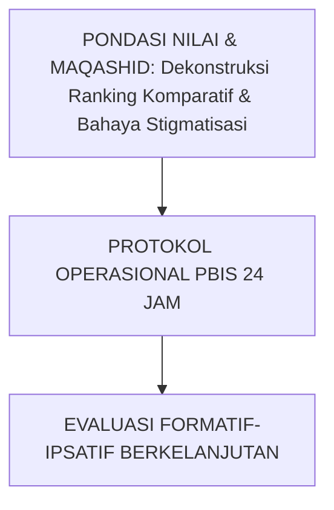

---

### Protokol Aksi Operasional Berjenjang

1. **Langkah Preventif Universal (Tahap Persiapan)**: Pengkondisian sarana, sosialisasi SOP, dan pembiasaan keteladanan *Qudwah Hasanah*.
2. **Langkah Eksekusi Lapangan (Tahap Berjalan)**: Pendampingan lekat oleh musyrif asrama dan wali kelas dengan prinsip *Firm & Kind*.
3. **Langkah Refleksi & Restorasi (Tahap Evaluasi)**: Pencatatan pada logbook digital dan penanganan kendala melalui dialog restoratif.


---


# SUB-BAB 1.2: PRINSIP ASESMEN FORMATIF AUTENTIK DALAM KEHIDUPAN NYATA
## *Kajian Mendalam & Panduan Implementatif Ekosistem TUMBUH Pesantren*

**Kode Klasifikasi**: `BOOK-03/BAB-01/SUB-02/MONOGRAF-MASTER-VIBRANT`  
**Disiplin Ilmu**: Metodologi Pendidikan Islam, Sains Perilaku Terapan, & Tata Kelola Pesantren  
**Penanggung Jawab Keilmuan**: Dewan Pakar Ekosistem TUMBUH (*24 Bidang Kepakaran*)

---

### Eksplanasi Teoretis & Urgensi Praksis

Pendidikan karakter yang efektif dalam Sistem TUMBUH membutuhkan kejelasan operasional pada aspek **Prinsip Asesmen Formatif Autentik dalam Kehidupan Nyata**. Naskah ini menguraikan landasan filosofis Turats, bukti empiris sains perilaku, dan protokol implementasi lapangan 24 jam.

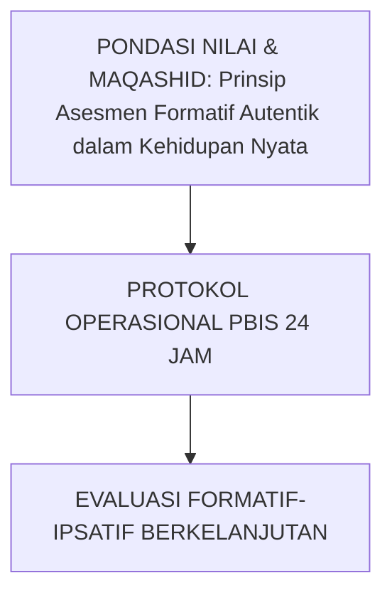

---

### Protokol Aksi Operasional Berjenjang

1. **Langkah Preventif Universal (Tahap Persiapan)**: Pengkondisian sarana, sosialisasi SOP, dan pembiasaan keteladanan *Qudwah Hasanah*.
2. **Langkah Eksekusi Lapangan (Tahap Berjalan)**: Pendampingan lekat oleh musyrif asrama dan wali kelas dengan prinsip *Firm & Kind*.
3. **Langkah Refleksi & Restorasi (Tahap Evaluasi)**: Pencatatan pada logbook digital dan penanganan kendala melalui dialog restoratif.


---


# SUB-BAB 1.3: KRITIK ATAS EVALUASI KERTAS FORMALITAS TANPA RUH
## *Kajian Mendalam & Panduan Implementatif Ekosistem TUMBUH Pesantren*

**Kode Klasifikasi**: `BOOK-03/BAB-01/SUB-03/MONOGRAF-MASTER-VIBRANT`  
**Disiplin Ilmu**: Metodologi Pendidikan Islam, Sains Perilaku Terapan, & Tata Kelola Pesantren  
**Penanggung Jawab Keilmuan**: Dewan Pakar Ekosistem TUMBUH (*24 Bidang Kepakaran*)

---

### Eksplanasi Teoretis & Urgensi Praksis

Pendidikan karakter yang efektif dalam Sistem TUMBUH membutuhkan kejelasan operasional pada aspek **Kritik atas Evaluasi Kertas Formalitas Tanpa Ruh**. Naskah ini menguraikan landasan filosofis Turats, bukti empiris sains perilaku, dan protokol implementasi lapangan 24 jam.

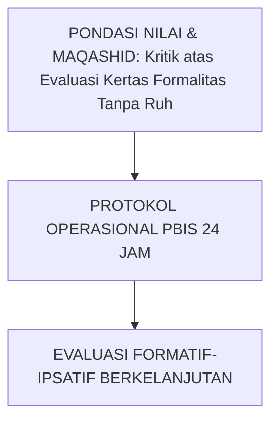

---

### Protokol Aksi Operasional Berjenjang

1. **Langkah Preventif Universal (Tahap Persiapan)**: Pengkondisian sarana, sosialisasi SOP, dan pembiasaan keteladanan *Qudwah Hasanah*.
2. **Langkah Eksekusi Lapangan (Tahap Berjalan)**: Pendampingan lekat oleh musyrif asrama dan wali kelas dengan prinsip *Firm & Kind*.
3. **Langkah Refleksi & Restorasi (Tahap Evaluasi)**: Pencatatan pada logbook digital dan penanganan kendala melalui dialog restoratif.


---


# SUB-BAB 1.4: ETIKA KERAHASIAAN DATA & KEBIJAKAN NON-LABELING SANTRI
## *Kajian Mendalam & Panduan Implementatif Ekosistem TUMBUH Pesantren*

**Kode Klasifikasi**: `BOOK-03/BAB-01/SUB-04/MONOGRAF-MASTER-VIBRANT`  
**Disiplin Ilmu**: Metodologi Pendidikan Islam, Sains Perilaku Terapan, & Tata Kelola Pesantren  
**Penanggung Jawab Keilmuan**: Dewan Pakar Ekosistem TUMBUH (*24 Bidang Kepakaran*)

---

### Eksplanasi Teoretis & Urgensi Praksis

Pendidikan karakter yang efektif dalam Sistem TUMBUH membutuhkan kejelasan operasional pada aspek **Etika Kerahasiaan Data & Kebijakan Non-Labeling Santri**. Naskah ini menguraikan landasan filosofis Turats, bukti empiris sains perilaku, dan protokol implementasi lapangan 24 jam.

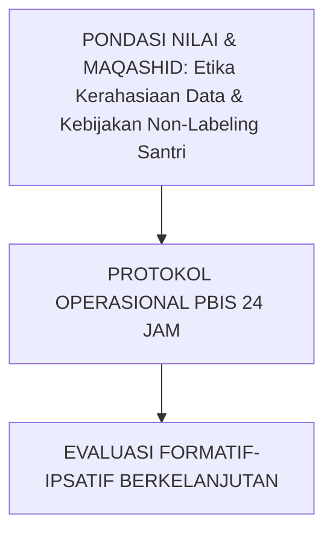

---

### Protokol Aksi Operasional Berjenjang

1. **Langkah Preventif Universal (Tahap Persiapan)**: Pengkondisian sarana, sosialisasi SOP, dan pembiasaan keteladanan *Qudwah Hasanah*.
2. **Langkah Eksekusi Lapangan (Tahap Berjalan)**: Pendampingan lekat oleh musyrif asrama dan wali kelas dengan prinsip *Firm & Kind*.
3. **Langkah Refleksi & Restorasi (Tahap Evaluasi)**: Pencatatan pada logbook digital dan penanganan kendala melalui dialog restoratif.


---


# SUB-BAB 2.1: KONSEP ASESMEN IPSATIF: EVALUASI BERPUSAT PADA PERTUMBUHAN DIRI
## *Kajian Mendalam & Panduan Implementatif Ekosistem TUMBUH Pesantren*

**Kode Klasifikasi**: `BOOK-03/BAB-02/SUB-01/MONOGRAF-MASTER-VIBRANT`  
**Disiplin Ilmu**: Metodologi Pendidikan Islam, Sains Perilaku Terapan, & Tata Kelola Pesantren  
**Penanggung Jawab Keilmuan**: Dewan Pakar Ekosistem TUMBUH (*24 Bidang Kepakaran*)

---

### Eksplanasi Teoretis & Urgensi Praksis

Pendidikan karakter yang efektif dalam Sistem TUMBUH membutuhkan kejelasan operasional pada aspek **Konsep Asesmen Ipsatif: Evaluasi Berpusat pada Pertumbuhan Diri**. Naskah ini menguraikan landasan filosofis Turats, bukti empiris sains perilaku, dan protokol implementasi lapangan 24 jam.

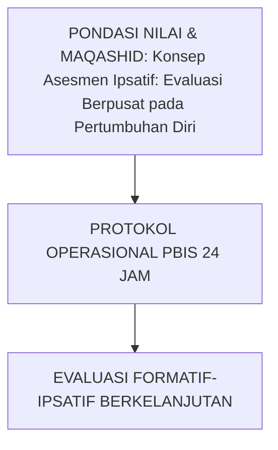

---

### Protokol Aksi Operasional Berjenjang

1. **Langkah Preventif Universal (Tahap Persiapan)**: Pengkondisian sarana, sosialisasi SOP, dan pembiasaan keteladanan *Qudwah Hasanah*.
2. **Langkah Eksekusi Lapangan (Tahap Berjalan)**: Pendampingan lekat oleh musyrif asrama dan wali kelas dengan prinsip *Firm & Kind*.
3. **Langkah Refleksi & Restorasi (Tahap Evaluasi)**: Pencatatan pada logbook digital dan penanganan kendala melalui dialog restoratif.


---


# SUB-BAB 2.2: PENGUKURAN KEMAJUAN DIRI VS REKAM JEJAK MASA LALU
## *Kajian Mendalam & Panduan Implementatif Ekosistem TUMBUH Pesantren*

**Kode Klasifikasi**: `BOOK-03/BAB-02/SUB-02/MONOGRAF-MASTER-VIBRANT`  
**Disiplin Ilmu**: Metodologi Pendidikan Islam, Sains Perilaku Terapan, & Tata Kelola Pesantren  
**Penanggung Jawab Keilmuan**: Dewan Pakar Ekosistem TUMBUH (*24 Bidang Kepakaran*)

---

### Eksplanasi Teoretis & Urgensi Praksis

Pendidikan karakter yang efektif dalam Sistem TUMBUH membutuhkan kejelasan operasional pada aspek **Pengukuran Kemajuan Diri vs Rekam Jejak Masa Lalu**. Naskah ini menguraikan landasan filosofis Turats, bukti empiris sains perilaku, dan protokol implementasi lapangan 24 jam.

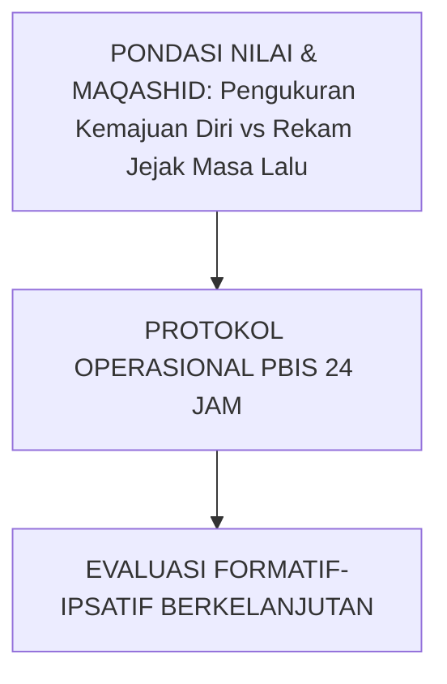

---

### Protokol Aksi Operasional Berjenjang

1. **Langkah Preventif Universal (Tahap Persiapan)**: Pengkondisian sarana, sosialisasi SOP, dan pembiasaan keteladanan *Qudwah Hasanah*.
2. **Langkah Eksekusi Lapangan (Tahap Berjalan)**: Pendampingan lekat oleh musyrif asrama dan wali kelas dengan prinsip *Firm & Kind*.
3. **Langkah Refleksi & Restorasi (Tahap Evaluasi)**: Pencatatan pada logbook digital dan penanganan kendala melalui dialog restoratif.


---


# SUB-BAB 2.3: UMPAN BALIK KONSTRUKTIF & FEEDFORWARD TARBAWIYYAH
## *Kajian Mendalam & Panduan Implementatif Ekosistem TUMBUH Pesantren*

**Kode Klasifikasi**: `BOOK-03/BAB-02/SUB-03/MONOGRAF-MASTER-VIBRANT`  
**Disiplin Ilmu**: Metodologi Pendidikan Islam, Sains Perilaku Terapan, & Tata Kelola Pesantren  
**Penanggung Jawab Keilmuan**: Dewan Pakar Ekosistem TUMBUH (*24 Bidang Kepakaran*)

---

### Eksplanasi Teoretis & Urgensi Praksis

Pendidikan karakter yang efektif dalam Sistem TUMBUH membutuhkan kejelasan operasional pada aspek **Umpan Balik Konstruktif & Feedforward Tarbawiyyah**. Naskah ini menguraikan landasan filosofis Turats, bukti empiris sains perilaku, dan protokol implementasi lapangan 24 jam.

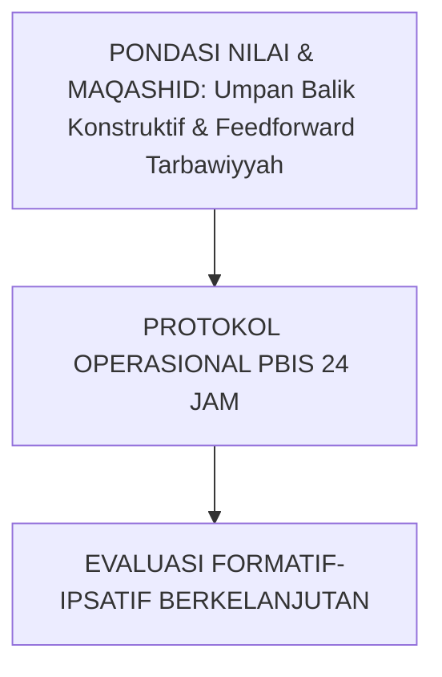

---

### Protokol Aksi Operasional Berjenjang

1. **Langkah Preventif Universal (Tahap Persiapan)**: Pengkondisian sarana, sosialisasi SOP, dan pembiasaan keteladanan *Qudwah Hasanah*.
2. **Langkah Eksekusi Lapangan (Tahap Berjalan)**: Pendampingan lekat oleh musyrif asrama dan wali kelas dengan prinsip *Firm & Kind*.
3. **Langkah Refleksi & Restorasi (Tahap Evaluasi)**: Pencatatan pada logbook digital dan penanganan kendala melalui dialog restoratif.


---


# SUB-BAB 2.4: PENGUATAN MOTIVASI INTRINSIK & SELF-REGULATED LEARNING
## *Kajian Mendalam & Panduan Implementatif Ekosistem TUMBUH Pesantren*

**Kode Klasifikasi**: `BOOK-03/BAB-02/SUB-04/MONOGRAF-MASTER-VIBRANT`  
**Disiplin Ilmu**: Metodologi Pendidikan Islam, Sains Perilaku Terapan, & Tata Kelola Pesantren  
**Penanggung Jawab Keilmuan**: Dewan Pakar Ekosistem TUMBUH (*24 Bidang Kepakaran*)

---

### Eksplanasi Teoretis & Urgensi Praksis

Pendidikan karakter yang efektif dalam Sistem TUMBUH membutuhkan kejelasan operasional pada aspek **Penguatan Motivasi Intrinsik & Self-Regulated Learning**. Naskah ini menguraikan landasan filosofis Turats, bukti empiris sains perilaku, dan protokol implementasi lapangan 24 jam.

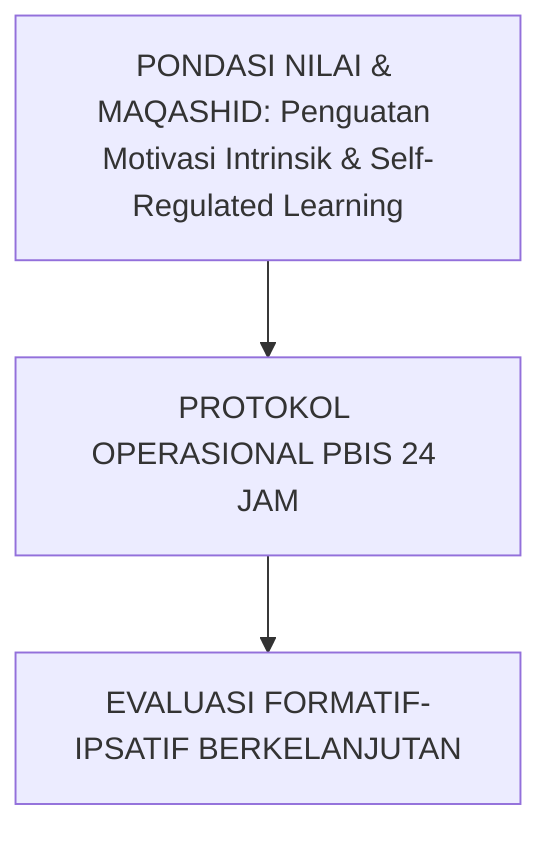

---

### Protokol Aksi Operasional Berjenjang

1. **Langkah Preventif Universal (Tahap Persiapan)**: Pengkondisian sarana, sosialisasi SOP, dan pembiasaan keteladanan *Qudwah Hasanah*.
2. **Langkah Eksekusi Lapangan (Tahap Berjalan)**: Pendampingan lekat oleh musyrif asrama dan wali kelas dengan prinsip *Firm & Kind*.
3. **Langkah Refleksi & Restorasi (Tahap Evaluasi)**: Pencatatan pada logbook digital dan penanganan kendala melalui dialog restoratif.


---


# SUB-BAB 3.1: TRIANGULASI TIGA POROS: SANTRI, MUSYRIF, DAN GURU
## *Kajian Mendalam & Panduan Implementatif Ekosistem TUMBUH Pesantren*

**Kode Klasifikasi**: `BOOK-03/BAB-03/SUB-01/MONOGRAF-MASTER-VIBRANT`  
**Disiplin Ilmu**: Metodologi Pendidikan Islam, Sains Perilaku Terapan, & Tata Kelola Pesantren  
**Penanggung Jawab Keilmuan**: Dewan Pakar Ekosistem TUMBUH (*24 Bidang Kepakaran*)

---

### Eksplanasi Teoretis & Urgensi Praksis

Pendidikan karakter yang efektif dalam Sistem TUMBUH membutuhkan kejelasan operasional pada aspek **Triangulasi Tiga Poros: Santri, Musyrif, dan Guru**. Naskah ini menguraikan landasan filosofis Turats, bukti empiris sains perilaku, dan protokol implementasi lapangan 24 jam.

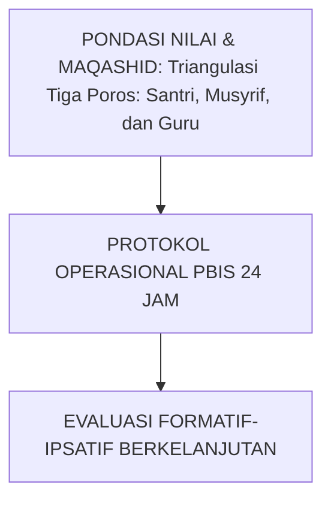

---

### Protokol Aksi Operasional Berjenjang

1. **Langkah Preventif Universal (Tahap Persiapan)**: Pengkondisian sarana, sosialisasi SOP, dan pembiasaan keteladanan *Qudwah Hasanah*.
2. **Langkah Eksekusi Lapangan (Tahap Berjalan)**: Pendampingan lekat oleh musyrif asrama dan wali kelas dengan prinsip *Firm & Kind*.
3. **Langkah Refleksi & Restorasi (Tahap Evaluasi)**: Pencatatan pada logbook digital dan penanganan kendala melalui dialog restoratif.


---


# SUB-BAB 3.2: INSTRUMEN SELF-ASSESSMENT & JURNAL MUHASABAH BATIN
## *Kajian Mendalam & Panduan Implementatif Ekosistem TUMBUH Pesantren*

**Kode Klasifikasi**: `BOOK-03/BAB-03/SUB-02/MONOGRAF-MASTER-VIBRANT`  
**Disiplin Ilmu**: Metodologi Pendidikan Islam, Sains Perilaku Terapan, & Tata Kelola Pesantren  
**Penanggung Jawab Keilmuan**: Dewan Pakar Ekosistem TUMBUH (*24 Bidang Kepakaran*)

---

### Eksplanasi Teoretis & Urgensi Praksis

Pendidikan karakter yang efektif dalam Sistem TUMBUH membutuhkan kejelasan operasional pada aspek **Instrumen Self-Assessment & Jurnal Muhasabah Batin**. Naskah ini menguraikan landasan filosofis Turats, bukti empiris sains perilaku, dan protokol implementasi lapangan 24 jam.

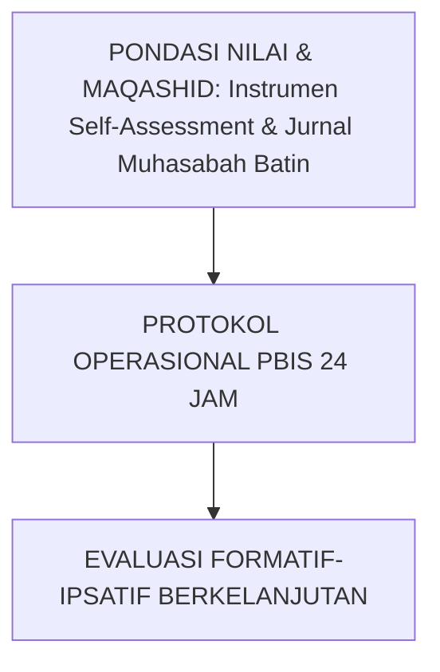

---

### Protokol Aksi Operasional Berjenjang

1. **Langkah Preventif Universal (Tahap Persiapan)**: Pengkondisian sarana, sosialisasi SOP, dan pembiasaan keteladanan *Qudwah Hasanah*.
2. **Langkah Eksekusi Lapangan (Tahap Berjalan)**: Pendampingan lekat oleh musyrif asrama dan wali kelas dengan prinsip *Firm & Kind*.
3. **Langkah Refleksi & Restorasi (Tahap Evaluasi)**: Pencatatan pada logbook digital dan penanganan kendala melalui dialog restoratif.


---


# SUB-BAB 3.3: PEER ASSESSMENT SOSIOMETRIK & BUDAYA SALING MENJAGA
## *Kajian Mendalam & Panduan Implementatif Ekosistem TUMBUH Pesantren*

**Kode Klasifikasi**: `BOOK-03/BAB-03/SUB-03/MONOGRAF-MASTER-VIBRANT`  
**Disiplin Ilmu**: Metodologi Pendidikan Islam, Sains Perilaku Terapan, & Tata Kelola Pesantren  
**Penanggung Jawab Keilmuan**: Dewan Pakar Ekosistem TUMBUH (*24 Bidang Kepakaran*)

---

### Eksplanasi Teoretis & Urgensi Praksis

Pendidikan karakter yang efektif dalam Sistem TUMBUH membutuhkan kejelasan operasional pada aspek **Peer Assessment Sosiometrik & Budaya Saling Menjaga**. Naskah ini menguraikan landasan filosofis Turats, bukti empiris sains perilaku, dan protokol implementasi lapangan 24 jam.

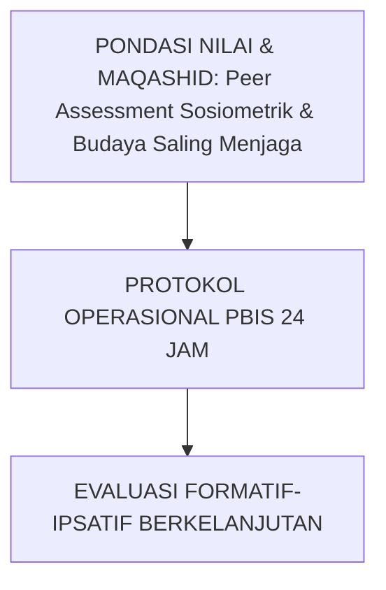

---

### Protokol Aksi Operasional Berjenjang

1. **Langkah Preventif Universal (Tahap Persiapan)**: Pengkondisian sarana, sosialisasi SOP, dan pembiasaan keteladanan *Qudwah Hasanah*.
2. **Langkah Eksekusi Lapangan (Tahap Berjalan)**: Pendampingan lekat oleh musyrif asrama dan wali kelas dengan prinsip *Firm & Kind*.
3. **Langkah Refleksi & Restorasi (Tahap Evaluasi)**: Pencatatan pada logbook digital dan penanganan kendala melalui dialog restoratif.


---


# SUB-BAB 3.4: OBSERVASI PERILAKU ALAMI MUSYRIF ASRAMA 24-JAM
## *Kajian Mendalam & Panduan Implementatif Ekosistem TUMBUH Pesantren*

**Kode Klasifikasi**: `BOOK-03/BAB-03/SUB-04/MONOGRAF-MASTER-VIBRANT`  
**Disiplin Ilmu**: Metodologi Pendidikan Islam, Sains Perilaku Terapan, & Tata Kelola Pesantren  
**Penanggung Jawab Keilmuan**: Dewan Pakar Ekosistem TUMBUH (*24 Bidang Kepakaran*)

---

### Eksplanasi Teoretis & Urgensi Praksis

Pendidikan karakter yang efektif dalam Sistem TUMBUH membutuhkan kejelasan operasional pada aspek **Observasi Perilaku Alami Musyrif Asrama 24-Jam**. Naskah ini menguraikan landasan filosofis Turats, bukti empiris sains perilaku, dan protokol implementasi lapangan 24 jam.

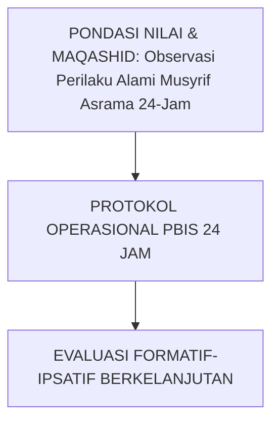

---

### Protokol Aksi Operasional Berjenjang

1. **Langkah Preventif Universal (Tahap Persiapan)**: Pengkondisian sarana, sosialisasi SOP, dan pembiasaan keteladanan *Qudwah Hasanah*.
2. **Langkah Eksekusi Lapangan (Tahap Berjalan)**: Pendampingan lekat oleh musyrif asrama dan wali kelas dengan prinsip *Firm & Kind*.
3. **Langkah Refleksi & Restorasi (Tahap Evaluasi)**: Pencatatan pada logbook digital dan penanganan kendala melalui dialog restoratif.


---


# SUB-BAB 3.5: SESI REKONSILIASI DISKREPANSI DATA TRIANGULASI
## *Kajian Mendalam & Panduan Implementatif Ekosistem TUMBUH Pesantren*

**Kode Klasifikasi**: `BOOK-03/BAB-03/SUB-05/MONOGRAF-MASTER-VIBRANT`  
**Disiplin Ilmu**: Metodologi Pendidikan Islam, Sains Perilaku Terapan, & Tata Kelola Pesantren  
**Penanggung Jawab Keilmuan**: Dewan Pakar Ekosistem TUMBUH (*24 Bidang Kepakaran*)

---

### Eksplanasi Teoretis & Urgensi Praksis

Pendidikan karakter yang efektif dalam Sistem TUMBUH membutuhkan kejelasan operasional pada aspek **Sesi Rekonsiliasi Diskrepansi Data Triangulasi**. Naskah ini menguraikan landasan filosofis Turats, bukti empiris sains perilaku, dan protokol implementasi lapangan 24 jam.

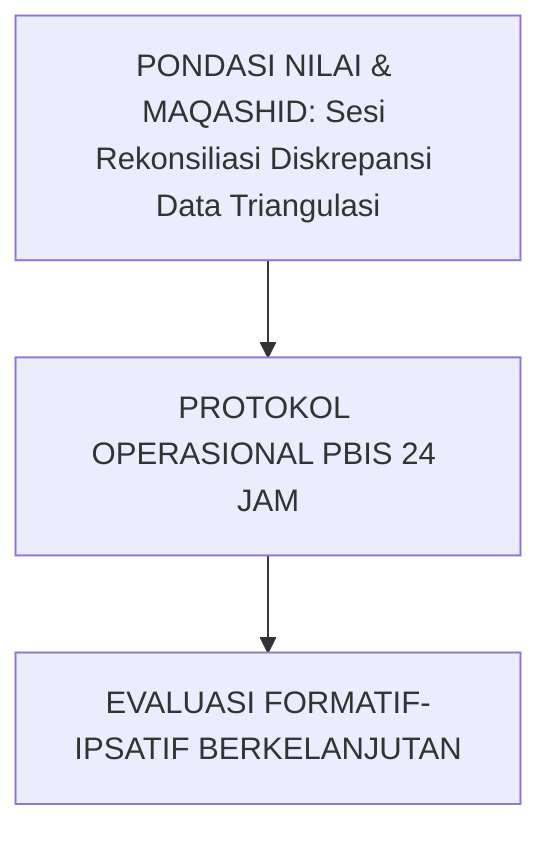

---

### Protokol Aksi Operasional Berjenjang

1. **Langkah Preventif Universal (Tahap Persiapan)**: Pengkondisian sarana, sosialisasi SOP, dan pembiasaan keteladanan *Qudwah Hasanah*.
2. **Langkah Eksekusi Lapangan (Tahap Berjalan)**: Pendampingan lekat oleh musyrif asrama dan wali kelas dengan prinsip *Firm & Kind*.
3. **Langkah Refleksi & Restorasi (Tahap Evaluasi)**: Pencatatan pada logbook digital dan penanganan kendala melalui dialog restoratif.


---


# SUB-BAB 4.1: RUBRIK PERILAKU 4-LEVEL 10 MUWASHAFAT KARAKTER
## *Kajian Mendalam & Panduan Implementatif Ekosistem TUMBUH Pesantren*

**Kode Klasifikasi**: `BOOK-03/BAB-04/SUB-01/MONOGRAF-MASTER-VIBRANT`  
**Disiplin Ilmu**: Metodologi Pendidikan Islam, Sains Perilaku Terapan, & Tata Kelola Pesantren  
**Penanggung Jawab Keilmuan**: Dewan Pakar Ekosistem TUMBUH (*24 Bidang Kepakaran*)

---

### Eksplanasi Teoretis & Urgensi Praksis

Pendidikan karakter yang efektif dalam Sistem TUMBUH membutuhkan kejelasan operasional pada aspek **Rubrik Perilaku 4-Level 10 Muwashafat Karakter**. Naskah ini menguraikan landasan filosofis Turats, bukti empiris sains perilaku, dan protokol implementasi lapangan 24 jam.

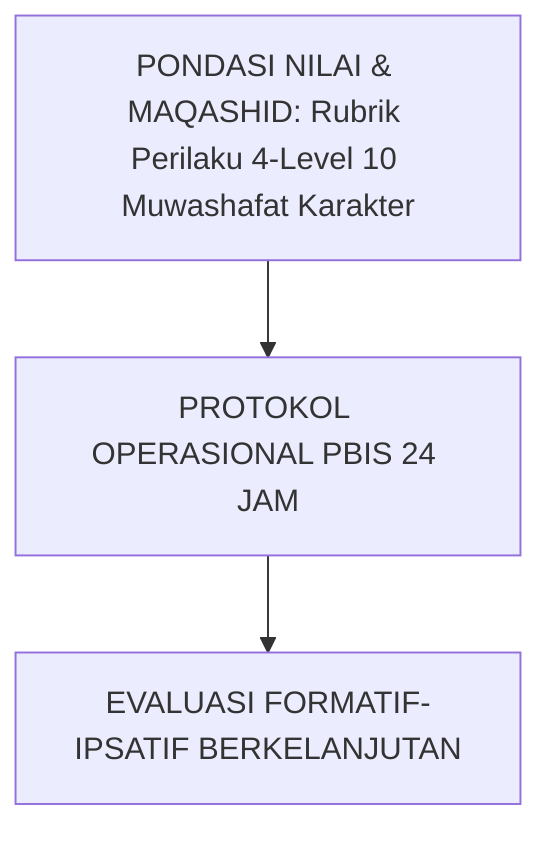

---

### Protokol Aksi Operasional Berjenjang

1. **Langkah Preventif Universal (Tahap Persiapan)**: Pengkondisian sarana, sosialisasi SOP, dan pembiasaan keteladanan *Qudwah Hasanah*.
2. **Langkah Eksekusi Lapangan (Tahap Berjalan)**: Pendampingan lekat oleh musyrif asrama dan wali kelas dengan prinsip *Firm & Kind*.
3. **Langkah Refleksi & Restorasi (Tahap Evaluasi)**: Pencatatan pada logbook digital dan penanganan kendala melalui dialog restoratif.


---


# SUB-BAB 4.2: STANDARISASI INDIKATOR PERILAKU TERAMATI (OBSERVABLE ANCHORS)
## *Kajian Mendalam & Panduan Implementatif Ekosistem TUMBUH Pesantren*

**Kode Klasifikasi**: `BOOK-03/BAB-04/SUB-02/MONOGRAF-MASTER-VIBRANT`  
**Disiplin Ilmu**: Metodologi Pendidikan Islam, Sains Perilaku Terapan, & Tata Kelola Pesantren  
**Penanggung Jawab Keilmuan**: Dewan Pakar Ekosistem TUMBUH (*24 Bidang Kepakaran*)

---

### Eksplanasi Teoretis & Urgensi Praksis

Pendidikan karakter yang efektif dalam Sistem TUMBUH membutuhkan kejelasan operasional pada aspek **Standarisasi Indikator Perilaku Teramati (Observable Anchors)**. Naskah ini menguraikan landasan filosofis Turats, bukti empiris sains perilaku, dan protokol implementasi lapangan 24 jam.

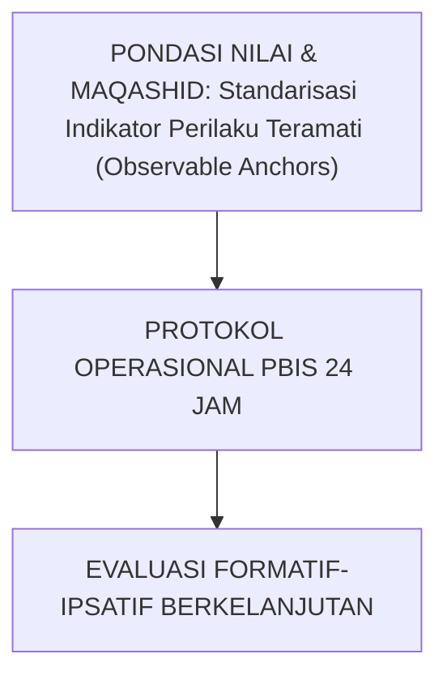

---

### Protokol Aksi Operasional Berjenjang

1. **Langkah Preventif Universal (Tahap Persiapan)**: Pengkondisian sarana, sosialisasi SOP, dan pembiasaan keteladanan *Qudwah Hasanah*.
2. **Langkah Eksekusi Lapangan (Tahap Berjalan)**: Pendampingan lekat oleh musyrif asrama dan wali kelas dengan prinsip *Firm & Kind*.
3. **Langkah Refleksi & Restorasi (Tahap Evaluasi)**: Pencatatan pada logbook digital dan penanganan kendala melalui dialog restoratif.


---


# SUB-BAB 4.3: SKALA PENGUKURAN DIMENSI RUHIYAH & KEDISIPLINAN IBADAH
## *Kajian Mendalam & Panduan Implementatif Ekosistem TUMBUH Pesantren*

**Kode Klasifikasi**: `BOOK-03/BAB-04/SUB-03/MONOGRAF-MASTER-VIBRANT`  
**Disiplin Ilmu**: Metodologi Pendidikan Islam, Sains Perilaku Terapan, & Tata Kelola Pesantren  
**Penanggung Jawab Keilmuan**: Dewan Pakar Ekosistem TUMBUH (*24 Bidang Kepakaran*)

---

### Eksplanasi Teoretis & Urgensi Praksis

Pendidikan karakter yang efektif dalam Sistem TUMBUH membutuhkan kejelasan operasional pada aspek **Skala Pengukuran Dimensi Ruhiyah & Kedisiplinan Ibadah**. Naskah ini menguraikan landasan filosofis Turats, bukti empiris sains perilaku, dan protokol implementasi lapangan 24 jam.

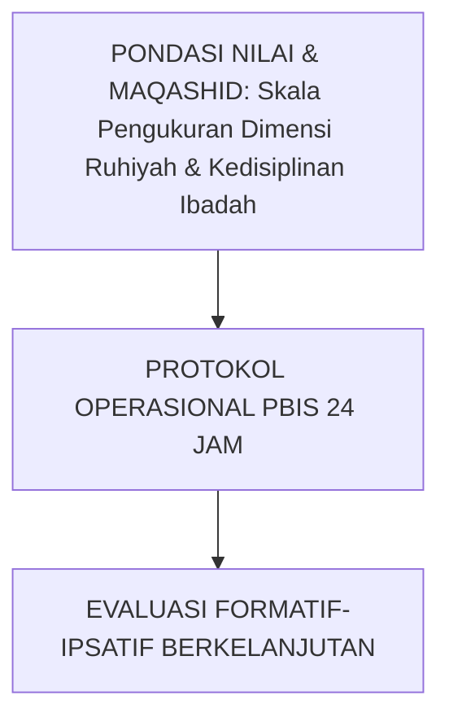

---

### Protokol Aksi Operasional Berjenjang

1. **Langkah Preventif Universal (Tahap Persiapan)**: Pengkondisian sarana, sosialisasi SOP, dan pembiasaan keteladanan *Qudwah Hasanah*.
2. **Langkah Eksekusi Lapangan (Tahap Berjalan)**: Pendampingan lekat oleh musyrif asrama dan wali kelas dengan prinsip *Firm & Kind*.
3. **Langkah Refleksi & Restorasi (Tahap Evaluasi)**: Pencatatan pada logbook digital dan penanganan kendala melalui dialog restoratif.


---


# SUB-BAB 4.4: SKALA PENGUKURAN DIMENSI FISIK, KEBUGARAN, & SANITASI 5S
## *Kajian Mendalam & Panduan Implementatif Ekosistem TUMBUH Pesantren*

**Kode Klasifikasi**: `BOOK-03/BAB-04/SUB-04/MONOGRAF-MASTER-VIBRANT`  
**Disiplin Ilmu**: Metodologi Pendidikan Islam, Sains Perilaku Terapan, & Tata Kelola Pesantren  
**Penanggung Jawab Keilmuan**: Dewan Pakar Ekosistem TUMBUH (*24 Bidang Kepakaran*)

---

### Eksplanasi Teoretis & Urgensi Praksis

Pendidikan karakter yang efektif dalam Sistem TUMBUH membutuhkan kejelasan operasional pada aspek **Skala Pengukuran Dimensi Fisik, Kebugaran, & Sanitasi 5S**. Naskah ini menguraikan landasan filosofis Turats, bukti empiris sains perilaku, dan protokol implementasi lapangan 24 jam.

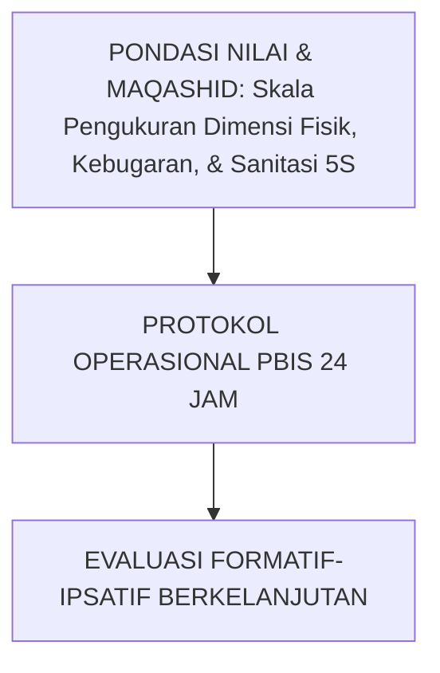

---

### Protokol Aksi Operasional Berjenjang

1. **Langkah Preventif Universal (Tahap Persiapan)**: Pengkondisian sarana, sosialisasi SOP, dan pembiasaan keteladanan *Qudwah Hasanah*.
2. **Langkah Eksekusi Lapangan (Tahap Berjalan)**: Pendampingan lekat oleh musyrif asrama dan wali kelas dengan prinsip *Firm & Kind*.
3. **Langkah Refleksi & Restorasi (Tahap Evaluasi)**: Pencatatan pada logbook digital dan penanganan kendala melalui dialog restoratif.


---


# SUB-BAB 5.1: UJI VALIDITAS ISI AIKEN'S V & RELIABILITAS KAPPA
## *Kajian Mendalam & Panduan Implementatif Ekosistem TUMBUH Pesantren*

**Kode Klasifikasi**: `BOOK-03/BAB-05/SUB-01/MONOGRAF-MASTER-VIBRANT`  
**Disiplin Ilmu**: Metodologi Pendidikan Islam, Sains Perilaku Terapan, & Tata Kelola Pesantren  
**Penanggung Jawab Keilmuan**: Dewan Pakar Ekosistem TUMBUH (*24 Bidang Kepakaran*)

---

### Eksplanasi Teoretis & Urgensi Praksis

Pendidikan karakter yang efektif dalam Sistem TUMBUH membutuhkan kejelasan operasional pada aspek **Uji Validitas Isi Aiken's V & Reliabilitas Kappa**. Naskah ini menguraikan landasan filosofis Turats, bukti empiris sains perilaku, dan protokol implementasi lapangan 24 jam.

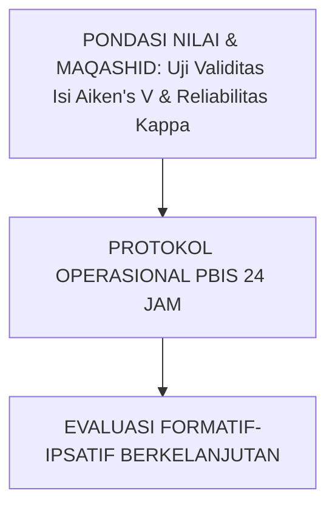

---

### Protokol Aksi Operasional Berjenjang

1. **Langkah Preventif Universal (Tahap Persiapan)**: Pengkondisian sarana, sosialisasi SOP, dan pembiasaan keteladanan *Qudwah Hasanah*.
2. **Langkah Eksekusi Lapangan (Tahap Berjalan)**: Pendampingan lekat oleh musyrif asrama dan wali kelas dengan prinsip *Firm & Kind*.
3. **Langkah Refleksi & Restorasi (Tahap Evaluasi)**: Pencatatan pada logbook digital dan penanganan kendala melalui dialog restoratif.


---


# SUB-BAB 5.2: PROSEDUR EXPERT JUDGMENT PANEL DEWAN KEILMUAN
## *Kajian Mendalam & Panduan Implementatif Ekosistem TUMBUH Pesantren*

**Kode Klasifikasi**: `BOOK-03/BAB-05/SUB-02/MONOGRAF-MASTER-VIBRANT`  
**Disiplin Ilmu**: Metodologi Pendidikan Islam, Sains Perilaku Terapan, & Tata Kelola Pesantren  
**Penanggung Jawab Keilmuan**: Dewan Pakar Ekosistem TUMBUH (*24 Bidang Kepakaran*)

---

### Eksplanasi Teoretis & Urgensi Praksis

Pendidikan karakter yang efektif dalam Sistem TUMBUH membutuhkan kejelasan operasional pada aspek **Prosedur Expert Judgment Panel Dewan Keilmuan**. Naskah ini menguraikan landasan filosofis Turats, bukti empiris sains perilaku, dan protokol implementasi lapangan 24 jam.

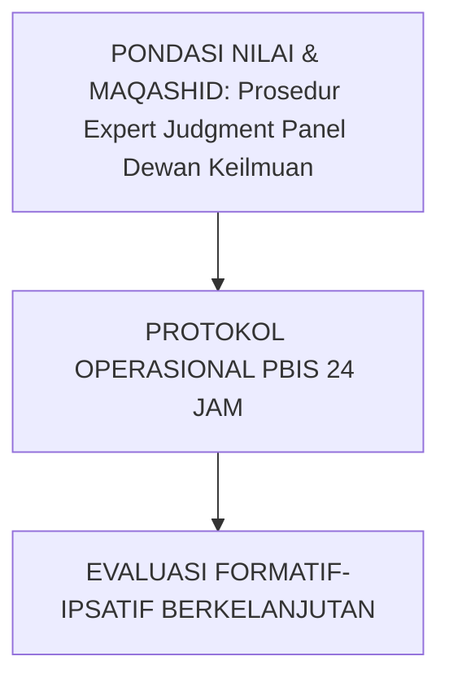

---

### Protokol Aksi Operasional Berjenjang

1. **Langkah Preventif Universal (Tahap Persiapan)**: Pengkondisian sarana, sosialisasi SOP, dan pembiasaan keteladanan *Qudwah Hasanah*.
2. **Langkah Eksekusi Lapangan (Tahap Berjalan)**: Pendampingan lekat oleh musyrif asrama dan wali kelas dengan prinsip *Firm & Kind*.
3. **Langkah Refleksi & Restorasi (Tahap Evaluasi)**: Pencatatan pada logbook digital dan penanganan kendala melalui dialog restoratif.


---


# SUB-BAB 5.3: STANDARISASI PELATIHAN ASESOR & RATER CALIBRATION MUSYRIF
## *Kajian Mendalam & Panduan Implementatif Ekosistem TUMBUH Pesantren*

**Kode Klasifikasi**: `BOOK-03/BAB-05/SUB-03/MONOGRAF-MASTER-VIBRANT`  
**Disiplin Ilmu**: Metodologi Pendidikan Islam, Sains Perilaku Terapan, & Tata Kelola Pesantren  
**Penanggung Jawab Keilmuan**: Dewan Pakar Ekosistem TUMBUH (*24 Bidang Kepakaran*)

---

### Eksplanasi Teoretis & Urgensi Praksis

Pendidikan karakter yang efektif dalam Sistem TUMBUH membutuhkan kejelasan operasional pada aspek **Standarisasi Pelatihan Asesor & Rater Calibration Musyrif**. Naskah ini menguraikan landasan filosofis Turats, bukti empiris sains perilaku, dan protokol implementasi lapangan 24 jam.

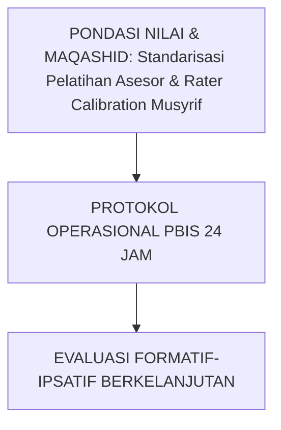

---

### Protokol Aksi Operasional Berjenjang

1. **Langkah Preventif Universal (Tahap Persiapan)**: Pengkondisian sarana, sosialisasi SOP, dan pembiasaan keteladanan *Qudwah Hasanah*.
2. **Langkah Eksekusi Lapangan (Tahap Berjalan)**: Pendampingan lekat oleh musyrif asrama dan wali kelas dengan prinsip *Firm & Kind*.
3. **Langkah Refleksi & Restorasi (Tahap Evaluasi)**: Pencatatan pada logbook digital dan penanganan kendala melalui dialog restoratif.


---


# SUB-BAB 5.4: MITIGASI BIAS PENILAIAN: HALO EFFECT, LENIENCY, & SEVERITY
## *Kajian Mendalam & Panduan Implementatif Ekosistem TUMBUH Pesantren*

**Kode Klasifikasi**: `BOOK-03/BAB-05/SUB-04/MONOGRAF-MASTER-VIBRANT`  
**Disiplin Ilmu**: Metodologi Pendidikan Islam, Sains Perilaku Terapan, & Tata Kelola Pesantren  
**Penanggung Jawab Keilmuan**: Dewan Pakar Ekosistem TUMBUH (*24 Bidang Kepakaran*)

---

### Eksplanasi Teoretis & Urgensi Praksis

Pendidikan karakter yang efektif dalam Sistem TUMBUH membutuhkan kejelasan operasional pada aspek **Mitigasi Bias Penilaian: Halo Effect, Leniency, & Severity**. Naskah ini menguraikan landasan filosofis Turats, bukti empiris sains perilaku, dan protokol implementasi lapangan 24 jam.

```mermaid
graph TD
    Tujuan["PONDASI NILAI & MAQASHID: Mitigasi Bias Penilaian: Halo Effect, Leniency, & Severity"] --> Operasional["PROTOKOL OPERASIONAL PBIS 24 JAM"]
    Operasional --> Evaluasi["EVALUASI FORMATIF-IPSATIF BERKELANJUTAN"]
```

---

### Protokol Aksi Operasional Berjenjang

1. **Langkah Preventif Universal (Tahap Persiapan)**: Pengkondisian sarana, sosialisasi SOP, dan pembiasaan keteladanan *Qudwah Hasanah*.
2. **Langkah Eksekusi Lapangan (Tahap Berjalan)**: Pendampingan lekat oleh musyrif asrama dan wali kelas dengan prinsip *Firm & Kind*.
3. **Langkah Refleksi & Restorasi (Tahap Evaluasi)**: Pencatatan pada logbook digital dan penanganan kendala melalui dialog restoratif.


---


# SUB-BAB 5.5: VALIDASI KONSTRUK & ANALISIS FAKTOR INSTRUMEN KARAKTER
## *Kajian Mendalam & Panduan Implementatif Ekosistem TUMBUH Pesantren*

**Kode Klasifikasi**: `BOOK-03/BAB-05/SUB-05/MONOGRAF-MASTER-VIBRANT`  
**Disiplin Ilmu**: Metodologi Pendidikan Islam, Sains Perilaku Terapan, & Tata Kelola Pesantren  
**Penanggung Jawab Keilmuan**: Dewan Pakar Ekosistem TUMBUH (*24 Bidang Kepakaran*)

---

### Eksplanasi Teoretis & Urgensi Praksis

Pendidikan karakter yang efektif dalam Sistem TUMBUH membutuhkan kejelasan operasional pada aspek **Validasi Konstruk & Analisis Faktor Instrumen Karakter**. Naskah ini menguraikan landasan filosofis Turats, bukti empiris sains perilaku, dan protokol implementasi lapangan 24 jam.

```mermaid
graph TD
    Tujuan["PONDASI NILAI & MAQASHID: Validasi Konstruk & Analisis Faktor Instrumen Karakter"] --> Operasional["PROTOKOL OPERASIONAL PBIS 24 JAM"]
    Operasional --> Evaluasi["EVALUASI FORMATIF-IPSATIF BERKELANJUTAN"]
```

---

### Protokol Aksi Operasional Berjenjang

1. **Langkah Preventif Universal (Tahap Persiapan)**: Pengkondisian sarana, sosialisasi SOP, dan pembiasaan keteladanan *Qudwah Hasanah*.
2. **Langkah Eksekusi Lapangan (Tahap Berjalan)**: Pendampingan lekat oleh musyrif asrama dan wali kelas dengan prinsip *Firm & Kind*.
3. **Langkah Refleksi & Restorasi (Tahap Evaluasi)**: Pencatatan pada logbook digital dan penanganan kendala melalui dialog restoratif.


---


# SUB-BAB 5.6: STANDARISASI BAKU PSIKOMETRI PESANTREN INDONESIA
## *Kajian Mendalam & Panduan Implementatif Ekosistem TUMBUH Pesantren*

**Kode Klasifikasi**: `BOOK-03/BAB-05/SUB-06/MONOGRAF-MASTER-VIBRANT`  
**Disiplin Ilmu**: Metodologi Pendidikan Islam, Sains Perilaku Terapan, & Tata Kelola Pesantren  
**Penanggung Jawab Keilmuan**: Dewan Pakar Ekosistem TUMBUH (*24 Bidang Kepakaran*)

---

### Eksplanasi Teoretis & Urgensi Praksis

Pendidikan karakter yang efektif dalam Sistem TUMBUH membutuhkan kejelasan operasional pada aspek **Standarisasi Baku Psikometri Pesantren Indonesia**. Naskah ini menguraikan landasan filosofis Turats, bukti empiris sains perilaku, dan protokol implementasi lapangan 24 jam.

```mermaid
graph TD
    Tujuan["PONDASI NILAI & MAQASHID: Standarisasi Baku Psikometri Pesantren Indonesia"] --> Operasional["PROTOKOL OPERASIONAL PBIS 24 JAM"]
    Operasional --> Evaluasi["EVALUASI FORMATIF-IPSATIF BERKELANJUTAN"]
```

---

### Protokol Aksi Operasional Berjenjang

1. **Langkah Preventif Universal (Tahap Persiapan)**: Pengkondisian sarana, sosialisasi SOP, dan pembiasaan keteladanan *Qudwah Hasanah*.
2. **Langkah Eksekusi Lapangan (Tahap Berjalan)**: Pendampingan lekat oleh musyrif asrama dan wali kelas dengan prinsip *Firm & Kind*.
3. **Langkah Refleksi & Restorasi (Tahap Evaluasi)**: Pencatatan pada logbook digital dan penanganan kendala melalui dialog restoratif.


---


# SUB-BAB 6.1: SOP PENCATATAN DIGITAL EFISIEN 15-MENIT
## *Kajian Mendalam & Panduan Implementatif Ekosistem TUMBUH Pesantren*

**Kode Klasifikasi**: `BOOK-03/BAB-06/SUB-01/MONOGRAF-MASTER-VIBRANT`  
**Disiplin Ilmu**: Metodologi Pendidikan Islam, Sains Perilaku Terapan, & Tata Kelola Pesantren  
**Penanggung Jawab Keilmuan**: Dewan Pakar Ekosistem TUMBUH (*24 Bidang Kepakaran*)

---

### Eksplanasi Teoretis & Urgensi Praksis

Pendidikan karakter yang efektif dalam Sistem TUMBUH membutuhkan kejelasan operasional pada aspek **SOP Pencatatan Digital Efisien 15-Menit**. Naskah ini menguraikan landasan filosofis Turats, bukti empiris sains perilaku, dan protokol implementasi lapangan 24 jam.

```mermaid
graph TD
    Tujuan["PONDASI NILAI & MAQASHID: SOP Pencatatan Digital Efisien 15-Menit"] --> Operasional["PROTOKOL OPERASIONAL PBIS 24 JAM"]
    Operasional --> Evaluasi["EVALUASI FORMATIF-IPSATIF BERKELANJUTAN"]
```

---

### Protokol Aksi Operasional Berjenjang

1. **Langkah Preventif Universal (Tahap Persiapan)**: Pengkondisian sarana, sosialisasi SOP, dan pembiasaan keteladanan *Qudwah Hasanah*.
2. **Langkah Eksekusi Lapangan (Tahap Berjalan)**: Pendampingan lekat oleh musyrif asrama dan wali kelas dengan prinsip *Firm & Kind*.
3. **Langkah Refleksi & Restorasi (Tahap Evaluasi)**: Pencatatan pada logbook digital dan penanganan kendala melalui dialog restoratif.


---


# SUB-BAB 6.2: ARSITEKTUR LOGBOOK MOBILE APP OFFLINE-FIRST SYNCING
## *Kajian Mendalam & Panduan Implementatif Ekosistem TUMBUH Pesantren*

**Kode Klasifikasi**: `BOOK-03/BAB-06/SUB-02/MONOGRAF-MASTER-VIBRANT`  
**Disiplin Ilmu**: Metodologi Pendidikan Islam, Sains Perilaku Terapan, & Tata Kelola Pesantren  
**Penanggung Jawab Keilmuan**: Dewan Pakar Ekosistem TUMBUH (*24 Bidang Kepakaran*)

---

### Eksplanasi Teoretis & Urgensi Praksis

Pendidikan karakter yang efektif dalam Sistem TUMBUH membutuhkan kejelasan operasional pada aspek **Arsitektur Logbook Mobile App Offline-First Syncing**. Naskah ini menguraikan landasan filosofis Turats, bukti empiris sains perilaku, dan protokol implementasi lapangan 24 jam.

```mermaid
graph TD
    Tujuan["PONDASI NILAI & MAQASHID: Arsitektur Logbook Mobile App Offline-First Syncing"] --> Operasional["PROTOKOL OPERASIONAL PBIS 24 JAM"]
    Operasional --> Evaluasi["EVALUASI FORMATIF-IPSATIF BERKELANJUTAN"]
```

---

### Protokol Aksi Operasional Berjenjang

1. **Langkah Preventif Universal (Tahap Persiapan)**: Pengkondisian sarana, sosialisasi SOP, dan pembiasaan keteladanan *Qudwah Hasanah*.
2. **Langkah Eksekusi Lapangan (Tahap Berjalan)**: Pendampingan lekat oleh musyrif asrama dan wali kelas dengan prinsip *Firm & Kind*.
3. **Langkah Refleksi & Restorasi (Tahap Evaluasi)**: Pencatatan pada logbook digital dan penanganan kendala melalui dialog restoratif.


---


# SUB-BAB 6.3: DASHBOARD EARLY WARNING SYSTEM (EWS) DETEKSI DINI PENURUNAN ADAB
## *Kajian Mendalam & Panduan Implementatif Ekosistem TUMBUH Pesantren*

**Kode Klasifikasi**: `BOOK-03/BAB-06/SUB-03/MONOGRAF-MASTER-VIBRANT`  
**Disiplin Ilmu**: Metodologi Pendidikan Islam, Sains Perilaku Terapan, & Tata Kelola Pesantren  
**Penanggung Jawab Keilmuan**: Dewan Pakar Ekosistem TUMBUH (*24 Bidang Kepakaran*)

---

### Eksplanasi Teoretis & Urgensi Praksis

Pendidikan karakter yang efektif dalam Sistem TUMBUH membutuhkan kejelasan operasional pada aspek **Dashboard Early Warning System (EWS) Deteksi Dini Penurunan Adab**. Naskah ini menguraikan landasan filosofis Turats, bukti empiris sains perilaku, dan protokol implementasi lapangan 24 jam.

```mermaid
graph TD
    Tujuan["PONDASI NILAI & MAQASHID: Dashboard Early Warning System (EWS) Deteksi Dini Penurunan Adab"] --> Operasional["PROTOKOL OPERASIONAL PBIS 24 JAM"]
    Operasional --> Evaluasi["EVALUASI FORMATIF-IPSATIF BERKELANJUTAN"]
```

---

### Protokol Aksi Operasional Berjenjang

1. **Langkah Preventif Universal (Tahap Persiapan)**: Pengkondisian sarana, sosialisasi SOP, dan pembiasaan keteladanan *Qudwah Hasanah*.
2. **Langkah Eksekusi Lapangan (Tahap Berjalan)**: Pendampingan lekat oleh musyrif asrama dan wali kelas dengan prinsip *Firm & Kind*.
3. **Langkah Refleksi & Restorasi (Tahap Evaluasi)**: Pencatatan pada logbook digital dan penanganan kendala melalui dialog restoratif.


---


# SUB-BAB 6.4: MANAJEMEN PRIVASI & KEAMANAN SIBER DATA KARAKTER
## *Kajian Mendalam & Panduan Implementatif Ekosistem TUMBUH Pesantren*

**Kode Klasifikasi**: `BOOK-03/BAB-06/SUB-04/MONOGRAF-MASTER-VIBRANT`  
**Disiplin Ilmu**: Metodologi Pendidikan Islam, Sains Perilaku Terapan, & Tata Kelola Pesantren  
**Penanggung Jawab Keilmuan**: Dewan Pakar Ekosistem TUMBUH (*24 Bidang Kepakaran*)

---

### Eksplanasi Teoretis & Urgensi Praksis

Pendidikan karakter yang efektif dalam Sistem TUMBUH membutuhkan kejelasan operasional pada aspek **Manajemen Privasi & Keamanan Siber Data Karakter**. Naskah ini menguraikan landasan filosofis Turats, bukti empiris sains perilaku, dan protokol implementasi lapangan 24 jam.

```mermaid
graph TD
    Tujuan["PONDASI NILAI & MAQASHID: Manajemen Privasi & Keamanan Siber Data Karakter"] --> Operasional["PROTOKOL OPERASIONAL PBIS 24 JAM"]
    Operasional --> Evaluasi["EVALUASI FORMATIF-IPSATIF BERKELANJUTAN"]
```

---

### Protokol Aksi Operasional Berjenjang

1. **Langkah Preventif Universal (Tahap Persiapan)**: Pengkondisian sarana, sosialisasi SOP, dan pembiasaan keteladanan *Qudwah Hasanah*.
2. **Langkah Eksekusi Lapangan (Tahap Berjalan)**: Pendampingan lekat oleh musyrif asrama dan wali kelas dengan prinsip *Firm & Kind*.
3. **Langkah Refleksi & Restorasi (Tahap Evaluasi)**: Pencatatan pada logbook digital dan penanganan kendala melalui dialog restoratif.


---


# SUB-BAB 6.5: ANALITIK PREDIKTIF & VISUALISASI GRAFIK PERTUMBUHAN
## *Kajian Mendalam & Panduan Implementatif Ekosistem TUMBUH Pesantren*

**Kode Klasifikasi**: `BOOK-03/BAB-06/SUB-05/MONOGRAF-MASTER-VIBRANT`  
**Disiplin Ilmu**: Metodologi Pendidikan Islam, Sains Perilaku Terapan, & Tata Kelola Pesantren  
**Penanggung Jawab Keilmuan**: Dewan Pakar Ekosistem TUMBUH (*24 Bidang Kepakaran*)

---

### Eksplanasi Teoretis & Urgensi Praksis

Pendidikan karakter yang efektif dalam Sistem TUMBUH membutuhkan kejelasan operasional pada aspek **Analitik Prediktif & Visualisasi Grafik Pertumbuhan**. Naskah ini menguraikan landasan filosofis Turats, bukti empiris sains perilaku, dan protokol implementasi lapangan 24 jam.

```mermaid
graph TD
    Tujuan["PONDASI NILAI & MAQASHID: Analitik Prediktif & Visualisasi Grafik Pertumbuhan"] --> Operasional["PROTOKOL OPERASIONAL PBIS 24 JAM"]
    Operasional --> Evaluasi["EVALUASI FORMATIF-IPSATIF BERKELANJUTAN"]
```

---

### Protokol Aksi Operasional Berjenjang

1. **Langkah Preventif Universal (Tahap Persiapan)**: Pengkondisian sarana, sosialisasi SOP, dan pembiasaan keteladanan *Qudwah Hasanah*.
2. **Langkah Eksekusi Lapangan (Tahap Berjalan)**: Pendampingan lekat oleh musyrif asrama dan wali kelas dengan prinsip *Firm & Kind*.
3. **Langkah Refleksi & Restorasi (Tahap Evaluasi)**: Pencatatan pada logbook digital dan penanganan kendala melalui dialog restoratif.


---


# SUB-BAB 7.1: DESAIN RAPOR KARAKTER IPSATIF BAGI WALI SANTRI
## *Kajian Mendalam & Panduan Implementatif Ekosistem TUMBUH Pesantren*

**Kode Klasifikasi**: `BOOK-03/BAB-07/SUB-01/MONOGRAF-MASTER-VIBRANT`  
**Disiplin Ilmu**: Metodologi Pendidikan Islam, Sains Perilaku Terapan, & Tata Kelola Pesantren  
**Penanggung Jawab Keilmuan**: Dewan Pakar Ekosistem TUMBUH (*24 Bidang Kepakaran*)

---

### Eksplanasi Teoretis & Urgensi Praksis

Pendidikan karakter yang efektif dalam Sistem TUMBUH membutuhkan kejelasan operasional pada aspek **Desain Rapor Karakter Ipsatif bagi Wali Santri**. Naskah ini menguraikan landasan filosofis Turats, bukti empiris sains perilaku, dan protokol implementasi lapangan 24 jam.

```mermaid
graph TD
    Tujuan["PONDASI NILAI & MAQASHID: Desain Rapor Karakter Ipsatif bagi Wali Santri"] --> Operasional["PROTOKOL OPERASIONAL PBIS 24 JAM"]
    Operasional --> Evaluasi["EVALUASI FORMATIF-IPSATIF BERKELANJUTAN"]
```

---

### Protokol Aksi Operasional Berjenjang

1. **Langkah Preventif Universal (Tahap Persiapan)**: Pengkondisian sarana, sosialisasi SOP, dan pembiasaan keteladanan *Qudwah Hasanah*.
2. **Langkah Eksekusi Lapangan (Tahap Berjalan)**: Pendampingan lekat oleh musyrif asrama dan wali kelas dengan prinsip *Firm & Kind*.
3. **Langkah Refleksi & Restorasi (Tahap Evaluasi)**: Pencatatan pada logbook digital dan penanganan kendala melalui dialog restoratif.


---


# SUB-BAB 7.2: DOKUMENTASI ARTEFAK KHIDMAH & PORTOFOLIO ADAB
## *Kajian Mendalam & Panduan Implementatif Ekosistem TUMBUH Pesantren*

**Kode Klasifikasi**: `BOOK-03/BAB-07/SUB-02/MONOGRAF-MASTER-VIBRANT`  
**Disiplin Ilmu**: Metodologi Pendidikan Islam, Sains Perilaku Terapan, & Tata Kelola Pesantren  
**Penanggung Jawab Keilmuan**: Dewan Pakar Ekosistem TUMBUH (*24 Bidang Kepakaran*)

---

### Eksplanasi Teoretis & Urgensi Praksis

Pendidikan karakter yang efektif dalam Sistem TUMBUH membutuhkan kejelasan operasional pada aspek **Dokumentasi Artefak Khidmah & Portofolio Adab**. Naskah ini menguraikan landasan filosofis Turats, bukti empiris sains perilaku, dan protokol implementasi lapangan 24 jam.

```mermaid
graph TD
    Tujuan["PONDASI NILAI & MAQASHID: Dokumentasi Artefak Khidmah & Portofolio Adab"] --> Operasional["PROTOKOL OPERASIONAL PBIS 24 JAM"]
    Operasional --> Evaluasi["EVALUASI FORMATIF-IPSATIF BERKELANJUTAN"]
```

---

### Protokol Aksi Operasional Berjenjang

1. **Langkah Preventif Universal (Tahap Persiapan)**: Pengkondisian sarana, sosialisasi SOP, dan pembiasaan keteladanan *Qudwah Hasanah*.
2. **Langkah Eksekusi Lapangan (Tahap Berjalan)**: Pendampingan lekat oleh musyrif asrama dan wali kelas dengan prinsip *Firm & Kind*.
3. **Langkah Refleksi & Restorasi (Tahap Evaluasi)**: Pencatatan pada logbook digital dan penanganan kendala melalui dialog restoratif.


---


# SUB-BAB 7.3: PARENT-TEACHER-MUSYRIF CONFERENCE (PTMC) TRIWULANAN
## *Kajian Mendalam & Panduan Implementatif Ekosistem TUMBUH Pesantren*

**Kode Klasifikasi**: `BOOK-03/BAB-07/SUB-03/MONOGRAF-MASTER-VIBRANT`  
**Disiplin Ilmu**: Metodologi Pendidikan Islam, Sains Perilaku Terapan, & Tata Kelola Pesantren  
**Penanggung Jawab Keilmuan**: Dewan Pakar Ekosistem TUMBUH (*24 Bidang Kepakaran*)

---

### Eksplanasi Teoretis & Urgensi Praksis

Pendidikan karakter yang efektif dalam Sistem TUMBUH membutuhkan kejelasan operasional pada aspek **Parent-Teacher-Musyrif Conference (PTMC) Triwulanan**. Naskah ini menguraikan landasan filosofis Turats, bukti empiris sains perilaku, dan protokol implementasi lapangan 24 jam.

```mermaid
graph TD
    Tujuan["PONDASI NILAI & MAQASHID: Parent-Teacher-Musyrif Conference (PTMC) Triwulanan"] --> Operasional["PROTOKOL OPERASIONAL PBIS 24 JAM"]
    Operasional --> Evaluasi["EVALUASI FORMATIF-IPSATIF BERKELANJUTAN"]
```

---

### Protokol Aksi Operasional Berjenjang

1. **Langkah Preventif Universal (Tahap Persiapan)**: Pengkondisian sarana, sosialisasi SOP, dan pembiasaan keteladanan *Qudwah Hasanah*.
2. **Langkah Eksekusi Lapangan (Tahap Berjalan)**: Pendampingan lekat oleh musyrif asrama dan wali kelas dengan prinsip *Firm & Kind*.
3. **Langkah Refleksi & Restorasi (Tahap Evaluasi)**: Pencatatan pada logbook digital dan penanganan kendala melalui dialog restoratif.


---


# SUB-BAB 7.4: TRANSKRIP KARAKTER RESMI KELULUSAN & REKOMENDASI KHIDMAH
## *Kajian Mendalam & Panduan Implementatif Ekosistem TUMBUH Pesantren*

**Kode Klasifikasi**: `BOOK-03/BAB-07/SUB-04/MONOGRAF-MASTER-VIBRANT`  
**Disiplin Ilmu**: Metodologi Pendidikan Islam, Sains Perilaku Terapan, & Tata Kelola Pesantren  
**Penanggung Jawab Keilmuan**: Dewan Pakar Ekosistem TUMBUH (*24 Bidang Kepakaran*)

---

### Eksplanasi Teoretis & Urgensi Praksis

Pendidikan karakter yang efektif dalam Sistem TUMBUH membutuhkan kejelasan operasional pada aspek **Transkrip Karakter Resmi Kelulusan & Rekomendasi Khidmah**. Naskah ini menguraikan landasan filosofis Turats, bukti empiris sains perilaku, dan protokol implementasi lapangan 24 jam.

```mermaid
graph TD
    Tujuan["PONDASI NILAI & MAQASHID: Transkrip Karakter Resmi Kelulusan & Rekomendasi Khidmah"] --> Operasional["PROTOKOL OPERASIONAL PBIS 24 JAM"]
    Operasional --> Evaluasi["EVALUASI FORMATIF-IPSATIF BERKELANJUTAN"]
```

---

### Protokol Aksi Operasional Berjenjang

1. **Langkah Preventif Universal (Tahap Persiapan)**: Pengkondisian sarana, sosialisasi SOP, dan pembiasaan keteladanan *Qudwah Hasanah*.
2. **Langkah Eksekusi Lapangan (Tahap Berjalan)**: Pendampingan lekat oleh musyrif asrama dan wali kelas dengan prinsip *Firm & Kind*.
3. **Langkah Refleksi & Restorasi (Tahap Evaluasi)**: Pencatatan pada logbook digital dan penanganan kendala melalui dialog restoratif.


---


# DAFTAR PUSTAKA LENGKAP BUKU VOLUME 03
## *Rujukan Standar APA 7th Edition & Turats Klasik Asesmen Perkembangan*

1. **Aiken, L. R.** (1985). *Three coefficients for analyzing the reliability and validity of ratings*. *Educational and Psychological Measurement*, 45(1), 131–142.
2. **Al-Ghazali, Abu Hamid.** (2018). *Ihya' 'Ulumiddin: Kitab al-Muhasabah wal Muraqabah*. Beirut: Dar Al-Kutub Al-'Ilmiyyah.
3. **Fleiss, J. L., Levin, B., & Paik, M. C.** (2003). *Statistical Methods for Rates and Proportions* (3rd ed.). Hoboken: John Wiley & Sons.
4. **Hughes, G.** (2014). *Ipsative Assessment: Motivation through marking progress*. London: Palgrave Macmillan.
5. **Ibnu Qayyim Al-Jauziyyah.** (1997). *Madarij as-Salikin bayna Manazil Iyyaka Na'budu wa Iyyaka Nasta'in*. Kairo: Darul Hadits.
6. **Popham, W. J.** (2018). *Classroom Assessment: What Teachers Need to Know* (8th ed.). Boston: Pearson.
7. **Sugai, G., & Horner, R. H.** (2020). *School-Wide Positive Behavioral Interventions and Supports: Assessment and Evaluation Framework*. *Journal of Positive Behavior Interventions*, 22(4), 203–211.

