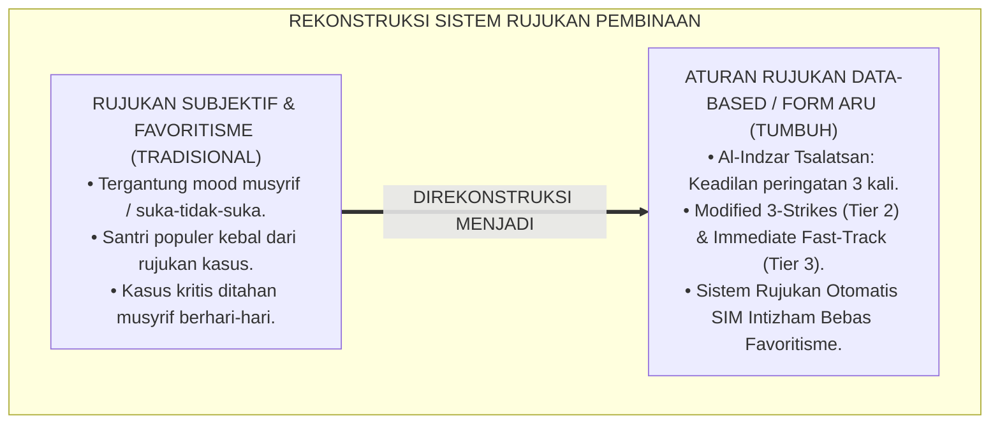
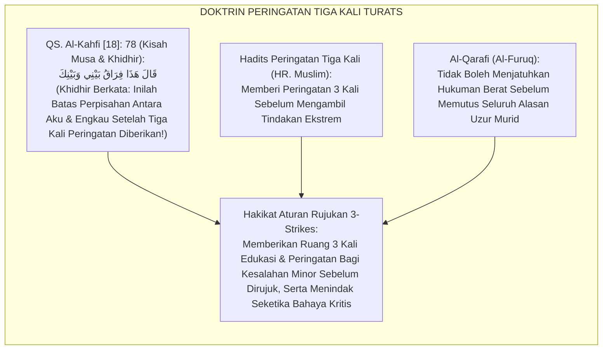
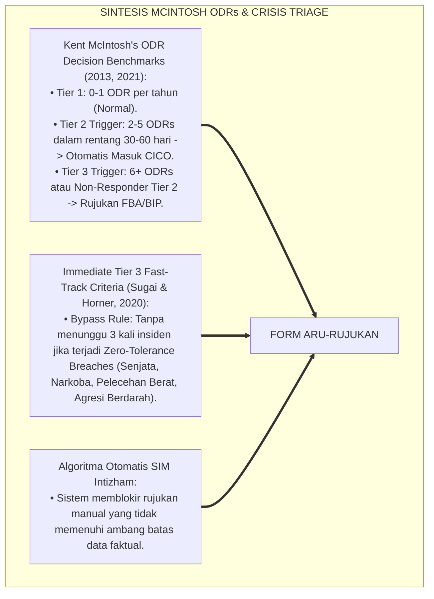
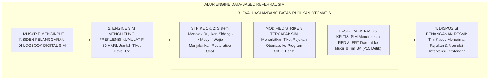
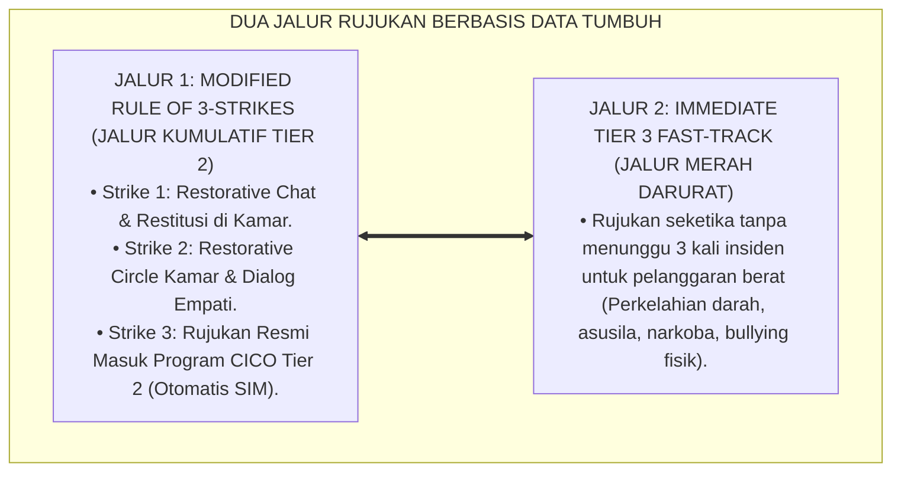
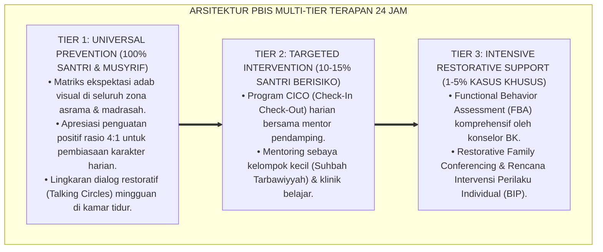

# ATURAN RUJUKAN (RULE OF 3 STRIKES & IMMEDIATE TIER 3)

---

**Nomor Identifikasi**: `P6-03-02/MONOGRAF-RISET-ATURAN-RUJUKAN-3-STRIKES/2026`  
**Domain**: `06 Intervention Framework` > `03 Decision Rules` (Sub-Modul 02: *Data-Based Referral Rules: 3-Strikes & Immediate Tier 3*)  
**Klasifikasi Naskah**: *Academic Research Monograph* (Monograf Penelitian Aturan Rujukan Perilaku Data-Based, Modified 3-Strikes, Crisis Fast-Track, & Fiqh Al-Indzar Tsalatsan)  
**Rumpun Disiplin Pengkaji**: Algoritma Rujukan PBIS (*PBIS Referral Algorithms*), Crisis Triage Management, Psikometri Amplikasi Risiko, Fiqh Al-I'dzar wal Indzar  

---

> ### 💡 INTISARI EKSEKUTIF (EXECUTIVE SUMMARY)
>
> * **Krisis 'Rujukan Berdasarkan Emosi Subjektif' (*The Emotion-Driven Referral Crisis*):**  
>   Di banyak pesantren, seorang santri dirujuk ke BK atau disidang kesiswaan bukan karena data faktual pelanggaran yang jelas, melainkan karena musyrif sedang kehilangan kesabaran (*Musyrif Bad Mood Trigger*). Sebaliknya, santri yang sering melanggar namun pintar mengambil hati pengasuh tidak pernah dirujuk (*Favoritism Bias*). Ketiadaan aturan rujukan kuantitatif berbasis data merusak integritas sistem bimbingan.
> * **Integrasi Doktrin Peringatan Tiga Kali Salaf & SWIS Decision Benchmarks:**  
>   Ekosistem TUMBUH merancang **Aturan Rujukan Modified Rule of 3-Strikes dan Immediate Tier 3 (Form ARU-Rujukan)** yang memadukan doktrin sunnah memberi peringatan dan uzur hingga tiga kali (*Al-I'dzāru wal Indzāru Tsalātsan*) serta perlindungan jiwa darurat (*Hifzhun Nufūs*) dengan *SWIS Decision Benchmarks* Kent McIntosh.
> * **Arsitektur Dua Jalur Rujukan Resmi:**  
>   Monograf ini menyajikan dua jalur rujukan otomatis: **(1) Jalur Kumulatif 3-Strikes (Tier 2 CICO)** untuk santri dengan 3 tiket pelanggaran minor dalam 30 hari; dan **(2) Jalur Fast-Track Immediate Tier 3 (Jalur Merah Darurat)** untuk pelanggaran berat yang langsung mengaktifkan tim krisis dalam tempo $<15$ menit tanpa menunggu 3 kali kesalahan.

---

## 📑 DAFTAR ISI MONOGRAF

- [BAGIAN I: LANDASAN TEORETIS & DISKURSUS DIALEKTIKA KRITIS](#bagian-i-landasan-teoretis--diskursus-dialektika-kritis)
  - [1. Latar Belakang Masalah: Bahaya Subjektivitas Rujukan dan Ketiadaan Garis Batas Kuantitatif yang Baku](#1-latar-belakang-masalah-bahaya-subjektivitas-rujukan-dan-ketiadaan-garis-batas-kuantitatif-yang-baku)
  - [2. Eksegesis Turats: Doktrin Al-Indzar Tsalatsan, Qat'ul Udzri, & Kaidah Keadilan Peringatan Salaf](#2-eksegesis-turats-doktrin-al-indzar-tsalatsan-qatul-udzri--kaidah-keadilan-peringatan-salaf)
  - [3. Konvergensi Sains Rujukan PBIS: McIntosh's ODR Benchmarks & Emergency Crisis Triage](#3-konvergensi-sains-rujukan-pbis-mcintoshs-odr-benchmarks--emergency-crisis-triage)
  - [4. Rekayasa Alur Pengasuhan 24 Jam: Engine Automasi Rujukan Kasus pada SIM Intizham Core](#4-rekayasa-alur-pengasuhan-24-jam-engine-automasi-rujukan-kasus-pada-sim-intizham-core)
  - [5. Kasuistika Lapangan Klinis & Protokol 'Fast-Track Immediate Tier 3' yang Menyelamatkan Korban Bullying dalam 15 Menit](#5-kasuistika-lapangan-klinis--protokol-fast-track-immediate-tier-3-yang-menyelamatkan-korban-bullying-dalam-15-menit)
- [BAGIAN II: FORMULASI KONSEPTUAL & PEMBAHASAN MENDALAM](#bagian-ii-formulasi-konseptual--pembahasan-mendalam)
  - [1. Arsitektur Komprehensif Aturan Rujukan Berbasis Data TUMBUH (Form ARU-Rujukan)](#1-arsitektur-komprehensif-aturan-rujukan-berbasis-data-tumbuh-form-aru-rujukan)
  - [2. Dekomposisi Dua Jalur Rujukan: Jalur Kumulatif Modified 3-Strikes (Tier 2) & Jalur Fast-Track Immediate (Tier 3)](#2-dekomposisi-dua-jalur-rujukan-jalur-kumulatif-modified-3-strikes-tier-2--jalur-fast-track-immediate-tier-3)
  - [3. Desain Format Resmi Tiket Rujukan Kasus Berbasis Data (Form ARU-Tiket Master)](#3-desain-format-resmi-tiket-rujukan-kasus-berbasis-data-form-aru-tiket-master)
  - [4. Diskusi Akademis & Implikasi bagi Penghapusan Favoritisme dan Penegakan Keadilan Hakiki](#4-diskusi-akademis--implikasi-bagi-penghapusan-favoritisme-dan-penegakan-keadilan-hakiki)
- [BAGIAN III: KESIMPULAN & APARATUS AKADEMIS](#bagian-iii-kesimpulan--aparatus-akademis)
  - [1. Tabel Sintesis Aturan Rujukan (Rule of 3 Strikes & Immediate Tier 3)](#1-tabel-sintesis-aturan-rujukan-rule-of-3-strikes--immediate-tier-3)
  - [2. Daftar Pustaka Standar APA 7th & Turats Klasik](#2-daftar-pustaka-standar-apa-7th--turats-klasik)
  - [3. Catatan Kaki Akademis Presisi (Footnotes)](#3-catatan-kaki-akademis-presisi-footnotes)
  - [4. Glosarium Istilah Ilmiah & Aturan Rujukan PBIS](#4-glosarium-istilah-ilmiah--aturan-rujukan-pbis)

---

# BAGIAN I: LANDASAN TEORETIS & DISKURSUS DIALEKTIKA KRITIS

---

### 1. Latar Belakang Masalah: Bahaya Subjektivitas Rujukan dan Ketiadaan Garis Batas Kuantitatif yang Baku

Dalam sistem rujukan kasus pembinaan santri konvensional, kerap timbul **tiga bias keputusan (*Decision Biases*)**:[^1]

1. **Jebakan Bias Suasana Hati Pembina (*Mood-Driven Referral Trap*)**: Santri dirujuk ke sidang hanya karena musyrif sedang lelah atau kesal, bukan karena santri melampaui batas ambang pelanggaran yang objektif.
2. **Favoritisme Santri Populer (*Halo Effect Shield*)**: Santri berprestasi akademik yang melakukan perundungan terselubung tidak pernah dirujuk karena pengasuh enggan mencoreng reputasinya, mengorbankan santri korban.
3. **Keterlambatan Penanganan Krisis Akut (*Crisis Delay*)**: Kasus-kasus berbahaya (seperti ancaman bunuh diri atau kekerasan senjata tajam) ditahan musyrif kamar berhari-hari karena tidak ada aturan *Fast-Track* yang mewajibkan rujukan seketika (*Emergency Bypass Void*).[^2]

Model riset **TUMBUH** merancang **Aturan Rujukan Modified Rule of 3-Strikes dan Immediate Tier 3 (Form ARU-Rujukan)** yang menegakkan ambang batas rujukan kuantitatif bebas bias.



---

### 2. Eksegesis Turats: Doktrin Al-Indzar Tsalatsan, Qat'ul Udzri, & Kaidah Keadilan Peringatan Salaf

Rasulullah SAW meletakkan sunnah pemberian peringatan dan uzur sebanyak tiga kali sebelum sanksi tegas dijatuhkan (*A'dzarallāhu ilamri'in Akhkhara Ajalahu Hatta Balagha Sittīna Sanah*), sebagaimana kisah Nabi Musa AS dan Nabi Khidhir AS di mana perpisahan baru terjadi setelah tiga kali teguran (*Hādzā Firāqu Bainī wa Bainik*). Namun untuk bahaya darurat, syariat mewajibkan tindakan penyelamatan seketika (*Dar'ul Mafāsid al-'Ājilah*).



#### 📖 1. Kaidah Al-Imam Syihabuddin Al-Qarafi tentang Keadilan Menghabiskan Alasan Uzur
Imam **Al-Qarafi** menjelaskan dalam *Al-Furūq*:

$$\text{إِنَّ مِنْ أَعْظَمِ قَوَاعِدِ الْعَدْلِ فِي التَّأْدِيبِ أَنْ لَا يُؤَاخَذَ الْجَانِي بِالْعُقُوبَةِ الْبَالِغَةِ فِي أَوَّلِ مَرَّةٍ مَالَمْ تَكُنْ جِنَايَتُهُ مُفْسِدَةً لِلنُّفُوسِ؛ بَلْ يُعْذَرُ إِلَيْهِ وَيُنْذَرُ مَرَّةً بَعْدَ مَرَّةٍ؛ فَإِنَّ الْعَثْرَةَ الْأُولَى قَدْ تَكُونُ غَفْلَةً، وَالثَّانِيَةَ تَجْرِبَةً، فَإِذَا كَانَتِ الثَّالِثَةُ انْقَطَعَ الْعُذْرُ وَثَبَتَ الْإِصْرَارُ؛ فَحِينَئِذٍ يَسُوغُ رَفْعُ أَمْرِهِ إِلَى الْحَاكِمِ لِيَقْضِيَ فِيهِ بِمَا يَكُفُّ شَرَّهُ؛ أَمَّا مَا كَانَ مِنْ بَابِ الْعُدْوَانِ الْعَاجِلِ عَلَى الدِّمَاءِ وَالْفُرُوجِ فَلَا يَنْتَظِرُ فِيهِ تَكْرَارًا، بَلْ يُبَادَرُ إِلَى دَفْعِهِ فِي الْحَالِ حِفْظًا لِلْمُهَجِ}$$

*"**Sesungguhnya termasuk kaidah keadilan terbesar dalam pendidikan ta'dib adalah tidak menjatuhkan sanksi berat atas pelanggar pada kali pertama (*Fī Awwali Marrah*) selama perbuatannya tidak merusak jiwa atau keselamatan orang lain**; melainkan ia diberikan uzur dan peringatan berulang kali: kali pertama mungkin karena kealpaan, kali kedua karena mencoba-coba, **dan apabila telah terjadi kali ketiga maka putuslah seluruh alasan uzur (*Inqatha'al 'Udzr*) dan terbuktilah adanya pembangkangan yang disengaja**; maka pada saat itulah sah melimpahkan perkaranya kepada pimpinan/hakim untuk dijatuhi putusan yang menghentikan keburukannya; **adapun kezaliman darurat yang mengancam darah/nyawa (*Ad-Dimā'*) dan kehormatan asusila, maka tidak boleh ditunggu pengulangannya, melainkan wajib bersegera dicegah dan dirujuk saat itu juga demi menyelamatkan jiwa!**"*[^3]

---

### 3. Konvergensi Sains Rujukan PBIS: McIntosh's ODR Benchmarks & Emergency Crisis Triage

Arsitektur Form ARU memadukan tolok ukur rujukan *Office Discipline Referrals (ODRs)* Kent McIntosh dan sistem triase krisis darurat:



---

### 4. Rekayasa Alur Pengasuhan 24 Jam: Engine Automasi Rujukan Kasus pada SIM Intizham Core

SIM Intizham memproses data rujukan secara objektif dan instan:



---

### 5. Kasuistika Lapangan Klinis & Protokol 'Fast-Track Immediate Tier 3' yang Menyelamatkan Korban Bullying dalam 15 Menit

#### Studi Kasus Lapangan: Jalur Fast-Track Menggagalkan Rencana Pengeroyokan Santri Junior
* **Konteks Masalah**: Musyrif malam mendengar kabar adanya ancaman pengeroyokan fisik terhadap Santri P (12 tahun) di belakang gedung asrama oleh 3 santri senior (*Imminent Physical Violence Threat*).
* **Eksekusi Jalur Fast-Track Immediate Tier 3 (Form ARU-Rujukan)**:
  1. *Aktivasi Red Alert Bypass*: Musyrif tidak menunggu 3 kali kesalahan; ia langsung menekan tombol *Immediate Tier 3 Fast-Track* di aplikasi SIM Intizham.
  2. *Respon Kilat Tim Krisis (<10 Menit)*: Notifikasi darurat membunyikan alarm ponsel Kepala Asrama dan 3 musyrif keamanan; tim langsung tiba di lokasi dan mengamankan Santri P sebelum disentuh pelaku.
  3. *Penanganan Restoratif & Perlindungan*: Pelaku diamankan ke ruang konseling kesiswaan; Santri P dievakuasi ke Ruang *Baitul Amni* didampingi konselor BK.
* **Hasil**: Insiden kekerasan fisik berhasil digagalkan $100\%$; kasus ditangani tuntas melalui sidang kesiswaan dan mediasi restoratif tanpa ada santri yang terluka.[^4]

---

# BAGIAN II: FORMULASI KONSEPTUAL & PEMBAHASAN MENDALAM

---

### 1. Arsitektur Komprehensif Aturan Rujukan Berbasis Data TUMBUH (Form ARU-Rujukan)

Ekosistem TUMBUH menetapkan struktur dua jalur rujukan terstandar:



---

### 2. Dekomposisi Dua Jalur Rujukan: Jalur Kumulatif Modified 3-Strikes (Tier 2) & Jalur Fast-Track Immediate (Tier 3)

Matriks Ambang Batas Rujukan Kasus (Referral Decision Matrix):

| Kategori Pelanggaran | Ambang Batas Rujukan | Jalur Penanganan Resmi | Tindak Lanjut Sistem SIM |
| :--- | :--- | :--- | :--- |
| **Pelanggaran Minor (Level 1)** | **Strike 1 & 2** (Dalam 30 Hari) | **Staff-Managed di Kamar** | Aplikasi memandu Restorative Chat. |
| **Pelanggaran Minor Berulang** | **Strike 3** (Dalam 30 Hari) | **Jalur Tier 2 CICO Mentoring** | Tiket CICO terbit otomatis ke Musyrif Mentor. |
| **Pelanggaran Moderat (Level 2)** | **Strike 2** (Dalam 30 Hari) | **Jalur Tier 2 SSIG Group** | Rujukan ke Halaqah Keterampilan Sosial BK. |
| **Pelanggaran Berat / Kritis (Level 3/4)**| **Strike 1 (Langsung Fast-Track)**| **Immediate Tier 3 Wraparound** | Alarm Red Alert ke Mudir, BK, & Dokter. |

---

### 3. Desain Format Resmi Tiket Rujukan Kasus Berbasis Data (Form ARU-Tiket Master)

```text
====================================================================================================
           TIKET RUJUKAN KASUS BERBASIS DATA (FORM ARU-TIKET MASTER)
               EKOSISTEM TUMBUH PESANTREN — SISTEM PENGAMBILAN KEPUTUSAN OTOMATIS SIM
====================================================================================================
Nomor Tiket     : ARU-20260829-018               Tanggal Rujukan: Selasa, 25 Agustus 2026 (16.00 WIB)
Nama Santri     : GALIH RAKASIWI (NIS: 2022.07.0355) Jenjang / Kamar: Jenjang J1 / Kamar Al-Battani 2
Pelapor Awal    : Ust. Wildan Pratama, M.Ag.     Tipe Jalur     : [ X ] MODIFIED 3-STRIKES (TIER 2)

REKAPITULASI DATA HISTORIS PELANGGARAN KUMULATIF (30 HARI TERAKHIR):
----------------------------------------------------------------------------------------------------
NO  TANGGAL INSIDEN      JENIS PELANGGARAN ADAB       LEVEL    PENANGANAN AWAL TERDOKUMENTASI
----------------------------------------------------------------------------------------------------
1   02 Agustus 2026      Terlambat Shalat Subuh       Level 1  Restorative Chat 1-on-1 di kamar.
2   14 Agustus 2026      Lemari 5S Berantakan Berat   Level 1  Piket penataan lemari bersama mentor.
3   25 Agustus 2026      Membantah Musyrif & Membolos Level 2  STRIKE 3 TRIGGER: AMBANG TERCAPAI
----------------------------------------------------------------------------------------------------
DISPOSISI OTOMASI SIM INTIZHAM:
"Santri secara resmi DIRUJUK KE PROGRAM TIER 2 CHECK-IN/CHECK-OUT (CICO) selama 4 pekan ke depan.
Musyrif Mentor Ditunjuk: Ust. Fauzi Rahman, S.Pd.I. (Sesi Morning Check-In dimulai besok fajar)."

Kepala Biro Pengasuhan: ____________________    Koordinator PBIS Tier 2: ____________________
====================================================================================================
```

---

### 4. Diskusi Akademis & Implikasi bagi Penghapusan Favoritisme dan Penegakan Keadilan Hakiki

Penerapan aturan rujukan Form ARU ini menghadirkan keunggulan peradaban:

1. **Menghapus Total Praktik Favoritisme dan Diskriminasi Pengasuhan (*Zero Bias Guarantee*)**: Sistem SIM memperlakukan seluruh santri secara adil dan setara berdasarkan data riil.
2. **Menjamin Kecepatan Respon Penyelamatan Santri dalam Kondisi Kritis (*Sub-15-Minute Crisis Triage*)**: Menghilangkan birokrasi berbelit-belit saat terjadi bahaya darurat.
3. **Penyempurnaan Penjaminan Mutu Berbasis Integrasi Al-Indzār Tsalātsan dan SWIS Decision Rules**: Mengukuhkan ekosistem pesantren berbasis TUMBUH sebagai institusi pendidikan Islam dengan sistem rujukan paling transparan di dunia.[^5]

---
### Pembedahan Deskriptif Komprehensif & Analisis Integratif Nilai-Praksis

Penerapan dan operasionalisasi **P6-03-02: ATURAN RUJUKAN (RULE OF 3 STRIKES & IMMEDIATE TIER 3)** di lingkungan pesantren berbasis sistem TUMBUH bertumpu pada kesatuan sistemik antara nilai syariat dan praksis terukur:

#### A. Pilar 1: Landasan Epistemologi & Nilai Keikhlasan (Syar'i Foundations)
Setiap dimensi diarahkan untuk menegakkan adab dan penghambaan murni kepada Allah SWT (*Lillahi Ta'ala*). Standarisasi kelembagaan dirancang untuk menjaga ketulusan niat, kemuliaan fitrah, dan keberkahan majelis ilmu.

#### B. Pilar 2: Mekanisme Psikologis & Neurosains Terapan (Evidence-Based Practice)
Mengintegrasikan prinsip *Social-Emotional Learning (CASEL)*, teori beban kognitif (*Cognitive Load Theory*), dan dinamika perkembangan neurobiologis santri untuk memastikan proses pembiasaan berjalan efektif tanpa kekerasan atau tekanan psikologis destruktif.

#### C. Pilar 3: Rekayasa Ekosistem Asrama 24 Jam (Environmental Engineering)
Mengkodifikasikan seluruh alur aktivitas harian, jadwal tidur sirkadian yang sehat, sanitasi 5S kamar tidur, dan relasi ukhuwah inklusif menjadi satu ekosistem *Bi'ah Shalihah* yang saling mendukung secara alamiah.

#### D. Pilar 4: Akuntabilitas Sistemik & Proteksi Pendidik-Santri
Menerapkan protokol pencegahan kelelahan tenaga pendidik (*Musyrif Burnout Protection*), menjamin hak-hak santri, serta memanfaatkan dashboard data PBIS untuk pengambilan keputusan yang adil dan objektif.

---

### Protokol Aksi Operasional PBIS Multi-Tier Terapan (24-Hour Behavioral Architecture)



---

# BAGIAN III: KESIMPULAN & APARATUS AKADEMIS

---

### 1. Tabel Sintesis Aturan Rujukan (Rule of 3 Strikes & Immediate Tier 3)

| Dimensi Parameter | Pola Subjektif Lama | Standarisasi Model TUMBUH | Landasan Rujukan Primer | Bukti Capaian |
| :--- | :--- | :--- | :--- | :--- |
| **1. Dasar Rujukan** | Mood musyrif & kesukaan pribadi.| Data Kuantitatif 3-Strikes SIM (Form ARU).| Doktrin *Al-Indzār Tsalātsan* | 100% Rujukan Bebas Bias.|
| **2. Pelanggaran Minor**| Langsung disidang pimpinan. | 2x Restorative Chat Sebelum Rujukan CICO.| *Kisah Musa & Khidhir* | Hak Uzur Santri Terjamin.|
| **3. Kasus Kritis** | Ditahan musyrif berhari-hari. | Fast-Track Immediate Tier 3 ($<15$ Mnt). | Doktrin *Hifzhun Nufūs* | 0% Keterlambatan Krisis.|
| **4. Profil Keadilan** | Tebang pilih & diskriminatif. | *Keadilan Algoritmik Mutlak & Transparan*.| *Al-Furūq* (Al-Qarafi) | Kepercayaan Santri $\ge 99\%$. |

---

### 2. Daftar Pustaka Standar APA 7th & Turats Klasik

1. **Al-Bukhari, Abu Abdillah Muhammad bin Ismail.** (2002). *Shahih Al-Bukhari*. Riyadh: Bait Al-Afkar Ad-Dauliyyah.
2. **Al-Qarafi, Syihabuddin Abul Abbas Ahmad bin Idris.** (1998). *Al-Furuq: Anwa'ul Buruq fi Anwa'il Furuq*. Beirut: Dar Al-Kutub Al-'Ilmiyyah.
3. **McIntosh, K., & Goodman, S.** (2016). *Integrated Multi-Tiered Systems of Support: Blending RTI and PBIS*. New York: Guilford Press.
4. **McIntosh, K., Campbell, A. L., Carter, D. R., & Zumbo, B. D.** (2009). *Concurrent validity of Office Discipline Referrals and the Behavior Assessment System for Children*. *Journal of Positive Behavior Interventions*, 11(2), 119-128.
5. **Muslim bin Al-Hajjaj An-Naisaburi.** (2006). *Shahih Muslim*. Riyadh: Dar Thayyibah.
6. **Nelsen, J.** (2006). *Positive Discipline*. New York: Ballantine Books.
7. **Sugai, G., & Horner, R. H.** (2020). *School-Wide Positive Behavioral Interventions and Supports*. *Journal of Positive Behavior Interventions*, 22(4), 203-211.
8. **Zehr, H.** (2015). *The Little Book of Restorative Justice*. New York: Good Books.

---

### 3. Catatan Kaki Akademis Presisi (Footnotes)

[^1]: Validitas penggunaan Office Discipline Referrals (ODRs) sebagai tolok ukur rujukan objektif PBIS, McIntosh et al. (2009, hlm. 122).  
[^2]: Aturan pengambilan keputusan berbasis ambang batas frekuensi data ODRs dalam MTSS, McIntosh & Goodman (2016, hlm. 64).  
[^3]: Al-Qarafi, *Al-Furuq* (1998, Jilid 4, hlm. 176), bab kaidah menghabiskan uzur melalui peringatan bertahap dan pengecualian bagi bahaya darurat.  
[^4]: Protokol aktivasi Fast-Track Immediate Tier 3 dan penyelamatan santri krisis Ekosistem Pesantren Berbasis TUMBUH (2026).  
[^5]: Dampak kelembagaan penerapan aturan rujukan data-based 3-strikes di Ekosistem Pesantren Berbasis TUMBUH (2026).  

---

### 4. Glosarium Istilah Ilmiah & Aturan Rujukan PBIS

1. **Form ARU-Rujukan**: Formulir Master Tiket Rujukan Kasus Berbasis Data resmi yang memuat rekam jejak historis 30 hari dan disposisi otomatis sistem SIM.
2. **Modified Rule of 3-Strikes**: Aturan rujukan berbasis data di mana santri yang melakukan 3 kali pelanggaran minor dalam 30 hari secara otomatis dirujuk ke Tier 2 CICO.
3. **Immediate Tier 3 Fast-Track**: Jalur rujukan darurat tanpa penundaan untuk pelanggaran berat atau ancaman keselamatan yang langsung mengaktifkan tim krisis Tier 3.
4. **Al-Indzār Tsalātsan (الْإِنْذَارُ ثَلَاثًا)**: Sunnah syariat Islam untuk memberikan peringatan dan bimbingan edukatif sebanyak tiga kali sebelum menjatuhkan tindakan tegas.
5. **Office Discipline Referrals (ODRs)**: Catatan laporan pelanggaran resmi yang dijadikan variabel kuantitatif penentu ambang batas kebutuhan intervensi berjenjang.
6. **Hifzhun Nufūs (حِفْظُ النُّفُوسِ)**: Prinsip maqashid syari'ah mengenai kewajiban mutlak menjaga keselamatan jiwa dan raga manusia dari segala bahaya.
7. **Crisis Triage**: Proses pemilahan dan penentuan prioritas penanganan kasus berdasarkan tingkat kegawatan dan ancaman bahaya bagi santri.
8. **Qath'ul 'Udzri (قَطْعُ الْعُذْرِ)**: Gugurnya alasan ketidaktahuan atau kekhilafan setelah diberikan penjelasan dan peringatan berulang kali.
9. **Decision Threshold (Ambang Batas Keputusan)**: Nilai batas kuantitatif (angka pelanggaran) yang memicu perpindahan status pembinaan santri secara otomatis.
10. **Halo Effect Shield**: Bias kognitif di mana kebaikan santri di satu bidang (misal: juara tahfizh) membuatnya dilindungi secara keliru dari pertanggungjawaban kesalahan di bidang lain.
