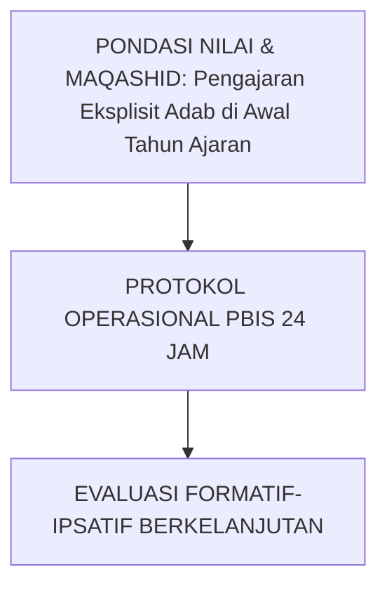

# SUB-BAB 2.3: PENGAJARAN EKSPLISIT ADAB DI AWAL TAHUN AJARAN
## *Kajian Mendalam & Panduan Implementatif Ekosistem TUMBUH Pesantren*

**Kode Klasifikasi**: `BOOK-04/BAB-02/SUB-03/MONOGRAF-MASTER-VIBRANT`  
**Disiplin Ilmu**: Metodologi Pendidikan Islam, Sains Perilaku Terapan, & Tata Kelola Pesantren  
**Penanggung Jawab Keilmuan**: Dewan Pakar Ekosistem TUMBUH (*24 Bidang Kepakaran*)

---

### Eksplanasi Teoretis & Urgensi Praksis

Pendidikan karakter yang efektif dalam Sistem TUMBUH membutuhkan kejelasan operasional pada aspek **Pengajaran Eksplisit Adab di Awal Tahun Ajaran**. Naskah ini menguraikan landasan filosofis Turats, bukti empiris sains perilaku, dan protokol implementasi lapangan 24 jam.

---

### Protokol Aksi Operasional Berjenjang

1. **Langkah Preventif Universal (Tahap Persiapan)**: Pengkondisian sarana, sosialisasi SOP, dan pembiasaan keteladanan *Qudwah Hasanah*.
2. **Langkah Eksekusi Lapangan (Tahap Berjalan)**: Pendampingan lekat oleh musyrif asrama dan wali kelas dengan prinsip *Firm & Kind*.
3. **Langkah Refleksi & Restorasi (Tahap Evaluasi)**: Pencatatan pada logbook digital dan penanganan kendala melalui dialog restoratif.
