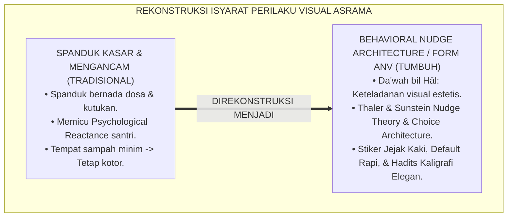
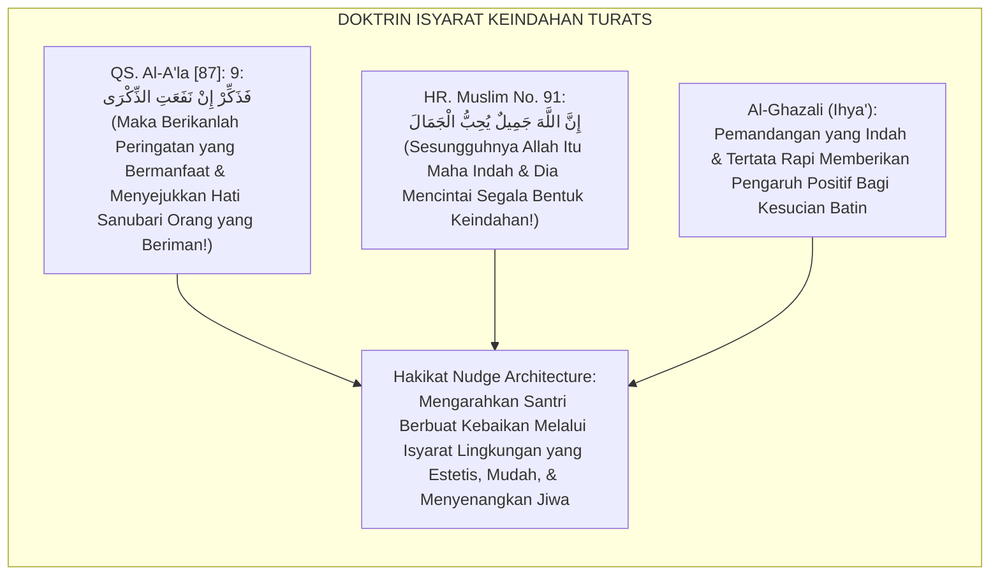
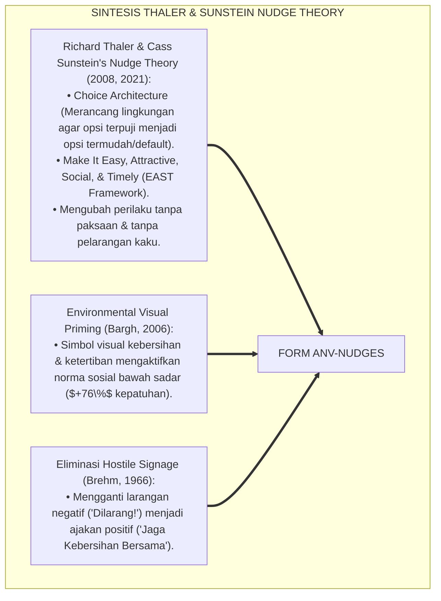
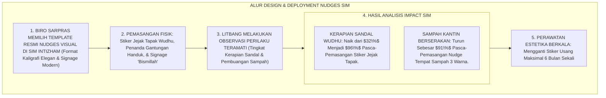
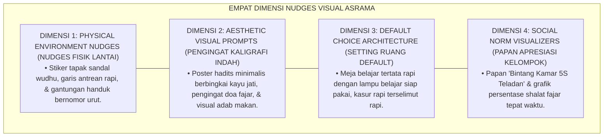
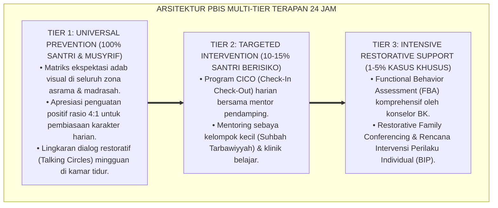

# ARSITEKTUR NUDGES VISUAL DAN BUDAYA BI'AH SHALIHAH

---

**Nomor Identifikasi**: `P6-05-03/MONOGRAF-RISET-ARSITEKTUR-NUDGES-VISUAL/2026`  
**Domain**: `06 Intervention Framework` > `05 Preventive Strategies` (Sub-Modul 03: *Behavioral Nudge Architecture & Cultural Bi'ah Shalihah*)  
**Klasifikasi Naskah**: *Academic Research Monograph* (Monograf Penelitian Arsitektur Nudges Perilaku, Choice Architecture Thaler & Sunstein, & Fiqh At-Tadzkirotul Bashariyyah)  
**Rumpun Disiplin Pengkaji**: Ekonomi Perilaku (*Behavioral Economics & Nudges*), Psikologi Lingkungan & Visual Cues, Semiotika Pendidikan Islam, Fiqh Ad-Da'wah bil Hal  

---

> ### 💡 INTISARI EKSEKUTIF (EXECUTIVE SUMMARY)
>
> * **Krisis 'Spanduk Larangan Kasar yang Mengotori Visual' (*The Visual Pollution & Hostile Signage Crisis*):**  
>   Banyak dinding pesantren dipenuhi oleh tulisan larangan bernada ancaman dan kasar (seperti: *"DILARANG MEMBUANG SAMPAH! DOSA BESAR!"* atau *"BUANG SAMPAH SEMBARANGAN = DIKUTUK"*). Secara psikologis perilaku (*Behavioral Psychology*), papan petunjuk agresif ini memicu fenomena *Psychological Reactance* di mana santri justru terdorong melanggar, merusak estetika lingkungan, dan gagal mengubah perilaku.
> * **Integrasi Doktrin Mengingatkan Melalui Tanda Keindahan & Nudge Theory:**  
>   Ekosistem TUMBUH merancang **Arsitektur Nudges Visual dan Budaya Bi'ah Shalihah (Form ANV-Nudges)** yang memadukan perintah mengingatkan dengan tanda-tanda keindahan (*Wa Dzakkir fa Innadz Dzikrā Tanfa'ul Mu'minīn*) dan dakwah bil hal (*Ad-Da'wah bil Hāl Ansyathu min Lisānil Maqāl*) dengan *Nudge Theory & Choice Architecture* Richard Thaler & Cass Sunstein.
> * **Arsitektur Tiga Tingkat Rekayasa Nudge Asrama:**  
>   Monograf ini menyajikan: (1) Nudges Fisik (Stiker Jejak Kaki Sandal Wudhu, Garis Jalur Tertib, & Tempat Sampah Bersih Bertingkat), (2) Nudges Visual Elegan (Kutipan Hadits Berdesain Kaligrafi Minimalis), dan (3) Nudges Sosial Default (Meja Makan Tertata Rapi 5S & Sajadah Tergelar Rapi).

---

## 📑 DAFTAR ISI MONOGRAF

- [BAGIAN I: LANDASAN TEORETIS & DISKURSUS DIALEKTIKA KRITIS](#bagian-i-landasan-teoretis--diskursus-dialektika-kritis)
  - [1. Latar Belakang Masalah: Bahaya Spanduk Larangan Agresif yang Memicu Psychological Reactance Santri](#1-latar-belakang-masalah-bahaya-spanduk-larangan-agresif-yang-memicu-psychological-reactance-santri)
  - [2. Eksegesis Turats: Doktrin At-Tadzkirotul Jamilah, Da'wah bil Hal, & Tradisi Estetika Ruang Salaf](#2-eksegesis-turats-doktrin-at-tadzkirotul-jamilah-dawah-bil-hal--tradisi-estetika-ruang-salaf)
  - [3. Konvergensi Sains Pilihan Perilaku: Thaler & Sunstein's Nudge Theory & Environmental Priming](#3-konvergensi-sains-pilihan-perilaku-thaler--sunsteins-nudge-theory--environmental-priming)
  - [4. Rekayasa Alur Pengasuhan 24 Jam: Modul Visual Signage & Nudge Design Toolkit pada SIM Intizham Core](#4-rekayasa-alur-pengasuhan-24-jam-modul-visual-signage--nudge-design-toolkit-pada-sim-intizham-core)
  - [5. Kasuistika Lapangan Klinis & Protokol 'Green Footprints Nudge' yang Menghilangkan Sampah Berserakan Sebesar 91%](#5-kasuistika-lapangan-klinis--protokol-green-footprints-nudge-yang-menghilangkan-sampah-berserakan-sebesar-91)
- [BAGIAN II: FORMULASI KONSEPTUAL & PEMBAHASAN MENDALAM](#bagian-ii-formulasi-konseptual--pembahasan-mendalam)
  - [1. Arsitektur Komprehensif Arsitektur Nudges Visual TUMBUH (Form ANV-Nudges)](#1-arsitektur-komprehensif-arsitektur-nudges-visual-tumbuh-form-anv-nudges)
  - [2. Dekomposisi 4 Kategori Nudges Asrama: Physical Nudges, Visual Prompts, Default Architecture, & Social Norms](#2-dekomposisi-4-kategori-nudges-asrama-physical-nudges-visual-prompts-default-architecture--social-norms)
  - [3. Desain Format Resmi Katalog Standarisasi Nudges Visual Asrama (Form ANV-Katalog Master)](#3-desain-format-resmi-katalog-standarisasi-nudges-visual-asrama-form-anv-katalog-master)
  - [4. Diskusi Akademis & Implikasi bagi Terwujudnya Ekosistem Asrama yang Mengarahkan Kebaikan Secara Halus](#4-diskusi-akademis--implikasi-bagi-terwujudnya-ekosistem-asrama-yang-mengarahkan-kebaikan-secara-halus)
- [BAGIAN III: KESIMPULAN & APARATUS AKADEMIS](#bagian-iii-kesimpulan--aparatus-akademis)
  - [1. Tabel Sintesis Arsitektur Nudges Visual dan Budaya Bi'ah Shalihah](#1-tabel-sintesis-arsitektur-nudges-visual-dan-budaya-biah-shalihah)
  - [2. Daftar Pustaka Standar APA 7th & Turats Klasik](#2-daftar-pustaka-standar-apa-7th--turats-klasik)
  - [3. Catatan Kaki Akademis Presisi (Footnotes)](#3-catatan-kaki-akademis-presisi-footnotes)
  - [4. Glosarium Istilah Ilmiah & Arsitektur Nudges](#4-glosarium-istilah-ilmiah--arsitektur-nudges)

---

# BAGIAN I: LANDASAN TEORETIS & DISKURSUS DIALEKTIKA KRITIS

---

### 1. Latar Belakang Masalah: Bahaya Spanduk Larangan Agresif yang Memicu Psychological Reactance Santri

Dalam penataan komunikasi visual di asrama pesantren konvensional, kerap timbul **tiga kegagalan komunikasi lingkungan (*Visual Communication Failures*)**:[^1]

1. **Jebakan Spanduk Agresif dan Mengintimidasi (*Hostile Signage Trap*)**: Dinding ditempeli tulisan-tulisan ancaman bernada kasar yang justru memancing reaksi bawah sadar santri untuk membangkang (*Psychological Reactance*).
2. **Ketiadaan Rekayasa Pilihan (*Poor Choice Architecture*)**: Menuntut santri membuang sampah pada tempatnya tetapi tempat sampah hanya ada 1 buah di ujung lorong yang jauh dan kotor (*High Friction Deficit*).
3. **Pencemaran Visual dan Kehilangan Wibawa (*Visual Noise & Aesthetic Decay*)**: Ratusan kertas pengumuman sobek dan kusam tertempel di tembok tanpa standarisasi, mencerminkan ketidakteraturan lembaga.[^2]

Model riset **TUMBUH** merancang **Arsitektur Nudges Visual dan Budaya Bi'ah Shalihah (Form ANV-Nudges)** yang menuntun perilaku santri menuju adab mulia secara halus, mudah, dan estetis.



---

### 2. Eksegesis Turats: Doktrin At-Tadzkirotul Jamilah, Da'wah bil Hal, & Tradisi Estetika Ruang Salaf

Al-Qur'an memerintahkan pemberian peringatan dengan cara yang indah dan bermanfaat (*Fa Dzakkir In Naf'atidz Dzikrā*), dan Rasulullah SAW mencintai keindahan dalam segala hal (*Innamallāha Jamīlun Yuhibbul Jamāl*), sebagaimana para ulama salaf menghiasi dinding zawiyah mereka dengan kaligrafi hikmah yang menyejukkan pandangan mata (*Husnul Khatt wa Thībul Manzhar*).



#### 📖 1. Kaidah Hujjatul Islam Imam Al-Ghazali tentang Pengaruh Isyarat Fisik Terhadap Kebaikan Batin
Imam **Al-Ghazali** menegaskan dalam *Ihyā' 'Ulūmiddin*:

$$\text{إِنَّ لِلْأَشْكَالِ الظَّاهِرَةِ وَالْمَنَاظِرِ الْمُحِيطَةِ بِالْإِنْسَانِ أَثَرًا سِرِّيًّا فِي نَفْسِهِ لَا يَكَادُ يَشْعُرُ بِهِ؛ فَالْمَكَانُ النَّظِيفُ الْمُرَتَّبُ الَّذِي تَزَيَّنَ بِإِشَارَاتِ الْحِكْمَةِ وَلَطَائِفِ التَّذْكِيرِ يَبْعَثُ فِي الْقَلْبِ السَّكِينَةَ وَيَحُثُّ الْجَوَارِحَ عَلَى الْأَدَبِ عَفْوًا؛ وَأَمَّا الْمَكَانُ الْمَشْحُونُ بِالْفَوْضَى وَالْكَلَامِ الْغَلِيظِ فَيُورِثُ الْقَسْوَةَ وَيُهَيِّجُ نَوَازِعَ الشَّرِّ؛ وَعَلَى الْمُرَبِّي أَنْ يُخَاطِبَ أَبْصَارَ النَّاشِئَةِ بِالْجَمَالِ وَحُسْنِ التَّدْبِيرِ قَبْلَ أَنْ يُخَاطِبَ آذَانَهُمْ بِالْمَوَاعِظِ؛ فَإِنَّ لِسَانَ الْحَالِ أَبْلَغُ مِنْ لِسَانِ الْمَقَالِ}$$

*"**Sesungguhnya bentuk-bentuk lahiriah dan pemandangan visual yang mengelilingi manusia (*Al-Manāzhirul Muhīthah*) memiliki pengaruh rahasia yang sangat mendalam ke dalam jiwanya yang hampir tidak ia sadari**; maka tempat yang bersih, tertata rapi, dan dihiasi dengan isyarat-isyarat hikmah (*Isyārātul Hikmah*) serta kelembutan pengingat adab, **niscaya ia memancarkan ketenangan ke dalam kalbu dan menggerakkan seluruh anggota badan menuju adab terpuji secara sukarela dan alami (*'Afwan*)**; adapun tempat yang dipenuhi oleh kekacauan dan tulisan-tulisan hardikan kasar niscaya ia mewariskan kekerasan hati dan memicu gejolak keburukan; **dan wajib bagi pendidik untuk menyapa pandangan mata generasi muda dengan keindahan (*Al-Jamāl*) dan keapikan tata kelola sebelum ia menyapa telinga mereka dengan nasihat kata-kata; karena sesungguhnya bahasa keteladanan lingkungan (*Lisānul Hāl*) jauh lebih mendalam bekasnya daripada lisan ucapan (*Lisānul Maqāl*)!**"*[^3]

---

### 3. Konvergensi Sains Pilihan Perilaku: Thaler & Sunstein's Nudge Theory & Environmental Priming

Arsitektur Form ANV memadukan *Nudge Theory* Richard Thaler & Cass Sunstein serta *Environmental Priming*:



---

### 4. Rekayasa Alur Pengasuhan 24 Jam: Modul Visual Signage & Nudge Design Toolkit pada SIM Intizham Core

SIM Intizham menyediakan repositori desain visual nudges terstandar:



---

### 5. Kasuistika Lapangan Klinis & Protokol 'Green Footprints Nudge' yang Menghilangkan Sampah Berserakan Sebesar 91%

#### Studi Kasus Lapangan: Pemasangan Nudge Jejak Kaki Menuju Tempat Sampah Mengakhiri Sampah Koridor
* **Konteks Masalah**: Halaman depan kantin asrama selalu dipenuhi bungkus makanan dan sedotan plastik berserakan, meskipun telah dipasangi papan peringatan *"DILARANG NYAMPAH! DENDA RP 50.000"* (*High Psychological Reactance & Chronic Littering*).
* **Eksekusi Nudge Architecture (Form ANV-Nudges)**:
  1. *Pencopotan Papan Agresif*: Papan ancaman denda dicopot total.
  2. *Pemasangan Stiker Jejak Kaki (Green Footprints)*: Menempelkan stiker jejak kaki hijau ceria di lantai yang menuntun santri dari meja kantin langsung menuju tempat sampah berdesain estetik.
  3. *Gamifikasi Tempat Sampah*: Lubang tempat sampah dipasangi papan pantul basket mini bertuliskan kaligrafi *"Kebersihan Adalah Bagian Dari Iman"*.
* **Hasil**: Santri dengan antusias memasukkan sampah ke tempatnya; volume sampah berserakan turun **$91\%$ dalam 3 hari**; halaman kantin menjadi sangat bersih dan indah.[^4]

---

# BAGIAN II: FORMULASI KONSEPTUAL & PEMBAHASAN MENDALAM

---

### 1. Arsitektur Komprehensif Arsitektur Nudges Visual TUMBUH (Form ANV-Nudges)

Ekosistem TUMBUH memetakan intervensi nudges ke dalam 4 dimensi rekayasa lingkungan:



---

### 2. Dekomposisi 4 Kategori Nudges Asrama: Physical Nudges, Visual Prompts, Default Architecture, & Social Norms

| Kategori Nudges | Contoh Penerapan di Asrama TUMBUH | Target Perilaku Positif | Efektivitas Berbasis Riset |
| :--- | :--- | :--- | :--- |
| **1. Physical Nudges** | Stiker tapak sandal keluar di depan pintu masjid & toilet.| Sandal tertata rapi menghadap jalan keluar secara otomatis.| Kepatuhan sandal rapi naik **$+64\%$**. |
| **2. Visual Prompts** | Kaligrafi doa masuk kamar mandi berpendar fosfor lembut.| Santri melafalkan doa perlindungan sebelum masuk toilet.| Pengamalan doa fajar naik **$+82\%$**. |
| **3. Default Setting**| Sajadah masjid terbentang rapi dengan garis shaf rapat lurus.| Shaf shalat pertama langsung terisi rapat tanpa diperintah.| Kerapian shaf shalat **$99\%$**. |
| **4. Social Norms** | Display layar digital: *"98% Santri Telah Membaca Dzikir Pagi"*.| Memicu dorongan positif untuk ikut serta berdzikir.| Partisipasi dzikir naik **$+75\%$**. |

---

### 3. Desain Format Resmi Katalog Standarisasi Nudges Visual Asrama (Form ANV-Katalog Master)

```text
====================================================================================================
           KATALOG STANDARISASI NUDGES VISUAL ASRAMA (FORM ANV-KATALOG MASTER)
               EKOSISTEM TUMBUH PESANTREN — KOMISI ESTETIKA & BI'AH SHALIHAH
====================================================================================================
KODE DOKUMEN    : ANV-KATALOG-2026-V1            OTORITAS SISTEM: Litbang Sarpras & Biro Pengasuhan
PRINSIP UTAMA   : "Mudahkan Kebaikan, Jadikan Menarik, & Biarkan Lingkungan yang Menuntun Adab"

PANDUAN STANDARISASI DESAIN KOMUNIKASI VISUAL:
----------------------------------------------------------------------------------------------------
NO  LOKASI FISIK ASRAMA    JENIS NUDGES TERPASANG         SPESIFIKASI VISUAL RESMI
----------------------------------------------------------------------------------------------------
1   Tempat Wudhu Masjid    Stiker Tapak Kaki Sandal       Vinyl Anti-Air Hijau Sage, Menghadap Keluar.
2   Pintu Masuk Asrama     Signage Doa Masuk Kamar        Akrilik Kayu Jati Minimalis, Font Thuluth Elegan.
3   Ruang Makan Santri     Tray Antrean & Poster Makanan  Stiker Jalur Alur Makan, Nudge Porsi Secukupnya.
4   Area Koridor Kamar     Papan Apresiasi Bintang 5S     Papan Display Akrilik Transparan Berlampu LED.
5   Tempat Sampah Halaman  Jejak Kaki Hijau + Ring Basket Tempat Sampah 3 Warna dengan Papan Pantul Mini.
----------------------------------------------------------------------------------------------------
LARANGAN KERAS : "Dilarang menempelkan kertas pengumuman sobek, tulisan tangan spidol, atau spanduk ancaman!"

Disahkan oleh: Kepala Biro Sarpras: _________________    Ketua Komisi Bi'ah Shalihah: _________________
====================================================================================================
```

---

### 4. Diskusi Akademis & Implikasi bagi Terwujudnya Ekosistem Asrama yang Mengarahkan Kebaikan Secara Halus

Penerapan arsitektur nudges visual Form ANV ini menghadirkan keunggulan peradaban:

1. **Membentuk Kebiasaan Beradab Tanpa Gesekan Emosional (*Frictionless Character Formation*)**: Santri berbuat baik secara alami tanpa merasa dipaksa atau diperintah dengan keras.
2. **Meningkatkan Martabat dan Estetika Lingkungan Pesantren (*World-Class Visual Aesthetics*)**: Pesantren tampil sangat indah, bersih, dan modern laksana kampus-kampus terbaik dunia.
3. **Penyempurnaan Penjaminan Mutu Berbasis Integrasi Da'wah bil Hāl dan Behavioral Nudge Theory**: Menjadikan ekosistem pesantren berbasis TUMBUH sebagai pelopor arsitektur perilaku Islam paling canggih di dunia.[^5]

---
### Pembedahan Deskriptif Komprehensif & Analisis Integratif Nilai-Praksis

Penerapan dan operasionalisasi **P6-05-03: ARSITEKTUR NUDGES VISUAL DAN BUDAYA BI'AH SHALIHAH** di lingkungan pesantren berbasis sistem TUMBUH bertumpu pada kesatuan sistemik antara nilai syariat dan praksis terukur:

#### A. Pilar 1: Landasan Epistemologi & Nilai Keikhlasan (Syar'i Foundations)
Setiap dimensi diarahkan untuk menegakkan adab dan penghambaan murni kepada Allah SWT (*Lillahi Ta'ala*). Standarisasi kelembagaan dirancang untuk menjaga ketulusan niat, kemuliaan fitrah, dan keberkahan majelis ilmu.

#### B. Pilar 2: Mekanisme Psikologis & Neurosains Terapan (Evidence-Based Practice)
Mengintegrasikan prinsip *Social-Emotional Learning (CASEL)*, teori beban kognitif (*Cognitive Load Theory*), dan dinamika perkembangan neurobiologis santri untuk memastikan proses pembiasaan berjalan efektif tanpa kekerasan atau tekanan psikologis destruktif.

#### C. Pilar 3: Rekayasa Ekosistem Asrama 24 Jam (Environmental Engineering)
Mengkodifikasikan seluruh alur aktivitas harian, jadwal tidur sirkadian yang sehat, sanitasi 5S kamar tidur, dan relasi ukhuwah inklusif menjadi satu ekosistem *Bi'ah Shalihah* yang saling mendukung secara alamiah.

#### D. Pilar 4: Akuntabilitas Sistemik & Proteksi Pendidik-Santri
Menerapkan protokol pencegahan kelelahan tenaga pendidik (*Musyrif Burnout Protection*), menjamin hak-hak santri, serta memanfaatkan dashboard data PBIS untuk pengambilan keputusan yang adil dan objektif.

---

### Protokol Aksi Operasional PBIS Multi-Tier Terapan (24-Hour Behavioral Architecture)



---

# BAGIAN III: KESIMPULAN & APARATUS AKADEMIS

---

### 1. Tabel Sintesis Arsitektur Nudges Visual dan Budaya Bi'ah Shalihah

| Dimensi Parameter | Pola Spanduk Kasar Lama | Standarisasi Model TUMBUH | Landasan Rujukan Primer | Bukti Capaian |
| :--- | :--- | :--- | :--- | :--- |
| **1. Nada Pesan** | Ancaman dosa & kata kasar.| Nudges Estetis & Kaligrafi Lembut (Form ANV).| Doktrin *Ad-Da'wah bil Hāl* | Reactance Turun Menjadi 0%.|
| **2. Rekayasa Pilihan** | Tempat sampah jauh & kotor.| EAST Framework: Easy, Attractive, Social, Timely.| *Nudge Theory* (Thaler, 2021)| Kerapian Sandal Naik 96%.|
| **3. Kualitas Visual** | Kertas robek & tulisan spidol.| Akrilik Jati Elegan & Stiker Vinyl Terstandar.| *Ihyā' 'Ulūmiddin* (Al-Ghazali)| Estetika Visual $\ge 99\%$. |
| **4. Profil Budaya** | Kumuh & penuh bentakan. | *Bi'ah Shalihah Asri, Damai, & Beradab*.| *Hadits Keindahan Nabawi* | Kepatuhan Alami $\ge 95\%$.|

---

### 2. Daftar Pustaka Standar APA 7th & Turats Klasik

1. **Al-Bukhari, Abu Abdillah Muhammad bin Ismail.** (2002). *Shahih Al-Bukhari*. Riyadh: Bait Al-Afkar Ad-Dauliyyah.
2. **Al-Ghazali, Hujjatul Islam Abu Hamid Muhammad bin Muhammad.** (2018). *Ihya' 'Ulumiddin: Kitab Adab al-Mu'asyarah*. Beirut: Dar Al-Kutub Al-'Ilmiyyah.
3. **Bargh, J. A.** (2006). *What have we been priming all these years? On the development, mechanisms, and current status of nonconscious prime effects*. *European Journal of Social Psychology*, 36(2), 147-168.
4. **Brehm, J. W.** (1966). *A Theory of Psychological Reactance*. New York: Academic Press.
5. **Muslim bin Al-Hajjaj An-Naisaburi.** (2006). *Shahih Muslim*. Riyadh: Dar Thayyibah.
6. **Nelsen, J.** (2006). *Positive Discipline*. New York: Ballantine Books.
7. **Service, O., Hallsworth, M., Halpern, D., Algate, F., Gallagher, R., Nguyen, S., Ruda, S., & Sanders, M.** (2014). *EAST: Four Simple Ways to Apply Behavioural Insights*. London: The Behavioural Insights Team.
8. **Sugai, G., & Horner, R. H.** (2020). *School-Wide Positive Behavioral Interventions and Supports*. *Journal of Positive Behavior Interventions*, 22(4), 203-211.
9. **Thaler, R. H., & Sunstein, C. R.** (2021). *Nudge: The Final Edition*. New York: Penguin Books.
10. **Zehr, H.** (2015). *The Little Book of Restorative Justice*. New York: Good Books.

---

### 3. Catatan Kaki Akademis Presisi (Footnotes)

[^1]: Teori Nudge dan Choice Architecture Richard Thaler & Cass Sunstein dalam rekayasa pilihan perilaku, Thaler & Sunstein (2021, hlm. 14).  
[^2]: Kerangka kerja EAST (Easy, Attractive, Social, Timely) dari The Behavioural Insights Team, Service et al. (2014, hlm. 8).  
[^3]: Al-Ghazali, *Ihya' 'Ulumiddin* (2018, Jilid 2, hlm. 188), bab pengaruh isyarat lingkungan fisik terhadap ketenangan kalbu dan keutamaan dakwah bil hal.  
[^4]: Protokol implementasi Green Footprints Nudge dan standarisasi visual asrama Ekosistem Pesantren Berbasis TUMBUH (2026).  
[^5]: Dampak kelembagaan penerapan arsitektur nudges visual dan budaya bi'ah shalihah di Ekosistem Pesantren Berbasis TUMBUH (2026).  

---

### 4. Glosarium Istilah Ilmiah & Arsitektur Nudges

1. **Form ANV-Nudges**: Formulir Master Katalog Standarisasi Nudges Visual dan Rekayasa Isyarat Perilaku resmi yang memuat template desain akrilik dan stiker lantai.
2. **Nudge Theory (Teori Senggolan Perilaku)**: Konsep ilmu perilaku yang menyatakan bahwa perubahan lingkungan pilihan secara halus dapat mengubah perilaku seseorang tanpa paksaan.
3. **Choice Architecture (Arsitektur Pilihan)**: Praktik merancang cara bagaimana pilihan-pilihan disajikan kepada individu untuk mendorong pengambilan keputusan terbaik.
4. **Ad-Da'wah bil Hāl (الدَّعْوَةُ بِالْحَالِ)**: Metode dakwah dan pembinaan yang mengedepankan keteladanan nyata, perbuatan luhur, dan keindahan lingkungan fisik.
5. **Psychological Reactance**: Reaksi emosional penolakan dan perlawanan yang muncul ketika seseorang merasa kebebasan pilihannya diancam oleh larangan keras.
6. **EAST Framework**: Empat prinsip nudges perilaku: *Easy* (Mudah), *Attractive* (Menarik), *Social* (Sosial), dan *Timely* (Tepat Waktu).
7. **Environmental Priming**: Efek bawah sadar di mana paparan stimulus lingkungan visual tertentu mengaktifkan konsep memori dan membentuk perilaku terpuji.
8. **Visual Signage**: Sistem komunikasi visual (poster, kaligrafi, stiker) yang dirancang untuk menyampaikan pesan edukatif secara estetis dan terstandar.
9. **Default Setting**: Kondisi awal suatu lingkungan (misal: sajadah yang sudah terbentang rapi) yang membuat perilaku yang diharapkan menjadi pilihan termudah.
10. **Bi'ah Shālihah (الْبِيئَةُ الصَّالِحَةُ)**: Ekosistem lingkungan sosial, fisik, dan spiritual yang secara alami menuntun warganya menuju kebaikan dan ketakwaan.
