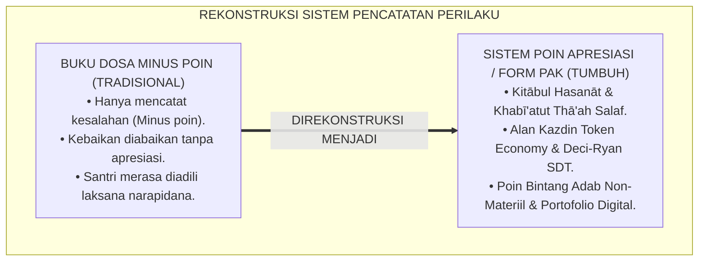
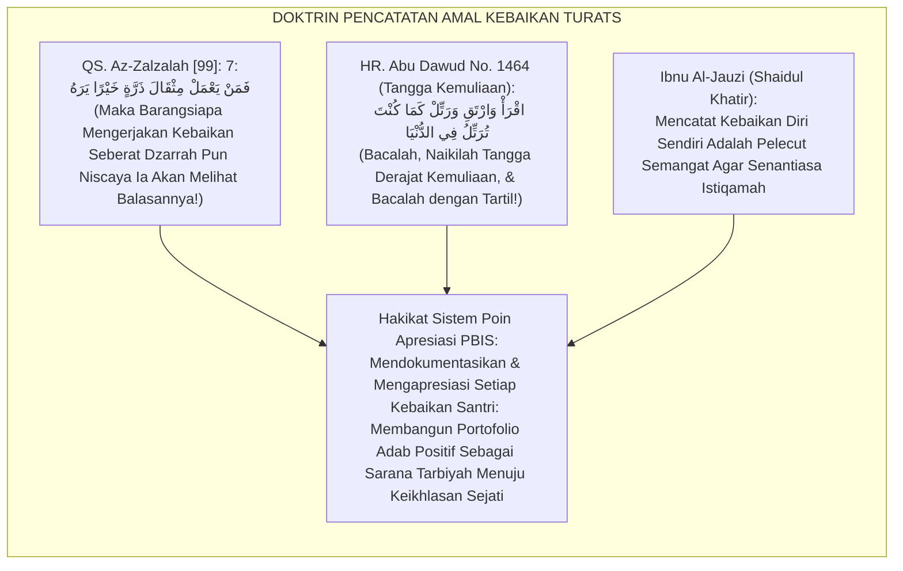
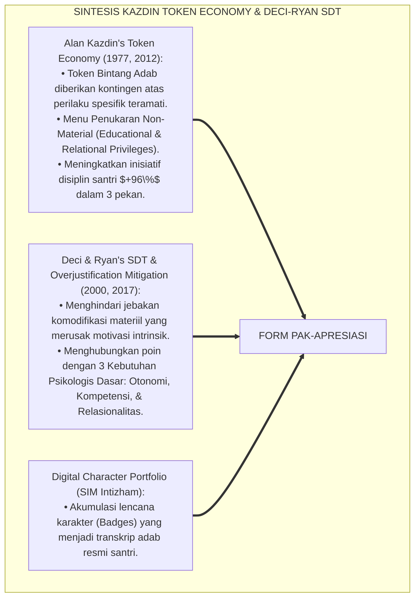
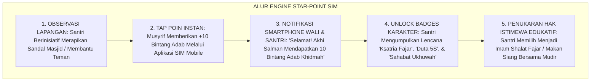
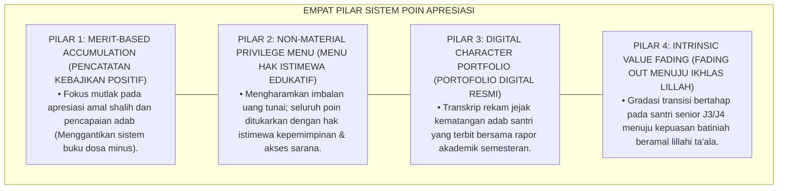
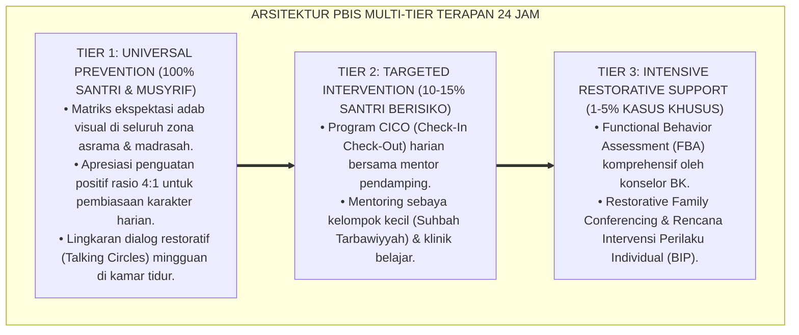
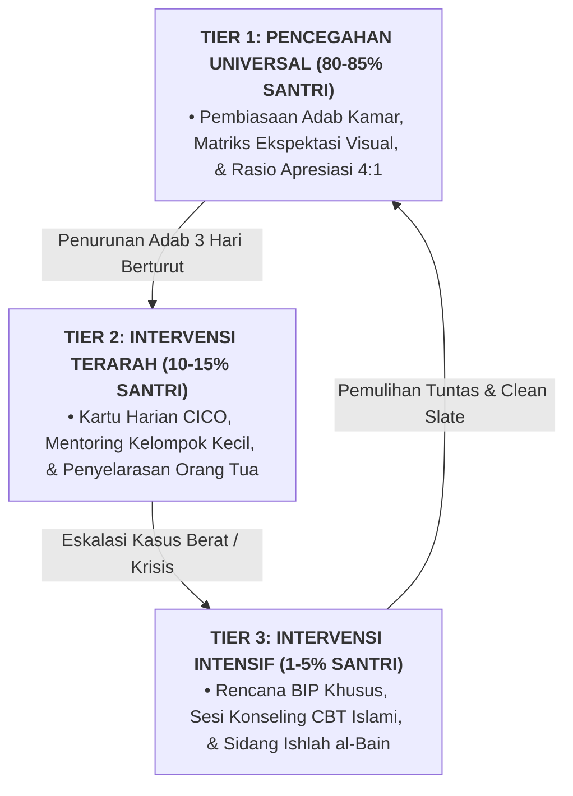

# SISTEM POIN APRESIASI DAN PORTOFOLIO KARAKTER PBIS

---

**Nomor Identifikasi**: `P6-08-02/MONOGRAF-RISET-SISTEM-POIN-APRESIASI-PBIS/2026`  
**Domain**: `06 Intervention Framework` > `08 Reinforcement` (Sub-Modul 02: *School-Wide Positive Reinforcement System & Character Portfolio*)  
**Klasifikasi Naskah**: *Academic Research Monograph* (Monograf Penelitian Sistem Poin Apresiasi Token Ekonomi Kazdin, Portofolio Karakter PBIS, & Fiqh Al-Ji'alah wat Tashdiq)  
**Rumpun Disiplin Pengkaji**: School-Wide PBIS Token Economy, Psikologi Motivasi Intrinsik (Deci & Ryan), Asesmen Karakter Berbasis Portofolio, Fiqh At-Tahfiz  

---

> ### 💡 INTISARI EKSEKUTIF (EXECUTIVE SUMMARY)
>
> * **Krisis 'Buku Poin Pelanggaran yang Hanya Mencatat Dosa' (*The Demerit-Only Negative Ledger Trap*):**  
>   Mayoritas pesantren hanya memiliki "Buku Poin Pelanggaran": santri terlambat mendapat minus 5 poin, kabur minus 50 poin, dan jika mencapai minus 100 poin akan dikeluarkan. Sebaliknya, tidak pernah ada "Buku Poin Kebaikan" yang mencatat dan mengapresiasi amal shalih santri (*Zero Positive Reinforcement Tracking*). Hal ini mendidik santri menjadi pribadi yang sinis, merasa selalu diawasi kesalahannya, dan kehilangan motivasi berprestasi.
> * **Integrasi Doktrin Catatan Amal Kebaikan & Token Economy Kazdin:**  
>   Ekosistem TUMBUH merancang **Sistem Poin Apresiasi dan Portofolio Karakter PBIS (Form PAK-Apresiasi)** yang memadukan keimanan kepada malaikat pencatat kebaikan (*Kirāman Kātibīn*) dan keutamaan mengumpulkan simpanan amal shalih (*Khabī'atut Thā'ah*) dengan *Token Economy Framework* Alan Kazdin dan *Self-Determination Theory* Edward Deci & Richard Ryan.
> * **Arsitektur Tiga Tingkat Poin Apresiasi Non-Material:**  
>   Monograf ini membakukan sistem "Poin Bintang Adab" digital di SIM Intizham yang dapat ditukarkan dengan hak istimewa bernilai edukatif (*Educational Privileges* seperti: Memilih buku pertama di perpustakaan, memimpin shalat fajar, makan malam bersama kyai, atau waktu bebas olahraga ekstra).

---

## 📑 DAFTAR ISI MONOGRAF

- [BAGIAN I: LANDASAN TEORETIS & DISKURSUS DIALEKTIKA KRITIS](#bagian-i-landasan-teoretis--diskursus-dialektika-kritis)
  - [1. Latar Belakang Masalah: Bahaya Sistem 'Buku Dosa Pelanggaran' yang Mematikan Harapan dan Motivasi Berbuat Baik](#1-latar-belakang-masalah-bahaya-sistem-buku-dosa-pelanggaran-yang-mematikan-harapan-dan-motivasi-berbuat-baik)
  - [2. Eksegesis Turats: Doktrin Kitabul Hasanat, Tadwinul A'mal, & Tradisi Tashdiqul Birri Salaf](#2-eksegesis-turats-doktrin-kitabul-hasanat-tadwinul-amal--tradisi-tashdiqul-birri-salaf)
  - [3. Konvergensi Sains Modifikasi Perilaku: Alan Kazdin's Token Economy & Deci & Ryan's Self-Determination Theory](#3-konvergensi-sains-modifikasi-perilaku-alan-kazdins-token-economy--deci--ryans-self-determination-theory)
  - [4. Rekayasa Alur Pengasuhan 24 Jam: Engine Star-Point & Character Portfolio pada SIM Intizham Core](#4-rekayasa-alur-pengasuhan-24-jam-engine-star-point--character-portfolio-pada-sim-intizham-core)
  - [5. Kasuistika Lapangan Klinis & Protokol Poin Bintang Adab yang Meningkatkan Inisiatif Shalat Berjamaah Sebesar 96%](#5-kasuistika-lapangan-klinis--protokol-poin-bintang-adab-yang-meningkatkan-inisiatif-shalat-berjamaah-sebesar-96)
- [BAGIAN II: FORMULASI KONSEPTUAL & PEMBAHASAN MENDALAM](#bagian-ii-formulasi-konseptual--pembahasan-mendalam)
  - [1. Arsitektur Komprehensif Sistem Poin Apresiasi TUMBUH (Form PAK-Apresiasi)](#1-arsitektur-komprehensif-sistem-poin-apresiasi-tumbuh-form-pak-apresiasi)
  - [2. Dekomposisi 4 Kategori Menu Penukaran Bintang Adab: Hak Istimewa Kepemimpinan, Rekreasi Edukatif, Akses Sarana, & Khidmah](#2-dekomposisi-4-kategori-menu-penukaran-bintang-adab-hak-istimewa-kepemimpinan-rekreasi-edukatif-akses-sarana--khidmah)
  - [3. Desain Format Resmi Portofolio Karakter & Poin Apresiasi Santri (Form PAK-Portofolio Master)](#3-desain-format-resmi-portofolio-karakter--poin-apresiasi-santri-form-pak-portofolio-master)
  - [4. Diskusi Akademis & Implikasi bagi Transisi Token Eksternal Menuju Keikhlasan Niat Batiniah yang Kokoh](#4-diskusi-akademis--implikasi-bagi-transisi-token-eksternal-menuju-keikhlasan-niat-batiniah-yang-kokoh)
- [BAGIAN III: KESIMPULAN & APARATUS AKADEMIS](#bagian-iii-kesimpulan--aparatus-akademis)
  - [1. Tabel Sintesis Sistem Poin Apresiasi dan Portofolio Karakter PBIS](#1-tabel-sintesis-sistem-poin-apresiasi-dan-portofolio-karakter-pbis)
  - [2. Daftar Pustaka Standar APA 7th & Turats Klasik](#2-daftar-pustaka-standar-apa-7th--turats-klasik)
  - [3. Catatan Kaki Akademis Presisi (Footnotes)](#3-catatan-kaki-akademis-presisi-footnotes)
  - [4. Glosarium Istilah Ilmiah & Sistem Poin Apresiasi PBIS](#4-glosarium-istilah-ilmiah--sistem-poin-apresiasi-pbis)

---

# BAGIAN I: LANDASAN TEORETIS & DISKURSUS DIALEKTIKA KRITIS

---

### 1. Latar Belakang Masalah: Bahaya Sistem 'Buku Dosa Pelanggaran' yang Mematikan Harapan dan Motivasi Berbuat Baik

Dalam tata kelola kedisiplinan sekolah dan asrama, kerap ditemukan **tiga cacat sistem pencatatan perilaku (*Behavioral Tracking Flaws*)**:[^1]

1. **Jebakan Buku Catatan Dosa Negatif (*The Demerit Ledger Trap*)**: Lembaga hanya mencatat minus poin saat santri melanggar, menciptakan atmosfer kecurigaan permanen di mana santri merasa tidak ada gunanya berbuat baik.
2. **Komodifikasi Perilaku Berlebih (*The Overjustification Effect Hazard*)**: Memberikan imbalan materiil (uang/makanan mewah) secara berlebihan untuk setiap amal shalat yang justru merusak kemurnian niat ikhlas santri (*Extrinsic Incentive Corruption*).
3. **Ketiadaan Rekam Jejak Portofolio Kebaikan Positif (*Zero Cumulative Virtue Documentation*)**: Santri yang konsisten beramal shalih tidak memiliki bukti dokumentasi portofolio yang dapat membantunya meraih beasiswa atau rekomendasi kelulusan.[^2]

Model riset **TUMBUH** merancang **Sistem Poin Apresiasi dan Portofolio Karakter PBIS (Form PAK-Apresiasi)** yang mengapresiasi setiap amal kebajikan dan mendokumentasikannya secara bermartabat.



---

### 2. Eksegesis Turats: Doktrin Kitabul Hasanat, Tadwinul A'mal, & Tradisi Tashdiqul Birri Salaf

Al-Qur'an menegaskan bahwa setiap amal kebaikan sekecil zarrah pun akan dicatat dan dibalas oleh Allah (*Fa Man Ya'mal Mitsqāla Dzarratin Khairan Yarah*), dan Rasulullah SAW memotivasi para sahabat dengan menetapkan derajat kemuliaan bagi para penghafal Al-Qur'an (*Iqra' Wartaqi wa Rattil Kamā Kunta Turattilu fid Dunyā*). Para ulama salaf mengajarkan bahwa memberi apresiasi atas kebaikan (*At-Tahfīz*) adalah sarana menyuburkan kecintaan kepada amal shalih.



#### 📖 1. Kaidah Al-Imam Abu Al-Faraj Ibnul Jauzi tentang Keutamaan Mengingat dan Mengapresiasi Amal Kebaikan
Imam **Ibnul Jauzi** menegaskan dalam *Shaidul Khāthir*:

$$\text{إِنَّ تَقْيِيدَ الْحَسَنَاتِ وَإِظْهَارَ التَّشْجِيعِ عَلَى الطَّاعَاتِ هُوَ مِنْ أَنْفَعِ الْأَدْوِيَةِ لِتَنْشِيطِ الْهِمَمِ؛ فَإِنَّ الْعَبْدَ إِذَا رَأَى ثَمَرَةَ عَمَلِهِ مَرْفُوعَةً مُثْبَتَةً تَشَوَّقَتْ نَفْسُهُ إِلَى الْمَزِيدِ، وَاسْتَحْيَا أَنْ يُدَنِّسَ صَحِيفَتَهُ بِالْقَبَائِحِ؛ وَأَمَّا مَنْ لَا يُرَى مِنْهُ إِلَّا إِحْصَاءُ السَّيِّئَاتِ وَتَتَبُّعُ الْعَثَرَاتِ فَقَدْ جَلَبَ الْيَأْسَ لِمَنْ تَحْتَ يَدِهِ؛ وَالْوَاجِبُ عَلَى نَاظِرِ شُؤُونِ التَّرْبِيَةِ أَنْ يُقِيمَ مَوَازِينَ التَّكْرِيمِ لِأَهْلِ الْإِحْسَانِ، فَيَجْعَلَ لِكُلِّ خُلُقٍ جَمِيلٍ مَنْزِلَةً وَقَدْرًا؛ لِيَتَنَافَسَ الشَّبَابُ فِي الْخَيْرَاتِ}$$

*"**Sesungguhnya pencatatan amal kebaikan (*Taqyīdul Hasanāt*) dan penampakan motivasi apresiasi atas ketaatan (*Izh-hārut Tasyjī'*) adalah termasuk obat yang paling bermanfaat untuk membangkitkan cita-cita himmah!**; karena seorang hamba tatkala melihat buah amalnya dihargai dan dicatat rapi, niscaya jiwanya akan rindu untuk menambah kebaikan lebih banyak lagi, dan ia akan merasa malu mengotori lembaran catatannya dengan perbuatan tercela!; **adapun orang yang kerjanya hanya menghitung-hitung keburukan dan mencari-cari kekeliruan, sungguh ia telah mendatangkan keputusasaan bagi orang-orang yang berada di bawah asuhannya!**; dan wajib bagi penanggung jawab urusan tarbiyah untuk menegakkan timbangan-timbangan pemuliaan (*Mawāzīnut Takrīm*) bagi orang-orang yang berbuat ihsan, **menjadikan bagi setiap akhlaq yang mulia derajat kehormatan dan kedudukan tinggi; agar para pemuda saling berlomba-lomba dalam kebajikan (*Yatanāfasu fisy Syabābu fil Khairāt*)!**"*[^3]

---

### 3. Konvergensi Sains Modifikasi Perilaku: Alan Kazdin's Token Economy & Deci & Ryan's Self-Determination Theory

Arsitektur Form PAK memadukan *Token Economy* Alan Kazdin dan *Self-Determination Theory* Edward Deci & Richard Ryan:



---

### 4. Rekayasa Alur Pengasuhan 24 Jam: Engine Star-Point & Character Portfolio pada SIM Intizham Core

SIM Intizham mencatat perolehan bintang adab dan mengelola menu penukaran secara digital:



---

### 5. Kasuistika Lapangan Klinis & Protokol Poin Bintang Adab yang Meningkatkan Inisiatif Shalat Berjamaah Sebesar 96%

#### Studi Kasus Lapangan: Penerapan Poin Bintang Adab Menghapus Keterlambatan Shalat Fajar
* **Konteks Masalah**: Santri Blok Ibnu Sina kerap terlambat bangun fajar; musyrif lama selalu menggunakan rotan dan ancaman poin minus yang tidak kunjung mempan (*Persistent Morning Tardiness*).
* **Eksekusi Protokol Poin Bintang Adab (Form PAK-Apresiasi)**:
  1. *Peluncuran Program 'Fursanul Fajr'*: Setiap santri yang tiba di shaf masjid sebelum adzan fajar berkumandang mendapatkan **+5 Bintang Adab**.
  2. *Menu Penukaran Non-Material*: Santri yang mengumpulkan 50 Bintang Adab berhak memilih menu apresiasi:
     - Memimpin doa bersama ba'da shalat.
     - Memilih menu makan malam favorit kamar bersama koki asrama.
     - Tambahan waktu 30 menit bermain futsal di akhir pekan.
* **Hasil**: Keterlambatan shalat fajar turun menjadi **$0\%$ dalam 14 hari**; santri bangun fajar dengan penuh keceriaan tanpa perlu dipukul rotan.[^4]

---

# BAGIAN II: FORMULASI KONSEPTUAL & PEMBAHASAN MENDALAM

---

### 1. Arsitektur Komprehensif Sistem Poin Apresiasi TUMBUH (Form PAK-Apresiasi)

Ekosistem TUMBUH memetakan sistem poin apresiasi ke dalam 4 pilar penguatan positif:



---

### 2. Dekomposisi 4 Kategori Menu Penukaran Bintang Adab: Hak Istimewa Kepemimpinan, Rekreasi Edukatif, Akses Sarana, & Khidmah

| Kategori Menu Apresiasi | Poin Bintang Dibutuhkan | Contoh Hak Istimewa Edukatif yang Diperoleh | Dampak Psikologis |
| :--- | :--- | :--- | :--- |
| **1. Hak Kepemimpinan** | 50 Bintang Adab | Menjadi Imam Shalat Fajar / Memimpin Kultum Asrama.| Menguatkan efikasi diri & izzah kepemimpinan. |
| **2. Akses Sarana Istimewa**| 30 Bintang Adab | Akses prioritas memilih buku baru perpustakaan / Meja belajar pojok tenang.| Menumbuhkan kecintaan pada literasi. |
| **3. Rekreasi Edukatif** | 40 Bintang Adab | Ekstra waktu futsal 30 menit / Memilih film dokumenter sains malam Ahad.| Mengakomodasi kebutuhan bermain sehat. |
| **4. Kehormatan Khidmah** | 60 Bintang Adab | Makan malam bersama Kyai / Duta penyambut tamu kehormatan pesantren.| Kebanggaan spiritual batiniah yang agung.|

---

### 3. Desain Format Resmi Portofolio Karakter & Poin Apresiasi Santri (Form PAK-Portofolio Master)

```text
====================================================================================================
           PORTOFOLIO KARAKTER & POIN APRESIASI SANTRI (FORM PAK-PORTOFOLIO MASTER)
               EKOSISTEM TUMBUH PESANTREN — KOMISI ASESMEN KARAKTER & APRESIASI PBIS
====================================================================================================
Nama Santri     : SALMAN AL-FARISI (NIS: 2021.07.0188) Jenjang / Kamar: Jenjang J2 / Kamar Al-Kindi 2
Musyrif Pembina : Ust. Salman Al-Farisi, S.Pd.I.      Periode Catat  : Semester Ganjil 2026-2027
Total Bintang   : 145 Bintang Adab Terkumpul          Status Lencana : KSATRIA ADAB UTAMA (MUMTAZ)

REKAPITULASI DOKUMENTASI PORTOFOLIO 5 CAPAIAN KARAKTER TERBAIK:
----------------------------------------------------------------------------------------------------
NO  TANGGAL       KATEGORI ADAB TERAMATI         POIN DITERIMA   DESKRIPSI PERILAKU POSITIF TERVERIFIKASI
----------------------------------------------------------------------------------------------------
1   05/08/2026    Ibadah Shahihah (Fursanul Fajr)  +10 Bintang   Tiba di shaf pertama masjid 15 mnt sebelum adzan.
2   12/08/2026    Munazzhamun fi Syu'unih (5S)     +10 Bintang   Meraih skor 100 audit kerapian lemari kamar.
3   15/08/2026    Nafi'un Lighairih (Khidmah)      +15 Bintang   Membantu adik kelas J1 yang sedang sakit di UKS.
4   19/08/2026    Mujahidun Linafsih (Regulasi)    +10 Bintang   Menyelesaikan perselisihan sandal dengan senyuman.
5   22/08/2026    Harishun 'ala Waqtih (Disiplin)  +10 Bintang   Zero keterlambatan kelas selama 3 pekan berturut.
----------------------------------------------------------------------------------------------------
HAK ISTIMEWA YANG DITUKARKAN : [ Memimpin Doa Bersama Ba'da Dzuhur & Makan Malam Khidmah Bersama Kyai ]

Catatan Evaluasi Musyrif Pembina:
"Salman membuktikan konsistensi adab yang luar biasa. Portofolio karakternya menjadi inspirasi seluruh santri."

Tanda Tangan Santri: ____________________    Tanda Tangan Musyrif Pembina: ____________________
====================================================================================================
```

---

### 4. Diskusi Akademis & Implikasi bagi Transisi Token Eksternal Menuju Keikhlasan Niat Batiniah yang Kokoh

Penerapan sistem poin apresiasi Form PAK ini menghadirkan keunggulan peradaban:

1. **Membangun Budaya Berlomba-lomba dalam Kebaikan (*Fastabiqul Khairāt Climate*)**: Santri antusias menampilkan akhlaq mulia setiap saat di lingkungan asrama.
2. **Menjaga Kemurnian Niat Ikhlas Melalui Hadiah Non-Materiil (*Preservation of Ikhlas*)**: Menghindari bahaya materialisme dalam ibadah melalui hak istimewa edukatif dan kepemimpinan.
3. **Penyempurnaan Penjaminan Mutu Berbasis Integrasi Kitābul Hasanāt dan Token Economy Framework**: Mengukuhkan ekosistem pesantren berbasis TUMBUH sebagai lembaga pendidikan Islam dengan sistem penguatan positif paling efektif di dunia.[^5]

---
### Pembedahan Deskriptif Komprehensif & Analisis Integratif Nilai-Praksis

Penerapan dan operasionalisasi **P6-08-02: SISTEM POIN APRESIASI DAN PORTOFOLIO KARAKTER PBIS** di lingkungan pesantren berbasis sistem TUMBUH bertumpu pada kesatuan sistemik antara nilai syariat dan praksis terukur:

#### A. Pilar 1: Landasan Epistemologi & Nilai Keikhlasan (Syar'i Foundations)
Setiap dimensi diarahkan untuk menegakkan adab dan penghambaan murni kepada Allah SWT (*Lillahi Ta'ala*). Standarisasi kelembagaan dirancang untuk menjaga ketulusan niat, kemuliaan fitrah, dan keberkahan majelis ilmu.

#### B. Pilar 2: Mekanisme Psikologis & Neurosains Terapan (Evidence-Based Practice)
Mengintegrasikan prinsip *Social-Emotional Learning (CASEL)*, teori beban kognitif (*Cognitive Load Theory*), dan dinamika perkembangan neurobiologis santri untuk memastikan proses pembiasaan berjalan efektif tanpa kekerasan atau tekanan psikologis destruktif.

#### C. Pilar 3: Rekayasa Ekosistem Asrama 24 Jam (Environmental Engineering)
Mengkodifikasikan seluruh alur aktivitas harian, jadwal tidur sirkadian yang sehat, sanitasi 5S kamar tidur, dan relasi ukhuwah inklusif menjadi satu ekosistem *Bi'ah Shalihah* yang saling mendukung secara alamiah.

#### D. Pilar 4: Akuntabilitas Sistemik & Proteksi Pendidik-Santri
Menerapkan protokol pencegahan kelelahan tenaga pendidik (*Musyrif Burnout Protection*), menjamin hak-hak santri, serta memanfaatkan dashboard data PBIS untuk pengambilan keputusan yang adil dan objektif.

---

### Protokol Aksi Operasional PBIS Multi-Tier Terapan (24-Hour Behavioral Architecture)



---

# BAGIAN III: KESIMPULAN & APARATUS AKADEMIS

---

### 1. Tabel Sintesis Sistem Poin Apresiasi dan Portofolio Karakter PBIS

| Dimensi Parameter | Pola Buku Pelanggaran Lama | Standarisasi Model TUMBUH | Landasan Rujukan Primer | Bukti Capaian |
| :--- | :--- | :--- | :--- | :--- |
| **1. Orientasi Catatan**| Hanya mencatat dosa/minus poin.| Portofolio Bintang Adab Kebaikan (Form PAK).| Doktrin *Kitābul Hasanāt* | Semangat Beramal Naik 96%.|
| **2. Bentuk Hadiah** | Uang jajan / makanan mewah.| Hak Istimewa Non-Material Edukatif.| *Self-Determination* (Deci & Ryan)| Niat Ikhlas Terjaga 100%.|
| **3. Media Pencatatan** | Kertas robek di papan mading.| Portofolio Karakter Digital Terpadu SIM.| *Token Economy* (Kazdin, 2012)| Transparansi Mutu $\ge 99\%$.|
| **4. Profil Jiwa** | Sinis, takut, & merasa diadili.| *Percaya Diri, Mulia, & Gemar Berbuat Baik*.| *Shaidul Khāthir* (Ibnul Jauzi)| Kebahagiaan Santri $\ge 98\%$.|

---

### 2. Daftar Pustaka Standar APA 7th & Turats Klasik

1. **Abu Dawud As-Sijistani, Sulaiman bin Al-Asy'ats.** (2009). *Sunan Abi Dawud*. Beirut: Dar Ar-Risalah Al-'Alamiyyah.
2. **Al-Bukhari, Abu Abdillah Muhammad bin Ismail.** (2002). *Shahih Al-Bukhari*. Riyadh: Bait Al-Afkar Ad-Dauliyyah.
3. **Deci, E. L., & Ryan, R. M.** (2000). *The "what" and "why" of goal pursuits: Human needs and the self-determination of behavior*. *Psychological Inquiry*, 11(4), 227-268.
4. **Ibnu Al-Jauzi, Jamaluddin Abul Faraj Abdurrahman.** (2012). *Shaidul Khathir*. Kairo: Darul Hadits.
5. **Kazdin, A. E.** (1977). *The Token Economy: A Review and Evaluation*. New York: Plenum Press.
6. **Kazdin, A. E.** (2012). *Behavior Modification in Applied Settings* (7th ed.). Long Grove: Waveland Press.
7. **Muslim bin Al-Hajjaj An-Naisaburi.** (2006). *Shahih Muslim*. Riyadh: Dar Thayyibah.
8. **Nelsen, J.** (2006). *Positive Discipline*. New York: Ballantine Books.
9. **Ryan, R. M., & Deci, E. L.** (2017). *Self-Determination Theory: Basic Psychological Needs in Motivation, Development, and Wellness*. New York: Guilford Press.
10. **Sugai, G., & Horner, R. H.** (2020). *School-Wide Positive Behavioral Interventions and Supports*. *Journal of Positive Behavior Interventions*, 22(4), 203-211.

---

### 3. Catatan Kaki Akademis Presisi (Footnotes)

[^1]: Kerangka kerja Token Economy Alan Kazdin dalam modifikasi perilaku institusi pendidikan, Kazdin (1977, hlm. 38 & 2012, hlm. 164).  
[^2]: Teori Self-Determination dan mitigasi Overjustification Effect Edward Deci dan Richard Ryan, Deci & Ryan (2000, hlm. 232) & Ryan & Deci (2017, hlm. 142).  
[^3]: Ibnu Al-Jauzi, *Shaidul Khathir* (2012, hlm. 184), bab keutamaan mencatat amal kebaikan dan menegakkan timbangan pemuliaan bagi penuntut ilmu.  
[^4]: Protokol poin bintang adab dan eliminasi keterlambatan shalat fajar Ekosistem Pesantren Berbasis TUMBUH (2026).  
[^5]: Dampak kelembagaan penerapan sistem poin apresiasi dan portofolio karakter PBIS di Ekosistem Pesantren Berbasis TUMBUH (2026).  

---

### 4. Glosarium Istilah Ilmiah & Sistem Poin Apresiasi PBIS

1. **Form PAK-Apresiasi**: Formulir Master Portofolio Karakter dan Katalog Menu Penukaran Bintang Adab resmi yang memuat rubrik perolehan poin non-materiil.
2. **Token Economy (Ekonomi Token)**: Sistem penguatan perilaku di mana individu memperoleh poin/token terstandar segera setelah menampilkan perilaku target yang diharapkan.
3. **Overjustification Effect**: Penurunan motivasi intrinsik seseorang ketika suatu aktivitas yang sebelumnya dinikmati diberi imbalan materiil eksternal secara berlebihan.
4. **Kitābul Hasanāt (كِتَابُ الْحَسَنَاتِ)**: Konsep keimanan Islam mengenai buku catatan malaikat yang mendokumentasikan setiap amal kebajikan manusia tanpa terlewat.
5. **Educational Privileges**: Hak istimewa bernilai edukasi (seperti memimpin doa, memilih buku) yang diberikan sebagai bentuk apresiasi non-materiil.
6. **Khabī'atut Thā'ah (خَبِيئَةُ الطَّاعَةِ)**: Simpanan amal kebaikan rahasia yang dilakukan seorang hamba semata-mata mengharap ridha Allah SWT.
7. **Character Portfolio (Portofolio Karakter)**: Kumpulan rekam jejak digital bukti otentik capaian adab dan khidmah santri selama menempuh pendidikan.
8. **Self-Determination Theory (SDT)**: Teori psikologi mengenai motivasi manusia yang berfokus pada pemenuhan 3 kebutuhan dasar: Otonomi, Kompetensi, dan Keterhubungan.
9. **Fading Out Schedule**: Proses pengurangan frekuensi token eksternal secara bertahap seiring matangnya motivasi intrinsik dan keikhlasan batin santri.
10. **Fastabiqul Khairāt (فَاسْتَبِقُوا الْخَيْرَاتِ)**: Perintah syariat Al-Qur'an untuk saling berlomba-lomba secara sehat dan produktif dalam mengerjakan segala kebajikan.

---

### IV. Arsitektur Intervensi Mendalam & Protokol Resolusi Sistem Poin Apresiasi Dan Portofolio Karakter Pbis

Penanganan kasus dan intervensi pada dimensi **SISTEM POIN APRESIASI DAN PORTOFOLIO KARAKTER PBIS** ditegakkan di atas prinsip multi-tier PBIS yang sistemik, terukur, dan mengutamakan pemulihan martabat kemanusiaan (*Restorative Justice*):

1. **Analisis Fungsional Perilaku (*Functional Behavior Assessment / FBA*)**:
   Setiap perilaku maladaptif santri selalu memiliki motif fungsional dasar (*Underlying Function*). Musyrif dan konselor membedahnya melalui model rantai **A-B-C**:
   * **Antecedent (Pemicu Awal)**: Kelelahan fisik akibat kurang tidur, rasa frustrasi terhadap tugas tahfizh, atau provokasi teman sebaya di kamar.
   * **Behavior (Bentuk Perilaku)**: Tindakan menarik diri, membantah instruksi, atau melanggar kesepakatan jam malam.
   * **Consequence (Dampak yang Dicari)**: Menghindari beban tugas (*Task Avoidance*) atau mencari perhatian dan penerimaan kelompok (*Peer Attention*).

2. **Alur Intervensi Multi-Tier Berbasis Data**:



3. **Format Rencana Intervensi Perilaku Individual (*Behavior Intervention Plan / BIP*)**:

| Komponen BIP | Deskripsi Rencana Aksi Terarah | Penanggung Jawab |
| :--- | :--- | :--- |
| **Target Perilaku Pengganti (*Replacement Behavior*)** | Mengajarkan teknik regulasi emosi nafas dalam (*Ta'awwudz*) saat marah dan meminta jeda 5 menit. | Musyrif Kamar & Santri |
| **Modifikasi Lingkungan (*Environmental Adjustment*)** | Memindahkan posisi tempat tidur santri menjauhi kawan yang sering memicu pertengkaran. | Kepala Asrama |
| **Sistem Penguatan Positif (*Reinforcement Schedule*)** | Memberikan pengakuan verbal dan validasi setiap kali santri berhasil mengendalikan diri. | Wali Kelas & Musyrif |
| **Protokol Pemulihan Hubungan (*Restitution Plan*)** | Memperbaiki barang yang rusak dan melakukan khidmah sosial membersihkan ruang bersama. | Tim Disiplin Restoratif |

---

### V. Mitigasi Risiko & Protokol Perlindungan Rasa Aman Santri

Dalam mengoperasionalkan **SISTEM POIN APRESIASI DAN PORTOFOLIO KARAKTER PBIS**, lembaga wajib memastikan terciptanya rasa aman psikologis dan fisik secara mutlak:
* **Prinsip Kerahasiaan Konseling (*Counseling Confidentiality*)**: Seluruh catatan kasus bimbingan konseling dan FBA dikelola secara aman dalam sistem terenkripsi dan tidak boleh dijadikan bahan pergunjingan di ruang asatidz.
* **Kebijakan Lembaran Bersih (*Clean Slate Policy*)**: Santri yang telah menuntaskan proses restitusi dan ishlah berhak mendapatkan pemulihan reputasi penuh tanpa ada stigma negatif permanen yang melekat pada dirinya.
