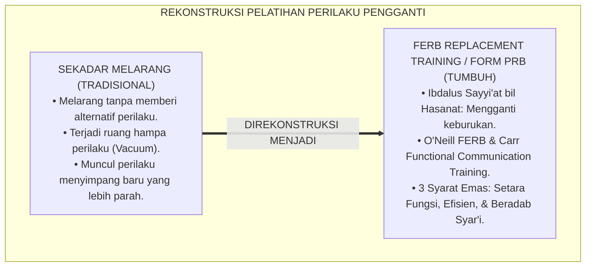
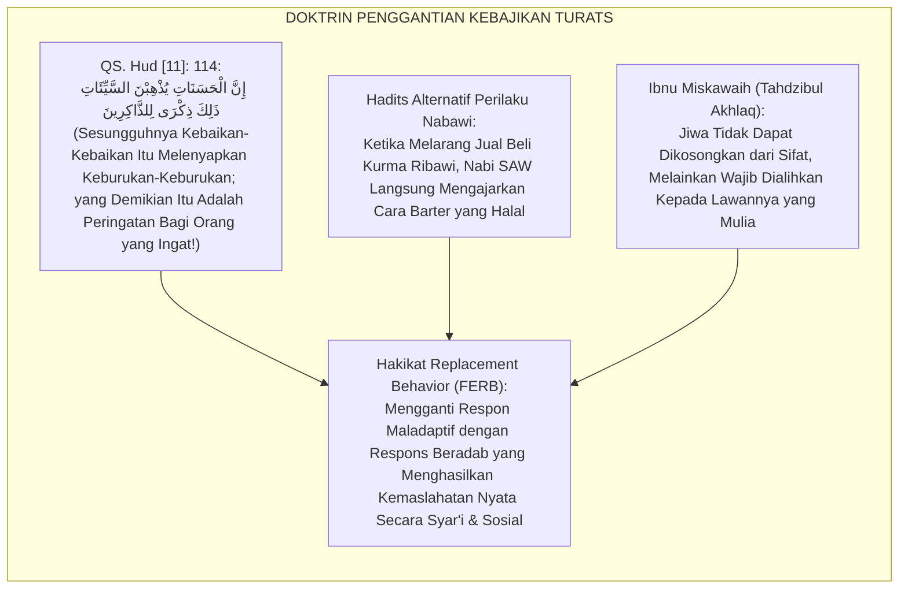
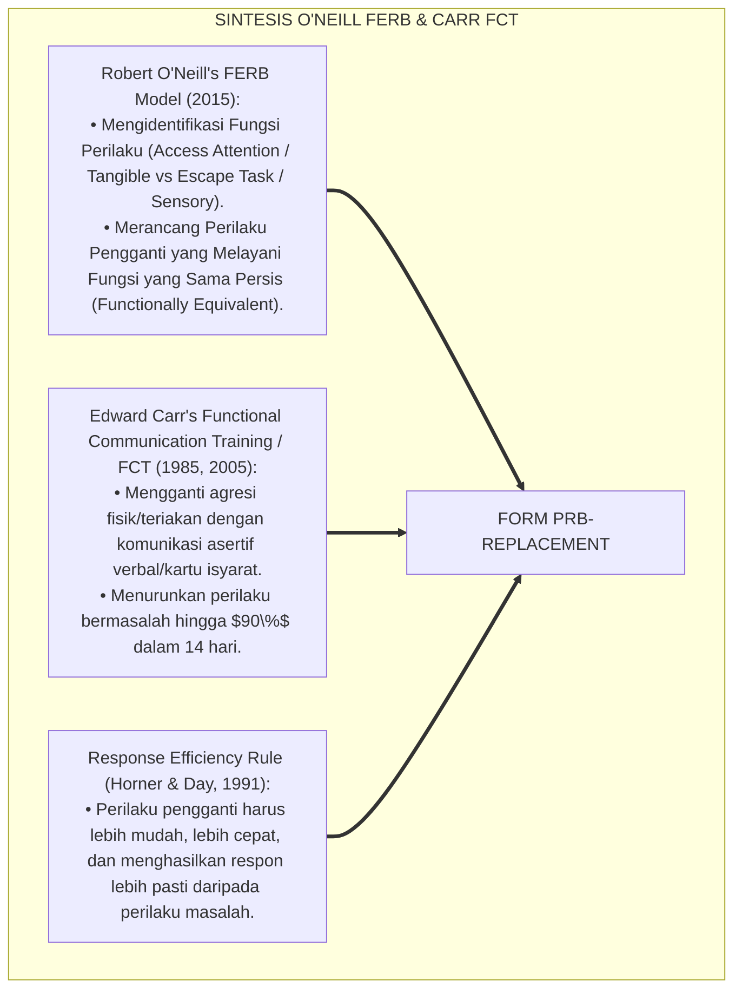
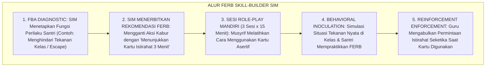
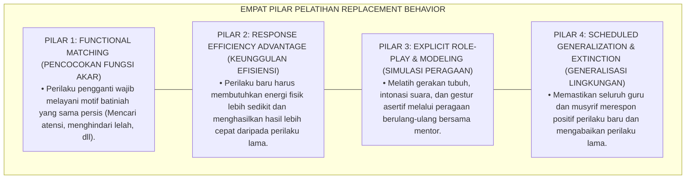
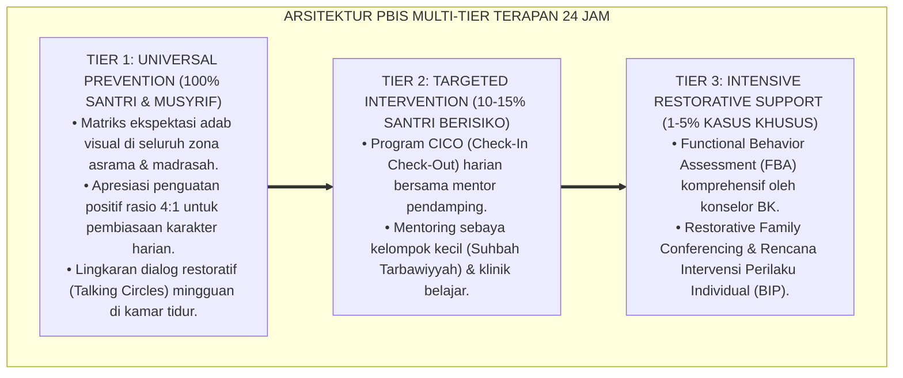

# TEKNIK PELATIHAN REPLACEMENT BEHAVIOR ADAPTIF

---

### 🧭 PETA POSISI PANDUAN DALAM SISTEM TUMBUH (DARI HULU KE HILIR)
* **Posisi Arsitektur**: `CABANG & DAUN EKOSISTEM (Intervensi Berjenjang PBIS & Disiplin Restoratif 3R)`
* **Peruntukan Pengguna**: Musyrif Pembina, Tim Penegak Disiplin Restoratif, Guru BK, & Wali Santri
* **Fokus Panduan**: Menangani masalah perilaku secara berjenjang (Tier 1 Pencegahan, Tier 2 Bimbingan CICO, Tier 3 Bimbingan Khusus) dan Ishlah al-Bain tanpa kekerasan.
* **Hasil Akhir yang Dituju**: Terwujudnya santri berkarakter *Insan Adabi* yang mandiri, musyrif yang mengasuh dengan kasih sayang tanpa *burnout*, dan pesantren yang aman berbasis data (*Safe Boarding School*).

---

### 🎯 Mengapa Panduan Ini Ada & Masalah Nyata yang Dipecahkan
1. **Latar Masalah di Lapangan**: Sering kali pengasuhan di pesantren berjalan tanpa SOP yang jelas atau terjebak dalam pola reaktif—menunggu santri berbuat salah baru dihukum dengan emosional.
2. **Solusi Sistem TUMBUH**: Panduan ini memberikan langkah preventif dan terstruktur agar setiap pembiasaan adab berjalan terencana, konsisten, dan terukur.
3. **Sasaran Perubahan**: Memastikan nilai-nilai Islam menyatu dalam perilaku harian santri melalui keteladanan nyata (*Qudwah Hasanah*).

---
### 🎯 Tujuan & Manfaat Panduan
Panduan ini dirancang sebagai petunjuk operasional terapan agar pendidik dan musyrif dapat:
1. Menjalankan pembinaan adab santri dengan pendekatan kasih sayang (*Rahmah*) dan ketegasan yang mendidik (*Firm & Kind*).
2. Menghindari cara-cara kekerasan fisik, bentakan verbal, maupun hukuman yang mempermalukan santri.
3. Menciptakan suasana asrama dan kelas yang aman, tertib, dan menumbuhkan kesadaran diri (*Bi'ah Shalihah*).

---

### 💡 Intisari Cepat (3 Menit Memahami Esensi)
* **Kunci Pengasuhan**: Karakter santri tumbuh melalui keteladanan nyata (*Qudwah Hasanah*), komunikasi empatik, dan pembiasaan terstruktur 24 jam.
* **Tindakan Utama**: Terapkan panduan langkah demi langkah di bawah ini secara konsisten, pantau perkembangan santri secara objektif, dan berikan apresiasi atas setiap perbaikan diri yang mereka capai.
* **Prinsip Disiplin**: Fokus pada pemulihan hubungan dan tanggung jawab nyata (*Restoratif*), bukan sekadar melampiaskan amarah atau menghukum.

---

### 📖 Uraian Panduan & Langkah Aksi Lapangan

**Nomor Identifikasi**: `P6-06-01/MONOGRAF-RISET-REPLACEMENT-BEHAVIOR-ADAPTIF/2026`  
**Domain**: `06 Intervention Framework` > `06 Developmental Strategies` (Sub-Modul 01: *Functionally Equivalent Replacement Behavior FERB Training*)  
**Klasifikasi Naskah**: *Academic Research Monograph* (Monograf Penelitian Pelatihan Replacement Behavior FERB, ABA Behavioral Inoculation, & Fiqh Ibdal As-Sayyi'at)  
**Rumpun Disiplin Pengkaji**: Applied Behavior Analysis (ABA), Functional Communication Training (FCT), Modifikasi Perilaku Kognitif, Fiqh At-Tahdzib  

---

> ### 💡 INTISARI EKSEKUTIF (EXECUTIVE SUMMARY)
>
> * **Krisis 'Melarang Perilaku Buruk Tanpa Mengajarkan Alternatifnya' (*The Prohibition Without Substitution Vacuum*):**  
>   Banyak pengasuh hanya mampu meneriakkan larangan: *"Jangan memukul!"*, *"Jangan berteriak!"*, *"Jangan kabur!"*, tanpa pernah mengajarkan apa yang harus santri lakukan saat mereka merasa marah, tertekan, atau kewalahan. Menghapus perilaku buruk tanpa memberikan perilaku pengganti (*Behavioral Vacuum*) pasti memicu munculnya perilaku menyimpang baru yang kerap lebih berbahaya (*Symptom Substitution*).
> * **Integrasi Doktrin Mengganti Keburukan dengan Kebaikan & FERB Technology:**  
>   Ekosistem TUMBUH merancang **Teknik Pelatihan Replacement Behavior Adaptif (Form PRB-Replacement)** yang memadukan perintah syariat mengganti keburukan dengan kebajikan yang setara (*Innal Hasanāti Yudz-hibnas Sayyi'āt*) dan menolak keburukan dengan cara yang lebih baik (*Idfa' billatī Hiya Ahsan*) dengan metodologi *Functionally Equivalent Replacement Behavior (FERB)* Robert O'Neill dan *Functional Communication Training (FCT)*.
> * **Arsitektur Tiga Syarat Emas Perilaku Pengganti (FERB Triad):**  
>   Monograf ini menyajikan 3 syarat mutlak FERB: (1) Kesetaraan Fungsi (*Functionally Equivalent*), (2) Efisiensi Respons (*More Efficient than Problem Behavior*), dan (3) Keberterimaan Sosial-Syar'i (*Socially & Syar'i Valid*), disertai simulasi *Behavioral Inoculation* di aplikasi SIM Intizham.

---

## 📑 DAFTAR ISI MONOGRAF

- [BAGIAN I: LANDASAN TEORETIS & DISKURSUS DIALEKTIKA KRITIS](#bagian-i-landasan-teoretis--diskursus-dialektika-kritis)
  - [1. Latar Belakang Masalah: Bahaya Ruang Hampa Perilaku Akibat Sekadar Melarang Tanpa Memberi Solusi Pengganti](#1-latar-belakang-masalah-bahaya-ruang-hampa-perilaku-akibat-sekadar-melarang-tanpa-memberi-solusi-pengganti)
  - [2. Eksegesis Turats: Doktrin Ibdalus Sayyiat bil Hasanat, Idfa' billati Hiya Ahsan, & Tahdzibul Akhlaq Salaf](#2-eksegesis-turats-doktrin-ibdalus-sayyiat-bil-hasanat-idfa-billati-hiya-ahsan--tahdzibul-akhlaq-salaf)
  - [3. Konvergensi Sains Modifikasi Perilaku: O'Neill's FERB Model & Carr's Functional Communication Training (FCT)](#3-konvergensi-sains-modifikasi-perilaku-oneills-ferb-model--carrs-functional-communication-training-fct)
  - [4. Rekayasa Alur Pengasuhan 24 Jam: Modul FERB Skill-Builder pada SIM Intizham Intervention Core](#4-rekayasa-alur-pengasuhan-24-jam-modul-ferb-skill-builder-pada-sim-intizham-intervention-core)
  - [5. Kasuistika Lapangan Klinis & Protokol Pelatihan FERB yang Mengubah Agresi Melempar Kitab Menjadi Komunikasi Asertif](#5-kasuistika-lapangan-klinis--protokol-pelatihan-ferb-yang-mengubah-agresi-melempar-kitab-menjadi-komunikasi-asertif)
- [BAGIAN II: FORMULASI KONSEPTUAL & PEMBAHASAN MENDALAM](#bagian-ii-formulasi-konseptual--pembahasan-mendalam)
  - [1. Arsitektur Komprehensif Pelatihan Replacement Behavior TUMBUH (Form PRB-Replacement)](#1-arsitektur-komprehensif-pelatihan-replacement-behavior-tumbuh-form-prb-replacement)
  - [2. Dekomposisi 3 Syarat Emas FERB: Functional Equivalence, Response Efficiency, & Social Validity](#2-dekomposisi-3-syarat-emas-ferb-functional-equivalence-response-efficiency--social-validity)
  - [3. Desain Format Resmi Lembar Rencana Pelatihan Perilaku Pengganti (Form PRB-Desain Master)](#3-desain-format-resmi-lembar-rencana-pelatihan-perilaku-pengganti-form-prb-desain-master)
  - [4. Diskusi Akademis & Implikasi bagi Transformasi Akhlaq Santri Melalui Pembiasaan Kebajikan Nyata](#4-diskusi-akademis--implikasi-bagi-transformasi-akhlaq-santri-melalui-pembiasaan-kebajikan-nyata)
- [BAGIAN III: KESIMPULAN & APARATUS AKADEMIS](#bagian-iii-kesimpulan--aparatus-akademis)
  - [1. Tabel Sintesis Teknik Pelatihan Replacement Behavior Adaptif](#1-tabel-sintesis-teknik-pelatihan-replacement-behavior-adaptif)
  - [2. Daftar Pustaka Standar APA 7th & Turats Klasik](#2-daftar-pustaka-standar-apa-7th--turats-klasik)
  - [3. Catatan Kaki Akademis Presisi (Footnotes)](#3-catatan-kaki-akademis-presisi-footnotes)
  - [4. Glosarium Istilah Ilmiah & Replacement Behavior](#4-glosarium-istilah-ilmiah--replacement-behavior)

---

# BAGIAN I: LANDASAN TEORETIS & DISKURSUS DIALEKTIKA KRITIS

---

### 1. Latar Belakang Masalah: Bahaya Ruang Hampa Perilaku Akibat Sekadar Melarang Tanpa Memberi Solusi Pengganti

Dalam manajemen modifikasi perilaku santri di pesantren konvensional, kerap timbul **tiga kelemahan intervensi (*Behavioral Modification Flaws*)**:[^1]

1. **Jebakan Ruang Hampa Perilaku (*The Behavioral Vacuum Trap*)**: Menuntut santri menghentikan suatu kebiasaan buruk (misal: berhenti berteriak saat marah) tanpa mengajarkan apa yang harus ia lakukan sebagai gantinya, sehingga dorongan emosional yang tertahan meledak menjadi bentuk agresi lain (*Symptom Substitution*).
2. **Ketiadaan Kesetaraan Fungsi (*Non-Equivalent Intervention*)**: Mengajari santri yang ingin istirahat (*Escape Function*) untuk membaca istighfar 100 kali. Karena membaca istighfar tidak memenuhi fungsi istirahat fisiknya, santri tetap akan kabur dari kelas.
3. **Efisiensi Respons yang Kalah Cepat (*Response Inefficiency*)**: Mengajarkan perilaku pengganti yang terlalu rumit dan melelahkan dibandingkan perilaku masalah yang instan, sehingga santri kembali memilih cara lama yang mudah (*Relapse to Problem Behavior*).[^2]

Model riset **TUMBUH** merancang **Teknik Pelatihan Replacement Behavior Adaptif (Form PRB-Replacement)** yang melatihkan keterampilan pengganti yang fungsional, efisien, dan beradab.



---

### 2. Eksegesis Turats: Doktrin Ibdalus Sayyiat bil Hasanat, Idfa' billati Hiya Ahsan, & Tahdzibul Akhlaq Salaf

Al-Qur'an menegaskan kaidah agung bahwa kebaikan-kebaikan akan menghapuskan keburukan-keburukan (*Innal Hasanāti Yudz-hibnas Sayyi'āt*), dan perintah menolak keburukan dengan cara yang terbaik (*Idfa' billatī Hiya Ahsanu fa Idzalladzī Bainaka wa Bainahū 'Adāwatun Ka'annahū Waliyyun Hamīm*). Rasulullah SAW senantiasa memberikan alternatif positif ketika melarang suatu hal (*Lā Taqul Hākadzā wa Lākin Qul Hākadzā*).



#### 📖 1. Kaidah Al-Imam Ibnu Miskawaih tentang Mengalihkan Daya Jiwa Menuju Perilaku Pengganti yang Mulia
Imam **Ibnu Miskawaih** menegaskan dalam *Tahdzībul Akhlāq wa Tath-hīrul A'rāq*:

$$\text{إِنَّ قُوَى النَّفْسِ النَّازِعَةَ إِلَى الشَّرِّ لَا يُمْكِنُ قَمْعُهَا بِالْإِفْنَاءِ وَالْإِبْطَالِ، فَإِنَّ ذَلِكَ مُحَالٌ فِي جِبِلَّةِ الْبَشَرِ، وَإِنَّمَا تُعَالَجُ بِصَرْفِهَا إِلَى مَا يُقَابِلُهَا مِنَ الْفَضَائِلِ؛ فَقُوَّةُ الْغَضَبِ لَا تُعْدَمُ، بَلْ تُهَذَّبُ بِاسْتِعْمَالِهَا فِي الشَّجَاعَةِ وَحِمَايَةِ الدِّينِ؛ وَقُوَّةُ الشَّهْوَةِ لَا تُقْتَلُ، بَلْ تُوَجَّهُ إِلَى الْعِفَّةِ وَالْحَلَالِ؛ وَعَلَى الْمُؤَدِّبِ إِذَا نَهَى الْمُتَعَلِّمَ عَنْ خُلُقٍ رَذِيلٍ أَنْ يُعَلِّمَهُ فِي الْحِينِ نَفْسِهِ الْخُلُقَ الْجَمِيلَ الَّذِي يَسُدُّ مَسَدَّهُ؛ حَتَّى لَا تَبْقَى النَّفْسُ فِي حَيْرَةٍ وَفَرَاغٍ مَخُوفٍ}$$

*"**Sesungguhnya daya-daya jiwa yang condong kepada keburukan (*Quwan Nafsin Nāzi'ah*) tidak mungkin dihilangkan dengan cara mematikan atau memusnahkannya secara total**, karena hal itu mustahil dalam tabiat penciptaan manusia, **melainkan ia diobati dengan memalingkan energinya menuju keutamaan-keutamaan yang menjadi padanan tandingannya (*Mā Yuqābiluhā minal Fadhā'il*)**; maka daya amarah (*Quwwatul Ghadhab*) tidak dimatikan, melainkan diperhalus dengan menyalurkannya ke dalam keberanian membela kebenaran (*Asy-Syajā'ah*); dan daya syahwat tidak dibunuh, melainkan diarahkan menuju kesucian kehormatan (*Al-'Iffah*) yang halal; **dan wajib bagi pendidik apabila melarang murid dari suatu akhlaq tercela, untuk mengajarkan kepadanya pada saat itu juga akhlaq terpuji yang menggantikan posisinya (*Yasuddu Masaddah*)**; agar jiwa santri tidak terombang-ambing di dalam kebingungan dan ruang hampa yang berbahaya!"*[^3]

---

### 3. Konvergensi Sains Modifikasi Perilaku: O'Neill's FERB Model & Carr's Functional Communication Training (FCT)

Arsitektur Form PRB memadukan metodologi *FERB* Robert O'Neill dan *Functional Communication Training (FCT)* Edward Carr:



---

### 4. Rekayasa Alur Pengasuhan 24 Jam: Modul FERB Skill-Builder pada SIM Intizham Intervention Core

SIM Intizham memandu latihan perilaku pengganti secara bertahap:



---

### 5. Kasuistika Lapangan Klinis & Protokol Pelatihan FERB yang Mengubah Agresi Melempar Kitab Menjadi Komunikasi Asertif

#### Studi Kasus Lapangan: Santri J2 yang Kerap Melempar Kitab Saat Frustrasi Menjadi Santri Asertif
* **Konteks Masalah**: Santri G (14 tahun, Jenjang J2) kerap membanting dan melempar kitabnya ke lantai saat tidak paham penjelasan guru nahwu di kelas (*Explosive Frustration Behavior*). Guru lama menghukumnya berdiri di depan kelas yang justru memperparah amarahnya.
* **Eksekusi Pelatihan FERB (Form PRB-Replacement)**:
  1. *Identifikasi Fungsi (FBA)*: Fungsi perilaku adalah *Escape/Access Assistance* (Frustrasi tidak paham dan butuh bantuan guru namun malu bertanya).
  2. *Desain Replacement Behavior (FERB)*:
     - Mengganti aksi melempar kitab dengan menaruh *Kartu Kuning "Butuh Bantuan"* di sudut mejanya.
  3. *Sesi Latihan Terbimbing (Role-Play)*: Musyrif melatih Santri G cara meletakkan kartu dengan tenang saat mulai merasa pusing.
  4. *Response Efficiency*: Guru nahwu diinstruksikan untuk segera menghampiri meja Santri G dalam tempo $<10$ detik setiap kali kartu kuning diletakkan.
* **Hasil**: Insiden membanting kitab turun menjadi **$0\%$ permanen**; Santri G merasa sangat dihargai dan dibantu; pemahaman nahwunya meningkat drastis.[^4]

---

# BAGIAN II: FORMULASI KONSEPTUAL & PEMBAHASAN MENDALAM

---

### 1. Arsitektur Komprehensif Pelatihan Replacement Behavior TUMBUH (Form PRB-Replacement)

Ekosistem TUMBUH memetakan pelatihan perilaku pengganti ke dalam 4 pilar pedagogis:



---

### 2. Dekomposisi 3 Syarat Emas FERB: Functional Equivalence, Response Efficiency, & Social Validity

| Syarat Emas FERB | Definisi Operasional Standar | Contoh Salah (Non-Compliant) | Contoh Benar (TUMBUH Standard) |
| :--- | :--- | :--- | :--- |
| **1. Functional Equivalence** | Menghasilkan konsekuensi penguat yang sama persis dengan perilaku masalah.| Menyuruh anak yang lelah untuk membaca dzikir 100x (Tidak setara).| Mengajarkan anak meminta jeda istirahat 3 menit secara asertif.|
| **2. Response Efficiency** | Lebih mudah dilakukan, lebih sedikit energi, dan respon lingkungan lebih cepat.| Mengisi formulir izin tertulis 2 halaman saat panik (Terlalu lambat).| Menaruh kartu tanda isyarat di meja atau mengangkat tangan santun.|
| **3. Social & Syar'i Validity**| Diterima dalam norma adab pesantren dan bernilai ibadah syar'i.| Berteriak memanggil nama teman tanpa adab salam.| Mengucapkan salam: *"Afwan Ustadz, mohon izin bertanya."* |

---

### 3. Desain Format Resmi Lembar Rencana Pelatihan Perilaku Pengganti (Form PRB-Desain Master)

```text
====================================================================================================
           RENCANA PELATIHAN REPLACEMENT BEHAVIOR / FERB (FORM PRB-DESAIN MASTER)
               EKOSISTEM TUMBUH PESANTREN — KOMISI MODIFIKASI PERILAKU ADAPTIF PBIS
====================================================================================================
Nama Santri     : GIBRAN AL-KAUTSAR (NIS: 2021.07.0210) Jenjang / Kamar: Jenjang J2 / Kamar Al-Battani 1
Konselor Mentor : Ust. Hidayatullah, S.Psi., M.A.     Tanggal Desain : Selasa, 25 Agustus 2026
Target Masalah  : Membanting Kitab Saat Frustrasi KBM  Fungsi Perilaku: Escape / Access Assistance

FORMULASI DESAIN FUNCTIONALLY EQUIVALENT REPLACEMENT BEHAVIOR (FERB):
----------------------------------------------------------------------------------------------------
1. PROBLEM BEHAVIOR (LAMA)       : Membanting kitab dan memukul meja saat tidak paham materi nahwu.
2. FUNCTION OF BEHAVIOR          : Menghindari rasa malu tidak paham & membutuhkan bimbingan guru.
3. REPLACEMENT BEHAVIOR (BARU)   : Meletakkan "Kartu Kuning Bantuan" di sudut meja & beristighfar lirih.
4. RESPONSE EFFICIENCY ADVANTAGE : Mengambil kartu (0.5 detik) jauh lebih mudah daripada membanting meja.

JADWAL PELATIHAN TERSTRUKTUR (ROLE-PLAY DRILL):
• Sesi 1 (Selasa, 14.00 WIB) : Pengenalan kartu & demonstrasi modeling bersama konselor BK.
• Sesi 2 (Rabu, 14.00 WIB)   : Simulasi skenario materi sulit & santri mempraktikkan peletakan kartu.
• Sesi 3 (Kamis, 14.00 WIB)  : Generalisasi di kelas nyata bersama Guru Pengampu Ta'lim Nahwu.
----------------------------------------------------------------------------------------------------
TARGET KEBERHASILAN : "Zero Insiden Membanting Kitab & 100% Penggunaan Kartu Kuning Saat Membutuhkan Bantuan."

Tanda Tangan Santri: _________________   Konselor BK: _________________   Guru Mapel: _________________
====================================================================================================
```

---

### 4. Diskusi Akademis & Implikasi bagi Transformasi Akhlaq Santri Melalui Pembiasaan Kebajikan Nyata

Penerapan pelatihan replacement behavior Form PRB ini menghadirkan keunggulan peradaban:

1. **Menghapus Perilaku Masalah Secara Permanen Tanpa Efek Samping Trauma (*True Behavioral Extinction*)**: Kebutuhan psikologis santri terpenuhi melalui cara yang terhormat dan beradab.
2. **Membekali Santri dengan Keterampilan Komunikasi Asertif Seumur Hidup (*Lifelong Assertive Skills*)**: Santri mampu mengekspresikan kesulitan emosinya secara sehat dan matang.
3. **Penyempurnaan Penjaminan Mutu Berbasis Integrasi Ibdālus Sayyi'āt bil Hasanāt dan FERB Technology**: Menjadikan ekosistem pesantren berbasis TUMBUH sebagai pionir modifikasi perilaku adaptif berbasis fitrah paling unggul di dunia.[^5]

---
### Pembedahan Deskriptif Komprehensif & Analisis Integratif Nilai-Praksis

Penerapan dan operasionalisasi **P6-06-01: TEKNIK PELATIHAN REPLACEMENT BEHAVIOR ADAPTIF** di lingkungan pesantren berbasis sistem TUMBUH bertumpu pada kesatuan sistemik antara nilai syariat dan praksis terukur:

#### A. Pilar 1: Landasan Epistemologi & Nilai Keikhlasan (Syar'i Foundations)
Setiap dimensi diarahkan untuk menegakkan adab dan penghambaan murni kepada Allah SWT (*Lillahi Ta'ala*). Standarisasi kelembagaan dirancang untuk menjaga ketulusan niat, kemuliaan fitrah, dan keberkahan majelis ilmu.

#### B. Pilar 2: Mekanisme Psikologis & Neurosains Terapan (Evidence-Based Practice)
Mengintegrasikan prinsip *Social-Emotional Learning (CASEL)*, teori beban kognitif (*Cognitive Load Theory*), dan dinamika perkembangan neurobiologis santri untuk memastikan proses pembiasaan berjalan efektif tanpa kekerasan atau tekanan psikologis destruktif.

#### C. Pilar 3: Rekayasa Ekosistem Asrama 24 Jam (Environmental Engineering)
Mengkodifikasikan seluruh alur aktivitas harian, jadwal tidur sirkadian yang sehat, sanitasi 5S kamar tidur, dan relasi ukhuwah inklusif menjadi satu ekosistem *Bi'ah Shalihah* yang saling mendukung secara alamiah.

#### D. Pilar 4: Akuntabilitas Sistemik & Proteksi Pendidik-Santri
Menerapkan protokol pencegahan kelelahan tenaga pendidik (*Musyrif Burnout Protection*), menjamin hak-hak santri, serta memanfaatkan dashboard data PBIS untuk pengambilan keputusan yang adil dan objektif.

---

### Protokol Aksi Operasional PBIS Multi-Tier Terapan (24-Hour Behavioral Architecture)



---

# BAGIAN III: KESIMPULAN & APARATUS AKADEMIS

---

### 1. Tabel Sintesis Teknik Pelatihan Replacement Behavior Adaptif

| Dimensi Parameter | Pola Larangan Kaku Lama | Standarisasi Model TUMBUH | Landasan Rujukan Primer | Bukti Capaian |
| :--- | :--- | :--- | :--- | :--- |
| **1. Pendekatan Dasar**| Melarang tanpa alternatif perilaku.| Pelatihan Perilaku Pengganti (Form PRB).| Doktrin *Ibdālus Sayyi'āt* | Zero Ruang Hampa Perilaku.|
| **2. Kesetaraan Fungsi**| Dihukum dzikir saat lelah fisik.| Functionally Equivalent Replacement (FERB).| *FERB Model* (O'Neill, 2015)| Relevansi Solusi 100%.|
| **3. Kecepatan Respon**| Prosedur izin berbelit-belit.| Kartu Asertif & Response Efficiency Tinggi.| *FCT Protocol* (Carr, 2005) | Agresi Fisik Turun 90%.|
| **4. Profil Hasil** | Muncul kenakalan baru.| *Santri Asertif, Tenang, & Beradab Mulia*.| *Tahdzībul Akhlāq* (Miskawaih)| Kemandirian Adab $\ge 98\%$.|

---

### 2. Daftar Pustaka Standar APA 7th & Turats Klasik

1. **Al-Bukhari, Abu Abdillah Muhammad bin Ismail.** (2002). *Shahih Al-Bukhari*. Riyadh: Bait Al-Afkar Ad-Dauliyyah.
2. **Carr, E. G., & Durand, V. M.** (1985). *Reducing behavior problems through functional communication training*. *Journal of Applied Behavior Analysis*, 18(2), 111-126.
3. **Horner, R. H., & Day, H. M.** (1991). *Alternative behaviors in communication training: The role of response efficiency*. *Journal of Applied Behavior Analysis*, 24(2), 253-268.
4. **Ibnu Miskawaih, Abu Ali Ahmad bin Muhammad.** (2011). *Tahdzibul Akhlaq wa Tath-hirul A'raq*. Kairo: Darul Kutub Al-Mishriyyah.
5. **Muslim bin Al-Hajjaj An-Naisaburi.** (2006). *Shahih Muslim*. Riyadh: Dar Thayyibah.
6. **Nelsen, J.** (2006). *Positive Discipline*. New York: Ballantine Books.
7. **O'Neill, R. E., Albin, R. W., Storey, K., Horner, R. H., & Sprague, J. R.** (2015). *Functional Assessment and Program Development for Problem Behavior: A Practical Handbook* (3rd ed.). Stamford: Cengage Learning.
8. **Sugai, G., & Horner, R. H.** (2020). *School-Wide Positive Behavioral Interventions and Supports*. *Journal of Positive Behavior Interventions*, 22(4), 203-211.
9. **Zehr, H.** (2015). *The Little Book of Restorative Justice*. New York: Good Books.

---

### 3. Catatan Kaki Akademis Presisi (Footnotes)

[^1]: Konsep Functionally Equivalent Replacement Behavior (FERB) Robert O'Neill dalam modifikasi perilaku presisi, O'Neill et al. (2015, hlm. 78).  
[^2]: Protokol Functional Communication Training (FCT) Edward Carr dalam mereduksi agresi melalui komunikasi asertif, Carr & Durand (1985, hlm. 114).  
[^3]: Ibnu Miskawaih, *Tahdzibul Akhlaq wa Tath-hirul A'raq* (2011, hlm. 86), bab kaidah pengalihan energi daya jiwa menuju keutamaan tandingannya yang mulia.  
[^4]: Protokol pelatihan FERB kartu asertif dan eliminasi agresi santri Ekosistem Pesantren Berbasis TUMBUH (2026).  
[^5]: Dampak kelembagaan penerapan teknik pelatihan replacement behavior adaptif di Ekosistem Pesantren Berbasis TUMBUH (2026).  

---

### 4. Glosarium Istilah Ilmiah & Replacement Behavior

1. **Form PRB-Replacement**: Formulir Master Rencana Pelatihan Replacement Behavior dan Skenario Role-Play resmi yang memuat pencocokan fungsi dan analisis efisiensi.
2. **Functionally Equivalent Replacement Behavior (FERB)**: Perilaku terpuji baru yang diajarkan kepada santri yang melayani fungsi kebutuhan psikologis yang sama persis dengan perilaku bermasalah lama.
3. **Functional Communication Training (FCT)**: Metode intervensi perilaku yang mengajarkan bentuk komunikasi verbal atau visual asertif sebagai pengganti agresi fisik.
4. **Ibdālus Sayyi'āt bil Hasanāt (إِبْدَالُ السَّيِّئَاتِ بِالْحَسَنَاتِ)**: Prinsip syariat Islam mengenai kewajiban mengganti kebiasaan buruk dengan amalan kebajikan yang menghapuskan dosanya.
5. **Response Efficiency**: Derajat kemudahan, kecepatan, dan kepastian hasil dari suatu perilaku yang menentukan apakah santri akan memilih perilaku tersebut.
6. **Symptom Substitution**: Kemunculan perilaku bermasalah baru akibat pemaksaan penghentian perilaku lama tanpa menyediakan perilaku pengganti yang fungsional.
7. **Behavioral Inoculation**: Teknik pelatihan dengan mensimulasikan situasi pemicu stres dalam kondisi terkontrol agar santri terlatih merespon dengan perilaku adaptif.
8. **Tahdzībul Akhlāq (تَهْذِيبُ الْأَخْلَاقِ)**: Proses penyempurnaan, penghalusan, dan pengarahan tabiat manusia menuju derajat budi pekerti luhur dan mulia.
9. **Extinction**: Prosedur dalam modifikasi perilaku di mana penguatan (*Reinforcement*) yang selama ini memelihara perilaku masalah dihentikan secara total.
10. **Generalization**: Kemampuan santri untuk menampilkan perilaku terpuji baru di berbagai setting ruang (kelas, asrama, masjid) dan bersama berbagai guru/musyrif.
